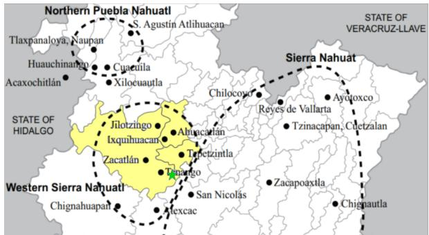
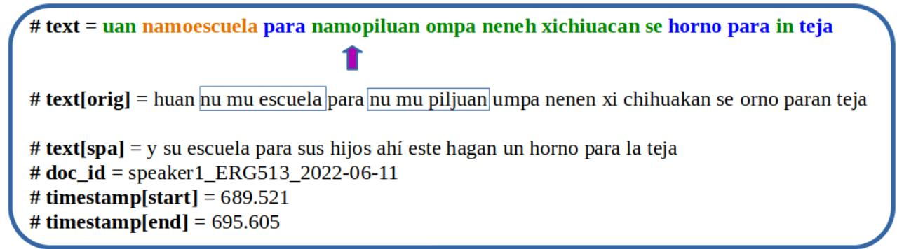
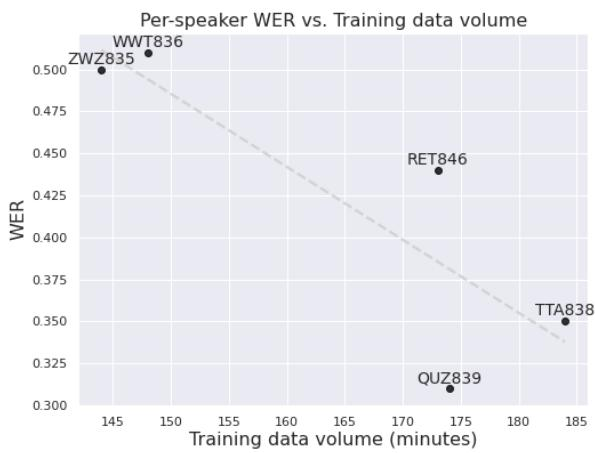

# Ihquin tlahtouah in Tetelahtzincocah: An annotated, multi-purpose audio and text corpus of Western Sierra Puebla Nahuatl

Robert Pugh♢,♣\*, Cheyenne Wing♠, María Ximena Juárez Huerta♣, Ángeles Márquez Hernández♣, Francis Tyers♢,♣

♢Indiana University, Bloomington ♣Kaltepetlahtol, A.C. ♠University of Arizona

## Abstract

The development of digital linguistic resources is essential for enhancing the inclusion of indigenous and marginalized languages in the digital domain. Indigenous languages of Mexico, despite representing vast typological diversity and millions of speakers, have largely been overlooked in NLP until recently. In this paper, we present a corpus of audio and annotated transcriptions of Western Sierra Puebla Nahuatl, an endangered variety of Nahuatl spoken in Puebla, Mexico. The data made available in this corpus are useful for ASR, spelling normalization, and word-level language identification. We detail the corpus-creation process, and describe experiments to report benchmark results for each of these important NLP tasks. The corpus audio and text is made freely available.1

## 1 Introduction

Data-driven approaches in NLP can offer a multitude of benefits to speakers and linguists, but the quality and availability of these technologies is largely influenced by the availability of linguistically-annotated data for training. To that end, we present a multi-purpose audio and text corpus for an endangered variety of Nahuatl that can be used to facilitate research on language technology, particularly research focused on automatic speech recognition, spelling normalization, and the analysis of language contact phenomena.

Western Sierra Puebla Nahuatl (Náhuatl de la Sierra Oeste de Puebla, also called Zacatlán-Ahuacatlán-Tepetzintla Nahuatl, ISO-639: nhi), spoken by 17,100 speakers in Puebla, Mexico, is one of the 30 formally-recognized Nahuatl varieties spoken today. It is considered endangered, with many communities seeing a loss or significant reduction in inter-generational transmission (INALI, 2009).

  
Figure 1: A map of Puebla’s Sierra Norte, a mountainous region in the north of the state of Puebla, home to numerous indigenous languages, including three Nahuatl varieties. The three municipalities corresponding to the Nahuatl variety of our corpus, nhi or Western Sierra Nahuatl, is highlighted in Yellow, with a green star in the approximate location of the town of Tetelancingo. Adapted from Sasaki (2015).

## 1.1 Nahuatl writing

From the early years of the Spanish invasion and the subsequent colonization of Mexico, a system was developed for writing the Nahuatl language using the Latin alphabet. Given their long written tradition via hieroglyphic writing, Nahuas largely took to the new writing system, and over the last 500 years a voluminous canon of Nahuatl texts have been produced. Written Nahuatl was never strictly standardized, as evidenced by the large amount of orthographic variability in early colonial texts.

Since then, multiple orthographic standards have been proposed for writing Nahuatl, though there is much disagreement about standardization and orthographic norms (de la Cruz Cruz, 2014).

One nhi-speaking town, San Miguel Tenango (Zacatlán municipality), developed a local written standard (henceforth “SMT Orthography") in conjunction with the Summer Institute of Linguistics (Márquez Hernández and Schroeder, 2005; Schroeder and Márquez Hernández, 2007), and has produced a small number of publications using it, including a translation of the New Testament, In Yancuic Tlahtolsintilil.2 These publications constitute most of the written material produced in this Nahuatl variety.

## 1.2 Language contact

Language contact has played an enormous role in the shaping of the vocabulary and numerous other linguistic characteristics of Nahuatl today.

Since the invasion of Mexico in the 16th Century by the Spanish, Nahuatl and Spanish have existed in close contact with one another, resulting both in extensive “material borrowing" (Matras and Sakel, 2007) such as loanwords3 and new phonemes, but also a non-trivial amount of morphosyntactic “pattern borrowing" including syntactic calques, such as a development of the periphrastic future or the development of adpositions from relational nouns (Farfán, 2008; Olko et al., 2018).

The rate of bilingualism among speakers is also quite high, and as a result code-switching and translanguaging, in addition to the aforementioned abundance of loanwords, is prevalent in Nahuatl speech, with the frequency of code-switching varying by speaker, register, and community (MacSwan, 2000; Petrovic´, 2016).

## 2 Related work

Even though Nahuatl is perhaps the most researched and well-documented indigenous language of the Americas, only recently has it begun receiving attention in the NLP community.

The release of the Axolotl corpus (Gutierrez-Vasques et al., 2016) marked an important milestone in Nahuatl NLP, making tens of thousands of parallel Nahuatl-Spanish sentences, from diverse sources and multiple Nahuatl varieties, available to MT researchers in machine-readable format. Since then, Nahuatl has consistently been included in the AmericasNLP shared task of open MT (Mager et al., 2021; Ebrahimi et al., 2023). Amith et al. (2019) released a large corpus of transcribed and translated speech of the Highland Puebla variety, which has been used for developing ASR (Shi et al., 2021) and Speech-to-text translation (Amith et al.,

2021). A subset of these transcriptions, in addition to other Highland Puebla Nahuatl texts, were annotated for morphosyntactic information in the form of a UD treebank (Pugh and Tyers, 2024).

The nhi Nahuatl variety has also been the focus of NLP resource and tool development, with the release of a morphological analyzer (Pugh and Tyers, 2021) and a 10,000-token UD treebank (Pugh et al., 2022).

Low-resource ASR capabilities have improved greatly with the ability to fine-tuned large, pretrained models such as Wav2Vec (Schneider et al., 2019) and Wav2Vec 2.0 (Baevski et al., 2020). The recent Massively Multilingual Speech (MMS) project offers a large multilingual speech model (Pratap et al., 2024) trained on data from over a thousand languages.

Text normalization is a valuable upstream task in NLP. Automatic orthographic normalization can be useful in digital archive creation (Rubino et al., 2024; Tyers et al., 2023), for OCR post-processing (Srigiri and Saha, 2020), and syntactic parsing (Pugh et al., 2022), among other tasks. Furthermore, spell-correction systems may be useful for encouraging language learning and literacy for endangered languages (Arppe et al., 2016; Oncevay et al., 2022).

The most successful approaches to orthographic normalization typically leverage character-based machine translation techniques (Lusetti et al., 2018; Bollmann, 2019). Text-to-text transformer (T5) (Raffel et al., 2020) model have recently been used successfully on the task of spelling normalization (Ramaneedi and Pati, 2023; Al-Qaraghuli and Jaafar, 2024). Since it is uncommon to have a large corpus of corrected spelling errors, particularly in the case of endangered languages, synthetic errors can be leveraged for fine-tuning such a transformer model (Etoori et al., 2018; Jayanthi et al., 2020).

Automatic language identification in languagecontact settings has been an area of interest for many NLP researchers over the last decade, notably with multiple iterations of the “Language Identification in Code-Switched Data" shared task (Solorio et al., 2014; Molina et al., 2016), which included code-switching datasets from a number of language pairs. These tasks, as well as a more recent shared task on Guaraní-Spanish code-switching analysis (Chiruzzo et al., 2023), are closely-aligned with the language identification task and data described in this paper for the Nahuatl-Spanish language pair.4 A different but related task is that of subword-level language identification, which was explored for Spanish and Wixarika, an indigenous language of Mexico, by Mager et al. (2019).

  
Figure 2: An illustration of an annotated sentence. The text field’s color-coded words corresponds to the language identification tags (green=nhi, blue=spa, orange=mixed). In the actual dataset, each of these metadata blocks is followed by a list of the tokens with their language labels. The text[orig] field corresponds to the unnormalized version of the transcription. The doc\_id identifies the filename of the corresponding wav file, and the timestamp fields indicate at what point in the audio the utterance takes place.

For word-level language identification, CRF and LSTM-CRF were most common in the first two shared tasks. More recently, pre-trained multilingual language models such as mBERT (Devlin et al., 2018) have been successfully leveraged for a variety of NLP tasks, including code-switched language identification (Pugh and Tyers, 2023).

The language identification task in our corpus also labels adapted loanwords. Ali et al. (2024) explore loanword detection for a low-resource language pair. Álvarez-Mellado and Lignos (2022) released a corpus of Spanish annotated for loanwords and investigated a number of sequence tagging models’ performance on loanword identification.

## 3 Corpus creation

The corpus originated as a set of fieldwork recordings initially collected as part of an NSF-funded project5, but were excluded from the project due to their their largely-conversational nature and frequent language mixing and code-switching with

<table><tr><td></td><td>Sents</td><td>Words</td><td>Type/Token</td></tr><tr><td>Norm.</td><td>2,681</td><td>26k</td><td>0.19</td></tr><tr><td>Orig.</td><td>2,681</td><td>31k</td><td>0.15</td></tr></table>

Table 1: A table of basic corpus statistics, comparing the original and normalized transcriptions.

Spanish.

The resulting transcriptions make up 2,681 sentences consisting of 26,023 tokens. Each sentence also has a corresponding normalized version, a Spanish translation, and word-level language annotations on the normalized version.

## 3.1 Transcription and translation

In total, there are 3 hours and 24 minutes of audio. The corpus contains recordings from 5 distinct speakers, 3 women and 2 men, the youngest of which was in their 20s and the oldest in their 80s. 3 of the 4 speakers were born and raised in the town of Tetelancingo, Zacatlán, Puebla, with one speaker from a neighboring town.

The recordings consist of free-form dialogues and monologues about daily activities or specific local knowledge topics (e.g. the founding and history of the town).

The original transcriptions for all of the audio was performed by the third author, a native speaker of nhi, using ELAN (Wittenburg et al., 2006). They were then processed and edited collaboratively with other members of the project, as described in Section 3.2. People’s names were replaced with other common names in the transcriptions to avoid personally-identifying individuals.

## 3.2 Transcription normalization

Given that there is no agreed-upon written standard for Nahuatl, and the fact that the project’s transcriber has not received formal literacy instruction in Nahuatl, the transcriptions are provided in an orthography that they were most comfortable with, and does not follow any particular standard, nor is necessarily consistent throughout the corpus. In addition to the transcriber’s orthographic choices, there are also a number of typos and misspellings. The transcriptions in our corpus likely reflect the writing of many literate (in Spanish) Nahuatl speakers.

While we are not by any means suggesting that it is the place of linguists to encourage specific writing practices among speakers, there are tangible advantages to having an orthographically-consistent database of transcriptions, such as making search and analysis significantly more straightforward. Furthermore, in the case of Western Sierra Puebla Nahuatl, the existence of a local community standard (SMT orthography) may be a good starting point for speakers who wish to model their writing on such standardized orthographic rules. In our corpus, we therefore explore automatic spelling normalization, providing both the original transcriptions as well as a version that has been normalized to the SMT orthography.

The process of creating the normalized transcriptions involved multiple steps: first, the first author made a first pass at manual normalization based on published works using SMT Orthography. Then, the fourth author, a native-speaker who has received formal instruction in the SMT Orthography, worked with the third author (the original transcriber) to make additional edits to ensure the transcriptions fit the standard as closely as possible.

We observe a few trends in the orthography employed in the original transcriptions. They do not follow the common standard for what constitutes an orthographic word, frequently (though not entirely consistently) tokenizing subject and object prefixes from a verb stem or the possessive prefix from a noun stem, or concatenating two syntactic words into a single orthographic word (e.g. ichin vs. ich in).

## 3.3 Annotating for language contact phenomena

As a result of the close contact between Nahuatl and Spanish over five centuries, there are a variety of language-contact phenomena worth studying in any collection of Nahuatl speech. This can range from vocabulary items (borrowings) to syntactic convergence. To help facilitate this research, we label each word based roughly on its language of origin or status as a named entity. The complete set of labels with descriptions and examples is found in Table 3.

The first author manually annotated the entire dataset using the open-source annotation tool doccano (Nakayama et al., 2018). As a quality check, the last author also annotated a random selection of 10% of the sentences. The two sets of annotations agreed on over 95% of cases, and many of the disagreements were due to incidental mistakes by either annotator. The remaining differing annotations were decided on via discussion. For example, one question that arose was whether the word tons, a shortened form of the Spanish entonces “then", should be labeled as asl or spa. After consulting Soler Arechalde (2020), which identifies tons as one of the many shortened variations of entonces in Mexican Spanish, we agreed to annotate it as spa. Another example of such a disagreement was about whether to annotate the word den, (a shortening of the Spanish word de “of/from" concatenated with the Nahuatl word in, an article or subordinator) as mixed or asl. We settled on the former, since it contains material from both languages.

The final annotated corpus consists of the collected audio files and a set of corresponding .conll files, containing the original and normalized texts, corresponding audio file name, and start and stop timestamps in the metadata (shown in Figure 2, where we have color-coded the text metadata field instead of listing the tokens and annotations one per line as they are in the files), followed by the sentence tokens with their language tags.

## 4 Experiments and benchmarks

In this section we describe experiments and results to provide a benchmark for each task.

## 4.1 ASR

Since the advent of large-scale unsupervised pretraining of audio, passable ASR performance can be achieved by training on a relatively small amount of transcribed audio. We explore lowresource ASR for nhi using our corpus, keeping 3 hours of speech for training and holding out approximately a half-hour for evaluation (this split corresponds to one of the ten folds used in the other experiments). We leverage MMS-1B base model from the Massively Multilingual Speech (MMS) project (Pratap et al., 2024), which the authors claim is capable of performing ASR, TTS, and language ID for over 1,000 languages, including nhi. The nhi training data comes from an audio Bible.6

<table><tr><td>Original</td><td>SMT</td><td>Translation</td></tr><tr><td>nuchi ki kuhuah huehka, huan patillo</td><td>nochi quicoah uehca, uan patiyoh</td><td>“They buy everything far away and expensive.&quot;</td></tr><tr><td>ken kachi se tlejco para tlakpak ichin tipetl</td><td>quen cachi setlehco para tlac- pac ich in tipetl</td><td>“as we continue ascending on the hill&quot;</td></tr><tr><td>i ixkon tle cumpa</td><td>iixcon tlen ic ompa</td><td>“In front of there&quot;</td></tr></table>

Table 2: Examples of the original and normalized orthographies (in the SMT Orthography) contained in the corpus. Note the use of different letters (e.g. k vs. c and qu) and word tokenization decisions (e.g. ki kuhuah vs. quicoah and ichin vs. ich in.
<table><tr><td>Label</td><td>Description</td><td>Example</td><td>N</td><td>%</td></tr><tr><td>nhi</td><td>Nahuatl word</td><td>otinechnonotz “You spoke to me.&quot;</td><td>18,170</td><td>70</td></tr><tr><td>spa</td><td>Spanish word</td><td>durazno “peach&quot;, cuando “when&quot;</td><td>6,002</td><td>23</td></tr><tr><td>mixed</td><td>Word with nhi &amp; spa morphemes</td><td>tiestudiarosqueh “We will study&quot;</td><td>701</td><td>3</td></tr><tr><td>asl</td><td>Phonologically-adapted Spanish loan</td><td>xapohtl “jabón&quot;, quemeh “como&quot;</td><td>400</td><td>2</td></tr><tr><td>person</td><td>Proper name of a person.</td><td>Adán, Aureliahtzin</td><td>334</td><td>1</td></tr><tr><td>place</td><td>Proper name of a location.</td><td>Zacatlán, Sempoaltepec</td><td>217</td><td>0.8</td></tr><tr><td>intj</td><td>An interjection or disfluency.</td><td>ay, eh</td><td>194</td><td>0.7</td></tr><tr><td>org</td><td>Company or product name.</td><td>YouTube, La Rosa de Guadalupe</td><td>5</td><td>0.01</td></tr></table>

Table 3: An overview of the language identification labels used. We assign the nhi label to any Nahuatl word not of Spanish origin (i.e. it may also include words loaned from other Mesoamerican languages). The spa label is used both for Spanish loanwords that have not been changed phonologically, as well as for Spanish words used in code-switched sequences. mixed words can be any combination of Spanish and Nahuatl morphemes, but frequently occur in our corpus as a Spanish Noun or Verb stem with Nahuatl inflectional morphology. Note that a word’s belonging to the asl class may not always be clear, particularly if the phonological change is substantial. We labeled these words to the best of our abilities, consulting with speaker’s intuitions and research on linguistic contact in Nahuatl (Hill and Hill, 1986; Karttunen and Lockhart, 1976). person words may also contain some Spanish nominal morphology, such as the diminutive/reverential suffix (as in the example above Aureliahtzin “honorable Aurelia") or a possessive prefix noVale “My Valeria".

We first evaluate the performance of the off-theshelf MMS model without fine-tuning. Next, we fine-tune the MMS model on the training data. We use adapter-layer fine-tuning (Houlsby et al., 2019), which reduces the necessary compute resources for fine-tuning large models. We train the adapterlayers for 100 epochs, reporting the epoch with the best test-performance.7 We also perform the same fine-tuning procedure using the original transcriptions, to get a sense of how difficult it would be to accommodate a non-standard, occasionally inconsistent orthography.

Results & analysis The results of the ASR experiments are listed in Table 4. performance of the off-the-shelf MMS model is underwhelming, with a word error rate of over 70% and a character error rate of 25%. Upon further observation, we find that this model tends to produce phonotacticallyplausible nhi-words and many actual nhi words, but often concatenates adjacent words (e.g. moprestarouica instead of moprestaroua ica, “It lends itself to..." ). We also find a number of errors in mixed-language words (e.g. lomojosgado instead of namojuzgado, “your (pl.) court", and negaluilia vs. negaruilia, “To deny someone something").

It is also worth pointing out that some of the errors identified are due simply to dialect-internal variation: The Bible in the MMS training data is written in the nhi as spoken in the town of San Miguel Tenango, where subject prefixes can in many contexts be realized as “inverted" or “metathetic" compared to surrounding nhi communities such as that of our corpus, Tetelancingo (Schroeder and Tuggy, 2010). We see some errors due to the model generating, e.g., a verb with the inverted second-person subject prefix it- instead of ti-, as it occurs in our corpus.

After fine-tuning this model on just 3 hours, we see a significant performance improvement, with WER and CER dropping to about half their values with the off-the-shelf MMS model. However, these numbers may be slightly inflated, given that the train and test data were split at the sentence level instead of the document/dialogue level. As such, there is certainly more vocabulary overlap than if the partitions were made at the document level, not to mention speaker overlap. Fine-tuning on

<table><tr><td>Exp.</td><td>WER CER</td></tr><tr><td>MMS off-the-shelf</td><td>0.71 0.25</td></tr><tr><td>nhi fine-tuned</td><td>0.38 0.12</td></tr><tr><td>nhi non-normalized</td><td>0.41 0.12</td></tr></table>

Table 4: The results of different ASR experiments on the corpus. For the nhi experiment, we evaluate finetuning the base MMS model via adapter layers on 3 hours of nhi audio.

the original, nonnormalized transcripts produced a model whose performance was not much worse than when learning to transcribe the normalized orthography. This suggests that, while the orthography in the original transcriptions may not adhere to any particular writing standard, it does contain some internal consistency and lends itself to modeling. Perhaps a future line of research could investigate the potential to leverage adapter fine-tuning to enable an ASR model to output any given individual’s preferred orthographic patterns with a small amount of their written text.

## 4.2 Heldout speaker analysis

One limitation of our approach to ASR analysis is that, due to the limited volume of data, the same speakers appear in both train and test datasets (different utterances). To get an idea of how well our model would perform on an unseen speaker, we also perform heldout speaker experiments, where for each of the five speakers, we train a model on the remaining four and evaluate on the heldout speaker. The results are presented in Table 5. Not all speakers are equally represented in the dataset, so in addition to unseen-speaker performance, these results also reflect the resultant training data size after removing a given speaker. Figure 3 shows the relationship between performance and the volume of training data.

<table><tr><td>Speaker ID</td><td>WER</td><td>CER</td><td>Train dur.</td></tr><tr><td>ZWZ835</td><td>0.50</td><td>0.15</td><td>2hr 24min</td></tr><tr><td>WWT836</td><td>0.51</td><td>0.16</td><td>2hr 28min</td></tr><tr><td>TTA838</td><td>0.35</td><td>0.10</td><td>3hr 4min</td></tr><tr><td>RET846</td><td>0.44</td><td>0.11</td><td>2hr 53min</td></tr><tr><td>QUZ839</td><td>0.31</td><td>0.08</td><td>2hr 54min</td></tr><tr><td>Avg.</td><td>0.42</td><td>0.12</td><td>2hr 45min</td></tr></table>

Table 5: Evaluation metrics for the held-out speaker experiments. The average error is higher than the performance reported in Table 4. This suggests that, intuitively, having seen speakers in training improves performance on test data with the same speakers. However, part of this decreased performance may be the result of simply reducing the training data size. In fact, some of the held-out speaker experiments with the equivalent training data volume show better performance than the overall results, suggesting that training data size is perhaps more important than having seen a speaker during training.

There is an apparent correlation between training data size and performance on a held-out speaker, with the two most prevalent speakers in the corpus (those who left the least amount of training data) having the highest error rates. Two of the three speakers who, when removed, left approximately 3 hours of training data (the same amount that was used in experiments in Table 4), show better error rates than the overall fine-tuned performance in Table 4. This pattern appears to deviate for two cases: speakers RET846 and QUZ839 have approximately the same amount of training data, yet the model performance is much worse (more than 10 points) for speaker RET846. This discrepancy may be due to age, since the latter speaker is the oldest in our corpus, substantially older than the remaining four. This observation underscores the need for diverse representation across age groups to enhance the model’s generalizability on other speakers.

  
Figure 3: A plot of the ASR model’s performance on held-out speakers as a function of training data volume. The apparent negative correlation suggests that having more training data (even on unseen speakers) improves the WER of unseen speakers’ speech.

## 4.3 Spelling normalization

The normalization of transcriptions is moststraightforwardly framed as a sequence-tosequence (Seq2Seq) task. We use a “text-to-text transformer (T5)" model (Raffel et al., 2020) for this task. Additionally, we test how GPT-4o performs the task using few-shot, in-context learning.

<table><tr><td>Exp.</td><td>WER CER</td></tr><tr><td>Default</td><td> $0 . 7 \pm 0 . 0 1$   $0 . 2 4 \pm 0 . 0 1$ </td></tr><tr><td>baseT5+bible+ft</td><td> ${ \bf 0 . 1 6 \pm 0 . 0 1 }$   ${ \bf 0 . 0 4 \pm 0 . 0 0 }$ </td></tr><tr><td>IndT5+bible+ft</td><td> $0 . 2 0 \pm 0 . 0 1$   $0 . 0 7 \pm 0 . 0 1$ </td></tr><tr><td>GPT-40</td><td> $0 . 7 3 \pm 0 . 0 4$   $0 . 1 8 \pm 0 . 0 2$ </td></tr></table>

Table 6: Results on the Spelling Normalization task, averaged over 10 folds (the standard deviation is also included). “Default" refers to the error rates if we leave the input unchanged (e.g. the error rate of the original text compared to the normalized text). The two T5 experiments are fine-tuned twice, once on the Bible with synthetic errors, and again on the training data.

Since, in the context of sentence-level seq2seq tasks, the data volume in our corpus is relatively small, we leverage external resources to improve model performance when trained on our data. First, in one experiment, we test the IndT5 model (Nagoudi et al., 2021), which was fine-tuned on a number of languages of the Americas, including some varieties of Nahuatl.8 Second, we leverage the translation of the New Testament into nhi, scraped from the web.

We introduce synthetic errors to the Bible text randomly and fine-tune the transformer model to correct them. The synthetic errors are: deletion (removing a character), insertion (adding an additional character), transposition (swapping the order of two adjacent characters), substitution (replacing one character for another), word fusing (removing the space between two words), and word splitting (inserting a space into a word). Each sentence received one synthetic error type, generated in a random location within the sentence. These error types were evenly distributed across the text.

The resulting model is then further fine-tuned on the training data from our corpus.9 For a more robust and representative evaluation of model performance, we perform 10-fold cross validation.

We also explore few-shot, in-context learning on the spelling normalization task, using the GPT-4o model, in order to better understand LLM behavior on real-world linguistic annotation for a language that is certainly underrepresented in training data.

Two main sources were used as references for prompt composition: OpenAI (2024)10 and Bsharat et al. (2023). For each fold, the prompt includes five examples randomly selected from the training set for each fold. The Prompt for the spelling normalization is found in Appendix A.

Results & analysis Results for all experiments can be seen in Table 6. We compare the models to a “Default" baseline, which is simply the word- and character-error rates of the original text compared to the normalized text.

Both t5 experiments, which are first fine-tuned on the Bible with synthetic errors, and then finetuned on the corpus data, significantly outperform the “Default" baseline, while still leaving some room for improvement (the best system still has a WER of 16%). Interestingly, the base model outperforms the IndT5 model, despite the latter being trained with Nahuatl data, among other indigenous languages of the Americas. We suspect this poorer performance from the indigenous-languages model, despite having language-specific training data, may be due to the quality of the training data and the fact that the set of languages it was trained on, though all indigenous languages of the Americas, are neither related genetically nor via contact.

The performance of the few-shot, in-context learning for this task was poor. In fact it resulted in a lower WER than the “Default" baseline (i.e. it was worse than doing nothing to the original transcriptions), and only a slightly better CER. We observe the model apparently identifying misspellings and orthographic issues where there are none, and in turn introducing additional errors to the original text.

While GPT-4o was trained on at least some Nahuatl text, much (perhaps most) of the Nahuatl text available online is either in the historical variety (often called “Classical Nahuatl"), or alternatively may be written by non-native speaker enthusiasts. As an interesting related anecdote, during one of the runs using GPT-4o for spelling normalization, the output used the macron symbol over a number of vowels. This reflects an academic orthographic style, e.g. that used by Launey and Mackay (2011), wherein the macron is used to represent long vowels, that is inconsistent with the SMT orthography (and virtually all contemporary Nahuatl orthographies).

These results align with observations made in McCoy et al. (2024) that, on low-probability tasks and/or low-probability inputs (both of which hold in our case), LLMs are biased towards the output with the highest unconditional probability. In our case, the model selects text that may have a high frequency (relative to other texts conditioned on a prompt about Nahuatl) in its training data, regardless of whether this text truly satisfies the prompt’s request. We acknowledge that ours is but a preliminary effort with respect to using LLMs for lowresource spelling normalization, and recognize the possibility that performance could improve with more rigorous prompt engineering.

## 4.4 Language identification

The ability to automatically annotate words in transcriptions for language identification could be useful in language documentation scenarios and quantitative linguistic analysis, particularly if paired with, e.g., a syntactically annotated corpus.

We use the MaChAmp toolkit (van der Goot et al., 2021) with default hyperparameter settings, to fine-tune contextual subword embeddings from a few different pretrained transformer language models, with a softmax layer for word-level classification. Our motivation for this approach is the generally high-performance achieved on a diverse set of NLP tasks via fine-tuning pretrained language models, as well as the first-place submission to the “IberLEF2023 Shared Task on Guarani-Spanish Code Switching Analysis" (Pugh and Tyers, 2023). We experiment with multilingual BERT (Devlin et al., 2018), the base T5 (Raffel et al., 2020) model, and IndT5 (Nagoudi et al., 2021), a fine-tuned t5 model trained on data from a number of indigenous languages of the Americas (including some Nahuatl). Finally, we explore LLM in-context learning with GPT-4o (Prompt in Appendix B).

Results & analysis Table 7 shows the performance of the three transformer-based taggers and the few-shot LLM experiment. In the analysis, we decided to ignore the org label. It only covers 5 words in the entire corpus and many folds had no instances of this label in the training partition, which resulted in artificially low averages and high variation in the 10-fold analysis. Results on this task are generally quite good for the finetuned transformers, with all three models tested achieving a macro-f1 score of 0.96 or greater. The three pretrained transformers yield similar results. As with the spelling normalization task, we don’t observe any advantage to using the indigenousspecific IndT5 model over the base model.

The few-shot in-context learning with GPT-4o performs only slightly worse than the other three models for the most frequent labels, nhi and spa, but appears to struggle to identify mixed words. This technique for word-level tagging also presented an added challenge: On generating the output text with corresponding word-labels, in some cases the words in the model output were different than those in the input (e.g. input: otiahsiqueh, output: otiahsiquih) or split a single word into two (e.g. input: ocsipa, output: oc, sipa.) Thus the model output may require some manual post-processing.

## 5 Concluding remarks and future work

We describe the release of an open-source, multiuse, audio and text corpus of the Western Sierra Puebla variety of Nahuatl. In addition to providing details about building and annotating the corpus, we also demonstrate how the corpus can be used for three NLP tasks: ASR, Spelling Normalization, and Language Identification. We report on benchmarks that leverage multilingual pretrained models, as well as few-shot, in-context learning with GPT-4o.

<table><tr><td></td><td></td><td>nhi</td><td>spa</td><td>mixed</td><td>asl</td><td>person</td><td>place</td><td>intj</td><td>macro</td></tr><tr><td rowspan="3">mBERT</td><td>Prec</td><td> $0 . 9 9 \pm 0 . 0$ </td><td> $0 . 9 8 \pm 0 . 0 1$ </td><td> $0 . 9 7 \pm 0 . 0 2$ </td><td> $0 . 9 8 \pm 0 . 0 1$ </td><td> $0 . 9 7 \pm 0 . 0 3$ </td><td> $0 . 9 7 \pm 0 . 0 3$ </td><td> $1 . 0 \pm 0 . 0$ </td><td> $0 . 9 8 \pm 0 . 0 1$ </td></tr><tr><td>Rec</td><td> $0 . 9 9 \pm 0 . 0$ </td><td> $0 . 9 8 \pm 0 . 0 1$ </td><td> $0 . 9 2 \pm 0 . 0 2$ </td><td> $0 . 9 8 \pm 0 . 0 1$ </td><td> $0 . 9 8 \pm 0 . 0 2$ </td><td> $0 . 9 7 \pm 0 . 0 4$ </td><td> $0 . 9 8 \pm 0 . 0 3$ </td><td> $0 . 9 7 \pm 0 . 0 1$ </td></tr><tr><td>F1</td><td> $0 . 9 9 \pm 0 . 0$ </td><td> $0 . 9 8 \pm 0 . 0 1$ </td><td> $0 . 9 5 \pm 0 . 0 2$ </td><td> $0 . 9 8 \pm 0 . 0 1$ </td><td> $0 . 9 7 \pm 0 . 0 1$ </td><td> $0 . 9 7 \pm 0 . 0 2$ </td><td> $0 . 9 9 \pm 0 . 0 1$ </td><td> $0 . 9 7 \pm 0 . 0 1$ </td></tr><tr><td rowspan="3">IndT5</td><td>Prec</td><td> $0 . 9 9 \pm 0 . 0$ </td><td> $0 . 9 8 \pm 0 . 0 1$ </td><td> $0 . 9 6 \pm 0 . 0 3$ </td><td> $0 . 9 8 \pm 0 . 0 1$ </td><td> $0 . 9 7 \pm 0 . 0 3$ </td><td> $0 . 9 7 \pm 0 . 0 3$ </td><td> $1 . 0 \pm 0 . 0$ </td><td> $0 . 9 8 \pm 0 . 0 1$ </td></tr><tr><td>Rec</td><td> $0 . 9 9 \pm 0 . 0$ </td><td> $0 . 9 7 \pm 0 . 0 1$ </td><td> $0 . 8 9 \pm 0 . 0 4$ </td><td> $0 . 9 8 \pm 0 . 0 2$ </td><td> $0 . 9 7 \pm 0 . 0 2$ </td><td> $0 . 9 4 \pm 0 . 0 6$ </td><td> $0 . 9 6 \pm 0 . 0 3$ </td><td> $0 . 9 5 \pm 0 . 0 1$ </td></tr><tr><td>F1</td><td> $0 . 9 9 \pm 0 . 0$ </td><td> $0 . 9 8 \pm 0 . 0 1$ </td><td> $0 . 9 2 \pm 0 . 0 3$ </td><td> $0 . 9 8 \pm 0 . 0 1$ </td><td> $0 . 9 7 \pm 0 . 0 2$ </td><td> $0 . 9 5 \pm 0 . 0 3$ </td><td> $0 . 9 8 \pm 0 . 0 1$ </td><td> $0 . 9 6 \pm 0 . 0 1$ </td></tr><tr><td rowspan="3">t5-base</td><td>Pre</td><td> $0 . 9 9 \pm 0 . 0$ </td><td> $0 . 9 7 \pm 0 . 0 1$ </td><td> $0 . 9 6 \pm 0 . 0 2$ </td><td> $0 . 9 9 \pm 0 . 0 1$ </td><td> $0 . 9 6 \pm 0 . 0 5$ </td><td> $0 . 9 8 \pm 0 . 0 3$ </td><td> $1 . 0 \pm 0 . 0$ </td><td> $0 . 9 7 \pm 0 . 0 1$ </td></tr><tr><td>Rec</td><td> $0 . 9 9 \pm 0 . 0$ </td><td> $0 . 9 7 \pm 0 . 0 1$ </td><td> $0 . 8 8 \pm 0 . 0 4$ </td><td> $0 . 9 8 \pm 0 . 0 2$ </td><td> $0 . 9 7 \pm 0 . 0 2$ </td><td> $0 . 9 4 \pm 0 . 0 6$ </td><td> $0 . 9 5 \pm 0 . 0 4$ </td><td> $0 . 9 5 \pm 0 . 0 1$ </td></tr><tr><td>F1</td><td> $0 . 9 9 \pm 0 . 0$ </td><td> $0 . 9 7 \pm 0 . 0 1$ </td><td> $0 . 9 2 \pm 0 . 0 1$ </td><td> $0 . 9 9 \pm 0 . 0 1$ </td><td> $0 . 9 6 \pm 0 . 0 3$ </td><td> $0 . 9 6 \pm 0 . 0 4$ </td><td> $0 . 9 7 \pm 0 . 0 2$ </td><td> $0 . 9 6 \pm 0 . 0 1$ </td></tr><tr><td rowspan="3">GPT-40</td><td>Pre</td><td> $0 . 9 4 \pm 0 . 0 1$ </td><td> $0 . 9 2 \pm 0 . 0 2$ </td><td> $0 . 8 7 \pm 0 . 1 3$ </td><td> $0 . 6 5 \pm 0 . 2$ </td><td> $0 . 9 3 \pm 0 . 0 6$ </td><td> $0 . 9 3 \pm 0 . 0 5$ </td><td> $0 . 9 3 \pm 0 . 1$ </td><td> $0 . 8 8 \pm 0 . 0 5$ </td></tr><tr><td>Rec</td><td> $0 . 9 7 \pm 0 . 0 1$ </td><td> $0 . 9 3 \pm 0 . 0 2$ </td><td> $0 . 1 2 \pm 0 . 0 7$ </td><td> $0 . 4 4 \pm 0 . 1$ </td><td> $0 . 9 4 \pm 0 . 0 5$ </td><td> $0 . 9 3 \pm 0 . 0 6$ </td><td> $0 . 8 7 \pm 0 . 1 1$ </td><td> $0 . 7 4 \pm 0 . 0 4$ </td></tr><tr><td>F1</td><td> $0 . 9 6 \pm 0 . 0 1$ </td><td> $0 . 9 3 \pm 0 . 0 2$ </td><td> $0 . 1 9 \pm 0 . 1 1$ </td><td> $0 . 5 1 \pm 0 . 1 2$ </td><td> $0 . 9 3 \pm 0 . 0 3$ </td><td> $0 . 9 3 \pm 0 . 0 4$ </td><td> $0 . 8 9 \pm 0 . 0 8$ </td><td> $0 . 7 6 \pm 0 . 0 4$ </td></tr></table>

Table 7: Results of 10-fold cross validation on word-level Language Identification, comparing three different pretrained language models and an in-context learning approach using GPT-4o. With respect to the pretrained transformer models, we find that, despite the IndT5 model being previously fine-tuned specifically on indigenous languages of the Americas (including Nahuatl), it is at best comparable to multilingual BERT on this task, and has essentially the same performance as the base t5 model. GPT-4o performs only marginally worse than the other models for some labels, e.g. nhi and spa, but significantly underperforms for other labels (e.g. asl). For all analyses in this table, we ignore the org label. Since it appears in only 2 sentences, it is not present in the training data for some folds and as such has an out-sized effect on the macro metrics.

For ASR, we show that a mere 3 hours of transcribed audio drastically improves the performance of an off-the-shelf multilingual model. For the Spelling Normalization and Language Identification tasks, we find that fine-tuning pretrained transformer models on a relatively small (around 2,000 sentences) training set outperforms the prompted LLM model, though we note room for potential improvement via further prompt engineering. We also find that a T5 transformer model, specifically trained for indigenous languages of the Americas, does not provide any advantage for our two textbased tasks, and for spelling normalization, in fact performs notably worse. This finding suggests a need for an alternative approach to improving pretrained language models for indigenous languages.

different varieties. Therefore, there exists a risk that the results we report on in this paper do not generalize even to other nearby communities, let alone to Nahuatl data from other varieties.

In the future, we plan to add to this corpus by automating a large part of the annotation process on additional recordings and/or nhi transcriptions.

Our transformer-based experiments were trained until an apparent flattening of the dev loss, but due to resource constraints, we could not evaluate the impact of further training.

All of our experiments were trained on machines containing between 1 and 4 large GPUs, and as such they are not practically reproducible for individuals without access to such computing resources.

Although we made an effort to construct quality prompts based on published recommendations and some iteration, we did not exhaust the prompt engineering in our LLM experiments. It is possible that the LLM experiments could yield much better results given more concerted prompt-engineering efforts.

## 6 Limitations

Our dataset comes from a small set of nhi-speakers from a single town, and cannot possibly represent the linguistic variability in all nhi communities, let alone other Nahuatl-speaking communities of

## Acknowledgments

This work was funded by National Science Foundation Proposal: #2319246/2319247, “Collaborative Research: Syntactically-annotated corpora for endangered languages in areal contact", and supported by Lilly Endowment, Inc., through its support for the Indiana University Pervasive Technology Institute. We thank the anonymous reviewers, as well as our friend Daniel Swanson, for their helpful feedback.

## References

Mohammed Al-Qaraghuli and Ola Arif Jaafar. 2024. ARABIC SOFT SPELLING CORRECTION WITH T5. Jordanian Journal of Computers and Information Technology (JJCIT), 10(01).

Felermino Dario Mario Ali, Henrique Lopes Cardoso, and Rui Sousa-Silva. 2024. Detecting loanwords in emakhuwa: An extremely low-resource Bantu language exhibiting significant borrowing from Portuguese. In Proceedings of the 2024 Joint International Conference on Computational Linguistics, Language Resources and Evaluation (LREC-COLING 2024), pages 4750–4759, Torino, Italia. ELRA and ICCL.

Elena Álvarez-Mellado and Constantine Lignos. 2022. Detecting unassimilated borrowings in Spanish: An annotated corpus and approaches to modeling. In Proceedings of the 60th Annual Meeting of the Associationfor Computational Linguistics (Volume 1: Long Papers), pages 3868–3888, Dublin, Ireland. Association for Computational Linguistics.

Jonathan D. Amith, Amelia Dominguez Alcántara, Hermelindo Salazar Osollo, Ceferino Salgado Castañeda, and Eleuterio Gorostiza Salazar. 2019. Audio corpus of Sierra Nororiental and Sierra Norte de Puebla Nahuat(l) with accompanying time-code transcriptions in ELAN.

Jonathan D. Amith, Jiatong Shi, and Rey Castillo García. 2021. End-to-end automatic speech recognition: Its impact on the workflowin documenting yoloxóchitl Mixtec. In Proceedings ofthe First Workshop on Natural Language Processing for Indigenous Languages of the Americas, pages 64–80, Online. Association for Computational Linguistics.

Antti Arppe, Jordan Lachler, Trond Trosterud, Lene Antonsen, and Sjur N Moshagen. 2016. Basic language resource kits for endangered languages: A case study of plains cree.

Alexei Baevski, Yuhao Zhou, Abdelrahman Mohamed, and Michael Auli. 2020. wav2vec 2.0: A framework for self-supervised learning of speech representations. Advances in neural information processing systems, 33:12449–12460.

Marcel Bollmann. 2019. A Large-Scale Comparison of Historical Text Normalization Systems. In Proceedings ofNAACL-HLT, pages 3885–3898.

Sondos Mahmoud Bsharat, Aidar Myrzakhan, and Zhiqiang Shen. 2023. Principled instructions are all you need for questioning LLama-1/2, GPT-3.5/4. arXiv preprint arXiv:2312.16171.

Luis Chiruzzo, Marvin Agüero-Torales, Gustavo Giménez-Lugo, Aldo Alvarez, Yliana Rodrıguez, Santiago Góngora, and Thamar Solorio. 2023. Overview of GUA-SPA at IberLEF 2023: Guarani-Spanish Code Switching Analysis. Procesamiento del Lenguaje Natural, 71:321–328.

Victoriano de la Cruz Cruz. 2014. La escritura náhuatl y los procesos de su revitalización. Contribution in New World Archaeology, 7:187–197.

Jacob Devlin, Ming-Wei Chang, Kenton Lee, and Kristina Toutanova. 2018. BERT: pre-training of deep bidirectional transformers for language understanding. CoRR, abs/1810.04805.

Abteen Ebrahimi, Manuel Mager, Shruti Rijhwani, Enora Rice, Arturo Oncevay, Claudia Baltazar, María Cortés, Cynthia Montaño, John E Ortega, Rolando Coto-Solano, et al. 2023. Findings of the americasnlp 2023 shared task on machine translation into indigenous languages. In Proceedings of the Workshop on Natural Language Processing for Indigenous Languages of the Americas (AmericasNLP), pages 206–219.

Pravallika Etoori, Manoj Chinnakotla, and Radhika Mamidi. 2018. Automatic spelling correction for resource-scarce languages using deep learning. In Proceedings of ACL 2018, Student Research Workshop, pages 146–152, Melbourne, Australia. Association for Computational Linguistics.

José Antonio Flores Farfán. 2008. The Hispanisation of modern Nahuatl varieties, pages 27–48. De Gruyter Mouton, Berlin, New York.

Ximena Gutierrez-Vasques, Gerardo Sierra, and Isaac Hernandez Pompa. 2016. Axolotl: a web accessible parallel corpus for spanish-nahuatl. In Proceedings of the Tenth International Conference on Language Resources and Evaluation (LREC’16), pages 4210–4214.

J. H. Hill and K. C. Hill. 1986. Speaking Mexicano: Dynamics of syncretic language in central Mexico. The University of Arizona Press.

Neil Houlsby, Andrei Giurgiu, Stanislaw Jastrzebski, Bruna Morrone, Quentin de Laroussilhe, Andrea Gesmundo, Mona Attariyan, and Sylvain Gelly. 2019. Parameter-efficient transfer learning for nlp. ArXiv, abs/1902.00751.

INALI. 2009. Catálogo De Las Lenguas Indígenas Nacionales: Variantes Lingüísticas De México Con Sus Autodenominaciones Y Referencias Geoestadísticas. Instituto Nacional de Lenguas Indígenas, México, D.F.

Sai Muralidhar Jayanthi, Danish Pruthi, and Graham Neubig. 2020. NeuSpell: A neural spelling correction toolkit. In Proceedings of the 2020 Conference on Empirical Methods in Natural Language Processing: System Demonstrations, pages 158–164, Online. Association for Computational Linguistics.

Frances E Karttunen and James Lockhart. 1976. Nahuatl in the middle years: Language contact phenomena in texts ofthe colonial period, volume 85. Univ of California Press.

M. Launey and C. Mackay. 2011. An Introduction to Classical Nahuatl. Cambridge University Press.

Massimo Lusetti, Tatyana Ruzsics, Anne Göhring, Tanja Samardžic, and Elisabeth Stark. 2018. Encoder-´ decoder methods for text normalization. Association for Computational Linguistics.

Jeff MacSwan. 2000. The architecture of the bilingual language faculty: Evidence from intrasentential code switching. Bilingualism: language and cognition, 3(1):37–54.

Manuel Mager, Özlem Çetinoglu, and Katharina Kann.˘ 2019. Subword-level language identification for intra-word code-switching. In Proceedings of the 2019 Conference ofthe North American Chapter of the Associationfor Computational Linguistics: Human Language Technologies, Volume 1 (Long and Short Papers), pages 2005–2011, Minneapolis, Minnesota. Association for Computational Linguistics.

Manuel Mager, Arturo Oncevay, Abteen Ebrahimi, John Ortega, Annette Rios Gonzales, Angela Fan, Ximena Gutierrez-Vasques, Luis Chiruzzo, Gustavo Giménez Lugo, Ricardo Ramos, et al. 2021. Findings of the AmericasNLP 2021 shared task on open machine translation for indigenous languages of the Americas. In Proceedings of the First Workshop on Natural Language Processing for Indigenous Languages of the Americas, pages 202–217.

Yaron Matras and Jeanette Sakel. 2007. Investigating the mechanisms of pattern replication in language convergence. Studies in Language. International Journal sponsored by the Foundation “Foundations ofLanguage”, 31(4):829–865.

R. Thomas McCoy, Shunyu Yao, Dan Friedman, Mathew D. Hardy, and Thomas L. Griffiths. 2024. Embers of autoregression show how large language models are shaped by the problem they are trained to solve. Proceedings of the National Academy of Sciences, 121(41):e2322420121.

Giovanni Molina, Fahad AlGhamdi, Mahmoud Ghoneim, Abdelati Hawwari, Nicolas Rey-Villamizar, Mona Diab, and Thamar Solorio. 2016. Overview for the second shared task on language identification in code-switched data. In Proceedings of the Second Workshop on Computational Approaches to Code Switching, pages 40–49.

Elizabeth Márquez Hernández and Petra Schroeder. 2005. Pequeño diccionario ilustrado, Second edition. Instituto Lingüístico de Verano, A.C., Mexico.

El Moatez Billah Nagoudi, Wei-Rui Chen, Muhammad Abdul-Mageed, and Hasan Cavusoglu. 2021. IndT5: A text-to-text transformer for 10 indigenous languages. In Proceedings ofthe First Workshop on Natural Language Processing for Indigenous Languages ofthe Americas, pages 265–271, Online. Association for Computational Linguistics.

Hiroki Nakayama, Takahiro Kubo, Junya Kamura, Yasufumi Taniguchi, and Xu Liang. 2018. doccano: Text Annotation Tool for Human. Software available from https://github.com/doccano/doccano.

Justyna Olko, Robert Borges, and John Sullivan. 2018. Convergence as the driving force of typological change in Nahuatl. STUF-Language Typology and Universals, 71(3):467–507.

Arturo Oncevay, Gerardo Cardoso, Carlo Alva, César Lara Ávila, Jovita Vásquez Balarezo, Saúl Escobar Rodríguez, Delio Siticonatzi Camaiteri, Esaú Zumaeta Rojas, Didier López Francis, Juan López Bautista, Nimia Acho Rios, Remigio Zapata Cesareo, Héctor Erasmo Gómez Montoya, and Roberto Zariquiey. 2022. SchAman: Spell-checking resources and benchmark for endangered languages from amazonia. In Proceedings of the 2nd Conference ofthe Asia-Pacific Chapter ofthe Association for Computational Linguistics and the 12th International Joint Conference on Natural Language Processing (Volume 2: Short Papers), pages 411–417, Online only. Association for Computational Linguistics.

Margita Petrovic. 2016. The 4-m model and conver-´ gence in modern nahuatl. Academic Journal ofModern Philology, (5):121–133.

Vineel Pratap, Andros Tjandra, Bowen Shi, Paden Tomasello, Arun Babu, Sayani Kundu, Ali Elkahky, Zhaoheng Ni, Apoorv Vyas, Maryam Fazel-Zarandi, et al. 2024. Scaling speech technology to 1,000+ languages. Journal of Machine Learning Research, 25(97):1–52.

Robert Pugh, Marivel Huerta Mendez, Mitsuya Sasaki, and Francis Tyers. 2022. Universal Dependencies for western sierra Puebla Nahuatl. In Proceedings of the Thirteenth Language Resources and Evaluation Conference, pages 5011–5020, Marseille, France. European Language Resources Association.

Robert Pugh and Francis Tyers. 2021. Towards an open source finite-state morphological analyzer for zacatlán-ahuacatlán-tepetzintla nahuatl. In Proceedings of the 4th Workshop on the Use of Computational Methods in the Study ofEndangered Languages Volume 1 (Papers), pages 80–85.

Robert Pugh and Francis M Tyers. 2023. The ITML Submission to the IberLEF2023 Shared Task on Guarani-Spanish Code Switching Analysis. In Iber-LEF@ SEPLN.

Robert Pugh and Francis M. Tyers. 2024. A Universal Dependencies Treebank for Highland Puebla Nahuatl. In 2024 Annual Conference of the North American Chapter of the Association for Computational Linguistics.

Colin Raffel, Noam Shazeer, Adam Roberts, Katherine Lee, Sharan Narang, Michael Matena, Yanqi Zhou, Wei Li, and Peter J Liu. 2020. Exploring the limits of transfer learning with a unified text-to-text transformer. Journal ofmachine learning research, 21(140):1–67.

Sushmitha Ramaneedi and Peeta Basa Pati. 2023. Kannada Textual Error Correction Using T5 Model. In

2023 IEEE 8th International Conferencefor Convergence in Technology (I2CT), pages 1–5. IEEE.

Raphael Rubino, Johanna Gerlach, Jonathan Mutal, and Pierrette Bouillon. 2024. Normalizing without modernizing: Keeping historical wordforms of Middle French while reducing spelling variants. In Findings of the Association for Computational Linguistics: NAACL 2024, pages 3394–3402, Mexico City, Mexico. Association for Computational Linguistics.

Mitsuya Sasaki. 2015. A view from the Sierra : the Highland Puebla area in Nahua dialectology. 東京 大学言語学論集, 36(TULIP):153–165.

Steffen Schneider, Alexei Baevski, Ronan Collobert, and Michael Auli. 2019. wav2vec: Unsupervised pretraining for speech recognition. Interspeech 2019.

Petra Schroeder and Elizabeth Márquez Hernández. 2007. El alfabeto del náhuatl de los municipios de Zacatlán, Tepetzintla y Ahuacatlán, primera edición edition. Instituto Lingüístico de Verano, A.C., Mexico. Publication status: Published, Entry number: 55187.

Petra Schroeder and David H. Tuggy. 2010. The consonantal prefixes of San Miguel Tenango Nahuatl, Zacatlán. Etnografía del estado de Puebla, zona norte, pages 112–117.

Jiatong Shi, Jonathan D. Amith, Rey Castillo García, Esteban Guadalupe Sierra, Kevin Duh, and Shinji Watanabe. 2021. Leveraging end-to-end ASR for endangered language documentation: An empirical study on yolóxochitl Mixtec. In Proceedings ofthe 16th Conference ofthe European Chapter ofthe Associationfor Computational Linguistics: Main Volume, pages 1134–1145, Online. Association for Computational Linguistics.

María Ángeles Soler Arechalde. 2020. Entonces, tonces, entons y tons en el habla culta de la Ciudad de México. Lingüística Mexicana. Nueva Época, 2(1):31– 44.

Thamar Solorio, Elizabeth Blair, Suraj Maharjan, Steven Bethard, Mona Diab, Mahmoud Ghoneim, Abdelati Hawwari, Fahad AlGhamdi, Julia Hirschberg, Alison Chang, et al. 2014. Overview for the first shared task on language identification in code-switched data. In Proceedings of the first work shop on computational approaches to code switching, pages 62–72.

Shashank Srigiri and Sujan Kumar Saha. 2020. Spelling correction of ocr-generated hindi text using word embedding and levenshtein distance. In Nanoelectronics, Circuits and Communication Systems: Proceeding of NCCS 2018, pages 415–424. Springer.

Francis Tyers, Robert Pugh, and Valery Berthoud F. 2023. Codex to corpus: Exploring annotation and processing for an open and extensible machinereadable edition of the florentine codex. In Proceedings of the Workshop on Natural Language Processing for Indigenous Languages of the Americas

(AmericasNLP), pages 19–29, Toronto, Canada. Association for Computational Linguistics.

Rob van der Goot, Ahmet Üstün, Alan Ramponi, Ibrahim Sharaf, and Barbara Plank. 2021. Massive choice, ample tasks (MaChAmp): A toolkit for multitask learning in NLP. In Proceedings of the 16th Conference ofthe European Chapter ofthe Associationfor Computational Linguistics: System Demonstrations, pages 176–197, Online. Association for Computational Linguistics.

Peter Wittenburg, Hennie Brugman, Albert Russel, Alex Klassmann, and Han Sloetjes. 2006. Elan: A professional framework for multimodality research. In 5th international conference on language resources and evaluation (LREC 2006), pages 1556–1559.

## A Prompt for text standardization

You are an expert in Nahuatl writing. Your task is to correct and normalize the orthography of Zacatlán-Ahuacatlán-Tepetzintla Nahuatl (ISO-639: nhi, aka Western Sierra Puebla Nahuatl). You will be provided a list of Nahuatl phrases delimited by new lines. Work through the list one phrase at a time.

## # Notes

## # Hint

\- Pay attention to where words are split and/or joined in phrases. Keep this hint in mind when examining the examples, determining errors, and making corrections.

\# Output Format Guide

<insert output phrase>

<insert output phrase>

<insert output phrase>

Example 1:   
Input:   
Output:   
Examples 2-5

1. Review the hint.

2. Examine the examples.

5. If there are no errors, return the phrase unchanged following the Output Format Guide.

\- Ensure that there are no "k" characters in the output, and that the /w/ phoneme is always written with "u".

\- After determining the best corrections, return the phrase following the Output Format Guide.

B Prompt for Language Identification
<table><tr><td>You are an expert linguist in Nahuatl (nhi) and Spanish (spa). You will be provided a list of bilingual phrases delimited by new lines, which contain both Nahuatl and Spanish vocabulary. Your task is to assign a tag to each word in every phrase one phrase</td></tr><tr><td>at a time.</td></tr><tr><td></td></tr><tr><td># labels</td></tr><tr><td></td></tr><tr><td></td></tr><tr><td>There are eight labels: &quot;nhi&quot; = Nahuatl word, &quot;spa&quot; = Spanish word, &quot;mixed&quot; = word containing both Nahuatl and</td></tr><tr><td>Spanish morphemes, &quot;NE-Place&quot; = Place name, &quot;NE-Organization&quot; = Organization name, &quot;NE-Person&quot; = Person name, &quot;adapted-spanish-loan&quot; = a word which was borrowed from Spanish but is now written with Nahualt phonology, &quot;intj&quot; =</td></tr><tr><td></td></tr><tr><td>interjection</td></tr><tr><td></td></tr><tr><td># Examples</td></tr><tr><td></td></tr><tr><td></td></tr><tr><td>Example 1: *Input:**</td></tr><tr><td>*Output:**</td></tr><tr><td></td></tr><tr><td></td></tr><tr><td></td></tr><tr><td>Examples 2-5</td></tr><tr><td></td></tr><tr><td># Steps</td></tr><tr><td></td></tr><tr><td></td></tr><tr><td>Step 1. Thoroughly study the labels and examples before beginning the task.</td></tr><tr><td>Step 2. Work through the input one phrase at a time.</td></tr><tr><td>Step 3. Review the current phrase from the input.</td></tr><tr><td></td></tr><tr><td></td></tr><tr><td>Step 4. Assign a label to each word within the phrase.</td></tr><tr><td>Step 5. Return the output following the same output format used in the examples.</td></tr><tr><td></td></tr><tr><td></td></tr><tr><td></td></tr><tr><td></td></tr><tr><td>Step 6. Continue until you have worked through all the lines of the input.</td></tr><tr><td></td></tr><tr><td></td></tr><tr><td></td></tr><tr><td></td></tr><tr><td></td></tr><tr><td></td></tr><tr><td></td></tr><tr><td></td></tr><tr><td></td></tr><tr><td></td></tr><tr><td></td></tr><tr><td></td></tr><tr><td></td></tr><tr><td></td></tr><tr><td></td></tr><tr><td></td></tr><tr><td></td></tr><tr><td></td></tr><tr><td></td></tr></table>