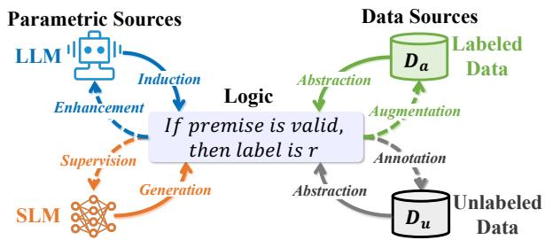
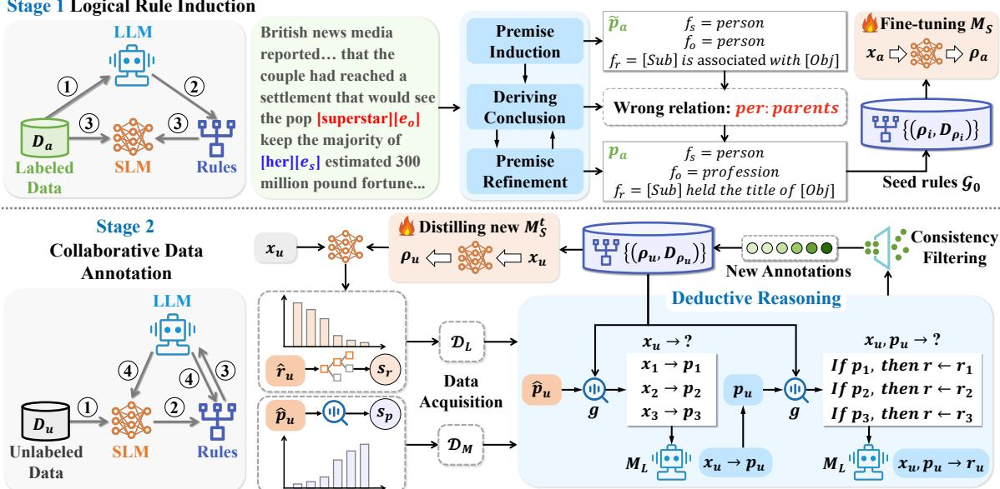
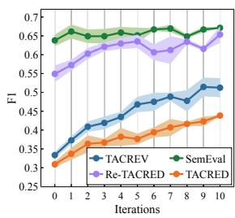
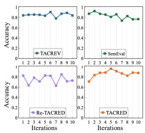
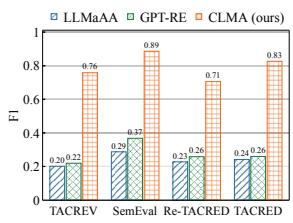
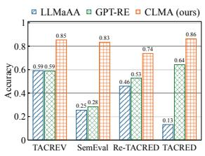
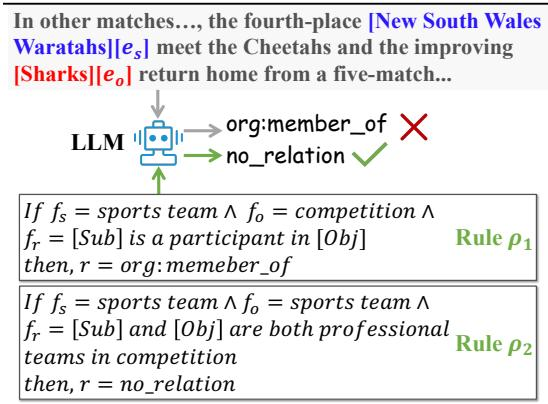

# Improving Data Annotation for Low-Resource Relation Extraction with Logical Rule-Augmented Collaborative Language Models

Xiyang Liu SKLSDE, Beihang University liuxiyang@buaa.edu.cn

Chunming Hu

SKLSDE, Beihang University hucm@buaa.edu.cn

Richong Zhang\* SKLSDE, Beihang University zhangrc@act.buaa.edu.cn

Junfan Chen SKLSDE, Beihang University chenjf@act.buaa.edu.cn

Baowen Xu Avic Digital Corporation Ltd xubw001@avic.com

## Abstract

Low-resource relation extraction aims to identify semantic relationships between entities using scarce labeled data. Recent studies exploit large language models to recognize relations based on retrieved examplars, yielding promising results. However, the reliability of predictions from these methods is constrained by the presence of irrelevant context within demonstrations and the inherent flaws of large language models in producing undesired outputs. Inspired by the precision and generalization of abstract logic, in this paper, we propose distilling logical rules to uniformly represent task knowledge sourced from distinct origins and facilitate deductive reasoning. We develop a collaborative annotating framework that iteratively integrates high-confidence predictions of rule-enhanced relation extractors with vary ing scales, efficiently obtaining reliable pseudo annotations from massive unlabeled samples without human supervision. Experiments under two inference settings show that our approach achieves new state-of-the-art performance on benchmark datasets in few-shot scenarios.1

## 1 Introduction

The relation extraction (RE) task, which aims at inferring semantic associations between recognized entities, attracts extensive research interest due to its broad range of applications, such as question answering (Li et al., 2019) and web mining (Lockard et al., 2019). Neural networks-based RE methods rely on adequate training samples with ground-truth annotations (Zhang et al., 2017; Brody et al., 2021). However, manually annotating unlabeled data sacrifices high labor costs. The scarcity of labeled data motivates the exploration of lowresource relation extraction (LRE).

Numerous low-resource methods are proposed to enhance the generalization capabilities of models, typically categorized into two groups: devising data-efficient models (Chen et al., 2022) and augmenting data (Hu et al., 2021). With the rapid evolution of large language models (LLM) (Dubey et al., 2024), researchers increasingly employ these generative models to identify relations (Wan et al., 2023; Ma et al., 2023). The main concerns regarding using LLMs in production scenarios arise from their slow inference speed and huge computational demands. Consequently, several works shift focus to exploiting LLMs as data annotators and training dedicated task models for fast processing and affordable computation overhead (Ding et al., 2023; Zhang et al., 2023b).

  
Figure 1: Rules abstract fundamental task logic transferred across parameterized and data sources. The models derive rules from samples, which in turn boost model performance and expand data sources.

In light of the dearth of ground-truth annotations impeding the RE performance, in this paper, our objective is to employ the extensive knowledge embedded within the LLM (Hao et al., 2023; Yu et al., 2023) to harness the advantages of both humanannotated and unlabeled data. The key challenge lies in obtaining high-quality pseudo-labels from unlabeled samples. Nonetheless, the reliability of predictions from prior LLM-based methods is limited by two issues: (1) The mapping function of the RE task is represented by demonstrations formatted as sample-label pairs, where noisy patterns within the irrelevant context can mislead LLMs in comprehending input-output mappings (Shi et al., 2023).

(2) Intrinsic drawbacks of LLMs, such as hallucinations (Ji et al., 2023) and uncertainty (Wang et al., 2023), further exacerbate the unreliability of their generations, especially in low-resource settings.

To address the first issue, we introduce logical rules to empower the LLM in maintaining concise definitions of task mapping functions. A logical labeling rule for RE is defined as a premise containing critical contextual patterns and a conclusion that assigns the appropriate relation label. Each rule abstracts underlying logic from the initial sample and can be adapted to other unseen samples. We use these logical rules to elicit the deductive reasoning ability of the LLM, enabling more precise relation prediction. Motivated by the generalization of abstract logic, we treat rules as unified explainable task knowledge learned from diverse origins, as illustrated in Figure 1.

Regarding the limitations of relying solely on the LLM, we propose a Collaborative Language Models-based data Annotation (CLMA) framework that iteratively integrates rule-enhanced weak relation extractors with varied scales to acquire higher-quality pseudo labels. We initially adopt an induction-refinement procedure to assist the LLM in creating consistent labeling rules from few-shot labeled instances. The induced rule set is employed to build a task-specific small language model (SLM). We utilize the teacher-student framework to handle a substantial mass of unlabeled samples, where the teacher LLM provides abundant knowledge and slow inference speed, whereas the task-specific student SLM offers rapid inference with limited knowledge. The small task model swiftly processes unlabeled samples and exposes features for choosing candidate samples with highconfidence predictions. These selected samples are then verified by the LLM through deductive reasoning guided by retrieved relevant rules. Only rules from the LLM that produce annotated data aligning with the high-confidence outcomes from the SLM are retained to enrich the low-resource datasets.

Our contributions are summarized as follows:

• We introduce labeling rules as explainable task logic to augment the representations of input-output mappings.

• We propose a collaborative data annotation framework for LRE, which integrates a mix of rule-enhanced extractors on varying scales.

• We conduct experiments on benchmarks and

demonstrate the effectiveness of our method.

## 2 Related Work

## 2.1 Low-Resource Extraction

One primary approach of LRE involves developing data-efficient models (Gao et al., 2019; Chen et al., 2022). Another line of research tries to enlarge the limited training set by acquiring newly labeled data (Hu et al., 2021; Xu et al., 2023). In light of the ever-changing large language models, a large body of studies are proposed to utilize LLMs as relation extractors via technologies like prompt engineering (Li et al., 2023a; Zhang et al., 2023a), chain-of-thought prompting (Ma et al., 2023), and in-context learning (Wan et al., 2023). In this study, our method exploits logical rules to devise a more efficient LLM-based RE method and obtain additional annotations from unlabeled data.

## 2.2 Weakly-supervised Relation Extraction

Conventional studies leverage labeling rules to improve models with weak labels. Zhou et al. (2020) manually annotates frequent surface patterns to form rules. Recent works aim to reduce human efforts for rule generation. PRBOOST (Zhang et al., 2022) asks pre-trained models to fill masked tokens in induction prompts for rule construction. The generated rules are presented to humans for evaluation. KICE (Lu et al., 2023) incorporates extra human annotations from rule-matched data to create better new rules. Qi et al. (2024) introduce an end-to-end framework jointly modeling relation extraction and logical rules for document-level RE. In contrast, we employ the LLM to automatically construct rules for enhancing collaborative data annotation.

## 2.3 Knowledge Distillation from LLMs

Knowledge distillation aims to transfer knowledge from teacher models into student models, reducing model size and maintaining task performance. Earlier distillation techniques, like feature-based distillation (Sun et al., 2019), demand access to the inner parameters of teacher models, which is often unfeasible for closed-source LLMs. To this end, researchers employ LLMs to produce training data for student models. Many works utilize LLMs to obtain rationale-enhanced data (Chen et al., 2023; Jiang et al., 2023). Other methods seek to synthesize new datasets (Li et al., 2023b; Chae et al., 2023). We distill rule induction abilities from the LLM into a more compact task model, which collaborates with the LLM to annotate unlabeled samples for iterative performance improvement.

## 3 Methodology

## 3.1 Problem Formulation

Task Definition: A data sample x in relation extraction task consists of a sentence S, subject entity $e _ { s }$ , and object entity $e _ { o }$ . An RE approach is expected to identify the relation r between $e _ { s }$ and $e _ { o } .$ Let $\mathcal { Y } = \{ r _ { 1 } , r _ { 2 } , \ldots , r _ { R } \}$ denote the label set of R distinct relation types. Since it is impractical to define all real-world relationships, a special class, "none-of-the-above" (NOTA), is introduced to represent relational semantics beyond the defined types. In low-resource scenarios, only a limited dataset $\mathcal { D } _ { a } = \{ x _ { a } , r _ { a } \} _ { a = 1 } ^ { m }$ is accessible. The unlabeled dataset $\mathcal { D } _ { u } ~ = ~ \{ x _ { u } \} _ { u = 1 } ^ { n }$ contains vast instances lacking human annotations.

Rule Definition: In this study, we use labeling rules to precisely formalize the mapping functions from crucial contextual patterns to target relation labels. Formally, an inductive rule $\rho$ comprises a premise p and a conclusion. If the premise is valid, the corresponding conclusion can be logically derived. The conclusion for rule $\rho$ is the assignment of ground-truth relation r. In general, the premise $p$ is the logical conjunction of semantic patterns $v ( f _ { s } ) \wedge v ( f _ { r } ) \wedge v ( f _ { o } )$ , where $v ( \cdot ) \in \{ 0 , 1 \}$ is the binary function indicating the existence of a pattern. $p$ is denoted as $[ f _ { s } ; f _ { r } ; f _ { o } ]$ for simplicity. $f _ { s }$ and $f _ { o }$ specify the conceptual types of $e _ { s }$ and $\textit { e } _ { o } . \textit { f } _ { r }$ denotes the relationship pattern between entities.

Model Overview: Our method, depicted in Figure 2, is composed of two major modules: logical rule induction and collaborative data annotation.

## 3.2 Logical Rules Induction

Given the limited scalability of manual rule creation, we intend to harness the rich knowledge encoded in the large parameters of LLM (Yu et al., 2023) to automatically generate rules from reliable labeled data sources. For each sample $x _ { a } =$ $\{ S , e _ { s } , e _ { o } \}$ , we incorporate a zero-shot premise induction instruction $I _ { p }$ to create the query $Q _ { p }$

$$
\begin{array} { c } { { Q _ { p } = F ( I _ { p } , S , e _ { s } , e _ { o } ) } } \\ { { \tilde { f } _ { s } , \tilde { f } _ { r } , \tilde { f } _ { o } = P ( M _ { L } ( Q _ { p } ) ) } } \end{array}\tag{1}
$$

where $F ( \cdot )$ represents the prompt construction function, $M _ { L } ( \cdot )$ signifies that the LLM $M _ { L }$ executes the query, and $P ( \cdot )$ is the post-processing function formatting the output.

Considering the possible multiple concurrent associations between entities and the unreliability of the LLM (Wang et al., 2023), not all induced patterns align with target label definitions. To reduce possible errors in induced rules, we first detect the prospective connections between the premises and relation labels. The LLM is tasked to guess all relations that premise $\tilde { p } _ { a } = [ \tilde { f } _ { s } ; \tilde { f } _ { r } ; \tilde { f } _ { o } ]$ may represent from the label set $\mathcal { R }$

$$
\begin{array} { c } { Q _ { c } = F ( I _ { c } , \tilde { p } _ { a } , \mathcal { R } ) } \\ { \{ \tilde { r } _ { 1 } , \tilde { r } _ { 2 } , \dots \tilde { r } _ { k } \} = P ( M _ { L } ( Q _ { c } ) ) } \end{array}\tag{2}
$$

$I _ { c }$ is the instruction for drawing the conclusion. Let $\mathcal { R } _ { e r r o r } $ represent all wrong relations predicted by the LLM. Next, we use the ground-truth relation $r _ { a }$ as a reference to ask the LLM to refine ambiguous patterns in $\tilde { p } _ { a }$ , ensuring they precisely reflect the true label rather than the incorrect ones.

$$
\begin{array} { r l r } & { } & { Q _ { f } = F ( I _ { f } , r _ { a } , \mathcal { R } _ { e r r o r } , x _ { a } , \tilde { p } _ { a } ) } \\ & { } & { f _ { s } , f _ { r } , f _ { o } = P ( M _ { L } ( Q _ { f } ) ) \quad \quad } \end{array}\tag{3}
$$

The refinement process is repeated L times to obtain the correct premise. Initial seed rule set induced from $\mathcal { D } _ { a }$ is denoted as $\mathcal { G } _ { 0 } = \{ ( \rho _ { i } , \mathcal { D } _ { \rho _ { i } } ) \} _ { i = 1 } ^ { g }$ $\mathcal { D } _ { \rho _ { i } }$ is the samples matched by rule $\rho _ { i }$

Due to the lower inference efficiency of deep models with larger parameters, scaling the LLM to handle vast amounts of unlabeled samples incurs enormous time and financial costs. Moreover, as discussed in the introduction, the predictions generated by the LLM alone cannot be fully trusted. These concerns drive us to develop a lightweight task-specific network with markedly fewer parameters (<1B in our implementation) for efficient data processing. As LLM is a heavy model with strong generalization across many tasks, our goal is to distill the critical pattern grounding abilities from LLM $M _ { L }$ into the small task model $M _ { S }$ . Naturally, any generative language model can serve as $M _ { S }$

Following the text-to-text training strategy (Raffel et al., 2020), the sample is expressed in natural language and tokenized to get the input sequence:

$$
\begin{array} { r l } & { { x _ { t o k } = \mathrm { T o k e n i z e } ( \left[ \mathrm { S e n t e n c e : ~ } S . \right. } } \\ & { \left. \left. \mathrm { S u b j e c t ~ e n t i t y : ~ } e _ { s } . \mathrm { ~ O b j e c t ~ e n t i t y : ~ } e _ { o } . \right] \right) }  \end{array}\tag{4}
$$

The output sequence is the tokenized combination of premise $p$ and corresponding label $r .$

$$
\begin{array} { r l } & { \rho _ { t o k } = \mathrm { T o k e n i z e } \big ( \big [ \mathrm { S u b j e c t e n t i t y ~ t y p e } \colon f _ { s } . } \\ & { \mathrm { O b j e c t ~ e n t i t y ~ t y p e } \colon f _ { o } . \mathrm { ~ R e l a t i o n } \colon f _ { r } . \mathrm { ~ L a b e l } \colon r \big ] \big ) } \end{array}\tag{5}
$$

Stage 1 Logical Rule Induction  
  
Figure 2: Overview of our framework to induce logical rules from few-shot labeled instances and progressively obtain high-quality pseudo-annotated samples from a large-scale unlabeled dataset.

The parameters of $M _ { S }$ are optimized by minimizing the casual language modeling loss.

$$
\mathcal { L } = - \sum _ { l = 1 } ^ { | \rho _ { t o k } | } \log ( p ( y _ { l } | y _ { < l } ) )\tag{6}
$$

Here, $p ( y _ { l } \vert y _ { < l } )$ is the probability for l-th token given preceding tokens.

## 3.3 Collaborative Data Annotation

The performance of RE model is significantly restricted by the scarce labeled data $\mathcal { D } _ { a }$ . Its effectiveness can be improved by acquiring more highquality annotations from unlabeled dataset $\mathcal { D } _ { u } .$ Two pivotal problems must be carefully considered during the data labeling procedure: 1) Given that not all samples could be accurately predicted by low-resource RE methods, which samples should be selected for label assignment? 2) The effectiveness of using either SLM or LLM alone is limited. How can we integrate multiple weak relation extractors to boost performance?

In this paper, we introduce an iterative method that could coordinate the strengths and weaknesses of both the general LLM and the task-specific SLM to annotate unlabeled data. Our approach progressively learns new rules with matched samples in $T$ iterations to expand the limited dataset $\mathcal { D } _ { a }$

## 3.3.1 Data Acquisition

In step t, the SLM $M _ { S } ^ { t - 1 }$ fine-tuned on previous rule set $\mathcal { G } _ { t - 1 } = \{ ( \rho _ { i } , \stackrel { \sim } { D } _ { \rho _ { i } } ) \} _ { i = 1 } ^ { g _ { t - 1 } }$ is employed to

rapidly recognize patterns and labels for unlabeled samples.

$$
\hat { p } _ { u } , \hat { r } _ { u } = M _ { S } ^ { t - 1 } ( x _ { u } )\tag{7}
$$

Prediction difficulty varies across samples with different expected accuracy levels. We use the conditional probability of outputting $\hat { r } _ { u }$ as the labeling confidence to estimate the discriminating difficulty for the SLM.

$$
s _ { r } = \frac { 1 } { | r _ { t o k } | } \sum _ { j = 1 } ^ { | r _ { t o k } | } p ( y _ { j } )\tag{8}
$$

The term $r _ { t o k }$ represents the tokenized sequence for label $\hat { r } _ { u }$ . Then, unlabeled samples are sorted in descending order according to the score $s _ { r }$ . The top $N _ { r }$ pseudo-labeled instances with the highest labeling confidence, denoted as $\mathcal { D } _ { L }$ , are selected for subsequent operations.

The instances of special class NOTA are prevalent in naturally distributed RE datasets. For example, over 80% labels in the complete training set of TACREV are NOTA. In this case, however, the SLM is not well adept at recognizing NOTA relations due to a few training samples labeled as NOTA (Sabo et al., 2021). We empirically find that rare NOTA samples can be accurately identified with high $s _ { r }$ . To mitigate this bias, we present a mismatch logic rule for out-of-distribution patterns: If a sample conveys relational patterns that do not conform to any existing rule premises, then it is likely to be classified as NOTA. We calculate the maximum matching degree between the contextual patterns of the unlabeled sample and existing rules:

$$
s _ { p } = \operatorname* { m a x } \left( \{ g \left( \hat { p } _ { u } , \rho _ { i } \right) \} _ { i = 1 } ^ { g _ { t - 1 } } \right)\tag{9}
$$

A smaller $s _ { p }$ indicates higher mismatch confidence. The function $g ( \cdot , \cdot )$ measures the semantic matching degree between patterns of the sample and rule, formulated as:

$$
g ( \hat { p } _ { u } , \rho _ { i } ) = \frac { 1 } { 3 } \sum _ { f \in \{ f _ { s } , f _ { r } , f _ { o } \} } \cos ( e ( f ^ { u } ) , e ( f ^ { i } ) )\tag{10}
$$

where $e ( \cdot )$ specifies the encoding process, where we use $M _ { S } ^ { t - 1 }$ to generate encoded embeddings and output the average summed embedding. $\cos ( \cdot , \cdot )$ computes the cosine similarity between two embeddings. We sort the data $\mathcal { D } _ { u } - \mathcal { D } _ { L }$ by ascending $s _ { p }$ and select the top $N _ { p }$ instances with the lowest matching degree, denoted as $\mathcal { D } _ { M }$

## 3.3.2 Deductive Reasoning

For each sample $x _ { u }$ in selected instances $\mathcal { D } _ { L } \cup \mathcal { D } _ { M }$ we prompt the LLM to summarize new patterns. $g ( \cdot , \cdot )$ is used to get the $Z$ most similar labeled data.

$$
\hat { \mathcal { A } } = \underset { \hat { \mathcal { A } } , | \hat { \mathcal { A } } | = Z } { \arg \operatorname* { m a x } } \sum _ { \rho _ { i } \in \hat { \mathcal { A } } } g ( \hat { p } _ { u } , \rho _ { i } ) , \hat { \mathcal { A } } \subset \mathcal { G } _ { t - 1 }\tag{11}
$$

The $\hat { \mathcal { A } } = \{ ( \rho _ { z } , \mathcal { D } _ { \rho _ { z } } ) \} _ { z = 1 } ^ { Z }$ is the set of retrieved labeled data. For each $\rho _ { z }$ , we randomly select one sample from $\mathcal { D } _ { \rho _ { z } }$ to form the demonstration list.

$$
\hat { \mathcal { C } } _ { d } = \{ ( x _ { z } ; f _ { s } ^ { z } , f _ { r } ^ { z } , f _ { o } ^ { z } ) \} _ { z = 1 } ^ { Z }\tag{12}
$$

Demonstrations $\hat { \mathcal { C } } _ { d }$ are employed to promote the in-context learning of the LLM, facilitating the induction of new patterns from the unlabeled sample:

$$
\begin{array} { r l } { \hat { Q } _ { p } = F ( I _ { p } , \hat { \mathcal { C } } _ { d } , x _ { u } ) } & { { } } \\ { f _ { s } ^ { u } , f _ { r } ^ { u } , f _ { o } ^ { u } = P ( M _ { L } ( \hat { Q } _ { p } ) ) } & { { } } \end{array}\tag{13}
$$

Canonical LLM-based methods format demonstrations as sample-label $( x , y )$ pairs to implicitly represent task mappings, potentially misleading the LLM towards noise patterns. We leverage a rule-based deductive reasoning prompt to explicitly outline precise mappings between contextual patterns and target labels. The related Z rules are retrieved using the premise $p _ { u }$ with new patterns.

$$
\mathcal { A } = \underset { \mathcal { A } , | \mathcal { A } | = Z } { \mathrm { a r g m a x } } \sum _ { \rho _ { i } \in \mathcal { A } } g ( p _ { u } , \rho _ { i } ) , \mathcal { A } \subset \mathcal { G } _ { t - 1 }\tag{14}
$$

Each rule $\rho _ { z } \in \mathcal { A }$ is verbalized in an if-then format: Ifthe type ofsubject entity is $f _ { s }$ , the type ofobject entity is $f _ { o }$ and $f _ { r } ,$ , then the relation is r.

$$
\mathcal { C } _ { \rho } = \{ \mathrm { V E R B A L I Z E } ( \rho _ { z } ) \} _ { z = 1 } ^ { Z }\tag{15}
$$

The mismatch rule is also appended into the set $\mathcal { C } _ { \rho }$ All these relevant rules aid the LLM in inferring the label $r _ { u }$ for the unlabeled sample $x _ { u }$

$$
\begin{array} { c } { Q _ { r } = F ( I _ { r } , \mathcal { C } _ { \rho } , x _ { u } , f _ { s } ^ { u } , f _ { r } ^ { u } , f _ { o } ^ { u } ) } \\ { r _ { u } = P ( M _ { L } ( Q _ { r } ) ) } \end{array}\tag{16}
$$

$I _ { r }$ is the instruction for relation identification according to the inferential rules $\mathcal { C } _ { \rho }$

## 3.3.3 Consistency Filtering

To integrate predictions from different weak relation extractors, we incorporate the high-confidence predictions obtained during data selection as constraints for the outputs of the LLM. Predictions from the small model $M _ { S }$ demonstrate high accuracy for samples in $\mathcal { D } _ { L }$ , while those in $\mathcal { D } _ { M }$ are inclined to belong to the NOTA class. We utilize an indicator function Filter( ) to evaluate if $r _ { u }$ is consistent with previous high-confidence results.

$$
\operatorname { F i l t e r } ( r _ { u } ) = { \left\{ \begin{array} { l l } { \mathbb { 1 } [ r _ { u } = { \hat { r } } _ { u } ] , } & { { \mathrm { i f ~ } } x _ { u } \in \mathcal { D } _ { L } } \\ { \mathbb { 1 } [ r _ { u } = { \mathrm { N O T A } } ] , { \mathrm { ~ i f ~ } } x _ { u } \in \mathcal { D } _ { M } } \end{array} \right. }\tag{17}
$$

where 1 [ ] is a binary indicator. Only annotation identified with a value of 1 from Filter( ) function is preserved to enlarge current datasets. By doing so, our approach implements an ensemble of two rule-augmented relation extraction techniques, each with distinct model scales and training requirements. The expanded rule set $\mathcal { G } _ { t }$ is utilized to train a more robust SLM $M _ { S } ^ { t }$

## 3.4 Relation Inference

For extracting relations during the inference period, our collaborative approach offers high flexibility by enabling the utilization of SLM $M _ { S }$ or LLM $M _ { L }$ to handle test samples. Following the previous lines of LRE research, we consider two different schemes for leveraging the LLM.

• LLM for Direct Inference refers to the direct utilization of the LLM for testing with limited labeled data only.

• LLM for Data Annotation focuses on using the task-specific SLM for relation inference fine-tuned on augmented data with additional annotations from the unlabeled dataset.

The former strategy is appropriate in scenarios where no extra unlabeled data is available, while the latter is more applicable for real-time applications requiring low inference latency and having accessible unlabeled data. To leverage the $M _ { L }$ for inference, we use SLM $M _ { S }$ for rule retrieval and obtain predicted labels through the deductive reasoning method. We employ the trained SLM $M _ { S } ^ { T }$ after T iterations of data labeling for the SLMbased inference.

## 4 Experiments

## 4.1 Datasets

To evaluate the performance of our approach, we adopt four widely used RE benchmark datasets: the SemEval 2010 Task 8 (SemEval 2010) (Hendrickx et al., 2010), the TAC Relation Extraction Dataset (TACRED) (Zhang et al., 2017) and two revised TAC datasets (TACREV (Alt et al., 2020) and Re-RACRED (Stoica et al., 2021)). SemEval 2010 covers 19 semantic relations between pairs of nominals. TACRED is a large-scale English dataset drawn from the TACKBP4 challenge with 42 distinct relations. TACREV rectifies errors identified on the validation and testing sets of TACRED. Re-TACRED refines the relation definitions and misclassified samples of the TACRED.

Following prior studies (Xu et al., 2022), we adopt the true few-shot experimental setting (Perez et al., 2021) for the low-resource RE task. We randomly sample K instances (8 / 16) from each class within the original training and validation sets to form the corresponding few-shot sets. The statistical information is detailed in Table 1. To reduce random bias, all experiments are conducted over five times and the mean results on the complete test set are reported.

<table><tr><td>Datasets</td><td>#Train</td><td>#Valid</td><td>#Test</td><td>#Rel.</td></tr><tr><td>TACREV SemEval 2010</td><td>334 / 662 144 /288</td><td>328 / 646 145 / 287</td><td>15,509 2,717</td><td>42 19</td></tr></table>

Table 1: The statistics of LRE datasets.

## 4.2 Baselines

For the first scheme using the LLM for inference, we select three LLM-based RE methods as baselines. 1) Zero-shot QA4RE (Zhang et al., 2023a) aligns RE with multiple-choice question answering through verbalizing label names with relation templates. 2) ICL-based GPT-RE (Wan et al., 2023) is a recent method proposed to sample most similar demonstrations via entity-aware demonstration retrieval. 3) Layegh et al. leverage Wikidata as the source to craft informative instructions for finetuning Llama (Wiki-SFT Llama 2). Regarding the strategy of LLM-based data annotation, we also employ QA4RE and GPT-RE as annotators. Then, we compare two additional methods. 4) Instead of handling real instances, PGDG (Ding et al., 2023) instructs the LLM to synthesize new labeled samples via imitating features of training data. 5) LL-MaAA (Zhang et al., 2023b) integrates the LLM into an active learning loop, annotating least confidence samples for the task-specific model.

## 4.3 Implementation Details

We leverage the GPT-3.5 model (Brown et al., 2020), specifically gpt-3.5-turbo, as the foundation LLM for our approach and all baselines except for Wiki-SFT Llama, which fine-tunes Llama 2-7b (Touvron et al., 2023). The Flan-T5-large (780M) model (Chung et al., 2024) is used as the backbone of SLM. The count of demonstrations in our method Z is fixed at 5. The process of refining premises is repeated twice, while the data annotating is iterated $T = 1 0$ times across all datasets. In each iteration, the quantity of chosen samples is set as $N _ { r } = N _ { p } = 2 0 0$ for TACREV, Re-TACRED and TACRED, while $N _ { r } = N _ { p } = 5 0$ for SemEval.

We adhere to the best-performing hyperparameters established in original studies of baselines. Since baselines like QA4RE and GPT-RE were not initially evaluated on the full test set, we obtain their results using the open-source code supplied by the authors. Note that we eliminate the type constraints enforced in QA4RE to make it judge all labels for a fair comparison with other baselines.

For LLM-based data annotation, all remaining training samples not included in the few-shot training set are treated as unlabeled. The SLM $M _ { S } ,$ optimized using $\mathcal { D } _ { a }$ without rules from $\mathcal { G } _ { 0 } .$ , is referred to as the Base model. We ensure that all baselines annotate an equivalent number of unlabeled samples as our method. The test results of $M _ { S }$ trained using new data enriched by baselines are presented. Further implementation details and prompt designs are presented in the Appendix A.2.

<table><tr><td rowspan="2">Methods</td><td colspan="2">TACREV K=8  $K = 1 6$ </td><td colspan="2">SemEval 2010  $K = 8$   $K = 1 6$ </td><td colspan="2">Re-TACRED  $K = 8$   $K = 1 6$ </td><td colspan="2">TACRED  $K = 8$   $K = 1 6$ </td></tr><tr><td colspan="10">LLM for Direct Inference</td></tr><tr><td>QA4RE†</td><td>11.21</td><td></td><td>21.81</td><td></td><td>26.25</td><td></td><td>11.28</td><td></td></tr><tr><td>GPT-RE†</td><td>28.38 26.0</td><td>28.53 31.9</td><td>27.72 29.8</td><td>33.04 33.4</td><td>28.48 33.8</td><td>29.35 46.2</td><td>27.17 23.3</td><td>27.57 29.7</td></tr><tr><td>Wiki-SFT Llama 2 CLMA</td><td>36.46</td><td>37.98</td><td>42.95</td><td>48.91</td><td>47.16</td><td>51.65</td><td>30.58</td><td>33.87</td></tr><tr><td>w/o Rule  $\mathcal { G } _ { 0 }$ </td><td>28.22</td><td>28.40</td><td>28.0</td><td>30.80</td><td>31.19</td><td>34.11</td><td>24.52</td><td>23.85</td></tr><tr><td colspan="9">LLM for Data Annotation</td></tr><tr><td>Base  $( M _ { S } )$ </td><td>30.98</td><td>31.40</td><td>61.18</td><td>70.97</td><td>55.59</td><td>59.19</td><td>28.90</td><td>29.73</td></tr><tr><td> $\mathrm { Q A 4 R E ^ { \dagger } } \to M _ { S }$ </td><td>17.34</td><td>21.16</td><td>44.86</td><td>51.83</td><td>36.27</td><td>40.66</td><td>14.33</td><td>18.85</td></tr><tr><td> $\mathrm { G P T } \mathrm { \cdot R E } ^ { \dag } \to M _ { S }$ </td><td>35.94</td><td>34.96</td><td>38.01</td><td>44.50</td><td>38.65</td><td>41.82</td><td>33.0</td><td>36.24</td></tr><tr><td> $\mathrm { P G D G ^ { \ddagger } } \to M _ { S }$ </td><td>30.19</td><td>31.99</td><td>66.86</td><td>74.54</td><td>53.80</td><td>54.62</td><td>28.31</td><td>31.20</td></tr><tr><td> $\mathrm { L L M a A A ^ { \dagger } }  M _ { S }$ </td><td>38.95</td><td>40.86</td><td>57.39</td><td>58.53</td><td>35.94</td><td>37.95</td><td>24.87</td><td>26.65</td></tr><tr><td> $\mathbf { C L M A } \to M _ { S }$ </td><td>51.16</td><td>51.45</td><td>67.12</td><td>75.33</td><td>63.65</td><td>67.42</td><td>43.86</td><td>45.26</td></tr><tr><td>w/o  $U n l . \ D a t a \ D _ { u }$ </td><td>33.34</td><td>33.43</td><td>63.19</td><td>71.25</td><td>54.91</td><td>58.81</td><td>30.90</td><td>31.68</td></tr><tr><td> $w / o R u l e ~ \mathcal { G } _ { t }$ </td><td>31.15</td><td>31.90</td><td>64.50</td><td>72.19</td><td>53.30</td><td>58.98</td><td>30.0</td><td>30.58</td></tr><tr><td> $w / o \ S L M M S$ </td><td>35.22</td><td>36.51</td><td>50.19</td><td>59.04</td><td>56.74</td><td>57.49</td><td>32.65</td><td>33.0</td></tr><tr><td>w/o  $L L M M _ { L }$ </td><td>45.71</td><td>46.79</td><td>44.35</td><td>59.40</td><td>54.41</td><td>57.05</td><td>39.24</td><td>40.32</td></tr></table>

Table 2: Performance comparison of previous baselines for low-resource RE on benchmark datasets. indicates that we utilize the authors’ publicly available code to obtain the experimental results. $\ddagger$ denotes that we reproduce the corresponding method. Other results are taken directly from the corresponding original papers.

## 4.4 Performance Comparison

## 4.4.1 Main Results

We report the micro F1 scores, a standard evaluation metric for RE, achieved by each method on the benchmark datasets in Table 2. The results show that when leveraging the LLM for direct inference, our method outperforms the recent ICL-based GPT-RE approach via incorporating induced logical rules. However, the performance of LLM without fine-tuning remains far from satisfactory in lowresource scenarios. The subpar performance leads to the LLM-based baselines struggling to handle large-scale unlabeled data and produce reliable predictions. The proposed framework CLMA achieves an average increase of 12.1 in the F1 score over the base model fine-tuned on labeled data only, highlighting the overall efficacy of our method in acquiring new annotations. We observe that LLMaAA does not effectively enhance the performance of $M _ { S }$ . We speculate that this is due to the method’s reliance on the LLM to label samples with the least confidence, resulting in low prediction accuracy.

## 4.4.2 Ablation Study

To assess the effectiveness of key components in our approach, we conduct an ablation study with the following method variants: 1) w/o Unl. Data represents the SLM fine-tuned on initial seed rules $\mathcal { G } _ { 0 }$ without unlabeled data. 2) w/o Rule indicates that no logical rules are induced or applied for data acquisition and prompt construction. 3) w/o SLM is the method variant where no task-specific smaller language model is incorporated. 4) w/o LLM refers to the method without predictions from the LLM.

Table 2 reveals that removing unlabeled dataset causes the F1 score to exhibit an average drop of 10.9, demonstrating the potential of utilizing $\mathcal { D } _ { u }$ to enhance LRE. The omission of logical rules causes more significant performance degradation, with the F1 score dropping by 11.5. This decline is caused by the absence of logical rules in data acquisition and deductive reasoning. When employing the LLM alone to annotate samples (w/o SLM), hard samples that the LLM struggles to process may be retained with low accuracy. Moreover, the exclusion of the LLM leads to the SLM reinforcing its prediction errors, while our complete framework exploits the LLM to reduce the labeling biases.

## 4.5 Impact of More Data Annotations

Next, we analyze the impact of incorporating more pseudo-annotated samples for LRE. Figure 3 (a) presents the test F1 scores of SLM $M _ { S } ^ { t }$ updated after each iteration under the 8-shot setting. The observed incremental performance improvement is attributed to the superior quality of our data annotations. For example, as shown in Figure 3 (b), the average accuracy of pseudo labels on the TACREV is 85%, which can effectively boost the performance of initial SLM with a test accuracy of 26%. We observe that the SemEval dataset gains less performance improvement than other datasets. We ascribe this to the fact that the base SLM $M _ { S }$ trained on labeled SemEval data has achieved relatively high performance. Given the unavoidable misclassified pseudo-labels, the model quickly approaches the upper bound of performance achievable via introducing more pseudo-labeled data.

  
(a) Test F1 of $M _ { S } ^ { t }$

  
(b) Accuracy of new data  
Figure 3: (a) The test F1 of $M _ { S } ^ { t }$ optimized on newly annotated samples. (b) The accuracy of annotations in each iteration.

## 4.6 Quantitative Analysis of Logical Rules

  
(a) F1

  
(b) Accuracy

Figure 4: Quality of rule labels derived from $\mathcal { D } _ { u }$
<table><tr><td>Datasets</td><td>Rules from  $\overline { { \mathcal { D } _ { a } } }$  Context Relation</td><td>Rules from  $\overline { { \mathcal { D } _ { u } } }$  Context Relation</td></tr><tr><td>TACREV</td><td>0.95 0.90</td><td>0.87 0.85</td></tr><tr><td>SemEval</td><td>0.94 0.91</td><td>0.89 0.86</td></tr><tr><td>Re-TACRED</td><td>0.93 0.91</td><td>0.87 0.86</td></tr><tr><td>TACRED</td><td>0.92 0.87</td><td>0.91 0.87</td></tr></table>

Table 3: Consistency of premises induced in rules.

To analyze the quality of learned rules, we first assess the rule labels derived from $\mathcal { D } _ { u }$ . Since the rules labels are exactly the same as the corresponding samples, we compare the quality of all pseudolabels. As depicted in Figure 4, the effectiveness of data labeling in our method is significantly better than in baselines. Then, we conduct a human evaluation regarding rule premises. 100 rules induced from $\mathcal { D } _ { a }$ and another 100 rules from $\mathcal { D } _ { u }$ are extracted at random for evaluation. We manually judge two criteria: 1) Whether the premise is consistent with the context in the origin sentence (Context). 2) Whether the premise should be mapped to the ground-truth label (Relation). The accuracy of evaluation results is reported in Table 3.

Most premises ( 90%) derived from labeled data consistently reflect context and target relation semantics. The evaluation reveals that context consistency is slightly better than relation consistency. This discrepancy arises from some instances where the LLM captures contextually coherent yet general patterns. For example, the LLM may infer the premise $\{ f _ { s } = p e r s o n$ , fo = location, $f _ { r } =$ was born in for relation "per:country\_of\_birth", which can also correspond to "per:city\_of\_birth". While it is unsurprising that the quality of premises derived from $\mathcal { D } _ { u }$ is worse than those induced from $\mathcal { D } _ { a } .$ the accuracy remains above 85%.

  
Figure 5: Case study of using rules to augment the LLM.

## 4.7 Case Study

We perform a case study to illustrate how logical rules can benefit relation extraction for the LLM. As depicted in Figure 5, the ambiguous patterns within the query sample may confuse the LLM to mistakenly capture inaccurate cues for prediction, even when prompted by similar sample-label pairs. When a sentence discusses sports teams and competitions, the LLM might erroneously label the sample as "org:memeber\_of." In contrast, our methodology leverages logical rules to guide the LLM in focusing on precise discriminative patterns and accurately reasoning about the relation.

## 5 Conclusion and Future Work

In this paper, we propose a data annotation framework to alleviate the challenge of resource scarcity for RE. Logic rules are introduced to describe underlying mappings from contextual patterns to target labels. We employ the LLM as a teacher to generate rule-augmented data, distilling the critical pattern grounding abilities into the small student model. High-quality pseudo-labeled samples are acquired by collaborating with distinct relation extractors. Experiments suggest that our method surpasses recent competitive baselines. In future research, we are interested in extending our method to more challenging tasks like document-level RE.

## 6 Limitations

Our proposed approach employs a teacher-student distillation framework to collaboratively annotate unlabeled samples. In our experimental setup, the gpt-3.5 is used as the foundation LLM as the teacher model. However, the effectiveness of our approach may vary depending on the fundamental capabilities of different LLMs, such as their proficiency in instruction-following. Additionally, the small task-specific model is implemented using Flan-T5-large. Variations in parameter scales or model architectures can affect the performance of small task models.

The low-resource settings adopted in our experiments follow prior studies (Chen et al., 2022; Xu et al., 2022), wherein a few numbers of samples are available for each class, and the performance is evaluated on the complete test set. Nevertheless, other experimental settings have also been proposed for low-resource learning. For example, some studies use a fixed percentage of the full dataset as the initial low-resource training set (Hu et al., 2023). The N-Way K-Shot setup (Han et al., 2018; Sabo et al., 2021) assumes that relations in the test set are disjoint from those in the training set and the evaluation is performed over many episodes. Distinct data settings would impact the evaluation results.

## 7 Ethics Statement

In addressing ethical concerns, we would make the following clarifications: (1) All experiments in our study are conducted using pre-existing datasets from publicly accessible scientific literature. (2) Our research involves the utilization of LLMs for direct inference, which raises several challenges, such as the potential for sensitive data leakage. Therefore, it is crucial to exercise caution when applying our method to downstream tasks in realworld applications. (3) It is essential to comply with the licenses and agreements of LLMs, particularly when leveraging LLM-generated data for training smaller task models for commercial usage.

## Acknowledgments

This work was supported by the National Natural Science Foundation of China (No. U23B2056), in part by the Fundamental Research Funds for the Central Universities, and in part by the State Key Laboratory of Complex & Critical Software Environment.

## References

Christoph Alt, Aleksandra Gabryszak, and Leonhard Hennig. 2020. TACRED revisited: A thorough evaluation of the TACRED relation extraction task. In Proceedings ofthe 58th Annual Meeting ofthe Associationfor Computational Linguistics, pages 1558– 1569, Online. Association for Computational Linguistics.

Sam Brody, Sichao Wu, and Adrian Benton. 2021. Towards realistic few-shot relation extraction. In Proceedings ofthe 2021 Conference on Empirical Methods in Natural Language Processing, pages 5338– 5345, Online and Punta Cana, Dominican Republic. Association for Computational Linguistics.

Tom B. Brown, Benjamin Mann, Nick Ryder, Melanie Subbiah, Jared Kaplan, Prafulla Dhariwal, Arvind Neelakantan, Pranav Shyam, Girish Sastry, Amanda Askell, Sandhini Agarwal, Ariel Herbert-Voss, Gretchen Krueger, Tom Henighan, Rewon Child, Aditya Ramesh, Daniel M. Ziegler, Jeffrey Wu, Clemens Winter, Christopher Hesse, Mark Chen, Eric Sigler, Mateusz Litwin, Scott Gray, Benjamin Chess, Jack Clark, Christopher Berner, Sam McCandlish, Alec Radford, Ilya Sutskever, and Dario Amodei. 2020. Language models are few-shot learners. In Advances in Neural Information Processing Systems 33: Annual Conference on Neural Information Processing Systems 2020, NeurIPS 2020, December 6-12, 2020, virtual.

Hyungjoo Chae, Yongho Song, Kai Ong, Taeyoon Kwon, Minjin Kim, Youngjae Yu, Dongha Lee, Dongyeop Kang, and Jinyoung Yeo. 2023. Dialogue chain-of-thought distillation for commonsense-aware conversational agents. In Proceedings of the 2023 Conference on Empirical Methods in Natural Language Processing, pages 5606–5632, Singapore. Association for Computational Linguistics.

Hongzhan Chen, Siyue Wu, Xiaojun Quan, Rui Wang, Ming Yan, and Ji Zhang. 2023. MCC-KD: Multi-CoT consistent knowledge distillation. In Findings

of the Association for Computational Linguistics: EMNLP 2023, pages 6805–6820, Singapore. Association for Computational Linguistics.

Xiang Chen, Ningyu Zhang, Xin Xie, Shumin Deng, Yunzhi Yao, Chuanqi Tan, Fei Huang, Luo Si, and Huajun Chen. 2022. Knowprompt: Knowledgeaware prompt-tuning with synergistic optimization for relation extraction. In Proceedings of the ACM Web Conference 2022, WWW ’22, page 2778–2788, New York, NY, USA. Association for Computing Machinery.

Hyung Won Chung, Le Hou, Shayne Longpre, Barret Zoph, Yi Tay, William Fedus, Yunxuan Li, Xuezhi Wang, Mostafa Dehghani, Siddhartha Brahma, Albert Webson, Shixiang Shane Gu, Zhuyun Dai, Mirac Suzgun, Xinyun Chen, Aakanksha Chowdhery, Alex Castro-Ros, Marie Pellat, Kevin Robinson, Dasha Valter, Sharan Narang, Gaurav Mishra, Adams Yu, Vincent Zhao, Yanping Huang, Andrew Dai, Hongkun Yu, Slav Petrov, Ed H. Chi, Jeff Dean, Jacob Devlin, Adam Roberts, Denny Zhou, Quoc V. Le, and Jason Wei. 2024. Scaling instruction-finetuned language models. Journal ofMachine Learning Research, 25(70):1–53.

Bosheng Ding, Chengwei Qin, Linlin Liu, Yew Ken Chia, Boyang Li, Shafiq Joty, and Lidong Bing. 2023. Is GPT-3 a good data annotator? In Proceedings of the 61st Annual Meeting of the Association for Computational Linguistics (Volume 1: Long Papers), pages 11173–11195, Toronto, Canada. Association for Computational Linguistics.

Abhimanyu Dubey, Abhinav Jauhri, Abhinav Pandey, Abhishek Kadian, Ahmad Al-Dahle, Aiesha Letman, Akhil Mathur, Alan Schelten, Amy Yang, Angela Fan, and et al. 2024. The llama 3 herd of models. Preprint, arXiv:2407.21783.

Tianyu Gao, Xu Han, Zhiyuan Liu, and Maosong Sun. 2019. Hybrid attention-based prototypical networks for noisy few-shot relation classification. In The Thirty-Third AAAI Conference on Artificial Intelligence, pages 6407–6414, Honolulu, Hawaii, USA. AAAI Press.

Xu Han, Hao Zhu, Pengfei Yu, Ziyun Wang, Yuan Yao, Zhiyuan Liu, and Maosong Sun. 2018. FewRel: A large-scale supervised few-shot relation classification dataset with state-of-the-art evaluation. In Proceedings ofthe 2018 Conference on Empirical Methods in Natural Language Processing, pages 4803–4809, Brussels, Belgium. Association for Computational Linguistics.

Shibo Hao, Bowen Tan, Kaiwen Tang, Bin Ni, Xiyan Shao, Hengzhe Zhang, Eric Xing, and Zhiting Hu. 2023. BertNet: Harvesting knowledge graphs with arbitrary relations from pretrained language models. In Findings of the Association for Computational Linguistics: ACL 2023, pages 5000–5015, Toronto, Canada. Association for Computational Linguistics.

Iris Hendrickx, Su Nam Kim, Zornitsa Kozareva, Preslav Nakov, Diarmuid Ó Séaghdha, Sebastian Padó, Marco Pennacchiotti, Lorenza Romano, and Stan Szpakowicz. 2010. SemEval-2010 task 8: Multiway classification of semantic relations between pairs of nominals. In Proceedings ofthe 5th International Workshop on Semantic Evaluation, pages 33–38, Uppsala, Sweden. Association for Computational Linguistics.

Xuming Hu, Aiwei Liu, Zeqi Tan, Xin Zhang, Chenwei Zhang, Irwin King, and Philip S. Yu. 2023. GDA: Generative data augmentation techniques for relation extraction tasks. In Findings of the Association for Computational Linguistics: ACL 2023, pages 10221– 10234, Toronto, Canada. Association for Computational Linguistics.

Xuming Hu, Chenwei Zhang, Yawen Yang, Xiaohe Li, Li Lin, Lijie Wen, and Philip S. Yu. 2021. Gradient imitation reinforcement learning for low resource relation extraction. In Proceedings ofthe 2021 Conference on Empirical Methods in Natural Language Processing, pages 2737–2746, Online and Punta Cana, Dominican Republic. Association for Computational Linguistics.

Ziwei Ji, Tiezheng Yu, Yan Xu, Nayeon Lee, Etsuko Ishii, and Pascale Fung. 2023. Towards mitigating LLM hallucination via self reflection. In Findings of the Association for Computational Linguistics: EMNLP 2023, pages 1827–1843, Singapore. Association for Computational Linguistics.

Yuxin Jiang, Chunkit Chan, Mingyang Chen, and Wei Wang. 2023. Lion: Adversarial distillation of proprietary large language models. In Proceedings ofthe 2023 Conference on Empirical Methods in Natural Language Processing, pages 3134–3154, Singapore. Association for Computational Linguistics.

Amirhossein Layegh, Amir H. Payberah, Ahmet Soylu, Dumitru Roman, and Mihhail Matskin. 2024. Wikibased prompts for enhancing relation extraction using language models. In Proceedings of the 39th ACM/SIGAPP Symposium on Applied Computing, SAC ’24, page 731–740, New York, NY, USA. Association for Computing Machinery.

Peng Li, Tianxiang Sun, Qiong Tang, Hang Yan, Yuanbin Wu, Xuanjing Huang, and Xipeng Qiu. 2023a. CodeIE: Large code generation models are better few-shot information extractors. In Proceedings of the 61st Annual Meeting of the Association for Computational Linguistics (Volume 1: Long Papers), pages 15339–15353, Toronto, Canada. Association for Computational Linguistics.

Xiaoya Li, Fan Yin, Zijun Sun, Xiayu Li, Arianna Yuan, Duo Chai, Mingxin Zhou, and Jiwei Li. 2019. Entityrelation extraction as multi-turn question answering. In Proceedings of the 57th Annual Meeting of the Associationfor Computational Linguistics, pages 1340– 1350, Florence, Italy. Association for Computational Linguistics.

Zhuoyan Li, Hangxiao Zhu, Zhuoran Lu, and Ming Yin. 2023b. Synthetic data generation with large language models for text classification: Potential and limitations. In Proceedings ofthe 2023 Conference on Empirical Methods in Natural Language Processing, pages 10443–10461, Singapore. Association for Computational Linguistics.

Colin Lockard, Prashant Shiralkar, and Xin Luna Dong. 2019. OpenCeres: When open information extraction meets the semi-structured web. In Proceedings ofthe 2019 Conference ofthe North American Chapter of the Association for Computational Linguistics: Human Language Technologies, pages 3047–3056, Minneapolis, Minnesota. Association for Computational Linguistics.

Yilin Lu, Xiaoqiang Wang, Haofeng Yang, and Siliang Tang. 2023. Kice: a knowledge consolidation and expansion framework for relation extraction. In Proceedings ofthe Thirty-Seventh AAAI Conference on Artificial Intelligence, AAAI’23/IAAI’23/EAAI’23. AAAI Press.

Xilai Ma, Jing Li, and Min Zhang. 2023. Chain of thought with explicit evidence reasoning for few-shot relation extraction. In Findings of the Association for Computational Linguistics: EMNLP 2023, pages 2334–2352, Singapore. Association for Computational Linguistics.

Adam Paszke, Sam Gross, Francisco Massa, Adam Lerer, James Bradbury, Gregory Chanan, Trevor Killeen, Zeming Lin, Natalia Gimelshein, Luca Antiga, Alban Desmaison, Andreas Köpf, Edward Z. Yang, Zachary DeVito, Martin Raison, Alykhan Tejani, Sasank Chilamkurthy, Benoit Steiner, Lu Fang, Junjie Bai, and Soumith Chintala. 2019. Pytorch: An imperative style, high-performance deep learning library. In Advances in Neural Information Processing Systems 32: Annual Conference on Neural Information Processing Systems 2019, pages 8024–8035, Vancouver, BC, Canada.

Ethan Perez, Douwe Kiela, and Kyunghyun Cho. 2021. True few-shot learning with language models. In Advances in Neural Information Processing Systems.

Kunxun Qi, Jianfeng Du, and Hai Wan. 2024. End-toend learning of logical rules for enhancing documentlevel relation extraction. In Proceedings ofthe 62nd Annual Meeting of the Association for Computational Linguistics (Volume 1: Long Papers), pages 7247– 7263, Bangkok, Thailand. Association for Computational Linguistics.

Colin Raffel, Noam Shazeer, Adam Roberts, Katherine Lee, Sharan Narang, Michael Matena, Yanqi Zhou, Wei Li, and Peter J. Liu. 2020. Exploring the limits of transfer learning with a unified text-to-text transformer. J. Mach. Learn. Res., 21(1).

Ofer Sabo, Yanai Elazar, Yoav Goldberg, and Ido Dagan. 2021. Revisiting few-shot relation classification:

Evaluation data and classification schemes. Transactions of the Association for Computational Linguistics, 9:691–706.

Freda Shi, Xinyun Chen, Kanishka Misra, Nathan Scales, David Dohan, Ed Chi, Nathanael Schärli, and Denny Zhou. 2023. Large language models can be easily distracted by irrelevant context. In Proceedings ofthe 40th International Conference on Machine Learning, ICML’23. JMLR.org.

George Stoica, Emmanouil Antonios Platanios, and Barnabás Póczos. 2021. Re-tacred: Addressing shortcomings of the TACRED dataset. In Thirty-Fifth AAAI Conference on Artificial Intelligence, pages 13843–13850. AAAI Press.

Siqi Sun, Yu Cheng, Zhe Gan, and Jingjing Liu. 2019. Patient knowledge distillation for BERT model compression. In Proceedings ofthe 2019 Conference on Empirical Methods in Natural Language Processing and the 9th International Joint Conference on Natural Language Processing (EMNLP-IJCNLP), pages 4323–4332, Hong Kong, China. Association for Computational Linguistics.

Hugo Touvron, Louis Martin, Kevin Stone, Peter Albert, Amjad Almahairi, Yasmine Babaei, Nikolay Bashlykov, Soumya Batra, Prajjwal Bhargava, Shruti Bhosale, Dan Bikel, Lukas Blecher, Cristian Canton Ferrer, Moya Chen, Guillem Cucurull, David Esiobu, Jude Fernandes, Jeremy Fu, Wenyin Fu, Brian Fuller, Cynthia Gao, Vedanuj Goswami, Naman Goyal, Anthony Hartshorn, Saghar Hosseini, Rui Hou, Hakan Inan, Marcin Kardas, Viktor Kerkez, Madian Khabsa, Isabel Kloumann, Artem Korenev, Punit Singh Koura, Marie-Anne Lachaux, Thibaut Lavril, Jenya Lee, Diana Liskovich, Yinghai Lu, Yuning Mao, Xavier Martinet, Todor Mihaylov, Pushkar Mishra, Igor Molybog, Yixin Nie, Andrew Poulton, Jeremy Reizenstein, Rashi Rungta, Kalyan Saladi, Alan Schelten, Ruan Silva, Eric Michael Smith, Ranjan Subramanian, Xiaoqing Ellen Tan, Binh Tang, Ross Taylor, Adina Williams, Jian Xiang Kuan, Puxin Xu, Zheng Yan, Iliyan Zarov, Yuchen Zhang, Angela Fan, Melanie Kambadur, Sharan Narang, Aurelien Rodriguez, Robert Stojnic, Sergey Edunov, and Thomas Scialom. 2023. Llama 2: Open foundation and finetuned chat models. Preprint, arXiv:2307.09288.

Zhen Wan, Fei Cheng, Zhuoyuan Mao, Qianying Liu, Haiyue Song, Jiwei Li, and Sadao Kurohashi. 2023. GPT-RE: In-context learning for relation extraction using large language models. In Proceedings of the 2023 Conference on Empirical Methods in Natural Language Processing, pages 3534–3547, Singapore. Association for Computational Linguistics.

Xuezhi Wang, Jason Wei, Dale Schuurmans, Quoc V. Le, Ed H. Chi, Sharan Narang, Aakanksha Chowdhery, and Denny Zhou. 2023. Self-consistency improves chain of thought reasoning in language models. In The Eleventh International Conference on Learning Representations, ICLR 2023, Kigali, Rwanda, May 1-5, 2023. OpenReview.net.

Benfeng Xu, Quan Wang, Yajuan Lyu, Dai Dai, Yongdong Zhang, and Zhendong Mao. 2023. S2ynRE: Two-stage self-training with synthetic data for lowresource relation extraction. In Proceedings of the 61st Annual Meeting ofthe Associationfor Computational Linguistics (Volume 1: Long Papers), pages 8186–8207, Toronto, Canada. Association for Computational Linguistics.

Xin Xu, Xiang Chen, Ningyu Zhang, Xin Xie, Xi Chen, and Huajun Chen. 2022. Towards realistic lowresource relation extraction: A benchmark with empirical baseline study. In Findings of the Association for Computational Linguistics: EMNLP 2022, pages 413–427, Abu Dhabi, United Arab Emirates. Association for Computational Linguistics.

Wenhao Yu, Dan Iter, Shuohang Wang, Yichong Xu, Mingxuan Ju, Soumya Sanyal, Chenguang Zhu, Michael Zeng, and Meng Jiang. 2023. Generate rather than retrieve: Large language models are strong context generators. In The Eleventh International Conference on Learning Representations, ICLR 2023, Kigali, Rwanda, May 1-5, 2023. Open-Review.net.

Kai Zhang, Bernal Jimenez Gutierrez, and Yu Su. 2023a. Aligning instruction tasks unlocks large language models as zero-shot relation extractors. In Findings of the Association for Computational Linguistics: ACL 2023, pages 794–812, Toronto, Canada. Association for Computational Linguistics.

Rongzhi Zhang, Yue Yu, Pranav Shetty, Le Song, and Chao Zhang. 2022. Prompt-based rule discovery and boosting for interactive weakly-supervised learning. In Proceedings of the 60th Annual Meeting of the Associationfor Computational Linguistics (Volume 1: Long Papers), pages 745–758, Dublin, Ireland. Association for Computational Linguistics.

Ruoyu Zhang, Yanzeng Li, Yongliang Ma, Ming Zhou, and Lei Zou. 2023b. LLMaAA: Making large language models as active annotators. In Findings ofthe Associationfor Computational Linguistics: EMNLP 2023, pages 13088–13103, Singapore. Association for Computational Linguistics.

Yuhao Zhang, Victor Zhong, Danqi Chen, Gabor Angeli, and Christopher D. Manning. 2017. Position-aware attention and supervised data improve slot filling. In Proceedings of the 2017 Conference on Empirical Methods in Natural Language Processing, pages 35–45, Copenhagen, Denmark. Association for Computational Linguistics.

Wenxuan Zhou, Hongtao Lin, Bill Yuchen Lin, Ziqi Wang, Junyi Du, Leonardo Neves, and Xiang Ren. 2020. Nero: A neural rule grounding framework for label-efficient relation extraction. In Proceedings of The Web Conference 2020, WWW ’20, page 2166–2176, New York, NY, USA. Association for Computing Machinery.

## A Appendix

## A.1 Details of Scientific Artifacts

We strictly employ previous scientific artifacts solely for research purposes. The pre-trained Flan-T5-large released in HuggingFace2 with Apache license 2.0 is adopted to initialize the parameters of the task-specific small model MS.

We use four widely used English benchmark datasets. SemEval 2010 is released under CC BY 3.03. TACRED (LDC license)4 is a large-scale RE dataset drawn from the TACKBP4 challenge, constituting 42 relations. TACREV is a revised version of TACRED via correcting errors on the original validation and testing set of TACRED. Re-TACRED refactors the training, validation, and testing set of TACRED and involves 40 relation types.

## A.2 Implementation Details

We employ the GPT-3.5 model (Brown et al., 2020), specifically gpt-3.5-turbo, as the foundation language model for our approach and all LLM-based baselines except for Wiki-SFT Llama, which finetunes Llama 2-7b (Touvron et al., 2023). The temperature parameter is fixed at 0.0, and the number of demonstrations is 5. The count of demonstrations Z is fixed at 5.

We search for the number of iterations T within the ranges of 5, 10, 15, 20 , ultimately determining the final iteration count based on performance on the validation set and training time. Finally, the data annotating is iterated T = 10 times across all datasets. In each iteration, the quantity of chosen samples is set as $N _ { r } = N _ { p } = 2 0 0$ for TACREV, Re-TACRED, and TACRED, while $N _ { r } = N _ { p } = 5 0$ for the SemEval dataset. The few-shot training and validation sets is randomly sampled from original datasets using a fixed set of seeds. We repeat all experiments five times and report the averaged results. All remaining hyperparameters are provided in our source code.

Regarding baselines, we adhere to the bestperforming hyperparameters established in their original studies. For instance, GPT-RE retrieves 15 demonstrations for the TACRED dataset and 30 demonstrations for the SemEval 2010. Since baselines like QA4RE and GPT-RE were not initially evaluated on the full test set or using few-shot experimental settings, we reproduce their results using the open-source code supplied by the authors. It is worth noting that we eliminate the type constraints enforced in QA4RE to enable it to judge all labels for fairly in comparison with other baselines.

For using the LLM for data annotation, all remaining training samples not included in the fewshot training set are treated as unlabeled. The T5- large model is employed as the smaller task model optimized on enlarged datasets over 30 epochs with a batch size of 8. The T5 model is implemented using the PyTorch (Paszke et al., 2019), and all experiments are conducted on the NVIDIA Tesla V100 GPU. The final model checkpoint is saved based on the best F1 score on the few-shot validation set. We ensure that all baselines annotate an equivalent number of unlabeled samples as our method.

## A.3 Prompts

All prompts used in our framework are shown in Table 4.

<table><tr><td rowspan=1 colspan=1>Queries</td><td rowspan=1 colspan=1>Prompting</td></tr><tr><td rowspan=1 colspan=1> $Q _ { p }$ </td><td rowspan=1 colspan=1>Sentence: SQuestion: Given that the sentence, along with subject entity $" e _ { s } "$ (enclosed by $< \mathrm { S u b } > < / \mathrm { S u b } > )$ and object entity $" e _ { o } "$ (enclosed by $< \mathrm { O b j } { > } < / \mathrm { O b j } { > } ) .$ judge the types of subject and objectentities, as well as the relationship between these two entities.The responses should adhere to the subsequent format without any supplementary information,explanations, or notes:1. The type of $e _ { s }$ is [Entity Type1].2. The type of $e _ { o }$ is [Entity Type2]. $3 , e _ { s } ,$ [Relationship Description between $e _ { s }$ and $\left. e _ { o } \right] , e _ { o } .$ Do not utilize the terms &quot;subject entity&quot; or &quot;object entity&quot; as [Entity Type1] or [Entity Type2].Do not repeat the given relation label $r _ { a }$ in the [Relationship Description], which should bedescribed in natural language.Note that the subject entity and object entity may possess a specific relationship or no relationship,which can be inferred from the provided sentence.</td></tr><tr><td rowspan=1 colspan=1> $Q _ { c }$ </td><td rowspan=1 colspan=1>One premise consists of the types of subject and object entities, as well as the relationshipdescription between them.Select up to three most probable relation labels between the subject and object entities fromcandidate relation label list: $\mathcal { R } .$ Provide the relationship labels using a comma-separated list without any supplementary informa-tion, explanations, or notes.Premise: The type of subject entity is $\tilde { f } _ { s } ,$ the type of object entity is $\tilde { f } _ { o }$ and $\tilde { f } _ { r } .$ Possible relation labels:</td></tr><tr><td rowspan=1 colspan=1> $Q _ { f }$ </td><td rowspan=1 colspan=1>Sentence: S. Subject entity $e _ { s } .$ Object entity: $e _ { o } .$ Question: Given that the correct relation label between $" e _ { s } "$ and $" e _ { o } "$ is $" r _ { a } "$ , according to thesentence, try to revise and refine the following entity types of subject and object entities, and therelationship description between them to accurately reflect the semantics of true relation label $" r _ { a } " .$ rather than the false relation labels: $\mathcal { R } _ { e r r o r }$ 1. The type of手 $e _ { s }$ is $\tilde { f } _ { s }$ 2. The type of $e _ { o }$ is $\tilde { f } _ { o }$  $3 . { \tilde { f } } _ { r } .$ The responses should adhere to the subsequent format without any supplementary information,explanations, or notes:1. The type of $e _ { s }$ is [Correct Entity Type1]2. The type of $e _ { o }$ is [Correct Entity Type2]3. [Correct Relationship Description between $e _ { s }$ and $e _ { o } ]$ Note that [ ] marks the place that should be filled with the right description.</td></tr><tr><td rowspan=1 colspan=1> $Q _ { r }$ </td><td rowspan=1 colspan=1>Given a sentence, a pair of subject (enclosed by $< \mathrm { S u b } > < / \mathrm { S u b } > )$ and object entities (enclosed $\mathbf { b y < O b j > < } / \mathbf { O b j > } )$ in the sentence, decide the most precise relationship between the subjectand object entities. If not sure, choose label $" N O T A "$ Note that the relationship must be one of the defined relations from candidate relations: $\mathcal { R } .$ Provide the relationship label without any supplementary information, explanations, or notes.Some labeling rules include:1. If the type of subject entity is $f _ { s } ^ { 1 }$ , the type of object entity is $f _ { o } ^ { 1 }$ and $f _ { r } ^ { 1 }$ , then the relation is $r _ { 1 } .$ 2. If the type of subject entity is $f _ { s } ^ { 2 } ,$ the type of object entity is $f _ { o } ^ { 2 }$ and $f _ { r } ^ { 2 } .$ , then the relation is $r _ { 2 } .$ 3. If the type of subject entity is $f _ { s } ^ { 3 }$ , the type of object entity is $f _ { o } ^ { 3 }$ and $f _ { r } ^ { 3 } .$ , then the relation is $r _ { 3 } .$ Sentence: S. Subject entityt $e _ { s } .$ Object entity: $e _ { o }$ We can infer that the type of $e _ { s }$ is $\dot { f } _ { s } ^ { u } .$  the type of $e _ { o }$ is $f _ { o } ^ { u }$ , and $f _ { r } ^ { u } .$ The relation between $e _ { s }$ and $e _ { o }$ in the sentence is</td></tr></table>

Table 4: Prompts for each task utilized in our proposed framework.