# Improving and Assessing the Fidelity of Large Language Models Alignment to Online Communities

Minh Duc Chu Zihao He Rebecca Dorn Kristina Lerman USC Information Sciences Institute {mhchu, zihaoh, rdorn}@usc.edu, lerman@isi.edu

## Abstract

Large language models (LLMs) have shown promise in representing individuals and communities, offering new ways to study complex social dynamics. However, effectively aligning LLMs with specific human groups and systematically assessing the fidelity of the alignment remains a challenge. This paper presents a robust framework for aligning LLMs with online communities via instruction-tuning and comprehensively evaluating alignment across various aspects of language, including authenticity, emotional tone, toxicity, and harm. We demonstrate the utility of our approach by applying it to online communities centered on dieting and body image. We administer an eating disorder psychometric test to the aligned LLMs to reveal unhealthy beliefs and successfully differentiate communities with varying levels of eating disorder risk. Our results highlight the potential of LLMs in automated moderation and broader applications in public health and social science research 1 .

## 1 Introduction

[Warning: This paper discusses eating disorders, which some may find distressing.]

Large language models (LLMs) have demonstrated an exceptional ability to generate nuanced responses to natural language prompts, suggesting their potential for creating high-fidelity proxies of people (Simmons and Hare, 2023). Digital representations of human groups (digital twins) are computational models that mimic collective behaviors, social interactions, and communication patterns in real-world communities (Rossetti et al., 2024b). Leveraging LLMs to build these representations offers powerful tools for studying human behavior, enhancing human-computer interactions, and moderating online spaces to foster prosociality and safety.

To create such digital twins, researchers align LLMs to subgroups through steering—prompting the LLM to mimic the target subgroup with its key characteristics (Santurkar et al., 2023; Durmus et al., 2023). However, this approach does not fully resolve the misalignment between LLMs and the target subgroup. Another method is finetuning base LLMs2, such as GPT-2, on data from specific subgroups (Jiang et al., 2022b; He et al., 2024d). While this can produce models reflecting subgroup linguistic patterns, these finetuned models often lack the flexibility to follow diverse instructions, limiting their broader applicability.

Another key challenge in developing digital representations of human subgroups is evaluating the alignment between the LLM and the target group. Traditional methods compare the LLM’s responses to surveys with those of the target group (Santurkar et al., 2023; Durmus et al., 2023), but this approach misses critical aspects of human expression like emotional reactions (He et al., 2024b). Additionally, surveys are not scalable due to their cost and time requirements, particularly for marginalized or hard-to-reach groups. In addition, mapping diverse online communities to clear demographic identities greatly complicates alignment evaluation.

To address these challenges, we propose a framework for aligning LLMs with online communities on instructions that are created in a fully unsupervised manner. Additionally, we introduce a comprehensive evaluation framework to assess alignment. This enables the creation of high-fidelity digital representations of online communities, paving the way for new research into human behavior (Jiang et al., 2022c), content moderation (He et al., 2024c), public mental health (Sharma et al., 2024), and social science (Grossmann et al., 2023). As one example, we can administer psychometric instruments to these digital replicas to identify at-risk communities prone to psychopathologies.

Specifically, our alignment method takes a corpus of social media posts (e.g., tweets) from an online community and creates a set of demonstrations (instruction-response pairs) based on the posts. In each demonstration, as shown in Figure 1, the instruction specifies the task (e.g., tweet generation) with the response being the exact tweet. We then finetune an LLM on these demonstrations to align it with the community. To assess alignment, we generate a synthetic text corpus using the finetuned LLM and compare it to the original posts along four key aspects: 1) authenticity, 2) emotional tone, 3) toxicity, and 4) harm. These dimensions capture the essential features of online social communication, ensuring the aligned LLM accurately reflects the semantics, affect, and style of the target group’s discourse.

Instruction: What would you tweet? Response: most of the time the only thing i want in the whole world is to be skinny and lose weight

Figure 1: An example of a demonstration from a proeating disorder community, where the response is a tweet from the community.

To demonstrate our framework’s utility, we analyze Twitter discussions in diet and body image communities, where harmful body image attitudes persist. Twitter’s emphasis on user connection and lax content moderation allows communities to organically form and freely express their voice. While these communities can offer support and encouragement, they often promote unhealthy behaviors and normalize beliefs that put people at risk for developing eating disorders (EDs). Applying traditional psychometric instruments to screen individuals in those online spaces for EDs is impractical and potentially unethical (see Ethics Statement). Instead, we use our framework to align LLMs with these communities through automatically generated demonstrations and evaluate alignment to show that the finetuned LLMs outperform baseline LLMs in creating high-fidelity proxies of online communities. We then apply an ED screening questionnaire to community-aligned LLMs, revealing significant differences between communities: pro-anorexia communities show a high risk of unhealthy behaviors, while those critical of the diet culture exhibit the lowest risk. These findings highlight our framework’s potential for automated moderation by distinguishing communities with varying levels of ED risk.

Our framework offers a scalable approach to modeling and analyzing online communities, with broad implications for understanding and mitigating harmful behaviors. By applying this method to diet and body image communities, we demonstrate its potential to contribute to public health and social science research, highlighting the value of LLMs in studying complex social dynamics.

## 2 Related Work

Digital Representations of Human Subgroups Digital twins—precise virtual replicas of complex real-world systems—are increasingly employed for advanced analysis and experimentation (Tao and Qi, 2019; Grieves, 2011), particularly in monitoring human behaviors and health outcomes (Ferdousi et al., 2022; Shengli, 2021; El Saddik et al., 2019). Recent advances leverage social media data to provide deeper insights into human interactions (Olad and Valilai, 2020), exemplified by Rossetti et al. (2024a)’s Y SOCIAL, which uses LLMs to simulate social media interactions and study network dynamics in controlled environments.

Building on this foundation, researchers have explored various approaches to align LLMs with diverse human subgroups (Simmons and Hare, 2023). While some have attempted prompt-based steering towards specific demographic groups (Santurkar et al., 2023; Durmus et al., 2023; He et al., 2024b), this approach has shown limitations in achieving true alignment, particularly with organicallyformed communities. More promising results have come from finetuning approaches: Jiang et al. (2022b) developed COMMUNITYLM by finetuning GPT-2 models (Radford et al., 2019) on politically divergent tweets, while He et al. (2024d) extended this to examine broader community interactions. Most recently, He et al. (2024a) proposed using advanced LLMs to distill community knowledge into instruction-response pairs for finetuning, though this approach faces cost constraints.

Our study aims to advance this field by developing a framework that uses LLMs to create digital representations of online communities, specifically focusing on analyzing collective mental well-being.

Evaluating LLMs’ Alignment to Subgroups Existing works (Santurkar et al., 2023; Durmus et al., 2023) measure an LLM’s alignment with a target subgroup using multi-choice surveys. Specifically, they prompt the LLM to respond to a survey question from the perspective of a subgroup and then compare the LLM-generated distribution over the different options of the question to that of the survey respondents belonging to the target group. However, collecting survey responses can be costly and time-consuming. Also, responses on sensitive topics, such as mental health, may be biased due to stigma and social desirability bias (Gordon, 1987). Our framework that evaluates LLM alignment by comparing the LLM-generated synthetic text to the original text written by humans is significantly more scalable, unbiased, and cost-effective.

LLMs and Psychometric Tests LLMs can respond to psychometric instruments designed for humans, with researchers using these tools to examine LLMs’ decision-making, reasoning, and cognitive traits—a practice termed “AI Psychometrics” (Pellert et al., 2024). Research shows LLMs can engage with various psychometric tools, from anxiety questionnaires (Coda-Forno et al., 2023) to moral reasoning assessments (Tanmay et al., 2023) and personality tests (Jiang et al., 2022a; Lu et al., 2023; Serapio-García et al., 2023). Our work differs by using these instruments via a finetuned LLM to analyze specific online communities, helping identify unhealthy beliefs and potential pathologies like eating disorders-related cognitions.

Online Eating Disorders Communities Pro-ED (pro-anorexia) communities are online spaces that frame EDs as a lifestyle rather than an illness. While they provide social support, a sense of belonging, and empathy for stigmatized individuals (Juarascio et al., 2010; Oksanen et al., 2016; Yeshua-Katz and Martins, 2013; McCormack, 2010), they also promote harmful behaviors, such as weight loss tips and "thinspiration" imagery, exacerbating EDs and psychological distress (Ging and Garvey, 2018; Mento et al., 2021).

Previous research has focused on identifying harmful content and at-risk users within these communities. For example, Chancellor et al. (2016a) develop a lexical classifier to predict posts moderated by Instagram for self-harm content, comparing pro-recovery and pro-ED communities (Chancellor et al., 2016b,c). In contrast, our study examines the collective mindset of these communities as expressed through their discussions, using advanced language models to assess attitudes toward mental health and body image issues.

## 3 Communities in Online Discussions

We collect online conversations related to EDs and identify organically-formed communities within the broader context of weight loss, dieting, and fitness discussions.

## 3.1 Data Collection

We collected 2.6M tweets from 557K users from October 2022 to March 2023 using ED-related keywords to query Twitter. For keywords, we start with a set of terms that promote ED (Chancellor et al., 2016a; Pater et al., 2016), such as thinspo (thin inspiration), proana (pro-anorexia), and promia (pro-bulimia), among others. We remove spam terms yielding unrelated content, such as skinny. We expanded the query set to include closely related topics such as diet and weight loss through terms such as (ketodiet, weightloss, . . .), and antidiet culture (bodypositivity, dietculture, . . .). See Appendix A.1 for the full set of search terms and why we selected them.

## 3.2 Identifying Communities

We construct a retweet network where nodes are users, and (undirected) edges link users who retweet each other. Visualization of the retweet network is shown in Figure 7 in Appendix A.2. We use Louvain modularity maximization (Blondel et al., 2008) to identify dense clusters of users who frequently retweet one another. These clusters are organically formed based on shared interests, consisting of users who pay attention to each other. Detailed statistics and content of the clusters are shown in Table 3 and Figure 6 in Appendix A.2. Based on the thematic profiling of discussions (Table 4 in Appendix A.2), we categorize the clusters into six communities: Pro-ED, Keto & Diet, Weight Loss Drugs, Body Image, Healthy Lifestyle & Weight Loss, and Anti-ED. This categorization is intended to label the communities for easy reference in subsequent analyses, and the labels do not cover the full spectrum of discussions in the communities.

After identifying communities in the retweet network, we clean the tweets by removing URLs, mentions, hashtags, and emojis, and we filter out retweets and comments, only keeping the original tweets. To ensure high-quality data, we compute the perplexities of the tweets using BERTweet (Nguyen et al., 2020) that is pretrained on tweets, and select a maximum of 10K highest quality (i.e., lowest perplexity) tweets from each community. If there are fewer than 10K tweets from the community, we keep all of them. The numbers of tweets from the community Pro-ED, Keto & Diet, Body Image, Anti-ED, Healthy Lifestyle & Weight Loss, and Weight Loss Drugs are 10K, 10K, 3.3K, 2.9K, 10K, and 10K respectively.

## 4 Aligning LLMs to Communities

There are n online communities $\{ C _ { 1 } , C _ { 2 } , . . . , C _ { n } \}$ on a topic (e.g., EDs), each characterized by their own beliefs and perspectives. Members of a community $C _ { i }$ produce a body of text $D _ { i }$ (e.g., tweets) that reflects their collective opinions and behaviors. Our objective is to align an LLM $f$ to each specific community $C _ { i }$ by training it on the corresponding text corpus $D _ { i }$ . The resulting model, $f _ { i } ^ { \prime } ,$ should capture the community’s unique collective mindset, enabling it to generate responses that authentically represent the community’s voice.

## 4.1 Constructing Instruction-Response Pairs

To align an LLM f to a particular community $C ,$ we employ a finetuning process using a set of demonstrations (instruction-response pairs). We propose creating demonstrations based on the community’s raw text corpus $D$ , which is cost-efficient, and yet curated demonstrations can be used to finetune a foundational LLM (e.g., Llama-3) effectively.

For each community $C _ { i }$ , we use tweets in $D _ { i }$ as the responses verbatim in the demonstrations. To create instructions that can be answered by the tweets, we focus on the tweet generation task. We curate an instruction pool of 20 different instruction templates (Table 5 in Appendix B.1). We diversify the prompts to improve the model’s text-generation capabilities and enhance its robustness to linguistic variations (Salinas and Morstatter, 2024). For a community, a tweet is paired with an instruction randomly sampled from the instruction pool. As a result, the community has a maximum of 10K demonstrations ${ Z _ { i } = \{ ( x _ { j } , y _ { j } ) \} _ { j = 1 } ^ { m } }$ for tweet generation, where m is the size of the community’s text corpus D.

For each community, we augment the demonstrations of tweet generation with the 52K Alpaca (Taori et al., 2023) demonstrations that cover a wide range of tasks to retain the instruction-following capabilities of the LLM and not restrict it to only generating tweets. Ultimately, there are a maximum of 62K demonstrations in the demonstration corpus for a community.

## 4.2 Instruction Tuning LLMs

For each community $C _ { i } ,$ , we align a Llama-3 model $f _ { i } ^ { \prime }$ (Dubey et al., 2024) to the community using its demonstration corpus $Z _ { i }$ . The LLM is finetuned on 4 Tesla H100-80GB GPUs with batch size 8 for 3 epochs, which takes about 3 hours.

## 5 Assessing Alignment

To assess how effectively a finetuned LLM $f _ { i } ^ { \prime }$ aligns with its target community $C _ { i }$ , we measure the model’s ability to mimic the responses of community members. We first generate a synthetic corpus $D _ { i } ^ { f t }$ using $f _ { i } ^ { \prime }$ and compare it to the original text corpus $D _ { i }$ from the community. The more closely $D _ { i } ^ { f \hat { t } }$ resembles $D _ { i } ,$ the better aligned the LLM is with the community. We evaluate the similarity between $D _ { i } ^ { f t }$ and $D _ { i }$ across 1) authenticity, 2) emotional tone, 3) toxicity, and 4) harm. While not exhaustive, these aspects capture the essential features of online social communication. Authenticity ensures that the aligned LLM accurately reflects the meaning, content, and linguistic patterns of the target population’s language and generates contextually appropriate responses. Emotional tone captures the affective aspects of communication, helping to convey nuances that may not be evident from semantics alone. Toxicity measures the model’s ability to reflect hostility and aggression in the population’s discourse. Finally, recognizing that certain online conversations can negatively impact users, we compare the types and levels of harm in language across groups. Although in this paper we focus on the domain of EDs, we argue that our LLM alignment framework is naturally generalizable to online communities in other domains.3

## 5.1 Synthetic Corpus Generation

Given a community $C _ { i } ,$ we create a synthetic corpus $D _ { i } ^ { f t }$ by prompting an LLM $f _ { i } ^ { \prime }$ aligned to the community to generate tweets. To diversify the LLM generations on different topics, we compile a set of 27 topics relevant to ED discussions, such as thinspo, fitspo, and bonespo (Appendix C.1), and prompt LLMs to generate tweets on these topics. When generating tweets on a topic, we reuse the instructions from the instruction pool (Table 5 in Appendix B.1), with topic-oriented generation. An example instruction is “What would you tweet about fasting?” For each topic, the LLM initially generates 1000 tweets, resulting in a synthetic corpus $D _ { i } ^ { f t }$ with 27,000 tweets for all 27 topics (see Appendix C.4 for examples). To encourage diversity in $D _ { i } ^ { f t }$ , we remove duplicate tweets. In addition, to ensure coherence, a generated tweet is filtered out if its perplexity score is above 400, as evaluated by BERTweet.

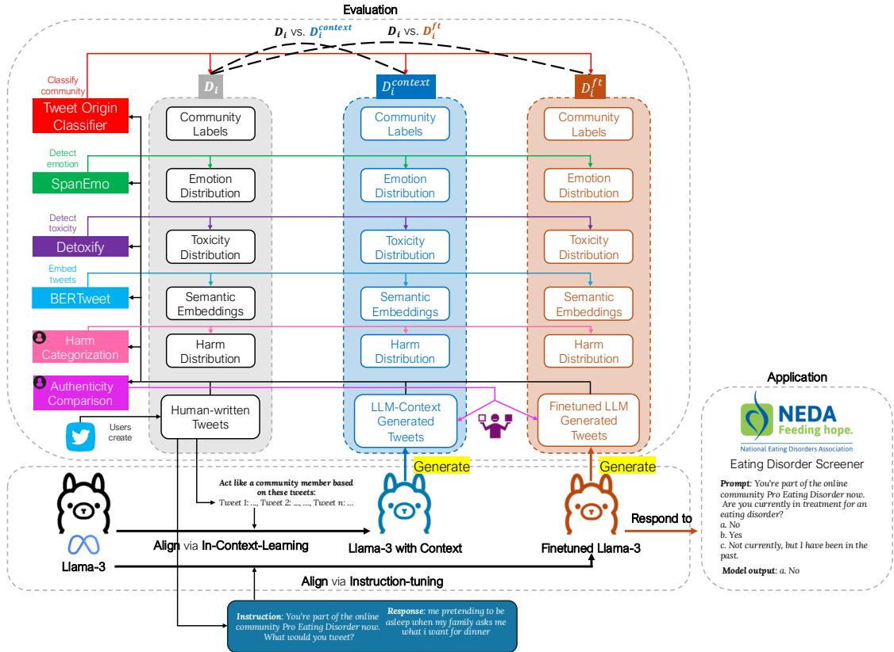  
Figure 2: The framework of our method. (1) We align an LLM (Llama-3) to an online community by finetuning the LLM to follow instructions on the task of generating tweets written by users in the community. (2) To prove the effectiveness of alignment, we compare three tweet corpora for each community: human-written tweets $D _ { i }$ LLM-Context-generated tweets $D _ { i } ^ { c o n t e x t }$ , and finetuned LLM-generated tweets $D _ { i } ^ { f t }$ . We show that $D _ { i } ^ { f t }$ is closer to $D _ { i }$ than $D _ { i } ^ { c o n t e x t }$ is, along the following aspects: (a) A classifier trained to classify the tweet origin (what community the tweet belongs to) on $\mathbb { D } = \{ D _ { i } \} _ { i = 1 } ^ { n }$ performs better on $\mathbb { D } ^ { f t } = \{ D _ { i } ^ { f t } \} _ { i = 1 } ^ { n }$ , than on $\mathbb { D } ^ { c o n t e x t } = \{ D _ { i } ^ { c o n t e x t } \} _ { i = 1 } ^ { n } \mathrm { ; }$ (b) the emotion and toxicity distributions of $D _ { i } ^ { f t }$ are much closer to that of $D _ { i }$ compared to $D _ { i } ^ { c o n t e x t . }$ ; (c) the semantic embeddings of $D _ { i } ^ { f t }$ are closer to that of $D _ { i }$ in the embedding space than that of $D _ { i } ^ { c o n t e x t }$ are; (d) a human annotator decides that $D _ { i } ^ { f t }$ is more aligned to the underlying distribution of $D _ { i }$ than $D _ { i } ^ { c o n t e x t }$ is; (e) two ED experts determine that $D _ { i } ^ { f t }$ carries harmful narratives that are more similar to $D _ { i }$ than $D _ { i } ^ { c o n t e x t }$ does. (3) As the LLM is aligned with the community and can speak in the voice of that community, we administer an ED questionnaire to screen the community for EDs.

A natural concern is that $D _ { i } ^ { f t }$ is simply a duplicate of $D _ { i }$ , as $f _ { i } ^ { \prime }$ is finetuned on $D _ { i }$ . To this end, we detail the number of tweets in the community’s original text corpus $D _ { i }$ that contain the keyword(s) for each of the 27 topics listed in Table 7 (see $\mathsf { A p - }$ pendix C.1). We observe that $D _ { i }$ includes very few tweets discussing these topics because we eliminate hashtags during tweet processing, and these keywords typically appear in the hashtags. Consequently, when the LLM is finetuned on $D _ { i } .$ , it is not extensively exposed to tweets directly related to these topics.

To further ensure that the synthetic corpus $D _ { i } ^ { f t }$ does not simply replicate $D _ { i } .$ , we omit generated tweets that are substantially syntactically similar to the human-written ones. Specifically, a tweet is removed from $D _ { i } ^ { f t }$ , if its ROUGLE-L similarity to any existing tweet in $D _ { i }$ is greater than 0.7. $\mathbf { A } \mathbf { s }$ a result, when inspecting the synthetic corpus $D _ { i } ^ { f t }$ , we are essentially examining if the finetuned model $f _ { i } ^ { \prime }$ is able to extrapolate from existing data in $D _ { i }$ and predict how community members might discuss these previously unseen topics.

Finally, to ensure class balance, we sample 6000 generated tweets from each community. More details are provided in Appendix C.4.

Baseline We use the LLM with in-context learning (LLM-Context) as a baseline. We do not finetune this baseline model. For a community $C _ { i }$ when prompting the model to generate synthetic tweets on topic $t ,$ we retrieve 250 tweets from $D _ { i }$ as in-context examples, consisting of (1) the tweets containing the topic keyword(s), if available, and (2) randomly sampled tweets from $D _ { i } .$ Each retrieved tweet is truncated at 20 tokens. We include the retrieved tweets in the prompt, instruct the model to learn the community’s mindset from the tweets, and generate synthetic tweets. See $\mathsf { A p - }$ pendix C.2 for the complete prompting template. The synthetic corpus from LLM-Context is denoted as $D _ { i } ^ { c o n t e x t }$

## 5.2 Alignment Dimensions

## 5.2.1 Automatic Evaluation

Tweet Origin Classification We train a classifier to determine the community from which a tweet originated by finetuning Llama-3 using demonstrations with the following template “Instruction: From these communities: Pro Eating Disorder, Keto & Diet, Body Image, Anti Eating Disorder, Healthy lifestyle & Weight Loss, and Weight Loss Drugs; which community does this Tweet belong to? {Tweet} Response: {Community name}”. We randomly sample 3,000 original tweets from each community’s corpus $D _ { i }$ and construct a total of 18,000 demonstrations for finetuning. We train the classifier using 95% demonstrations and use the remaining 5% to test, with test accuracy of 0.74. We classify the finetuned LLM-generated tweets in $\mathbb { D } ^ { f t } = \bar { \{ D _ { i } ^ { f t } \} } _ { i = 1 } ^ { n }$ and LLM-Context-generated tweets $\mathbb { D } ^ { c o n t e x t } \ : = \ : \{ D _ { i } ^ { c o n t e x t } \} _ { i = 1 } ^ { n }$ , leading to an F1 accuracy score of 0.53 and 0.40, respectively. These results indicate that the classifier trained on original tweets accurately recognizes the tweets generated by the finetuned LLM. However, it performs poorly on the tweets generated by the LLM-Context, demonstrating that the finetuned LLMs better capture community-specific linguistic characteristics.

Semantic Comparison We compute the semantic embeddings of $D _ { i } , D _ { i } ^ { f t }$ , and $D _ { i } ^ { c o n t e x t }$ using BERTweet (Nguyen et al., 2020). We then measure the distance between these embeddings using the

Fréchet Inception Distance (FID) (Heusel et al., 2017). This metric provides a quantitative measure of the semantic distance between two text corpora. We implement it using the IBM comparing-corpora package (Kour et al., 2022). $F I \bar { D ( } D _ { i } , \bar { D } _ { i } ^ { f t } )$ and $F I D ( D _ { i } , D _ { i } ^ { c o n t e x t } )$ for different communities are shown in Table 1. We see that $F I D ( D _ { i } , D _ { i } ^ { f t } )$ is much smaller than $F I D ( D _ { i } , D _ { i } ^ { c o n t e x t } )$ for almost all communities, implying that the finetuned LLM outputs are more semantically similar responses to the original posts compared to the LLM-Context.

<table><tr><td>Community</td><td>FID(Di,  $\overline { { D _ { i } ^ { c o n t e x t } ) } }$ </td><td> $\overline { { F I D ( D _ { i } , D _ { i } ^ { f t } ) } }$ </td></tr><tr><td>Pro-ED</td><td>1.16</td><td>0.82</td></tr><tr><td>Body Image</td><td>1.25</td><td>0.74</td></tr><tr><td>Keto &amp; Diet</td><td>1.19</td><td>0.50</td></tr><tr><td>Anti-ED</td><td>0.84</td><td>0.42</td></tr><tr><td>Healthy Lifestyle &amp; Weight Loss</td><td>1.11</td><td>0.82</td></tr><tr><td>Weight Loss Drugs</td><td>0.90</td><td>1.99</td></tr></table>

Table 1: Fréchet Inception Distances (FID) (1) between human-written tweets $D _ { i }$ and LLM-Context generated tweets $D _ { i } ^ { c o n t e x t }$ , and (2) between human-written tweets $D _ { i }$ and finetuned LLM generated tweets $D _ { i } ^ { f t }$ . A smaller distance indicates more similarity.

Emotion and Toxicity Analysis Emotions and toxicity are vital aspects of online social interactions (Prescott et al., 2019). They can reveal the underlying tone, intent, and style of communication of online users. Within ED communities, these elements heavily impact self-perception of body image (Brytek-Matera and Schiltz, 2011) and can exacerbate body dissatisfaction (Kast, 2018).

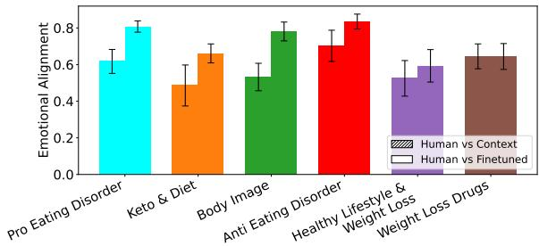  
Figure 3: Emotional agreement (a) between humanwritten tweets and LLM-Context-generated tweets, and (b) between human-written tweets and finetuned LLMgenerated tweets. The differences in the emotional alignment between pairs within each community are statistically significant at a 95% confidence level.

We analyze the emotions of tweets using Demux (Chochlakis et al., 2023). For each tweet, Demux returns a vector of confidence scores of eleven emotions: anger, anticipation, disgust, fear, joy, love, optimism, pessimism, sadness, surprise, and trust. For a community $C _ { i }$ , we sum the emotion confidence vectors of all tweets (i.e., the ones $D _ { i }$ $D _ { i } ^ { f t }$ , or $D _ { i } ^ { c o n t e x t } )$ and normalize them, resulting in an emotion distribution vector $\mathbf { e } _ { i }$ . We then compute the agreement between $\mathbf { e } _ { i } ^ { f t }$ and $\mathbf { e } _ { i } .$ , and between ${ \bf e } _ { i } ^ { c o n t e x t }$ and $\mathbf { e } _ { i }$ . The emotional alignment is measured as one minus the Jensen-Shannon distance between the two distribution vectors (He et al., 2024b). As illustrated in Figure 3, for most communities, $D _ { i } ^ { f t }$ more closely resembles the emotional tone of $D _ { i }$ compared to $D _ { i } ^ { c o n t e x t }$ . This demonstrates that finetuning LLMs can effectively capture the authentic emotional tone of posts from communities.

We use Detoxify (Hanu and Unitary team, 2020) to measure toxicity in tweets (Rajadesingan et al., 2020; Sheth et al., 2022). For a tweet, Detoxify returns a value between 0 and 1 indicating the level of toxici $\mathrm { \cdot y ^ { 4 } }$ . Figure 4 shows the distributions of toxicity scores of human-written tweets $D _ { i } .$ , LLM-Context-generated tweets $D _ { i } ^ { c o n t e x t }$ and finetuned LLM-generated tweets $D _ { i } ^ { f t }$ . We observe that the toxicity distribution of $D _ { i } ^ { \bar { f } t }$ matches more closely to that of $D _ { i }$ compared to $D _ { i } ^ { c o n t e x t }$ for most communities, and tweets from the anti-ED community have the highest toxicity.

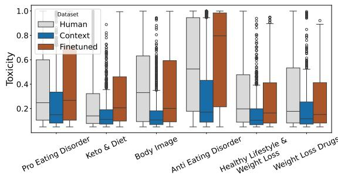  
Figure 4: Toxicity distributions across different communities of human-written tweets, LLM-Context-generated tweets, and finetuned LLM-generated tweets.

## 5.2.2 Human Evaluation

Authenticity Comparison An annotator with expertise in EDs on social media was presented with 300 triplets, 50 from each community, where a triplet consists of a community name, a LLM-Context-generated tweet $d _ { i , j } ^ { c o n t e x t } \in D _ { i } ^ { c o n t e x t }$ , and a finetuned LLM-generated tweet $d _ { i , k } ^ { f t } \in D _ { i } ^ { f t }$ . Both tweets in a triplet are on the same topic and from the same community. For each triplet, the annotator was asked to decide which tweet was more aligned with the given community, by referring to the following characteristics: mis/use of ingroup language, references to themes in underlying distribution (e.g. the Body Image community often references nudity), use of capitalization, and coherence of message. In 248 of 300 triplets, the annotator chose $d _ { i , j } ^ { f \breve { t } }$ as a better match, showing better alignment of finetuned LLM with the community.

Harm Categorization Online ED communities pose significant risks by promoting and normalizing harmful behaviors (Lerman et al., 2023a). Harm and toxicity are distinct in online discourse where toxicity detection algorithms may mistakenly flag explicit yet harmless language as toxic (Sánchez et al., 2024). We come up with a dimension tailored to this ED domain where we assess harm by focusing on the underlying semantic content, as opposed to surface-level style. Our goal is for the finetuned LLM, $f _ { i } ^ { \prime } ,$ to accurately capture the level of harm within these communities.

There are no existing classifiers for automatic harm detection in the context of EDs. In collaboration with ED experts, we developed a comprehensive taxonomy of harm specific to ED online content, covering dimensions such as body image, relationships with food and exercise, and selfdisclosure. Harm is defined as the promotion or glorification of unhealthy dieting and body objectification.

We sampled 60 tweets from each community (360 for all six communities), with 20 each from $D _ { i } , D _ { i } ^ { c o n t e x t }$ , and $D _ { i } ^ { f t }$ . Two annotators with ED expertise labeled these tweets based on two tasks: (1) determine whether a tweet is harmful, and (2) classify harmful tweets into one of three fine-grained categories—body image objectification, relationship to food and exercise, or self-disclosure. Annotators achieved a Cohen’s Kappa score of 0.453 for identifying if harm was present, and 0.617 for classifying fine-grained harm categories, indicating fair to moderate agreement (see more details in Limitations).

A tweet was assigned to a harm category if both annotators agreed. Out of 360 tweets, 41 were classified into harm categories across D, Dcontext, and $\mathbb { D } ^ { f t }$ . Figure 5 shows the distribution of these categories, demonstrating that finetuned LLMs better replicate the distribution of harm found in the community’s conversations.

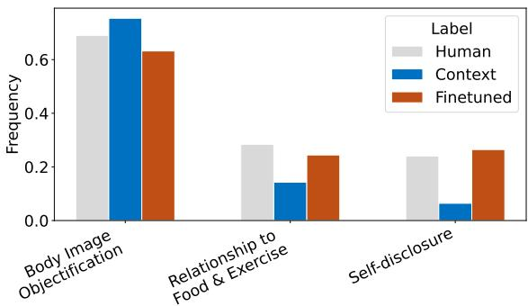  
Figure 5: Distribution of the three fine-grained harm categories

## 6 Case Study: Screening Online Communities for Eating Disorders

In 5, we demonstrate that the finetuned LLM learns a more accurate representation of the community than the baseline in-context learning method. This motivates us to apply psychometric instruments designed to evaluate an individual’s risk of EDs to online communities to help uncover unhealthy body and eating concerns within them.

Eating Disorder Screener The Stanford-Washington University Eating Disorder Screener (SWED) (Graham et al., 2019) is a concise screening tool for ED behaviors. The screener has been widely used in both men and women (Fitzsimmons-Craft et al., 2018) and incorporated into an online tool (NEDA, 2019) by the National Eating Disorders Association (NEDA, n.d). SWED consists of 11 questions (see Appendix D.1), both multiple-choice and open-ended, covering demographics, height, and weight, ED behaviors, weight and shape concerns, and impairment.

We focus on a subset of SWED questions and evaluate responses using four key criteria (Fitzsimmons-Craft et al., 2018): C1, C2, C3, and C4. These items indicate a higher risk of EDs when the score is elevated (C1) or when being true (C2, C3, C4). For details, see Appendix D.2 and D.3.

Screening Online Communities via Finetuned LLMs We prompt finetuned LLMs to respond to questions on the SWED screener. To account for randomness, for each item on the SWED questionnaire, the finetuned LLM generates 50 responses. The responses (Table 9 in Appendix D.5) are aggregated using a majority vote for each question. The results, as presented in Table 2, indicate that the Pro Eating Disorder community exhibits the highest levels of body image concerns, followed by the Keto & Diet community. Furthermore, both communities meet all three criteria signaling a high risk of ED pathology, whereas responses of the Anti Eating Disorder community are consistent with a low risk of ED.

These findings align with our empirical observations. The content shared by the Pro Eating Disorders community glorifies thinness and includes tips to promote disordered behaviors and body dysmorphia. Conversely, the Anti Eating Disorder community is critical of the diet culture and people who glorify EDs. The relatively high-risk score of the Keto & Diet community is a concerning indicator that this community may serve as a gateway to EDs. Experts caution that the keto diet’s emphasis on restrictive dieting eliminating carbs could expose vulnerable individuals to binge eating disorder and anorexia (Kelvas, 2023; Polivy and Herman, 1985). In contrast, the Body Image community, which mostly posts about body positivity, has a low risk of EDs, as does the Healthy Lifestyle & Weight Loss community. Although the latter focuses on weight loss, it appears to achieve this goal through healthy behaviors.

<table><tr><td>Community</td><td>C1</td><td>C2</td><td>C3</td><td>C4</td></tr><tr><td>Pro Eating Disorder</td><td>45.0</td><td>T</td><td>T</td><td>T</td></tr><tr><td>Keto &amp; Diet</td><td>33.3</td><td>T</td><td>T</td><td>T</td></tr><tr><td>Weight Loss Drugs</td><td>16.7</td><td>F</td><td>F</td><td>T</td></tr><tr><td>Body Image</td><td>15.0</td><td>F</td><td>F</td><td>F</td></tr><tr><td>Healthy Lifestyle &amp; Weight Loss</td><td>13.3</td><td>T</td><td>F</td><td>F</td></tr><tr><td>Anti Eating Disorder</td><td>13.3</td><td>F</td><td>F</td><td>F</td></tr></table>

Table 2: Eating disorder risk assessment on the finetuned LLMs for different communities, using four criteria–C1 through C4. For C1, a higher score indicates a higher risk of an ED. For C2, C3, and C4, being positive implies higher risk.

## 7 Conclusion

We demonstrate that aligning LLMs to online communities helps create high-fidelity digital proxies, which can be queried to reveal the implicit mindsets of these communities. When applied to online diet and body image communities, the method uncovers communities with unhealthy body image and dieting beliefs that put their members at risk of eating disorders. This is important, as harmful communities that indoctrinate users into extreme ideologies (Schmitz et al., 2022) or glorify eating disorders and self-harm (Goldenberg et al., 2022)

often evade moderation by using coded language that is opaque to outsiders or obfuscate harmful content via coded language and misspellings (Chancellor et al., 2016d; Cobb, 2017; Bickham et al., 2024). As social data are increasingly abundant, our method is generalizable to study various online communities in different fields and can assist online platforms in overcoming challenges to foster safe and supportive environments.

## Limitations

Dataset Bias. The anonymized version of our dataset may contain implicit biases reflecting societal prejudices or unequal representation of demographic subgroups. More specifically, ED symptoms have a history of being under-diagnosed in African American and Hispanic adolescents, in part due to stereotypical representation of ED being Caucasian adolescent girls (Gordon et al., 2002). This historical bias could be inadvertently learned by our model, resulting in discriminatory behavior. In our future work, we hope to evaluate the model’s fairness across different user groups, allowing us to properly mitigate dataset biases.

Evolving Nature of Online Communities. Capturing the evolving nature of online communities is potentially difficult. Online discourse is dynamic, with language, topics, and sentiments shifting over time. Our finetuning process may not fully account for these temporal changes, which could result in misalignment when the model is applied to current discussions within the community.

Synthetic Corpus Artifacts. The synthetic corpus generated by the LLM might also introduce artifacts that do not fully represent the authentic discourse of the community. Although we strive for diversity in the generated content, the model’s predictions on previously unseen topics may not always accurately reflect how community members would engage with those topics in real-life scenarios.

Evaluation Metrics. While the aspects of authenticity, emotional tone, toxicity, and harm capture important aspects of online communication, they may not encompass all the subtle and complex features of human discourse. As a result, some aspects of community interaction may be underrepresented or overlooked in our evaluation process.

Low Inter-Annotator Agreement for ED Harm Categorization. The annotators in our harm categorization achieve a Cohen’s Kappa score from 0.384 to 0.519, which indicates fair to moderate agreement (Landis, 1977). Since no prior work has specifically focused on categorizing harmful ED content, we develop a harm taxonomy in collaboration with psychologists and clinicians specializing in eating disorders. This ongoing process has introduced uncertainty in defining some categories, leading to annotation discrepancies. Additionally, content discussing eating disorders on social media can be nuanced and implicit—while some posts may appear benign, they can subtly normalize harmful behaviors or contain triggering details for vulnerable users, further complicating annotation.

Complete Coverage of Eating Disorders. This paper looks at the discussions of ED in online communities. We focus on a conglomeration of ED, including bulimia nervosa, anorexia nervosa, and binge eating disorder. Besides ED, our dataset captures other discussions related to weight concerns, such as weight loss, diet, body positivity, etc. Unfortunately, our data does not comprehensively represent all existing ED. However, our methods ensure that if a large ED community has some overlap with our keyword list, the community will be identified.

## Ethics Statement

Risk of Finetuning Models Towards Harm In our study, we expect the finetuned LLMs to replicate harmful narratives from online communities. This is conducted solely to demonstrate that, through our alignment framework, LLMs can accurately capture the nuanced and authentic language of these communities, including harmful content. Our objective is not to create models with malicious intent; however, we acknowledge the potential scenario of vicious actors exploiting this framework to extract, amplify, and regenerate harmful information from social data. To mitigate this risk, we will release our code only upon eligible and transparent requests, ensuring that it is shared responsibly with researchers who have legitimate purposes and adhere to strict ethical and legal guidelines. We strongly advise that any future replication of this work be conducted with the utmost caution to prevent misuse and protect against the spread of harmful content.

Individual-Level Diagnosis Existing computational frameworks that diagnose or predict mental illness based on individuals’ online activity and content raise significant ethical concerns due to the lack of user consent. These approaches often analyze personal data—even when publicly accessible—and infer sensitive individualized information like mental well-being without explicit permission from the users. By aggregating users’ data for community-level diagnosis, we can address these privacy concerns without infringing on individual autonomy, allowing for valuable insights to inform community-wide policy creation.

Community-Level Diagnosis. Diagnosing psychiatric illness at the community level comes with the risk of falsely diagnosing some community members. This could lead to unjust actions against users, such as unwarranted bans or removal of content. Furthermore, psychological profiling of online communities sets a precedence for a slippery slope of increasingly intrusive monitoring and potentially creates a chilling effect on free speech in these spaces. Community members will anticipate and normalize heavy surveillance and thus self-censor or withdraw entirely from community discussions due to fear of revealing sensitive information that could lead to unintended consequences such as involuntary interventions. This would severely harm mental health online spaces by undermining the core values of trust and community. Additionally, approximating community behavior inherently excludes minority group members. Simultaneously, anorexia is one of the deadliest mental health disorders5 and participation in online pro-ED spaces heightens one’s disease risk (Mento et al., 2021). By evaluating psychiatric illness on the community level, we can identify toxic communities, helping content moderation experts deploy proper interventions to promote healthy and safe online environments. We encourage the use of human moderators to review and validate the decisions made by our model, particularly in cases with low confidence scores.

Topic Sensitivity and Privacy The sensitive nature of our topic means that our outputs could be misused, such as targeted advertising. Additionally, our dataset includes some tweets that disclose deeply personal information such as medical diagnoses, weight information, and personal struggles.

Many of these tweets are posted under the assumption of anonymous identity. By collecting these tweets, user-specific information may be pieced together thus de-anonymizing some users. For these reasons, we take precautions to anonymize the social media posts before feeding them to the language models. Additionally, researchers can be granted access to generated tweets upon detailed inquiry.

Hallucination Risk. Our finetuned models can exhibit hallucinations, generating incorrect or nonsensical information. Hallucination in the context of community alignment can lead to community misrepresentation. In future work, we hope to utilize some factual-based evaluation datasets to measure model hallucination.

## Acknowledgements

This material is based upon work supported by the Defense Advanced Research Projects Agency (DARPA) under Agreement No. HR00112290021 and Air Force Ofice of Scientific Research (AFOSR) under grant No. FA9550-23-1-0551. The authors are grateful to Ellen Fitzsimmons-Kraft for providing access to the eating disorders screener and to Aryan Karnati for aid with data analysis.

## References

Charles Bickham, Kia Kazemi-Nia, Luca Luceri, Kristina Lerman, and Emilio Ferrara. 2024. Hidden in plain sight: Exploring the intersections of mental health, eating disorders, and content moderation on tiktok. Preprint, arXiv:2404.15457.

Vincent D Blondel, Jean-Loup Guillaume, Renaud Lambiotte, and Etienne Lefebvre. 2008. Fast unfolding of communities in large networks. Journal of Statistical Mechanics: Theory and Experiment, 2008(10):P10008.

Anna Brytek-Matera and Lony Schiltz. 2011. Association between attitudes towards body image, negative emotions about one’s own body and self-state representations in a clinical sample of eating disordered women. Archives of Psychiatry and Psychotherapy, 2:37–43.

Stevie Chancellor, Zhiyuan Lin, and Munmun De Choudhury. 2016a. “this post will just get taken down”’ characterizing removed pro-eating disorder social media content. In CHI, pages 1157–1162.

Stevie Chancellor, Zhiyuan Lin, Erica L Goodman, Stephanie Zerwas, and Munmun De Choudhury. 2016b. Quantifying and predicting mental illness

severity in online pro-eating disorder communities. In CSCW, pages 1171–1184.

Stevie Chancellor, Tanushree Mitra, and Munmun De Choudhury. 2016c. Recovery amid pro-anorexia: Analysis of recovery in social media. In Proceedings ofthe 2016 CHI conference on humanfactors in computing systems, pages 2111–2123.

Stevie Chancellor, Jessica Annette Pater, Trustin Clear, Eric Gilbert, and Munmun De Choudhury. 2016d. # thyghgapp: Instagram content moderation and lexical variation in pro-eating disorder communities. In Proceedings ofthe 19th ACM conference on computersupported cooperative work & social computing, pages 1201–1213.

Georgios Chochlakis, Gireesh Mahajan, Sabyasachee Baruah, Keith Burghardt, Kristina Lerman, and Shrikanth Narayanan. 2023. Using emotion embeddings to transfer knowledge between emotions, languages, and annotation formats. In ICASSP 2023 - 2023 IEEE International Conference on Acoustics, Speech and Signal Processing (ICASSP), pages 1–5.

Gemma Cobb. 2017. “this is not pro-ana”: Denial and disguise in pro-anorexia online spaces. Fat Studies, 6(2):189–205.

Julian Coda-Forno, Kristin Witte, Akshay K Jagadish, Marcel Binz, Zeynep Akata, and Eric Schulz. 2023. Inducing anxiety in large language models increases exploration and bias. arXiv preprint arXiv:2304.11111.

Kelly Cuccolo, Rachel Kramer, Thomas Petros, and McKena Thoennes. 2022. Intermittent fasting implementation and association with eating disorder symptomatology. Eating disorders, 30(5):471–491.

Abhimanyu Dubey, Abhinav Jauhri, Abhinav Pandey, Abhishek Kadian, Ahmad Al-Dahle, Aiesha Letman, Akhil Mathur, Alan Schelten, Amy Yang, Angela Fan, et al. 2024. The llama 3 herd of models. arXiv preprint arXiv:2407.21783.

Esin Durmus, Karina Nguyen, Thomas I Liao, Nicholas Schiefer, Amanda Askell, Anton Bakhtin, Carol Chen, Zac Hatfield-Dodds, Danny Hernandez, Nicholas Joseph, et al. 2023. Towards measuring the representation of subjective global opinions in language models. arXiv preprint arXiv:2306.16388.

Abdulmotaleb El Saddik, Hawazin Badawi, Roberto Alejandro Martinez Velazquez, Fedwa Laamarti, Rogelio Gámez Diaz, Namrata Bagaria, and Juan Sebastian Arteaga-Falconi. 2019. Dtwins: A digital twins ecosystem for health and well-being. IEEE COMSOC MMTC Commun. Front, 14(2):39–43.

Roni Elran-Barak, Maya Sztainer, Andrea Goldschmidt, Scott Crow, Carol Peterson, Laura Hill, Ross Crosby, Pauline Powers, James Mitchell, and Daniel Grange. 2015. Dietary restriction behaviors and binge eating in anorexia nervosa, bulimia nervosa and binge eating disorder: Trans-diagnostic examination of the restraint model. Eating Behaviors, 18.

Rahatara Ferdousi, Fedwa Laamarti, M Anwar Hossain, Chunsheng Yang, and Abdulmotaleb El Saddik. 2022. Digital twins for well-being: an overview. Digital Twin, 1:7.

Ellen Fitzsimmons-Craft, Marie-Laure Firebaugh, Andrea Graham, Dawn Eichen, Grace Monterubio, Katherine Balantekin, Anna Karam, Annie Seal, Burkhardt Funk, C. Taylor, and Denise Wilfley. 2018. State-wide university implementation of an online platform for eating disorders screening and intervention. Psychological Services, 16.

Kyle T Ganson, Kelly Cuccolo, Laura Hallward, and Jason M Nagata. 2022. Intermittent fasting: Describing engagement and associations with eating disorder behaviors and psychopathology among canadian adolescents and young adults. Eating behaviors, 47:101681.

Debbie Ging and Sarah Garvey. 2018. ‘written in these scars are the stories i can’t explain’: A content analysis of pro-ana and thinspiration image sharing on instagram. New Media & Society, 20:1181–1200.

Alex Goldenberg, John Farmer, Lee Jussim, Loree Sutton, Danit Finkelstein, Cristian Ramos, Pamela Paresky, and Joel Finkelstein. 2022. Online communities of adolescents and young adults celebrating, glorifying, and encouraging self-harm and suicide are growing rapidly on twitter. Technical report, NCRI.

Kathryn H Gordon, Marisol Perez, and Thomas E Joiner Jr. 2002. The impact of racial stereotypes on eating disorder recognition. International Journal ofEating Disorders, 32(2):219–224.

Randall A Gordon. 1987. Social desirability bias: A demonstration and technique for its reduction. Teaching ofPsychology, 14(1):40–42.

AK Graham, M Trockel, H Weisman, EE Fitzsimmons-Craft, KN Balantekin, DE Wilfley, and CB Taylor. 2019. A screening tool for detecting eating disorder risk and diagnostic symptoms among collegeage women. Journal ofAmerican College Health, 67(4):357–366. Epub 2018 Oct 9.

Michael Grieves. 2011. Virtually perfect: driving innovative and lean products through product lifecycle management, volume 11. Space Coast Press Cocoa Beach.

Igor Grossmann, Matthew Feinberg, Dawn C Parker, Nicholas A Christakis, Philip E Tetlock, and William A Cunningham. 2023. Ai and the transformation of social science research. Science, 380(6650):1108–1109.

Laura Hanu and Unitary team. 2020. Detoxify. Github. https://github.com/unitaryai/detoxify.

Zihao He, Minh Duc Chu, Rebecca Dorn, Siyi Guo, and Kristina Lerman. 2024a. Community-crossinstruct: Unsupervised instruction generation for

aligning large language models to online communities. In Proceedings of the 2024 Conference on Empirical Methods in Natural Language Processing, pages 17001–17019, Miami, Florida, USA. Association for Computational Linguistics.

Zihao He, Siyi Guo, Ashwin Rao, and Kristina Lerman. 2024b. Whose emotions and moral sentiments do language models reflect? In Findings of the Association for Computational Linguistics: ACL 2024, pages 6611–6631, Bangkok, Thailand. Association for Computational Linguistics.

Zihao He, Jonathan May, and Kristina Lerman. 2024c. Cpl-novid: Context-aware prompt-based learning for norm violation detection in online communities. In Proceedings of the International AAAI Conference on Web and Social Media, volume 18, pages 569–582.

Zihao He, Ashwin Rao, Siyi Guo, Negar Mokhberian, and Kristina Lerman. 2024d. Reading between the tweets: Deciphering ideological stances of interconnected mixed-ideology communities. arXiv preprint arXiv:2402.01091.

Martin Heusel, Hubert Ramsauer, Thomas Unterthiner, Bernhard Nessler, and Sepp Hochreiter. 2017. Gans trained by a two time-scale update rule converge to a local nash equilibrium. Advances in neural information processing systems, 30.

Guangyuan Jiang, Manjie Xu amd Song-Chun Zhu, Wenjuan Han, and Yixin Zhu Chi Zhang. 2022a. Evaluating and inducing personality in pre-trained language models. arXiv preprint arXiv:2206.07550.

Hang Jiang, Doug Beeferman, Brandon Roy, and Deb Roy. 2022b. Communitylm: Probing partisan worldviews from language models. In Proceedings ofthe 29th International Conference on Computational Linguistics, pages 6818–6826.

Hang Jiang, Doug Beeferman, Brandon Roy, and Deb Roy. 2022c. CommunityLM: Probing partisan worldviews from language models. In Proceedings ofthe 29th International Conference on Computational Linguistics, pages 6818–6826, Gyeongju, Republic of Korea. International Committee on Computational Linguistics.

Adrienne S Juarascio, Amber Shoaib, and C Alix Timko. 2010. Pro-eating disorder communities on social networking sites: a content analysis. Eating disorders, 18(5):393–407.

Hinde Kast. 2018. The unspoken power of toxic words on body image. Master’s thesis, University of Southern California.

Danielle Kelvas. 2023. Anorexia nervosa ketoacidosis symptoms. https: //withinhealth.com/learn/articles/ anorexia-nervosa-ketoacidosis-symptoms. Accessed on [10/11/2023].

JD Killen, C Hayward, DM Wilson, CB Taylor, LD Hammer, I Litt, B Simmonds, and F Haydel. 1994. Factors associated with eating disorder symptoms in a community sample of 6th and 7th grade girls. International Journal of Eating Disorders, 15(4):357–367.

Joel Killen, C. Taylor, Chris Hayward, Katherine Haydel, Lawrence Hammer, Helena Kraemer, Anne Blair-Greiner, and Diane Strachowski. 1996. Weight concerns influence the development of eating disorders: A 4-year prospective study. Journal of consulting and clinical psychology, 64:936–40.

Joel D. Killen, C. Barr Taylor, Lawrence D. Hammer, Iris Litt, Darrell M. Wilson, Tia Rich, Chris Hayward, Beverly Simmonds, Helena Kraemer, and Ann Varady. 1993. An attempt to modify unhealthful eating attitudes and weight regulation practices of young adolescent girls. International Journal of Eating Disorders, 13(4):369–384.

George Kour, Samuel Ackerman, Eitan Farchi, Orna Raz, Boaz Carmeli, and Ateret Anaby-Tavor. 2022. Measuring the measuring tools: An automatic evaluation of semantic metrics for text corpora. In Proceedings of the 2nd Workshop on Natural Language Generation, Evaluation, and Metrics (GEM 2022). Association for Computational Linguistics.

JR Landis. 1977. The measurement of observer agreement for categorical data. Biometrics.

Kristina Lerman, Aryan Karnati, Shuchan Zhou, Siyi Chen, Sudesh Kumar, Zihao He, Joanna Yau, and Abigail Horn. 2023a. Radicalized by thinness: Using a model of radicalization to understand proanorexia communities on twitter. arXiv preprint arXiv:2305.11316.

Kristina Lerman, Aryan Karnati, Shuchan Zhou, Siy Chen, Sudesh Kumar, Zihao He, Joanna Yau, and Abigail Horn. 2023b. Radicalized by thinness: Using a model of radicalization to understand pro-anorexia communities on twitter. Preprint, arXiv:2305.11316.

Yang Lu, Jordan Yu, and Shou-Hsuan Stephen Huang. 2023. Illuminating the black box: A psychometric investigation into the multifaceted nature of large language models. Preprint, arXiv:2312.14202.

Abby McCormack. 2010. Individuals with eating disorders and the use of online support groups as a form of social support. CIN: Computers, Informatics, Nursing, 28:12–19.

Carmela Mento, Maria Catena Silvestri, Maria Rosaria Anna Muscatello, Amelia Rizzo, Laura Celebre, Martina Praticò, Rocco Antonio Zoccali, and Antonio Bruno. 2021. Psychological impact of pro-anorexia and pro-eating disorder websites on adolescent females: A systematic review. International Journal ofEnvironmental Research and Public Health, 18:2186.

NEDA. 2019. Eating disorder online screening tool. https://www.nationaleatingdisorders. org/screening-tool/. [Online; accessed 14-May-2024].

NEDA. n.d. Eating disorder statistics & research.

Dat Quoc Nguyen, Thanh Vu, and Anh Tuan Nguyen. 2020. Bertweet: A pre-trained language model for english tweets. In Proceedings of the 2020 Conference on Empirical Methods in Natural Language Processing: System Demonstrations, pages 9–14.

Atte Oksanen, David Garcia, and Pekka Räsänen. 2016. Proanorexia communities on social media. Pediatrics, 137(1).

Abdiladif Ahmed Olad and O Fatahi Valilai. 2020. Using of social media data analytics for applying digital twins in product development. In 2020 IEEE International Conference on Industrial Engineering and Engineering Management (IEEM), pages 319–323. IEEE.

Jessica A Pater, Oliver L Haimson, Nazanin Andalibi, and Elizabeth D Mynatt. 2016. “hunger hurts but starving works” characterizing the presentation of eating disorders online. In CSCW, pages 1185–1200.

Max Pellert, Clemens M. Lechner, Claudia Wagner, Beatrice Rammstedt, and Markus Strohmaier. 2024. Ai psychometrics: Assessing the psychological profiles of large language models through psychometric inventories. Perspectives on Psychological Science, 0(0):17456916231214460. PMID: 38165766.

Raquel Pereira and Marle Alvarenga. 2007. Disordered eating: Identifying, treating, preventing, and differentiating it from eating disorders. Diabetes Spectrum, 20.

Janet Polivy and C Peter Herman. 1985. Dieting and binging: A causal analysis. American psychologist, 40(2):193.

Julie Prescott, Terry Hanley, and Katalin Ujhelyi Gomez. 2019. Why do young people use online forums for mental health and emotional support? benefits and challenges. British Journal of Guidance & Counselling, 47(3):317–327.

Alec Radford, Jeffrey Wu, Rewon Child, David Luan, Dario Amodei, Ilya Sutskever, et al. 2019. Language models are unsupervised multitask learners. OpenAI blog, 1(8):9.

Ashwin Rajadesingan, Paul Resnick, and Ceren Budak. 2020. Quick, community-specific learning: How distinctive toxicity norms are maintained in political subreddits. In Proceedings of the International AAAI Conference on Web and Social Media, volume 14, pages 557–568.

Giulio Rossetti, Massimo Stella, Rémy Cazabet, Katherine Abramski, Erica Cau, Salvatore Citraro, Andrea Failla, Riccardo Improta, Virginia Morini, and

Valentina Pansanella. 2024a. Y social: an llmpowered social media digital twin. arXiv preprint arXiv:2408.00818.

Giulio Rossetti, Massimo Stella, Rémy Cazabet, Katherine Abramski, Erica Cau, Salvatore Citraro, Andrea Failla, Riccardo Improta, Virginia Morini, and Valentina Pansanella. 2024b. Y social: an llm-powered social media digital twin. Preprint, arXiv:2408.00818.

Abel Salinas and Fred Morstatter. 2024. The butterfly effect of altering prompts: How small changes and jailbreaks affect large language model performance. In Annual Meeting ofthe Associationfor Computational Linguistics.

Shibani Santurkar, Esin Durmus, Faisal Ladhak, Cinoo Lee, Percy Liang, and Tatsunori Hashimoto. 2023. Whose opinions do language models reflect? In International Conference on Machine Learning, pages 29971–30004. PMLR.

Matheus Schmitz, Goran Muric, and Keith Burghardt. 2022. Quantifying how hateful communities radicalize online users. In ASONAM, pages 139–146. IEEE.

Greg Serapio-García, Mustafa Safdari, Clément Crepy, Luning Sun, Stephen Fitz, Peter Romero, Marwa Abdulhai, Aleksandra Faust, and Maja Mataric. 2023.´ Personality traits in large language models. Preprint, arXiv:2307.00184.

Ashish Sharma, Kevin Rushton, Inna Wanyin Lin, Theresa Nguyen, and Tim Althoff. 2024. Facilitating self-guided mental health interventions through human-language model interaction: A case study of cognitive restructuring. In Proceedings of the CHI Conference on Human Factors in Computing Systems, pages 1–29.

Wei Shengli. 2021. Is human digital twin possible? Computer Methods and Programs in Biomedicine Update, 1:100014.

Amit Sheth, Valerie L Shalin, and Ugur Kursuncu. 2022. Defining and detecting toxicity on social media: context and knowledge are key. Neurocomputing, 490:312–318.

Gabriel Simmons and Christopher Hare. 2023. Large language models as subpopulation representative models: A review. arXiv preprint arXiv:2310.17888.

Cinthia Sánchez, Minh Duc Chu, Zihao He, Rebecca Dorn, Stuart Murray, and Kristina Lerman. 2024. Feelings about bodies: Emotions on diet and fitness forums reveal gendered stereotypes and body image concerns. Preprint, arXiv:2407.03551.

Kumar Tanmay, Aditi Khandelwal, Utkarsh Agarwal, and Monojit Choudhury. 2023. Probing the moral development of large language models through defining issues test. Preprint, arXiv:2309.13356.

Fei Tao and Qinglin Qi. 2019. Make more digital twins. Nature, 573(7775):490–491.

Rohan Taori, Ishaan Gulrajani, Tianyi Zhang, Yann Dubois, Xuechen Li, Carlos Guestrin, Percy Liang, and Tatsunori B. Hashimoto. 2023. Stanford alpaca: An instruction-following llama model. https:// github.com/tatsu-lab/stanford\_alpaca.

C Taylor, Susan Bryson, Kristine Luce, Darby Cunning, Angela Doyle, Liana Abascal, Roxanne Rockwell, Parvati Dev, Andrew Winzelberg, and Denise Wilfley. 2006. Prevention of eating disorders in at-risk college-age women. Archives of general psychiatry, 63:881–8.

Daphna Yeshua-Katz and Nicole Martins. 2013. Communicating stigma: The pro-ana paradox. Health Communication, 28(5):499–508.

## A Online Communities in ED Discussions

## A.1 Search Terms

The terms used for tweet collection are: anatips, bodygoals, bodyimage, bodypositivity, chloetingchallange, cleaneating, cleanvegan, eatingdisorder, edrecovery, edtwt, edvent, fatspo, fearfood, foodistheenemy, healthyliving, intermittentfasting, iwillbeskinny, juicecleanse, ketodiet, losingweight, lowcalrestriction, meanspo, midriff, ozempic, proana, proanatips, redbracetpro, semaglutide, skinnycheck, slimmingworld, sweetspo, thighgapworkout, thinspo, thinspoa, watercleanse, wegovy, weightlossjourney, weightlossmotivation, whatieatinaday, bonespo, fatacceptance, keto, promia, skinnydiet, dietculture, m34nspo, weightloss, weightlosstips.

Disordered eating behaviors exist along a spectrum between normal eating patterns and clinically diagnosable eating disorders (Pereira and Alvarenga, 2007). Previous studies have shown that restrictive diets, such as keto (“ketodiet”) or intermittent fasting (“intermittenfasting”), often intended for weight loss, are linked to a heightened risk of developing EDs (Elran-Barak et al., 2015; Ganson et al., 2022; Cuccolo et al., 2022). While these behaviors may not meet clinical diagnostic criteria, they can act as a gateway, steering individuals toward more harmful online communities that promote disordered eating (Lerman et al., 2023b). Additionally, we wanted to explore discussions from the opposite perspective (“bodypositivity”), where critics of diet culture and advocates for positive body image and healthy eating raise their voices.

Below are the explanations of these keywords used in the context of the online ED community:

• chloetingchallange: a popular fitness trend created by YouTuber Chloe Ting.

• edtwt: refers to the general ED community on Twitter/X.

• fatspo: promotes body positivity and acceptance of larger body sizes.

• fearfood: a term for foods that cause anxiety or avoidance in those with ED.

• redbracetpro: refers to the bracelet patients wear at a treatment facility when they are medically unstable or fragile.

• meanspo, m34nspo: be deliberately mean or insulting to motivate someone to do something.

• midriff: refers to the area of the body between the chest and the waist. It often shows one’s ribcage and is closely associated with being skinny.

• ozempic, wegovy, semaglitude: refers to a medication primarily used to treat type 2 diabetes but has gained attention for its use as a weightloss drug

• thighgapworkout: refers to exercises aimed at achieving a gap between the thighs, a controversial and unrealistic body goal often associated with unhealthy body image standards.

• thinspo: short for "thinspiration," referring to content or imagery that promotes extreme thinness.

• bonespo: refers to content that glorifies extreme thinness by focusing on images of prominent bones.

• promia: the promotion of bulimia-related behaviors, often found in harmful online communities.

## A.2 Profiling Communities

The statistics of the top 20 largest user clusters detected by Louvain modularity maximization are shown in Table 3. The word clouds of tweets in these 20 clusters are shown in Figure 6. The retweet network, with users from different clusters showing different colors, is shown in Figure 7.

To profile discussions, we provide a random sample of 200 posts from each user cluster to GPT-4 with the prompt: “Given this list of posts, summarize the main ideas in 1 sentence”. We observe that using different random samples of posts leads to substantially similar summaries. After reviewing generated summaries, we note significant thematic and content overlaps and group the clusters based on their common topics of discussion into clusters: Pro-ED, Keto & Diet, Body Image, Anti-ED, Healthy Lifestyle & Weight Loss, Weight Loss Drugs, and spam (not included).

<table><tr><td>Comm</td><td>0</td><td>1</td><td>2</td><td>3</td><td>4</td><td>5</td><td>6</td><td>7</td><td>8</td><td>9</td><td></td></tr><tr><td># of users # of tweets 805,249 112,674 32,883</td><td>61,954</td><td>24,400</td><td>21,887</td><td>20,631 37,788</td><td>9,901 193,348 24,395 21,369</td><td>9,031</td><td>9,000</td><td>8,084</td><td>7,702 82,702 70,764 71,970</td><td>7,020</td><td></td></tr><tr><td>Comm</td><td>10</td><td>11</td><td>12</td><td>13</td><td>14</td><td>15</td><td>16</td><td>17</td><td>18</td><td>19</td><td>total</td></tr><tr><td># of users</td><td>6,477</td><td>6,158</td><td>5,181</td><td>4,528</td><td>3,682</td><td>3,672</td><td>3,360</td><td>3,163</td><td>3,086</td><td>2,865</td><td>221,887</td></tr><tr><td># of tweets</td><td>15,796</td><td>9,254</td><td>7,019</td><td>103,177 260,971</td><td></td><td>5,338</td><td>4,881</td><td>5,065</td><td>4,612</td><td>7,021</td><td>1,876,276</td></tr></table>

Table 3: Number of users (community size) and tweets in the top 20 largest user clusters respectively and in total.

Members of clusters 0, 7, 8, and 9 use “edtwt” to self-identify as part of the ED community, and their posts promote disordered behaviors. Interestingly, members of clusters 8 and 9 post in Spanish and Portuguese, respectively. They are also placed close to pro-ED clusters 0, 7 in Figure 7. Cluster 2, although also uses “edtwt” label, is well separated from the rest. This cluster takes a critical—anti-ED—stance on ED, as seen from the summary in Table 4.

The remaining clusters are loosely connected in the retweet network and less insular than the pro-ED cluster. Clusters 1, 15, 16, 18 discuss the risks and benefits of the keto diet; clusters 3, 6 and 19 focus on issues surrounding the use of weight loss drugs like Ozempic and Wegovy; Clusters 4, 13, 17 examine issues of healthy lifestyle and weight loss, while clusters 5, 10 cover body image topics, like body positivity and self-acceptance. Clusters 11, 12, and 14 are on other random issues not relevant to ED, as can be observed from word clouds and thus we exclude them in our subsequent analysis.

## B Aligning LLMs

## B.1 Demonstration Template for LLM finetuning

The instructions for finetuning LLMs are shown in Table 5. For tweet generation demonstrations, each tweet is paired with a randomly sampled instruction from the table. An example prompt template is shown below. More demonstrations for different communities are shown in Table 6.

Instruction: What would you tweet? Response: {Tweet}

## C Assessing Alignment

## C.1 Topics for Creating Synthetic Tweets

The 27 topics used for creating the synthetic tweets are: thinspo, fitspo, bonespo, deathspo, caloric restriction, meanspo, ozempic, wegovy, fatspo, fatphobia, thighgap, caloric counting, purging, food rules, extreme diet, food fear, hiding food, fasting, starving, steroid, excessive exercising, body dysmorphia, working out, anorexia, bulimia, orthorexia, binge eating.

The number of tweets mentioning the topics for each community is shown in Table 7.

## C.2 Prompt Template for Tweet Generation by LLM-Context

An example prompt template is shown below. You’re part of an online community now. To help you describe this online community, here are the tweets made by members in this community about the topic of {topic}. Tweet 1: {tweet\_1}

Tweet 2: {tweet\_1}

Tweet 250: {tweet\_250}

What would you tweet about {topic}? Learn the ideas and mindset of the community from these tweets and speak like a member from this community. Only generate one tweet.

## C.3 Demonstration Template for Tweet Origin Classification

Instruction: From these communities: Pro Eating Disorder, Keto & Diet, Body Image, Anti Eating Disorder, Healthy lifestyle & Weight Loss, and Weight Loss Drugs, which community does this Tweet belong to? {Tweet}

Response: {community\_name}

<table><tr><td>Community Tag</td><td>Summary of Community Discussions</td><td>User Cluster ID</td></tr><tr><td>Pro Eating Disor- der</td><td>This community revolves around the online eating disorder community (edtwt), sharing tips, thinspo (thin inspiration), meanspo (mean inspiration), fasting strategies, and discussing body image and weight loss goals, often in a way that promotes disordered eating behaviors.</td><td>0,7,8,9</td></tr><tr><td>Keto &amp; Diet</td><td>This community focuses on a range of topics related to ketogenic diets, weight loss, metabolic health, and low-carb recipes, with discussions on the effectiveness of keto for various health conditions, debates on prescribing obesity drugs to children, and</td><td>1,15,16,18</td></tr><tr><td>Body Image</td><td>personal testimonials about the benefits of a keto. This community dives into a variety of personal updates, including fitness activities, body positivity, nudism, modeling, and social interactions, with some tweets promot- ing content or expressing motivational thoughts.</td><td>5,10</td></tr><tr><td>Anti Eating Disor- der</td><td>This community expresses strong negative sentiments towards &quot;edtwt&quot; (presumably &quot;eating disorder Twitter&quot;), criticizing it for being toxic, fatphobic, and harmful, with calls to abolish it and stop interacting with its content.</td><td>2</td></tr><tr><td>Healthy Lifestyle &amp; Weight Loss</td><td>This community covers a variety of health and wellness topics, including weight loss methods, dietary plans, fitness advice, healthy eating, keto diet, fasting, moxibustion, and motivational messages for maintaining a healthy lifestyle.</td><td>4,13,17</td></tr><tr><td>Weight Loss Drugs</td><td>This community discusses the controversial use of the diabetes drug Ozempic for weight loss, the impact of its shortage on diabetic patients, the cost of the medication, and related topics such as body positivity, keto diets, and the role of influencers and celebrities in promoting certain health trends and products.</td><td>3,6,19</td></tr></table>

Table 4: Summary of posts in the communities with GPT-4. Similar communities are merged.

## C.4 LLM Tweet Generation

Table 8 shows examples of LLM generated tweets. These examples across different communities and topics demonstrate that the finetuned LLM generates tweets more aligned with the assigned topic, effectively capturing the community’s consensus, norms, and linguistic patterns. In contrast, the LLM-Context-generated tweets show less specificity and coherence with the community’s established discourse. This highlights the finetuned model’s superior ability to reflect the language and cultural context of the target group.

Figure 8 shows the distribution of ROUGE-L scores between tweets in a community’s synthetic corpus $D _ { i } ^ { f t }$ or $D _ { i } ^ { c o n t e x t }$ and their most similar tweets within the corpus. Figure 9 shows the distribution of perplexity scores of tweets in a community’s synthetic corpus $D _ { i } ^ { f t }$ or $D _ { i } ^ { c o n t e x t }$ . Figure 10 shows the distribution of ROUGE-L scores between tweets in a community’s synthetic corpus $D _ { i } ^ { f t }$ or $D _ { i } ^ { c o n t e x t }$ and their most similar tweets in the community’s original corpus $D _ { i }$

## D Screening Online Communities

## D.1 Stanford-Washington University Eating Disorder (SWED) 3.0 Screener

The 11 questions in the questionnaire are shown below.

1. Are you currently in treatment for an eating disorder?

(a) No

(b) Yes

(c) Not currently, but I have been in the past

2. What was your lowest weight in the past year, including today, in pounds?

3. What is your current weight in pounds?

4. What is your current height in inches?

5. How much more or less do you feel you worry about your weight and body shape than other people your age?

(a) I worry a lot less than other people

(b) I worry a little less than other people

(c) I worry about the same as other people

(d) I worry a little more than other people

(e) I worry a lot more than other people

## 6. How afraid are you of gaining 3 pounds?

(a) Not afraid of gaining

(b) Slightly afraid of gaining

(c) Moderately afraid of gaining

(d) Very afraid of gaining

(e) Terrified of gaining

## 7. When was the last time you went on a diet?

(a) I have never been on a diet

(b) I was on a diet about one year ago

(c) I was on a diet about 6 months ago

(d) I was on a diet about 3 months ago

<table><tr><td>Index</td><td>Instruction</td></tr><tr><td>1</td><td>What would you tweet?</td></tr><tr><td>2</td><td>What tweet would you send out?</td></tr><tr><td>3</td><td>What&#x27;s your tweet today?</td></tr><tr><td>4</td><td>What would you want to tweet about?</td></tr><tr><td>5</td><td>What&#x27;s on your mind to tweet?</td></tr><tr><td>6</td><td>What tweet would you drop?</td></tr><tr><td>7</td><td>What would you say?</td></tr><tr><td>8</td><td>What&#x27;s your tweet?</td></tr><tr><td>9</td><td>Tweet something.</td></tr><tr><td>10</td><td>Share your thought with a tweet.</td></tr><tr><td>11</td><td>What kind of tweet would you send out to engage with fellow members?</td></tr><tr><td>12</td><td>Draft a tweet that captures the interests and spirit of the community.</td></tr><tr><td>13</td><td>Craft a relatable tweet that resonates with members.</td></tr><tr><td>14</td><td>Share a tweet that sparks conversation on relevant topics.</td></tr><tr><td>15</td><td>Compose a tweet that reflects the shared voice and passions.</td></tr><tr><td>16</td><td>Author an insightful tweet that inspires dialogue among members.</td></tr><tr><td>17</td><td>Tweet something that provokes intellectual discourse.</td></tr><tr><td>18</td><td>Tweet an observation or perspective that contributes meaningfully.</td></tr><tr><td>19</td><td>Craft a tweet that elevates the ongoing conversations.</td></tr><tr><td>20</td><td>Compose a tweet that encourages enriching engagement.</td></tr></table>

Table 5: Instructions used to finetune the LLMs.

(e) I was on a diet about 1 month ago

(f) I was on a diet less than 1 month ago

(g) I’m on a diet now

8. Compared to other things in your life, how important is your weight to you?

(a) My weight is not important compared to other things in my life

(b) My weight is a little more important than some other things

(c) My weight is more important than most, but not all, things in my life

(d) My weight is the most important thing in my life

9. Do you ever feel fat? (a) Never (b) Rarely (c) Sometimes (d) Often (e) Always

10. In the past 3 months, how many times have you had a sense of loss of control AND you also ate what most people would regard as an unusually large amount of food at one time, defined as definitely more than most people would eat under similar circumstances?

11. In the past 3 months, how many times have you done any of the following as a means to control your weight and shape:

(a) Made yourself throw up?

(b) Used diuretics or laxatives?

(c) Exercised excessively? i.e. pushed yourself very hard; had to stick to a specific exercise schedule no matter what – for example even when you were sick-/injured or if it meant missing a class or other important obligation; felt compelled to exercise

(d) Fasted? i.e. intentionally not eating anything at all for at least 24 hours in an attempt to prevent weight gain (e.g., that is feared as a result of binge eating) or to lose weight

12. Have you experienced significant weight loss (or are at a low weight for your age and height) but are not overly concerned with the size and shape of your body?

(a) Yes

(b) No

<table><tr><td>Community</td><td>Instruction</td><td>Response</td></tr><tr><td>Pro-ED</td><td>What would you tweet?</td><td>most of the time the only thing i want in the whole world is to be skinny and</td></tr><tr><td>Keto &amp; Diet</td><td>What tweet would you send out?</td><td>lose weight ready to jumpstart your weight loss journey? Try these tips to help you lose weight in a month</td></tr><tr><td>Body Image</td><td>What&#x27;s your tweet today?</td><td>everyone has something about their body they &#x27;re not completely happy with. Don&#x27;t focus on that! Love the</td></tr><tr><td>Anti-ED</td><td>What would you want to tweet about?</td><td>body you have! do not follow me if you&#x27;re on edtwt. I don&#x27;t know how many times I have to</td></tr><tr><td>Healthy Lifestyle</td><td>What&#x27;s on your mind to tweet?</td><td>say this we don&#x27;t stop exercising because we grow old, we grow old because we stop</td></tr><tr><td>Weight Loss Drugs</td><td>What tweet would you drop?</td><td>exercising. are our keto diet pills effective and safe to use? The truth about keto diet pills benefits, risks, and effectiveness</td></tr></table>

Table 6: Demonstration examples for LLM finetuning for different communities.

## D.2 Weight Concerns Scale

The Weight Concerns Scale (WCS) (Killen et al., 1993) is a brief, validated psychometric instrument designed to measure concerns about weight and body shape, fear of gaining weight, dieting history, and feelings of fatness. The scale was created to assess risk factors for ED and has demonstrated excellent stability and sensitivity to treatment differences. Longitudinal studies have shown that high WCS scores predict the onset of ED, making it a valuable instrument for identifying at-risk individuals (Killen et al., 1994, 1996; Taylor et al., 2006). Our work deploys this questionnaire to gain insights into body-related concerns of members of online communities.

## D.3 Diagnostic Criteria

C1 is a numerical score, the Weight Concerns Scale (WCS) (Killen et al., 1993) - a metric that measures concerns about weight and shape. This criterion composes answers from questions 5 to 9 in SWED, maps the options to numerical values to a 0-100 scale, and calculates the average score across the 5 questions. The higher the WCS score is, the higher the risk factor for body and shape concerns.

C2, C3, and C4 are boolean values, and being true implies a higher risk of EDs. C2 is True if the model responds “more/most important" (options c or d) to Q8 “Compared to other things in your life, how important is your weight to you?". C3 is True if the model responds “moderately afraid" or more (options c, d, or e) to Q6: “How afraid are you of gaining 3 pounds?”. C4 is True if the model responds “Yes” at least 3 times to Q11: “In the past 3 months, how many times have you done any of the following as a means to control your weight and shape: a. Made yourself throw up? b. Used diuretics or laxatives? c. Exercised excessively? d. Fasted?"

## D.4 Prompt Template for SWED Question Answering

{Question}

Respond to the following question only with the letter at the beginning of each option or with a number.

## D.5 LLM Responses to SWED Questions

Responses from the finetuned LLMs to SWED questions are shown in Table 9.

<table><tr><td rowspan=1 colspan=1>Topic</td><td rowspan=1 colspan=1>Pro-ED</td><td rowspan=1 colspan=1>Ketoand Diet</td><td rowspan=1 colspan=1>BodyImage</td><td rowspan=1 colspan=1>Anti-ED</td><td rowspan=1 colspan=1>Healthy lifestyleand Weight Loss</td><td rowspan=1 colspan=1>Weight LossDrugs</td></tr><tr><td rowspan=1 colspan=1>thinspo</td><td rowspan=1 colspan=1>20</td><td rowspan=1 colspan=1>0</td><td rowspan=1 colspan=1>0</td><td rowspan=1 colspan=1>24</td><td rowspan=1 colspan=1>0</td><td rowspan=1 colspan=1>2</td></tr><tr><td rowspan=1 colspan=1>fitspo</td><td rowspan=1 colspan=1>0</td><td rowspan=1 colspan=1>0</td><td rowspan=1 colspan=1>0</td><td rowspan=1 colspan=1>0</td><td rowspan=1 colspan=1>0</td><td rowspan=1 colspan=1>0</td></tr><tr><td rowspan=1 colspan=1>bonespo</td><td rowspan=1 colspan=1>4</td><td rowspan=1 colspan=1>0</td><td rowspan=1 colspan=1>0</td><td rowspan=1 colspan=1>0</td><td rowspan=1 colspan=1>0</td><td rowspan=1 colspan=1>0</td></tr><tr><td rowspan=1 colspan=1>deathspo</td><td rowspan=1 colspan=1>0</td><td rowspan=1 colspan=1>0</td><td rowspan=1 colspan=1>0</td><td rowspan=1 colspan=1>0</td><td rowspan=1 colspan=1>0</td><td rowspan=1 colspan=1>0</td></tr><tr><td rowspan=1 colspan=1>caloric restriction</td><td rowspan=1 colspan=1>0</td><td rowspan=1 colspan=1>0</td><td rowspan=1 colspan=1>0</td><td rowspan=1 colspan=1>0</td><td rowspan=1 colspan=1>0</td><td rowspan=1 colspan=1>0</td></tr><tr><td rowspan=1 colspan=1>calorie counting</td><td rowspan=1 colspan=1>0</td><td rowspan=1 colspan=1>0</td><td rowspan=1 colspan=1>0</td><td rowspan=1 colspan=1>1</td><td rowspan=1 colspan=1>0</td><td rowspan=1 colspan=1>0</td></tr><tr><td rowspan=1 colspan=1>purging</td><td rowspan=1 colspan=1>0</td><td rowspan=1 colspan=1>0</td><td rowspan=1 colspan=1>0</td><td rowspan=1 colspan=1>0</td><td rowspan=1 colspan=1>0</td><td rowspan=1 colspan=1>0</td></tr><tr><td rowspan=1 colspan=1>food rules</td><td rowspan=1 colspan=1>0</td><td rowspan=1 colspan=1>0</td><td rowspan=1 colspan=1>0</td><td rowspan=1 colspan=1>0</td><td rowspan=1 colspan=1>0</td><td rowspan=1 colspan=1>0</td></tr><tr><td rowspan=1 colspan=1>extreme diet</td><td rowspan=1 colspan=1>0</td><td rowspan=1 colspan=1>0</td><td rowspan=1 colspan=1>0</td><td rowspan=1 colspan=1>0</td><td rowspan=1 colspan=1>0</td><td rowspan=1 colspan=1>0</td></tr><tr><td rowspan=1 colspan=1>food fear</td><td rowspan=1 colspan=1>0</td><td rowspan=1 colspan=1>0</td><td rowspan=1 colspan=1>0</td><td rowspan=1 colspan=1>0</td><td rowspan=1 colspan=1>0</td><td rowspan=1 colspan=1>0</td></tr><tr><td rowspan=1 colspan=1>hiding food</td><td rowspan=1 colspan=1>0</td><td rowspan=1 colspan=1>0</td><td rowspan=1 colspan=1>0</td><td rowspan=1 colspan=1>0</td><td rowspan=1 colspan=1>0</td><td rowspan=1 colspan=1>0</td></tr><tr><td rowspan=1 colspan=1>fasting</td><td rowspan=1 colspan=1>0</td><td rowspan=1 colspan=1>1</td><td rowspan=1 colspan=1>0</td><td rowspan=1 colspan=1>1</td><td rowspan=1 colspan=1>0</td><td rowspan=1 colspan=1>2</td></tr><tr><td rowspan=1 colspan=1>starving</td><td rowspan=1 colspan=1>1</td><td rowspan=1 colspan=1>0</td><td rowspan=1 colspan=1>1</td><td rowspan=1 colspan=1>1</td><td rowspan=1 colspan=1>0</td><td rowspan=1 colspan=1>1</td></tr><tr><td rowspan=1 colspan=1>steroid</td><td rowspan=1 colspan=1>0</td><td rowspan=1 colspan=1>0</td><td rowspan=1 colspan=1>0</td><td rowspan=1 colspan=1>0</td><td rowspan=1 colspan=1>0</td><td rowspan=1 colspan=1>0</td></tr><tr><td rowspan=1 colspan=1>meanspo</td><td rowspan=1 colspan=1>0</td><td rowspan=1 colspan=1>0</td><td rowspan=1 colspan=1>0</td><td rowspan=1 colspan=1>0</td><td rowspan=1 colspan=1>0</td><td rowspan=1 colspan=1>0</td></tr><tr><td rowspan=1 colspan=1>ozempic</td><td rowspan=1 colspan=1>0</td><td rowspan=1 colspan=1>0</td><td rowspan=1 colspan=1>0</td><td rowspan=1 colspan=1>0</td><td rowspan=1 colspan=1>0</td><td rowspan=1 colspan=1>0</td></tr><tr><td rowspan=1 colspan=1>wegovy</td><td rowspan=1 colspan=1>0</td><td rowspan=1 colspan=1>0</td><td rowspan=1 colspan=1>0</td><td rowspan=1 colspan=1>0</td><td rowspan=1 colspan=1>0</td><td rowspan=1 colspan=1>0</td></tr><tr><td rowspan=1 colspan=1>fatspo</td><td rowspan=1 colspan=1>2</td><td rowspan=1 colspan=1>0</td><td rowspan=1 colspan=1>0</td><td rowspan=1 colspan=1>3</td><td rowspan=1 colspan=1>0</td><td rowspan=1 colspan=1>0</td></tr><tr><td rowspan=1 colspan=1>fatphobia</td><td rowspan=1 colspan=1>0</td><td rowspan=1 colspan=1>0</td><td rowspan=1 colspan=1>0</td><td rowspan=1 colspan=1>0</td><td rowspan=1 colspan=1>0</td><td rowspan=1 colspan=1>0</td></tr><tr><td rowspan=1 colspan=1>thigh gap</td><td rowspan=1 colspan=1>4</td><td rowspan=1 colspan=1>0</td><td rowspan=1 colspan=1>0</td><td rowspan=1 colspan=1>0</td><td rowspan=1 colspan=1>0</td><td rowspan=1 colspan=1>0</td></tr><tr><td rowspan=1 colspan=1>excessive exercising</td><td rowspan=1 colspan=1>0</td><td rowspan=1 colspan=1>0</td><td rowspan=1 colspan=1>0</td><td rowspan=1 colspan=1>0</td><td rowspan=1 colspan=1>0</td><td rowspan=1 colspan=1>0</td></tr><tr><td rowspan=1 colspan=1>body dysmorphia</td><td rowspan=1 colspan=1>0</td><td rowspan=1 colspan=1>0</td><td rowspan=1 colspan=1>1</td><td rowspan=1 colspan=1>1</td><td rowspan=1 colspan=1>0</td><td rowspan=1 colspan=1>0</td></tr><tr><td rowspan=1 colspan=1>working out</td><td rowspan=1 colspan=1>1</td><td rowspan=1 colspan=1>2</td><td rowspan=1 colspan=1>2</td><td rowspan=1 colspan=1>0</td><td rowspan=1 colspan=1>0</td><td rowspan=1 colspan=1>1</td></tr><tr><td rowspan=1 colspan=1>anorexia</td><td rowspan=1 colspan=1>0</td><td rowspan=1 colspan=1>0</td><td rowspan=1 colspan=1>0</td><td rowspan=1 colspan=1>2</td><td rowspan=1 colspan=1>0</td><td rowspan=1 colspan=1>0</td></tr><tr><td rowspan=1 colspan=1>bulimia</td><td rowspan=1 colspan=1>0</td><td rowspan=1 colspan=1>0</td><td rowspan=1 colspan=1>0</td><td rowspan=1 colspan=1>0</td><td rowspan=1 colspan=1>0</td><td rowspan=1 colspan=1>0</td></tr><tr><td rowspan=1 colspan=1>orthorexia</td><td rowspan=1 colspan=1>0</td><td rowspan=1 colspan=1>0</td><td rowspan=1 colspan=1>0</td><td rowspan=1 colspan=1>0</td><td rowspan=1 colspan=1>0</td><td rowspan=1 colspan=1>0</td></tr><tr><td rowspan=1 colspan=1>binge eating</td><td rowspan=1 colspan=1>1</td><td rowspan=1 colspan=1>0</td><td rowspan=1 colspan=1>0</td><td rowspan=1 colspan=1>0</td><td rowspan=1 colspan=1>0</td><td rowspan=1 colspan=1>0</td></tr></table>

Table 7: Number of tweets mentioning topic keyword(s) from each community.

Word Cloud for Community 19 ecoliving australian diabete puppy plantbased needoner thinkaustralia weightloss ket loss gdd image day environment health  shoknow meat pale

Word Cloud for Community 1 getday know owt recipe   
weig htketodiet ketogenic easy sugar   
eatingbreamst mea loss oneat Lifes ozempic ebook fastingfollow healthyliving Word Cloud for Community 7   
postshtwtrasmake poo moot needoid mkg gohidni gC body ive kinda got W a   
guyme ca CC ount seuVear thinspo war calorie mutua] weight bac Love today die intro naricecaketw Word Cloud for Community 16 un ndieta una   
e e para   
nutriologa base haber edtwt poco maa 1e bla tot Sehacen docena yo pelso ened hisa   
por dan keto

Word Cloud for Community 10 thickwomen sapposed naturalbreastsarebest selflve curves fitnes sex model curve welghtlossfatcurvywomen momlife1 icalpileans support christmas onlyfansgirl bigareolaO 1lovemyfollowers sundayvibes dsunda beyoutifullieflawed month thiccbignaturalsecret thick

Word Cloud for Community 18 a to facile quema Jeritritol si día eat uidat   
d   
eazúcar S ideales Yaando postre sabor caerás deli asupar   
dejes stevia lado Word Cloud for Community 0   
need looking nappo dd e MO bonesponemoot 0 estpwant cal   
t a wei ight look   
e love mealspo   
P fat ta   
neerst   
taa pp e a e 1t3   
em bmimeanspo ugw   
pollt atsvo kioday

Word Cloud for Community 6 tabo obesity S diabetes e glp1t welg ea drugozempic weightlosse OV semaglutide day healthdie

Word Cloud for Community 17   
athletic weightlosstransformation   
fitnessmotivation   
minsan men weighttraining top   
day wt diet photography cardiotwittera   
weightloss Word Cloud for Community 11   
beaut ea 1thy lose   
ever pract th weight Word Cloud for Community 2   
many abolishd g0   
loser 8 n us   
hatewarri O e   
woman S >peace   
he Bhatn health e nage eking   
sexilypeoples edtwte el1 tumb1r sforeversacrifice Word Cloud for Community 4 weightlosstransformation healthyliving tworkout   
weightloss healthylifestyle grand weight keto weightlossjourney ycarb y fat health diet ithessmotivationg healthy modernsoulful   
motivklonlfitnesSgem natural

Word Cloud for Community 8 pesotenermeanspo ricecaketwt gorda má e día skinny htwt cómo mu hola IS 7ha año algi ed hacer hace holel bajar estenueva tanquier

Word Cloud for Community 15   
thingst doesnt came loss daily ynba painhigh   
startbeautiful xercis ereat oneep water walking happened pedpaleo idgood 1950   
1ots work c nea annedbeach Word Cloud for Community 13 gurmeet food   
meditation suggest impo top say givye sxyd   
heaIthyliving fit   
body 1rahim   
stay mind mentalsd million am   
healthy happyremainrouti

Word Cloud for Community 3 helpaused etodymatonst weightlossboproductbatt pocket sugar arvdiabete oZemp1Ctevia year nsedsupaying wegovys l0sSreadwe1 currentlyreplacement supply monkfruit esitin que need

Word Cloud for Community 5   
nudewomen bmar malephotograp   
wet gan bodypositivity naturist   
hairy   
gaycub retweet come agayboy love see fatbelly belly id ad malepo naturism

Word Cloud for Community 9 gente só ean appreciatedessa ndota pq C a fatsp esse lada a 0 agor dia a tá gorpa spo VOU suameu sem em Com naoeu 1 ica minha tenho

phyna hype shop go p

Word Cloud for Community 12 bunskistoned dtefemboy oco narsiketos exposed Mmoodget kayties got g0 doumidriff   
il h esoundtryini ai burger d high girl cant yoon right   
t press kitchen a1 beyt jumbohot   
tidbits awaifudiffusion rhodes fat animeart red

Figure 6: Wordclouds of popular terms appearing in the original tweets posted within each user cluster.

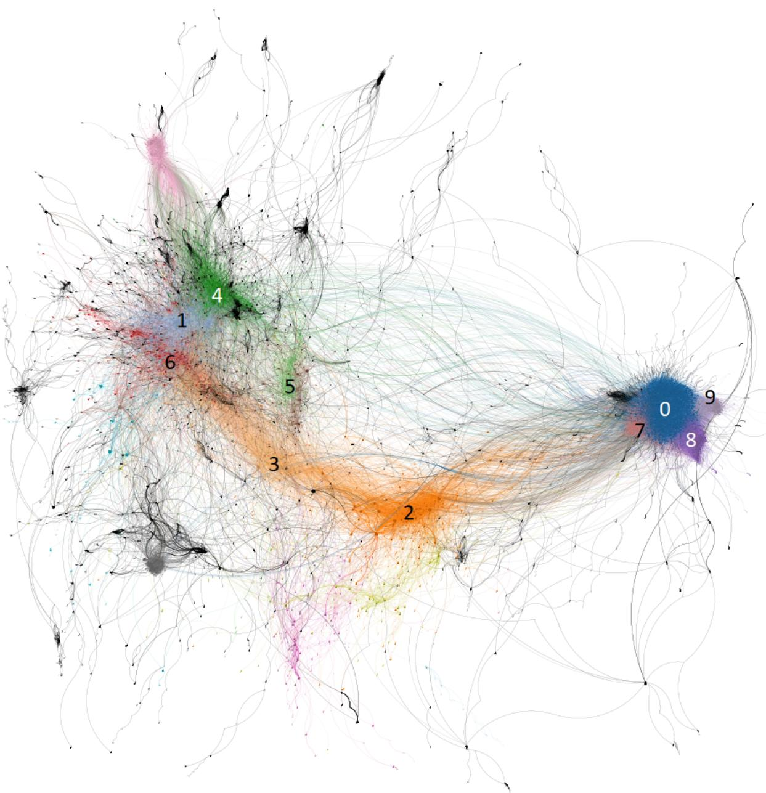  
Figure 7: Retweet network, where nodes are individual users and edges indicate the retweeting activities. Node colors represent different user clusters identified by the Louvain modularity method.

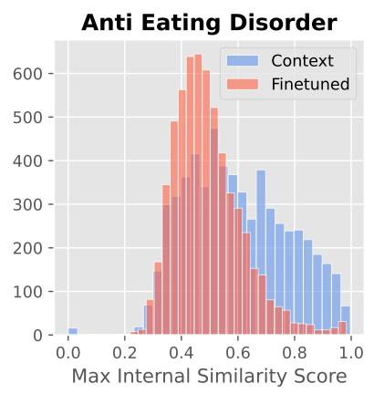

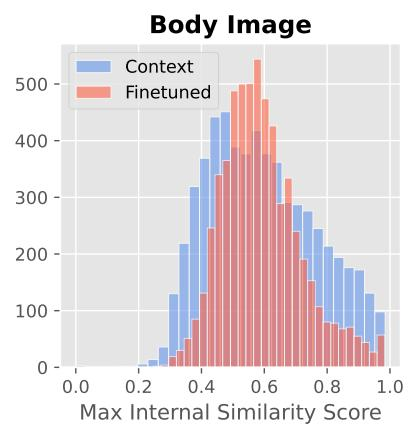

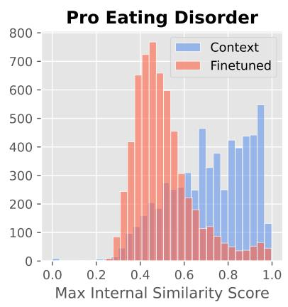

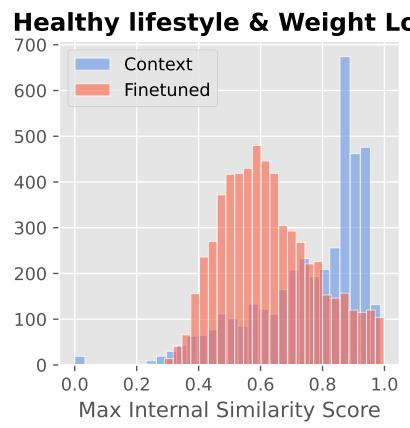

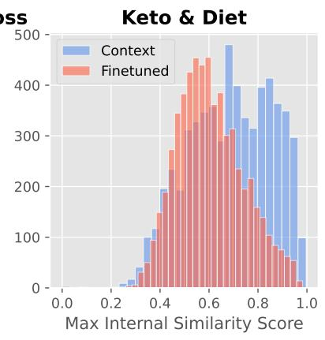

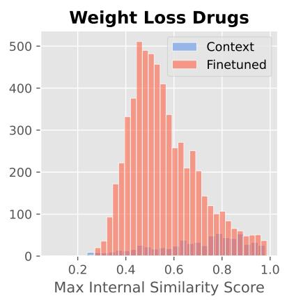

Figure 8: Distribution of ROUGE-L scores between tweets in a community’s synthetic corpus $D _ { i } ^ { f t }$ or $D _ { i } ^ { c o n t e x t }$ and their most similar tweets within the corpus.  
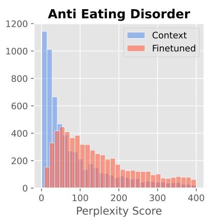

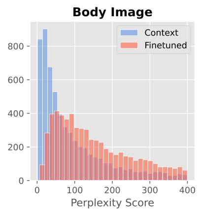

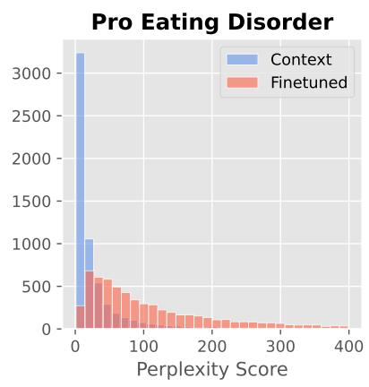

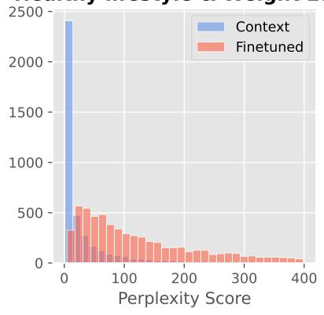

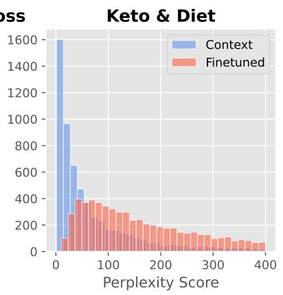

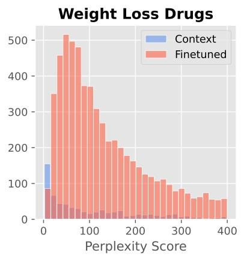  
Figure 9: Distribution of perplexity scores of tweets in a community’s synthetic corpus $D _ { i } ^ { f t }$ or $D _ { i } ^ { c o n t e x t }$

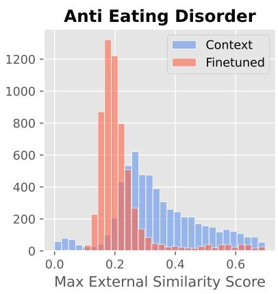

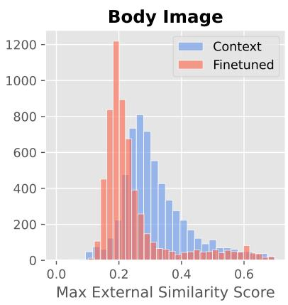

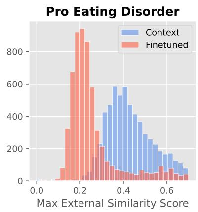

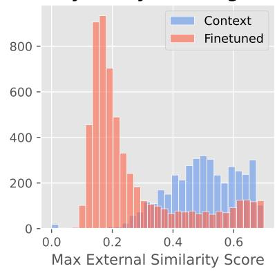

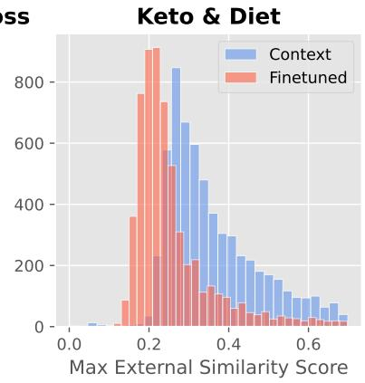

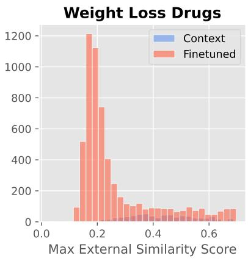  
Figure 10: Distribution of ROUGE-L scores between tweets in a community’s synthetic corpus $D _ { i } ^ { f t }$ or $D _ { i } ^ { c }$ ontext and their most similar tweets in the community’s original corpus $D _ { i } .$

<table><tr><td rowspan=1 colspan=1>Community</td><td rowspan=1 colspan=1>Topic</td><td rowspan=1 colspan=1>In-context</td><td rowspan=1 colspan=1>Finetuned</td></tr><tr><td rowspan=1 colspan=1>Anti Eating Disorder</td><td rowspan=1 colspan=1>body dysmorphia</td><td rowspan=1 colspan=1>some of yall onedtwt need to mindfkg business???</td><td rowspan=1 colspan=1>edtwt is so bizarre 2 me;how are you making abthow ugly you think peo-ple are? dont you hateyourself? id worry abt thatfirst,</td></tr><tr><td rowspan=1 colspan=1>Body Image</td><td rowspan=1 colspan=1>extreme diet</td><td rowspan=1 colspan=1>everyone has some-thing about theirbody they&#x27;re notcompletely happywith. don&#x27;t focuson that! love your-self, love your body,love your life.</td><td rowspan=1 colspan=1>im down to 15 stone 12!!!so so proud of myself, iknow its been a long jour-ney but i kept going andnow im reaping the re-wards. change happensover time and patience isthe key.</td></tr><tr><td rowspan=2 colspan=1>Weight Loss Drugs</td><td rowspan=2 colspan=1>wegovy</td><td rowspan=1 colspan=1>what is the bestdiet for weight loss?too many diet rules</td><td rowspan=2 colspan=1>wegovy has helped manyovercome obesity anddrop excess pounds.recently, the hashtaghas been trending asa side effect of takingwegovy. however, is thisa side effect of taking themedication or simply dueto rapid weight loss? fullarticle</td></tr><tr><td rowspan=1 colspan=1>doesn&#x27;t work!</td></tr><tr><td rowspan=1 colspan=1>Eating Disorder</td><td rowspan=1 colspan=1>anorexia</td><td rowspan=1 colspan=1>when his celebritycrush is my thinspoand my celebritycrush is his thinspo</td><td rowspan=1 colspan=1>im going to the doctorssoon so im gon na have tolose some weight before igo</td></tr></table>

Table 8: LLM generated outputs across different communities and topics.

<table><tr><td rowspan=1 colspan=1>Question</td><td rowspan=1 colspan=1>ProED</td><td rowspan=1 colspan=1>Keto &amp; Diet</td><td rowspan=1 colspan=1>Body Image</td><td rowspan=1 colspan=1>AntiED</td><td rowspan=1 colspan=1>Healthy Lifestyle&amp; Weight Loss</td><td rowspan=1 colspan=1>Weight LossDrugs</td></tr><tr><td rowspan=1 colspan=1>5</td><td rowspan=1 colspan=1>b</td><td rowspan=1 colspan=1>C</td><td rowspan=1 colspan=1>b</td><td rowspan=1 colspan=1>a</td><td rowspan=1 colspan=1>a</td><td rowspan=1 colspan=1>b</td></tr><tr><td rowspan=1 colspan=1>6</td><td rowspan=1 colspan=1>c</td><td rowspan=1 colspan=1>c</td><td rowspan=1 colspan=1>a</td><td rowspan=1 colspan=1>C</td><td rowspan=1 colspan=1>a</td><td rowspan=1 colspan=1>b</td></tr><tr><td rowspan=1 colspan=1>7</td><td rowspan=1 colspan=1>C</td><td rowspan=1 colspan=1>a</td><td rowspan=1 colspan=1>b</td><td rowspan=1 colspan=1>b</td><td rowspan=1 colspan=1>a</td><td rowspan=1 colspan=1>a</td></tr><tr><td rowspan=1 colspan=1>8</td><td rowspan=1 colspan=1>C</td><td rowspan=1 colspan=1>C</td><td rowspan=1 colspan=1>b</td><td rowspan=1 colspan=1>a</td><td rowspan=1 colspan=1>C</td><td rowspan=1 colspan=1>b</td></tr><tr><td rowspan=1 colspan=1>9</td><td rowspan=1 colspan=1>C</td><td rowspan=1 colspan=1>a</td><td rowspan=1 colspan=1>a</td><td rowspan=1 colspan=1>a</td><td rowspan=1 colspan=1>a</td><td rowspan=1 colspan=1>a</td></tr><tr><td rowspan=1 colspan=1>11a</td><td rowspan=1 colspan=1>c</td><td rowspan=1 colspan=1>a</td><td rowspan=1 colspan=1>a</td><td rowspan=1 colspan=1>c</td><td rowspan=1 colspan=1>a</td><td rowspan=1 colspan=1>a</td></tr><tr><td rowspan=1 colspan=1>11b</td><td rowspan=1 colspan=1>C</td><td rowspan=1 colspan=1>a</td><td rowspan=1 colspan=1>a</td><td rowspan=1 colspan=1>C</td><td rowspan=1 colspan=1>a</td><td rowspan=1 colspan=1>a</td></tr><tr><td rowspan=1 colspan=1>11c</td><td rowspan=1 colspan=1>a</td><td rowspan=1 colspan=1>b</td><td rowspan=1 colspan=1>b</td><td rowspan=1 colspan=1>b</td><td rowspan=1 colspan=1>b</td><td rowspan=1 colspan=1>a</td></tr><tr><td rowspan=1 colspan=1>11d</td><td rowspan=1 colspan=1>a</td><td rowspan=1 colspan=1>b</td><td rowspan=1 colspan=1>b</td><td rowspan=1 colspan=1>b</td><td rowspan=1 colspan=1>b</td><td rowspan=1 colspan=1>a</td></tr></table>

Table 9: Responses from the finetuned LLMs to the questions in SWED that are used to compute the diagnosis criteria. The responses displayed are the majority of answers for each question.