# Incremental Sentence Processing Mechanisms in Autoregressive Transformer Language Models

Michael Hanna∗ ILLC, University of Amsterdam m.w.hanna@uva.nl

Aaron Mueller∗ Northeastern University & Technion – IIT aa.mueller@northeastern.edu

## Abstract

Autoregressive transformer language models (LMs) possess strong syntactic abilities, often successfully handling phenomena from agreement to NPI licensing. However, the features they use to incrementally process language inputs are not well understood. In this paper, we fill this gap by studying the mechanisms underlying garden path sentence processing in LMs. We ask: (1) Do LMs use syntactic features or shallow heuristics to perform incremental sentence processing? (2) Do LMs represent only one potential interpretation, or multiple? and (3) Do LMs reanalyze or repair their initial incorrect representations? To address these questions, we use sparse autoencoders to identify interpretable features that determine which continuation—and thus which reading—of a garden path sentence the LM prefers. We find that while many important features relate to syntactic structure, some reflect syntactically irrelevant heuristics. Moreover, while most active features correspond to one reading of the sentence, some features correspond to the other, suggesting that LMs assign weight to both possibilities simultaneously. Finally, LMs do not re-use features from garden path sentence processing to answer follow-up questions.1

## 1 Introduction

Syntactic ambiguities abound in natural language. For example, given the fragment “After the woman drank the water. . . ”, the water could be either the object of drank (in which case one could end the sentence here), or the subject of the main clause (in which case “was all gone” would be a valid continuation). Despite LMs’ impressive performance on syntactic tasks (Hu et al., 2020), the mechanisms that underlie their processing of syntactic structure—and temporary ambiguities therein—are not well understood. Past work has found LM attention heads dedicated to processing certain syntactic relations (Vig and Belinkov, 2019) and used LMs’ representational structure to predict dependency relations (Hewitt and Manning, 2019); nonetheless, these results only show that structural information can be extracted from LM representations—and not that these representations are causally implicated in LM processing. It thus remains unclear whether LMs rely on structure-related features, represent the multiple possible completions to an incomplete ambiguous utterance, or revise representations in light of new disambiguating evidence.

In the psycholinguistics literature, similar questions have been studied in humans using garden path sentences, which initially appear to have one structure, but which are later revealed to have another. When humans encounter the unexpected resolution of these sentences, their reading is delayed. Different theories of human sentence processing predict different delays; by recording reading times on carefully designed test materials, one can thus empirically test such theories (Lewis, 2000; Gibson and Pearlmutter, 2000). While prior work on LMs has used garden path sentences as a testbed for the psychometric fit of LM surprisals to predict human reading times (Van Schijndel and Linzen, 2021; Arehalli et al., 2022; Huang et al., 2024), we propose to instead use them to understand how LMs incrementally process sentences.

In this study, we present a mechanistic investigation of how LMs incrementally process sentences and how they handle temporary ambiguities using garden path (GP) sentences as a case study. Using sparse autoencoders and causal interpretability methods, we uncover the causally relevant features (and mechanisms composed thereof) that explain why LMs assign higher probabilities to particular completions. With these methods, we investigate 3 research questions (RQs), and find the following:

RQ1: Do LMs use syntactic features or spurious heuristics to incrementally process sentences? Many of the most important features LMs use are interpretable and syntax-related; however, some uninterpretable or spurious features exist.

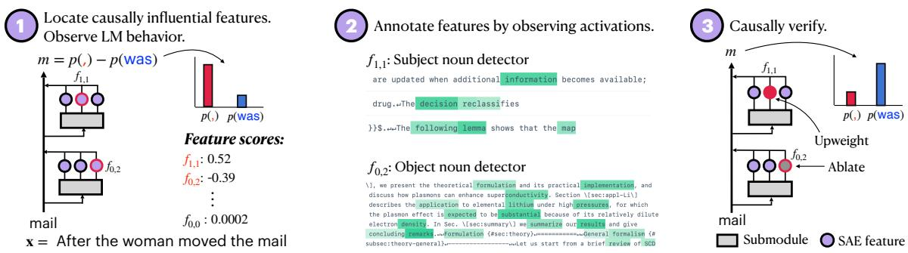  
Figure 1: Overview. We use sparse autoencoders to decompose model activations into a discrete set of humaninterpretable components (features). We score each feature by its causal contribution to continuations associated with each reading of a garden path sentence. We manually interpret the top-scoring features and causally verify their functional role in the network by targetedly up- or downweighting them to change the model’s preferred reading.

RQ2: Do LMs hold on to multiple interpretations ofthe sentence simultaneously, or commit to the most likely one? LMs’ representations encode multiple interpretations simultaneously.

RQ3: Given disambiguating evidence, do LMs repair or reanalyze their initial structural predictions? LMs do not repair or rely on their prior structural predictions; however, they also do not generate new structural features via reanalysis.

## 2 Background

## 2.1 Incremental Sentence Processing

Many linguistic theories posit that humans parse their linguistic input, mapping from sentences to a representation with information about its structure (van Gompel and Pickering, 2007). We do so incrementally, building up representations prior to the end of the sentence (Marslen-Wilson, 1975).

How humans perform incremental parsing is hotly debated. Of particular interest is how we handle the fact that partial sentences often have multiple valid parses (Fodor et al., 1974). Do we parse sentences serially, considering one parse at a time (Frazier, 1979; Fodor and Ferreira, 1998), or in parallel, considering many at once (Gorrell, 1987; Gibson, 1991; Jurafsky, 1996)? And upon encountering evidence that rules out specific parses, do we repair our representations (Lewis, 1998), or reanalyze the input entirely (Grodner et al., 2003)?

Psycholinguists often test theories of incremental parsing with garden path sentences, which suggest one parse, but ultimately have another. Consider the incomplete sentence “The guitarist knew the song...”. A reader could either interpret song as an object of the verb knew, or the subject of a sentential clause (i.e., “The guitarist knew (that) the song...”). A period would be a valid completion in the former case but not the latter, where a verb phrase like “...was too long” would be more fitting. Most readers find the first reading more likely, so observing a completion consistent with the second typically results in significant spikes in reading times (Frazier, 1987).

## 2.2 Sentence Processing in LMs

How LMs process and represent sentences is similarly well-studied. Work on structural probes has attempted to reconstruct parses from LM representations using learned similarity functions or probes (Hewitt and Manning, 2019; Maudslay et al., 2020; White et al., 2021; Arps et al., 2022). Others have found attention heads whose attention corresponds to syntactic relations, though no general parsing head exists (Vig and Belinkov, 2019; Clark et al., 2019b; Htut et al., 2019). Researchers have also trained probes to extract features like coreference relations or part of speech from LM representations (Tenney et al., 2019; Jawahar et al., 2019).

However, these analyses can yield only limited insights into LMs’ incremental processing mechanisms. Most study LMs with bidirectional attention, which do not perform incremental sentence processing. Moreover, few causally verify their mechanisms’ relevance to model processing, even though probes often capture functionally irrelevant information (Ravichander et al., 2021; Elazar et al., 2021). While causal techniques have been used in other settings (Vig et al., 2020; Finlayson et al., 2021; Lasri et al., 2022), they have rarely been applied to questions of ambiguity in syntactic structure and incremental processing; Eisape et al. (2022) do so, but use a probe that assumes a specific mechanism unlikely to be used by the LM.

With this in mind, we use garden path sentences as a case study in LMs’ incremental sentence processing mechanisms. Prior work using LM behavior on such sentences to model human reading times (Van Schijndel and Linzen, 2018; Wilcox et al., 2021; Arehalli et al., 2022; Oh and Schuler, 2023) finds that LMs do exhibit garden-path effects, though they underpredict human effects. Less work has used garden path sentences to observe how LMs arrive at these probabilities and surprisals. Li et al. (2024) attempt this, but study masked LMs, which do not perform incremental processing. Other work studies more plausible models, such as RNNs (Ulmer et al., 2019) or transformers with a restartincremental interface (Madureira et al., 2024), but neither of these study standard transformer LMs or use causal methods. We ask: how can we find and causally verify the mechanisms that LMs use to incrementally process garden path sentences?

## 2.3 Locating Interpretable Mechanisms with Sparse Feature Circuits

To understand how LMs incrementally process sentences, we must understand the features that they use to represent their inputs. Earlier work did so by studying individual LM neurons (Sajjad et al., 2022) and searching for the inputs that cause them to activate most strongly. For example, a neuron that activates on the subjects of sentences might be inferred to implement subjecthood detection.

However, feature representations in neural networks are often distributed (Hinton et al., 1986; Smolensky, 1986). Neurons are thus often polysemantic, representing multiple unrelated features at once, which makes them challenging to interpret (Olah et al., 2017; Elhage et al., 2022); for example, Bolukbasi et al. (2021) find a neuron that activates on sentences about song meanings, objects in containers, and historical dates.

We therefore opt to interpret the features of sparse autoencoders (SAEs; Bricken et al., 2023), autoencoders trained on the output activations of LM submodules. Let x be the submodule’s output activation; the SAE computes

$$
{ \bf f } = \mathrm { R e L U } ( W _ { e } ( { \bf x } - { \bf b } _ { d } ) + { \bf b } _ { e } )\tag{1}
$$

$$
\hat { \mathbf { x } } = W _ { d } \mathbf { f } + \mathbf { b } _ { d } ,\tag{2}
$$

where f is the feature vector, and $\hat { \bf x }$ is the reconstructed activations. Henceforth, we refer to a single dimension of f as afeature. SAEs are trained to reconstruct x with sparse regularization on f; the regularizer and bias terms lead a feature’s activation to be non-0 only when it causes parts of x to differ from their mean value. This makes SAE features more monosemantic than LM neurons, and therefore more interpretable.

To assemble SAE features into model mechanisms, we use circuit analysis (Olah et al., 2020). A circuit is the minimal subset of the language model’s computation graph that recovers the whole LM’s behavior on a given task (Wang et al., 2023; Conmy et al., 2023; Hanna et al., 2023). In this case, each node in the graph is an SAE feature, and each edge represents a cause-effect relationship. The first node in the graph is the embeddings, the final node is the model’s output logits, and all intermediate nodes are features from SAEs trained on neurons from the model’s residual stream or attention head / MLP outputs.

Circuits can be conceptualized as a causal abstraction of the language model. If a node is in the graph, it is causally relevant to the LM’s task abilities. If a node has an edge to another, this implies that the activation of the second crucially depends on the activation of the first.

We follow Marks et al.’s (2024) approach to finding such sparse feature circuits. We say a feature $f$ is causally relevant if, given a metric m that measures the language model’s behavior, setting $f ^ { \ast } \mathrm { \mathbf { s } }$ value to 0 causes a large change in $m ; ^ { 2 }$ the magnitude of this change is $f ^ { \ast } \mathrm { \mathbf { s } }$ indirect effect (IE; Pearl, 2001) on $m$ . We aim to find features with high IE.

Computing each feature’s IE is expensive, so we compute a linear approximation, IEˆ , using attribution patching (AtP; Nanda, 2023). AtP estimates the IE of a feature with activation a on input x as

$$
\hat { \mathrm { I E } } = { \boldsymbol { a } } \cdot \frac { \partial m } { \partial { \boldsymbol { a } } } \Big | _ { \boldsymbol { x } } .\tag{3}
$$

$\frac { \partial m } { \partial a }$ is computed by backpropagation from m. Conceptually, the slope of the metric m with respect to the feature’s activation a is multiplied by the change in the feature’s activation upon being zeroed $( a - 0$ , which simplifies to a). In practice, AtP is often inaccurate, so we use Marks et al., 2024’s (2024) improvement: attribution patching with integrated gradients (AtP-IG). Inspired by integrated gradients for input attribution (Sundararajan et al.,

2017), AtP-IG computes an average $\frac { \partial m } { \partial a }$ across several intermediate activations of $f$ between a and 0, improving IE estimates; see App. A for details.

After estimating each feature’s IEˆ , we select those whose IEˆ is over a chosen threshold; this yields a circuit. We then verify that m’s value remains the same when the features outside our circuit are ablated, ensuring the mechanism captured by the circuit is faithful to that of the full model.

## 3 Models

To analyze incremental parsing in LMs, we must study autoregressive LMs.3 We analyze Pythia-70m-deduped (Biderman et al., 2023), and Gemma-2-2b (Gemma Team et al., 2024), as these have publicly available SAEs. We focus primarily on Pythia-70m in the main text due to its smaller size; results for Gemma-2-2b are in App. E.

## 4 Do LMs use syntactic features to process garden path sentences?

We use garden path sentences to investigate incremental processing in LMs because they contain temporary structural ambiguities that are eventually resolved. The sentences we study must be ambiguous such that we may determine if one or many possible readings are represented (RQ2). Moreover, this ambiguity must eventually be resolved such that we may study how incorrect representations might be handled (RQ3). Thus, garden path sentences are ideal stimuli with which to answer our RQs; indeed, they are often used for these purposes in psycholinguistics (§2.1).

## 4.1 Behavioral Analysis

Before finding the features that underlie LM garden path sentence processing, we first verify that the LMs we study exhibit garden path effects.

Dataset We probe LMs’ readings of garden path sentences using an adaptation of Arehalli et al.’s (2022) dataset of 72 garden path sentences. This contains 3 structures (NP/Z, NP/S, and MV/RR) with 24 sentences each. Each structure name refers to the garden path/actual interpretations of the sentence’s ambiguous material. For example, in Table 1 NP/Z, “signed” could take either an NP complement (“the bill”) or a zero complement. In Table 1 NP/S, “the song” could act as the NP complement of “knew” or start a sentential complement. In Table 1 MV/RR, “brought” could be the main verb or part of a reduced relative clause.

<table><tr><td>Structure</td><td>Example Sentence</td><td>GP</td><td>Non-GP</td></tr><tr><td>NP/Z</td><td>After the politician</td><td></td><td>was</td></tr><tr><td></td><td>signed/rejected/arrived the bill</td><td></td><td></td></tr><tr><td>NP/S</td><td>The guitarist knew/wrote/said the song</td><td></td><td>was</td></tr><tr><td>MV/RR</td><td>The woman brought/moved/shown the mail</td><td></td><td>was</td></tr></table>

Table 1: Examples from our dataset, adapted from Arehalli et al. (2022). For each sentence, inserting the yellow word makes it compatible with only garden path (GP) continuations; the blue word permits only nongarden-path (Non-GP) continuations. The red words leave it ambiguous, compatible with either.

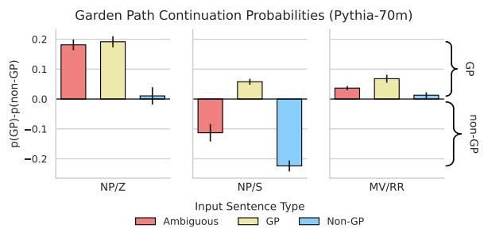  
Figure 2: Mean difference in probability of tokens corresponding to garden path $( ^ { 6 6 } , 7 ^ { 6 6 } , 7 )$ and non-garden-path (“was”) readings of the input for Pythia-70m, grouped by garden path structure. Error bars indicate the standard error of the mean. Inputs are either ambiguous, or compatible with only a garden-path or non-gardenpath reading. GP tokens are most likely given GP inputs; non-GP inputs increase non-GP token probability. Given ambiguous NP/Z and MV/RR inputs, Pythia-70m prefers the GP reading, but prefers non-GP for NP/S.

For each ambiguous sentence, we craft two unambiguous versions, which permit only one reading. For example, in Table 1 NP/Z, we replace the ambitransitive “signed”, with the strictly transitive “rejected” (forcing the garden-path reading) or the intransitive “arrived” (forcing the opposite).

Experiment For each sentence, we record the probability given by the LM to next tokens consistent with the garden path or non-garden-path reading; we denote these p(GP) and p(non-GP), respectively. For NP/Z sentences, we define p(GP) as $p ( , )$ ; for NP/S and MV/RR, we define p(GP) as $p ( . )$ . For all sentence structures, we define p(non-GP) as the probability of “ was”. This roughly measures the LM’s reading of the sentence: continuing “After the politician signed the bill” with a comma implies that “signed” took “the bill” as a complement, as in the GP reading. Continuing it with “ was” implies that “signed” took no complement, as in the non-GP reading.

Results Our results (Figure 2) show that Pythia-70m correctly up- and downweights garden path tokens in contexts that do and do not license them. Given GP inputs, the model gives more probability to GP tokens, and less to non-GP tokens, compared to when it receives ambiguous inputs; this trend holds across garden path structures. For non-GP inputs, this trend is reversed.

For ambiguous inputs, the model prefers gardenpath continuations in the NP/Z and MV/RR cases, but non-garden-path in the NP/S case. This agrees with prior evidence from both humans and LMs showing lower reading times and surprisals for nongarden-path continuations to inputs with NP/S ambiguities, compared to NP/Z (Grodner et al., 2003; Sturt et al., 1999; Van Schijndel and Linzen, 2018).

Discussion In the NP/Z and MV/RR cases, non-GP inputs only manage to reduce the model’s bias for GP continuations to near 0, not eliminate it. We hypothesize that this has two causes. First, although NP/Z sentences are common objects of study in the psycholinguistics literature (Christianson et al., 2001, 2006), their non-GP readings are somewhat unnatural; this also applies to our non-GP versions. In normal text, these sentences would include a comma after the verb if the non-GP reading were intended (and models do prefer the non-GP reading given a comma).

Second, our operationalization of p(GP) and p(non-GP) has limitations. For non-GP MV/RR sentences, p(,) and p(was) are both low; the model gives the most probability to to, which does not definitively distinguish between the two readings. For non-GP NP/Z sentences, p(,) and p(was) are higher, but measuring p(was) alone may miss much of the probability assigned to non-GP continuations in general. Ideally, we would measure the probability of all full GP and non-GP-implying continuations (which might span multiple tokens), rather than measuring the probability of two single next tokens. Unfortunately, this is computationally infeasible, but see App. B for more discussion and §5.2 for another way to determine an LM’s reading of ambiguous input, with similar results. As MV/RR sentences have low p(GP) and p(non-GP), we exclude them from all following analyses.4

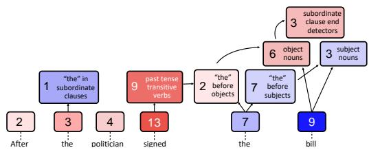  
Figure 3: Pythia-70m’s feature circuit for processing NP/Z garden path sentences. We group features by their functional role in the circuit and display the number of features in each group. Red features have negative scores and promote the garden path reading; blue features, with positive scores, do the opposite. Unlabeled early-layer features are word detectors. Many late-layer features encode syntactic features, whereas early-layer features largely consist of word detectors and heuristics.

## 4.2 Feature Circuit Analysis

Now, we identify and analyze the feature circuits responsible for Pythia-70m’s garden path effects.

Experiment We investigate circuits composed of causally relevant features from the Pythia-70m SAEs of Marks et al. (2024); these SAEs have 32,768 features each. We use AtP-IG (§2.3) to find the features that most influence the difference in probabilities assigned to garden-path and nongarden-path continuations of ambiguous sentences, m = p(GP) - p(non-GP). We keep features with IEˆ > 0.1, and edges with IEˆ > 0.001. We then manually annotate each feature in the circuit, using Neuronpedia (Lin and Bloom, 2023) to visualize feature activations on text from The Pile (Gao et al., 2020) on which each feature activates strongest.5

Results Running AtP-IG yielded circuits containing 155 (NP/S) and 65 (NP/Z) sparse features; we manually annotate all of these.6 To measure how well these features capture the behavior of the full model, we measure faithfulness, following the definition in Marks et al. (2024). These circuits have faithfulness 0.20 (NP/S) and 3.48 (NP/Z).7 Significant deviations from 1.0 imply that there are important features we have not captured; thus, while we cannot claim to have annotated the full mechanism, we can nonetheless still analyze the most highly influential features, which provide sufficient evidence to address our RQs. See App. C for the metric definition, implementation details, and a deeper discussion of these faithfulness values.

<table><tr><td>Feature</td><td>Activates on</td><td>Examples</td></tr><tr><td>0/8234</td><td>the word the</td><td>Since 2001, the variant commonly in use isthe Category 5e specification On September 26, 2006 the University of Phoenix acquired the naming</td></tr><tr><td>4/14907</td><td>ends of sub. clauses</td><td>Finally, afteryears watchingyoutubevideos on that topic, I made When it released alongsideFireEmblem Fates in June of2015, , Fire</td></tr><tr><td>3/835</td><td>subjects of sent. clauses</td><td>A hearing officer would determine ifacomplaint has merit, requiring . . . to learn how theUnited States and I keyplayers aroundthe e world</td></tr><tr><td>4/8505</td><td>object nouns, nouns in PPs</td><td>Justin Trudeau used the Canada Day celebrations s in Ottawa to name .. . than for Alan Shepard. He left the hotel 1 shortly after èmidnight</td></tr></table>

Table 2: Interpretable residual stream features implicated in Pythia-70m’s garden path sentence processing. We list each feature’s layer and feature-index, as well as a description of what the feature activates highly on. Each example shows how strongly the feature activated on each token; darker highlighting indicates larger activations.

Figure 3 displays a simplified circuit for NP/Z, where we manually group similar features together. The simplified NP/S circuit and the oversized full circuits are in App. F. We present selected features activations on highly-activating sentences in Table 2 to support our annotations.

Features in lower layers often encode interpretable low-level features. Many lower-layer features detect word-level attributes, rather than high-level syntactic information. The vast majority of our circuit’s features are word detectors, located in the model’s embeddings or first two layers, that activate only on one specific word. For example, Feature 0/8234 activates only on the word the (Table 2). Slightly higher-level features activate on nouns or past tense verbs. While most such features have no obvious relation with either reading (e.g. the presence of the word “the” should be neutral with respect to which reading it suggests), they have a non-zero impact on the preferred reading.

Higher layer features encode syntactic attributes relevant to garden path sentence processing. The features in Pythia-70m’s upper layers often encode sentence-level syntactic information that distinguishes between different readings of garden path sentences. For example, the final layers of the model’s circuit for NP/Z sentences (Figure 3) include features that detect subjects, objects, and ends of subordinate clauses. Reading the final noun as an object and part of the subordinate clause corresponds to the GP reading; reading the final noun as a subject outside of the subordinate clause corresponds to the opposite. The scores assigned to features match their semantics: non-GP feature scores are positive; pro-GP are negative.

Table 2 shows each feature’s activations. Feature 4/14907, for example, detects ends of subordinate clauses; every position at which it activates could be a valid end to the subordinate clause containing it, given no information about the following tokens. It precisely distinguishes the two readings of NP/Z sentences: in the garden path reading of “After the politician signed the bill”, the clause might end at bill, while in the non-GP reading, it ends at signed.

Feature 3/835 distinguishes the readings of NP/S sentences, activating on subjects of sentential complements. In an NP/S sentence such as “The guitarist knew the song”, the song can either be the object of knew (the GP reading) or the subject of a new phrase (non-GP); this feature clearly corresponds to the latter reading. Finally, Feature 4/8505 activates primarily on object nouns and nouns in prepositional phrases. This corresponds not only to the GP reading in NP/Z and NP/S sentences, but also to the accusative case, hinting that the model may have learned a general linguistic concept.

Some features are uninterpretable. Although many SAE features are interpretable, some activate seemingly at random, or across almost all text. The latter could be interpreted as a prior, which always influences the model’s prediction, but most have no clear interpretation. These features have a non-zero effect on model predictions, though their effect direction is inconsistent. We omit these features from our analysis, but we hope they will be interpretable as SAEs or interpretability methods improve.

## 4.3 Causal Analysis

Though many high-importance features encode syntactic attributes, this is no guarantee that the model relies on them. To confirm this, we causally intervene on the discovered interpretable features, and verify that model output changes as we expect. See App. D for a large-scale version of this experiment.

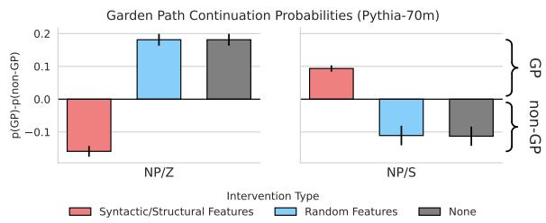  
Figure 4: Mean difference in probability of GP and non-GP continuations under interventions for Pythia-70m. Error bars indicate the standard error of the mean. Interventions on interpretable features reverse model behavior, as expected; random interventions do nothing.

Experiment We focus on three groups of model features, which detect: 1) subjects, 2) objects, and 3) either ends of clauses (NP/Z) or sentential-clause verbs (NP/S). For NP/Z sentences, we attempt to induce the dispreferred non-GP reading by setting the subject detectors’ activation to a high value (2.0) at the final noun of each sentence, while clamping object detectors off (to 0). End-of-clause detectors are set to 2.0 at the verb position, and 0 on the final noun. For NP/S sentences, we induce the GP reading: at the final noun, we set the subject and object detectors to 0 and 2.0 respectively; we also turn the sentential-clause-verb detectors off. As a control, we choose 3 groups of random features (equal in number to the original groups) to clamp on or off. In all settings, we intervene during the forward pass, and compute p(GP) and p(non-GP).

Results Our results (Figure 4) suggest that the features we find are causally relevant. Turning the subject and object features on and off respectively, and altering the end-of-clause features, reverses the model’s typical preference for the GP reading in the NP/Z scenario; ablating the same number of randomly chosen features does nothing. The analogous NP/S intervention causes the model to prefer the GP reading, while performing no interventions or random ones yields the opposite.

## 5 Do LMs consider one or multiple readings of garden path sentences?

Here, we investigate whether LMs consider multiple readings of garden path sentences simultaneously. We reason that, although p(GP) and p(non-GP) are non-zero in all cases, the model may not explicitly represent both alternatives. We thus say that a model considers just one reading if, given an ambiguous input, it activates only features corresponding to one reading of the input, as opposed to multiple. A model considers multiple if it activates features that correspond to multiple readings of the input—e.g., if both subject and object detectors fire on the final noun of an NP/Z or NP/S sentence.

## 5.1 Evidence from model feature analysis

Experiment We can test if LMs consider one or multiple readings of garden path sentences by checking if ambiguous inputs cause features corresponding to both readings to activate. We thus run the model on our ambiguous data and record the activations of the interpretable pro-GP and anti-GP features that we identified in layers 3-5 of the model, in §4.2. If the model only considers one reading, only features corresponding to one reading should activate; if features corresponding to both activate, we conclude that the model considers multiple. Recall that as features are inactive on almost all inputs, non-zero activations are meaningful.

Results We find that in both the NP/Z and NP/S cases, pro- and non-GP features have non-zero average activations, ranging from 0.27 to 0.41. Similarly, the percent of features active is above 50% for both categories, and both NP/Z and NP/S sentences. This suggests that models explicitly represent both readings of a garden path sentence.

## 5.2 Evidence from structural probes

We can also directly assess if the model considers both readings using structural probes (§2.2), which map from LM representations to a distribution over parses of the LM’s input. The two readings of NP/Z and NP/S sentences have distinct parses, so parse probes can measure the probability of each.

Experiment We base our structural probes on Eisape et al.’s (2022) MLP action probes, as these are compatible with autoregressive models and incomplete inputs; most such probes are not. These probes take in the residual-stream representations of two words (from a fixed layer) and use a MLP to map them to one of three possible dependency relations: 1) the first word is a dependent of the second (LEFT-ARC); 2) vice-versa (RIGHT-ARC); or 3) no relation (GEN). Following Eisape et al. (2022), we train probes to predict parser actions using parseannotated data from the Penn TreeBank (Taylor et al., 2003). As in Eisape et al. (2022), our trained probes achieve high performance; see App. G.

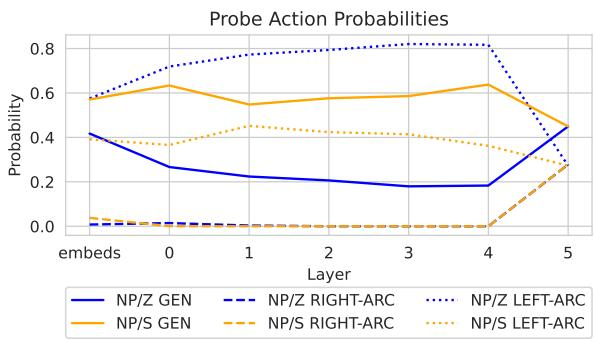  
Figure 5: Mean probe action probability across layers. GEN corresponds to the non-GP reading, and LEFT-ARC to the GP reading (RIGHT-ARC is implausible). NP/Z sentences elicit primarily LEFT-ARC; NP/S elicits GEN. Both valid readings always receive non-zero probability.

With these probes, we evaluate our model’s reading of ambiguous garden path sentences.8 Crucial here is the dependency relation between each sentence’s verb and final noun. The garden path reading of the sentence “After the politician signed the bill” would leave the bill as a dependent (object) of signed; in the non-GP case, there is no dependency relation. We record the probability of each relation, averaged across all NP/Z and NP/S sentences.

Results Our results (Figure 5) show that while probes favor LEFT-ARC for NP/Z sentences, and GEN for NP/S, they assign moderate probability to both readings. This trend holds for all layers but the last, where probe performance is poor. This further supports the hypothesis that LMs consider both readings of garden-path sentences, as found in the feature analysis; in App. G.4 we run AtP-IG on the probe and find the same features are responsible.

## 6 Do LMs reanalyze, repair, or neither?

In humans, garden-path readings can linger even after the sentence is complete (Christianson et al., 2001): given “The boy fed the chicken smiled.”, people often respond yes to “Did the boy feed the chicken?”. “The boy” is the recipient offed, but the garden-path reading suggests that it is the agent.

What happens to LM representations after receiving such disambiguating information? If the LM relies on its original syntactic features, we might observe features at later token positions that adjudicate between different readings, analogous to a repair-based strategy. The later features could also upweight the correct reading independently of the original representations, analogous to reanalysis.

<table><tr><td colspan="3">Yes/No QA</td><td colspan="2">GPRC</td></tr><tr><td>Model</td><td>BoolQ</td><td>MCQA</td><td>NPS</td><td>NPZ</td></tr><tr><td>Pythia</td><td>42.8</td><td>50.0</td><td>50.0</td><td>50.0</td></tr><tr><td>Gemma 2</td><td>70.7</td><td>90.0</td><td>83.3</td><td>70.9</td></tr></table>

Table 3: Accuracy on two QA datasets and garden-path reading comprehension (GPRC) questions (all zero-shot binary questions). Pythia performs poorly as it often outputs the same answer for all inputs, regardless of the question. Gemma 2 performs well on all tasks.

We concretely operationalize these hypotheses as follows. We say a model engages in repair if, at positions at or after the disambiguating token, it relies on previously-computed reading-specific syntactic features (e.g. subject or object detectors) to compute its output; it may select or ignore some of these features as part of the repair process. In contrast, a model engages in reanalysis if, at positions at or after the disambiguating token, it relies only on reading-agnostic previously-computed features (e.g. word or part-of-speech detectors). The model might, however, compute new reading-specific features at positions after the disambiguating token.

## 6.1 Behavioral Analysis

We evaluate how models respond to garden path reading comprehension (GPRC) questions; past work suggests fine-tuned masked LMs exhibit lingering garden path effects (Irwin et al., 2023). Correct answers to GPRC questions indicate a correct (non-garden-path) reading of the sentence. For example, given “The boy fed the chicken smiled.”, we ask “Did the boy smile?” (Yes) or “Did the boy feed the chicken?”(No). We craft Yes and No questions for each sentence, so models whose answers are random or constant will obtain 50% accuracy.

Experiment We first verify whether our models can do question answering (QA) on less tricky binary QA datasets. Good performance here is a prerequisite for the following analyses to be valid. We evaluate on a binary version of multiple choice question answering (MCQA) from Wiegreffe et al. (2024), where questions are of the form “Question: Boxes are brown. What color are boxes?\nA. green\nB. brown\nAnswer:”, and the model must answer “ A” or “ B”. We also evaluate on BoolQ (Clark et al., 2019a), a naturalistic QA dataset consisting of context passages followed by a yes/no question. For all tasks, we use a zero-shot setup: the model is prompted only with the question, context, and answer options. We measure accuracy as the frequency with which the model prefers the correct answer token to the incorrect one.

Results Our results (Table 3) indicate that only Gemma-2-2b performs well on all tasks;9 it also answers GPRC questions with above-chance accuracy, so we focus the rest of our analysis on it.

## 6.2 Feature and Causal Analysis

Intuitively, a model answering GPRC questions should rely on features indicative of the input’s parse. To verify this, we measure the overlap between the features from §4.2 and those obtained via AtP-IG on the GPRC questions. We also ablate the features from §4.2 and measure the change in model performance on GPRC questions.

Experiment We discover sparse feature circuits for GPRC questions using AtP-IG, as in §4.2. The prompts consist of complete sentences and questions, $m = p ( \Upsilon { \mathfrak { e s } } ) - p ( \Nu { 0 } )$ , and our score threshold is 0.05. We measure the overlap between the circuits from §4.2 (denoted $C _ { 1 } )$ and the GPRC circuits (denoted $C _ { 2 } )$ as the intersection-over-union (IoU) of $C _ { 1 }$ and $C _ { \mathrm { 2 } } \mathrm { ^ , } \mathrm { s }$ features.

We also check if $C _ { 1 } \mathrm { { ' } } \mathrm { { s } }$ features causally influence the GPRC task. As in §4.3, we annotate $C _ { 1 }$ features and place them in groups, like subject or object detectors (we causally verify these groups relevance in App. E.2). Then, we manipulate these features as in prior experiments, and record model accuracy: we upweight subject detectors and zero ablate object detectors to promote the non-gardenpath reading, aiming to increase model accuracy; we do the reverse to decrease it.

Results There is little feature overlap across circuits: the IoU is 0% for NP/S, and 0.2% for NP/Z. Accordingly, Gemma 2 does not rely extensively on features from $C _ { 1 }$ to answer follow-up questions: performance changes little when intervening on these features. The top GPRC features are unrelated to either parse; many are not syntax-sensitive, but instead spurious features that promote Yes or No. Yes-promoting features often activate on phrases related to agreement, such as “Certainly” or “Of course”. Though the effect of $C _ { 1 }$ ’s syntax-sensitive features is not exactly 0, they explain little of the model’s GPRC behavior.

This suggests that Gemma 2 does not repair older representations when answering follow-up questions; however, it does not appear to generate new syntactic features via reanalysis, either. While this behavior is more akin to reanalysis than repair, as features are not reused, we hypothesize that it reflects a process fundamentally different from reanalysis in humans. Namely, reanalysis in humans assumes we construct new syntactic representations to answer follow-up questions; in contrast, the new features that Gemma 2 constructs are not syntactic. Thus, while both models and humans rely on syntactic features when predicting the disambiguating word in garden path sentences, the same may not be true for answering follow-up questions.

## 7 General Discussion and Conclusions

When conducting behavioral analyses, one must be cautious in (but not entirely averse to) imposing human-like cognitive abstractions onto LMs. We observed that, despite high performance on syntactic evaluations, LMs rely on both human-like syntactic abstractions and spurious features. Indeed, many influential features activated on tokens before relevant syntactic information for either reading of the sentence had appeared. This underscores the importance of mechanistic study of LM behaviors: even when models perform well, it may not always be for the reasons that one might anticipate.

We have seen that LMs represent multiple interpretations of partial sentences. However, it remains unclear if LMs deploy mechanisms that recognize or adjudicate between mutually exclusive possibilities. The representation–recognition distinction is crucial: ambiguity has many functions (e.g., humor and politeness), but to detect these, one must recognize ambiguity as a meaningful signal. We leave the question of recognition to future work.

LMs did not rely on prior features when answering garden path follow-up questions, indicating a lack of repair, but also did not generate any new syntactic features via reanalysis. While we cannot definitively rule out the existence of syntactic reanalysis circuits, such features appear uninfluential in the GPRC circuits. We hope future advances in SAEs and automated interpretability will enable us to better understand sparse feature circuits at scale.

## Acknowledgments

We thank Hadas Orgad for helpful feedback on an earlier version of this paper. M.H. is supported by an OpenAI Superalignment Fellowship. A.M. is supported by a postdoctoral fellowship under the Zuckerman STEM Leadership Program.

## Limitations

Our study has focused primarily on individual features. While we do make use of edges between features in our qualitative analysis, we have not causally verified what these edges signify. For example, are these AND or OR relations, NOT relations, or some more sophisticated type of feature combination? A deeper investigation could yield greater insights into how repair/reanalysis happens, and how past features remain relevant at later positions (or are made irrelevant).

We have analyzed two language models of significantly differing scales and slightly differing architectures/training setups. While we are confident in concluding that transformer-based autoregressive language models are generally likely to encode the mechanisms we have discovered, the results could still be strengthened by extending the analysis to a models with more diverse training setups, scales, and architectures. It would be particularly interesting—and helpful in linking our results to the learnability literature—to observe whether these results hold for more cognitively plausible language models, such as those trained on more human-sized datasets (e.g., Warstadt et al., 2023).

While this study was motivated by the study of incremental sentence processing in LMs, we study only garden path sentences to facilitate answering RQ2 and RQ3. Further work could investigate incremental sentence processing in more typical partial sentences; this would clarify whether different mechanisms are used for unambiguous sentences.

## Author Contributions

• Conceptualization: A.M., M.H.

• Experimentation:

– Behavioral analysis: M.H.

– Feature circuit discovery: A.M., M.H.

– Feature annotation: M.H., A.M.

– Causal feature analyses (RQ1, RQ2): M.H.

– Structural probing: M.H.

– Reading comprehension questions: A.M.

– Causal feature analysis (RQ3): A.M.

• Writing: M.H., A.M.

## References

Suhas Arehalli, Brian Dillon, and Tal Linzen. 2022. Syntactic surprisal from neural models predicts, but underestimates, human processing difficulty from syntactic ambiguities. In Proceedings of the 26th Conference on Computational Natural Language Learning (CoNLL), pages 301–313, Abu Dhabi, United Arab Emirates (Hybrid). Association for Computational Linguistics.

David Arps, Younes Samih, Laura Kallmeyer, and Hassan Sajjad. 2022. Probing for constituency structure in neural language models. In Findings ofthe Association for Computational Linguistics: EMNLP 2022, pages 6738–6757, Abu Dhabi, United Arab Emirates. Association for Computational Linguistics.

Stella Biderman, Hailey Schoelkopf, Quentin Anthony, Herbie Bradley, Kyle O’Brien, Eric Hallahan, Mohammad Aflah Khan, Shivanshu Purohit, USVSN Sai Prashanth, Edward Raff, Aviya Skowron, Lintang Sutawika, and Oskar Van Der Wal. 2023. Pythia: a suite for analyzing large language models across training and scaling. In Proceedings of the 40th International Conference on Machine Learning, ICML’23. JMLR.org.

Steven Bills, Nick Cammarata, Dan Mossing, Henk Tillman, Leo Gao, Gabriel Goh, Ilya Sutskever, Jan Leike, Jeff Wu, and William Saunders. 2023. Language models can explain neurons in language models. OpenAI blog post.

Tolga Bolukbasi, Adam Pearce, Ann Yuan, Andy Coenen, Emily Reif, Fernanda Viégas, and Martin Wattenberg. 2021. An interpretability illusion for BERT. Preprint, arXiv:2104.07143.

Trenton Bricken, Adly Templeton, Joshua Batson, Brian Chen, Adam Jermyn, Tom Conerly, Nick Turner, Cem Anil, Carson Denison, Amanda Askell, Robert Lasenby, Yifan Wu, Shauna Kravec, Nicholas Schiefer, Tim Maxwell, Nicholas Joseph, Zac Hatfield-Dodds, Alex Tamkin, Karina Nguyen, Brayden McLean, Josiah E Burke, Tristan Hume, Shan Carter, Tom Henighan, and Christopher Olah. 2023. Towards monosemanticity: Decomposing language models with dictionary learning. Transformer Circuits Thread.

Kiel Christianson, Andrew Hollingworth, John F. Halliwell, and Fernanda Ferreira. 2001. Thematic roles assigned along the garden path linger. Cognitive Psychology, 42(4):368–407.

Kiel Christianson, Carrick C. Williams, Rose T. Zacks, and Fernanda Ferreira. 2006. Younger and older adults’ "good-enough" interpretations of garden-path sentences. Discourse Processes, 42(2):205–238. PMID: 17203135.

Christopher Clark, Kenton Lee, Ming-Wei Chang, Tom Kwiatkowski, Michael Collins, and Kristina Toutanova. 2019a. BoolQ: Exploring the surprising difficulty of natural yes/no questions. In Proceedings ofthe 2019 Conference ofthe North American Chapter ofthe Associationfor Computational Linguistics: Human Language Technologies, Volume 1 (Long and Short Papers), pages 2924–2936, Minneapolis, Minnesota. Association for Computational Linguistics.

Kevin Clark, Urvashi Khandelwal, Omer Levy, and Christopher D. Manning. 2019b. What does BERT look at? an analysis of BERT’s attention. In Proceedings ofthe 2019 ACL Workshop BlackboxNLP: Analyzing and Interpreting Neural Networksfor NLP, pages 276–286, Florence, Italy. Association for Computational Linguistics.

Arthur Conmy, Augustine Mavor-Parker, Aengus Lynch, Stefan Heimersheim, and Adrià Garriga-Alonso. 2023. Towards automated circuit discovery for mechanistic interpretability. In Advances in Neural Information Processing Systems, volume 36, pages 16318– 16352. Curran Associates, Inc.

Tiwalayo Eisape, Vineet Gangireddy, Roger Levy, and Yoon Kim. 2022. Probing for incremental parse states in autoregressive language models. In Findings of the Association for Computational Linguistics: EMNLP 2022, pages 2801–2813, Abu Dhabi, United Arab Emirates. Association for Computational Linguistics.

Yanai Elazar, Shauli Ravfogel, Alon Jacovi, and Yoav Goldberg. 2021. Amnesic probing: Behavioral explanation with amnesic counterfactuals. Transactions of the Associationfor Computational Linguistics, 9:160– 175.

Nelson Elhage, Tristan Hume, Catherine Olsson, Nicholas Schiefer, Tom Henighan, Shauna Kravec, Zac Hatfield-Dodds, Robert Lasenby, Dawn Drain, Carol Chen, Roger Grosse, Sam McCandlish, Jared Kaplan, Dario Amodei, Martin Wattenberg, and Christopher Olah. 2022. Toy models of superposition. Preprint, arXiv:2209.10652.

Matthew Finlayson, Aaron Mueller, Sebastian Gehrmann, Stuart Shieber, Tal Linzen, and Yonatan Belinkov. 2021. Causal analysis of syntactic agreement mechanisms in neural language models. In Proceedings of the 59th Annual Meeting of the Association for Computational Linguistics and the 11th International Joint Conference on Natural Language Processing (Volume 1: Long Papers), pages 1828–1843, Online. Association for Computational Linguistics.

Jaden Fiotto-Kaufman, Alexander R Loftus, Eric Todd, Jannik Brinkmann, Caden Juang, Koyena Pal, Can Rager, Aaron Mueller, Samuel Marks, Arnab Sen Sharma, Francesca Lucchetti, Michael Ripa, Adam Belfki, Nikhil Prakash, Sumeet Multani, Carla Brodley, Arjun Guha, Jonathan Bell, Byron Wallace, and

David Bau. 2024. NNsight and NDIF: Democratizing access to foundation model internals. Preprint, arXiv:2407.14561.

J.A. Fodor, T.G. Bever, and M.F. Garrett. 1974. The Psychology ofLanguage: An Introduction to Psycholinguistics and Generative Grammar. McGraw-Hill Series on Computer Communications. McGraw-Hill.

Janet Fodor and Fernanda Ferreira, editors. 1998. Reanalysis in sentence processing, volume 21. Springer Science & Business Media.

Lyn Frazier. 1979. On Comprehending Sentences: Syntactic Parsing Strategies. Ph.D. thesis, University of Connecticut.

Lyn Frazier. 1987. Sentence processing: A tutorial review. Attention and performance XII, pages 559– 586.

Leo Gao, Stella Biderman, Sid Black, Laurence Golding, Travis Hoppe, Charles Foster, Jason Phang, Horace He, Anish Thite, Noa Nabeshima, Shawn Presser, and Connor Leahy. 2020. The pile: An 800gb dataset of diverse text for language modeling. Preprint, arXiv:2101.00027.

Gemma Team, Morgane Riviere, Shreya Pathak, Pier Giuseppe Sessa, Cassidy Hardin, Surya Bhupatiraju, Léonard Hussenot, Thomas Mesnard, Bobak Shahriari, Alexandre Ramé, Johan Ferret, Peter Liu, Pouya Tafti, Abe Friesen, Michelle Casbon, Sabela Ramos, Ravin Kumar, Charline Le Lan, Sammy Jerome, Anton Tsitsulin, Nino Vieillard, Piotr Stanczyk, Sertan Girgin, Nikola Momchev, Matt Hoffman, Shantanu Thakoor, Jean-Bastien Grill, Behnam Neyshabur, Olivier Bachem, Alanna Walton, Aliaksei Severyn, Alicia Parrish, Aliya Ahmad, Allen Hutchison, Alvin Abdagic, Amanda Carl, Amy Shen, Andy Brock, Andy Coenen, Anthony Laforge, Antonia Paterson, Ben Bastian, Bilal Piot, Bo Wu, Brandon Royal, Charlie Chen, Chintu Kumar, Chris Perry, Chris Welty, Christopher A. Choquette-Choo, Danila Sinopalnikov, David Weinberger, Dimple Vijaykumar, Dominika Rogozinska,´ Dustin Herbison, Elisa Bandy, Emma Wang, Eric Noland, Erica Moreira, Evan Senter, Evgenii Eltyshev, Francesco Visin, Gabriel Rasskin, Gary Wei, Glenn Cameron, Gus Martins, Hadi Hashemi, Hanna Klimczak-Plucinska, Harleen Batra, Harsh Dhand,´ Ivan Nardini, Jacinda Mein, Jack Zhou, James Svensson, Jeff Stanway, Jetha Chan, Jin Peng Zhou, Joana Carrasqueira, Joana Iljazi, Jocelyn Becker, Joe Fernandez, Joost van Amersfoort, Josh Gordon, Josh Lipschultz, Josh Newlan, Ju yeong Ji, Kareem Mohamed, Kartikeya Badola, Kat Black, Katie Millican, Keelin McDonell, Kelvin Nguyen, Kiranbir Sodhia, Kish Greene, Lars Lowe Sjoesund, Lauren Usui, Laurent Sifre, Lena Heuermann, Leticia Lago, Lilly McNealus, Livio Baldini Soares, Logan Kilpatrick, Lucas Dixon, Luciano Martins, Machel Reid, Manvinder Singh, Mark Iverson, Martin Görner, Mat Velloso, Mateo Wirth, Matt Davidow, Matt Miller, Matthew Rahtz, Matthew Wat-

son, Meg Risdal, Mehran Kazemi, Michael Moynihan, Ming Zhang, Minsuk Kahng, Minwoo Park, Mofi Rahman, Mohit Khatwani, Natalie Dao, Nenshad Bardoliwalla, Nesh Devanathan, Neta Dumai, Nilay Chauhan, Oscar Wahltinez, Pankil Botarda, Parker Barnes, Paul Barham, Paul Michel, Pengchong Jin, Petko Georgiev, Phil Culliton, Pradeep Kuppala, Ramona Comanescu, Ramona Merhej, Reena Jana, Reza Ardeshir Rokni, Rishabh Agarwal, Ryan Mullins, Samaneh Saadat, Sara Mc Carthy, Sarah Perrin, Sébastien M. R. Arnold, Sebastian Krause, Shengyang Dai, Shruti Garg, Shruti Sheth, Sue Ronstrom, Susan Chan, Timothy Jordan, Ting Yu, Tom Eccles, Tom Hennigan, Tomas Kocisky, Tulsee Doshi, Vihan Jain, Vikas Yadav, Vilobh Meshram, Vishal Dharmadhikari, Warren Barkley, Wei Wei, Wenming Ye, Woohyun Han, Woosuk Kwon, Xiang Xu, Zhe Shen, Zhitao Gong, Zichuan Wei, Victor Cotruta, Phoebe Kirk, Anand Rao, Minh Giang, Ludovic Peran, Tris Warkentin, Eli Collins, Joelle Barral, Zoubin Ghahramani, Raia Hadsell, D. Sculley, Jeanine Banks, Anca Dragan, Slav Petrov, Oriol Vinyals, Jeff Dean, Demis Hassabis, Koray Kavukcuoglu, Clement Farabet, Elena Buchatskaya, Sebastian Borgeaud, Noah Fiedel, Armand Joulin, Kathleen Kenealy, Robert Dadashi, and Alek Andreev. 2024. Gemma 2: Improving open language models at a practical size. Preprint, arXiv:2408.00118.

Edward Gibson and Neal J Pearlmutter. 2000. Distinguishing serial and parallel parsing. Journal of Psycholinguistic Research, 29:231–240.

Edward Albert Fletcher Gibson. 1991. A computational theory of human linguistic processing: memory limitations and processing breakdown. Ph.D. thesis, Carnegie Mellon University, USA. UMI Order No. GAX91-26944.

Yoav Goldberg. 2019. Assessing BERT’s syntactic abilities. Preprint, arXiv:1901.05287.

Paul Griffith Gorrell. 1987. Studies of human syntactic processing: Ranked-parallel versus serial models. Ph.D. thesis, University of Connecticut.

Daniel Grodner, Edward Gibson, Vered Argaman, and Maria Babyonyshev. 2003. Against repair-based reanalysis in sentence comprehension. Journal ofpsycholinguistic research, 32(2):141–166.

Michael Hanna, Ollie Liu, and Alexandre Variengien. 2023. How does GPT-2 compute greater-than?: Interpreting mathematical abilities in a pre-trained language model. In Advances in Neural Information Processing Systems, volume 36, pages 76033–76060. Curran Associates, Inc.

Michael Hanna, Sandro Pezzelle, and Yonatan Belinkov. 2024. Have faith in faithfulness: Going beyond circuit overlap when finding model mechanisms. In First Conference on Language Modeling.

John Hewitt and Christopher D. Manning. 2019. A structural probe for finding syntax in word representations. In Proceedings of the 2019 Conference of the North American Chapter ofthe Associationfor Computational Linguistics: Human Language Technologies, Volume 1 (Long and Short Papers), pages 4129–4138, Minneapolis, Minnesota. Association for Computational Linguistics.

G. E. Hinton, J. L. McClelland, and D. E. Rumelhart. 1986. Distributed representations, page 77–109. MIT Press, Cambridge, MA, USA.

Phu Mon Htut, Jason Phang, Shikha Bordia, and Samuel R. Bowman. 2019. Do attention heads in BERT track syntactic dependencies? Preprint, arXiv:1911.12246.

Jennifer Hu and Michael Frank. 2024. Auxiliary task demands mask the capabilities of smaller language models. In First Conference on Language Modeling.

Jennifer Hu, Jon Gauthier, Peng Qian, Ethan Wilcox, and Roger Levy. 2020. A systematic assessment of syntactic generalization in neural language models. In Proceedings of the 58th Annual Meeting of the Association for Computational Linguistics, pages 1725–1744, Online. Association for Computational Linguistics.

Jennifer Hu and Roger Levy. 2023. Prompting is not a substitute for probability measurements in large language models. In Proceedings of the 2023 Conference on Empirical Methods in Natural Language Processing, pages 5040–5060, Singapore. Association for Computational Linguistics.

Jing Huang, Atticus Geiger, Karel D’Oosterlinck, Zhengxuan Wu, and Christopher Potts. 2023. Rigorously assessing natural language explanations of neurons. In Proceedings of the 6th BlackboxNLP Workshop: Analyzing and Interpreting Neural Networksfor NLP, pages 317–331, Singapore. Association for Computational Linguistics.

Kuan-Jung Huang, Suhas Arehalli, Mari Kugemoto, Christian Muxica, Grusha Prasad, Brian Dillon, and Tal Linzen. 2024. Large-scale benchmark yields no evidence that language model surprisal explains syntactic disambiguation difficulty. Journal of Memory and Language, 137:104510.

Tovah Irwin, Kyra Wilson, and Alec Marantz. 2023. BERT shows garden path effects. In Proceedings of the 17th Conference of the European Chapter of the Association for Computational Linguistics, pages 3220–3232, Dubrovnik, Croatia. Association for Computational Linguistics.

Ganesh Jawahar, Benoît Sagot, and Djamé Seddah. 2019. What does BERT learn about the structure of language? In Proceedings ofthe 57th Annual Meeting of the Association for Computational Linguistics, pages 3651–3657, Florence, Italy. Association for Computational Linguistics.

Daniel Jurafsky. 1996. A probabilistic model of lexical and syntactic access and disambiguation. Cognitive Science, 20(2):137–194.

Karim Lasri, Tiago Pimentel, Alessandro Lenci, Thierry Poibeau, and Ryan Cotterell. 2022. Probing for the usage of grammatical number. In Proceedings ofthe 60th Annual Meeting ofthe Associationfor Computational Linguistics (Volume 1: Long Papers), pages 8818–8831, Dublin, Ireland. Association for Computational Linguistics.

Richard L. Lewis. 1998. Reanalysis and Limited Repair Parsing: Leaping off the Garden Path, chapter Reanalysis and Limited Repair Parsing: Leaping off the Garden Path. Springer Netherlands, Dordrecht.

Richard L Lewis. 2000. Falsifying serial and parallel parsing models: Empirical conundrums and an overlooked paradigm. Journal of Psycholinguistic Research, 29:241–248.

Andrew Li, Xianle Feng, Siddhant Narang, Austin Peng, Tianle Cai, Raj Sanjay Shah, and Sashank Varma. 2024. Incremental comprehension of garden-path sentences by large language models: Semantic interpretation, syntactic re-analysis, and attention. In Proceedings of the Annual Meeting of the Cognitive Science Society, volume 46.

Tom Lieberum, Senthooran Rajamanoharan, Arthur Conmy, Lewis Smith, Nicolas Sonnerat, Vikrant Varma, Janos Kramar, Anca Dragan, Rohin Shah, and Neel Nanda. 2024. Gemma scope: Open sparse autoencoders everywhere all at once on gemma 2. In Proceedings of the 7th BlackboxNLP Workshop: Analyzing and Interpreting Neural Networksfor NLP, pages 278–300, Miami, Florida, US. Association for Computational Linguistics.

Johnny Lin and Joseph Bloom. 2023. Neuronpedia: Interactive reference and tooling for analyzing neural networks. Software available from neuronpedia.org.

Brielen Madureira, Patrick Kahardipraja, and David Schlangen. 2024. When only time will tell: Interpreting how transformers process local ambiguities through the lens of restart-incrementality. In Proceedings ofthe 62nd Annual Meeting ofthe Association for Computational Linguistics (Volume 1: Long Papers), pages 4722–4749, Bangkok, Thailand. Association for Computational Linguistics.

Samuel Marks, Can Rager, Eric J. Michaud, Yonatan Belinkov, David Bau, and Aaron Mueller. 2024. Sparse feature circuits: Discovering and editing interpretable causal graphs in language models. Preprint, arXiv:2403.19647.

William D. Marslen-Wilson. 1975. Sentence perception as an interactive parallel process. Science, 189(4198):226–228.

Rowan Hall Maudslay, Josef Valvoda, Tiago Pimentel, Adina Williams, and Ryan Cotterell. 2020. A tale of a probe and a parser. In Proceedings ofthe 58th

Annual Meeting of the Association for Computational Linguistics, pages 7389–7395, Online. Association for Computational Linguistics.

Joseph Miller, Bilal Chughtai, and William Saunders. 2024. Transformer circuit evaluation metrics are not robust. In First Conference on Language Modeling.

Neel Nanda. 2023. Attribution patching: Activation patching at industrial scale. Blog post.

Benjamin Newman, Kai-Siang Ang, Julia Gong, and John Hewitt. 2021. Refining targeted syntactic evaluation of language models. In Proceedings ofthe 2021 Conference of the North American Chapter of the Associationfor Computational Linguistics: Human Language Technologies, pages 3710–3723, Online. Association for Computational Linguistics.

Joakim Nivre. 2004. Incrementality in deterministic dependency parsing. In Proceedings of the workshop on incremental parsing: Bringing engineering and cognition together, pages 50–57.

Byung-Doh Oh and William Schuler. 2023. Why does surprisal from larger transformer-based language models provide a poorer fit to human reading times? Transactions of the Association for Computational Linguistics, 11:336–350.

Chris Olah, Nick Cammarata, Ludwig Schubert, Gabriel Goh, Michael Petrov, and Shan Carter. 2020. Zoom in: An introduction to circuits. Distill.

Chris Olah, Alexander Mordvintsev, and Ludwig Schubert. 2017. Feature visualization. Distill.

Adam Paszke, Sam Gross, Francisco Massa, Adam Lerer, James Bradbury, Gregory Chanan, Trevor Killeen, Zeming Lin, Natalia Gimelshein, Luca Antiga, Alban Desmaison, Andreas Köpf, Edward Yang, Zach DeVito, Martin Raison, Alykhan Tejani, Sasank Chilamkurthy, Benoit Steiner, Lu Fang, Junjie Bai, and Soumith Chintala. 2019. Pytorch: An imperative style, high-performance deep learning library. Preprint, arXiv:1912.01703.

Judea Pearl. 2001. Direct and indirect effects. In Proceedings of the Seventeenth Conference on Uncertainty in Artificial Intelligence, UAI’01, page 411–420, San Francisco, CA, USA. Morgan Kaufmann Publishers Inc.

Abhilasha Ravichander, Yonatan Belinkov, and Eduard Hovy. 2021. Probing the probing paradigm: Does probing accuracy entail task relevance? In Proceedings of the 16th Conference of the European Chapter of the Association for Computational Linguistics: Main Volume, pages 3363–3377, Online. Association for Computational Linguistics.

Hassan Sajjad, Nadir Durrani, and Fahim Dalvi. 2022. Neuron-level interpretation of deep NLP models: A survey. Transactions of the Association for Computational Linguistics, 10:1285–1303.

Paul Smolensky. 1986. Neural and conceptual interpretation of PDP models, page 390–431. MIT Press, Cambridge, MA, USA.

Patrick Sturt, Martin J. Pickering, and Matthew W. Crocker. 1999. Structural change and reanalysis difficulty in language comprehension. Journal of Memory and Language, 40(1):136–150.

Mukund Sundararajan, Ankur Taly, and Qiqi Yan. 2017. Axiomatic attribution for deep networks. In Proceedings ofthe 34th International Conference on Machine Learning - Volume 70, ICML’17, page 3319–3328. JMLR.org.

Ann Taylor, Mitchell Marcus, and Beatrice Santorini. 2003. The Penn treebank: an overview. Treebanks: Building and using parsed corpora, pages 5–22.

Ian Tenney, Patrick Xia, Berlin Chen, Alex Wang, Adam Poliak, R Thomas McCoy, Najoung Kim, Benjamin Van Durme, Sam Bowman, Dipanjan Das, and Ellie Pavlick. 2019. What do you learn from context? probing for sentence structure in contextualized word representations. In International Conference on Learning Representations.

Dennis Ulmer, Dieuwke Hupkes, and Elia Bruni. 2019. Assessing incrementality in sequence-to-sequence models. In Proceedings of the 4th Workshop on Representation Learning for NLP (RepL4NLP-2019), pages 209–217, Florence, Italy. Association for Computational Linguistics.

Roger P. G. van Gompel and Martin J. Pickering. 2007. Syntactic parsing. In The Oxford Handbook ofPsycholinguistics. Oxford University Press.

Marten Van Schijndel and Tal Linzen. 2018. Modeling garden path effects without explicit hierarchical syntax. In Proceedings of the 40th Annual Meeting of the Cognitive Science Society (CogSci 2018).

Marten Van Schijndel and Tal Linzen. 2021. Singlestage prediction models do not explain the magnitude of syntactic disambiguation difficulty. Cognitive science, 45(6):e12988.

Jesse Vig and Yonatan Belinkov. 2019. Analyzing the structure of attention in a transformer language model. In Proceedings of the 2019 ACL Workshop BlackboxNLP: Analyzing and Interpreting Neural Networksfor NLP, pages 63–76, Florence, Italy. Association for Computational Linguistics.

Jesse Vig, Sebastian Gehrmann, Yonatan Belinkov, Sharon Qian, Daniel Nevo, Yaron Singer, and Stuart Shieber. 2020. Investigating gender bias in language models using causal mediation analysis. In Advances in Neural Information Processing Systems, volume 33, pages 12388–12401. Curran Associates, Inc.

Kevin Ro Wang, Alexandre Variengien, Arthur Conmy, Buck Shlegeris, and Jacob Steinhardt. 2023. Interpretability in the wild: A circuit for indirect object

identification in GPT-2 small. In The Eleventh International Conference on Learning Representations.

Alex Warstadt, Aaron Mueller, Leshem Choshen, Ethan Wilcox, Chengxu Zhuang, Juan Ciro, Rafael Mosquera, Bhargavi Paranjabe, Adina Williams, Tal Linzen, and Ryan Cotterell. 2023. Findings of the BabyLM challenge: Sample-efficient pretraining on developmentally plausible corpora. In Proceedings ofthe BabyLM Challenge at the 27th Conference on Computational Natural Language Learning, pages 1–34, Singapore. Association for Computational Linguistics.

Jennifer C. White, Tiago Pimentel, Naomi Saphra, and Ryan Cotterell. 2021. A non-linear structural probe. In Proceedings ofthe 2021 Conference ofthe North American Chapter of the Association for Computational Linguistics: Human Language Technologies, pages 132–138, Online. Association for Computational Linguistics.

Sarah Wiegreffe, Oyvind Tafjord, Yonatan Belinkov, Hannaneh Hajishirzi, and Ashish Sabharwal. 2024. Answer, assemble, ace: Understanding how transformers answer multiple choice questions. Preprint, arXiv:2407.15018.

Ethan Wilcox, Pranali Vani, and Roger Levy. 2021. A targeted assessment of incremental processing in neural language models and humans. In Proceedings of the 59th Annual Meeting of the Association for Computational Linguistics and the 11th International Joint Conference on Natural Language Processing (Volume 1: Long Papers), pages 939–952, Online. Association for Computational Linguistics.

Thomas Wolf, Lysandre Debut, Victor Sanh, Julien Chaumond, Clement Delangue, Anthony Moi, Pierric Cistac, Tim Rault, Rémi Louf, Morgan Funtowicz, Joe Davison, Sam Shleifer, Patrick von Platen, Clara Ma, Yacine Jernite, Julien Plu, Canwen Xu, Teven Le Scao, Sylvain Gugger, Mariama Drame, Quentin Lhoest, and Alexander M. Rush. 2020. Huggingface’s transformers: State-of-the-art natural language processing. Preprint, arXiv:1910.03771.

## A Attribution Patching with Integrated Gradients (AtP-IG)

As described in §2.3, computing the indirect effect of all features in exact form is computationally expensive, as the number of required forward passes scales linearly with respect to the number of features in the model. Thus, we employ a linear approximation, IEˆ , where the number of required forward and backward passes scales in constant time with respect to the number of features. AtP is defined in Eq. 3. Here, we describe how this is extended to AtP-IG for more accurate estimations.

The primary difference between AtP and AtP-IG is that we average the gradient across K intermediate values of f between a and a baseline value a′.

In our experiments, the baseline is always 0.10 We use K = 10 in our experiments. The procedure is defined as follows:

$$
\hat { \bf { I E } } = ( a - a ^ { \prime } ) \cdot \frac { 1 } { K } \sum _ { k = 0 } ^ { K } \frac { \partial m ( a ^ { \prime } + \frac { k } { K } \cdot ( a - a ^ { \prime } ) ) } { \partial a } \Big \vert _ { x } .\tag{4}
$$

That is, given input x and a pre-computed baseline value $a ^ { \prime }$ , we compute $\frac { \partial d } { \partial a }$ at K intermediate points. At each intermediate point, we intervene on a, replacing its activation with what it would have been at that intermediate point. Using this new activation, we recompute $m ,$ and backpropagate from that to obtain a new gradient value. We take the mean over these gradient values to obtain a more accurate estimate of the slope of m w.r.t. a. This average slope is then multiplied by the change in a as before.

## B Notes on Behavioral Experiments

In this paper, we measure the probability assigned by the model to the garden-path and non-gardenpath readings via $p ( \mathbf { G P } )$ and p(non-GP), the probability of two individual tokens. Using this sort of naturalistic setup, instead of e.g. prompting the model to explicitly choose one of the garden path sentence’s readings is a way to reduce task demands and more accurately judge pre-trained models’ performance (Hu and Levy, 2023; Hu and Frank, 2024). However, past work also indicates that setups that pit two alternatives against each other can yield inconsistent results if alternatives are chosen poorly (Newman et al., 2021).

Our reasons for choosing this setup are twofold. First, the most robust setup, which would involve summing the probabilities of all garden-path and non-garden-path continuations, is very both computationally and technically infeasible. Second, while we could instead measure GP and non-GP via sets of tokens, rather than individual tokens, doing so did not change our experimental results in early trial runs. This is due to the fact that our pre-defined GP and non-GP tokens are already the most probable tokens. While there are some tokens that could be used to expand the non-GP token set, e.g. is, does, should, could, defining precisely which tokens should be included is challenging: tokens must be third-person verbs that cannot be interpreted as past participles. With all of this in mind, we stick with a simpler setup.

## C Faithfulness

Faithfulness is a metric commonly employed in circuit analysis studies (e.g., Wang et al., 2023; Conmy et al., 2023; Hanna et al., 2023; Miller et al., 2024; Marks et al., 2024; Hanna et al., 2024). The metric aims to capture the proportion of model behavior on dataset explained by the circuit. More concretely, given target metric m, full model , and circuit ${ \mathcal { C } } ,$ we follow Marks et al. (2024) in defining faithfulness $F$ as the average normalized ratio of m given $\mathcal { C }$ over m given the full model:

$$
F = \mathbb { E } _ { x \in \mathcal { D } } \left[ \frac { m ( \mathcal { C } , x ) - m ( \emptyset , x ) } { m ( \mathcal { M } , x ) - m ( \emptyset , x ) } \right]\tag{5}
$$

We define m as the logit difference between the garden-path completion and the non-garden-path completion given x. m(∅) refers to the logit difference when ablating all features. Here, an ablation entails setting a feature’s activation to 0 before reconstructing the activations. The intuition is that the circuit should capture the same proportion of m above its prior (i.e., in the absence of any inputspecific information) than the full model captures for as many examples as possible.

Note that when computing faithfulness, we include all nodes whose absolute IEˆ values surpass the threshold. This means that we include positive-IEˆ components that increase the difference in favor of non-garden-path continuations, and negativeIEˆ components that increase the difference in favor of garden-path continuations. This is because, in ambiguous settings, both readings are possible, and we would like to recover features that are sensitive to both readings.

When computing faithfulness, Marks et al. (2024) give approximately the first $\textstyle { \frac { 1 } { 4 } }$ of the layers in the model for free—that is, all features in the embedding layer and through the end of layer 1 for Pythia. In other words, all features in these layers are implicitly included in the circuit, regardless of whether they passed the effect threshold. The reasoning is that these features are generally only responsible for detecting that certain tokens have appeared in the inputs; thus, without them, the model would not be aware that these tokens have appeared, and it would therefore not be possible to perform the task. Unlike in their setting, we do not have a distinction between the circuit discovery setting and the evaluation setting,11 but we do find that many embedding and layer-0 features still do not appear in the circuits that should. These generally correspond to word detectors for tokens that only appeared in one example in . Thus, for Pythia, we give the model only the embedding and layer-0 features for free when computing faithfulness. For Gemma 2, we find that layers 0–2 contain word detector features, so we give all features layers 0, 1, and 2 for free when computing faithfulness.

Our faithfulness results for Pythia-70m in §4.2 are either much lower or much higher than 1.0. For NP/S, we obtain a faithfulness of 0.20, which means that we have recovered 20% of the logit difference between the non-garden-path and gardenpath continutions as compared to the full model. For NP/Z, we obtain a faithfulness of 3.48, meaning that our circuit’s logit difference is over 300% higher than the full model’s. For Gemma-2-2b (circuits in App. F), the NP/S circuit has faithfulness 0.07, whereas the NP/Z circuit has faithfulness 0.23. 0.20 is on par with the faithfulness values of Marks et al. (2024) for subject–verb agreement, but 3.48 is very high, and likely means that we have not captured many of the important negativeeffect (garden-path-upweighting) features. Indeed, when we lower the effect threshold, we observe that faithfulness slowly (but non-monotonically) approaches 1. The Gemma NP/S circuit’s low faithfulness of 0.07 suggests that we must include many more features to capture the full mechanism. This is unsuprising, given that this model is significantly larger than Pythia and should therefore require more features to achieve the same behavior.

In follow-up analyses, we find that achieving close to a faithfulness of 1 requires many hundreds of features for Pythia-70m—and thousands for Gemma-2-2b.12 Currently, this number of features is not tractable to annotate manually, and our initial experiments revealed that automated feature labeling methods such as those of Bills et al. (2023) tend to not be sensitive to syntactic distributions, instead preferring purely lexical or semantic interpretations of feature activation patterns. Future work could enable new mechanistic analyses by improving the ability of automated neuron/feature explanation techniques to detect syntactic distributional features.

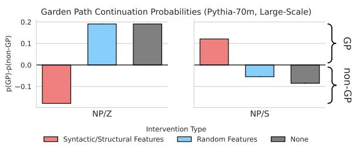  
Figure 6: Mean difference in probability of GP and non-GP continuations under interventions for Pythia-70m, on the larger-scale SAP Benchmark. Error bars indicate the standard error of the mean (SEM); however, SEM is near-0 and thus not visible. Interventions on interpretable features reverse model behavior, as expected; random interventions do not change behavior.

## D Causal Experiments on a Larger Dataset

The dataset from Arehalli et al. (2022) that we adapt for feature circuit finding is small. This is important, because we manually adapt it to be compatible with our methods. In particular, we craft the unambiguous examples described in §4.1, and also force every example to have the same token length. The latter is key, because, if we wish to estimate the importance of a feature at a given position over a number of different examples, each example must have the same token length, and the type of token at each position (e.g. verb, final noun, etc.) must be the same. For this reason, it is currently infeasible to run these experiments (or any other feature experiments) on a larger, non-handcrafted dataset.

These same restrictions do not apply to the causal experiment. In that experiment, as long as we know where the verb and final noun are located in the sentence, our sentences may have different lengths, and different semantic content at each position. Taking advantage of this, we run our causal experiment (see §4.3) again on a larger dataset. We use the syntactic ambiguity benchmark (SAP Benchmark, Huang et al., 2024), of which Arehalli et al.’s dataset is a subset. This dataset has 7952 NP/Z sentences and 7948 NP/S sentences. We follow the methods from §4.3 exactly, taking special care to accommodate the different lengths and positions in this dataset. We perform this analysis only on Pythia-70m-deduped; performing this on Gemma-2-2b would be rather slow.

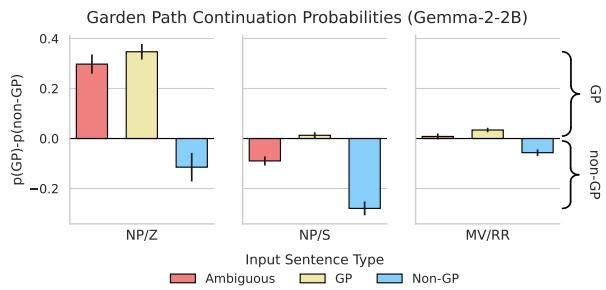  
Figure 7: Mean difference in probability of tokens corresponding to garden path $( ^ { 6 6 } , 7 ^ { 6 6 } , 7 )$ and non-garden-path (“was”) readings of the input for Gemma-2-2b, aggregated by garden path structure. Error bars indicate the standard error of the mean. Inputs are either ambiguous, or compatible with only a garden-path or non-gardenpath reading. (Non)-garden-path tokens are more probable given (non)-garden-path inputs. In ambiguous cases, the model prefers the garden path reading, except for NP/S inputs.

Our results (Figure 6) show that the features we found in §4.2 generalize to this larger dataset as well, even though they were found on a very small subset thereof. Our ablations successfully induce the model to produce non-GP continuations for NP/Z sentences, and GP continuations for NP/S sentences, reversing its initial preferences, exactly as in §4.3. Again, the random ablations are ineffective, leaving performance close to the no-intervention baseline.

## E Results for Gemma-2-2b

To ensure our findings are not merely a function of model size or the Pythia SAEs, we also replicate the experiments for Gemma-2-2b. We first present results for the behavioral analysis (App. E.1). Then, after discovering feature circuits for NP/S and NP/Z (shown in App. F), we causally verify the labels we assign to these features (App. E.2). We use Lieberum et al.’s (2024) Gemma-2-2b SAEs with 16,384 features.

## E.1 Behavioral experiments

Here, we present behavioral results for Gemma-2-2b (Figure 7). The experimental setup is the same as that described in §4.1. For all sentence structures, findings are largely consistent as those for Pythia: Gemma 2 upweights and downweights garden-path tokens in appropriate contexts. For ambiguous inputs, the model gives more probability to garden-path continuations in NP/Z, but nongarden-path continuations in NP/S. For MV/RR, Gemma-2-2b assigns higher probability to non-GP continuations than GP continuations in contexts that license non-GP continuations only. This is distinct from what was observed in Pythia, where probabilities for both continuations were closer to each other, with GP continuations being slightly more probable.

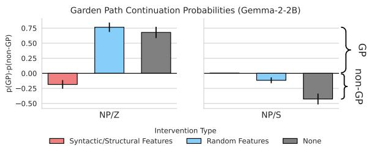  
Figure 8: Difference in mean probability of tokens corresponding to garden-path and non-garden-path readings of the input for Gemma-2-2b, aggregated by garden path structure. Error bars indicate the standard error of the mean. We either intervene on interpretable features to induce the opposite behavior, or intervene on random features. The interventions on interpretable features are effective in the way we expect, whereas random interventions do not change behavior.

## E.2 Causal verification

Having shown that Gemma 2 prefers the GP reading for NP/Z, we aim to induce the dispreferred non-GP reading by clamping subject detectors to high activations (100.0) at the final noun, and clamping object detectors to low activations (0.0). Note that the artificial high activation here is much larger (100.0) for Gemma 2 than what we used for Pythia (2.0). This is because the activations are generally much larger in the Gemma 2 SAEs; indeed, activations of 100.0 are not necessarily out of distribution. For NP/S, Gemma 2 prefers to non-GP reading, so we attempt to induce the dispreferred GP reading by doing the opposite—namely, setting the subject detector and object detector features to 0.0 or 100.0, respectively, and by clamping the sentential-clause-verb detectors to 0.0 at the verb position. As in §4.3, we compare to a baseline where we clamp the same number of randomly sampled features to high or low activations.

Our findings (Figure 8) suggest that the features we find are causally relevant, and in the way we expect. For NP/Z, we can change the model’s probabilities such that $p ( \mathrm { n o n \mathrm { - } G P } ) > p ( \mathrm { G P } )$ . For NP/S, we can decrease the originally preferred p(non-GP). The increases in p(GP) is difficult to visualize, but present: p(GP) is increased from $5 \times 1 0 ^ { - 6 }$ to $4 \times 1 0 ^ { - 3 }$ , and because the new p(non-GP) is $1 \times 1 0 ^ { - 9 }$ , we have induced a relative preference for the originally dispreferred reading. Nonetheless, it is likely that other continuations outside of the GP and non-GP tokens we consider have now become more probable than either of these two possibilities.

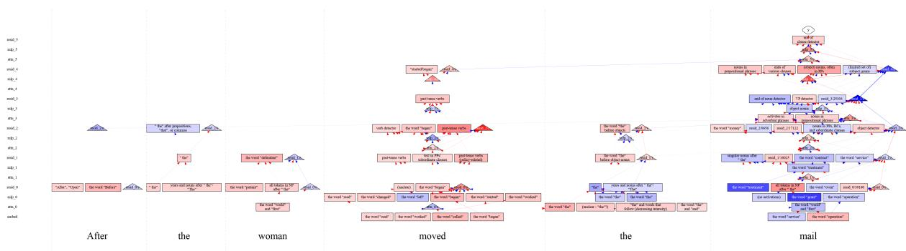

Figure 9: Sparse feature circuit for Pythia-70m on the NP/Z garden path structure. Features with larger positive effects are colored in deeper shades of blue; features with larger negative effects are colored in deeper shades of red. Zoom in to view feature annotations.  
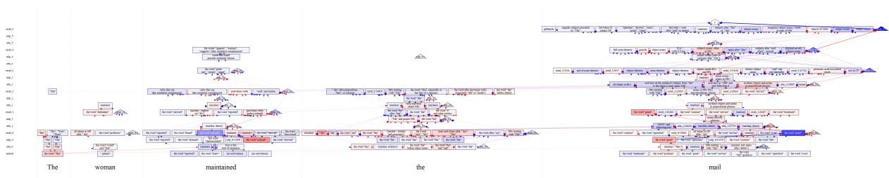  
Figure 10: Sparse feature circuit for Pythia-70m on the NP/S garden path structure. Features with larger positive effects are colored in deeper shades of blue; features with larger negative effects are colored in deeper shades of red. Zoom in to view feature annotations.

## F Feature Circuits

Here, we present the full sparse feature circuits for NP/S and NP/Z. We include feature circuits for both Pythia-70m and Gemma-2-2b. For both Pythia circuits, we set the node threshold to 0.1 and the edge threshold to 0.001. To keep the feature circuit a size that will fit onto a page (and to keep the number of features we must manually annotate reasonable), we slightly increase the node threshold to 0.12 when discovering the Gemma 2 circuits.

Because we include any node where the absolute value of the IEˆ is over the node threshold, we include positive- and negative-effect features. Positive-effect features increase the relative probability of the non-garden-path continuation over the garden-path-continuation, whereas negative-effect features increase the garden-path continuation probability relative to the non-garden-path continuation. We manually annotate all features in these circuits by observing their activation patterns and the tokens whose probabilities are most affected when the feature is ablated.13

The sparse feature circuits for NP/Z (Figures 9 and 11) are similar across models. Both contain primarily spurious or word-level features in the lower layers, and more syntax-sensitive features in the upper layers. See Figure 3 for a condensed version of Pythia’s NP/Z circuit, where we summarize the main categories of features and their effects on the model’s preferred continuation. Pythia’s NP/Z circuit contains 65 features, and Gemma 2’s contains 182.

The sparse feature circuits for NP/S (Figures 10 and 12) show similar trends. See Figure 13 for a condensed version of Pythia’s NP/S circuit. Note that more of the features have negative effects in the NP/Z circuits than in the NP/S circuits, as both models more strongly prefer the garden path continuations for NP/Z inputs. Pythia’s NP/S circuit contains 155 features, and Gemma $2 \mathrm { { } s }$ contains 179.

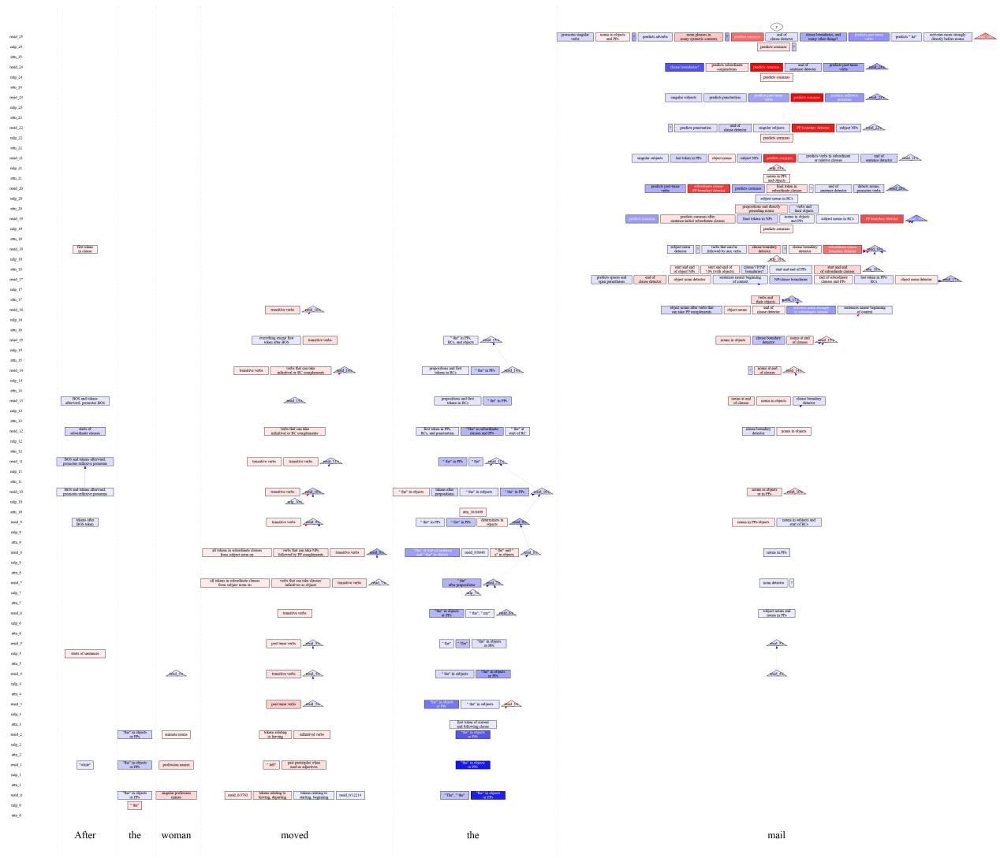  
Figure 11: Sparse feature circuit for Gemma-2-2b on the NP/Z garden path structure. Features with larger positive effects are colored in deeper shades of blue; features with larger negative effects are colored in deeper shades of red. Zoom in to view feature annotations.

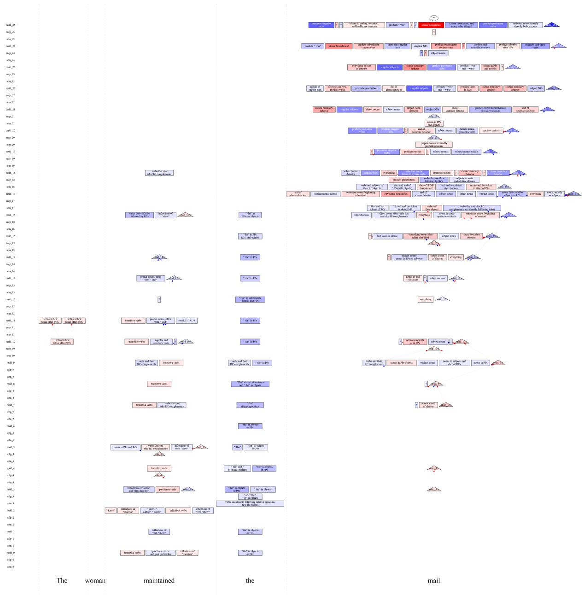  
Figure 12: Sparse feature circuit for Gemma-2-2b on the NP/S garden path structure. Features with larger positive effects are colored in deeper shades of blue; features with larger negative effects are colored in deeper shades of red. Zoom in to view feature annotations.

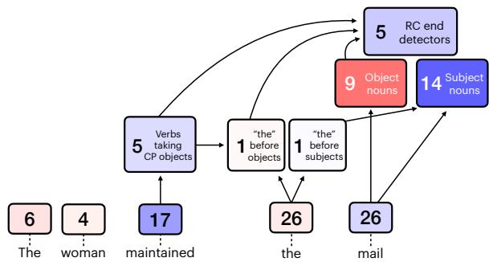  
Figure 13: Pythia-70m’s feature circuit for processing NP/S garden path sentences. We group features by their functional role in the circuit and display the number of features in each group. Red features have negative scores, and push the model towards the garden path reading; blue features have positive scores, and do the opposite. Unlabeled early-layer features are word detectors. Many late-layer features encode syntactic features, whereas early-layer features largely consist of word detectors and heuristics. Note that we exclude features that are difficult to interpret from the feature counts.

## G Structural Probe Training and Results

## G.1 Probe Details

We use Eisape et al.’s (2022) MLP action probes to probe Pythia-70m’s internal parse information. These probes take in the representations of two words,14 and compute the probability of a given parse action a as

$$
\begin{array} { r } { P ( a ) \propto \exp \left( e _ { a } ^ { \top } \mathbf { M L P } ( [ \mathbf { h } _ { 1 } , \mathbf { h } _ { 2 } ] ) + b _ { a } \right) , } \end{array}\tag{6}
$$

where $\mathbf { h } _ { 1 }$ and $\mathbf { h _ { 2 } }$ are the hidden representations of the words whose relation you wish to predict, and $e _ { a }$ and $b _ { a }$ are learned weight and bias terms respectively.

While we consider the parse probes in isolation, Eisape et al. (2022) use them as part of a larger parsing architecture. Specifically, they rely on the arc-standard dependency formalism (Nivre, 2004), which parses the input into subtrees which are placed on a stack and repeatedly combined with each other via parse actions in order to obtain a full (incremental) parse of the input.

There are three parse actions: LEFT-ARC, which pops the first two subtrees $\mathbf { s } _ { 1 } , \mathbf { s } _ { 2 }$ off the stack and draws an arc from $\mathbf { s } _ { 1 }$ to ${ \bf s } _ { 2 } ;$ RIGHT-ARC, which does the same, but draws the opposite arc; and GEN, which indicates no relation, and moves the parsing process forward by generating another token.

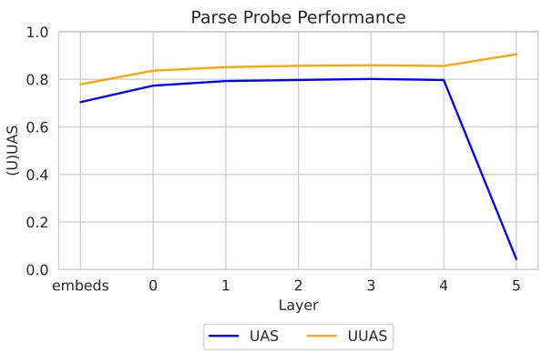  
Figure 14: Probe unlabeled attachment score (UAS) and undirected unlabeled attachment score (UUAS) on the Penn Treebank test split, by layer.

Notably, LEFT-ARC and RIGHT-ARC refer not to the position of words in the sentence, but to the direction of the arc between popped subtrees. This is why the non-garden-path reading corresponds to the LEFT-ARC action; during normal parsing of our garden path fragments, the final noun heads $\mathbf { s } _ { 1 }$ while the verb heads ${ \bf s } _ { 2 } .$ so arcs are reversed with respect to their appearance on paper.

## G.2 Probe Training

Following Eisape et al. (2022), we train our probes on the training split of the Penn Treebank (Taylor et al., 2003);15 we use essentially the same hyperparameters as in their work, modified to work with Pythia-70m-deduped, rather than GPT-2. Then, we also record unlabeled attachment score (UAS) and undirected unlabeled attachment score (UUAS) on the test split, in order to verify that our probes are effective.

Our results (Figure 14) show that the probes are indeed effective. The probes’ UAS and UUAS are similar to the values. The UAS for the last layer is unusually low, even considering the last layer’s lower performance in Eisape et al. (2022), indicating that the direction of dependency relations is not captured, but this tracks with the probes’ poor performance on garden path sentences using representations from that layer.

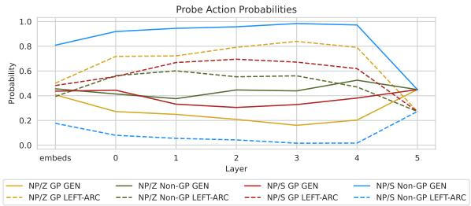  
Figure 15: Probe action probability across layers and sentence types (GP and non-GP). GEN corresponds to the non-GP reading, and LEFT-ARC to the GP reading (RIGHT-ARC is implausible and is excluded, as it always receives low probability). GP sentences elicit primarily LEFT-ARC; non-GP sentences elicit GEN. However, both readings do have non-zero probability in both cases.

## G.3 Probe Evaluation on Unambiguous Garden-Path-Derived Stimuli

In §5.2, we found that the probes’ judgments on regarding the parse of the sentence matched with our observations based on features and behavior. But do these probes also behave sensibly on stimuli whose parse is known? To test this, we evaluate the probes on the unambiguous stimuli from our dataset (Table 1), and record their action probabilities. Ideally, the probes should prefer LEFT-ARC on GP sentences, and GEN on non-GP sentences.

Our results (Figure 15) show that this is generally the case: GP sentences elicit primarily LEFT-ARC; non-GP sentences elicit GEN. However, the model struggles on NP/Z non-GP sentences, perhaps because these are the least plausible ones; such sentences are generally written with a comma after the verb, and read strangely. Moreover, both readings do have non-zero probability in most cases, even though their construction should preclude the alternative reading. The probes thus seem somewhat less attuned to syntactically in/valid readings than LM probabilities are.

## G.4 Feature Consistency

We can test the consistency between whole-model and probing methods by performing feature analysis with our structural probe. Each probe takes as input residual stream activations, for which we have SAEs; we can thus use AtP-IG to find features that influence the quantity p(LEFT-ARC) - p(GEN), just as we previously found model features that influenced p(GP) - p(non-GP). For each structure (NP/Z and NP/S) and layer of the model, we take $F _ { c } ,$ the set of features in that layer of the circuit, and $F _ { p } ,$ , the set containing the top- $| F _ { c } |$ features for the probe. We quantify the sets’ overlap via recall, $\frac { | F _ { c } \bigcap ^ { \bullet } F _ { p } | } { | F _ { c } | }$ . The expected recall for random features would be very near 0; however, Figure 16 shows that the probe features’ recall is quite high. This overlap is highest (0.6-0.8) in the embeddings, but there is also high overlap (0.35-0.45) in layers 3 and 4, which contain interpretable, high-level syntactic features. Thus, even though these probes were trained and attribution performed in very ways, the same underlying features are responsible.

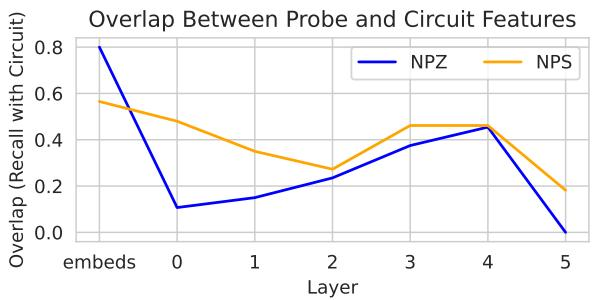  
Figure 16: Overlap of probe and circuit features, computed as recall with respect to circuit features. Random chance overlap is near 0, but probe features overlap significantly with circuit features.

<table><tr><td>Model MV/RR</td><td>NP/S</td><td>NP/Z</td></tr><tr><td>Gemma-2-2b –Neg MV/RR features –Neg NP/S features</td><td>73.0 83.3 73.0 83.3 70.9 83.3</td><td>70.9 79.2 70.9</td></tr><tr><td>—Neg NP/Z features</td><td>73.0 85.4</td><td>72.9</td></tr><tr><td>—Pos MV/RR features —Pos NP/S features</td><td>70.9 83.3</td><td>60.4</td></tr><tr><td>—Pos NP/Z features</td><td>70.9 83.3 73.0 83.3</td><td>75.0 70.9</td></tr></table>

Table 4: Accuracies on follow-up reading comprehension questions given garden path sentences. “Pos” refers to ablating positive-effect features, or those promoting the non-garden-path reading. “Neg” refers to ablating negative-effect features, or those promoting the gardenpath reading. Performance generally changes little under ablations, except for NP/Z when ablating MV/RR features.

## H Reading Comprehension Questions: Performance under ablations

Here, we assess the extent to which we can influence model performance in garden path reading comprehension questions by ablating the GPpromoting or non-GP-promoting features. Using the same dataset as in §6, we ablate the top 10 and bottom 10 features discovered from §4.2 and then remeasure performance. We hypothesize that ablating the positive features (those promoting the nongarden-path reading) will cause performance to drop, whereas ablating the negative features (those promoting the garden-path reading) will cause performance to increase.

Our results (Table 4) indicate that the ablations are largely ineffective at changing behavior. In some cases, performance does decrease or increase, but typically not to a significant extent. Where differences are significant, it is generally not for the structure from which the features were discovered. For example, ablating positive MV/RR features causes a significant increase in performance for NP/Z questions, and ablating negative MV/RR features also increases performance on NP/Z questions.

## I Data Artifacts, Experimental Details, and Risks

Data Artifacts In this paper, we mainly use Arehalli et al.’s (2022) garden path sentence dataset, which is in turn a subset of the syntactic ambiguity benchmark (SAP, now published as Huang et al., 2024), a larger garden path sentence dataset. The latter uses an MIT license, and our use case (intepretability and psycholinguistic research) is appropriate for the license. The other datasets— BoolQ (Clark et al., 2019a) and MCQA (Wiegreffe et al., 2024)—are released with licenses (CC BY-SA 3.0 and Apache 2.0) compatible with research use. All datasets are entirely in English.

We also craft two follow-up sentences per NP/Z and NP/S sentence in the aforementioned dataset. These follow-up sentences, and code for our experiments, will be released upon acceptance.

Experimental Details We perform our experiments using an Nvidia A100 (80GB) GPU and Nvidia RTX 6000 Ada GPU. The former is helpful for finding Gemma feature circuits with a low threshold. In total, running all experiments should take no more than 5 GPU-days on the former (perhaps less). Most of the runtime comes from running the Gemma experiments and training parse probes.

All experiments are implemented in PyTorch (Paszke et al., 2019) using the NNsight interpretability framework (Fiotto-Kaufman et al., 2024). All LMs used were accessed via Hugging-Face (Wolf et al., 2020).

Risks Because our study only attempts to interpret pre-trained models, we believe that it poses few risks; similarly, the basic follow-up questions carry with them few risks.