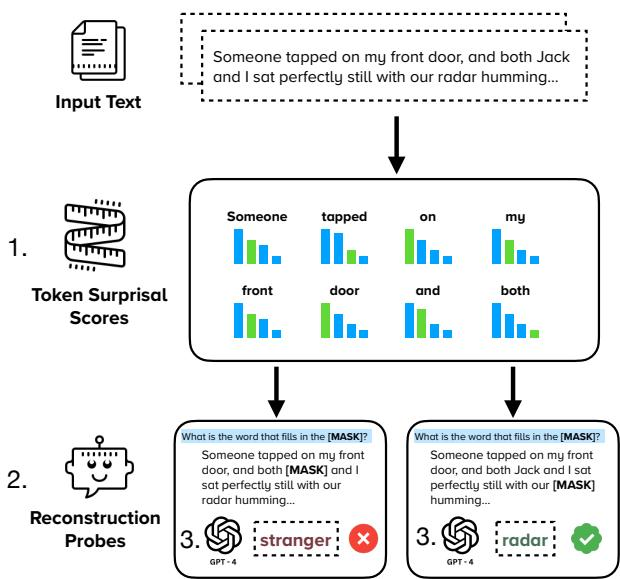
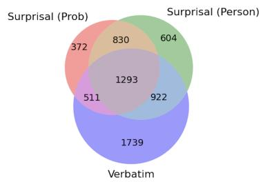
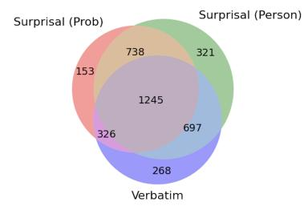
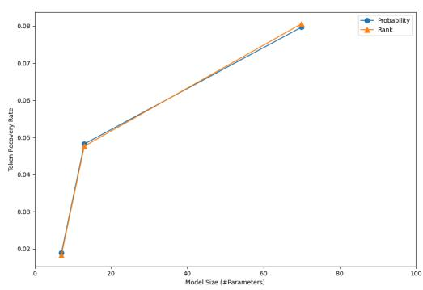

# Information-Guided Identification of Training Data Imprint in (Proprietary) Large Language Models

Abhilasha Ravichander 1 Jillian Fisher1 Taylor Sorensen 1 Ximing Lu 1 Yuchen Lin 1 Maria Antoniak 2 Niloofar Mireshghallah 1

Chandra Bhagavatula 3 Yejin Choi 4

1University of Washington 2University of Copenhagen 3ChipStack AI 4Stanford University

aravicha@cs.washington.edu,yejinc@stanford.edu

## Abstract

High-quality training data has proven crucial for developing performant large language models (LLMs). However, commercial LLM providers disclose few, if any, details about the data used for training. This lack of transparency creates multiple challenges: it limits external oversight and inspection of LLMs for issues such as copyright infringement, it undermines the agency of data authors, and it hinders scientific research on critical issues such as data contamination and data selection. How can we recover what training data is known to LLMs? In this work we demonstrate a new method to identify training data known to proprietary LLMs like GPT-4 without requiring any access to model weights or token probabilities, by usinga l information-guided probes. Our work builds on a key observation: text passages with high surprisal are good search material for memorization probes. By evaluating a model’s ability to successfully reconstruct high-surprisal tokens in text, we can identify a surprising number of texts memorized by LLMs.1

## 1 Introduction

For proprietary, legal, and reputational reasons, it has become common practice for companies to release few, if any, details about the secret ingredient — training data — powering their large language models (LLMs). For example, the data used to train Gemini is described only at a high level as containing “data from web documents, books, and code” (Gemini et al., 2023), while Llama-2 apparently uses a “new mix of data from publicly available sources, which does not include data from Meta’s products or services” (Touvron et al., 2023). And even though training data is widely regardeda as one of the most valuable components in building high-performing LLMs (Gemini et al., 2023), most companies only provide access to the overarching model without detailed information about data sources or distributions, and certainly do not provide direct access to the model training data.

  
Figure 1: Reconstruction probes to identify training data. The probing pipeline involves (1) finding surprising tokens (tokens which are difficult to predict based on context), which can be accomplished using multiple approaches including leveraging domain knowledge, or relying on an external reference model, (2) constructing reconstruction probes where high-surprisal tokens are masked out and surrounding context tokens are kept constant, and (3) measuring the reconstruction rate for a given target model, i.e., the number of successful reconstructions of masked tokens.

This lack of transparency has both scientific and societal implications, making it very difficult for l l l(1) researchers to evaluate the true capabilities and limitations of model generalization (Balloccu et al., 2024; Aiyappa et al., 2023), (2) external inspectors to examine models for data misuse (Buick, 2024; Longpre et al., 2024), and (3) data authors to understand and control how their data is used (Bommasani et al., 2023; Solove, 2024). To get around this issue, training data auditors have had to rely on roundabout and genre-specific memorization tests; for example, research investigating the use of published books as training data have used character name cloze tests (Chang et al., 2023), which mask out a specific word in a text, or prefix completion methods to see if models will exactly generate a piece of text given the first few words of the text as a prefix (D’Souza and Mimno, 2023; Karamolegkou et al., 2023a; Grynbaum and Mac, 2023). However, cloze tests make assumptions about the pretraining data (e.g., the presence of character names) and prefix completion relies on heuristics for comparing model responses to the original text, as models do not always produce the completions verbatim.

In this work, we study the following problem: given a text sample and a closed, black-box model, is it possible to infer whether the sample may have been memorized by the model? In this setting, a practitioner only has access to inputs and outputs from a model but no information about weights or logits; this is currently the most practical setting, as it mirrors the level of access provided to most commercial LLMs today. Crucially, unlike prior work, we focus not on specific data domains — e.g., books (Chang et al., 2023) or poems (Walsh et al., 2024) — but on datasets spanning texts from multiple domains. We develop tests that are applicable to diverse types of data, and that are more precise than simple prefix probing.

To identify data that is known to models, without access to token probabilities, we construct probes based on the concept of surprisal (Shannon, 1948): that a text passage may contain low-likelihood tokens that are difficult to reconstruct based on context alone. We then design cloze-style probes where these tokens are masked, and quantify the model’s ability to reconstruct the tokens. Successful reconstruction would indicate that a model relies on one of two mechanisms: (1) reconstruction based on context, or (2) reconstruction based on memorization. If the token is chosen such that reconstruction based on context is challenging (for example, a minor character’s name in a passage without any other identifying information), then the remaining mechanism for successful reconstruction is memorization.

These probes allow us to identify strong evidence of memorization, finding that LLMs may be memorizing more, and different, data than what can be extracted by looking at a prefix completions alone. This is important because past work has shown that models may perform much better on memorized examples than they would otherwise (Chang et al., 2023), and there have been concerns that this problem may be affecting how LLMs are evaluated (Oren et al., 2023). Our work sheds light on the training data imprints in LLMs, and the potential risks of this memorization such as test set contamination. We hope our work fosters a culture of greater data transparency in the LLM ecosystem.

## 2 Background

Memorization tests. Memorization tests can be developed using two main assumptions; the method has access to underlying token probability distributions or it has no access the these distributions. In this paper, we focus on the latter as it is the most common setting seen with current LLMs. For this setting, we focus on discoverable memorization, where given part of a training data sample as input, the model can recover the remainder of the sample (Carlini et al., 2022; Liu et al., 2023; Chang et al., 2023; D’Souza and Mimno, 2023). Past work has shown that about 1% of training datasets can be recovered in this way (Carlini et al., 2022). However, these methods have limitations; cloze tests have required that the data contain character names or other specific features (Chang et al., 2023), and prefix completion tests are less effective. Modern large language models likely incorporate additional posttraining or output filters to safeguard against verbatim regurgitation, and hence prefix probing methods often rely on heuristics (such as matching the longest common subsequence between the model generation and the orginal text) to compare model completions (Karamolegkou et al., 2023a).

Surprisal. Surprisal (Shannon, 1948), or the information conveyed by a linguistic unit in context, is a widely used measure in the computational modeling of human language processing (Hale, 2001; Levy, 2008). Briefly, the information content of a word $w _ { t } \in V$ that occurs in its context $w _ { < t } \in V$ can be denoted as:

$$
\operatorname { I } ( w _ { t } ) = - \log P ( w _ { t } | w _ { < t } )\tag{1}
$$

Predictable linguistic units carry lower information and have lower surprisal, whereas units that are unexpected transmit higher information, and thus have higher surprisal. Recently, LLMs have been studied as estimators for token-level surprisal, by examining their correlation with different psychometric variables that predict human comprehension behavior (McDonald and Shillcock, 2003; Goodkind and Bicknell, 2018; Oh and Schuler, 2023; Giulianelli et al., 2023). In this work, we use LLMs to identify tokens carrying high information, to separate two distinct mechanisms that models can use to reconstruct training data: (a) reconstructing from surrounding context of a token, or (b) reconstructing through memorization of training data.

## 3 Methodology

Our work aims to surface evidence of text samples that have been memorized by models, and we show that we can recover examples at higher precision compared to previous approaches such as prefix probing. Information-guided probes offer a complementary view of identifying training data that is memorized by models by identifying tokens that are challenging to predict without memorization. Concretely, information-guided probing involves first identifying high-surprisal tokens, then constructing probes, and finally quantifying the reconstruction capacity of target models. We discuss details of this probing pipeline.

Probe design. Taking inspiration from prior work (Chang et al., 2023), we formulate our probes as a cloze task, where a single high-surprisal token is masked out, and a target model is prompted to predict the token that fills in the mask, as shown in Figure 1. The exact prompts to the model, including instructions (and in-context examples), are described in Appendix B. This allows our probes to not require access to token probabilities assigned by a model, instead only leveraging model generations from the target model. Tokens are masked out one at a time, while the remaining tokens in context are held constant. Finally, for a given target model, we examine the reconstruction rate, or the number of high-surprisal tokens the target model can reconstruct.

Information measures for token selection. In practice, there are a variety of ways to measure high-information carrying tokens. We consider two different methods to measure the amount of information being transmitted by a token x.

(1) The probability of $w _ { t }$ given context $c ,$ where $h _ { c }$ is the hidden state of a model for the context c:

$$
\mathrm { P r o b } ( w _ { t } ) = - \log P ( w _ { t } | h _ { c } )\tag{2}
$$

(2) The rank of $w _ { t }$ in a vocabulary space $V$ given context $^ { c , }$ or the number of more plausible alternatives:

$$
\operatorname { R a n k } ( w _ { t } ) = | \{ x : P ( x | h _ { c } ) > P ( w _ { t } | h _ { c } ) , x \in V \} |\tag{3}
$$

The rank metric evaluates a token’s position in the sorted probability distribution of all possible tokens at a given masked position, rather than just its raw probability. This captures information about how many other tokens could plausibly appear in that position. For example, consider a probability distribution where an alternative token x is assigned the highest probability, receiving the vast majority of the probability mass, and the token w is assigned the second highest probability. Here, while traditional probability-based surprisal would assign wt a high surprisal value due to its low likelihood, the rank metric would assign it a lower surprisal value since there is only one more contextually appropriate choice. Yet another way of identifying high-information tokens is by leveraging domain knowledge (as we see in §4.1, this is the case for character names in fictional text).

How do we extract these information measures? Practically, we use a secondary model, known as a reference model to extract (2) and (3), since we do not have access to token probabilities from the target model. In order to get accurate information measures, in an ideal scenario we would want this reference model to be one that has not memorized the datapoint in question, in order for the token probabilities to be correctly-calibrated and to not be influenced by training on that particular datapoint. In practice, it is infeasible to find a large language model that has not been trained for every data sample. Instead, we seek to use a low-capacity model as they memorize training data at significantly lower rates (Carlini et al., 2022) to extract information measures.

Accounting for context using knowledge filters. In real-world domains, identifying what is surprising often requires world knowledge, but different models may encode different sets of facts. Thus, we employ an ensemble of models to correctly contextualize surprising knowledge. In practice, after obtaining candidate surprise tokens from a reference model, we filter out those tokens which can be correctly surmised by a secondary (or even an ensemble of secondary) low-capacity instructiontuned LLM(s). We note that the knowledge filters are low-capacity instruction tuned models, which differ from the the reference model which is a base model. The instructions used for knowledge filters are described in Appendix B. We use the token probabilities from the reference models to identify candidates for surprisal tokens, whereas we prompt the knowledge filtering models to reconstruct these candidate tokens after masking them, in order to filter out which ones can be easily guessed in a setting that closely matches the final target model.

Putting it all together. The full pipeline that combines these components is shown in Figure 1. To determine whether a piece of text has been memorized, we first identify high-surprisal tokens using a reference model. Optionally, a knowledge filter may be applied to filter spurious high-surprisal tokens. These tokens are then masked one at a time, and the target model is prompted to reconstruct the masked token. We then measure the reconstruction rate, or the number of successful reconstructions, to identify if text has been memorized by a model.

## 4 Experiments

We are interested in identifying whether some text d has been memorized by a model M. We investigate two distinct risks associated with model memorization: (1) the memorization of copyrighted content such as works of fiction or news articles (Fiction and New York Times), and (2) the contamination of evaluation metrics through direct memorization of test samples, which undermines the assessment of a model’s capabilities by allowing it to succeed through recall rather than by applying intended skills (Dataset Contamination).

We examine the performance of two closed models: GPT-3.5 (gpt-3.5-turbo-0125), GPT-4 (gpt-4-0613), and an open-weight model: Llama-2-70B (Touvron et al., 2023). Note that as of the writing of this paper, Llama-2-70B is open-weight, but details of its training data remain unknown. For all the described experiments, we use BERT (110M parameters) as the reference model. We hold out 1870 instances from BookMIA (Shi et al., 2023) to tune hyperparameters such as the thresholds for selecting surprising tokens. We select low-probability or highly ranked tokens for our two information measures (please refer to Appendix A for details of all hyperparameters). To evaluate detection methods, we primarily use precision (the proportion of correctly identified memorized samples among all samples flagged as memorized). When comparing methods with similar precision scores, we prefer those that identify more memorized samples. Therefore, we report the $F _ { \beta = 0 . 1 }$ score which weights precision more highly than recall.

For tasks which examine the memorization of copyrighted content (Fiction and New York Times), we compare against prefix probing due to it’s widespread use (Karamolegkou et al., 2023b; Grynbaum and Mac, 2023). Prefix probing evaluates a model’s ability to generate similar continuations to a piece of text given the first N tokens as context. In practice, to overcome the limitations of a model not generating an exact continuation, evaluation can be undertaken by measuring number of words in the longest common subsequence between the original text and the model generation (LCS) (Karamolegkou et al., 2023a). See Appendix E for examples of model-generated continuations and details about our prefix probing setup. For dataset contamination where samples are typically shorter and less amenable to prefix probing, we compare against TS-SLOT Guessing (Deng et al., 2024), which probes contamination in blackbox LLMs by first asking ChatGPT to identify ”informative” words and then using these to make masked-prompts for the target model.

## 4.1 Fiction

Memorization of fiction books has recently been studied due to the potential legal consequences of LLMs reproducing copyrighted texts (Karamolegkou et al., 2023a). To test our probes, we examine the results of three types of surprise tokens: character names (Person) which are known to be high-surprisal in fictional text (Chang et al., 2023), low probability tokens from a reference model (Prob), and high rank tokens (Rank) from a reference model. For prefix probing, we use the first 50 words in the passage as input for the target model (Appendix E).

We use the BookMIA dataset (Shi et al., 2023), which consists of text excerpts from books published in 2023 (after the knowledge cutoff of the models we study) as examples of unseen text, and passages from popular books as memorized examples (Chang et al., 2023). We use 8k examples from the dataset as a test set. We consider a sample of text to be memorized if at least two high-surprisal tokens are reconstructed successfully by the target model, to avoid the effect of a single spurious match (Appendix A).

<table><tr><td>Tokens Selected by Probability</td></tr><tr><td>...over Avathar, or Araman, or Valinor, and plunge in the chasm beyond the Outer Sea, pursuing his way alone amid the grots and caverns at the roots of Arda... Another sigh, and she let herself fall back, head cradled by the soft loam. Her eyes closed...</td></tr><tr><td>Anne breathed deeply, and looked into the clear sky beyond the dark boughs of the firs. You&#x27;re safe. Benjamin can&#x27;t hurt you anymore.</td></tr><tr><td>Tokens Selected by Rank</td></tr><tr><td>That light lives now in the Silmarils alone. But Morgoth hated the new lights... He slammed down another dollar. “Don&#x27;t oversport yourself, Ed,&quot; Bootyny challenged.</td></tr><tr><td>Because I am committed to protecting my peace and you are so far from my inner circle you&#x27;re basically a hexagon. Get</td></tr><tr><td>thee behind me. Why, said Stubb, eyeing the velvet vest and the watch and seals, you may as well begin by telling him that he looks a sort of babyish to me, though I don&#x27;t pretend to be a judge.</td></tr></table>

Table 1: Examples of tokens detected as surprising by rank and probability. These examples highlight the diversity of tokens and texts, which go beyond character names or other traditional cloze tests.

Results. Table 2 shows the precision, recall, and $F _ { \beta = 0 . 1 }$ performance for Llama-2-70B, GPT-3.5, and GPT-4. Our goal is to minimize the number of false positive samples that are reported as memorized text. Compared to suffix completions, we find that surprisal tokens can more precisely identify memorized book passages for all three types of models. Further, we find that surprisal tokens based on domain knowledge (Person) can be highly informative when available, though tokens obtained from reference models are also informative.

We additionally show examples of the highsurprisal tokens, selected either by rank or probability from, in Table 1. These examples highlight the diversity of words selected, which span from rare tokens to character names to fictional place names to frequent tokens used in unusual settings. These high-surprisal tokens would not easily be found via rule-based systems and can be applied across many different text domains. Even if no character name is available in a text, the surprisal metric can still be used to identify other tokens for the cloze test.

## 4.2 New York Times Lawsuit

In 2023, the New York Times sued OpenAI for allegedly training on articles published by the Times (Grynbaum and Mac, 2023). We scrape the evidence included in Exhibit-J of the New York Times lawsuit against OpenAI (The New York Times Company, 2023), consisting of one hundred articles that GPT-4 allegedly memorized. We also compare to negative samples, gathered from scraping hundred articles from CNN in 2023, which appear after the reported knowledge cutoff date for both models. For prefix probing, we use prefixes provided in Exhibit-J of the lawsuit (Appendix E).

<table><tr><td>Probe</td><td>Token Type</td><td>P</td><td>R</td><td>Fβ</td></tr><tr><td>Random Majority</td><td>一 一</td><td>50.2 49.8</td><td>50.5 100</td><td>50.2 50.2</td></tr><tr><td colspan="5">Target Model: GPT-3.5</td></tr><tr><td>LCS Surprisal Surprisal Surprisal</td><td>一 Person Prob</td><td>53.3 83.1 75.8 73.5</td><td>69.7 47.2 11.7</td><td>53.4 82.5 71.9 69.3</td></tr><tr><td colspan="5">Target Model: GPT-4</td></tr><tr><td>LCS Surprisal Surprisal</td><td>一 Person Prob</td><td>56.8 82.2 81.9</td><td>63.6 75.3 61.8</td><td>56.9 82.7 81.6</td></tr><tr><td colspan="5">Surprisal Rank 82.6 Target Model: Llama-2-70B</td></tr><tr><td>LCS</td><td>Person</td><td>53.2 75.8</td><td>34.7 29.6</td><td>52.9 74.6</td></tr><tr><td>Surprisal Surprisal</td><td>Prob</td><td>64.9</td><td>8.5</td><td>60.9</td></tr><tr><td>Surprisal</td><td>Rank</td><td>64.4</td><td>7.0</td><td>59.6</td></tr></table>

Table 2: Identification results for GPT-3.5 (top), GPT-4 (centre), and LLama-2-70B (bottom) on fictional text, with β=0.1. We bold the highest values and underline the second highest.

Results. As shown in Table 3, we evaluate both GPT-3.5 and GPT-4 on the resulting dataset, and use the Mistral-V2 (Jiang et al., 2023) and Alpaca-7B (Taori et al., 2023) models as knowledge filters. We find that (1) though the evidence in the lawsuit is based on near-exact verbatim regurgitation of the content of the New York Times articles — this content is no longer exactly reproduced as of May 2024, likely because of additional post-training procedures or output filters. (2) We find that while verbatim prompting works better on GPT-3.5 with very few correct guesses on surprise tokens, probing with surprise tokens is much more effective when it comes to GPT-4 where the probe shows fewer false positives.

## 4.3 Dataset Contamination

A growing concern for accurate evaluation of LLMs’ generalization capabilities is the prospect of dataset contamination, which is when evaluation benchmark data has already appeared in LLM training sets. Past work has demonstrated that this can artificially inflate benchmark performance (Touvron et al., 2023; Zhou et al., 2023; Jiang et al., 2024). However, with proprietary models that limit access to training data, there is limited recourse to evaluate how contamination affects performance.

<table><tr><td>Probe</td><td>Token Type</td><td>P</td><td>R</td><td>Fβ</td></tr><tr><td>Random Majority</td><td>一</td><td>48.7 50.0</td><td>55.0 100</td><td>48.7 50.3</td></tr><tr><td colspan="3">Target Model: GPT-3.5</td><td></td><td></td></tr><tr><td>LCS Surprise Token Surprise Token</td><td>Rank</td><td>59.8 53.5</td><td>61 23</td><td>59.82 52.8</td></tr><tr><td>Surprise Token+IF</td><td>Prob Rank Prob</td><td>51.5 37.5 40.0</td><td>17 3</td><td>50.5 33.7</td></tr><tr><td colspan="3">Surprise Token+IF</td><td>4</td><td>36.7</td></tr><tr><td colspan="3">Target Model: GPT-4 LCS 46.7 Rank 64.7</td><td>50</td><td>46.8</td></tr><tr><td colspan="3">Surprise Token Prob</td><td>44</td><td>64.4</td></tr><tr><td colspan="3">Surprise Token Rank</td><td>58.1 36 70.0</td><td>57.7</td></tr><tr><td colspan="3">Surprise Token+IF Surprise Token+IF</td><td>14 17</td><td>67.3 53.7</td></tr></table>

Table 3: Identification results for GPT-3.5 and GPT-4 on articles from the New York Times lawsuit, with β=0.1. IF indicates application of a knowledge filter. We bold the highest values and underline the second highest.

For our purposes, we study text contamination (Jiang et al., 2024), when the input text of an evaluation sample is likely to have appeared in the training data of a model. There is little gold standard evidence of contamination for proprietary language models. Recently, Deng et al. (2024) looked for evidence of contamination by prompting ChatGPT to identify informative words in dataset samples and prompting target models to guess the missing words (TS-SLOT). Specifically, they conduct a contamination experiment, where ChatGPT is finetuned with data from the MMLU test set, and the differences in Exact Match Rate between the finetuned model and the original model is observed. However, the extent to which these target models were contaminated with those datasets in the first place is unknown, and consequently the discriminative power of the test also remains unknown. In the section below, we describe a controlled setting to examine the discriminative power of contamination tests. We then apply the best-performing tests to real-world datasets to surface evidence of contamination.

Controlled contamination. We would like any test of contamination to have discriminative power, i.e., produce different values for contaminated datasets and uncontaminated datasets.

Therefore, we construct a synthetic test to compare the power of reconstruction probing with TS-SLOT (Deng et al., 2024). We start with an uncontaminated dataset, and then deliberately contaminate the model to examine the discriminative power of our method at detecting contamination. Thus, we consider a benchmark dataset, Google-proof QA or GPQA (Rein et al., 2023), where questions were written by domain-experts in biology, physics, and chemistry. The dataset was released in 2023— beyond the knowledge cutoff of the target models in this study. The combination of novel written text and the release date of the benchmark2 leads to our decision to consider GPQA as unlikely to be contaminated for these models.

We then replicate the contamination experiment from (Deng et al., 2024) as described in Table 4, by finetuning GPT-3.5-turbo on the dataset. We use the Mistral-V2 (Jiang et al., 2023) model as a knowledge filter. We observe that all surprisalbased approaches we study have greater discriminative power than TS-Slot-based approaches, with low-probability surprisal tokens with instructionfiltering having the greatest discriminative power.

Probing for contamination. We then apply this method on two other datasets (CommonsenseQA (Talmor et al., 2019) and ARC-Challenge (Clark et al., 2018)) to probe for evidence of contamination across our three target models (Table 5). We apply these probes on the test sets for both datasets.

We find that we are largely unable to find evidence of contamination for the models we study on CommonsenseQA. For Arc-Challenge, we do observe slight evidence of contamination with GPT-4-0613. Qualitative analysis indicates that some examples of high-surprisal tokens are correctly predicted by GPT-4-0613, such as “photosynthesis” in “Which of these is produced during [MASK]?”, and “HCL” in “If [MASK] is added to Zn, what would be an expected product?”

## 5 Analysis

Memorization extraction methods are complementary. Overall, our experiments show that all three tested methods uncover distinct examples of memorized text that are not identified by any of the other methods in this study. This indicates that a suite of complementary methods may be most suitable to uncover the training data known to black-box large language models.

<table><tr><td></td><td>TS-SLOT (EM) (Deng et al., 2024)</td><td>Reconstruction Probing Prob (EM)</td><td>Reconstruction Probing Rank (EM)</td><td>Reconstruction Probing Prob IF (EM)</td><td>Reconstruction Probing Rank IF (EM)</td></tr><tr><td>#Tokens</td><td>448</td><td>448</td><td>448</td><td>258</td><td>207</td></tr><tr><td>gpt-3.5-turbo gpt-3.5-turbo</td><td>38.84%</td><td>16.96%</td><td>12.28%</td><td>6.59%</td><td>7.25%</td></tr><tr><td>(contaminated)</td><td>88.84%</td><td>89.51%</td><td>66.07%</td><td>84.82%</td><td>78.64%</td></tr><tr><td>∆</td><td>50%</td><td>72.55%</td><td>53.79%</td><td>78.23%</td><td>71.39%</td></tr></table>

Table 4: Exact Match rates for TS-SLOT (Deng et al., 2024) and information-guided probing for ChatGPT, with and without contamination. IF indicates application of a knowledge filter. The discriminative power of reconstruction probing is greater in all settings, including picking low probability tokens or tokens with a large number of alternatives.

<table><tr><td>Dataset/Model</td><td>Llama-2-70B</td><td>GPT-3.5</td><td>GPT-4</td></tr><tr><td># Tokens</td><td>104/86</td><td>104/86</td><td>104/86</td></tr><tr><td>CommonsenseQA</td><td>0.96%/0.0%</td><td>6.73%/2.33%</td><td>4.81%/1.16%</td></tr><tr><td># Tokens</td><td>105/51</td><td>105/50</td><td>105/51</td></tr><tr><td>ARC</td><td>11.43%/1.96%</td><td>24.76%/6.0%</td><td>22.86%/13.73%</td></tr></table>

Table 5: Exact Match Rates for information-guided probing on two datasets: CommonsenseQA and ARC. We report # low-probability probes/# of low-probability probes that pass instruction filtering, as well as the exact match rates on these probes.

Larger models reconstruct more tokens. We examine the effect of model size on the capability to recover high-surprisal tokens (Figure 3). For the Llama-2 family of models, we plot the proportion of high-surprisal tokens recovered by the model at 7B, 13B and 70B parameters for samples from fictional text. We observe that larger models can recover many more high-surprisal tokens ( 7x more tokens for the 70B model compared to the 7b model), indicating that surprisal probes are likely to be much more effective at recovering memorized data on large models compared to small models.

Token probabilities contain more information about memorization. We would like to understand the upper bound on performance for identifying training data in LLMs. We therefore focus on a large model that does allow practitioners to access token probabilities on fictional text: Llama-2-70B (Table 6). Our work relates closely to membership inference methods, which seek to identify if data has been used to train a model, or if a model has never seen the data. Memorized training examples would form a subset of the model’s training data. Thus, we study three kinds of membership inference methods: the perplexity of the sample, the perplexity callibrated with the zlib compression entropy (Carlini et al., 2021) and the Min-K method (Shi et al., 2023). We find that the gap between methods that have full access to token probabilities, and surprisal-based methods is about 17 points in F . Notably, token probabilities represent a rich source of information in two aspects: (1) they are from the target model itself, (2) they are drawn from a much larger sample space than the binary information provided by whether a model could reconstruct a token (or not). When available for models, we advocate using token-probability based methods for membership inference.

<table><tr><td>Probe</td><td>Precision</td><td>Recall</td><td>F-Beta</td></tr><tr><td>Surprise Tokens (Rank)</td><td>64.4</td><td>7.0</td><td>59.6</td></tr><tr><td>Surprise Tokens (Prob) Surprise Tokens (Person)</td><td>64.9 75.8</td><td>8.5 29.6</td><td>60.9 74.6</td></tr><tr><td></td><td></td><td></td><td></td></tr><tr><td>PPL</td><td>96.5</td><td>9.7</td><td>88.6</td></tr><tr><td>PPL/ZLib</td><td>98.8</td><td>9.9</td><td>90.7</td></tr><tr><td>Min 5%</td><td>99.5</td><td>10.0</td><td>91.4</td></tr><tr><td>Min 10%</td><td>98.5</td><td>9.9</td><td>90.5</td></tr><tr><td>Min 20%</td><td>98.0</td><td>9.8</td><td>90.0</td></tr><tr><td>Min 30%</td><td>97.3</td><td>9.8</td><td>89.3</td></tr><tr><td>Min 40%</td><td>96.8</td><td>9.7</td><td>88.9</td></tr></table>

Table 6: Comparison of information-guided probing to membership inference methods that access token probabilities, for Llama-2-70B. Membership inference methods can be viewed as an upper bound — both seeking to identify all training data and non-members (and not just memorized training data), and having access to the token probability distribution from the target model.

## 6 Discussion and Future Work

Our goal is to provide a foundation for greater data transparency in the ecosystem surrounding large language models. We briefly discuss our findings, and provide directions for future research.

(a) Overlap between all instances identified as memorized by GPT-4 on fictional text, for prefix probing (verbatim), and surprisal (person and prob)  
  
(b) Overlap between all instances correctly identified as memorized by GPT-4 on fictional text, for prefix probing (verbatim), and surprisal (person and prob)  
Figure 2: Overlap between instances identified as memorized for GPT-4, by surprisal-based probes and verbatim probes

The need for multiple methods to surface training data. In our work, we find that we are able to identify text that is known to even proprietary black-box LLMs, and that the examples of memorized text that were successfully identified can differ between probing methods. This indicates that the community would benefit from a range of such approaches, and that focusing on state-of-the-art detection performance should not be the only goal. Further, recent work has investigating combining signals for various training data identification methods in order to determine if a model was trained on a given document (Maini et al., 2024). This suggests that developing diverse, complementary, probes can help us better understand how data was used to train models.

Answering questions about model generalization. While LLMs have achieved state-of-the-art performance on several benchmarks, the extent of their generalization capabilities remains an open question. This is in part due to an inability to characterize train-test overlap: that is, making sense of what data a model was trained on and how it may relate to the data a model needs to perform inference on. Our work adds to the growing body of work in shedding light on test-set contamination, which is particularly critical for proprietary LLMs — where the reasons behind performance improvement on standard benchmarks are opaque.

  
Figure 3: Token recovery rate as a function of model size for Llama-2 7B, 13B, and 70B. We observe that as model size increases, the ability to recover lowlikelihood tokens also increases.

Data transparency in the LLM ecosystem. Our work is in spirit related to studies that have called for better data documentation in machine learning (Liu et al., 2024b; Bender and Friedman, 2018; Gebru et al., 2021) or offered large-scale search and indexing mechanisms for pre-training corpora (Elazar et al., 2024; Liu et al., 2024a). While previous efforts focus on supervised, accessible datasets, this work focuses on inferring training data of models, especially in cases where there is currently no data transparency.

Why not only work with open models? In this work, our central focus is closed commercial models that do not offer access to token probabilities. The reason for this choice is that this is the dominant paradigm for many popular models today. While there is an argument to be made to limit scientific study only to open-source models, studying proprietary models is also important for multiple reasons: (1) they are in frequent use by the general public, and it is critical to understand how they may be using people’s data, (2) open models are often required to match the capabilities of proprietary models in order to be considered in the same class, so it is important to understand where performance improvements of proprietary models comes from.

Influence of data on models. Little is known about how datapoints in training affect model behavior downstream. A systematic understanding of these relationships could enable more principled approaches to data curation, and help optimize for specific behaviors by identifying which types of training examples are most effective for it. We hope by identifying training data that is memorized by models, we enable further studies of how data affects model behavior, and which data most affects model behavior.

## 7 Related Work

Our work closely relates prior lines of work in the literature that involve training data exposure of models, and data transparency. Typically, such work has either examined copyright issues, or investigated evidence of dataset contamination— our study explores both of these issues, and we discuss prior work in both here.

Copyright violation risks. Copyright issues can arise at various steps in the generative AI pipeline, especially in language models, including data collection (Min et al., 2023; Shi et al., 2023; Chang et al., 2023; Karamolegkou et al., 2023a), model training (Vyas et al., 2023), and generation and deployment (Meeus et al., 2024; Ippolito et al., 2023). Our work relates to the first step by surfacing evidence of training data memorization from the models output, with only API-level access. Duarte et al. (2024) propose DE-COP, a membership inference method that can work on black-box LLMs. This method is intended for document-level membership inference which is not the focus of our study, and works by aggregating evidence across passages in a longer document. This method is also expensive and relies on proprietary LLMs (see Appendix C,D for cost and performance comparisons).

Dataset contamination. Work involving data contamination and test-case leakage have garnered more attention recently as such contamination could muddy the conclusions made from existing benchmarks (Oren et al., 2023; Golchin and Surdeanu, 2023; Weller et al., 2024; Xu et al., 2024; Sainz et al., 2024). Although this line of work also infers membership, it differs from our work in two manners: (1) the information-guided probes can be applied to even proprietary large language models with no access to token probabilities from the model, and (2) test-set contamination methods sometimes take advantage of meta-data and artifacts other than the data itself, for instance the order of samples (Oren et al., 2023), whereas in our mode we do not have access to such meta-data.

Verbatim memorization and membership inference. Our work is also related to membership inference attacks (MIAs), which are often used as a proxy to measure the amount of training data leakage in machine learning models (Shokri et al., 2017). These attacks usually entail thresholding a membership score, which is metrics including LOSS (Yeom et al., 2018), likelihood-ratio (Carlini et al., 2021; Mireshghallah et al., 2022), Zlib Entropy (Carlini et al., 2021), curvature (Mattern et al., 2023), and Min-k% probability (Shi et al., 2023), among others. More recent work (Duan et al., 2024) has shown that membership inference attacks for LLMs show near-random performance, partly due to models being trained on large datasets with very few iterations. In contrast, our work seeks to find evidence of memorization of datapoints, and identify data that has left a strong imprint in the model. Previously, evidence of such memorization has largely been found by examining model generations for long sequences that are likely from the training data (Carlini et al., 2021), or by prompting the model to generate continuations of a piece of text given the first part of text as input (Karamolegkou et al., 2023b). Modern LLMs likely incorporate additional posttraining or output filters to safeguard against verbatim regurgitation, indicating the need for a suite of complementary methods to uncover evidence of memorization, this present work offers a unique and complementary approach to identify this evidence.

## 8 Conclusion

In the current landscape of closed LLMs, the lack of documentation surrounding training data remains a major obstacle for model auditing and for scientific exploration. In this work, we consider one of the most restrictive (and yet common) access scenarios: models which do not permit accessing pretraining data, model weights, or logits. We construct a probing strategy that only requires input-output access to a model, and that can be applied using much smaller and cheaper language models. We show that we can use these probes to identify documents in the training data of commercial LLMs. We hope this effort leads to greater transparency in the LLM ecosystem, and empowers data contributors to have greater agency when interacting with AI systems.

## 9 Limitations

We aim to highlight potential limitations of our work. First, we recognize that the task of training data identification can be framed in various ways. For instance, should paraphrases be treated as members or non-members of the training set? Similarly, what about derivative works of copyrighted content that may still retain information from the original source? How much of the content needs to be memorized to qualify as a member? As such, due to the inherent ambiguity in defining this task, we are uncertain about the precise “nearness” of the data we identify as memorized.

Second, our approach is heavily dependent on model memorization. As a result, if a model does not memorize the training data, our method will not be effective. Consequently, as we discuss in Section 5, extracting memorized data using reconstruction probing is likely to only be effective for large and capable instruction-tuned models. We encourage future research to adapt our method to probes that do not rely on memorization, potentially by calibrating recovery rates using rare or generic tokens. Additionally, we do not leverage metadata about the text samples for any of the methods described in this work (such as authors of passages of fictional text). It is possible that leveraging such metadata can improve the precision of identifying memorized data. A further limitation is that we used datasets from previous studies, which introduces potential differences between members and non-members, such as temporal gaps or varying frequencies in the training data (Duan et al., 2024). We also acknowledge a limitation in the reference models used in our experiments: these models may not possess the same knowledge as the model being tested, which could introduce bias into results. In addition, these models may have already been trained on the sample being probed, which could affect the distribution of tokens that are identified as high-surprisal. An additional constraint of this method is the reliance on identifying high-surprisal tokens. It may be the case that a sample of text is sufficiently generic that such high-surprisal tokens cannot be found, or that spurious examples of high-surprisal tokens are found— possibly due to limitations of the reference model. Here, a practitioner may want to explore alternative methods to identify memorized data.

Lastly, we recognize that closed-source models inherently exhibit some degree of variance, which can make it difficult to replicate our findings across different models or systems. Companies can also implement post-training strategies to circumvent the effectiveness of our method. As a result, applying our probes to future models may prove challenging, especially in environments where proprietary changes to models are not disclosed.

## Acknowledgment

The authors would like to thank Aakanksha Naik and Yanai Elazar for helpful discussions regarding this work. This research was supported by the NSF DMS-2134012, ONR N00014-24-1-2207, and the Allen Institute for AI.

## References

Rachith Aiyappa, Jisun An, Haewoon Kwak, and Yongyeol Ahn. 2023. Can we trust the evaluation on chatgpt? In Proceedings of the 3rd Workshop on Trustworthy Natural Language Processing (TrustNLP 2023), pages 47–54, Toronto, Canada. Association for Computational Linguistics.

Anthropic. 2023. Claude 2.

Simone Balloccu, Patrícia Schmidtová, Mateusz Lango, and Ondrej Dusek. 2024. Leak, cheat, repeat: Data contamination and evaluation malpractices in closedsource LLMs. In Proceedings of the 18th Conference of the European Chapter of the Association for Computational Linguistics (Volume 1: Long Papers), pages 67–93, St. Julian’s, Malta. Association for Computational Linguistics.

Emily M. Bender and Batya Friedman. 2018. Data statements for natural language processing: Toward mitigating system bias and enabling better science. Transactions of the Association for Computational Linguistics, 6:587–604.

Rishi Bommasani, Kevin Klyman, Shayne Longpre, Sayash Kapoor, Nestor Maslej, Betty Xiong, Daniel Zhang, and Percy Liang. 2023. The foundation model transparency index. arXiv preprint arXiv:2310.12941.

Adam Buick. 2024. Copyright and ai training data—transparency to the rescue? Journal Of Intellectual Property Law and Practice, page jpae102.

Nicholas Carlini, Daphne Ippolito, Matthew Jagielski, Katherine Lee, Florian Tramer, and Chiyuan Zhang. 2022. Quantifying memorization across neural language models. arXiv preprint arXiv:2202.07646.

Nicholas Carlini, Florian Tramèr, Eric Wallace, Matthew Jagielski, Ariel Herbert-Voss, Katherine Lee, Adam Roberts, Tom Brown, Dawn Song, Úlfar Erlingsson, Alina Oprea, and Colin Raffel. 2021. Extracting training data from large language models. In

30th USENIX Security Symposium (USENIX Security 21), pages 2633–2650. USENIX Association.

Kent Chang, Mackenzie Cramer, Sandeep Soni, and David Bamman. 2023. Speak, memory: An archaeology of books known to ChatGPT/GPT-4. In Proceedings ofthe 2023 Conference on Empirical Methods in Natural Language Processing, pages 7312–7327, Singapore. Association for Computational Linguistics.

Peter Clark, Isaac Cowhey, Oren Etzioni, Tushar Khot, Ashish Sabharwal, Carissa Schoenick, and Oyvind Tafjord. 2018. Think you have solved question answering? try ARC, the AI2 reasoning challenge. arXiv:1803.05457v1.

Chunyuan Deng, Yilun Zhao, Xiangru Tang, Mark Gerstein, and Arman Cohan. 2024. Investigating data contamination in modern benchmarks for large language models. In Proceedings of the 2024 Conference of the North American Chapter of the Association for Computational Linguistics: Human Language Technologies (Volume 1: Long Papers), pages 8706–8719, Mexico City, Mexico. Association for Computational Linguistics.

Michael Duan, Anshuman Suri, Niloofar Mireshghallah, Sewon Min, Weijia Shi, Luke Zettlemoyer, Yulia Tsvetkov, Yejin Choi, David Evans, and Hannaneh Hajishirzi. 2024. Do membership inference attacks work on large language models? arXiv preprint arXiv:2402.07841.

André V Duarte, Xuandong Zhao, Arlindo L Oliveira, and Lei Li. 2024. De-cop: Detecting copyrighted content in language models training data. arXiv preprint arXiv:2402.09910.

Lyra D’Souza and David Mimno. 2023. The chatbot and the canon: Poetry memorization in LLMs. In Computational Humanities Research.

Yanai Elazar, Akshita Bhagia, Ian Helgi Magnusson, Abhilasha Ravichander, Dustin Schwenk, Alane Suhr, Evan Pete Walsh, Dirk Groeneveld, Luca Soldaini, Sameer Singh, Hanna Hajishirzi, Noah A. Smith, and Jesse Dodge. 2024. What’s in my big data? In The Twelfth International Conference on Learning Representations.

Timnit Gebru, Jamie Morgenstern, Briana Vecchione, Jennifer Wortman Vaughan, Hanna Wallach, Hal Daumé III, and Kate Crawford. 2021. Datasheets for datasets. Commun. ACM, 64(12):86–92.

Team Gemini, Rohan Anil, Sebastian Borgeaud, Yonghui Wu, Jean-Baptiste Alayrac, Jiahui Yu, Radu Soricut, Johan Schalkwyk, Andrew M Dai, Anja Hauth, et al. 2023. Gemini: a family of highly capable multimodal models. arXiv preprint arXiv:2312.11805.

Mario Giulianelli, Sarenne Wallbridge, and Raquel Fernández. 2023. Information value: Measuring utterance predictability as distance from plausible alternatives. In Proceedings ofthe 2023 Conference on

Empirical Methods in Natural Language Processing, pages 5633–5653, Singapore. Association for Computational Linguistics.

Shahriar Golchin and Mihai Surdeanu. 2023. Time travel in LLMs: Tracing data contamination in large language models. arXiv preprint arXiv:2308.08493.

Adam Goodkind and Klinton Bicknell. 2018. Predictive power of word surprisal for reading times is a linear function of language model quality. In Proceedings ofthe 8th Workshop on Cognitive Modeling and Computational Linguistics (CMCL 2018), pages 10–18, Salt Lake City, Utah. Association for Computational Linguistics.

Michael M Grynbaum and Ryan Mac. 2023. The Times sues OpenAI and Microsoft over A.I. use of copyrighted work. https://www. nytimes.com/2023/12/27/business/media/ new-york-times-open-ai-microsoft-lawsuit. html.

John Hale. 2001. A probabilistic Earley parser as a psycholinguistic model. In Second Meeting of the North American Chapter of the Association for Computational Linguistics.

Daphne Ippolito, Florian Tramer, Milad Nasr, Chiyuan Zhang, Matthew Jagielski, Katherine Lee, Christopher Choquette Choo, and Nicholas Carlini. 2023. Preventing generation of verbatim memorization in language models gives a false sense of privacy. In Proceedings ofthe 16th International Natural Language Generation Conference, pages 28–53, Prague, Czechia. Association for Computational Linguistics.

Albert Q. Jiang, Alexandre Sablayrolles, Arthur Mensch, Chris Bamford, Devendra Singh Chaplot, Diego de las Casas, Florian Bressand, Gianna Lengyel, Guillaume Lample, Lucile Saulnier, Lélio Renard Lavaud, Marie-Anne Lachaux, Pierre Stock, Teven Le Scao, Thibaut Lavril, Thomas Wang, Timothée Lacroix, and William El Sayed. 2023. Mistral 7b.

Minhao Jiang, Ken Ziyu Liu, Ming Zhong, Rylan Schaeffer, Siru Ouyang, Jiawei Han, and Sanmi Koyejo. 2024. Investigating data contamination for pre-training language models. arXiv preprint arXiv:2401.06059.

Antonia Karamolegkou, Jiaang Li, Li Zhou, and Anders Søgaard. 2023a. Copyright violations and large language models. In Proceedings of the 2023 Conference on Empirical Methods in Natural Language Processing, pages 7403–7412, Singapore. Association for Computational Linguistics.

Antonia Karamolegkou, Jiaang Li, Li Zhou, and Anders Søgaard. 2023b. Copyright violations and large language models. In Proceedings ofthe 2023 Conference on Empirical Methods in Natural Language Processing, pages 7403–7412, Singapore. Association for Computational Linguistics.

Roger Levy. 2008. Expectation-based syntactic comprehension. Cognition, 106(3):1126–1177.

Jiacheng Liu, Sewon Min, Luke Zettlemoyer, Yejin Choi, and Hannaneh Hajishirzi. 2024a. Infini-gram: Scaling unbounded n-gram language models to a trillion tokens. arXiv preprint arXiv:2401.17377.

Jiarui Liu, Wenkai Li, Zhijing Jin, and Mona Diab. 2024b. Automatic generation of model and data cards: A step towards responsible AI. In Proceedings of the 2024 Conference of the North American Chapter of the Association for Computational Linguistics: Human Language Technologies (Volume 1: Long Papers), pages 1975–1997, Mexico City, Mexico. Association for Computational Linguistics.

Zhengzhong Liu, Aurick Qiao, Willie Neiswanger, Hongyi Wang, Bowen Tan, Tianhua Tao, Junbo Li, Yuqi Wang, Suqi Sun, Omkar Pangarkar, et al. 2023. LLM360: Towards fully transparent open-source LLMs. arXiv preprint arXiv:2312.06550.

Shayne Longpre, Robert Mahari, Naana Obeng-Marnu, William Brannon, Tobin South, Jad Kabbara, and Sandy Pentland. 2024. Data authenticity, consent, and provenance for ai are all broken: What will it take to fix them?

Pratyush Maini, Hengrui Jia, Nicolas Papernot, and Adam Dziedzic. 2024. LLM dataset inference: Did you train on my dataset? arXiv preprint arXiv:2406.06443.

Justus Mattern, Fatemehsadat Mireshghallah, Zhijing Jin, Bernhard Schoelkopf, Mrinmaya Sachan, and Taylor Berg-Kirkpatrick. 2023. Membership inference attacks against language models via neighbourhood comparison. In Findings ofthe Associationfor Computational Linguistics: ACL 2023, pages 11330– 11343, Toronto, Canada. Association for Computational Linguistics.

Scott A McDonald and Richard C Shillcock. 2003. Lowlevel predictive inference in reading: The influence of transitional probabilities on eye movements. Vision Research, 43(16):1735–1751.

Matthieu Meeus, Igor Shilov, Manuel Faysse, and Yves-Alexandre de Montjoye. 2024. Copyright traps for large language models. arXiv preprint arXiv:2402.09363.

Sewon Min, Suchin Gururangan, Eric Wallace, Hannaneh Hajishirzi, Noah A Smith, and Luke Zettlemoyer. 2023. Silo language models: Isolating legal risk in a nonparametric datastore. arXiv preprint arXiv:2308.04430.

Fatemehsadat Mireshghallah, Kartik Goyal, Archit Uniyal, Taylor Berg-Kirkpatrick, and Reza Shokri. 2022. Quantifying Privacy Risks of Masked Language Models Using Membership Inference Attacks.

Byung-Doh Oh and William Schuler. 2023. Why does surprisal from larger transformer-based language models provide a poorer fit to human reading times? Transactions of the Association for Computational Linguistics, 11:336–350.

Yonatan Oren, Nicole Meister, Niladri Chatterji, Faisal Ladhak, and Tatsunori B Hashimoto. 2023. Proving test set contamination in black box language models. arXiv preprint arXiv:2310.17623.

David Rein, Betty Li Hou, Asa Cooper Stickland, Jackson Petty, Richard Yuanzhe Pang, Julien Dirani, Julian Michael, and Samuel R Bowman. 2023. GPQA: A graduate-level Google-proof Q&A benchmark. arXiv preprint arXiv:2311.12022.

Oscar Sainz, Iker García-Ferrero, Alon Jacovi, Jon Ander Campos, Yanai Elazar, Eneko Agirre, Yoav Goldberg, Wei-Lin Chen, Jenny Chim, Leshem Choshen, Luca D’Amico-Wong, Melissa Dell, Run-Ze Fan, Shahriar Golchin, Yucheng Li, Pengfei Liu, Bhavish Pahwa, Ameya Prabhu, Suryansh Sharma, Emily Silcock, Kateryna Solonko, David Stap, Mihai Surdeanu, Yu-Min Tseng, Vishaal Udandarao, Zengzhi Wang, Ruijie Xu, and Jinglin Yang. 2024. Data contamination report from the 2024 CONDA shared task. In Proceedings ofthe 1st Workshop on Data Contamination (CONDA), pages 41–56, Bangkok, Thailand. Association for Computational Linguistics.

Claude Elwood Shannon. 1948. A mathematical theory of communication. The Bell system technical journal, 27(3):379–423.

Weijia Shi, Anirudh Ajith, Mengzhou Xia, Yangsibo Huang, Daogao Liu, Terra Blevins, Danqi Chen, and Luke Zettlemoyer. 2023. Detecting pretraining data from large language models. arXiv preprint arXiv:2310.16789.

Reza Shokri, Marco Stronati, Congzheng Song, and Vitaly Shmatikov. 2017. Membership inference attacks against machine learning models. In 2017 IEEE Symposium on Security and Privacy (SP), pages 3–18.

Daniel J Solove. 2024. Artificial intelligence and privacy. GWU Law School Public Law Research Paper No. 2024-36.

Alon Talmor, Jonathan Herzig, Nicholas Lourie, and Jonathan Berant. 2019. CommonsenseQA: A question answering challenge targeting commonsense knowledge. In Proceedings ofthe 2019 Conference ofthe North American Chapter ofthe Associationfor Computational Linguistics: Human Language Technologies, Volume 1 (Long and Short Papers), pages 4149–4158, Minneapolis, Minnesota. Association for Computational Linguistics.

Rohan Taori, Ishaan Gulrajani, Tianyi Zhang, Yann Dubois, Xuechen Li, Carlos Guestrin, Percy Liang, and Tatsunori B Hashimoto. 2023. Alpaca: A strong, replicable instruction-following model. Stanford Center for Research on Foundation Models. https://crfm. stanford. edu/2023/03/13/alpaca. html, 3(6):7.

What are 100 words that can fill in the [MASK] token in the follow  
ing passage?   
Passage:

The New York Times Company. 2023. The New York Times company. Lawsuit document, 2023.

Hugo Touvron, Louis Martin, Kevin Stone, Peter Albert, Amjad Almahairi, Yasmine Babaei, Nikolay Bashlykov, Soumya Batra, Prajjwal Bhargava, Shruti Bhosale, et al. 2023. Llama 2: Open foundation and fine-tuned chat models. arXiv preprint arXiv:2307.09288.

Nikhil Vyas, Sham M. Kakade, and Boaz Barak. 2023. On provable copyright protection for generative models. In Proceedings ofthe 40th International Conference on Machine Learning, volume 202 of Proceedings of Machine Learning Research, pages 35277– 35299. PMLR.

Melanie Walsh, Maria Antoniak, and Anna Preus. 2024. Sonnet or not, bot? poetry evaluation for large models and datasets. In Findings ofthe Associationfor Computational Linguistics: EMNLP 2024, pages 15568– 15603.

Orion Weller, Marc Marone, Nathaniel Weir, Dawn Lawrie, Daniel Khashabi, and Benjamin Van Durme. 2024. “According to . . . ”: Prompting language models improves quoting from pre-training data. In Proceedings of the 18th Conference of the European Chapter of the Association for Computational Linguistics (Volume 1: Long Papers), pages 2288–2301, St. Julian’s, Malta. Association for Computational Linguistics.

Cheng Xu, Shuhao Guan, Derek Greene, M Kechadi, et al. 2024. Benchmark data contamination of large language models: A survey. arXiv preprint arXiv:2406.04244.

Samuel Yeom, Irene Giacomelli, Matt Fredrikson, and Somesh Jha. 2018. Privacy risk in machine learning: Analyzing the connection to overfitting. In 2018 IEEE 31st Computer Security Foundations Symposium (CSF), pages 268–282.

Kun Zhou, Yutao Zhu, Zhipeng Chen, Wentong Chen, Wayne Xin Zhao, Xu Chen, Yankai Lin, Ji-Rong Wen, and Jiawei Han. 2023. Don’t make your LLM an evaluation benchmark cheater. arXiv preprint arXiv:2311.01964.

## A Knowledge Cutoffs and Hyperparameters

We select all target models for this study (gpt-4-0613, gpt-3.5-turbo-0125, and Llama-2-70B) such that they have a knowledge cutoff date before 2023.

We use a validation set of 1870 examples from BookMIA to be used for tuning all hyperparameters, which is held out separately from the 8000 examples we evaluate on. We select surprisal tokens which have a log likelihood <-12, or a rank>2000. The number of high-surprisal tokens can vary in any given piece of text, we cutoff at 10 tokens for text where more than 10 high-surprisal tokens are available (selecting the lowest probability or highest rank tokens that pass the threshold). For fiction datasets, we consider a sample to be memorized if atleast two or more such tokens can be reconstructed by the target model (to overcome the effect of a single spurious match). For the New York Times dataset, we additionally use knowledge filters since it is a real-world domain.

## B Prompts

Inspired by (Chang et al., 2023), we use the following prompt for probing fictional text and NYT articles:

You have seen the following passage in your training data. What   
is the word that fills in the [MASK] token in it? This word is a   
noun, verb, adjective, or adverb (not a pronoun, preposition or   
conjunction). You must make a guess, even if you are uncertain.   
Example:   
Input: Stay gold, [MASK], stay gold.   
Output: <word>Ponyboy</word>   
Input: The door opened, and [MASK], dressed and hatted, entered   
with a cup of tea.   
Output: <word>Gerty</word>   
Input:

Inspired by (Deng et al., 2024), we use the following prompt for test set contamination:

Complete the sentence in one word:   
Input:   
Reply the answer only.

We use the following two prompta for knowledge filtering.

What is the word that fills in the [MASK] token in the following   
passage?   
Passage:

## C Probe Cost

We attempt to estimate the cost of running information-guided probes. For a given input of N tokens, this cost would scale with the number of high-surprisal tokens K being probed. Let us assume that these tokens are cutoff at K = 10 as we do in this work, and let us assume output tokens are constrained to 5 tokens (though models may provide longer responses). Then for any provider where input tokens cost X\$/token, and output tokens cost Y\$/token (for many LLM providers $\mathbf { X } { < } \mathbf { Y } )$ , the cost of running informationguided probes would be $1 0 * \left( \left( N + 1 2 3 \right) * X + \right.$ $5 * Y )$ , where 123 is the number of tokens in the instructions for probing fictional text using the tokenizer for GPT-4. In comparison, prefix probing (Karamolegkou et al., 2023a) would cost $( 5 0 + 1 3 ) * X + ( N - 5 0 ) * Y$ , assuming that 50 tokens are provided to the model as a prefix. We estimate DE-COP (Duarte et al., 2024) for a sample would cost $N * 4 * 2 4 * X + 2 4 * Y$ , not taking into account the cost of paraphrasing the input three times with Claude, making it more expensive than the other probes if $N > 1 5 .$

## D Adapting DE-COP to Passages

DE-COP (Duarte et al., 2024) is a method intended to determine whether a piece of text has appeared in a model’s training data. In the fully black-box setting, detecting copyrighted content is posed as a multiple-choice question answering task (MCQA) task, where a target model must correctly pick out the training sample, from three paraphrases of that training sample. Though this method is intended for document-level membership inference by aggregating information across several passages in a long document, we attempt to do a head-to-head com parison to information-guided probing by consid ering the DE-COP score assigned to each passage. We subsample 600 passages from the BookMIA dataset due to the cost of the DE-COP method, and then follow the original procedure of using Claude 2 (Anthropic, 2023) to paraphrase each passage three times. The prompt used for paraphrasing is ‘Rewrite this entire text (all sentences with no exception) expressing the same meaning using different words. Aim to keep the rewriting similar in length to the original text. Do it three times. The text to be rewritten is identified as <Example A>. Format your output as: Example B: <insert paraphrase B> Example C: <insert paraphrase C> Example D: <insert paraphrase D> Example A:’. For each of these samples, we then oversample 24 times by creating every possible combination of options for the 4-option multiple choice question. To evaluate memorization, we compute the proportion of times the model picks the BookMIA passage instead of its paraphrased counterparts in the multiple-choice question answering task. We prompt the model with the following prompt that doesn’t use any extra metadata about the sample ‘You are entering a multiple choice questions exam. You should directly answer each question by choosing the correct option. Be concise and straight to the point in your answer. Output only the letter corresponding to the correct answer. Question: Which of the following passages is verbatim from your training data? Options:’. We use 100 examples from the same validation set to compute the threshold to identify memorized samples in DE-COP, and evaluate on the remaining 600 samples. We also evaluate information-guided probing on the same 600 samples. These results are shown in Table. 7 for GPT-3.5. We find that in the same head-tohead setting where both probes only have access to a text snippet, information-guided probing is more precise.

<table><tr><td>Probe</td><td>Precision</td><td>Recall</td><td> $F _ { \beta }$ </td></tr><tr><td>Majority</td><td>51.5</td><td>100</td><td>51.75</td></tr><tr><td>DE-COP-Passage</td><td>58.38</td><td>63.11</td><td>58.43</td></tr><tr><td>Surprisal (Person)</td><td>85.47</td><td>47.57</td><td>84.8</td></tr></table>

Table 7: Identification results for GPT-3.5 (top) on 600 samples from the BookMIA dataset, with informationguided probing and DE-COP, with $\beta { = } 0 . 1$

## E Verbatim Completion and Prefix Probing

Prefix Probing We describe the details of performing classification based on the prefix-probing approach wherein models are prompted with the first N tokens of a piece of text and asked to continue it, and the generated continuation is then compared to the original piece of text. For fiction, we use the first 50 words as the prefix that is fed into the model, and for New York Times, we use the prefix specified in Exhibit-J of the New York Times vs OpenAI lawsuit for each article (The New York Times Company, 2023). For prefix probing with fiction, we add the instruction ‘Please complete the following text with more than 150 words:’ before the prefix, based on the prompt used in Karamolegkou et al. (2023a). For prefix probing on New York Times articles, we add the instruction ’Complete exactly and don’t hallucinate before the prefix, based on successful reproduction of parts of a New York Times Article using this prompt.3 We use a logistic regression classifier fit on the LCS values from the validation set to predict memorized samples on the test set.

Examples of verbatim completions We provide some qualitative examples of model completions to prefix probes in Table 8. We observe that models rarely generate the exact continuations as the original content in response to prefix probes, demonstrating the need for better metrics to assess model generations for evidence of memorization.

## F Books known to ChatGPT

We include examples of high-surprisal tokens recovered from popular books by ChatGPT in Table 9. We find several such instances where tokens that are difficult to predict based on context alone without prior knowledge of the material, are successfully recovered by GPT-3.5 and GPT-4.

## G TS-SLOT

We apply the filtering heuristics upon TS-SLOT, based on only keeping informative words that are nouns, adjectives, or verbs, and obtain only slightly different results (Table 10).

## H Additional Surprisal Measures

In this work, we consider two information measures for identifying high-surprisal tokens: probability, and rank. For fictional text, we additionally consider named entities. However, future work could find ‘surprising’ tokens in multiple ways including (1) leveraging domain-specific knowledge to identify statistically rare or distinctive phrases (e.g., URLs, or usernames in an online forum— character names are an example of this kind of heuristic.). (2) Leveraging n-gram statistics from large text corpora, (3) Manual annotations. In addition, future work could extend our method to identify surprising spans of text, or surprising structure in text to evaluate evidence of memorization.

<table><tr><td rowspan=1 colspan=17>Category  Prompt                   Original Continuation                Model  Model Response</td></tr><tr><td rowspan=4 colspan=17>Fiction     Please complete the fol-  of his soup and Manuel followed suit  GPT-   of his aged whiskey, his eyeslowing text with more     Genial watched them nervously  4       never leaving Dexter. The ten-than 150 words: Dexter  scratching his cheek with his empty            sion in the room was palpa-said . It was hard to tell  hand . “Delicious , &quot; Genial Sr. pro-           ble, the air thick with anticipa-whether he actually be-  nounced , smiling at his son . “You            tion. &quot;Dexter,&quot; Genial Sr. be-lieved what he was say-  have a better chef than I do. &quot;“Only            gan, his voice a gravelly whispering . “Anything to rejuve-  the finest , &quot;Genial said , and looked at            that commanded attention, &quot;I&#x27;venate the brand in Urmau , me as though I were the chef myself .“           seen many a brand rise and fall&quot; Brianna said , finally get-  It &#x27;s right , Ezra?&quot;“Only the finest ,            in my time. It&#x27;s not just aboutting it . She stuffed a too- &quot;I echoed . The conversation stalled as            rejuvenation, it&#x27;s about under-big forkful of salad in her  we ate and were poured more wine . I            standing the pulse of the market,mouth . Genial Sr. took a  entertained the thought that this dinner            the desires of the consumers.&quot; .sip                         would last forever , that I would growold and die at Genial’s giant diningroom table</td></tr><tr><td rowspan=1 colspan=1>'s about under-</td></tr><tr><td rowspan=1 colspan=1>ng the pu</td></tr><tr><td rowspan=1 colspan=2></td><td rowspan=1 colspan=2></td></tr><tr><td rowspan=1 colspan=17>Fiction     Please complete the fol-  on metal bunks , one above the other  GPT-   on the benches lining the walls.lowing text with more  . Winston and his mother and father  3.5     The air was thick with the</td></tr><tr><td rowspan=1 colspan=17>than 150 words: not cer-  found themselves a place on the floor ,            smell of sweat and the sound</td></tr><tr><td rowspan=1 colspan=17>tain whether his sister had  and near them an old man and an old            of chatter and footsteps echoed</td></tr><tr><td rowspan=1 colspan=17>been born then .Fi-  woman were sitting side by side on a            off the tiled walls. The boy</td></tr><tr><td rowspan=1 colspan=17>nally they had emerged  bunk . The old man had on a decent            felt overwhelmed by the sheer</td></tr><tr><td rowspan=1 colspan=17>into a noisy , crowded  dark suit and a black cloth cap pushed            number of people surrounding</td></tr><tr><td rowspan=1 colspan=17>place which he had real-  back from very white hair : his face            him, each lost in their own</td></tr><tr><td rowspan=1 colspan=5></td><td rowspan=1 colspan=12>ized to be a Tube station .  was scarlet and his eyes were blue and            world, yet all connected by the</td></tr><tr><td rowspan=1 colspan=5></td><td rowspan=1 colspan=12>There were people sitting  full of tears . He reeked of gin . It            shared experience of navigating</td></tr><tr><td rowspan=1 colspan=5></td><td rowspan=1 colspan=12>all over the stone-flagged  seemed to breathe out of his skin in            the bustling underground net-</td></tr><tr><td rowspan=1 colspan=5></td><td rowspan=2 colspan=12>floor , and other people ,  place of sweat , and one could have            work.As he stood there, trying topacked tightly together , fancied that the tears welling from            make sense of his surroundings,</td></tr><tr><td rowspan=1 colspan=5></td><td rowspan=1 colspan=7>packed tightly together ,</td><td rowspan=1 colspan=1>fancied that the tears welling from</td><td rowspan=1 colspan=1></td></tr><tr><td rowspan=1 colspan=5></td><td rowspan=1 colspan=7>were sitting</td><td rowspan=1 colspan=1>his eyes were pure gin . But though</td><td rowspan=1 colspan=1></td><td></td><td></td><td rowspan=1 colspan=1>a wave of uncertainty washed</td></tr><tr><td rowspan=7 colspan=17>under some grief that was genuine and           ber how he had ended up in theunbearable . In his childish way Win-            Tube station or where he wassupposed to be going. Panicsomething that was beyond forgiveness            started to rise within him, buthe forced himself to stay calmhappened . It also seemed to him that           and think logically. He scannedhe knew what it was . Someone whom            the stationthe old man loved – a little granddaugh-ter , perhaps – had been killed ..</td></tr><tr><td rowspan=1 colspan=5></td><td rowspan=1 colspan=1>under some grief that was genuine and</td><td rowspan=1 colspan=4>ber how he had ended up in the</td></tr><tr><td rowspan=1 colspan=3></td><td rowspan=1 colspan=5></td><td rowspan=1 colspan=4></td></tr><tr><td rowspan=1 colspan=8></td><td rowspan=1 colspan=4>supposed to be going.Panic</td></tr><tr><td rowspan=1 colspan=8></td><td rowspan=1 colspan=4></td></tr><tr><td rowspan=1 colspan=9></td><td rowspan=1 colspan=4>he forced himself to stay calm</td></tr><tr><td rowspan=1 colspan=10></td><td rowspan=1 colspan=1>and think logically. He scanned</td></tr><tr><td rowspan=1 colspan=17>New York  Complete exactly and  networks in breaches that could allow  GPT-   networks in an escalation of its</td></tr><tr><td rowspan=1 colspan=17>Times      don&#x27;t hallucinate. WASH-  Moscow broader access to American  4       sophisticated cyberattacks. The</td></tr><tr><td rowspan=1 colspan=17>INGTON — While senior  voting infrastructure. The discovery            officials, who spoke on the con-</td></tr><tr><td rowspan=1 colspan=17>Trump administration of-  of the hacks came as American intel-            dition of anonymity to discuss</td></tr><tr><td rowspan=4 colspan=17>ficials said this week that  ligence agencies, infiltrating Russian            classified information, said thatIran has been actively in-  networks themselves, have pieced to-            Russia&#x27;s hacking efforts wereterfering in the presiden-                                                    aimed at disrupting the electiontial election, many in-telligence officials saidthey remained far more  ately after the election on Nov. 3. Of-            democratic process. They alsoconcerned about Russia,  ficials did not make clear what Russia            noted that Russia has a historywhich in recent days has  planned to do, but they said its opera-            of interfering in U.S. elections,hacked into state and lo-  tions would be intended to help Presi-            most notably in 2016. Thecal computer              dent Trump, potentially by exâcerbat-           Trump administration officials,ing disputes around the results, espe-            on the other hand, have beencially if the race is too close to call...             focusing on Iran&#x27;s alleged in-terference, accusing the countryof sending threatening emails tovoters and spreading disinforma-tion online...</td></tr><tr><td rowspan=1 colspan=7></td></tr><tr><td rowspan=1 colspan=3></td><td rowspan=1 colspan=4></td><td rowspan=1 colspan=3></td></tr><tr><td rowspan=1 colspan=2>ate and</td></tr></table>

Table 8: Examples of verbatim completions by GPT-3.5 and GPT-4 to prefix probes, where part of the input is provided to the model and the model is asked to generate a continuation. We observe that we rarely see model responses that reflect the exact continuations.

<table><tr><td>Book Title Probes</td><td></td><td>Masked To- ken</td><td>GPT-3.5 Response</td></tr><tr><td>The Silmar- illion</td><td>n the white ships of the Teleri and landed in the Firth of Drengist, and there burned the ships at Losgar. Chapter 11 Of the Sun and Moon and the Hiding of Valinor It is told that after the flight of [MASK] the Valar sat long unmoved upon their thrones in the Ring of Doom; but they were not idle, as Fanor declared in the folly of his heart. For the Valar may work many things with thought rather than with hands, and without voices in sil</td><td>Melkor</td><td>Melkor</td></tr><tr><td>Emma</td><td>a common way, like every body else, and if there is any thing to say, to sit down and write a letter, and say just what you must, in a short way; and another, to write verses and charades like this.&quot; [MASK] could not have desired a more spirited rejection of Mr Martin&#x27;s prose. &quot;Such sweet lines!&quot; continued Harriet–&quot;these two last!-But how shall I ever be able to return the paper, or say I have found it out?-Oh! Miss Woodhouse, what ca</td><td>Emma</td><td>Emma</td></tr><tr><td>Great Ex- pectations</td><td>and disappeared. &quot;Now, Mr. Pip,&quot; said Mr. Jaggers, &quot;attend, if you please. You have been drawing pretty freely here; your name occurs pretty often in [MASK]&#x27;s cash-book; but you are in debt, of course?&quot; &quot;I am afraid I must say yes, sir.&quot; &quot;You know you must say yes; don&#x27;t you?&quot; said Mr. Jaggers. &quot;Yes, sir.&quot; &quot;I don&#x27;t ask you what you owe, because you don&#x27;t know; and if you did know, you w</td><td>Wemmick</td><td>Output: Wemmick</td></tr><tr><td>Hitchhiker&#x27;s Guide To The Galaxy</td><td>&quot;Yeah.&quot; &quot;Er, what is ...&quot; &quot;A teaser? Teasers are usually rich kids with nothing to do. They cruise around looking for planets which haven&#x27;t made interstellar contact yet and buzz them.&quot; &quot;Buzz them?&quot; [MASK] began to feel that Ford was enjoying making life difficult for him. &quot;Yeah&quot;, said Ford, &quot;they buzz them. They find some isolated spot with very few people around then land right by some poor soul whom no one&#x27;s ever going to believe a</td><td>Arthur</td><td>I believe the word that fills in the [MASK] token in the passage is &quot;Arthur.&quot;</td></tr></table>

Table 9: Examples of book passages where GPT-3.5 recovered high-surprisal tokens

<table><tr><td></td><td>TS-SLOT - Filtered (EM) (Deng et al., 2024)</td><td>Reconstruction Probing Prob (EM)</td><td>Reconstruction Probing Rank (EM)</td><td>Reconstruction Probing Prob IF (EM)</td><td>Reconstruction Probing Rank IF (EM)</td></tr><tr><td>#Tokens</td><td>442</td><td>448</td><td>448</td><td>258</td><td>207</td></tr><tr><td>gpt-3.5-turbo gpt-3.5-turbo</td><td>38.91%</td><td>16.96%</td><td>12.28%</td><td>6.59%</td><td>7.25%</td></tr><tr><td>(contaminated)</td><td>88.91%</td><td>89.51%</td><td>66.07%</td><td>84.82%</td><td>78.64%</td></tr><tr><td>∆</td><td>50%</td><td>72.55%</td><td>53.79%</td><td>78.23%</td><td>71.39%</td></tr></table>

Table 10: We apply the additional filtering strategy proposed by (Deng et al., 2024), wherein only nouns, adjectives and verbs are retained (TS-SLOT-Filtered). We find this produces similar results on GPQA.