# Instantly Learning Preference Alignment via In-context DPO

Feifan Song1,2, Yuxuan Fan1,2, Xin Zhang3, Peiyi Wang1,2, Houfeng Wang1,2

1School of Computer Science, Peking University

2National Key Laboratory of Multimedia Information Processing, Peking University 3Microsoft Research Asia

{songff,yxfan}@stu.pku.edu.cn; xinzhang3@microsoft.com wangpeiyi9979@gmail.com; wanghf@pku.edu.cn

## Abstract

Human Preference Alignment (HPA) can assist large language models (LLMs) to generate safe content. Due to the heavy cost of fine-tuning, tuning-free methods have emerged, typically modifying LLM decoding via post-processing. In this paper, we propose a novel and effective approach for HPA in a tuning-free way, named In-Context Direct Preference Optimization (ICDPO). We first rethink the derivation procedures of DPO, based on which we conversely build an instant scorer using the states of the LLM before and after ICL. It enables LLMs to both generate and select the wellaligned response, which is precisely estimated by the aforementioned instant scorer, thereby enhancing the final performance. ICDPO can be further enhanced with a two-stage retriever and an upgraded scorer. Extensive experiments show its effectiveness, particularly in outperforming multiple tuning-free baselines, even competitiveness with SFT and DPO. We also conduct detailed analyses to offer comprehensive insights into ICDPO.

## 1 Introduction

Human Preference Alignment (HPA) is crucial within the LLM industry as it prevents LLMs from generating content contrary to human values. Presently, mainstream approaches to HPA heavily depend on fine-tuning, exemplified by RLHF (Stiennon et al., 2020; Ouyang et al., 2022; Zhu et al., 2023), RAFT (Dong et al., 2023a), RRHF (Yuan et al., 2023), or DPO (Rafailov et al., 2023).

Nevertheless, the huge computational and annotation costs of fine-tuning are hard to ignore. As a response, tuning-free methods with external supervision in decoding have gained popularity. For instance, external scorers capable of distinguishing human preference can be involved to apply bestof-N selection for multiple candidates or enhance block selection in inference (Mudgal et al., 2023).

In this work, we propose a novel and effective approach, named In-Context Direct Preference Optimization (ICDPO). Specifically, we rethink the derivation of DPO (Rafailov et al., 2023), which transforms the RLHF objective and bridges the relation between the provided reward model (RM) and expert policy $\pi ^ { * }$ , where the RM is in sync with the distributional disparity between $\pi ^ { * }$ and its reference model $\pi _ { 0 }$ . Conversely, given $\pi ^ { * }$ aligned with human preference, it can both empower response generation, as well as work with its reference model (amateur) to enhance the scoring of HPA for candidate responses. Meanwhile, ICDPO avoids fine-tuning by utilizing In-context Learning (ICL) to shift the distribution of base models in the part response, thus instantly acquiring $\pi ^ { * }$

The superiority of ICDPO is attributed to two points: (1) Existing approaches focus on the postprocessing of token distribution in decoding, while ICDPO employs ICL to directly bring the HPA capability to LLMs, requiring just several good demonstrations wherever they come from. Figure 1 shows its similarity with fine-tuning by parameter updates. (2) The proposed mechanism of contrastive scoring by the expert-amateur collaboration in Figure 1(b) provides a more reliable estimation than the process of independent decision.

Furthermore, we are inspired by the prevalent contrastive decoding to facilitate the formulation of the expert-amateur collaboration. In detail, we incorporate both chosen and rejected demonstrations by annotators, driving the initial $\pi _ { 0 }$ to a favorable $\pi ^ { + }$ and unfavorable $\pi ^ { - }$ by ICL, respectively, which amplifies the disparity between them. It works as further debiasing the final distribution of candidates to consolidate ICDPO. On the other hand, Since ICDPO harnesses LLMs through contextual demonstrations, the selection and ordering of demonstrated samples become crucial. Inspired by the nature of fine-tuning, where aligned distributions between training and test sets maximize effectiveness, we develop a two-stage retriever to identify demonstrations that are most similar to the test samples in both form and semantics, thereby improving the performance of ICDPO.

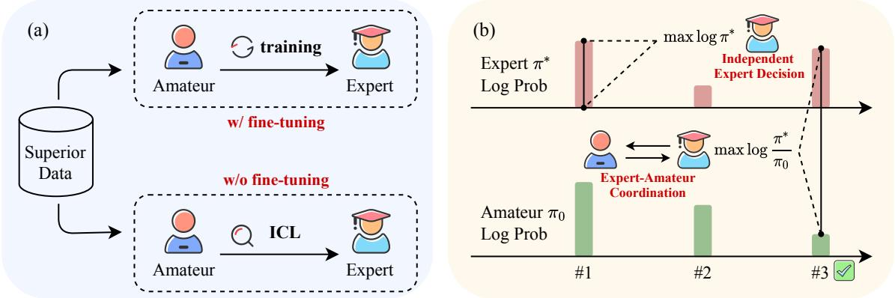  
Figure 1: The overview of ICDPO. (a) The similarity in utilizing superior data between normal fine-tuning and ICL without fine-tuning. (b) The core of ICDPO is that expert-amateur coordination maximizes S which represents the disparity between the expert and the amateur. It brings more accurate estimation than using only the expert LLM.

Extensive experiments are conducted to evaluate the proposed ICDPO, encompassing evaluations using both a reward model (RM) and GPT-4, along with an ablation study validating each module and comprehensive analyses to explore from fine-grained perspectives.

The observations of this work are as follows: 1. With a novel formulation, ICDPO can instantly endow base models with effective HPA through a generation-scoring workflow. It consistently outperforms multiple tuning-free baselines and even competes with techniques like SFT/DPO plus LoRA(Hu et al., 2022). The proposed two-stage retriever R and upgraded scorer Sˆ further enhance the effectiveness of ICDPO, as shown in both RM and GPT-4 evaluations.

2. Demonstrations and the capacity of base models are closely tied to the final performance. Both better base models and larger/higher-quality demonstrations have positive impacts, while R enlarges the effect of demonstration quality.

3. Regarding scoring, both S and Sˆ in ICDPO can offer reliable estimations of HPA degree.

## 2 Related Work

## 2.1 Human Preference Alignment

To mitigate the risk of generating toxic content, LLM should be aligned with human preference (Wang et al., 2023d), i.e. Human preference alignment (HPA), which is advanced through RLHF (Ouyang et al., 2022; Zhu et al., 2024; Yu et al., 2023; Jang et al., 2023; Dai et al., 2023b) and SFT methods (Yuan et al., 2023; Song et al., 2023; Wang et al., 2023b; Zhang et al., 2023; Liu et al., 2023a; Xu et al., 2023; Hong et al., 2023; Huang et al., 2024; Lyu et al., 2024). DPO (Rafailov et al., 2023) can be the representative one. It builds the relation between the RM and the combination of pre/post-optimized policies by transforming RLHF objective, which is inserted into reward modeling to derive an elegant SFT objective.

Nevertheless, fine-tuning LLMs is still costly. It triggers the need for tuning-free methods, relying on self-selection (Li et al., 2024b), external expert selection (Mudgal et al., 2023), or refinement of prompts (Cheng et al., 2023). The proposed ICDPO differently does selection with a skillful self-estimation formulation, which is based on the reverse derivation of the relation in DPO.

## 2.2 In-Context Learning

LLM has the potential of instant few-shot learning through demonstrations in the context (Brown et al., 2020; Dong et al., 2023b; Zheng et al., 2023; Yang et al., 2023a,b), named In-Context Learning (ICL). The underlying mechanism of ICL has also been carefully studied. From the perspective of information flow, Wang et al. (2023a) distinguish the different roles of upper and lower layers in LLMs for ICL, while Dai et al. (2023a) and Von Oswald et al. (2023) established dual relations between gradient descent and self-attention in Transformer (Vaswani et al., 2017), thus illustrating that ICL as a metaoptimizer can similarly enhance intrinsic capabilities of the LLM. We extend it to HPA, where the optimized policy can be easily acquired for generation and scoring without fine-tuning.

## 3 Methodology

In this section, we rethink the transformation from RLHF to DPO (Rafailov et al., 2023), an elegant supervised fine-tuning algorithm derived from the original RLHF objective $\tau$ . We focus on the relation between a given RM and the corresponding optimal policy $\pi ^ { * }$ , and adapt it to LLM inference in the manner of In-context Learning (ICL), which we term as ICDPO.

## 3.1 From Reward Model to Policy LLM

The original target $\tau$ of RLHF is to optimize the policy $\mathrm { L L M } \pi$ for the acquisition of a synthetic reward , the combination of a fundamental reward from the given RM $r ^ { * }$ and a KL-regularization to reference policy $\pi _ { 0 } .$

$$
\begin{array} { r l } & { \mathcal { T } = \underset { \pi } { \operatorname* { m a x } } \mathbb { E } \left[ \mathcal { R } \right] } \\ & { = \underset { \pi } { \operatorname* { m a x } } \mathbb { E } \left[ r ^ { * } ( x , y ) - \beta \log \frac { \pi ( y \mid x ) } { \pi _ { 0 } ( y \mid x ) } \right] } \end{array}\tag{1}
$$

Rafailov et al. (2023) construct the Direct Preference Optimization (DPO) algorithm by first transforming the above Equation 1,

$$
{ \begin{array} { l } { \displaystyle T = \operatorname* { m i n } _ { \pi } \mathbb { E } \left[ \log { \frac { \pi ( y \mid x ) } { \pi _ { 0 } ( y \mid x ) } } - { \frac { 1 } { \beta } } r ^ { * } ( x , y ) \right] } \\ { \displaystyle \quad = \operatorname* { m i n } _ { \pi } \mathbb { E } \left[ \log { \frac { \pi ( y \mid x ) Z ( x ) } { \pi _ { 0 } ( y \mid x ) \exp { \Big ( } { \frac { 1 } { \beta } } r ^ { * } ( x , y ) { \Big ) } } } \right. } \\ { \displaystyle \quad \left. - \log Z ( x ) \right] } \end{array} }\tag{2}
$$

where

$$
Z ( x ) = \sum _ { y } \pi _ { 0 } ( y \mid x ) \exp \left( { \frac { 1 } { \beta } } r ^ { * } ( x , y ) \right)\tag{3}
$$

is the partition function, and the relation between $r ^ { * }$ and the optimal policy $\pi ^ { * }$ of Equation 2 is found:

$$
r ^ { * } ( x , y ) = \beta \log \frac { \pi ^ { * } ( y \mid x ) } { \pi _ { 0 } ( y \mid x ) } + \beta \log Z ( x )\tag{4}
$$

## 3.2 Preference Optimization via ICL

In RLHF, $r ^ { * }$ typically represents the outcome of Reward Modeling preceding the PPO stage, and $\pi ^ { * }$ denotes the corresponding optimal policy. DPO opts to integrate π into the supervised objective of Reward Modeling and devises an SFT-style finetuning approach based on the formulation of Equation 4. Conversely, we rethink Equation 1 and 4 with the aim of avoiding parameter modification in the policy LLM π.

Algorithm 1: In-context Direct Preference   
Optimization   
Input: Language Model π, Dataset D,   
input prompt x   
Output: Response y with the largest score   
$/ /$ Generation stage   
Retrieve m demonstrated samples d from D   
Sample n responses $\{ y _ { i } \}$ from π $\mathbf { \cdot } ( y \mid [ \mathbf { d } ; x ] )$   
// Scoring stage   
Let $s = - \infty ; p = 0$   
for $y _ { i } \in \{ y _ { 1 } , . . . , y _ { n } \}$ do   
Estimate $\pi ( \boldsymbol { y } \mid [ \mathbf { d } ; \boldsymbol { x } ] )$ in ICL; Estimate   
$\pi ( y \mid x )$   
Estimate $S ( \mathbf { d } , x , y )$ with Equation 8   
if $S ( d , x , y ) > s$ then   
$\begin{array} { r } { \ L \ s = S ( \mathbf { d } , x , y ) ; p = i } \end{array}$   
Let y = yp   
return y

With an optimized policy LLM $\pi ^ { * }$ and a reference policy $\pi _ { 0 }$ , according to Equation 4, we can build a customized reward function rˆ as follows:

$$
\hat { r } ( x , y ) = \log \frac { \pi ^ { * } ( y \mid x ) } { \pi _ { 0 } ( y \mid x ) } + \log Z ( x )\tag{5}
$$

Since $\pi ^ { * }$ is optimal for aligning with human preference, the corresponding $\hat { r }$ should well reflect the extent of human preference. Additionally, the synthetic in Equation 1 incorporates the KLregularization component to prevent the policy from deviating too far from the typical linguistic space. Therefore, if $\pi ^ { * }$ is presumed to retain this capability, without the concern for regularization, Equation 1 could exclusively concentrate on preference rewards. Consequently, with a set y of multiple candidate responses and Equation 5, we have

$$
\operatorname* { m a x } _ { y \in \mathbf { y } } \mathcal { R } \equiv \operatorname* { m a x } _ { y \in \mathbf { y } } \hat { r } ( x , y ) \equiv \operatorname* { m a x } _ { y \in \mathbf { y } } \log \frac { \pi ^ { * } ( y \mid x ) } { \pi _ { 0 } ( y \mid x ) }\tag{6}
$$

because $Z ( x )$ in Equation 5 involves only x.

Furthermore, $\pi ^ { * }$ is typically obtained through fine-tuning, but it becomes inaccessible in this way if the initial objective of tuning-free alignment has to be considered. Therefore, we use ICL to meet this requirement, with inspiration from Dai et al. (2023a) that inner meta-optimization can be demonstrated in ICL with contextual demonstrations d and tested x:

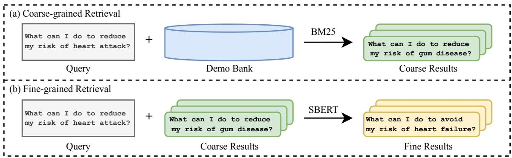  
Figure 2: The workflow of our two-stage retriever R.

$$
\begin{array} { r l } & { \mathbf { A t t e n t i o n } ( [ \mathbf { d } ; x ] , q ) } \\ & { \approx W _ { V } [ \mathbf { d } ; x ] ( W _ { K } [ \mathbf { d } ; x ] ) ^ { T } q } \\ & { = \left( W _ { V } x ( W _ { K } x ) ^ { T } + W _ { V } \mathbf { d } ( W _ { K } \mathbf { d } ) ^ { T } \right) q } \\ & { = \left( W _ { \mathrm { Z S L } } + \Delta W _ { \mathrm { I C L } } \right) q } \end{array}\tag{7}
$$

Here, $q ~ = ~ W _ { Q } t$ represents the query of the next token t in the self-attention mechanism, and $W _ { \mathrm { Z S L } } q = W _ { V } x ( W _ { K } x ) ^ { T } q$ approximates the attention result in a zero-shot setting $( \mathrm { i . e . }$ , no demonstrations involved). Furthermore, $\Delta W _ { \mathrm { I C I } }$ $W _ { V } \mathbf { d } ( W _ { K } \mathbf { d } ) ^ { T }$ updates the weights of $W _ { \mathrm { Z S I } }$ L using demonstrations d in the context, thereby facilitating meta-optimization.

As a result, the optimal policy $\pi ^ { * }$ can be built directly through ICL, while the reference LLM $\pi _ { 0 }$ serves as the initial checkpoint, i.e., the base model in this scenario. Moreover, $\pi ^ { * }$ does not undergo parameter updates from fine-tuning, thereby preserving the initial language modeling capacity as π , without the need for additional regularization.

Therefore, we can employ a two-stage inference pipeline. In the first stage, multiple responses y are sampled from $\pi ^ { * }$ as candidates to guarantee a potentially acceptable output, termed as Generation. Subsequently, in the second Scoring stage, the contrastive score $S$ for each candidate $y \in \mathbf { y }$ is computed based on the demonstrated samples d, the prompt x, and Equation 6:

$$
\begin{array} { r l } { S ( \mathbf { d } , \boldsymbol { x } , \boldsymbol { y } ) } & { = \log \frac { \pi ^ { * } ( \boldsymbol { y } \mid \boldsymbol { x } ) } { \pi _ { 0 } ( \boldsymbol { y } \mid \boldsymbol { x } ) } } \\ & { = \log \frac { \pi ( \boldsymbol { y } \mid [ \mathbf { d } ; \boldsymbol { x } ] ) } { \pi ( \boldsymbol { y } \mid \boldsymbol { x } ) } } \end{array}\tag{8}
$$

wherein the most preferred response $y ^ { \ast }$ can be chosen based on the largest S, indicating the highest reward of human preference, as in Figure 1(b). We summarize the entire workflow as ICDPO. Note that $\pi ^ { * }$ is acquired through ICL, implying that only a single checkpoint is required throughout the entire inference process. We define the score of response y towards prompt x from π as its probability of generating y,

$$
\pi ( y \mid x ) = \sum _ { i } P _ { \pi } ( y _ { i } | x , y _ { < i } )\tag{9}
$$

## 3.3 Connection to Contrastive Decoding

We observe that Equation 6 relies on a contrastive estimation involving two LLMs: $\pi ^ { * }$ and $\pi _ { 0 }$ . Furthermore, Li et al. (2023a) enhance the quality of generated texts by replacing the naive maximum probability decoding with a contrastive objective, namely Contrastive Decoding (CD), where each step utilizes both an expert model $\pi ^ { + }$ and an amateur model $\pi ^ { - }$

$$
y _ { i } ^ { * } = \arg \operatorname* { m a x } _ { y _ { i } \in \mathcal { V } } \log \frac { \pi ^ { + } ( y _ { i } \mid x , y _ { < i } ) } { \pi ^ { - } ( y _ { i } \mid x , y _ { < i } ) }\tag{10}
$$

While Equation 6 optimizes at the sentence-level instead of estimating token-wise scores as in CD for the generated y, we note that $\pi ^ { * }$ and $\pi _ { 0 }$ are essentially treated as the expert and amateur models, respectively, in terms of HPA. This enhances LLM decoding with a focus on human preference. To achieve this, we can enhance Equation 6 and Equation 8 by introducing a purposely worse policy $\pi ^ { - }$ for HPA to replace the original $\pi _ { 0 }$ . More precisely, $\pi ^ { - }$ can also be acquired through In-context Learning with human-rejected samples $\mathbf { d } ^ { - }$ as demonstrations, whereas the original expert model $\pi ^ { * }$ in Equation 6 can be relabeled as $\pi ^ { + }$ and its contextual demonstrations comprise solely human-chosen ${ \bf { d } } ^ { + }$ . Hence, the promoted contrastive score is

$$
\begin{array} { l } { { \hat { S } ( { \bf d } ^ { + } , { \bf d } ^ { - } , x , y ) = \log \frac { \pi ^ { + } ( y \mid x ) } { \pi ^ { - } ( y \mid x ) } } } \\ { { { } = \log \frac { \pi ( y \mid [ { \bf d } ^ { + } ; x ] ) } { \pi ( y \mid [ { \bf d } ^ { - } ; x ] ) } } } \end{array}\tag{11}
$$

<table><tr><td rowspan="2">Method</td><td colspan="3">LLaMA</td><td colspan="3">LLaMA2</td><td colspan="3">Mistral</td></tr><tr><td>Harmless</td><td>Helpful</td><td>Total</td><td>Harmless</td><td>Helpful</td><td>Total</td><td>Harmless</td><td>Helpful</td><td>Total</td></tr><tr><td>Zero-shot</td><td>4.47</td><td>-77.53</td><td>-36.54</td><td>6.25</td><td>-67.67</td><td>-30.72</td><td>9.59</td><td>-33.22</td><td>-11.82</td></tr><tr><td>RM-Aug</td><td>5.06</td><td>-60.35</td><td>-27.66</td><td>2.92</td><td>-52.12</td><td>-24.61</td><td>13.65</td><td>-7.00</td><td>3.32</td></tr><tr><td>RM-BoN</td><td>-1.47</td><td>-60.60</td><td>-31.04</td><td>2.90</td><td>-48.53</td><td>-22.82</td><td>7.16</td><td>-6.11</td><td>0.52</td></tr><tr><td>ICDPO</td><td>68.75</td><td>-17.61</td><td>25.56</td><td>97.06</td><td>27.49</td><td>62.27</td><td>99.29</td><td>38.34</td><td>68.81</td></tr><tr><td> $\mathrm { I C D P O } { + } \hat { S }$ </td><td>68.73</td><td>-11.75</td><td>28.48</td><td>98.03</td><td>29.36</td><td>63.69</td><td>97.26</td><td>45.08</td><td>71.16</td></tr><tr><td> $\mathrm { I C D P O + } \hat { S } R$ </td><td>90.54</td><td>12.59</td><td>51.56</td><td>101.08</td><td>38.26</td><td>69.66</td><td>101.68</td><td>45.51</td><td>73.59</td></tr></table>

Table 1: Main results scored by $\mathbf { R M } _ { \mathrm { t e s t } } .$ . Higher values represent better performance towards HPA.

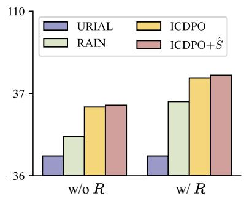  
(a)

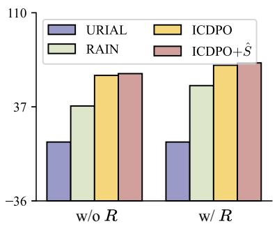  
(b)

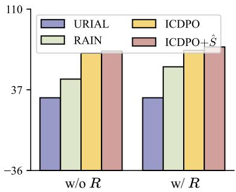  
(c)  
Figure 3: Comparisons among URIAL, RAIN, ICDPO and ICDPO+ $\cdot \hat { S }$ on a subset of test samples from HH-RLHF.

## 3.4 Retrieval

The demonstrated samples and their sequencing are acknowledged as crucial factors for ICL. Since the process of ICL may resemble gradient descent during actual model training, we can further amplify the inner meta-optimization from the fine-tuning standpoint. Given that the closeness between the distributions of the test data and the training data is vital for the efficacy of fine-tuning, it should coherently work in ICL. Consequently, we also employ a prevalent similarity-based retriever to determine the sample selection and their corresponding sequencing, while incorporating additional considerations: (1) Despite their effectiveness, pre-trained retrievers (e.g., SBERT-based methods) have significant computational costs for the large number of samples, requiring a two-stage design where coarsegrained selections are first made before more finegrained retrievals. (2) Since LLMs operate in an auto-regressive manner, the last portion of the tested samples should have the most significant impact. Hence, retrieving those with structurally similar end portions is prioritized, and able to additionally reduce computational overhead.

Therefore, we propose a two-stage retriever as in Figure 2, which contains a coarse-grained BM25 retriever (Robertson and Zaragoza, 2009) focusing on the end of each sample, and an SBERT (Reimers and Gurevych, 2019) with cosine similarity to execute fine-grained retrieval:

$$
\begin{array} { r l } & { R ( \{ x _ { i } \} ) = \mathrm { S B E R T } ( \{ a _ { j } \} ) } \\ & { ~ \{ a _ { j } \} = \mathrm { B M } 2 5 ( \{ x _ { i } [ - L : ] \} ) } \end{array}\tag{12}
$$

where $\{ x _ { i } \}$ is the support set, and L is the window size constraining the ending range of samples for BM25. We show that ICDPO equipped with R yields notable improvement overall.

## 4 Experiment

## 4.1 Settings

We employ the HH-RLHF (Bai et al., 2022) and AlpacaEval (Li et al., 2023b) to comprehensively assess the effectiveness of ICDPO, as well as different ways of evaluation (reward model (RM) evaluation for HH-RLHF; GPT-4 evaluation for HH-RLHF and AlpacaEval). The details of data preparation and implementation (e.g. ${ \mathrm { R M } } _ { \mathrm { t e s t } }$ for RM evaluation) are in Appendix A and B, respectively.

We implement three base models for comprehensive evaluation: LLaMA-7B (Touvron et al., 2023a), LLaMA-2-7B (Touvron et al., 2023b), and Mistral-7B-v0.1 (Jiang et al., 2023), which we label as LLaMA, LLaMA2, and Mistral, respectively.

We compare ICDPO with other tuning-free baselines, including Zero-shot; RM-BoN and RM-Aug utilizing external scorers to select the best response or intermediate block for inference (Mudgal et al., 2023); URIAL (Lin et al., 2023) and RAIN (Li et al., 2024b) as ICL baselines. Detailed introduction of these baselines can be found in Appendix C.

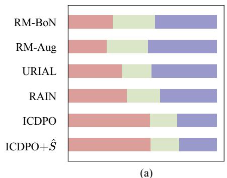

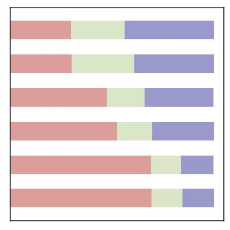  
(b)

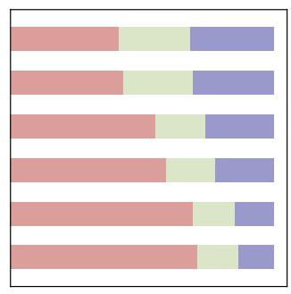  
(c)

Figure 4: Results of GPT-4 evaluated each method against golden responses in HH-RLHF. We conduct the evaluation on (a) LLaMA, (b) LLaMA2 and (c) Mistral, while light red, light green and purple bars represent the proportion of win, tie and lose, respectively.
<table><tr><td>Base Model</td><td>RM-BoN</td><td>RM-Aug</td><td>URIAL</td><td>RAIN</td><td>ICDPO</td><td>ICDPO+Ê</td></tr><tr><td>LLaMA</td><td>1.58</td><td>2.29</td><td>5.38</td><td>6.81</td><td>10.00 (+3.19)</td><td>10.26 (+3.45)</td></tr><tr><td>LLaMA2</td><td>6.31</td><td>6.20</td><td>6.95</td><td>16.27</td><td>18.66 (+2.39)</td><td>19.24 (+2.97)</td></tr><tr><td>Mistral</td><td>17.14</td><td>18.51</td><td>21.90</td><td>26.32</td><td>26.53 (+0.21)</td><td>28.30 (+1.98)</td></tr></table>

Table 2: Results on AlpacaEval. The red notes represent the improvement of ICDPO and ICDPO+Sˆ over the best performance among the baselines.

To ensure fairness, we use LLaMA2-7B-chat, denoted by LLaMA2-chat, as a convenient controller for all methods. It serves as an external scorer (Fu et al., 2023) for RM-Aug and RM-BoN, as well as the source of demonstrations for ICDPO and RAIN. Differently, URIAL leverages a human-crafted context and is not affected by LLaMA2-chat.

## 4.2 Main Results

## 4.2.1 RM Evaluation

We first present the results of RM evaluation on HH-RLHF, as shown in Table 1 and Figure 3. Since RAIN suffers from a slow execution speed with its initial implementation, we choose to compare ICDPO with the two ICL baselines on a subset of the test set (800 samples). As to ICDPO, we test the original version and its variant with Sˆ. Moreover, we randomly retrieve the demonstrations by default, but those selected by R are also tested here.

It can be seen that all methods in Table 1 show notable improvements over Zero-shot, but ICDPO have more progress than RM-Aug and RM-BoN. Using the same demonstrations, ICDPO also outperforms RAIN and URIAL in Figure 3, indicating its intrinsic superiority, while Sˆ and R also prove their effectiveness in further promoting performance consistently.

In detail, all methods receive lower scores in the domain of Helpful than those in Harmless, including the results of RAIN and URIAL which are not shown in Figure 3. We infer that Helpful needs more substantial content from base models or external sources, whereas Harmless may only require simpler stylistic changes.

## 4.2.2 GPT-4 Evaluation

In this part, we take GPT-4 evaluation as an additional validation of the conclusions in § 4.2.1, following Rafailov et al. (2023); Song et al. (2023); Liu et al. (2023b).

For HH-RLHF, we randomly select 200 samples from the test set to evaluate ICDPO, ICDPO+Sˆ, and all baselines except Zero-shot, as in Figure 4. Their decoded responses are compared with the chosen ones in HH-RLHF to compute the win/tie/lose rates. For each scoring, we place the tested responses in the prompt from double directions to mitigate positional bias, as discussed in Wang et al. (2023c).

For AlpacaEval, the demonstrations for ICL methods come from its 17701 Human annotations, while RM-BoN and RM-Aug still rely on LLaMA2- chat as the external scorer. We use its original GPT-4 evaluation and the Length-Controlled Win

<table><tr><td rowspan="2">Method</td><td colspan="3">LLaMA</td><td colspan="3">LLaMA2</td><td colspan="3">Mistral</td></tr><tr><td>Harmless</td><td>Helpful</td><td>Total</td><td>Harmless</td><td>Helpful</td><td>Total</td><td>Harmless</td><td>Helpful</td><td>Total</td></tr><tr><td>ICDPO+R</td><td>90.55</td><td>9.96</td><td>50.24</td><td>100.62</td><td>35.89</td><td>68.25</td><td>101.49</td><td>40.34</td><td>70.91</td></tr><tr><td>ICDPO</td><td>68.75</td><td>-17.61</td><td>25.56</td><td>97.06</td><td>27.49</td><td>62.27</td><td>99.29</td><td>38.34</td><td>68.81</td></tr><tr><td>ICL</td><td>62.30</td><td>-26.09</td><td>18.09</td><td>97.23</td><td>16.72</td><td>56.97</td><td>94.79</td><td>32.68</td><td>63.73</td></tr><tr><td> $\mathrm { I C L } _ { \mathrm { u n i } }$ </td><td>63.04</td><td>-25.25</td><td>18.89</td><td>95.64</td><td>14.74</td><td>55.18</td><td>94.54</td><td>33.06</td><td>63.80</td></tr><tr><td> $\mathrm { I C D P O } _ { \mathrm { G P T } - 3 . 5 - \mathrm { t u r b o } }$ </td><td>63.91</td><td>-23.27</td><td>20.31</td><td>91.56</td><td>16.33</td><td>53.94</td><td>85.10</td><td>21.23</td><td>53.16</td></tr><tr><td> $\mathrm { I C D P O } _ { \mathrm { r a w } }$ </td><td>25.02</td><td>-64.95</td><td>-19.97</td><td>39.81</td><td>-71.89</td><td>-16.05</td><td>26.60</td><td>-51.38</td><td>-12.40</td></tr></table>

Table 3: Results of the ablation study.

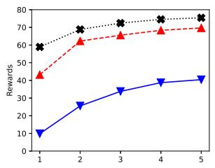  
(a)

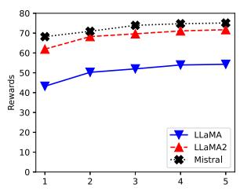  
(b)  
Figure 5: Effect of demonstration quantity. (a) Using random retrieval. (b) Using R.

Rates (Dubois et al., 2024), which mitigate the biases from the length of different responses, wellconsistent with Chatbot Arena (Chiang et al., 2024), a golden leaderboard. We also implement another evaluation based on Arena-Hard (Li et al., 2024a), which can be found in Appendix F.

Generally, ICL methods consistently exceed RM-Aug and RM-BoN, suggesting that ICL successfully triggers the HPA capability of LLMs, which is more effective than just manipulating the decoding process with external supervision. Among them, ICDPO still outperforms baselines, while ICDPO with Sˆ also has a minor benefit (slightly more rates of win+tie) over ICDPO. It should be noted that the observations in this section align with those in RM evaluation, thus validating the reliability of ${ \mathrm { R M } } _ { \mathrm { t e s t } }$

## 4.3 Ablation Study

In this section, we test the effectiveness of the remaining modules, as well as the impact of base models and demonstrations for ICDPO.

## 4.3.1 Effect of Contrastive Score S

Without S, ICDPO degenerates into the normal ICL. We thus experiment with two decoding strategies: randomly selecting one from 3 candidates, and generating just one candidate1. Obviously, ICL without selections from S experiences significant performance declines, regardless of the decoding strategies. This validates the significance of S as the key element in ICDPO, and the greater effectiveness of Sˆ has been tested in § 4.2. Since S and Sˆ are potential rankers, we also evaluate their performance in this aspect, as discussed in § 4.4.

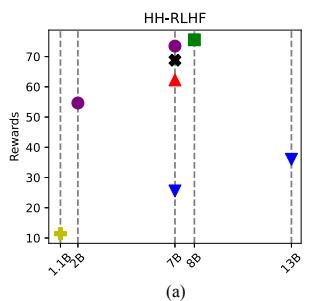

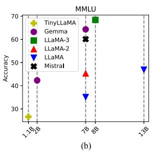  
Figure 6: Results of each model for ICDPO and MMLU.

<table><tr><td>Method</td><td>Harmless</td><td>Helpful</td><td>Total</td></tr><tr><td>Raw</td><td>24.23</td><td>-47.62</td><td>-11.70</td></tr><tr><td>LLaMA2-chat</td><td>105.97</td><td>61.18</td><td>83.57</td></tr><tr><td>GPT-3.5-turbo</td><td>105.99</td><td>73.80</td><td>89.89</td></tr></table>

Table 4: Results for capabilities of different controllers towards Human Preference Alignment.

## 4.3.2 Effect of Base Models

To explore how base models affect the performance of ICDPO, we try more base models of different sizes and architectures, aside from LLaMA, LLaMA2, and Mistral. Figure 6(a) illustrates the results of different base models, where we first capture the effect of model size: with the same version, such as LLaMA-7B/13B and Gemma-2B/7B (Team et al., 2024), the larger the base model utilized is, the better ICDPO performs.

However, model size seems not the essential factor, but the intrinsic capacity of each model is more significant. Here we use the performance on MMLU (Hendrycks et al., 2021) of each base model to represent its intrinsic capacity, and consequently, the distribution of rewards from base models shows similarity with the distribution of their accuracies on MMLU. For example, TinyLLaMA-1.1B (Zhang et al., 2024) gets the lowest reward and accuracy in Figure 6(a) and (b), respectively. Although it is not the largest one, LLaMA-3- 8B (Dubey et al., 2024) has the best performance over the rest in ICDPO, as well as in MMLU.

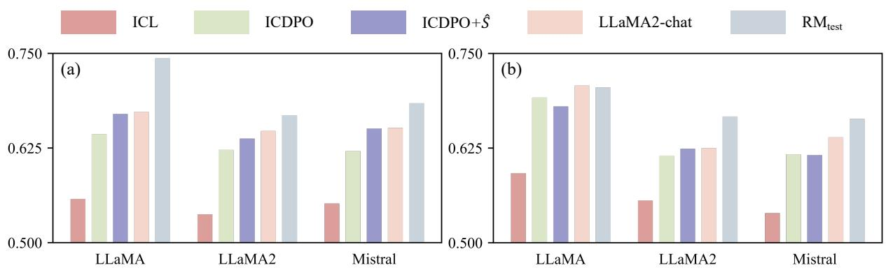  
Figure 7: Results of consistency between different scorers and GPT-4. We compute MRR to measure the degree of consistency. (a) Results with randomly selected demonstrations. (b) Results with demonstrations retrieved by R.

## 4.3.3 Effect of Demonstrations and R

We test ICDPO with 1-5 demonstrations (demos), as shown in Figure 5(a). In total, each base model can benefit from increasing demos, while maintaining the performance ranking in Table 1. However, adding demos has a marginal effect, as the improvement from 4 demos to 5 demos becomes slight, suggesting ICL is similar to fine-tuning from an empirical perspective.

The influence of quality is also noticed. In Table 4, we test responses from GPT-3.5-turbo, LLaMA2-chat, and the raw HH-RLHF, where the first two sources generate significantly better responses than HH-RLHF. We further use demos from GPT-3.5-turbo and HH-RLHF on ICDPO, named $\mathrm { I C D P O } _ { \mathrm { G P T } - 3 . 5 - \mathrm { t u r b o } }$ and $\mathrm { I C D P O } _ { \mathrm { r a w } }$ , respectively, while ICDPO and $\mathrm { I C D P O } _ { \mathrm { G P T } - 3 . 5 }$ -turbo accordingly excels $\mathrm { I C D P O } _ { \mathrm { r a w } }$ . This observation confirms the effect of demo quality. Nevertheless, LLaMA2- chat is inferior to GPT-3.5-turbo, but ICDPO also performs better than $\mathrm { I C D P O } _ { \mathrm { G P T } - 3 . 5 - \mathrm { t u r b o } }$ . Believing it is not a coincidence, we provide additional insights in Appendix E.

We also analyze the impact of the two-stage retriever R. ICDPO equipped with R significantly outperforms the initial version, as well as ICDPO+SRˆ with the best performance among all methods, showing the positive effect of R. Another interesting point is that the trend of ICDPO+R with increasing demos, in Figure 5(b), is more gentle than that in Figure 5(a). As a booster of ICL, R allows ICDPO to utilize high-quality demos effectively, mitigating the demand for larger demonstration quantities, which is another point similar to the normal experience in fine-tuning.

## 4.4 Consistency of Scoring

ICDPO computes the contrastive score S to rank sampled candidates y from ICL for the prompt x, similar to the methodology of ${ \mathrm { R M } } _ { \mathrm { t e s t } }$ . Hence, it is meaningful to solely evaluate ICDPO as a ranker of multiple responses.

We introduce ICDPO, $\mathrm { I C D P O } { + } \hat { S } .$ , and a simplified variant (using only $\pi ^ { * }$ for scoring, denoted as ICL), alongside $\mathbf { R M } _ { \mathrm { t e s t } }$ . LLaMA2-chat is also incorporated as a reward model, like how it is used in RM-Aug and RM-BoN. We set up two scenarios: one depicted in Figure 7(a), where demonstrations for ICDPO are randomly selected, and the other depicted in Figure 7(b), which involves the proposed retriever R. In each scenario, we select 200 samples, each containing 3 candidate responses sampled from the base model through ICL and sorted by GPT-4 as the ground truth. We use the Mean Reciprocal Rank (MRR) as the metric to fairly evaluate each method as a ranker.

Figure 7 illustrates that ${ \mathrm { R M } } _ { \mathrm { t e s t } }$ achieves the highest performance in most cases, followed by LLaMA2-chat. ICDPO also performs well, with $\mathrm { I C D P O } { + } \hat { S }$ generally yielding equal or higher MRR scores, even approaching the performance of LLaMA2-chat as the source of demos. However, the performance of $\pi ^ { * }$ itself is unsatisfactory, significantly lagging behind others. These findings exhibit that ICDPO is a potent scorer for estimating HPA degree via the skillful formulation of expertamateur collaboration.

<table><tr><td>Method</td><td>LLaMA</td><td>LLaMA2</td><td>Mistral</td></tr><tr><td>SFT</td><td>34.73</td><td>57.59</td><td>63.43</td></tr><tr><td>DPO</td><td>43.02</td><td>68.34</td><td>69.26</td></tr><tr><td>CPO-SimPO</td><td>45.80</td><td>58.41</td><td>73.07</td></tr><tr><td>ICDPO</td><td>25.56</td><td>62.27</td><td>68.81</td></tr><tr><td>ICDPO+ÎR</td><td>51.56</td><td>69.66</td><td>73.59</td></tr></table>

Table 5: Comparisons between ICDPO and fine-tuning, where the number of demos in ICDPO is just two.

## 4.5 Comparing ICDPO with Fine-tuning

Unlike fine-tuning methods, ICDPO enhances the HPA capacity of base models in a low-resource setting. Although a direct comparison among them may not be entirely fair, we still conduct this experiment in order to explore the bound of ICDPO.

Using the TRL package (von Werra et al., 2020), we implement SFT and DPO on the same base models alongside ICDPO, as well as CPO-SimPO, which combines CPO (Xu et al., 2024) and SimPO (Meng et al., 2024) to balance performance and training stability. LoRA (Hu et al., 2022) is utilized to adapt to our limited computational resources. As shown in Table 5, ICDPO demonstrates competitive performance with SFT; with the inclusion of Sˆ and R, it can beat DPO and CPO-SimPO in more settings. Note that ICDPO requires only one GPU and just several demonstrations. All of these highlight the effectiveness and accessibility of ICDPO as a tuning-free method.

## 5 Conclusion

We propose an effective method ICDPO, which equips LLMs with HPA without fine-tuning. It first optimizes LLMs instantly via just several contextual demonstrations, while a novel formulation from the derivation of DPO is utilized to build an expert-amateur collaboration for a reliable estimation for the selection of candidate responses. Comprehensive experiments demonstrate the effectiveness of ICDPO across various forms, encompassing both content generation and scoring. We hope this work to be a catalyst for further exploration of tuning-free methods towards HPA.

## Ethics Statement

We have observed that the data involved in this work may indispensably contain sensitive, offensive, and misleading content, whose presence does not represent our attitudes, but should be solely for research and not be used or distributed outside of research contexts.

We are committed to establishing a more inclusive and ethically sound era of AI technology, which can be applied to legitimate needs and generate content that aligns with universally positive human values.

## Limitations

We conduct abundant experiments to evaluate ICDPO comprehensively, showing it is powerful and user-friendly because of its effective tuningfree alignment from just superior demonstrations. However, we acknowledge that the naive implementation of ICDPO may result in additional computations in inference. As a response, we discuss this issue and propose some solutions in Appendix D.

## Acknowledgments

This work was supported by National Science and Technology Major Project (No. 2022ZD0116308) and National Natural Science Foundation of China (62036001). The corresponding author is Houfeng Wang.

## References

Yuntao Bai, Andy Jones, Kamal Ndousse, Amanda Askell, Anna Chen, Nova DasSarma, Dawn Drain, Stanislav Fort, Deep Ganguli, Tom Henighan, et al. 2022. Training a helpful and harmless assistant with reinforcement learning from human feedback. arXiv preprint arXiv:2204.05862.

Tom Brown, Benjamin Mann, Nick Ryder, Melanie Subbiah, Jared D Kaplan, Prafulla Dhariwal, Arvind Neelakantan, Pranav Shyam, Girish Sastry, Amanda Askell, et al. 2020. Language models are few-shot learners. In Advances in Neural Information Processing Systems, volume 33, pages 1877–1901. Curran Associates, Inc.

Jiale Cheng, Xiao Liu, Kehan Zheng, Pei Ke, Hongning Wang, Yuxiao Dong, Jie Tang, and Minlie Huang. 2023. Black-box prompt optimization: Aligning large language models without model training. arXiv preprint arXiv:2311.04155.

Wei-Lin Chiang, Lianmin Zheng, Ying Sheng, Anastasios Nikolas Angelopoulos, Tianle Li, Dacheng Li, Hao Zhang, Banghua Zhu, Michael Jordan, Joseph E. Gonzalez, and Ion Stoica. 2024. Chatbot arena: An open platform for evaluating llms by human preference. Preprint, arXiv:2403.04132.

Ganqu Cui, Lifan Yuan, Ning Ding, Guanming Yao, Wei Zhu, Yuan Ni, Guotong Xie, Zhiyuan Liu, and

Maosong Sun. 2023. Ultrafeedback: Boosting language models with high-quality feedback. arXiv preprint arXiv:2310.01377.

Damai Dai, Yutao Sun, Li Dong, Yaru Hao, Shuming Ma, Zhifang Sui, and Furu Wei. 2023a. Why can GPT learn in-context? language models secretly perform gradient descent as meta-optimizers. In Findings of the Association for Computational Linguistics: ACL 2023, pages 4005–4019, Toronto, Canada. Association for Computational Linguistics.

Josef Dai, Xuehai Pan, Ruiyang Sun, Jiaming Ji, Xinbo Xu, Mickel Liu, Yizhou Wang, and Yaodong Yang. 2023b. Safe rlhf: Safe reinforcement learning from human feedback. arXiv preprint arXiv:2310.12773.

Hanze Dong, Wei Xiong, Deepanshu Goyal, Yihan Zhang, Winnie Chow, Rui Pan, Shizhe Diao, Jipeng Zhang, KaShun SHUM, and Tong Zhang. 2023a. RAFT: Reward ranked finetuning for generative foundation model alignment. Transactions on Machine Learning Research.

Qingxiu Dong, Lei Li, Damai Dai, Ce Zheng, Zhiyong Wu, Baobao Chang, Xu Sun, Jingjing Xu, and Zhifang Sui. 2023b. A survey for in-context learning. arXiv preprint arXiv:2301.00234.

Abhimanyu Dubey, Abhinav Jauhri, Abhinav Pandey, Abhishek Kadian, Ahmad Al-Dahle, Aiesha Letman, Akhil Mathur, Alan Schelten, Amy Yang, Angela Fan, et al. 2024. The llama 3 herd of models. arXiv preprint arXiv:2407.21783.

Yann Dubois, Balázs Galambosi, Percy Liang, and Tatsunori B Hashimoto. 2024. Length-controlled alpacaeval: A simple way to debias automatic evaluators. arXiv preprint arXiv:2404.04475.

Jinlan Fu, See-Kiong Ng, Zhengbao Jiang, and Pengfei Liu. 2023. Gptscore: Evaluate as you desire. arXiv preprint arXiv:2302.04166.

Albert Gu and Tri Dao. 2023. Mamba: Linear-time sequence modeling with selective state spaces. arXiv preprint arXiv:2312.00752.

Dan Hendrycks, Collin Burns, Steven Basart, Andy Zou, Mantas Mazeika, Dawn Song, and Jacob Steinhardt. 2021. Measuring massive multitask language understanding. Proceedings ofthe International Conference on Learning Representations (ICLR).

Jixiang Hong, Quan Tu, Changyu Chen, Xing Gao, Ji Zhang, and Rui Yan. 2023. Cyclealign: Iterative distillation from black-box llm to white-box models for better human alignment. arXiv preprint arXiv:2310.16271.

Edward J Hu, yelong shen, Phillip Wallis, Zeyuan Allen-Zhu, Yuanzhi Li, Shean Wang, Lu Wang, and Weizhu Chen. 2022. LoRA: Low-rank adaptation of large language models. In International Conference on Learning Representations.

Tiansheng Huang, Sihao Hu, and Ling Liu. 2024. Vaccine: Perturbation-aware alignment for large language model. arXiv preprint arXiv:2402.01109.

Joel Jang, Seungone Kim, Bill Yuchen Lin, Yizhong Wang, Jack Hessel, Luke Zettlemoyer, Hannaneh Hajishirzi, Yejin Choi, and Prithviraj Ammanabrolu. 2023. Personalized soups: Personalized large language model alignment via post-hoc parameter merging. arXiv preprint arXiv:2310.11564.

Albert Q Jiang, Alexandre Sablayrolles, Arthur Mensch, Chris Bamford, Devendra Singh Chaplot, Diego de las Casas, Florian Bressand, Gianna Lengyel, Guillaume Lample, Lucile Saulnier, et al. 2023. Mistral 7b. arXiv preprint arXiv:2310.06825.

Woosuk Kwon, Zhuohan Li, Siyuan Zhuang, Ying Sheng, Lianmin Zheng, Cody Hao Yu, Joseph E. Gonzalez, Hao Zhang, and Ion Stoica. 2023. Efficient memory management for large language model serving with pagedattention. In Proceedings of the ACM SIGOPS 29th Symposium on Operating Systems Principles.

Tianle Li, Wei-Lin Chiang, Evan Frick, Lisa Dunlap, Tianhao Wu, Banghua Zhu, Joseph E Gonzalez, and Ion Stoica. 2024a. From crowdsourced data to highquality benchmarks: Arena-hard and benchbuilder pipeline. arXiv preprint arXiv:2406.11939.

Xiang Lisa Li, Ari Holtzman, Daniel Fried, Percy Liang, Jason Eisner, Tatsunori Hashimoto, Luke Zettlemoyer, and Mike Lewis. 2023a. Contrastive decoding: Open-ended text generation as optimization. In Proceedings of the 61st Annual Meeting of the Association for Computational Linguistics (Volume 1: Long Papers), pages 12286–12312, Toronto, Canada. Association for Computational Linguistics.

Xuechen Li, Tianyi Zhang, Yann Dubois, Rohan Taori, Ishaan Gulrajani, Carlos Guestrin, Percy Liang, and Tatsunori B. Hashimoto. 2023b. Alpacaeval: An automatic evaluator of instruction-following models. https://github.com/tatsu-lab/alpaca\_eval.

Yuhui Li, Fangyun Wei, Jinjing Zhao, Chao Zhang, and Hongyang Zhang. 2024b. Rain: Your language models can align themselves without finetuning. In International Conference on Learning Representations.

Bill Yuchen Lin, Abhilasha Ravichander, Ximing Lu, Nouha Dziri, Melanie Sclar, Khyathi Chandu, Chandra Bhagavatula, and Yejin Choi. 2023. The unlocking spell on base llms: Rethinking alignment via incontext learning. arXiv preprint arXiv:2312.01552.

Tianqi Liu, Yao Zhao, Rishabh Joshi, Misha Khalman, Mohammad Saleh, Peter J Liu, and Jialu Liu. 2023a. Statistical rejection sampling improves preference optimization. arXiv preprint arXiv:2309.06657.

Wenhao Liu, Xiaohua Wang, Muling Wu, Tianlong Li, Changze Lv, Zixuan Ling, Jianhao Zhu, Cenyuan Zhang, Xiaoqing Zheng, and Xuanjing Huang. 2023b.

Aligning large language models with human preferences through representation engineering. arXiv preprint arXiv:2312.15997.

Yougang Lyu, Lingyong Yan, Shuaiqiang Wang, Haibo Shi, Dawei Yin, Pengjie Ren, Zhumin Chen, Maarten de Rijke, and Zhaochun Ren. 2024. Knowtuning: Knowledge-aware fine-tuning for large language models. arXiv preprint arXiv:2402.11176.

Yu Meng, Mengzhou Xia, and Danqi Chen. 2024. Simpo: Simple preference optimization with a reference-free reward. arXiv preprint arXiv:2405.14734.

Sidharth Mudgal, Jong Lee, Harish Ganapathy, YaGuang Li, Tao Wang, Yanping Huang, Zhifeng Chen, Heng-Tze Cheng, Michael Collins, Trevor Strohman, et al. 2023. Controlled decoding from language models. arXiv preprint arXiv:2310.17022.

Long Ouyang, Jeffrey Wu, Xu Jiang, Diogo Almeida, Carroll Wainwright, Pamela Mishkin, Chong Zhang, Sandhini Agarwal, Katarina Slama, Alex Ray, et al. 2022. Training language models to follow instructions with human feedback. Advances in Neural Information Processing Systems, 35:27730–27744.

Rafael Rafailov, Archit Sharma, Eric Mitchell, Christopher D Manning, Stefano Ermon, and Chelsea Finn. 2023. Direct preference optimization: Your language model is secretly a reward model. In Thirty-seventh Conference on Neural Information Processing Systems.

Nils Reimers and Iryna Gurevych. 2019. Sentence-BERT: Sentence embeddings using Siamese BERTnetworks. In Proceedings ofthe 2019 Conference on Empirical Methods in Natural Language Processing and the 9th International Joint Conference on Natural Language Processing (EMNLP-IJCNLP), pages 3982–3992, Hong Kong, China. Association for Computational Linguistics.

Stephen Robertson and Hugo Zaragoza. 2009. The probabilistic relevance framework: Bm25 and beyond. Foundations and Trends® in Information Retrieval, 3(4):333–389.

Feifan Song, Bowen Yu, Minghao Li, Haiyang Yu, Fei Huang, Yongbin Li, and Houfeng Wang. 2023. Preference ranking optimization for human alignment. arXiv preprint arXiv:2306.17492.

Nisan Stiennon, Long Ouyang, Jeffrey Wu, Daniel Ziegler, Ryan Lowe, Chelsea Voss, Alec Radford, Dario Amodei, and Paul F Christiano. 2020. Learning to summarize with human feedback. Advances in Neural Information Processing Systems, 33:3008– 3021.

Gemma Team, Thomas Mesnard, Cassidy Hardin, Robert Dadashi, Surya Bhupatiraju, Shreya Pathak, Laurent Sifre, Morgane Rivière, Mihir Sanjay Kale, Juliette Love, et al. 2024. Gemma: Open models based on gemini research and technology. arXiv preprint arXiv:2403.08295.

Hugo Touvron, Thibaut Lavril, Gautier Izacard, Xavier Martinet, Marie-Anne Lachaux, Timothée Lacroix, Baptiste Rozière, Naman Goyal, Eric Hambro, Faisal Azhar, et al. 2023a. Llama: Open and efficient foundation language models. arXiv preprint arXiv:2302.13971.

Hugo Touvron, Louis Martin, Kevin Stone, Peter Albert, Amjad Almahairi, Yasmine Babaei, Nikolay Bashlykov, Soumya Batra, Prajjwal Bhargava, Shruti Bhosale, et al. 2023b. Llama 2: Open foundation and fine-tuned chat models. arXiv preprint arXiv:2307.09288.

Ashish Vaswani, Noam Shazeer, Niki Parmar, Jakob Uszkoreit, Llion Jones, Aidan N Gomez, Łukasz Kaiser, and Illia Polosukhin. 2017. Attention is all you need. Advances in neural information processing systems, 30.

Johannes Von Oswald, Eyvind Niklasson, Ettore Randazzo, João Sacramento, Alexander Mordvintsev, Andrey Zhmoginov, and Max Vladymyrov. 2023. Transformers learn in-context by gradient descent. In International Conference on Machine Learning, pages 35151–35174. PMLR.

Leandro von Werra, Younes Belkada, Lewis Tunstall, Edward Beeching, Tristan Thrush, Nathan Lambert, and Shengyi Huang. 2020. Trl: Transformer reinforcement learning. https://github. com/huggingface/trl.

Lean Wang, Lei Li, Damai Dai, Deli Chen, Hao Zhou, Fandong Meng, Jie Zhou, and Xu Sun. 2023a. Label words are anchors: An information flow perspective for understanding in-context learning. In Proceedings of the 2023 Conference on Empirical Methods in Natural Language Processing, pages 9840–9855, Singapore. Association for Computational Linguistics.

Peiyi Wang, Lei Li, Liang Chen, Feifan Song, Binghuai Lin, Yunbo Cao, Tianyu Liu, and Zhifang Sui. 2023b. Making large language models better reasoners with alignment. arXiv preprint arXiv:2309.02144.

Peiyi Wang, Lei Li, Liang Chen, Dawei Zhu, Binghuai Lin, Yunbo Cao, Qi Liu, Tianyu Liu, and Zhifang Sui. 2023c. Large language models are not fair evaluators. arXiv preprint arXiv:2305.17926.

Yufei Wang, Wanjun Zhong, Liangyou Li, Fei Mi, Xingshan Zeng, Wenyong Huang, Lifeng Shang, Xin Jiang, and Qun Liu. 2023d. Aligning large language models with human: A survey. arXiv preprint arXiv:2307.12966.

Thomas Wolf, Lysandre Debut, Victor Sanh, Julien Chaumond, Clement Delangue, Anthony Moi, Pierric Cistac, Tim Rault, Remi Louf, Morgan Funtowicz, Joe Davison, Sam Shleifer, Patrick von Platen, Clara Ma, Yacine Jernite, Julien Plu, Canwen Xu, Teven Le Scao, Sylvain Gugger, Mariama Drame, Quentin Lhoest, and Alexander Rush. 2020. Transformers: State-of-the-art natural language processing.

In Proceedings ofthe 2020 Conference on Empirical Methods in Natural Language Processing: System Demonstrations, pages 38–45, Online. Association for Computational Linguistics.

Haoran Xu, Amr Sharaf, Yunmo Chen, Weiting Tan, Lingfeng Shen, Benjamin Van Durme, Kenton Murray, and Young Jin Kim. 2024. Contrastive preference optimization: Pushing the boundaries of llm performance in machine translation. In Forty-first International Conference on Machine Learning.

Weiwen Xu, Deng Cai, Zhisong Zhang, Wai Lam, and Shuming Shi. 2023. Reasons to reject? aligning language models with judgments. arXiv preprint arXiv:2312.14591.

Jiaxi Yang, Binyuan Hui, Min Yang, Binhua Li, Fei Huang, and Yongbin Li. 2023a. Iterative forward tuning boosts in-context learning in language models. arXiv preprint arXiv:2305.13016.

Zhe Yang, Damai Dai, Peiyi Wang, and Zhifang Sui. 2023b. Not all demonstration examples are equally beneficial: Reweighting demonstration examples for in-context learning. In Findings of the Association for Computational Linguistics: EMNLP 2023, pages 13209–13221, Singapore. Association for Computational Linguistics.

Tianshu Yu, Ting-En Lin, Yuchuan Wu, Min Yang, Fei Huang, and Yongbin Li. 2023. Constructive large language models alignment with diverse feedback. arXiv preprint arXiv:2310.06450.

Zheng Yuan, Hongyi Yuan, Chuanqi Tan, Wei Wang, Songfang Huang, and Fei Huang. 2023. Rrhf: Rank responses to align language models with human feedback without tears. arXiv preprint arXiv:2304.05302.

Peiyuan Zhang, Guangtao Zeng, Tianduo Wang, and Wei Lu. 2024. Tinyllama: An open-source small language model. Preprint, arXiv:2401.02385.

Yichi Zhang, Zhuo Chen, Yin Fang, Lei Cheng, Yanxi Lu, Fangming Li, Wen Zhang, and Huajun Chen. 2023. Knowledgeable preference alignment for llms in domain-specific question answering. arXiv preprint arXiv:2311.06503.

Ce Zheng, Lei Li, Qingxiu Dong, Yuxuan Fan, Zhiyong Wu, Jingjing Xu, and Baobao Chang. 2023. Can we edit factual knowledge by in-context learning? In Proceedings of the 2023 Conference on Empirical Methods in Natural Language Processing, pages 4862–4876, Singapore. Association for Computational Linguistics.

Banghua Zhu, Jiantao Jiao, and Michael I Jordan. 2023. Principled reinforcement learning with human feedback from pairwise or k-wise comparisons. arXiv preprint arXiv:2301.11270.

Banghua Zhu, Michael I Jordan, and Jiantao Jiao. 2024. Iterative data smoothing: Mitigating reward overfitting and overoptimization in rlhf. arXiv preprint arXiv:2401.16335.

Jingwei Zuo, Maksim Velikanov, Dhia Eddine Rhaiem, Ilyas Chahed, Younes Belkada, Guillaume Kunsch, and Hakim Hacid. 2024. Falcon mamba: The first competitive attention-free 7b language model.

## A Dataset Preparation

We introduce the following two datasets for ICDPO:

1. HH-RLHF proposed by Bai et al. (2022) focuses on the domain of harmlessness and helpfulness in multi-turn conversations. While it initially consists of four subsets, we select two representative ones: harmless-base and helpful-base, denoted as Harmless and Helpful, respectively. We mix the data of two domains for training, while separately evaluating each method in the main experiment.

2. AlpacaEval is proposed by Li et al. (2023b), which offers a fast but comprehensive automatic evaluation for instruction following. The test set contains 805 samples from different datasets, HH-RLHF included, while it is conducted with GPT-4 to ensure both reliable and replicable results.

Each sample in these datasets has two candidates, including a shared prompt and two chosen/rejected candidate responses. Regarding AlpacaEval, we select the demonstrations from its 17701 human annotations with a length control of 128/200 for prompts/responses, while for HH-RLHF we set the control as 320/128 for both demonstrations and test samples, since it contains multi-turn conversations.

## B Implementation Details

We implement ICDPO with all base models on Huggingface.Library (Wolf et al., 2020). By default, the number of demonstrations and top-p sampling for ICDPO is 2 and 3, respectively, where p is set to 0.8. To facilitate demonstration retrieval in ICL, we deploy the two-stage retriever R with BM25 and $\mathrm { S B E R T } ^ { 2 }$ for coarse/fine-grained rankings. The BM25 model first retrieves 20 samples, which are then re-ranked by the SBERT retriever to obtain highly semantically similar ones. The templates for ICL have been placed in Appendix H for a detailed overview.

Furthermore, the third-party reward model for automatic scoring is denoted as $\mathrm { R M _ { t e s t } } ^ { 3 }$ , and the acquired score r of each method is computed according to the following equation:

$$
r = \frac { 1 } { n } \sum _ { i = 1 } ^ { n } \mathbf { R M } _ { \mathrm { t e s t } } ( x _ { i } , y _ { i } )\tag{13}
$$

where $x _ { i }$ and $y _ { i }$ is the prompt and scored response, respectively. The LLaMA2-chat is the default controller for all experiments (both HH-RLHF and AlpacaEval) to maintain fairness for all methods, while we also utilize demonstrations from GPT-3.5-turbo4 for further exploration, as shown in Appendix E and G. More details can be found in the released code.

We compare ICDPO with two representative baselines in § 4.2, RAIN (Li et al., 2024b) and URIAL (Lin et al., 2023), with a particular setting as follows:

1. We implement RAIN using its released code, which executes at a low speed (approximately 50s per inference). Therefore, we have to randomly select 800 test samples for evaluation, ensuring statistical significance while controlling evaluation costs.

2. URIAL focuses on the correlation between the style of output text and human preference. With ICL, it improves HPA performance by generating content consistent with the style of their human-crafted prompt. Hence, its inference in our experiments is independent of any external demonstrations.

Specifically, we test the performance of ICDPO, URIAL, and RAIN on the same set of 800 test samples to ensure fairness. The results have been shown in Figure 3 and 10, where ICDPO consistently outperforms RAIN and URIAL to prove its effectiveness. The performance can be still improved with the use of Sˆ.

## C Baselines

• RM-BoN implements the prevalent Best-of-N policy with multiple sampling in LLM inference, where an external scoring model selects the best response.

• RM-Aug utilizes the external scorer to make block-wise Best-of-N selection during inference, according to Mudgal et al. (2023).

• URIAL (Lin et al., 2023) augments LLM inference with a well-designed prompt, shifting the distribution of tokens during decoding to generate responses with better HPA.

• RAIN (Li et al., 2024b) is another ICL method but additionally incorporates self-searching process during decoding to enhance the quality of generated responses, which contains self-evaluation and rewind based on LLM itself.

## D Computational Efficiency

In this section, we focus on the computational cost of ICDPO and compare it with the standard Best-of-N (BoN) policy. We also propose potential acceleration strategies for ICDPO that maintain comparable performance to HPA.

Implemented in ICL, ICDPO consists of two stages: Generation and Scoring, while BoN follows a similar process: first sampling multiple candidates from the LLM and then selecting the best one scored by an external RM. This similarity allows us to compare ICDPO with BoN in each stage:

1. In the Generation stage, ICDPO utilizes multiple demonstrations to guide the final inference, whereas BoN completes it directly. Here, we consider KV-caching, a common acceleration technique that reduces the time complexity of inference to $O ( N d ^ { 2 } )$ , where N is the number of tokens in the entire sentence and d is the dimension of the hidden states (4096 for 7B models). Therefore, with KV-caching, the additional computational cost of ICDPO mainly comes from the longer context (we also conducted real-time calculations to verify this conclusion). Moreover, we can simultaneously obtain log $\pi ^ { * } ( y \mid x )$ in this stage.

2. In the Scoring stage, ICDPO employs the base model to compute $\pi _ { 0 } ( y \mid x )$ through a forward process of $O ( N d ^ { 2 } )$ . BoN, on the other hand, typically uses an RM of comparable or larger size to score the candidates, also with $O ( N d ^ { 2 } )$

Therefore, the primary additional computational overhead of ICDPO compared to BoN arises from the longer context in the Generation stage, a common issue faced by all ICL methods. To address this, we propose two acceleration strategies:

1. Prefix Caching, as implemented by vLLM (Kwon et al., 2023), can accelerate ICDPO. It requires each inference call to share the identical prefix. Since ICDPO deploys a random retriever for contextual demonstrations by default, we can replace random demonstrations with static demonstrations.

2. State Space Models (SSMs), which use only the last state for next-token prediction, can also be beneficial. Similarly, we employ it to encode static demonstrations and cache the last state, which only needs to be done once globally. For each new call, the cached state is used to continue inference, reducing the computational cost to normal inference with base models.

Both strategies can theoretically enhance ICDPO to a close efficiency to BoN. Furthermore, we tested the impact of the two strategies on HPA performance by randomly selecting 4 different groups of static demonstrations for ICDPO, and comparing its average score with base models, RM-BoN, and default ICDPO. Note that we additionally incorporate Mamba-2.8B (Gu and Dao, 2023) and Falcon-Mamba-7B (Zuo et al., 2024) as representative SSMs to prove the adaptability of ICDPO, as shown in Figure 8.

The results in Figure 8 showcase that using static demonstrations does not significantly affect performance and still outperforms the baselines. Nevertheless, for optimal performance, specific retrievers like our proposed R are still necessary, meeting the "no-free lunch" principle.

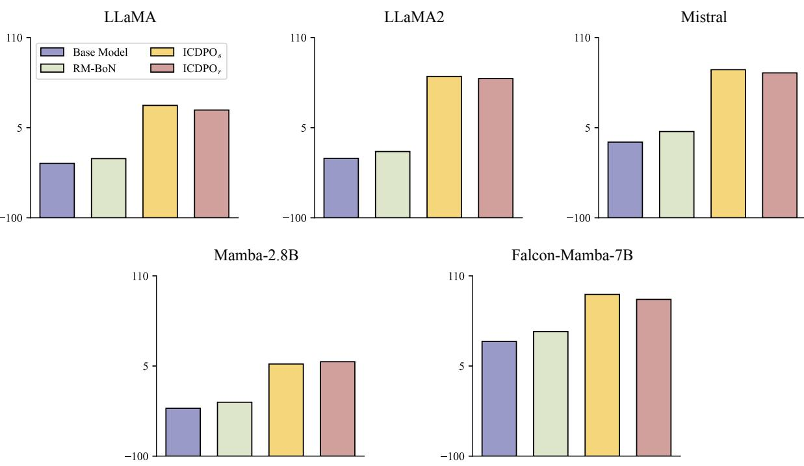  
Figure 8: Comparisons between ICDPO with static demonstrations $( \mathrm { I C D P O } _ { s } )$ and base models/RM-BoN/ICDPO with random demonstrations $( \mathrm { I C D P O } _ { r } )$ , the last two of which have theoretically comparable computational efficiency. ICDPOs still showcases better performance than RM-BoN, close to ICDPOr.

## E Distribution of Demonstrations

Although GPT-3.5-turbo surpasses LLaMA2-chat in Table 4, utilizing demonstrations from LLaMA2-chat leads to better performance of ICDPO. Since ICL can be regarded as an instant LLM fine-tuning, we speculate that responses from LLaMA2-chat can be closer to the distribution of open-source LLMs, like LLaMA, than those from GPT-3.5-turbo, which mitigates the difficulty of ICL on these samples. Therefore, this should be illustrated by computing the NLL loss on demonstrations of both sources, where a smaller value suggests a closer distribution.

We hereby compute the loss with mean rather than sum reduction, in order to eliminate the impact of sequence length on the magnitude of values, as depicted in Figure 9. All 3 base models exhibit significantly smaller losses on demonstrations from LLaMA2-chat than GPT-3.5-turbo, thus verifying the hypothesis above.

## F Arena-Hard Results

Arena-Hard proposed by Li et al. (2024a) has become a well-recognized benchmark to measure the capability of instruction following or the effectiveness of different alignment methods. It contains 500 prompts for evaluation, all sampled from Chatbot Arena (Chiang et al., 2024), and automatically scores the quality of each response with GPT-4 by comparing it with a reference.

The initial reference model in Arena-Hard is GPT-4-0314, which can be too challenging for tuning-free methods. Therefore, we replace its responses with those from LLaMA-3-8B-instruct (Dubey et al., 2024), which Arena-Hard officially releases. We maintain the same settings as in AlpacaEval evaluations except for demonstrations for ICL methods, which is selected by R from the binarized version5 of Ultrafeedback (Cui et al., 2023). The results are contained in Table 6.

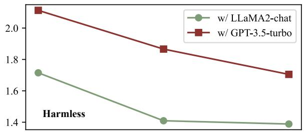

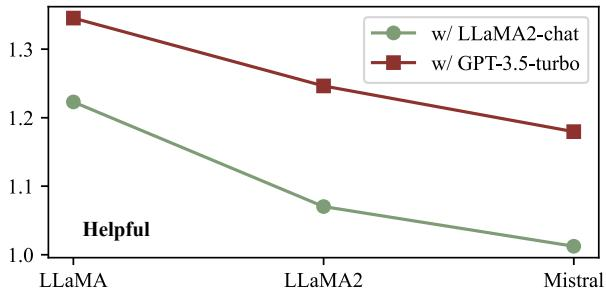

Figure 9: Loss of different base models on demonstrations from LLaMA2-chat and GPT-3.5-turbo.
<table><tr><td>Base Model</td><td>RM-BoN</td><td>RM-Aug</td><td>URIAL</td><td>RAIN</td><td>ICDPO</td><td>ICDPO+Ê</td></tr><tr><td>LLaMA</td><td>1.0</td><td>1.3</td><td>0.9</td><td>1.5</td><td>1.6 (+0.1)</td><td>1.7 (+0.2)</td></tr><tr><td>LLaMA2</td><td>2.5</td><td>3.0</td><td>3.3</td><td>3.6</td><td> ${ \bf 3 . 7 \ ( + 0 . 1 ) }$ </td><td> ${ \bf 3 . 9 } \left( + { \bf 0 . 3 } \right)$ </td></tr><tr><td>Mistral</td><td>5.3</td><td>4.3</td><td>6.0</td><td>5.9</td><td> $7 . 8 \ : ( + 2 . 8 )$ </td><td> $7 . 9 \ : ( + 2 . 9 )$ </td></tr></table>

Table 6: Results on Arena-Hard. The red notes represent the improvement of ICDPO and $\mathrm { I C D P O } { + } \hat { S }$ over the best performance among the baselines.

## G Additional Results

In this section, we try to replace the controller for experiments, i.e., LLaMA2-chat, with the black-box GPT-3.5-turbo, as shown in Figure 10 and Table 7, where we can draw conclusions similar to those in § 4.2 and 4.3. Additionally, RAIN, ICDPO and its all variants commonly experience decreases in scores, which is also the evidence of what we have discussed in Appendix E.

Nevertheless, the implemented baseline methods here exclude Zero-shot, RM-BoN, and RM-Aug, because Zero-shot would produce identical results as in Table 1, while GPT-3.5-turbo cannot serve as the RM for RM-BoN and RM-Aug. We illustrate this challenge in Figure 11. To be specific, the access to GPT-3.5-turbo via API calling only returns the predicted content and its corresponding logits. Therefore, we are indeed able to easily obtain its generated responses (and their logits) for the test set via the APIs, as shown in Figure 11(b).

However, when we intend to use GPT-3.5-turbo as a logits-based scorer, similar to LLaMA2-chat, it becomes unfeasible. For a given candidate response y, inputting it with the context x to GPT-3.5-turbo will yield only the continuation of y rather than the logits for $( x , y )$ , as shown in Figure 11(d). Differently, with the locally deployed LLaMA2-chat as the experimental controller, the predicted content and the logits of any input are available, as illustrated in Figures 11(a) and (c). This is why we only implement RM-Aug and RM-BoN with LLaMA2-chat.

Furthermore, for HH-RLHF w/ GPT-3.5-turbo, if we were to use LLaMA2-chat to guide RM-Aug and RM-BoN, they would yield results identical to those of HH-RLHF w/ LLaMA2-chat, which is redundant.

## H Prompt Templates for ICL

Templates for $\pi ( y \mid [ \mathbf { d } ^ { + } ; x ] )$ and $\pi ( y \mid [ \mathbf { d } ^ { - } ; x ] )$ are illustrated as Figure 12 and 13, respectively.

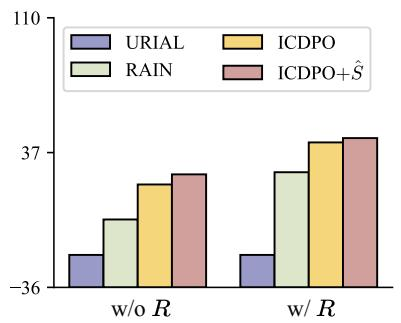  
(a)

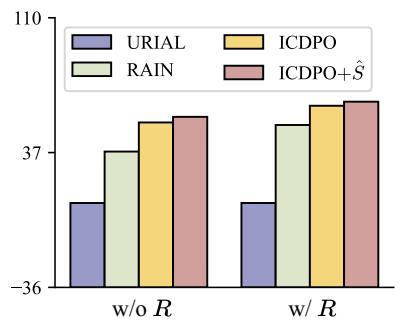  
(b)

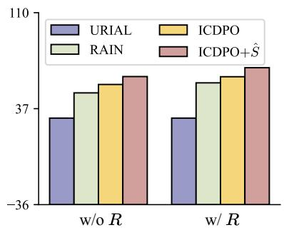  
(c)  
Figure 10: Comparisons among URIAL, RAIN, ICDPO and ICDPO+Sˆ on a subset of test samples from HH-RLHF, where the controller of demonstrations is set to GPT-3.5-turbo.

<table><tr><td rowspan="2">Method</td><td colspan="3">LLaMA</td><td colspan="3">LLaMA2</td><td colspan="3">Mistral</td></tr><tr><td>Harmless</td><td>Helpful</td><td>Total</td><td>Harmless</td><td>Helpful</td><td>Total</td><td>Harmless</td><td>Helpful</td><td>Total</td></tr><tr><td>ICDPO+ÊR</td><td>82.21</td><td>3.63</td><td>42.91</td><td>98.77</td><td>28.08</td><td>63.42</td><td>92.21</td><td>39.55</td><td>65.88</td></tr><tr><td>ICDPO+R</td><td>80.64</td><td>-1.13</td><td>39.75</td><td>98.08</td><td>24.45</td><td>61.26</td><td>89.91</td><td>31.10</td><td>60.50</td></tr><tr><td>ICDPO+Ê</td><td>64.03</td><td>-14.86</td><td>24.58</td><td>92.14</td><td>21.40</td><td>56.76</td><td>85.83</td><td>36.14</td><td>60.98</td></tr><tr><td>ICDPO</td><td>63.91</td><td>-23.27</td><td>20.31</td><td>91.56</td><td>16.33</td><td>53.94</td><td>85.10</td><td>21.23</td><td>53.16</td></tr><tr><td>ICL</td><td>52.73</td><td>-32.05</td><td>10.33</td><td>88.00</td><td>4.74</td><td>46.36</td><td>75.46</td><td>16.38</td><td>45.91</td></tr><tr><td>ICLuni</td><td>50.85</td><td>-33.44</td><td>8.70</td><td>88.62</td><td>2.16</td><td>45.38</td><td>75.72</td><td>15.32</td><td>45.51</td></tr></table>

Table 7: Results of ablation study on ICDPO, where the controller of demonstrations is set to GPT-3.5-turbo.

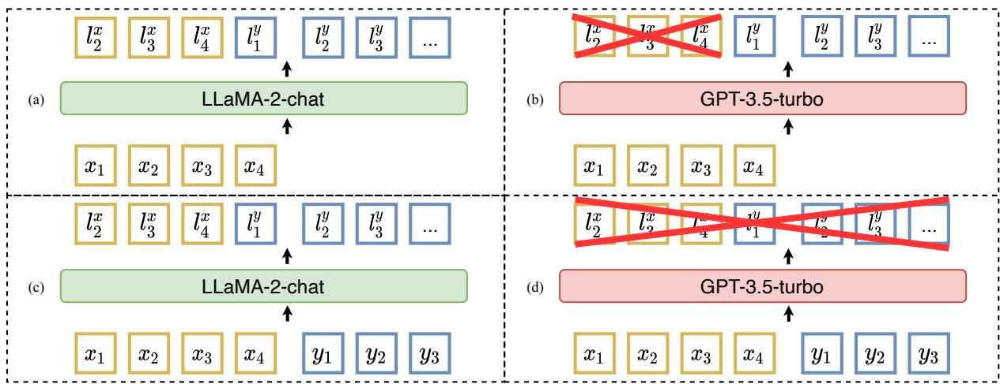  
Figure 11: Illustration of why GPT-3.5-turbo cannot be a logits-based reward model, where x and y denote the context part and response part, respectively. LLaMA-2-chat can offer the logits of input context both in (a) inference and (c) forward. However, when receiving the input context, GPT-3.5-turbo does inference and returns the logits of predicted tokens rather than the context, like (b). Hence, given both the context and a candidate response, GPT-3.5-turbo will not provide the logits of the candidate response, like (d).

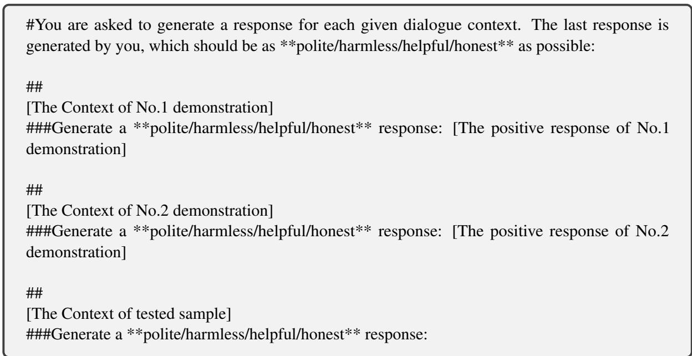  
Figure 12: The prompt template used to trigger LLMs generating preferred content.

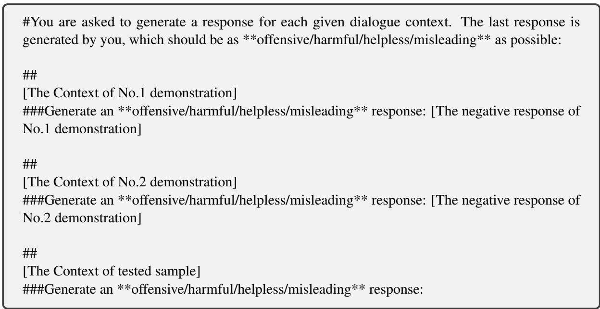  
Figure 13: The prompt template used to trigger LLMs generating non-preferred content.