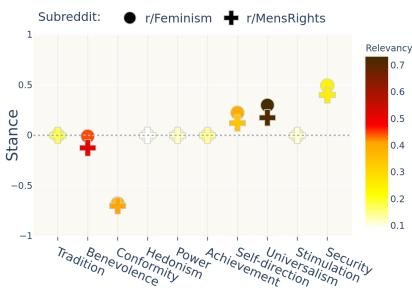
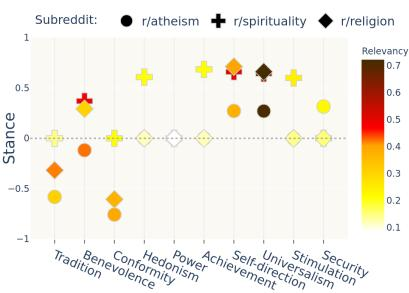
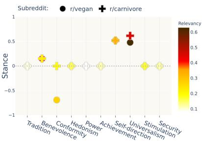
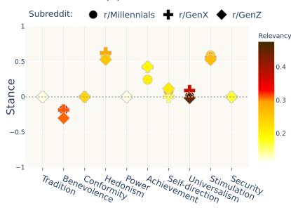
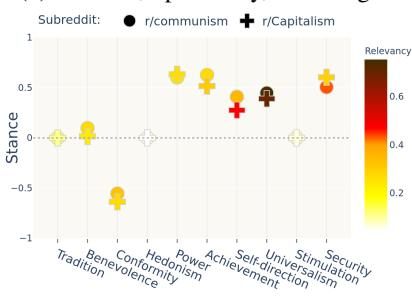
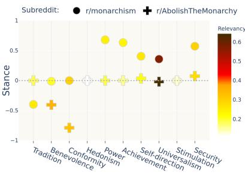
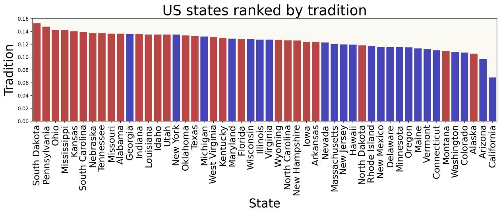

# Investigating Human Values in Online Communities

Nadav Borenstein1 Arnav Arora1 Lucie-Aimée Kaffee2 Isabelle Augenstein1

1University of Copenhagen 2Hasso Plattner Institut

nb@di.ku.dk aar@di.ku.dk

lucie-aimee.kaffee@hpi.de augenstein@di.ku.dk

## Abstract

Studying human values is instrumental for cross-cultural research, enabling a better understanding of preferences and behaviour of society at large and communities therein. To study the dynamics of communities online, we propose a method to computationally analyse values present on Reddit. Our method allows analysis at scale, complementing survey based approaches. We train a value relevance and a value polarity classifier, which we thoroughly evaluate using in-domain and out-of-domain human annotations. Using these, we automatically annotate over nine million posts across 12k subreddits with Schwartz values. Our analysis unveils both previously recorded and novel insights into the values prevalent within various online communities. For instance, we discover a very negative stance towards conformity in the Vegan and AbolishTheMonarchy subreddits. Additionally, our study of geographically specific subreddits highlights the correlation between traditional values and conservative U.S. states. Through our work, we demonstrate how our dataset and method can be used as a complementary tool for qualitative study of online communication.

## 1 Introduction

Human Values have been a useful analysis lens for social sciences scholars (Ponizovskiy et al., 2020; Boyd et al., 2021; Schwartz, 1994). Applied to communities or individuals, they are used to study political affiliations, cultural integration, human disagreement, economic growth, and human development, among others (Inglehart, 2020). Many frameworks exist for studying human values, including Rockeach values (Rokeach, 1973), Hofstede’s cultural dimensions (Hofstede, 1984), and Moral Foundations Theory (Graham et al., 2013). However, studies using these value frameworks often struggle with sample sizes and rely on selfreported surveys to calculate the values of communities (Weld et al., 2023), leading to concerns about representation and the generalisation of the results to populations beyond the ones studied (Gerlach and Eriksson, 2021; Bašnáková et al., 2016; Fontaine et al., 2008).

Val Subreddits   
AC r/startups, r/resumes, r/xboxachievements   
BE r/Adoption, r/BPDlovedones, r/Petloss   
CO r/policebrutality, r/HOA, r/BadNeighbors,   
HE r/FreeCompliments, r/transpositive, r/-   
cozy   
PO r/debtfree, r/geopolitics, r/dividends   
SE r/GunsAreCool, r/worldevents, r/Combat-  
Footage   
SD r/antidepressants r/DebateReligion,   
r/TrueUnpopularOpinion, r/nutrition   
ST r/crossdressing, r/Hobbies, r/NailArt   
TR r/religion, r/AskAPriest, r/atheism   
UN r/AskFeminists, r/IsraelPalestine, r/cli  
matechange  
Table 1: Subreddits with the highest expression of each of the ten Schwartz values. The stance of Green subreddits towards the value is positive (above 0.2), whereas Red indicates negative stance (below −0.2). Blue represents neutral. AC=achievement, BE=benevolence, CO=conformity, HE=hedonism, PO=power, SE=security, SD=self-direction, ST=stimulation, TR=tradition, UN=universalism.

Social media platforms provide unadulterated access to vast and diverse expressions of human thoughts and opinions in the form of posts, discussions, and comments. This rich data source is invaluable for investigating various aspects of human society (Newell et al., 2016; Agrawal et al., 2023; Zomick et al., 2019; Turcan and McKeown, 2019). However, analysing large amounts of social media data qualitatively remains challenging.

To overcome this challenge, in this work, we provide a method for computationally analysing human values in language used on social media at scale. Our method and dataset supplies scholars with a tool for extracting high level values based insights from a large corpus of social media text, which can be used to identify interesting phenomena to qualitatively study when studying online behaviour and communities. Specifically, we follow Schwartz’s Theory of Human Values (Schwartz, 1994), due to its wide adoption as a value framework in the social sciences as well as in Natural Language Processing, and apply it on Reddit. Reddit is conceptually based on named communities, or, subreddits, and studying the values they exhibit is particularly interesting for studying online behaviour as the discussions are already segregated by topic or sub-communities. For instance, by examining the r/teenagers subreddit, we can gain insights into adolescent perspectives, while the r/- ConservativeValues allows us to study the impact of conservative values on worldviews.

<table><tr><td>Value</td><td>Description</td></tr><tr><td>Power</td><td>Social status and prestige, control or dominance over people and resources</td></tr><tr><td>Achievement</td><td>Personal success through demonstrating competence according to social standards.</td></tr><tr><td>Hedonism</td><td>Pleasure and sensuous gratification for oneself.</td></tr><tr><td>Stimulation</td><td>Excitement, novelty, and challenge in life.</td></tr><tr><td>Self-direction</td><td>Independent thought and action-choosing, creating, exploring.</td></tr><tr><td>Universalism</td><td>Understanding, appreciation, tolerance, and protection for the welfare of all people and for nature.</td></tr><tr><td>Benevolence</td><td>Preservation and enhancement of the welfare of people with whom one is in frequent personal contact.</td></tr><tr><td>Tradition</td><td>Respect, commitment, and acceptance of the customs and ideas that traditional culture or religion provide.</td></tr><tr><td>Conformity</td><td>Restraint of actions, inclinations, and impulses likely to upset or harm others and violate social expectations or norms.</td></tr><tr><td>Security</td><td>Safety, harmony, and stability of society, of relationships, and of self.</td></tr></table>

Table 2: The ten Schwartz values and their meaning; descriptions from Schwartz (1994)

To extract values from Reddit, we train supervised value extraction models to classify the presence and polarity of Schwartz values in text and apply them to Reddit posts. We then evaluate the models, validating their effectiveness and addressing limitations in prior work. Subsequently, we use these models to infer the expressed values of 9 million user posts and comments across 11,616 most popular subreddits on Reddit.

Through such a computational value analysis, we can analyse digital trace and behaviour data at scale, complementing social science studies by highlighting patterns as well as outliers needing further study. As an instance of this, our analysis demonstrates that people contributing to r/feminism exhibit high values in self-direction, as substantiated by previous studies. We also demonstrate the prevalence of high traditional values in conservative US states. In sum, our contributions are:

• A flexible method of conducting large-scale value relevance and polarity analysis to complement social science research on online communities;

• Our analysis of values at a large scale confirms previously recorded phenomena and unveils novel insights, indicating that our method can complement traditional methods in understanding societal phenomena;

• We release our dataset of 12k subreddits with their corresponding Schwartz values for future analysis.1

Although our findings offer unique insights into the values of individuals from various cultures, the focus of our paper is the analysis of values present in online communities. Hence the subject of our study is the communities themselves and how they operate, rather than the broader cultural backgrounds of their members, which we do not measure directly. Our methods are designed to complement, not replace, traditional survey-based approaches for studying values, by providing additional perspectives from digital trace data.

## 2 Related Work and Background

## 2.1 Schwartz’s Values Framework

Values represent a crucial aspect of human nature. According to Schwartz (2012), "A person’s value priority or hierarchy profoundly affects his or her attitudes, beliefs, and traits, making it one core component ofpersonality." Schwartz (1994) define values as (1) concepts or beliefs, that (2) pertain to desirable end states or behaviors, (3) transcend specific situations, (4) guide selection or evaluation of behavior and events, and (5) are ordered by relative importance. Based on this, they outline ten basic human values: Security, Conformity, Tradition, Benevolence, Universalism, Self-direction, Stimulation, Hedonism, Achievement, Power. We provide descriptions of each of the values in Tab. 2. The values were originally applied to measure differences in values across cultures (Schwartz, 1994).

The framework is suggested as a tool to study populations rather than individual people, hence it serves as a suitable tool for the analysis of online communities. We leverage the fact that a person’s identity and values are often reflected in the linguistic choices they make (Jaffe, 2009; Norton, 1997) to analyse values embedded in text.

## 2.2 Values and Natural Language Processing

Recently, there have been a number of studies exploring values and morals using NLP. In analysing values and language on social media, Ponizovskiy et al. (2020) released a Schwartz value dictionary. Boyd et al. (2021) show the promise of free-text survey response and Facebook data for value extraction. There have also been studies exploring morals and norms in text. Trager et al. (2022) release the Moral Foundations Reddit Corpus with 16k Reddit comments; Roy et al. (2021) similarly study morality in political tweets. Havaldar et al. (2024) study the presence of values in a geolocated Twitter corpus using a lexicon-based approach, finding a lack of correlation with survey data. The closest to our study is van der Meer et al. (2023), who train a value extraction model based on datasets from Qiu et al. (2022); Kiesel et al. (2022). Using the model, they analyse values at an individual user level to understand disagreement in online discussions. However, a key limitations in their work is only detecting the presence of a value, neglecting the polarity of the discussion towards that value. In our work, we overcome this limitation by training an additional value stance model. Further, we perform our analysis at the community level to understand the values of communities rather than individuals, bringing it closer to the original framework outlined by Schwartz designed to understand cultural values.

## 2.3 Studying Online Communities

Much work has been done to explore Reddit and its user base. Reddit users’ personalities have been studied (Gjurkovic and Šnajder´ , 2018) as well as their mental health (Zomick et al., 2019; Turcan and McKeown, 2019; Chancellor et al., 2018). Previous work has also studied Reddit by focusing on events affecting community dynamics (Newell et al., 2016; Agrawal et al., 2023). For instance, Chandrasekharan et al. (2022) examine the effect of content moderation on two controversial subreddits. Soliman et al. (2019) study the characteristics and differences between left-leaning and rightleaning political subreddits. Closer to our work, Weld et al. (2023) craft a taxonomy of community values and associate them with specific subreddits. However, their methodology, while high quality, involves collecting values through self-reporting questionnaires of limited size and suffers from selection bias, a limitation we address in this paper. Finally, studies have also explored modelling community norms (Park et al., 2024) and detecting their violations (Cheriyan et al., 2021).

<table><tr><td rowspan="2"></td><td rowspan="2">Avg</td><td rowspan="2">std</td><td colspan="3">Percentile</td><td rowspan="2">Total</td></tr><tr><td>25</td><td>50</td><td>75</td></tr><tr><td>c.p.s w.p.c</td><td>765.4 62.8</td><td>264.8 148.0</td><td>517 15</td><td>918 26</td><td>996 58</td><td>8,888,535 558,327,230</td></tr></table>

Table 3: Statistics of the Reddit dataset we analyse. c.p.s is content item (posts and comments) per subreddit, and w.p.c is word per content item.

## 3 Method

This section details the collection and processing of our Reddit dataset, and our approach to training and evaluating the Schwartz values extractor model.

## 3.1 Data Collection

We download an image of Reddit posts and comments authored between January and August 20222 using Pushshift’s API.3 We filter out posts and comments with fewer than ten words or with fewer than ten upvotes to reduce possible noise from lowquality text. We then merge the lists of posts and comments by subreddit, not further distinguishing between them for our analysis, and filter out subreddits that are tagged NSFW,4 have fewer than 5,000 subscribers, or fewer than 250 content examples. Finally, we down-sample large subreddits to 1,000 random samples due to computational constraints and remove non-English content. This process results in a dataset D of 11,616 unique subreddits. See Tab. 3 for dataset statistics.

## 3.2 Value Extraction

For extracting Schwartz values and their polarity from text, we first extract the relevance of a post or comment with each Schwartz value, then use a stance model to extract the polarity of the sentence towards the relevant value.

Value Relevance For extracting relevance, our approach is similar to van der Meer et al. (2023) in training a neural Schwartz Values relevance classifier. We use a DeBERTa model (He et al., 2021), over RoBERTa, due its improved performance and speed. As a single post can potentially express several values simultaneously, the model is trained in a multi-label setting, predicting a vector of 10 independent probabilities for each input. We finetune the classifier on the concatenation of two supervised Schwartz values datasets, ValueNet (Qiu et al., 2022) and ValueArg (Kiesel et al., 2022). Given a labelled triplet $( s , v , y )$ , with s being a string of text, v the name of one of the ten Schwartz values (Tab. 2), and $y \in \{ 0 , 1 \}$ , we construct the input x = [CLS]v[SEP]s[SEP] and train the model to predict $p ( y | x )$ . Our classifier’s performance on this dataset is similar to the figures reported by van der Meer et al. (2023), namely a macro-averaged $F _ { 1 }$ score of 0.76 on the merged ValueArg and ValueNet datasets. Similar to van der Meer et al. (2023), we collapse the two non-neutral labels (-1 and 1) in ValueNet into a single positive class.5 This model is trained, therefore, to predict the presence of a value v within a string s.

Value Stance Prior work on value extraction neglects to model the polarity of content towards values, substantially limiting the insights one can draw. To detect the polarity of a comment or a post s towards a value v, we train a separate stance model on ValueNet’s non-neutral labels. Specifically, given a triplet $( s , v , y )$ where v is a value expressed by s and $y \in \{ - 1 , 1 \}$ , we fit the stance model to predict pstance(y|x), where x is constructed as described above. We refer readers to App. C.1 for additional training details about the classifiers.

When extracting values of comments or posts from Reddit, we first use the relevance model to predict the probabilities for all Schwartz values for a given input instance, resulting in a vector $u _ { \mathrm { r e l } } ~ \in ~ [ 0 , 1 ] ^ { 1 0 }$ . Specifically, given a string s, we construct $\mathbf { \bar { \Psi } } { u _ { \mathrm { r e l } } } = [ p ( y ^ { 1 } | x ^ { \mathrm { i } } ) , . . . , p ( y ^ { 1 0 } | x ^ { 1 0 } ) ]$ by replacing $v ^ { k }$ in the construction of $x ^ { k }$ = [CLS] $v ^ { k }$ [SEP]s[SEP] with each one of the ten possible Schwartz values. That is, each entry in the vector is the independent probability that s expresses the value $v ^ { k }$ , supporting a multi-label approach. Then, for each k with $u _ { \mathrm { r e l } } ^ { k } > 0 . 5 \mathrm { ~ ( i . e . }$ input text s expresses the value $v ^ { k }$ with a probability greater than 0.5), we predict $p _ { \mathrm { s t a n c e } } ( y ^ { k } | x ^ { k } )$ , (i.e., the polarity of input text s towards the value $v ^ { k } )$ Thus, we construct a vector of probabilities ustance of dimensionality 10, where each entry $u _ { \mathrm { s t a n c e } } ^ { k }$ is either in [−1, 1] or Null (if s does not express the value $v ^ { k }$ greater than 0.5). Tab. 10 in App. B.3 contains a sample of Reddit content and the associated Value Extractor model predictions.

<table><tr><td></td><td>AC</td><td>BE</td><td>CO</td><td>HE</td><td>PO</td><td>SE</td><td>SD</td><td>ST</td><td>TR</td><td>UN</td></tr><tr><td>Spearman ρ</td><td>0.73</td><td>0.66</td><td>0.66</td><td>0.6</td><td>0.56</td><td>0.8</td><td>0.46</td><td>0.5</td><td>0.6</td><td>0.73</td></tr><tr><td>NDCG@1</td><td>0.89</td><td>0.81</td><td>0.93</td><td>0.96</td><td>0.76</td><td>0.93</td><td>0.74</td><td>0.86</td><td>0.96</td><td>0.84</td></tr></table>

Table 4: Average Spearman’s ρ and NDCG@1 between the three annotators of the relevance model, per-value breakdown. AC=achievement, BE=benevolence, CO=conformity, HE=hedonism, PO=power, SE=security, SD=self-direction, ST=stimulation, TR=tradition, UN=universalism.

<table><tr><td>AC</td><td>BE</td><td>CO</td><td>HE</td><td>PO</td><td>SE</td><td>SD</td><td>ST</td><td>TR</td><td>UN</td></tr><tr><td>0.51</td><td>0.57</td><td>0.61</td><td>0.77</td><td>0.30</td><td>0.45</td><td>-0.27</td><td>0.77</td><td>0.67</td><td>0.26</td></tr></table>

Table 5: Cohen’s Kappa between the two annotators of the stance model, per-value breakdown.

## 3.3 Evaluation of Value Extraction

An important limitation of van der Meer et al. (2023) is the lack of direct evaluation of the value extraction model. The need for this becomes particularly pronounced considering the large domain shift of applying the model—which, similarly to us, was trained on debating data—to analyze content on platforms like Reddit. Therefore, we conduct a thorough evaluation to test the model’s capabilities of extracting values from Reddit content.

Ideally, we would want to assess the model’s performance using a large, annotated dataset of randomly sampled Reddit posts. However, this is impractical because randomly selected posts are unlikely to contain any Schwartz values. Consequently, annotating these posts would yield a dataset with only a few positive examples. To address this challenge, we evaluate the Value Extraction models directly.

Relevance Model Evaluation We evaluate the relevance model by first using it to label 10,000 posts and 10,000 comments for predicting the presence of values. Thereafter, for each value v, we sample three posts or comments: one with high model confidence for the presence of the value (above 0.8), one with medium confidence (0.4-0.6), and one with low confidence (below 0.2). Three annotators then rank these comments/posts based on which are more related to value v, regardless of polarity. We repeat this process five times per value, totalling 50 rankings per annotator. See App. A for annotation guidelines and dataset samples.

For annotator agreement, we calculated averaged Spearman’s $\rho ,$ which looks at correlation amongst ranks. The agreement we found was 0.63, which is reasonable for such a subjective task.6 Certain values (e.g., security, universalism) showed better agreement than others (e.g., self-direction). A full breakdown is available in Tab. 4. For assessing model performance, we assigned a gold pseudoranking to each sample by averaging the annotators’ rankings. We evaluate the relevance model’s performance by comparing the model’s predicted ranking to this gold standard. The average Spearman’s $\rho$ we obtain is 0.51 (again, with values such as security outperforming other values such as $s e l f -$ direction). Looking at the top ranked content, the NDCG@1 we obtain is an impressive 0.87, demonstrating that high certainty predictions made by our classifier are highly relevant to their corresponding value. With this, we can extract comments or posts relevant to certain values from the larger set. See App. B.2 for examples of model misclassification and value breakdown.

Stance Model Evaluation We first sample 20 posts or comments per value v where the relevance model predicted the presence of v with high confidence. Two annotators then label the samples for stance, choosing between positive, negative, or neutral/unrelated (i.e., where no stance is clearly expressed or the relevance model misclassified the sample). The annotators achieved a Cohen’s Kappa score of 0.47, representing moderate agreement, highlighting the challenging nature of the task (see Tab. 5 for a per-value breakdown). However, post discussion on the disagreements, the annotators were able to converge on decisions for each sample, thus obtaining gold labels for the 200 samples. Finally, we apply the stance model to predict the stances of all positive or negative samples. The model predicts the stance towards values with an $F _ { 1 }$ score of 0.72. Given the subjective nature of the task, where one has to predict stance towards an abstract concept like human values and one where annotators often disagreed, we believe the model performs reasonably well. To highlight some of the trickier cases where the model is failing, Tab. 9 in App. B.2 contains examples of model misclassification and breakdown into values.

<table><tr><td>Value</td><td>Relevance mean</td><td>Relevance std</td><td>Stance mean</td><td>Stance std</td></tr><tr><td>Tradition</td><td>0.11</td><td>0.03</td><td>-0.00</td><td>0.04</td></tr><tr><td>Benevolence</td><td>0.30</td><td>0.12</td><td>0.01</td><td>0.29</td></tr><tr><td>Conformity</td><td>0.23</td><td>0.06</td><td>-0.17</td><td>0.32</td></tr><tr><td>Hedonism</td><td>0.21</td><td>0.08</td><td>0.45</td><td>0.36</td></tr><tr><td>Power</td><td>0.17</td><td>0.05</td><td>0.04</td><td>0.16</td></tr><tr><td>Achievement</td><td>0.26</td><td>0.09</td><td>0.47</td><td>0.30</td></tr><tr><td>Self-direction</td><td>0.19</td><td>0.09</td><td>0.25</td><td>0.31</td></tr><tr><td>Universalism</td><td>0.43</td><td>0.10</td><td>0.39</td><td>0.27</td></tr><tr><td>Stimulation</td><td>0.23</td><td>0.08</td><td>0.36</td><td>0.36</td></tr><tr><td>Security</td><td>0.21</td><td>0.06</td><td>0.06</td><td>0.18</td></tr></table>

Table 6: Global statistics of the ten Schwartz values across the entire subreddit dataset.

## 3.4 Assigning Values to Subreddits

We assign each subreddit $\boldsymbol { S } \in \mathcal { D }$ a single vector of Schwartz probabilities $u _ { \mathrm { r e l } } ( S )$ and a single vector of stances $\boldsymbol { u } _ { \mathrm { s t a n c e } } ( \boldsymbol { S } )$ . Given S with content $( c _ { i } ) | i \in S$ , where $c _ { i }$ is either a post or a comment, we predict $u _ { \mathrm { r e l } } ( c _ { i } )$ and $u _ { \mathrm { s t a n c e } } ( c _ { i } )$ from $c _ { i }$ using the process above. Finally, we calculate $u _ { \mathrm { r e l } } ( S )$ by averaging over the predicted vectors $u _ { \mathrm { r e l } } ( c _ { i } )$

$$
u _ { \mathrm { r e l } } ( S ) = { \frac { 1 } { | S | } } \sum _ { i \in S } u _ { \mathrm { r e l } } ( c _ { i } )
$$

We construct $u _ { \mathrm { s t a n c e } } ( S )$ similarly, considering only non-Null entries. That is, each entry in $u _ { \mathrm { s t a n c e } } ^ { k } ( S )$ is computed as

$$
u _ { \mathrm { s t a n c e } } ^ { k } ( S ) = \frac { 1 } { | S ^ { k } | } \sum _ { i \in S ^ { k } } u _ { \mathrm { s t a n c e } } ^ { k } ( c _ { i } ) ,
$$

where $\mathcal { S } ^ { k } = \{ i \in \mathcal { S } | u _ { \mathrm { s t a n c e } } ^ { k } ( c _ { i } ) \neq \mathrm { N u l l } \}$

Tab. 6 details global statistics for the predicted relevance and stance for each Schwartz value across the entire subreddit dataset.

## 4 Experiments

Our experiments serve two primary goals: first, to validate our approach by comparing the values extracted using our method to existing knowledge. Second, to demonstrate the extensibility of our method to new topics that have not been previously investigated in the social sciences. We conduct qualitative and quantitative evaluations of our approach in §4.1 and §4.2, to validate our method. Then, to uncover interesting phenomena and demonstrate the utility of our method, we investigate subreddits with differing opinions on controversial topics and compare our findings with existing studies. Finally, in §4.4, we correlate values extracted using our method to values gained through traditional approaches like surveys and questionnaires.

## 4.1 Qualitative Analysis

We start by assessing how well our values extraction model performs on our Reddit dataset.

High relevance Intuitively, certain Schwartz values are expected to be distinctly present in specific communities; e.g. tradition in religion-related communities. Therefore, we find subreddits with particularly strong signals of individual Schwartz values. For each value, we sort the subreddits’ values probability vectors $u _ { \mathrm { r e l } } ( S )$ by their entry corresponding to the particular value. Tab. 1 lists a sample of the top subreddits for each value; Tab. 11 in $\operatorname { A p p }$ . B lists the top 20 subreddits per value. Many of the subreddits collected for each value seem to be intuitively related to it (e.g., r/resumes with achievement, r/conservation with Universalism). The results are encouraging, demonstrating the effectiveness of our approach and its potential for conducting interesting analyses.

Strong stances Equivalently, we can also investigate which subreddits express the strongest stances towards each value. For each value, we sort the subreddits’ stance vectors $\boldsymbol { u } _ { \mathrm { s t a n c e } } ( \boldsymbol { S } )$ by their entry corresponding to the particular value. Tab. 12 in App. B enumerates the 10 subreddits with the highest positive and negative stance towards each value. Again, while some of the listed subreddits are intuitive (e.g., r/migraine having a negative “hedonism” stance and r/raisingkids having a strong positive stance towards “achievement”), other subreddits are more surprising (r/TheHague with a positive stance towards “hedonism”). Value magnitude We hypothesise that online communities differ not only in the set of values they express but also in the total magnitude of expressed values. Online communities pertaining to more objective topics (e.g., linear algebra) should express fewer Schwartz values than communities dedicated to subjective or controversial topics (e.g., politics). To test this, for each subreddit $\boldsymbol { S } \in \mathcal { D }$ we calculate $\mathrm { m a g } ( S ) = | u _ { \mathrm { r e l } } ( S ) | _ { 2 }$ , the total magnitude of values expressed in the subreddit. The 20 subreddits with the highest and lowest value magnitudes are detailed in Tab. 13 in App. B. Subreddits with particularly high magnitudes are those communities that focus on debating, discussion, or emotional narratives. Examples of these include r/changemyview, r/Adoption, and $\mathtt { r / P o l i t i c a l D - }$ iscussion. Conversely, subreddits with notably low magnitudes are generally more objective and neutral in tone. These include r/crystalgrowing and r/whatisthisfish. Some subreddits that exhibit low-value magnitudes are dedicated to sharing photos taken by community members, e.g., r/astrophotography.

## 4.2 Quantitative Analysis

We hypothesise that similar subreddit communities share similar values, and systematically investigate this using empirical evidence. We define three measures of similarity between subreddits:

Value similarly. We define $\sigma _ { \mathrm { v a l } } ( S _ { 1 } , S _ { 2 } ) \ =$ cos $( u _ { \mathrm { r e l } } ( S _ { 1 } ) | | u _ { \mathrm { s t a n c e } } ( S _ { 1 } ) , u _ { \mathrm { r e l } } ( S _ { 2 } ) | | u _ { \mathrm { s t a n c e } } ( S _ { 2 } ) )$ the cosine similarity between the concatenation of the relevance and stance vectors of the two subreddits.7

Semantic similarity. We scrape the public description of each subreddit from its page (see Fig. 5 in App. B), and embed these natural language descriptions using a sentence transformer8 to construct a semantic embedding vector $e _ { S }$ for each subreddit $S ^ { 9 }$ . We now define $\sigma _ { \mathrm { s e m } } ( S _ { 1 } , S _ { 2 } )$ cos $( e _ { S 1 } , e _ { S 2 } )$

User similarity For each pair of subreddits, we define their user similarity to be the overlap coefficient between the users of the two subreddits. That is,

$$
\sigma _ { \mathrm { u s r } } ( S _ { 1 } , S _ { 2 } ) = \frac { | U ( S _ { 1 } ) \cap U ( S _ { 2 } ) | } { \operatorname* { m i n } ( | U ( S _ { 1 } ) | , | U ( S _ { 2 } ) | ) }
$$

Where $U ( { \cal S } )$ is the set of the subreddit’s members.10

To answer the question of if similar subreddits share similar values, we correlate $\sigma _ { \mathrm { v a l } }$ with $\sigma _ { \mathrm { s e m } }$ and $\sigma _ { \mathrm { u s r } }$ as follows. First, for each subreddit $\boldsymbol { \mathcal { S } }$ we find $\overline { { \cal S } } _ { \mathrm { s e m } } = \operatorname { a r g m a x } _ { { \cal S } ^ { \prime } } \left[ \sigma _ { \mathrm { s e m } } ( { \cal S } , { \cal S } ^ { \prime } ) \right]$ and $\overline { { \boldsymbol { S } } } _ { \mathrm { c o m } } = \mathrm { a r g m a x } _ { \boldsymbol { S } ^ { \prime } } \left[ \sigma _ { \mathrm { u s r } } ( \boldsymbol { S } , \boldsymbol { S } ^ { \prime } ) \right]$ . If similar subreddits share a similar set of values, we should expect $\mathbb { E } _ { S } [ \sigma _ { \mathrm { v a l } } ( S , \overline { { S } } _ { \mathrm { s e m } } ) ]$ and $\mathbb { E } _ { S } [ \sigma _ { \mathrm { v a l } } ( S , \overline { { S } } _ { \mathrm { c o m } } ) ]$ to be significantly larger than $\mathbb { E } \left[ \sigma _ { \mathrm { v a l } } ( \cdot , \cdot ) \right]$ . That is, the Schwartz values of two similar subreddits should be significantly closer to each other than the Schwartz values of two random subreddits. Our results, computed using empirical expectations over our dataset, confirm this hypothesis. Significant differences exist between the expected Schwartz values of similar and random subreddits. The expected values for both semantic and user similarity is 0.81 versus 0.64 for random subreddits. The z-test scores are 73.2 and 74.4, respectively, indicating a high level of statistical significance.

## 4.3 Controversial Topics

Different online communities have differing viewpoints on widely discussed issues based on their values. To test whether we can also observe this in subreddits, we extend the analysis to controversial topics, based on Wikipedia’s list of controversial topics.11 For a selected topic, we identify subreddits with differing viewpoints on the topic, e.g., r/Communism and r/Capitalism.

To establish the utility of our method and dataset, we analyse both topics studied by prior work in the social sciences, as well as previously unexplored topics that could be further studied. An overview of the results on all controversial topics can be found in Figure 1. An overview of closely related subreddits (in terms of values) to each of the subreddits discussed here can be found in Appendix B.5.

Feminism In our investigation involving the Reddit communities of r/Feminism and r/MensRights (prior work (Khan, 2020; Witt, 2020) characterized r/MensRights as a non-feminist community based on the content shared by its members), we find both subreddits to be extremely anticonformative (Figure 1a). The values of universalism, benevolence, and self-direction were found to be highly relevant for both. self-direction as a value being more core to feminists, as compared to non-feminists has also been found in prior work exploring their values (Zucker and Bay-Cheng, 2010).

Religion There are multiple large-scale studies aiming to establish the connection between religion and Schwartz values. Saroglou et al. (2004) present a meta-analysis across 15 countries, finding that religious people prefer conservative values, e.g., tradition, and dislike values related to openness (stimulation, self-direction). We see similar trends in our comparison of r/atheism, r/spiritu-$\mathsf { a l i t r } . \mathsf { y } .$ , and r/religion (Figure 1b). While r/atheism and r/religion express tradition, interestingly, both subreddits have a negative stance towards it. Similarly, lower scores for power, hedonism, and achievement for those communities also align with previous findings. Interestingly, r/spirituality has high relevance and a very positive stance towards some of those values, demonstrating the focus on the self.

Veganism Figure 1c compares the values for r/vegan and r/carnivore. The largest difference can be observed in the value of conformity. r/Vegan has a very negative stance towards it, representing them challenging the status quo. Holler et al. (2021) review studies related to the values of vegetarians/vegans and omnivores, and find that vegetarians were found to have a stronger relation to universalism. We find a similar pattern with r/vegan having a slightly higher relevance but r/carnivore having a more positive stance. They also found them to have a greater emphasis on self-direction, which aligns with our findings.

Generations Lyons et al. (2007) study the differences in values across generations. Similarly, we compare r/Millenials, r/GenZ, and r/- GenX in Figure 1d. While the values of the different generations’ subreddits are highly aligned, small differences can be observed, such as the more positive stance towards achievement in GenZ and GenX than Millenials. This contradicts Lyons et al. (2007), which found Millenials to be more achievement focused than GenX.

Communism vs capitalism Here, we describe the difference in values for different economic ideologies, i.e., communism vs capitalism in Figure 1e. While Schwartz and Bardi (1997) describe the effect of communism on Eastern Europe (e.g., high importance to conservatism and hierarchy values), they did not include the values held by the people supporting the ideology on a theoretical level. We find that contributors to r/communism hold a more positive stance towards achievement, whereas contributors to r/Capitalism hold high relevance values for self-direction and security. Both subreddits have high relevance with universalism.

  
(a) Feminism

  
(c) Veganism

(b) Atheism, Spirituality, and Religion  
  
(d) Generations

  
(e) Communism vs Capitalism

  
(f) Monarchism  
Figure 1: Radar plots displaying the ten Schwartz values of subreddits dedicated to controversial topics.

Monarchism We further present values on monarchism in Figure 1f, as another example of a controversial topic yet to be studied in terms of values. We find contributors to r/AbolishThe-Monarchy to be against conformity, with a negative stance towards benevolence. The contributors to r/monarchism have a high relevance to tradition, but a negative stance towards it. They also converse a lot more positively about power, achievement, and security.

## 4.4 Correlation with Surveys

Finally, to understand how well aligned values expressed in online communities are with values of real-world communities, we compare the Schwartz values extracted from Reddit with those obtained from traditional questionnaire methods.

US States First, we use our method to investigate the premise that conservative US states are more traditional than liberal states. We correlate the tradition relevance value extracted using our method from the states’ subreddits with responses to a survey on conservative ideologies across U.S. states (Center, 2014b), finding a Spearman’s R of 0.55 (p-value < 0.0001). Moreover, when correlating these values with a survey on state religiosity levels (Center, 2014a), we find a Spearman’s R of 0.63 (pvalue < 0.0001). Fig. 2 displays the tradition value of the 50 states subreddits, colour-coded by the 2020 US election results – “red” states clearly tend to have higher tradition values than “blue” states. Country-level values Next, we extend this correlation experiment to additional Schwartz values and countries other than the USA. Schwartz and Cieciuch (2022) used questionnaires to analyse the Schwartz values associated with 49 countries,12 which we correlate with values extracted from subreddits related to these countries using our classifier. We start by manually identifying a set of subreddits relevant to each of the 49 countries.13 We successfully found at least one subreddit for 41 countries. We also determined which language is the most likely to be used online by citizens of the country (and not, for example, by tourists).14 See Tab. 14 in App. B for a comprehensive list of countries and their associated languages and subreddits. Next, we collected posts written in the country’s language15 from the country’s subreddits. We then randomly sampled 2,000 posts and 2,000 comments per country, excluding countries with fewer than 250 total samples. Listing 3 lists the 32 countries that passed this filter. Finally, we used Google Translate API to translate the posts into English16 and applied our approach to extract Schwartz values for each country.

  
Figure 2: US states sorted by their tradition values extracted from Reddit, colour coded based on the 2020 US election results (Blue – democratic majority. Red – republican majority).

The above-mentioned process generates a country-value matrix of dimensions $3 2 \times 1 0$ of Schwartz values obtained from Reddit. We compare this matrix to the $4 9 \times 1 0$ the country-value described in Schwartz and Cieciuch (2022) by removing rows corresponding to countries that do not exist in Listing 3. We then correlate the columns of the two now-identical matrices using Spearman’s $\rho .$ In line with previous studies (Nasif et al., 1991; Joseph et al., 2021), we find no correlation between the values extracted from SM and values extracted from questionnaires—an average Spearman’s ρ of −0.03. Tab. 7 in App. B.4 reports the results in full. This lack of correlation may arise from the distinct demographics of Reddit users compared to questionnaire respondents or the unique dynamics of online interaction, which tends to be more reactionary compared to survey responses (Joseph et al., 2021). Our results confirm findings from previous studies that dynamics of online behaviour differs from offline, and should not directly be used as a proxy without further qualitative investigation.

## 5 Conclusion

In this paper, we apply Schwartz’s Theory of Human Values to Reddit at scale, offering scholars a complementary tool for studying online communities. We train and thoroughly evaluate supervised value extraction models to detect the presence and polarity towards human values expressed in language used on social media. Using these, we conduct extensive analysis of nine million posts across 12k popular subreddits. Through our analysis, we both confirm previous findings from the social sciences, as well as uncover novel insights into the values expressed within various online communities, shedding light on existing patterns and outliers that warrant further investigation.

## Limitations

The main limitations of our work stem from the nature of the task itself. Given the inherent subjectivity and complexity of assigning human values to texts, a certain level of noise—aleatoric uncertainty—is unavoidable. This unpredictability can be amplified by epistemic uncertainty, which arises from the limitations of the models we trained. Although we have thoroughly validated the labels generated by the model (§3.3), the predictions can sometimes be noisy or inconsistent.

Another limitation of our approach is the consolidation of the values of posts in a subreddit into a single vector. While this is necessary for understanding the values of communities, it discounts the values the individual posts of users that constitute these communities. This also opens up much room for future research, particularly in studying the internal dynamics of online communities and understanding the role that values play at the individual post level.

Lastly, while our approach can be leveraged to identify phenomena worthy of further investigation, it lacks the means to explain these observations fully. Values are an abstract concept that is challenging to quantify and analyse, with the values frameworks themselves drawing criticism (Jackson, 2020). We argue that interdisciplinary collaboration with experts in psychology and sociology is essential to understand these phenomena and their implications properly. Such collaborations will not only enrich our understanding of online communities but also contribute to developing more robust and nuanced machine learning models in the future, given the inclusion of such text in the training data.

## Broader Impact and Ethical Considerations

We believe our work goes beyond the methodological toolkit of social scientists. The accessibility, large scale, and relatively high quality of Reddit data have positioned it as a valuable resource for training data for diverse NLP tasks (Overbay et al., 2023; Blombach et al., 2020; Huryn et al., 2022). It opens the door to training models that are better attuned to the specific needs of various communities, potentially protected ones. Recognizing the values of online communities, often utilized as training data for LM development, is crucial for making informed decisions about incorporating the data and contributing to the creation of models that genuinely reflect the diverse perspectives within these communities (Arora et al., 2023). These also percolate into downstream applications of LMs (Jakesch et al., 2023) and have a broader impact on their use.

As for ethical considerations, we made specific efforts to ensure that our work does not impair the privacy and anonymity of Reddit users (Sugiura et al., 2017). We refrain from attributing values to individual users and instead study communities as a whole by aggregating and condensing individual data points into a single vector. Nevertheless, many online communities were created to serve as a safe space for vulnerable individuals, where they share highly sensitive and private information. Therefore, research on Reddit and other online communities should make utmost efforts to respect these spaces and handle their data with care.

## Acknowledgements

This research was co-funded by a DFF Sapere Aude research leader grant under grant agreement No

0171-00034B and a DFF Research Project 1 under grant agreement No 9130-00092B, and supported by the Pioneer Centre for AI, DNRF grant number P1.

## References

Pratik Agrawal, Tolga Buz, and Gerard de Melo. 2023. Wallstreetbets beyond gamestop, yolos, and the moon: The unique traits of reddit’s finance communities. In AMCIS 2022.

Arnav Arora, Lucie-aimée Kaffee, and Isabelle Augenstein. 2023. Probing pre-trained language models for cross-cultural differences in values. In Proceedings ofthe First Workshop on Cross-Cultural Considerations in NLP (C3NLP), pages 114–130, Dubrovnik, Croatia. Association for Computational Linguistics.

Jana Bašnáková, Ivan Brezina, and Radomír Masaryk. 2016. Dimensions of culture: The case of slovakia as an outlier in hofstede’s research. Ceskoslovenska Psychologie, 60(1).

Andreas Blombach, Natalie Dykes, Philipp Heinrich, Besim Kabashi, and Thomas Proisl. 2020. A corpus of German Reddit exchanges (GeRedE). In Proceedings ofthe 12th Language Resources and Evaluation Conference, pages 6310–6316, Marseille, France. European Language Resources Association.

Ryan Boyd, Steven Wilson, James Pennebaker, Michal Kosinski, David Stillwell, and Rada Mihalcea. 2021. Values in words: Using language to evaluate and understand personal values. Proceedings ofthe International AAAI Conference on Web and Social Media, 9(1):31–40.

Pew Research Center. 2014a. How religious is your state?

Pew Research Center. 2014b. Political ideology by state.

Stevie Chancellor, Andrea Hu, and Munmun De Choudhury. 2018. Norms matter: Contrasting social support around behavior change in online weight loss communities. In Proceedings ofthe 2018 CHI Conference on Human Factors in Computing Systems, CHI ’18, page 1–14, New York, NY, USA. Association for Computing Machinery.

Eshwar Chandrasekharan, Shagun Jhaver, Amy Bruckman, and Eric Gilbert. 2022. Quarantined! examining the effects of a community-wide moderation intervention on reddit. ACM Trans. Comput.-Hum. Interact., 29(4).

Jithin Cheriyan, Bastin Tony Roy Savarimuthu, and Stephen Cranefield. 2021. Norm violation in online communities – a study of stack overflow comments. In Coordination, Organizations, Institutions, Norms, and Ethicsfor Governance ofMulti-Agent Systems XIII, pages 20–34, Cham. Springer International Publishing.

Johnny R. J. Fontaine, Ype H. Poortinga, Luc Delbeke, and Shalom H. Schwartz. 2008. Structural equivalence of the values domain across cultures: Distinguishing sampling fluctuations from meaningful variation. Journal ofCross-Cultural Psychology, 39(4):345–365.

Philipp Gerlach and Kimmo Eriksson. 2021. Measuring cultural dimensions: external validity and internal consistency of hofstede’s vsm 2013 scales. Frontiers in Psychology, 12:662604.

Matej Gjurkovic and Jan Šnajder. 2018. ´ Reddit: A gold mine for personality prediction. In Proceedings of the Second Workshop on Computational Modeling ofPeople’s Opinions, Personality, and Emotions in Social Media, pages 87–97, New Orleans, Louisiana, USA. Association for Computational Linguistics.

Jesse Graham, Jonathan Haidt, Sena Koleva, Matt Motyl, Ravi Iyer, Sean P. Wojcik, and Peter H. Ditto. 2013. Chapter two - moral foundations theory: The pragmatic validity of moral pluralism. In Patricia Devine and Ashby Plant, editors, Advances in Experimental Social Psychology, volume 47 of Advances in Experimental Social Psychology, pages 55–130. Academic Press.

Shreya Havaldar, Salvatore Giorgi, Sunny Rai, Thomas Talhelm, Sharath Chandra Guntuku, and Lyle Ungar. 2024. Building knowledge-guided lexica to model cultural variation. In Proceedings of the 2024 Conference ofthe North American Chapter ofthe Associationfor Computational Linguistics: Human Language Technologies (Volume 1: Long Papers), pages 211–226, Mexico City, Mexico. Association for Computational Linguistics.

Pengcheng He, Jianfeng Gao, and Weizhu Chen. 2021. Debertav3: Improving deberta using electra-style pretraining with gradient-disentangled embedding sharing.

Geert Hofstede. 1984. Culture’s consequences: International differences in work-related values, volume 5. sage.

Sophie Holler, Holger Cramer, Daniela Liebscher, Michael Jeitler, Dania Schumann, Vijayendra Murthy, Andreas Michalsen, and Christian S Kessler. 2021. Differences between omnivores and vegetarians in personality profiles, values, and empathy: a systematic review. Frontiers in psychology, 12:579700.

Daniil Huryn, William M. Hutsell, and Jinho D. Choi. 2022. Automatic generation of large-scale multi-turn dialogues from Reddit. In Proceedings of the 29th International Conference on Computational Linguistics, pages 3360–3373, Gyeongju, Republic of Korea. International Committee on Computational Linguistics.

Ronald Inglehart. 2020. Modernization and postmodernization: Cultural, economic, and political change in 43 societies. Princeton university press.

Terence Jackson. 2020. The legacy of geert hofstede.

Alexander Jaffe. 2009. Stance: Sociolinguistic perspectives. In Stance: Sociolinguistic Perspectives.

Maurice Jakesch, Advait Bhat, Daniel Buschek, Lior Zalmanson, and Mor Naaman. 2023. Co-writing with opinionated language models affects users’ views. In Proceedings ofthe 2023 CHI Conference on Human Factors in Computing Systems, CHI ’23, New York, NY, USA. Association for Computing Machinery.

Kenneth Joseph, Sarah Shugars, Ryan Gallagher, Jon Green, Alexi Quintana Mathé, Zijian An, and David Lazer. 2021. (mis)alignment between stance expressed in social media data and public opinion surveys. In Proceedings of the 2021 Conference on Empirical Methods in Natural Language Processing, pages 312–324, Online and Punta Cana, Dominican Republic. Association for Computational Linguistics.

Abeer Khan. 2020. Reddit mining to understand gendered movements. In EDBT/ICDT Workshops.

Johannes Kiesel, Milad Alshomary, Nicolas Handke, Xiaoni Cai, Henning Wachsmuth, and Benno Stein. 2022. Identifying the human values behind arguments. In Proceedings of the 60th Annual Meeting of the Associationfor Computational Linguistics (Volume 1: Long Papers), pages 4459–4471, Dublin, Ireland. Association for Computational Linguistics.

Sean T Lyons, Linda Duxbury, and Christopher Higgins. 2007. An empirical assessment of generational differences in basic human values. Psychological reports, 101(2):339–352.

Ercan G Nasif, Hamad Al-Daeaj, Bahman Ebrahimi, and Mary S Thibodeaux. 1991. Methodological problems in cross-cultural research: An updated review. MIR: Management International Review, pages 79– 91.

Edward Newell, David Jurgens, Haji Saleem, Hardik Vala, Jad Sassine, Caitrin Armstrong, and Derek Ruths. 2016. User migration in online social networks: A case study on reddit during a period of community unrest. In Proceedings of the International AAAI Conference on Web and Social Media, volume 10, pages 279–288.

Bonny Norton. 1997. Language, identity, and the ownership of english. TESOL Quarterly, 31(3):409–429.

Keighley Overbay, Jaewoo Ahn, Fatemeh Pesaran zadeh, Joonsuk Park, and Gunhee Kim. 2023. mRedditSum: A multimodal abstractive summarization dataset of Reddit threads with images. In Proceedings of the 2023 Conference on Empirical Methods in Natural Language Processing, pages 4117– 4132, Singapore. Association for Computational Linguistics.

Chan Young Park, Shuyue Stella Li, Hayoung Jung, Svitlana Volkova, Tanushree Mitra, David Jurgens, and Yulia Tsvetkov. 2024. Valuescope: Unveiling

implicit norms and values via return potential model of social interactions.

Vladimir Ponizovskiy, Murat Ardag, Lusine Grigoryan, Ryan Boyd, Henrik Dobewall, and Peter Holtz. 2020. Development and validation of the personal values dictionary: A theory-driven tool for investigating references to basic human values in text. European Journal ofPersonality, 34(5):885–902.

Liang Qiu, Yizhou Zhao, Jinchao Li, Pan Lu, Baolin Peng, Jianfeng Gao, and Song-Chun Zhu. 2022. Valuenet: A new dataset for human value driven dialogue system. In Proceedings of the AAAI Conference on Artificial Intelligence, volume 36, pages 11183–11191.

Milton Rokeach. 1973. The Nature ofHuman Values. The Nature of Human Values. Free Press, New York, NY, US.

Shamik Roy, Maria Leonor Pacheco, and Dan Goldwasser. 2021. Identifying morality frames in political tweets using relational learning. In Proceedings of the 2021 Conference on Empirical Methods in Natural Language Processing, pages 9939–9958, Online and Punta Cana, Dominican Republic. Association for Computational Linguistics.

Vassilis Saroglou, Vanessa Delpierre, and Rebecca Dernelle. 2004. Values and religiosity: A meta-analysis of studies using schwartz’s model. Personality and individual differences, 37(4):721–734.

Shalom H. Schwartz. 1994. Are there universal aspects in the structure and contents of human values? Journal ofSocial Issues, 50(4):19–45.

Shalom H. Schwartz. 2012. An overview of the schwartz theory of basic values. Online Readings in Psychology and Culture, 2:11.

Shalom H Schwartz and Anat Bardi. 1997. Influences of adaptation to communist rule on value priorities in eastern europe. Political psychology, 18(2):385–410.

Shalom H Schwartz and Jan Cieciuch. 2022. Measuring the refined theory of individual values in 49 cultural groups: psychometrics of the revised portrait value questionnaire. Assessment, 29(5):1005–1019.

Ahmed Soliman, Jan Hafer, and Florian Lemmerich. 2019. A characterization of political communities on reddit. In Proceedings ofthe 30th ACM Conference on Hypertext and Social Media, HT ’19, page 259–263, New York, NY, USA. Association for Computing Machinery.

Lisa Sugiura, Rosemary Wiles, and Catherine Pope. 2017. Ethical challenges in online research: Public/private perceptions. Research Ethics, 13(3-4):184– 199.

Jackson Trager, Alireza S. Ziabari, Aida Mostafazadeh Davani, Preni Golazizian, Farzan Karimi-Malekabadi, Ali Omrani, Zhihe Li, Brendan

Kennedy, Nils Karl Reimer, Melissa Reyes, Kelsey Cheng, Mellow Wei, Christina Merrifield, Arta Khosravi, Evans Alvarez, and Morteza Dehghani. 2022. The moral foundations reddit corpus.

Elsbeth Turcan and Kathy McKeown. 2019. Dreaddit: A Reddit dataset for stress analysis in social media. In Proceedings of the Tenth International Workshop on Health Text Mining and Information Analysis (LOUHI 2019), pages 97–107, Hong Kong. Association for Computational Linguistics.

Michiel van der Meer, Piek Vossen, Catholijn Jonker, and Pradeep Murukannaiah. 2023. Do differences in values influence disagreements in online discussions? In Proceedings of the 2023 Conference on Empirical Methods in Natural Language Processing, pages 15986–16008, Singapore. Association for Computational Linguistics.

Galen Weld, Amy X. Zhang, and Tim Althoff. 2023. Making online communities ’better’: A taxonomy of community values on reddit.

Taisto D. Witt. 2020. Affect, identity, and conceptualizations offeminism andfeminists on the antifeminist r/MensRights subreddit. Ph.D. thesis, University of British Columbia.

Jonathan Zomick, Sarah Ita Levitan, and Mark Serper. 2019. Linguistic analysis of schizophrenia in Reddit posts. In Proceedings of the Sixth Workshop on Computational Linguistics and Clinical Psychology, pages 74–83, Minneapolis, Minnesota. Association for Computational Linguistics.

Alyssa N Zucker and Laina Y Bay-Cheng. 2010. Minding the gap between feminist identity and attitudes: The behavioral and ideological divide between feminists and non-labelers. Journal of personality, 78(6):1895–1924.

## A Annotation Guidelines

For each three consecutive rows in   
the table (colour-coded), start by   
reading the three sentences in   
column B. Next, review the Schwartz   
value associated with the three   
sentences (listed in column C) and   
ensure you understand its meaning,   
using the figure at the top of the   
table as a reference. Then, order   
the sentences according to the   
extent to which they express the   
value, ignoring the stance of the   
sentences towards the value. In   
other words, our focus is solely on   
whether the value is expressed, not   
on how it is expressed. Even if a   
sentence violates the value, it   
still expresses it. For instance,   
the sentence ‘‘I never went to   
church’’ expresses the value of   
‘‘Tradition,’’ despite   
contradicting it.   
This task is subjective, and in   
many cases, there is no single   
correct answer. If you are   
uncertain about a particular   
instance, respond to the best of   
your ability.

Listing 1: Guidelines for the task of annotating the dataset used to evaluate the relevancy model.

For each row in the table, start by reading the sentence in column A. Next, review the Schwartz value associated with the sentence in column B and ensure you understand its meaning, using the figure at the top of the table as a reference. Then, determine the stance of the sentence towards the value. If the sentence supports the value (i.e., the value is expressed in a positive way, or the sentence describes a situation where the value is maintained), select ‘‘positive’’. If the sentence violates the value (i.e., the value is expressed negatively, or the sentence describes a situation where the value is disregarded or broken), select ‘‘negative’’. If the sentence simply does not express the value, select ‘‘N\A’’. For instance, the sentence ‘‘I never went to church’’ has a negative stance towards the value of ‘‘Tradition’’. Conversly, the sentence ‘‘family comes first for her’’ has a positive stance towards the value.

<table><tr><td>AC</td><td>BE</td><td>CO</td><td>HE</td><td>PO</td><td>SE</td><td>SD</td><td>ST</td><td>TR</td><td>UN</td></tr><tr><td>-0.16</td><td>-0.31</td><td>-0.04</td><td>0.04</td><td>-0.21</td><td>0.10</td><td>-0.12</td><td>0.16</td><td>0.22</td><td>0.01</td></tr></table>

Table 7: Spearman correlation between the Schwartz values obtained from a questionnaire and the values extracted from Reddit.

This task is subjective, and in   
many cases, there is no single   
correct answer. If you are   
uncertain about a particular   
instance, respond to the best of   
your ability.  
Listing 2: Guidelines for the task of annotating the dataset used to evaluate the stance model.

As described in §3.3, three authors of this paper annotated Reddit content to evaluate the Value Extraction Models. To evaluate the relevance model, each annotator ranked triplets (s1, s2, s3) according to the extent each sentence si expresses a given value v. In total, each annotator ranked 50 triplets, or 5 triplets per value. Fig. 3 contains a print screen of the annotation task, whereas Listing 1 specifies the annotation guidelines.

To evaluate the stance model, each annotator was given a sentence s and a value v, and was tasked to determine the stance of s towards v (one of “positive”, “negative”, or “irrelevant/neutral”, indicating that sentence s does not express the value v). Each annotator annotated a total of 200 sentences, or 20 per value. Fig. 4 contains a print screen of the annotation task, whereas Listing 2 specifies the annotation guidelines.

## B Additional Material

## B.1 Dataset Statistics

## B.2 Annotation and Evaluation

Tab. 8 and Tab. 9 present cases where the relevance model and stance models, respectively, misclassified instances.

## B.3 Prediction Examples

Tab. 10 contains examples of posts and comments from Reddit and the values and stances that the relevance and stance models predicted for each instance.

## B.4 Experiments

Turkey, South Africa, Estonia,   
Romania, USA, Costa Rica, Poland,   
New Zealand, Brazil, Greece,   
Finland, Ukraine, Croatia,   
Colombia, Slovakia, United Kingdom,

<table><tr><td rowspan=1 colspan=1></td><td rowspan=1 colspan=1>B</td><td rowspan=1 colspan=1>C</td><td></td><td rowspan=1 colspan=1>E</td><td rowspan=1 colspan=1>F</td><td rowspan=1 colspan=1>G</td><td rowspan=1 colspan=1>H</td><td></td><td rowspan=1 colspan=1>J</td><td rowspan=1 colspan=1>K</td><td rowspan=1 colspan=1>L</td><td rowspan=1 colspan=1>M</td><td rowspan=1 colspan=1>N</td><td rowspan=1 colspan=1>。</td><td rowspan=1 colspan=1>P</td><td rowspan=1 colspan=1></td></tr><tr><td></td><td></td><td></td><td></td><td></td><td></td><td></td><td></td><td></td><td></td><td></td><td></td><td></td><td></td><td></td><td></td><td rowspan=1 colspan=1></td></tr><tr><td rowspan=1 colspan=1>3</td><td rowspan=1 colspan=1>I Appreciate the perspective but both of these lookgreat!</td><td rowspan=1 colspan=1>achievement</td><td rowspan=1 colspan=1>1</td><td rowspan=1 colspan=1>V</td><td rowspan=1 colspan=1>□</td><td rowspan=1 colspan=1>□</td><td rowspan=1 colspan=1></td><td rowspan=1 colspan=1></td><td rowspan=2 colspan=8>Value      Defining goalSelf-Direction  independent thought and action, expressed in choosing, creating andexploring</td></tr><tr><td rowspan=1 colspan=1>4</td><td rowspan=1 colspan=1>Narrow, steep technical downhill, with a view. Doesn&#x27;tget much better than this</td><td rowspan=1 colspan=1>achievement</td><td rowspan=1 colspan=1>1</td><td rowspan=1 colspan=1>□</td><td rowspan=1 colspan=1>☑</td><td rowspan=1 colspan=1>□</td><td rowspan=1 colspan=1>2</td><td rowspan=1 colspan=1></td></tr><tr><td rowspan=1 colspan=1>5</td><td rowspan=1 colspan=1>Except all the brows are unevenly filled in andasymmetric. This is taking that whole &quot;sisters not twins&quot;thing and making them cousins, ones a little darker andtaller but they are stil family.</td><td rowspan=1 colspan=1>achievement</td><td rowspan=1 colspan=1>1</td><td rowspan=1 colspan=1>□</td><td rowspan=1 colspan=1>□</td><td rowspan=1 colspan=1>☑</td><td rowspan=1 colspan=1>3</td><td rowspan=1 colspan=1>TRUE</td><td rowspan=3 colspan=7>Stimulation   excitement, novelty, and challenge in lifeHedonism    pleasure or sensuous gratification for oneselfAchievement  personal success through demonstrating competence according to socialstandardsPower      control or dominance over people and resourcesSecurity     safety, harmony, and stability of society, of relationships, and of self</td><td></td></tr><tr><td rowspan=1 colspan=1>6</td><td rowspan=1 colspan=1>French Canadian anti-asian freakout in the supermarketcheckout. Yes, it happens up here too, we also havestupid people.</td><td rowspan=1 colspan=1>benevolence</td><td rowspan=1 colspan=1>1</td><td rowspan=1 colspan=1>V</td><td rowspan=1 colspan=1>□</td><td rowspan=1 colspan=1>□</td><td rowspan=1 colspan=1>1</td><td rowspan=2 colspan=1></td><td></td></tr><tr><td rowspan=1 colspan=1>7</td><td rowspan=1 colspan=1>Claiming a fictional character has did because yourcoworker/psychologist said so based off of a movie</td><td rowspan=1 colspan=1>benevolence</td><td rowspan=1 colspan=1>1</td><td rowspan=1 colspan=1>□</td><td rowspan=1 colspan=1>M</td><td rowspan=1 colspan=1>□</td><td rowspan=1 colspan=1>2</td><td></td></tr><tr><td rowspan=1 colspan=1>8</td><td rowspan=1 colspan=1>Not big on selfies, but the Grand Canyon had mefeeling some type of way :)</td><td rowspan=1 colspan=1>benevolence</td><td rowspan=1 colspan=1>1</td><td rowspan=1 colspan=1>□</td><td rowspan=1 colspan=1>□</td><td rowspan=1 colspan=1>è</td><td rowspan=1 colspan=1>3</td><td rowspan=1 colspan=1>TRUE</td><td rowspan=3 colspan=7>Conformity   restraint of actions, inclinations, and impulses likely to upset or harmothers and violate social expectations or normsTradition    respect, commitment, and acceptance of the customs and ideas thatone&#x27;s culture or religion providesBenevolence  preserving and enhancing the welfare of those with whom one is infrequent personal contact (the &#x27;in-group&#x27;)</td><td></td></tr><tr><td rowspan=1 colspan=1>9</td><td rowspan=1 colspan=1>I was so happy with this mango tart until I realised thatthe decoration sort of looks like spaghett..</td><td rowspan=1 colspan=1>conformity</td><td rowspan=1 colspan=1>1</td><td rowspan=1 colspan=1>□</td><td rowspan=1 colspan=1>✓</td><td rowspan=1 colspan=1>□</td><td rowspan=1 colspan=1>2</td><td rowspan=1 colspan=1></td><td></td></tr><tr><td rowspan=1 colspan=1>10</td><td rowspan=1 colspan=1>You can literally snip that type of graph out of soooooomany coins that &quot;blew up* or are worth a pretty penny ..I&#x27;m not a hater but doesn&#x27;t mean much to just clip snipand draw a few lines...</td><td rowspan=1 colspan=1>conformity</td><td rowspan=1 colspan=1>1</td><td rowspan=1 colspan=1>V</td><td rowspan=1 colspan=1>□</td><td rowspan=1 colspan=1>□</td><td rowspan=1 colspan=1></td><td rowspan=1 colspan=1></td><td></td></tr><tr><td rowspan=1 colspan=1>11</td><td rowspan=1 colspan=1>Dictyostelium are individual Cellular Slime Mold thatcan aggregate to form &quot;slugs&quot; with coordinatedmovements</td><td rowspan=1 colspan=1>conformity</td><td rowspan=1 colspan=1>1</td><td rowspan=1 colspan=1>□</td><td rowspan=1 colspan=1>□</td><td rowspan=1 colspan=1>è</td><td rowspan=1 colspan=1>3</td><td rowspan=1 colspan=1>TRUE</td><td rowspan=1 colspan=7>Universalism  understanding, appreciation, tolerance, and protection for the welfareof all people and for nature</td><td></td></tr></table>

Figure 3: Print screen of the annotation task of the relevance model. The three annotators were tasked with ranking triplets of sentences according to the extent to which they express the value of column C.
<table><tr><td></td><td>A</td><td>B</td><td>c</td><td>D Label</td><td>E</td><td>F</td><td>G</td><td>H</td><td>1</td><td>J</td><td>K</td><td>L</td><td>M</td><td>N</td><td></td><td>。</td></tr><tr><td>1 2</td><td>Sentence</td><td>Value</td><td colspan="5">Positive Negative N/A</td><td>Syntax Check</td><td></td><td></td><td></td><td></td><td></td><td></td><td></td><td></td></tr><tr><td>3</td><td>I will never insult a teacher for trying, it&#x27;s honestly a pretty bad bad job and they deserve respect for what they do</td><td>conformity</td><td>✓</td><td>□</td><td>□</td><td></td><td>TRUE 1</td><td>Value</td><td></td><td>Defining goal</td><td></td><td></td><td></td><td></td><td></td><td></td></tr><tr><td></td><td>WHO CARES about reflections on mandala? Lel Imagine being happy with reflections where u need 6 months to pay a cheeseburger</td><td></td><td>□</td><td></td><td>□</td><td></td><td></td><td>Self-Direction</td><td colspan="6">independent thought and action, expressed in choosing, creating and exploring</td><td></td><td></td><td></td></tr><tr><td></td><td>Your invested money would yield more in usdt than. Safemoon reflections</td><td></td><td></td><td>è</td><td></td><td></td><td></td><td colspan="2">Stimulation Hedonism</td><td></td><td colspan="6">excitement, novelty, and challenge in life pleasure or sensuous gratification for oneself</td></tr><tr><td>5</td><td>40 years from now he can watch these videos</td><td>stimulation</td><td>&lt;</td><td>□</td><td>□</td><td></td><td>TRUE</td><td colspan="2">Achievement</td><td></td><td colspan="6">personal success through demonstrating competence according to social</td></tr><tr><td>6</td><td>on YouTube and reminisce about his life. This has to be one of the coolest shots in the</td><td>hedonism</td><td>□</td><td>□</td><td></td><td></td><td colspan="2">TRUE Power</td><td>standards</td><td colspan="6"></td></tr><tr><td></td><td>MCU! People may get connected to fkin anything. It</td><td>tradition</td><td></td><td></td><td>è</td><td></td><td colspan="2">TRUE Security</td><td></td><td colspan="6">control or dominance over people and resources safety, harmony, and stability of society, of relationships, and of self</td></tr><tr><td>7</td><td>actually hurts when being separated,trust me been there</td><td>benevolence</td><td>□</td><td>è</td><td>□</td><td></td><td colspan="2">Conformity TRUE</td><td></td><td colspan="6">restraint of actions, inclinations, and impulses likely to upset or harm</td></tr><tr><td></td><td>&amp;gt;Forced martial surnames</td><td></td><td></td><td></td><td></td><td>0</td><td colspan="2">Tradition</td><td></td><td colspan="6">others and violate social expectations or norms</td></tr><tr><td>8</td><td>damn, that sounds pretty brutal</td><td></td><td></td><td></td><td></td><td></td><td colspan="2"></td><td></td><td colspan="6">respect, commitment, and acceptance of the customs and ideas that one&#x27;s culture or religion provides</td></tr><tr><td></td><td>&amp;amp;#x200B;</td><td></td><td>□</td><td>&lt;</td><td>□</td><td></td><td colspan="2">Benevolence</td><td></td><td colspan="6">preserving and enhancing the welfare of those with whom one is in</td></tr><tr><td>9</td><td>but yeah, they should totally change that dumbass law</td><td>tradition</td><td></td><td></td><td></td><td>0</td><td colspan="2"></td><td></td><td colspan="6">frequent personal contact (the &#x27;in-group&#x27;)</td></tr><tr><td></td><td> Diss scene fake tha, asli reason ye tha</td><td>conformity</td><td>□</td><td>□</td><td>V</td><td></td><td colspan="2">Universalism</td><td></td><td colspan="6">understanding, appreciation, tolerance, and protection for the welfare of all people and for nature</td></tr><tr><td>10</td><td>There is a literal detailed police report of him</td><td></td><td>□</td><td></td><td></td><td>0</td><td colspan="6"></td><td></td><td></td><td></td><td></td></tr><tr><td></td><td>beating the shit out of his then girlfriend.</td><td>conformity</td><td></td><td>V</td><td>□</td><td></td><td colspan="6">TRUE</td><td></td><td></td><td></td><td></td><td></td></tr></table>

Figure 4: Print screen of the annotation task of the stance model. Two annotators were tasked to determine the stance of the sentence in column A towards the value in column B.

<table><tr><td>Val</td><td>Sentence</td><td>Annotated Average Rank</td></tr><tr><td>SD</td><td>idk it brings some discussions to the community, cant be bad</td><td>2.33</td></tr><tr><td>PO</td><td>You really gave it all you had very impressive content</td><td>2.66</td></tr><tr><td>CO</td><td>Turkish guy debates Marxism and Freud with a street upper</td><td>2.33</td></tr><tr><td>BE</td><td>Claiming a fictional character has did because your coworker/psychol- ogist said so based off of a movie</td><td>2.33</td></tr><tr><td>PO</td><td>What is each of your favorite song from Mercurial World to perform live?</td><td>2.66</td></tr></table>

Table 8: Instances where the relevance model predicted that the sentence expresses a value with high confidence (above 0.8), whereas the annotators concluded that the sentence does not express the value.

<table><tr><td>Val</td><td>Sentence</td><td>Predicted (wrong) Śtance</td></tr><tr><td>PO</td><td>Crypto traders using the war to make money. This is a new low</td><td>Pos</td></tr><tr><td>HE</td><td>God forbid you pay someone for their content that you enjoy.</td><td>Neg</td></tr><tr><td>CO</td><td>SLPT: drive at speed in reverse gear through speed cameras to get fines</td><td>Pos</td></tr><tr><td>SD</td><td>repaid by the police If the island keeps drifting, the UK would be part of the US again?</td><td>Neg</td></tr><tr><td>UN</td><td>The double standards of western me- dia towards third world countries</td><td>Pos</td></tr><tr><td>SD</td><td>The coffee is probably making it worse. People forget it&#x27;s a drug with consequences.</td><td>Neg</td></tr></table>

Table 9: Instances where the stance model misclassified a sentence.

<table><tr><td>Sentence</td><td>Predicted Value</td><td>Predicted Stance</td></tr><tr><td>The green party was literally removed from the ballot in key battleground states in the 2020 election.</td><td>Power</td><td>Negative</td></tr><tr><td>When you&#x27;re trained by a leader you become a leader. I’ve been learning jazz for about 8 months and still can&#x27;t write a single</td><td>Power Achievement</td><td>Positive Negative</td></tr><tr><td>good peace, is that normal?Just wondering if Im not deaf because every time I&#x27;m trying to write something I end up raging. In general I make music for 4-5 years if that matters.</td><td></td><td></td></tr><tr><td>My first ever attempt at finger crochet (or any crochet for that matter)! I&#x27;m really proud of myself and just wanted to share somewhere :) I have never had a birthday celebrationSo my parents are Jehovah&#x27;s</td><td>Achievement</td><td>Positive</td></tr><tr><td>witnesses I&#x27;m not but I have never received a birthday present and this year I&#x27;m really depressed I want to celebrate but I&#x27;m broke</td><td>Hedonism</td><td>Negative</td></tr><tr><td>To love more is Beautiful.I wish you Wonderful evening and happy weekend</td><td>Hedonism</td><td>Positive</td></tr><tr><td>This video gave me anxiety. It&#x27;s so inefficient with its movements that it made me squirm. This awe inspiring film is the culmination of 3 months working underwa-</td><td>Stimulation Stimulation</td><td>Negative</td></tr><tr><td>ter, diving, exploring and filming the most remote corners of the Great Barrier Reef. Ît showcases some of the most stunning scenes, schooling sharks and most vibrant coral reef the ocean has to offer. Hope you enjoy!</td><td></td><td>Positive</td></tr><tr><td>Having to lie so that you don&#x27;t have to work Saturdays is funny and wholesome smh</td><td>Self-direction</td><td>Negative</td></tr><tr><td>If you want to be better at squatting, this is fine. If you are going for a specific aesthetic, evaluate/critique your physique for any lagging parts areas, then choose the exercises that help bring them up.</td><td>Self-direction</td><td>Positive</td></tr><tr><td>&quot;The only moral abortion is MY abortion&quot; or &quot;Grifters gonna Grift&quot; I REALLY THINK ALL OF US HUMANS NEED TO BE REP-</td><td>Universalism Universalism</td><td>Negative Positive</td></tr><tr><td>RESENTED PROPERLY, REGARDLESS OF WHAT LANGUAGE PACKS WE HAVE INSTALLED. And then blaming the teacher when half the class fails.</td><td></td><td></td></tr><tr><td>please ban mentions of hasan off of LSF. his mental health is being affected by the harassment from this sub.</td><td>Benevolence Benevolence</td><td>Negative Positive</td></tr><tr><td>Respect my religion while I shove it down your throat....</td><td>Tradition</td><td></td></tr><tr><td>Korobeiniki: known in the West as &quot;Tetris music&quot;; in Russian, itś a folk song about courtship</td><td>Tradition</td><td>Negative Positive</td></tr><tr><td>There is a literal detailed police report of him beating the shit out of his</td><td>Conformity</td><td>Negative</td></tr><tr><td>then girlfriend. Indian minister drinks dirty water from &#x27;holy&#x27; river polluted with sewage</td><td>Conformity</td><td></td></tr><tr><td>to show locals it&#x27;s safe... ends up in hospital days later This is in Mexico. The guy can literally pay the cops to look the other</td><td></td><td>Positive</td></tr><tr><td>way, and he obviously has the money to do so</td><td>Security</td><td>Negative</td></tr><tr><td>India also built the largest border walls with pakistan, that too in the Himalayan foothills and thar desert. Really helped in curbing cross border terror though.</td><td>Security</td><td>Positive</td></tr></table>

Table 10: Examples of posts and comments from Reddit and the values and stances that the relevance and stance models predicted for each instance.

  
Figure 5: Location of the “Public description” attribute on a subreddit page.

Iceland, Czech Republic, Italy,   
Sweden, China, Ecuador, Germany,   
Peru, Indonesia, Serbia, Spain,   
India, Australia, Philippines,   
Portugal, France,

Listing 3: List of countries used in the correlation experiment in §4.4.

Tab. 11 Subreddits with the highest signal for each one of the ten Schwartz values. The stance of Green subreddits towards the value is positive (above 0.2), whereas Red indicates negative stance (below −0.2).

Tab. 12 Subreddits expressing the strongest positive and negative stances for each value.

Tab. 13 Subreddits with the highest and lowest total magnitude of Schwartz values, calculated according to mag $( S ) = | u _ { \mathrm { r e l } } ( S ) | ;$ 2.

Fig. 5 Location of the “Public description” attribute on a subreddit page, used to calculate $\sigma _ { \mathrm { s e m } } ( S _ { 1 } , S _ { 2 } )$ in §4.2.

Listing 3 List of countries used in the correlation experiment in §4.4.

## B.5 Controversial Topics – Extended

Additionally to the analysis presented in Section 4.3, Table 15 displays the ten most similar subreddits in terms of values. We use value similarity as described in Section 4.2 to determine the closest subreddits to each of the controversial topic subreddits.

## C Reproducibility

## C.1 Training the Schwartz Values Extractor

We trained the relevance model and the stance model for ten epochs with early stopping, using a learning rate of $5 \cdot 1 e ^ { - 5 }$ , batch size of 32, Adamw optimiser with default parameters and linear learning rate scheduler. We trained the models on a single TitanRTX GPU for about 5 hours for the relevance model, and 2 hours for the stance model.

<table><tr><td>Value</td><td>Subreddits</td></tr><tr><td>Tradition</td><td>r/0.42igion (0.42), r/Anglicanism (0.42), r/TraditionalCatholics (0.37), r/AskAChris- tian (0.37), r/AcademicBiblical (0.36), r/Catholic (0.36), r/AskBibleScholars (0.36), r/Episcopalian (0.36), r/AskAPriest (0.35), r/Antitheism (0.34), r/OrthodoxChristian- ity (0.34), r/Catholicism (0.33), r/antitheistcheesecake (0.33), r/agnostic (0.32), r/atheistmemes (0.32), r/CatholicMemes (0.32), r/Bible (0.32), r/RadicalChristianity (0.31),r/atheism (0.3i),r/0.31igiousfruitcake (0.31)</td></tr><tr><td>Benevolence</td><td>r/coparenting (0.87), r/Stepmom (0.85), r/BipolarSOs (0.84), r/theotherwoman (0.84), r/stepparents (0.84), r/AduitChildren (0.83), r/ADHD_partners (0.83), r/CaregiverSup- port (0.83), r/SingleParents (0.83), r/Petloss (0.83), r/Adoption (0.83), r/emotional- abuse (0.83), r/EstrangedAdultChild (0.82), r/AgingParents (0.82), r/FriendshipAdvice (0.82), r/AnxiousAttachment (0.82), r/Adopted (0.82), r/attachment_theory (0.82), r/A- sOneAfterInfidelity (0.82),r/NarcAbuseAndDivorce (0.82)</td></tr><tr><td>Conformity</td><td>r/AgainstHateSubreddits (0.54), r/reclassified (0.52), r/TheseFuckingAccounts (0.50), r/AmIFreeToGo (0.50), r/ModSupport (0.50), r/modsbeingdicks (0.49), r/Mod- sAreKillingReddit (0.49),r/policebrutality (0.49),r/modhelp (0.48),r/WatchRedditDie (0.47), r/Bad_Cop_No_Donut (0.47), r/Chiraqhits (0.47), r/JustUnsubbed (0.46), r/le- galadviceofftopic (0.46), r/circlebroke2 (0.46), r/HOA (0.46), r/BadNeighbors (0.46),</td></tr><tr><td>Hedonism</td><td>r/redditrequest (0.46),r/law (0.46),r/fuckHOA (0.46) r/crossdressing (0.56), r/transadorable (0.56), r/Autumn (0.55), r/TheMidnight (0.53), r/dykesgonemild (0.53),r/cakedecorating (0.53),r/FreeCompliments (0.53),r/GothStyle (0.52), r/NailArt (0.52), r/cozy (0.51), r/PlusSizeFashion (0.51), r/MTFSelfieTrain (0.50), r/oldhagfashion (0.50), r/femboy (0.50), r/transpositive (0.50), r/christmas (0.49), r/malepolish (0.49), r/RainbowEverything (0.49), r/gaybrosgonemild (0.49), r/HappyTrees (0.49)</td></tr><tr><td>Power</td><td>r/FundRise (0.41), r/AskEconomics (0.38), r/finance (0.37), r/acorns (0.37), r/His- toricalWhatIf (0.37), r/geopolitics (0.37), r/strongblock (0.36), r/UWMCShareholders (0.36), r/debtfree (0.36), r/qyldgang (0.36), r/rocketpool (0.36), r/Anchor (0.36), r/IndianStreetBets (0.36), r/Economics (0.35), r/dividends (0.35), r/VoteBlue (0.35), r/EuropeanFederalists (0.35), r/defi (0.35), r/ValueInvesting (0.35), r/AlibabaStock (0.35)</td></tr><tr><td>Achievement</td><td>r/passive_income (0.60),r/FundRise (0.60), r/ValueInvesting (0.59), r/OptionsMillion- aire (0.59), r/EngineeringResumes (0.58), r/xboxachievements (0.57), r/algotrading (0.57), r/FuturesTrading (0.57), r/resumes (0.55), r/abmlstock (0.55), r/AllCryptoBets (0.55), r/cryptostreetbets (0.55), r/dividends (0.55), r/SatoshiBets (0.54), r/Forex (0.54),r/EANHLfranchise (0.54),r/IndianStockMarket (0.54),r/quant (0.54),r/Blogging</td></tr><tr><td>Self-direction</td><td>(0.54),r/aabbstock (0.54) r/CapitalismVSocialism (0.67), r/ScientificNutrition (0.67), r/Abortiondebate (0.66), r/DebateAnarchism (0.65), r/BasicIncome (0.63), r/DebateAVegan (0.62), r/Neuropsy- chology (0.62), r/changemyview (0.61), r/AskEconomics (0.61), r/AskPsychiatry (0.59), r/AskDID (0.59), r/nutrition (0.58), r/AskSocialScience (0.58), r/healthcare (0.58), r/askpsychology (0.58),r/radicalmentalhealth (0.58),r/ketoscience (0.57),r/DebateRe- ligion (0.57),r/Marxism (0.57),r/PsychedelicTherapy (0.57)</td></tr><tr><td>Universalism</td><td>r/DebateAVegan (0.88), r/IsraelPalestine (0.87), r/DebateEvolution (0.85), r/DebateA- narchism (0.85), r/DebateReligion (0.84), r/changemyview (0.84), r/Abortiondebate (0.84), r/CapitalismVSocialism (0.84), r/AskSocialScience (0.84), r/EndlessWar (0.83), r/LeftWingMaleAdvocates (0.83), r/DebateAnAtheist (0.83),r/TrueUnpopularOpinion (0.82), r/PoliticalDiscussion (0.82), r/Ask Politics (0.82), r/IntellectualDarkWeb (0.82), r/chomsky (0.82), r/AskFeminists (0.81), r/Marxism (0.81), r/DebateCommunism (0.81)</td></tr><tr><td>Stimulation</td><td>r/Autumn (0.51), r/crossdressing (0.51), r/TheMidnight (0.51), r/transadorable (0.51), r/FreeCompliments (0.49), r/dykesgonemild (0.48), r/cakedecorating (0.48), r/xbox- achievements (0.47),r/PlusSizeFashion (0.47),r/GothStyle (0.47),r/cozy (0.46),r/MTF- SelfieTrain (0.46),r/christmas (0.46),r/AltJ (0.46),r/Madonna (0.46),r/weddingdress (0.46),r/NailArt (0.46),r/transpositive (0.46),r/happy (0.46),r/Hobbies (0.46)</td></tr><tr><td>Security</td><td>r/CredibleDefense (0.66), r/ww3 (0.65), r/syriancivilwar (0.62), r/geopolitics (0.62), r/EndlessWar (0.62), r/warinukraine (0.59), r/AfghanConflict (0.58), r/UkrainianCon- flict (0.58), r/UkraineConflict (0.56), r/CombatFootage (0.55), r/LessCredibleDefence (0.55), r/GunsAreCool (0.55), r/war (0.55), r/FutureWhatIf (0.55), r/nuclearweapons (0.54), r/WarCollege (0.53), r/UkraineInvasionVideos (0.53), r/UkraineRussiaReport (0.53),r/RussiaUkraineWar2022 (0.52),r/UkraineWarReports (0.52)</td></tr></table>

Table 11: Subreddits with the highest signal for each one of the ten Schwartz values (the number in parenthesis indicates the magnitude of the signal). The stance of Green subreddits towards the value is positive (above 0.2), whereas Red indicates negative stance (below −0.2).

<table><tr><td>Value</td><td>Positive Stance</td><td>Negative Stance</td></tr><tr><td>Tradition</td><td>r/Ankrofficial, r/lds, r/CharliDame- lioMommy, r/Christian, r/AskAPriest, r/Bible,r/bahai,r/Quakers,r/Prismat- icLightChurch, r/OrthodoxChristian- ity</td><td>r/SuperModelIndia,r/Jewdank, r/EX- HINDU, r/DesiMeta, r/linguisticshumor, r/exmuslim,r/AsABlackMan,r/Satan, r/IndoEuropean,r/AfterTheEndFanFork</td></tr><tr><td>Benevolence</td><td>r/freebsd,r/RandomKindness, r/Ter- raform, r/Petloss, r/nextjs, r/Wet- shaving, r/AllCryptoBets, r/NixOS, r/vancouverhiking,r/ansible</td><td>r/FromDuvalToDade, r/CrimeInTheD, r/NBAYoungboy, r/40kOrkScience, r/LILUZIVERTLEAKS, r/DuvalCounty, r/Phillyscoreboard, r/Chiraqhits, r/- SummrsXo,r/CARTILEAKS</td></tr><tr><td>Conformity</td><td>r/Ankrofficial, r/nanotrade, r/Nervos- Network, r/Vechain, r/steroids, r/US- CIS,r/treelaw, r/Stellar,r/cancun,r/- JapanFinance</td><td>r/Animewallpaper, r/kencarson, r/From- DuvalToDade, r/LilDurk, r/Cookierun, r/freddiegibbs,r/SummrsXo,r/Destroy- Lonely,r/Gunna,r/okbuddydaylight</td></tr><tr><td>Hedonism</td><td>r/eastside, r/RedditPHCyclingClub, r/OaklandFood, r/carcamping, r/Cryp- toMars, r/VeganBaking, r/TheHague, r/zzz_Official, r/pottedcats, r/ambi- entmusic</td><td>r/depression, r/TIHI, r/Shark_Park, r/wiilowbramley, r/Phillyscoreboard, r/migraine, r/BodyDysmorphia, r/Sui- cideWatch,r/2meirl4meirl,r/anhedonia</td></tr><tr><td>Power</td><td>r/Yotsubros, r/Fitness, r/CryptoMoon- Shots, r/infertility, r/AllCryptoBets, r/ketoscience, r/steroids, r/Program- mingLanguages, r/cryptostreetbets, r/- cooperatives</td><td>r/masterhacker, r/Stake, r/uknews, r/RustConsole, r/uspolitics, r/OPBR, r/BidenIsNotMyPresident, r/capital- ism_in_decay, r/Patriot911, r/occupy- wallstreet</td></tr><tr><td>Achievement</td><td>r/infertility, r/theravada, r/edrums, r/raisingkids, r/CryptoMars, r/Yotsub- ros, r/cozy, r/gaidhlig, r/Prismati- cLightChurch,r/learnrust</td><td>r/DreamStanCringe, r/FGOmemes, r/AntiTrumpAlliance, r/BidenWatch, r/misanthropy, r/Patriot911, r/TRUTH- socialWatch,r/Instagram, r/Twitter- Cringe,r/Negareddit</td></tr><tr><td>Self-direction</td><td>r/Mosses, r/jungle, r/LandscapingTips, r/icecreamery, r/esp32, r/Satoshi- Bets, r/rust_gamedev, r/openstreetmap, r/QuantumComputing,r/cryptostreet- bets</td><td>r/Negareddit, r/misanthropy, r/Peo- pleFuckingDying, r/BoomersBeingFools, r/AmericanFascism2020, r/Republican- Values, r/FoxFiction, r/ParlerWatch, r/libsofreddit, r/FragileWhiteReddi- tor</td></tr><tr><td>Universalism</td><td>r/SatoshiBets,r/CryptoMars, r/All- CryptoBets, r/nextjs, r/AskAstropho- tography, r/GardenWild, r/vancouver- hiking,r/dungeondraft, r/EatCheapAnd- Vegan,r/GraphicsProgramming</td><td>r/CrimeInTheD, r/FromDuvalToDade, r/Phillyscoreboard, r/DaDumbWay, r/- DuvalCounty, r/Chiraqhits, r/Bruce- DropEmOff, r/punchableface, r/Conser- vativeRap,r/NYStateOfMind</td></tr><tr><td>Stimulation</td><td>r/CryptoMars, r/cryptostreetbets, r/JoshuaTree, r/wonderdraft, r/reen- actors, r/AllCryptoBets, r/estoration, r/yerbamate, r/GiftIdeas, r/Oakland- Food</td><td>r/depression, r/Shark_Park, r/heck, r/TwitterCringe, r/depressed, r/Com- mercialsIHate, r/Demps, r/D_Demps, r/christenwhitmansnark,r/Sleepparal- ysis</td></tr><tr><td>Security</td><td>r/BoringCompany,r/haskell,r/Program- mingLanguages, r/rust, r/psychoanaly- sis, r/crypto, r/steroids,r/AskComput- erScience,r/infertility,r/DebateEvo- lution</td><td>r/holdmycosmo, r/davidbowiecircle- jerk, r/RoastMyCat, r/Chiraqhits, r/DaDumbWay, r/okbuddydaylight, r/bottomgear, r/SuicideWatch, r/CrimeInTheD,r/Bombing</td></tr></table>

Table 12: Subreddits expressing each value’s strongest positive and negative stances.

<table><tr><td>Magnitude Maximal</td><td>Subreddits r/DebateAnarchism,</td></tr><tr><td></td><td>r/Abortiondebate, r/ther- apyabuse, r/Capitalis- mVSocialism, r/change- myview, r/AvoidantAt- tachment, r/LeftWing- MaleAdvocates, r/copar- enting,r/ADHD_partners, r/DebateAVegan,  ${ \tt r } / { \tt A s k \_ P o l i t i c s } ,$  r/Is- raelPalestine,  $\mathtt { r } / \mathtt { P o l i t i - }$  calDiscussion, r/AskSo- cialScience,  $\mathtt { r } / \mathtt { N a r c a b u s e } .$  AndDivorce,  $\mathtt { r } / \mathtt { A s k D I D } .$   $\mathtt { r / a t t a c h m e n t \_ t h e o r y } ,$  r/Adoption, r/kpoprants, r/TrueUnpopularOpinion</td></tr><tr><td>Minimal</td><td>r/vegan1200isplenty, r/caloriecount, r/Watchexchange, r/Brogress, r/crystal- growing, r/sneakermarket, r/gundeals, r/buildapc- sales, r/whatisit, r/N- MSCoordinateExchange, r/BulkOrCut, r/astropho- tography, r/legodeal,  $\mathtt { r / w h a t i s t h i s t h i n g } ,$   $\mathtt { r / w h a t s t h i s f i s h , }$  r/- filmfashion, r/TipOfMy- Fork, r/1500isplenty,  $\tt { r } / \tt { s a f e \_ f o o d } .$  r/Repbudget- fashion</td></tr></table>

Table 13: Subreddits with the highest and lowest total magnitude of Schwartz values, calculated according to $\operatorname* { m a g } ( S ) = | u _ { \mathrm { r e l } } ( S ) | _ { 2 }$

<table><tr><td>Country</td><td>Language</td><td>Subreddits</td></tr><tr><td>Australia</td><td>English</td><td>r/australia,r/Australia_,r/australian,r/sydney,r/melbourne</td></tr><tr><td>Brazil</td><td>Portuguese</td><td>r/brasil,r/brasilivre,r/GTAorBrazil,r/brasilia,r/saopaulo</td></tr><tr><td>China</td><td>Chinese</td><td>r/China,r/China_irl,r/real_China_irl</td></tr><tr><td>Colombia</td><td>Spanish</td><td>r/Colombia,r/ColombiaReddit,r/Bogota</td></tr><tr><td>Costa Rica</td><td>Spanish</td><td>r/costarica,r/Ticos</td></tr><tr><td>Croatia</td><td>Croatian</td><td>r/croatia,r/zagreb</td></tr><tr><td>Czech Republic</td><td>Czech</td><td>r/czech</td></tr><tr><td>Ecuador</td><td>Spanish</td><td>r/ecuador</td></tr><tr><td>Estonia</td><td>Estonian</td><td>r/Eesti</td></tr><tr><td>Faroe Islands</td><td>All</td><td>r/Faroeislands</td></tr><tr><td>Finland</td><td>Finnish</td><td>r/Suomi</td></tr><tr><td>France</td><td>French</td><td>r/france,r/paris</td></tr><tr><td>Georgia</td><td>Georgian</td><td>r/Sakartvelo,r/tbilisi</td></tr><tr><td>Germany</td><td>German</td><td>r/de,r/deuchland,r/Munich,r/berlin</td></tr><tr><td>Ghana</td><td>English</td><td>r/ghana</td></tr><tr><td>Greece</td><td>Greek</td><td>r/greece</td></tr><tr><td>Hong Kong</td><td>Chinese</td><td>r/HongKong</td></tr><tr><td>Iceland</td><td>Icelandic</td><td>r/Iceland</td></tr><tr><td>India</td><td>All</td><td>r/india,r/IndiaSpeaks,r/unitedstatesofindia,r/askindia</td></tr><tr><td>Indonesia</td><td>Indonesian</td><td>r/indonesia</td></tr><tr><td>Israel</td><td>Hebrew</td><td>r/Israel,r/telaviv,r/jerusalem</td></tr><tr><td>Italy</td><td>Italian</td><td>r/italy,r/Italia</td></tr><tr><td>Japan</td><td>Japanese</td><td>r/japan,r/tokyo,r/newsokur</td></tr><tr><td>New Zealand</td><td>English</td><td>r/newzealand,r/auckland</td></tr><tr><td>Oman</td><td>Arabic</td><td>r/Oman</td></tr><tr><td>Peru</td><td>Spanish</td><td>r/PERU</td></tr><tr><td>Philippines</td><td>English</td><td>r/Philippines</td></tr><tr><td>Poland</td><td>Polish</td><td>r/Polska</td></tr><tr><td>Portugal</td><td>Portuguese</td><td>r/portugal,r/lisboa,r/porto</td></tr><tr><td>Romania</td><td>Romanian</td><td>r/Romania,r/bucuresti,r/iasi,r/cluj,r/timisoara</td></tr><tr><td>Serbia</td><td>Serbian</td><td>r/serbia</td></tr><tr><td>Slovakia</td><td>Slovak</td><td>r/Slovakia</td></tr><tr><td>South Africa</td><td>All</td><td>r/southafrica,r/capetown,r/johannesburg</td></tr><tr><td>South Korea</td><td>Korean</td><td>r/hanguk</td></tr><tr><td>Spain</td><td>Spanish</td><td>r/Espana,r/spain,r/Madrid,r/Barcelona</td></tr><tr><td>Sweden</td><td>Swedish</td><td>r/Sverige,r/sweden,r/stockholm,r/svenskpolitik</td></tr><tr><td>Turkey</td><td>Turkish</td><td>r/Turkey,r/istanbul,r/ankara,r/Ismir</td></tr><tr><td>Ukraine</td><td>Ukrainian</td><td>r/ukraine,r/Ukraine_UA</td></tr><tr><td>United Kingdom</td><td>All</td><td>r/unitedkingdom,r/london,r/manchester,r/CasualUK,r/unitedkingdom,r/askuk</td></tr><tr><td>USA</td><td>All</td><td>All states subreddits</td></tr><tr><td>Vietnam</td><td>Vietnamese</td><td>r/VietNam</td></tr></table>

Table 14: Countries, languages and subreddits used in the correlation study.

<table><tr><td>subreddit</td><td>closest subreddits</td></tr><tr><td>r/vegan</td><td>r/intersex, r/transgenderUK,r/TransSpace, r/Trans- medical, r/ABCDesis, r/LGBTindia, r/DeepThoughts, r/nonduality,r/exvegans,r/BlockedAndReported</td></tr><tr><td>r/carnivore</td><td>r/carnivorediet, r/Psoriasis, r/PsoriaticArthri- tis, r/rheumatoid, r/acne, r/Hashimotos, r/Testos- terone,r/PlasticSurgery,r/lupus,r/kratom</td></tr><tr><td>r/communism</td><td>r/InformedTankie, r/CommunismWorldwide, r/CPUSA, r/socialism, r/StupidpolEurope, r/LatinAmerica, r/sendinthetanks,r/ROI,r/Africa,r/myanmar</td></tr><tr><td>r/Capitalism</td><td>r/georgism, r/Unions, r/SandersForPresident, r/la- bor, r/NewDealAmerica, r/BernieSanders, r/Work- ersStrikeBack, r/ndp, r/theydidthemath, r/May-</td></tr><tr><td>r/monarchism</td><td>DayStrike r/ieftistvexillology, r/UsefulCharts, r/RoughRo- manMemes, r/IndiaPlace, r/pureasoiaf, r/Medieval- History, r/shittyhalolore, r/MemriTVmemes, r/an-</td></tr><tr><td>r/AbolishTheMonarchy</td><td>cientrome,r/darkwingsdankmemes r/Sham_Sharma_Show, r/forwardsfromgrandma, r/Wor- dAvalanches, r/Malaphors, r/Lal_Salaam, r/Metal, r/BanVideoGames, r/QanonKaren, r/PoliticalHumor,</td></tr><tr><td>r/Millennials</td><td>r/insanepeoplefacebook r/GenZ, r/PlusSizedAndPregnant, r/Thailand- Tourism, r/indiasocial, r/Liverpool, r/TallGirls, r/Psychedelics, r/Chandigarh, r/Cardiff, r/Chroni-</td></tr><tr><td>r/GenZ</td><td>cIllness r/Millennials, r/indiasocial, r/TallGirls, r/Kibbe, r/zillennials, r/aggretsuko, r/precure, r/nerd-</td></tr><tr><td>r/GenX</td><td>fighters,r/KoeNoKatachi,r/comiccon r/iesbianfashionadvice, r/CosplayNation, r/Xenni- als, r/bigboobproblems,r/feminineboys,r/PlusSize,</td></tr><tr><td>r/Feminism</td><td>r/distantsocializing, r/CasualPH, r/bald, r/Tall- Girls r/antiwoke, r/MensLib, r/ControversialOpinions, r/EnoughIDWspam, r/prochoice, r/prolife, r/fourth-</td></tr><tr><td>r/MensRights</td><td>wavewomen, r/TransSpace, r/TrueUnpopularOpinion, r/AntiVegan r/antifeminists, r/AntiHateCommunities, r/AsABlackMan,r/LeftWingMaleAdvocates,r/azniden- tity, r/EnoughPCMSpam, r/FragileWhiteRedditor,</td></tr><tr><td>r/atheism</td><td>r/BlatantMisogyny, r/TheLeftCantMeme, r/Forwards- FromKlandma r/exmuslim, r/antitheistcheesecake, r/extomatoes, r/Antitheism, r/atheismindia, r/mormon, r/progres-</td></tr><tr><td>r/spirituality</td><td>sive_islam, r/Judaism, r/RadicalChristianity,r/re- ligiousfruitcake r/SpiritualAwakening, r/awakened, r/pureretention, r/Stoicism, r/Shamanism, r/starseeds,r/Mediums,r/-</td></tr><tr><td>r/religion</td><td>Soulnexus,r/Semenretention,r/SASSWitches r/AskAChristian, r/ChristianUniversalism, r/Rad- icalChristianity, r/bahai, r/hinduism, r/shia, r/Bible, r/progressive_islam, r/extomatoes, r/mor-</td></tr></table>

Table 15: For each subreddit in the controversial topics analysis, the 10 most similar subreddits in terms of values.