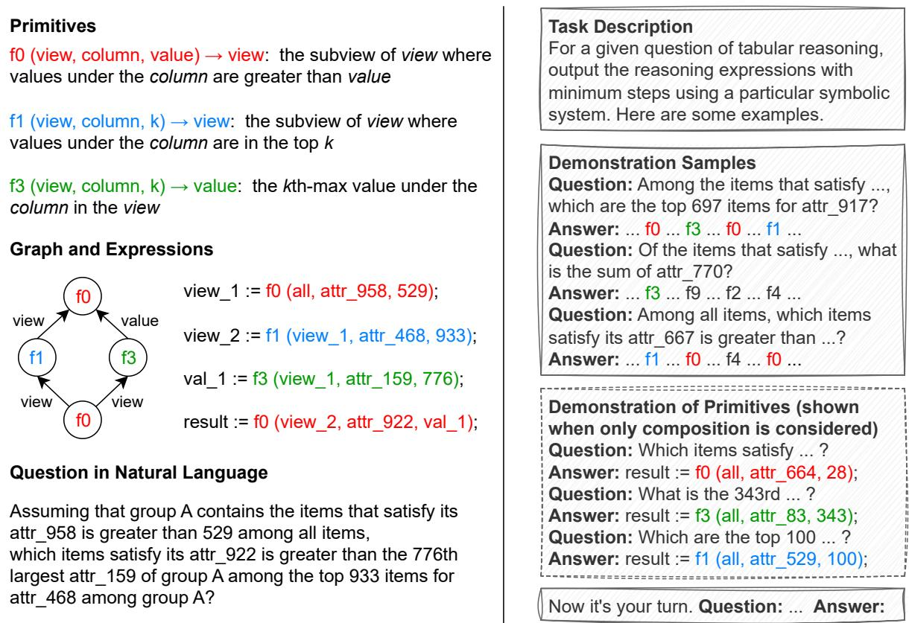
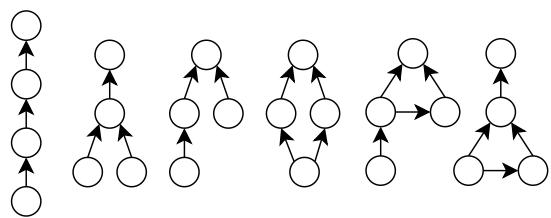
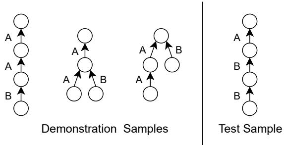
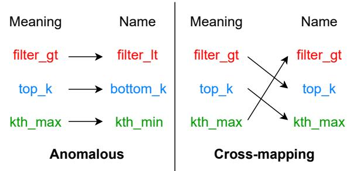

# Investigating the (De)Composition Capabilities of Large Language Models in Natural-to-Formal Language Conversion

Ziyao Xu, Houfeng Wang

National Key Laboratory for Multimedia Information Processing, School of Computer Science, Peking University {xzyxzy,wanghf}@pku.edu.cn

## Abstract

To achieve generalized and robust natural-toformal language conversion (N2F), large language models (LLMs) need to have strong capabilities of decomposition and composition in N2F when faced with an unfamiliar formal language and be able to cope with compositional gaps and counter-intuitive symbolic names. To investigate whether LLMs have this set of basic capabilities in N2F, we propose the DEDC framework. This framework semiautomatically performs sample and task construction, allowing decoupled evaluation of the set of decomposition and composition capabilities of LLMs in N2F. Based on this framework, we evaluate and analyze the most advanced LLMs, and the main findings include that: (1) the LLMs are deficient in both decomposition and composition; (2) the LLMs show a wide coverage of error types that can be attributed to deficiencies in natural language understanding and the learning and use of symbolic systems; (3) compositional gaps and counter-intuitive symbolic names both affect the decomposition and composition of the LLMs. Our work provides a new perspective for investigating the basic capabilities of decomposition and composition of LLMs in N2F. The detailed analysis of deficiencies and attributions can help subsequent improvements of LLMs. The dataset and code are available at https://github.com/xzy-xzy/DEDC.

## 1 Introduction

A formal language (Salomaa, 1987) is a symbolic system formed by a set of symbolic primitives that can be combined into expressions to convey specific meanings according to certain rules. Common formal languages include formal logic (Prior, 1963), structured query language (Chamberlin and Boyce, 1974), formal syntax (Sag et al., 1999), etc. Formal languages are often used to more accurately convey the meaning embedded in natural language texts, resulting in many natural-to-formal language conversion (N2F) tasks in the field of natural language processing, such as syntactic-semantic parsing (Zhang, 2020), structured query language generation (Katsogiannis-Meimarakis and Koutrika, 2023), logical expression generation for symbolic reasoning (Xu et al., 2024), etc.

Due to the wide coverage of the training corpus, large language models (LLMs) have developed, to some extent, the capability of N2F on a variety of common formal languages (Liu et al., 2024). However, it is an under-explored question whether LLMs have developed basic capabilities to cope with arbitrary new formal languages for N2F. When confronted with an unfamiliar formal language, the capabilities of decomposition and composition is necessary to accomplish N2F: after seeing some samples containing expressions in formal language and their corresponding meanings in natural language, LLMs need to be able to decompose the meanings of symbolic primitives from the samples (decomposition) and combine the symbolic primitives into new expressions with specific meanings (composition). In addition, to achieve generalized and robust N2F, LLMs need to have the capability to cope with the following situations during decomposition and composition: (1) there are compositional gaps between the expressions to be combined and the expressions seen, and (2) there are names of symbolic primitives that would not normally correspond to the actual meanings of the symbolic primitives (counter-intuitive).

Investigating whether LLMs have this set of capabilities is important from both practical and cognitive perspectives (Hupkes et al., 2022). From a practical perspective, this set of capabilities is necessary for LLMs to accomplish N2F under incontext learning (Dong et al., 2024), especially when confronted with uncommon formal languages and complex situations. From a cognitive perspective, the intelligence reflected in this set of capabilities is one of the necessary conditions to confirm that LLMs are truly intelligent (Newell and Simon, 2007) in N2F. Evaluation and analysis are needed to determine whether LLMs have this set of capabilities and to find deficiencies for subsequent improvement. However, there is currently no framework to support such evaluation and analysis.

  
Figure 1: An illustration of the sample and task construction of the DEDC framework. An example of the sample construction is shown on the left. On the right is an illustration of the task construction when the sample on the left is used as the test sample

To solve this problem, we propose the DEDC framework. This framework constructs samples and tasks in a semi-automatic manner, allowing Decoupled Evaluation of LLMs'Decomposition and Composition capabilities in N2F. In addition, this framework allows for easy setting adaptations to evaluate the capabilities of LLMs to cope with compositional gaps and counter-intuitive symbolic names in N2F.

Based on the DEDC framework, we conduct a comprehensive evaluation and analysis of the above-mentioned decomposition and composition capabilities of existing LLMs. We also conduct a detailed analysis of the specific error behaviors of the LLMs in N2F to provide more insights into the attributions of errors.

## 2 DEDC Framework

## 2.1 Sample Construction

Figure 1 shows an example of sample construction on the left.

Formal language. We consider a formal language with 10 primitives in the context of tabular reasoning (Chen et al., 2020a,b) as the case for investigation, where the primitives are functions and the expressions are assignment statements using a single function. By combining multiple expressions, the output of one function can be used as one of the input arguments to other functions, thus expressing complex tabular reasoning processes. See Appendix A.1 for details of the primitives.

Graph and expressions. The compositional structure of expressions can be represented as a directed acyclic graph (Keysers et al., 2020), where the nodes are functions and the directed edges indicate that the output of one function is used as an input parameter to another function. We first identify 6 types of base graphs that contain 4 nodes (shown in Figure 2) and then enumerate all the schemes that identify a function for each node, yielding a total of 323 valid schemes. For each valid scheme, we randomly generate structure-independent parameters to obtain multi-step expressions corresponding to the scheme. See Appendix A.2 for details of scheme enumeration.

  
Figure 2: Six types of base graphs we identify for the sample construction of the STD framework.

Question in natural language. All valid schemes correspond to 18 types of graphs with output types on the edges. For each type of graph, we manually designed question generation templates to generate the corresponding natural language questions from the expressions. See Appendix A.3 for details of question generation. See Appendix B.1 for a discussion of grammatical divergence in question generation.

With the above construction process, we obtain 323 samples of (graph, expressions, question).

## 2.2 Task Construction

We use each sample as a test sample for task construction. The right side of Figure 1 shows an example of task construction when the sample on the left is used as a test sample.

For each test sample, the task of LLMs is to transform the input question into the corresponding expressions after seeing three demonstration samples. The demonstration samples are randomly selected from samples other than the test samples and satisfy the following conditions:

• Each demonstration sample contains at least one primitive in the test sample.

• The set of all primitives in the three demonstration samples covers the set of primitives in the test sample.

Demonstration samples are enough for LLMs to learn desired primitives and basic rules of composition. To accomplish this task, LLMs need both decomposition and composition capabilities: they need to decompose the meaning and format of the primitives from the demonstration samples (decomposition), and then combine the primitives according to the question to obtain expressions with the corresponding meaning (composition). We denote the performance of a LLM on the task as $P _ { d c }$

## 2.3 Metric

We use accuracy $( \% )$ as the performance metric. A directed acyclic graph may have multiple topological orders and thus correspond to multiple correct orders of expressions. When determining whether an answer is correct, we traverse the expressions in order and perform variable substitution to obtain a final single expression and determine whether it agrees with the standard answer. This approach avoids the influence of multiple topological orders and the arbitrariness of intermediate variable names on the determination. In addition, if the expression contains primitives with swappable arguments, we check the final expression before and after the argument swapping, and consider it correct if one of them agrees with the standard answer. See Appendix A.4 for details of answer checking.

## 2.4 Decoupling

To decouple the effects of decomposition and composition capabilities of the LLM on this task, we also measure the performance of the LLM on the task when it can see the demonstration of primitives (shown in Figure 1), which provides a corresponding simplest sample for each primitive in the test sample. In this case, the LLM can directly obtain the meaning and format of the desired primitives without decomposition capabilities, and only needs composition capabilities to accomplish the task. We denote the performance of the LLM in this case as $P _ { c }$ . After measuring $P _ { d c }$ and $P _ { c }$ separately, we can estimate the effects of decomposition and composition capabilities of the LLM on task performance based on $P _ { d c }$ and $P _ { c }$ ••

• We use $D _ { c } = 1 0 0 \textrm { - } P _ { c }$ to estimate the effect of composition capability. $D _ { c }$ indicates the error rate of the LLM when only composition is needed. A larger $D _ { c }$ indicates a larger defect in the composition capacity of the LLM.

• We use $D _ { d } = P _ { c } - P _ { d c }$ to estimate the effect of decomposition capability. $D _ { d }$ indicates the additional error rate of the LLM due to the need for decomposition. A larger $D _ { d }$ indicates a larger defect in the decomposition capacity of the LLM.

In this way, the effects of decomposition and composition capabilities of the LLM are decoupled and comparable.

## 3 Base Evaluation

In this section, based on the DEDC framework, we perform a base evaluation (i.e., no additional settings) of the LLMs and analyze the results.

## 3.1 Models

We select a series of the most advanced LLMs for evaluation, including the closed-source LLMs GPT-4o-20240806 (OpenAI et al., 2024), Claude-3.5- sonnet-20240620 (Anthropic, 2024), and the opensource LLMs DeepSeek-2.5 (DeepSeek-AI et al., 2024), Mistral-large-2407 (Jiang et al., 2024a), and Llama-3.1-405B (Dubey et al., 2024). To get the deterministic output, we set the temperature parameter to 0.

## 3.2 Results

Table 1 shows the results of the base evaluation. From the results we find that:

(1) The LLMs are relatively good at composition but still have deficiencies. All LLMs except DeepSeek-2.5 have $\begin{array} { r } { D _ { c } < 1 0 , \mathrm { i . e . } } \end{array}$ , the error rate is less than 10% when only composition is required, reflecting a relatively strong composition capability. However, no LLMs can achieve perfect performance with zero error rate, and most LLMs show a wide coverage of error types (we will discuss this in detail in 3.3), indicating that there are still deficiencies in composition.

(2) The LLMs have significant deficiencies in decomposition, which are more severe than in composition. All LLMs except Claude-3.5 have $D _ { d } > 1 0$ i.e., the additional error rate due to need decomposition exceeds 10%. Even for Claude-3.5, the additional error rate reaches 7.74%. This indicates that the LLMs have severe deficiencies in decomposition. All LLMs have $D _ { d } > D _ { c } ,$ suggesting that the deficiencies in decomposition are more severe than in composition.

(3) Closed-source LLMs in general have greater decomposition and composition capabilities than open-source LLMs. The closed-source model outperforms the open-source model in all comparisons except that Mistral-large has a slightly lower $D _ { c }$ than GPT-4o. The closed-source model Claude-3.5 shows the strongest decomposition and composition capabilities.

(4) Except for Mistral-large, the $D _ { d }$ ranking of the LLMs is consistent with the $D _ { c }$ ranking, showing a correlation between decomposition and composition capabilities to some extent. As an exception, Mistral-large shows relatively strong composition capability but weak decomposition capability.

<table><tr><td></td><td> $P _ { d c }$ </td><td> $P _ { c }$ </td><td> $D _ { c }$ </td><td> $D _ { d }$ </td></tr><tr><td>GPT-40</td><td>81.42</td><td>94.74</td><td>5.26</td><td>13.31</td></tr><tr><td>Claude-3.5</td><td>91.02</td><td>98.76</td><td>1.24</td><td>7.74</td></tr><tr><td>DeepSeek-2.5</td><td>68.73</td><td>86.69</td><td>13.31</td><td>17.96</td></tr><tr><td>Mistral-large</td><td>76.78</td><td>95.98</td><td>4.02</td><td>19.20</td></tr><tr><td>Llama-3.1</td><td>74.92</td><td>90.71</td><td>9.29</td><td>15.79</td></tr></table>

Table 1: Results of the base evaluation of the LLMs.

## 3.3 Error Analysis

We check the specific error behaviors of the LLMs and summarize the following six error types (see Table 2 for examples):

Primitive confusion. The LLMs use the correct input parameters but the incorrect primitive name in an expression.

Primitive fiction. The LLMs fictionalize a nonexistent primitive and apply the name of an existing primitive to it. The fictionalized primitive combines the meanings of several existing primitives or has an independent new meaning.

Variable misuse. The LLMs use non-existent or incorrect intermediate variable names, resulting in invalid or useless expressions.

Redundancy. The LLMs use redundant expressions which result in an output that is incorrect or does not have minimum steps.

Omission. The LLMs ignore a certain part of the natural language question, resulting in the missing of necessary expressions.

Incorrect meaning. The meaning of the expressions output by the LLMs is not consistent with the meaning of the natural language question. From the perspective of graphs, there is an inconsistency between the graph corresponding to the output and the graph of the sample, such as incorrect antecedents for some nodes or confusing ordering of nodes.

Of the six error types, Incorrect meaning and Omission can be completely attributed to conversion errors caused by the LLMs' misunderstanding of the meaning of natural language questions. In error types Primitive confusion and Primitive fiction, the LLMs do not incorrectly understand the meaning that needs to be expressed, but make errors in the use of formal language, which can be completely attributed to deficiencies in the capability to learn and use the symbolic system. Error types Variable misuse and Redundancy contain instances where both attributions mentioned above make sense. The error types suggest that both the capability of natural language understanding and the capability of learning and using symbolic systems should be considered in N2F.

<table><tr><td rowspan=1 colspan=1>Type</td><td rowspan=1 colspan=1>Sample 1</td><td rowspan=1 colspan=1>Sample 2</td></tr><tr><td rowspan=1 colspan=1>Primitiveconfusion</td><td rowspan=1 colspan=1>Ans: view_1 := f0 (all, attr_641, 684);Err: view_1 := f2 (all, attr_641, 684);Note: f0 and f2 have different input for-mats but the same output type</td><td rowspan=1 colspan=1>Ans: value_2 := f3 (view_2, attr_611, 25);Err: row_1 := f6 (view_2, attr_611, 25);Note: f3 and f6 have different output typesbut the same input format</td></tr><tr><td rowspan=1 colspan=1>Primitivefiction</td><td rowspan=1 colspan=1>Ans: view_1 := f0 (all, attr_814, 380);value_1 := f3 (view_1, attr_175, 342);Err: value_1 := f3 (all, attr_814, 380,attr_175, 342);Note: Compositional meaning</td><td rowspan=1 colspan=1>Ans: view_2 := f2 (view_1, attr_346,attr_486);Err: view_2 := f2 (all, attr_346, attr_486);view_3 := f6 (view_1, view_2);Note: Independent new meaning</td></tr><tr><td rowspan=1 colspan=1>Variablemisuse</td><td rowspan=1 colspan=1>Ans: value_1:= f5 (all); view_1 := f0 (all,attr_7, value_1);Err: view_1 := f5 (all); view_2 := f0 (all,attr_7, value_1);Note: Non-existent variable name makesthe second expression invalid</td><td rowspan=1 colspan=1>Ans: view_3 := f1 (view_2, attr_267, 65);result := f2 (view_3, attr_941, attr_825);Err: view_3 := f1 (view_2, attr_267, 65);result := f2 (view_2, attr_941, attr_825);Note: Incorrect variable name makes thefirst expression useless</td></tr><tr><td rowspan=1 colspan=1>Redundan-cy</td><td rowspan=1 colspan=1>Ans: value_2 := f3 (view_2, attr_81, 362);Err: row_1 := f6 (view_2, attr_81, 362);value_2 := f7 (row_1, attr_81);Note: Equivalent but redundant</td><td rowspan=1 colspan=1>Ans: ... view_1 := f2 (all, attr_892, col_1);Err: view_1 := f2 (all, attr_892, attr_87);... view_2 := f2 (view_1, attr_892, col_1);Note: Incorrect redundant steps</td></tr><tr><td rowspan=1 colspan=1>Omission</td><td rowspan=1 colspan=1>Ans: view_1 := f2 (all, attr_675, attr_210);value_1 := f4 (view_1, attr_690);Err: value_1 := f4 (all, attr_690);Note: Omission of scope</td><td rowspan=1 colspan=1>Ans: col_1 := f9 (attr_221, value_1);view_1 := f2 (all, attr_27, col_1);Err: view_1 := f2 (all, attr_27, value_1);Note: Omission of operation</td></tr><tr><td rowspan=1 colspan=1>Incorrectmeaning</td><td rowspan=1 colspan=1>Ans: view_1 := ...; view_2 := ...; value_1:= f4 (view_1, attr_716); view_3 := f0(view_2, attr_319, value_1);Err: view_1 := ...; view_2 := ...; value_1:= f4 (view_2, attr_716); view_3 := f0 (all,attr_319, value_1);Note: Incorrect antecedents</td><td rowspan=1 colspan=1>Ans: view_1 := f1 (all, attr 511, 512);value_1 := f3 (view_1, attr_651, 345);view_2 := f0 (all, attr_896, value_1);Err: value_1 := f3 (all, attr_651, 345);view_1 := f0 (all, attr_896, value_1);view_2 := f1 (view_1, attr_511, 512);Note: Confusing ordering</td></tr></table>

Table 2: Six types of errors that occur in LLMs in the base evaluation and corresponding examples. Ans refers to the standard answer, and Err refers to the LLM output with errors (only part of the expressions are shown). We mark the main differences between the standard answer and the LLM output in blue and red.

For each of the LLMs, we count the number of occurrences of each error type, and the results are shown in Table 3. From the results we find that:

(1) The LLMs show a wide coverage of error types. When only composition is required, the LLMs already show a wide coverage of error types even at relatively low error rates: except for Claude-3.5, which shows only 2 error types, all the other LLMs show 5 ～ 6 error types. When decomposition is required, the LLMs show more error types or more instances under some error types. The wide coverage of error types suggests that the LLMs have many pending deficiencies in both composition and decomposition in N2F.

(2) The most common error type for the LLMs is Primitive confusion. Even without the need to decompose the meaning and format of the primitives, Primitive confusion is the most frequent error type for each of the LLMs. When decomposition is required, the number of error instances of Primitive confusion also grows the most. This suggests that the deficiencies of the LLMs in learning and using the symbol system in N2F are severe.

(3) Different LLMs have different characteristics in the distribution of error types. Except for Primitive confusion, common error types vary across the LLMs. Some of the LLMs do not show certain error types, e.g., Claude-3.5 does not show error types Incorrect meaning and Redundancy. The characteristics in the distribution of error types can help subsequent analysis and targeted improvements of the LLMs in N2F.

<table><tr><td>Error in  $P _ { c }$ </td><td>Pc</td><td>Pf</td><td>Vm</td><td>R</td><td>0</td><td>Im</td></tr><tr><td>GPT-40 Claude-3.5</td><td>8</td><td>3</td><td>1</td><td>1</td><td>1</td><td>3</td></tr><tr><td></td><td>2</td><td></td><td>2</td><td></td><td></td><td></td></tr><tr><td>DeepSeek-2.5</td><td>30</td><td>2</td><td>–</td><td>4</td><td>1</td><td>6</td></tr><tr><td>Mistral-large</td><td>7</td><td>2</td><td>1</td><td>1</td><td></td><td>2</td></tr><tr><td>Llama-3.1</td><td>14</td><td>1</td><td>7</td><td>1</td><td>–</td><td>7</td></tr><tr><td colspan="9"></td></tr><tr><td>Error in  $P _ { d c }$  GPT-40</td><td>Pc</td><td>Pf</td><td>Vm</td><td>R</td><td>0</td><td>Im</td></tr><tr><td rowspan="3">Claude-3.5 DeepSeek-2.5</td><td>41</td><td>5</td><td>5</td><td>3</td><td>2</td><td>4</td></tr><tr><td>24</td><td>1</td><td>3</td><td></td><td>1</td><td></td></tr><tr><td>71</td><td>9</td><td>一</td><td>6</td><td>3</td><td>12</td></tr><tr><td>Mistral-large</td><td>66</td><td>4</td><td>1</td><td>1</td><td>1</td><td>4</td></tr><tr><td>Llama-3.1</td><td>52</td><td>6</td><td>7</td><td>7</td><td>–</td><td>9</td></tr></table>

Table 3: The number of occurrences of each error type for the LLMs when only composition is required (above) and when both decomposition and composition are required (below). - indicates that the corresponding error type does not occur.

## 4 Evaluations with Additional Settings

In the DEDC framework, additional settings can be added to evaluate the capability of LLMs to cope with a variety of situations and estimate the effects of the additional settings on the decomposition and composition of the LLMs. Assuming that the performance of a LLM on the task with and without demonstration of primitives under setting s is $P _ { c } ^ { s }$ and $P _ { d c } ^ { s }$ respectively, we estimate the effect of the setting by comparing the performance with that of the base evaluation:

• We use $\triangle _ { c } ^ { s } = P _ { c } ^ { s } - P _ { c }$ to estimate the effect of setting s on composition of the LLM. $\triangle _ { c } ^ { s }$ indicates the change in the performance of the LLM caused by setting s when only composition is needed.

• We use $\bigtriangleup _ { d } ^ { s } = ( P _ { d c } ^ { s } - P _ { d c } ) - \bigtriangleup _ { c } ^ { s }$ to estimate the effect of setting s on decomposition of the LLM. $\triangle _ { d } ^ { s }$ indicates the additional performance change of the LLM caused by setting s due to the need for decomposition.

Under this definition, $\bigtriangleup _ { c } ^ { s } > 0$ means that the setting makes composition of the LLM easier, $\triangle _ { c } ^ { s } < 0$ means that the setting makes composition of the

  
Figure 3: An illustration of the compositional gap between the test sample and its demonstration samples. A and B indicate the different output types on the edges.

LLM more difficult, and $| \triangle _ { c } ^ { s } |$ indicates the magnitude of the effect. The meaning of $\triangle _ { d } ^ { s }$ in decomposition of the LLM is similar.

In this section, we consider settings related to compositional gaps and counter-intuitive symbolic names.

## 4.1 Compositional Gap

## 4.1.1 Settings

Compositional generalization is a common type of generalization in language-related tasks is considered to be one of the key linguistic manifestations of human intelligence (Kim and Linzen, 2020; Hupkes et al., 2020; Kim and Linzen, 2020; Xu and Wang, 2024). After learning some samples, humans can cope with test samples formed by recombining elements in the learned samples, even if they have not seen the compositional form of the test samples during learning (i.e., there are compositional gaps between the test samples and the learned samples). In N2F, the relatively limited primitive space of formal languages makes more situations that require compositional generalization. To achieve generalized N2F, LLMs need to have the capability to handle compositional gaps.

In the DEDC framework, we regard the primitives as elements and consider the capability of LLMs to cope with the compositional gaps between the demonstration samples and the test samples. The compositional form of primitives is determined by the graphs with output types on the edges in the sample, so we define that a test sample has a compositional gap with its demonstration samples if and only if any graph with output types on the edges in the demonstration samples is different from that in the test sample (shown in Figure 3).

In the base evaluation, 70% of the test samples have compositional gaps with their demonstration samples. We consider the following two settings

<table><tr><td>0% gap GPT-40</td><td> $P _ { d c } ^ { s }$  86.69</td><td> $P _ { c } ^ { s }$ </td><td> $\triangle _ { c } ^ { s }$ </td><td> $\triangle _ { d } ^ { s }$ </td></tr><tr><td>Claude-3.5 DeepSeek-2.5 Mistral-large Llama-3.1</td><td>94.43 76.16 83.28 83.59</td><td>96.59 99.38 93.19 98.45 94.74</td><td>+1.86 +0.62 +6.50 +2.48</td><td>+3.41 +2.79 +0.93 +4.02</td></tr><tr><td></td><td></td><td></td><td>+4.02</td><td>+4.64</td></tr><tr><td>100% gap</td><td> $P _ { d c } ^ { s }$ </td><td> $P _ { c } ^ { s }$ </td><td>△c</td><td> $\triangle _ { d } ^ { s }$ </td></tr><tr><td>GPT-40 Claude-3.5</td><td>79.26 89.78</td><td>93.19 98.14</td><td>-1.55 -0.62</td><td>-0.62 -0.62</td></tr><tr><td>DeepSeek-2.5 Mistral-large Llama-3.1</td><td>63.47 76.47 71.83</td><td>84.52 95.98 87.62</td><td>-2.17 0 -3.10</td><td>-3.10 -0.31 0</td></tr></table>

Table 4: Results of the evaluation under the setting of 0% compositional gap (above) and 100% compositional gap (below).

for compositional gaps:

• 0% gap. Any test sample does not have a compositional gap with its demonstration samples.

• 100% gap. Each test sample has a compositional gap with its demonstration samples.

We achieve the settings by changing the demonstration samples for samples that do not satisfy the requirements in the base evaluation.

## 4.1.2 Results and Analysis

Table 4 shows the results of the evaluation under the two settings for compositional gaps. All the LLMs show $\triangle _ { c } ^ { s } > 0 , \triangle _ { d } ^ { s } > 0$ under the setting of 0% gap and $\triangle _ { c } ^ { s } \leq 0 , \triangle _ { d } ^ { s } \leq 0$ under the setting of 100% gap. This indicates that the composition and decomposition performance of the LLMs decreases as the proportion of samples with compositional gaps increases, i.e., compositional gap makes the composition and decomposition of the LLMs more difficult.

Additional errors due to compositional gaps encompass all six types described in 3.3, suggesting that the effect of compositional gaps on the LLMs is relevant to both natural language understanding and the learning and use of symbolic systems. The effect of compositional gaps on composition can be attributed to the difficulties of the LLMs in dealing with compositional forms that have not been seen before; the effect on decomposition suggests that the decomposition of the LLMs is not independent of the test samples and can be disturbed by compositional gaps between the test samples and the demonstration samples.

## 4.2 Counter-intuitive Symbolic Name

## 4.2.1 Settings

The nature of the symbolic system depends on the meanings of the symbolic primitives and does not change as the names of the symbolic primitives change. Achieving robust N2F requires that LLMs have an invariance: for a set of symbolic primitives with established meanings, there is no significant difference in their performance under different symbolic names. This invariance essentially requires that LLMs be able to think based on symbolic meanings independently of symbolic names, and simply use the names in their expressions.

In the DEDC framework, the primitives can be named arbitrarily. To investigate whether LLMs have such invariance in N2F, we evaluate the performance of LLMs under the setting of counterintuitive symbolic names, which refers to names of symbolic primitives that would not normally correspond to the actual meanings of the primitives. If a LLM can think independently of symbolic names and use symbolic names correctly in its expression, then counter-intuitive symbolic names should not affect its performance in N2F. We consider the following two types of settings for counter-intuitive symbolic names (see Figure 4 for examples):

• Anomalous. For each primitive, use the name of another primitive that has the same form as the primitive but a completely different meaning. For example, use bottom\_k as the name of a primitive with the meaning top\_k.

• Cross-mapping. For each primitive, use the name that normally corresponds to the meaning of another primitive in the framework. For example, use kth\_max as the name of a primitive with the meaning top\_k.

We achieve the settings by simply replacing the names of the primitives in the base evaluation.

## 4.2.2 Results and Analysis

Table 5 shows the results of the evaluation under the two types of settings for counter-intuitive symbolic names. All the LLMs show $\triangle _ { c } ^ { s } < 0 , \triangle _ { d } ^ { s } < 0$ under the two types of settings, suggesting that both types of counter-intuitive symbolic names, Anomalous and Cross-mapping, make the composition and decomposition of the LLMs more difficult. The effect of counter-intuitive symbolic names is more severe compared to compositional gaps, especially on decomposition, as all the LLMs show $| \triangle _ { d } ^ { s } | ~ > ~ 2 0 ~$ which indicates that the settings increase the additional error rate due to the need for decomposition by more than 20%. On composition, there are significant differences between the effects of different types of settings on different LLMs, e.g., Llama-3.1 is almost unaffected by the Anomalous setting, but Mistral-large is severely affected; all LLMs except Mistral-large are more affected by the Cross-mapping setting than the Anomalous setting.

  
Figure 4: An illustration of the two types of settings for counter-intuitive symbolic names. The arrow indicates that a primitive with the meaning on the left end uses the name on the right end.

The additional error due to counter-intuitive symbolic names centers on the misuse of symbolic names: the LLMs use intuitive symbolic names (e.g., the Meaning column of Figure 4) instead of the symbolic names indicated in the demonstration samples (e.g., the Name column of Figure 4). This concentrated type of error suggests that counter-intuitive symbolic names primarily influence the LLMs’ use of symbolic names in expressions rather than their thought processes. We hypothesize that under the paradigm of generating the next token based on maximum probability, the LLMs cannot well handle the conflict between intuitive symbolic names and contextual guidance, leading to the incorrect use of symbolic names in expressions. When only composition is required, the demonstration of primitives mitigates this conflict but does not eliminate it; when decomposition is additionally required, the absence of demonstration of primitives makes the conflict more severe. Intuitive symbolic names may appear in the demonstration samples under the Cross-mapping setting but not in the Anomalous setting, so the Crossmapping setting usually leads to more severe conflicts; however, LLMs that are inherently familiar with intuitive symbolic names may suffer more severe conflicts under the Anomalous setting.

<table><tr><td rowspan=1 colspan=1>Anomalous</td><td rowspan=1 colspan=1>Pdc    Pc    △c    △d</td></tr><tr><td rowspan=1 colspan=1>GPT-40</td><td rowspan=1 colspan=1>52.94  87.00  -7.74  -20.74</td></tr><tr><td rowspan=2 colspan=1>Claude-3.5DeepSeek-2.5</td><td rowspan=3 colspan=1>57.28 95.36  -3.41  -30.3441.80 80.50  -6.19  -20.7413.93  68.11  -27.86 -34.9845.82 90.09  -0.62  -28.48</td></tr><tr><td rowspan=1 colspan=1>41.8</td></tr><tr><td rowspan=1 colspan=1>Mistral-largeLlama-3.1</td></tr><tr><td rowspan=1 colspan=2></td></tr><tr><td rowspan=1 colspan=1>Cross</td><td rowspan=1 colspan=1>Ps     P8      △S     △sdcCcd</td></tr><tr><td rowspan=1 colspan=1>GPT-40</td><td rowspan=1 colspan=1>44.27  84.52  -10.22  -26.93</td></tr><tr><td rowspan=1 colspan=1>Claude-3.5</td><td rowspan=1 colspan=1>53.56 92.57  -6.19  -31.27</td></tr><tr><td rowspan=2 colspan=1>DeepSeek-2.5Mistral-largeLlama-3.1</td><td rowspan=1 colspan=1>33.13 72.45  -14.24 -21.3626.63  73.99 -21.98  -28.17</td></tr><tr><td rowspan=1 colspan=1>35.29 75.54 -15.17  -24.46</td></tr></table>

Table 5: Results of the evaluation under the setting of Anomalous (above) and Cross-mapping (below) for counter-intuitive symbolic names.

## 5 Related Work

(De)Composition. Research on composition emerges before the era of LLMs (Lake and Baroni, 2018; Hupkes et al., 2020), focusing on compositional gaps between training and test sets (Kim and Linzen, 2020; Keysers et al., 2020). In the era of LLMs, some work investigates composition under in-context learning by sampling from prepartitioned datasets with compositional gaps (Levy et al., 2023; An et al., 2023). One notion of decomposition in the research is the decomposition of the steps of task execution (Song et al., 2019). Another notion of decomposition concerns the decomposition of specific contents, and related work involves the decomposition of large-scale data and complex problems for reasoning (Ye et al., 2023) and planning (Wu et al., 2024), and grammar-related decomposition tasks such as morphological analysis (Moisio et al., 2024). In this work, we try to investigate the decomposition and composition of primitives in N2F and avoid pre-partitioning in evaluation.

N2F. Related work under the N2F topic covers a wide range of formal language types, such as syntax for linguistic analysis (Dozat and Manning, 2017; Shi et al., 2024a), machine-executable languages (Shaw et al., 2021; Ma et al., 2024), etc. The language-specific N2F capabilities of LLMs can often be obtained from a targeted training corpus (Jiang et al., 2024b; Shi et al., 2024b). Our work provides a new perspective that investigates whether LLMs possess the basic capabilities of decomposition and composition in N2F.

## 6 Conclusion

In this work, we propose the DEDC framework. This framework performs sample and task construction semi-automatically, allowing decoupled evaluation of the decomposition and composition capabilities of LLMs in N2F. In addition, this framework allows for the evaluation of the capability of LLMs to cope with compositional gaps and counterintuitive symbolic names. Based on this framework, we evaluate and analyze the most advanced LLMs. From the results we find that: (1) the LLMs are deficient in both decomposition and composition, and the deficiencies are more severe in decomposition; (2) the LLMs show a wide coverage of error types, indicating that the deficiencies are relevant to both natural language understanding and the learning and use of symbolic systems; (3) the LLMs do not cope well with compositional gaps and counterintuitive symbolic names, and both decomposition and composition are affected. Our work provides a new perspective for investigating the basic capabilities of decomposition and composition of LLMs in N2F. Our analysis of error types and attributions can help subsequent improvements of LLMs, and the DEDC framework can be used for evaluation and analysis of the improvements.

## Limitations

In this work, we concentrate on the evaluation and detailed analysis of LLMs in a single case of decomposition and composition in N2F. This leads to two limitations. First, the cases covered by our work are not comprehensive enough, mainly in terms of the types of formal languages we investigate. Second, our work does not provide specific methods for improving the decomposition and composition capabilities of LLMs. Nevertheless, we believe that our investigative work provides a new perspective on the decomposition and composition capabilities of LLMs in N2F and some meaningful findings. The DEDC framework can be generalized to some extent to a wider range of cases (see Appendix B.2 for a discussion), and the evaluation results and analysis can help subsequent research on improvements. Based on this work, we will try to cover more cases and investigate improvement methods in our future work.

Another limitation of this work is the lack of human-related investigations from a cognitive perspective. See Appendix B.3 for a discussion related to human capabilities.

## Ethics Statement

We comply with the license to use LLMs for scientific research purposes only. The datasets we construct will also be open source for scientific research purposes. The datasets we use and construct do not contain any information that names or uniquely identifies individual people or offensive content.

The AI assistant we use in our work is Copilot (for simple code completion).

## Acknowledgements

This work was supported by National Science and Technology Major Project (No. 2022ZD0116308) and the Academic Research Projects of Beijing Union University (No. ZK10202405). The corresponding author is Houfeng Wang.

## References

Shengnan An, Zeqi Lin, Qiang Fu, Bei Chen, Nanning Zheng, Jian-Guang Lou, and Dongmei Zhang. 2023. How do in-context examples affect compositional generalization? In Proceedings of the 61st Annual Meeting of the Association for Computational Linguistics (Volume 1: Long Papers), pages 11027– 11052, Toronto, Canada. Association for Computational Linguistics.

Anthropic. 2024. Claude 3.5 sonnet.

Donald D. Chamberlin and Raymond F. Boyce. 1974. SEQUEL: A structured english query language. In Proceedings of 1974 ACM-SIGMOD Workshop on Data Description, Access and Control, Ann Arbor Michigan, USA, May 1-3, 1974, 2 Volumes, pages 249–264. ACM.

Wenhu Chen, Hongmin Wang, Jianshu Chen, Yunkai Zhang, Hong Wang, Shiyang Li, Xiyou Zhou, and William Yang Wang. 2020a. Tabfact: A large-scale dataset for table-based fact verification. In 8th International Conference on Learning Representations, ICLR 2020, Addis Ababa, Ethiopia, April 26-30, 2020. OpenReview.net.

Zhiyu Chen, Wenhu Chen, Hanwen Zha, Xiyou Zhou, Yunkai Zhang, Sairam Sundaresan, and William Yang Wang. 2020b. Logic2Text: High-fidelity natural language generation from logical forms. In Findings of the Association for Computational Linguistics: EMNLP 2020, pages 2096–2111, Online. Association for Computational Linguistics.

DeepSeek-AI, :, Xiao Bi, Deli Chen, Guanting Chen, Shanhuang Chen, Damai Dai, Chengqi Deng, Honghui Ding, Kai Dong, Qiushi Du, Zhe Fu, Huazuo Gao, Kaige Gao, Wenjun Gao, Ruiqi Ge, Kang Guan, Daya Guo, Jianzhong Guo, Guangbo

Hao, Zhewen Hao, Ying He, Wenjie Hu, Panpan Huang, Erhang Li, Guowei Li, Jiashi Li, Yao Li, Y. K. Li, Wenfeng Liang, Fangyun Lin, A. X. Liu, Bo Liu, Wen Liu, Xiaodong Liu, Xin Liu, Yiyuan Liu, Haoyu Lu, Shanghao Lu, Fuli Luo, Shirong Ma, Xiaotao Nie, Tian Pei, Yishi Piao, Junjie Qiu, Hui Qu, Tongzheng Ren, Zehui Ren, Chong Ruan, Zhangli Sha, Zhihong Shao, Junxiao Song, Xuecheng Su, Jingxiang Sun, Yaofeng Sun, Minghui Tang, Bingxuan Wang, Peiyi Wang, Shiyu Wang, Yaohui Wang, Yongji Wang, Tong Wu, Y. Wu, Xin Xie, Zhenda Xie, Ziwei Xie, Yiliang Xiong, Hanwei Xu, R. X. Xu, Yanhong Xu, Dejian Yang, Yuxiang You, Shuiping Yu, Xingkai Yu, B. Zhang, Haowei Zhang, Lecong Zhang, Liyue Zhang, Mingchuan Zhang, Minghua Zhang, Wentao Zhang, Yichao Zhang, Chenggang Zhao, Yao Zhao, Shangyan Zhou, Shunfeng Zhou, Qihao Zhu, and Yuheng Zou. 2024. Deepseek llm: Scaling open-source language models with longtermism. Preprint, arXiv:2401.02954.

Qingxiu Dong, Lei Li, Damai Dai, Ce Zheng, Jingyuan Ma, Rui Li, Heming Xia, Jingjing Xu, Zhiyong Wu, Tianyu Liu, Baobao Chang, Xu Sun, Lei Li, and Zhifang Sui. 2024. A survey on in-context learning. Preprint, arXiv:2301.00234.

Timothy Dozat and Christopher D. Manning. 2017. Deep biaffine attention for neural dependency parsing. In 5th International Conference on Learning Representations, ICLR 2017, Toulon, France, April 24-26, 2017, Conference Track Proceedings. Open-Review.net.

Abhimanyu Dubey, Abhinav Jauhri, Abhinav Pandey, Abhishek Kadian, Ahmad Al-Dahle, Aiesha Letman, Akhil Mathur, Alan Schelten, Amy Yang, Angela Fan, Anirudh Goyal, Anthony Hartshorn, Aobo Yang, Archi Mitra, Archie Sravankumar, Artem Korenev, Arthur Hinsvark, Arun Rao, Aston Zhang, Aurelien Rodriguez, Austen Gregerson, Ava Spataru, Baptiste Roziere, Bethany Biron, Binh Tang, Bobbie Chern, Charlotte Caucheteux, Chaya Nayak, Chloe Bi, Chris Marra, Chris McConnell, Christian Keller, Christophe Touret, Chunyang Wu, Corinne Wong, Cristian Canton Ferrer, Cyrus Nikolaidis, Damien Allonsius, Daniel Song, Danielle Pintz, Danny Livshits, David Esiobu, Dhruv Choudhary, Dhruv Mahajan, Diego Garcia-Olano, Diego Perino, Dieuwke Hupkes, Egor Lakomkin, Ehab AlBadawy, Elina Lobanova, Emily Dinan, Eric Michael Smith, Filip Radenovic, Frank Zhang, Gabriel Synnaeve, Gabrielle Lee, Georgia Lewis Anderson, Graeme Nail, Gregoire Mialon, Guan Pang, Guillem Cucurell, Hailey Nguyen, Hannah Korevaar, Hu Xu, Hugo Touvron, Iliyan Zarov, Imanol Arrieta Ibarra, Isabel Kloumann, Ishan Misra, Ivan Evtimov, Jade Copet, Jaewon Lee, Jan Geffert, Jana Vranes, Jason Park, Jay Mahadeokar Jeet Shah, Jelmer van der Linde, Jennifer Billock, Jenny Hong, Jenya Lee, Jeremy Fu, Jianfeng Chi, Jianyu Huang, Jiawen Liu, Jie Wang, Jiecao Yu, Joanna Bitton, Joe Spisak, Jongsoo Park, Joseph Rocca, Joshua Johnstun, Joshua Saxe, Junteng Jia, Kalyan Vasuden Alwala, Kartikeya Upasani, Kate

Plawiak, Ke Li, Kenneth Heafield. Kevin Stone. Khalid El-Arini, Krithika Iyer, Kshitiz Malik, Kuen ley Chiu, Kunal Bhalla, Lauren Rantala-Yeary, Laurens van der Maaten, Lawrence Chen, Liang Tan, Liz Jenkins, Louis Martin, Lovish Madaan, Lubo Malo Lukas Blecher, Lukas Landzaat, Luke de Oliveira, Madeline Muzzi, Mahesh Pasupuleti, Mannat Singh, Manohar Paluri, Marcin Kardas, Mathew Oldham Mathieu Rita, Maya Pavlova, Melanie Kambadur. Mike Lewis, Min Si, Mitesh Kumar Singh, Mona Hassan, Naman Goval, Naries Torabi, Nikolay Bash lykov, Nikolay Bogovchev, Niladri Chatterji, Olivier Duchenne, Onur Celebi, Patrick Alrassy, Pengchuan Zhang, Pengwei Li, Petar Vasic, Peter Weng, Prajjwal Bhargava, Pratik Dubal, Praveen Krishnan, Punit Singh Koura, Puxin Xu, Qing He, Qingxiao Dong, Ragavan Srinivasan, Raj Ganapathy, Ramon Calderer, Ricardo Silveira Cabral, Robert Stojnic. Roberta Raileanu. Rohit Girdhar. Rohit Patel. Ro main Sauvestre, Ronnie Polidoro, Roshan Sumbaly Ross Taylor, Ruan Silva, Rui Hou, Rui Wang, Saghar Hosseini, Sahana Chennabasappa, Sanjay Singh Sean Bell, Seohyun Sonia Kim, Sergey Edunov Shaoliang Nie, Sharan Narang, Sharath Raparthy, Sheng Shen, Shengve Wan, Shruti Bhosale, Shun Zhang, Simon Vandenhende, Soumya Batra, Spencer Whitman, Sten Sootla, Stephane Collot, Suchin Gururangan, Sydney Borodinsky, Tamar Herman, Tara Fowler, Tarek Sheasha, Thomas Georgiou, Thomas Scialom, Tobias Speckbacher, Todor Mihaylov, Tong Xiao, Ujjwal Karn, Vedanuj Goswami, Vibhor Gupta, Vignesh Ramanathan, Viktor Kerkez, Vincent Gonguet, Virginie Do, Vish Vogeti, Vladan Petrovic, Weiwei Chu, Wenhan Xiong, Wenyin Fu, Whit ney Meers, Xavier Martinet, Xiaodong Wang, Xiaoqing Ellen Tan, Xinfeng Xie, Xuchao Jia, Xuewei Wang, Yaelle Goldschlag, Yashesh Gaur, Yasmine Babaei, Yi Wen, Yiwen Song, Yuchen Zhang, Yue Li, Yuning Mao, Zacharie Delpierre Coudert, Zheng Yan, Zhengxing Chen, Zoe Papakipos, Aaditya Singh, Aaron Grattafiori, Abha Jain, Adam Kelsey, Adam Shajnfeld, Adithya Gangidi, Adolfo Victoria, Ahuva Goldstand, Ajay Menon, Ajay Sharma, Alex Boesenberg, Alex Vaughan, Alexei Baevski, Allie Feinstein. Amanda Kallet, Amit Sangani, Anam Yunus, Andrei Lupu, Andres Alvarado, Andrew Caples, Andrew Gu, Andrew Ho, Andrew Poulton, Andrew Ryan, Ankit Ramchandani, Annie Franco, Aparajita Saraf, Arkabandhu Chowdhury, Ashley Gabriel Ashwin Bharambe, Assaf Eisenman, Azadeh Yazdan, Beau James, Ben Maurer, Benjamin Leonhardi Bernie Huang, Beth Loyd, Beto De Paola, Bhargavi Paranjape, Bing Liu, Bo Wu, Boyu Ni, Braden Hancock, Bram Wasti, Brandon Spence, Brani Stojkovic Brian Gamido, Britt Montalvo, Carl Parker, Carly Burton, Catalina Mejia, Changhan Wang, Changkyu Kim, Chao Zhou, Chester Hu, Ching-Hsiang Chu, Chris Cai, Chris Tindal, Christoph Feichtenhofer, Damon Civin, Dana Beaty, Daniel Kreymer, Daniel Li Danny Wyatt. David Adkins, David Xu, Davide Tes tuggine, Delia David, Devi Parikh, Diana Liskovich, Didem Foss, Dingkang Wang, Duc Le, Dustin Holland, Edward Dowling, Eissa Jamil, Elaine Montgomery, Eleonora Presani, Emily Hahn, Emily Wood,

Erik Brinkman, Esteban Arcaute, Evan Dunbar, Evan Smothers, Fei Sun, Felix Kreuk, Feng Tian, Firat Ozgenel, Francesco Caggioni, Francisco Guzmán. Frank Kanayet, Frank Seide, Gabriela Medina Florez, Gabriella Schwarz, Gada Badeer, Georgia Swee Gil Halpern, Govind Thattai, Grant Herman, Grigory Sizov, Guangyi, Zhang, Guna Lakshminarayanan, Hamid Shojanazeri, Han Zou, Hannah Wang, Han wen Zha, Haroun Habeeb, Harrison Rudolph, Helen Suk, Henry Aspegren, Hunter Goldman, Ibrahim Damlai, Igor Molybog, Igor Tufanoy, Irina-Elena Veliche, Itai Gat, Jake Weissman, James Geboski James Kohli, Japhet Asher, Jean-Baptiste Gaya Jeff Marcus, Jeff Tang, Jennifer Chan, Jenny Zhen Jeremy Reizenstein, Jeremy Teboul, Jessica Zhong Jian Jin, Jingyi Yang, Joe Cummings, Jon Carvill, Jon Shepard, Jonathan McPhie, Jonathan Torres Josh Ginsburg, Junjie Wang, Kai Wu, Kam Hou U, Karan Saxena, Karthik Prasad, Kartikay Khandelwal, Katavoun Zand, Kathy Matosich, Kaushik Veeraraghavan, Kelly Michelena, Kegian Li, Kun Huang, Kunal Chawla, Kushal Lakhotia, Kyle Huang Lailin Chen, Lakshya Garg, Lavender A, Leandro Silva, Lee Bell, Lei Zhang, Liangpeng Guo, Licheng Yu, Liron Moshkovich, Luca Wehrstedt, Madian Khabsa, Manav Avalani, Manish Bhatt, Maria Tsim poukelli, Martynas Mankus, Matan Hasson, Matthew Lennie, Matthias Reso, Maxim Groshev, Maxim Naumov, Mava Lathi, Meghan Keneally, Michael L Seltzer, Michal Valko, Michelle Restrepo, Mihir Patel, Mik Vyatskov, Mikayel Samvelyan, Mike Clark, Mike Macey, Mike Wang, Miquel Jubert Her moso, Mo Metanat, Mohammad Rastegari, Munish Bansal, Nandhini Santhanam, Natascha Parks Natasha White, Navyata Bawa, Nayan Singhal, Nick Egebo. Nicolas Usunier, Nikolay Pavlovich Laptey Ning Dong, Ning Zhang, Norman Cheng, Oleg Chernoguz, Olivia Hart, Omkar Salpekar, Ozlem Kalinli, Parkin Kent, Parth Parekh, Paul Saab, Pa van Balaji. Pedro Rittner. Philip Bontrager. Pierre Roux, Piotr Dollar, Polina Zvyagina, Prashant Ratanchandani, Pritish Yuvraj, Qian Liang, Rachad Alao Rachel Rodriguez, Rafi Ayub, Raghotham Murthy Raghu Navani, Rahul Mitra, Raymond Li, Rebekkah Hogan, Robin Battey, Rocky Wang, Rohan Mah eswari, Russ Howes. Ruty Rinott, Sai Javesh Bondu Samyak Datta, Sara Chugh, Sara Hunt, Sargun Dhillon, Sasha Sidorov, Satadru Pan, Saurabh Verma Seiji Yamamoto, Sharadh Ramaswamy, Shaun Lindsay, Shaun Lindsay, Sheng Feng, Shenghao Lin, Shengxin Cindy Zha, Shiva Shankar, Shuqiang Zhang, Shuqiang Zhang, Sinong Wang, Sneha Agarwal, Soji Sajuyigbe, Soumith Chintala, Stephanie Max, Stephen Chen, Steve Kehoe, Steve Satterfield Sudarshan Govindaprasad, Sumit Gupta, Sungmin Cho, Sunny Virk, Suraj Subramanian, Sy Choudhury Sydney Goldman, Tal Remez, Tamar Glaser, Tamara Best, Thilo Kohler, Thomas Robinson, Tianhe Li Tianjun Zhang, Tim Matthews, Timothy Chou, Tzook Shaked, Varun Vontimitta, Victoria Ajayi, Victoria Montanez, Vijai Mohan, Vinay Satish Kumar, Vishal Mangla, Vítor Albiero, Vlad Ionescu, Vlad Poenaru, Vlad Tiberiu Mihailescu, Vladimir Ivanov, Wei Li Wenchen Wang, Wenwen Jiang, Wes Bouaziz, Will

Constable, Xiaocheng Tang, Xiaofang Wang, Xiaojian Wu, Xiaolan Wang, Xide Xia, Xilun Wu, Xinbo Gao, Yanjun Chen, Ye Hu, Ye Jia, Ye Qi, Yenda Li, Yilin Zhang, Ying Zhang, Yossi Adi, Youngjin Nam, Yu, Wang, Yuchen Hao, Yundi Qian, Yuzi He, Zach Rait, Zachary DeVito, Zef Rosnbrick, Zhaoduo Wen, Zhenyu Yang, and Zhiwei Zhao. 2024. The llama 3 herd of models. Preprint, arXiv:2407.21783.

Dieuwke Hupkes, Verna Dankers, Mathijs Mul, and Elia Bruni. 2020. Compositionality decomposed: How do neural networks generalise? J. Artif. Intell. Res., 67:757–795.

Dieuwke Hupkes, Mario Giulianelli, Verna Dankers, Mikel Artetxe, Yanai Elazar, Tiago Pimentel, Christos Christodoulopoulos, Karim Lasri, Naomi Saphra, Arabella Sinclair, Dennis Ulmer, Florian Schottmann, Khuyagbaatar Batsuren, Kaiser Sun, Koustuv Sinha, Leila Khalatbari, Maria Ryskina, Rita Frieske, Ryan Cotterell, and Zhijing Jin. 2022. State-of-the-art generalisation research in NLP: a taxonomy and review. CoRR, abs/2210.03050.

Albert Q. Jiang, Alexandre Sablayrolles, Antoine Roux, Arthur Mensch, Blanche Savary, Chris Bamford, Devendra Singh Chaplot, Diego de las Casas, Emma Bou Hanna, Florian Bressand, Gianna Lengyel, Guillaume Bour, Guillaume Lample, Lélio Renard Lavaud, Lucile Saulnier, Marie-Anne Lachaux, Pierre Stock, Sandeep Subramanian, Sophia Yang, Szymon Antoniak, Teven Le Scao, Théophile Gervet, Thibaut Lavril, Thomas Wang, Timothée Lacroix, and William El Sayed. 2024a. Mixtral of experts. Preprint, arXiv:2401.04088.

Juyong Jiang, Fan Wang, Jiasi Shen, Sungju Kim, and Sunghun Kim. 2024b. A survey on large language models for code generation. Preprint, arXiv:2406.00515.

George Katsogiannis-Meimarakis and Georgia Koutrika. 2023. A survey on deep learning approaches for textto-sq1. VLDB J., 32(4):905–936.

Daniel Keysers, Nathanael Schärli, Nathan Scales, Hylke Buisman, Daniel Furrer, Sergii Kashubin, Nikola Momchev, Danila Sinopalnikov, Lukasz Stafiniak, Tibor Tihon, Dmitry Tsarkov, Xiao Wang, Marc van Zee, and Olivier Bousquet. 2020. Measuring compositional generalization: A comprehensive method on realistic data. In 8th International Conference on Learning Representations, ICLR 2020, Addis Ababa, Ethiopia, April 26-30, 2020. OpenReview.net.

Najoung Kim and Tal Linzen. 2020. COGS: A compositional generalization challenge based on semantic interpretation. In Proceedings of the 2020 Conference on Empirical Methods in Natural Language Processing (EMNLP), pages 9087–9105, Online. Association for Computational Linguistics.

Brenden Lake and Marco Baroni. 2018. Generalization without systematicity: On the compositional skills of sequence-to-sequence recurrent networks. In Proceedings of the 35th International Conference on

Machine Learning, volume 80 of Proceedings of Machine Learning Research, pages 2873–2882. PMLR.

Itay Levy, Ben Bogin, and Jonathan Berant. 2023. Diverse demonstrations improve in-context compositional generalization. In Proceedings of the 61st Annual Meeting of the Association for Computational Linguistics (Volume 1: Long Papers), pages 1401– 1422, Toronto, Canada. Association for Computational Linguistics.

Jinxin Liu, Shulin Cao, Jiaxin Shi, Tingjian Zhang, Lunyiu Nie, Linmei Hu, Lei Hou, and Juanzi Li. 2024. How proficient are large language models in formal languages? an in-depth insight for knowledge base question answering. In Findings of the Association for Computational Linguistics, ACL 2024, Bangkok, Thailand and virtual meeting, August 11-16, 2024, pages 792–815. Association for Computational Linguistics.

Yubo Ma, Zhibin Gou, Junheng Hao, Ruochen Xu, Shuohang Wang, Liangming Pan, Yujiu Yang, Yixin Cao, Aixin Sun, Hany Awadalla, and Weizhu Chen. 2024. Sciagent: Tool-augmented language models for scientific reasoning. Preprint, arXiv:2402.11451.

Anssi Moisio, Mathias Creutz, and Mikko Kurimo. 2024. Llms' morphological analyses of complex fst-generated finnish words. Preprint, arXiv:2407.08269.

Allen Newell and Herbert A. Simon. 2007. Computer science as empirical inquiry: symbols and search, page 1975. Association for Computing Machinery, New York, NY, USA.

OpenAI, Josh Achiam, Steven Adler, Sandhini Agarwal, Lama Ahmad, Ilge Akkaya, Florencia Leoni Aleman, Diogo Almeida, Janko Altenschmidt, Sam Altman, Shyamal Anadkat, Red Avila, Igor Babuschkin, Suchir Balaji, Valerie Balcom, Paul Baltescu, Haiming Bao, Mohammad Bavarian, Jeff Belgum, Irwan Bello, Jake Berdine, Gabriel Bernadett-Shapiro, Christopher Berner, Lenny Bogdonoff, Oleg Boiko, Madelaine Boyd, Anna-Luisa Brakman, Greg Brockman, Tim Brooks, Miles Brundage, Kevin Button, Trevor Cai, Rosie Campbell, Andrew Cann, Brittany Carey, Chelsea Carlson, Rory Carmichael, Brooke Chan, Che Chang, Fotis Chantzis, Derek Chen, Sully Chen, Ruby Chen, Jason Chen, Mark Chen, Ben Chess, Chester Cho, Casey Chu, Hyung Won Chung, Dave Cummings, Jeremiah Currier, Yunxing Dai, Cory Decareaux, Thomas Degry, Noah Deutsch, Damien Deville, Arka Dhar, David Dohan, Steve Dowling, Sheila Dunning, Adrien Ecoffet, Atty Eleti, Tyna Eloundou, David Farhi, Liam Fedus, Niko Felix, Simón Posada Fishman, Juston Forte, Isabella Fulford, Leo Gao, Elie Georges, Christian Gibson, Vik Goel, Tarun Gogineni, Gabriel Goh, Rapha Gontijo-Lopes, Jonathan Gordon, Morgan Grafstein, Scott Gray, Ryan Greene, Joshua Gross, Shixiang Shane Gu, Yufei Guo, Chris Hallacy, Jesse Han, Jeff Harris, Yuchen He, Mike Heaton, Johannes Heidecke, Chris Hesse, Alan Hickey, Wade Hickey, Peter Hoeschele,

Brandon Houghton, Kenny Hsu, Shengli Hu, Xin Hu, Joost Huizinga, Shantanu Jain, Shawn Jain Joanne Jang, Angela Jiang, Roger Jiang, Haozhun Jin, Denny Jin, Shino Jomoto, Billie Jonn, Heewoo Jun, Tomer Kaftan, Łukasz Kaiser, Ali Kamali, Ingmar Kanitscheider, Nitish Shirish Keskar Tabarak Khan, Logan Kilpatrick, Jong Wook Kim, Christina Kim, Yongjik Kim, Jan Hendrik Kirchner, Jamie Kiros, Matt Knight, Daniel Kokotajlo Łukasz Kondraciuk, Andrew Kondrich, Aris Konstantinidis. Kyle Kosic. Gretchen Krueger. Vishal Kuo, Michael Lampe, Ikai Lan, Teddy Lee, Jan Leike, Jade Leung, Daniel Levy, Chak Ming Li, Rachel Lim, Molly Lin, Stephanie Lin, Mateusz Litwin, Theresa Lopez, Ryan Lowe, Patricia Lue, Anna Makanju, Kim Malfacini, Sam Manning, Todor Markov, Yaniv Markovski, Bianca Martin, Katie Maver, Andrew Mayne, Bob McGrew, Scott Maver McKinney, Christine McLeavey, Paul McMillan, Jake McNeil, David Medina, Aalok Mehta, Jacob Menick, Luke Metz, Andrey Mishchenko, Pamela Mishkin, Vinnie Monaco, Evan Morikawa, Daniel Mossing, Tong Mu. Mira Murati, Oleg Murk, David Mély, Ashvin Nair, Reiichiro Nakano, Rajeev Nayak Arvind Neelakantan, Richard Ngo, Hyeonwoo Noh Long Ouyang, Cullen O'Keefe, Jakub Pachocki, Alex Paino, Joe Palermo, Ashley Pantuliano, Giambattista Parascandolo, Joel Parish, Emy Parparita, Alex Passos, Mikhail Pavlov, Andrew Peng, Adam Perelman, Filipe de Avila Belbute Peres, Michael Petrov Henrique Ponde de Oliveira Pinto, Michael, Poko rny, Michelle Pokrass, Vitchyr H. Pong, Tolly Powell, Alethea Power, Boris Power, Elizabeth Proehl Raul Puri, Alec Radford, Jack Rae, Aditya Ramesh, Cameron Raymond, Francis Real, Kendra Rimbach Carl Ross, Bob Rotsted, Henri Roussez, Nick Ry der, Mario Saltarelli, Ted Sanders, Shibani Santurkar Girish Sastry, Heather Schmidt, David Schnurr, John Schulman, Daniel Selsam, Kyla Sheppard, Toki Sherbakov, Jessica Shieh, Sarah Shoker, Pranav Shyam, Szymon Sidor, Eric Sigler, Maddie Simens, Jordan Sitkin, Katarina Slama, Ian Sohl, Benjamin Sokolowsky, Yang Song, Natalie Staudacher, Fe lipe Petroski Such, Natalie Summers, Ilya Sutskever Jie Tang, Nikolas Tezak, Madeleine B. Thompson, Phil Tillet, Amin Tootoonchian, Elizabeth Tseng Preston Tuggle, Nick Turley, Jerry Tworek, Juan Felipe Cerón Uribe, Andrea Vallone, Arun Vijayvergiya Chelsea Voss, Carroll Wainwright, Justin Jay Wang, Alvin Wang, Ben Wang, Jonathan Ward, Jason Wei CJ Weinmann, Akila Welihinda. Peter Welinder, Jiayi Weng, Lilian Weng, Matt Wiethoff, Dave Willner, Clemens Winter, Samuel Wolrich, Hannah Wong, Lauren Workman, Sherwin Wu, Jeff Wu, Michael Wu, Kai Xiao, Tao Xu, Sarah Yoo, Kevin Yu, Qim ing Yuan, Wojciech Zaremba, Rowan Zellers, Chong Zhang, Marvin Zhang, Shengjia Zhao, Tianhao Zheng, Juntang Zhuang, William Zhuk, and Barret Zoph. 2024. Gpt-4 technical report. Preprint, arXiv:2303.08774.

Arthur N Prior. 1963. Formal logic. Oxford University Press.

Ivan A Sag, Thomas Wasow, Emily M Bender, and Ivan A Sag. 1999. Syntactic theory: A formal introduction, volume 92. Center for the Study of Language and Information Stanford, CA.

Arto Salomaa. 1987. Formal languages. Academic Press Professional, Inc.

Peter Shaw, Ming-Wei Chang, Panupong Pasupat, and Kristina Toutanova. 2021. Compositional generalization and natural language variation: Can a semantic parsing approach handle both? In Proceedings of the 59th Annual Meeting of the Association for Computational Linguistics and the 11th International Joint Conference on Natural Language Processing (Volume 1: Long Papers), pages 922–938, Online. Association for Computational Linguistics.

Freda Shi, Kevin Gimpel, and Karen Livescu. 2024a. Structured tree alignment for evaluation of (speech) constituency parsing. In Proceedings of the 62nd Annual Meeting of the Association for Computational Linguistics (Volume 1: Long Papers), pages 12320– 12332, Bangkok, Thailand. Association for Computational Linguistics.

Liang Shi, Zhengju Tang, Nan Zhang, Xiaotong Zhang, and Zhi Yang. 2024b. A survey on employing large language models for text-to-sql tasks. Preprint, arXiv:2407.15186.

Meina Song, Zecheng Zhan, and Haihong E. 2019. Hierarchical schema representation for text-to-sql parsing with decomposing decoding. IEEE Access, 7:103706-103715.

Yike Wu, Jiatao Zhang, Nan Hu, LanLing Tang, Guilin Qi, Jun Shao, Jie Ren, and Wei Song. 2024. Mldt: Multi-level decomposition for complex long-horizon robotic task planning with open-source large language model. arXiv preprint arXiv:2403.18760.

Jundong Xu, Hao Fei, Liangming Pan, Qian Liu, Mong-Li Lee, and Wynne Hsu. 2024. Faithful logical reasoning via symbolic chain-of-thought. In Proceedings of the 62nd Annual Meeting of the Association for Computational Linguistics (Volume 1: Long Papers), ACL 2024, Bangkok, Thailand, August 11-16, 2024, pages 13326–13365. Association for Computational Linguistics.

Ziyao Xu and Houfeng Wang. 2024. SPOR: A comprehensive and practical evaluation method for compositional generalization in data-to-text generation. In Proceedings of the 62nd Annual Meeting of the Association for Computational Linguistics (Volume 1: Long Papers), pages 604–621, Bangkok, Thailand. Association for Computational Linguistics.

Yunhu Ye, Binyuan Hui, Min Yang, Binhua Li, Fei Huang, and Yongbin Li. 2023. Large language models are versatile decomposers: Decomposing evidence and questions for table-based reasoning. In Proceedings of the 46th International ACM SIGIR Conference on Research and Development in Information Retrieval, SIGIR '23, page 174–184, New

York, NY, USA. Association for Computing Machinery.

Meishan Zhang. 2020. A survey of syntactic-semantic parsing based on constituent and dependency structures. CoRR, abs/2006.11056.

## A Framework Details

## A.1 Primitives

Table 6 shows the 10 primitives used in the DEDC framework. We avoid using multiple primitives that play the same structural role in the graphs, as this leads to an unbalanced distribution of structures. In the base evaluation, we use primitive names without any meaning information attached to them to avoid that LLMs have ever seen the same or similar primitive name-meaning mappings.

## A.2 Scheme Enumeration

A scheme is obtained by enumerating a primitive for each node on a base graph without restriction. A valid scheme must satisfy that each predecessor node Y of a node X can match an unique input parameter of X with the same type as the output type of Y. In addition to this, we exclude schemes that satisfy any of the following conditions:

(1) There are consecutive math operation nodes or consecutive filter nodes. This can result in schemes that potentially correspond to multiple different execution paths.

(2) The predecessor of a count node is a single top\_k node. This can lead to meaningless operations.

(3) The final node is a math operation node. This will result in the corresponding question not having a practical meaning.

(4) There is a pair of nodes with the same predecessor and successor, and the node with the smaller ordinal number has the primitive with the larger label. This can lead to schemes that are isomorphic to other schemes.

## A.3 Question Generation

We first design classes for each primitive, containing attributes and callable functions. See Table 7 for classes for each primitive. For different types of schemes, we design templates to generate problems using the node's primitive class. See Table 8 for question generation templates for different types of schemes.

## A.4 Answer Checking

The execution of variable substitution requires a storage containing the mapping pairs $( x , y )$ . For each expression $L : = R$ in turn, each x in the storage in R is replaced with the corresponding $y ,$ and then $( L , R )$ is added to the storage. The y corresponding to the "result" in the storage is used as the final single expression.

When there is a primitive f with swappable arguments (currently only f8), both variable substitutions $L : = f ( A , B )$ and $L : = f ( B , A )$ are taken into account, and branches are generated. $2 ^ { k }$ final expressions are checked if there are k primitives with swappable arguments in the expressions.

## B Discussions

## B.1 Grammatical Divergence

There are potential issues of grammatical divergence in the question generation template. For example, in the first clause of the question shown on the left-side of Figure 1, we use $" _ { \mathrm { i t } " }$ to refer to each of the individuals in "items" and use the phrase "satisfy [a sentence]", which diverges from common grammar. It is more common to use "whose" to lead the following clause "attr\_958 is...". We re-experiment on DeepSeek after changing all the parts of the template associated with this divergence to use "whose", resulting in a small change in performance $( P _ { c } - 0 . 3 1 $ and $P _ { d c } + 0 . 3 1 )$ . We hypothesize that grammatical divergences that do not affect comprehension have a very limited impact on the results, especially given that the samples in the demonstrations use the same grammar as the test sample. Therefore, we still maintain the parts with potential grammatical divergences.

## B.2 Framework Generalizability

The introduction of decomposition and the decoupling of composition and decomposition in the DEDC framework can be easily generalized to other N2F tasks. After identifying the considered primitives and the names that hide the meaning, the evaluation can be performed as described in the framework. In contrast, the generalization of graph-based sample construction needs consideration of the degree of fitness to the task and will necessarily require new question template designs. Nevertheless, due to the independence of the sample and task construction, the DEDC framework can still be generalized directly to tasks that are already supported by samples. For extra settings, counter-intuitive symbolic names can be easily generalized to any task, while the generalization of compositional gaps requires consideration of which combinatorial pattern on the task is of concern. Furthermore, other additional settings are still to be explored.

<table><tr><td rowspan=1 colspan=1>Name &amp; Format</td><td rowspan=1 colspan=1>Meaning</td></tr><tr><td rowspan=1 colspan=1>f0 (view, column, value) → view</td><td rowspan=1 colspan=1>the subview of view where values under the column aregreater than value (filter_gt)</td></tr><tr><td rowspan=1 colspan=1>f1 (view, column, k) → view</td><td rowspan=1 colspan=1>the subview of view where values under the column are inthe top k (top_k)</td></tr><tr><td rowspan=1 colspan=1>f2 (view, column1, column2) → view</td><td rowspan=1 colspan=1>the subview of view where values under the column1 aregreater than values under column2 (filter_gt_c)</td></tr><tr><td rowspan=1 colspan=1>f3 (view, column, k) → value</td><td rowspan=1 colspan=1>the kth-max value under the column in the view (kth_max)</td></tr><tr><td rowspan=1 colspan=1>f4 (view, column) → value</td><td rowspan=1 colspan=1>the sum of values under the column in the view (sum)</td></tr><tr><td rowspan=1 colspan=1>f5 (view) → value</td><td rowspan=1 colspan=1>the number of rows in the view (count)</td></tr><tr><td rowspan=1 colspan=1>f6 (view, column, k) → row</td><td rowspan=1 colspan=1>the row with the kth-max value under the column in the view(kth_argmax)</td></tr><tr><td rowspan=1 colspan=1>f7 (row, column) → value</td><td rowspan=1 colspan=1>the value of the column in the row (hop)</td></tr><tr><td rowspan=1 colspan=1>f8 (value1, value2) → value</td><td rowspan=1 colspan=1>value1 + value2 (add)</td></tr><tr><td rowspan=1 colspan=1>f9 (column, value) → column</td><td rowspan=1 colspan=1>The column in which all values increase by value (add_c)</td></tr></table>

Table 6: The primitives used in the DEDC framework.

## B.3 Human Capabilities

Persons familiar with programming are expected to accomplish the task described in this work simply by following the methodology of (1) completing the decomposition based on the indication of the position of the parameters, (2) utilizing familiarity with the functions to complete the composition and cope with the compositional gaps, and (3) for counter-intuitive symbolic names, mapping the names to the normal names first, and reflecting the mappings after the processing is complete. However, we are currently unable to conduct large-scale human experiments to determine human capabilities on this task. There is also a lack of effective means to explore the similarities and differences between LLMs and humans in processing this task. Human-related investigations from a cognitive perspective are still to be explored.

<table><tr><td colspan="1" rowspan="1"></td><td colspan="1" rowspan="1">Attr / Func</td><td colspan="1" rowspan="1">String</td></tr><tr><td colspan="1" rowspan="4">f0</td><td colspan="1" rowspan="1">link_scope</td><td colspan="1" rowspan="1">"among"</td></tr><tr><td colspan="1" rowspan="1">leaf_scope()</td><td colspan="1" rowspan="1">"the items that satisfy its {self.h} is greater than {self.val} among allitems"</td></tr><tr><td colspan="1" rowspan="1">scope(val=self.val)</td><td colspan="1" rowspan="1">"the items that satisfy its {self.h} is greater than {val }"</td></tr><tr><td colspan="1" rowspan="1">question(val=self.val)</td><td colspan="1" rowspan="1">"which items satisfy its {self.h} is greater than {val} "</td></tr><tr><td colspan="1" rowspan="4">f1</td><td colspan="1" rowspan="1">link_scope</td><td colspan="1" rowspan="1">"among"</td></tr><tr><td colspan="1" rowspan="1">leaf_scope()</td><td colspan="1" rowspan="1">"the largest {self.k} items for {self.h} among all items'</td></tr><tr><td colspan="1" rowspan="1">scope()</td><td colspan="1" rowspan="1">"the largest {self.k} items for {self.h} "</td></tr><tr><td colspan="1" rowspan="1">question()</td><td colspan="1" rowspan="1">"which are the largest {self.k} items for {self.h }"</td></tr><tr><td colspan="1" rowspan="4">f2</td><td colspan="1" rowspan="1">link_scope</td><td colspan="1" rowspan="1">"among"</td></tr><tr><td colspan="1" rowspan="1">leaf_scope()</td><td colspan="1" rowspan="1">"the items that satisfy its {self.h} is greater than its {self.col} amongall items"</td></tr><tr><td colspan="1" rowspan="1">scope(val=self.col)</td><td colspan="1" rowspan="1">"the items that satisfy its {self.h} is greater than {val}"</td></tr><tr><td colspan="1" rowspan="1">question(val=self.col)</td><td colspan="1" rowspan="1">"which items satisfy its {self.h} is greater than {val}"</td></tr><tr><td colspan="1" rowspan="4">f3</td><td colspan="1" rowspan="1">link_scope</td><td colspan="1" rowspan="1"> $\ " _ { \mathrm { o f } " }$ </td></tr><tr><td colspan="1" rowspan="1">leaf_value()</td><td colspan="1" rowspan="1">"the {self.order} largest {self.h} of all items'</td></tr><tr><td colspan="1" rowspan="1">value()</td><td colspan="1" rowspan="1">"the {self.order} largest {self.h}"</td></tr><tr><td colspan="1" rowspan="1">question()</td><td colspan="1" rowspan="1">"what is the {self.order} largest {self.h} "</td></tr><tr><td colspan="1" rowspan="4">f4</td><td colspan="1" rowspan="1">link_scope</td><td colspan="1" rowspan="1">"of"</td></tr><tr><td colspan="1" rowspan="1">leaf_value()</td><td colspan="1" rowspan="1">"the sum of {self.h} of all items"</td></tr><tr><td colspan="1" rowspan="1">value()</td><td colspan="1" rowspan="1">"the sum of {self.h}"</td></tr><tr><td colspan="1" rowspan="1">question()</td><td colspan="1" rowspan="1">"what is the sum of {self.h}"</td></tr><tr><td colspan="1" rowspan="4">f5</td><td colspan="1" rowspan="1">link_scope</td><td colspan="1" rowspan="1">"of"</td></tr><tr><td colspan="1" rowspan="1">leaf_value()</td><td colspan="1" rowspan="1">"the number of all items"</td></tr><tr><td colspan="1" rowspan="1">value()</td><td colspan="1" rowspan="1">"the number"</td></tr><tr><td colspan="1" rowspan="1">question()</td><td colspan="1" rowspan="1">"what is the number"</td></tr><tr><td colspan="1" rowspan="4">f6</td><td colspan="1" rowspan="1">link_scope</td><td colspan="1" rowspan="1">"among"</td></tr><tr><td colspan="1" rowspan="1">leaf_value()</td><td colspan="1" rowspan="1">"the item that has the {self.order} largest {self.h } among all items"</td></tr><tr><td colspan="1" rowspan="1">value()</td><td colspan="1" rowspan="1">"the item that has {self.order} largest {self.h }'</td></tr><tr><td colspan="1" rowspan="1">question()</td><td colspan="1" rowspan="1">"which item has the {self.order} largest {self.h}"</td></tr><tr><td colspan="1" rowspan="4">f7</td><td colspan="1" rowspan="1">link_scope</td><td colspan="1" rowspan="1">"of"</td></tr><tr><td colspan="1" rowspan="1">leaf_value()</td><td colspan="1" rowspan="1">"the {self.h} of {self.row}"</td></tr><tr><td colspan="1" rowspan="1">value()</td><td colspan="1" rowspan="1">"the {self.h}"</td></tr><tr><td colspan="1" rowspan="1">question()</td><td colspan="1" rowspan="1">"what is the {self.h}"</td></tr><tr><td colspan="1" rowspan="2">f8</td><td colspan="1" rowspan="1">value(val, val2=self.val2)</td><td colspan="1" rowspan="1">"{val} plus {val2}"</td></tr><tr><td colspan="1" rowspan="1">question(val, val2=self.val2)</td><td colspan="1" rowspan="1">"what is {val} plus {val2}"</td></tr><tr><td colspan="1" rowspan="2">f9</td><td colspan="1" rowspan="1">leaf_value()</td><td colspan="1" rowspan="1">"its {self.h} plus {self.val}"</td></tr><tr><td colspan="1" rowspan="1">value(val=self.val)</td><td colspan="1" rowspan="1">"its {self.h} plus {val}"</td></tr><tr><td colspan="1" rowspan="1">Type</td><td colspan="1" rowspan="1">Template</td></tr><tr><td colspan="1" rowspan="1">0-AAA</td><td colspan="1" rowspan="1"> $\mathrm { q = \mathrm { ^ { w } A m o n g ~ \{ f l . s c o p e ( \Phi ) \} ~ \{ f l . l i n k \_ s c o p e \} ~ \{ f l . l e a f \_ s c o p e ( \Phi ) \} , ~ \{ f l 3 . q u e s t i o n ( \Phi ) \} ~ } }$  $\{ \mathrm { f 3 . l i n k \_ s c o p e } \} ~ \{ \mathrm { f 2 . s c o p e ( \Phi ) } \}$ among them?"</td></tr><tr><td colspan="1" rowspan="1">0-AAB</td><td colspan="1" rowspan="1"> $\mathrm  v = " \{ f 2 . v a l u e ( \omega ) \} \ \{ f 2 . l i n k \_ s c o p e \} \ \{ f l . s c o p e ( \omega ) \} \ \{ f l . l i n k \_ s c o p e \} \ \{ f t 0 . l e a f \_ s c o p e ( \omega ) \} \mathrm { " }$  $\mathrm { q = " A m o n g ~ a l l ~ i t e m s , \{ f 3 . q u e s t i o n ( v a l = v ) \} ? " }$ </td></tr><tr><td colspan="1" rowspan="1">0-ABA</td><td colspan="1" rowspan="1"> $\mathrm { { v = " } \{ f l . v a l u e ( \tau ) \} \ \{ f l . l i n k \_ s c o p e \} \ \{ f 0 . l e a f \_ s c o p e ( \tau ) \} " }$  $\mathrm { q = " } \{ \mathrm { f 3 . l i n k \_ s c o p e } \} \ \{ \mathrm { f 2 . s c o p e ( v a l = v ) } \} , \ \mathrm { \{ f 3 . q u e s t i o n ( \omega ) } \} \} \mathrm { \cdots }$ </td></tr><tr><td colspan="1" rowspan="1">0-ABB</td><td colspan="1" rowspan="1"> $\mathrm { v 1 = " \{ f 1 . v a l u e ( \tau ) \} \ \{ f 1 . l i n k \_ s c o p e \} \ \{ f 0 . l e a f \_ s c o p e ( \tau ) \} " }$  $\mathrm { v } 2 = " \{ \mathrm { f } 2 . \mathrm { v a l u e } ( \mathrm { v a l = v } 1 ) \} "$  $\mathrm { q = " A m o n g ~ a l l ~ i t e m s , \{ f 3 . q u e s t i o n ( v a l = v 2 ) \} ? " }$ </td></tr><tr><td colspan="1" rowspan="1">0-BAA</td><td colspan="1" rowspan="1"> ${ \bf q } = \mathrm { " A m o n g ~ } \left\{ \mathrm { f l . s c o p e ( v a l = f 0 . l e a f \_ v a l u e ( \omega ) ) } \right\}$ , {f3.question()} {f3.link_scope} $\{ \Gamma 2 . \mathrm { s c o p e ( ) } \}$ among them?"</td></tr><tr><td colspan="1" rowspan="1">0-BAB</td><td colspan="1" rowspan="1"> $\mathrm { { \bf ~ v } = " \{ f 2 . v a l u e ( \tau ) \} ~ \{ f 2 . l i n k \_ s c o p e \} ~ \{ f l . s c o p e ( v a l = f 0 . l e a f \_ v a l u e ( \tau ) ) \} " }$  $\mathrm { q = " A m o n g ~ a l l ~ i t e m s , \{ f 3 . q u e s t i o n ( v a l = v ) \} ? " }$ </td></tr><tr><td colspan="1" rowspan="1">0-BBA</td><td colspan="1" rowspan="1"> $\overline { { \mathrm {  ~ v = " } } } \{ \mathrm { f 1 . v a l u e } ( \mathrm { v a l = f 0 . l e a f \mathrm { \Theta \mathrm { \_ v a l u e } ( \mathrm { \Lambda ) ) } } } \} "$  $\mathrm { q = " } \{ \mathrm { f 3 . l i n k \_ s c o p e } \} \ \{ \mathrm { f 2 . s c o p e ( v a l = v ) } \} , \ \mathrm { \{ f 3 . q u e s t i o n ( \omega ) } \} \} \mathrm { \cdots }$ </td></tr><tr><td colspan="1" rowspan="1">0-BBB</td><td colspan="1" rowspan="1"> $\mathrm  q = \mathrm  ^ { w } A m o n g ~ a l l ~ i t e m s , \ \{ f 3 . q u e s t i o n ( v a l = f 2 . v a l u e ( v a l = f 1 . v a l u e ( v a l = f 0 . l e a f \_ v a l u e ($  $) ) ) ) \} ! ? "$ </td></tr><tr><td colspan="1" rowspan="1">1-ABA</td><td colspan="1" rowspan="1"> $\mathbf { q } = { } ^ { \mathrm { v } } \mathbf { A m o n g } \ \{ \mathbf { f } 0 . \mathbf { l e a f \_ s c o p e } ( \mathbf { \alpha } ) \} , \ \{ \mathbf { f } 3 . \mathbf { q u e s t i o n } ( \mathbf { \alpha } ) \} \ \{ \mathbf { f } 3 . \mathbf { l i n k \_ s c o p e } \}$  $\{ \mathrm { f 2 . s c o p e ( v a l = f 1 . l e a f \_ v a l u e ( \Omega ) ) } \} ? ^ { \cdot }$ </td></tr><tr><td colspan="1" rowspan="1">1-BBB</td><td colspan="1" rowspan="1"> $\mathbf { q } = { } ^ { \mathrm { w } } \mathbf { A m o n g \ a l l \ i t e m s } , \{ \mathbf { f } 3 . \mathbf { q u e s t i o n } ( \mathrm { v a l } = \mathbf { f } 2 . \mathrm { v a l u e } ( \mathrm { v a l } = \mathbf { f } 0 . \mathrm { l e a f } _ { - } \mathrm { v a l u e } ( \mathbf { \Lambda } ) , 0 . 0 0 1 ) \mathbf { q } \in \mathbf { \Lambda } \} ,$  $\mathrm { \ v a l 2 { = } f 1 . l e a f \_ v a l u e ( \ ) ) } \} ? ^ { \prime }$ </td></tr><tr><td colspan="1" rowspan="1">2-AAB</td><td colspan="1" rowspan="1"> $\mathrm { q = " A m o n g ~ \{ f l . s c o p e ( \ell ) \} ~ \{ f l . l i n k \_ s c o p e \} ~ \{ f 0 . l e a f \_ s c o p e ( \ell ) \} }$  $\{ \mathrm { f 3 . q u e s t i o n } ( \mathrm { v a l = f 2 . l e a f \_ v a l u e } ( ) ) \} \ ? \cdots$ </td></tr><tr><td colspan="1" rowspan="1">2-ABA</td><td colspan="1" rowspan="1"> $\mathrm { { v = " } \{ f l . v a l u e ( \tau ) \} \ \{ f l . l i n k \_ s c o p e \} \ \{ f 0 . l e a f \_ s c o p e ( \tau ) \} " }$  $\mathrm { q = ^ { \mathrm { w } } A m o n g \ \{ f 2 . l e a f \_ s c o p e ( \Phi ) \} , \{ f 3 . q u e s t i o n ( v a l = v ) \} 7 ^ { \mathrm { w } } }$ </td></tr><tr><td colspan="1" rowspan="1">2-ABB</td><td colspan="1" rowspan="1"> $\mathrm { v = " \{ f l . v a l u e ( \tau ) \} \ \{ f l . l i n k \_ s c o p e \} \ \{ f 0 . l e a f \_ s c o p e ( \tau ) \} " }$  $\mathbf { q } = ^ { \mathfrak { n } } \{ \mathrm { f 3 . q u e s t i o n } ( \mathrm { v a l } \mathrm { = v , v a l } 2 \mathrm { = f 2 . l e a f \_ v a l u e } ( \mathbf { \xi } ) ) \} \ ? ^ { \mathfrak { n } }$ </td></tr><tr><td colspan="1" rowspan="1">2-BBA</td><td colspan="1" rowspan="1"> $\overline { { \mathrm {  ~ v ~ } } } = " \{ \mathrm { f 1 . v a l u e } ( \mathrm { v a l } \mathrm { = f 0 . l e a f \mathrm {  ~ \_ ~ v a l u e } ( \Omega ) } ) \} "$  $\mathrm { q = " A m o n g ~ \{ f 2 . l e a f \_ s c o p e ( ) \} , \{ f 3 . q u e s t i o n ( v a l = v ) \} 7 " }$ </td></tr><tr><td colspan="1" rowspan="1">3-AAB</td><td colspan="1" rowspan="1"> $\mathrm { { v = " } \{ f 2 . v a l u e ( \Omega ) \} \ \{ f 2 . l i n k \_ s c o p e \} \ g r o u p \ A " }$  ${ \mathrm { q } } = \mathrm { " A s s u m i n g }$ that group A contains {f0.leaf_scope( )}, {f3.question(val=v)}{f3.link_scope} {f1.scope( )} among group $\mathbf { A } ? "$ </td></tr><tr><td colspan="1" rowspan="1">3-ABB</td><td colspan="1" rowspan="1"> $\mathrm { v 1 = " \{ f 1 . v a l u e ( \tau ) \} \ \{ f 1 . l i n k \_ s c o p e \} \ t h e m " }$  $\mathrm { v 2 = " \{ f 2 . v a l u e ( \Omega ) \} \ \{ f 2 . l i n k \_ s c o p e \} \ t h e m " }$  $\mathrm { q = ^ { w } A m o n g ~ \{ f 0 . l e a f \_ s c o p e ( \Phi ) \} , \{ f 3 . q u e s t i o n ( v a l = v 1 , v a l 2 = v 2 ) \} 7 ^ { \mathfrak { w } } ~ }$ </td></tr><tr><td colspan="1" rowspan="1">4-AAB</td><td colspan="1" rowspan="1"> $\mathrm { v = " \{ f 2 . v a l u e ( \Omega ) \} \ \{ f 2 . l i n k \_ s c o p e \} t h e m " }$  $\mathrm { q = ' A m o n g ~ \{ f 1 . s c o p e ( \Phi ) \} ~ \{ f 1 . l i n k \_ s c o p e \} ~ \{ f 0 . l e a f \_ s c o p e ( \Phi ) \} , \{ f 3 . q u e s t i o n ( v a l = v ) \} ? ^ { \prime \prime } }$ </td></tr><tr><td colspan="1" rowspan="1">5-ABA</td><td colspan="1" rowspan="1"> $\overline { { { \mathrm {  ~ v = " } } } } \{ \mathrm { f 1 . v a l u e ( \Omega ) } \} \ \{ \mathrm  f 1 . l i n k \mathrm { \mathrm { \_ s c o p e } } \} \ \mathrm { t h e m " }$ q = "Among {f0.leaf_scope( )}, {f3.question( )} {f3.link_scope} {f2.scope(val=v)}among them?"</td></tr></table>

Table 7: Classes for each primitive. Attributes are without parentheses, functions are with parentheses, and arguments with an equal sign mean that the value to the right of the equal sign is used by default. Values starting with "self." are randomly generated parameters within the class.

Table 8: Question generation templates for different types of schemes. The first number of the type is the number of the base graph (0 to 5 in left-to-right order in Figure 2). The nodes in the graph are labeled 0 to 3 in order from bottom to top and from left to right at the same height. The letter in the type represents the type of the node, with A referring to nodes with the scope function and B referring to nodes with the value function.