# IrokoBench: A New Benchmark for African Languages in the Age of Large Language Models

David Ifeoluwa Adelani1,2∗, Jessica Ojo1,3∗, Israel Abebe Azime4∗, Jian Yun Zhuang5,   
Jesujoba O. Alabi4∗, Xuanli He6, Millicent Ochieng7, Sara Hooker8, Andiswa Bukula9,   
En-Shiun Annie Lee10, Chiamaka Chukwuneke11, Happy Buzaaba12, Blessing Sibanda∗, Godson Kalipe∗, Jonathan Mukiibi13∗, Salomon Kabongo14∗, Foutse Yuehgoh1 Mmasibidi Setaka9, Lolwethu Ndolela∗, Nkiruka Odu∗, Rooweither Mabuya9, Shamsuddeen Hassan Muhammad16, Salomey Osei17∗, Sokhar Samb18∗, Tadesse Kebede Guge19∗, Tombekai Vangoni Sherman20, Pontus Stenetorp6 ∗Masakhane NLP, 1Mila, McGill University, 2Canada CIFAR AI Chair, 3Lelapa AI, 4Saarland University,   
5University of Toronto, 6University College London, 7Microsoft Research Africa, 8Cohere For AI, 9SADiLaR, 10Ontario Tech University, 11Lancaster University, 12Princeton university, 13Makerere University,   
14Leibniz Universität Hannover, 15Le CNAM, 16Imperial College London, 17Universidad de Deusto, 18DAUST, 19Haramaya University.

## Abstract

Despite the widespread adoption of Large lan guage models (LLMs), their remarkable capabilities remain limited to a few high-resource languages. Additionally, many low-resource languages (e.g., African languages) are often evaluated only on basic text classification tasks due to the lack of appropriate or comprehensive benchmarks outside of highresource languages. In this paper, we introduce IrokoBench—a human-translated benchmark dataset for 17 typologically-diverse lowresource African languages covering three tasks: natural language inference (AfriXNLI), mathematical reasoning (AfriMGSM), and multi-choice knowledge-based question answering (AfriMMLU). We use IrokoBench to evaluate zero-shot, few-shot, and translate-test settings (where test sets are translated into English) across 10 open and six proprietary LLMs. Our evaluation reveals a significant performance gap between high-resource languages (such as English and French) and lowresource African languages. We observe a significant performance gap between open and proprietary models, with the highest performing open model, Gemma 2 27B only at 63% of the best-performing proprietary model GPT-4o performance. In addition, machine translating the test set to English before evaluation helped to close the gap for larger models that are English-centric, such as Gemma 2 27B and LLaMa 3.1 70B. These findings suggest that more efforts are needed to develop and adapt LLMs for African languages.

## 1 Introduction

In recent years, the capabilities of large language models (LLMs) have greatly improved, from coherent chat experiences to solving complex and knowledge-intensive tasks like mathematical reasoning, coding, and question answering (QA) (OpenAI et al., 2024; Jiang et al., 2024; Gemini-Team et al., 2024). These models have also demonstrated the ability to quickly learn new and challenging tasks with few in-context learning examples and through chain-of-thought reasoning (Brown et al., 2020; Shi et al., 2022; Wei et al., 2022). However, most state-of-the-art (SoTA) LLMs are primarily trained on high-resource languages (HRLs), resulting in sub-optimal performance for languages unseen during pre-training (Touvron et al., 2023; Ojo et al., 2023). Furthermore, this language coverage bias is reflected in the evaluation stage, predominantly conducted in English and a few other HRLs.

There has been considerable effort to create benchmarks for African languages, but they typically cover simpler tasks, or are specific to narrow tasks such as machine translation, and, more recently, reading comprehension (Bandarkar et al., 2023; Aremu et al., 2023). Some diverse reasoning benchmarks have included Swahili—the most spoken native African language—for tasks like commonsense reasoning (Ponti et al., 2020) and natural language inference (Conneau et al., 2018). Consequently, current multilingual evaluations of LLMs do not accurately reflect their capabilities in reasoning and knowledge-intensive tasks across the majority of African languages.

Furthermore, the few comprehensive evaluations that exist across languages often rely on machine translation of English benchmarks (Singh et al., 2024). While automatic translation from English benchmarks is a popular approach given the cost and time investment required for human translation, it often suffers from noise and biases (Vanmassenhove et al., 2021; Lee et al., 2022; Khiu et al., 2024; Hartung et al., 2023; Savoldi et al., 2021) or fail to reflect cultural context (Wang et al., 2022; Ji et al., 2023; Pudjiati et al., 2022). Automatic curation may also amplify any of the ubiquitous issues with the quality of broad pretraining sets (Luccioni and Viviano, 2021; Kreutzer et al., 2022; Ferrara, 2023).

In this paper, we seek to address both the diversity and breadth of evaluation coverage. We introduce IROKOBENCH, a human curated benchmark dataset for 17 typologically diverse African languages which encompasses three complex tasks: natural language inference (NLI), mathematical reasoning, and multi-choice knowledgebased QA. The datasets were created by human translating a subset of English cross-lingual NLI (XNLI) (Conneau et al., 2018), English Multilingual Grade School Math (MGSM) (Shi et al., 2023), and Massive Multitask Language Understanding (MMLU) (Hendrycks et al., 2021a), evaluation datasets into each of the 16 languages using professional translators.

We conduct a large-scale evaluation of IROKOBENCH to assess zero-shot, few-shot, and translate-test settings (where test sets are translated into English) performance across 10 open and six proprietary LLMs. Our main contributions can be enumerated as follows:

1. We introduce and release IROKOBENCH, a human-translated benchmark that includes 16 languages from various geographical regions in Africa, all with varying degrees of “lowresourcedness” (Joshi et al., 2020).

2. Sharp cliff in performance across all models on low-resource languages Our evaluation shows a large gap ( 45% on average) between the performance of high-resource languages (e.g., English) and African languages on all LLMs evaluated. Notably, Swahili performs better than other African languages, likely due to its large corpus on the web.

3. Models generally perform poorly in inlanguage evaluation This can be attributed to the inability of current SoTA LLMs to respond in the native languages of the users. Machine translating the test set to English before evaluation helped to close the gap for Englishcentric models; however, requiring users to always translate their prompts to English may not be a desirable behavior.

4. IROKOBENCH highlights the performance divide between open and proprietary models on low-resource languages. We find that proprietary closed models generally outperform open models for African languages. However, even these proprietary models exhibit substantial performance drops, due to the limited monolingual web data for African languages. The lowest performance is observed in languages such as Ewe, Lingala, Luganda, Twi and Wolof, which each have less than 50 million characters of available data (Kudugunta et al., 2023). Among the tasks evaluated, AfriMGSM proves most challenging for LLMs, followed by AfriMMLU and AfriXNLI.

We release IrokoBench on GitHub 1 and HuggingFace under the CC BY-SA 4.0 license 2 to further multilingual evaluation and research.

## 2 Related Work

Multilingual Evaluation of LLMs: The evaluation of multilingual capabilities of LLMs has garnered significant attention. This has led to an increase in research that explores their performance across diverse linguistic landscapes (Ahuja et al., 2023a,b; Lai et al., 2023b; Hendy et al., 2023; Bang et al., 2023; Üstün et al., 2024; Singh et al., 2024). Despite this growing interest, there remains a notable lack of representation of African low-resource languages in these studies. Ojo et al. (2023); Azime et al. (2024) address a broader spectrum of African languages, aligning more closely with our research. However, their study focuses on conventional NLP tasks, such as text classification, question answering, and text generation tasks. To address the lack of difficult benchmarks, a few works automatically translated MMLU benchmarks (Lai et al., 2023a), but they do propagate errors of machine translation (MT) engines. Moreover, this is not applicable to low-resource languages with low-quality MT systems (Adelani et al., 2022a; Costa-jussà et al., 2024). Our research advances this by evaluating LLMs on more complex tasks using newly developed, human-annotated benchmarks specifically for African languages.

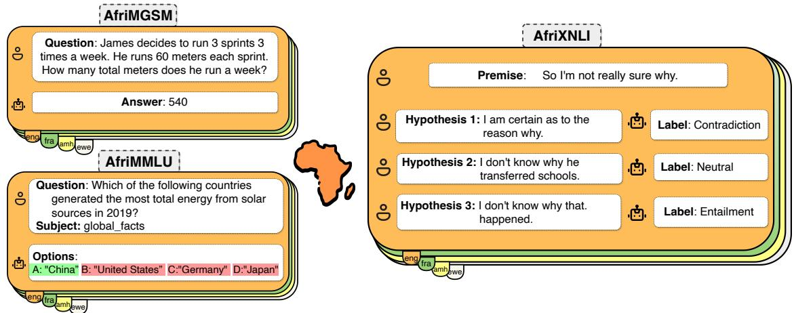  
Figure 1: Task Description for IROKOBENCH datasets. Both AfriMGSM and AfriMMLU focus on QA, while AfriXNLI focuses on natural language inference between two pairs of sentences. For clarity, this figure provides examples in English.

African Benchmark Datasets: Due to the limited representation of African languages in the field of NLP, there has been a growing effort to create benchmark datasets for African languages to enable research on these languages. Initiatives such as Masakhane have been instrumental in the creation of standard benchmark for tasks such as machine translation (Adelani et al., 2022a), named entity recognition (Adelani et al., 2021, 2022b), part of speech tagging (Dione et al., 2023), news topic classification (Adelani et al., 2023), and sentiment analysis (Muhammad et al., 2023). There are also several multilingual benchmark datasets that cover a few African languages, such as SIB-200 (Adelani et al., 2024), Flores (Goyal et al., 2022; Costa-jussà et al., 2024), Aya dataset and Collection (Singh et al., 2024) and Taxi1500 (Ma et al., 2023). However, despite all these efforts, African languages still lack quality and more difficult datasets, our work fills this gap.

## 3 IROKOBENCH

## 3.1 Languages covered by IROKOBENCH

IROKOBENCH3 cover 19 languages, 17 native African languages, and two European languages (English and French) which are widely spoken and official in many African countries. English and French are also the source languages we translated from. The 17 diverse and widely spoken African languages are from four regions of Africa: seven from West Africa (Ewe, Hausa, Igbo, Twi, Vai, Wolof, Yoruba), five from East Africa (Amharic,

Kinyarwanda, Luganda, Swahili, and Oromo), four from Southern Africa (chiShona, isiXhosa, isiZulu, and Sesotho), and Central Africa (Lingala). These languages are from three language families in Africa: one from Mande, three from Afro-Asiatic and 13 from the Niger-Congo family—where we cover eight Bantu languages. Table 9 provides an overview of the languages covered, including their family, regions, and the number of native speakers.

## 3.2 Tasks covered by IROKOBENCH

The selection of these tasks is primarily driven by their coverage across various domains and downstream tasks for diverse use cases. Additionally, they enable the evaluation of logical, abstract, and reasoning capabilities in LLMs, which is the hallmark of human intelligence (Bowman et al., 2015; Hendrycks et al., 2021b). Figure 1 provides examples of the different tasks covered in our datasets. We provide their descriptions below:

AfriXNLI The task of NLI involves the classification of a pair of sentences—a premise and a hypothesis as entailment, neutral, or contradiction semantic relation. For example, the sentence “so I’m not really sure why” contradicts “I am certain as to the reason why” but has a neutral relation to “I don’t know why he transferred schools”. Here, we human translate the English portion of XNLI (a multilingual dataset comprising 15 languages, including Swahili) into the 15 African languages (excluding Swahili). While the original XNLI dataset has over 2,500/5,000 as DEV/TEST split, Each language in AfriXNLI has only 450 DEV instances and 600 test instances. We selected an equal number of instances from the 10 domains of XNLI. The task is evaluated using the accuracy metric since the dataset has balanced classes.

AfriMMLU This is a multi-choice knowledge QA curated from freely available online sources by undergraduate and graduate students in the USA. The subjects cover simple general knowledge questions like “global fact” to highly-technical questions like “professional law” and “professional medicine”. MMLU are often grouped into STEM, Humanities, Social Sciences, and Others category. We focus on five subjects that we believe are culturally unbiased (or international) and that are simpler to translate since many of the subjects covered are only taught in African countries using English or French, making it extremely difficult to translate highly technical subjects, especially the STEM subjects. Table 1 shows the five subjects covered: two social science subjects (high-school geography and high-school microeconomics), one STEM subject (elementary mathematics), one humanities subject (international law), and one OTHER category (global facts). In total, we translated 608 question-answer pairs, with 500 instances in the test split, 100 questions per subject. The task is evaluated using the option prediction accuracy.

AfriMGSM This is a QA task with questions obtained from grade school mathematical word problems created by human problem writers. AfriMGSM expands the original MGSM dataset (Shi et al., 2023), which contains 250 QA pairs and 11 languages (including Swahili), to 15 more languages. The dataset consists of 8 training examples for few-shot and chain-of-thought prompting and 250 as a test set. We evaluated this task using the Exact Match metric, which is popularly used for QA tasks.

## 3.3 Data collection process

Translation We recruited language coordinators for each of the 16 African languages and French, and asked them to recruit professional translators to translate the sentences. The translation process took about two months, they started with XNLI, then MGSM and MMLU. Each translator received an appropriate remuneration for their work. 4 Most of the translators translated from English except for Ewe, Lingala and Wolof translators that translated from French since they are from the Francophone region of Africa. Additionally, we translated the MMLU dataset to French by professional translators and from French to these three languages. Many of the Francophone translators understand French and English but are more fluent in French, so they could cross-check from English if the French sentences were not clear enough.

Quality control Regarding quality control, language coordinators reviewed and corrected any poorly translated sentences. Translators received payment only after this phase to ensure the quality of translations. For additional checks, we computed COMET (Rei et al., 2020) quality estimation (QE) scores between the human translation and the original sentences based on AfriCOMET QE metric (Wang et al., 2024). In general, the distribution of the scores (range between 0 and 1) reflect that most translated sentences are between 0.7 and 1.0 for about 13 language pairs except for Lingala, Twi, and Wolof where the average is around 0.5. Further analysis shows that we cannot rely on these scores for those three languages since they are not covered in the pre-training of the original AfroX-LMR encoder (Alabi et al., 2022) used to build the AfriCOMET QE metric. Similar findings were reported in the original AfriCOMET QE paper that Twi had worse correlation with human judgement (i.e., 0.279 for Pearson, and 0.060 for Spearman) (Wang et al., 2024). We provide further analysis of the COMET scores in Appendix A.3.

## 3.4 LLMs used for evaluation

Open LLMs We evaluate on two encoderdecoder open LLM: mT0-XXL-MT (Muennighoff et al., 2023), and Aya-101 (Ustun et al., 2024) that have been instruction fine-tuned and multilingual T5 pre-trained on 101 languages (mT0 and Aya-101) models. Furthermore, these models are also all designed to be massively multilingual and explicitly optimized to work outside of English. The languages covered during instruction tuning differ for different models, mT0 and Aya covered 46 and 101 languages respectively.

Additionally we evaluate on eight decoder-only open LLM models: BLOOMZ 7B (BigScience-Workshop et al., 2023), Gemma 2 (9B & 27B) (Riviere et al., 2024), LLaMa 3 8B (Meta, 2024), LLaMa 3.1 (8B & 70B) (Dubey et al., 2024), Command-R (August version) (Cohere, 2024), and

<table><tr><td>Dataset</td><td>No. of languages</td><td>No. instances Train/Dev/Test</td><td>Subjects / Domains</td><td>Average Length Train/Dev/Test</td></tr><tr><td>AfriMGSM</td><td>17 (excl. Swahili, inc. Vai)</td><td>8  / - /  250</td><td>grade school mathematics</td><td>25  / /  46</td></tr><tr><td>AfriMMLU</td><td>17 (incl. French)</td><td>25  / 83  /  500</td><td>elementary mathematics, high-school geography, Interna- 18 / 17 / 17 tional law, global facts, high school microeconomics</td><td></td></tr><tr><td>AfriXNLI</td><td>15 (excl. Swahili)</td><td>- /  450  /  600</td><td>face-to-face, telephone, oxford university press (oup), fic- - / 10 / 10 (hyp.) tion, travel, government, nineeleven, letters, slate, verbatim - / 18 / 17 (pre.)</td><td></td></tr></table>

Table 1: The IROKOBENCH datasets: dataset name, number of African languages covered, data split, and the subjects or domains covered. We included English, French, and Swahili in all benchmarks.

LLaMaX 3 8B (Lu et al., 2024). These models weights are openly available under various licenses, ranging from fully permissive to non-commercial, research-only licenses. We evaluate the instructiontuned variant of these models. All models were pre-trained from scratch except LLaMaX that undergo continue pre-training on 100 languages including 13 languages covered in IROKOBENCH, except Ewe, Twi, Kinyarwanda and Vai. We used LLaMAX3-8B-Alpaca, instruction-tuned on English Alpaca (Taori et al., 2023).

Closed LLM We limit our evaluation to only OpenAI GPT (3.5-0125, 4-Turbo-0125, 4o-mini-07-18, 4o-08-06) (OpenAI, 2024), Gemini-1.5- Pro (Reid et al., 2024), and Claude OPUS (Anthropic, 2024) models. Recent work has shown that proprietary models tend to exhibit better multilingual capabilities (Ahuja et al., 2023b), although specifics regarding their pre-training and instruction fine-tuning processes are not disclosed.

## 3.5 Evaluation Settings

Evaluation Set-up We conduct two types of evaluations: in-language and translate-test evaluation, where test instances are automatically translated into English using a machine translation (MT) engine. For MT, we use NLLB-200 (3.3B) (Costajussà et al., 2024). In both in-language and translate-test setups, we perform cross-lingual transfer experiments from English and zero-shot evaluations by prompting LLMs. Few-shot evaluations are performed only for the three best models (two open and one closed) in the in-language setting. For AfriMGSM in both settings, we use Chain-of-Thought (COT) reasoning.

We use the EleutherAI LM Evaluation Harness (lm-eval) tool (Biderman et al., 2024)—a popular evaluation tool that is helping to standardize LLM evaluation, especially for open models on Hugging-Face Model Hub. For closed models, we employ a verbalizer (Gao et al., 2021; Schick and Schütze, 2021) for prediction and evaluation. All models are prompted with five different templates. We provide more details in Appendix A.2. 5

Cross-lingual transfer experiments We first conduct a study on cross-lingual transfer in a supervised learning setting by fine-tuning the English training data (400K instances) from Conneau et al. (2018) and evaluating on the remaining languages. This experiment focuses solely on the NLI task due to the availability of training data for supervised learning. The evaluation employs several masked language models, including XLM-R (Conneau et al., 2020), Serengeti (Adebara et al., 2023), AfroXLMR-{base, large} (Alabi et al., 2022), AfroXLMR-76L (Adelani et al., 2024). We report the result of the best model in the paper and others in Appendix A.6.

Zero- and few-shot evaluation In a zero-shot setting, we use the prompts detailed in subsection A.2. For few-shot evaluations, we conduct a 5-shot assessment for both AfriMMLU and AfriXNLI, and an 8-shot assessment for AfriMGSM.

## 4 Results

## 4.1 Overall Results

Large performance gaps between high-resource languages and African languages Table 2 shows the result of zero-shot evaluation for various LLMs. On average, there is a significant performance gap between African languages and English (up to 28%) and French (up to 19%) on the best LLM. The best LLM for African languages is GPT-4o, with an average performance of 59.0 across the evaluated tasks. Finally, as shown in Table 9, the languages with the lowest performance have the least monolingual data on the web.

Large performance gaps between closed and open weights models Our results, as presented in Table 2, indicate that the closed models Claude

<table><tr><td colspan="2"></td><td colspan="2">AfriXNLI in- translate</td><td colspan="2">AfriMMLU in-</td><td colspan="2">AfriMGSM</td><td rowspan="2">Ave. in- lang.</td><td rowspan="2">Ave. translate test</td><td rowspan="2">Ave. English lang.</td><td rowspan="2">Ave. French lang.</td></tr><tr><td>Model</td><td>size</td><td>lang.</td><td>test</td><td>lang.</td><td>translate test</td><td>in- lang.</td><td>translate test</td></tr><tr><td>AfroXLMR-76L</td><td>559M</td><td>65.7</td><td>63.6</td><td></td><td></td><td></td><td></td><td></td><td></td><td></td><td></td></tr><tr><td>mT0-XXL-MT</td><td>13B</td><td>51.0</td><td>49.9</td><td>27.9</td><td>28.4</td><td>2.9</td><td>2.5</td><td>27.3</td><td>26.9</td><td>34.5</td><td>33.1</td></tr><tr><td>Aya-101</td><td>13B</td><td>51.5</td><td>50.2</td><td>29.7</td><td>31.1</td><td>4.6</td><td>7.9</td><td>28.6</td><td>29.7</td><td>39.3</td><td>35.3</td></tr><tr><td>BLOOMZ 7B</td><td>7B</td><td>39.4</td><td>47.6</td><td>24.1</td><td>27.9</td><td>1.7</td><td>1.9</td><td>21.7</td><td>25.8</td><td>31.4</td><td>28.9</td></tr><tr><td>LLaMa 3 8B</td><td>8B</td><td>35.4</td><td>38.2</td><td>28.1</td><td>31.8</td><td>3.9</td><td>33.4</td><td>22.5</td><td>34.4</td><td>52.8</td><td>45.8</td></tr><tr><td>LLaMa 3.1 8B</td><td>8B</td><td>36.6</td><td>43.6</td><td>31.1</td><td>41.1</td><td>7.2</td><td>30.1</td><td>24.9</td><td>38.2</td><td>57.5</td><td>53.4</td></tr><tr><td>LLaMaX 3 8B</td><td>8B</td><td>40.8</td><td>33.3</td><td>29.3</td><td>35.2</td><td>4.8</td><td>9.2</td><td>24.9</td><td>25.9</td><td>38.5</td><td>33.1</td></tr><tr><td>Gemma 2 9B</td><td>9B</td><td>40.3</td><td>43.3</td><td>35.4</td><td>44.7</td><td>19.8</td><td>39.4</td><td>31.9</td><td>42.5</td><td>64.6</td><td>58.2</td></tr><tr><td>Gemma 2 27B</td><td>27B</td><td>42.8</td><td>49.0</td><td>39.9</td><td>48.8</td><td>28.5</td><td>46.1</td><td>37.1</td><td>48.0</td><td>76.3</td><td>69.9</td></tr><tr><td>LLaMa 3.1 70B</td><td>70B</td><td>38.0</td><td>42.8</td><td>39.4</td><td>51.3</td><td>24.6</td><td>45.6</td><td>34.0</td><td>46.5</td><td>73.5</td><td>65.5</td></tr><tr><td>Command-R</td><td>35B</td><td>43.4</td><td>57.0</td><td>27.8</td><td>40.8</td><td>5.7</td><td>38.3</td><td>25.6</td><td>45.4</td><td>71.7</td><td>63.0</td></tr><tr><td>Claude Opus</td><td>UNK</td><td>58.1</td><td>56.4</td><td>43.0</td><td>47.6</td><td>25.3</td><td>32.7</td><td>42.3</td><td>45.6</td><td>73.3</td><td>64.0</td></tr><tr><td>Gemini-1.5-Pro</td><td>UNK</td><td>59.4</td><td>49.9</td><td>60.2</td><td>53.1</td><td>55.4</td><td>44.3</td><td>58.3</td><td>49.1</td><td>82.6</td><td>75.3</td></tr><tr><td>GPT-3.5-Turbo</td><td>UNK</td><td>42.1</td><td>45.5</td><td>38.1</td><td>46.8</td><td>10.6</td><td>37.1</td><td>30.2</td><td>43.1</td><td>71.9</td><td>62.9</td></tr><tr><td>GPT-4o-mini</td><td>UNK</td><td>54.2</td><td>56.7</td><td>45.5</td><td>50.2</td><td>35.4</td><td>42.3</td><td>45.0</td><td>49.7</td><td>84.7</td><td>76.7</td></tr><tr><td>GPT-4-Turbo</td><td>UNK</td><td>59.5</td><td>57.0</td><td>54.2</td><td>52.1</td><td>45.2</td><td>43.5</td><td>52.9</td><td>50.9</td><td>84.6</td><td>76.5</td></tr><tr><td>GPT-40</td><td>UNK</td><td>64.3</td><td>52.1</td><td>60.0</td><td>54.1</td><td>52.6</td><td>42.6</td><td>59.0</td><td>49.6</td><td>86.9</td><td>78.1</td></tr><tr><td></td><td></td><td></td><td></td><td></td><td></td><td></td><td></td><td>33.9</td><td>40.2</td><td>62.8</td><td>56.3</td></tr></table>

Table 2: Main results: Average performance of various LLMs on all tasks (ave. excl. eng, fra, and vai). Except for AfriMGSM, which uses the Exact Match metric, others use the Accuracy. The best result is in Bold and second best underlined. The top-2 open and closed models are in gray. We report only the best prompt (others in appendix).

<table><tr><td>Model</td><td>eng</td><td>fra</td><td>amh</td><td>ewe</td><td>hau</td><td>ibo</td><td>kin</td><td>lin</td><td>lug</td><td>orm</td><td>sna</td><td>sot</td><td>swa</td><td>twi</td><td>wol</td><td>xh0</td><td>yor</td><td>zul</td><td>ave</td></tr><tr><td>Prompt LLMs in African Language</td><td></td><td></td><td></td><td></td><td></td><td></td><td></td><td></td><td></td><td></td><td></td><td></td><td></td><td></td><td></td><td></td><td></td><td></td><td></td></tr><tr><td>Aya-101 (t2)</td><td>40.0</td><td>36.6</td><td>31.6</td><td>25.4</td><td>33.4</td><td>36.8</td><td>30.8</td><td>27.8</td><td>28.0</td><td>26.2</td><td>28.2</td><td>31.8</td><td>32.2</td><td>26.8</td><td>25.2</td><td>32.0</td><td>28.4</td><td>29.8</td><td>29.7</td></tr><tr><td>Gemma 2 27B (t1)</td><td>75.6</td><td>66.4</td><td>40.6</td><td>32.4</td><td>43.2</td><td>44.2</td><td>40.2</td><td>38.2</td><td>32.6</td><td>33.6</td><td>44.6</td><td>41.8</td><td>56.0</td><td>35.6</td><td>30.4</td><td>42.0</td><td>41.0</td><td>42.2</td><td>39.9</td></tr><tr><td>LLaMa 3.1 70B (t1)</td><td>76.4</td><td>69.4</td><td>41.6</td><td>32.2</td><td>47.6</td><td>47.2</td><td>38.6</td><td>40.0</td><td>34.4</td><td>35.6</td><td>41.6</td><td>39.0</td><td>55.8</td><td>28.4</td><td>31.6</td><td>34.2</td><td>41.4</td><td>40.4</td><td>39.4</td></tr><tr><td>GPT-40 (t1)</td><td>87.4</td><td>83.2</td><td>59.8</td><td>33.6</td><td>67.2</td><td>67.2</td><td>64.2</td><td>61.0</td><td>52.8</td><td>61.0</td><td>67.6</td><td>67.4</td><td>77.4</td><td>43.2</td><td>37.8</td><td>70.2</td><td>61.2</td><td>68.2</td><td>60.0</td></tr><tr><td>Translate-Test (Eval. in English)</td><td></td><td></td><td></td><td></td><td></td><td></td><td></td><td></td><td></td><td></td><td></td><td></td><td></td><td></td><td></td><td></td><td></td><td></td><td></td></tr><tr><td>Aya-101 (t2)</td><td></td><td>37.8</td><td>32.4</td><td>28.6</td><td>31.0</td><td>31.6</td><td>31.8</td><td>33.6</td><td>27.2</td><td>28.6</td><td>32.4</td><td>34.2</td><td>31.2</td><td>31.8</td><td>26.6</td><td>30.8</td><td>34.2</td><td>32.2</td><td>31.1</td></tr><tr><td>Gemma 2 27B (t1)</td><td></td><td>62.4</td><td>57.6</td><td>40.4</td><td>50.0</td><td>50.0</td><td>50.6</td><td>47.0</td><td>42.8</td><td>46.6</td><td>49.8</td><td>55.6</td><td>59.8</td><td>39.8</td><td>31.2</td><td>55.2</td><td>52.6</td><td>51.6</td><td>48.8</td></tr><tr><td>LLaMa 3.1 70B (t1)</td><td></td><td>67.4</td><td>55.6</td><td>44.8</td><td>50.6</td><td>55.8</td><td>55.6</td><td>53.8</td><td>46.8</td><td>49.4</td><td>53.6</td><td>59.6</td><td>63.0</td><td>41.2</td><td>32.8</td><td>55.4</td><td>49.6</td><td>52.8</td><td>51.3</td></tr><tr><td>GPT-4o (t1)</td><td></td><td>76.4</td><td>62.8</td><td>43.8</td><td>54.0</td><td>57.4</td><td>58.2</td><td>54.4</td><td>46.4</td><td>54.8</td><td>55.6</td><td>63.2</td><td>67.4</td><td>44.0</td><td>32.0</td><td>62.2</td><td>52.4</td><td>57.4</td><td>54.1</td></tr></table>

Table 3: AfriMMLU results in in-language and translate-test scenarios: Option prediction accuracy per language. Average computed on only African languages. The best prompt template for each model is in bracket.

Opus, Gemini-1.5-Pro, GPT-4-Turbo, and GPT-4o consistently outperform the open models on IROKOBENCH. The top-2 closed models achieve average performance scores ranging from 52.9 to 59.0 across all tasks. The performance gap between the best closed model (GPT-4o) and the best open model (Gemma 2 27B) is 21.9. Notably, the largest performance differences for in-language setting are observed in the AfriMMLU and AfriMGSM tasks, where GPT-4o outperforms Gemma 2 27B by 20.1 and 24.1, respectively. For the AfriXNLI task, mT0-XXL-MT and Aya-101 perform better than bigger models like Gemma 2 27B and LLaMa 3.1 70B with 27B and 70B parameters respectively.

Majority of models perform worse for inlanguage prompting Most users would prefer to prompt in their native language; however, we find that almost all models we benchmark perform better with prompts translated into English. Only a few exceptions, such as GPT-4-Turbo, and GPT-4o, perform better in the in-language evaluation. Specifically, Command R and LLaMa 3.1 8B benefit the most from the translate-test approach, showing average improvements of +19.8 and +13.3, respectively. Notably, Gemma 2 27B achieves the best overall results for the AfriMGSM task with the translate-test, outperforming GPT-4o by +3.5. We attribute this boost to the fact that these models are heavily English-centric.

## 4.2 Task-specific results

Here, we examine the individual language performance per task, comparing which task prefers inlanguage v.s. translate-test evaluation. We compare the performance on a subset of LLMs: Aya-

<table><tr><td>Model</td><td>eng</td><td>fra</td><td>amh</td><td>ewe</td><td>hau</td><td>ibo</td><td>kin</td><td>lin</td><td>lug</td><td>orm</td><td>sna</td><td>sot</td><td>swa</td><td>twi</td><td>wol xho</td><td>yor</td><td></td><td>zul ave</td></tr><tr><td>Elementary Mathematics</td><td>88.0</td><td>83.0</td><td>76.0</td><td>55.0</td><td>73.0</td><td>84.0</td><td>77.0</td><td>71.0</td><td>80.0</td><td>81.0 75.0</td><td>78.0</td><td>87.0</td><td>68.0</td><td>61.0</td><td>76.0</td><td>80.0</td><td>80.0</td><td>75.1</td></tr><tr><td>Global Facts</td><td>67.0</td><td>60.0</td><td>44.0</td><td>32.0</td><td>56.0</td><td>49.0</td><td>60.0</td><td>54.0</td><td>41.0</td><td>52.0</td><td>48.0 49.0</td><td>59.0</td><td>33.0</td><td>36.0</td><td>56.0</td><td>42.0</td><td>57.0</td><td>48.0</td></tr><tr><td>High School Geography</td><td>93.0</td><td>86.0</td><td>56.0</td><td>25.0</td><td>67.0</td><td>64.0</td><td>57.0</td><td>55.0</td><td>48.0</td><td>54.0 69.0</td><td>68.0</td><td>76.0</td><td>34.0</td><td>27.0</td><td>63.0</td><td>53.0</td><td>73.0</td><td>55.6</td></tr><tr><td>High School Microeco- nomics</td><td>98.0</td><td>90.0</td><td>54.0</td><td>26.0</td><td>70.0</td><td>58.0</td><td>55.0</td><td>63.0</td><td>44.0</td><td>55.0 59.0</td><td>62.0</td><td>82.0</td><td>32.0</td><td>19.0</td><td>78.0</td><td>51.0</td><td>61.0</td><td>54.3</td></tr><tr><td>International Law</td><td>90.0</td><td>91.0</td><td>64.0</td><td>36.0</td><td>71.0</td><td>75.0</td><td>75.0</td><td>76.0</td><td>55.0</td><td>65.0 78.0</td><td>72.0</td><td>86.0</td><td>45.0</td><td>38.0</td><td>84.0</td><td>75.0</td><td>76.0</td><td>66.9</td></tr><tr><td>Average</td><td>87.2</td><td>82.0</td><td>58.8</td><td>34.8</td><td>67.4</td><td>66.0</td><td>64.8</td><td>63.8</td><td>53.6</td><td>61.4 65.8</td><td>65.8</td><td>78.0</td><td>42.4</td><td>36.2</td><td>71.4</td><td>60.2</td><td>69.4</td><td>60.0</td></tr></table>

Table 4: GPT-4o AfriMMLU results by subjects: Option prediction accuracy per language. Languages with at least 60% accuracy in four subjects are in Cyan .

<table><tr><td>Model</td><td>eng</td><td>fra</td><td>amh</td><td>ewe</td><td>hau</td><td>ibo</td><td>kin</td><td>lin</td><td>lug</td><td>orm</td><td>sna</td><td>sot</td><td>swa</td><td>twi</td><td>wol</td><td>xho</td><td>yor</td><td>zul</td><td>ave</td></tr><tr><td>Prompt LLMs in African Language</td><td></td><td></td><td></td><td></td><td></td><td></td><td></td><td></td><td></td><td></td><td></td><td></td><td></td><td></td><td></td><td></td><td></td><td></td><td></td></tr><tr><td>Aya-101 (t1)</td><td>10.8</td><td>9.6</td><td>6.8</td><td>3.2</td><td>7.2</td><td>3.2</td><td>3.6</td><td>4.4</td><td>2.4</td><td>4.8</td><td>6.8</td><td>10.8</td><td>6.0</td><td>1.6</td><td>1.2</td><td>4.4</td><td>3.2</td><td>3.6</td><td>4.6</td></tr><tr><td>Gemma 2 27B (t4)</td><td>85.6</td><td>80.0</td><td>33.6</td><td>7.6</td><td>49.6</td><td>24.0</td><td>32.4</td><td>18.0</td><td>23.6</td><td>12.8</td><td>35.2</td><td>38.4</td><td>73.6</td><td>12.4</td><td>5.6</td><td>32.0</td><td>22.4</td><td>34.4</td><td>28.5</td></tr><tr><td>LLaMa 3.1 70B (t4)</td><td>86.8</td><td>76.4</td><td>17.6</td><td>8.0</td><td>48.8</td><td>37.2</td><td>26.4</td><td>11.2</td><td>24.4</td><td>10.8</td><td>21.2</td><td>32.8</td><td>68.0</td><td>14.4</td><td>3.2</td><td>18.8</td><td>23.6</td><td>27.2</td><td>24.6</td></tr><tr><td>GPT-40 (t2)</td><td>84.0</td><td>68.8</td><td>57.6</td><td>8.8</td><td>64.8</td><td>57.6</td><td>60.4</td><td>51.2</td><td>51.6</td><td>61.2</td><td>58.4</td><td>60.8</td><td>78.8</td><td>31.2</td><td>28.0</td><td>52.4</td><td>62.0</td><td>57.2</td><td>52.6</td></tr><tr><td colspan="10">Translate-Test (Eval. in English)</td><td></td><td></td><td></td><td></td><td></td><td></td><td></td><td></td><td></td><td></td></tr><tr><td>Aya-101 (t1)</td><td></td><td>8.4</td><td>8.4</td><td>6.4</td><td>7.6</td><td>6.0</td><td>10.0</td><td>6.4</td><td>6.8</td><td>7.6</td><td>6.8</td><td>10.4</td><td>9.2</td><td>6.0</td><td>8.4</td><td>8.8</td><td>8.8</td><td>8.0</td><td>7.9</td></tr><tr><td>Gemma 2 27B (t4)</td><td></td><td>70.8</td><td>53.2</td><td>30.0</td><td>54.0</td><td>44.0</td><td>55.2</td><td>47.2</td><td>34.4</td><td>46.0</td><td>48.0</td><td>54.4</td><td>69.6</td><td>29.2</td><td>21.6</td><td>48.4</td><td>48.4</td><td>54.0</td><td>46.1</td></tr><tr><td>LLaMa 3.1 70B (t4)</td><td></td><td>73.6</td><td>54.8</td><td>30.4</td><td>48.0</td><td>43.2</td><td>52.8</td><td>48.0</td><td>35.6</td><td>44.0</td><td>46.8</td><td>55.2</td><td>72.0</td><td>26.4</td><td>20.4</td><td>49.6</td><td>48.4</td><td>54.0</td><td>45.6</td></tr><tr><td>GPT-4o (t2)</td><td></td><td>70.0</td><td>48.4</td><td>23.6</td><td>46.8</td><td>39.2</td><td>51.6</td><td>44.8</td><td>35.2</td><td>42.0</td><td>42.4</td><td>54.8</td><td>68.0</td><td>26.4</td><td>16.0</td><td>45.6</td><td>47.2</td><td>49.2</td><td>42.6</td></tr></table>

Table 5: AfriMGSM results in in-language and translate-test scenarios: Exact Match score per language. Average computed on only African languages. The best prompt template for each model is in bracket.

<table><tr><td>Model</td><td>eng</td><td>fra</td><td>amh</td><td>ewe</td><td>hau</td><td>ibo</td><td>kin</td><td>lin</td><td>lug</td><td>orm</td><td>sna</td><td>sot</td><td>swa</td><td>twi</td><td>wol</td><td>xh0</td><td>yor</td><td>zul</td><td>ave</td></tr><tr><td colspan="10">Prompt LLMs in African Language</td><td></td><td></td><td></td><td></td><td></td><td></td><td></td><td></td><td></td><td></td></tr><tr><td>AfroXLMR-76L</td><td>88.2</td><td>83.3</td><td>78.5</td><td>58.3</td><td>73.3</td><td>70.0</td><td>65.8</td><td>33.3</td><td>68.0</td><td>69.3</td><td>70.8</td><td>70.8</td><td>73.3</td><td>59.5</td><td>51.8</td><td>73.0</td><td>63.2</td><td>72.5</td><td>65.7</td></tr><tr><td>Aya-101 (t4)</td><td>67.0</td><td>59.7</td><td>64.2</td><td>43.2</td><td>57.0</td><td>55.5</td><td>54.3 33.5</td><td></td><td>51.7</td><td>51.5</td><td>55.7</td><td>52.2</td><td>56.5</td><td>47.0</td><td>36.7</td><td>55.2</td><td>54.5</td><td>55.3</td><td>51.5</td></tr><tr><td>Gemma 2 27B (t2)</td><td>67.8</td><td>63.3</td><td>47.0</td><td>36.8</td><td>49.7</td><td>46.2</td><td>40.5</td><td>32.0</td><td>41.7</td><td>35.8</td><td>46.0</td><td>43.5</td><td>57.0</td><td>36.0</td><td>36.7</td><td>45.0</td><td>42.5</td><td>48.0</td><td>42.8</td></tr><tr><td>LLaMa 3.1 70B (t2)</td><td>57.3</td><td>50.7</td><td>43.2</td><td>34.3</td><td>42.8</td><td>42.3</td><td>36.5</td><td>32.8</td><td>37.5</td><td>34.7</td><td>35.5</td><td>38.3</td><td>44.0</td><td>36.0</td><td>34.7</td><td>39.3</td><td>39.0</td><td>37.0</td><td>38.0</td></tr><tr><td>GPT-4o (t3)</td><td>89.2</td><td>82.3</td><td>71.8</td><td>45.0</td><td>75.2</td><td>68.2</td><td>68.0</td><td>32.7</td><td>69.8</td><td>71.2</td><td>71.3</td><td>71.8</td><td>71.5</td><td>55.8</td><td>52.7</td><td>72.0</td><td>64.5</td><td>67.5</td><td>64.3</td></tr><tr><td colspan="10">Translate-Test (Eval. in English)</td><td></td><td></td><td></td><td></td><td></td><td></td><td></td><td></td><td></td><td></td></tr><tr><td>AfroXLMR-76L</td><td></td><td>83.0</td><td>73.7</td><td>54.3</td><td>67.2</td><td>66.0</td><td>63.0 32.8</td><td>65.7</td><td>65.8</td><td>71.2</td><td>70.2</td><td></td><td>73.0</td><td>56.8</td><td>47.5</td><td>74.2</td><td>63.7</td><td>72.0</td><td>63.6</td></tr><tr><td>Aya-101 (t4)</td><td></td><td>61.2</td><td>60.7</td><td>40.8</td><td>53.8</td><td>52.3</td><td>50.3 33.0</td><td>48.7</td><td>51.3</td><td>54.0</td><td></td><td>56.0 54.0</td><td></td><td>44.5</td><td>39.3</td><td>56.8</td><td>51.0</td><td>57.0</td><td>50.2</td></tr><tr><td>Gemma 2 27B (t2)</td><td></td><td>60.8</td><td>55.8</td><td>45.5</td><td>48.5</td><td>49.7</td><td>47.7</td><td>31.5</td><td>51.3</td><td>52.3</td><td>51.7</td><td>50.2</td><td>55.7</td><td>47.2</td><td>40.2</td><td>54.8</td><td>50.2</td><td>51.5</td><td>49.0</td></tr><tr><td>LLaMa 3.1 70B (t2)</td><td></td><td>58.8</td><td>42.8</td><td>39.3</td><td>45.2</td><td>39.8</td><td>36.2</td><td>32.7</td><td>44.3</td><td>46.0</td><td>51.8</td><td>50.8</td><td>52.5</td><td>38.8</td><td>34.5</td><td>44.8</td><td>41.8</td><td>42.8</td><td>42.8</td></tr><tr><td>GPT-4o (t3)</td><td></td><td>73.8</td><td>63.8</td><td>42.8</td><td>54.8</td><td>53.3</td><td>52.8</td><td>32.3</td><td>54.3</td><td>55.5</td><td>58.2</td><td>58.0</td><td>58.5</td><td>45.7</td><td>38.8</td><td>58.2</td><td>53.5</td><td>52.8</td><td>52.1</td></tr></table>

Table 6: AfriXNLI results in in-language and translate-test scenarios: Option prediction accuracy per language. Average computed on only African languages. The best prompt template for each model is in bracket.

101, Gemma 2 27B LLaMa 3.1 70B, and GPT-4o.   
Other LLMs are in Appendix A.4.

AfriMMLU evaluation is better when prompting in-language for closed LLMs Table 3 shows the result of different LLMs on AfriMMLU using in-language vs. translate-test. For GPT-4o, we found in-language prompting to be generally better. However, for open models like LLaMa 3.1 70B and Gemma 2 27B, we find a large improvement in the performance of the translate-test for 15 out of 16 African languages. The only language that did not improve is wol, probably due to poor MT performance on NLLB-200, as reported in Costa-jussà et al. (2024). This shows the benefit of translate-test for prompting English-centric LLMs when evaluating low-resource languages.

AfriMMLU performance by subjects Table 4 shows the result of GPT-4o by subjects. Interestingly, elementary math achieved the best overall accuracy, where 13 out of 16 African languages achieved at least 70% despite struggling with AfriMGSM. The performance difference to AfriMGSM may be due to the multi-choice options of MMLU, which may be slightly easier than freeform answer. International law also achieved impressive performance with 10 out of 16 languages achieving 70%. All languages struggle the most with Global facts including English and French. Similarly, many African languages find it difficult to answer questions in geography and microeconomics subjects. This presents an opportunity for improving LLMs for the education domain.

AfriMGSM performance receives significant boost with translate-test for open models Table 5 shows that we can achieve a significant boost in performance with the translate-test on all languages we evaluated. We hypothesize that the current LLMs are better at reasoning in English than other languages. Gemma 2 27B and LLaMa 3.1 70B improved by +17.6 and +21.0 respectively when questions are asked in English, while closed models like GPT-4o dropped in performance.

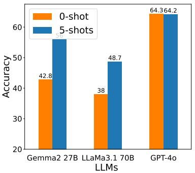  
(a) AfriXNLI

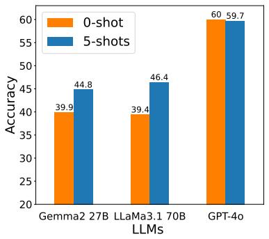  
(b) AfriMMLU

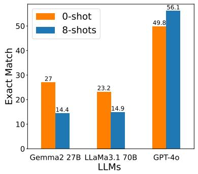  
(c) AfriMGSM

Figure 2: Few-shot evaluation on IROKOBENCH, we performed 8-shots for AfriMGSM and 5-shots for the others.
<table><tr><td></td><td colspan="6">AfriXNLI</td><td colspan="6">AfriMMLU</td><td colspan="6">AfriMGSM</td></tr><tr><td>Model</td><td>t1</td><td>t2</td><td>t3</td><td>t4</td><td>t5</td><td>Ave.</td><td>t1</td><td>t2</td><td>t3</td><td>t4</td><td>t5</td><td>Ave.</td><td>t1</td><td>t2</td><td>t3</td><td>t4</td><td>t5</td><td>Ave.</td></tr><tr><td>Aya-101</td><td>47.7</td><td>49.9</td><td>45.7</td><td>51.5</td><td>48.3</td><td> $4 8 . 6 _ { \pm 2 . 2 }$ </td><td>29.6</td><td>29.7</td><td>29.7</td><td>29.7</td><td>29.6</td><td> $2 9 . 7 _ { \pm 0 . 1 }$ </td><td>4.4</td><td>4.1</td><td>4.2</td><td>4.4</td><td>4.3</td><td>4.3±0.1</td></tr><tr><td>Gemma 2 27B</td><td>38.3</td><td>40.3</td><td>33.4</td><td>34.1</td><td>35.4</td><td> $3 6 . 3 { \scriptstyle \pm 2 . 9 }$ </td><td>39.9</td><td>39.2</td><td>38.7</td><td>39.2</td><td>39.1</td><td> $3 9 . 2 { \scriptstyle \pm 0 . 4 }$ </td><td>22.3</td><td>26.3</td><td>25.0</td><td>27.0</td><td>26.2</td><td>25.4±1.9</td></tr><tr><td>GPT-40</td><td>55.3</td><td>49.6</td><td>64.3</td><td>62.9</td><td>59.7</td><td> $5 8 . 4 { \scriptstyle \pm 6 . 0 }$ </td><td>60.0</td><td>55.8</td><td>59.0</td><td>39.6</td><td>59.6</td><td> $5 4 . 8 _ { \pm 8 . 7 }$ </td><td>46.7</td><td>49.8</td><td>48.0</td><td>49.5</td><td>49.6</td><td> $4 8 . 7 _ { \pm 1 . 3 }$ </td></tr></table>

Table 7: Ablation results: Effect of using different prompts (t1, t2, t3, t4, and t5) for IROKOBENCH datasets. Best prompt results are in bold. Average computed on only African languages. Second best prompt are underlined.

## 4.3 Few-shot results, Cross-Lingual Transfer, Sensitivity to Prompt Templates

Cross-lingual transfer in-language achieves better results When there is large enough labeled data in English, we could leverage this crosslingual signal for zero-shot evaluation. We trained on 400k English NLI examples, and we performed zero-shot transfer in in-language and translate-test setting. Table 6 shows that cross-lingual transfer using an Africa-centric smaller language model (AfroXLMR-76L) gave better results than prompting LLMs on average. AfroXLMR-76L has been pre-trained on all languages in AfriXNLI, which explains the impressive performance. However, for multilingual encoders that have not seen some of the languages, prompting GPT-4o seems to be better, as shown in Appendix A.6.

Impact of few-shot vs zero-shot Figure 2 shows the few-shot results for the IROKOBENCH datasets leveraging Gemma 2 27B, LLaMa 3.1 70B and GPT-4o when we provide few examples in inlanguage setting. We found out that Gemma 2 27B and LLaMa 3.1 70B LLM consistently benefited the least from additional few shots examples for classification tasks (AfriXNLI and AfriMMLU) where Gemma 2 27B improved by +13.2 and +4.9 respectively. Similarly, LLaMa 3.1 70B improved on both AfriXNLI and AfriMMLU tasks with +10.7 and +7.0. However, for reasoning tasks, only GPT-4o improved in performance by 6.3, other LLMs dropped in performance, probably due to their inability to reason in non-English languages. Surprisingly, GPT-4o did not benefit from additional examples for the classification tasks.

Prompt t2   
{{premise}}   
Question: {hypothesis} True, False, or Neither?   
Answer:   
Prompt t3   
Given the following premise and hypothesis in English, identify   
if the premise entails, contradicts, or is neutral towards   
the hypothesis. Please respond with exact ’entailment’,   
’contradiction’, or ’neutral’.   
Premise: {premise}   
Hypothesis: {hypothesis}   
Prompt t4   
You are an expert in Natural Language Inference (NLI)   
specializing in the {Language} language. Analyze the premise and   
hypothesis given in {Language}, and determine the relationship   
between them. Respond with one of the following options:   
‘’entailment’, ’contradiction’, or ’neutral’.   
Premise: {premise}   
Hypothesis: {hypothesis}  
Table 8: Three different prompts preferred by different models for AfriXNLI

Sensitivity to prompt templates To understand whether sensitivity to prompts impacts results, we perform an ablation for all the IROKOBENCH tasks where we evaluate the performance of five different prompts (see subsection A.2). Table 7 shows the results of five prompts we tested for (three of the prompts most preferred by different models are shown in Table 8). On AfriXNLI, we find that simpler prompt (Nie et al., 2020) i.e. {{premise}} Question: {{hypothesis}} True, False, or Neither?, have better results for the open models like Aya-101 and Gemma 2 27B, while GPT-4o prefers t3 where a detailed task description is provided. The best prompt for Aya-101 is t4 where the {{language}} name is mentioned, which shows additional language information may be useful in improving performance.

On AfriMMLU, we find GPT-4o perform worse for t4.6. However, other models are not very sensitive to the use of different prompts. In general, we do not find AfriMGSM to be sensitive to different prompts. In subsection A.4, we provide the results of five prompt templates for all LLMs evaluated.

## 5 Conclusion

In this paper, we introduced IROKOBENCH, a new benchmark for evaluating large language models (LLMs) on African languages. IROKOBENCH comprises three datasets focused on different tasks: natural language inference (AfriXNLI), multi-choice knowledge QA (AfriMMLU), and mathematical reasoning (AfriMGSM). Unlike previous benchmarks, which primarily involve simple text classification tasks, these datasets assessed the LLMs abilities in complex and knowledge-intensive areas. Our evaluation revealed a significant performance gap between high-resource languages (e.g., English and French) and African languages. Additionally, we observed a substantial disparity in performance between open models and proprietary models, with the latter generally outperforming the former, particularly in mathematical reasoning tasks. We hope that IROKOBENCH will serve as a valuable benchmark for evaluating future LLMs developed or adapted for African languages.

Limitations Our benchmark has a few limitations: (1) The benchmark is human-translated which may include some translationese effects, it would have been better if they are all generated in the native African languages. However, this parallel translation allows us to evaluate and compare the same sentences in all these languages. (2) We only cover three language families in Africa, Nilo-Saharan, Austronesian, and Khoisan language groups are missing, one of the reason we excluded them is either lack of contact with professional translators or limited translation budget, we hope to extend to more languages in the future.

## Acknowledgment

This work was supported by Lacuna Fund, an initiative co-founded by The Rockefeller Foundation, Google.org, and Canada’s International Development Research Centre. Additional support was provided through compute credits from Oracle and the Cohere For AI Research Grant. We extend our gratitude to Charles Riley for facilitating our connection with the Vai translator for the MGSM data translation.

We are also deeply thankful to OpenAI for granting API credits through their Researcher Access API program to Masakhane, enabling the evaluation of GPT-3.5 and GPT-4 LLMs. Similarly, we appreciate Google for providing GCP credits via the Gemma 2 Academic Program, which supported the Gemini-1.5-Pro inference. Lastly, we would like to thank Hailey Schoelkopf and Lintang Sutawika for their invaluable assistance with the EleutherAI lm-eval tool.

## References

Ife Adebara, AbdelRahim Elmadany, Muhammad Abdul-Mageed, and Alcides Alcoba Inciarte. 2023. SERENGETI: Massively multilingual language models for Africa. In Findings of the Association for Computational Linguistics: ACL 2023, pages 1498– 1537, Toronto, Canada. Association for Computational Linguistics.

David Adelani, Jesujoba Alabi, Angela Fan, Julia Kreutzer, Xiaoyu Shen, Machel Reid, Dana Ruiter, Dietrich Klakow, Peter Nabende, Ernie Chang, Tajuddeen Gwadabe, Freshia Sackey, Bonaventure F. P. Dossou, Chris Emezue, Colin Leong, Michael Beukman, Shamsuddeen Muhammad, Guyo Jarso, Oreen Yousuf, Andre Niyongabo Rubungo, Gilles Hacheme, Eric Peter Wairagala, Muhammad Umair Nasir, Benjamin Ajibade, Tunde Ajayi, Yvonne Gitau, Jade Abbott, Mohamed Ahmed, Millicent Ochieng, Anuoluwapo Aremu, Perez Ogayo, Jonathan Mukiibi, Fatoumata Ouoba Kabore, Godson Kalipe, Derguene Mbaye, Allahsera Auguste Tapo, Victoire Memdjokam Koagne, Edwin Munkoh-Buabeng, Valencia Wagner, Idris Abdulmumin, Ayodele Awokoya, Happy Buzaaba, Blessing Sibanda, Andiswa Bukula, and Sam Manthalu. 2022a. A few thousand translations go a long way! leveraging pre-trained models for African news translation. In Proceedings of the 2022 Conference of the North American Chapter ofthe Associationfor Computational Linguistics:

Human Language Technologies, pages 3053–3070, Seattle, United States. Association for Computational Linguistics.

David Adelani, Hannah Liu, Xiaoyu Shen, Nikita Vassilyev, Jesujoba Alabi, Yanke Mao, Haonan Gao, and En-Shiun Lee. 2024. SIB-200: A simple, inclusive, and big evaluation dataset for topic classification in 200+ languages and dialects. In Proceedings of the 18th Conference of the European Chapter of the Associationfor Computational Linguistics (Volume 1: Long Papers), pages 226–245, St. Julian’s, Malta. Association for Computational Linguistics.

David Adelani, Graham Neubig, Sebastian Ruder, Shruti Rijhwani, Michael Beukman, Chester Palen-Michel, Constantine Lignos, Jesujoba Alabi, Shamsuddeen Muhammad, Peter Nabende, Cheikh M. Bamba Dione, Andiswa Bukula, Rooweither Mabuya, Bonaventure F. P. Dossou, Blessing Sibanda, Happy Buzaaba, Jonathan Mukiibi, Godson Kalipe, Derguene Mbaye, Amelia Taylor, Fatoumata Kabore, Chris Chinenye Emezue, Anuoluwapo Aremu, Perez Ogayo, Catherine Gitau, Edwin Munkoh-Buabeng, Victoire Memdjokam Koagne, Allahsera Auguste Tapo, Tebogo Macucwa, Vukosi Marivate, Mboning Tchiaze Elvis, Tajuddeen Gwadabe, Tosin Adewumi, Orevaoghene Ahia, and Joyce Nakatumba-Nabende. 2022b. MasakhaNER 2.0: Africa-centric transfer learning for named entity recognition. In Proceedings ofthe 2022 Conference on Empirical Methods in Natural Language Processing, pages 4488– 4508, Abu Dhabi, United Arab Emirates. Association for Computational Linguistics.

David Ifeoluwa Adelani, Jade Abbott, Graham Neubig, Daniel D’souza, Julia Kreutzer, Constantine Lignos, Chester Palen-Michel, Happy Buzaaba, Shruti Rijhwani, Sebastian Ruder, Stephen Mayhew, Israel Abebe Azime, Shamsuddeen H. Muhammad, Chris Chinenye Emezue, Joyce Nakatumba-Nabende, Perez Ogayo, Aremu Anuoluwapo, Catherine Gitau, Derguene Mbaye, Jesujoba Alabi, Seid Muhie Yimam, Tajuddeen Rabiu Gwadabe, Ignatius Ezeani, Rubungo Andre Niyongabo, Jonathan Mukiibi, Verrah Otiende, Iroro Orife, Davis David, Samba Ngom, Tosin Adewumi, Paul Rayson, Mofetoluwa Adeyemi, Gerald Muriuki, Emmanuel Anebi, Chiamaka Chukwuneke, Nkiruka Odu, Eric Peter Wairagala, Samuel Oyerinde, Clemencia Siro, Tobius Saul Bateesa, Temilola Oloyede, Yvonne Wambui, Victor Akinode, Deborah Nabagereka, Maurice Katusiime, Ayodele Awokoya, Mouhamadane MBOUP, Dibora Gebreyohannes, Henok Tilaye, Kelechi Nwaike, Degaga Wolde, Abdoulaye Faye, Blessing Sibanda, Orevaoghene Ahia, Bonaventure F. P. Dossou, Kelechi Ogueji, Thierno Ibrahima DIOP, Abdoulaye Diallo, Adewale Akinfaderin, Tendai Marengereke, and Salomey Osei. 2021. MasakhaNER: Named entity recognition for African languages. Transactions of the Association for Computational Linguistics, 9:1116–1131.

David Ifeoluwa Adelani, Marek Masiak, Israel Abebe Azime, Jesujoba Alabi, Atnafu Lambebo Tonja,

Christine Mwase, Odunayo Ogundepo, Bonaventure F. P. Dossou, Akintunde Oladipo, Doreen Nixdorf, Chris Chinenye Emezue, Sana Al-azzawi, Blessing Sibanda, Davis David, Lolwethu Ndolela, Jonathan Mukiibi, Tunde Ajayi, Tatiana Moteu, Brian Odhiambo, Abraham Owodunni, Nnaemeka Obiefuna, Muhidin Mohamed, Shamsuddeen Hassan Muhammad, Teshome Mulugeta Ababu, Saheed Abdullahi Salahudeen, Mesay Gemeda Yigezu, Tajuddeen Gwadabe, Idris Abdulmumin, Mahlet Taye, Oluwabusayo Awoyomi, Iyanuoluwa Shode, Tolulope Adelani, Habiba Abdulganiyu, Abdul-Hakeem Omotayo, Adetola Adeeko, Abeeb Afolabi, Anuoluwapo Aremu, Olanrewaju Samuel, Clemencia Siro, Wangari Kimotho, Onyekachi Ogbu, Chinedu Mbonu, Chiamaka Chukwuneke, Samuel Fanijo, Jessica Ojo, Oyinkansola Awosan, Tadesse Kebede, Toadoum Sari Sakayo, Pamela Nyatsine, Freedmore Sidume, Oreen Yousuf, Mardiyyah Oduwole, Kanda Tshinu, Ussen Kimanuka, Thina Diko, Siyanda Nxakama, Sinodos Nigusse, Abdulmejid Johar, Shafie Mohamed, Fuad Mire Hassan, Moges Ahmed Mehamed, Evrard Ngabire, Jules Jules, Ivan Ssenkungu, and Pontus Stenetorp. 2023. MasakhaNEWS: News topic classification for African languages. In Proceedings of the 13th International Joint Conference on Natural Language Processing and the 3rd Conference ofthe Asia-Pacific Chapter of the Association for Computational Linguistics (Volume 1: Long Papers), pages 144–159, Nusa Dua, Bali. Association for Computational Linguistics.

Kabir Ahuja, Harshita Diddee, Rishav Hada, Millicent Ochieng, Krithika Ramesh, Prachi Jain, Akshay Nambi, Tanuja Ganu, Sameer Segal, Mohamed Ahmed, Kalika Bali, and Sunayana Sitaram. 2023a. MEGA: Multilingual evaluation of generative AI. In Proceedings of the 2023 Conference on Empirical Methods in Natural Language Processing, pages 4232–4267, Singapore. Association for Computational Linguistics.

Sanchit Ahuja, Divyanshu Aggarwal, Varun Gumma, Ishaan Watts, Ashutosh Sathe, Millicent Ochieng, Rishav Hada, Prachi Jain, Maxamed Axmed, Kalika Bali, and Sunayana Sitaram. 2023b. Megaverse: Benchmarking large language models across languages, modalities, models and tasks. ArXiv, abs/2311.07463.

Jesujoba O. Alabi, David Ifeoluwa Adelani, Marius Mosbach, and Dietrich Klakow. 2022. Adapting pretrained language models to African languages via multilingual adaptive fine-tuning. In Proceedings of the 29th International Conference on Computational Linguistics, pages 4336–4349, Gyeongju, Republic of Korea. International Committee on Computational Linguistics.

Anthropic. 2024. Claude — anthropic.com. https: //www.anthropic.com/claude. [Accessed 01-06- 2024].

Anuoluwapo Aremu, Jesujoba O. Alabi, and David Ifeoluwa Adelani. 2023. Yorc: Yoruba reading comprehension dataset. Preprint, arXiv:2308.09768.

Israel Abebe Azime, Mitiku Yohannes Fuge, Atnafu Lambebo Tonja, Tadesse Destaw Belay, Aman Kassahun Wassie, Eyasu Shiferaw Jada, Yonas Chanie, Walelign Tewabe Sewunetie, and Seid Muhie Yimam. 2024. Enhancing amharic-llama: Integrating task specific and generative datasets. arXiv preprint arXiv:2402.08015.

Lucas Bandarkar, Davis Liang, Benjamin Muller, Mikel Artetxe, Satya Narayan Shukla, Donald Husa, Naman Goyal, Abhinandan Krishnan, Luke Zettlemoyer, and Madian Khabsa. 2023. The belebele benchmark: a parallel reading comprehension dataset in 122 language variants. Preprint, arXiv:2308.16884.

Yejin Bang, Samuel Cahyawijaya, Nayeon Lee, Wenliang Dai, Dan Su, Bryan Wilie, Holy Lovenia, Ziwei Ji, Tiezheng Yu, Willy Chung, Quyet V. Do, Yan Xu, and Pascale Fung. 2023. A multitask, multilingual, multimodal evaluation of ChatGPT on reasoning, hallucination, and interactivity. In Proceedings of the 13th International Joint Conference on Natural Language Processing and the 3rd Conference ofthe Asia-Pacific Chapter ofthe Associationfor Computational Linguistics (Volume 1: Long Papers), pages 675–718, Nusa Dua, Bali. Association for Computational Linguistics.

Stella Biderman, Hailey Schoelkopf, Lintang Sutawika, Leo Gao, Jonathan Tow, Baber Abbasi, Alham Fikri Aji, Pawan Sasanka Ammanamanchi, Sidney Black, Jordan Clive, Anthony DiPofi, Julen Etxaniz, Benjamin Fattori, Jessica Zosa Forde, Charles Foster, Mimansa Jaiswal, Wilson Y. Lee, Haonan Li, Charles Lovering, Niklas Muennighoff, Ellie Pavlick, Jason Phang, Aviya Skowron, Samson Tan, Xiangru Tang, Kevin A. Wang, Genta Indra Winata, François Yvon, and Andy Zou. 2024. Lessons from the trenches on reproducible evaluation of language models. Preprint, arXiv:2405.14782.

BigScience-Workshop, :, Teven Le Scao, Angela Fan, Christopher Akiki, Ellie Pavlick, Suzana Ilic, Daniel´ Hesslow, Roman Castagné, Alexandra Sasha Luccioni, François Yvon, Matthias Gallé, Jonathan Tow, Alexander M. Rush, and et al. 2023. Bloom: A 176bparameter open-access multilingual language model. Preprint, arXiv:2211.05100.

Samuel R. Bowman, Gabor Angeli, Christopher Potts, and Christopher D. Manning. 2015. A large annotated corpus for learning natural language inference. In Proceedings of the 2015 Conference on Empirical Methods in Natural Language Processing, pages 632–642, Lisbon, Portugal. Association for Computational Linguistics.

Tom B. Brown, Benjamin Mann, Nick Ryder, Melanie Subbiah, Jared Kaplan, Prafulla Dhariwal, Arvind Neelakantan, Pranav Shyam, Girish Sastry, Amanda Askell, Sandhini Agarwal, Ariel Herbert-Voss,

Gretchen Krueger, Tom Henighan, Rewon Child, Aditya Ramesh, Daniel M. Ziegler, Jeffrey Wu, Clemens Winter, Christopher Hesse, Mark Chen, Eric Sigler, Mateusz Litwin, Scott Gray, Benjamin Chess, Jack Clark, Christopher Berner, Sam Mc-Candlish, Alec Radford, Ilya Sutskever, and Dario Amodei. 2020. Language models are few-shot learners. Preprint, arXiv:2005.14165.

Cohere. 2024. Command R — cohere.com. https: //cohere.com/command. [Accessed 01-06-2024].

Alexis Conneau, Kartikay Khandelwal, Naman Goyal, Vishrav Chaudhary, Guillaume Wenzek, Francisco Guzmán, Edouard Grave, Myle Ott, Luke Zettlemoyer, and Veselin Stoyanov. 2020. Unsupervised cross-lingual representation learning at scale. In Proceedings of the 58th Annual Meeting of the Association for Computational Linguistics, pages 8440– 8451, Online. Association for Computational Linguistics.

Alexis Conneau, Ruty Rinott, Guillaume Lample, Adina Williams, Samuel Bowman, Holger Schwenk, and Veselin Stoyanov. 2018. XNLI: Evaluating crosslingual sentence representations. In Proceedings of the 2018 Conference on Empirical Methods in Natural Language Processing, pages 2475–2485, Brussels, Belgium. Association for Computational Linguistics.

Marta R Costa-jussà, James Cross, Onur Çelebi, Maha Elbayad, Kenneth Heafield, Kevin Heffernan, Elahe Kalbassi, Janice Lam, Daniel Licht, Jean Maillard, Anna Sun, Skyler Wang, Guillaume Wenzek, Al Youngblood, Bapi Akula, Loic Barrault, Gabriel Mejia Gonzalez, Prangthip Hansanti, John Hoffman, Semarley Jarrett, Kaushik Ram Sadagopan, Dirk Rowe, Shannon Spruit, Chau Tran, Pierre Andrews, Necip Fazil Ayan, Shruti Bhosale, Sergey Edunov, Angela Fan, Cynthia Gao, Vedanuj Goswami, Francisco Guzmán, Philipp Koehn, Alexandre Mourachko, Christophe Ropers, Safiyyah Saleem, Holger Schwenk, Jeff Wang, and NLLB Team. 2024. Scaling neural machine translation to 200 languages. Nature, 630(8018):841–846.

Cheikh M. Bamba Dione, David Ifeoluwa Adelani, Peter Nabende, Jesujoba Alabi, Thapelo Sindane, Happy Buzaaba, Shamsuddeen Hassan Muhammad, Chris Chinenye Emezue, Perez Ogayo, Anuoluwapo Aremu, Catherine Gitau, Derguene Mbaye, Jonathan Mukiibi, Blessing Sibanda, Bonaventure F. P. Dossou, Andiswa Bukula, Rooweither Mabuya, Allahsera Auguste Tapo, Edwin Munkoh-Buabeng, Victoire Memdjokam Koagne, Fatoumata Ouoba Kabore, Amelia Taylor, Godson Kalipe, Tebogo Macucwa, Vukosi Marivate, Tajuddeen Gwadabe, Mboning Tchiaze Elvis, Ikechukwu Onyenwe, Gratien Atindogbe, Tolulope Adelani, Idris Akinade, Olanrewaju Samuel, Marien Nahimana, Théogène Musabeyezu, Emile Niyomutabazi, Ester Chimhenga, Kudzai Gotosa, Patrick Mizha, Apelete Agbolo, Seydou Traore, Chinedu Uchechukwu, Aliyu Yusuf, Muhammad Abdullahi, and Dietrich Klakow. 2023.

MasakhaPOS: Part-of-speech tagging for typologically diverse African languages. In Proceedings of the 61st Annual Meeting of the Association for Computational Linguistics (Volume 1: Long Papers), pages 10883–10900, Toronto, Canada. Association for Computational Linguistics.

Abhimanyu Dubey, Abhinav Jauhri, Abhinav Pandey, Abhishek Kadian, Ahmad Al-Dahle, Aiesha Letman, Akhil Mathur, Alan Schelten, Amy Yang, Angela Fan, Anirudh Goyal, Anthony Hartshorn, Aobo Yang, Archi Mitra, Archie Sravankumar, Artem Korenev, Arthur Hinsvark, Arun Rao, Aston Zhang, Aurelien Rodriguez, and et al. 2024. The llama 3 herd of models. ArXiv, abs/2407.21783.

Emilio Ferrara. 2023. Should chatgpt be biased? challenges and risks of bias in large language models. arXiv preprint arXiv:2304.03738.

Tianyu Gao, Adam Fisch, and Danqi Chen. 2021. Making pre-trained language models better few-shot learners. In Proceedings of the 59th Annual Meeting of the Association for Computational Linguistics and the 11th International Joint Conference on Natural Language Processing (Volume 1: Long Papers), pages 3816–3830, Online. Association for Computational Linguistics.

Gemini-Team, Machel Reid, Nikolay Savinov, Denis Teplyashin, Dmitry, Lepikhin, Timothy Lillicrap, Jean baptiste Alayrac, Radu Soricut, Angeliki Lazaridou, Orhan Firat, and et al. 2024. Gemini 1.5: Unlocking multimodal understanding across millions of tokens of context. Preprint, arXiv:2403.05530.

Naman Goyal, Cynthia Gao, Vishrav Chaudhary, Peng-Jen Chen, Guillaume Wenzek, Da Ju, Sanjana Krishnan, Marc’Aurelio Ranzato, Francisco Guzmán, and Angela Fan. 2022. The Flores-101 evaluation benchmark for low-resource and multilingual machine translation. Transactions ofthe Associationfor Computational Linguistics, 10:522–538.

Kai Hartung, Aaricia Herygers, Shubham Kurlekar, Khabbab Zakaria, Taylan Volkan, Sören Gröttrup, and Munir Georges. 2023. Measuring sentiment bias in machine translation. Preprint, arXiv:2306.07152.

Dan Hendrycks, Collin Burns, Steven Basart, Andy Zou, Mantas Mazeika, Dawn Song, and Jacob Steinhardt. 2021a. Measuring massive multitask language understanding. Proceedings of the International Conference on Learning Representations (ICLR).

Dan Hendrycks, Collin Burns, Saurav Kadavath, Akul Arora, Steven Basart, Eric Tang, Dawn Song, and Jacob Steinhardt. 2021b. Measuring mathematical problem solving with the MATH dataset. In Thirtyfifth Conference on Neural Information Processing Systems Datasets and Benchmarks Track (Round 2).

Amr Hendy, Mohamed Gomaa Abdelrehim, Amr Sharaf, Vikas Raunak, Mohamed Gabr, Hitokazu Matsushita, Young Jin Kim, Mohamed Afify, and Hany Hassan Awadalla. 2023. How good are gpt

models at machine translation? a comprehensive evaluation. ArXiv, abs/2302.09210.

Meng Ji, Meng Ji, Pierrette Bouillon, and Mark Seligman. 2023. Cultural and Linguistic Bias of Neural Machine Translation Technology, page 100–128. Studies in Natural Language Processing. Cambridge University Press.

Albert Q. Jiang, Alexandre Sablayrolles, Antoine Roux, Arthur Mensch, Blanche Savary, Chris Bamford, Devendra Singh Chaplot, Diego de las Casas, Emma Bou Hanna, Florian Bressand, Gianna Lengyel, Guillaume Bour, Guillaume Lample, Lélio Renard Lavaud, Lucile Saulnier, Marie-Anne Lachaux, Pierre Stock, Sandeep Subramanian, Sophia Yang, Szymon Antoniak, Teven Le Scao, Théophile Gervet, Thibaut Lavril, Thomas Wang, Timothée Lacroix, and William El Sayed. 2024. Mixtral of experts. Preprint, arXiv:2401.04088.

Pratik Joshi, Sebastin Santy, Amar Budhiraja, Kalika Bali, and Monojit Choudhury. 2020. The state and fate of linguistic diversity and inclusion in the NLP world. In Proceedings of the 58th Annual Meeting of the Association for Computational Linguistics, pages 6282–6293, Online. Association for Computational Linguistics.

Eric Khiu, Hasti Toossi, David Anugraha, Jinyu Liu, Jiaxu Li, Juan Flores, Leandro Roman, A. Seza Dogruöz, and En-Shiun Lee. 2024.˘ Predicting machine translation performance on low-resource languages: The role of domain similarity. In Findings of the Association for Computational Linguistics: EACL 2024, pages 1474–1486, St. Julian’s, Malta. Association for Computational Linguistics.

Julia Kreutzer, Isaac Caswell, Lisa Wang, Ahsan Wahab, Daan van Esch, Nasanbayar Ulzii-Orshikh, Allahsera Tapo, Nishant Subramani, Artem Sokolov, Claytone Sikasote, Monang Setyawan, Supheakmungkol Sarin, Sokhar Samb, Benoît Sagot, Clara Rivera, Annette Rios, Isabel Papadimitriou, Salomey Osei, Pedro Ortiz Suarez, Iroro Orife, Kelechi Ogueji, Andre Niyongabo Rubungo, Toan Q. Nguyen, Mathias Müller, André Müller, Shamsuddeen Hassan Muhammad, Nanda Muhammad, Ayanda Mnyakeni, Jamshidbek Mirzakhalov, Tapiwanashe Matangira, Colin Leong, Nze Lawson, Sneha Kudugunta, Yacine Jernite, Mathias Jenny, Orhan Firat, Bonaventure F. P. Dossou, Sakhile Dlamini, Nisansa de Silva, Sakine Çabuk Ballı, Stella Biderman, Alessia Battisti, Ahmed Baruwa, Ankur Bapna, Pallavi Baljekar, Israel Abebe Azime, Ayodele Awokoya, Duygu Ataman, Orevaoghene Ahia, Oghenefego Ahia, Sweta Agrawal, and Mofetoluwa Adeyemi. 2022. Quality at a glance: An audit of web-crawled multilingual datasets. Transactions ofthe Associationfor Compu tational Linguistics, 10:50–72.

Sneha Kudugunta, Isaac Caswell, Biao Zhang, Xavier Garcia, Christopher A. Choquette-Choo, Katherine Lee, Derrick Xin, Aditya Kusupati, Romi Stella, Ankur Bapna, and Orhan Firat. 2023. Madlad-400:

A multilingual and document-level large audited dataset. Preprint, arXiv:2309.04662.

Viet Lai, Chien Nguyen, Nghia Ngo, Thuat Nguyen, Franck Dernoncourt, Ryan Rossi, and Thien Nguyen. 2023a. Okapi: Instruction-tuned large language models in multiple languages with reinforcement learning from human feedback. In Proceedings of the 2023 Conference on Empirical Methods in Natural Language Processing: System Demonstrations, pages 318–327, Singapore. Association for Computational Linguistics.

Viet Dac Lai, Nghia Ngo, Amir Pouran Ben Veyseh, Hieu Man, Franck Dernoncourt, Trung Bui, and Thien Huu Nguyen. 2023b. ChatGPT beyond English: Towards a comprehensive evaluation of large language models in multilingual learning. In Findings of the Association for Computational Linguistics: EMNLP 2023, pages 13171–13189, Singapore. Association for Computational Linguistics.

En-Shiun Lee, Sarubi Thillainathan, Shravan Nayak, Surangika Ranathunga, David Adelani, Ruisi Su, and Arya McCarthy. 2022. Pre-trained multilingual sequence-to-sequence models: A hope for lowresource language translation? In Findings of the Associationfor Computational Linguistics: ACL 2022, pages 58–67, Dublin, Ireland. Association for Computational Linguistics.

Yinquan Lu, Wenhao Zhu, Lei Li, Yu Qiao, and Fei Yuan. 2024. Llamax: Scaling linguistic horizons of llm by enhancing translation capabilities beyond 100 languages. arXiv preprint arXiv:2407.05975.

Alexandra Luccioni and Joseph Viviano. 2021. What‘s in the box? an analysis of undesirable content in the Common Crawl corpus. In Proceedings ofthe 59th Annual Meeting of the Association for Computational Linguistics and the 11th International Joint Conference on Natural Language Processing (Volume 2: Short Papers), pages 182–189, Online. Association for Computational Linguistics.

Chunlan Ma, Ayyoob ImaniGooghari, Haotian Ye, Ehsaneddin Asgari, and Hinrich Schütze. 2023. Taxi1500: A multilingual dataset for text classification in 1500 languages. Preprint, arXiv:2305.08487.

Meta. 2024. Introducing Meta Llama 3: The most capable openly available LLM to date — ai.meta.com. https://ai.meta.com/blog/ meta-llama-3/. [Accessed 01-06-2024].

Niklas Muennighoff, Thomas Wang, Lintang Sutawika, Adam Roberts, Stella Biderman, Teven Le Scao, M Saiful Bari, Sheng Shen, Zheng Xin Yong, Hailey Schoelkopf, Xiangru Tang, Dragomir Radev, Alham Fikri Aji, Khalid Almubarak, Samuel Albanie, Zaid Alyafeai, Albert Webson, Edward Raff, and Colin Raffel. 2023. Crosslingual generalization through multitask finetuning. In Proceedings of the 61st Annual Meeting of the Association for Computational Linguistics (Volume 1: Long Papers),

pages 15991–16111, Toronto, Canada. Association for Computational Linguistics.

Shamsuddeen Muhammad, Idris Abdulmumin, Abinew Ayele, Nedjma Ousidhoum, David Adelani, Seid Yimam, Ibrahim Ahmad, Meriem Beloucif, Saif Mohammad, Sebastian Ruder, Oumaima Hourrane, Alipio Jorge, Pavel Brazdil, Felermino Ali, Davis David, Salomey Osei, Bello Shehu-Bello, Falalu Lawan, Tajuddeen Gwadabe, Samuel Rutunda, Tadesse Destaw Belay, Wendimu Messelle, Hailu Balcha, Sisay Chala, Hagos Gebremichael, Bernard Opoku, and Stephen Arthur. 2023. AfriSenti: A Twitter sentiment analysis benchmark for African languages. In Proceedings of the 2023 Conference on Empirical Methods in Natural Language Processing, pages 13968–13981, Singapore. Association for Computational Linguistics.

Yixin Nie, Adina Williams, Emily Dinan, Mohit Bansal, Jason Weston, and Douwe Kiela. 2020. Adversarial NLI: A new benchmark for natural language understanding. In Proceedings of the 58th Annual Meeting of the Association for Computational Linguistics, pages 4885–4901, Online. Association for Computational Linguistics.

Jessica Ojo, Kelechi Ogueji, Pontus Stenetorp, and David I Adelani. 2023. How good are large language models on african languages? arXiv preprint arXiv:2311.07978.

OpenAI. 2024. Introducing ChatGPT. https:// openai.com/index/chatgpt/. [Accessed 01-06- 2024].

OpenAI, Josh Achiam, Steven Adler, Sandhini Agarwal, Lama Ahmad, Ilge Akkaya, Florencia Leoni Aleman, Diogo Almeida, Janko Altenschmidt, Sam Altman, Shyamal Anadkat, Red Avila, Igor Babuschkin, Suchir Balaji, Valerie Balcom, Paul Baltescu, Haiming Bao, and et al. 2024. Gpt-4 technical report. Preprint, arXiv:2303.08774.

Edoardo Maria Ponti, Goran Glavaš, Olga Majewska, Qianchu Liu, Ivan Vulic, and Anna Korhonen. 2020.´ XCOPA: A multilingual dataset for causal commonsense reasoning. In Proceedings of the 2020 Conference on Empirical Methods in Natural Language Processing (EMNLP), pages 2362–2376, Online. Association for Computational Linguistics.

Danti Pudjiati, Ninuk Lustyantie, Ifan Iskandar, and Tira Nur Fitria. 2022. Post-editing of machine translation: Creating a better translation of cultural specific terms. Language Circle: Journal of Language and Literature, 17(1):61–73.

Ricardo Rei, Craig Stewart, Ana C Farinha, and Alon Lavie. 2020. COMET: A neural framework for MT evaluation. In Proceedings ofthe 2020 Conference on Empirical Methods in Natural Language Processing (EMNLP), pages 2685–2702, Online. Association for Computational Linguistics.

Machel Reid, Nikolay Savinov, Denis Teplyashin, Dmitry Lepikhin, Timothy P. Lillicrap, Jean-Baptiste Alayrac, Radu Soricut, Angeliki Lazaridou, Orhan Firat, Julian Schrittwieser, Ioannis Antonoglou, Rohan Anil, Sebastian Borgeaud, Andrew M. Dai, Katie Millican, Ethan Dyer, Mia Glaese, Thibault Sottiaux, and et al. 2024. Gemini 1.5: Unlocking multimodal understanding across millions of tokens of context. ArXiv, abs/2403.05530.

Gemma Team Morgane Riviere, Shreya Pathak, Pier Giuseppe Sessa, Cassidy Hardin, Surya Bhupatiraju, L’eonard Hussenot, Thomas Mesnard, Bobak Shahriari, Alexandre Ram’e, Johan Ferret, Peter Liu, Pouya Dehghani Tafti, Abe Friesen, Michelle Casbon, Sabela Ramos, Ravin Kumar, Charline Le Lan, Sammy Jerome, and et al. 2024. Gemma 2: Improving open language models at a practical size. ArXiv, abs/2408.00118.

Beatrice Savoldi, Marco Gaido, Luisa Bentivogli, Matteo Negri, and Marco Turchi. 2021. Gender bias in machine translation. Preprint, arXiv:2104.06001.

Timo Schick and Hinrich Schütze. 2021. It’s not just size that matters: Small language models are also fewshot learners. In Proceedings of the 2021 Conference of the North American Chapter of the Association for Computational Linguistics: Human Language Technologies, pages 2339–2352.

Freda Shi, Mirac Suzgun, Markus Freitag, Xuezhi Wang, Suraj Srivats, Soroush Vosoughi, Hyung Won Chung, Yi Tay, Sebastian Ruder, Denny Zhou, Dipanjan Das, and Jason Wei. 2023. Language models are multilingual chain-of-thought reasoners. In The Eleventh International Conference on Learning Representations.

Freda Shi, Mirac Suzgun, Markus Freitag, Xuezhi Wang, Suraj Srivats, Soroush Vosoughi, Hyung Won Chung, Yi Tay, Sebastian Ruder, Denny Zhou, et al. 2022. Language models are multilingual chain-of-thought reasoners. In The Eleventh International Conference on Learning Representations.

Shivalika Singh, Freddie Vargus, Daniel Dsouza, Börje F. Karlsson, Abinaya Mahendiran, Wei-Yin Ko, Herumb Shandilya, Jay Patel, Deividas Mataciunas, Laura OMahony, Mike Zhang, Ramith Hettiarachchi, Joseph Wilson, Marina Machado, Luisa Souza Moura, Dominik Krzeminski, Hakimeh´ Fadaei, Irem Ergün, Ifeoma Okoh, Aisha Alaagib, Oshan Mudannayake, Zaid Alyafeai, Vu Minh Chien, Sebastian Ruder, Surya Guthikonda, Emad A. Alghamdi, Sebastian Gehrmann, Niklas Muennighoff, Max Bartolo, Julia Kreutzer, Ahmet Üstün, Marzieh Fadaee, and Sara Hooker. 2024. Aya dataset: An open-access collection for multilingual instruction tuning. Preprint, arXiv:2402.06619.

Rohan Taori, Ishaan Gulrajani, Tianyi Zhang, Yann Dubois, Xuechen Li, Carlos Guestrin, Percy Liang, and Tatsunori B. Hashimoto. 2023. Stanford alpaca: An instruction-following llama model. https:// github.com/tatsu-lab/stanford\_alpaca.

Hugo Touvron, Louis Martin, Kevin Stone, Peter Albert, Amjad Almahairi, Yasmine Babaei, Nikolay Bashlykov, Soumya Batra, Prajjwal Bhargava, Shruti Bhosale, Dan Bikel, Lukas Blecher, Cristian Canton Ferrer, Moya Chen, and et al. 2023. Llama 2: Open foundation and fine-tuned chat models. Preprint, arXiv:2307.09288.

A. Ustun, Viraat Aryabumi, Zheng-Xin Yong, Wei-Yin Ko, Daniel D’souza, Gbemileke Onilude, Neel Bhandari, Shivalika Singh, Hui-Lee Ooi, Amr Kayid, Freddie Vargus, Phil Blunsom, Shayne Longpre, Niklas Muennighoff, Marzieh Fadaee, Julia Kreutzer, and Sara Hooker. 2024. Aya model: An instruction finetuned open-access multilingual language model. ArXiv, abs/2402.07827.

Ahmet Üstün, Viraat Aryabumi, Zheng-Xin Yong, Wei-Yin Ko, Daniel D’souza, Gbemileke Onilude, Neel Bhandari, Shivalika Singh, Hui-Lee Ooi, Amr Kayid, Freddie Vargus, Phil Blunsom, Shayne Longpre, Niklas Muennighoff, Marzieh Fadaee, Julia Kreutzer, and Sara Hooker. 2024. Aya model: An instruction finetuned open-access multilingual language model. Preprint, arXiv:2402.07827.

Eva Vanmassenhove, Dimitar Shterionov, and Matthew Gwilliam. 2021. Machine translationese: Effects of algorithmic bias on linguistic complexity in machine translation. In Proceedings ofthe 16th Conference of the European Chapter ofthe Associationfor Computational Linguistics: Main Volume, pages 2203–2213, Online. Association for Computational Linguistics.

Jiayi Wang, David Adelani, Sweta Agrawal, Marek Masiak, Ricardo Rei, Eleftheria Briakou, Marine Carpuat, Xuanli He, Sofia Bourhim, Andiswa Bukula, Muhidin Mohamed, Temitayo Olatoye, Tosin Adewumi, Hamam Mokayed, Christine Mwase, Wangui Kimotho, Foutse Yuehgoh, Anuoluwapo Aremu, Jessica Ojo, Shamsuddeen Muhammad, Salomey Osei, Abdul-Hakeem Omotayo, Chiamaka Chukwuneke, Perez Ogayo, Oumaima Hourrane, Salma El Anigri, Lolwethu Ndolela, Thabiso Mangwana, Shafie Mohamed, Hassan Ayinde, Oluwabusayo Awoyomi, Lama Alkhaled, Sana Al-azzawi, Naome Etori, Millicent Ochieng, Clemencia Siro, Njoroge Kiragu, Eric Muchiri, Wangari Kimotho, Toadoum Sari Sakayo, Lyse Naomi Wamba, Daud Abolade, Simbiat Ajao, Iyanuoluwa Shode, Ricky Macharm, Ruqayya Iro, Saheed Abdullahi, Stephen Moore, Bernard Opoku, Zainab Akinjobi, Abeeb Afolabi, Nnaemeka Obiefuna, Onyekachi Ogbu, Sam Ochieng’, Verrah Otiende, Chinedu Mbonu, Yao Lu, and Pontus Stenetorp. 2024. AfriMTE and AfriCOMET: Enhancing COMET to embrace underresourced African languages. In Proceedings ofthe 2024 Conference ofthe North American Chapter of the Associationfor Computational Linguistics: Human Language Technologies (Volume 1: Long Papers), pages 5997–6023, Mexico City, Mexico. Association for Computational Linguistics.

Jun Wang, Benjamin Rubinstein, and Trevor Cohn. 2022. Measuring and mitigating name biases in

neural machine translation. In Proceedings of the 60th Annual Meeting of the Association for Computational Linguistics (Volume 1: Long Papers), pages 2576–2590, Dublin, Ireland. Association for Computational Linguistics.

Jason Wei, Xuezhi Wang, Dale Schuurmans, Maarten Bosma, Fei Xia, Ed Chi, Quoc V Le, Denny Zhou, et al. 2022. Chain-of-thought prompting elicits reasoning in large language models. Advances in neural information processing systems, 35:24824–24837.

## A Appendix

## A.1 Language covered

Table 9 provide the languages covered in the IROKOBENCH, their language family, regions located in Africa, number of speakers, and size of monolingual data available on the web based on the MADLAD cleaned corpus (Kudugunta et al., 2023)—we only report number of characters in mega bytes. Additionally, we added an indication whether this language is covered in the pre-training of Aya-101 and BLOOMZ 7B LLMs.

## A.2 Prompts Template and Evaluation Tool

We use the EleutherAI LM Evaluation Harness (lm-eval) tool (Biderman et al., 2024)—a popular evaluation tool that is helping to standardize LLM evaluation. The tool allows for three types of evaluation: log-likelihood, perplexity, and generation. The log-likelihood is more suitable for multiple-choice tasks since it helps to restrict the model’s option to fewer choices—more appropriate for weaker models. However, the log-likelihood approach cannot evaluate the generative capabilities of LLMs to generate coherent and relevant answers. Moreover, closed models are only accessible via API and do not provide access to the log probabilities, making it impossible to use the log-likelihood approach. To extract the correct answers for the task, we employed a verbalizer (Gao et al., 2021; Schick and Schütze, 2021). For AfriMGSM, we used the default verbalizer provided by the tool. However, for AfriXNLI and AfriMMLU, we manually created a verbalizer for the closed models and used the log-likelihood request type for the open models.

The prompt templates used for evaluation of different tasks are in Table 11, Table 12 and Table 10.

## A.3 AfriCOMET metric scores for XNLI translation

We employ AfriCOMET evaluation metrics, as developed by Wang et al. (2024), to automatically assess the quality of translations for our newly created benchmarks. Figure 3 depicts the histogram of scores obtained from AfriCOMET for AfriXNLI, illustrating promising results and offering compelling evidence for the effectiveness of our translations (Amharic, Yorùbá, isiZulu). However, the performance of this metric depends on if the language we are evaluating is covered in the pre-training of the base model of the metric i.e. AfroXLMR-large. In the case of Lingala, Twi and Wolof, the performance of the metric does not correlate with the human translation since they are not covered in AfroXLMR. Similar findings were reported in the original AfriCOMET QE paper that Twi had worse correlation with human judgement (i.e., 0.279 for Pearson, and 0.060 for Spearman) (Wang et al., 2024).

## A.4 Task-specific results for all models

We provide the entire results of all LLMs and all prompts on AfriMMLU, AfriXNLI and AfriMGSM tasks are shown in Table 14, Table 13 and Table 15. We performed evaluation on 5 prompts for all models except Claude Opus which we limit to one prompt due to API inference cost.

## A.5 Comparison between in-language and translate-test results

We provide the results comparing the in-language and translate-test results on all LLMs in Table 16, Table 17, and Table 18.

## A.6 Cross-lingual transfer results for XNLI

In Table 19, we compare different multilingual masked language model (MLM) performance on African languages. XLM-R-large has 559M parameters and is trained on 100 languages, but only a few African languages are covered (amh, hau, orm, swa, and xho). Serengeti, on the other hand, has been pre-trained on all languages in IROKOBENCH, but it only has 240M parameters. AfroXLMR was adapted from XLM-R through continual pretraining on 17 African languages including 11 in IROKOBENCH (amh, hau, ibo, kin, orm, sna, sot, swa, xho, yor, and zul). AfroXLMR-76L follows the same technique by performing continual pre-training on XLM-R-large on 76 languages (72 African), all languages covered in IROKOBENCH are part of its pre-training.

We found Africa-centric MLM to perform better on average than massively multilingual models like XLM-R-large. Serengeti and AfroXLMRbase improved over larger-sized XLM-R-large by +3.5 and +5.3 points, respectively. Similarly, fine-tuning AfroXLMR-large, a larger version of AfroXLMR-base, results in an improved boost in performance with 11.8 points. The best overall results were achieved by AfroXLMR-76L with a 16.1 boost in performance over XLM-R-large. This is probably because all the languages are used in pretraining. We make use of AfroXLMR-76L has the baseline for all LLMs. Interestingly, we find GPT-4o to be competitive or better than other MLMs except the AfroXLMR-76L on average.

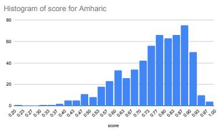  
(a) Amharic

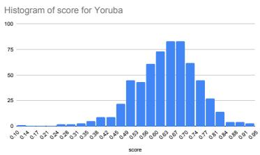  
(b) Yorùbá

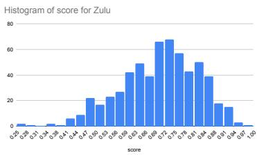  
(c) isiZulu

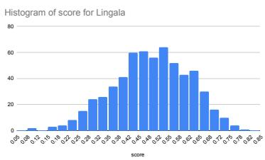  
(d) Lingala

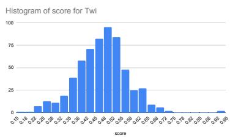  
(e) Twi

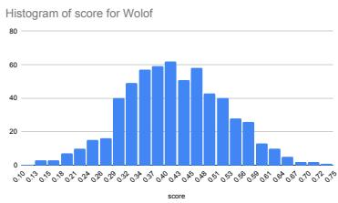  
(f) Wolof  
Figure 3: Evaluation of AfriXNLI translations using AfriCOMET metric scores.

<table><tr><td>Language</td><td>Family/branch</td><td>Region</td><td># speakers</td><td># chars in MADLAD (MB)</td><td>In Aya</td><td>In BLOOMZ</td></tr><tr><td>English (eng)</td><td>Indo-European / Germanic</td><td>Across Africa</td><td>1457M</td><td>9,000,000MB</td><td>√</td><td>1</td></tr><tr><td>French (fra)</td><td>Indo-European /Romance</td><td>Across Africa</td><td>310M</td><td>1,000,000MB</td><td>√</td><td>√</td></tr><tr><td>Kiswahili (swa)</td><td>Niger-Congo / Bantu</td><td>East &amp; Central Africa</td><td>71M-106M</td><td>2,400MB</td><td>√</td><td></td></tr><tr><td>Kinyarwanda (kin)</td><td>Niger-Congo / Bantu</td><td>East Africa</td><td>10M</td><td>749MB</td><td>√</td><td>√</td></tr><tr><td>Hausa (hau)</td><td>Afro-Asiatic / Chadic</td><td>West Africa</td><td>77M</td><td>630MB</td><td>√</td><td>x</td></tr><tr><td>Amharic (amh)</td><td>Afro-Asiatic / Ethio-Semitic</td><td>East Africa</td><td>57M</td><td>509MB</td><td>√</td><td>x</td></tr><tr><td>isiXhosa (xho)</td><td>Niger-Congo / Bantu</td><td>Southern Africa</td><td>19M</td><td>287MB</td><td>√</td><td>√</td></tr><tr><td>chiShona (sna)</td><td>Niger-Congo / Bantu</td><td>Southern Africa</td><td>11M</td><td>266MB</td><td>√</td><td></td></tr><tr><td>isiZulu (xho)</td><td>Niger-Congo / Bantu</td><td>Southern Africa</td><td>27M</td><td>257MB</td><td>√</td><td></td></tr><tr><td>Igbo (ibo)</td><td>Niger-Congo / Volta-Niger</td><td>West Africa</td><td>31M</td><td>251MB</td><td>√</td><td></td></tr><tr><td>Yorùbá (yor)</td><td>Niger-Congo / Volta-Niger</td><td>West Africa</td><td>46M</td><td>239MB</td><td>√</td><td>V</td></tr><tr><td>Sesotho (sot)</td><td>Niger-Congo / Bantu</td><td>Southern Africa</td><td>13M</td><td>227MB</td><td>√</td><td></td></tr><tr><td>Oromo (orm)</td><td>Afro-Asiatic / Cushitic</td><td>East Africa</td><td>37M</td><td>88MB</td><td>x</td><td>x</td></tr><tr><td>Luganda (lug)</td><td>Niger-Congo / Bantu</td><td>Central Africa</td><td>11M</td><td>48MB</td><td>x</td><td></td></tr><tr><td>Ewe (ewe)</td><td>Niger-Congo / Kwa</td><td>West Africa</td><td>7M</td><td>33MB</td><td>x</td><td></td></tr><tr><td>Twi (twi)</td><td>Niger-Congo / Kwa</td><td>West Africa</td><td>9M</td><td>25MB</td><td>√</td><td></td></tr><tr><td>Lingala (lin)</td><td>Niger-Congo / Bantu</td><td>Central Africa</td><td>40M</td><td>22MB</td><td>x</td><td>V</td></tr><tr><td>Wolof (wol)</td><td>Niger-Congo / Senegambia</td><td>West Africa</td><td>5M</td><td>5MB</td><td>x</td><td>√</td></tr><tr><td>Vai (vai)</td><td>Mande</td><td>West Africa</td><td>140,000</td><td></td><td>x</td><td>x</td></tr></table>

Table 9: Languages covered in IROKOBENCH: including language family, region, number of L1 & L2 speakers, size of monolingual data on the web (in MADLAD corpus)

<table><tr><td rowspan=1 colspan=1>Prompt1Question: {question}Answer:</td></tr><tr><td rowspan=1 colspan=1>Prompt2Give direct numerical answers for the question provided.Question: {question}Answer:</td></tr><tr><td rowspan=1 colspan=1>Prompt3Solve the following math question.Question: {question}Answer:</td></tr><tr><td rowspan=3 colspan=1>Prompt4Answer the given question with the appropriate numerical value, ensuring that the response is clear andwithout any supplementary information.Question: {question}Answer:</td></tr><tr><td rowspan=1 colspan=1>without</td></tr><tr><td rowspan=1 colspan=1>Question</td></tr><tr><td rowspan=1 colspan=1>Prompt5For mathematical questions provided in language language. Supply the accurate numeric answer to theprovided questionQuestion: {question}Answer:</td></tr></table>

Table 10: Five different prompt used for prompt sensitivity experiments in AfriMGSM

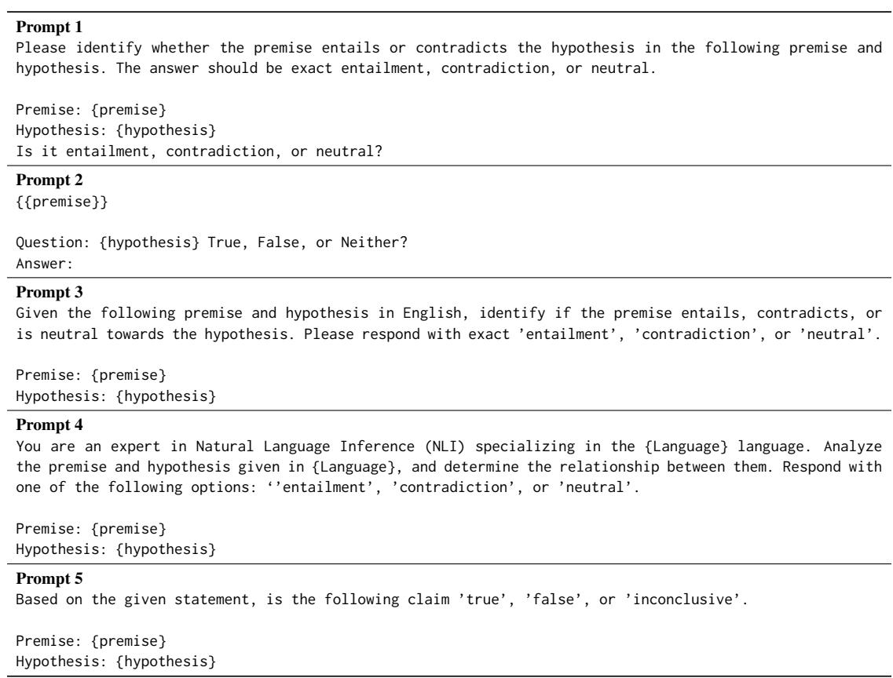  
Table 11: Five different prompt used for prompt sensitivity experiments in AfriXNLI

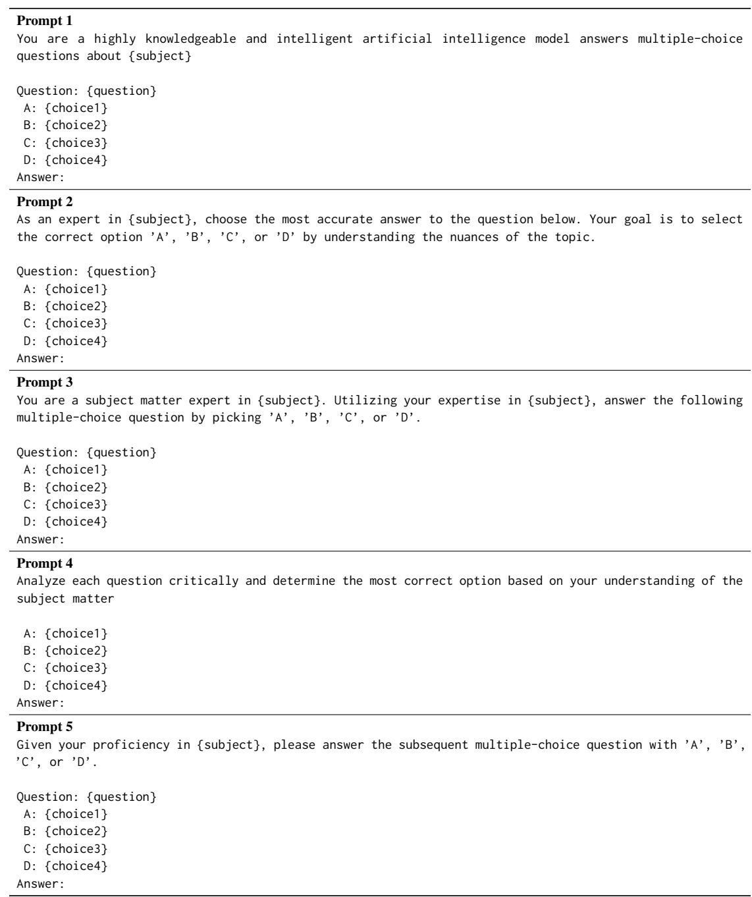  
Table 12: Five different prompt used for prompt sensitivity experiments in AfriMMLU

<table><tr><td rowspan=1 colspan=1>Model</td><td rowspan=1 colspan=17></td></tr><tr><td rowspan=1 colspan=1>AfroXLMR-R-76L</td><td rowspan=1 colspan=6>88.2 83.3 78.5 58.3 73.3 70.0 65.8</td><td rowspan=1 colspan=10>33.3 68.0 69.3 70.8 70.8 73.3 59.5 51.8 73.0 63.2 72.5</td><td rowspan=1 colspan=1>|65.7</td></tr><tr><td rowspan=1 colspan=1>mT0-XXL-MT</td><td rowspan=1 colspan=6>61.2 58.5 52.0 35.0 49.2 50.7 43.2</td><td rowspan=1 colspan=1>34.8</td><td rowspan=1 colspan=2>44.5 36.3</td><td rowspan=1 colspan=4>46.7 51.3 51.8 42.5</td><td rowspan=1 colspan=3></td><td rowspan=1 colspan=1>46.5</td></tr><tr><td rowspan=1 colspan=1></td><td rowspan=1 colspan=4>63.5 61.5 58.3 38.5 57.5</td><td rowspan=1 colspan=2>56.5 51.3</td><td rowspan=1 colspan=1>33.5</td><td rowspan=1 colspan=2>54.2 47.2</td><td rowspan=1 colspan=1>54.8</td><td rowspan=1 colspan=1>56.0</td><td rowspan=1 colspan=1>55.5</td><td rowspan=1 colspan=1>48.8</td><td rowspan=1 colspan=1>39.7</td><td rowspan=1 colspan=2>56.3 52.3 55.0</td><td rowspan=1 colspan=1>51.0</td></tr><tr><td rowspan=1 colspan=1></td><td rowspan=1 colspan=4></td><td rowspan=1 colspan=2>335 33.5</td><td rowspan=1 colspan=1>33.3</td><td rowspan=1 colspan=2>33.5 33.3</td><td rowspan=1 colspan=1>33.5</td><td rowspan=1 colspan=1>335</td><td rowspan=1 colspan=1>35.5</td><td rowspan=1 colspan=1>33.5</td><td rowspan=1 colspan=1>33.2</td><td rowspan=1 colspan=2>33.333.7 34.0</td><td rowspan=1 colspan=1>33.8</td></tr><tr><td rowspan=1 colspan=1></td><td rowspan=1 colspan=6></td><td rowspan=1 colspan=1>33.3</td><td rowspan=1 colspan=2>33.3 33.3</td><td rowspan=1 colspan=1>33.3</td><td rowspan=1 colspan=1>33.5</td><td rowspan=1 colspan=1>33.5</td><td rowspan=1 colspan=1>33.5</td><td rowspan=1 colspan=3>33.3 33.5 33.3 33.3</td><td rowspan=1 colspan=1>33.4</td></tr><tr><td rowspan=1 colspan=1></td><td rowspan=1 colspan=6></td><td rowspan=1 colspan=1>33.8</td><td rowspan=1 colspan=2>45.0 40.7</td><td rowspan=1 colspan=2>47.0 46.2</td><td rowspan=1 colspan=2>46.5 43.3</td><td rowspan=1 colspan=3>39.2 46.5 44.5 47.7</td><td rowspan=1 colspan=1>44.1</td></tr><tr><td rowspan=1 colspan=1></td><td rowspan=1 colspan=7>50.4 48.9 45.2 36.0 44.4 44.1 41.3 33.8</td><td rowspan=1 colspan=9>42.1 38.2 43.1 44.1 44.6 40.3 35.9 44.1 41.2 44.6</td><td rowspan=1 colspan=1>41.4</td></tr><tr><td rowspan=1 colspan=1>Ava-101</td><td rowspan=1 colspan=7></td><td rowspan=1 colspan=9></td><td rowspan=1 colspan=1></td></tr><tr><td rowspan=1 colspan=1></td><td rowspan=1 colspan=6></td><td rowspan=1 colspan=1>34.0</td><td rowspan=1 colspan=2>47.8 47.8</td><td rowspan=1 colspan=1>49.5</td><td rowspan=1 colspan=3>50.8 52.0 47.0</td><td rowspan=1 colspan=3>37.0 51.0 48.3 49.8</td><td rowspan=1 colspan=1>47.7</td></tr><tr><td rowspan=1 colspan=1></td><td rowspan=1 colspan=6></td><td rowspan=1 colspan=1>34.5</td><td rowspan=1 colspan=2>44.5 51.7</td><td rowspan=1 colspan=1>55.8</td><td rowspan=1 colspan=2>54.7 55.2</td><td rowspan=1 colspan=1>48.2</td><td rowspan=1 colspan=3>37.3 53.7 48.2 54.3</td><td rowspan=1 colspan=1>49.9</td></tr><tr><td rowspan=1 colspan=1></td><td rowspan=1 colspan=6></td><td rowspan=1 colspan=1>33.3</td><td rowspan=1 colspan=2>47.0 45.2</td><td rowspan=1 colspan=1>48.2</td><td rowspan=1 colspan=2>49.0 48.7</td><td rowspan=1 colspan=1>43.8</td><td rowspan=1 colspan=3>35.3 49.0 48.3 50</td><td rowspan=1 colspan=1>45.7</td></tr><tr><td rowspan=1 colspan=1></td><td rowspan=1 colspan=4>67.0 59.7 64.2 43.2 57.0</td><td rowspan=1 colspan=2>55.5 54.3</td><td rowspan=1 colspan=1>33.5</td><td rowspan=1 colspan=2>51.7 51.5</td><td rowspan=1 colspan=1>55.7</td><td rowspan=1 colspan=2>52.2 56.5</td><td rowspan=1 colspan=1>47.0</td><td rowspan=1 colspan=3>36.7 55.2 54.5 55.3</td><td rowspan=1 colspan=1>51.5</td></tr><tr><td rowspan=2 colspan=1></td><td rowspan=1 colspan=4>51.7 53.7 51.2 43.3 48.0</td><td rowspan=1 colspan=2>48.2 47.2</td><td rowspan=1 colspan=1>33.8</td><td rowspan=1 colspan=2>48.5 49.8</td><td rowspan=1 colspan=1>49.8</td><td rowspan=1 colspan=2>48.0 50.0</td><td rowspan=1 colspan=1>46.5</td><td rowspan=1 colspan=3>35.8 48.7 49.5 49.5</td><td rowspan=1 colspan=1>46.7</td></tr><tr><td rowspan=1 colspan=6>59.3 56.6 55.8 42.0 52.6 51.6 48.8</td><td rowspan=1 colspan=1>33.8</td><td rowspan=1 colspan=2>47.9 49.2</td><td rowspan=1 colspan=1>51.8</td><td rowspan=1 colspan=2>50.9 52.5</td><td rowspan=1 colspan=1>46.5</td><td rowspan=1 colspan=3>36.4 51.5 49.8 51.8</td><td rowspan=1 colspan=1>48.3</td></tr><tr><td rowspan=1 colspan=1>BLOOMZ 7B</td><td rowspan=1 colspan=1></td><td rowspan=1 colspan=5></td><td rowspan=1 colspan=1></td><td rowspan=1 colspan=2></td><td rowspan=1 colspan=1></td><td rowspan=1 colspan=1></td><td rowspan=1 colspan=1></td><td rowspan=1 colspan=1></td><td rowspan=1 colspan=3></td><td rowspan=2 colspan=1>38.3</td></tr><tr><td rowspan=1 colspan=1></td><td rowspan=1 colspan=1>54.8 51.0</td><td rowspan=1 colspan=3>36.2 35.3 36.7</td><td rowspan=1 colspan=2>39.2 39.3</td><td rowspan=1 colspan=1>32.2</td><td rowspan=1 colspan=1>38.8</td><td rowspan=1 colspan=1>35.8</td><td rowspan=1 colspan=1>42.5</td><td rowspan=1 colspan=1>40.0</td><td rowspan=1 colspan=1>43.2</td><td rowspan=1 colspan=1>37.7</td><td rowspan=1 colspan=3>35.0 40.0 42.0 39.7</td></tr><tr><td rowspan=1 colspan=1></td><td rowspan=1 colspan=1>60.3 56.0</td><td rowspan=1 colspan=2>36.8 35.7</td><td rowspan=1 colspan=1>36.5</td><td rowspan=1 colspan=2>44.7 38.5</td><td rowspan=1 colspan=1>33.8</td><td rowspan=1 colspan=1>41.5</td><td rowspan=1 colspan=1>35.2</td><td rowspan=1 colspan=1>43.3</td><td rowspan=1 colspan=1>40.5</td><td rowspan=1 colspan=1>45.8</td><td rowspan=1 colspan=1>37.5</td><td rowspan=1 colspan=3>36.0 39.8 45.2 40.3</td><td rowspan=1 colspan=1>39.4</td></tr><tr><td rowspan=2 colspan=1></td><td></td><td rowspan=1 colspan=2>33.332.8</td><td rowspan=1 colspan=1>34.2</td><td rowspan=1 colspan=2>33.832.2</td><td rowspan=1 colspan=1>32.5</td><td rowspan=1 colspan=1>35.7</td><td rowspan=1 colspan=1>33.5</td><td rowspan=1 colspan=1>34.2</td><td rowspan=1 colspan=1>31.8</td><td rowspan=1 colspan=1>36.3</td><td rowspan=1 colspan=1>34</td><td rowspan=1 colspan=3>33.3 35.339.7 34.0</td><td rowspan=1 colspan=1>34.2</td></tr><tr><td rowspan=1 colspan=1>33.5 36.2</td><td rowspan=1 colspan=2>32.3 34.0</td><td rowspan=1 colspan=1>34.2</td><td rowspan=1 colspan=2>32.835.2</td><td rowspan=1 colspan=1>33.3</td><td rowspan=1 colspan=1>33.2</td><td rowspan=1 colspan=1>32.8</td><td rowspan=1 colspan=1>32.8</td><td rowspan=1 colspan=1>33.8</td><td rowspan=1 colspan=1>34.0</td><td rowspan=1 colspan=1>36.7</td><td rowspan=1 colspan=3>33.735.3      34.0</td><td rowspan=1 colspan=1>33.9</td></tr><tr><td rowspan=1 colspan=1>t5</td><td rowspan=1 colspan=1>36.238.7</td><td rowspan=1 colspan=2>35.833.3</td><td rowspan=1 colspan=1>35.0</td><td rowspan=1 colspan=2>36.035.3</td><td rowspan=1 colspan=1>33.0</td><td rowspan=1 colspan=1>36.0</td><td rowspan=1 colspan=1>34.7</td><td rowspan=1 colspan=1>36.7</td><td rowspan=1 colspan=1>35.7</td><td rowspan=1 colspan=1>37.3</td><td rowspan=1 colspan=1>36.0</td><td rowspan=1 colspan=1>34.0</td><td rowspan=1 colspan=2>36.7  36.236.0</td><td rowspan=1 colspan=1>35.5</td></tr><tr><td rowspan=1 colspan=1>ave</td><td rowspan=1 colspan=1>44.644.2</td><td rowspan=1 colspan=2>34.934.2</td><td rowspan=1 colspan=1>35.3</td><td rowspan=1 colspan=2>37.336.1</td><td rowspan=1 colspan=1>33.0</td><td rowspan=1 colspan=1>37.0</td><td rowspan=1 colspan=1>34.4</td><td rowspan=1 colspan=1>37.9</td><td rowspan=1 colspan=1>36.4</td><td rowspan=1 colspan=1>39.3</td><td rowspan=1 colspan=1>36.4</td><td rowspan=1 colspan=1>34.4</td><td rowspan=1 colspan=2>37.4 39.536.8</td><td rowspan=1 colspan=1>36.3</td></tr><tr><td rowspan=2 colspan=1>LLaMa 38Bt1</td><td rowspan=1 colspan=1></td><td rowspan=2 colspan=2>32.834.9</td><td rowspan=2 colspan=1>33.3</td><td rowspan=1 colspan=2></td><td rowspan=1 colspan=1></td><td rowspan=1 colspan=2></td><td rowspan=1 colspan=1></td><td rowspan=1 colspan=1></td><td rowspan=1 colspan=1></td><td rowspan=2 colspan=1>33.5</td><td rowspan=2 colspan=1>32.7</td><td rowspan=2 colspan=2>33.9 34.135.0</td><td rowspan=2 colspan=1>33.6</td></tr><tr><td rowspan=1 colspan=1>34.334.9</td><td rowspan=1 colspan=2>32.134.0</td><td rowspan=1 colspan=1>33.2</td><td rowspan=1 colspan=2>33.832.4</td><td rowspan=1 colspan=1>33.3</td><td rowspan=1 colspan=1>34.8</td><td rowspan=1 colspan=1>33.1</td></tr><tr><td rowspan=1 colspan=1>t2</td><td rowspan=1 colspan=1>43.947.4</td><td rowspan=1 colspan=2>40.234.3</td><td rowspan=1 colspan=1>35.6</td><td rowspan=1 colspan=2>39.1 32.9</td><td rowspan=1 colspan=1>32.7</td><td rowspan=1 colspan=1>33.3</td><td rowspan=1 colspan=1>35.4</td><td rowspan=1 colspan=1>35.5</td><td rowspan=1 colspan=1>35.9</td><td rowspan=1 colspan=1>34.1</td><td rowspan=1 colspan=1>34.3</td><td rowspan=1 colspan=1>33.3</td><td rowspan=1 colspan=1>36.8</td><td rowspan=1 colspan=1>35.1738.5</td><td rowspan=1 colspan=1>35.4</td></tr><tr><td rowspan=1 colspan=1>t3</td><td rowspan=1 colspan=1>33.333.2</td><td rowspan=1 colspan=2>33.7532.2</td><td rowspan=1 colspan=1>33.2</td><td rowspan=1 colspan=1>33.0</td><td rowspan=1 colspan=1>32.8</td><td rowspan=1 colspan=1>33.9</td><td rowspan=1 colspan=1>33.2</td><td rowspan=1 colspan=1>33.7</td><td rowspan=1 colspan=1>33.9</td><td rowspan=1 colspan=1>33.4</td><td rowspan=1 colspan=1>32.8</td><td rowspan=1 colspan=1>32.3</td><td rowspan=1 colspan=1>32.7</td><td rowspan=1 colspan=1>33.5</td><td rowspan=1 colspan=1>33.333.4</td><td rowspan=1 colspan=1>33.2</td></tr><tr><td rowspan=1 colspan=1>t4</td><td rowspan=1 colspan=1>36.235.0</td><td rowspan=1 colspan=2>32.434.3</td><td rowspan=1 colspan=1>33.3</td><td rowspan=1 colspan=1>33.0</td><td rowspan=1 colspan=1>33.3</td><td rowspan=1 colspan=1>34.1</td><td rowspan=1 colspan=1>33.2</td><td rowspan=1 colspan=1>33.5</td><td rowspan=1 colspan=1>32.3</td><td rowspan=1 colspan=1>33.3</td><td rowspan=1 colspan=1>32.9</td><td rowspan=1 colspan=1>31.3</td><td rowspan=1 colspan=1>32.9</td><td rowspan=1 colspan=1>33.1</td><td rowspan=1 colspan=1>33.333.2</td><td rowspan=1 colspan=1>33.1</td></tr><tr><td rowspan=1 colspan=1>t5</td><td rowspan=1 colspan=1>33.333.8</td><td rowspan=1 colspan=2>33.133.2</td><td rowspan=1 colspan=1>33.8</td><td rowspan=1 colspan=1>33.3</td><td rowspan=1 colspan=1>35.0</td><td rowspan=1 colspan=1>30.6</td><td rowspan=1 colspan=1>33.3</td><td rowspan=1 colspan=1>33.8</td><td rowspan=1 colspan=1>34.0</td><td rowspan=1 colspan=1>33.2</td><td rowspan=1 colspan=1>32.8</td><td rowspan=1 colspan=1>34.8</td><td rowspan=1 colspan=1>33.0</td><td rowspan=1 colspan=1>34.2</td><td rowspan=1 colspan=1>33.332.9</td><td rowspan=1 colspan=1>33.4</td></tr><tr><td rowspan=1 colspan=1>ave</td><td rowspan=1 colspan=1>36.236.9</td><td rowspan=1 colspan=3>34.533.8 33.8</td><td rowspan=1 colspan=2>34.133.6</td><td rowspan=1 colspan=1>32.9</td><td rowspan=1 colspan=1>33.4</td><td rowspan=1 colspan=1>33.8</td><td rowspan=1 colspan=1>33.8</td><td rowspan=1 colspan=1>34.1</td><td rowspan=1 colspan=1>33.1</td><td rowspan=1 colspan=1>33.2</td><td rowspan=1 colspan=1>32.9</td><td rowspan=1 colspan=1>34.3</td><td rowspan=1 colspan=1>33.834.6</td><td rowspan=1 colspan=1>33.7</td></tr><tr><td rowspan=1 colspan=1>LLaMa 3.1 8B</td><td rowspan=1 colspan=1></td><td rowspan=1 colspan=2></td><td rowspan=1 colspan=1></td><td rowspan=1 colspan=2></td><td rowspan=1 colspan=1></td><td rowspan=1 colspan=1></td><td rowspan=1 colspan=1></td><td rowspan=1 colspan=1></td><td rowspan=1 colspan=1></td><td rowspan=1 colspan=1></td><td rowspan=1 colspan=1></td><td rowspan=1 colspan=2></td><td rowspan=1 colspan=1></td><td rowspan=1 colspan=1></td></tr><tr><td rowspan=1 colspan=1>t1</td><td rowspan=1 colspan=1>33.333.3</td><td rowspan=1 colspan=2>33.333.3</td><td rowspan=1 colspan=1>33.3</td><td rowspan=1 colspan=2>33.333.3</td><td rowspan=1 colspan=1>33.3</td><td rowspan=1 colspan=1>33.3</td><td rowspan=1 colspan=1>33.3</td><td rowspan=1 colspan=1>33.3</td><td rowspan=1 colspan=1>33.3</td><td rowspan=1 colspan=1>33.3</td><td rowspan=1 colspan=1>33.3</td><td rowspan=1 colspan=2>33.333.3</td><td rowspan=1 colspan=1>33.333.3</td><td rowspan=1 colspan=1>33.3</td></tr><tr><td rowspan=1 colspan=1>t2</td><td rowspan=1 colspan=1>53.050.2</td><td rowspan=1 colspan=2>38.837.7</td><td rowspan=1 colspan=1>36.5</td><td rowspan=1 colspan=2>38.5 38.3</td><td rowspan=1 colspan=1>32.3</td><td rowspan=1 colspan=1>37.5</td><td rowspan=1 colspan=1>35.0</td><td rowspan=1 colspan=1>35.8</td><td rowspan=1 colspan=1>34.8</td><td rowspan=1 colspan=1>43.8</td><td rowspan=1 colspan=1>37.0</td><td rowspan=1 colspan=2>32.333.8</td><td rowspan=1 colspan=1>38.534.0</td><td rowspan=1 colspan=1>36.6</td></tr><tr><td rowspan=1 colspan=1>t3</td><td rowspan=1 colspan=1>33.734.5</td><td rowspan=1 colspan=2>35.833.7</td><td rowspan=1 colspan=1>35.7</td><td rowspan=1 colspan=2>34.035.2</td><td rowspan=1 colspan=1>35.0</td><td rowspan=1 colspan=1>33.3</td><td rowspan=1 colspan=1>33.5</td><td rowspan=1 colspan=1>34.8</td><td rowspan=1 colspan=1>34.7</td><td rowspan=1 colspan=1>34.0</td><td rowspan=1 colspan=1>32.8</td><td rowspan=1 colspan=2>35.833.8</td><td rowspan=1 colspan=1>34.034.7</td><td rowspan=1 colspan=1>34.4</td></tr><tr><td rowspan=1 colspan=1>t4</td><td rowspan=1 colspan=1>38.235.7</td><td rowspan=1 colspan=2>34.534.3</td><td rowspan=1 colspan=1>41.7</td><td rowspan=1 colspan=1>35.3</td><td rowspan=1 colspan=1>33.2</td><td rowspan=1 colspan=1>35.2</td><td rowspan=1 colspan=2>33.233.5</td><td rowspan=1 colspan=1>36.3</td><td rowspan=1 colspan=1>33.8</td><td rowspan=1 colspan=1>34.8</td><td rowspan=1 colspan=1>31.2</td><td rowspan=1 colspan=2>34.834.0</td><td rowspan=1 colspan=1>35.733.3</td><td rowspan=1 colspan=1>34.7</td></tr><tr><td rowspan=1 colspan=1>t5</td><td rowspan=1 colspan=1>36.236.3</td><td rowspan=1 colspan=2>32.332.8</td><td rowspan=1 colspan=1>34.0</td><td rowspan=1 colspan=1>33.5</td><td rowspan=1 colspan=1>35.3</td><td rowspan=1 colspan=1>31.2</td><td rowspan=1 colspan=1>33.5</td><td rowspan=1 colspan=1>30.2</td><td rowspan=1 colspan=1>34.0</td><td rowspan=1 colspan=1>33.2</td><td rowspan=1 colspan=1>34.3</td><td rowspan=1 colspan=1>32.5</td><td rowspan=1 colspan=2>31.532.0</td><td rowspan=1 colspan=1>33.330.3</td><td rowspan=1 colspan=1>32.7</td></tr><tr><td rowspan=1 colspan=1>ave</td><td rowspan=1 colspan=1>38.938.0</td><td rowspan=1 colspan=2>35.034.4</td><td rowspan=1 colspan=1>36.2</td><td rowspan=1 colspan=1>34.9</td><td rowspan=1 colspan=1>35.1</td><td rowspan=1 colspan=1>33.4</td><td rowspan=1 colspan=1>34.2</td><td rowspan=1 colspan=1>33.1</td><td rowspan=1 colspan=1>34.9</td><td rowspan=1 colspan=1>34.0</td><td rowspan=1 colspan=1>36.1</td><td rowspan=1 colspan=1>33.4</td><td rowspan=1 colspan=2>33.633.4</td><td rowspan=1 colspan=1>35.033.1</td><td rowspan=1 colspan=1>34.3</td></tr><tr><td rowspan=1 colspan=1>LLaMaX 3 8B</td><td rowspan=1 colspan=1></td><td rowspan=1 colspan=3></td><td rowspan=1 colspan=2></td><td rowspan=1 colspan=1></td><td rowspan=1 colspan=1></td><td rowspan=1 colspan=1></td><td rowspan=1 colspan=1></td><td rowspan=1 colspan=1></td><td rowspan=1 colspan=1></td><td rowspan=1 colspan=1></td><td rowspan=1 colspan=3></td><td rowspan=1 colspan=1></td></tr><tr><td rowspan=1 colspan=1>t1</td><td rowspan=1 colspan=1>53.049.3</td><td rowspan=1 colspan=2>40.235.8</td><td rowspan=1 colspan=1>44.8</td><td rowspan=1 colspan=1>42.5</td><td rowspan=1 colspan=1>37.7</td><td rowspan=1 colspan=1>29.8</td><td rowspan=1 colspan=1>42.7</td><td rowspan=1 colspan=1>40.5</td><td rowspan=1 colspan=1>47.0</td><td rowspan=1 colspan=1>39.7</td><td rowspan=1 colspan=1>45.7</td><td rowspan=1 colspan=1>36.3</td><td rowspan=1 colspan=3>37.346.2 44.042.0</td><td rowspan=1 colspan=1>40.8</td></tr><tr><td rowspan=2 colspan=1>13</td><td rowspan=1 colspan=1>35.538.7</td><td rowspan=1 colspan=2>35.234.2</td><td rowspan=1 colspan=1>34.0</td><td rowspan=1 colspan=1>32.3</td><td rowspan=1 colspan=1>32.0</td><td rowspan=1 colspan=1>35.3</td><td rowspan=1 colspan=1>33.0</td><td rowspan=1 colspan=1>33.0</td><td rowspan=1 colspan=1>33.8</td><td rowspan=1 colspan=1>33.2</td><td rowspan=1 colspan=1>33.8</td><td rowspan=1 colspan=1>33.8</td><td rowspan=1 colspan=2>32.233.0</td><td rowspan=1 colspan=1>33.032.8</td><td rowspan=1 colspan=1>33.4</td></tr><tr><td rowspan=1 colspan=1>34.533.7</td><td rowspan=1 colspan=2>34.234.5</td><td rowspan=1 colspan=1>33.0</td><td rowspan=1 colspan=1>32.7</td><td rowspan=1 colspan=1>35.2</td><td rowspan=1 colspan=1>34.7</td><td rowspan=1 colspan=1>33.2</td><td rowspan=1 colspan=1>33.2</td><td rowspan=1 colspan=1>33.2</td><td rowspan=1 colspan=1>33.2</td><td rowspan=1 colspan=1>34.0</td><td rowspan=1 colspan=1>35.2</td><td rowspan=1 colspan=2>33.235.8</td><td rowspan=1 colspan=1>33.733.0</td><td rowspan=1 colspan=1>33.9</td></tr><tr><td rowspan=1 colspan=1>t4</td><td rowspan=1 colspan=1>33.733.2</td><td rowspan=1 colspan=2>33.733.7</td><td rowspan=1 colspan=1>33.3</td><td rowspan=1 colspan=1>33.3</td><td rowspan=1 colspan=1>36.7</td><td rowspan=1 colspan=1>34.2</td><td rowspan=1 colspan=1>33.0</td><td rowspan=1 colspan=1>33.5</td><td rowspan=1 colspan=1>34.3</td><td rowspan=1 colspan=1>33.2</td><td rowspan=1 colspan=1>34.5</td><td rowspan=1 colspan=1>33.0</td><td rowspan=1 colspan=2>33.734.7</td><td rowspan=1 colspan=1>33.032.8</td><td rowspan=1 colspan=1>33.8</td></tr><tr><td rowspan=1 colspan=1>t5</td><td rowspan=1 colspan=1>33.333.7</td><td rowspan=1 colspan=2>33.333.0</td><td rowspan=1 colspan=1>32.8</td><td rowspan=1 colspan=1>33.5</td><td rowspan=1 colspan=1>34.8</td><td rowspan=1 colspan=1>30.7</td><td rowspan=1 colspan=1>33.2</td><td rowspan=1 colspan=1>33.2</td><td rowspan=1 colspan=1>33.7</td><td rowspan=1 colspan=1>33.3</td><td rowspan=1 colspan=1>33.8</td><td rowspan=1 colspan=1>34.8</td><td rowspan=1 colspan=2>33.033.5</td><td rowspan=1 colspan=1>33.334.5</td><td rowspan=1 colspan=1>33.4</td></tr><tr><td rowspan=1 colspan=1>ave</td><td rowspan=1 colspan=1>38.037.7</td><td rowspan=1 colspan=2>35.334.2</td><td rowspan=1 colspan=1>35.6</td><td rowspan=1 colspan=1>34.9</td><td rowspan=1 colspan=1>35.3</td><td rowspan=1 colspan=1>32.9</td><td rowspan=1 colspan=1>35.0</td><td rowspan=1 colspan=1>34.7</td><td rowspan=1 colspan=1>36.4</td><td rowspan=1 colspan=1>34.5</td><td rowspan=1 colspan=1>36.4</td><td rowspan=1 colspan=1>34.6</td><td rowspan=1 colspan=2>33.936.6</td><td rowspan=1 colspan=1>35.435.0</td><td rowspan=1 colspan=1>35.0</td></tr><tr><td rowspan=2 colspan=1>Gemma 2 9Bt1</td><td rowspan=1 colspan=1></td><td rowspan=1 colspan=2></td><td rowspan=1 colspan=1></td><td rowspan=1 colspan=2></td><td rowspan=1 colspan=1></td><td rowspan=1 colspan=1></td><td rowspan=1 colspan=1></td><td rowspan=1 colspan=1></td><td rowspan=1 colspan=1></td><td rowspan=1 colspan=1></td><td rowspan=1 colspan=1></td><td rowspan=1 colspan=2></td><td rowspan=1 colspan=1></td><td rowspan=2 colspan=1>38.3</td></tr><tr><td rowspan=1 colspan=1>70.6762.5</td><td rowspan=1 colspan=2>45.234.2</td><td rowspan=1 colspan=1>39.7</td><td rowspan=1 colspan=1>38.2</td><td rowspan=1 colspan=1>38.3</td><td rowspan=1 colspan=1>33.2</td><td rowspan=1 colspan=1>36.3</td><td rowspan=1 colspan=1>35.0</td><td rowspan=1 colspan=1>39.7</td><td rowspan=1 colspan=1>39.2</td><td rowspan=1 colspan=1>46.0</td><td rowspan=1 colspan=1>36.5</td><td rowspan=1 colspan=2>33.739.3</td><td rowspan=1 colspan=1>39.539.2</td></tr><tr><td rowspan=1 colspan=1>t2</td><td rowspan=1 colspan=1>55.350.7</td><td rowspan=1 colspan=2>43.235.3</td><td rowspan=1 colspan=1>47.0</td><td rowspan=1 colspan=1>40.7</td><td rowspan=1 colspan=1>40.2</td><td rowspan=1 colspan=1>32.8</td><td rowspan=1 colspan=1>38.8</td><td rowspan=1 colspan=1>37.8</td><td rowspan=1 colspan=1>42.3</td><td rowspan=1 colspan=1>40.2</td><td rowspan=1 colspan=1>46.3</td><td rowspan=1 colspan=1>37.2</td><td rowspan=1 colspan=2>35.242.5</td><td rowspan=1 colspan=1>41.344.5</td><td rowspan=1 colspan=1>40.3</td></tr><tr><td rowspan=1 colspan=1>t3</td><td rowspan=1 colspan=1>34.533.7</td><td rowspan=1 colspan=2>29.532.5</td><td rowspan=1 colspan=1>40.2</td><td rowspan=1 colspan=1>34.3</td><td rowspan=1 colspan=1>36.3</td><td rowspan=1 colspan=1>34.8</td><td rowspan=1 colspan=1>31.3</td><td rowspan=1 colspan=1>31.3</td><td rowspan=1 colspan=1>34.3</td><td rowspan=1 colspan=1>30.8</td><td rowspan=1 colspan=1>34.7</td><td rowspan=1 colspan=1>32.7</td><td rowspan=1 colspan=2>33.735.7</td><td rowspan=1 colspan=1>31.331.3</td><td rowspan=1 colspan=1>33.4</td></tr><tr><td rowspan=1 colspan=1>t4</td><td rowspan=1 colspan=1>33.234.5</td><td rowspan=1 colspan=2>31.532.3</td><td rowspan=1 colspan=1>39.0</td><td rowspan=1 colspan=1>35.5</td><td rowspan=1 colspan=1>35.7</td><td rowspan=1 colspan=1>34.8</td><td rowspan=1 colspan=1>30.8</td><td rowspan=1 colspan=1>32.8</td><td rowspan=1 colspan=1>35.8</td><td rowspan=1 colspan=1>31.3</td><td rowspan=1 colspan=1>36.8</td><td rowspan=1 colspan=1>33.3</td><td rowspan=1 colspan=1>35.0</td><td rowspan=1 colspan=1>33.8</td><td rowspan=1 colspan=1>35.231.5</td><td rowspan=1 colspan=1>34.1</td></tr><tr><td rowspan=1 colspan=1>t5</td><td rowspan=1 colspan=1>37.039.7</td><td rowspan=1 colspan=1>34.53</td><td rowspan=1 colspan=1>3.2</td><td rowspan=1 colspan=1>36.8</td><td rowspan=1 colspan=1>35.7</td><td rowspan=1 colspan=1>33.7</td><td rowspan=1 colspan=1>35.0</td><td rowspan=1 colspan=1>35.2</td><td rowspan=1 colspan=1>35.0</td><td rowspan=1 colspan=1>36.8</td><td rowspan=1 colspan=1>38.7</td><td rowspan=1 colspan=1>35.5</td><td rowspan=1 colspan=1>33.0</td><td rowspan=1 colspan=1>34.3</td><td rowspan=1 colspan=1>38.0</td><td rowspan=1 colspan=1>35.236.5</td><td rowspan=1 colspan=1>35.4</td></tr><tr><td rowspan=1 colspan=1>ave</td><td rowspan=1 colspan=1>46.144.2</td><td rowspan=1 colspan=1>36.8</td><td rowspan=1 colspan=1>33.5</td><td rowspan=1 colspan=1>40.5</td><td rowspan=1 colspan=1>36.9</td><td rowspan=1 colspan=1>36.8</td><td rowspan=1 colspan=1>34.1</td><td rowspan=1 colspan=1>34.5</td><td rowspan=1 colspan=1>34.4</td><td rowspan=1 colspan=1>37.8</td><td rowspan=1 colspan=1>36.0</td><td rowspan=1 colspan=1>39.9</td><td rowspan=1 colspan=1>34.5</td><td rowspan=1 colspan=1>34.4</td><td rowspan=1 colspan=1>37.9</td><td rowspan=1 colspan=1>36.536.6</td><td rowspan=1 colspan=1>36.3</td></tr><tr><td rowspan=1 colspan=1>Gemma 2 27B</td><td rowspan=1 colspan=1></td><td rowspan=1 colspan=2></td><td rowspan=1 colspan=1></td><td rowspan=1 colspan=1></td><td rowspan=1 colspan=1></td><td rowspan=1 colspan=1></td><td rowspan=1 colspan=1></td><td rowspan=1 colspan=1></td><td rowspan=1 colspan=1></td><td rowspan=1 colspan=1></td><td rowspan=1 colspan=1></td><td rowspan=1 colspan=1></td><td rowspan=1 colspan=1></td><td rowspan=1 colspan=1></td><td rowspan=1 colspan=1></td><td rowspan=1 colspan=1></td></tr><tr><td rowspan=1 colspan=1>t1</td><td rowspan=1 colspan=1>61.5  55</td><td rowspan=1 colspan=2>43.333.5</td><td rowspan=1 colspan=1>41.33</td><td rowspan=1 colspan=1>37.2</td><td rowspan=1 colspan=1>35.7</td><td rowspan=1 colspan=1>33.2</td><td rowspan=1 colspan=1>34.7</td><td rowspan=1 colspan=1>33.5</td><td rowspan=1 colspan=1>38.2</td><td rowspan=1 colspan=1>35.8</td><td rowspan=1 colspan=1>45.0</td><td rowspan=1 colspan=1>34.5</td><td rowspan=1 colspan=1>33.5</td><td rowspan=1 colspan=1>35.2</td><td rowspan=1 colspan=1>35.736.8</td><td rowspan=1 colspan=1>36.7</td></tr><tr><td rowspan=1 colspan=1>t2</td><td rowspan=1 colspan=1>67.863.3</td><td rowspan=1 colspan=2>47.036.8</td><td rowspan=1 colspan=1>49.7</td><td rowspan=1 colspan=1>46.2</td><td rowspan=1 colspan=1>40.5</td><td rowspan=1 colspan=1>32.0</td><td rowspan=1 colspan=1>41.7</td><td rowspan=1 colspan=1>35.8</td><td rowspan=1 colspan=1>46.0</td><td rowspan=1 colspan=1>43.5</td><td rowspan=1 colspan=1>57.0</td><td rowspan=1 colspan=1>36.0</td><td rowspan=1 colspan=1>36.7</td><td rowspan=1 colspan=1>45.0</td><td rowspan=1 colspan=1>42.548.0</td><td rowspan=1 colspan=1>42.8</td></tr><tr><td rowspan=2 colspan=1>t3t4</td><td rowspan=1 colspan=1>43.246.0</td><td rowspan=1 colspan=1>32.0</td><td rowspan=1 colspan=1>31.7</td><td rowspan=1 colspan=1>36.2</td><td rowspan=1 colspan=1>35.0</td><td rowspan=1 colspan=1>35.0</td><td rowspan=1 colspan=1>33.3</td><td rowspan=1 colspan=1>34.7</td><td rowspan=1 colspan=1>33.2</td><td rowspan=1 colspan=1>37.0</td><td rowspan=1 colspan=1>37.7</td><td rowspan=1 colspan=1>41.5</td><td rowspan=1 colspan=1>33.2</td><td rowspan=1 colspan=1>32.3</td><td rowspan=1 colspan=1>37.3</td><td rowspan=1 colspan=1>34.033.7</td><td rowspan=1 colspan=1>34.9</td></tr><tr><td rowspan=1 colspan=1>6257.0</td><td rowspan=1 colspan=1>35.0</td><td rowspan=1 colspan=1>31.8</td><td rowspan=1 colspan=1>43.0</td><td rowspan=1 colspan=1>39.7</td><td rowspan=1 colspan=1>37.0</td><td rowspan=1 colspan=1>33.0</td><td rowspan=1 colspan=1>37.8</td><td rowspan=1 colspan=1>32.2</td><td rowspan=1 colspan=1>40.8</td><td rowspan=1 colspan=1>37.2</td><td rowspan=1 colspan=1>49.5</td><td rowspan=1 colspan=1>34.5</td><td rowspan=1 colspan=1>33.8</td><td rowspan=1 colspan=1>38.0</td><td rowspan=1 colspan=1>37.837.3</td><td rowspan=1 colspan=1>37.4</td></tr><tr><td rowspan=1 colspan=1>t5</td><td rowspan=1 colspan=1>41.341.7</td><td rowspan=1 colspan=1>33.8</td><td rowspan=1 colspan=1>33.5</td><td rowspan=1 colspan=1>35.5</td><td rowspan=1 colspan=1>37.7</td><td rowspan=1 colspan=1>33.5</td><td rowspan=1 colspan=1>34.5</td><td rowspan=1 colspan=1>35.7</td><td rowspan=1 colspan=1>33.8</td><td rowspan=1 colspan=1>34.7</td><td rowspan=1 colspan=1>35.5</td><td rowspan=1 colspan=1>34.2</td><td rowspan=1 colspan=1>33.7</td><td rowspan=1 colspan=1>33.7</td><td rowspan=1 colspan=1>38.8</td><td rowspan=1 colspan=1>34.335.2</td><td rowspan=1 colspan=1>34.9</td></tr><tr><td rowspan=1 colspan=1>ave</td><td rowspan=1 colspan=1>55.252.6</td><td rowspan=1 colspan=2>38.233.5</td><td rowspan=1 colspan=1>41.1</td><td rowspan=1 colspan=2>39.136.3</td><td rowspan=1 colspan=1>33.2</td><td rowspan=1 colspan=1>36.9</td><td rowspan=1 colspan=1>33.7</td><td rowspan=1 colspan=1>39.3</td><td rowspan=1 colspan=1>37.9</td><td rowspan=1 colspan=1>45.4</td><td rowspan=1 colspan=1>34.4</td><td rowspan=1 colspan=1>34.0</td><td rowspan=1 colspan=1>38.9</td><td rowspan=1 colspan=1>36.938.2</td><td rowspan=1 colspan=1>37.3</td></tr><tr><td rowspan=1 colspan=1>LLaMa 3.1 70B</td><td rowspan=1 colspan=1></td><td rowspan=1 colspan=2></td><td rowspan=1 colspan=1></td><td rowspan=1 colspan=2></td><td rowspan=1 colspan=1></td><td rowspan=1 colspan=1></td><td rowspan=1 colspan=1></td><td rowspan=1 colspan=1></td><td rowspan=1 colspan=1></td><td rowspan=1 colspan=1></td><td rowspan=1 colspan=1></td><td rowspan=1 colspan=1></td><td rowspan=1 colspan=1></td><td rowspan=1 colspan=1></td><td rowspan=2 colspan=1>33.8</td></tr><tr><td rowspan=1 colspan=1>tl</td><td rowspan=1 colspan=1>57.333.7</td><td rowspan=1 colspan=2>33.333.3</td><td rowspan=1 colspan=1>33.7</td><td rowspan=1 colspan=2>33.733.7</td><td rowspan=1 colspan=1>34.3</td><td rowspan=1 colspan=1>33.8</td><td rowspan=1 colspan=1>33.3</td><td rowspan=1 colspan=1>34.0</td><td rowspan=1 colspan=1>33.5</td><td rowspan=1 colspan=1>36.8</td><td rowspan=1 colspan=1>33.3</td><td rowspan=1 colspan=2>33.333.5</td><td rowspan=1 colspan=1>33.533.3</td></tr><tr><td rowspan=1 colspan=1>t2</td><td rowspan=1 colspan=1>57.350.7</td><td rowspan=1 colspan=2>43.234.3</td><td rowspan=1 colspan=1>42.8</td><td rowspan=1 colspan=2>42.336.5</td><td rowspan=1 colspan=1>32.8</td><td rowspan=1 colspan=1>37.5</td><td rowspan=1 colspan=1>34.7</td><td rowspan=1 colspan=1>35.5</td><td rowspan=1 colspan=1>38.3</td><td rowspan=1 colspan=1>44.0</td><td rowspan=1 colspan=1>36.0</td><td rowspan=1 colspan=2>34.739.3</td><td rowspan=1 colspan=1>39.037.0</td><td rowspan=1 colspan=1>38.0</td></tr><tr><td rowspan=1 colspan=1>t3</td><td></td><td></td><td></td><td></td><td></td><td></td><td></td><td></td><td></td><td></td><td></td><td></td><td></td><td></td><td></td><td></td><td></td></tr><tr><td rowspan=1 colspan=1>t4</td><td rowspan=1 colspan=1>37.357.5</td><td rowspan=1 colspan=3>33.234.7 45.8</td><td rowspan=1 colspan=2>36.335.2</td><td rowspan=1 colspan=1>32.5</td><td rowspan=1 colspan=1>38.0</td><td rowspan=1 colspan=1>32.8</td><td rowspan=1 colspan=1>39.7</td><td rowspan=1 colspan=1>39.0</td><td rowspan=1 colspan=1>49.2</td><td rowspan=1 colspan=1>33.8</td><td rowspan=1 colspan=2>34.733.5</td><td rowspan=1 colspan=1>35.837.0</td><td rowspan=1 colspan=1>36.9</td></tr><tr><td rowspan=1 colspan=1>t5</td><td rowspan=1 colspan=1>43.342.0</td><td rowspan=1 colspan=3>33.832.8 34.3</td><td rowspan=1 colspan=2>33.532.7</td><td rowspan=1 colspan=1>33.0</td><td rowspan=1 colspan=2>34.031.2</td><td rowspan=1 colspan=1>31.7</td><td rowspan=1 colspan=1>32.5</td><td rowspan=1 colspan=1>37.2</td><td rowspan=1 colspan=1>32.0</td><td rowspan=1 colspan=2>33.833.2</td><td rowspan=1 colspan=1>31.532.8</td><td rowspan=1 colspan=1>33.1</td></tr><tr><td rowspan=1 colspan=1>ave</td><td rowspan=1 colspan=4>51.049.8 35.434.3 38.7</td><td rowspan=1 colspan=2>36.434.6</td><td rowspan=1 colspan=1>33.2</td><td rowspan=1 colspan=2>35.532.7</td><td rowspan=1 colspan=1>34.5</td><td rowspan=1 colspan=2>35.040.5</td><td rowspan=1 colspan=1>34.5</td><td rowspan=1 colspan=2>34.234.7</td><td rowspan=1 colspan=1>35.034.8</td><td rowspan=1 colspan=1>35.2</td></tr><tr><td rowspan=1 colspan=1>CommandR (Aug)</td><td rowspan=1 colspan=4></td><td rowspan=1 colspan=2></td><td rowspan=1 colspan=1></td><td rowspan=1 colspan=2></td><td rowspan=1 colspan=1></td><td rowspan=1 colspan=2></td><td rowspan=1 colspan=1></td><td rowspan=1 colspan=2></td><td rowspan=1 colspan=1></td><td rowspan=2 colspan=1>38.7</td></tr><tr><td rowspan=1 colspan=1>tl</td><td rowspan=1 colspan=1>76.167.2</td><td rowspan=1 colspan=3>39.632.9 36.7</td><td rowspan=1 colspan=2>35.641.4</td><td rowspan=1 colspan=1>34.2</td><td rowspan=1 colspan=2>35.742.3</td><td rowspan=1 colspan=1>41.4</td><td rowspan=1 colspan=1>41.2</td><td rowspan=1 colspan=1>52.9</td><td rowspan=1 colspan=1>34.3</td><td rowspan=1 colspan=2>34.638.0</td><td rowspan=1 colspan=1>40.137.7</td></tr><tr><td rowspan=1 colspan=1>t2</td><td rowspan=1 colspan=1>57.757.9</td><td rowspan=1 colspan=3>36.534.0 37.8</td><td rowspan=1 colspan=2>39.235.9</td><td rowspan=1 colspan=1>30.7</td><td rowspan=1 colspan=1>37.6</td><td rowspan=1 colspan=1>36.3</td><td rowspan=1 colspan=1>37.4</td><td rowspan=1 colspan=1>34.6</td><td rowspan=1 colspan=1>42.0</td><td rowspan=1 colspan=1>35.3</td><td rowspan=1 colspan=2>32.037.3</td><td rowspan=1 colspan=1>43.135.3</td><td rowspan=1 colspan=1>36.6</td></tr><tr><td rowspan=1 colspan=1>t3</td><td rowspan=1 colspan=1>79.975.7</td><td rowspan=1 colspan=1>45.7</td><td rowspan=1 colspan=2>38.9 45.1</td><td rowspan=1 colspan=2>42.445.6</td><td rowspan=1 colspan=1>34.5</td><td rowspan=1 colspan=1>39.0</td><td rowspan=1 colspan=1>44.8</td><td rowspan=1 colspan=1>48.9</td><td rowspan=1 colspan=1>45.1</td><td rowspan=1 colspan=1>55.3</td><td rowspan=1 colspan=1>41.8</td><td rowspan=1 colspan=2>34.545.9</td><td rowspan=1 colspan=1>45.940.8</td><td rowspan=1 colspan=1>43.4</td></tr><tr><td rowspan=2 colspan=1>t4t5</td><td rowspan=1 colspan=1>75.463.4</td><td rowspan=1 colspan=1>46.9</td><td rowspan=1 colspan=2>38.9 43.0</td><td rowspan=1 colspan=1>42.1</td><td rowspan=1 colspan=1>43.0</td><td rowspan=1 colspan=1>36.2</td><td rowspan=1 colspan=1>42.1</td><td rowspan=1 colspan=1>43.1</td><td rowspan=1 colspan=1>45.3</td><td rowspan=1 colspan=1>39.1</td><td rowspan=1 colspan=1>49.7</td><td rowspan=1 colspan=1>36.4</td><td rowspan=1 colspan=1>33.8</td><td rowspan=1 colspan=1>44.0</td><td rowspan=1 colspan=1>39.942.8</td><td rowspan=1 colspan=1>41.6</td></tr><tr><td rowspan=1 colspan=1>63.372.2</td><td rowspan=1 colspan=1>44.7</td><td rowspan=1 colspan=2>35.9 40.3</td><td rowspan=1 colspan=1>40.4</td><td rowspan=1 colspan=1>36.7</td><td rowspan=1 colspan=1>33.8</td><td rowspan=1 colspan=1>39.3</td><td rowspan=1 colspan=1>37.0</td><td rowspan=1 colspan=1>37.6</td><td rowspan=1 colspan=1>38.7</td><td rowspan=1 colspan=1>57.1</td><td rowspan=1 colspan=1>33.1</td><td rowspan=1 colspan=1>35.6</td><td rowspan=1 colspan=1>46.3</td><td rowspan=1 colspan=1>43.836.6</td><td rowspan=1 colspan=1>39.8</td></tr><tr><td rowspan=1 colspan=1>ave</td><td rowspan=1 colspan=4>70.567.3 42.736.1 40.6</td><td rowspan=1 colspan=2>39.940.5</td><td rowspan=1 colspan=1>33.9</td><td rowspan=1 colspan=2>38.740.7</td><td rowspan=1 colspan=1>42.1</td><td rowspan=1 colspan=1>39.7</td><td rowspan=1 colspan=1>51.4</td><td rowspan=1 colspan=1>36.2</td><td rowspan=1 colspan=1>34.1</td><td rowspan=1 colspan=1>42.3</td><td rowspan=1 colspan=1>42.638.6</td><td rowspan=1 colspan=1>40.0</td></tr><tr><td rowspan=3 colspan=1>gpt-3.5-turbo-0125t1t2</td><td rowspan=1 colspan=1></td><td rowspan=1 colspan=3></td><td rowspan=1 colspan=2></td><td rowspan=1 colspan=1></td><td rowspan=1 colspan=2></td><td rowspan=1 colspan=1></td><td rowspan=1 colspan=1></td><td rowspan=1 colspan=1></td><td rowspan=1 colspan=1></td><td rowspan=1 colspan=2></td><td rowspan=1 colspan=1></td><td rowspan=3 colspan=1>38.934.2</td></tr><tr><td rowspan=1 colspan=1>65.862.7</td><td rowspan=1 colspan=3>36.533.3 36.2</td><td rowspan=1 colspan=2>39.739.8</td><td rowspan=1 colspan=1>29.5</td><td rowspan=1 colspan=2>41.039.5</td><td rowspan=1 colspan=1>39.8</td><td rowspan=1 colspan=1>39.3</td><td rowspan=1 colspan=1>49.8</td><td rowspan=1 colspan=1>39.5</td><td rowspan=1 colspan=2>34.542.0</td><td rowspan=1 colspan=1>41.240.5</td></tr><tr><td rowspan=1 colspan=1>59.556.5</td><td rowspan=1 colspan=3>25.732.0 34.7</td><td rowspan=1 colspan=2>36.534.3</td><td rowspan=1 colspan=1>30.3</td><td rowspan=1 colspan=2>33.533.5</td><td rowspan=1 colspan=1>35.8</td><td rowspan=1 colspan=1>33.7</td><td rowspan=1 colspan=1>45.7</td><td rowspan=1 colspan=1>34.5</td><td rowspan=1 colspan=2>31.735.0</td><td rowspan=1 colspan=1>36.233.8</td></tr><tr><td rowspan=1 colspan=1>t3</td><td rowspan=1 colspan=4>64.254.5 35.838.3 34.8</td><td rowspan=1 colspan=2>37.038.2</td><td rowspan=1 colspan=1>32.3</td><td rowspan=1 colspan=2>35.336.7</td><td rowspan=1 colspan=1>37.3</td><td rowspan=1 colspan=1>35.8</td><td rowspan=1 colspan=1>43.0</td><td rowspan=1 colspan=1>36.2</td><td rowspan=1 colspan=2>36.837.7</td><td rowspan=1 colspan=1>35.736.2</td><td rowspan=1 colspan=1>36.7</td></tr><tr><td rowspan=1 colspan=1>t4</td><td rowspan=1 colspan=6>70.065.2 38.738.2 39.042.342.2</td><td rowspan=1 colspan=1>32.0</td><td rowspan=1 colspan=2>43.042.5</td><td rowspan=1 colspan=1>45.8</td><td rowspan=1 colspan=2>43.058.8</td><td rowspan=1 colspan=1>39.5</td><td rowspan=1 colspan=2>39.544.7</td><td rowspan=1 colspan=1>40.543.8</td><td rowspan=1 colspan=1>42.1</td></tr><tr><td rowspan=1 colspan=1>t5</td><td rowspan=1 colspan=7>69.865.8 39.836.7 44.742.043.732.7</td><td rowspan=1 colspan=2>43.239.2</td><td rowspan=1 colspan=1>44.0</td><td rowspan=1 colspan=2>45.250.7</td><td rowspan=1 colspan=1>39.8</td><td rowspan=1 colspan=3>35.044.0 44.542.0</td><td rowspan=1 colspan=1>41.7</td></tr></table>

<table><tr><td>ave</td><td>65.9</td><td>60.9</td><td>35.3 35.7</td><td></td><td>37.9 39.5</td><td>39.6</td><td>31.4</td><td>39.2</td><td>38.3</td><td>40.6</td><td>39.4</td><td>49.6</td><td>37.9</td><td>35.5</td><td>40.7</td><td>39.6</td><td>39.3</td><td>38.7</td></tr><tr><td>gpt-4o-mini-2024-07-18</td><td></td><td></td><td></td><td></td><td></td><td></td><td></td><td></td><td></td><td></td><td></td><td></td><td></td><td></td><td></td><td></td><td></td><td></td></tr><tr><td>t1</td><td>58.5</td><td>57.0</td><td>41.3</td><td>34.8</td><td>48.5 45.8</td><td>46.5</td><td>31.5</td><td>40.7</td><td>43.3</td><td>46.3</td><td>43.3</td><td>45.5</td><td>42.0</td><td>37.5</td><td>50.0</td><td></td><td>48.7 51.0</td><td>43.6</td></tr><tr><td>t2</td><td>66.5</td><td>64.2</td><td>44.0</td><td>33.3</td><td>52.5 48.0</td><td>49.3</td><td>33.0</td><td>41.5</td><td>43.3</td><td>49.0</td><td>44.8</td><td>56.3</td><td>40.8</td><td>34.8</td><td>49.5</td><td>49.0</td><td>49.2</td><td>44.9</td></tr><tr><td>t3</td><td>86.2</td><td>80.3</td><td>52.2</td><td>37.2</td><td>64.8 57.2</td><td>56.8</td><td>31.5</td><td>51.7</td><td>61.3</td><td>63.0</td><td>56.2</td><td>63.7</td><td>47.5</td><td>43.2</td><td>64.5</td><td>54.5</td><td>62.0</td><td>54.2</td></tr><tr><td>t4</td><td>58.5</td><td>57.5</td><td>55.7</td><td>35.3</td><td>52.0 54.5</td><td>56.8</td><td>31.0</td><td>53.5</td><td>61.0</td><td>57.5</td><td>56.3</td><td>52.3</td><td>51.7</td><td>45.2</td><td>53.5</td><td>52.3</td><td>54.8</td><td>51.5</td></tr><tr><td>t5</td><td>77.3</td><td>70.3</td><td>52.2</td><td>34.5</td><td>56.8 58.2</td><td>55.2</td><td>33.7</td><td>47.0</td><td>54.0</td><td>56.7</td><td>54.0</td><td>59.2</td><td>48.0</td><td>39.5</td><td>54.8</td><td>53.0</td><td>58.0</td><td>50.9</td></tr><tr><td>ave</td><td>69.4</td><td>65.9</td><td>49.1</td><td>35.0</td><td>54.9 52.7</td><td>52.9</td><td>32.1</td><td>46.9</td><td>52.6</td><td>54.5</td><td>50.9</td><td>55.4</td><td>46.0</td><td>40.0</td><td>54.5</td><td>51.5</td><td>55.0</td><td>49.0</td></tr><tr><td>gpt-4-turbo-2024-04-09</td><td></td><td></td><td></td><td></td><td></td><td></td><td></td><td></td><td></td><td></td><td></td><td></td><td></td><td></td><td></td><td></td><td></td><td></td></tr><tr><td>t1</td><td>64.2</td><td>69.3</td><td>60.3</td><td>35.2</td><td>62.8</td><td>59.8</td><td>56.7</td><td>29.7</td><td>59.0 58.5</td><td>63.2</td><td>58.3</td><td>60.2</td><td>49.7</td><td>37.3</td><td>64.7</td><td>58.5</td><td>64.5</td><td>54.9</td></tr><tr><td>t2</td><td>64.0</td><td>60.5</td><td>47.0</td><td>34.2</td><td>53.5</td><td>51.3</td><td>52.0</td><td>33.7</td><td>43.5</td><td>44.3 53.5</td><td>46.7</td><td>53.8</td><td>35.0</td><td>34.7</td><td>50.7</td><td>47.2</td><td>47.8</td><td>45.6</td></tr><tr><td>t3</td><td>87.3</td><td>81.0</td><td>62.0</td><td>38.2</td><td>70.3</td><td>66.0</td><td>65.8</td><td>33.7</td><td>67.5</td><td>61.0 71.7</td><td>67.8</td><td>67.8</td><td>41.7</td><td>38.0</td><td>71.5</td><td>62.0</td><td>66.7</td><td>59.5</td></tr><tr><td>t4</td><td>68.5</td><td>66.0</td><td>57.2</td><td>39.7</td><td>60.8</td><td>57.2</td><td>56.2</td><td>34.0 57.8</td><td>50.7</td><td>59.8</td><td>56.8</td><td>55.8</td><td>43.0</td><td>42.2</td><td>59.5</td><td>54.2</td><td>55.7</td><td>52.5</td></tr><tr><td>t5</td><td>85.5</td><td>61.8</td><td>24.7</td><td>36.2</td><td>59.0</td><td>48.5</td><td>51.3</td><td>33.8 58.8</td><td>46.7</td><td>63.0</td><td>61.0</td><td>67.3</td><td>44.3</td><td>36.8</td><td>55.3</td><td>56.8</td><td>55.8</td><td>50.0</td></tr><tr><td>ave</td><td>73.9</td><td>67.7</td><td>50.2</td><td>36.7</td><td>61.3</td><td>56.6</td><td>56.4</td><td>33.0 57.3</td><td>52.2</td><td>62.2</td><td>58.1</td><td>61.0</td><td>42.7</td><td>37.8</td><td>60.3</td><td>55.7</td><td>58.1</td><td>52.5</td></tr><tr><td>gpt-4o-2024-08-06</td><td></td><td></td><td></td><td></td><td></td><td></td><td></td><td></td><td></td><td></td><td></td><td></td><td></td><td></td><td></td><td></td><td></td><td></td></tr><tr><td>t1</td><td>68.5</td><td>64.8</td><td>61.3</td><td>40.5</td><td>60.0</td><td>62.8</td><td>57.3</td><td>33.3</td><td>59.0</td><td>60.8 59.7</td><td>59.2</td><td>58.0</td><td>52.3</td><td>41.3</td><td>61.8</td><td>59.3</td><td>58.7</td><td>55.3</td></tr><tr><td>t2</td><td>74.3</td><td>71.3</td><td>53.2</td><td>32.5</td><td>55.5</td><td>52.2</td><td>49.5</td><td>30.5</td><td>52.7 50.5</td><td>55.8</td><td>54.7</td><td>59.7</td><td>47.2</td><td>39.8</td><td>53.2</td><td>55.3</td><td>51.5</td><td>49.6</td></tr><tr><td>t3</td><td>89.2</td><td>82.3</td><td>71.8</td><td>45.0</td><td>75.2</td><td>68.2</td><td>68.0</td><td>32.7</td><td>69.8 71.2</td><td>71.3</td><td>71.8</td><td>71.5</td><td>55.8</td><td>52.7</td><td>72.0</td><td>64.5</td><td>67.5</td><td>64.3</td></tr><tr><td>t4</td><td>76.0</td><td>76.5</td><td>69.5</td><td>46.5</td><td>69.3</td><td>65.2</td><td>62.8</td><td>32.8 67.5</td><td>65.5</td><td>70.7</td><td>68.8</td><td>70.0</td><td>59.7</td><td>50.5</td><td>73.0</td><td>64.3</td><td>70.0</td><td>62.9</td></tr><tr><td>t5</td><td>79.8</td><td>75.0</td><td>67.2</td><td>40.8</td><td>70.3 67.5</td><td></td><td>63.2</td><td>33.5 66.0</td><td>62.7</td><td>68.2</td><td>64.0</td><td>63.7</td><td>53.7</td><td>47.0</td><td>66.7</td><td>62.0</td><td>58.8</td><td>59.7</td></tr><tr><td>ave</td><td>77.6</td><td>74.0</td><td>64.6</td><td>41.1</td><td>66.1</td><td>63.2</td><td>60.2</td><td>32.6 63.0</td><td>62.1</td><td>65.1</td><td>63.7</td><td>64.6</td><td>53.7</td><td>46.3</td><td>65.3</td><td>61.1</td><td>61.3</td><td>58.4</td></tr><tr><td>gemini pro 1.5</td><td></td><td></td><td></td><td></td><td></td><td></td><td></td><td></td><td></td><td></td><td></td><td></td><td></td><td></td><td></td><td></td><td></td><td></td></tr><tr><td>t1</td><td>74.2</td><td>69.5</td><td>68.3</td><td>46.5</td><td>64.7</td><td>64.7</td><td>58.2</td><td>34.7</td><td>60.5 57.3</td><td>67.2</td><td>62.7</td><td>66.0</td><td>51.2</td></table>

Table 13: AfriXNLI results for all prompt templates and their averages. Best prompt in Gray

<table><tr><td>Model</td><td>eng</td><td>fra</td><td>amh</td><td>ewe</td><td>hau</td><td>ibo</td><td>kin</td><td>lin</td><td>lug orm</td><td>sna</td><td>sot</td><td>swa</td><td>twi</td><td>wol</td><td>xho</td><td>yor</td><td>zul </td><td>ave</td></tr><tr><td>mT0-XXL-MT</td><td></td><td></td><td></td><td></td><td></td><td></td><td></td><td></td><td></td><td></td><td></td><td></td><td></td><td></td><td></td><td></td><td></td><td></td></tr><tr><td>t1 t2</td><td>36.4 36.6</td><td>33.0 31.6</td><td>27.4 28.6</td><td>24.8 22.0</td><td>29.2 27.0</td><td>28.4 31.0</td><td>27.2 26.2</td><td>28.6 26.0 29.2</td><td>27.4</td><td>26.6</td><td>30.4</td><td>32.2</td><td>30.2</td><td>24.8</td><td>26.8</td><td>28.8</td><td>28.2</td><td>27.9 27.6</td></tr><tr><td>t3</td><td>38.0</td><td>32.2</td><td>30.8</td><td>22.8</td><td>28.2 29.8</td><td></td><td></td><td>25.0</td><td>26.2</td><td>26.0</td><td>30.0</td><td>32.2</td><td>29.2</td><td>24.4</td><td>25.8</td><td>30.6</td><td>27.4</td><td>27.2</td></tr><tr><td>t4</td><td>35.6</td><td>32.4</td><td>26.6</td><td>25.0</td><td></td><td></td><td>25.8</td><td>30.8 25.6 26.0</td><td>25.8 28.2</td><td>24.6</td><td>30.0</td><td>30.8</td><td>27.6</td><td>23.0</td><td>25.0</td><td>27.4</td><td>27.0</td><td></td></tr><tr><td>t5</td><td>37.4</td><td>32.6</td><td>28.8</td><td>22.8</td><td>27.8 27.6</td><td>30.8</td><td>28.2</td><td>30.6</td><td></td><td>25.4</td><td>31.6</td><td>33.2</td><td>30.2</td><td>22.8</td><td>26.4</td><td>27.2</td><td>27.2</td><td>28.0</td></tr><tr><td>ave</td><td>36.8</td><td>32.4</td><td>28.4</td><td>23.5</td><td>28.0</td><td>30.4 30.1</td><td>25.8 26.6</td><td>31.4 25.2 30.1 25.6</td><td>25.8 26.7</td><td>24.4 25.4</td><td>28.4</td><td>31.8 32.0</td><td>28.4 29.1</td><td>26.2 24.2</td><td>25.8 26.0</td><td>28.4 28.5</td><td>27.8 27.5</td><td>27.4 27.6</td></tr><tr><td>Aya-101</td><td></td><td></td><td></td><td></td><td></td><td></td><td></td><td></td><td></td><td></td><td>30.1</td><td></td><td></td><td></td><td></td><td></td><td></td><td></td></tr><tr><td>t1</td><td>41.0</td><td></td><td></td><td></td><td></td><td></td><td></td><td></td><td></td><td></td><td></td><td></td><td></td><td></td><td></td><td></td><td></td><td></td></tr><tr><td>t2</td><td>40.0</td><td>37.2 36.6</td><td>32.2</td><td>27</td><td>33.4</td><td>34.2</td><td>29.6</td><td>27.6</td><td>27.4 26.4</td><td>26.2</td><td>33.2</td><td>35.2</td><td>26.8</td><td>24.4</td><td>31.6</td><td>29.0</td><td>29.8</td><td>29.6</td></tr><tr><td>t3</td><td>41.8</td><td>36.0</td><td>31.6 32.6</td><td>25.4</td><td>33.4</td><td>36.8</td><td>30.8</td><td>27.8</td><td>28.0 26.2</td><td>28.2</td><td>31.8</td><td>32.2</td><td>26.8</td><td>25.2</td><td>32</td><td>28.4</td><td>29.8</td><td>29.7</td></tr><tr><td>t4</td><td>40.2</td><td>36.8</td><td>31.6</td><td>26.0</td><td>32.0</td><td>34.4</td><td>31.0</td><td>28.2</td><td>27.8 26.2</td><td>27.0</td><td>32.8</td><td>34.2</td><td>26.8</td><td>25.0</td><td>31.8</td><td>30.0</td><td>28.6</td><td>29.7</td></tr><tr><td>t5</td><td>42.8</td><td>36.8</td><td>32.0</td><td>25.6</td><td>33.0</td><td>36.8</td><td>29.2</td><td>27.8</td><td>27.4 27.8</td><td>28.0</td><td>32.0</td><td>33.8</td><td>26.0</td><td>24.6</td><td>32.2</td><td>28.8</td><td>31.2</td><td>29.7</td></tr><tr><td>ave</td><td>41.2</td><td></td><td></td><td>25.8</td><td>31.2</td><td>36.6</td><td>31.6</td><td>28.8 26.6</td><td>26.4</td><td>27.6</td><td>32.2</td><td>33.6</td><td>26.6</td><td>25.0</td><td>31.6</td><td>29.0</td><td>29.2</td><td>29.6</td></tr><tr><td></td><td></td><td>36.7</td><td>32.0</td><td>26.0</td><td>32.6</td><td>35.8</td><td>30.4</td><td>28.0 27.4</td><td>26.6</td><td>27.4</td><td>32.4</td><td>33.8</td><td>26.6</td><td>24.8</td><td>31.8</td><td>29.0</td><td>29.7</td><td>29.7</td></tr><tr><td>BLOOMZ 7B tl</td><td></td><td></td><td></td><td></td><td></td><td></td><td></td><td></td><td></td><td></td><td></td><td></td><td></td><td></td><td></td><td></td><td></td><td></td></tr><tr><td>t2</td><td>34.0</td><td>33.8</td><td>22.0</td><td>24.0</td><td>24.2</td><td>22.6</td><td>28.4</td><td>23.2</td><td>23.0</td><td>24.8 24.8</td><td>24.4</td><td>25.0</td><td>22.4</td><td>23.8</td><td>23.0</td><td>23.2</td><td>24.4</td><td>24.0</td></tr><tr><td>t3</td><td>33.8</td><td>32.2</td><td>19.0</td><td>23.6</td><td>24.0</td><td>24.2</td><td>27.0</td><td>23.0</td><td>21.2 23.6</td><td>24.8</td><td>24.2</td><td>27.2</td><td>25.2</td><td>26.0</td><td>24.4</td><td>24.6</td><td>22.8</td><td>24.1</td></tr><tr><td>t4</td><td>34.8</td><td>32.6</td><td>19.2</td><td>22.6</td><td>25.0</td><td>25.6</td><td>26.4</td><td>21.8 21.2</td><td>21.6</td><td>23.6</td><td>24.2</td><td>26.2</td><td>23</td><td>23.6</td><td>22.2</td><td>25.0</td><td>23.8</td><td>23.4</td></tr><tr><td>t5</td><td>34.4</td><td>34.0</td><td>21.6</td><td>21.6</td><td>23.4</td><td>25.2</td><td>27.0 24.0</td><td>22.2</td><td>23.0</td><td>25.0</td><td>23.0</td><td>28.0</td><td>24.6</td><td>25.0</td><td>22.6</td><td>24.2</td><td>22.0</td><td>23.9</td></tr><tr><td>ave</td><td>35.0</td><td>33.0</td><td>20.0</td><td>23.0</td><td>24.4</td><td>24.2</td><td>26.2 22.4</td><td>23.2</td><td>22.8</td><td>22.8</td><td>24.4</td><td>26.4</td><td>23.0</td><td>24.2</td><td>23.4</td><td>24.2</td><td>23.2</td><td>23.6</td></tr><tr><td></td><td>34.4</td><td>33.1</td><td>20.4</td><td>23.0</td><td>24.2</td><td>24.4</td><td>27.0</td><td>22.9 22.2</td><td>23.2</td><td>24.2</td><td>24.0</td><td>26.6</td><td>23.6</td><td>24.5</td><td>23.1</td><td>24.2</td><td>23.2</td><td>23.8</td></tr><tr><td>LLaMa 3 8B</td><td></td><td></td><td></td><td></td><td></td><td></td><td></td><td></td><td></td><td></td><td></td><td></td><td></td><td></td><td></td><td></td><td></td><td></td></tr><tr><td>t1 t2</td><td>43.2</td><td>38.6</td><td>27.4</td><td>24.8</td><td>26.6</td><td>27.4</td><td>27.2</td><td>27.4</td><td>27.4 26.2</td><td>25.8</td><td>25.4</td><td>28.8</td><td>25.8</td></table>

Gemma 2 27B

<table><tr><td rowspan=1 colspan=2></td><td rowspan=1 colspan=16></td><td rowspan=1 colspan=1>39.9</td></tr><tr><td rowspan=5 colspan=2>ave</td><td rowspan=1 colspan=6></td><td rowspan=1 colspan=10></td><td rowspan=1 colspan=1>39.2</td></tr><tr><td rowspan=1 colspan=6></td><td rowspan=1 colspan=1>38.4</td><td rowspan=1 colspan=3>31.8 33.0 41.8</td><td rowspan=1 colspan=1>41.0</td><td rowspan=1 colspan=3>51.4 34.6 32.0</td><td rowspan=1 colspan=2>43.2 38.2 42.0</td><td rowspan=1 colspan=1>38.7</td></tr><tr><td rowspan=1 colspan=6></td><td rowspan=1 colspan=1>39.0</td><td rowspan=1 colspan=3>32.4 37.6 40.0</td><td rowspan=1 colspan=1>40.2</td><td rowspan=1 colspan=3>52.8 36.0 29.8</td><td rowspan=1 colspan=2>42.6 39.0 42.6</td><td rowspan=3 colspan=1>39.139.2</td></tr><tr><td rowspan=1 colspan=6>63.439.8</td><td rowspan=1 colspan=4>43.2</td><td rowspan=1 colspan=4>40.250.036.033.2</td><td rowspan=1 colspan=2>42.040.041.8</td></tr><tr><td rowspan=1 colspan=16>72.964.640.631.741.342.638.738.332.835.042.240.752.735.531.342.639.742.2</td></tr><tr><td rowspan=2 colspan=2>LLaMa 3.1 8Btlt2</td><td rowspan=1 colspan=16>62.856.033.230.633.631.429.233.031.832.426.831.839.227.026.827.232.430.8</td><td rowspan=1 colspan=1>31.1</td></tr><tr><td rowspan=1 colspan=6>55.652.033.229.231.833.429.0</td><td rowspan=1 colspan=1>30.0</td><td rowspan=1 colspan=1>30.0</td><td rowspan=1 colspan=2>29.028.0</td><td rowspan=1 colspan=2>31.038.0</td><td rowspan=1 colspan=2>27.025.8</td><td rowspan=1 colspan=2>27.032.231.2</td><td rowspan=1 colspan=1>30.4</td></tr><tr><td rowspan=1 colspan=2>t3</td><td rowspan=1 colspan=6>56.254.035.028.834.632.631.6</td><td rowspan=1 colspan=1>30.6</td><td rowspan=1 colspan=1>29.4</td><td rowspan=1 colspan=2>30.429.6</td><td rowspan=1 colspan=2>31.840.0</td><td rowspan=1 colspan=2>27.226.6</td><td rowspan=1 colspan=2>26.632.431.8</td><td rowspan=1 colspan=1>31.2</td></tr><tr><td rowspan=3 colspan=2>t4t5ave</td><td rowspan=2 colspan=6>55.849.834.629.230.630.029.455.851.233.227.633.229.430.0</td><td rowspan=1 colspan=1>30.4</td><td rowspan=1 colspan=1>28.8</td><td rowspan=1 colspan=2>30.026.6</td><td rowspan=1 colspan=2>27.835.8</td><td rowspan=1 colspan=2>26.424.2</td><td rowspan=1 colspan=2>25.631.428.8</td><td rowspan=1 colspan=1>29.4</td></tr><tr><td rowspan=1 colspan=1>30.2</td><td rowspan=1 colspan=1>28.8</td><td rowspan=1 colspan=2>30.228.2</td><td rowspan=1 colspan=4>31.037.227.027.2</td><td rowspan=1 colspan=2>25.831.030.2</td><td rowspan=1 colspan=1>30.0</td></tr><tr><td rowspan=1 colspan=14>57.252.633.829.132.831.429.830.829.830.427.830.738.026.926.1</td><td rowspan=1 colspan=2>26.431.930.6</td><td rowspan=1 colspan=1>30.4</td></tr><tr><td rowspan=1 colspan=2>LLaMa 3.1 70B</td><td rowspan=1 colspan=16></td><td rowspan=1 colspan=1></td></tr><tr><td rowspan=1 colspan=2>t1</td><td rowspan=1 colspan=3>76.469.441.632.2</td><td rowspan=1 colspan=3>47.647.238.6</td><td rowspan=1 colspan=1>40.0</td><td rowspan=1 colspan=1>34.4</td><td rowspan=1 colspan=2>35.641.6</td><td rowspan=1 colspan=4>39.055.828.431.6</td><td rowspan=1 colspan=2>34.241.440.4</td><td rowspan=1 colspan=1>39.4</td></tr><tr><td rowspan=2 colspan=2>t2t3</td><td rowspan=1 colspan=3>74.468.641.430.2</td><td rowspan=1 colspan=2>42.447.2</td><td rowspan=1 colspan=1>35.4</td><td rowspan=1 colspan=1>39.2</td><td rowspan=1 colspan=1>33.6</td><td rowspan=1 colspan=2>35.237.6</td><td rowspan=1 colspan=1>35.6</td><td rowspan=1 colspan=3>54.631.032.6</td><td rowspan=1 colspan=2>32.640.239.2</td><td rowspan=1 colspan=1>38.0</td></tr><tr><td rowspan=1 colspan=3>73.066.640.432.2</td><td rowspan=1 colspan=2>43.646.2</td><td rowspan=1 colspan=1>36.2</td><td rowspan=1 colspan=1>37.4</td><td rowspan=1 colspan=1>32.2</td><td rowspan=1 colspan=2>35.240.6</td><td rowspan=1 colspan=1>36.6</td><td rowspan=1 colspan=3>52.233.232.4</td><td rowspan=1 colspan=2>32.238.838.8</td><td rowspan=1 colspan=1>38.0</td></tr><tr><td rowspan=1 colspan=2>t4</td><td rowspan=1 colspan=6>73.468.841.027.842.846.436.4</td><td rowspan=1 colspan=1>38.2</td><td rowspan=1 colspan=1>33.6</td><td rowspan=1 colspan=2>36.037.8</td><td rowspan=1 colspan=1>35.4</td><td rowspan=1 colspan=3>56.430.429.2</td><td rowspan=1 colspan=2>30.238.437.0</td><td rowspan=1 colspan=1>37.3</td></tr><tr><td rowspan=2 colspan=2>t5ave</td><td rowspan=1 colspan=6>74.265.039.830.242.045.835.2</td><td rowspan=1 colspan=1>38.4</td><td rowspan=1 colspan=1>33.0</td><td rowspan=1 colspan=2>35.238.6</td><td rowspan=1 colspan=4>38.252.432.233.0</td><td rowspan=1 colspan=2>32.641.240.2</td><td rowspan=2 colspan=1>38.038.1</td></tr><tr><td rowspan=1 colspan=6>74.367.740.830.543.746.636.4</td><td rowspan=1 colspan=1>38.6</td><td rowspan=1 colspan=1>33.4</td><td rowspan=1 colspan=2>35.439.2</td><td rowspan=1 colspan=4>37.054.331.031.8</td><td rowspan=1 colspan=2>32.440.039.1</td></tr><tr><td rowspan=1 colspan=2>CommandR (Aug)</td><td rowspan=1 colspan=6></td><td rowspan=1 colspan=1></td><td rowspan=1 colspan=1></td><td rowspan=1 colspan=2></td><td rowspan=1 colspan=4></td><td rowspan=1 colspan=2></td><td rowspan=2 colspan=1>27.4</td></tr><tr><td rowspan=3 colspan=2>t1t2t3</td><td rowspan=1 colspan=6>62.854.628.826.025.624.829.2</td><td rowspan=1 colspan=1>31.8</td><td rowspan=1 colspan=1>27.2</td><td rowspan=1 colspan=2>28.227.6</td><td rowspan=1 colspan=4>25.631.427.227.6</td><td rowspan=1 colspan=2>24.229.424.4</td></tr><tr><td rowspan=1 colspan=3>58.452.028.224.8</td><td rowspan=1 colspan=1>26.6</td><td rowspan=1 colspan=1>24.4</td><td rowspan=1 colspan=1>25.6</td><td rowspan=1 colspan=1>30.6</td><td rowspan=1 colspan=1>24.6</td><td rowspan=1 colspan=1>26.0</td><td rowspan=1 colspan=1>27.6</td><td rowspan=1 colspan=1>24.6</td><td rowspan=1 colspan=1>29.6</td><td rowspan=1 colspan=1>28.8</td><td rowspan=1 colspan=1>24.6</td><td rowspan=1 colspan=2>24.228.629.8</td><td rowspan=1 colspan=1>26.8</td></tr><tr><td rowspan=1 colspan=3>51.048.023.025.4</td><td rowspan=1 colspan=1>26.0</td><td rowspan=1 colspan=1>26.0</td><td rowspan=1 colspan=1>25.4</td><td rowspan=1 colspan=1>28.2</td><td rowspan=1 colspan=1>24.0</td><td rowspan=1 colspan=1>25.0</td><td rowspan=1 colspan=1>25.0</td><td rowspan=1 colspan=1>23.8</td><td rowspan=1 colspan=1>29.6</td><td rowspan=1 colspan=1>28.0</td><td rowspan=1 colspan=1>24.8</td><td rowspan=1 colspan=2>25.826.226.6</td><td rowspan=1 colspan=1>25.8</td></tr><tr><td rowspan=1 colspan=2>t4</td><td rowspan=1 colspan=3>61.055.826.830.0</td><td rowspan=1 colspan=1>27.8</td><td rowspan=1 colspan=1>30.0</td><td rowspan=1 colspan=1>29.8</td><td rowspan=1 colspan=1>30.0</td><td rowspan=1 colspan=1>27.2</td><td rowspan=1 colspan=1>26.8</td><td rowspan=1 colspan=1>31.4</td><td rowspan=1 colspan=1>25.8</td><td rowspan=1 colspan=1>34.0</td><td rowspan=1 colspan=1>29.2</td><td rowspan=1 colspan=1>28.2</td><td rowspan=1 colspan=2>24.630.225.0</td><td rowspan=1 colspan=1>28.6</td></tr><tr><td rowspan=2 colspan=2>t5ave</td><td rowspan=1 colspan=3>50.047.224.223.0</td><td rowspan=1 colspan=2>24.022.8</td><td rowspan=1 colspan=1>23.6</td><td rowspan=1 colspan=1>23.8</td><td rowspan=1 colspan=1>23.6</td><td rowspan=1 colspan=1>25.0</td><td rowspan=1 colspan=1>24.6</td><td rowspan=1 colspan=1>22.8</td><td rowspan=1 colspan=1>28.8</td><td rowspan=1 colspan=1>22.6</td><td rowspan=1 colspan=1>22.4</td><td rowspan=1 colspan=2>25.425.227.0</td><td rowspan=2 colspan=1>24.326.6</td></tr><tr><td rowspan=1 colspan=6>56.651.526.225.826.025.626.7</td><td rowspan=1 colspan=1>28.9</td><td rowspan=1 colspan=1>25.3</td><td rowspan=1 colspan=2>26.227.2</td><td rowspan=1 colspan=4>24.530.727.225.5</td><td rowspan=1 colspan=2>24.827.926.6</td></tr><tr><td rowspan=1 colspan=2>gpt-3.5-turbo-0125</td><td rowspan=1 colspan=10></td><td rowspan=1 colspan=4></td><td rowspan=1 colspan=2></td><td rowspan=1 colspan=1></td></tr><tr><td rowspan=1 colspan=2>t1</td><td rowspan=1 colspan=3>72.066.631.234.8</td><td rowspan=1 colspan=3>38.039.834.2</td><td rowspan=1 colspan=1>40.0</td><td rowspan=1 colspan=1>39.0</td><td rowspan=1 colspan=2>38.039.8</td><td rowspan=1 colspan=4>39.052.437.832.8</td><td rowspan=1 colspan=2>38.637.236.2</td><td rowspan=1 colspan=1>38.1</td></tr><tr><td rowspan=5 colspan=2>t2t3t4t5ave</td><td rowspan=1 colspan=1>68.462.2</td><td rowspan=1 colspan=1>31.0</td><td rowspan=1 colspan=1>32.4</td><td rowspan=1 colspan=1>36.0</td><td rowspan=1 colspan=1>37.6</td><td rowspan=1 colspan=1>36.6</td><td rowspan=1 colspan=1>38.0</td><td rowspan=1 colspan=1>33.2</td><td rowspan=1 colspan=1>33.0</td><td rowspan=1 colspan=1>38.6</td><td rowspan=1 colspan=1>37.2</td><td rowspan=1 colspan=1>48.8</td><td rowspan=1 colspan=1>36.0</td><td rowspan=1 colspan=1>29.4</td><td rowspan=1 colspan=2>34.640.036.6</td><td rowspan=1 colspan=1>36.2</td></tr><tr><td rowspan=1 colspan=1>67.462.4</td><td rowspan=1 colspan=1>33.0</td><td rowspan=1 colspan=1>25.0</td><td rowspan=1 colspan=1>34.6</td><td rowspan=1 colspan=1>37.4</td><td rowspan=1 colspan=1>36.2</td><td rowspan=1 colspan=1>39.4</td><td rowspan=1 colspan=1>34.2</td><td rowspan=1 colspan=1>31.8</td><td rowspan=1 colspan=1>38.2</td><td rowspan=1 colspan=1>37.8</td><td rowspan=1 colspan=1>48.0</td><td rowspan=1 colspan=1>33.8</td><td rowspan=1 colspan=1>26.8</td><td rowspan=1 colspan=2>37.437.236.4</td><td rowspan=1 colspan=1>35.5</td></tr><tr><td rowspan=1 colspan=1>72.063.2</td><td rowspan=1 colspan=1>33.6</td><td rowspan=1 colspan=1>33.2</td><td rowspan=1 colspan=1>37.8</td><td rowspan=1 colspan=1>35.6</td><td rowspan=1 colspan=1>36.2</td><td rowspan=1 colspan=1>37.6</td><td rowspan=1 colspan=1>39.6</td><td rowspan=1 colspan=1>38.4</td><td rowspan=1 colspan=1>37.6</td><td rowspan=1 colspan=1>39.6</td><td rowspan=1 colspan=1>53.0</td><td rowspan=1 colspan=1>34.4</td><td rowspan=1 colspan=1>29.2</td><td rowspan=1 colspan=2>37.635.639.2</td><td rowspan=1 colspan=1>37.4</td></tr><tr><td rowspan=1 colspan=5>65.262.231.230.032.636.0</td><td rowspan=1 colspan=1>32.4</td><td rowspan=1 colspan=1>36.2</td><td rowspan=1 colspan=1>34.4</td><td rowspan=1 colspan=1>32.2</td><td rowspan=1 colspan=1>36.4</td><td rowspan=1 colspan=1>40.2</td><td rowspan=1 colspan=1>48.6</td><td rowspan=1 colspan=2>34.427.8</td><td rowspan=1 colspan=2>33.633.833.4</td><td rowspan=1 colspan=1>34.6</td></tr><tr><td rowspan=1 colspan=8>69.063.332.031.135.837.335.138.236.1</td><td rowspan=1 colspan=2>34.738.1</td><td rowspan=1 colspan=6>38.850.235.329.236.436.836.4</td><td rowspan=1 colspan=1>36.3</td></tr><tr><td rowspan=1 colspan=2>gpt-4o-mini-2024-07-18</td><td rowspan=1 colspan=10></td><td rowspan=1 colspan=6></td><td rowspan=1 colspan=1></td></tr><tr><td rowspan=1 colspan=2>t1</td><td rowspan=1 colspan=6>82.678.237.228.051.446.252.8</td><td rowspan=1 colspan=1>44.0</td><td rowspan=1 colspan=1>39.4</td><td rowspan=1 colspan=2>46.253.6</td><td rowspan=1 colspan=4>46.864.038.031.6</td><td rowspan=1 colspan=2>50.648.450.0</td><td rowspan=1 colspan=1>45.5</td></tr><tr><td rowspan=5 colspan=2>t2t3t4t5ave</td><td rowspan=1 colspan=3>78.874.035.225.0</td><td rowspan=1 colspan=1>47.8</td><td rowspan=1 colspan=1>45.2</td><td rowspan=1 colspan=1>46.8</td><td rowspan=1 colspan=1>39.2</td><td rowspan=1 colspan=1>33.0</td><td rowspan=1 colspan=1>40.2</td><td rowspan=1 colspan=1>47.8</td><td rowspan=1 colspan=1>44.2</td><td rowspan=1 colspan=1>64.0</td><td rowspan=1 colspan=1>32.4</td><td rowspan=1 colspan=1>27.4</td><td rowspan=1 colspan=2>45.040.642.8</td><td rowspan=1 colspan=1>41.0</td></tr><tr><td rowspan=1 colspan=3>79.876.038.427.8</td><td rowspan=1 colspan=1>46.6</td><td rowspan=1 colspan=1>45.8</td><td rowspan=1 colspan=1>40.2</td><td rowspan=1 colspan=1>43.4</td><td rowspan=1 colspan=1>33.6</td><td rowspan=1 colspan=1>43.4</td><td rowspan=1 colspan=1>48.2</td><td rowspan=1 colspan=1>45.2</td><td rowspan=1 colspan=1>60.0</td><td rowspan=1 colspan=1>35.2</td><td rowspan=1 colspan=1>27.8</td><td rowspan=1 colspan=2>48.641.249.2</td><td rowspan=1 colspan=1>42.2</td></tr><tr><td rowspan=1 colspan=1></td><td rowspan=1 colspan=3>39.436.027.825.0</td><td rowspan=1 colspan=1>29.0</td><td rowspan=1 colspan=1>28.6</td><td rowspan=1 colspan=1>26.8</td><td rowspan=1 colspan=1>27.0</td><td rowspan=1 colspan=1>24.6</td><td rowspan=1 colspan=1>26.8</td><td rowspan=1 colspan=1>29.0</td><td rowspan=1 colspan=1>28.0</td><td rowspan=1 colspan=1>36.2</td><td rowspan=1 colspan=1>23.8</td><td rowspan=1 colspan=1>24.6</td><td rowspan=1 colspan=2>26.626.829.0</td><td rowspan=1 colspan=1>27.5</td></tr><tr><td rowspan=1 colspan=3>79.875.640.031.4</td><td rowspan=1 colspan=1>46.8</td><td rowspan=1 colspan=1>43.8</td><td rowspan=1 colspan=1>39.6</td><td rowspan=1 colspan=1>41.8</td><td rowspan=1 colspan=1>36.2</td><td rowspan=1 colspan=1>43.4</td><td rowspan=1 colspan=1>50.0</td><td rowspan=1 colspan=1>43.8</td><td rowspan=1 colspan=1>61.4</td><td rowspan=1 colspan=1>37.4</td><td rowspan=1 colspan=1>30.4</td><td rowspan=1 colspan=2>47.645.047.4</td><td rowspan=1 colspan=1>42.9</td></tr><tr><td rowspan=1 colspan=6>72.168.035.727.444.341.941.2</td><td rowspan=1 colspan=1>39.1</td><td rowspan=1 colspan=1>33.4</td><td rowspan=1 colspan=2>40.045.7</td><td rowspan=1 colspan=6>41.657.133.428.443.740.443.7</td><td rowspan=1 colspan=1>39.8</td></tr><tr><td rowspan=1 colspan=2>gpt-4-turbo-2024-04-09</td><td rowspan=1 colspan=6></td><td rowspan=1 colspan=1></td><td rowspan=1 colspan=1></td><td rowspan=1 colspan=2></td><td rowspan=1 colspan=6></td><td rowspan=1 colspan=1></td></tr><tr><td rowspan=1 colspan=2>ti</td><td rowspan=1 colspan=3>80.479.444.432.4</td><td rowspan=1 colspan=3>63.261.860.4</td><td rowspan=1 colspan=1>53.6</td><td rowspan=1 colspan=1>49.6</td><td rowspan=1 colspan=2>49.463.4</td><td rowspan=1 colspan=1>63.4</td><td rowspan=1 colspan=3>74.435.235.0</td><td rowspan=1 colspan=2>63.454.663.2</td><td rowspan=1 colspan=1>54.2</td></tr><tr><td rowspan=5 colspan=2>t2t3t4t5ave</td><td rowspan=2 colspan=3>81.675.249.231.283.279.849.430.4</td><td rowspan=1 colspan=2>60.658.0</td><td rowspan=1 colspan=1>58.6</td><td rowspan=1 colspan=1>46.8</td><td rowspan=1 colspan=1>41.2</td><td rowspan=1 colspan=2>50.661.4</td><td rowspan=1 colspan=1>62.4</td><td rowspan=1 colspan=3>74.233.028.4</td><td rowspan=1 colspan=2>62.253.059.6</td><td rowspan=1 colspan=1>51.9</td></tr><tr><td rowspan=1 colspan=2>65.060.0</td><td rowspan=1 colspan=1>59.6</td><td rowspan=1 colspan=1>51.4</td><td rowspan=1 colspan=1>47.4</td><td rowspan=1 colspan=2>51.262.0</td><td rowspan=1 colspan=1>63.8</td><td rowspan=1 colspan=1>75.6</td><td rowspan=1 colspan=2>32.231.2</td><td rowspan=1 colspan=2>66.056.263.8</td><td rowspan=1 colspan=1>54.1</td></tr><tr><td rowspan=1 colspan=3>62.050.628.427.8</td><td rowspan=1 colspan=2>50.041.0</td><td rowspan=1 colspan=1>47.6</td><td rowspan=1 colspan=1>35.2</td><td rowspan=1 colspan=1>35.6</td><td rowspan=1 colspan=2>35.041.0</td><td rowspan=1 colspan=1>44.2</td><td rowspan=1 colspan=1>63.4</td><td rowspan=1 colspan=2>29.226.6</td><td rowspan=1 colspan=2>44.240.840.8</td><td rowspan=1 colspan=1>39.4</td></tr><tr><td rowspan=1 colspan=3>85.279.248.231.2</td><td rowspan=1 colspan=2>63.059.6</td><td rowspan=1 colspan=1>58.8</td><td rowspan=1 colspan=1>50.6</td><td rowspan=1 colspan=1>48.2</td><td rowspan=1 colspan=2>50.664.4</td><td rowspan=1 colspan=2>64.475.2</td><td rowspan=1 colspan=2>34.829.6</td><td rowspan=1 colspan=2>65.058.263.6</td><td rowspan=1 colspan=1>54.1</td></tr><tr><td rowspan=1 colspan=6>78.572.843.930.660.456.157.0</td><td rowspan=1 colspan=1>47.5</td><td rowspan=1 colspan=3>44.447.458.4</td><td rowspan=1 colspan=6>59.672.632.930.260.252.658.2</td><td rowspan=1 colspan=1>50.7</td></tr><tr><td rowspan=1 colspan=2>gpt-4o-2024-08-06</td><td rowspan=1 colspan=10></td><td rowspan=1 colspan=6></td><td rowspan=1 colspan=1></td></tr><tr><td rowspan=1 colspan=2>t1</td><td rowspan=1 colspan=3>87.483.259.833.6</td><td rowspan=1 colspan=3>67.267.264.2</td><td rowspan=1 colspan=1>61.0</td><td rowspan=1 colspan=1>52.8</td><td rowspan=1 colspan=2>61.067.6</td><td rowspan=1 colspan=4>67.477.443.237.8</td><td rowspan=1 colspan=2>70.261.268.2</td><td rowspan=1 colspan=1>60.0</td></tr><tr><td rowspan=2 colspan=2>t2t3</td><td rowspan=1 colspan=3>87.679.653.231.6</td><td rowspan=1 colspan=1>65.6</td><td rowspan=1 colspan=1>62.0</td><td rowspan=1 colspan=1>60.2</td><td rowspan=1 colspan=1>53.4</td><td rowspan=1 colspan=1>49.4</td><td rowspan=1 colspan=2>55.062.2</td><td rowspan=1 colspan=1>60.6</td><td rowspan=1 colspan=1>75.0</td><td rowspan=1 colspan=1>42.4</td><td rowspan=1 colspan=1>33.4</td><td rowspan=1 colspan=1>66.6</td><td rowspan=1 colspan=1>57.065.2</td><td rowspan=1 colspan=1>55.8</td></tr><tr><td rowspan=1 colspan=3>87.683.256.832.0</td><td rowspan=1 colspan=1>67.8</td><td rowspan=1 colspan=1>65.4</td><td rowspan=1 colspan=1>63.8</td><td rowspan=1 colspan=1>60.8</td><td rowspan=1 colspan=1>51.4</td><td rowspan=1 colspan=1>59.6</td><td rowspan=1 colspan=1>68.0</td><td rowspan=1 colspan=1>65.8</td><td rowspan=1 colspan=1>76.8</td><td rowspan=1 colspan=1>41.8</td><td rowspan=1 colspan=1>34.8</td><td rowspan=1 colspan=1>69.8</td><td rowspan=1 colspan=1>61.668.0</td><td rowspan=1 colspan=1>59.0</td></tr><tr><td rowspan=3 colspan=2>t4t5ave</td><td rowspan=1 colspan=3>61.252.237.026.2</td><td rowspan=1 colspan=1>46.2</td><td rowspan=1 colspan=1>44.8</td><td rowspan=1 colspan=1>40.4</td><td rowspan=1 colspan=1>37.8</td><td rowspan=1 colspan=1>36.8</td><td rowspan=1 colspan=1>40.2</td><td rowspan=1 colspan=1>41.6</td><td rowspan=1 colspan=1>41.0</td><td rowspan=1 colspan=1>57.8</td><td rowspan=1 colspan=1>33.4</td><td rowspan=1 colspan=1>27.2</td><td rowspan=1 colspan=1>43.4</td><td rowspan=1 colspan=1>40.639.6</td><td rowspan=1 colspan=1>39.6</td></tr><tr><td rowspan=1 colspan=3>88.084.457.434.8</td><td rowspan=1 colspan=1>66.8</td><td rowspan=1 colspan=1>64.0</td><td rowspan=1 colspan=1>65.0</td><td rowspan=1 colspan=1>60.8</td><td rowspan=1 colspan=1>52.0</td><td rowspan=1 colspan=1>61.6</td><td rowspan=1 colspan=1>66.8</td><td rowspan=1 colspan=1>68.8</td><td rowspan=1 colspan=1>76.2</td><td rowspan=1 colspan=1>44.4</td><td rowspan=1 colspan=1>35.0</td><td rowspan=1 colspan=2>70.261.468.6</td><td rowspan=1 colspan=1>59.6</td></tr><tr><td rowspan=1 colspan=6>82.476.552.831.662.760.758.7</td><td rowspan=1 colspan=1>54.8</td><td rowspan=1 colspan=1>48.5</td><td rowspan=1 colspan=2>55.561.2</td><td rowspan=1 colspan=6>60.772.641.033.664.056.461.9</td><td rowspan=1 colspan=1>54.8</td></tr><tr><td rowspan=1 colspan=2>gemini-pro 1.5</td><td rowspan=1 colspan=16></td><td rowspan=2 colspan=1>60.2</td></tr><tr><td rowspan=1 colspan=2>t1</td><td rowspan=1 colspan=16>82.081.868.039.071.270.465.055.253.055.866.867.678.448.232.069.257.466.0</td></tr><tr><td rowspan=2 colspan=2>t2t3</td><td rowspan=1 colspan=3>70.263.453.637.0</td><td rowspan=1 colspan=4>51.655.647.845.8</td><td rowspan=1 colspan=1>42.8</td><td rowspan=1 colspan=2>44.051.8</td><td rowspan=1 colspan=3>52.256.242.8</td><td rowspan=1 colspan=1>33.6</td><td rowspan=1 colspan=2>50.047.448.2</td><td rowspan=1 colspan=1>47.5</td></tr><tr><td rowspan=1 colspan=3>79.065.056.838.6</td><td rowspan=1 colspan=3>57.661.255.4</td><td rowspan=1 colspan=1>49.6</td><td rowspan=1 colspan=1>47.8</td><td rowspan=1 colspan=2>47.852.6</td><td rowspan=1 colspan=1>58.8</td><td rowspan=1 colspan=2>63.046.6</td><td rowspan=1 colspan=1>33.2</td><td rowspan=1 colspan=1>56.4</td><td rowspan=1 colspan=1>52.656.0</td><td rowspan=2 colspan=1>52.148.5</td></tr><tr><td rowspan=1 colspan=2>t4</td><td rowspan=1 colspan=3>83.473.856.234.2</td><td rowspan=1 colspan=3>55.459.451.2</td><td rowspan=1 colspan=1>44.4</td><td rowspan=1 colspan=1>42.4</td><td rowspan=1 colspan=2>41.254.0</td><td rowspan=1 colspan=1>54.6</td><td rowspan=1 colspan=2>66.037.6</td><td rowspan=1 colspan=1>27.6</td><td rowspan=1 colspan=1>54.2</td><td rowspan=1 colspan=1>46.050.8</td></tr><tr><td rowspan=2 colspan=2>t5ave</td><td rowspan=1 colspan=6>88.881.460.644.267.070.463.6</td><td rowspan=1 colspan=1>59.0</td><td rowspan=1 colspan=1>54.6</td><td rowspan=1 colspan=2>57.465.6</td><td rowspan=1 colspan=1>68.2</td><td rowspan=1 colspan=2>77.646.2</td><td rowspan=1 colspan=1>32.4</td><td rowspan=1 colspan=1>66.8</td><td rowspan=1 colspan=1>61.463.6</td><td rowspan=1 colspan=1>59.9</td></tr><tr><td rowspan=1 colspan=10>80.773.159.038.660.663.456.650.848.149.258.2</td><td rowspan=1 colspan=6>60.368.244.331.859.353.056.9</td><td rowspan=1 colspan=1>53.6</td></tr></table>

Table 14: AfriMMLU results for all prompt templates and their averages. Best prompt in Gray

<table><tr><td>Model</td><td>eng</td><td>fra</td><td>amh</td><td>ewe</td><td>hau</td><td>ibo</td><td>kin</td><td>lin</td><td>lug</td><td>orm</td><td>sna</td><td>sot</td><td>swa</td><td>twi</td><td>vai</td><td>wol</td><td>xho</td><td>yor</td><td>zul </td><td>ave</td></tr><tr><td>mT0-XXL-MT</td><td></td><td></td><td></td><td></td><td></td><td></td><td></td><td></td><td></td><td></td><td></td><td></td><td></td><td></td><td></td><td></td><td></td><td></td><td></td><td></td></tr><tr><td>t1</td><td>3.6</td><td>4.8</td><td>4.4</td><td>1.6</td><td>4.8</td><td>1.2</td><td>3.6</td><td>2</td><td>4</td><td>0.8</td><td>3.2</td><td>4</td><td>3.6</td><td>1.2</td><td>0.8</td><td>2</td><td>4.8</td><td>2</td><td>3.2</td><td>2.8</td></tr><tr><td>t2</td><td>4.0</td><td>4.4</td><td>3.2</td><td>3.2</td><td>3.2</td><td>0.4</td><td>3.2</td><td>1.2</td><td>3.2</td><td>1.2</td><td>2.4</td><td>3.6</td><td>4.4</td><td>1.6</td><td>1.6</td><td>2.0</td><td>2.8</td><td>0.8</td><td>2.8</td><td>2.4</td></tr><tr><td>t3</td><td>3.2</td><td>4.0</td><td>3.6</td><td>2.0</td><td>3.2</td><td>0.4</td><td>3.2</td><td>2.0</td><td>3.2</td><td>0.8</td><td>4.0</td><td>2.8</td><td>3.2</td><td>1.6</td><td>1.6</td><td>2.4</td><td>3.2</td><td>1.6</td><td>2.8</td><td>2.4</td></tr><tr><td>t4</td><td>3.6</td><td>4.4</td><td>3.6</td><td>2.8</td><td>4.0</td><td>0.8</td><td>3.2</td><td>0.8</td><td>3.6</td><td>1.2</td><td>2.0</td><td>3.2</td><td>4.0</td><td>2.0</td><td>1.6</td><td>2.0</td><td>3.2</td><td>2.8</td><td>2.4</td><td>2.5</td></tr><tr><td>t5</td><td>3.6</td><td>4.4</td><td>3.6</td><td>2.8</td><td>3.2</td><td>0.4</td><td>2.8</td><td>2.0</td><td>3.2</td><td>0.8</td><td>2.4</td><td>3.6</td><td>4.0</td><td>1.6</td><td>0.8</td><td>0.8</td><td>4.0</td><td>2.0</td><td>2.4</td><td>2.4</td></tr><tr><td>ave</td><td>3.6</td><td>4.4</td><td>3.7</td><td>2.5</td><td>3.7</td><td>0.6</td><td>3.2</td><td>1.6</td><td>3.4</td><td>1.0</td><td>2.8</td><td>3.4</td><td>3.8</td><td>1.6</td><td>1.3</td><td>1.8</td><td>3.6</td><td>1.8</td><td>2.7</td><td>2.5</td></tr><tr><td>Aya-101</td><td></td><td></td><td></td><td></td><td></td><td></td><td></td><td></td><td></td><td></td><td></td><td></td><td></td><td></td><td></td><td></td><td></td><td></td><td></td><td></td></tr><tr><td>t1</td><td>10.8</td><td>9.6</td><td>6.8</td><td>3.2</td><td>7.2</td><td>3.2</td><td>3.6</td><td>4.4</td><td>2.4</td><td>4.8</td><td></td><td>6.8 10.8</td><td>6</td><td>1.6</td><td>0.8</td><td>1.2</td><td>4.4</td><td>3.2</td><td>3.6</td><td>4.4</td></tr><tr><td>t2</td><td>11.6</td><td>10.4</td><td>7.6</td><td>2.8</td><td>4.4</td><td>2.8</td><td>5.2</td><td>4</td><td>2.4</td><td>3.2</td><td>6</td><td>7.2</td><td>8.4</td><td>1.6</td><td>1.6</td><td>0.8</td><td>4</td><td>4.4</td><td>3.6</td><td>4.1</td></tr><tr><td>t3</td><td>10.0</td><td>9.2</td><td>7.2</td><td>3.6</td><td>7.2</td><td>3.2</td><td>6.4</td><td>5.2</td><td>1.6</td><td>3.2</td><td>4.8</td><td>8.0</td><td>6.8</td><td>1.6</td><td>0.8</td><td>0.8</td><td>4.0</td><td>3.6</td><td>3.6</td><td>4.2</td></tr></table>

<table><tr><td rowspan=3 colspan=5></td><td rowspan=1 colspan=19></td><td rowspan=1 colspan=1></td></tr><tr><td rowspan=1 colspan=19></td><td rowspan=1 colspan=1>1.4</td></tr><tr><td rowspan=1 colspan=3>2.83.2</td><td rowspan=1 colspan=18></td><td rowspan=1 colspan=1>1.3</td></tr><tr><td rowspan=2 colspan=5></td><td rowspan=2 colspan=19></td><td rowspan=1 colspan=1></td></tr><tr><td rowspan=1 colspan=1>1.7</td></tr><tr><td rowspan=1 colspan=5></td><td rowspan=1 colspan=19></td><td rowspan=1 colspan=1>1.5</td></tr><tr><td rowspan=3 colspan=5></td><td rowspan=1 colspan=19></td><td rowspan=1 colspan=1>3.9</td></tr><tr><td rowspan=1 colspan=19></td><td rowspan=1 colspan=1>3.7</td></tr><tr><td rowspan=1 colspan=19></td><td rowspan=1 colspan=1>3.7</td></tr><tr><td rowspan=1 colspan=5></td><td rowspan=1 colspan=19></td><td rowspan=1 colspan=1>5.1</td></tr><tr><td rowspan=2 colspan=5></td><td rowspan=1 colspan=19></td><td rowspan=1 colspan=1>4.5</td></tr><tr><td rowspan=1 colspan=19></td><td rowspan=1 colspan=1>4.2</td></tr><tr><td rowspan=2 colspan=5>LLaMa 3.1 8B</td><td rowspan=1 colspan=19></td><td rowspan=1 colspan=1></td></tr><tr><td rowspan=1 colspan=1></td><td rowspan=1 colspan=19></td><td rowspan=1 colspan=1>5.0</td></tr><tr><td rowspan=2 colspan=5></td><td rowspan=1 colspan=1></td><td rowspan=1 colspan=14></td><td rowspan=1 colspan=5>30.4 2.8 1.2 4.0 1.2 1.6 5.2</td></tr><tr><td rowspan=1 colspan=14></td><td rowspan=1 colspan=5>24.4 4.4 0.4 2 1.6 2 1.2</td><td rowspan=1 colspan=1>4.5</td></tr><tr><td rowspan=1 colspan=5></td><td rowspan=1 colspan=14></td><td rowspan=1 colspan=5></td><td rowspan=1 colspan=1>6.8</td></tr><tr><td rowspan=2 colspan=5>ave</td><td rowspan=1 colspan=14></td><td rowspan=1 colspan=5></td><td rowspan=1 colspan=1>5.9</td></tr><tr><td rowspan=1 colspan=19>4.5 3.4 5.4 4.431.0 3.81.2 2.6 2.4      4.1</td><td rowspan=1 colspan=1>5.5</td></tr><tr><td rowspan=2 colspan=5>LLaMaX 3 8Bt1</td><td rowspan=1 colspan=19></td><td rowspan=1 colspan=1></td></tr><tr><td rowspan=1 colspan=14>12.4 9.6 4.0 1.2 4.4 2.8 0.4 2.0 3.2 1.2 3.6 1.6</td><td rowspan=1 colspan=2>2.8 1.22.8</td><td rowspan=1 colspan=3>2.0 1.6 4.0 6.0</td><td rowspan=1 colspan=1>2.6</td></tr><tr><td rowspan=1 colspan=4>t2</td><td></td><td rowspan=1 colspan=12>10.0 9.6 3.6 2.4 4.4 2.4 3.2 3.2 5.6 1.6</td><td rowspan=1 colspan=2>2.4 4.4</td><td rowspan=1 colspan=2>8.4 0.82.0</td><td rowspan=1 colspan=3>2.4 4.8 2.0 5.2</td><td rowspan=1 colspan=1>3.5</td></tr><tr><td rowspan=1 colspan=5>t3</td><td rowspan=1 colspan=12>16.010.0 6.0 2.0 5.6 4.4 5.24.0 4.4 1.2</td><td rowspan=1 colspan=2>4.4 2.4</td><td rowspan=1 colspan=2>6.0 1.22.4</td><td rowspan=1 colspan=3>2.4 6.8 2.8 6.4</td><td rowspan=1 colspan=1>4.0</td></tr><tr><td rowspan=1 colspan=5>t4</td><td rowspan=1 colspan=12>15.212.0 3.6 1.6 9.6 5.2 4.4 2.8 5.2 1.6</td><td rowspan=1 colspan=2>6.0 3.2</td><td rowspan=1 colspan=5>10.8 1.64.0 3.2 5.6 4.8 7.2</td><td rowspan=1 colspan=1>4.7</td></tr><tr><td rowspan=2 colspan=5>t5ave.</td><td rowspan=1 colspan=12>8.8 9.6 4.0 0.4 6.8 2.4 2.8 1.6 6.0 2.8</td><td rowspan=1 colspan=2>4.0 3.2</td><td rowspan=1 colspan=5>10.0 1.22.0 3.2 4.0 2.0 6.4</td><td rowspan=1 colspan=1>3.7</td></tr><tr><td rowspan=1 colspan=12>12.510.2 4.2 1.5 6.2 3.4 3.22.7 4.9 1.7</td><td rowspan=1 colspan=2>4.1 3.0</td><td rowspan=1 colspan=2>7.6 1.22.6</td><td rowspan=1 colspan=3>2.6 4.6 3.1 6.2</td><td rowspan=1 colspan=1>3.7</td></tr><tr><td rowspan=1 colspan=5>Gemma 2 9B</td><td rowspan=1 colspan=12></td><td rowspan=1 colspan=1></td><td rowspan=1 colspan=1></td><td rowspan=1 colspan=1></td><td rowspan=1 colspan=1></td><td rowspan=1 colspan=3></td><td rowspan=1 colspan=1></td></tr><tr><td rowspan=1 colspan=5>t1</td><td rowspan=1 colspan=9>44.043.2 26.0 3.226.4 9.616.0</td><td rowspan=1 colspan=3>9.211.6 8.0</td><td rowspan=1 colspan=1>20.4</td><td rowspan=1 colspan=1>13.2</td><td rowspan=1 colspan=1>46.4</td><td rowspan=1 colspan=1>6.40.4</td><td rowspan=1 colspan=3>2.816.0 8.4 14.8</td><td rowspan=1 colspan=1>14.0</td></tr><tr><td rowspan=2 colspan=5>t2t3</td><td rowspan=2 colspan=9>68.861.2 26.4 4.835.2 11.622.443.645.626.8 2.426.410.017.2</td><td rowspan=1 colspan=1>11.6</td><td rowspan=1 colspan=2>17.6 9.6</td><td rowspan=1 colspan=1>26.0</td><td rowspan=1 colspan=1>22.0</td><td rowspan=1 colspan=1>61.6</td><td rowspan=1 colspan=1>9.20.4</td><td rowspan=1 colspan=3>3.620.813.621.2</td><td rowspan=1 colspan=1>18.7</td></tr><tr><td rowspan=1 colspan=1>9.6</td><td rowspan=1 colspan=2>12.4 4.8</td><td rowspan=1 colspan=1>20.4</td><td rowspan=1 colspan=1>16.4</td><td rowspan=1 colspan=1>50.0</td><td rowspan=1 colspan=1>5.60.0</td><td rowspan=1 colspan=3>3.218.4 9.620.8</td><td rowspan=1 colspan=1>14.9</td></tr><tr><td rowspan=3 colspan=5>t4t5ave.</td><td rowspan=1 colspan=9>54.052.821.2 4.817.6 4.413.2</td><td rowspan=1 colspan=1>8.4</td><td rowspan=1 colspan=2>8.8 4.0</td><td rowspan=1 colspan=1>16.8</td><td rowspan=1 colspan=1>9.2</td><td rowspan=1 colspan=1>46.4</td><td rowspan=1 colspan=1>5.20.8</td><td rowspan=1 colspan=3>2.812.8 7.613.2</td><td rowspan=1 colspan=1>11.6</td></tr><tr><td rowspan=1 colspan=9>7.616.0 2.4 1.212.4 3.210.8</td><td rowspan=1 colspan=1>6.8</td><td rowspan=1 colspan=2>10.4 5.6</td><td rowspan=1 colspan=1>23.6</td><td rowspan=1 colspan=1>17.2</td><td rowspan=1 colspan=1>44.0</td><td rowspan=1 colspan=1>5.60.0</td><td rowspan=1 colspan=3>1.614.810.820.8</td><td rowspan=1 colspan=1>11.2</td></tr><tr><td rowspan=1 colspan=9>43.643.8 20.6 3.323.6 7.815.9</td><td rowspan=1 colspan=1>9.1</td><td rowspan=1 colspan=2>12.2 6.4</td><td rowspan=1 colspan=1>21.4</td><td rowspan=1 colspan=1>15.6</td><td rowspan=1 colspan=1>49.7</td><td rowspan=1 colspan=1>6.40.3</td><td rowspan=1 colspan=3>2.816.610.0 18.2</td><td rowspan=1 colspan=1>14.1</td></tr><tr><td rowspan=2 colspan=5>Gemma 2 27Btl</td><td rowspan=1 colspan=9></td><td rowspan=1 colspan=1></td><td rowspan=1 colspan=2></td><td rowspan=1 colspan=1></td><td rowspan=1 colspan=1></td><td rowspan=1 colspan=1></td><td rowspan=1 colspan=1></td><td rowspan=2 colspan=3>25.620.832.4</td><td rowspan=2 colspan=1>22.3</td></tr><tr><td rowspan=1 colspan=5>80.464.424.4 4.4</td><td rowspan=1 colspan=2>43.6</td><td rowspan=1 colspan=2>16.828.0</td><td rowspan=1 colspan=1>12.0</td><td rowspan=1 colspan=1>19.2</td><td rowspan=1 colspan=1>10.0</td><td rowspan=1 colspan=1>31.2</td><td rowspan=1 colspan=1>30.0</td><td rowspan=1 colspan=1>64.4</td><td rowspan=1 colspan=1>10.00.8</td><td rowspan=1 colspan=1>6.0</td></tr><tr><td rowspan=2 colspan=5>t2t3</td><td rowspan=1 colspan=1></td><td rowspan=1 colspan=3>83.675.2</td><td rowspan=1 colspan=3>39.2 6.0</td><td rowspan=1 colspan=1>46.8</td><td rowspan=1 colspan=2>24.831.2</td><td rowspan=1 colspan=1>16.8</td><td rowspan=1 colspan=1>22.4</td><td rowspan=1 colspan=1>14.8</td><td rowspan=1 colspan=1>34.4</td><td rowspan=1 colspan=1>32.8</td><td rowspan=1 colspan=1>71.6</td><td rowspan=1 colspan=2>8.43.2</td><td rowspan=1 colspan=1>5.2</td><td rowspan=1 colspan=1>30.0</td></tr><tr><td rowspan=1 colspan=2>78.068.4</td><td rowspan=1 colspan=3>38.0 4.8</td><td rowspan=1 colspan=2>48.0</td><td rowspan=1 colspan=2>22.428.8</td><td rowspan=1 colspan=1>16.4</td><td rowspan=1 colspan=1>19.6</td><td rowspan=1 colspan=1>9.6</td><td rowspan=1 colspan=1>32.0</td><td rowspan=1 colspan=1>30.8</td><td rowspan=1 colspan=1>68.8</td><td rowspan=1 colspan=1>10.82.0</td><td rowspan=1 colspan=1>4.8</td><td rowspan=1 colspan=1>32.8</td><td rowspan=1 colspan=1>23.232.8</td><td rowspan=1 colspan=1>25.0</td></tr><tr><td rowspan=1 colspan=5>t4</td><td rowspan=1 colspan=2>85.680.0</td><td rowspan=1 colspan=3>33.6 7.6</td><td rowspan=1 colspan=2>49.6</td><td rowspan=1 colspan=2>24.032.4</td><td rowspan=1 colspan=1>18.0</td><td rowspan=1 colspan=1>23.6</td><td rowspan=1 colspan=1>12.8</td><td rowspan=1 colspan=1>35.2</td><td rowspan=1 colspan=1>38.4</td><td rowspan=1 colspan=1>73.6</td><td rowspan=1 colspan=1>12.43.2</td><td rowspan=1 colspan=1>5.6</td><td rowspan=1 colspan=1>32.0</td><td rowspan=1 colspan=1>22.434.4</td><td rowspan=1 colspan=1>27.0</td></tr><tr><td rowspan=2 colspan=5>t5ave.</td><td rowspan=1 colspan=2>78.864.0</td><td rowspan=1 colspan=3>36.8 5.2</td><td rowspan=1 colspan=2>48.8</td><td rowspan=1 colspan=2>24.436.0</td><td rowspan=1 colspan=1>16.8</td><td rowspan=1 colspan=1>23.2</td><td rowspan=1 colspan=1>10.8</td><td rowspan=1 colspan=1>37.2</td><td rowspan=1 colspan=1>32.4</td><td rowspan=1 colspan=1>64.4</td><td rowspan=1 colspan=1>11.64.0</td><td rowspan=1 colspan=1>6.8</td><td rowspan=1 colspan=1>30.4</td><td rowspan=1 colspan=1>22.834.4</td><td rowspan=1 colspan=1>26.2</td></tr><tr><td rowspan=1 colspan=7>81.370.434.4 5.647.4</td><td rowspan=1 colspan=2>22.531.3</td><td rowspan=1 colspan=1>16.0</td><td rowspan=1 colspan=2>21.6 11.6</td><td rowspan=1 colspan=1>34.0</td><td rowspan=1 colspan=1>32.9</td><td rowspan=1 colspan=1>68.6</td><td rowspan=1 colspan=2>10.62.6 5.7</td><td rowspan=1 colspan=1>30.2</td><td rowspan=1 colspan=1>22.633.8</td><td rowspan=1 colspan=1>25.4</td></tr><tr><td rowspan=1 colspan=5>LLaMa 3.1 70B</td><td rowspan=1 colspan=7></td><td rowspan=1 colspan=2></td><td rowspan=1 colspan=1></td><td rowspan=1 colspan=2></td><td rowspan=1 colspan=1></td><td rowspan=1 colspan=1></td><td rowspan=2 colspan=1>63.6</td><td rowspan=2 colspan=2>10.81.6 4.4</td><td rowspan=1 colspan=2></td><td rowspan=2 colspan=1>19.3</td></tr><tr><td rowspan=3 colspan=5>t1t2t3</td><td rowspan=1 colspan=1>85.670.4</td><td></td><td rowspan=1 colspan=3>12.0 5.2</td><td rowspan=1 colspan=1>42.8</td><td></td><td rowspan=1 colspan=1>24.4</td><td rowspan=1 colspan=1>24.8</td><td rowspan=1 colspan=1>9.6</td><td rowspan=1 colspan=1>22.8</td><td rowspan=1 colspan=1>10.4</td><td rowspan=1 colspan=1>17.2</td><td rowspan=1 colspan=1>24.8</td><td rowspan=1 colspan=2>14.015.624.0</td></tr><tr><td rowspan=1 colspan=1>77.671.2</td><td></td><td rowspan=1 colspan=3>7.2 6.4</td><td rowspan=1 colspan=1>0.4</td><td rowspan=1 colspan=2>47.2</td><td rowspan=1 colspan=1>32.0</td><td rowspan=1 colspan=1>25.2</td><td rowspan=1 colspan=1>10.8</td><td rowspan=1 colspan=1>20.4</td><td rowspan=1 colspan=1>9.6</td><td rowspan=1 colspan=1>17.2</td><td rowspan=1 colspan=1>24.4</td><td rowspan=1 colspan=1>59.6</td><td rowspan=1 colspan=4>6.81.2 3.210.818.820.8</td><td rowspan=1 colspan=1>18.9</td></tr><tr><td rowspan=1 colspan=1>83.672.0</td><td></td><td rowspan=1 colspan=3>6.4 5.2</td><td rowspan=1 colspan=2>42.4</td><td rowspan=1 colspan=1>28.8</td><td rowspan=1 colspan=1>23.2</td><td rowspan=1 colspan=1>13.2</td><td rowspan=1 colspan=1>20.4</td><td rowspan=1 colspan=1>10.4</td><td rowspan=1 colspan=1>16.0</td><td rowspan=1 colspan=1>28.0</td><td rowspan=1 colspan=1>58.4</td><td rowspan=1 colspan=4>7.21.2 3.614.016.421.2</td><td rowspan=1 colspan=1>18.6</td></tr><tr><td rowspan=1 colspan=5>t4</td><td rowspan=1 colspan=1>86.876.4</td><td></td><td rowspan=1 colspan=3>17.6 8.0</td><td rowspan=1 colspan=2>48.8</td><td rowspan=1 colspan=2>37.226.4</td><td rowspan=1 colspan=1>11.2</td><td rowspan=1 colspan=1>24.4</td><td rowspan=1 colspan=1>10.8</td><td rowspan=1 colspan=1>21.2</td><td rowspan=1 colspan=2>32.868.0</td><td rowspan=1 colspan=3>14.40.4 3.218.8</td><td rowspan=1 colspan=1>23.627.2</td><td rowspan=1 colspan=1>23.2</td></tr><tr><td rowspan=2 colspan=5>t5ave</td><td rowspan=2 colspan=7>86.078.4 22.0 5.245.283.973.7 13.0 6.045.3</td><td rowspan=1 colspan=2>31.230.8</td><td rowspan=1 colspan=1>13.6</td><td rowspan=1 colspan=1>20.0</td><td rowspan=1 colspan=1>12.8</td><td rowspan=1 colspan=1>21.2</td><td rowspan=1 colspan=1>28.0</td><td rowspan=1 colspan=1>63.6</td><td rowspan=1 colspan=3>7.61.6 6.016.8</td><td rowspan=1 colspan=1>18.824.8</td><td rowspan=1 colspan=1>21.7</td></tr><tr><td rowspan=1 colspan=2>45.3</td><td rowspan=1 colspan=2>30.726.1</td><td rowspan=1 colspan=1>11.7</td><td rowspan=1 colspan=1>21.6</td><td rowspan=1 colspan=1>10.8</td><td rowspan=1 colspan=1>18.6</td><td rowspan=1 colspan=1>27.6</td><td rowspan=1 colspan=1>62.6</td><td rowspan=1 colspan=3>9.41.2 4.114.9</td><td rowspan=1 colspan=1>18.623.6</td><td rowspan=1 colspan=1>20.3</td></tr><tr><td rowspan=3 colspan=5>CommandR (Aug)tlt2</td><td rowspan=1 colspan=2></td><td rowspan=1 colspan=3></td><td rowspan=1 colspan=2></td><td rowspan=1 colspan=2></td><td rowspan=1 colspan=1></td><td rowspan=1 colspan=1></td><td rowspan=1 colspan=1></td><td rowspan=1 colspan=1></td><td rowspan=1 colspan=1></td><td rowspan=1 colspan=1></td><td rowspan=1 colspan=3></td><td rowspan=1 colspan=1></td><td rowspan=2 colspan=1>4.5</td></tr><tr><td rowspan=1 colspan=2>72.858.8</td><td rowspan=1 colspan=3>2.4 3.2</td><td rowspan=1 colspan=2>3.6</td><td rowspan=1 colspan=2>1.6 2.8</td><td rowspan=1 colspan=1>7.6</td><td rowspan=1 colspan=1>4.4</td><td rowspan=1 colspan=1>3.6</td><td rowspan=1 colspan=1>4.4</td><td rowspan=1 colspan=1>3.6</td><td rowspan=1 colspan=1>16.8</td><td rowspan=1 colspan=3>3.6     4.8 2.8</td><td rowspan=1 colspan=1>4.0 2.0</td></tr><tr><td rowspan=1 colspan=1></td><td rowspan=1 colspan=2>46.818.8</td><td rowspan=1 colspan=3>3.2 2.8</td><td rowspan=1 colspan=2>2.0</td><td rowspan=1 colspan=2>2.4 2.8</td><td rowspan=1 colspan=1>3.2</td><td rowspan=1 colspan=1>2.4</td><td rowspan=1 colspan=1>2.4</td><td rowspan=1 colspan=1>3.2</td><td rowspan=1 colspan=1>4.0</td><td rowspan=1 colspan=1>8.0</td><td rowspan=1 colspan=1>5.2</td><td rowspan=1 colspan=2>2.4 3.2</td><td rowspan=1 colspan=1>4.0 2.4</td><td rowspan=1 colspan=1>3.4</td></tr><tr><td rowspan=1 colspan=2>t3</td><td rowspan=1 colspan=3></td><td rowspan=1 colspan=1></td><td rowspan=1 colspan=3>74.464.4</td><td rowspan=1 colspan=3>4.4 2.4</td><td rowspan=1 colspan=1>6.0</td><td rowspan=1 colspan=2>2.0 5.2</td><td rowspan=1 colspan=1>8.4</td><td rowspan=1 colspan=1>5.6</td><td rowspan=1 colspan=1>3.2</td><td rowspan=1 colspan=1>4.0</td><td rowspan=1 colspan=1>6.8</td><td rowspan=1 colspan=1>20.8</td><td rowspan=1 colspan=2>3.6</td><td rowspan=1 colspan=1>2.4 5.6</td><td rowspan=1 colspan=1>5.2 4.8</td></tr><tr><td rowspan=2 colspan=5>t4t5</td><td rowspan=1 colspan=1></td><td rowspan=1 colspan=3>12.0 9.2</td><td rowspan=1 colspan=3>6.8 2.8</td><td rowspan=1 colspan=1>1.6</td><td rowspan=1 colspan=2>2.4 4.4</td><td rowspan=1 colspan=1>5.6</td><td rowspan=1 colspan=1>3.2</td><td rowspan=1 colspan=1>1.6</td><td rowspan=1 colspan=1>3.2</td><td rowspan=1 colspan=1>2.8</td><td rowspan=1 colspan=1>6.0</td><td rowspan=1 colspan=2>2.4</td><td rowspan=1 colspan=1>3.2 3.6</td><td rowspan=1 colspan=1>2.8 3.2</td></tr><tr><td rowspan=1 colspan=2>52.019.2</td><td rowspan=1 colspan=3>2.0 3.2</td><td rowspan=1 colspan=2>2.8</td><td rowspan=1 colspan=2>2.03.6</td><td rowspan=1 colspan=1>3.6</td><td rowspan=1 colspan=1>4.4</td><td rowspan=1 colspan=1>2.4</td><td rowspan=1 colspan=1>3.2</td><td rowspan=1 colspan=1>3.6</td><td rowspan=1 colspan=1>10.8</td><td rowspan=1 colspan=1>3.6</td><td rowspan=1 colspan=2>3.2 2.8</td><td rowspan=1 colspan=1>3.6 3.6</td><td rowspan=1 colspan=1>3.7</td></tr><tr><td rowspan=1 colspan=5>ave.</td><td rowspan=1 colspan=7>51.634.1  3.8 2.9 3.2</td><td rowspan=1 colspan=2>2.1 3.8</td><td rowspan=1 colspan=1>5.7</td><td rowspan=1 colspan=1>4.0</td><td rowspan=1 colspan=1>2.6</td><td rowspan=1 colspan=1>3.6</td><td rowspan=1 colspan=1>4.2</td><td rowspan=1 colspan=1>12.5</td><td rowspan=1 colspan=3>3.7     3.2 3.6</td><td rowspan=1 colspan=1>3.9 3.2</td><td rowspan=1 colspan=1>4.1</td></tr><tr><td rowspan=2 colspan=5>gpt-3.5-turbo-0125t1</td><td rowspan=2 colspan=9>70.452.4 1.24.0 8.8 2.4 8.4</td><td rowspan=2 colspan=1>7.6</td><td rowspan=2 colspan=1>4.4</td><td rowspan=2 colspan=1>5.2</td><td rowspan=1 colspan=1></td><td rowspan=2 colspan=2>4.454.4</td><td rowspan=2 colspan=3>5.62.4 3.6 5.2</td><td rowspan=2 colspan=1>8.08.8</td><td rowspan=2 colspan=1>8.4</td></tr><tr><td rowspan=1 colspan=1>8.4</td></tr><tr><td rowspan=1 colspan=5>t2</td><td rowspan=1 colspan=2>73.656.8</td><td rowspan=1 colspan=5>2.0 3.210.0</td><td rowspan=1 colspan=2>2.811.6</td><td rowspan=1 colspan=1>7.2</td><td rowspan=1 colspan=1>9.2</td><td rowspan=1 colspan=1>7.2</td><td rowspan=1 colspan=1>9.2</td><td rowspan=1 colspan=1>7.6</td><td rowspan=1 colspan=1>59.2</td><td rowspan=1 colspan=1>4.83.6</td><td rowspan=1 colspan=2>3.2 9.2</td><td rowspan=1 colspan=1>8.813.6</td><td rowspan=1 colspan=1>10.1</td></tr><tr><td rowspan=2 colspan=5>t3t4</td><td rowspan=1 colspan=2>65.659.6</td><td rowspan=1 colspan=5>5.2 2.4 6.8</td><td rowspan=1 colspan=2>2.812.8</td><td></td><td></td><td></td><td></td><td></td><td></td><td></td><td></td><td></td><td></td><td></td></tr><tr><td rowspan=1 colspan=2>48.435.2</td><td rowspan=1 colspan=5>4.4 3.6 6.4</td><td rowspan=1 colspan=2>1.6 7.2</td><td rowspan=1 colspan=1>7.6</td><td rowspan=1 colspan=1>6.4</td><td rowspan=1 colspan=1>3.2</td><td rowspan=1 colspan=1>6.4</td><td rowspan=1 colspan=1>3.2</td><td rowspan=1 colspan=1>31.2</td><td rowspan=1 colspan=1>4.82.8</td><td rowspan=1 colspan=2>3.6 4.0</td><td rowspan=1 colspan=1>3.6 7.6</td><td rowspan=1 colspan=1>6.3</td></tr><tr><td rowspan=1 colspan=3>t5</td><td></td><td rowspan=1 colspan=1></td><td rowspan=1 colspan=2>69.656.0</td><td rowspan=1 colspan=5>4.0 4.810.0</td><td rowspan=1 colspan=2>2.011.6</td><td rowspan=1 colspan=1>8.0</td><td rowspan=1 colspan=1>8.8</td><td rowspan=1 colspan=1>6.0</td><td rowspan=1 colspan=1>9.6</td><td rowspan=1 colspan=2>5.252.4</td><td rowspan=1 colspan=4>4.04.4 3.6 7.6 6.011.6</td><td rowspan=1 colspan=1>9.4</td></tr><tr><td rowspan=1 colspan=4>ave.</td><td rowspan=1 colspan=1></td><td rowspan=1 colspan=7>65.552.0 3.4 3.6 8.4</td><td rowspan=1 colspan=3>2.310.3 7.7</td><td rowspan=1 colspan=2>7.3 5.8</td><td rowspan=1 colspan=1>9.0</td><td rowspan=1 colspan=2>5.849.9</td><td rowspan=1 colspan=4>4.63.0 3.4 7.0 7.510.2</td><td rowspan=1 colspan=1>8.8</td></tr><tr><td rowspan=1 colspan=5>gpt-4o-mini-2024-07-18</td><td rowspan=2 colspan=10>80.071.6 5.6 4.850.433.245.218.4</td><td rowspan=1 colspan=2></td><td rowspan=1 colspan=1></td><td rowspan=2 colspan=2>32.463.6</td><td rowspan=2 colspan=4>11.22.0 7.232.038.437.2</td><td rowspan=1 colspan=1></td></tr><tr><td rowspan=1 colspan=5>t1</td><td rowspan=1 colspan=1>18.4</td><td rowspan=1 colspan=2>18.040.4</td><td rowspan=1 colspan=1>43.2</td><td rowspan=1 colspan=1>28.4</td></tr><tr><td rowspan=1 colspan=5>t2</td><td rowspan=1 colspan=9>85.271.6 31.6 6.056.0 33.648.0</td><td rowspan=1 colspan=1>25.6</td><td rowspan=1 colspan=2>29.239.2</td><td rowspan=1 colspan=1>44.8</td><td rowspan=1 colspan=2>36.870.8</td><td rowspan=1 colspan=4>15.62.8 7.632.445.643.6</td><td></td></tr><tr><td></td><td></td><td></td><td></td><td></td><td></td><td></td><td></td><td></td><td></td><td></td><td></td><td></td><td></td><td></td><td></td><td></td><td></td><td rowspan=3 colspan=2>38.067.2</td><td rowspan=3 colspan=4>17.22.4 5.633.643.242.4</td><td></td></tr><tr><td></td><td></td><td></td><td></td><td></td><td></td><td></td><td></td><td></td><td></td><td></td><td></td><td></td><td></td><td></td><td></td><td></td><td></td><td rowspan=2 colspan=1>33.532.1</td></tr><tr><td rowspan=2 colspan=5>t3t4</td><td rowspan=1 colspan=7>78.070.034.0 6.052.8</td><td rowspan=1 colspan=2>34.841.2</td><td rowspan=1 colspan=1>20.8</td><td rowspan=1 colspan=2>27.240.0</td><td rowspan=1 colspan=1>39.6</td></tr><tr><td rowspan=1 colspan=2></td><td rowspan=1 colspan=7>86.069.224.4 5.253.2</td><td rowspan=1 colspan=3>26.443.619.2</td><td rowspan=1 colspan=2>22.037.6</td><td rowspan=1 colspan=1>41.6</td><td rowspan=1 colspan=2>40.071.6</td><td rowspan=1 colspan=4>14.03.2 4.432.038.841.6</td><td rowspan=1 colspan=1>30.5</td></tr><tr><td rowspan=2 colspan=5>t5ave.</td><td rowspan=1 colspan=1></td><td rowspan=1 colspan=8>82.072.025.2 8.454.4</td><td rowspan=1 colspan=3>34.850.028.0</td><td rowspan=1 colspan=2>31.242.8</td><td rowspan=1 colspan=1>47.6</td><td rowspan=1 colspan=1>34.473.6</td><td rowspan=1 colspan=4>16.84.0 6.034.440.444.8</td></tr><tr><td rowspan=1 colspan=12>82.270.924.2 6.153.432.645.622.425.540.0</td><td rowspan=1 colspan=1>43.4</td><td rowspan=1 colspan=2>36.369.4</td><td rowspan=1 colspan=4>15.02.9 6.232.941.341.9</td><td rowspan=1 colspan=1>31.7</td></tr><tr><td rowspan=1 colspan=5>gpt-4-turbo-2024-04-09</td><td rowspan=1 colspan=12></td><td rowspan=1 colspan=1></td><td rowspan=2 colspan=2>52.474.0</td><td rowspan=2 colspan=4>7.63.6 8.045.242.847.6</td><td rowspan=2 colspan=1>36.3</td></tr><tr><td rowspan=1 colspan=5>t1</td><td rowspan=1 colspan=7>77.261.2 7.6 6.856.0</td><td rowspan=1 colspan=3>38.054.436.8</td><td rowspan=1 colspan=2>37.642.4</td><td rowspan=1 colspan=1>55.6</td></tr><tr><td rowspan=1 colspan=5>t2</td><td rowspan=1 colspan=7>86.069.2 40.4 8.064.4</td><td rowspan=1 colspan=3>48.458.038.8</td><td rowspan=1 colspan=2>46.047.6</td><td rowspan=1 colspan=1>58.0</td><td rowspan=1 colspan=2>56.477.6</td><td rowspan=1 colspan=4>10.42.0 9.649.656.852.4</td><td rowspan=1 colspan=1>42.6</td></tr><tr><td rowspan=2 colspan=5>t3t4</td><td rowspan=1 colspan=7>76.865.2 11.2 6.856.4</td><td rowspan=1 colspan=3>37.254.039.6</td><td rowspan=1 colspan=2>39.644.0</td><td rowspan=1 colspan=1>58.0</td><td rowspan=1 colspan=2>52.075.6</td><td rowspan=1 colspan=4>8.80.4 6.842.848.847.6</td><td rowspan=1 colspan=1>37.0</td></tr><tr><td rowspan=1 colspan=2></td><td rowspan=1 colspan=10>89.270.028.4 4.054.837.652.429.6</td><td rowspan=1 colspan=2>38.438.0</td><td rowspan=1 colspan=1>53.2</td><td rowspan=1 colspan=6>44.466.49.23.2 8.438.442.841.6</td><td rowspan=1 colspan=1>34.8</td></tr><tr><td rowspan=1 colspan=5>t5</td><td rowspan=1 colspan=1></td><td rowspan=1 colspan=19>78.865.611.610.859.241.659.642.440.048.860.855.676.811.64.011.648.054.853.2</td></tr></table>

<table><tr><td>ave.</td><td>81.6</td><td>66.2</td><td>19.8</td><td>7.3</td><td>58.2</td><td>40.6</td><td>55.7</td><td>37.4</td><td>40.3</td><td>44.2</td><td>57.1 52.2</td><td>74.1</td><td>9.5</td><td>2.6</td><td>8.9</td><td>44.8</td><td>49.2</td><td>48.5</td><td>38.3</td></tr><tr><td>gpt-4o-2024-08-06</td><td></td><td></td><td></td><td></td><td></td><td></td><td></td><td></td><td></td><td></td><td></td><td></td><td></td><td></td><td></td><td></td><td></td><td></td><td></td></tr><tr><td>t1</td><td>83.2</td><td>65.6</td><td>49.2</td><td>8.0</td><td>64.4</td><td>54.8</td><td>60.0</td><td>42.0 48.0</td><td>57.6</td><td>58.4</td><td>56.0</td><td>74.8</td><td>27.2</td><td>3.6</td><td>23.6</td><td>47.6</td><td>64.8</td><td>54.0</td><td>46.7</td></tr><tr><td>t2</td><td>84.0</td><td>68.8</td><td>57.6</td><td>8.8</td><td>64.8</td><td>57.6</td><td>60.4</td><td>51.2 51.6</td><td>61.2</td><td>58.4</td><td>60.8</td><td>78.8</td><td>31.2</td><td>4.8</td><td>28.0</td><td>52.4</td><td>62.0</td><td>57.2</td><td>49.8</td></tr><tr><td>t3</td><td>81.6</td><td>68.4</td><td>58.0</td><td>6.8</td><td>62.4</td><td>55.6</td><td>59.2</td><td>51.6 50.8</td><td>54.4</td><td>57.6</td><td>60.4</td><td>74.8</td><td>29.2</td><td>2.4</td><td>24.4</td><td>49.6</td><td>63.6</td><td>54.4</td><td>48.0</td></tr><tr><td>t4</td><td>88.8</td><td>69.2</td><td>55.6</td><td>11.2</td><td>66.8</td><td>56.8</td><td>64.4 48.4</td><td>50.4</td><td>56.0</td><td>62.0</td><td>60.8</td><td>80.0</td><td>29.2</td><td>3.6</td><td>23.2</td><td>51.2</td><td>63.6</td><td>58.0</td><td>49.5</td></tr><tr><td>t5</td><td>81.2</td><td>68.0</td><td>56.0</td><td>10.0</td><td>65.2</td><td>58.4</td><td>61.6 53.6</td><td>52.8</td><td>56.4</td><td>61.6</td><td>59.6</td><td>74.8</td><td>28.8</td><td>2.4</td><td>32.8</td><td>49.2</td><td>62.4</td><td>57.6</td><td>49.6</td></tr><tr><td>ave.</td><td>83.8</td><td>68.0</td><td>55.3</td><td>9.0</td><td>64.7</td><td>56.6</td><td>61.1 49.4</td><td>50.7</td><td>57.1</td><td>59.6</td><td>59.5</td><td>76.6</td><td>29.1</td><td>3.4</td><td>26.4</td><td>50.0</td><td>63.3</td><td>56.2</td><td>48.7</td></tr><tr><td>gemini pro 1.5</td><td></td><td></td><td></td><td></td><td></td><td></td><td></td><td></td><td></td><td></td><td></td><td></td><td></td><td></td><td></td><td></td><td></td><td></td><td></td></tr><tr><td>t1</td><td>83.2</td><td>63.6</td><td>73.6</td><td>34.4</td><td>68.8</td><td>62.4</td><td>65.6</td><td>47.6 48.0</td><td>49.2</td><td>62.0</td><td>59.2</td><td>80.0</td><td>30.8</td><td>1.6</td><td>10.8</td><td>52.0</td><td>62.4</td><td>54.4</td><td>50.8</td></tr><tr><td>t2</td><td>76.8</td><td>76.8</td><td>59.6</td><td>35.2</td><td>69.2</td><td>58.0</td><td>64.0</td><td>54.8 51.6</td><td>47.6</td><td>62.4</td><td>62.0</td><td>83.6</td><td>32.0</td><td>4.4</td><td>11.2</td><td>55.2</td><td>58.4</td><td>56.8</td><td>50.9</td></tr><tr><td>t3</td><td>81.6</td><td>74.4</td><td>70.0</td><td>38.0</td><td>66.8</td><td>58.8</td><td>65.6</td><td>54.0 53.6</td><td>51.2</td><td>61.2</td><td>60.4</td><td>77.6</td><td>27.6</td><td>1.2</td><td>12.8</td><td>53.6</td><td>63.2</td><td>56.0</td><td>51.3</td></tr><tr><td>t4</td><td>53.6</td><td>48.0</td><td>40.4</td><td>14.4</td><td>38.4</td><td>26.8</td><td>36.0</td><td>26.8 29.6</td><td>24.4</td><td>30.0</td><td>33.2</td><td>47.2</td><td>14.8</td><td>2.0</td><td>6.4</td><td>29.2</td><td>38.8</td><td>30.4</td><td>27.6</td></tr><tr><td>t5</td><td>82.8</td><td>67.2</td><td>67.6</td><td>40.8</td><td>65.6</td><td>63.2</td><td>63.6</td><td>51.2</td><td>54.4 57.2</td><td>64.4</td><td>61.2</td><td>76.4</td><td>38.0</td><td>3.2</td><td>12.8</td><td>50.8</td><td>61.6</td><td>57.2</td><td>52.3</td></tr><tr><td>ave.</td><td>75.6</td><td>66.0</td><td>62.2</td><td>32.6</td><td>61.8</td><td>53.8</td><td>59.0</td><td>46.9</td><td>47.4 45.9</td><td>56.0</td><td>55.2</td><td>73.0</td><td>28.6</td><td>2.5</td><td>10.8</td><td>48.2</td><td>56.9</td><td>51.0</td><td>46.6</td></tr></table>

Table 15: AfriMGSM results for all prompt templates and their averages. Best prompt in Gray

<table><tr><td colspan="1" rowspan="1">Model</td><td colspan="18" rowspan="1">eng fraamhewehau ibo kin lin lugorm sna sotswa twi wolxho  yor zul</td><td colspan="1" rowspan="1">ave</td></tr><tr><td colspan="1" rowspan="2">In-languageafro-xlmr-large-76L</td><td colspan="13" rowspan="1"></td><td colspan="5" rowspan="1"></td><td colspan="1" rowspan="1"></td></tr><tr><td colspan="4" rowspan="1">88.283.378.558.3</td><td colspan="1" rowspan="1">73.3</td><td colspan="2" rowspan="1">70.065.8</td><td colspan="1" rowspan="1">33.3</td><td colspan="1" rowspan="1">68.0</td><td colspan="2" rowspan="1">69.370.8</td><td colspan="2" rowspan="1">70.873.3</td><td colspan="5" rowspan="1">59.551.873.0 63.272.5</td><td colspan="1" rowspan="1">65.7</td></tr><tr><td colspan="1" rowspan="1">mT0-XXL-MT (t2)</td><td colspan="4" rowspan="1">63.561.558.338.5</td><td colspan="1" rowspan="1">57.5</td><td colspan="1" rowspan="1">56.5</td><td colspan="1" rowspan="1">51.3</td><td colspan="1" rowspan="1">33.5</td><td colspan="1" rowspan="1">54.2</td><td colspan="1" rowspan="1">47.2</td><td colspan="1" rowspan="1">54.8</td><td colspan="1" rowspan="1">56.0</td><td colspan="1" rowspan="1">55.5</td><td colspan="1" rowspan="1">48.8</td><td colspan="1" rowspan="1">39.7</td><td colspan="3" rowspan="1">56.3 52.355.0</td><td colspan="1" rowspan="1">51.0</td></tr><tr><td colspan="1" rowspan="1">Aya-101 (t4)</td><td colspan="4" rowspan="1">67.059.764.243.2</td><td colspan="1" rowspan="1">57.0</td><td colspan="1" rowspan="1">55.5</td><td colspan="1" rowspan="1">54.3</td><td colspan="1" rowspan="1">33.5</td><td colspan="1" rowspan="1">51.7</td><td colspan="1" rowspan="1">51.5</td><td colspan="1" rowspan="1">55.7</td><td colspan="1" rowspan="1">52.2</td><td colspan="1" rowspan="1">56.5</td><td colspan="1" rowspan="1">47.0</td><td colspan="1" rowspan="1">36.7</td><td colspan="1" rowspan="1">55.2</td><td colspan="2" rowspan="1">54.555.3</td><td colspan="1" rowspan="1">51.5</td></tr><tr><td colspan="1" rowspan="1">BLOOMZ 7B (t2)</td><td colspan="4" rowspan="1">60.356.036.835.7</td><td colspan="1" rowspan="1">36.5</td><td colspan="1" rowspan="1">44.7</td><td colspan="1" rowspan="1">38.5</td><td colspan="1" rowspan="1">33.8</td><td colspan="1" rowspan="1">41.5</td><td colspan="1" rowspan="1">35.2</td><td colspan="1" rowspan="1">43.3</td><td colspan="1" rowspan="1">40.5</td><td colspan="1" rowspan="1">45.8</td><td colspan="1" rowspan="1">37.5</td><td colspan="1" rowspan="1">36.0</td><td colspan="1" rowspan="1">39.8</td><td colspan="2" rowspan="1">45.240.3</td><td colspan="1" rowspan="1">39.4</td></tr><tr><td colspan="1" rowspan="1">LLaMa 3 8B (t2)</td><td colspan="4" rowspan="1">43.947.440.234.3</td><td colspan="1" rowspan="1">35.6</td><td colspan="1" rowspan="1">39.1</td><td colspan="1" rowspan="1">32.9</td><td colspan="1" rowspan="1">32.7</td><td colspan="1" rowspan="1">33.3</td><td colspan="1" rowspan="1">35.4</td><td colspan="1" rowspan="1">35.5</td><td colspan="1" rowspan="1">35.9</td><td colspan="1" rowspan="1">34.1</td><td colspan="1" rowspan="1">34.3</td><td colspan="1" rowspan="1">33.3</td><td colspan="1" rowspan="1">36.8</td><td colspan="2" rowspan="1">35.1738.5</td><td colspan="1" rowspan="1">35.4</td></tr><tr><td colspan="1" rowspan="1">LLaMa 3.1 8B (t2)</td><td colspan="2" rowspan="1">53.050.2</td><td colspan="1" rowspan="1">38.8</td><td colspan="1" rowspan="1">37.7</td><td colspan="1" rowspan="1">36.5</td><td colspan="1" rowspan="1">38.5</td><td colspan="1" rowspan="1">38.3</td><td colspan="1" rowspan="1">32.3</td><td colspan="1" rowspan="1">37.5</td><td colspan="1" rowspan="1">35.0</td><td colspan="1" rowspan="1">35.8</td><td colspan="1" rowspan="1">34.8</td><td colspan="1" rowspan="1">43.8</td><td colspan="1" rowspan="1">37.0</td><td colspan="1" rowspan="1">32.3</td><td colspan="1" rowspan="1">33.8</td><td colspan="2" rowspan="1">38.534.0</td><td colspan="1" rowspan="1">36.6</td></tr><tr><td colspan="1" rowspan="1">LLaMaX 3 8B (t1)</td><td colspan="2" rowspan="1">53.049.3</td><td colspan="1" rowspan="1">40.2</td><td colspan="1" rowspan="1">35.8</td><td colspan="1" rowspan="1">44.8</td><td colspan="1" rowspan="1">42.5</td><td colspan="1" rowspan="1">37.7</td><td colspan="1" rowspan="1">29.8</td><td colspan="1" rowspan="1">42.7</td><td colspan="1" rowspan="1">40.5</td><td colspan="1" rowspan="1">47.0</td><td colspan="1" rowspan="1">39.7</td><td colspan="1" rowspan="1">45.7</td><td colspan="1" rowspan="1">36.3</td><td colspan="1" rowspan="1">37.3</td><td colspan="1" rowspan="1">46.2</td><td colspan="2" rowspan="1">44.042.0</td><td colspan="1" rowspan="1">40.8</td></tr><tr><td colspan="1" rowspan="1">Gemma 2 9B (t2)</td><td colspan="2" rowspan="1">55.350.7</td><td colspan="1" rowspan="1">43.2</td><td colspan="1" rowspan="1">35.3</td><td colspan="1" rowspan="1">47.0</td><td colspan="1" rowspan="1">40.7</td><td colspan="1" rowspan="1">40.2</td><td colspan="1" rowspan="1">32.8</td><td colspan="1" rowspan="1">38.8</td><td colspan="1" rowspan="1">37.8</td><td colspan="1" rowspan="1">42.3</td><td colspan="1" rowspan="1">40.2</td><td colspan="1" rowspan="1">46.3</td><td colspan="1" rowspan="1">37.2</td><td colspan="1" rowspan="1">35.2</td><td colspan="1" rowspan="1">42.5</td><td colspan="1" rowspan="1">41.3</td><td colspan="1" rowspan="1">44.5</td><td colspan="1" rowspan="1">40.3</td></tr><tr><td colspan="1" rowspan="1">Gemma 2 27B (t2)</td><td colspan="1" rowspan="1">67.8</td><td colspan="1" rowspan="1">63.3</td><td colspan="1" rowspan="1">47.0</td><td colspan="1" rowspan="1">36.8</td><td colspan="1" rowspan="1">49.7</td><td colspan="1" rowspan="1">46.2</td><td colspan="1" rowspan="1">40.5</td><td colspan="1" rowspan="1">32.0</td><td colspan="1" rowspan="1">41.7</td><td colspan="1" rowspan="1">35.8</td><td colspan="1" rowspan="1">46.0</td><td colspan="1" rowspan="1">43.5</td><td colspan="1" rowspan="1">57.0</td><td colspan="1" rowspan="1">36.0</td><td colspan="1" rowspan="1">36.7</td><td colspan="1" rowspan="1">45.0</td><td colspan="1" rowspan="1">42.5</td><td colspan="1" rowspan="1">48.0</td><td colspan="1" rowspan="1">42.8</td></tr><tr><td colspan="1" rowspan="2">LLaMa 3.1 70B (t2)CommandR (Aug) (t3)</td><td colspan="1" rowspan="1">57.3</td><td colspan="1" rowspan="1">50.7</td><td colspan="1" rowspan="1">43.2</td><td colspan="1" rowspan="1">34.3</td><td colspan="1" rowspan="1">42.8</td><td colspan="1" rowspan="1">42.3</td><td colspan="1" rowspan="1">36.5</td><td colspan="1" rowspan="1">32.8</td><td colspan="1" rowspan="1">37.5</td><td colspan="1" rowspan="1">34.7</td><td colspan="1" rowspan="1">35.5</td><td colspan="1" rowspan="1">38.3</td><td colspan="1" rowspan="1">44.0</td><td colspan="1" rowspan="1">36.0</td><td colspan="1" rowspan="1">34.7</td><td colspan="1" rowspan="1">39.3</td><td colspan="1" rowspan="1">39.0</td><td colspan="1" rowspan="1">37.0</td><td colspan="1" rowspan="1">38.0</td></tr><tr><td colspan="1" rowspan="1">79.9</td><td colspan="1" rowspan="1">75.7</td><td colspan="1" rowspan="1">45.7</td><td colspan="1" rowspan="1">38.9</td><td colspan="1" rowspan="1">45.1</td><td colspan="1" rowspan="1">42.4</td><td colspan="1" rowspan="1">45.6</td><td colspan="1" rowspan="1">34.5</td><td colspan="1" rowspan="1">39.0</td><td colspan="1" rowspan="1">44.8</td><td colspan="1" rowspan="1">48.9</td><td colspan="1" rowspan="1">45.1</td><td colspan="1" rowspan="1">55.3</td><td colspan="1" rowspan="1">41.8</td><td colspan="1" rowspan="1">34.5</td><td colspan="1" rowspan="1">45.9</td><td colspan="1" rowspan="1">45.9</td><td colspan="1" rowspan="1">40.8</td><td colspan="1" rowspan="1">43.4</td></tr><tr><td colspan="1" rowspan="1">gpt-3.5-turbo-0125 (t4)</td><td colspan="1" rowspan="1">70.0</td><td colspan="1" rowspan="1">65.2</td><td colspan="1" rowspan="1">38.7</td><td colspan="1" rowspan="1">38.2</td><td colspan="1" rowspan="1">39.0</td><td colspan="1" rowspan="1">42.3</td><td colspan="1" rowspan="1">42.2</td><td colspan="1" rowspan="1">32.0</td><td colspan="1" rowspan="1">43.0</td><td colspan="1" rowspan="1">42.5</td><td colspan="1" rowspan="1">45.8</td><td colspan="1" rowspan="1">43.0</td><td colspan="1" rowspan="1">58.8</td><td colspan="1" rowspan="1">39.5</td><td colspan="1" rowspan="1">39.5</td><td colspan="1" rowspan="1">44.7</td><td colspan="1" rowspan="1">40.5</td><td colspan="1" rowspan="1">43.8</td><td colspan="1" rowspan="1">42.1</td></tr><tr><td colspan="1" rowspan="1">gpt-4o-mini-2024-07-18 (t3)</td><td colspan="1" rowspan="1">86.2</td><td colspan="1" rowspan="1">80.3</td><td colspan="1" rowspan="1">52.2</td><td colspan="1" rowspan="1">37.2</td><td colspan="1" rowspan="1">64.8</td><td colspan="1" rowspan="1">57.2</td><td colspan="1" rowspan="1">56.8</td><td colspan="1" rowspan="1">31.5</td><td colspan="1" rowspan="1">51.7</td><td colspan="1" rowspan="1">61.3</td><td colspan="1" rowspan="1">63.0</td><td colspan="1" rowspan="1">56.2</td><td colspan="1" rowspan="1">63.7</td><td colspan="1" rowspan="1">47.5</td><td colspan="1" rowspan="1">43.2</td><td colspan="1" rowspan="1">64.5</td><td colspan="1" rowspan="1">54.5</td><td colspan="1" rowspan="1">62.0</td><td colspan="1" rowspan="1">54.2</td></tr><tr><td colspan="1" rowspan="1">gpt-4-turbo-2024-04-09 (t3)</td><td colspan="2" rowspan="1">87.381.0</td><td colspan="1" rowspan="1">62.0</td><td colspan="1" rowspan="1">38.2</td><td colspan="1" rowspan="1">70.3</td><td colspan="1" rowspan="1">66.0</td><td colspan="1" rowspan="1">65.8</td><td colspan="1" rowspan="1">33.7</td><td colspan="1" rowspan="1">67.5</td><td colspan="1" rowspan="1">61.0</td><td colspan="1" rowspan="1">71.7</td><td colspan="1" rowspan="1">67.8</td><td colspan="1" rowspan="1">67.8</td><td colspan="1" rowspan="1">41.7</td><td colspan="1" rowspan="1">38.0</td><td colspan="1" rowspan="1">71.5</td><td colspan="1" rowspan="1">62.0</td><td colspan="1" rowspan="1">66.7</td><td colspan="1" rowspan="1">59.5</td></tr><tr><td colspan="1" rowspan="1">gpt-40-2024-08-06 (t3)</td><td colspan="2" rowspan="1">89.282.3</td><td colspan="1" rowspan="1">71.8</td><td colspan="1" rowspan="1">45.0</td><td colspan="1" rowspan="1">75.2</td><td colspan="1" rowspan="1">68.2</td><td colspan="1" rowspan="1">68.0</td><td colspan="1" rowspan="1">32.7</td><td colspan="1" rowspan="1">69.8</td><td colspan="1" rowspan="1">71.2</td><td colspan="1" rowspan="1">71.3</td><td colspan="1" rowspan="1">71.8</td><td colspan="1" rowspan="1">71.5</td><td colspan="1" rowspan="1">55.8</td><td colspan="1" rowspan="1">52.7</td><td colspan="1" rowspan="1">72.0</td><td colspan="1" rowspan="1">64.5</td><td colspan="1" rowspan="1">67.5</td><td colspan="1" rowspan="1">64.3</td></tr><tr><td colspan="1" rowspan="1">Claude OPUS (t1)</td><td colspan="2" rowspan="1">85.774.7</td><td colspan="1" rowspan="1">61.3</td><td colspan="1" rowspan="1">54.5</td><td colspan="1" rowspan="1">61.5</td><td colspan="1" rowspan="1">45.0</td><td colspan="1" rowspan="1">64.5</td><td colspan="1" rowspan="1">30.5</td><td colspan="1" rowspan="1">63.7</td><td colspan="1" rowspan="1">50.2</td><td colspan="1" rowspan="1">57.0</td><td colspan="1" rowspan="1">68.3</td><td colspan="1" rowspan="1">70.5</td><td colspan="1" rowspan="1">56.0</td><td colspan="1" rowspan="1">50.0</td><td colspan="1" rowspan="1">68.8</td><td colspan="1" rowspan="1">63.7</td><td colspan="1" rowspan="1">63.7</td><td colspan="1" rowspan="1">58.1</td></tr><tr><td colspan="1" rowspan="1">Gemini-1.5-pro(t3)</td><td colspan="2" rowspan="1">88.582.0</td><td colspan="1" rowspan="1">75.3</td><td colspan="1" rowspan="1">47.5</td><td colspan="1" rowspan="1">73.3</td><td colspan="1" rowspan="1">68.2</td><td colspan="1" rowspan="1">64.8</td><td colspan="1" rowspan="1">33.2</td><td colspan="1" rowspan="1">64.8</td><td colspan="1" rowspan="1">61.3</td><td colspan="1" rowspan="1">73.7</td><td colspan="1" rowspan="1">68.5</td><td colspan="1" rowspan="1">68.3</td><td colspan="1" rowspan="1">54.5</td><td colspan="1" rowspan="1">42.3</td><td colspan="3" rowspan="1">69.3 61.865.0</td><td colspan="1" rowspan="1">62.0</td></tr><tr><td colspan="1" rowspan="2">Translate-testafro-xlmr-large-76L</td><td colspan="4" rowspan="1"></td><td colspan="1" rowspan="1"></td><td colspan="2" rowspan="1"></td><td colspan="1" rowspan="1"></td><td colspan="1" rowspan="1"></td><td colspan="1" rowspan="1"></td><td colspan="1" rowspan="1"></td><td colspan="1" rowspan="1"></td><td colspan="1" rowspan="1"></td><td colspan="1" rowspan="1"></td><td colspan="1" rowspan="1"></td><td colspan="3" rowspan="1"></td><td colspan="1" rowspan="1"></td></tr><tr><td colspan="2" rowspan="1">83</td><td colspan="1" rowspan="1">73.7</td><td colspan="1" rowspan="1">54.3</td><td colspan="1" rowspan="1">67.2</td><td colspan="1" rowspan="1">66</td><td colspan="1" rowspan="1">63</td><td colspan="1" rowspan="1">32.8</td><td colspan="1" rowspan="1">65.7</td><td colspan="1" rowspan="1">65.8</td><td colspan="1" rowspan="1">71.2</td><td colspan="1" rowspan="1">70.2</td><td colspan="1" rowspan="1">73</td><td colspan="1" rowspan="1">56.8</td><td colspan="1" rowspan="1">47.5</td><td colspan="1" rowspan="1">74.2</td><td colspan="1" rowspan="1">63.7</td><td colspan="1" rowspan="1">72</td><td colspan="1" rowspan="1">63.6</td></tr><tr><td colspan="1" rowspan="1">mT0-XXL-MT (t2)</td><td colspan="2" rowspan="1">59.8</td><td colspan="1" rowspan="1">54.5</td><td colspan="1" rowspan="1">45.3</td><td colspan="1" rowspan="1">52.7</td><td colspan="1" rowspan="1">50.0</td><td colspan="1" rowspan="1">49.8</td><td colspan="1" rowspan="1">34.5</td><td colspan="1" rowspan="1">48.2</td><td colspan="1" rowspan="1">50.2</td><td colspan="1" rowspan="1">55.0</td><td colspan="1" rowspan="1">53.0</td><td colspan="1" rowspan="1">56.8</td><td colspan="1" rowspan="1">46.2</td><td colspan="1" rowspan="1">42.7</td><td colspan="1" rowspan="1">54.8</td><td colspan="1" rowspan="1">50.7</td><td colspan="1" rowspan="1">54.3</td><td colspan="1" rowspan="1">49.9</td></tr><tr><td colspan="1" rowspan="1">Aya-101 (t4)</td><td colspan="2" rowspan="1">61.2</td><td colspan="1" rowspan="1">60.7</td><td colspan="1" rowspan="1">40.8</td><td colspan="1" rowspan="1">53.8</td><td colspan="1" rowspan="1">52.3</td><td colspan="1" rowspan="1">50.3</td><td colspan="1" rowspan="1">33.0</td><td colspan="1" rowspan="1">48.7</td><td colspan="1" rowspan="1">51.3</td><td colspan="1" rowspan="1">54.0</td><td colspan="1" rowspan="1">56.0</td><td colspan="1" rowspan="1">54.0</td><td colspan="1" rowspan="1">44.5</td><td colspan="1" rowspan="1">39.3</td><td colspan="1" rowspan="1">56.8</td><td colspan="1" rowspan="1">51.0</td><td colspan="1" rowspan="1">57.0</td><td colspan="1" rowspan="1">50.2</td></tr><tr><td colspan="1" rowspan="1">BLOOMZ 7B (t2)</td><td colspan="2" rowspan="1">56.8</td><td colspan="1" rowspan="1">52.8</td><td colspan="1" rowspan="1">42.7</td><td colspan="1" rowspan="1">51.3</td><td colspan="1" rowspan="1">48.5</td><td colspan="1" rowspan="1">47.3</td><td colspan="1" rowspan="1">34.2</td><td colspan="1" rowspan="1">46.5</td><td colspan="1" rowspan="1">48.0</td><td colspan="1" rowspan="1">52.0</td><td colspan="1" rowspan="1">51.3</td><td colspan="1" rowspan="1">51.2</td><td colspan="1" rowspan="1">44.7</td><td colspan="1" rowspan="1">40.2</td><td colspan="1" rowspan="1">52.8</td><td colspan="1" rowspan="1">47.5</td><td colspan="1" rowspan="1">51.3</td><td colspan="1" rowspan="1">47.6</td></tr><tr><td colspan="1" rowspan="1">LLaMa 3 8B (t2)</td><td colspan="2" rowspan="1">42.7</td><td colspan="1" rowspan="1">38.7</td><td colspan="1" rowspan="1">37.7</td><td colspan="1" rowspan="1">39.5</td><td colspan="1" rowspan="1">38.0</td><td colspan="1" rowspan="1">35.0</td><td colspan="1" rowspan="1">33.2</td><td colspan="1" rowspan="1">40.7</td><td colspan="1" rowspan="1">40.2</td><td colspan="1" rowspan="1">40.0</td><td colspan="1" rowspan="1">40.8</td><td colspan="1" rowspan="1">39.5</td><td colspan="1" rowspan="1">36.2</td><td colspan="1" rowspan="1">35.3</td><td colspan="1" rowspan="1">40.3</td><td colspan="1" rowspan="1">36.2</td><td colspan="1" rowspan="1">39.8</td><td colspan="1" rowspan="1">38.2</td></tr><tr><td colspan="1" rowspan="1">LLaMa 3.1 8B (t2)</td><td colspan="2" rowspan="1">49.8</td><td colspan="1" rowspan="1">49.2</td><td colspan="1" rowspan="1">42.1</td><td colspan="1" rowspan="1">45.3</td><td colspan="1" rowspan="1">43.6</td><td colspan="1" rowspan="1">42.8</td><td colspan="1" rowspan="1">35.0</td><td colspan="1" rowspan="1">43.5</td><td colspan="1" rowspan="1">44.5</td><td colspan="1" rowspan="1">45.3</td><td colspan="1" rowspan="1">46.9</td><td colspan="1" rowspan="1">46.8</td><td colspan="1" rowspan="1">40.7</td><td colspan="1" rowspan="1">37.4</td><td colspan="1" rowspan="1">45.8</td><td colspan="1" rowspan="1">42.8</td><td colspan="1" rowspan="1">45.8</td><td colspan="1" rowspan="1">43.6</td></tr><tr><td colspan="1" rowspan="2">LLaMaX 3 8B (t1)Gemma 2 9B (t2)</td><td colspan="2" rowspan="1">33.3</td><td colspan="1" rowspan="1">33.3</td><td colspan="1" rowspan="1">33.3</td><td colspan="1" rowspan="1">33.3</td><td colspan="1" rowspan="1">33.3</td><td colspan="1" rowspan="1">33.3</td><td colspan="1" rowspan="1">33.3</td><td colspan="1" rowspan="1">33.3</td><td colspan="1" rowspan="1">33.3</td><td colspan="1" rowspan="1">33.3</td><td colspan="1" rowspan="1">33.3</td><td colspan="1" rowspan="1">33.3</td><td colspan="1" rowspan="1">33.3</td><td colspan="1" rowspan="1">33.3</td><td colspan="1" rowspan="1">33.3</td><td colspan="1" rowspan="1">33.3</td><td colspan="1" rowspan="1">33.3</td><td colspan="1" rowspan="1">33.3</td></tr><tr><td colspan="2" rowspan="1">50.7</td><td colspan="1" rowspan="1">47.5</td><td colspan="1" rowspan="1">41.3</td><td colspan="1" rowspan="1">43.3</td><td colspan="1" rowspan="1">44.7</td><td colspan="1" rowspan="1">42.5</td><td colspan="1" rowspan="1">32.7</td><td colspan="1" rowspan="1">47.2</td><td colspan="1" rowspan="1">44.2</td><td colspan="1" rowspan="1">43.8</td><td colspan="1" rowspan="1">42.7</td><td colspan="1" rowspan="1">46.7</td><td colspan="1" rowspan="1">42.2</td><td colspan="1" rowspan="1">39.2</td><td colspan="1" rowspan="1">45.7</td><td colspan="1" rowspan="1">43.5</td><td colspan="1" rowspan="1">45.7</td><td colspan="1" rowspan="1">43.3</td></tr><tr><td colspan="1" rowspan="1">Gemma 2 27B (t2)</td><td colspan="2" rowspan="1">60.8</td><td colspan="1" rowspan="1">55.8</td><td colspan="1" rowspan="1">45.5</td><td colspan="1" rowspan="1">48.5</td><td colspan="1" rowspan="1">49.7</td><td colspan="1" rowspan="1">47.7</td><td colspan="1" rowspan="1">31.5</td><td colspan="1" rowspan="1">51.3</td><td colspan="1" rowspan="1">52.3</td><td colspan="1" rowspan="1">51.7</td><td colspan="1" rowspan="1">50.2</td><td colspan="1" rowspan="1">55.7</td><td colspan="1" rowspan="1">47.2</td><td colspan="1" rowspan="1">40.2</td><td colspan="1" rowspan="1">54.8</td><td colspan="2" rowspan="1">50.251.5</td><td colspan="1" rowspan="1">49.0</td></tr><tr><td colspan="1" rowspan="2">LLaMa 3.1 70B (t2)CommandR (Aug) (t3)</td><td colspan="2" rowspan="1">58.8</td><td colspan="1" rowspan="1">42.8</td><td colspan="1" rowspan="1">39.3</td><td colspan="1" rowspan="1">45.2</td><td colspan="1" rowspan="1">39.8</td><td colspan="1" rowspan="1">36.2</td><td colspan="1" rowspan="1">32.7</td><td colspan="1" rowspan="1">44.3</td><td colspan="1" rowspan="1">46.0</td><td colspan="1" rowspan="1">51.8</td><td colspan="1" rowspan="1">50.8</td><td colspan="1" rowspan="1">52.5</td><td colspan="1" rowspan="1">38.8</td><td colspan="1" rowspan="1">34.5</td><td colspan="1" rowspan="1">44.8</td><td colspan="2" rowspan="1">41.842.8</td><td colspan="1" rowspan="1">42.8</td></tr><tr><td colspan="2" rowspan="1">75.1</td><td colspan="1" rowspan="1">67.7</td><td colspan="1" rowspan="1">52.1</td><td colspan="1" rowspan="1">57.0</td><td colspan="1" rowspan="1">55.9</td><td colspan="1" rowspan="1">58.9</td><td colspan="1" rowspan="1">32.0</td><td colspan="1" rowspan="1">59.6</td><td colspan="1" rowspan="1">56.0</td><td colspan="1" rowspan="1">62.0</td><td colspan="1" rowspan="1">64.1</td><td colspan="1" rowspan="1">66.7</td><td colspan="1" rowspan="1">45.5</td><td colspan="1" rowspan="1">46.8</td><td colspan="1" rowspan="1">63.7</td><td colspan="2" rowspan="1">60.164.0</td><td colspan="1" rowspan="1">57.0</td></tr><tr><td colspan="1" rowspan="1">gpt-3.5-turbo-0125 (t4)</td><td colspan="2" rowspan="1">56.2</td><td colspan="2" rowspan="1">40.341.7</td><td colspan="1" rowspan="1">48.8</td><td colspan="1" rowspan="1">48.8</td><td colspan="1" rowspan="1">46.7</td><td colspan="1" rowspan="1">32.5</td><td colspan="1" rowspan="1">49.8</td><td colspan="1" rowspan="1">45.3</td><td colspan="1" rowspan="1">50.8</td><td colspan="1" rowspan="1">51.8</td><td colspan="1" rowspan="1">45.0</td><td colspan="1" rowspan="1">41.7</td><td colspan="1" rowspan="1">39.0</td><td colspan="3" rowspan="1">51.5 44.550.2</td><td colspan="1" rowspan="1">45.5</td></tr><tr><td colspan="1" rowspan="1">gpt-4o-mini-2024-07-18 (t3)</td><td colspan="4" rowspan="1">75.868.049.8</td><td colspan="1" rowspan="1">57.0</td><td colspan="1" rowspan="1">59.7</td><td colspan="1" rowspan="1">56.5</td><td colspan="1" rowspan="1">32.2</td><td colspan="1" rowspan="1">56.3</td><td colspan="1" rowspan="1">58.0</td><td colspan="1" rowspan="1">63.0</td><td colspan="1" rowspan="1">63.2</td><td colspan="1" rowspan="1">66.2</td><td colspan="1" rowspan="1">49.5</td><td colspan="1" rowspan="1">43.0</td><td colspan="3" rowspan="1">65.2 57.262.8</td><td colspan="1" rowspan="1">56.7</td></tr><tr><td colspan="1" rowspan="1">gpt-4-turbo-2024-04-09 (t3)</td><td colspan="4" rowspan="1">77.369.845.3</td><td colspan="1" rowspan="1">59.0</td><td colspan="1" rowspan="1">59.7</td><td colspan="1" rowspan="1">57.2</td><td colspan="1" rowspan="1">33.2</td><td colspan="1" rowspan="1">57.3</td><td colspan="1" rowspan="1">60.3</td><td colspan="1" rowspan="1">63.2</td><td colspan="1" rowspan="1">64.5</td><td colspan="1" rowspan="1">64.7</td><td colspan="1" rowspan="1">49.7</td><td colspan="1" rowspan="1">42.0</td><td colspan="3" rowspan="1">67.2 56.063.7</td><td colspan="1" rowspan="1">57.0</td></tr><tr><td colspan="1" rowspan="1">gpt-40-2024-08-06 (t3)</td><td colspan="4" rowspan="1">73.863.842.8</td><td colspan="1" rowspan="1">54.8</td><td colspan="1" rowspan="1">53.3</td><td colspan="1" rowspan="1">52.8</td><td colspan="1" rowspan="1">32.3</td><td colspan="1" rowspan="1">54.3</td><td colspan="1" rowspan="1">55.5</td><td colspan="1" rowspan="1">58.2</td><td colspan="1" rowspan="1">58.0</td><td colspan="1" rowspan="1">58.5</td><td colspan="1" rowspan="1">45.7</td><td colspan="1" rowspan="1">38.8</td><td colspan="3" rowspan="1">58.2 53.552.8</td><td colspan="1" rowspan="1">52.1</td></tr><tr><td colspan="1" rowspan="1">Claude OPUS (t1)</td><td colspan="4" rowspan="1">56.065.745.7</td><td colspan="1" rowspan="1">76.3</td><td colspan="1" rowspan="1">59.0</td><td colspan="1" rowspan="1">55.0</td><td colspan="1" rowspan="1">32.0</td><td colspan="1" rowspan="1">57.7</td><td colspan="1" rowspan="1">55.8</td><td colspan="1" rowspan="1">61.5</td><td colspan="1" rowspan="1">62.5</td><td colspan="1" rowspan="1">63.8</td><td colspan="1" rowspan="1">46.3</td><td colspan="1" rowspan="1">41.8</td><td colspan="3" rowspan="1">63.5 55.359.8</td><td colspan="1" rowspan="1">56.4</td></tr><tr><td colspan="1" rowspan="1">Gemini-1.5-pro (t1)</td><td colspan="5" rowspan="1">71.5 60.041.050.3</td><td colspan="2" rowspan="1">50.848.2</td><td colspan="1" rowspan="1">31.8</td><td colspan="1" rowspan="1">49.0</td><td colspan="1" rowspan="1">52.0</td><td colspan="2" rowspan="1">56.354.7</td><td colspan="1" rowspan="1">57.8</td><td colspan="2" rowspan="1">45.738.2</td><td colspan="3" rowspan="1">58.0 47.557.3</td><td colspan="1" rowspan="1">49.9</td></tr><tr><td colspan="1" rowspan="2">in-languagemT0-XXL-MT (t1)</td><td colspan="18" rowspan="1"></td><td colspan="1" rowspan="1"></td></tr><tr><td colspan="1" rowspan="1">36.4</td><td colspan="3" rowspan="1">33.0 27.424.8</td><td colspan="3" rowspan="1">29.228.427.2</td><td colspan="1" rowspan="1">28.6</td><td colspan="1" rowspan="1">26.0</td><td colspan="1" rowspan="1">27.4</td><td colspan="1" rowspan="1">26.6</td><td colspan="1" rowspan="1">30.4</td><td colspan="2" rowspan="1">32.230.2</td><td colspan="1" rowspan="1">24.8</td><td colspan="1" rowspan="1">26.8</td><td colspan="2" rowspan="1">28.828.2</td><td colspan="1" rowspan="1">27.9</td></tr><tr><td colspan="1" rowspan="1">Aya-101 (t2)</td><td colspan="1" rowspan="1">40.0</td><td colspan="2" rowspan="1">36.631.6</td><td colspan="1" rowspan="1">25.4</td><td colspan="1" rowspan="1">33.4</td><td colspan="1" rowspan="1">36.8</td><td colspan="1" rowspan="1">30.8</td><td colspan="1" rowspan="1">27.8</td><td colspan="1" rowspan="1">28.0</td><td colspan="1" rowspan="1">26.2</td><td colspan="1" rowspan="1">28.2</td><td colspan="1" rowspan="1">31.8</td><td colspan="1" rowspan="1">32.2</td><td colspan="1" rowspan="1">26.8</td><td colspan="1" rowspan="1">25.2</td><td colspan="1" rowspan="1">32.0</td><td colspan="2" rowspan="1">28.429.8</td><td colspan="1" rowspan="1">29.7</td></tr><tr><td colspan="1" rowspan="1">BLOOMZ 7B (t2)</td><td colspan="1" rowspan="1">33.8</td><td colspan="2" rowspan="1">32.219.0</td><td colspan="1" rowspan="1">23.6</td><td colspan="1" rowspan="1">24.0</td><td colspan="1" rowspan="1">24.2</td><td colspan="1" rowspan="1">27.0</td><td colspan="1" rowspan="1">23.0</td><td colspan="1" rowspan="1">21.2</td><td colspan="1" rowspan="1">23.6</td><td colspan="1" rowspan="1">24.8</td><td colspan="1" rowspan="1">24.2</td><td colspan="1" rowspan="1">27.2</td><td colspan="1" rowspan="1">25.2</td><td colspan="1" rowspan="1">26.0</td><td colspan="1" rowspan="1">24.4</td><td colspan="2" rowspan="1">24.622.8</td><td colspan="1" rowspan="1">24.1</td></tr><tr><td colspan="1" rowspan="1">LLaMa 3 8B (t4)</td><td colspan="1" rowspan="1">55.4</td><td colspan="2" rowspan="1">46.029.4</td><td colspan="1" rowspan="1">26.4</td><td colspan="1" rowspan="1">27.8</td><td colspan="1" rowspan="1">30.6</td><td colspan="1" rowspan="1">30.4</td><td colspan="1" rowspan="1">28.4</td><td colspan="1" rowspan="1">25.0</td><td colspan="1" rowspan="1">31.6</td><td colspan="1" rowspan="1">26.6</td><td colspan="1" rowspan="1">28.6</td><td colspan="1" rowspan="1">32.0</td><td colspan="1" rowspan="1">26.6</td><td colspan="2" rowspan="1">26.423.4</td><td colspan="2" rowspan="1">2927.8</td><td colspan="1" rowspan="1">28.1</td></tr><tr><td colspan="1" rowspan="1">LLaMa 3.1 8B (t1)</td><td colspan="1" rowspan="1">62.8</td><td colspan="2" rowspan="1">56.033.2</td><td colspan="1" rowspan="1">30.6</td><td colspan="1" rowspan="1">33.6</td><td colspan="1" rowspan="1">31.4</td><td colspan="1" rowspan="1">29.2</td><td colspan="1" rowspan="1">33.0</td><td colspan="1" rowspan="1">31.8</td><td colspan="1" rowspan="1">32.4</td><td colspan="1" rowspan="1">26.8</td><td colspan="1" rowspan="1">31.8</td><td colspan="1" rowspan="1">39.2</td><td colspan="1" rowspan="1">27.0</td><td colspan="1" rowspan="1">26.8</td><td colspan="1" rowspan="1">27.2</td><td colspan="1" rowspan="1">32.4</td><td colspan="1" rowspan="1">30.8</td><td colspan="1" rowspan="1">31.1</td></tr><tr><td colspan="1" rowspan="1">LLaMaX 3 8B (t5)</td><td colspan="1" rowspan="1">47.2</td><td colspan="1" rowspan="1">38.0</td><td colspan="1" rowspan="1">30.2</td><td colspan="1" rowspan="1">28.0</td><td colspan="1" rowspan="1">33.4</td><td colspan="1" rowspan="1">32.0</td><td colspan="1" rowspan="1">27.8</td><td colspan="1" rowspan="1">28.4</td><td colspan="1" rowspan="1">25.2</td><td colspan="1" rowspan="1">30.0</td><td colspan="1" rowspan="1">31.6</td><td colspan="1" rowspan="1">29.4</td><td colspan="1" rowspan="1">35.6</td><td colspan="1" rowspan="1">25.8</td><td colspan="1" rowspan="1">27.0</td><td colspan="1" rowspan="1">28.0</td><td colspan="1" rowspan="1">29.8</td><td colspan="1" rowspan="1">26.6</td><td colspan="1" rowspan="1">29.3</td></tr><tr><td colspan="1" rowspan="1">Gemma 2 9B (t1)</td><td colspan="1" rowspan="1">69.8</td><td colspan="1" rowspan="1">62.6</td><td colspan="1" rowspan="1">41.3</td><td colspan="1" rowspan="1">29.3</td><td colspan="1" rowspan="1">37.9</td><td colspan="1" rowspan="1">39.2</td><td colspan="1" rowspan="1">31.8</td><td colspan="1" rowspan="1">37.0</td><td colspan="1" rowspan="1">30.5</td><td colspan="1" rowspan="1">32.8</td><td colspan="1" rowspan="1">39.7</td><td colspan="1" rowspan="1">34.7</td><td colspan="1" rowspan="1">48.9</td><td colspan="1" rowspan="1">32.1</td><td colspan="1" rowspan="1">28.7</td><td colspan="1" rowspan="1">33.2</td><td colspan="1" rowspan="1">33.2</td><td colspan="1" rowspan="1">36.1</td><td colspan="1" rowspan="1">35.4</td></tr><tr><td colspan="1" rowspan="1">Gemma 2 27B (t1)</td><td colspan="1" rowspan="1">75.6</td><td colspan="1" rowspan="1">66.4</td><td colspan="1" rowspan="1">40.6</td><td colspan="1" rowspan="1">32.4</td><td colspan="1" rowspan="1">43.2</td><td colspan="1" rowspan="1">44.2</td><td colspan="1" rowspan="1">40.2</td><td colspan="1" rowspan="1">38.2</td><td colspan="1" rowspan="1">32.6</td><td colspan="1" rowspan="1">33.6</td><td colspan="1" rowspan="1">44.6</td><td colspan="1" rowspan="1">41.8</td><td colspan="1" rowspan="1">56.0</td><td colspan="1" rowspan="1">35.6</td><td colspan="1" rowspan="1">30.4</td><td colspan="1" rowspan="1">42.0</td><td colspan="1" rowspan="1">41.0</td><td colspan="1" rowspan="1">42.2</td><td colspan="1" rowspan="1">39.9</td></tr><tr><td colspan="1" rowspan="1">LLaMa 3.1 70B (t1)</td><td colspan="1" rowspan="1">76.4</td><td colspan="1" rowspan="1">69.4</td><td colspan="1" rowspan="1">41.6</td><td colspan="1" rowspan="1">32.2</td><td colspan="1" rowspan="1">47.6</td><td colspan="1" rowspan="1">47.2</td><td colspan="1" rowspan="1">38.6</td><td colspan="1" rowspan="1">40.0</td><td colspan="1" rowspan="1">34.4</td><td colspan="1" rowspan="1">35.6</td><td colspan="1" rowspan="1">41.6</td><td colspan="1" rowspan="1">39.0</td><td colspan="1" rowspan="1">55.8</td><td colspan="1" rowspan="1">28.4</td><td colspan="1" rowspan="1">31.6</td><td colspan="1" rowspan="1">34.2</td><td colspan="1" rowspan="1">41.4</td><td colspan="1" rowspan="1">40.4</td><td colspan="1" rowspan="1">39.4</td></tr><tr><td colspan="1" rowspan="1">CommandR (Aug) (t4)</td><td colspan="1" rowspan="1">60.8</td><td colspan="1" rowspan="1">49.0</td><td colspan="1" rowspan="1">28.4</td><td colspan="1" rowspan="1">27.8</td><td colspan="1" rowspan="1">25.8</td><td colspan="1" rowspan="1">27.2</td><td colspan="1" rowspan="1">28.0</td><td colspan="1" rowspan="1">28.6</td><td colspan="1" rowspan="1">29.8</td><td colspan="1" rowspan="1">28.0</td><td colspan="1" rowspan="1">28.0</td><td colspan="1" rowspan="1">26.6</td><td colspan="1" rowspan="1">29.0</td><td colspan="1" rowspan="1">25.8</td><td colspan="1" rowspan="1">28.2</td><td colspan="1" rowspan="1">28.4</td><td colspan="1" rowspan="1">27.2</td><td colspan="1" rowspan="1">27.4</td><td colspan="1" rowspan="1">27.8</td></tr><tr><td colspan="1" rowspan="1">gpt-3.5-turbo-0125 (t1)</td><td colspan="1" rowspan="1">72.0</td><td colspan="1" rowspan="1">66.6</td><td colspan="1" rowspan="1">31.2</td><td colspan="1" rowspan="1">34.8</td><td colspan="1" rowspan="1">38.0</td><td colspan="1" rowspan="1">39.8</td><td colspan="1" rowspan="1">34.2</td><td colspan="1" rowspan="1">40.0</td><td colspan="1" rowspan="1">39.0</td><td colspan="1" rowspan="1">38.0</td><td colspan="1" rowspan="1">39.8</td><td colspan="1" rowspan="1">39.0</td><td colspan="1" rowspan="1">52.4</td><td colspan="1" rowspan="1">37.8</td><td colspan="1" rowspan="1">32.8</td><td colspan="1" rowspan="1">38.6</td><td colspan="1" rowspan="1">37.2</td><td colspan="1" rowspan="1">36.2</td><td colspan="1" rowspan="1">38.1</td></tr><tr><td colspan="1" rowspan="1">gpt-4o-mini-2024-07-18 (t1)</td><td colspan="1" rowspan="1">82.6</td><td colspan="1" rowspan="1">78.2</td><td colspan="1" rowspan="1">37.2</td><td colspan="1" rowspan="1">28.0</td><td colspan="1" rowspan="1">51.4</td><td colspan="1" rowspan="1">46.2</td><td colspan="1" rowspan="1">52.8</td><td colspan="1" rowspan="1">44.0</td><td colspan="1" rowspan="1">39.4</td><td colspan="1" rowspan="1">46.2</td><td colspan="1" rowspan="1">53.6</td><td colspan="1" rowspan="1">46.8</td><td colspan="1" rowspan="1">64.0</td><td colspan="1" rowspan="1">38.0</td><td colspan="1" rowspan="1">31.6</td><td colspan="1" rowspan="1">50.6</td><td colspan="1" rowspan="1">48.4</td><td colspan="1" rowspan="1">50.0</td><td colspan="1" rowspan="1">45.5</td></tr><tr><td colspan="1" rowspan="1">gpt-4-turbo-2024-04-09 (t1)</td><td colspan="1" rowspan="1">80.4</td><td colspan="1" rowspan="1">79.4</td><td colspan="1" rowspan="1">44.4</td><td colspan="1" rowspan="1">32.4</td><td colspan="1" rowspan="1">63.2</td><td colspan="1" rowspan="1">61.8</td><td colspan="1" rowspan="1">60.4</td><td colspan="1" rowspan="1">53.6</td><td colspan="1" rowspan="1">49.6</td><td colspan="1" rowspan="1">49.4</td><td colspan="1" rowspan="1">63.4</td><td colspan="1" rowspan="1">63.4</td><td colspan="1" rowspan="1">74.4</td><td colspan="1" rowspan="1">35.2</td><td colspan="1" rowspan="1">35.0</td><td colspan="1" rowspan="1">63.4</td><td colspan="1" rowspan="1">54.6</td><td colspan="1" rowspan="1">63.2</td><td colspan="1" rowspan="1">54.2</td></tr><tr><td colspan="1" rowspan="1">gpt-4o-2024-08-06 (t1)</td><td colspan="1" rowspan="1">87.4</td><td colspan="1" rowspan="1">83.2</td><td colspan="1" rowspan="1">59.8</td><td colspan="1" rowspan="1">33.6</td><td colspan="1" rowspan="1">67.2</td><td colspan="1" rowspan="1">67.2</td><td colspan="1" rowspan="1">64.2</td><td colspan="1" rowspan="1">61.0</td><td colspan="1" rowspan="1">52.8</td><td colspan="1" rowspan="1">61.0</td><td colspan="1" rowspan="1">67.6</td><td colspan="1" rowspan="1">67.4</td><td colspan="1" rowspan="1">77.4</td><td colspan="1" rowspan="1">43.2</td><td colspan="1" rowspan="1">37.8</td><td colspan="1" rowspan="1">70.2</td><td colspan="1" rowspan="1">61.2</td><td colspan="1" rowspan="1">68.2</td><td colspan="1" rowspan="1">60.0</td></tr><tr><td colspan="1" rowspan="1">Claude OPUS (t1)</td><td colspan="1" rowspan="1">74.6</td><td colspan="1" rowspan="1">64.4</td><td colspan="1" rowspan="1">57.6</td><td colspan="1" rowspan="1">33.6</td><td colspan="1" rowspan="1">39.4</td><td colspan="1" rowspan="1">43.6</td><td colspan="1" rowspan="1">42.2</td><td colspan="1" rowspan="1">43.6</td><td colspan="1" rowspan="1">41.0</td><td colspan="1" rowspan="1">40.4</td><td colspan="1" rowspan="1">43.4</td><td colspan="1" rowspan="1">47.0</td><td colspan="1" rowspan="1">55.0</td><td colspan="1" rowspan="1">38.2</td><td colspan="1" rowspan="1">33.2</td><td colspan="1" rowspan="1">42.6</td><td colspan="1" rowspan="1">43.6</td><td colspan="1" rowspan="1">43.8</td><td colspan="1" rowspan="1">43.0</td></tr><tr><td colspan="1" rowspan="1">Gemini-1.5-pro (t1)</td><td colspan="1" rowspan="1">82.0</td><td colspan="2" rowspan="1">81.868.0</td><td colspan="1" rowspan="1">39.0</td><td colspan="1" rowspan="1">71.2</td><td colspan="2" rowspan="1">70.465.0</td><td colspan="1" rowspan="1">55.2</td><td colspan="1" rowspan="1">53.0</td><td colspan="1" rowspan="1">55.8</td><td colspan="1" rowspan="1">66.8</td><td colspan="1" rowspan="1">67.6</td><td colspan="1" rowspan="1">78.4</td><td colspan="1" rowspan="1">48.2</td><td colspan="1" rowspan="1">32.0</td><td colspan="1" rowspan="1">69.2</td><td colspan="2" rowspan="1">57.466.0</td><td colspan="1" rowspan="1">60.2</td></tr><tr><td colspan="1" rowspan="2">Translate-testmT0-XXL-MT (t1)</td><td colspan="4" rowspan="1"></td><td colspan="3" rowspan="1"></td><td colspan="1" rowspan="1"></td><td colspan="1" rowspan="1"></td><td colspan="1" rowspan="1"></td><td colspan="2" rowspan="1"></td><td colspan="1" rowspan="1"></td><td colspan="1" rowspan="1"></td><td colspan="2" rowspan="1"></td><td colspan="2" rowspan="1"></td><td colspan="1" rowspan="1"></td></tr><tr><td colspan="1" rowspan="1"></td><td colspan="2" rowspan="1">32.230.0</td><td colspan="1" rowspan="1">27.2</td><td colspan="1" rowspan="1">28.8</td><td colspan="1" rowspan="1">27.4</td><td colspan="1" rowspan="1">29.8</td><td colspan="1" rowspan="1">28.0</td><td colspan="1" rowspan="1">26.0</td><td colspan="1" rowspan="1">27.2</td><td colspan="1" rowspan="1">29.8</td><td colspan="1" rowspan="1">30.4</td><td colspan="1" rowspan="1">30.4</td><td colspan="1" rowspan="1">25.4</td><td colspan="1" rowspan="1">27.0</td><td colspan="1" rowspan="1">30.2</td><td colspan="1" rowspan="1">29.8</td><td colspan="1" rowspan="1">26.4</td><td colspan="1" rowspan="1">28.4</td></tr><tr><td colspan="1" rowspan="1">Aya-101 (t2)</td><td colspan="1" rowspan="1"></td><td colspan="1" rowspan="1">37.8</td><td colspan="1" rowspan="1">32.4</td><td colspan="1" rowspan="1">28.6</td><td colspan="1" rowspan="1">31.0</td><td colspan="1" rowspan="1">31.6</td><td colspan="1" rowspan="1">31.8</td><td colspan="1" rowspan="1">33.6</td><td colspan="1" rowspan="1">27.2</td><td colspan="1" rowspan="1">28.6</td><td colspan="1" rowspan="1">32.4</td><td colspan="1" rowspan="1">34.2</td><td colspan="1" rowspan="1">31.2</td><td colspan="1" rowspan="1">31.8</td><td colspan="1" rowspan="1">26.6</td><td colspan="1" rowspan="1">30.8</td><td colspan="1" rowspan="1">34.2</td><td colspan="1" rowspan="1">32.2</td><td colspan="1" rowspan="1">31.1</td></tr><tr><td colspan="1" rowspan="1">BLOOMZ 7B (t2)</td><td colspan="1" rowspan="1"></td><td colspan="1" rowspan="1">31.0</td><td colspan="1" rowspan="1">28.6</td><td colspan="1" rowspan="1">24.4</td><td colspan="1" rowspan="1">31.0</td><td colspan="1" rowspan="1">24.6</td><td colspan="1" rowspan="1">29.0</td><td colspan="1" rowspan="1">26.4</td><td colspan="1" rowspan="1">27.2</td><td colspan="1" rowspan="1">28.6</td><td colspan="1" rowspan="1">29.2</td><td colspan="1" rowspan="1">28.0</td><td colspan="1" rowspan="1">30.6</td><td colspan="1" rowspan="1">30.8</td><td colspan="1" rowspan="1">24.6</td><td colspan="1" rowspan="1">25.2</td><td colspan="1" rowspan="1">30.2</td><td colspan="1" rowspan="1">27.4</td><td colspan="1" rowspan="1">27.9</td></tr><tr><td colspan="1" rowspan="1">LLaMa 3 8B (t4)</td><td colspan="1" rowspan="1"></td><td colspan="1" rowspan="1">39.8</td><td colspan="1" rowspan="1">34.6</td><td colspan="1" rowspan="1">30.6</td><td colspan="1" rowspan="1">31.8</td><td colspan="1" rowspan="1">31.2</td><td colspan="1" rowspan="1">30.8</td><td colspan="1" rowspan="1">33.0</td><td colspan="1" rowspan="1">29.0</td><td colspan="1" rowspan="1">29.2</td><td colspan="1" rowspan="1">30.8</td><td colspan="1" rowspan="1">34.8</td><td colspan="1" rowspan="1">34.2</td><td colspan="1" rowspan="1">31.2</td><td colspan="1" rowspan="1">28.4</td><td colspan="1" rowspan="1">33.0</td><td colspan="1" rowspan="1">32.6</td><td colspan="1" rowspan="1">33.2</td><td colspan="1" rowspan="1">31.8</td></tr><tr><td colspan="1" rowspan="1">LLaMa 3.1 8B (t1)</td><td colspan="1" rowspan="1"></td><td colspan="1" rowspan="1">51.0</td><td colspan="1" rowspan="1">46.0</td><td colspan="1" rowspan="1">36.2</td><td colspan="1" rowspan="1">40.0</td><td colspan="1" rowspan="1">43.6</td><td colspan="1" rowspan="1">43.2</td><td colspan="1" rowspan="1">42.8</td><td colspan="1" rowspan="1">33.4</td><td colspan="1" rowspan="1">39.8</td><td colspan="1" rowspan="1">40.8</td><td colspan="1" rowspan="1">45.6</td><td colspan="1" rowspan="1">48.2</td><td colspan="1" rowspan="1">33.8</td><td colspan="1" rowspan="1">31.2</td><td colspan="1" rowspan="1">44.2</td><td colspan="1" rowspan="1">43.6</td><td colspan="1" rowspan="1">44.4</td><td colspan="1" rowspan="1">41.1</td></tr><tr><td colspan="1" rowspan="1">LLaMaX 3 8B (t5)</td><td colspan="1" rowspan="1"></td><td colspan="1" rowspan="1">39.4</td><td colspan="1" rowspan="1">37.6</td><td colspan="1" rowspan="1">32.4</td><td colspan="1" rowspan="1">35.2</td><td colspan="1" rowspan="1">37.6</td><td colspan="1" rowspan="1">35.0</td><td colspan="1" rowspan="1">33.8</td><td colspan="1" rowspan="1">33.2</td><td colspan="1" rowspan="1">36.4</td><td colspan="1" rowspan="1">35.8</td><td colspan="1" rowspan="1">41.0</td><td colspan="1" rowspan="1">36.2</td><td colspan="1" rowspan="1">34.2</td><td colspan="1" rowspan="1">26.2</td><td colspan="1" rowspan="1">36.2</td><td colspan="1" rowspan="1">33.4</td><td colspan="1" rowspan="1">38.8</td><td colspan="1" rowspan="1">35.2</td></tr><tr><td colspan="1" rowspan="1">Gemma 2 9B (t1)</td><td colspan="1" rowspan="1"></td><td colspan="1" rowspan="1">59.4</td><td colspan="1" rowspan="1">47.2</td><td colspan="1" rowspan="1">41.2</td><td colspan="1" rowspan="1">45.2</td><td colspan="1" rowspan="1">47.8</td><td colspan="1" rowspan="1">46.4</td><td colspan="1" rowspan="1">48.0</td><td colspan="1" rowspan="1">38.4</td><td colspan="1" rowspan="1">44.0</td><td colspan="1" rowspan="1">43.8</td><td colspan="1" rowspan="1">51.0</td><td colspan="1" rowspan="1">54.2</td><td colspan="1" rowspan="1">37.2</td><td colspan="1" rowspan="1">30.2</td><td colspan="1" rowspan="1">49.2</td><td colspan="1" rowspan="1">46.2</td><td colspan="1" rowspan="1">45.2</td><td colspan="1" rowspan="1">44.7</td></tr><tr><td colspan="1" rowspan="1">Gemma 2 27B (t1)</td><td colspan="1" rowspan="1"></td><td colspan="1" rowspan="1">62.4</td><td colspan="1" rowspan="1">57.6</td><td colspan="1" rowspan="1">40.4</td><td colspan="1" rowspan="1">50.0</td><td colspan="1" rowspan="1">50.0</td><td colspan="1" rowspan="1">50.6</td><td colspan="1" rowspan="1">47.0</td><td colspan="1" rowspan="1">42.8</td><td colspan="1" rowspan="1">46.6</td><td colspan="1" rowspan="1">49.8</td><td colspan="1" rowspan="1">55.6</td><td colspan="1" rowspan="1">59.8</td><td colspan="1" rowspan="1">39.8</td><td colspan="1" rowspan="1">31.2</td><td colspan="1" rowspan="1">55.2</td><td colspan="1" rowspan="1">52.6</td><td colspan="1" rowspan="1">51.6</td><td colspan="1" rowspan="1">48.8</td></tr><tr><td colspan="1" rowspan="1">LLaMa 3.1 70B (t1)</td><td colspan="2" rowspan="1">67.4</td><td colspan="1" rowspan="1">55.6</td><td colspan="1" rowspan="1">44.8</td><td colspan="1" rowspan="1">50.6</td><td colspan="1" rowspan="1">55.8</td><td colspan="1" rowspan="1">55.6</td><td colspan="1" rowspan="1">53.8</td><td colspan="1" rowspan="1">46.8</td><td colspan="1" rowspan="1">49.4</td><td colspan="1" rowspan="1">53.6</td><td colspan="1" rowspan="1">59.6</td><td colspan="1" rowspan="1">63.0</td><td colspan="1" rowspan="1">41.2</td><td colspan="1" rowspan="1">32.8</td><td colspan="1" rowspan="1">55.4</td><td colspan="1" rowspan="1">49.6</td><td colspan="1" rowspan="1">52.8</td><td colspan="1" rowspan="1">51.3</td></tr><tr><td colspan="1" rowspan="1">CommandR (Aug) (t4)</td><td colspan="2" rowspan="1">53.6</td><td colspan="1" rowspan="1">42.2</td><td colspan="1" rowspan="1">38.4</td><td colspan="1" rowspan="1">42.2</td><td colspan="1" rowspan="1">42.4</td><td colspan="1" rowspan="1">44.6</td><td colspan="1" rowspan="1">40.4</td><td colspan="1" rowspan="1">34.2</td><td colspan="1" rowspan="1">38.0</td><td colspan="1" rowspan="1">41.4</td><td colspan="1" rowspan="1">48.8</td><td colspan="1" rowspan="1">46.6</td><td colspan="1" rowspan="1">34.2</td><td colspan="1" rowspan="1">28.6</td><td colspan="1" rowspan="1">44.8</td><td colspan="1" rowspan="1">40.6</td><td colspan="1" rowspan="1">44.8</td><td colspan="1" rowspan="1">40.8</td></tr><tr><td colspan="1" rowspan="1">gpt-3.5-turbo-0125 (t1)</td><td colspan="2" rowspan="1">61.4</td><td colspan="1" rowspan="1">50.4</td><td colspan="1" rowspan="1">41.4</td><td colspan="1" rowspan="1">49.6</td><td colspan="1" rowspan="1">47.8</td><td colspan="1" rowspan="1">48.0</td><td colspan="1" rowspan="1">44.8</td><td colspan="1" rowspan="1">40.4</td><td colspan="1" rowspan="1">47.2</td><td colspan="1" rowspan="1">51.4</td><td colspan="1" rowspan="1">52.8</td><td colspan="1" rowspan="1">55.2</td><td colspan="1" rowspan="1">41.0</td><td colspan="1" rowspan="1">33.4</td><td colspan="1" rowspan="1">49.8</td><td colspan="1" rowspan="1">47.8</td><td colspan="1" rowspan="1">47.6</td><td colspan="1" rowspan="1">46.8</td></tr><tr><td colspan="1" rowspan="1">gpt-4o-mini-2024-07-18 (t1)</td><td colspan="2" rowspan="1">70.0</td><td colspan="1" rowspan="1">58.0</td><td colspan="1" rowspan="1">40.2</td><td colspan="1" rowspan="1">51.6</td><td colspan="1" rowspan="1">52.2</td><td colspan="1" rowspan="1">54.6</td><td colspan="1" rowspan="1">49.6</td><td colspan="1" rowspan="1">42.8</td><td colspan="1" rowspan="1">50.6</td><td colspan="1" rowspan="1">53.8</td><td colspan="1" rowspan="1">61.0</td><td colspan="1" rowspan="1">61.0</td><td colspan="1" rowspan="1">38.2</td><td colspan="1" rowspan="1">33.0</td><td colspan="1" rowspan="1">55.6</td><td colspan="1" rowspan="1">49.4</td><td colspan="1" rowspan="1">51.0</td><td colspan="1" rowspan="1">50.2</td></tr><tr><td colspan="1" rowspan="1">gpt-4-turbo-2024-04-09 (t1)</td><td colspan="2" rowspan="1">73.2</td><td colspan="1" rowspan="1">60.8</td><td colspan="1" rowspan="1">42.0</td><td colspan="1" rowspan="1">49.6</td><td colspan="1" rowspan="1">57.0</td><td colspan="1" rowspan="1">57.6</td><td colspan="1" rowspan="1">51.4</td><td colspan="1" rowspan="1">45.2</td><td colspan="1" rowspan="1">51.8</td><td colspan="1" rowspan="1">52.4</td><td colspan="1" rowspan="1">59.2</td><td colspan="1" rowspan="1">61.8</td><td colspan="1" rowspan="1">41.6</td><td colspan="1" rowspan="1">33.4</td><td colspan="1" rowspan="1">60.2</td><td colspan="1" rowspan="1">54.0</td><td colspan="1" rowspan="1">54.8</td><td colspan="1" rowspan="1">52.1</td></tr><tr><td colspan="1" rowspan="1">gpt-40-2024-08-06 (t1)</td><td colspan="2" rowspan="1">76.4</td><td colspan="1" rowspan="1">62.8</td><td colspan="1" rowspan="1">43.8</td><td colspan="1" rowspan="1">54.0</td><td colspan="1" rowspan="1">57.4</td><td colspan="1" rowspan="1">58.2</td><td colspan="1" rowspan="1">54.4</td><td colspan="1" rowspan="1">46.4</td><td colspan="1" rowspan="1">54.8</td><td colspan="1" rowspan="1">55.6</td><td colspan="1" rowspan="1">63.2</td><td colspan="1" rowspan="1">67.4</td><td colspan="1" rowspan="1">44.0</td><td colspan="1" rowspan="1">32.0</td><td colspan="1" rowspan="1">62.2</td><td colspan="1" rowspan="1">52.4</td><td colspan="1" rowspan="1">57.4</td><td colspan="1" rowspan="1">54.1</td></tr><tr><td colspan="1" rowspan="1">Claude OPUS (t1)</td><td colspan="2" rowspan="1">63.2</td><td colspan="1" rowspan="1">52.4</td><td colspan="1" rowspan="1">39.8</td><td colspan="1" rowspan="1">46.2</td><td colspan="1" rowspan="1">48.8</td><td colspan="1" rowspan="1">49.2</td><td colspan="1" rowspan="1">46.2</td><td colspan="1" rowspan="1">40.2</td><td colspan="1" rowspan="1">45.6</td><td colspan="1" rowspan="1">48.0</td><td colspan="1" rowspan="1">52.4</td><td colspan="1" rowspan="1">75.3</td><td colspan="1" rowspan="1">37.6</td><td colspan="1" rowspan="1">31.0</td><td colspan="1" rowspan="1">51.2</td><td colspan="1" rowspan="1">47.4</td><td colspan="1" rowspan="1">50.2</td><td colspan="1" rowspan="1">47.6</td></tr><tr><td colspan="1" rowspan="1">Gemini-1.5-pro (t1)</td><td colspan="5" rowspan="1">73.4 61.443.056.0</td><td colspan="3" rowspan="1">57.455.654.6</td><td colspan="2" rowspan="1">44.453.8</td><td colspan="8" rowspan="1">57.059.066.440.628.457.856.058.4</td><td colspan="1" rowspan="1">53.1</td></tr></table>

Table 16: AfriXNLI results for in-language and translate-test. We make use of the best prompt

Table 17: AfriMMLU results for in-language and translate-test. We make use of the best prompt

<table><tr><td rowspan=1 colspan=1>Model</td><td rowspan=1 colspan=19>eng fravaiamhewehau ib0kin lin lugormsna sotswa twi wolxhoyorzul</td><td rowspan=1 colspan=1>ave</td></tr><tr><td rowspan=2 colspan=1>in-languagemT0-XXL-MT (t1)</td><td rowspan=1 colspan=19></td><td rowspan=1 colspan=1></td></tr><tr><td rowspan=1 colspan=8>3.6 4.80.8 4.4 1.64.8 1.23.6</td><td rowspan=1 colspan=8>2.04.0 0.8 3.24.03.6 1.2 2.0</td><td rowspan=1 colspan=3>4.8 2.0 3.2</td><td rowspan=1 colspan=1>2.9</td></tr><tr><td rowspan=1 colspan=1>Aya-101 (t1)</td><td rowspan=1 colspan=8>10.8 9.60.8 6.8 3.27.2 3.23.6</td><td rowspan=1 colspan=3>4.42.4 4.8</td><td rowspan=1 colspan=2>6.810.8</td><td rowspan=1 colspan=3>6.0 1.6 1.2</td><td rowspan=1 colspan=3>4.4 3.2 3.6</td><td rowspan=1 colspan=1>4.6</td></tr><tr><td rowspan=1 colspan=1>BLOOMZ 7B (t4)</td><td rowspan=1 colspan=8>2.8 2.01.2 1.6 2.42.8 1.6 1.6</td><td rowspan=1 colspan=3>1.6 2.4 1.6</td><td rowspan=1 colspan=2>0.81.6</td><td rowspan=1 colspan=3>0.8 0.8 2.4</td><td rowspan=1 colspan=3>1.6 2.0 2.0</td><td rowspan=1 colspan=1>1.7</td></tr><tr><td rowspan=1 colspan=1>LLaMa 3 8B (t3)</td><td rowspan=1 colspan=5>59.244.01.2 2.0 2.4</td><td rowspan=1 colspan=1>6.8</td><td rowspan=1 colspan=2>4.0 3.2</td><td rowspan=1 colspan=1>2.8</td><td rowspan=1 colspan=1>3.6</td><td rowspan=1 colspan=1>2.4</td><td rowspan=1 colspan=1>2.4</td><td rowspan=1 colspan=1>2.8</td><td rowspan=1 colspan=1>16.8</td><td rowspan=1 colspan=2>1.6 3.2</td><td rowspan=1 colspan=3>0.4  4 3.2</td><td rowspan=1 colspan=1>3.9</td></tr><tr><td rowspan=1 colspan=1>LLaMa 3.1 8B (t4)</td><td rowspan=1 colspan=5>56.854.01.2 4.4 2.4</td><td rowspan=1 colspan=1>10.0</td><td rowspan=1 colspan=2>4.47.2</td><td rowspan=1 colspan=1>3.2</td><td rowspan=1 colspan=1>7.6</td><td rowspan=1 colspan=1>3.6</td><td rowspan=1 colspan=1>4.8</td><td rowspan=1 colspan=1>6.4</td><td rowspan=1 colspan=1>41.2</td><td rowspan=1 colspan=2>4.0 2.8</td><td rowspan=1 colspan=3>2.45.6 5.2</td><td rowspan=1 colspan=1>7.2</td></tr><tr><td rowspan=1 colspan=1>LLaMaX 3 8B (t4)</td><td rowspan=1 colspan=5>15.212.04.0 3.6 1.6</td><td rowspan=1 colspan=1>9.6</td><td rowspan=1 colspan=1>5.2</td><td rowspan=1 colspan=1>4.4</td><td rowspan=1 colspan=1>2.8</td><td rowspan=1 colspan=1>5.2</td><td rowspan=1 colspan=1>1.6</td><td rowspan=1 colspan=1>6.0</td><td rowspan=1 colspan=1>3.2</td><td rowspan=1 colspan=1>10.8</td><td rowspan=1 colspan=2>1.6 3.2</td><td rowspan=1 colspan=2>5.64.8</td><td rowspan=1 colspan=1>7.2</td><td rowspan=1 colspan=1>4.8</td></tr><tr><td rowspan=1 colspan=1>Gemma 2 9B (t2)</td><td rowspan=1 colspan=1>68.8</td><td rowspan=1 colspan=1>61.2</td><td rowspan=1 colspan=1>0.4</td><td rowspan=1 colspan=1>26.4</td><td rowspan=1 colspan=1>4.8</td><td rowspan=1 colspan=1>35.2</td><td rowspan=1 colspan=1>11.6</td><td rowspan=1 colspan=1>22.4</td><td rowspan=1 colspan=1>11.6</td><td rowspan=1 colspan=1>17.6</td><td rowspan=1 colspan=1>9.6</td><td rowspan=1 colspan=1>26.0</td><td rowspan=1 colspan=1>22.0</td><td rowspan=1 colspan=1>61.6</td><td rowspan=1 colspan=1>9.2</td><td rowspan=1 colspan=1>3.6</td><td rowspan=1 colspan=1>20.8</td><td rowspan=1 colspan=1>13.6</td><td rowspan=1 colspan=1>21.2</td><td rowspan=1 colspan=1>19.8</td></tr><tr><td rowspan=1 colspan=1>Gemma 2 27B (t4) - few-shot</td><td rowspan=1 colspan=1>85.6</td><td rowspan=1 colspan=1>80.0</td><td rowspan=1 colspan=1>3.2</td><td rowspan=1 colspan=1>33.6</td><td rowspan=1 colspan=1>7.6</td><td rowspan=1 colspan=1>49.6</td><td rowspan=1 colspan=1>24.0</td><td rowspan=1 colspan=1>32.4</td><td rowspan=1 colspan=1>18.0</td><td rowspan=1 colspan=1>23.6</td><td rowspan=1 colspan=1>12.8</td><td rowspan=1 colspan=1>35.2</td><td rowspan=1 colspan=1>38.4</td><td rowspan=1 colspan=1>73.6</td><td rowspan=1 colspan=1>12.4</td><td rowspan=1 colspan=1>5.6</td><td rowspan=1 colspan=1>32.0</td><td rowspan=1 colspan=1>22.4</td><td rowspan=1 colspan=1>34.4</td><td rowspan=1 colspan=1>28.5</td></tr><tr><td rowspan=1 colspan=1>LLaMa 3.1 70B (t4) -tt</td><td rowspan=1 colspan=1>86.8</td><td rowspan=1 colspan=3>76.40.417.6</td><td rowspan=1 colspan=1>8.0</td><td rowspan=1 colspan=1>48.8</td><td rowspan=1 colspan=1>37.2</td><td rowspan=1 colspan=1>26.4</td><td rowspan=1 colspan=1>11.2</td><td rowspan=1 colspan=1>24.4</td><td rowspan=1 colspan=1>10.8</td><td rowspan=1 colspan=1>21.2</td><td rowspan=1 colspan=1>32.8</td><td rowspan=1 colspan=1>68.0</td><td rowspan=1 colspan=1>14.4</td><td rowspan=1 colspan=1>3.2</td><td rowspan=1 colspan=2>18.823.6</td><td rowspan=1 colspan=1>27.2</td><td rowspan=1 colspan=1>24.6</td></tr><tr><td rowspan=1 colspan=1>CommandR (Aug) (t3)</td><td rowspan=1 colspan=1>74.4</td><td rowspan=1 colspan=2>64.41.2</td><td rowspan=1 colspan=1>4.4</td><td rowspan=1 colspan=1>2.4</td><td rowspan=1 colspan=1>6.0</td><td rowspan=1 colspan=1>2.0</td><td rowspan=1 colspan=1>5.2</td><td rowspan=1 colspan=1>8.4</td><td rowspan=1 colspan=1>5.6</td><td rowspan=1 colspan=1>3.2</td><td rowspan=1 colspan=1>4.0</td><td rowspan=1 colspan=1>6.8</td><td rowspan=1 colspan=1>20.8</td><td rowspan=1 colspan=1>3.6</td><td rowspan=1 colspan=1>2.4</td><td rowspan=1 colspan=2>5.65.2</td><td rowspan=1 colspan=1>4.8</td><td rowspan=1 colspan=1>5.7</td></tr><tr><td rowspan=1 colspan=1>gpt-3.5-turbo-0125 (t2)</td><td rowspan=1 colspan=1>73.6</td><td rowspan=1 colspan=2>56.83.6</td><td rowspan=1 colspan=1>2.0</td><td rowspan=1 colspan=1>3.2</td><td rowspan=1 colspan=1>10.0</td><td rowspan=1 colspan=1>2.8</td><td rowspan=1 colspan=1>11.6</td><td rowspan=1 colspan=1>7.2</td><td rowspan=1 colspan=1>9.2</td><td rowspan=1 colspan=1>7.2</td><td rowspan=1 colspan=1>9.2</td><td rowspan=1 colspan=1>7.6</td><td rowspan=1 colspan=1>59.2</td><td rowspan=1 colspan=1>4.8</td><td rowspan=1 colspan=1>3.2</td><td rowspan=1 colspan=1>9.2</td><td rowspan=1 colspan=1>8.8</td><td rowspan=1 colspan=1>13.6</td><td rowspan=1 colspan=1>10.6</td></tr><tr><td rowspan=1 colspan=1>gpt-4o-mini-2024-07-18 (t2)</td><td rowspan=1 colspan=1>85.2</td><td rowspan=1 colspan=3>71.62.831.6</td><td rowspan=1 colspan=1>6.0</td><td rowspan=1 colspan=1>56.0</td><td rowspan=1 colspan=1>33.6</td><td rowspan=1 colspan=1>48.0</td><td rowspan=1 colspan=1>25.6</td><td rowspan=1 colspan=1>29.2</td><td rowspan=1 colspan=1>39.2</td><td rowspan=1 colspan=1>44.8</td><td rowspan=1 colspan=1>36.8</td><td rowspan=1 colspan=1>70.8</td><td rowspan=1 colspan=1>15.6</td><td rowspan=1 colspan=1>7.6</td><td rowspan=1 colspan=1>32.4</td><td rowspan=1 colspan=1>45.6</td><td rowspan=1 colspan=1>43.6</td><td rowspan=1 colspan=1>35.4</td></tr><tr><td rowspan=1 colspan=1>gpt-4-turbo-2024-04-09 (t2)</td><td rowspan=1 colspan=1>86.0</td><td rowspan=1 colspan=3>69.22.040.4</td><td rowspan=1 colspan=1>8.0</td><td rowspan=1 colspan=1>64.4</td><td rowspan=1 colspan=1>48.4</td><td rowspan=1 colspan=1>58.0</td><td rowspan=1 colspan=1>38.8</td><td rowspan=1 colspan=1>46.0</td><td rowspan=1 colspan=1>47.6</td><td rowspan=1 colspan=1>58.0</td><td rowspan=1 colspan=1>56.4</td><td rowspan=1 colspan=1>77.6</td><td rowspan=1 colspan=2>10.4 9.6</td><td rowspan=1 colspan=2>49.656.8</td><td rowspan=1 colspan=1>52.4</td><td rowspan=1 colspan=1>45.2</td></tr><tr><td rowspan=1 colspan=1>gpt-4o-2024-08-06 (t2)</td><td rowspan=1 colspan=1>84.0</td><td rowspan=1 colspan=3>68.84.857.6</td><td rowspan=1 colspan=1>8.8</td><td rowspan=1 colspan=1>64.8</td><td rowspan=1 colspan=1>57.6</td><td rowspan=1 colspan=1>60.4</td><td rowspan=1 colspan=1>51.2</td><td rowspan=1 colspan=1>51.6</td><td rowspan=1 colspan=1>61.2</td><td rowspan=1 colspan=1>58.4</td><td rowspan=1 colspan=1>60.8</td><td rowspan=1 colspan=1>78.8</td><td rowspan=1 colspan=1>31.2</td><td rowspan=1 colspan=1>28.0</td><td rowspan=1 colspan=1>52.4</td><td rowspan=1 colspan=1>62.0</td><td rowspan=1 colspan=1>57.2</td><td rowspan=1 colspan=1>52.6</td></tr><tr><td rowspan=2 colspan=1>Claude OPUS (t1)Gemini-1.5-Pro (t5)</td><td rowspan=1 colspan=1>59.6</td><td rowspan=1 colspan=3>52.8     36.0</td><td rowspan=1 colspan=1>22.0</td><td rowspan=1 colspan=1>27.6</td><td rowspan=1 colspan=1>17.2</td><td rowspan=1 colspan=1>28.0</td><td rowspan=1 colspan=1>24.0</td><td rowspan=1 colspan=1>28.4</td><td rowspan=1 colspan=1>20.8</td><td rowspan=1 colspan=1>25.2</td><td rowspan=1 colspan=1>32.0</td><td rowspan=1 colspan=1>42.0</td><td rowspan=1 colspan=1>19.2</td><td rowspan=1 colspan=1>12.4</td><td rowspan=1 colspan=1>24.8</td><td rowspan=1 colspan=1>28.8</td><td rowspan=1 colspan=1>26.4</td><td rowspan=1 colspan=1>25.9</td></tr><tr><td rowspan=1 colspan=4>82.867.23.267.6</td><td rowspan=1 colspan=1>40.8</td><td rowspan=1 colspan=1>65.6</td><td rowspan=1 colspan=1>63.2</td><td rowspan=1 colspan=1>63.6</td><td rowspan=1 colspan=1>51.2</td><td rowspan=1 colspan=1>54.4</td><td rowspan=1 colspan=1>57.2</td><td rowspan=1 colspan=1>64.4</td><td rowspan=1 colspan=1>61.2</td><td rowspan=1 colspan=1>76.4</td><td rowspan=1 colspan=1>38.0</td><td rowspan=1 colspan=1>12.8</td><td rowspan=1 colspan=1>50.8</td><td rowspan=1 colspan=1>61.6</td><td rowspan=1 colspan=1>57.2</td><td rowspan=1 colspan=1>52.3</td></tr><tr><td rowspan=1 colspan=1>Translate-test</td><td rowspan=1 colspan=4></td><td rowspan=1 colspan=1></td><td rowspan=1 colspan=1></td><td rowspan=1 colspan=1></td><td rowspan=1 colspan=1></td><td rowspan=1 colspan=1></td><td rowspan=1 colspan=1></td><td rowspan=1 colspan=1></td><td rowspan=1 colspan=1></td><td rowspan=1 colspan=1></td><td rowspan=1 colspan=1></td><td rowspan=1 colspan=1></td><td rowspan=1 colspan=1></td><td rowspan=1 colspan=1></td><td rowspan=1 colspan=1></td><td rowspan=1 colspan=1></td><td rowspan=1 colspan=1></td></tr><tr><td rowspan=1 colspan=1>mT0-XXL-MT (t1)</td><td rowspan=1 colspan=4>2.4     2.0</td><td rowspan=1 colspan=1>2.4</td><td rowspan=1 colspan=1>0.8</td><td rowspan=1 colspan=1>1.2</td><td rowspan=1 colspan=1>3.2</td><td rowspan=1 colspan=1>2.4</td><td rowspan=1 colspan=1>2.8</td><td rowspan=1 colspan=1>3.2</td><td rowspan=1 colspan=1>2.0</td><td rowspan=1 colspan=1>2.4</td><td rowspan=1 colspan=1>3.6</td><td rowspan=1 colspan=1>2.0</td><td rowspan=1 colspan=1>2.4</td><td rowspan=1 colspan=1>3.2</td><td rowspan=1 colspan=1>3.6</td><td rowspan=1 colspan=1>3.2</td><td rowspan=1 colspan=1>2.5</td></tr><tr><td rowspan=1 colspan=1>Aya-101 (t1)</td><td rowspan=1 colspan=3>8.4</td><td rowspan=1 colspan=1>8.4</td><td rowspan=1 colspan=1>6.4</td><td rowspan=1 colspan=1>7.6</td><td rowspan=1 colspan=1>6.0</td><td rowspan=1 colspan=1>10.0</td><td rowspan=1 colspan=1>6.4</td><td rowspan=1 colspan=1>6.8</td><td rowspan=1 colspan=1>7.6</td><td rowspan=1 colspan=1>6.8</td><td rowspan=1 colspan=1>10.4</td><td rowspan=1 colspan=1>9.2</td><td rowspan=1 colspan=1>6.0</td><td rowspan=1 colspan=1>8.4</td><td rowspan=1 colspan=1>8.8</td><td rowspan=1 colspan=1>8.8</td><td rowspan=1 colspan=1>8.0</td><td rowspan=1 colspan=1>7.9</td></tr><tr><td rowspan=1 colspan=1>BLOOMZ 7B (t4)</td><td rowspan=1 colspan=3>1.6</td><td rowspan=1 colspan=1>2.8</td><td rowspan=1 colspan=1>1.6</td><td rowspan=1 colspan=1>1.6</td><td rowspan=1 colspan=1>0.8</td><td rowspan=1 colspan=1>1.2</td><td rowspan=1 colspan=1>2.0</td><td rowspan=1 colspan=1>2.4</td><td rowspan=1 colspan=1>2.0</td><td rowspan=1 colspan=1>2.0</td><td rowspan=1 colspan=1>2.0</td><td rowspan=1 colspan=1>3.6</td><td rowspan=1 colspan=1>1.6</td><td rowspan=1 colspan=1>2.4</td><td rowspan=1 colspan=1>0.8</td><td rowspan=1 colspan=1>2.0</td><td rowspan=1 colspan=1>1.2</td><td rowspan=1 colspan=1>1.9</td></tr><tr><td rowspan=1 colspan=1>LLaMa 3 8B (t3)</td><td rowspan=1 colspan=1></td><td rowspan=1 colspan=2>52.4</td><td rowspan=1 colspan=1>39.2</td><td rowspan=1 colspan=1>22.8</td><td rowspan=1 colspan=1>35.2</td><td rowspan=1 colspan=1>31.6</td><td rowspan=1 colspan=1>41.6</td><td rowspan=1 colspan=1>35.2</td><td rowspan=1 colspan=1>26.0</td><td rowspan=1 colspan=1>36.0</td><td rowspan=1 colspan=1>36.8</td><td rowspan=1 colspan=1>40.0</td><td rowspan=1 colspan=1>48.4</td><td rowspan=1 colspan=1>22.8</td><td rowspan=1 colspan=1>14.4</td><td rowspan=1 colspan=1>32.4</td><td rowspan=1 colspan=1>35.6</td><td rowspan=1 colspan=1>36.0</td><td rowspan=1 colspan=1>33.4</td></tr><tr><td rowspan=1 colspan=1>LLaMa 3.1 8B (t4)</td><td rowspan=1 colspan=1></td><td rowspan=1 colspan=2>44.0</td><td rowspan=1 colspan=1>34.8</td><td rowspan=1 colspan=1>20.8</td><td rowspan=1 colspan=1>36.0</td><td rowspan=1 colspan=1>24.4</td><td rowspan=1 colspan=1>38.4</td><td rowspan=1 colspan=1>31.2</td><td rowspan=1 colspan=1>24.0</td><td rowspan=1 colspan=1>32.0</td><td rowspan=1 colspan=1>29.6</td><td rowspan=1 colspan=1>36.4</td><td rowspan=1 colspan=1>44.4</td><td rowspan=1 colspan=1>19.2</td><td rowspan=1 colspan=1>14.0</td><td rowspan=1 colspan=1>32.8</td><td rowspan=1 colspan=1>31.6</td><td rowspan=1 colspan=1>32.0</td><td rowspan=1 colspan=1>30.1</td></tr><tr><td rowspan=1 colspan=1>LLaMaX 3 8B (t4)</td><td rowspan=1 colspan=1></td><td rowspan=1 colspan=2>10.4</td><td rowspan=1 colspan=1>13.2</td><td rowspan=1 colspan=1>7.2</td><td rowspan=1 colspan=1>10.8</td><td rowspan=1 colspan=1>8.4</td><td rowspan=1 colspan=1>10.0</td><td rowspan=1 colspan=1>9.6</td><td rowspan=1 colspan=1>8.4</td><td rowspan=1 colspan=1>10.8</td><td rowspan=1 colspan=1>8.0</td><td rowspan=1 colspan=1>7.6</td><td rowspan=1 colspan=1>12.0</td><td rowspan=1 colspan=1>4.4</td><td rowspan=1 colspan=1>6.0</td><td rowspan=1 colspan=1>8.8</td><td rowspan=1 colspan=1>11.6</td><td rowspan=1 colspan=1>10.0</td><td rowspan=1 colspan=1>9.2</td></tr><tr><td rowspan=1 colspan=1>Gemma 2 9B (t2)</td><td rowspan=1 colspan=3>64.0</td><td rowspan=1 colspan=1>46.4</td><td rowspan=1 colspan=1>26.0</td><td rowspan=1 colspan=1>44.0</td><td rowspan=1 colspan=1>37.2</td><td rowspan=1 colspan=1>50.0</td><td rowspan=1 colspan=1>37.6</td><td rowspan=1 colspan=1>30.0</td><td rowspan=1 colspan=1>35.6</td><td rowspan=1 colspan=1>44.0</td><td rowspan=1 colspan=1>49.6</td><td rowspan=1 colspan=1>60.0</td><td rowspan=1 colspan=1>22.8</td><td rowspan=1 colspan=1>14.8</td><td rowspan=1 colspan=1>41.6</td><td rowspan=1 colspan=1>45.6</td><td rowspan=1 colspan=1>45.2</td><td rowspan=1 colspan=1>39.4</td></tr><tr><td rowspan=1 colspan=1>Gemma 2 27B (t4)</td><td rowspan=1 colspan=3>70.8</td><td rowspan=1 colspan=1>53.2</td><td rowspan=1 colspan=1>30.0</td><td rowspan=1 colspan=1>54.0</td><td rowspan=1 colspan=1>44.0</td><td rowspan=1 colspan=1>55.2</td><td rowspan=1 colspan=1>47.2</td><td rowspan=1 colspan=1>34.4</td><td rowspan=1 colspan=1>46.0</td><td rowspan=1 colspan=1>48.0</td><td rowspan=1 colspan=1>54.4</td><td rowspan=1 colspan=1>69.6</td><td rowspan=1 colspan=1>29.2</td><td rowspan=1 colspan=1>21.6</td><td rowspan=1 colspan=1>48.4</td><td rowspan=1 colspan=1>48.4</td><td rowspan=1 colspan=1>54.0</td><td rowspan=1 colspan=1>46.1</td></tr><tr><td rowspan=1 colspan=1>LLaMa 3.1 70B (t4) -tt</td><td rowspan=1 colspan=3>73.6</td><td rowspan=1 colspan=1>54.8</td><td rowspan=1 colspan=1>30.4</td><td rowspan=1 colspan=1>48.0</td><td rowspan=1 colspan=1>43.2</td><td rowspan=1 colspan=1>52.8</td><td rowspan=1 colspan=1>48.0</td><td rowspan=1 colspan=1>35.6</td><td rowspan=1 colspan=1>44.0</td><td rowspan=1 colspan=1>46.8</td><td rowspan=1 colspan=1>55.2</td><td rowspan=1 colspan=1>72.0</td><td rowspan=1 colspan=1>26.4</td><td rowspan=1 colspan=1>20.4</td><td rowspan=1 colspan=1>49.6</td><td rowspan=1 colspan=1>48.4</td><td rowspan=1 colspan=1>54.0</td><td rowspan=1 colspan=1>45.6</td></tr><tr><td rowspan=1 colspan=1>CommandR (Aug) (t3)</td><td rowspan=1 colspan=3>64.0</td><td rowspan=1 colspan=1>44.8</td><td rowspan=1 colspan=1>25.6</td><td rowspan=1 colspan=1>43.2</td><td rowspan=1 colspan=1>36.0</td><td rowspan=1 colspan=1>45.2</td><td rowspan=1 colspan=1>38.4</td><td rowspan=1 colspan=1>29.2</td><td rowspan=1 colspan=1>37.2</td><td rowspan=1 colspan=1>37.2</td><td rowspan=1 colspan=1>47.2</td><td rowspan=1 colspan=1>60.0</td><td rowspan=1 colspan=1>27.2</td><td rowspan=1 colspan=1>14.4</td><td rowspan=1 colspan=1>41.2</td><td rowspan=1 colspan=1>44.0</td><td rowspan=1 colspan=1>42.0</td><td rowspan=1 colspan=1>38.3</td></tr><tr><td rowspan=1 colspan=1>gpt-3.5-turbo-0125 (t2)</td><td rowspan=1 colspan=4>58.8    40.8</td><td rowspan=1 colspan=1>22.0</td><td rowspan=1 colspan=1>40.0</td><td rowspan=1 colspan=1>32.0</td><td rowspan=1 colspan=1>44.0</td><td rowspan=1 colspan=1>40.4</td><td rowspan=1 colspan=1>26.8</td><td rowspan=1 colspan=1>38.0</td><td rowspan=1 colspan=1>40.4</td><td rowspan=1 colspan=1>46.8</td><td rowspan=1 colspan=1>55.2</td><td rowspan=1 colspan=1>24.4</td><td rowspan=1 colspan=1>16.8</td><td rowspan=1 colspan=1>39.2</td><td rowspan=1 colspan=1>41.6</td><td rowspan=1 colspan=1>44.8</td><td rowspan=1 colspan=1>37.1</td></tr><tr><td rowspan=1 colspan=1>gpt-4o-mini-2024-07-18 (t2)</td><td rowspan=1 colspan=4>68.0     49.2</td><td rowspan=1 colspan=1>28.4</td><td rowspan=1 colspan=1>47.6</td><td rowspan=1 colspan=1>36.4</td><td rowspan=1 colspan=1>51.6</td><td rowspan=1 colspan=1>42.0</td><td rowspan=1 colspan=1>30.8</td><td rowspan=1 colspan=1>43.2</td><td rowspan=1 colspan=1>44.4</td><td rowspan=1 colspan=1>52.8</td><td rowspan=1 colspan=1>66.8</td><td rowspan=1 colspan=1>26.4</td><td rowspan=1 colspan=1>18.0</td><td rowspan=1 colspan=1>44.4</td><td rowspan=1 colspan=1>46.4</td><td rowspan=1 colspan=1>48.0</td><td rowspan=1 colspan=1>42.3</td></tr><tr><td rowspan=1 colspan=1>gpt-4-turbo-2024-04-09 (t2)</td><td rowspan=1 colspan=4>73.6     49.6</td><td rowspan=1 colspan=1>24.4</td><td rowspan=1 colspan=1>49.6</td><td rowspan=1 colspan=1>40.8</td><td rowspan=1 colspan=1>54.0</td><td rowspan=1 colspan=1>44.0</td><td rowspan=1 colspan=1>31.2</td><td rowspan=1 colspan=1>42.8</td><td rowspan=1 colspan=1>45.6</td><td rowspan=1 colspan=1>52.8</td><td rowspan=1 colspan=1>68.0</td><td rowspan=1 colspan=1>28.8</td><td rowspan=1 colspan=1>20.0</td><td rowspan=1 colspan=1>47.6</td><td rowspan=1 colspan=1>47.6</td><td rowspan=1 colspan=1>49.2</td><td rowspan=1 colspan=1>43.5</td></tr><tr><td rowspan=1 colspan=1>gpt-4o-2024-08-06 (t2)</td><td rowspan=1 colspan=4>70.0     48.4</td><td rowspan=1 colspan=1>23.6</td><td rowspan=1 colspan=1>46.8</td><td rowspan=1 colspan=1>39.2</td><td rowspan=1 colspan=1>51.6</td><td rowspan=1 colspan=1>44.8</td><td rowspan=1 colspan=1>35.2</td><td rowspan=1 colspan=1>42.0</td><td rowspan=1 colspan=1>42.4</td><td rowspan=1 colspan=1>54.8</td><td rowspan=1 colspan=1>68.0</td><td rowspan=1 colspan=2>26.416.0</td><td rowspan=1 colspan=1>45.6</td><td rowspan=1 colspan=1>47.2</td><td rowspan=1 colspan=1>49.2</td><td rowspan=1 colspan=1>42.6</td></tr><tr><td rowspan=1 colspan=1>Claude OPUS (t1)</td><td rowspan=1 colspan=4>47.2     38.8</td><td rowspan=1 colspan=1>23.2</td><td rowspan=1 colspan=1>33.2</td><td rowspan=1 colspan=1>22.0</td><td rowspan=1 colspan=1>41.2</td><td rowspan=1 colspan=1>36.0</td><td rowspan=1 colspan=2>26.432.4</td><td rowspan=1 colspan=2>36.040.8</td><td rowspan=1 colspan=1>48.4</td><td rowspan=1 colspan=2>19.616.8</td><td rowspan=1 colspan=1>35.6</td><td rowspan=1 colspan=2>36.436.4</td><td rowspan=1 colspan=1>32.7</td></tr><tr><td rowspan=1 colspan=1>Gemini-1.5-Pro (t5)</td><td rowspan=1 colspan=4>70.0     51.6</td><td rowspan=1 colspan=1>25.2</td><td rowspan=1 colspan=1>48.8</td><td rowspan=1 colspan=1>42.8</td><td rowspan=1 colspan=1>48.4</td><td rowspan=1 colspan=1>43.2</td><td rowspan=1 colspan=2>36.041.6</td><td rowspan=1 colspan=2>44.452.8</td><td rowspan=1 colspan=1>64.4</td><td rowspan=1 colspan=2>28.016.4</td><td rowspan=1 colspan=3>45.645.248.8</td><td rowspan=1 colspan=1>44.3</td></tr></table>

Table 18: AfriMGSM results for in-language and translate-test. We make use of the best prompt

Table 19: Cross-lingual transfer results on AfriXNLI: We fine-tuned various multilingual encoders on English training data, and evaluated on other languages. Best result per language in bold
<table><tr><td>Model</td><td>eng</td><td>fra</td><td>amh</td><td>ewe</td><td>hau</td><td>ib0</td><td>kin</td><td>lin</td><td>lug</td><td>orm</td><td>sna</td><td>sot</td><td>swa</td><td>twi</td><td>wol xho</td><td></td><td>yor</td><td>zul ave</td></tr><tr><td>XLM-R-large</td><td>90.5</td><td>84.3</td><td>75.8</td><td>37.2</td><td>68.2</td><td>39.3</td><td>40.5</td><td>32.8</td><td>37.7</td><td>59.2 41.2</td><td>39.7</td><td>74.2</td><td>39.0</td><td>43.8</td><td>63.5</td><td>38.5</td><td>62.2</td><td>49.6</td></tr><tr><td>Serengeti</td><td>77.3</td><td>60.7</td><td>54.8</td><td>51.3</td><td>61.0</td><td>56.0</td><td>55.2</td><td>36.2</td><td>55.3</td><td>46.3 58.3</td><td>55.0</td><td>66.2</td><td>42.7</td><td>43.8</td><td>56.3</td><td>53.5</td><td>57.8</td><td>53.1</td></tr><tr><td>Afro-XLMR-base</td><td>81.5</td><td>78.5</td><td>71.3</td><td>36.3</td><td>68.8</td><td>59.8</td><td>57.7</td><td>37.8</td><td>44.2</td><td>56.7 59.8</td><td>61.5</td><td>67.0</td><td>40.8</td><td>41.0</td><td>61.0</td><td>52.2</td><td>62.7</td><td>54.9</td></tr><tr><td>Afro-XLMR-large</td><td>86.5</td><td>82.3</td><td>77.2</td><td>39.7</td><td>75.2</td><td>69.8</td><td>64.5</td><td>35.3</td><td>57.8 69.7</td><td>68.0</td><td>69.2</td><td>74.3</td><td>39.5</td><td>39.8</td><td>69.0</td><td>61.0</td><td>72.2</td><td>61.4</td></tr><tr><td>Afro-XLMR-76L-large</td><td>88.2</td><td>83.3</td><td>78.5</td><td>58.3</td><td>73.3</td><td>70.0</td><td>65.8</td><td>33.3 68.0</td><td>69.3</td><td>70.8</td><td>70.8</td><td>73.3</td><td>59.5</td><td>51.8</td><td>73.0</td><td>63.2</td><td>72.5</td><td>65.7</td></tr><tr><td>GPT-40</td><td>86.2</td><td>78.7</td><td>66.7</td><td>48.3</td><td>69.2</td><td>68.2</td><td>66.8</td><td>31.2</td><td>67.2</td><td>66.2 69.8</td><td>68.3</td><td>72.5</td><td>53.2</td><td>49.5</td><td>72.5</td><td>63.5</td><td>70.0</td><td>62.7</td></tr></table>