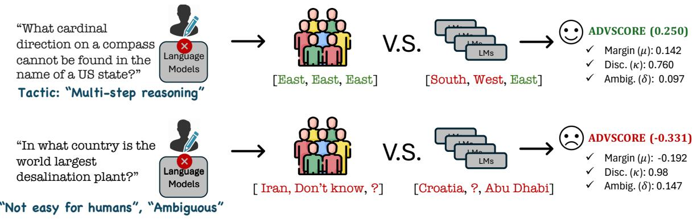
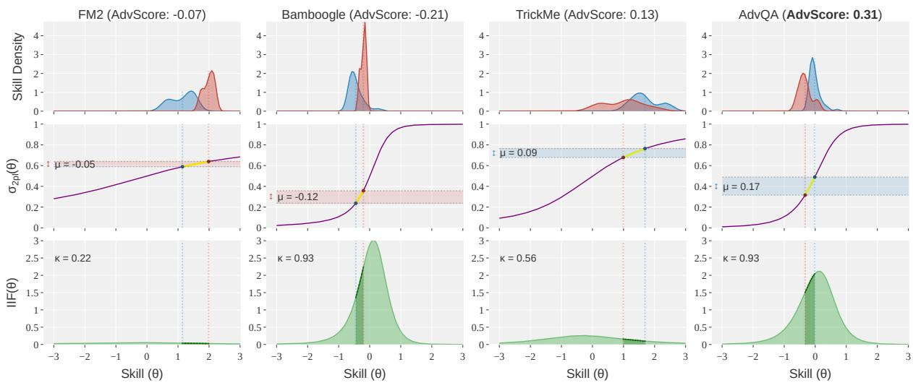
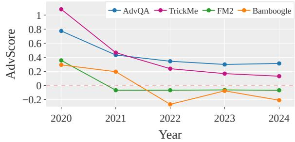
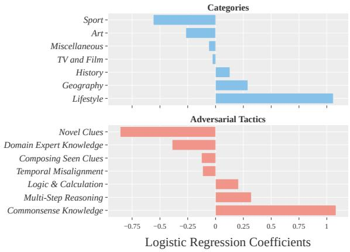
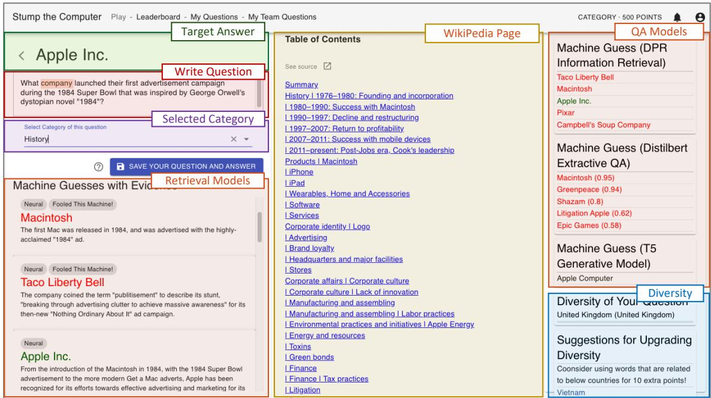

# Is your benchmark truly adversarial? ADVSCORE: Evaluating Human-Grounded Adversarialness

Yoo Yeon Sung1, Maharshi Gor1, Eve Fleisig2, Ishani Mondal1, Jordan Boyd-Graber1

1University of Maryland 2UC Berkeley

## Abstract

Adversarial datasets should validate AI robustness by providing samples on which humans perform well, but models do not. However, as models evolve, datasets can become obsolete. Measuring whether a dataset remains adversarial is hindered by the lack of a standardized metric for measuring adversarialness. We propose ADVSCORE, a human-grounded evaluation metric that assesses a dataset’s adversarialness by capturing models’ and humans varying abilities, while also identifying poor examples. We then use ADVSCORE to motivate a new dataset creation pipeline for realistic and high-quality adversarial samples, enabling us to collect an adversarial question answering (QA) dataset, ADVQA. We apply ADVSCORE using 9,347 human responses and ten language models’ predictions to track model improvement over five years (2020–2024). ADVSCORE thus provides guidance for achieving robustness comparable with human capabilities. Furthermore, it helps determine to what extent adversarial datasets continue to pose challenges, ensuring that, rather than reflecting outdated or overly artificial difficulties, they effectively test model capabilities.1

## 1 Introduction: Evaluating Adversarial Datasets Requires Human Answers

As language models attain near-perfect performance on existing benchmarks, there is an increasing demand for unexpected and challenging tasks to evaluate them. Adversarial datasets contain examples that cause models to generate harmful (Perez et al., 2022), unsafe (Quaye et al., 2024), or incorrect (Goodfellow et al., 2015) responses. An ideal adversarial example should be much easier for a human to answer correctly than for a model on realistic tasks (Ilyas et al., 2019; Tsipras et al., 2019; Engstrom et al., 2020; Biggio et al., 2012). However, as models improve, these adversarial datasets can become outdated (Kiela et al., 2021)—what was hard for a model in 2020 can become trivial in five years—requiring periodic updates (Recht et al., 2019; Bowman and Dahl, 2021). On the other hand, it is difficult to recognize at what point have these adversarial datasets outlived their usefulness systematically, nor is there an established metric to measure which datasets best captures the gap between human and model ability.

To fill this gap, we formulate ADVSCORE (§ 3). This metric measures two critical aspects: (i) adversarialness, which captures the performance gap between models and humans, while penalizing “illposed” examples (i.e., ambiguity), and (ii) discriminability—how effectively can a dataset rank models by their abilities.

Measuring whether a dataset is truly adversarial requires human answers; thus, ADVSCORE builds on item response theory (Lalor et al., 2016, IRT), a framework widely used in psychometrics and educational testing. It captures the diversity of human and model abilities and identifies poor examples (§ 2). ADVSCORE is the first metric that evaluates an example’s “adversarialness” grounded in human abilities: it can measure whether the dataset’s adversarial challenge becomes weaker or stronger as language models improve.

We apply ADVSCORE to motivate authors to contribute to a new human-in-the-loop HITL benchmark of adversarial questions, ADVQA. ADVQA’s creation pipeline (Figure 1) produces high-quality and realistic questions that are adversarial. Moreover, ADVSCORE helps make ADVQA discriminative, ensuring that the captured adversarialness reflects the varying skills of humans and models.

ADVQA exhibits the least decline in adversarialness over recent years compared to other adversarial benchmarks (§ 4). This minimal, but meaningful decline in ADVQA reveals that current models (e.g., GPT4) continue to struggle with tasks requiring commonsense reasoning and multistep reasoning and on topics such as Lifestyle (§ 6), which are likely tied to real-world challenges.

  
Figure 1: ADVSCORE diagnoses when a question is adversarial (top) and difficult for computers to answer for other reasons (bottom). After collecting candidate questions, we ask humans and computers to answer the questions. The top question (from ADVQA) has a higher ADVSCORE because it is specific, adversarial, discriminative, high-quality, and realistic. In contrast, the bottom question is ambiguous (e.g., none of humans or models correctly answered due to its ambiguity), which is confirmed by its low ADVSCORE.

We conclude with an analysis of how model have improved improve over the years since researchers began releasing adversarial datasets and how that can inform the development of future adversarial datasets (§ 4).

## 2 Preliminaries of ADVSCORE: IRT

Prior metrics for evaluating adversarial question generation strategies, such as attack success rate (Uesato et al., 2018), distributional similarity (Dathathri et al., 2019), and proximity measurement (Ross et al., 2021) assess algorithmic adversarialness without human validation. In contrast, we identify adversarial examples that pose realistic challenges aligned with human skills, not just pathological cases that break models. This requires evaluating how well the examples align with varying levels of human performance, particularly where models fall short, while ensuring that the examples are unambiguous. To capture this, we adopt item response theory (IRT), which models the interactions between subjects’ skills—in the QA setting, the subject answering the question could be either a human or a model—and example difficulty. This framework, widely used in psychometrics and educational testing (Lord et al., 1968), provides insights beyond accuracy: it can diagnose question quality as well as skilled subjects.

2PL-IRT In question answering (QA) tasks, IRT models the probability that a subject correctly answers a question based on their skill and question difficulties. 2PL-IRT (Eq. 1) models the probability of getting a question correct as a function of subject skill $\beta _ { i }$ and question difficulty $\theta _ { j }$ :

$$
p ( r _ { i j } = 1 | \beta _ { i } , \theta _ { j } , \gamma _ { j } ) = \sigma ( \gamma _ { j } ( \underbrace { \beta _ { i } - \theta _ { j } } _ { \mathrm { s k i l l ~ g a p } } ) ) ,\tag{1}
$$

where $\sigma$ is the sigmoid function (Baker and Kim, 2004). The skill gap, $( \beta _ { i } - \theta _ { j } )$ , is the difference between the subject $i \ ' s$ skill and question j. When a subject’s skill is equal to the question’s difficulty $( \beta _ { i } = \theta _ { j } )$ , they have a 50% probability of answering it correctly. Thus, an agent with skill equal to or greater than the question’s difficulty level has at least a 50% chance of answering correctly.

The final latent variable is the question discriminability $\gamma _ { j }$ which models how sensitive this probability is to changes in skill gap.2 This encodes how strongly the question rewards the skill being higher or lower than the difficulty level. The objective of IRT is to estimate the parameters that maximize the correctness probability $p ( r _ { i j } )$ 3

Advantages of IRT over question success rate While question success rate (QSR)—the percentage of subjects answering a question correctly—may seem like a reliable measure of difficulty, it can be misleading. A good yet difficult question and an easy yet poorly written question could yield the same QSR, obscuring the true measure of difficulty.

In contrast, IRT evaluates subject responses. Not only does IRT consider the number of humans who answer a question correctly, but it also accounts for who answer which questions. If the probability of answering a question correctly increases with subject skill, this relationship will naturally correlate with skill $\beta _ { i }$ and question discriminability $\gamma _ { j }$ . The model can confidently assign higher probabilities for these questions, while questions that are answered correctly by luck—rather than skill—will have estimated probabilities closer to 0.5, reflecting their lower discriminability.

Consider three questions: $q _ { \mathrm { a m b i g } }$ (ambiguous question: “What is a capital of Georgia?” Answer: [Atlanta or Tbilisi]), $q _ { \mathrm { h a r d } }$ (hard but well-formed question: “Who founded Tbilisi?”), and $q _ { \mathrm { e a s y } }$ (easy question: “What U.S. state has Atlanta as its capita $? ^ { \dag } )$ . Comparable QSR values may suggest qambig and $q _ { \mathrm { h a r d } }$ have the same difficulty. However, IRT distinguishes them: $q _ { \mathrm { a m b i g } }$ has low discriminability $( \gamma _ { j } \approx 0 )$ , resulting in a low $p ( r _ { i j } )$ close to 0.5 regardless of the subject skill, while $q _ { \mathrm { h a r d } }$ and $q _ { \mathrm { e a s y } }$ are likely to have high discriminability $( \gamma _ { j } \approx 1 )$ and reverse difficulty $( \theta _ { j } )$ values. IRT thus provides a more nuanced evaluation of question adversarialness, capturing its appropriate challenge levels for humans and models while accounting for its “well-posedness” (§ 3.1).4

## 3 ADVSCORE

This section introduces ADVSCORE, a metric that evaluates how adversarial and discriminative a dataset is. We measure these two key criteria: (i) adversarialness, how much more challenging a question is for AI models compared to humans while being well-posed; and (ii) discriminability, how informative is the question in effectively distinguishing between different skill levels.

## 3.1 Quantifying Adversarialness

A question is adversarial if skilled humans consistently answer a question correctly but computers do not. We measure this gap by fitting IRT parameters and then computing the probabilities predicted by the trained 2PL-IRT model (§ 2). During margin computation, we conduct synthetic groups for both human and computer subjects with representative skill levels. Then, we compute the probability of each group correctly answering the question, as estimated by the IRT model, which accounts for question quality. A question is considered adversarial if the human representative has a higher probability of answering correctly than the computer representative.

Skilled Groups. We first define what constitutes a skilled group g, and further define its representative skill $\beta _ { * } ^ { g }$ , which we use in subsequent equations (3,5). For a set of randomly sampled subjects $S ,$ skilled group $S _ { ( k ) }$ is the subset of subjects with skill at least k standard deviations above the mean— $\beta _ { i } > \mu _ { \beta } ^ { S } + k \tau _ { \beta } ^ { S }$ —where $\mu _ { \beta } ^ { S }$ and $\tau _ { \beta } ^ { S }$ are the mean and standard deviation of subject skills over the set S, and k indicates the degree of expertise. We define the representative skill $\beta _ { * } ^ { g }$ for the chosen group g as the expected skill level of the subjects within that group:

$$
\beta _ { * } ^ { g } = \underset { \beta _ { i } \sim g } { \mathbb { E } } [ \beta _ { i } ] .\tag{2}
$$

Margin Computation. For question $j$ in a dataset D, the performance-margin $\mu _ { j }$ is the difference between the probabilities of skilled humans $H _ { ( 0 ) }$ and skilled models $M _ { ( 0 ) }$ correctly answering the question, using their respective representative skills $\beta ^ { H _ { ( 0 ) } }$ and $\beta ^ { \hat { M } _ { ( 0 ) } }$ . We set $k = 0$ and designate skilled humans $( H _ { ( 0 ) } )$ and models $( M _ { ( 0 ) } )$ as the skilled subsets of subjects. These subjects have skills above the average level of their respective subject pools:

$$
\begin{array} { r } { \mu _ { j } = \underbrace { \sigma _ { \mathrm { 2 p l } } \left( \beta _ { * } ^ { { \cal H } _ { ( 0 ) } } , \theta _ { j } , \gamma _ { j } \right) } _ { \mathrm { S k i l l e d ~ h u m a n ~ r e p . ~ p r o b . } } - \underbrace { \sigma _ { \mathrm { 2 p l } } \left( \beta _ { * } ^ { { \cal M } _ { ( 0 ) } } , \theta _ { j } , \gamma _ { j } \right) } _ { \mathrm { S k i l l e d ~ m o d e l ~ r e p . ~ p r o b . } } , } \end{array}\tag{3}
$$

where $\sigma _ { \mathrm { 2 p l } } \left( \beta , \theta , \gamma \right)$ is the logistic function for our 2PL-IRT (Eq. 1, § 2), that uses $\beta _ { * } ^ { g }$ as the representative skill for subject group $g \in \{ H _ { ( 0 ) } , M _ { ( 0 ) } \}$ , and $\theta _ { j }$ and $\gamma _ { j }$ are the difficulty and discriminability parameters of the question $j$

A positive value for the margin $\mu _ { j }$ implies that the question j is adversarial (examples in A.4), while a negative value implies the opposite, and the magnitude indicates the extent of adversarialness.

Accounting for Question Ambiguity. While the margin $( \mu _ { j } )$ captures the core of adversarialness, it does not ensure if the questions are genuinely well-posed; ambiguous, or poorly formulated questions could inflate this score without being truly adversarial. To address this issue, we introduce a discount term (Eq. 4) that relies on the disagreement level among highly-skilled (or expert) human subjects $( H _ { ( 1 ) } )$ for each question:

$$
\mu _ { j } ^ { \prime } = \frac { \mu _ { j } } { 1 + \delta _ { j } } ,\tag{4}
$$

where $\mu _ { j } ^ { \prime }$ is the adjusted adversarialness score, $\mu _ { j }$ is the original adversarialness score, and $\delta _ { j }$ is a measure of disagreement among highly skilled human subjects $H _ { ( 1 ) }$ for question $j . ^ { 5 }$ To keep this measure of disagreement standardized, $\delta _ { j }$ is the mean deviation (MD) of the probabilities of $H _ { ( 1 ) }$ answering question j correctly:

$$
\delta _ { j } = \underset { i \sim { \cal H } _ { ( 1 ) } } { \bf M D } \left[ \sigma _ { 2 \mathrm { p l } } \left( \beta _ { i } ^ { H _ { ( 1 ) } } , \theta _ { j } , \gamma _ { j } \right) ) \right] .\tag{5}
$$

This discount term ensures that questions with high disagreement among expert humans (potentially ambiguous or ill-posed questions) are penalized, even if they show large human-model performance gaps. This approach leverages the value of human judgment for true adversarial quality assessment.

## 3.2 Measuring Discriminability

The best questions distinguish between subjects varying skill levels—they are informative and showcase high discriminability. We measure this by leveraging Fisher information over our 2PL-IRT’s response prediction function, also called Item Information Function (Lord et al., 1968, IIF); it is a function that measures an item’s contribution to the measurement precision of $P ( \theta )$ across the skill range (θ). With $P ( \theta )$ as the 2PL-IRT’s response prediction function $\sigma _ { \mathrm { 2 p l } } \left( \beta , \theta , \gamma \right)$ , we get the item information function $\left( \operatorname { I I F } _ { j } ( \theta ) \right)$ that quantifies how much statistical information a question j provides about a subject’s skill level θ:

$$
\operatorname { I I F } _ { j } ( \theta ) = \gamma _ { j } ^ { 2 } \cdot p _ { j } ( \theta ) \cdot ( 1 - p _ { j } ( \theta ) ) , { \mathrm { ~ w h e r e } }\tag{6}
$$

$$
p _ { j } ( \boldsymbol { \theta } ) = \sigma _ { \mathrm { 2 p l } } \left( \theta , \theta _ { j } , \gamma _ { j } \right) .\tag{7}
$$

Here, the questions with high discrimination (large $\gamma _ { j } ^ { 2 } )$ and moderate difficulty (resulting in $P ( r _ { i j } ) \overset { ^ { \cdot } } { \approx } 0 . 5 )$ provide the most information.

Finally, we define the total item information $( \mathrm { T I F } _ { j } )$ provided by question $j$ as the area under the $\operatorname { I I F } _ { j } ( \theta )$ curve, and scale it by exponential normalization to obtain a standardized, calibrated measure of discriminability $\kappa _ { j }$ for question $j \colon$

$$
\mathrm { T I F } _ { j } = \int _ { - \infty } ^ { \infty } \mathrm { I I F } _ { j } ( \theta ) d \theta ,\tag{8}
$$

$$
\begin{array} { r } { \kappa _ { j } = 1 - \exp \left( - \mathrm { T I F } _ { j } \right) . } \end{array}\tag{9}
$$

## 3.3 Combining into ADVSCORE

To recap, an ideal adversarial question should (i) have a high margin of human and model performance gap, while being well-posed (low experthumans disagreement), and (ii) be discriminative (informative of the subject’s skill). Thus, first combine the adversarialness $( \mu _ { j } ^ { \prime } )$ and discriminability $( \kappa _ { j } )$ to get a single metric:

$$
\mathrm { A D V S C O R E } _ { \mathrm { j } } = \frac { \mu _ { j } } { 1 + \delta _ { j } } \cdot ( 1 + \kappa _ { j } )\tag{10}
$$

To have human–model probability margin $( \mu _ { j } )$ as a key factor in ADVSCORE, we treat $\kappa _ { j }$ as a multiplicative bonus to $\mu _ { j }$ . This prevents questions with high discriminability $( \kappa _ { j } )$ from contributing to ADVSCORE if their $\mu _ { j }$ values are low.

A positive ADVSCORE indicates a truly adversarial dataset, with higher values suggesting more discriminative and adversarial questions. We use ADVSCORE to evaluate existing datasets (§ 4) and to reward authors in our ADVQA dataset creation process (§ 5.1). We define the ADVSCORE of a dataset D as the average ADVSCORE of its questions. An effective adversarial dataset should contain numerous questions with high ADVSCORE.

## 4 Adversarial Benchmark Evaluation

We compare adversarial benchmarks across different domains using ADVSCORE. Our evaluation includes ADVQA, a new QA dataset developed through a human-in-the-loop (HITL) process to align adversarial data with human capabilities. This section, analyzes ADVSCORE as a metric, while § 5 details the creation of ADVQA, and § 6 examines what makes ADVQA questions adversarial.

Adversarial datasets with human responses. For ADVQA, we gathered human responses through a live, in-person QA competition involving 8 human teams, as well as through online crowdsourcing with 165 participants. In total, we collected 1,839 human responses from 172 individuals. To compare the adversarialness of these datasets using ADVSCORE, which relies on both human and model response data, we are limited to comparing ADVSCORE with datasets with human annotations. Thus, we select TRICKME (Wallace et al., 2019b) and FM2 (Eisenschlos et al., 2021). While TRICKME challenges models with QA pairs, FM2 uses entailment pairs for fact-checking.6 Additionally, we included BAMBOOGLE (Press et al., 2022), which consists of general knowledge questions designed to be adversarial, similar to ADVQA. As BAMBOOGLE lacked human responses, we gathered 10,391 responses from 165 crowdworkers.

  
Human Model Item Information Function (IIF) Total Information Correctness Probability $\sigma _ { 2 \mathrm { p l } } ( \theta )$  
Figure 2: Visualization of key ADVSCORE components across datasets. For each dataset, we plot: (1) Skill density of skilled humans $( H _ { ( 0 ) } )$ and skilled models $( M _ { ( 0 ) } )$ , (2) response correctness probability, $\sigma _ { 2 \mathrm { p l } } ( \theta )$ (Eq. 1, $\ S 2 )$ averaged over dataset examples, and (3) Item information function (IIF(θ)(Eq. 6, § 3.2). Vertical dashed lines show representative (average) skill levels for humans and models. The gap between human and model probabilities (shaded region between the horizontal lines) indicates adversarialness $( \mu _ { D } )$ . IIF peaks show where questions are most informative, with area under curve signaling total informativeness (discriminability, $\kappa _ { D } )$ . Key insights: BAMBOOGLE has high informativeness but favors models (negative $\mu _ { D } )$ . TRICKME separates humans and models but has lower discriminability (positive $\mu _ { D } )$ . ADVQA is the best of all, effectively discriminating between humans and models while maintaining high informativeness throughout, resulting in the highest ADVSCORE of 0.31.

We also collected model responses for each dataset from ten models, including Dense Passage Retrieval (DPR) (Karpukhin et al., 2020), GPT-3-INSTRUCT (Ouyang et al., 2022), GPT-3.5-TURBO (OpenAI, 2023), MISTRAL-V0.1- INSTRUCT (Jiang et al., 2023), GPT-4 (Achiam et al., 2023), LLAMA-2-CHAT models in sizes of 7b and 70b, and LLAMA-3-INSTRUCT models in sizes of 8b and 70b (Touvron et al., 2023). After collecting human and model responses, we apply 2PL-IRT to extract the learned subject and item parameters and compute ADVSCORE.

Comparison of adversarial benchmarks. We compute ADVSCORED and its components $( \mu _ { D }$ $\kappa _ { D } ,$ and $\delta _ { D } )$ for each dataset, presenting results in Table 1. Figure 2 walks through the computation of ADVSCORE by illustrating (i) the skill density of skilled humans $H _ { ( 0 ) }$ (blue) and models $M _ { ( 0 ) }$ (red), (ii) the response correctness probability $( \sigma _ { 2 \mathrm { p l } }$ purple), and (iii) the item informationfunction, IIF (green, E.q. 6), over skill θ.

Both ADVQA and TRICKME show a clear separation between human and model skill levels (first row), resulting in positive, high margins $( \mu )$ of 0.17 and 0.13, correspondingly (yellow in second row). However, ADVQA has a higher overlap of IIF with regions where human skill exceeds model skill (dark green area in third row), compared to TRICKME, which has a flatter and less informative IIF. These lead to lower $\kappa _ { D }$ (0.56 vs 0.93), suggesting that TRICKME questions are less discriminative (less useful in assessing subject skills).

In contrast, BAMBOOGLE has an informative IIF, but the skill of the model tends to exceed humans, resulting in a negative $\mu _ { D }$ (Table 1). This suggests that BAMBOOGLE questions are inversely adversarial, containing questions where models outperform humans, and therefore fail to serve as an effective adversarial benchmark. Similarly, FM2 has a negative $\mu _ { D }$ and low $\kappa _ { D } ,$ indicating that the dataset is neither adversarial nor discriminative. Our analysis establishes ADVQA questions as most adversarial, as indicated by its highest ADVSCORE of 0.31; thus demonstrating that the unique components of ADVSCORE effectively support the evaluation of adversarial benchmarks.

<table><tr><td>Datasets (D)</td><td> $\mu _ { D }$ </td><td> $\kappa _ { D }$ </td><td> $\delta _ { D }$ </td><td>ADVSCORED</td></tr><tr><td>ADVQA</td><td>0.17</td><td>0.93</td><td>0.08</td><td>0.31</td></tr><tr><td>FM2</td><td>-0.05</td><td>0.22</td><td>0.01</td><td>-0.07</td></tr><tr><td>BAMBOOGLE</td><td>-0.12</td><td>0.93</td><td>0.11</td><td>-0.21</td></tr><tr><td>TRICKME</td><td>0.09</td><td>0.560.03</td><td></td><td>0.13</td></tr></table>

Table 1: ADVQA had the highest ADVSCORE $\mathbf { \nabla } _ { D } ,$ , along with the highest $\mu _ { D }$ and $\kappa _ { D }$ , indicating that its questions were the most adversarial and best at discriminating subject’s skill across the four datasets. While BAMBOOGLE has the same $\kappa _ { D }$ value, the negative $\mu _ { D }$ indicates the reverse adversarialness, suggesting it was distinctively easier for models than humans.

Chronological evaluation of adversarialness Adversarial datasets inevitably become obsolete as models improve, either by training on these datasets or overcoming previously identified vulnerabilities. Using ADVSCORE, we assess model improvements over the last five years by identifying which datasets have become less adversarial, incorporating new models into the ADVSCORE computation.7 Figure 3 shows the ADVSCORE for each dataset over the years, confirming that AD-VQA holds the highest ADVSCORE (2024) with the smallest decline over the last five years. In contrast, TRICKME, which was initially the most highly adversarial (2020), saw a sharp decline over the following four years, indicating that the models improved on the tasks that they previously struggled with. BAMBOOGLE and FM2 are no longer adversarial, showing negative ADVSCORE values since 2022. BAMBOOGLE’s reliance on a 2-hop tactic and simple questions (e.g., “What is the capital of the second largest state in the US by area”) likely explains its decline since 2021. FM2’s drop suggests LLMs have improved at fact-checking or benefitted from similar questions in training. Although pinpointing the exact factors behind model improvement may be challenging, it is crucial to determine whether these models have become more resilient or remain vulnerable as new models emerge. ADVSCORE facilitates this by quantifying how much a dataset has lost its adversarialness, offering a concrete measure of how well the model withstands adversarial challenges over time.

  
Figure 3: We report ADVSCORE for each dataset over the years, confirming that ADVQA holds the highest ADVSCORE with the smallest decline over the last five years, proving its adversarial robustness.

Qualitative Examples with ADVSCORE We examine the human-model margin probability $( \mu _ { j } )$ and each subject’s answers to the example question for each dataset. In Table 6, ADVQA and TRICKME questions show a positive $\mu _ { j }$ value, indicating adversarial, correspondent to the human’s correct answer to (“Putin”) and GPT4’s wrong answer (“Russia”). On the other hand, BAMBOOGLE and FM2’s negative adversarialness value suggests that the question is easier for models compared to humans, as reflected in the higher correctness from models versus humans.

Comparision of ADVSCORE and QSR Moreover, we conducted a comparative analysis of model and human success rates (QSR) and ADVS-COREs (§ 2). While QSR may suggest that humans outperform models, the questions can consistently yield negative ADVSCOREs, due to their low or negative $\mu$ (margin) or high δ (ambiguity). Examples and analyses in Appendix A.5). This highlights that QSR alone is insufficient to determine question adversarialness, whereas each parameter in ADVSCORE offers a more reliable measure.

## 5 ADVQA creation pipeline

In the previous sections, we showed that ADVQA is more adversarial and discriminative than other datasets, suggesting its creation process contributed to these qualities. Here, we discuss the ADVQA collection process as a case study to guide future high-quality adversarial datasets.

## 5.1 Collecting questions and answer pairs through adversarial competitions

To obtain human-written question-answer pairs, we hold two adversarial model–human QA competitions. First, in the writing competition, we collect 399 adversarial questions through the interface (§5.2), which are then edited and filtered by an expert editor. Second, in the answering competition, we invited eight expert human groups (composed of three to four trivia experts) to run eight human vs. model QA tournaments to obtain 780 human responses. Each tournament initially consisted of 30 questions, which are then filtered based on experts’ comments (E.g., “This question is ill-posed”). After this filtering process, ADVQA results in 182 questions.8 After the competitions, we incentivize the writers with the highest ADVSCORE and players with the highest skill.9

<table><tr><td>Dataset</td><td>Question</td><td>Answer</td><td>Margin (µj)</td><td>Human Response</td><td>GPT-4</td></tr><tr><td>ADVQA</td><td>Who is the president of the country represented by the second letter in the acronym BRICS [...]</td><td>Vladimir Putin</td><td>0.19</td><td>Putin</td><td>Russia</td></tr><tr><td>FM2</td><td>Aram Khachaturian had Russian roots.</td><td>False</td><td>-0.01</td><td>“False”</td><td>True</td></tr><tr><td>TRICKME</td><td>In a novel by this author, a detective wraps his arm to survive a dog attack [...]</td><td>Durrenmatt</td><td>0.12</td><td>&quot;Durrenmatt&quot;</td><td>Franz Kafka</td></tr><tr><td>BAMBOOGLE</td><td>Who directed the highest grossing film?</td><td>James Cameroon</td><td>-0.02</td><td>&quot;No idea&quot;</td><td>James Cameron</td></tr></table>

Table 2: ADVQA demonstrates the most balanced properties of challenging the model and distinguishing between skills, as indicated by a positive $\mu _ { j }$ value, which aligns with humans outperforming the models.

## 5.2 Skilled writers use adversarial interface

We provide an adversarial writing interface as a human-AI collaborative tool for the adversarial writing competition, motivated by You and Lowd (2022)’s finding that human-AI collaboration strengthens adversarial attacks. We supply the writers with real-time model interpretations, inspired by Wallace et al. (2019b); they could continuously counteract the model response and make edits.

Eliciting incorrect model predictions The center of the interface (Figure 5 in Appendix A.8) provides the Wikipedia page for the target answer, which they use to write the question. While the author is writing, the retrieval widget and QA models widgets are updated (Eisenschlos et al., 2021). Motivated by Feng et al. (2018), we embed the input perturbation inside the question writing widget to highlight which words trigger the model predictions. For example, changing “company” to a different token would be most likely to change the prediction except the answer “Apple.”

Retrieval systems Users receive real-time feedback on QA systems’ performance on their questions via the interface’s fine-tuned retrieval and reader model components (the retrieval system outputs: contexts that elicit QA system predictions). If the target answer appears at the top of the retrieval widget, which means the author failed to fool the retriever and the reader, authors can rephrase questions to avoid retrieving information that makes QA systems answer correctly. We use lightweight sparse and neural retrieval models for writer feedback: a TF-IDF baseline and DPR. To ensure that DPR predictions are diverse and up-to-date, we create a database that indexes each sentence in a set of Wikipedia pages (see Appendix A.8). We then use the RoBerta-based FarmReader, which is fine-tuned on SQuAD (Rajpurkar et al., 2016), to read and sort the retrieved sentences from the two retrieval models by their relevance.

LM-based QA systems We enrich the model guidance using extractive and generative model answer predictions. For extractive QA, we use DistilBert (fine-tuned on SQuAD), since its promptness and lightness facilitate rapid human-AI interaction. We also use T510 (Raffel et al., 2020) to answer the questions in a closed-book setting.

## 6 Discussion and Analysis on ADVQA

In this section, we show how ADVSCORE can help identify factors that encourage high-quality adversarial datasets. Effective strategies in AD-VQA may guide the creation of more adversarial questions, and we analyze how the dataset’s realistic aspect can help incorporate human variability during model evaluation.

Ensuring high-quality adversarial questions The questions should be adversarial for reasons that identify model weaknesses, such as the inability to compose clues or exclude redundant clues (Min et al., 2020, 2022) not because of trivial errors (e.g., grammar mistakes). If the question meets this criteria, we consider it high-quality. We base our criteria on the taxonomy of adversarial categories in Wallace et al. (2019b). To understand what yielded ADVQA’s high-quality adversarial questions, manually annotate the adversarial tactics and topics for ADVQA questions (Appendix B.2).

  
Figure 4: The overall distribution of LR coefficients suggests that lifestyle and commonsense knowledge contribute more to adversarialness than other features. This implies that models still struggle with commonsense knowledge, highlighting an area where they remain vulnerable compared to human understanding.

With the identified question characteristics, we run a logistic regression model to learn how much each adversarial tactic or topic contributed to AD-VSCORE.11 Since all questions in ADVQA yielded a positive ADVSCORE, the coefficients in Figure 4 reflect how much specific features contributed to adversarialness, highlighting areas where models need improvement. For instance, the tactic involving commonsense knowledge on the topic of lifestyle exposed a model weakness (e.g., “Take away four from a group including Barnard and Smith, and you get what play?”), which had a notably high ADVSCORE of 0.27.12

Leveraging human feedback for realisticness Realism is crucial for an adversarial dataset as it creates challenges that closely resemble realworld scenarios, effectively testing model robustness against plausible but diverse situations. This approach enhances the reliability of performance evaluation as it reflects high variance in collective human ability. For example, not only should the questions be adversarial, but they should mimic diverse reasoning and problem-solving strategies of different people. Our preliminary results revealed that crowdworkers often produced ambiguous or poorly-formed questions.13 Although ADVSCORE could identify these issues, many examples were ineffective for assessing model performance. We thus recruit expert trivia writers and guide them in writing adversarial questions. Then, other trivia editors scrutinize the human-authored questions’ poor quality (see Appendix B.1). Finally, our human vs. model competition provides an additional quality check, as human subjects flag potential issues while answering questions. If the subject or the editor considers a question unnatural or ambiguous, we exclude it from our final dataset (Appendix A.1).

We emphasize that human responses are especially useful in adversarial evaluation contexts, as they ensure that adversarial examples are genuinely challenging and realistic. Moreover, these responses are provided by each individual’s intuition, creativity, and understanding. Thus, capturing variability is crucial to evaluate the benchmarks that are meant to assess evolving models aiming for human alignment. Such aspects are what traditional model-generated adversarial attacks cannot replicate. Ultimately, incorporating human responses adds depth and reliability to adversarial benchmarks, making them essential in evaluating models’ true progress toward human-level understanding and their performance.

## 7 Related Work

Adversarial samples expose and evaluate model capabilities (Melis et al., 2017; Biggio et al., 2013). Recently, the Natural Language Processing (NLP) community has questioned whether models trained on benchmarks learn to solve tasks in robust and generalizable ways (Ribeiro et al., 2020; Bartolo et al., 2021; Nie et al., 2018; Gururangan et al., 2018; Kaushik et al., 2021). Thus, evaluation of adversarial samples has been active in areas of reading comprehension (Jia and Liang, 2017) and neural translation tasks (Belinkov and Bisk, 2018; Wallace et al., 2019a). Tedeschi et al. (2023) postulates that the abilities of many “superhuman” models may be overestimated due to poorly annotated datasets and biases embedded in the evaluation process (e.g., fixed test sets).

An alternative is to provide more challenging benchmarks that require a stronger form of generalization and diversity (Rychalska et al., 2019; Bowman, 2023; Yuan et al., 2023); HITL adversarial generation framework enables humans create examples while interacting with the model (Ma et al., 2021). For QA tasks, it is crucial to validate the model’s ability to correctly answer easy and natural questions that are likely to be expressed by humans. For HITL adversarial generation for QA, Bartolo et al. (2021) and Kiela et al. (2021) uses a synthetic generation method to amplify small set of human-authored adversaries. Sheng et al. (2021) introduces a benchmark in which the humans interact with a visual QA model, and write an adversarial question for each of a set of images. Wallace et al. (2019b) and Eisenschlos et al. (2021) both use HITL incentive mechanisms to create adversarial questions. For evaluation of these adversarial datasets, Lalor et al. (2019) introduces an IRT-based ranking method to remedy the issue that current evaluation treats each model independently rather than considering relative differences. Rodriguez et al. (2021) also redesigns the leaderboard framework with a Bayesian approach where latent subject skill and item difficulty predict correct responses. Our ADVSCORE can systematically probe models to understand their capabilities, and provide a measure to understand which also contribute in HITL adversarial dataset framework to help to create the next generation of data.

## 8 Conclusion

Adversarial datasets offer practical benefits for evaluating models to improve robustness and performance. Grounded in human feedback, ADVSCORE ensures that evaluations of adversarial benchmarks align with human capabilities by post-hoc assessment of adversarial robustness and model improvements. Thus, applying ADVSCORE in real-time benchmark construction can aid in evaluating the robustness of the models, and integrating ADVS-CORE into model training can improve their adaptability to real-world applications.

## 9 Limitations and Future Works

One limitation of ADVSCORE is its reliance on expert-level human annotations that makes it challenging to implement. However, human feedback ensures that adversarial questions are not only technically challenging but also meaningful and reflective of real-world scenarios. To mitigate this, semisupervised or active learning approaches could be explored to minimize manual annotations, where models assist in identifying adversarial examples based on human feedback.

Another limitation is that ADVSCORE does not account for model confidence, which may overlook reliability aspects. We recommend incorporating a calibration assessment to determine if predicted probabilities align with accuracy, encouraging more reliable adversarial benchmarks and thereby preventing overconfident models.

Furthermore, as the core of ADVSCORE aims to assess how well models match human ability in real-life tasks, it is valuable to evaluate adversarial datasets in real-world applications, such as machine translation and chatbot evaluation across different modalities. We encourage using ADVSCORE to develop adversarial datasets across diverse NLP tasks and contribute to robust system developments.

## 10 Ethical Considerations

We address ethical considerations for dataset papers, given that our work contains a new dataset ADVQA and collecting human responses in our user study. We reply to the relevant questions posed in the A C L 2022 Ethics F A Q.14

When collecting human responses and questions, our study was pre-monitored by an official IRB review board to protect the participants’ privacy rights. Moreover, the identity characteristics of the participants were self-identified by the workers by answering the survey questions.

Before distributing the survey, we collected consent forms for the workers to agree that their answers would be used for academic purposes. The trivia experts were awarded a total \$1100 worth of online gift cards after the competitions. The prizes were awarded to the first, second, and third winners, depending on each group’s ADVSCORE. The crowdworkers were compensated over 10 USD an hour (a rate higher than the US national minimum wage of 7.50 USD ).

## 11 Acknowledgements

We thank all the CLIP members who reviewed the idea of improving adversarial benchmark evaluation. We also thank the players who participated in the tournament: Munir Siddiqui, Aaron Lichtig, J.R. Parsons, Ethan Medwetsky, Matt Weiner, and Alex Schmidt. Their valuable contributions greatly impacted the progress of this work. This project was awarded the MetaAI Dynabench Grant “A Leaderboard and Competition for Human–computer Adversarial Question Answering”. Additionally, this research was partially supported by an NSF GRFP grant. Sung and Boyd-Graber are supported by NSF Grant IIS2403436. Opinions, findings, conclusions, or recommendations expressed here are those of the authors and do not necessarily reflect the views of the sponsors.

## References

Josh Achiam, Steven Adler, Sandhini Agarwal, Lama Ahmad, Ilge Akkaya, Florencia Leoni Aleman, Diogo Almeida, Janko Altenschmidt, Sam Altman, Shyamal Anadkat, et al. 2023. Gpt-4 technical report. arXiv preprint arXiv:2303.08774.

Frank B Baker and Seock-Ho Kim. 2004. Item response theory: Parameter estimation techniques. CRC press.

Max Bartolo, Tristan Thrush, Robin Jia, Sebastian Riedel, Pontus Stenetorp, and Douwe Kiela. 2021. Improving question answering model robustness with synthetic adversarial data generation. In Proceedings ofthe 2021 Conference on Empirical Methods in Natural Language Processing, pages 8830–8848, Online and Punta Cana, Dominican Republic. Association for Computational Linguistics.

Yonatan Belinkov and Yonatan Bisk. 2018. Synthetic and natural noise both break neural machine translation. In International Conference on Learning Representations.

Battista Biggio, Igino Corona, Davide Maiorca, Blaine Nelson, Nedim Šrndic, Pavel Laskov, Giorgio Giac-´ into, and Fabio Roli. 2013. Evasion attacks against machine learning at test time. In Machine Learning and Knowledge Discovery in Databases: European Conference, ECML PKDD 2013, Prague, Czech Republic, September 23-27, 2013, Proceedings, Part III 13, pages 387–402. Springer.

Battista Biggio, Blaine Nelson, and Pavel Laskov. 2012. Poisoning attacks against support vector machines. In Proceedings of the 29th International Coference on International Conference on Machine Learning, pages 1467–1474.

Samuel R Bowman. 2023. Eight things to know about large language models. arXiv e-prints, pages arXiv– 2304.

Samuel R. Bowman and George Dahl. 2021. What will it take to fix benchmarking in natural language understanding? In Proceedings ofthe 2021 Conference of the North American Chapter of the Association for Computational Linguistics: Human Language Technologies, pages 4843–4855, Online. Association for Computational Linguistics.

Sumanth Dathathri, Andrea Madotto, Janice Lan, Jane Hung, Eric Frank, Piero Molino, Jason Yosinski, and Rosanne Liu. 2019. Plug and play language models: A simple approach to controlled text generation. arXiv preprint arXiv:1912.02164.

Julian Eisenschlos, Bhuwan Dhingra, Jannis Bulian, Benjamin Börschinger, and Jordan Boyd-Graber. 2021. Fool me twice: Entailment from Wikipedia gamification. In Proceedings ofthe 2021 Conference of the North American Chapter of the Association for Computational Linguistics: Human Language Technologies, pages 352–365, Online. Association for Computational Linguistics.

Logan Engstrom, Andrew Ilyas, Shibani Santurkar, Dimitris Tsipras, Brandon Tran, and Aleksander Madry. 2020. Adversarial robustness as a prior for learned representations. arXiv preprint arXiv:1906.00945.

Shi Feng, Eric Wallace, Alvin Grissom II, Mohit Iyyer, Pedro Rodriguez, and Jordan Boyd-Graber. 2018. Pathologies of neural models make interpretations difficult. In Proceedings ofthe 2018 Conference on Empirical Methods in Natural Language Processing, pages 3719–3728, Brussels, Belgium. Association for Computational Linguistics.

Ian J. Goodfellow, Jonathon Shlens, and Christian Szegedy. 2015. Explaining and harnessing adversarial examples. In International Conference on Learning Representations (ICLR).

Maharshi Gor, Hal Daumé III, Tianyi Zhou, and Jordan Boyd-Graber. 2024. Do great minds think alike? investigating human-ai complementarity in question answering with caimira. arXiv preprint arXiv:2410.06524.

Suchin Gururangan, Swabha Swayamdipta, Omer Levy, Roy Schwartz, Samuel Bowman, and Noah A. Smith. 2018. Annotation artifacts in natural language inference data. In Proceedings of the 2018 Conference of the North American Chapter ofthe Associationfor Computational Linguistics: Human Language Technologies, Volume 2 (Short Papers), pages 107–112, New Orleans, Louisiana. Association for Computational Linguistics.

Andrew Ilyas, Shibani Santurkar, Dimitris Tsipras, Logan Engstrom, Brandon Tran, and Aleksander Madry. 2019. Adversarial examples are not bugs, they are

features. Advances in neural information processing systems, 32.

Ken Jennings. 2007. Brainiac: adventures in the curious, competitive, compulsive world oftrivia buffs. Villard.

Robin Jia and Percy Liang. 2017. Adversarial examples for evaluating reading comprehension systems. In Proceedings of the 2017 Conference on Empirical Methods in Natural Language Processing, pages 2021–2031.

Albert Q Jiang, Alexandre Sablayrolles, Arthur Mensch, Chris Bamford, Devendra Singh Chaplot, Diego de las Casas, Florian Bressand, Gianna Lengyel, Guillaume Lample, Lucile Saulnier, et al. 2023. Mistral 7b. arXiv preprint arXiv:2310.06825.

Vladimir Karpukhin, Barlas Oguz, Sewon Min, Patrick Lewis, Ledell Wu, Sergey Edunov, Danqi Chen, and Wen-tau Yih. 2020. Dense passage retrieval for opendomain question answering. In Proceedings of the 2020 Conference on Empirical Methods in Natural Language Processing (EMNLP), pages 6769–6781, Online. Association for Computational Linguistics.

Divyansh Kaushik, Douwe Kiela, Zachary C. Lipton, and Wen-tau Yih. 2021. On the efficacy of adversarial data collection for question answering: Results from a large-scale randomized study. In Proceedings of the 59th Annual Meeting of the Association for Computational Linguistics and the 11th International Joint Conference on Natural Language Processing (Volume 1: Long Papers), pages 6618–6633, Online. Association for Computational Linguistics.

Douwe Kiela, Max Bartolo, Yixin Nie, Divyansh Kaushik, Atticus Geiger, Zhengxuan Wu, Bertie Vidgen, Grusha Prasad, Amanpreet Singh, Pratik Ringshia, Zhiyi Ma, Tristan Thrush, Sebastian Riedel, Zeerak Waseem, Pontus Stenetorp, Robin Jia, Mohit Bansal, Christopher Potts, and Adina Williams. 2021. Dynabench: Rethinking benchmarking in NLP. In Proceedings of the 2021 Conference of the North American Chapter of the Association for Computational Linguistics: Human Language Technologies, pages 4110–4124, Online. Association for Computational Linguistics.

John P. Lalor, Hao Wu, and Hong Yu. 2016. Building an evaluation scale using item response theory. In Proceedings of the 2016 Conference on Empirical Methods in Natural Language Processing, pages 648– 657, Austin, Texas. Association for Computational Linguistics.

John P Lalor, Hao Wu, and Hong Yu. 2019. Learning latent parameters without human response patterns: Item response theory with artificial crowds. In Proceedings of the 2019 Conference on Empirical Methods in Natural Language Processing and the 9th International Joint Conference on Natural Language Processing (EMNLP-IJCNLP), pages 4249–4259.

Adam D Lelkes, Vinh Q Tran, and Cong Yu. 2021. Quizstyle question generation for news stories. In Proceedings ofthe Web Conference 2021, pages 2501– 2511.

Frederic M Lord, Meivin R Novick, and Allan Birnbaum. 1968. Statistical theories of mental test scores. 1968. Reading: Addison-Wesley.

Zhiyi Ma, Kawin Ethayarajh, Tristan Thrush, Somya Jain, Ledell Yu Wu, Robin Jia, Christopher Potts, Adina Williams, and Douwe Kiela. 2021. Dynaboard: An evaluation-as-a-service platform for holistic nextgeneration benchmarking. In Neural Information Processing Systems.

Fernando Martínez-Plumed, Ricardo BC Prudêncio, Adolfo Martínez-Usó, and José Hernández-Orallo. 2019. Item response theory in ai: Analysing machine learning classifiers at the instance level. Artificial intelligence, 271:18–42.

Marco Melis, Ambra Demontis, Battista Biggio, Gavin Brown, Giorgio Fumera, and Fabio Roli. 2017. Is deep learning safe for robot vision? adversarial examples against the icub humanoid. In Proceedings of the IEEE international conference on computer vision workshops, pages 751–759.

Sewon Min, Julian Michael, Hannaneh Hajishirzi, and Luke Zettlemoyer. 2020. AmbigQA: Answering ambiguous open-domain questions. In Proceedings of the 2020 Conference on Empirical Methods in Natural Language Processing (EMNLP), pages 5783– 5797, Online. Association for Computational Linguistics.

Sewon Min, Luke Zettlemoyer, Hannaneh Hajishirzi, et al. 2022. Crepe: Open-domain question answering with false presuppositions. arXiv e-prints, pages arXiv–2211.

Yixin Nie, Yicheng Wang, and Mohit Bansal. 2018. Analyzing compositionality-sensitivity of nli models. ArXiv, abs/1811.07033.

OpenAI. 2023. Chatgpt (mar 14 version). Large language model.

Long Ouyang, Jeffrey Wu, Xu Jiang, Diogo Almeida, Carroll Wainwright, Pamela Mishkin, Chong Zhang, Sandhini Agarwal, Katarina Slama, Alex Ray, et al. 2022. Training language models to follow instructions with human feedback. Advances in neural information processing systems, 35:27730–27744.

Ethan Perez, Saffron Huang, Francis Song, Trevor Cai, Roman Ring, John Aslanides, Amelia Glaese, Nat McAleese, and Geoffrey Irving. 2022. Red teaming language models with language models. In Proceedings of the 2022 Conference on Empirical Methods in Natural Language Processing, pages 3419–3448.

John K Pollard. 2006. Student reflection using a webbased quiz. In 2006 7th International Conference on Information Technology Based Higher Education and Training, pages 871–874. IEEE.

Ofir Press, Muru Zhang, Sewon Min, Ludwig Schmidt, Noah A Smith, and Mike Lewis. 2022. Measuring and narrowing the compositionality gap in language models. arXiv preprint arXiv:2210.03350.

Jessica Quaye, Alicia Parrish, Oana Inel, Charvi Rastogi, Hannah Rose Kirk, Minsuk Kahng, Erin Van Liemt, Max Bartolo, Jess Tsang, Justin White, et al. 2024. Adversarial nibbler: An open redteaming method for identifying diverse harms in textto-image generation. In The 2024 ACM Conference on Fairness, Accountability, and Transparency, pages 388–406.

Colin Raffel, Noam Shazeer, Adam Roberts, Katherine Lee, Sharan Narang, Michael Matena, Yanqi Zhou, Wei Li, and Peter J. Liu. 2020. Exploring the limits of transfer learning with a unified text-to-text transformer. J. Mach. Learn. Res., 21(1).

Pranav Rajpurkar, Jian Zhang, Konstantin Lopyrev, and Percy Liang. 2016. SQuAD: 100,000+ questions for machine comprehension of text. In Proceedings of the 2016 Conference on Empirical Methods in Natural Language Processing, pages 2383–2392, Austin, Texas. Association for Computational Linguistics.

Benjamin Recht, Rebecca Roelofs, Ludwig Schmidt, and Vaishaal Shankar. 2019. Do ImageNet classifiers generalize to ImageNet? In Proceedings ofthe 36th International Conference on Machine Learning, volume 97 of Proceedings of Machine Learning Research, pages 5389–5400. PMLR.

Marco Tulio Ribeiro, Tongshuang Wu, Carlos Guestrin, and Sameer Singh. 2020. Beyond accuracy: Behavioral testing of NLP models with CheckList. In Proceedings ofthe 58th Annual Meeting ofthe Associationfor Computational Linguistics, pages 4902– 4912, Online. Association for Computational Linguistics.

Pedro Rodriguez, Joe Barrow, Alexander Miserlis Hoyle, John P. Lalor, Robin Jia, and Jordan Boyd-Graber. 2021. Evaluation examples are not equally informative: How should that change NLP leaderboards? In Proceedings of the 59th Annual Meeting ofthe Associationfor Computational Linguistics and the 11th International Joint Conference on Natural Language Processing (Volume 1: Long Papers), pages 4486–4503, Online. Association for Computational Linguistics.

Pedro Rodriguez, Shi Feng, Mohit Iyyer, He He, and Jordan L. Boyd-Graber. 2019. Quizbowl: The case for incremental question answering. CoRR, abs/1904.04792.

Anna Rogers, Matt Gardner, and Isabelle Augenstein. 2023. Qa dataset explosion: A taxonomy of nlp resources for question answering and reading comprehension. ACM Comput. Surv., 55(10).

Alexis Ross, Ana Marasovic, and Matthew E Peters.´ 2021. Explaining nlp models via minimal contrastive editing (mice). In Findings ofthe Association

for Computational Linguistics: ACL-IJCNLP 2021, pages 3840–3852.

Barbara Rychalska, Dominika Basaj, Alicja Gosiewska, and Przemysław Biecek. 2019. Models in the wild: On corruption robustness of neural nlp systems. In Neural Information Processing: 26th International Conference, ICONIP 2019, Sydney, NSW, Australia, December 12–15, 2019, Proceedings, Part III, page 235–247, Berlin, Heidelberg. Springer-Verlag.

Sasha Sheng, Amanpreet Singh, Vedanuj Goswami, Jose Alberto Lopez Magana, Wojciech Galuba, Devi Parikh, and Douwe Kiela. 2021. Human-adversarial visual question answering. CoRR, abs/2106.02280.

Chenglei Si, Navita Goyal, Sherry Tongshuang Wu, Chen Zhao, Shi Feng, Hal Daumé III, and Jordan Boyd-Graber. 2023. Large language models help humans verify truthfulness–except when they are convincingly wrong. arXiv preprint arXiv:2310.12558.

Simone Tedeschi, Johan Bos, Thierry Declerck, Jan Hajic, Daniel Hershcovich, Eduard Hovy, Alexan-ˇ der Koller, Simon Krek, Steven Schockaert, Rico Sennrich, Ekaterina Shutova, and Roberto Navigli. 2023. What’s the meaning of superhuman performance in today’s NLU? In Proceedings ofthe 61st Annual Meeting ofthe Associationfor Computational Linguistics (Volume 1: Long Papers), pages 12471– 12491, Toronto, Canada. Association for Computational Linguistics.

Hugo Touvron, Louis Martin, Kevin Stone, Peter Albert, Amjad Almahairi, Yasmine Babaei, Nikolay Bashlykov, Soumya Batra, Prajjwal Bhargava, Shruti Bhosale, et al. 2023. Llama 2: Open foundation and fine-tuned chat models. arXiv preprint arXiv:2307.09288.

Dimitris Tsipras, Shibani Santurkar, Logan Engstrom, Alexander Turner, and Aleksander Madry. 2019. Robustness may be at odds with accuracy. In International Conference on Learning Representations.

Jonathan Uesato, Brendan O’donoghue, Pushmeet Kohli, and Aaron Oord. 2018. Adversarial risk and the dangers of evaluating against weak attacks. In International conference on machine learning, pages 5025–5034. PMLR.

Clara Vania, Phu Mon Htut, William Huang, Dhara Mungra, Richard Yuanzhe Pang, Jason Phang, Haokun Liu, Kyunghyun Cho, and Samuel R. Bowman. 2021. Comparing test sets with item response theory. In Proceedings of the 59th Annual Meeting of the Association for Computational Linguistics and the 11th International Joint Conference on Natural Language Processing (Volume 1: Long Papers), pages 1141–1158, Online. Association for Computational Linguistics.

Eric Wallace, Shi Feng, Nikhil Kandpal, Matt Gardner, and Sameer Singh. 2019a. Universal adversarial triggers for attacking and analyzing NLP. In Proceedings ofthe 2019 Conference on Empirical Methods

in Natural Language Processing and the 9th International Joint Conference on Natural Language Processing (EMNLP-IJCNLP), pages 2153–2162, Hong Kong, China. Association for Computational Linguistics.

Eric Wallace, Pedro Rodriguez, Shi Feng, Ikuya Yamada, and Jordan Boyd-Graber. 2019b. Trick me if you can: Human-in-the-loop generation of adversarial examples for question answering. Transactions of the Associationfor Computational Linguistics, 7:387– 401.

Wencong You and Daniel Lowd. 2022. Towards stronger adversarial baselines through human-AI collaboration. In Proceedings ofNLP Power! The First Workshop on Efficient Benchmarking in NLP, pages 11–21, Dublin, Ireland. Association for Computational Linguistics.

Xinyan Yu, Sewon Min, Luke Zettlemoyer, and Hannaneh Hajishirzi. 2023. CREPE: Open-domain question answering with false presuppositions. In Proceedings of the 61st Annual Meeting of the Associationfor Computational Linguistics (Volume 1: Long Papers), pages 10457–10480, Toronto, Canada. Association for Computational Linguistics.

Quan Yuan, Mehran Kazemi, Xin Xu, Isaac Noble, Vaiva Imbrasaite, and Deepak Ramachandran. 2023. Tasklama: Probing the complex task understanding of language models. arXiv preprint arXiv:2308.15299.

## A Details on Dataset Creation

## A.1 Recruitment for Dynamic QA Generation

When tasking human authors with adversarial writing of questions, Wallace et al. (2019b) emphasizes the importance of “who” the authors should be: talented and eager question writers with specific goals; they should aim to generate questions that stump computers but seem normal enough for humans to answer. To make this work, they recruit members of the quizbowl community, who have deep trivia knowledge and craft question for quizbowl tournaments (Jennings, 2007). However, their challenge was to convey what is "normal" to authors and stimulate examples that can elucidate the weaknesses of QA models.

## A.2 Merging Trivia Question Generation and Dynamic Adversarial Generation Process

Many QA datasets are now too easy for modern models as models have become more powerful (Rogers et al., 2023). However, even these easy QA datasets have serious data flaws (Min et al., 2020; Yu et al., 2023), which suggests that creating question-answer pairs is a very challenging task. This is also a norm for questions written for human players, where more than 100,000 questions are produced annually. To create effective and challenging enough questions, the professional experts (e.g., writing staff) take a rigorous editing pass on the questions to decide whether they are adequate enough to guarantee players a fair game (Lelkes et al., 2021; Pollard, 2006). They follow strict guidelines to be selected to be used in the quiz matches. We propose to merge the above pipelines to help improve data creation for robust QA models by adding an editing step to ensure that grammatical errors and nonfactual questions (following the norms of Trivia questions) do not exist in the pool. In Table 3, we list the problematic question types that we ask the editors or subjects to flag.

## A.3 Details on errors in using raw scores in question answering competition

We infer that the human accuracy does not necessarily translate to answering ability or question difficulty measurement, which obscures the measuring the the question’s adversarial-ness. While the most skillful human team answered all three questions correctly, the estimated probability of the human teams answering the question correctly when compared to their ability was low (50%).

<table><tr><td>Question Type</td><td>Description</td><td>Examples</td></tr><tr><td>Lacks Factuality</td><td>Requires information is factual</td><td>“Trump, the first woman president of the United States, is charged against federal laws&quot; is non fac- tual as the gender of Trump is male</td></tr><tr><td>Lacks Specificity (False Presupposition)</td><td>Requires more information to be answered with clarity</td><td>&#x27;What is the color of Flamingo&#x27;s feathers?&#x27; is am- biguous as Pink and White could be two possible answers depending on when they are born</td></tr><tr><td>Subjectivity</td><td>Contains clues that are highly subjective</td><td>&quot;What&#x27;s the name of Christopher Columbus&#x27;s most famous ship?&quot; Possible answers could be either Santa Maria, La Nina, Santa Clara. Also, as &quot;Most famous&quot; can mean many different things, the revised question could be &quot;Which of Columbus&#x27;s ships was stripped of its timbers to build a fort called La Navi- dad in northern Haiti?&quot;</td></tr><tr><td>Ambiguity &amp; Multiple acceptable answers</td><td>Can be answered with multiple answers</td><td>Nikolas Alexandrovitch Romanov, Nikolas II, Niko- lai II Alexandrovich Romanov: all of these are ac- ceptable as answers.</td></tr></table>

Table 3: We list the problematic question types that we ask to annotate. The four types are illustrated with descriptions and examples to help them better understand each question, and help determine whether each question has good quality
<table><tr><td>Question</td><td>Gold Answer</td><td>Human Answer</td><td>Probability  $\sigma ( \beta _ { i } - \theta _ { j } )$ </td></tr><tr><td>What phrase is common to the title of novel featuring a fictional Nat King Cole recording, a Gene Autry film and song, and an I-95 attraction between the Carolinas?</td><td>South of the Border</td><td>Correct</td><td>0.57</td></tr><tr><td>In which novel, written by an author who was originally a botanist and born in Cuba, features a fictitious conversation between a merchant who travelled a road that was known by a smooth natural material and an emperor who loved to write Chinese poetry, both of which are actual people in history?</td><td>Invisible Cities</td><td>Correct</td><td>0.55</td></tr><tr><td>What is the name of the first mosque in the world that was built by Prophet Muhammed (s.a.w) during his hijrah from Mecca to Medina?</td><td>Quba Masjid</td><td>Correct</td><td>0.56</td></tr></table>

Table 4: While the most skillful human team answered all three questions correctly, the estimated probability of the human teams answering the question correctly when compared to their ability was low (50%).

## A.4 Qualitative Examples of each dataset with ADVSCORE

We examine the adversarial properties of each question $( \mu _ { j }$ and $\kappa _ { j } )$ with qualitative examples and each subject’s example responses from four datasets (Table 6).

## A.5 Comparison Analysis of ADVSCORE and QSR

We show that QSR alone is insufficient to determine question adversarialness, obscuring the real challenge, whereas each parameter in ADVSCORE offers a more nuanced measurement.

For questions like What was thefounding date of the university in which Plutonium was discovered? and Who is thefather ofthefather ofobservational astronomy?, humans significantly outperformed models, but their negative ADVSCOREs ( 0.365 and 0.340) indicate that these questions remain non-adversarial. This demonstrates that QSR alone is insufficient to identify question adversarialness. ADVSCORE, by incorporating both margin and discriminative power, provides a more nuanced and reliable measure, and reflects the adversarial nature of questions.

In ADVQA, ADVSCORE highlights contrasts that QSR may fail to capture. For instance, the question Name the color ofthe sky in Aivazovsky’s “The Ninth Wave” exhibits a significant QSR gap between humans (0.667) and models (0.083), yet its positive $\mathrm { A D V S C O R E } _ { j } = 0 . 1 8 8$ remains low, due to high δ (indicating) compared to other examples. The question implies a single color, but the ‘The Ninth Wave” painting contains multiple hues. It also lacks specificity about which part of the sky is being referenced.

Other examples in Table 5 show a similar trend of having a high QSR gap, suggesting that humans significantly exceed model performance, but this is contradicted by the corresponding ADVSCORE. For example, the question What country shares a language with its more populous northern neighbor but in its written form omits a letter that looks like a Greek beta, writing the sound instead by doubling another letter? shows low discriminability $( \kappa _ { j } ~ = ~ 0 . 6 2 6 )$ and a low $\mathrm { A D V S C O R E } _ { j } \ : = \ : 0 . 0 8 1$ The question A German admiral sailing for Russia named what islands for an English captain and not for the librettist of the HMS Pinafore nor for the announcer of Jeopardy! represents a low discriminability $( \kappa _ { j } ~ = ~ 0 . 5 0 4 )$ and the lowest $\mathrm { A D V S C O R E } _ { j } = 0 . 0 5 1$ among the dataset. Although it is adversarial $( \mu _ { j } = 0 . 2 3 3 )$ , it fails to significantly differentiate between human and model abilities. Similarly, for BAMBOOGLE’s questions which were mostly reversely adversarial, while QSR suggested that the question is easier for humans compared to models.

<table><tr><td colspan="8">AdvQA Dataset</td></tr><tr><td>Question</td><td>Answer</td><td>Human QSR</td><td>Model QSR</td><td> $\mu _ { j }$ </td><td> $\delta _ { j }$ </td><td> $\kappa _ { j }$ </td><td>ADVSCOREj</td></tr><tr><td>Name the color of the sky in Aivazovsky&#x27;s “The Ninth Wave&quot;</td><td>Orange</td><td>0.667</td><td>0.083</td><td>0.583</td><td>0.106</td><td>0.963</td><td>0.188</td></tr><tr><td>The title of this book shares a word with the title of a song of which the author, who acted in the 2002 film, 8 Mile, addressed to his daughter and niece</td><td>To Kill a Mocking- bird</td><td>0.333</td><td>0.000</td><td>0.323</td><td>0.102</td><td>0.983</td><td>0.179</td></tr><tr><td>What country shares a language with its more popu- lous northern neighbor but in its written form omits a letter that looks like a Greek beta, writing the sound instead by doubling another letter? That char-</td><td>Switzerland</td><td>0.333</td><td>0.000</td><td>0.333</td><td>0.051</td><td>0.626</td><td>0.081</td></tr><tr><td>acter appears in that language&#x27;s words for foot, big, outside, and street A German admiral sailing for Russia named what islands for an English captain and not for the libret- tist of the HMS Pinafore nor for the announcer of</td><td>Gilbert Islands</td><td>0.333</td><td>0.100</td><td>0.233</td><td>0.034</td><td>0.504</td><td>0.051</td></tr><tr><td colspan="8">Bamboogle Dataset</td></tr><tr><td>Question</td><td>Answer</td><td>Human QSR</td><td>Model QSR</td><td> $\mu _ { j }$ </td><td> $\delta _ { j }$ </td><td> $\kappa _ { j }$ </td><td>ADVSCOREj</td></tr><tr><td>What was the founding date of the university in which Plutonium was discovered?</td><td>March 23, 1868</td><td>0.452</td><td>0.167</td><td>0.285</td><td>0.127</td><td>0.972</td><td>-0.365</td></tr><tr><td>Who was the father of the father of psychoanalysis?</td><td>Jacob Freud</td><td>0.528</td><td>0.500</td><td>0.028</td><td>0.149</td><td>0.982</td><td>-0.354</td></tr><tr><td>When did the person who gave the Checkers speech die?</td><td>April 22, 1994</td><td>0.200</td><td>0.167</td><td>0.033</td><td>0.156</td><td>0.985</td><td>-0.350</td></tr><tr><td>Who is the father of the father of observational as- tronomy?</td><td>Vincenzo Galilei</td><td>0.324</td><td>0.167</td><td>0.157</td><td>0.121</td><td>0.964</td><td>-0.340</td></tr><tr><td>What is the third letter of the top-level domain of the military?</td><td>1 (lower case L)</td><td>0.516</td><td>0.333</td><td>0.183</td><td>0.152</td><td>0.983</td><td>-0.338</td></tr></table>

Table 5: A substantial gap in QSR may suggest human superiority over models, indicating an adversarial question. However, it can still yield negative ADVSCOREs due to low or negative $\mu$ or relatively high δ. In both ADVQA and Bamboogle, even when human QSR surpasses model QSR, this is not always reflected in ADVSCORE, given the distinct criteria of each parameter. For instance, the first question in ADVQA, Name the color of the sky in Aivazovsky’s “The Ninth Wave” exhibits a significant QSR gap between humans (0.667) and models (0.083), yet its positive ADV $\mathrm { ' S C O R E } _ { j } = 0 . 1 8 8$ remains low, due to high δ (indicating question ambiguity) compared to other examples. The question implies a single color, but the “The Ninth Wave” painting contains multiple hues. It also lacks specificity about which part of the sky is being referenced.

## A.6 User Study

We conducted two user studies for this paper. We recruited 1) human writers to write on the interface and 2) human respondents to answer collected AD-VQA questions and BAMBOOGLE questions that did not have existing human responses.

## A.7 User Study to collect questions

We recruited the writing team via online advertisement three months ahead of the human vs. computer question-answering competition. We collected 399 questions from five expert human writers (members of trivia community). We first display our consent form and instructions before question writers encounter the interface. They were dismissed from the study immediately if they did not pay their consent. We then inform them how their questions and prizes will be assessed; ADVSCORE accurately estimates assigned criteria (e.g., adversarialness and discriminability). To make the question writing process more interesting and fun, we gamify the writing process by applying a reward system. After submitting their question sets, we calculate the ADVSCORE for each writer’s question set; then, we reward \$500 for those who won the first place, \$250 for second place, and \$100 for third place.

<table><tr><td>Dataset</td><td>Question</td><td>Answer</td><td> $\mu _ { j }$ </td><td> $\kappa _ { j }$ </td><td>Human</td><td>GPT-4</td></tr><tr><td>ADVQA</td><td>Who is the president of the country represented by the second letter in Putin the acronym BRICS [...]</td><td>Vladimir</td><td>0.16</td><td>0.80</td><td>Putin</td><td>Russia</td></tr><tr><td>FM2</td><td>Henry I got married and took the True throne in 1100.</td><td></td><td>0.02</td><td>0.01</td><td>“True”</td><td>False</td></tr><tr><td>TRICKME</td><td>In a novel by this author, a detec- Durrenmatt 0.19 tive wraps his arm to survive a dog attack [...]</td><td></td><td></td><td>0.16</td><td>“Durrenmatt”</td><td>Franz Kafka</td></tr><tr><td>film?</td><td>BAMBOOGLE Who directed the highest grossing James</td><td>Cameroon</td><td>-0.02</td><td>0.10</td><td>“No idea”</td><td>James Cameron</td></tr></table>

Table 6: ADVQA demonstrates the most balanced properties of challenging the model and distinguishing between skills, as indicated by a positive $\mu _ { j }$ value, which aligns with humans outperforming the models.

## A.8 Interface details

Interface Screenshot We provide an adversarial writing interface (Figure 5) as a human-AI collaborative tool for the adversarial writing competition, motivated by You and Lowd (2022)’s finding that human-AI collaboration strengthens adversarial attacks. We focus on supplying the skilled-human with the real-time model interpretations, inspired by Wallace et al. (2019b), so that they could continuously counteract the model response and make better edits.

Retrieval System Details To ensure that the retrieval results help in obtaining up-to-date information for the writers, we created the database for Wikipedia pages and DPR training data. DPR retrieves the most relevant sentence from a database that consists of the Top 1000 popular Wikipedia pages15 from 2021 to 2022. DPR is finetuned with the 2018 and 2021 QANTA datasets (Rodriguez et al., 2019). For training, we used the questions and gold evidence as positive samples, and sentences from pages that are two hops away (pages linked by randomly selected hyperlinks in the summary section) from the question page as negative

samples.

## B Adversarial Tactics and Question Categories

## B.1 Question Category Annotation

We report the statistics of topic categories and adversarial tactics present in ADVQA.

We ask the question writers to tag their questions with the categories below. On specific categories and examples, we encourage them to be as creative and diverse as possible when authoring the questions. In the interface, they can monitor how many questions they wrote per category. They are required to submit question sets in each of ten categories: Art, Literature, Geography, History, Science, TV and Film, Music, Lifestyle, and Sports, Miscalleneous (Appendix B.1).

## B.2 Adversarial Tactic Annotation

In Table 9, we list adversarial tactics used in AD-VQA questions. We provide descriptions and examples to annotate questions with adversarial tactics (Table 9).16

## B.3 Annotation Examples

Table 10 shows question examples that are annotated with question and adversarial tactics. The highlights in the question correspond to either adversarial tactics or question categories that are highlighted with the same color.

## B.4 IRT Model Details

We use a neural approach to train our 2PL IRT model, leveraging the flexibility and scalability of neural networks while maintaining the interpretability of the IRT framework. The model parameters are learned through backpropagation, with the network architecture designed to mimic the 2PL IRT structure.

Figure 5: As the target answer to the question should be “Apple Inc,” the interface is updated with answers from retrieval models with the most relevant sentence and from LMs (e.g., Distilbert, T5). Also, the highlights are updated by the input perturbation technique.
<table><tr><td rowspan="2">Adversarial Tactics Features</td><td colspan="3">Topic Categories</td></tr><tr><td>Count</td><td>Topic Category</td><td>Count</td></tr><tr><td>Commonsense Knowledge</td><td>8</td><td>Art</td><td>7</td></tr><tr><td>Composing Seen Clues</td><td>57</td><td>Geography</td><td>17</td></tr><tr><td>Crosslingual</td><td>2</td><td>History</td><td>33</td></tr><tr><td>Domain Expert Knowledge</td><td>10</td><td>Lifestyle</td><td>11</td></tr><tr><td>Location Misalignment</td><td>10</td><td>Literature</td><td>19</td></tr><tr><td>Logic &amp; Calculation</td><td>14</td><td>Miscellaneous</td><td>31</td></tr><tr><td>Multi-Step Reasoning</td><td>50</td><td>Music</td><td>13</td></tr><tr><td>Negation</td><td>2</td><td>Science</td><td>12</td></tr><tr><td>Novel Clues</td><td>24</td><td>Sport</td><td>17</td></tr><tr><td>Temporal Misalignment</td><td>5</td><td>TV and Film</td><td>22</td></tr></table>

Table 7: Statistics of adversarial tactics and topics in ADVQA

Model Architecture The neural 2PL IRT model consists of three main components:

1. An item embedding layer representing item difficulties $( \beta _ { i } )$ and discriminations (γi)

2. A person embedding layer representing person abilities $( \theta _ { j } )$

3. A sigmoid output layer computing the probability of a correct response

The total number of parameters in our model is 2N + M, where N is the number of items and M is the number of subjects. This count includes N difficulty parameters, N discrimination parameters, and M ability parameters.

Prior Distributions We incorporate prior distributions on the model parameters to enhance regularization and interpretability:

• Item difficulties $( \beta _ { i } )$ and person abilities $( \theta _ { j } ) \colon$ Gaussian priors with mean 0 and variance 1

• Item discriminations (γi): Gamma prior with shape k and scale θ

The use of a Gamma prior for discriminations ensures positivity and allows for fine-tuning the model’s sensitivity to item discrimination.

## Training Procedure

1. Initialize network weights randomly, sampling from the respective prior distributions

<table><tr><td>Question</td><td>Answer</td></tr><tr><td>Art</td><td>Questions about works: Mona Lisa, Raft of the Medussa, B) Questions about forms: color, contour, texture, C) Questions about artists: Picasso, Monet, Leonardo da Vinci, D) Questions about context: Renaissance, post-modernism, expressionism, surrealism</td></tr><tr><td>Literature Movement</td><td>A) Questions about works: novels (1984), plays (The Lion and the Jewel), poems (Rubaiyat), criticism (Poetics), B) Questions about major characters or events in literature: The Death of Anna Karenina, Noboru Wataya, the Marriage of Hippolyta and Theseus</td></tr><tr><td>Literary Move- ment</td><td>A) Cross-cutting questions (appearances of Overcoats in novels), B) Common link questions (the literary output of a country/region)</td></tr><tr><td>Geography</td><td>A) Questions about location: names of capital, state, river, B) Questions about the place: temperature, wind flow, humidity</td></tr><tr><td>History</td><td>A) When: When did the First World war start?, B) Who: Who is called Napoleon of Iran?, C) Where: Where was the first Summer Olympics held?, D) Which: Which is the oldest civilization in the world?</td></tr><tr><td>Science</td><td>Questions about terminology: The concept of gravity was discovered by which famous physicist?, Questions about the experiment, Questions about theory: The social action theory believes that individuals are influenced by this theory.</td></tr><tr><td>TV and Film</td><td>Quotes: What are the dying words of Charles Foster Kane in Citizen Kane?, Title: What 1927 musical was the first “talkie&quot;?, Plot: In The Matrix, does Neo take the blue pill or the red pill?</td></tr><tr><td>Music</td><td>Singer: What singer has had a Billboard No. 1 hit in each of the last four decades?, Band: Before Bleachers and fun., Jack Antonoff fronted what band?, Title: What was Madonna&#x27;s first top 10 hit?</td></tr><tr><td>Lifestyle</td><td>Clothes: What clothing company, founded by a tennis player, has an alligator logo?, Decoration: What was the first perfume sold by Coco Chanel?</td></tr><tr><td>Sports</td><td>Known facts: What sport is best known as the “king of sports&quot;? Nationality: What is the national sport of Canada? Sport player: The classic 1980 movie called Raging Bull is about which real-life boxer? Country: What country has competed the most times in the Summer Olympics yet has not won any kind of medal?</td></tr></table>

Table 8: We list categories of questions along with the subcategories and corresponding examples.

## 2. For each training epoch:

(a) Forward pass: Compute predicted probabilities for each person-item interaction

(b) Calculate the negative log-likelihood loss

(c) Add regularization terms based on prior distributions

(d) Backpropagate the gradients and update model parameters

3. Monitor validation performance and use early stopping to prevent overfitting

We use the Adam optimizer for parameter updates due to its efficiency in treating sparse gradients and its ability to adapt the learning rate for each parameter.

<table><tr><td>Adversarial Type</td><td>Adversarial Tactics</td></tr><tr><td>Composing seen clues</td><td>Contains clues that need to be integrated for the question to be answered</td></tr><tr><td>Logic and Calculation</td><td>Requires mathematical or logical operators</td></tr><tr><td>Multi-Step Reasoning</td><td>Requires multiple reasoning steps between entities. For eg: “A building dedicated to this man was the site of the “I Have A Dream&quot; speech.&quot;A reasoning step is required to infer : “I have a dream&quot; speech to Lincoln Memorial to Abraham Lincoln</td></tr><tr><td>Negation</td><td>Contains “not&quot; or “non-&quot; and “no&quot; or any negation entities that may confuse the model to answer</td></tr><tr><td>Temporal Misalignment</td><td>Contains a specific year, month, or timely event that the model is confused about or does not know.</td></tr><tr><td>Location Misalignment</td><td>Contains a location that the model is confused about or does not know.</td></tr><tr><td>Commonsense Knowledge</td><td>Requires information that cannot be answered without common- sense</td></tr><tr><td>Domain Expert Knowledge</td><td>Requires information that cannot be answered without domain expert knowledge</td></tr><tr><td>Novel Clues</td><td>Contains information that is in the question but is not required to answer. These confuse the models.</td></tr><tr><td>Crosslingual</td><td>Contains multilingual aspects that confuse the model.</td></tr></table>

Table 9: We list adversarial tactics to determine how each question is using them to stump the models. The annotators are given the description and examples to better understand the reasons why the models may have been stumped. They are expected to tag the examples with the model prediction and question.

<table><tr><td>Question</td><td>Answer</td><td>Adversarial Type</td><td>Question Type</td><td>Grounding</td></tr><tr><td>What is a fourth of the 5th Bell 13/Thirteen number, often seen as an unluckynumber?</td><td></td><td>Logic &amp; Calculation</td><td>Subjectivity</td><td>“Unlucky” is a subjective term.</td></tr><tr><td>What is the famous meme comefrom The Last Dance?</td><td>to And I took that Composing personally</td><td>Seen Clues</td><td>Multiple Acceptable Answers</td><td>The meme can be referred to many titles: “Jordan&#x27;s Cigar&quot;, &quot;Jordan&#x27;s Meme&quot;, &quot;Laughing Jordan&quot;, and “Crying Jordan&quot;</td></tr><tr><td>What substance can cause Water burns in its gaseous form, lead to vomiting and sweat- ing in high doses, and is the main component by weight</td><td></td><td>Logic &amp; Calculation</td><td>Specificity</td><td>Many substances could cause these effects in the novel portion.</td></tr><tr><td>Name the title character of Lydia Tar the 2024 Best Picture nominee about a fictional conductor who Leonard Bernstein mentored.</td><td></td><td>Temporal Mis- alignment</td><td>Factuality</td><td>2024 Best Picture Nominee can- not be factually identified yet</td></tr><tr><td>The easternmost state in the U.S.Alaska has more than triple its popula- tion in lakes and it is known to</td><td></td><td>soning</td><td>Specificity</td><td>Multihop Rea-Subjectivity, Good salmon is subjective, and easternmost is misleading and it requires relative position of the</td></tr></table>

Table 10: We annotated whether each question falls into which adversarial and question type. While being adversarial; some questions lack specificity and factuality. Other questions contained subjectivity and specificity.