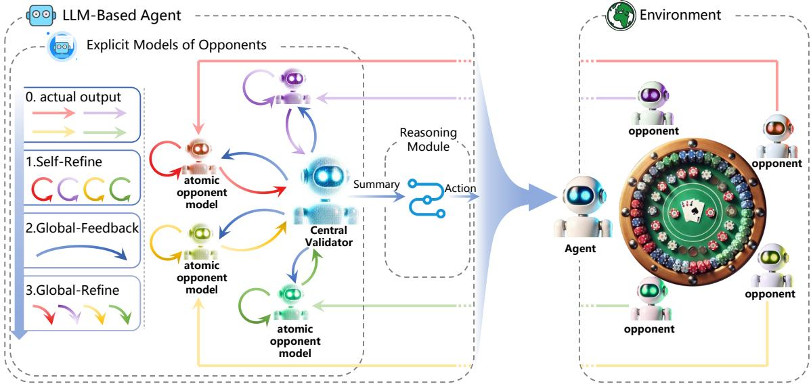
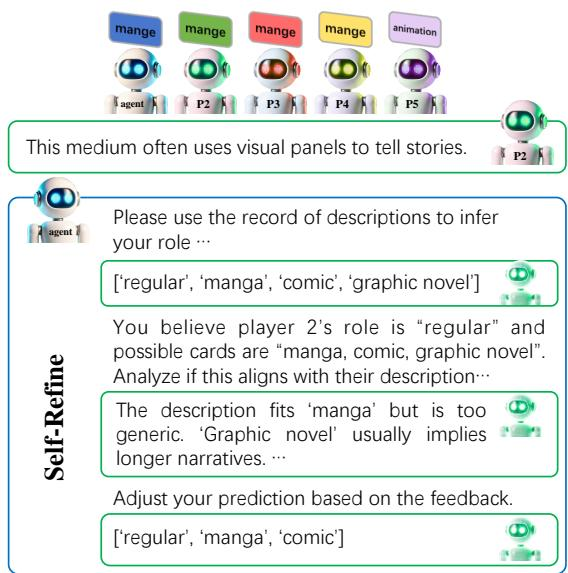
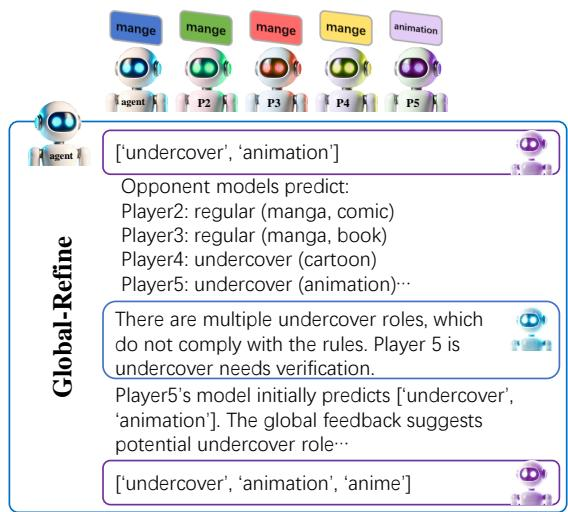
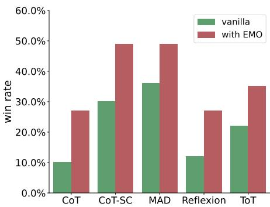
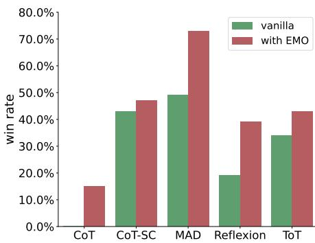
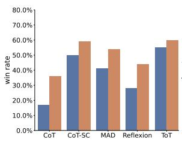
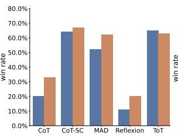
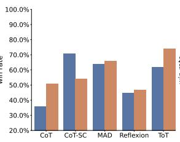
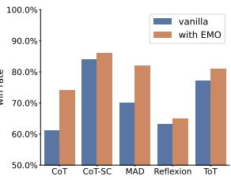

# LLM-Based Explicit Models of Opponents for Multi-Agent Games

Xiaopeng Yu Wanpeng Zhang Zongqing Lu

School of Computer Science, Peking University

## Abstract

In multi-agent scenarios, the ability to anticipate and respond to opponents is essential, particularly in environments involving adversarial and collaborative interactions. In this paper, we introduce Explicit Models of Opponents (EMO) based on Large Language Models (LLMs), enabling agents to better predict and adapt to diverse, dynamic multi-agent interactions. Unlike traditional methods that often simplify multi-agent interactions using a single opponent model, EMO constructs an individual model for each opponent and aligns these models working in synergy through a bi-level feedback-refinement framework. We test EMO alongside several reasoning methods in multiplayer deduction games, where agents must infer hidden information about their opponents. The results show that EMO significantly enhances agents’ decision-making, outperforming traditional single-model approaches. Our findings demonstrate that EMO can be a powerful tool for enhancing LLM-based agents in complex multi-agent systems.

## 1 Introduction

Autonomous agents, computational entities capable of operating independently in dynamic environments, have become integral to a wide range of applications (Mele, 1995a). Their core attributes—autonomy, perception, intelligence, social ability, and learning capacity—enable them to make decisions and take actions in pursuit of their objectives without external intervention (Mele, 1995b). The rise of Large Language Models (LLMs) has significantly expanded the capabilities of autonomous agents, allowing for more advanced reasoning, collaboration, and problemsolving across diverse domains (Sun et al., 2024). By integrating the cognitive abilities of LLMs, agents are now able to tackle more complex tasks with greater adaptability and effectiveness.

However, one critical aspect of agents, especially in environments with both adversarial and cooperative interactions, is the ability to model the behavior of other agents (we call them ‘opponents’ throughout the paper) (Nashed and Zilberstein, 2022; Von Der Osten et al., 2017). Traditional approaches often simplify this by treating other agents as a single agent rather than as distinct entities with their own intentions and strategies (He et al., 2024; Huang et al., 2023). This limitation restricts agents from fully anticipating and responding to the behavior of others, particularly in high-stakes scenarios where understanding the goals and actions of opponents is essential for success (Albrecht and Stone, 2018).

To address this, we introduce Explicit Models of Opponents (EMO), a novel framework that enables LLM-based agents to explicitly and effectively model the behavior of their opponents. By doing so, agents can make more informed decisions, predict opponents’ actions more accurately, and ultimately improve their performance in both cooperative and competitive environments. EMO goes beyond traditional learning-based approaches by leveraging the inherent reasoning capabilities of pre-trained LLMs, allowing for more adaptive and dynamic responses to varying opponent strategies.

The EMO framework employs a bi-level feedback-refinement process, wherein opponents are modeled individually through Atomic Opponent Models, which are continuously improved via feedback mechanisms. These individual models are then validated and refined globally by a Central Validator, ensuring that the predictions align with the broader context of the game or task. This process results in a more comprehensive understanding of the multi-agent environment, leading to better collaboration and conflict resolution among agents.

To evaluate the effectiveness of EMO, we conduct experiments in multi-player deduction games, including Who is the Undercover (WITU) and Avalon. These games present dynamic, imperfectinformation scenarios where agents must infer hidden information about their opponents. The results of our experiments show that EMO significantly enhances agent performance compared to existing methods, particularly in scenarios requiring complex reasoning and strategic adaptation.

Our key contributions are summarized as follows: 1) We propose EMO, a novel framework for LLM-based opponent modeling via explicitly constructing individual models for opponents and iterative feedback-refinement mechanisms; 2) We show EMO has the potential to significantly improve decision-making, adaptability, and overall performance in dynamic, multi-agent games; 3) The findings suggest that explicit opponent modeling can be a key factor in advancing the capabilities of LLM-based agents.

## 2 Related work

Structured reasoning frameworks have recently emerged as powerful methods for enhancing the problem-solving capabilities of LLMs by introducing multi-step, structured reasoning processes. Chain-of-Thought (CoT) (Wei et al., 2022) is one of the pioneers, which breaks down complex tasks into intermediate reasoning steps, allowing LLMs to solve them in smaller, manageable parts. Building on this, Tree of Thoughts (ToT) (Yao et al., 2023) models reasoning as a tree structure, enabling the exploration of multiple reasoning paths with lookahead and backtracking. Graph of Thought (GoT) (Yao et al., 2024) goes further by representing reasoning in a non-linear graph format, capturing more complex interrelations between thought processes. In addition, Program of Thoughts (PoT) (Chen et al., 2023) separates reasoning from computation, using programming language statements to improve LLM performance on numerical tasks. Other approaches, like Skeletonof-Thought (SoT) (Ning et al., 2024) and Diagram of Thought (DoT) (Zhang et al., 2024b), focus on parallel and iterative reasoning strategies, boosting both efficiency and accuracy. Together, these methods provide a robust set of tools for structuring the reasoning processes of LLMs, enabling them to handle complex tasks more effectively. However, these methods primarily focus on solving static problems through complex reasoning steps, without accounting for the dynamic interactions often found in multi-agent environments, where agents must adapt to others.

Theory of Mind (ToM) has been incorporated into LLM-based agents (Richards and Wessel, 2024; Street, 2024; Sclar et al., 2023; Xu et al., 2023) to model the beliefs, desires, and intentions of others, leading to more sophisticated and adaptive interactions. MuMA-ToM (Shi et al., 2024) focuses on multi-modal inputs to help agents infer and adapt to the mental states of others, while Suspicion-Agent (Guo et al., 2023) applies ToM in imperfect information games, using LLMs to predict and influence opponents’ behaviors. Agent-Pro (Zhang et al., 2024a) employs self-belief and world-belief(other agents) to guide decisions. However, ensuring consistency and accuracy in belief inference remains a challenge. Research on symbolic representations (Sclar et al., 2023) proposes using explicit graphs to track agents’ mental states for more precise reasoning. Meanwhile, studies on belief tracking systems (Li et al., 2023) explore how maintaining dynamic belief states improves decision-making. These studies form the foundation for LLM-based ToM, aiming to enhance agent collaboration, competition, and decision-making (Gandhi et al., 2023; Zhu et al., 2024). Unlike ToM methods, our approach takes a different path by explicitly modeling multiple opponents, offering a more direct way to predict their actions.

Opponent modeling is a key technique in multiagent systems, where agents must predict and adapt to the behaviors and strategies of others. SOM (Raileanu et al., 2018) allows agents to use their own policies to infer the goals of others, enhancing decision-making in both cooperative and competitive scenarios. L2E (Wu et al., 2022) enables agents to quickly adapt to unknown opponents without requiring extensive data. M-FOS (Lu et al., 2022) and TP-MCTS (Weil et al., 2023) shape and predict opponents’ actions without needing explicit knowledge of their learning processes, while MOL (Hu et al., 2023) and MBOM (Yu et al., 2022) simulate and adapt to opponents’ evolving strategies through recursive reasoning and equilibrium prediction. Additionally, Full DouZero+ (Zhao et al., 2024) employs opponent modeling in imperfect information games, while TDOM (Tian et al., 2023) dynamically models opponents’ changing policies to handle non-stationarity in mixed environments. Unlike these methods, we introduce LLM-based explicit models of multiple opponents, offering an explainable way for opponent modeling.

Multi-Agent Debate (MAD) involves multiple agents engaging in discussions to collabora-

  
Figure 1: Diagram of EMO: The agent models each opponent as an atomic opponent model, which is refined through four steps: 0) receiving the actual output, 1) self-refinement, 2) global feedback, and 3) global refinement. The central validator participates in steps 2 and 3, and later summarizes information from all atomic opponent models to provide it to the reasoning module for decision-making.

## 3.1 Preliminary

tively solve complex problems by presenting arguments and counterarguments, refining their reasoning in the process. Liang et al. (2023) proposed a MAD framework to enhance divergent thinking in LLMs and address reasoning degeneration by involving multiple agents, while Liu et al. (2024) introduced group debate to improve the scalability of multi-agent debates. Du et al. (2023) showed that multi-agent debate significantly improves factuality and reasoning and reduces hallucinations by cross-examining others’ reasoning. Wang et al. (2024) introduced a knowledge-enhanced MAD framework that incorporates external knowledge to solve the problem, where agents stick to incorrect viewpoints. While MAD has shown promising results in improving reasoning and factual accuracy, its consideration of other agents relies on methods like CoT. This limits its effectiveness in dynamic environments. Our approach aims to address this limitation by equipping agents with the ability to predict the actions of other agents in dynamic environments.

## 3 Method

EMO enhances the reasoning capabilities of the LLM-based agent by explicitly modeling opponents’ behaviors and providing information that enables the agent to make more strategic and informed decisions.

We consider an N-player imperfect-information extensive-form game (Shoham and Leyton-Brown, 2008). It is defined by the tuple $\begin{array} { r l } { \mathcal { G } } & { { } = } \end{array}$ $( \mathcal { N } , \mathcal { A } , \mathcal { H } , \mathcal { Z } , \chi , \rho , \sigma , \mathbf { u } , \mathcal { Z } )$ , where $\mathcal { N } = \{ 1 \ldots N \}$ is the set of players, is the set of possible actions, represents the set of non-terminal decision nodes (histories), and is the set of terminal nodes. The action function $\chi : \mathcal { H } \to 2 ^ { \mathcal { A } }$ assigns to each decision node a set of available actions, and the player function $\rho : \mathscr { H } \to \mathscr { N }$ determines which player makes a decision at a given node. The successor function $\sigma : \mathcal { H } \times \mathcal { A } \to \mathcal { H } \cup \mathcal { Z }$ specifies the next node or terminal state after an action is taken. The utility function $\mathbf { u } = ( u _ { 1 } , u _ { 2 } , \ldots , u _ { N } )$ assigns each player a payoff at terminal nodes. The information set $\mathcal { T } = ( \mathcal { T } _ { 1 } , \mathcal { T } _ { 2 } , \ldots , \mathcal { T } _ { N } )$ , where each $\mathcal { T } _ { i } = \{ I _ { i , 1 } , I _ { i , 2 } , . . . , I _ { i , k _ { i } } \}$ is a collection of equivalence classes (information sets) for player i.

We control one of the players with an LLMbased agent, denoted as agent i, which collaborates or competes with other agents. Other agents as a whole are denoted as agent i. The agents take actions in a sequential, turn-based manner, where each agent acts in its designated turn t (or time step). Without loss of generality, we assume that the agents take actions sequentially from agent 1 to agent N. As the game progresses to turn t, agent i observes public information $p _ { i , t } \in \mathcal { T } .$ private information $q _ { i , t } \in \mathcal { T }$ , and the action of the agent in the previous turn $_ { a . , t - 1 }$ . Specifically, the history for agent i at turn t is given by:

  
Figure 2: Example of P2’s model changing output by self-refine to exclude candidates.

$$
H _ { i , t } = ( p _ { i , 0 } , q _ { i , 0 } , a _ { \cdot , 0 } , \ldots , p _ { i , t - 1 } , q _ { i , t - 1 } , a _ { \cdot , t - 1 } ) .
$$

The agent’s goal is to select the best action at each time step based on its observations and available information, maximizing its expected utility over the course of the game.

## 3.2 Explicit Models of Opponents

We propose EMO to enhance the performance of LLM-based agents, with the method architecture shown in Figure 1. EMO is a bi-level feedbackrefinement framework, consisting of two main components: atomic opponent models and central validator. The atomic opponent models are responsible for generating initial predictions for the opponents and iteratively improving their outputs through feedback and refinement. The central validator is responsible for evaluating the output of each atomic opponent model with the ground truth output of the opponents, providing global feedback and coordination to the atomic opponent models. Finally, the central validator aggregates the outputs from all atomic opponent models and provides the information to the agent to help generate a more comprehensive and effective action.

Atomic opponent models leverage a memoryenhanced self-refine method (Madaan et al., 2023). The modeling process is divided into three phases: initialization, feedback, and refinement.

In the initialization phase, the atomic opponent model $M _ { j }$ generates an initial prediction of $q _ { j , \imath } ^ { 0 }$ that represents the private information of the opponent $j \in [ 1 , \ldots , i - 1 , i + 1 , \ldots , N ]$ , which is based on the task prompt $P ,$ task rules $R ,$ , history H, and public information $p \mathrm { : }$

  
Figure 3: Example of changing the output of P5’s model by global-refine, since explicit models of opponents are inconsistent with the rules.

$$
\hat { q } _ { j , t } ^ { 0 } \sim M _ { j } ( \cdot \mid P ^ { i n i t } , R , H _ { j , t } , \tilde { p } _ { j , t } ) .\tag{1}
$$

The prompt $P ^ { i n i t }$ guides the generation process, providing context and constraints for the output. The history $H _ { j , t }$ contains past interactions, predictions, and observations of the opponent model, allowing it to learn from experiences. The public information $\hat { p } _ { j , t }$ provides the information about the environment that agent i believes agent j knows, i.e., $\tilde { p } _ { j , t } = p _ { i , t }$ , because agent i cannot access the observation of agent j.

In the feedback phase, opponent model $M _ { j }$ generates feedback $F _ { j , t } ^ { s }$ as follows:

$$
\begin{array} { r } { F _ { j , t } ^ { s } \sim M _ { j } ( \cdot \mid P ^ { s e l f - f e e d b a c k } , R , H _ { j , t } , } \\ { \tilde { p } _ { j , t } , a _ { j , t } , \hat { q } _ { j , t } ^ { s } ) , } \end{array}\tag{2}
$$

where $a _ { j , t }$ is the action taken by the opponent at time step t and s is an iterator.

In the refinement phase, opponent model $M _ { j }$ generates a refined output $\hat { q } _ { j , t } ^ { s + 1 }$ by incorporating all available information:

$$
\begin{array} { r } { \hat { q } _ { j , t } ^ { s + 1 } \sim M _ { j } ( \cdot \mid P ^ { s e l f - r e f i n e } , R , H _ { j , t } , F _ { j , t } ^ { s } , } \\ { \tilde { p } _ { j , t } , a _ { j , t } , \hat { q } _ { j , t } ^ { s } ) . } \end{array}\tag{3}
$$

The feedback and refinement phases are iteratively executed until the maximum number of iterations is reached or another stopping condition is met. It then outputs the refined private information of the opponent $\hat { q } _ { j , t } ^ { S }$ . Figure 2 illustrates an example of self-refinement.

Algorithm 1 EMO   
1: Input: Central validator $M _ { c } ,$ Atomic opponent   
model $M _ { j } ,$ , prompts $P ,$ task rules $R ,$ history   
$\{ H _ { n , t } \mid \bar { n } = 1 , \ldots , N \}$ , public information   
$\tilde { p } _ { j , t } ,$ opponent $j ^ { \dagger } \mathbf { s }$ action $\begin{array} { r } { a _ { j , t } , } \end{array}$ timestep t   
2: $\{ / / S e l f { - } R e \ f i n e \}$   
3: Generate initial prediction $\hat { q } _ { j , t } ^ { 0 }$ as Equation (1)   
4: for $s = 0 , 1 , \ldots , S$ do   
5: Generate feedback $F _ { j , t } ^ { s }$ as Equation (2)   
6: Refine prediction $\hat { q } _ { j , t } ^ { s + 1 }$ as Equation (3)   
7: end for   
8: {//Global-Refine}   
9: Global initial prediction $\hat { q } _ { j , t } ^ { g } \gets \hat { q } _ { j , t } ^ { S }$   
10: for $g = 0 , 1 , \dotsc , G - 1$ do   
11: Generate global feedback $F _ { j , t } ^ { g }$ as Equa  
tion (4)   
12: Refine prediction $\hat { q } _ { j , t } ^ { g + 1 }$ as Equation (5)   
13: end for   
14: Global refined prediction $\hat { q } _ { j , t } \gets \hat { q } _ { j , t } ^ { G }$   
15: Merge history $H _ { j } = H _ { j } \cup \{ \tilde { p } _ { j , t } , \hat { q } _ { j , t } , a _ { j , t } \}$

Central validator $M _ { c }$ plays a critical role in coordinating the outputs of the atomic opponent models and ensuring consistency. The central validator is responsible for evaluating the aggregated predictions and iteratively refining them to ensure that each atomic opponent model’s output aligns with the global context of the environment. Specifically, the central validator uses a two-phase process: global feedback and global refinement.

In the global feedback phase, the central validator $M _ { c }$ evaluates the outputs generated by each atomic opponent model and compares them against the overall ground truth or global information available to agent i. By incorporating information from other agents’ past actions and global information and history, the central validator generates a global feedback signal $F _ { j , t } ^ { g }$ for opponent model $M _ { j }$

$$
\begin{array} { r } { F _ { j , t } ^ { g } \sim M _ { c } ( \cdot \mid P ^ { g l o b a l - f e e d b a c k } , R , H _ { N , t } , } \\ { \tilde { p } _ { \mathcal { N } , t } , a _ { \mathcal { N } , t } , \hat { q } _ { j , t } ^ { g } ) . } \end{array}\tag{4}
$$

Here, the notation $^ { 6 6 } { \mathcal { N } } ^ { 5 }$ represents all agents. The central validator takes into account the refined private information $\hat { q } _ { j , t } ^ { g }$ from the atomic opponent model j and evaluates it based on the global context. During the first iteration, $\hat { q } _ { j , t } ^ { g }$ is initialized to $\hat { q } _ { j , t } ^ { S }$ The generated global feedback $F _ { j , t } ^ { g }$ is then used to improve the predictions of each atomic opponent model. In the global refinement phase, the atomic opponent models incorporate the global feedback

Algorithm 2 CoT with EMO   
1: Input: Agent i’s reasoning model M, CoT’s   
prompts $\{ P _ { 0 } , \ldots , P _ { K } \}$ , task rules $R ,$ history   
$H _ { i } = \{ \}$   
2: for $t = 0 , 1 , \ldots$ do   
3: Get public information $p _ { i , t } ,$ private informa  
tion $q _ { i , t } .$   
4: if Agent $i \ ' _ { \mathrm { { s } } }$ turn to act then   
5: Get predicted private information of EMO   
$\hat { q } _ { - i , t - 1 }$ as Equation (6)   
6: Initialize $s _ { 0 } = M ( P _ { 0 } , D )$ , where $D =$   
$\left\{ R , H _ { i , t } , p _ { i , t } , q _ { i , t } , \hat { q } _ { - i , t - 1 } \right\}$   
7: for $k = 1 , 2 , \ldots , K - 1$ do   
8: $s _ { k } = M ( s _ { k - 1 } , P _ { k } , D )$   
9: end for   
10: Take action $a _ { i , t } = a . , _ { t } = M ( s _ { K } , P _ { K } , D )$   
11: else   
12: Get the current acting agent’s index j and   
action $a _ { j , t } = a _ { \cdot , t }$   
13: Run EMO as Algorithm 1   
14: end if   
15: Merge history $H _ { i } = H _ { i } \cup \{ p _ { i , t } , q _ { i , t } , a . , _ { t } \}$   
16: end for   
to produce a further refined output to produce a further refined output $\hat { q } _ { j , t } ^ { g + 1 }$ :

$$
\begin{array} { r } { \hat { q } _ { j , t } ^ { g + 1 } \sim M _ { j } ( \cdot \mid P ^ { g l o b a l - r e f i n e } , R , H _ { j , t } , F _ { j , t } ^ { g } , } \\ { \tilde { p } _ { j , t } , a _ { j , t } , \hat { q } _ { j , t } ^ { g } ) . } \end{array}\tag{5}
$$

Here, the goal is to integrate the feedback provided by the central validator, ensuring that the outputs are coherent with respect to the global information available. This iterative refinement continues until a predefined convergence criterion is satisfied, and then we have the final prediction of the opponent $\hat { q } _ { j , t }$ . Figure 3 shows an example of global refinement.

By leveraging both the local feedback from atomic opponent models and the global feedback from the central validator, EMO aims to produce more reliable predictions. The central validator thus is the key to helping ensure the atomic opponent models are working in synergy, thereby enhancing the performance of the agent by providing a more holistic understanding of the environment and the actions of opponents.

The central validator $M _ { c }$ aggregates the predictions from all opponent models after they generate their respective outputs as follows:

$$
\hat { q } _ { - i , t } \sim M _ { c } ( \cdot \mid P ^ { s u m m a r y } , \sum _ { j \neq i } ^ { N } \hat { q } _ { j , t } ) .\tag{6}
$$

The full procedure of EMO is outlined in Algorithm 1.

## 3.3 Incorporating EMO

LLMs struggle with handling complex reasoning tasks, and traditional methods that directly feed complex opponent information into the LLM-based agent are not effective since they fail to account for deeper factors such as opponents’ intentions, beliefs, and hidden information. To overcome this limitation, we introduce EMO to handle the complexity of opponent information. EMO processes and interprets the opponent’s private information $\hat { q } _ { - i , t - 1 }$ , letting the LLM focus on strategic decision-making and action planning. This division allows the agent to reason more effectively about the environment and make more informed, strategic decisions, while also enabling seamless integration with existing strategic reasoning and planning methods.

EMO does not impose limitations on the LLMbased agent. As an example, we demonstrate how EMO can be integrated with the Chain-of-Thought (CoT) reasoning approach (Wei et al., 2022). The algorithm is provided as Algorithm 2. Other reasoning methods are discussed in Appendix A.

## 4 Experiments

## 4.1 Settings

In the experiments, we combine EMO with the following methods:

• Chain of Thought (CoT) (Wei et al., 2022) is a prompting method that improves reasoning by generating intermediate steps, enabling LLMs to handle complex problems.

• Reflexion (Shinn et al., 2023) is a framework where agents improve their decision-making by reflecting on feedback in subsequent trials, storing insights for future use.

• Self-Consistency with CoT (CoT-SC) (Wang et al., 2023) is a method that samples multiple reasoning paths and selects the most consistent answer to improve reasoning.

• Tree of Thoughts (ToT) (Yao et al., 2023) is a framework that explores multiple reasoning paths and employs self-evaluation to enable strategic decision-making.

• Multi-Agent Debate (MAD) (Liang et al., 2023) a framework where multiple agents debate and a judge determines the solution, promoting divergent thinking to overcome biases and rigid reasoning.

The vanilla versions of these methods serve as baselines. All opponents are LLM-based agents. We use the GPT-4-0613 as the default LLM with the default parameters (temperature=1.0 and top\_p=1.0). For more details please refer to Appendix A.

## 4.2 Performance on WITU

Who is the Undercover (WITU) is a party game for five players. Each player receives a card: four regular players get a card with a common word, while the undercover player receives a card with a slightly different word, such as “manga” versus “animation”. Players do not know their own roles at the start. Each player takes turns describing their word without directly revealing it. For example, one might describe the “manga” by This thing is usually in black and white, with occasional color versions. After all players have given their descriptions, they vote to identify the undercover player. The regular players win if they successfully identify the undercover player, while the undercover player wins by remaining undetected until only one regular player remains.

Throughout the game, each player must deduce what cards others hold based on their descriptions, which in turn helps them figure out their own role. When describing their card, a player must be convincing enough that others with the same card find the description consistent, thus avoiding suspicion. Lying is not allowed. For example, a player holding “manga” cannot, even if they suspect others hold “animation”, give a misleading description such as This is usually accompanied by music and background sound effects, which doesn’t match the characteristics of “manga”. At the same time, players need to be careful not to reveal too much, as it could give those with different cards enough information to guess the content and identify them.

Figure 4 presents the performance of the agent in WITU. The results show that EMO significantly enhances the performance of LLM-based agents in both roles, as a regular player and as an undercover player. The agent’s win rate improves by a large margin with using EMO, indicating that EMO offers valuable insights that help the agent make more strategic decisions, ultimately enhancing its overall performance in the game. The linear reasoning path of CoT can easily lead the agent down an incorrect trajectory. EMO provides additional reasoning and a higher self-identification accuracy, as shown in Table 1, which helps correct CoT’s faulty reasoning. Reflexion struggles with handling complex problems, while EMO mitigates this complexity. CoT-SC and ToT both utilize multiple reasoning paths, offering greater cognitive flexibility. MAD leverages the diversity of multi-agent thinking, making it more adept at handling scenarios with multiple opponents. Even for these high-performing methods, the opponent information provided by EMO further improves their performance.

  
(a) Regular Player

  
(b) Undercover Player

Figure 4: Performance on WITU, win rate comparison between vanilla baseline methods (green) and methods incorporating EMO (red). (a) represents the agent as a regular player, while (b) represents the agent as an undercover player. The results show that EMO significantly enhances the performance of LLM-based agents in both roles. The results are averaged over 100 games.  
Table 1: Self-Identification Accuracy on WITU
<table><tr><td rowspan="2"></td><td colspan="2">Regular Player</td><td colspan="2">Undercover Player</td><td colspan="2">All roles</td></tr><tr><td>First Round</td><td>Last Round</td><td>First Round</td><td>Last Round</td><td></td><td>First Round Last Round</td></tr><tr><td>CoT + EMO</td><td>67%</td><td>81%</td><td>37%</td><td>85%</td><td>52%</td><td>83%</td></tr><tr><td>CoT-SC + EMO</td><td>75%</td><td>81%</td><td>21%</td><td>88%</td><td>48%</td><td>84.5%</td></tr><tr><td>MAD + EMO</td><td>64%</td><td>88%</td><td>20%</td><td>75%</td><td>42%</td><td>81.5%</td></tr><tr><td>Reflexion + EMO</td><td>69%</td><td>85%</td><td>29%</td><td>89%</td><td>49%</td><td>87%</td></tr><tr><td>ToT + EMO</td><td>78%</td><td>72%</td><td>20%</td><td>81%</td><td>49%</td><td>76.5%</td></tr></table>

Table 1 illustrates the self-identification accuracy of the LLM-based agent. Across both regular and undercover roles, the accuracy consistently improves from the first round to the last, indicating that EMO significantly enhances the agent’s ability to correctly identify its own role. This improvement is evident in all methods tested, with EMO contributing to higher overall accuracy.

## 4.3 Performance on Avalon

Avalon (Light et al., 2023) is a social deduction game. The players are divided into two teams: three good players and two evil players. The good team consists of Merlin and two servants of Arthur, while the evil team includes the Assassin and one Minion of Mordred. The objective for the good team is to successfully complete three out of five quests, while the evil team tries to sabotage these quests. Each round, a leader proposes a team to go on the quest, and players vote to approve or reject the team. The good team includes Merlin, who knows the identities of the evil players but must be cautious not to reveal their own identity, as the Assassin can win the game by identifying and killing Merlin at the end. The two other good players are Servants, who must use deduction and reasoning to identify the evil players. The evil team consists of the Assassin, who aims to deceive the good players, and one Minion, who supports the Assassin in sabotaging the quests.

Figure 5 illustrates the performance of the agent in Avalon, comparing the win rates between vanilla baseline methods and those incorporating EMO. Across all roles — Merlin, Servant, Minion, and Assassin — the results indicate that EMO significantly enhances the performance of LLM-based agents. The agent’s win rate consistently improves when using EMO, suggesting that EMO offers crucial insights, which contribute to more strategic choices and overall enhanced performance in the game. CoT and Reflexion get poor performance, primarily due to their lack of adaptability when dealing with dynamically changing tasks. CoT-SC and ToT, despite utilizing complex reasoning paths, still suffer in this multi-agent game. MAD, while benefiting from the diversity of multi-agent interactions, faces challenges in ensuring coordination among agents. The inclusion of EMO further enhances the performance of these sophisticated methods.

  
(a) Merlin

  
(b) Servant

  
(c) Minion

  
(d) Assassin

Figure 5: Performance on Avalon, comparing win rate between vanilla baseline methods (blue) and methods incorporating EMO (orange). (a), (b), (c), and (d) represent the agent’s performance as Merlin, Servant, Minion, and Assassin, respectively. The results show that EMO significantly improves the performance of LLM-based agents. The results are averaged over 100 games.  
Table 2: Detail Results of Avalon
<table><tr><td rowspan="2"></td><td colspan="2">Good Roles</td><td colspan="4">Assassin</td></tr><tr><td colspan="2">Merlin Evasion</td><td colspan="2">Mission Winrate</td><td colspan="2">Assass.acc</td></tr><tr><td>CoT</td><td>vanilla 17.2%</td><td>with EMO</td><td>vanilla</td><td>with EMO</td><td>vanilla</td><td>with EMO</td></tr><tr><td></td><td></td><td>17.4%</td><td>49%</td><td>52%</td><td>60%</td><td>91.7%</td></tr><tr><td>CoT-SC</td><td>17.5%</td><td>15.6%</td><td>66%</td><td>74%</td><td>69.2%</td><td>92.3%</td></tr><tr><td>MAD</td><td>15.9%</td><td>16.1%</td><td>56%</td><td>74%</td><td>70%</td><td>88.9%</td></tr><tr><td>Reflexion</td><td>18.4%</td><td>17.9%</td><td>50%</td><td>49%</td><td>59.1%</td><td>88.9%</td></tr><tr><td>ToT</td><td>16.1%</td><td>15.6%</td><td>62%</td><td>71%</td><td>71.4%</td><td>90.9%</td></tr></table>

Table 3: Ablation on WITU, comparison between EMO and Single Model of Opponents (SMO). The results show that EMO significantly outperforms SMO in both roles. The results are averaged over 100 games.
<table><tr><td rowspan="2"></td><td colspan="2">Regular Player</td><td colspan="2">Undercover Player</td></tr><tr><td>with EMO</td><td>with SMO</td><td>with EMO</td><td>with SMO</td></tr><tr><td>CoT</td><td>27%</td><td>25%</td><td>15%</td><td>10%</td></tr><tr><td>CoT-SC</td><td>49%</td><td>36%</td><td>47%</td><td>53%</td></tr><tr><td>MAD</td><td>49%</td><td>46%</td><td>73%</td><td>60%</td></tr><tr><td>Reflexion</td><td>27%</td><td>22%</td><td>39%</td><td>38%</td></tr><tr><td>ToT</td><td>35%</td><td>30%</td><td>43%</td><td>36%</td></tr></table>

Table 2 shows the detailed results from the game Avalon. “Merlin Evasion” refers to the probability that Merlin is not identified by the Assassin during the assassination phase. For Merlin, with global information, the overall win rate increases with the use of EMO, while the evasion rate remains almost unchanged, which indicates that EMO did not introduce negative side effects. Methods that involve more complex reasoning, such as CoT-SC and ToT, demonstrate a slight edge. For the Assassin role, EMO provides higher mission win rates and increases accuracy in identifying Merlin. This suggests that EMO’s application in Avalon significantly improves the agents’ ability to understand their opponents, making it easier for the Assassin to locate Merlin.

## 4.4 Ablation Study

In traditional opponent modeling methods like (Yu et al., 2022), multiple opponents are often treated as a single entity for the sake of simplification, reducing the complexity of interactions between opponents. This approach is usually taken due to limitations in computational resources and model complexity. However, EMO leverages the adaptability and training-free nature of LLMs to construct comprehensive individual models for each opponent, rather than using a single, unified model. As a part of our ablation study, we compared EMO with the method of modeling all opponents as one entity, denoted as Single Model of Opponents (SMO). The results are shown in Table 3.

When the agent acts as a regular player, the group of opponents consists of both regular and undercover players, creating a complex opponent modeling scenario that implicitly includes both cooperative and competitive relationships. SMO, which uses a single model to handle this complex environment, overlooks the interactions between opponents, resulting in overall weaker performance compared to EMO. When the agent plays as an undercover player, the opponent model only includes regular players, making it a simpler opponent modeling scenario. EMO demonstrates significant advantages across several baseline algorithms, including CoT, MAD, and ToT. By comparing the results of EMO and SMO, we observe that EMO performs better in complex scenarios involving multiple opponents. Overall, EMO, by constructing explicit models for each opponent, significantly enhances the performance of agents in multi-player adversarial-cooperative scenarios. It proves to be effective in scenarios requiring complex reasoning and decision-making, outperforming SMO across various metrics.

## 5 Conclusion

In this paper, we introduced EMO, which enhances the reasoning capabilities of LLM-based agents in multi-agent games. EMO leverages a bi-level feedback-refinement framework, enabling agents to better anticipate and adapt to the behavior of individual opponents. Our experiments in “Who is the Undercover” and Avalon demonstrate that EMO significantly improves the performance of agents in both adversarial and cooperative roles. By explicitly modeling each opponent, EMO provides more strategic insights, leading to higher performance compared to traditional single-model approaches. These results highlight the potential of explicit opponent modeling to advance LLM-based agents’ capabilities in complex multi-agent environments. Future work may explore further optimizations in EMO’s architecture and its application to more diverse and dynamic scenarios.

## 6 Limitations

We propose EMO, a novel framework for LLMbased opponent modeling that significantly enhances decision-making, adaptability, and overall performance in dynamic, multi-agent games. Despite its strengths, EMO has limitations due to its strong dependence on the reasoning abilities of LLMs and the performance of baseline methods. Although EMO excels in open multi-agent environments with its zero-shot capabilities, the construction of opponent models remains vague, which hinders its ability to support simulation-based planning and reduces its effectiveness in scenarios requiring detailed and accurate opponent modeling.

## Acknowledgments

This work was supported by NSFC under Grant 62450001 and 62476008. The authors would like to thank the anonymous reviewers for their valuable comments and advice.

## References

Stefano V. Albrecht and Peter Stone. 2018. Autonomous Agents Modelling Other Agents: A Comprehensive Survey and Open Problems. Artificial Intelligence, 258:66–95.

Wenhu Chen, Xueguang Ma, Xinyi Wang, and William W. Cohen. 2023. Program of Thoughts Prompting: Disentangling Computation from Reasoning for Numerical Reasoning Tasks.

Yilun Du, Shuang Li, Antonio Torralba, Joshua B. Tenenbaum, and Igor Mordatch. 2023. Improving Factuality and Reasoning in Language Models through Multiagent Debate.

Kanishk Gandhi, Jan-Philipp Fränken, Tobias Gerstenberg, and Noah D. Goodman. 2023. Understanding Social Reasoning in Language Models with Language Models.

Jiaxian Guo, Bo Yang, Paul Yoo, Bill Yuchen Lin, Yusuke Iwasawa, and Yutaka Matsuo. 2023. Suspicion-Agent: Playing Imperfect Information Games with Theory of Mind Aware GPT-4.

Junda He, Christoph Treude, and David Lo. 2024. LLM-Based Multi-Agent Systems for Software Engineering: Vision and the Road Ahead.

Yudong Hu, Congying Han, Haoran Li, and Tiande Guo. 2023. Modeling opponent learning in multiagent repeated games. Applied Intelligence, 53(13):17194– 17210.

Shaohan Huang, Li Dong, Wenhui Wang, Yaru Hao, Saksham Singhal, Shuming Ma, Tengchao Lv, Lei Cui, Owais Khan Mohammed, Barun Patra, et al. 2023. Language is not all you need: Aligning perception with language models. Advances in Neural Information Processing Systems, 36:72096–72109.

Huao Li, Yu Quan Chong, Simon Stepputtis, Joseph Campbell, Dana Hughes, Michael Lewis, and Katia Sycara. 2023. Theory of Mind for Multi-Agent Collaboration via Large Language Models. In Proceedings ofthe 2023 Conference on Empirical Methods in Natural Language Processing, pages 180–192.

Tian Liang, Zhiwei He, Wenxiang Jiao, Xing Wang, Yan Wang, Rui Wang, Yujiu Yang, Zhaopeng Tu, and

Shuming Shi. 2023. Encouraging Divergent Thinking in Large Language Models through Multi-Agent Debate.

Jonathan Light, Min Cai, Sheng Shen, and Ziniu Hu. 2023. Avalonbench: Evaluating llms playing the game of avalon. In NeurIPS 2023 Foundation Models for Decision Making Workshop.

Tongxuan Liu, Xingyu Wang, Weizhe Huang, Wenjiang Xu, Yuting Zeng, Lei Jiang, Hailong Yang, and Jing Li. 2024. GroupDebate: Enhancing the Efficiency of Multi-Agent Debate Using Group Discussion.

Christopher Lu, Timon Willi, Christian A Schroeder De Witt, and Jakob Foerster. 2022. Model-free opponent shaping. In International Conference on Machine Learning, pages 14398–14411. PMLR.

Aman Madaan, Niket Tandon, Prakhar Gupta, Skyler Hallinan, Luyu Gao, Sarah Wiegreffe, Uri Alon, Nouha Dziri, Shrimai Prabhumoye, Yiming Yang, Shashank Gupta, Bodhisattwa Prasad Majumder, Katherine Hermann, Sean Welleck, Amir Yazdanbakhsh, and Peter Clark. 2023. SELF-REFINE: Iterative Refinement with Self-Feedback. Advances in Neural Information Processing Systems.

Alfred R Mele. 1995a. Autonomous agents: From selfcontrol to autonomy. Oxford University Press.

Alfred R Mele. 1995b. Autonomous agents: From selfcontrol to autonomy. Oxford University Press.

Samer Nashed and Shlomo Zilberstein. 2022. A survey of opponent modeling in adversarial domains. Journal ofArtificial Intelligence Research, 73:277–327.

Xuefei Ning, Zinan Lin, Zixuan Zhou, Zifu Wang, Huazhong Yang, and Yu Wang. 2024. Skeleton-of-Thought: Prompting LLMs for Efficient Parallel Generation.

Roberta Raileanu, Emily Denton, Arthur Szlam, and Rob Fergus. 2018. Modeling Others using Oneself in Multi-Agent Reinforcement Learning.

Jonan Richards and Mairieli Wessel. 2024. What You Need is What You Get: Theory of Mind for an LLM-Based Code Understanding Assistant.

Melanie Sclar, Sachin Kumar, Peter West, Alane Suhr, Yejin Choi, and Yulia Tsvetkov. 2023. Minding Language Models’ (Lack of) Theory of Mind: A Plugand-Play Multi-Character Belief Tracker.

Haojun Shi, Suyu Ye, Xinyu Fang, Chuanyang Jin, Leyla Isik, Yen-Ling Kuo, and Tianmin Shu. 2024. MuMA-ToM: Multi-modal Multi-Agent Theory of Mind.

Noah Shinn, Federico Cassano, Ashwin Gopinath, Karthik Narasimhan, and Shunyu Yao. 2023. Reflexion: Language Agents with Verbal Reinforcement Learning. Advances in Neural Information Processing Systems.

Yoav Shoham and Kevin Leyton-Brown. 2008. Multiagent systems: Algorithmic, game-theoretic, and logicalfoundations. Cambridge University Press.

Winnie Street. 2024. LLM Theory of Mind and Alignment: Opportunities and Risks.

Chuanneng Sun, Songjun Huang, and Dario Pompili. 2024. LLM-based Multi-Agent Reinforcement Learning: Current and Future Directions.

Yuan Tian, Klaus-Rudolf Kladny, Qin Wang, Zhiwu Huang, and Olga Fink. 2023. Multi-agent actor-critic with time dynamical opponent model. Neurocomputing, 517:165–172.

Friedrich Burkhard Von Der Osten, Michael Kirley, and Tim Miller. 2017. The Minds of Many: Opponent Modeling in a Stochastic Game. In Proceedings of the Twenty-Sixth International Joint Conference on Artificial Intelligence, pages 3845–3851, Melbourne, Australia. International Joint Conferences on Artificial Intelligence Organization.

Haotian Wang, Xiyuan Du, Weijiang Yu, Qianglong Chen, Kun Zhu, Zheng Chu, Lian Yan, and Yi Guan. 2024. Learning to Break: Knowledge-Enhanced Reasoning in Multi-Agent Debate System.

Xuezhi Wang, Jason Wei, Dale Schuurmans, Quoc Le, Ed Chi, Sharan Narang, Aakanksha Chowdhery, and Denny Zhou. 2023. Self-Consistency Improves Chain of Thought Reasoning in Language Models.

Jason Wei, Xuezhi Wang, Dale Schuurmans, Maarten Bosma, Fei Xia, Ed Chi, Quoc V Le, Denny Zhou, et al. 2022. Chain-of-thought prompting elicits reasoning in large language models. Advances in neural information processing systems, 35:24824–24837.

Jannis Weil, Johannes Czech, Tobias Meuser, and Kristian Kersting. 2023. Know your Enemy: Investigating Monte-Carlo Tree Search with Opponent Models in Pommerman.

Zhe Wu, Kai Li, Hang Xu, Yifan Zang, Bo An, and Junliang Xing. 2022. L2E: Learning to Exploit Your Opponent. In 2022 International Joint Conference on Neural Networks (IJCNN), pages 1–8, Padua, Italy. IEEE.

Yuzhuang Xu, Shuo Wang, Peng Li, Fuwen Luo, Xiaolong Wang, Weidong Liu, and Yang Liu. 2023. Exploring large language models for communication games: An empirical study on werewolf. arXiv preprint arXiv:2309.04658.

Shunyu Yao, Dian Yu, Jeffrey Zhao, Izhak Shafran, Thomas L Griffiths, Yuan Cao, and Karthik Narasimhan. 2023. Tree of thoughts: Deliberate problem solving with large language models, 2023. URL https://arxiv. org/pdf/2305.10601. pdf.

Yao Yao, Zuchao Li, and Hai Zhao. 2024. GoT: Effective Graph-of-Thought Reasoning in Language

Models. In Findings ofthe Associationfor Computational Linguistics: NAACL 2024, pages 2901–2921, Mexico City, Mexico. Association for Computational Linguistics.

Xiaopeng Yu, Jiechuan Jiang, Wanpeng Zhang, Haobin Jiang, and Zongqing Lu. 2022. Model-based opponent modeling. Advances in Neural Information Processing Systems, 35:28208–28221.

Wenqi Zhang, Ke Tang, Hai Wu, Mengna Wang, Yongliang Shen, Guiyang Hou, Zeqi Tan, Peng Li, Yueting Zhuang, and Weiming Lu. 2024a. Agentpro: Learning to evolve via policy-level reflection and optimization. In Proceedings ofthe 62nd Annual Meeting of the Association for Computational Linguistics (Volume 1: Long Papers), pages 5348–5375, Bangkok, Thailand. Association for Computational Linguistics.

Yifan Zhang, Yang Yuan, and Andrew Chi-Chih Yao. 2024b. On the Diagram of Thought.

Youpeng Zhao, Jian Zhao, Xunhan Hu, Wengang Zhou, and Houqiang Li. 2024. Full DouZero+: Improving DouDizhu AI by Opponent Modeling, Coach-Guided Training and Bidding Learning. IEEE Transactions on Games, 16(3):518–529.

Wentao Zhu, Zhining Zhang, and Yizhou Wang. 2024. Language Models Represent Beliefs of Self and Others.

## A Algorithms

The CoT method discussed in the main text. In EMO for all methods, both the termination conditions for self-refine and global-refine are set to 2 iterations. The prompts has provided in Appendix D. We have also implemented several structured reasoning frameworks as part of the agent’s reasoning module, detailed below:

• Reflexion (Shinn et al., 2023) is a framework where agents improve their decision-making by reflecting on feedback in subsequent trials, storing insights for future use. The number of iterations is 3. See Algorithm 3.

• Self-Consistency with CoT (CoT-SC) (Wang et al., 2023) is a method that samples multiple reasoning paths and selects the most consistent answer to improve reasoning. The number of samples is 10. See Algorithm 4.

• Tree of Thoughts (ToT) (Yao et al., 2023) is a framework that explores multiple reasoning paths and employs self-evaluation to enable strategic decision-making. We use the ToT-BFS with size limit of 8, step limit of 3, and the breadth limit is min $\{ 5 , | \chi | \}$ , where χ is the available action space. See Algorithm 5.

• Multi-Agent Debate (MAD) (Liang et al., 2023) a framework where multiple agents debate and a judge determines the solution, promoting divergent thinking to overcome biases and rigid reasoning. The number of iterations is 3 with 5 debate agents. See Algorithm 6.

Algorithm 3 Reflexion with EMO   
1: Input: Agent i’s reasoning model M, Reflection’s prompts $P ^ { \mathrm { r e f l } }$ and Select prompt $P ^ { \mathrm { s e l e c t } }$ , task rules   
R, history $H _ { i } = \left\{ \begin{array} { r l r } \end{array} \right\}$ , max iteration K.   
2: for $t = 0 , 1 , \ldots$ do   
3: Get public information $p _ { i , t } ,$ private information ${ { q } _ { i , t } } .$   
4: if Agent $i \ ' s$ turn to act then   
5: Get predicted private information of EMO $\hat { q } _ { - i , t - 1 }$ as Equation (6)   
6: Initialize $a _ { i , t } ^ { ( 1 ) } = M ( P , D )$ , where $D = \{ R , H _ { i , t } , p _ { i , t } , q _ { i , t } , \hat { q } _ { - i , t - 1 } \}$   
7: for $k = 2 , \ldots , K$ do   
8: $a _ { i , t } ^ { ( k ) } = M ( P ^ { \mathrm { r e f } } , D , a _ { i , t } ^ { ( 1 ) } , \dots , a _ { i , t } ^ { ( k - 1 ) } )$   
9: end for   
10: Take action $a _ { i , t } = a . _ { , t } = M ( P ^ { \mathrm { s e l e c t } } , D , a _ { i , t } ^ { ( 1 ) } , \dots , a _ { i , t } ^ { ( k ) } )$   
11: else   
12: Get the current acting agent’s index $j$ and action $a _ { j , t } = a _ { \cdot , t }$   
13: Run EMO as Algorithm 1   
14: end if   
15: Merge history $H _ { i } = H _ { i } \cup \{ p _ { i , t } , q _ { i , t } , a . , _ { t } \}$   
16: end for

Algorithm 4 CoT-SC with EMO   
1: Input: Agent $i \mathbf { \ ' } _ { \mathbf { S } }$ reasoning model M, CoT-SC’s prompts $\{ P _ { 0 } , \ldots , P _ { K } \}$ and Select prompt $P ^ { \mathrm { s e l e c t } }$   
task rules $R ,$ history $H _ { i } = \left\{ \begin{array} { r l r } \end{array} \right\}$ , num of samples $L .$   
2: for $t = 0 , 1 , \ldots$ do   
3: Get public information $p _ { i , t } .$ , private information $q _ { i , t } .$   
4: if Agent $i \ ' s$ turn to act then   
5: Get predicted private information of EMO $\hat { q } _ { - i , t - 1 }$ as Equation (6)   
6: Initialize $A _ { \mathrm { s e t } } = \{ \}$   
7: for $l = 1 , 2 , \ldots , L$ do   
8: Initialize $s _ { 0 } = M ( P _ { 0 } , D )$ , where $D = \{ R , H _ { i , t } , p _ { i , t } , q _ { i , t } , \hat { q } _ { - i , t - 1 } \}$   
9: for $k = 1 , 2 , \ldots , K - 1$ do   
10: $s _ { k } = M ( s _ { k - 1 } , P _ { k } , D )$   
11: end for   
12: $A _ { \mathrm { s e t } } = A _ { \mathrm { s e t } } \cup \{ M ( s _ { K } , P _ { K } , D ) \}$   
13: end for   
$a _ { i , t } = a . _ { , t } = \left\{ \begin{array} { l l } { a = \arg \operatorname* { m a x } _ { A } \sum _ { l = 1 } ^ { L } \mathbb { I } \{ A _ { i , t } ^ { ( l ) } = A \} } \\ { \quad \ldots \sum _ { \mathrm { ~ e ~ n ~ e ~ n ~ } } ^ { } } \end{array} \right.$ // action space is countable   
14: Take action $a _ { i , t } = a _ { \cdot , t } = \left\{ { \begin{array} { l } { \infty \ { \stackrel { \scriptscriptstyle \mathrm { \scriptstyle { \omega } } } { } } ^ { - \infty } { \stackrel { \scriptscriptstyle \mathrm { \scriptstyle { \omega } } } { } } ^ { \scriptscriptstyle \mathrm { \scriptstyle { \omega } } } a = { \mathrm {  \omega } } { } ^ { \scriptscriptstyle \mathrm { \omega } } { } } \\ { a = M ( P ^ { \mathrm { s e l e c t } } , A _ { \mathrm { s e t } } , D ) } \end{array} } \right.$ // action space is uncountable   
15: else   
16: Get the current acting agent’s index $j$ and action $a _ { j , t } = a _ { \cdot , t }$   
17: Run EMO as Algorithm 1   
18: end if   
19: Merge history $H _ { i } = H _ { i } \cup \{ p _ { i , t } , q _ { i , t } , a . , _ { t } \}$   
20: end for

Algorithm 5 ToT with EMO   
1: Input: Agent $i \ ' _ { \mathrm { { s } } }$ reasoning model M, prompts $\{ P ^ { g e n } , P ^ { e v a l } \}$ , task rules R, history $H _ { i } = \left\{ \begin{array} { r l r } \end{array} \right\}$ , size   
limit l, step limit $K ,$ breadth limit $b .$   
2: for $t = 0 , 1 , \ldots$ . do   
3: Get public information $p _ { i , t } ,$ private information $q _ { i , t } .$   
4: if Agent $i \ ' s$ turn to act then   
5: Get predicted private information of EMO $\hat { q } _ { - i , t - 1 }$ as Equation (6)   
6: Initialize $S _ { 0 } = D _ { \it \ / { \cdot } }$ , where $D = \{ R , H _ { i , t } , p _ { i , t } , q _ { i , t } , \hat { q } _ { - i , t - 1 } \}$   
7: for $k = 1 , 2 , \ldots , K$ do   
8: $S _ { k } ^ { \prime } \gets \{ [ s , z ] ~ | ~ s \in S _ { k - 1 } , z _ { k } \in M ( P ^ { g e n } , s , l ) \}$ {//Generate l candidates by multi-step CoT}   
9: ${ \cal V } _ { k } \gets M ( P ^ { e v a l } , S _ { k } ^ { \prime } )$   
10: $S _ { k } \gets \arg \operatorname* { m a x } _ { S \subset S _ { k } ^ { \prime } , | S | = b } \sum _ { s \in S } V _ { t } ( s )$   
11: end for   
12: Take action $a _ { i , t } = a _ { \cdot , t } = M ( P ^ { g e n }$ , arg $\operatorname* { m a x } _ { s \in S _ { K } } , 1 )$   
13: else   
14: Get the current acting agent’s index $j$ and action $a _ { j , t } = a _ { \cdot , t }$   
15: Run EMO as Algorithm 1   
16: end if   
17: Merge history $H _ { i } = H _ { i } \cup \{ p _ { i , t } , q _ { i , t } , a . , _ { t } \}$   
18: end for

```latex
Algorithm 6 MAD with EMO
1: Input: Multi Agent reasoning models $\{ M _ { ( l ) } \ | \ l = 1 , \ldots , L \}$ and Vote model $M ^ { \mathrm { v o t e } }$ , MAD’s prompts
$\{ P _ { ( 1 ) } , \ldots , P _ { ( L ) } \}$ and Vote prompt $P ^ { \mathrm { v o t e } }$ , task rules $R ,$ history $H _ { i } = \left\{ \begin{array} { r l r } \end{array} \right\}$ , max round K.
2: for $t = 0 , 1 , \ldots$ do
3: Get public information $p _ { i , t } .$ , private information ${ { q } _ { i , t } } .$
4: if Agent $i \ ' s$ turn to act then
5: Get predicted private information of $\mathrm { E M O } \hat { q } _ { - i , t - 1 }$ as Equation (6)
6: for each agent $l = 1 , 2 , \ldots , L$ do
7: Initialize $a _ { ( l ) } ^ { ( 0 ) } = M _ { ( l ) } ( P _ { ( l ) } , D )$ , where $D = \{ R , H _ { i , t } , p _ { i , t } , q _ { i , t } , \hat { q } _ { - i , t - 1 } \}$
8: end for
9: for each debate round $k = 2 , \ldots , K$ do
10: for each agent $l = 1 , 2 , \ldots , L$ do
11: $a _ { \scriptscriptstyle ( l ) } ^ { \scriptscriptstyle ( k ) } = \bar { M } _ { \scriptscriptstyle ( l ) } ( a _ { \scriptscriptstyle ( l ) } ^ { ( k - 1 ) } , P _ { \scriptscriptstyle ( l ) } , D )$
12: end for
13: end for
14: Take action $a _ { i , t } = a . _ { , t } = M ( P ^ { \mathrm { v o t e } } , D , a _ { ( 1 ) } ^ { ( K ) } , \dots , a _ { ( L ) } ^ { ( K ) } )$
15: else
16: Get the current acting opponent’s index $j$ and action $a _ { j , t } = a _ { \cdot , t }$
17: Run EMO as Algorithm 1
18: end if
19: Merge history $H _ { i } = H _ { i } \cup \{ p _ { i , t } , q _ { i , t } , a . , _ { t } \}$
20: end for
```

## B Environments

## B.1 Who is the Undercover

WITU is a social deduction game designed for 5 players. The objective of the game is to use descriptions and deductions to identify the undercover player within the group. The game follows the steps outlined below:

## Roles and Cards

At the start of each round, players are randomly assigned a card that displays a word. There are two words in total, which have similar meanings (for example, "Lion" and "Tiger"). However, the distribution of these words is uneven:

• Regular players: Most players will receive the same word, making them part of the majority group.

• Undercover player: One or more players will receive a card with the less common word. These players are referred to as undercover players.

## Game Phases

The game progresses through multiple rounds, with each round consisting of three phases:

• Description Phase: Players take turns describing the word on their card. Descriptions must be subtle enough not to reveal the exact word, but clear enough to avoid suspicion.

• Voting Phase: At the end of the discussion, players vote to eliminate one player whom they suspect to be an undercover player. The player with the most votes is eliminated from the game, and the game proceeds to the next round.

## Objective and Strategy

• Regular players: The goal of the regular players is to identify and eliminate all undercover players before the end of the game.

• Undercover player: The undercover player’s goal is to avoid detection by blending in with the regular players, offering vague or misleading descriptions, and surviving as many rounds as possible without being eliminated.

Both regular players and undercover players share the same immediate objective: survival. Regular players must deduce the majority word from the descriptions given, as no player knows their own affiliation at the start of the game. As the game progresses, undercover players must avoid raising suspicion while trying to outlast the regular players.

## Game Conclusion

The game concludes under one of two conditions:

• Victory for the regular players: If the regular players successfully eliminate the undercover players, they win the game.

• Victory for the undercover players: If the undercover players survive until the final round without being identified, they win the game.

## B.2 Avalon

Avalon (Light et al., 2023) is centered around social deduction and hidden identities, where players are divided into two teams: Good and Evil, each with different roles and objectives. The game mechanics as follows:

## Roles

## • Good Side:

– Servants: These are the basic good players who do not know the identities of other players.

– Merlin: A special good role. Merlin knows the identities of all evil players but must help guide the good players without revealing his own identity, as revealing himself puts the good team in danger.

## • Evil Side:

– Minions: These evil players know who the other evil players are, and their goal is to sabotage the missions without being identified by the good players.

– Assassin: A special evil role. The Assassin also knows all the evil players. If the evil team loses three missions, the Assassin can still win by successfully identifying and assassinating Merlin at the end of the game.

## Game Phases

There are four distinct phases in each round of Avalon:

• Team Selection Phase: The current leader of the round must select a subset of players to form a mission team. The size of the team is predetermined based on the mission number.

• Voting Phase: Once the leader has selected the team, all players vote publicly to either approve or reject the proposed team. If a majority votes "yes," the team proceeds to the mission phase; otherwise, the team selection phase is repeated with a new leader. If four teams are consecutively rejected, the fifth team is automatically approved.

• Quest Phase: The selected team members vote anonymously on whether to pass or fail the mission. Typically, if at least one player votes to fail the mission, it is marked as a failure. Otherwise, the mission succeeds. If three missions succeed, the good side wins. If three missions fail, the evil side wins.

• Assassination Phase: If three missions succeed, the evil team has one final chance to win by assassinating Merlin. The Assassin chooses one player to assassinate, and if Merlin is successfully assassinated, the evil team wins.

## Discussion and Deduction

Discussion is a key aspect of Avalon. Between the team selection and voting phases, and again before the assassination phase, players engage in open discussion. During these discussions:

• Players can make observations about the actions and voting patterns of others, attempt to deduce who is on the evil team, and propose strategies.

• Evil players must deceive the good players by disguising their true intentions.

• Players may accuse others, defend themselves, or try to persuade others to follow a particular strategy. The leader will often seek advice on which players to select for the team.

## Hidden Information and Deception

• Most good players do not know the identities of other players, which forces them to rely on deductive reasoning based on the actions of others.

• Evil players, on the other hand, know each other’s identities and can coordinate their actions to sabotage the missions while hiding their roles.

• Merlin, who knows the identities of all evil players, must carefully guide the good team without revealing his identity, as doing so will make him a target for the Assassin.

## Strategy and Complexity

The strategic complexity in Avalon arises from the need for players to simultaneously:

• Reason and deduce the roles of other players based on their actions, votes, and dialogues.

• Collaborate with teammates to propose and approve teams for missions.

• Deceive others by hiding their true identity, especially for evil players. For example, evil players may vote to approve or pass missions early on to build trust, only to sabotage critical missions later.

Avalon provides a highly dynamic and multi-layered environment, making it an ideal setting for evaluating decision-making, persuasion, and social deduction capabilities in both human and AI agents.

## C Computational Cost Analysis of EMO

To provide a clearer understanding of the computational trade-offs associated with the EMO method, we present a comparison of the number of API requests incurred across different approaches. The following table summarizes the request counts for various methods in the WITU setting:

Table 4: Number of API requests in WITU under different methods.
<table><tr><td></td><td>CoT</td><td>CoT-SC</td><td>MAD</td><td>Reflexion</td><td>ToT</td></tr><tr><td>with EMO</td><td>5391</td><td>12513</td><td>8398</td><td>7106</td><td>8600</td></tr><tr><td>with SMO</td><td>2220</td><td>9996</td><td>5364</td><td>4079</td><td>5452</td></tr><tr><td>vanilla</td><td>1031</td><td>8905</td><td>4352</td><td>2971</td><td>4075</td></tr></table>

As shown in the table, incorporating EMO leads to a noticeable increase in the number of API requests compared to both the vanilla methods and SMO. This increase in computational cost reflects the additional reasoning and refinement steps introduced by EMO. Despite the higher cost, the additional API requests are justified by the substantial improvements in reasoning and decision-making capabilities, as demonstrated in our experimental results.

## D Prompts

The prompts used for “Who is the Undercover” is as follows: it is divided into three groups: ENVIRON-MENT, EXPLICIT MODEL OF OPPONENTS, and AGENT. The ENVIRONMENT group provides the game’s rules and observations, while the EXPLICIT MODEL OF OPPONENTS group provides the agent with information on how to model the opponents. The AGENT group contains prompts for the agent to reason and make decisions based on the information provided.

## ENVIRONMENT

## INTRODUCTION

You are playing a game called Who is the Undercover (WITU).

Who is the Undercover (WITU) is a game of hidden identities and social deduction. The game is played by five players, each of whom receives a card with a word. Four of the players are regular players and receive a card with the same word, while the undercover player receives a slightly different word. The goal for the regular players is to identify the undercover player, while the undercover player’s goal is to remain undetected.

Each player takes turns describing their word without directly revealing it. For example, if the word is ’manga’, the player might say something like ’This thing is usually in black and white, with occasional color versions’. Players need to describe their words in a way that convinces others with the same card while being careful not to give away too much information that would help the undercover player figure out the difference.

After everyone has given their descriptions, all players vote on who they think the undercover player is. If the regular players correctly identify the undercover player, they win. If the undercover player can stay undetected until only one regular player remains, the undercover player wins.

In this game, players must deduce their own roles based on the descriptions given by others. Lying or giving misleading information is not allowed. Instead, players need to provide consistent descriptions while being vague enough not to reveal too much. Success in WITU requires careful observation, strategic descriptions, and reading others’ intentions accurately.

## TUTORIAL\_STRATEGIES

1) Describe the card in an indirect or ambiguous way. For example, ’goat’ can be described as ’Jordan’ since ’goat’ stands for ’Greatest of All Time.’

2) Use vague language to describe the card. For example, ’I often buy it.’

3) Avoid following others’ descriptions, as it may raise suspicion.

## ACTION

Currently in round {}, player {} gives the description: {}.

## PRIVATE\_OBSERVATION

The card you hold is {}. Throughout the game, remember the card’s details and keep them secret.

# VALIDATOR\_ROLE

Please forget you are an AI. You are the validator for opponent model {}. Each opponent model will infer the possible card and role it might have.

## OPPONENT\_ROLE

Please forget you are an AI. You are the model for player {} in this game. Your task is to adjust your estimation of the possible card based on player {}’s card descriptions and feedback.

## OPPONENT\_PRIVATE\_OBSERVATION

Player {}’s opponent model {} believes the role is {} and the card held is {}.

## INIT

Please use the record of descriptions to infer your role and the card(s) you hold. Output the answer in list format, such as [’regular’, ’apple’, ’banana’, ’cherry’]. The first element should be your possible role: ’regular’ or ’undercover’. The other elements should be the possible cards you hold, with a maximum of three. If no information is available, please respond with None.

## SELF\_FEEDBACK

You believe your role is {}, and the possible cards you hold are {}. Based on this round’s description: {}, analyze step by step and provide feedback suggestions to adjust your card estimation.

## SELF\_REFINE

Please adjust your possible role and cards based on the feedback. Output the answer in list format, such as ["regular", "apple", "banana", "cherry"]. The first element should indicate your possible role: ’regular’ or ’undercover’, and the other elements should be the possible cards you hold, with a maximum of three.

## GLOBAL\_FEEDBACK

Opponent model {} believes its role and held cards are {}. Based on the record of card descriptions from other players, particularly the first description from each player, and considering the game rule of having 4 identical cards and 1 unique card, analyze step by step and provide feedback suggestions for the opponent model to adjust its card estimation.

## GLOBAL\_REFINE

Please adjust your possible role and cards based on the feedback. Output your answer in list format, such as ["regular", "apple", "banana", "cherry"]. The first element should represent your possible role: ’regular’ or ’undercover’, while the other elements should be the possible cards you hold, with a maximum of three.

## AGENT

## AGENT\_ROLE

Please forget you are an AI. You are player {} in this game. You currently control {} opponent models, each representing a player in this game: player {}. Your task is to avoid revealing too much information about your own card and to vote to eliminate players with cards different from your own.

## SUMMARY

Please summarize the possible cards held by the opponent based on the opponent model’s card and role inference.

## COT\_1

The opponent model’s summary is {}. Based on the opponent model’s description, determine whether your role is ’regular’ or ’undercover’ and infer the possible other card.

## COT\_2

List the common characteristics of the two cards: {}, the unique characteristics of your card, and the unique characteristics of the other card.

## COT\_3

Based on the record of past descriptions, select one suitable characteristic from the shared characteristics and output it.

## VOTE\_1

Please think about whose card is different from ours, and analyze step by step.

## VOTE\_2

Select a player to eliminate from player {}. Output only the player number.

The ENVIRONMENT and AGENT of prompts used for Avalon are refered (Light et al., 2023), and the EXPLICIT MODEL OF OPPONENTS of prompts are shown in detail as follows.

## EXPLICIT MODEL OF OPPONENTS

## VALIDATOR\_ROLE

Please forget you are an AI. You are the validator for opponent model {}. Each opponent model will infer the possible card and role it might have.

## OPPONENT\_ROLE

Please forget you are an AI. You are the model for player {} in this game. Your task is to adjust your estimation of the possible card based on player {}’s descriptions and feedback.

OPPONENT\_PRIVATE\_OBSERVATION

Player {}’s opponent model {} believes the role is {}.

## INIT

Please use the record of descriptions to infer your role and the character you are playing as. Output the answer in list format, such as [’Good’, ’Merlin’]. The first element should be your possible allegiance: ’Good’ or ’Evil’. The other element should be the possible role. If no information is available, please respond with None.

## SELF\_FEEDBACK

You believe your role is {}. Based on this round’s description: {}, analyze step by step and provide feedback suggestions to adjust your role estimation.

## SELF\_REFINE

Please adjust your possible role and cards based on the feedback. Output the answer in list format, such as ["Good", "Merlin"]. The first element should be your possible allegiance: ’Good’ or ’Evil’. The other element should be the possible role.

## GLOBAL\_FEEDBACK

Opponent model {} believes its role is {}. Based on the record of card descriptions from other players, particularly the first description from each player, and considering the game rule of having 3 good roles and 2 evil roles, analyze step by step and provide feedback suggestions for the opponent model to adjust its card estimation.

## GLOBAL\_REFINE

Please adjust your possible role based on the feedback. Output your answer in list format, such as ["Good", "Merlin"]. The first element should be your possible allegiance: ’Good’ or ’Evil’. The other element should be the possible role.