# LLM The Genius Paradox: A Linguistic and Math Expert’s Struggle with Simple Word-based Counting Problems

Nan Xu, Xuezhe Ma University of Southern California {nanx,xuezhema}@usc.edu

## Abstract

Interestingly, LLMs yet struggle with some basic tasks that humans find trivial to handle, e.g., counting the number of character r’s in the word “strawberry”. There are several popular conjectures (e.g., tokenization, architecture and training data) regarding the reason for deficiency of LLMs in simple word-based counting problems, sharing the similar belief that such failure stems from model pretraining hence probably inevitable during deployment. In this paper, we carefully design multiple evaluation settings to investigate validity of prevalent conjectures. Meanwhile, we measure transferability of advanced mathematical and coding reasoning capabilities from specialized LLMs to simple counting tasks. Although specialized LLMs suffer from counting problems as well, we find conjectures about inherent deficiency of LLMs invalid and further seek opportunities to elicit knowledge and capabilities from LLMs that are beneficial to counting tasks. Compared with strategies such asfinetuning and in-context learning that are commonly adopted to enhance performance on new or challenging tasks, we show that engaging reasoning is the most robust and efficient way to help LLMs better perceive tasks with more accurate responses.

We hope our conjecture validation design could provide insights into the study of future critical failure modes of LLMs. Based on challenges in transferring advanced capabilities to much simpler tasks, we call for more attention to model capability acquisition and evaluation. We also highlight the importance of cultivating consciousness of “reasoning before responding” during model pretraining. 1

## 1 Introduction

Recently, large language models (LLMs) are able to achieve human-level performance on tasks such as complex reasoning, taking proficiency exams, code generation, multilingual understanding, and math problem solving (LlamaWebsite, 2024; OpenAI, 2024). They even obtain expert-level performance on more challenging tasks like Mathematical Olympiad (DeepMind, 2024).

Surprisingly, LLMs yet struggle with some basic tasks that are easy or trivial for humans to handle, where no extensive word knowledge or complicated reasoning is required (Ball et al., 2024; Shin and Kaneko, 2024; Yehudai et al., 2024). For instance, GPT-4o generates a wrong answer to the questions of counting the number of character r’s in the word “strawberry” (Karpathy, 2024b).

The research community has discussed actively over the mysterious reason for such unexpected failures. The top-voted conjecture attributes such deficiency in counting characters to the subword tokenization algorithm adopted by prevalent LLMs (Shin and Kaneko, 2024; Karpathy, 2024b). Other researchers speculate that LLMs haven’t seen sufficient character-level data during pretraining, hence lack the capability to understand characterlevel relationships (Shin and Kaneko, 2024). Yehudai et al. (2024) theoretically proved that the capability of transformer-based models to count characters is constrained by their embedding size, and the more unique characters in words the worse performance achieved by LLMs. All the prior conjectures suggest that the deficiency of LLMs in solving easy word-based counting tasks originates from the design of LLM systems (i.e., tokenization or model size) or the pretraining procedure (i.e., lack of character-level training), hence inevitable during model deployment.

Considering the broader impacts of word-based counting tasks on important research areas such as morphological analysis (Shin and Kaneko, 2024), we focus on investigating validity of above conjectures on LLM failures by carefully designing multiple evaluation settings:

Conjecture I: By evaluating LLMs with character-level perturbation and explicit character tokenization rather than the default subword input, we do not observe noticeable performance improvement of LLMs, hence invalidating the conjecture regarding subword tokenization.

Conjecture II: We consider classification tasks (e.g., sentiment analysis) that LLMs are proficient in with natural input. With input phrased by rarely seen character format instead, we observe performance well beyond random guess. This implies strong capability of LLMs in performing characterlevel reasoning, which conflicts with lack of character-level training conjecture.

Conjecture III: We conduct comprehensive analysis on the impact of unique characters within queried words, but observe no clear connection to LLM performance, implying invalidness of the conjecture regarding model size.

We further evaluate specialized models, such as Qwen2 Math (QwenLM, 2024b) and CodeGemma (CodeGemmaTeam, 2024), aiming to measure transferability of advanced mathematical and coding reasoning capability to simple wordbased counting tasks. Unfortunately, neither math nor coding LLMs are able to improve performance over their base model trained on general domains in the open-ended setting. In contrast, python codes explicitly requested from coding LLMs can complete counting tasks with perfection. Such undesired failure from powerful specialized LLMs trained on way more challenging task data calls for more research in training strategies for capability acquisition and benchmark construction for comprehensive capability evaluation.

Motivated by invalidation of prevalent conjectures regarding inherent deficiency of LLMs, we seek opportunities to elicit knowledge and reasoning capabilities from LLMs that are beneficial to simple counting tasks. Specifically, we evaluate effectiveness of strategies commonly used to enhance LLM performance on new or challenging tasks, i.e., widely adopted reasoning methods such as chain-of-thought (Wei et al., 2022) and self-consistency (Wang et al., 2022), finetuning on counting data as well as in-context learning (ICL) (Brown, 2020; Wei et al., 2023). Compared with the other two directions, we find engaging reasoning is the most robust and efficient way to help LLMs better perceive the task and enhance final performance. With the aid of reasoning, GPT-4o is able to address all studied counting tasks with perfection, which is consistent with the core idea of “complex reasoning before responding” underlying recently announced model OpenAI o1 (OpenAI, 2024).

In summary, we analyze existing conjectures over failure modes of LLMs on simple word-based counting problems. We hope our conjecture validation procedure could also give insightful guidance in studying other unsolved deficiencies of LLMs such as the lost-in-the-middle phenomenon (Liu et al., 2024), distraction by irrelevant context (Shi et al., 2023; Chen et al., 2024), etc. We also show inability of specialized math or coding LLMs to transfer advanced capabilities to much simpler tasks, calling for more attention and research in model capability acquisition during training and comprehensive capability evaluation during benchmarking. Lastly, we find effectiveness of reasoning strategies to help elicit knowledge and problemsolving capabilities from LLMs, highlighting importance of cultivating consciousness of reasoning during model pretraining.

## 2 Background

We introduce related work in Appx. §A.1.

## 2.1 Tokenization

Word-based tokenization algorithms used in earlier non-transformer models such as Word2Vec (Mikolov, 2013), FastText (Bojanowski et al., 2017) and GloVe (Pennington et al., 2014), split texts into words (probably with some extra rules) and find numerical representation for each of them. Words that are unseen in the training corpus or ignored due to limited vocabulary size are typically represented by an unknown token, hence models lose their sensible information. On the contrary, character- and byte-based tokenization algorithms lead to much smaller vocabularies and far fewer out-of-vocabulary tokens by splitting texts into characters (e.g., CharBERT (Ma et al., 2020) and Char2Subword (Aguilar et al., 2021)) and bytes (e.g., Canine (Clark et al., 2022) and

Byt5 (Xue et al., 2022)), respectively. However, character- and byte-based token representations are less meaningful with sequence length drastically expanded, posing the challenging efficiency issue for modeling.

To take advantage of both worlds, subword tokenization algorithms, such as Byte-Pair Encoding (BPE) (Sennrich, 2015), WordPiece (Wu, 2016) and UnigramLM (Kudo, 2018), decompose rare words into meaningful subwords while keep frequently used words intact. With the aid of opensource fast tokenization tool tiktoken (OpenAI, 2024), BPE has become the dominant tokenization algorithm adopted by recent large language models like Llama 3 (Dubey et al., 2024) and GPT-4o (OpenAI, 2024). We visualize how tokenizers utilized by LLMs split the text differently, How many r’s in the word "strawberry", as follows.

GPT-4o: How many r ’s in the word   
1 st raw berry $" ?$   
Llama 3: How many r ’s in the word   
✿✿✿str ✿✿aw ✿✿✿✿✿berry $" ?$   
Gemma 1: How many r s in the   
word strawberry $" ?$   
Mistral v0.3: How many r ’ s in the   
word st raw berry $" ?$   
DeepSeek V2: How many r ’ s in the   
word straw berry $" ?$   
Yi 1.5: How many r ’ s in the word   
st raw berry $" ?$

## 2.2 Language Modeling

Given a sequence of m discrete tokens C = $\{ x _ { 1 } , \ldots , x _ { m } \}$ decomposed by the tokenizer, the language model predicts the next token according to the learned distribution $P _ { \theta }$ parameterized by θ. Following different decoding strategies, the model generates n more tokens step-by-step:

$$
p ( x _ { m + 1 : m + n } | \mathcal { C } ) = \prod _ { t = 1 } ^ { n } P _ { \theta } ( x _ { t } | \mathcal { C } , x _ { m + 1 } . . . x _ { m + t - 1 } ) .
$$

When the context C represents a question from the user, the continuation $\{ x _ { m + 1 } , \ldots , x _ { m + n } \}$ from the instructed or chat model can be 1) the direct answer, 2) reasoning process followed by the final answer (Wei et al., 2022; Kojima et al., 2022), or 3) the final answer followed by detailed explanation (Xie, 2024).

## 3 Experimental Setup

Motivated by the problem of counting the number of r’s in the word “strawberry” (Karpathy, 2024a), we randomly sample 500 words from the NLTK library (Bird et al., 2009) and prompt LLMs to answer four distinct word-based questions in zeroshot listed as follows, with their statistics listed in Tab. 6.

Task I (Char Occur): How many {x}’s in the word “{Y}”?

In this task, x is a character randomly sampled from the word Y . For example, given the question “How many r’s in the word “strawberry”?”, the correct answer should be 3.

Task II (Substring Occur): Is the substring $" \{ { \times } \} "$ part of the word “{Y}”?

In this task, x is composed of a set of characters, and could be present or absent from the word Y. For instance, the answer to the question “Is the substring “raw” part of the word “strawberry”?” is “Yes”, while “No” is the answer to the question when the substring is substituted by “rae” 2.

Task III (Word Len): How many characters in the word “Y”?

This task requires LLMs to accurately count the number of characters in one word. For example, the ground-truth answer to the question “How many characters in the word “strawberry”?” is 10.

Task IV (Distinct Char): How many distinct characters in the word “Y”?

Different from Task III, the LLMs are examined whether they are able to recognize each character in the word as well as their frequency. For instance, given the question “How many distinct characters in the word “strawberry”?”, the correct answer is 8 since r repeats three times and should be considered one single character.

We provide detailed introduction to evaluated language models and evaluation metrics in Appx. §A.2. In Tab. 1, we show evaluation results of different models on four studied tasks and two widely adopted benchmarks for comparison. Although the counting problems do not require extensive world knowledge or math problemsolving abilities, all studied LLMs struggle with these seemingly simple tasks, resulting in similar or even worse accuracy than that on MMLU and

<table><tr><td>Task</td><td>GPT-40</td><td>Llama 3</td><td>Qwen 1.5</td><td>Gemma 1</td><td>InternLM 2</td><td>Phi 3</td><td>Mistral v0.3</td><td>DeepSeek V2</td><td>Yi 1.5</td></tr><tr><td>I: Char Occur</td><td>82.4</td><td>34.6</td><td>30.6</td><td>41.2</td><td>60.8</td><td>39.0</td><td>35.4</td><td>27.2</td><td>46.6</td></tr><tr><td>II: Substring Occur</td><td>87.4</td><td>58.2</td><td>58.9</td><td>50.8</td><td>50.3</td><td>73.0</td><td>57.7</td><td>61.5</td><td>59.6</td></tr><tr><td>III: Word Len</td><td>92.0</td><td>74.6</td><td>42.4</td><td>26.0</td><td>55.8</td><td>64.4</td><td>41.0</td><td>36.6</td><td>58.0</td></tr><tr><td>IV: Distinct Char</td><td>89.2</td><td>57.8</td><td>27.8</td><td>4.4</td><td>21.8</td><td>70.2</td><td>34.4</td><td>28.4</td><td>36.6</td></tr><tr><td>MMLU (0-shot)</td><td>85.0</td><td>64.2</td><td>58.5</td><td>50.4</td><td>59.2</td><td>75.7</td><td>59.3</td><td>53.0</td><td>67.0</td></tr><tr><td>GSM8K (0-shot)</td><td>86.3</td><td>78.9</td><td>58.0</td><td>38.6</td><td>67.9</td><td>82.2</td><td>47.8</td><td>70.6</td><td>81.8</td></tr></table>

Table 1: Performance of LLMs on simple word-based counting problems, as well as on the general benchmark MMLU and the math benchmark GSM8K for comparison. Both open-source and proprietary LLMs struggle with answering the correct numbers (i.e., Task I, III and IV) or identifying existence of subtrings in words (i.e., Task II). After marking counting accuracy (2nd to 5th rows) higher than general and math benchmarks (bottom two rows) in boldface, we find LLMs can hardly achieve much better performance than that on the more challenging benchmark MMLU and GSM8K.

## GSM8K.

In this work, we mainly focus on the English domain, but observe similar issues (shown in Tab. 8) when asked character occurrence questions in words from other Germanic (i.e., German and Swedish) and Romance (i.e., French, Spanish, Italian and Portuguese) Languages. We leave multilingual analysis for future work.

Besides static prompts used for four counting tasks, we find that prompt engineering does not enhance llm capabilities to circumvent such failure modes. We study two types of prompts per task conveying similar semantic meanings to evaluate effectiveness of prompt engineering: 1) four paraphrased prompts created by human heuristics and 2) one improved prompt provided by Claude 3. We provide detailed analysis in Appx. §B.

## 4 Why LLMs Struggle with Simple Counting Problems

There are three major conjectures trying to explain LLMs deficiency in simple word-based counting problems, detailed as follows:

## Conjecture I: Tokenization Issues

As introduced in §2.1, subword tokenization has become the dominant algorithm to convert text into numerical representations, making it challenging to perceive intrinsic characteristics and nuances of individual characters within words (Karpathy, 2024b; Shin and Kaneko, 2024). Moreover, the relationship between individual characters within a word can hardly be captured by the attention mechanism.

## Conjecture II: Lacking Character-level Training

Existing large language models are mainly pretrained and post-trained on word-level data (Bai et al., 2023; Cai et al., 2024; Dubey et al., 2024), hence not optimized for tasks that require characterlevel analysis.

## Conjecture III: Excessive Unique Characters within Words

Recent literature theoretically proves that the capability of transformers to count letters in words is upper bounded by their embedding size (Yehudai et al., 2024). Empirically they find that Gemini (Reid et al., 2024) tends to make more mistakes when distinct characters in words increase.

In this section, we verify the above conjectures one-by-one by designing characteristic settings and comparing LLM performance with the default one introduced in §3.

## 4.1 Conjecture I: Tokenization Issues

To verify the conjecture “LLMs fail on simple word-based count problems due to the subword tokenization”, we

Design settings where the tokenizer has to implicitly or explicitly split texts into characters rather than subwords.

Check the performance of LLMs on four counting tasks within the new tokenization.

Analyze the implications:

1) If we observe noticeable improvement, then the conjecture is correct;

2) Ifthe performance maintains similar or even degrades, then the conjecture is invalid.

Settings To expose more character-level information of the studied word to LLMs, we follow literature that studies robustness of NLP models (Liu et al., 2020; Moradi and Samwald, 2021; Rocamora et al.) by conducting character-level word perturbations: 1) delete, 2) insert, 3) repeat, 4) replace, 5) swap, 6) left shift, 7) right shift, 8) shuffle, 9) mapping to alphabetical character, and 10) mapping to special character 4. Besides, we also manually split characters among the word without altering the final answer by adding special characters in between: 1) dash, 2) space, and 3) comma. In Tab. 9, we present an example for every character-level word perturbation method.

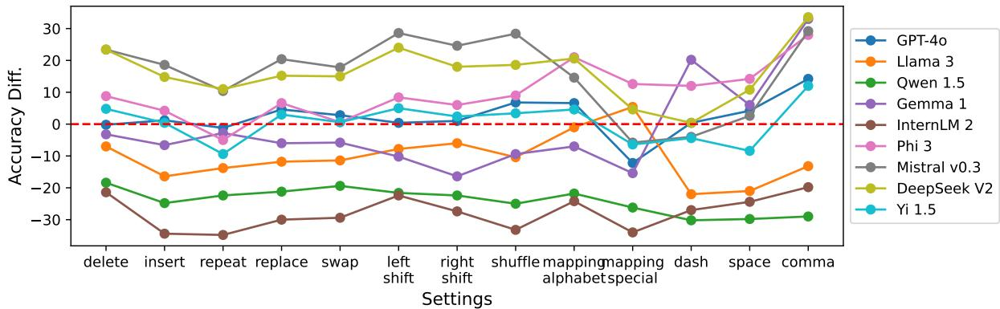

(a) Performance difference after switching to implicit character-level tokenization by adopting character-level word perturbations.  
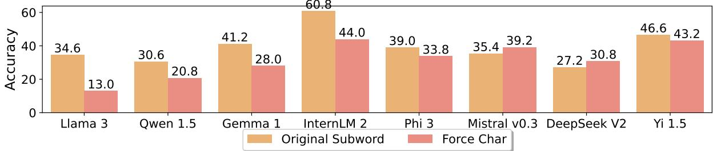  
(b) Performance comparison between original subword tokenization ( ) and explicitly forced character tokenization ( ).  
Figure 1: Performance comparison on Task I with different tokenization strategies to verify Conjecture I that deficiency in word-based counting is caused by subword tokenization of LLMs.Top: There is no perturbation that benefits all studied models identifying core character-level information (above 0). Bottom: Directly feeding character tokens instead of subword tokens does not help LLMs perceive individual characters within words. Above comparison as well as results on other three studied tasks shown in Fig. 7 refuse the conjecture regarding LLM tokenization.

Beyond above implicit character-level tokenization, we explicitly interfere with the tokenization process during inference so that the studied word is tokenized into a list of individual character tokens while other words are tokenized to subwords.

Results In Fig. 1, we demonstrate performance comparison when LLMs are provided with the original subword tokens and our proposed implicit (top) or explicit (bottom) character tokens. Noticeably, LLMs do not benefit from inputs represented by either implicit or explicit character tokens to better perceive character-level information of key words, leading to similar or even worse performance than that given subword input. Therefore, we empirically refute the popular conjecture that the subword tokenization leads to LLMs failure in wordbased counting tasks.

## 4.2 Conjecture II: Lacking Character-level Training

In order to validate the correctness of the conjecture, “LLMs haven’t trained on sufficient characterlevel data, hence lack ability to understand and handle tasks requiring character-level reasoning,” we

Evaluate performance of LLMs on tasks they are proficient in, but with character input.

Compare the performance of LLMs between natural text and the rarely seenformat ofcharacter input.

Analyze the implications:

1) If we observe significant performance drop, then the conjecture is correct;

2) If the performance maintains similar or become slightly worse, then the conjecture is invalid.

Settings We consider three sentiment analysis benchmarks where LLMs are able to achieve much higher accuracy than random guess in zero-shot setting: 1) Emotion: a dataset of 2000 English Twitter messages with six basic emotions: anger, fear, joy, love, sadness, and surprise (Saravia et al., 2018); 2) IMDB: a movie review dataset 5 for binary sentiment classification (Maas et al., 2011); 3) SST-2: 872 single sentences 6 extracted from movie reviews for binary classification (Socher et al., 2013). We present sentiment classification tasks as multiple-choice questions to LLMs, with options randomly ordered per question to avoid model bias towards specific options.

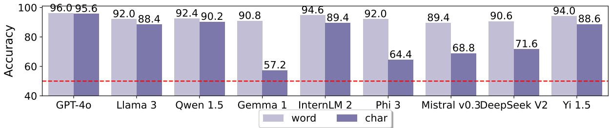

Figure 2: Performance comparison of LLMs between natural word and character input on classification dataset IMDB. Although questions represented by individual characters are rarely seen, all studied models are able to achieve accuracy much higher than random guess denoted by - - -. The minor performance drop compared with natural word input implies that LLMs have the ability to handle tasks requiring character-level understanding, rejecting the conjecture relevant to lack of character training. Figure 8 shows similar observations on other datasets.  
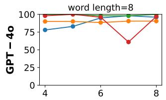

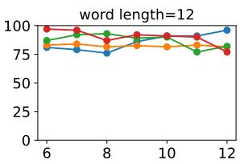

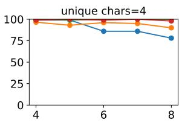

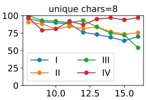  
Figure 3: Performance variation from GPT-4o on four tasks. 1st & 2nd column: there is no noteworthy correlation between model performance and number of unique characters in queried words. 3rd & 4th column: we observe clear trend of performance drop from both models when the word length keeps on increasing since 10. We leave similar trend from Llama 3 in Fig. 9.

Results We demonstrate performance comparison between natural word and character input in Fig. 2. Without further tuning, all studied LLMs can perform sentiment analysis with accuracy above 90% on binary classification and above 50% on 6-way classification. Meanwhile, we observe minor performance drop when input format switches from natural words to rarely seen characters, which is still well above random guess performance. This suggests that pretrained LLMs have the capability to perform character-level reasoning, although similar data is not sufficiently seen during model pretraining or fine-tuning. Therefore, we deny the conjecture that deficiency of LLMs in simple word-based counting tasks is attributed to lack of training on similar data.

## 4.3 Conjecture III: Excessive Unique Characters within Words

Yehudai et al. (2024) regard the counting problem as a more difficult one compared with the popular “needle in haystack” (Kamradt, 2023; Ivgi et al., 2023), since the former requires considering multiple occurrences of a given string, while the latter aims to retrieve only one appearance in a long context. They further find that the more unique characters showing up in the string, the more challenging for transformer-based LLMs to count the occurrence. On the contrary, model performance is barely sensitive to the extension ofstring length. We conduct systematic evaluation of model capabilities to handle word-based counting tasks when character uniqueness and total counts vary.

Settings We select the closed-source model GPT-4o and open-source model Llama 3, then evaluate on four sets of words by keeping the total number of characters or the number of distinct characters fixed while varying the other: 1) 500 words with 8 characters, 2) 500 words with 12 characters, 3) 500 words with 4 distinct characters, and 4) 500 words with 8 distinct characters.

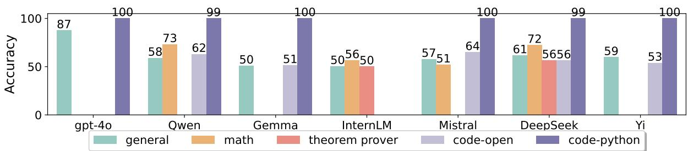  
Figure 4: Performance comparison among LLMs trained on general and special domain data for Task II. Models specialized in mathematical reasoning ( ) or theorem proving ( ) can not better handle word-based counting tasks than general ( ) ones. Although code models are able to write Python codes ( ) and solve tasks successfully, they fail to reason and answer accurately in open-ended setting ( ) . We leave results containing similar observations on three other tasks in Fig. 10.

Results As shown in Fig. 3, opposite to observations discovered in prior work (Yehudai et al., 2024), the increasing number of distinct characters in queried words does not lead to degraded performance on word-based counting problems. Instead, when the total number of characters reaches 10 and keeps increasing, we find obvious accuracy drop in both models. Hence, the conjecture that excessive unique characters in queried words lead to poor word-based counting performance is incorrect.

## 5 Whether Math/Code Train Data Helps

Recently, many open-resource base LLMs have been further tuned on billions or trillions math (QwenLM, 2024b; Ying et al., 2024; MistralAI, 2024b; Shao et al., 2024) or formal theoremproving data (Wu et al., 2024; Xin et al., 2024) in order to solve advanced mathematical problems that require complex, multi-step logical reasoning. Similarly, quite a few code models (QwenLM, 2024a; CodeGemmaTeam, 2024; MistralAI, 2024a; Zhu et al., 2024; 01AI, 2024) have been built on top of base LLMs and additionally trained on diverse programming language datasets, demonstrating significant advancements in various aspects of coderelated tasks such as code generation (Chen et al., 2021; Austin et al., 2021), completion (Liu et al., 2023) and insertion (Allal et al., 2023).

In this section, we focus on evaluating whether additional training on mathematical or coding data helps LLMs understand and improve reasoning over word-based counting tasks.

Results We provide detailed introduction to evaluated models and implementation details in Appx. §C.1. We visualize performance of models with different capabilities in Fig. 4. We observe that models additional trained on mathematical reasoning can not bring obvious improvement over those trained on general-domain data. This indicates that their acquired reasoning capability over math problems is not sufficient to handle wordbased counting tasks. On the other side, code models are able to solve the counting tasks successfully when prompted to generate Python codes explicitly, suggesting that the studied tasks are of easy level. Interestingly, the powerful code models fail when prompted in open-ended setting, implying that they do not distill problem-solving capabilities during training on code-specific tasks.

Although specialized LLMs substantially enhance coding or mathematical reasoning capabilities over general LLMs, they still struggle in solving easy word-based counting problems that require easy-level reasoning.

## 6 How to Make LLMs Experts Again

As we have verified in §4, the popular conjectures, such as tokenization and lack of character-level training, are not the true barriers for LLMs to solve counting tasks. Meanwhile, LLMs achieve competitive performance on far more challenging reasoning (Clark et al., 2018; Zellers et al., 2019; Rein et al., 2023) and mathematical (Cobbe et al., 2021; Hendrycks et al., 2021) benchmarks. Therefore, we believe LLMs possess the knowledge and skills to solve counting problems if guided properly. We investigate whether reasoning strategies (Wei et al., 2022; Wang et al., 2022; Madaan et al., 2024; Sprague et al., 2024; Yao et al., 2024) could elicit strong capabilities from LLMs to help perceive, reason and finally solve the problem.

Reasoning Strategies We investigate the following reasoning methods that have demonstrated great improvement in math and reasoning (Sprague et al., 2024): 1) CoT: chain-of-thought (Wei et al., 2022) encourages models to reason before providing the final answer, which becomes the de facto method for eliciting reasoning capabilities from LLMs. 2) self-consistency: first samples a diverse set of reasoning paths instead of only taking the greedy one, and then selects the most consistent answer by majority voting (Wang et al., 2022). 3) self-refine: uses a single LLM as the generator, refiner, and feedback provider (Madaan et al., 2024). 4) ToT: tree-of-thought actively maintains a tree of thoughts, where each thought is a coherent language sequence that serves as an intermediate step toward problem solving (Yao et al., 2024). In contrast, we also append the instruction, “Directly answer the number” after each question, to request direct numeric answers from LLMs.

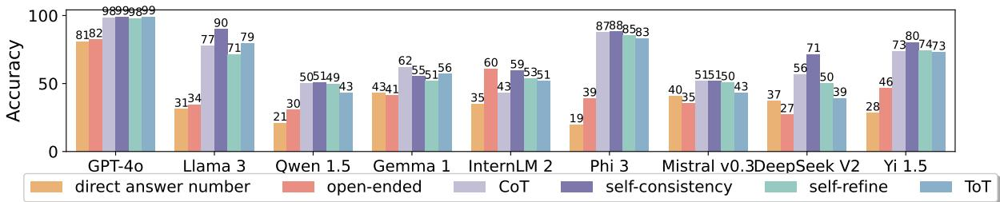

Figure 5: Benefits of applying different reasoning strategies to LLMs for Task I Char Occur. We observe noticeable improvement from all studied reasoning strategies over baselines that particularly request numeric responses ( ) or open-ended answers ( ). GPT-4o with the additional reasoning procedure can even solve tasks with perfection. We show similar improvement on other three tasks in Fig. 11.
<table><tr><td>Finetune on</td><td>Task I</td><td>Task II</td><td>Task III</td><td>Task IV</td><td>MMLU</td><td>IFEval</td><td>GPQA</td><td>Hellaswag</td><td>GSM8K</td><td>HumanEval</td></tr><tr><td></td><td>34.6</td><td>58.2</td><td>74.6</td><td>57.8</td><td>64.3</td><td>68.6</td><td>30.6</td><td>67.6</td><td>78.9</td><td>59.1</td></tr><tr><td>Task I</td><td>70.4↑</td><td>54.9↓</td><td>64.4↓</td><td>35.0↓</td><td>62.8↓</td><td>64.5↓</td><td>28.9↓</td><td>69.6 ↑</td><td>77.9↓</td><td>60.4↑</td></tr><tr><td>Task II</td><td>30.6↓</td><td>58.3↑</td><td>76.2↑</td><td>31.4↓</td><td>62.4↓</td><td>59.3↓</td><td>30.6↑</td><td>59.0↓</td><td>76.6↓</td><td>59.1</td></tr><tr><td>Task III</td><td>28.2↓</td><td>56.6↓</td><td>74.2↓</td><td>22.8↓</td><td>63.5↓</td><td>62.8↓</td><td>27.7↓</td><td>53.8↓</td><td>77.1↓</td><td>57.3↓</td></tr><tr><td>Task IV</td><td>45.0↑</td><td>56.4↓</td><td>39.4↓</td><td>87.2 ↑</td><td>60.7↓</td><td>59.9↓</td><td>28.2↓</td><td>54.2↓</td><td>72.9↓</td><td>57.9↓</td></tr></table>

Table 2: Performance of finetuned Llama 3 models on in- and out-distribution testing set. In each row, we train on task-specific data and test on same-distribution (results marked by ) and other testing data, with performance improvement marked by ↑ and drop by ↓ compared with the untuned Llama 3 model (- in 2nd row). Finetuning on task-specific data does not necessarily enhance model capabilities in that task, even leading to worse performance in out-of-distribution tasks (left block) as well as other general, reasoning, math or coding benchmarks (right block).

Other Strategies In supervised finetuning (SFT), collecting and mixing instruction tuning data are important steps to improve performance for specific capabilities (Dubey et al., 2024). Hence we finetune open-source LLMs with task-specific train data 7 and evaluate on both in-distribution test data and widely adopted benchmarks. By providing similar examples as context, in-context learning (ICL) (Brown, 2020; Wei et al., 2023) has become another popular train-free method to efficiently improve LLM performance. We describe implementation details in Appx. §D.1.

## 6.1 Reasoning

In Fig. 5, we compare diverse reasoning strategies introduced before with baseline strategies, i.e., directly responding with numeric values and openended generation. We find that all studied reasoning approaches are helpful to greatly improve performance over those without reasoning across four counting tasks, among which self-consistency exhibits consistent advantage over other reasoning strategies for diverse LLMs. In addition, we show scaling law of self-consistency in Fig. 12, where no clear trend of performance boost as utilizing more reasoning paths is observed 8. We provide case study from baseline strategies and CoT in Tab. 10.

With the aid of reasoning procedures, the most powerful model GPT-4o is capable of solving counting tasks with accuracy approaching 100%, indicating that the model can leverage its possessed knowledge and problem-solving abilities individually without external assistance. We also notice considerable performance margin from some LLMs between directly answering numerical value and open-ended generation, implying that they consciously invoke the reasoning process before providing the final answer for certain instances. We expect performance improvement in future LLMs if reasoning-related training is strengthened.

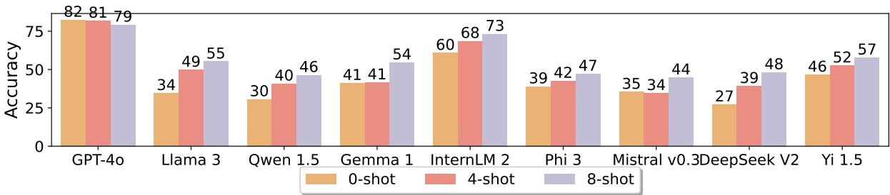

(a) Task I: Char Occur.  
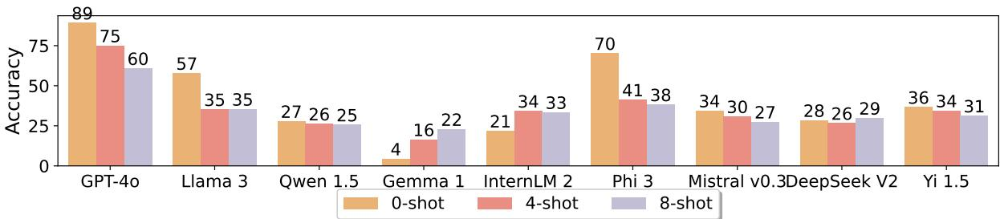  
(b) Task IV: Distinct Char.  
Figure 6: In-context learning performance of LLMs. Providing similar examples as demonstrations helps slightly improve performance of open-source models on Task I, while lead performance drop for most models on Task IV. We leave results on Task II and III in Fig. 13.

## 6.2 Supervised Finetuning

In Tab. 2, we evaluate capabilities of Llama 3 models finetuned on different task data. When training and testing on the same distribution, we do observe significant accuracy boost in Task I (from 34.6% to 70.4%) and Task IV (from 57.8% to 87.2%), while minor performance drop on the other two tasks. However, the acquired specific counting capability from training on Task I or IV can hardly transfer to other evaluated counting tasks, resulting in even much worse performance than the untuned model. Moreover, we find undesired lowered accuracy on benchmarks evaluating important capabilities such as reasoning and math, manifesting negative impacts of solely training on specific domains without considering other aspects. This emphasizes the importance of careful design for the proportion of different data sources, which is consistent with discoveries in literature (Bai et al., 2023; Dubey et al., 2024) and leaves the finetuning strategy a less efficient way to improve performance of LLMs on new or challenging tasks compared with reasoning.

## 6.3 In-context Learning

We demonstrate the influence of demonstrations on counting tasks in Fig. 6. For Task I, opensource LLMs achieve much higher accuracy in fewshot settings than zero-shot one, and more demonstrations exhibit further performance improvement. However, benefits of demonstrations are not always guaranteed. For example, additional example context greatly hurts performance of GPT-4o and the majority of open-source LLMs for Task II (in Fig. 13a) and IV (in Fig. 6b).

## 7 Conclusions

By carefully designing multiple evaluation settings, we first show that prevalent conjectures regarding such unexpected failures are invalid. We further show that specialized models with advanced mathematical or coding reasoning capabilities also suffer from addressing simple counting problems. We also find that reasoning is the most robust and efficient way to aid models in better perceiving and solving tasks, highlighting more research into “reasoning before responding” during pretraining.

## Limitations

We investigate deficiency of diverse open-source LLMs as well as GPT-4o to address word-based counting problems. This work may have the following limitations: 1) Lack of analysis on more proprietary LLMs: for the sake of cost, we only consider GPT-4o and use it as the representative of other models of similar strong capabilities. Some online discussion has revealed similar issues from closed-source models such as Claude and Gemini. We hope researchers who develop these proprietary models can get insights from our conjecture validation procedure and reasoning-driven solutions, hence further boosting capabilities of top LLMs. 2) Reasoning incorporated in pretraining: we find that reasoning before providing the final answer during inference is effective in solving counting problems, while leaving training design of incorporating reasoning into pretraining as future direction.

## Ethics Statement

This paper presents comprehensive study of LLMs from diverse families that have gone through ethical reviews in prior works. Therefore, we believe our work does not pose additional ethical issues.

## References

01AI. 2024. A small but mighty llm for code. https: //01-ai.github.io/blog.html?post=en/ 2024-09-05-A-Small-but-Mighty-LLM-for-Code md. Accessed: 2024-10-10.

Marah Abdin, Sam Ade Jacobs, Ammar Ahmad Awan, Jyoti Aneja, Ahmed Awadallah, Hany Awadalla, Nguyen Bach, Amit Bahree, Arash Bakhtiari, Harkirat Behl, et al. 2024. Phi-3 technical report: A highly capable language model locally on your phone. arXiv preprint arXiv:2404.14219.

Gustavo Aguilar, Bryan McCann, Tong Niu, Nazneen Rajani, Nitish Shirish Keskar, and Thamar Solorio. 2021. Char2Subword: Extending the subword embedding space using robust character compositionality. In Findings of the Association for Computational Linguistics: EMNLP 2021, pages 1640–1651, Punta Cana, Dominican Republic. Association for Computational Linguistics.

Loubna Ben Allal, Raymond Li, Denis Kocetkov, Chenghao Mou, Christopher Akiki, Carlos Munoz Ferrandis, Niklas Muennighoff, Mayank Mishra, Alex Gu, Manan Dey, et al. 2023. Santacoder: don’t reach for the stars! arXiv preprint arXiv:2301.03988.

Jacob Austin, Augustus Odena, Maxwell Nye, Maarten Bosma, Henryk Michalewski, David Dohan, Ellen

Jiang, Carrie Cai, Michael Terry, Quoc Le, et al. 2021. Program synthesis with large language models. arXiv preprint arXiv:2108.07732.

Jinze Bai, Shuai Bai, Yunfei Chu, Zeyu Cui, Kai Dang, Xiaodong Deng, Yang Fan, Wenbin Ge, Yu Han, Fei Huang, et al. 2023. Qwen technical report. arXiv preprint arXiv:2309.16609.

Thomas Ball, Shuo Chen, and Cormac Herley. 2024. Can we count on llms? the fixed-effect fallacy and claims of gpt-4 capabilities. arXiv preprint arXiv:2409.07638.

Lukas Berglund, Meg Tong, Max Kaufmann, Mikita Balesni, Asa Cooper Stickland, Tomasz Korbak, and Owain Evans. 2023. The reversal curse: Llms trained on" a is b" fail to learn" b is a". arXiv preprint arXiv:2309.12288.

Steven Bird, Edward Loper, and Ewan Klein. 2009. Natural Language Processing with Python. O’Reilly Media Inc.

Piotr Bojanowski, Edouard Grave, Armand Joulin, and Tomas Mikolov. 2017. Enriching word vectors with subword information. Transactions of the Associationfor Computational Linguistics, 5:135–146.

Tom B Brown. 2020. Language models are few-shot learners. arXiv preprint arXiv:2005.14165.

Zheng Cai, Maosong Cao, Haojiong Chen, Kai Chen, Keyu Chen, Xin Chen, Xun Chen, Zehui Chen, Zhi Chen, Pei Chu, et al. 2024. Internlm2 technical report. arXiv preprint arXiv:2403.17297.

Mark Chen, Jerry Tworek, Heewoo Jun, Qiming Yuan, Henrique Ponde De Oliveira Pinto, Jared Kaplan, Harri Edwards, Yuri Burda, Nicholas Joseph, Greg Brockman, et al. 2021. Evaluating large language models trained on code. arXiv preprint arXiv:2107.03374.

Xinyun Chen, Ryan A Chi, Xuezhi Wang, and Denny Zhou. 2024. Premise order matters in reasoning with large language models. arXiv preprint arXiv:2402.08939.

Jonathan H. Clark, Dan Garrette, Iulia Turc, and John Wieting. 2022. Canine: Pre-training an efficient tokenization-free encoder for language representation. Transactions of the Association for Computational Linguistics, 10:73–91.

Peter Clark, Isaac Cowhey, Oren Etzioni, Tushar Khot, Ashish Sabharwal, Carissa Schoenick, and Oyvind Tafjord. 2018. Think you have solved question answering? try arc, the ai2 reasoning challenge. arXiv preprint arXiv:1803.05457.

Karl Cobbe, Vineet Kosaraju, Mohammad Bavarian, Mark Chen, Heewoo Jun, Lukasz Kaiser, Matthias Plappert, Jerry Tworek, Jacob Hilton, Reiichiro Nakano, et al. 2021. Training verifiers to solve math word problems. arXiv preprint arXiv:2110.14168.

CodeGemmaTeam. 2024. Codegemma: Open code models based on gemma. arXiv preprint arXiv:2406.11409.

DeepMind. 2024. Ai solves IMO problems at silver medal level. Accessed: 2024-10-06.

DeepSeek-AI. 2024. Deepseek-v2: A strong, economical, and efficient mixture-of-experts language model. Preprint, arXiv:2405.04434.

Abhimanyu Dubey, Abhinav Jauhri, Abhinav Pandey, Abhishek Kadian, Ahmad Al-Dahle, Aiesha Letman, Akhil Mathur, Alan Schelten, Amy Yang, Angela Fan, et al. 2024. The llama 3 herd of models. arXiv preprint arXiv:2407.21783.

Luyu Gao, Aman Madaan, Shuyan Zhou, Uri Alon, Pengfei Liu, Yiming Yang, Jamie Callan, and Graham Neubig. 2023. Pal: Program-aided language models. In International Conference on Machine Learning, pages 10764–10799. PMLR.

Daya Guo, Qihao Zhu, Dejian Yang, Zhenda Xie, Kai Dong, Wentao Zhang, Guanting Chen, Xiao Bi, Yu Wu, YK Li, et al. 2024. Deepseek-coder: When the large language model meets programming– the rise of code intelligence. arXiv preprint arXiv:2401.14196.

Dan Hendrycks, Collin Burns, Saurav Kadavath, Akul Arora, Steven Basart, Eric Tang, Dawn Song, and Jacob Steinhardt. 2021. Measuring mathematical problem solving with the math dataset. arXiv preprint arXiv:2103.03874.

Edward J Hu, Yelong Shen, Phillip Wallis, Zeyuan Allen-Zhu, Yuanzhi Li, Shean Wang, Lu Wang, and Weizhu Chen. 2021. Lora: Low-rank adaptation of large language models. arXiv preprint arXiv:2106.09685.

Maor Ivgi, Uri Shaham, and Jonathan Berant. 2023. Efficient long-text understanding with short-text models. Transactions of the Association for Computational Linguistics, 11:284–299.

Albert Q Jiang, Alexandre Sablayrolles, Arthur Mensch, Chris Bamford, Devendra Singh Chaplot, Diego de las Casas, Florian Bressand, Gianna Lengyel, Guillaume Lample, Lucile Saulnier, et al. 2023. Mistral 7b. arXiv preprint arXiv:2310.06825.

Greg Kamradt. 2023. Llmtest\_needleinahaystack. Accessed: 2024-10-10.

Andrej Karpathy. 2024a. Tweet: Jagged intelligence. Accessed: 2024-10-06.

Andrej Karpathy. 2024b. Tweet: To help explain the weirdness of llm tokenization. Accessed: 2024-10- 08.

Takeshi Kojima, Shixiang Shane Gu, Machel Reid, Yutaka Matsuo, and Yusuke Iwasawa. 2022. Large language models are zero-shot reasoners. Advances in neural information processing systems, 35:22199– 22213.

Taku Kudo. 2018. Subword regularization: Improving neural network translation models with multiple subword candidates. arXiv preprint arXiv:1804.10959.

Hui Liu, Yongzheng Zhang, Yipeng Wang, Zheng Lin, and Yige Chen. 2020. Joint character-level word embedding and adversarial stability training to defend adversarial text. In Proceedings of the AAAI conference on artificial intelligence, volume 34, pages 8384–8391.

Nelson F. Liu, Kevin Lin, John Hewitt, Ashwin Paranjape, Michele Bevilacqua, Fabio Petroni, and Percy Liang. 2024. Lost in the middle: How language models use long contexts. Transactions ofthe Association for Computational Linguistics, 12:157–173.

Tianyang Liu, Canwen Xu, and Julian McAuley. 2023. Repobench: Benchmarking repository-level code auto-completion systems. arXiv preprint arXiv:2306.03091.

LlamaWebsite. 2024. Introducing llama 3.2. https: //www.llama.com/. Accessed: 14-Oct-2024.

Wentao Ma, Yiming Cui, Chenglei Si, Ting Liu, Shijin Wang, and Guoping Hu. 2020. CharBERT: Characteraware pre-trained language model. In Proceedings of the 28th International Conference on Computational Linguistics, pages 39–50, Barcelona, Spain (Online). International Committee on Computational Linguistics.

Andrew L. Maas, Raymond E. Daly, Peter T. Pham, Dan Huang, Andrew Y. Ng, and Christopher Potts. 2011. Learning word vectors for sentiment analysis. In Proceedings of the 49th Annual Meeting of the Association for Computational Linguistics: Human Language Technologies, pages 142–150, Portland, Oregon, USA. Association for Computational Linguistics.

Aman Madaan, Niket Tandon, Prakhar Gupta, Skyler Hallinan, Luyu Gao, Sarah Wiegreffe, Uri Alon, Nouha Dziri, Shrimai Prabhumoye, Yiming Yang, et al. 2024. Self-refine: Iterative refinement with self-feedback. Advances in Neural Information Processing Systems, 36.

Tomas Mikolov. 2013. Efficient estimation of word representations in vector space. arXiv preprint arXiv:1301.3781.

MistralAI. 2024a. Codestral: Mistral ai code generation model. https://mistral.ai/news/codestral/. Accessed: 2024-10-10.

MistralAI. 2024b. Mathstral: Mistral ai mathematical model. https://mistral.ai/news/mathstral/. Accessed: 2024-10-10.

Milad Moradi and Matthias Samwald. 2021. Evaluating the robustness of neural language models to input perturbations. In Proceedings of the 2021 Conference on Empirical Methods in Natural Language Processing, pages 1558–1570, Online and Punta Cana,

Dominican Republic. Association for Computational Linguistics.

OpenAI. 2024. Hello gpt-4. https://openai.com/ index/hello-gpt-4o/. Accessed: 2024-10-06.

OpenAI. 2024. Learning to reason with llms. https://openai.com/index/ learning-to-reason-with-llms/. Accessed: 2024-10-14.

OpenAI. 2024. Tiktoken: Efficient tokenization library. https://github.com/openai/tiktoken/ tree/main. Accessed: 2024-10-06.

Jeffrey Pennington, Richard Socher, and Christopher Manning. 2014. GloVe: Global vectors for word representation. In Proceedings of the 2014 Conference on Empirical Methods in Natural Language Processing (EMNLP), pages 1532–1543, Doha, Qatar. Association for Computational Linguistics.

QwenLM. 2024a. Code with codeqwen1.5.

QwenLM. 2024b. Qwen2-math: Enhancing large language models for mathematical reasoning. https: //qwenlm.github.io/blog/qwen2-math/. Accessed: 2024-10-10.

Machel Reid, Nikolay Savinov, Denis Teplyashin, Dmitry Lepikhin, Timothy Lillicrap, Jean-baptiste Alayrac, Radu Soricut, Angeliki Lazaridou, Orhan Firat, Julian Schrittwieser, et al. 2024. Gemini 1.5: Unlocking multimodal understanding across millions of tokens of context. arXiv preprint arXiv:2403.05530.

David Rein, Betty Li Hou, Asa Cooper Stickland, Jackson Petty, Richard Yuanzhe Pang, Julien Dirani, Julian Michael, and Samuel R Bowman. 2023. Gpqa: A graduate-level google-proof q&a benchmark. arXiv preprint arXiv:2311.12022.

Elias Abad Rocamora, Yongtao Wu, Fanghui Liu, Grigorios Chrysos, and Volkan Cevher. Revisiting character-level adversarial attacks for language models. In Forty-first International Conference on Machine Learning.

Elvis Saravia, Hsien-Chi Toby Liu, Yen-Hao Huang, Junlin Wu, and Yi-Shin Chen. 2018. CARER: Contextualized affect representations for emotion recognition. In Proceedings of the 2018 Conference on Empirical Methods in Natural Language Processing, pages 3687–3697, Brussels, Belgium. Association for Computational Linguistics.

Rico Sennrich. 2015. Neural machine translation of rare words with subword units. arXiv preprint arXiv:1508.07909.

Zhihong Shao, Peiyi Wang, Qihao Zhu, Runxin Xu, Junxiao Song, Mingchuan Zhang, YK Li, Yu Wu, and Daya Guo. 2024. Deepseekmath: Pushing the limits of mathematical reasoning in open language models. arXiv preprint arXiv:2402.03300.

Freda Shi, Xinyun Chen, Kanishka Misra, Nathan Scales, David Dohan, Ed H Chi, Nathanael Schärli, and Denny Zhou. 2023. Large language models can be easily distracted by irrelevant context. In International Conference on Machine Learning, pages 31210–31227. PMLR.

Andrew Shin and Kunitake Kaneko. 2024. Large language models lack understanding of character composition of words. arXiv preprint arXiv:2405.11357.

Richard Socher, Alex Perelygin, Jean Wu, Jason Chuang, Christopher D. Manning, Andrew Ng, and Christopher Potts. 2013. Recursive deep models for semantic compositionality over a sentiment treebank. In Proceedings of the 2013 Conference on Empirical Methods in Natural Language Processing, pages 1631–1642, Seattle, Washington, USA. Association for Computational Linguistics.

Zayne Sprague, Fangcong Yin, Juan Diego Rodriguez, Dongwei Jiang, Manya Wadhwa, Prasann Singhal, Xinyu Zhao, Xi Ye, Kyle Mahowald, and Greg Durrett. 2024. To cot or not to cot? chain-of-thought helps mainly on math and symbolic reasoning. arXiv preprint arXiv:2409.12183.

Mirac Suzgun, Nathan Scales, Nathanael Schärli, Sebastian Gehrmann, Yi Tay, Hyung Won Chung, Aakanksha Chowdhery, Quoc V Le, Ed H Chi, Denny Zhou, , and Jason Wei. 2022. Challenging big-bench tasks and whether chain-of-thought can solve them. arXiv preprint arXiv:2210.09261.

Gemma Team, Thomas Mesnard, Cassidy Hardin, Robert Dadashi, Surya Bhupatiraju, Shreya Pathak, Laurent Sifre, Morgane Rivière, Mihir Sanjay Kale, Juliette Love, et al. 2024. Gemma: Open models based on gemini research and technology. arXiv preprint arXiv:2403.08295.

Xuezhi Wang, Jason Wei, Dale Schuurmans, Quoc Le, Ed Chi, Sharan Narang, Aakanksha Chowdhery, and Denny Zhou. 2022. Self-consistency improves chain of thought reasoning in language models. arXiv preprint arXiv:2203.11171.

Jason Wei, Xuezhi Wang, Dale Schuurmans, Maarten Bosma, Fei Xia, Ed Chi, Quoc V Le, Denny Zhou, et al. 2022. Chain-of-thought prompting elicits reasoning in large language models. Advances in neural information processing systems, 35:24824–24837.

Jerry Wei, Jason Wei, Yi Tay, Dustin Tran, Albert Webson, Yifeng Lu, Xinyun Chen, Hanxiao Liu, Da Huang, Denny Zhou, et al. 2023. Larger language models do in-context learning differently. arXiv preprint arXiv:2303.03846.

Yonghui Wu. 2016. Google’s neural machine translation system: Bridging the gap between human and machine translation. arXiv preprint arXiv:1609.08144.

Zijian Wu, Jiayu Wang, Dahua Lin, and Kai Chen. 2024. Lean-github: Compiling github lean repositories for a versatile lean prover. Preprint, arXiv:2407.17227.

Zikai Xie. 2024. Order matters in hallucination: Reasoning order as benchmark and reflexive prompting for large-language-models. arXiv preprint arXiv:2408.05093.

Huajian Xin, ZZ Ren, Junxiao Song, Zhihong Shao, Wanjia Zhao, Haocheng Wang, Bo Liu, Liyue Zhang, Xuan Lu, Qiushi Du, et al. 2024. Deepseek-proverv1. 5: Harnessing proof assistant feedback for reinforcement learning and monte-carlo tree search. arXiv preprint arXiv:2408.08152.

Linting Xue, Aditya Barua, Noah Constant, Rami Al-Rfou, Sharan Narang, Mihir Kale, Adam Roberts, and Colin Raffel. 2022. ByT5: Towards a token-free future with pre-trained byte-to-byte models. Transactions ofthe Associationfor Computational Linguistics, 10:291–306.

Shunyu Yao, Dian Yu, Jeffrey Zhao, Izhak Shafran, Tom Griffiths, Yuan Cao, and Karthik Narasimhan. 2024. Tree of thoughts: Deliberate problem solving with large language models. Advances in Neural Information Processing Systems, 36.

Gilad Yehudai, Haim Kaplan, Asma Ghandeharioun, Mor Geva, and Amir Globerson. 2024. When can transformers count to n? arXiv preprint arXiv:2407.15160.

Huaiyuan Ying, Shuo Zhang, Linyang Li, Zhejian Zhou, Yunfan Shao, Zhaoye Fei, Yichuan Ma, Jiawei Hong, Kuikun Liu, Ziyi Wang, et al. 2024. Internlm-math: Open math large language models toward verifiable reasoning. arXiv preprint arXiv:2402.06332.

Alex Young, Bei Chen, Chao Li, Chengen Huang, Ge Zhang, Guanwei Zhang, Heng Li, Jiangcheng Zhu, Jianqun Chen, Jing Chang, et al. 2024. Yi: Open foundation models by 01. ai. arXiv preprint arXiv:2403.04652.

Rowan Zellers, Ari Holtzman, Yonatan Bisk, Ali Farhadi, and Yejin Choi. 2019. Hellaswag: Can a machine really finish your sentence? arXiv preprint arXiv:1905.07830.

Wanjun Zhong, Ruixiang Cui, Yiduo Guo, Yaobo Liang, Shuai Lu, Yanlin Wang, Amin Saied, Weizhu Chen, and Nan Duan. 2024. AGIEval: A human-centric benchmark for evaluating foundation models. In Findings ofthe Associationfor Computational Lin guistics: NAACL 2024, pages 2299–2314, Mexico City, Mexico. Association for Computational Linguistics.

Qihao Zhu, Daya Guo, Zhihong Shao, Dejian Yang, Peiyi Wang, Runxin Xu, Y Wu, Yukun Li, Huazuo Gao, Shirong Ma, et al. 2024. Deepseek-coder-v2: Breaking the barrier of closed-source models in code intelligence. arXiv preprint arXiv:2406.11931.

## A Appendix

## A.1 Related Work

Failure Modes of LLMs Although LLMs have exhibited strong capabilities to complete tasks requiring extensive world knowledge and complex reasoning, they still present some unexpected failures. Berglund et al. (2023) discovered the reversed curve, where an LLM that recognizes “A is B” does not necessarily learn that “B is A.” Another challenging posed to LLMs is irrelevant context, which distracts models from completing tasks as normal. For instance, Shi et al. (2023) found that adding irrelevant context in the problem statement leads to a noticeable performance drop on multiple reasoning benchmarks. Moreover, Chen et al. (2024) show that including irrelevant rules degrades the logical reasoning performance of LLMs. Sensitivity to text order is another challenge that LLMs struggle with. For example, Chen et al. (2024) observed that in deductive reasoning tasks, presenting the premises in the same order as the ground truth proof in the prompt (as opposed to random ordering) drastically increases the model’s accuracy, while permuting the premise order can cause a performance drop of over 30%. Another example is the lost-in-themiddle phenomenon in the long-context scenario, in which LLM performance drops drastically when they need to utilize input context in the middle rather than that in the beginning or the end (Liu et al., 2024).

Word-based Counting Failure to count the number of specific character within the queried word is a recently emergent problem that most LLMs struggle with (Karpathy, 2024b). Yehudai et al. (2024) attributed such deficiency to constraints from LLM architecture, emphasizing that it is likely impossible for a size-limited transformer to complete the counting task. Ball et al. (2024) examined capabilities of GPT-4 on character occurrence task and showed sensitivity of task-accuracy both to query phrasing and input parameter population. Shin and Kaneko (2024) observed significant performance contrast between character and token (i.e. subword) input. They also proposed the tokenization issue and lack of training on similar data as potential reasons for such failure.

Different from prior literature that focuses on demonstrating the failure mode or proposing potential reasons, we carefully design multiple evaluation settings and empirically show invalidness of major conjectures. More importantly, we investigate promising strategies and show that reasoning is a promising direction to solve word-based counting problems.

## A.2 Experimental Setup

Language Models For comprehensive evaluation of LLMs capabilities on simple word-based counting problems, we consider 9 prevalent families of powerful instructed or chat models including both open-source and proprietary ones: Llama 3 (8B-instruct) (Dubey et al., 2024), Qwen 1.5 (7B-chat) (Bai et al., 2023), Gemma 1 (7Binstruct) (Team et al., 2024), InternLM2 (7Bchat) (Cai et al., 2024), Phi 3 (small-128kinstruct) (Abdin et al., 2024), Mistral v0.3 (7Binstruct) (Jiang et al., 2023), DeepSeek V2 (Lite-chat) (DeepSeek-AI, 2024), Yi 1.5 (9Bchat) (Young et al., 2024), and GPT-4o (OpenAI, 2024). Unless otherwise stated, we follow prior benchmark literature (Suzgun et al., 2022; Zhong et al., 2024) by adopting greedy decoding 9 to minimize the noise for open-ended text generation. We list the checkpoint resource of tested open-source LLMs in Tab. 7.

Evaluation Metrics For Task II Substring Cccur where the ground-truth answer is “Yes” or “No”, we measure accuracy using soft match, computed by checking whether the true answer appears in models’ responses or not. For the other three tasks where models are expected to answer a number, we extract the last digits from model responses automatically and examine whether they are identical to the true answer. We also consider the verbal representation of numbers (e.g., “two” and “twice” for “2”) with soft match by comparing the generated output with word form of true numbers.

## B Prompt Engineering

In Tab. 3, we list human prompts and improved prompts from Claude 10 on four counting tasks. Different from concise human prompts, prompts

<table><tr><td>Source</td><td>Prompt</td></tr><tr><td colspan="2"></td></tr><tr><td>Original Prompt</td><td>How many { {char} }&#x27;s in the word &quot;{ {word} }&quot;?</td></tr><tr><td>Human Prompt I</td><td>How many times does the letter &#x27;{{char} }&quot; appear in the word &quot;{ {word} }&quot;?</td></tr><tr><td>Human Prompt II</td><td>Can you count the number of &#x27;{{char} }&#x27;s in &quot;{ {word} }&quot;?</td></tr><tr><td>Human Prompt III</td><td>How many { {char} }&#x27;s can be found in &quot;{ {word } }&quot;?</td></tr><tr><td>Human Prompt IV</td><td>How often does the letter &#x27;{ {char} }&#x27; show up in the word &quot;{ {word} }&quot;?</td></tr><tr><td></td><td>You are tasked with counting the occurrences of a specific letter in a given word. Here are the inputs:</td></tr><tr><td></td><td>Letter to count:</td></tr><tr><td></td><td>&lt;letter&gt;</td></tr><tr><td></td><td>{{letter}}</td></tr><tr><td></td><td>&lt;/letter&gt;</td></tr><tr><td></td><td></td></tr><tr><td>Claude Improved Prompt</td><td>Word to analyze: &lt;word&gt;</td></tr><tr><td></td><td>{{word}}</td></tr><tr><td></td><td>&lt;/word&gt;</td></tr><tr><td></td><td></td></tr><tr><td>- The letter is case-sensitive.</td><td>Your task is to count how many times the specified letter appears in the given word. Consider the following:</td></tr><tr><td></td><td>- Spaces and punctuation marks, if any, should be ignored.</td></tr><tr><td colspan="2">Please provide your response in a clear, concise sentence stating the count.</td></tr><tr><td></td><td>Task II: Substring Occur</td></tr><tr><td>Original Prompt</td><td>Is the substring “{ {substring} }&quot; part of the word &quot;{ {word} }&quot;?</td></tr><tr><td>Human Prompt I</td><td>Does the word &quot;{{word} }&quot; contain the substring &quot;{{substring} }&quot;?</td></tr><tr><td>Human Prompt II</td><td>Does the sequence &quot;{{substring} }&quot; appear in the word  $" \{ \{ \mathrm { w o r d } \} \} " \}$ </td></tr><tr><td>Human Prompt III</td><td>Does the word &quot;{ {word } }&quot; contain the sequence of letters &quot;{ {substring} }&quot;?</td></tr><tr><td>Human Prompt IV</td><td>Is &quot;{{substring} }&quot; present as a substring in the word &quot;{{word} }&quot;?</td></tr><tr><td></td><td>You are tasked with determining whether a given substring is part of a specified word. Here are the inputs</td></tr><tr><td></td><td>&lt;substring&gt;{{substring}}&lt;/substring&gt;</td></tr><tr><td>Claude Improved Prompt</td><td>&lt;word&gt;{{word}}&lt;/word&gt;</td></tr><tr><td></td><td></td></tr><tr><td></td><td>Example output structure:</td></tr><tr><td></td><td>[Yes/No], the substring [is/is not] part of the word.</td></tr><tr><td colspan="2">Please provide your answer based on the given inputs.</td></tr><tr><td></td><td>Task III: Word Len</td></tr><tr><td colspan="2">How many characters in the word “{ {word} }&quot;?</td></tr><tr><td></td><td></td></tr><tr><td>Human Prompt I</td><td>What is the total number of characters in the word &quot;{{word } }&quot;?</td></tr><tr><td>Human Prompt II</td><td>Can you count the letters in the word &quot;{{word} }&quot;?</td></tr><tr><td>Human Prompt III Human Prompt IV</td><td>Could you tell me how many letters are in the word &quot;{ {word} }&quot;?</td></tr><tr><td></td><td>How many alphabetic characters does the word &quot;{{word} }&quot; contain? You are tasked with counting the number of characters in a given word.</td></tr><tr><td></td><td></td></tr><tr><td></td><td>Here is the word: &lt;word&gt;</td></tr><tr><td>Claude Improved Prompt</td><td>{{word}}</td></tr><tr><td></td><td>&lt;/word&gt;</td></tr><tr><td></td><td></td></tr><tr><td colspan="2">Note: Include all characters in your count, including letters, numbers, and any special characters that may be present.</td></tr></table>

Table 3: Diverse prompts used to evaluate impact of prompt engineering on LLM performance. Human prompts are brief while prompts improved by Claude contain more detailed instructions and response format requirements. See prompts for Task IV in Tab. 4.

automatically improved by Claude normally contain detailed instructions and explicitly specify expected formats of responses.

We present LLM performance in response to different task prompts in Tab. 5. In contrast to stable performance enhancement from reasoning-based strategies, neither human heuristics-driven nor automatically improved prompts from Claude are able to elicit better capabilities to address the studied word-based counting problems. We conclude that failures of LLMs for solving counting tasks are irrelevant to how we phrase prompts.

<table><tr><td>Source</td><td>Prompt</td></tr><tr><td colspan="2">Task IV: Distinct Char</td></tr><tr><td>Original Prompt</td><td>How many distinct characters in the word “{{word} }&quot;?</td></tr><tr><td>Human Prompt I</td><td>How many different letters are found in the word &quot;{{word} }&quot;?</td></tr><tr><td>Human Prompt II</td><td>What is the number of unique letters present in the word &quot;{{word} }&quot;?</td></tr><tr><td>Human Prompt III</td><td>What&#x27;s the count of distinct characters in the word &quot;{{word} }&quot;?</td></tr><tr><td>Human Prompt IV</td><td>Can you identify how many unique characters make up the word &quot;{ {word} }&quot;?</td></tr><tr><td></td><td>You are tasked with counting the number of distinct characters in a given word. Here is the word:</td></tr><tr><td></td><td>&lt;word&gt;</td></tr><tr><td></td><td></td></tr><tr><td>Claude Improved Prompt</td><td>{{word}}</td></tr><tr><td></td><td>&lt;/word&gt;</td></tr></table>

Your final response should consist of only the integer representing the count of distinct characters.

Table 4: Diverse prompts used to evaluate impact of prompt engineering on LLM performance for Task IV.
<table><tr><td>Models</td><td>Original</td><td>Humnan I</td><td>Human II</td><td>Human III</td><td>Human IV</td><td>Claude</td></tr><tr><td colspan="7">Task I: Char Occur</td></tr><tr><td>GPT-40</td><td>82.4</td><td>91.6</td><td>89.6</td><td>91.2</td><td>93.4</td><td>85.2</td></tr><tr><td>Llama-3</td><td>34.6</td><td>26.4</td><td>55.4</td><td>24.6</td><td>40.4</td><td>22.4</td></tr><tr><td colspan="7">Task II: Substring Occur</td></tr><tr><td>GPT-40</td><td>87.4</td><td>94.7</td><td>89</td><td>94</td><td>87.4</td><td>88.1</td></tr><tr><td>Llama-3</td><td>58.2</td><td>71.7</td><td>59.7</td><td>65.3</td><td>61.4</td><td>52.8</td></tr><tr><td colspan="7">Task III: Word Len</td></tr><tr><td>GPT-40</td><td>92.0</td><td>92.4</td><td>96.2</td><td>95.4</td><td>96.8</td><td>97.6</td></tr><tr><td>Llama-3</td><td>74.6</td><td>92.6</td><td>91.0</td><td>79.2</td><td>77.8</td><td>96.8</td></tr><tr><td colspan="7">Task IV: Distinct Char</td></tr><tr><td>GPT-40</td><td>89.2</td><td>87.2</td><td>78.0</td><td>90.6</td><td>95.8</td><td>52.8</td></tr><tr><td>Llama-3</td><td>57.8</td><td>56.8</td><td>82.6</td><td>63.2</td><td>43.2</td><td>21.6</td></tr></table>

Table 5: Impact of prompt engineering on word-based counting tasks. Neither human heuristics-driven prompts nor improved prompts from Claude are able to consistently elicit better capabilities from LLMs for solving word-based counting problems.

## C Whether Math or Code Training Data Helps

## C.1 Setup

Math/Code Models We compare LLMs finetuned on general instruction/chat data (described in §3) with their counterparts specialized in mathor code-related tasks: 1) Qwen2 Math (QwenLM, 2024b) and CodeQwen 1.5 (QwenLM, 2024a), 2) CodeGemma (CodeGemmaTeam, 2024), 3) InternLM2 Math Plus (Ying et al., 2024) and InternLM2 Step Prover (Wu et al., 2024), 4) Mathstral v0.1 (MistralAI, 2024b) and Codestral v0.1 (MistralAI, 2024a), 5) DeepSeekMath (Shao et al., 2024), DeepSeek Prover V1.5 (Xin et al., 2024) and DeepSeek Coder V2 (Zhu et al., 2024),

6) Yi Coder (01AI, 2024). We list detailed model information in Tab. 7.

Implementations Besides prompting LLMs to answer the word-based counting tasks defined in §3 in the open-ended setting, we also explicitly request code LLMs to generate Python codes 11. We then measure correctness by executing codes and comparing output with the ground-truth.

<table><tr><td>Task</td><td>Attribute</td><td>Min</td><td></td><td>Max Avg.</td></tr><tr><td>I: Char Occur</td><td>Occurence of asked character</td><td>1</td><td>4</td><td>1.22</td></tr><tr><td>II: Substring Occur</td><td>Length of substring</td><td>3</td><td>14</td><td>5.39</td></tr><tr><td>III: Word Len</td><td>Number of characters</td><td>3</td><td>18</td><td>9.34</td></tr><tr><td>IV: Distinct Char</td><td>Number of distinct characters</td><td>3</td><td>13</td><td>7.50</td></tr></table>

Table 6: Statistics of evaluated tasks. In each row, we list information of key component to each task. We randomly sample 500 instances for Task I, III and IV, while preparing a balanced dataset with 500 positive and 500 negative instances for Task II.

## D How to Make LLMs Experts Again

## D.1 Implementations

We use greedy decoding and adopt the zero-shot setting 12 for model generation as introduced in §3 for most strategies. For self-consistency and ToT, we follow the practice in literature (Wang et al., 2022; Yao et al., 2024) by applying temperature sampling with T = 0.7 and truncating at the top-k (k = 40) tokens with the highest probability, we set the reasoning path to 5 unless otherwise specified. We finetune Llama 3 with Lora (Hu et al., 2021) on 10, 000 training instances and set the learning rate to 3e 4, epoch to 1 and batch size to 128 on a single A100 80G device 13. We also measure the impact of finetuning on existing capabilities with finetuned models evaluated on general (MMLU and IFEval), reasoning (GPQA and Hellaswag), math (GSM8K) and coding (HumanEval) benchmarks following (LlamaWebsite, 2024). For ICL, we randomly sample 4 and 8 demonstrations per testing instance from the training set.

<table><tr><td>LLMs</td><td>#Params</td><td>Download Links/Version</td></tr><tr><td>Llama 3</td><td>8B</td><td>https://huggingface.co/meta-1lama/Meta-Llama-3-8B-Instruct</td></tr><tr><td>Qwen 1.5</td><td>7B</td><td>https://huggingface.co/Qwen/Qwen1.5-7B-Chat</td></tr><tr><td>Qwen2 Math</td><td>7B</td><td>https://huggingface.co/Qwen/Qwen2-Math-7B-Instruct</td></tr><tr><td>CodeQwen 1.5</td><td>7B</td><td>https://huggingface.co/Qwen/CodeQwen1.5-7B-Chat</td></tr><tr><td>Gemma 1</td><td>7B</td><td>https://huggingface.co/google/gemma-7b-it</td></tr><tr><td>CodeGemma</td><td>7B</td><td>https://huggingface.co/google/codegemma-7b-it</td></tr><tr><td>InternLM2</td><td>7B</td><td>https://huggingface.co/internlm/internlm2-chat-7b</td></tr><tr><td>InternLM2 Math Plus</td><td>7B</td><td>https://huggingface.co/internlm/internlm2-math-plus-7b</td></tr><tr><td>InternLM2 Step Prover</td><td>7B</td><td>https://huggingface.co/internlm/internlm2-step-prover</td></tr><tr><td>Phi 3</td><td>7B</td><td>https://huggingface.co/microsoft/Phi-3-small-128k-instruct</td></tr><tr><td>Mistral v0.3</td><td>7B</td><td>https://huggingface.co/mistralai/Mistral-7B-Instruct-v0.3</td></tr><tr><td>Mathstral v0.1</td><td>7B</td><td>https://huggingface.co/mistralai/Mathstral-7B-v0.1</td></tr><tr><td>Codestral v0.1</td><td>22B</td><td>https://huggingface.co/mistralai/Codestral-22B-v0.1</td></tr><tr><td>DeepSeek-V2</td><td>16B</td><td>https://huggingface.co/deepseek-ai/DeepSeek-V2-Lite-Chat</td></tr><tr><td>DeepSeekMath</td><td>7B</td><td>https://huggingface.co/deepseek-ai/deepseek-math-7b-rl</td></tr><tr><td>DeepSeek Prover V1.5</td><td>7B</td><td>https://huggingface.co/deepseek-ai/DeepSeek-Prover-V1.5-RL</td></tr><tr><td>DeepSeek Coder V2</td><td>16B</td><td>https://huggingface.co/deepseek-ai/DeepSeek-Coder-V2-Lite-Instruct</td></tr><tr><td>Yi 1.5</td><td>9B</td><td>https://huggingface.co/01-ai/Yi-1.5-9B-Chat</td></tr><tr><td>Yi Coder</td><td>9B</td><td>https://huggingface.co/01-ai/Yi-Coder-9B-Chat</td></tr><tr><td>GPT-40</td><td></td><td>gpt-4o-2024-05-13</td></tr></table>

Table 7: Information of tested LLMs. We list their model sizes and the download links if available or the model version for the proprietary model.

<table><tr><td>Task</td><td>GPT-40</td><td>Llama 3</td><td>Qwen 1.5</td><td>Gemma 1</td><td>InternLM2</td><td>Phi 3</td><td>Mistral v0.3</td><td>DeepSeek V2</td><td>Yi 1.5</td></tr><tr><td colspan="10">Germanic Languages</td></tr><tr><td>English</td><td>82.4</td><td>34.6</td><td>30.6</td><td>41.2</td><td>60.8</td><td>39.0</td><td>35.4</td><td>27.2</td><td>46.6</td></tr><tr><td>German</td><td>69.6</td><td>27.2</td><td>20.6</td><td>5.2</td><td>50.6</td><td>40.2</td><td>21.8</td><td>34.8</td><td>38.4</td></tr><tr><td>Swedish</td><td>80.6</td><td>39.0</td><td>18.8</td><td>5.8</td><td>61.2</td><td>38.0</td><td>34.4</td><td>55.6</td><td>42.6</td></tr><tr><td colspan="10">Romance Languages</td></tr><tr><td>French</td><td>75.6</td><td>38.0</td><td>16.4</td><td>10.0</td><td>63.6</td><td>45.0</td><td>26.0</td><td>40.2</td><td>52.6</td></tr><tr><td>Spanish</td><td>76.2</td><td>32.6</td><td>25.4</td><td>10.4</td><td>64.6</td><td>45.6</td><td>28.0</td><td>38.2</td><td>50.4</td></tr><tr><td>Italian</td><td>71.4</td><td>24.8</td><td>22.0</td><td>15.6</td><td>55.2</td><td>37.6</td><td>20.4</td><td>37.0</td><td>49.6</td></tr><tr><td>Portuguese</td><td>65.0</td><td>31.2</td><td>21.4</td><td>23.0</td><td>65.4</td><td>52.6</td><td>26.0</td><td>45.8</td><td>47.4</td></tr></table>

Table 8: Performance of LLMs on Task I Char Occur in different languages from Germanic and Romance language families. LLMs cannot better identify occurrence of characters in less common words.

<table><tr><td>Perturbation</td><td>Perturbed Word</td><td>Description</td></tr><tr><td>delete</td><td>straberry</td><td> $" \mathrm { { w } } "$  is deleted</td></tr><tr><td>insert</td><td>strawbekrry</td><td> $" \mathrm { k } "$  is inserted</td></tr><tr><td>repeat</td><td>sttrawberry</td><td>&quot;t&quot; is repeated</td></tr><tr><td>replace</td><td>strswberry</td><td> $" \mathrm { a } "$  replaced with  $" \mathrm { s } "$ </td></tr><tr><td>swap</td><td>strywberra</td><td> $" \mathrm { a } "$  and  $\vec { \bf y } "$  are swapped</td></tr><tr><td>left shift</td><td>trawberrys</td><td>all letters shift left with the first letter  $" \mathrm { s } "$  moving to the end</td></tr><tr><td>right shift</td><td>ystrawberr</td><td>all letters shift right with the last letter  $" \mathrm { y } "$  moving to the start</td></tr><tr><td>shuffle</td><td>rasbretyrw</td><td>all letters arranged in random order</td></tr><tr><td>mapping (alphabetical)</td><td>abcdefghhi</td><td>letters from left to right replaced by &quot;a&quot;, &quot;b&quot;, &quot;c&quot;, etc.</td></tr><tr><td>mapping (special)</td><td>!@#$%&amp;&#x27;(()</td><td>letters from left to right replaced by &quot;!&quot;, &quot;@&quot;, &quot;#&quot;, etc.</td></tr><tr><td>+dash</td><td>s-t-r-a-w-b-e-r-r-y</td><td>dash’-’ inserted between every two letters</td></tr><tr><td>+space</td><td>strawberry</td><td>space ’’inserted between every two letters</td></tr><tr><td>+comma</td><td>s,t,r,a,w,b,e,r,r,y</td><td>comma&#x27;,’ inserted between every two letters</td></tr></table>

Table 9: Character-level perturbation examples on the word "strawberry" when the question is "How many r’s in the word "strawberry"?"

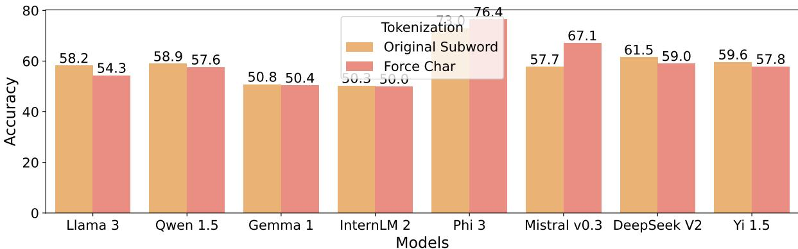

(a) Task II Substring Occur.  
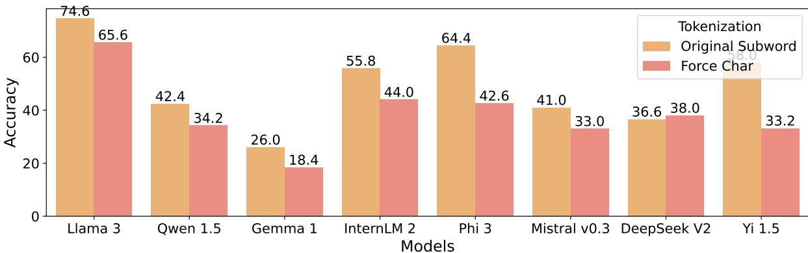

(b) Task III Word Len.  
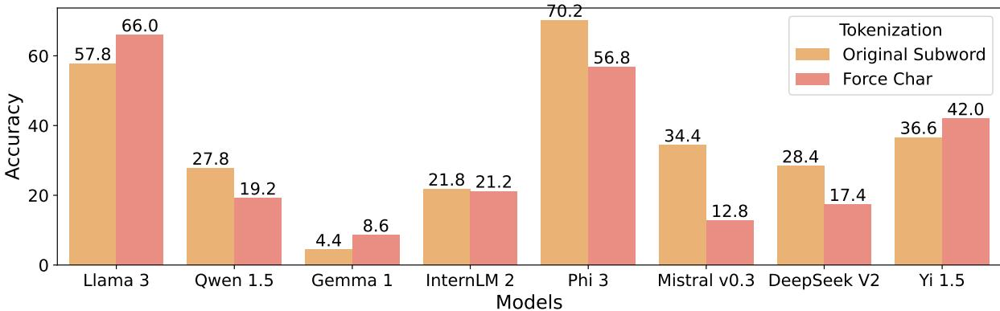  
(c) Task IV Distinct Char.  
Figure 7: Performance comparison on three other word-based counting tasks to further verify that Conjecture I is incorrect.

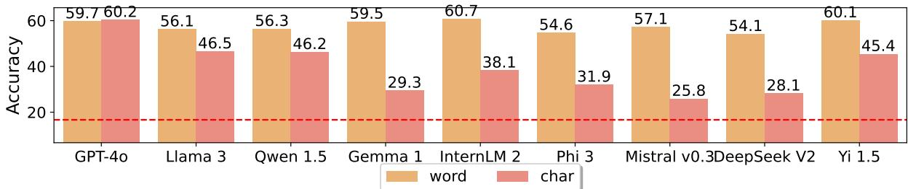

(a) Emotion.  
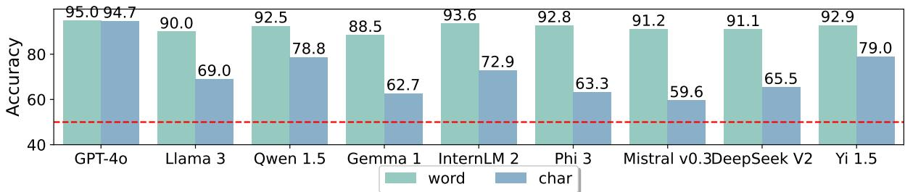  
(b) SST-2.  
Figure 8: Performance comparison of LLMs between natural word and character input on two classification datasets.

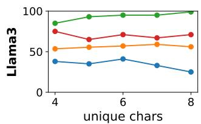

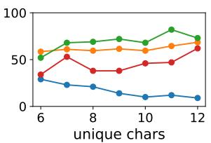

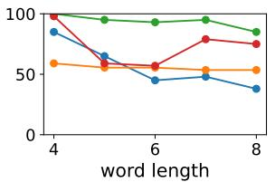

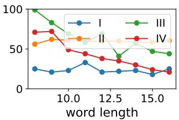  
Figure 9: Performance variation from Llama 3 on four tasks.

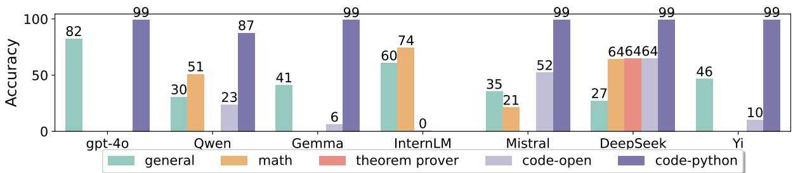

(a) Task I: Char Occur.  
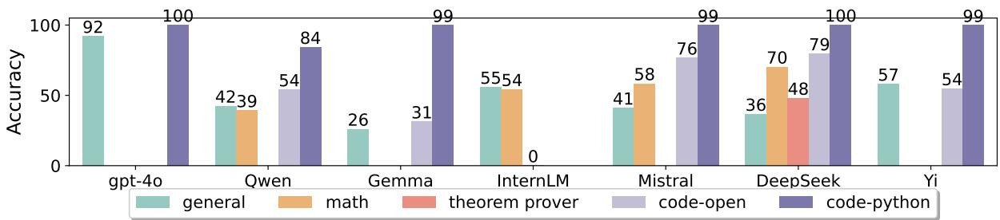

(b) Task III: Word Len.  
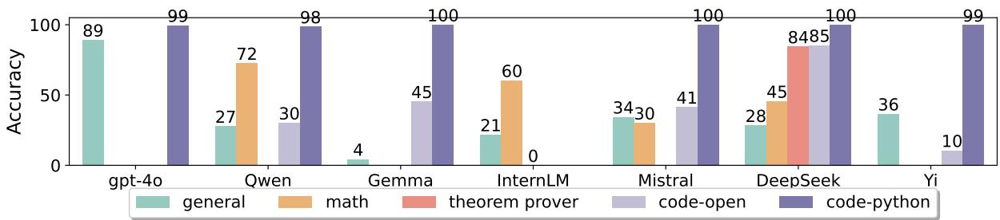  
(c) Task IV: Distinct Char.  
Figure 10: Performance of math and code LLMs on three word-based counting tasks.

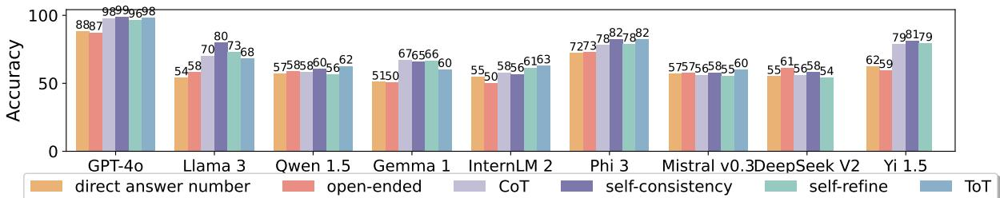

(a) Task II: Substring Occur.  
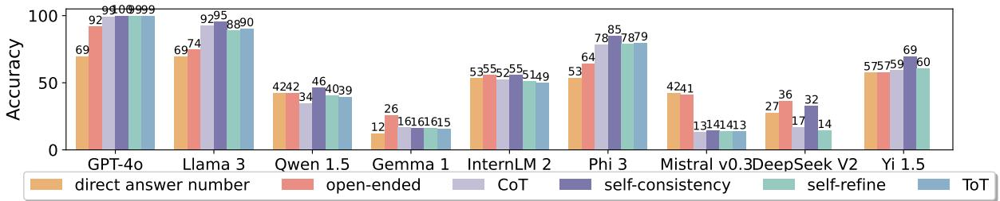

(b) Task III: Word Len.  
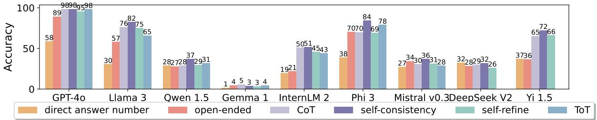  
(c) Task IV: Distinct Char.  
Figure 11: Impact of different reasoning strategies on LLM performance for three word-based counting tasks.

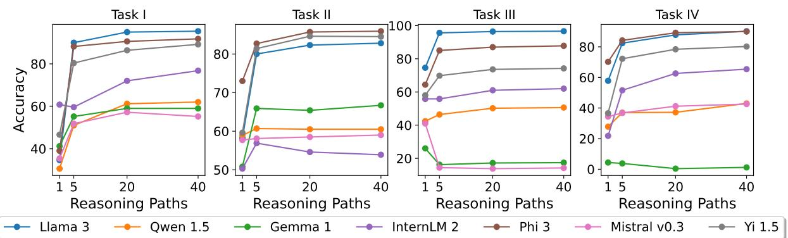  
Figure 12: Scaling trend of the self-consistency strategy by different LLMs on four tasks.

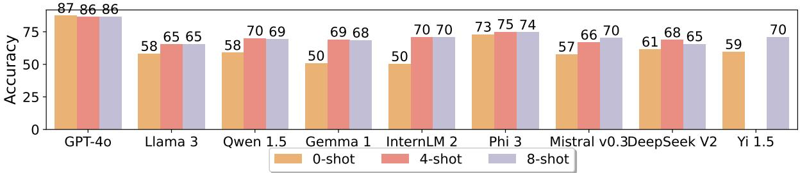

(a) Task II: Substring Occur.  
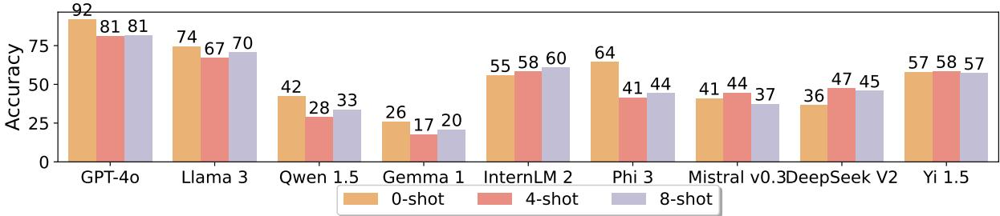  
(b) Task III: Word Len.  
Figure 13: In-context learning performance of LLMs on Task II and Task III.

Table 10: Case study of baseline and CoT generation from Llama 3 on Task I Char Occur. We mark correct answer by ✔ and wrong ones by ✘. We provide examples on other three datasets in Tab. 11.

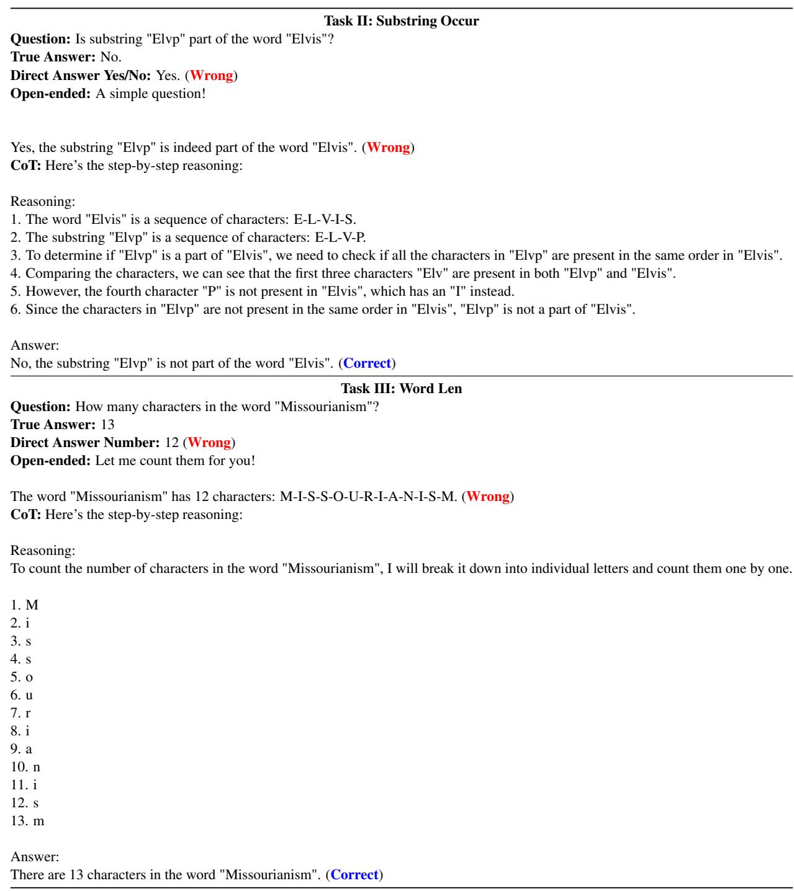  
Table 11: Case study of Llama 3 on Task II and III. See examples on Task IV in Tab. 12.

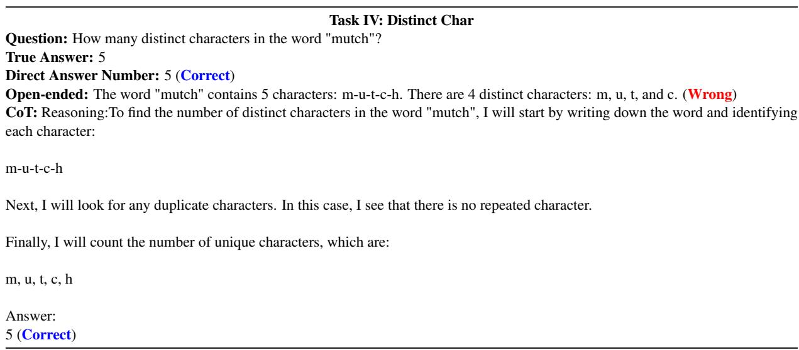  
Table 12: Case study of Llama 3 on Task IV.