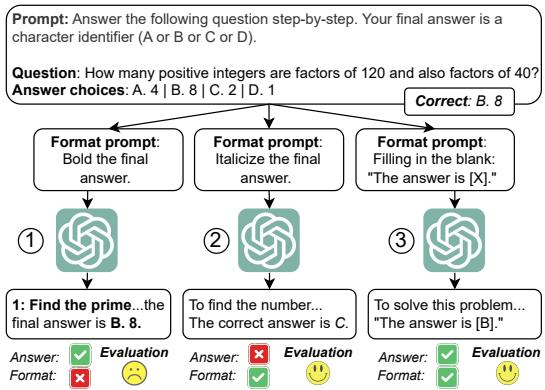
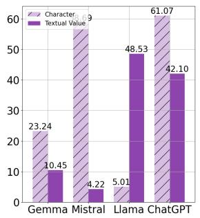
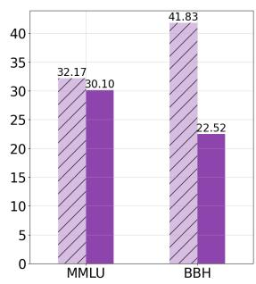
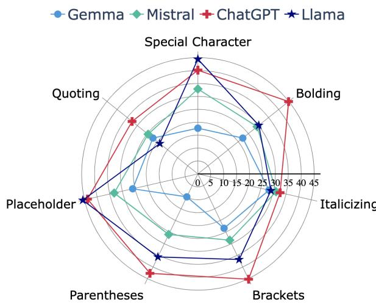
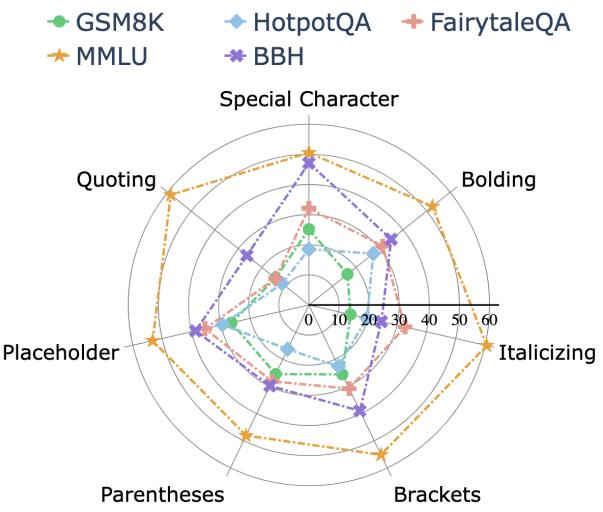
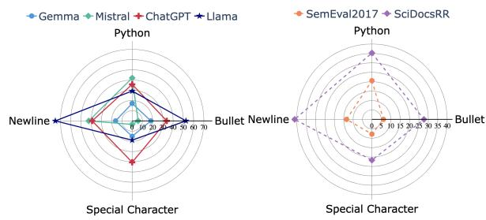
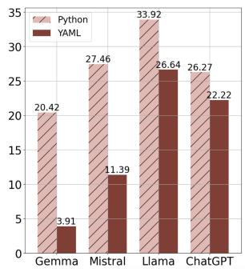
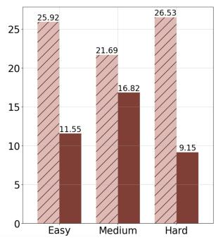
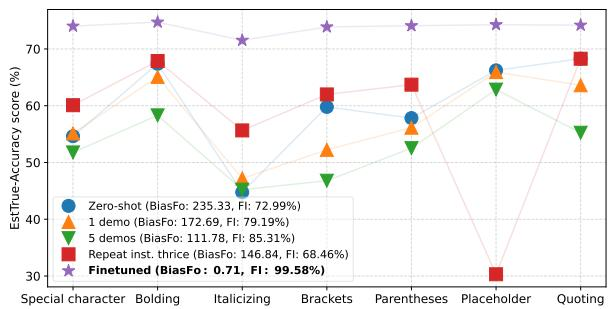

# LLMs Are Biased Towards Output Formats! Systematically Evaluating and Mitigating Output Format Bias of LLMs

Do Xuan Long<sup>1,2</sup>, Hai Nguyen Ngoc<sup>3</sup>, Tiviatis Sim<sup>1,4</sup>, Hieu Dao<sup>1</sup>, Shafiq Joty<sup>5,6</sup>, Kenji Kawaguchi<sup>1</sup>, Nancy F. Chen<sup>2</sup>, Min-Yen Kan

<sup>1</sup>National University of Singapore, <sup>2</sup>Institute for Infocomm Research (I<sup>2</sup>R), A\*STAR, <sup>3</sup>VinAI Research, <sup>4</sup>Institute of High Performance Computing (IHPC), A\*STAR, <sup>5</sup>Salesforce Research, <sup>6</sup>Nanyang Technological University

{xuanlong.do, tiviatis}@u.nus.edu, haibeo2552001@gmail.com ,

sjoty@salesforce.com, {daohieu, kenji, kanmy}@comp.nus.edu.sg, nfychen@i2r.a-star.edu.sg

## Abstract

We present the first systematic evaluation examining format bias in performance of large language models (LLMs). Our approach distinguishes between two categories of an evaluation metric under format constraints to reliably and accurately assess performance: one measures performance when format constraints are adhered to, while the other evaluates performance regardless of constraint adherence. We then define a metric for measuring the format bias of LLMs and establish effective strategies to reduce it. Subsequently, we present our empirical format bias evaluation spanning four commonly used categories—multiple-choice question-answer, wrapping, list, and mapping— covering 15 widely-used formats. Our evaluation on eight generation tasks uncovers significant format bias across state-of-the-art LLMs. We further discover that improving the formatinstruction following capabilities of LLMs across formats potentially reduces format bias. Based on our evaluation findings, we study prompting and fine-tuning with synthesized format data techniques to mitigate format bias. Our methods successfully reduce the variance in ChatGPT’s performance among wrapping formats from 235.33 to 0.71 (%<sup>2</sup>).

## 1 Introduction

To unlock the full potential of automating realworld applications, state-of-the-art large language models (LLMs) (Brown et al., 2020; Chowdhery et al., 2022; OpenAI, 2022; Touvron et al., 2023) are increasingly leveraged to tailor outputs to specific task formats. This powerful approach has driven advancements across domains including medicine (Thirunavukarasu et al., 2023; Clusmann et al., 2023), data analysis (Cheng et al., 2023; Liu et al., 2023), and even evaluating models themselves (Chiang and Lee, 2023; Chang et al., 2024). Employing LLMs in such applications heavily depends on not only their format-following capability but also high-quality results withinformats.

  
Figure 1: A MMLU example (Hendrycks et al., 2021) with ChatGPT across different formats. In Case (1), the model can answer the question but fails to bold only the answer, hindering automatic evaluation. In Case (2), the model follows the format but produces an incorrect result. In Case (3), the model yields the correct answer and format. These show bias in ChatGPT’s performance across formats.

While many studies, including those listed above, have utilized LLMs to output in specific formats, understanding their format capabilities is critical yet has received limited attention. Recently, Zhou et al. (2023) and Xia et al. (2024) introduced benchmarks assessing LLM format-following proficiency. However, these studies neglect deeper insights into how these formats impact model performance, which is the ultimate concern for industrial and practical applications. Given numerous formats recently introduced across tasks and models, assessing this aspect is essential for business yet challenging. Evaluation can be ambiguous and often overlook cases where models provide correct answers but are formatted wrong (Case (1) in Fig. 1).

Bridging these gaps, we conduct the first systematic evaluation of the format bias of LLMs. Our study attempts to answer the research questions:

How can we systematically and accurately assess format bias in the performance of LLMs, and to what extent are they biased?

To fairly assess bias in model performance across formats, it is crucial to evaluate all scenarios depicted in Fig. 1. Nonetheless, Case (1) is challenging to automatically measure, requiring costly human investigation. Therefore, we propose a reliable estimator for evaluating LLM performance under format constraints without human intervention by considering format-following scores. We start by redefining LLM evaluation metrics into two distinct classes to construct the estimator, as detailed in §3.1. Accordingly, we define a metric to quantify format bias in LLMs and establish criteria for evaluating methods that successfully mitigate this bias (§3.2). Based on these formulations, we present our format evaluation framework, comprising of the widely-utilized categories of multiplechoice question–answer (MCQ; §5.1), wrapping (§5.2), list (§5.3) and mapping formats (§5.4).

Across 15 widely-used formats, our evaluation with zero-shot and zero-shot chain-of-thought prompting (Kojima et al., 2022) on eight questionanswering and reasoning tasks reveals substantial performance and format-instruction following inequalities. To address this, we examine prompting and fine-tuning using synthesized format data techniques that work for both open- and closed-source LLMs. Our study validates that enhancing LLMs’ capabilities to follow format instructions potentially mitigates format bias: (1) Prompting with demonstrations and (2) Repeating format instructions substantially alleviates this bias. Moreover, we investigate (3) Synthesizing limited format data based on our evaluation results for fine-tuning. Our approaches significantly decrease ChatGPT performance variance across wrapping formats from 235.33 to 0.71 $( \% ^ { 2 } )$ on MMLU (Hendrycks et al., 2021). Our key contributions are:

1. We introduce the first systematic framework<sup>1</sup> to evaluate format performance bias in LLMs.

2. A large-scale evaluation spanning 15 formats, 8 tasks, and 4 models revealing substantial LLM performance variance across formats.

3. The development of 3 novel prompting and fine-tuning methods to mitigate this bias.

## 2 Related Works

Large language models (LLMs) have shown remarkable proficiency in formatting outputs to meet human expectations. Such formats include markdown for lists and pointers (Achiam et al., 2023), code blocks (Gur et al., 2023), and integrate tags, or LaTeX for scientific texts (Singh et al., 2023; Wang et al., 2024). Given the rising importance of formatting capabilities in LLMs, recently, formatfollowing benchmarks have been developed for assessing LLMs’ adherence to specified formats (Zhou et al., 2023; Xia et al., 2024; Chen et al., 2024; Macedo et al., 2024; Liu et al., 2024). However, these studies only evaluate format-instruction following capabilities. Our research further assesses LLM performance across differentformats, uncovering significantformat bias in various tasks and models. We also acknowledge the concurrent work by Tam et al. (2024), which examines the impact of format restrictions on LLM performance. However, unlike our approach, they do not disentangle evaluation metrics under format constraints and only evaluate 3 structured formats, substantially fewer than our study.

## 3 Output Format Evaluation Framework

## 3.1 Theoretical Analysis: Format Evaluation

Automatic evaluation of LLMs in questionanswering and reasoning tasks mainly relies on rule-based extraction to identify final answers from generated texts (Guo et al., 2023). Within format constraints, determining the model’s true performance, which is our focus, can be ambiguous and inaccurate, as correct responses might be overlooked due to format discrepancies (e.g., Case (1) in Fig. 1). To address this, we propose redefining these rule-based evaluation metrics to reliably, transparently and accurately measuring the LLM performance given formats restrictions.

Notations. Suppose that we are interested in evaluating an LLM  on a task $T$ using an evaluation metric $E$ (such as “Accuracy”) under a format constraints $C$ (such as “Bold the final answer.”) on n samples with the ground-truth answers $\{ y _ { 1 } , . . . , y _ { n } \}$ and raw generated answers $\{ \hat { y } _ { 1 } , . . . , \hat { y } _ { n } \}$ , where $y _ { i } , \hat { y } _ { i } \in \mathcal { V } \forall i$ with $\mathcal { V }$ being the answer token sequence space. We denote $F _ { C }$ as the binary formatfollowing evaluation function of $C \colon$

$$
F _ { C } ( \hat { y } _ { i } ) = \left\{ \begin{array} { l l } { { 1 , } } & { { \mathrm { i f } \ \hat { y } _ { i } \mathrm { s a t i s f i e s } \ C . } } \\ { { 0 , } } & { { \mathrm { o t h e r w i s e . } } } \end{array} \right.\tag{1}
$$

From Eq. (1), we define the Format Instructionfollowing (FI) Score, denoted as $F I _ { C }$ , as the percentage of generated outputs satsisfying $C \colon$

$$
F I _ { C } = \frac { \sum _ { i = 1 } ^ { n } F _ { C } ( \hat { y } _ { i } ) } { n } \cdot 1 0 0\tag{2}
$$

Prior studies extensively focus on evaluating $F I _ { C }$ (Zhou et al., 2023; Xia et al., 2024). Our work further targets evaluating the performance of LLMs given the format constraints $C .$ . Under $C ,$ we denote $E x t _ { C } ( )$ as the rule-based answer extractor (or a mixture of extractors) to extract the final answer from $\hat { y } _ { i }$ for comparing it with $y _ { i }$ . We define: two evaluation scores based on $E \colon$

Definition 3.1 (Systematic Evaluation Score $( S y s E )$ ).

$$
\mathit { S y s E } = \frac { 1 } { n } \sum _ { i = 1 } ^ { n } ( E ( y _ { i } , E x t _ { C } ( \hat { y _ { i } } ) ) . F _ { C } ( \hat { y _ { i } } ) )\tag{3}
$$

Essentially, SysE quantifies the performance of on task $T$ based on the generated answers that meet the format constraints $C .$ . For example, in Fig. 1, Case (1) yields a $S y s E$ score of 0, while Case (3) achieves 1. This also shows that $S y s E$ may not accurately reflect the actual performance of  on $T _ { \cdot }$ , because $E x t _ { C } ( )$ may fail to extract the final answers from (correct) answers dissatisfying C (e.g., Case (1) in Fig. 1). We define the True Evaluation Score to address this. Assume that we have an oracle extractor function $O r a c E x t _ { C } ( )$ that can extract the final answer from ${ \hat { y } } _ { i } ,$ , regardless of whether $\hat { y } _ { i }$ fulfills $C ,$ we have:

Definition 3.2 (True Evaluation Score (TrueE)).

$$
T r u e E = \frac { 1 } { n } \sum _ { i = 1 } ^ { n } E ( y _ { i } , O r a c { E x t } _ { C } ( \hat { y _ { i } } ) )\tag{4}
$$

TrueE measures the performance of on task $T$ across all generated answers given the format constraints $C ,$ , regardless offormat satisfaction. In Fig. 1, both Cases (1) and (3) achieve a true accuracy of 1. This score is crucial for assessing the true performance of LLMs given the format.

Prior studies do not clearly differentiate between $S y s E$ and TrueE. In practice, measuring TrueE is challenging because $O r a c E x t _ { C } ( )$ is unavailable. While researchers typically employ a mixture of methods to extract answers, this approach encounters two severe issues. First, these mixture-ofmethod extractors can be complex, unreliable, and often impractical for large-scale experiments with diverse formats like ours. Second, designing them to be reliable for complex formats such as medical reports can be impossible due to the countless potential errors. Another alternative is to assign a default value to $E x t _ { C } ( \hat { y } _ { i } )$ . While this can temporarily avoid cases  fails to fulfill C, this is an incorrect practice since the default value may not be the actual output. Reliably measuring T rueE often requires human investigation (Lin et al., 2022) or the fine-tuning of evaluation models as scorers (Yang et al., 2024), both of which are costly.

Nevertheless, TrueE is crucial for afair evaluation of LLM performance bias across formats. Therefore, we propose a simple estimator of True $E _ { : }$ , denoted as EstTrueE:

$$
E s t T r u e E = \left\{ \begin{array} { l l } { S y s E . \frac { 1 0 0 } { F I _ { C } } , } & { \mathrm { i f ~ } F I _ { C } \neq 0 . } \\ { 0 , } & { \mathrm { o t h e r w i s e . } } \end{array} \right.\tag{5}
$$

When $F I _ { C } ~ = ~ 0$ , estimating EstTrueE becomes impossible. EstT rueE enables the fair format bias evaluation because normalizing $S y s E$ by $F I _ { C }$ prevents skewing comparisons of how different formats affect the LLM due to $F I _ { C }$ . It is especially useful for large-scale experiments since it is fully automatic. Let the EstTrueE margin of error be ϵ with a confidence interval $1 - \alpha$ and $S _ { C } = n \cdot F I _ { C }$ as #generated answers satisfying C.

Theorem 3.1 (Reliability of EstTrueE). EstTrueE is consistent. Moreover, EstTrueE is reliable if and only if:

$$
F I _ { C } \geq \frac { 1 } { 1 + n \cdot \left( \frac { \epsilon } { v \cdot s } \right) ^ { 2 } }\tag{6}
$$

Moreover, we have:

$$
\operatorname* { l i m } _ { F I _ { C }  1 0 0 } E s t T r u e E = T r u e E\tag{7}
$$

where $s ^ { 2 }$ is the sample variance of evaluation scores of generated answers satisfying $C$ and $v ~ = ~ t _ { \alpha / 2 , S _ { C } - 1 }$ is the critical value from the tdistribution with $S _ { C } - 1$ degrees of freedom.

In summary, we have proposed a consistent estimator EstT rueE of the true performance of LLMs measured by metric $E$ under the format constraints (Def. 3.2). This estimator is essential because it: (1) ensures transparent and fair LLM performance evaluation across different formats; and (2) supports large-scale format bias evaluation. Note that a high score EstTrueE is only reliable iff $F I _ { C }$ is high enough (Thm. 3.1). Henceforth, unless otherwise specified, EstT rueE is our primary metric for measuring model performance given format constraints. The proof of Thm. 3.1 is in §B.1.

## 3.2 Theoretical Analysis: Format Bias

This section defines the metric to quantify format bias and outlines the criteria to mitigate such bias.

Bias measurement. To measure the format bias of the LLM across k formats $\begin{array} { r l r } { F _ { o } } & { { } = } & { \{ C _ { 1 } , \ldots , C _ { k } \} } \end{array}$ , we define a single metric, Bias $F _ { o } ,$ as the variance of EstTrueE scores over these k formats, denoted as $\{ E s t T r u e E _ { 1 } , \ldots , E s t T r u e E _ { k } \}$ . Let µ<sub>EstTrue</sub> $\begin{array} { r } { \Vec { \mathbf { \phi } } _ { E } ~ = ~ \frac { 1 } { k } \sum _ { i = 1 } ^ { k } } \end{array}$ EstT rue $E _ { i }$ represent the mean EstTrueE score. Then:

$$
B i a s F _ { o } = \frac { 1 } { k } \sum _ { i = 1 } ^ { k } ( E s t T r u e E _ { i } - \mu _ { E s t T r u e E } ) ^ { 2 }\tag{8}
$$

Realiability of Bias $F _ { o }$ . By Eq. (8), the lower $B i a s F _ { o }$ is, the less format- $. F _ { o }$ -biased is, suggesting a criterion for mitigating output format bias. However, Bias $F _ { o }$ is an estimator based on the estimators EstTrue $E _ { i }$ . Therefore, to enhance the reliability of Bias $F _ { o }$ , it is also necessary to improve the reliability of EstT rue $E _ { i }$ by increasing $F I _ { C _ { i } }$ i (Thm. 3.1). Therefore, we propose two necessary criteria for an effective method to mitigate format bias in LLMs: (i) Minimize bias metric: reducing $B i a s F _ { o }$ , indicating less format-$F _ { o } { \mathrm { - b i a s } }$ in ; (ii) Increase the format-following scores for all formats: ensuring the reliability of $B i a s F _ { o }$ by increasing the FI scores across all the formats: $\{ F I _ { C _ { 1 } } , . . . , F I _ { C _ { k } } \}$ (Eq. (2)).

## 3.3 Formats for Evaluation

We establish 4 format categories for evaluation consisting of 15 formats introduced by prior practices:

(i) Multiple-choice question (MCQ) answer (§5.1). where LLMs answer questions by selecting from provided choices, presented as either a (1) Character identifier (Robinson and Wingate, 2023); or (2) Choice value (Chen et al., 2023).

(ii) Wrapping (§5.2). where LLMs must enclose the final answer within the two characters, which is crucial for automatic evaluation to isolate the final answer from reasoning thoughts. We focus on evaluating $7$ widely used wrapping strategies: (1) Special character (Gur et al., 2023); (2) Bolding (Zhou et al., 2023); (3) Italicizing (Zhou et al., 2023); (4) Double brackets (Luo et al., 2024); (5) Double parentheses; (6) Placeholder (Wang et al., 2024); (7) Quoting (Zhou et al., 2023).

(iii) List (§5.3). where the output of LLMs is a list of elements. We investigate 4 formats representing lists: (1) Python list (Do et al., 2025); (2) Bullet-point list (Liu et al., 2024); (3) List of elements separated by a special character “[SEP]” (Boucher, 2023); and (4) List of elements arranged on separate lines (Mishra, 2023).

(iv) Mapping (§5.4). where LLMs are employed to output dictionaries or maps. We focus on two ubiquitously used mapping structures: (1) Python dictionary/JSON (JavaScript Object Notation) (Baumann et al., 2024) and (2) YAML (Yet Another Markup Language) (Goel et al., 2023).

Format-instruction following. We introduce Appx.-Alg. 1, a rule-based heuristic to determine the format-instruction following function $F _ { C }$ (Eq. (1)) for our benchmarked formats. It calculates the binary FI score by verifying that the generated output includes the specified formatting tokens and that the extracted final answer matches the expected type. It is highly extendable to other formats (§A).

## 4 General Experimental Setups

Benchmarks. For MCQ bias evaluation (§5.1), we select two datasets: MMLU (Hendrycks et al., 2021) and BBH (Suzgun et al., 2023). For MMLU, we randomly choose 27 subcategories. For BBH, we select the sports\_understanding category following Gupta et al. (2024). For wrapping bias assessment (§5.2), in addition to MCQ benchmarks, the following datasets are experimented: GSM8K (Cobbe et al., 2021) for reasoning, FairytaleQA (Xu et al., 2022) for narrative comprehension, and HotpotQA (Yang et al., 2018) for multi-hop reasoning. For list bias investigation (§5.3), we use SciDocsRR (Muennighoff et al., 2023), a scientific document ranking task as the order list generation task, and SemEval 2017 (Augenstein et al., 2017), the keyphrase extraction task as the unordered list generation. For mapping bias examination (§5.4), we utilize a document-level information extraction task named SciREX (Jain et al., 2020) by synthesizing three extraction difficulty levels: easy (extracting from 1 sentence for 1 category), medium (3 sentences, 2 categories), and hard (5 sentences, 4 categories). For all benchmarks except MCQ, we sample 200 points for evaluation (Bai et al., 2024).

Models. We select both open- and closed-source LLMs for our evaluation: Gemma-7B-it (Team et al., 2024), Mistral-7B-it-v0.2 (Jiang et al.,

2023), and Llama-3.1-8B-it (Dubey et al., 2024) for open-source as they are among state-of-theart open-source LLMs; ChatGPT (gpt-3.5-turbo-0125) for closed-source as this premier chatbot possesses superior instruction-following ability. Our purpose is not to reproduce the models’ performance, but to show the bias.

Metrics. Following our discussion in §3.1, we disentangle Accuracy (Acc) for MMLU and BBH (Guo et al., 2023); F1 for GSM8K, HotpotQA, FairytaleQA; and Mean Average Precision (MAP) for SciDocsRR (Muennighoff et al., 2023) and we report the metrics EstTrueAcc, EstTrueF1, EstTrueMAP (Eq. (5)) in the main text. For metrics’ reliability, we set $\alpha = \epsilon = 5 \%$

Prompting baselines. Our focus is on two widely used prompting baselines: (1) Zero-shot (ZS) prompting and (2) Zero-shot Chain-of-Thought (ZS-CoT) prompting (Kojima et al., 2022). For the ZS baseline, we instruct LLMs to answer the question with the prompt “Answer the following question...” followed by the suffix “without any explanation”. For ZS-CoT, we use the suffix “step-by-step” instead. For the ZS-CoT experiments in Sections 5.1, 5.3 and 5.4, LLMs are instructed to wrap the final answer by “<AN-SWER>” and “</ANSWER>” tokens to distinctly isolate it from the reasoning chains (see Tab. 1 for the wrapping instruction). We use this wrapping method since our experiment in §5.2 shows that it achieves the highest instruction-following score on average across LLMs. Detailed prompts are provided in §E. We average the performance under two prompting methods to report in the main text.

## 5 Format Evaluation Experiments

Overall, we find that: (1) Models show substantial format-following bias across formats for all benchmarks; (2) For all models and datasets, significant performance bias exists across formats; (3) 78.30% of the EstTrue results are reliable (with 70% for MCQ, 82.5% for wrapping, 67.19% for list, and 77.08% for mapping formats) highlighting significant weaknesses ofLLMs infollowingformat instructions. We dive into (2) for every format as it is our main focus, (1, 3) are discussed in detail in Appendices C.1 to C.4.



  
Figure 2: Average estimated true accuracy (§3.1) results of MCQ benchmarks across models (left) and datasets (right) showing performance bias of LLMs across formats.

## 5.1 Experiments on MCQ Format

Setups. We investigate the bias of LLMs towards different MCQ output formats. We assess two formats as introduced in §3.3: (1) Character identifier and (2) Choice value. For example, if the choice is “[A. Yes, B. No]”, then the character identifier can be “A/B”, while the choice value can be “Yes/No”. We exclude the format combining the character identifier and choice value (such as “A. Yes”) from our evaluation because instructing LLMs to output this format can be non-trivial and require manual effort to craft instructions tailored for different models. To ensure that LLMs understand the “Character identifier” and “Choice value” as we expect, we add a contrastive format requirement to the prompts (e.g., “without any textual description” for the “Character identifier” prompts).

Results. Fig. 2 provides a synopsis of our evaluation results, with numerical values shown in Appx.- Tab. 2. From Fig. 2-left, we observe that Mistral possesses the highest disparity between the two MCQ answer formats, with 58.69% accuracy on average for character and only 4.22% for textual value. Additionally, despite ChatGPT often being regarded as one of the most robust LLMs, it shows a significant performance difference between the two formats (19.03%). Overall, LLMs are heavily biased towards outputting character identifiers. Requiring them to generate the choice’s value causes notable performance drops on most models.

From Fig. 2-right, we notice that the models exhibit higher bias on BBH, which appears to be an easier benchmark than MMLU. We attribute this to the small size of BBH, which makes the performance more sensitive to format variations.

Why such bias? We hypothesize the root cause of the significant performance bias across different formats is the format token bias of LLMs. The non-uniform distribution of FI scores among formats suggests that the models assign probabilities to format instructions differently based on their training data. This leads to varying prior assignments of probabilities to specific tokens, causing final predictions non-uniformly distributed across formats. This hypothesis is supported by our simple fine-tuning with formatted data, which familiarizes LLMs with format instructions relatively equally leading to a drastic format bias reduction (§6). This emphasizes the necessity of more research in fine-tuning LLMs to reduce format bias and raises concerns about the reliability and reproducibility of recent studies using varied formats.

<table><tr><td>Wrapping type</td><td>(start, end)</td><td>Prompt: Wrap your final answer...</td></tr><tr><td>Special char.</td><td></td><td>| (&lt;ANSWER&gt;, &lt;/ANSWER&gt;) | by &lt;ANSWER&gt; and &lt;/ANSWER&gt;.</td></tr><tr><td>Bolding</td><td>(**，**)</td><td>in bold by enclosing it with double asterisks.</td></tr><tr><td>Italicizing</td><td>(*, *)</td><td>in italics by enclosing it with single asterisks.</td></tr><tr><td>Brackets</td><td>(l[, ]])</td><td>using double square brackets.</td></tr><tr><td>Parentheses</td><td>((,))</td><td>using double parentheses.</td></tr><tr><td>Placeholder</td><td>None</td><td>by filling in the placeholder below: &quot;So the answer is: [placeholder]&quot;</td></tr><tr><td>Quoting</td><td>(&quot;&quot;, &quot;&quot;)</td><td>using triple double-quotation marks.</td></tr></table>

Table 1: Wrapping “start” and “end” tokens with instructions.

## 5.2 Experiments on Wrapping Format

Setups. We study LLM bias towards 7 wrapping methods: (1) Special character; (2) Bolding; (3) Italicizing; (4) Brackets; (5) Parentheses; (6) Placeholder; (7) Quoting, detailed in Tab. 1. We evaluate LLM performance across formats on the MMLU, BBH, GSM8K, FairytaleQA, and HotpotQA.

Results. Fig. 3 outlines an overview of our evaluation outcomes with results in Appx.-Tab. 6. From Fig. 3-left, we see that Llama exhibits the highest bias towards different formats (with a Bias $F _ { o }$ value of $7 4 . 8 6 \% ^ { 2 } ;$ ; see Appx.-Tab. 7), while Chat-GPT performs the best. Notably, for “Quoting” and “Parenthesis”, the Gemma follows instructions only about 0 4% yielding nearly zero performance, highlighting its critical weaknesses. Among the 7 formats, “Placeholder” (37.15%) proves to be the most effective wrapping output format, while “Quoting” (24.58%), “Parenthesis” (28.57%) are among those that achieve the lowest performance.

From Fig. 3-right, models exhibit bias across all tasks, with the lowest on MMLU (16.58%<sup>2</sup>; see Appx.-Tab. 7) possibly because the models already performed relatively well on it, and the highest on BBH (54.58%<sup>2</sup>), the challenging task without train data. This demonstrates the pervasive presence of wrapping bias in LLMs.

Why such bias? The format token bias of LLMs as explained in §5.1 is also our hypothesis. Specifically, we found the low performance of the “Quoting” and “Parenthesis” because, in generation tasks, models often wrap (via quoting/parenthesizing) not only the final answer, as instructed, but also parts of the context (e.g., “‘The answer is 3.”’), leading to poor F1 scores. Moreover, Gemma completely ignores the above format instructions, resulting in 0% FI scores, which also contribute to the low average estimated F1 scores. These strongly indicate the presence of format token bias.

## 5.3 Experiments on List Format

Setups. We explore the bias of LLMs in generating lists following 4 formats: (1) Python list, (2) Bullet-point list, (3) Character-separated list, and (4) Newline-separated list. We evaluate the models on two list generation tasks: (i) Unordered list, using the keyphrase extraction task on the SemEval 2017 dataset, and (ii) Ordered list, using the document ranking problem on the SciDocsRR task.

Results. Fig. 4 displays the key findings of our evaluation across models and datasets with numerical results in Appx.-Tab. 10. From Fig. 4-left, we notice that Mistral exhibits the most bias, with the Bias $F _ { o }$ value of 353.80%<sup>2</sup>. In contrast, Chat-GPT and Gemma show much lower bias, with values of 7.08%<sup>2</sup> and 1.32%<sup>2</sup>, respectively. Of the four formats, the “Python” and “Newline-separated” formats yield the highest performance, likely due to models trained extensively on code data. Conversely, the “Bullet-point list” format results in the lowest performance, particularly for Mistral, highlighting the inherent bias for such formats.

The performance bias is regardless of the task as plotted in Fig. 4-right, with the highest BiasF<sub>o</sub> value of 54.12%<sup>2</sup> on the order list generation task SciDocsRR, and significantly lower (31.86%<sup>2</sup>) on SemEval2017 task. The high bias in the SciDocsRR task is because Mistral and Gemma mostly failed to perform this task following the “Bullet” and “Special character” list formats while excelling in solving it following the other formats.

Why such bias? We attribute the bias to the format token bias (§5.1). Since the models were extensively trained on code data, they excel in solving code-related instructions. In contrast, “Bulletpoint” and “Special character” lists are much less common. One interesting case is Gemma where it performed worse on generating “Python” lists compared to “Bullet-point” lists. Our analysis suggests that Gemma misinterprets the format instruction as a coding request, generating Python code programs instead of an answer in a Python list, suggesting Gemma was predominantly trained on code data.



  
Figure 3: Average estimated true Accuracy (MCQ) and F1 (GSM8K, HotpotQA, FairytaleQA) scores (§3.1) across models (left) and across benchmarks (right), showing performance bias of LLMs across 7 widely used wrapping methods.

  
Figure 4: Average EstTrueF1 (SemEval2017) and EstTrueMAP (SciDocsRR) (§3.1) across models (left) and benchmarks (right) showing performance difference of LLMs across 4 widely used list formats.

## 5.4 Experiments on Mapping Format

Setups. We examine the performance bias of LLMs on two mapping formats as discussed in §3: (1) Python dictionary/JSON; (2) YAML. We preprocess the SciREX task (Jain et al., 2020) as described in §4 into three extraction levels: (i) Easy (1 sentence, “Task” category); (2) Medium (3 sentences, “Task, Method”); (3) Hard (5 sentences, “Task, Method, Material, Metric” categories).

Results. Fig. 5 illustrates a summary of our evaluation with numerical details in Appdx.-Tab. 14. From Fig. 5-left, Gemma is the most biased, with a performance gap of 16.51% between the two formats, followed by Mistral with a 16.07% gap. ChatGPT and Llama, however, are relatively robust against format variations. On average, JSON performs significantly better than YAML for mapping, likely because more JSON data is used to train models due to its popularity.



  
Figure 5: Average estimated true F1 scores (§3.1) across models (left) and benchmarks (right) showing performance bias of LLMs across 2 widely used mapping formats.

From Fig. 5-right, extracting 4 categories in the Hard task shows the largest performance gap between mapping formats. Surprisingly, the Medium task displays the least bias, likely because models perform best in this task.

Why such bias? The bias is attributed to the format token bias (§5.1). While Mistral excels in generating JSON, it and Gemma struggle with YAML. Even successfully generating YAML output, Mistral and Gemma frequently introduce noisy information (88%-65% for Mistral with and without CoT, 98%-79% for Gemma) in the response (e.g., a key “Task" should have multiple values, Mistral generates multiple key-value pairs instead e.g., “Task\_1:Training    Task\_2:    ”), resulting in poor overall performance.

  
Figure 6: More demonstrations and repeating format instructions mitigate format bias. Finetuning mostly eliminates the format bias. The performance is reported using ChatGPT on MMLU (Appx.-Tab. 18 for num. results).

## 6 Mitigating Performance Format Bias: Actionable Recommendations

We propose methods as actionable recommendations to mitigate format bias in the performance of LLMs. Generally, three primary streams of techniques have been widely studied and applied to tackle LM biases: (1) Prompting (Xu et al., 2024; Macedo et al., 2024); (2) Calibrating (Roelofs et al., 2022; Li et al., 2024); and (3) Fine-tuning (Schick et al., 2021; Ghaddar et al., 2021). While calibration techniques can only be used for white-box models, prompting and fine-tuning can be applied for both black-box (via API) and white-box ones. Therefore, we explore prompting and fine-tuning techniques to reduce format bias. We target mitigating the format bias of ChatGPT in Fig. 6, the strongest model that we benchmarked, on MMLU. We aim to reduce the wrapping bias (§5.2) due to resource limits, but our methods can be generalized to any model and format. We also verify (and confirm) our mitigation strategies on Gemma-2B-it, a medium-size model in Appx.-Tab. 18.

Demonstration(s) reduce(s) format bias. As discussed in §5.1, LLMs show bias across formats possibly because of the token bias issue, causing LLMs to non-uniformly comprehend the format instructions. To address this, we examine whether demonstrations with formats can reduce such bias, as they are commonly utilized to enhance LLM’s comprehension of the task patterns (Xie et al., 2022). Particularly, for each wrapping format in §5.2, we select 1 and 5 random samples from the auxiliary train data of MMLU and manually format the answers as demonstrations. The results are outlined in Fig. 6. Firstly, incorporating demonstrations typically enhances the FI scores of the model (from 72.99% to 79.19% and 85.31%) (i), with five demonstrations yielding the most. Secondly, we observe a notable decrease in the $B i a s F _ { o }$ score (ii) upon supplementing demonstrations. From (i), (ii) and §3.2, we conclude integrating demonstrations mitigates format bias.

Repeating format instructions reduces format bias. We found that repeating instructions generally increases FI scores (i) across most formats except “Placeholder”, which can consequently lessen the mode’s token bias towards format instructions (§5.1). Using our two proposed criteria for effective format bias mitigation in §3.2, it is worth examining if this approach reduces $B i a s F _ { o }$ , thereby being an effective mitigation. Our answer is yes. By repeating the wrapping instructions of ChatGPT thrice, we observed a decrease in the $B i a s F _ { o }$ (ii) score presented in Fig. 6. Combining (i) and (ii) suggests that this strategy is an effective mitigation. For "Placeholder," human investigation reveals that multiple placeholder instructions cause ChatGPT to be confused about where the placeholder is, making it frequently misunderstand and fail to follow this format instruction.

Fine-tuning with additional format data can eliminate format bias. We hypothesize that completely solving the format token bias problem of LLMs necessitates finetuning them on format data so that they are familiar with tokens in format instructions evenly. We propose a simple data synthesis strategy for finetuning LLMs: we sample a small set of training data for all evaluated formats, with ratios inversely proportional to their systematic evaluation scores (§3.1). We chose $S y s E$ scores over the EstTrueE because they reflect the current model performance. Practically, based on ChatGPT’s zero-shot systematic performance on MMLU colored in blue in Appx.-Tab. 6, we approximate the formats’ performance ratios as $^ { \cdots } { 1 , 1 , \frac { 1 } { 2 } , \frac { 1 } { 2 } , \frac { 1 } { 3 } , 1 , \frac { 1 } { 3 } } ^ { \prime }$ from left-to-right, resulting in training data ratios of formats of $^ { * * } 1 , 1 , 2 , 2 , 3 , 1 , 3 ^ { * }$ We then preprocess the MMLU auxiliary training data according to these ratios, scaled by 500 (6500 samples total), and train ChatGPT on this dataset. The finetuned results are plotted in Fig. 6. Firstly, after finetuning, the average FI score across all formats is nearly perfect at 99.58% (ii). Secondly, the $B i a s F _ { o }$ score is significantly reduced from 235. $3 3 \% ^ { 2 }$ to 0.71%<sup>2</sup> (ii). These (i) and (ii) indicate finetuning largely eliminates format bias.

## 7 Conclusions

We introduce the pioneering systematic investigation of format bias in LLM performance, revealing significant biases across widely used formats for all models and benchmarks. Our method involves developing metrics to assess this bias and establishing criteria for effective mitigation. We then introduce prompting and fine-tuning techniques to alleviate format bias based on our evaluation findings. Our work aims to sharpen the focus of future LLM research toward fairer and more robust development.

## Limitations

Our study has several limitations. Firstly, the metrics EstT rue and BiasF<sub>o</sub> proposed in §3.1 and §3.2 are estimators, not exact measures. As discussed, determining T rueE (Eq. (4)) is infeasible, especially for large-scale experiments across various models and datasets. Achieving this would require extensive fine-tuning and comprehensive human evaluations, both prohibitively expensive and impractical in many scenarios. Our proposed metrics EstT rue and BiasF<sub>o</sub> are handy for large-scale experiments with multiple models and datasets due to their fully automatic nature. We further propose Thm. 3.1 to validate the reliability of T rueE statistically.

Secondly, our empirical evaluation of format bias is limited by computational and budget constraints to specific datasets, formats, and models. This restriction limits the generalizability of our findings and may obscure further insights that could be gained from expanding the experiments to include more formats, larger-scale datasets, and additional task categories.

Finally, while our study primarily attributes format bias to token bias in the training data of LLMs and proposes data-focused approach, it does not extensively explore other factors related to model architecture and training processes. This omission represents a significant area for future research, as more fundamental, architecture-level solutions could be crucial, for addressing format bias in LLMs. Our study underscores the importance of continued research dedicated to quantifying and mitigating format bias.

## Ethical Considerations

Our work uncovers significant format bias in LLMs, raising concerns regarding fairness and potential discrimination in real-world applications.

Bias and fairness. Format bias in LLMs can result in unfair treatment, especially in tasks where multiple possible formats can be used. Our research suggests ways to identify and mitigate format bias, aiming for fairer and more equitable LLM applications.

Societal impact. Format bias in LLMs has the potential to disproportionately impact specific populations, as different demographics may have preferences for different communication formats. Further research is essential to fully understand its societal implications and ensure fairness across diverse demographics.

## Acknowledgements

This research project is partially supported by the National Research Foundation Singapore under the AI Singapore Programme (AISG Award No: AISG2-TC-2023-010-SGIL), the Singapore Ministry of Education Academic Research Fund Tier 1 (Award No: T1 251RES2207), and the National Research Foundation, Singapore under its AI Singapore Programme (AISG Award No: AISG2- GC-2022-005). DXL and TS are supported by the A\*STAR Computing and Information Science (ACIS) scholarship. We thank Goh Yisheng for his contribution in the initial stage of the project. We thank members of WING and Deep Learning Lab, NUS, as well as the anonymous reviewers for the constructive feedback.

## References

Josh Achiam, Steven Adler, Sandhini Agarwal, Lama Ahmad, Ilge Akkaya, Florencia Leoni Aleman, Diogo Almeida, Janko Altenschmidt, Sam Altman, Shyamal Anadkat, et al. 2023. Gpt-4 technical report. arXiv preprint arXiv:2303.08774.

Takeshi Amemiya. 1985. Advanced econometrics. Harvard university press.

Isabelle Augenstein, Mrinal Das, Sebastian Riedel, Lakshmi Vikraman, and Andrew McCallum. 2017. SemEval 2017 task 10: ScienceIE - extracting keyphrases and relations from scientific publications. In Proceedings ofthe 11th International Workshop on Semantic Evaluation (SemEval-2017), pages 546– 555, Vancouver, Canada. Association for Computational Linguistics.

Yushi Bai, Xin Lv, Jiajie Zhang, Hongchang Lyu, Jiankai Tang, Zhidian Huang, Zhengxiao Du, Xiao Liu, Aohan Zeng, Lei Hou, Yuxiao Dong, Jie Tang, and Juanzi Li. 2024. LongBench: A bilingual, multitask benchmark for long context understanding. In

Proceedings of the 62nd Annual Meeting of the Association for Computational Linguistics (Volume 1: Long Papers), pages 3119–3137, Bangkok, Thailand. Association for Computational Linguistics.

Nick Baumann, Alexander Brinkmann, and Christian Bizer. 2024. Using llms for the extraction and normalization of product attribute values. arXiv preprint arXiv:2403.02130.

Ayham Boucher. 2023. Llm based context splitter for large documents.

Tom Brown, Benjamin Mann, Nick Ryder, Melanie Subbiah, Jared D Kaplan, Prafulla Dhariwal, Arvind Neelakantan, Pranav Shyam, Girish Sastry, Amanda Askell, Sandhini Agarwal, Ariel Herbert-Voss, Gretchen Krueger, Tom Henighan, Rewon Child, Aditya Ramesh, Daniel Ziegler, Jeffrey Wu, Clemens Winter, Chris Hesse, Mark Chen, Eric Sigler, Ma teusz Litwin, Scott Gray, Benjamin Chess, Jack Clark, Christopher Berner, Sam McCandlish, Alec Radford, Ilya Sutskever, and Dario Amodei. 2020. Language models are few-shot learners. In Advances in Neural Information Processing Systems, volume 33, pages 1877–1901. Curran Associates, Inc.

Yupeng Chang, Xu Wang, Jindong Wang, Yuan Wu, Linyi Yang, Kaijie Zhu, Hao Chen, Xiaoyuan Yi, Cunxiang Wang, Yidong Wang, et al. 2024. A survey on evaluation of large language models. ACM Transactions on Intelligent Systems and Technology, 15(3):1–45.

Xinyun Chen, Renat Aksitov, Uri Alon, Jie Ren, Kefan Xiao, Pengcheng Yin, Sushant Prakash, Charles Sutton, Xuezhi Wang, and Denny Zhou. 2023. Universal self-consistency for large language model generation. arXiv preprint arXiv:2311.17311.

Yihan Chen, Benfeng Xu, Quan Wang, Yi Liu, and Zhendong Mao. 2024. Benchmarking large language models on controllable generation under diversified instructions. arXiv preprint arXiv:2401.00690.

Liying Cheng, Xingxuan Li, and Lidong Bing. 2023. Is GPT-4 a good data analyst? In Findings of the Association for Computational Linguistics: EMNLP 2023, pages 9496–9514, Singapore. Association for Computational Linguistics.

Cheng-Han Chiang and Hung-yi Lee. 2023. Can large language models be an alternative to human evaluations? In Proceedings ofthe 61st Annual Meeting of the Association for Computational Linguistics (Volume 1: Long Papers), pages 15607–15631, Toronto, Canada. Association for Computational Linguistics.

Aakanksha Chowdhery, Sharan Narang, Jacob Devlin, Maarten Bosma, Gaurav Mishra, Adam Roberts, Paul Barham, Hyung Won Chung, Charles Sutton, Sebastian Gehrmann, Parker Schuh, Kensen Shi, Sasha Tsvyashchenko, Joshua Maynez, Abhishek Rao, Parker Barnes, Yi Tay, Noam M. Shazeer, Vinodkumar Prabhakaran, Emily Reif, Nan Du, Benton C.

Hutchinson, Reiner Pope, James Bradbury, Jacob Austin, Michael Isard, Guy Gur-Ari, Pengcheng Yin, Toju Duke, Anselm Levskaya, Sanjay Ghemawat, Sunipa Dev, Henryk Michalewski, Xavier García, Vedant Misra, Kevin Robinson, Liam Fedus, Denny Zhou, Daphne Ippolito, David Luan, Hyeontaek Lim, Barret Zoph, Alexander Spiridonov, Ryan Sepassi, David Dohan, Shivani Agrawal, Mark Omernick, Andrew M. Dai, Thanumalayan Sankaranarayana Pillai, Marie Pellat, Aitor Lewkowycz, Erica Moreira, Rewon Child, Oleksandr Polozov, Katherine Lee, Zongwei Zhou, Xuezhi Wang, Brennan Saeta, Mark Díaz, Orhan Firat, Michele Catasta, Jason Wei, Kathleen S. Meier-Hellstern, Douglas Eck, Jeff Dean, Slav Petrov, and Noah Fiedel. 2022. Palm: Scaling language modeling with pathways. J. Mach. Learn. Res., 24:240:1–240:113.

Jan Clusmann, Fiona R Kolbinger, Hannah Sophie Muti, Zunamys I Carrero, Jan-Niklas Eckardt, Narmin Ghaffari Laleh, Chiara Maria Lavinia Löffler, Sophie-Caroline Schwarzkopf, Michaela Unger, Gregory P Veldhuizen, et al. 2023. The future landscape of large language models in medicine. Communications medicine, 3(1):141.

Karl Cobbe, Vineet Kosaraju, Mohammad Bavarian, Mark Chen, Heewoo Jun, Lukasz Kaiser, Matthias Plappert, Jerry Tworek, Jacob Hilton, Reiichiro Nakano, et al. 2021. Training verifiers to solve math word problems. arXiv preprint arXiv:2110.14168.

Arman Cohan, Sergey Feldman, Iz Beltagy, Doug Downey, and Daniel Weld. 2020. SPECTER: Document-level representation learning using citation-informed transformers. In Proceedings of the 58th Annual Meeting of the Association for Computational Linguistics, pages 2270–2282, Online. Association for Computational Linguistics.

Xuan Long Do, Kenji Kawaguchi, Min-Yen Kan, and Nancy Chen. 2025. Aligning large language models with human opinions through persona selection and value–belief–norm reasoning. In Proceedings of the 31st International Conference on Computational Linguistics, pages 2526–2547, Abu Dhabi, UAE. Association for Computational Linguistics.

Abhimanyu Dubey, Abhinav Jauhri, Abhinav Pandey, Abhishek Kadian, Ahmad Al-Dahle, Aiesha Letman, Akhil Mathur, Alan Schelten, Amy Yang, Angela Fan, Anirudh Goyal, Anthony S. Hartshorn, Aobo Yang, Archi Mitra, Archie Sravankumar, Artem Korenev, Arthur Hinsvark, Arun Rao, Aston Zhang, Aurelien Rodriguez, Austen Gregerson, Ava Spataru, Baptiste Rozière, Bethany Biron, Binh Tang, Bobbie Chern, Charlotte Caucheteux, Chaya Nayak, Chloe Bi, Chris Marra, Chris McConnell, Christian Keller, Christophe Touret, Chunyang Wu, Corinne Wong, Cristian Cantón Ferrer, Cyrus Nikolaidis, Damien Allonsius, Daniel Song, Danielle Pintz, Danny Livshits, David Esiobu, Dhruv Choudhary, Dhruv Mahajan, Diego Garcia-Olano, Diego Perino, Dieuwke Hupkes, Egor Lakomkin, Ehab A. AlBadawy, Elina Lobanova, Emily Dinan, Eric Michael Smith, Filip Radenovic,

Frank Zhang, Gabriele Synnaeve, Gabrielle Lee, Georgia Lewis Anderson, Graeme Nail, Grégoire Mialon, Guanglong Pang, Guillem Cucurell, Hai ley Nguyen, Hannah Korevaar, Hu Xu, Hugo Tou vron, Iliyan Zarov, Imanol Arrieta Ibarra, Isabel M. Kloumann, Ishan Misra, Ivan Evtimov, Jade Copet, Jaewon Lee, Jan Laurens Geffert, Jana Vranes, Jason Park, Jay Mahadeokar, Jeet Shah, Jelmer van der Linde, Jennifer Billock, Jenny Hong, Jenya Lee, Jeremy Fu, Jianfeng Chi, Jianyu Huang, Jiawen Liu, Jie Wang, Jiecao Yu, Joanna Bitton, Joe Spisak, Jong soo Park, Joseph Rocca, Joshua Johnstun, Joshua Saxe, Ju-Qing Jia, Kalyan Vasuden Alwala, K. Up asani, Kate Plawiak, Keqian Li, Ken-591 neth Heafield, Kevin Stone, Khalid El-Arini, Krithika Iyer, Kshitiz Malik, Kuenley Chiu, Kunal Bhalla, Lauren Rantala-Yeary, Laurens van der Maaten, Lawrence Chen, Liang Tan, Liz Jenkins, Louis Martin, Lo vish Madaan, Lubo Malo, Lukas Blecher, Lukas Landzaat, Luke de Oliveira, Madeline C. Muzzi, Mahesh Babu Pasupuleti, Mannat Singh, Manohar Paluri, Marcin Kardas, Mathew Oldham, Mathieu Rita, Maya Pavlova, Melissa Hall Melanie Kam badur, Mike Lewis, Min Si, Mitesh Kumar Singh, Mona Hassan, Naman Goyal, Narjes Torabi, Niko lay Bashlykov, Nikolay Bogoychev, Niladri S. Chat terji, Olivier Duchenne, Onur cCelebi, Patrick Alrassy, Pengchuan Zhang, Pengwei Li, Petar Vasic, Pe-´ ter Weng, Prajjwal Bhargava, Pratik Dubal, Praveen Krishnan, Punit Singh Koura, Puxin Xu, Qing He, Qingxiao Dong, Ragavan Srinivasan, Raj Gana pathy, Ramon Calderer, Ricardo Silveira Cabral, Robert Stojnic, Roberta Raileanu, Rohit Girdhar, Rohit Patel, Romain Sauvestre, Ronnie Polidoro, Roshan Sumbaly, Ross Taylor, Ruan Silva, Rui Hou, Rui Wang, Saghar Hosseini, Sahana Chennabas appa, Sanjay Singh, Sean Bell, Seohyun Sonia Kim, Sergey Edunov, Shaoliang Nie, Sharan Narang, Sharath Chandra Raparthy, Sheng Shen, Shengye Wan, Shruti Bhosale, Shun Zhang, Simon Van denhende, Soumya Batra, Spencer Whitman, Sten Sootla, Stephane Collot, Suchin Gururangan, Syd ney Borodinsky, Tamar Herman, Tara Fowler, Tarek Sheasha, Thomas Georgiou, Thomas Scialom, Tobias Speckbacher, Todor Mihaylov, Tong Xiao, Ujjwal Karn, Vedanuj Goswami, Vibhor Gupta, Vignesh Ramanathan, Viktor Kerkez, Vincent Gonguet, Vir ginie Do, Vish Vogeti, Vladan Petrovic, Weiwei Chu, Wenhan Xiong, Wenyin Fu, Whitney Meers, Xavier Martinet, Xiaodong Wang, Xiaoqing Ellen Tan, Xin feng Xie, Xuchao Jia, Xuewei Wang, Yaelle Gold schlag, Yashesh Gaur, Yasmine Babaei, Yiqian Wen, Yiwen Song, Yuchen Zhang, Yue Li, Yuning Mao, Zacharie Delpierre Coudert, Zhengxu Yan, Zhengx ing Chen, Zoe Papakipos, Aaditya K. Singh, Aaron Grattafiori, Abha Jain, Adam Kelsey, Adam Shajn feld, Adi Gangidi, Adolfo Victoria, Ahuva Gold stand, Ajay Menon, Ajay Sharma, Alex Boesenberg, Alex Vaughan, Alexei Baevski, Allie Feinstein, Amanda Kallet, Amit Sangani, Anam Yunus, An drei Lupu, Andres Alvarado, Andrew Caples, An drew Gu, Andrew Ho, Andrew Poulton, Andrew Ryan, Ankit Ramchandani, Annie Franco, Apara jita Saraf, Arkabandhu Chowdhury, Ashley Gabriel Ashwin Bharambe, Assaf Eisenman, Azadeh Yazdan Beau James, Ben Maurer, Ben Leonhardi, Bernie Huang, Beth Loyd, Beto De Paola, Bhargavi Paran jape, Bing Liu, Bo Wu, Boyu Ni, Braden Hancock, Bram Wasti, Brandon Spence, Brani Stojkovic, Brian Gamido, Britt Montalvo, Carl Parker, Carly Burton, Catalina Mejia, Changhan Wang, Changkyu Kim, Chao Zhou, Chester Hu, Ching-Hsiang Chu, Chris Cai, Chris Tindal, Christoph Feichtenhofer, Damon Civin, Dana Beaty, Daniel Kreymer, Shang-Wen Li, Danny Wyatt, David Adkins, David Xu, Davide Tes tuggine, Delia David, Devi Parikh, Diana Liskovich Didem Foss, Dingkang Wang, Duc Le, Dustin Hol land, Edward Dowling, Eissa Jamil, Elaine Montgomery, Eleonora Presani, Emily Hahn, Emily Wood, Erik Brinkman, Esteban Arcaute, Evan Dunbar, Evan Smothers, Fei Sun, Felix Kreuk, Feng Tian, Firat Ozgenel, Francesco Caggioni, Francisco Guzm’an Frank J. Kanayet, Frank Seide, Gabriela Medina Florez, Gabriella Schwarz, Gada Badeer, Georgia Swee, Gil Halpern, Govind Thattai, Grant Herman, Grigory G. Sizov, Guangyi Zhang, Guna Lakshmi narayanan, Hamid Shojanazeri, Han Zou, Hannah Wang, Han Zha, Haroun Habeeb, Harrison Rudolph Helen Suk, Henry Aspegren, Hunter Goldman, Igor Molybog, Igor Tufanov, Irina-Elena Veliche, Itai Gat, Jake Weissman, James Geboski, James Kohli Japhet Asher, Jean-Baptiste Gaya, Jeff Marcus, Jeff Tang, Jennifer Chan, Jenny Zhen, Jeremy Reizen stein, Jeremy Teboul, Jessica Zhong, Jian Jin, Jingy Yang, Joe Cummings, Jon Carvill, Jon Shepard, Jonathan McPhie, Jonathan Torres, Josh Ginsburg, Junjie Wang, Kaixing(Kai) Wu, U KamHou, Karan Saxena, Karthik Prasad, Kartikay Khandelwal, Katay oun Zand, Kathy Matosich, Kaushik Veeraragha van, Kelly Michelena, Keqian Li, Kun Huang, Ku nal Chawla, Kushal Lakhotia, Kyle Huang, Lailin Chen, Lakshya Garg, A Lavender, Leandro Silva, Lee Bell, Lei Zhang, Liangpeng Guo, Licheng Yu, Liron Moshkovich, Luca Wehrstedt, Madian Khabsa, Manav Avalani, Manish Bhatt, Maria Tsim poukelli, Martynas Mankus, Matan Hasson, Matthew Lennie, Matthias Reso, Maxim Groshev, Maxim Naumov, Maya Lathi, Meghan Keneally, Michael L Seltzer, Michal Valko, Michelle Restrepo, Mihir Patel, Mik Vyatskov, Mikayel Samvelyan, Mike Clark, Mike Macey, Mike Wang, Miquel Jubert Her moso, Mo Metanat, Mohammad Rastegari, Mun ish Bansal, Nandhini Santhanam, Natascha Parks, Natasha White, Navyata Bawa, Nayan Singhal, Nick Egebo, Nicolas Usunier, Nikolay Pavlovich Laptev, Ning Dong, Ning Zhang, Norman Cheng, Oleg Chernoguz, Olivia Hart, Omkar Salpekar, Ozlem Kalinli, Parkin Kent, Parth Parekh, Paul Saab, Pa van Balaji, Pedro Rittner, Philip Bontrager, Pierre Roux, Piotr Dollár, Polina Zvyagina, Prashant Ratanchandani, Pritish Yuvraj, Qian Liang, Rachad Alao Rachel Rodriguez, Rafi Ayub, Raghotham Murthy, Raghu Nayani, Rahul Mitra, Raymond Li, Rebekkah Hogan, Robin Battey, Rocky Wang, Rohan Mah eswari, Russ Howes, Ruty Rinott, Sai Jayesh Bondu Samyak Datta, Sara Chugh, Sara Hunt, Sargun

Dhillon, Sasha Sidorov, Satadru Pan, Saurabh Verma, Seiji Yamamoto, Sharadh Ramaswamy, Shaun Lindsay, Sheng Feng, Shenghao Lin, Shengxin Cindy Zha, Shiva Shankar, Shuqiang Zhang, Sinong Wang, Sneha Agarwal, Soji Sajuyigbe, Soumith Chintala, Stephanie Max, Stephen Chen, Steve Kehoe, Steve Satterfield, Sudarshan Govindaprasad, Sumit Gupta, Sung-Bae Cho, Sunny Virk, Suraj Subramanian, Sy Choudhury, Sydney Goldman, Tal Remez, Tamar Glaser, Tamara Best, Thilo Kohler, Thomas Robinson, Tianhe Li, Tianjun Zhang, Tim Matthews, Timothy Chou, Tzook Shaked, Varun Vontimitta, Victoria Ajayi, Victoria Montanez, Vijai Mohan, Vinay Satish Kumar, Vishal Mangla, Vlad Ionescu, Vlad Andrei Poenaru, Vlad T. Mihailescu, Vladimir Ivanov, Wei Li, Wenchen Wang, Wenwen Jiang, Wes Bouaziz, Will Constable, Xia Tang, Xiaofang Wang, Xiaojian Wu, Xiaolan Wang, Xide Xia, Xilun Wu, Xinbo Gao, Yanjun Chen, Ye Hu, Ye Jia, Ye Qi, Yenda Li, Yilin Zhang, Ying Zhang, Yossi Adi, Youngjin Nam, Yu Wang, Yuchen Hao, Yundi Qian, Yuzi He, Zach Rait, Zachary DeVito, Zef Rosnbrick, Zhaoduo Wen, Zhenyu Yang, and Zhiwei Zhao. 2024. The llama 3 herd of models. arXiv preprint, arXiv:2407.21783.

Abbas Ghaddar, Phillippe Langlais, Mehdi Rezagholizadeh, and Ahmad Rashid. 2021. End-to-end self-debiasing framework for robust NLU training. In Findings of the Association for Computational Linguistics: ACL-IJCNLP 2021, pages 1923–1929, Online. Association for Computational Linguistics.

Akshay Goel, Almog Gueta, Omry Gilon, Chang Liu, Sofia Erell, Lan Huong Nguyen, Xiaohong Hao, Bolous Jaber, Shashir Reddy, Rupesh Kartha, Jean Steiner, Itay Laish, and Amir Feder. 2023. Llms accelerate annotation for medical information extraction. In Proceedings of the 3rd Machine Learning for Health Symposium, volume 225 of Proceedings of Machine Learning Research, pages 82–100. PMLR.

Zishan Guo, Renren Jin, Chuang Liu, Yufei Huang, Dan Shi, Linhao Yu, Yan Liu, Jiaxuan Li, Bojian Xiong, Deyi Xiong, et al. 2023. Evaluating large language models: A comprehensive survey. arXiv preprint arXiv:2310.19736.

Shashank Gupta, Vaishnavi Shrivastava, Ameet Deshpande, Ashwin Kalyan, Peter Clark, Ashish Sabharwal, and Tushar Khot. 2024. Bias runs deep: Implicit reasoning biases in persona-assigned LLMs. In The Twelfth International Conference on Learning Representations.

Izzeddin Gur, Ofir Nachum, Yingjie Miao, Mustafa Safdari, Austin Huang, Aakanksha Chowdhery, Sharan Narang, Noah Fiedel, and Aleksandra Faust. 2023. Understanding HTML with large language models. In Findings ofthe Associationfor Computational Linguistics: EMNLP 2023, pages 2803–2821, Singapore. Association for Computational Linguistics.

Dan Hendrycks, Collin Burns, Steven Basart, Andy Zou, Mantas Mazeika, Dawn Song, and Jacob Steinhardt.

2021. Measuring massive multitask language understanding. In International Conference on Learning Representations.

Ari Holtzman, Jan Buys, Li Du, Maxwell Forbes, and Yejin Choi. 2020. The curious case of neural text degeneration. In International Conference on Learning Representations.

Sarthak Jain, Madeleine van Zuylen, Hannaneh Hajishirzi, and Iz Beltagy. 2020. SciREX: A challenge dataset for document-level information extraction. In Proceedings of the 58th Annual Meeting of the Association for Computational Linguistics, pages 7506– 7516, Online. Association for Computational Linguistics.

Albert Qiaochu Jiang, Alexandre Sablayrolles, Arthur Mensch, Chris Bamford, Devendra Singh Chaplot, Diego de Las Casas, Florian Bressand, Gianna Lengyel, Guillaume Lample, Lucile Saulnier, L’elio Renard Lavaud, Marie-Anne Lachaux, Pierre Stock, Teven Le Scao, Thibaut Lavril, Thomas Wang, Timothée Lacroix, and William El Sayed. 2023. Mistral 7b. arXiv preprint arXiv:2310.06825.

Takeshi Kojima, Shixiang Shane Gu, Machel Reid, Yutaka Matsuo, and Yusuke Iwasawa. 2022. Large language models are zero-shot reasoners. In Advances in Neural Information Processing Systems.

Ang Li, Jingqian Zhao, Bin Liang, Lin Gui, Hui Wang, Xi Zeng, Kam-Fai Wong, and Ruifeng Xu. 2024. Mitigating biases of large language models in stance detection with calibration. arXiv preprint arXiv:2402.14296.

Stephanie Lin, Jacob Hilton, and Owain Evans. 2022. TruthfulQA: Measuring how models mimic human falsehoods. In Proceedings ofthe 60th Annual Meeting ofthe Associationfor Computational Linguistics (Volume 1: Long Papers), pages 3214–3252, Dublin, Ireland. Association for Computational Linguistics.

Michael Xieyang Liu, Frederick Liu, Alexander J Fiannaca, Terry Koo, Lucas Dixon, Michael Terry, and Carrie J Cai. 2024. "we need structured output": Towards user-centered constraints on large language model output. In Extended Abstracts ofthe CHI Conference on Human Factors in Computing Systems, pages 1–9.

Shang-Ching Liu, ShengKun Wang, Tsungyao Chang, Wenqi Lin, Chung-Wei Hsiung, Yi-Chen Hsieh, Yu-Ping Cheng, Sian-Hong Luo, and Jianwei Zhang. 2023. JarviX: A LLM no code platform for tabular data analysis and optimization. In Proceedings of the 2023 Conference on Empirical Methods in Natural Language Processing: Industry Track, pages 622–630, Singapore. Association for Computational Linguistics.

Xiaoliang Luo, Akilles Rechardt, Guangzhi Sun, Kevin K. Nejad, Felipe Yáñez, Bati Yilmaz, Kangjoo Lee, Alexandra O. Cohen, Valentina Borghesani, Anton Pashkov, Daniele Marinazzo, Jonathan Nicholas,

Alessandro Salatiello, Ilia Sucholutsky, Pasquale Minervini, Sepehr Razavi, Roberta Rocca, Elkhan Yusifov, Tereza Okalova, Nianlong Gu, Martin Ferianc, Mikail Khona, Kaustubh R. Patil, Pui-Shee Lee, Rui Mata, Nicholas E. Myers, Jennifer K Bizley, Sebastian Musslick, Isil Poyraz Bilgin, Guiomar Niso, Justin M. Ales, Michael Gaebler, N Apurva Ratan Murty, Leyla Loued-Khenissi, Anna Behler, Chloe M. Hall, Jessica Dafflon, Sherry Dongqi Bao, and Bradley C. Love. 2024. Large language models surpass human experts in predicting neuroscience results. arXiv preprint arXiv:2403.03230.

Marcos Macedo, Yuan Tian, Filipe R Cogo, and Bram Adams. 2024. Exploring the impact of the output format on the evaluation of large language models for code translation. arXiv preprint arXiv:2403.17214.

Onkar Mishra. 2023. Using langchain for question answering on own data.

Niklas Muennighoff, Nouamane Tazi, Loic Magne, and Nils Reimers. 2023. MTEB: Massive text embedding benchmark. In Proceedings of the 17th Conference ofthe European Chapter ofthe Associationfor Computational Linguistics, pages 2014–2037, Dubrovnik, Croatia. Association for Computational Linguistics.

OpenAI. 2022. Introducing chatgpt.

Joshua Robinson and David Wingate. 2023. Leveraging large language models for multiple choice question answering. In The Eleventh International Conference on Learning Representations.

Rebecca Roelofs, Nicholas Cain, Jonathon Shlens, and Michael C Mozer. 2022. Mitigating bias in calibration error estimation. In International Conference on Artificial Intelligence and Statistics, pages 4036– 4054. PMLR.

Timo Schick, Sahana Udupa, and Hinrich Schütze. 2021. Self-diagnosis and self-debiasing: A proposal for reducing corpus-based bias in NLP. Transactions ofthe Associationfor Computational Linguistics, 9:1408– 1424.

Ishika Singh, Valts Blukis, Arsalan Mousavian, Ankit Goyal, Danfei Xu, Jonathan Tremblay, Dieter Fox, Jesse Thomason, and Animesh Garg. 2023. Progprompt: Generating situated robot task plans using large language models. In 2023 IEEE International Conference on Robotics and Automation (ICRA), pages 11523–11530. IEEE.

Mirac Suzgun, Nathan Scales, Nathanael Schärli, Sebastian Gehrmann, Yi Tay, Hyung Won Chung, Aakanksha Chowdhery, Quoc Le, Ed Chi, Denny Zhou, and Jason Wei. 2023. Challenging BIG-bench tasks and whether chain-of-thought can solve them. In Findings ofthe Associationfor Computational Linguistics: ACL 2023, pages 13003–13051, Toronto, Canada. Association for Computational Linguistics.

Zhi Rui Tam, Cheng-Kuang Wu, Yi-Lin Tsai, Chieh-Yen Lin, Hung-yi Lee, and Yun-Nung Chen. 2024. Let me speak freely? a study on the impact of format restrictions on large language model performance. In Proceedings of the 2024 Conference on Empirical Methods in Natural Language Processing: Industry Track, pages 1218–1236, Miami, Florida, US. Association for Computational Linguistics.

Gemma Team, Thomas Mesnard, Cassidy Hardin, Robert Dadashi, Surya Bhupatiraju, Shreya Pathak, Laurent Sifre, Morgane Rivière, Mihir Sanjay Kale, Juliette Love, et al. 2024. Gemma: Open models based on gemini research and technology. arXiv preprint arXiv:2403.08295.

Arun James Thirunavukarasu, Darren Shu Jeng Ting, Kabilan Elangovan, Laura Gutierrez, Ting Fang Tan, and Daniel Shu Wei Ting. 2023. Large language models in medicine. Nature medicine, 29(8):1930– 1940.

Hugo Touvron, Thibaut Lavril, Gautier Izacard, Xavier Martinet, Marie-Anne Lachaux, Timothée Lacroix, Baptiste Rozière, Naman Goyal, Eric Hambro, Faisal Azhar, Aurelien Rodriguez, Armand Joulin, Edouard Grave, and Guillaume Lample. 2023. Llama: Open and efficient foundation language models. ArXiv, abs/2302.13971.

Ke Wang, Houxing Ren, Aojun Zhou, Zimu Lu, Sichun Luo, Weikang Shi, Renrui Zhang, Linqi Song, Mingjie Zhan, and Hongsheng Li. 2024. Mathcoder: Seamless code integration in LLMs for enhanced mathematical reasoning. In The Twelfth International Conference on Learning Representations.

Jason Wei, Xuezhi Wang, Dale Schuurmans, Maarten Bosma, brian ichter, Fei Xia, Ed Chi, Quoc V Le, and Denny Zhou. 2022. Chain-of-thought prompting elicits reasoning in large language models. In Advances in Neural Information Processing Systems, volume 35, pages 24824–24837. Curran Associates, Inc.

Congying Xia, Chen Xing, Jiangshu Du, Xinyi Yang, Yihao Feng, Ran Xu, Wenpeng Yin, and Caiming Xiong. 2024. FOFO: A benchmark to evaluate LLMs format-following capability. In Proceedings of the 62nd Annual Meeting of the Association for Computational Linguistics (Volume 1: Long Papers), pages 680–699, Bangkok, Thailand. Association for Computational Linguistics.

Sang Michael Xie, Aditi Raghunathan, Percy Liang, and Tengyu Ma. 2022. An explanation of in-context learning as implicit bayesian inference. In International Conference on Learning Representations.

Ying Xu, Dakuo Wang, Mo Yu, Daniel Ritchie, Bingsheng Yao, Tongshuang Wu, Zheng Zhang, Toby Li, Nora Bradford, Branda Sun, Tran Hoang, Yisi Sang, Yufang Hou, Xiaojuan Ma, Diyi Yang, Nanyun Peng, Zhou Yu, and Mark Warschauer. 2022. Fantastic questions and where to find them: FairytaleQA

– an authentic dataset for narrative comprehension. In Proceedings of the 60th Annual Meeting of the Associationfor Computational Linguistics (Volume 1: Long Papers), pages 447–460, Dublin, Ireland. Association for Computational Linguistics.

Ziyang Xu, Keqin Peng, Liang Ding, Dacheng Tao, and Xiliang Lu. 2024. Take care of your prompt bias! investigating and mitigating prompt bias in factual knowledge extraction. arXiv preprint arXiv:2403.09963.

Chengrun Yang, Xuezhi Wang, Yifeng Lu, Hanxiao Liu, Quoc V Le, Denny Zhou, and Xinyun Chen. 2024. Large language models as optimizers. In The Twelfth International Conference on Learning Representations.

Zhilin Yang, Peng Qi, Saizheng Zhang, Yoshua Bengio, William Cohen, Ruslan Salakhutdinov, and Christopher D. Manning. 2018. HotpotQA: A dataset for diverse, explainable multi-hop question answering. In Proceedings of the 2018 Conference on Empirical Methods in Natural Language Processing, pages 2369–2380, Brussels, Belgium. Association for Computational Linguistics.

Jeffrey Zhou, Tianjian Lu, Swaroop Mishra, Siddhartha Brahma, Sujoy Basu, Yi Luan, Denny Zhou, and Le Hou. 2023. Instruction-following evaluation for large language models. arXiv preprint arXiv:2311.07911.

## A Format-Instruction Following Scorer

Algorithm 1 Format-Instruction Following Scorer   
Input: Task T, language model , format constraints C, generated output $Y$   
Input: If C includes wrapping characters, we denote as $\{ W _ { 1 } , W _ { 2 } \}$ and is\_wrapping = True.   
Input: output\_type is the data type required by C when T is not MCQ.   
1: if is\_wrapping then   
2: return False if (any of $\{ W _ { 1 } , W _ { 2 } \} \not \in Y )$ or (number of $W _ { 1 } \in Y +$ number of $W _ { 2 } \in Y \neq 2 )$   
3: ans = Extract string in between $\{ W _ { 1 } , W _ { 2 } \}$   
4: else   
5: ans = Y   
6: end if   
7: if T is MCQ then   
8: if MCQ output type is character identifier then   
9: return True if ans $\in \{ A , B , C , D \}$ . False otherwise.   
10: else   
11: return True if ans $\in$ {options’ values}. False otherwise.   
12: end if   
13: else   
14: return True if we can parse ans as an instance of the class output\_type. False otherwise.   
15: end if

Alg. 1 presents our heuristic algorithm for evaluating the format-instruction following capabilities of LLMs, which is used to compute $F _ { C }$ in Eq. (1). The algorithm is divided into two three main parts:

1. Lines 1-6. These lines focus on examining the wrapping requirements by verifying the presence and correctness of the specified wrapping tokens.

2. Lines 7-12. These lines are dedicated to checking the formats of MCQ answers (§5.1).

3. Lines 13-15. These lines address the remaining formats, including list and mapping formats.

It is worth noting that Alg. 1 is highly adaptable; formats can be added or removed to tailor it for specific downstream applications.

## B Theoretical Analysis: Reliability of EstT rueE

## B.1 Proof of Thm. 3.1

Proof of Thm. 3.1. We omit the case when $F I _ { C } = 0$ since in that case, we cannot estimate True $E .$ By the definition in Thm. 3.1, we have $S _ { C }$ generated answers that satisfy C. Let’s denote $k = S _ { C }$ for simplicity. Let’s denote k performance scores of answers satisfying C as $x _ { 1 } , \cdots , x _ { k }$ , and $\begin{array} { r } { \bar { x } = \frac { \sum _ { i = 1 } ^ { k } \left( x _ { i } \right) } { k } } \end{array}$ as the mean. Finally, TrueE is the population mean of the performance scores, denoted as $\mu .$

Statement 1: EstTrueE is consistent. From Eq. (5), by rewriting EstTrueE, we have EstTrue $E =$ $\begin{array} { r } { \frac { 1 } { n } { \cdot } \sum _ { i = 1 } ^ { k } ( x _ { i } ) { \cdot } \frac { n } { k } = \bar { x } , } \end{array}$ , which is an unbiased estimator of the average performance TrueE, i.e., Bias(¯x) = 0 or $\begin{array} { r } { \operatorname* { l i m } _ { k  \infty } B { \it i a s } \big ( E s t T r u e E \big ) = 0 ( 1 ) } \end{array}$ . Now, let’s denote the variance of the performance scores as $\sigma ^ { 2 }$ then the variance of EstTrueE is $\begin{array} { r } { V a r ( E s t T r u e E ) = V a r ( \bar { x } ) = \frac { \sigma ^ { 2 } } { n } } \end{array}$ and lim $_ { \cdot k \to \infty } V a r ( E s t T r u e E )$ 0 (2). From (1) and (2), by the Sufficient Condition for Consistency (Amemiya, 1985), we conclude that EstT rueE is a consistent estimator.

Statement 2: $F I _ { C }$ value. Let’s denote $\begin{array} { r } { s ^ { 2 } = \frac { 1 } { k - 1 } \sum _ { i = 1 } ^ { k } ( x _ { i } - \bar { x } ) ^ { 2 } } \end{array}$ as the sample variance of the performance scores x<sub>i</sub>s. It is well-known that $\frac { \sqrt { k } ( \bar { x } - \mu ) } { s } \sim t _ { k - 1 }$ . For estimating the population mean $\mu$ with finite population size n and the type I error α, we have the margin of error ϵ:

$$
\epsilon \geq t _ { \alpha / 2 , k - 1 } \cdot { \sqrt { \frac { n - k } { n } \cdot { \frac { s ^ { 2 } } { k } } } }\tag{9}
$$

where ${ \frac { n - k } { n } } $ is the finite population correction factor. Eq. (9) is equivalent to:

$$
k \geq \frac { n - k } { n } \cdot \left( \frac { t _ { \alpha / 2 , k - 1 } \cdot s } { \epsilon } \right) ^ { 2 }\tag{10}
$$

which yields

$$
k \geq \frac { 1 } { \frac { 1 } { n } + \left( \frac { \epsilon } { t _ { \alpha / 2 , k - 1 } \cdot s } \right) ^ { 2 } } .\tag{11}
$$

then

$$
F I _ { C } = \frac { k } { n } \geq \frac { 1 } { 1 + n \cdot \left( \frac { \epsilon } { t _ { \alpha / 2 , k - 1 } \cdot s } \right) ^ { 2 } } .\tag{12}
$$

Statement 3: When $F I _ { C }$ approaches 1, EstT rueE approaches T rueE. Since $\it { E s t T r u e E }$ by its definition in Eq. (5) is continuous with respect to $F I _ { C }$ (Eq. (5)), S<sub>C</sub> (Eq. (3)) and $F _ { C } \left( \mathrm { E q . } \left( 3 \right) \right)$ , therefore, we have the equality:

$$
\operatorname* { l i m } _ { F I _ { C }  1 0 0 } ( E s t T r u e E ) = E s t T r u e E ( F I _ { C } = 1 0 0 ) = T r u e E .
$$

## B.2 Python Codes for Computing Reliability

```python
import numpy as np
from scipy . stats import t
import math
4
5 def compute_sample_variance ( data ):
6 n = len( data )
7 mean = np. mean ( data )
8 squared_deviations = [(x - mean ) ** 2 for x in data ]
9 sample_variance = sum ( squared_deviations ) / (n - 1)
10 return sample_variance
11
12 def is_estimator_reliable ( num_FI , list_eval_scores , num_samples =200) :
13 # ###### t- statistics #######
14 alpha = 0.05 # 5% significance level
15 df = num_FI - 1 # degrees of freedom
16 alpha_two_tailed = alpha / 2
17 t_statistic = t . ppf (1 - alpha_two_tailed , df )
18
19 # ###### Compute MOE_FI #######
20 epsilon = 0.05 # 5% margin of error
21 s = math . sqrt ( compute_sample_variance ( list_eval_scores ) )
22 return num_FI / num_samples > 1/(1 + num_samples * ( epsilon /( t_statistic * s ) )
**2)
```

Code Listing 1: Python codes for computing the reliability of EstTrueE with margin of errors 5% performance with a significance level 5%.

## C Detailed Discussions

We give the numerical results and discussions for all figures and points made in the main paper.

## C.1 Multiple-choice Question (MCQ) Discussions

We evaluate Gemma, Mistral, and ChatGPT on the MMLU and BBH datasets using two prompting techniques, Zero-shot (ZS) and Zero-shot Chain-of-Thought (ZS-CoT) (§5.1). The prompts are specified in §E.1. We report the F I<sub>C</sub>, SysE, EstT rueE scores. The results are presented in Tab. 2. Additionally, Tab. 3, Tab. 4, and Tab. 5 are the distillation results of Tab. 2:

1. Tab. 3. For each model, we average its EstT rueE performance overall benchmarks and prompting techniques. For each task, we average the EstT rueE scores overall models and prompting techniques. The results of this table are plotted in Fig. 2 and discussed in §5.1.

2. Tab. 4. The purpose of this table is to compare the FI scores across formats. We average all the FI scores across models and tasks.

3. Tab. 5. The purpose of this table is to see whether CoT (Wei et al., 2022) mitigates format bias. We average all the EstTrueE scores over all models and benchmarks for each ZS and ZS-CoT prompting method.

<table><tr><td>MCQ type</td><td>Char.</td><td>Text.</td></tr><tr><td></td><td>MMLU</td><td></td></tr><tr><td>Gemma-7B-it (EstTrue-Acc) Gemma-7B-it (Systematic-Acc)</td><td>0.53 / 27.25 0.12 / 10.32</td><td>8.10 / 18.63 0.17 / 4.86</td></tr><tr><td>Gemma-7B-it (FI)</td><td>22.47 / 37.87</td><td>2.10 /26.09</td></tr><tr><td></td><td></td><td></td></tr><tr><td>Mistral-7B-it-v0.2 (EstTrue-Acc) Mistral-7B-it-v0.2 (Systematic-Acc)</td><td>46.14 / 49.31</td><td>8.37 / 8.52</td></tr><tr><td>Mistral-7B-it-v0.2 (FI)</td><td>41.59 / 45.94 90.12 / 93.16</td><td>0.17 / 0.19 2.03 / 2.23</td></tr><tr><td>Llama-3.1-8B-it (EstTrue-Acc)</td><td></td><td></td></tr><tr><td>Llama-3.1-8B-it (Systematic-Acc)</td><td>20.04 / 35.03</td><td>0.00 / 47.66 0.00 / 29.05</td></tr><tr><td>Llama-3.1-8B-it (FI)</td><td>1.79 / 27.16</td><td>0.00 / 60.95</td></tr><tr><td></td><td>8.93 / 77.54</td><td></td></tr><tr><td>ChatGPT (EstTrue-Acc)</td><td>68.55 / 45.53</td><td>54.85 / 59.67</td></tr><tr><td>ChatGPT (Systematic-Acc) ChatGPT (FI)</td><td>66.20 / 42.22</td><td>12.71 / 26.31</td></tr><tr><td></td><td>96.56 / 92.73</td><td>23.17 / 44.09</td></tr><tr><td></td><td>BBH</td><td></td></tr><tr><td>Gemma-7B-it (EstTrue-Acc)</td><td>42.11 / 23.05</td><td>0.00 / 15.11</td></tr><tr><td>Gemma-7B-it (Systematic-Acc) Gemma-7B-it (FI)</td><td>0.40 / 13.00</td><td>0.00 / 6.80</td></tr><tr><td></td><td>0.95 / 56.40</td><td>0.00 / 45.00</td></tr><tr><td>Mistral-7B-it-v0.2 (EstTrue-Acc)</td><td></td><td></td></tr><tr><td>Mistral-7B-it-v0.2 (Systematic-Acc)</td><td>76.81 / 62.50</td><td>0.00 / 0.00</td></tr><tr><td>Mistral-7B-it-v0.2 (FI)</td><td>21.20 / 22.00</td><td>0.00 / 0.00</td></tr><tr><td></td><td>27.60 / 35.20</td><td>0.00 / 1.60</td></tr><tr><td>Llama-3.1-8B-it (EstTrue-Acc)</td><td>0.00 / 63.04</td><td>0.00 / 48.40</td></tr><tr><td>Llama-3.1-8B-it (Systematic-Acc)</td><td>0.00 / 34.80</td><td>0.00 / 36.40</td></tr><tr><td>Llama-3.1-8B-it (FI)</td><td>0.00 / 55.20</td><td>0.00 / 75.20</td></tr><tr><td>ChatGPT (EstTrue-Acc)</td><td>73.03 / 57.14</td><td>53.63 / 0.00</td></tr><tr><td>ChatGPT (Systematic-Acc)</td><td>26.00 / 16.0</td><td>53.20 / 0.00</td></tr><tr><td></td><td></td><td></td></tr><tr><td>ChatGPT (FI)</td><td>35.60 / 28.00</td><td>99.20 / 0.00</td></tr></table>

Table 2: MCQ results. Red results are unreliable results measured by Thm. 3.1 i.e., inequality Eq. (6) does not hold.

Format instruction-following bias. The FI scores across formats are illustrated in Tab. 4. There is a notable difference between the scores for character-based and textual value-based formats. Among the models, ChatGPT follows the instructions best with FI score 52.42%. Below we present two examples of Gemma and Mistral failing to follow the format instructions:

<table><tr><td>Char.</td><td>Text.</td><td>BiasFo (Var)</td></tr><tr><td>Models</td><td></td><td></td></tr><tr><td>Gemma</td><td>23.24 10.46</td><td>40.83</td></tr><tr><td>Mistral 58.69</td><td>4.22</td><td>741.74</td></tr><tr><td>Llama 5.01</td><td>48.53</td><td>473.56</td></tr><tr><td>ChatGPT 61.07</td><td>42.04</td><td>90.53</td></tr><tr><td>Tasks</td><td></td><td></td></tr><tr><td>MMLU</td><td>32.17 30.10</td><td>1.06</td></tr><tr><td>BBH 41.83</td><td>22.52</td><td>93.18</td></tr></table>

Table 3: Average. estimated true accuracy results of MCQ benchmarks across models and datasets (MMLU, BBH) with two MCQ formats (Character and Textual Value). This table is the distillation result of averaging all the estimated true performance scores across models (Models) and tasks (Tasks) in Tab. 3.

<table><tr><td>Models</td><td>Char.</td><td>Text.</td><td>Avg.</td><td>BiasFo (Var)</td></tr><tr><td>Gemma</td><td>29.42</td><td>18.29</td><td>23.86</td><td>30.96</td></tr><tr><td>Mistral</td><td>61.52</td><td>1.46</td><td>31.49</td><td>901.80</td></tr><tr><td>Llama</td><td>2.23</td><td>67.22</td><td>34.73</td><td>1055.92</td></tr><tr><td>ChatGPT</td><td>63.22</td><td>41.61</td><td>52.41</td><td>116.74</td></tr><tr><td>Avg.</td><td>39.10</td><td>25.85</td><td>32.48</td><td>87.72</td></tr></table>

Table 4: MCQ format-instruction following scores across formats. This table is the distillation result of averaging all the FI scores across tasks and prompting techniques in Tab. 3.

Answer the following question by outputting the textual value of the choice without its character identifier. Wrap your final answer by <ANSWER> and </ANSWER>.

Question: Is the following sentence plausible? “John Carlson scored in the third period.”

Answer choices: A. yes | B. no

Gemma: <ANSWER>A</ANSWER>

Answer the following question by outputting the textual value of the choice without its character identifier. Wrap your final answer by <ANSWER> and </ANSWER>.

Question: Is the following sentence plausible? “Marcelo got on the end of a through ball.”

Answer choices: A. yes | B. no

Mistral: Based on the given sentence and the provided answer choices, the answer is: A. yes. The sentence describes Marcelo receiving a through ball and getting on the end of it, which is a common football (soccer) term for receiving a long, accurate pass and finishing a move with a shot or a goal.

ZS versus ZS-CoT. We investigate the impact of Chain-of-Thought (CoT) (Wei et al., 2022) on mitigating format bias. The average of estimated True Accuracy scores across models and tasks for the ZS prompting and ZS-CoT prompting are shown in Tab. 5. ZS prompting achieves a higher score in the character category (40.90%) compared to ZS-CoT prompting (33.10%). Similarly, for textual value format, ZS prompting scores higher than ZS-CoT prompting. However, the $B i a s F _ { o }$ is lower for the ZS-CoT model (17.42%<sup>2</sup>) compared to the ZS model (42.42%<sup>2</sup>), indicating that CoT slightly decreases the format bias.

<table><tr><td></td><td>Char.</td><td>Text.</td><td> $B i a s F _ { o }$ </td></tr><tr><td>Zero-shot</td><td>40.90</td><td>27.88</td><td>42.42</td></tr><tr><td>Zero-shot Chain-of-Thought</td><td>33.10</td><td>24.75</td><td>17.42</td></tr></table>

Table 5: MCQ CoT versus non-CoT. This table is the distillation result of averaging all the Zero-shot and Zero-shot Chain-of-Thought scores across models and tasks in Tab. 3.

Reliability of the results. From Tab. 2, we see that 21/32 of the estimated EstT rue results are reliable. The reliability of results in the MCQ output format varies across different models. Gemma-7B-it and Mistral-7B-it show significant unreliability in textual value format, evidenced by numerous red-marked scores due to models not following the format instructions to output correct formats. In contrast, ChatGPT’s results are significantly more reliable in the MMLU and BBH benchmarks (7/8), with only one unreliable result in the BBH textual format output.

## C.2 Wrapping Discussions

We examine Gemma, Mistral, and ChatGPT on the MCQ datasets (MMLU,BBH) and generation datasets (GSM8K, HotpotQA, FairytaleQA) utilizing two prompting techniques, Zero-shot (ZS) and Zero-shot Chain-of-Thought (ZS-CoT) (§5.2). The prompts are also provided in §E.2. We measure the FI , SysE, EstTrueE. The results are shown in Tab. 6. Furthermore, Tab. 7, Tab. 8 and Tab. 9 are the distillation outcome of Tab. 6:

1. Tab. 7. For each model, we average its EstT rueE performance overall benchmarks and prompting techniques. For each task, we average the EstT rueE scores overall models and prompting techniques. This table is plotted in Fig. 3 and discussed in §5.2.

2. Tab. 8. The purpose of this table is to compare the FI scores across formats. We average all the FI scores across models and tasks.

3. Tab. 9. The purpose of this table is to see whether CoT (Wei et al., 2022) mitigates format bias. We average all the EstTrueE scores over all models and benchmarks for each ZS and ZS-CoT prompting method.

Format instruction-following bias. The FI scores over formats are provided in Tab. 8. Overall, LLMs exhibit significant format-following bias across formats with a variance of FI scores of 345.85%<sup>2</sup>. Among the models, ChatGPT follows the instructions best with an average FI Score of 85.01%. The “Special Character” wrapping format has the highest FI score of 75.05%. Following it is the “Placeholder” wrapping format also shows a high FI score of 72.47%, suggesting it is another effective format for ensuring instruction adherence. In contrast, the “Quoting” wrapping format has the lowest FI score of 18.55%. This significant drop compared to other formats suggests that quoting is the least effective method for wrapping instructions, possibly causing confusion or misinterpretation by the models. Below we present two examples of Gemma and Mistral failing to follow the format instructions:

<table><tr><td>Wrapping type</td><td>Special character</td><td>Bolding</td><td>Italicizing</td><td>Brackets</td><td>Parentheses</td><td>Placeholder</td><td>Quoting</td></tr><tr><td></td><td></td><td></td><td>MMLU</td><td></td><td></td><td></td><td></td></tr><tr><td>Gemma-7B-it (EstTrue-Acc)</td><td>35.59 / 20.28</td><td>41.28 / 44.27</td><td>49.85 / 74.18</td><td>36.36 / 32.95</td><td>36.68 / 20.12</td><td>46.45 / 25.77</td><td>60.41 / 74.06</td></tr><tr><td>Gemma-7B-it (Systematic-Ácc)</td><td>27.82/20.28</td><td>21.66/17.73</td><td>26.64 / 27.89</td><td>28.55 /27.28</td><td>10.53 / 12.96</td><td>29.80/21.96</td><td>2.64 /2.37</td></tr><tr><td>Gemma-7B-it (FI)</td><td>78.16 / 100.00</td><td>52.47 / 39.60</td><td>53.44 / 37.60</td><td>78.52 / 82.80</td><td>28.71 / 64.40</td><td>64.15 / 85.20</td><td>4.37/3.20</td></tr><tr><td>Mistral-7B-it (EstTrue-Acc)</td><td>53.63 / 58.34</td><td>48.43 / 63.09</td><td></td><td>67.36/61.58</td><td>64.99 / 62.71</td><td></td><td></td></tr><tr><td>Mistral-7B-it (Systematic-Acc)</td><td>13.42 /20.04</td><td>1.08 / 9.40</td><td>51.84 / 61.66 4.80 /10.15</td><td>20.08 / 17.28</td><td>11.10 /13.42</td><td>75.35 /6.03 1.07 / 0.14</td><td>100.00 /8.33 0.03 / 0.01</td></tr><tr><td>Mistral-7B-it (FI)</td><td>23.81 / 34.35</td><td>2.23 / 14.90</td><td>9.26 / 16.46</td><td>29.81 / 28.06</td><td>17.08 / 21.40</td><td>1.42 / 2.32</td><td>0.03 / 0.12</td></tr><tr><td></td><td></td><td></td><td></td><td></td><td></td><td></td><td></td></tr><tr><td>Llama-3.1-8B-it (EstTrue-F1) Llama-3.1-8B-it (Systematic-F1)</td><td>52.06 / 55.95 38.05 /37.92</td><td>25.08 / 54.42 12.93 / 28.82</td><td>48.54 / 89.11 20.48 /32.57</td><td>92.36 / 19.63 11.61 / 8.02</td><td>39.28 / 32.00 31.80 /30.39</td><td>65.18 / 68.12</td><td>34.67 / 42.83</td></tr><tr><td>Llama-3.1-8B-it (FI)</td><td>73.09/67.78</td><td>51.56 /52.95</td><td>42.19 /36.55</td><td>12.57 / 40.85</td><td>80.95 / 95.00</td><td>56.53 / 27.91 86.73 / 40.97</td><td>26.89 / 16.91 60.26 / 39.48</td></tr><tr><td>ChatGPT (EstTrue-Acc)</td><td></td><td></td><td></td><td></td><td></td><td></td><td></td></tr><tr><td>ChatGPT (Systematic-Acc)</td><td>54.64/ 71.28 48.54/63.64</td><td>67.40 / 75.86 66.59 / 48.59</td><td>44.76 / 64.79 38.24/36.77</td><td>59.80 / 71.42 31.65 / 60.86</td><td>57.82 / 71.11</td><td>66.24 / 72.81</td><td>68.29 / 70.68</td></tr><tr><td>ChatGPT (FI)</td><td>88.84 / 89.28</td><td>98.80 / 64.05</td><td>85.43 / 56.75</td><td>52.93 / 85.21</td><td>28.54/60.57</td><td>63.88 / 50.09</td><td>26.72 / 30.26</td></tr><tr><td></td><td></td><td></td><td></td><td></td><td>49.36 / 85.18</td><td>96.44 / 68.80</td><td>39.13 / 42.81</td></tr><tr><td></td><td></td><td></td><td>BBH</td><td></td><td></td><td></td><td></td></tr><tr><td>Gemma-7B-it (EstTrue-Acc)</td><td>25.00 / 16.00</td><td>49.09 / 38.38</td><td>52.94 / 24.47</td><td>63.04 / 47.34</td><td>36.73 / 26.09</td><td>7.07 / 3.76</td><td>60.00 /20.00</td></tr><tr><td>Gemma-7B-it (Systematic-Acc)</td><td>24.00 / 16.00</td><td>21.60 / 15.20</td><td>10.80 / 9.20</td><td>23.20 / 19.60</td><td>14.40 / 16.80</td><td>5.20 / 3.20</td><td>2.40 / 0.40</td></tr><tr><td>Gemma-7B-it (FI)</td><td>96.00 / 100.00</td><td>44.00 / 39.60</td><td>20.40 / 37.60</td><td>36.80 / 41.40</td><td>39.20 / 64.40</td><td>73.60 / 85.20</td><td>4.00 / 2.00</td></tr><tr><td>Mistral-7B-it (EstTrue-Acc)</td><td>52.40 / 64.00</td><td>10.40 / 11.60</td><td></td><td></td><td></td><td></td><td></td></tr><tr><td>Mistral-7B-it (Systematic-Acc)</td><td>49.04 / 58.11</td><td>1.37 / 1.85</td><td>36.80 / 21.20 34.88 / 14.24</td><td>16.00 / 8.40 6.84 / 1.61</td><td>6.4 / 12.00</td><td>32.80 / 72.80</td><td>0.00 / 0.00</td></tr><tr><td>Mistral-7B-it (FI)</td><td>93.60 / 90.80</td><td>13.20 / 16.00</td><td>94.80 / 67.20</td><td>42.80 / 19.20</td><td>1.51 / 3.98 23.60/33.20</td><td>13.38 / 71.05 40.80 / 97.60</td><td>0.00 / 0.00 0.00 / 0.00</td></tr><tr><td></td><td></td><td></td><td></td><td></td><td></td><td></td><td></td></tr><tr><td>Llama-3.1-8B-it (EstTrue-F1) Llama-3.1-8B-it (Systematic-F1)</td><td>57.00 / 51.41 48.80 / 36.40</td><td>14.03 / 45.14 7.20 /26.00</td><td>9.90 / 34.74 4.00 /13.20</td><td>42.86 / 27.97 12.00 / 8.00</td><td>50.40 / 29.32</td><td>57.14 / 66.32</td><td>49.64 / 21.00</td></tr><tr><td>Llama-3.1-8B-it (FI)</td><td>85.60 / 70.80</td><td>53.60 / 57.60</td><td>40.80 / 38.00</td><td>28.00 / 27.60</td><td>50.40 /29.20 100.00 / 99.60</td><td>52.80/25.20</td><td>27.20 /18.40</td></tr><tr><td></td><td></td><td></td><td></td><td></td><td></td><td>92.40 / 38.00</td><td>54.80 / 37.60</td></tr><tr><td>ChatGPT (EstTrue-Acc) ChatGPT (Systematic-Ácc)</td><td>64.00 / 47.20</td><td>74.80 / 36.80</td><td>9.20 / 14.40</td><td>53.60 / 51.60</td><td>63.60 / 13.60</td><td>54.00 / 14.80</td><td>14.00 / 18.00</td></tr><tr><td>ChatGPT (FI)</td><td>64.00 / 16.80</td><td>74.80 / 30.62</td><td>9.20 / 10.02 100.00 / 69.60</td><td>51.67 / 38.60</td><td>57.24/3.75</td><td>54.00 /14.80</td><td>3.19 / 0.58</td></tr><tr><td></td><td>100.00 / 35.60</td><td>100.00 / 83.20</td><td></td><td>96.40 / 74.80</td><td>90.00 / 27.60</td><td>100.00 / 100.00</td><td>22.80/3.20</td></tr><tr><td></td><td></td><td></td><td>GSM8K</td><td></td><td></td><td></td><td></td></tr><tr><td>Gemma-7B-it (EstTrue-F1)</td><td>3.65 / 5.00</td><td>0.99 / 3.13</td><td>5.20 / 1.46</td><td>7.45 / 0.42</td><td>0.00 / 0.00</td><td>9.13 / 9.92</td><td>0.0/ 0.0</td></tr><tr><td>Gemma-7B-it (Systematic-F1)</td><td>2.54 /2.45 69.50 / 49.00</td><td>0.50 / 2.00 50.50 / 64.00</td><td>4.26 / 1.19 82.00 / 81.50</td><td>3.50 / 0.17</td><td>0.00 / 0.00</td><td>4.52 /4.71</td><td>0.0/ 0.0</td></tr><tr><td>Gemma-7B-it (FI)</td><td></td><td></td><td></td><td>47.00 /40.05</td><td>2.50 / 0.50</td><td>49.50 /47.50</td><td>0.0 / 0.0</td></tr><tr><td>Mistral-7B-it (EstTrue-F1)</td><td>4.03 / 25.74</td><td>9.03 / 31.61</td><td>2.87 / 30.76</td><td>2.57 / 46.98</td><td>1.29 / 39.44</td><td>3.28 / 39.37</td><td>0.00 / 73.52</td></tr><tr><td>Mistral-7B-it (Systematic-F1)</td><td>3.43 / 23.43</td><td>1.40/4.11</td><td>1.42 / 20.76</td><td>1.67 / 38.76</td><td>0.60 / 24.26</td><td>3.28 /38.78</td><td>0.00 / 6.25</td></tr><tr><td>Mistral-7B-it (FI)</td><td>85.00 / 91.00</td><td>15.50 / 13.00</td><td>49.50 / 67.50</td><td>65.00 / 82.50</td><td>46.50 / 61.50</td><td>100.00 / 98.50</td><td>5.00 / 8.50</td></tr><tr><td>Llama-3.1-8B-it (EstTrue-F1)</td><td>48.22 / 50.76</td><td>12.90 / 26.24</td><td>8.13 / 13.17</td><td>7.49 / 49.59</td><td>6.67 / 70.50</td><td>7.50 / 58.29</td><td>0.00 / 0.00</td></tr><tr><td>Llama-3.1-8B-it (Systematic-F1)</td><td>47.50 / 50.00</td><td>10.00 / 18.50</td><td>5.00 / 11.00</td><td>7.00 / 30.50</td><td>5.50 / 49.00</td><td>7.50 /58.00</td><td>0.00 / 0.00</td></tr><tr><td>Llama-3.1-8B-it (FI)</td><td>98.50 / 98.50</td><td>77.50 / 70.50</td><td>61.50 / 83.50</td><td>93.50 / 61.50</td><td>82.50 / 69.50</td><td>100.00 / 99.50</td><td>0.00 / 0.00</td></tr><tr><td>ChatGPT (EstTrue-F1)</td><td>19.54 / 43.98</td><td>22.95 / 24.36</td><td>21.22 / 30.57</td><td>21.27 / 69.00</td><td></td><td></td><td></td></tr><tr><td>ChatGPT (Systematic-F1)</td><td>19.44 / 43.98</td><td>22.84 / 23.39</td><td>21.12 / 24.15</td><td>20.74 / 67.62</td><td>22.02 / 63.83 21.25 /62.24</td><td>23.03 / 60.25</td><td>16.43 / 24.01</td></tr><tr><td>ChatGPT (FI)</td><td>99.50/ 100.00</td><td>99.50 / 96.00</td><td>99.50/ 79.00</td><td>97.50 / 98.50</td><td>96.50 / 97.50</td><td>23.03 / 59.05 100.00/98.00</td><td>9.78 / 14.65</td></tr><tr><td></td><td></td><td></td><td></td><td></td><td></td><td></td><td>59.50 / 61.00</td></tr><tr><td></td><td></td><td></td><td>HotpotQA</td><td></td><td></td><td></td><td></td></tr><tr><td>Gemma-7B-it (EstTrue-F1)</td><td>14.12 / 9.88</td><td>21.43 / 32.11</td><td>19.83 / 27.06</td><td>23.63 / 30.44</td><td>0.00 / 0.00</td><td>43.70 /53.62</td><td>2.33 / 6.60</td></tr><tr><td>Gemma-7B-it (Systematic-F1)</td><td>4.59 / 5.53 32.50 / 56.00</td><td>9.00 / 12.20 42.00 / 38.00</td><td>7.93 / 8.93</td><td>3.90 / 14.00</td><td>0.00 / 0.00</td><td>5.90/9.92</td><td>0.03 / 0.03</td></tr><tr><td>Gemma-7B-it (FI)</td><td></td><td></td><td>40.00 /33.00</td><td>16.50 / 46.00</td><td>3.50/2.50</td><td>13.50 /18.50</td><td>1.50 /0.50</td></tr><tr><td>Mistral-7B-it (EstTrue-F1)</td><td>12.86 / 11.43</td><td>25.84 /29.21</td><td>20.93 / 14.56</td><td>16.93 / 13.20</td><td>15.39 / 13.21</td><td>20.41 /21.58</td><td>0.00 / 25.00</td></tr><tr><td>Mistral-7B-it (Systematic-F1)</td><td>7.27 / 3.83</td><td>8.27 / 3.36</td><td>6.91 / 4.95</td><td>16.51 / 10.76</td><td>14.55 / 10.24</td><td>19.70 / 14.75</td><td>0.00 / 0.05</td></tr><tr><td>Mistral-7B-it (FI)</td><td>56.50/33.50</td><td>32.00 /11.50</td><td>33.00 /34.00</td><td>97.50 /81.50</td><td>94.50 / 77.50</td><td>96.50/91.50</td><td>0.00 / 0.20</td></tr></table>

Table 6: Wrapping results. Red results are unreliable results measured by Thm. 3.1 i.e., inequality Eq. (6) does not hold.

<table><tr><td></td><td>Special Character</td><td>Bolding</td><td>Italicizing</td><td>Brackets</td><td>Parentheses</td><td>Placeholder</td><td>Quoting</td><td>BiasF. (Var)</td></tr><tr><td colspan="9">Models</td></tr><tr><td>Gemma</td><td>17.69</td><td>22.23</td><td>28.24</td><td>23.35</td><td>9.86</td><td>25.88</td><td>22.25</td><td>31.31</td></tr><tr><td>Mistral</td><td>32.87</td><td>29.33</td><td>31.05</td><td>28.46</td><td>26.02</td><td>33.23</td><td>24.64</td><td>9.20</td></tr><tr><td>LLama</td><td>44.41</td><td>30.16</td><td>28.98</td><td>36.78</td><td>35.67</td><td>45.69</td><td>18.85</td><td>74.86</td></tr><tr><td>ChatGPT</td><td>40.15</td><td>44.91</td><td>32.65</td><td>45.24</td><td>42.72</td><td>43.82</td><td>32.57</td><td>26.03</td></tr><tr><td>Average</td><td>33.78</td><td>31.65</td><td>30.23</td><td>33.46</td><td>28.57</td><td>37.15</td><td>24.58</td><td>14.14</td></tr><tr><td colspan="9">Tasks</td></tr><tr><td>MMLU</td><td>50.56</td><td>52.48</td><td>60.59</td><td>55.18</td><td>48.09</td><td>53.24</td><td>58.65</td><td>16.58</td></tr><tr><td>BBH</td><td>47.13</td><td>34.96</td><td>24.68</td><td>38.98</td><td>29.77</td><td>38.59</td><td>26.32</td><td>54.58</td></tr><tr><td>GSM8K</td><td>25.12</td><td>16.40</td><td>14.17</td><td>25.55</td><td>25.47</td><td>26.35</td><td>14.25</td><td>28.51</td></tr><tr><td>HotpotQA</td><td>18.50</td><td>27.35</td><td>19.75</td><td>22.59</td><td>16.27</td><td>29.41</td><td>11.39</td><td>33.66</td></tr><tr><td>FairytaleQA</td><td>32.10</td><td>31.36</td><td>32.78</td><td>30.79</td><td>28.11</td><td>35.40</td><td>14.13</td><td>42.16</td></tr><tr><td>Average</td><td>34.68</td><td>32.51</td><td>30.39</td><td>34.62</td><td>29.54</td><td>36.60</td><td>24.95</td><td>13.39</td></tr></table>

Table 7: Avg. estimated true accuracy results of benchmarks across models and datasets with seven Wrapping formats (Special Character, Bolding, Italicizing, Brackets, Parentheses, Placeholder, Quoting). This table is the distillation result of averaging all the estimated true performance scores across models and benchmarks in Tab. 6.
<table><tr><td>Model</td><td>Special Character</td><td>Bolding</td><td>Italicizing</td><td>Brackets</td><td>Parentheses</td><td>Placeholder</td><td>Quoting</td><td>Avg.</td><td>BiasFo (Var)</td></tr><tr><td>Gemma</td><td>62.27</td><td>46.07</td><td>49.51</td><td>37.06</td><td>15.33</td><td>45.58</td><td>1.36</td><td>36.74</td><td>384.31</td></tr><tr><td>Mistral</td><td>63.00</td><td>15.36</td><td>40.94</td><td>67.53</td><td>54.72</td><td>64.48</td><td>4.04</td><td>44.30</td><td>553.55</td></tr><tr><td>LLama</td><td>80.18</td><td>73.52</td><td>64.70</td><td>55.85</td><td>84.21</td><td>84.76</td><td>23.01</td><td>66.60</td><td>413.00</td></tr><tr><td>ChatGPT</td><td>94.77</td><td>93.49</td><td>88.35</td><td>88.93</td><td>88.69</td><td>95.06</td><td>45.79</td><td>85.01</td><td>263.71</td></tr><tr><td>Avg.</td><td>75.05</td><td>57.11</td><td>59.60</td><td>60.87</td><td>60.74</td><td>72.47</td><td>18.55</td><td>57.76</td><td>345.85</td></tr></table>

Table 8: Avg. Following Instruction Score over all the wrapping formats. This table is the distillation result of averaging all the FI scores across models and benchmarks in Tab. 6.

Answer the following question without any explanation. Wrap your final answer   
using triple quotation marks.   
Question (HotpotQA): “What was the MGM Grand Garden Arena in which Britney   
Spears recorded fourth video album originally known as?”   
Context:...   
Gemma: MGM Grand Garden Special Events.

Answer the following question without any explanation. Wrap your final answer   
using triple quotation marks.   
Question (BBH): Is the following sentence plausible? “David Silva took   
a throw-in.”   
Mistral: A. “yes”.

ZS versus ZS-CoT. The average of estimated True Accuracy scores across models and tasks for the ZS and ZS-CoT prompting are shown in Tab. 9. For the majority of the wrapping methods (“Special Character”, “Bolding”, “Italicizing”, and “Brackets”), the ZS-CoT model generally shows higher or comparable performance to the ZS model. The “Italicizing” shows a significant improvement when using ZS-CoT, with a jump from 28.28% (ZS) to 32.19% (ZS-CoT). However, the Bias $F _ { o }$ metric shows a considerable difference between 11.39%<sup>2</sup> (ZS) and 16.22%<sup>2</sup> (ZS-CoT). This depicts that while applying CoT may improve accuracy in certain methods, it does not generally reduce format bias.

Reliability of the results. Overall, 80% of the EstTrue results are reliable. Gemma-7B-it shows mixed reliability, with some red-marked scores indicating unreliable results, particularly in the “Quoting” format. This is because Gemma failed to follow the quoting instruction to quote the final answer. Mistral-7B-it exhibits similar variability, with some unreliable scores in “Quoting” and “Placeholder” formats. ChatGPT generally demonstrates mostly reliable results, with only 1 quoting result unreliable.

<table><tr><td></td><td>Special Character</td><td>Bolding</td><td>Italicizing</td><td>Brackets</td><td>Parentheses</td><td>Placeholder</td><td>Quoting</td><td>BiasFo</td></tr><tr><td>Zero-shot</td><td>34.31</td><td>30.66</td><td>28.28</td><td>33.82</td><td>28.77</td><td>35.93</td><td>26.09</td><td>11.39</td></tr><tr><td>Zero-shot Chain-of-Thought</td><td>33.25</td><td>32.65</td><td>32.19</td><td>33.09</td><td>28.36</td><td>38.37</td><td>24.46</td><td>16.22</td></tr></table>

Table 9: Avg.Estimated Accuracy of non CoT versus CoT for wrapping methods. This table is the distillation result of averaging all the Zero-shot and Zero-shot Chain-of-Thought scores across models and tasks in Tab. 6.

## C.3 List Discussions

<table><tr><td>Listing type</td><td>Python</td><td>Bullet</td><td>Spe. Char.</td><td>Newline</td></tr><tr><td></td><td colspan="3">SciDocsRR</td></tr><tr><td>Gemma-7B-it (EstTrue-mAP)</td><td>0.0 /61.65</td><td>0.0 / 73.0</td><td>0.0 / 60.00</td><td>0.0 / 60.15</td></tr><tr><td>Gemma-7B-it (Systematic-mAP)</td><td>0.0 / 15.72</td><td>0.0 / 1.46</td><td>0.0 / 0.90</td><td>0.0 / 28.27</td></tr><tr><td>Gemma-7B-it (FI)</td><td>0.0 / 25.50</td><td>0.0 / 2.00</td><td>0.0 / 1.50</td><td>0.0 / 47.00</td></tr><tr><td>Mistral (EstTrue-mAP)</td><td>50.21 / 52.61</td><td>0.00 / 0.00</td><td>0.00 / 0.00</td><td>78.08 / 58.36</td></tr><tr><td>Mistral (Systematic-mAP) Mistral (FI)</td><td>37.41 / 9.47</td><td>0.00 / 0.00 0.00 / 0.00</td><td>0.00 / 0.00</td><td>18.35 / 27.14</td></tr><tr><td></td><td>74.50 / 18.00</td><td></td><td>0.00 / 0.00</td><td>23.50 / 46.50</td></tr><tr><td>Llama-3.1-8B-it (EstTrue-F1)</td><td>32.10 / 0.00</td><td>38.80 / 0.00</td><td>0.00 / 0.00</td><td>35.78 / 0.00</td></tr><tr><td>Llama-3.1-8B-it (Systematic-F1)</td><td>6.26 / 0.00</td><td>3.88 / 0.00</td><td>0.00 / 0.00</td><td>35.78 / 0.00</td></tr><tr><td>Llama-3.1-8B-it (FI)</td><td>19.50 / 0.00</td><td>10.00 / 0.00</td><td>0.00 / 0.00</td><td>100.00 / 0.00</td></tr><tr><td>ChatGPT (EstTrue-mAP)</td><td>35.29 / 50.17</td><td>49.94 /59.64</td><td>55.69 / 57.78</td><td>38.54 / 57.56</td></tr><tr><td>ChatGPT (Systematic-mAP)</td><td>33.17 / 28.60</td><td>49.19 / 25.05</td><td>55.69 / 37.85</td><td>35.46 / 35.41</td></tr><tr><td>ChatGPT (FI)</td><td>94.00 / 57.00</td><td>98.50 / 42.00</td><td>100.00 / 65.50</td><td>92.00 / 61.50</td></tr><tr><td></td><td></td><td></td><td></td><td></td></tr><tr><td>Gemma-7B-it (EstTrue-F1)</td><td>4.00 / 8.86</td><td>SemEval2017 7.10 / 7.20</td><td></td><td></td></tr><tr><td>Gemma-7B-it (Systematic-F1)</td><td>0.04 / 1.64</td><td></td><td>4.80 / 13.50</td><td>7.21 / 3.25</td></tr><tr><td>Gemma-7B-it (FI)</td><td>1.00 / 18.50</td><td>1.80 / 2.10</td><td>4.80 / 13.50</td><td>7.21 / 1.51</td></tr><tr><td></td><td></td><td>25.50 / 29.15</td><td>100.00 / 100.00</td><td>100.00 / 46.50</td></tr><tr><td>Mistral (EstTrue-F1)</td><td>34.82 / 30.24</td><td>23.2 / 0.00</td><td>0.00 / 13.57</td><td>12.17 / 20.84</td></tr><tr><td>Mistral (Systematic-F1)</td><td>33.95 / 24.19</td><td>23.20 / 0.00</td><td>0.00 / 10.72</td><td>12.17 / 20.84</td></tr><tr><td>Mistral (FI)</td><td>97.50 / 80.00</td><td>100.00 / 100.00</td><td>0.00 / 79.00</td><td>100.00 / 100.00</td></tr><tr><td>Llama-3.1-8B-it (EstTrue-F1)</td><td>34.82 / 0.00</td><td>0.22 / 0.00</td><td>0.00 / 0.00</td><td></td></tr><tr><td>Llama-3.1-8B-it (Systematic-F1)</td><td>33.95 / 0.00</td><td>0.22 / 0.00</td><td>0.00 / 0.00</td><td>0.00 / 10.17</td></tr><tr><td>Llama-3.1-8B-it (FI)</td><td>97.50 / 0.00</td><td>100.00 / 100.00</td><td>0.00 / 75.50</td><td>0.00 / 10.17</td></tr><tr><td></td><td></td><td></td><td></td><td>100.00 / 100.00</td></tr><tr><td>ChatGPT (EstTrue-F1)</td><td>42.25 / 15.33</td><td>8.87 / 16.46</td><td>32.19 / 16.33</td><td>37.16 / 22.87</td></tr><tr><td>ChatGPT (Systematic-F1)</td><td>39.51 / 6.04</td><td>8.87 / 16.13</td><td>31.07 / 15.51</td><td>37.16 / 22.75</td></tr><tr><td>ChatGPT (FI)</td><td>93.50 / 39.39</td><td>100.00 / 97.97</td><td>96.50 / 94.94</td><td>100.00 / 99.49</td></tr></table>

Table 10: List results. Red results are unreliable results measured by Thm. 3.1 i.e., inequality Eq. (6) does not hold.

We assess Gemma, Mistral, and ChatGPT with two prompting techniques, Zero-shot (ZS) and Zero-shot Chain-of-Thought (ZS-CoT) (§5.3) on two benchmarks SciDocsRR and SemEval2017. Our prompts are provided in E.3. We utilize FI , SysE, TrueE as our evaluation metrics. The results are illustrated in Tab. 10. In addition, Tab. 11, Tab. 12 and Tab. 13 are the distillation results of Tab. 10:

1. Tab. 11. For each model, we average its EstT rueE performance overall benchmarks and prompting techniques. For each task, we average the EstTrueE scores overall models and prompting techniques. This table is drawn in Fig. 4 and its discussions are conducted in §5.3.

2. Tab. 12. The purpose of this table is to compare the FI scores across formats. We average all the FI scores across models and tasks.

3. Tab. 13. The purpose of this table is to see whether CoT (Wei et al., 2022) mitigates format bias. We average all the EstTrueE scores over all models and benchmarks for each ZS and ZS-CoT prompting method.

<table><tr><td></td><td>Python</td><td>Bullet</td><td>Special Character</td><td></td><td>Newline | BiasFo (Var)</td></tr><tr><td colspan="6">Models</td></tr><tr><td>Gemma</td><td>17.12</td><td>18.25</td><td>15.12</td><td>16.21</td><td>1.32</td></tr><tr><td>Mistral</td><td>41.98</td><td>5.80</td><td>3.39</td><td>42.37</td><td>353.80</td></tr><tr><td>LLama</td><td>16.73</td><td>9.76</td><td>0.00</td><td>11.49</td><td>36.64</td></tr><tr><td>ChatGPT</td><td>35.76</td><td>33.73</td><td>40.50</td><td>39.03</td><td>7.08</td></tr><tr><td>Average</td><td>27.90</td><td>16.88</td><td>14.75</td><td>27.27</td><td>46.97</td></tr><tr><td colspan="6">Tasks</td></tr><tr><td>SemEval2017</td><td>20.54</td><td>6.09</td><td>7.82</td><td>13.49</td><td>31.86</td></tr><tr><td>SciDocsRR</td><td>35.25</td><td>27.67</td><td>21.68</td><td>41.06</td><td>54.12</td></tr><tr><td>Average</td><td>27.90</td><td>16.88</td><td>14.75</td><td>27.27</td><td>46.97</td></tr></table>

Table 11: Avg estimated true F1 (SemEval2017) and MAP (SciDocsRR) scores over benchmarks (SemEval2017, SciDocsRR) and models (Gemma-7B-it, Mistral, ChatGPT) across 4 widely used list formats (Python, Bullet, Special Character, Newline)

Format instruction-following bias. From Tab. 12, the “Newline list” format has the highest FI score of 68.29%, while the FI scores of other formats are around 40 50%. Among the models, ChatGPT follows the instructions best with FI score 83.27%. Specifically, ChatGPT excels at following instructions for all formats. In comparison, Mistral performs poorly with “Special character list”, while Gemma struggles the most with “Python” and “Bullet point list”. Explaining these phenomena, we observe that Gemma often misinterprets the task of converting textual samples into lists of numbers as a coding task, resulting in answers that do not match the desired format or content. We take an example in dataset SciDocsRR §D.1 with detailed prompt as in §E.3

Given a query, and a list of documents.   
Query: Declarative Terrain Modeling for Military Training Games   
Documents: [...]   
You are required to transform the list of documents into a binary list   
of 1 or 0 where 1 indicates the document brings useful information to the   
topic, and 0 indicates the document does not bring useful information to the   
topic. Generate your binary list as a Python list   
Gemma: You should not use any packages such as sklearn, gensim, and   
NLTK. You are required to write a short explanation for your binary list.

Given a query, and a list of documents.   
Query: Declarative Terrain Modeling for Military Training Games   
Documents: [...]   
You are required to transform the list of documents into a binary list   
of 1 or 0 where 1 indicates the document brings useful information to the   
topic, and 0 indicates the document does not bring useful information to the   
topic. Generate your binary list using bullet points   
Gemma: Your binary list must be in the following format: [1, 0, 1, 0,   
0, 0, 1, 1, 0, 1, 0, 1, 1, 1, 1, 0, 1, 1, 1, 0].

ZS versus ZS-CoT. The results, detailed in Tab. 13 indicate that prompting with ZS-CoT substantially enhances model performance across various formats. Moreover, ZS-CoT effectively reduces format bias, as evidenced by the BiasF<sub>o</sub> metric decreasing from about 54%<sup>2</sup> to 22%<sup>2</sup>. From this, we conclude that

<table><tr><td>Model</td><td>Python</td><td>Bullet</td><td>Special Character</td><td>Newline</td><td>Avg.</td><td>BiasFo (Var)</td></tr><tr><td>Gemma</td><td>7.51</td><td>13.41</td><td>34.55</td><td>42.40</td><td>24.46</td><td>277.69</td></tr><tr><td>Mistral</td><td>67.50</td><td>50.00</td><td>19.75</td><td>67.50</td><td>51.19</td><td>507.31</td></tr><tr><td>ChatGPT</td><td>70.97</td><td>84.61</td><td>89.24</td><td>88.25</td><td>83.27</td><td>71.13</td></tr><tr><td>LLama</td><td>29.25</td><td>52.50</td><td>18.88</td><td>75</td><td>43.91</td><td>470.51</td></tr><tr><td>Avg.</td><td>43.81</td><td>50.13</td><td>40.60</td><td>68.29</td><td>50.71</td><td>153.04</td></tr></table>

Table 12: Avg Following Instruction scores over benchmarks (SemEval2017, SciDocsRR) and models (Gemma-7B-it, Mistral, ChatGPT) across 4 widely used list formats (Python, Bullet, Special Character, Newline). This table is the distillation result of averaging all the FI scores across models and benchmarks in Tab. 10.

CoT reduces format bias.
<table><tr><td></td><td>Python</td><td>Bullet</td><td>Special Character</td><td>Newline</td><td>BiasFo (Var)</td></tr><tr><td>Zero-shot</td><td>29.19</td><td>15.13</td><td>11.05</td><td>25.45</td><td>54.48</td></tr><tr><td>Zero-shot Chain-of-Thought</td><td>26.61</td><td>18.64</td><td>18.46</td><td>29.09</td><td>22.40</td></tr></table>

Table 13: Avg estimated true F1 (SemEval2017) and MAP (SciDocsRR) scores of non-CoT versus CoT for list formats. This table is the distillation result of averaging all the scores across models and benchmarks in Tab. 10.

Reliability of the results. From Tab. 10, 67% of the EstTrue results are reliable. However, some scores of Gemma-7B-it and LLama on these benchmarks are red-marked, indicating unreliable results of this model. In contrast, the ChatGPT’s results are perfectly reliable.

## C.4 Mapping Discussions

We select Gemma, Mistral, and ChatGPT for our evaluation, using two prompting techniques: Zero-shot (ZS) and Zero-shot Chain-of-Thought (ZS-CoT) (§5.4). These models are tested on the SciREX dataset across three difficulty levels: Easy, Medium, and Hard. Detailed prompt specifications are provided in §E.4. We calculate FI , SysE, EstTrueE with the results presented in Tab. 14. Furthermore, Tab. 15, Tab. 16 and Tab. 17 are distilled from Tab. 14:

1. Tab. 15. For each model, we average its EstT rueE performance overall benchmarks and prompting techniques. For each task, we average the EstTrueE scores overall models and prompting techniques. This table is numerical results of Fig. 5 and discussed in §5.4.

2. Tab. 16. The purpose of this table is to compare the FI scores across formats. We average all the FI scores across models and tasks.

3. Tab. 17. The purpose of this table is to see whether CoT (Wei et al., 2022) mitigates format bias. We average all the EstT rueE scores over all models and benchmarks for each ZS and ZS-CoT prompting method.

Format instruction-following bias. From this Tab. 16, noticeably, there is a significant difference in the FI scores of two mapping formats (“JSON” and “YAML”). The average FI scores of the “JSON” mapping format is 60.98%, which is much higher than “YAML” mapping format (43.96%). Overall, among models, ChatGPT yields the best result of 90.40%. Mistral fails to follow “YAML” format instruction, e.g. for the question in dataset SciREX Easy §D.1 with detailed promt as in §E.4

<table><tr><td>Mapping type</td><td>JSON</td><td>YAML</td></tr><tr><td>Gemma-7B-it (EstTrue-F1) Gemma-7B-it (Systematic)</td><td>SciREX Easy 14.60 / 20.84 3.54 / 3.79</td><td>18.20 / 0.82 3.03 / 0.10 16.64 /12.12</td></tr><tr><td>Gemma-7B-it (FI) Mistral-7B-it (EstTrue-F1) Mistral-7B-it (Systematic)</td><td>24.24 / 18.18 28.83 / 32.82 11.36 / 32.33</td><td>0.00 / 0.00 0.00 / 0.00</td></tr><tr><td>Mistral-7B-it (FI) Llama-3.1-8B-it (EstTrue-F1) Llama-3.1-8B-it (Systematic)</td><td>39.39 / 98.48 25.85 / 22.86 2.35 / 14.55</td><td>0.00 / 3.03 19.07 / 28.57 6.36 / 15.15</td></tr><tr><td>Llama-3.1-8B-it (FI) ChatGPT (EstTrue-F1) ChatGPT (Systematic) ChatGPT (FI)</td><td>9.09 / 63.63 35.99 / 22.40 32.72 / 19.69 90.90 / 87.87</td><td>33.34 / 53.03 23.63 / 26.60 22.92 / 20.15 96.96 / 75.75</td></tr><tr><td>Gemma-7B-it (EstTrue-F1) Gemma-7B-it (Systematic)</td><td>SciREX Medium 18.17 / 5.27 3.03 / 0.88</td><td>0.00 / 1.87 0.00 / 0.17</td></tr><tr><td>Gemma-7B-it (FI) Mistral-7B-it (EstTrue-F1) Mistral-7B-it (Systematic)</td><td>16.67 / 16.67 26.48 / 23.81 21.27 / 23.81</td><td>18.18 / 9.09 18.97 / 20.83 1.15 / 0.25</td></tr><tr><td>Mistral-7B-it (FI) Llama-3.1-8B-it (EstTrue-F1) Llama-3.1-8B-it (Systematic)</td><td>80.30 / 100.00 40.80 / 35.01 9.89 / 28.12</td><td>6.06 / 1.20 31.64 / 27.10 25.41 / 21.76</td></tr><tr><td>Llama-3.1-8B-it (FI) ChatGPT (EstTrue-F1) ChatGPT (Systematic)</td><td>24.24 / 80.30 29.07 / 27.29 28.19 / 26.47</td><td>80.30 / 80.30 36.55 / 22.70 21.60 / 22.70</td></tr><tr><td>ChatGPT (FI) Gemma-7B-it (EstTrue-F1)</td><td>96.96 /96.96 SciREX Hard 34.40 / 29.18</td><td>59.09 / 100.00 1.65 / 0.87</td></tr><tr><td>Gemma-7B-it (Systematic) Gemma-7B-it (FI) Mistral-7B-it (EstTrue-F1)</td><td>4.17 / 10.61 12.12 / 36.36 22.44 / 30.34</td><td>0.25 / 0.04 15.15 / 4.55 12.54 / 15.95 1.71 / 1.58</td></tr><tr><td>Mistral-7B-it (Systematic) Mistral-7B-it (FI) Llama-3.1-8B-it (EstTrue-F1)</td><td>20.40 / 26.66 90.90 / 87.87 39.33 / 39.66</td><td>13.63 / 9.90 27.39 / 26.05</td></tr><tr><td>Llama-3.1-8B-it (Systematic) Llama-3.1-8B-it (FI)</td><td>5.36 / 33.05 13.63 / 92.42</td><td>25.32 / 24.08 83.33 / 92.42</td></tr><tr><td>ChatGPT (EstTrue-F1) ChatGPT (Systematic) ChatGPT (FI)</td><td>20.25 / 22.57 19.64 / 22.23 96.96 / 98.48</td><td>11.76 / 12.07 11.59 / 10.43 98.48 / 86.36</td></tr></table>

Table 14: Mapping results. Red results are unreliable results measured by Thm. 3.1 i.e., inequality Eq. (6) does not hold.

<table><tr><td></td><td>JSON</td><td></td><td>YAML |Average</td><td>BiasFo (Var)</td></tr><tr><td colspan="5">Models</td></tr><tr><td>Gemma</td><td>20.42</td><td>3.91</td><td>12.17</td><td>68.14</td></tr><tr><td>Mistral</td><td>27.46</td><td>11.39</td><td>19.43</td><td>64.56</td></tr><tr><td>Llama</td><td>33.92</td><td>26.64</td><td>30.28</td><td>13.25</td></tr><tr><td>ChatGPT</td><td>26.27</td><td>22.22</td><td>24.25</td><td>4.10</td></tr><tr><td colspan="5">Tasks</td></tr><tr><td>Easy</td><td>25.53</td><td>14.61</td><td>20.07</td><td>29.79</td></tr><tr><td>Medium</td><td>25.74</td><td>19.96</td><td>22.85</td><td>8.36</td></tr><tr><td>Hard</td><td>29.77</td><td>13.54</td><td>21.66</td><td>65.87</td></tr></table>

Table 15: Avg estimated true F1 scores over benchmarks (SciREX Easy, SciREX Medium and SciREX Hard) and models (Gemma-7B-it, Mistral, ChatGPT) across 2 widely used mapping formats (JSON and YAML). This table is the distillation result of averaging all the estimated true performance scores across models and benchmarks in Tab. 14.

Extract the entities reflecting the tasks in the following document:   
Document: Published as a conference paper at ICLR 2017 QUERY - REDUCTION   
NETWORKS FOR QUESTION ANSWERING.   
Your output must be in YAML format: “““ Task: [...] ”””. Wrap your   
final answer by <ANSWER> and </ANSWER>.   
Mistral: “‘yaml   
- TASK\_1: Prepare conference paper   
- TASK\_2: Submit conference paper to ICLR 2017   
- TASK\_3: Research and develop Query-Reduction Networks for Question Answering   
<ANSWER>   
“‘yaml   
- TASK\_1: Prepare conference paper   
- TASK\_2: Submit conference paper to ICLR 2017   
- TASK\_3: Research and develop Query-Reduction Networks for Question Answering”’   
</ANSWER>.

<table><tr><td>Model</td><td>JSON</td><td>YAML</td><td>Avg.</td><td>BiasFo</td></tr><tr><td>Gemma</td><td>20.71</td><td>12.62</td><td>16.66</td><td>16.34</td></tr><tr><td>Mistral</td><td>82.82</td><td>5.13</td><td>43.98</td><td>1509.00</td></tr><tr><td>Llama</td><td>45.70</td><td>71.97</td><td>58.84</td><td>172.46</td></tr><tr><td>ChatGPT</td><td>94.69</td><td>86.11</td><td>90.40</td><td>18.41</td></tr><tr><td>Avg.</td><td>60.98</td><td>43.96</td><td>52.47</td><td>72.45</td></tr></table>

Table 16: Avg FI scores over benchmarks and models across 2 widely used mapping formats (JSON and YAML). This table is the distillation result of averaging all the FI scores across models and benchmarks in Tab. 14.

<table><tr><td></td><td>JSON</td><td>YAML</td><td>BiasFo</td></tr><tr><td>Zero-shot</td><td>28.02</td><td>16.79</td><td>31.55</td></tr><tr><td>Zero-shot Chain-of-Thought</td><td>26.01</td><td>15.29</td><td>28.73</td></tr></table>

Table 17: Avg ZS and ZS-CoT scores over benchmarks and models across 2 widely used mapping formats (JSON and YAML). This table is the distillation results across models and benchmarks in Tab. 14.

ZS versus ZS-CoT. From Tab. 17, it is evident that the performance of ZS prompting surpasses that of ZS-CoT for both formats. Upon comparing the BiasF across prompting techniques, we conclude that CoT (Wei et al., 2022) does not mitigate format bias.

Reliability of the results. From Tab. 14, 77% of the EstTrue results are reliable. The reliability of the results in the mapping output format shows variability across different models and formats. Noticeably, “YAML” mapping format results are less reliable than “JSON” ones. On the other hand, ChatGPT illustrates its high reliability in all mapping formats while Mistral-7B-it and Gemma-7B-it are opposite, and all the results in the “YAML” mapping format of these models are unreliable.

## C.5 Mitigating Format Bias Results

In this section, we present the numerical results of our proposed techniques for mitigating format biases using ChatGPT on MMLU, as shown in Tab. 18 indexes 1-15.

<table><tr><td>Index</td><td>Wrapping type</td><td>Special character</td><td>Bolding</td><td>Italicizing</td><td>Brackets</td><td>Parentheses</td><td>Placeholder</td><td>Quoting</td><td>Avg.</td><td>BiasFo (Var)</td></tr><tr><td colspan="9">No demo (Zero-shot) 67.39</td><td></td></tr><tr><td></td><td>ChatGPT (EstTrue-Acc)</td><td></td><td>44.76</td><td>59.79</td><td>57.82</td><td>66.23</td><td>68.28</td><td></td><td>235.33</td></tr><tr><td>123</td><td>ChatGPT (Systematic)</td><td>54.63 48.54 88.84</td><td>38.24</td><td>31.65</td><td>28.54</td><td>63.88</td><td>26.72</td><td></td><td>532.75</td></tr><tr><td></td><td>ChatGPT (FI)</td><td></td><td>85.43</td><td>52.93</td><td>49.36</td><td>96.44</td><td>39.13</td><td>72.99</td><td>61.12</td></tr><tr><td colspan="10">Repeat format prompt thrice 60.09 67.88</td></tr><tr><td>4</td><td>ChatGPT (EstTrue-Acc)</td><td></td><td>55.65</td><td>61.99</td><td>63.71</td><td>30.31</td><td>68.28</td><td></td><td>146.79</td></tr><tr><td>5 6</td><td>ChatGPT (Systematic)</td><td></td><td>49.93</td><td>35.74</td><td>51.63</td><td>2.85</td><td>33.13</td><td></td><td>377.66</td></tr><tr><td></td><td>ChatGPT (FI)</td><td></td><td>89.71</td><td>57.65</td><td>81.03</td><td>9.40</td><td>48.52</td><td>68.46</td><td>884.34</td></tr><tr><td colspan="10">55.12</td></tr><tr><td>7</td><td>ChatGPT (EstTrue-Acc)</td><td></td><td>47.18</td><td>52.23</td><td>56.13</td><td>65.92</td><td>63.60</td><td></td><td>172.69</td></tr><tr><td>8 9</td><td>ChatGPT (Systematic)</td><td></td><td>43.98</td><td>40.02</td><td>31.02</td><td>62.19</td><td>28.10</td><td></td><td>397.62</td></tr><tr><td></td><td>ChatGPT (FI)</td><td>64.49 99.09</td><td>93.22</td><td>76.61</td><td>55.26</td><td>94.34</td><td>44.18</td><td>79.20</td><td>43.75</td></tr><tr><td colspan="10">5 demos 51.77</td></tr><tr><td>10</td><td>ChatGPT (EstTrue-Acc)</td><td></td><td>45.21</td><td>46.79</td><td></td><td>62.84</td><td>55.24</td><td></td><td></td></tr><tr><td>11 12</td><td>ChatGPT (Systematic)</td><td>58.30</td><td>40.69</td><td>41.36</td><td>52.52 39.78</td><td>60.88</td><td>27.72</td><td></td><td>111.78 259.37</td></tr><tr><td></td><td>ChatGPT (FI)</td><td>56.66 97.19</td><td>90.01</td><td>88.39</td><td>75.74</td><td>96.88</td><td>50.18</td><td>85.32</td><td>32.93</td></tr><tr><td colspan="10">Finetuned</td></tr><tr><td></td><td></td><td></td><td></td><td></td><td></td><td></td><td></td><td></td><td></td></tr><tr><td>13 14</td><td>ChatGPT (EstTrue-Acc)</td><td>74.73</td><td>71.53</td><td>73.88</td><td>74.09</td><td>74.27</td><td>74.19</td><td></td><td>0.71</td></tr><tr><td>15</td><td>ChatGPT (Systematic) ChatGPT (FI)</td><td>74.11 99.17</td><td>71.52 99.98</td><td>73.66 99.69</td><td>73.47</td><td>74.15</td><td>73.70</td><td></td><td>0.11</td></tr><tr><td>Index|</td><td>Wrapping type</td><td></td><td>Italicizing</td><td></td><td>99.16</td><td>99.83</td><td>99.33</td><td>99.59 Quoting Avg.</td><td>0.93 BiasF. (Var)</td></tr><tr><td colspan="10">Special character Bolding Brackets Parentheses</td></tr><tr><td></td><td></td><td>No demo (Zero-shot)</td><td></td><td></td><td></td><td></td><td></td><td></td><td></td></tr><tr><td>16 17</td><td>Gemma-2B (EstTrue-Acc) Gemma-2B (Systematic)</td><td></td><td>1.90</td><td>0.0 0.0</td><td>0.0</td><td>8.41</td><td>0.0</td><td></td><td>104.81</td></tr><tr><td>18</td><td>Gemma-2B (FI)</td><td>4.32 62.83</td><td>0.78 41.06</td><td>0.0</td><td>0.0 0.0</td><td>8.32 98.91</td><td>0.0 0.0</td><td>39.86</td><td>63.00 1443.70</td></tr><tr><td colspan="10">Repeat format prompt quintice 58.40</td></tr><tr><td>19</td><td>Gemma-2B (EstTrue-Acc)</td><td>0.61</td><td></td><td></td><td></td><td></td><td></td><td></td><td></td></tr><tr><td>20</td><td>Gemma-2B (Systematic)</td><td>0.40</td><td>32.26 14.00</td><td>0.00 0.00</td><td>0.00 0.00</td><td>55.52 54.00</td><td>0.00 0.00</td><td></td><td>636.50 576.77</td></tr><tr><td colspan="10">Gemma-2B (FI)</td></tr><tr><td>21</td><td></td><td></td><td>43.40</td><td>0.00</td><td>0.00</td><td>97.27</td><td>0.00</td><td>43.13</td><td>1684.16</td></tr><tr><td>22</td><td>Gemma-2B (EstTrue-Acc)</td><td>1 demo</td><td>34.84</td><td>31.76</td><td>0.00</td><td>26.35</td><td>34.34</td><td></td><td>140.95</td></tr><tr><td colspan="10">35.57 34.45 32.03 34.45</td></tr><tr><td>24</td><td>Gemma-2B (Systematic)</td><td></td><td>25.25</td><td>26.81</td><td>0.00</td><td>6.07</td><td>27.49</td><td></td><td>84.32</td></tr><tr><td></td><td>Gemma-2B (FI)</td><td></td><td>72.47</td><td>84.41</td><td>0.00</td><td>23.03</td><td>80.05</td><td>74.99</td><td>611.87</td></tr><tr><td colspan="10">5 demos 38.90 38.49</td></tr><tr><td></td><td>Gemma-2B (EstTrue-Acc)</td><td>38.56</td><td></td><td>36.72</td><td>36.52</td><td>38.97</td><td></td><td>37.25</td><td>0.94</td></tr><tr><td>25 27</td><td>Gemma-2B (Systematic)</td><td>38.56</td><td></td><td>36.72</td><td>36.08</td><td>38.29</td><td>37.20</td><td></td><td>0.99</td></tr><tr><td></td><td>Gemma-2B (FI)</td><td>100.00</td><td>38.49 100.00</td><td>100.00</td><td>98.78</td><td>98.26</td><td>99.86</td><td>99.57</td><td>0.45</td></tr></table>

Table 18: Supplementing demonstrations, repeating format instructions, and extra fine-tuning with formats’ data reduce format bias. Performance of ChatGPT and Gemma-2B-it (without CoT) on MMLU. All results are reliably measured by Thm. 3.1.

1. Demonstrations with formats reduce bias (Indexes 7-12). From Tab. 18 indexes 7-12, we observe that using demonstrations with formats generally increases the average of FI scores, from 72.99% without any demonstration (index 3), to 79.20% with using one demonstration and 85.32% with using 5 demonstrations. Moreover, we find that the performance does not scale linearly with the FI score, indicating that simply increasing the FI score does not necessarily improve the models performance or reduce format biases.

2. Repeating format instructions reduces format bias (Indexes 4-6). From Tab. 18 index 6, most of the formats, repeating the format instruction can increase the FI score (compared to index 3), except for the “Placeholder”. Manual investigation reveals that repeatedly using the “Placeholder” format confuses the model about the actual location of the placeholder, leading to the model omitting the format. Nevertheless, this strategy generally reduces the format bias by decreasing the variance of results from formats other than “Placeholder”, leading to overall reduction.

3. Fine-tuning with additional format data can eliminate format bias (Indexes 13-15). Finetuning mostly eliminates the format bias problem of the LLM with the bias score only $0 . 7 1 \% ^ { 2 }$ from Tab. 18 indexes 13-15, while increasing the average FI score up to almost perfect with 99.59%. This demonstrates that finetuning can help LLMs become more familiar with format tokens and requirements, reducing bias towards different formats.

## For Gemma-2B-it model indexed 16-27, we observe that:

1. Repeating format instruction (Indexes 19-21). This approach does not resolve Gemma-2B-it’s inability to adhere to the “Brackets” and “Parentheses” instructions. However, disregarding these two formats, the strategy effectively reduces format bias in the model’s performance.

2. Demonstrations (Indexes 22-27). Demonstrations significantly mitigate format bias, as evidenced by higher FI scores and reduced variance across format performances.

## D Experimental Details

## D.1 Dataset Details

We provide descriptions of all datasets we use in this paper.

MMLU (Hendrycks et al., 2021). MMLU is a benchmark for evaluating the performance of language models on Multiple Choices Question on a wide range of subjects across STEM, the humanities, social sciences, and other areas, testing the model’s ability to understand and reason in diverse domains.

BBH (Suzgun et al., 2023). BBH is a MCQ dataset which includes a variety of challenging benchmarks that require advanced reasoning, comprehension, and other complex cognitive skills.

GSM8K (Cobbe et al., 2021). GSM8K is a dataset of 8,000 math word problems designed for grade school students. The problems require not just basic arithmetic but also multi-step reasoning to solve.

HotpotQA (Yang et al., 2018). HotpotQA is a question-answering dataset with a focus on multi-hop reasoning. It contains questions that require finding and combining information from multiple Wikipedia articles to derive the answer.

FairytaleQA (Xu et al., 2022). FairytaleQA is a dataset designed for evaluating narrative comprehension, particularly in the context of children’s fairytales. It includes questions that test understanding of characters, plots, and settings in fairytales.

SciDocsRR (Cohan et al., 2020). SciDocsRR is a dataset for evaluating information retrieval systems, particularly in the scientific domain. It includes tasks like citation prediction, document classification, and other retrieval-based evaluations.

SemEval2017 (Augenstein et al., 2017). SemEval2017 is part of an ongoing series of evaluations for semantic analysis in natural language processing. It includes a wide range of tasks such as sentiment analysis, semantic textual similarity, and information extraction.

SciREX (Jain et al., 2020). SciREX is a dataset for evaluating models on the task of information extraction from scientific literature. It focuses on extracting entities, relations, and other structured information from research papers.

## D.2 Experimental Results

We present the hyperparameters setting for our experiments below.

Gemma-7B-it (Team et al., 2024). For Gemma 7B-it, use the weights from Google and Huggingface<sup>2</sup>. We use Nucleus Sampling (Holtzman et al., 2020) as our decoding strategy with a p value of 0.95, a temperature value of 0.1, and a window size of 1024.

Mistral-7B-it-v0.2 (Jiang et al., 2023). For Mistral 7B-it, use the weights from MistralAI and Huggingface<sup>3</sup>. We use Nucleus Sampling (Holtzman et al., 2020) as our decoding strategy with a p value of 0.9, and a window size of 1024.

ChatGPT (gpt3.5-turbo-0125) (OpenAI, 2022). For ChatGPT, we use the system role: “You are helpful assistant!”. We set the “max\_tokens” to be 1024, “top\_p=1”, “frequency\_penalty=0”, “presence\_penalty=0”, and the model mode is “gpt3.5-turbo-0125”.

Datasets for finetuning ChatGPT and finetuning setups. We preprocess the “auxiliary\_train”<sup>4</sup> dataset of MMLU (Hendrycks et al., 2021), resulting in the training set of 6500 samples as discussed in §6. We preprocess a small, distinct validation set with the same ratio as the training set among formats ”20-20-40-40-50-20-50”, resulting in a total of 240 samples for validation.

We use the default finetuning setup of OpenAI for ChatGPT. Our finetuning costs 63.86 US\$.

## E Prompting

## E.1 MCQ Prompt Details

The input for the models is the combination of the following components:

$$
\mathbf { I n p u t } = \{ \mathbf { n o n } { \mathrm { - } } \mathbf { C o T } / \mathbf { C o T } \times \mathbf { C h a r } / \mathbf { T e x t } . \} \ \mathbf { I n s t r u c t i o n } + \mathbf { Q u e s t i o n } + ( \mathbf { C o T } \ \mathbf { W r a p p i n g } )
$$

where non-CoT/CoT Instruction shows that model uses Zero-shot or Chain-of-Thought, given that

• non-CoT  Char. Instruction = “Answer the following multiple-choice question by outputting only the designated character identifier.”

• non-CoT Text. Instruction = “Answer the following multiple-choice question by outputting the textual value of your choice without the character identifier without any textual description.”

• CoT  Char. Instruction = “Answer the following multiple-choice question step-by-step by outputting only the designated character identifier.”

• CoT  Text. Instruction = “Answer the following multiple-choice question step-by-step by outputting the textual value of your choice without the character identifier.”

Question is the main content of the task and CoT Wrapping is wrapping instruction if using CoT. i.e. CoT Wrapping = “Wrap your final answer by <ANSWER> and </ANSWER>.”

## E.2 Wrapping Prompt Details

The input for the models is the combination of the following components:

$$
\mathbf { I n p u t } = \mathbf { n o n { - C o T / C o T } } \mathbf { I n s t r u c t i o n } + \mathbf { Q u e s t i o n } + \mathbf { W r a p p i n g } \mathbf { F o r m a t } \mathbf { I n s t r u c t i o n } 
$$

where non-CoT/CoT Instruction shows that model uses Zero-shot or Chain-of-Thought, given that

• If MCQ task (MMLU,BBH)

1. non-CoT Instruction = “Answer the following multiple-choice question by outputting only the designated character identifier.”

2. CoT Instruction = “Answer the following multiple-choice question step-by-step by outputting only the designated character identifier.”

• If generation task (GSM8K, HotpotQA, FairytaleQA)

1. non-CoT Instruction = “Answer the following question.”

2. CoT Instruction = “Answer the following question step by step.”

Question is the main content of the task, and Wrapping Format Instruction is the format we want the model to output, detailed as

• Special Character wrapping = “Wrap your final answer by <ANSWER> and </ANSWER>.”

• Bolding wrapping = “Wrap your final answer in bold by enclosing it with double asterisks.”

• Italicizing wrapping = “Wrap your final answer in italics by enclosing it with single asterisks.”

• Brackets wrapping = “Wrap your final answer using double square brackets.”

• Parentheses wrapping = “Wrap your final answer using double parentheses.”

• Placeholder wrapping = “Wrap your final answer by filling in the placeholder below: ‘So the answer is: {{placeholder}}”’

• Quoting wrapping = “Wrap your final answer using triple quotation marks.”

## E.3 List Prompt Details

For dataset SciDocsRR, the input for the models is the combination of the following components:

# Input = Information + Requirement + List Format Instruction + non-CoT / CoT Instruction + (CoT Wrapping)

where

• Information = “Given a query, and a list of documents: Topic: Topic. Documents: Samples”

• Requirement = “You are required to transform the list of documents into a binary list of 1 or 0 where 1 indicates the document brings useful information to the topic, and 0 indicates the document does not bring useful information to the topic.”

• List Format Instruction includes four categories:

1. Python = “Generate your binary list as a Python list”

2. Bullet = “Generate your binary list using bullet points”

3. Special Character = “Generate your binary list using <SEP> to separate elements”

4. New Line = “Generate your binary list such that each element is in a new line”

• non-CoT / CoT Instruction includes:

1. non-CoT Instruction = “without any explanation.”

2. CoT Instruction = “step by step”

• CoT Wrapping = “Wrap your final list by <ANSWER> and </ANSWER>.”

For dataset SemEval2017, the input for the models is the combination of the following components:

Input = Requirement + Document + List Format Instruction

\+ non-CoT / CoT Instruction + (CoT Wrapping)

where

• Requirement = “Extract a list of keyphrases from the following document:”

• Document is the main content of the task.

• List Format Instruction includes four categories:

1. Python = “Generate your binary list as a Python list”

2. Bullet = “Generate your binary list using bullet points”

3. Special Character = “Generate your binary list using <SEP> to separate elements”

4. New Line = “Generate your binary list such that each element is in a new line”

• non-CoT / CoT Instruction includes:

1. non-CoT Instruction = “without any explanation.”

2. CoT Instruction = “step by step”

• CoT Wrapping = “Wrap your final list by <ANSWER> and </ANSWER>.”

## E.4 Mapping Prompt Details

For all three datasets, we use the following formula for the input of the models

Input = Requirement + Document + Mapping Format Instruction + (CoT Wrapping)

## where

• Requirement = “Extract the entities reflecting the tasks in the following document:” if using non-CoT model and “Extract the entities reflecting the tasks in the following document step-by-step:” if using CoT model

• Document is the main content of the task.

• CoT Wrapping = “Wrap your final list by <ANSWER> and </ANSWER>.”

• Mapping Format Instruction starts with defining a specific format for the model and then instructs the model to follow. In detail, we have

1. For Easy dataset, we define:

JSON\_FORMAT = {   
''Task '': [...]   
}

```python
YAML_FORMAT = '''''' Task : [...] ''''''
```

Then

– JSON Mapping = “Your output must be a Python dictionary with the key ‘Task’ and value as a list of task name entities: {str(JSON\_FORMAT)}”

– YAML Mapping = “Your output must be in YAML format: {str(YAML\_FORMAT)}”

## 2. For Medium dataset, we define:

```python
1 JSON_FORMAT = {
2 ''Task '': [...] ,
3 ''Method ' ': [...]
4 }
5
```

1 YAML\_FORMAT   
2 Task : [...]   
3 Method : [...]   
4   
5

## Then

– JSON Mapping = “Your output must be a Python dictionary with the keys ‘Task and ‘Method’, and value is a list of task name entities and method name entities: {str(JSON\_FORMAT)}”

– YAML Mapping = “Your output must be in YAML format: {str(YAML\_FORMAT)}”

3. For Hard dataset, we define:

```python
1 JSON_FORMAT = {
2 ''Task '': [...] ,
3 ''Method '': [...] ,
4 ''Material ' ': [...] ,
5 ''Metric ' ': [...]
6 }
7
```

1 YAML\_FORMAT =   
2 Task : [...]   
3 Method : [...]   
4 Material : [...]   
5 Metric : [...]   
6   
7

## Then

– JSON Mapping = “Your output must be a Python dictionary with the keys are ‘Task’, ‘Method’, ‘Material’, ‘Metric’, and value is a list of task name entities, method name entities, material name entities, metric name entities: {str(JSON\_FORMAT)}”

– YAML Mapping = “Your output must be in YAML format: {str(YAML\_FORMAT)}”