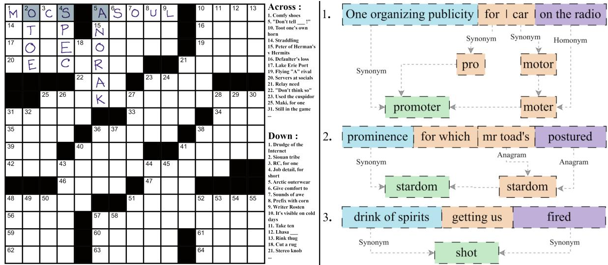
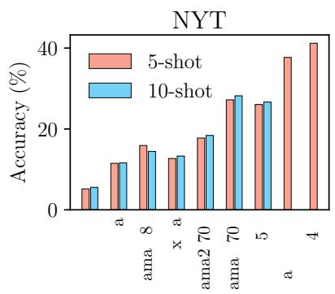
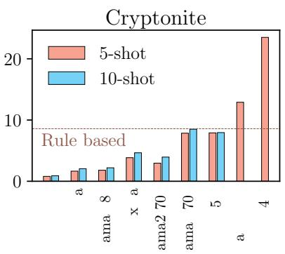
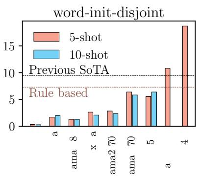
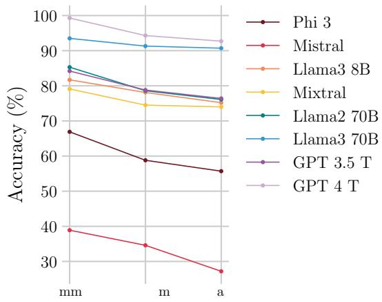

# Language Models are Crossword Solvers

Soumadeep Saha, Sutanoya Chakraborty, Saptarshi Saha, Utpal Garain

Indian Statistical Institute, Kolkata Correspondence: soumadeep.saha97@gmail.com

## Abstract

Crosswords are a form of word puzzle that require a solver to demonstrate a high degree of proficiency in natural language understanding, wordplay, reasoning, and world knowledge, along with adherence to character and length constraints. In this paper we tackle the challenge of solving crosswords with large language models (LLMs). We demonstrate that the current generation of language models shows significant competence at deciphering cryptic crossword clues and outperforms previously reported state-of-the-art (SoTA) results by a factor of 2-3 in relevant benchmarks. We also develop a search algorithm that builds off this performance to tackle the problem of solving full crossword grids with out-of-thebox LLMs for the very first time, achieving an accuracy of 93% on New York Times crossword puzzles. Additionally, we demonstrate that LLMs generalize well and are capable of supporting answers with sound rationale.

## 1 Introduction

<sup>1</sup>Crossword puzzles are a type of word game that typically take the form of a square grid of white and black boxes. The objective of the puzzle is to fill the white boxes with letters from words or phrases based on the provided clues (see Figure 1). Although crosswords come in a variety of styles, the two most popular ones are the American style, or straight crosswords, and cryptic crosswords.

Modern LLMs demonstrate astounding skills in reasoning, coding, wordplay, question answering (QA), and a multitude of other tasks (Wei et al., 2022a; Minaee et al., 2024). Despite the plethora of applications for LLMs seen today, their ability to generate language in a constrained setting remains relatively uncharted, and the ability to direct the generation process in order to meet certain criteria remains a challenge (Popescu-Belis et al., 2022). Consider the task of poem generation as an example, where, in addition to thematic aptness, constraints on rhyme or meter must be adhered to. Further, for certain kinds of poems like haikus, sonnets, or even song lyrics, restrictions on length, syllable counts, or patterns of stressed/unstressed syllables apply. Constraints also arise when dealing with formal languages (Koo et al., 2024), which is increasingly relevant in the LLM zeitgeist given their use in coding or interacting with databases, interpreters, APIs, etc. With a growing body of literature studying LLMs as agents (Madge and Poesio, 2024; Wang et al., 2024), language generation must follow environmental or physical constraints. For wider proliferation of LLM applications, they must demonstrate the ability to adhere to such domain-specific constraints (e.g., constraints imposed by knowledge graphs, tabular data, action spaces, etc.).

Solving crosswords requires proficiency in understanding contextual clues, semantics, wordplay, character manipulation, arithmetic, and reasoning (see Figure 1 (right)), along with satisfying constraints such as length limitations and character overlaps (see Figure 1). Given the multi-faceted nature of this task, it can serve as a testbed for studying constrained language generation. Since solving crosswords requires proficiency in several desirable areas, and identifying shortcomings can readily benefit other linguistic applications, in this paper we attempt to analyze LLMs’ ability to solve crossword puzzles, with the primary goal of understanding strengths and weaknesses demonstrated by SoTA LLMs. Our contributions in this study are as follows:

We perform extensive analysis to understand how well LLMs can answer crossword clues based on the provided contextual information and constraints. We show that current-generation SoTA LLMs demonstrate massively improved performance when compared to previous SoTA baselines, outperforming some previous benchmarks by a factor of 2 or 3, without any fine-tuning.

  
Figure 1: Example of a crossword puzzle (left) and cryptic clues (right). (left) The grid must be filled up with answers from the semantic clues provided. The gray highlighted squares produce additional constraints, e.g., first character of the answer to clue 1 (across) and clue 4 (down) must be the same. Example by Fred Piscop. (right) In cryptic crosswords, the clues involve some form of wordplay and synonyms and often involve world knowledge. Examples are taken from the cryptonite dataset (see Appendix E for more).

Our analysis shows that the ability of LLMs to adhere to length constraints, which is a critical component of solving crossword puzzles, is somewhat limited. We present results demonstrating that an LLM’s ability to count the number of constituent characters in a word degrades with the prevalence of the word. This suggests that their ability to perform this task does not generalize well. Additionally, we show that this is a significant limiting factor for crossword solving, since even when the generated answers are semantically similar, the length constraint is frequently not obeyed.

We devise a simple algorithm to tackle the full problem of solving crosswords with an LLMguided search and incorporating grid information, solving straight crossword puzzles with an accuracy of 93.1%. This algorithm exploits the constraints imposed by previously generated answers to improve future answers and achieves results that are not far behind those of specialized automated crossword-solving systems. This algorithm also improves the clue-deciphering capability of LLMs, more than doubling the baseline performance.

We perform human evaluation and further experiments with post knowledge-cutoff datasets to assess the soundness of logical reasoning, potential pitfalls, and generalizability. We find that SoTA LLMs appear to generalize well and provide sound logical reasoning with 74% of correct answers.

We believe our work has been a major step towards demonstrating the power of LLMs with regard to crossword solving, and with future advances in certain key areas, LLMs’ performance in this task will be comparable to, if not better than, human experts and specialized systems. Our algorithmic approach of combining an LLM with a search strategy might be extended to linguistic problems with domain-specific constraints.

## 2 Background

Traditional approaches to solving straight crossword puzzles involve two key components: a candidate answer proposal system and a grid-filling algorithm (Angelini et al., 2005; Ginsberg, 2011). Answer proposal systems typically use similarity search on large clue-answer databases, finetuned language models, or a combination of both (Shazeer et al., 1999; Wallace et al., 2022). Gridfilling relies on variants of constraint satisfaction problem (CSP) algorithms. For instance, the system Proverb (Littman et al., 2002) achieves a 98.1% letter accuracy on New York Times (NYT) crosswords. Wallace et al. (2022) fine-tuned BERT and ByT5 on 6.4 million clue-answer pairs, and using a belief propagation algorithm, achieved a 99.7% letter accuracy. Kulshreshtha et al. (2022) established benchmarks with foundational language models and highlighted this task as “... a new high barfor AI systems. ”. Note that this work does not attempt to create an improved automated crosswordsolving system but seeks to analyze foundational LLMs’ ability at this complex language task.

Cryptic crosswords are more formidable and involve extensive wordplay such as anagrams, splicing, homophones, and puns. Traditional algorithms with large clue datasets and a context-free grammar parser (Deits, 2015) have shown poor performance, achieving only 7% accuracy (Sadallah et al., 2024). Recent studies have explored using large language models (LLMs) to solve cryptic crossword clues. Efrat et al. (2021) created a large dataset of cryptic crossword clues from UK dailies, The Times and The Telegraph, and fine-tuned a T5-Large (Raffel et al., 2020) model to establish baseline performances. They used a training split where answers in the training and test sets were mutually exclusive to prevent memorization. Rozner et al. (2021) curated a dataset from The Guardian and fine-tuned a T5-Large model using curriculum learning, showing performance improvements. They critiqued Efrat et al. (2021)’s approach, arguing that a disjoint train-test split is insufficient for teaching models to solve cryptic crosswords, as models exhibit “... robustness to plural and other inflections.” Instead, they proposed grouping similar-root words together in a split, noting that this more stringent criterion led to reduced performance.

The most recent work by Sadallah et al. (2024) presents results with recent LLMs like Mistral-7B (Jiang et al., 2023), LLaMA2-7B (Touvron et al., 2023), and ChatGPT (OpenAI, 2021) in few-shot settings and also by fine-tuning the Mistral model. They report that ChatGPT surpasses other models with an accuracy of 9.5%, which demonstrates a significant performance gap with respect to human experts, who solve 99% of cryptic crossword clues (Sadallah et al., 2024). They point out key limitations in their work, like the limited set of LLMs used and the potential for data contamination.

These recent works on cryptic crossword solving with LLMs highlight a significant performance gap between LLMs and human experts. However, these recent works approach the problem as a question answering (QA) task and ignore constraints imposed by the grid. This needs to be investigated further since it is yet to be seen whether a suitable approach that integrates constraint information into LLMs can yield significant performance benefits.

As for straight crosswords, Kulshreshtha et al. (2022) attempted to solve NYT crossword puzzles with language models and a Satisfiability Modulo Theory (SMT) solver with limited success, and resorted to culling the crossword grid based on candidate generations and ground truth answers. We present an algorithm employing LLM-guided search, which is significantly more successful at this task. With advancements in LLM capabilities and methods like ours, we believe LLMs could soon outperform humans in solving cryptic crosswords too.

## 3 Analyzing Crossword Clue Solving

The first step in solving a crossword puzzle is deciphering its clues, so following in the scheme of Rozner et al. (2021), Sadallah et al. (2024), Kulshreshtha et al. (2022), and Efrat et al. (2021), in this section, we first explore this as a QA task. We analyze the performance of several LLMs at different scales with variations of this task.

## 3.1 Datasets

Most of our analysis is performed on three crossword puzzle datasets. The first one covering straight or American-style crosswords was curated by us from the very popular and long-running puzzle section of the NYT. The other two, namely, Cryptonite by Efrat et al. (2021) and word-initdisjoint (abbreviated as Init) by Rozner et al. (2021), cover cryptic crossword puzzles. Note, the methodological differences between Cryptonite and Init, as discussed in Section 2, are not pertinent for us since we do not perform any training. A bulk of the results are reported on the NYT dataset we curated for straight crosswords and Init for cryptic crosswords since it was found to be more challenging than Cryptonite for LLMs. We drew 2000 randomly chosen samples to report results, and in-context examples were also randomly selected from a large pool of samples disjoint from the testing set. Further details can be found in Appendix B.

## 3.2 Answering Crossword Clues

In this experiment we only provided the LM with the query clue and length information (alongside instructions and in-context examples), with the expectation that it will produce the corresponding answer. We report results with Phi 3 3.8B Instruct (Abdin et al., 2024), Mistral 7B Instruct (Jiang et al., 2023), Llama 2 70B (Touvron et al., 2023), Llama 3 8B





  
Figure 2: Analyzing LLMs’ ability to generate answers from crossword clues. We test LLMs at different scales on the NYT, Cryptonite, and Init dataset with 5-shot, 10-shot prompts. All results are with T=0.5, further details about experimental protocols can be found in Appendix C.

Instruct, Llama 3 70B (Meta, 2024), Mixtral 8x7B (Jiang et al., 2024), Claude 3 Sonnet (Anthropic, 2024), GPT 3.5 Turbo, and GPT 4 Turbo (OpenAI, 2023) to cover a wide range of parameter scales and a mix of open-weights and proprietary models. We investigate the performance of these models with few-shot prompts (5-shot, 10-shot)<sup>2</sup> on samples from the NYT dataset (ours), Cryptonite, and the Init split (see Figure 2).

We find that the performance difference between 5-shot and 10-shot<sup>3</sup> prompted answers is not significant (see Figure 2). We also note that there is an appreciable difference (up to 5%) in the performance of models across the board between Cryptonite and Init, with LLMs showing diminished performance on the Init dataset.

The models demonstrate improved performance with scale across datasets and, in particular, show remarkable improvement on the NYT dataset with Llama 3 70B, GPT 3.5 Turbo, Claude 3 Sonnet, and GPT-4-Turbo achieving 27.2%, 26.05%, 37.7% and 41.2% accuracy (exact match), respectively. The performance of LLMs on cryptic crosswords is worse compared to straight crosswords; however, Claude 3 Sonnet and GPT-4-Turbo outperform previous SoTA results on both the cryptic crossword datasets, achieving an accuracy of 12.9%, 23.5% on Cryptonite and 10.8%, 18.7% on Init respectively. The performance of GPT-4-Turbo is <sup>rather</sup> <sup>extraordinary,</sup> <sup>with</sup> <sup>a</sup> <sup>1.97</sup>× <sup>improvement</sup> over previous SoTA (9.5% reported by Sadallah et al. (2024), see Figure 2).

## 3.3 Exploiting Partially Filled Grids

In the course of solving a crossword puzzle, we encounter intermediate states where some of the clues have been deciphered. Crossword solvers exploit these clues in order to inform their decisions about future answers. For example, in Figure 1 (left), when we want to solve for the clue in position 14 (across), we can use the characters from position 2 (down) and 4 (down) to narrow down the set of possible answers to only those that fit the template $\underline { { \mathbf { \Pi } } } _ { - } ^ { * } \bar { \mathsf { T } } _ { - } \mathsf { P } ^ { * }$ . In this section, we study LLMs’ performance at exploiting these constraints to arrive at better answers (see Table 1).

For this experiment we chose the best performing open-weights and proprietary models, i.e., LLaMA 3 70B and GPT-4-Turbo, respectively. We also report results on some smaller models to see if the trends hold. We report results on the NYT dataset and Init dataset with 5-shot prompts. For each query, k% of the characters (letters) of the answer is provided alongside the clue and expected length of the answer, and the LLMs are expected to “unmask” the remaining characters using the provided constraint information and the crossword clue<sup>4</sup>.

We observe (Table 1) that, in all but one case, LLMs show improved performance with an increasing percentage of constraint information for both datasets. Additionally, to compare the performance of GPT-4-Turbo to previously reported SoTA results by Sadallah et al. (2024), we perform the experiment with the same settings and dataset split as them to find that GPT-4-Turbo with 5- shot prompts (76.3% accuracy) outperforms the fine-tuned Mistral 7B model (27% accuracy) by a

<table><tr><td>Hint (%)</td><td colspan="2">0%</td><td colspan="2">25%</td><td colspan="2">50%</td><td>70%</td></tr><tr><td>Model</td><td>NYT</td><td>init</td><td>NYT</td><td>init</td><td>NYT</td><td>init</td><td>init</td></tr><tr><td>Mistral 7B (5-shot)</td><td>10.95%</td><td>1.70%</td><td>9.70%</td><td>2.80%</td><td>11.95%</td><td>4.80%</td><td></td></tr><tr><td>LlaMa 3 8B (5-shot)</td><td>15.8%</td><td>1.30%</td><td>19.7%</td><td>2.85%</td><td>24.65%</td><td>6.25%</td><td></td></tr><tr><td>LlaMa 3 70B (5-shot)</td><td>27.20%</td><td>6.40%</td><td>31.80%</td><td>11.45%</td><td>45.30%</td><td>20.35%</td><td></td></tr><tr><td>GPT 4 Turbo (5-shot)</td><td>41.2%</td><td>18.70%</td><td>59.95%</td><td>33.70%</td><td>75.75%</td><td>52.85%</td><td>76.30%</td></tr></table>

Table 1: Testing if LLMs can improve by using character constraints from partially filled crosswords. Sadallah et al. (2024) reported an accuracy of 27.0% (70% hinted clues) by fine-tuning a Mistral 7B model on the Init dataset, which GPT-4-Turbo (76.30% accuracy) outperforms by afactor of 2.8 withoutfine-tuning.

factor of 2.8 .

The fact that LLMs can successfully exploit constraints to answer crossword clues better suggests that they are well-suited to the task of solving full crosswords. The significant jump in performance observed in modern SoTA LLMs at this task and the task in Section 3.2 is extremely serendipitous, and we investigate this in further detail in Section 5.3.

## 3.4 Sub-token Counting

Despite significant performance gains, SoTA LLMs struggle with adherence to length constraints, suggesting an inability to count characters within words or phrases (sub-token counting). We observed that even the best performing model, GPT-4-Turbo, produces answers of incorrect length on 26.2% of the Init dataset and 16.9% of NYT dataset. This may be explained by the tokenization methods used in LLMs, such as Byte-Pair Encoding (Sennrich et al., 2016). During the word embedding stage in transformers (Vaswani et al., 2017), tokens are converted into embedding vectors, causing the loss of information about individual characters. This character-level information must be relearned during training. While we are unsure exactly how LLMs regain this information, we suspect they learn from training data that include explicit length details.

There are websites<sup>5</sup> that contain large lists of words with their corresponding lengths. Often replies in message boards also include a count of the number of characters in the reply. Artifacts like these, which contain enough information to infer the length of tokens, go on to become part of the datasets that LLMs are trained on. We hypothesize that LLMs learn to count sub-tokens based on this information provided during training.

To investigate this further, we devised the subtoken counting task, wherein the LLM is provided a sequence of (lowercase) characters without whitespaces and asked to predict the number of characters making up the sequence. To test our hypothesis, we consider three sets of 1000 (English) words– Common, Medium and Rare–based on word unigram frequencies curated by Segaran and Hammerbacher (2009) from Google’s Trillion Words corpus. The Common, Medium and Rare words have ranks in the range of 1-5,000, 47,500-52,500, and 95,000-100,000, respectively.

  
Figure 3: LLMs ability to count the number of characters in a word declines with the frequency of the word.

If language models have a widely generalizable ability to perform sub-token counting, we should see no difference in counting performance across words with different prevalence. However, we observe that (see Figure 3) the accuracy of LLMs at the sub-token counting task declines with the frequency of the token for all LLMs tested. We further analyzed if there was a difference in subtoken counting performance between words that are part of the model vocabulary and randomly generated gibberish following the same distribution of lengths to account for potential shifts of distribution of length between frequent and rare words. To do this, we first created a set of words by taking an intersection of all words that are part of the vocabulary of every open-source model in consideration and the list of the top 100,000 words. This is to ensure that the sequences are extremely likely<sup>6</sup> to be vocabulary tokens for every model in consideration and are not special tokens like <bos>. Then we created a set of gibberish words by replacing each character of the vocab set words with a randomly chosen character from the set {a-z}, thus guaranteeing that they have the same length distributions.

<table><tr><td rowspan=1 colspan=1>Model</td><td rowspan=1 colspan=1>Vocab.Acc. (%)</td><td rowspan=1 colspan=1>GibberishAcc. (%)</td></tr><tr><td rowspan=4 colspan=1>Phi 3 3.8B InstructMistral 7B InstructLlama 3 8B InstructMixtral 8x7B</td><td rowspan=1 colspan=1>79.4</td><td rowspan=1 colspan=1>61.2</td></tr><tr><td rowspan=1 colspan=1>47.9</td><td rowspan=1 colspan=1>28.2</td></tr><tr><td rowspan=1 colspan=1>92.6</td><td rowspan=1 colspan=1>69.7</td></tr><tr><td rowspan=1 colspan=1>92.6</td><td rowspan=1 colspan=1>80.1</td></tr><tr><td rowspan=1 colspan=1>Llama 2 70B</td><td rowspan=1 colspan=1>92.8</td><td rowspan=1 colspan=1>80.0</td></tr><tr><td rowspan=2 colspan=1>Llama 3 70BGPT 3.5 Turbo</td><td rowspan=1 colspan=1>99.6</td><td rowspan=1 colspan=1>87.5</td></tr><tr><td rowspan=1 colspan=1>86.0</td><td rowspan=1 colspan=1>62.1</td></tr><tr><td rowspan=1 colspan=1>GPT 4 Turbo</td><td rowspan=1 colspan=1>99.8</td><td rowspan=1 colspan=1>98.8</td></tr></table>

Table 2: LLM sub-token counting performance for vocabulary words and gibberish.

We find (see Table 2) that in addition to counting accuracy being affected by frequency, there is often a large disparity between the accuracy of vocabulary vs. gibberish words. Although this does not conclusively show that LLMs rely on memorized training instances to perform sub-token counting, it does provide strong evidence suggesting that LLMs learn to count based on length information containing artifacts in training data. Future works exploring this idea further would be compelling.

## 4 SweepClip - Our proposed algorithm to solve crosswords with LLMs

In this section, we address the problem of filling crossword grids with LLM assistance. Note that this task not only involves generating correct answers from provided clues but also hinges on exploiting constraints from already generated words and backtracking to eliminate past generations that do not fit well when new evidence becomes available. Since LLMs demonstrate this ability, when paired with the right search algorithm, it should be possible to solve crosswords with the aid of LLMs.

Our proposed algorithm (detailed in Appendix A) first generates a set of candidate answers for all clues provided with the crossword (sweep) and uses a graph-based criterion to eliminate answers that do not fit (clip). Then we use the constraints generated from the previous step answers to generate more candidate answers<sup>7</sup> and prune the bad-fitting candidates. We iteratively apply this strategy until either (i) the entire crossword is filled, (ii) we exceed a preset number of iterations, or (iii) we run out of LLM computational budget.

For pruning, we use the largest connected component from the answers generated so far to ensure that the generated answers are somewhat coherent amongst themselves. This is over-restrictive, as it is possible that isolated answers are correct; however, we find that this strict pruning strategy works better to eliminate bad answers early rather than using the constraints imposed by potentially bad answers to generate further bad answers (see Appendix A).

## 5 Results

In this section, we present results from our algorithm at the crossword-solving task and present further results investigating the performance demonstrated by current-generation SoTA LLMs.

## 5.1 SweepClip–Solving NYT Crossword Puzzles

For this task, we employed our algorithm, Sweep-Clip, on a set of 100 randomly sampled Monday NYT crossword puzzles. We used two LLMs for this: GPT-4-Turbo and Llama 3 70B (see Appendix A).

<table><tr><td rowspan=1 colspan=1>Error Tolerance</td><td rowspan=1 colspan=2>% of Crosswords</td></tr><tr><td rowspan=1 colspan=1></td><td rowspan=1 colspan=1>LLaMa 3</td><td rowspan=1 colspan=1>GPT-4 T</td></tr><tr><td rowspan=1 colspan=1>100% solved</td><td rowspan=1 colspan=1>0</td><td rowspan=1 colspan=1>48</td></tr><tr><td rowspan=1 colspan=1>≤ 1 character error</td><td rowspan=1 colspan=1>1</td><td rowspan=1 colspan=1>55</td></tr><tr><td rowspan=1 colspan=1>≤ 5 character error</td><td rowspan=1 colspan=1>10</td><td rowspan=1 colspan=1>71</td></tr><tr><td rowspan=1 colspan=1>≥ 90% Accuracy</td><td rowspan=1 colspan=1>30</td><td rowspan=1 colspan=1>80</td></tr><tr><td rowspan=1 colspan=1>≥ 50% Accuracy</td><td rowspan=1 colspan=1>82</td><td rowspan=1 colspan=1>98</td></tr></table>

Table 3: Results from solving NYT crosswords with our algorithm SweepClip.

We find (see Table 3) that our algorithm with GPT-4-Turbo solves 48% of crosswords without any errors and 55% of crosswords with at most 1 character wrong. The average character level accuracy in crossword solving is 93.1% ( 14.1%). Our algorithm improves the clue-wise answer accuracy<sup>8</sup> (exact match) to 89.6% ( 16.9%) from the base accuracy (without the algorithm), which is 43.5% ( 23.5%), an improvement of 2.1 . Note, the previously reported SoTA accuracy on this task with a foundational LM (without fine-tuning) was 26% with retrieval-augmented generation and an SMT solver coupled with an oracle that eliminates parts of the crossword grid that do not have suitable generated answers (Kulshreshtha et al., 2022).

The performance for the smaller LLaMA 3 70B is worse; however, our algorithm still manages to improve final clue answering accuracy to 59.4% ( 24.1%) from a base accuracy of only 22.3% ( 14.4%). Note that this result, alongside those presented in Section 3, serve to ablate our crosswordsolving approach.

Thus, with the application of our algorithm, we have successfully exploited the constraint information to boost the performance of LLMs beyond what would have been possible with straightforward QA like clue deciphering. To the best of our knowledge, this is the first algorithm that demonstrates successfully solving crosswords with the aid of an out-of-the-box LLM.

## 5.2 Solving Cryptic Crossword Clues

<table><tr><td rowspan=1 colspan=1>Model</td><td rowspan=1 colspan=1>Method</td><td rowspan=1 colspan=1>Acc.(%)</td></tr><tr><td rowspan=1 colspan=1>Rule-based(Deits, 2015)</td><td rowspan=1 colspan=1>CFG+WordNet</td><td rowspan=1 colspan=1>7.3</td></tr><tr><td rowspan=1 colspan=1>T5 (Efrat et al., 2021)</td><td rowspan=1 colspan=1>SFT</td><td rowspan=1 colspan=1>1.1</td></tr><tr><td rowspan=1 colspan=1>T5(Rozner et al., 2021)</td><td rowspan=1 colspan=1>CurriculumLearning</td><td rowspan=1 colspan=1>6.5</td></tr><tr><td rowspan=1 colspan=1>Mistral 7BMistral 7BChat GPT(Sadallah et al., 2024)</td><td rowspan=1 colspan=1>SFT10 shot3 shot</td><td rowspan=1 colspan=1>1.24.69.5</td></tr><tr><td rowspan=1 colspan=1>GPT 4 Turbo (ours)GPT 4 Turbo (ours)</td><td rowspan=1 colspan=1>5 shotCoT(1)@3SC</td><td rowspan=1 colspan=1>18.7020.85</td></tr></table>

Table 4: Comparison of our results with previously reported SoTA results. Results are on the Init dataset with crossword clue deciphering treated as QA.

We observed (see Table 4) that SoTA LLMs have significantly improved cryptic crossword clue deciphering abilities. We also note that chain-ofthought (Wei et al., 2022b) prompting (1-shot) with self-consistency (Wang et al., 2023) (3 samples) leads to further performance gains. Our best result on the word-init-disjoint split is 20.85%, which improves over the previous SoTA (9.5%) by afactor of 2.2 without any fine-tuning.

## 5.3 Data Contamination and Generalizability

To rule out data contamination as the reason behind the significant performance gains by SoTA LLMs, we curated additional cryptic crossword clue datasets comprising entirely of puzzles published after May 20, 2024, which is after the knowledge cutoff date of all LLMs examined. These datasets are sourced from The Guardian and Lovatts Puzzles. The answers in these post-cutoff sets were checked against the combination of all other cryptic crossword datasets employed in the study (665,497 answers in total) to check for potential duplicates. None was found for the post-cutoff Guardian set, and 2 were found for the post-cutoff Lovatts set, which were removed. Note: the Init dataset is also sourced from The Guardian; thus, the results reported in Table 5 should be consistent<sup>9</sup>.

<table><tr><td rowspan=1 colspan=1>Model</td><td rowspan=1 colspan=1>Lovatts</td><td rowspan=1 colspan=1>Guardian</td><td rowspan=1 colspan=1>init</td></tr><tr><td rowspan=1 colspan=1>Llama 3 70BClaude 3 SonnetGPT 4 Turbo</td><td rowspan=1 colspan=1>26.03%46.28%61.57%</td><td rowspan=1 colspan=1>5.5 %12.5%18.5%</td><td rowspan=1 colspan=1>6.4 %10.8%18.7%</td></tr></table>

Table 5: Performance (accuracy) of LLMs on curated datasets that appeared after the knowledge cut-off. Note, Init by Rozner et al. (2021), also sourced their data from The Guardian; thus, these results provide a fair head-to-head comparison of performance.

We see no appreciable difference in performance on the post-cutoff dataset (see Table 5), leading us to suggest that these LLMs can generalize beyond potential contamination in their training set.

## 5.4 Human Evaluation and Further Analysis

To ascertain if the models can reason about cryptic crossword clues to arrive at correct responses, we elect to perform human evaluation<sup>10</sup> of model responses. We employ a 3-shot chain-of-thought prompt to elicit a reasoned response to crossword clues from GPT-4-Turbo, which are then analyzed by our team for soundness vis-à-vis factual and logical errors. We choose 100 samples from the post-cutoff Lovatts set and rely on the consensus of all evaluators to ascertain if a response contains factual or logical errors (e.g., wrong counting, wrong anagram, drawing a conclusion that does not follow from the premise, etc.). The author-annotated reasoning responses had low inter-observer variability (Fleis’ κ = 0.94, pre-consensus) and have been made publicly available.

<table><tr><td rowspan=1 colspan=1>GPT 4 Turbo</td><td rowspan=1 colspan=1>Sound(61)</td><td rowspan=1 colspan=1>¬Sound(39)</td></tr><tr><td rowspan=1 colspan=1>Correct (65)</td><td rowspan=1 colspan=1>48%</td><td rowspan=1 colspan=1>17%</td></tr><tr><td rowspan=1 colspan=1>Wrong (35)</td><td rowspan=1 colspan=1>13%</td><td rowspan=1 colspan=1>22%</td></tr></table>

Table 6: Results from human evaluation of reasoning. Chain-of-thought elicited reasoning responses from GPT-4-Turbo are evaluated for soundness. An answer is called correct if the model prediction exactly matches the ground truth. The answer is called sound if it contains no logical or factual errors. Results are on the post-cutoff Lovatts’ set.

The results (see Table 6) show that 74% of the time GPT-4-Turbo provided a correct answer, it also gave sound reasoning in support of the answer. This leads us to conjecture that they possibly have a significant ability to reason and generalize.

Furthermore, to analyze if LLMs demonstrate any common failure modes, we manually annotated the human evaluation dataset based on the principal skill required to solve a particular puzzle clue (see Table 7). ANG indicates that the answer is an anagram of some words of the clue, HOM indicates that the answer is a homophone of some words of the clue, CNT indicates that the answer is disguised in a contiguous section of the clue, and SCJ indicates that the answer is found by combining several words that are synonyms of various parts of the clue. The class OTH lumps together a variety of other kinds of skills (e.g., spoonerisms, acronyms, world knowledge, and various other kinds of character manipulations). Examples of each are provided in Appendix E.

Owing to the limited number of human annotations, the results (Table 7 left) are not statistically significant, but the trends suggest that GPT-4-Turbo may exhibit strong performance on anagrams (74% accuracy vs. 65% baseline<sup>11</sup>) and homophonebased clues (100% accuracy). We also attempted to perform the same analysis on the Cryptonite and Init datasets (4000 clue-answer pairs) and found similar trends for anagram performance by GPT-4- Turbo (25% accuracy vs. 21.1% baseline). However, this does not hold for Llama 3 70B (2.6% accuracy vs. 7.16% baseline) and Claude 3 Sonnet (7.9% accuracy vs. 11.85% baseline), suggesting that Llama 3 70B and Claude 3 Sonnet have a diminished ability to deal with anagrams. Note that unlike (ANG, CNT), (HOM, SCJ, OTH) cannot be automatically detected reliably, which limits broader analysis for these kinds of clues.

To quantify the effect of sub-token counting performance on clue-solving performance, we devise a further experiment. We consider all such clues for which the model correctly deduced the semantics of the clue but failed to adhere to the length constraints (e.g., LECTURER instead of PROFESSOR or NANNA instead of GRANNY). We consider wrong LLM predictions with a semantic similarity of 0.5 or more <sup>12</sup> and report the percentage of answers of incorrect length. GPT-4-Turbo and Llama 3 70B produce predictions with length errors 46.4% and 59.9% of the time respectively. This suggests that the lack of adherence to length constraints is a major impediment in clue solving for LLMs.

## 6 Conclusions

Solving crosswords requires proficiency in a multitude of desirable skills, and cryptic crosswords were previously thought to be firmly in the domain of human experts. Our findings challenge this notion. We have demonstrated that the current generation of SoTA LLMs shows significantly improved aptitude at solving straight and cryptic crossword puzzle clues and can exploit constraints provided by partially solved crosswords to boost this performance further. We also found that this emergent ability generalizes well to the post knowledge cutoff regime and is accompanied with the capacity to produce reasoned explanations.

We have also developed an algorithm that, with the aid of LLMs, further boosts this performance and achieves 93% accuracy on Monday New York Times crosswords. With the aid of this algorithm, it is possible to achieve significant performance gains even if the baseline LLM accuracy is low, thus indicating that, when paired with the right search strategy, LLMs can successfully solve crosswords. Such an LLM-guided search approach may be readily adapted to other scenarios requiring certain kinds of constraint satisfaction.

<table><tr><td>GPT-4-Turbo</td><td>ANG (27)</td><td>SCJ (26)</td><td>CNT (18)</td><td>HOM (8)</td><td>OTH (21)</td></tr><tr><td>EM</td><td>74%</td><td>50%</td><td>56 %</td><td>100 %</td><td>67 %</td></tr></table>

<table><tr><td>Model</td><td>ANG (8.5%)</td><td>CNT (2.5%)</td></tr><tr><td>Llama 3 Claude 3 GPT 4 T</td><td>2.6% 7.9% 25.0%</td><td>12.2% 15.3% 33.7%</td></tr></table>

Table 7: Do LLMs have common “failure modes”? ANG refers to anagrams, SCJ refers to synonym conjugation, CNT refers to containment, HOM refers to homophones, and OTH refers to others. (Left) shows results from GPT-4-Turbo on the post-cutoff Lovatts set, and (right) shows results on the combined Init and Cryptonite datasets. The numbers in parentheses refer to prevalence of the clue type.

Incorporating length constraints effectively still remains a challenge. We showed that SoTA LLMs struggle with sub-token counting and also that they often provide incorrect predictions despite being semantically close, owing to length constraint violations. This weakness also manifests in other tasks like anagrams, character manipulations, etc., which are heavily reliant on arithmetic abilities. Future research attempting to address this shortcoming would be compelling.

## Limitations

Limitation 1 (Algorithm) - We would like to highlight that our algorithm is sub-optimal, as it discards potential correct answers and does not fully explore the consequences of each possible generated answer. Ideally, we would generate one candidate answer, followed by all its neighbors, and whenever there is a conflict, branch out and explore all options to see which is a better fit. We elect not to do this, because it involves a potentially exponential number of LLM calls. Our algorithm does not provide guarantees of convergence or correctness beyond elimination of conflicting answers. Note that this problem is NP-Hard and it is difficult to find approximate solutions for it (Kulshreshtha et al., 2022). This algorithm was designed to minimize computational cost incurred in LLM calls; however, future studies with much larger computational budget for LLM calls will definitely have greater success employing a more thorough search strategy.

Limitation 2 (Cryptic Crossword Solving) - Compared to straight crosswords, the baseline accuracy in clue answering by LLMs for cryptic crosswords is much lower (e.g., 18% for GPT-4-Turbo on cryptics vs 41% on straight). Thus, solving cryptic crosswords with current SoTA LLMs would require a much more extensive search strategy. Our current approach with a budget limit of 0.5 USD per crossword is unsuccessful (12% of cryptic crosswords solved with 50% letter accuracy) at solving cryptics, and our financial constraints do not permit a more thorough investigation with improved algorithms at this time.

Limitation 3 (Reporting Crossword Solving Results) - We only reported results on solving Monday New York Times crossword puzzles and did not report Tuesday-Thursday which typically have a higher level of difficulty. There are primarily two reasons for this. (i) As we have seen in the paper, even if the base LLM has relatively low accuracy, when paired with a search/prune algorithm, the accuracy can be improved considerably. There is a trade-off between base accuracy and the number of LLM calls, i.e., if the base accuracy is lower, the algorithm needs to make a lot more calls to the LLM increasing computational costs. We have observed that it is possible to solve harder NYT (straight) crosswords, but at an increased computational budget. This makes reporting statistics cost-prohibitive for us at this time.

Limitation 4 (Sub-token Counting) - We have demonstrated that LLMs show limitations at subtoken counting, and have hypothesised that they do not have widely generalizable skill at this task, rather relying on memorization. The evidence provided in this paper is compelling, but definitely not enough to conclusively prove this hypothesis. Further studies are required that can intervene at the pre-training stage of LLMs to conclusively demonstrate whether this hypothesis is true. We do not possess the computational power to undertake such a study at this stage.

Limitation 5 (Fine-tuning) - We do not report results with fine-tuned models. It is possible that further improvements could be seen with fine-tuning, however, we are interested in studying the emergent properties of large language models in this context instead of building special purpose models that can solve crosswords.

## Ethics Statement

In keeping with ACL ethical guidelines we make all scientific artifacts generated for this study freely available and open source under the MIT licence, this includes all software we created, every prompt that was used, all raw model outputs, and data we generated. The test sets used for all experiments are also made availabe, with the exception of the full grids of the New York Times crossword puzzles. We do not re-distribute the (publicly available) New York Times crossword dataset since it is the intellectual property of The New York Times. The use of their data falls within the terms of the Fair Use doctrine set within 17 U.S.C. §107. To aid in reproducibility we provide a list of dates to uniquely identify the crossword puzzles used in the study, and provide detailed instructions on how to acquire them through the New York Times. We do not use any data to train any model in this study.

We foresee no serious ethical implications on society at large from this study.

## Acknowledgments

The authors would like to thank Akshay Chaturvedi and Joy Mahapatra for their helpful feedback on this paper. This research was funded in part by the Indo-French Centre for the Promotion of Advanced Research (IFCPAR/CEFIPRA) through project number CSRP 6702-2.

## References

Marah Abdin, Sam Ade Jacobs, Ammar Ahmad Awan, Jyoti Aneja, Ahmed Awadallah, Hany Awadalla, Nguyen Bach, Amit Bahree, Arash Bakhtiari, Jianmin Bao, Harkirat Behl, Alon Benhaim, Misha Bilenko, Johan Bjorck, Sébastien Bubeck, Qin Cai, Martin Cai, Caio César Teodoro Mendes, Weizhu Chen, Vishrav Chaudhary, Dong Chen, Dongdong Chen, Yen-Chun Chen, Yi-Ling Chen, Parul Chopra, Xiyang Dai, Allie Del Giorno, Gustavo de Rosa, Matthew Dixon, Ronen Eldan, Victor Fragoso, Dan Iter, Mei Gao, Min Gao, Jianfeng Gao, Amit Garg, Abhishek Goswami, Suriya Gunasekar, Emman Haider, Junheng Hao, Russell J. Hewett, Jamie Huynh, Mojan Javaheripi, Xin Jin, Piero Kauffmann, Nikos Karampatziakis, Dongwoo Kim, Mahoud Khademi, Lev Kurilenko, James R. Lee, Yin Tat Lee, Yuanzhi Li, Yunsheng Li, Chen Liang, Lars Liden, Ce Liu, Mengchen Liu, Weishung Liu, Eric Lin, Zeqi Lin, Chong Luo, Piyush Madan, Matt Mazzola, Arindam Mitra, Hardik Modi, Anh Nguyen, Brandon

Norick, Barun Patra, Daniel Perez-Becker, Thomas Portet, Reid Pryzant, Heyang Qin, Marko Radmilac, Corby Rosset, Sambudha Roy, Olatunji Ruwase, Olli Saarikivi, Amin Saied, Adil Salim, Michael Santacroce, Shital Shah, Ning Shang, Hiteshi Sharma, Swadheen Shukla, Xia Song, Masahiro Tanaka, Andrea Tupini, Xin Wang, Lijuan Wang, Chunyu Wang, Yu Wang, Rachel Ward, Guanhua Wang, Philipp Witte, Haiping Wu, Michael Wyatt, Bin Xiao, Can Xu, Jiahang Xu, Weijian Xu, Sonali Yadav, Fan Yang, Jianwei Yang, Ziyi Yang, Yifan Yang, Donghan Yu, Lu Yuan, Chengruidong Zhang, Cyril Zhang, Jianwen Zhang, Li Lyna Zhang, Yi Zhang, Yue Zhang, Yunan Zhang, and Xiren Zhou. 2024. Phi-3 technical report: A highly capable language model locally on your phone. Preprint, arXiv:2404.14219.

Giovanni Angelini, Marco Ernandes, and Marco Gori. 2005. Webcrow: A web-based crosswords solver. In Intelligent Technologiesfor Interactive Entertainment, pages 295–298, Berlin, Heidelberg. Springer Berlin Heidelberg.

Anthropic. 2024. The claude 3 model family: Opus, sonnet, haiku.

Robin Deits. 2015. rdeits/cryptics.

Avia Efrat, Uri Shaham, Dan Kilman, and Omer Levy. 2021. Cryptonite: A cryptic crossword benchmark for extreme ambiguity in language. In Proceedings ofthe 2021 Conference on Empirical Methods in Natural Language Processing, pages 4186–4192, Online and Punta Cana, Dominican Republic. Association for Computational Linguistics.

Matthew L Ginsberg. 2011. Dr. fill: Crosswords and an implemented solver for singly weighted csps. Journal ofArtificial Intelligence Research, 42:851–886.

Albert Q. Jiang, Alexandre Sablayrolles, Arthur Mensch, Chris Bamford, Devendra Singh Chaplot, Diego de las Casas, Florian Bressand, Gianna Lengyel, Guillaume Lample, Lucile Saulnier, Lélio Renard Lavaud, Marie-Anne Lachaux, Pierre Stock, Teven Le Scao, Thibaut Lavril, Thomas Wang, Timothée Lacroix, and William El Sayed. 2023. Mistral 7b. Preprint, arXiv:2310.06825.

Albert Q. Jiang, Alexandre Sablayrolles, Antoine Roux, Arthur Mensch, Blanche Savary, Chris Bamford, Devendra Singh Chaplot, Diego de las Casas, Emma Bou Hanna, Florian Bressand, Gianna Lengyel, Guillaume Bour, Guillaume Lample, Lélio Renard Lavaud, Lucile Saulnier, Marie-Anne Lachaux, Pierre Stock, Sandeep Subramanian, Sophia Yang, Szymon Antoniak, Teven Le Scao, Théophile Gervet, Thibaut Lavril, Thomas Wang, Timothée Lacroix, and William El Sayed. 2024. Mixtral of experts. Preprint, arXiv:2401.04088.

Terry Koo, Frederick Liu, and Luheng He. 2024. Automata-based constraints for language model decoding. In First Conference on Language Modeling.

Saurabh Kulshreshtha, Olga Kovaleva, Namrata Shivagunde, and Anna Rumshisky. 2022. Down and across: Introducing crossword-solving as a new NLP benchmark. In Proceedings ofthe 60th Annual Meeting ofthe Associationfor Computational Linguistics (Volume 1: Long Papers), pages 2648–2659, Dublin, Ireland. Association for Computational Linguistics.

Michael L. Littman, Greg A. Keim, and Noam Shazeer. 2002. A probabilistic approach to solving crossword puzzles. Artificial Intelligence, 134(1):23–55.

Chris Madge and Massimo Poesio. 2024. Large language models as minecraft agents. ArXiv preprint, abs/2402.08392.

Meta. 2024. Introducing meta llama 3: The most capable openly available llm to date.

Shervin Minaee, Tomas Mikolov, Narjes Nikzad, Meysam Chenaghlu, Richard Socher, Xavier Am atriain, and Jianfeng Gao. 2024. Large language models: A survey. Preprint, arXiv:2402.06196.

OpenAI. 2021. Chatgpt technical report.

OpenAI. 2023. Gpt-4 techincal report.

Andrei Popescu-Belis, Àlex Atrio, Valentin Minder, Aris Xanthos, Gabriel Luthier, Simon Mattei, and Antonio Rodriguez. 2022. Constrained language models for interactive poem generation. In Proceedings of the Thirteenth Language Resources and Evaluation Conference, pages 3519–3529, Marseille, France. European Language Resources Association.

Colin Raffel, Noam Shazeer, Adam Roberts, Katherine Lee, Sharan Narang, Michael Matena, Yanqi Zhou, Wei Li, and Peter J. Liu. 2020. Exploring the limits of transfer learning with a unified text-to-text transformer. J. Mach. Learn. Res., 21(1).

Josh Rozner, Christopher Potts, and Kyle Mahowald. 2021. Decrypting cryptic crosswords: Semantically complex wordplay puzzles as a target for nlp. In Advances in Neural Information Processing Systems, volume 34, pages 11409–11421. Curran Associates, Inc.

Abdelrahman "Boda" Sadallah, Daria Kotova, and Ekaterina Kochmar. 2024. Are llms good cryptic crossword solvers? Preprint, arXiv:2403.12094.

T. Segaran and J. Hammerbacher. 2009. Beautiful Data: The Stories Behind Elegant Data Solutions. Theory in practice. O’Reilly Media.

Rico Sennrich, Barry Haddow, and Alexandra Birch. 2016. Neural machine translation of rare words with subword units. In Proceedings of the 54th Annual Meeting of the Association for Computational Linguistics (Volume 1: Long Papers), pages 1715–1725, Berlin, Germany. Association for Computational Linguistics.

Noam M. Shazeer, Michael L. Littman, and Greg A. Keim. 1999. Solving crossword puzzles as probabilistic constraint satisfaction. In Proceedings of the Sixteenth National Conference on Artificial Intelligence and the Eleventh Innovative Applications ofArtificial Intelligence Conference Innovative Applications ofArtificial Intelligence, AAAI ’99/IAAI ’99, page 156–162, USA. American Association for Artificial Intelligence.

Hugo Touvron, Louis Martin, Kevin Stone, Peter Albert, Amjad Almahairi, Yasmine Babaei, Nikolay Bashlykov, Soumya Batra, Prajjwal Bhargava, Shruti Bhosale, Dan Bikel, Lukas Blecher, Cristian Canton Ferrer, Moya Chen, Guillem Cucurull, David Esiobu, Jude Fernandes, Jeremy Fu, Wenyin Fu, Brian Fuller, Cynthia Gao, Vedanuj Goswami, Naman Goyal, Anthony Hartshorn, Saghar Hosseini, Rui Hou, Hakan Inan, Marcin Kardas, Viktor Kerkez, Madian Khabsa, Isabel Kloumann, Artem Korenev, Punit Singh Koura, Marie-Anne Lachaux, Thibaut Lavril, Jenya Lee, Diana Liskovich, Yinghai Lu, Yuning Mao, Xavier Martinet, Todor Mihaylov, Pushkar Mishra, Igor Molybog, Yixin Nie, Andrew Poulton, Jeremy Reizenstein, Rashi Rungta, Kalyan Saladi, Alan Schelten, Ruan Silva, Eric Michael Smith, Ranjan Subramanian, Xiaoqing Ellen Tan, Binh Tang, Ross Taylor, Adina Williams, Jian Xiang Kuan, Puxin Xu, Zheng Yan, Iliyan Zarov, Yuchen Zhang, Angela Fan, Melanie Kambadur, Sharan Narang, Aurelien Rodriguez, Robert Stojnic, Sergey Edunov, and Thomas Scialom. 2023. Llama 2: Open foundation and finetuned chat models. Preprint, arXiv:2307.09288.

Ashish Vaswani, Noam Shazeer, Niki Parmar, Jakob Uszkoreit, Llion Jones, Aidan N. Gomez, Lukasz Kaiser, and Illia Polosukhin. 2017. Attention is all you need. In Advances in Neural Information Processing Systems 30: Annual Conference on Neural Information Processing Systems 2017, December 4-9, 2017, Long Beach, CA, USA, pages 5998–6008.

Eric Wallace, Nicholas Tomlin, Albert Xu, Kevin Yang, Eshaan Pathak, Matthew Ginsberg, and Dan Klein. 2022. Automated crossword solving. In ACL:2022:long, pages 3073–3085, Dublin, Ireland.

Guanzhi Wang, Yuqi Xie, Yunfan Jiang, Ajay Mandlekar, Chaowei Xiao, Yuke Zhu, Linxi Fan, and Anima Anandkumar. 2024. Voyager: An open-ended embodied agent with large language models. Transactions on Machine Learning Research.

Xuezhi Wang, Jason Wei, Dale Schuurmans, Quoc V Le, Ed H. Chi, Sharan Narang, Aakanksha Chowdhery, and Denny Zhou. 2023. Self-consistency improves chain of thought reasoning in language models. In The Eleventh International Conference on Learning Representations.

Jason Wei, Yi Tay, Rishi Bommasani, Colin Raffel, Barret Zoph, Sebastian Borgeaud, Dani Yogatama, Maarten Bosma, Denny Zhou, Donald Metzler, Ed H. Chi, Tatsunori Hashimoto, Oriol Vinyals, Percy

Liang, Jeff Dean, and William Fedus. 2022a. Emergent abilities of large language models. Transactions on Machine Learning Research. Survey Certification.

Jason Wei, Xuezhi Wang, Dale Schuurmans, Maarten Bosma, Fei Xia, Ed Chi, Quoc V Le, Denny Zhou, et al. 2022b. Chain-of-thought prompting elicits reasoning in large language models. Advances in neural information processing systems, 35:24824–24837.

## A Appendix - Details of the Sweep Clip Algorithm

This section is intended to provide details of the SweepClip algorithm introduced in Section 4.

A crossword puzzle consists of a grid (see Figure 1) and a set of clues $C = \{ c _ { 1 } , \ldots , c _ { n } \}$ and answers (ground truth) $A = \{ a _ { 1 } , \ldots , a _ { n } \}$ . The grid imposes a graph $G = ( V , E )$ , where $V =$ $\{ v _ { 1 } , \ldots , v _ { n } \}$ is the set of vertices corresponding to every clue/answer in the crossword, and

$$
\begin{array} { c } { E = \{ ( v _ { i } , v _ { j } ) | \ \forall i , j \ i \neq j s . t . \ a _ { i } , a _ { j } \ \mathrm { s h a r e ~ a } } \\ { \mathrm { c o m m o n ~ g r i d ~ p o s i t i o n } \} } \end{array}\tag{1}
$$

Given an LLM, and a set of clues $C ^ { \prime } \subseteq$ $C , C ^ { \prime } = \{ c _ { j _ { 1 } } , c _ { j _ { 2 } } , . . . \}$ corresponding to vertices $\{ v _ { j _ { 1 } } , v _ { j _ { 2 } } , \ldots \}$ , we can generate candidate answers $\hat { A } = \{ \hat { a } _ { j _ { 1 } } , \hat { a } _ { j _ { 2 } } , . . . \}$ , where $\hat { a } = L L M ( c )$ . We abbreviate this as $\hat { A } = L L M ( C ^ { \prime } )$ . For a subset $V ^ { \prime }$ of V, let the set of clues associated with V be denoted by $C ( V ^ { \prime } )$

In subsequent iterations of the algorithms, when some candidate answers have been generated, we generate further candidate answers for their neighboring vertices. In this case, the partially unmasked characters are provided to the LLM as in Section 3.3. Note, our algorithm implicitly performs selfconsistency checks to improve candidate answers, $\mathrm { e . g . }$ , an answer generated at the first sweep may be discarded only to be accepted in later iterations, when it is coherent with a larger number of other answers.

Two candidate answers $\hat { a } _ { i } , \hat { a } _ { j }$ are said to be in conflict, if $\mu \cdot$ -th position of $a _ { i }$ and $\nu \cdot$ -th position of $a _ { j }$ are in the same grid position, however $\hat { a } _ { i } [ \mu ] \neq \hat { a } _ { j } [ \nu ]$ , i.e. the $\mu \cdot$ -th character of $a _ { i }$ and $\nu \cdot$ -th character of $a _ { j }$ are different.

There are two sub-graphs $G _ { p } ( { \hat { A } } )$ and $G _ { n } ( { \hat { A } } )$ of $G$ that correspond to a set of candidate answers ${ \hat { A } } .$ Let $v _ { i } , v _ { j }$ correspond to $\hat { a } _ { i } , \hat { a } _ { j } \in \hat { A }$ . An edge $( v _ { i } , v _ { j } ) \in E$ is in $G _ { p } ( { \hat { A } } )$ if and only if $\hat { a } _ { i } , \hat { a } _ { j }$ don’t conflict, else it is in $G _ { n } ( { \hat { A } } )$ . We call the largest connected component of a graph $H , L C C ( H )$ , and for a subset S of vertices V of a graph $G , n g b d ( G , S )$ denotes the vertices in V that are adjacent to S but not in S. The algorithm is detailed in Algorithm 1.

Algorithm 1 - SweepClip (Detailed)   
1: Given C, crossword graph $G$ and an LLM.   
2: Generate $\hat { A }  L L M ( \bar { C } )$   
3: for i in $\{ 1 , \ldots ,$ max\_iter do   
4: Construct $G _ { p } ( { \hat { A } } ) , G _ { n } ( { \hat { A } } )$   
5: $L \gets L C C ( \bar { G } _ { p } ( \hat { A } ) )$   
6: $\hat { A }  \{ \hat { a } _ { i } | v _ { i } \in L \}$   
7: while $G _ { n } ( { \hat { A } } )$ has edges. do   
8: A max degree vertex in $G _ { n } ( \hat { A } )  v _ { m }$   
9: Remove $v _ { m }$ from $G _ { n } ( { \hat { A } } )$   
10: $\hat { A } \gets \hat { A } - \hat { a } _ { m }$   
11: end while   
12: Calculate $N \gets n g b d ( G , \hat { A } )$   
13: Add character information to $C ( N )$   
14: $\hat { A } \gets \hat { A } \cup L L M ( C ( N ) )$   
15: if solved or budget\_exceeded then   
16: break   
17: end if   
18: end for

The results in Section 5.1 are produced with max\_iter of 30 and a budget of 0.5 USD per crossword for GPT-4-Turbo, and max\_iter of 35 and a budget of 600 LLM calls for LLaMA 3 70B.

## B Appendix - Datasets

<table><tr><td rowspan=1 colspan=1>Dataset(Clues)</td><td rowspan=1 colspan=1>Train</td><td rowspan=1 colspan=1>Validation</td><td rowspan=1 colspan=1>Test</td></tr><tr><td rowspan=1 colspan=1>Cryptonite</td><td rowspan=1 colspan=1>470,804</td><td rowspan=1 colspan=1>26,156</td><td rowspan=1 colspan=1>26,157</td></tr><tr><td rowspan=1 colspan=1>word-init-disjoint</td><td rowspan=1 colspan=1>75,847</td><td rowspan=1 colspan=1>32,628</td><td rowspan=1 colspan=1>33,905</td></tr><tr><td rowspan=1 colspan=1>NYT (Clues)</td><td rowspan=1 colspan=2>10,000</td><td rowspan=1 colspan=1>2,000</td></tr><tr><td rowspan=1 colspan=1>NYT (Grids)</td><td rowspan=1 colspan=3>100 (7700 clues) Test only</td></tr><tr><td rowspan=1 colspan=4>After May 20, 2024</td></tr><tr><td rowspan=1 colspan=1>Lovatts</td><td rowspan=1 colspan=1></td><td rowspan=1 colspan=1></td><td rowspan=1 colspan=1>242</td></tr><tr><td rowspan=1 colspan=1>The Guardian</td><td rowspan=1 colspan=1></td><td rowspan=1 colspan=1></td><td rowspan=1 colspan=1>200</td></tr></table>

Table 8: Dataset details.

This section contains details of the datasets used, and details relating to how they were curated.

## B.1 Cryptonite and word-init-disjoint

Cryptonite<sup>13</sup> is a cryptic crossword clue dataset introduced by Efrat et al. (2021), and is gathered from The Times and The Telegraph - two popular UK dailies. In their official split, the training and test sets do not contain any common answers, so that a model trained on the train split cannot rely on memorization to answer the cryptic crossword clue. Two thousand random samples were chosen from the train split to report results in Section 3.

word-init-disjoint (Init) is also a cryptic crossword clue dataset and was introduced by Rozner et al. (2021). This is gathered from The Guardian, and their official split introduces the additional constraint that if two answers share a common root (first two characters) they are placed in the same split. The results reported in 3 are based on two thousand randomly sampled clues from their official test split. We distribute all materials pertaining to this dataset<sup>14</sup> with this paper.

## B.2 New York Times Dataset

We collected and curated two datasets from the New York Times <sup>15</sup> for our analysis of straight crossword puzzles. The first consists of 100 randomly sampled Monday crossword puzzles ranging from 20th January 1969 to 7th August 2023 with all clues (7700) and grid information, which were used to report results in Section 5.

Additionally, we curated 12,000 randomly sampled clue answer pairs split into two sets - test (2000) and support (10,000). All three sets are completely disjoint.<sup>16</sup>

The test and support sets are distributed alongside this paper in the github repository, however, the 100 complete grids are not, as they are intellectual property of the New York Times. They can be accessed after purchasing a subscription to their service. To aid reproducibility we include the list of dates to uniquely identify the crossword grids used to report results.

## B.3 Post-cutoff datasets

We curated two post-cutoff datasets to test for potential dataset contamination. One of them was sourced from Lovatts puzzles <sup>17</sup> and The Daily Mail. In total, 244 clues and answers were manually curated from puzzles published strictly after May 20, 2024. To maintain parity with the Init dataset by Rozner et al. (2021) we also obtained 200 clue-answer pairs from The Guardian published after May 20, 2024.

We cross-checked both these datasets for duplicate clues against all 665,497 clues from the Cryptonite and Init datasets. We found two duplicates for the Lovatts set which were removed. The dataset obtained from The Guardian contained no duplicates. This does not guarantee that these cryptic crossword clues have not appeared in any form previously, but we estimate that probability to be low, since there were very few duplicates when matched against the extremely large cryptic crossword datasets. Both these datasets are distributed alongside the paper in the github repository.

## B.4 Sub-token counting

For the task in Section 3.4 we first obtained a list of 300,000+ words and their unigram frequencies provided by Segaran and Hammerbacher (2009) and sourced from the Google Trillion Words corpus. For the Rare, Medium and Common words we randomly selected 1000 words each from ranks 95,000 - 100,000, 47,500 - 52,500 and 0 - 5,000, respectively. The Vocab set was constructed by taking an intersection of the vocabulary tokens of every open source language model in consideration, i.e., Phi 3, LLaMA 3 70B, LLaMA 3 8B, LLaMA 2, Mistral 7B, and Mixtral. Further, we took the intersection of this set with the set of top 100,000 words to make sure the chosen tokens are actual words and not special tokens. We sampled 1000 words from the resulting set to create the vocab set. For the gibberish set, we replaced each character from each word in the vocab set with a character randomly sampled from the set {a-z}. This ensures that the distribution of lengths of words seen in the gibberish set is the same as the distribution of lengths in the vocab sets. These 5 sets are distributed alongside the paper in the github repository.

## C Appendix - Experimental Details

## C.1 General Overview

We used temperature=0.5 for all models and experiments. For few-shot prompt responses, max-tokens were set to 10, and for chain-ofthought responses, max-tokens was set to 1000. All other paramters including top\_p, top\_k, etc., were set to their defaults. The Jinja templates used to format the text prompts are provided alongside the paper, and are borrowed from the model-

[{

<table><tr><td rowspan=1 colspan=1>Model</td><td rowspan=1 colspan=1>Params.</td><td rowspan=1 colspan=1>ContextLength</td><td rowspan=1 colspan=1>KnowledgeCut-off</td></tr><tr><td rowspan=1 colspan=1>Phi 3 mini In-struct</td><td rowspan=1 colspan=1>3.8B</td><td rowspan=1 colspan=1>4K</td><td rowspan=1 colspan=1>Oct. 2023</td></tr><tr><td rowspan=1 colspan=1>Mistral v0.2Instruct</td><td rowspan=1 colspan=1>7B</td><td rowspan=1 colspan=1>32K</td><td rowspan=1 colspan=1>Dec.2023</td></tr><tr><td rowspan=1 colspan=1>LLaMA 3 In-struct</td><td rowspan=1 colspan=1>8B</td><td rowspan=1 colspan=1>8K</td><td rowspan=1 colspan=1>Mar.2023</td></tr><tr><td rowspan=1 colspan=1>Mixtral v0.1</td><td rowspan=1 colspan=1>8x7B</td><td rowspan=1 colspan=1>32K</td><td rowspan=1 colspan=1>Dec.2023</td></tr><tr><td rowspan=1 colspan=1>LLaMA 2</td><td rowspan=1 colspan=1>70B</td><td rowspan=1 colspan=1>4K</td><td rowspan=1 colspan=1>Sep. 2022</td></tr><tr><td rowspan=1 colspan=1>LLaMA3</td><td rowspan=1 colspan=1>70B</td><td rowspan=1 colspan=1>8K</td><td rowspan=1 colspan=1>Dec.2023</td></tr><tr><td rowspan=1 colspan=1>Claude 3 son-net 20140229</td><td rowspan=1 colspan=1>?</td><td rowspan=1 colspan=1>200K</td><td rowspan=1 colspan=1>Mar.2024</td></tr><tr><td rowspan=1 colspan=1>GPT-3.5-Turbo-0125</td><td rowspan=1 colspan=1>?</td><td rowspan=1 colspan=1>16K</td><td rowspan=1 colspan=1>Sep. 2021</td></tr><tr><td rowspan=1 colspan=1>GPT-4-Turbo2024-04-09</td><td rowspan=1 colspan=1>?</td><td rowspan=1 colspan=1>128K</td><td rowspan=1 colspan=1>May 2024</td></tr></table>

Table 9: Models used and their details.

cards of the respective models. Claude and GPT models were accessed through their respective APIs and all other models were run locally on one server consisting of 2x80GB Nvidia A100 GPUs. All models were used in bf16 format whenever supported. Format of prompts are given in Appendix D.

## C.2 Experimental Protocols for Section 3.3

When creating a query for a particular test instance with k% hints, we randomly selected N few-shot instances and ensured that few shot examples also had k% hints. The number of characters revealed (h) is given by the formula -

$$
\begin{array} { l } { h = } \\ { \displaystyle \operatorname* { m a x } \left( 1 , \mathrm { r o u n d } \Big ( \frac { k } { 1 0 0 } \times l e n ( \mathrm { a n s w e r } ) \Big ) \right) } \\ { \displaystyle \forall k > 0 } \end{array}\tag{2}
$$

h many characters are randomly selected and revealed, all other characters are replaced with “\_”.

## D Appendix - Prompts

In this section we will detail the prompts used for all experiments presented in the paper. Every prompt used in generating outputs presented in this paper is provided alongside the paper in the github repository.

## D.1 Few Shot Prompts

For the experiments presented in Section 3.2, we used prompts in the following format:

"role":"system", "content": "You are an expert crossword solver. Given a clue please provide the best possible answer succinctly. Do not produce extra text.\n The number of characters in the answer is given in brackets and must be strictly adhered to. e.g. Clue: Daily update (4)// means the answer should have 4 characters."

```json
}
{
"role":"user", "content":
"Clue: <clue 1> (length) // answer 1\n
Clue: < ... > (length) // answer k\n
Clue: <query clue> (length) // "
}]
```

For the experiments presented in Section 3.3, we used prompts in the following format (with the same system prompt):

```json
[{
"role":"user", "content":
"Clue: <clue 1> (3) // _ _ N
=> MEN\n
Clue: < ... > (6) //
_ E _ _ _ => BREATH\n
Clue: <query clue> (length) //
_ _ X _ X => "
}]
```

## D.2 Chain-of-Thought Prompts

For the results presented in Table 4 and for humanevaluation we used chain-of-thought prompts. These were based on 10 examples we manually created and are diverse in terms of skills required to solve them. An example chain-of-thought reasoning prompt is as follows:

"Clue: ecstasy in old forbidden city,   
looking where one shouldn't (7) //\n\n   
Let's think step by step.\n   
Typically a cryptic crossword   
has synonyms and wordplay   
indicators.\n'ecstasy' can mean   
pleasure, bliss, elation.\n   
'forbidden city' is a part   
of Beijing, China.\n'ecstasy'

can also mean the drug MDMA or commonly known as e.\n 'ecstasy in old forbidden city' can mean e in Beijing.\n Beijing is also called Peking.\n e in Peking can be peeking which is a synonym of 'looking where one shouldn't '.\n peeking is 7 characters and therefore fits the character count.\nAnswer: PEEKING"

## E Appendix - Human Evaluation and Reasoning Examples

Consider the following example cryptic crossword clue - “Culminating point of story about Judy’s husband by the railway track (5,4)”. <sup>18</sup> Solving this clue requires connecting ‘Judy’ to the popular puppet show Punch and Judy, and inferring that ‘Judy’s husband’ refers to PUNCH. Additionally, we must observe that ‘railway track’ is synonymous to LINE, and combining these gives PUNCHLINE which also means ‘Culminating point of story’. In this section we provide a few Chain-of-thought elicited reasoning examples given by GPT-4-Turbo on the Lovatts dataset. These are sampled from the set used to perform human evaluation.

Further, these samples are manually tagged with the principal skill required to solve them. The skillbased categories are:

• ANG - the answer is an anagram of some words of the clue (e.g., CUBIT IS mixed up cookie  BISCUIT).

• HOM - the answer is a homophone of some words of the clue (e.g., Heard PRINTS are for royalty PRINCE).

• CNT - the answer is disguised in a contiguous section of the clue (e.g., The Press leaves presENTERs to go in  ENTER).

• SCJ - the answer is found by combining several words which are synonyms of various parts of the clue (e.g., Reasonable FOOD ALLOWANCE for $\mathsf { C A P O N E _ { 2 } } \to \mathsf { R A T I O N _ { 1 } A L _ { 2 } } )$

• OTH - this class lumps together variety of other kinds of skills like Spoonerisms, acronyms, world knowledge and various other kinds of character manipulations (e.g. PIpER loses heart on jetty PIER).

Human evaluation was performed by 3 of the authors of this paper. They were asked if a particular response contained logical or factual errors and provided detailed instructions and examples of the kinds of errors to be wary of. All responses were evaluated by all authors and in case of conflicting answers (4 out of 100, Fleiss’ κ = 0.94), discussions were held to reach a consensus. All evaluated responses alongside human-annotated labels are provided alongside this paper in the github repository.

In checking whether a justification for an answer given by the LLM is logically and factually sound, we assess grammatical soundness and phraseological meaningfulness of the sentences in the answer, existence of counterfactual statements (e.g., “BULKY has 4 characters”, “the initial letters of ARE RATS TIRED NOW are ARTS” etc.), presenting a statement as an inference from previous statements when it does not follow from those, etc. If an answer by the LLM is found unsatisfactory in any of these aforementioned areas, it is labeled FALSE. Following are a few samples of the same.

1. Clue: Initially, any region extending around land

Answer (Ground Truth): AREA

Human Consensus (Soundness): FALSE

## GPT-4-Turbo Output:

’Initially’ is often used in cryptic crosswords to indicate taking the initial letters of the following words.

’any region extending around land’ gives us the words Any, Region, Extending, and Land.

Taking the initial letters of each word,   
we get A, R, E, and A.

Putting these letters together forms the word AREA.

’Area’ is a synonym for ’region’ and fits the clue both in definition and letter count.

AREA is 4 characters and therefore fits the character count.

Answer: AREA

2. Clue: Fur stayed in audition for medical help Answer (Ground Truth): FIRSTAID Human Consensus (Soundness): FALSE

## GPT-4-Turbo Output:

’Fur’ can mean pelt, coat, hide.   
’stayed’ can mean remained, lingered.   
’in audition’ indicates a homophone clue   
(sounds like).   
’for medical help’ can mean aid, care,   
assistance.   
Combining these:   
- ’Fur stayed in audition’ suggests a   
homophone of a phrase where ’fur’ and   
’stayed’ combine to sound like another   
word.   
- ’Fur’ as ’fur’ and ’stayed’ sounds like   
’aid’ (homophone of stayed).   
- Putting them together doesn’t form a   
clear word, so reconsidering ’fur’ might   
lead to another homophone, such as ’first   
aid’ (fur sounded + stayed sounding like   
first aid).   
’First aid’ fits as a term for ’medical   
help’.   
’First aid’ is 8 characters and therefore   
fits the character count.   
Answer: FIRST AID

3. Clue: Be earlier because of self-esteem Answer (Ground Truth): FOREGO Human Consensus (Soundness): TRUE

## GPT-4-Turbo Output:

’Be earlier’ can suggest synonyms   
such as precede, antedate.   
’because of’ is often used in cryptic   
clues as a linking phrase or to indicate   
causation.   
’self-esteem’ can be linked to synonyms   
like pride, ego.   
Breaking down the phrase:   
’Be earlier’ suggests a word meaning to   
come before - "precede" fits but is too   
long.   
Let’s consider "ego" for ’self-esteem’,

which is a common synonym.   
Looking at ’Be earlier because of   
self-esteem’, we can interpret this as a   
word that indicates being earlier due to   
ego, or ego causing one to be first or   
ahead.   
The answer "PRE" (as in prefix, or   
before) combined with "EGO" gives us   
PREGO, which is 5 letters and does not   
fit. However, considering synonyms and   
length, the correct answer could be   
"PRECEDE" if we think of it as "PRE"   
(before) + "CEDE" (yield, coming from   
ego or self-esteem yielding to others).   
But this is 7 letters.   
Reevaluating, if we simplify to just   
consider "ego" leading or being earlier,   
we can think of "PREGO" as a playful or   
informal way to say "before" due to ego,   
but the character count is off.   
The best fit for a 6-letter word   
considering the clue and synonyms would   
be "BEFORE," which directly means "be   
earlier" and can be influenced by one’s   
self-esteem (ego) driving their actions   
to be ahead or first. This interpretation   
fits the clue structure and the character   
count.

## F Appendix - Results

<table><tr><td>Model</td><td>Common</td><td>Medium</td><td>Rare</td></tr><tr><td>Phi 3 Mistral 7B Llama 2 70B</td><td>66.9% 38.9%</td><td>58.8% 34.6%</td><td>55.7% 27.2%</td></tr><tr><td rowspan="3">Llama 3 8B Mixtral 8x7B</td><td>81.7%</td><td>78.1%</td><td>75.2%</td></tr><tr><td>79.1%</td><td>74.5%</td><td>74.0%</td></tr><tr><td>85.3%</td><td>78.6%</td><td>76.1%</td></tr><tr><td>Llama 3 70B</td><td>93.5%</td><td>91.3%</td><td>90.7%</td></tr><tr><td>GPT 3.5 Turbo</td><td>84.2%</td><td>78.8%</td><td>76.4%</td></tr><tr><td>GPT 4 Turbo</td><td>99.3%</td><td>94.3%</td><td>92.7%</td></tr></table>

Table 10: Data for results plotted in Figure 3.

<table><tr><td rowspan=1 colspan=1>Model</td><td rowspan=1 colspan=1>Method</td><td rowspan=1 colspan=1>Accuracy (NYT)(%)</td><td rowspan=1 colspan=1>Accuracy (Crypt)(%)</td><td rowspan=1 colspan=1>Accuracy (Init)(%)</td></tr><tr><td rowspan=1 colspan=1>Phi 3 3.8B Instruct</td><td rowspan=1 colspan=1>5 shot10 shot</td><td rowspan=1 colspan=1>5.155.55</td><td rowspan=1 colspan=1>0.800.90</td><td rowspan=1 colspan=1>0.350.30</td></tr><tr><td rowspan=1 colspan=1>Mistral 7B Instruct</td><td rowspan=1 colspan=1>5 shot10 shot</td><td rowspan=1 colspan=1>11.5011.60</td><td rowspan=1 colspan=1>1.652.05</td><td rowspan=1 colspan=1>1.702.00</td></tr><tr><td rowspan=1 colspan=1>Llama 3 8B Instruct</td><td rowspan=1 colspan=1>5 shot10 shot</td><td rowspan=1 colspan=1>15.9014.45</td><td rowspan=1 colspan=1>1.802.20</td><td rowspan=1 colspan=1>1.301.30</td></tr><tr><td rowspan=1 colspan=1>Mixtral 8x7B</td><td rowspan=1 colspan=1>5 shot10 shot</td><td rowspan=1 colspan=1>12.7013.30</td><td rowspan=1 colspan=1>3.854.65</td><td rowspan=1 colspan=1>2.652.10</td></tr><tr><td rowspan=1 colspan=1>Llama2 70B</td><td rowspan=1 colspan=1>5 shot10 shot</td><td rowspan=1 colspan=1>17.7518.40</td><td rowspan=1 colspan=1>2.953.95</td><td rowspan=1 colspan=1>2.852.35</td></tr><tr><td rowspan=1 colspan=1>Llama3 70B</td><td rowspan=1 colspan=1>5 shot10 shot</td><td rowspan=1 colspan=1>27.2028.20</td><td rowspan=1 colspan=1>7.858.50</td><td rowspan=1 colspan=1>6.405.85</td></tr><tr><td rowspan=1 colspan=1>GPT 3.5 Turbo</td><td rowspan=1 colspan=1>5 shot10 shot</td><td rowspan=1 colspan=1>26.0526.65</td><td rowspan=1 colspan=1>7.907.95</td><td rowspan=1 colspan=1>5.556.40</td></tr><tr><td rowspan=1 colspan=1>Claude 3 Sonnet</td><td rowspan=1 colspan=1>5 shot</td><td rowspan=1 colspan=1>37.70</td><td rowspan=1 colspan=1>12.9</td><td rowspan=1 colspan=1>10.8</td></tr><tr><td rowspan=1 colspan=1>GPT 4 Turbo</td><td rowspan=1 colspan=1>5 shot</td><td rowspan=1 colspan=1>41.20</td><td rowspan=1 colspan=1>23.5</td><td rowspan=1 colspan=1>18.7</td></tr></table>

Table 11: Data for results plotted in Figure 2.