# Large Language Models Are Cross-Lingual Knowledge-Free Reasoners

Peng Hu♣\*, Sizhe Liu♣\*, Changjiang Gao♣, Xin Huang⋄, Xue Han⋄, Junlan Feng⋄, Chao Deng⋄, Shujian Huang♣

♣National Key Laboratory for Novel Software Technology, Nanjing University

⋄China Mobile Research, Beijing, China

{hup, liusz, gaocj}@smail.nju.edu.cn, huangsj@nju.edu.cn {huangxinyjy, hanxueai, fengjunlan, dengchao}@chinamobile.com

## Abstract

Large Language Models have demonstrated impressive reasoning capabilities across multiple languages. However, the relationship between capabilities in different languages is less explored. In this work, we decompose the process of reasoning tasks into two separated components: knowledge retrieval and knowledge-free reasoning, and analyze the relationship between cross-lingual transferability and these two components. With adapted commonsense reasoning datasets and constructed knowledge-free reasoning datasets, we show that the knowledge-free reasoning capability can be nearly perfectly transferred across various source-target language directions despite the secondary impact of resource in some specific target languages, while cross-lingual knowledge retrieval significantly hinders the transfer. Moreover, by analyzing the hidden states and feed-forward network neuron activation during the reasoning, we show that higher similarity of hidden representations and larger overlap of activated neurons could explain the better cross-lingual transferability of knowledge-free reasoning than knowledge retrieval. Thus, we hypothesize that knowledgefree reasoning shares similar neurons in different languages for reasoning, while knowledge is stored separately in different languages.

## 1 Introduction

Large language models (LLMs) today have shown strong multitask and multilingual performance in various domains (Huang and Chang, 2022), including robust reasoning capabilities across multiple languages (Ranaldi et al., 2024), even for lowresource languages in the training corpus (Shi et al., 2022).

Previous study reveals that these multilingual LLMs possess certain ability of multilingual transfer (Qi et al., 2023; Gao et al., 2024; Ye et al., 2023), which means the skills or knowledge learned with one language can be automatically transferred to another language without extra training. However, the effect of such cross-lingual transfer varies across tasks. In certain tasks, especially knowledge retrieval tasks, current LLMs show unsatisfactory cross-lingual transfer (Qi et al., 2023; Gao et al., 2024), while in certain reasoning tasks, more effective transfer is observed (Ye et al., 2023). Previous study lacks the analysis on the difference between these tasks, and does not dig further into the specific factors affecting the transfer effectiveness.

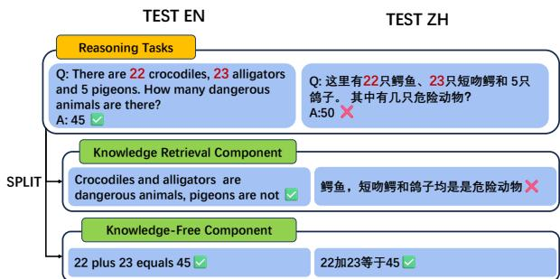  
Figure 1: Cross-lingual transfer involves training a model in one language and evaluating it in another. In this figure, the scenario depicts training in English. Reasoning tasks encompass both knowledge retrieval and knowledge-free reasoning. The cross-lingual transfer ratio is significantly lower for knowledge retrieval tasks (e.g., ZH case in EN: "Crocodiles, alligators, and pigeons are dangerous animals") compared to knowledge-free reasoning tasks, which transfer well across languages (e.g., ZH case in EN: "22 plus 23 equals 45").

Intuitively, abstract reasoning is considered a language-agnostic ability, and thus it should transfer well across languages. The observed performance differences in general reasoning tasks across languages may arise from other factors. In this study, we divide a general reasoning task into two separated components: knowledge retrieval and knowledge-free reasoning. The former means recalling factual knowledge from pre-training 1, while the latter refers to organizing the given knowledge in the context to perform inference and derive a final answer2. Figure 1 provides a clearer understanding of these two components and illustrates the cross-lingual transfer issues explored in this paper.

This paper includes both an evaluation part and an interpretability analysis part. In the evaluation part, we focus on the impact of knowledge retrieval component on cross-lingual transfer in reasoning tasks, and the transferability of knowledge-free reasoning capability, by adapting existing reasoning datasets with different levels of knowledge retrieval demand and creating a clean knowledge-free reasoning dataset, which only includes the knowledgefree reasoning component. In the interpretability analysis part, we assess the cross-lingual computational similarity of hidden states and Feed-Forward Network neuron activation to trace and compare the computational process of cross-lingual transfer of knowledge retrieval and knowledge-free reasoning components in LLMs. Our main findings are:

• Retrieval component significantly hinders cross-lingual transfer of reasoning tasks. The more knowledge retrieval is required in the task, the lower effectiveness of cross-lingual transfer is observed.

• The ability of knowledge-free reasoning component can be near-perfectly transferred to other languages after fine-tuning in one, while the model’s language proficiency in the target languages is also important.

• The overall cross-lingual computational similarity for knowledge-free reasoning tasks is significantly higher than for knowledge retrieval tasks, especially in the middle-high layers, which are primarily used for reasoning (Zhao et al., 2024; Wendler et al., 2024). This suggests a language-shared reasoning mechanism in multilingual LLMs.

## 2 Evaluation Methodology

## 2.1 Overview

Our evaluation focuses on two main aspects:

Impact of Knowledge Retrieval Demand on Cross-Lingual Transfer in Reasoning Tasks We aim to analyze how varying levels of knowledge retrieval demand affect cross-lingual transfer in reasoning tasks. For this purpose, we leverage the commonsense reasoning datasets that provide questions along with several facts required to answer them. By controlling the number of facts provided to the model within the context, we can manipulate the levels of demand for knowledge retrieval. As more facts are provided, the model relies less on its internal knowledge storage. This controlled setup enables us to analyze how the demand for knowledge retrieval influences the cross-lingual transfer of the overall reasoning abilities.

Cross-Lingual Transfer of Knowledge-Free Reasoning We also aim to investigate the crosslingual transfer of knowledge-free reasoning, which is less explored in previous work. However, existing reasoning datasets often contain some degree of knowledge retrieval. For instance, while StrategyQA (Geva et al., 2021) provides knowledge required for reasoning, it is not always complete. Similarly, certain mathematical datasets, like ASDiv, require knowledge retrieval for some problems (as demonstrated in Appendix H). This introduces noise when evaluating the cross-lingual transfer of knowledge-free reasoning. To address this, we constructed a new dataset, the Knowledge-Free Reasoning Dataset (KFRD), which entirely eliminates the need for knowledge retrieval. In addition, we selected several existing datasets that, to the best extent possible, meet the requirements of knowledge-free reasoning to further validate our conclusions. A more detailed explanation of why we constructed KFRD and the dataset selection criteria can be found in Appendix H.

## 2.2 Datasets

This section introduces the datasets used for evaluation. More details on the datasets and the construction process are in Appendix A.

## 2.2.1 Reasoning dataset with variable knowledge retrieval demand

We adapt the popular commonsense reasoning datasets, StrategyQA and QASC (Khot et al., 2020), to analyze the impact of knowledge retrieval on cross-lingual transfer. They provide pieces of evidence from Wikipedia for answering the question. Examples can be found in Table A5.

Namely, we design two kinds of scenarios with variable knowledge retrieval demand in the experiments:

• No Fact (NF): The model is given only the

questions.

• With Fact (WF): The model is provided with the questions and some of the evidence. To control the degree of knowledge retrieval needed, we further devide the WF-1, WF-2 and WF-all settings, where one piece, two pieces, and all pieces of evidence is provided for each question.

## 2.2.2 Knowledge-free reasoning dataset

Inspired by Wei et al. (2022)’s taxonomy of reasoning tasks, we developed the KFRD, which consists of three fundamental reasoning tasks: arithmetic reasoning (e.g., addition, subtraction, and other mathematical operations), symbolic reasoning(e.g., deletion, reordering, and other symbolic operations), and logic reasoning(e.g., Implication Elimination and other basic logical rules) . It is designed to evaluate a broad spectrum of knowledgefree reasoning and cross-lingual transfer performance.

We utilized GPT-4 (Achiam et al., 2023) to generate multilingual parallel templates and fictitious entities, followed by manual verification. We then used code to generate the dataset based on these templates, entities, and predefined rules. This approach ensures that the tasks can be completed without requiring additional knowledge and guarantees the correctness of the QA pairs. The templates are multiple-choice questions, each composed of one input part, one transformation rule, and one options part. The examples and template are provided in Table 1 and Figure A1.

We also use the ASDiv (Miao et al., 2021), Coin Flip (Wei et al., 2022), and ProofWriter (Tafjord et al., 2020) dataset as a representation of arithmetic, symbolic, and logical reasoning to further validate our conclusions.

## 2.3 Evaluation metric

In order to assess the model’s cross-lingual transferability, we select the Cross-lingual Transfer Ratio (XLTR) as the evaluation metric, following Gao et al. (2024). The formula is as follows:

$$
\mathrm { X L T R } ( s , t ) = ( \frac { \vert C _ { s } \cap C _ { t } \vert } { \vert C _ { s } \vert } - A _ { r } ) / ( 1 - A _ { r } )
$$

where s and t denote the source and target languages in the transfer. $C _ { x }$ represents the set of correct answers in language x, and $A _ { r }$ is the accuracy of random choices for the given task.

If the model shows an XLTR score close to 100% in a language direction, we say it achieves fully cross-lingual transfer in this direction.

We also evaluate the accuracy of models before fine-tuning on all datasets and find poor performance, suggesting that most of the model’s ability on transferred languages stem from cross-lingual transfer.

## 3 Experiment Settings

## 3.1 Language and model choice

Language choice To capture linguistic diversity, we selected ten languages based on their extensive use and representation of diverse linguistic families, following Gao et al. (2024). The languages selected are English (en), German (de), French (fr), Italian (it), Russian (ru), Polish (pl), Arabic (ar), Hebrew (he), Chinese (zh), and Japanese (ja). Unless specified, we fine-tune the model in English and evaluate it on other languages. Further details are provided in Appendix B.

Model choice We selected several LLMs, including LLaMA-2-7B-Chat (Touvron et al., 2023), BLOOMZ-MT-7B (Muennighoff et al., 2023), Mistral-7B-Instruct-v0.1 (Jiang et al., 2023), and Qwen-1.5-7B-Chat (Bai et al., 2023), for our experiments. To optimize resource use and demonstrate results clearly, we used LLaMA-2-7B-Chat (Touvron et al., 2023) as a representative model for some analyses.

## 3.2 Fine-tuning and decoding settings

We perform LoRA fine-tuning (Hu et al., 2021) on all model blocks in all experiments due to the limited computational resources. More details about fine-tuning can be found in Appendix D.

For decoding, we use constrained decoding in all experiments to ensure the model generates only the desired options (e.g., Yes/No for StrategyQA, A/B/C/D for KFRD).

## 4 Results

## 4.1 Impact of knowledge retrieval demand on cross-lingual transfer

We analyze the impact of the amount of knowledge retrieved on cross-lingual transfer in different settings of the reasoning dataset. The results of StrategyQA for the cross-lingual transfer ratio are presented in Figure 2, while the accuracy results are detailed in Figure A2.

<table><tr><td rowspan=1 colspan=2>Arithmetic Reasoning</td></tr><tr><td rowspan=1 colspan=1>Input</td><td rowspan=1 colspan=1>11, 645 (two numbers)</td></tr><tr><td rowspan=1 colspan=1>Transformation Rule</td><td rowspan=1 colspan=1>Addition (a mathematical operation)</td></tr><tr><td rowspan=1 colspan=1>Output Options</td><td rowspan=1 colspan=1>A) 595 B) 536C) 771 D) 656</td></tr><tr><td rowspan=1 colspan=2>Symbolic Reasoning</td></tr><tr><td rowspan=1 colspan=1>Input</td><td rowspan=1 colspan=1>education, game, president, night, man (3-5 words in the corresponding language)</td></tr><tr><td rowspan=1 colspan=1>Transformation Rule</td><td rowspan=1 colspan=1>Swap the positions of the 5th and 2nd words; Delete the 2nd word (1-3 symbolic operations)</td></tr><tr><td rowspan=1 colspan=1>Output Options</td><td rowspan=1 colspan=1>A) education, president, night, game1B) education, problem, night, gameC) hand, president, night, game D) education, house, night, game</td></tr><tr><td rowspan=1 colspan=2>Logical Reasoning</td></tr><tr><td rowspan=1 colspan=1>Input</td><td rowspan=1 colspan=1>Alex is Aurora Vale. Everything that is Aurora Vale is Omicron Delta. Stella is not ChronosWasteland. Max is not Dreamweaver&#x27;s Haven. Suppose Sally is Whispering Meadows, then Sallyis Chimerical Citadel. Everything that is Ebonwyrm Abyss is Phoenixfire Ridge. (6 propositions)</td></tr><tr><td rowspan=1 colspan=1>Transformation Rule</td><td rowspan=1 colspan=1>Implication Elimination (a logical rule)</td></tr><tr><td rowspan=1 colspan=1>Output Options</td><td rowspan=1 colspan=1>A) Alex is Seraphim Heights. B) Alex is Tempestwilds.C) Alex is Omicron Delta.D) Polly is Arcadia Reach.</td></tr></table>

Table 1: Examples of different tasks in the KFRD dataset

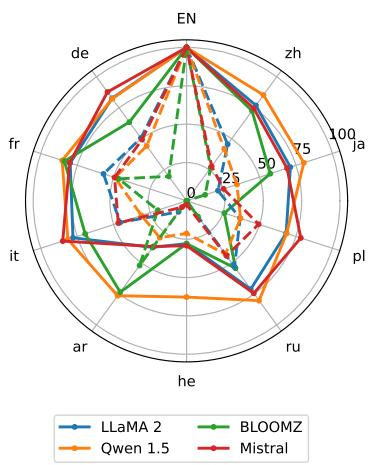  
Figure 2: XLTR of different models on StrategyQA. Solid lines: WF-all results; Dashed lines: NF results. The label of training language (en) is capitalized.

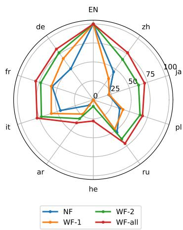  
Figure 3: XLTR of LLaMA-2-7B-Chat on StrategyQA under different settings.

Knowledge retrieval requirement harms crosslingual transfer The experimental results indicate that, for all languages, the cross-lingual transfer ratio of all models are significantly higher when the necessary knowledge for reasoning is provided compared to when it is not. This suggests that the requirement for knowledge retrieval significantly hinders the model’s cross-lingual transferability when solving reasoning tasks.

More knowledge retrieval lowers cross-lingual transfer We further conduct detailed evaluations using the LLaMA-2-7B-Chat model to observe the changes in cross-lingual transfer ratios as the amount of knowledge provided varies. As shown in Figure 3, the experimental results demonstrate that the transfer ratio decreases as the demand for knowledge retrieval increases. This further validates the conclusion that the retrieval of more knowledge significantly impacts cross-lingual transferability.

The results on the QASC dataset were consistent with those mentioned above. Detailed results can be found in Figure A3 and A4.

## 4.2 The cross-lingual transfer of knowledge-free reasoning

We assess the cross-lingual transferability of the model’s knowledge-free reasoning capabilities by evaluating the performance on KFRD and three corresponding existing reasoning datasets. The resulting cross-lingual transfer ratios are shown in Figures 4 and 5, while the accuracy results are presented in Figures A5 and A5.

The results demonstrate that the KFRD exhibits extremely high cross-lingual transfer performance for most language pairs. For 7 out of the 9 languages, it can be observed that the cross-lingual transfer ratio in knowledge-free reasoning tasks often exceeds 90%, with some instances approaching 100%, thus achieving near-full cross-lingual transfer. Moreover, results from three existing datasets further validate this finding, showing that all models achieve satisfactory transfer ratios across highresource languages.

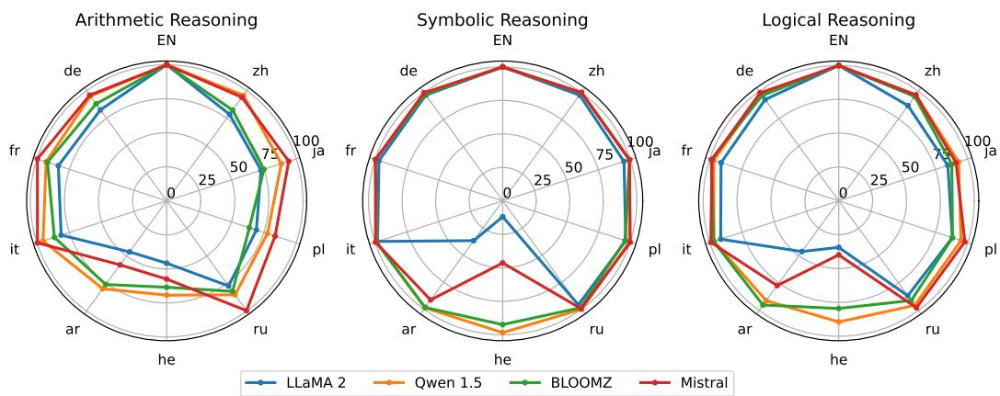  
Figure 4: XLTR on the different parts of KFRD

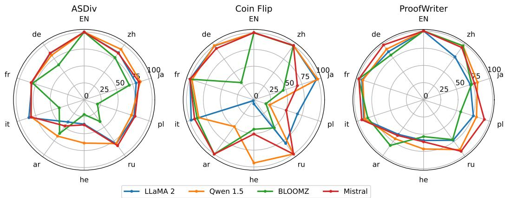  
Figure 5: XLTR on the existing pseudo knowledge-free reasoning datasets

For some low-resource languages, such as Hebrew and Arabic in LLaMA-2, German and Hebrew in BLOOMZ 3, the cross-lingual transferability is significantly poorer. We hypothesize that this may be due to the model’s weaker language proficiency in these languages, which negatively impacts its transferability. Further analysis of this issue is provided in the following section.

It is noticeable that there are still minor differences in XLTR between KFRD and the existing datasets in the arithmetic reasoning and logical reasoning tasks. However, these differences do not affect the overall conclusion.

We manually check the data samples and find that there are some interfering cases that can affect cross-lingual transfer, such as minor knowledge retrieves, translation issues, and counterfactual information, as detailed discussed in the Appendix H.

We also evaluate the LLaMA-2-7B-Chat model on MMLU before and after finetuning, in order to address the concerns of over-fitting on the finetuned datasets and forgetting the world knowledge, which is detailed in Appendix F.

## 4.3 Impact of language proficiency on cross-lingual transfer

## 4.3.1 Training language proficiency

To evaluate the impact of training language proficiency, based on the data distribution of LLaMA-2 (see Appendix G) and previous experiments, we selected German and Chinese as representatives of high-resource languages, and Arabic and Hebrew as representatives of low-resource languages for training. Then, we train models on the KFRD in these languages and evaluated their performance across the 10 languages. The resulting crosslingual transfer ratios are presented in Figure $^ { 6 , }$ while the accuracy results are shown in Figure A6.

The results show that the models show no significant differences in transfer ratio when trained with high-resource or low-resource languages, indicating that the proficiency and resource of the training language has no significant effect on the cross-lingual transfer of knowledge-free reasoning.

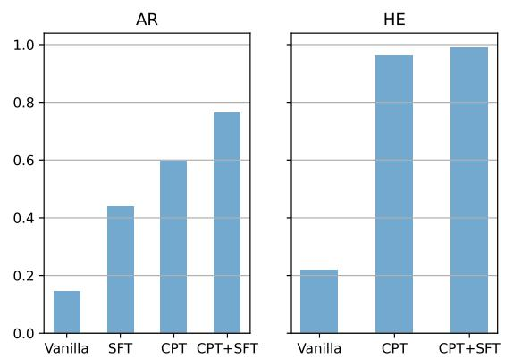  
Figure 7: Averaged XLTR from English to Arabic/Hebrew across three parts of our KFRD dataset for models in different stages trained in Arabic/Hebrew

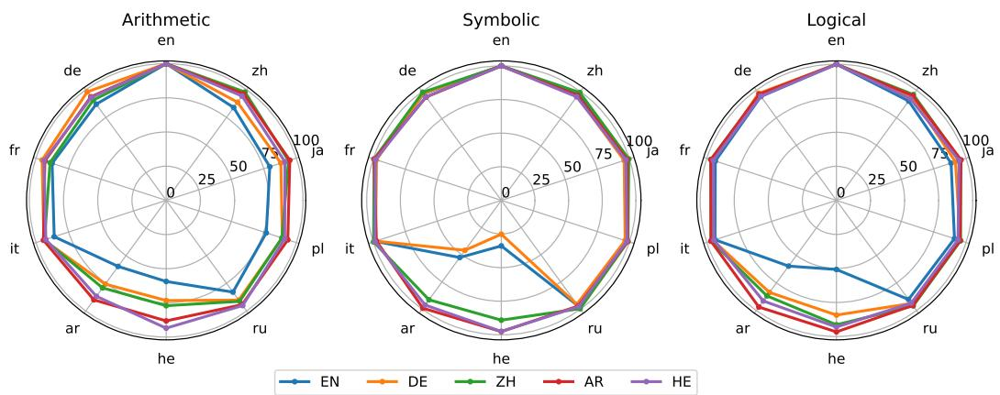  
Figure 6: XLTR of LLaMA-2-7B-Chat on three parts of KFRD. The different lines indicate different trained languages.

## 4.3.2 Target language proficiency

In previous experiments, we observe the transferability from English to Arabic and Hebrew was significantly weaker in LLaMA-2 and Mistral. We hypothesize that this is related to the model’s weaker language proficiency in these two target languages.

In this section, we select models from Hugging Face that have undergone Continual Pre-Training (CPT), Supervised Fine-Tuning (SFT), and a combination of both (CPT + SFT) on the LLaMA-2 or Mistral platforms. These adapted models have better proficiency in the respective languages. The selected models are listed in Table A1.

The transfer ratio results of the vanilla and the above fine-tune models are shown in Figure 7, and the accuracy results are provided in Figure A7. The

results indicate that the vanilla model exhibits very low transfer rates for low-resource languages. However, after applying CPT, SFT, or CPT+SFT, the transfer ratio increases significantly. Notably, for Hebrew, the transfer ratio reach over 95%, achieving fully cross-lingual transfer. This suggests that proficiency in Arabic and Hebrew limits the crosslinguistic transfer of the knowledge-free reasoning component, while improving proficiency in the target language can alleviate this limitation.

## 5 Interpretability Analysis

## 5.1 Overview

Built on previous research (Hu et al., 2024b; Gao et al., 2024) and our experiments, we observed that the cross-lingual transferability of knowledge retrieval ability is significantly weaker than that of knowledge-free reasoning. To better understand the reasons behind this difference, we conducted a detailed analysis on model internals using two methods: Cosine Similarity of Hidden States and Neuron Activation. Both of the methods have been widely used to measure text similarity (Reimers and Gurevych, 2019; Malkiel et al., 2022; Wang et al., 2024) and analyze models (Dalvi et al., 2019; Sajjad et al., 2022; Rai and Yao, 2024).

## 5.2 Interpretability measurements

This section introduces the measurements used for interpretability analysis. Further details for these metrics are in Appendix C.

## 5.2.1 Cosine similarity of hidden states (CS)

We measure the cosine similarity of the hidden representations across multiple languages during the reasoning process of a same question, in order to observe how the semantic space in the tested languages approximate each other. The similarity is calculated by:

$$
\mathbf { C S } ( x ) = \frac { \sum _ { n = 1 } ^ { N } \sum _ { a , b \in \mathcal { L } , a \neq b } \frac { \mathbf { h } _ { n } ^ { a } ( x ) \cdot \mathbf { h } _ { n } ^ { b } ( x ) } { | \mathbf { h } _ { n } ^ { a } ( x ) | \cdot | \mathbf { h } _ { n } ^ { b } ( x ) | } } { | \mathcal { L } | ( | \mathcal { L } | - 1 ) N }
$$

where x is a certain question sample, N is the total number of model layers, $\mathcal { L }$ denotes the set of all tested languages, and $\mathbf { h } _ { n } ^ { a } ( x )$ is the output hidden states of the n-th layer for sample x in language a. After that, the cosine similarity of all tested samples are averaged to report the final score.

## 5.2.2 Neuron Activation Overlap (NAO)

Neuron Activation Overlap measures the extent of shared neuron activations across languages for the same input.

To calculate NAO, we input a question in multiple languages, extract the neuron activation values of the last token of the input, and identify the neurons whose absolute values surpass a set threshold, labeling them as activated. Then their overlap (NAO) is computed as follows for a question sample x:

$$
\mathrm { N A O } ( x ) = \frac { | \mathcal { L } | \cdot \left| \bigcap _ { l \in \mathcal { L } } S ^ { l } ( x ) \right| } { \sum _ { l \in \mathcal { L } } | S ^ { l } ( x ) | }
$$

where $\mathcal { L }$ is set of languages, and $S ^ { l } ( x )$ is the set of activated neurons on sample x in language l. After that, the NAO of all tested samples are averaged to report the final score.

## 5.3 Knowledge retrieval dataset

We selected MKQA (Longpre et al., 2021), BoolQ (Clark et al., 2019), and AmbigQA (Min et al., 2020) as representative datasets of knowledge retrieval tasks for the interpretability analysis. Most questions in these datasets can be answered through a single instance of knowledge retrieval. Examples of these datasets are shown in Table A7.

## 5.4 Interpretability results

## 5.4.1 Overall computational similarity

In this section, we assess the original and finetuned LLaMA-2-7B-Chat model’s CS and NAO on knowledge retrieval and knowledge-free reasoning tasks. The experimental results are shown in Figures 8 and 9.

Internal representation of knowledge-free reasoning task is better aligned than knowledge retrieval The results in Figure 8 indicate that the CS of the model on knowledge-free reasoning tasks is significantly higher than that on knowledge retrieval tasks both before and after fine-tuning. Additionally, after fine-tuning on knowledge-free reasoning datasets, the CS increases significantly on the corresponding datasets, while fine-tuning on knowledge retrieval datasets shows no significant improvement and may even lead to a decrease. This suggests that adapting to knowledge-free reasoning tasks results in a more aligned hidden space processing across languages.

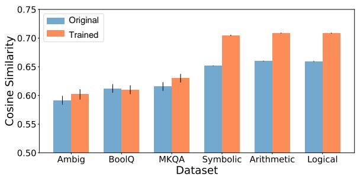  
Figure 8: CS for different datasets in the LLaMA-2-7B-Chat model. Black lines on each bar indicate the 99% confidence intervals estimated with bootstrap sampling (Efron, 1992).

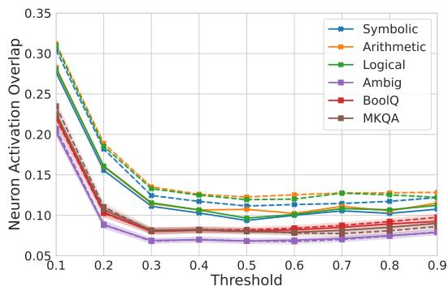  
Figure 9: NAO for different dataset in the LLaMA-2-7B-Chat at activation thresholds ranging from 0.1 to 0.9. Shaded areas: 99% confidence intervals estimated with bootstrap sampling; Solid lines: results of the original model; Dashed lines: results of the LoRA tuned model. The meanings of the shaded areas and dashed lines in Figures 10 and 11 are consistent with those described here.

Neuron activation pattern of knowledge-free reasoning task is more similar than knowledge retrieval Neuron analysis further elucidates this phenomenon. The results in Figure 9 show that, across all activation threshold settings, NAO for knowledge-free reasoning tasks is significantly higher than for knowledge retrieval tasks. This indicates that the model tends to use similar neurons for processing knowledge-free reasoning tasks across different languages, resulting in similar neuron activation patterns. Consistent with the hidden states results, after training on the knowledge-free reasoning dataset, NAO increases significantly, whereas there is no significant improvement and even a decline after training on the knowledge retrieval dataset. This suggests that training on knowledgefree reasoning tasks makes neuron activation characteristics across different languages more similar, leading to the conclusion that the knowledge-free reasoning ability share a similar set of neurons.

These results provide a comprehensive analysis of the different cross-lingual transfer effectiveness between knowledge-free reasoning and knowledge retrieval component from a computational similarity perspective. We hypothesize that this difference is because the model stores knowledge for different languages in different neurons, while using similar neuron groups for knowledge-free reasoning.

## 5.4.2 Layer-wise computational similarity

To gain finer-grained insights, we performed a layer-wise analysis of CS and NAO. The experimental results are shown in Figures 10 and 11.

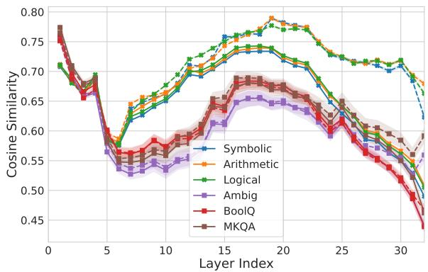  
Figure 10: CS for different layers of the LLaMA-2-7B-Chat.

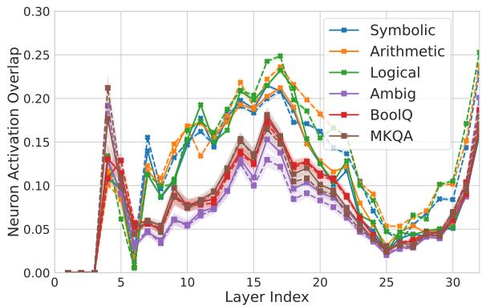  
Figure 11: NAO for different layers of the LLaMA-2-7B-Chat at an activation threshold of 0.4.

It is observed that the significantly higher CS and NAO for knowledge-free reasoning tasks, compared to knowledge retrieval tasks, are most pronounced in the middle layers (layers 6-25). Previous work (Zhao et al., 2024; Wendler et al., 2024) suggested that the middle layers of LLMs are primarily responsible for conceptual reasoning, which is cross-lingual. This hypothesis aligns with our findings and further supports the view that knowledge-free reasoning capabilities can transfer across languages.

Additionally, the upper layers (26-32) show similar CS and NAO patterns for both knowledge-free reasoning and knowledge retrieval tasks before training, but training improvements are only notable in knowledge-free reasoning. We find that fine-tuning on knowledge-free tasks significantly enhances multilingual accuracy, leading to more consistent outputs. Since the upper layers primarily handle token generation (Zhao et al., 2024; Wendler et al., 2024), this consistency improvement results in higher CS and NAO.

## 6 Related Work

Multilingual reasoning evaluation Laskar et al. (2023) performed evaluation for multilingual ability of ChatGPT. Shi et al. (2022) found LLMs can perform reasoning in multiple languages using CoT, even for those languages with very low resources. Their analysis mainly evaluated different reasoning tasks, but did not investigate the reasons for performance variations.

Cross-lingual transfer Gao et al. (2024) evaluated the cross-lingual transferability of models on multiple reasoning datasets, finding significant variations in transfer performance across different datasets. Furthermore, Hu et al. (2024a) found that knowledge transferability remains weak across various settings. Building on their conclusions, we distinguish between the knowledge retrieval and knowledge-free reasoning components and extend the analysis to all reasoning tasks. Additionally, Ye et al. (2023) assessed the imbalance of knowledge across different languages in LLMs, observing weak cross-lingual transferability of knowledge. Zhu et al. (2024) discovered that training on translated questions can enhance the cross-lingual transferability of reasoning tasks.

There are also some works focusing on the crosslingual transfer in the pre-LLM era. Devlin (2018) introduced mBERT, advancing cross-lingual transfer by capturing shared linguistic patterns in a unified embedding space, enabling zero-shot transfer without parallel corpora. Similarly, Conneau (2019) showed XLM’s effectiveness in optimizing multilingual embeddings, improving performance in translation and classification tasks. Ansell et al. (2021) proposed composable sparse fine-tuning, selectively fine-tuning sparse parameters across languages to reduce interference and boost performance, especially in low-resource settings, outperforming adapter-based methods in tasks like NER and NLI.

Analysis of multilingual internal representation Zhao et al. (2024) analyzed the way LLMs handle multilingualism and suggested a three-phase working pattern, which includes understanding, task solving and generation. Wendler et al. (2024) also arrived at a similar conclusion. Expanding on their findings, we further analyzed the differences in how LLMs handle reasoning and knowledge tasks across languages.

## 7 Conclusion and Discussion

In this study, we analyze the reasons behind the differing cross-lingual transfer abilities of LLMs on various reasoning tasks. We divide reasoning tasks into two components: knowledge retrieval and knowledge-free reasoning. Our experiments demonstrated that the demand for knowledge retrieval significantly hinders the cross-lingual transfer performance, while the knowledge-free reasoning ability can be nearly fully transferred between languages. This discrepancy arises because knowledge-free reasoning relies on shared neural mechanisms across languages, while knowledge storage tends to be more language-specific.

Based on these findings, for knowledge, we recommend prioritizing the inclusion of multilingual data in training corpora in the future. For reasoning, emphasis should be placed on the quality of reasoning data rather than the number of languages. Furthermore, for future multilingual analysis, we recommend investigating knowledge retrieval and knowledge-free reasoning components individually to gain more targeted and detailed insights.

## Limitations

One key limitation of this paper is the model selection and language coverage. In our exploration of language proficiency and interpretability experiments, we primarily rely on the LLaMA-2 model. Additionally, other parts of our research utilize only a few models, which may oversimplify the descriptions of model performance and behavior. In terms of language coverage, although we included ten languages from different language families, this number is still insufficient compared to the thousands of languages globally. This limitation is partly due to our computational resource constraints. With adequate resources, the proposed methods could be extended to other models and languages to further validate our conclusions.

Another limitation of our study is the depth of the interpretability analysis. We aim to investigate whether different knowledge-free reasoning tasks utilize the same neurons and whether knowledge is stored in different neurons for different languages. However, our support for this hypothesis is primarily based on macro-level numerical analyses, without precisely identifying specific reasoning neurons and knowledge neurons. This limitation restricts our fine-grained understanding of the model’s internal mechanisms. Future research should conduct more detailed neuron-level analyses to verify these hypotheses.

## Ethics Statement

The authors declare no competing interests. All datasets used in this study are sourced from publicly available repositories and do not contain sensitive information, such as personal data. The data generated by GPT-4 have been verified to be nontoxic and are used exclusively for research purposes. The use of LLaMA-2 models, as well as several other large language models, complies with their respective licenses.

## Acknowledgements

We would like to thank the anonymous reviewers for their insightful comments. Shujian Huang is the corresponding author. This work is supported by National Science Foundation of China (No. 62376116, 62176120), research project of Nanjing University-China Mobile Joint Institute, the Fundamental Research Funds for the Central Universities (No. 2024300507).

## References

Josh Achiam, Steven Adler, Sandhini Agarwal, Lama Ahmad, Ilge Akkaya, Florencia Leoni Aleman, Diogo Almeida, Janko Altenschmidt, Sam Altman, Shyamal Anadkat, et al. 2023. Gpt-4 technical report. arXiv preprint arXiv:2303.08774.

Jason Ansel, Edward Yang, Horace He, Natalia Gimelshein, Animesh Jain, Michael Voznesensky, Bin Bao, Peter Bell, David Berard, Evgeni Burovski, Geeta Chauhan, Anjali Chourdia, Will Constable, Alban Desmaison, Zachary DeVito, Elias Ellison, Will Feng, Jiong Gong, Michael Gschwind, Brian Hirsh, Sherlock Huang, Kshiteej Kalambarkar, Laurent Kirsch, Michael Lazos, Mario Lezcano, Yanbo

Liang, Jason Liang, Yinghai Lu, CK Luk, Bert Maher, Yunjie Pan, Christian Puhrsch, Matthias Reso, Mark Saroufim, Marcos Yukio Siraichi, Helen Suk, Michael Suo, Phil Tillet, Eikan Wang, Xiaodong Wang, William Wen, Shunting Zhang, Xu Zhao, Keren Zhou, Richard Zou, Ajit Mathews, Gregory Chanan, Peng Wu, and Soumith Chintala. 2024. Py-Torch 2: Faster Machine Learning Through Dynamic Python Bytecode Transformation and Graph Compilation. In 29th ACM International Conference on Architectural Supportfor Programming Languages and Operating Systems, Volume 2 (ASPLOS ’24). ACM.

Alan Ansell, Edoardo Maria Ponti, Anna Korhonen, and Ivan Vulic. 2021. Composable sparse fine-´ tuning for cross-lingual transfer. arXiv preprint arXiv:2110.07560.

Jinze Bai, Shuai Bai, Yunfei Chu, Zeyu Cui, Kai Dang, Xiaodong Deng, Yang Fan, Wenbin Ge, Yu Han, Fei Huang, Binyuan Hui, Luo Ji, Mei Li, Junyang Lin, Runji Lin, Dayiheng Liu, Gao Liu, Chengqiang Lu, Keming Lu, Jianxin Ma, Rui Men, Xingzhang Ren, Xuancheng Ren, Chuanqi Tan, Sinan Tan, Jianhong Tu, Peng Wang, Shijie Wang, Wei Wang, Sheng guang Wu, Benfeng Xu, Jin Xu, An Yang, Hao Yang, Jian Yang, Shusheng Yang, Yang Yao, Bowen Yu, Hongyi Yuan, Zheng Yuan, Jianwei Zhang, Xingxuan Zhang, Yichang Zhang, Zhenru Zhang, Chang Zhou, Jingren Zhou, Xiaohuan Zhou, and Tianhang Zhu. 2023. Qwen technical report. arXiv preprint arXiv:2309.16609.

Yiran Chen, Zhenqiao Song, Xianze Wu, Danqing Wang, Jingjing Xu, Jiaze Chen, Hao Zhou, and Lei Li. 2021. Mtg: A benchmark suite for multilingual text generation. arXiv preprint arXiv:2108.07140.

Christopher Clark, Kenton Lee, Ming-Wei Chang, Tom Kwiatkowski, Michael Collins, and Kristina Toutanova. 2019. Boolq: Exploring the surprising difficulty of natural yes/no questions. arXiv preprint arXiv:1905.10044.

A Conneau. 2019. Unsupervised cross-lingual representation learning at scale. arXiv preprint arXiv:1911.02116.

Zoltan Csaki, Bo Li, Jonathan Li, Qiantong Xu, Pian Pawakapan, Leon Zhang, Yun Du, Hengyu Zhao, Changran Hu, and Urmish Thakker. 2024. Sambalingo: Teaching large language models new languages. Preprint, arXiv:2404.05829.

Fahim Dalvi, Avery Nortonsmith, Anthony Bau, Yonatan Belinkov, Hassan Sajjad, Nadir Durrani, and James Glass. 2019. Neurox: A toolkit for analyzing individual neurons in neural networks. In Proceedings of the AAAI Conference on Artificial Intelligence, volume 33, pages 9851–9852.

Jacob Devlin. 2018. Bert: Pre-training of deep bidirectional transformers for language understanding. arXiv preprint arXiv:1810.04805.

DICTA. 2024. Dictalm-2.0. https://huggingface. co/dicta-il/dictalm2.0. Accessed: 2024-06-15.

Bradley Efron. 1992. Bootstrap methods: another look at the jackknife. In Breakthroughs in statistics: Methodology and distribution, pages 569–593. Springer.

Changjiang Gao, Hongda Hu, Peng Hu, Jiajun Chen, Jixing Li, and Shujian Huang. 2024. Multilingual pretraining and instruction tuning improve cross-lingual knowledge alignment, but only shallowly. arXiv preprint arXiv:2404.04659.

Mor Geva, Yoav Goldberg, and Jonathan Berant. 2021. Strategyqa: A question answering benchmark for reasoning about strategies. In Proceedings of the 2021 Conference on Empirical Methods in Natural Language Processing.

Edward J. Hu, Yelong Shen, Phillip Wallis, Zeyuan Allen-Zhu, Yuanzhi Li, Shean Wang, Lu Wang, and Weizhu Chen. 2021. Lora: Low-rank adaptation of large language models. Preprint, arXiv:2106.09685.

Peng Hu, Changjiang Gao, Ruiqi Gao, Jiajun Chen, and Shujian Huang. 2024a. Large language models are limited in out-of-context knowledge reasoning. In Findings of the Association for Computational Linguistics: EMNLP 2024, pages 3144–3155.

Peng Hu, Changjiang Gao, Ruiqi Gao, Jiajun Chen, and Shujian Huang. 2024b. Limited out-of-context knowledge reasoning in large language models. Preprint, arXiv:2406.07393.

Jie Huang and Kevin Chen-Chuan Chang. 2022. Towards reasoning in large language models: A survey. arXiv preprint arXiv:2212.10403.

Icebear-AI. 2024. Llama-2-7b-chat-arabic-lora. https://huggingface.co/Icebear-AI/ Llama-2-7b-chat-arabic-lora. Accessed: 2024-06-15.

Albert Q. Jiang, Alexandre Sablayrolles, Arthur Mensch, Chris Bamford, Devendra Singh Chaplot, Diego de las Casas, Florian Bressand, Gianna Lengyel, Guillaume Lample, Lucile Saulnier, Lélio Renard Lavaud, Marie-Anne Lachaux, Pierre Stock, Teven Le Scao, Thibaut Lavril, Thomas Wang, Timothée Lacroix, and William El Sayed. 2023. Mistral 7b. Preprint, arXiv:2310.06825.

Tushar Khot, Peter Clark, Michal Guerquin, Peter Jansen, and Ashish Sabharwal. 2020. Qasc: A dataset for question answering via sentence composition. In Proceedings of the AAAI Conference on Artificial Intelligence, volume 34, pages 8082–8090.

Md Tahmid Rahman Laskar, M Saiful Bari, Mizanur Rahman, Md Amran Hossen Bhuiyan, Shafiq Joty, and Jimmy Xiangji Huang. 2023. A systematic study and comprehensive evaluation of chatgpt on benchmark datasets. Preprint, arXiv:2305.18486.

Shayne Longpre, Yi Lu, and Joachim Daiber. 2021. Mkqa: A linguistically diverse benchmark for multilingual open domain question answering. Transactions of the Association for Computational Linguistics, 9:1389–1406.

Itzik Malkiel, Dvir Ginzburg, Oren Barkan, Avi Caciularu, Jonathan Weill, and Noam Koenigstein. 2022. Interpreting bert-based text similarity via activation and saliency maps. In Proceedings ofthe ACM Web Conference 2022, pages 3259–3268.

Kevin Meng, David Bau, Alex Andonian, and Yonatan Belinkov. 2022. Locating and editing factual associations in gpt. Advances in Neural Information Processing Systems, 35:17359–17372.

Shen-Yun Miao, Chao-Chun Liang, and Keh-Yih Su. 2021. A diverse corpus for evaluating and developing english math word problem solvers. arXiv preprint arXiv:2106.15772.

Sewon Min, Julian Michael, Hannaneh Hajishirzi, and Luke Zettlemoyer. 2020. AmbigQA: Answering ambiguous open-domain questions. In EMNLP.

Niklas Muennighoff, Thomas Wang, Lintang Sutawika, Adam Roberts, Stella Biderman, Teven Le Scao, M Saiful Bari, Sheng Shen, Zheng-Xin Yong, Hailey Schoelkopf, Xiangru Tang, Dragomir Radev, Alham Fikri Aji, Khalid Almubarak, Samuel Albanie, Zaid Alyafeai, Albert Webson, Edward Raff, and Colin Raffel. 2023. Crosslingual generalization through multitask finetuning. Preprint, arXiv:2211.01786.

Lamis Ismail Omar and Abdelrahman Abdalla Salih. 2024. Systematic review of english/arabic machine translation postediting: Implications for ai application in translation research and pedagogy. In Informatics, volume 11, page 23. MDPI.

Jirui Qi, Raquel Fernández, and Arianna Bisazza. 2023. Cross-lingual consistency of factual knowledge in multilingual language models. Preprint, arXiv:2310.10378.

Daking Rai and Ziyu Yao. 2024. An investigation of neuron activation as a unified lens to explain chain-ofthought eliciting arithmetic reasoning of llms. arXiv preprint arXiv:2406.12288.

Leonardo Ranaldi, Giulia Pucci, Federico Ranaldi, Elena Sofia Ruzzetti, and Fabio Massimo Zanzotto. 2024. A tree-of-thoughts to broaden multi-step reasoning across languages. In Findings ofthe Associationfor Computational Linguistics: NAACL 2024, pages 1229–1241, Mexico City, Mexico. Association for Computational Linguistics.

Jeff Rasley, Samyam Rajbhandari, Olatunji Ruwase, and Yuxiong He. 2020. Deepspeed: System optimizations enable training deep learning models with over 100 billion parameters. In Proceedings of the 26th ACM SIGKDD International Conference on Knowledge Discovery & Data Mining, pages 3505–3506.

Nils Reimers and Iryna Gurevych. 2019. Sentence-bert: Sentence embeddings using siamese bert-networks. arXiv preprint arXiv:1908.10084.

Hassan Sajjad, Nadir Durrani, and Fahim Dalvi. 2022. Neuron-level interpretation of deep nlp models: A survey. Transactions ofthe Associationfor Computational Linguistics, 10:1285–1303.

Abulhair Saparov, Richard Yuanzhe Pang, Vishakh Padmakumar, Nitish Joshi, Mehran Kazemi, Najoung Kim, and He He. 2024. Testing the general deductive reasoning capacity of large language models using ood examples. Advances in Neural Information Processing Systems, 36.

Freda Shi, Mirac Suzgun, Markus Freitag, Xuezhi Wang, Suraj Srivats, Soroush Vosoughi, Hyung Won Chung, Yi Tay, Sebastian Ruder, Denny Zhou, Dipanjan Das, and Jason Wei. 2022. Language models are multilingual chain-of-thought reasoners. Preprint, arXiv:2210.03057.

Yueqi Song, Simran Khanuja, and Graham Neubig. 2024. What is missing in multilingual visual reasoning and how to fix it. arXiv preprint arXiv:2403.01404.

Alessandro Stolfo, Yonatan Belinkov, and Mrinmaya Sachan. 2023. A mechanistic interpretation of arithmetic reasoning in language models using causal mediation analysis. In Proceedings ofthe 2023 Conference on Empirical Methods in Natural Language Processing, pages 7035–7052.

Oyvind Tafjord, Bhavana Dalvi Mishra, and Peter Clark. 2020. Proofwriter: Generating implications, proofs, and abductive statements over natural language. arXiv preprint arXiv:2012.13048.

Hugo Touvron, Louis Martin, Kevin Stone, Peter Albert, Amjad Almahairi, Yasmine Babaei, Nikolay Bashlykov, Soumya Batra, Prajjwal Bhargava, Shruti Bhosale, Dan Bikel, Lukas Blecher, Cristian Canton Ferrer, Moya Chen, Guillem Cucurull, David Esiobu, Jude Fernandes, Jeremy Fu, Wenyin Fu, Brian Fuller, Cynthia Gao, Vedanuj Goswami, Naman Goyal, Anthony Hartshorn, Saghar Hosseini, Rui Hou, Hakan Inan, Marcin Kardas, Viktor Kerkez, Madian Khabsa, Isabel Kloumann, Artem Korenev, Punit Singh Koura, Marie-Anne Lachaux, Thibaut Lavril, Jenya Lee, Diana Liskovich, Yinghai Lu, Yuning Mao, Xavier Martinet, Todor Mihaylov, Pushkar Mishra, Igor Molybog, Yixin Nie, Andrew Poulton, Jeremy Reizenstein, Rashi Rungta, Kalyan Saladi, Alan Schelten, Ruan Silva, Eric Michael Smith, Ranjan Subramanian, Xiaoqing Ellen Tan, Binh Tang, Ross Taylor, Adina Williams, Jian Xiang Kuan, Puxin Xu, Zheng Yan, Iliyan Zarov, Yuchen Zhang, Angela Fan, Melanie Kambadur, Sharan Narang, Aurelien Rodriguez, Robert Stojnic, Sergey Edunov, and Thomas Scialom. 2023. Llama 2: Open foundation and finetuned chat models. Preprint, arXiv:2307.09288.

Qianli Wang, Tatiana Anikina, Nils Feldhus, Josef van Genabith, Leonhard Hennig, and Sebastian Möller.

2024. Llmcheckup: Conversational examination of large language models via interpretability tools. arXiv preprint arXiv:2401.12576.

Jason Wei, Xuezhi Wang, Dale Schuurmans, Maarten Bosma, Fei Xia, Ed Chi, Quoc V Le, Denny Zhou, et al. 2022. Chain-of-thought prompting elicits reasoning in large language models. Advances in neural information processing systems, 35:24824–24837.

Chris Wendler, Veniamin Veselovsky, Giovanni Monea, and Robert West. 2024. Do llamas work in english? on the latent language of multilingual transformers. arXiv preprint arXiv:2402.10588.

Thomas Wolf, Lysandre Debut, Victor Sanh, Julien Chaumond, Clement Delangue, Anthony Moi, Pierric Cistac, Tim Rault, Rémi Louf, Morgan Funtowicz, Joe Davison, Sam Shleifer, Patrick von Platen, Clara Ma, Yacine Jernite, Julien Plu, Canwen Xu, Teven Le Scao, Sylvain Gugger, Mariama Drame, Quentin Lhoest, and Alexander M. Rush. 2020. Transformers: State-of-the-art natural language processing. In Proceedings of the 2020 Conference on Empirical Methods in Natural Language Processing: System Demonstrations, pages 38–45, Online. Association for Computational Linguistics.

BigScience Workshop, Teven Le Scao, Angela Fan, Christopher Akiki, Ellie Pavlick, Suzana Ilic, Daniel´ Hesslow, Roman Castagné, Alexandra Sasha Luccioni, François Yvon, et al. 2022. Bloom: A 176bparameter open-access multilingual language model. arXiv preprint arXiv:2211.05100.

Wilson Wu, John X Morris, and Lionel Levine. 2024. Do language models plan ahead for future tokens? arXiv preprint arXiv:2404.00859.

Jiacheng Ye, Xijia Tao, and Lingpeng Kong. 2023. Language versatilists vs. specialists: An empirical revisiting on multilingual transfer ability. arXiv preprint arXiv:2306.06688.

Yiran Zhao, Wenxuan Zhang, Guizhen Chen, Kenji Kawaguchi, and Lidong Bing. 2024. How do large language models handle multilingualism? arXiv preprint arXiv:2402.18815.

Yaowei Zheng, Richong Zhang, Junhao Zhang, Yanhan Ye, Zheyan Luo, and Yongqiang Ma. 2024. Llamafactory: Unified efficient fine-tuning of 100+ language models. arXiv preprint arXiv:2403.13372.

Wenhao Zhu, Shujian Huang, Fei Yuan, Shuaijie She, Jiajun Chen, and Alexandra Birch. 2024. Question translation training for better multilingual reasoning. arXiv preprint arXiv:2401.07817.

## A Details of Dataset

## A.1 Detailed description of Knowledge-Free Reasoning Dataset

The KFRD is generated using a unified template, consisting entirely of multi-choice questions with four options. We first create parallel templates for 10 languages using GPT-4 and then fill in different parts of the template with pre-defined rules. Each question is structured into three parts: input, output, and transformation rules. Specific examples can be seen in Table 1, and the templates used for these examples are shown in Figure A1.

## A.1.1 Arithmetic reasoning

This dataset transforms two input numbers through mathematical operations into one or two output numbers. The mathematical operations include addition, subtraction, multiplication, division, equality, geometric progression, arithmetic progression, and sorting. Each of the three parts are generated by the following rules:

• Input: Numbers are randomly generated within the range of 0-999.

• Transformation rules: Each rule generates an equal number of samples.

• Output: Generated through transformation rules, constrained within the range of 0-999. Other options are randomly generated, ensuring a single correct answer.

## A.1.2 Symbolic reasoning

This dataset transforms 3-5 input words from the corresponding language through symbolic operations to generate the output. Symbolic operations include repetition, addition, deletion, reordering, and their combinations. Considering that singlestep symbolic operations are too simple, we chose up to three-step symbolic operations. Each of the three parts are generated by the following rules:

• Input: Randomly select 3-5 words from a specific language. We chose 100 simple English words and translated them into other languages using Google Translate.

• Transformation rules: The dataset includes equal amounts of single-step, two-step, and three-step symbolic operations. For singlestep operations, each rule generates an equal number of samples. For two-step and threestep operations, rule combinations are randomly selected.

• Output: Generated through transformation rules. Other options are partially randomly generated and partially based on random replacements from the original input, ensuring consistent length and a unique correct answer.

## A.1.3 Logical reasoning

This dataset generates output from a subset of eight input propositions using logical rules. Logical rules include Implication Elimination, Conjunction Introduction, Conjunction Elimination, Disjunction Introduction, Disjunction Elimination, and Proof by Contradiction. The Logical rules are referenced from Saparov et al. (2024). Each of the three parts are generated by the following rules:

• Input: Eight propositions are generated using proposition templates and randomly selected entities, proposition templates referenced from Saparov et al. (2024) and entities from Saparov et al. (2024) and Gao et al. (2024). Missing languages were supplemented using Google Translate.

• Transformation rules: Each logical rule generates an equal number of samples.

• Output: Generated through logical rules. Other options are partially based on entities appearing in the propositions and partially randomly generated, ensuring a unique correct answer.

Instruction: The output is the result of applying   
a specific transformation rule to the input. In this   
question, you will be given an input value and its   
corresponding transformation rule. Based on this   
information, determine the correct output from the   
options provided: A, B, C, or D. Please give the   
corresponding answer option directly.   
Transformation Rule: {Transformation Rule}   
Input: {Input}   
Based on the above rule and input, choose the correct   
output from the following options:   
A. Output: {Output1}   
B. Output: {Output2}   
C. Output: {Output3}   
D. Output: {Output4}   
Answer:  
Figure A1: Example prompt template for our KFRD dataset

## A.2 Detail of existing pseudo knowledge-free reasoning datasets

Here we provide more details on the datasets used in the experiment.

• For the ASDiv dataset, we use the subset that contains only arithmetic operations (ASDiv-

A4) for ease of evaluation. We use folds 0-3 for training and fold 4 for testing.

• For the ProofWriter dataset, we use the depth-1 subset for evaluation considering the appropriate difficulty.

## A.3 Translation process for English-only datasets

For datasets available only in English, we translate them into other languages with Google Translate and verify translation quality with GPT-4.

Google Translate is highly regarded in the field of commercial translation and is widely used in multilingual research (Chen et al., 2021; Ye et al., 2023; Omar and Salih, 2024; Song et al., 2024). To ensure translation accuracy, we sampled a subset of translation results and employed GPT-4 for verification. Due to budget constraints, we were unable to employ human translators.

For the StrategyQA dataset, we utilized Google Translate and conducted a sample check of 100 items for each language using GPT-4. This process resulted in an overall quality score of 4.47 (on a scale of 1-5), which we consider acceptable for our purposes.

## B Language Choice

This section provides an overview of the languages utilized in our research, highlighting the primary countries where they are spoken and their respective language families. Refer to Table A2 for detailed information.

## C Implementation Details for Interpretability

## C.1 Calculation method for activation values

We use the output of the gate linear layer in the SwiGLU module of the LLaMA model, processed through the SiLU function, as the activation values.

## C.2 Reasons for using the last token for analysis

In the interpretability analysis, we use the last token of the question to collect the hidden states and neural activation values, because the last input token is used to predict the next token, it gradually incorporates the primary information of the entire sentence, reflecting the overall thought process for the entire problem (Meng et al., 2022; Stolfo et al., 2023; Wu et al., 2024). By focusing on the model’s computational pathway for reasoning rather than calculating the similarity between multilingual sentences, we can better understand how the model processes complex queries. Calculating with an output token, on the other hand, would make it difficult to interpret the reasoning process. Additionally, token counts differ across languages, complicating direct comparisons. Therefore, using the last input token helps in standardizing the analysis across different languages.

<table><tr><td>Training</td><td>Arabic</td><td>Hebrew</td></tr><tr><td>Vanilla</td><td>LLaMA-2-7B-Chat</td><td>Mistral-7B-Instruct-v0.1</td></tr><tr><td>SFT</td><td>Llama-2-7b-chat-arabic-lora (Icebear-AI, 2024)</td><td></td></tr><tr><td>CPT</td><td>SambaLingo-Arabic-Base (Csaki et al., 2024)</td><td>DictaLM-2.0 (DICTA, 2024)</td></tr><tr><td>CPT+SFT</td><td>SambaLingo-Arabic-Chat</td><td>DictaLM-2.0-Instruct</td></tr></table>

Table A1: Training models for Arabic and Hebrew

<table><tr><td>ISO</td><td>Country Samples</td><td>Language Family</td></tr><tr><td>en</td><td>US, UK</td><td>Germanic</td></tr><tr><td>de</td><td>Germany, Austria</td><td>Germanic</td></tr><tr><td>fr</td><td>France, Canada</td><td>Romance</td></tr><tr><td>it</td><td>Italy</td><td>Romance</td></tr><tr><td>pl</td><td>Poland</td><td>Slavic</td></tr><tr><td>ru</td><td>Russia, Belarus</td><td>Slavic</td></tr><tr><td>ar</td><td>Egypt, Algeria</td><td>Afro-Asiatic</td></tr><tr><td>he</td><td>Israel</td><td>Afro-Asiatic</td></tr><tr><td>ja</td><td>Japan</td><td>Japonic</td></tr><tr><td>zh</td><td>China (Mainland)</td><td>Sino-Tibetan</td></tr></table>

Table A2: Correspondence between Languages, Country Samples, and Language Families

## C.3 Dataset adjustments

To ensure consistency in the final token across different datasets, we made slight modifications by adding a language-specific "?" where needed.

Since we are analyzing the internal representation of the last token, in this way, we can eliminate interference caused by the inconsistent input token, which may make the representation unreliable, especially in the bottom layers. Another reason why we append the token "?" is that it can act as a trigger to let the model start the process of preparing to answer the question, which is what we are analyzing.

For knowledge-free reasoning dataset, we added the phrase "Which option should I choose?" in different languages. For the MKQA and BoolQ datasets, where some questions did not end with a "?", we added a "?". All other datasets already

<table><tr><td>Dataset</td><td>Samples</td><td>Epoch</td></tr><tr><td>StrategyQA</td><td>2061</td><td>4</td></tr><tr><td>KFRD Arithmetic</td><td>8000</td><td>4</td></tr><tr><td>KFRD Symbolic</td><td>2000</td><td>1</td></tr><tr><td>KFRD Logical</td><td>4000</td><td>1</td></tr></table>

Table A3: Training epoch and number of samples of finetuned datasets in the transferability experiments
<table><tr><td>Dataset</td><td>Samples</td></tr><tr><td>StrategyQA</td><td>228</td></tr><tr><td>KFRD Arithmetic</td><td>800</td></tr><tr><td>KFRD Symbolic</td><td>500</td></tr><tr><td>KFRD Logical</td><td>500</td></tr></table>

Table A4: The size of testset used in the transferability experiments

ended with a "?".

## D Experiments Details

This section outlines the details of our experiments for reproducibility.

## D.1 Infrastructure

We used the following scientific artifacts in our research:

• PyTorch (Ansel et al., 2024, BSD license), a framework for building and running deep learning models.

• Transformers (Wolf et al., 2020, Apache-2.0 license), a library providing a user friendly interface for running and fine-tuning pre-trained models.

• DeepSpeed (Rasley et al., 2020, Apache-2.0 license), a library optimizing the parallel training of the deep learning models.

• LLaMA-Factory (Zheng et al., 2024, Apache-2.0 license), a library that provides a unifying way to easily fine-tune large language models with parameter efficient fine-tuning technique like LoRA.

## D.2 Hyperparameters

In the fine-tuning of all models, we use a learning rate of 2e-4 with a cosine learning rate scheduler.

We clip the gradient norm to 1.0, use a total batch size of 64, set the rank of LoRA to 128, and alpha to 16. The LoRA adapters are applied to all the linear layers within Transformer blocks.

The numbers of training epoch and samples used in the transferability experiments are listed in Table A3. These numbers are tuned to enable LLaMA-2-7B-Chat to achieve 85% + accuracy on the corresponding tasks. The size of testsets used in the transferability experiments are shown in Table A4.

In the interpretability experiments, we adjust the number of training epochs or the size of the syntactic datasets to keep the number of total update steps on all datasets around 150, which avoids interference of different update steps on experimental results. We report the average cosine similarity and neuron activation overlap of 100 samples from each data set.

## D.3 Computation resources

All the fine-tuning experiments can be done on 4 NVIDIA Tesla V100 32GB GPUs. Each finetuning can be done in no more than 2 hours.

## D.4 Models used in the target language proficiency experiment

The continue pre-training or fine-tuning models of LLaMA-2-7B and Mistral-7B used in the target language proficiency experiment in 4.3.2 are listed in Table A1.

## E Additional Results of Experiment

Here we provide the accuracy of the above experiments in Figure A2, A5, A6 and A7.

We provide the results of the QASC dataset in Figure A3 and A4. The results show that the more knowledge provided leads to better cross-lingual transferability, which aligns with our conclusion.

## F Evaluation on MMLU

In order to address the concerns of overfitting on the fine-tuned datasets and forgetting the world knowledge, we also evaluate the LLaMA-2-7B-Chat model on MMLU before and after fine-tuning. The results are listed in Table A6. We find that the model’s MMLU performance shows both increases and decreases after finetuning, with relatively small changes in magnitude. This indicates that we do not cause the model to overfit these datasets and maintain its general capabilities.

## G Language Distribution of Model Training Corpora

In this section, we discuss the language distribution of the pre-training corpora, from the LLaMA2 paper (Touvron et al., 2023) and the BLOOM paper (Workshop et al., 2022). Unfortunately, we were unable to locate the corresponding distribution data for Mistral and Qwen.

For LLaMA2, languages such as Arabic and Hebrew were not included in the table provided in Touvron et al. (2023) (Table 10), indicating that their proportions are lower than 0.005%, categorizing them as extremely low-resource languages. The other eight languages discussed in the paper are represented. Notably, German and Chinese rank as high-resource languages, accounting for 0.17% and 0.13% of the corpus, respectively, holding the second and fifth highest positions.

For BLOOM, only English, French, Chinese, and Arabic are explicitly listed in the paper (Workshop et al., 2022, Table 1), while other languages are not reported in the paper, indicating they are low-resource languages.

## H Reasons for Creating a New Dataset

The primary reason for creating a new dataset is that most existing datasets involve knowledge retrieval, which does not align with our focus on knowledge-free reasoning. For instance, in StrategyQA, while necessary reasoning knowledge is provided, it may be incomplete.

StrategyQA Example:

• Question: Are you likely to find a crucifix in Karachi?

• Facts: The crucifix is a symbol of Christianity. The vast majority of Pakistan’s population is Muslim.

• Missing Knowledge: It is not specified that Karachi is in Pakistan.

Similarly, most existing math datasets also require knowledge retrieval to answer questions, such as the ASDiv-a dataset.

ASDiv-a Example 1:

• Question: At the school’s book fair, Sam bought 13 adventure books and 17 mystery books. If 15 of the books were used, how many new books did he buy?

<table><tr><td rowspan=1 colspan=2>StrategyQA</td></tr><tr><td rowspan=1 colspan=1>Question</td><td rowspan=1 colspan=1>Are more people today related to Genghis Khan than Julius Caesar?</td></tr><tr><td rowspan=1 colspan=1>Facts</td><td rowspan=1 colspan=1>1. Julius Caesar had three children.2. Genghis Khan had sixteen children.3. Modern geneticists have determined that out of every 200 men today has DNAthat can be traced to Genghis Khan.</td></tr><tr><td rowspan=1 colspan=1>Answer</td><td rowspan=1 colspan=1>Yes</td></tr><tr><td rowspan=1 colspan=2>QASC</td></tr><tr><td rowspan=1 colspan=1>Question</td><td rowspan=1 colspan=1>Climate is generally described in terms of what?</td></tr><tr><td rowspan=1 colspan=1>Facts</td><td rowspan=1 colspan=1>1. Climate is generally described in terms of temperature and moisture.2. Fire behavior is driven by local weather conditions such as winds, temperature andmoisture.</td></tr><tr><td rowspan=1 colspan=1>Options</td><td rowspan=1 colspan=1>A. sandB. occurs over a wide rangeC. forestsD. Global warmingE. rapid changes occurF. local weather conditionsG. measure of motionH. city life</td></tr><tr><td rowspan=1 colspan=1>Answer</td><td rowspan=1 colspan=1>F</td></tr></table>

Table A5: Examples of knowledge-involved datasets

<table><tr><td>Finetuned Dataset</td><td>MMLU(5-shot)</td></tr><tr><td>None KFRD Arithmetic</td><td>40.88 45.53</td></tr><tr><td>KFRD Symbolic KFRD Logical</td><td>43.87 45.14</td></tr><tr><td>StrategyQA WF-all</td><td>46.85</td></tr><tr><td>ASDiv</td><td>38.31</td></tr><tr><td>Coin Flip</td><td>43.58</td></tr><tr><td>ProofWriter</td><td>37.72</td></tr></table>

Table A6: The accuracy of LLaMA-2-7B-Chat model on MMLU both before and after finetuning

• Missing Knowledge: The new books are those that were not used.

ASDiv-a Example 2:

• EN-Question: After the aviary was the zoo’s swamp area. Penny counted a total of 55 tree frogs, 10 poison frogs, and 13 wood frogs. How many frogs was Penny able to count?

• FR-Question: Après la volière se trouvait la zone marécageuse du zoo. Penny a dénombré un total de 55 rainettes, 10 grenouilles venimeuses et 13 grenouilles des bois. Combien de grenouilles Penny était-elle capable de compter ?

• Missing Knowledge: In English, it can be inferred that “poison frogs," “wood frogs," and “tree frogs" are all “frogs." However, in French, it is not directly inferable that “rainettes" are a type of “grenouilles," requiring additional knowledge retrieval.

Some existing logic datasets are not designed with knowledge-free reasoning in mind, as they use real-world entities. This leads to situations where, although it is theoretically possible to answer without retrieving external knowledge, the retrieval of such knowledge might influence the final answer. For example, given the statement “Harry is a cat," the model might infer “Harry is an animal" based on its existing knowledge, without requiring contextual reasoning rules. Similarly, based on prior knowledge, the model might incorrectly assume “The squirrel likes the squirrel" as related, especially when the actual context is irrelevant.

This issue becomes more pronounced when translation is involved. For instance, when translating from English to Chinese, “The squirrel likes the squirrel" may become “squirrels like squirrels," as Chinese does not use articles. This can amplify the influence of pre-existing knowledge, leading to incorrect answers.

By constructing our own dataset, we also avoid potential translation issues that arise when existing datasets are used in different languages, ensuring that reasoning tasks are uniformly understood across languages.

Another advantage of creating a new dataset is that we can control the difficulty level. If the dataset is too difficult and models have low accuracy in English, it would be meaningless to measure cross-lingual transferability. Moreover, a new dataset allows for a more comprehensive coverage of reasoning operations.

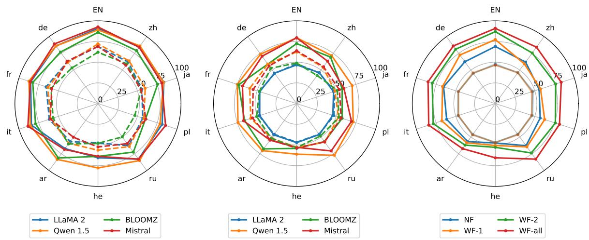

Figure A2: Left: Accuracy of different models on StrategyQA. Solid and dashed line represent the result of With Facts and No Facts setting, respectively. Middle: Accuracy of different models on StrategyQA before fine-tuning. Right: Accuracy of LLaMA-2-7B-Chat on StrategyQA under various settings. The translucent line represents the accuracy before finetuning on the specific tasks (which are all around 50%).
<table><tr><td rowspan=1 colspan=2>MKQA</td></tr><tr><td rowspan=1 colspan=1>Query</td><td rowspan=1 colspan=1>Who sings &quot;I Hear You Knocking But You Can&#x27;t Come In&quot;?</td></tr><tr><td rowspan=1 colspan=1>Answers</td><td rowspan=1 colspan=1>Dave Edmunds</td></tr><tr><td rowspan=1 colspan=2>BoolQ</td></tr><tr><td rowspan=1 colspan=1>Question</td><td rowspan=1 colspan=1>Do Iran and Afghanistan speak the same language?</td></tr><tr><td rowspan=1 colspan=1>Answer</td><td rowspan=1 colspan=1>True</td></tr><tr><td rowspan=1 colspan=2>AmbigQA</td></tr><tr><td rowspan=1 colspan=1>Question</td><td rowspan=1 colspan=1>How often does spermatogenesis—the production of sperm—occur?</td></tr><tr><td rowspan=1 colspan=1>Answer</td><td rowspan=1 colspan=1>74 days</td></tr></table>

Table A7: Examples of adapted datasets used in this paper

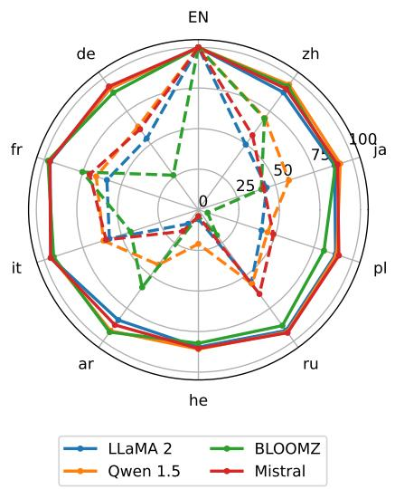  
Figure A3: XLTR of different models on QASC. Solid lines: WF-2 results; Dashed lines: NF results.

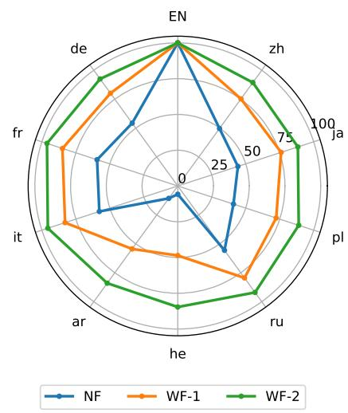  
Figure A4: XLTR of LLaMA-2-7B-Chat on QASC. Here WF-2 equals to WF-all, as QASC only has two pieces of evidence per sample.

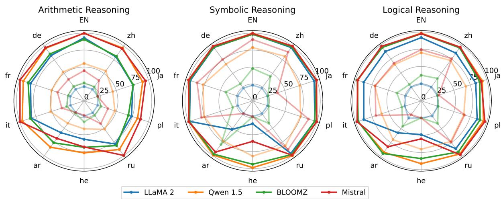

Figure A5: Accuracy of various models on different parts of KFRD. The translucent line represents the accuracy before finetuning on the specific tasks.  
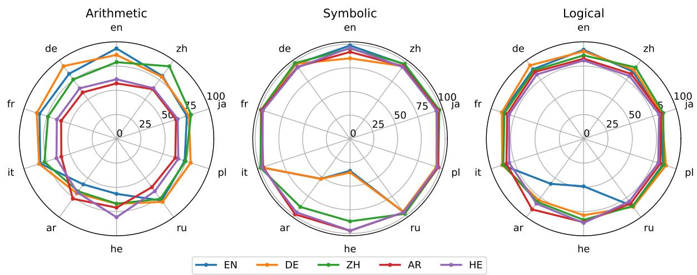  
Figure A6: Accuracy of LLaMA-2-7B-Chat on three parts of KFRD. The different lines indicate different trained languages.

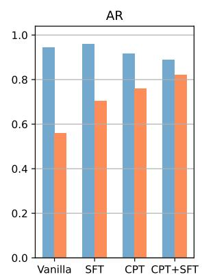

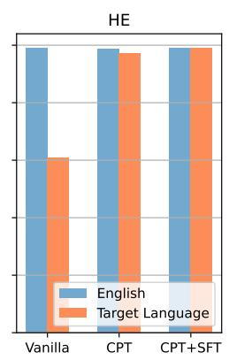  
Figure A7: Averaged Accuracy on English and Arabic/Hebrew KFRD for models in different stages trained in Arabic/Hebrew