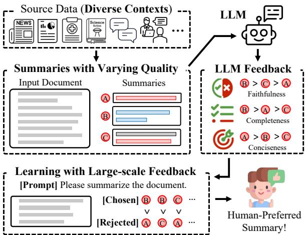
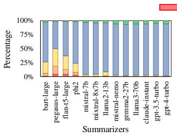
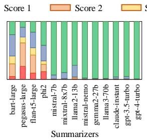
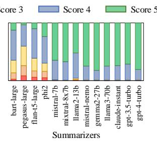
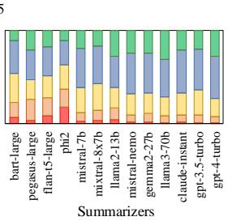

# Learning to Summarize from LLM-generated Feedback

Hwanjun Song1\*,

Taewon Yun1, Yuho Lee1, Jihwan Oh1, Gihun Lee2,†, Jason Cai3,† , Hang Su3,† 1Korea Advanced Institute of Science and Technology

2Hyperconnect

3AWS AI Labs

songhwanjun@kaist.ac.kr

## Abstract

Developing effective text summarizers remains a challenge due to issues like hallucinations, key information omissions, and verbosity in LLM-generated summaries. This work explores using LLM-generated feedback to improve summary quality by aligning the summaries with human preferences for faithfulness, completeness, and conciseness. We introduce FeedSum, a large-scale dataset containing multi-dimensional LLM feedback on summaries of varying quality across diverse domains. Our experiments show how feedback quality, dimensionality, and granularity influence preference learning, revealing that highquality, multi-dimensional, fine-grained feedback significantly improves summary generation. We also compare two methods for using this feedback: supervised fine-tuning and direct preference optimization. Finally, we introduce SummLlama3-8b, a model that outperforms the nearly 10x larger Llama3-70b-instruct in generating human-preferred summaries, demonstrating that smaller models can achieve superior performance with appropriate training. The full dataset and SummLlama3-8B model are available at https://huggingface.co/ datasets/DISLab/FeedSum and https:// huggingface.co/DISLab/SummLlama3-8B.

## 1 Introduction

Developing an effective text summarizer has long been a challenge, as summaries generated by language models often fall short of human standards (Maynez et al., 2020; El-Kassas et al., 2021; Roit et al., 2023). While large language models (LLMs) have greatly improved the coherence and fluency of summaries (Liu et al., 2023a), persistent issues remain, such as unfaithful statements (hallucinations), omission of key information (low completeness), and verbosity (low conciseness) in the summaries (Lee et al., 2024; Song et al., 2024).

An ideal approach would involve providing expert-level summary examples for language models to imitate. However, creating such high-quality summaries is both labor-intensive and difficult to scale effectively. A better alternative is to leverage feedback on the summaries through reinforcement learning from human feedback (RLHF) (Stiennon et al., 2020; Rafailov et al., 2023). RLHF avoids the need to write an ideal summary by having users select their preferred response from candidate summaries of the same document. Yet, human involvement still poses scalability challenges, particularly when acquiring high-quality, fine-grained human feedback across multiple dimensions, such as faithfulness and completeness. For example, Lee et al. (2024) reports that the cost of obtaining finegrained human feedback for these three dimensions exceeded \$30K for just 2,025 summaries.

In this work, we address this challenge by utilizing LLM-generated feedback, known as RL from AI feedback (RLAIF) (Lee et al., 2023; Dutta et al., 2024), with a special focus on text summarization. Our approach shifts focus to the relatively unexplored area of leveraging LLM-generated feedback to enhance summary quality, whereas most existing research in summarization has primarily concentrated on using LLMs to evaluate summaries. (Wan et al., 2024; Tang et al., 2024a; Song et al., 2024). Specifically, our goal is to produce humanpreferred summaries by exploiting LLM feedback with respect to the three core dimensions, namely faithfulness, ensuring summaries are consistent with original documents; completeness, encompassing all key-facts1; and conciseness, maintaining a succinct and focused summary. We focus on these three dimensions, as LLMs already excel in other axes like fluency and coherence (Liu et al., 2023a; Song et al., 2024). Figure 1 illustrates our complete pipeline for learning from LLM-generated feedback, consisting of data sourcing, feedback generation, and preference learning.

  
Figure 1: FeedSum consists of summaries of varying quality, generated by 13 different summarizers across input documents from 7 distinct domains. Through automated evaluation using LLMs, 125K documentsummary pairs have been produced, each accompanied by LLM-generated multi-dimensional feedback, providing valuable data for preference learning.

We begin by creating a large-scale dataset, Feed-Sum, with multi-dimensional LLM feedback on text summaries. To obtain summaries with varying levels of quality, we generate them using 13 different language models, including 3 non-LLMs (e.g., Bart), 7 open-source LLMs (e.g., Llama3), and 3 proprietary LLMs (e.g., GPT-4-turbo). For summary generation, these models are applied to a diverse range of input documents, spanning both short and lengthy texts, including dialogue and nondialogue formats, and across 7 distinct domains.

The effectiveness of LLM feedback on preference learning can vary based on three factors, including the quality of the feedback (e.g., low vs. high), its dimensionality (e.g., single vs. multiple), and its level of granularity in scoring (e.g., coarse vs. fine). To explore the impact of these factors, we configure four different setups (see Table 2 for details). Each setup generates 125K pairs of input documents and summaries, accompanied by distinct LLM-generated feedback responses. In particular, we find that these factors significantly affect the distribution of feedback scores, which is crucial for determining "chosen" versus "rejected" summaries in preference learning.

Through extensive experiments with FeedSum, we provide insights into learning to summarize from LLM feedback, focusing on three key open questions: (Q1) The impact of these three factors on the effectiveness of preference learning; (Q2) An analysis on the effectiveness of each dimension in multi-dimensional feedback; and (Q3) A comparison between two approaches for utilizing LLM-generated feedback: supervised fine-tuning (SFT) and direct preference optimization (DPO).

Our main contributions are: (1) We create and release FeedSum, the first large-scale summarization dataset for preference learning, featuring high diversity in inputs, summaries, and feedback; (2) We examine how different configurations of LLMgenerated feedback impact preference learning, and the importance of feedback quality, dimensionality, and granularity. (3) We examine the alignment trade-off associated with relying on a single dimension for preference learning. (4) We compare the effectiveness of DPO and SFT variants. (5) We release SummLlama3-8b, which outperforms the nearly 10x larger Llama3-70b-instruct in the three human-preferred dimensions.

## 2 Related Work

Preference Optimization. Preference optimization plays a crucial role in bridging the gap between human intent and the outputs generated by LLMs (Yang et al., 2023; Jiang et al., 2024b; Rafailov et al., 2023; Ryu et al., 2024). The predominant methods are PPO (Schulman et al., 2017)2, which fits a reward model to optimize LLMs to generate responses that receive high reward, and DPO (Rafailov et al., 2023), which directly optimizes the LLMs’ outputs based on preference data without relying on an explicit reward model. These methods have demonstrated effectiveness in aligning LLMs with human preferences, particularly in mitigating hallucination, harmful outputs, and biased contents (Tonmoy et al., 2024; Bai et al., 2024; Allam, 2024; Li et al., 2024). Despite the success of preference optimization in other domains, in text summarization, limited work has focused on aligning outputs with human preferences. Stiennon et al. (2020) collected a comparison dataset to train a PPO reward model, using Reddit posts and coarse evaluations of two summaries, without accounting for multi-dimensional aspects of summarization. Recently, Mishra et al. (2024) applied DPO for summarization alignment, but focusing solely on faithfulness using low-quality summaries by synthetically altering high-quality ones with LLMs.

<table><tr><td>Dataset</td><td># of Domain</td><td>Input Type</td><td>Input Length</td><td>Summary Gen.</td><td># of Feedback Dim.</td><td>Feedback Size</td><td>Feedback Type</td></tr><tr><td>UniSumEval</td><td>Multiple (9)</td><td>Dial. &amp; Non-dial.</td><td>Short-Long</td><td>Summarizers (9)</td><td>Faith, Comp, Cons</td><td>1K</td><td>Human-annotated</td></tr><tr><td>SynFacEdit</td><td>Single (1)</td><td>Non-dial.</td><td>Short</td><td>Synthetic Edit (1)</td><td>Faith</td><td>5K</td><td>LLM-generated</td></tr><tr><td>FeedSum (Ours)</td><td>Multiple (7)</td><td>Dial. &amp; Non-dial.</td><td>Short-Long</td><td>Summarizers (13)</td><td>Faith, Comp, Cons</td><td>125K</td><td>LLM-generated</td></tr></table>

Table 1: Comparison of FeedSum with existing summarization datasets with human feedback, UniSumEval (Lee et al., 2024), and LLM feedback, SynFacEdit (Mishra et al., 2024). The numbers in the parenthesis are the number of input domains (in "# of Domain") and summarizers used for summary generation (in "Summary Gen").

Automated Evaluation. Conventional metrics, such as ROUGE and BERTScore, have shown a weak correlation with human judgment in the evaluation of text summaries (Pagnoni et al., 2021; Tang et al., 2024b; Song et al., 2024). In response, several methods have emerged, focusing on finetuning models using well-curated datasets, including natural language inference (NLI)-based and question answering (QA)-based approaches (Fabbri et al., 2022; Laban et al., 2022; Zhong et al., 2022). However, they are typically limited to evaluating only the faithfulness of summaries and require training specialized models. The emergence of large language models (LLMs) facilitates multidimensional evaluation by incorporating them into human-like evaluation pipelines (Wang et al., 2023; Tang et al., 2024a; van Schaik and Pugh, 2024; Fu et al., 2024). Particularly, G-Eval (Liu et al., 2023a) uses GPT-4 for automated evaluation, providing 1-5 Likert-scale scores based on the prompt. FineSurE (Song et al., 2024) adopts fine-grained protocols for sentence-level faithfulness and keyfact-level completeness and conciseness, producing objective percentage scores, such as the proportion of faithful sentences and key-facts included.

In this work, we integrate automated evaluation into preference learning, enabling large-scale, finegrained feedback that addresses three key alignment dimensions of text summarization: faithfulness, completeness, and conciseness.

## 3 Data and Experiment Details

High-level Overview. We overview the overall pipeline from data creation to preference learning, as in Figure 1, following three distinct steps:

Step 1. Input sourcing and summary generation: Input documents are extracted from 7 diverse sources, varying in domain, length, and type. Summaries are then generated using 13 non-LLMs, open-source LLMs, and proprietary LLMs, producing a wide range of summary quality.

Step 2. Feedback generation using LLMs: Feedback is generated through LLM-based summary evaluations using four configurations, adjusting the quality (low vs. high), dimensionality (single vs. multi-dimensional), and granularity (coarse- vs. fine-grained) of the feedback.

Step 3. Learning with large-scale feedback: We examine the potential of machine feedback from LLMs through the lens of preference learning.

## 3.1 FeedSum: Data with LLM Feedback

Table 1 contrasts our FeedSum dataset with two existing datasets with either human-annotated or LLM-generated feedback. FeedSum features input text that is as diverse as UniSumEval (Lee et al., 2024), while simultaneously providing a significantly larger amount of LLM-generated feedback compared to SynFacEdit (Mishra et al., 2024).

Input Text Sourcing The diversity of source documents is crucial for acquiring comprehensive feedback, as it helps identify weaknesses in modern text summarizers across various aspects such as input domain, length, and type (dialogue vs. non-dialogue) (Lee et al., 2024). Hence, we extract input documents from multiple source datasets encompassing 7 different domains, ranging from short to lengthy input texts, and covering both nondialogue and dialogue formats. We sample 2,000 input texts from the training set of each source dataset, including four non-dialogue datasets – CNN/DM (news) (Nallapati et al., 2016), Wikihow (lifestyle) (Koupaee and Wang, 2018), GovReport (report) (Huang et al., 2021), PubMed (medical literature) (Cohan et al., 2018) – and three dialogue datasets – DialogSum (dailylife) (Chen et al., 2021), MediaSum (interview) (Zhu et al., 2021), Meeting-Bank (meeting) (Hu et al., 2023). As a result, a total of 14K input documents are sampled.

Summaries with Varying Quality. The performance of summarization can vary depending on the summarizer chosen, as there is no single model that consistently produces the best quality summary (Song et al., 2024). From the perspective of preference learning, it is crucial to gather feedback from a wide range of summaries with varying quality. This allows for pairwise comparisons of different quality summaries even for the same document. Therefore, we choose 13 language models grouped into three categories, namely non-LLMs, including Bartlarge (Lewis et al., 2020), Pegasus-large (Zhang et al., 2020), and Flan-t5-large (Chung et al., 2024), open-source LLMs, including Phi-2 (Javaheripi et al., 2023), Mistral-7b-instruct (Jiang et al., 2023), Mixtral-8x7b-instruct (Jiang et al., 2024a), Llama2- 13b-chat (Touvron et al., 2023), Mistral-nemoinstruct, Llama3-70b-instruct, and Gemma2-27binstruct (Team et al., 2024), and proprietary LLMs, including Claude-instant, GPT-3.5-turbo, and GPT-4-turbo (Achiam et al., 2023). These summarizers generate rich, diverse summaries, producing 182K document–summary pairs.

<table><tr><td>ID</td><td>Quality</td><td>Dimension</td><td>Granularity</td><td>Feedback Example</td></tr><tr><td>C1</td><td>Low (Llama3-8b)</td><td>Single</td><td>Summary-level</td><td>{Overall Score: 4}</td></tr><tr><td>C2</td><td>High (Llama3-70b)</td><td>Single</td><td>Summary-level</td><td>{Overall Score: 5}</td></tr><tr><td>C3</td><td>High (Llama3-70b)</td><td>Multiple</td><td>Summary-level</td><td>{Faithfulness: 5, Completeness: 3, Conciseness: 3}</td></tr><tr><td>C4</td><td>High (Llama3-70b)</td><td>Multiple</td><td>Sentence &amp; key-fact</td><td>{Faithfulness: 75%, Completeness: 66%, Conciseness: 25% }</td></tr></table>

Table 2: Four different configurations to acquire LLM-generated feedback on the quality of text summaries.

## 3.2 LLM-generated Feedback

We generate feedback by conducting automated evaluations using LLMs. Yet, the effectiveness of LLM feedback varies the evaluation configuration employed. This study addresses open questions about leveraging LLM-based feedback for preference learning, with a focus on its "quality," "dimensionality," and "granularity." These aspects are investigated by contrasting the effectiveness of feedback generated from four distinct configurations (C1–C4) in Table 2, as summarized below:

Feedback Quality (C1 vs. C2): The quality of generated feedback plays a pivotal role in preference learning. To assess the importance of feedback quality, we adjust the capacity of the selected LLMs for feedback generation. We use two opensource LLMs of different sizes: Llama3-8b-instruct for low-quality feedback and Llama3-70b-instruct for high-quality feedback, respectively.

Feedback Dimensionality (C2 vs. C3): The simplest way to gather feedback is to assess the quality of the summary with a single score on a 1–5 Likert scale (Wang et al., 2023). However, it overlooks key multi-dimensional aspects of summary quality, such as faithfulness, completeness, and conciseness (Lee et al., 2024). Therefore, a more advanced approach involves conducting a multi-dimensional evaluation using LLMs across these three dimensions, yielding a separate score for each (Zhong et al., 2022; Liu et al., 2023a).

Feedback Granularity (C3 vs. C4): Coarsegrained evaluation uses a Likert scale (1–5), but these subjective scores often skew toward higher ratings due to a lack of grounding (Wang et al., 2023; Liu et al., 2023a). In contrast, fine-grained evaluation assesses at the sentence or key-fact level, measuring faithfulness, completeness, and conciseness through factual sentence proportions and keyfact coverage, yielding percentage scores better correlate with human feedback (Song et al., 2024).

Thus, all summary–document pairs are subjected to LLM-based summarization evaluation for each configuration. 125K summary-document pairs remain after excluding failed and special cases.3 More details including evaluation prompts, methodologies, and data statistics are in Appendix A.

## 3.3 Learning with Large-scale Feedback

We primarily focus on three key questions:

Q1: How do the quality, dimensionality, and granularity of LLM-generated feedback (C1–C4 in Table 2) influence preference learning?

Q2: What impact does each dimension have in the case of multi-dimensional feedback?

Q3: How much can DPO enhance the quality of summaries compared to SFT variants?

The experimental setups are detailed below and see Appendix B for the detailed training configuration and input–output format for SFT and DPO.

Q1: Impact of Feedback Configuration. In this experiment, we consistently train Llama3-8binstruct using DPO (Rafailov et al., 2023), but with feedback generated by differently configured LLMs (C1–C4 in Table 2). Specifically, for each configuration, we create a set of paired summaries – one chosen and one rejected – using the same criteria to determine their selection. A summary is selected as the "chosen" one if it scores $\geq 4$ on the Likert scale $\mathrm { o r } \geq 8 0 \%$ in percentage scores4. Conversely, a summary is considered "rejected" if its score is at least 1 point lower on the Likert scale or 20 percentage points lower than the chosen one. To ensure a fair comparison, we standardize the number of pairs for each configuration to 92K, matching the number provided by C4. For clarity, we refer to the four summarizers as DPO-C1, DPO-C2, DPO-C3, and DPO-C4.

  
(a) Configuration 1 (C1).

  
(b) Configuration 2 (C2).

  
(c) Configuration 3 (C3).

  
(d) Configuration 4 (C4).

Figure 2: Distribution of summary scores on a 1–5 Likert scale across the four different configurations. Percentage scores in C4 are converted into Likert-scale ones through uniform quantization for ease of interpretation.
<table><tr><td>Level</td><td>C1</td><td>C2</td><td>C3</td><td>C4</td></tr><tr><td>Summary</td><td>0.358</td><td>0.470</td><td>0.589</td><td>0.649</td></tr><tr><td>System</td><td>0.800</td><td>0.833</td><td>0.783</td><td>0.983</td></tr></table>

Table 3: Quality of feedback using C1–C4 assessed based on their Spearman correlation with human composite scores in UniSumEval (Lee et al., 2024), evaluated at both the summary and system levels.

Q2: Impact of Feedback Dimension. We examine how focusing on a specific dimension affects summary quality compared to considering all dimensions equally. This experiment provides insights into the concept of alignment tax (Noukhovitch et al., 2023; Guo et al., 2024), which refers to the trade-off where enhancing alignment with one objective (e.g., conciseness) may reduce performance in another (e.g., completeness). For each objective, we generate pairs of chosen and rejected summaries using the same criteria as in Q1. We then fine-tune Llama3-8b-instruct using DPO for preference learning, resulting in three compared summarizers: DPO-faith, DPO-comp, and DPOcons, each focusing on faithfulness, completeness, and conciseness, respectively.

Q3: Comparison of DPO over SFT. We compare the effectiveness of DPO with that of five SFT variants. The performance of SFT heavily depends on which summaries are used as reference for teacher-forcing (Han et al., 2024). We consider four different setups, namely SFT-human: We finetune Llama3-8b-instruct using human summaries in our source datasets as reference; SFT-best: We first identify the best summary among those generated by 13 summary models in FeedSum, selecting the one with the highest composite score obtained from C4. Then, use it as the reference to supervise Llama3-8b-instruct; SFT-faith, SFT-comp, and SFTcons: Similar to SFT-best, but the best summary is selected based solely on their faithfulness, completeness, and conciseness scores, respectively.

<table><tr><td>Type</td><td>Non-LLMs</td><td>Open. LLMs</td><td>Propr. LLMs</td></tr><tr><td>C1</td><td>10.7 (60.7)</td><td>56.3 (29.6)</td><td>33.0 (9.7)</td></tr><tr><td>C2</td><td>6.2 (74.4)</td><td>59.4 (23.3)</td><td>34.4 (2.3)</td></tr><tr><td>C3</td><td>5.1 (81.2)</td><td>60.9 (18.5)</td><td>34.0 (0.3)</td></tr><tr><td>C4</td><td>19.3 (30.9)</td><td>55.1 (50.2)</td><td>25.6 (18.9)</td></tr></table>

Table 4: Proportion (%) of chosen (and rejected) summaries across three summarizer categories.

## 4 Analysis of LLM-generated Feedback

The configurations C1–C4 for LLM-based feedback generation show significant differences in feedback quality and their impact on constructing chosen-rejected summary pairs.

## 4.1 Quality of LLM Feedback

Table 3 presents the quality of LLM feedback by calculating summary- and system-levels agreement with human scores of UniSumEval (see Appendix C.2 for the detailed metric). The feedback in C1 shows a significantly lower correlation with human scores compared to C2–C4, which is attributed to the use of a smaller LLM. The quality of feedback improves progressively as it becomes more multidimensional and fine-grained from C2 to C4.

## 4.2 Distribution of Summary Score

Figure 2 illustrates the distribution of composite summary scores obtained from the four LLM-based evaluation strategies (C1–C4), as in Table 2.

<table><tr><td>Backbone</td><td>Config.</td><td>Quality</td><td>Dimension</td><td>Granularity</td><td>Faith.</td><td>Comp.</td><td>Conc.</td><td>Avg.</td></tr><tr><td>Llama3-8b-inst.</td><td colspan="3">wo. RL</td><td>0.864</td><td>0.583</td><td></td><td>0.450</td><td>0.632</td></tr><tr><td rowspan="4">Llama3-8b-inst.</td><td>DPO-C1</td><td>Low</td><td>Single</td><td>Coarse-grained</td><td>0.836</td><td>0.594</td><td>0.453</td><td>0.628</td></tr><tr><td>DPO-C2</td><td>High</td><td>Single</td><td>Coarse-grained</td><td>0.878</td><td>0.595</td><td>0.514</td><td>0.662</td></tr><tr><td>DPO-C3</td><td>High</td><td>Multiple</td><td>Coarse-grained</td><td>0.889</td><td>0.581</td><td>0.516</td><td>0.662</td></tr><tr><td>DPO-C4</td><td>High</td><td>Multiple</td><td>Fine-grained</td><td>0.931</td><td>0.614</td><td>0.659</td><td>0.735</td></tr><tr><td>Llama3-70b-inst.</td><td colspan="3">wo. RL</td><td></td><td>0.931</td><td>0.596</td><td>0.487</td><td>0.671</td></tr><tr><td>Llama3-70b-inst.</td><td>DPO-C4</td><td>High</td><td>Multiple</td><td>Fine-grained</td><td>0.950</td><td>0.632</td><td>0.754</td><td>0.779</td></tr></table>

Table 5: Automated evaluation results of seven summarizers on faithfulness, completeness, and conciseness. "w.o RL" refers to the models without preference optimization. "DPO-{C1,C2,C3,C4}" denote models incorporating preference optimization, utilizing feedback generated in C1–C4 of Table 2. The best score are marked in bold.

Firstly, low-quality feedback from C1 tends to avoid assigning very low (score 1) or high (score 5) scores. As shown in Figure 2(a), most summaries receive scores between 3 and 4, regardless of the summarizer they were generated from. This results in the incorrect selection of low-quality summaries as the chosen ones.

Secondly, feedback from the coarse-grained evaluation in C2–C3 introduces a significant bias, favoring LLM-generated summaries over non-LLM ones, regardless of whether single- or multi-dimensional evaluation is used. Only a few LLM-generated summaries have scores below 4. This leads to the issue of indiscriminately selecting LLM summaries as chosen ones while non-LLM summaries as rejected ones.

Lastly, feedback from the fine-grained evaluation in C4 is robust to the summarizer category, showing a highly diverse score distribution across all summarizers. This approach not only accurately captures the hierarchy among non-LLMs, open-source LLMs, and proprietary LLMs, but also demonstrates that high-quality summaries can be produced by older models. That is, summaries generated by LLMs can be rejected in favor of higher-quality ones produced by non-LLMs.

## 4.3 Chosen and Rejected Summary

Table 4 summarizes the proportion of summaries selected as chosen or rejected ones across the three summarizer categories. A significant difference in proportion is observed depending on the feedback configuration. Feedback from singledimensional or coarse-grained automatic evaluations in C1–C3 predominantly classifies LLMgenerated summaries as chosen in 89.3%–94.9% of cases, while non-LLM-generated summaries are rejected in 60.7%–81.2% of cases. However, feedback from the multi-dimensional and fine-grained evaluation in C4 reveals a considerably different trend, with 69.1% of LLM-generated ones as rejected and 19.3% of non-LLM-generated summaries being classified as chosen. This significant difference across configurations greatly affects their effectiveness in preference optimization.

## 5 Main Experiment

Test Set. The test set is constructed by randomly sampling 200 documents from the test split of Feed-Sum’s seven source datasets, totaling 1.4K. Both automated and human evaluations are conducted to evaluate summarizers on this set. For automated evaluation, we use Llama3-80b-instruct5 as the backbone of FineSurE (Song et al., 2024). For human evaluation6, we perform a fact verification task for faithfulness and a key-fact alignment task for completeness and conciseness, following the work (Lee et al., 2024). Three annotators are assigned for each task, recruited through Amazon Mechanical Turk. Details of the automated and human evaluation can be found in Appendix C.3.

Evaluation Metric. We report the quality of text summary from the three key perspectives: faithfulness, the proportion of faithful summary sentences; completeness, the proportion of covered key-facts; and conciseness, the proportion of summary sentences aligning with the key-facts. In automated evaluation, key-facts are automatically extracted from the reference summary of each source dataset, as suggested by Song et al. (2024). In human evaluation, we use human-annotated key-facts from the UniSumEval dataset (Lee et al., 2024) to follow the same manual evaluation pipeline in the paper. See

<table><tr><td>Config.</td><td>Faith.</td><td>Comp.</td><td>Conc.</td><td>Avg.</td></tr><tr><td>Llama3-8b</td><td>0.902</td><td>0.636</td><td>0.784</td><td>0.774</td></tr><tr><td>Llama3-70b</td><td>0.953</td><td>0.659</td><td>0.792</td><td>0.801</td></tr><tr><td>DPO-C1</td><td>0.868</td><td>0.669</td><td>0.826</td><td>0.787</td></tr><tr><td>DPO-C2</td><td>0.947</td><td>0.675</td><td>0.840</td><td>0.820</td></tr><tr><td>DPO-C3</td><td>0.925</td><td>0.664</td><td>0.869</td><td>0.819</td></tr><tr><td>DPO-C4</td><td>0.980</td><td>0.697</td><td>0.959</td><td>0.879</td></tr></table>

Table 6: Human evaluation of six summarizers on three dimensions. Llama3-8b-instruct and Llama3-70binstruct (without RL) are baselines, while C1–C4 are Llama3-8b-instruct after DPO with varying feedback.

<table><tr><td rowspan=1 colspan=2>Strategy</td><td rowspan=1 colspan=1>Strategy</td><td rowspan=1 colspan=2>Faith.        Comp.        Conc.</td></tr><tr><td rowspan=1 colspan=2>DPO-faith</td><td rowspan=1 colspan=1>0.942 (+0.078)</td><td rowspan=1 colspan=1>0.577 (-0.006)</td><td rowspan=1 colspan=1>0.686 (0.236)</td></tr><tr><td rowspan=1 colspan=2>DPO-comp</td><td rowspan=1 colspan=1>0.846 (-0.018)</td><td rowspan=1 colspan=1>0.640 (+0.057)</td><td rowspan=1 colspan=1>0.438 (-0.012)</td></tr><tr><td rowspan=1 colspan=2>DPO-cons</td><td rowspan=1 colspan=1>0.877 (+0.013)</td><td rowspan=1 colspan=1>0.493 (-0.090)</td><td rowspan=1 colspan=1>0.892 (+0.442)</td></tr><tr><td rowspan=1 colspan=2>DPO-avg</td><td rowspan=1 colspan=1>0.902 (+0.038)</td><td rowspan=1 colspan=1>0.608 (+0.025)</td><td rowspan=1 colspan=1>0.591 (+0.141)</td></tr></table>

Table 7: Automated evaluation results of summarizers trained with DPO on a specific dimension. DPO-avg is a model, averaging the LoRA weights of others. Cells are color-coded from dark to light based on descending score ranks for each dimension. The value in the parenthesis is gain or decline over the model wo. DPO.

Appendix C.1 for the equation to calculate three percentage scores. Appendix D presents the results using ROUGE and BERTScore for reference.

## 5.1 Q1: Impact of Feedback Configuration

We evaluate the quality of summaries generated by Llama3, trained with DPO incorporating feedback from four different configurations, and compare the results to the corresponding models without DPO. The prompts used to generate summaries are identical across all setups, as in Appendix E. The results for other LLMs are in Appendix F.

## 5.1.1 Results by Automated Evaluation

Table 2 presents the summary quality of seven summarizers: two models without preference optimization and five models with DPO using LLM feedback generated in different configurations.

The low-quality feedback (C1) generated by Llama3-8b-instruct proves ineffective. Compared to not using DPO, the faithfulness score rather drops by 0.028, resulting in the lowest composite score ("Avg.") across the three dimensions. The quality of feedback is crucial for preference learning using LLM feedback. High-quality feedback (C2–C3) via coarse-grained evaluation improves the performance of summarizers in most cases. However, there is no improvement in considering multi-dimensional aspects in automated evaluation as long as the granularity remains coarse.

<table><tr><td>Strategy</td><td>Faith.</td><td>Comp</td><td>Conc</td><td>Abs.</td><td>Avg.</td></tr><tr><td>Llama3-8b DPO-C4</td><td>0.864 0.931</td><td>0.583 0.614</td><td>0.450 0.659</td><td>0.696</td><td>0.648 0.723</td></tr><tr><td>SFT-human SFT-best</td><td></td><td></td><td></td><td>0.691</td><td>0.613</td></tr><tr><td rowspan="4">SFT-faith SFT-comp</td><td>0.774 0.894</td><td>0.496</td><td>0.666</td><td>0.516</td><td></td></tr><tr><td></td><td>0.551</td><td>0.572</td><td>0.588</td><td>0.651</td></tr><tr><td>0.903</td><td>0.545</td><td>0.536</td><td>0.559</td><td>0.635</td></tr><tr><td>0.871 0.874</td><td>0.597 0.483</td><td>0.511 0.632</td><td>0.594 0.488</td><td>0.643 0.620</td></tr></table>

Table 8: Comparison of DPO with SFT variants using automated evaluation, where they are fine-tuned from Llama3-8b-instruct. For SFT, the best score is marked in bold, while the second-best score is underlined.

This is likely due to coarse-grained feedback lacking diversity in feedback pairs, indiscriminately selecting LLM-generated summaries as chosen and non-LLM summaries as rejected, as shown in Figures 2(b) and (c). To fully exploit LLM-generated feedback, fine-grained evaluation (C4) with diverse score distribution is crucial. The improvement is significant, achieving a composite score of 0.735, which is 0.103 higher than Llama3-8binstruct (w.o RL) and even surpasses the nearly 10x larger Llama3-70b-instruct (w.o RL).

Additionally, the improvement by fine-grained feedback (C4) even remains with Llama3-70binstruct. We name our best models SummLlama3- 8b/70b and release them on Huggingface. Examples of summaries from different configurations are compared in Appendix H.

## 5.1.2 Results by Human Evaluation.

Table 6 presents the results of the human evaluation across three dimensions. The overall performance dominance aligns with the automated evaluation results presented in Table 5. The DPO-C4, which is Llama3-8b-instruct fine-tuned with DPO using feedback from C4, significantly outperforms DPO-{C1, C2, C3}, and even surpasses the larger Llama3-70b-instruct. Therefore, the results from both automated and human evaluations confirm that a smaller model can outperform its larger counterpart with appropriate training.

## 5.2 Q2: Impact of Feedback Dimension

Table 7 shows the summary quality of summarizers trained with DPO on a single feedback dimension from C4, along with the model obtained through post-hoc parameter merging (Jang et al., 2023).

Compared to the original Llama3-8b-instruct, DPO-{faith, comp, cons}, which rely on a single dimension, achieve the best scores in their target dimensions, but they are likely to show limited improvements or even performance declines in other dimensions. Specifically, focusing on completeness lowers faithfulness and conciseness, while prioritizing conciseness reduces completeness. Additionally, their parameter merging, DPO-avg, results in a balanced score across all dimensions, but training with chosen-rejected pairs based on the composite scores from the sixth row of Table 5 (DPO-C4) achieves better results.

<table><tr><td>Dim.</td><td>0K</td><td>13K</td><td>23K</td><td>46K</td><td>92K</td></tr><tr><td>Faith.</td><td>0.864</td><td>0.914</td><td>0.937</td><td>0.930</td><td>0.931</td></tr><tr><td>Comp.</td><td>0.583</td><td>0.613</td><td>0.603</td><td>0.612</td><td>0.614</td></tr><tr><td>Conc.</td><td>0.450</td><td>0.594</td><td>0.611</td><td>0.648</td><td>0.659</td></tr><tr><td>Avg.</td><td>0.632</td><td>0.707</td><td>0.717</td><td>0.730</td><td>0.735</td></tr></table>

Table 9: Automated evaluation results as the number of selected-rejected summary pairs of LLM-generated feedback for DPO increases from 0 to 92K.

## 5.3 Q3: Comparison of DPO over SFT

Table 8 compares the summary quality of five SFT variants fine-tuned with reference summaries selected based on different policy, alongside Llama3- 8b-instruct before and after DPO. Here, we introduce an additional dimension, "abstractiveness (Abs.)," which refers to the extent to which a summary generates novel sentences or phrases, leading to a more coherent summary (Zhang et al., 2022; Song et al., 2023). The quality of generated summaries vary depending on the SFT policy.

Firstly, DPO is a much superior approach to the SFT variants. DPO-C4 significantly improves summary quality across multiple dimensions when compared to the vanilla Llama3-8b-instruct, while SFT-best falls short in delivering similar improvements, despite being fine-tuned with only the bestselected summaries during the training phase. Secondly, all SFT variants show a notable decline in abstractiveness, incurring the copy bias and leading to less coherent summaries due to sentence copying from the input document (Song et al., 2023). This is because SFT allows only one reference summary per document, whereas DPO is superior by presenting multiple possible summaries through chosen-rejected pairs. Thirdly, focusing on a single dimension in SFT may improve that aspect but is likely to worsen others. SFT-faith and SFT-cons improve their target dimensions compared to Llama3-8b-instruct but both sacrifice completeness. Thus, SFT-best, which equally considers all dimensions, achieves the highest average score ("Avg.") among the SFT variants.

<table><tr><td>Source</td><td>Size</td><td>Faith.</td><td>Comp.</td><td>Conc.</td><td>Avg.</td></tr><tr><td>UniSumEval</td><td>1K</td><td>0.874</td><td>0.618</td><td>0.506</td><td>0.666</td></tr><tr><td>SynFacEdit</td><td>5K</td><td>0.789</td><td>0.520</td><td>0.563</td><td>0.624</td></tr><tr><td>FeedSum</td><td>5K</td><td>0.913</td><td>0.606</td><td>0.587</td><td>0.702</td></tr><tr><td>(Ours)</td><td>92K</td><td>0.931</td><td>0.914</td><td>0.659</td><td>0.735</td></tr></table>

Table 10: Effectiveness of feedback in FeedSum over UniSumEval (human feedback) and SynFacEdit (synthetic feedback). "Size" refers to the available number of pairs consisting of chosen and rejected summaries.

## 5.4 Additional Experiment

Feedback Size. We explore the impact of varying the size of high-quality, multi-dimensional, finegrained feedback generated by LLMs in C4. The percentage scores, based on the number of selectedrejected pairs used for DPO, are presented in Table 9. Overall, the scores gradually improve as the amount of feedback pairs increases. Notably, there is a significant improvement with as few as 13K summary feedback pairs, but the increase nearly plateaus after 46K feedback pairs. Thus, highquality, multi-dimensional, fine-grained feedback is essential for using LLM feedback in text summarization, with around 50K feedback pairs being a reasonable fit for preference learning.

Human and Synthetic Feedback. In Table 10, we compare the effectiveness of using FeedSum’s feedback from C4 with (1) human feedback on real summaries in UniSumEval (Lee et al., 2024), and (2) synthetic feedback on synthesized summaries in SynFacEdit (Mishra et al., 2024). We train Llama3- 8b-instruct using DPO, but with different feedback from the three datasets. Despite the limited size, DPO with human feedback in UniSumEval improves summary quality across all dimensions, raising the average score from 0.632 to 0.666 compared to Llama3-8b-instruct without DPO. Although the feedback in FeedSum is obtained through automated evaluation, it shows greater improvements than using 1K human feedback. Enhancements are more pronounced when increasing the size of feedback. On the other hand, the synthetic feedback in SynFacEdit decreases the quality of generated summaries after DPO, likely due to its limited size and focus on clinical summarization.

Optimization with PPO and KTO. We obtain results using KTO (Ethayarajh et al., 2024) under the exact same training setup as DPO, while using PPO (Schulman et al., 2017) under different setup due to its requirement of a reward model (see Appendix B). Table 11 shows the summary quality improvements achieved by DPO, PPO, and KTO with Llama3-8B-inst using the C4 feedback.

<table><tr><td>Config.</td><td>Faith.</td><td>Comp.</td><td>Conc.</td><td>Avg.</td></tr><tr><td>wo. RL</td><td>0.864</td><td>0.583</td><td>0.450</td><td>0.632</td></tr><tr><td>DPO-C4</td><td>0.931</td><td>0.641</td><td>0.659</td><td>0.735</td></tr><tr><td>PPO-C4</td><td>0.842</td><td>0.558</td><td>0.426</td><td>0.619</td></tr><tr><td>KTO-C4</td><td>0.809</td><td>0.593</td><td>0.788</td><td>0.730</td></tr></table>

Table 11: Comparison of PPO and KTO with DPO using C4 Feedback for preference optimization.

Firstly, the summary quality of using PPO is significantly worse than using DPO, likely due to the reward model’s difficulty in accurately assessing summaries during PPO training, as mapping multidimensional scores to summaries using the Llama3- 8b-instruct-based reward model is challenging. In contrast, DPO benefits from directly using highquality feedback from Llama3-70B-instruct without training a reward model.

Secondly, the results demonstrate that while KTO is comparable to DPO in terms of the average score, it tends to compromise faithfulness significantly to achieve a substantial improvement in conciseness. We believe this reflects the tendency of absolute-criteria methods (as in KTO) to focus on the most vulnerable evaluation dimension, such as conciseness in this case, rather than balancing trade-offs like pairwise comparison methods.

## 6 Conclusion

This work presents a framework for improving text summarization using LLM-generated feedback. We demonstrate that this approach is the most effective when the feedback is high-quality, multidimensional, and assessed at a fine-grained level. Our experiments show that DPO significantly outperforms SFT variants in utilizing such feedback. Additionally, we provide insights into the alignment trade-offs in summarization, the impact of feedback size, and the advantages of our LLMgenerated feedback over existing human and synthetic alternatives. As part of our contribution, we open-sourced both the FeedSum dataset and the SummLlama model on Hugging Face.

## Limitations

DPO is a widely used approach for preference optimization; however, it has limitations in handling multi-dimensional feedback. A typical method involves computing a composite score by averaging the scores across all dimensions with equal weights, which may not be the optimal solution for multi-dimensional preference learning. Although we include a baseline of post-hoc parameter merging (Jang et al., 2023), recent work suggests there are better performance alternatives, such as Controllable DPO (Guo et al., 2024) and Sequential Alignment (Lou et al., 2024). We will explore the extent of performance improvement achieved by these solutions in future work.

We conducted both human and automated evaluations. However, the majority of the evaluations were automated due to the high cost associated with fine-grained, multi-dimensional manual assessments. Nevertheless, we believe that the automated evaluations provide convincing evidence, as they have demonstrated performance comparable to human evaluations (Song et al., 2024; Tang et al., 2024a; Liu et al., 2023a).

## Ethics Statement

Our work primarily focuses on leveraging LLMgenerated feedback on diverse text summaries, which does not pose any ethical concerns during the model training phase. For human evaluation, we followed a well-defined evaluation protocol in the literature, preventing possible ethical issues in the annotation process. Annotators were paid 50% more than the average U.S. minimum wage and received bonuses for maintaining consistent, highquality performance.

## Scientific Artifacts

The summaries used to collect LLM feedback were generated by 13 different language models. For open-source models, we used publicly available checkpoints from Huggingface, while for proprietary models, we utilized paid API services provided by OpenAI and AWS Bedrock. See Table 12 for details in Appendix.

## Acknowledgements

This work was supported by Institute of Information & communications Technology Planning & Evaluation (IITP) grant funded by the Korea goverment (MSIT) (No. RS-2024-00445087, Enhancing AI Model Reliability Through Domain-Specific Automated Value Alignment Assessment). Additionally, this work was partly supported by the National Research Foundation of Korea (NRF) grant funded by the Korea government (MSIT) (No. RS-2024-00334343).

## References

Josh Achiam, Steven Adler, Sandhini Agarwal, Lama Ahmad, Ilge Akkaya, Florencia Leoni Aleman, Diogo Almeida, Janko Altenschmidt, Sam Altman, Shyamal Anadkat, et al. 2023. GPT-4 technical report. arXiv preprint arXiv:2303.08774.

Ahmed Allam. 2024. Biasdpo: Mitigating bias in language models through direct preference optimization. arXiv preprint arXiv:2407.13928.

Zechen Bai, Pichao Wang, Tianjun Xiao, Tong He, Zongbo Han, Zheng Zhang, and Mike Zheng Shou. 2024. Hallucination of multimodal large language models: A survey. arXiv preprint arXiv:2404.18930.

Manik Bhandari, Pranav Narayan Gour, Atabak Ash faq, Pengfei Liu, and Graham Neubig. 2020. Reevaluating evaluation in text summarization. In EMNLP.

Yulong Chen, Yang Liu, Liang Chen, and Yue Zhang. 2021. DialogSum: A real-life scenario dialogue summarization dataset. In ACL.

Hyung Won Chung, Le Hou, Shayne Longpre, Barret Zoph, Yi Tay, William Fedus, Yunxuan Li, Xuezhi Wang, Mostafa Dehghani, Siddhartha Brahma, et al. 2024. Scaling instruction-finetuned language models. Journal ofMachine Learning Research, 25(70):1–53.

Arman Cohan, Franck Dernoncourt, Doo Soon Kim, Trung Bui, Seokhwan Kim, Walter Chang, and Nazli Goharian. 2018. A discourse-aware attention model for abstractive summarization of long documents. In NAACL.

Tim Dettmers, Artidoro Pagnoni, Ari Holtzman, and Luke Zettlemoyer. 2024. QLoRA: Efficient finetuning of quantized llms. In NeurIPS.

Sujan Dutta, Sayantan Mahinder, Raviteja Anantha, and Bortik Bandyopadhyay. 2024. Applying rlaif for code generation with api-usage in lightweight llms. In ACLW.

Wafaa S El-Kassas, Cherif R Salama, Ahmed A Rafea, and Hoda K Mohamed. 2021. Automatic text summarization: A comprehensive survey. Expert Systems with Applications, 165:113679.

Kawin Ethayarajh, Winnie Xu, Niklas Muennighoff, Dan Jurafsky, and Douwe Kiela. 2024. KTO: Model alignment as prospect theoretic optimization. arXiv preprint arXiv:2402.01306.

Alexander Richard Fabbri, Chien-Sheng Wu, Wenhao Liu, and Caiming Xiong. 2022. Qafacteval: Improved qa-based factual consistency evaluation for summarization. In NAACL.

Jinlan Fu, See Kiong Ng, Zhengbao Jiang, and Pengfei Liu. 2024. GPTScore: Evaluate as you desire. In NAACL.

Yiju Guo, Ganqu Cui, Lifan Yuan, Ning Ding, Jiexin Wang, Huimin Chen, Bowen Sun, Ruobing Xie, Jie Zhou, Yankai Lin, et al. 2024. Controllable preference optimization: Toward controllable multi-objective alignment. arXiv preprint arXiv:2402.19085.

Yang Han, Yiming Wang, Rui Wang, Lu Chen, and Kai Yu. 2024. AlignSum: Data pyramid hierarchical fine-tuning for aligning with human summarization preference. In EMNLP.

Yebowen Hu, Timothy Ganter, Hanieh Deilamsalehy, Franck Dernoncourt, Hassan Foroosh, and Fei Liu. 2023. Meetingbank: A benchmark dataset for meeting summarization. In ACL.

Luyang Huang, Shuyang Cao, Nikolaus Parulian, Heng Ji, and Lu Wang. 2021. Efficient attentions for long document summarization. In ACL.

Joel Jang, Seungone Kim, Bill Yuchen Lin, Yizhong Wang, Jack Hessel, Luke Zettlemoyer, Hannaneh Hajishirzi, Yejin Choi, and Prithviraj Ammanabrolu. 2023. Personalized soups: Personalized large language model alignment via post-hoc parameter merging. arXiv preprint arXiv:2310.11564.

Mojan Javaheripi, Sébastien Bubeck, Marah Abdin, Jyoti Aneja, Sebastien Bubeck, Caio César Teodoro Mendes, Weizhu Chen, Allie Del Giorno, Ronen Eldan, Sivakanth Gopi, et al. 2023. Phi-2: The surprising power of small language models. Microsoft Research Blog.

Albert Q Jiang, Alexandre Sablayrolles, Arthur Mensch, Chris Bamford, Devendra Singh Chaplot, Diego de las Casas, Florian Bressand, Gianna Lengyel, Guillaume Lample, Lucile Saulnier, et al. 2023. Mistral 7b. arXiv preprint arXiv:2310.06825.

Albert Q Jiang, Alexandre Sablayrolles, Antoine Roux, Arthur Mensch, Blanche Savary, Chris Bamford, Devendra Singh Chaplot, Diego de las Casas, Emma Bou Hanna, Florian Bressand, et al. 2024a. Mixtral of experts. arXiv preprint arXiv:2401.04088.

Ruili Jiang, Kehai Chen, Xuefeng Bai, Zhixuan He, Juntao Li, Muyun Yang, Tiejun Zhao, Liqiang Nie, and Min Zhang. 2024b. A survey on human preference learning for large language models. arXiv preprint arXiv:2406.11191.

Mahnaz Koupaee and William Yang Wang. 2018. Wikihow: A large scale text summarization dataset. arXiv preprint arXiv:1810.09305.

Philippe Laban, Tobias Schnabel, Paul N Bennett, and Marti A Hearst. 2022. SummaC: Re-visiting nlibased models for inconsistency detection in summarization. Transactions of the Association for Computational Linguistics, 10:163–177.

Harrison Lee, Samrat Phatale, Hassan Mansoor, Kellie Lu, Thomas Mesnard, Colton Bishop, Victor Carbune, and Abhinav Rastogi. 2023. RLAIF: Scaling

reinforcement learning from human feedback with ai feedback. arXiv preprint arXiv:2309.00267.

Yuho Lee, Taewon Yun, Hang Su, Jason Cai, and Hwanjun Song. 2024. UniSumEval: Towards unified, finegrained, multi-dimensional summarization evaluation for llms. In EMNLP.

Mike Lewis, Yinhan Liu, Naman Goyal, Marjan Ghazvininejad, Abdelrahman Mohamed, Omer Levy, Veselin Stoyanov, and Luke Zettlemoyer. 2020. BART: Denoising sequence-to-sequence pre-training for natural language generation, translation, and comprehension. In ACL.

Xiaochen Li, Zheng-Xin Yong, and Stephen H Bach. 2024. Preference tuning for toxicity mitigation generalizes across languages. arXiv preprint arXiv:2406.16235.

Chin-Yew Lin. 2004. Rouge: A package for automatic evaluation of summaries. In Text summarization branches out, pages 74–81.

Yang Liu, Dan Iter, Yichong Xu, Shuohang Wang, Ruochen Xu, and Chenguang Zhu. 2023a. G-Eval: Nlg evaluation using gpt-4 with better human alignment. In EMNLP.

Yang Liu and Mirella Lapata. 2019. Text summarization with pretrained encoders. arXiv preprint arXiv:1908.08345.

Yixin Liu, Budhaditya Deb, Milagro Teruel, Aaron Halfaker, Dragomir Radev, and Ahmed Hassan. 2023b. On improving summarization factual consistency from natural language feedback. In ACL.

Xingzhou Lou, Junge Zhang, Jian Xie, Lifeng Liu, Dong Yan, and Kaiqi Huang. 2024. Spo: Multi-dimensional preference sequential alignment with implicit reward modeling. arXiv preprint arXiv:2405.12739.

Joshua Maynez, Shashi Narayan, Bernd Bohnet, and Ryan McDonald. 2020. On faithfulness and factuality in abstractive summarization. In ACL.

Prakamya Mishra, Zonghai Yao, Parth Vashisht, Feiyun Ouyang, Beining Wang, Vidhi Dhaval Mody, and Hong Yu. 2024. SYNFAC-EDIT: Synthetic imitation edit feedback for factual alignment in clinical summarization. In EMNLP.

Ramesh Nallapati, Bowen Zhou, Caglar Gulcehre, Bing Xiang, et al. 2016. Abstractive text summarization using sequence-to-sequence rnns and beyond. arXiv preprint arXiv:1602.06023.

Michael Noukhovitch, Samuel Lavoie, Florian Strub, and Aaron C Courville. 2023. Language model alignment with elastic reset. In NuerIPS.

Artidoro Pagnoni, Vidhisha Balachandran, and Yulia Tsvetkov. 2021. Understanding factuality in abstractive summarization with frank: A benchmark for factuality metrics. In NAACL.

Rafael Rafailov, Archit Sharma, Eric Mitchell, Christopher D Manning, Stefano Ermon, and Chelsea Finn. 2023. Direct preference optimization: Your language model is secretly a reward model. In NeurIPS.

Jeff Rasley, Samyam Rajbhandari, Olatunji Ruwase, and Yuxiong He. 2020. DeepSpeed: System optimizations enable training deep learning models with over 100 billion parameters. In KDD.

Paul Roit, Johan Ferret, Lior Shani, Roee Aharoni, Geoffrey Cideron, Robert Dadashi, Matthieu Geist, Sertan Girgin, Leonard Hussenot, Orgad Keller, et al. 2023. Factually consistent summarization via reinforcement learning with textual entailment feedback. In ACL.

Sangwon Ryu, Heejin Do, Yunsu Kim, Gary Geunbae Lee, and Jungseul Ok. 2024. Multi-dimensional optimization for text summarization via reinforcement learning. In ACL.

John Schulman, Filip Wolski, Prafulla Dhariwal, Alec Radford, and Oleg Klimov. 2017. Proximal policy optimization algorithms. arXiv preprint arXiv:1707.06347.

Hwanjun Song, Igor Shalyminov, Hang Su, Siffi Singh, Kaisheng Yao, and Saab Mansour. 2023. Enhancing abstractiveness of summarization models through calibrated distillation. In EMNLP.

Hwanjun Song, Hang Su, Igor Shalyminov, Jason Cai, and Saab Mansour. 2024. FineSurE: Fine-grained summarization evaluation using llms. In ACL.

Nisan Stiennon, Long Ouyang, Jeffrey Wu, Daniel Ziegler, Ryan Lowe, Chelsea Voss, Alec Radford, Dario Amodei, and Paul F Christiano. 2020. Learning to summarize with human feedback. In NeurIPS.

Liyan Tang, Philippe Laban, and Greg Durrett. 2024a. MiniCheck: Efficient fact-checking of llms on grounding documents. arXiv preprint arXiv:2404.10774.

Liyan Tang, Igor Shalyminov, Amy Wong, Jon Burnsky, Jake Vincent, Siffi Singh, Song Feng, Hwanjun Song, Hang Su, Lijia Sun, et al. 2024b. TofuEval: Evaluating hallucinations of llms on topic-focused dialogue summarization. In NAACL.

Gemma Team, Morgane Riviere, Shreya Pathak, Pier Giuseppe Sessa, Cassidy Hardin, Surya Bhupatiraju, Léonard Hussenot, Thomas Mesnard, Bobak Shahriari, Alexandre Ramé, et al. 2024. Gemma 2: Improving open language models at a practical size. arXiv preprint arXiv:2408.00118.

SM Tonmoy, SM Zaman, Vinija Jain, Anku Rani, Vipula Rawte, Aman Chadha, and Amitava Das. 2024. A comprehensive survey of hallucination mitigation techniques in large language models. arXiv preprint arXiv:2401.01313.

Hugo Touvron, Louis Martin, Kevin Stone, Peter Albert, Amjad Almahairi, Yasmine Babaei, Nikolay Bashlykov, Soumya Batra, Prajjwal Bhargava, Shruti Bhosale, et al. 2023. Llama 2: Open foundation and fine-tuned chat models. arXiv preprint arXiv:2307.09288.

Tempest A van Schaik and Brittany Pugh. 2024. A field guide to automatic evaluation of llm-generated summaries. In SIGIR.

David Wan, Koustuv Sinha, Srini Iyer, Asli Celikyilmaz, Mohit Bansal, and Ramakanth Pasunuru. 2024. ACUEVAL: Fine-grained hallucination evaluation and correction for abstractive summarization. In ACL.

Jiaan Wang, Yunlong Liang, Fandong Meng, Zengkui Sun, Haoxiang Shi, Zhixu Li, Jinan Xu, Jianfeng Qu, and Jie Zhou. 2023. Is chatgpt a good nlg evaluator? a preliminary study. In EMNLPW.

Shentao Yang, Shujian Zhang, Congying Xia, Yihao Feng, Caiming Xiong, and Mingyuan Zhou. 2023. Preference-grounded token-level guidance for language model fine-tuning. NeurIPS.

Jingqing Zhang, Yao Zhao, Mohammad Saleh, and Peter Liu. 2020. Pegasus: Pre-training with extracted gapsentences for abstractive summarization. In ICML.

Shengqiang Zhang, Xingxing Zhang, Hangbo Bao, and Furu Wei. 2022. Attention temperature matters in abstractive summarization distillation. In ACL.

Tianyi Zhang, Varsha Kishore, Felix Wu, Kilian Q Weinberger, and Yoav Artzi. 2019. Bertscore: Evaluating text generation with bert. arXiv preprint arXiv:1904.09675.

Ming Zhong, Yang Liu, Da Yin, Yuning Mao, Yizhu Jiao, Pengfei Liu, Chenguang Zhu, Heng Ji, and Jiawei Han. 2022. Towards a unified multidimensional evaluator for text generation. In EMNLP.

Chenguang Zhu, Yang Liu, Jie Mei, and Michael Zeng. 2021. Mediasum: A large-scale media interview dataset for dialogue summarization. In NAACL.

Model Name Checkpoints   
Bart-large facebook/bart-large-cnn   
Pegasus-large google/pegasuscnn\_dailymail   
Flan-t5-large spacemanidol/flan-t5-large-cnndm   
Phi-2 microsoft/phi-2   
Mistral-7b-inst mistralai/Mistral-7B-Instruct-v0.2   
Mixtral-8x7b-inst mistralai/Mixtral-8x7B-Instruct-v0.1   
Llama2-13b-chat meta-llama/Llama-2-13b-chat-hf   
Mistral-nemo mistralai/Mistral-Nemo-Instruct-2407   
Gemma2-27b-inst google/gemma-2-27b-it   
Llama3-70b meta-llama/Meta-Llama-3-70B-Instruct   
Claude-instant claude-instant (AWS Bedrock)   
GPT-3.5turbo gpt-3.5-turbo-0125 (OpenAI)   
GPT-4turbo gpt-4-0125-preview (OpenAI)

Table 12: Checkpoints of the 13 summarizers. For opensource models, we use publicly available checkpoints from Huggingface, while for proprietary models, we utilize paid API services by OpenAI and AWS Bedrock.  
You will receive an article along with a summary of that   
article.   
Please evaluate the quality of summary on a Likert-scale   
score from 1 (bad) to 5 (perfect).   
Provide your answer in JSON foramt. The answer should   
be a dictionary whose key is "score":   
{"score": "your score"}   
Source Text:   
{source text}   
Summary:   
{summary}   
JSON Output:  
Table 13: Prompt to generate low-quality, singledimensional, fine-grained feedback using C1.

## A Data Creation Details

## A.1 Feedback Generation

We generate LLM-based feedback across four different setups, as summarized in Table 2:

• C1: This setup is designed to acquire lowquality, coarse-grained, single-dimensional feedback. We perform automated evaluation using the prompt in Table 13 with Llama3-8- instruct, a lower-performing model compared to its larger counterpart, Llama3-70b-instruct. The feedback obtained is a Likert-scale overall score for the summary.

• C2: The prompt for this setup is identical to that of C1, but we use a nearly 10 larger LLM, Llama3-70b-instruct, to generate high-quality, single-dimensional, and coarsegrained feedback.

• C3: We use G-Eval (Liu et al., 2023a) with simple modification to tune it for our three key dimensions, namely faithfulness, completeness, and conciseness. We perform automated evaluation using the three prompts in Table 19. The feedback obtained is three Likert-scale scores for the three dimensions.

You will be provided with a transcript. Your task is to   
decompose the summary into a set of "key facts".   
A "key fact" is a single fact written as briefly and clearly   
as possible, encompassing at most 2-3 entities.   
Here are nine examples of key facts to illustrate the   
desired level of granularity:   
\* Kevin Carr set off on his journey from Haytor.   
\* Kevin Carr set off on his journey from Dartmoor.   
\* Kevin Carr set off on his journey in July 2013.   
\* Kevin Carr is less than 24 hours away from completing   
his trip.   
\* Kevin Carr ran around the world unsupported.   
\* Kevin Carr ran with his tent.   
\* Kevin Carr is set to break the previous record.   
\* Kevin Carr is set to break the record by 24 hours.   
\* The previous record was held by an Australian.   
Instruction:   
First, read the summary carefully. Second, decompose the   
summary into (at most 16) key facts.   
Provide your answer in JSON format. The answer should   
be a dictionary with the key "key facts" containing the   
key facts as a list:   
{"key facts": ["first key fact", "second key facts", "third   
key facts"]}   
Summary: {summary}   
JSON Output:  
Table 14: Prompt to extract the list of key-facts from the reference (human) summary of original datasets.

• C4: We use FineSurE (Song et al., 2024) to acquire high-quality, multi-dimensional, and fine-grained feedback at the sentence level for faithfulness; and at the key-fact level for completeness and conciseness. It performs a fact-checking task for the former and a keyfact alignment task for the latter using LLMs. The prompts for the two tasks are presented in Table 20. The feedback obtained is three percentage (%) scores for the three dimensions.

## A.2 Key-fact Extraction

The feedback from C4 requires fine-grained evaluation using key-facts to assess the completeness and conciseness scores. The key-facts are automatically extracted from the reference (human) summary of each source dataset, as suggested by Song et al. (2024). Thus, we obtain the list of key-facts for 15.4K documents in FeedSum: 14K for training set and the remaining 1.4K for testing set. The prompt used for automated key-fact extraction is detailed in Table 14.

<table><tr><td rowspan=1 colspan=1>Dataset</td><td rowspan=1 colspan=1>Type</td><td rowspan=1 colspan=1>DocumentLength</td><td rowspan=1 colspan=1>Domain</td><td rowspan=1 colspan=1># ofDocument</td><td rowspan=1 colspan=1>DocumentWord count(Min − Max)</td><td rowspan=1 colspan=1>SummaryKey-fact CountWord count(Min − Max)(Min − Max)</td></tr><tr><td rowspan=1 colspan=1>CNNDM</td><td rowspan=1 colspan=1></td><td rowspan=1 colspan=1>Short</td><td rowspan=1 colspan=1>News</td><td rowspan=1 colspan=1>21194</td><td rowspan=1 colspan=1>675.8 (46–1919)</td><td rowspan=1 colspan=1>48.8 (10–162)      6.3 (1–16)</td></tr><tr><td rowspan=2 colspan=2>WikiHowNon-Dialogue</td><td rowspan=1 colspan=1></td><td rowspan=1 colspan=1>Lifestyle</td><td rowspan=1 colspan=1>21980</td><td rowspan=1 colspan=1>72.9 (10–680)</td><td rowspan=1 colspan=1>6.56 (1–51)       1.4 (1–16)</td></tr><tr><td rowspan=1 colspan=1>GovReport</td><td rowspan=2 colspan=1></td><td rowspan=2 colspan=1>Long</td><td rowspan=1 colspan=1>Report</td><td rowspan=1 colspan=1>8066</td><td rowspan=1 colspan=1>3573.0 (141–5873)</td><td rowspan=1 colspan=1>439.4 (29–1002)     14.7 (4–21)</td></tr><tr><td rowspan=1 colspan=1>PubMed</td><td rowspan=1 colspan=1>Medical</td><td rowspan=1 colspan=1>17843</td><td rowspan=1 colspan=1>2491.0 (10–6384)</td><td rowspan=1 colspan=1>210.6 (49–402)     12.0 (3–26)</td></tr><tr><td rowspan=1 colspan=1>DialogSum</td><td rowspan=1 colspan=1></td><td rowspan=1 colspan=1>Short</td><td rowspan=1 colspan=1>Daily Life</td><td rowspan=1 colspan=2>21957        122.4 (33–727)</td><td rowspan=1 colspan=1>22.6 (5–101)      3.7 (1–16)</td></tr><tr><td rowspan=1 colspan=1>MediaSum</td><td rowspan=2 colspan=1>Dialogue</td><td rowspan=2 colspan=1>Long</td><td rowspan=1 colspan=1>Interview</td><td rowspan=1 colspan=2>18927    1  1373.7 (80–5111)</td><td rowspan=1 colspan=1>14.3 (5–97)       2.6 (1–14)</td></tr><tr><td rowspan=1 colspan=1>MeetingBank</td><td rowspan=1 colspan=1>Meeting</td><td rowspan=1 colspan=2>15421       1283.1 (96–5803)</td><td rowspan=1 colspan=1>56.4 (14-184)      6.8 (1–20)</td></tr></table>

Table 15: Statistics of the FeedSum training set, detailing the average word count of input documents, reference summaries, and key-facts, with respective min-max ranges in parentheses (reference summaries refer to the humanwritten summaries in the original datasets). Documents with over 1K words are considered "long".

## A.3 Dataset Statistic

We present a comprehensive statistical analysis of the FeedSum datasets, which consist of 125,388 <document, summary, feedback> triplets for each configuration outlined in Table 2. Detailed statistics of FeedSum are provided in Table 15.

## B Training Detail

## B.1 Training Configuration

For preference learning, we investigate two possible solutions of supervised fine-tuning (SFT) and direct preference optimization (DPO). The details of each configuration are detailed below:

Supervised Fine-tuning (SFT). We fine-tune Llama3-8b-instruct using QLoRA (Dettmers et al., 2024) and DeepSpeed (Stage-2) (Rasley et al., 2020) on four NVIDIA H100 GPUs. The model is trained for 3,000 steps with AdamW as the optimizer, using a batch size of 32, an initial learning rate of 1e-4, and a weight decay of 0.05. Regardless of how to select the reference summary, we apply the same configuration for all SFT strategies, namely SFT-{human, best, faith, comp, conc} in Table 8. The input (user prompt) and output (assistant prompt) for Llama3-8b-instruct are configured similarly to the example for DPO in Table 21. The difference is that SFT only passes the input along with a single output, selected based on a predefined criterion, e.g., the summary with the highest composite score.

Direct Preference Optimization (DPO). We train Llama3-8b/70b-instruct using DPO (Rafailov et al., 2023). Since the model has completed the instruction-tuning process, we proceed directly to optimize it using DPO. Like SFT, we apply QLoRA and DeepSpeed (Stage-2) to train the model on four

NVIDIA H100 GPUs. The model is trained for 6,000 steps with AdamW as the optimizer, using a batch size of 32, an initial learning rate of 5e-5, and a weight decay of 0.05. We apply the same setup for all configurations, namely C1 – C4 in Table 2. The input (user prompt) and output (assistant prompt) for Llama3-8b-instruct are configured in the example of Table 21.

For ablation studies for feedback type and size in Section 5.4, we adjust the number of steps due to the different number of human or LLM-generated feedback. We reduce the number of steps to 4,000 when the number of feedback pairs exceeds 40,000; otherwise, we reduce it to 3,000. Other configurations remain the same.

Proximal Policy Optimization (PPO). Firstly, reward model is trained Using the 92K pairwise feedback dataset in the DPO-C4 setting. We trained the reward model based on the Llama3-8b-instruct model for 15,000 steps. However, we observe that the accuracy of the reward scores are suboptimal, likely due to the limitations of the small base model (Llama3-8b-instruct). Specifically, the correlation between the reward scores from this model and evaluations using a larger Llama3-70binstruct model is only 0.781 on our 1,400 test set in FeedSum. Secondly, regarding PPO Results, we conduct experiments with PPO using the trained reward model for 30,000 steps (five times more than our DPO setups).

## B.2 Input and Output Format

Tables 21 presents an example of the input and its corresponding chosen and rejected outputs to train Llama3-8b-instruct using DPO. We follow the same prompt style of Llama3 for instruction tuning. In this example, the chosen summary was generated by GPT-4-turbo, achieving scores of 100% for faithfulness, 60% for completeness, and 100% for conciseness. On the other hand, the rejected summary was generated by Mistral-7b-instruct, achieving scores of 25% for faithfulness, 60% for completeness, and 50% for conciseness.

The auto-evaluation results of the example by FineSurE (Song et al., 2024) are provided in Table 22. The final percentage (%) scores can be computed by calculating the proportion of factually correct sentences for faithfulness, that of included given key-facts for completeness, and that of summary sentences related to the key-facts. The detailed equation is provided in Appendix C.1.

For SFT, the input and its corresponding response are almost similar to those of DPO. But, there is no distinction between chosen and rejected summaries. We select reference summaries using five different criteria: SFT-human, SFT-best, SFTfaith, SFT-comp, and SFT-cons, as detailed in Section 3.3. The selected reference summaries are provided to train Llama3 using teacher-forcing.

## C Automated and Human Evaluation

## C.1 Metric for Summary Quality

We utilize three dimensions of metrics, namely faithfulness, completeness, and conciseness, along with one that estimates the abstractiveness of the summary, in line with recent literature (Song et al., 2024; Lee et al., 2024).

Faithfulness Score. Faithfulness score is formulated by aggregating sentence-level fact check results. Let ${ \cal S } = \{ s _ { 1 } , \ldots , s _ { N } \}$ is the summary passage which consists of N sentences, where $s _ { i }$ denotes the i-th sentence in the summary passage. Let $S _ { \mathrm { f a c t } } \subseteq S$ represent the subset of sentences verified as "factually correct." The faithfulness percentage score of S, with respect to the document D, is defined as:

$$
\mathrm { F a i t h f u l } ( D , S ) = | S _ { \mathrm { f a c t } } | / | S | .\tag{1}
$$

This metric measures the proportion of factually correct sentences in the summary relative to the total number of sentences in the summary.

Completeness and Conciseness Score. Let $K =$ $\{ k _ { 1 } , \dots , k _ { M } \}$ be the collection of key-facts, where M indicates the total number of these facts. Utilizing the results from the alignment of key-facts, we can establish a bipartite graph $M = ( K , S , E )$ with set of edges $E = \{ ( k , s ) : k \to s | k \in$

K $\wedge s \in S \}$ . Here, the notation $k  s$ signifies that the key-fact k is identified as being included in the summary sentence s. The completeness and conciseness scores for summary S are computed as percentage scores, defined as follows:

$$
\operatorname { C o m p l e t e } ( K , S ) = | \{ k | ( k , s ) \in E \} | / | K | ,\tag{2}
$$

$$
\operatorname { C o n c i s e } ( K , S ) = | \{ s \mid ( k , s ) \in E \} | / | S | .\tag{3}
$$

In this context, the operator    denotes the cardinality of a set. Completeness score indicates how well the key-facts are incorporated into the summary. Furthermore, the conciseness score evaluates how effectively the summary condenses and includes the key-facts.

Composite Score. To determine the chosen and rejected summaries in cases of multi-dimensional feedback, we use the average of the three percentage scores – faithfulness, completeness, and conciseness – to calculate a composite score.

Abstractiveness Score. In Section 5.3, we additionally report the abstractiveness score of the summary, which refers to the extent to which a summary generates novel sentences or phrases, leading to a more coherent summary. The abstractiveness score is measured by calculating the ratio of novel n-grams present in the summary that does not appear in the original input text (Liu and Lapata, 2019; Song et al., 2023). Let $n { \mathrm { - g r a m } } _ { \mathrm { s h a r e d } }$ represent the set of n-grams that are shared between the summary and the document, while n-gramsummary denotes the total set of n-grams included in the summary. Then, the ratio of novel n-grams $N _ { n }$ is defined as:

$$
N _ { n } = 1 - | n \mathrm { - g r a m } _ { \mathrm { s h a r e d } } | / | n \mathrm { - g r a m } _ { \mathrm { s u m m a r y } } | .\tag{4}
$$

The final abstractiveness score for a summary S is computed as the average of the novel 1/3/5-gram ratios, as follows:

$$
{ \mathrm { A b s t r a c t i v e } } ( D , S ) = ( N _ { 1 } + N _ { 3 } + N _ { 5 } ) / 3 .\tag{5}
$$

## C.2 Metric for Feedback Quality

In table 3, we use the same settings as in recent studies (Liu et al. 2023b, Song et al. 2024) to evaluate the summary feedback quality and align it with human judgment. Specifically, there are two levels for evaluating the alignment (correlation) of generated summary feedback with human feedback. The greater the alignment, the higher the quality of the generated feedback.

<table><tr><td>Method</td><td>Backbone</td><td>ROUGE-1</td><td>ROUGE-2</td><td>ROUGE-L</td><td>BERT-F1</td><td>BERT-P</td><td>BERT-R</td></tr><tr><td rowspan="2">wo. RL wo. RL</td><td>Llame3-8b-inst.</td><td>0.453</td><td>0.172</td><td>0.231</td><td>0.854</td><td>0.841</td><td>0.867</td></tr><tr><td>Llame3-70b-inst.</td><td>0.450</td><td>0.183</td><td>0.213</td><td>0.854</td><td>0.843</td><td>0.867</td></tr><tr><td rowspan="3">DPO-C1 DPO-C2</td><td>Llame3-8b-inst.</td><td>0.435</td><td>0.182</td><td>0.240</td><td>0.853</td><td>0.840</td><td>0.866</td></tr><tr><td>Llame3-8b-inst.</td><td>0.480</td><td>0.187</td><td>0.257</td><td>0.856</td><td>0.846</td><td>0.867</td></tr><tr><td>Llame3-8b-inst.</td><td>0.419</td><td>0.168</td><td>0.231</td><td>0.856</td><td>0.847</td><td>0.866</td></tr><tr><td rowspan="2">DPO-C3 DPO-C4</td><td></td><td></td><td></td><td></td><td></td><td></td><td></td></tr><tr><td>Llame3-8b-inst.</td><td>0.474</td><td>0.188</td><td>0.234</td><td>0.857</td><td>0.846</td><td>0.869</td></tr></table>

Table 16: Results using two conventional automated metrics on six summarizers with and without DPO: ROUGE-{1, 2, L} and BERTScore-{F1, Precision, Recall}. The best scores are marked in bold.

Summary-level Correlation. We can check the alignment between the generated and human feedback at the summary level. To calculate the summary-level correlation, we define $F _ { a c t u a l }$ and $F _ { p r e d }$ as the percentage scores of the ground truth and the predicted summaries, respectively. Let $D = \{ D _ { 1 } , \ldots , D _ { k } \}$ represent the set of input documents, and $S = \{ S _ { 1 } , \ldots , S _ { k } \}$ represent the corresponding summaries for these documents. The summary-level correlation is computed as:

$$
\begin{array} { r l } & { \mathrm { S p e a r m a n } ( [ F _ { a c t u a l } ( D _ { 1 } , S _ { 1 } ) , \dots , F _ { a c t u a l } ( D _ { k } , S _ { k } ) ] . } \\ & { \qquad [ F _ { p r e d } ( D _ { 1 } , S _ { 1 } ) , \dots , F _ { p r e d } ( D _ { k } , S _ { k } ) ] ) . } \end{array}\tag{6}
$$

We employ the Spearman correlation as our correlation measure. Ultimately, the summary-level correlation reflects the alignment between humanassessed feedback and LLM-generated feedback for the identical document.

System-level Correlation. The system-level evaluation assesses the alignment of performance rankings across summarization systems (summarizers) as determined by both our LLM feedback scores and human feedback scores. To calculate the system-level rank correlation, we consider $\mathbf { F } _ { m } ~ = ~ \{ F _ { m } ( D _ { 1 } , S _ { 1 } ) , \ldots , F _ { m } ( D _ { M } , S _ { M } ) \}$ as the set of percentage scores derived from M document-summary pairs generated by the summarization model m. Next, we construct a list of the average percentage scores for all $T$ summarization models, denoted as $\left[ \bar { \mathbf { F } } _ { m _ { 1 } } , \ldots , \bar { \mathbf { F } } _ { m _ { T } } \right]$ where, $\begin{array} { r l r } { \bar { \bf F } _ { m } } & { { } = } & { \frac { 1 } { M } \sum _ { i = 1 } ^ { M } { F _ { m } \bar { ( } D _ { i } , S _ { i } ) } } \end{array}$ Applying the rank function to this list, we derive the ranking list rank $\left( [ \bar { \mathbf { F } } _ { m _ { 1 } } , \ldots , \bar { \mathbf { F } } _ { m _ { T } } ] \right)$ = $[ \mathrm { r a n k } _ { m _ { 1 } } , \dots , \mathrm { r a n k } _ { m _ { T } } ]$ , where rankm represents the rank of model m:

$$
\mathrm { r a n k } ( \bar { \mathbf { F } } _ { m _ { i } } ) = \sum _ { j = 1 } ^ { T } \mathbf { 1 } ( \bar { \mathbf { F } } _ { m _ { j } } \leq \bar { \mathbf { F } } _ { m _ { i } } ) .\tag{7}
$$

We derive the rank list [rank $m _ { 1 } , \ldots , \mathrm { r a n k } _ { m _ { T } } ]$ based on LLM feedback scores, as well as the rank

list $\left[ \mathrm { r a n k } _ { m _ { 1 } } ^ { * } , \ldots , \mathrm { r a n k } _ { m _ { T } } ^ { * } \right]$ based on human feedback scores. Then, the system-level correlation is computed as:

$$
\begin{array} { r l } & { \mathrm { S p e a r m a n } ( [ \mathrm { r a n k } _ { m _ { 1 } } , \dots , \mathrm { r a n k } _ { m _ { T } } ] , } \\ & { \quad \quad \ [ \mathrm { r a n k } _ { m _ { 1 } } ^ { * } , \dots , \mathrm { r a n k } _ { m _ { T } } ^ { * } ] ) . } \end{array}\tag{8}
$$

The system-level rank correlation evaluates the degree of agreement between the rankings generated from LLM feedback scores and humanprovided feedback scores across different summarization systems.

## C.3 Human Evaluation Details

Fine-Grained Annotation Tasks We conduct two human annotation tasks: (1) fact verification and (2) key-fact alignment. The format of the two annotation tasks draw on the annotation protocol suggested by Lee et al. (2024). In fact verification, annotators assign a binary label (Yes/No) to indicate whether a sentence contains factual errors. For key-fact alignment, annotators evaluate whether summary sentences contain key-fact of their source text. We use the human-verified key-facts from the existing dataset created by Lee et al. (2024).

For the two annotation tasks, we compute percentage scores for three summary-level evaluation dimensions: (1) faithfulness, the proportion of factually accurate sentences; (2) completeness, the percentage of key-facts covered by the summary; and (3) conciseness, the proportion of sentences relevant to the key-facts. The detailed formulation can be found in Appendix C.1.

Annotator Qualifications and Costs We used Amazon Mechanical Turk (MTurk) annotators with an approval rating above 95% and at least 1,000 accepted HITs. A detailed qualification test of English comprehension questions, simulating the actual annotation tasks, was required. We only recruited annotators who received the perfect score on the test and resided in AU, CA, NZ, GB, or the US. The total cost of human annotation exceeded \$750 for 420 input text-summary pairs, with payments above the U.S. minimum wage.

## D Results with Conventional Metric

We conduct automated evaluation using two popular conventional metrics, namely ROUGE (Lin, 2004) and BERTScore (Zhang et al., 2019). Although it has been recently recognized that these metrics do not align well with human evaluations of text summaries (Pagnoni et al., 2021; Song et al., 2024), these scores can still serve as auxiliary metrics to assess word overlap (using ROUGE) and semantic relevance (using BERTScore) with the given reference summaries.

Table 16 presents the ROUGE and BERT scores on the test set of FeedSum. We use the humanwritten summaries from the six source datasets as reference summaries to compute the respective scores. All the summarizers demonstrate consistently high ROUGE and BERT scores, both with and without DPO. While there is no significant difference between them, DPO-C4 achieves the highest scores in three out of six score categories.

## E Prompt for Summary Generation

We use two distinct prompts for summary generation: (1) FeedSum Benchmark, where we generate summaries of varying quality using 13 different language models3 as summarizers, and (2) Evaluation of summarizers (i.e., Llama3 variants) after SFT or DPO.

For the former, we use a simple prompt: INSTRUCTION: SUMMARIZE THE TEXT.

PROVIDE YOUR ANSWER IN JSON FORMAT. THE ANSWER SHOULD BE A DICTIONARY WITH THE KEY "SUMMARY" CONTAINING A GENERATED SUMMARY AS A STRING: {"SUMMARY": "YOUR SUMMARY"}.

For the latter, we use the exact same prompt to generate summaries across all Llama3 variants, identical to the input prompt shown in Table 21.

## F Results with Gemma-2b-instruct

We conduct an additional experiment to evaluate the improvements from preference learning with LLM-generated feedback, using a different LLM. Specifically, we choose Gemma-2b-instruct, as this smaller model demonstrates the impact of our framework, even when compared to significantly larger models like Llama-8/70b-instruct.

Table 17 presents the automated evaluation results across three fine-grained dimensions of summary quality, comparing their percentage scores before and after applying DPO with feedback from C4. LLM-generated feedback leads to significant improvements across all dimensions. However, these improvements are smaller than those observed in the Llama3 family (Table 5), indicating that larger LLMs benefit more from preference optimization with LLM-generated feedback in the context of text summarization.

Lastly, the significant performance gap between Gemma and Llama3 is primarily due to Gemma’s inability to generate summaries for longer documents. When we test it, Gemma produces a weird response, e.g., THE AIM WAS A PRIORI KNOWL-EDGE ABOUT ABOUT ABOUT ABOUT ABOUT ABOUT ABOUT ABOUT ABOUT ABOUT ABOUT ABOUT ABOUT ABOUT (...). This suggests that 2-billion-parameter models may not be suitable for long document summarization.

## G Automated Evaluation using GPT-4o

Table 18 summarizes the automated evaluation results using GPT-4o as the backbone for FineSurE. While the numbers show a slight decrease compared to evaluations using Llama3-70B-Instruct in Table 5, the overall trends remain consistent. All observations (highlighted in bold in Section 5.1) remain valid even when using a different LLM (GPT-4o) as the fine-grained summary evaluator.

## H Summary Example

Table 23 presents examples of summaries generated by six different approaches: Llama3-8b/70binstruct without DPO, and four variants of Llama3- 8b-instruct after applying DPO.

The summary of DPO-C4 can be considered the best for the following reasons:

Core Focus: The summary accurately captures the main theme of the conversation, which revolves around the Thanksgiving dinner arrangements. It highlights how the two people confirm plans, discuss what to bring, and finalize the decision for Person2 to bring wine instead of pie. This maintains the core context.

Inclusion of Key-facts: The summary covers the important details of the conversation, including

<table><tr><td>Backbone</td><td>Config.</td><td>Quality</td><td>Dimension</td><td>Granularity</td><td>Faith.</td><td>Comp.</td><td>Conc.</td><td>Avg.</td></tr><tr><td>Gemma-2b-inst.</td><td colspan="3">wo. RL</td><td></td><td>0.558</td><td>0.361</td><td>0.422</td><td>0.447</td></tr><tr><td rowspan="4">Gemma-2b-inst.</td><td>DPO-C1 DPO-C2</td><td>Low</td><td>Single</td><td>Coarse-grained</td><td>0.507</td><td>0.373</td><td>0.463</td><td>0.448</td></tr><tr><td></td><td>High</td><td>Single</td><td>Coarse-grained</td><td>0.556</td><td>0.383</td><td>0.498</td><td>0.479</td></tr><tr><td>DPO-C3</td><td>High</td><td>Multiple</td><td>Coarse-grained</td><td>0.588</td><td>0.384</td><td>0.481</td><td>0.484</td></tr><tr><td>DPO-C4</td><td>High</td><td>Multiple</td><td>Fine-grained</td><td>0.613</td><td>0.396</td><td>0.533</td><td>0.514</td></tr></table>

Table 17: Automated evaluation results of five summarizers on faithfulness, completeness, and conciseness. The model was initialized from the Gemma-2b-instruct backbone and trained using DPO. "w.o RL" refers to the models without preference optimization. "DPO-{C1,C2,C3,C4}" denote models incorporating preference optimization, utilizing feedback generated in C1–C4 of Table 2. The best scores are marked in bold.

<table><tr><td>Backbone</td><td>Config.</td><td>Quality</td><td>Dimension</td><td>Granularity</td><td>Faith.</td><td>Comp.</td><td>Conc.</td><td>Avg.</td></tr><tr><td>Llama3-8b-inst.</td><td colspan="4">wo. RL</td><td>0.864</td><td>0.526</td><td>0.439</td><td>0.610</td></tr><tr><td rowspan="4">Llama3-8b-inst.</td><td>DPO-C1</td><td>Low</td><td>Single</td><td>Coarse-grained</td><td>0.843</td><td>0.533</td><td>0.440</td><td>0.605</td></tr><tr><td>DPO-C2</td><td>High</td><td>Single</td><td>Coarse-grained</td><td>0.880</td><td>0.554</td><td>0.519</td><td>0.651</td></tr><tr><td>DPO-C3</td><td>High</td><td>Multiple</td><td>Coarse-grained</td><td>0.881</td><td>0.530</td><td>0.519</td><td>0.643</td></tr><tr><td>DPO-C4</td><td>High</td><td>Multiple</td><td>Fine-grained</td><td>0.901</td><td>0.567</td><td>0.638</td><td>0.702</td></tr><tr><td>Llama3-70b-inst.</td><td colspan="4">wo. RL</td><td>0.925</td><td>0.554</td><td>0.484</td><td>0.654</td></tr><tr><td>Llama3-70b-inst.</td><td>DPO-C4</td><td>High</td><td>Multiple</td><td>Fine-grained</td><td>0.934</td><td>0.581</td><td>0.738</td><td>0.751</td></tr></table>

Table 18: Automated evaluation results of seven summarizers on faithfulness, completeness, and conciseness using GPT-4o as the FineSurE’s automated evaluator. The best score are marked in bold.

Person2’s initial offer to bring dessert (pumpkin pie) and the shift to bringing wine due to another family member handling dessert. Other summaries tend to overlook or simplify this progression, while DPO-C4 fully captures the interaction’s key events.

Clarity and Conciseness: The summary is structured in a straightforward, concise manner, effectively summarizing the conversation without unnecessary details. It presents the flow and outcome of the discussion clearly, making it easy for readers to understand. The logical order of events is maintained, ensuring a smooth narrative.

Accurate Role Depiction: The summary clearly identifies Person1 as the host and Paul (Person2) as the guest, which helps clarify their relationship and the nature of the conversation. This distinction is more explicit in DPO-C4 compared to other summaries, which might leave these roles more ambiguous.

In conclusion, DPO-C4 is the best summary because it captures the essential points of the conversation with clarity and completeness, while maintaining a concise and well-structured form. It ensures that all significant details are included without overwhelming the reader.

<table><tr><td></td><td>rate the summary on one metric. Please make sure you read and understand these instructions carefully. Please keep this document open while reviewing, and refer to it as needed. Evaluation Criteria: Consistency (1-5) - the factual alignment between the summary and the summarized source. A factually consistent summary contains only statements that are entailed by the source document. Annotators were also asked to penalize summaries that contained hallucinated facts.</td></tr><tr><td>Faithfulness Example:</td><td>Evaluation Steps: 1. Read the news article carefully and identify the main facts and details it presents. 2. Read the summary and compare it to the article. Check if the summary contains any factual errors that are not supported by the article. 3. Assign a score for consistency based on the Evaluation Criteria</td></tr><tr><td></td><td></td></tr><tr><td></td><td>Source Text: {source text} Summary: {summary}</td></tr><tr><td></td><td>Evaluation Form (scores ONLY): - Consistency: You will be given an article. You will then be given one summary written for this article. Your task is to rate the summary on one metric. Please make sure you read and understand these instructions carefully.</td></tr><tr><td></td><td>Please keep this document open while reviewing, and refer to it as needed. Evaluation Criteria:</td></tr><tr><td></td><td></td></tr><tr><td></td><td>Completeness (1-5) - the degree to which the summary includes all key information present in the source document. A complete summary accurately captures the main points, ideas, and relevant details without</td></tr><tr><td>Completeness</td><td>omitting crucial elements. Evaluation Steps:</td></tr><tr><td></td><td>1. Read the news article carefully and identify the main points, key information, and relevant details 2. Read the summary and compare it to the article. Check if the summary captures all essential facts, main ideas, and pertinent details presented in the original article.</td></tr><tr><td></td><td>3. Assign a score for completeness based on the Evaluation Criteria. Example:</td></tr><tr><td></td><td>Source Text: {source text}</td></tr><tr><td></td><td>Summary: {summary}</td></tr><tr><td></td><td>Evaluation Form (scores ONLY): - Completeness: You will be given an article. You will then be given one summary written for this article. Your task is to</td></tr><tr><td></td><td>rate the summary on one metric. Please make sure you read and understand these instructions carefully. Please keep this document open while reviewing, and refer to it as needed.</td></tr><tr><td></td><td>Evaluation Criteria: Conciseness (1-5) - the extent to which the summary presents information succinctly and without</td></tr><tr><td></td><td></td></tr><tr><td></td><td>unnecessary elaboration. A concise summary effectively conveys the essential content of the source document using clear and concise language, avoiding redundant or superfluous information.</td></tr><tr><td>Conciseness</td><td>Evaluation Steps:</td></tr><tr><td></td><td>1. Read the news article carefully and identify the main points, key information, and relevant details 2. Read the summary and compare it to the article. Check if the summary effectively conveys the essential</td></tr><tr><td></td><td>content of the document in a concise manner, without unnecessary elaboration or redundancy. 3. Assign a score for conciseness based on the Evaluation Criteria.</td></tr><tr><td></td><td></td></tr><tr><td></td><td>Example:</td></tr><tr><td></td><td>Source Text: {source text}</td></tr><tr><td></td><td></td></tr><tr><td></td><td>Summary: {summary}</td></tr><tr><td></td><td></td></tr><tr><td></td><td></td></tr><tr><td></td><td></td></tr><tr><td></td><td></td></tr><tr><td></td><td>Evaluation Form (scores ONLY):</td></tr><tr><td></td><td></td></tr><tr><td></td><td></td></tr><tr><td></td><td></td></tr><tr><td></td><td></td></tr><tr><td></td><td></td></tr><tr><td></td><td></td></tr><tr><td></td><td></td></tr><tr><td></td><td></td></tr><tr><td></td><td></td></tr><tr><td></td><td></td></tr><tr><td></td><td></td></tr><tr><td></td><td>- Conciseness:</td></tr></table>

Table 19: Prompt of the modified G-Eval for faithfulness, completeness, and conciseness.

<table><tr><td rowspan="6">it. Fact Check</td><td rowspan="5">You will receive a document followed by a corresponding summary. Your task is to assess the factuality of each summary sentence across nine categories: * no error: the statement aligns explicitly with the content of the document and is factually consistent with {document} Summary with {# of sentences} sentences:</td><td>* out-of-context error: the statement contains information not present in the document. * entity error: the primary arguments (or their attributes) of the predicate are wrong.</td></tr><tr><td>* predicate error: the predicate in the summary statement is inconsistent with the document. * circumstantial error: the additional information (like location or time) specifying the circumstance around</td></tr><tr><td>a predicate is wrong. * grammatical error: the grammar of the sentence is so wrong that it becomes meaningless.</td></tr><tr><td>* coreference error: a pronoun or reference with wrong or non-existing antecedent. * linking error: error in how multiple statements are linked together in the discourse (for example temporal</td></tr><tr><td>ordering or causal link). * other error: the statement contains any factuality error which is not defined here.</td></tr><tr><td>Instruction:</td></tr><tr><td rowspan="4">sentence", "reason": "your reason", "category": "out-of-context error", "sentence": "third sentence", "reason": "your reason", "category": "entity error",] Document:</td><td>First, compare each summary sentence with the document.</td></tr><tr><td></td></tr><tr><td>Second, provide a single sentence explaining which factuality error the sentence has. Third, answer the classified error category for each sentence in the summary.</td></tr><tr><td>Provide your answer in JSON format. The answer should be a list of dictionaries whose keys are "sentence", "reason", and "category": ["sentence": "first sentence", "reason": "your reason", "category": "no error", "sentence": "second</td></tr><tr><td rowspan="5">Instruction: fact", "response", and "line number": Key-fact</td><td>{sentences} JSON Output: You will receive a summary and a set of key facts for the same document. Your task is to assess if each key fact is inferred from the summary.</td></tr><tr><td>First, compare each key fact with the summary. Second, check if the key fact is inferred from the summary and then response "Yes" or "No" for each key fact. If "Yes", specify the line number(s) of the summary sentence(s) relevant to each key fact. Provide your answer in JSON format. The answer should be a list of dictionaries whose keys are "key</td></tr><tr><td>###Input: Input military aid; lately, more civilian-focused aid, and the situation in Pakistan seems to have gone from bad to worse.&lt;/s&gt;JACKIE NORTHAM: Kamran Bokhari, with the intelligence firm STRATFOR, says there are two schools of thought in Washington over how to deal with Pakistan. One is that Pakistan is playing a double game with Washington.&lt;/s&gt;KAMRAN BOKHARI: This view says we need to be able to sustain the pressure on Pakistan, they can definitely do more, they're just not doing it. On the other hand, there are those who say Pakistan is already quite weakened. So if we demand more from the Pakistanis, what that means is that there is a good chance that it could further undermine stability within Pakistan.&lt;/s&gt;JACKIE NORTHAM: Jackie</td><td colspan="2">&lt;lbegin_of_textl&gt;&lt;lstart_header_idl&gt;user&lt;lend_header_idl&gt; Below is an instruction that describes a task. Write a response that appropriately completes the request. ###Instruction: Please summarize the input document. MICHELE NORRIS, Host: And as NPR's Jackie Northam reports, Zardari isn't getting much relief while he's here.&lt;/s&gt;JACKIE NORTHAM: Brian Katulis, a senior fellow at the Center for American Progress, says the attack sent a clear signal to the Obama administration that despite efforts to curb militancy, there's a serious undercurrent of extremism that has grown and metastasized in Pakistan.&lt;/s&gt;BRIAN KATULIS: The concern of infiltration of those extremist voices in Pakistani's security services, a country that has anywhere from 70 to a hundred nuclear weapons, is the thing that keeps many people in Washington up at night.&lt;/s&gt;JACKIE NORTHAM: Security and counterterrorism efforts are among the issues discussed today by Presidents Zardari and Obama before the Holbrooke service. But Katulis says Zardari isn't the best man for that discussion because he doesn't hold much sway.&lt;/s&gt;BRIAN KATULIS: The meeting between President Obama and Zardari is an example of head-of-state diplomacy at its most complicated. Zardari, as the head of civilian government, really doesn't have as much power over those security issues as do Ashfaq Kayani, the head of the Pakistani military, or Ahmad Shuja Pasha who's the head of the Inter-Services Intelligence.&lt;/s&gt;JACKIE NORTHAM: Jamie Metzl, the executive vice president of the Asia Society, says Pakistan needs to do better to justify U.S. support.&lt;/s&gt;JAMIE METZL: We've spent $20 billion in Pakistan since 9/11, huge amounts of</td></tr><tr><td>Output (Chosen)</td><td colspan="2">###Response:&lt;leot_idl&gt; &lt;|start_header_id|&gt;assistant&lt;lend_header_idl&gt; NPR's Jackie Northam reports on concerns in Washington regarding extremism in Pakistan, highlighting the challenges faced by President Zardari in addressing security and counterterrorism with President Obama. Experts like Brian Katulis and Jamie Metzl criticize Pakistan's handling of militancy and question the effectiveness of U.S. aid, given the country's deteriorating situation. Kamran Bokhari of STRATFOR outlines the debate in Washington on how to approach Pakistan, balancing the need for pressure against the risk of</td></tr><tr><td>Output (Rejected)</td><td colspan="2">&lt;|start_header_id|&gt;assistant&lt;lend_header_idl&gt; Pakistani President Asif Ali Zardari arrived in Washington for a meeting with President Obama, but has faced mounting pressure at home following the attack on the U.S. Embassy in Islamabad. The attack has raised concerns that extremist groups may have infiltrated Pakistan's security services, which oversee the country's nuclear arsenal. Zardari is seen as having little influence over security issues, with the military and intelligence agencies wielding more power. The meeting between the two presidents was focused on security and counterterrorism efforts in Pakistan, but experts warn that Pakistan's instability could continue to pose a danger to U.S. interests.&lt;leot_idl&gt;</td></tr><tr><td>Summarizer</td><td colspan="2">FineSurE's Results Task 1. Fact Checking</td></tr><tr><td>GPT-4-turbo</td><td colspan="2">[ { "sentence": "NPR's Jackie Northam reports on concerns in Washington regarding extremism in Pakistan, highlighting the challenges faced by President Zardari in addressing security and counterterrorism with President Obama.", "reason": "The sentence accurately summarizes the content of the document.", "category": "no error"}, { "sentence": "Experts like Brian Katulis and Jamie Metzl criticize Pakistan's handling of militancy and question the effectiveness of U.S. aid, given the country's deteriorating situation.", "reason": "The sentence accurately summarizes the opinions of Brian Katulis and Jamie Metzl in the document.", "category": "no error"}, {"sentence": "Kamran Bokhari of STRATFOR outlines the debate in Washington on how to approach Pakistan, balancing the need for pressure against the risk of destabilizing the country further.", "reason": "The sentence accurately summarizes Kamran Bokhari's views on the debate in Washington.", "category": "no error"} ] Faithfulness Score = 3/3 = 100 % Task 2. Key-fact Alignment [ { "key fact": "Pakistani President Asif Ali Zardari is visiting Washington this week", "response": "Yes", "line number": [1]},</td></tr><tr><td>Task 1. Fact Checking "category": "out-of-context error"},</td><td colspan="2">3]}, { "key fact": "The U.S. is pressuring Pakistan to curb terrorism", "response": "Yes", "line number": [1, 3]}] Completeness Score = 3/5 = 60% Conciseness Score = 3/3 = 100% [ {"sentence": "Pakistani President Asif Ali Zardari arrived in Washington for a meeting with President Obama, but has faced mounting pressure at home following the attack on the U.S. Embassy in Islamabad.", "reason": "The document does not mention the attack on the U.S. Embassy in Islamabad.", {"sentence": "The attack has raised concerns that extremist groups may have infiltrated Pakistan's security services, which oversee the country's nuclear arsenal.", "reason": "The document mentions</td></tr><tr><td>Mistral-7b-inst Conciseness Score = 2/4 = 50%</td><td colspan="2">concerns about infiltration of extremist voices in Pakistani's security services, but not specifically the attack raising these concerns.", "category": "out-of-context error" }, {"sentence": "Zardari is seen as having little influence over security issues, with the military and intelligence agencies wielding more power.", "reason": "The document explicitly states that Zardari doesn't hold much sway over security issues, and that the head of the Pakistani military and the head of the Inter-Services Intelligence have more power.", "category": "no error"}, { "sentence": "The meeting between the two presidents was focused on security and counterterrorism efforts in Pakistan, but experts warn that Pakistan's instability could continue to pose a danger to U.S. interests.", "reason": "The document mentions that security and counterterrorism efforts were discussed, but does not mention experts warning about Pakistan's instability posing a danger to U.S. interests.", "category": "out-of-context error"} ] Faithfulness Score = 1/4 = 25% Task 2. Key-fact Alignment [ {"key fact": "Pakistani President Asif Ali Zardari is visiting Washington this week", "response": "Yes", "line number": [1]}, { "key fact": "Asif Ali Zardari is attending a memorial for Richard Holbrooke", "response": "No", "line number": []}, { "key fact": "Officials describe Zardari's visit as private", "response": "No", "line number": []}, { "key fact": "Pakistan is currently experiencing political turmoil", "response": "Yes", "line number": [1]}, {"key fact": "The U.S. is pressuring Pakistan to curb terrorism", "response": "Yes", "line number": [4]} ] Completeness Score = 3/5 = 60%</td></tr><tr><td colspan="1" rowspan="1">Document</td><td colspan="2" rowspan="1">#Person1#: Hey, Paul, you're still having Thanksgiving dinner at my house on Thursday, right?#Person2#: Yeah, thanks again for the invitation. I was worried I'd have to spend it alone after myparents announced they'd be in Finland.#Person1#: I think it's strange that you're not going with them. Is it because of the cold weather inNorthern Europe?#Person2#: Not exactly. I have a lot of work to do next week.#Person1#: Well, I'm glad you won't be alone on a holiday. It'll be great to have you celebrate with us.The more the merrier!#Person2#: Exactly, how many people will be there?#Person1#: Let's see, my parents, my grandpa, my sister, my brother-in-law, my niece and my twocousins, plus us. So, ten people altogether.#Person2#: Should I bring anything?#Person1#: Nope, we've got it covered.#Person2#: Come on, I hate to show up empty-handed. You are being so generous to have me. I know!I'll bring pie. I'll make a great pumpkin pie.#Person1#: Sounds delicious, but my sister has already volunteered for dessert. Look, don't worryabout it. There will be tons of food. Turkey, stuffing, green beans, sweet potatoes.#Person2#: Wow, I'm getting hungry just thinking about it. How about this, I'll bring a nice bottle ofwine. You can never have too much of that.#Person1#: Well, isn't that the truth? Sounds good to me.</td></tr><tr><td colspan="1" rowspan="1">Llama3-8b-inst.(wo. RL)</td><td colspan="2" rowspan="1">Person1 invites Person2 to join them for Thanksgiving dinner at their house. Person2 accepts theinvitation, citing that they were worried they would have to spend the holiday alone after their parentsannounced they would be in Finland. Person1 reassures Person2 that they are welcome and that themore the merrier. Person2 asks how many people will be attending and is told that there will be 10people, including their family and cousins. Person2 offers to bring a gift, but Person1 declines, sayingthat they have everything covered. Person2 persists and offers to bring a bottle of wine or a pie, butPerson1 suggests that their sister has already volunteered to bring dessert.</td></tr><tr><td colspan="1" rowspan="1">Llama3-70b-inst.(wo. RL)</td><td colspan="2" rowspan="1">Person 1 invites Person 2 to their house for Thanksgiving dinner on Thursday. Person 2 is grateful forthe invitation and explains they can't go to Finland with their parents due to work commitments. Person1 is happy to have them celebrate with their family, which will consist of 10 people. When Person 2offers to bring something, Person 1 declines, but eventually agrees to let them bring a bottle of wine.</td></tr><tr><td colspan="1" rowspan="1">Llama3-8b-inst.(w. DPO-C1)</td><td colspan="2" rowspan="1">Paul and Person2 confirm their plans for Thanksgiving dinner at Person1's house, discussing the guestlist and what each person will bring. Person2 offers to bring a pumpkin pie, but Person1 declines,mentioning that someone else is already providing dessert. Person2 then offers to bring a bottle of wineinstead, which Person1 accepts.</td></tr><tr><td colspan="1" rowspan="1">Llama3-8b-inst.(w. DPO-C2)</td><td colspan="2" rowspan="1">Person1 and Person2 are confirming their plans for Thanksgiving dinner at Person1's house onThursday. Person2 is grateful for the invitation and offers to bring a contribution, initially suggestingpie, but then changes to a bottle of wine instead, since Person1's sister is already handling dessert.Person1 is appreciative of the offer, but insists that they have everything covered and that the winesounds like a great addition.</td></tr><tr><td colspan="1" rowspan="1">Llama3-8b-inst.(w. DPO-C3)</td><td colspan="2" rowspan="1">Person1 invites Person2 to join their family's Thanksgiving dinner, which Person2 had initially worriedthey might spend alone due to their parents traveling to Finland. Person2 expresses gratitude and offersto bring something, but Person1 assures them that they have everything covered. Person2 decides tobring a bottle of wine instead, which is accepted with enthusiasm.</td></tr><tr><td colspan="1" rowspan="1">Llama3-8b-inst(w. DPO-C4)</td><td colspan="2" rowspan="1">The conversation is about Thanksgiving dinner arrangements, with Person2 (Paul) confirming hisattendance at Person1's (host's) house on Thursday, discussing what to bring and what's already beentaken care of, and finalizing the offer to bring wine instead of pie since someone else is handlingdesserts.</td></tr></table>

Table 20: Prompt of the FineSurE for fact checking and key-fact alignment tasks.

Table 21: An example of an input (user prompt) and its corresponding chosen and rejected outputs (assistant prompt) used to train Llama3-8b-instruct using DPO

Table 22: Results by FineSurE (Song et al., 2024) on the "chosen" and "rejected" summaries in Table 21.

Table 23: Example of summaries for an identical dialogue from DialogSum.