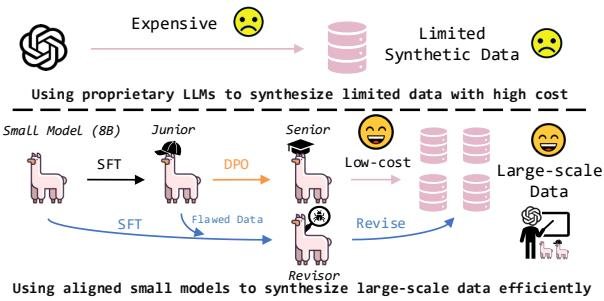
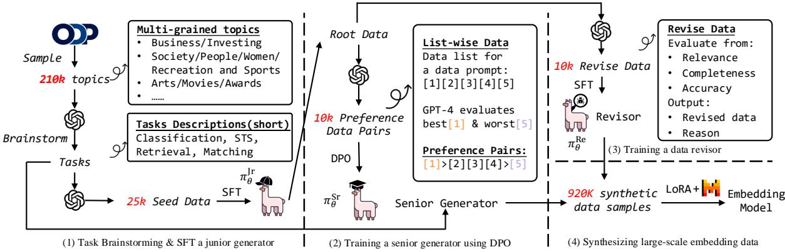
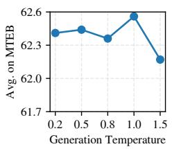
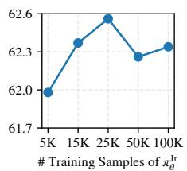
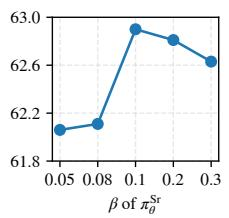
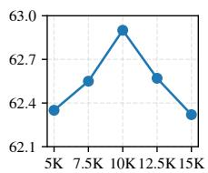
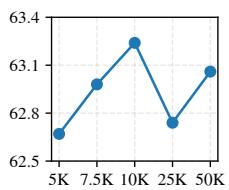
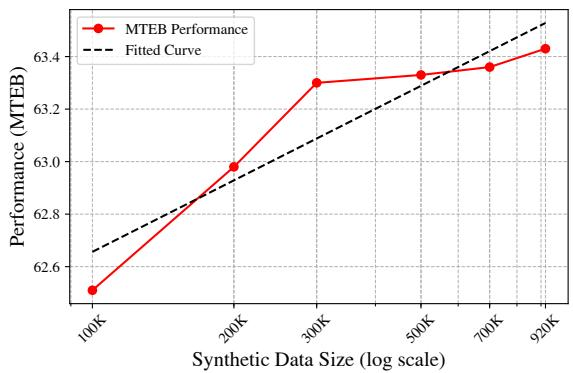

# Little Giants: Synthesizing High-Quality Embedding Data at Scale

Haonan Chen1∗, Liang Wang2, Nan Yang2, Yutao Zhu1,

Ziliang Zhao1, Furu Wei2, Zhicheng Dou1 1Gaoling School of Artificial Intelligence, Renmin University of China 2Microsoft Corporation {hnchen,dou}@ruc.edu.cn {wangliang,nanya,fuwei}@microsoft.com

## Abstract

Synthetic data generation has become an increasingly popular way of training models without the need for large, manually labeled datasets. For tasks like text embedding, synthetic data offers diverse and scalable training examples, significantly reducing the cost of human annotation. However, most current approaches rely heavily on proprietary models like GPT-4, which are expensive and inefficient for generating large-scale embedding data. In this paper, we introduce SPEED, a framework that aligns open-source small models (8B) to efficiently generate large-scale synthetic embedding data. Through supervised fine-tuning, preference optimization, and self-improvement, SPEED enables small open-source models to produce high-quality data. Remarkably, SPEED uses only less than 1/10 of the GPT API calls, outperforming the state-of-the-art embedding model E5mistral when both are trained solely on their synthetic data. Using this efficient generator, we conduct a comprehensive study on how various factors within the alignment pipeline impact data quality and reveal the scaling law for synthetic embedding data. Our codes and models are released in https://github.com/haon-chen/SPEED.

## 1 Introduction

Text embedding models encode natural language texts into latent vectors. They are widely used in downstream tasks such as classification, clustering, retrieval, and summarization. Many researchers have trained general embedding models that can support various tasks (Reimers and Gurevych, 2019; Wang et al., 2022; Xiao et al., 2024). Most of these models require large-scale weakly-supervised data and high-quality labeled data for multi-stage training, which requires careful data curation and costly human effort. Thanks to the powerful language modeling ability and vast knowledge of large language models (LLMs), some works attempt to utilize LLMs to generate synthetic data for training embedding models (Jeronymo et al., 2023; Wang et al., 2024; Lee et al., 2024).

  
Figure 1: An illustration comparing the existing pipeline with our data synthesis framework.

However, most of these works solely use proprietary LLM like GPT-4 for data synthesis (Wang et al., 2024; Lee et al., 2024). For example, E5mistral generates triplets of (query, positive document, hard negative document) for various embedding tasks from scratch. While synthesizing embedding data without relying on existing corpora can yield more diverse examples, using black-box models can be extremely costly, especially given that this data often includes long documents. A straightforward approach to reduce costs is to use small models to synthesize embedding data instead, which have proven effective for tasks such as mathematical reasoning (Zhou et al., 2024b; Bansal et al., 2024; Chen et al., 2024b). However, synthesizing embedding data often requires the generation of hard negatives – documents that are similar to positive ones and are essential for learning nuanced embedding representations. These hard negatives are challenging for small models to synthesize, as they are difficult for language models to distinguish. An early work explores the ability of small models for synthesizing embedding data (Jeronymo et al., 2023), but it uses small models to generate data directly without special tailoring for data synthesis, resulting in poor performance.

In this work, we propose to align open-source small models (8B) to synthesize large-scale highquality embedding data. Compared to existing methods that rely solely on expensive GPT-4, our approach can generate more data at a much lower cost. Our primary goal is to study the alignment of small models for synthesizing embedding data, which has been neglected by existing works. Specifically, we aim to address the following research questions in this paper:

RQ1: How to align small models for synthesizing high-quality embedding data at scale?

RQ2: How do factors within the alignment framework affect the quality of synthetic data?

RQ3: Synthetic data is theoretically infinite. What is the scaling law for synthetic embedding data?

To shed light on RQ1, we design an alignment framework that trains small LLMs to efficiently Synthesize large-scale suPErior Embedding Data (SPEED). As illustrated in Figure 1, our framework consists of three key models: a junior generator for initial data synthesis, a senior generator for advanced data generation, and a data revisor for self-improvement. The goal is to distill knowledge from GPT-4 into these smaller models. We first use GPT-4 to brainstorm task descriptions. However, since GPT-4 often generates hallucinations and data of specific domains (e.g., climate change) (Chang, 2023), we sample topics from the Open Directory Project to ensure diverse and balanced tasks.1 Based on these tasks, GPT-4 produces a small set of seed data, which we use to finetune the junior generator via supervised fine-tuning (SFT). The junior generator produces root data, which is further evaluated by GPT-4 to produce signals that guide the preference optimization process, resulting in a senior generator. The root data is also revised by GPT-4 to produce revision signals for training a data revisor. Inspired by the idea of scaling inference compute for LLMs (Brown et al., 2024), the revisor refines the synthetic data with minimal additional inference cost, enabling self-improvement.

As for RQ2, with these low-cost yet powerful data synthesis models ready, we are able to conduct extensive experiments to study the factors affecting the alignment. We find that settings such as the base model used for alignment, the diversity of tasks, and the number of training samples can influence the quality of synthetic data. For RQ3, we generate large-scale data using the efficient generators to reveal the scaling law. We observe a log-linear relationship between the performance of the embedding model and the size of synthetic embedding data.

In summary, our contributions are as follows:

• We design a framework to fine-tune small LMs (8B) for synthesizing large-scale data, achieving superior embedding performance with less than 1/10 of the GPT API calls required by E5mistral.

• We comprehensively study how the factors within the alignment framework influence the quality of synthetic data.

• We investigate the scaling law of synthetic embedding data and reveal that the embedding model’s performance follows a log-linear relationship with the data size.

## 2 Related Work

Text Embedding Text embedding models have gained much attention in the era of deep learning. Some existing models, such as SBERT (Reimers and Gurevych, 2019), E5 (Wang et al., 2022), and BGE (Xiao et al., 2024), attempt to produce general text embeddings for various tasks. However, most of them require lots of labeled data. In this work, we attempt to train a model with synthetic data.

Large Language Models Though proprietary LLMs (OpenAI, 2023; Anthropic, 2024) are very powerful, invoking their APIs can be quite expensive and unaffordable for common usage. Many open-source LLMs have been released for more efficient language modeling, such as LLaMA (Dubey et al., 2024) and Mistral (Jiang et al., 2023). Some works attempt to improve the ability of LLMs for text embedding tasks, such as ad-hoc retrieval (Ma et al., 2024), conversational retrieval (Chen et al., 2024a), and multilingual text embedding (Wang et al., 2024). Our work aims to use synthetic data to improve the LLM’s ability of text embedding.

Synthetic Data The generation of synthetic data have been studied by many researchers for various embedding tasks. In early times, they have been used to produce pseudo labels and query/document expansions (Nogueira et al., 2019; Wang et al., 2023; Dai et al., 2023). Using the ability of LLMs, synthetic data have been used for code generation (Gunasekar et al., 2023; Hui et al., 2024), mathematical reasoning (Chan et al., 2024; Li et al., 2024a; Zhou et al., 2024a,b), and text embedding (Jeronymo et al., 2023; Viswanathan et al., 2023; Wang et al., 2024; Li et al., 2024b; Patwa et al., 2024; Lee et al., 2024; Sturua et al., 2024). Though they have already shown great performance, most of these works heavily rely on black-box LLMs $( e . g . , \mathrm { E 5 _ { \mathrm { m i s t r a l } } }$ (Wang et al., 2024), SynCSE (Zhang et al., 2023) and Gecko (Lee et al., 2024)) for data synthesis. Some of them uses small LLM to generate data without alignment (Thirukovalluru et al., 2024), which produces data of low quality. Our work aims to align small models for generating large scale text embedding data efficiently.

  
Figure 2: An overview of SPEED. We align small LLMs (8B) to synthesize large-scale high-quality embedding data.

## 3 Methodology: SPEED

In this section, we aim to answer RQ1 using our alignment framework, SPEED. As shown in Figure 2, SPEED consists of four stages: (1) GPT-4 is first used to generate diverse task descriptions based on multi-grained topics sampled from the ODP. A junior generator then distills knowledge from GPT-4 by training on a small set of seed data. (2) The junior generator synthesizes root data, which GPT-4 uses to produce preference signals. These signals are used to train a senior generator through preference optimization. (3) The root data is also evaluated by GPT-4 to produce revised data for finetuning a data revisor. (4) Finally, the senior generator synthesizes large-scale embedding data, and the revisor refines them into high-quality data for training the embedding model.

## 3.1 Preliminaries

Many works have tried to generate synthetic data using modern LLMs for downstream tasks finetuning. Following $\mathrm { E } 5 _ { \mathrm { m i s t r a l } }$ (Wang et al., 2024), in order to synthesize data for training an embedding model, we generate data for four kinds of tasks: classification (long-short match), semantic textual similarity (STS), retrieval (short-long match), and text matching (short-short and long-long match). For simplicity, we will denote the data synthesis prompts as a set P without distinction.2 We use GPT-4 to brainstorm a pool of candidate tasks $T$ as instructions. With a prompt $p \in P$ and a task instruction $t \in T$ , an LLM π can synthesize an embedding data sample d $\sim \pi _ { \boldsymbol { \theta } } ( \boldsymbol { d } \mid p , t )$ . Each data example is a triplet of (query, positive document, hard negative document). For example, for a classification task, the query is a long text and documents are short labels. More information on the structure of these data can be found in Appendix D.

## 3.2 Aligning Small Models for Synthesizing Embedding Data

Most existing approaches that synthesize embedding data suffer from the high cost of heavily relying on proprietary LLMs. We aim to align small models that can generate large-scale embedding data effectively and efficiently.

## 3.2.1 Task Brainstorming

Synthesizing embedding data from scratch can be quite challenging since these data are often long and complex. We first generate a pool of candidate tasks as instructions for LLMs to further generate concrete data. Since these task descriptions are very short (about 10 words) and need to be highquality, we use GPT-4 to brainstorm them. Furthermore, we sample multi-grained topics from open directory project (ODP) and specify one topic for each brainstorming prompt to mitigate the hallucination and extract more diverse knowledge from GPT-4 (Chang, 2023). For example, we prompt GPT-4 as "Brainstorm a list of potentially useful text retrieval tasks for the topic: $\{ t o p i c \} . ^ { \ " } . { } ^ { 3 }$ Then we will get a diverse set of task descriptions and generate embedding data conditioned on them.

## 3.2.2 Training a Junior Generator

Proprietary LLMs such as GPT-4 have been proven to generate high-quality embedding data (Wang et al., 2024; Lee et al., 2024). However, it can be expensive if we generate large-scale embedding data solely using GPT-4. Our goal is to distill the data synthesis capability of GPT-4 into small models that can synthesize large-scale data at low cost.

We first use GPT-4 to generate a small set of seed data $D _ { \mathrm { s e e d } } \ \sim \ \pi _ { \theta } ^ { \mathrm { G P T - 4 } } ( D _ { \mathrm { s e e d } } \ | \ P , T )$ . The constructed training data for SFT is $\begin{array} { r l } { D _ { \mathrm { S F T } } } & { { } = } \end{array}$ $\{ p _ { i } , t _ { i } , d _ { i } \} _ { i = 1 } ^ { N }$ . To distill knowledge from GPT-4, we apply a standard Supervised Fine-tuning (SFT) objective to initialize our junior generator $\pi _ { \theta } ^ { \mathrm { J r } }$ :

$$
\mathcal { L } ( \theta ^ { \mathrm { J r } } ) = - \sum _ { ( p _ { i } , t _ { i } , d _ { i } ) \in \mathcal { D } _ { \mathrm { S F T } } } \log \mathbb { P } _ { \theta } ( d _ { i } \mid p _ { i } , t _ { i } ) ,\tag{1}
$$

where $\theta ^ { \mathrm { J r } }$ denotes the parameters of our junior generator. We aim to train a small model with basic capability of synthesizing embedding data given various prompt templates and task instructions.

## 3.2.3 Further Training Using Preference Optimization

Although our junior generator can already generate embedding data of decent quality, we still want to boost its ability. Preference optimization (Schulman et al., 2017) is a popular way to be performed on a model for further training after SFT (Dong et al., 2024; Yu et al., 2024). Since our goal is to perform optimization on $\pi _ { \theta } ^ { \mathrm { J r } }$ , we use GPT-4 to produce preference signals based on the data generated by $\pi _ { \theta } ^ { \mathrm { J r } }$ itself.

Specifically, $\pi _ { \theta } ^ { \mathrm { J r } }$ generates a list of embedding data given each prompt, formatting a set of root data $D _ { \mathrm { r o o t } } \sim \pi _ { \theta } ^ { \mathrm { J r } } ( D _ { \mathrm { r o o t } } \mid P , T )$ . As illustrated in Figure 2, GPT-4 evaluates the best and the worst data in each data list and constructs preference pairs accordingly. We prompt GPT-4 as: "Your mission is to judge which data this language model generatesfits the prompt most and whichfits worst, and explain your judgment.". In this work, we perform Direct Preference Optimization (DPO) (Rafailov et al., 2023) because it is a popular and low-cost method. The formatted training set for DPO is $D _ { \mathrm { { D P O } } } = \{ p , t , d _ { w } , d _ { l } , \}$ , where $d _ { w }$ and $d _ { l }$ are the winning and losing one, respectively. Then, we apply the standard DPO on our junior generator:

$$
\begin{array} { r l } & { \mathcal { L } _ { \mathrm { D P O } } ( \pi _ { \theta } ^ { \mathrm { J r } } ; \pi _ { \mathrm { r e f } } ) = } \\ & { - \mathbb { E } _ { ( p , t , d _ { w } , d _ { l } ) \sim \mathcal { D } } \left[ \log \sigma \left( \beta \log \frac { \pi _ { \theta } ^ { \mathrm { J r } } ( d _ { w } \mid x ) } { \pi _ { \mathrm { r e f } } ( d _ { w } \mid x ) } \right. \right. } \\ & { \left. \left. - \beta \log \frac { \pi _ { \theta } ^ { \mathrm { J r } } ( d _ { l } \mid x ) } { \pi _ { \mathrm { r e f } } ( d _ { l } \mid x ) } \right) \right] , } \end{array}\tag{2}
$$

where $\pi _ { \mathrm { r e f } }$ is the reference model set as $\pi _ { \theta } ^ { \mathrm { J r } }$ in the beginning and remains frozen, σ is the sigmoid function, and $\beta$ controls how much DPO focus on $\pi _ { \mathrm { r e f } }$ . After this, we manage to obtain a senior generator $\pi _ { \theta } ^ { \mathrm { S r } }$ that can synthesize higher-quality data since it has learned about how to make better choices given a data synthesis prompt.

## 3.2.4 Training a Data Revisor

Scaling the inference compute of LLMs has been a popular way to boost the LLM’s performance from the inference side (Brown et al., 2024). Inspired by this, we employ another small model to refine our synthetic data. This allows us to further improve data quality with only a small increase in inference cost, as the revisor model is also small. Specifically, we train an additional LLM to serve as the data revisor, identifying and refining potential flaws in the synthetic data.

Specifically, to boost the efficiency of the alignment process, we reuse $D _ { \mathrm { r o o t } }$ to produce revised data. This allows us to train both $\pi _ { \theta } ^ { \mathrm { S r } }$ and the revisor $\pi _ { \theta } ^ { \mathrm { R e } }$ simultaneously. GPT-4 produces data revision signals by evaluating the root data from three key aspects: (1) its relevance to the task, (2) its completeness based on the requirements in the prompt, (3) the accuracy of its factual content. The revised data is $D _ { \mathrm { r o o t } } ^ { \mathrm { r e } } \sim \pi _ { \theta } ^ { \mathrm { G P T - 4 } } ( D _ { \mathrm { r o o t } } ^ { \mathrm { r e } } \mid P , T , D _ { \mathrm { r o o t } } )$ and the data for SFT is $\dot { D _ { \mathrm { S F T } } ^ { \mathrm { r e } } } = \{ p _ { j } , t _ { j } , d _ { j } ^ { \mathrm { r o o t } } , d _ { j } ^ { \mathrm { r e } } \} _ { j = 1 } ^ { M }$ . Similarly, a standard SFT approach is performed on an unaligned small LM:

$$
\begin{array} { r } { \mathcal { L } ( \theta ^ { \mathrm { R e } } ) = - \sum _ { ( x _ { j } , d _ { j } ^ { \mathrm { r e } } ) \in \mathcal { D } _ { \mathrm { S F T } } ^ { \mathrm { r e } } } \log \mathbb { P } _ { \theta } ( d _ { j } ^ { \mathrm { r e } } \mid x _ { j } ) , } \\ { x _ { j } = ( p _ { j } , t _ { j } , d _ { j } ^ { \mathrm { r o o t } } ) , \qquad ( 3 ) } \end{array}
$$

where $\theta ^ { \mathrm { R e } }$ denotes the parameters of our revisor.

<table><tr><td colspan="10"></td></tr><tr><td>Zero-shot Models (w/ synthetic data only)</td><td>Synthesis Model</td><td># FT. Data</td><td>Class.</td><td>Clust.</td><td>Pair.</td><td>Rerank.</td><td>Retr.</td><td>STS</td><td>Summ. Avg.</td></tr><tr><td colspan="10">1lama3-8B-instruct</td></tr><tr><td>Mistrallama3 Mistrallama3</td><td>1llama3-8B-instruct</td><td>230K 920K</td><td>76.8 77.0</td><td>48.0 47.2</td><td>79.8 80.3</td><td>59.5 59.4</td><td>44.2 45.0</td><td>79.7 81.2 31.5</td><td>31.5 61.0 61.3</td></tr><tr><td> $\mathrm { M i s t r a l _ { g p t - 4 o } }$ </td><td>gpt-40</td><td>230K</td><td>77.7</td><td>47.7</td><td>83.9</td><td>58.7</td><td>46.7</td><td>80.9 30.7</td><td>62.2</td></tr><tr><td>Geck01b-768</td><td>black-box</td><td>6.6M</td><td>70.3</td><td>46.8</td><td>86.2</td><td>57.6</td><td>53.2 83.1</td><td>32.2</td><td>62.6</td></tr><tr><td>E5mistral-7b</td><td>gpt-3.5(25%)+gpt-4(75%)</td><td>500Kⁿ</td><td>78.2</td><td>50.5</td><td>86.0</td><td>59.0</td><td>46.9</td><td>81.2 31.9</td><td>63.1</td></tr><tr><td>SPEED (Ours)</td><td>llama3-8B-aligned</td><td>920K</td><td>78.3</td><td>48.6</td><td>86.3</td><td>59.8</td><td>48.1</td><td>82.6 31.7</td><td>63.4</td></tr><tr><td colspan="10">Supervised Models (w/ synthetic data + labeled data)</td></tr><tr><td colspan="10"></td></tr><tr><td>GTRXxx1</td><td></td><td>662K</td><td>67.4</td><td>42.4</td><td>86.1</td><td>56.7</td><td>48.5</td><td>78.4</td><td>30.6</td><td>59.0</td></tr><tr><td>GTElarge</td><td></td><td>3M</td><td>73.3</td><td>46.8</td><td>85.0</td><td>59.1</td><td>52.2</td><td>83.4</td><td>31.7</td><td>63.1</td></tr><tr><td>text-embedding-3large</td><td></td><td></td><td>75.5</td><td>49.0</td><td>85.7</td><td>59.2</td><td>55.4</td><td>81.7</td><td>29.9</td><td>64.6</td></tr><tr><td>jina-embeddings-v3</td><td></td><td></td><td>82.6</td><td>45.3</td><td>84.0</td><td>58.1</td><td>53.9</td><td>85.8</td><td>29.7</td><td>65.5</td></tr><tr><td>Geck01b-768</td><td>black-box</td><td>&gt;6.6M</td><td>81.2</td><td>47.5 50.3</td><td>87.6</td><td>58.9</td><td>55.7</td><td>85.1</td><td>32.6</td><td>66.3</td></tr><tr><td>E5mistral-7b</td><td>gpt-3.5(25%)+gpt-4(75%)</td><td>1.8M</td><td>78.5</td><td></td><td>88.3</td><td>60.2</td><td>56.9</td><td>84.6</td><td>31.4</td><td>66.6</td></tr><tr><td>SPEED (Ours)</td><td>llama3-8B-aligned</td><td>2.2M</td><td>78.4</td><td>49.3</td><td>88.2</td><td>60.8</td><td>56.5</td><td>85.5</td><td>31.1</td><td>66.5</td></tr></table>

Table 1: Results on MTEB benchmark, including 56 tasks of 7 types: Classification (Class.), Clustering (Clust.), Pair Classification (Pair.), Reranking (Rerank.), Retrieval (Retr.), Semantic Textual Similarity (STS), and Summarization (Summ.). “Synthesis Model” denotes the LLM used for generating synthetic data. “# FT. Data” denotes the data amount used for finetuning the embedding models. “500Km”: ${ \mathrm { E } } 5 _ { \mathrm { m i s t r a l - 7 b } }$ is a multilingual model, it synthesized 190K English samples plus 310K samples of other languages. The best performances are in bold and the second-best performances are underlined.

## 3.3 Finetuning Embedding Model Using Synthetic Data

With our aligned senior generator $\pi _ { \theta } ^ { \mathrm { S r } }$ and revisor $\pi _ { \theta } ^ { \mathrm { R e } }$ ready, we are able to generate high-quality synthetic embedding data at scale. Specifically, $\pi _ { \theta } ^ { \mathrm { S r } }$ first generates a large set of synthetic data $D _ { \mathrm { s y n } } \sim$ $\pi _ { \theta } ^ { \mathrm { S r } } ( D _ { \mathrm { s y n } } \mid P , T )$ . Then $\pi _ { \boldsymbol { \theta } } ^ { \mathrm { R e } }$ revises them into highquality data $D _ { \mathrm { s y n } } ^ { \mathrm { r e } } \sim \pi _ { \theta } ^ { \mathrm { R e } } ( D _ { \mathrm { s y n } } ^ { \mathrm { r e } } \mid P , T , D _ { \mathrm { s y n } } )$ . For efficiency, we avoid iterative improvements and perform the revision in a single pass.

Following the common approach of task-specific fine-tuning (Xiao et al., 2024; Wang et al., 2024), an instruction template is applied on each query within $D _ { \mathrm { s y n } } ^ { \mathrm { r e } }$ as: $q ^ { i } =$ Instruct: t n Query: q , where $q ^ { i }$ is the original query q with task description. We do not apply this template on the document side for pre-building the index. We append an [EOS] token to each $q ^ { i }$ and document d. Each output of the last layer [EOS] is taken as the representation $\mathbf { q } ^ { i }$ and d. To train the embedding model, we apply a standard contrastive learning objective:

$$
\mathcal { L } _ { \mathrm { C L } } = - \log \frac { \phi ( \mathbf { q } ^ { i } , \mathbf { d } ^ { + } ) } { \phi ( \mathbf { q } ^ { i } , \mathbf { d } ^ { + } ) + \sum _ { d ^ { - } \in \mathcal { N } } \phi ( \mathbf { q } ^ { i } , \mathbf { d } ^ { - } ) } ,\tag{4}
$$

where $\mathcal { N }$ represents negative documents, $\phi ( \cdot ) = $ exp(cos(·)/τ ), cos(·) denotes cosine similarity, and τ is a temperature hyperparameter.

## 4 Experiments

## 4.1 Experimental Setup

SPEED synthesizes 920K embedding data samples in total for training after MinHash deduplication. The proprietary LLM used for knowledge distillation is GPT-4o-2024-05-13. The base model we use to train our generators is LLaMA-3-8B (Meta, 2024). We test our finetuned embedding model on the MTEB benchmark (Muennighoff et al., 2023). This benchmark contains 7 kinds of 56 English embedding tasks: classification (12), clustering (11), pair classification (3), reranking (4), retrieval (15), semantic textual similarity (10) and summarization (1). The synthetic data proportion of our four embedding task types, i.e., classification, STS, retrieval, and text matching is 7:7:7:2. For fair comparisons to $\mathrm { E } 5 _ { \mathrm { m i s t r a l } }$ , we train Mistral-7Bv0.1 (Jiang et al., 2023) as our embedding model and use the same labeled data for “Supervised Mod-$e l s ^ { \prime } { }$ setting. We use LoRA (Hu et al., 2022) to finetune our embedding model.

In addition to existing baselines that consists of OpenAI’s text-embedding-34, GTR (Ni et al., 2022), GTE (Li et al., 2023), jina-embeddingsv3 (Sturua et al., 2024), Gecko (Lee et al., 2024), and $\mathrm { E 5 _ { m i s t r a l - 7 b } }$ (Wang et al., 2024), we also implement two baselines finetuned on synthetic data only. In particular, we use llama3-8B-instruct and gpt-4o to synthesize 230K embedding data using the same synthesis prompts and data proportion of SPEED. Then we finetune Mistral-7B-v0.1 with these data to produce two baselines: $\mathbf { M i s t r a l } _ { \mathrm { l l a m a } 3 }$ and Mistralgpt-4o.

<table><tr><td>Model</td><td>Avg. on MTEB</td></tr><tr><td>SPEED (230K synthetic data)</td><td>63.2</td></tr><tr><td>w/ only SFT  $( \mathrm { o n l y } \ \pi _ { \boldsymbol { \theta } } ^ { \mathrm { J r } } )$ </td><td>62.6</td></tr><tr><td>w/o. DPO  $( \pi _ { \theta } ^ { \mathrm { { J r } } } + \pi _ { \theta } ^ { \mathrm { { R e } } } )$ </td><td>62.8</td></tr><tr><td>w/o. Data Revisor (only  $\pi _ { \theta } ^ { \mathrm { S r } } )$ </td><td>62.9</td></tr></table>

Table 2: Performances of ablated models on MTEB.

More details about the synthetic data, implementation details, and prompts can be found in $\mathsf { A p - }$ pendix A, B, and C, respectively.

## 4.2 Main Results

The results are presented in Table 1. SPEED achieves the best performance in the zero-shot setting and the second-best performance in the supervised setting. This demonstrates the effectiveness of our framework, as SPEED can generate large-scale high-quality data using the smallest language model. These results address RQ1, confirming that SPEED is an effective way to align small models for synthesizing large-scale embed ding data. Furthermore, we can make these observations: (1) Comparing to $\mathbf { M i s t r a l } _ { \mathrm { l l a m a } 3 }$ , SPEED improves its performance greatly. This demonstrates that our alignment framework enables a base small model to synthesize higher-quality data than its instruct-tuned version. Additionally, as shown in Table 2, SPEED with just 230K data examples also outperforms $\mathbf { M i s t r a l } _ { \mathrm { l l a m a } 3 }$ . (2) Intriguingly, SPEED outperforms ${ \mathrm { E 5 } } _ { \mathrm { m i s t r a l - 7 b } }$ in the zero-shot setting but slightly underperforms in the full-data setting. We attribute this to the fact that, while our synthetic data is more diverse and covers a broader range of scenarios, ${ \mathrm { E } } 5 _ { \mathrm { m i s t r a l - 7 b } } { } ^ { \circ } { \mathrm { s } }$ data is structurally closer to labeled data, as it is generated by the powerful but costly GPT. (3) Gecko performs well on some certain types of embedding tasks. We believe this is because Gecko uses a black-box model to generate a large set of synthetic data (6.6M), potentially covering more task types than both SPEED and ${ \mathrm { E 5 } } _ { \mathrm { m i s t r a l - 7 b } }$

<table><tr><td>Topic &amp; Task</td><td>Avg. on MTEB</td></tr><tr><td> $\pi _ { \theta } ^ { \mathrm { { J r } } }$  (1 task per topic &amp; truncation)</td><td>62.6</td></tr><tr><td># Tasks per topic</td><td></td></tr><tr><td>3 tasks per topic</td><td>61.6</td></tr><tr><td>5 tasks per topic</td><td>60.9</td></tr><tr><td>Topic granularity</td><td></td></tr><tr><td>Specific topic (w/o. truncation)</td><td>61.8</td></tr></table>

Table 3: Performances of models with different settings of task brainstorming on MTEB. For efficient test, the models have only been through SFT with 230K data.

## 4.3 RQ2. Alignment Analysis

In this section, we will look deeper into SPEED and provide comprehensive analysis of how each factor influences the synthetic data. For efficient analysis, we synthesize 230K embedding data using the same data proportion of SPEED for each model and perform zero-shot evaluation on MTEB.

## 4.3.1 Ablation Study

To evaluate each component of SPEED, we first conduct ablation experiments on our alignment framework. The results are presented in Table 2. We can make the following observations: $( 1 ) \pi _ { \theta } ^ { \mathrm { J r } }$ itself can already synthesize embedding data of decent quality (62.6), which demonstrates the effectiveness of our aligned junior generator. (2) “SPEED w/o. $\mathrm { D P O ^ { \circ } } \mathrm { . }$ , i.e., only $\pi _ { \theta } ^ { \mathrm { J r } }$ and $\pi _ { \theta } ^ { \mathrm { R e } }$ causes performance decreasing. This demonstrates our DPO training process can further enhance the synthesis ability of $\pi _ { \theta } ^ { \mathrm { J r } }$ . (3) The performance drops after discarding $\pi _ { \theta } ^ { \mathrm { R e } }$ . This shows revising the synthetic data with our data revisor can enhance the data quality by introducing a little more inference compute.

## 4.3.2 Task Brainstorming

To mitigate hallucination and introduce diversity to LLMs, we propose to use GPT-4 to brainstorm a candidate pool of task descriptions with multigrained topics before we synthesize specific data. To study the influence of topic diversity and coverage, we perform experiments from two aspects and present the results in Table 3: (1) The number of tasks per topic. For each topic sampled from ODP, we generate 1, 3, and 5 tasks. We find that the performance of $\pi _ { \theta } ^ { \mathrm { J r } }$ drops greatly when we generate more tasks per topic. This demonstrates that the diversity of tasks is important for the quality of synthetic data. (2) The granularity of topics. The sampled topics are multi-grained and we truncate those extremely specific topics to a maximum depth of 4. Without truncation, those topics will produce tasks harming the generalization of SPEED.

  
# Training Samples of πSrθ

  
# Training Samples of πReθ

Figure 3: Performances of SPEED (230K data for efficient test) with different settings of the alignment pipeline. We tune our model using the validation set of NQ and MSMARCO. For consistency with the results in other tables, we present the results of our model with different hyperparameters on the whole test set of MTEB.
<table><tr><td>Base Model for  $\pi _ { \theta } ^ { \mathrm { { J r } } }$ </td><td>Avg. on MTEB</td></tr><tr><td>LLaMA-3-8B (Meta, 2024) (Ours)</td><td>62.6</td></tr><tr><td>LLaMA-2-7B (Touvron et al., 2023)</td><td>62.4</td></tr><tr><td>Gemma-7B (Mesnard et al., 2024)</td><td>62.3</td></tr><tr><td>Qwen-2.5-7B (Qwen, 2024)</td><td>62.5</td></tr></table>

Table 4: Performances of $\pi _ { \theta } ^ { \mathrm { J r } }$ with different base models.

## 4.3.3 Junior Generator $\pi _ { \theta } ^ { \mathbf { J r } }$

In this section, we will look into our SFT process and discuss the factors that may influence $\pi _ { \theta } ^ { \mathrm { J r } }$ :

Base LLM. The base model that we train into our synthesis LLM is directly related to the data quality. To study this, we apply our SFT pipeline on several other base LLMs. From the results in Table 4, we can observe that all LLMs can synthesize embedding data of decent quality with our SFT pipeline. This shows the effectiveness and applicability of our designed alignment process again. Besides, $\pi _ { \theta } ^ { \mathrm { J r } }$ trained on LLaMA-3-8B achieves the best performance, which is consistent with its superior language modeling ability. This means we can easily boost the quality of synthetic data by applying SPEED on more advanced open-source LLMs.

The generation temperature. Temperature is a crucial hyperparameter that controls the randomness of the text generation process. We set the generation temperature of $\pi _ { \theta } ^ { \mathrm { J r } }$ in the range of [0.2, 1.5], and present the performances on MTEB in the left part of Figure 3. Due to space limitations, we only show results for five values (this policy will be followed in the subsequent displays). We can observe that the performance of $\pi _ { \theta } ^ { \mathrm { J r } }$ first increases then drops. This phenomenon indicates a trade-off: If the temperature is too low, the synthetic data will lack diversity. However, the LLM may generate data that do not follow the required structure and guidelines if the temperature is too high.

The number of training samples. In our training process of $\pi _ { \theta } ^ { \mathrm { J r } }$ , we use GPT-4 to produce signals for knowledge distillation. This raises a question: how many samples should we use for finetuning the generator? Is it the more the better? We study this question by set the number of training samples of $\pi _ { \theta } ^ { \mathrm { J r } }$ in the range of [5K, 100K]. As shown in the middle left part of Figure 3, a small set of training samples can already train a decent generator using our SFT pipeline, which validates its effectiveness again. However, too many training samples will harm the language modeling ability of the LLM.

## 4.3.4 Senior Generator $\pi _ { \theta } ^ { \mathbf { S r } }$

We propose to further train the junior generator with DPO into a more powerful synthesis model $\pi _ { \theta } ^ { \mathrm { S r } }$ . In this part, we will look into this process from these aspects:

The hyperparameter $\beta .$ When performing DPO on $\pi _ { \theta } ^ { \mathrm { J r } }$ , we aim to improve its performance by directly optimizing for preference signals produced by GPT-4. β is the hyperparameter used to control the trade-off between aligning the model to preference signals and avoiding over-optimization that may degrade performance on the original task. To study it empirically, we set $\beta$ in the range of [0.05, 0.3]. As presented in the middle part of Figure 3, SPEED’s performance increases to an optimal value when $\beta = 0 . 1$ then drops. This validates the trade-off: A high $\beta$ controls $\pi _ { \theta } ^ { \mathrm { S r } }$ to stay close to the reference model $( \pi _ { \theta } ^ { \mathrm { { J r } } } )$ , ensuring it doesn’t drift too much, while a low $\beta$ encourages stronger adaptation to the preference signals, but at the risk of overfitting.

The number of training samples. Similar to the SFT process, we can raise a question: how many preference data pairs we should use to align $\pi _ { \theta } ^ { \mathrm { S r } } ?$ We study this question by setting the number of training samples for $\pi _ { \theta } ^ { \mathrm { S r } }$ in the range of [5K, 15K]. From the results in the middle right part of Figure 3, we can observe that finetuning $\pi _ { \theta } ^ { \mathrm { J r } }$ using DPO needs fewer data that the SFT process. This is consistent with previous studies that pairwise signals of outputs (preferences) are more informative per instance than standard supervised data. We also notice that the performance drops when we use too many preference signals. This indicates that overfitting the junior generator will harm its ability of following basic guidelines and instructions. This finding is consistent with previous studies that indicates that DPO may result in worse performance with more samples (Rafailov et al., 2024).

  
Figure 4: Scaling laws for model performance in relation to synthetic embedding data size on MTEB.

## 4.3.5 Data Revisor $\pi _ { \theta } ^ { \mathbf { R e } }$

The number of training samples. SPEED further enhances the quality of synthetic embedding data using a data revisor. GPT-4 evaluates the root data synthesized by $\pi _ { \theta } ^ { \mathrm { J r } }$ from multi-grained aspects and produces data revision signals to finetune $\cdot \pi _ { \theta } ^ { \mathrm { R e } } . \pi _ { \theta } ^ { \mathrm { R e } }$ revises the synthetic data generated by $\pi _ { \theta } ^ { \mathrm { S r } }$ to take a reflection at them and boost their quality. To study the influence of the number of the revision signals used for aligning the revisor, we set it in the range of [5K, 50K]. As shown in the right part of Figure 3, we can observe a similar pattern as the training of $\pi _ { \theta } ^ { \mathrm { J r } }$ . This is consistent with their training protocol that they are both aligned by SFT. However, it takes fewer training data to finetune $\pi _ { \theta } ^ { \mathrm { R e } }$ than $\pi _ { \theta } ^ { \mathrm { { J r } } }$ . This is because that it is easier to revise a data sample of decent quality than synthesize one from scratch.

## 4.4 RQ3. Scaling Synthetic Embedding Data

In the era of LLMs, models are often trained on billions or even trillions of data points. This raises a key question: does increasing training data always lead to better performance? Some existing works has explored this through scaling laws in areas like language modeling (Kaplan et al., 2020) and dense retrieval (Fang et al., 2024). However, these works primarily focus on scaling the labeled

<table><tr><td>Model</td><td>GPT API Calls</td><td>GPT Token Usage</td></tr><tr><td>E5mistral</td><td>500K</td><td>180M</td></tr><tr><td>SPEED</td><td>45K</td><td>32M</td></tr></table>

Table 5: Cost comparison between SPEED and E5mistral in terms of GPT API calls and token usage.

data or existing corpora.

Synthetic data, which are theoretically unlimited, remains an underexplored area for scaling laws (Liu et al., 2024). This is a non-trivial problem because: (1) The distribution of synthetic data differs from that of labeled data (Yu et al., 2023). (2) Generating large-scale synthetic data with blackbox LLMs to study scaling laws can be costly. With the efficient data synthesis capabilities of SPEED, we are able to generate large-scale embedding data and analyze the corresponding scaling law. Our goal is to investigate the scaling effects of synthetic embedding data in its early stages As shown in Figure 4, we observe a log-linear relationship between the embedding model’s performance and the size of the synthetic data. This scaling law offers key insights for future works: (1) The loglinear trend enables researchers to predict performance improvements from synthesizing more data. (2) It guides trade-offs by showing diminishing returns—beyond a certain point, additional data yields marginal improvement, making further investment in data synthesis less valuable.

## 4.5 Cost Analysis

In this section, we analyze the cost of our alignment framework, SPEED. The cost is reported from two aspects: GPT API calls (the number of invoking times) and GPT token usage. We omit the task brainstorming process, as the task descriptions are very short compared to the embedding data, and we also neglect the cost of deploying the aligned generators since they are very small.

Specifically, SPEED costs 25K $( \mathrm { S F T } \ \pi _ { \theta } ^ { \mathrm { J r } } ) + 1 0 \mathrm { K }$ $\left( \mathrm { D P O } \ \pi _ { \theta } ^ { \mathrm { S r } } \right) + 1 0 \mathrm { K } \ ( \mathrm { S F T } \ \pi _ { \theta } ^ { \mathrm { R e } } ) = 4 5 \mathrm { K }$ GPT API calls. As for GPT token usage it costs 10M $( \mathrm { S F T } \ \pi _ { \theta } ^ { \mathrm { J r } } ) +$ 12M $\mathrm { ( D P O \ } \pi _ { \theta } ^ { \mathrm { S r } } \mathrm { ) } + 1 0 \mathbf { M } \mathrm { ( S F T \ } \pi _ { \theta } ^ { \mathrm { R e } } \mathrm { ) } = 3 2 \mathbf { M } .$

For a more staightforward understanding, we compare these costs with the synthesis process of $\mathrm { E } 5 _ { \mathrm { m i s t r a l } }$ , which solely uses GPT to synthesize data. It requires 500K API calls and consumes 180M GPT tokens (Wang et al., 2024). The comparison, shown in Table 5, highlights that SPEED is significantly more efficient, requiring only less than 1/10 of the GPT-4 API calls and about 1/6 of the tokens to align small open-source models for synthesizing large-scale data efficiently and effectively.

## 5 Conclusion

In this work, we propose a framework SPEED that aligns small models for the efficient and effective synthesis of embedding data. Through supervised finetuning, preference optimization, and selfimprovement, small models can also synthesize high-quality embedding data at scale. Additionally, we comprehensively investigate how various factors within the alignment pipeline influence data quality. We reveal the scaling law of synthetic embedding data, demonstrating a log-linear relationship between the performance of the embedding model and the size of the synthetic data.

## Limitations

Our work still have several limitations that we plan to address in future works:

1. The training signals we produce may be improved in the future. Although GPT-4o is already a very powerful LLM, it still can not perfectly interpret the guidelines and requirements in our prompts. For example, some of the long hard negative documents are too close to the positive ones.

2. Our senior generator is trained by DPO. More advanced preference optimization approaches such as step-DPO will be utilized.

3. The base models used for data synthesis and embedding model can be improved. For fair comparisons to baselines, we train Mistral-7B-v0.1 as our embedding model. In future works, we plan to use more advanced LLMs to boost our model’s performance.

4. We do not fit a function for the scaling law we reveal for synthetic embedding data. In future work, we will explore a power-law function that can represent the scaling relationship we find in this paper.

## Acknowledgments

This work was supported by the National Natural Science Foundation of China No. 62272467, Beijing Natural Science Foundation No. L233008, Beijing Municipal Science and Technology Project No.

Z231100010323009, the fund for building worldclass universities (disciplines) of Renmin University of China. The work was partially done at the Engineering Research Center of Next-Generation Intelligent Search and Recommendation, MOE.

## References

AI Anthropic. 2024. The claude 3 model family: Opus, sonnet, haiku. Claude-3 Model Card, 1.

Hritik Bansal, Arian Hosseini, Rishabh Agarwal, Vinh Q Tran, and Mehran Kazemi. 2024. Smaller, weaker, yet better: Training llm reasoners via compute-optimal sampling. arXiv preprint arXiv:2408.16737.

Bradley C. A. Brown, Jordan Juravsky, Ryan Saul Ehrlich, Ronald Clark, Quoc V. Le, Christopher Ré, and Azalia Mirhoseini. 2024. Large language monkeys: Scaling inference compute with repeated sampling. CoRR, abs/2407.21787.

Xin Chan, Xiaoyang Wang, Dian Yu, Haitao Mi, and Dong Yu. 2024. Scaling synthetic data creation with 1,000,000,000 personas. CoRR, abs/2406.20094.

Edward Y Chang. 2023. Examining gpt-4: Capabilities, implications and future directions. In The 10th International Conference on Computational Science and Computational Intelligence.

Haonan Chen, Zhicheng Dou, Kelong Mao, Jiongnan Liu, and Ziliang Zhao. 2024a. Generalizing conversational dense retrieval via llm-cognition data augmentation. In Proceedings of the 62nd Annual Meeting of the Associationfor Computational Linguistics (Volume 1: Long Papers), ACL 2024, Bangkok, Thailand, August 11-16, 2024, pages 2700–2718. Association for Computational Linguistics.

Jie Chen, Zhipeng Chen, Jiapeng Wang, Kun Zhou, Yutao Zhu, Jinhao Jiang, Yingqian Min, Wayne Xin Zhao, Zhicheng Dou, Jiaxin Mao, Yankai Lin, Ruihua Song, Jun Xu, Xu Chen, Rui Yan, Zhewei Wei, Di Hu, Wenbing Huang, and Ji-Rong Wen. 2024b. Towards effective and efficient continual pre-training of large language models. CoRR, abs/2407.18743.

Zhuyun Dai, Vincent Y. Zhao, Ji Ma, Yi Luan, Jianmo Ni, Jing Lu, Anton Bakalov, Kelvin Guu, Keith B. Hall, and Ming-Wei Chang. 2023. Promptagator: Few-shot dense retrieval from 8 examples. In The Eleventh International Conference on Learning Representations, ICLR 2023, Kigali, Rwanda, May 1-5, 2023. OpenReview.net.

Guanting Dong, Keming Lu, Chengpeng Li, Tingyu Xia, Bowen Yu, Chang Zhou, and Jingren Zhou. 2024. Self-play with execution feedback: Improving instruction-following capabilities of large language models. CoRR, abs/2406.13542.

Abhimanyu Dubey, Abhinav Jauhri, Abhinav Pandey, Abhishek Kadian, Ahmad Al-Dahle, Aiesha Letman, Akhil Mathur, Alan Schelten, Amy Yang, Angela Fan, Anirudh Goyal, Anthony Hartshorn, Aobo Yang, Archi Mitra, Archie Sravankumar, Artem Korenev, Arthur Hinsvark, Arun Rao, Aston Zhang, Aurélien Rodriguez, Austen Gregerson, Ava Spataru, Baptiste Rozière, Bethany Biron, Binh Tang, Bobbie Chern, Charlotte Caucheteux, Chaya Nayak, Chloe Bi, Chris Marra, Chris McConnell, Christian Keller, Christophe Touret, Chunyang Wu, Corinne Wong, Cristian Canton Ferrer, Cyrus Nikolaidis, Damien Allonsius, Daniel Song, Danielle Pintz, Danny Livshits, David Esiobu, Dhruv Choudhary, Dhruv Mahajan, Diego Garcia-Olano, Diego Perino, Dieuwke Hupkes, Egor Lakomkin, Ehab AlBadawy, Elina Lobanova, Emily Dinan, Eric Michael Smith, Filip Radenovic, Frank Zhang, Gabriel Synnaeve, Gabrielle Lee, Georgia Lewis Anderson, Graeme Nail, Grégoire Mialon, Guan Pang, Guillem Cucurell, Hailey Nguyen, Hannah Korevaar, Hu Xu, Hugo Touvron, Iliyan Zarov, Imanol Arrieta Ibarra, Isabel M. Kloumann, Ishan Misra, Ivan Evtimov, Jade Copet, Jaewon Lee, Jan Geffert, Jana Vranes, Jason Park, Jay Mahadeokar, Jeet Shah, Jelmer van der Linde, Jennifer Billock, Jenny Hong, Jenya Lee, Jeremy Fu, Jianfeng Chi, Jianyu Huang, Jiawen Liu, Jie Wang, Jiecao Yu, Joanna Bitton, Joe Spisak, Jongsoo Park, Joseph Rocca, Joshua Johnstun, Joshua Saxe, Junteng Jia, Kalyan Vasuden Alwala, Kartikeya Upasani, Kate Plawiak, Ke Li, Kenneth Heafield, Kevin Stone, and et al. 2024. The llama 3 herd of models. CoRR, abs/2407.21783.

Yan Fang, Jingtao Zhan, Qingyao Ai, Jiaxin Mao, Weihang Su, Jia Chen, and Yiqun Liu. 2024. Scaling laws for dense retrieval. In Proceedings of the 47th International ACM SIGIR Conference on Research and Development in Information Retrieval, SIGIR 2024, Washington DC, USA, July 14-18, 2024, pages 1339–1349. ACM.

Suriya Gunasekar, Yi Zhang, Jyoti Aneja, Caio César Teodoro Mendes, Allie Del Giorno, Sivakanth Gopi, Mojan Javaheripi, Piero Kauffmann, Gustavo de Rosa, Olli Saarikivi, Adil Salim, Shital Shah, Harkirat Singh Behl, Xin Wang, Sébastien Bubeck, Ronen Eldan, Adam Tauman Kalai, Yin Tat Lee, and Yuanzhi Li. 2023. Textbooks are all you need. CoRR, abs/2306.11644.

Edward J. Hu, Yelong Shen, Phillip Wallis, Zeyuan Allen-Zhu, Yuanzhi Li, Shean Wang, Lu Wang, and Weizhu Chen. 2022. Lora: Low-rank adaptation of large language models. In The Tenth International Conference on Learning Representations, ICLR 2022, Virtual Event, April 25-29, 2022. OpenReview.net.

Binyuan Hui, Jian Yang, Zeyu Cui, Jiaxi Yang, Dayiheng Liu, Lei Zhang, Tianyu Liu, Jiajun Zhang, Bowen Yu, Kai Dang, et al. 2024. Qwen2. 5-coder technical report. arXiv preprint arXiv:2409.12186.

Vitor Jeronymo, Luiz Henrique Bonifacio, Hugo Queiroz Abonizio, Marzieh Fadaee, Roberto

de Alencar Lotufo, Jakub Zavrel, and Rodrigo Frassetto Nogueira. 2023. Inpars-v2: Large language models as efficient dataset generators for information retrieval. CoRR, abs/2301.01820.

Albert Q. Jiang, Alexandre Sablayrolles, Arthur Mensch, Chris Bamford, Devendra Singh Chaplot, Diego de Las Casas, Florian Bressand, Gianna Lengyel, Guillaume Lample, Lucile Saulnier, Lélio Renard Lavaud, Marie-Anne Lachaux, Pierre Stock, Teven Le Scao, Thibaut Lavril, Thomas Wang, Timothée Lacroix, and William El Sayed. 2023. Mistral 7b. CoRR, abs/2310.06825.

Jared Kaplan, Sam McCandlish, Tom Henighan, Tom B. Brown, Benjamin Chess, Rewon Child, Scott Gray, Alec Radford, Jeffrey Wu, and Dario Amodei. 2020. Scaling laws for neural language models. CoRR, abs/2001.08361.

Jinhyuk Lee, Zhuyun Dai, Xiaoqi Ren, Blair Chen, Daniel Cer, Jeremy R. Cole, Kai Hui, Michael Boratko, Rajvi Kapadia, Wen Ding, Yi Luan, Sai Meher Karthik Duddu, Gustavo Hernández Ábrego, Weiqiang Shi, Nithi Gupta, Aditya Kusupati, Prateek Jain, Siddhartha Reddy Jonnalagadda, Ming-Wei Chang, and Iftekhar Naim. 2024. Gecko: Versatile text embeddings distilled from large language models. CoRR, abs/2403.20327.

Haoran Li, Qingxiu Dong, Zhengyang Tang, Chaojun Wang, Xingxing Zhang, Haoyang Huang, Shaohan Huang, Xiaolong Huang, Zeqiang Huang, Dongdong Zhang, Yuxian Gu, Xin Cheng, Xun Wang, Si-Qing Chen, Li Dong, Wei Lu, Zhifang Sui, Benyou Wang, Wai Lam, and Furu Wei. 2024a. Synthetic data (almost) from scratch: Generalized instruction tuning for language models. CoRR, abs/2402.13064.

Yinheng Li, Rogerio Bonatti, Sara Abdali, Justin Wagle, and Kazuhito Koishida. 2024b. Data generation using large language models for text classification: An empirical case study. CoRR, abs/2407.12813.

Zehan Li, Xin Zhang, Yanzhao Zhang, Dingkun Long, Pengjun Xie, and Meishan Zhang. 2023. Towards general text embeddings with multi-stage contrastive learning. CoRR, abs/2308.03281.

Ruibo Liu, Jerry Wei, Fangyu Liu, Chenglei Si, Yanzhe Zhang, Jinmeng Rao, Steven Zheng, Daiyi Peng, Diyi Yang, Denny Zhou, and Andrew M. Dai. 2024. Best practices and lessons learned on synthetic data for language models. CoRR, abs/2404.07503.

Xueguang Ma, Liang Wang, Nan Yang, Furu Wei, and Jimmy Lin. 2024. Fine-tuning llama for multi-stage text retrieval. In Proceedings of the 47th International ACM SIGIR Conference on Research and Development in Information Retrieval, SIGIR 2024, Washington DC, USA, July 14-18, 2024, pages 2421– 2425. ACM.

Thomas Mesnard, Cassidy Hardin, Robert Dadashi, Surya Bhupatiraju, Shreya Pathak, Laurent Sifre,

Morgane Rivière, Mihir Sanjay Kale, Juliette Love, Pouya Tafti, Léonard Hussenot, Aakanksha Chowdhery, Adam Roberts, Aditya Barua, Alex Botev, Alex Castro-Ros, Ambrose Slone, Amélie Héliou, Andrea Tacchetti, Anna Bulanova, Antonia Paterson, Beth Tsai, Bobak Shahriari, Charline Le Lan, Christopher A. Choquette-Choo, Clément Crepy, Daniel Cer, Daphne Ippolito, David Reid, Elena Buchatskaya, Eric Ni, Eric Noland, Geng Yan, George Tucker, George-Cristian Muraru, Grigory Rozhdestvenskiy, Henryk Michalewski, Ian Tenney, Ivan Grishchenko, Jacob Austin, James Keeling, Jane Labanowski, Jean-Baptiste Lespiau, Jeff Stanway, Jenny Brennan, Jeremy Chen, Johan Ferret, Justin Chiu, and et al. 2024. Gemma: Open models based on gemini research and technology. CoRR, abs/2403.08295.

Meta. 2024. Introducing meta llama 3: The most capable openly available llm to date. https://ai.meta. com/blog/meta-llama-3/.

Niklas Muennighoff, Nouamane Tazi, Loïc Magne, and Nils Reimers. 2023. MTEB: massive text embedding benchmark. In Proceedings of the 17th Conference of the European Chapter of the Association for Computational Linguistics, EACL 2023, Dubrovnik, Croatia, May 2-6, 2023, pages 2006–2029. Association for Computational Linguistics.

Jianmo Ni, Chen Qu, Jing Lu, Zhuyun Dai, Gustavo Hernández Ábrego, Ji Ma, Vincent Y. Zhao, Yi Luan, Keith B. Hall, Ming-Wei Chang, and Yinfei Yang. 2022. Large dual encoders are generalizable retrievers. In Proceedings ofthe 2022 Conference on Empirical Methods in Natural Language Processing, EMNLP 2022, Abu Dhabi, United Arab Emirates, De cember 7-11, 2022, pages 9844–9855. Association for Computational Linguistics.

Rodrigo Frassetto Nogueira, Wei Yang, Jimmy Lin, and Kyunghyun Cho. 2019. Document expansion by query prediction. CoRR, abs/1904.08375.

OpenAI. 2023. GPT-4 technical report. CoRR, abs/2303.08774.

Parth Patwa, Simone Filice, Zhiyu Chen, Giuseppe Castellucci, Oleg Rokhlenko, and Shervin Malmasi. 2024. Enhancing low-resource llms classification with PEFT and synthetic data. In Proceedings of the 2024 Joint International Conference on Computational Linguistics, Language Resources and Evaluation, LREC/COLING 2024, 20-25 May, 2024, Torino, Italy, pages 6017–6023. ELRA and ICCL.

Team Qwen. 2024. Qwen2.5: A party of foundation models.

Rafael Rafailov, Yaswanth Chittepu, Ryan Park, Harshit Sikchi, Joey Hejna, W. Bradley Knox, Chelsea Finn, and Scott Niekum. 2024. Scaling laws for reward model overoptimization in direct alignment algorithms. CoRR, abs/2406.02900.

Rafael Rafailov, Archit Sharma, Eric Mitchell, Christopher D. Manning, Stefano Ermon, and Chelsea Finn. 2023. Direct preference optimization: Your language model is secretly a reward model. In Advances in Neural Information Processing Systems 36: Annual Conference on Neural Information Processing Systems 2023, NeurIPS 2023, New Orleans, LA, USA, December 10 - 16, 2023.

Nils Reimers and Iryna Gurevych. 2019. Sentence-bert: Sentence embeddings using siamese bert-networks. In Proceedings of the 2019 Conference on Empirical Methods in Natural Language Processing and the 9th International Joint Conference on Natural Language Processing, EMNLP-IJCNLP 2019, Hong Kong, China, November 3-7, 2019, pages 3980–3990. Association for Computational Linguistics.

John Schulman, Filip Wolski, Prafulla Dhariwal, Alec Radford, and Oleg Klimov. 2017. Proximal policy optimization algorithms. CoRR, abs/1707.06347.

Saba Sturua, Isabelle Mohr, Mohammad Kalim Akram, Michael Günther, Bo Wang, Markus Krimmel, Feng Wang, Georgios Mastrapas, Andreas Koukounas, Nan Wang, et al. 2024. jina-embeddings-v3: Multilingual embeddings with task lora. arXiv preprint arXiv:2409.10173.

Raghuveer Thirukovalluru, Xiaolan Wang, Jun Chen, Shuyang Li, Jie Lei, Rong Jin, and Bhuwan Dhingra. 2024. Sumcse: Summary as a transformation for contrastive learning. In Findings ofthe Association for Computational Linguistics: NAACL 2024, Mexico City, Mexico, June 16-21, 2024, pages 3577–3588. Association for Computational Linguistics.

Hugo Touvron, Louis Martin, Kevin Stone, Peter Albert, Amjad Almahairi, Yasmine Babaei, Nikolay Bashlykov, Soumya Batra, Prajjwal Bhargava, Shruti Bhosale, Dan Bikel, Lukas Blecher, Cristian Canton-Ferrer, Moya Chen, Guillem Cucurull, David Esiobu, Jude Fernandes, Jeremy Fu, Wenyin Fu, Brian Fuller, Cynthia Gao, Vedanuj Goswami, Naman Goyal, Anthony Hartshorn, Saghar Hosseini, Rui Hou, Hakan Inan, Marcin Kardas, Viktor Kerkez, Madian Khabsa, Isabel Kloumann, Artem Korenev, Punit Singh Koura, Marie-Anne Lachaux, Thibaut Lavril, Jenya Lee, Diana Liskovich, Yinghai Lu, Yuning Mao, Xavier Martinet, Todor Mihaylov, Pushkar Mishra, Igor Molybog, Yixin Nie, Andrew Poulton, Jeremy Reizenstein, Rashi Rungta, Kalyan Saladi, Alan Schelten, Ruan Silva, Eric Michael Smith, Ranjan Subramanian, Xiaoqing Ellen Tan, Binh Tang, Ross Taylor, Adina Williams, Jian Xiang Kuan, Puxin Xu, Zheng Yan, Iliyan Zarov, Yuchen Zhang, Angela Fan, Melanie Kambadur, Sharan Narang, Aurélien Rodriguez, Robert Stojnic, Sergey Edunov, and Thomas Scialom. 2023. Llama 2: Open foundation and finetuned chat models. CoRR, abs/2307.09288.

Vijay Viswanathan, Chenyang Zhao, Amanda Bertsch, Tongshuang Wu, and Graham Neubig. 2023. Prompt2model: Generating deployable models from natural language instructions. In Proceedings ofthe

2023 Conference on Empirical Methods in Natural Language Processing, EMNLP 2023 - System Demonstrations, Singapore, December 6-10, 2023, pages 413–421. Association for Computational Linguistics.

Liang Wang, Nan Yang, Xiaolong Huang, Binxing Jiao, Linjun Yang, Daxin Jiang, Rangan Majumder, and Furu Wei. 2022. Text embeddings by weakly-supervised contrastive pre-training. CoRR, abs/2212.03533.

Liang Wang, Nan Yang, Xiaolong Huang, Linjun Yang, Rangan Majumder, and Furu Wei. 2024. Improving text embeddings with large language models. In Proceedings of the 62nd Annual Meeting of the Associationfor Computational Linguistics (Volume 1: Long Papers), ACL 2024, Bangkok, Thailand, August 11-16, 2024, pages 11897–11916. Association for Computational Linguistics.

Liang Wang, Nan Yang, and Furu Wei. 2023. Query2doc: Query expansion with large language models. In Proceedings ofthe 2023 Conference on Empirical Methods in Natural Language Processing, EMNLP 2023, Singapore, December 6-10, 2023, pages 9414–9423. Association for Computational Linguistics.

Shitao Xiao, Zheng Liu, Peitian Zhang, Niklas Muennighoff, Defu Lian, and Jian-Yun Nie. 2024. C-pack: Packed resources for general chinese embeddings. In Proceedings of the 47th International ACM SIGIR Conference on Research and Development in Information Retrieval, SIGIR 2024, Washington DC, USA, July 14-18, 2024, pages 641–649. ACM.

Runsheng Yu, Yong Wang, Xiaoqi Jiao, Youzhi Zhang, and James T. Kwok. 2024. Direct alignment of language models via quality-aware self-refinement. CoRR, abs/2405.21040.

Yue Yu, Yuchen Zhuang, Jieyu Zhang, Yu Meng, Alexander J. Ratner, Ranjay Krishna, Jiaming Shen, and Chao Zhang. 2023. Large language model as attributed training data generator: A tale of diversity and bias. In Advances in Neural Information Processing Systems 36: Annual Conference on Neural Information Processing Systems 2023, NeurIPS 2023, New Orleans, LA, USA, December 10 - 16, 2023.

Junlei Zhang, Zhenzhong Lan, and Junxian He. 2023. Contrastive learning of sentence embeddings from scratch. In Proceedings of the 2023 Conference on Empirical Methods in Natural Language Processing, EMNLP 2023, Singapore, December 6-10, 2023, pages 3916–3932. Association for Computational Linguistics.

Jiaming Zhou, Abbas Ghaddar, Ge Zhang, Liheng Ma, Yaochen Hu, Soumyasundar Pal, Mark Coates, Bin Wang, Yingxue Zhang, and Jianye Hao. 2024a. Enhancing logical reasoning in large language models through graph-based synthetic data. arXiv preprint arXiv:2409.12437.

Kun Zhou, Beichen Zhang, Jiapeng Wang, Zhipeng Chen, Wayne Xin Zhao, Jing Sha, Zhichao Sheng, Shijin Wang, and Ji-Rong Wen. 2024b. Jiuzhang3.0: Efficiently improving mathematical reasoning by training small data synthesis models. CoRR, abs/2405.14365.

## Appendix

## A Details about Synthetic Data

<table><tr><td>Synthetic Task Type</td><td># Examples</td></tr><tr><td>Classification (long-short match)</td><td>245,947</td></tr><tr><td>Semantic textual similarity (STS)</td><td>294,388</td></tr><tr><td>Retrieval (short-long match)</td><td>303,424</td></tr><tr><td>Text matching (short-short match)</td><td>39,954</td></tr><tr><td>Text matching (long-long match)</td><td>36,702</td></tr></table>

Table 6: Statistics of the synthetic data (after MinHash) used for finetuning the embedding model.

In this section, we will look into the detailed information and statistics of generated synthetic embedding data. The statistics is presented in Table 6. We first generates a raw synthetic dataset of 1.15M examples following the data proportion in Section 4.1. And after MinHash deduplication, there are 920,415 data left in total.

## B Implementation Details

In this part, we delve into the details about the implementation of SPEED. Specifically, we finetune LLaMA-3-8B as data synthesis models and Mistral-7B-v0.1 as our embedding model. For the SFT process of $\pi _ { \theta } ^ { \mathrm { J r } }$ , the learning rate is 1e-4 and the batch size is 16. As for the DPO process of $\pi _ { \theta } ^ { \mathrm { S r } }$ , the learning rate is 1e-5, beta β is set as 0.1, and the batch size is 16. For the SFT process of $\pi _ { \theta } ^ { \mathrm { R e } }$ , the learning rate is 5e-6 and the batch size is 24.

For the data generation, we set the temperature as 1.0 for all data synthesis except 0.0 for producing the preference signal. The top\_p is set as 1.0.

For the training of our embedding model, we use LoRA with rank 16 and DeepSpeed ZeRO-3. We set the batch size as 1,536 using 16 40G A100 and fp16. For the training data, we use a combination of synthetic data and a collection of 13 public datasets. These labeled datasets used for finetuning are the same as those in E5mistral.

For the instructions we used for the training and evaluation datasets (MTEB), please refer to the original paper of $\mathrm { E } 5 _ { \mathrm { m i s t r a l } }$ (Wang et al., 2024).

## C Prompts

The prompts we used in our work can be categorized into two kinds: prompts used for generating synthetic data and aligning data generators.

## C.1 Data Generation

Since our work focuses on the alignment of small models for synthesizing large-scale embedding data, we reuse most of the data generation prompts and data structures of $\mathrm { E } 5 _ { \mathrm { m i s t r a l } }$ (Wang et al., 2024). For task brainstorming, we adjust those prompts to fit the sampled topic by appending “for the topic: {topic}” after each “Brainstorm a list of potentially useful xxx tasks”. For the synthesis of STS data we change its prompt to fit the sampled topics as follows:

Prompt: Synthesizing STS Data   
Write a {sentence, phrase, passage} triple for the topic:   
{topic} with varying semantic similarity scores in JSON   
format. The semantic similarity score ranges from 1   
to 5, with 1 denotes least similar and 5 denotes most similar.   
Please adhere to the following guidelines:   
- The keys in JSON are "S1", "S2", and "S3", the values   
are all strings in English, do not add any other keys.   
- There should be some word overlaps between all three   
{sentence, phrase, passage}s.   
- The similarity score between S1 and S2 should be {4, 4.5,   
5}.   
- The similarity score between S1 and S3 should be {2.5, 3,   
3.5}.   
- The {sentence, phrase, passage}s require {elementary   
school, high school, college} level education to understand   
and should be diverse in terms of topic and length.   
Your output must always be a JSON object only   
with three keys "S1", "S2" and "S3", do not explain   
yourself or output anything else. Be creative!

## C.2 Generator Alignment

In this part, we will shed light on the prompts we use to generate the signals for knowledge distillation. For the SFT of $\pi _ { \theta } ^ { \mathrm { J r } }$ , the training data are sampled from the synthesis of $\mathrm { M i s t r a l _ { g p t - 4 o } }$ . For the DPO of $\pi _ { \theta } ^ { \mathrm { S r } }$ , we prompt GPT-4 to produce preference data as:

Prompt: Generating Preference Data   
A language model has been given a prompt: {data prompt}   
The output list of it is: {data list}   
Your mission is to judge which data this language model   
generate fits the prompt most and which fits worst, and   
explain your judgment.   
The JSON object you output must contain the following   
keys:   
- "reason": a string, the reason of your judgment.   
- "best": a number, the index of the generated data that fits   
prompt the most (indice start from 0).   
- "worst": a number, the index of the generated data that   
fits prompt the worst.   
Your output must always be a JSON object only, do not   
explain yourself or output anything else.

With this prompt, we can obtain a best and worst data of the data list evaluated by GPT-4. Then, we can get preference data pairs based on the best and worst data.

For the SFT of $\pi _ { \theta } ^ { \mathrm { R e } }$ , we use GPT-4 to evaluate the quality of synthetic data from multiple aspects and produce the revised data for training signals.

Prompt: Generating Revise Data   
A language model has been given a prompt: {data prompt}   
The output generated by the model is: {data example}   
Your task is to evaluate the generated output based on the   
following criteria:   
1. Relevance: Assess whether the output directly addresses   
the task described in the prompt.   
2. Completeness: Check if the output includes all necessary   
elements as specified in the prompt.   
3. Accuracy: Verify if the output is factually correct and   
adheres to the guidelines provided in the prompt.   
For each criterion, provide a brief explanation supporting   
your evaluation. Then, provide a revised version of the   
output.   
Your response should be a valid JSON object containing   
the following keys:   
- "reason": A string providing the reason for your judgment.   
- "revision": A string with the revised version of the output   
based on your evaluation and the prompt.   
Ensure your output is always a valid JSON object, for  
matted as a JSON string. Do not include any additional   
explanations or information.

## D Data Examples

## D.1 Topics

In order to mitigate the hallucination and introduce more diversity to LLMs, we propose to sample multi-grained topics from ODP. Some examples of the sampled raw topics are presented in Table 7. Some of these topics are wide categories (e.g., “Arts”), which will make LLM generate more abstract data. And some of these topics are detailed and specific, which may cause the synthetic data to include some noisy information. Therefore, we propose to truncate the topics with depth more than four by discarding their middle information. For example, for “Arts/Movies/Titles/3/36\_Hours\_- \_1964/Cast\_and\_Crew”, we will only keep “Arts/Movies/36\_Hours\_-\_1964/Cast\_and\_Crew”. By this, we can keep its main category and some details without introducing too much noise.

## D.2 Alignment Data

In this section, we present data used for aligning $\pi _ { \theta } ^ { \mathrm { S r } }$ and $\pi _ { \theta } ^ { \mathrm { R e } }$ in Figure 5 and Figure 6, respectively.

## D.3 Synthetic Embedding Data

In this section, we present examples of synthetic data of various task types in Figure 7 (classification), Figure 8 (retrieval), Figure 9 (STS), Figure 10 (short-short matching), and Figure 11 (long-long matching).

## E Detailed Results

In this section, we present detailed evaluation results of SPEED in zero-shot setting and full-data setting. The results on all 56 datasets of MTEB benchmark are shown in Table 8.

  
Table 7: Examples of topics sampled from ODP without truncation.

<table><tr><td rowspan=1 colspan=2>Input</td></tr><tr><td rowspan=1 colspan=1>Data Prompt</td><td rowspan=1 colspan=1>You have been assigned a text matching task: Match a Stockard Channing movie titlewith a brief plot description.Your mission is to write one example for this task in JSON format. The JSON object mustcontain the following keys:- “input&quot;: a string, a random input specified by the task.- “positive_document&quot;: a string, a relevant document for the “input&quot; according to the task.Please adhere to the following guidelines:- The values of all fields should be in English.- Both the “input&quot; and “positive_document&quot; should be very short (a sentence or a phrase),avoid substantial word overlaps, otherwise the task would be too easy.- The &quot;input&quot; and &quot;positive_document&quot; should be independent of each other.Your output must always be a JSON object only, do not explain yourself or outputanything else. Be creative!</td></tr><tr><td rowspan=1 colspan=1>Data List</td><td rowspan=1 colspan=1>0. {&quot;input&quot;: &quot;Stockard Channing in a small-town comedy&quot;, &quot;positive_document&quot;: &quot;TheWest Wing, where Channing played a key role&quot;}1. {&quot;input&quot;: &quot;Stockard Channing acted as a political wife in a drama film&quot;,&quot;positive_document&quot;: &quot;An ensemble cast, including Stockard Channing, navigates theintricate world of politics and media in the movie The West Wing.&quot;}2. { &quot;input&quot;: &quot;Stockard Channing in &#x27;The Business of Strangers&#x27;, directed by PatrickStettner.&quot;, &quot;positive_document&quot;: &quot;In &#x27;The Business of Strangers&#x27;, Channing stars as abusinesswoman who embarks on a ruthless journey, after which she undergoes a drasticchange. She faces many challenges while pursuing her goals and eventually comes outstronger.&quot;}3. {&quot;input&quot;: &quot;Comedy drama set in the 1960s during the Kennedy-Camelot era.&quot;,&quot;positive_document&quot;: &quot;The Goodbye Girl by Stockard Channing&quot;}4. {&quot;input&quot;: &quot;Stockard Channing in film about the Kennedy White House&quot;,&quot;positive_document&quot;: &quot;The Lion in Winter&quot;}&#x27;</td></tr></table>

Output
<table><tr><td>Best 2</td><td></td></tr><tr><td>Worst</td><td>4</td></tr><tr><td>Reason</td><td>The third entry best fits the prompt as it correctly matches a Stockard Channing movie title with its plot without substantial word overlap, maintaining independence between the input and the positive document. The first and second entries incorrectly reference 'The West Wing,' which is not a movie but a TV series, making them less relevant. However, the second entry is slightly more accurate in context but still incorrect. The fourth and fifth entries are the least fitting because they provide incorrect information; 'The Goodbye Girl' does not star Stockard Channing, and 'The Lion in Winter' is not about the Kennedy White House nor does it star Stockard Channing, showing a misunderstanding of the task requirements.</td></tr><tr><td colspan="2" rowspan="1">Input</td></tr><tr><td colspan="1" rowspan="1">Data Prompt</td><td colspan="1" rowspan="1">You have been assigned a text matching task: Match a Stockard Channing movie titlewith a brief plot description.Your mission is to write one example for this task in JSON format. The JSON object mustcontain the following keys:- “input": a string, a random input specified by the task.- “positive_document": a string, a relevant document for the “input" according to the task.Please adhere to the following guidelines:- The values of all fields should be in English.- Both the “input" and “positive_document"should be very short (a sentence or a phrase),avoid substantial word overlaps, otherwise the task would be too easy.- The "input" and "positive_document" should be independent of each other.Your output must always be a JSON object only, do not explain yourself or outputanything else. Be creative!</td></tr><tr><td colspan="1" rowspan="1">Data Example</td><td colspan="1" rowspan="1">{ "input": "Stockard Channing in 'The Business of Strangers', directed by PatrickStettner.", "positive_document": "In 'The Business of Strangers', Channing stars as abusinesswoman who embarks on a ruthless journey, after which she undergoes a drasticchange. She faces many challenges while pursuing her goals and eventually comes outstronger."}</td></tr><tr><td colspan="2" rowspan="1">Output</td></tr><tr><td colspan="1" rowspan="1">Revised Data</td><td colspan="1" rowspan="1">{“input": “Stockard Channing movie The Business of Strangers", “positive_document":"A businesswoman undergoes a drastic transformation after a critical incident."}</td></tr><tr><td colspan="1" rowspan="1">Reason</td><td colspan="1" rowspan="1">The output is mostly correct but the input should be more concise. Thepositive_document should be shorter and without substantial word overlap, according tothe guidelines.</td></tr></table>

Figure 5: An example to show the generated preference signals for DPO. A data prompt and a data list are fed into GPT-4 and it evaluates the best and worst data according to the requirements of prompt. The data prompt template is from $\mathrm { E } 5 _ { \mathrm { m i s t r a l } }$ (Wang et al., 2024).

Figure 6: An example to show the generated revision signals for SFT the data revisor. A data prompt and a data list are fed into GPT-4 and it improves the data based on the given guidelines in the prompt.

An Example of Synthetic Classification (Long-short Match) Data
<table><tr><td colspan="1" rowspan="1">Task Description</td><td colspan="1" rowspan="1">Identify the target audience demographic for each review of Blue Law</td></tr><tr><td colspan="1" rowspan="1">Input Text</td><td colspan="1" rowspan="1">With an intricate discussion on quantum states, entanglement, and Bell's Theorem, BlueLaw takes its readers on an exhilarating journey into the depths of quantum mechanics.Each chapter details the advances in the field with advanced mathematical models that arethoroughly explained to facilitate a deep understanding of entangled systems. The book,written by Dr. Maxwell, is clearly intended for graduate students and researchers engagedin scientific discourse, offering rigorous and in-depth explanations without unnecessarypedagogical baggage. It caters to an audience that needs highly technical content but ispresented in a concise and accessible manner. The author's comprehensive grasp of thesubject is evident throughout the book, which also features detailed diagrams andcomplex calculations that are thoroughly dissected for comprehension's sake. This bookcould serve as the cornerstone for advanced students interested in quantum mechanics andits far-reaching impacts.</td></tr><tr><td colspan="1" rowspan="1">Positive</td><td colspan="1" rowspan="1">Expert/Researcher</td></tr><tr><td colspan="1" rowspan="1">Hard Negative</td><td colspan="1" rowspan="1">Graduate Students</td></tr><tr><td colspan="2" rowspan="1">An Example of Synthetic Retrieval (Short-Long Match) Data</td></tr><tr><td colspan="1" rowspan="1">Task Description</td><td colspan="1" rowspan="1">The query is a natural language question about the history of a Belgian soccer club,retrieve documents that provide detailed historical information.</td></tr><tr><td colspan="1" rowspan="1">User query</td><td colspan="1" rowspan="1">Timeline of significant historical events in Royal Antwerp's evolution.</td></tr><tr><td colspan="1" rowspan="1">Positivedocument</td><td colspan="1" rowspan="1">Founded in 1880, Royal Antwerp FC is one of the oldest clubs in Belgium. The club has arich history with notable achievements in local and international football competitions.Notable events in the early 1900s include the team's first participation in the Belgianleague and their first major victory against rivals Racing Club de Bruxelles. The 1920ssaw the club reach multiple finals and their first championship win in 1929. The 1960sbrought the team to the quarter-finals of the European Cup and a new stadium, theBosuilstadion. Recent decades have brought mixed fortunes with an emphasis on youthdevelopment and a new stadium rebuild plan.</td></tr><tr><td colspan="1" rowspan="1">Hard negativedocument</td><td colspan="1" rowspan="1">Royal Antwerp FC, known as the Blue Diamonds, has been a significant club in Belgianfootball since its inception. The team has participated in various local and internationaltournaments but is best known for their rivalry with club rivals RSC Anderlecht. Despitenot achieving major trophy wins like many of its rivals have, Antwerp continues to be arespected and valued club among fans and fellow teams. Their contributions to Belgianfootball, as well as the evolution of soccer in the city of Antwerp, remain a significantpart of Belgium's footballing history.</td></tr></table>

Figure 7: An example of the synthetic classification data. The data prompt template is from $\mathrm { E } 5 _ { \mathrm { m i s t r a l } }$ (Wang et al., 2024).

Figure 8: An example of the synthetic retrieval data.

<table><tr><td rowspan=1 colspan=2>An Example of Synthetic Semantic Textual Similarity (STS) Data</td></tr><tr><td rowspan=1 colspan=1>Task Description</td><td rowspan=1 colspan=1>Retrieve semantically similar text</td></tr><tr><td rowspan=1 colspan=1>S1 (Input Text)</td><td rowspan=1 colspan=1>Last weekend, Jack and his friends went to the park for a picnic</td></tr><tr><td rowspan=1 colspan=1>S2 (Positive)</td><td rowspan=1 colspan=1>Jack&#x27;s friends wanted him to join them on a picnic they were planning at the park lastweekend.</td></tr><tr><td rowspan=1 colspan=1>S3 (HardNegative)</td><td rowspan=1 colspan=1>Jack enjoyed watching people and animals in the park during his daily walk today.</td></tr></table>

Figure 9: An example of the synthetic semantic textual similarity data.

<table><tr><td rowspan=1 colspan=2>An Example of Text Matching (Short-short Match) Data</td></tr><tr><td rowspan=1 colspan=1>Task Description M</td><td rowspan=1 colspan=1>atch a product name with its category</td></tr><tr><td rowspan=1 colspan=1>Input</td><td rowspan=1 colspan=1>iPhone 12 Pro Max</td></tr><tr><td rowspan=1 colspan=1>Positive</td><td rowspan=1 colspan=1>Smartphone</td></tr></table>

Figure 10: An example of the synthetic short-short matching data.

An Example of Text Matching (Long-long Match) Data
<table><tr><td>Task Description</td><td>Given a detailed research paper on quantum computing, locate another document that presents a critical analysis or opposing viewpoints on the same topic</td></tr><tr><td>Input</td><td>Quantum computing is a topic that has been gaining significant attention in the field of information technology. The paper aims to elucidate the basic concepts, working principles of quantum computers, the algorithms employed, and the applications of quantum computing. The first section outlines the introduction of quantum computing, touching upon its potential to solve problems that classical computing methods could not. The second portion offers a detailed overview of quantum bits or &#x27;qubits&#x27;, highlighting the unique state they can exist in, known as superposition, as opposed to classical bits with binary states, which form the foundation for the speed benefit in quantum computing. The third section dives into the different algorithms implemented by quantum computing, discussing the role of quantum entanglement, one of the key principles of quantum physics and the basis for the computation that can happen in tandem, a capacity lacking in classical computers. The advantages of these algorithms are discussed, emphasizing the capability to process information exponentially faster, which has the potential to revolutionize various industries such as artificial intelligence and blockchain technology. The final part details some future challenges and advancements in quantum computing technology including potential security risks that come with its use and the need for error correction protocols due to the sensitivity of qubits to environmental factors. The document concludes by underscoring the potential risks and rewards of implementing this cutting-edge technology and emphasizes the need for further research to refine how quantum computing operates. This report serves as an adversarial counterpoint to the article published on &#x27;Quantum</td></tr><tr><td>Positive</td><td>Computing: An Emerging Field in Information Technology&#x27;. While the original author lays out an enthusiastic narrative on the potential of quantum computing, we aim to dissect the claims and provide a critical viewpoint of the technology. A significant portion of our analysis will examine whether quantum computing truly represents a paradigm shift or if it merely touts advantages while ignoring inherent challenges that hinder large scale applications. We scrutinize the concepts of quantum bits, or qubits, critiquing the notion that the superposition state significantly escalates computational power. This section delves into the fundamental quantum mechanical concept and suggests potential avenues for error to occur within a quantum computing system that could invalidate the promised efficiency improvements. The section on quantum algorithms critiques the assumed exponential speed gains, pointing to the lack of established evidence for this claim backed by real-world benchmarks. The report then addresses the potential risks quantum computing poses, including its susceptibility to interference by uncontrolled environmental factors, which could compromise the secrecy of processed information or the potential of widespread disruption by quantum fluctuations. Finally, a comprehensive discussion on potential security threats is outlined, including their impact on industries such as cryptology and other sectors dependent on secure data storage. The report doesn&#x27;t discount quantum computing entirely but underlines the need for skepticism, scrutiny, and extensive testing before wholesale adoption.</td></tr></table>

Figure 11: An example of the synthetic long-long matching data.

<table><tr><td>Dataset</td><td>w/ synthetic only</td><td>full data</td></tr><tr><td>BIOSSES</td><td>85.4</td><td>87.1</td></tr><tr><td>SICK-R</td><td>79.6</td><td>82.5</td></tr><tr><td>STS12</td><td>77.7</td><td>80.2</td></tr><tr><td>STS13</td><td>87.9</td><td>89.9</td></tr><tr><td>STS14</td><td>81.8</td><td>86.2</td></tr><tr><td>STS15</td><td>87.7</td><td>91.2</td></tr><tr><td>STS16</td><td>85.8</td><td>88.2</td></tr><tr><td>STS17</td><td>86.4</td><td>91.9</td></tr><tr><td>STS22</td><td>69.2</td><td>68.3</td></tr><tr><td>STSBenchmark</td><td>84.7</td><td>89.2</td></tr><tr><td>SummEval</td><td>31.7</td><td>31.1</td></tr><tr><td>SprintDuplicateQuestions</td><td>95.8</td><td>95.5</td></tr><tr><td>TwitterSemEval2015</td><td>77.5</td><td>81.7</td></tr><tr><td>TwitterURLCorpus</td><td>85.7</td><td>87.4</td></tr><tr><td>AmazonCounterfactualClassification</td><td>78.2</td><td>76.7</td></tr><tr><td>AmazonPolarityClassification</td><td>95.7</td><td>96.2</td></tr><tr><td>AmazonReviewsClassification</td><td>56.7</td><td>56.3</td></tr><tr><td>Banking77Classification</td><td>87.7</td><td>88.6</td></tr><tr><td>EmotionClassification ImdbClassification</td><td>52.3</td><td>51.0</td></tr><tr><td>MassiveIntentClassification</td><td>93.9</td><td>94.9</td></tr><tr><td>MassiveScenarioClassification</td><td>79.0</td><td>80.2</td></tr><tr><td>MTOPDomainClassification</td><td>81.5</td><td>82.3</td></tr><tr><td>MTOPIntentClassification</td><td>95.4</td><td>95.9</td></tr><tr><td>ToxicConversationsClassification</td><td>86.0</td><td>87.1</td></tr><tr><td>TweetSentimentExtractionClassification</td><td>68.9</td><td>68.4</td></tr><tr><td>AskUbuntuDupQuestions</td><td>64.3</td><td>63.8</td></tr><tr><td>MindSmallReranking</td><td>65.5</td><td>67.2</td></tr><tr><td>SciDocsRR</td><td>33.0</td><td>33.4</td></tr><tr><td>StackOverflowDupQuestions</td><td>86.7 53.9</td><td>87.3</td></tr><tr><td>ArxivClusteringP2P</td><td>50.7</td><td>55.2 51.1</td></tr><tr><td>ArxivClusteringS2S</td><td>46.4</td><td>47.0</td></tr><tr><td>BiorxivClusteringP2P</td><td>42.6</td><td>42.0</td></tr><tr><td>BiorxivClusteringS2S</td><td>39.7</td><td>39.6</td></tr><tr><td>MedrxivClusteringP2P</td><td>35.1</td><td>37.0</td></tr><tr><td>MedrxivClusteringS2S</td><td>35.7</td><td>36.3</td></tr><tr><td>RedditClustering</td><td>56.1</td><td>57.9</td></tr><tr><td>RedditClusteringP2P</td><td>63.9</td><td>65.3</td></tr><tr><td>StackExchangeClustering</td><td>70.0</td><td>71.6</td></tr><tr><td>StackExchangeClusteringP2P</td><td>39.9</td><td>39.0</td></tr><tr><td>TwentyNewsgroupsClustering</td><td>54.9</td><td>55.2</td></tr><tr><td>ArguAna</td><td>40.5</td><td>59.3</td></tr><tr><td>ClimateFEVER</td><td>22.2</td><td>37.8</td></tr><tr><td>CQADupstackAndroidRetrieval</td><td>41.7</td><td>41.6</td></tr><tr><td>DBPedia</td><td>43.3</td><td>49.7</td></tr><tr><td>FEVER</td><td>77.7</td><td>88.5</td></tr><tr><td>FiQA2018</td><td>39.5</td><td>56.1</td></tr><tr><td>HotpotQA</td><td>55.6</td><td>75.2</td></tr><tr><td>MSMARCO</td><td>25.9</td><td>42.5</td></tr><tr><td>NFCorpus</td><td>36.5</td><td>38.7</td></tr><tr><td>NQ</td><td>53.3</td><td>61.7</td></tr><tr><td>QuoraRetrieval</td><td>84.6</td><td>89.3</td></tr><tr><td>SCIDOCS</td><td>21.0</td><td>16.6</td></tr><tr><td></td><td></td><td></td></tr><tr><td>SciFact</td><td>71.9</td><td>77.2</td></tr><tr><td>Touche2020</td><td>23.8 83.9</td><td>25.8 87.4</td></tr><tr><td>TRECCOVID Average</td><td>63.4</td><td>66.5</td></tr></table>

Table 8: Detailed results of SPEED in the zero-shot setting and full-data setting on each dataset of MTEB. The details about the evaluation metrics and dataset statistics can be found in its original paper (Muennighoff et al., 2023)