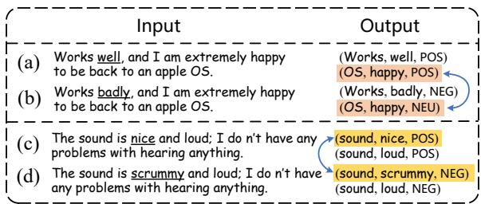
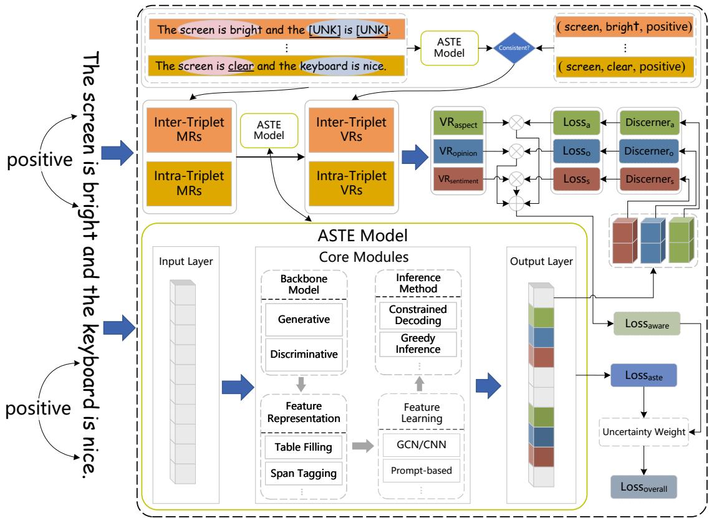
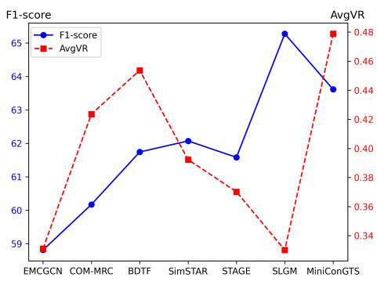
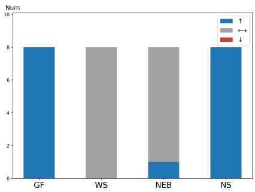
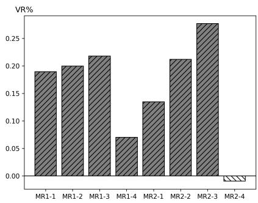
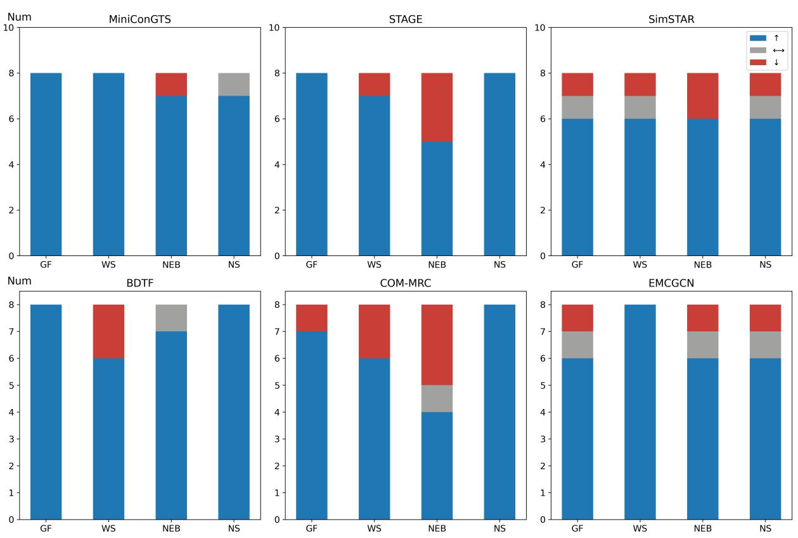

# MATO: A Model-Agnostic Training Optimization for Aspect Sentiment Triplet Extraction

Shaopeng Tang1, Lin Li1,\*, Xiaohui Tao2, Leqi Zhong1, Qing Xie1 1Wuhan University of Technology, China, 2University of Southern Queensland, Australia {karitown, cathylilin, zlq\_lucky, felixxq}@whut.edu.cn, xiaohui.tao@unisq.edu.au

## Abstract

As an important fine-grained sentiment analysis task, aspect sentiment triplet extraction (ASTE) aims to identify three elements, i.e., aspect, opinion and sentiment polarity as a triplet. Advanced ASTE researches have mostly explored triplet-wise ability to achieve superior improvement. However, existing models with strong in-house performances may struggle to generalize to the challenging cases with the diverse expression of inter-triplet and intra-triplet elements. To this end, we propose a Model-Agnostic Training Optimization (MATO) to improve ASTE model inference consistent with expected results facing triplet element diversity. Specifically, to indicate the capacity to accommodate the diverse elements, we design intertriplet and intra-triplet metamorphic relations (MRs), and calculate the violation rate (VR) on each element of one triplet through metamorphic testing (MT). Moreover, we propose an element-wise diversity-aware loss based on the VRs of aspect, opinion and sentiment, which can be jointly trained with existed ASTE models via uncertainty weighing. Conducted on four benchmark datasets and seven ASTE models, experimental results show that our MATO can enhance their diversity capacity, decreasing the average element-wise VRs by 3.28% to 15.36%. Meanwhile, our MATO is comparable to or better than those in terms of F1-score.

## 1 Introduction

Aspect sentiment triplet extraction (ASTE) aims to identify three elements, i.e., aspect term, opinion term and sentiment polarity as a triplet. As in the example "The sound is nice and loud; I do n’t have any problems with hearing anything." in Fig. 1 (c), its goal is to extract two triplets "(sound, nice, POS)" and "(sound, loud, POS)".

Many approaches to ASTE have been proposed successively. Peng et al. (2020) introduced the

  
Figure 1: Two sets of examples for some ASTE models. (a) and (c) are from LAP14 while inter-triplet and intra-triplet diverse expressions appear in (b) and (d), respectively. The underlined indicates the distinctions.

ASTE task at the first time and provided a twostage framework in a pipeline approach to accomplish the extraction of aspect term and opinion term successively as well as the classification of sentiment. To overcome the error propagation problem, subsequent works adopted table filling representation to jointly model the ASTE task (Wu et al., 2020b; Chen et al., 2022b; Zhang et al., 2022; Sun et al., 2024). Some works used sequence tagging to enrich label representation to enhance representation learning (Xu et al., 2020, 2021; Liang et al., 2023; Li et al., 2023). Besides, there were some studies that tried to convert the ASTE task into a machine reading comprehension (MRC) task (Mao et al., 2021; Chen et al., 2021a; Zhai et al., 2022). Recently, generative model has gained significant results on many tasks, and equally some works have addressed the ASTE task with generative manner (Zhang et al., 2021a; Zhou and Qian, 2023).

The above methods explored the ability to improve the model’s feature representation, feature learning and the ability to inference etc., and have obtained superior performance. However, they may struggle to generalize to the challenging cases with the diverse expression of inter-triplet and intratriplet elements. As shown in Fig. 1 (a) and (b), the extraction of the triplet "(OS, happy, POS)" is affected just by changing the other triplet’s opinion, which indicates that the resistance of ASTE models to inter-triplet diverse expression is not powerful enough. Similarly, as shown in Figs. 1 (c) and (d), simply making a synonym transformation 1 for the opinion of the triplet "(sound, nice, POS)" leads to an inversion of the output sentiment, which suggests that the perceptual ability of ASTE models to intra-triplet diverse expression is also insufficient.

To address the aforementioned problem, we propose a Model-Agnostic Training Optimization (MATO) to improve an ASTE model inference consistent with expected results facing diversity. Specifically, we firstly design inter-triplet and intra-triplet metamorphic relations (MRs) from the perspective of potential causes affecting the extraction result of one triplet. Based on these MRs, we introduce a metric for assessing the diversity and use it for training optimization. The violation rate (VR) conducted with metamorphic testing (MT), can be calculated by comparing the target triplets between their originals and metamorphosis to check whether it follows the MR. For example, we can establish an inter-triplet MR based on (a) and (b) in Fig. 1. Return to MRs, we can analyze the element (i.e., aspect, opinion, and sentiment) of the diverse expression. And thus statistically obtain the VR on each element, indicating the capacity to diversity of triplet elements. And the paired Wilcoxon signed rank tests (Corder and Foreman, 2014) are performed on the MT results to ensure that the MRs are highly qualified.

Secondly, in order to make an ASTE model more focused on the triplet itself and shield from other triplets when generating triplets, we introduce three discerners to identify aspect, opinion, and sentiment, and propose an element-wise diversityaware loss based on VRs. In particular, we sum three losses from the three discerners with the weights from the element-wise VRs. Finally, to better simultaneously learn ASTE triplet extraction and element-wise diversity awareness, an uncertainty-based weighting is applied to jointly train diversity-aware loss and ASTE loss, that is, MATO can work with most ASTE models.

Extensive experiments are conducted with seven ASTE SOTA models on four benchmark datasets. Our finding is that the capacity of the seven models facing inter-triplet and intra-triplet diverse expression remains significantly weak. The addition of our MATO to those ASTE SOTA models can enhance their capacity, decreasing the average element-wise VRs by 3.28% to 15.36%. Meanwhile, our MATO is comparable to or better than those in terms of F1-score.

## 2 Related Work

## 2.1 ASTE Models

Aspect Sentiment Triplet Extraction (ASTE) is a typical task in current research of aspect-based sentiment analysis (ABSA), proposed by Peng et al. (2020). ABSA is a traditional fine-grained sentiment analysis (Pontiki et al., 2014; Schouten and Frasincar, 2016; Xue and Li, 2018; Liu et al., 2020; Chen et al., 2022a; Liu et al., 2023; Li et al., 2024). The early work of ABSA involved three basic tasks, including aspect term extraction (Yin et al., 2016; Xu et al., 2018; Dai and Song, 2019; Chen and Qian, 2020; Li et al., 2020), opinion term extraction (Wan et al., 2020; Wu et al., 2020a) and aspectlevel sentiment classification (Wang et al., 2016; Tang et al., 2016; Li et al., 2021; Brauwers and Frasincar, 2023).

Recent ASTE studies consider the integrity among the three elements and can be classified into five streams, that is, pipeline (Peng et al., 2020), table filling (Wu et al., 2020b; Chen et al., 2022b; Zhang et al., 2022; Sun et al., 2024), sequence tagging (Xu et al., 2020; Liang et al., 2023; Li et al., 2023), MRC-based (Mao et al., 2021; Chen et al., 2021a; Zhai et al., 2022) and generative manner (Yan et al., 2021; Zhang et al., 2021a,b; Zhou and Qian, 2023). These methods explored the ability to improve the model’s feature representation, feature learning and the ability to inference etc., and have obtained superior performance. But few focuses enough on the element-wise diversity capacity.

## 2.2 Metamorphic Testing in NLP

In software engineering, metamorphic testing (MT) is the process of testing a program by examining the metamorphic relation (MR) between the results of multiple executions of the program to find and correct defects and errors in the software (Chen et al., 2018). MR is task-specific, and many works designed specific MRs for different tasks. Jiang et al. (2021) identified six types of MRs for the machine translation task, covering a wide range of properties that most NLI tasks are expected to have. The experimental results could explain the capabilities of the NLI model in different dimensions. Manino et al. (2022) proposed three MRs, which addressed the properties of systematicity, compositionality and transitivity. Manino et al. (2022) tested the internal consistency of state-of-the-art NLP models, and they did not always behave according to their expected linguistic properties. Hyun et al. (2024) proposed a framework with MT for analyzing large language model to address the limited coverage of quality attributes. Pu et al. (2023) adopted MT to evaluate the robustness of hand pose estimation models and provided suggestions on the choice of HPE models for different applications. Recent studies have found that the property-based validation method (such as violation rate based on MT) is more flexible than the traditional reference-based validation method (precision, recall and F1-score etc.) in revealing the actual language understanding capability of the NLP models (Chen et al., 2021b; Aleti, 2023; Wang et al., 2024).

  
Figure 2: The overview of our MATO, a model-agnostic working with ASTE models

To our literature review, our work is the first to consider ASTE models enhanced with MT. The major challenge is to design suitable MRs to reflect inter-triplet and intra-triplet diverse expressions and the violation rate based on MT can be used for training optimization.

## 3 Proposed Method

In this section, we present our MATO in details as shown in Fig. 2. ASTE model can generate the hidden representations for aspect, opinion and sentiment through feature representation, feature learning and inference stages. ASTE model computes ASTE loss by comparing the labels. We use MT to indicate the capacity to diversity of ASTE model and introduce diversity-aware loss to enhance the perception ability. Finally, an uncertainty weighing is applied to jointly train diversity-aware loss and ASTE loss. This process does not depend on the specific ASTE model (i.e., model-agnostic).

## 3.1 Task Description

Given a sentence $X = \{ w _ { 1 } , w _ { 2 } , . . . , w _ { n } \}$ with n words, the goal of the ASTE model is to output all triplets $\mathcal { T } = \{ ( a , o , s ) _ { i } \} _ { i = 1 } ^ { m }$ in the sentence, where a and o denote aspect term and opinion term respectively, and they both come from the sentence X. The sentiment polarity s belongs to the label set S = P OS, NEU, NEG , and m is the number of triplets in the sentence.

## 3.2 Metamorphic Relations Design

The current mainstream ASTE models suffer from the problem of weak capacity when facing elementwise diverse expression, while MT based on taskspecific MRs are able to cover such linguistic property. Therefore, we regard to design appropriate MRs to alleviate this diversity problem. As shown in the example in Table 1, we design inter-triplet and intra-triplet MRs from the viewpoint of possibly causing an unexpected change in the output for one triplet (denoted as target triplet).

## 3.2.1 Inter-triplet MRs

The expression of triplets aside from the target triplet is individual to individual, i.e. there is intertriplet diverse expression. The output result of target triplet may be affected by external diversity, and an ASTE model with diversity capacity should avoid such cases. We principally consider the influence of other triplets on target triplet and design inter-triplet MRs, and then determine if there is a violation against one MR by comparing the consistency of the real output with the expected output.

MR1-1: According to the relative independence among triplets, the synonym transformation 2 to the opinion of other triplets in the sentence should not affect the output of the target triplet, i.e., its expected output is consistent to its original output.

Example for MR1-1:   
Source Input: The screen is bright and the keyboard is nice.   
Follow-up Input: The screen is bright and the keyboard is good.

MR1-2: When the sentiment of other triplets in the sentence is inverted (i.e., the opinion undergoes an antonym transformation), the extraction of the target triplet should not be affected, i.e., its expected output is consistent to its original output.

Example for MR1-2:   
Source Input: The screen is bright and the keyboard is nice.   
Follow-up Input: The screen is bright and the keyboard is bad.

MR1-3: In order to bring in more factors that may affect the target triplet extraction results, we add to the sentences some phrases 3 consisting of the triplet with the opposite sentiment of the target triplet. This should not affect the extraction of the target triplet, i.e., its expected output is consistent to its original output.

Example for MR1-3:   
Source Input: The screen is bright and the keyboard is nice   
Follow-up Input: The screen is bright and the keyboard is nice.   
windows 7 is slow.

MR1-4: For a further analysis of the impact of other triplets on target triplet extraction in a sentence, we substitute aspect term and opinion term involved in other triplets with "[UNK]" to mask the semantic information brought by the other triplets. The expected output of the target triplet should be consistent to its original output without this part of the semantic information.

Example for MR1-4:   
Source Input: The screen is bright and the keyboard is nice.   
Follow-up Input: The screen is bright and the [UNK] is [UNK].

## 3.2.2 Intra-triplet MRs

ASTE models with diversity capacity should not only be able to extract target triplet easing the influence of other triplets, but more importantly focus on target triplet own diverse information. For such considerations, we check whether the ASTE model is able to respond correctly to its own changes by introducing diversity to the target triplet.

MR2-1: The sentiment is dependent, so we first consider making some changes to the holder of the sentiment, i.e., making a synonym/hypernym transformation 4 to aspect. The aspect in the target triplet output should change accordingly, the rest should be consistent.

Example for MR2-1:   
Source Input: The screen is bright and the keyboard is nice.   
Follow-up Input: The monitor is bright and the keyboard is nice.

MR2-2: In natural language, there are a variety of expressions that convey the approximate meaning. The model needs to be able to maintain a diversity-aware performance facing different opinon expressions, and understand the semantic information in the text. We apply a synonym transformation to the opinion of the target triplet. The opinion in the target triplet output should change accordingly, the rest should be consistent.

<table><tr><td>Inter/Intra</td><td>MR type</td><td>Follow-up Input</td><td>Expected Output</td></tr><tr><td rowspan="4">Inter-triplet</td><td>MR1-1</td><td>The screen is bright and the keyboard is good.</td><td rowspan="4">(screen, bright, POS)</td></tr><tr><td>MR1-2</td><td>The screen is bright and the keyboard is bad.</td></tr><tr><td>MR1-3</td><td>The screen is bright and the keyboard is nice. windows 7 is slow.</td></tr><tr><td>MR1-4</td><td>The screen is bright and the [UNK] is [UNK].</td></tr><tr><td rowspan="4">Intra-triplet</td><td>MR2-1</td><td>The monitor is bright and the keyboard is nice.</td><td>(monitor, bright, POS) (screen, clear, POS)</td></tr><tr><td>MR2-2</td><td>The screen is clear and the keyboard is nice.</td><td></td></tr><tr><td>MR2-3</td><td>The monitor is clear and the keyboard is nice.</td><td>(monitor, clear, POS)</td></tr><tr><td>MR2-4</td><td>The screen is unclear and the keyboard is nice.</td><td>(screen, unclear, NEG)</td></tr></table>

Table 1: For the target triplet "(screen, bright,POS)" in the original outputs of the source input "The screen is bright and the keyboard is nice.", the follow-up inputs and the expected outputs corresponding to target triplet following the inter-triplet and intra-triplet MRs. The underlined parts indicate the distinctions.  
Example for MR2-2:   
Source Input: The screen is bright and the keyboard is nice.   
Follow-up Input: The screen is clear and the keyboard is nice.

MR2-3: It is not sufficient to transform either aspect or opinion alone, so we consider synonym/hypernym transformations for both at the same time. The aspect and opinion in the target triplet output should change accordingly, the sentiment should be consistent.

Example for MR2-3:   
Source Input: The screen is bright and the keyboard is nice.   
Follow-up Input: The monitor is clear and the keyboard is nice.

MR2-4: Antonym transformation leads to changes in the meaning of the source input, and the model needs to understand the new semantics and accurately capture the sentiment polarity corresponding to the opinion. The opinion in the target triplet output should change accordingly, the aspect should be consistent. Moreover, The sentiment should be reversed.

Example for MR2-4:   
Source Input: The screen is bright and the keyboard is nice.   
Follow-up Input: The screen is unclear and the keyboard is nice.

We can generate a large amount of data to test the model based on the above MRs. According to the comparison of the output of the target triplet and the expected output, we can calculate the corresponding VRs: $\{ V R _ { 1 } , V R _ { 2 } , \ldots , V R _ { 8 } \}$ , indicating the capacity of the ASTE model facing inter-triplet and intra-triplet diverse expression.

## 3.3 Diversity Awareness

Given an input sentence $X = \{ w _ { 1 } , w _ { 2 } , . . . , w _ { n } \}$ with n tokens and the triplets $\mathcal { T } = \{ ( a , o , s ) _ { i } \} _ { i = 1 } ^ { m } .$

The last hidden layer representation sequence for aspect, opinion and sentiment in the ASTE model are denoted separately as:

$$
H _ { l _ { i } } = \{ h _ { 1 } , h _ { 2 } , \ldots , h _ { l _ { i } } \} , i \in \{ 1 , 2 , 3 \}\tag{1}
$$

where $l _ { 1 } , l _ { 2 }$ and $l _ { 3 }$ denote the length of the last hidden layer representation sequence for aspect, opinion and sentiment, respectively.

We acquire the hidden representations of which represent aspect, opinion and sentiment:

$$
H _ { e } = \{ h _ { e _ { 1 } } , h _ { e _ { 2 } } , \ldots , h _ { e _ { m } } \} , e \in \{ a , o , s \}\tag{2}
$$

To make the ASTE model more focus on the above representations, we introduce three discerners (i.e., three linear layers) and sigmoid activation function to identify aspect, opinion and sentiment:

$$
\begin{array} { r } { \hat { y } _ { e } = S i g m o i d ( d i s c e r n e r _ { e } ( H _ { e } ) ) , ~ } \\ { e \in \{ a , o , s \} } \end{array}\tag{3}
$$

From these, three identification binary crossentropy (BCE) losses can be obtained:

$$
L o s s _ { e } = B C E ( y _ { e } , \hat { y } _ { e } ) , e \in \{ a , o , s \}\tag{4}
$$

where the shape of $y _ { e }$ is the same with $\hat { y } _ { e }$ and its values are fully 1.

We can summarize to derive VRs on aspect, opinion and sentiment:

$$
V R _ { e } = \frac { 1 } { | m a p _ { e } | } \sum _ { i \in m a p _ { e } } V R _ { i } , e \in \{ a , o , s \}\tag{5}
$$

where $| m a p _ { e } |$ denotes the length of mape. mapa is $\{ 3 , 4 , 5 , 7 \}$ , mapo is 1, 2, 3, 4, 6, 7, 8 and maps is 2, 3, 4, 8 based on the type of the diverse element in the above MRs.

<table><tr><td rowspan="2">Dataset</td><td colspan="2">Train</td><td colspan="2">Dev</td><td colspan="2">Test</td></tr><tr><td>#S</td><td>#T</td><td>#S</td><td>#T</td><td>#S</td><td>#T</td></tr><tr><td>LAP14</td><td>906</td><td>1460</td><td>219</td><td>346</td><td>328</td><td>543</td></tr><tr><td>RES14</td><td>1266</td><td>2338</td><td>310</td><td>577</td><td>492</td><td>994</td></tr><tr><td>RES15</td><td>605</td><td>1013</td><td>148</td><td>249</td><td>322</td><td>485</td></tr><tr><td>RES16</td><td>857</td><td>1394</td><td>210</td><td>339</td><td>326</td><td>514</td></tr></table>

Table 2: Statistics of four ASTE datasets (Xu et al., 2020). #S and #T represent the number of sentences and triplets, respectively.

So far, we can obtain the diversity-aware loss:

$$
\mathit { L o s s } _ { a w a r e } = \sum _ { e \in \{ a , o , s \} } V R _ { e } \mathit { L o s s } _ { e }\tag{6}
$$

Diversity-aware loss makes the ASTE model percieve element-wise diverse expression.

## 3.4 Model-Agnostic Autoweighted Training

Let $f ^ { W } ( X )$ be the output of the ASTE model with weights W on input X. The loss of the ASTE model can be uniformly formulated as $L o s s _ { a s t e }$

Diversity-aware loss is model-agnostic and can be jointly trained with $L o s s _ { a s t e }$ Kendall et al. (2018) proposed to use uncertainty to weigh multiple losses to achieve multi-task learning for scene geometry and semantics. According to the proof of Kendall et al. (2018). we can approximate the overall loss for ASTE task:

$$
\begin{array} { c } { { L o s s _ { o v e r a l l } \approx \displaystyle \frac { 1 } { \sigma _ { 1 } ^ { 2 } } L o s s _ { a s t e } + \frac { 1 } { \sigma _ { 2 } ^ { 2 } } L o s s _ { a w a r e } } } \\ { { + l o g \sigma _ { 1 } + l o g \sigma _ { 2 } } } \end{array}\tag{7}
$$

where the positive scalars $\sigma _ { 1 }$ and $\sigma _ { 2 }$ can be learnt from triplet extraction output and diversity-aware output distributions, respectively, where the parameter determines how "uniform" (flat) the discrete distribution is. This relates to its uncertainty, as measured in entropy (Kendall et al., 2018).

Later, Liebel and Körner (2018) have improved to avoid the loss value becoming negative during training. In practical, the unified training of ASTE triplet extraction and triplet focusing for multiple objectives is based on AutomaticWeightedLoss 5.

## 4 Experiments

This paper aims to address three research questions.

RQ1: Is the traditional reference-based validation method (i.g., F1-score) effective enough in revealing the diversity capacity of the ASTE model?

RQ2: Is the property-based validation method (i.e., VR) effective?

RQ3: Does our MATO significantly improve the capacity of the ASTE model when facing intertriplet and intra-triplet diverse expression?

We conduct a thorough assessment of the quality of our designed MRs following Chen et al. (2021b), the results of which are shown in Appendix A.3.

## 4.1 Datasets and Baselines

We conducted extensive experiments on four ASTE benchmark datasets refined by (Xu et al., 2020). All datasets are sourced from SemEval Challenges (Pontiki et al., 2014, 2015, 2016), including reviews in the laptop and restaurant domains. The statistics of the four datasets are shown in Table 2.

For analyzing the capacity of various types of models in solving ASTE task as well as validating the effectiveness of our MATO, we select seven SOTA models as our baselines. (1) Table filling: EMCGCN (Chen et al., 2022b), BDTF (Zhang et al., 2022), MiniConGTS (Sun et al., 2024). (2) Sequence tagging: STAGE (Liang et al., 2023), SimSTAR (Li et al., 2023). (3) MRC-based: COM-MRC (Zhai et al., 2022). (4) Generative manner: SLGM (Zhou and Qian, 2023). Detailed descriptions for these baselines can be found in the Appendix A.1.

## 4.2 Experimental Settings

We run the above seven models corresponding to the parameter settings in their papers. For each synonym/antonym/hypernym transformation, we obtain at most 10 synonyms/antonyms/hypernyms from NLTK or the online dictionary. To minimize the influence of randomness, we ran run each model 5 times with different random initializations and then report the average results. All experiments are conducted on an NVIDIA TITAN XP GPU.

## 4.3 RQ1: Overall Performance with F1-score

Table 3 lists the experimental comparisons of the seven models before and after the introduction of MATO. MATO can improve the F1-score (green background) of the six models on the four datasets, and slightly reduce the F1-score (red background) of the COM-MRC, which suggests that our MATO can improve the traditional performance of most of ASTE models. Another interesting finding is that the addition of MATO is able to reduce the gap between precision and recall while keeping the performance of the F1-score stable.

<table><tr><td rowspan="2">Model</td><td colspan="4">LAP14</td><td colspan="4">RES14</td><td colspan="4">RES15</td><td colspan="4">RES16</td></tr><tr><td>P</td><td>R</td><td>F1</td><td>∆F1</td><td>P</td><td>R</td><td>F1</td><td>∆F1</td><td>P</td><td>R</td><td>F1</td><td>∆F1</td><td>P</td><td>R</td><td>F1</td><td>∆F1</td></tr><tr><td>EMCGCN (ACL, 2022b) + MATO</td><td>61.70 60.26</td><td>56.26 59.15</td><td>58.81 59.70</td><td>+0.89</td><td>71.21 71.70</td><td>72.39 73.45</td><td>71.78 72.56</td><td>+0.78</td><td>61.54 61.89</td><td>62.47 62.27</td><td>61.93 62.08</td><td>+0.15</td><td>65.62 65.88</td><td>71.30 71.15</td><td>68.33 68.42</td><td>+0.09</td></tr><tr><td>COM-MRC (EMNLP, 2022) + MATO</td><td>62.35</td><td>58.16 60.23</td><td>60.17 59.90</td><td>-0.27</td><td>75.46 73.65</td><td>68.91 69.80</td><td>72.01 71.67</td><td>-0.34</td><td>68.35 65.99</td><td>61.24 62.38</td><td>64.53 64.12</td><td>-0.41</td><td>71.55 68.90</td><td>71.59 73.21</td><td>71.57 70.98</td><td>-0.59</td></tr><tr><td>BDTF (EMNLP, 2022)</td><td>59.58 68.94</td><td>55.97</td><td>61.74</td><td>+0.96</td><td>75.53</td><td>73.24</td><td>74.35</td><td>+0.19</td><td>68.76</td><td>63.71</td><td>66.12 67.45</td><td>+1.33</td><td>71.44 71.75</td><td>73.13 74.12</td><td>72.27 72.92</td><td>+0.65</td></tr><tr><td>+ MATO SimSTAR (SIGIR, 2023)</td><td>66.46 66.46</td><td>59.33 58.23</td><td>62.70 62.07</td><td>+0.68</td><td>75.15 76.23</td><td>73.94 71.63</td><td>74.54 73.86</td><td></td><td>69.67 71.71</td><td>65.36 59.59</td><td>65.09</td><td>+0.18</td><td>72.02</td><td>74.12</td><td>73.06</td><td>+0.64</td></tr><tr><td>+ MATO</td><td>65.64</td><td>60.08</td><td>62.75</td><td></td><td>75.20</td><td>73.14</td><td>74.16</td><td>+0.30</td><td>70.14</td><td>61.03</td><td>65.27</td><td></td><td>71.55</td><td>75.98 70.12</td><td>73.70 73.24</td><td></td></tr><tr><td>STAGE (AAAI, 2023) + MATO</td><td>71.98</td><td>53.86 57.79</td><td>61.58 62.89</td><td>+1.31</td><td>78.58 78.95</td><td>69.58 70.91</td><td>73.76 74.69</td><td>+0.93</td><td>73.63 71.35</td><td>57.90 59.73</td><td>64.79</td><td>+0.22</td><td>76.67 75.70</td><td>72.16</td><td>73.89</td><td>+0.65</td></tr><tr><td></td><td>68.99</td><td></td><td></td><td></td><td></td><td></td><td></td><td></td><td></td><td></td><td>65.01</td><td></td><td></td><td></td><td></td><td></td></tr><tr><td></td><td></td><td></td><td></td><td></td><td></td><td></td><td></td><td></td><td></td><td></td><td></td><td></td><td></td><td></td><td></td><td></td></tr><tr><td>SLGM (ACL, 2023)</td><td></td><td>60.74</td><td>65.27</td><td></td><td>78.84</td><td>72.70</td><td>75.64</td><td></td><td>69.75</td><td>66.85</td><td>68.27</td><td></td><td>75.86</td><td>75.76</td><td>75.80</td><td></td></tr><tr><td></td><td>70.54</td><td></td><td></td><td>+0.15</td><td></td><td></td><td></td><td>+0.70</td><td></td><td></td><td></td><td>+0.70</td><td></td><td></td><td></td><td>+0.94</td></tr><tr><td></td><td></td><td></td><td>65.42</td><td></td><td>79.01</td><td></td><td></td><td></td><td></td><td></td><td></td><td></td><td></td><td></td><td></td><td></td></tr><tr><td>+ MATO</td><td>70.11</td><td>61.33</td><td></td><td></td><td></td><td>73.84</td><td>76.34</td><td></td><td>71.21</td><td>66.80</td><td>68.97</td><td></td><td>76.45</td><td>77.04</td><td>76.74</td><td></td></tr><tr><td></td><td></td><td></td><td></td><td></td><td></td><td></td><td></td><td></td><td></td><td></td><td></td><td></td><td></td><td></td><td></td><td></td></tr><tr><td>MiniConGTS (EMNLP, 2024)</td><td></td><td>60.68</td><td>63.61</td><td></td><td>76.10</td><td>75.08</td><td>75.59</td><td></td><td>66.50</td><td>63.86</td><td>65.15</td><td></td><td>75.52</td><td>74.14</td><td>74.83</td><td></td></tr><tr><td></td><td>66.82</td><td></td><td></td><td>+1.10</td><td></td><td></td><td></td><td></td><td></td><td></td><td></td><td>+0.70</td><td></td><td></td><td></td><td></td></tr><tr><td></td><td></td><td></td><td></td><td></td><td></td><td></td><td></td><td>+0.64</td><td></td><td></td><td></td><td></td><td></td><td></td><td></td><td>+0.38</td></tr><tr><td></td><td></td><td></td><td></td><td></td><td></td><td></td><td></td><td></td><td>65.37</td><td></td><td>65.85</td><td></td><td>74.83</td><td>75.61</td><td>75.21</td><td></td></tr><tr><td></td><td></td><td>63.46</td><td></td><td></td><td>74.38</td><td>78.20</td><td>76.23</td><td></td><td></td><td>66.34</td><td></td><td></td><td></td><td></td><td></td><td></td></tr><tr><td>+ MATO</td><td>66.00</td><td></td><td>64.71</td><td></td><td></td><td></td><td></td><td></td><td></td><td></td><td></td><td></td><td></td><td></td><td></td><td></td></tr><tr><td></td><td></td><td></td><td></td><td></td><td></td><td></td><td></td><td></td><td></td><td></td><td></td><td></td><td></td><td></td><td></td><td></td></tr><tr><td></td><td></td><td></td><td></td><td></td><td></td><td></td><td></td><td></td><td></td><td></td><td></td><td></td><td></td><td></td><td></td><td></td></tr><tr><td></td><td></td><td></td><td></td><td></td><td></td><td></td><td></td><td></td><td></td><td></td><td></td><td></td><td></td><td></td><td></td><td></td></tr><tr><td></td><td></td><td></td><td></td><td></td><td></td><td></td><td></td><td></td><td></td><td></td><td></td><td></td><td></td><td></td><td></td><td></td></tr><tr><td></td><td></td><td></td><td></td><td></td><td></td><td></td><td></td><td></td><td></td><td></td><td></td><td></td><td></td><td></td><td></td><td></td></tr><tr><td></td></table>

Table 3: Experimental results(%). The score marked as bold means the better performance in pairwise comparison.

  
Figure 3: The relation of average VR and F1-score of each model without MATO on LAP14

  
Figure 4: Statistics of the paired Wilcoxon signed-rank test results on SLGM (Here red color is few and more results of other six models are at Appendix A.3).

In order to analyze whether it is appropriate to use the traditional reference-based metric (e.g., F1- score) directly to evaluate the diversity capacity of the model, we discuss the relation between VR and F1-score. Fig. 3 shows the average VR and F1-score of each model on LAP14, and it is not difficult to find out that the VR does not always decrease with the growth of F1-score, which suggests that it is inappropriate to use F1-score directly to assess the capacity of the ASTE model.

## 4.4 RQ2: Diversity Capacity Comparison between F1-score and VR

To ensure the effectiveness of our designed MRs, evaluation for MRs is essential. Chen et al. (2021b) introduced multiple mutants to MRC models to evaluate MRs. They compared whether there was a significant difference (i.e., better, similar, or worse) between two VRs with the paired Wilcoxon signed-rank test. One VR was calculated from the output of the samples which the ASTE model without any mutants can pass under F1-score before and after the introduction of mutants. The other VR was calculated from the output of the metamorphosis data generated following the MRs before and after the introduction of mutants. Inspired by this, and considering that our baselines are transformerbased models, we adopt the four mutants: Gaussian Fuzzing (GF), Weight Shuffling (WS), Neuron Effect Blocking (NEB) and Neuron Switch (NS), and details are in Appendix A.2.

We execute the evaluation experiments following the methodology of Chen et al. (2021b) in both 2-tailed and 1-tailed manners to calculate p values, at the σ level of 0.05. Thus, we have:

• In the 2-tailed test, VR calculated by a particular MR is similar (denoted as ) to F1- score in revealing the mutants when $p \geq \sigma$

• In the 1-tailed test, VR calculated by a particular MR is better (denoted as ) than F1-score in revealing the mutants when $p < \sigma$

• Otherwise, VR calculated by a particular MR is worse (denoted as ) than F1-score in revealing the mutants.

<table><tr><td>Dataset</td><td>Model</td><td>MR1-1</td><td>MR1-2</td><td>MR1-3</td><td>MR1-4</td><td>MR2-1</td><td>MR2-2</td><td>MR2-3</td><td>MR2-4</td><td>Aspect</td><td>Opinion</td><td>Sentiment</td></tr><tr><td rowspan="2">LAP14</td><td>SLGM</td><td>0.2503</td><td>0.1549</td><td>0.2866</td><td>0.4110</td><td>0.3273</td><td>0.3371</td><td>0.2548</td><td>0.6186</td><td>0.3199</td><td>0.3305</td><td>0.3678</td></tr><tr><td>+MATO</td><td>0.2029</td><td>0.1240</td><td>0.2242</td><td>0.3821</td><td>0.2832</td><td>0.2657</td><td>0.1843</td><td>0.6244</td><td>0.2685</td><td>0.2868</td><td>0.3387</td></tr><tr><td>RES14</td><td>SLGM +MATO</td><td>0.1807 0.1384</td><td>0.1318</td><td>0.2838</td><td>0.2798</td><td>0.2423</td><td>0.2216</td><td>0.1855</td><td>0.5392</td><td>0.2479</td><td>0.2603</td><td>0.3087</td></tr><tr><td rowspan="2">RES15</td><td></td><td></td><td>0.0973</td><td>0.1922</td><td>0.2413</td><td>0.1804</td><td>0.1618</td><td>0.1241</td><td>0.5581</td><td>0.1845</td><td>0.2162</td><td>0.2722</td></tr><tr><td>SLGM</td><td>0.2274</td><td>0.1125</td><td>0.3148</td><td>0.3943</td><td>0.3435</td><td>0.2356</td><td>0.2247</td><td>0.4214</td><td>0.3193</td><td>0.2758</td><td>0.3108</td></tr><tr><td rowspan="2">RES16</td><td>+MATO</td><td>0.1906</td><td>0.0650</td><td>0.2740</td><td>0.3549</td><td>0.3056</td><td>0.1933</td><td>0.1661</td><td>0.4201</td><td>0.2752</td><td>0.2377</td><td>0.2785</td></tr><tr><td>SLGM</td><td>0.1632</td><td>0.1004</td><td>0.2526</td><td>0.3075</td><td>0.2604</td><td>0.1903</td><td>0.1739</td><td>0.5988</td><td>0.2486</td><td>0.2552</td><td>0.3148</td></tr><tr><td></td><td>+MATO</td><td>0.1236</td><td>0.0838</td><td>0.1787</td><td>0.2332</td><td>0.1896</td><td>0.1503</td><td>0.1326</td><td>0.6029</td><td>0.1835</td><td>0.2150</td><td>0.2747</td></tr></table>

Table 4: The MT results (i.e., VRs) on SLGM (other six models see Appendix A.4). The value of VR ranges from 0 to 1, with smaller values indicating a greater capacity facing the inter-triplet and intra-triplet diverse expression. The score marked as bold means the better performance in pairwise comparison.
<table><tr><td>No.</td><td>Input</td><td>SLGM Output</td><td>Violate ?</td><td>SLGM+MATO Output</td><td>Violate ?</td></tr><tr><td>(1) (2)</td><td>Works well, and I am extremely happy to be back to an apple OS.</td><td>(OS, happy, POS)</td><td>Yes</td><td>(OS, happy, POS)</td><td>No</td></tr><tr><td>(3)</td><td>Works badly, and I am extremely happy to be back to an apple OS. The sound is nice and loud; I do n&#x27;t have any problems with hearing anything.</td><td>(OS, happy, NEU) (sound, nice, POS)</td><td></td><td>(OS, happy, POS) (sound, nice, POS)</td><td></td></tr><tr><td>(4)</td><td>The sound is scrummy and loud; I do n&#x27;t have any problems with hearing anything.</td><td>(sound, scrummy, NEG)</td><td>Yes</td><td>(sound, scrummy, POS)</td><td>No</td></tr></table>

Table 5: Case study for the target triplets "(OS, happy, POS)" and "(sound, nice, POS)" when SLGM faces inter-triplet and intra-triplet diverse expression, respectively. The underlined parts indicate the distinctions.

  
Figure 5: MATO reduces the VR magnitudes of all MRs on LAP for SLGM

The paired Wilcoxon signed-rank test results are in the Appendix A.3. Taking the test on SLGM as an example, as shown in Fig. 4, the VRs calculated by MRs are better or similar in revealing the mutants, indicating that the property-based validation method VR based the inter-triplet and intratriplet MRs are more effective than the traditional reference-based validation method F1-score.

## 4.5 RQ3: Diversity Capacity Gain from MATO

The MT results on SLGM are in Table 4 and the MT results on the others are in the appendix A.4.

To start with, we can find that SLGM’s VRs of for four datasets on MRs except MR1-2 is higher than 0.2, which indicates that there is still much room for improvement in the capacity of SLGM.

We can find that the performance of these models varies in facing inter-triplet and intra-triplet diverse expression. For example, the VRs of SLGM in MR1-2 are all below 0.2 while the VRs of SLGM in MR2-4 are all above 0.4 in Table 4. This suggests that there is capacity difference on SLGM when facing inter-triplet and intra-triplet diversity.

Next, we can enhance the capacity of different dimensions of the ASTE model significantly by introducing diversity-aware loss. Take SLGM as an example on LAP14, as shown in Fig. 5, we can find that MATO significantly reduces the VR of MR1-1, MR1-2, MR1-3, MR2-1, MR2-2 and MR2- 3 (all reduced by more than 10%). This suggests that MATO is able to keep the extraction process more capacity by having the ASTE model focus more on triplet representations. The introduction of MATO slightly increases the VR of MR2-4 on LAP14 (from 0.6186 to 0.6244, VR% below 1%), which does not affect the capacity of SLGM.

## 4.6 Case Study

We perform a case study on the response of SLGM when facing inter-triplet and intra-triplet diverse expression for the target triplet. From the results of (1) and (2) in Table 5, SLGM suffers from impacts outside the target triplet when solving the ASTE task, whereas our MATO enables the model to be shielded from the impacts when extracting the target triplet. From the results of (3) and (4) in

<table><tr><td>No.</td><td>Input</td><td>GPT-40</td><td>Violate ?</td><td>Qwen2.5</td><td>Violate ?</td><td>SLGM+MATO</td><td>Violate ?</td></tr><tr><td>(1)</td><td>The sound is nice and loud; I do n&#x27;t have any problems with hearing anything. The sound is scrummy and loud; I do n&#x27;t have</td><td>(sound, nice, POS)</td><td>No</td><td>(sound, nice, POS)</td><td>No</td><td>(sound, nice, POS) (sound, scrummy, POS)</td><td>No</td></tr><tr><td>(3)</td><td>any problems with hearing anything. It &#x27;s fast, light, and simple to use.</td><td>(use, fast, POS)</td><td></td><td>(use, fast, POS)</td><td></td><td>(use, fast, POS)</td><td></td></tr><tr><td>(4)</td><td>It &#x27;s fast, light, and [UNK] to use.</td><td>(It, fast, POS)</td><td>Yes</td><td>(It, fast, POS)</td><td>Yes</td><td>(use, fast, POS)</td><td>No</td></tr></table>

Table 6: Case study for the target triplets "(sound, nice, POS)" and "(use, light, POS)" when GPT-4o and Qwen2.5 face inter-triplet and intra-triplet diverse expression, respectively. The underlined parts indicate the distinctions.

Table 5, SLGM is not able to perceive the change of the target triplet and reacts incorrectly, while our MATO is able to enhance the model’s ability to perceive the target triplet.

As shown in Table 6, we perform a case study on two representative large language models (LLMs). From the results of (1) and (2) in Table 6, the two LLMs can easily determine the sentiment polarity of "scrummy" based on its rich knowledge storage. However, from the results of (3) and (4) in Table 6, after masking some semantic information with "[UNK]", the two LLMs both fail to identify the aspect "use", and mistakes "It " as aspect, while SLGM+MATO can still identify aspect correctly.

## 5 Conclusions

In this paper, we design metamorphic relations to evaluate the capacity of seven SOTA ASTE models by metamorphic testing and find that most of the models have weak capacity in dealing with diverse expression in sentiment analysis. Meanwhile, we propose a model-agnostic diversity-aware method to improve ASTE model inference consistent with expected results facing triplet diversity. Experiments show that our MATO can significantly enhance the diversity capacity of ASTE models.

## Limitations

Although the MRs we design are able to expose problems regarding the diversity capacity of the ASTE model and MATO can improve the capacity, there are some limitations. On the one hand, the MRs we design only introduce diversity into triplets, while there are much diversity in the real world, such as changes in sentence structure and typos etc., and we will follow up with deeper work in this problem. On the other hand, from the results of MT, we can find that MATO does not bring considerable enhancement on MR2-4, and our subsequent work will explore how to make the model able to capture such intra-triplet sentiment inversion changes.

## Acknowledgments

This work has been partially supported by the National Natural Science Foundation of China (NSFC) with Grant No. 62276196.

## References

Aldeida Aleti. 2023. Software testing of generative AI systems: Challenges and opportunities. In IEEE/ACM International Conference on Software Engineering: Future ofSoftware Engineering, ICSE-FoSE 2023, Melbourne, Australia, May 14-20, 2023, pages 4–14. IEEE.

Gianni Brauwers and Flavius Frasincar. 2023. A survey on aspect-based sentiment classification. ACM Comput. Surv., 55(4):65:1–65:37.

Chenhua Chen, Zhiyang Teng, Zhongqing Wang, and Yue Zhang. 2022a. Discrete opinion tree induction for aspect-based sentiment analysis. In Proceedings of the 60th Annual Meeting of the Association for Computational Linguistics (Volume 1: Long Papers), ACL 2022, Dublin, Ireland, May 22-27, 2022, pages 2051–2064. Association for Computational Linguistics.

Hao Chen, Zepeng Zhai, Fangxiang Feng, Ruifan Li, and Xiaojie Wang. 2022b. Enhanced multi-channel graph convolutional network for aspect sentiment triplet extraction. In Proceedings ofthe 60th Annual Meeting of the Association for Computational Linguistics (Volume 1: Long Papers), ACL 2022, Dublin, Ireland, May 22-27, 2022, pages 2974–2985. Association for Computational Linguistics.

Shaowei Chen, Yu Wang, Jie Liu, and Yuelin Wang. 2021a. Bidirectional machine reading comprehension for aspect sentiment triplet extraction. In Thirty-Fifth AAAI Conference on Artificial Intelligence, AAAI 2021, Thirty-Third Conference on Innovative Applications ofArtificial Intelligence, IAAI 2021, The Eleventh Symposium on Educational Advances in Artificial Intelligence, EAAI 2021, Virtual Event, February 2-9, 2021, pages 12666–12674. AAAI Press.

Songqiang Chen, Shuo Jin, and Xiaoyuan Xie. 2021b. Validation on machine reading comprehension software without annotated labels: a property-based method. In ESEC/FSE ’21: 29th ACM Joint European Software Engineering Conference and Symposium on the Foundations ofSoftware Engineering, Athens, Greece, August 23-28, 2021, pages 590–602. ACM.

Tsong Yueh Chen, Fei-Ching Kuo, Huai Liu, Pak-Lok Poon, Dave Towey, T. H. Tse, and Zhi Quan Zhou. 2018. Metamorphic testing: A review of challenges and opportunities. ACM Comput. Surv., 51(1):4:1– 4:27.

Zhuang Chen and Tieyun Qian. 2020. Enhancing aspect term extraction with soft prototypes. In Proceedings ofthe 2020 Conference on Empirical Methods in Natural Language Processing, EMNLP 2020, Online, November 16-20, 2020, pages 2107–2117. Association for Computational Linguistics.

Gregory W Corder and Dale I Foreman. 2014. Nonparametric statistics: A step-by-step approach. John Wiley & Sons.

Hongliang Dai and Yangqiu Song. 2019. Neural aspect and opinion term extraction with mined rules as weak supervision. In Proceedings of the 57th Conference ofthe Associationfor Computational Linguistics, ACL 2019, Florence, Italy, July 28- August 2, 2019, Volume 1: Long Papers, pages 5268–5277. Association for Computational Linguistics.

Sangwon Hyun, Mingyu Guo, and M Ali Babar. 2024. Metal: Metamorphic testing framework for analyzing large-language model qualities. In 2024 IEEE Conference on Software Testing, Verification and Validation (ICST), pages 117–128. IEEE.

Mingyue Jiang, Houzhen Bao, Kaiyi Tu, Xiao-Yi Zhang, and Zuohua Ding. 2021. Evaluating natural language inference models: A metamorphic testing approach. In 32nd IEEE International Symposium on Software Reliability Engineering, ISSRE 2021, Wuhan, China, October 25-28, 2021, pages 220–230. IEEE.

Alex Kendall, Yarin Gal, and Roberto Cipolla. 2018. Multi-task learning using uncertainty to weigh losses for scene geometry and semantics. In 2018 IEEE Conference on Computer Vision and Pattern Recognition, CVPR 2018, Salt Lake City, UT, USA, June 18-22, 2018, pages 7482–7491. Computer Vision Foundation / IEEE Computer Society.

Dongxu Li, Zhihao Yang, Yuquan Lan, Yunqi Zhang, Hui Zhao, and Gang Zhao. 2023. Simple approach for aspect sentiment triplet extraction using spanbased segment tagging and dual extractors. In Proceedings ofthe 46th International ACM SIGIR Conference on Research and Development in Information Retrieval, SIGIR 2023, Taipei, Taiwan, July 23-27, 2023, pages 2374–2378. ACM.

Kun Li, Chengbo Chen, Xiaojun Quan, Qing Ling, and Yan Song. 2020. Conditional augmentation

for aspect term extraction via masked sequence-tosequence generation. In Proceedings of the 58th Annual Meeting of the Association for Computational Linguistics, ACL 2020, Online, July 5-10, 2020, pages 7056–7066. Association for Computational Linguistics.

Lin Li, Shaopeng Tang, and Renwei Wu. 2024. Majority rules guided aspect-category based sentiment analysis via label prior knowledge. In Proceedings of the 2024 Joint International Conference on Computational Linguistics, Language Resources and Evaluation, LREC/COLING 2024, 20-25 May, 2024, Torino, Italy, pages 10952–10957. ELRA and ICCL.

Ruifan Li, Hao Chen, Fangxiang Feng, Zhanyu Ma, Xiaojie Wang, and Eduard H. Hovy. 2021. Dual graph convolutional networks for aspect-based sentiment analysis. In Proceedings ofthe 59th Annual Meeting ofthe Associationfor Computational Linguistics and the 11th International Joint Conference on Natural Language Processing, ACL/IJCNLP 2021, (Volume 1: Long Papers), Virtual Event, August 1-6, 2021, pages 6319–6329. Association for Computational Linguistics.

Shuo Liang, Wei Wei, Xian-Ling Mao, Yuanyuan Fu, Rui Fang, and Dangyang Chen. 2023. STAGE: span tagging and greedy inference scheme for aspect sentiment triplet extraction. In Thirty-Seventh AAAI Conference on Artificial Intelligence, AAAI 2023, Thirty-Fifth Conference on Innovative Applications ofArtificial Intelligence, IAAI 2023, Thirteenth Symposium on Educational Advances in Artificial Intelligence, EAAI 2023, Washington, DC, USA, February 7-14, 2023, pages 13174–13182. AAAI Press.

Lukas Liebel and Marco Körner. 2018. Auxiliary tasks in multi-task learning. CoRR, abs/1805.06334.

Dan Liu, Lin Li, Xiaohui Tao, Jian Cui, and Qing Xie. 2023. Descriptive prompt paraphrasing for targetoriented multimodal sentiment classification. In Findings of the Association for Computational Linguistics: EMNLP 2023, Singapore, December 6-10, 2023, pages 4174–4186. Association for Computational Linguistics.

Haoyue Liu, Ishani Chatterjee, MengChu Zhou, Xiaoyu Sean Lu, and Abdullah Abusorrah. 2020. Aspect-based sentiment analysis: A survey of deep learning methods. IEEE Trans. Comput. Soc. Syst., 7(6):1358–1375.

Edoardo Manino, Julia Rozanova, Danilo S. Carvalho, André Freitas, and Lucas C. Cordeiro. 2022. Systematicity, compositionality and transitivity of deep NLP models: a metamorphic testing perspective. In Findings ofthe Associationfor Computational Linguistics: ACL 2022, Dublin, Ireland, May 22-27, 2022, pages 2355–2366. Association for Computational Linguistics.

Yue Mao, Yi Shen, Chao Yu, and Longjun Cai. 2021. A joint training dual-mrc framework for aspect based

sentiment analysis. In Thirty-Fifth AAAI Conference on Artificial Intelligence, AAAI 2021, Thirty-Third Conference on Innovative Applications ofArtificial Intelligence, IAAI 2021, The Eleventh Symposium on Educational Advances in Artificial Intelligence, EAAI 2021, Virtual Event, February 2-9, 2021, pages 13543–13551. AAAI Press.

Haiyun Peng, Lu Xu, Lidong Bing, Fei Huang, Wei Lu, and Luo Si. 2020. Knowing what, how and why: A near complete solution for aspect-based sentiment analysis. In The Thirty-Fourth AAAI Conference on Artificial Intelligence, AAAI 2020, The Thirty-Second Innovative Applications ofArtificial Intelligence Conference, IAAI 2020, The Tenth AAAI Symposium on Educational Advances in Artificial Intelligence, EAAI 2020, New York, NY, USA, February 7-12, 2020, pages 8600–8607. AAAI Press.

Maria Pontiki, Dimitris Galanis, Haris Papageorgiou, Ion Androutsopoulos, Suresh Manandhar, Mohammad Al-Smadi, Mahmoud Al-Ayyoub, Yanyan Zhao, Bing Qin, Orphée De Clercq, Véronique Hoste, Marianna Apidianaki, Xavier Tannier, Natalia V. Loukachevitch, Evgeniy V. Kotelnikov, Núria Bel, Salud María Jiménez Zafra, and Gülsen Eryigit. 2016. Semeval-2016 task 5: Aspect based sentiment analysis. In Proceedings of the 10th International Workshop on Semantic Evaluation, SemEval@NAACL-HLT 2016, San Diego, CA, USA, June 16-17, 2016, pages 19–30. The Association for Computer Linguistics.

Maria Pontiki, Dimitris Galanis, Haris Papageorgiou, Suresh Manandhar, and Ion Androutsopoulos. 2015. Semeval-2015 task 12: Aspect based sentiment analysis. In Proceedings of the 9th International Workshop on Semantic Evaluation, SemEval@NAACL-HLT 2015, Denver, Colorado, USA, June 4-5, 2015, pages 486–495. The Association for Computer Linguistics.

Maria Pontiki, Dimitris Galanis, John Pavlopoulos, Harris Papageorgiou, Ion Androutsopoulos, and Suresh Manandhar. 2014. Semeval-2014 task 4: Aspect based sentiment analysis. In Proceedings ofthe 8th International Workshop on Semantic Evaluation, SemEval@COLING 2014, Dublin, Ireland, August 23- 24, 2014, pages 27–35. The Association for Computer Linguistics.

Muxin Pu, Chun Yong Chong, and Mei Kuan Lim. 2023. Robustness evaluation in hand pose estimation models using metamorphic testing. In 8th IEEE/ACM International Workshop on Metamorphic Testing, MET@ICSE 2023, Melbourne, Australia, May 14, 2023, pages 31–38. IEEE.

Kim Schouten and Flavius Frasincar. 2016. Survey on aspect-level sentiment analysis. IEEE Trans. Knowl. Data Eng., 28(3):813–830.

Qiao Sun, Liujia Yang, Minghao Ma, Nanyang Ye, and Qinying Gu. 2024. MiniConGTS: A near ultimate minimalist contrastive grid tagging scheme for aspect sentiment triplet extraction. In Proceedings of

the 2024 Conference on Empirical Methods in Natural Language Processing, pages 2817–2834, Miami, Florida, USA. Association for Computational Linguistics.

Duyu Tang, Bing Qin, and Ting Liu. 2016. Aspect level sentiment classification with deep memory network. In Proceedings of the 2016 Conference on Empirical Methods in Natural Language Processing, EMNLP 2016, Austin, Texas, USA, November 1-4, 2016, pages 214–224. The Association for Computational Linguistics.

Hai Wan, Yufei Yang, Jianfeng Du, Yanan Liu, Kunxun Qi, and Jeff Z. Pan. 2020. Target-aspect-sentiment joint detection for aspect-based sentiment analysis. In The Thirty-Fourth AAAI Conference on Artificial Intelligence, AAAI 2020, The Thirty-Second Innovative Applications ofArtificial Intelligence Conference, IAAI 2020, The Tenth AAAI Symposium on Educational Advances in Artificial Intelligence, EAAI 2020, New York, NY, USA, February 7-12, 2020, pages 9122–9129. AAAI Press.

Jun Wang, Yanhui Li, Zhifei Chen, Lin Chen, Xiaofang Zhang, and Yuming Zhou. 2024. Knowledge graph driven inference testing for question answering software. In Proceedings of the 46th IEEE/ACM International Conference on Software Engineering, ICSE 2024, Lisbon, Portugal, April 14-20, 2024, pages 119:1–119:13. ACM.

Yequan Wang, Minlie Huang, Xiaoyan Zhu, and Li Zhao. 2016. Attention-based LSTM for aspectlevel sentiment classification. In Proceedings ofthe 2016 Conference on Empirical Methods in Natural Language Processing, EMNLP 2016, Austin, Texas, USA, November 1-4, 2016, pages 606–615. The Association for Computational Linguistics.

Meixi Wu, Wenya Wang, and Sinno Jialin Pan. 2020a. Deep weighted maxsat for aspect-based opinion extraction. In Proceedings ofthe 2020 Conference on Empirical Methods in Natural Language Processing, EMNLP 2020, Online, November 16-20, 2020, pages 5618–5628. Association for Computational Linguistics.

Zhen Wu, Chengcan Ying, Fei Zhao, Zhifang Fan, Xinyu Dai, and Rui Xia. 2020b. Grid tagging scheme for aspect-oriented fine-grained opinion extraction. In Findings of the Association for Computational Linguistics: EMNLP 2020, pages 2576–2585, Online. Association for Computational Linguistics.

Hu Xu, Bing Liu, Lei Shu, and Philip S. Yu. 2018. Double embeddings and cnn-based sequence labeling for aspect extraction. In Proceedings of the 56th Annual Meeting ofthe Associationfor Computational Linguistics, ACL 2018, Melbourne, Australia, July 15-20, 2018, Volume 2: Short Papers, pages 592–598. Association for Computational Linguistics.

Lu Xu, Yew Ken Chia, and Lidong Bing. 2021. Learning span-level interactions for aspect sentiment triplet

extraction. In Proceedings ofthe 59th Annual Meeting of the Association for Computational Linguistics and the 11th International Joint Conference on Natural Language Processing, ACL/IJCNLP 2021, (Volume 1: Long Papers), Virtual Event, August 1-6, 2021, pages 4755–4766. Association for Computational Linguistics.

Lu Xu, Hao Li, Wei Lu, and Lidong Bing. 2020. Position-aware tagging for aspect sentiment triplet extraction. In Proceedings ofthe 2020 Conference on Empirical Methods in Natural Language Processing, EMNLP 2020, Online, November 16-20, 2020, pages 2339–2349. Association for Computational Linguistics.

Wei Xue and Tao Li. 2018. Aspect based sentiment analysis with gated convolutional networks. In Proceedings of the 56th Annual Meeting of the Association for Computational Linguistics, ACL 2018, Melbourne, Australia, July 15-20, 2018, Volume 1: Long Papers, pages 2514–2523. Association for Computational Linguistics.

Hang Yan, Junqi Dai, Tuo Ji, Xipeng Qiu, and Zheng Zhang. 2021. A unified generative framework for aspect-based sentiment analysis. In Proceedings of the 59th Annual Meeting of the Association for Computational Linguistics and the 11th International Joint Conference on Natural Language Processing, ACL/IJCNLP 2021, (Volume 1: Long Papers), Virtual Event, August 1-6, 2021, pages 2416–2429. Association for Computational Linguistics.

Yichun Yin, Furu Wei, Li Dong, Kaimeng Xu, Ming Zhang, and Ming Zhou. 2016. Unsupervised word and dependency path embeddings for aspect term extraction. In Proceedings ofthe Twenty-Fifth International Joint Conference on Artificial Intelligence, IJCAI 2016, New York, NY, USA, 9-15 July 2016, pages 2979–2985. IJCAI/AAAI Press.

Zepeng Zhai, Hao Chen, Fangxiang Feng, Ruifan Li, and Xiaojie Wang. 2022. COM-MRC: A contextmasked machine reading comprehension framework for aspect sentiment triplet extraction. In Proceedings ofthe 2022 Conference on Empirical Methods in Natural Language Processing, EMNLP 2022, Abu Dhabi, United Arab Emirates, December 7-11, 2022, pages 3230–3241. Association for Computational Linguistics.

Wenxuan Zhang, Yang Deng, Xin Li, Yifei Yuan, Lidong Bing, and Wai Lam. 2021a. Aspect sentiment quad prediction as paraphrase generation. In Proceedings ofthe 2021 Conference on Empirical Methods in Natural Language Processing, EMNLP 2021, Virtual Event / Punta Cana, Dominican Republic, 7- 11 November, 2021, pages 9209–9219. Association for Computational Linguistics.

Wenxuan Zhang, Xin Li, Yang Deng, Lidong Bing, and Wai Lam. 2021b. Towards generative aspect-based sentiment analysis. In Proceedings of the 59th Annual Meeting ofthe Associationfor Computational

Linguistics and the 11th International Joint Conference on Natural Language Processing, ACL/IJCNLP 2021, (Volume 2: Short Papers), Virtual Event, August 1-6, 2021, pages 504–510. Association for Computational Linguistics.

Yice Zhang, Yifan Yang, Yihui Li, Bin Liang, Shiwei Chen, Yixue Dang, Min Yang, and Ruifeng Xu. 2022. Boundary-driven table-filling for aspect sentiment triplet extraction. In Proceedings of the 2022 Conference on Empirical Methods in Natural Language Processing, EMNLP 2022, Abu Dhabi, United Arab Emirates, December 7-11, 2022, pages 6485–6498. Association for Computational Linguistics.

Shen Zhou and Tieyun Qian. 2023. On the strength of sequence labeling and generative models for aspect sentiment triplet extraction. In Findings ofthe Association for Computational Linguistics: ACL 2023, Toronto, Canada, July 9-14, 2023, pages 12038– 12050. Association for Computational Linguistics.

## A Appendix

## A.1 The baselines

The seven baselines are described as follows.

MiniConGTS: It improves and utilizes pretrained representations by integrating a minimalist tagging scheme and a novel token-level contrastive learning strategy (Sun et al., 2024).

SLGM: It proposes a sequence labeling enhanced generative model to enhance the mutual informative clues between aspect and opinion terms (Zhou and Qian, 2023).

STAGE: It proposes span tagging and greedy inference to extract sentiment triplets in span-level, where each span might consist of multiple words and play different roles simultaneously (Liang et al., 2023).

SimSTAR: It proposes a span-based solution with segment tagging and dual extractors to address inadequate representation of the information through previous tagging schemes and insufficient usage of all available sentiment data (Li et al., 2023).

BDTF: It proposes boundary-driven table-filling, which represents each triplet as a relation region in the 2D table and transforms the ASTE task into detection and classification of relation regions (Zhang et al., 2022).

COM-MRC: It proposes a novel contextmasked MRC framework to address the failure of the MRC-based methods when facing multiple aspect terms, due to the interference from other aspect terms (Zhai et al., 2022).

EMCGCN: It proposes an enhanced multichannel graph convolutional network model to fully utilize the relations between words (Chen et al., 2022b).

## A.2 The mutants

The four mutants are described as follows.

Gaussian Fuzzing: Weights of the neurons act as the key to control the decision logic of the neural networks. This mutant fuzzes the values of the weights for all the target neurons to change the connection importance they represent through adding Gaussian noise.

Weight Shuffling: The output of a neuron is usually determined by the neurons in the previous layer through the connections with weights. This mutant shuffles the weights of randomly picked target neurons to disturb their connections with their previous layers.

Neuron Effect Blocking: Every neuron in a neural network contributes to its final decision to some extent. This operator removes the influence of randomly picked target neurons to the final decision by resetting their connection weights of the next layers to zeros to block the propagation of their effects.

Neuron Switch: Different neurons in one neural network layer usually play different roles on the connected neurons in the next layer. This operator switches the weights of two neurons in the same layer to exchange their effects for next layer.

## A.3 The statistics of the paired Wilcoxon signed-rank test results for the other six models

On the whole, the data generated by the intertriplet and intra-triplet MRs we design are better than the original data in revealing the mutants (i.e., Gaussian Fuzzing, Weight Shuffling, Neuron Effect Blocking and Neuron Switch) as shown in Fig. 6. GF, WS, NEB and NS denote Gaussian Fuzzing, Weight Shuffling, Neuron Effect Blocking and Neuron Switch respectively. Better conclusion shows that the data generated by the corresponding MR is better than the original data in detecting the corresponding mutant, which indicates that the designed MR is effective in analyzing the model diversity capacity.

There are two significant findings. To begin with, most of the 2-tailed p values in the "better" test are 0.0020, and most of the 1-tailed p values are 0.0010 (both extreme borderline values), indicating that the generated data are significantly better than the original data in revealing the mutants (Corder and Foreman, 2014).

Furthermore, we find that almost all of the "worse" test results occur in Weight Shuffling and Neuron Effect Blocking, which may be due to the fact that these seven transformer-based models are the deep neural network.

## A.4 The MT results for the other six models

The MT results for the other six models are in Table 7. It can be observed that the introduction of our MATO is able to significantly reduce the VRs of the six models on all except MR2-4, as well as significantly reduce the VRs on aspect term, opinion term and sentiment polarity, which suggests that our MATO is able to enhance their capacity.

  
Figure 6: Statistics of the paired Wilcoxon signed-rank test results on other six models

<table><tr><td>No.</td><td>Dataset</td><td>Model</td><td>MR1-1 MR1-2</td><td>MR1-3</td><td>MR1-4</td><td>MR2-1</td><td>MR2-2</td><td></td><td>MR2-3</td><td>MR2-4</td><td>Aspect</td><td>Opinion</td><td>Sentiment</td></tr><tr><td rowspan="5"></td><td>LAP14</td><td>MiniConGTS +MATO</td><td>0.3782 0.3161</td><td>0.2519 0.1865</td><td>0.5505 0.5284</td><td>0.6525 0.6173</td><td>0.5123 0.5039</td><td>0.4854 0.4528</td><td>0.3734 0.3510</td><td>0.6263 0.5667</td><td>0.5222 0.5002</td><td>0.4740 0.4313</td><td>0.5203 0.4747</td></tr><tr><td>RES14</td><td>MiniConGTS +MATO</td><td>0.3764 0.3494</td><td>0.1963 0.2066</td><td>0.5944 0.5561</td><td>0.6539 0.6304</td><td>0.5889 0.5650</td><td>0.4261</td><td>0.4012</td><td>0.5593 0.5267</td><td>0.5596 0.5327</td><td>0.4582</td><td>0.5010</td></tr><tr><td>RES15</td><td>MiniConGTS</td><td>0.3656 0.3449</td><td>0.1958 0.1966</td><td>0.6828 0.6509</td><td>0.7345</td><td>0.6061</td><td>0.4037 0.4223</td><td>0.3792 0.3558</td><td>0.4299</td><td>0.5948</td><td>0.4360 0.4552</td><td>0.4800 0.5108</td></tr><tr><td>RES16</td><td>+MATO MiniConGTS +MATO</td><td>0.3634 0.3372</td><td>0.2104 0.1842</td><td>0.6046 0.5792</td><td>0.6982 0.6536</td><td>0.5496 0.5542</td><td>0.3781 0.4282</td><td>0.3193 0.3884</td><td>0.4148 0.5988</td><td>0.5545 0.5502</td><td>0.4290 0.4639</td><td>0.4901 0.5169</td></tr><tr><td>LAP14</td><td>STAGE</td><td>0.2772</td><td>0.1606 0.1396</td><td>0.3476 0.3397</td><td>0.6207 0.5341 0.4668</td><td>0.5182 0.3943 0.3264</td><td>0.4040 0.3819 0.3433</td><td>0.3626 0.2652 0.2356</td><td>0.5829 0.6006</td><td>0.5202 0.3853</td><td>0.4387 0.3667</td><td>0.4918 0.4107</td></tr><tr><td>2</td><td>RES14</td><td>+MATO STAGE</td><td>0.2446 0.2087 0.1754</td><td>0.1456 0.1256</td><td>0.2899 0.2569</td><td>0.3573</td><td>0.2849</td><td>0.2365</td><td>0.1944</td><td>0.6224 0.5465</td><td>0.3421 0.2816</td><td>0.3417 0.2827</td><td>0.3921 0.3348</td></tr><tr><td>RES15</td><td></td><td>+MATO STAGE</td><td>0.2445</td><td>0.1073 0.0936</td><td>0.4204 0.3766</td><td>0.3146 0.5330</td><td>0.2542 0.4548</td><td>0.2081 0.3260</td><td>0.1726 0.2822</td><td>0.5501 0.4332</td><td>0.2496 0.4226</td><td>0.2576 0.3352</td><td>0.3118 0.3735</td></tr><tr><td>RES16</td><td></td><td>+MATO STAGE</td><td>0.2286 0.1744</td><td>0.1066 0.0991</td><td>0.2946 0.2766</td><td>0.4784 0.3586</td><td>0.3966 0.2701</td><td>0.3026 0.2172</td><td>0.2541 0.1848</td><td>0.4283 0.5865</td><td>0.3764 0.2770</td><td>0.3089 0.2747</td><td>0.3442 0.3366</td></tr><tr><td>LAP14</td><td></td><td>+MATO SimSTAR</td><td>0.1644 0.3090</td><td>0.1878 0.1485</td><td>0.3650 0.3156</td><td>0.3284 0.5565</td><td>0.2542 0.4043</td><td>0.2113 0.4116</td><td>0.1891 0.2756</td><td>0.5906 0.6282</td><td>0.2621 0.4004</td><td>0.2656 0.3905</td><td>0.3237 0.4344</td></tr><tr><td>3</td><td>RES14</td><td>+MATO SimSTAR</td><td>0.2575 0.1847 0.1745</td><td>0.1325 0.1281</td><td>0.2618 0.2467</td><td>0.4786 0.3227 0.3016</td><td>0.3380 0.2527 0.2367</td><td>0.3693 0.2064 0.1943</td><td>0.2572 0.1678 0.1603</td><td>0.6128 0.5538 0.5511</td><td>0.3474 0.2513 0.2363</td><td>0.3485 0.2614</td><td>0.3889 0.3177 0.3069</td></tr><tr><td></td><td>RES15</td><td>+MATO SimSTAR +MATO</td><td>0.2460 0.2415</td><td>0.1318 0.1170</td><td>0.4068 0.3579</td><td>0.5037 0.4638</td><td>0.3833 0.3859</td><td>0.3008 0.2738</td><td>0.2213 0.2232</td><td>0.4136 0.4283</td><td>0.3788 0.3577</td><td>0.2509 0.3177 0.3008</td><td>0.3640 0.3418</td></tr><tr><td></td><td>RES16</td><td>SimSTAR +MATO</td><td>0.1626 0.1570</td><td>0.1066 0.0960</td><td>0.2616 0.2699</td><td>0.3167 0.2872</td><td>0.2521 0.2250</td><td>0.1896 0.1723</td><td>0.1688 0.1420</td><td>0.5988 0.6070</td><td>0.2498 0.2310</td><td>0.2578 0.2473</td><td>0.3209 0.3150</td></tr><tr><td></td><td>LAP14</td><td>BDTF +MATO</td><td>0.3690 0.3549</td><td>0.1807 0.1759</td><td>0.4913 0.4800</td><td>0.6497 0.6368</td><td>0.4776 0.4831</td><td>0.4848 0.4694</td><td>0.3502 0.3474</td><td>0.6263 0.6224</td><td>0.4922 0.4868</td><td>0.4503 0.4410</td><td>0.4870 0.4788</td></tr><tr><td>4</td><td>RES14</td><td>BDTF +MATO</td><td>0.3934 0.3762</td><td>0.2621 0.2483</td><td>0.5737 0.5478</td><td>0.6749 0.6541</td><td>0.6066 0.5831</td><td>0.4406 0.4223</td><td>0.4134 0.3925</td><td>0.5593 0.5599</td><td>0.5672 0.5444</td><td>0.4739 0.4573</td><td>0.5175 0.5025</td></tr><tr><td></td><td>RES15</td><td>BDTF +MATO</td><td>0.3704 0.3574</td><td>0.1805 0.1716</td><td>0.5597 0.5517</td><td>0.7244 0.6936</td><td>0.5818 0.5531</td><td>0.4039 0.3705</td><td>0.3290 0.2909</td><td>0.4185 0.4085</td><td>0.5487 0.5223</td><td>0.4266 0.4063</td><td>0.4708 0.4564</td></tr><tr><td></td><td>RES16</td><td>BDTF +MATO</td><td>0.3896 0.3646</td><td>0.2142 0.1992</td><td>0.5685 0.5554</td><td>0.6891 0.6567</td><td>0.5854 0.5574</td><td>0.4757 0.4560</td><td>0.4283 0.3994</td><td>0.5988 0.5988</td><td>0.5678 0.5422</td><td>0.4806 0.4614</td><td>0.5177 0.5025</td></tr><tr><td rowspan="4">5</td><td>LAP14</td><td>COM-MRC +MATO</td><td>0.2986 0.2795</td><td>0.1647 0.1520</td><td>0.4284 0.3834</td><td>0.5874 0.5289</td><td>0.5139 0.4059</td><td>0.4245 0.3771</td><td>0.3702 0.2716</td><td>0.6013 0.6032</td><td>0.4750 0.3975</td><td>0.4107 0.3708</td><td>0.4455 0.4169</td></tr><tr><td>RES14</td><td>COM-MRC +MATO</td><td>0.1919 0.1728</td><td>0.1425 0.1168</td><td>0.3004 0.2749</td><td>0.3453 0.3159</td><td>0.2939 0.2538</td><td>0.2231 0.2020</td><td>0.2016 0.1697</td><td>0.5508 0.5520</td><td>0.2853 0.2536</td><td>0.2794 0.2577</td><td>0.3348 0.3149</td></tr><tr><td>RES15</td><td>COM-MRC +MATO</td><td>0.2388 0.2152</td><td>0.1080 0.1030</td><td>0.4700 0.3698</td><td>0.5067 0.4543</td><td>0.4148 0.3920</td><td>0.2883 0.2561</td><td>0.2283 0.2182</td><td>0.4348 0.4103</td><td>0.4050 0.3586</td><td>0.3250 0.2896</td><td>0.3799 0.3344</td></tr><tr><td>RES16</td><td>COM-MRC +MATO</td><td>0.1483 0.1433</td><td>0.0892 0.0780 0.1300</td><td>0.2719 0.2366 0.3054</td><td>0.3369 0.2919 0.4627</td><td>0.2778 0.2361</td><td>0.2045 0.1791</td><td>0.1862 0.1551 0.2380</td><td>0.5865 0.5865</td><td>0.2682 0.2299</td><td>0.2605 0.2386</td><td>0.3211 0.2983</td></tr><tr><td rowspan="4">6</td><td>LAP14</td><td>EMCGCN +MATO</td><td>0.2396 0.2249</td><td>0.1263</td><td>0.3025</td><td>0.4315</td><td>0.3356 0.3256</td><td>0.3421 0.3073</td><td>0.2163</td><td>0.5949 0.6083</td><td>0.3354 0.3190</td><td>0.3304 0.3167</td><td>0.3733 0.3672</td></tr><tr><td>RES14</td><td>EMCGCN +MATO</td><td>0.1493 0.1577</td><td>0.1117 0.1160</td><td>0.2286 0.2195</td><td>0.2683 0.2666</td><td>0.2158 0.2079</td><td>0.1610 0.1567</td><td>0.1381 0.1298</td><td>0.5511 0.5474</td><td>0.2127 0.2060</td><td>0.2297 0.2277</td><td>0.2899 0.2874</td></tr><tr><td>RES15</td><td>EMCGCN +MATO</td><td>0.2222 0.1914</td><td>0.1051 0.0981</td><td>0.3546 0.3598</td><td>0.4382 0.4042</td><td>0.3672 0.3490</td><td>0.2447 0.2195</td><td>0.1951 0.1895</td><td>0.4332 0.4234</td><td>0.3388 0.3256</td><td>0.2847 0.2694</td><td>0.3328 0.3214</td></tr><tr><td>RES16</td><td>EMCGCN +MATO</td><td>0.2167 0.1572</td><td>0.1284 0.0963</td><td>0.3103 0.2395</td><td>0.3868 0.2966</td><td>0.3292 0.2396</td><td>0.2303 0.1713</td><td>0.2217 0.1514</td><td>0.5865 0.5906</td><td>0.3120 0.2318</td><td>0.2972 0.2433</td><td>0.3530 0.3058</td></tr></table>

Table 7: The MT results of other six models