# MIRAGE-BENCH: Automatic Multilingual Benchmark Arena for Retrieval-Augmented Generation Systems

Nandan Thakur1, Suleman Kazi2, Ge Luo2, Jimmy Lin1, Amin Ahmad2

1 University of Waterloo, Canada 2 Vectara, USA

{nandan.thakur,jimmylin}@uwaterloo.ca {suleman,rogger,amin}@vectara.com

## Abstract

Traditional retrieval-augmented generation (RAG) benchmarks evaluate systems using heuristic-based metrics, but these require human preferences as the ground truth for reference. In contrast, arena-based benchmarks, where systems compete against each other, require an expensive large language model (LLM) as a judge for a reliable evaluation. We present a simple efficient technique to combine the best of both worlds. The idea is to train a surrogate judge using heuristic metrics as input, to output the LLM as a judge prediction. In our work, we develop MIRAGE-BENCH,1 a synthetic arena-based RAG benchmark for 18 diverse languages on Wikipedia focused on multilingual answer generation evaluation. It extensively couples both heuristic features and LLM as a judge for evaluation. We benchmark 19 multilingual LLMs, and observe a high correlation (Kendall Tau (ω) = 0.909) using our surrogate judge and between GPT-4o as a teacher using the Bradley-Terry framework. Our results show proprietary and large open-source LLMs currently dominate on MIRAGE-BENCH. Our code and datasets are made publicly available here: https:// github.com/vectara/mirage-bench.

## 1 Introduction

Large language models (LLMs) have recently gained popularity for information-seeking queries leading to the widespread adoption of retrievalaugmented generation (RAG) (Guu et al., 2020; Lewis et al., 2020; Izacard and Grave, 2021; Borgeaud et al., 2022). The naive RAG setup traditionally includes a retrieval and a generation stage, conducted sequentially. RAG systems such as Bing Search (Microsoft, 2023) provide grounded responses, i.e., statements that include citations to one or more retrieved passages. The citations reduce factual hallucinations with easy verifiability and improve faithfulness to passages provided within context (Khandelwal et al., 2020; Lewis et al., 2020; Gao et al., 2023a,b; Liu et al., 2024). However, existing RAG benchmarks are Englishcentric, due to uneven and scarce data available across multiple languages (Thakur et al., 2024c). So far, it is unclear how existing LLMs perform in multilingual RAG, i.e., where queries and passages are non-English and the LLM generates the answer in the same language. An example of a naive RAG pipeline in Hindi (hn) is shown in Figure 1.

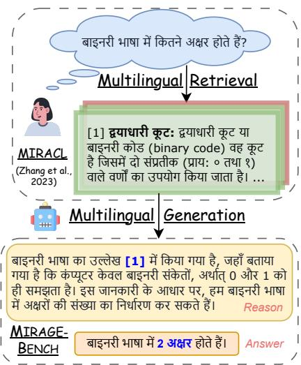  
Figure 1: Multilingual naive RAG pipeline in Hindi (hn). In MIRAGE-BENCH, we reuse the oracle retrieval set (query and oracle judged passages) from MIR-ACL (Zhang et al., 2023) and focus on evaluating the answer generation stage with multilingual LLMs.

RAG benchmarks can be broadly classified as either (i) heuristic-based, where benchmarks handcraft evaluation metrics (e.g., faithfulness or fluency) to evaluate systems on multiple dimensions (Gao et al., 2023a; Chen et al., 2024c; Yang et al., 2024b) or (ii) arena-based: where systems compete each other in a tournament and an LLMbased teacher is used as the judge for evaluation (Rackauckas et al., 2024; Pradeep et al., 2024a). Heuristic-based benchmarks are computationally cheaper to evaluate but require human preferences as gold truth for reference. They also face challenges in aggregating different features into a ranking order for models. On the other hand, arenabased benchmarks require a high-performance or reasoning-intensive LLM as a teacher for accuracy (Zheng et al., 2023), which makes exhaustive pairwise comparisons expensive for a large set of models. For instance, evaluating a single query on 19 models involves 192 = 171 comparisons and costs between \$5–10 USD with GPT-4o (OpenAI, 2023).

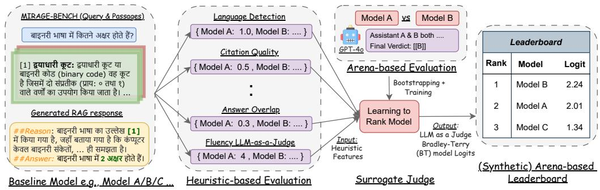  
Figure 2: The MIRAGE-BENCH evaluation flowchart consists of three steps: (i) heuristic-based features evaluating the baseline model response across several dimensions; (ii) exhaustive pairwise comparisons with GPT-4o as a judge on a small subset of queries to train our surrogate judge. (iii) After training, we utilize our surrogate judge to output the model ranking on the whole subset of queries, to construct the synthetic RAG arena-based leaderboard.

In our work, we get the best of both worlds with a surrogate judge, a learning to rank model, e.g. random forest (Ho, 1995), using heuristic features to estimate an arena-based leaderboard obtained with a Bradley-Terry model (Hunter, 2004) from pairwise evaluations using an LLM as a judge (Zheng et al., 2023). We use bootstrapping to obtain confidence bounds for better statistical estimates. After training, the learning to rank model can be used to estimate the performance of newer released models reliably in the future without the expensive LLM as a judge. It also provides better interpretability and is easily retrainable with a different or newer set of heuristic features.

We develop MIRAGE-BENCH, a RAG benchmark across 18 languages for multilingual generation evaluation on Wikipedia. MIRAGE-BENCH data is sourced from MIRACL (Zhang et al., 2023), a multilingual retrieval dataset containing humangenerated queries and human-labeled relevance judgments for Wikipedia passages. We benchmark 19 frontier multilingual LLMs in our experiments. Our evaluation flowchart adopted in

MIRAGE-BENCH is shown in Figure 2. We evaluate seven heuristic features: (i) language detection, (ii) citation quality, (iii) support, (iv) reranker score, (v) answer overlap (traditional), (vi) answer overlap (LLM-measured), and (vii) fluency (LLMmeasured). We use GPT-4o as the judge to evaluate our pairwise RAG comparisons on a smaller subset consisting of 100 queries. Next, we train a random forest model as a surrogate judge, using the heuristic features as input, and learn to output the Bradley-Terry model logits as output. Finally, during inference, we use our surrogate judge to produce a “synthetic” ranking leaderboard for all baselines across every language.

More specifically, we ask the following research questions in our work:

• Can we avoid the LLM as a judge cost and combine heuristic-based evaluation?

• How do frontier multilingual-focused LLMs perform in multilingual answer generation?

• Does fine-tuning on MIRAGE-BENCH training dataset improve LLM performance?

Our experimental results show that: (i) random forest model (surrogate judge) learned rankings highly correlates with GPT-4o as a judge, achieving an average Kendall-Tau (ω) score of 0.909. (ii) proprietary and large open-source LLMs ( 70B parameters) achieve the topmost ranks in the MI-RAGE-BENCH leaderboard. (iii) MIRAGE-BENCH training data, synthetically constructed using GPT-4o, is beneficial to improve smaller open-source LLMs (7–8B parameters). The main contribution of work is building MIRAGE-BENCH and benchmark 19 frontier multilingual LLMs to accelerate development in the area of multilingual RAG.

<table><tr><td></td><td>ar</td><td>bn</td><td>de</td><td>en</td><td>es</td><td>fa</td><td>fi</td><td>fr</td><td>hi</td><td>id</td><td>ja</td><td>k0</td><td>ru</td><td>SW</td><td>te</td><td>th</td><td>yo</td><td>zh</td></tr><tr><td></td><td colspan="10">MIRAGE-BENCH Evaluation Dataset</td><td></td><td></td><td></td><td></td><td></td><td></td><td></td><td></td><td></td></tr><tr><td># Queries</td><td>1501</td><td>411</td><td>304</td><td>787</td><td>617</td><td>632</td><td>1183</td><td>343</td><td>350</td><td>939</td><td>797</td><td>213</td><td>1247</td><td>481</td><td>150</td><td>730</td><td>119</td><td>391</td></tr><tr><td># Avg. Query Tokens</td><td>10.2</td><td>17.6</td><td>10.4</td><td>9.1</td><td>11.4</td><td>14.1</td><td>12.2</td><td>10.4</td><td>17.3</td><td>10.1</td><td>14.6</td><td>14.2</td><td>14.3</td><td>12.0</td><td>16.1</td><td>19.6</td><td>13.0</td><td>8.0</td></tr><tr><td>Avg. Rel. Passages / Q</td><td>2.0</td><td>2.1</td><td>2.6</td><td>2.8</td><td>4.3</td><td>2.1</td><td>2.0</td><td>2.1</td><td>2.1</td><td>3.1</td><td>2.2</td><td>2.6</td><td>2.8</td><td>1.9</td><td>1.2</td><td>1.8</td><td>1.2</td><td>2.5</td></tr><tr><td>Avg. Non Rel. Passages / Q</td><td>8.1</td><td>8.0</td><td>7.7</td><td>7.7</td><td>5.6</td><td>8.3</td><td>8.1</td><td>7.9</td><td>7.8</td><td>7.0</td><td>8.2</td><td>11.8</td><td>7.6</td><td>8.7</td><td>4.9</td><td>8.5</td><td>8.8</td><td>7.5</td></tr><tr><td></td><td colspan="10">MIRAGE-BENCH Training Dataset</td><td></td><td></td><td></td><td></td><td></td><td></td><td></td><td></td></tr><tr><td># Queries</td><td>3468</td><td>1624</td><td></td><td>2857</td><td>2159</td><td>2104</td><td>2878</td><td>1137</td><td>1165</td><td>4054</td><td>3466</td><td>859</td><td>4567</td><td>1866</td><td>3283</td><td>2965</td><td></td><td>1311</td></tr><tr><td># Avg. Query Tokens</td><td>10.2</td><td>17.4</td><td></td><td>8.7</td><td>11.2</td><td>14.2</td><td>11.8</td><td>10.4</td><td>17.1</td><td>9.9</td><td>14.5</td><td>14.9</td><td>14.3</td><td>12.0</td><td>16.1</td><td>19.3</td><td></td><td>7.9</td></tr><tr><td>Avg. Rel. Passages / Q</td><td>1.8</td><td>2.3</td><td></td><td>2.5</td><td>3.6</td><td>2.0</td><td>1.7</td><td>2.0</td><td>2.0</td><td>2.9</td><td>1.9</td><td>2.1</td><td>2.0</td><td>1.4</td><td>1.2</td><td>1.6</td><td></td><td>2.3</td></tr><tr><td>Avg. Non Rel. Passages / Q</td><td>5.5</td><td>7.9</td><td></td><td>7.5</td><td>5.3</td><td>8.3</td><td>5.3</td><td>8.0</td><td>7.9</td><td>7.1</td><td>7.9</td><td>12.4</td><td>5.2</td><td>3.5</td><td>4.3</td><td>5.6</td><td></td><td>7.6</td></tr><tr><td># Avg. GPT-4o Context Tokens</td><td>105.5</td><td>144.5</td><td></td><td>137.9</td><td>203.4</td><td>133.8</td><td>129.4</td><td>180.1</td><td>149.4</td><td>100.8</td><td>140.2</td><td>136.4</td><td>90.0</td><td>106.4</td><td>54.6</td><td>86.0</td><td></td><td>137.9</td></tr><tr><td># Avg. GPT-40 Answer Tokens</td><td>35.7</td><td>22.9</td><td></td><td>20.6</td><td>55.3</td><td>51.6</td><td>30.3</td><td>56.0</td><td>26.6</td><td>22.6</td><td>24.1</td><td>23.9</td><td>16.1</td><td>18.4</td><td>11.4</td><td>20.4</td><td></td><td>40.6</td></tr></table>

Table 1: Dataset statistics for 18 languages in MIRAGE-BENCH; All tokens are calculated using the GPT-4o tokenizer (OpenAI, 2023); (Rel.) denotes relevancy; (# Avg GPT-4o) counts the tokens in the GPT-4o generated context and answer; Training data is not available for two languages (denoted by —): German (de) and Yoruba (yo).

## 2 Related Work

Prior work on RAG evaluation has been conducted exclusively in English. For example, benchmarks such as ALCE (Gao et al., 2023a), FreshLLM (Vu et al., 2024), ClapNQ (Rosenthal et al., 2025), HAGRID (Kamalloo et al., 2023) and CRAG (Yang et al., 2024b), all include long-form answers for English-only queries and are based on collections containing documents from either the English Wikipedia, MS MARCO (Bajaj et al., 2016) or NQ (Kwiatkowski et al., 2019). Similarly, TREC 2024 RAG, a TREC competition for RAG evaluation is focused on evaluating queries in English.2

Multilingual RAG. On the multilingual side, RAG has not been well studied in prior literature. The RGB benchmark (Chen et al., 2024c) is limited in language scope covering only one additional language: Chinese (zh). NeuCLIR 2024 track (Mayfield et al., 2024) evaluates long-form report generation from participants, but is limited to three languages. A concurrent work is BERGEN (Chirkova et al., 2024), which evaluates the multilingual opendomain QA setting on 13 languages. In contrast, in MIRAGE-BENCH, we (i) evaluate the generation task in the multilingual RAG pipeline on 18 languages, (ii) provide multilingual instruction-tuned data for RAG fine-tuning, and (iii) utilize highquality native-speaker multilingual queries generated in MIRACL (Zhang et al., 2023).

Learning to rank. A supervised learning technique, where models are trained to rank items within a list similar to training data (Liu, 2010; Turnbull, 2017). Models are trained in either a pointwise, pairwise, or listwise objective (Cao et al., 2007). In our work, we experiment with simple models such as random forest to train to rank the Bradley-Terry model coefficient produced by LLM as a judge. We keep complex models such as LambdaMART (Burges, 2010) for future work.

## 3 An Overview of MIRAGE-BENCH

We select 18 languages in MIRAGE-BENCH as the starting point, representing an appropriate crosssection of the diversity of the languages spoken worldwide at this point. MIRAGE-BENCH is a comprehensive multilingual RAG benchmark focusing on the generation task evaluation. As shown in Table 1, the benchmark includes 11,195 evaluation pairs and 39,763 training pairs across 18 languages.

## 3.1 Distinction and Extension from MIRACL

MIRACL introduced in Zhang et al. (2023) is a monolingual retrieval dataset, which evaluates the retrieval task, i.e., given a user query and a passage corpus, retrieve the ranked list of passages as output. MIRACL contains human-annotated relevance judgments to evaluate retrieval and re-ranker models, e.g., lexical models like BM25 (Robertson and Zaragoza, 2009) or bi-encoders like mDPR (Karpukhin et al., 2020), or late-interaction models like ColBERT (Khattab and Zaharia, 2020).

In contrast, MIRAGE-BENCH evaluates the generation task in RAG, requiring LLMs to generate a summarized answer given the query and context available from oracle-judged passages. In our work, we reuse the queries and relevance-judgments from MIRACL, but solely evaluate the multilingual generation task in RAG measuring answers using both heuristics and LLM as a judge. Since MIRAGE-BENCH evaluates the generation task containing the oracle context, independent of the retrieval task, the chances of contamination in MIRAGE-BENCH evaluation from fine-tuning MIRACL is less overall.

## 3.2 MIRAGE-BENCH Evaluation Dataset

MIRACL queries are high-quality and generated by native speakers (Zhang et al., 2023). The annotation procedure in MIRACL is identical to TyDI-QA (Clark et al., 2020). The passage collection is constructed from language-specific Wikipedia corpora and parsed using WikiExtractor. The MIRAGE-BENCH evaluation dataset is constructed re-using the queries and oracle-judged passages available in the MIRACL development split.3

We incorporate two changes: (i) In Arabic (ar), we randomly sample a smaller subset of 1,501 out of 2,896 queries for uniformity in the number of queries available across other languages. (ii) We filter out a small subset of queries with zero nonrelevant passages, i.e., we always include queries with hard passages from MIRACL to make the MI-

## 3.3 MIRAGE-BENCH Training Dataset

The MIRAGE-BENCH training dataset is developed from the MIRACL training dataset (Zhang et al., 2023). In MIRAGE-BENCH, we reuse all the MIR-ACL training pairs available in 16 languages (except German (de) and Yoruba (yo)) and convert it using a simple recipe into a multilingual instructiontuned RAG dataset (Zhang et al., 2024; Niu et al., 2024). In our recipe, we first keep only the relevant passages as context along with the input query to generate a zero-shot RAG output by prompting strong teachers such as GPT-4o (OpenAI, 2023), Llama 3 (70B) (Dubey et al., 2024) and Mixtral (8 22B) (Jiang et al., 2024). After generation, we include non-relevant passages within our prompt as “distracting and noisy context”, to help improve the quality of the training dataset. Since we convert a retrieval dataset, we do not have human-annotated answers for questions in MIRAGE-BENCH.

## 4 Multilingual RAG Evaluation

## 4.1 Heuristic-based Evaluation

Answer generation in RAG requires evaluation on various dimensions. For example, whether a system’s response provides the correct final answer or cites the relevant documents, a single metric alone is not sufficient to capture the comprehensive evaluation required for RAG systems. Inspired by other recent works (Kiela et al., 2021; Santhanam et al., 2023; Gao et al., 2023a), we introduce five deterministic features and two LLM-measured features for evaluation in our work. We rely on features that are explainable, cheap, and fast to compute. We explain each heuristic feature in Appendix A.

Language detection. We compute the probability of a system’s response in the required target language with langid (Lui and Baldwin, 2012). We compute two metrics: language detection (target language) and English detection.

Citation quality. Using passage-level relevance judgments for all queries (or qrels) information available in MIRACL, we evaluate whether the system’s response cites the relevant passages, crucial for measuring faithfulness. We compute and evaluate: Recall@k and MAP@k, where k = 10, as we have a maximum of 10 passages per query.

Support. Grounding is necessary to avoid hallucinations in the system’s response. Support evaluation (Gao et al., 2023a) checks whether each sentence is supported by cited passages using a multilingual NLI model (He et al., 2023).5 We compute the probability of the entailment and neutral score, macro-averaged across the sentence-citation pairs.

Reranker score. The reranker score measures the average similarity (can be greater than 1.0) between the query and the passages cited within the system’s response. We compute the reranker score using a multilingual reranker model,6 macro-averaged across the query-passage pairs.

Answer overlap. Having the correct answer is crucial in the RAG system’s response. Since MIRAGE-BENCH does not include a human-labeled answer, we use the generated answer from GPT-4 (OpenAI, 2023) as the gold truth. We compute two traditional metrics: SacreBLEU (Papineni et al., 2002) and ROUGE-L (Lin, 2004) measuring the lexical word overlap between the gold answer (GPT-4’s answer is used for reference) and the system’s response.

Answer overlap (LLM-measured). In addition, we evaluate using Llama-3 (8B) (Dubey et al., 2024), an open-source LLM as a judge evaluator in a pointwise setup, providing a semantic word overlap integer score in the range [1, 5]. The answer overlap prompt description is listed in Figure 11.

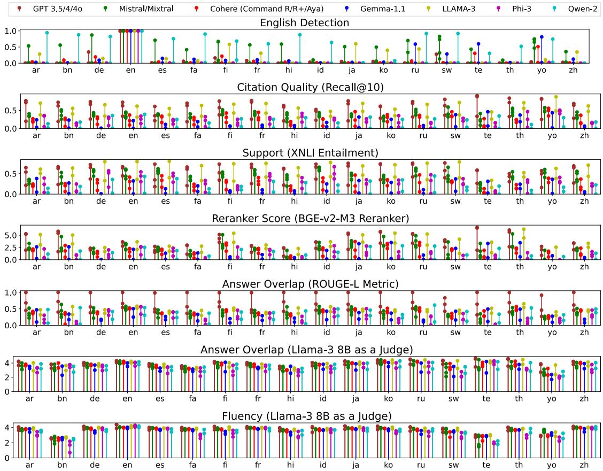  
Figure 3: Lollipop plots denoting the average heuristic-based feature scores achieved by LLM baselines for each language in MIRAGE-BENCH. x-axis denotes the 18 languages; whereas y-axis plots every heuristic feature score. Models in the same LLM family are represented in the same color in a lollipop (as multiple circles). Figure 9 in the Appendix provides lollipop plots for all eleven heuristic-based features used in our work.

Fluency (LLM-measured). It measures for grammatical correctness and idiomatic word choices in the system’s response. As previously mentioned, we use Llama-3 (8B) (Dubey et al., 2024) in a point wise setup, proving an integer score in [1, 5]. The fluency prompt description is listed in Figure 12.

## 4.2 Arena-based Evaluation

Heuristic-based evaluation metrics often rely on a gold standard for evaluation. Tasks such as text retrieval (Bajaj et al., 2016; Thakur et al., 2021) require human-labeled relevance judgments, and similarly, NLP tasks such as machine translation (Stahlberg, 2020), require human-annotated translations. As human preferences are seldom available in numerous applications, using LLM as a judge (Zheng et al., 2023; Chen et al., 2024a; Chiang et al., 2024) is becoming a de facto approach for arena-based evaluation of LLMs.

We evaluate pointwise, listwise, and pairwise

LLM as judge evaluations. We anecdotally observe the pointwise judge, which is efficient O(n), but is not good for ranking LLMs as it provides similar scores for a wide range of models (e.g., 4/5 score for 16 out of 18 LLMs evaluated). Similarly, the listwise judge finds it difficult to rank all 19 models in the correct order. Therefore, although suboptimal in complexity, O(n2), where n is the number of models evaluated, we choose a pairwise evaluation in our work.

Pairwise LLM as a judge. Following prior works on arena-based evaluation in RAG (Rackauckas et al., 2024; Pradeep et al., 2024a), we evaluate two system’s responses in a head-on comparison by computing pairwise judgments with LLM as a judge. We reuse the RAGElo prompt template (Rackauckas et al., 2024) with minor additions. The prompt template is listed in Figure 13. LLM as a judge evaluator includes three types of biases (Zheng et al., 2023): (i) verbosity bias (Wu and

Aji, 2025) (ii) self-enhancement bias (Xu et al., 2024; Panickssery et al., 2024) and (iii) position bias (Wang et al., 2024). We avoid the verbosity bias, as RAG evaluation has fixed evaluation criteria requiring sentence-level citations and answers (Pradeep et al., 2024a) and the position bias by randomly swapping the position of two models.

## 4.3 Learning to Approximate Rankings

There is no predefined way to aggregate the heuristic features to provide an overall leaderboard ranking in MIRAGE-BENCH. Averaging the scores is too simplistic as features measure different aspects of RAG evaluation. On the other hand, arenabased evaluations provide ranked leaderboards but are computationally expensive to compute with a strong teacher model. To avoid computational costs, smaller models as teachers have been proposed (Thakur et al., 2024a; Ni et al., 2024).

Motivated by similar observations, we train a surrogate judge to effectively emulate an arena-based leaderboard without incurring the expensive LLM as a judge pairwise cost. We find the random forest model to serve as a scalable and cost-effective judge that can be trained within minutes on small training datasets without expensive computation. Therefore, we train a random forest (learning to rank model) as a surrogate judge to approximate the Bradley-Terry model coefficients (Hunter, 2004) learned from an arena-based evaluation that uses GPT-4o as a judge for pairwise judgments.

Learning to rank model. While the heuristic features introduced in Section 4.1 can be computed efficiently and without the reliance on proprietary LLMs, inducing a ranking from pairwise comparisons via a Bradley-Terry model is computationally expensive and requires access to a highperformance LLM. Furthermore, as we demonstrate in Section 6.3, the ranking accuracy, measured by the Kendall-Tau (ω) coefficient, degrades rapidly when subsampling tournament matches.

The procedure, detailed in Algorithm 1, simulates $N _ { t }$ tournaments, each involving a total of $N _ { l }$ models and $N _ { q }$ queries. For each query, judgments are obtained for all $\binom { N _ { l } } { 2 }$ pairings of models. We employ bootstrapping on the query selection process to estimate the variance in the $R ^ { 2 }$ metric in the learning to rank models’ approximations of the Bradley-Terry coefficients over a randomlysampled holdout set, $\mathbf { L L M } _ { p r e d i c t }$

We randomly select two models, Gemma 1.1 (2B) and Llama-3 (70B) as holdout models, i.e., we do not train on the features for holdout models. For English, we observe an average $\bar { R } ^ { 2 } = 0 . 9 7 1$ with a 95% confidence interval of [0.905, 0.999]. On the other hand, for Bengali, we observe $\bar { R } ^ { 2 } = 0 . 9 3 7$ with a 95% confidence interval of [0.766, 0.998]. $\bar { R } ^ { 2 }$ scores for all 18 languages with 95% confidence intervals are listed in Table 5. Taken together, these results indicate that the training procedure is fairly robust with $N _ { q } = 1 0 0$

Algorithm 1 Simulate Tournaments and Fit Models   
1: for $i \in [ N _ { t } ]$ do   
2: $M _ { B T } ^ { i }  \mathrm { T o U R N A M E N T } ( N _ { q } )$   
3: $X _ { t } , Y _ { t } \gets \mathrm { { D A T A S E T } } \big ( \mathrm { { L L M } } _ { t r a i n } , M _ { B T } ^ { i } \big )$   
4: $X _ { p } , Y _ { p } \gets \mathrm { D A T A S E T } \big ( \mathrm { L L M } _ { p r e d i c t } , M _ { B T } ^ { i } \big )$   
5: $M _ { r e g } ^ { i }  \mathrm { F I T } ( X _ { t } , Y _ { t } )$   
6: $R _ { 2 } ^ { i } \doteq M _ { r e g } ^ { i } ( X _ { p } , Y _ { p } )$   
7: end for   
8: $M _ { B T }  [ M _ { B T } ^ { 1 } ; M _ { B T } ^ { 2 } ; . . . ; M _ { B T } ^ { N _ { t } } ]$   
9: $M _ { r e g } \gets [ M _ { r e g } ^ { 1 } ; M _ { r e g } ^ { 2 } ; . . . ; M _ { r e g } ^ { N _ { t } } ]$   
10: $R _ { 2 } \gets [ R _ { 2 } ^ { 1 } ; R _ { 2 } ^ { 2 } ; . . . ; R _ { 2 } ^ { N _ { t } } ]$   
Note: Refer to Section 4.3 for a definition of each of the   
variables. The TOURNAMENT function runs a battle arena,   
sampling q queries, and returning the learned Bradley-Terry   
model. The DATASET function accepts a set of LLMs and a   
learned Bradley-Terry model. It returns $X ,$ the heuristic RAG   
feature values, and Y, the Bradley-Terry coefficients for each   
LLM model. After simulating $\check { N _ { t } }$ tournaments, the array R2   
contains the $R ^ { 2 }$ errors for each of the $N _ { t }$ models.

## 5 Experimental Settings

## 5.1 Multilingual Baselines

Existing frontier LLMs are either English-only or support a limited set of languages, predominantly due to the curse ofmultilinguality for large models (Conneau et al., 2020). It is unclear how well existing LLMs perform on RAG on a wide variety of languages, due to the scarce availability of multilingual instruction tuning datasets. We experiment with LLMs from seven different families, containing proprietary and open-source LLMs. Wherever possible, we evaluate the instruction-tuned version if available. Refer to Appendix B for more details.

• OpenAI: GPT-3.5-turbo, GPT-4, and GPT-4o (OpenAI, 2023) using the Azure OpenAI service.

• Mistral: Mistral-Instruct-v0.2 and v0.3 (7B) (Jiang et al., 2023) and Mixtral-Instructv0.1 (8 7B) and (8 22B) versions (Jiang et al., 2024).

• Cohere: Command-R (35B), Command-R+ (104B) and Aya-23 (35B) (Aryabumi et al., 2024).

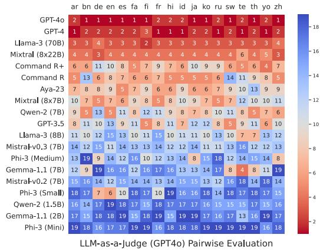

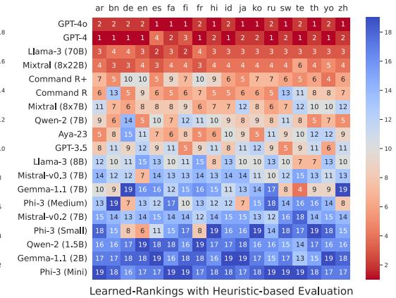  
Figure 4: MIRAGE-BENCH arena-based leaderboards: (left heatmap) Bradley-Terry model coefficients with GPT-4o as a pairwise judge for a subset of 100 sampled queries; (right heatmap) Synthetic rankings using heuristic-based features and a random forest model as a surrogate judge on all queries. Each highlighted cell denotes the rank of the LLM (lower the better). LLMs are sorted by lowest to highest average rank across all 18 languages.

• Gemma: Gemma 1.1 instruct (2B) and (7B) models (Mesnard et al., 2024).

• Llama-3: Llama-3 instruct (8B) and (70B) models (Dubey et al., 2024).

• Phi-3: Phi 3 instruct series: Medium (14B), Small (7B), and Mini (3.8B) (Abdin et al., 2024).

• Qwen-2: Qwen-2-instruct series: 1.5B and 7B (Yang et al., 2024a).

Prompt template. We internally optimized7 the ChatQA prompt template (Liu et al., 2024), to include in-text citations of the context passages following the IEEE format (Kamalloo et al., 2023). In MIRAGE-BENCH, we have about 10 passages annotated in the oracle setting. Therefore, we trim each passage available and take the first 800 tokens to fit all passages within a fixed context length of 8192 tokens. following prior work in Shi et al. (2023), the prompt requires the LLM to explain the multilingual generation task starting with “##Reason” and the answer itself starting with “##Answer”. Utilizing this output format has its advantages in easily parsing the generated answer and the rationale behind the answer. The prompt template for multilingual generation is shown in Figure 10.

## 6 Experimental Results

## 6.1 Heuristic-based Results

Figure 3 shows lollipop plots indicating the average heuristic-feature value (y-axis) distribution for each language (x-axis). In English detection (higher the worse), smaller LLMs such as Gemma-1.1 (2B) do not generate output in the required target language but rather generate reasoning and answers in English. For citation quality, support, and reranker score features, LLMs from OpenAI and Llama-3 family achieve high Recall@10 and entailment scores (except Llama-3 (70B) for a few languages), indicating generated answers include grounded citations from relevant passages. In contrast, LLMs from the Qwen-2 or Gemma-1.1 family, tend to under-cite passages in their answers.

<table><tr><td>Lang.</td><td>T</td><td>Lang.</td><td>T</td><td>Lang.</td><td>T</td><td>Lang.</td><td>T</td></tr><tr><td>ar</td><td>0.951</td><td>bn</td><td>0.874</td><td>de</td><td>0.825</td><td>en</td><td>0.835</td></tr><tr><td>es</td><td>0.876</td><td>fa</td><td>0.924</td><td>fi</td><td>0.949</td><td>fr</td><td>0.914</td></tr><tr><td>hi</td><td>0.946</td><td>id</td><td>0.896</td><td>ja</td><td>0.892</td><td>ko</td><td>0.950</td></tr><tr><td>ru</td><td>0.849</td><td>SW</td><td>0.958</td><td>te</td><td>0.938</td><td>th</td><td>0.946</td></tr><tr><td></td><td></td><td>yo</td><td>0.906</td><td>zh</td><td>0.941</td><td></td><td></td></tr></table>

Avg. Kendall Tau (ω) on 18 languages = 0.909  
Table 2: Kendall ω rank correlation between pairwise GPT-4o as a judge Bradley-Terry model and the synthetic arena-based ranking leaderboard generated using our surrogate judge in MIRAGE-BENCH.

Furthermore, we observe LLMs from the OpenAI family achieve the highest word overlap in the ROUGE-L metric (GPT-4 used as ground truth, which could be a potential bias) and Llama-3 (8B) as a judge, while we observe less variance across other LLMs. In Fluency, we observe a majority of the LLMs are rather fluent in generation, except Bengali (bn), Telugu (te), and Yoruba (yo).

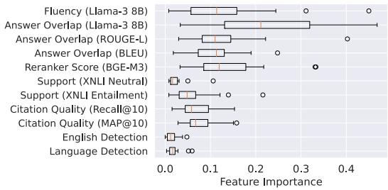  
Figure 5: Boxplot with the feature importance value (averaged across 18 languages in MIRAGE-BENCH) observed by the learning to rank (random forest) model.

## 6.2 Arena-based Results

Figure 4 (left heatmap) is the arena-based leaderboard with the Bradley Terry model conducting 200 tournaments and bootstrapping 100 matches per tournament on a subset of 100 queries using GPT-4o as a pairwise judge. We observe that proprietary LLMs such as GPT-4o and GPT-4, and larger opensource LLMs such as Llama-3 (70B) and Mixtral (8 22B) perform better than other LLMs. LLM rankings across languages are usually stable; with a few notable exceptions such as Gemma-1.1 (7B) which achieves a rank of 4 in Telugu. Command R (35B) performs poorly in low-resource languages such as Bengali (rank 13) or Swahili (rank 14). The complete scores including model coefficient logits and 95% confidence intervals (error bars) are provided in Table 7 and Table 8 in the Appendix.

Synthetic rankings using random forest. Figure 4 (right heatmap) is the learned synthetic leaderboard rankings on all queries using heuristic-based features trained with a random forest model. The synthetic leaderboard generated using a surrogate judge, highly correlates to the GPT-4o as a pairwise judge, achieving an average Kendall-Tau (ω) rank correlation = 0.909, by training on 17 LLMs during training and keeping 2 LLMs as a holdout for every language. Individual language-specific Kendall-Tau rank correlation scores are listed in Table 2. This provides evidence of the efficacy of training a random forest model as a surrogate judge. In Appendix D, we extend the evaluation for Llama-3.1 and Gemma-2 series of LLMs.

Heuristic feature importance. In Figure 5, we plot the average feature importance achieved by our random forest model as a surrogate judge. Using Llama-3 (8B) as a judge, for fluency and answer overlap are the important heuristic features. Similarly, deterministic answer overlap and rerankingbased metrics are equally important. Some heuristic features such as language detection, and neutral score in support evaluation obtain the least importance. We observe all answer-related heuristic features achieve a high importance indicating that the generated “answer” portion in an LLM’s response is crucial and required to learn rankings from GPT-4o as a pairwise judge.

<table><tr><td>Model / Language</td><td>ar</td><td>bn</td><td>f</td><td>ja</td><td>ko</td><td>ru</td><td>te</td></tr><tr><td colspan="8">Train R² on randomly selected fifteen models</td></tr><tr><td>Random Forest</td><td>0.97</td><td>0.96</td><td>0.97</td><td>0.96</td><td>0.97</td><td>0.95</td><td>0.97</td></tr><tr><td>Linear Regression</td><td>0.98</td><td>0.98</td><td>0.98</td><td>1.00</td><td>0.97</td><td>0.99</td><td>1.00</td></tr><tr><td>MLP Regressor</td><td>0.97</td><td>0.98</td><td>0.97</td><td>0.96</td><td>0.96</td><td>0.98</td><td>0.99</td></tr><tr><td>XGB Regressor</td><td>1.00</td><td>1.00</td><td>1.00</td><td>1.00</td><td>1.00</td><td>1.00</td><td>1.00</td></tr><tr><td>SVR</td><td>0.75</td><td>0.77</td><td>0.81</td><td>0.59</td><td>0.67</td><td>0.73</td><td>0.39</td></tr></table>

Holdout R2 on four randomly selected held out models
<table><tr><td colspan="8"></td></tr><tr><td>Random Forest Linear Regression</td><td>0.50 -1.92</td><td>0.41 -5.45</td><td>0.49 -19.38</td><td>-0.03 -0.06</td><td>0.45 -26.53</td><td>0.07 -2.13</td><td>0.83</td></tr><tr><td></td><td>0.33</td><td>0.37</td><td>0.45</td><td>-0.76</td><td>-0.04</td><td>-0.48</td><td>0.31</td></tr><tr><td>MLP Regressor XGB Regressor</td><td>-0.02</td><td>0.44</td><td>0.22</td><td>-1.33</td><td>-0.09</td><td>-0.80</td><td>0.78 0.59</td></tr><tr><td></td><td>-0.03</td><td>0.48</td><td>0.64</td><td>-0.53</td><td>-0.09</td><td>0.15</td><td>-0.10</td></tr><tr><td>SVR</td><td></td><td></td><td></td><td></td><td></td><td></td><td></td></tr></table>

Table 3: Train and Holdout $R ^ { 2 }$ scores using different learning to rank model choices. Each experiment has been repeated 50 times with four held-out models.

## 6.3 Ablations & Discussion

To better understand the gaps observed during training of the random forest model as a surrogate judge, we conduct further ablations on a subset of seven languages including Arabic (ar), Bengali (bn), Finnish (fi), Japanese (ja), Korean (ko), Russian (ru) and Telugu (te):

Learning to rank model choice. We compare different learning to rank models as choices for learning the Bradley-Terry model coefficients. We conduct our experiments on the train set, where models contain pairwise judgments, and on a randomly sampled holdout set, a realistic scenario, with no available training data. We evaluate the following choices: Random Forest, Linear Regression, MLP Regressor, XGB Regressor, and SVR. All models are implemented via scikit-learn.8 The results are shown in Table 3. Random forest achieves the best $R ^ { 2 }$ metric on the holdout subset for 4 out of 7 languages. SVR also achieves a similar $R ^ { 2 }$ metric on the holdout subset, however, underperforms random forest on the training subset. Other baselines, such as XGB Regressor and MLP Regressor show signs of significant overfitting on the training subset, thereby underperforming random forest on the holdout subset.

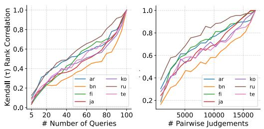

Figure 6: Sampling experiments to reduce computation cost. (left) reduces the number of queries whereas (right) reduces the pairwise judgments.
<table><tr><td>Features / Language</td><td>#F</td><td>ar</td><td>bn</td><td>fi</td><td>ja</td><td>ko</td><td>ru</td><td>te</td></tr><tr><td>(All) Features</td><td>11</td><td>0.938</td><td>0.867</td><td>0.921</td><td>0.881</td><td>0.921</td><td>0.826</td><td>0.918</td></tr><tr><td>(W/o) LLM as a Judge</td><td>9</td><td>0.912</td><td>0.866</td><td>0.898</td><td>0.853</td><td>0.891</td><td>0.811</td><td>0.904</td></tr><tr><td>(W/o) Low. Correlation</td><td>7</td><td>0.951</td><td>0.867</td><td>0.923</td><td>0.885</td><td>0.929</td><td>0.829</td><td>0.940</td></tr><tr><td>(Only) LLM as a Judge</td><td>2</td><td>0.948</td><td>0.728</td><td>0.907</td><td>0.884</td><td>0.916</td><td>0.851</td><td>0.872</td></tr></table>

Table 4: Kendall Tau (ω) scores using different features for training the random forest regression model.

Non-exhaustive pairwise comparisons lead to performance degradation. Exhaustive pairwise comparisons across a subset of 19 models in MI-RAGE-BENCH using GPT-4o for all queries are quite expensive. To avoid this, we investigate whether all pairwise exhaustive comparisons are necessary during training. We utilize two sampling techniques: (i) full pairwise judgments on a subsample of 100 queries, e.g., 20 or 50 queries; (ii) partially judge a non-exhaustive random sample of the pairwise judgments across 100 queries, e.g., only 50% of all the exhaustive pairwise combinations. Both results are shown in Figure 6. we observe that Kendall-Tau (ω) correlations increase linearly with queries and pairwise judgments. In summary, an exhaustive pairwise comparison and a sufficient number of queries, such as 100, are nec essary without impacting the leaderboard rankings.

All heuristic features are not necessary. We experiment with features used for random forest model training as a surrogate judge. We evaluate four training configurations: (i) all features (ii) without LLM-measured features (iii) without language detection and support, i.e., the lowcorrelation features observed in Figure 5, and (iv) including only LLM-measured features. From Table 4, we observe that removing low-correlated heuristic RAG features helps train the random forest model better leading to a conclusion that not necessarily all heuristic features are important. Removing the LLM-measured features completely or only using them for training the model decreases the Kendall-Tau (ω) correlation score.

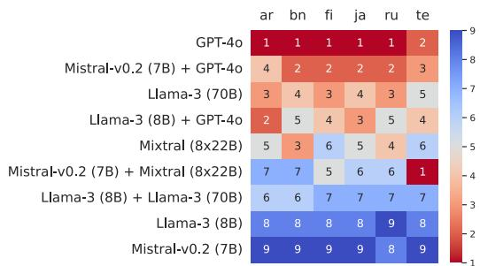  
Figure 7: Approximate rankings using heuristic features after fine-tuning Llama-3 (8B) and Mistral-v0.2 (7B) on MIRAGE-BENCH dataset across four configurations.

Fine-tuning on MIRAGE-BENCH training data. We evaluate three variants of the MIRAGE-BENCH training dataset using two smaller open-source LLMs: Mistral-v0.2 (7B) and Llama-3 (8B). We fine-tune the MIRAGE-BENCH training datasets using (i) both on GPT-4o, (ii) Llama-3 (8B) on Llama-3 (70B), and (iii) Mistral-v0.2 (7B) on Mixtral (8 22B). From Figure 7, we observe that GPT-4o is a strong teacher, Mistral-v0.2 (7B) fine-tuned on GPT-4o distilled training data achieves rank 2 outperforming Llama-3 (70B). This shows that MI-RAGE-BENCH training data is useful for improving the RAG answer generation task quality.

## 7 Conclusion

We present MIRAGE-BENCH, a multilingual RAG benchmark for 18 languages aimed at evaluating the multilingual generation part within RAG and aggregate traditional heuristic-based features to train a lightweight learning to rank model as a surrogate judge to learn a Bradley Terry model with GPT-4o pairwise judgments. Our results indicate a strong correlation between our surrogate judge and GPT-4o as a pairwise judge. This demonstrated the effectiveness of our efficient, cheap, and easy-toretrain random forest model as a surrogate judge trained using only computationally cheap heuristic features for arena-based leaderboard ranking by achieving a 0.909 Kendall ω. On MIRAGE-BENCH, we observe that most proprietary and opensource larger LLMs currently dominate, whereas smaller open-source LLMs continue to struggle. Instruction tuning on MIRAGE-BENCH training data helps improve smaller open-source LLMs, e.g. instruction-tuned Mistral-v0.2 (7B) on GPT-4o distilled training data can outperform Llama 3 (70B) on MIRAGE-BENCH.

## 8 Limitations

MIRAGE-BENCH is one of the first large-scale multilingual RAG benchmarks. Although not perfect, we below discuss a set of limitations in our work:

• In MIRAGE-BENCH, we focused on benchmarking the generation task in RAG with oracle passages, we did not consider the retrieval task and its error propagating on the generation task.

• Due to budget constraints, we were unable to evaluate diverse LLMs as teachers such as Claude-3.5 (sonnet) (Anthropic, 2024) or Gemini Pro (Anil et al., 2023). We evaluated using GPT-4o which can cause self-enhancement bias towards LLMs in the OpenAI family.

• In our heuristic evaluation, we only considered a smaller subset of features. We did not explore more recent hand-crafted features such as nuggetbased recall and precision (Pradeep et al., 2024b; Farzi and Dietz, 2024; Arabzadeh and Clarke, 2024; Lin and Demner-Fushman, 2005).

• Lastly, MIRAGE-BENCH does not provide human-labeled answers for queries across all languages and is limited to Wikipedia as the source.

## Acknowledgements

This research is supported by the Canada First Research Excellence Fund and the Natural Sciences and Engineering Research Council (NSERC) of Canada. We thank Ka Wong for helping us out with bootstrapping during the training of the random forest model as a surrogate judge.

## References

Marah I Abdin, Sam Ade Jacobs, Ammar Ahmad Awan, Jyoti Aneja, Ahmed Awadallah, Hany Awadalla, Nguyen Bach, Amit Bahree, Arash Bakhtiari, Harkirat S. Behl, Alon Benhaim, Misha Bilenko, Johan Bjorck, Sébastien Bubeck, Martin Cai, Caio César Teodoro Mendes, Weizhu Chen, Vishrav Chaudhary, Parul Chopra, Allie Del Giorno, Gustavo de Rosa, Matthew Dixon, Ronen Eldan, Dan Iter, Amit Garg, Abhishek Goswami, Suriya Gunasekar, Emman Haider, Junheng Hao, Russell J. Hewett, Jamie Huynh, Mojan Javaheripi, Xin Jin, Piero Kauffmann, Nikos Karampatziakis, Dongwoo Kim, Mahoud Khademi, Lev Kurilenko, James R. Lee, Yin Tat Lee, Yuanzhi Li, Chen Liang, Weishung Liu, Eric Lin, Zeqi Lin, Piyush Madan, Arindam Mitra, Hardik Modi, Anh Nguyen, Brandon Norick, Barun Patra, Daniel Perez-Becker, Thomas Portet, Reid Pryzant, Heyang Qin, Marko Radmilac, Corby Rosset, Sambudha Roy, Olatunji Ruwase, Olli Saarikivi, Amin Saied, Adil Salim, Michael Santacroce, Shital Shah,

Ning Shang, Hiteshi Sharma, Xia Song, Masahiro Tanaka, Xin Wang, Rachel Ward, Guanhua Wang, Philipp Witte, Michael Wyatt, Can Xu, Jiahang Xu, Sonali Yadav, Fan Yang, Ziyi Yang, Donghan Yu, Chengruidong Zhang, Cyril Zhang, Jianwen Zhang, Li Lyna Zhang, Yi Zhang, Yue Zhang, Yunan Zhang, and Xiren Zhou. 2024. Phi-3 technical report: A highly capable language model locally on your phone. CoRR, abs/2404.14219.

Rohan Anil, Sebastian Borgeaud, Yonghui Wu, Jean-Baptiste Alayrac, Jiahui Yu, Radu Soricut, Johan Schalkwyk, Andrew M. Dai, Anja Hauth, Katie Millican, David Silver, Slav Petrov, Melvin Johnson, Ioannis Antonoglou, Julian Schrittwieser, Amelia Glaese, Jilin Chen, Emily Pitler, Timothy P. Lillicrap, Angeliki Lazaridou, Orhan Firat, James Molloy, Michael Isard, Paul Ronald Barham, Tom Hennigan, Benjamin Lee, Fabio Viola, Malcolm Reynolds, Yuanzhong Xu, Ryan Doherty, Eli Collins, Clemens Meyer, Eliza Rutherford, Erica Moreira, Kareem Ayoub, Megha Goel, George Tucker, Enrique Piqueras, Maxim Krikun, Iain Barr, Nikolay Savinov, Ivo Danihelka, Becca Roelofs, Anaïs White, Anders Andreassen, Tamara von Glehn, Lakshman Yagati, Mehran Kazemi, Lucas Gonzalez, Misha Khalman, Jakub Sygnowski, and et al. 2023. Gemini: A family of highly capable multimodal models. CoRR, abs/2312.11805.

## Anthropic. 2024. Claude 3.5 Sonnet.

Negar Arabzadeh and Charles L. A. Clarke. 2024. A comparison of methods for evaluating generative IR. CoRR, abs/2404.04044.

Viraat Aryabumi, John Dang, Dwarak Talupuru, Saurabh Dash, David Cairuz, Hangyu Lin, Bharat Venkitesh, Madeline Smith, Jon Ander Campos, Yi Chern Tan, Kelly Marchisio, Max Bartolo, Sebastian Ruder, Acyr Locatelli, Julia Kreutzer, Nick Frosst, Aidan N. Gomez, Phil Blunsom, Marzieh Fadaee, Ahmet Üstün, and Sara Hooker. 2024. Aya 23: Open weight releases to further multilingual progress. CoRR, abs/2405.15032.

Payal Bajaj, Daniel Campos, Nick Craswell, Li Deng, Jianfeng Gao, Xiaodong Liu, Rangan Majumder, Andrew McNamara, Bhaskar Mitra, Tri Nguyen, Mir Rosenberg, Xia Song, Alina Stoica, Saurabh Tiwary, and Tong Wang. 2016. MS MARCO: A human generated machine reading comprehension dataset. CoRR, abs/1611.09268.

Sebastian Borgeaud, Arthur Mensch, Jordan Hoffmann, Trevor Cai, Eliza Rutherford, Katie Millican, George van den Driessche, Jean-Baptiste Lespiau, Bogdan Damoc, Aidan Clark, Diego de Las Casas, Aurelia Guy, Jacob Menick, Roman Ring, Tom Hennigan, Saffron Huang, Loren Maggiore, Chris Jones, Albin Cassirer, Andy Brock, Michela Paganini, Geoffrey Irving, Oriol Vinyals, Simon Osindero, Karen Simonyan, Jack W. Rae, Erich Elsen, and Laurent Sifre. 2022. Improving language models by retrieving from trillions of tokens. In International Conference on

Machine Learning, ICML 2022, 17-23 July 2022, Bal timore, Maryland, USA, volume 162 of Proceedings of Machine Learning Research, pages 2206–2240. PMLR.

Chris J.C. Burges. 2010. From RankNet to LambdaRank to LambdaMART: An overview. Technical Report MSR-TR-2010-82.

Zhe Cao, Tao Qin, Tie-Yan Liu, Ming-Feng Tsai, and Hang Li. 2007. Learning to rank: from pairwise approach to listwise approach. In Proceedings of the 24th International Conference on Machine Learning, ICML ’07, page 129–136, New York, NY, USA. Association for Computing Machinery.

Guiming Hardy Chen, Shunian Chen, Ziche Liu, Feng Jiang, and Benyou Wang. 2024a. Humans or LLMs as the judge? a study on judgement bias. In Proceedings ofthe 2024 Conference on Empirical Methods in Natural Language Processing, pages 8301–8327, Miami, Florida, USA. Association for Computational Linguistics.

Jianlyu Chen, Shitao Xiao, Peitian Zhang, Kun Luo, Defu Lian, and Zheng Liu. 2024b. M3- embedding: Multi-linguality, multi-functionality, multi-granularity text embeddings through selfknowledge distillation. In Findings of the Associationfor Computational Linguistics ACL 2024, pages 2318–2335, Bangkok, Thailand and virtual meeting. Association for Computational Linguistics.

Jiawei Chen, Hongyu Lin, Xianpei Han, and Le Sun. 2024c. Benchmarking large language models in retrieval-augmented generation. In Thirty-Eighth AAAI Conference on Artificial Intelligence, AAAI 2024, Thirty-Sixth Conference on Innovative Applications ofArtificial Intelligence, IAAI 2024, Fourteenth Symposium on Educational Advances in Artificial Intelligence, EAAI 2014, February 20-27, 2024, Vancouver, Canada, pages 17754–17762. AAAI Press.

Wei-Lin Chiang, Lianmin Zheng, Ying Sheng, Anastasios Nikolas Angelopoulos, Tianle Li, Dacheng Li, Banghua Zhu, Hao Zhang, Michael I. Jordan, Joseph E. Gonzalez, and Ion Stoica. 2024. Chatbot arena: An open platform for evaluating LLMs by human preference. In Forty-first International Conference on Machine Learning, ICML 2024, Vienna, Austria, July 21-27, 2024. OpenReview.net.

Nadezhda Chirkova, David Rau, Hervé Déjean, Thibault Formal, Stéphane Clinchant, and Vassilina Nikoulina. 2024. Retrieval-augmented generation in multilingual settings. In Proceedings of the 1st Workshop on Towards Knowledgeable Language Models (KnowLLM 2024), pages 177–188, Bangkok, Thailand. Association for Computational Linguistics.

Elizabeth Clark, Shruti Rijhwani, Sebastian Gehrmann, Joshua Maynez, Roee Aharoni, Vitaly Nikolaev, Thibault Sellam, Aditya Siddhant, Dipanjan Das, and Ankur P. Parikh. 2023. SEAHORSE: A multilingual, multifaceted dataset for summarization evaluation.

In Proceedings ofthe 2023 Conference on Empirical Methods in Natural Language Processing, EMNLP 2023, Singapore, December 6-10, 2023, pages 9397– 9413. Association for Computational Linguistics.

Jonathan H. Clark, Jennimaria Palomaki, Vitaly Nikolaev, Eunsol Choi, Dan Garrette, Michael Collins, and Tom Kwiatkowski. 2020. TyDi QA: A benchmark for information-seeking question answering in typologically diverse languages. Trans. Assoc. Comput. Linguistics, 8:454–470.

Alexis Conneau, Kartikay Khandelwal, Naman Goyal, Vishrav Chaudhary, Guillaume Wenzek, Francisco Guzmán, Edouard Grave, Myle Ott, Luke Zettlemoyer, and Veselin Stoyanov. 2020. Unsupervised cross-lingual representation learning at scale. In Proceedings ofthe 58th Annual Meeting ofthe Associationfor Computational Linguistics, ACL 2020, Online, July 5-10, 2020, pages 8440–8451. Association for Computational Linguistics.

Tri Dao. 2024. FlashAttention-2: Faster attention with better parallelism and work partitioning. In The Twelfth International Conference on Learning Representations, ICLR 2024, Vienna, Austria, May 7-11, 2024. OpenReview.net.

Abhimanyu Dubey, Abhinav Jauhri, Abhinav Pandey, Abhishek Kadian, Ahmad Al-Dahle, Aiesha Letman, Akhil Mathur, Alan Schelten, Amy Yang, Angela Fan, Anirudh Goyal, Anthony Hartshorn, Aobo Yang, Archi Mitra, Archie Sravankumar, Artem Korenev, Arthur Hinsvark, Arun Rao, Aston Zhang, Aurelien Rodriguez, Austen Gregerson, Ava Spataru, Baptiste Roziere, et al. 2024. The Llama 3 herd of models.

Angela Fan, Yacine Jernite, Ethan Perez, David Grangier, Jason Weston, and Michael Auli. 2019. ELI5: long form question answering. In Proceedings of the 57th Conference of the Association for Computational Linguistics, ACL 2019, Florence, Italy, July 28- August 2, 2019, Volume 1: Long Papers, pages 3558–3567. Association for Computational Linguistics.

Naghmeh Farzi and Laura Dietz. 2024. Pencils down! automatic rubric-based evaluation of retrieve/generate systems. In Proceedings ofthe 2024 ACM SIGIR International Conference on Theory of Information Retrieval, ICTIR ’24, page 175–184, New York, NY, USA. Association for Computing Machinery.

Tianyu Gao, Howard Yen, Jiatong Yu, and Danqi Chen. 2023a. Enabling large language models to generate text with citations. In Proceedings of the 2023 Conference on Empirical Methods in Natural Language Processing, EMNLP 2023, Singapore, December 6-10, 2023, pages 6465–6488. Association for Computational Linguistics.

Yunfan Gao, Yun Xiong, Xinyu Gao, Kangxiang Jia, Jinliu Pan, Yuxi Bi, Yi Dai, Jiawei Sun, Qianyu Guo,

Meng Wang, and Haofen Wang. 2023b. Retrievalaugmented generation for large language models: A survey. CoRR, abs/2312.10997.

Kelvin Guu, Kenton Lee, Zora Tung, Panupong Pasupat, and Ming-Wei Chang. 2020. Retrieval augmented language model pre-training. In Proceedings ofthe 37th International Conference on Machine Learning, ICML 2020, 13-18 July 2020, Virtual Event, volume 119 of Proceedings ofMachine Learning Research, pages 3929–3938. PMLR.

Pengcheng He, Jianfeng Gao, and Weizhu Chen. 2023. DeBERTaV3: Improving DeBERTa using ELECTRA-style pre-training with gradientdisentangled embedding sharing. In The Eleventh International Conference on Learning Representations, ICLR 2023, Kigali, Rwanda, May 1-5, 2023. OpenReview.net.

Tin Kam Ho. 1995. Random decision forests. In Third International Conference on Document Analysis and Recognition, ICDAR 1995, August 14 - 15, 1995, Montreal, Canada. Volume I, pages 278–282. IEEE Computer Society.

Edward J. Hu, Yelong Shen, Phillip Wallis, Zeyuan Allen-Zhu, Yuanzhi Li, Shean Wang, Lu Wang, and Weizhu Chen. 2022. LoRA: Low-rank adaptation of large language models. In The Tenth International Conference on Learning Representations, ICLR 2022, Virtual Event, April 25-29, 2022. OpenReview.net.

David R. Hunter. 2004. MM algorithms for generalized Bradley-Terry models. The Annals ofStatistics, 32(1):384 – 406.

Gautier Izacard and Edouard Grave. 2021. Leveraging passage retrieval with generative models for open domain question answering. In Proceedings of the 16th Conference of the European Chapter of the Associationfor Computational Linguistics: Main Volume, EACL 2021, Online, April 19 - 23, 2021, pages 874– 880. Association for Computational Linguistics.

Albert Q. Jiang, Alexandre Sablayrolles, Arthur Mensch, Chris Bamford, Devendra Singh Chaplot, Diego de Las Casas, Florian Bressand, Gianna Lengyel, Guillaume Lample, Lucile Saulnier, Lélio Renard Lavaud, Marie-Anne Lachaux, Pierre Stock, Teven Le Scao, Thibaut Lavril, Thomas Wang, Timothée Lacroix, and William El Sayed. 2023. Mistral 7b. CoRR, abs/2310.06825.

Albert Q. Jiang, Alexandre Sablayrolles, Antoine Roux, Arthur Mensch, Blanche Savary, Chris Bamford, Devendra Singh Chaplot, Diego de Las Casas, Emma Bou Hanna, Florian Bressand, Gianna Lengyel, Guillaume Bour, Guillaume Lample, Lélio Renard Lavaud, Lucile Saulnier, Marie-Anne Lachaux, Pierre Stock, Sandeep Subramanian, Sophia Yang, Szymon Antoniak, Teven Le Scao, Théophile Gervet, Thibaut Lavril, Thomas Wang, Timothée Lacroix, and William El Sayed. 2024. Mixtral of experts. CoRR, abs/2401.04088.

Ehsan Kamalloo, Aref Jafari, Xinyu Zhang, Nandan Thakur, and Jimmy Lin. 2023. HAGRID: A humanllm collaborative dataset for generative informationseeking with attribution. CoRR, abs/2307.16883.

Vladimir Karpukhin, Barlas Oguz, Sewon Min, Patrick Lewis, Ledell Wu, Sergey Edunov, Danqi Chen, and Wen-tau Yih. 2020. Dense passage retrieval for opendomain question answering. In Proceedings of the 2020 Conference on Empirical Methods in Natural Language Processing (EMNLP), pages 6769–6781, Online. Association for Computational Linguistics.

Urvashi Khandelwal, Omer Levy, Dan Jurafsky, Luke Zettlemoyer, and Mike Lewis. 2020. Generalization through memorization: Nearest neighbor language models. In 8th International Conference on Learning Representations, ICLR 2020, Addis Ababa, Ethiopia, April 26-30, 2020. OpenReview.net.

Omar Khattab and Matei Zaharia. 2020. ColBERT: Efficient and effective passage search via contextualized late interaction over BERT. In Proceedings of the 43rd International ACM SIGIR Conference on Research and Development in Information Retrieval, SIGIR ’20, page 39–48, New York, NY, USA. Association for Computing Machinery.

Douwe Kiela, Max Bartolo, Yixin Nie, Divyansh Kaushik, Atticus Geiger, Zhengxuan Wu, Bertie Vidgen, Grusha Prasad, Amanpreet Singh, Pratik Ringshia, Zhiyi Ma, Tristan Thrush, Sebastian Riedel, Zeerak Waseem, Pontus Stenetorp, Robin Jia, Mohit Bansal, Christopher Potts, and Adina Williams. 2021. Dynabench: Rethinking benchmarking in NLP. In Proceedings of the 2021 Conference of the North American Chapter of the Association for Computational Linguistics: Human Language Technologies, NAACL-HLT 2021, Online, June 6-11, 2021, pages 4110–4124. Association for Computational Linguistics.

Tom Kwiatkowski, Jennimaria Palomaki, Olivia Redfield, Michael Collins, Ankur P. Parikh, Chris Alberti, Danielle Epstein, Illia Polosukhin, Jacob Devlin, Kenton Lee, Kristina Toutanova, Llion Jones, Matthew Kelcey, Ming-Wei Chang, Andrew M. Dai, Jakob Uszkoreit, Quoc Le, and Slav Petrov. 2019. Natural questions: a benchmark for question answering research. Trans. Assoc. Comput. Linguistics, 7:452– 466.

Woosuk Kwon, Zhuohan Li, Siyuan Zhuang, Ying Sheng, Lianmin Zheng, Cody Hao Yu, Joseph Gonzalez, Hao Zhang, and Ion Stoica. 2023. Efficient memory management for large language model serving with pagedattention. In Proceedings ofthe 29th Symposium on Operating Systems Principles, SOSP 2023, Koblenz, Germany, October 23-26, 2023, pages 611– 626. ACM.

Patrick S. H. Lewis, Ethan Perez, Aleksandra Piktus, Fabio Petroni, Vladimir Karpukhin, Naman Goyal, Heinrich Küttler, Mike Lewis, Wen-tau Yih, Tim Rocktäschel, Sebastian Riedel, and Douwe

Kiela. 2020. Retrieval-augmented generation for knowledge-intensive NLP tasks. In Advances in Neural Information Processing Systems 33: Annual Conference on Neural Information Processing Systems 2020, NeurIPS 2020, December 6-12, 2020, virtual.

Chin-Yew Lin. 2004. ROUGE: A package for automatic evaluation of summaries. In Text Summarization Branches Out, pages 74–81, Barcelona, Spain. Association for Computational Linguistics.

Jimmy Lin and Dina Demner-Fushman. 2005. Automatically evaluating answers to definition questions. In Proceedings of Human Language Technology Conference and Conference on Empirical Methods in Natural Language Processing, pages 931–938, Vancouver, British Columbia, Canada. Association for Computational Linguistics.

Tie-Yan Liu. 2010. Learning to rank for information retrieval. In Proceeding of the 33rd International ACM SIGIR Conference on Research and Development in Information Retrieval, SIGIR 2010, Geneva, Switzerland, July 19-23, 2010, page 904. ACM.

Yang Liu, Dan Iter, Yichong Xu, Shuohang Wang, Ruochen Xu, and Chenguang Zhu. 2023. G-Eval: NLG evaluation using GPT-4 with better human alignment. In Proceedings of the 2023 Conference on Empirical Methods in Natural Language Processing, pages 2511–2522, Singapore. Association for Computational Linguistics.

Zihan Liu, Wei Ping, Rajarshi Roy, Peng Xu, Chankyu Lee, Mohammad Shoeybi, and Bryan Catanzaro. 2024. ChatQA: Surpassing GPT-4 on conversational QA and RAG. In The Thirty-eighth Annual Conference on Neural Information Processing Systems.

Marco Lui and Timothy Baldwin. 2012. langid.py: An off-the-shelf language identification tool. In The 50th Annual Meeting ofthe Associationfor Computational Linguistics, Proceedings of the System Demonstrations, July 10, 2012, Jeju Island, Korea, pages 25–30. The Association for Computer Linguistics.

Sourab Mangrulkar, Sylvain Gugger, Lysandre Debut, Younes Belkada, Sayak Paul, and Benjamin Bossan. 2022. PEFT: State-of-the-art parameterefficient fine-tuning methods. https://github. com/huggingface/peft.

James Mayfield, Eugene Yang, Dawn J. Lawrie, Sean MacAvaney, Paul McNamee, Douglas W. Oard, Luca Soldaini, Ian Soboroff, Orion Weller, Efsun Selin Kayi, Kate Sanders, Marc Mason, and Noah Hibbler. 2024. On the evaluation of machine-generated reports. In Proceedings ofthe 47th International ACM SIGIR Conference on Research and Development in Information Retrieval, SIGIR 2024, Washington DC, USA, July 14-18, 2024, pages 1904–1915. ACM.

Thomas Mesnard, Cassidy Hardin, Robert Dadashi, Surya Bhupatiraju, Shreya Pathak, Laurent Sifre, Morgane Rivière, Mihir Sanjay Kale, Juliette Love,

Pouya Tafti, Léonard Hussenot, Aakanksha Chowdhery, Adam Roberts, Aditya Barua, Alex Botev, Alex Castro-Ros, Ambrose Slone, Amélie Héliou, Andrea Tacchetti, Anna Bulanova, Antonia Paterson, Beth Tsai, Bobak Shahriari, Charline Le Lan, Christopher A. Choquette-Choo, Clément Crepy, Daniel Cer, Daphne Ippolito, David Reid, Elena Buchatskaya, Eric Ni, Eric Noland, Geng Yan, George Tucker, George-Cristian Muraru, Grigory Rozhdestvenskiy, Henryk Michalewski, Ian Tenney, Ivan Grishchenko, Jacob Austin, James Keeling, Jane Labanowski, Jean-Baptiste Lespiau, Jeff Stanway, Jenny Brennan, Jeremy Chen, Johan Ferret, Justin Chiu, and et al. 2024. Gemma: Open models based on Gemini research and technology. CoRR, abs/2403.08295.

Microsoft. 2023. Reinventing search with a new AIpowered Microsoft Bing and Edge, your copilot for the web.

Jinjie Ni, Fuzhao Xue, Xiang Yue, Yuntian Deng, Mahir Shah, Kabir Jain, Graham Neubig, and Yang You. 2024. MixEval: Deriving wisdom of the crowd from LLM benchmark mixtures. In The Thirty-eighth Annual Conference on Neural Information Processing Systems.

Cheng Niu, Yuanhao Wu, Juno Zhu, Siliang Xu, KaShun Shum, Randy Zhong, Juntong Song, and Tong Zhang. 2024. RAGTruth: A hallucination corpus for developing trustworthy retrieval-augmented language models. In Proceedings of the 62nd Annual Meeting of the Association for Computational Linguistics (Volume 1: Long Papers), pages 10862– 10878, Bangkok, Thailand. Association for Computational Linguistics.

OpenAI. 2023. GPT-4 technical report. CoRR, abs/2303.08774.

Arjun Panickssery, Samuel R. Bowman, and Shi Feng. 2024. LLM evaluators recognize and favor their own generations. In The Thirty-eighth Annual Conference on Neural Information Processing Systems.

Kishore Papineni, Salim Roukos, Todd Ward, and Wei-Jing Zhu. 2002. BLEU: a method for automatic evaluation of machine translation. In Proceedings ofthe 40th Annual Meeting of the Association for Computational Linguistics, pages 311–318, Philadelphia, Pennsylvania, USA. Association for Computational Linguistics.

Krishna Pillutla, Swabha Swayamdipta, Rowan Zellers, John Thickstun, Sean Welleck, Yejin Choi, and Zaïd Harchaoui. 2021. MAUVE: measuring the gap between neural text and human text using divergence frontiers. In Advances in Neural Information Processing Systems 34: Annual Conference on Neural Information Processing Systems 2021, NeurIPS 2021, December 6-14, 2021, virtual, pages 4816–4828.

Ronak Pradeep, Nandan Thakur, Sahel Sharifymoghaddam, Eric Zhang, Ryan Nguyen, Daniel Campos, Nick Craswell, and Jimmy Lin. 2024a. Ragnarök: A

reusable RAG framework and baselines for TREC 2024 retrieval-augmented generation track. CoRR, abs/2406.16828.

Ronak Pradeep, Nandan Thakur, Shivani Upadhyay, Daniel Campos, Nick Craswell, and Jimmy Lin. 2024b. Initial nugget evaluation results for the TREC 2024 RAG track with the autonuggetizer framework. CoRR, abs/2411.09607.

Zackary Rackauckas, Arthur Câmara, and Jakub Zavrel. 2024. Evaluating RAG-fusion with RAGElo: an automated elo-based framework. In Proceedings ofThe First Workshop on Large Language Modelsfor Evaluation in Information Retrieval (LLM4Eval 2024) co-located with 10th International Conference on Online Publishing (SIGIR 2024), Washington D.C., USA, July 18, 2024, volume 3752 of CEUR Workshop Proceedings, pages 92–112. CEUR-WS.org.

Stephen Robertson and Hugo Zaragoza. 2009. The probabilistic relevance framework: BM25 and beyond. Foundations and Trends in Information Retrieval, 3(4):333–389.

Sara Rosenthal, Avirup Sil, Radu Florian, and Salim Roukos. 2025. CLAPnq: Cohesive long-form answers from passages in natural questions for RAG systems. Transactions ofthe Associationfor Computational Linguistics, 13:53–72.

Keshav Santhanam, Jon Saad-Falcon, Martin Franz, Omar Khattab, Avi Sil, Radu Florian, Md Arafat Sultan, Salim Roukos, Matei Zaharia, and Christopher Potts. 2023. Moving beyond downstream task accuracy for information retrieval benchmarking. In Findings ofthe Associationfor Computational Linguistics: ACL 2023, pages 11613–11628, Toronto, Canada. Association for Computational Linguistics.

Freda Shi, Mirac Suzgun, Markus Freitag, Xuezhi Wang, Suraj Srivats, Soroush Vosoughi, Hyung Won Chung, Yi Tay, Sebastian Ruder, Denny Zhou, Dipanjan Das, and Jason Wei. 2023. Language models are multilingual chain-of-thought reasoners. In The Eleventh International Conference on Learning Representations, ICLR 2023, Kigali, Rwanda, May 1-5, 2023. OpenReview.net.

Felix Stahlberg. 2020. Neural machine translation: A review. J. Artif. Intell. Res., 69:343–418.

Gemma Team et al. 2024. Gemma 2: Improving open language models at a practical size.

Aman Singh Thakur, Kartik Choudhary, Venkat Srinik Ramayapally, Sankaran Vaidyanathan, and Dieuwke Hupkes. 2024a. Judging the judges: Evaluating alignment and vulnerabilities in LLMs-as-Judges. CoRR, abs/2406.12624.

Nandan Thakur, Luiz Bonifacio, Crystina Zhang, Odunayo Ogundepo, Ehsan Kamalloo, David Alfonso-Hermelo, Xiaoguang Li, Qun Liu, Boxing Chen, Mehdi Rezagholizadeh, and Jimmy Lin. 2024b.

“Knowing When You Don‘t Know”: A multilingual relevance assessment dataset for robust retrievalaugmented generation. In Findings ofthe Association for Computational Linguistics: EMNLP 2024, pages 12508–12526, Miami, Florida, USA. Association for Computational Linguistics.

Nandan Thakur, Jianmo Ni, Gustavo Hernandez Abrego, John Wieting, Jimmy Lin, and Daniel Cer. 2024c. Leveraging LLMs for synthesizing training data across many languages in multilingual dense retrieval. In Proceedings ofthe 2024 Conference ofthe North American Chapter ofthe Association for Computational Linguistics: Human Language Technologies (Volume 1: Long Papers), pages 7699–7724, Mexico City, Mexico. Association for Computational Linguistics.

Nandan Thakur, Nils Reimers, Andreas Rücklé, Abhishek Srivastava, and Iryna Gurevych. 2021. BEIR: A heterogeneous benchmark for zero-shot evaluation of information retrieval models. In Proceedings of the Neural Information Processing Systems Track on Datasets and Benchmarks 1, NeurIPS Datasets and Benchmarks 2021, December 2021, virtual.

Lewis Tunstall, Edward Beeching, Nathan Lambert, Nazneen Rajani, Shengyi Huang, Kashif Rasul, Alvaro Bartolome, Alexander M. Rush, and Thomas Wolf. 2023. The Alignment Handbook.

Doug Turnbull. 2017. Learning to rank 101 — linear models.

Tu Vu, Mohit Iyyer, Xuezhi Wang, Noah Constant, Jerry W. Wei, Jason Wei, Chris Tar, Yun-Hsuan Sung, Denny Zhou, Quoc V. Le, and Thang Luong. 2024. FreshLLMs: Refreshing large language models with search engine augmentation. In Findings of the Association for Computational Linguistics, ACL 2024, Bangkok, Thailand and virtual meeting, August 11- 16, 2024, pages 13697–13720. Association for Computational Linguistics.

Peiyi Wang, Lei Li, Liang Chen, Zefan Cai, Dawei Zhu, Binghuai Lin, Yunbo Cao, Lingpeng Kong, Qi Liu, Tianyu Liu, and Zhifang Sui. 2024. Large language models are not fair evaluators. In Proceedings of the 62nd Annual Meeting of the Association for Computational Linguistics (Volume 1: Long Papers), ACL 2024, Bangkok, Thailand, August 11-16, 2024, pages 9440–9450. Association for Computational Linguistics.

Minghao Wu and Alham Fikri Aji. 2025. Style over substance: Evaluation biases for large language models. In Proceedings ofthe 31st International Conference on Computational Linguistics, pages 297–312, Abu Dhabi, UAE. Association for Computational Linguistics.

Wenda Xu, Guanglei Zhu, Xuandong Zhao, Liangming Pan, Lei Li, and William Wang. 2024. Pride and prejudice: LLM amplifies self-bias in self-refinement. In Proceedings of the 62nd Annual Meeting of the

Associationfor Computational Linguistics (Volume 1: Long Papers), ACL 2024, Bangkok, Thailand, August 11-16, 2024, pages 15474–15492. Association for Computational Linguistics.

An Yang, Baosong Yang, Binyuan Hui, Bo Zheng, Bowen Yu, Chang Zhou, Chengpeng Li, Chengyuan Li, Dayiheng Liu, Fei Huang, Guanting Dong, Haoran Wei, Huan Lin, Jialong Tang, Jialin Wang, Jian Yang, Jianhong Tu, Jianwei Zhang, Jianxin Ma, Jianxin Yang, Jin Xu, Jingren Zhou, Jinze Bai, Jinzheng He, Junyang Lin, Kai Dang, Keming Lu, Keqin Chen, Kexin Yang, Mei Li, Mingfeng Xue, Na Ni, Pei Zhang, Peng Wang, Ru Peng, Rui Men, Ruize Gao, Runji Lin, Shijie Wang, Shuai Bai, Sinan Tan, Tianhang Zhu, Tianhao Li, Tianyu Liu, Wenbin Ge, Xiaodong Deng, Xiaohuan Zhou, Xingzhang Ren, Xinyu Zhang, Xipin Wei, Xuancheng Ren, Xuejing Liu, Yang Fan, Yang Yao, Yichang Zhang, Yu Wan, Yunfei Chu, Yuqiong Liu, Zeyu Cui, Zhenru Zhang, Zhifang Guo, and Zhihao Fan. 2024a. Qwen2 technical report.

Xiao Yang, Kai Sun, Hao Xin, Yushi Sun, Nikita Bhalla, Xiangsen Chen, Sajal Choudhary, Rongze Gui, Ziran Jiang, Ziyu JIANG, Lingkun Kong, Brian Moran, Jiaqi Wang, Yifan Ethan Xu, An Yan, Chenyu Yang, Eting Yuan, Hanwen Zha, Nan Tang, Lei Chen, Nicolas SCHEFFER, Yue Liu, Nirav Shah, Rakesh Wanga, Anuj Kumar, Wen tau Yih, and Xin Luna Dong. 2024b. CRAG - comprehensive RAG benchmark. In The Thirty-eight Conference on Neural Information Processing Systems Datasets and Benchmarks Track.

Zhilin Yang, Peng Qi, Saizheng Zhang, Yoshua Bengio, William W. Cohen, Ruslan Salakhutdinov, and Christopher D. Manning. 2018. HotpotQA: A dataset for diverse, explainable multi-hop question answering. In Proceedings of the 2018 Conference on Empirical Methods in Natural Language Processing, Brussels, Belgium, October 31 - November 4, 2018, pages 2369–2380. Association for Computational Linguistics.

Tianjun Zhang, Shishir G Patil, Naman Jain, Sheng Shen, Matei Zaharia, Ion Stoica, and Joseph E. Gonzalez. 2024. RAFT: Adapting language model to domain specific RAG. In First Conference on Language Modeling.

Xinyu Zhang, Nandan Thakur, Odunayo Ogundepo, Ehsan Kamalloo, David Alfonso-Hermelo, Xiaoguang Li, Qun Liu, Mehdi Rezagholizadeh, and Jimmy Lin. 2023. MIRACL: A Multilingual Retrieval Dataset Covering 18 Diverse Languages. Transactions of the Association for Computational Linguistics, 11:1114–1131.

Lianmin Zheng, Wei-Lin Chiang, Ying Sheng, Siyuan Zhuang, Zhanghao Wu, Yonghao Zhuang, Zi Lin, Zhuohan Li, Dacheng Li, Eric P. Xing, Hao Zhang, Joseph E. Gonzalez, and Ion Stoica. 2023. Judging LLM-as-a-Judge with MT-Bench and chatbot arena.

In Advances in Neural Information Processing Systems 36: Annual Conference on Neural Information Processing Systems 2023, NeurIPS 2023, New Orleans, LA, USA, December 10 - 16, 2023.

## A Heuristic-based Evaluation: Features & Additional Details

1. Language Identification: In a multilingual RAG system, the output response should ideally be in the same language in which the user asked their query. To capture this feature, we attempt to identify which natural language the output response is in. We use langid (Lui and Baldwin, 2012), an off-the-shelf language detecting Python library for detecting the language of the long-form RAG answer. We use the probability of the target language detected as the score for language identification, i.e., $\hat { p } = l a n g i d ( a , t )$ , where t denotes the target language and a denotes the long-form answer.

2. Citation Quality: A multilingual RAG system must cite information from the relevant passages within their answers, to improve faithfulness and reduce hallucinations. We capture whether the passages (using relevance judgments provided in MIRACL (Zhang et al., 2023)) are cited in the mul tilingual generation task. For scoring, we compute the Recall@k and MAP@k score, where Recall@k is 1.0 for a generated answer $^ { a , }$ if and only if a cites all available relevant passages, Similarly, the MAP@10 score measures the percentage of relevant passages within the top-k cited passages.

3. Support: RAG systems have been shown to hallucinate across retrieval-augmented generation tasks, especially when provided with non-relevant contexts (Thakur et al., 2024b). Grounding is necessary to avoid hallucinations. We compute the grounding score of every sentence $s _ { j }$ in generated answer A along with the cited context $c _ { j }$ using the multilingual NLI model, which computes the similarity score as a probability of either entailment, neutral or contradiction. The entailment denotes the generated sentence in the long-form answer, which entails the cited passage within its response.

4. Reranker Score: The reranker score measures the semantic similarity between the user query and the cited passages in the system’s response. If the cited passages are relevant in answering the query, the reranker model would output a higher similarity score. We utilize a multilingual open-source reranker, namely BGE-M3 for our evaluation. We compute the reranker score across each cited passage $p _ { i } ^ { j }$ included in the long-form answer along with the user query $q _ { i }$

5. Answer Overlap: Existing open-domain question answering datasets such as Natural Questions (Kwiatkowski et al., 2019), HotpotQA (Yang et al., 2018) or ELI5 (Fan et al., 2019) all include a human-labeled answer, assisting in evaluation using text overlap metrics such as Exact Match (EM) or F1. However, user queries in RAG systems potentially generate long-form answers, requiring metrics such as SacreBLEU or ROUGE-L to evaluate text-generation tasks. Automatic metrics are fairly quick and cheap to compute. For this reason, we include two metrics, SacreBLEU and ROUGE-L, for evaluating the RAG-generated answer. As we do not have human-labeled answers in MIRAGE-BENCH, we consider the GPT-4 generated answer as the gold truth for evaluation.

6. Answer overlap (LLM-measured): To capture semantic overlap between answers, we use the Llama-3 (8B) model as the judge for evaluation in a pointwise setup, where the LLM as a judge outputs a score between 1 to 5.

7. Fluency (LLM-measured): Fluency measures for grammatical correctness and idiomatic word choices in long-form answer generation. Evaluating fluency in multilingual long-form generation answers is not straightforward. While existing techniques are available for English such as MAUVE (Pillutla et al., 2021), only a few models evaluate multilingual summarization (Clark et al., 2023). Inspired by recent works in G-EVAL (Liu et al., 2023), we evaluate fluency using open-source LLM such as Llama-3 (8B) as the judge. Our reason for choosing open-source models lies in reducing the expense, of running an expensive proprietary LLM such as GPT-4. Our LLM as a judge setup outputs a score between 1 to 5.

## B Baselines: Additional Details

In this section, we briefly describe each of the 19 multilingual-focused models utilized in our MI-RAGE-BENCH evaluation experiments:

1. GPT-3.5-turbo: (OpenAI, 2023) is evaluated using the Azure OpenAI service.9 We set the temperature parameter to 0.1 for a deterministic output. It utilizes the cl100k\_base BPE-based tokenizer in the tiktoken10 repository.

2. GPT-4: (OpenAI, 2023) is also evaluated using the Azure OpenAI service. We use a temperature setting of 0.1 for a deterministic output and the cl100k\_base BPE-based tokenizer.

3. GPT-4o: (OpenAI, 2023) is also evaluated using the Azure OpenAI service. We use a temperature setting of 0.1 for a deterministic output and the o200k\_base BPE-based tokenizer.

4. Mistral-7B-Instruct-v0.2 (Jiang et al., 2023) is the v0.2 of the instruct-version model containing 7B parameters.11 It is an English-centric model, i.e., not instruction fine-tuned with any multilingual data. We used the multiple GPU inference using the vllm repository (Kwon et al., 2023). We set the temperature parameter to 0.1.

5. Mistral-7B-Instruct-v0.3 (Jiang et al., 2023) is an extension of the instruct-version 0.2 model containing 7B parameters.12 We set inference parameters similar to the previous model.

6. Mixtral-8 7B-Instruct-v0.1 (Jiang et al., 2024) is a pretrained generative sparse Mixture of Experts (MoE), containing 8 7B parameters. It has been pretrained in 5 languages including English, French, Italian, German, and Spanish.13 As the model is computationally not feasible to evaluate due to resource constraints, We use the model API endpoint available in the Anyscale platform (https://www.anyscale.com/), with a temperature setting of 0.1.

7. Mixtral-8 22B-Instruct-v0.1 (Jiang et al., 2024) is a pretrained generative sparse Mixture of Experts (MoE), containing 8 22B parameters. Similar to before, it has pretrained on 5 languages including English, French, Italian, German, and Spanish.14 We utilize the model API endpoint available in the Anyscale platform (https://www.anyscale.com/), with a temperature setting of 0.1.

8. Command R is developed keeping RAG in mind and officially supports 11 languages: Arabic, Brazilian, Portuguese, English, French, German, Italian, Japanese, Korean, Chinese, and Spanish. The model contains 35 billion parameters.15 We utilize the model API available in the Cohere platform (https://cohere.com/), with a temperature setting of 0.1, and using the chat template format.

9. Command R+ is also developed keeping RAG in mind and officially supports 10 languages: English, French, Spanish, Italian, German, Brazilian Portuguese, Japanese, Korean, Arabic, and Chinese. The model contains 105 billion parameters.16 We utilize the model API available in the Cohere platform (https://cohere.com/), with a temperature setting of 0.1, and using the chat template format.

10. Aya-23-35B (Aryabumi et al., 2024) is an instruction fine-tuned model with highly advanced multilingual capabilities. The model officially supports 23 languages: Arabic, Chinese (simplified & traditional), Czech, Dutch, English, French, German, Greek, Hebrew, Hindi, Indonesian, Italian, Japanese, Korean, Persian, Polish, Portuguese, Romanian, Russian, Spanish, Turkish, Ukrainian, and Vietnamese. The model contains 35 billion parameters.17 We utilize the model API available in the Cohere platform (https://cohere.com/), with a temperature setting of 0.1, and using the chat template format.

11. Gemma 1.1 (2B) it (Mesnard et al., 2024) is an instruction fine-tuned model trained using the RLHF method containing 2 billion parameters.18 We used the multiple GPU inference using the vllm repository (Kwon et al., 2023). We set the temperature parameter to 0.1.

12. Gemma 1.1 (7B) it (Mesnard et al., 2024) is an instruction fine-tuned model trained using the RLHF method containing 7 billion parameters.19 We used the multiple GPU inference using the vllm repository (Kwon et al., 2023). We set the temperature parameter to 0.1.

13. Meta-Llama-3-8B-Instruct (Dubey et al., 2024) is an English-only instruction fine-tuned model containing 8 billion parameters.20 We used the multiple GPU inference using the vllm repository (Kwon et al., 2023). We set the temperature parameter to 0.1.

14. Meta-Llama-3-70B-Instruct (Dubey et al., 2024) is an instruction fine-tuned model containing 70B parameters.21 As the model is computationally not feasible to evaluate due to resource constraints, We use the model API endpoint available in the Anyscale platform (https://www.anyscale.com/), with a temperature setting of 0.1.

15. Phi-3 (mini) (Abdin et al., 2024) is an Englishfocused instruction fine-tuned model trained model containing 3.8 billion parameters.22 We used the multiple GPU inference using the vllm repository (Kwon et al., 2023). We set the temperature parameter to 0.1.

16. Phi-3 (small) (Abdin et al., 2024) is a multilingual instruction fine-tuned model trained model containing 8 billion parameters.23 There is no available information on the number of languages covered by the model. We used the multiple GPU inference using the vllm repository (Kwon et al., 2023). We set the temperature parameter to 0.1.

17. Phi-3 (medium) (Abdin et al., 2024) is a multilingual instruction fine-tuned model trained model containing 14 billion parameters.24 There is no available information on the number of languages covered by the model. We used the multiple GPU inference using the vllm repository (Kwon et al., 2023). We set the temperature parameter to 0.1.

18. Qwen2-1.5B-Instruct (Yang et al., 2024a) is an English-focused instruction fine-tuned model trained model containing 1.5 billion parameters.25 We used the multiple GPU inference using the vllm repository (Kwon et al., 2023). We set the temperature parameter to 0.1.

19. Qwen2-7B-Instruct (Yang et al., 2024a) is an English-focused instruction fine-tuned model trained model containing 7 billion parameters.26 We used the multiple GPU inference using the vllm repository (Kwon et al., 2023). We set the temperature parameter to 0.1.

## C MIRAGE Fine-tuning Details

For multilingual RAG fine-tuning, we use teacher models to distill synthetic knowledge directly within smaller open-source models. We first generate RAG outputs on the MIRAGE-BENCH training dataset using three high-performing teacher models: (i) GPT-4o, (ii) Llama-3 (70B), and (iii) Mixtral (8 22B), and generate RAG output for queries in MIRAGE-BENCH training dataset using only relevant passages, i.e., without distracting the model with information from non-relevant passages. We filter out the teacher model responses and curate them to create the training dataset.

Next, using supervised fine-tuning (SFT) with

LoRA (Hu et al., 2022), we fine-tune two opensource models: (i) Llama-3 (8B) and (ii) Mistralv0.2 (7B). Our hyperparameter choices are listed in Table 6. We use PEFT (Mangrulkar et al., 2022) and the alignment-handbook27 (Tunstall et al., 2023) for supervised LoRA fine-tuning. We finetune four variants of models: (i) Mistral-v0.2 (7B) distilled using GPT-4o as a teacher, (ii) Mistralv0.2 (7B) distilled using Mixtral (8 22B) and itself as a teacher, (iii) Llama-3 (8B) distilled using GPT-4o as a teacher, and (iv) Llama-3 (8B) distilled using Llama-3 (70B) and itself as a teacher. After fine-tuning, first all heuristic features are computed, using the already trained learning to rank model (using the baselines) is used to compute inference for the fine-tuned models and compared against upper-bound baselines, GPT-4o, Llama-3 (70B), and Mixtral (8 22B) and lower-bound baselines, Mistral-v0.2 (7B) and Llama-3 (8B).

## D Extending MIRAGE Evaluation

As a holdout experiment, we evaluate newer versions of models, (i) Llama-3.1 series (Dubey et al., 2024): Llama-3.1 (8B)28 and Llama-3.1 (70B)29 instruct versions, and (ii) Gemma-2 series (Team et al., 2024): Gemma-2 (9B)30 and Gemma-2 (27B)31 instruct versions. For both models, we used the API versions of the model provided by NVIDIA (https://build.nvidia.com/) by setting the temperature parameter to 0.1. The maximum sequence length of Gemma-2 models is 4096 tokens. Experimental results. From Figure 8, we observe that the Gemma-2 (27B) and Llama-3.1 (70B) are strong baselines, by achieving an overall rank of 4 and 5 in the MIRAGE-BENCH dataset. Gemma-2 (27B) improves the previously best Gemma-1.1 (7B) by 13 ranks, whereas Llama-3.1 (70B) continues to underperform the best Llama-3 (70B) by 2 ranks. These results indicate newer models are improving, as reported using the surrogate judge on the synthetic MIRAGE-BENCH leaderboard.

<table><tr><td>Lang.</td><td>Mean</td><td>95% CI</td><td>Lang.</td><td>Mean</td><td>95% CI</td><td>Lang.</td><td>Mean</td><td>95% CI</td></tr><tr><td>ar</td><td>0.916</td><td> $- 0 . 1 5 \ : / + 0 . 0 7$ </td><td>bn</td><td>0.937</td><td> $- 0 . 1 7 / + 0 . 0 6$ </td><td>de</td><td>0.939</td><td> $- 0 . 1 4 / + 0 . 0 5$ </td></tr><tr><td>en</td><td>0.971</td><td> $- 0 . 0 7 / + 0 . 0 3$ </td><td>es</td><td>0.844</td><td> $- 0 . 1 2 / + 0 . 0 9$ </td><td>fa</td><td>0.944</td><td> $- 0 . 2 2 \ : / + 0 . 0 5$ </td></tr><tr><td>f</td><td>0.957</td><td> $- 0 . 0 7 / + 0 . 0 4$ </td><td>fr</td><td>0.861</td><td> $- 0 . 1 5 / + 0 . 0 9$ </td><td>hi</td><td>0.858</td><td> $- 0 . 2 6 / + 0 . 1 3$ </td></tr><tr><td>id</td><td>0.793</td><td> $- 0 . 1 7 / + 0 . 1 2$ </td><td>ja</td><td>0.892</td><td> $- 0 . 1 3 / + 0 . 0 8$ </td><td>ko</td><td>0.941</td><td> $- 0 . 1 3 \ : / + 0 . 0 6$ </td></tr><tr><td>ru</td><td>0.968</td><td> $- 0 . 1 1 / + 0 . 0 3$ </td><td>SW</td><td>0.973</td><td> $- 0 . 0 6 / + 0 . 0 3$ </td><td>te</td><td>0.929</td><td> $- 0 . 1 6 / + 0 . 0 7$ </td></tr><tr><td>th</td><td>0.902</td><td> $- 0 . 1 2 \ : / + 0 . 0 9$ </td><td>yo</td><td>0.709</td><td> $- 0 . 2 2 \mathrm { ~ / ~ } + 0 . 1 6$ </td><td>zh</td><td>0.954</td><td> $- 0 . 0 9 / + 0 . 0 5$ </td></tr></table>

Table 5: $\bar { R } ^ { 2 }$ mean scores with 95% confidence interval with bootstrapping across all languages in MIRAGE-BENCH. We randomly kept two models as holdout in our work: Gemma 1.1 (2B) and Llama-3 (70B).

<table><tr><td>Hyper-parameter</td><td>Choice</td></tr><tr><td>Attention</td><td>FlashAttention-2 (Dao, 2024)</td></tr><tr><td>Batch Size</td><td>32</td></tr><tr><td>Epochs</td><td>1</td></tr><tr><td>Learning Rate</td><td>2e-4</td></tr><tr><td>Max Sequence Length</td><td>6144</td></tr><tr><td>Lora rank (r)</td><td>16</td></tr><tr><td>Lora alpha (α)</td><td>16</td></tr><tr><td>Lora dropout</td><td>0.05</td></tr><tr><td>Lora Modules</td><td>[q_proj, k_proj, v_proj, o_proj, gate_proj, up_proj,</td></tr></table>

Table 6: Hyperparameter settings set during supervised fine-tuning of Mistral-v0.2 (7B) and Llama-3 (8B) on the MIRAGE-BENCH training dataset.

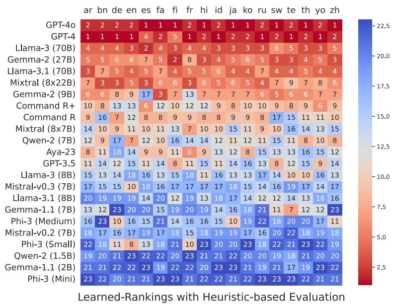  
Figure 8: Approximate rankings using heuristic features including the newer models, Llama-3.1 (Dubey et al., 2024) and Gemma-2 (Team et al., 2024) on MIRAGE-BENCH dataset across all 18 languages. Gemma-2 (27B) and Llama-3.1 (70B) achieve a strong rank of 4 and 5 respectively in the MIRAGE-BENCH evaluation dataset.

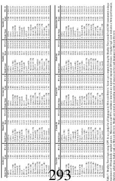

using GPT-4o as a judge for al languages inMIRAGE-BENCH. Scores are computed using the Bradley-Tery model w ldiMd95%fidildd20i)Ahihliid

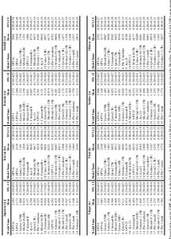  
294

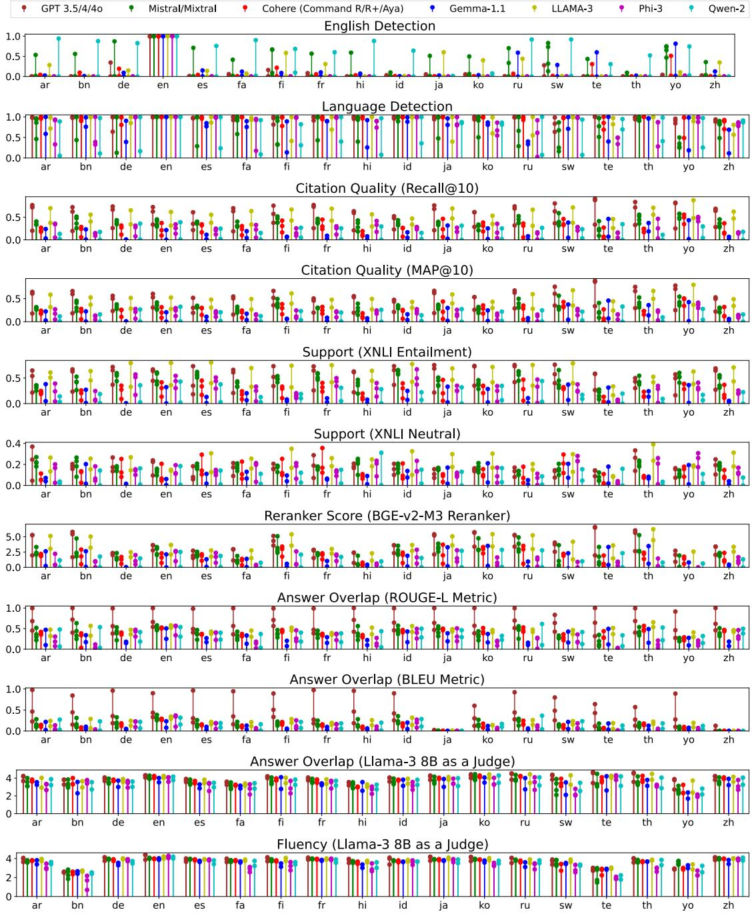  
Figure 9: Lollipop plots denoting the average heuristic-based feature scores achieved by baselines in MIRAGE-BENCH for all eleven heurisitc-based features. x-axis denotes the languages in MIRAGE-BENCH; whereas y-axis plots every heuristic feature value. Multiple LLMs in the same family are represented as a single color lollipop (multiple circles).

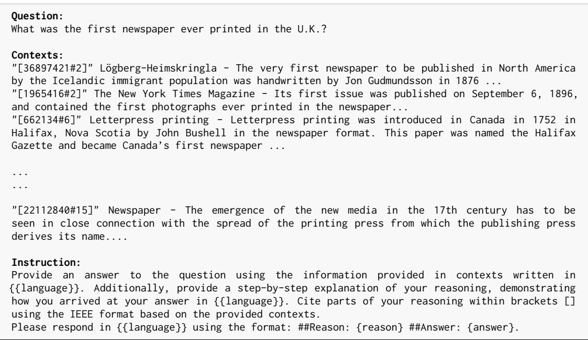

Figure 10: Prompt template for all baseline models for multilingual RAG generation for queries across all languages in MIRAGE-BENCH. We include the language-specific query in MIRAGE-BENCH under “Question:”. Next, we concatenate both relevant and non-relevant passages (randomly shuffled and truncated at maximum length) and place them under “Contexts:”. Lastly, we provide our instruction in English asking the model to generate a response in the required language under the placeholder “{{language}}”. The example above is shown for a query in English (en) from MIRAGE-BENCH, where contexts are truncated ( ... ) for demonstration purposes.

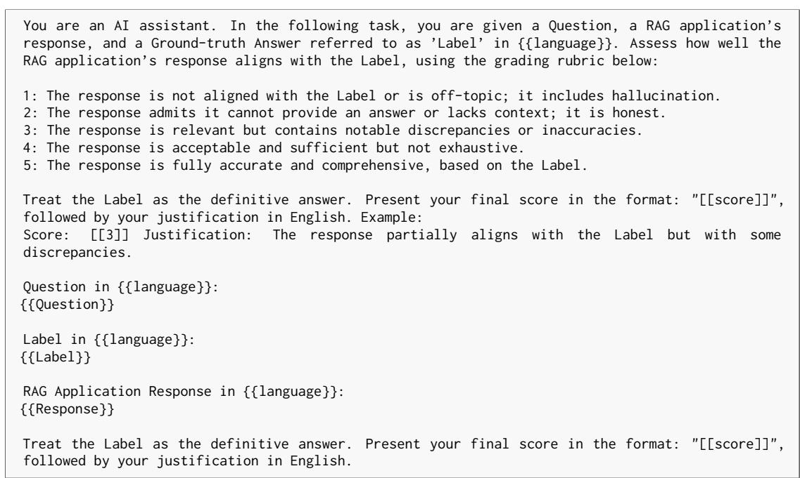  
Figure 11: Prompt template used by Llama-3 (8B) model as a judge to evaluate the answer overlap heuristic feature. We include a grading rubric within the prompt template.{{Label}} is a placeholder for the gold truth answer provided using the GPT-4; {{language}} is a placeholder for the target language; {{Question}} is a placeholder for the MIRAGE-BENCH query; {{Documents}} is a placeholder for both MIRAGE-BENCH relevant and non-relevant passages concatenated together; {{Response}} is a placeholder for RAG model output.

You will be given one summary written for a question and documents from Wikipedia in {{language}}.   
Your task is to rate the summary on one metric. Please make sure you read and understand these   
instructions carefully. Please keep this document open while reviewing, and refer to it as needed.   
Evaluation Criteria:   
Fluency (1-5) - the collective quality of all sentences. We align this dimension with the DUC   
quality question of structure and fluency whereby “the summary should be well-structured and   
well-organized. The summary should not just be a heap of related information, but should build   
from sentence to sentence to a coherent body of information about a topic.”   
Evaluation Steps:   
1. Read the question and Wikipedia documents in {{language}} carefully and identify the main topic   
and key points.   
2. Read the summary and check whether it answers the question. Check if the summary covers the   
main topic and key points required to answer the question, and if it presents them in a clear and   
logical order.   
3. Assign a rating for fluency on a scale of 1 to 5 and provide an explanation, where 1 is the   
lowest and 5 is the highest based on the Evaluation Criteria.   
Example:   
Question in {{language}}:   
{{Question}}   
Documents in {{language}}:   
{{Documents}}   
Summary:   
{{Summary}}   
Rate the fluency of the summary on a scale of 1 to 5 and explain your rating. Please   
use the format of: ##Rating: {rating} ##Explanation: {explanation}.  
Figure 12: Prompt template used by Llama-3 (8B) model as a judge to evaluate the fluency of a RAG response. We first explain the criteria for evaluation and the model outputs an explanation and score between [1,5] indicating the fluency of the output. {{language}} is a placeholder for the target language; {{Question}} is a placeholder for the MIRAGE-BENCH query; {{Documents}} is a placeholder for both MIRAGE-BENCH relevant and non-relevant passages concatenated together; {{Summary}} is a placeholder for RAG model output.

Please act as an impartial judge and evaluate the quality of the responses provided by two AI   
assistants tasked to answer the question displayed below, based on a set of documents retrieved   
by a search engine.   
You should choose the assistant that best answers the user question based on a set of reference   
documents that may or not be relevant referenced in the IEEE format.   
Your evaluation should consider factors such as the correctness, helpfulness, completeness,   
accuracy, depth, and level of detail of their responses.   
Details are only useful if they answer the user’s question. If an answer contains non-relevant   
details, it should not be preferred over one that only uses relevant information.   
Begin your evaluation by explaining why each answer correctly answers the user question.   
Then, you should compare the two responses and provide a short explanation on their differences.   
Avoid any position biases and ensure that the order in which the responses were presented does not   
influence your decision. Do not allow the length of the responses to influence your evaluation.   
Be as objective as possible.   
After providing your explanation, output your final verdict by strictly following this   
format: "[[A]]" if assistant A is better, "[[B]]" if assistant B is better, and "[[C]]" for a tie.   
"[User Question]"   
{{query}}   
"[Reference Documents]"   
{{documents}}   
"[The Start of Assistant A’s Answer]"   
{{answer\_a}}   
"[The End of Assistant A’s Answer]"   
"[The Start of Assistant B’s Answer]"   
{{answer\_b}}   
"[The End of Assistant B’s Answer]"  
Figure 13: Prompt template used by LLM as a judge to evaluate the RAG response in a pairwise evaluation involving a head-to-head battle. The template is taken and modified from RAGEval (Rackauckas et al., 2024). We explain the evaluation criteria and ask the judge to evaluate two RAG responses based on multiple factors, including correctness, helpfulness, completeness, accuracy, depth, and level of detail. The Judge provides a justification for their model choice and at the end of the response indicates as either “[[A]]”, “[[B]]”, or “[[C]]” denoting a tie. {{query}} is a placeholder for the input MIRAGE-BENCH query; {{documents}} is a placeholder for both MIRAGE-BENCH relevant and non-relevant passages concatenated together; {{answer\_a}} is a placeholder for the output response of model A; {{answer\_b}} is a placeholder for the output response of model B.