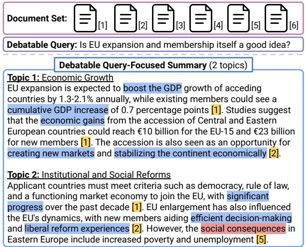
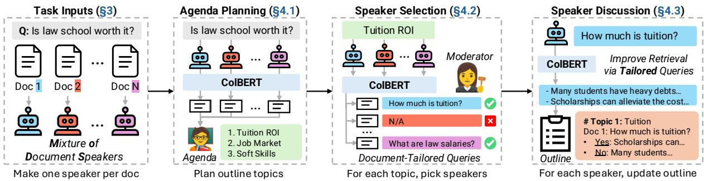
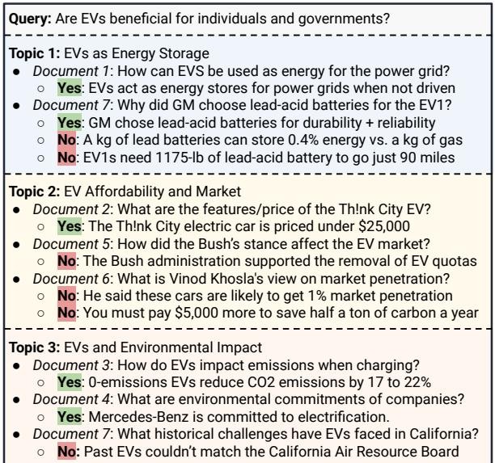
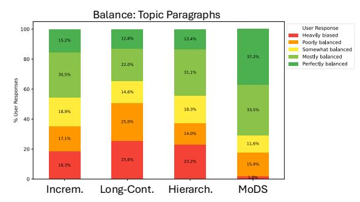
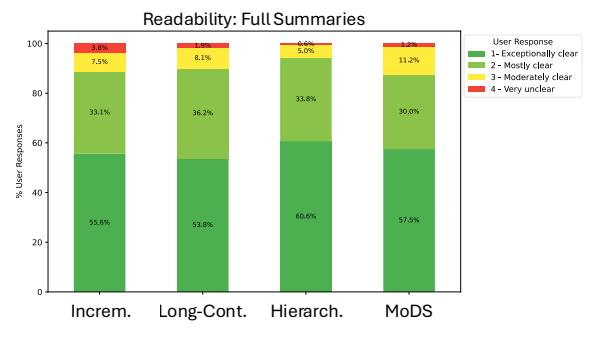
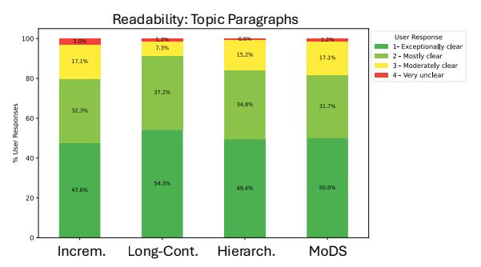
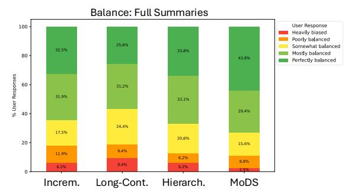

# MODS: Moderating a Mixture of Document Speakers to Summarize Debatable Queries in Document Collections

Nishant Balepur1,2∗ Alexa Siu2 Nedim Lipka2 Franck Dernoncourt2

Tong Sun2 Jordan Boyd-Graber1 Puneet Mathur2†

1University of Maryland 2Adobe Research

nbalepur@umd.edu puneetm@adobe.com

## Abstract

Query-focused summarization (QFS) gives a summary of documents to answer a query. Past QFS work assumes queries have one answer, ignoring debatable ones (Is law school worth it?). We introduce Debatable QFS (DQFS), a task to create summaries that answer debatable queries via documents with opposing perspectives; summaries must comprehensively cover all sources and balance perspectives, favoring no side. These goals elude LLM QFS systems, which: 1) lack structured content plans, failing to guide LLMs to write balanced summaries, and 2) use an identical query to retrieve contexts across documents, failing to cover all perspectives specific to each document’s content. To overcome this, we design MODS, a multi-LLM framework mirroring human panel discussions. MODS treats documents as individual Speaker LLMs and has a Moderator LLM that picks speakers to respond to tailored queries for planned topics. Speakers use tailored queries to retrieve relevant contexts from their documents and supply perspectives, which are tracked in a rich outline, yielding a content plan to guide the final summary. Experiments on ConflictingQA with controversial web queries and DebateQFS, our new dataset of debate queries from Debatepedia, show MODS beats SOTA by 38-59% in topic paragraph coverage and balance, based on new citation metrics. Users also find MODS’s summaries to be readable and more balanced.1

## 1 Introduction

Query-focused summaries (QFS) give an overview of documents to answer a query (Rosner and Camilleri, 2008; El-Kassas et al., 2021). By combining each document’s content useful for answering the query, or their perspectives (Lin et al., 2006), these summaries can aid decision-making (Hsu and Tan,

Figure 1: Debatable Query-Focused Summarization (DQFS) with GPT-4 for two topics. The model mainly gives “yes” perspectives ( Blue ) with few “no” perspectives ( Red ), giving an unbalanced summary. It also has poor coverage, failing to cite ( Yellow ) half the inputs.

2021). For example, doctors pick treatments based on research paper perspectives (Goff et al., 2008) and legislators vote based on perspectives in policy reports (Jones, 1994). Past QFS work assumes documents have aligned perspectives (Roy and Kundu, 2023), but some queries, like “Is law school worth it?”, are debatable, containing opposing perspectives (Wan et al., 2024). In such cases, it is key to balance perspectives from diverse sources so users consider all sides before deciding (Dale, 2015).

To address this gap, we propose debatable QFS (DQFS). As input, DQFS uses documents and a debatable query, defined as a yes/no query where documents have opposing, equally-valid2 “yes” and “no” perspectives (Fig 1). Such queries are broad (Is law school worth it?), and decomposing broad concepts into more specific topics (cost, job market) improves comprehension (Johnson-Laird, 1983). Thus, DQFS creates a multi-aspect summary, with each paragraph covering one of an input number of topics (2 in Fig 1). The full summary and each paragraph must be comprehensive and balanced (§3). Comprehensive text has perspectives from all documents, while balanced text is not skewed towards the yes or no perspectives; our goals aid informed, unbiased decision-making (Ziems et al., 2024).

While LLMs are deft summarizers (Zhang et al., 2024a), they cannot directly solve DQFS, as they fail to use diverse sources (Huang et al., 2024). In Figure 1, GPT-4 mainly gives perspectives favoring EU expansion (blue), yielding a biased output. Also, when asked for citations (Huang and Chang, 2024), GPT-4 only cites 3/6 (yellow), missing half the documents’ perspectives. We intuit this arises since GPT-4 uses one inference step, with all documents in a single prompt. This can omit document perspectives in certain positions of the prompt (Liu et al., 2024) or that oppose parametric memory (Jin et al., 2024), reducing output coverage and balance.

Multi-LLM summarizers (Chang et al., 2024; Adams et al., 2023), which use LLMs to summarize documents individually into intermediate outputs before merging them with another LLM call, are better choices, as they represent documents more equally. However, they have two key issues. First, they use the same topic or query as input to summarize each document, which is subpar if we wish to use retrieval in summarization to reduce LLM costs. Queries unaligned to a document’s unique content and expertise will fail to retrieve all of its most relevant contexts (Sachan et al., 2022); this reduces the total number of perspectives in the intermediate output, resulting in lower coverage. Second, their intermediate outputs are unstructured, free-form texts, which are hard for the LLM to combine into a final output. Free-form text needs extra reasoning to extract, classify, and compare the texts’ perspectives (Barrow et al., 2021), steps that distract from the final goal of generating a balanced summary.

To solve our issues, we build MODS (Fig 2), a multi-LLM system using a Mixture of Document Speakers. Inspired by panel discussions (Doumont et al., 2014), MODS has a Speaker LLM for each document that responds to queries using its document, and a Moderator LLM that decides when and how speakers respond. Specifically, MODS: 1) plans an agenda of topics for the outline (§4.1); 2) picks a subset of speakers with relevant perspectives for each topic and tailors them a query (§4.2); and 3) asks each speaker to obtain its document’s context relevant to the tailored query and give the context’s “yes” and “no” perspectives for the topic.

When a speaker supplies its document’s perspectives, the topic, document number, tailored query, and perspectives update an outline, tracking the LLM discourse. After the discussion, the outline is summarized for a DQFS output. In all, MODS frames DQFS as a discussion of document speakers to represent sources equally, tailors queries for speakers to optimize the retrieval of contexts used to find perspectives, and builds a structured outline of document perspectives to simplify the synthesis of a final output—a novel combination that leads to comprehensive and balanced summaries (§6.4).

We compare MODS to eight strong baselines on ConflictingQA (Wan et al., 2024) and DebateQFS (§5.1), a new dataset for DQFS drawn from the debate community on Debatepedia (Gottopati et al., 2013). To assess summaries, we have models give citations in their outputs (Fig 1), showing the documents the model intends to use (Huang and Chang, 2024). Many works use citations for factuality (Li et al., 2024b), but we repurpose them for coverage and balance—measuring the proportion of documents cited and distribution of ground-truth yes/no perspective stances of cited documents (§5.4).

MODS has the best document coverage and balance in full summaries and topic paragraphs (§6.1), surpassing SOTA by 38-58% in paragraphs. The Prometheus LLM (Kim et al., 2024) ranks MODS as one of the best models in summarization quality 28/30 times, the most of any model (§6.2). Users also find MODS’s outputs to be the most balanced, and preserve readability despite using perspectives from more documents (§6.3). Lastly, analyses show the utility of tailoring queries and building outlines, which improve MODS (§6.4) and offer rich, structured tools for users (§6.5). Our contributions are: 1) We propose debatable query-focused summarization, a new task to help users navigate yes/no queries in documents with opposing perspectives. 2) We design MODS, a multi-LLM DQFS system that treats documents as individual LLM speakers, uses a moderator to tailor queries to apt speakers, and tracks speaker perspectives in an outline. 3) We release DebateQFS for DQFS and citation metrics to capture summary coverage and balance. 4) Experiments show MODS beats baselines by 38-58% in topic paragraph coverage and balance, while annotators find MODS’s summaries maintain readability and better balance perspectives.

  
Figure 2: Using a debatable query and documents as inputs, MODS creates an outline of document perspectives via a panel discussion among LLM speakers. First, an Agenda Planner drafts topics for the outline. A Moderator picks speakers for these topics and tailors a query for each speaker. The speakers retrieve contexts for the tailored query and use these contexts to provide their document’s perspectives, which are tracked in an outline; this outline is used as a content plan to write the final summary.

## 2 Related Work

Diverse Perspectives in Summarization: LLMs have shown to struggle with diverse input sources in news (Huang et al., 2024), review (Zeng et al., 2023), and dialogue (Zhang et al., 2024b) summarization. While these tasks lack user guidance, DQFS is the first task that summarizes diverse texts while guided by a user’s query. Also, DQFS gives multi-aspect summaries that are broken down into more specific paragraphs; this granularity of perspective diversity has not been studied in past work.

Most of these works expose LLM issues without giving solutions other than prompt tweaks (Huang et al., 2024; Zhang et al., 2024b). Instead, we design MODS, a multi-LLM system to better handle diversity (§6.1), and also release a new dataset (§5.1) and citation metrics (§5.4) to help build even better summarization systems for diverse sources.

Argument Generation: DQFS is a form of argument generation (Zukerman et al., 2000), producing text to argue for topics and claims (Schiller et al., 2020). Such tasks include debate (Li et al., 2024a; Hu et al., 2023, 2024), key point summarization (Bar-Haim et al., 2020; Li et al., 2024c), and argument essay writing (Heinisch et al., 2022; Bao et al., 2022). These tasks either rely on LLM parametric memory (Li et al., 2024a) or passages in evidence corpora (Hua et al., 2019). Conversely, in DQFS, models give arguments by summarizing and balancing perspectives in all documents, rather than finding a subset of evidence in large corpora.

Further, existing datasets like OpenDebateEvidence (Roush et al., 2024) or DebateSum (Roush and Balaji, 2020) have specific claims (Colonialism made a hierarchyfor exclusion), which are unlike the broad queries in DQFS (Was colonialism helpful?). Thus, we release DebateQFS (§5.1), a dataset of broad debate queries grounded in documents.

Multi-LLM Summaries: Multi-LLM systems chain LLMs for tasks (Guo et al., 2024). MODS is a multi-LLM system similar to single-turn debate (Parrish et al., 2022), with a Moderator LLM routing to Speaker LLMs to supply document perspectives, storing them in memory (outline). LLM discussions have been used for evaluation (Verga et al., 2024), math (Sun et al., 2023), and creativity (Lu et al., 2024), and we adopt them for DQFS.

The multi-LLM MODS system has speakers respond individually to fairly treat documents. Hierarchical Merging and Incremental Updating similarly summarize documents one at a time (Chang et al., 2024), but their intermediate outputs are free-form text. MODS instead uses a rich outline of document perspectives, better guiding the final summary (Shao et al., 2024b). These models also summarize documents without catering to their expertise, hampering retriever efficacy; we solve this by tailoring custom queries for speakers (§4.2).

## 3 Task Definition

Debatable query-focused summarization (DQFS) uses as input: 1) documents , where each source $d _ { i } \in \mathcal { D }$ is a set of context paragraphs; 2) a yes/no query q; and 3) a number of summary topics $m > 1$ Source $d _ { i }$ has perspectives $\mathcal { P } _ { i } ,$ where perspective $( s , f ) \in \mathcal { P } _ { i }$ has stance $s \in \{ \mathrm { y e s } , \mathrm { n o } \}$ and factual sentence f derived via $d _ { i }$ , where f supports s as the answer to q. We enforce $( \boldsymbol { \mathrm { y e s } } , f )$ and $( \neg \circ , f )$ are common in $\mathcal { P }$ (§5.1), meaning q is debatable.

With these inputs, DQFS creates a summary S for that answers q. As seen in Figure 1, S discusses topics $\mathcal { T } = \{ t _ { 1 } , . . . , t _ { m } \}$ , each with a paragraph. To aid trust and evaluation (5.4), S contains citations (e.g. [1]) after each sentence noting the source document(s) for its information (Huang and Chang, 2024). For a comprehensive and balanced summary, we aim to cite a high number of documents in $\mathcal { D } ,$ , ensuring no document’s perspective is missed, and equally represent yes/no perspectives for $q ,$ curbing bias. Comprehensiveness and balance are goals not only for the overall summary but also in each topic paragraph, ensuring a well-cited and balanced discussion within each topic.

## 4 MODS: Mixture of Document Speakers

For DQFS, we build MODS (Figure 2), which uses content planning to guide generation (Balepur et al., 2023a; Shao et al., 2024a) via the steps of drafting an outline $\mathcal { O } ;$ and condensing  into a summary $\mathbb { S } .$

To build , MODS moderates a panel discussion of LLM speakers ${ \mathcal { S } } _ { : }$ , where each speaker $s _ { i } \in S$ represents one document $d _ { i } \in \mathcal { D }$ . MODS executes: 1) Agenda Planning to find m topics for (§4.1); 2) Speaker Selection to pick speakers $\boldsymbol { S } _ { j } \in \boldsymbol { S }$ to respond to tailored queries for each topic $t _ { j } \in \tau$ $( \ S 4 . 2 )$ ; and 3) Speaker Discussion to prompt each speaker $s _ { i } \in { S } _ { j }$ for its document’s perspectives on $t _ { j }$ and tailored query $q _ { i , j } ( \ S 4 . 3 )$ , which are added to . We then prompt an LLM to use $\mathcal { O }$ to make a summary S (§4.4). We describe each step below.

## 4.1 Agenda Planning

Before speakers discuss debatable query q (“Is law school worth $\mathrm { i t ? ? } )$ , we must plan m topics $\tau$ (“law school jobs”) for the discussion $( \mathrm { F i g } \ 2 ,$ , column 2). In panel discussions, agendas are planned via biographies summarizing speakers’ expertise (Chua, 2023). We also plan $\tau$ with biographies $\boldsymbol { B }$ of our speakers’ documents. Instead of abstractively summarizing a speaker’s document $d _ { i }$ for its biography $b _ { i }$ with an LLM, we efficiently create $b _ { i }$ via extractive summarization—retrieving the k contexts in $d _ { i }$ most relevant to $q$ with ColBERT (Khattab and Zaharia, 2020). Then, in a 0-shot prompt, we ask an LLM to plan m topics relevant to $q$ and .

## 4.2 Speaker Selection

After planning topics $\tau$ for discussion (§6.4), we must decide which speakers $\mathcal { S } _ { j } \subseteq \mathcal { S }$ are relevant for each topic $t _ { j } \in \mathcal { T } ( \mathrm { F i g } 2$ , column 3). We could pick all speakers, but this may hamper efficiency if we want to tailor queries for speakers (Appendix A.5). To illustrate, for the topic “law school jobs,” a document with perspectives on “tuition costs” can be omitted for efficiency, as it is not topically relevant.

To solve this, a Moderator LLM picks relevant speakers $S _ { j }$ for each topic $t _ { j } \in \mathcal { T }$ . It is costly to prompt with all documents just to select speakers, so we use retrieval (§4.1) to create a biography $b _ { i , j }$ of each speaker $s _ { i }$ for topic $t _ { j }$ . The biographies $B _ { j }$ are used in a 0-shot prompt, asking the moderator for speakers $\mathcal { S } _ { j } \subseteq \mathcal { S }$ with biographies related to $t _ { j }$

To better cater to speakers’ expertise, the Moderator also tailors a query $q _ { i , j }$ specific to each selected speaker $s _ { i } \in { S } _ { j }$ and topic $t _ { j }$ using biography $b _ { i , j }$ in panel discussions, moderators tailor queries to target speaker perspectives (Fingerhut and Lacaine, 2002; Huckle, 2022). In MODS, the queries form a chain-of-thought (Wei et al., 2024), improving our speaker selection (§6.4), and can be used for reranking (Sachan et al., 2022), serving as enhanced retrieval queries versus topic $t _ { j }$ for speaker discussion (§4.3). The tailored queries also further structure our outline , giving follow-up queries (Liu et al., 2019) for free that may interest users (§6.5).

## 4.3 Speaker Discussion

After selecting relevant speakers $S _ { j }$ and tailoring them a query for each topic $t _ { j } ( \ S 4 . 2 )$ , we must get the perspectives $\mathcal { P }$ from speakers’ documents for the outline (Fig 2, column 4). A simple method to get $\mathcal { P }$ is to add all documents from $S _ { j }$ in one prompt and ask for perspectives on $t _ { j }$ , but LLMs often ignore text in the middle of long prompts (Liu et al., 2024), which may discard perspectives and reduce coverage. Further, LLMs may disregard the documents that oppose their parametric memory (Jin et al., 2024), skewing the outline’s balance.

Using fairness ideals in panel discussions (Fingerhut and Lacaine, 2002), speakers $s _ { i } \in S _ { j }$ are individually prompted to supply its document’s perspectives for $t _ { j }$ based on its tailored query $q _ { i , j }$ . For example, on the topic “law school jobs,” we may query one speaker for “market trends” and another separately for “Ivy League placement.” Thus, each speaker adds its document’s unique perspectives one at a time, preventing any one document from dominating, which leads to higher coverage (§6.4).

A speaker $s _ { i }$ gives perspectives for a topic $t _ { j }$ in two steps. First, for efficiency, the speaker retrieves the k contexts in its document most relevant to the tailored query $q _ { i , j }$ . Using the debatable query $q ,$ contexts ${ \mathcal { C } } ,$ tailored query $q _ { i , j }$ , and topic $t _ { j }$ , the speaker is 0-shot prompted to give its yes and no perspectives $\mathcal { P }$ for $q$ based on , related to $q _ { i , j }$ and $t _ { j }$ . Each yes/no stance and fact $( s , f ) \in \mathcal { P }$ , tailored query $q _ { i , j }$ , and document number i is added to under topic $t _ { j }$ . The yes/no stance predictions in $\mathcal { P }$ have 80% accuracy (Appendix A.10), which better organizes (§6.5) to improve summaries (§6.4).

## 4.4 Outline Summarization

Our outline is a rich structure to track perspectives for a debatable query q, which we use as a content plan (Balepur et al., 2023a) to create the final summary S. To do so, we test summarizing: 1) all of in one prompt; and 2) topic sections of , i.e. $\{ \mathcal { O } _ { j } , \forall t _ { j } \in \mathcal { T } \}$ , one prompt at a time. We call these models 1) MODS-All and 2) MODS-Topic. We detail the full MODS system in Appendix A.2.

## 5 Experimental Setup

## 5.1 Dataset Collection

DQFS needs entries of documents  with facts for “yes” and “no” answers to a query q. An apt dataset is ConflictingQA (Wan et al., 2024), with controversial yes/no web search queries (“Do fires benefit forests?”) and labeled support/refute web pages.

Other summarization diversity datasets are unsuited for DQFS. Opinion summarization (Zhang et al., 2024b) is grounded in subjective tweets/reviews, while DQFS needs fact-based texts. DiverseSumm (Huang et al., 2024) has diverse news articles, but lacks queries with opposing perspectives. Debate datasets (Roush et al., 2024) are factual with opposing sides, but rely on argument mining corpora with specific claims (“Colonialism made an exclusion hierarchy”), which are hard to group into broad DQFS queries (“Is colonialism good?”).

We create DebateQFS—a new dataset based on Debatepedia, the “Wikipedia of debates” (Gottopati et al., 2013). Debatepedia pages have broad topics (“carbon tax”), where users curate documents arguing pros/cons. We turn topics into yes/no queries and collect the text of sites cited as pro/con sources. We get 290 document sets for ConflictingQA and 183 for DebateQFS, each with a debatable query, with mean document set sizes of 10.47 and 9.86. We also have ground-truth yes/no stances for the full documents, with mean majority/minority splits of 0.65/0.35 and 0.62/0.38. We use these stances for summary balance (§5.4), but users also assess balance (§6.3). Appendix A.1 has dataset details.

## 5.2 Baselines

We compare MODS to SOTA LLM summarizers: 1) Long-Context: All documents are used as the input in a single prompt (Wang et al., 2024b). 2) RAG-All: Top-(k ) contexts in relevant to q are retrieved as input prompt (Lewis et al., 2020). 3) RAG-Doc: Same as RAG-All, but we retrieve the k-most relevant contexts in each source in . 4) Hierarchical-All: Each document in is summarized using $q ;$ these are summarized again into a final output under m topics (Chang et al., 2024). 5) Incremental-All: We plan topics (§4.1) and iterate over each document in to incrementally update the paragraphs for (Chang et al., 2024). For the final summary, we self-refine all paragraphs at once like chain-of-density (Adams et al., 2023). 6) Incremental-Topic: Same as Incremental-All, but we self-refine topic paragraphs independently. 7) Cluster: We sort into m clusters, summarized to form topic paragraphs (Hayashi et al., 2021).

8) RAG+Cluster: Same as Cluster, but we retrieve the top-(k ) relevant contexts using q before clustering, similar to LLooM (Lam et al., 2024).

These cover the main summarization paradigms: seq2seq (Sutskever et al., 2014), clustering (Zhang and Li, 2009), content selection (Louis et al., 2010), and multi-model frameworks (Chang et al., 2024).

## 5.3 Implementation Details

All models use 0-shot gpt-4-1106-preview (Achiam et al., 2023) with 0 temperature. We write prompts using best practices on a small held-out set with fixed instructions for models (Schulhoff et al., 2024). LLMs are prompted to “Use as many documents as possible” and write three-sentence topic paragraphs. The former ensures LLMs have the goal of coverage, while the latter fixes length confounders (§6.1). Both of these strategies (specifying instructions, three-sentence text) have been used to improve summary balance (Zhang et al., 2024b). We give mode details in Appendix A.3.

We retrieve via ColBERT (Khattab and Zaharia, 2020), a retriever trained on MS-MARCO (Campos et al., 2016), with k = 3, and cluster using BERTopic and KMeans (MacQueen et al., 1967; Grootendorst, 2022). Other parameters are default without tuning. Results are from a single run.

## 5.4 Quantitative Evaluation via Citations

DQFS tests if models can cover and balance document perspectives. To assess this, works use posthoc attribution, mapping summaries to sources they are believed to derive from (Wolhandler et al., 2022; Zhang et al., 2024b). But this does not mean the model intends to use all attributed texts. A model may give perspectives using one source that is posthoc attributable to many, gaming coverage and balance metrics without truly reflecting these qualities.

<table><tr><td colspan="4"></td><td colspan="2">Summary Level</td><td colspan="3">Topic Paragraph Level</td><td colspan="2">Confounders</td></tr><tr><td># Top.</td><td>Model</td><td>DC (↑)</td><td>Fair (↓)</td><td>Faithful (↓)</td><td>DC (↑)</td><td>Fair (↓)</td><td>Faithful (↓)</td><td>Cite Acc. (↑)</td><td>All / Avg Sents</td></tr><tr><td rowspan="12">3</td><td>MoDS-Topic (Ours)</td><td>0.8961*</td><td>0.0998*</td><td>0.0320*</td><td>0.6056*</td><td>0.1650*</td><td>0.0979*</td><td>0.985</td><td>8.99 / 3.00</td></tr><tr><td>MoDS-AÍ (Ours)</td><td>0.8664</td><td>0.1062*</td><td>0.0359*</td><td>0.5420</td><td>0.1896*</td><td>0.1217</td><td>0.988</td><td>8.97 /2.99</td></tr><tr><td>Long-Context</td><td>0.5242</td><td>0.2047</td><td>0.1733</td><td>0.2566</td><td>0.3816</td><td>0.3503</td><td>0.958</td><td>9.00 / 3.00</td></tr><tr><td>RAG-All</td><td>0.6565</td><td>0.1664</td><td>0.0911</td><td>0.3300</td><td>0.3296</td><td>0.2547</td><td>0.990</td><td>9.01 /3.00</td></tr><tr><td>RAG-Doc</td><td>0.7532</td><td>0.1364</td><td>0.0668</td><td>0.3741</td><td>0.3023</td><td>0.2352</td><td>0.949</td><td>9.01 / 3.00</td></tr><tr><td>Hierarchical</td><td>0.8158</td><td>0.0956*</td><td>0.0333*</td><td>0.3679</td><td>0.3136</td><td>0.2523</td><td>0.981</td><td>8.99 /3.00</td></tr><tr><td>Incremental-All</td><td>0.5037</td><td>0.2466</td><td>0.1924</td><td>0.3467</td><td>0.3019</td><td>0.2488</td><td>0.961</td><td>8.99 / 3.00</td></tr><tr><td>Incremental-Topic</td><td>0.5635</td><td>0.2288</td><td>0.1720</td><td>0.4209</td><td>0.2796</td><td>0.2236</td><td>0.963</td><td>9.01 / 3.00</td></tr><tr><td>Cluster RAG+Cluster</td><td>0.7142 0.7694</td><td>0.1203* 0.1332</td><td>0.0662</td><td>0.3502</td><td>0.3016</td><td>0.2517</td><td>0.927</td><td>9.04 / 3.01</td></tr><tr><td></td><td></td><td></td><td>0.0620</td><td>0.3906</td><td>0.2808</td><td>0.2101</td><td>0.976</td><td>9.02 / 3.01</td></tr><tr><td rowspan="14">5</td><td>MoDS-Topic (Ours)</td><td>0.9549*</td><td>0.0884*</td><td>0.0239*</td><td>0.5924*</td><td>0.1661*</td><td>0.1051*</td><td>0.986</td><td>15.00 / 3.00</td></tr><tr><td>MoDS-AÍ (Ours)</td><td>0.9156</td><td>0.0966*</td><td>0.0272*</td><td>0.4809</td><td>0.1972</td><td>0.1297</td><td>0.990</td><td>14.88 / 2.98</td></tr><tr><td>Long-Context</td><td>0.5779</td><td>0.2038</td><td>0.1622</td><td>0.2164</td><td>0.4620</td><td>0.4213</td><td>0.966</td><td>15.00 / 3.00</td></tr><tr><td>RAG-All</td><td>0.7331</td><td>0.1581</td><td>0.0814</td><td>0.2755</td><td>0.3850</td><td>0.3101</td><td>0.996</td><td>15.03 / 3.01</td></tr><tr><td>RAG-Doc</td><td>0.7898</td><td>0.1464</td><td>0.0706</td><td>0.3018</td><td>0.3691</td><td>0.2945</td><td>0.975</td><td>15.06 / 3.01</td></tr><tr><td>Hierarchical</td><td>0.8871</td><td>0.0931*</td><td>0.0276*</td><td>0.2951</td><td>0.3670</td><td>0.3038</td><td>0.987</td><td>15.01 / 3.00</td></tr><tr><td>Incremental-All</td><td>0.5392</td><td>0.2327</td><td>0.1738</td><td>0.3083</td><td>0.3236</td><td>0.2672</td><td>0.948</td><td>14.91 /2.98</td></tr><tr><td>Incremental-Topic</td><td>0.6239</td><td>0.1899</td><td>0.1337</td><td>0.3961</td><td>0.2902</td><td>0.2348</td><td>0.958</td><td>14.99 / 3.00</td></tr><tr><td>Cluster</td><td>0.8480</td><td>0.0968*</td><td>0.0464</td><td>0.3365</td><td>0.3093</td><td>0.2625</td><td>0.933</td><td>15.04 / 3.01</td></tr><tr><td>RAG+Cluster</td><td>0.8717</td><td>0.1084*</td><td>0.0436</td><td>0.3499</td><td>0.3136</td><td>0.2511</td><td>0.971</td><td>15.03 / 3.01</td></tr></table>

Table 1: ConflictingQA citation coverage, balance, and accuracy. Best model is bold, second best is underlined. Models with \* are significantly the best (2-sample t-test, $p < 0 . 0 5$ with Bonferroni correction (Dror et al., 2018)).
<table><tr><td colspan="2"># Top. Model</td><td>DC (↑)</td><td>Fair (↓)</td><td>Faithful (↓)</td><td>DC (↑)</td><td>Fair (↓)</td><td>Faithful (↓)</td><td>Cite Acc. (↑)</td><td>All / Avg Sents</td></tr><tr><td rowspan="10">3</td><td>MoDS-Topic (Ours)</td><td>0.8724*</td><td>0.0701*</td><td>0.0235*</td><td>0.6066*</td><td>0.1255*</td><td>0.0789*</td><td>0.982</td><td>8.99 / 3.00</td></tr><tr><td>MoDS-AÍ (Ours)</td><td>0.8457*</td><td>0.0786*</td><td>0.0273*</td><td>0.5508</td><td>0.1463*</td><td>0.0938*</td><td>0.987</td><td>8.87 / 2.96</td></tr><tr><td>Long-Context</td><td>0.5877</td><td>0.2094</td><td>0.1790</td><td>0.2798</td><td>0.4336</td><td>0.4028</td><td>0.953</td><td>9.02 / 3.01</td></tr><tr><td>RAG-All</td><td>0.6125</td><td>0.1544</td><td>0.1040</td><td>0.3229</td><td>0.3176</td><td>0.2701</td><td>0.997</td><td>9.01 / 3.00</td></tr><tr><td>RAG-Doc</td><td>0.7171</td><td>0.1180</td><td>0.0664</td><td>0.3504</td><td>0.3233</td><td>0.2748</td><td>0.961</td><td>9.01 / 3.00</td></tr><tr><td>Hierarchical</td><td>0.7868</td><td>0.0907</td><td>0.0374</td><td>0.3639</td><td>0.2980</td><td>0.2452</td><td>0.983</td><td>9.02 / 3.01</td></tr><tr><td>Incremental-All</td><td>0.5566</td><td>0.2579</td><td>0.2089</td><td>0.3919</td><td>0.3243</td><td>0.2765</td><td>0.950</td><td>8.91 / 2.97</td></tr><tr><td>Incremental-Topic</td><td>0.6152</td><td>0.2415</td><td>0.1970</td><td>0.4707</td><td>0.3128</td><td>0.2674</td><td>0.954</td><td>9.03 / 3.01</td></tr><tr><td>Cluster</td><td>0.7102</td><td>0.1106</td><td>0.0725</td><td>0.3632</td><td>0.3106</td><td>0.2737</td><td>0.931</td><td>9.04 /3.01</td></tr><tr><td>RAG+Cluster</td><td>0.6811</td><td>0.1405</td><td>0.0894</td><td>0.3428</td><td>0.3200</td><td>0.2689</td><td>0.977</td><td>9.01 / 3.00</td></tr><tr><td rowspan="10">5</td><td>MoDS-Topic (Ours)</td><td>0.9137*</td><td>0.0651*</td><td>0.0208*</td><td>0.5793*</td><td>0.1420*</td><td>0.0998*</td><td>0.986</td><td>14.99 / 3.00</td></tr><tr><td>MoDS-AÍ (Ours)</td><td>0.8847*</td><td>0.0640*</td><td>0.0236*</td><td>0.4991</td><td>0.1502*</td><td>0.1096*</td><td>0.990</td><td>14.46 / 2.89</td></tr><tr><td>Long-Context</td><td>0.6686</td><td>0.1724</td><td>0.1392</td><td>0.2312</td><td>0.4965</td><td>0.4640</td><td>0.966</td><td></td></tr><tr><td>RAG-All</td><td>0.6721</td><td>0.1423</td><td>0.0912</td><td>0.2668</td><td>0.3927</td><td>0.3438</td><td>0.996</td><td>15.01 / 3.00</td></tr><tr><td>RAG-Doc</td><td>0.7765</td><td>0.1053</td><td>0.0618</td><td>0.3005</td><td>0.3584</td><td>0.3147</td><td>0.975</td><td>15.02 / 3.00 15.01 / 3.00</td></tr><tr><td>Hierarchical</td><td>0.8565</td><td>0.0761*</td><td>0.0239*</td><td>0.2896</td><td>0.3713</td><td>0.3192</td><td>0.987</td><td>15.04 / 3.01</td></tr><tr><td>Incremental-All</td><td>0.6122</td><td>0.2000</td><td>0.1629</td><td>0.3716</td><td>0.2936</td><td>0.2572</td><td>0.948</td><td>14.77 / 2.95</td></tr><tr><td>Incremental-Topic</td><td>0.6767</td><td>0.1659</td><td>0.1198</td><td>0.4446</td><td>0.2897</td><td>0.2443</td><td>0.958</td><td>15.05 / 3.01</td></tr><tr><td>Cluster</td><td>0.8098</td><td>0.1116</td><td>0.0624</td><td>0.3292</td><td>0.3383</td><td>0.2921</td><td>0.933</td><td>15.03 / 3.01</td></tr><tr><td>RAG+Cluster</td><td>0.7811</td><td>0.1233</td><td>0.0738</td><td>0.3129</td><td>0.3588</td><td>0.3107</td><td>0.971</td><td>15.03 / 3.01</td></tr></table>

Table 2: DebateQFS citation coverage, balance, and accuracy. Best model is bold, second best is underlined. Models with \* are significantly the best (2-sample t-test, $p < 0 . 0 5$ with Bonferroni correction (Dror et al., 2018)). MODS consistently has the highest citation coverage, fairness, and faithfulness for summaries and topic paragraphs.

To solve this, we use pre-hoc attributions (Huang and Chang, 2024), i.e. citations, as they can better capture which documents the model intends to use. Since each baseline gives document citations after each sentence (§3), and we know the ground-truth yes/no stances of these documents (§5.1), we can evaluate summary coverage and balance using the coverage and balance of the cited documents.

Let $\mathcal { D } _ { c i t e } \subseteq \mathcal { D }$ be the cited documents in a text. For comprehensiveness, we let document coverage (DC) be the percent of sources in cited. For balance, we use the ground-truth yes/no document stances. We compute KL divergence of the distribution of $\mathcal { D } _ { \mathit { c i t e } }$ stances to: 1) a uniform distribution; and 2) the stance distribution of all input documents . (1) sees if $\mathcal { D } _ { \mathit { c i t e } }$ splits perspectives equally, i.e. fairness (Zhang et al., 2024b) and (2) tests if $\mathcal { D } _ { c i t e }$ captures the input document split, i.e. faithfulness (Fischer et al., 2022). In DQFS, fairness is more critical for summary balance, but as our input documents have fairly balanced stance splits (§5.1), improving on both metrics is feasible. We present citation faithfulness as another aspect of DQFS for research to explore. These three metrics are aggregated over full summaries and topic paragraphs, as high-quality DQFS outputs should be balanced and comprehensive overall and within each paragraph.

<table><tr><td colspan="7">Summary Quality</td><td colspan="5">Topic Paragraph Quality</td><td colspan="4">Topic Quality</td><td rowspan="2">Dist.</td></tr><tr><td>Dataset</td><td>Model</td><td>Int</td><td>Coh</td><td>Rel</td><td>Cov</td><td>Div</td><td>Int Coh</td><td>Rel</td><td>Cov</td><td>Div</td><td>Int</td><td>Coh</td><td>Rel</td><td>Cov Div</td><td>SB</td></tr><tr><td rowspan="3">ConflictingQA</td><td>MoDS-Topic</td><td>4.24</td><td>4.34</td><td>4.64</td><td>4.49</td><td>4.42</td><td>4.08 4.33</td><td>4.69</td><td></td><td>4.34 3.89</td><td>3.47</td><td>4.12</td><td>4.69</td><td>3.61</td><td>4.02</td><td>0.69</td></tr><tr><td>MoDS-All</td><td>4.27 4.24</td><td>4.33 4.37</td><td>4.63 4.73</td><td>4.49 4.50</td><td>4.40 4.38</td><td>3.88 3.78</td><td>4.27</td><td>4.60</td><td>4.19 3.70</td><td>3.49</td><td>4.09</td><td>4.62</td><td>3.46</td><td>3.99 3.94</td><td>0.65</td></tr><tr><td>Hierarchical Increm-Topic</td><td>4.17</td><td>4.37</td><td>4.74</td><td>4.57</td><td>4.39</td><td>4.21 3.91 4.29</td><td>4.62 4.62</td><td>4.14 4.25</td><td>3.57 3.65</td><td>3.43 3.36</td><td>4.07 3.79</td><td>4.65 4.31</td><td>3.49 3.21</td><td>3.73</td><td>0.58 0.61</td></tr><tr><td rowspan="4">DebateQFS</td><td></td><td></td><td></td><td></td><td></td><td></td><td></td><td></td><td></td><td></td><td></td><td></td><td></td><td></td><td></td><td></td></tr><tr><td>MoDS-Topic</td><td>4.02</td><td>4.20</td><td>4.49</td><td>4.44</td><td>4.34</td><td>3.97</td><td>4.21</td><td>4.55</td><td>4.14 3.82</td><td></td><td>3.54 4.09</td><td>4.64</td><td></td><td>3.393.93</td><td>0.67</td></tr><tr><td>MoDS-AÍ</td><td>4.11</td><td>4.21</td><td>4.60</td><td>4.344.36</td><td></td><td>3.83 4.15</td><td></td><td>4.51 4.10</td><td>3.63</td><td>3.61</td><td>i 4.11</td><td>4.67</td><td></td><td>3.71 4.02</td><td>0.64</td></tr><tr><td>Hierarchical</td><td>4.15</td><td>4.17</td><td>4.69</td><td>4.35 4.19 4.61 4.41 4.23</td><td>4.33</td><td>3.74 4.09 3.91 4.17</td><td></td><td>4.53</td><td>3.963.48 4.55 4.06 3.68</td><td>3.56</td><td>4.22</td><td></td><td>4.703.634.16 3.09 3.66 4.30 3.03 3.56</td><td></td><td>0.58 0.60</td></tr></table>

Table 3: Interest, coherence, relevance, coverage, and diversity for summaries, topic paragraphs, and topics $( m = 3 )$ Best scores are bold. Significant scores are blue (2-sample t-test, $p < 0 . 0 5 )$ . Tables 17 and 18 have all results. MODS is consistently ranked as having the significantly best quality for summaries, topic paragraphs, and topics.

## 6 Results

We generate DQFS summaries with two to five topics m, a traditional range for argumentative essays (Mery, 2019). Due to space constraints, we only show $m \in \{ 3 , 5 \}$ in the following sections, with all experiments repeated in Appendix A.6.

## 6.1 Citation Coverage and Balance

MODS excels at coverage and balance for summaries and topic paragraphs (Tables 1, 2). Notably, MODS-Topic leads in all metrics 22/24 times and is always a significantly best model. MODS-All is also strong, a top-2 model in 22/24 cases. Some models have high full summary scores, but MODS-Topic largely improves DC/Fair/Faithful in topic paragraphs, with 38/48/59% mean increases over the next-best model. LLMs struggle in summarization coverage and diversity (Huang et al., 2024; Zhang et al., 2024b), but we show that these issues are more pronounced in multi-aspect texts. Our results verify MODS’s strategy of moderating singleturn LLM discussions, so multi-turn debates (Khan et al., 2024) may produce even better summaries.

We also check two confounders: citation accuracy, how often cited documents support claims in the sentence, and sentence count. Summaries can game our metrics via inaccurate citations or more sentences, as models cite post-sentence. We assess citation accuracy via an LLM entailment model, a standard approach (Gao et al., 2023; Balepur et al., 2023b), with 87% human agreement on 200 heldout examples (Appendix A.4). Citation accuracy and sentence count are consistent across models, so MODS’s strong coverage and balance are not due to extra sentences or non-existent perspectives.

Lastly, models can plan different topics, as we believe the open-aspect nature of topics in DQFS is interesting for future work (Amar et al., 2023). To ensure MODS’s gains are not from planning topics (§4.1) naturally more balanced or comprehensive, in Appendix A.9, all models produce summaries for the same topics from our agenda planning step. MODS is superior, validating its strength is from the LLM speaker design (§4), not topic selection.

## 6.2 Summary Quality

Our citation metrics show MODS excels in summary coverage and balance, so we now ensure that these gains are not at the cost of traditional measures of summary quality. To do so, we conduct a sanity check and evaluate outputs with five typical summary quality metrics (Lloret et al., 2018): interest, coherence, relevance, coverage, diversity. The first 4 are from Shao et al. (2024b), who use them on Wikipedia writing, while diversity is new for DQFS, testing the balance of yes and no perspectives. We use Prometheus, an LLM with 72- 85% human agreement (Kim et al., 2024), for 1- 5 scoring (Appendix A.4). We score summaries, topic paragraphs, and topics using these metrics.

Prometheus just uses the summary, topic paragraph, or topic title as input and does not have access to the input documents. Thus, our evaluation of coverage through citation metrics (§5.4) measures the coverage of the input documents, while Prometheus assesses coverage using its parametric knowledge, specifically evaluating if the outputs provide “an in-depth exploration of the query and have good coverage.” LLM evaluators can be biased (Wang et al., 2024a), so we also conduct a human evaluation in §6.3. We also use Self-Bleu (Zhu et al., 2018) (n = 4) to assess the semantic distance between paragraphs (Liu et al., 2023).

MODS-Topic and MODS-All have significantly high-quality summaries, topic paragraphs, and topics 28/30 and 25/30 times (Table 3). In summaries and paragraphs, MODS has the best coverage 5/6 times and diversity 6/6 times, aligning with our citation metrics (§6.1). MODS has a slightly higher SB, meaning more paragraph similarity. This similarity does not largely impede readability (§6.3), and this occurs as MODS adapts similar perspectives for distinct topics3. Given the tradeoff in paragraph coverage and dissimilarity (Alguliev et al., 2012), a small SB increase is worth the large coverage and balance gains (§6.1). Overall, MODS exhibits strong coverage, balance, and quality.

<table><tr><td colspan="3">ConflictingQA</td><td colspan="2">DebateQFS</td></tr><tr><td>Model</td><td>Read (S/P)</td><td>Bal (S/P)</td><td>Read (S/P)</td><td>Bal (S/P)</td></tr><tr><td>MoDS</td><td>4.45/4.39</td><td>4.04/3.93</td><td>4.43/4.21</td><td>4.03/3.84</td></tr><tr><td>Long-Cont.</td><td>4.40/4.45</td><td>3.54/2.65</td><td>4.44/4.44</td><td>3.55/2.78</td></tr><tr><td>Hierarch.</td><td>4.63/4.43</td><td>3.94/3.85</td><td>4.46/4.23</td><td>3.70/3.10</td></tr><tr><td>Inc-Topic</td><td>4.29/4.21</td><td>3.94/3.13</td><td>4.53/4.28</td><td>3.51/3.01</td></tr></table>

Table 4: Readability/balance of summaries/paragraphs. MODS has the most balanced text and despite including more perspectives, MODS has competitive readability.
<table><tr><td colspan="4">ConflitingQA</td><td colspan="3">DebateQFS</td></tr><tr><td>Model</td><td>DC</td><td>IPI</td><td>IPI / Doc</td><td>DC</td><td>IPI</td><td>IPI / Doc</td></tr><tr><td>MoDS</td><td>79.1</td><td>30.3</td><td>3.61</td><td>77.8</td><td>25.5</td><td>3.36</td></tr><tr><td>No Tailor</td><td>77.4</td><td>27.5</td><td>3.37</td><td>72.6</td><td>22.2</td><td>3.07</td></tr><tr><td>No CoT</td><td>78.8</td><td>27.8</td><td>3.35</td><td>73.3</td><td>22.7</td><td>3.07</td></tr><tr><td>No Speak</td><td>47.4</td><td>13.3</td><td>3.28</td><td>45.6</td><td>11.6</td><td>3.30</td></tr><tr><td>No Mod</td><td>84.8</td><td>29.8</td><td>3.17</td><td>79.8</td><td>24.0</td><td>3.06</td></tr></table>

Table 5: MODS ablation outline metrics (m = 3). We show the document coverage, the total perspectives, and perspectives per document under each outline topic.

## 6.3 Human Evaluation

We have 76 users compare 20 DQFS outputs per dataset from MODS-Topic to Hierarchical and Incremental-Topic, the next-best models, and longcontext, the simplest model. MODS cites more documents (§6.1), so users rate Readability (Ribeiro et al., 2023) to ensure the extra perspectives do not harm comprehension. Users also rate Balance, as DQFS must fairly show yes/no stances. Scores are from 1-5 (Appendix A.11) and are used for full summaries and paragraphs on the same topic.

MODS has similar readability to baselines (Table 4), meaning our additionally cited perspectives are clearly conveyed, and users find MODS’s summaries/paragraphs the most balanced. In 3/4 cases, MODS has the highest average of readability and balance. Thus, MODS is the best DQFS model, citing more documents and better balancing perspectives versus SOTA, all while preserving readability.

<table><tr><td colspan="3">ConflitingQA</td><td colspan="2">DebateQFS</td></tr><tr><td>Model</td><td>DC (S/P)</td><td>Fair (S/P)</td><td>DC (S/P)</td><td>Fair (S/P)</td></tr><tr><td>No Mod - O</td><td>0.96/0.75 0.88/0.60</td><td>0.02/0.07 0.11/0.17</td><td>0.89/0.65 0.78/0.50</td><td>0.03/0.10 0.10/0.22</td></tr><tr><td>MoDS - Stance - Tailor</td><td>0.90/0.61 0.88/0.58</td><td>0.03/0.10 0.08/0.12</td><td>0.87/0.61 0.85/0.58 0.87/0.61</td><td>0.02/0.08 0.08/0.15 0.08/0.13</td></tr></table>

Table 6: MODS summary ablations (m = 3). Using an outline and richer outline structures both improve coverage and fairness for summaries and topic paragraphs.  
  
Figure 3: Example outline subset from MODS, which clearly tracks topics, documents, perspectives (facts and stances), and follow-up queries for the user to explore.

## 6.4 Ablation Study

We ensure all parts of MODS are useful by ablating our outline creation and summarization steps. In outline creation, having individual speakers respond versus combining all speaker biographies in a prompt (No Speak), tailoring queries (No Tailor), and picking speakers via CoT (No CoT) all improve outlines (Table 5). No Speak has the worst outlines, confirming the strength of equally treating document speakers for DQFS. We also test our moderator’s abilities by having all speakers respond (No Mod) instead of selecting speakers. No Mod has higher DC as all speakers respond, but fewer perspectives per document, meaning our moderator adeptly selects speakers with relevant perspectives.

To see how outline alters summaries, we compare MODS (with no moderator) updating an outline to updating free-form paragraphs (- ). Using O greatly improves coverage and fairness (Table 6, top), showing structured outlines are better intermediate outputs than free-form text in multi-LLM systems. Further, extra organization in  (stances, tailored queries) aids summarization (Table 6, bottom), so richer outlines yield better summaries.

## 6.5 Outline Analysis Case Study

MODS builds an outline as a content plan presummarization (Shao et al., 2024b), but is also a valuable tool for users (Barrow et al., 2021). Figure 3 shows part of an outline, which organizes perspectives with their source documents and yes/no stances. outlines all seven input documents and a range of perspectives for a thorough, balanced view of the debatable query. Further, the tailored document queries in can inspire users to explore follow-up queries to ask. Overall,  gives a rich, structured representation of perspectives, enabling in-depth explorations of document collections.

## 7 Conclusion

We propose DQFS and design MODS, which controls individual document speakers, to write wellcovered, balanced summaries. MODS has potential utility past DQFS, such as in code-switching (Gao et al., 2019), multi-modal generation (Dai et al., 2022), and full-stack design (Si et al., 2024), where balancing diverse inputs (languages, modalities) is crucial. We also show that content planning with outlines largely enhances DQFS quality. Future work can explore the direct application of our outline to tasks with opposing stances, like pro/con generation (Kumar et al., 2023), document contradiction detection (Deußer et al., 2023), or key point analysis (Kunneman et al., 2018). While MODS excels in DQFS, promising extensions to our task would still challenge our model, such as document misinformation (Sung et al., 2023) or aligning summaries with and against expressed or observed user perspectives (Balepur et al., 2024). These insights, along with our new DebateQFS dataset and citation metrics, will be key toward building models that can handle diverse, opposing perspectives.

## 8 Limitations

One limitation of MODS is cost, as it uses multiple LLM calls. To reduce costs, we use top-3 retrieval at each step and a moderator to avoid inference on irrelevant documents (§4.2). Appendix A.5 has a cost analysis, which shows MODS is cheaper than Incremental-Topic and is comparable to Hierarchical Merging for fewer topics. Most of the cost from MODS stems from outline creation, rather than outline summarization. Our outline is a rich resource for users (§6.5) and can also be useful for other tasks like key point analysis (Bar-Haim et al., 2020; Kumar et al., 2023), pro/con summarization (Hu and Wu, 2009), and document contradiction detection (Deußer et al., 2023), which we believe justifies its high creation expense.

Further, all baseline implementations are based on GPT-4, as smaller LLMs like LLaMA-2 and GPT-3.5 struggled with following the instructions given in our 0-shot prompts (Appendix A.3), particularly in generating structured JSON outputs (Xia et al., 2024). To overcome this, researchers could generate synthetic training data to improve formatfollowing in smaller models (Long et al., 2024). We also show some preliminary results with a version of MODS using GPT-4 mini in Appendix A.8, which can still compete with GPT-4 baselines.

LLMs are also sensitive to prompt formats (Sclar et al., 2023), so our results may vary with prompt changes. To mitigate this issue, we follow best practices in prompt engineering (Schulhoff et al., 2024), ensuring consistent instructions across models, including input/output definitions, output format (JSON), and output requirements. This ensures MODS’s gains in coverage and balance (§6.1) are due to its overall design, rather than advantages in prompt engineering. We also plan to release all of our prompts for reproducibility (Appendix A.3).

Finally, while human evaluation across many aspects of DQFS quality would be valuable, we are limited by time and resources. To make the most of our human evaluation, we focus on readability and balance. Since MoDS objectively cites more documents and is thus more comprehensive, we ensure that this does not reduce readability. Further, since DQFS aims to support unbiased decision-making, we assess whether human judgments of summary balance align with our offline citation metrics. We acknowledge that further human evaluation, including how DQFS outputs impact decision-makers, would be an exciting direction for future research.

## 9 Ethical Considerations

The goal of debatable query-focused summarization is to provide comprehensive and balanced summaries for yes/no queries that fairly represent both “yes” and “no” perspectives. However, we acknowledge that not all yes/no queries should be balanced in a summary. Balancing some queries could spread misinformation (e.g. “Is the earth flat?”), or the user might prefer to focus on one side of the issue. For misinformation, we limit DQFS to queries with equally-valid opposing perspectives, as reflected in our high-quality DebateQFS dataset, which is annotated by the debate community. For user preferences, future work could study using the user’s perspective as input, tasking models to generate summaries that align with or challenge the user’s viewpoint. This would enable fine-grained control, allowing users to decide when to balance diverse perspectives or focus on a preferred one.

Further, we assume our input documents are factual and written in good faith for DQFS, but this is not always guaranteed in practice. To detect document misinformation, future DQFS research could explore adversarial settings where input documents contain factual errors, requiring models to incorporate a fact verification module to filter out factual inaccuracies. In MODS, a fact verification system could be run on the facts in MODS’s outline before summarization to discard factual inaccuracies. We believe such efforts are essential for developing safe, factual, and reliable summarization systems.

## Acknowledgments

We would like to thank our collaborators at Adobe Research and the University of Maryland for their valuable contributions and insights that helped shape this work, including Jack Wang, Rajiv Jain, Jennifer Healey, Vishy Swaminathan, and Rachel Rudinger. Nishant is also grateful to the amazing cohort of interns at Adobe Research—including Dang Nguyen, Vishakh Padmakumar, Dayeon Ki, Hyunji Lee, Yoonjoo Lee, and Paiheng Xu—not just for their helpful feedback, but also for making the internship a fun and memorable experience.

## References

Josh Achiam, Steven Adler, Sandhini Agarwal, Lama Ahmad, Ilge Akkaya, Florencia Leoni Aleman, Diogo Almeida, Janko Altenschmidt, Sam Altman, Shyamal Anadkat, et al. 2023. Gpt-4 technical report. arXiv preprint arXiv:2303.08774.

Griffin Adams, Alexander Fabbri, Faisal Ladhak, Eric Lehman, and Noémie Elhadad. 2023. From sparse to dense: Gpt-4 summarization with chain of density prompting. arXiv preprint arXiv:2309.04269.

Rasim M Alguliev, Ramiz M Aliguliyev, and Makrufa S Hajirahimova. 2012. Gendocsum+ mclr: Generic document summarization based on maximum coverage and less redundancy. Expert Systems with Applications, 39(16):12460–12473.

Shmuel Amar, Liat Schiff, Ori Ernst, Asi Shefer, Ori Shapira, and Ido Dagan. 2023. Openasp: A benchmark for multi-document open aspect-based summarization. In Proceedings of the 2023 Conference on Empirical Methods in Natural Language Processing, pages 1967–1991.

Nishant Balepur, Jie Huang, and Kevin Chang. 2023a. Expository text generation: Imitate, retrieve, paraphrase. In Proceedings of the 2023 Conference on Empirical Methods in Natural Language Processing, pages 11896–11919, Singapore. Association for Computational Linguistics.

Nishant Balepur, Jie Huang, and Kevin Chang. 2023b. Text fact transfer. In Proceedings of the 2023 Conference on Empirical Methods in Natural Language Processing, pages 4745–4764, Singapore. Association for Computational Linguistics.

Nishant Balepur, Matthew Shu, Alexander Hoyle, Alison Robey, Shi Feng, Seraphina Goldfarb-Tarrant, and Jordan Boyd-Graber. 2024. A smart mnemonic sounds like" glue tonic": Mixing llms with student feedback to make mnemonic learning stick. arXiv preprint arXiv:2406.15352.

Jianzhu Bao, Yasheng Wang, Yitong Li, Fei Mi, and Ruifeng Xu. 2022. AEG: Argumentative essay generation via a dual-decoder model with content planning. In Proceedings of the 2022 Conference on Empirical Methods in Natural Language Processing, pages 5134–5148, Abu Dhabi, United Arab Emirates. Association for Computational Linguistics.

Roy Bar-Haim, Lilach Eden, Roni Friedman, Yoav Kantor, Dan Lahav, and Noam Slonim. 2020. From arguments to key points: Towards automatic argument summarization. arXiv preprint arXiv:2005.01619.

Joe Barrow, Rajiv Jain, Nedim Lipka, Franck Dernoncourt, Vlad Morariu, Varun Manjunatha, Douglas W Oard, Philip Resnik, and Henning Wachsmuth. 2021. Syntopical graphs for computational argumentation tasks. In Proceedings ofthe 59th Annual Meeting of the Association for Computational Linguistics and the 11th International Joint Conference on Natural Language Processing (Volume 1: Long Papers), pages 1583–1595.

Daniel Fernando Campos, Tri Nguyen, Mir Rosenberg, Xia Song, Jianfeng Gao, Saurabh Tiwary, Rangan Majumder, Li Deng, and Bhaskar Mitra. 2016. Ms marco: A human generated machine reading comprehension dataset. ArXiv, abs/1611.09268.

Yapei Chang, Kyle Lo, Tanya Goyal, and Mohit Iyyer. 2024. Booookscore: A systematic exploration of book-length summarization in the era of LLMs. In The Twelfth International Conference on Learning Representations.

Melissa Chua. 2023. What are panel discussions and how to conduct them effectively.

Wenliang Dai, Lu Hou, Lifeng Shang, Xin Jiang, Qun Liu, and Pascale Fung. 2022. Enabling multimodal generation on clip via vision-language knowledge distillation. arXiv preprint arXiv:2203.06386.

Steve Dale. 2015. Heuristics and biases: The science of decision-making. Business Information Review, 32(2):93–99.

Tobias Deußer, Maren Pielka, Lisa Pucknat, Basil Jacob, Tim Dilmaghani, Mahdis Nourimand, Bernd Kliem, Rüdiger Loitz, Christian Bauckhage, and Rafet Sifa. 2023. Contradiction detection in financial reports. In Proceedings of the Northern Lights Deep Learning Workshop, volume 4.

Jean-Luc Doumont, Laura Grossenbacher, Christina Matta, and Jorge Cham. 2014. English communication for scientists. Nature Education.

Rotem Dror, Gili Baumer, Segev Shlomov, and Roi Reichart. 2018. The hitchhiker’s guide to testing statistical significance in natural language processing. In Proceedings of the 56th Annual Meeting of the Associationfor Computational Linguistics (Volume 1: Long Papers), pages 1383–1392, Melbourne, Australia. Association for Computational Linguistics.

Wafaa S El-Kassas, Cherif R Salama, Ahmed A Rafea, and Hoda K Mohamed. 2021. Automatic text summarization: A comprehensive survey. Expert systems with applications, 165:113679.

Abe Fingerhut and François Lacaine. 2002. The Panel Discussion, Roundtable, Symposium, and Colloquium, pages 47–49. Springer Paris, Paris.

Tim Fischer, Steffen Remus, and Chris Biemann. 2022. Measuring faithfulness of abstractive summaries. In Proceedings ofthe 18th Conference on Natural Language Processing (KONVENS 2022), pages 63–73.

Tianyu Gao, Howard Yen, Jiatong Yu, and Danqi Chen. 2023. Enabling large language models to generate text with citations. arXiv preprint arXiv:2305.14627.

Yingying Gao, Junlan Feng, Ying Liu, Leijing Hou, Xin Pan, and Yong Ma. 2019. Code-switching sentence generation by bert and generative adversarial networks. In Interspeech, pages 3525–3529.

Sarah L Goff, Kathleen M Mazor, Vanessa Meterko, Katherine Dodd, and James Sabin. 2008. Patients beliefs and preferences regarding doctors’ medication recommendations. Journal ofgeneral internal medicine, 23:236–241.

Swapna Gottopati, Minghui Qiu, Yanchuan Sim, Jing Jiang, and Noah Smith. 2013. Learning topics and positions from debatepedia. ACL.

Maarten Grootendorst. 2022. Bertopic: Neural topic modeling with a class-based tf-idf procedure. arXiv preprint arXiv:2203.05794.

Taicheng Guo, Xiuying Chen, Yaqi Wang, Ruidi Chang, Shichao Pei, Nitesh V Chawla, Olaf Wiest, and Xiangliang Zhang. 2024. Large language model based multi-agents: A survey of progress and challenges. arXiv preprint arXiv:2402.01680.

Hiroaki Hayashi, Prashant Budania, Peng Wang, Chris Ackerson, Raj Neervannan, and Graham Neubig. 2021. WikiAsp: A dataset for multi-domain aspectbased summarization. Transactions of the Associationfor Computational Linguistics, 9:211–225.

Philipp Heinisch, Anette Frank, Juri Opitz, and Philipp Cimiano. 2022. Strategies for framing argumentative conclusion generation. In Proceedings of the 15th International Conference on Natural Language Generation, pages 246–259.

Chao-Chun Hsu and Chenhao Tan. 2021. Decisionfocused summarization. arXiv preprint arXiv:2109.06896.

Xinghua Hu and Bin Wu. 2009. Classification and summarization of pros and cons for customer reviews. In 2009 IEEE/WIC/ACM International Joint Conference on Web Intelligence and Intelligent Agent Technology, volume 3, pages 73–76. IEEE.

Zhe Hu, Hou Pong Chan, Jing Li, and Yu Yin. 2024. Unlocking varied perspectives: A personabased multi-agent framework with debate-driven text planning for argument generation. arXiv preprint arXiv:2406.19643.

Zhe Hu, Hou Pong Chan, and Yu Yin. 2023. Americano: Argument generation with discourse-driven decomposition and agent interaction. arXiv preprint arXiv:2310.20352.

Xinyu Hua, Zhe Hu, and Lu Wang. 2019. Argument generation with retrieval, planning, and realization. arXiv preprint arXiv:1906.03717.

Jie Huang and Kevin Chang. 2024. Citation: A key to building responsible and accountable large language models. In Findings of the Association for Computational Linguistics: NAACL 2024, pages 464–473, Mexico City, Mexico. Association for Computational Linguistics.

Kung-Hsiang Huang, Philippe Laban, Alexander Fabbri, Prafulla Kumar Choubey, Shafiq Joty, Caiming Xiong, and Chien-Sheng Wu. 2024. Embrace divergence for richer insights: A multi-document summarization benchmark and a case study on summarizing diverse information from news articles. In Proceedings ofthe 2024 Conference ofthe North American Chapter of the Association for Computational Linguistics: Human Language Technologies (Volume 1: Long Papers), pages 570–593, Mexico City, Mexico. Association for Computational Linguistics.

Belinda Huckle. 2022. How to moderate a panel discussion – all you need to know.

Zhuoran Jin, Pengfei Cao, Yubo Chen, Kang Liu, Xiaojian Jiang, Jiexin Xu, Qiuxia Li, and Jun Zhao. 2024. Tug-of-war between knowledge: Exploring and resolving knowledge conflicts in retrieval-augmented language models. arXiv preprint arXiv:2402.14409.

Philip Nicholas Johnson-Laird. 1983. Mental models: Towards a cognitive science oflanguage, inference, and consciousness. 6. Harvard University Press.

Bryan D Jones. 1994. Reconceiving decision-making in democratic politics: Attention, choice, and public policy. University of Chicago Press.

Akbir Khan, John Hughes, Dan Valentine, Laura Ruis, Kshitij Sachan, Ansh Radhakrishnan, Edward Grefenstette, Samuel R Bowman, Tim Rocktäschel, and Ethan Perez. 2024. Debating with more persuasive llms leads to more truthful answers. arXiv preprint arXiv:2402.06782.

Omar Khattab and Matei Zaharia. 2020. Colbert: Efficient and effective passage search via contextualized late interaction over bert. In Proceedings of the 43rd International ACM SIGIR conference on research and development in Information Retrieval, pages 39– 48.

Seungone Kim, Juyoung Suk, Shayne Longpre, Bill Yuchen Lin, Jamin Shin, Sean Welleck, Graham Neubig, Moontae Lee, Kyungjae Lee, and Minjoon Seo. 2024. Prometheus 2: An open source language model specialized in evaluating other language models.

Sandeep Kumar, Tirthankar Ghosal, and Asif Ekbal. 2023. Apcs: Towards argument based pros and cons summarization of peer reviews. In Proceedings of the Second Workshop on Information Extractionfrom Scientific Publications, pages 117–129.

Florian Kunneman, Sander Wubben, Antal van den Bosch, and Emiel Krahmer. 2018. Aspect-based summarization of pros and cons in unstructured product reviews. In COLING, pages 2219–2229.

Michelle S Lam, Janice Teoh, James A Landay, Jeffrey Heer, and Michael S Bernstein. 2024. Concept induction: Analyzing unstructured text with highlevel concepts using lloom. In Proceedings of the CHI Conference on Human Factors in Computing Systems, pages 1–28.

Xiaochong Lan, Chen Gao, Depeng Jin, and Yong Li. 2024. Stance detection with collaborative roleinfused llm-based agents. In Proceedings of the International AAAI Conference on Web and Social Media, volume 18, pages 891–903.

Patrick Lewis, Ethan Perez, Aleksandra Piktus, Fabio Petroni, Vladimir Karpukhin, Naman Goyal, Heinrich Küttler, Mike Lewis, Wen-tau Yih, Tim Rocktäschel, et al. 2020. Retrieval-augmented generation for knowledge-intensive nlp tasks. Advances in Neural Information Processing Systems, 33:9459–9474.

Ming Li, Jiuhai Chen, Lichang Chen, and Tianyi Zhou. 2024a. Can llms speak for diverse people? tuning llms via debate to generate controllable controversial statements. arXiv preprint arXiv:2402.10614.

Weitao Li, Junkai Li, Weizhi Ma, and Yang Liu. 2024b. Citation-enhanced generation for llm-based chatbot. arXiv preprint arXiv:2402.16063.

Xiao Li, Yong Jiang, Shen Huang, Pengjun Xie, Gong Cheng, and Fei Huang. 2024c. Exploring key point analysis with pairwise generation and graph partitioning. arXiv preprint arXiv:2404.11384.

Yuanchun Li, Hao Wen, Weijun Wang, Xiangyu Li, Yizhen Yuan, Guohong Liu, Jiacheng Liu, Wenxing Xu, Xiang Wang, Yi Sun, et al. 2024d. Personal llm agents: Insights and survey about the capability, efficiency and security. arXiv preprint arXiv:2401.05459.

Wei-Hao Lin, Theresa Wilson, Janyce Wiebe, and Alexander G Hauptmann. 2006. Which side are you on? identifying perspectives at the document and sentence levels. In Proceedings ofthe Tenth Conference on Computational Natural Language Learning (CoNLL-X), pages 109–116.

Chenzhengyi Liu, Jie Huang, Kerui Zhu, and Kevin Chen-Chuan Chang. 2023. DimonGen: Diversified generative commonsense reasoning for explaining concept relationships. In Proceedings ofthe 61st Annual Meeting of the Association for Computational Linguistics (Volume 1: Long Papers), pages 4719– 4731, Toronto, Canada. Association for Computational Linguistics.

Nelson F Liu, Kevin Lin, John Hewitt, Ashwin Paranjape, Michele Bevilacqua, Fabio Petroni, and Percy Liang. 2024. Lost in the middle: How language models use long contexts. Transactions ofthe Association for Computational Linguistics, 12:157–173.

Qian Liu, Bei Chen, Jian-Guang Lou, Ge Jin, and Dongmei Zhang. 2019. Fanda: A novel approach to perform follow-up query analysis. In Proceedings of the AAAI Conference on Artificial Intelligence, volume 33, pages 6770–6777.

Elena Lloret, Laura Plaza, and Ahmet Aker. 2018. The challenging task of summary evaluation: an overview. Language Resources and Evaluation, 52:101–148.

Lin Long, Rui Wang, Ruixuan Xiao, Junbo Zhao, Xiao Ding, Gang Chen, and Haobo Wang. 2024. On llmsdriven synthetic data generation, curation, and evaluation: A survey. arXiv preprint arXiv:2406.15126.

Annie Louis, Aravind Joshi, and Ani Nenkova. 2010. Discourse indicators for content selection in summarization. In Proceedings of the SIGDIAL 2010 Conference, pages 147–156.

Li-Chun Lu, Shou-Jen Chen, Tsung-Min Pai, Chan-Hung Yu, Hung-yi Lee, and Shao-Hua Sun. 2024. Llm discussion: Enhancing the creativity of large

language models via discussion framework and roleplay. arXiv preprint arXiv:2405.06373.

James MacQueen et al. 1967. Some methods for classification and analysis of multivariate observations. In Proceedings of the fifth Berkeley symposium on mathematical statistics and probability, volume 1, pages 281–297. Oakland, CA, USA.

Joshua Maynez, Shashi Narayan, Bernd Bohnet, and Ryan McDonald. 2020. On faithfulness and factuality in abstractive summarization. arXiv preprint arXiv:2005.00661.

A Mery. 2019. The use of cohesive devices in argumentation essay writing of english literature students. In UHAMKA International Conference on ELT and CALL (UICELL). Universitas Dehasen Bengkulu.

Sewon Min, Kalpesh Krishna, Xinxi Lyu, Mike Lewis, Wen-tau Yih, Pang Wei Koh, Mohit Iyyer, Luke Zettlemoyer, and Hannaneh Hajishirzi. 2023. Factscore: Fine-grained atomic evaluation of factual precision in long form text generation. arXiv preprint arXiv:2305.14251.

Alicia Parrish, Harsh Trivedi, Ethan Perez, Angelica Chen, Nikita Nangia, Jason Phang, and Samuel R Bowman. 2022. Single-turn debate does not help humans answer hard reading-comprehension questions. arXiv preprint arXiv:2204.05212.

Leonardo FR Ribeiro, Mohit Bansal, and Markus Dreyer. 2023. Generating summaries with controllable readability levels. arXiv preprint arXiv:2310.10623.

Michael Rosner and Carl Camilleri. 2008. Multisum: query-based multi-document summarization. In Coling 2008: Proceedings ofthe workshop Multi-source Multilingual Information Extraction and Summarization, pages 25–32.

Allen Roush and Arvind Balaji. 2020. DebateSum: A large-scale argument mining and summarization dataset. In Proceedings of the 7th Workshop on Argument Mining, pages 1–7, Online. Association for Computational Linguistics.

Allen Roush, Yusuf Shabazz, Arvind Balaji, Peter Zhang, Stefano Mezza, Markus Zhang, Sanjay Basu, Sriram Vishwanath, Mehdi Fatemi, and Ravid Schwartz-Ziv. 2024. Opendebateevidence: A massive-scale argument mining and summarization dataset. arXiv preprint arXiv:2406.14657.

Prasenjeet Roy and Suman Kundu. 2023. Review on query-focused multi-document summarization (qmds) with comparative analysis. ACM Computing Surveys, 56(1):1–38.

Devendra Singh Sachan, Mike Lewis, Mandar Joshi, Armen Aghajanyan, Wen-tau Yih, Joelle Pineau, and Luke Zettlemoyer. 2022. Improving passage retrieval with zero-shot question generation. arXiv preprint arXiv:2204.07496.

Benjamin Schiller, Johannes Daxenberger, and Iryna Gurevych. 2020. Aspect-controlled neural argument generation. arXiv preprint arXiv:2005.00084.

Sander Schulhoff, Michael Ilie, Nishant Balepur, Konstantine Kahadze, Amanda Liu, Chenglei Si, Yinheng Li, Aayush Gupta, HyoJung Han, Sevien Schulhoff, et al. 2024. The prompt report: A systematic survey of prompting techniques. arXiv preprint arXiv:2406.06608.

Melanie Sclar, Yejin Choi, Yulia Tsvetkov, and Alane Suhr. 2023. Quantifying language models’ sensitivity to spurious features in prompt design or: How i learned to start worrying about prompt formatting. arXiv preprint arXiv:2310.11324.

Yijia Shao, Yucheng Jiang, Theodore Kanell, Peter Xu, Omar Khattab, and Monica Lam. 2024a. Assisting in writing Wikipedia-like articles from scratch with large language models. In Proceedings ofthe 2024 Conference of the North American Chapter of the Associationfor Computational Linguistics: Human Language Technologies (Volume 1: Long Papers), pages 6252–6278, Mexico City, Mexico. Association for Computational Linguistics.

Yijia Shao, Yucheng Jiang, Theodore A Kanell, Peter Xu, Omar Khattab, and Monica S Lam. 2024b. Assisting in writing wikipedia-like articles from scratch with large language models. arXiv preprint arXiv:2402.14207.

Chenglei Si, Yanzhe Zhang, Zhengyuan Yang, Ruibo Liu, and Diyi Yang. 2024. Design2code: How far are we from automating front-end engineering? arXiv preprint arXiv:2403.03163.

Hao Sun, Alihan Hüyük, and Mihaela van der Schaar. 2023. Query-dependent prompt evaluation and optimization with offline inverse rl. In The Twelfth International Conference on Learning Representations.

Yoo Yeon Sung, Jordan Boyd-Graber, and Naeemul Hassan. 2023. Not all fake news is written: A dataset and analysis of misleading video headlines. arXiv preprint arXiv:2310.13859.

Ilya Sutskever, Oriol Vinyals, and Quoc V Le. 2014. Sequence to sequence learning with neural networks. Advances in neural information processing systems, 27.

Pat Verga, Sebastian Hofstatter, Sophia Althammer, Yixuan Su, Aleksandra Piktus, Arkady Arkhangorodsky, Minjie Xu, Naomi White, and Patrick Lewis. 2024. Replacing judges with juries: Evaluating llm generations with a panel of diverse models. arXiv preprint arXiv:2404.18796.

Alexander Wan, Eric Wallace, and Dan Klein. 2024. What evidence do language models find convincing? arXiv preprint arXiv:2402.11782.

Peiyi Wang, Lei Li, Liang Chen, Zefan Cai, Dawei Zhu, Binghuai Lin, Yunbo Cao, Lingpeng Kong, Qi Liu, Tianyu Liu, and Zhifang Sui. 2024a. Large language models are not fair evaluators. In Proceedings of the 62nd Annual Meeting of the Association for Computational Linguistics (Volume 1: Long Papers), pages 9440–9450, Bangkok, Thailand. Association for Computational Linguistics.

Xindi Wang, Mahsa Salmani, Parsa Omidi, Xiangyu Ren, Mehdi Rezagholizadeh, and Armaghan Eshaghi. 2024b. Beyond the limits: A survey of techniques to extend the context length in large language models. arXiv preprint arXiv:2402.02244.

Jason Wei, Xuezhi Wang, Dale Schuurmans, Maarten Bosma, Brian Ichter, Fei Xia, Ed H. Chi, Quoc V. Le, and Denny Zhou. 2024. Chain-of-thought prompting elicits reasoning in large language models. In Proceedings ofthe 36th International Conference on Neural Information Processing Systems, NIPS ’22, Red Hook, NY, USA. Curran Associates Inc.

Ruben Wolhandler, Arie Cattan, Ori Ernst, and Ido Dagan. 2022. How" multi" is multi-document summarization? arXiv preprint arXiv:2210.12688.

Congying Xia, Chen Xing, Jiangshu Du, Xinyi Yang, Yihao Feng, Ran Xu, Wenpeng Yin, and Caiming Xiong. 2024. Fofo: A benchmark to evaluate llms’ format-following capability. arXiv preprint arXiv:2402.18667.

Qi Zeng, Mankeerat Sidhu, Hou Pong Chan, Lu Wang, and Heng Ji. 2023. Scientific opinion summarization: Meta-review generation with checklist-guided iterative introspection. arXiv preprint arXiv:2305.14647.

Pei-ying Zhang and Cun-he Li. 2009. Automatic text summarization based on sentences clustering and extraction. In 2009 2nd IEEE international conference on computer science and information technology, pages 167–170. IEEE.

Tianyi Zhang, Faisal Ladhak, Esin Durmus, Percy Liang, Kathleen McKeown, and Tatsunori B Hashimoto. 2024a. Benchmarking large language models for news summarization. Transactions of the Associationfor Computational Linguistics, 12:39–57.

Yusen Zhang, Nan Zhang, Yixin Liu, Alexander Fabbri, Junru Liu, Ryo Kamoi, Xiaoxin Lu, Caiming Xiong, Jieyu Zhao, Dragomir Radev, Kathleen McKeown, and Rui Zhang. 2024b. Fair abstractive summarization of diverse perspectives. In Proceedings of the 2024 Conference of the North American Chapter of the Associationfor Computational Linguistics: Human Language Technologies (Volume 1: Long Papers), pages 3404–3426, Mexico City, Mexico. Association for Computational Linguistics.

Yaoming Zhu, Sidi Lu, Lei Zheng, Jiaxian Guo, Weinan Zhang, Jun Wang, and Yong Yu. 2018. Texygen: A benchmarking platform for text generation models. In The 41st international ACM SIGIR conference

on research & development in information retrieval, pages 1097–1100.

Caleb Ziems, William Held, Jane Dwivedi-Yu, and Diyi Yang. 2024. Measuring and addressing indexical bias in information retrieval. arXiv preprint arXiv:2406.04298.

Ingrid Zukerman, Richard McConachy, and Sarah George. 2000. Using argumentation strategies in automated argument generation. In INLG’2000 Proceedings of the First International Conference on Natural Language Generation, pages 55–62.

## A Appendix

## A.1 Dataset Details

To collect a dataset based on Debatepedia (Gottopati et al., 2013), we use Wayback Machine4, as the original website is no longer hosted. We iterate through each debate articles page on the website with BeautifulSoup5 and collect the 1) topic of the debate; 2) list of URLs under “Supporting References”; and 3) list of URLs under “Refuting References”. We then use jusText6 to extract the text content from each web page, ignoring websites that are not free-to-access.

After this, we filter out instances that have less than five sources or do not have at least a 75/25 majority/minority split of perspective labels. We then remove web pages that do not have any of the non-stopword tokens in the query, implemented with nltk, to ensure the web pages form a set of relevant documents. We run this same process on ConflictingQA (Wan et al., 2024).

Dataset statistics after data processing are in Table 7. Since all websites were publicly-accessible, our collected artifacts are within their intended use and licenses. We sampled a subset of five document collections and manually checked them for PII and offensive content, which we did not find; we also found all text to be in English.

## A.2 The MODS Algorithm

We detail MODS in Algorithm 1. For a debatable query q, document collection , number of topics m, and retrieval parameter k, we create speakers for . First, we retrieve speaker biographies related to q and plan m topics  for  (§4.1). For each topic $t _ { j } \in \tau$ , we pick relevant speakers ${ \mathcal { S } } _ { j } \subseteq { \mathcal { S } }$ and tailor them questions $\mathcal { Q } _ { j }$ using their topic biographies $B _ { j } ( \ S 4 . 2 )$ . Each speaker supplies stance/fact perspectives , which are tracked in (§4.3). Finally, is summarized all at once $( \mathbb { S } _ { a l l } )$ or per topic $( \mathbb { S } _ { t o p } )$ and returned to the user (§4.4).

## A.3 Experimental Setup Details

All of our baseline implementations use GPT-4 (gpt-4-1106-preview) with 0 temperature and a maximum input token length of 127,000 tokens. All baselines use zero-shot prompting, and the prompts will be released with our code after internal approval. For costs associated with using GPT-4, see Appendix A.5.

All models using retrieval, including MODS, use ColBERT (Khattab and Zaharia, 2020), a stateof-the-art retriever. For hyperparameters, we use a maximum document length of 300 tokens, a maximum query length of 64 tokens, 8 bits, and the colbert-ir/colbertv2.0 checkpoint; none of these parameters were tuned during experimentation. The clustering methods were implemented with BERTopic (Grootendorst, 2022), using all default values.

All experiments were run on a single H100 GPU, but as the only GPU usage comes from retrieval, we found MODS and all baselines can be run on a Google Collaboratory T4 GPU (16GB of GPU memory). Each baseline was allocated 24 hours for a single run. We give more details about the runtime of MODS in Appendix A.5.

## A.4 Metric Details

We extract all citations via regex7 by first finding text between square brackets ([ and ]) and then extracting integers between these spans. The document coverage, faithfulness, and fairness metrics are all implemented with numpy8.

We implement citation accuracy through entailment; entailment has shown to be a viable strategy to measure the factuality of text (Maynez et al., 2020). We use GPT-3.5 (gpt-35-turbo-1106) with 0 temperature to classify whether a generated sentence is entailed by the document it cited, using a 0-shot prompt shown in Prompt ?? To evaluate the accuracy of this metric, we manually annotate 200 held-out examples (100 examples GPT predicted to be accurate citations, and 100 examples predicted to be inaccurate citations) of generated summaries for DQFS from all models (not used in evaluation). We annotate these blindly, without knowing the output classification of GPT-3.5. On this set, we obtain 87% agreement with GPT-3.5, close to the agreement of 88%, 90%, and 96% shown by human annotators in Min et al. (2023). Further, this value is near the entailment-based accuracy given in other factuality tasks (Balepur et al., 2023a,b).

For the summary quality evaluation (§6.2), we use the Prometheus-v2 LLM evaluator9. Example rubrics given to this evaluator are in Table 8, which are adapted directly from Shao et al. (2024b).

## A.5 Efficiency and Cost Comparison

In Tables 19 and 20, we present the cost (LLM input/output tokens, number of calls) and efficiency (seconds taken for inference) of MODS-Topic, the slightly more expensive model out of the two MODS baselines, versus Hierarchical Merging and Incremental Updating (Chang et al., 2024; Adams et al., 2023), the two other best-performing baselines, which also happen to be multi-LLM systems. Despite MODS using more LLM calls through single-turn LLM debate, our use of retrieval and a moderator LLM greatly reduces the number of input tokens MODS otherwise would have consumed, keeping GPT-4 cost competitive with Hierarchical Merging, and making our model cheaper than Incremental-Topic. The inference time of multi-LLM summarization systems like MODS could be improved, a common limitation of agentic systems (Li et al., 2024d), and one possible strategy could be to use multi-threading or batched decoding to parallelize the discussions of LLM speakers.

## A.6 Results for All Topics

We run MODS and all baselines where the number of topics m ranges between 2 and 5 inclusive, a typical range of paragraphs in argumentative essays (Mery, 2019). Tables 9 and 10 display the citation coverage and balance metrics from §6.1 for all m, while Tables 17 and 18 display the summary quality metrics from §6.2 results for all m. Our claims hold for these varied values of m; MODS generates comprehensive and balanced summaries while maintaining traditional output quality metrics, regardless of the number of topic paragraphs it must generate.

## A.7 Results for Hierarchical Merging over Topic Paragraphs

Further, the Hierarchical Merging baseline we use does not generate summaries one topic at a time. We believe that such a model (i.e. Hierarchical-Topic) is too costly and inefficient to deploy, so we do not compare against it in the main body of the work. In Tables 11 and 12 we provide some results for this model, which still underperforms MODS-Topic. Further, we show in Table 21 that this model is much more costly compared to MODS. It is also more costly than a version of MODS that iterates through all speakers, highlighting the utility of retrieval to keep inference time and LLM cost low.

## A.8 Results with GPT-4 Mini

All of our models are implemented with GPT-4, but we also run some preliminary experiments with MODS-Topic using GPT-4 mini. In citation coverage, fairness, and faithfulness (Tables 13 and 14), MODS-Topic using GPT-4 mini underperforms the model using GPT-4, suggesting that larger models are better suited for multi-LLM systems like MODS. However, the GPT-4 mini system still exhibits strong performance, and is even comparable to several of the baselines using GPT-4 in Tables 11 and 12, further showcasing the efficacy of our framework.

## A.9 Results with Fixed Topics

Each baseline in §5.2 produces distinct topics while planning a summary. To ensure the citation coverage and balance gains in MODS are not just derived from our agenda planning step (§4.1), we implement a version of each baseline that is asked to generate summaries for the same topics that MODS-Topic generates. We present these results in Tables 15 and 16, and find that MODS still largely outperforms baselines even when using our topics, suggesting that our agenda planning is not the source of gains in the framework.

## A.10 Outline Perspective Accuracy

During speaker discussion (§4.3), we ask speakers to provide perspectives in the form of facts in the document. These facts are grouped by whether the fact gives evidence for why the answer to the query is “yes” or “no”, which also provides another layer of organization to enrich the user’s understanding of the outline (§6.5). To assess the accuracy of these yes/no labels, we ask human annotators to label if each paragraph in 10 document collections (5 from DebateQFS, 5 from ConflictingQA) strongly supports, weakly supports, strongly refutes, weakly refutes, or is neutral toward the input query. In total, we collect 7592 annotations, and aggregate them into one of three labels: supports, refutes, or neutral.10 We will also release these paragraphlevel annotations, which may be useful for training

DQFS models. We use the same procedure in Appendix A.11 for this user study.

After collecting ground truth paragraph labels, we take the outlines produced by MODS on this subset of 10 examples. For each predicted yes/no fact in the outline, we post-hoc attribute (Huang and Chang, 2024) the paragraph in the speaker’s document that was the source of the information in the fact (with ColBERT). We compare the accuracy of the LLM’s yes/no label using the ground truth labels from human annotators, which are 0.798, 0.806, 0.781, and 0.803 for m = 2, 3, 4, 5, respectively. Our accuracy is near the accuracy of LLMs on existing stance detection benchmarks (Lan et al., 2024), meaning our yes/no labels provide a useful and fairly accurate signal for users.

## A.11 Human Evaluation Setup

We conducted user evaluations to compare the readability and balance of summaries produced by different models (MODS, Long-Context, Hierarchical, Incremental-Topic). The evaluation was divided into two parts: one focusing on the entire summary and the other on topic paragraphs.

## A.11.1 Recruitment & Procedure

We recruited 76 participants via Prolific, all of whom were based in the United States and required to have fluency in English. Each participant rated a total of 20 summaries, assessing the output from each of the four models for a given debate query. Participants were paid \$12/hour, the recommended rate on the website. To mitigate order and fatigue effects, the presentation order of summaries was counterbalanced. Each summary was rated by 3-5 different participants. Additionally, the task included two baseline comprehension checks to ensure participants understood the instructions and metric definitions. Participants who did not pass these checks were excluded from the final analysis. These annotations did not require review from an Institutional Review Board (IRB). We collect no Personal Identifiable Information during the study.

## A.11.2 Rating Criteria

The task included two Likert ratings for Readability and Balance. Additionally, participants could provide open comments for feedback or to report any issues. For the Likert items, participants saw the following questions:

• Readability. Is the summary easy to read and understand?

1. The summary is very unclear, with consistent grammatical errors and disjointed ideas.

2. The summary is often unclear, with frequent grammatical errors and poor flow.

3. The summary is moderately clear but has some grammatical errors and awkward transitions.

4. The summary is mostly clear, with minor grammatical errors and mostly smooth transitions.

5. The summary is exceptionally clear, grammatically perfect, and flows seamlessly.

• Balance. Does the summary address both sides of the debatable query by using counterarguments to present a well-rounded view?

1. The summary is heavily biased, with little to no use of counterarguments and only one side addressed effectively.

2. The summary is poorly balanced, significantly favoring one side and using counterarguments ineffectively.

3. The summary is somewhat balanced but has noticeable bias and some awkward or less effective counterarguments.

4. The summary is mostly balanced, with minor bias and effective use of counterarguments.

5. The summary is perfectly balanced, equally addressing both sides and effectively using counterarguments.

## A.11.3 Results

Figure 4 shows the full distribution of Prolific annotations for Balance and Readability across Summaries and Topic Paragraphs.

## A.12 Sample Outputs

We present sample outputs generated by MODS on ConflictingQA (Summary A.1, A.2) and Debate-QFS (Summary A.3, A.4). The summaries from MODS have high coverage, citing several documents from the input collection, while also being balanced. Further, the summary quality of MODS remains high. After comparing the summary for the EU expansion query in Figure 1 from 0-shot GPT-4 versus the summary from MODS in Summary A.3, the balance, comprehensiveness, and quality gains from our method are clear.

<table><tr><td>Dataset</td><td># Entries</td><td></td><td></td><td>Avg # Docs Avg # Para. / Doc Majority / Minority Stance Split</td></tr><tr><td>ConflictingQA</td><td>290</td><td>10.468</td><td>57.725</td><td>0.649 / 0.351</td></tr><tr><td>DebateQFS</td><td>183</td><td>9.857</td><td>26.320</td><td>0.620 / 0.380</td></tr></table>

Table 7: Dataset statistics for ConflictingQA and DebateQFS.

Algorithm 1 MODS   
1: procedure $\mathbf { M o D S } ( q , \mathcal { D } , m , k )$   
2: Initialize ▷ Create outline   
3: $S \gets \{ \mathrm { S P E A K E R } ( d _ { i } ) : d _ { i } \in \mathcal { D } \}$ ▷ Create speakers   
4: # Agenda Planning (§4.1)   
5: $\mathcal { B }  \{ \mathrm { R E T R I E V E } ( d _ { i } , q , \bar { k } ) : d _ { i } \in \mathcal { D } \}$   
6: PLANNER(q, , m)   
7: for $t _ { j } \in \tau$ do   
8: # Speaker Selection (§4.2)   
9: $\mathcal { B } _ { j }  \{ \mathrm { R E T R I E V E } ( d _ { i } , t _ { j } , k ) : d _ { i } \in \mathcal { D } \}$   
10: j, j MODERATOR $\ : ( q , t _ { j } , B _ { j } ) \ :$   
11: for $s _ { i , j } , q _ { i , j } \in ( S _ { j } , \mathcal { Q } _ { j } )$ do   
12: # Speaker Discussion (§4.3)   
13: $\mathcal { P }  s _ { i , j } ( q , q _ { i , j } , t _ { j } )$   
14: $\mathcal { O }  \mathcal { O } \cup \{ t _ { j } , i , \mathcal { P } , q _ { i , j } \}$ ▷ Update outline   
15: # Outline Summarization (§4.4)   
16: $\mathbb { S } _ { a l l } \gets \mathbf { S _ { U M M A R I Z E } } ( \mathcal { O } )$   
17: $\mathbb { S } _ { t o p }  \{ \mathrm { S U M M A R I Z E } ( \mathcal { O } _ { j } ) : t _ { j } \in \mathcal { T } \}$   
18: return $\mathrm { S } _ { a l l } , \mathrm { S } _ { t o p }$ ▷ Return summaries to the user

  
Figure 4: Distribution of Readability and Balance for Full Summaries and Topic Paragraphs from Prolific.

<table><tr><td></td><td>Rubric Text</td></tr><tr><td>Criteria</td><td>Interest Level: How engaging and thought-provoking is the summary?</td></tr><tr><td>Score 1</td><td>Not engaging at all; no attempt to capture the reader&#x27;s attention.</td></tr><tr><td>Score 2</td><td>Fairly engaging with a basic narrative but lacking depth.</td></tr><tr><td>Score 3</td><td>Moderately engaging with several interesting points.</td></tr><tr><td>Score 4</td><td>Quite engaging with a well-structured narrative and noteworthy points that frequently capture and retain attention</td></tr><tr><td>Score 5</td><td>Exceptionally engaging throughout, with a compelling narrative that consistently stimulates interest.</td></tr><tr><td>Criteria</td><td>Coherence and Organization: Is the summary well-organized and logically structured?</td></tr><tr><td>Score 1</td><td>Disorganized; lacks logical structure and coherence.</td></tr><tr><td>Score 2</td><td>Fairly organized; a basic structure is present but not consistently followed.</td></tr><tr><td>Score 3</td><td>Organized; a clear structure is mostly followed with some lapses in coherence.</td></tr><tr><td>Score 4</td><td>Good organization; a clear structure with minor lapses in coherence.</td></tr><tr><td>Score 5</td><td>Excellently organized; the summary is logically structured with seamless transitions and a clear argument.</td></tr><tr><td>Criteria</td><td>Relevance and Focus: Does the summary stay on topic to the query and maintain a clear focus?</td></tr><tr><td>Score 1</td><td>Off-topic; the content does not align with the query.</td></tr><tr><td>Score 2</td><td>Somewhat on topic but with several digressions; the answer to the query is evident but not consistently adhered to.</td></tr><tr><td>Score 3</td><td>Generally on topic, despite a few unrelated details.</td></tr><tr><td>Score 4</td><td>Mostly on topic and focused; the narrative has a consistent relevance to the query with infrequent digressions. Exceptionally focused and entirely on topic; the article is tightly centered on the query,</td></tr><tr><td>Score 5</td><td>with every piece of information contributing to a comprehensive understanding of the query.</td></tr><tr><td>Criteria</td><td>Broad Coverage: Does the article provide an in-depth exploration of the query and have good coverage?</td></tr><tr><td>Score 1</td><td>Severely lacking; offers little to no coverage of the query&#x27;s primary aspects, resulting in a very narrow perspective. Partial coverage; includes some of the query&#x27;s main aspects but misses others, resulting in an incomplete portrayal.</td></tr><tr><td>Score 2</td><td>Acceptable breadth; covers most main aspects, though it may stray into minor unnecessary details</td></tr><tr><td>Score 3</td><td>or overlook some relevant points.</td></tr><tr><td>Score 4</td><td>Good coverage; achieves broad coverage of the query, hitting on all major points with minimal extraneous information. Exemplary in breadth; delivers outstanding coverage,</td></tr><tr><td>Score 5</td><td>thoroughly detailing all crucial aspects of the query without including irrelevant information.</td></tr><tr><td>Criteria</td><td>Diversity of Perspectives: Does the summary adequately describe why the answer to the query could be yes and why it could be no?</td></tr><tr><td>Score 1</td><td>No diversity; the summary presents only one perspective without addressing the opposing viewpoint.</td></tr><tr><td>Score 2</td><td>Limited diversity; the summary acknowledges both perspectives but lacks depth in the explanation of one side.</td></tr><tr><td>Score 3</td><td>Moderate diversity; the summary covers both perspectives, but one side is more thoroughly explored than the other.</td></tr><tr><td>Score 4</td><td>Good diversity; the summary fairly represents both perspectives with balanced and detailed explanations.</td></tr><tr><td>Score 5</td><td>Excellent diversity; the summary provides a comprehensive and balanced exploration of both perspectives, offering in-depth explanations for why the answer could be yes and why it could be no.</td></tr></table>

Table 8: Rubrics for Interest, Coherence, Relevance, Coverage, and Diversity for DQFS summaries. Rubrics are adapted for topic paragraphs and topics (e.g. “Relevance” becomes relevance to the topic in topic paragraph evaluation, rather than relevance to the query).

<table><tr><td># Pts</td><td>Model</td><td>DC (↑)</td><td>Fair (↓)</td><td>Faithful (↓)</td><td>DC (↑) Fair (↓)</td><td></td><td>Faithful (↓)</td><td>Cite Acc.</td><td>All / Avg Sents</td></tr><tr><td rowspan="7">2</td><td>MoDS-All (Ours)</td><td>0.811*</td><td>0.113*</td><td>0.046*</td><td>0.578*</td><td>0.171*</td><td>0.106*</td><td>0.988</td><td>5.99 / 3.00</td></tr><tr><td>MoDS-Topic (Ours)</td><td>0.821*</td><td>0.108*</td><td>0.043*</td><td>0.623</td><td>0.153*</td><td>0.090*</td><td>0.985</td><td>6.01 / 3.01</td></tr><tr><td>Long-Context</td><td>0.447</td><td>0.242</td><td>0.198</td><td>0.277</td><td>0.369</td><td>0.326</td><td>0.950</td><td>5.99 / 3.00</td></tr><tr><td>RAğ-All</td><td>0.603</td><td>0.166</td><td>0.098</td><td>0.378</td><td>0.285</td><td>0.219</td><td>0.992</td><td>6.00 / 3.00</td></tr><tr><td>RAG-Doc</td><td>0.668</td><td>0.148</td><td>0.078</td><td>0.415</td><td>0.273</td><td>0.204</td><td>0.970</td><td>6.02 / 3.01</td></tr><tr><td>Hierarchical</td><td>0.765</td><td>0.111*</td><td>0.048*</td><td>0.454</td><td>0.265</td><td>0.204</td><td>0.985</td><td>6.00 / 3.00</td></tr><tr><td>Incremental-All</td><td>0.464</td><td>0.249</td><td>0.202</td><td>0.357</td><td>0.289</td><td>0.244</td><td>0.971</td><td>5.99 / 3.00</td></tr><tr><td>Incremental-Topic Cluster</td><td>0.512</td><td>0.230</td><td>0.182</td><td>0.419</td><td>0.262</td><td>0.215</td><td>0.977</td><td>6.00 / 3.00</td></tr><tr><td rowspan="10"></td><td></td><td>0.586</td><td>0.168 0.151</td><td>0.126</td><td>0.356</td><td>0.309</td><td>0.269</td><td>0.927</td><td>6.01 /3.01</td></tr><tr><td>RAG+Cluster</td><td>0.665</td><td></td><td>0.078</td><td>0.417</td><td>0.269</td><td>0.198</td><td>0.979</td><td>6.04 / 3.02</td></tr><tr><td>MoDS-All (Ours)</td><td>0.8664</td><td>0.1062*</td><td>0.0359*</td><td>0.5420</td><td>0.1896*</td><td>0.1217</td><td>0.988</td><td></td></tr><tr><td>MoDS-Topic (Ours)</td><td>0.8961*</td><td>0.0998*</td><td>0.0320*</td><td>0.6056*</td><td>0.1650*</td><td>0.0979</td><td>0.985</td><td>8.97 / 2.99 8.99 / 3.00</td></tr><tr><td>Long-Context RAğ-All</td><td>0.5242</td><td>0.2047</td><td>0.1733</td><td>0.2566</td><td>0.3816</td><td>0.3503</td><td>0.958</td><td>9.00 / 3.00</td></tr><tr><td></td><td>0.6565</td><td>0.1664</td><td>0.0911</td><td>0.3300</td><td>0.3296</td><td>0.2547</td><td>0.990</td><td>9.01 / 3.00</td></tr><tr><td>RAG-Doc</td><td>0.7532</td><td>0.1364</td><td>0.0668</td><td>0.3741</td><td>0.3023</td><td>0.2352</td><td>0.949</td><td>9.01 / 3.00</td></tr><tr><td>Hierarchical</td><td>0.8158</td><td>0.0956*</td><td>0.0333*</td><td>0.3679</td><td>0.3136</td><td>0.2523</td><td>0.981</td><td>8.99 / 3.00</td></tr><tr><td>Incremental-  $\mathbf { \nabla } \cdot A l l$  Incremental-Topic</td><td>0.5037</td><td>0.2466</td><td>0.1924</td><td>0.3467</td><td>0.3019</td><td>0.2488</td><td>0.961</td><td>8.99 / 3.00</td></tr><tr><td>Cluster</td><td>0.5635 0.7142</td><td>0.2288 0.1203*</td><td>0.1720</td><td>0.4209 0.3502</td><td>0.2796 0.3016</td><td>0.2236 0.2517</td><td>0.963</td><td>9.01 / 3.00</td></tr><tr><td rowspan="10">4</td><td>RAG+Cluster</td><td>0.7694</td><td>0.1332</td><td>0.0662 0.0620</td><td>0.3906</td><td>0.2808</td><td>0.2101</td><td>0.927 0.976</td><td>9.04 / 3.01</td></tr><tr><td></td><td></td><td></td><td></td><td></td><td></td><td></td><td></td><td>9.02 / 3.01</td></tr><tr><td>MoDS-All (Ours)</td><td>0.8991</td><td>0.0976*</td><td>0.0301*</td><td>0.5107</td><td>0.1886*</td><td>0.1225*</td><td>0.987</td><td></td></tr><tr><td>MoDS-Topic (Ours)</td><td>0.9307*</td><td>0.0907*</td><td>0.0263*</td><td>0.5954*</td><td>0.1653*</td><td>0.1022*</td><td>0.982</td><td>11.92 / 2.98 12.00 / 3.00</td></tr><tr><td>Long-Context RAğ-All</td><td>0.5594 0.7065</td><td>0.1953 0.1485</td><td>0.1501</td><td>0.2342</td><td>0.4204</td><td>0.3779</td><td>0.953</td><td>12.03 / 3.01</td></tr><tr><td>RAG-Doc</td><td>0.7638</td><td>0.1357</td><td>0.0801</td><td>0.2987</td><td>0.3556</td><td>0.2891</td><td>0.997</td><td>12.02 / 3.00</td></tr><tr><td></td><td></td><td></td><td>0.0631</td><td>0.3293</td><td>0.3427</td><td>0.2725</td><td>0.961</td><td>12.01 / 3.00</td></tr><tr><td>Hierarchical</td><td>0.8643</td><td>0.1008*</td><td>0.0325*</td><td>0.3204</td><td>0.3439</td><td>0.2768</td><td>0.983</td><td>12.02 / 3.01</td></tr><tr><td>Incremental-All</td><td>0.4994</td><td>0.2589</td><td>0.1999</td><td>0.3208</td><td>0.3200</td><td>0.2602</td><td>0.950</td><td>11.97 /2.99</td></tr><tr><td>Incremental-Topic Cluster</td><td>0.5611 0.7907</td><td>0.2274 0.1108*</td><td>0.1703</td><td>0.3896</td><td>0.2931 0.3068</td><td>0.2365</td><td>0.954</td><td>12.00 / 3.00</td></tr><tr><td rowspan="10">5</td><td>RAG+Cluster</td><td>0.8266</td><td>0.1175</td><td>0.0577 0.0527</td><td>0.3485 0.3614</td><td>0.3002</td><td>0.2557 0.2393</td><td>0.931 0.977</td><td>12.02 / 3.01</td></tr><tr><td></td><td></td><td></td><td></td><td></td><td></td><td></td><td></td><td>12.03 / 3.01</td></tr><tr><td>MoDS-All (Ours)</td><td>0.9156</td><td>0.0966*</td><td>0.0272*</td><td>0.4809</td><td>0.1972</td><td>0.1297</td><td>0.990</td><td></td></tr><tr><td>MoDS-Topic (Ours)</td><td>0.9549*</td><td>0.0884*</td><td>0.0239*</td><td>0.5924*</td><td>0.1661*</td><td>0.1051*</td><td>0.986</td><td>14.88 / 2.98 15.00 / 3.00</td></tr><tr><td>Long-Context RAG-All</td><td>0.5779</td><td>0.2038</td><td>0.1622</td><td>0.2164</td><td>0.4620</td><td>0.4213</td><td>0.966</td><td>15.00 / 3.00</td></tr><tr><td></td><td>0.7331</td><td>0.1581</td><td>0.0814</td><td>0.2755</td><td>0.3850</td><td>0.3101</td><td>0.996</td><td>15.03 / 3.01</td></tr><tr><td>RAG-Doc</td><td>0.7898</td><td>0.1464</td><td>0.0706</td><td>0.3018</td><td>0.3691</td><td>0.2945</td><td>0.975</td><td>15.06 / 3.01</td></tr><tr><td>Hierarchical</td><td>0.8871</td><td>0.0931*</td><td>0.0276*</td><td>0.2951</td><td>0.3670</td><td>0.3038</td><td>0.987</td><td>15.01 / 3.00</td></tr><tr><td>Incremental-All</td><td>0.5392</td><td>0.2327</td><td>0.1738</td><td>0.3083</td><td>0.3236</td><td>0.2672</td><td>0.948</td><td>14.91 /2.98</td></tr><tr><td>Incremental-Topic Cluster</td><td>0.6239 0.8480</td><td>0.1899 0.0968*</td><td>0.1337 0.0464</td><td>0.3961 0.3365</td><td>0.2902 0.3093</td><td>0.2348 0.2625</td><td>0.958 0.933</td><td>14.99 / 3.00</td></tr><tr><td></td><td>RAG+Cluster</td><td>0.8717</td><td>0.1084*</td><td>0.0436</td><td>0.3499</td><td>0.3136</td><td>0.2511</td><td>0.971</td><td>15.04 /3.01 15.03 / 3.01</td></tr></table>

Table 9: ConflictingQA citation coverage, balance, and accuracy. Best model is bold, second best is underlined. Models with \* are significantly the best (2-sample t-test, p < 0.05 with Bonferroni correction).

<table><tr><td rowspan=1 colspan=4># Pts Model</td><td rowspan=1 colspan=7>DC (↑) Fair (↓) Faithful (↓) DC (↑) Fair (↓) Faithful (↓) Cite Acc All / Avg Sents</td></tr><tr><td rowspan=1 colspan=4>MoDS-Topic (Ours)</td><td rowspan=1 colspan=5>0.798*  0.088*    0.036*</td><td rowspan=1 colspan=1>0.614*  0.132*    0.078*</td><td rowspan=1 colspan=1>0.991     5.99 / 3.00</td></tr><tr><td rowspan=1 colspan=4>MoDS-AÍ (Ours)</td><td rowspan=1 colspan=5>0.789*  0.098*    0.040*</td><td rowspan=1 colspan=1>0.582*  0.150*    0.092*</td><td rowspan=2 colspan=1>0.992     5.96 / 2.980.976     6.01 / 3.00</td></tr><tr><td rowspan=2 colspan=4>Long-ContextRAG-All</td><td rowspan=1 colspan=5>0.506  0.254    0.212</td><td rowspan=1 colspan=1>0.302   0.423    0.385</td></tr><tr><td rowspan=1 colspan=3>RAG-All</td><td rowspan=1 colspan=5>0.529   0.183     0.139</td><td rowspan=1 colspan=1>0.347   0.295     0.251</td><td rowspan=1 colspan=1>0.995     6.01 / 3.00</td></tr><tr><td rowspan=4 colspan=3>2</td><td rowspan=1 colspan=3>RAG-Doc</td><td rowspan=1 colspan=3>0.630   0.142     0.095</td><td rowspan=1 colspan=1>0.374   0.325     0.280</td><td rowspan=1 colspan=1>0.991     5.99 / 3.00</td></tr><tr><td rowspan=3 colspan=3>HierarchicalIncremental-AllIncremental-Topic</td><td rowspan=1 colspan=5>0.710  0.104*    0.053*</td><td rowspan=1 colspan=1>0.421   0.261     0.209</td><td rowspan=1 colspan=1>0.983     6.00 / 3.00</td></tr><tr><td rowspan=1 colspan=5>0.497   0.326     0.291</td><td rowspan=1 colspan=1>0.405   0.348     0.313</td><td rowspan=1 colspan=1>0.981     6.01 / 3.00</td></tr><tr><td rowspan=1 colspan=5>0.548   0.297     0.266</td><td rowspan=1 colspan=1>0.459   0.338     0.307</td><td rowspan=1 colspan=1>0.982     6.00 / 3.00</td></tr><tr><td rowspan=2 colspan=4>RAG+Cluster</td><td rowspan=1 colspan=4>Cluster</td><td rowspan=2 colspan=1>0.610   0.133     0.1020.572   0.166     0.121</td><td rowspan=1 colspan=1>0.384   0.297     0.266</td><td rowspan=2 colspan=1>0.966     6.01 / 3.000.986     6.02 / 3.01</td></tr><tr><td></td><td></td><td></td><td></td><td rowspan=1 colspan=1>0.354   0.306     0.260</td></tr><tr><td rowspan=4 colspan=4>MoDS-Topic (Ours)MoDS-AÍ (Ours)</td><td rowspan=1 colspan=5>0.8724* 0.0701*   0.0235*</td><td rowspan=1 colspan=1>0.6066* 0.1255*   0.0789*</td><td rowspan=1 colspan=1>0.982     8.99 / 3.00</td></tr><tr><td rowspan=1 colspan=5>0.8457* 0.0786*   0.0273*</td><td rowspan=1 colspan=1>0.5508 0.1463*   0.0938*</td><td rowspan=1 colspan=1>0.987     8.87 / 2.96</td></tr><tr><td rowspan=5 colspan=4>RAG-AllRAG-DocHierarchicalIncremental-All</td><td rowspan=1 colspan=5>0.5877  0.2094   0.1790</td><td rowspan=1 colspan=1>0.2798 0.4336   0.4028</td><td rowspan=1 colspan=1>0.953     9.02 / 3.01</td></tr><tr><td rowspan=1 colspan=5>0.6125  0.1544    0.1040</td><td rowspan=1 colspan=1>0.3229  0.3176    0.2701</td><td rowspan=1 colspan=1>0.997     9.01 / 3.00</td></tr><tr><td rowspan=4 colspan=3>3 </td><td rowspan=1 colspan=5>0.7171  0.1180    0.0664</td><td rowspan=1 colspan=1>0.3504  0.3233    0.2748</td><td rowspan=1 colspan=1>0.961     9.01 / 3.00</td></tr><tr><td rowspan=2 colspan=5>0.7868  0.0907    0.03740.5566  0.2579    0.2089</td><td rowspan=1 colspan=1>0.3639  0.2980    0.2452</td><td rowspan=1 colspan=1>0.983     9.02 / 3.01</td></tr><tr><td rowspan=1 colspan=1>0.3919  0.3243    0.2765</td><td rowspan=2 colspan=1>0.950     8.91 / 2.970.954     9.03 / 3.01</td></tr><tr><td rowspan=3 colspan=4>Incremental-TopicClusterRAG+Cluster</td><td rowspan=1 colspan=5>0.6152  0.2415    0.1970</td><td rowspan=1 colspan=1>0.4707  0.3128    0.2674</td></tr><tr><td rowspan=2 colspan=5>0.7102  0.1106    0.07250.6811  0.1405    0.0894</td><td rowspan=1 colspan=1>0.3632  0.3106    0.2737</td><td rowspan=2 colspan=1>0.931     9.04 / 3.010.977     9.01 / 3.00</td></tr><tr><td rowspan=1 colspan=1>0.3428  0.3200    0.2689</td></tr><tr><td rowspan=1 colspan=4>MoDS-Topic (Ours)</td><td rowspan=1 colspan=5>0.8895* 0.0724*   0.0209*</td><td rowspan=1 colspan=1>0.5844* 0.1385*   0.0868*</td><td rowspan=1 colspan=1>0.987     11.98 / 3.00</td></tr><tr><td rowspan=3 colspan=4>MoDS-AÍ (Ours)Long-ContextRAG-All</td><td rowspan=1 colspan=5>0.8653*0.0697*   0.0216*</td><td rowspan=1 colspan=1>0.5230 0.1419*   0.0925*</td><td rowspan=1 colspan=1>0.990    11.86 / 2.96</td></tr><tr><td rowspan=1 colspan=2>ng-Context</td><td rowspan=2 colspan=5>0.6361 0.1691   0.14710.6595  0.1440    0.0969</td><td rowspan=1 colspan=1>0.2473 0.4733   0.4479</td><td rowspan=1 colspan=1>0.977    12.03 / 3.01</td></tr><tr><td rowspan=1 colspan=2>0.659</td><td rowspan=1 colspan=1>0.2916  0.3603    0.3149</td><td rowspan=1 colspan=1>0.995    12.03 / 3.01</td></tr><tr><td rowspan=2 colspan=4>4   RAG-DocHierarchical</td><td rowspan=1 colspan=4>0.7335</td><td rowspan=1 colspan=1>0.1218    0.0723</td><td rowspan=1 colspan=1>0.3113  0.3635    0.3171</td><td rowspan=1 colspan=1>0.991     12.03 / 3.01</td></tr><tr><td rowspan=1 colspan=5>0.8338 0.0845*   0.0325</td><td rowspan=1 colspan=1>0.3269  0.3331    0.2813</td><td rowspan=1 colspan=1>0.986    12.02 /3.01</td></tr><tr><td rowspan=4 colspan=4>Incremental-AllIncremental-TopicClusterRAG+Cluster</td><td rowspan=1 colspan=5>0.5716  0.2352    0.1874</td><td rowspan=1 colspan=1>0.3795  0.3193    0.2736</td><td rowspan=1 colspan=1>0.963    11.87 / 2.97</td></tr><tr><td rowspan=1 colspan=5>0.6331  0.2129    0.1629</td><td rowspan=1 colspan=1>0.4514  0.3133    0.2658</td><td rowspan=1 colspan=1>0.970    11.98 /2.99</td></tr><tr><td rowspan=2 colspan=5>0.7744  0.11290.7305  0.1218    0.0746</td><td rowspan=1 colspan=1>.11290.0698</td><td rowspan=1 colspan=1>0.3451  0.3181    0.2752</td><td rowspan=2 colspan=1>0.964    12.03 / 3.010.989    12.04 / 3.01</td></tr><tr><td rowspan=1 colspan=1>0.3237  0.3459    0.3029</td></tr><tr><td rowspan=10 colspan=4>MoDS-Topic (Ours)MoDS-AÍ (Ours)Long-ContextRAG-All5   RAG-DocHierarchicalIncremental-AllIncremental-Topic</td><td rowspan=1 colspan=5>0.9137*0.0651*   0.0208*</td><td rowspan=1 colspan=1>0.5793* 0.1420*   0.0998*</td><td rowspan=1 colspan=1>0.986     14.99 / 3.00</td></tr><tr><td rowspan=1 colspan=4>0.8847*</td><td rowspan=1 colspan=2>0.0640*   0.0236*</td><td rowspan=1 colspan=1>0.4991 0.1502*   0.1096*</td><td rowspan=2 colspan=1>0.990    14.46 / 2.890.966    15.01 / 3.00</td></tr><tr><td rowspan=2 colspan=5>0.1724   0.13920.6721  0.1423    0.0912</td><td rowspan=1 colspan=1>0.2312  0.4965    0.4640</td></tr><tr><td rowspan=1 colspan=1>0.2668  0.3927    0.3438</td><td rowspan=1 colspan=1>0.996    15.02 / 3.00</td></tr><tr><td rowspan=1 colspan=5>0.7765  0.1053    0.0618</td><td rowspan=1 colspan=1>0.3005  0.3584    0.3147</td><td rowspan=1 colspan=1>0.975    15.01 / 3.00</td></tr><tr><td rowspan=1 colspan=5>0.8565 0.0761*   0.0239*</td><td rowspan=1 colspan=1>0.2896  0.3713    0.3192</td><td rowspan=1 colspan=1>0.987    15.04 / 3.01</td></tr><tr><td rowspan=1 colspan=5>0.6122  0.2000    0.1629</td><td rowspan=1 colspan=1>0.3716  0.2936    0.2572</td><td rowspan=1 colspan=1>0.948    14.77 / 2.95</td></tr><tr><td rowspan=1 colspan=5>0.6767  0.1659    0.1198</td><td rowspan=1 colspan=1>0.4446  0.2897    0.2443</td><td rowspan=1 colspan=1>0.958    15.05 / 3.01</td></tr><tr><td rowspan=2 colspan=4>RAG+Cluster</td><td rowspan=2 colspan=5>0.8098  0.1116    0.06240.7811  0.1233    0.0738</td><td rowspan=1 colspan=1>0.8</td><td rowspan=1 colspan=1>0.3292  0.3383    0.2921</td></tr><tr><td rowspan=1 colspan=1>0.3129  0.3588    0.3107</td><td></td></tr></table>

Table 10: DebateQFS citation coverage, balance, and accuracy. Best model is bold, second best is underlined. Models with \* are significantly the best (2-sample t-test, p < 0.05 with Bonferroni correction).

<table><tr><td></td><td></td><td colspan="3">Summary Level</td><td colspan="3">Topic Paragraph Level</td><td colspan="2">Confounders</td></tr><tr><td># Pts</td><td>Model</td><td>DC (↑)</td><td>Fair (↓)</td><td>Faithful (↓)</td><td> DC (↑)</td><td>Fair (↓)</td><td>Faithful (↓)</td><td>Cite Acc.</td><td>All / Avg Sents</td></tr><tr><td rowspan="2">3</td><td>MoDS-Topic (Ours)</td><td>0.8961</td><td>0.0998</td><td>0.0320</td><td>0.6056</td><td>0.1650</td><td>0.0979</td><td>0.985</td><td>8.99 / 3.00</td></tr><tr><td>Hierarchical-Topic</td><td>0.8761</td><td>0.1065</td><td>0.0467</td><td>0.6003</td><td>0.1688</td><td>0.1130</td><td>0.985</td><td>8.98 / 2.99</td></tr><tr><td rowspan="2">5</td><td>MoDS-Topic (Ours)</td><td>0.9549</td><td>0.0884</td><td>0.0239</td><td>0.5924</td><td>0.1661</td><td>0.1051</td><td>0.986</td><td>15.00 / 3.00</td></tr><tr><td>Hierarchical-Topic</td><td>0.9386</td><td>0.0996</td><td>0.0310</td><td>0.5774</td><td>0.1952</td><td>0.1304</td><td>0.987</td><td>15.01 / 3.00</td></tr></table>

Table 11: ConflictingQA citation coverage, balance, and accuracy of MODS-Topic versus Hierarchical Merging-Topic, which runs hierarchical merging for each topic paragraph. MODS consistently outperforms Hierarchal Merging.

<table><tr><td></td><td></td><td colspan="3">Summary Level</td><td colspan="3">Topic Paragraph Level</td><td colspan="2">Confounders</td></tr><tr><td># Pts</td><td>Model</td><td>DC (↑)</td><td>Fair (↓)</td><td>Faithful (↓)</td><td>DC (↑)</td><td>Fair (↓)</td><td>Faithful (↓)</td><td>Cite Acc</td><td>All / Avg Sents</td></tr><tr><td rowspan="2">3</td><td>MoDS-Topic (Ours)</td><td>0.8724</td><td>0.0701</td><td>0.0235</td><td>0.6066</td><td>0.1255</td><td>0.0789</td><td>0.982</td><td>8.99 / 3.00</td></tr><tr><td>Hierarchical-Topic</td><td>0.7776</td><td>0.0965</td><td>0.0483</td><td>0.4964</td><td>0.2177</td><td>0.1688</td><td>0.983</td><td>9.00/3.00</td></tr><tr><td rowspan="2">5</td><td>MoDS-Topic (Ours)</td><td>0.9137</td><td>0.0651</td><td>0.0208</td><td>0.5793</td><td>0.1420</td><td>0.0998</td><td>0.986</td><td>14.99 / 3.00</td></tr><tr><td>Hierarchical-Topic</td><td>0.8427</td><td>0.0951</td><td>0.0431</td><td>0.4669</td><td>0.2397</td><td>0.1909</td><td>0.984</td><td>14.90 / 2.98</td></tr></table>

Table 12: DebateQFS citation coverage, balance, and accuracy of MODS-Topic versus Hierarchical Merging-Topic, which runs hierarchical merging for each topic paragraph. MODS consistently outperforms Hierarchal Merging.

<table><tr><td></td><td></td><td colspan="3">Summary Level</td><td colspan="3">Topic Paragraph Level</td></tr><tr><td># Pts</td><td>Model</td><td>DC (↑)</td><td>Fair (↓)</td><td>Faithful (↓)</td><td>DC (↑)</td><td>Fair (↓)</td><td>Faithful (↓)</td></tr><tr><td>3</td><td>MoDS-Topic (GPT-4) MoDS-Topic (GPT-4 mini)</td><td>0.8961 0.8761</td><td>0.0998 0.1065</td><td>0.0320 0.0467</td><td>0.6056 0.6003</td><td>0.1650 0.1688</td><td>0.0979 0.1130</td></tr><tr><td>5</td><td>MoDS-Topic (GPT-4) MoDS-Topic (GPT-4 mini)</td><td>0.9549 0.7841</td><td>0.0884 0.1226</td><td>0.0239 0.0634</td><td>0.5924 0.4320</td><td>0.1661 0.2112</td><td>0.1051 0.1533</td></tr></table>

Table 13: ConflictingQA citation coverage, balance, and accuracy of MODS-Topic using GPT-4 versus MODS-Topic using GPT-4 mini.

<table><tr><td colspan="3"></td><td colspan="2">Summary Level</td><td colspan="3">Topic Paragraph Level</td></tr><tr><td># Pts</td><td>Model</td><td>DC (↑)</td><td>Fair (↓)</td><td>Faithful (↓)</td><td>DC (↑)</td><td>Fair (↓)</td><td>Faithful (↓)</td></tr><tr><td>3</td><td>MoDS-Topic (GPT-4) MoDS-Topic (GPT-4 mini)</td><td>0.8724 0.7322</td><td>0.0701 0.1284</td><td>0.0235 0.1059</td><td>0.6066 0.4788</td><td>0.1255 0.2271</td><td>0.0789 0.2066</td></tr><tr><td>5</td><td>MoDS-Topic (GPT-4) MoDS-Topic (GPT-4 mini)</td><td>0.9137 0.8324</td><td>0.0651 0.0686</td><td>0.0208 0.0686</td><td>0.5793 0.4818</td><td>0.1420 0.2260</td><td>0.0998 0.2260</td></tr></table>

Table 14: DebateQFS citation coverage, balance, and accuracy of MODS-Topic using GPT-4 versus MODS-Topic using GPT-4 mini.

<table><tr><td colspan="5">Summary Level</td><td colspan="3">Topic Paragraph Level</td></tr><tr><td></td><td># Top. Model</td><td>DC (↑)</td><td>Fair (↓)</td><td>Faithful (↓) | DC (↑)</td><td></td><td>Fair (↓)</td><td>Faithful (↓)</td></tr><tr><td rowspan="9">3</td><td>MoDS-Topic (Ours)</td><td>0.8961*</td><td>0.0998*</td><td>0.0320*</td><td>0.6056*</td><td>0.1650*</td><td>0.0979*</td></tr><tr><td>MoDS-Al (Ours)</td><td>0.8664*</td><td>0.1062*</td><td>0.0359*</td><td>0.5420</td><td>0.1896*</td><td>0.1217</td></tr><tr><td>Long-Context</td><td>0.5320</td><td>0.1834</td><td>0.1395</td><td>0.2662</td><td>0.3614</td><td>0.3173</td></tr><tr><td>RAG-All</td><td>0.6325</td><td>0.1557</td><td>0.0898</td><td>0.3098</td><td>0.3499</td><td>0.2825</td></tr><tr><td>RAG-Doc</td><td>0.6909</td><td>0.1529</td><td>0.0776</td><td>0.3356</td><td>0.3476</td><td>0.2752</td></tr><tr><td>Hierarchical</td><td>0.7647</td><td>0.1191</td><td>0.0575</td><td>0.3509</td><td>0.3032</td><td>0.2523</td></tr><tr><td>Incremental-All</td><td>0.5037</td><td>0.2466</td><td>0.1924</td><td>0.3467</td><td>0.3019</td><td>0.2488</td></tr><tr><td>Incremental-Topic</td><td>0.5635</td><td>0.2288</td><td>0.1720</td><td>0.4209</td><td>0.2796</td><td>0.2236</td></tr><tr><td></td><td></td><td></td><td></td><td></td><td></td><td></td></tr></table>

Table 15: ConflictingQA citation coverage, balance, and accuracy when models have fixed topics (except RAG and RAG+Cluster). Best model is bold, second best is underlined. Models with \* are significantly the best (2-sample t-test, p < 0.05 with Bonferroni correction. MODS consistently has the highest citation coverage, fairness, and faithfulness for summaries and topic paragraphs, even when baselines use the same topics, suggesting that our gains are not derived from the agenda planning step, but rather question tailoring and outline construction.

<table><tr><td></td><td></td><td colspan="3">Summary Level</td><td colspan="3">Topic Paragraph Level</td></tr><tr><td></td><td># Top. Model</td><td>| DC (↑)</td><td>Fair (↓)</td><td>Faithful (↓) | DC (↑)</td><td></td><td>Fair (↓)</td><td>Faithful (↓)</td></tr><tr><td rowspan="9">3</td><td>MoDS-Topic (Ours)</td><td>0.8724*</td><td>0.0701*</td><td>0.0235*</td><td>0.6066*</td><td>0.1255*</td><td>0.0789*</td></tr><tr><td>MoDS-Al (Ours)</td><td>0.8457*</td><td>0.0786*</td><td>0.0273*</td><td>0.5508</td><td>0.1463*</td><td>0.0938*</td></tr><tr><td>Long-Context</td><td>0.6025</td><td>0.1919</td><td>0.1559</td><td>0.2956</td><td>0.3865</td><td>0.3517</td></tr><tr><td>RAG-All</td><td>0.6200</td><td>0.1502</td><td>0.0968</td><td>0.3103</td><td>0.3421</td><td>0.2896</td></tr><tr><td>RAG-Doc</td><td>0.6728</td><td>0.1216</td><td>0.0683</td><td>0.3254</td><td>0.3226</td><td>0.2694</td></tr><tr><td>Hierarchical</td><td>0.7676</td><td>0.0954</td><td>0.0443</td><td>0.3650</td><td>0.2729</td><td>0.2207</td></tr><tr><td>Incremental-All</td><td>0.5566</td><td>0.2579</td><td>0.2089</td><td>0.3919</td><td>0.3243</td><td>0.2765</td></tr><tr><td>Incremental-Topic</td><td>0.6152</td><td>0.2415</td><td>0.1970</td><td>0.4707</td><td>0.3128</td><td>0.2674</td></tr><tr><td></td><td></td><td></td><td></td><td></td><td></td><td></td></tr></table>

Table 16: DebateQFS citation coverage, balance, and accuracy when models have fixed topics (except RAG and RAG+Cluster). Best model is bold, second best is underlined. Models with \* are significantly the best (2-sample t-test, p < 0.05 with Bonferroni correction. MODS consistently has the highest citation coverage, fairness, and faithfulness for summaries and topic paragraphs, even when baselines use the same topics, suggesting that our gains are not derived from the agenda planning step, but rather question tailoring and outline construction.

<table><tr><td rowspan=1 colspan=19>Summary Quality         Topic Paragraph Quality           Topic Quality        Sep.</td></tr><tr><td rowspan=1 colspan=5># Topics Model</td><td rowspan=1 colspan=4>IntCohRelCovDiv</td><td rowspan=1 colspan=5>IntCohRelCovDiv</td><td rowspan=1 colspan=4>Int CohRelCovDiv</td><td rowspan=1 colspan=1>SB</td></tr><tr><td rowspan=2 colspan=5>MoDS-TopicMoDS-A</td><td rowspan=1 colspan=4>4.224.244.59 4.464.23</td><td rowspan=1 colspan=5>4.094.304.704.383.93</td><td rowspan=1 colspan=4>3.223.884.563.003.48</td><td rowspan=1 colspan=1>0.52</td></tr><tr><td rowspan=1 colspan=4>4.124.27 4.684.494.14</td><td rowspan=1 colspan=5>3.994.314.644.293.80</td><td rowspan=1 colspan=4>3.273.934.523.193.70</td><td rowspan=1 colspan=1>0.50</td></tr><tr><td rowspan=1 colspan=5>Long-Context</td><td rowspan=1 colspan=4>3.964.18 4.554.313.85</td><td rowspan=1 colspan=5>3.724.144.51 4.033.25</td><td rowspan=1 colspan=4>3.003.864.472.903.47</td><td rowspan=1 colspan=1>0.45</td></tr><tr><td rowspan=1 colspan=5>RAG-All</td><td rowspan=1 colspan=4>4.064.24 4.554.434.00</td><td rowspan=1 colspan=5>4.254.604.13</td><td rowspan=1 colspan=4>3.083.864.512.813.42</td><td rowspan=1 colspan=1>0.47</td></tr><tr><td rowspan=2 colspan=5>2    Hierarchical</td><td rowspan=1 colspan=2>RAG-Doc</td><td rowspan=1 colspan=5>4.174.224.564.394.16</td><td rowspan=1 colspan=5>4.264.644.24</td><td rowspan=1 colspan=2>3.103.884.592.843.41</td></tr><tr><td rowspan=1 colspan=4>4.164.244.584.464.14</td><td rowspan=1 colspan=5>3.934.33 4.704.273.76</td><td rowspan=1 colspan=4>3.213.904.613.183.47</td><td rowspan=1 colspan=1>0.47</td></tr><tr><td rowspan=1 colspan=2></td><td rowspan=1 colspan=3>Increm-All</td><td rowspan=1 colspan=4>3.954.14 4.584.28 3.90</td><td rowspan=1 colspan=5>3.644.114.574.013.31</td><td rowspan=1 colspan=4>3.143.974.603.073.46</td><td rowspan=1 colspan=1>0.46</td></tr><tr><td rowspan=1 colspan=5>Increm-Topic</td><td rowspan=1 colspan=3>4.11 4.21 4.604.44</td><td rowspan=1 colspan=1>4.18</td><td rowspan=1 colspan=1>4.05</td><td rowspan=1 colspan=2>4.30 4.66</td><td rowspan=1 colspan=2>4.21</td><td rowspan=1 colspan=4>3.033.634.372.83</td><td rowspan=1 colspan=1>0.49</td></tr><tr><td rowspan=2 colspan=5>ClusterRAG+Cluster</td><td rowspan=1 colspan=3>3.894.084.454.22</td><td rowspan=1 colspan=1>3.94</td><td rowspan=1 colspan=1>3.73</td><td rowspan=1 colspan=2>4.114.49</td><td rowspan=1 colspan=2>4.04</td><td rowspan=1 colspan=4>2.413.163.892.29</td><td rowspan=1 colspan=1>0.48</td></tr><tr><td rowspan=1 colspan=3>4.134.274.594.384</td><td rowspan=1 colspan=1>.07</td><td rowspan=1 colspan=1>3.97</td><td rowspan=1 colspan=4>4.294.67 4.303.87</td><td rowspan=1 colspan=4>2.533.264.042.492.60</td><td rowspan=1 colspan=1>0.52</td></tr><tr><td rowspan=2 colspan=5>MoDS-TopicMoDS-All</td><td rowspan=1 colspan=3>4.244.344.644.49</td><td rowspan=1 colspan=1>4.42</td><td rowspan=1 colspan=1>4.08</td><td rowspan=1 colspan=4>4.334.694.34 3.89</td><td rowspan=1 colspan=4>3.474.124.693.614.02</td><td rowspan=1 colspan=1>0.69</td></tr><tr><td rowspan=1 colspan=1>DS-All</td><td rowspan=1 colspan=1>4.27</td><td rowspan=1 colspan=1>4.334.63</td><td rowspan=1 colspan=1>4.49</td><td rowspan=1 colspan=1>4.40</td><td rowspan=1 colspan=1>3.88</td><td rowspan=1 colspan=2>4.274.60</td><td rowspan=1 colspan=2>4.19</td><td rowspan=1 colspan=4>3.494.094.623.463.99</td><td rowspan=1 colspan=1>0.65</td></tr><tr><td rowspan=2 colspan=4>Lon</td><td rowspan=1 colspan=1>g-Context</td><td rowspan=1 colspan=1>4.02</td><td rowspan=1 colspan=1>4.344.63</td><td rowspan=1 colspan=1>4.44</td><td rowspan=1 colspan=1>4.23</td><td rowspan=1 colspan=1>3.62</td><td rowspan=1 colspan=2>4.144.51</td><td rowspan=1 colspan=2>3.89</td><td rowspan=1 colspan=4>3.244.034.553.253.76</td><td rowspan=1 colspan=1>0.58</td></tr><tr><td rowspan=1 colspan=2>RAG-All</td><td rowspan=1 colspan=1>4.16</td><td rowspan=1 colspan=1>4.334.67</td><td rowspan=1 colspan=1>4.49</td><td rowspan=1 colspan=1>4.29</td><td rowspan=1 colspan=1>3.80</td><td rowspan=1 colspan=2>4.164.61</td><td rowspan=1 colspan=2>4.063.53</td><td rowspan=1 colspan=4>3.41 4.08 4.573.473.95</td><td rowspan=1 colspan=1>0.60</td></tr><tr><td rowspan=1 colspan=3>RA</td><td rowspan=1 colspan=1>3</td><td rowspan=1 colspan=1>RAC</td><td rowspan=1 colspan=2>G-Doc</td><td rowspan=1 colspan=1>4.15</td><td rowspan=1 colspan=3>4.374.68 4.47</td><td rowspan=1 colspan=1>4.42</td><td rowspan=1 colspan=1>3.76</td><td rowspan=1 colspan=2>4.224.60</td><td rowspan=1 colspan=2>4.103.56</td><td rowspan=1 colspan=2>3.334.08 4.633.393.91</td></tr><tr><td rowspan=3 colspan=3></td><td></td><td></td><td></td><td></td><td></td><td></td><td></td><td></td><td></td><td></td><td></td><td></td><td></td><td></td><td></td><td></td></tr><tr><td rowspan=1 colspan=2>Hier</td><td rowspan=1 colspan=1>Hierarchical</td><td rowspan=1 colspan=1>4.24</td><td rowspan=1 colspan=1>4.37 4.73</td><td rowspan=1 colspan=1>4.50</td><td rowspan=1 colspan=1>4.38</td><td rowspan=1 colspan=1>3.78</td><td rowspan=1 colspan=2>4.214.62</td><td rowspan=1 colspan=2>4.143.57</td><td rowspan=1 colspan=4>4.074.653.493.94</td><td rowspan=1 colspan=1>0.58</td></tr><tr><td rowspan=1 colspan=3></td><td rowspan=1 colspan=2>Increm-All</td><td rowspan=1 colspan=1>3.98</td><td rowspan=1 colspan=1>4.294.67</td><td rowspan=1 colspan=1>4.42</td><td rowspan=1 colspan=1>4.21</td><td rowspan=1 colspan=1>3.54</td><td rowspan=1 colspan=1>4.09</td><td rowspan=1 colspan=1>4.56</td><td rowspan=1 colspan=2>3.793.26</td><td rowspan=1 colspan=1>3.44</td><td rowspan=1 colspan=3>4.024.653.523.94</td><td rowspan=1 colspan=1>0.58</td></tr><tr><td rowspan=1 colspan=3></td><td rowspan=1 colspan=2>Increm-Topic</td><td rowspan=1 colspan=1>4.17</td><td rowspan=1 colspan=1>4.374.74</td><td rowspan=1 colspan=1>4.57</td><td rowspan=1 colspan=1>4.39</td><td rowspan=1 colspan=1>3.91</td><td rowspan=1 colspan=1>4.29</td><td rowspan=1 colspan=1>4.62</td><td rowspan=1 colspan=2>4.25</td><td rowspan=1 colspan=1>3.36</td><td rowspan=1 colspan=3>3.794.31 3.213.73</td><td rowspan=1 colspan=1>0.61</td></tr><tr><td rowspan=2 colspan=5>ClusterRAG+Cluster</td><td rowspan=1 colspan=2>uster</td><td rowspan=1 colspan=3>3.814.03 4.25</td><td rowspan=1 colspan=1>4.19</td><td rowspan=1 colspan=1>3.94</td><td rowspan=1 colspan=1>3.69</td><td rowspan=1 colspan=1>4.08</td><td rowspan=1 colspan=1>4.45</td><td rowspan=1 colspan=2>3.95</td><td rowspan=1 colspan=1>2.42</td><td rowspan=1 colspan=1>2.863.732.132.47</td></tr><tr><td rowspan=1 colspan=2>4.144.224.60</td><td rowspan=1 colspan=1>4.52</td><td rowspan=1 colspan=1>4.22</td><td rowspan=1 colspan=1>3.96</td><td rowspan=1 colspan=2>4.31 4.71</td><td rowspan=1 colspan=2>4.253.77</td><td rowspan=1 colspan=4>3.113.822.442.64</td><td rowspan=1 colspan=1>0.64</td></tr><tr><td rowspan=2 colspan=5>MoDS-TopicMoDS-A</td><td rowspan=1 colspan=2>4.304.214.54</td><td rowspan=1 colspan=1>4.54</td><td rowspan=1 colspan=1>4.48</td><td rowspan=1 colspan=1>4.09</td><td rowspan=1 colspan=2>4.294.66</td><td rowspan=1 colspan=2>4.353.89</td><td rowspan=1 colspan=1>3.93</td><td rowspan=1 colspan=2>4.174.65</td><td rowspan=1 colspan=1>4.044.31</td><td rowspan=1 colspan=1>0.72</td></tr><tr><td rowspan=1 colspan=1>4.24</td><td rowspan=1 colspan=1>4.264.53</td><td rowspan=1 colspan=1>4.494</td><td rowspan=1 colspan=1>.38</td><td rowspan=1 colspan=1>3.93</td><td rowspan=1 colspan=1>4.24</td><td rowspan=1 colspan=1>4.61</td><td rowspan=1 colspan=1>4.20</td><td rowspan=1 colspan=1>3.76</td><td rowspan=1 colspan=1>3.80</td><td rowspan=1 colspan=1>4.22</td><td rowspan=1 colspan=1>4.67</td><td rowspan=1 colspan=1>4.134.30</td><td rowspan=1 colspan=1>0.70</td></tr><tr><td rowspan=2 colspan=5>Long-ContextRAG-All</td><td rowspan=1 colspan=1>4.14</td><td rowspan=1 colspan=1>4.264.48</td><td rowspan=1 colspan=1>4.32</td><td rowspan=1 colspan=1>4.25</td><td rowspan=1 colspan=1>3.53</td><td rowspan=1 colspan=1>4.08</td><td rowspan=1 colspan=1>4.47</td><td rowspan=1 colspan=1>3.83</td><td rowspan=1 colspan=1>3.14</td><td rowspan=1 colspan=1>3.65</td><td rowspan=1 colspan=1>4.00</td><td rowspan=1 colspan=1>4.53</td><td rowspan=1 colspan=1>3.854.04</td><td rowspan=1 colspan=1>0.65</td></tr><tr><td rowspan=1 colspan=1>4.17</td><td rowspan=1 colspan=1>4.30 4.55</td><td rowspan=1 colspan=1>4.45</td><td rowspan=1 colspan=1>4.29</td><td rowspan=1 colspan=1>3.72</td><td rowspan=1 colspan=1>4.18</td><td rowspan=1 colspan=1>4.59</td><td rowspan=1 colspan=1>3.99</td><td rowspan=1 colspan=1>3.44</td><td rowspan=1 colspan=1>3.80</td><td rowspan=1 colspan=1>4.14</td><td rowspan=1 colspan=1>4.65</td><td rowspan=1 colspan=1>4.034.23</td><td rowspan=1 colspan=1>0.66</td></tr><tr><td rowspan=2 colspan=5>RAG-Doc4    Hierarchical</td><td rowspan=1 colspan=1>4.23</td><td rowspan=1 colspan=1>4.31 4.56</td><td rowspan=1 colspan=1>4.41</td><td rowspan=1 colspan=1>4.41</td><td rowspan=1 colspan=1>3.76</td><td rowspan=1 colspan=1>4.16</td><td rowspan=1 colspan=1>4.59</td><td rowspan=1 colspan=1>4.07</td><td rowspan=1 colspan=1>3.45</td><td rowspan=1 colspan=1>3.66</td><td rowspan=1 colspan=1>4.15</td><td rowspan=1 colspan=1>4.59</td><td rowspan=1 colspan=1>4.034.19</td><td rowspan=1 colspan=1>0.66</td></tr><tr><td rowspan=1 colspan=1>4.23</td><td rowspan=1 colspan=1>4.244.59</td><td rowspan=1 colspan=1>4.51</td><td rowspan=1 colspan=1>4.36</td><td rowspan=1 colspan=1>3.75</td><td rowspan=1 colspan=1>4.19</td><td rowspan=1 colspan=1>4.59</td><td rowspan=1 colspan=1>4.06</td><td rowspan=1 colspan=1>3.47</td><td rowspan=1 colspan=1>3.67</td><td rowspan=1 colspan=1>4.10</td><td rowspan=1 colspan=1>4.62</td><td rowspan=1 colspan=1>3.904.22</td><td rowspan=1 colspan=1>0.65</td></tr><tr><td rowspan=1 colspan=3></td><td rowspan=1 colspan=2>Increm-All</td><td rowspan=1 colspan=1>3.95</td><td rowspan=1 colspan=1>4.144.44</td><td rowspan=1 colspan=1>4.30</td><td rowspan=1 colspan=1>4.15</td><td rowspan=1 colspan=1>3.48</td><td rowspan=1 colspan=1>4.04</td><td rowspan=1 colspan=1>4.49</td><td rowspan=1 colspan=1>3.76</td><td rowspan=1 colspan=1>3.14</td><td rowspan=1 colspan=1>3.71</td><td rowspan=1 colspan=1>4.09</td><td rowspan=1 colspan=1>4.62</td><td rowspan=1 colspan=1>4.024.16</td><td rowspan=1 colspan=1>0.65</td></tr><tr><td rowspan=1 colspan=3></td><td rowspan=1 colspan=2>Increm-Topic</td><td rowspan=1 colspan=1>4.20</td><td rowspan=1 colspan=1>4.234.43</td><td rowspan=1 colspan=1>4.42</td><td rowspan=1 colspan=1>4.38</td><td rowspan=1 colspan=1>3.93</td><td rowspan=1 colspan=1>4.25</td><td rowspan=1 colspan=1>4.66</td><td rowspan=1 colspan=1>4.17</td><td rowspan=1 colspan=1>3.60</td><td rowspan=1 colspan=1>3.47</td><td rowspan=1 colspan=2>3.854.39</td><td rowspan=1 colspan=1>3.693.83</td><td rowspan=1 colspan=1>0.69</td></tr><tr><td rowspan=2 colspan=5>ClusterRAG+Cluster</td><td rowspan=1 colspan=1>3.92</td><td rowspan=1 colspan=1>4.034.17</td><td rowspan=1 colspan=1>4.20</td><td rowspan=1 colspan=1>4.09</td><td rowspan=1 colspan=1>3.68</td><td rowspan=1 colspan=1>4.13</td><td rowspan=1 colspan=1>4.47</td><td rowspan=1 colspan=1>3.99</td><td rowspan=1 colspan=1>3.51</td><td rowspan=1 colspan=1>2.36</td><td rowspan=2 colspan=2>2.733.623.053.95</td><td rowspan=2 colspan=1>2.272.542.582.69</td><td rowspan=2 colspan=1>0.680.71</td></tr><tr><td rowspan=1 colspan=2>4.21 4.204.44</td><td rowspan=1 colspan=1>4.44</td><td rowspan=1 colspan=1>4.28</td><td rowspan=1 colspan=1>3.99</td><td rowspan=1 colspan=2>4.28 4.66</td><td rowspan=1 colspan=1>4.26</td><td rowspan=1 colspan=1>3.83</td><td rowspan=1 colspan=1>2.56</td></tr><tr><td rowspan=2 colspan=5>MoDS-TopicMoDS-All</td><td rowspan=1 colspan=3>4.174.244.354.51</td><td rowspan=1 colspan=1>4.35</td><td rowspan=1 colspan=1>4.08</td><td rowspan=1 colspan=2>4.334.69</td><td rowspan=1 colspan=2>4.403.97</td><td rowspan=1 colspan=1>4.15</td><td rowspan=1 colspan=2>4.434.82</td><td rowspan=1 colspan=1>4.444.52</td><td rowspan=1 colspan=1>0.76</td></tr><tr><td rowspan=1 colspan=3>MoDS-Aū</td><td rowspan=1 colspan=3>4.254.224.414.44</td><td rowspan=1 colspan=1>4.39</td><td rowspan=1 colspan=1>3.89</td><td rowspan=1 colspan=1>4.24</td><td rowspan=1 colspan=1>4.60</td><td rowspan=1 colspan=2>4.213.69</td><td rowspan=1 colspan=1>4.14</td><td rowspan=1 colspan=2>4.374.77</td><td rowspan=1 colspan=1>4.444.50</td><td rowspan=1 colspan=1>0.74</td></tr><tr><td rowspan=1 colspan=2></td><td rowspan=1 colspan=3>Long-Context</td><td rowspan=1 colspan=2>3.984.114.28</td><td rowspan=1 colspan=1>4.29</td><td rowspan=1 colspan=1>4.12</td><td rowspan=1 colspan=1>3.50</td><td rowspan=1 colspan=1>4.10</td><td rowspan=1 colspan=1>4.46</td><td rowspan=1 colspan=2>3.833.02</td><td rowspan=1 colspan=1>3.90</td><td rowspan=1 colspan=2>4.354.71</td><td rowspan=1 colspan=1>4.224.37</td><td rowspan=1 colspan=1>0.69</td></tr><tr><td rowspan=1 colspan=2></td><td rowspan=1 colspan=3>RAG-All</td><td rowspan=1 colspan=2>4.11 4.244.48</td><td rowspan=1 colspan=1>4.48</td><td rowspan=1 colspan=1>4.28</td><td rowspan=1 colspan=1>3.69</td><td rowspan=1 colspan=1>4.18</td><td rowspan=1 colspan=1>4.56</td><td rowspan=1 colspan=2>3.993.39</td><td rowspan=1 colspan=1>4.02</td><td rowspan=1 colspan=2>4.394.80</td><td rowspan=1 colspan=1>4.364.46</td><td rowspan=1 colspan=1>0.71</td></tr><tr><td rowspan=2 colspan=5>5    Hierarchical</td><td rowspan=1 colspan=2>RAG-Doc</td><td rowspan=1 colspan=3>4.124.204.48</td><td rowspan=1 colspan=1>4.42</td><td rowspan=1 colspan=1>4.50</td><td rowspan=1 colspan=1>3.74</td><td rowspan=1 colspan=1>4.21</td><td rowspan=1 colspan=1>4.57</td><td rowspan=1 colspan=1>4.01</td><td rowspan=1 colspan=1>3.42</td><td rowspan=1 colspan=1>3.96</td><td rowspan=1 colspan=1>4.364.78</td></tr><tr><td rowspan=1 colspan=2>4.074.274.47</td><td rowspan=1 colspan=1>4.42</td><td rowspan=1 colspan=1>4.41</td><td rowspan=1 colspan=1>3.69</td><td rowspan=1 colspan=1>4.17</td><td rowspan=1 colspan=1>4.55</td><td rowspan=1 colspan=1>4.01</td><td rowspan=1 colspan=1>3.39</td><td rowspan=1 colspan=1>4.07</td><td rowspan=1 colspan=2>4.354.80</td><td rowspan=1 colspan=1>4.374.56</td><td rowspan=1 colspan=1>0.70</td></tr><tr><td rowspan=1 colspan=3></td><td rowspan=1 colspan=2>Increm-All</td><td rowspan=1 colspan=2>3.834.094.35</td><td rowspan=1 colspan=1>4.27</td><td rowspan=1 colspan=1>4.05</td><td rowspan=1 colspan=1>3.38</td><td rowspan=1 colspan=1>4.00</td><td rowspan=1 colspan=1>4.42</td><td rowspan=1 colspan=2>3.662.98</td><td rowspan=1 colspan=3>4.064.41 4.74</td><td rowspan=1 colspan=1>4.294.44</td><td rowspan=1 colspan=1>0.69</td></tr><tr><td rowspan=1 colspan=3></td><td rowspan=1 colspan=2>Increm-Topic</td><td rowspan=1 colspan=2>4.05 4.224.34</td><td rowspan=1 colspan=1>4.34</td><td rowspan=1 colspan=1>4.25</td><td rowspan=1 colspan=1>3.86</td><td rowspan=1 colspan=1>4.24</td><td rowspan=1 colspan=1>4.64</td><td rowspan=1 colspan=2>4.143.57</td><td rowspan=1 colspan=1>3.69</td><td rowspan=1 colspan=2>4.004.52</td><td rowspan=1 colspan=1>3.964.11</td><td rowspan=1 colspan=1>0.73</td></tr><tr><td rowspan=1 colspan=3></td><td rowspan=1 colspan=2>Cluster</td><td rowspan=1 colspan=2>3.923.883.94</td><td rowspan=1 colspan=1>4.10</td><td rowspan=1 colspan=1>4.07</td><td rowspan=1 colspan=1>3.74</td><td rowspan=1 colspan=1>4.09</td><td rowspan=1 colspan=1>4.46</td><td rowspan=1 colspan=2>4.003.50</td><td rowspan=1 colspan=1>2.27</td><td rowspan=1 colspan=2>2.683.55</td><td rowspan=1 colspan=1>2.412.48</td><td rowspan=1 colspan=1>0.73</td></tr><tr><td rowspan=1 colspan=5>RAG+Cluster</td><td rowspan=1 colspan=4>4.004.084.304.284.29</td><td rowspan=1 colspan=3>4.004.304.66</td><td rowspan=1 colspan=2>4.283.77</td><td rowspan=1 colspan=4>2.633.013.882.662.62</td><td rowspan=1 colspan=1>0.75</td></tr></table>

Table 17: Interest, Coherence, Relevance, Coverage, and Diversity scores from Prometheus for summaries, topic paragraphs, and topics on ConflictingQA. Best scores are bold, significant scores in blue (2-sample t-test, p < 0.05)

<table><tr><td rowspan=1 colspan=18>Summary Quality         Topic Paragraph Quality           Topic Quality        Sep.</td></tr><tr><td rowspan=1 colspan=3># Topics Model</td><td rowspan=1 colspan=4>IntCohRelCovDiv</td><td rowspan=1 colspan=5>IntCohRelCov Div</td><td rowspan=1 colspan=5>Int CohRelCovDiv</td><td rowspan=1 colspan=1>SB</td></tr><tr><td rowspan=2 colspan=3>MoDS-TopicMoDS-All</td><td rowspan=1 colspan=4>4.164.134.534.344.15</td><td rowspan=1 colspan=5>4.034.204.624.223.89</td><td rowspan=1 colspan=5>3.283.984.622.933.56</td><td rowspan=1 colspan=1>0.50</td></tr><tr><td rowspan=1 colspan=4>3.984.104.454.344.09</td><td rowspan=1 colspan=2>3.884.20</td><td rowspan=1 colspan=1>4.50</td><td rowspan=1 colspan=2>4.163.75</td><td rowspan=1 colspan=5>3.234.014.613.113.56</td><td rowspan=1 colspan=1>0.49</td></tr><tr><td rowspan=1 colspan=3>Long-Context</td><td rowspan=1 colspan=4>3.794.07 4.484.193.83</td><td rowspan=1 colspan=2>3.574.15</td><td rowspan=1 colspan=1>4.53</td><td rowspan=1 colspan=2>3.903.28</td><td rowspan=1 colspan=5>3.814.562.703.51</td><td rowspan=1 colspan=1>0.46</td></tr><tr><td rowspan=1 colspan=3>RAG-All</td><td rowspan=1 colspan=4>4.024.08 4.464.203.96</td><td rowspan=1 colspan=2>3.724.11</td><td rowspan=1 colspan=1>4.54</td><td rowspan=1 colspan=2>4.04</td><td rowspan=1 colspan=5>3.784.562.973.46</td><td rowspan=1 colspan=1>0.46</td></tr><tr><td rowspan=2 colspan=3>RAG-Doc2    Hierarchical</td><td rowspan=1 colspan=3>3.904.184.544.28</td><td rowspan=1 colspan=1>3.86</td><td rowspan=1 colspan=2>3.744.10</td><td rowspan=1 colspan=1>4.52</td><td rowspan=1 colspan=2>4.03</td><td rowspan=1 colspan=5>3.974.632.953.55</td><td rowspan=1 colspan=1>0.47</td></tr><tr><td rowspan=1 colspan=3>4.084.164.554.28</td><td rowspan=1 colspan=1>4.05</td><td rowspan=1 colspan=2>3.944.21</td><td rowspan=1 colspan=1>4.56</td><td rowspan=1 colspan=2>4.07</td><td rowspan=1 colspan=5>3.133.904.643.063.60</td><td rowspan=1 colspan=1>0.47</td></tr><tr><td rowspan=1 colspan=3>Increm-All</td><td rowspan=1 colspan=3>3.814.044.504.25</td><td rowspan=1 colspan=1>3.93</td><td rowspan=1 colspan=2>3.65 4.08</td><td rowspan=1 colspan=1>4.51</td><td rowspan=1 colspan=2>3.79</td><td rowspan=1 colspan=5>3.153.994.622.923.58</td><td rowspan=1 colspan=1>0.45</td></tr><tr><td rowspan=1 colspan=1></td><td rowspan=1 colspan=2>Increm-Topic</td><td rowspan=1 colspan=1>3.91</td><td rowspan=1 colspan=2>4.184.544.19</td><td rowspan=1 colspan=1>4.12</td><td rowspan=1 colspan=2>3.924.25</td><td rowspan=1 colspan=1>4.57</td><td rowspan=1 colspan=2>4.14</td><td rowspan=1 colspan=5>3.594.192.643.09</td><td rowspan=1 colspan=1>0.48</td></tr><tr><td rowspan=2 colspan=3>RAG+Cluster</td><td rowspan=1 colspan=2>Cluster</td><td rowspan=1 colspan=1>3.91</td><td rowspan=1 colspan=3>4.014.354.09</td><td rowspan=1 colspan=1>3.87</td><td rowspan=1 colspan=1>3.75</td><td rowspan=1 colspan=1>4.01</td><td rowspan=1 colspan=1>4.36</td><td rowspan=1 colspan=2>3.90</td><td rowspan=1 colspan=3>3.404.032.383.02</td></tr><tr><td rowspan=1 colspan=1>3.98</td><td rowspan=1 colspan=2>4.114.444.27</td><td rowspan=1 colspan=1>3.99</td><td rowspan=1 colspan=1>3.72</td><td rowspan=1 colspan=1>4.17</td><td rowspan=1 colspan=1>4.56</td><td rowspan=1 colspan=2>4.04</td><td rowspan=1 colspan=5>3.734.562.573.26</td><td rowspan=1 colspan=1>0.48</td></tr><tr><td rowspan=2 colspan=3>MoDS-TopicMoDS-All</td><td rowspan=1 colspan=4>4.024.204.494.444.34</td><td rowspan=1 colspan=2>3.974.21</td><td rowspan=1 colspan=1>4.55</td><td rowspan=1 colspan=2>4.14 3.82</td><td rowspan=1 colspan=5>3.544.094.643.393.93</td><td rowspan=1 colspan=1>0.67</td></tr><tr><td rowspan=1 colspan=3>4.114.214.604.34</td><td rowspan=1 colspan=1>4.36</td><td rowspan=1 colspan=1>3.83</td><td rowspan=1 colspan=1>4.15</td><td rowspan=1 colspan=1>4.51</td><td rowspan=1 colspan=2>4.103.63</td><td rowspan=1 colspan=5>4.114.673.714.02</td><td rowspan=1 colspan=1>0.64</td></tr><tr><td rowspan=1 colspan=3>Long-Context</td><td rowspan=1 colspan=3>3.944.13 4.544.32</td><td rowspan=1 colspan=1>4.14</td><td rowspan=1 colspan=1>3.54</td><td rowspan=1 colspan=1>4.09</td><td rowspan=1 colspan=1>4.46</td><td rowspan=1 colspan=2>3.80</td><td rowspan=1 colspan=3>4.094.69</td><td rowspan=1 colspan=2>4.04</td><td rowspan=1 colspan=1>0.59</td></tr><tr><td rowspan=1 colspan=3>RAG-All</td><td rowspan=1 colspan=1>4.04</td><td rowspan=1 colspan=1>4.204.59</td><td rowspan=1 colspan=1>4.25</td><td rowspan=1 colspan=1>4.14</td><td rowspan=1 colspan=1>3.62</td><td rowspan=1 colspan=1>4.06</td><td rowspan=1 colspan=1>4.49</td><td rowspan=1 colspan=2>3.87 3.47</td><td rowspan=1 colspan=3>4.114.64</td><td rowspan=1 colspan=2>3.97</td><td rowspan=1 colspan=1>0.59</td></tr><tr><td rowspan=2 colspan=3>RAG-Doc3    Hierarchical</td><td rowspan=1 colspan=1>4.19</td><td rowspan=1 colspan=1>4.254.59</td><td rowspan=1 colspan=1>4.33</td><td rowspan=1 colspan=1>4.08</td><td rowspan=1 colspan=1>3.59</td><td rowspan=1 colspan=1>4.06</td><td rowspan=1 colspan=1>4.49</td><td rowspan=1 colspan=2>3.883.36</td><td rowspan=1 colspan=3>4.104.62</td><td rowspan=1 colspan=2>3.513.97</td><td rowspan=1 colspan=1>0.59</td></tr><tr><td rowspan=1 colspan=1>4.15</td><td rowspan=1 colspan=1>4.174.69</td><td rowspan=1 colspan=1>4.35</td><td rowspan=1 colspan=1>4.33</td><td rowspan=1 colspan=1>3.74</td><td rowspan=1 colspan=1>4.09</td><td rowspan=1 colspan=1>4.53</td><td rowspan=1 colspan=2>3.96</td><td rowspan=1 colspan=3>3.564.224.70</td><td rowspan=1 colspan=2>3.63 4.16</td><td rowspan=1 colspan=1>0.58</td></tr><tr><td rowspan=1 colspan=3>Increm-All</td><td rowspan=1 colspan=1>3.92</td><td rowspan=1 colspan=1>4.084.52</td><td rowspan=1 colspan=1>4.29</td><td rowspan=1 colspan=1>4.08</td><td rowspan=1 colspan=1>3.50</td><td rowspan=1 colspan=1>3.98</td><td rowspan=1 colspan=1>4.46</td><td rowspan=1 colspan=2>3.75</td><td rowspan=1 colspan=3>3.364.124.61</td><td rowspan=1 colspan=2>3.253.75</td><td rowspan=1 colspan=1>0.58</td></tr><tr><td rowspan=1 colspan=3>Increm-Topic</td><td rowspan=1 colspan=1>4.25</td><td rowspan=1 colspan=1>4.194.61</td><td rowspan=1 colspan=1>4.41</td><td rowspan=1 colspan=1>4.23</td><td rowspan=1 colspan=1>3.91</td><td rowspan=1 colspan=1>4.17</td><td rowspan=1 colspan=1>4.55</td><td rowspan=1 colspan=1>4.06</td><td rowspan=1 colspan=1>3.68</td><td rowspan=1 colspan=1>3.09</td><td rowspan=1 colspan=2>3.664.30</td><td rowspan=1 colspan=2>3.03</td><td rowspan=1 colspan=1>0.60</td></tr><tr><td rowspan=1 colspan=3>Cluster</td><td rowspan=1 colspan=1>3.92</td><td rowspan=1 colspan=1>3.974.34</td><td rowspan=1 colspan=1>4.08</td><td rowspan=1 colspan=1>4.06</td><td rowspan=1 colspan=1>3.64</td><td rowspan=1 colspan=1>3.95</td><td rowspan=1 colspan=1>4.31</td><td rowspan=1 colspan=1>3.82</td><td rowspan=1 colspan=1>3.39</td><td rowspan=1 colspan=1>2.67</td><td rowspan=1 colspan=2>3.413.97</td><td rowspan=1 colspan=2>2.53</td><td rowspan=1 colspan=1>0.59</td></tr><tr><td rowspan=1 colspan=3>RAG+Cluster</td><td rowspan=1 colspan=1>4.11</td><td rowspan=1 colspan=1>4.164.49</td><td rowspan=1 colspan=1>4.37</td><td rowspan=1 colspan=1>4.23</td><td rowspan=1 colspan=1>3.83</td><td rowspan=1 colspan=1>4.18</td><td rowspan=1 colspan=1>4.54</td><td rowspan=1 colspan=2>4.113.69</td><td rowspan=1 colspan=3>3.804.40</td><td rowspan=1 colspan=2>2.873.31</td><td rowspan=1 colspan=1>0.61</td></tr><tr><td rowspan=2 colspan=3>MoDS-TopicMoDS-A</td><td rowspan=1 colspan=1>4.15</td><td rowspan=1 colspan=1>4.084.45</td><td rowspan=1 colspan=1>4.37</td><td rowspan=1 colspan=1>4.40</td><td rowspan=1 colspan=2>4.064.20</td><td rowspan=1 colspan=1>4.54</td><td rowspan=1 colspan=2>4.203.94</td><td rowspan=1 colspan=3>3.804.124.68</td><td rowspan=1 colspan=2>4.114.19</td><td rowspan=1 colspan=1>0.71</td></tr><tr><td rowspan=1 colspan=1>4.21</td><td rowspan=1 colspan=1>4.144.48</td><td rowspan=1 colspan=1>4.39</td><td rowspan=1 colspan=1>4.30</td><td rowspan=1 colspan=1>3.82</td><td rowspan=1 colspan=1>4.12</td><td rowspan=1 colspan=1>4.49</td><td rowspan=1 colspan=2>4.023.68</td><td rowspan=1 colspan=1>3.93</td><td rowspan=1 colspan=2>4.184.58</td><td rowspan=1 colspan=2>4.074.21</td><td rowspan=1 colspan=1>0.69</td></tr><tr><td rowspan=1 colspan=3>Long-Context</td><td rowspan=1 colspan=1>3.92</td><td rowspan=1 colspan=1>4.07 4.40</td><td rowspan=1 colspan=1>4.15</td><td rowspan=1 colspan=1>4.14</td><td rowspan=1 colspan=1>3.48</td><td rowspan=1 colspan=1>4.04</td><td rowspan=1 colspan=1>4.43</td><td rowspan=1 colspan=2>3.703.07</td><td rowspan=1 colspan=1>3.83</td><td rowspan=1 colspan=2>4.144.56</td><td rowspan=1 colspan=2>4.024.21</td><td rowspan=1 colspan=1>0.65</td></tr><tr><td rowspan=2 colspan=3>RAG-AllRAG-Doc</td><td rowspan=1 colspan=1>3.93</td><td rowspan=1 colspan=1>4.04 4.36</td><td rowspan=1 colspan=1>4.27</td><td rowspan=1 colspan=1>4.18</td><td rowspan=1 colspan=1>3.55</td><td rowspan=1 colspan=1>4.02</td><td rowspan=1 colspan=1>4.45</td><td rowspan=1 colspan=1>3.83</td><td rowspan=1 colspan=1>3.30</td><td rowspan=1 colspan=1>3.79</td><td rowspan=1 colspan=1>4.16</td><td rowspan=1 colspan=1>4.64</td><td rowspan=1 colspan=1>4.02</td><td rowspan=1 colspan=1>4.21</td><td rowspan=1 colspan=1>0.66</td></tr><tr><td rowspan=1 colspan=1>3.96</td><td rowspan=1 colspan=1>3.99 4.31</td><td rowspan=1 colspan=1>4.34</td><td rowspan=1 colspan=1>4.24</td><td rowspan=1 colspan=1>3.64</td><td rowspan=1 colspan=1>4.05</td><td rowspan=1 colspan=1>4.51</td><td rowspan=1 colspan=1>3.87</td><td rowspan=1 colspan=1>3.31</td><td rowspan=1 colspan=1>3.80</td><td rowspan=1 colspan=1>4.08</td><td rowspan=1 colspan=1>4.63</td><td rowspan=1 colspan=1>4.15</td><td rowspan=1 colspan=1>4.14</td><td rowspan=1 colspan=1>0.66</td></tr><tr><td rowspan=1 colspan=3>4    Hierarchical</td><td rowspan=1 colspan=1>4.05</td><td rowspan=1 colspan=1>4.164.44</td><td rowspan=1 colspan=1>4.34</td><td rowspan=1 colspan=1>4.37</td><td rowspan=1 colspan=1>3.63</td><td rowspan=1 colspan=1>4.07</td><td rowspan=1 colspan=1>4.49</td><td rowspan=1 colspan=1>3.87</td><td rowspan=1 colspan=1>3.44</td><td rowspan=1 colspan=1>3.80</td><td rowspan=1 colspan=1>4.15</td><td rowspan=1 colspan=1>4.75</td><td rowspan=1 colspan=1>4.04</td><td rowspan=1 colspan=1>4.28</td><td rowspan=1 colspan=1>0.66</td></tr><tr><td rowspan=1 colspan=3>Increm-All</td><td rowspan=1 colspan=1>3.93</td><td rowspan=1 colspan=1>4.064.36</td><td rowspan=1 colspan=1>4.19</td><td rowspan=1 colspan=1>4.19</td><td rowspan=1 colspan=1>3.45</td><td rowspan=1 colspan=1>4.02</td><td rowspan=1 colspan=1>4.45</td><td rowspan=1 colspan=1>3.68</td><td rowspan=1 colspan=1>3.24</td><td rowspan=1 colspan=1>3.82</td><td rowspan=1 colspan=1>4.12</td><td rowspan=1 colspan=1>4.66</td><td rowspan=1 colspan=1>4.09</td><td rowspan=1 colspan=1>4.09</td><td rowspan=1 colspan=1>0.65</td></tr><tr><td rowspan=1 colspan=3>Increm-Topic</td><td rowspan=1 colspan=1>4.05</td><td rowspan=1 colspan=2>4.084.254.34</td><td rowspan=1 colspan=1>4.33</td><td rowspan=1 colspan=1>3.90</td><td rowspan=1 colspan=1>4.18</td><td rowspan=1 colspan=1>4.56</td><td rowspan=1 colspan=1>4.12</td><td rowspan=1 colspan=1>3.67</td><td rowspan=1 colspan=1>3.61</td><td rowspan=1 colspan=1>3.98</td><td rowspan=1 colspan=1>4.39</td><td rowspan=1 colspan=2>3.773.93</td><td rowspan=1 colspan=1>0.69</td></tr><tr><td rowspan=1 colspan=1></td><td></td><td rowspan=1 colspan=1>Cluster</td><td rowspan=1 colspan=1>3.97</td><td rowspan=1 colspan=1>4.014.17</td><td rowspan=1 colspan=1>4.05</td><td rowspan=1 colspan=1>4.15</td><td rowspan=1 colspan=1>3.70</td><td rowspan=1 colspan=1>4.00</td><td rowspan=1 colspan=1>4.32</td><td rowspan=1 colspan=1>3.82</td><td rowspan=1 colspan=1>3.48</td><td rowspan=1 colspan=1>3.01</td><td rowspan=1 colspan=1>3.56</td><td rowspan=1 colspan=1>4.07</td><td rowspan=1 colspan=2>3.023.37</td><td rowspan=1 colspan=1>0.66</td></tr><tr><td rowspan=1 colspan=3>RAG+Cluster</td><td rowspan=1 colspan=1>4.15</td><td rowspan=1 colspan=1>3.974.32</td><td rowspan=1 colspan=1>4.23</td><td rowspan=1 colspan=1>4.26</td><td rowspan=1 colspan=1>3.83</td><td rowspan=1 colspan=1>4.09</td><td rowspan=1 colspan=1>4.54</td><td rowspan=1 colspan=2>4.043.56</td><td rowspan=1 colspan=5>3.604.173.243.50</td><td rowspan=1 colspan=1>0.66</td></tr><tr><td rowspan=2 colspan=3>MoDS-TopicMoDS-A</td><td rowspan=1 colspan=2>4.164.144.36</td><td rowspan=1 colspan=1>4.28</td><td rowspan=1 colspan=1>4.40</td><td rowspan=1 colspan=2>4.054.25</td><td rowspan=1 colspan=1>4.58</td><td rowspan=1 colspan=2>4.273.89</td><td rowspan=1 colspan=1>4.04</td><td rowspan=1 colspan=4>4.374.774.334.49</td><td rowspan=1 colspan=1>0.75</td></tr><tr><td rowspan=1 colspan=1>4.07</td><td rowspan=1 colspan=1>4.034.37</td><td rowspan=1 colspan=1>4.25</td><td rowspan=1 colspan=1>4.29</td><td rowspan=1 colspan=2>4.09</td><td rowspan=1 colspan=1>4.48</td><td rowspan=1 colspan=2>3.993.59</td><td rowspan=1 colspan=1>4.05</td><td rowspan=1 colspan=2>4.354.81</td><td rowspan=1 colspan=2>4.384.54</td><td rowspan=1 colspan=1>0.73</td></tr><tr><td rowspan=2 colspan=3>Long-ContextRAG-All</td><td rowspan=1 colspan=1>3.79</td><td rowspan=1 colspan=1>3.994.20</td><td rowspan=1 colspan=1>4.14</td><td rowspan=1 colspan=1>3.99</td><td rowspan=1 colspan=1>3.47</td><td rowspan=1 colspan=1>4.01</td><td rowspan=1 colspan=3>4.443.693.05</td><td rowspan=1 colspan=1>4.07</td><td rowspan=1 colspan=2>4.274.74</td><td rowspan=1 colspan=2>4.234.40</td><td rowspan=1 colspan=1>0.70</td></tr><tr><td rowspan=1 colspan=1>3.90</td><td rowspan=1 colspan=1>3.914.23</td><td rowspan=1 colspan=1>4.14</td><td rowspan=1 colspan=1>4.15</td><td rowspan=1 colspan=1>3.59</td><td rowspan=1 colspan=1>4.00</td><td rowspan=1 colspan=1>4.44</td><td rowspan=1 colspan=2>3.72</td><td rowspan=1 colspan=1>4.17</td><td rowspan=1 colspan=2>4.444.87</td><td rowspan=1 colspan=2>4.364.52</td><td rowspan=1 colspan=1>0.70</td></tr><tr><td rowspan=2 colspan=3>RAG-Doc5    Hierarchical</td><td rowspan=1 colspan=1>3.93</td><td rowspan=1 colspan=1>3.984.30</td><td rowspan=1 colspan=1>4.23</td><td rowspan=1 colspan=1>4.14</td><td rowspan=1 colspan=1>3.61</td><td rowspan=1 colspan=1>4.05</td><td rowspan=1 colspan=1>4.47</td><td rowspan=1 colspan=2>3.81 3.31</td><td rowspan=1 colspan=1>4.05</td><td rowspan=1 colspan=2>4.434.84</td><td rowspan=1 colspan=2>4.504.50</td><td rowspan=1 colspan=1>0.70</td></tr><tr><td rowspan=1 colspan=1>3.90</td><td rowspan=1 colspan=1>3.964.23</td><td rowspan=1 colspan=1>4.16</td><td rowspan=1 colspan=1>4.09</td><td rowspan=1 colspan=1>3.60</td><td rowspan=1 colspan=1>4.09</td><td rowspan=1 colspan=1>4.48</td><td rowspan=1 colspan=2>3.85</td><td rowspan=1 colspan=1>4.16</td><td rowspan=1 colspan=2>4.434.87</td><td rowspan=1 colspan=2>4.524.52</td><td rowspan=1 colspan=1>0.70</td></tr><tr><td rowspan=1 colspan=3>Increm-All</td><td rowspan=1 colspan=1>3.80</td><td rowspan=1 colspan=1>4.07 4.23</td><td rowspan=1 colspan=1>4.09</td><td rowspan=1 colspan=1>4.04</td><td rowspan=1 colspan=2>3.95</td><td rowspan=1 colspan=1>4.40</td><td rowspan=1 colspan=2>3.563.09</td><td rowspan=1 colspan=1>4.08</td><td rowspan=1 colspan=2>4.264.76</td><td rowspan=1 colspan=2>4.364.37</td><td rowspan=1 colspan=1>0.68</td></tr><tr><td rowspan=1 colspan=3>Increm-Topic</td><td rowspan=1 colspan=1>4.04</td><td rowspan=1 colspan=2>4.104.214.16</td><td rowspan=1 colspan=1>4.16</td><td rowspan=1 colspan=2>3.844.16</td><td rowspan=1 colspan=1>4.55</td><td rowspan=1 colspan=2>4.06</td><td rowspan=1 colspan=5>3.693.984.513.883.99</td><td rowspan=1 colspan=1>0.73</td></tr><tr><td rowspan=1 colspan=3>Cluster</td><td rowspan=1 colspan=1>3.86</td><td rowspan=1 colspan=2>3.903.96 3.98 4</td><td rowspan=1 colspan=1>.12</td><td rowspan=1 colspan=2>3.684.01</td><td rowspan=1 colspan=1>4.36</td><td rowspan=1 colspan=2>3.87</td><td rowspan=2 colspan=5>3.143.604.193.313.523.463.864.403.623.69</td><td rowspan=2 colspan=1>0.710.72</td></tr><tr><td rowspan=1 colspan=3>RAG+Cluster</td><td rowspan=1 colspan=3>4.03 3.96 4.194.194</td><td rowspan=1 colspan=1>.21</td><td rowspan=1 colspan=2>3.794.10</td><td rowspan=1 colspan=3>4.504.043.57</td></tr></table>

Table 18: Interest, Coherence, Relevance, Coverage, and Diversity scores from Prometheus for summaries, topic paragraphs, and topics on DebateQFS. Best scores are bold, significant scores in blue (2-sample t-test, p < 0.05)

<table><tr><td># Topics</td><td>Model</td><td>| # Input Tokens</td><td># Output Tokens</td><td># LLM Calls</td><td>Cost (GPT-4)</td><td>Time (seconds)</td></tr><tr><td>2</td><td>MoDS-Topic Hierarchical</td><td>21383.08 31130.02</td><td>3412.02 2536.66</td><td>25.45 13.15</td><td>0.32 0.39</td><td>117.60 83.13</td></tr><tr><td>3</td><td>Incremental-Topic MoDS-Topic Hierarchical</td><td>59010.66 30208.20 31144.83 61344.07</td><td>6115.04 5040.38 2649.78</td><td>15.15 37.38 13.15</td><td>0.77 0.45 0.39</td><td>214.39 149.54 68.60</td></tr><tr><td>4</td><td>Incremental-Topic MoDS-Topic Hierarchical</td><td>38286.40 31144.31</td><td>8442.54 6440.23 2740.31</td><td>16.15 47.91 13.15</td><td>0.87 0.58 0.39</td><td>197.33 163.91 88.75</td></tr><tr><td>5</td><td>Incremental-Topic MoDS-Topic Hierarchical Incremental-Topic</td><td>62877.46 47008.59 31160.88 64893.95</td><td>9966.45 7918.92 2850.24</td><td>17.15 58.94 13.15</td><td>0.93 0.71 0.40</td><td>312.55 186.32 61.70</td></tr><tr><td>Dataset</td><td>Model</td><td># Input Tokens</td><td># Output Tokens</td><td># LLM Calls</td><td>Cost (GPT-4)</td><td>Time (seconds)</td></tr><tr><td>2</td><td>MoDS-Topic Hierarchical</td><td>17183.75 19181.59 41656.87</td><td>2722.40 2040.39</td><td>20.30 10.25</td><td>0.25 0.25</td><td>94.81 63.68</td></tr><tr><td>3</td><td>Incremental-Topic MoDS-Topic Hierarchical</td><td>24801.22 19182.58 43119.51</td><td>5062.44 4136.12 2141.91</td><td>12.25 30.40 10.25</td><td>0.57 0.37 0.26</td><td>182.19 126.83 53.32</td></tr><tr><td>4</td><td>Incremental-Topic MoDS-Topic Hierarchical</td><td>30677.67 19203.30 43922.02</td><td>6532.92 5037.31 2253.17</td><td>13.25 38.00 10.25</td><td>0.63 0.46 0.26</td><td>152.44 120.64 73.35</td></tr><tr><td>5</td><td>Incremental-Topic MoDS-Topic Hierarchical Incremental-Topic</td><td>36988.41 19211.74 45113.12</td><td>7327.88 6049.93 2356.01 8504.59</td><td>14.25 46.09 10.25</td><td>0.66 0.55 0.26</td><td>241.54 139.71 49.41</td></tr></table>

Table 19: Number of LLM input/output tokens, LLM calls, GPT-4 Cost (USD), and Time (seconds) needed to run inference on a single DFQS example on ConflictingQA with the top-3 models. We report 5 runs and 20 examples.

Table 20: Number of LLM input/output tokens, LLM calls, GPT-4 Cost (USD), and Time (seconds) needed to run inference on a single DFQS example on DebateQFS with the top-3 models. We report 5 runs and 20 examples.

<table><tr><td># Topics</td><td>Model</td><td># Input Tokens</td><td># Output Tokens</td><td># LLM Calls</td><td>Cost (GPT-4)</td><td>Time (seconds)</td></tr><tr><td rowspan="4">ConflictingQA</td><td>MoDS-Topic</td><td>47008.59</td><td>7918.92</td><td>58.94</td><td>0.71</td><td>186.32</td></tr><tr><td>MoDS-Topic Pick All</td><td>53733.70</td><td>9596.75</td><td>71.75</td><td>0.83</td><td>303.13</td></tr><tr><td>Hierarchical-Topic</td><td>168160.85</td><td>7485.50</td><td>66.75</td><td>1.91</td><td>210.80</td></tr><tr><td>MoDS-Topic</td><td>36988.41</td><td>6049.93</td><td>46.09</td><td>0.55</td><td></td></tr><tr><td rowspan="3">DebateQFS</td><td></td><td></td><td></td><td></td><td></td><td>139.71</td></tr><tr><td>MoDS-Topic Pick All</td><td>43098.85</td><td>7612.45</td><td>57.25</td><td>0.66</td><td>242.35</td></tr><tr><td>Hierarchical-Topic</td><td>105237.25</td><td>5278.35</td><td>52.25</td><td>1.21</td><td>139.96</td></tr></table>

Table 21: Number of LLM input/output tokens, LLM calls, GPT-4 Cost (USD), and Time (seconds) needed to run inference on a single DFQS example on ConflictingQA and DebateQFS with MODS-Topic, the version of MODS-Topic with no Moderator, and the version of Hierarchical merging that runs on each topic paragraph (m = 5). We report 5 runs and 20 examples.

MODS-Topic Summary: Are Audiobooks Considered Real Reading? (ConflictingQA)

## Topic 1: Audiobooks and cognitive engagement

Audiobooks provide cognitive benefits similar to traditional reading, such as improved vocabulary, comprehension, and critical thinking skills, and engage the same cognitive processes as reading print books [1][2][3]. While listening to audiobooks, children and adults can visualize, make predictions, and synthesize information, indicating active cognitive engagement, although the lack of visual stimulation may affect the engagement for some individuals [3][4][8]. High-quality production and narration in audiobooks can enhance the cognitive experience, making them a valid form of reading for people with visual impairments, dyslexia, or those who multitask [7][9][11].

## Topic 2: Audiobooks accessibility and inclusivity

Audiobooks enhance accessibility and inclusivity by supporting children with different learning needs, allowing individuals with ADHD, dyslexia, and other attention disorders to enjoy literature and improve comprehension [1][2][11]. They enable multitasking and comprehension for various audiences, including those with visual impairments or who find traditional reading challenging, and are cost-effective to produce, increasing their accessibility [7][12]. Despite some cultural biases that may undervalue audiobooks compared to printed text, they are considered a valid form of reading, especially for those who may not engage with traditional reading methods [9][8].

## Topic 3: Audiobooks versus physical reading

Audiobooks provide similar cognitive benefits to traditional reading, such as improved vocabulary and comprehension, and engage the same cognitive processes as reading with eyes, making them a valid form of reading [1][2][3]. They are particularly beneficial for those with different learning needs or physical limitations, allowing for a rich, accessible, and multitask-friendly reading experience [3][6][7][11]. Despite some cultural perceptions that audiobooks are less valuable than printed text, they are increasingly popular, economically significant, and considered a legitimate form of storytelling and information absorption [8][9][12].

## MODS-Topic Summary: Is infinite scrolling a good web design technique? (ConflictingQA)

## Topic 1: User Engagement Increase

Infinite scrolling can potentially increase user engagement and time spent on a site by continuously loading new content, which exploits users’ automatic behavior and keeps them engaged [9]. However, it has been found to decrease user engagement in some cases, such as on Etsy, and can negatively impact users with disabilities and mental health, leading to a high cognitive load and potential mental health issues [1][5][8]. Additionally, infinite scrolling can lead to control issues and user frustration due to less controllable pages and jumping glitches [6].

## Topic 2: Content Accessibility Concerns

Infinite scrolling can lead to content accessibility issues, as it breaks the expected behavior of scrollbars and makes it difficult for users to gauge the length of the page, and it poses significant challenges for users with assistive technologies, often excluding footers and making navigation stressful [1][6][7]. While it can keep users engaged on eCommerce platforms, it has been associated with increased stress levels and negative mental health outcomes, particularly in young social media users [3][6][8]. Moreover, strategies like role=’feed’ have failed to address these accessibility problems effectively [5].

## Topic 3: Mental Health Implications

Infinite scrolling can exploit human psychological phenomena such as automaticity, leading to behaviors like doom-scrolling that may contribute to mental health issues by causing users to lose track of time and continue scrolling unconsciously [9]. The design can also induce stress by preventing users from reaching a perceived end, leading to information overload, and overwhelming them with choices, which can result in frustration, anxiety, and a reduced motivation to engage with content [6][7]. However, some studies suggest that engaging in mindful scrolling practices can mitigate these negative mental health outcomes, indicating that the impact of infinite scrolling may vary based on user behavior [8].

MODS-Topic Summary: Is EU expansion and EU membership itself a good idea? (DebateQFS)

## Topic 1: Economic gains from accession

The 1997 study by the Centre for Economic Policy Research predicted economic gains for both the EU-15 and new Central and Eastern European members, with an estimated C10 billion and C23 billion increase respectively [1]. However, concerns about high budget and trade deficits in accession countries, such as Estonia and Hungary, and the potential for increased unemployment and social costs, suggest that EU expansion could also exacerbate economic disparities and put fiscal pressure on both new and existing members [5][6]. Additionally, the enlargement is expected to shift regional funds towards new members, potentially reducing support for poorer regions within the EU(15) and necessitating a significant increase in the EU’s regional funding budget to address growing economic and social needs [6].

## Topic 2: EU enlargement political challenges

EU enlargement is seen as beneficial, with studies indicating potential GDP growth for new and existing members, strategic interests in stabilizing regions like the Western Balkans and Turkey, and necessary controls in place to manage economic migration and regional subsidies [1][2][6]. However, public opposition in some member states, the slow process of enlargement due to political complexities, and concerns over social contradictions and international conflicts [2][5][6] present significant challenges. The Treaty of Lisbon is deemed necessary for further enlargement, although there are differing opinions on whether its ratification should delay the process [4].

## Topic 3: Regional disparities and funding

EU expansion has been estimated to bring economic gains for both old and new member states, with the EU-15 seeing a C10 billion increase and new Central and Eastern European members gaining C23 billion [1]. However, regional disparities pose challenges, as unemployment rates have risen in accession countries and the wealth gap between regions may widen, with 98 million inhabitants in applicant states living in regions with GDP less than 75% of the EU average [5][6]. Despite the potential for increased regional funding, there are concerns that existing poorer regions within the EU(15) may receive less support as a result of the expansion [6].

MODS-Topic Summary: Is going to law school a good idea? (DebateQFS)

## Topic 1: Law School ROI Analysis

Attending law school can lead to a variety of career opportunities and the acquisition of valuable skills, with some graduates finding employment directly from campus and others benefiting from practical skills-oriented courses [4][5][6]. However, the financial burden of law school is significant, with many students accruing substantial debt, facing uncertain job markets, and questioning the return on investment, especially if they do not graduate from top-tier schools or are not at the top of their class [8][10][15][19]. Despite the potential for high starting salaries in some legal jobs, the competitiveness of the market and the cost of tuition may not justify the investment for all students, particularly when considering the psychological toll and the oversupply of law graduates [12][14][16].

## Topic 2: Legal Career Job Market

The legal job market presents a mixed outlook, with some documents indicating an increase in law firm hiring practices and a demand for legal services in certain areas, while others highlight the oversaturation of law graduates, underemployment, and the potential for job dissatisfaction and misleading employment statistics from law schools [4][17][8][10][11][18][19]. Graduates from prestigious law schools or those in the top of their class may have better job prospects and higher starting salaries, but many face significant debt and struggle to find well-paying jobs to manage that debt [16][19]. The rise of legal process outsourcing and the hiring of law school graduates directly by companies suggest evolving trends in the legal job market that could affect future employment opportunities for lawyers [6][5].

## Topic 3: Law Education Value Debate

Law school provides a range of non-monetary benefits, such as personal growth, maturity, and the development of transferable skills like critical thinking and argumentation, which are applicable in various fields beyond traditional legal practice [3][9]. However, the financial implications of law school, including high tuition costs, significant student debt, and an uncertain job market, challenge the notion that a legal education is a sound financial investment for all students [13][14][17][19]. Despite these concerns, there is a demand for legal professionals, and law school can prepare graduates for diverse career paths, including roles that address complex societal challenges and ensure access to justice [2][7][16].