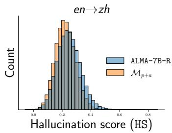
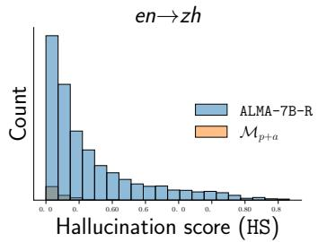
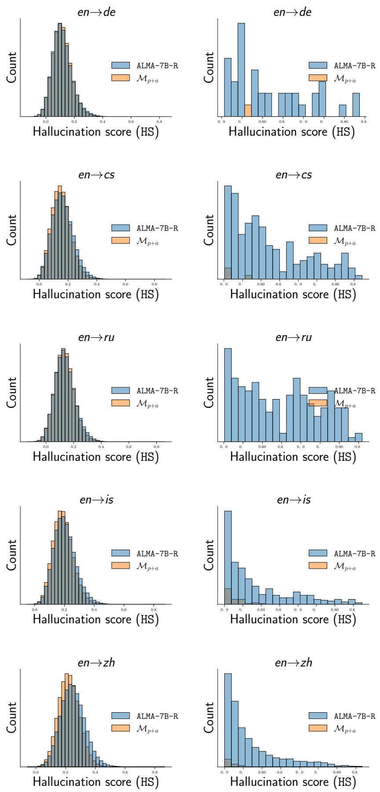
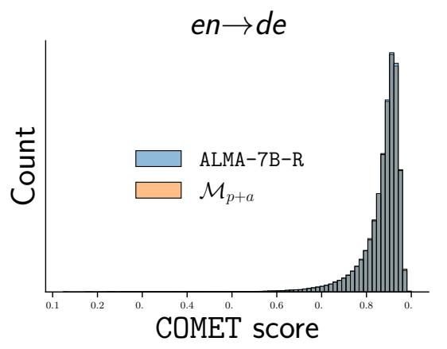
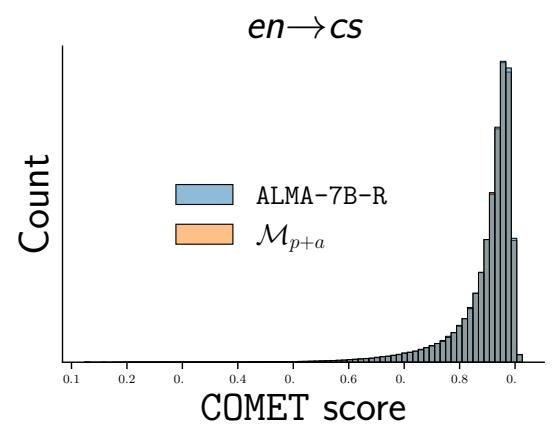
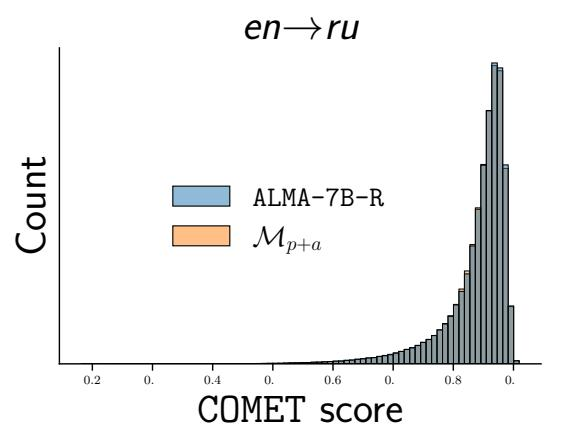
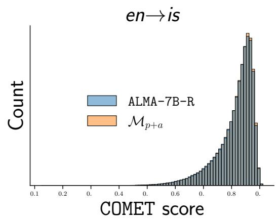
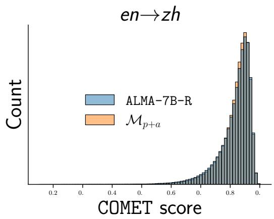
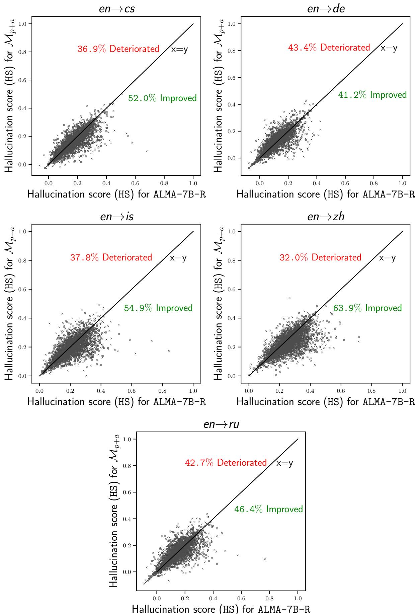
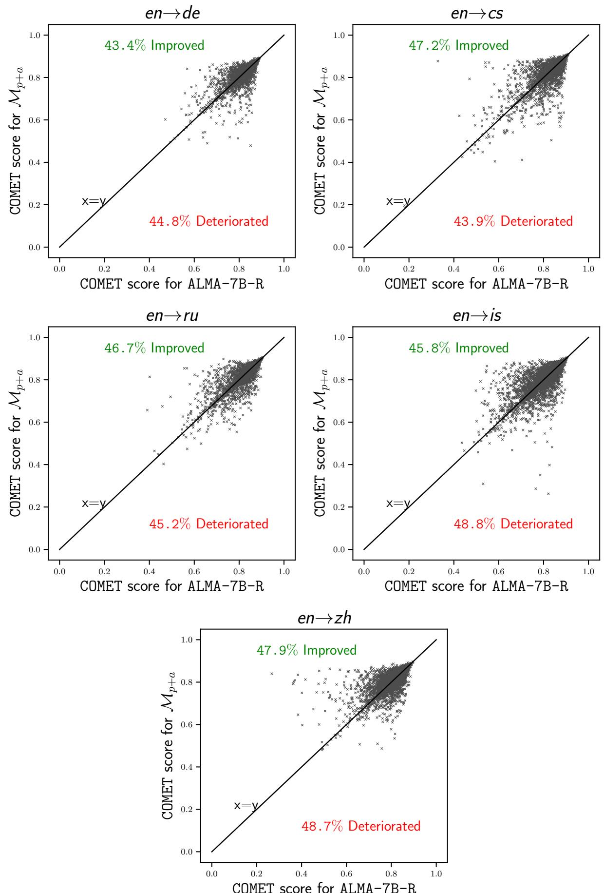

# Mitigating Hallucinated Translations in Large Language Models with Hallucination-focused Preference Optimization

Zilu Tang∗ Boston University zilutang@bu.edu

Rajen Chatterjee Apple rajen\_c@apple.com

Sarthak Garg Apple sarthak\_garg@apple.com

## Abstract

Machine Translation (MT) is undergoing a paradigm shift, with systems based on finetuned large language models (LLM) becoming increasingly competitive with traditional encoder-decoder models trained specifically for translation tasks. However, LLM-based systems are at a higher risk of generating hallucinations, which can severely undermine user’s trust and safety. Most prior research on hallucination mitigation focuses on traditional MT models, with solutions that involve post-hoc mitigation detecting hallucinated translations and re-translating them. While effective, this approach introduces additional complexity in deploying extra tools in production and also increases latency. To address these limitations, we propose a method that intrinsically learns to mitigate hallucinations during the model train ing phase. Specifically, we introduce a data creation framework to generate hallucination focused preference datasets. Fine-tuning LLMs on these preference datasets reduces the hallucination rate by an average of 96% across five language pairs, while preserving overall translation quality. In a zero-shot setting our approach reduces hallucinations by 89% on an average across three unseen target languages.

## 1 Introduction

LLMs are gaining popularity for various NLP applications, including machine translation. Fine-tuning LLMs for MT has been proven to be highly dataefficient, requiring orders of magnitude less parallel data than large standalone multilingual MT models, while achieving increasingly competitive performance (Liao et al., 2024; Xu et al., 2024; Alves et al., 2024). Moreover, there is a significant and ongoing effort within the research community to push the performance limits of foundational LLMs and expand their multilingual capabilities (Jiang et al., 2023; Dubey et al., 2024; Aryabumi et al., 2024).

Despite these advantages, LLM-based models are more prone to hallucinations: the models generates information that is inaccurate or entirely fabricated. This issue has lead to a growing research area, focusing on the causes, detection, and mitigation of hallucinations in LLMs (Tonmoy et al., 2024). In the context of MT, hallucinations manifest as highly pathological translations, which can lead to misunderstandings in conversations, potentially damaging relationships and undermining user trust in the system (Kumar et al., 2023).

Most of the existing research on hallucination mitigation in MT has focused on traditional encodedecoder models, establishing effective post-hoc mitigation strategies (Guerreiro et al., 2023c; Dale et al., 2023a,b). These strategies first detect whether a translation contains hallucination, and if so, generate and present a mitigated translation to the user. In practical scenarios, using post-hoc mitigation has several drawbacks: i) the need for deploying an additional hallucination detector in production; ii) running the hallucination detector on every translation, which increases cost and latency; and iii) re-running inference if a translation hallucinates (which often much slower than regular inference).

To address these issues, we propose a framework that intrinsically integrates hallucination mitigation during the LLM development phase, aiming to minimize hallucinations from the outset. Specifically, we apply post-hoc mitigation strategies offline on a large-scale monolingual corpus, generating a corpus of model hallucinations alongside their corresponding mitigated translations. We then fine-tune the LLM using Contrastive Preference Optimization (CPO) (Xu et al., 2024), guiding the model away from hallucinations.

Our approach requires no additional humanannotated data, is easily scalable across many language pairs, and is highly effective  achieving a 96% reduction in hallucination rates across five 1Work done during internship at Apple language pairs without sacrificing general translation quality. It also generalizes well, achieving an average 89% reduction in hallucination rates across three unseen target languages. Overall, our main contributions include:

• Proposing a novel approach for creating hallucination-focused preference datasets.

• Identifying the most effective fine-tuning technique for leveraging this preference dataset.

• Exploring the cross-lingual generalization capabilities of the fine-tuned models in a zero-shot setting.

• Determining the most effective post-hoc mitigation strategies for LLM based translation models.

## 2 Dataset Creation Framework

One of the techniques for fine-tuning LLMs for translation is preference optimization (Xu et al., 2024) which uses a dataset of triplets, consisting of a source sentence x, its preferred translation $y _ { p }$ , and a dispreferred translation $y _ { d } .$ Preference optimization trains the model to prioritize the generation of preferred set of translations over dispreferred ones. Xu et al. (2024) focus on optimizing general translation quality, and hence in their datasets, $y _ { p }$ and $y _ { d }$ differ only in quality and do not explicitly consider the notion of hallucination. For instance, both translations could be broadly correct, but one might be preferred over the other due to minor errors or subtle differences in style.

To address hallucinations, we develop a framework for automatically creating a hallucination $f o -$ cused preference dataset and propose to fine-tune the LLM on this dataset to effectively mitigate hallucination generation. In this dataset, the dispreferred translations contain hallucinations, whereas the preferred translations do not. The set of dispreferred translations are derived from the LLM’s own generated outputs. This is particularly important as it enables the model to learn from its own errors and correct them. Our approach for creating this preference dataset is completely unsupervised and can easily scale to multiple languages without any human annotation. At a high level, the dataset creation process consists of translating monolingual data using the LLM and automatically detecting hallucinations (Section 2.1) and mitigating them using existing post-hoc methods (Section 2.2)

## 2.1 Hallucination Detection

In the first step, we construct a set of source sentences and their corresponding dispreferred translations containing hallucinations. To achieve this, we translate publicly available monolingual corpora $\mathcal { D } _ { m }$ from the source language into the target languages using the model , which we aim to fine-tune for reducing hallucinations. We then automatically identify translations y $( y : = \mathcal { M } ( x ) )$ that exhibit hallucination using the state-of-theart hallucination detector model based on BLASER 2.0-QE (Chen et al., 2023; Dale et al., 2023b). BLASER 2.0-QE is a reference-free machine translation quality estimation metric that predicts crosslingual semantic similarity between a source sentence x its translation $y .$ It operates on a scale of 1-5, where 1 denotes completely unrelated sentences and 5 signifies fully semantically equivalent sentences. We re-normalize the BLASER score to a hallucination score (HS), with a higher value indicating a greater likelihood of hallucination in y:

$$
{ \mathsf { H S } } ( x , y ) = 1 - { \frac { { \mathsf { B L A S E R } } ( x , y ) } { 5 } }\tag{1}
$$

After fixing a threshold T, we classify a translation as containing hallucination if its hallucination score exceeds the threshold. Collecting such instances where hallucinations are detected provides us with a hallucination dataset $\mathcal { D } _ { h }$ , which consists of source sentences and their corresponding hallucinated translations as follows:

$$
\mathcal { D } _ { h } : = \{ ( x , y ) | \mathsf { H S } ( x , y ) \geq T \forall x \in \mathcal { D } _ { m } \}\tag{2}
$$

## 2.2 Post-hoc Hallucination Mitigation

The second step involves mitigating the hallucinated translations in $\mathcal { D } _ { h }$ to create hallucination-free alternatives. Previous works (Dale et al., 2023a; Guerreiro et al., 2023a,c) have proposed several post-hoc mitigation strategies, though they are typically applied during test time. In contrast, we explore using these strategies offline to build a preference fine-tuning corpus. We consider a few notable strategies, outlined below:

Fallback System Guerreiro et al. (2023a) demonstrated that simply switching to a different fallback translation system when hallucinations occur is an effective mitigation strategy. Following this, we employ the NLLB-3.3B model (NLLB Team et al., 2022) as a fallback.

Candidate Generation and Selection Dale et al. (2023a) propose generating multiple alternative translation candidates from the original model and selecting one of them as the mitigated translation based on a specific criterion. This approach involves two degrees of freedom: (i) candidate generation and (ii) candidate selection. To generate n candidates we explore the following strategies:

• MC beam: Using n iterations of beam search with Monte Carlo dropout (Gal and Ghahramani, 2016).

• Temperature sampling: Sampling from the full probability distribution, adjusted by a temperature parameter t, to control the sharpness of the distribution.

• Nucleus sampling: Sampling from a set of tokens that covers top $p \%$ of the posterior probability distribution at each step (Holtzman et al., 2020).

• Epsilon sampling: Sampling from a set of tokens where each token has a probability greater than or equal to a threshold ϵ (Hewitt et al., 2022; Freitag et al., 2023).

To select the best candidate, we explore the following algorithms:

• MBR decoding: Selects the candidate that maximizes the average utility with respect to all other candidates. (Kumar and Byrne, 2004; Freitag et al., 2022). We evaluate utility between two candidates using chrF (Popovic, 2015), LaBSE (Feng et al., 2022), and COMET (Rei et al., 2022).

• Re-ranking: Selects the candidate that maximizes utility with respect to the source sentence, using LaBSE and COMET (Rei et al., 2020) as utility metrics.

We compare the effectiveness these strategies in mitigating hallucinations, analyzing the impact of different generation and sampling methods in Section 5.

We select the best mitigation strategy based on a held out development set and use it to generate alternative translations $\tilde { y }$ corresponding to each sample $( x , y ) \in \mathcal { D } _ { h }$ . We construct our hallucination focused preference fine-tuning dataset $\mathcal { D } _ { p }$ by retaining samples where the alternative translation successfully mitigates hallucination $( \mathsf { H S } ( x , \tilde { y } ) < T )$

Formally $\mathcal { D } _ { p }$ is defined as follows:

$$
\mathcal { D } _ { p } : = \{ ( x , \tilde { y } , y ) ~ | ~ { \sf H S } ( x , \tilde { y } ) < T \forall ( x , y ) \in \mathcal { D } _ { h } \}\tag{3}
$$

## 3 Fine-tuning Using CPO

We fine-tune the baseline LLM  using our hallucination-focused preference dataset $\mathcal { D } _ { p }$ through CPO, a variant of Direct Preference Optimization (DPO) (Rafailov et al., 2023), which has shown to be effective for fine-tuning LLMs on the translation task. The CPO objective is formally defined as follows:

$$
\mathcal { L } _ { C P O } = \mathcal { L } _ { N L L } + \mathcal { L } _ { P }\tag{4}
$$

where

$$
\mathcal { L } _ { P } = - \mathbb { E } _ { ( x , y _ { p } , y _ { d } ) \sim \mathcal { D } _ { p } } \log \sigma \big ( \beta \log \frac { \pi _ { \theta } ( y _ { p } | x ) } { \pi _ { \theta } ( y _ { d } | x ) } \big )\tag{5}
$$

$$
\mathcal { L } _ { N L L } = - \mathbb { E } _ { ( x , y _ { p } , y _ { d } ) \sim \mathcal { D } _ { p } } \log \pi _ { \theta } ( y _ { p } \vert x )\tag{6}
$$

In equations above, $x , y _ { p }$ and $y _ { d }$ represent the source sentence, preferred (hallucination free) translation and dispreferred (hallucination containing) translation, respectively, sampled from the preference dataset ${ \mathcal { D } } _ { p } .$ . The policy $\pi _ { \theta }$ refers to the conditional probability distribution from the model , σ is the sigmoid function and $\beta$ is a scaling hyperparameter from (Rafailov et al., 2023).

The CPO objective combines the standard negative log-likelihood NLL loss, which encourages the model to generate $y _ { p }$ , and the preference loss $\mathcal { L } _ { p } .$ which aims to increase the probability gap between $y _ { p }$ and $y _ { d }$ . The preference loss term explicitly instructs the model to prioritize the generation of $y _ { p }$ and reject $y _ { d } .$ . In Section 6.2 we show that this loss term is crucial for reducing the model’s likelihood of generating hallucinations.

In our dataset, we ensure that $y _ { p }$ always has higher quality than yd, as measured by hallucination score $( { \mathsf { H S } } ( x , y _ { p } ) \ < \ T$ and $\mathsf { H S } ( x , y _ { d } ) \ge T )$ However different preference pairs may exhibit varying quality gaps. To account for this variation in quality gaps in the preference fine-tuning, we introduce a scaling term to $\mathcal { L } _ { P }$ . A preference pair $( y _ { p } , y _ { d } )$ with larger quality gap provides a more informative data point, so we design the scaling term to assign greater weight to pairs with a larger gaps, proportional to the quality ratio of $y _ { p }$ and $y _ { d } .$ With this scaling term, the modified preference loss $( \mathcal { L } _ { p } ^ { \prime } )$ is defined as follows2:

$$
\begin{array} { r l } & { \mathcal { L } ^ { \prime } { _ { p } } = - \mathbb { E } _ { ( x , y _ { p } , y _ { d } ) \sim \mathcal { D } _ { p } } \left[ \log \sigma \big ( \beta \log \frac { \pi _ { \theta } ( y _ { p } | x ) } { \pi _ { \theta } ( y _ { d } | x ) } \right. } \\ & { ~ \quad \quad \left. + \beta \log \frac { \phi ( x , y _ { p } ) } { \phi ( x , y _ { d } ) } \big ) \right] } \end{array}\tag{7}
$$

where, $\phi$ is a scoring function that measures the quality of a translation given the source. We choose ϕ to be the hallucination score (HS). With this change, our final CPO loss is shown in equation 8

$$
\mathcal { L ^ { \prime } } _ { C P O } = \mathcal { L ^ { \prime } } _ { p } + \mathcal { L } _ { N L L }\tag{8}
$$

## 4 Experimental Setup

## 4.1 Evaluation Metrics

Given a model , we evaluate it on a monolingual dataset using hallucination rate. Hallucination rate (HR) computes the ratio of source sentences for which model produces translations containing hallucinations:

$$
\mathsf { H R } ( \mathcal { M } , \mathcal { D } ) = \frac { | \{ x \mid \mathsf { H S } ( x , \mathcal { M } ( x ) ) \geq T \ \forall x \in \mathcal { D } \} | } { | \mathcal { D } | }\tag{9}
$$

where counts the number of elements in a set. We split the monolingual corpus $\mathcal { D } _ { m }$ into $\mathcal { D } _ { m } ^ { t r a i n }$ (train), $\mathcal { D } _ { m } ^ { d e v }$ (dev) and $\mathcal { D } _ { m } ^ { t e s t }$ (test) sets. The hallucination-focused preference dataset $( \mathcal { D } _ { p } )$ is derived from $\mathcal { D } _ { m } ^ { t r a i n }$ as described as Section 2. We evaluate the baseline and fine-tuned LLMs using hallucination rates computed against unseen set $\mathcal { D } _ { m } ^ { t e s t }$ . All the hyperparameters and the best post-hoc mitigation strategy for preparing the finetuning set are selected based on $\mathcal { D } _ { m } ^ { d e v }$

To ensure that improvements in hallucination mitigation do not come at the expense of general translation quality, we also evaluate the baseline and fine-tuned models on the WMT’22 and WMT’23 testsets using three COMET models: wmt22-cometkiwi-da, wmt23-cometkiwi-da-xxl, and XCOMET-XXL. This evaluation methodology aligns with that of Xu et al. (2024).

## 4.2 Baseline Model and Language Coverage

We choose ALMA-7B-R as our baseline LLM. Built upon LLAMA-2 (Touvron et al., 2023), ALMA-7B-R has been extensively optimized for translation through multiple rounds of fine-tuning, including continued pre-training on multilingual data, supervised fine-tuning with parallel corpora and preference tuning using CPO. ALMA-7B-R has shown competitive performance, matching or surpassing top systems in WMT shared evaluation, and even GPT-4 (OpenAI et al., 2024), making it a strong baseline for our hallucination mitigation experiments.

ALMA-7B-R supports translation across ten language directions: English {Czech (cs), German $( d e )$ , Icelandic (is), Russian (ru) and Chinese $\left( z h \right) \}$ . However due to resource constraints, in our study, we focus on a subset of five language pairs: en {cs, de, is, ru, zh}.

## 4.3 Hallucination Focused Preference Dataset Construction

We follow the data creation framework outlined in Section 2 to construct a hallucination focused preference fine-tuning dataset, as detailed below:

## 4.3.1 Monolingual Data

As our study is restricted to language pairs with English as source, we randomly sample English sentences from the NewsCrawl dataset (Kocmi et al., 2022)3 for $\mathcal { D } _ { m }$ . We sample 0.5M sentences each for $\mathcal { D } _ { m } ^ { d e v }$ and $\mathcal { D } _ { m } ^ { t e s t }$ , and these evaluation sets are shared across all language pairs. To create preference sets for each language pair, we sample separate $\mathcal { D } _ { m } ^ { t r a i n }$ sets, with sizes of 2M (en zh), 5M (en cs, en is, en ru), or 10M (en de) sentences. The sizes are determined based on hallucination rates of the baseline model for each language pair, with larger sets allocated to language pairs exhibiting lower hallucination rates, ensuring that the resulting preference sets are of comparable sizes across all language pairs. All the above datasets are cleaned by applying a series of filters to remove noisy samples.

## 4.3.2 Hallucination Detection

As outlined in Section 2.1, for each language pair, we translate the corresponding $\mathcal { D } _ { m } ^ { t r a i n } , \mathcal { D } _ { m } ^ { d e v } , \mathcal { D } _ { m } ^ { t e s t }$ sets using the baseline ALMA-7B-R into the target language. We then create the corresponding hallucination datasets $\mathcal { D } _ { h } ^ { t r a i n } , \mathcal { D } _ { h } ^ { d e v } , \mathcal { D } _ { h } ^ { t e s t }$ by retaining translations where hallucination score exceeds the threshold T. We set T to be 0.5 based on manual verification of the resulting $\mathcal { D } _ { h } ^ { d e v }$ sets for en zh and en de. Native chinese and german speakers verified that 97% and 87% of translations in the en zh and en de sets, respectively, did contain highly pathological errors. Consequently, this threshold is adopted for all language pairs throughout our study, unless otherwise specified. The number of samples in hallucination datasets for each split and language pair, along with the corresponding hallucination rates (%) are summarized in Table 1. For additional analysis on hallucination patterns see Appendix 6.4. Our experiments indicate that hallucinations occur on different source sentences for different languages, and the presence of specific features (e.g. quotes, urls, all cap phrases) could significantly increase the likelihood of hallucination.

<table><tr><td></td><td> $\mathcal { D } _ { h } ^ { t r a i n }$ </td><td> $\mathcal { D } _ { h } ^ { d e v }$ </td><td> $\mathcal { D } _ { h } ^ { t e s t }$ </td></tr><tr><td>en→cs</td><td>2085 (0.04)</td><td>202 (0.04)</td><td>179 (0.04)</td></tr><tr><td>en→de</td><td>673 (0.01)</td><td>47 (0.01)</td><td>39 (0.01)</td></tr><tr><td>en→is</td><td>3682 (0.08)</td><td>384 (0.08)</td><td>388 (0.08)</td></tr><tr><td>en→ru</td><td>1933 (0.04)</td><td>186 (0.04)</td><td>196 (0.04)</td></tr><tr><td>en→zh</td><td>8470 (0.45)</td><td>2178 (0.46)</td><td>2192 (0.46)</td></tr></table>

Table 1: Hallucination count (HR in %) for $A L M A - 7 B - R$

## 4.3.3 Post-hoc Hallucination Mitigation

We evaluate the post-hoc mitigation strategies described in Section 2.2 on $\mathcal { D } _ { h } ^ { d e v }$ . Given a sample $( x , y _ { d } ) \in \mathcal { D } _ { h } ^ { d e v }$ , where $y _ { d }$ contains hallucinations, each mitigation strategy $s$ attempts to generate an alternative translation $\tilde { y } : =  { \mathcal { S } } ( x )$ which is likely free of hallucinations. We evaluate these strategies using mitigation rate (MR), which is the ratio of samples where $\tilde { y }$ successfully mitigates hallucinations. Higher MR values indicate better performance.

$$
\mathsf { M R } ( S , \mathcal { D } _ { h } ) = \frac { | \{ x \mid \mathsf { H S } ( x , S ( x ) ) < T \forall ( x , y _ { d } ) \in \mathcal { D } _ { h } \} | } { | \mathcal { D } _ { h } | }\tag{10}
$$

For the Fallback strategy, we use a beam size of 40. For Candidate Generation and Selection approach, we generate $n = 4 0$ candidates using temperature sampling with $t \in \{ 0 . 8 , 1 , 1 . 5 \}$ in conjunction with either nucleus sampling with $p = 0 . 9$ or epsilon sampling with $\epsilon = 0 . 0 2$ . For MCBeam, we generate candidates using a beam size of 5. When using COMET with MBR, we use eamt22-cometinho-da which is a distilled model that takes as input the source sentence, translation and reference translation. For COMET with Re-ranking, we employ the wmt20-comet-qe-da, which only takes the source sentence and translation as input.

A detailed comparison of the mitigation strategies is presented in Section 5.1. We use the best performing strategy (re-ranking using LaBSE) to construct our preferences datasets $\mathcal { D } _ { p } ^ { t r a i n }$ from $\mathcal { D } _ { h } ^ { t r a i n }$ for all language pairs as described in Section 2.2. The number of samples in these preference datasets across all language pairs is presented in Table 2.5

<table><tr><td>en→cs 2063</td><td> $e n {  } d e$  671</td><td>en→is 3598</td><td>en→ru 1931</td><td>en→zh 8349</td></tr></table>

Table 2: Number of samples in $\mathcal { D } _ { p } ^ { t r a i n }$

## 4.4 Combining Hallucination and Translation Quality Preference Datasets

While $\mathcal { D } _ { p } ^ { t r a i n }$ is specifically constructed to mitigate hallucinations, fine-tuning solely on this dataset can lead to a decline in general translation quality. To address this, we mix $\mathcal { D } _ { p } ^ { t r a i n }$ with $\mathcal { D } _ { a l m a } ^ { t r a i n }$ , the preference dataset originally used to fine-tune the baseline ALMA-R model by Xu et al. (2024), which focuses on overall translation quality. Combining the two sets helps preserve the original translation quality while improving hallucination mitigation. $\mathcal { D } _ { a l m a } ^ { t r a i n }$ is comparable in size to $\mathcal { D } _ { p } ^ { t r a i n }$ , with detailed statistics provided in Table 18

## 4.5 Fine-tuning Using CPO

We adhere to a fine-tuning setup that closely follows the methodology described in Xu et al. (2024). In line with their approach, we fine-tune LoRA adapters (Hu et al., 2022) and utilize the same prompt structure.6 For the modified preference loss function $( \mathcal { L } _ { p } ^ { \prime } )$ , we use HS as the scoring function ϕ for $\mathcal { D } _ { p } ^ { t r a i n }$ and COMET as the scoring function for the $\mathcal { D } _ { a l m a } ^ { t r a i n }$ dataset.7 We normalize the scoring functions of both datasets to ensure their ranges align with each other.

Most hyper-parameters are optimized based on the hallucination rate of the fine-tuned model on the smaller $\mathcal { D } _ { h } ^ { d e v }$ sets to facilitate quick iterations. However, when multiple configurations yield similar results, we decide based on the full development set $D _ { m } ^ { d e v }$

## 5 Results

We present the comparison between different posthoc mitigation strategies in Section 5.1 and main results of our fine-tuned models in Section 5.2

<table><tr><td></td><td>Fallback</td><td colspan="5">MBR</td><td colspan="4">Re-ranking</td></tr><tr><td></td><td>NLLB-3.3B</td><td>chrf</td><td>COMET</td><td>LaBSE</td><td>COMET  $\epsilon = 0 . 0 2$ </td><td>LaBSE  $\epsilon = 0 . 0 2$ </td><td>COMET</td><td>LaBSE</td><td>COMET € = 0.02</td><td>LaBSE € = 0.02</td></tr><tr><td>en→cs</td><td>100</td><td>96.6</td><td>96.1</td><td>97.6</td><td>97.6</td><td>97.1</td><td>98.1</td><td>99.5</td><td>98.1</td><td>99.5</td></tr><tr><td>en→de</td><td>100</td><td>100</td><td>100</td><td>100</td><td>100</td><td>100</td><td>100</td><td>100</td><td>100</td><td>100</td></tr><tr><td>en→is</td><td>98.3</td><td>92.3</td><td>92.9</td><td>95.4</td><td>95.1</td><td>95.4</td><td>95.7</td><td>97.7</td><td>96.3</td><td>98.9</td></tr><tr><td>en→ru</td><td>97.4</td><td>99.0</td><td>99.5</td><td>98.4</td><td>98.4</td><td>99.5</td><td>99.0</td><td>99.5</td><td>100</td><td>100</td></tr><tr><td>en→zh</td><td>86.9</td><td>97.6</td><td>98.1</td><td>98.4</td><td>98.6</td><td>99.1</td><td>96.9</td><td>99.1</td><td>97.1</td><td>99.4</td></tr><tr><td>Average</td><td>96.5</td><td>97.1</td><td>97.3</td><td>98.0</td><td>97.9</td><td>98.2</td><td>97.9</td><td>99.2</td><td>98.3</td><td>99.6</td></tr></table>

Table 3: Mitigation rates MR in % ( ) for different post-hoc mitigation strategies on $\mathcal { D } _ { h } ^ { d e v }$ set.
<table><tr><td rowspan="2">Model</td><td colspan="7">Hallucination count/rate (↓)</td><td rowspan="2">WMT&#x27;23 COMET(↑) en→X</td></tr><tr><td> $e n { \longrightarrow } c s$ </td><td> $e n { \to } d e$ </td><td>en→is</td><td>en→ru</td><td>en→zh</td><td>avg</td><td>avg HR (%)</td></tr><tr><td>NLLB-3.3B</td><td>471</td><td>732</td><td>1459</td><td>252</td><td>38302</td><td>8243</td><td>1.743</td><td>75.9</td></tr><tr><td>ALMA-7B-R</td><td>179</td><td>39</td><td>388</td><td>196</td><td>2192</td><td>599</td><td>0.127</td><td>81.8</td></tr><tr><td> $\mathcal { M } _ { p }$ </td><td>5</td><td>2</td><td>37</td><td>2</td><td>74</td><td>24</td><td>0.005</td><td>80.8</td></tr><tr><td> $\mathcal { M } _ { p + a }$ </td><td>4</td><td>1</td><td>35</td><td>0</td><td>80</td><td>24</td><td>0.005</td><td>81.6</td></tr><tr><td> $\sqrt { A L M A - 7 B - R + p o s t - h o c ^ { \ast } }$ </td><td>1</td><td>0</td><td>8</td><td>1</td><td>28</td><td>7.6</td><td>0.002</td><td>-</td></tr></table>

Table 4: Main Results: Hallucination count and HR (%) on $\mathcal { D } _ { m } ^ { t e s t }$ , and average COMET scores on WMT’23 testsets. indicates an upper bound and should be seen as a reference point since it is not a modeling technique.

## 5.1 Post-hoc Mitigation Strategies

Table 3 summarizes the mitigation rates of various strategies across different selection methods and utility metrics, focusing on the top performing sampling settings.8 All strategies significantly reduce hallucinations, with even the worst performing one achieving an average mitigation rate of over 96%. The optimal setting, achieved through epsilon sampling with $\epsilon = 0 . 0 2$ followed by reranking with LaBSE, results in an impressive average mitigation rate of 99.6%. Notably, we observe that for both MBR and Re-rank, LaBSE consistently outperforms COMET. This aligns with previous research on hallucination detection, which has shown LaBSE to be superior to COMET (Dale et al., 2023b). Furthermore, model-based metrics for MBR, such as COMET and LaBSE outperform chrF. Comparing both candidate selection methods overall, Re-rank outperforms MBR. The Fallback strategy using NLLB-3.3B achieves a mitigation rate of 96.5%. While quite substantial, it falls short of the best results, possibly due to the baseline ALMA-7B-R being a stronger model, generating higher quality and more diverse translations.9

## 5.2 Fine-tuning Using CPO

We present the main results in Table 4.10 Our primary baseline, ALMA-7B-R, achieves an average hallucination rate of 0.127%. ALMA-7B-R is a much stronger baseline compared to traditional encoderdecoder based NLLB-3.3B, which exhibits an average hallucination rate of 1.73%, nearly 14 times higher than that of ALMA-7B-R. This difference is expected, given that ALMA-7B-R is a stronger translation model, as reflected by its superior average COMET scores on the WMT testsets. Examining the hallucination rates across all language pairs, we observe that the $e n {  } z h$ language pair consistently shows the highest hallucination rates across all the models.

Next, we analyze the results obtained by finetuning ALMA-7B-R on different preference datasets. Fine-tuning using our hallucination focused preference dataset $\mathcal { D } _ { p } ^ { t r a i n }$ , gives us model $\mathcal { M } _ { p } .$ The hallucination rate of this model drops significantly from 0.127% to an average of 0.005%. This demonstrates the effectiveness of our unsupervised preference data creation approach, resulting in a remarkable 96% reduction. We additionally confirm the effect of the hallucination mitigation in Appendix G with a top-n-gram based hallucination detector (Raunak et al., 2021). However, along the reduction in hallucinations, we observe a decline in general translation quality, with the average COMET score dropping by 1.0 from the baseline.

To mitigate this drop in translation quality, we fine-tune the model using a combined dataset $\mathcal { D } _ { p } ^ { t r a i n } \cup \mathcal { D } _ { a l m a } ^ { t r a i n }$ , which gives us model $\mathcal { M } _ { p + a }$ . By balancing training between hallucination mitigation and general translation tasks, we observe an improvement of 0.8 points in the average COMET score, bringing the model nearly on par with the baseline performance, while still maintaining hallucination rate of 0.005%. For more detailed general translation quality comparisons, refer to Section L in the Appendix. Examples of hallucinated translations from the baseline model, which are mitigated by our fine-tuned model, are shown in the Appendix J. To establish an upper bound, we apply the best post-hoc mitigation strategy to the hallucinations from the baseline ALMA-7B-R model, reporting this as ALMA-7B-R + post-hoc in Table 4. This represents using the post-hoc mitigation system during test time. Our findings indicate that our best model, with a hallucination rate of 0.005%, comes very close to this upper bound of 0.002%, without requiring any additional mitigation systems at test time.

## 6 Analysis and Discussions

## 6.1 Cross-lingual Zero-shot Generalization

To assess the cross-lingual generalization of our fine-tuning approach in reducing hallucinations on unseen language pairs, we conducted zero-shot experiments comparing baseline ALMA-7B-R with our best fine-tuned model $( \mathcal { M } _ { p + a } )$ in a zero-shot setting. In these experiments, we translated our test set $\mathcal { D } _ { m } ^ { t e s t }$ from English into three target languages French (fr), Italian (it), and Spanish (es), none of which were prominently present in the pre-training and fine-tuning stages of ALMA-7B-R.

Table 5 presents the hallucination rates and COMET scores for both models across these language pairs.11 Notably, both models perform well, despite the target languages being unseen during training. The baseline model achieves an average COMET score of 83.31, with the fine-tuned model trailing slightly at 83.17. However, in terms of hallucination rates, the fine-tuned model significantly outperforms the baseline, reducing the average hallucination rate from 0.273% to 0.03%, representing an 89% reduction. These results demonstrate that our fine-tuning approach generalizes effectively to unseen language pairs, substantially reducing hallucinations without significant loss in general translation quality.

## 6.2 Ablation of Loss Function Components

As shown in equation 8, the CPO loss consists of two components: i) preference loss and ii) NLL loss. We conduct an ablation study to understand the contribution of each component. When only the NLL loss is active, it corresponds to supervised fine-tuning (SFT) on the source and mitigated translations. We optimized the hyperparameters corresponding for each loss configuration based on hallucination rates on the $\mathcal { D } _ { h } ^ { d e v }$ set and then evaluated both the baseline and the fine-tuned models on the full $\mathcal { D } _ { m } ^ { d e v }$ set.

<table><tr><td></td><td>HR % (↓)</td><td>COMET (↑)</td></tr><tr><td></td><td>ALMA-7B-R  $\overline { { \mathscr { M } _ { p + a } } }$ </td><td>ALMA-7B-R  $\overline { { \mathscr { M } _ { p + a } } }$ </td></tr><tr><td>en→es</td><td>0.164 0.007</td><td>83.30 83.25</td></tr><tr><td>en→fr</td><td>0.399 0.077</td><td>83.05 82.39</td></tr><tr><td>en→it</td><td>0.256 0.007</td><td>83.57 83.87</td></tr><tr><td>Average</td><td>0.273 0.030</td><td>83.31 83.17</td></tr></table>

Table 5: Cross-lingual zero-shot results.

Table 6 summarizes the results of these ablations. The findings reveal that using only the preference loss results in poor performance, with a hallucination rate of 3.556%, which is significantly worse than the baseline ALMA-7B-R (0.127%). In contrast, using only the NLL loss yields a lower hallucination rate of 0.078%, outperforming the baseline. However, the best performance is achieved when both losses are combined, reducing the hallucination rate to just 0.005%. This demonstrates the effectiveness of the CPO loss over simple SFT using mitigated translations, highlighting the complementary benefits of preference and cross-entropy losses.

<table><tr><td rowspan="2"></td><td rowspan="2">ALMA-7B-R</td><td colspan="3"> $\overline { { \mathcal { M } _ { p } } }$ </td></tr><tr><td> $\mathcal { L ^ { \prime } } _ { P }$ </td><td> $\mathcal { L } _ { N L L }$ </td><td> $\mathcal { L ^ { \prime } } _ { C P O }$ </td></tr><tr><td>en→cs</td><td>202</td><td>10</td><td>216</td><td>7</td></tr><tr><td>en→de</td><td>47</td><td>5</td><td>124</td><td>1</td></tr><tr><td>en→is</td><td>384</td><td>72</td><td>441</td><td>37</td></tr><tr><td>en→ru</td><td>186</td><td>83836</td><td>127</td><td>2</td></tr><tr><td>en→zh</td><td>2178</td><td>174</td><td>931</td><td>73</td></tr><tr><td>Avg. HR (%)</td><td>0.127</td><td>3.556</td><td>0.078</td><td>0.005</td></tr></table>

Table 6: Hallucination counts (HR in %) of ALMA-7B-R and $\mathcal { M } _ { p }$ using different loss variants on $\mathcal { D } _ { m } ^ { d e v }$

## 6.3 Ablation of Data Quantity vs. Quality

To create $\mathcal { D } _ { p } ^ { t r a i n }$ , we select dispreferred translations with a hallucination score 0.5. Lowering this threshold yield more training samples, but risks including translations that do not accurately reflect true hallucinations, thus reducing the quality of the preference dataset. To explore the tradeoff between data quantity and quality, we conducted an experiment by creating a version of $\mathcal { D } _ { p } ^ { t r a i n }$ with a lower threshold of 0.45. We fine-tuneed the baseline on both versions of the preference dataset and evaluated the models on $\mathcal { D } _ { m } ^ { d e v }$ . As shown in Table 7, lowering the threshold to increase the dataset size led to a decline in performance, indicating that the quality of the preference data is more crucial than its quantity.

<table><tr><td></td><td>0.5 (default) 0.45</td></tr><tr><td>en→cs</td><td>7 24</td></tr><tr><td>en→de 1</td><td>5</td></tr><tr><td>en→is 37</td><td>135</td></tr><tr><td>en→ru</td><td>2 10</td></tr><tr><td>en→zh</td><td>73 259</td></tr><tr><td>Avg. rate (%)</td><td>0.005 0.018</td></tr></table>

Table 7: Hallucination counts (HR in %) on $\mathcal { D } _ { m } ^ { d e v }$ after fine-tuning with $\mathcal { D } _ { p } ^ { t r a i n }$ collected at different thresholds.

## 6.4 Hallucination Characterization

To gain a deeper understanding of the nature of hallucinations, we conducted a detailed analysis of the source sentences and the corresponding hallucinated translations on the test set $\mathcal { D } _ { h } ^ { t e s t }$

Source sentences We examined source sentences to identify any patterns that might consistently trigger hallucinations when translating to different target languages. Table 8 presents these statistics of the overlap of source sentences between hallucination samples of different language pairs. For e.g., in the en zh language pair, 2178 source sentences generate hallucinations, however only 5-19 of source sentences result in hallucinations when translating other target languages. A similar trend is observed across all language pairs. This indicates that the source sentences do not exhibit strong patterns that trigger hallucinations across different target languages.

<table><tr><td></td><td>en→cs</td><td>en→de</td><td>en→is</td><td>en→ru</td><td>en→zh</td></tr><tr><td>en→cs</td><td>202</td><td>3</td><td>9</td><td>10</td><td>17</td></tr><tr><td>en→de</td><td>3</td><td>47</td><td>3</td><td>2</td><td>7</td></tr><tr><td>en→is</td><td>9</td><td>3</td><td>384</td><td>10</td><td>16</td></tr><tr><td>en→ru</td><td>10</td><td>2</td><td>10</td><td>186</td><td>17</td></tr><tr><td>en→zh</td><td>17</td><td>7</td><td>16</td><td>17</td><td>2178</td></tr></table>

Table 8: Number of common source sentences between $\mathcal { D } _ { h } ^ { t e s t }$ sets of different language pairs.

Manual analysis of the examples also show a trend that presence of quotes, urls/online handles, or words/phrases in all capital letters in the source sentence triggers hallucinations. In Table 9 we perform a chi-squared test to test whether the presence of such features has a statistically significant im-

pact on triggering hallucinations in the baseline model. We find that different language pairs have different source triggers.
<table><tr><td></td><td>en→de</td><td> $e n {  } z h$ </td><td>en→cs</td><td>en→is</td><td>en→ru</td></tr><tr><td>quotes</td><td>0.54</td><td>2e-9</td><td>3e-6</td><td>0.56</td><td>5e-11</td></tr><tr><td>urls</td><td>0.32</td><td>4e-19</td><td>0.86</td><td>0.91</td><td>0.33</td></tr><tr><td>caps</td><td>0.06</td><td>0.48</td><td>0.02</td><td>0.08</td><td>1e-3</td></tr></table>

Table 9: Chi-square p-values of features’ impact on hallucination in $\mathcal { D } _ { h } ^ { t e s t }$ . We bold entries with statistical significance $( \mathtt { p } < 0 . 0 5 )$ .

Translations In our analysis of hallucinated translations, we observed a substantial number of oscillatory hallucinations, characterized by repetitive sequences within the translation. These oscillatory hallucinations can be effectively identified using a top n-gram based hallucination detector Raunak et al., 2021, 2022; Guerreiro et al., 2023c,a. This detector flags a translation as a hallucination if the count of the top n-gram in the translation exceeds that of the source by a specified threshold. Based on prior works, we set n-gram to 4 and the threshold to 2. We find that 60% to 80% of the hallucinations were oscillatory in nature. The statistics for all language pairs are presented in Table 10.

<table><tr><td rowspan=1 colspan=1>en→cs en→de en→is en→ru en→zh</td></tr><tr><td rowspan=1 colspan=1>74.9% 76.9% 58.2% 60.7% 86.2%</td></tr></table>

Table 10: Oscillatory hallucination (%) in $\mathcal { D } _ { h } ^ { t e s t }$

## 6.5 Evaluation at Different Hallucination Score Thresholds

Our main evaluation results in Table 4 use a hallucination score threshold of 0.5. This threshold is also applied to create hallucination focused preference datasets. To assess whether our approach is biased toward this threshold, we re-evaluated both the baseline (ALMA-7B-R) and our best finetuned model $( \mathcal { M } _ { p + a } )$ at a few lower thresholds. It’s important to note that as we lower the threshold, the distinction between hallucination and nonhallucination becomes increasingly blurred. However, a well-tuned model should still show improved performance over the baseline. Table 11 presents the evaluation results at different hallucination score thresholds (0.5, 0.45, and 0.4). While our $\mathcal { M } _ { p + a }$ consistently outperforms ALMA-7B-R across all thresholds, the performance gap decreases as the threshold is lowered.

<table><tr><td>Threshold</td><td colspan="2"> $\overline { { 0 . 5 } }$ </td><td colspan="2">0.45</td><td colspan="2"> $\overline { { 0 . 4 } }$ </td></tr><tr><td></td><td> $\overline { A L M A - 7 B - R }$ </td><td> $\overline { { \mathscr { M } _ { p + a } } }$ </td><td> $\overline { A L M A - 7 B - R }$ </td><td> $\overline { { \mathscr { M } _ { p + a } } }$ </td><td> $\overline { A L M A - 7 B - R }$ </td><td> $\overline { { \mathscr { M } _ { p + a } } }$ </td></tr><tr><td>en→cs</td><td>179</td><td> $\overline { { 4 } }$ </td><td>380</td><td> $\overline { { 4 5 } }$ </td><td>1388</td><td>385</td></tr><tr><td>en→de</td><td>39</td><td>1</td><td>59</td><td>6</td><td>199</td><td>111</td></tr><tr><td>en→is</td><td>388</td><td>35</td><td>1271</td><td>353</td><td>4873</td><td>1722</td></tr><tr><td>en→ru</td><td>196</td><td>0</td><td>297</td><td>35</td><td>765</td><td>226</td></tr><tr><td>en→zh</td><td>2192</td><td>80</td><td>6024</td><td>608</td><td>17994</td><td>3967</td></tr><tr><td>Average count</td><td>599</td><td>24</td><td>1606</td><td>209</td><td>5044</td><td>1282</td></tr><tr><td>Average HR (%)</td><td>0.127</td><td>0.005</td><td>0.34</td><td>0.044</td><td>1.067</td><td>0.271</td></tr></table>

Table 11: Evaluation results at different HS threshold values: showing hallucination count and HR (%).

## 6.6 Distribution of Hallucination Scores

Figure 1 illustrates the distribution of hallucination scores for the en zh pair on $\mathcal { D } _ { m } ^ { t e s t }$ before and after fine-tuning. The top plot shows the full scale distribution from 0-1, while the bottom image provides a zoomed-in view focused on the critical range of 0.5- 1, which highlights the hallucination-prone section. In the top plot, the distribution post-fine-tuning (in orange) shifts markedly to the left, indicating an overall improvement in translation quality across the dataset. In the bottom plot, we observe that the remaining hallucinations post-fine-tuning are primarily concentrated near the threshold, with fewer instances with extreme hallucination scores. Plots for all language pairs can be found in Appendix 2.

  
Figure 1: Distribution of the HS on $\mathcal { D } _ { m } ^ { t e s t } .$

## 7 Related Work

Prior works on hallucination detection include identifying repeated n-gram patterns in translations (Raunak et al., 2021), utilizing internal model information such as attention weights (Lee et al.,

2019; Berard et al., 2019; Ferrando et al., 2022b,a; Voita et al., 2021; Xu et al., 2023; Guerreiro et al., 2023b), and estimating uncertainty using the model’s sequence log-probability (Guerreiro et al., 2023c). Other works have explored external models based on quality estimation (COMET-QE) and cross-lingual sentence similarity (LASER, LaBSE, XNLI, BLASER-QE) (Dale et al., 2023a,b).

To mitigate hallucinations, prior works have primarily focused on post-hoc solutions. These include using a fallback model (Guerreiro et al., 2023a), generating multiple candidates and selecting the best using a re-ranker (Guerreiro et al., 2023c), or applying consensus-based decoding strategies such as Minimum Bayes Risk (MBR) (Eikema and Aziz, 2020). Other approaches have explored contrastive decoding by leveraging probabilities from different models (Li et al., 2023), using previous output tokens (Su and Collier, 2023), or utilizing a contrastive input (Sennrich et al., 2024). While all these approaches mitigate hallucinations during or after inference, our approach takes an orthogonal path by addressing the issue directly within the model itself.

## 8 Conclusion

In this work, we presented a framework for mitigating translation hallucinations in large language models (LLMs). To the best of our knowledge, this is among the first works to demonstrate how to mitigate translation hallucination in LLMs. In this framework, we propose an unsupervised method to create a hallucination-focused preference dataset, which is easily scalable across multiple languages. Fine-tuning LLMs using this dataset through preference optimization reduces hallucination rates by an average of 96%, while preserving general translation quality. Additionally, our method generalizes well in a cross-lingual zero-shot setting, achieving an 89% reduction in hallucination rates across three previously unseen target languages.

## Limitations

• In this work we explored only en X language pairs due to time and resource constraints. We leave the exploration of other directions as a future work.

• Since natural translation hallucination is very rare, we need to translate huge amount of monolingual data to create a reasonable amount of hallucination focused preference dataset, thus making our approach time and compute intensive.

• Our approach depends on a hallucination detector. The language pairs of interest must be supported by the detector, as well as some analysis might be required to decide hallucination detector threshold.

## Ethics Statement

This work, in our knowledge, does not pose any ethical concerns. It proposes approaches to make AI models safe and trustworthy. Still, our models might generate some hallucinations like any other AI models. The original data, model, tools, and open-source software used in the paper are publicly available and has been mentioned in the corresponding sections.

## Acknowledgements

We would like to thank Hendra Setiawan and Robin Schmidt for replicating ALMA-R and CPO, Andrew Finch, Qin Gao, Stephan Peitz, and Stephen Pulman for providing their insights and valuable feedback.

## References

Duarte Miguel Alves, José Pombal, Nuno M Guerreiro, Pedro Henrique Martins, João Alves, Amin Farajian, Ben Peters, Ricardo Rei, Patrick Fernandes, Sweta Agrawal, Pierre Colombo, José G. C. de Souza, and Andre Martins. 2024. Tower: An open multilingual large language model for translation-related tasks. In First Conference on Language Modeling.

Viraat Aryabumi, John Dang, Dwarak Talupuru, Saurabh Dash, David Cairuz, Hangyu Lin, Bharat Venkitesh, Madeline Smith, Jon Ander Campos, Yi Chern Tan, Kelly Marchisio, Max Bartolo, Sebastian Ruder, Acyr Locatelli, Julia Kreutzer, Nick Frosst, Aidan Gomez, Phil Blunsom, Marzieh Fadaee, Ahmet Üstün, and Sara Hooker. 2024. Aya 23: Open weight releases to further multilingual progress.

Alexandre Berard, Ioan Calapodescu, and Claude Roux. 2019. Naver labs Europe’s systems for the WMT19 machine translation robustness task. In Proceedings of the Fourth Conference on Machine Translation (Volume 2: Shared Task Papers, Day 1), pages 526– 532, Florence, Italy. Association for Computational Linguistics.

Mingda Chen, Paul-Ambroise Duquenne, Pierre Andrews, Justine Kao, Alexandre Mourachko, Holger Schwenk, and Marta R. Costa-jussà. 2023. BLASER: A text-free speech-to-speech translation evaluation metric. In Proceedings ofthe 61st Annual Meeting of the Associationfor Computational Linguistics (Volume 1: Long Papers), pages 9064–9079, Toronto, Canada. Association for Computational Linguistics.

David Dale, Elena Voita, Loic Barrault, and Marta R. Costa-jussà. 2023a. Detecting and mitigating hallucinations in machine translation: Model internal workings alone do well, sentence similarity Even better. In Proceedings of the 61st Annual Meeting of the Associationfor Computational Linguistics (Volume 1: Long Papers), pages 36–50, Toronto, Canada. Association for Computational Linguistics.

David Dale, Elena Voita, Janice Lam, Prangthip Hansanti, Christophe Ropers, Elahe Kalbassi, Cynthia Gao, Loic Barrault, and Marta Costa-jussà. 2023b. HalOmi: A manually annotated benchmark for multilingual hallucination and omission detection in machine translation. In Proceedings of the 2023 Conference on Empirical Methods in Natural Language Processing, pages 638–653, Singapore. Association for Computational Linguistics.

Abhimanyu Dubey, Abhinav Jauhri, Abhinav Pandey, Abhishek Kadian, Ahmad Al-Dahle, Aiesha Letman, Akhil Mathur, Alan Schelten, Amy Yang, Angela Fan, et al. 2024. The llama 3 herd of models.

Bryan Eikema and Wilker Aziz. 2020. Is MAP decoding all you need? the inadequacy of the mode in neural machine translation. In Proceedings of the 28th International Conference on Computational Linguistics, COLING 2020, Barcelona, Spain (Online), December 8-13, 2020, pages 4506–4520. International Committee on Computational Linguistics.

Fangxiaoyu Feng, Yinfei Yang, Daniel Cer, Naveen Arivazhagan, and Wei Wang. 2022. Language-agnostic BERT sentence embedding. In Proceedings of the 60th Annual Meeting ofthe Associationfor Computational Linguistics (Volume 1: Long Papers), pages 878–891, Dublin, Ireland. Association for Computational Linguistics.

Javier Ferrando, Gerard I. Gállego, Belen Alastruey, Carlos Escolano, and Marta R. Costa-jussà. 2022a. Towards opening the black box of neural machine translation: Source and target interpretations of the transformer. In Proceedings of the 2022 Conference on Empirical Methods in Natural Language Processing, pages 8756–8769, Abu Dhabi, United Arab Emirates. Association for Computational Linguistics.

Javier Ferrando, Gerard I. Gállego, and Marta R. Costajussà. 2022b. Measuring the mixing of contextual information in the transformer. In Proceedings of the 2022 Conference on Empirical Methods in Natural Language Processing, pages 8698–8714, Abu Dhabi, United Arab Emirates. Association for Computational Linguistics.

Markus Freitag, Behrooz Ghorbani, and Patrick Fernandes. 2023. Epsilon sampling rocks: Investigating sampling strategies for minimum Bayes risk decoding for machine translation. In Findings of the Association for Computational Linguistics: EMNLP 2023, pages 9198–9209, Singapore. Association for Computational Linguistics.

Markus Freitag, David Grangier, Qijun Tan, and Bowen Liang. 2022. High quality rather than high model probability: Minimum bayes risk decoding with neural metrics. Transactions of the Association for Computational Linguistics, 10:811–825.

Yarin Gal and Zoubin Ghahramani. 2016. Dropout as a bayesian approximation: Representing model uncertainty in deep learning. In Proceedings of The 33rd International Conference on Machine Learning, volume 48 of Proceedings ofMachine Learning Research, pages 1050–1059, New York, New York, USA. PMLR.

Nuno M. Guerreiro, Duarte M. Alves, Jonas Waldendorf, Barry Haddow, Alexandra Birch, Pierre Colombo, and André F. T. Martins. 2023a. Hallucinations in large multilingual translation models. Transactions of the Association for Computational Linguistics, 11:1500–1517.

Nuno M. Guerreiro, Pierre Colombo, Pablo Piantanida, and André Martins. 2023b. Optimal transport for unsupervised hallucination detection in neural machine translation. In Proceedings ofthe 61st Annual Meeting of the Association for Computational Linguistics (Volume 1: Long Papers), pages 13766–13784, Toronto, Canada. Association for Computational Linguistics.

Nuno M. Guerreiro, Elena Voita, and André Martins. 2023c. Looking for a needle in a haystack: A comprehensive study of hallucinations in neural machine translation. In Proceedings of the 17th Conference ofthe European Chapter ofthe Associationfor Computational Linguistics, pages 1059–1075, Dubrovnik, Croatia. Association for Computational Linguistics.

John Hewitt, Christopher Manning, and Percy Liang. 2022. Truncation sampling as language model desmoothing. In Findings of the Association for Computational Linguistics: EMNLP 2022, pages 3414– 3427, Abu Dhabi, United Arab Emirates. Association for Computational Linguistics.

Ari Holtzman, Jan Buys, Li Du, Maxwell Forbes, and Yejin Choi. 2020. The curious case of neural text degeneration. In 8th International Conference on Learning Representations, ICLR 2020, Addis Ababa, Ethiopia, April 26-30, 2020. OpenReview.net.

Edward J. Hu, Yelong Shen, Phillip Wallis, Zeyuan Allen-Zhu, Yuanzhi Li, Shean Wang, Lu Wang, and Weizhu Chen. 2022. Lora: Low-rank adaptation of large language models. In The Tenth International Conference on Learning Representations, ICLR 2022, Virtual Event, April 25-29, 2022. OpenReview.net.

Albert Q. Jiang, Alexandre Sablayrolles, Arthur Mensch, Chris Bamford, Devendra Singh Chaplot, Diego de las Casas, Florian Bressand, Gianna Lengyel, Guillaume Lample, Lucile Saulnier, Lélio Renard Lavaud, Marie-Anne Lachaux, Pierre Stock, Teven Le Scao, Thibaut Lavril, Thomas Wang, Timothée Lacroix, and William El Sayed. 2023. Mistral 7b.

Armand Joulin, Edouard Grave, Piotr Bojanowski, Matthijs Douze, Hérve Jégou, and Tomas Mikolov. 2016. Fasttext.zip: Compressing text classification models.

Armand Joulin, Edouard Grave, Piotr Bojanowski, and Tomas Mikolov. 2017. Bag of tricks for efficient text classification. In Proceedings of the 15th Conference ofthe European Chapter ofthe Association for Computational Linguistics: Volume 2, Short Papers, pages 427–431, Valencia, Spain. Association for Computational Linguistics.

Tom Kocmi, Rachel Bawden, Ondˇrej Bojar, Anton Dvorkovich, Christian Federmann, Mark Fishel, Thamme Gowda, Yvette Graham, Roman Grundkiewicz, Barry Haddow, Rebecca Knowles, Philipp Koehn, Christof Monz, Makoto Morishita, Masaaki Nagata, Toshiaki Nakazawa, Michal Novák, Martin Popel, and Maja Popovic. 2022.´ Findings of the 2022 conference on machine translation (WMT22). In Proceedings ofthe Seventh Conference on Machine Translation (WMT), pages 1–45, Abu Dhabi, United Arab Emirates (Hybrid). Association for Computational Linguistics.

Sachin Kumar, Vidhisha Balachandran, Lucille Njoo, Antonios Anastasopoulos, and Yulia Tsvetkov. 2023. Language generation models can cause harm: So what can we do about it? an actionable survey. In Proceedings ofthe 17th Conference ofthe European Chapter of the Association for Computational Linguistics, pages 3299–3321, Dubrovnik, Croatia. Association for Computational Linguistics.

Shankar Kumar and William Byrne. 2004. Minimum Bayes-risk decoding for statistical machine translation. In Proceedings ofthe Human Language Technology Conference ofthe North American Chapter of the Association for Computational Linguistics: HLT-NAACL 2004, pages 169–176, Boston, Massachusetts, USA. Association for Computational Linguistics.

Katherine Lee, Orhan Firat, Ashish Agarwal, Clara Fannjiang, and David Sussillo. 2019. Hallucinations in neural machine translation.

Xiang Lisa Li, Ari Holtzman, Daniel Fried, Percy Liang, Jason Eisner, Tatsunori Hashimoto, Luke Zettle-

moyer, and Mike Lewis. 2023. Contrastive decoding: Open-ended text generation as optimization. In Proceedings of the 61st Annual Meeting of the Association for Computational Linguistics (Volume 1: Long Papers), pages 12286–12312, Toronto, Canada. Association for Computational Linguistics.

Baohao Liao, Christian Herold, Shahram Khadivi, and Christof Monz. 2024. Ikun for wmt24 general mt task: Llms are here for multilingual machine translation.

Marta R. Costa-jussà NLLB Team, James Cross, Onur Çelebi, Maha Elbayad, Kenneth Heafield, Kevin Heffernan, Elahe Kalbassi, Janice Lam, Daniel Licht, Jean Maillard, Anna Sun, Skyler Wang, Guillaume Wenzek, Al Youngblood, Bapi Akula, Loic Barrault, Gabriel Mejia Gonzalez, Prangthip Hansanti, John Hoffman, Semarley Jarrett, Kaushik Ram Sadagopan, Dirk Rowe, Shannon Spruit, Chau Tran, Pierre Andrews, Necip Fazil Ayan, Shruti Bhosale, Sergey Edunov, Angela Fan, Cynthia Gao, Vedanuj Goswami, Francisco Guzmán, Philipp Koehn, Alexandre Mourachko, Christophe Ropers, Safiyyah Saleem, Holger Schwenk, and Jeff Wang. 2022. No language left behind: Scaling humancentered machine translation.

OpenAI, Josh Achiam, Steven Adler, Sandhini Agarwal, Lama Ahmad, Ilge Akkaya, Florencia Leoni Aleman, Diogo Almeida, Janko Altenschmidt, Sam Altman, Shyamal Anadkat, et al. 2024. Gpt-4 technical report.

Maja Popovic. 2015. chrf: character n-gram f-score for automatic MT evaluation. In Proceedings ofthe Tenth Workshop on Statistical Machine Translation, WMT@EMNLP 2015, 17-18 September 2015, Lisbon, Portugal, pages 392–395. The Association for Computer Linguistics.

Rafael Rafailov, Archit Sharma, Eric Mitchell, Christopher D. Manning, Stefano Ermon, and Chelsea Finn. 2023. Direct preference optimization: Your language model is secretly a reward model. In Advances in Neural Information Processing Systems 36: Annual Conference on Neural Information Processing Systems 2023, NeurIPS 2023, New Orleans, LA, USA, December 10 - 16, 2023.

Vikas Raunak, Arul Menezes, and Marcin Junczys-Dowmunt. 2021. The curious case of hallucinations in neural machine translation. In Proceedings of the 2021 Conference of the North American Chapter of the Association for Computational Linguistics: Human Language Technologies, pages 1172–1183, Online. Association for Computational Linguistics.

Vikas Raunak, Matt Post, and Arul Menezes. 2022. SALTED: A framework for SAlient long-tail translation error detection. In Findings of the Association for Computational Linguistics: EMNLP 2022, pages 5163–5179, Abu Dhabi, United Arab Emirates. Association for Computational Linguistics.

Ricardo Rei, Ana C Farinha, José G.C. de Souza, Pedro G. Ramos, André F.T. Martins, Luisa Coheur, and

Alon Lavie. 2022. Searching for COMETINHO: The little metric that could. In Proceedings of the 23rd Annual Conference ofthe European Associationfor Machine Translation, pages 61–70, Ghent, Belgium. European Association for Machine Translation.

Ricardo Rei, Craig Stewart, Ana C Farinha, and Alon Lavie. 2020. COMET: A neural framework for MT evaluation. In Proceedings ofthe 2020 Conference on Empirical Methods in Natural Language Processing (EMNLP), pages 2685–2702, Online. Association for Computational Linguistics.

Rico Sennrich, Jannis Vamvas, and Alireza Mohammadshahi. 2024. Mitigating hallucinations and offtarget machine translation with source-contrastive and language-contrastive decoding. In Proceedings of the 18th Conference of the European Chapter of the Associationfor Computational Linguistics (Volume 2: Short Papers), pages 21–33, St. Julian’s, Malta. Association for Computational Linguistics.

Yixuan Su and Nigel Collier. 2023. Contrastive search is what you need for neural text generation. Trans. Mach. Learn. Res., 2023.

S. M Towhidul Islam Tonmoy, S M Mehedi Zaman, Vinija Jain, Anku Rani, Vipula Rawte, Aman Chadha, and Amitava Das. 2024. A comprehensive survey of hallucination mitigation techniques in large language models.

Hugo Touvron, Louis Martin, Kevin R. Stone, Peter Albert, Amjad Almahairi, Yasmine Babaei, Nikolay Bashlykov, Soumya Batra, Prajjwal Bhargava, Shruti Bhosale, Daniel M. Bikel, Lukas Blecher, Cristian Cantón Ferrer, Moya Chen, Guillem Cucurull, David Esiobu, Jude Fernandes, Jeremy Fu, Wenyin Fu, Brian Fuller, Cynthia Gao, Vedanuj Goswami, Naman Goyal, Anthony S. Hartshorn, Saghar Hosseini, Rui Hou, Hakan Inan, Marcin Kardas, Viktor Kerkez, Madian Khabsa, Isabel M. Kloumann, A. V. Korenev, Punit Singh Koura, Marie-Anne Lachaux, Thibaut Lavril, Jenya Lee, Diana Liskovich, Yinghai Lu, Yuning Mao, Xavier Martinet, Todor Mihaylov, Pushkar Mishra, Igor Molybog, Yixin Nie, Andrew Poulton, Jeremy Reizenstein, Rashi Rungta, Kalyan Saladi, Alan Schelten, Ruan Silva, Eric Michael Smith, R. Subramanian, Xia Tan, Binh Tang, Ross Taylor, Adina Williams, Jian Xiang Kuan, Puxin Xu, Zhengxu Yan, Iliyan Zarov, Yuchen Zhang, Angela Fan, Melanie Kambadur, Sharan Narang, Aurelien Rodriguez, Robert Stojnic, Sergey Edunov, and Thomas Scialom. 2023. Llama 2: Open foundation and fine-tuned chat models. ArXiv, abs/2307.09288.

Elena Voita, Rico Sennrich, and Ivan Titov. 2021. Analyzing the source and target contributions to predictions in neural machine translation. In Proceedings of the 59th Annual Meeting of the Association for Computational Linguistics and the 11th International Joint Conference on Natural Language Processing (Volume 1: Long Papers), pages 1126–1140, Online. Association for Computational Linguistics.

Haoran Xu, Amr Sharaf, Yunmo Chen, Weiting Tan, Lingfeng Shen, Benjamin Van Durme, Kenton Murray, and Young Jin Kim. 2024. Contrastive preference optimization: Pushing the boundaries of LLM performance in machine translation. In Proceedings of the 41st International Conference on Machine Learning, volume 235 of Proceedings of Machine Learning Research, pages 55204–55224. PMLR.

Weijia Xu, Sweta Agrawal, Eleftheria Briakou, Marianna J Martindale, and Marine Carpuat. 2023. Understanding and detecting hallucinations in neural machine translation via model introspection. Transactions ofthe Associationfor Computational Linguistics, 11:546–564.

## A Monolingual Data Filtering

To prepare the monolingual data for translation, we apply the following four filters in sequence. Table 12 shows the statistics of monolingual data before and after applying the filters.

Heuristic filter removes empty lines, replaces $\because n ^ { \prime }$ with ’<NEWLINE>’, eliminates sentences containing unprintable unicode characters, as well as those with Chinese decoding errors, and excludes rows with HTML or JSON-like elements.

Length filter splits the sentence by whitespace (since the source language is English), and removes sentences that are shorter than 5 words or longer than 100 words.

Deduplication filter removes exact duplication with drop\_duplicates function from Pandas library12.

Language ID filter identifies the language of each sentence using the fasttext model (Joulin et al., 2017, 2016) and removes sentences that fall below the language probability threshold of 0.5.

<table><tr><td colspan="3">Before filtering After filtering</td></tr><tr><td> $\mathcal { D } _ { m } ^ { d e v }$ </td><td>en→X</td><td>500K</td></tr><tr><td>=  $\overline { { \mathcal { D } _ { m } ^ { t e s t } } }$ </td><td>en→X</td><td>473K 500K 473K</td></tr><tr><td rowspan="5"> $\mathcal { D } _ { m } ^ { t r a i n }$ </td><td>en→cs</td><td>5M 4.73M</td></tr><tr><td>en→de</td><td>10M 9.46M</td></tr><tr><td>en→is</td><td>5M 4.73M</td></tr><tr><td>en→ru</td><td>5M 4.73M</td></tr><tr><td>en→zh 2M</td><td>1.89M</td></tr></table>

Table 12: Monolingual data statistics.

## B Hyperparameters for Fine-tuning Using CPO

For the preference fine-tuning process, we only train the LoRA parameters, specifically targeting down\_proj, q\_proj, k\_proj, and v\_proj with a rank of 16. We set the maximum sequence length to 768 tokens, utilize the Hugging Face accelerator with Fully Sharded Data Parallel (FSDP), and train on eight H100 GPUs, typically completing training in less than an hour. Inferences are performed on V100s, and takes roughly 7 GPU hours on $\mathcal { D } _ { h } ^ { d e v / t e s t }$ and 1150 GPU hours on $\mathcal { D } _ { m } ^ { d e v / t e s t }$ . The value of $\beta$ is set to 0.1, consistent with the findings of Rafailov et al. (2023) and Xu et al. (2024). We conduct a partial grid search for hyperparameters, varying the batch size from 16, 32, 64, 128, 256, 512 and the learning rate from $\{ 2 e - 5 , 5 e - 5 , 1 e - 4 , 2 e - 4 , 5 e - 4 \}$ . Through our experimentation, we find that setting epoch to 1 generally suffices for optimal performance. We use beam size of 5 for baseline and all fine-tuned models.

The best hyperparameters we found for $\mathcal { M } _ { p }$ and $\mathcal { M } _ { p + a }$ are listed in Table 13
<table><tr><td></td><td> $\overline { { \mathcal { M } _ { p } } }$ </td><td> $\overline { { \mathscr { M } _ { p + a } } }$ </td></tr><tr><td>batch size</td><td>16</td><td>128</td></tr><tr><td>learning rate</td><td>1e − 4</td><td> $5 e - 4$ </td></tr><tr><td>scheduler</td><td>inverse_sqrt</td><td>inverse_sqrt</td></tr><tr><td>optimizer</td><td>AdamW</td><td>AdamW</td></tr><tr><td>epoch</td><td>1</td><td>1</td></tr><tr><td>β</td><td>0.1</td><td>0.1</td></tr></table>

Table 13: Best hyperparameters found on $\mathcal { D } _ { h } ^ { d e v }$ for the model $\mathcal { M } _ { p }$ and $\mathcal { M } _ { p + a }$

## C Comparing Generation Methods for Post-hoc Mitigation strategies

Section 5.1 compares different mitigation strategies across different selection methods and utility metrics, focusing on the top performing sampling strategies. Here we compare different sampling strategies in Table 14 (MR) and Table 15 (COMET

wmt22-cometkiwi-da). Contrary to previous studies (Guerreiro et al., 2023c; Dale et al., 2023a) we find that MC-beam performs significantly worse than other sampling methods on both MR and COMET. We speculate that this is due to dropout not being used in the training of Llama-2, which is the backbone LLM for ALMA-7B-R. We find temperature t = 1 to perform best, with higher values of t significantly degrading both metrics. Using epsilon sampling with $\epsilon = 0 . 0 2$ consistently improves results.

<table><tr><td rowspan=1 colspan=1></td><td rowspan=1 colspan=1>Fallback</td><td rowspan=1 colspan=7>MBR</td><td rowspan=1 colspan=7>Re-rank</td></tr><tr><td rowspan=2 colspan=1></td><td rowspan=2 colspan=1>NLLBBeam</td><td rowspan=1 colspan=1>chrF</td><td rowspan=1 colspan=4>COMET</td><td rowspan=1 colspan=2>LaBSE</td><td rowspan=1 colspan=3>COMET</td><td rowspan=1 colspan=2></td><td rowspan=1 colspan=1>LaBSE</td><td rowspan=1 colspan=1></td></tr><tr><td rowspan=1 colspan=1>|t = 1|</td><td rowspan=1 colspan=1>t = 1|</td><td rowspan=1 colspan=1>t = 1.5|p = 0.9€</td><td rowspan=1 colspan=1>t = 1 | t= 0.02</td><td rowspan=1 colspan=1>= 2.0 |€ = 0.02</td><td rowspan=1 colspan=1>t = 1</td><td rowspan=1 colspan=1>| t = 1€ = 0.02</td><td rowspan=1 colspan=1>|t = 1|</td><td rowspan=1 colspan=1>t = 1 |t€ = 0.02</td><td rowspan=1 colspan=1>= 0.8t</td><td rowspan=1 colspan=1>= 1|</td><td rowspan=1 colspan=1>t = 1MCB</td><td rowspan=1 colspan=1>| t = 1 ||€ = 0.02|</td><td rowspan=1 colspan=1>t = 0.8€ = 0.02</td></tr><tr><td rowspan=2 colspan=1>en→csen→de</td><td rowspan=2 colspan=1>100100</td><td rowspan=1 colspan=1>96.6</td><td rowspan=1 colspan=1>96.1</td><td rowspan=1 colspan=1>96.6</td><td rowspan=1 colspan=1>97.6</td><td rowspan=1 colspan=1>97.1</td><td rowspan=1 colspan=1>97.6</td><td rowspan=1 colspan=1>97.1</td><td rowspan=1 colspan=1>98.1</td><td rowspan=1 colspan=1>98.1</td><td rowspan=1 colspan=1>96.6</td><td rowspan=1 colspan=1>99.5</td><td rowspan=1 colspan=1>60.7</td><td rowspan=1 colspan=1>99.5</td><td rowspan=2 colspan=1>97.1100</td></tr><tr><td rowspan=1 colspan=1>100</td><td rowspan=1 colspan=1>100</td><td rowspan=1 colspan=1>100</td><td rowspan=1 colspan=1>100</td><td rowspan=1 colspan=1>100</td><td rowspan=1 colspan=1>100</td><td rowspan=1 colspan=1>100</td><td rowspan=1 colspan=1>100</td><td rowspan=1 colspan=1>100</td><td rowspan=1 colspan=1>100</td><td rowspan=1 colspan=1>100</td><td rowspan=1 colspan=1>63.8</td><td rowspan=1 colspan=1>100</td></tr><tr><td rowspan=1 colspan=1>en→is</td><td rowspan=1 colspan=1>98.3</td><td rowspan=1 colspan=1>92.3</td><td rowspan=1 colspan=1>92.9</td><td rowspan=1 colspan=1>85.4</td><td rowspan=1 colspan=1>95.1</td><td rowspan=1 colspan=1>85.7</td><td rowspan=1 colspan=1>95.4</td><td rowspan=1 colspan=1>95.4</td><td rowspan=1 colspan=1>95.7</td><td rowspan=1 colspan=1>96.3</td><td rowspan=1 colspan=1>95.1</td><td rowspan=1 colspan=1>97.7</td><td rowspan=1 colspan=1>73.3</td><td rowspan=1 colspan=1>98.9</td><td rowspan=1 colspan=1>95.4</td></tr><tr><td rowspan=1 colspan=1>en→ru</td><td rowspan=1 colspan=1>97.4</td><td rowspan=1 colspan=1>99.0</td><td rowspan=1 colspan=1>99.5</td><td rowspan=1 colspan=1>99.5</td><td rowspan=1 colspan=1>98.4</td><td rowspan=1 colspan=1>98.4</td><td rowspan=1 colspan=1>98.4</td><td rowspan=1 colspan=1>99.5</td><td rowspan=1 colspan=1>99.0</td><td rowspan=1 colspan=1>100</td><td rowspan=1 colspan=1>98.4</td><td rowspan=1 colspan=1>99.5</td><td rowspan=1 colspan=1>53.9</td><td rowspan=1 colspan=1>100</td><td rowspan=1 colspan=1>97.4</td></tr><tr><td rowspan=1 colspan=1>en→zh</td><td rowspan=1 colspan=1>86.9</td><td rowspan=1 colspan=1>97.6</td><td rowspan=1 colspan=1>98.1</td><td rowspan=1 colspan=1>92.3</td><td rowspan=1 colspan=1>98.6</td><td rowspan=1 colspan=1>89.9</td><td rowspan=1 colspan=1>98.4</td><td rowspan=1 colspan=1>99.1</td><td rowspan=1 colspan=1>96.9</td><td rowspan=1 colspan=1>97.1</td><td rowspan=1 colspan=1>99</td><td rowspan=1 colspan=1>99.1</td><td rowspan=1 colspan=1>85.0</td><td rowspan=1 colspan=1>99.4</td><td rowspan=1 colspan=1>98.6</td></tr><tr><td rowspan=1 colspan=1>Average</td><td rowspan=1 colspan=1>96.5</td><td rowspan=1 colspan=1>97.1</td><td rowspan=1 colspan=1>97.3</td><td rowspan=1 colspan=1>94.8</td><td rowspan=1 colspan=1>97.9</td><td rowspan=1 colspan=1>94.2</td><td rowspan=1 colspan=1>98.0</td><td rowspan=1 colspan=1>98.2</td><td rowspan=1 colspan=1>97.9</td><td rowspan=1 colspan=1>98.3</td><td rowspan=1 colspan=1>97.8</td><td rowspan=1 colspan=1>99.2</td><td rowspan=1 colspan=1>67.3</td><td rowspan=1 colspan=1>99.6</td><td rowspan=1 colspan=1>97.7</td></tr></table>

Table 14: Mitigation rates MR in % ( ) for different post-hoc mitigation strategies on $\mathcal { D } _ { h } ^ { d e v }$ set. MCB=MCBeam.
<table><tr><td rowspan=1 colspan=1></td><td rowspan=1 colspan=1>Fallback</td><td rowspan=1 colspan=7>MBR</td><td rowspan=1 colspan=7>Re-rank</td></tr><tr><td rowspan=3 colspan=1></td><td rowspan=3 colspan=1>NLLBBeam</td><td rowspan=1 colspan=1>chrF</td><td rowspan=1 colspan=4>COMET</td><td rowspan=1 colspan=2>LaBSE</td><td rowspan=1 colspan=2>COMET</td><td rowspan=1 colspan=5>LaBSE</td></tr><tr><td rowspan=2 colspan=1>t = 1|</td><td rowspan=2 colspan=1>t = 1</td><td rowspan=2 colspan=1>|t = 1.5 $| p = 0 . 9 | \ep</td><td rowspan=2 colspan=1>| t = 1silon = 0 . 0 2 | \eps</td><td rowspan=2 colspan=1>| t = 2ilon = 0 . 0 2$ </td><td rowspan=2 colspan=1>|t = 1|</td><td rowspan=2 colspan=1>t = 1 |t $\lvert \epsilon = 0 . 0 2 \rvert$ </td><td rowspan=2 colspan=1>= 1|</td><td rowspan=2 colspan=1>t = 1 |t $\lvert \epsilon = 0 . 0 2 \rvert$ </td><td rowspan=2 colspan=1>= 0.8|</td><td rowspan=2 colspan=1>t = 1|</td><td rowspan=2 colspan=1>t = 1|MCB</td><td rowspan=2 colspan=1>t = 1 |t|€ = 0.02|</td><td rowspan=1 colspan=1>= 0.8</td></tr><tr><td rowspan=1 colspan=1>€ = 0.02</td></tr><tr><td rowspan=2 colspan=1>en→csen→de</td><td rowspan=2 colspan=1>72.776.8</td><td rowspan=1 colspan=1>63.3</td><td rowspan=1 colspan=1>65.3</td><td rowspan=1 colspan=1>55</td><td rowspan=1 colspan=1>70.3</td><td rowspan=1 colspan=1>55.8</td><td rowspan=1 colspan=1>66.1</td><td rowspan=1 colspan=1>70.6</td><td rowspan=1 colspan=1>69.2</td><td rowspan=1 colspan=1>73.5</td><td rowspan=1 colspan=1>69.8</td><td rowspan=1 colspan=1>65.7</td><td rowspan=1 colspan=1>59.6</td><td rowspan=2 colspan=1>7073.1</td><td rowspan=2 colspan=1>71.674.7</td></tr><tr><td rowspan=1 colspan=1>70.8</td><td rowspan=1 colspan=1>73.3</td><td rowspan=1 colspan=1>65.6</td><td rowspan=1 colspan=1>73.5</td><td rowspan=1 colspan=1>64.5</td><td rowspan=1 colspan=1>72.1</td><td rowspan=1 colspan=1>72.9</td><td rowspan=1 colspan=1>72.4</td><td rowspan=1 colspan=1>74.1</td><td rowspan=1 colspan=1>73.2</td><td rowspan=1 colspan=1>70.8</td><td rowspan=1 colspan=1>60.3</td></tr><tr><td rowspan=1 colspan=1>en→is</td><td rowspan=1 colspan=1>68.5</td><td rowspan=1 colspan=1>61.7</td><td rowspan=1 colspan=1>62.4</td><td rowspan=1 colspan=1>53.4</td><td rowspan=1 colspan=1>68.4</td><td rowspan=1 colspan=1>51.2</td><td rowspan=1 colspan=1>64.0</td><td rowspan=1 colspan=1>68.3</td><td rowspan=1 colspan=1>66.2</td><td rowspan=1 colspan=1>71.2</td><td rowspan=1 colspan=1>67.7</td><td rowspan=1 colspan=1>51.2</td><td rowspan=1 colspan=1>67.3</td><td rowspan=1 colspan=1>67.6</td><td rowspan=1 colspan=1>69.6</td></tr><tr><td rowspan=2 colspan=1>en→ruen→zh</td><td rowspan=1 colspan=1>71.4</td><td rowspan=1 colspan=1>65.1</td><td rowspan=1 colspan=1>67.7</td><td rowspan=1 colspan=1>57.7</td><td rowspan=1 colspan=1>72.4</td><td rowspan=1 colspan=1>56.2</td><td rowspan=1 colspan=1>68.2</td><td rowspan=1 colspan=1>72.4</td><td rowspan=1 colspan=1>70.1</td><td rowspan=1 colspan=1>73.2</td><td rowspan=1 colspan=1>70.8</td><td rowspan=1 colspan=1>66.8</td><td rowspan=1 colspan=1>57.6</td><td rowspan=1 colspan=1>71.0</td><td rowspan=1 colspan=1>72.9</td></tr><tr><td rowspan=1 colspan=1>65.9</td><td rowspan=1 colspan=1>67.4</td><td rowspan=1 colspan=1>67.0</td><td rowspan=1 colspan=1>53.9</td><td rowspan=1 colspan=1>72.0</td><td rowspan=1 colspan=1>49.4</td><td rowspan=1 colspan=1>66.9</td><td rowspan=1 colspan=1>72.4</td><td rowspan=1 colspan=1>68.1</td><td rowspan=1 colspan=1>71.6</td><td rowspan=1 colspan=1>71.8</td><td rowspan=1 colspan=1>66.6</td><td rowspan=1 colspan=1>71.7</td><td rowspan=1 colspan=1>71.9</td><td rowspan=1 colspan=1>74.0</td></tr><tr><td rowspan=1 colspan=1>Average</td><td rowspan=1 colspan=1>71.1</td><td rowspan=1 colspan=1>66.9</td><td rowspan=1 colspan=1>67.1</td><td rowspan=1 colspan=1>57.1</td><td rowspan=1 colspan=1>71.3</td><td rowspan=1 colspan=1>55.4</td><td rowspan=1 colspan=1>67.5</td><td rowspan=1 colspan=1>71.3</td><td rowspan=1 colspan=1>69.2</td><td rowspan=1 colspan=1>72.7</td><td rowspan=1 colspan=1>70.7</td><td rowspan=1 colspan=1>64.2</td><td rowspan=1 colspan=1>63.3</td><td rowspan=1 colspan=1>70.7</td><td rowspan=1 colspan=1>72.6</td></tr></table>

Table 15: COMET scores ( ) for different post-hoc mitigation strategies on $\mathcal { D } _ { h } ^ { d e v }$ set. MCB=MCBeam.

## D Hallucination Focused Preference Dataset Statistics

We report the character length statistics (mean, median, p95, and p99) for the source, preferred, and dispreferred samples in $\mathcal { D } _ { p } ^ { t r a i n }$ in Table 16. Dispreferred samples have significantly longer lengths due to a large proportion of oscillatory hallucinations. Additionally, the hallucination score (HS) statistics (mean, median, p95, and p99) for the preferred and dispreferred data are shown in Table 17. We combine $\mathcal { D } _ { p } ^ { t r a i n }$ with $\mathcal { D } _ { a l m a } ^ { t r a i n }$ to fine-tune $\mathcal { M } _ { p + a }$ Table 18 lists the dataset size of $\mathcal { D } _ { a l m a } ^ { t r a i n }$

## E Standard CPO vs. Scaled CPO

We conducted an evaluation on $\mathcal { D } _ { h } ^ { d e v }$ to compare the performance of standard $( \mathcal { L } _ { C P O } )$ vs. scaled CPO $( \mathcal { L ^ { \prime } } _ { C P O } )$ losses. Our results show that $\mathcal { L ^ { \prime } } _ { C P O }$ achieves an average hallucination rate of 0.774%, outperforming $\mathcal { L } _ { C P O }$ , which has an average rate of 1.028%. Table 19 presents a comparison of the two methods across all five language pairs.

## E.1 Intuition behind the scaling for preference loss

Following the notations in Section 7, let $\psi$ denote the quality gap $\phi ( x , y _ { p } )$ and $\phi ( x , y _ { d } )$ as $\psi =$ $\frac { \phi ( x , y _ { p } ) } { \phi ( x , y _ { d } ) }$ . ψ is a constant term added inside the sig-

moid in our loss function $L _ { p } ^ { \prime }$

$$
L _ { p } ^ { \prime } = - \mathbb { E } \log \sigma \left( \beta \log { \frac { \pi _ { \theta } ( y _ { p } \mid x ) } { \pi _ { \theta } ( y _ { d } \mid x ) } } + \beta \log \psi \right)\tag{11}
$$

Simplifying the sigmoid using $\begin{array} { r } { \sigma ( x ) = \frac { 1 } { 1 + e ^ { - x } } \colon } \end{array}$

$$
L _ { p } ^ { \prime } = - \mathbb { E } \log \left( \frac { 1 } { 1 + e ^ { - \beta \log \frac { \pi _ { \theta } ( y _ { p } | x ) } { \pi _ { \theta } ( y _ { d } | x ) } - \beta \log \psi } } \right)\tag{12}
$$

$$
L _ { p } ^ { \prime } = - \mathbb { E } \log \left( \frac { 1 } { 1 + e ^ { - \beta ( \log \frac { \pi _ { \theta } ( y _ { p } | x ) } { \pi _ { \theta } ( y _ { d } | x ) } + \log \psi ) } } \right)\tag{13}
$$

$$
L _ { p } ^ { \prime } = - \mathbb { E } \log \left( \frac { 1 } { 1 + e ^ { - \beta \log ( \frac { \pi _ { \theta } ( y p \vert x ) } { \pi _ { \theta } ( y _ { d } \vert x ) } \cdot \psi ) } } \right)\tag{14}
$$

$$
L _ { p } ^ { \prime } = - \mathbb { E } \log \left( \frac { 1 } { 1 + e ^ { \log ( \frac { \pi _ { \theta } ( y _ { p } | x ) } { \pi _ { \theta } ( y _ { d } | x ) } \cdot \psi ) ^ { - } \beta } } \right)\tag{15}
$$

$$
L _ { p } ^ { \prime } = - \mathbb { E } \log \left( \frac { 1 } { 1 + ( \frac { \pi _ { \theta } ( y _ { p } | x ) } { \pi _ { \theta } ( y _ { d } | x ) } \cdot \psi ) ^ { - } \beta } \right)\tag{16}
$$

<table><tr><td rowspan="2"></td><td rowspan="2">Number of samples</td><td colspan="10">Length</td></tr><tr><td></td><td>Mean</td><td></td><td>Median</td><td></td><td></td><td> $\overline { { { \mathsf { p } } 9 5 } }$ </td><td></td><td></td><td> $\overline { { { \sf p } 9 9 } }$ </td></tr><tr><td>en→cs</td><td>2063</td><td>x Yp</td><td></td><td>yd</td><td>x Yp 144</td><td>yd</td><td>x 434</td><td>Yp</td><td>yd</td><td>x</td><td>Yp</td><td>Yd</td></tr><tr><td></td><td></td><td>168</td><td>190</td><td>1016</td><td>132</td><td>1102</td><td></td><td>511</td><td>1535</td><td>538</td><td>661</td><td>1972</td></tr><tr><td>en→de</td><td>671</td><td>156</td><td>199</td><td>1306</td><td>117 152</td><td>1258</td><td></td><td>426 554</td><td>2447</td><td>513</td><td>677</td><td>2770</td></tr><tr><td>en→is</td><td>3598</td><td>153</td><td>185</td><td>761</td><td>120</td><td>140 940</td><td></td><td>408 502</td><td>1245</td><td>549</td><td>677</td><td>1361</td></tr><tr><td>en→ru</td><td>1931</td><td>164</td><td>197</td><td>852</td><td>129</td><td>151 655</td><td></td><td>424 522</td><td>1522</td><td>543</td><td>673</td><td>1789</td></tr><tr><td>en→zh</td><td>8349</td><td>144</td><td>71</td><td>283</td><td>116</td><td>57 297</td><td></td><td>348 170</td><td>495</td><td>503</td><td>251</td><td>540</td></tr><tr><td>Average</td><td>3322</td><td>157</td><td>168</td><td>844</td><td>123</td><td>129 850</td><td></td><td>408 452</td><td>1449</td><td>529</td><td>588</td><td>1686</td></tr></table>

Table 16: Statistics of length in characters for source (x), preferred $( y _ { p } )$ , and dispreferred $( y _ { d } )$ samples in $\mathcal { D } _ { p } ^ { t r a i n }$
<table><tr><td rowspan="2"></td><td colspan="7">Hallucination Score</td></tr><tr><td colspan="2">Mean</td><td colspan="2">Median</td><td colspan="2"> $\overline { { { \mathsf { p } } 9 5 } }$ </td><td colspan="2"> $\overline { { { \sf p } 9 9 } }$ </td></tr><tr><td></td><td> $y _ { p }$ </td><td> $y _ { d }$ </td><td> ${ \underline { { y _ { p } } } } $ </td><td> $y _ { d }$ </td><td> $y _ { p }$ </td><td> $y _ { d }$ </td><td> $y _ { p }$ </td><td>yd</td></tr><tr><td>en→cs</td><td>0.31</td><td>0.57</td><td>0.31</td><td>0.54</td><td>0.44</td><td>0.74</td><td>0.48</td><td>0.81</td></tr><tr><td>en→de</td><td>0.3</td><td>0.58</td><td>0.3</td><td>0.54</td><td>0.45</td><td>0.77</td><td>0.48</td><td>0.85</td></tr><tr><td>en→is</td><td>0.19</td><td>0.61</td><td>0.19</td><td>0.59</td><td>0.33</td><td>0.77</td><td>0.4</td><td>0.82</td></tr><tr><td>en→ru</td><td>0.22</td><td>0.65</td><td>0.22</td><td>0.65</td><td>0.35</td><td>0.81</td><td>0.41</td><td>0.84</td></tr><tr><td>en→zh</td><td>0.24</td><td>0.64</td><td>0.24</td><td>0.62</td><td>0.38</td><td>0.81</td><td>0.45</td><td>0.85</td></tr><tr><td>Average</td><td>0.25</td><td>0.61</td><td>0.25</td><td>0.59</td><td>0.39</td><td>0.78</td><td>0.44</td><td>0.83</td></tr></table>

Table 17: Statistics of hallucination score (HS) for preferred $( y _ { p } )$ , and dispreferred $( y _ { d } )$ samples in $\mathcal { D } _ { p } ^ { t r a i n }$

<table><tr><td>en→cs 2009</td><td>en→de 2862</td><td>en→is 2009</td><td>en→ru 2009</td><td>en→zh 2783</td></tr><tr><td>cs→en 2009</td><td> $d e {  } e n$  2009</td><td> $i s {  } e n$  2009</td><td>ru→en 2009</td><td>zh→en 2009</td></tr></table>

Table 18: Number of samples in the preference dataset used by Xu et al. (2024) $( \mathcal { D } _ { a l m a } ^ { t r a i n } )$
<table><tr><td></td><td> $\overline { { \mathcal { L } _ { C P O } } }$ </td><td> $\overline { { \mathcal { L } _ { C P O } ^ { \prime } } }$ </td></tr><tr><td>en→cs</td><td>2.475</td><td>0.990</td></tr><tr><td>en→de</td><td>0.000</td><td>0.000</td></tr><tr><td>en→is</td><td>1.837</td><td>2.100</td></tr><tr><td>en→ru</td><td>0.000</td><td>0.000</td></tr><tr><td>en→zh</td><td>0.827</td><td>0.781</td></tr><tr><td>Average</td><td>1.028</td><td>0.774</td></tr></table>

Table 19: Hallucination rate HR (%) on $\mathcal { D } _ { h } ^ { d e v }$ for the model $\mathcal { M } _ { p }$ fine-tuned with different CPO loss variants.

$$
L _ { p } ^ { \prime } = - \mathbb { E } \log \left( \frac { 1 } { 1 + ( \frac { \pi _ { \theta } ( y _ { d } | x ) } { \pi _ { \theta } ( y _ { p } | x ) } \cdot \frac { 1 } { \psi } ) ^ { \beta } } \right)\tag{17}
$$

$$
L _ { p } ^ { \prime } = \mathbb { E } \log \left( 1 + \left( \frac { \pi _ { \theta } ( y _ { d } \mid x ) } { \pi _ { \theta } ( y _ { p } \mid x ) } \frac { 1 } { \psi } \right) ^ { \beta } \right)\tag{18}
$$

Therefore the quality gap $\psi$ acts as a multiplicative weight to the ratio of model probabilities for the preferred and dispreferred candidates.

## F Common Hallucinations Before and After Fine-tuning

We compute the overlap in the hallucinated samples from ALMA-7B-R and $\mathcal { M } _ { p + a }$ in Table 20. Common source column indicates the number of source sentences on which both baseline and fine-tuned models hallucinate, while the Common pairs column reflects the number of identical (source, translation) pairs. For example, for $e n {  } z h , \mathcal { M } _ { p { + } a }$ generates 80 hallucinations on $\mathcal { D } _ { m } ^ { t e s t }$ , of which 30 (37.5%) share the same source sentences that led to hallucinations in the baseline ALMA-7B-R. As expected, the percentage is lower when considering (source, translation) pairs, at 3.75%. It would be valuable to further investigate whether the high proportion of source sentences that still result in hallucinations after fine-tuning are due to underlying data quality issues, limitations in the modeling technique, or a combination of both.

<table><tr><td></td><td>Hallucination Count</td><td colspan="2">Count</td></tr><tr><td></td><td>ALMA-7B-R  $\mathcal { M } _ { p + a }$ </td><td>Common source</td><td>Common pairs (source+trans.)</td></tr><tr><td>en→cs</td><td>179 4</td><td>2</td><td>0</td></tr><tr><td>en→de</td><td>39 1</td><td>0</td><td>0</td></tr><tr><td>en→is</td><td>388 35</td><td>10</td><td>4</td></tr><tr><td>en→ru</td><td>196 0</td><td>0</td><td>0</td></tr><tr><td>en→zh</td><td>2192 80</td><td>34</td><td>3</td></tr></table>

Table 20: Common source and (source, target) pairs between ALMA-7B-R and $\mathcal { M } _ { p + a }$ on $\mathcal { D } _ { m } ^ { t e s t }$

## G Evaluation with an Alternative Hallucination Detector

Our main evaluation result in Table 4 shows an effective mitigation rate of 96% using BLASER-QE, the same hallucination detection model used during dataset construction. To confirm the effect of mitigation is beyond fitting to the same metric, biasing our results, we additionally evaluate the same translation with an alternative hallucination detector: top n-gram detector (Raunak et al., 2021). This detector has high accuracy for detecting oscillatory/repetitive hallucination, which is a major category of hallucination seen from Section 6.4. We use the same hyperparameter as Raunak et al. (2021): n-gram size of 4 and threshold of 2. In Table 21, we see a 92% drop in hallucination rate on average from 0.81% to 0.06%, re-affirming that the mitigation is not biased towards a single metric.

<table><tr><td rowspan=1 colspan=2>Hallucination Rate (%)</td></tr><tr><td rowspan=1 colspan=1></td><td rowspan=1 colspan=1>ALMA-7B-R    $\overline { { \mathscr { M } _ { p + a } } }$ </td></tr><tr><td rowspan=1 colspan=1>en→cs</td><td rowspan=1 colspan=1>0.22       0.04</td></tr><tr><td rowspan=2 colspan=1>en→deen→is</td><td rowspan=1 colspan=1>0.11       0.02</td></tr><tr><td rowspan=1 colspan=1>0.88       0.10</td></tr><tr><td rowspan=1 colspan=1>en→ru</td><td rowspan=1 colspan=1>0.30       0.05</td></tr><tr><td rowspan=1 colspan=1>en→zh</td><td rowspan=1 colspan=1>2.53       0.11</td></tr><tr><td rowspan=1 colspan=1>Average</td><td rowspan=1 colspan=1>0.808      0.064</td></tr></table>

Table 21: Hallucination rate in $\mathcal { D } _ { m } ^ { t e s t }$ using top n-gram detector.

## H Statistics of Hallucination and Non-hallucination Samples

Table 22 shows source and translation character length statistics (mean, median, p95, and p99) for hallucination $( \mathcal { D } _ { h } ^ { t e s t } )$ and non-hallucination $( \mathcal { D } _ { n h } ^ { t e s t } )$ cases of the test set $( \mathcal { D } _ { m } ^ { t e s t } )$ , where translations are generated by ALMA-7B-R. We observe that the length statistics for source sentences are nearly identical between hallucination and nonhallucination samples. However, on the translation side, hallucinated translations are significantly longer than their non-hallucinated counterparts. For instance, the average length of hallucinated translations (839 characters) is 5.6 times longer than that of non-hallucinated translations (150 characters) across all language pairs. Additionally, for the non-hallucinated subset, the average source-totarget length ratio is nearly 1 : 1, while for the hallucinated subset, it is 1 : 5.7.

## I Examples of Preference Pairs in our Dataset

Table 23 includes examples of preference pairs in $\mathcal { D } _ { p } ^ { t r a i n }$ demonstrating that preferred translations recover from the pathological hallucinations present in the dispreferred translation.

## J Qualitative analysis of translation

Table 24 demonstrates examples where our finetuned model $\mathcal { M } _ { p + a }$ successfully mitigates hallucinations over the baseline model ALMA-7B-R. The pattern of hallucinations and their mitigations are very similar to those observed in our preference dataset.

## K Visualizing Hallucination and COMET Score Distributions

Distribution of scores Figure 2 and Figure 3 show the distribution of hallucination and COMET scores, respectively, for ALMA-7B-R and $\mathcal { M } _ { p + a }$ We observe that the distribution of hallucination score for $e n {  } \{ c s , \ i s , \ z h \}$ shift slightly to the left after fine-tuning, indicating reduction in hallucination score. In contrast, the distributions for COMET are so closely overlapped that no definitive conclusions can be drawn.

Regression of scores Figure 4 and Figure 5 display regression plots for hallucination and COMET scores, respectively, comparing ALMA-7B-R and $\mathcal { M } _ { p + a }$ . The X-axis represents hallucination (or COMET) score for translations obtained with ALMA-7B-R, while the Y-axis shows the score for translations obtained with $\mathcal { M } _ { p + a }$ . The regression plots for hallucination clearly indicate improvements in the majority of translations across all language pairs, with the exception of en de, which exhibits slightly higher regression. Conversely, the regression plots for COMET yield mixed results, making it challenging to draw definitive conclusions.

## L Detailed General Translation Quality Evaluation

Section 5.2, Table 4 compares our fine-tuned models $( \mathcal { M } _ { p }$ and $\mathcal { M } _ { p + a } )$ against ALMA-7B-R on WMT’23 en X testsets using an average of three COMET models. In Tables 25, 26, 27, 28, we do a more detailed comparison, covering both en X and X en directions, WMT’22 and WMT’23 testsets and listing scores from individual COMET models as well as sacreBLEU.

<table><tr><td></td><td colspan="7">Source</td><td colspan="8"></td></tr><tr><td> $e n {  }$ </td><td colspan="2"> $\overline { { \mathrm { { M e a n } } } }$ </td><td colspan="2">Median</td><td colspan="2"> $\overline { { { \mathsf { p } } 9 5 } }$ </td><td colspan="2"> $\overline { { { \mathsf { p } } 9 9 } }$ </td><td colspan="2"> $\overline { { \mathrm { { M e a n } } } }$ </td><td colspan="2">Target Median</td><td colspan="2"> $\overline { { { \mathsf { p } } 9 5 } }$   $\mathcal { D } _ { h } ^ { t e s t }$ </td><td colspan="2"> $\overline { { { \sf p 9 9 } } }$ </td></tr><tr><td>cs</td><td> $\mathcal { D } _ { n h } ^ { t e s t }$  148</td><td> $\mathcal { D } _ { h } ^ { t e s t }$  186</td><td> $\mathcal { D } _ { n h } ^ { t e s t }$ </td><td> $\mathcal { D } _ { h } ^ { t e s t }$  153</td><td> $\mathcal { D } _ { n h } ^ { t e s t }$ </td><td> $\mathcal { D } _ { h } ^ { t e s t }$ </td><td> $\mathcal { D } _ { n h } ^ { t e s \hat { t } }$  479</td><td> $\mathcal { D } _ { h } ^ { t e s t }$  532</td><td> $\mathcal { D } _ { n h } ^ { t e s t }$ </td><td> $\mathcal { D } _ { h } ^ { t e s t }$ </td><td> $\mathcal { D } _ { n h } ^ { t e s t }$ </td><td> $\mathcal { D } _ { h } ^ { t e s t }$ </td><td> $\mathcal { D } _ { n h } ^ { t e s \hat { t } }$ </td><td></td><td> $\mathcal { D } _ { n h } ^ { t e s \hat { t } }$ </td><td> $\mathcal { D } _ { h } ^ { t e s t }$ </td></tr><tr><td>is</td><td>148</td><td>147</td><td>127 127</td><td>118</td><td>334</td><td>453</td><td></td><td></td><td>157 173</td><td>1043 751</td><td>134 144</td><td>1090</td><td>355 389</td><td>1537 1262</td><td>514 599</td><td>3583 1505</td></tr><tr><td>ru</td><td>148</td><td>141</td><td></td><td></td><td>334</td><td>380</td><td>479</td><td>537</td><td></td><td></td><td></td><td>933</td><td></td><td></td><td></td><td></td></tr><tr><td></td><td></td><td></td><td>127</td><td>114</td><td>334</td><td>345</td><td>479</td><td>452</td><td>174</td><td>849</td><td>147</td><td>900</td><td>394</td><td>1512</td><td>572</td><td>1587</td></tr><tr><td>de</td><td>148</td><td>159</td><td>127</td><td>148</td><td>334</td><td>305</td><td>479</td><td>337</td><td>184</td><td>1274</td><td>157</td><td>1353</td><td>415</td><td>2127</td><td>596</td><td>2228</td></tr><tr><td>zh</td><td>148</td><td>144</td><td>127</td><td>116</td><td>334</td><td>349</td><td>479</td><td>510</td><td>63</td><td>280</td><td>50</td><td>297</td><td>146</td><td>476</td><td>315</td><td>520</td></tr><tr><td> ${ \overline { { \mathrm { A v g . } } } }$ </td><td>148</td><td>155</td><td>127</td><td>130</td><td>334</td><td>366</td><td>479</td><td>474</td><td>150</td><td>839</td><td>126</td><td>915</td><td>340</td><td>1383</td><td>519</td><td>1885</td></tr></table>

Table 22: Character length comparison for hallucination $( \mathcal { D } _ { h } ^ { t e s t } )$ and non-hallucination subsets $( \mathcal { D } _ { n h } ^ { t e s t } )$ of $\mathcal { D } _ { m } ^ { t e s t }$

<table><tr><td colspan="1" rowspan="1">Direction</td><td colspan="1" rowspan="1">Source</td><td colspan="1" rowspan="1">Dispreferred</td><td colspan="1" rowspan="1">Preferred</td></tr><tr><td colspan="1" rowspan="2"> $e n { \to } d e$ </td><td colspan="1" rowspan="1">Five state assemblies of MadhyaPradesh, Chhattisgarh, Rajasthan,Telangana and Mizoram will go topolls on different days beginningNovember 7 and counting of voteswill take p lace on December 3.</td><td colspan="1" rowspan="1">Am 7., 8., 9., 10., 11., 12., 13., 14.,15., 16., 17., 18., 19., 20., 21., 22.,23., 24., 25., 26., 27., 28., 29., 30.,31., (repeat)</td><td colspan="1" rowspan="1">Die Wahlen der fünf Landesparla-mente in Madhya Pradesh, Chhat-tisgarh, Rajasthan, Telangana undMizoram finden an verschiedenenTagen statt, beginnend mit dem 7November. Am 3. Dezember er-folgt die Auszählung der Stimmen.</td></tr><tr><td colspan="1" rowspan="1">I loveyou so much !!!</td><td colspan="1" rowspan="1">Ich liebe dich SO  sehr!(repeat)</td><td colspan="1" rowspan="1">Ich liebe dichso sehr!!!</td></tr><tr><td colspan="1" rowspan="2">en→cs</td><td colspan="1" rowspan="1">In addition to the No.</td><td colspan="1" rowspan="1">Kromě čísla 1 existují také čísla 2,3, 4, 5, 6, 7 (repeat)</td><td colspan="1" rowspan="1">Kromě čísla No.</td></tr><tr><td colspan="1" rowspan="1">She told her followers how shewears her hoodie backwards forthe 'most comfy' sleepCredit: Tik-Tok/@.sofaloaf222</td><td colspan="1" rowspan="1">Oznámila svým sledujícím, jak siobléká svůj mikinový kabát způ-sobem, který považuje za nejpo-hodlnější“ pro spánek.</td><td colspan="1" rowspan="1">Rekla svým sledujícím, jak se jíobléká tričko s kapucí zadním způ-sobem, aby spala nejpohodlněji-Credit: TikTok/@.sofaloaf222</td></tr><tr><td colspan="1" rowspan="2">en→is</td><td colspan="1" rowspan="1">A FASHION blogger has revealedher top two styling tips that willinstantly slim down your hips.</td><td colspan="1" rowspan="1">Tískubloggari deilir tveimurráðum sem hjálpa til við að sléttaúr hlutföllunum á mjaðmabein-unum. Þessir ráðstafanir hjálpatil við að slétta úr hlutföllunum ámjaðmabeinun um.</td><td colspan="1" rowspan="1">Tísku-bloggari deilir premurtískustingum sem strax draga úrmjaðmir þínar.</td></tr><tr><td colspan="1" rowspan="1">Make-up   bags   are   alsoscanning    for    45pCredit:Facebook/ExtremeCouponingAnd-BargainsUK</td><td colspan="1" rowspan="1">Einnig eru förðunartöskur aðskanna fyrir 45p krónur</td><td colspan="1" rowspan="1">Límbúnaðarpokar   lesa  líkapessa 45p krónur úr.Mynd:Facebook/ExtremeCouponingAnd-BargainsUK</td></tr><tr><td colspan="1" rowspan="2">en→ru</td><td colspan="1" rowspan="1">According to the Cheetah Girlsstar, she has been in contact with\"spirit guides\" since she wasseven years old.</td><td colspan="1" rowspan="1">   "  →</td><td colspan="1" rowspan="1">  "-  ",   -     ".  -,    .</td></tr><tr><td colspan="1" rowspan="1">At half time we were 7-0 down Ithought...wooh this is tough!</td><td colspan="1" rowspan="1">   7-,  ,   ..  (re-peat)</td><td colspan="1" rowspan="1">   - : -  ,  . . .   !</td></tr><tr><td colspan="1" rowspan="2">en→zh</td><td colspan="1" rowspan="1">You're not going to tell me thatyou're going to be compared with"somebody who is sticking doorhandles on a car for 10 hours a day,five days a week."</td><td colspan="1" rowspan="1">“你不会告诉我，你每天工作10个小时，五天工作五天休息，你会和一个把车门把手安装在车上的人进行比较吗？”</td><td colspan="1" rowspan="1">“你不会告诉我你要和一个在一天中做汽车门锁安装工作10个小时，五天一周这样的人比起来。”</td></tr><tr><td colspan="1" rowspan="1">Ahead of AAP National ConvenorArvind Kejriwal's visit, AssamChief Minister Himanta BiswaSarma has warned the Delhi CMthat he will "sue" him if speaksagainst him in his state.</td><td colspan="1" rowspan="1">阿萨姆邦首席部长希曼塔·比斯瓦·辛玛(Himanta BiswaSarma）在阿萨姆邦首席部长阿萨姆邦首席部长阿萨姆邦首席部长阿萨姆邦首席部长阿萨姆邦首席部长阿萨姆邦首席部长阿萨姆邦首席部长(repeat)</td><td colspan="1" rowspan="1">在印度国家尚扬主席帕尔瓦尔·加尼扬(Arvind Kejri-wal)到他的访问地之前，耆那哩旋·苏玛(Himanta BiswaSarma)，阿萨姆邦首席部长已向德里首相警告，如果他在该邦发表批评性的话语，他将会对他提起诉讼。</td></tr><tr><td colspan="1" rowspan="1">Direction</td><td colspan="1" rowspan="1">Source</td><td colspan="1" rowspan="1">ALMA-7B-R</td><td colspan="1" rowspan="1"> $\mathcal { M } _ { p + a }$ </td></tr><tr><td colspan="1" rowspan="2">en→de</td><td colspan="1" rowspan="1">Because she was backed into a cor-ner.</td><td colspan="1" rowspan="1">Weil sie sich in eine Bredouillemanövriert hatte.</td><td colspan="1" rowspan="1">Weil sie in eine Ecke gedrängtwurde.</td></tr><tr><td colspan="1" rowspan="1">Drought plans stepped up due towater demand amid "hottest Juneon record"</td><td colspan="1" rowspan="1">Aufgrund der erhöhten Wasserver-fügbarkeit aufgrund der erhöhtenWasserverfügbarkeit aufgrund dererhöhten Wasserverfügbarkeit auf-grund (repeat)</td><td colspan="1" rowspan="1">Dürrepläneverschärft wegensteigender Wasserverfügbarkeitangesichts des heißesten Juni aufRekordniveau“</td></tr><tr><td colspan="1" rowspan="2">en→cs</td><td colspan="1" rowspan="1">They are still largely pessimisticabout the direction of prices andthe stock market; about peace andstability in the world; and aboutthe climate and prospect of ex-treme weather events.</td><td colspan="1" rowspan="1">Jejich názory na směr cen a ak-ciového trhu, míru míru míru mírumíry míry míry míry míry mírymíry míry míry míry míry mírymíry míry míry míry míry mírymíry míry míry míry míry mírymíry míry (repeat)</td><td colspan="1" rowspan="1">Stále jsou z velké části pesimističtíohledně vývoje cen a trhu s cen-nými papíry, o míru míru a stabil-itě ve světě, a také ohledně klimatua očekávaných extrémních meteo-rologických jevů.</td></tr><tr><td colspan="1" rowspan="1">It had been blessed by a monk andwas meant to offer her protection.</td><td colspan="1" rowspan="1">Byla jí věnována a měla jí poskyt-nout ochranu. Byla jí věnována aměla jí poskytnout ochranu. (re-peat)</td><td colspan="1" rowspan="1">Bylo to požehnáno mnichem amělo jí poskytnout ochranu.</td></tr><tr><td colspan="1" rowspan="2">en→is</td><td colspan="1" rowspan="1">This is ridiculous, totally ridicu-lous.</td><td colspan="1" rowspan="1">Þetta er fyrir neðan allar hellur, al-gjörlega fyrir neðan allar hellur.</td><td colspan="1" rowspan="1">Þetta er fáránlegt, algjörlega fárán-legt.</td></tr><tr><td colspan="1" rowspan="1">Jordan and Henry actually man-aged to find a blind spot!</td><td colspan="1" rowspan="1">Jordan og Henry fundu raun-verulega eitthvað fyrir sér! Þeirfundu raunverulega eitthvað fyrirsér! Þeir fundu raunverulega eit-thvað fyrir sér! Þeir fundu raun-verulega eitthvað fyrir sér! (repeat)</td><td colspan="1" rowspan="1">Jordan og Henry náðu að finnablinda blettinn!</td></tr><tr><td colspan="1" rowspan="2">en→ru</td><td colspan="1" rowspan="1">A third commented: "Chelseawere 12th and Arsenal were sec-ond, don't talk."</td><td colspan="1" rowspan="1"> :" " "   " """""″″″″″″″"(repeat)</td><td colspan="1" rowspan="1">T : " - 12-,    -,  ".</td></tr><tr><td colspan="1" rowspan="1">Another replied and said: "Oooohthat makes sense.</td><td colspan="1" rowspan="1">   :"Oooooooooooooo (repeat)</td><td colspan="1" rowspan="1">   :",   .</td></tr><tr><td colspan="1" rowspan="2">en→zh</td><td colspan="1" rowspan="1">MORE: Emmerdale and CorrieChristmas schedule confirmed -and it's bad news for fans</td><td colspan="1" rowspan="1">MORE：《爱尔兰时报》:《爱尔兰时报》确认《爱尔兰时报》《爱尔兰时报》(repeat)</td><td colspan="1" rowspan="1">MORE：Emmerdale和Corrie的圣诞节播出计划已经确定，这对粉丝来说是坏消息。</td></tr><tr><td colspan="1" rowspan="1">The answer keys will be availableon the application portal by Febru-ary 21, 2024.</td><td colspan="1" rowspan="1">答案答案答案答案答案答案答案答案答案答案答案答案答案答案答案答案答案答案答案答(repeat)</td><td colspan="1" rowspan="1">答题卡答案将于2024年2月21日在报名系统上公布。</td></tr></table>

Table 23: Example preference pairs in $\mathcal { D } _ { p } ^ { t r a i n }$ . (repeat) indicates the repeating segment of the response is truncated.

Table 24: Examples of mitigated hallucinations in $\mathcal { D } _ { p } ^ { t e s t }$ . (repeat) indicates the repeating segment of the response is truncated.

  
Figure 2: Hallucination score (HS) distribution for ALMA-7B-R and $\mathcal { M } _ { p + a }$ on $\mathcal { D } _ { m } ^ { t e s t }$ . Right plots are zoomed-in on hallucination regions.

  
Figure 3: COMET score (Unbabel/wmt22-cometkiwi-da) distribution for ALMA-7B-R and $\mathcal { M } _ { p + a }$ on $\mathcal { D } _ { m } ^ { t e s t }$

  
Figure 4: Regression plots showing hallucination score (HS) for ALMA-7B-R and $\mathcal { M } _ { p + a }$ on $\mathcal { D } _ { m } ^ { t e s t }$

  
Figure 5: Regression plots showing COMET score (Unbabel/wmt22-cometkiwi-da) for ALMA-7B-R and $\mathcal { M } _ { p + a }$ on $\mathcal { D } _ { m } ^ { t e s t }$

<table><tr><td></td><td>BLEU</td><td>XCOMET</td><td>KIWI-22</td><td>KIWI-XXL</td><td>BLEU</td><td>XCOMET</td><td>KIWI-22</td><td>KIWI-XXL</td></tr><tr><td></td><td colspan="6">en→de</td><td>en→cs</td><td></td></tr><tr><td>NLLB-3.3B</td><td>33.6</td><td>82.28</td><td>75.37</td><td>67.24</td><td>36.89</td><td>85.3</td><td>81.79</td><td>73.39</td></tr><tr><td>ALMA-7B-R</td><td>22.75</td><td>85.78</td><td>77.58</td><td>73.17</td><td>26.53</td><td>87.16</td><td>82.91</td><td>79.6</td></tr><tr><td> $\mathcal { M } _ { p }$ </td><td>23.04</td><td>84.7</td><td>77.65</td><td>71.7</td><td>28.91</td><td>86.66</td><td>82.43</td><td>76.89</td></tr><tr><td> $\mathcal { M } _ { p + a }$ </td><td>22.28</td><td>85.66</td><td>77.63</td><td>72.45</td><td>27.69</td><td>87.49</td><td>82.9</td><td>79.07</td></tr><tr><td></td><td colspan="6">en→ru</td><td></td><td></td></tr><tr><td>NLLB-3.3B</td><td>29.03</td><td>86.59</td><td>80.45</td><td>74.58</td><td>34.71</td><td>78.23</td><td>70.86</td><td>55.17</td></tr><tr><td>ALMA-7B-R</td><td>21.97</td><td>89.77</td><td>82.05</td><td>80.01</td><td>29.57</td><td>87.36</td><td>80.07</td><td>76.74</td></tr><tr><td> $\mathcal { M } _ { p }$ </td><td>22.99</td><td>87.94</td><td>81.49</td><td>77.49</td><td>34.09</td><td>87.41</td><td>80.03</td><td>75.36</td></tr><tr><td> $\mathcal { M } _ { p + a }$ </td><td>22.21</td><td>89.2</td><td>81.86</td><td>79.05</td><td>32.51</td><td>87.88</td><td>80.26</td><td>76.34</td></tr><tr><td></td><td colspan="6">en→X average</td><td></td><td></td></tr><tr><td>NLLB-3.3B</td><td>33.56</td><td>83.1</td><td>77.12</td><td>67.59</td><td></td><td></td><td></td><td></td></tr><tr><td>ALMA-7B-R</td><td>25.21</td><td>87.52</td><td>80.65</td><td>77.38</td><td></td><td></td><td></td><td></td></tr><tr><td> $\mathcal { M } _ { p }$ </td><td>27.26</td><td>86.68</td><td>80.4</td><td>75.36</td><td></td><td></td><td></td><td></td></tr><tr><td> $\mathcal { M } _ { p + a }$ </td><td>26.17</td><td>87.56</td><td>80.66</td><td>76.73</td><td></td><td></td><td></td><td></td></tr></table>

Table 25: WMT’23 COMET and sacreBLEU scores for en X directions. XCOMET = Unbabel/COMET-XCOMET-XXL, KIWI-22 = Unbabel/COMET-wmt22-cometkiwi-da, KIWI-XXL = Unbabel/COMET-wmt23-cometkiwi-da-xxl. We reproduce all baseline model results. Best results per eval metric is shown in bold and second best is underlined.

<table><tr><td></td><td>BLEU</td><td>XCOMET</td><td>KIWI-22</td><td>KIWI-XXL</td><td>BLEU</td><td>XCOMET</td><td>KIWI-22</td><td>KIWI-XXL</td></tr><tr><td></td><td colspan="4">de→en</td><td colspan="4">ru→en</td></tr><tr><td>NLLB-3.3B</td><td>35.26</td><td>81</td><td>77.69</td><td>72.96</td><td>31.74</td><td>84.17</td><td>79.88</td><td>77.1</td></tr><tr><td>ALMA-7B-R</td><td>28.59</td><td>84.71</td><td>78.68</td><td>76.08</td><td>31.78</td><td>88.94</td><td>80.97</td><td>80.57</td></tr><tr><td> $\mathcal { M } _ { p }$ </td><td>28.32</td><td>84.05</td><td>78.48</td><td>75.43</td><td>31.6</td><td>88.27</td><td>80.7</td><td>79.81</td></tr><tr><td> $\mathcal { M } _ { p + a }$ </td><td>28.31</td><td>85.01</td><td>78.66</td><td>76.06</td><td>31.69</td><td>88.67</td><td>80.94</td><td>80.35</td></tr><tr><td></td><td colspan="4">zh→en</td><td colspan="4">X→en average</td></tr><tr><td>NLLB-3.3B</td><td>22.15</td><td>82.77</td><td>77.15</td><td>71.89</td><td>29.72</td><td>82.65</td><td>78.24</td><td>73.98</td></tr><tr><td>ALMA-7B-R</td><td>22.51</td><td>89.01</td><td>79.6</td><td>77.63</td><td>27.63</td><td>87.55</td><td>79.75</td><td>78.09</td></tr><tr><td> $\mathcal { M } _ { p }$ </td><td>22.71</td><td>88.35</td><td>79.46</td><td>77.36</td><td>27.54</td><td>86.89</td><td>79.55</td><td>77.53</td></tr><tr><td> $\mathcal { M } _ { p + a }$ </td><td>22.5</td><td>88.99</td><td>79.57</td><td>77.79</td><td>27.5</td><td>87.56</td><td>79.72</td><td>78.07</td></tr><tr><td></td><td colspan="5">en→de</td><td colspan="3">en→cs</td></tr><tr><td>NLLB-3.3B</td><td>34.16</td><td>95.62</td><td>83.35</td><td>82.36</td><td>36.27</td><td>89.29</td><td>84.15</td><td>81.65</td></tr><tr><td>ALMA-7B-R</td><td>27.01</td><td>96.68</td><td>83.41</td><td>83.94</td><td>25.21</td><td>90.24</td><td>84.95</td><td>86.49</td></tr><tr><td> $\mathcal { M } _ { p }$ </td><td>27.7</td><td>95.84</td><td>83.26</td><td>82.58</td><td>27.26</td><td>89.67</td><td>84.45</td><td>83.87</td></tr><tr><td> $\mathcal { M } _ { p + a }$ </td><td>27.52</td><td>96.4</td><td>83.21</td><td>83.24</td><td>25.65</td><td>90.37</td><td>84.8</td><td>85.6</td></tr><tr><td>en→is</td><td colspan="6"></td><td></td><td></td></tr><tr><td>NLLB-3.3B</td><td>23.46</td><td>79.3</td><td>79.63</td><td>75.42</td><td>31.91</td><td>81.42</td><td>75.05</td><td>65.62</td></tr><tr><td>ALMA-7B-R</td><td>20.81</td><td>85.45</td><td>81.53</td><td>83.94</td><td>30.5</td><td>89.66</td><td>81.88</td><td>82.77</td></tr><tr><td> $\mathcal { M } _ { p }$ </td><td>22.19</td><td>86.71</td><td>81.74</td><td>83.33</td><td>32.57</td><td>89.87</td><td>81.9</td><td>81.57</td></tr><tr><td> $\mathcal { M } _ { p + a }$ </td><td>22.11</td><td>87.26</td><td>81.68</td><td>83.71</td><td>31.85</td><td>90.31</td><td>82.08</td><td>82.67</td></tr><tr><td></td><td colspan="6">en→ru</td><td>en→X average</td><td></td></tr><tr><td>NLLB-3.3B</td><td>30.22</td><td>91.08</td><td>83.35</td><td>82.35</td><td>31.2</td><td>87.34</td><td>81.11</td><td>77.48</td></tr><tr><td>ALMA-7B-R</td><td>23.43</td><td>93.35</td><td>84.04</td><td>86.5</td><td>25.39</td><td>91.08</td><td>83.16</td><td>84.72</td></tr><tr><td> $\mathcal { M } _ { p }$ </td><td>24.93</td><td>92.3</td><td>83.8</td><td>84.45</td><td>26.93</td><td>90.88</td><td>83.03</td><td>83.16</td></tr><tr><td> $\mathcal { M } _ { p + a }$ </td><td>23.79</td><td>93.19</td><td>84.06</td><td>86.15</td><td>26.18</td><td>91.51</td><td>83.17</td><td>84.27</td></tr></table>

Table 26: WMT’23 COMET and sacreBLEU scores for X en directions. XCOMET = Unbabel/COMET-XCOMET-XXL, KIWI-22 = Unbabel/COMET-wmt22-cometkiwi-da, KIWI-XXL = Unbabel/COMET-wmt23-cometkiwi-da-xxl. We reproduce all baseline model results. Best results per eval metric is shown in bold and second best is underlined.

Table 27: WMT’22 COMET and sacreBLEU scores for en X directions. XCOMET = Unbabel/COMET-XCOMET-XXL, KIWI-22 = Unbabel/COMET-wmt22-cometkiwi-da, KIWI-XXL = Unbabel/COMET-wmt23-cometkiwi-da-xxl. We reproduce all baseline model results. Best results per eval metric is shown in bold and second best is underlined.

<table><tr><td></td><td>BLEU</td><td>XCOMET</td><td>KIWI-22</td><td>KIWI-XXL</td><td>BLEU</td><td>XCOMET</td><td>KIWI-22</td><td>KIWI-XXL</td></tr><tr><td></td><td colspan="5">de→en</td><td colspan="3">cs→en</td></tr><tr><td>NLLB-3.3B</td><td>29.45</td><td>91.35</td><td>81.02</td><td>82.11</td><td>49.03</td><td>85.94</td><td>81.72</td><td>80.25</td></tr><tr><td>ALMA-7B-R</td><td>31.32</td><td>93.6</td><td>81.4</td><td>83.61</td><td>43.71</td><td>89.32</td><td>82.37</td><td>82.91</td></tr><tr><td> $\mathcal { M } _ { p }$ </td><td>31.09</td><td>93.2</td><td>81.18</td><td>82.76</td><td>43.44</td><td>88.88</td><td>82.19</td><td>81.96</td></tr><tr><td> $\mathcal { M } _ { p + a }$ </td><td>30.94</td><td>93.69</td><td>81.31</td><td>83.31</td><td>42.94</td><td>89.6</td><td>82.36</td><td>82.57</td></tr><tr><td>is→en</td><td colspan="6"></td><td>zh→en</td><td></td></tr><tr><td>NLLB-3.3B</td><td>34.27</td><td>74.8</td><td>79.87</td><td>79.22</td><td>20.96</td><td>82.28</td><td>75.38</td><td>68.36</td></tr><tr><td>ALMA-7B-R</td><td>38.86</td><td>86.6</td><td>81.49</td><td>85.63</td><td>22.32</td><td>89.47</td><td>78.9</td><td>76.5</td></tr><tr><td> $\mathcal { M } _ { p }$ </td><td>39.32</td><td>86.43</td><td>81.42</td><td>85.63</td><td>22.1</td><td>88.79</td><td>78.61</td><td>75.95</td></tr><tr><td> $\mathcal { M } _ { p + a }$ </td><td>38.61</td><td>86.54</td><td>81.41</td><td>85.54</td><td>22.08</td><td>89.25</td><td>78.68</td><td>76.31</td></tr><tr><td></td><td colspan="6">ru→en</td><td>X→en average</td><td></td></tr><tr><td>NLLB-3.3B</td><td>40.17</td><td>89.43</td><td>80.87</td><td>78.39</td><td>34.78</td><td>84.76</td><td>79.77</td><td>77.67</td></tr><tr><td>ALMA-7B-R</td><td>38.91</td><td>92.27</td><td>81.57</td><td>81.22</td><td>35.02</td><td>90.25</td><td>81.15</td><td>81.97</td></tr><tr><td> $\mathcal { M } _ { p }$ </td><td>39.1</td><td>91.94</td><td>81.35</td><td>80.8</td><td>35.01</td><td>89.85</td><td>80.95</td><td>81.42</td></tr><tr><td> $\mathcal { M } _ { p + a }$ </td><td>38.47</td><td>92.54</td><td>81.55</td><td>81.08</td><td>34.61</td><td>90.33</td><td>81.06</td><td>81.76</td></tr></table>

Table 28: WMT’22 COMET and sacreBLEU scores for X en directions. XCOMET = Unbabel/COMET-XCOMET-XXL, KIWI-22 = Unbabel/COMET-wmt22-cometkiwi-da, KIWI-XXL = Unbabel/COMET-wmt23-cometkiwi-da-xxl. We reproduce all baseline model results. Best results per eval metric is shown in bold and second best is underlined.