# Mitigating Hallucinations in Multi-modal Large Language Models via Image Token Attention-Guided Decoding

Xinhao Xu1,2 Hui Chen2\* Mengyao Lyu1,2 Sicheng Zhao2

Yizhe Xiong1,2 Zijia Lin1 Jungong Han2,3 Guiguang Ding1,2

1School of Software, Tsinghua University, Beijing, China

2BNRist, Tsinghua University, Beijing, China

3Department of Automation, Tsinghua University, Beijing, China xxhthu18@gmail.com, jichenhui2012@gmail.com

## Abstract

Multi-modal large language models (MLLMs) integrate the inherent text generation capabilities of large language models with an understanding of other modalities, promising wide applications in open-ended tasks. Despite their success, they often generate plausible but incorrect content. This phenomenon, known as hallucination, significantly impacts their practical deployment. In this paper, we delve into the intrinsic characteristics of hallucination from the perspective of interaction between input and output tokens. We find that the hallucination typically occurs with attention reduction of output tokens to image tokens. Based on this observation, we introduce image Token attention-guided Decoding (iTaD), a plug-andplay method which leverages MLLMs’ internal representations to mitigate their hallucinations. We first define an image token attention vector to measure the inter-layer differences in attention of output tokens to image tokens across different layers. Based on the vector, we design a novel layer selection strategy and conduct inter-layer contrastive decoding to highlight the progression in image understanding, thereby exploiting attention to image tokens to mitigate hallucinations. Extensive experiments well demonstrate iTaD’s effectiveness across different MLLMs and benchmarks.

## 1 Introduction

Multi-modal large language models (MLLMs) (Bai et al., 2023; Liu et al., 2023; Zhang et al., 2023a; Ye et al., 2023) process inputs from language and other modalities to generate open-ended responses. Recent advancements in MLLMs, such as LLaVA-1.5 (Liu et al., 2024b), InstructBLIP (Dai et al., 2023), and MiniGPT-4 (Zhu et al., 2024), have demonstrated their outstanding performance in a variety of visual tasks, such as object detection (Wang et al., 2024a; Zhang et al., 2023b), image captioning (Chen et al., 2018; Rohrbach et al., 2018), visual question answering (Goyal et al., 2019), etc. Despite their success, MLLMs usually suffer from a severe hallucination issue (Gunjal et al., 2024; Liu et al., 2024a; Li et al., 2023e), which refers to the phenomenon where MLLMs generate grammatically coherent yet factually incorrect content. Such issue should be carefully managed in scenarios like healthcare (Wang et al., 2023), autonomous systems (Chen et al., 2024; Yang et al., 2023), and robotics (Wang et al., 2024c), where the presence of incorrect outcomes is unacceptable and potentially disastrous. Therefore, mitigating hallucinations in MLLMs is crucial for enhancing their practical deployment and reliability in real-world scenarios.

Many efforts have been made to mitigate hallucinations in MLLMs (Liu et al., 2024a; Huang et al., 2024; Leng et al., 2024; Zhou et al., 2024; Wang et al., 2024d; Favero et al., 2024). Early works typically employ additional training datasets or external knowledge bases (Wang et al., 2024b; Liu et al., 2024a; Gunjal et al., 2024). Despite the exploitative depth and effectiveness, they necessitate substantial human and computational costs. Notably, recent studies have leveraged the inherent knowledge or internal representations of LLMs to mitigate their hallucinations during inference (Chuang et al., 2024; Shi et al., 2024). Following this trend, some studies attempt to develop training-free MLLM hallucination mitigation methods (Leng et al., 2024; Huang et al., 2024; Wang et al., 2024d). Those studies mainly focus on applying perturbations to the input text or images from the input side (Leng et al., 2024; Wang et al., 2024d) or on identifying internal representations of the output tokens associated with hallucinations from the output side (Huang et al., 2024). Despite their success, they rarely explore the interaction between output and input tokens. Moreover, as the most critical characteristic distinguishing MLLMs from LLMs, the image understanding capability expressed in the internal representations of MLLMs is generally neglected in existing methods.

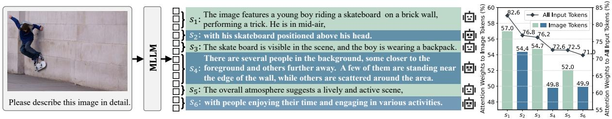  
Figure 1: An example illustrating that hallucinatory outputs occur with attention weight reduction to image tokens. The hallucinatory segments are highlighted in bold, i.e., s2, s4 and $s _ { 6 } .$ . The chart on the right shows the mean value of the attention weights to all input tokens versus to image tokens in each segment.

<table><tr><td colspan="5">Segments LLaVA-1.5 InstructBLIP MiniGPT-4 mPLUG-Owl</td></tr><tr><td>w/o halluc.</td><td>12.0</td><td>79.2</td><td>40.2</td><td>59.8</td></tr><tr><td>w/ halluc.</td><td>10.9</td><td>74.8</td><td>37.7</td><td>56.0</td></tr></table>

Table 1: The average attention weights (%) of output tokens in segments w/o or w/ hallucinations to image tokens.

In this paper, we first investigate the interaction between output and input image tokens and their correlation with hallucination in MLLMs. A typical MLLM architecture consists of a vision encoder, a vision-language alignment connector, and an LLM. The connector transforms the output embedding from the vision encoder into image tokens, aligning them with text tokens. Then the aligned image and text tokens are input into the LLM to generate output tokens. Intuitively, the attention weights during the LLM’s decoding procedure should accurately reflect such interaction between the output tokens and the input image tokens. Therefore, we conduct experiments to explore the relationship between the attention weights of output tokens to input image tokens and hallucinatory outputs. Take the example in Figure 1 for instance, for a description generated for an image, we highlight hallucinatory segments, i.e., s2, s4, and $s _ { 6 }$ . We calculate the mean value of the output tokens’ attention weights to image tokens in each segment. Figure 1 shows that tokens in hallucinatory segments exhibit significantly lower attention weights to image tokens than those in non-hallucinatory segments. Given that the output tokens’ attention weights to all input tokens (including image and text tokens) decrease as the output length increases, this observation is even more pronounced. Specifically, output tokens in hallucinatory segments, i.e., s2 and $s _ { 4 }$ , show less attention to image tokens compared to subsequent tokens in non-hallucinatory segments, i.e., s3 and $s _ { 5 } .$ . Furthermore, we extend our experiments to verify our findings in descriptions generated by different MLLMs for 100 randomly selected images. Table 1 statistically indicates that the attention weights of output tokens in hallucinatory segments to image tokens are significantly lower than those in non-hallucinatory segments. This finding provides a novel insight from the internal attention perspective, revealing that the hallucinatory segments in MLLMs are correlated with the reduction of attention weights to image tokens. Therefore, we pose a question: How can we leverage such correlation and attention differentiation to enhance the mitigation ofhallucinations?

Motivated by the observation, we advocate mitigating the hallucinations of MLLMs by exploiting the attention to image tokens from the model’s internal representations. Our method, image Token attention-guided Decoding (iTaD), leverages the inherent layer-level progression of MLLMs to extract and highlight the progression of output tokens’ attention to image tokens, engaging the MLLMs with a more powerful capability of image understanding so as to enhance the mitigation of hallucination. Specifically, we construct an image Token attention Vector (iTaV) for each decoding layer and establish a distance metric between two iTaVs. The metric is designed to quantify the difference in output tokens’ attention to image tokens across different decoding layers. Then iTaD selects the layer whose corresponding iTaV is the most distant from that of the last layer and projects the selected layer’s output internal representation into a probability distribution. Based on this layer selection strategy, we conduct inter-layer contrastive decoding, thereby highlighting the progression of attention to image tokens. The experiments show that our simple but effective improvement exhibits better performance compared to the original output distribution in the MLLM hallucination benchmarks.

In summary, our contributions are as follows:

1. We observe that hallucinations often occur with output tokens’ attention reduction to image tokens, and propose an iTaD method, which leverages MLLMs’ internal representations and exploits the attention to image tokens to mitigate their hallucinations.

2. To implement iTaD, we introduce a novel intermediate layer selection strategy for interlayer contrastive decoding, which utilizes $i T a V$ to measure the inter-layer difference in image understanding and selects the intermediate layer whose $i T a V$ is the most distant from that of the last layer, thereby extracting and highlighting the progression of image understanding in MLLMs.

3. We conduct extensive experiments across different models and hallucination benchmarks. The results show that iTaD achieves state-ofthe-art performance, well demonstrating its effectiveness and superiority over baselines.

## 2 Method

In this section, we first briefly introduce inter-layer contrastive decoding, and then detail the proposed method iTaD.

## 2.1 Inter-Layer Contrastive Decoding Process

Given the image-text input, we can obtain the aligned sequence of image and text tokens, denoted as $\mathbf { \bar { h } } ^ { 0 } = \{ \bar { h _ { 1 } ^ { 0 } } , h _ { 2 } ^ { 0 } , \dots , h _ { L } ^ { 0 } \}$ , where L represents the length of the input tokens. $ { \mathbf { h } } ^ { 0 }$ can be directly input into the LLM to generate a response. Specifically, the LLM decodes $ { \mathbf { h } } ^ { 0 }$ through successive layers, each consisting of a multi-head attention (MHA) mechanism (Vaswani et al., 2017) and a multilayer perceptron (MLP). Assuming the LLM is composed of N layers, with $ { \mathbf { h } } ^ { 0 }$ as the hidden state input to the first layer, for each position t:

$$
h _ { t } ^ { n } = \mathbf { M L P } ( \mathbf { M H A } ( h _ { t } ^ { n - 1 } ) ) , \quad n = 1 , 2 , \ldots , N .\tag{1}
$$

Following this pattern, we obtain $h _ { t } ^ { N }$ , which is then projected into a -dimensional space through a linear projection layer, i.e., Proj( ).  denotes the vocabulary. Finally, the softmax function transforms the projection into a probability distribution for predicting the next token:

$$
p _ { N } ( x _ { t + 1 } | x _ { < t + 1 } ) = s \circ \mathsf { f t m a x } ( \mathsf { P r o j } ( h _ { t } ^ { N } ) ) ,\tag{2}
$$

where $x _ { t + 1 } \in \mathcal { V } .$

Inter-layer contrastive decoding, represented by DoLa (Chuang et al., 2024), adopts the early exit mechanism (Teerapittayanon et al., 2016), which utilizes the projection function Proj( ) in Eq. (2) to transform $h _ { t } ^ { \dot { M } }$ into a probability distribution:

$$
p _ { M } ( x _ { t + 1 } | x _ { < t + 1 } ) = s \mathsf { o f t m a x } ( \mathsf { P r o j } ( h _ { t } ^ { M } ) ) ,\tag{3}
$$

where $x _ { t + 1 } \in \mathcal { V }$ and $M \in [ 0 , N )$ . M represents the selected intermediate layer. Then it subtracts the distribution $p _ { M }$ from the original model’s output distribution, i.e., $p _ { N }$ in Eq. (2), on the logit scale, and applies the softmax function to transform it into a probability distribution, as follows:

$$
\begin{array} { r l } {  { \hat { p } ( \boldsymbol { x } _ { t + 1 } | \boldsymbol { x } _ { < t + 1 } ) = } } \\ & { \quad \mathsf { s o f t m a x } ( \mathbb { I } ( \boldsymbol { x } _ { t + 1 } ) \cdot \log \frac { p _ { N } ( \boldsymbol { x } _ { t + 1 } | \boldsymbol { x } _ { < t + 1 } ) } { p _ { M } ( \boldsymbol { x } _ { t + 1 } | \boldsymbol { x } _ { < t + 1 } ) } ) , } \end{array}\tag{4}
$$

where

$$
\mathbb { I } ( x _ { t + 1 } ) = \left\{ { \begin{array} { l l } { 1 } & { { \mathrm { i f ~ } } x _ { t + 1 } \in { \mathcal { C } } _ { t + 1 } , } \\ { - \infty } & { { \mathrm { o t h e r w i s e } } , } \end{array} } \right.\tag{5}
$$

$$
\begin{array} { r l } {  { \mathcal { C } _ { t + 1 } = \{ x _ { t + 1 } \in \mathcal { V } : } } \\ & { \quad p _ { N } ( x _ { t + 1 } ) \geq \alpha \operatorname* { m a x } _ { x _ { t + 1 } ^ { \prime } \in \mathcal { V } } p _ { N } ( x _ { t + 1 } ^ { ' } ) \} . } \end{array}\tag{6}
$$

The constraint function $\mathcal { C } _ { t + 1 }$ and its penalized indicator function $\mathbb { I } ( x _ { t + 1 } )$ are introduced to avoid false positive cases, as illustrated in CD (Li et al., 2023d). $\mathcal { C } _ { t + 1 }$ ensures that the probability of tokens generated are at least α times the maximum token probability in $p _ { N }$ , where α ranges from 0 to 1. Eq. (4) penalizes tokens that violate $\mathcal { C } _ { t + 1 }$ and sets their probability to 0 while maintaining the values for all others.

## 2.2 iTaV’s Construction and Distance Measurement

We focus on the attention weights of MHA in Eq. (1) at each step t in the n-th decoding layer for the head h:

$$
\begin{array} { r } { \mathbf w _ { t , h } ^ { n } = [ w _ { t , h , 1 } ^ { n } , w _ { t , h , 2 } ^ { n } , . . . , w _ { t , h , l _ { t } } ^ { n } ] } \\ { = \mathsf s o f \mathsf { t m a x } \left( \frac { Q _ { t , h } ^ { n } K _ { t , h } ^ { n } } { \sqrt { d _ { k } } } \right) , } \end{array}\tag{7}
$$

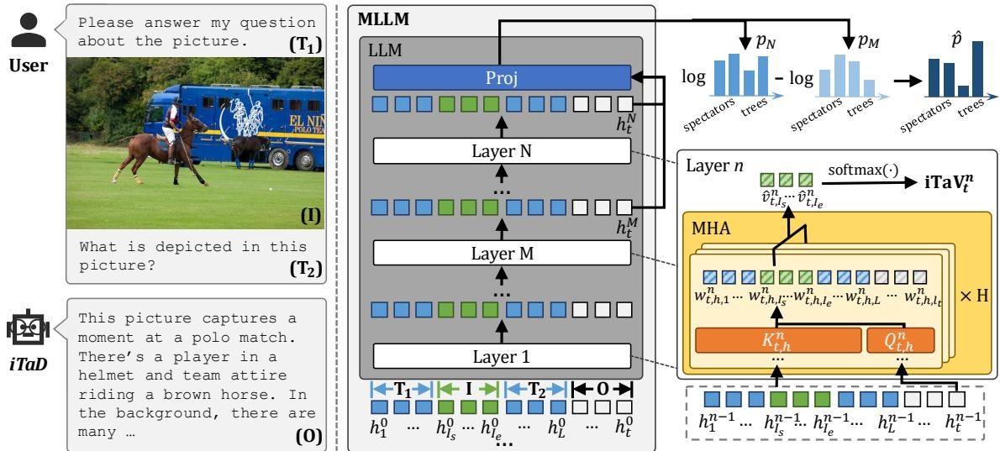  
Figure 2: A pipeline of our method. We first obtain iTaV for each layer and then select the layer M whose corresponding iTaV is the most distant from that of the last layer N. Then we derive the final output distribution $\hat { p }$ based on p and $p _ { M } .$ . As shown in the figure, pˆ predicts the correct token “trees” with the highest probability, whereas $p _ { N }$ assigns the highest probability to the plausible but factually incorrect token “spectators”.

where $Q _ { t , h } ^ { n } , K _ { t , h } ^ { n }$ , and $d _ { k }$ represent the corresponding query, key matrices, and the dimension of their product, respectively. $l _ { t }$ denotes the length of the sequence $K _ { t , h } ^ { n } , i . e .$ , the total length of the input and output token sequence. $\mathbf { w } _ { t , h } ^ { n }$ includes attention weights from the query $Q _ { t , h } ^ { n }$ to each token, ranging from the 1st to the lt-th position, and meets the condition $\Sigma _ { j = 1 } ^ { l _ { t } } w _ { t , h , j } ^ { n } = 1$ . Given that the maximum weight in multi-head attention usually indicates the strong confidence of models (Huang et al., 2024), we select it for each step:

$$
\hat { v } _ { t , j } ^ { n } = \operatorname* { m a x } _ { h = 1 , 2 , . . . , H } w _ { t , h , j } ^ { n } , \quad j = 1 , 2 , . . . , l _ { t } ,\tag{8}
$$

where H indicates the number of attention heads.

Assuming the image tokens span positions from $I _ { s }$ to $I _ { e }$ , we select their corresponding attention weights $\hat { v } _ { t , j } ^ { n }$ and normalize them using the softmax function. Then, for the n-th decoding layer, the image token attention vector, i.e., iTaV, at step t can be derived as:

$$
\mathbf { i } \mathbf { T a } \mathbf { V } _ { t } ^ { n } = s _ { 0 } \mathsf { f t m a x } \bigl ( \bigl [ \hat { v } _ { t , I _ { s } } ^ { n } , \hat { v } _ { t , I _ { s } + 1 } ^ { n } , . . . , \hat { v } _ { t , I _ { e } } ^ { n } \bigr ] \bigr ) .\tag{9}
$$

iTaV represents the attention weight distribution to image tokens. Thus, we use it to estimate the difference in image understanding across different layers by measuring the distance between their corresponding iTaVs using Jensen-Shannon Divergence (JSD) (Menéndez et al., 1997):

$$
\mathrm { d i s t } ( \mathbf { i } \mathbf { T a } \mathbf { V } _ { t } ^ { i } , \mathbf { i } \mathbf { T a } \mathbf { V } _ { t } ^ { j } ) = \mathbf { J } \mathbf { S } \mathbf { D } ( \mathbf { i } \mathbf { T a } \mathbf { V } _ { t } ^ { i } | | \mathbf { i } \mathbf { T a } \mathbf { V } _ { t } ^ { j } ) .\tag{10}
$$

## 2.3 Image Token Attention-Guided Decoding

Inter-layer contrastive decoding leverages the incremental improvement of LLMs’ internal representations as inputs propagate through layers, and we observe that MLLMs’ hallucinatory outputs often occur with attention weight reduction to image tokens. Building on this insight, we propose a novel layer selection strategy for inter-layer contrastive decoding. Our method, i.e., iTaD, is designed to extract and highlight the incremental improvements in image understanding between layers, thereby effectively empowering inter-layer contrastive decoding to mitigate hallucinations.

Specifically, we select the target intermediate layer, i.e. M in Eq. (3), by maximizing the distance between iTa $V _ { t } ^ { N }$ and $\mathbf { i } \mathbf { T a V } _ { t } ^ { m }$ for each step t:

$$
M = \operatorname* { m a x } _ { j \in \mathcal { M } } \operatorname { d i s t } ( \mathbf { i T a V } _ { t } ^ { j } , \mathbf { i T a V } _ { t } ^ { N } ) .\tag{11}
$$

is a subset of $\mathcal { N } = \{ 1 , 2 , . . . , N - 1 \}$ , and we select M from  for efficiency. We propose that, among the layers in , the hidden state of M, denoted as $h _ { t } ^ { \dot { M } }$ , most effectively highlights the improvement of image attention achieved by $h _ { t } ^ { N }$ . Subsequently, Eq. (4) explicitly extracts such improvement in image understanding in the last layer’s hidden state output compared to the hidden states from intermediate layers. The selected layer M in our iTaD maximizes the emphasis on this improvement, thereby exploiting attention to image tokens to enhance the final probability distribution $\hat { p }$ and mitigate hallucinations in MLLMs.

<table><tr><td rowspan="3">Method</td><td colspan="4">LLaVA-1.5</td><td colspan="4">InstructBLIP</td><td colspan="4">MiniGPT-4</td><td colspan="4">mPLUG-Owl</td></tr><tr><td> $m a x \_ l = 5 1 2 \ m a x \_ l = 6 4$ </td><td></td><td></td><td></td><td></td><td>max_l = 512 max_l = 64</td><td></td><td></td><td> $m a x \_ l = 5 1 2 \ m a x \_ l = 6 4$ </td><td></td><td></td><td></td><td> $m a x \_ l = 5 1 2 \ m a x \_ l = 6 4$ </td><td></td><td></td><td></td></tr><tr><td>Greedy</td><td>47.8</td><td></td><td></td><td> $C _ { S } \downarrow ~ C _ { I } \downarrow$ </td><td> $C _ { S } \downarrow$ </td><td> $C _ { I } \downarrow$ </td><td> $C _ { S } \downarrow$ </td><td> $C _ { I } \downarrow$ </td><td> $C _ { S } \downarrow C _ { I } \downarrow$ </td><td></td><td> $C _ { S } \downarrow ~ C _ { I } \downarrow$ </td><td></td><td> $C _ { S } \downarrow$ </td><td> $C _ { I } \downarrow$ </td><td> $C _ { S } \downarrow ~ C _ { I } \downarrow$ </td><td></td></tr><tr><td>Nucleus</td><td></td><td>13.7</td><td>20.4</td><td>6.7</td><td>57.3</td><td>23.9</td><td>29.1</td><td>13.5</td><td>31.8</td><td>10.7</td><td>22.0</td><td>7.6</td><td>71.0</td><td>24.8</td><td>33.4</td><td>13.0</td></tr><tr><td>Beam Search 50.0</td><td>52.2</td><td>15.9</td><td>24.9</td><td>8.5</td><td>56.2 56.4</td><td>25.6</td><td>30.2</td><td>14.8</td><td>33.6</td><td>11.2</td><td>23.4</td><td>8.5 7.9</td><td>76.6</td><td>28.1 25.4</td><td>38.1</td><td>16.0 12.1</td></tr><tr><td></td><td></td><td>14.5 13.7</td><td>19.4</td><td>6.3 6.4</td><td>56.4</td><td>16.2 16.1</td><td>23.6 23.8</td><td>8.0 7.8</td><td>33.9 32.5</td><td>10.7</td><td>23.2 23.4</td><td>8.0</td><td>75.8 73.0</td><td>24.7</td><td>31.4 31.8</td><td>12.7</td></tr><tr><td>DoLa OPERA</td><td>47.5</td><td>13.5</td><td>19.3</td><td>6.5</td><td>53.4</td><td>15.3</td><td>24.0</td><td>6.2</td><td>27.8</td><td>10.1</td><td>21.8</td><td>7.7</td><td>73.8</td><td>25.1</td><td></td><td>12.4</td></tr><tr><td></td><td>47.2</td><td>13.4</td><td>19.1</td><td>6.2</td><td>53.2</td><td>14.7</td><td>22.2</td><td>7.5</td><td>26.4</td><td>9.7 9.6</td><td>20.7</td><td>7.5</td><td>70.0</td><td>24.5</td><td>31.1 29.5</td><td></td></tr><tr><td>iTaD</td><td>45.4</td><td></td><td>19.0</td><td></td><td></td><td></td><td></td><td></td><td></td><td></td><td></td><td></td><td></td><td></td><td></td><td>12.4</td></tr></table>

Table 2: Results on the CHAIR benchmark. max\_l is the max output token length. $C _ { S }$ and $C _ { I }$ assess sentenceand image-level hallucinations, with lower values indicating fewer. Best results are bolded and second-best are underlined (same below).

## 3 Experimental Setup

## 3.1 Models and Benchmarks

We select four remarkable MLLMs: LLaVA-1.5 (Liu et al., 2024b), InstructBLIP (Dai et al., 2023), MiniGPT-4 (Zhu et al., 2024), and mPLUG-Owl (Ye et al., 2023). They comprise a 7Bparameter LLaMA (Touvron et al., 2023a) or Vicuna (Chiang et al., 2023; Zheng et al., 2023). LLaVA-1.5 employs a linear projection as the vision-language alignment connector, while the others adopt Q-former (Li et al., 2023b). The number of image tokens for the four models is 576, 32, 32, and 65, respectively.

We employ three commonly used hallucination benchmarks, i.e., CHAIR (Rohrbach et al., 2018), POPE (Li et al., 2023e), and GPT-4V (OpenAI, 2023) assisted evaluation, to comprehensively evaluate the versatility of our method. The benchmarks encompass various task types, including image captioning and visual question answering (VQA), and are designed to evaluate the hallucinations in MLLMs from different perspectives like objects, attributes, positions, etc. The details of these benchmarks can be referred to in the Appendix.

## 3.2 Implementation Details

Our main experiments are conducted on MSCOCO (Lin et al., 2014). For CHAIR and GPT-4V assisted evaluation, we randomly select 500 images from the COCO validation set for evaluation following Huang et al. (2024). Furthermore, we repeat our experiments with different random seeds and report the mean value of the results over 5 runs and 3 runs on the CHAIR and GPT-4V assisted evaluation benchmark, respectively. Prompt details for all benchmarks are in the Appendix.

We compare our method with basic decoding methods: Greedy Search, Nucleus Sampling (Holtzman et al., 2020), and Beam Search (Sutskever et al., 2014). We set $p = 0 . 9$ for Nucleus Sampling and the number of beams to 5 for Beam Search. Additionally, we choose DoLa (Chuang et al., 2024) and OPERA (Huang et al., 2024) as our baselines, which are designed for mitigating hallucinations in LLMs and MLLMs, respectively. Given that OPERA is based on Beam Search, we apply DoLa and our iTaD to Beam Search for fairness. Specifically, following Huang et al. (2024), we adopt the default hyper-parameter settings for OPERA considering its robustness on various settings of hyper-parameters and use 0, 2, 4, 6, 8, 10, 12, 14 as indices for candidate pre-mature layers and 32 for the mature layer in DoLa. Besides, we provide a comparison with VCD (Leng et al., 2024) in the Appendix.

For simplicity, we directly set  to 2, 4, 6, 8, 10, 12, 14 for our iTaD in this paper without additional tuning. Further analysis of is in the Appendix. We select the hyperparameter α by evaluating its performance on the CHAIR benchmark, utilizing an independently sampled subset of 500 images from the COCO validation set. The 500 images ensure no overlap with the test sets across all benchmarks. Finally, we set α to 0.03, 0.05, 0.05, and 0.7 for LLaVA-1.5, InstructBLIP, MiniGPT-4, and mPLUG-Owl, respectively.

## 4 Main Results

## 4.1 Results on CHAIR

Given CHAIR’s sensitivity to sequence length, we set the maximum length of the output tokens to 512 and 64, respectively, for fair comparison. As presented in Table 2, iTaD achieves state-of-theart performance, surpassing baseline methods in nearly all metrics. Besides, it shows consistent effectiveness in generating both long and short responses. The standard deviations of experiments are in the Appendix.

<table><tr><td>Method LLaVA-1.5 InstructBLIP MiniGPT-4 mPLUG-Owl</td></tr><tr><td>Greedy 82.2 80.0 58.5 68.5</td></tr><tr><td>Nucleus 82.5 80.1 57.8 70.1</td></tr><tr><td>Beam Search 84.9 84.4 70.3 69.2</td></tr><tr><td>DoLa 83.2 83.4 72.8 68.8</td></tr><tr><td>OPERA 85.4 84.8 73.3 67.6</td></tr><tr><td>iTaD 85.5 85.2 75.5 72.3</td></tr></table>

Table 3: The average F1 scores  across random, popular and adversarial splits on the POPE benchmark.

<table><tr><td rowspan="2">Method</td><td colspan="6">LLaVA-1.5 InstructBLIP MiniGPT-4 mPLUG-Owl</td></tr><tr><td>C↑ D↑</td><td>C↑ D↑</td><td></td><td>C↑ D↑</td><td>C↑</td><td>D↑</td></tr><tr><td>Beam Search 5.7 iTaD</td><td>5.5 6.8 5.7</td><td>4.9 5.5</td><td>4.5 4.4</td><td>5.4 6.5</td><td>5.1 4.2 5.1 5.2</td><td>4.5 4.6</td></tr><tr><td>Method</td><td colspan="6">LLaVA-1.5 InstructBLIP MiniGPT-4 mPLUG-Owl</td></tr><tr><td></td><td colspan="6">C↑ D↑ C↑ D↑ C↑ D↑ C↑ D↑</td></tr><tr><td>OPERA</td><td>5.4 5.3</td><td>5.0</td><td>4.9</td><td>5.4 5.1</td><td>4.4</td><td>4.3</td></tr><tr><td>iTaD</td><td>5.9 5.3</td><td>5.7</td><td>4.9</td><td>6.7 5.6</td><td>5.0</td><td>4.1</td></tr></table>

Table 4: Results on GPT-4V assisted evaluation. C and D denote concreteness and detailedness; higher is better.

It is observed that the superiority of iTaD is particularly pronounced when the maximum output token length is set to 512. In this setting, iTaD consistently exhibits the lowest $C _ { S }$ and $C _ { I }$ across all four MLLMs. The experimental results demonstrate that iTaD excels specifically in mitigating hallucinations within lengthy sequences.

## 4.2 Results on POPE

For the POPE benchmark, we report the average F1 scores across random, popular, and adversarial splits. For mPLUG-Owl, we replicate the baseline methods and present our reproduction results. For all other models, we report the baseline results as presented in OPERA. The model temperature is set to 1 by default, following OPERA.

As shown in Table 3, iTaD consistently outperforms the other methods across all four models, well demonstrating its effectiveness and superiority. It is important to note that POPE typically elicits responses beginning with Yes or No, which generally have limited semantic information. And iTaD’s effectiveness primarily lies on the single token Yes or No, which is limited and leads to smaller performance gains. Nonetheless, our iTaD still yields consistent and considerable improvements for POPE across different models. More experiment details on A-OKVQA (Schwenk et al., 2022) and GQA (Hudson and Manning, 2019) can be found in the Appendix.

## 4.3 Results on GPT-4V Assisted Evaluation

Table 4 presents the results from the GPT-4V assisted evaluation. In this benchmark, we input image descriptions to GPT-4V from 2 different decoding methods each time. Table 4 shows the comparison results between Beam Search/OPERA and iTaD, respectively. It is observed that iTaD, while maintaining the detailedness of the response, significantly enhances its correctness.

Notably, GPT-4V can evaluate the attribute, location, and relation hallucinations of objects. The superior performance of iTaD on the GPT-4V correctness score demonstrates its capability to mitigate such kinds of hallucinations. Besides, considering that the more detailed responses generated by Beam Search and OPERA exhibit hallucinations and showcase lower correctness scores, $i T a D ' s$ slight or even negligible decrease in the detailedness score compared to those methods is reasonable and does not affect the overall quality of the output. Given GPT-4V’s human-like perception and reasoning capabilities, the results indicate that iTaD can effectively mitigate hallucinations as perceived by humans.

## 5 Analysis

## 5.1 Ablation Studies on iTaV

In this subsection, we investigate the performance of iTaV’s variations. Table 5 shows our iTaV and its five variations, which differ in the concatenation of attention weights to specific tokens, i.e., the input to the softmax function in Eq. (9). Our proposed iTaV selects the attention weights to only image tokens, i.e., (f) in Table 5, while the five variations select attention weights to only input text tokens, all text tokens, only input tokens, only output tokens, and all input and output tokens, respectively.

Table 5 shows that the proposed iTaV, i.e., (f), achieves the best overall performance. While certain variations may outperform ours on a few metrics, their effectiveness tends to fluctuate unpredictably across different models. In contrast, our iTaV consistently delivers superior results across different models. Notably, we observe that selecting attention weights to only output tokens, i.e., (d), results in the poorest overall performance among all five variations. It can be attributed to its overemphasis on self-generated tokens during the generation procedure, which has a negligible and even negative effect in mitigating hallucinatory outputs that are unfaithful to the input. Overall, selecting attention weights to image tokens to construct iTaV is crucial for the success of $i T a D ,$ and the experimental results further validate the rationale behind our definition of iTaV.

�!!,#\$ �!!,%!\$ … …. �!!,&\$ �!!,'#\$
<table><tr><td rowspan=2 colspan=2>   (a) only input text tokens         (b) all text tokens(d) only output (text) tokens   (e) all tokens            (f) only image tokens (ours)</td></tr><tr><td rowspan=1 colspan=1></td><td rowspan=1 colspan=1></td></tr><tr><td></td><td rowspan=1 colspan=1>LLaVA-1.5 InstructBLIP $\mathbf { i T a V } _ { t } ^ { n } = s \mathsf { o f t m a x } ( \cdot )$  $\mathrm { \bar { A } v g . \downarrow }$  $C _ { S }$ ↓CI↓ $C _ { S }$  $\downarrow C _ { I }$ ↓</td></tr><tr><td rowspan=6 colspan=2>0 $\mathrm { a } ) \bigl [ \hat { v } _ { t , 1 } ^ { n } , . . . , \hat { v } _ { t , I _ { s } - 1 } ^ { n } , \hat { v } _ { t , I _ { e } + 1 } ^ { n } , . . . , \hat { v } _ { t , L } ^ { n } \bigr ]$ 46.5 13.5 54.115.1 $( \mathbf { b } ) \big [ \hat { v } _ { t , 1 } ^ { n } , . . . , \hat { v } _ { t , I _ { s } - 1 } ^ { n } , \hat { v } _ { t , I _ { e } + 1 } ^ { n } , . . . , \hat { v } _ { t , l _ { t } } ^ { n } \big ] 4 5 . 5$  13.6 53.314.8 $( \mathbf { c } ) [ \widehat { v } _ { t , 1 } ^ { n } , . . . , \widehat { v } _ { t , L } ^ { n } ]$                    46.3 13.7 53.414.6(d) $[ \hat { v } _ { t , L + 1 } ^ { n } , . . . , \hat { v } _ { t , l _ { t } } ^ { n } ]$                 47.4 14.0 54.315.5(e) $[ \hat { v } _ { t , 1 } ^ { n } , . . . , \hat { v } _ { t , l _ { t } } ^ { n } ]$                    46.2 13.2 53.814.8(f) $\left[ \hat { v } _ { t , I _ { s } } ^ { n } , . . . , \hat { v } _ { t , I _ { e } } ^ { n } \right] ( o u r s )$            45.4 13.4 53.214.7</td></tr><tr><td rowspan=1 colspan=1>31.8</td></tr><tr><td rowspan=1 colspan=1>32.0</td></tr><tr><td rowspan=1 colspan=1>32.8</td></tr><tr><td rowspan=1 colspan=1>32.0</td></tr><tr><td rowspan=1 colspan=1>31.7</td></tr></table>

Table 5: Ablation studies on iTaV. The column $\operatorname { A v g } .$ displays the average of $C _ { S }$ and $C _ { I }$ on LLaVA-1.5 and InstructBLIP. L represents the length of the input tokens.

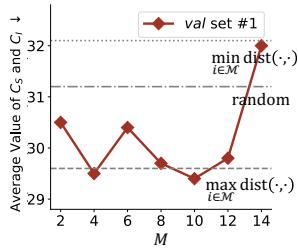

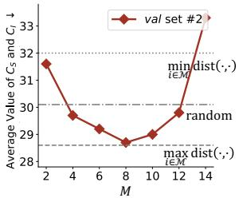  
Figure 3: Ablation studies on the intermediate layer M for constructing ${ \hat { p } } .$ We report the average value of $C _ { S }$ and $C _ { I }$ on $^ 2$ distinct validation sets. The original $\mathrm { L L a V A } { - } 1 . 5$ achieves 31.9 on set #1 and 32.2 on set #2, respectively.

## 5.2 Ablation Studies on the Selection of M

Figure 3 shows the ablation studies on M by selecting different layers to construct ${ \hat { p } } .$ Following Chuang et al. (2024) and Huang et al. (2024), we use LLaVA-1.5 on 2 distinct validation sets, each with 500 randomly selected images from the COCO validation set. Given the candidate set in Eq. (11), we set M statically to each layer in $\mathcal { M } .$ , respectively. Besides, we test the performance of three dynamical selection strategies for M, i.e. (1) randomly selecting from M, (2) setting M to $\begin{array} { r l } { { \operatorname* { m i n } } _ { j \in \mathcal { M } } { \operatorname { d i s t } } ( \mathbf { i T a V } _ { t } ^ { j } , \mathbf { i T a V } _ { t } ^ { N } ) } & { { } } \end{array}$ , and (3) setting M to $\scriptstyle \operatorname* { m a x } _ { j \in \mathcal { M } } \mathrm { d i s t } ( \mathbf { i T a V } _ { t } ^ { j } , \mathbf { i T a V } _ { t } ^ { N } )$ (adopted in our method).

<table><tr><td>Model</td><td>Beam Search</td><td>OPERA</td><td>iTaD</td></tr><tr><td>MiniGPT-4</td><td>745.9</td><td>757.4</td><td>772.3</td></tr><tr><td>mPLUG-Owl</td><td>1189.4</td><td>1175.0</td><td>1259.7</td></tr></table>

Table 6: Results on the MME benchmark. We report MME scores, with higher scores indicating fewer hallucinations.

Figure 3 shows that the model’s performance varies when we set M statically to different layers in . Although some specific layers can yield better performance compared to the dynamic layer ma $\zeta _ { j \in \mathcal { M } }$ dist $( \cdot , \cdot )$ on one validation set, their performance is sensitive to the data distribution. For example, layer 4 and layer 8 achieve superior results on the val set #1 but exhibit limited performance on the val set #2, where layer 6 shows the best performance among all the static layers. On the contrary, our dynamic selection method, represented by $\mathrm { m a x } _ { j \in \mathcal { M } } \mathrm { d i s t } ( \cdot , \cdot )$ , is robust to the data distribution and shows consistently superior performance across different validation sets. Additionally, the performance of setting M to $\mathrm { m i n } _ { j \in \mathcal { M } } \mathrm { d i s t } ( \cdot , \cdot )$ performs the worst compared to the other two dynamic strategies. It well demonstrates the reasonableness of our selection strategy in Eq. (11), which highlights the last layer’s improvement of image understanding compared to the intermediate layers, thereby significantly mitigating the attention reduction to image tokens.

## 5.3 Cross-Dataset and Other Benchmark Validation

To validate the generalizability of $i T a D ,$ we conduct extensive experiments across different benchmarks, i.e., MME (Fu et al., 2023) and GPT-4 assisted hallucination evaluation (Zhao et al., 2023), and different datasets, i.e., the official MME dataset and VG-100K (Krishna et al., 2017) (for GPT-4 assisted hallucination evaluation). Details on these benchmarks and datasets are in the Appendix.

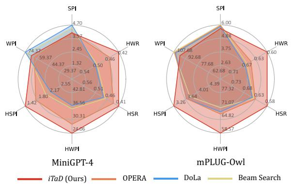

Figure 4: Results on GPT-4 assisted evaluation. Lower HSPI, HWPI, HSR, or HWR indicate fewer hallucinations.
<table><tr><td rowspan="2">Dataset</td><td colspan="2">MiniGPT-4</td><td rowspan="2">Dataset</td><td colspan="3">mPLUG-Owl</td></tr><tr><td>0.03</td><td>0.04 0.05</td><td></td><td>0.6 0.7</td><td>0.8</td></tr><tr><td>val set #1</td><td>27.6</td><td>25.5 24.6</td><td>val set #1</td><td>72.7</td><td>72.6</td><td>74.0</td></tr><tr><td>val set #2</td><td>28.0</td><td>27.4 27.2</td><td>val set #2</td><td>71.2</td><td>67.0</td><td>72.4</td></tr><tr><td>val set #3</td><td>24.4</td><td>23.6 22.8</td><td>val set #3</td><td>70.9</td><td>70.0</td><td>71.7</td></tr></table>

Table 7: The robustness of the selected α. We present the $C _ { S }$ results for different α values on 3 distinct validation sets.

Table 6 demonstrates the effectiveness of iTaD on the MME benchmark, while OPERA occasionally shows a decrease in performance compared to Beam Search. Figure 4 shows that iTaD generates fewer hallucinatory sentences or words compared to baseline methods. Specifically, it achieves up to 6.4% improvement in HSR on MiniGPT-4 over OPERA, and about 10.7% enhancement in HWR on mPLUG-Owl over DoLa. Although iTaD slightly reduces MLLMs’ output sequence length, i.e., SPI and WPI, it can be attributed to the reduction of additional hallucinatory content and does not compromise the output quality. The experiments in this section span diverse benchmarks and datasets, demonstrating iTaD’s robust and consistent effectiveness across various scenarios. Moreover, these results highlight iTaD’s promising potential for a wide range of applications.

## 5.4 Selection of Hyper-Parameter α

To investigate the robustness of the selected α for different data distributions, we repeat experiments on 3 validation sets, as shown in Table 7. Following Huang et al. (2024), each set includes 500 images randomly selected from the COCO validation set.

The selected α values of 0.05 for MiniGPT-4 and 0.7 for mPLUG-Owl consistently yield superior performance across validation sets. Moreover, the relative effectiveness of hyper-parameters on one set generally indicates their performance on other sets. For example, iTaD performs better on MiniGPT-4 with α = 0.4 compared to 0.03 across all sets. Although the optimal α might vary by model, the results indicate that it can be effectively selected using a small set with 500 images randomly selected from the COCO validation set, as illustrated in the implementation details.

<table><tr><td>Method</td><td>Beam Search</td><td>OPERA</td><td>iTaD</td></tr><tr><td>LLaVA-1.5</td><td>56.0 (×1.00)</td><td>283.4 (×5.06)</td><td>60.7 (×1.08)</td></tr><tr><td>InstructBLIP</td><td>33.2 (×1.00)</td><td>190.1 (×5.73)</td><td>37.7 (×1.12)</td></tr><tr><td>MiniGPT-4</td><td>34.3 (×1.00)</td><td>206.6 (×6.02)</td><td>39.6 (×1.15)</td></tr><tr><td></td><td>mPLUG-Owl 33.7 (×1.00)</td><td>200.1 (×5.94)</td><td>39.8 (×1.18)</td></tr></table>

Table 8: Inference latency (milliseconds per token).
<table><tr><td colspan="5">Method LLaVA-1.5 InstructBLIP MiniGPT-4 mPLUG-Owl</td></tr><tr><td>Beam Search</td><td>72.5</td><td>64.5</td><td>69.4</td><td>57.7</td></tr><tr><td>OPERA iTaD</td><td>72.4 75.2</td><td>64.6 62.9</td><td>70.3 73.9</td><td>58.4 60.2</td></tr><tr><td></td><td></td><td></td><td></td><td></td></tr><tr><td>Method</td><td colspan="4">LLaVA-1.5 InstructBLIP MiniGPT-4 mPLUG-Owl</td></tr><tr><td>Beam Search</td><td>96.7</td><td>91.5</td><td>95.4</td><td>87.3</td></tr><tr><td>OPERA</td><td>96.9</td><td>91.8</td><td>95.5</td><td>87.8</td></tr><tr><td>iTaD</td><td>97.2</td><td>90.6</td><td>96.4</td><td>89.6</td></tr></table>

Table 9: Results on 1-gram and 2-gram fluency. The results in the upper and lower tables correspond to 1- gram and 2-gram fluency, respectively.

## 5.5 Latency

In Table 8, we evaluate the impact of iTaD on decoding latency, comparing it to OPERA on NVIDIA A40 GPUs. It is observed that iTaD increases the inference latency by a factor of 1.08 to 1.18, whereas OPERA results in a multiple-fold increase. These findings demonstrate that our method can mitigate hallucinations with only minimal and even a negligible increase in inference latency compared to OPERA. Furthermore, we analyze the latency-performance trade-off in the Appendix.

## 5.6 Text Quality Analysis

Following HA-DPO (Zhao et al., 2023), we calculate 1-gram and 2-gram fluency as repetition metrics, where higher values indicate less repetitive generation. As shown in Table 9, the impact of iTaD on 1-gram and 2-gram fluency varies across models but does not lead to a significant increase in repetition. In most cases, it reduces repetitive generation. Additionally, the CHAIR evaluation script calculates recall values, which we summarize in Table 10. We observe that iTaD generally maintains recall comparable to or even higher than the original Beam Search. These experimental results demonstrate that iTaD can mitigate hallucinations in MLLMs while preserving the quality of the output text. More qualitative and text quality analysis can be referred to in the Appendix.

<table><tr><td colspan="5">Method LLaVA-1.5 InstructBLIP MiniGPT-4 mPLUG-Owl</td></tr><tr><td>Beam Search</td><td>79.2</td><td>75.3</td><td>58.9</td><td>69.3</td></tr><tr><td>OPERA</td><td>78.4</td><td>74.8</td><td>57.8</td><td>72.9</td></tr><tr><td>iTaD</td><td>78.9</td><td>75.4</td><td>58.9</td><td>73.4</td></tr></table>

Table 10: The recall metric on the CHAIR benchmark.

## 6 Conclusion and Future Work

In this paper, we introduce iTaD, a plug-and-play method to mitigate hallucinations in MLLMs. iTaD is motivated by the observation that hallucinatory outputs in MLLMs typically occur with attention reduction to image tokens. To address this, we first define the image token attention vector (iTaV) to measure the distance in image understanding across different layers. Then we leverage the inherent layer-level progression of MLLMs to extract and highlight the improvement in image understanding and derive the output token distribution $\hat { p } ,$ thus exploiting the attention to image tokens to mitigate hallucinations. Extensive experiments demonstrate that iTaD achieves state-of-the-art results and consistently exhibits superior performance across different models, datasets, and benchmarks. This paper focuses on hallucinations in visual and language modalities, where most research has concentrated. Our future work will explore hallucinations in other modalities, such as video and audio. Given the complexity of their origins, further research is critical for a more thorough understanding of the underlying causes.

## Limitations

The proposed iTaD is predominantly empirical, presenting a solution to mitigate hallucination by employing attention to image tokens. While its effectiveness has been extensively demonstrated, a thorough investigation into the underlying causes of the attention reduction to image tokens has not yet been conducted. We believe that future work should focus on exploring the intrinsic mechanisms behind this attention misalignment during large model pre-training or fine-tuning processes and developing techniques to address this issue, which would be a valuable contribution to the field. Additionally, this work explores attention to all image tokens collectively, without investigating the differences in attention across image regions under varying contexts. Future research could conduct a more detailed investigation into the variations in attention to specific image tokens as influenced by the context, and its relation with hallucinatory output.

## Acknowledgment

This work was supported by National Natural Science Foundation of China (Nos. 62441235, 62271281, 62021002). It was also supported by Tsinghua University - Beijing Jingdong Century Trading Co., Ltd. Joint Research Center for Smart Retail Technology.

## References

Jinze Bai, Shuai Bai, Shusheng Yang, Shijie Wang, Sinan Tan, Peng Wang, Junyang Lin, Chang Zhou, and Jingren Zhou. 2023. Qwen-vl: A frontier large vision-language model with versatile abilities. CoRR, abs/2308.12966.

Hui Chen, Guiguang Ding, Zijia Lin, Sicheng Zhao, and Jungong Han. 2018. Show, observe and tell: Attribute-driven attention model for image captioning. In Proceedings of the Twenty-Seventh International Joint Conference on Artificial Intelligence, IJCAI 2018, July 13-19, 2018, Stockholm, Sweden, pages 606–612. ijcai.org.

Long Chen, Oleg Sinavski, Jan Hünermann, Alice Karnsund, Andrew James Willmott, Danny Birch, Daniel Maund, and Jamie Shotton. 2024. Driving with llms: Fusing object-level vector modality for explainable autonomous driving. In IEEE International Conference on Robotics and Automation, ICRA 2024, Yokohama, Japan, May 13-17, 2024, pages 14093–14100. IEEE.

Wei-Lin Chiang, Zhuohan Li, Zi Lin, Ying Sheng, Zhanghao Wu, Hao Zhang, Lianmin Zheng, Siyuan Zhuang, Yonghao Zhuang, Joseph E. Gonzalez, Ion Stoica, and Eric P. Xing. 2023. Vicuna: An opensource chatbot impressing gpt-4 with 90%\* chatgpt quality.

Yung-Sung Chuang, Yujia Xie, Hongyin Luo, Yoon Kim, James R. Glass, and Pengcheng He. 2024. Dola: Decoding by contrasting layers improves factuality in large language models. In The Twelfth International Conference on Learning Representations, ICLR 2024, Vienna, Austria, May 7-11, 2024. OpenReview.net.

Wenliang Dai, Junnan Li, Dongxu Li, Anthony Meng Huat Tiong, Junqi Zhao, Weisheng Wang, Boyang Li, Pascale Fung, and Steven C. H. Hoi. 2023. Instructblip: Towards general-purpose visionlanguage models with instruction tuning. In Advances in Neural Information Processing Systems 36: Annual Conference on Neural Information Processing Systems 2023, NeurIPS 2023, New Orleans, LA, USA, December 10 - 16, 2023.

Alessandro Favero, Luca Zancato, Matthew Trager, Siddharth Choudhary, Pramuditha Perera, Alessandro Achille, Ashwin Swaminathan, and Stefano Soatto. 2024. Multi-modal hallucination control by visual information grounding. In IEEE/CVF Conference on Computer Vision and Pattern Recognition, CVPR 2024, Seattle, WA, USA, June 16-22, 2024, pages 14303–14312. IEEE.

Chaoyou Fu, Peixian Chen, Yunhang Shen, Yulei Qin, Mengdan Zhang, Xu Lin, Zhenyu Qiu, Wei Lin, Jinrui Yang, Xiawu Zheng, Ke Li, Xing Sun, and Rongrong Ji. 2023. MME: A comprehensive evaluation benchmark for multimodal large language models. CoRR, abs/2306.13394.

Ariel Gera, Roni Friedman, Ofir Arviv, Chulaka Gunasekara, Benjamin Sznajder, Noam Slonim, and Eyal Shnarch. 2023. The benefits of bad advice: Autocontrastive decoding across model layers. In Proceedings of the 61st Annual Meeting of the Associationfor Computational Linguistics (Volume 1: Long Papers), ACL 2023, Toronto, Canada, July 9-14, 2023, pages 10406–10420. Association for Computational Linguistics.

Yash Goyal, Tejas Khot, Aishwarya Agrawal, Douglas Summers-Stay, Dhruv Batra, and Devi Parikh. 2019. Making the V in VQA matter: Elevating the role of image understanding in visual question answering. Int. J. Comput. Vis., 127(4):398–414.

Anisha Gunjal, Jihan Yin, and Erhan Bas. 2024. Detecting and preventing hallucinations in large vision language models. In Thirty-Eighth AAAI Conference on Artificial Intelligence, AAAI 2024, Thirty-Sixth Conference on Innovative Applications ofArtificial Intelligence, IAAI 2024, Fourteenth Symposium on Educational Advances in Artificial Intelligence, EAAI 2014, February 20-27, 2024, Vancouver, Canada, pages 18135–18143. AAAI Press.

Ari Holtzman, Jan Buys, Li Du, Maxwell Forbes, and Yejin Choi. 2020. The curious case of neural text degeneration. In 8th International Conference on Learning Representations, ICLR 2020, Addis Ababa, Ethiopia, April 26-30, 2020. OpenReview.net.

Qidong Huang, Xiaoyi Dong, Pan Zhang, Bin Wang, Conghui He, Jiaqi Wang, Dahua Lin, Weiming Zhang, and Nenghai Yu. 2024. OPERA: alleviating hallucination in multi-modal large language models via over-trust penalty and retrospection-allocation. In IEEE/CVF Conference on Computer Vision and Pattern Recognition, CVPR 2024, Seattle, WA, USA, June 16-22, 2024, pages 13418–13427. IEEE.

Drew A. Hudson and Christopher D. Manning. 2019. GQA: A new dataset for real-world visual reasoning and compositional question answering. In IEEE Conference on Computer Vision and Pattern Recognition, CVPR 2019, Long Beach, CA, USA, June 16-20, 2019, pages 6700–6709. Computer Vision Foundation / IEEE.

Ziwei Ji, Nayeon Lee, Rita Frieske, Tiezheng Yu, Dan Su, Yan Xu, Etsuko Ishii, Yejin Bang, Andrea Madotto, and Pascale Fung. 2023a. Survey of hallucination in natural language generation. ACM Comput. Surv., 55(12):248:1–248:38.

Ziwei Ji, Zihan Liu, Nayeon Lee, Tiezheng Yu, Bryan Wilie, Min Zeng, and Pascale Fung. 2023b. RHO: reducing hallucination in open-domain dialogues with knowledge grounding. In Findings ofthe Association for Computational Linguistics: ACL 2023, Toronto, Canada, July 9-14, 2023, pages 4504–4522. Association for Computational Linguistics.

Ranjay Krishna, Yuke Zhu, Oliver Groth, Justin Johnson, Kenji Hata, Joshua Kravitz, Stephanie Chen, Yannis Kalantidis, Li-Jia Li, David A. Shamma, Michael S. Bernstein, and Li Fei-Fei. 2017. Visual genome: Connecting language and vision using crowdsourced dense image annotations. Int. J. Comput. Vis., 123(1):32–73.

Sicong Leng, Hang Zhang, Guanzheng Chen, Xin Li, Shijian Lu, Chunyan Miao, and Lidong Bing. 2024. Mitigating object hallucinations in large visionlanguage models through visual contrastive decoding. In IEEE/CVF Conference on Computer Vision and Pattern Recognition, CVPR 2024, Seattle, WA, USA, June 16-22, 2024, pages 13872–13882. IEEE.

Bo Li, Yuanhan Zhang, Liangyu Chen, Jinghao Wang, Fanyi Pu, Jingkang Yang, Chunyuan Li, and Ziwei Liu. 2023a. MIMIC-IT: multi-modal in-context instruction tuning. CoRR, abs/2306.05425.

Junnan Li, Dongxu Li, Silvio Savarese, and Steven C. H. Hoi. 2023b. BLIP-2: bootstrapping language-image pre-training with frozen image encoders and large language models. In International Conference on Machine Learning, ICML 2023, 23-29 July 2023, Honolulu, Hawaii, USA, volume 202 of Proceedings of Machine Learning Research, pages 19730–19742. PMLR.

Kenneth Li, Oam Patel, Fernanda B. Viégas, Hanspeter Pfister, and Martin Wattenberg. 2023c. Inferencetime intervention: Eliciting truthful answers from a language model. In Advances in Neural Information Processing Systems 36: Annual Conference on Neural Information Processing Systems 2023, NeurIPS 2023, New Orleans, LA, USA, December 10 - 16, 2023.

Xiang Lisa Li, Ari Holtzman, Daniel Fried, Percy Liang, Jason Eisner, Tatsunori Hashimoto, Luke Zettlemoyer, and Mike Lewis. 2023d. Contrastive decoding: Open-ended text generation as optimization. In

Proceedings of the 61st Annual Meeting of the Association for Computational Linguistics (Volume 1: Long Papers), ACL 2023, Toronto, Canada, July 9-14, 2023, pages 12286–12312. Association for Computational Linguistics.

Yifan Li, Yifan Du, Kun Zhou, Jinpeng Wang, Wayne Xin Zhao, and Ji-Rong Wen. 2023e. Evaluating object hallucination in large vision-language models. In Proceedings ofthe 2023 Conference on Empirical Methods in Natural Language Processing, EMNLP 2023, Singapore, December 6-10, 2023, pages 292–305. Association for Computational Linguistics.

Tsung-Yi Lin, Michael Maire, Serge J. Belongie, James Hays, Pietro Perona, Deva Ramanan, Piotr Dollár, and C. Lawrence Zitnick. 2014. Microsoft COCO: common objects in context. In Computer Vision - ECCV 2014 - 13th European Conference, Zurich, Switzerland, September 6-12, 2014, Proceedings, Part V, volume 8693 of Lecture Notes in Computer Science, pages 740–755. Springer.

Fuxiao Liu, Kevin Lin, Linjie Li, Jianfeng Wang, Yaser Yacoob, and Lijuan Wang. 2024a. Mitigating hallucination in large multi-modal models via robust instruction tuning. In The Twelfth International Conference on Learning Representations, ICLR 2024, Vienna, Austria, May 7-11, 2024. OpenReview.net.

Haotian Liu, Chunyuan Li, Yuheng Li, and Yong Jae Lee. 2024b. Improved baselines with visual instruction tuning. In IEEE/CVF Conference on Computer Vision and Pattern Recognition, CVPR 2024, Seattle, WA, USA, June 16-22, 2024, pages 26286–26296. IEEE.

Haotian Liu, Chunyuan Li, Qingyang Wu, and Yong Jae Lee. 2023. Visual instruction tuning. In Advances in Neural Information Processing Systems 36: Annual Conference on Neural Information Processing Systems 2023, NeurIPS 2023, New Orleans, LA, USA, December 10 - 16, 2023.

M.L. Menéndez, J.A. Pardo, L. Pardo, and M.C. Pardo. 1997. The jensen-shannon divergence. Journal of the Franklin Institute, 334(2):307–318.

OpenAI. 2023. GPT-4 technical report. CoRR, abs/2303.08774.

Long Ouyang, Jeffrey Wu, Xu Jiang, Diogo Almeida, Carroll L. Wainwright, Pamela Mishkin, Chong Zhang, Sandhini Agarwal, Katarina Slama, Alex Ray, John Schulman, Jacob Hilton, Fraser Kelton, Luke Miller, Maddie Simens, Amanda Askell, Peter Welinder, Paul F. Christiano, Jan Leike, and Ryan Lowe. 2022. Training language models to follow instructions with human feedback. In Advances in Neural Information Processing Systems 35: Annual Conference on Neural Information Processing Systems 2022, NeurIPS 2022, New Orleans, LA, USA, November 28 - December 9, 2022.

Anna Rohrbach, Lisa Anne Hendricks, Kaylee Burns, Trevor Darrell, and Kate Saenko. 2018. Object hallucination in image captioning. In Proceedings ofthe 2018 Conference on Empirical Methods in Natural Language Processing, Brussels, Belgium, October 31 - November 4, 2018, pages 4035–4045. Association for Computational Linguistics.

Dustin Schwenk, Apoorv Khandelwal, Christopher Clark, Kenneth Marino, and Roozbeh Mottaghi. 2022. A-OKVQA: A benchmark for visual question answering using world knowledge. In Computer Vision - ECCV 2022 - 17th European Conference, Tel Aviv, Israel, October 23-27, 2022, Proceedings, Part VIII, volume 13668 of Lecture Notes in Computer Science, pages 146–162. Springer.

Weijia Shi, Xiaochuang Han, Mike Lewis, Yulia Tsvetkov, Luke Zettlemoyer, and Wen-tau Yih. 2024. Trusting your evidence: Hallucinate less with contextaware decoding. In Proceedings ofthe 2024 Conference of the North American Chapter of the Association for Computational Linguistics: Human Language Technologies: Short Papers, NAACL 2024, Mexico City, Mexico, June 16-21, 2024, pages 783– 791. Association for Computational Linguistics.

Kurt Shuster, Spencer Poff, Moya Chen, Douwe Kiela, and Jason Weston. 2021. Retrieval augmentation reduces hallucination in conversation. In Findings of the Association for Computational Linguistics: EMNLP 2021, Virtual Event / Punta Cana, Dominican Republic, 16-20 November, 2021, pages 3784– 3803. Association for Computational Linguistics.

Ilya Sutskever, Oriol Vinyals, and Quoc V. Le. 2014. Sequence to sequence learning with neural networks. In Advances in Neural Information Processing Systems 27: Annual Conference on Neural Information Processing Systems 2014, December 8-13 2014, Montreal, Quebec, Canada, pages 3104–3112.

Surat Teerapittayanon, Bradley McDanel, and H. T. Kung. 2016. Branchynet: Fast inference via early exiting from deep neural networks. In 23rd International Conference on Pattern Recognition, ICPR 2016, Cancún, Mexico, December 4-8, 2016, pages 2464–2469. IEEE.

Hugo Touvron, Thibaut Lavril, Gautier Izacard, Xavier Martinet, Marie-Anne Lachaux, Timothée Lacroix, Baptiste Rozière, Naman Goyal, Eric Hambro, Faisal Azhar, Aurélien Rodriguez, Armand Joulin, Edouard Grave, and Guillaume Lample. 2023a. Llama: Open and efficient foundation language models. CoRR, abs/2302.13971.

Hugo Touvron, Louis Martin, Kevin Stone, Peter Albert, Amjad Almahairi, Yasmine Babaei, Nikolay Bashlykov, Soumya Batra, Prajjwal Bhargava, Shruti Bhosale, Dan Bikel, Lukas Blecher, Cristian Canton-Ferrer, Moya Chen, Guillem Cucurull, David Esiobu, Jude Fernandes, Jeremy Fu, Wenyin Fu, Brian Fuller, Cynthia Gao, Vedanuj Goswami, Naman Goyal, Anthony Hartshorn, Saghar Hosseini, Rui Hou, Hakan

Inan, Marcin Kardas, Viktor Kerkez, Madian Khabsa, Isabel Kloumann, Artem Korenev, Punit Singh Koura, Marie-Anne Lachaux, Thibaut Lavril, Jenya Lee, Diana Liskovich, Yinghai Lu, Yuning Mao, Xavier Martinet, Todor Mihaylov, Pushkar Mishra, Igor Molybog, Yixin Nie, Andrew Poulton, Jeremy Reizenstein, Rashi Rungta, Kalyan Saladi, Alan Schelten, Ruan Silva, Eric Michael Smith, Ranjan Subramanian, Xiaoqing Ellen Tan, Binh Tang, Ross Taylor, Adina Williams, Jian Xiang Kuan, Puxin Xu, Zheng Yan, Iliyan Zarov, Yuchen Zhang, Angela Fan, Melanie Kambadur, Sharan Narang, Aurélien Rodriguez, Robert Stojnic, Sergey Edunov, and Thomas Scialom. 2023b. Llama 2: Open foundation and fine-tuned chat models. CoRR, abs/2307.09288.

Ashish Vaswani, Noam Shazeer, Niki Parmar, Jakob Uszkoreit, Llion Jones, Aidan N. Gomez, Lukasz Kaiser, and Illia Polosukhin. 2017. Attention is all you need. In Advances in Neural Information Processing Systems 30: Annual Conference on Neural Information Processing Systems 2017, December 4-9, 2017, Long Beach, CA, USA, pages 5998–6008.

Ao Wang, Hui Chen, Lihao Liu, Kai Chen, Zijia Lin, Jungong Han, and Guiguang Ding. 2024a. Yolov10: Real-time end-to-end object detection. CoRR, abs/2405.14458.

Bin Wang, Fan Wu, Xiao Han, Jiahui Peng, Huaping Zhong, Pan Zhang, Xiaoyi Dong, Weijia Li, Wei Li, Jiaqi Wang, and Conghui He. 2024b. VIGC: visual instruction generation and correction. In Thirty-Eighth AAAI Conference on Artificial Intelligence, AAAI 2024, Thirty-Sixth Conference on Innovative Applications of Artificial Intelligence, IAAI 2024, Fourteenth Symposium on Educational Advances in Artificial Intelligence, EAAI 2014, February 20-27, 2024, Vancouver, Canada, pages 5309–5317. AAAI Press.

Jiaqi Wang, Zihao Wu, Yiwei Li, Hanqi Jiang, Peng Shu, Enze Shi, Huawen Hu, Chong Ma, Yiheng Liu, Xuhui Wang, Yincheng Yao, Xuan Liu, Huaqin Zhao, Zhengliang Liu, Haixing Dai, Lin Zhao, Bao Ge, Xiang Li, Tianming Liu, and Shu Zhang. 2024c. Large language models for robotics: Opportunities, challenges, and perspectives. CoRR, abs/2401.04334.

Sheng Wang, Zihao Zhao, Xi Ouyang, Qian Wang, and Dinggang Shen. 2023. Chatcad: Interactive computer-aided diagnosis on medical image using large language models. CoRR, abs/2302.07257.

Xintong Wang, Jingheng Pan, Liang Ding, and Chris Biemann. 2024d. Mitigating hallucinations in large vision-language models with instruction contrastive decoding. In Findings of the Association for Computational Linguistics, ACL 2024, Bangkok, Thailand and virtual meeting, August 11-16, 2024, pages 15840–15853. Association for Computational Linguistics.

Xinhao Xu, Hui Chen, Zijia Lin, Jungong Han, Lixing Gong, Guoxin Wang, Yongjun Bao, and Guiguang

Ding. 2024. Tad: A plug-and-play task-aware decoding method to better adapt llms on downstream tasks. In Proceedings of the Thirty-Third International Joint Conference on Artificial Intelligence, IJ-CAI 2024, Jeju, South Korea, August 3-9, 2024, pages 6587–6596. ijcai.org.

Fan Yang, Xinhao Xu, Hui Chen, Yuchen Guo, Yuwei He, Kai Ni, and Guiguang Ding. 2023. Gpro3d: Deriving 3d bbox from ground plane in monocular 3d object detection. Neurocomputing, 562:126894.

Qinghao Ye, Haiyang Xu, Guohai Xu, Jiabo Ye, Ming Yan, Yiyang Zhou, Junyang Wang, Anwen Hu, Pengcheng Shi, Yaya Shi, Chenliang Li, Yuanhong Xu, Hehong Chen, Junfeng Tian, Qian Qi, Ji Zhang, and Fei Huang. 2023. mplug-owl: Modularization empowers large language models with multimodality. CoRR, abs/2304.14178.

Shukang Yin, Chaoyou Fu, Sirui Zhao, Tong Xu, Hao Wang, Dianbo Sui, Yunhang Shen, Ke Li, Xing Sun, and Enhong Chen. 2023. Woodpecker: Hallucination correction for multimodal large language models. CoRR, abs/2310.16045.

Hang Zhang, Xin Li, and Lidong Bing. 2023a. Videollama: An instruction-tuned audio-visual language model for video understanding. In Proceedings of the 2023 Conference on Empirical Methods in Natural Language Processing, EMNLP 2023 - System Demonstrations, Singapore, December 6-10, 2023, pages 543–553. Association for Computational Linguistics.

Shilong Zhang, Peize Sun, Shoufa Chen, Min Xiao, Wenqi Shao, Wenwei Zhang, Kai Chen, and Ping Luo. 2023b. Gpt4roi: Instruction tuning large language model on region-of-interest. CoRR, abs/2307.03601.

Yue Zhang, Yafu Li, Leyang Cui, Deng Cai, Lemao Liu, Tingchen Fu, Xinting Huang, Enbo Zhao, Yu Zhang, Yulong Chen, Longyue Wang, Anh Tuan Luu, Wei Bi, Freda Shi, and Shuming Shi. 2023c. Siren’s song in the AI ocean: A survey on hallucination in large language models. CoRR, abs/2309.01219.

Zhiyuan Zhao, Bin Wang, Linke Ouyang, Xiaoyi Dong, Jiaqi Wang, and Conghui He. 2023. Beyond hallucinations: Enhancing lvlms through hallucination-aware direct preference optimization. CoRR, abs/2311.16839.

Lianmin Zheng, Wei-Lin Chiang, Ying Sheng, Siyuan Zhuang, Zhanghao Wu, Yonghao Zhuang, Zi Lin, Zhuohan Li, Dacheng Li, Eric P. Xing, Hao Zhang, Joseph E. Gonzalez, and Ion Stoica. 2023. Judging llm-as-a-judge with mt-bench and chatbot arena. In Advances in Neural Information Processing Systems 36: Annual Conference on Neural Information Processing Systems 2023, NeurIPS 2023, New Orleans, LA, USA, December 10 - 16, 2023.

Yiyang Zhou, Chenhang Cui, Jaehong Yoon, Linjun Zhang, Zhun Deng, Chelsea Finn, Mohit Bansal, and Huaxiu Yao. 2024. Analyzing and mitigating object

hallucination in large vision-language models. In The Twelfth International Conference on Learning Representations, ICLR 2024, Vienna, Austria, May $7 . { \dot { I } } I ,$ 2024. OpenReview.net.

Deyao Zhu, Jun Chen, Xiaoqian Shen, Xiang Li, and Mohamed Elhoseiny. 2024. Minigpt-4: Enhancing vision-language understanding with advanced large language models. In The Twelfth International Conference on Learning Representations, ICLR 2024, Vienna, Austria, May 7-11, 2024. OpenReview.net.

## A Related Work

Multi-modal large language models Many efforts to extend LLMs’ capabilities to other modalities have led to the emergence of MLLMs (Zhang et al., 2023a; Bai et al., 2023; Dai et al., 2023; Liu et al., 2024b, 2023; Li et al., 2023a). LLaVA (Liu et al., 2023, 2024b), InstructBLIP (Dai et al., 2023), MiniGPT-4 (Zhu et al., 2024), and mPLUG-Owl (Ye et al., 2023) are four representative MLLMs. They have significant differences in the training data, fine-tuning parameters, and the particular designs of the visual encoders and connectors. We conduct experiments on all four models to demonstrate the consistent effectiveness of iTaD.

Hallucinations in large models “Hallucination" is primarily defined by the NLP community, which refers to the models’ outputs that are plausible but incorrect or nonsensical (Ji et al., 2023a; Zhang et al., 2023c). Many works mitigating hallucinations in LLMs involve extra data or training costs (Ji et al., 2023b; Shuster et al., 2021; Ouyang et al., 2022), while some recent works leverage LLMs’ internal representations during inference, with minimal or no extra training or data costs (Li et al., 2023c; Chuang et al., 2024).

In MLLMs, hallucinations typically occur when the model’s output contradicts the input image (Liu et al., 2024a; Li et al., 2023e). Similar to LLMs, many efforts introduce additional data and training costs (Wang et al., 2024b; Liu et al., 2024a; Zhou et al., 2024). A few works discuss solutions during inference (Leng et al., 2024; Huang et al., 2024; Wang et al., 2024d). However, those studies concentrate on the input and output independently, neglecting the interaction between them. Moreover, they tend to yield significantly increased inference latency. On the contrary, our iTaD is inspired by the observed reduction in attention weights to input image tokens associated with hallucinatory outputs. It leverages the MLLM’s internal representations to mitigate hallucinations during the inference stage, without incurring additional training or data costs, and results in only a minimal and even negligible increase in inference latency.

Decoding strategies Decoding strategies are critical for MLLMs, and can significantly affect their output quality. Basic decoding strategies include Greedy Search, Beam Search (Sutskever et al., 2014), Nucleus Sampling (Holtzman et al., 2020), etc. Moreover, there exists a range of incremental works that can be integrated with and effectively optimize those basic strategies. The contrastive decoding series (Li et al., 2023d; Gera et al., 2023; Shi et al., 2024; Chuang et al., 2024; Xu et al., 2024) serve as a prime example of such works, which utilize the likelihood difference between two probabilities to produce higher-quality texts.

Despite their achievements, that series of methods bypass attention-based approaches, either ineffective at mitigating MLLM hallucinations or impractical in real-world scenarios. VCD (Leng et al., 2024) doubles inference costs by processing both noisy and original images, while DoLa (Chuang et al., 2024) does not explore MLLM properties and selects layers based solely on token probabilities, resulting in limited performance in MLLMs. In contrast, our proposed iTaD adopts a novel attention-guided layer selection strategy for inter-layer contrastive decoding and distinguishes itself by investigating the properties of MLLM hallucinations while incurring almost no extra inference cost. It fills a critical gap, offering a highly effective and practical solution.

## B Experimental Details

## B.1 Benchmarks

CHAIR (Rohrbach et al., 2018) is a widely used evaluation tool for assessing object hallucinations in image captioning tasks. Specifically, it evaluates the hallucination by counting the number of objects that appear in the generated captions but not in the ground truth. $\mathrm { C H A I R } _ { S }$ (denoted as $C _ { S } )$ and $\mathrm { C H A I R } _ { I }$ (denoted as $C _ { I } )$ are the two major metrics in the CHAIR benchmark, which assess sentencelevel and image-level hallucinations, respectively. They are formulated as follows:

$$
\begin{array} { r } { C _ { S } = \frac { \left| \left\{ \mathrm { h a l l u c i n a t i o n ~ o b j e c t s } \right\} \right| } { \left| \left\{ \mathrm { a l l ~ m e n t i o n e d ~ o b j e c t s } \right\} \right| } } \\ { C _ { I } = \frac { \left| \left\{ \mathrm { c a p t i o n s ~ w / \mathrm { h a l l u c i n a t i o n ~ o b j e c t s } } \right\} \right| } { \left| \left\{ \mathrm { a l l ~ c a p t i o n s } \right\} \right| } } \end{array}
$$

where a lower $C _ { S }$ or $C _ { I }$ indicates fewer hallucinations.

POPE (Li et al., 2023e) assesses hallucinations by querying MLLMs about the presence of objects in an image and is a widely adopted benchmark in visual question answering (VQA) tasks. It consists of an equal number of positive and negative samples. According to the strategy for constructing negative samples, the POPE test has three different splits: random, popular, and adversarial, comprising approximately 9,000 image-question pairs in total. In each split, POPE judges the model’s answers, where responses typically start with Yes or No, and calculates the F1 score as the major metric. A higher F1 score indicates fewer hallucinations.

Following Yin et al. (2023) and Huang et al. (2024), the GPT-4V assisted evaluation benchmark prompts GPT-4V (OpenAI, 2023) with instructions to compare two sets of descriptions for an image. Then it assigns a score between 1 and 10 for each description based on its correctness and detailedness, respectively, with higher scores indicating better performance. The strength of this benchmark lies in its capability to assess hallucinations in attributes, positions, etc., while other benchmarks like CHAIR and POPE fail.

MME (Fu et al., 2023) calculates the scores of various sub-tasks, where higher scores indicate fewer hallucinations. GPT-4 assisted hallucination evaluation (Zhao et al., 2023) comprises six metrics, i.e., SPI, WPI, HSPI, HWPI, HSR, and HWR, which represent the number of sentences, words, hallucinatory sentences, hallucinatory words per image, and the ratios of hallucinatory sentences and words, respectively.

## B.2 Prompts for All Benchmarks

By default, we use the same prompt templates for LLaVA-1.5, InstructBLIP, and MiniGPT-4 as those described by Huang et al. (2024)1. For mPLUG-Owl, we follow the template in Yin et al. (2023)2, which starts with the instruction “The following is a conversation between a curious human and AI assistant. The assistant gives helpful, detailed, and polite answers to the user’s questions.” For all benchmarks requiring image descriptions, i.e., CHAIR, GPT-4V and GPT-4 assisted evaluation, we query different MLLMs with “Please describe this image

## GPT-4V Prompt

You are required to score the performance of two AI assistants in describing a given image. You should pay extra attention to the hallucination, which refers to the part of descriptions that are inconsistent with the image content, such as claiming the existence of something not present in the image or describing incorrectly in terms of the counts, positions, or colors of objects in the image. Please rate the responses of the assistants on a scale of 1 to 10, where a higher score indicates better performance, according to the following criteria:

1: Accuracy: whether the response is accurate with respect to the image content. Responses with fewer hallucinations should be given higher scores.

2: Detailedness: whether the response is rich in necessary details. Note that hallucinated descriptions should not count as necessary details. Please output the scores for each criterion, containing only two values indicating the scores for Assistant 1 and 2, respectively. The two scores are separated by a space. Following the scores, please provide an explanation of your evaluation, avoiding any potential bias and ensuring that the order in which the responses were presented does not affect your judgment.

[Assistant 1]

[End of Assistant 1]

[Assistant 2] {} [End of Assistant 2]

Output format:   
Accuracy: <Scores of the two answers>   
Reason:

Detailedness: <Scores of the two answers> Reason:

Table 11: The prompt used in the GPT-4V assisted benchmark.

in detail.” For the POPE and MME benchmarks, we tailor the prompts with specific questions. In the POPE benchmark, we query MLLMs with an essay question formatted as “Is there an <object> in the image?” to determine whether an MLLM can identify the object’s presence in a given image. In the MME benchmark, the question format is similar to that used in the POPE benchmark, which also elicits answers starting with ‘Yes’ or ‘No’.

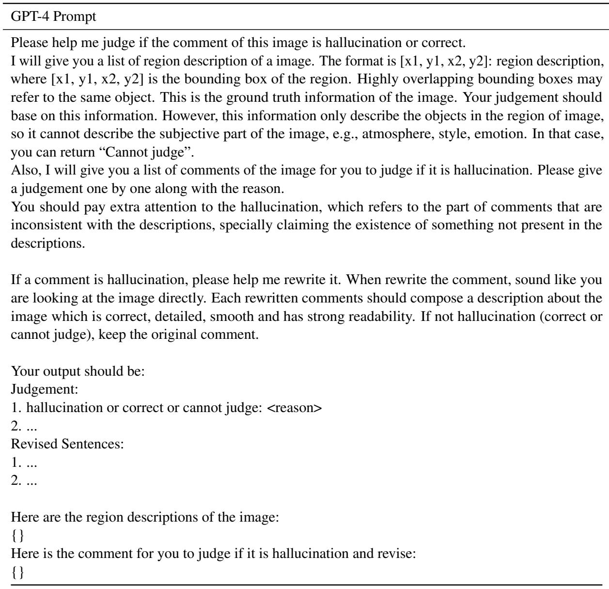  
Table 12: The prompt used in the GPT-4 assisted benchmark.

The prompt for the GPT-4V assisted benchmark, detailed in Table 11, leverages GPT-4V’s image understanding capabilities to evaluate the correctness and detailedness of two descriptions. In our experiments, Assistant 1 and Assistant 2 are initially set to Beam Search/OPERA and our iTaD, respectively, with their roles randomly swapped to prevent any bias associated with the order of presentation in GPT-4V. Table 12 displays the prompt used in the GPT-4 assisted benchmark. In this benchmark, we employ the VG-100K dataset (Krishna et al., 2017), which includes detailed ground-truth descriptions of all objects. GPT-4 is prompted with these descriptions that detail various object attributes such as quantity, color, and location, to judge and revise the descriptions generated by MLLMs. The performance metrics HSPI, HWPI, HSR, and HWR are then calculated based on GPT-4’s judgment.

## B.3 Selection of the Hyper-Parameter α

Due to the distinct answer format of the POPE and MME benchmarks, which starts with ‘Yes’ or ‘No’, we set the hyper-parameter α for these benchmarks differently from our default settings described in Section 3.2. Specifically, for LLaVA-1.5, Instruct-BLIP, MiniGPT-4, and mPLUG-Owl, α is set to 0.9, 0.3, 0.9, and 0.03, respectively. The value of α for each MLLM is determined by evaluating its F1 score performance of POPE on a separate set of 100 randomly selected images from the COCO validation set, ensuring no overlap with the test images used in the POPE and MME benchmarks.

<table><tr><td rowspan="2">Method</td><td colspan="2">LLaVA-1.5</td><td colspan="2">InstructBLIP MiniGPT-4</td></tr><tr><td> $C _ { S } \downarrow$   $C _ { I \downarrow }$ </td><td> $C _ { S } \downarrow$ </td><td> $C _ { I \downarrow }$ </td><td> $C _ { S } \downarrow$   $C _ { I \downarrow }$ </td></tr><tr><td>Beam Search 50.0</td><td></td><td>14.5</td><td>56.4 16.2</td><td>33.9 10.7</td></tr><tr><td>VCD</td><td>47.9</td><td>13.7</td><td>54.6 15.5</td><td>32.2 10.1</td></tr><tr><td>iTaD</td><td>45.4</td><td>13.4 53.2</td><td>14.7</td><td>26.4 9.6</td></tr></table>

Table 13: Comparison with VCD on the CHAIR benchmark. We bold the best results and underline the secondbest results (same below).
<table><tr><td rowspan="2">Method</td><td colspan="2">A-OKVQA</td><td colspan="2">GQA</td></tr><tr><td colspan="4">MiniGPT-4 mPLUG-Owl MiniGPT-4 mPLUG-Owl</td></tr><tr><td>Beam Search</td><td>69.94</td><td>68.72</td><td>69.37</td><td>69.13</td></tr><tr><td>OPERA</td><td>70.84</td><td>68.37</td><td>70.10</td><td>68.76</td></tr><tr><td>iTaD</td><td>72.33</td><td>70.77</td><td>70.86</td><td>70.73</td></tr></table>

Table 14: Results on the POPE benchmark for A-OKVQA and GQA. We report the average F1 scores across random, popular and adversarial splits.

## B.4 License for Scientific Artifacts

LLaVA-1.5 (Liu et al., 2024b) and Instruct-BLIP (Dai et al., 2023) are subject to the Llama 2 Community License. MiniGPT-4 (Zhu et al., 2024) is licensed under BSD 3-Clause License. mPLUG-Owl (Ye et al., 2023) is subject to the Apache 2.0 License. MSCOCO (Lin et al., 2014) and A-OKVQA (Schwenk et al., 2022) are licensed under CC BY 4.0. MME (Fu et al., 2023), VG-100K (Krishna et al., 2017), and GQA (Hudson and Manning, 2019) are subject to the MIT License. All usages of scientific artifacts in this paper obey the corresponding licenses.

## C Additional Results Compared to Baselines

## C.1 Comparison with VCD

We compare iTaD with VCD (Leng et al., 2024) on the CHAIR benchmark, as shown in Table 13. Although VCD can effectively mitigate hallucinations in MLLMs, our iTaD consistently outperforms VCD across all performance metrics. The experiment results highlight iTaD’s superior performance compared to VCD.

<table><tr><td rowspan="2">Method</td><td colspan="2">{1×2,2×1}</td><td colspan="2">{2×2}</td></tr><tr><td> $C _ { S } \downarrow$ </td><td> $C _ { I \downarrow }$ </td><td> $C _ { S } \downarrow$ </td><td> $C _ { I } \downarrow$ </td></tr><tr><td>LLaVA-NeXT</td><td>40.3</td><td>11.7</td><td>42.6</td><td>13.8</td></tr><tr><td>+ iTaD</td><td>39.1</td><td>10.5</td><td>39.6</td><td>12.1</td></tr></table>

Table 15: iTaD’s performance across different image token proportions on the LLaVA-NeXT model.

## C.2 Cross-Dataset Validation on the POPE Benchmark

To further validate the generalizability of the proposed iTaD, we conduct extensive experiments on A-OKVQA (Schwenk et al., 2022) and GQA (Hudson and Manning, 2019) for the POPE benchmark. Table 14, along with Table 3, demonstrates that our method consistently outperforms Beam Search and OPERA on the POPE benchmark across different datasets.

## D Additional Quantitative Analysis of iTaD

## D.1 Performance on LLaVA-NeXT

The LLaVA-NeXT series3 adopts the ‘AnyRes’ strategy, selecting grid configurations based on image sizes, which naturally leads to varying image token proportions. Based on this, we randomly sample two sets of 500 images from the MSCOCO validation set with grid configurations of {1 2, 2 1} (2 grids) and {2 2} (4 grids), respectively. The average number of image tokens for the two sets is <1600 and >2000, respectively. Experimental results on CHAIR are shown in Table 15.

iTaD demonstrates robust and effective hallucination mitigation across varying image token proportions. When the grid configuration is {2 2} (average number of image tokens >2000), its effectiveness is comparable to or slightly more notable than when the grid configuration is {1 2, 2 1} (average number of image tokens <1600).

## D.2 Standard Deviations of Experiments

Table 16 presents the standard deviations in the performance of the four MLLMs across 5 evaluation sets, each comprising 500 images randomly selected from the COCO validation set. It is noted that although the value of CS and $C _ { I }$ varies across different evaluation sets, iTaD exhibits consistent improvements upon Beam Search, which demonstrates robustness to variations in data distribution.

<table><tr><td rowspan="2">Method</td><td colspan="2">LLaVA-1.5</td><td colspan="2">InstructBLIP</td><td colspan="2">MiniGPT-4</td><td colspan="2">mPLUG-Owl</td></tr><tr><td> $C _ { S } \downarrow$ </td><td> $C _ { I } \downarrow$ </td><td> $C _ { S } \downarrow$ </td><td> $C _ { I } \downarrow$ </td><td> $C _ { S } \downarrow$ </td><td> $C _ { I } \downarrow$ </td><td> $C _ { S } \downarrow$ </td><td> $C _ { I } \downarrow$ </td></tr><tr><td>Beam Search</td><td>50.0 (±2.70)</td><td>14.5 (±1.00)</td><td>56.4 (±1.47)</td><td>16.2 (±0.68)</td><td>33.9 (±2.92)</td><td>10.7 (±1.01)</td><td>75.8 (±0.66)</td><td>25.4 (±0.89)</td></tr><tr><td>iTaD</td><td>45.4 (±3.00)</td><td>13.4 (±0.99)</td><td>53.2 (±2.97)</td><td>14.7 (±1.48)</td><td>26.4 (±1.83)</td><td>9.6 (±0.45)</td><td>70.0 (±2.52)</td><td>24.5 (±1.52)</td></tr><tr><td>∆</td><td>-4.6 (±2.29)</td><td>-1.1 (±0.19)</td><td>-3.2 (±2.24)</td><td>-1.5 (±0.95)</td><td>-7.5 (±2.47)</td><td>-1.1 (±1.10)</td><td>-5.8 (±2.20)</td><td>-0.9 (±0.74)</td></tr></table>

Table 16: Mean value and standard deviations from experiments on the CHAIR benchmark across 5 evaluation sets. $\Delta$ represents the improvement of iTaD compared to Beam Search.

<table><tr><td>M</td><td>LLaVA-1.5</td><td>InstructBLIP</td><td></td></tr><tr><td></td><td> $C _ { S } \downarrow$   $C _ { I } \downarrow$ </td><td> $C _ { S } \downarrow ~ C _ { I } \downarrow$ </td><td></td></tr><tr><td>{2,4,6,8,10,12,14}</td><td>45.4</td><td>13.4</td><td>53.2 14.7</td></tr><tr><td>{16,18,20,22,24,26,28}</td><td>70.4</td><td>27.5 69.4</td><td>23.0</td></tr><tr><td>{1,2,3,4,5,6,7,8,9,10,11,12,13,14}</td><td>45.2</td><td>13.3</td><td>53.2 14.6</td></tr></table>

Table 17: Analysis results of the candidate set .

<table><tr><td>max_l</td><td>32 64</td><td>128</td></tr><tr><td>Beam Search</td><td>1 52.5 (×1.00) 54.3 (×1.00)</td><td>55.7 (×1.00)</td></tr><tr><td>iTaD</td><td>58.1 (×1.11) 59.3 (×1.09)</td><td>60.4 (×1.08)</td></tr></table>

Table 18: The impact of output sequence length on LLaVA-1.5’s inference latency (ms/token), where max\_l is the max output token length.

## D.3 Analysis of the Candidate Set

In our paper, we set  to 2, 4, 6, 8, 10, 12, 14 by default, without any tuning. Table 17 presents the analysis results for . To explore the impact of different layer depths, we adjust  to 16, 18, 20, 22, 24, 26, 28 . It can be observed that using shallow layers for is critical for the effectiveness of the proposed iTaD while deeper layers tend to degrade performance and yield hallucinations. This performance degradation is consistent with the results discussed in Chuang et al. (2024), which empirically demonstrates that statically selecting deeper layers for contrastive decoding results in performance below that of the baseline, i.e., Beam Search in our experiment. Furthermore, we expand  to 1, 2, 3, 4, 5, 6, 7, 8, 9, 10, 11, 12, 13, 14 to investigate the impact of the size of set on the performance of iTaD. Although this adjustment doubles the additional memory overhead required to store $h _ { t } ^ { n }$ , the experiment results show that it only slightly improves the performance of iTaD. On the contrary, the setting of  in our paper effectively balances performance with efficiency.

## D.4 Impact of Output Length on Latency

Table 8 shows the average latency per token for generating descriptions of 50 images, which is independent of the dataset size and empirically consistent with the result calculated on more images (e.g., 200 images). Table 18 shows the impact of output sequence length on LLaVA-1.5’s inference latency (ms/token). As the output lengthens, iTaD’s latency increase diminishes, showing a decreasing factor from 1.11 to 1.09 and 1.08.

## D.5 Latency-Performance Trade-Off

The primary source of the increased latency with iTaD compared to Beam Search is the calculation of iTaV and their JSD for intermediate layers in and the final layer. We can achieve a performance and efficiency trade-off by adjusting the size of , as shown in Table 19. It is observed that the selected $\mathcal { M } = \{ 2 , 4 , 6 , 8 , 1 0 , 1 2 , 1 4 \}$ in this paper effectively balances performance and efficiency.

## D.6 Text Quality Evaluation

Following OPERA (Huang et al., 2024), we calculate PPL (Perplexity, a classical metric in NLP without using reference text) using LLaMA-2-7b and LLaMA-2-13b (Touvron et al., 2023b) to evaluate text quality, respectively. Table 20 shows that iTaD has a minor effect on text quality while largely maintaining the higher text quality of generated text by Beam Search compared to text generated by Greedy Search and Nucleus Sampling.

## E Qualitative Analysis

Figure 5, 6, and 7 showcase the qualitative results of LLaVA-1.5, InstructBLIP and MiniGPT-4, and mPLUG-Owl, respectively. In these figures, MLLMs are prompted to generate descriptions for the images. We bold and highlight the hallucinatory segments in the Beam Search outputs in red. These hallucinations often include echolalic, repetitive sentence structures, such as the second example of mPLUG-Owl, and references to objects that frequently co-occur with the object in the image but are absent, such as the second example of Instruct-BLIP. It can be observed that our iTaD effectively mitigates such hallucination issues while still yielding high-quality and informative responses.

<table><tr><td>M</td><td> $C _ { S } + C _ { I } \downarrow$  Latency (ms/token) ↓</td></tr><tr><td>{2,6,10,14}</td><td>58.9</td></tr><tr><td>{2,4,6,8,10,12,14}</td><td>60.7</td></tr><tr><td>{1,2,3,4,5,6,7,8,9,10,11,12,13,14}</td><td>63.0</td></tr></table>

Table 19: A trade-off between latency and performance can be achieved by adjusting the number of elements in set . The experiments are conducted using LLaVA-1.5.
<table><tr><td>PPL↓</td><td>Greedy</td><td>Nucleus</td><td>Beam Search</td><td>iTaD</td></tr><tr><td>LLaMA-2-7b</td><td>6.32</td><td>8.61</td><td>5.66</td><td>6.01</td></tr><tr><td>LLaMA-2-13b</td><td>6.15</td><td>8.56</td><td>5.49</td><td>5.92</td></tr></table>

Table 20: The evaluation results for the quality of the generated text, where a lower PPL score indicates higher text quality. The experiments are conducted using LLaVA-1.5.

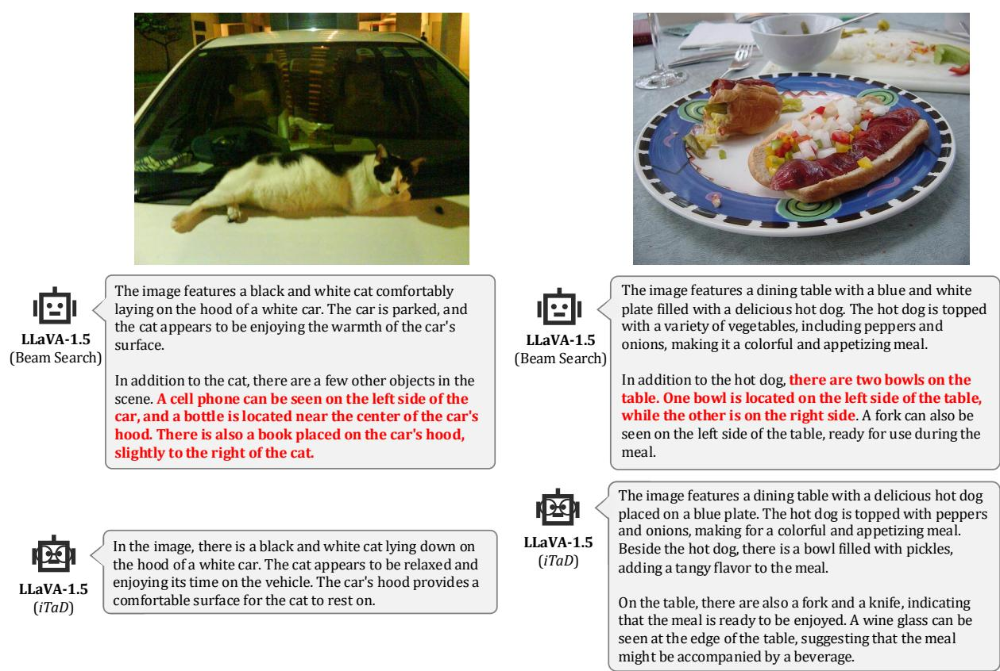  
Figure 5: Qualitative results of LLaVA-1.5. We bold and highlight the hallucinatory segments in red.

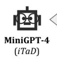

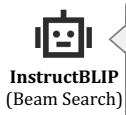

The	image	depicts	a	group	of	sheep	grazing	on	a	lush	green lawn	in	a	residential	area.	There	are	three	sheep	in	the scene,	with	two	of	them	standing	close	to	each	other	near the	center	of	the	lawn,	while	the	third	one	is	slightly	off	to the	side. In	addition	to	the	sheep,	there	are	several cars	parked	around	the	area. One	car	is	positioned closer	to	the	center	of	the	lawn,	while	the	others	are located	further	away	from	the	main	group	of	sheep.	A truck	can	also	be	seen	in	the	background,	adding	to the	variety	of	vehicles	in	the	scene.	Overall,	the	image captures	a	peaceful	moment	in	a	residential	area	where animals	and	vehicles	coexist	in	harmony.

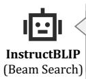

## InstructBLIP (iTaD)

The	image	depicts	a	group	of	sheep	grazing	on	a	lush	green lawn	in	a	residential	area.	There	are	three	sheep	in	the scene,	two	of	which	are	closer	to	the	camera,	while	the third	one	is	slightly	further	away.	The	sheep	are	spread out	across	the	grassy	field,	with	some	of	them	closer	to	the left	side	of	the	image	and	others	closer	to	the	right	side.	A car	can	be	seen	parked	in	the	background,	possibly belonging	to	someone	who	owns	the	property	where	the sheep	are	grazing.

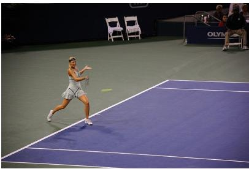

The	image	shows	a	large	body	of	water	with	mountains	in the	background.	There	is	a	bird	flying	in	the	sky	above	the water.	The	water	is	calm	and	there	are	no	boats	or	other objects	in	the	water.	The	sky	is	clear	and	blue	with	a	few clouds	in	the	distance.	The	mountains	are	covered	in	trees and	have	snow	on	their	peaks.

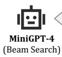

## InstructBLIP (iTaD)

The	image	captures	a	female	tennis	player	in	action	on	a blue	tennis	court.	She	is	wearing	a	green	dress	and	has just	hit	the	tennis	ball	with	her	racket,	preparing	to return	it	to	the	opponent's	side	of	the	court.		In	the	scene, there	are	several	chairs	placed	around	the	tennis	court, likely	for	spectators	or	players	to	take	a	seat	during	the match.	Additionally,	there	are	two	handbags	visible	in the	background,	possibly	belonging	to	the	players	or spectators. Overall,	the	image	depicts	a	lively	and engaging	tennis	match	taking	place	on	the	court.

The	image	shows	a	large	body	of	water	with	mountains	in the	background.	A	seagull	is	flying	over	the	water,	its wings	spread	wide	as	it	soars	through	the	sky.	The	water	is calm	and	still,	reflecting	the	blue	sky	above.	There	are	no boats	or	people	in	the	water,	just	the	seagull	and	the mountains	in	the	distance.

The	image	captures	a	female	tennis	player	in	action	on	a blue	tennis	court.	She	is	wearing	a	green	dress	and	holding a	tennis	racket,	preparing	to	hit	the	ball	with	her	left	hand. The	tennis	court	is	surrounded	by	chairs	placed	around the	perimeter,	providing	seating	for	spectators.	There	are several	chairs	visible	in	the	scene,	some	closer	to	the tennis	player	and	others	further	away.	In	addition	to	the chairs,	there	is	a	person	sitting	on	a	bench	near	the	center of	the	court.	The	tennis	player's	focus	is	on	the	ball	as	she prepares	to	swing	her	racket,	demonstrating	her	skill	and dedication	to	the	sport.

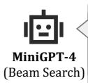

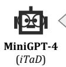

This	image	shows	a	man	standing	on	a	sandy	beach, holding	a	large	kite	in	his	hand.	The	kite	is	a	brightly colored	dragon,	with	a	long	tail	and	wings.	The	man	is wearing	a	blue	shirt	and	black	pants,	and	has	his	hair	tied back	in	a	ponytail.	The	ocean	is	visible	in	the	background, with	waves	crashing	on	the	shore.	The	sky	is	overcast, with	a	few	clouds	in	the	distance.

This	image	shows	a	man	standing	on	a	sandy	beach, holding	a	large	kite	that	has	a	dragon-like	body	with	wings spread	out	behind	him.	The	man	is	wearing	a	blue	shirt and	black	pants,	and	he	is	holding	the	kite	while	looking	up at	the	sky.	In	the	distance,	the	ocean	can	be	seen	with waves	crashing	on	the	shore.

Figure 6: Qualitative results of InstructBLIP and MiniGPT-4. We bold and highlight the hallucinatory segments in red.

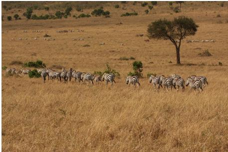

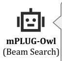

The	image	depicts	a	large	herd	of	zebras	grazing	in	a grassy	field.	The	zebras	are	spread	out	across	the	field, with	some	closer	to	the	foreground	and	others	further back.	There	are	at	least	15	zebras	visible	in	the	scene.

In	addition	to	the	zebras,	there	is	a	lone	tree	standing	in the	middle	of	the	field,	providing	a	focal	point	for	the	scene. The	zebras	appear	to	be	enjoying	their	time	in	the	grassy field,	as	they	graze	and	socialize	with	each	other.

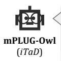

The	image	features	a	herd	of	zebras	grazing	in	a	grassy field.	They	are	scattered	throughout	the	scene,	with	some zebras	closer	to	the	foreground	and	others	further	back. The	zebras	are	of	various	sizes,	with	some	being	smaller and	others	larger.

In	the	background,	there	is	a	tree	standing	tall,	providing	a natural	backdrop	for	the	zebras.	The	zebras	appear	to	be enjoying	their	time	in	the	field,	with	some	of	them	walking and	others	standing	still.

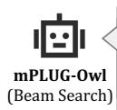

The	image	depicts	a	snowy	day	on	a	city	street,	with several	cars	driving	down	the	road.	There	are	at	least nine	cars	visible	in	the	scene,	with	some	closer	to	the foreground	and	others	further	back.

Several	traffic	lights	can	be	seen	along	the	street,	helping to	regulate	the	flow	of	traffic.	One	traffic	light	is positioned	near	the	center	of	the	image,	while	another	is located	closer	to	the	right	side	of	the	street.

In	addition	to	the	cars	and	traffic	lights,	there	are	a	few people	visible	in	the	scene.	One	person	is	standing near	the	left	side	of	the	street,	while	another	person is	closer	to	the	center	of	the	image.	A	third	person	can be	seen	further	back	on	the	right	side	of	the	street.

## mPLUG-Owl (iTaD)

The	image	depicts	a	snowy	city	street	with	several	cars driving	down	the	road.	There	are	at	least	nine	cars	visible in	the	scene,	some	closer	to	the	foreground	and	others further	back.	The	cars	are	scattered	across	the	street,	with some	closer	together	and	others	spaced	out.

The	snow	is	falling	heavily,	covering	the	road	and	the	cars. The	snow	is	thick	and	covers	the	entire	street,	making	it difficult	for	drivers	to	see	clearly.	The	cars	are	driving through	the	snow,	navigating	the	slippery	conditions.

In	the	background,	there	are	a	few	trees visible,	adding	to the	urban	setting	of	the	scene.

Figure 7: Qualitative results of mPLUG-Owl. We bold and highlight the hallucinatory segments in red.