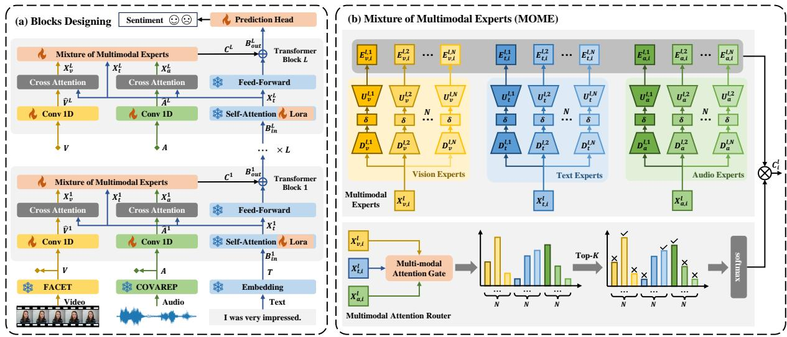
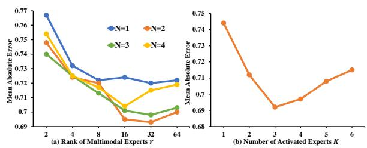
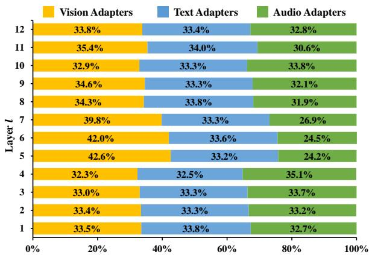
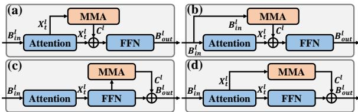

# Mixture of Multimodal Adapters for Sentiment Analysis

Kezhou Chen1, Huixia Ben2\*, Shuo Wang1, Shengeng Tang3, Yanbin Hao3

1University of Science and Technology of China, 2Anhui University of Science and Technology,

3Hefei University of Technology

chenkezhou@mail.ustc.edu.cn, shuowang.edu@gmail.com, huixiaben@gmail.com, tangsg@hfut.edu.cn, haoyanbin@hotmail.com

## Abstract

Pre-trained language model (PLM) have achieved great success in text sentiment analysis. However, in practical applications, sentiment is not only conveyed through language but also hidden in other modalities. Therefore, multimodal sentiment analysis (MSA) has attracted increasing research interest. Compared to text sentiment analysis, MSA is challenging since (1) emotions hidden in body movements or vocal timbres eclipse traditional analytical methods, and (2) transferring PLM to MSA task requires huge training parameters. Thus, to solve these issues, we introduce the Mixture of Multimodal Adapters (MMA) into the PLM. Specifically, we first design a mixture-of-multimodal-experts module to capture and fuse emotional movements from different data. Meanwhile, we use a compression parameter for each expert to reduce the training burden. We apply our method to two benchmark datasets and achieve state-of-the-art performance with a tiny trainable parameter count. For example, compared to the current state-ofthe-art method, AcFormer, we only need 1/22 of its training parameters amount (130M 6M) to achieve better results. The code is available at https://github.com/MMA4MSA/MMA.

## 1 Introduction

Sentiment analysis aims to identify emotional expressions from human conversations. In this task, recent pre-trained language models (PLMs) and their related structures, e.g. transformer, RNNs, have shown a powerful ability for textual analysis (Devlin et al., 2018; Raffel et al., 2020; Wang et al., 2018; Guo et al., 2019; Peng et al., 2023; Ben et al., 2024; Wang et al., 2020, 2022; Lu et al., 2023). Thus, they incidentally improve the recognition performance of emotions from the textual information. However, only processing textual information cannot accurately express people’s emotions. This is because emotional expression not only contains textual descriptions but also includes body language and voice, where these contents in different modalities can more accurately reflect human emotion. Therefore, multimodal sentiment analysis (MSA) has been proposed to fuse these contents to analyze sentiment.

Unlike traditional multimodal analysis or fusion tasks (Zhu et al., 2024a; Wang et al., 2024b; Zhu et al., 2024c,b; Wang et al., 2024c), video and audio in MSA are used to express emotions rather than to identify objects, which weakens the ability of traditional recognition modules. Thus, the semantic gap between these and textual data is a challenge in the MSA tasks (Hazarika et al., 2020; Chen et al., 2024). To solve this issue, ConFEDE (Yang et al., 2023) designs a unified learning framework for contrastive representation learning and contrastive feature decomposition to robust multimodal representation. AcFormer (Zong et al., 2023) designed a compact transformer using contrastive learning and pivot fusion strategies. However, (1) the fusion strategies of these recent methods are similar to those of traditional multimodal recognition methods which focus on achieving a more comprehensive fusion of multimodal features. While the MSA task needs to analyze the emotion hidden in vision and audio, where both visual and audio modalities may include noise and task-irrelevant features, such as background movements in videos and ambient noise in audio recordings (Zong et al., 2023). Consequently, analyzing irrelevant or misleading features can impede the accurate assessment of emotional states (Hazarika et al., 2022). And (2) these methods and their modules are fully fine-tuned to cater to multimodal representations. Although this strategy has brought great performance advantages over training from scratch, it has become a resource-consuming and parameterinefficient process with increasing models and data.

In the sparsely activated mixture of experts (MOE) module, different parts of the model, namely experts, are used to handle various tasks or aspects of the data. In this way, experts not proficient in handling a particular task do not participate in the forward process, resulting in more precise task-related representations (Cai et al., 2024). Inspired by the MOE system, we extend it to MSA task, enabling selective multimodal feature fusion, thereby obtaining more task-relevant multimodal representation. Specifically, we design a mixture of multimodal experts, consisting of the multimodal experts and the multimodal attention router, where each expert is used to deal with a specific modality, and the multimodal attention router is responsible for determining which expert will be activated at each time step of the text sequence. Compared to traditional MSA methods, our approach enables selective fusion, only the features from the activated multimodal experts will be fused with the textual hidden states, thereby minimizing the negative impact of irrelevant noise in multimodal data while retaining task-related features in audio and video.

To reduce the training burden, a popular strategy in natural language processing is parameterefficient fine-tuning (PEFT) (Hu et al., 2021; Zaken et al., 2022; He et al., 2021). It enables the efficient adaptation of large pre-trained models to various downstream applications by only training a small number of (extra) model parameters instead of all the model’s parameters (Xu et al., 2023), which significantly decreases the computational and storage costs. Inspired by the PEFT strategy, we designed the aforementioned MOE structure as a parameter-efficient method. Specifically, the adapter is designed to serve as the expert to capture and fuse the different data (video, audio, and text) in each transformer block, where the textual information is modeled by a PLM, and the video and audio are extracted to assist in the analysis of textual content. Compared to the full training method (Hazarika et al., 2020; Rahman et al., 2020; Sun et al., 2022), we only need to train the parameters in the adapter, which greatly reduces the required computing resources. Meanwhile, our adapter is a plug-and-play strategy. In other words, we can flexibly apply it to various language models and directly transform these models into a multimodal model that can handle MSA tasks.

In summary, we call our mixture-of-multimodalexperts with adapter strategy as Mixture of Multimodal Adapters (MMA). The contributions are summarized as follows:

• We extend the MOE structure into the mixture of multimodal experts to selectively integrate useful multimodal features into the PLM for emotional recognition.

• We design a plug-and-play adapter to help the PLM to analyze the multimodal sentiment in a lightweight calculation.

• Experiments on multiple benchmarks validate the superiority of our method. Moreover, we apply MMA to large language model (LLM) and validate the versatility of our method.

## 2 Related Works

## 2.1 Multimodal Sentiment Analysis

Multimodal Sentiment Analysis (MSA) aims to perceive human emotions in videos. The previous MSA methods can be divided into two categories: methods with sophisticated fusion mechanisms and multimodal representation learning.

Fusion-based methods focus on implementing the interaction of multimodal information through intricate fusion mechanisms. For example, Zadeh et al. design the Tensor Fusion Network to model intra-modality and inter-modality dynamic (Wang et al., 2019; Zadeh et al., 2017). Then, to improve the efficiency of TFN, Liu et al. propose low-rank Fusion using low-rank tensors (Liu et al., 2018). Tsai et al. first introduce cross-modal attention into the MSA task. Sun et al. propose CubeMLP to reduce memory consumption by mixing features on sequence, modality, and channel three levels (Sun et al., 2022). Zong et al. design pivot attention fusion to reduce the computational complexity (Zong et al., 2023).

Different from fusion-based methods, multimodal representation learning-based approaches emphasize the significance of multimodal representation before fusion. MISA focuses on learning the modality-invariant and -specific subspaces before fusion (Hazarika et al., 2020). Yu et al. propose a method in which modality-specific representations are learned through joint training in unimodal subtasks and a multimodal main task (Yu et al., 2021). Some MSA works explore the use of contrastive learning to improve multimodal representations. For example, Yang et al. introduce contrastive learning into MSA to learn similarity and dissimilarity features for each modality (Yang et al., 2023). Zong et al. employ contrastive learning to improve the unimodal representation and facilitate crossmodal alignment (Zong et al., 2023).

While the aforementioned methods can effectively fuse multimodal features for sentiment analysis, they ignore the noise features in video and audio data and the training burden brought by fully fine-tuning pre-trained models. Our MMA method strives to selectively fuse multimodal features for better integration of video and audio data and can be incorporated into a frozen PLM without introducing excessive trainable parameters.

## 2.2 Parameter-Efficient Fine-Tuning

Many natural language processing tasks have benefited from transformer-based PLMs and LLMs (Devlin et al., 2018; Liu et al., 2019; Brown et al., 2020). However, the large scale of LLMs leads to significant computational costs (Xu et al., 2023). To this end, parameter-efficient fine-tuning (PEFT) methods are proposed to efficiently adapt the LLMs over downstream tasks by training a small part of additional parameters, such as Adapter (Houlsby et al., 2019), Prefix Tuning (Li and Liang, 2021), and LoRA (Hu et al., 2021). Then, He et al. present a unified view of the above methods and propose the MAM adapter by combining their advantages (He et al., 2021). Soon, PEFT methods have also been emerged in the multimodal field, such as methods for vision-language foundation models (Wang et al., 2024a) and methods for multimodal large language models (Liang et al., 2024). In our work, we propose a PEFT method to convert a PLM into a multimodal model that can handle the MSA task.

## 2.3 Mixture of Experts

The Mixture of Experts (MOE) architecture distributes each example to a subset of the parameters instead of reusing all parameters for each input (Fedus et al., 2022a). Eigen et al. first treat a component of a neural network as an expert (Eigen et al., 2013). Then, Shazeer et al. try MOE on a larger scale with LSTM layers by learning a routing mechanism (Shazeer et al., 2016). After the transformer achieves great success (Vaswani et al., 2017b), some works explore the possibility of applying MOE to the transformer by replacing the fully-connected layer in transformer block with MOE structure, such as GShaard (Lepikhin et al., 2020) and Switch Transformer (Fedus et al., 2022b). Since MOE can benefit from specialized knowledge while keeping a low computational demand, it achieves great success in large language models (Jiang et al., 2024; Wei et al., 2024). Then, MOE is applied in various domains, including computer vision (Riquelme et al., 2021), parameterefficient fine-tuning (Dou et al., 2023), and multimodal learning (Li et al., 2024; Xie et al., 2024). In this paper, we aim to utilize the MOE structure to achieve selective fusion for MSA.

## 3 Approach

In this section, we first briefly revisit the preliminaries of the MSA tasks and give an overview of our framework. Then, we illustrate our model in detail. Finally, we describe the training and inference procedures of our method.

## 3.1 Preliminaries

The data corpus of Multimodal Sentiment Analysis (MSA) task can be categorically segmented into three distinct subsets: the textual set $\mathcal { D } _ { t } .$ the visual set $\mathcal { D } _ { v } .$ , and the audio set $\mathcal { D } _ { a }$ . Each of these datasets serves as a conduit for conveying sentiment through vocal intonations, facial expressions, or subtleties of body language. The primary objective of MSA is to synthesize these disparate data streams to forge a more nuanced and comprehensive understanding of sentiment. It leverages the richness of multimodal inputs to uncover the obscured emotional nuance.

An overview of our method is shown in Figure 1. First, we employ an L-layer transformer-based pre-trained language model (PLM) to encode the given textual content $\mathcal { D } _ { t }$ . Then, we use a prediction head to predict the output of the transformer into sentiment. To integrate information from different modalities $\mathcal { D } _ { v }$ and $\mathcal { D } _ { a }$ , we design a plug-andplay module within each transformer block, called Mixture of Multimodal Adapters (MMA), and help the PLM capture emotional content effectively.

## 3.2 Mixture of Multimodal Adapters (MMA)

Blocks Designing. Our method is integrated into the pre-trained transformer block (Vaswani et al., 2017a). Thus, we first introduce our transformer block and describe the different modules in detail. Specifically, given a multimodal set $\mathcal { D } _ { t } , \mathcal { D } _ { v } ;$ , and $\mathcal { D } _ { a } .$ we first embed it into features by different pretrained feature extraction toolkits:

$$
\begin{array} { r } { { \bf T } = \Phi _ { t } ( \mathcal { D } _ { t } ) , { \bf V } = \Phi _ { v } ( \mathcal { D } _ { v } ) , { \bf A } = \Phi _ { a } ( \mathcal { D } _ { a } ) , } \end{array}\tag{1}
$$

where $\{ { \bf T } , { \bf V } , { \bf A } \} \in \mathbb { R } ^ { M _ { \{ t , v , a \} } \times d _ { \{ t , v , a \} } } , M _ { \{ t , v , a \} }$ is the sequence length of {text, video, audio}. $d _ { \{ t , v , a \} }$ is the feature dimension of {text, video, audio}. For text modality, $\Phi _ { t }$ is the embedding layer of a specific PLM, while $\Phi _ { v }$ and $\Phi _ { a }$ are commonly used feature extraction toolkits for video and audio in previous works (Yu et al., 2021; Yang et al., 2023). Then we use $L$ layers PLM to analyze the sentiment. For convenience, we use $\mathbf { B } _ { \mathrm { i n } } ^ { l }$ and $\mathbf { B } _ { \mathrm { o u t } } ^ { l }$ to represent the input and output of the $l _ { \mathrm { t h } }$ transformer block, respectively. Thus, the inputs of the first and other layers are represented as:

  
Figure 1: The overall architecture of our method, where (a) is the blocks designing of MMA, and (b) is the mixture of multimodal experts in MMA. and represent frozen and trainable parameter layers, respectively.

$$
\mathbf { B } _ { \mathrm { i n } } ^ { l } = \left\{ \begin{array} { l l } { \mathbf { T } , } & { l = 1 , } \\ { \mathbf { B } _ { \mathrm { o u t } } ^ { l - 1 } , } & { l > 1 . } \end{array} \right.\tag{2}
$$

As depicted in Figure 1(a), in each transformer block, we first use the pre-trained Self-Attention Module with a few training parameters (LoRA) to refine the input $\mathbf { B } _ { \mathrm { i n } } ^ { l }$ as:

$$
\mathbf { X } _ { t } ^ { l } = \mathrm { S e l f } \mathbf { - A t t e n t i o n } ( \mathbf { B } _ { \mathrm { i n } } ^ { l } ) .\tag{3}
$$

Then we pass visual feature $X _ { v }$ and acoustic feature $X _ { a }$ through the 1D convolutional layers:

$$
\hat { \mathbf { V } } ^ { l } = \mathrm { C o n v 1 D } ( \mathbf { V } ) , \hat { \mathbf { A } } ^ { l } = \mathrm { C o n v 1 D } ( \mathbf { A } ) ,\tag{4}
$$

where $\hat { \mathbf { V } } ^ { l } \in \mathbb { R } ^ { M _ { v } \times d _ { t } }$ and $\hat { \mathbf { A } } ^ { l } \in \mathbb { R } ^ { M _ { a } \times d _ { t } }$ . The 1D temporal convolutional layers can not only help multimodal sequences contain the local structure but also project the features of video and audio to the same dimension $d _ { t }$ . Then we fuse text features with video and audio features using a crossattention strategy. To reduce the training cost, there is no parameter in our cross-attention module:

$$
\begin{array} { r l } & { \mathbf { X } _ { v } ^ { l } = \mathrm { s o f t m a x } ( \frac { \mathbf { T } ^ { l } \hat { \mathbf { V } } ^ { l ^ { \top } } } { \sqrt { d _ { t } } } ) \hat { \mathbf { V } } ^ { l } + \mathbf { T } ^ { l } , } \\ & { \mathbf { X } _ { a } ^ { l } = \mathrm { s o f t m a x } ( \frac { \mathbf { T } ^ { l } \hat { \mathbf { A } } ^ { l ^ { \top } } } { \sqrt { d _ { t } } } ) \hat { \mathbf { A } } ^ { l } + \mathbf { T } ^ { l } , } \end{array}\tag{5}
$$

where $\mathbf { X } _ { v } ^ { l } \in \mathbb { R } ^ { M _ { t } \times d _ { t } }$ and $\mathbf { X } _ { a } ^ { l } \in \mathbb { R } ^ { M _ { t } \times d _ { t } }$ are cross token fusion features. Note that after the crossattention module, $\mathbf { X } _ { v } ^ { l }$ and $\mathbf { X } _ { a } ^ { l }$ have the same sequence length with $\mathbf { X } _ { t } ^ { l } .$ , thus we design a tokenlevel selective fusion to select appropriate multimodal features for the PLM, named Mixture of Multimodal Experts (MOME), and the output of $l _ { \mathrm { t h } }$ transformer block $\mathbf { B } _ { \mathrm { o u t } } ^ { l }$ can be calculated as the sum of the Feed-Forward Network (FFN) (Vaswani et al., 2017a) and the MOME:

$$
\mathbf { B } _ { \mathrm { o u t } } ^ { l } = \mathrm { F F N } ( \mathbf { X } _ { t } ^ { l } ) + \mathrm { M O M E } ( \mathbf { X } _ { t } ^ { l } , \mathbf { X } _ { v } ^ { l } , \mathbf { X } _ { a } ^ { l } ) .\tag{6}
$$

Note that in this block, only LoRA, Conv1D, and MOME modules have a few training parameters. Mixture of Multimodal Experts. Through conv1D and cross attention, the PLM has gained the capability to handle non-linguistic sequences at every transformer block. However, in MSA task, non-linguistic features may not be beneficial, and at different time steps, the noisy modalities and beneficial modalities may vary. Considering these complexities, we have introduced the mixture of multimodal experts (MOME) module consisting of multimodal experts and multimodal attention router, as shown in Figure 1(b). For multimodal experts, to save as many parameters as possible, we let the adapters serve as experts. For the $i _ { \mathrm { t h } }$ time step of the text and fused sequences $( \mathbf { X } _ { v , i } ^ { l } , \mathbf { X } _ { t , i } ^ { l } , \mathbf { X } _ { a , i } ^ { l } )$ , we use three types of adapters (vision, text, and audio) to capture the features:

$$
\mathbf { H } _ { m , i } ^ { l , n } = \delta ( \mathbf { D } _ { m } ^ { l , n } \mathbf { X } _ { m , i } ^ { l } + b _ { \mathrm { m , d o w n } } ^ { l , n } ) ,\tag{7}
$$

where $\mathbf { H } _ { m , i } ^ { l , n } \in \mathbb { R } ^ { r }$ , r is the intrinsic dimension (rank) of the adapter, $\delta ( x )$ is a non-linear activation function, $n \in \{ 1 , 2 , \cdots , N \}$ is the index of experts of modality $m ,$ N is the number of experts per modality, $\mathbf { D } _ { m } ^ { l , n }$ is the down-project matrix and $\hat { b } _ { m , d o w n } ^ { l , n }$ is the bias vector, $m \in \{ t , a , v \} . \ r \ll d _ { t }$ makes sure that the number of parameters in experts is far less than that in frozen pre-trained weights. Then we use the up-project matrix $\mathbf { U } _ { m } ^ { l , n }$ to reconstruct the $\mathbf { H } _ { m , i } ^ { l , n }$ into $d _ { t }$ dimension:

$$
\mathbf { E } _ { m , i } ^ { l , n } = s _ { m } ^ { l , n } ( \mathbf { U } _ { m } ^ { l , n } \mathbf { H } _ { m , i } ^ { l , n } + b _ { \mathrm { m , u p } } ^ { l , n } ) ,\tag{8}
$$

where $\mathbf { E } _ { m , i } ^ { l , n } \ \in \ \mathbb { R } ^ { d _ { t } }$ is the output of the $n _ { \mathrm { t h } }$ experts of modality m based on the $i _ { \mathrm { t h } }$ token, ${ \bf U } _ { m } ^ { l , n } \in$ $\mathbb { R } ^ { d _ { t } \times r }$ is the up-projection matrix and $b _ { m , u p } ^ { l , n }$ is the bias vector. $s _ { m } ^ { l , n }$ is a learnable scalar initialized as one to control the impact of this adapter. Thus, this module can process features of various modalities while maintaining a tiny parameter count.

Different from unimodal MOE, our multimodal MOE needs to consider features from various modalities for routing. Therefore, we propose the multimodal attention router in which we utilize the multimodal attention gate to compute the gating vector for multimodal experts. First, we stack the three modality features at time step i into a matrix $\mathbf { M } _ { i } ^ { l } = [ \mathbf { X } _ { v , i } ^ { l } , \mathbf { \dot { X } } _ { t , i } ^ { l } , \mathbf { X } _ { a , i } ^ { l } ] \in \mathbb { R } ^ { 3 \times d _ { t } }$ . Then we pass it into a parameter-free Self-Attention module:

$$
\mathbf { G } _ { i } ^ { l } = \mathrm { s o f t m a x } ( \frac { \mathbf { M } _ { i } ^ { l } \mathbf { M } _ { i } ^ { l ^ { \top } } } { \sqrt { d _ { t } } } ) \mathbf { M } _ { i } ^ { l } .\tag{9}
$$

Then a linear layer is used to calculate the gating vector of multimodal experts:

$$
\mathbf { g } _ { i } ^ { l } = \mathbf { W } _ { g } ^ { l } \mathbf { G } _ { i } ^ { l } + b _ { g } ^ { l } ,\tag{10}
$$

where $\mathbf { g } _ { i } ^ { l } \in \mathbb { R } ^ { 3 \times N }$ is the gating vector of the $i _ { \mathrm { t h } }$ token. $\mathbf { W } _ { g } ^ { l }$ is the projection matrix and $b _ { g } ^ { l }$ is the bias. Then, we merge multimodal experts according to the gating vector $\mathbf { g } _ { i } ^ { l }$ and calculate the adapter change of $i _ { \mathrm { t h } }$ token $\mathbf { C } _ { i } ^ { l }$ . For the convenience of subsequent descriptions, we denote $\{ \mathbf { E } _ { v , i } ^ { l , 1 } , \cdot \cdot \cdot , \mathbf { E } _ { v , i } ^ { l , N } , \mathbf { E } _ { t , i } ^ { l , 1 } , \cdot \cdot \cdot , \mathbf { E } _ { t , i } ^ { l , N } , \mathbf { E } _ { a , i } ^ { l , 1 } , \cdot \cdot \cdot , \mathbf { E } _ { a , i } ^ { l , N } \}$ as $\{ \overline { { \mathbf { E } } } _ { i , 1 } ^ { l } , \cdot \cdot \cdot , \overline { { \mathbf { E } } } _ { i , 3 \times N } ^ { l } \}$ , and utilize discrete routing to dispatch tokens into appropriate experts.

$$
\hat { \mathbf { g } } _ { i } ^ { l } , \mathbb { I } _ { i } ^ { l } = \mathrm { T o p } \scriptscriptstyle { - } K ( \mathbf { g } _ { i } ^ { l } ) ,\tag{11}
$$

where $\hat { \bf g } _ { i } ^ { l } \in \mathbb { R } ^ { K }$ is the Top-K values of $\mathbf { g } ^ { l } . \mathbb { I } _ { i } ^ { l }$ is the indices of Top-K values in $\mathbf { g } _ { i } ^ { l } .$ . Suppose $\{ \hat { \bf E } _ { i , 1 } ^ { l } , \cdot \cdot \cdot , \hat { \bf E } _ { i , K } ^ { l } \} = \{ \overline { { \bf E } } _ { i , j } ^ { l } | j \in \mathbb { I } _ { i } ^ { l } \}$ are selected experts, we pass the gating values through softmax operation and calculate the weighted sum between gating values and selected experts output:

$$
\mathbf { C } _ { i } ^ { l } = \frac { \alpha } { r } \sum _ { j = 1 } ^ { K } \mathrm { s o f t m a x } ( \hat { \mathbf { g } } _ { i } ^ { l } ) _ { j } \hat { \mathbf { E } } _ { i , j } ^ { l } ,\tag{12}
$$

where α is a hyper-parameter controlling the impact of adapter change $\mathrm { ~ \bf ~ C ~ } _ { i } ^ { l } . \mathrm { ~ \bf ~ C ~ } _ { i } ^ { l }$ is the $i _ { t h }$ time step of $\mathbf { C } ^ { l } .$ , which is the output of the $\mathrm { M O M E } ( \mathbf { \bar { X } } _ { t } ^ { l } , \mathbf { X } _ { v } ^ { l } , \mathbf { X } _ { a } ^ { l } )$ used in equation (6). Under such a routing strategy, the total number of activated experts is fixed, but the number of activated experts per modality may vary. We hope that the attention router can select the most helpful features for sentiment analysis and avoid useless features or noise in video and audio data.

Intra-Modality Load Balancing. In our MOME, experts of different modalities are differentiated through different inputs. To ensure that experts of the same modality can capture diverse features and achieve a balanced load, we apply the load balancing loss in switch transformer (Fedus et al., 2022b) for each modality. Given a batch $\boldsymbol { B }$ with $T$ tokens, for modality $m \in \{ t , v , a \}$ , we first calculate the fraction of tokens dispatched to expert n in each transformer layer, denoted as $f _ { m } ^ { l , n }$

$$
f _ { m } ^ { l , n } = \frac { 1 } { T } \sum _ { i \in \mathcal { B } } I ( n \in \mathrm { T o p }  –  { K } ( \mathbf { g } _ { i } ^ { l } ) ) ,\tag{13}
$$

where $I ( \cdot )$ is the indicator function. When the load of experts for modality m is completely balanced, $f _ { m } ^ { l , n }$ is equal for different n. Then, we calculate $P _ { m } ^ { l , n }$ , the fraction of the router probability allocated for expert n of modality m:

$$
P _ { m } ^ { l , n } = \frac { 1 } { T } \sum _ { i \in \mathcal { B } } \mathrm { s o f t m a x } ( \mathbf { g } _ { i } ^ { l } ) ^ { n } .\tag{14}
$$

Similarly, when the routing is uniform, $P _ { m } ^ { l , n }$ is equal for different $n .$ Thus, the load-balancing loss in the $l _ { \mathrm { t h } }$ layer for modality m is the product between $f _ { m } ^ { l , n }$ and $P _ { m } ^ { l , n }$ :

$$
\mathcal { L } _ { l b , m } ^ { l } = N \sum _ { n \in \mathbb { I } _ { m } } f _ { m } ^ { l , n } P _ { m } ^ { l , n } ,\tag{15}
$$

where $\mathbb { I } _ { m }$ is the index of experts for modality m. When experts for modality m are under uniform routing, the auxiliary loading balancing loss

achieves its minimum. The overall load balancing loss is the average of the load balancing losses from all layers for all three modalities:

$$
\mathcal { L } _ { l b } = \frac { 1 } { L } \sum _ { l = 1 } ^ { L } ( \mathcal { L } _ { l b , t } ^ { l } + \mathcal { L } _ { l b , v } ^ { l } + \mathcal { L } _ { l b , a } ^ { l } ) .\tag{16}
$$

## 3.3 Training and Inference

After combining MMA with the PLM, the output of $L _ { \mathrm { t h } }$ transformer block can be considered as a multimodal representation. To predict the sentiment strength, we feed the multimodal representation into a prediction head, consisting of two linear transforms and a tanh in between:

$$
\begin{array} { r } { \pmb { p } = \mathbf { W } _ { 2 } \operatorname { t a n h } ( \mathbf { W } _ { 1 } \mathbf { B } _ { \mathrm { o u t , [ c l s ] } } ^ { L } + b _ { 1 } ) + b _ { 2 } , } \end{array}\tag{17}
$$

where $\mathbf { B } _ { \mathrm { o u t , [ c l s ] } } ^ { L }$ is the [cls] token of the output of $L _ { \mathrm { t h } }$ transformer block. Given the sentiment label $^ { \mathbf { \nabla } } \mathbf { \mathbf { \mathbf { 3 } } } ,$ we adopt the mean absolute error (MAE) between the prediction p and the label y as the task loss, and the main loss function is the weighted sum of task loss and load balancing loss:

$$
\begin{array} { r } { \mathcal { L } = \mathrm { M A E } ( \pmb { y } , \pmb { p } ) + \lambda \mathcal { L } _ { l b } , } \end{array}\tag{18}
$$

where λ is the hyper-parameter controlling the impact of load balancing loss. During the training process, only the parameters of the adapters and prediction head are updated, while the pre-trained weights remain fixed. During the inference process, only the activated experts participate in the forward process to achieve selective multimodal fusion.

## 4 Experiments

In this section, we conduct experiments to evaluate the performance of our method. First, we introduce the detailed setting about our experiments. Then, we compare our method with the previous methods. Finally, we conduct experiments to validate the effectiveness of different components in MMA.

## 4.1 Experimental Settings

Datasets. We conducted experiments on two widely used datasets: MOSI (Zadeh et al., 2016) and MOSEI (Zadeh et al., 2018).

The MOSI is a dataset comprising 93 videos sourced from YouTube, each ranging from 2 to 5 minutes in length. These videos are from 89 different speakers and segmented into 2199 short video clips, each annotated by five different annotators. The annotations in MOSI are real numbers within the range of [-3, +3], where the sign of the value represents the polarity of the sentiment, and the magnitude signifies the intensity of the sentiment.

MOSEI comprises 3228 videos across 250 different topics sourced from YouTube, featuring 1000 speakers, which ensures a variety of samples. These videos are divided into 23453 short video segments. The annotation format in MOSEI dataset is consistent with MOSI, using real-valued annotations within the range of [-3, +3].

Evaluation Metrics. To evaluate our model, we adopt metrics commonly used in previous works (Zong et al., 2023; Hazarika et al., 2020), including mean absolute error (MAE), pearson correlation coefficient (Corr), seven-class accuracy (ACC-7), binary classification accuracy (ACC-2), and F1 score. Except for MAE, higher values of these metrics indicate stronger performance of the model. Additionally, we considered the number of trainable parameters (denoted as TP) to estimate the resource consumption during model training.

Implementation Details. For experiments on MOSI and MOSEI, the general hyper-parameters are as follows: number of experts per modality is 2, α is 32, and λ is 0.01. The rank of LoRA is 32. The feature extraction toolkits for audio and video modality are COVAREP (Degottex et al., 2014) and FACET (Baltrušaitis et al., 2016). A more detailed explanation can be found in Appendix B.1.

## 4.2 Comparisons with Other Methods

Table 1 is the performance of our MMA on the MOSI and MOSEI datasets, and the compared methods include TFN (Zadeh et al., 2017), LMF (Liu et al., 2018), MulT (Tsai et al., 2019), MISA (Hazarika et al., 2020), MAG, (Rahman et al., 2020), Self-MM (Yu et al., 2021), CubeMLP (Sun et al., 2022), ConFEDE (Yang et al., 2023), and Acformer (Zong et al., 2023). The detailed description of these methods is shown in Appendix A. (B) and (L) indicates that the pre-trained language models are BERT-base-uncased (Devlin et al., 2018) and LLAMA2-7B (Touvron et al., 2023), respectively. We bold the best results in each metric. When the language model is BERT, MMA yields better or comparable results to many baseline methods. Specifically, MMA significantly outperforms SOTA in all metrics on MOSI and in ACC-7 on MOSEI with much fewer trainable parameters. For other metrics on the MOSEI dataset, MMA achieves a very close performance to SOTA. These results verify the effectiveness of our method.

<table><tr><td rowspan="2">Methods</td><td colspan="5">MOSI</td><td rowspan="2"></td><td colspan="5">MOSEI</td></tr><tr><td>MAE Corr</td><td>ACC-7</td><td>ACC-2</td><td>F1</td><td>TP</td><td>MAE</td><td>Corr</td><td>ACC-7</td><td>ACC-2</td><td>F1 TP</td></tr><tr><td>TFN† (B)</td><td>0.901</td><td>0.698</td><td>34.9</td><td>80.8</td><td>80.7</td><td>-</td><td>0.593 0.700</td><td>50.2</td><td>82.5</td><td>82.1</td><td></td></tr><tr><td>LMFt (B)</td><td>0.917</td><td>0.695 33.2</td><td>82.5</td><td>82.4</td><td>一</td><td>0.623</td><td>0.677</td><td>48.0</td><td>82.0</td><td>82.1</td><td></td></tr><tr><td>MulT+ (B)</td><td>0.861</td><td>0.711</td><td>84.1</td><td>83.9</td><td></td><td></td><td></td><td></td><td>83.5</td><td>82.9</td><td></td></tr><tr><td>MISA (B)</td><td>0.783 0.761</td><td>42.3</td><td>83.4</td><td>83.6</td><td>110.6M</td><td>0.555</td><td>0.756</td><td>52.2</td><td>85.5</td><td>85.3</td><td>47.1M</td></tr><tr><td>MAG (B)</td><td>0.712</td><td>0.796</td><td>86.1</td><td>86.0</td><td>110.9M</td><td></td><td></td><td></td><td>84.7</td><td>84.5</td><td>111.8M</td></tr><tr><td>Self-MM (B)</td><td>0.713</td><td>0.798</td><td>86.0</td><td>86.0</td><td>109.7M</td><td>0.530</td><td>0.765</td><td>一</td><td>85.2</td><td>85.3</td><td>109.7M</td></tr><tr><td>CubeMLP (B)</td><td>0.770</td><td>0.767 45.5</td><td>85.6</td><td>85.5</td><td>110.6M</td><td>0.529</td><td>0.760</td><td>54.9</td><td>85.1</td><td>84.5</td><td>110.6M</td></tr><tr><td>ConFEDE (B)</td><td>0.742 0.784</td><td>42.3</td><td>85.5</td><td>85.5</td><td>129.7M</td><td>0.522</td><td>0.780</td><td>54.9</td><td>85.8</td><td>85.8</td><td>137.0M</td></tr><tr><td>AcFormer (B)</td><td>0.715 0.794</td><td>44.2</td><td>85.4</td><td>85.7</td><td>130.2M</td><td>0.531</td><td>0.786</td><td>54.7</td><td>86.5</td><td>85.8</td><td>130.1M</td></tr><tr><td>MMA (B)</td><td>0.693</td><td>0.803 46.9</td><td>86.4</td><td>86.4</td><td>5.7M</td><td>0.529</td><td>0.766</td><td>55.2</td><td>85.7</td><td>85.7</td><td>8.1M</td></tr><tr><td>ConFEDE* (L)</td><td>0.569</td><td>0.879 48.5</td><td>89.5</td><td>89.5</td><td>100.8M</td><td></td><td>0.515 0.800</td><td>53.5</td><td>87.6</td><td>87.6</td><td>102.3M</td></tr><tr><td>AcFormer* (L)</td><td>0.612 0.861</td><td>46.6</td><td>89.0</td><td>89.0</td><td>141.6M</td><td>0.497</td><td>0.803</td><td>55.6</td><td>86.7</td><td>86.7</td><td>141.6M</td></tr><tr><td>MMA (L)</td><td>0.536</td><td>0.899 51.0</td><td>91.9</td><td>91.9</td><td>81.2M</td><td></td><td>0.471 0.826</td><td>57.2</td><td>88.4</td><td>88.4</td><td>89.0M</td></tr></table>

Table 1: Experimental results on MOSI and MOSEI datasets. : from (Hazarika et al., 2020), : from (Rahman et al., 2020), \*: reproduced from open-source code with hyper-parameters provided in original papers. (B) and (L) indicates that the pre-trained language models are BERT-base-uncased and LLAMA2-7B, respectively.

To test MMA’s capabilities further, We employ MMA on LLAMA2, which is the most commonly used open-source LLM. Following (Touvron et al., 2023), we use the last token $\mathbf { B } _ { \mathrm { o u t , M _ { t } } } ^ { L }$ as the representation of the output sequence. We apply two strong baselines, namely ConFEDE, and Ac-Former, to LLAMA2. For a fair comparison, we utilize LoRA to transfer LLAMA to MSA task and keep the number of trainable parameters comparable when training ConFEDE and AcFormer. We observe that MMA surpasses ConFEDE and Ac-Former in all metrics on both datasets.

## 4.3 Ablation Study

In ablation study, we use the MOSI dataset to evaluate the effectiveness of multimodal experts, multimodal attention router, and load balancing loss.

Multimodal Experts. First, we investigate the impact of multimodal experts on model performance by adding one kind of expert at a time, as shown in Table 2. We observe that employing a combination of three types of experts yields the best performance. Moreover, the absence of multimodal experts (first line) corresponds to the poorest outcome, underscoring the effective integration of multimodal information into the language model facilitated by these experts.

As illustrated in Figure 2(a), we investigate how the model performance varies with the rank of adapters r and the number of experts N. These two hyper-parameters determine the number of trainable parameters in MMA. We conduct experiments with r = [2, 4, 8, 16, 32, 64] and N = [1, 2, 3, 4]. The experimental results demonstrate a gradual improvement in model performance as intrinsic dimension r increases. This improvement is attributed to the increased parameter count of each adapter, thereby enhancing its capability. However, once intrinsic dimension r reaches 32, further increments do not yield improvements, suggesting that larger intrinsic dimensions of multimodal adapters may not be necessary for MSA. For the number of experts per modality N, the performance keeps increasing as N increases to 2, but does not continue to improve as N further increases. Surprisingly, when N is 4 the model performs worse than when N is 2 or 3. We believe that one expert per modality is insufficient for capturing diverse patterns in multimodal data, whereas an excessive number of experts risks the overfitting of MMA, consequently diminishing model performance.

<table><tr><td rowspan=1 colspan=1>Methods</td><td rowspan=1 colspan=1>MAE</td><td rowspan=1 colspan=1>Corr</td><td rowspan=1 colspan=1>ACC-7</td><td rowspan=1 colspan=1>ACC-2</td><td rowspan=1 colspan=1>F1</td></tr><tr><td rowspan=1 colspan=1>w/o Experts</td><td rowspan=1 colspan=1>0.747</td><td rowspan=1 colspan=1>0.774</td><td rowspan=1 colspan=1>45.0</td><td rowspan=1 colspan=1>83.2</td><td rowspan=1 colspan=1>83.2</td></tr><tr><td rowspan=2 colspan=1>TextVideoAudio</td><td rowspan=2 colspan=1>0.7330.7200.715</td><td rowspan=2 colspan=1>0.7830.7970.793</td><td rowspan=1 colspan=1>44.6</td><td rowspan=2 colspan=1>83.584.584.3</td><td rowspan=2 colspan=1>83.684.584.3</td></tr><tr><td rowspan=1 colspan=1>46.845.5</td></tr><tr><td rowspan=3 colspan=1>V+TA+TV+A</td><td rowspan=3 colspan=1>0.7100.7070.700</td><td rowspan=3 colspan=1>0.7990.7930.803</td><td rowspan=3 colspan=1>44.544.645.2</td><td rowspan=1 colspan=1>85.5</td><td rowspan=1 colspan=1>85.5</td></tr><tr><td rowspan=1 colspan=1>85.4</td><td rowspan=2 colspan=1>85.385.9</td></tr><tr><td rowspan=1 colspan=1>86.0</td></tr><tr><td rowspan=1 colspan=1>MMA</td><td rowspan=1 colspan=1>0.693</td><td rowspan=1 colspan=1>0.803</td><td rowspan=1 colspan=1>46.9</td><td rowspan=1 colspan=1>86.4</td><td rowspan=1 colspan=1>86.4</td></tr></table>

Table 2: Evaluation of the multimodal experts on MOSI.

  
Figure 2: Ablation study on rank r, number of experts N, and number of activated experts K.

<table><tr><td rowspan=1 colspan=1>Methods</td><td rowspan=1 colspan=1>MAE</td><td rowspan=1 colspan=1>Corr</td><td rowspan=1 colspan=1>ACC-7</td><td rowspan=1 colspan=1>ACC-2</td><td rowspan=1 colspan=1>F1</td></tr><tr><td rowspan=1 colspan=1>w/o RouterL.R.</td><td rowspan=1 colspan=1>0.7390.705</td><td rowspan=1 colspan=1>0.7910.799</td><td rowspan=1 colspan=1>45.048.3</td><td rowspan=1 colspan=1>84.985.4</td><td rowspan=1 colspan=1>85.085.3</td></tr><tr><td rowspan=1 colspan=1>Ours</td><td rowspan=1 colspan=1>0.693</td><td rowspan=1 colspan=1>0.803</td><td rowspan=1 colspan=1>46.9</td><td rowspan=1 colspan=1>86.4</td><td rowspan=1 colspan=1>86.4</td></tr></table>

Table 3: Evaluation of the multimodal router on MOSI.
<table><tr><td rowspan=1 colspan=1>Methods</td><td rowspan=1 colspan=1>MAE</td><td rowspan=1 colspan=1>Corr</td><td rowspan=1 colspan=1>ACC-7</td><td rowspan=1 colspan=1>ACC-2</td><td rowspan=1 colspan=1>F1</td></tr><tr><td rowspan=1 colspan=1>w/o LBLU.LBL</td><td rowspan=1 colspan=1>0.6980.697</td><td rowspan=1 colspan=1>0.7990.800</td><td rowspan=1 colspan=1>46.146.9</td><td rowspan=1 colspan=1>86.185.7</td><td rowspan=1 colspan=1>86.185.7</td></tr><tr><td rowspan=1 colspan=1>Ours</td><td rowspan=1 colspan=1>0.693</td><td rowspan=1 colspan=1>0.803</td><td rowspan=1 colspan=1>46.9</td><td rowspan=1 colspan=1>86.4</td><td rowspan=1 colspan=1>86.4</td></tr></table>

Table 4: Evaluation of the load balancing loss on MOSI.

We also studied the impact of K (number of activated experts) on the performance when N is 2. The results are shown in Figure 2 (b). We can observe that in MOSI, as K increases, the model performance initially improves and then begins to deteriorate. The performance of MMA is best when K is 3. We believe that when the number of activated experts is too small, some effective multimodal information is excluded, and when the number of activated experts value is too large, too many irrelevant multimodal features may be introduced into the PLM. Therefore, the model performance is best when K is an intermediate value.

Multimodal Attention Router. Then we unveil the effect of our multimodal attention router by comparing it with the following routing strategies: (1) Without Router (w/o Router): randomly select the activated multimodal experts. (2) Linear Router (L.R.): After averaging features from different modalities, apply a linear layer to calculate the weights of all experts. The experimental results are shown in Table 3. It can be observed that our multimodal attention router exhibits superior performance. We speculate that this is because, without a router, the model cannot activate the appropriate experts, making the MOE structure less effective. And the commonly used linear router in MOE struggles to enable the interaction of different modalities at different time steps, making it difficult to select effective multimodal features for the PLM. Our method can better consider multimodal information when calculating the weights for different experts, thereby achieving better results.

At last, we investigate the loading situation of multimodal experts. The visualization results are shown in Figure 3. First, we can see that the load of MMA is generally balanced across different modalities. For experts across 12 layers of BERT, the percentage of tokens choosing vision, text, and audio experts is 35.6%, 33.4%, and 31.0%. Secondly, we can observe that the load situation in each layer varies, indicating its ability to select appropriate experts for different layers of the PLM.

  
Figure 3: Percentage of activated multimodal adapters across different layers after training MMA on BERT.

Loading Balancing Loss. We investigate the influence of our intra-modality load balancing loss in Table 4. We compare the following three strategies: (1) without load balancing loss (w/o LBL): do not use load balancing auxiliary loss during training. (2) Unified load balancing loss (U.LBL): apply a unified load balancing loss across all experts, regardless of whether their inputs are the same. (3) Intra-modality load balancing loss (Ours): only apply load balancing loss among experts with the same modality (the same input). We can observe that our method performs better, and compared to the case without load balancing loss, the unified load balancing loss did not improve the model’s performance. This is because the multimodal router achieves selective fusion by activating different multimodal experts to integrate useful multimodal features while discarding misleading or noisy ones. Forcing the load to be balanced among experts of different modalities would impair the router’s ability to select effective multimodal features.

## 5 Conclusion

In this paper, we have proposed the Mixture of Multimodal Adapters to tackle the problem of multimodal sentiment analysis. Specifically, (1) multimodal experts are used to insert multimodal content into the pre-trained language model. (2) The multimodal attention router is designed to dispatch features in textual sequence to appropriate experts. (3) Our method is a plug-and-play adapter that converts a transformer-based language model into an MSA model with few trainable parameters. Extensive experiments demonstrate the effectiveness of our method. Note that video and audio representations are limited by the feature extraction tools. In future work, we plan to build an end-to-end network with pre-trained video and audio models.

## Limitations

While our MMA method has shown promising results in multimodal sentiment analysis task, there are still some limitations. First, to ensure a fair comparison with the baselines, we used FACET (Baltrušaitis et al., 2016) and COVAREP (Degottex et al., 2014) to extract video and audio features. These extraction tools may have limited the quality of video and audio representations, thereby affecting the model’s accuracy. A better approach would be to leverage pre-trained video and audio models, which we plan to explore in our future work. Secondly, our work is based on the scenario where all three modalities (i.e. , text, video, and audio) are present, without considering cases of missing modalities. As a result, the model’s robustness to missing modalities may be insufficient.

## Acknowledgments

The work was supported by the National Natural Science Foundation of China (Grants No. 62202439), the Anhui Provincial Natural Science Foundation, China (Grant No. 2408085QF191), the Fundamental Research Funds for the Central Universities (Grant No. JZ2024HGTA0178). This work was also supported by the advanced computing resources provided by the Supercomputing Center of the USTC.

## References

Tadas Baltrušaitis, Peter Robinson, and Louis-Philippe Morency. 2016. Openface: an open source facial behavior analysis toolkit. In 2016 IEEE winter conference on applications ofcomputer vision (WACV), pages 1–10. IEEE.

Huixia Ben, Shuo Wang, Meng Wang, and Richang Hong. 2024. Pseudo content hallucination for unpaired image captioning. In Proceedings of the 2024 International Conference on Multimedia Retrieval, pages 320–329.

Tom Brown, Benjamin Mann, Nick Ryder, Melanie Subbiah, Jared D Kaplan, Prafulla Dhariwal, Arvind Neelakantan, Pranav Shyam, Girish Sastry, Amanda Askell, et al. 2020. Language models are few-shot learners. Advances in neural information processing systems, 33:1877–1901.

Weilin Cai, Juyong Jiang, Fan Wang, Jing Tang, Sunghun Kim, and Jiayi Huang. 2024. A survey on mixture of experts. arXiv preprint arXiv:2407.06204.

Kezhou Chen, Shuo Wang, and Yanbin Hao. 2024. Hierarchical supervised contrastive learning for multimodal sentiment analysis. In International Conference on Multimedia Modeling, pages 56–69. Springer Nature Switzerland.

Gilles Degottex, John Kane, Thomas Drugman, Tuomo Raitio, and Stefan Scherer. 2014. Covarep—a collaborative voice analysis repository for speech technologies. In 2014 ieee international conference on acoustics, speech and signal processing (icassp), pages 960–964. IEEE.

Jacob Devlin, Ming-Wei Chang, Kenton Lee, and Kristina Toutanova. 2018. Bert: Pre-training of deep bidirectional transformers for language understanding. arXiv preprint arXiv:1810.04805.

Shihan Dou, Enyu Zhou, Yan Liu, Songyang Gao, Jun Zhao, Wei Shen, Yuhao Zhou, Zhiheng Xi, Xiao Wang, Xiaoran Fan, et al. 2023. Loramoe: Revolutionizing mixture of experts for maintaining world knowledge in language model alignment. arXiv preprint arXiv:2312.09979, 4(7).

David Eigen, Marc’Aurelio Ranzato, and Ilya Sutskever. 2013. Learning factored representations in a deep mixture of experts. arXiv preprint arXiv:1312.4314.

William Fedus, Jeff Dean, and Barret Zoph. 2022a. A review of sparse expert models in deep learning. arXiv preprint arXiv:2209.01667.

William Fedus, Barret Zoph, and Noam Shazeer. 2022b. Switch transformers: Scaling to trillion parameter models with simple and efficient sparsity. Journal of Machine Learning Research, 23(120):1–39.

Dan Guo, Shuo Wang, Qi Tian, and Meng Wang. 2019. Dense temporal convolution network for sign language translation. In IJCAI, pages 744–750.

Devamanyu Hazarika, Yingting Li, Bo Cheng, Shuai Zhao, Roger Zimmermann, and Soujanya Poria. 2022. Analyzing modality robustness in multimodal sentiment analysis. arXiv preprint arXiv:2205.15465.

Devamanyu Hazarika, Roger Zimmermann, and Soujanya Poria. 2020. Misa: Modality-invariant andspecific representations for multimodal sentiment analysis. In Proceedings of the 28th ACM international conference on multimedia, pages 1122–1131.

Junxian He, Chunting Zhou, Xuezhe Ma, Taylor Berg-Kirkpatrick, and Graham Neubig. 2021. Towards a unified view of parameter-efficient transfer learning. In International Conference on Learning Representations.

Neil Houlsby, Andrei Giurgiu, Stanislaw Jastrzebski, Bruna Morrone, Quentin De Laroussilhe, Andrea Gesmundo, Mona Attariyan, and Sylvain Gelly. 2019. Parameter-efficient transfer learning for nlp. In International conference on machine learning, pages 2790–2799. PMLR.

Edward J Hu, Phillip Wallis, Zeyuan Allen-Zhu, Yuanzhi Li, Shean Wang, Lu Wang, Weizhu Chen, et al. 2021. Lora: Low-rank adaptation of large language models. In International Conference on Learning Representations.

Albert Q Jiang, Alexandre Sablayrolles, Antoine Roux, Arthur Mensch, Blanche Savary, Chris Bamford, Devendra Singh Chaplot, Diego de las Casas, Emma Bou Hanna, Florian Bressand, et al. 2024. Mixtral of experts. arXiv preprint arXiv:2401.04088.

Diederik P Kingma and Jimmy Ba. 2014. Adam: A method for stochastic optimization. arXiv preprint arXiv:1412.6980.

Dmitry Lepikhin, HyoukJoong Lee, Yuanzhong Xu, Dehao Chen, Orhan Firat, Yanping Huang, Maxim Krikun, Noam Shazeer, and Zhifeng Chen. 2020. Gshard: Scaling giant models with conditional computation and automatic sharding. In International Conference on Learning Representations.

Xiang Lisa Li and Percy Liang. 2021. Prefix-tuning: Optimizing continuous prompts for generation. arXiv preprint arXiv:2101.00190.

Yunxin Li, Shenyuan Jiang, Baotian Hu, Longyue Wang, Wanqi Zhong, Wenhan Luo, Lin Ma, and Min Zhang. 2024. Uni-moe: Scaling unified multimodal llms with mixture of experts. arXiv preprint arXiv:2405.11273.

Tian Liang, Jing Huang, Ming Kong, Luyuan Chen, and Qiang Zhu. 2024. Querying as prompt: Parameterefficient learning for multimodal language model. In Proceedings ofthe IEEE/CVF Conference on Computer Vision and Pattern Recognition (CVPR), pages 26855–26865.

Yinhan Liu, Myle Ott, Naman Goyal, Jingfei Du, Mandar Joshi, Danqi Chen, Omer Levy, Mike Lewis, Luke Zettlemoyer, and Veselin Stoyanov. 2019. Roberta: A robustly optimized bert pretraining approach. arXiv preprint arXiv:1907.11692.

Zhun Liu, Ying Shen, Varun Bharadhwaj Lakshminarasimhan, Paul Pu Liang, AmirAli Bagher Zadeh, and Louis-Philippe Morency. 2018. Efficient lowrank multimodal fusion with modality-specific factors. In Proceedings of the 56th Annual Meeting of the Associationfor Computational Linguistics (Volume 1: Long Papers), pages 2247–2256.

Ilya Loshchilov and Frank Hutter. 2017. Decoupled weight decay regularization. arXiv preprint arXiv:1711.05101.

Jinda Lu, Shuo Wang, Xinyu Zhang, Yanbin Hao, and Xiangnan He. 2023. Semantic-based selection, synthesis, and supervision for few-shot learning. In Proceedings ofthe 31st ACM International Conference on Multimedia, pages 3569–3578.

Bo Peng, Eric Alcaide, Quentin Anthony, Alon Albalak, Samuel Arcadinho, Huanqi Cao, Xin Cheng, Michael Chung, Matteo Grella, Kranthi Kiran GV, et al. 2023. Rwkv: Reinventing rnns for the transformer era. arXiv preprint arXiv:2305.13048.

Colin Raffel, Noam Shazeer, Adam Roberts, Katherine Lee, Sharan Narang, Michael Matena, Yanqi Zhou, Wei Li, and Peter J Liu. 2020. Exploring the limits of transfer learning with a unified text-to-text transformer. Journal ofmachine learning research, 21(140):1–67.

Wasifur Rahman, Md Kamrul Hasan, Sangwu Lee, Amir Zadeh, Chengfeng Mao, Louis-Philippe Morency, and Ehsan Hoque. 2020. Integrating multimodal information in large pretrained transformers. In Proceedings of the conference. Association for Computational Linguistics. Meeting, volume 2020, page 2359. NIH Public Access.

Carlos Riquelme, Joan Puigcerver, Basil Mustafa, Maxim Neumann, Rodolphe Jenatton, André Susano Pinto, Daniel Keysers, and Neil Houlsby. 2021. Scaling vision with sparse mixture of experts. Advances in Neural Information Processing Systems, 34:8583–8595.

Noam Shazeer, Azalia Mirhoseini, Krzysztof Maziarz, Andy Davis, Quoc Le, Geoffrey Hinton, and Jeff Dean. 2016. Outrageously large neural networks: The sparsely-gated mixture-of-experts layer. In International Conference on Learning Representations.

Hao Sun, Hongyi Wang, Jiaqing Liu, Yen-Wei Chen, and Lanfen Lin. 2022. Cubemlp: An mlp-based model for multimodal sentiment analysis and depression estimation. In Proceedings of the 30th ACM international conference on multimedia, pages 3722– 3729.

Hugo Touvron, Louis Martin, Kevin Stone, Peter Albert, Amjad Almahairi, Yasmine Babaei, Nikolay Bashlykov, Soumya Batra, Prajjwal Bhargava, Shruti Bhosale, et al. 2023. Llama 2: Open foundation and fine-tuned chat models. arXiv preprint arXiv:2307.09288.

Yao-Hung Hubert Tsai, Shaojie Bai, Paul Pu Liang, J Zico Kolter, Louis-Philippe Morency, and Ruslan Salakhutdinov. 2019. Multimodal transformer for unaligned multimodal language sequences. In Proceedings of the conference. Association for computational linguistics. Meeting, volume 2019, page 6558. NIH Public Access.

Ashish Vaswani, Noam Shazeer, Niki Parmar, Jakob Uszkoreit, Llion Jones, Aidan N Gomez, Łukasz Kaiser, and Illia Polosukhin. 2017a. Attention is all you need. Advances in neural information processing systems, 30.

Ashish Vaswani, Noam Shazeer, Niki Parmar, Jakob Uszkoreit, Llion Jones, AidanN. Gomez, Lukasz Kaiser, and Illia Polosukhin. 2017b. Attention is all you need. Neural Information Processing Systems,Neural Information Processing Systems.

Haixin Wang, Xinlong Yang, Jianlong Chang, Dian Jin, Jinan Sun, Shikun Zhang, Xiao Luo, and Qi Tian. 2024a. Parameter-efficient tuning of large-scale multimodal foundation model. Advances in Neural Information Processing Systems, 36.

Shuo Wang, Dan Guo, Xin Xu, Li Zhuo, and Meng Wang. 2019. Cross-modality retrieval by joint correlation learning. ACM Transactions on Multimedia Computing, Communications, and Applications (TOMM), 15(2s):1–16.

Shuo Wang, Dan Guo, Wen gang Zhou, Zheng jun Zha, and Meng Wang. 2018. Connectionist temporal fusion for sign language translation. In Proceedings of the 26th ACM international conference on Multimedia, pages 1483–1491.

Shuo Wang, Jinda Lu, Haiyang Xu, Yanbin Hao, and Xiangnan He. 2024b. Feature mixture on pre-trained model for few-shot learning. IEEE Transactions on Image Processing, 33:4104–4115.

Shuo Wang, Jun Yue, Jianzhuang Liu, Qi Tian, and Meng Wang. 2020. Large-scale few-shot learning via multi-modal knowledge discovery. In Computer Vision–ECCV 2020: 16th European Conference, Glasgow, UK, August 23–28, 2020, Proceedings, Part X 16, pages 718–734. Springer International Publishing.

Shuo Wang, Xinyu Zhang, Yanbin Hao, Chengbing Wang, and Xiangnan He. 2022. Multi-directional knowledge transfer for few-shot learning. In Proceedings ofthe 30th ACM International Conference on Multimedia, pages 3993–4002.

Shuo Wang, Xinyu Zhang, Meng Wang, and Xiangnan He. 2024c. Symmetric hallucination with knowledge transfer for few-shot learning. IEEE Transactions on Multimedia.

Tianwen Wei, Bo Zhu, Liang Zhao, Cheng Cheng, Biye Li, Weiwei Lü, Peng Cheng, Jianhao Zhang, Xiaoyu Zhang, Liang Zeng, et al. 2024. Skyworkmoe: A deep dive into training techniques for mixture-of-experts language models. arXiv preprint arXiv:2406.06563.

Yifeng Xie, Zhihong Zhu, Xin Chen, Zhanpeng Chen, and Zhiqi Huang. 2024. Moba: Mixture of bidirectional adapter for multi-modal sarcasm detection. In Proceedings ofthe 32nd ACM International Conference on Multimedia, pages 4264–4272.

Lingling Xu, Haoran Xie, Si-Zhao Joe Qin, Xiaohui Tao, and Fu Lee Wang. 2023. Parameter-efficient fine-tuning methods for pretrained language models: A critical review and assessment. arXiv preprint arXiv:2312.12148.

Jiuding Yang, Yakun Yu, Di Niu, Weidong Guo, and Yu Xu. 2023. Confede: Contrastive feature decomposition for multimodal sentiment analysis. In Proceedings of the 61st Annual Meeting of the Association for Computational Linguistics (Volume 1: Long Papers), pages 7617–7630.

Wenmeng Yu, Hua Xu, Ziqi Yuan, and Jiele Wu. 2021. Learning modality-specific representations with selfsupervised multi-task learning for multimodal sentiment analysis. In Proceedings of the AAAI conference on artificial intelligence, volume 35, pages 10790–10797.

Amir Zadeh, Minghai Chen, Soujanya Poria, Erik Cambria, and Louis-Philippe Morency. 2017. Tensor fusion network for multimodal sentiment analysis. In Proceedings of the 2017 Conference on Empirical Methods in Natural Language Processing, pages 1103–1114.

Amir Zadeh, Rowan Zellers, Eli Pincus, and Louis-Philippe Morency. 2016. Multimodal sentiment intensity analysis in videos: Facial gestures and verbal messages. IEEE Intelligent Systems, 31(6):82–88.

AmirAli Bagher Zadeh, Paul Pu Liang, Soujanya Poria, Erik Cambria, and Louis-Philippe Morency. 2018. Multimodal language analysis in the wild: Cmumosei dataset and interpretable dynamic fusion graph. In Proceedings of the 56th Annual Meeting of the Associationfor Computational Linguistics (Volume 1: Long Papers), pages 2236–2246.

Elad Ben Zaken, Yoav Goldberg, and Shauli Ravfogel. 2022. Bitfit: Simple parameter-efficient fine-tuning for transformer-based masked language-models. In Proceedings of the 60th Annual Meeting of the Associationfor Computational Linguistics (Volume 2: Short Papers), pages 1–9.

Xingyu Zhu, Shuo Wang, Jinda Lu, Yanbin Hao, Haifeng Liu, and Xiangnan He. 2024a. Boosting few-shot learning via attentive feature regularization. In Proceedings of the AAAI Conference on Artificial Intelligence, volume 38, pages 7793–7801.

Xingyu Zhu, Beier Zhu, Yi Tan, Shuo Wang, Yanbin Hao, and Hanwang Zhang. 2024b. Enhancing zeroshot vision models by label-free prompt distribution learning and bias correcting. In NeurIPS 2024.

Xingyu Zhu, Beier Zhu, Yi Tan, Shuo Wang, Yanbin Hao, and Hanwang Zhang. 2024c. Selective visionlanguage subspace projection for few-shot clip. In Proceedings ofthe 32nd ACM International Conference on Multimedia, pages 3848–3857.

Daoming Zong, Chaoyue Ding, Baoxiang Li, Jiakui Li, Ken Zheng, and Qunyan Zhou. 2023. Acformer:

An aligned and compact transformer for multimodal sentiment analysis. In Proceedings ofthe 31st ACM International Conference on Multimedia, pages 833– 842.

## A Baselines

TFN: Tensor Fusion Network (Zadeh et al., 2017) models intra-modality and inter-modality dynamics by three-fold Cartesian product.

LMF: Low-rank Multimodal Fusion (Liu et al., 2018) performs multimodal fusion using low-rank tensors to improve efficiency and avoid exponential increase in dimensions.

MulT: Multimodal transformer (Tsai et al., 2019) is a transformer-based model requiring no alignment assumption by learning a latent crossmodal adaptation through a pairwise cross-modal attention mechanism.

MISA: MISA (Hazarika et al., 2020) learns modality invariant subspace and modality-specific subspace to learn effective modality representations which is conducive to the fusion process.

MAG: Multimodal Adaptation Gate (Rahman et al., 2020) integrates multimodal information into pretrained Bert by changing the position of words in the semantic space.

Self-MM: Self-Supervised Multi-task Multimodal sentiment analysis network (Yu et al., 2021) can auto-generate unimodal labels and learn modality-specific representation by joint training on unimodal subtasks and multimodal main task.

CubeMLP: CubeMLP (Sun et al., 2022) is an MLP-based model that performs feature mixing on sequence, modality, and channel to reduce computational costs while maintaining high performance

ConFEDE: ConFEDE (Yang et al., 2023) introduces contrastive learning into MSA to learn similarity and dissimilarity features for each modality and predicts sentiment depending on decomposed modality representations.

AcFormer: Aligned and Compact transformer (Zong et al., 2023) is a model that aligns different modalities by contrastive learning and performs fusion using a pivot attention module.

## B Experiments

## B.1 Experimental Details

Here we introduce the detailed settings of our experiments. When MMA is based on BERT, the pre-trained model is bert-base-uncased1. We conduct experiments on a single NVIDIA RTX 3090. For experiments on MOSI and MOSEI, the batch size is 128, the learning rates are {1e-3, 2e-4}, the optimizers are {AdamW (Loshchilov and Hutter, 2017), Adam (Kingma and Ba, 2014)}. When MMA is based on LLAMA2, the pre-trained model is LLAMA2-7B-base 2. We conduct experiments on a single NVIDIA A100. For experiments on MOSI and MOSEI, the batch size is 16,4, the learning rates are {1e-4, 1e-5}, and the optimizer is AdamW (Loshchilov and Hutter, 2017). All models are trained for 25 epochs.

  
Figure 4: Four different positions of MMA.

<table><tr><td>Types</td><td>MAE</td><td>Corr</td><td>ACC-7</td><td>ACC-2</td><td>F1</td></tr><tr><td>(a) (b) (c) (d)</td><td>0.717 0.697 0.707</td><td>0.806 0.797 0.796</td><td>46.4 48.0 47.5</td><td>84.0 86.0 84.9</td><td>84.0 85.9 84.9</td></tr></table>

Table 5: Evaluation of the position of MMA on MOSI.

## B.2 Position of MMA

In our method, we integrate the output of selfattention with multimodal features and then add the fused result to the output of FFN. However, the position of MMA can be variable. To explore the best position of MMA in the transformer block, following (He et al., 2021), we categorize the positions in the transformer block into four types based on the insertion form (sequential or parallel) and modified representation (attention or FFN), as shown in the Figure 4. The insertion form and modified representation of position {(a),(b),(c),(d)} are {(sequential, attention), (parallel, attention), (sequential, FFN), (parallel, FFN)}. The experimental results are shown in Table 5. Firstly, the best performance is achieved when MMA is in position (d). In a closer look, we observed that the parallel insertion form outperforms the sequential insertion form, and modifying the representation of FFN is better than modifying the representation of attention, which is consistent with the experience from unimodal adapters (He et al., 2021).