# MoCE: Adaptive Mixture of Contextualization Experts for Byte-based Neural Machine Translation

Langlin Huang 1,3,4†, Mengyu Bu 1,3, Yang Feng 1,2,3\*

1 Key Laboratory of Intelligent Information Processing

Institute of Computing Technology, Chinese Academy of Sciences

2 Key Laboratory of AI Safety, Chinese Academy of Sciences

3 University of Chinese Academy of Sciences

4 Washington University in St. Louis

h.langlin@wustl.edu, {bumengyu23z, fengyang}@ict.ac.cn

## Abstract

Byte-based machine translation systems have shown significant potential in massively multilingual settings. Unicode encoding, which maps each character to specific byte(s), eliminates the emergence of unknown words, even in new languages. This avoids out-of-vocabulary risk in multilingual translation and enables broad language scalability. However, bytelevel tokenization results in sequences that are hard to interpret due to limited semantic information per byte. Local contextualization has proven effective in assigning initial semantics to tokens, improving sentence comprehension. Nevertheless, variations in encoding rules across languages necessitate an adaptive approach for effective contextualization. To this end, we propose Mixture of Contextualization Experts (MoCE), adaptively selecting and mixing attention heads, which are treated as contextualization experts. This enhances the flexibility of contextualization scales and allows models to search for better contextualization combinations. Experiment results show that our method outperforms existing methods without extensive manual adjustment of hyper-parameters and surpasses subword-based models with fewer parameters in Ted-59 dataset. Our code is available at https://github.com/ictnlp/MoCE.

## 1 Introduction

Neural Machine Translation (NMT) is a consistently hot research topic, and recent years have seen the growing significance of multilingual language modeling (Zhang et al., 2023). The selection of tokenization and vocabulary is critical to multilingual language models, which plays an important role in vectorization of texts and discretization of predicted hidden states. While some models (Costajussà et al., 2022; Dubey et al., 2024) use large vocabularies to ensure word coverage, others (Touvron et al., 2023; Jiang et al., 2023) opt for byte fallback strategy. These approaches allow them to completely avoid unknown words with a smaller vocabulary size. Byte-based models like Xue et al. (2022); Yu et al. (2023); Shaham and Levy (2021) convert all words into UTF-8 byte, which further reduces the vocabulary size to about 256. This strategy also reduces the size of the embedding table, saving parameters and accelerating token embedding and inference. Besides, it eliminates the unknown-word problem and can be easily generalized to massively multilingual scenarios. Empirical study (Edman et al., 2024) has also shown the performance superiority of byte-based MNT models.

However, the drawbacks of byte-based models are obvious, most notably that an individual byte struggles to convey a specific semantic meaning. Therefore, various contextualization methods (Lee et al., 2017; Clark et al., 2022) have been proposed to alleviate this problem. MEGABYTE (Yu et al., 2023) reassembles byte streams into groups of four, constructing group representations by concatenating their hidden states. CharFormer (Tay et al., 2022) and LOBEF (Sreedhar et al., 2023) employ local-contextualization techniques to encode bytes, with CharFormer using mean-pooling and LOBEF using Convolutional Neural Networks (CNNs). MSC (Huang and Feng, 2024) argues that a byte should contribute to multiple neighboring contexts, necessitating a multi-scale contextualization approach. To this end, MSC groups hidden state dimensions and assigns CNNs with different kernel sizes to each group.

Although MSC provides an effective framework for modeling multi-scale contextualization and achieves state-of-the-art performance, it suffers from the limitation of manually predefined scales. This reduces the model’s ability to generalize to multilingual scenarios, particularly in massively multilingual machine translation, which may involve over 50 languages. Under UTF-8 rule, a character may convert to 1 to 4 bytes, depending on the language. This leads to varying requirements of contextualization scale for different languages. However, once MSC decides the contextualization scales, they are unchangeable for any input.

To address this, we leverage the concept of Mixture of Experts (MoE) (Shazeer et al., 2017) and propose Mixture of Contextualization Experts (MoCE), which can adaptively determine CNN kernel sizes based on each input text. Specifically, we modify Multi-Head Attention to propose Adaptive MultiScale-Headed Attention (Ada-MSHA) module. This proposed attention allows each head to be locally contextualized and the contextualization scales are adaptive to the input. Instead of predefined scales that MSC uses, MoCE dynamically combines different scales with model needs. The flexibility of contextualization scales is therefore significantly enhanced, resulting in better performance. Additionally, we prove that given language ID as prior knowledge benefits the scale selection.

Experiment results on two massively multilingual translation datasets, Ted-59 and OPUS-100, demonstrate our proposed method outperforms other byte-based translation models with similar parameter use. Compared with the subword-based model, MoCE requires fewer parameters while performing better in Ted-59 dataset.

## 2 Background

## 2.1 Mixture-of-Experts (MoE)

MoE was designed mainly to increase the potential parameters of a model (Shazeer et al., 2017; Lepikhin et al., 2021; Jiang et al., 2024). Recently, it is also used in multi-domain (Du et al., 2023) or multi-task (Park, 2024; Huang et al., 2023a) scenarios.

An "expert" usually represents a layer within the model, and MoE provides multiple counterparts for the same layer. During computation, only one or a small number of experts are activated at a time, increasing model’s modeling ability with limited extra computational cost. It is worth noting that the counterparts are not necessarily the same structure; Ramachandran and Le (2019) uses heterogeneous experts, such as CNNs with different kernel sizes.

In terms of expert selection, a typical method is predicting the selection probability distribution of the experts and then choosing the k most possible experts (Shazeer et al., 2017; Ramachandran and Le, 2019). As shown in (1), x and y are the input and output of an MoE layer respectively. $E _ { i }$ represents the $i ^ { t h }$ expert, and $G _ { i }$ is the normalized probability of choosing the $i ^ { t h }$ expert, given by (2).

$$
y = \sum _ { i } ^ { n } G _ { i } ( x ) E _ { i } ( x )\tag{1}
$$

$$
G ( x ) = { \mathrm { S o f t m a x } } ( { \mathrm { T o p } } _ { \mathrm { k } } ( P ( x ) , k ) )\tag{2}
$$

where $\mathrm { T o p } _ { \mathrm { k } }$ function is given by (3):

$$
\mathrm { T o p } _ { \mathrm { k } } ( v _ { j } , k ) = \left\{ { \begin{array} { l l } { v _ { j } , v _ { j } { \mathrm { i n ~ t o p ~ k ~ e l e m e n t s ~ o f ~ } } v } \\ { - \infty , { \mathrm { o t h e r w i s e } } } \end{array} } \right.\tag{3}
$$

## 2.2 Multi-Scale Contextualization

In contrast to commonly used global contextualization, multi-scale contextualization is a local one. The nature of byte-based texts necessitates the involvement of local contextualization (Tay et al., 2022; Sreedhar et al., 2023). Then, MSC (Huang and Feng, 2024) extends this to contextualization of various scales, adapting to different contexts.

The multi-scale contextualization functions given by MSC are simple and direct:

$$
g _ { i } ( \cdot , r ) = \left\{ \begin{array} { l l } { { \mathrm { I d e n t i t y } ( \cdot ) } } & { { , k = 0 } } \\ { { \mathrm { C N N } ( \cdot , k ) } } & { { , k > 0 } } \end{array} \right.\tag{4}
$$

Where k denotes the contextualization realm, i.e. the kernel size of CNN. Empirically, k is chosen from 0, 1, 3, 5, 7 (Huang and Feng, 2024).

## 2.3 Multi-Head Attention (MHA)

MHA is one of the core components of Transformer structure (Vaswani et al., 2017), which employs multiple attention functions in parallel instead of a single one. Each attention function corresponds to an independent attention head, which linearly projects the input to Query, Key and Value vectors with a reduced dimension and applies "Scaled Dot-Product Attention" (Vaswani et al., 2017) on them. Eventually, outputs of all heads are concatenated to a full dimension.

An equivalent view of MHA is it breaks the hidden state dimensions of the linearly projected vectors into h parts, as shown in (5),

$$
\left\{ \begin{array} { r c l } { { Q = } } & { { X W ^ { Q } = } } & { { \left[ Q _ { 1 } , Q _ { 2 } , . . . , Q _ { h } \right] } } \\ { { K = } } & { { X W ^ { K } = } } & { { \left[ K _ { 1 } , K _ { 2 } , . . . , K _ { h } \right] } } \\ { { V = } } & { { X W ^ { V } = } } & { { \left[ V _ { 1 } , V _ { 2 } , . . . , V _ { h } \right] } } \end{array} \right.\tag{5}
$$

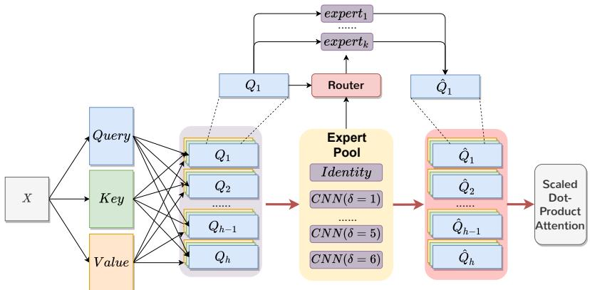  
Figure 1: This figure shows the overall structure of MoCE. All contextualization functions are treated as experts. The router dynamically allocates experts from the expert pool with their corresponding weights for each head of each Q, K, and V vector. The heads are locally contextualized with given experts, and then serve as the input to the following Scaled Dot-Product Attention module.

and applies "Scaled Dot-Product Attention" for each, as shown in (6). Finally, MHA is given by (7).

$$
\mathrm { h e a d } _ { i } = \mathrm { s o f t m a x } ( \frac { Q _ { i } K _ { i } ^ { T } } { \sqrt { d _ { k } } } ) V _ { i }\tag{6}
$$

$$
\operatorname { M H A } ( X ) = \operatorname { C a t } ( \operatorname { h e a d } _ { 1 } , . . . , \operatorname { h e a d } _ { h } ) W ^ { O }\tag{7}
$$

## 2.4 Multilingual NMT

For many-to-many multilingual NMT, it requires language IDs to indicate the source and target languages (Johnson et al., 2017). A typical approach is prepending a language token at the beginning of the source and target sentences, respectively. Table 1 provides an example.

<table><tr><td></td><td>Source</td><td>Target</td></tr><tr><td>Origin</td><td>Hello world!</td><td>Bonjour le monde!</td></tr><tr><td>Model Input</td><td></td><td>&lt;en&gt; _Hello _world ! &lt;fr&gt; _Bonjour _le _monde!</td></tr></table>

Table 1: An example of language token.

## 3 Method

In this section, we first introduce MultiScale-Headed Attention, a way to model multi-scale contextualization. Then we extend it to Adaptive MultiScale-Headed Attention, the core module of MoCE. We also propose how to leverage language ID information to further improve our method.

## 3.1 MultiScale-Headed Attention (MSHA)

Grouping hidden state dimensions has been a common and effective way to perform different operations on the same token (Huang and Feng, 2024;

Wu et al., 2024). Since it is the same as a part of MHA, we take advantage of MHA and use its heads as the grouped dimensions, like in (5).

To perform multi-scale contextualization on each head, MSHA applies the same contextualization function $g ( \cdot )$ on Q, K, and V vectors. Taking the $i ^ { t h }$ head as an example, it substitutes the vectors in (6) with contextualized form, yielding (8).

$$
\widetilde { \mathrm { h e a d } _ { \mathrm { i } } } = \mathrm { s o f t m a x } ( \frac { g _ { i } ( Q _ { i } ) g _ { i } ( K _ { i } ) ^ { T } } { \sqrt { d _ { k } } } ) g _ { i } ( V _ { i } )\tag{8}
$$

For $g ( \cdot )$ , we rewrite (4) in a clear way as in (9). Here δ denotes the neighborhood radius (including the central word) of local contextualization.

$$
g ( \cdot , \delta ) = \left\{ \begin{array} { l l } { { \mathrm { I d e n t i t y } ( \cdot ) } } & { { , \delta = 0 } } \\ { { \mathrm { C N N } ( \cdot , 2 \delta - 1 ) } } & { { , \delta > 0 } } \end{array} \right.\tag{9}
$$

Similarly, we replace headi from (8) with head ^i.

$$
\operatorname { M S H A } ( X ) = \operatorname { C a t } ( { \widetilde { \mathrm { h e a d } _ { 1 } } } , . . . , { \widetilde { \mathrm { h e a d } _ { h } } } ) W ^ { O }\tag{10}
$$

MSHA offers two advantages over MSC. First, it leverages the natural grouping operation within MHA, saving an additional vector separation and recombination step. Second, each head in MSHA is responsible for contextualization at a specific granularity, enhancing the model’s interpretability, facilitating analysis presented in Section 5.4.

## 3.2 Adaptive MultiScale-Headed Attention

Based on MSHA, we leverage MoE structure to propose an adaptive approach, Ada-MSHA, to solve the problem of fixed contextualization scales. In our approach, contextualization functions $g ( \cdot )$ are not determined by hyper-parameters. Rather, the model decides which $g ( \cdot )$ to use. Specifically, a router predicts the selection probability of the candidate $g ( \cdot )$ for each token respectively, and it selects $g ( \cdot )$ according to the predicted probabilities. Viewing Ada-MSHA from the perspective of MoE, different contextualization functions serve as experts and they compose an expert pool, which the router selects experts from. The overall model structure is depicted in Figure 1.

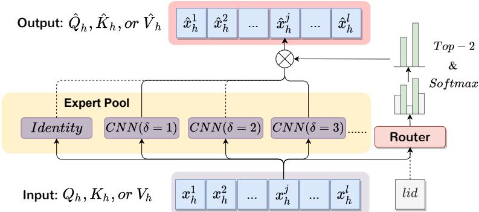  
Figure 2: This figure shows the detailed model structure around the routing mechanism. The input $x _ { h }$ denotes the $h ^ { t \overline { { h } } }$ head of Q, K, or V vector, with the sentence length of $l . \ x _ { h } ^ { j }$ represents the $j ^ { t h }$ token of $x _ { h }$ . For an arbitrary token $x _ { h } ^ { j } .$ , the router predicts the selection probability for each expert and selects the top-2. The weighted combination of contextualized vectors from these 2 experts forms the final output $\hat { x } _ { h } ^ { j }$ $" l i d "$ represents the language token, which is optional prior information for the router. If applied, $" l i d "$ is concatenated with $x _ { h } ^ { j }$ to be the input.

As for routing mechanism, Ada-MSHA basically applies the commonly used implementation (Shazeer et al., 2017; Ramachandran and $\mathrm { L e } ,$ 2019) for routing, i.e. (1), (2), and (3).

Figure 2 shows the routing mechanism with $x _ { h } ^ { j }$ as an example. The input $x$ can be any head of Q, K, or V vectors. $x _ { h } ^ { j }$ means the $h ^ { t h }$ head from the $j ^ { t h }$ token of the sentence $x .$ On one side, the router takes $x _ { h } ^ { j }$ as input and predicts the selection probability for all experts. Then, the top-k, where k is default as $^ { 2 , }$ probabilities are normalized to be a distribution. On the other side, the corresponding k experts take $x _ { h } ^ { j }$ as input and output the contextualized vector, $g _ { i } ( x _ { h } ^ { j } )$ . The final output $\hat { x } _ { h } ^ { j }$ is given by the weighted summation of these k vectors, as shown in (11), which aligns with (1).

$$
\hat { x } _ { h } ^ { j } = \sum _ { i } ^ { n } G _ { i } ( x _ { h } ^ { j } ) g _ { i } ( x _ { h } ^ { j } )\tag{11}
$$

The candidate contextualization functions, $g ( \cdot )$ are manually defined in MSC (Huang and Feng, 2024), which has demonstrated it beneficial to provide $g ( \cdot )$ of more scales. Therefore, we provide contextualization functions with various $\delta \mathbf { s } ,$ consecutively from 0 to $\Delta .$ , the predefined upper bound. For example, if $\Delta \mathit { \Psi } = \mathrm { ~ 5 ~ }$ , there are $6 ~ g ( \cdot )$ , with $\delta = 0 , 1 , 2 , 3 , 4 , 5$ for each. In this way, we reduce the number of hyper-parameters from 8 in MSC to only 1 in Ada-MSHA.

It should be clarified that Ada-MSHA is a modified Attention layer. By default, we replace the first encoder layer with Ada-MSHA and keep the rest model parts unchanged. This is discussed in Appendix G.

## 3.3 Language ID - the Prior Information

The standard $P ( x )$ from (2) is given by (12), where $W ^ { R }$ stands for the router and is a linear mapping from hidden state dimension to the number of expert candidates.

$$
P ( x ) = \mathrm { s o f t m a x } ( x W ^ { R } )\tag{12}
$$

Realizing a byte may be interpreted differently as the language changes, we propose to concatenate the language ID (lid) token with $x$ to serve as router’s input. The $" + l i d "$ version router is given by (13), where $" [ \cdot | \cdot ] "$ denotes concatenation.

$$
P ( x ) = \mathrm { s o f t m a x } ( [ x | l i d ] { \cal W } ^ { R } )\tag{13}
$$

The experiment results in I demonstrate the $" l i d "$ is beneficial to massively multilingual translation.

## 4 Experiment Settings

To verify the effectiveness of our proposed approach, we experiment on two massively multilingual translation datasets with over 50 languages.

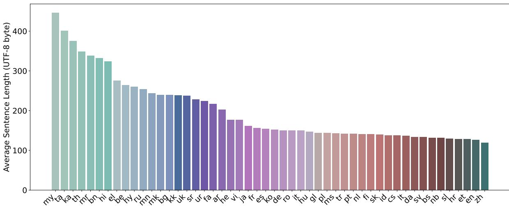  
Figure 3: This figure depicts the average length of byte-based strings of different languages to express the same meaning. It reflects the complexity/conciseness of languages; languages are getting more concise from left to right.

We mainly compare with byte-based models but also try the subword-based Transformer model.

## 4.1 Datasets

## Ted-59

Following Huang and Feng (2024), we use Ted-59 dataset (Qi et al., 2018) for fair comparison. This dataset stems from the TED corpus and comprises 59 languages, including English and 58 other languages. All sentence pairs are English-centered. We use the data provided by Salesky et al. (2023).

For data preprocessing, we apply the scripts from EmbeddinglessNMT (Shaham and Levy, 2021) to perform byte-level preprocessing. The final vocabulary contains 256 bytes as well as several language tokens. For the subword-based system, Sentence-Piece (Kudo and Richardson, 2018) with vocabulary size 32k is applied for tokenization.

## OPUS-100

OPUS-100 (Zhang et al., 2020) is an even larger massively multilingual translation dataset, which covers English and 99 other languages.

The data preprocessing is the same as that for Ted-59, except using Sentencepiece with vocabulary size 64k, aligning with Zhang et al. (2020).

## 4.2 Systems

We compare our method with the following systems on multilingual benchmarks:

• Transformer (Vaswani et al., 2017): Baseline that can be byte-based or subword-based.

• Byte-nCF (Sreedhar et al., 2023): A strong byte-based NMT model, with default hyperparameter settings1.

• MSC (Huang and Feng, 2024): The state-ofthe-art byte-based NMT model prior to Ada-MSHA. For Ted-59, we use recommended hyper-parameters2. For others, we use more contextualization scales which proves better3.

• MoCE: Our proposed method, with hyperparameter ∆ = 5 or 6. Routing with language ID is also tested, shown as "+lid".

<table><tr><td>Category</td><td>Languages</td></tr><tr><td>Long</td><td>my, ta, ka, th</td></tr><tr><td>Medium</td><td>bg, mk, uk, sr</td></tr><tr><td>Short</td><td>eo, sl, sv, et</td></tr><tr><td>L.R.</td><td>az, be, gl, sk</td></tr><tr><td>H.R.</td><td>ar, de, he, it</td></tr><tr><td>OPUS4</td><td>de, zh, br, te</td></tr></table>

Table 2: Language composition for each category.

## 4.3 Training, Inference, and Evaluation

We follow the standard practice in multilingual translation by training models on both "xx en" and "en xx" translation directions. Since the focus is handling diverse source languages, our evaluation primarily targets the "xx en" direction. Apart from reporting BLEU scores in the main body, we also report character-level metric ChrF and modelbased metric COMET in Appendix E and D for comprehensive evaluation. We detail the complete setups in Appendix B.

<table><tr><td></td><td>Param.</td><td>Long</td><td>Medium</td><td>Short</td><td>L.R.</td><td>H.R.</td><td>All</td></tr><tr><td>Transformer (Subword)</td><td>60.6M</td><td>15.43</td><td>31.05</td><td>26.34</td><td>23.57</td><td>30.69</td><td>24.79</td></tr><tr><td>Transformer (Byte)</td><td>44.3M</td><td>14.66</td><td>32.06</td><td>27.43</td><td>25.01</td><td>31.91</td><td>25.21</td></tr><tr><td>Byte-nCF MSC</td><td>46.7M</td><td>13.75</td><td>31.09</td><td>26.31</td><td>23.55</td><td>30.84</td><td>24.33</td></tr><tr><td>MoCE (∆ = 5)</td><td>44.4M 44.4M</td><td>14.86 15.89</td><td>32.36 33.23</td><td>28.00 28.56</td><td>25.11 25.81</td><td>32.26 32.92</td><td>25.61 26.30</td></tr><tr><td>+lid</td><td>44.4M</td><td>16.28</td><td>33.19</td><td>28.64</td><td>25.84</td><td>33.02</td><td>26.52</td></tr><tr><td>MoE (Δ = 6)</td><td>44.5M</td><td>15.91</td><td>32.59</td><td>28.44</td><td>25.34</td><td>32.65</td><td>26.13</td></tr><tr><td>+lid</td><td>44.5M</td><td>16.42</td><td>32.89</td><td>28.77</td><td>25.49</td><td>33.04</td><td>26.43</td></tr></table>

Table 3: Overall BLEU scores on Ted-59 dataset. The definition of each category is detailed in section 5.2. "All" means the average score of all 58 translation directions.

## 5 Results and Analysis

## 5.1 Language Conciseness under UTF-8 Byte Encoding

Before translation experiments, we first examine the conciseness of different languages. As previously mentioned, a character may be represented by 1 to 4 UTF-8 bytes. A misleading intuition is that languages using 3-byte characters are longer in sentence lengths. However, languages like Chinese, are inherently concise, which is easily overlooked.

To explore language conciseness under byte encoding, we use Flores-101 dataset (Goyal et al., 2022), which contains parallel sentence pairs across 101 languages, ensuring that all languages convey the same semantic content. Inspired by Limisiewicz et al. (2024), we calculate the average length of byte-encoded sentences for each language, which reflects the conciseness of languages. The results are shown in Figure 3. The experiment details are introduced in Appendix A.

## 5.2 Language Categorization

To effectively compare and analyze the results of multilingual translation, we report scores across different language categories. For each category, we select four representative languages and present their average scores. We first group languages into three categories: "Long", "Medium", and "Short", based on the average sentence length in section 5.1. Following Huang and Feng (2024), languages are grouped into low-resource (L.R.) and high-resource (H.R.) categories based on corpus size. Following

Zhang et al. (2020), four languages as selected as "OPUS4". The compositions of all categories are shown in Table 2.

## 5.3 Main Experiments

## Results on Ted-59

Table 3 summarizes the results on Ted-59 dataset. Nearly all byte-based models outperform the subword-based model with much fewer parameters. Among the byte-based models, all varieties of MoCE surpass MSC by a large margin, demonstrating the effectiveness of using adaptive contextualization scales.

The comparison of different settings of MoCE demonstrates two points. First, applying "+lid" achieves consistent improvement, which is discussed in Appendix I. Second, ∆ value affects model’s inclination toward language groups, especially "Long" and "Medium" groups, which is discussed in Section 5.5. The results at "Short" group do not follow a certain rule. We conjecture this is because a single byte has a determined mapping to character for "Short" languages, so they rely less on contextualization functions.

## Results on OPUS-100

Table 4 exhibits the results on OPUS-100 dataset.4 The "\*" denotes the results from Zhang et al. (2020), while our re-implementation is much better than the original one.

The comparison between subword-based and byte-based models differs from Ted-59. The reason lies in two sides. First, the subword-based model doubles vocabulary size, reducing the risk of encountering unknown words. Second, OPUS-100 provides more training data, allowing effective convergence of the expanded embedding table.

<table><tr><td></td><td>Param.</td><td>Long</td><td>Medium</td><td>Short</td><td>OPUS4</td><td>All</td></tr><tr><td>Transformer* (Subword)</td><td>110M</td><td>–</td><td>一</td><td>一</td><td>23.35</td><td>27.60</td></tr><tr><td>Transformer (Subword)</td><td>77.0M</td><td>20.72</td><td>28.07</td><td>30.43</td><td>29.41</td><td>30.72</td></tr><tr><td>Transformer (Byte)</td><td>44.3M</td><td>16.63</td><td>24.47</td><td>24.84</td><td>22.81</td><td>25.36</td></tr><tr><td>MSC</td><td>44.4M</td><td>16.38</td><td>24.79</td><td>25.48</td><td>23.65</td><td>25.74</td></tr><tr><td>MoCE  $( \Delta = 5 )$ </td><td>44.4M</td><td>16.44</td><td>24.55</td><td>25.14</td><td>23.16</td><td>25.31</td></tr><tr><td> $+ l i d$ </td><td>44.4M</td><td>16.48</td><td>25.03</td><td>25.68</td><td>23.13</td><td>25.79</td></tr><tr><td>MoCE  $\bar { ( \Delta } \bar { = } \bar { 6 ) }$ </td><td>44.5M</td><td>16.48</td><td>24.92</td><td>25.47</td><td>23.58</td><td>25.79</td></tr><tr><td> $+ l i d$ </td><td>44.5M</td><td>17.06</td><td>24.94</td><td>25.93</td><td>24.01</td><td>26.10</td></tr></table>

Table 4: Overall BLEU scores on OPUS-100 dataset. The definition of each category is detailed in section 5.2. $" \mathrm { A l l " }$ means the average score of all 94 translation directions. We bold the highest BLEU scores for byte-based methods.

The previous conclusion that ∆ influences models’ inclination toward different groups is less obvious also due to the sufficiency of training data. A larger $\Delta$ provides more expert choices, but a well-converged router can avoid choosing the inappropriate experts. As a result, $\Delta = 6$ performs no worse than $\Delta = 5$ in all groups.

## 5.4 Expert Choice and Language Conciseness

The major motivation of MoCE is to choose appropriate contextualization functions according to the input. To verify if MoCE achieves such target, we count the selected ratio of each expert throughout a whole test set. Specifically, we select 4 languages, my, bg, $e t ,$ and $z h ,$ from left to right in Figure $3 ,$ and also from least concise to most concise. Then, we test "en xx" and "xx en" for them, recording the selected ratios of experts. The sentence length ratios xx/en are recorded to represent the relative conciseness, which highly correlates to the expert choices. All experiments are conducted on Ted-59 with $" + l i d "$ setting.

The results are exhibited in Figure 4, where four columns represent different languages $( " x x " )$ , and two rows represent model settings $( \Delta = 5$ and 6). The sentence length ratios of $" x x " $ over $" e n "$ are listed in the middle line. For all the sub-figures, the solid lines $( " e n {  } x x " )$ are treated as pivots, because they share the same source language. The differences between "xx en" and the pivots reveal model’s inclination towards different languages.

Taking either row as an example, the model gradually tends to choose smaller contextualization radius (δ) as $" x x " $ becomes more concise. To quantitatively show this δ-shift behavior, we drew the averages of δ in vertical lines. For the least concise language, "my", model tends to choose larger δ than the pivot. For the most concise language, $" z h "$ model tends to choose smaller $\delta$ than the pivot. To measure the differences in more detail, we calculated the JS-divergence between the distributions of $" x x {  } e n "$ and $" \mathit { e n } \to x x "$ . The combination of figures and JS-divergence values clearly show the decreasing tendency of selected ratios for experts with larger δ and the increasing tendency of those with smaller δ, from left to right.

These findings demonstrate that MoCE can effectively identify the input language type and route the input to appropriate experts.

## 5.5 Systematic Shift of δ with Varied $\Delta$

Apart from the input language type, the choice of δ is also influenced by the upper bound of contextualization radius, which is $\Delta .$ . Intuitively, providing experts with larger $\delta$ encourages a model to leverage longer context information, though this is not always more beneficial for the overall performance.

Comparing $\Delta = 5$ and 6 in Figure 4, we observe a consistent shift of δ selection. This shift of overall tendency is systematic, caused by model structure change. The vertical lines quantitatively demonstrate a model with larger $\Delta$ tends to select experts with a larger radius. This explains why $\Delta = 6$ performs better in "Long" and $\Delta = 5$ performs better in "Medium".

## 5.6 How ∆ Influences Translation Quality

After analyzing how $\Delta$ influences expert choices, we empirically assess its influence on translation quality. Specifically, we conduct experiments on Ted-59 with different $\Delta .$ , and focus on different sentence length groups. In addition to previous experiments, we try a smaller $\Delta = 4$ for comparison.

Figure 5 exhibits their advantages over Transformer (Byte). While $\Delta = 6$ performs the best in "Long" group, $\Delta = 5$ and 4 perform the best in "Medium" group and $" \mathrm { S h o r t " }$ group respectively. This figure demonstrates that for a certain language, using the appropriate contextualization function can maximize translation quality.

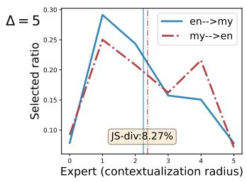

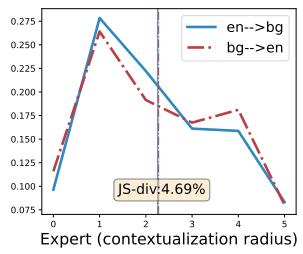

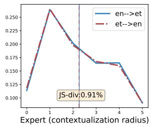

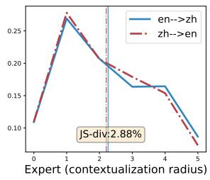

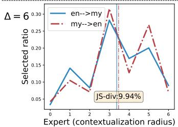

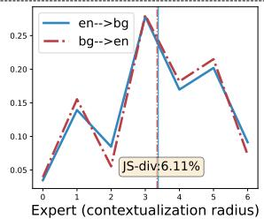

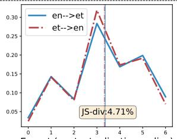

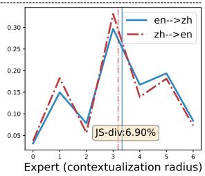  
Figure 4: These figures exhibit the selected ratio of each expert, recorded when translating $" \boldsymbol e n \mathrm { \to } x x "$ and $" x x {  } e n "$ The vertical lines are the averaged contextualization radius (δ). The two rows represent $\Delta = 5$ and 6 respectively. Listed in the middle line are what $" x x "$ stands for and its length ratio over $" e n "$ , reflecting the relative conciseness. From left to right, as the language conciseness $\mathrm { f o r } \ " x x "$ increases, the router tends to select more experts with smaller δ. The JS-divergences between two distributions quantitatively prove it too. This consistency demonstrates that MoCE has learned to select proper experts for corresponding input. From top to bottom, as $\Delta$ increases, the model systematically tends to choose larger δ. This explains why $" \Delta = 6 "$ is better in $" \mathrm { L o n g " }$ and $" \Delta = 5 "$ is better in "Medium" in Table 3.

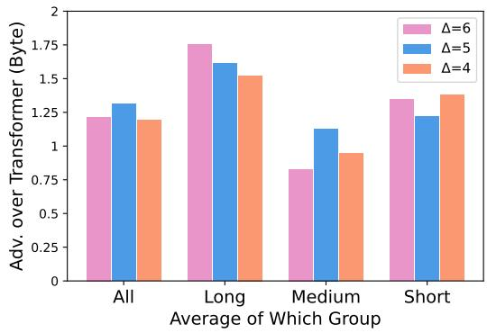  
Figure 5: This figure compares MoCE with different ∆ and show their advantage over Transformer (Byte). BLEU is used in this figure. Their performance gaps in different language groups show that ∆ benefits languages with corresponding conciseness.

## 5.7 Effectiveness of MoCE Concept

We highlight the benefit of applying a Mixture of Contextualization Experts over using a single expert for each head. With the weights of experts varying in continuous space, the defacto contextualization radius has way more possibilities. Here,

top-1 routing is chosen to simulate the single expert setting. Empirical results in Table 5 demonstrate the advantage of applying MoE in our method. It also proves that mixing two experts is enough.
<table><tr><td></td><td>Long</td><td>Medium</td><td>Short</td><td>Avg.</td></tr><tr><td>Top-1</td><td>15.86</td><td>32.74</td><td>28.29</td><td>26.03</td></tr><tr><td>Top-2</td><td>16.28</td><td>33.19</td><td>28.64</td><td>26.52</td></tr><tr><td>Top-3</td><td>16.15</td><td>32.90</td><td>28.51</td><td>26.34</td></tr></table>

Table 5: Top-2 routing is the standard MoCE, and Top-1 simulates the strategy of not mixing experts. Experiments are conducted with $" \Delta = 5$ , +lid" on Ted-59.

## 5.8 Training and Inference Speed

While MoCE demonstrates substantial improvements in translation quality over the baselines, the concern of time cost may rise. To address this concern, we evaluated the training and inference speed of all methods mentioned in this paper using Ted-59 dataset, providing a quantitative comparison of computational efficiency. The byte-based Transformer model serves as the baseline, the relative speed ratios are exhibited in Table 6.

For the training phase, we recorded the time spent in training one epoch. For the inference phase, we recorded the time spent in translating the entire test set for each translation direction, and took the sum of them. The speed of Transformer (byte) is denoted as "1x"; values below 1 indicate slower speeds compared to the baseline. According to Table 6, all the local contextualization methods, including MoCE, achieve nearly the same speed as the baseline.

<table><tr><td rowspan=1 colspan=1></td><td rowspan=1 colspan=1>Training</td><td rowspan=1 colspan=1>Inference</td></tr><tr><td rowspan=1 colspan=1>Transformer (byte)</td><td rowspan=1 colspan=1>1x</td><td rowspan=1 colspan=1>1x</td></tr><tr><td rowspan=1 colspan=1>MSC</td><td rowspan=1 colspan=1>0.96x</td><td rowspan=1 colspan=1>0.96x</td></tr><tr><td rowspan=1 colspan=1>Byte-nCF</td><td rowspan=1 colspan=1>0.95x</td><td rowspan=1 colspan=1>0.97x</td></tr><tr><td rowspan=1 colspan=1>MoCE (∆ = 5)</td><td rowspan=1 colspan=1>0.98x</td><td rowspan=1 colspan=1>0.96x</td></tr><tr><td rowspan=1 colspan=1>+lid</td><td rowspan=1 colspan=1>0.99x</td><td rowspan=1 colspan=1>0.96x</td></tr><tr><td rowspan=1 colspan=1>MoCE (∆ = 6)</td><td rowspan=1 colspan=1>0.96x</td><td rowspan=1 colspan=1>0.96x</td></tr><tr><td rowspan=1 colspan=1>+lid</td><td rowspan=1 colspan=1>0.98x</td><td rowspan=1 colspan=1>0.96x</td></tr></table>

Table 6: The relative speed ratio compared with byte-based Transformer baseline, measured on Ted-59 dataset.

## 6 Related Works

## 6.1 Byte-based Multilingual NMT

Most multilingual NMT systems utilize subwordlevel tokenization techniques such as Byte Pair Encoding (Sennrich et al., 2016) and Unigram (Kudo, 2018). They often result in over-segmentation of low-resource languages, issues with out-ofvocabulary (OOV) words, and difficulties in adapting to new languages or domains (Rust et al., 2021; Raunak et al., 2020). As the number of languages increases, these problems worsen, limiting the performance of multilingual NMT systems. To this end, various byte-level approaches have been proposed. Shaham and Levy (2021) build embeddingfree NMT models using UTF-8 byte tokenization. Tay et al. (2022) propose CharFormer, integrating byte representations from different block sizes by mean-pooling. Sreedhar et al. (2023) enhance CharFormer by employing CNN for representation integration. Huang and Feng (2024) propose MSC, which assigns contextualized information at different scales across various hidden state dimensions.

## 6.2 MoE for Multilingual NMT

Previous studies on multilingual NMT have demonstrated that model performance initially improves but subsequently declines as the number of training languages and the corpus size increase (Arivazhagan et al., 2019; Zhang et al., 2020; Yang et al., 2021). This phenomenon, known as the "curse of multilingualism", is attributed to limited model capacity (Chang et al., 2023). The MoE techniques significantly scale up model capacity without increasing training and inference costs accordingly, and can be used to scale up multilingual NMT models and mitigate language conflicts. Shazeer et al. (2017) propose sparse-gated modules with thousands of experts and validate the effect on bilingual translation tasks. Li et al. (2023) use pre-trained FFN to initialize each expert, and the model can flexibly combine dense and sparse MoE modules. To address the problem of insufficient expert training in sparse MoE, Wu et al. (2024) integrates the knowledge of experts through token-splittingmerging operation, which significantly improves the expert activation ratio.

## 6.3 Local Contextualization Modeling

While the attention mechanism’s global contextualization effectively addresses the challenge of long-distance dependencies, many tasks benefit from a focus on local contextualization. For instance, in audio processing, a model needs several consecutive frames to comprehend an audio segment. The Conformer (Gulati et al., 2020) has proven to be an effective local contextualization structure for audio-related tasks such as speech recognition (Gulati et al., 2020), speech translation (Fang et al., 2024), and simultaneous translation (Ma et al., 2024). Given that MoCE provides similar functionality to Conformer, it may serve as a more advantageous replacement. Moreover, tasks involving phrasal representation modeling (Huang et al., 2023b; Fang and Feng, 2022) could also benefit from MoCE’s capacity as a robust multi-scale feature extractor.

## 7 Conclusions

In this work, we propose an Adaptive MultiScale-Headed Attention approach for effective local contextualization. It conducts contextualization on attention heads within multi-head attention. Next, we leverage the concept of MoE to achieve adaptive selection of contextualization functions. Extensive experiments demonstrate the superiority of Ada-MSHA over other byte-based models and disclose why it performs well.

## Limitations

The proposed approach is only applied to encoder. How to apply local contextualization to decoder is a critical and interesting topic for future work.

## References

Naveen Arivazhagan, Ankur Bapna, Orhan Firat, Dmitry Lepikhin, Melvin Johnson, Maxim Krikun, Mia Xu Chen, Yuan Cao, George F. Foster, Colin Cherry, Wolfgang Macherey, Zhifeng Chen, and Yonghui Wu. 2019. Massively multilingual neural machine translation in the wild: Findings and challenges. CoRR, abs/1907.05019.

Mengyu Bu, Shuhao Gu, and Yang Feng. 2024. Improving multilingual neural machine translation by utilizing semantic and linguistic features. In Findings ofthe Associationfor Computational Linguistics ACL 2024, pages 10410–10423, Bangkok, Thailand and virtual meeting. Association for Computational Linguistics.

Tyler A. Chang, Catherine Arnett, Zhuowen Tu, and Benjamin K. Bergen. 2023. When is multilinguality a curse? Language modeling for 250 high- and lowresource languages. arXiv preprint.

Jonathan H. Clark, Dan Garrette, Iulia Turc, and John Wieting. 2022. Canine: Pre-training an efficient tokenization-free encoder for language representation. Trans. Assoc. Comput. Linguistics, 10:73–91.

Marta R. Costa-jussà, James Cross, Onur Çelebi, Maha Elbayad, Kenneth Heafield, Kevin Heffernan, Elahe Kalbassi, Janice Lam, Daniel Licht, Jean Maillard, Anna Y. Sun, Skyler Wang, Guillaume Wenzek, Al Youngblood, Bapi Akula, Loïc Barrault, Gabriel Mejia Gonzalez, Prangthip Hansanti, John Hoffman, Semarley Jarrett, Kaushik Ram Sadagopan, Dirk Rowe, Shannon Spruit, Chau Tran, Pierre Andrews, Necip Fazil Ayan, Shruti Bhosale, Sergey Edunov, Angela Fan, Cynthia Gao, Vedanuj Goswami, Francisco Guzmán, Philipp Koehn, Alexandre Mourachko, Christophe Ropers, Safiyyah Saleem, Holger Schwenk, and Jeff Wang. 2022. No language left behind: Scaling human-centered machine translation. CoRR, abs/2207.04672.

Zhenbang Du, Jiayu An, Jiahao Hong, and Dongrui Wu. 2023. Mixture-of-experts for open set domain adaptation: A dual-space detection approach. CoRR, abs/2311.00285.

Abhimanyu Dubey, Abhinav Jauhri, Abhinav Pandey, Abhishek Kadian, Ahmad Al-Dahle, Aiesha Letman, Akhil Mathur, Alan Schelten, Amy Yang, Angela Fan, Anirudh Goyal, Anthony Hartshorn, Aobo Yang, Archi Mitra, Archie Sravankumar, Artem Korenev, Arthur Hinsvark, Arun Rao, Aston Zhang, Aurélien Rodriguez, Austen Gregerson, Ava Spataru, Baptiste Rozière, Bethany Biron, Binh Tang, Bobbie Chern, Charlotte Caucheteux, Chaya Nayak, Chloe Bi, Chris Marra, Chris McConnell, Christian Keller, Christophe Touret, Chunyang Wu, Corinne Wong, Cristian Canton Ferrer, Cyrus Nikolaidis, Damien Allonsius, Daniel Song, Danielle Pintz, Danny Livshits, David Esiobu, Dhruv Choudhary, Dhruv Mahajan, Diego Garcia-Olano, Diego Perino, Dieuwke Hupkes,

Egor Lakomkin, Ehab AlBadawy, Elina Lobanova, Emily Dinan, Eric Michael Smith, Filip Radenovic, Frank Zhang, Gabriel Synnaeve, Gabrielle Lee, Georgia Lewis Anderson, Graeme Nail, Grégoire Mialon, Guan Pang, Guillem Cucurell, Hailey Nguyen, Hannah Korevaar, Hu Xu, Hugo Touvron, Iliyan Zarov, Imanol Arrieta Ibarra, Isabel M. Kloumann, Ishan Misra, Ivan Evtimov, Jade Copet, Jaewon Lee, Jan Geffert, Jana Vranes, Jason Park, Jay Mahadeokar, Jeet Shah, Jelmer van der Linde, Jennifer Billock, Jenny Hong, Jenya Lee, Jeremy Fu, Jianfeng Chi, Jianyu Huang, Jiawen Liu, Jie Wang, Jiecao Yu, Joanna Bitton, Joe Spisak, Jongsoo Park, Joseph Rocca, Joshua Johnstun, Joshua Saxe, Junteng Jia, Kalyan Vasuden Alwala, Kartikeya Upasani, Kate Plawiak, Ke Li, Kenneth Heafield, Kevin Stone, and et al. 2024. The llama 3 herd of models. CoRR, abs/2407.21783.

Lukas Edman, Gabriele Sarti, Antonio Toral, Gertjan van Noord, and Arianna Bisazza. 2024. Are character-level translations worth the wait? comparing ByT5 and mT5 for machine translation. Transactions ofthe Associationfor Computational Linguistics, 12:392–410.

Qingkai Fang and Yang Feng. 2022. Neural machine translation with phrase-level universal visual representations. In Proceedings ofthe 60th Annual Meeting ofthe Associationfor Computational Linguistics (Volume 1: Long Papers), pages 5687–5698, Dublin, Ireland. Association for Computational Linguistics.

Qingkai Fang, Zhengrui Ma, Yan Zhou, Min Zhang, and Yang Feng. 2024. CTC-based non-autoregressive textless speech-to-speech translation. In Findings of the Associationfor Computational Linguistics ACL 2024, pages 9155–9161, Bangkok, Thailand and virtual meeting. Association for Computational Linguistics.

Naman Goyal, Cynthia Gao, Vishrav Chaudhary, Peng-Jen Chen, Guillaume Wenzek, Da Ju, Sanjana Krishnan, Marc’Aurelio Ranzato, Francisco Guzmán, and Angela Fan. 2022. The Flores-101 evaluation benchmark for low-resource and multilingual machine translation. Transactions ofthe Associationfor Computational Linguistics, 10:522–538.

Anmol Gulati, James Qin, Chung-Cheng Chiu, Niki Parmar, Yu Zhang, Jiahui Yu, Wei Han, Shibo Wang, Zhengdong Zhang, Yonghui Wu, and Ruoming Pang. 2020. Conformer: Convolution-augmented transformer for speech recognition. In 21st Annual Conference ofthe International Speech Communication Association, Interspeech 2020, Virtual Event, Shanghai, China, October 25-29, 2020, pages 5036–5040. ISCA.

Chengsong Huang, Qian Liu, Bill Yuchen Lin, Tianyu Pang, Chao Du, and Min Lin. 2023a. Lorahub: Efficient cross-task generalization via dynamic lora composition. Preprint, arXiv:2307.13269.

Langlin Huang and Yang Feng. 2024. Integrating multiscale contextualized information for byte-based neural machine translation. In Findings ofthe Association for Computational Linguistics ACL 2024, pages 9794–9801, Bangkok, Thailand and virtual meeting. Association for Computational Linguistics.

Langlin Huang, Shuhao Gu, Zhang Zhuocheng, and Yang Feng. 2023b. Enhancing neural machine translation with semantic units. In Findings of the Association for Computational Linguistics: EMNLP 2023, pages 2264–2277, Singapore. Association for Computational Linguistics.

Albert Q. Jiang, Alexandre Sablayrolles, Arthur Mensch, Chris Bamford, Devendra Singh Chaplot, Diego de Las Casas, Florian Bressand, Gianna Lengyel, Guillaume Lample, Lucile Saulnier, Lélio Renard Lavaud, Marie-Anne Lachaux, Pierre Stock, Teven Le Scao, Thibaut Lavril, Thomas Wang, Timothée Lacroix, and William El Sayed. 2023. Mistral 7b. CoRR, abs/2310.06825.

Albert Q. Jiang, Alexandre Sablayrolles, Antoine Roux, Arthur Mensch, Blanche Savary, Chris Bamford, Devendra Singh Chaplot, Diego de Las Casas, Emma Bou Hanna, Florian Bressand, Gianna Lengyel, Guillaume Bour, Guillaume Lample, Lélio Renard Lavaud, Lucile Saulnier, Marie-Anne Lachaux, Pierre Stock, Sandeep Subramanian, Sophia Yang, Szymon Antoniak, Teven Le Scao, Théophile Gervet, Thibaut Lavril, Thomas Wang, Timothée Lacroix, and William El Sayed. 2024. Mixtral of experts. CoRR, abs/2401.04088.

Melvin Johnson, Mike Schuster, Quoc V. Le, Maxim Krikun, Yonghui Wu, Zhifeng Chen, Nikhil Thorat, Fernanda Viégas, Martin Wattenberg, Greg Corrado, Macduff Hughes, and Jeffrey Dean. 2017. Google’s multilingual neural machine translation system: Enabling zero-shot translation. Transactions ofthe Associationfor Computational Linguistics, 5:339–351.

Taku Kudo. 2018. Subword regularization: Improving neural network translation models with multiple subword candidates. In Proceedings ofthe 56th Annual Meeting ofthe Associationfor Computational Linguistics (Volume 1: Long Papers), pages 66–75, Melbourne, Australia. Association for Computational Linguistics.

Taku Kudo and John Richardson. 2018. SentencePiece: A simple and language independent subword tokenizer and detokenizer for neural text processing. In Proceedings of the 2018 Conference on Empirical Methods in Natural Language Processing: System Demonstrations, pages 66–71, Brussels, Belgium. Association for Computational Linguistics.

Jason Lee, Kyunghyun Cho, and Thomas Hofmann. 2017. Fully character-level neural machine translation without explicit segmentation. Trans. Assoc. Comput. Linguistics, 5:365–378.

Dmitry Lepikhin, HyoukJoong Lee, Yuanzhong Xu, Dehao Chen, Orhan Firat, Yanping Huang, Maxim

Krikun, Noam Shazeer, and Zhifeng Chen. 2021. {GS}hard: Scaling giant models with conditional computation and automatic sharding. In International Conference on Learning Representations.

Shangjie Li, Xiangpeng Wei, Shaolin Zhu, Jun Xie, Baosong Yang, and Deyi Xiong. 2023. MMNMT: Modularizing multilingual neural machine translation with flexibly assembled MoE and dense blocks. In Proceedings of the 2023 Conference on Empirical Methods in Natural Language Processing, pages 4978–4990, Singapore. Association for Computational Linguistics.

Tomasz Limisiewicz, Terra Blevins, Hila Gonen, Orevaoghene Ahia, and Luke Zettlemoyer. 2024. MYTE: Morphology-driven byte encoding for better and fairer multilingual language modeling. In Proceedings ofthe 62nd Annual Meeting ofthe Association for Computational Linguistics (Volume 1: Long Papers), pages 15059–15076, Bangkok, Thailand. Association for Computational Linguistics.

Zhengrui Ma, Qingkai Fang, Shaolei Zhang, Shoutao Guo, Yang Feng, and Min Zhang. 2024. A nonautoregressive generation framework for end-to-end simultaneous speech-to-any translation. In Proceedings of the 62nd Annual Meeting of the Association for Computational Linguistics (Volume 1: Long Papers), pages 1557–1575, Bangkok, Thailand. Association for Computational Linguistics.

Myle Ott, Sergey Edunov, Alexei Baevski, Angela Fan, Sam Gross, Nathan Ng, David Grangier, and Michael Auli. 2019. fairseq: A fast, extensible toolkit for sequence modeling. In Proceedings ofthe 2019 Conference of the North American Chapter of the Association for Computational Linguistics (Demonstrations), pages 48–53, Minneapolis, Minnesota. Association for Computational Linguistics.

Kishore Papineni, Salim Roukos, Todd Ward, and Wei-Jing Zhu. 2002. Bleu: a method for automatic evaluation of machine translation. In Proceedings of the 40th Annual Meeting ofthe Associationfor Computational Linguistics, July 6-12, 2002, Philadelphia, PA, USA, pages 311–318.

Sejik Park. 2024. Learning more generalized experts by merging experts in mixture-of-experts. CoRR, abs/2405.11530.

Matthew E. Peters, Mark Neumann, Mohit Iyyer, Matt Gardner, Christopher Clark, Kenton Lee, and Luke Zettlemoyer. 2018. Deep contextualized word representations. In Proceedings ofthe 2018 Conference of the North American Chapter ofthe Associationfor Computational Linguistics: Human Language Technologies, Volume 1 (Long Papers), pages 2227–2237, New Orleans, Louisiana. Association for Computational Linguistics.

Maja Popovic. 2015.´ chrF: character n-gram F-score for automatic MT evaluation. In Proceedings ofthe Tenth Workshop on Statistical Machine Translation,

pages 392–395, Lisbon, Portugal. Association for Computational Linguistics.

Matt Post. 2018. A call for clarity in reporting BLEU scores. In Proceedings of the Third Conference on Machine Translation: Research Papers, pages 186– 191, Brussels, Belgium. Association for Computational Linguistics.

Ye Qi, Devendra Sachan, Matthieu Felix, Sarguna Padmanabhan, and Graham Neubig. 2018. When and why are pre-trained word embeddings useful for neural machine translation? In Proceedings ofthe 2018 Conference of the North American Chapter of the Associationfor Computational Linguistics: Human Language Technologies, Volume 2 (Short Papers), pages 529–535, New Orleans, Louisiana. Association for Computational Linguistics.

Prajit Ramachandran and Quoc V. Le. 2019. Diversity and depth in per-example routing models. In International Conference on Learning Representations.

Vikas Raunak, Siddharth Dalmia, Vivek Gupta, and Florian Metze. 2020. On long-tailed phenomena in neural machine translation. In Findings ofthe Association for Computational Linguistics: EMNLP 2020, pages 3088–3095, Online. Association for Computational Linguistics.

Ricardo Rei, José G. C. de Souza, Duarte Alves, Chrysoula Zerva, Ana C Farinha, Taisiya Glushkova, Alon Lavie, Luisa Coheur, and André F. T. Martins. 2022. COMET-22: Unbabel-IST 2022 submission for the metrics shared task. In Proceedings of the Seventh Conference on Machine Translation (WMT), pages 578–585, Abu Dhabi, United Arab Emirates (Hybrid). Association for Computational Linguistics.

Phillip Rust, Jonas Pfeiffer, Ivan Vulic, Sebastian Ruder,´ and Iryna Gurevych. 2021. How good is your tokenizer? on the monolingual performance of multilingual language models. In Proceedings of the 59th Annual Meeting ofthe Associationfor Computational Linguistics and the 11th International Joint Conference on Natural Language Processing (Volume 1: Long Papers), pages 3118–3135, Online. Association for Computational Linguistics.

Elizabeth Salesky, Neha Verma, Philipp Koehn, and Matt Post. 2023. Multilingual pixel representations for translation and effective cross-lingual transfer. In Proceedings of the 2023 Conference on Empirical Methods in Natural Language Processing, pages 13845–13861, Singapore. Association for Computational Linguistics.

Rico Sennrich, Barry Haddow, and Alexandra Birch. 2016. Neural machine translation of rare words with subword units. In Proceedings of the 54th Annual Meeting of the Association for Computational Linguistics (Volume 1: Long Papers), pages 1715–1725, Berlin, Germany. Association for Computational Linguistics.

Uri Shaham and Omer Levy. 2021. Neural machine translation without embeddings. In Proceedings of the 2021 Conference ofthe North American Chapter ofthe Associationfor Computational Linguistics: Human Language Technologies, pages 181–186, Online. Association for Computational Linguistics.

Noam Shazeer, \*Azalia Mirhoseini, \*Krzysztof Maziarz, Andy Davis, Quoc Le, Geoffrey Hinton, and Jeff Dean. 2017. Outrageously large neural networks: The sparsely-gated mixture-of-experts layer. In International Conference on Learning Representations.

Makesh Narsimhan Sreedhar, Xiangpeng Wan, Yu Cheng, and Junjie Hu. 2023. Local byte fusion for neural machine translation. In Proceedings of the 61st Annual Meeting of the Association for Computational Linguistics (Volume 1: Long Papers), pages 7199–7214, Toronto, Canada. Association for Computational Linguistics.

Yi Tay, Vinh Q. Tran, Sebastian Ruder, Jai Gupta, Hyung Won Chung, Dara Bahri, Zhen Qin, Simon Baumgartner, Cong Yu, and Donald Metzler. 2022. Charformer: Fast character transformers via gradientbased subword tokenization. In International Conference on Learning Representations.

Hugo Touvron, Louis Martin, Kevin Stone, Peter Albert, Amjad Almahairi, Yasmine Babaei, Nikolay Bashlykov, Soumya Batra, Prajjwal Bhargava, Shruti Bhosale, Dan Bikel, Lukas Blecher, Cristian Canton-Ferrer, Moya Chen, Guillem Cucurull, David Esiobu, Jude Fernandes, Jeremy Fu, Wenyin Fu, Brian Fuller, Cynthia Gao, Vedanuj Goswami, Naman Goyal, Anthony Hartshorn, Saghar Hosseini, Rui Hou, Hakan Inan, Marcin Kardas, Viktor Kerkez, Madian Khabsa, Isabel Kloumann, Artem Korenev, Punit Singh Koura, Marie-Anne Lachaux, Thibaut Lavril, Jenya Lee, Diana Liskovich, Yinghai Lu, Yuning Mao, Xavier Martinet, Todor Mihaylov, Pushkar Mishra, Igor Molybog, Yixin Nie, Andrew Poulton, Jeremy Reizenstein, Rashi Rungta, Kalyan Saladi, Alan Schelten, Ruan Silva, Eric Michael Smith, Ranjan Subramanian, Xiaoqing Ellen Tan, Binh Tang, Ross Taylor, Adina Williams, Jian Xiang Kuan, Puxin Xu, Zheng Yan, Iliyan Zarov, Yuchen Zhang, Angela Fan, Melanie Kambadur, Sharan Narang, Aurélien Rodriguez, Robert Stojnic, Sergey Edunov, and Thomas Scialom. 2023. Llama 2: Open foundation and finetuned chat models. CoRR, abs/2307.09288.

Ashish Vaswani, Noam Shazeer, Niki Parmar, Jakob Uszkoreit, Llion Jones, Aidan N. Gomez, Lukasz Kaiser, and Illia Polosukhin. 2017. Attention is all you need. In Advances in Neural Information Processing Systems 30: Annual Conference on Neural Information Processing Systems 2017, December 4-9, 2017, Long Beach, CA, USA, pages 5998–6008.

Xun Wu, Shaohan Huang, Wenhui Wang, and Furu Wei. 2024. Multi-head mixture-of-experts. ArXiv, abs/2404.15045.

Linting Xue, Aditya Barua, Noah Constant, Rami Al-Rfou, Sharan Narang, Mihir Kale, Adam Roberts, and Colin Raffel. 2022. Byt5: Towards a token-free future with pre-trained byte-to-byte models. Trans. Assoc. Comput. Linguistics, 10:291–306.

Yilin Yang, Akiko Eriguchi, Alexandre Muzio, Prasad Tadepalli, Stefan Lee, and Hany Hassan. 2021. Improving multilingual translation by representation and gradient regularization. In Proceedings of the 2021 Conference on Empirical Methods in Natural Language Processing, pages 7266–7279, Online and Punta Cana, Dominican Republic. Association for Computational Linguistics.

Lili Yu, Daniel Simig, Colin Flaherty, Armen Aghajanyan, Luke Zettlemoyer, and Mike Lewis. 2023. MEGABYTE: predicting million-byte sequences with multiscale transformers. In Advances in Neural Information Processing Systems 36: Annual Conference on Neural Information Processing Systems 2023, NeurIPS 2023, New Orleans, LA, USA, December 10 - 16, 2023.

Biao Zhang, Philip Williams, Ivan Titov, and Rico Sennrich. 2020. Improving massively multilingual neural machine translation and zero-shot translation. In Proceedings of the 58th Annual Meeting of the Associationfor Computational Linguistics, pages 1628– 1639, Online. Association for Computational Linguistics.

Shaolei Zhang, Qingkai Fang, Zhuocheng Zhang, Zhengrui Ma, Yan Zhou, Langlin Huang, Mengyu Bu, Shangtong Gui, Yunji Chen, Xilin Chen, and Yang Feng. 2023. Bayling: Bridging cross-lingual alignment and instruction following through interactive translation for large language models. CoRR, abs/2306.10968.

## A Language Conciseness

The Flores-100 dataset contains two subset, "dev" and "devtest". Here, we use "devtest" subset which includes 1012 parallel sentence pairs.

We first convert all sentences into byte-based strings, and then count the average sentence length for each language. Since the sentences are parallel across all languages, the average sentence lengths are comparable, showing how many bytes the language need to convey the same meaning.

Figure 3 shows a subset of languages from Flores-100. In fact, we choose the intersection set of Flores-100 and Ted-59.

## B Detailed Training, Inference and Evaluation Setup

All the models and experiments are implemented based on Fairseq (Ott et al., 2019) codebase.

During training stage, we set learning $\mathrm { r a t e } { = } 5 e - 4 ,$ , dropout=0.1, and label smoothing=0.1. The batch size is 65536 for Ted-59 and PC-6 datasets, and 131072 for the largest OPUS-100 dataset. We apply adam optimizer with $\beta = ( 0 . 9 , 0 . 9 8 )$ and $\epsilon = 1 e - 8$ . In our experiments, encoder and decoder always share the embeddings. We also apply an early-stop strategy, i.e. stop training until valid loss doesn’t decrease for 10 checkpoints. Checkpoints are saved for every 5k update steps.

During inference, we average the last 5 checkpoints and evaluate with it. We apply beam search with beam size=4. We observed that byte-based NMT models tend to generate longer sequences, so we set the length penalty=1.5 for all byte-based models. Note that OPUS-100 lacks validation set and test set for these 5 languages: Aragonese(an), Divehi(dz), Yoruba(yo), Mongolian(mn), and Armenian(hy). In our experiments, these 5 languages are still trained, but we do not test them.

For comprehensive evaluation, we report BLEU (Papineni et al., 2002) and ChrF (Popovic´, 2015) scores using SacreBLEU toolkit (Post, 2018), and report COMET (Rei et al., 2022) score using wmt22-comet-da5 model. To keep the article concise, we present BLEU scores in the main body, and present ChrF and COMET in the Appendix D and E, respectively.

## C Applying MoCE on Subword-based Models

The experiment results in Section 5 have demonstrated the significant effectiveness of MoCE on byte-based models. In addition to that, we also explored how it benefits subword-based models. Intuitively, subword tokens contain richer information and require less contextual information. Therefore, we experimented on shorter contextual scales, i.e. $\Delta = 4$ and $\Delta = 5$ . We report the BLEU scores on Table 7. According to the results, applying MoCE improves subword-based models, though the improvement is relatively minor. We conjecture this is because the subword-based vocabulary still suffers from the curse of multilinguality.

<table><tr><td></td><td>Long</td><td>Medium</td><td>Short</td><td>L.R. H.R.</td><td>All</td></tr><tr><td>Transformer</td><td>15.43</td><td>31.05</td><td>26.34</td><td>23.57 30.69</td><td>24.79</td></tr><tr><td>MoCE (∆ = 4) +lid</td><td>15.71 15.51</td><td>31.15</td><td>26.65</td><td>23.49 31.05</td><td>24.99</td></tr><tr><td>MoE (△Δ = 5)</td><td>15.49</td><td>31.46 30.98</td><td>26.66 26.93</td><td>23.77 31.10 24.10 31.09</td><td>24.98 25.01</td></tr><tr><td>+lid</td><td>15.63</td><td>31.46</td><td>27.26</td><td>24.26 31.59</td><td>25.34</td></tr></table>

Table 7: BLEU scores on Ted-59 dataset. All models are subword-based.

## D ChrF Scores on Ted-59 and OPUS-100

We report ChrF scores on Ted-59 and OPUS-100 test sets in Table 8 and 9, respectively.

## E Comet Scores on Ted-59 and OPUS-100

We report COMET scores on Ted-59 and OPUS-100 test sets in Table 10 and 11, respectively.

<table><tr><td></td><td>Param.</td><td>Long</td><td>Medium</td><td>Short</td><td>L.R.</td><td>H.R.</td><td>All</td></tr><tr><td>Transformer (Subword)</td><td>60.6M</td><td>37.44</td><td>53.05</td><td>48.15</td><td>45.74</td><td>52.41</td><td>46.70</td></tr><tr><td>Transformer (Byte) Byte-nCF</td><td>44.3M 46.7M</td><td>36.82 35.36</td><td>54.30 53.02</td><td>49.42 48.27</td><td>47.55 46.03</td><td>53.45 52.17</td><td>47.26 46.09</td></tr><tr><td>MSC MoCE (∆ = 5)</td><td>44.4M 44.4M</td><td>36.88 38.47</td><td>54.53 55.07</td><td>49.86 50.60</td><td>47.69 48.19</td><td>53.64 54.27</td><td>47.54 48.30</td></tr><tr><td>+lid MoČE (Δ = 6)</td><td>44.4M 44.5M</td><td>38.95 38.98</td><td>55.14 54.80</td><td>50.57 50.54</td><td>48.23 47.78</td><td>54.45</td><td>48.56</td></tr><tr><td>+lid</td><td>44.5M</td><td>39.04</td><td>54.77</td><td>50.66</td><td>47.91</td><td>54.29 54.37</td><td>48.34 48.42</td></tr></table>

Table 8: Overall chrF scores on Ted-59 dataset. "Long", "Medium", "Short", "L.R.", "H.R." and "All" follow the same definitions as in Table 3.

<table><tr><td></td><td>Param.</td><td>Long</td><td>Medium</td><td>Short</td><td>OPUS4</td><td>All</td></tr><tr><td>Transformer (Subword)</td><td>77.0M</td><td>39.97</td><td>48.02</td><td>50.36</td><td>49.13</td><td>49.96</td></tr><tr><td>Transformer (Byte)</td><td>44.3M</td><td>35.37</td><td>44.85</td><td>44.93</td><td>42.25</td><td>44.88</td></tr><tr><td>MSC MoCE (∆ = 5)</td><td>44.4M 44.4M</td><td>35.39</td><td>45.30</td><td>45.54</td><td>43.24</td><td>45.11</td></tr><tr><td>+lid</td><td>44.4M</td><td>34.84 35.27</td><td>44.84 45.26</td><td>45.17 45.59</td><td>42.69 42.74</td><td>44.62</td></tr><tr><td>MoCE (Δ = 6)</td><td>44.5M</td><td>35.01</td><td>45.08</td><td>45.49</td><td>43.01</td><td>45.13 45.14</td></tr><tr><td>+lid</td><td>44.5M</td><td>35.77</td><td>45.27</td><td>45.86</td><td>43.52</td><td>45.37</td></tr></table>

Table 9: Overall chrF scores on OPUS-100 dataset. "Long", "Medium", "Short", "OPUS4" and "All" follow the same definitions as in Table 4.

<table><tr><td></td><td>Param.</td><td>Long</td><td>Medium</td><td>Short</td><td>L.R.</td><td>H.R.</td><td>All</td></tr><tr><td>Transformer (Subword)</td><td>60.6M</td><td>69.41</td><td>77.64</td><td>74.49</td><td>73.58</td><td>77.39</td><td>74.46</td></tr><tr><td>Transformer (Byte)</td><td>44.3M</td><td>67.96</td><td>79.11</td><td>74.87</td><td>74.88</td><td>77.85</td><td>74.44</td></tr><tr><td>Byte-nCF MSC</td><td>46.7M 44.4M</td><td>66.08 68.11</td><td>77.30 79.24</td><td>73.23 75.54</td><td>72.66 75.17</td><td>76.29 78.20</td><td>72.84 74.81</td></tr><tr><td>MoCE (∆ = 5)</td><td>44.4M</td><td>69.74</td><td>79.89</td><td>76.40</td><td>75.93</td><td>79.03</td><td>75.79</td></tr><tr><td>+lid MoČE (∆ = 6)</td><td>44.4M 44.5M</td><td>70.40 70.65</td><td>79.88 79.69</td><td>76.53 76.58</td><td>76.05</td><td>79.34</td><td>76.12</td></tr><tr><td>+lid</td><td>44.5M</td><td>70.58</td><td>79.71</td><td>76.73</td><td>75.85 75.77</td><td>79.22 79.29</td><td>76.09 76.10</td></tr></table>

Table 10: Overall COMET scores on Ted-59 dataset. "Long", "Medium", "Short", "L.R.", "H.R." and "All" follow the same definitions as in Table 3.

<table><tr><td></td><td>Param.</td><td>Long</td><td>Medium</td><td>Short</td><td>OPUS4</td><td>All</td></tr><tr><td>Transformer (Subword)</td><td>77.0M</td><td>74.42</td><td>76.22</td><td>77.53</td><td>75.86</td><td>77.00</td></tr><tr><td>Transformer (Byte)</td><td>44.3M</td><td>71.14</td><td>74.11</td><td>74.62</td><td>72.41</td><td>74.64</td></tr><tr><td>MSC</td><td>44.4M</td><td>71.21</td><td>74.42</td><td>75.34</td><td>73.12</td><td>74.69</td></tr><tr><td>MoCE (∆ = 5)</td><td>44.4M</td><td>70.44</td><td>73.84</td><td>74.76</td><td>72.42</td><td>74.13</td></tr><tr><td>+lid MoCE (Δ = 6)</td><td>44.4M 44.5M</td><td>71.06</td><td>74.41</td><td>75.18</td><td>72.88</td><td>74.82</td></tr><tr><td>+lid</td><td>44.5M</td><td>70.75 71.32</td><td>74.28 74.51</td><td>75.05 75.50</td><td>72.81 73.27</td><td>74.81 74.89</td></tr></table>

Table 11: Overall COMET scores on OPUS-100 dataset. "Long", "Medium", "Short", "OPUS4" and "All" follow the same definitions as in Table 4.

## F Experiment on a Small Multilingual Translation Dataset

PC-6 (Bu et al., 2024) is a small multilingual translation dataset with English and 5 other languages. The purpose of using PC-6 is mainly to investigate the effectiveness of $" l i d "$ in few-language scenario. Therefore, we only conduct byte-level preprocess, which is the same as that for Ted-59. For the same reason, we simply train and test models on solely $" \mathrm { x x } \mathrm { \to } \mathrm { e n } ^ { \prime \prime }$ direction.

Table 12 shows the experiment results on PC-6 dataset. We find that $" + l i d "$ does not work on this dataset. We conjecture this is because when language numbers are limited, the router already knows how to select experts and does not rely on the prior information.

<table><tr><td></td><td>Param.</td><td>cS</td><td>kk</td><td>ro</td><td>ru</td><td>tr</td><td>All</td></tr><tr><td>Transformer (Byte)</td><td>44.3M</td><td>21.25</td><td>9.78</td><td>29.67</td><td>27.59</td><td>18.53</td><td>21.36</td></tr><tr><td>Byte-nCF</td><td>46.6M</td><td>20.65</td><td>9.30</td><td>29.01</td><td>27.19</td><td>18.36</td><td>20.91</td></tr><tr><td>MSC MoCE (∆ = 5)</td><td>45.0M 44.4M</td><td>19.44</td><td>9.19</td><td>28.90</td><td>27.48</td><td>18.26</td><td>20.66</td></tr><tr><td>+lid</td><td>44.4M</td><td>21.84 21.48</td><td>10.99 10.64</td><td>29.95 29.55</td><td>28.22 27.38</td><td>19.17 19.22</td><td>22.03</td></tr><tr><td>MoCE  $\bar { ( \Delta = 6 ) }$ </td><td>44.5M</td><td>21.09</td><td>10.66</td><td>29.76</td><td>28.34</td><td>18.60</td><td>21.65 21.69</td></tr><tr><td>+lid</td><td>44.5M</td><td>21.72</td><td>10.81</td><td>29.61</td><td>28.21</td><td>18.66</td><td>21.80</td></tr></table>

Table 12: Overall BLEU scores on PC-6 dataset."All" follows the same definition as in Table 3. We bold the highest BLEU scores.

## G The Best Position to Place Ada-MSHA Layer

Huang and Feng (2024) has mentioned the best position to place MSC layer is the first one. Here, we conduct an experiment on Ted-59 dataset to explore the best position for Ada-MSHA layer.

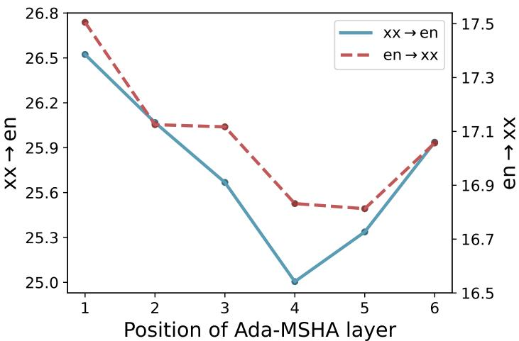  
Figure 6: An empirical study on the best position to place Ada-MSHA layer. According to this figure, the first layer should be the best position, which aligns with the conclusion in MSC (Huang and Feng, 2024).

The results in Figure 6 shows that placing Ada-MSHA at the first layer is the best choice. It is not hard to figure out the explanation to this phenomenon. When placing Ada-MSHA at the first layer, the local contextualization can be treated as a part of the embedding layer, which resembles ELMo (Peters et al., 2018). At the latter layers, however, the vectors have already been globally contextualized by attention, and conducting local contextualization now makes little sense.

## H Experiment Under Low Resource Setting

Intuitively, byte-based text patterns are more difficult for a model to learn, because the free combination of bytes results in a much larger language model search space. This problem should be worse under low-resource settings, where less data are utilized to constrain the model. We hypothesize that this can be mitigated by properly contextualizing, which helps models focus on local patterns. To better understand how different models perform under low-resource settings, we curated a low-resource dataset from Ted-59.

Specifically, we selected all languages whose training dataset has less than 50k parallel sentences and conducted experiments on this sub-dataset. We further split these languages into two categories: low-resource (L.R.), which has more than 10k parallel sentences, and extremely low-resource (E.L.R.), which has less than 10k parallel sentences. The corresponding languages are listed in Table 14.

The training, inference, and evaluation details are almost the same as those for Ted-59 dataset. The only difference is the representative languages for the Long, Medium, and Short categories. Since some of the languages from Table 2 are not low resources, we re-selected four languages for each category, the first two from L.R. and the last two from E.L.R., according to the order in Figure 3. For MoCE, we experiment only with the best model setting, ∆ = 5 with "lid".

The experiment results are exhibited in Table 13. Surprisingly, byte-based Transformer fails the tasks, while subword-based Transformer performs adequately. This demonstrates the difficulty of learning byte-based text with only global attention. Compared with byte-based Transformer, other local contextualization-based methods are able to learn the patterns with the low-resourced training data. Among them, MoCE shows significant improvement over other methods, and the advantages are larger than that on the full Ted-59 dataset. This demonstrates our proposed method, which adaptively chooses contextualization neighbors, requires fewer data to converge to an optimal solution.

<table><tr><td></td><td>Long</td><td>Medium</td><td>Short</td><td>L.R.</td><td>E.L.R.</td><td>All</td></tr><tr><td>Transformer (Subword)</td><td>10.89</td><td>17.20</td><td>18.53</td><td>23.09</td><td>12.99</td><td>18.56</td></tr><tr><td>Transformer (Byte) Byte-nCF</td><td>1.01 10.14</td><td>1.14 16.58</td><td>0.86 17.39</td><td>0.96</td><td>1.17 12.10</td><td>1.05 17.81</td></tr><tr><td>MSC</td><td>10.14</td><td>15.80</td><td>17.01</td><td>22.45 22.16</td><td>11.76</td><td>17.50</td></tr><tr><td>MoCE (∆ = 5) +lid</td><td>11.31 11.80</td><td>17.65 18.21</td><td>18.61 18.45</td><td>24.03 24.03</td><td>13.45 13.81</td><td>19.10 19.45</td></tr></table>

Table 13: The BLEU scores on the low-resource subset of Ted-59. In this table, "L.R." is the abbreviation of "Low Resource", meaning languages with training data size less than 50k but larger than 10k. "E.L.R" is the abbreviation of "Extremely Low Resource", meaning languages with training data size less than 10k. For each category, we average the scores of all languages.

<table><tr><td>Category</td><td>Languages</td></tr><tr><td>L.R.</td><td>et, ku, nb, sl, hy, lt, ka, hi, mk, sq, sk, gl, my, da, fi, frca</td></tr><tr><td>E.L.R.</td><td>bs, ur, zh, ms, bn, ta, be eu, mr, kk, eo, mn, az</td></tr><tr><td>Long</td><td>my, ka, ta, mr</td></tr><tr><td>Medium</td><td>mk, fi, kk, ms</td></tr><tr><td>Short</td><td>et, sl, zh, bs</td></tr></table>

Table 14: Language selection for each category.

## I Effectiveness of Using Language ID

Providing Language ID (lid) to router seems beneficial to translation performance, according to Table 3 and Table 4. However, replacing the correct lid with a random one does not degenerate model performance much. Here, we take the translation direction "ro en" as an example. The experiment is conducted on Ted-59 dataset, and we replace the lid for the router’s input. The results are depicted in Figure 7. The green line and red dashed line denote model with correct lid and without lid, while the blue bars denote the wrong lid provided. It proves that having a lid is more critical than having the lid correct. We conjecture this is because the language difference is limited, and the distribution of δ is limited. However, removing the lid may cause a systematic shift of δ, similar to that discussed in Section 5.5.

In this experiment, the performance differences between different settings are nuanced, and BLEU scores are the same for several. Therefore, we evaluate with the COMET score, which is more accurate and better at showing subtle differences.

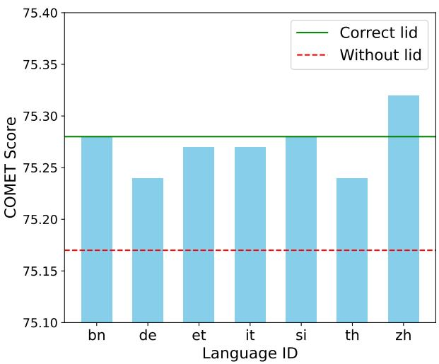  
Figure 7: Experiment on $" \mathrm { r o } \longrightarrow \mathrm { e n } "$ translation. Wrong lid affects little, while lack of lid hurting a lot.