# Moderation Matters: Exploring Large Language Models for Effective Rumor Detection on Social Media

Yirong Zeng1, Xiao Ding\* 1, Bibo Cai1, Ting Liu1, Bing Qin1, 1Harbin Institute of Technology, SCIR Lab

## Abstract

In this paper, we explore using Large Language Models (LLMs) for rumor detection on social media. It involves assessing the veracity of claims on social media based on social context (e.g., comments, propagation patterns). LLMs, despite their impressive capabilities in text-based reasoning tasks, struggle to achieve promising rumor detection performance when facing long structured social contexts. Our preliminary analysis shows that large-scale contexts hinder LLMs’ reasoning abilities, while moderate contexts perform better for LLMs, highlighting the need for refined contexts. Accordingly, we propose a semantic-propagation collaboration-base framework that integrates small language models (e.g., graph attention network) with LLMs for effective rumor detection. It models contexts by enabling text semantic and propagation patterns to collaborate through graph attention mechanisms, and reconstruct the context by aggregating attention values during inference. Also, a clusterbased unsupervised method to refine context is proposed for generalization. Extensive experiments demonstrate the effectiveness of proposed methods in rumor detection. This work bridges the gap for LLMs in facing long, structured data and offers a novel solution for rumor detection on social media.

## 1 Introduction

The rise of social media has made the dissemination of information more convenient and widespread. However, it has also made the issue of rumor become dominant. More seriously, the malicious use of LLMs facilitates rumor creation and may bring larger risks in the near future (Chen and Shu; Vykopal et al., 2023; Wu and Hooi, 2023). Although human countermeasures like establishing reporting mechanisms and conducting fact-checking have been adopted (Walter et al., 2020), their inevitable lag effect makes rumors costly and difficult to verify in real-time. Therefore, automatic rumor detection on social media is highly desirable and socially beneficial.

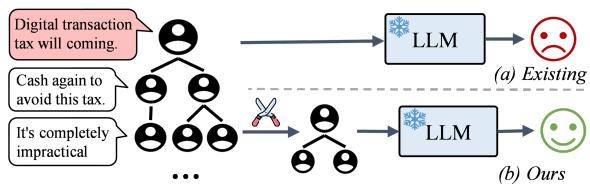  
Figure 1: In rumor detection with LLMs, existing methods (a) directly input the claim and social context to LLMs. Conversely, our method (b) aim to refine largescale social context, i.e., model and reconstruct it to a moderate size for LLMs.

Most traditional works for detecting rumors focus on incorporating various information (e.g., credibility (Popat et al., 2017), social context(Ren et al., 2020), extra knowledge (Dun et al., 2021)) to learn the latent features of rumors via fine-tuned small language models (SLMs) (e.g., deep neural networks (Cui and Jia, 2024; Yu et al., 2017; Liu et al., 2018)). Among them, models based on social context and graph neural networks have been widely proposed and achieved SOTA performances (Sun et al., 2022; Xu et al., 2022). However, their performance is limited by real-world requirements (e.g., explainability, zero-shot capabilities). Therefore, rumor detection with SLMs still seeks better solutions in real-world scenarios.

In rumor detection systems with LLMs, most studies treat LLMs as secondary components (e.g., context simulator (Wan et al., 2024; Nan et al., 2024), advisors (Hu et al., 2024) for SLMs). They have made progress in detection precision, but their application in real-world scenarios, which require explainable or zero-shot capabilities, remains limited. Some works (Chen and Shu, 2023) attempt to apply LLMs as the primary decision maker in detecting rumors to overcome these limitations. Unfortunately, the experiments reveal a gap between LLMs and fine-tuned SLMs. It can be attributed to the following reasons and challenges: (1) Social contexts usually contain large amounts of text comments. LLMs struggle to focus on key clues and get lost in the middle when faced with long texts or redundant information (Liu et al., 2024a,b). (2) The propagation patterns within social contexts are critical for rumor detection, however, LLMs lack proficiency in handling such structured data (Hu et al., 2024; Liu et al., 2024b).

Tackling the above challenges requires us to investigate efficient ways of modeling social context for LLMs, which includes both extensive text comments and structured propagation patterns on social media. To this end, we conduct a preliminary analysis of social contexts(§3). The results demonstrate that LLMs perform better when reasoning over moderate-sized social contexts, rather than those that are too long or too short. Additionally, tightlyknit groups are often formed based on shared user interests in the social context, and the key nodes within these groups could provide important information. This insight suggests a solution to these challenges: refining the social context for LLMs by focusing on the key nodes within it. The comparison of our method with existing approaches that use LLMs as primary decision-makers is demonstrated in Figure 1.

Based on the above insights, we propose a Semantic-Propagation collaboration-based rumor detection framework (SePro), which refines the social context for LLMs. Its strength lies in integrating LLMs with graph neural networks to enhance the system’s ability to process large-scale structured data. Specifically, we first construct propagation and semantic graphs based on social context. Then, we employ supervised graph attention networks (GATs) to model propagation patterns and text semantic features. Simultaneously, by extracting attention values from GATs, we enable collaboration between these features to identify core nodes, and reconstruct the social context into moderate size. Additionally, we propose a cluster-based unsupervised method to refine the social context for generalization. Finally, based on refined social context, we design an elaborate chain-of-clue prompt to verify the claim and generate explanations by inferring reasons on key clues. Extensive experiments demonstrate that our proposed methods have achieved excellent performance in detecting rumors and providing explanations.

## 2 Related Works

## 2.1 Traditional Methods on Rumor Detection

Early attempts on rumor detection mainly focus on text content (Ma et al., 2018a) or extracting statistical features of the propagation process (Ma et al., 2015; Kwon et al., 2013). Among them, detection models based on graph neural network have achieved state-of-the-art performances (Sun et al., 2022; Xu et al., 2022; Bian et al., 2020; Lu and Li, 2020). Nowadays, considering practical applications, rumor detection in explainable or zero-shot scenarios have drawn much attention (Xu et al., 2023; Lin et al., 2023; Wang et al., 2024). For explainable, many studies (Kotonya and Toni, 2020; Zeng et al., 2024; Atanasova, 2024; Wang et al., 2024) treat the task of generating explanations as a summarization task, using external debunked reports gathered from fact-checking websites. However, the debunking of claims is a labor-intensive and time-consuming process. Therefore, in traditional methods, rumor detection with SLMs still seeks better solutions.

## 2.2 LLMs on Rumor Detection

Recently, LLMs have demonstrated excellent capabilities in text generation and reasoning tasks (Chang et al., 2024b; OpenAI, 2024; MetaAI, 2024). In rumor detection systems with LLMs, most works treat LLMs as secondary components. Wan et al. (2024) and Nan et al. (2024) leverage AI-generated content for social graph simulation, aiding traditional graph-based methods. Yang et al. (2023) use LLMs as an auxiliary tool for constructing relational graphs, while Hu et al. (2024) use LLMs as advisors for SLMs. Some works attempt to use LLMs as the primary decision-makers (Hu et al., 2024; Li et al., 2023; Su et al., 2023; Liu et al., 2024b) to enhance their application in realworld scenarios. Unfortunately, they suffer from performance gap between LLMs and fine-tuned SLMs. LLMs struggle to outperform fine-tuned small models in detecting rumors because they cannot effectively model large-scale social contexts (e.g., long texts and structured data). Therefore, we aim to explore LLMs as primary components in an effective rumor detection system by refining the large-scale social context.

<table><tr><td>Dataset</td><td>Claims</td><td>Avg. comments</td><td>Propagation</td></tr><tr><td>Twitter</td><td>2,308</td><td>232</td><td>V</td></tr><tr><td>labels</td><td></td><td>non-rumor, false, true, unverified</td><td></td></tr><tr><td>Weibo</td><td>4,174</td><td>816</td><td>V</td></tr><tr><td>labels</td><td>non-rumor, rumor</td><td></td><td></td></tr></table>

Table 1: Summary statistics of datasets. Avg. comments represents the average number of comments per claim.

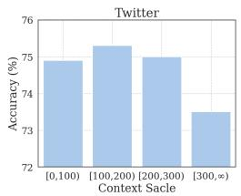

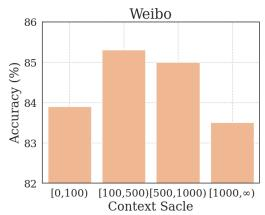  
Figure 2: The performance of LLMs in rumor detection, grouped by the number of comments. When the input length exceeds the limit of LLMs, we truncate it.

## 3 Social Context Analysis

Social context refers to the comments, replies and propagation patterns linked to a claim on social networks. It sheds light on information spread, user reactions, and interaction dynamics around the claim.

Firstly, for LLMs on large-scale social context analysis, recent researches reveal that LLMs cannot reason well over redundant information (Huang et al., 2023; Xie, 2023). To investigate this limitation in rumor detection, we tested the performance of widely-used LLMs (GPT-3.5-turbo-0125 (OpenAI, 2024)) with a vanilla prompt on two datasets, i.e., Twitter (Ma et al., 2017) and Weibo (Ma et al., 2018b) (see Table 1). We grouped the results based on social context scale (number of comments), as shown in Figure 2. It reveals that detection accuracy drops sharply when a sample has too many comments, due to redundant information. LLMs perform best when reasoning over a moderate number of comments.

Secondly, to conveniently refine the large-scale social context to a moderate size, we analyse its clustering phenomenon. In social networks, individuals form tightly-knit groups, known as community clusters (Newman, 2006; Girvan and Newman, 2002), due to similar user preferences (Dou et al., 2021) and relationships. They are characterized by dense internal connections and relatively sparse connections with the rest of the network, with each community guided by a few central nodes, typically acting as hubs. To further investigate this, we analyzed user preferences to engage in rumor propagation based on interaction records from above datasets. We assign a value to interactions based on the claim label: 0 for fake (rumor, false), 0.5 for neutral (unverified), and 1 for real (non-rumor, true). Each user receives an interaction value corresponding to the claim they engage with. We then calculate each user’s average interaction value, denoted as P (user preference). Users are grouped by P and their proportions (%) are reported in Figure 3. To present the results more smoothly, we applied log normalization. We observed three notable peaks at the low (fake), high (real), and middle (neutral) user preference values. This reveals that during rumor propagation, users with similar preferences tend to cluster together. The above analysis result suggests to model the entire large-scale social context, then reconstruct it based on core nodes to a moderate size suitable for LLMs.

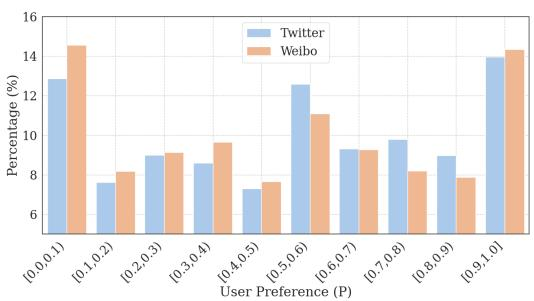  
Figure 3: The results of user preference analysis on Weibo and Twitter. A smaller user preference value P indicates a higher tendency to engage with rumors.

Additionally, individuals often base their decisions on others’ actions rather than their own information (Bikhchandani et al., 1992; Easley et al., 2010). This can trigger a chain reaction of similar decisions, resulting in an information cascade. It suggests the context that directly interacts with claim (i.e., local context) in a network have the greatest influence. Based on this idea, we propose a framework to models social context from both local and global (entire social context) perspectives.

## 4 Methods

This section begins with a formal definition of rumor detection. Then, we present our rumor detection framework SePro in Figure 4. Given the input sample including claim and its social context (text comments, propagation structure), we first construct a propagation graph and a semantic graph. After that, we use a global semantic-propagation collaboration module to capture global semantic and propagation features, enabling features collaboration to refine the global social context. A local aggregation module proposed to refine local context. Finally, proposed a Chain-of-Clue prompt for better reasoning over claims and social context.

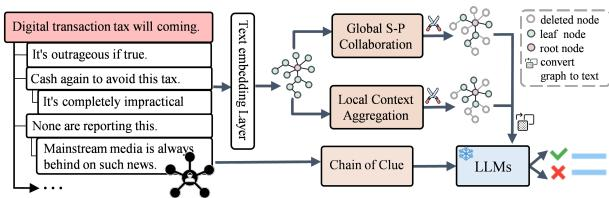  
Figure 4: The overview of the proposed framework, which refines social context from local and global perspective, and reasons over key clues by chain of clues.

## 4.1 Problem Statement

Rumor detection is to assess the authenticity of claims by analyzing the claims and social contexts, including comments and propagation structure. In general, it can be regarded as a multi-classification task.

Formally, let $\mathcal { X } = \{ x ^ { 1 } , x ^ { 2 } , . . . , x ^ { m } \}$ be the rumor detection dataset, where $x ^ { i }$ is the i-th sample. For each sample $x ^ { i } = \{ r , c _ { 1 } , c _ { 2 } , . . . , c _ { n _ { i } - 1 } , \mathcal { P } \}$ , r is the claim, $\mathcal { P }$ indicates the propagation structure, $c _ { j }$ refers to the j-th relevant comments, and $n _ { i }$ represents the number of texts (include claim and comments). Besides, each claim $x ^ { i }$ is annotated with a ground-truth label $y ^ { i } \in \mathcal { V }$ , where $\mathcal { V }$ represents fine-grained classes $( \mathrm { e . g . }$ ., non-rumor, false, true, unverified). We aim to model both claim and social contexts to detect rumors, that is $f : \mathcal { X }  \mathcal { V }$

## 4.2 Graph Construction

To facilitate social context modeling, we construct both a propagation graph to and a semantic graph. In dual-graph views, combining structural and semantic insights, provides a comprehensive representation.

To construct propagation graph in a sample x, we use texts representations to initialize nodes feature matrix, with the propagation relationships (e.g., reply, forward) serving as the edges. Specifically, $\mathcal { G } _ { p }$ is defined as a propagation graph $\mathcal { G } _ { p } =$ $\langle \mathcal { V } , \mathcal { E } _ { p } , \mathbf { \bar { A } } _ { p } , \mathbf { X } \rangle$ . The node set represents the collection of texts (claim and comments), ${ \mathcal { E } } _ { p }$ represents edge set between nodes, and $\mathbf { A } _ { p } \in \mathbb { R } ^ { n \times n }$ is an adjacency matrix derived from $\mathcal { E } _ { p } . \textbf { \textsf { X } } \in$ $\mathbb { R } ^ { n \times d _ { 0 } }$ represents the node feature matrix, initialized by node text representations. We leverages spaCy’s pretrained word2vec vectors (Honnibal et al., 2020), and average the vectors of existing words to obtain its text representation.

To construct the semantic graph $\mathcal { G } _ { s } \quad = \quad$ $\langle \mathcal { V } , \mathcal { E } _ { s } , \mathbf { A } _ { s } , \mathbf { X } \rangle$ , we simply calculate the similarity between nodes u and v using a cosine similarity function $s i m ( u , v )$ and edge set $\mathcal { E } _ { s }$ is determined based on nodes similarity. An edge $e _ { u v }$ is established if the similarity exceeds a threshold of 0.8.

## 4.3 Social Context Modeling

Refined social context is crucial for LLMs in rumor detection. To this end, we design a global semantic-propagation (S-P) collaboration module to refine (model and reconstruct) global context, an aggregation module to refine local context.

## 4.3.1 Global S-P Collaboration

Global context refers to the entire social context, including propagation patterns and comments. To enhance applicability, we propose both supervised (SePro) and unsupervised (SePro-U) methods for modeling the global context.

Graph Attention-based Supervised Modeling. Graph-based models have demonstrated promising performance in modeling structured data (Sun et al., 2022; Bian et al., 2020). Inspired by this, we employ Graph Attention Neural Networks (Liu et al., 2018) (utilizes attention mechanisms to dynamically adjust the weights of neighboring nodes), to update node features and get two graphs representation respectively. Next, the two graph features are merged and fed into a linear classifier to obtain the label distribution. During inference, as shown in Figure 5, we innovatively leverage attention values from GATs to to facilitate the collaboration between propagation and semantic signals, identify key nodes, and subsequently reconstruct global social context to a moderate size based on these nodes.

Formally, in training, node features at the l-th layer $\mathbf { H } _ { p } ^ { ( l ) }$ and $\mathbf { H } _ { s } ^ { ( l ) }$ can be defined as follows:

$$
\mathbf { H } _ { p } ^ { ( l ) } = \sigma \left( G A T C o n \nu ( \mathbf { H } _ { p } ^ { ( l - 1 ) } , \mathbf { A } _ { p } , \mathbf { W } _ { p } ^ { ( l ) } , \mathbf { a } _ { p } ^ { ( l ) } ) \right) ,\tag{1}
$$

$$
\mathbf { H } _ { s } ^ { ( l ) } = \sigma \left( G A T C o n \nu ( \mathbf { H } _ { s } ^ { ( l - 1 ) } , \mathbf { A } _ { s } , \mathbf { W } _ { s } ^ { ( l ) } , \mathbf { a } _ { s } ^ { ( l ) } ) \right) .\tag{2}
$$

where $\mathbf { H } _ { p } ^ { ( l ) }$ and $\mathbf { H } _ { s } ^ { ( l ) }$ are node features of propagation and semantic graph, respectively. $\sigma ( \cdot )$ refers to a non-linear sigmoidfunction, $\mathbf { W } ^ { ( l ) }$ is weighting matrix, and $a ^ { ( l ) }$ is the weight vector of the attention mechanism. We initialize node representations by textual features, i.e., $\mathbf { H } _ { p } ^ { ( 0 ) } = \mathbf { H } _ { s } ^ { ( 0 ) } = \mathbf { X }$ . For each layer of GAT in graph, the graph attention value can be calculated as:

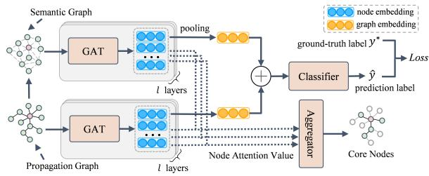  
Figure 5: Supervised modeling global social context based on GATs.

$$
\boldsymbol { \alpha } _ { p } ^ { ( l ) } = s o f t m { \boldsymbol { a x } } \left( \mathbf { a } _ { p } ^ { T } [ \mathbf { W } _ { p } ^ { ( l ) } \mathbf { H } _ { p } | | \mathbf { W } _ { p } ^ { ( l ) } \mathbf { H } _ { p } ] \right) ,\tag{3}
$$

$$
\boldsymbol { \alpha } _ { s } ^ { ( l ) } = s o f t m { { a x } } \left( \mathbf { a } _ { s } ^ { T } [ \mathbf { W } _ { s } ^ { ( l ) } \mathbf { H } _ { s } \| \mathbf { W } _ { s } ^ { ( l ) } \mathbf { H } _ { s } ] \right) ,\tag{4}
$$

where $\alpha _ { p } ^ { ( l ) }$ and $\alpha _ { s } ^ { ( l ) }$ are attention matrix. To aggregate node representations in the graph, we employ global maximum pooling to form the graph representations, i.e.,

$$
\mathbf { H } _ { p } ^ { g l o b a l } = G M P ( \mathbf { H } _ { p } ^ { ( l ) } ) ,\tag{5}
$$

$$
\mathbf { H } _ { s } ^ { g l o b a l } = G M P ( \mathbf { H } _ { s } ^ { ( l ) } ) ,\tag{6}
$$

where GMP(·) refers to the max-pooling aggregating function. Based on concatenating two graph representations, label distribution can be defined by a multi-layer perceptron and a softmax function, i.e.,

$$
\hat { y } = S o f t m a x \left( M L P ( \mathbf { H } _ { p } ^ { g l o b a l } \| \mathbf { H } _ { s } ^ { g l o b a l } ) \right) .\tag{7}
$$

We optimize all the parameters by minimizing the cross-entropy loss of the predictions and ground truth distributions.

During inference, in addition to using GATs for label prediction, we employ an aggregator to combine the attention values from the propagation graph and the semantic graph. Specifically, for the i-th node in a graph, we adopt the initial attention matrices, i.e., $\bar { \alpha _ { p } } = \alpha _ { p } ^ { ( 1 ) }$ and $\alpha _ { s } = \alpha _ { s } ^ { ( 1 ) }$ , to calculate their node attention values as follows:

$$
N o d e A t t _ { p } ^ { i } = \frac { \sum _ { ( u , v ) \in { \mathcal E } _ { p } } \alpha _ { p } ^ { u v } \cdot \mathbb { I } [ v = i ] } { \sum _ { j } \sum _ { ( u , v ) \in { \mathcal E } _ { s } } \alpha _ { p } ^ { u v } \cdot \mathbb { I } [ v = j ] } ,\tag{8}
$$

$$
N o d e A t t _ { s } ^ { i } = \frac { \sum _ { ( u , v ) \in { \mathcal E } _ { s } } \alpha _ { s } ^ { u v } \cdot \mathbb { I } [ v = i ] } { \sum _ { j } \sum _ { ( u , v ) \in { \mathcal E } _ { s } } \alpha _ { s } ^ { u v } \cdot \mathbb { I } [ v = j ] } ,\tag{9}
$$

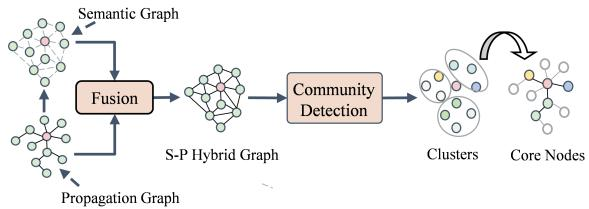  
Figure 6: Global semantic-propagation collaboration without training based on community detection.

where NodeAtti denote node i attention value and I is an indicator function that equals $\mathbf { i f } \ v = i .$ , and 0 otherwise. Then, node attention values are averaged to obtain a combined score. The top n nodes with the highest scores are selected, as follows:

$$
C o m N o d e A t t ^ { i } = \frac { N o d e A t t _ { p } ^ { i } + N o d e A t t _ { s } ^ { i } } { 2 } ,\tag{10}
$$

$$
\{ v _ { 1 } , v _ { 2 } , \ldots , v _ { n } \} = { \cal T } o p ( { \cal C } o m N o d e A t t , n ) ,\tag{11}
$$

where $\{ v _ { 1 } , v _ { 2 } , \ldots , v _ { n } \}$ is a set of core nodes, and Top refers to a function that selects the top n nodes based on ComNodeAtt scores. After that, we reconstruct the social context based on the source propagation relationships, and node will connect to its grandparent node if its parent node has been pruned. Further, convert them into text sequences using a simple hierarchical representation. This method uses indentation and markers to denote different levels of comments (refer to Table 6). Finally, we input the reconstructed social context and the predictions from the proposed supervised method into the LLMs.

Cluster-based Unsupervised Modeling. Acquiring large amounts of supervised rumor detection data in real world is labor-intensive. Therefore, we propose an unsupervised method to enhance generalization. As shown in Figure 6, we fuse the semantic graph and propagation graph to form an S-P Hybrid Graph. We then apply community detection methods (e.g., spectral clustering (Ng et al., 2001; Newman, 2006)) to identify potential communities within the Hybrid Graph. Finally, we identify the core nodes within each community and reconstruct the context based on these nodes.

Specifically, S-P Hybrid Graph is calculated as follows:

$$
\mathbf { A _ { s p } } = \alpha \mathbf { A _ { p } } + ( 1 - \alpha ) \mathbf { A } _ { s } ,\tag{12}
$$

where $A _ { s p }$ is the adjacency matrix of S-P Hybrid Graph, and α is a trade-off weight. After that, we apply spectral clustering (SC, unsupervised in

handling complex clusters and capturing graph patterns, details in appendix $\ S \mathbf { A . } 1 )$ to perceive community clusters within the graph, as follows:

$$
\mathcal { C } = S C ( \mathbf { A _ { i } ^ { s p } } , k ) ,\tag{13}
$$

where $\mathcal { C }$ represents the clustering result, and $k$ is a hyperparameter indicating the number of community clusters. For a community $\mathcal { C } _ { i } .$ , we identify the top $n _ { i } = N _ { i } / k$ core nodes based on their degree centrality:

$$
D e g r e e C e n t r a l i t y ( v ) = { \frac { d e g ( v ) } { n _ { i } - 1 } } ,\tag{14}
$$

$$
\left\{ v _ { 1 } , v _ { 2 } , \ldots , v _ { n _ { i } } \right\} = \arg \operatorname* { m a x } _ { v \in \mathcal { C } _ { i } } D e g r e e C e n t r a l i t y ( v ) ,\tag{15}
$$

where deg(v) is the degree of node v and $N _ { i }$ is the total number of nodes in the community. Finally, like supervised methods, we reconstruct the social context and convert it into text sequences.

## 4.3.2 Local Context Aggregation.

Local context refers to first-level comments or forwards, which directly interacts with the claim. Inspired by the information cascade phenomenon (Bikhchandani et al., 1992), which suggests that local context is more influential. Therefore, we specifically refine the local context for LLMs. Specifically, we first filter out comments with fewer than 5 words in English or fewer than 5 characters in Chinese. Then, we calculate the information entropy of each comment and retain the top n comments with the highest entropy values, where n is a hyperparameter and consistent with the value defined in Equation (11). Specifically, for a comment $^ { c , }$

$$
H ( c ) = - \sum _ { i } p _ { i } \log p _ { i } ,\tag{16}
$$

where $H ( c )$ is the information entropy of comment $c ,$ and $p _ { i }$ is the probability of the i-th word in the comment c.

$$
\{ v _ { 1 } , v _ { 2 } , \ldots , v _ { n } \} = { \cal T } o p ( H ( c ) , n ) ,\tag{17}
$$

where Top refers to a function that selects the top n nodes based on information entropy scores.

## 4.4 Chain of Clues

Previous research indicates that LLMs often struggle to focus on key clues and tend to lose track when facing long contexts (Liu et al., 2024a,b). Meanwhile, the Chain of Thought (CoT) has demonstrated promising performance in reasoning tasks (Wang et al., 2022; Wei et al., 2022). Writing style and Information consistency are highlighted for misinformation identification (Przybyla, 2020; Hu et al., 2024). Inspired by these findings, we propose a chain of clues methodology to teach foundation models (e.g., LLMs) reasoning over social contexts.

Specifically, we design elaborate prompts that include potential clues and reasoning steps, as shown in Prompt 1 Box. It teaches LLMs to concentrate on the key clues (e.g., writing style and information consistency in a claim) and think step by step to detect rumors and generate explanations. In unsupervised methods (SePro-U), there is no prediction distribution. Therefore, we removed this clue from the chain of clues in SePro-U.

Prompt 1: Chain of Clues   
<chain-of-clue>   
1. Examine the \*\*writing style\*\* of claim for exaggerated   
language or emotional tone.   
2. Check for \*\*information consistency\*\* within claim and   
cross-reference with commonsense knowledge or known   
facts.   
3. Review the \*\*local comments\*\*, paying attention to any   
questions or affirmations.   
4. Look into \*\*global comments\*\* for in-depth discussions   
or additional evidence provided by users.   
5. Assess the \*\*propagation pattern\*\* to understand the   
spread of the news.   
6. Reference \*\*prediction distribution\*\* of fine-tuned   
model to mutual verification.   
7. Based on above information, choose the answer from   
the candidate label list and generate explanation.   
</chain-of-clue>

Finally, we use the refined local and global social contexts from Section §4.3 to construct the input prompt for LLMs, refer to Appendix A.2 for more details.

## 5 Experiments

## 5.1 Experimental Setup

## 5.1.1 Dataset

For evaluation, we conduct experiments on two public datasets, including Twitter dataset (we combine Twitter15 and Twitter16 to get it (Ma et al., 2017)) and Weibo dataset (Ma et al., 2018b). Details in Table 1. They are mainly collected from two popular social media platforms at that time, i.e., Twitter (English) and Weibo (Chinese). Furthermore, the dataset is divided chronologically into training (80%), validation (10%), and test (10%) sets to simulate real-world scenarios.

## 5.1.2 Baselines

We compare with two groups of rumor detection method. The first group is the supervised methods: content-based methods (BERT (Devlin et al., 2018)), graph-based methods (BiGCN (Bian et al., 2020), GAT (Liu et al., 2018), SBAG (Huang et al., 2022), ClaHi-GAT (Lin et al., 2021), HGAT (Huang et al., 2020), GLAN (Yuan et al., 2019) and GACL (Sun et al., 2022)) and LLMs-aided methods (CICAN (Yang et al., 2023), ARG (Hu et al., 2024)). The second group is LLMs-based approaches: (1) GPT-3.5-turbo-0125 (OpenAI, 2024), an API-access LLMs, is a highly advanced language model developed by OpenAI1. (2) LLaMA-3-8b-instruct (MetaAI, 2024), a widely used fully open source LLM developed by Meta AI2. We also include the CoT (Wei et al., 2022) (adding an eliciting sentence such as "Let’s think step by step.") and ReAct (Yao et al., 2023) (integrating verbal reasoning and action steps to improve performance) in these LLMs for comparison. (3) LeRuD (Liu et al., 2024b), an LLM-empowered rumor detection approach using designed prompts and chain of propagation. LLMs are also prompted to generate explanations when verifying claims.

## 5.1.3 Implementation Details.

In this work, we utilize GPT-3.5-turbo-0125 as LLMs in proposed framework. Please refer to Appendix A.3 for more details.

## 5.2 Overall Performance

The result are presented in Tables 2. From it, we have the following observation:

(1) There is a gap between LLMs-based methods and fine-tuned SLMs. ReAct and CoT settings bring additional performance gain compare to zeroshot setting in general. However, they only narrows the gap with the graph-based methods (e.g., GACL, SBAG, which fully leverage the propagation information). LLMs aren’t sufficient to replace taskspecific SLMs in rumor detection, emphasizing the importance of propagation patterns for success.

(2) SePro achieves decent performance among supervised methods. In the supervised methods, graph-based methods (e.g., SBAG, HGAT) have achieved excellent performance in classification accuracy, owing to their strong modeling capabilities of rumor propagation patterns. Nonetheless, our method, SePro, has obtained comparable results, achieving the second-best overall performance, just behind SBAG. This demonstrates the effectiveness of modeling and reconstructing social context for LLMs in rumor detection.

(3) SePro-U achieves better performance in LLMs-aided/based methods. In the LLM-aided methods (e.g., CICAN, ARG) or LLM-based methods, our method has demonstrated the best performance. SePro-U outperforms the best baseline (GPT-3.5 with ReAct) on Twitter and Weibo by 3.81% and 5.55% in accuracy, respectively. It also demonstrates respectable performance even when compared to supervised methods. This presents a promising application method in rumor detection with LLMs in the real world.

Overall, although our approach may result in a slight sacrifice in accuracy compared to graphbased methods, it addresses the crucial need for interpretability. This enhancement promotes the effective application of LLMs in rumor detection.

## 5.3 Evaluations on Explanation

## 5.3.1 Evaluation Metrics.

For evaluating explanations, traditional automated metrics are inadequate for assessing the output of LLMs (Chang et al., 2024a). Fortunately, recent studies (Chen et al., 2023; Liu et al., 2023) demonstrate LLMs excels at evaluating text quality from multiple angles, even without reference texts. Therefore, we engage advanced LLMs (gpt-4o-2024-05-133 in practice) to evaluate the quality of explanations based on four metrics which widely employed in human evaluation (Wang et al., 2024, 2023): misleadingness (M), readability (R), soundness (S) and informativeness (I). More details in Appendix A.4.

Additionally, we add a human evaluation to provide a comprehensive assessment of the explanations. We invited 10 volunteers (5 undergraduates and 5 graduates) to assess a random sample of 100 items in two dataset. The evaluation metrics are identical to those used in the automatic evaluation, and we report the average scores. Moreover, we utilize Fleiss Kappa (Fleiss, 1971) to measure three-way inter-evaluator reliability scores. Kappa numbers above 0.4 typically indicate moderate to excellent agreement (the higher the better). We report the average kappa value of four metrics in the results.

<table><tr><td rowspan="2">Method</td><td colspan="5">Twitter</td><td colspan="4">Weibo</td></tr><tr><td>Accuracy</td><td>N-F1</td><td>F-F1</td><td>T-F1</td><td>U-F1</td><td>Accuracy</td><td>Precision</td><td>Recall</td><td>F1-score</td></tr><tr><td colspan="10">Supervised Methods</td></tr><tr><td>BERT</td><td>0.7695</td><td>0.7540</td><td>0.6235</td><td>0.7770</td><td>0.7460</td><td>0.8021</td><td>0.8007</td><td>0.8140</td><td>0.7974</td></tr><tr><td>GAT</td><td>0.8804</td><td>0.9082</td><td>0.8782</td><td>0.8629</td><td>0.9028</td><td>0.9243</td><td>0.9241</td><td>0.9243</td><td>0.9238</td></tr><tr><td>BiGCN</td><td>0.883</td><td>0.869</td><td>0.8645</td><td>0.9335</td><td>0.8645</td><td>0.9258</td><td>0.9133</td><td>0.9335</td><td>0.9233</td></tr><tr><td>GLAN</td><td>0.9035</td><td>0.9225</td><td>0.8930</td><td>0.8495</td><td>0.9475</td><td>0.9460</td><td>0.9460</td><td>0.9455</td><td>0.9455</td></tr><tr><td>HGAT</td><td>0.9145</td><td>0.9440</td><td>0.9210*</td><td>0.9260</td><td>0.8765</td><td>0.9437</td><td>0.9523</td><td>0.9327</td><td>0.9416</td></tr><tr><td>ClaHi-GAT</td><td>0.8410</td><td>0.8190</td><td>0.8200</td><td>0.8550</td><td>0.8515</td><td>0.8812</td><td>0.9172</td><td>0.8727</td><td>0.8803</td></tr><tr><td>SBAG</td><td>0.9420</td><td>0.9560</td><td>0.9415</td><td>0.9115</td><td>0.9555</td><td>0.9570</td><td>0.9570</td><td>0.9570</td><td>0.9570</td></tr><tr><td>GACL</td><td>0.9105</td><td>0.9460</td><td>0.8600</td><td>0.9310</td><td>0.8915</td><td>0.9354</td><td>0.9294</td><td>0.9409</td><td>0.9351</td></tr><tr><td>CICAN</td><td>0.8575</td><td>0.8270</td><td>0.8185</td><td>0.8360</td><td>0.8815</td><td>0.9390</td><td>0.9298</td><td>0.9458</td><td>0.9377</td></tr><tr><td>ARG</td><td>0.8902</td><td>0.8828</td><td>0.8529</td><td>0.8915</td><td>0.8937</td><td>0.9043</td><td>0.9022</td><td>0.9089</td><td>0.9055</td></tr><tr><td>SePro (Ours)</td><td>0.9157</td><td>0.9448</td><td>0.8718</td><td>0.9387</td><td>0.9141</td><td>0.9512</td><td>0.9503</td><td>0.9507</td><td>0.9505</td></tr><tr><td colspan="10">LLMs-based Methods</td></tr><tr><td>LLaMA3*</td><td>0.5883</td><td>0.5904</td><td>0.5911</td><td>0.5704</td><td>0.5819</td><td>0.7572</td><td>0.7658</td><td>0.7422</td><td>0.7538</td></tr><tr><td>w/ CoT</td><td>0.6002</td><td>0.6182</td><td>0.5819</td><td>0.5952</td><td>0.6192</td><td>0.7693</td><td>0.7437</td><td>0.7708</td><td>0.7569</td></tr><tr><td>w/ ReAct</td><td>0.6893</td><td>0.6972</td><td>0.6741</td><td>0.6829</td><td>0.6842</td><td>0.8012</td><td>0.7927</td><td>0.8093</td><td>0.8009</td></tr><tr><td>GPT-3.5*</td><td>0.6326</td><td>0.6419</td><td>0.6298</td><td>0.6364</td><td>0.6235</td><td>0.8233</td><td>0.8223</td><td>0.8216</td><td>0.8220</td></tr><tr><td>w/ CoT</td><td>0.6591</td><td>0.6683</td><td>0.6721</td><td>0.6461</td><td>0.6556</td><td>0.8387</td><td>0.8322</td><td>0.8462</td><td>0.8391</td></tr><tr><td>w/ ReAct</td><td>0.7646</td><td>0.7742</td><td>0.7528</td><td>0.7834</td><td>0.7634</td><td>0.8662</td><td>0.8634</td><td>0.8702</td><td>0.8670</td></tr><tr><td>LeRuD</td><td>0.7795</td><td>0.7722</td><td>0.7634</td><td>0.7840</td><td>0.7820</td><td>0.8401</td><td>0.8427</td><td>0.8333</td><td>0.8379</td></tr><tr><td>SePro-U (Ours)</td><td>0.8027</td><td>0.8129</td><td>0.8072</td><td>0.7944</td><td>0.7982</td><td>0.8944</td><td>0.8946</td><td>0.8940</td><td>0.8943</td></tr></table>

Table 2: Performance of SePro and baselines on Twitter and Weibo. N-F1, F-F1, T-F1, and U-F1 represent the F1 scores for the categories Non-rumor (N), False Rumor (F), True Rumor (T), and Unverified Rumor (U) in Twitter, respectively. The mark ⋆ denotes zero-shot setting, bold indicates the maximum value, and underline indicates the second-highest value.

## 5.3.2 Evaluation results.

The automatic and human evaluations of explanations for Weibo and Twitter are summarized in Table 3. The human evaluation results align closely with the LLM-based evaluation, and both evaluation demonstrate that our methods achieve the best performance on most metrics. It shows that GPT-3.5 w/ ReAct performs well on S but underperforms on other metrics compared to our methods (including two sub-methods SePro-U and SePro). It shows combining reasoning and action can improve the model’s reasoning ability but falls short in capturing other valuable information. As a comparison, our methods consistently achieves excellent performance in M & S & I. It indicates that refined social context retains valuable information and provides a clearer context, which is better for LLMs to generate high-quality explanations.

## 5.3.3 Clue Analysis.

To explain predictions intuitively, we investigate which clues are critical in rumor detection. LLMs need to identify key clues from the following list: writing style (WS), information consistency (IC), local comments (LC), global comments (GC), propagation pattern (PP), and prediction distribution (PD) (see Appendix §A.4 for details). We count the occurrences of clues and reported their percentages in Figure 7. It reveals that the proportion of WS is larger than IC, indicating that clues from writing style more important than those from knowledge conflicts. Additionally, PP, GC and LC have a decent proportion compare to WS. This corroborates that clues in social context remain indispensable, besides clues in claims.

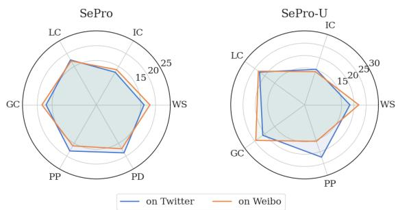  
Figure 7: The result of clue analysis on Twitter and Weibo. We report the proportion (%) of each clue. SePro-U is an unsupervised method, so it lacks PD.

## 5.4 Ablation Study

We conduct an extensive ablation study for our methods by removing key components: (1) local context aggregation module (w/o local). (2) global S-P collaboration module (w/o global). (3) the chain-of-clue (w/o chain). We also include GPT-3.5-turbo-0125 in a zero-shot setting as a baseline.

<table><tr><td rowspan="2">Method</td><td colspan="4">Twitter / Weibo</td><td rowspan="2">Kappa</td></tr><tr><td>M↓</td><td>R↑</td><td>S↑</td><td>I↑</td></tr><tr><td colspan="7">Auto Evaluation</td></tr><tr><td>LLaMA3*</td><td>3.0/ 2.2</td><td>4.0 / 2.6</td><td>3.2 / 3.4</td><td>2.5 / 3.0</td><td></td></tr><tr><td>w/ CoT</td><td>2.9 / 2.0</td><td>4.0 / 4.6</td><td>3.2 / 3.5</td><td>2.6 / 3.1</td><td></td></tr><tr><td>w/ ReAct</td><td>2.8 / 1.8</td><td>4.2 / 4.7</td><td>3.7 / 3.5</td><td>3.1 / 3.1</td><td></td></tr><tr><td>GPT-3.5*</td><td>2.5 / 1.4</td><td>4.3 / 4.8</td><td>3.7 / 3.4</td><td>2.9 / 2.7</td><td></td></tr><tr><td>w/ CoT</td><td>2.3 / 1.3</td><td>4.3 / 4.8</td><td>3.7 / 3.7</td><td>2.9 / 2.7</td><td></td></tr><tr><td>w/ReAct</td><td>4.6 / 1.3</td><td>4.5 / 4.7</td><td>3.8 / 4.0</td><td>3.3 / 2.9</td><td></td></tr><tr><td>LeRuD</td><td>2.5 / 2.1</td><td>4.6 / 3.8</td><td>3.7 / 3.8</td><td>3.3 / 2.8</td><td>I</td></tr><tr><td>SePro-U</td><td>2.2 / 1.3</td><td>4.6 / 4.5</td><td>3.7 / 3.8</td><td>3.3 / 3.1</td><td>-</td></tr><tr><td>SePro</td><td>2.0 / 1.2</td><td>4.6 / 4.8</td><td>3.8 / 3.9</td><td>3.4 / 3.5</td><td></td></tr><tr><td colspan="6">Human Evaluation</td></tr><tr><td>LLaMA3</td><td>2.9 / 2.1</td><td>3.7 / 2.8</td><td>3.3 / 3.5</td><td>3.0/3.1</td><td>0.6 / 0.5</td></tr><tr><td>w/ CoT</td><td>2.8 / 1.9</td><td>4.0 / 4.2</td><td>3.4 / 3.6</td><td>3.2 / 3.1</td><td>0.7 / 0.7</td></tr><tr><td>w/ ReAct</td><td>2.6 / 1.7</td><td>4.1 / 4.1</td><td>3.6 / 3.6</td><td>3.2 / 3.1</td><td>0.5 / 0.6</td></tr><tr><td>GPT-3.5*</td><td>2.6 / 1.9</td><td>4.2 / 4.6</td><td>3.5 / 3.6</td><td>2.8 / 2.7</td><td>0.6 / 0.6</td></tr><tr><td>w/ CoT</td><td>2.5 / 1.6</td><td>4.6 / 4.8</td><td>3.5 / 3.8</td><td>3.0 / 2.8</td><td>0.7 / 0.6</td></tr><tr><td>w/ ReAct</td><td>3.7 / 1.4</td><td>4.6 / 4.7</td><td>3.7 / 3.8</td><td>3.4 / 3.0</td><td>0.6 / 0.6</td></tr><tr><td>LeRuD</td><td>2.6 / 2.1</td><td>4.0 / 4.4</td><td>3.7 / 3.8</td><td>3.0 / 2.8</td><td>0.5 / 0.6</td></tr><tr><td>SePro-U</td><td>2.3 / 1.4</td><td>4.4 / 4.5</td><td>3.8 / 3.9</td><td>3.2 /3.3</td><td>0.7 / 0.6</td></tr><tr><td>SePro</td><td>2.1 / 1.2</td><td>4.5 / 4.7</td><td>3.9 / 4.1</td><td>3.4 / 3.4</td><td>0.6 / 0.6</td></tr><tr><td></td><td></td><td></td><td></td><td></td><td></td></tr></table>

Table 3: Explanation Evaluation on Twitter and Weibo, using a 5-Point Likert scale rating by both GPT-4o (Auto Evaluation) and human evaluators (Human Evaluation). The Fleiss’ Kappa values indicate the inter-rater agreement for each method in the human evaluation.

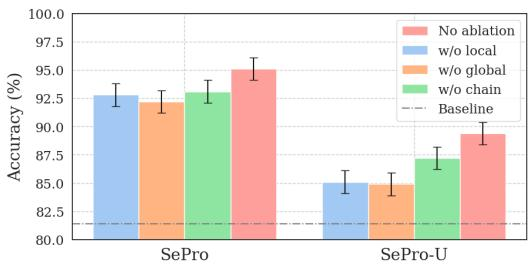  
Figure 8: Key components ablation study on Weibo.

The result are presented in Figure 8. It demonstrate that all three key components are essential within the framework, with the removal of the global or local component causing the most notable decline. It highlights the critical role of local and global social contexts in rumor detection.

## 5.5 Context-scale Analysis

In Figure 9 (a), we report the performance of all methods under different context scales. We also report their computational overhead in Figure 9 (b). It shows, as the scale increases, the performance of baseline drops significantly, accompanied by increased computational overhead. LeRud manages to maintain its performance, but its overhead grows excessively. In contrast, SePro and SePro-U not only sustain an upward performance trend but also exhibit low computational overhead compared to the baselines, demonstrating their Pareto efficiency in balancing performance and overhead.

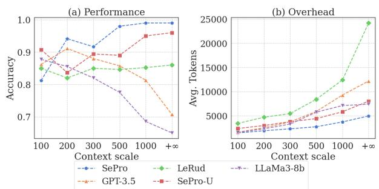  
Figure 9: The performance and overhead as context scales increase on Weibo. Avg. Tokens denotes the tokens consumed by LLMs per sample.

## 6 Conclusion

In this paper, we investigate using LLMs for effective rumor detection. Currently, LLMs have challenges in modeling large-scale structured data. Our analysis reveals moderate context is crucial for LLMs, suggesting to refine long structured contexts. We propose a rumor detection framework, which integrates graph attention neural networks with LLMs to model and reconstruct contexts from multiple perspectives. It fills the gap in utilizing LLMs for rumor detection on social media.

## Limitation

While we have taken various factors into account, there are a few limitations.

Firstly, Our methods have concerns regarding hyperparameter sensitivity. When refining largescale social context to a moderate size for LLMs, how to define ’moderate size’ lacks theoretical support. Alternately, we conducted empirical experiments to determine appropriate parameter settings to achieve a moderate size social context. In Figure 10, we assessed the impact of hyperparameters on the proposed method’s performance. In SePro, the key hyperparameters is the number of nodes n in refine social context. From Figure 10, the best performance is observed when n = 50 (meaning 50 global comments and 50 local comments) in SePro. It corroborates the finding drawn in Section §3. In SePro-U, the key hyperparameters are the trade-off weight α and community cluster k. In the results, configurations near k = 50 and α = 0.3 demonstrate excellent and stable performance.

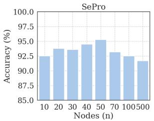

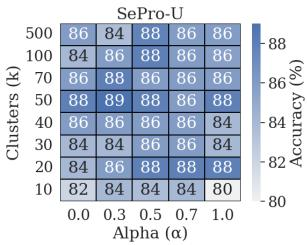  
Figure 10: Hyperparameter analysis of SePro on Weibo.

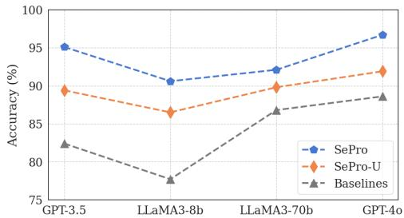  
Figure 11: Performance of different foundation models in the proposed framework on Weibo.

Secondly, our methods have concerns regarding the generalization of foundation models. Therefore, we investigate using different LLMs as foundation models in our framework. The following LLMs were tested: gpt-4o-2024-05-13, GPT-3.5- turbo-0125, LLaMA3-8b-instruct and LLaMA3- 70b-instruct. We also used these LLMs in zeroshot prompting to serve as baselines for comparison. The results, presented in Figure 11, indicate that our methods consistently outperforms the baselines across different LLMs, with the most significant improvement observed using GPT-3.5-turbo-0125. Additionally, SePro with gpt-4o-2024-05-13 achieved the best performance, reaching an accuracy of 96.7%. However, it performs poorly on the LLaMA3 series model.

Finally, there may be data leakage issues. We use collected datasets, so for some samples, the recently released LLMs might already know their labels (e.g., Twitter dataset released in 2017). This could affect the model’s performance and the integrity of our findings.

## Acknowledgements

The research in this article is supported by the National Natural Science Foundation of China under Grants U22B2059 and 62176079, and the Natural Science Foundation of Heilongjiang Province under Grant YQ2022F005.

## References

Pepa Atanasova. 2024. Generating fact checking explanations. In Accountable and Explainable Methodsfor Complex Reasoning over Text, pages 83–103. Springer.

Tian Bian, Xi Xiao, Tingyang Xu, Peilin Zhao, Wenbing Huang, Yu Rong, and Junzhou Huang. 2020. Rumor detection on social media with bi-directional graph convolutional networks. In Proceedings ofthe AAAI conference on artificial intelligence, volume 34, pages 549–556.

Sushil Bikhchandani, David Hirshleifer, and Ivo Welch. 1992. A theory of fads, fashion, custom, and cultural change as informational cascades. Journal of political Economy, 100(5):992–1026.

Yupeng Chang, Xu Wang, Jindong Wang, Yuan Wu, Linyi Yang, Kaijie Zhu, Hao Chen, Xiaoyuan Yi, Cunxiang Wang, Yidong Wang, Wei Ye, Yue Zhang, Yi Chang, Philip S. Yu, Qiang Yang, and Xing Xie. 2024a. A survey on evaluation of large language models. ACM Trans. Intell. Syst. Technol., 15(3).

Yupeng Chang, Xu Wang, Jindong Wang, Yuan Wu, Linyi Yang, Kaijie Zhu, Hao Chen, Xiaoyuan Yi, Cunxiang Wang, Yidong Wang, et al. 2024b. A survey on evaluation of large language models. ACM Transactions on Intelligent Systems and Technology, 15(3):1–45.

Canyu Chen and Kai Shu. Can llm-generated misinformation be detected? In The Twelfth International Conference on Learning Representations.

Canyu Chen and Kai Shu. 2023. Combating misinformation in the age of llms: Opportunities and challenges. arXiv preprint arXiv:2311.05656.

Yi Chen, Rui Wang, Haiyun Jiang, Shuming Shi, and Ruifeng Xu. 2023. Exploring the use of large language models for reference-free text quality evaluation: An empirical study. Preprint, arXiv:2304.00723.

Chaoqun Cui and Caiyan Jia. 2024. Propagation tree is not deep: Adaptive graph contrastive learning approach for rumor detection. In Proceedings of the AAAI Conference on Artificial Intelligence, volume 38, pages 73–81.

Jacob Devlin, Ming-Wei Chang, Kenton Lee, and Kristina Toutanova. 2018. Bert: Pre-training of deep bidirectional transformers for language understanding. arXiv preprint arXiv:1810.04805.

Yingtong Dou, Kai Shu, Congying Xia, Philip S Yu, and Lichao Sun. 2021. User preference-aware fake news detection. In Proceedings of the 44th international ACM SIGIR conference on research and development in information retrieval, pages 2051–2055.

Yaqian Dun, Kefei Tu, Chen Chen, Chunyan Hou, and Xiaojie Yuan. 2021. Kan: Knowledge-aware attention network for fake news detection. In Proceedings of the AAAI conference on artificial intelligence, volume 35, pages 81–89.

David Easley, Jon Kleinberg, et al. 2010. Networks, crowds, and markets: Reasoning about a highly connected world, volume 1. Cambridge university press Cambridge.

Matthias Fey and Jan Eric Lenssen. 2019. Fast graph representation learning with pytorch geometric. arXiv preprint arXiv:1903.02428.

Joseph L Fleiss. 1971. Measuring nominal scale agreement among many raters. Psychological bulletin, 76(5):378.

Michelle Girvan and Mark EJ Newman. 2002. Community structure in social and biological networks. Proceedings of the national academy of sciences, 99(12):7821–7826.

Matthew Honnibal, Ines Montani, Sofie Van Landeghem, and Adriane Boyd. 2020. spaCy: Industrialstrength Natural Language Processing in Python.

Beizhe Hu, Qiang Sheng, Juan Cao, Yuhui Shi, Yang Li, Danding Wang, and Peng Qi. 2024. Bad actor, good advisor: Exploring the role of large language models in fake news detection. In Proceedings of the AAAI Conference on Artificial Intelligence, volume 38, pages 22105–22113.

Qi Huang, Junshuai Yu, Jia Wu, and Bin Wang. 2020. Heterogeneous graph attention networks for early detection of rumors on twitter. In 2020 international joint conference on neural networks (IJCNN), pages 1–8. IEEE.

Yunpeng Huang, Jingwei Xu, Zixu Jiang, Junyu Lai, Zenan Li, Yuan Yao, Taolue Chen, Lijuan Yang, Zhou Xin, and Xiaoxing Ma. 2023. Advancing transformer architecture in long-context large language models: A comprehensive survey. arXiv preprint arXiv:2311.12351.

Zhen Huang, Zhilong Lv, Xiaoyun Han, Binyang Li, Menglong Lu, and Dongsheng Li. 2022. Social botaware graph neural network for early rumor detection. In proceedings of the 29th international conference on computational linguistics, pages 6680–6690.

Abiodun M Ikotun, Absalom E Ezugwu, Laith Abualigah, Belal Abuhaija, and Jia Heming. 2023. K-means clustering algorithms: A comprehensive review, variants analysis, and advances in the era of big data. Information Sciences, 622:178–210.

Neema Kotonya and Francesca Toni. 2020. Explainable automated fact-checking for public health claims. arXiv preprint arXiv:2010.09926.

Sejeong Kwon, Meeyoung Cha, Kyomin Jung, Wei Chen, and Yajun Wang. 2013. Prominent features of rumor propagation in online social media. In 2013 IEEE 13th international conference on data mining, pages 1103–1108. IEEE.

Miaoran Li, Baolin Peng, Michel Galley, Jianfeng Gao, and Zhu Zhang. 2023. Self-checker: Plug-and-play modules for fact-checking with large language models. arXiv preprint arXiv:2305.14623.

Hongzhan Lin, Jing Ma, Mingfei Cheng, Zhiwei Yang, Liangliang Chen, and Guang Chen. 2021. Rumor detection on twitter with claim-guided hierarchical graph attention networks. In Proceedings ofthe 2021 Conference on Empirical Methods in Natural Language Processing, pages 10035–10047.

Hongzhan Lin, Pengyao Yi, Jing Ma, Haiyun Jiang, Ziyang Luo, Shuming Shi, and Ruifang Liu. 2023. Zero-shot rumor detection with propagation structure via prompt learning. In Proceedings ofthe AAAI Conference on Artificial Intelligence, volume 37, pages 5213–5221.

Nelson F Liu, Kevin Lin, John Hewitt, Ashwin Paranjape, Michele Bevilacqua, Fabio Petroni, and Percy Liang. 2024a. Lost in the middle: How language models use long contexts. Transactions ofthe Associationfor Computational Linguistics, 12:157–173.

Qiang Liu, Xiang Tao, Junfei Wu, Shu Wu, and Liang Wang. 2024b. Can large language models detect rumors on social media? arXiv preprint arXiv:2402.03916.

Qiang Liu, Feng Yu, Shu Wu, and Liang Wang. 2018. Mining significant microblogs for misinformation identification: an attention-based approach. ACM Transactions on Intelligent Systems and Technology (TIST), 9(5):1–20.

Yang Liu, Dan Iter, Yichong Xu, Shuohang Wang, Ruochen Xu, and Chenguang Zhu. 2023. G-eval: Nlg evaluation using gpt-4 with better human alignment. In The 2023 Conference on Empirical Methods in Natural Language Processing.

Yi-Ju Lu and Cheng-Te Li. 2020. Gcan: Graphaware co-attention networks for explainable fake news detection on social media. arXiv preprint arXiv:2004.11648.

Jing Ma, Wei Gao, Zhongyu Wei, Yueming Lu, and Kam-Fai Wong. 2015. Detect rumors using time series of social context information on microblogging websites. In Proceedings of the 24th ACM interna tional on conference on information and knowledge management, pages 1751–1754.

Jing Ma, Wei Gao, and Kam-Fai Wong. 2017. Detect rumors in microblog posts using propagation structure via kernel learning. Association for Computational Linguistics.

Jing Ma, Wei Gao, and Kam-Fai Wong. 2018a. Detect rumor and stance jointly by neural multi-task learning. In Companion proceedings of the the web conference 2018, pages 585–593.

Jing Ma, Wei Gao, and Kam-Fai Wong. 2018b. Rumor detection on twitter with tree-structured recursive neural networks. Association for Computational Linguistics.

MetaAI. 2024. Llama 3: Open-access large language models.

Qiong Nan, Qiang Sheng, Juan Cao, Beizhe Hu, Danding Wang, and Jintao Li. 2024. Let silence speak: Enhancing fake news detection with generated comments from large language models. arXiv preprint arXiv:2405.16631.

Mark EJ Newman. 2006. Modularity and community structure in networks. Proceedings of the national academy of sciences, 103(23):8577–8582.

Andrew Ng, Michael Jordan, and Yair Weiss. 2001. On spectral clustering: Analysis and an algorithm. Advances in neural information processing systems, 14.

OpenAI. 2024. Gpt-3.5-turbo-0125.

Kashyap Popat, Subhabrata Mukherjee, Jannik Strötgen, and Gerhard Weikum. 2017. Where the truth lies: Explaining the credibility of emerging claims on the web and social media. In Proceedings ofthe 26th international conference on world wide web companion, pages 1003–1012.

Piotr Przybyla. 2020. Capturing the style of fake news. In Proceedings of the AAAI conference on artificial intelligence, volume 34, pages 490–497.

Yuxiang Ren, Bo Wang, Jiawei Zhang, and Yi Chang. 2020. Adversarial active learning based heterogeneous graph neural network for fake news detection. In 2020 IEEE International Conference on Data Mining (ICDM), pages 452–461. IEEE.

Jinyan Su, Terry Yue Zhuo, Jonibek Mansurov, Di Wang, and Preslav Nakov. 2023. Fake news detectors are biased against texts generated by large language models. arXiv preprint arXiv:2309.08674.

Tiening Sun, Zhong Qian, Sujun Dong, Peifeng Li, and Qiaoming Zhu. 2022. Rumor detection on social media with graph adversarial contrastive learning. In Proceedings of the ACM Web Conference 2022, WWW ’22, page 2789–2797, New York, NY, USA. Association for Computing Machinery.

Ivan Vykopal, Matúš Pikuliak, Ivan Srba, Robert Moro, Dominik Macko, and Maria Bielikova. 2023. Disinformation capabilities of large language models. arXiv preprint arXiv:2311.08838.

Nathan Walter, Jonathan Cohen, R Lance Holbert, and Yasmin Morag. 2020. Fact-checking: A metaanalysis of what works and for whom. Political communication, 37(3):350–375.

Herun Wan, Shangbin Feng, Zhaoxuan Tan, Heng Wang, Yulia Tsvetkov, and Minnan Luo. 2024. Dell: Generating reactions and explanations for llm-based misinformation detection. arXiv preprint arXiv:2402.10426.

Bo Wang, Jing Ma, Hongzhan Lin, Zhiwei Yang, Ruichao Yang, Yuan Tian, and Yi Chang. 2024. Explainable fake news detection with large language model via defense among competing wisdom. In Proceedings of the ACM on Web Conference 2024, pages 2452–2463.

Han Wang, Ming Shan Hee, Md Rabiul Awal, Kenny Tsu Wei Choo, and Roy Ka-Wei Lee. 2023. Evaluating gpt-3 generated explanations for hateful content moderation. Preprint, arXiv:2305.17680.

Xuezhi Wang, Jason Wei, Dale Schuurmans, Quoc Le, Ed Chi, Sharan Narang, Aakanksha Chowdhery, and Denny Zhou. 2022. Self-consistency improves chain of thought reasoning in language models. arXiv preprint arXiv:2203.11171.

Jason Wei, Xuezhi Wang, Dale Schuurmans, Maarten Bosma, Fei Xia, Ed Chi, Quoc V Le, Denny Zhou, et al. 2022. Chain-of-thought prompting elicits reasoning in large language models. Advances in neural information processing systems, 35:24824–24837.

Jiaying Wu and Bryan Hooi. 2023. Fake news in sheep’s clothing: Robust fake news detection against llm-empowered style attacks. arXiv preprint arXiv:2310.10830.

Wenbei Xie. 2023. Analysis of the reasoning with redundant information provided ability of large language models. arXiv preprint arXiv:2310.04039.

Weizhi Xu, Qiang Liu, Shu Wu, and Liang Wang. 2023. Counterfactual debiasing for fact verification. In Proceedings of the 61st Annual Meeting of the Association for Computational Linguistics (Volume 1: Long Papers), pages 6777–6789.

Weizhi Xu, Junfei Wu, Qiang Liu, Shu Wu, and Liang Wang. 2022. Evidence-aware fake news detection with graph neural networks. In Proceedings of the ACM web conference 2022, pages 2501–2510.

Chang Yang, Peng Zhang, Wenbo Qiao, Hui Gao, and Jiaming Zhao. 2023. Rumor detection on social media with crowd intelligence and chatgpt-assisted networks. In Proceedings of the 2023 Conference on Empirical Methods in Natural Language Processing, pages 5705–5717.

Shunyu Yao, Jeffrey Zhao, Dian Yu, Nan Du, Izhak Shafran, Karthik R Narasimhan, and Yuan Cao. 2023. React: Synergizing reasoning and acting in language models. In The Eleventh International Conference on Learning Representations.

Feng Yu, Qiang Liu, Shu Wu, Liang Wang, Tieniu Tan, et al. 2017. A convolutional approach for misinformation identification. In IJCAI, pages 3901–3907.

Chunyuan Yuan, Qianwen Ma, Wei Zhou, Jizhong Han, and Songlin Hu. 2019. Jointly embedding the local and global relations of heterogeneous graph for rumor detection. In 2019 IEEE international conference on data mining (ICDM), pages 796–805. IEEE.

Yirong Zeng, Xiao Ding, Yi Zhao, Xiangyu Li, Jie Zhang, Chao Yao, Ting Liu, and Bing Qin. 2024. RU22Fact: Optimizing evidence for multilingual explainable fact-checking on Russia-Ukraine conflict. In Proceedings ofthe 2024 Joint International Conference on Computational Linguistics, Language Resources and Evaluation (LREC-COLING 2024), pages 14215–14226, Torino, Italia. ELRA and ICCL.

## A Appendix

## A.1 Spectral Clustering for Community Detection

This is a introduction of Semantic-Propagation Collaboration Spectral Clustering Algorithms for community detection. Given a adjacency matrix $A _ { i } ^ { s p }$ of Semantic-Propagation Hybrid graph, it 1) Construct the Laplacian Matrix, the degree matrix $D$ is a diagonal matrix where each element $D _ { i i }$ is the sum of the elements in the corresponding row of $A _ { i } ^ { s p }$

$$
D _ { i i } = \sum _ { j } A _ { i } ^ { s p } ( i , j ) ,\tag{18}
$$

$$
L = D - A _ { i } ^ { s p } ,\tag{19}
$$

where $L$ is the Laplacian matrix. 2) Compute the Eigenvalues and Eigenvectors, Solve the eigenvalue problem for the Laplacian matrix:

$$
L \mathbf { v } = \lambda \mathbf { v }\tag{20}
$$

where λ represents the eigenvalues and v represents the corresponding eigenvectors. 3) Then, select the k smallest eigenvalues and form the matrix

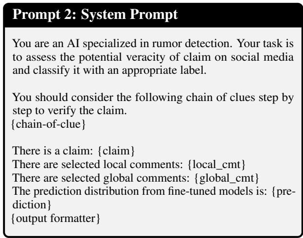  
Table 4: The template of input system prompt.

U by normalizing the rows of corresponding eigenvectors $\mathbf { V } _ { k }$

$$
U _ { i j } = \frac { \mathbf { V } _ { i j } } { \sqrt { \sum _ { j } \mathbf { V } _ { i j } ^ { 2 } } }\tag{21}
$$

4) Finally, cluster the rows of $U$ using k-means (Ikotun et al., 2023) to form the community. It treat each row of $U$ as a point in $\mathbb { R } ^ { k }$ and cluster these points using the k-means algorithm.

$$
\mathcal { C } = k \mathrm { - } m e a n s ( U , k )\tag{22}
$$

where $\mathcal { C }$ represents the clustering result, and k is a hyperparameter indicating the number of community clusters.

## A.2 Input Prompt

The template of input prompt is shown in 4. The output formatter is used to format the output as a JSON instance (see Table 4).

## A.3 Implementation Details of SePro.

GAT models are implemented with the PyTorch-Geometric package (Fey and Lenssen, 2019). We trained the GAT models using an A100 GPU with 80GB of memory, and it took one hour. We reproduce ReLuD based on GPT-3.5-turbo-0125, and not data filter for a fair compare. For a fair comparison, all LLMs-based methods and LLMs-aid methods are reproduced using GPT-3.5-turbo-0125 for a fairly compare. In LeRuD, we not include data filtering to compare fairly with other methods. In the experiments, we run proposed methods three times and report the average results. The LLMs inputs are configured in a zero-shot setting. When the input length exceeds the LLMs’ limits, we truncate it (16K for GPT-3.5-turbo-0125 and 8K for LLaMA3-8b-instruct). Table 5 shows detailed hyperparameters.

<table><tr><td>Hyperparameters</td><td>Values</td></tr><tr><td>In LLMs</td><td></td></tr><tr><td># Temperature</td><td>0.7</td></tr><tr><td># Seed # Top_p</td><td>1 0.95</td></tr><tr><td>In Our Methods</td><td></td></tr><tr><td># Refined nodes n</td><td>50</td></tr><tr><td># Clustering number k</td><td>50</td></tr><tr><td># Trade-off α</td><td>0.3</td></tr></table>

Table 5: Hyperparameters in our methods.

## A.4 Implementation Details of Evaluation.

A 5-point Likert scale was employed, with the metrics defined as follows:

• Misleadingness (M) assesses whether the model’s explanation is consistent with the real veracity label of a claim, with a rating scale ranging from 1 (not misleading) to 5 (very misleading);

• Readability (R) evaluates whether the explanation follows proper grammar and structural rules, and whether the sentences in the explanation fit together and are easy to follow, with a rating scale ranging from 1 (poor) to 5 (excellent);

• Soundness (S) describes whether the explanation seems valid and logical, with a rating scale ranging from 1 (not sound) to 5 (very sound);

• Informativeness (I) assesses whether the explanation provides new information, such as explaining the background and additional context, with a rating scale ranging from 1 (not informative) to 5 (very informative);

In Section 5.3.3, key clues are generated by output formats prompt in Table 8.

## A.5 Discussion

This work alleviates the knowledge gap in LLMs when handling long, structured data for rumor detection. We propose a novel approach that integrates graph attention neural networks with LLMs, leveraging their strengths.

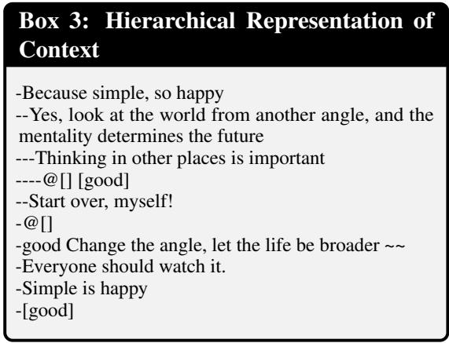  
Table 6: A example of hierarchical representation of social context.

Advanced methods rely on high-quality data (clear claims, complete social context), which is often hard to obtain in real-world scenarios. Therefore, simulating real-world conditions for rumor detection using LLMs is a viable solution and will be the focus of our future research.

## A.6 Case Study

We analyze two cases from the testing set, aiming to know the usefulness of refined social context (local context and global context), and demonstrate the explanation and clues generated by our framework. In Table 7, we have hidden usernames (e.g., @[]) in the text for privacy reasons. These cases show that the source social context contains a lot of irrelevant information, while the refined social context has a high signal-to-noise ratio. Our refined social context provide clear clues to verify the claim.

In the Input, the local context is a text sequence (a string of comments separated by ’||’), and the global context is also converted into text sequences using a simple hierarchical representation. Table 6 illustrates a hierarchical representation of a structured social context. In the Output, the label, explanation, and clues are extracted from the JSON instance formatted by the output formatter (shown in Table 8).

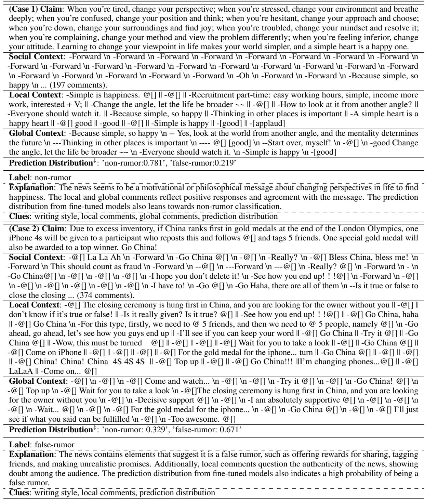  
Table 7: Case Study in SePro: The claims is selected from the Weibo test set. We translated the text from Chinese to English for better presentation. The Input (Claim, Local Context, Global Context, Prediction Distribution‡ ), source social context and Output(Label, Explanation and Clues) are listed. Prediction Distribution‡ refers to the prediction of fine-tuned models.

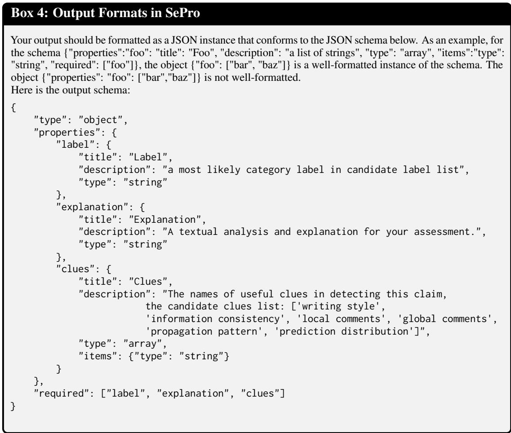  
Table 8: Output Formats in SePro.