# No Simple Answer to Data Complexity: An Examination of Instance-Level Complexity Metrics for Classification Tasks

Ryan A. Cook, John P. Lalor, Ahmed Abbasi

Human-centered Analytics Lab, University of Notre Dame Department of IT, Analytics, and Operations, University of Notre Dame {rcook4, john.lalor, aabbasi}@nd.edu

## Abstract

Natural Language Processing research has become increasingly concerned with understanding data quality and complexity at the instance level. Instance-level complexity scores can be used for tasks such as filtering out noisy observations and subsampling informative examples. However, there exists a diverse taxonomy of complexity metrics that can be used for a classification task, making metric selection itself difficult. We empirically examine the relationship between these metrics and find that simply storing training loss provides similar complexity rankings as other more computationally intensive techniques. Metric similarity allows us to subsample data with higher aggregate complexity along several metrics using a single a priori available meta-feature. Further, this choice of complexity metric does not impact demographic fairness in downstream predictions. We encourage researchers to carefully consider metric availability and similarity, as using the wrong metric or sampling strategy may hurt performance.

## 1 Introduction

Understanding data complexity at the instancelevel has become increasingly important in Natural Language Processing (NLP) and machine learning (ML). Recent work has shown that model performance can be improved through dataset curation, curriculum learning, and in-context learning techniques (Smith et al., 2014; Toneva et al., 2019; Shen and Sanghavi, 2019; Lu et al., 2023). To perform these techniques, researchers need some measurement of data complexity taken at the instance-level to logically filter or order data observations.

NLP tasks are particularly well-suited for studying this area due to the complexity of language and its impact on classification results (Ethayarajh et al., 2022; Gururangan et al., 2018; Hahn et al., 2021). Indeed, these complexity-based techniques are increasingly being used for data filtering and re-weighting in NLP tasks including text classification, text generation, and question answering (Rodriguez et al., 2021; Lalor et al., 2019; Soviany et al., 2022).

Due to its close connection to misclassification rate, instance complexity also has important implications for how we think about bias and fairness (Lorena et al., 2024). Prediction differences across subgroups have the potential to increase harm for underprivileged groups in certain systems (e.g., hiring decisions and facial recognition, Li et al., 2023; Lorena et al., 2024). Bias can exist in data, algorithms, and prediction outputs; addressing fairness across the ML pipeline can mitigate harm (Pessach and Shmueli, 2022; Lalor et al., 2024).

Any technique that alters the training data risks amplifying algorithmic bias (Zhao et al., 2018; Blodgett et al., 2020). If a selected complexity metric disproportionately removes data from certain protected subgroups, this under-representation bias will be captured by the model. Within the current Large Language Model (LLM) paradigm, the addition of complexity-based techniques risks exacerbating existing data biases from pretraining data content (Li et al., 2020; Abid et al., 2021), human annotation (Kirk et al., 2023; Gururangan et al., 2018), and user feedback (Qiu et al., 2022).

Prior work proposed a taxonomy of data complexity for classification tasks (Lorena et al., 2024). However, it is not always clear to researchers which metric they should use to leverage instance-level complexity in their experimental design (Paiva et al., 2021; Martínez-Plumed et al., 2019). Metrics are available at different points of the learning process (e.g., data preprocessing, embedding, training, etc.) and require varying amounts of computation.

To address this gap, we seek to understand how different instance-level complexity metrics relate to one another and if there is any overlap in their measurement. We train a pool of text classifiers, compute a diverse set of complexity metrics, and examine how these complexity metrics correlate across different classification tasks. We also apply a naive a priori subsampling strategy using a complexity metric available before model training to examine whether including more complex observations might improve performance.

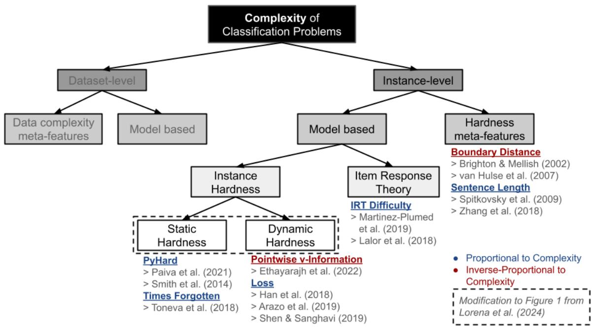  
Figure 1: Classification complexity taxonomy tree introduced in Lorena et al. (2024) with our modifications. Note that in this paper we focus on the instance-level, i.e., the right-hand-side of the tree.

Our contributions in this work are: (i) an extended taxonomy of complexity, as well as a complexity analysis of various techniques; (ii) an empirical examination of the relationships between different complexity metrics across models and dependent variables; (iii) an examination of the combination of complexity and fairness when considering data complexity split by demographic groups.1

The rest of the paper is organized as follows. Section 2 reviews work related to instance-level complexity and the taxonomy we extend. We explain these updates in Section 3 along with the representative metrics used in our experiments in Section 4. We discuss findings in Section 5 before offering concluding remarks in Section 6 and limitations in Section 7.

## 2 Related Work

Research has long sought to quantify the complexity of text sequences using linguistic measures such as syntactic dependence and semantic entropy (Gibson, 1998; Hale, 2001). Instance-level complexity has remained an NLP problem with the rise of computational techniques concerned with which text sequences are harder to learn (Zhao et al., 2022; Zhang et al., 2022; Hahn et al., 2021; Cai et al., 2024). In this section, we begin with a broad view of complexity in ML and refine our focus to NLP applications and an applicable taxonomy of complexity for these tasks.

## 2.1 Instance Complexity Overview

Complexity literature covers the analysis of both dataset-level and instance-level complexity (Smith et al., 2014; Lorena et al., 2024). Especially in NLP, analysis of dataset-level quality allows for prioritization of certain tasks, benchmarks, and classifiers within the Common Task Framework commonly used for evaluating NLP methods (Ho and Basu, 2002; Donoho, 2017). On the other hand, assigning complexity scores at the instance-level allows researchers to identify problematic instances to be filtered (e.g., outliers, annotation artifacts) and informative instances to prioritize.

A priori filtering of outliers – i.e., before training – can improve performance and generalizability through denoising the data in the data curation paradigm (Smith and Martinez, 2011; Hodge and Austin, 2004). Specifically in NLP tasks such as question answering and machine translation, studies have used human-centered complexity metrics to identify annotation artifacts, which are problematic instances resulting from faulty patterns in responses or data labeling from crowd workers (Gururangan et al., 2018; Rondeau and Hazen, 2018). Theory-driven techniques such as Item Response Theory and information theory learn estimates for identifying artifacts and measuring fairness (Lalor et al., 2019; Martínez-Plumed et al., 2019; Ethayarajh et al., 2022).

Beyond fixed measures of static complexity, NLP leaderboards increasingly consider dynamic complexity, which is calculated across epochs (Swayamdipta et al., 2020; Rodriguez et al., 2021). Since model-based complexity scoring is computationally intensive, re-weighting and dynamic filtering are often accomplished via the current value of the loss function in the curriculum learning paradigm. Complex instances have also been conceptualized as providing lower information to the model or being forgotten in later epochs (Toneva et al., 2019; Ethayarajh et al., 2022). However, most instance-level complexity measures for NLP come from naive linguistic heuristics such as sentence length or number of conjunctions, which are known a priori before training (Soviany et al., 2022; Zhang et al., 2018).

## 2.2 Instance Complexity Taxonomy

Recent work has presented a taxonomy of data complexity for classification tasks, where complexity is defined as “the difficulty level in predictive problems” (Lorena et al., 2024). We take the framework from Figure 1 of Lorena et al. (2024) and focus on the right side of the tree, which considers instancelevel metrics; we refer to this as Instance Complexity or simply “complexity.” Here complexity refers to intrinsic characteristics (i.e., meta-features) of an instance that increase its likelihood of being misclassified. In this work, “complexity” will serve as a superset for all other related terms such as “hard,” “difficult,” and “challenging.” Further, we extend their taxonomy for our Figure 1 above to (1) make a distinction for the dynamic nature of certain instance hardness metrics and (2) include earlier literature on inter-class boundary distance.

## 3 Instance Complexity Revisited

Next, we describe our literature search and the corresponding updates to the taxonomy of Lorena et al. (2024). We explain each metric from the updated taxonomy used in our experiment.

## 3.1 Literature Search

To identify papers, we conducted a review of the literature for work dealing specifically with instancelevel complexity. We first identified a set of seed papers, including the Lorena et al. (2024) taxonomy we extend, its foundational work (Smith et al., 2014), and work also dealing with complexity metrics (Ho and Basu, 2002; Soviany et al., 2022). We examined the references of these seed papers and collected 30 metrics from n = 39 papers related to Instance-level complexity. We focus our analysis on 7 representative metrics; a full list is in Appendix A for reference.

## 3.2 Updates to the Taxonomy

Our first change reflects the hierarchical nature of the taxonomy’s “Instance Hardness” category (in the lower middle of Figure 1). Here, certain metrics vary across each epoch and require aggregation to the model-level. These dynamic metrics (e.g., Loss) are still “Model-based” as they result from training, but should be considered separately from static hardness metrics, which are calculated once at the model-level for the entire training process.

Secondly, classification datasets often generate class variables from transformations of real-valued variables (e.g., Abbasi et al., 2021). This score can be seen as the result of a dimensionality reduction from the real-valued variable to the classification class, but should not be on the “Model-based” side of the taxonomy tree in Figure 1 as it is unrelated to any trained ML model. Instead these measurements fall into “Hardness meta-features” and are intrinsic characteristics of the data. Our intuition that scores closer to a median split should be considered to be more challenging is supported by earlier SVM and neighborhood literature in Section 3.4.

Our updated taxonomy can be found in Figure 1, with proposed modifications in dashed boxes. Below we describe each metric in detail. Metrics colored blue and marked with a  symbol are positively correlated with complexity, while those colored red and marked with a  symbol are negatively correlated to complexity. For example, higher IRT values indicate higher complexity for instances, while higher PVI  values show lower complexity.

## 3.3 Model-based

## 3.3.1 Static

PyHard (PH) Instance Hardness theory contends that the hardness of a given instance is relative to both the model used to classify it and the complexity of other items in the dataset (Smith et al., 2014). The PyHard algorithm uses instance space analysis to sample only informative metafeatures and efficiently generate a single output probability of misclassification (PH) from a pool of seven diverse classifiers (Paiva et al., 2021). Complete computation details can be found in Appendix D, but a higher PH value indicates that an instance has a higher probability of being misclassified:

$$
\begin{array} { r } { \mathtt { P H } _ { \mathcal { L } } \Big ( \langle x _ { i } , y _ { i } \rangle \Big ) = 1 - \frac { 1 } { | \mathcal { L } | } \sum _ { j = 1 } ^ { | \mathcal { L } | } p \Big ( y _ { i } | x _ { i } , g _ { j } ( t , \alpha ) \Big ) } \end{array}
$$

Here refers to a pool of diverse learners and $g _ { j } ( t , \alpha )$ is the complete set of learning algorithms and their hyperparameters. While the literature recognizes several hardness meta-features for different dimensions of PH (e.g., k-disagreeing neighbors, local set cardinality, etc.), we only consider explicitly this aggregate probability of misclassification (Smith et al., 2014; Arruda et al., 2020; Lorena et al., 2024).

Times Forgotten (TF) Forgotten examples are instances which are classified correctly in earlier epochs but misclassified at some later epoch in the training process (Toneva et al., 2019). These instances which are more frequently forgotten are considered to be more complex; we can sum forgetting events across epochs:

$$
\mathrm { T F } = \sum _ { e = 1 } ^ { | E | } \sum _ { k = e + 1 } ^ { | E | } \mathbf { f } \left( y _ { i } | x _ { i } \right)
$$

Here $\mathbf { f } \left( y _ { i } | x _ { i } \right) ~ = ~ \mathbb { 1 } \left( \hat { y } _ { i , e } ~ = ~ y _ { i , e } \right) \wedge \mathbb { 1 } \left( \hat { y } _ { i , e + k } ~ \neq ~ \right.$ $y _ { i , e + k } )$ indicates a forgetting event at epoch $e + k$

Item Response Theory (IRT) Item Response Theory (IRT) has become increasingly popular, and we increasingly see IRT concepts used in the evaluation of NLP models and datasets (Martínez-Plumed et al., 2016; Rodriguez et al., 2021; Lalor et al., 2016). In a one-parameter (1PL) IRT model, the difficulty b of a given item can be considered as the point on the ability scale θ where the probability of any subject providing a correct answer is $p ( y = 1 ) = 0 . 5$ . Difficulty is estimated from a dataset of graded correct/incorrect responses to questions across subjects to best fit each item’s Item Characteristic Curve:

$$
p ( y = 1 | \theta , b ) = \frac { 1 } { 1 + e ^ { \theta - b } }
$$

Thus, a core principle of IRT is its assumption that the proficiency of a classifier is a function of the level of hard instances it can solve. Work has been done to scale this IRT parameter estimation to larger numbers of items via Bayesian estimation procedures, so ML applications of IRT can fully take advantage of large text datasets (Natesan et al., 2016; Wu et al., 2020; Lalor and Rodriguez, 2023).

## 3.3.2 Dynamic

Pointwise v-Information (PVI) Pointwise v-Information (PVI) provides an information theoretic perspective on complexity by viewing the difficulty of a given instance as its lack of v-usable information, which considers the accessibility of Shannon mutual information between an encrypted input X and an output Y (Xu et al., 2020; Shannon, 2001). Ethayarajh et al. (2022) extend vinformation from dataset complexity to instancelevel complexity with PVI:

$$
\operatorname { P V I } ( x _ { i } \to y _ { i } ) = - \log _ { 2 } { H _ { \nu } ( Y ) } + \log _ { 2 } { H _ { \nu } ( Y | X ) }
$$

Here $H _ { \nu } ( y _ { i } ) ~ = ~ \mathbb { E } [ - \log g ^ { \prime } ( y _ { i } | x _ { i } ) ]$ is obtained from the primary model $g ^ { \prime }$ and $\begin{array} { r l } { H _ { \nu } ( y _ { i } ) } & { { } = } \end{array}$ $\mathbb { E } [ - \log g ( y _ { i } | \mathcal { O } ) ]$ represents a “null model” g trained on null string inputs ∅.

PVI requires a second “null model” of the same parameterization to be trained, but with the input X variable converted to an empty string to remove all information from the input variable that might aid the prediction of the output Y . Instances with lower PVI have been empirically validated as harder for human annotators to classify (Swayamdipta et al., 2020; Ethayarajh et al., 2022).

Loss The instance hardness literature has also explicitly considered loss as a proxy for instancelevel complexity. Han et al. (2018) “selects its small-loss instances as the useful knowledge” during model training, where “useful” refers to generalizable patterns across instances in the dataset.

$$
\operatorname { L o s s } ( y _ { i } | x _ { i } ) = y _ { i } \log p ( y _ { i } ) + ( 1 - y _ { i } ) \log \left( 1 - p ( y _ { i } ) \right)
$$

Thus, the loss literature suggests deep neural networks will learn easier and correct labels in earlier epochs before they become able to learn noisy or incorrect labels, and often employs dynamic subsampling or re-weighting (Arazo et al., 2019; Shen and Sanghavi, 2019). Items with higher prior loss are more likely to be misclassified in later epochs – as they were misclassified earlier.

## 3.4 Hardness meta-features

Boundary Distance (BD)  BD was originally considered in the SVM literature (Tong and Koller,

<table><tr><td>Category</td><td>Metric</td><td>Computational Cost</td></tr><tr><td rowspan="2">Dynamic</td><td>PVI</td><td> $O ( n \times | E | ) + O ( 1 )$ </td></tr><tr><td>Loss</td><td>0(1)</td></tr><tr><td rowspan="2">Static</td><td>PH</td><td> $O ( n \times | \mathcal { L } | ) + O ( 1 )$ </td></tr><tr><td>TF</td><td></td></tr><tr><td>IRT</td><td>IRT</td><td> $O ( n \times | E | _ { \mathrm { I R T } } ) + O ( 1 )$ </td></tr><tr><td>Hardness</td><td>BD</td><td>O(1)</td></tr><tr><td>Meta-features</td><td>SL</td><td>O(1)</td></tr></table>

Table 1: Complexity metrics and computational costs.

2001; Brinker, 2003). It can be seen as “the difficulty in separating the data points into their expected classes.” This complexity increases as the distance between a given point and the classification boundary shrinks (Lorena et al., 2024).

$$
\mathrm { B D } ( y _ { i , c } ) = | y _ { c } ^ { * } - y _ { i , c } |
$$

Here $y _ { c } ^ { * }$ refers to the class boundary between class $c \in C$ and its nearest neighboring class $c ^ { * }$

We note that BD can be calculated a priori in the dataset and consequently does not vary across models or epochs for a dependent variable. Consideration of boundary points with high BD has led to the development of sampling techniques to increase the presence of minority classes (Walmsley et al., 2018; Chatzimparmpas et al., 2023; Xie et al., 2023) and ensemble learning methods which can adaptively select the classifier that best fits the hardness of the instance (Dantas et al., 2019; Souza et al., 2019).

Sentence Length (SL) Due to the structured nature of language data, NLP studies typically leverage a priori linguistic features as a proxy for complexity (Soviany et al., 2022; Zhang et al., 2018). The most efficient and popular linguistic heuristic is sentence length, which is a simple count of the number of tokens in the input sequence:

$$
\mathrm { S L } ( x _ { i } ) = \| x _ { i } \|
$$

As sentence length grows (1) the number of possible grammatical parsing trees grows exponentially and (2) the chance of simple classifiers correctly guessing linguistic heuristics plummets (Spitkovsky et al., 2009).

## 4 Experiment

Having defined our metrics, we empirically examined their relationships through a text classification task. We trained 220 models on 2 different subsampled train sets across 5 dependent variables, computing and storing all aforementioned complexity metrics. We then analyzed metric correlation as well as model performance and fairness on a held out set to determine patterns and differences.

A roadmap of the experimental procedure can be found in Figure 2. We consider “metric availability” to be a binary indication of whether a metric can be computed before or after model training begins. We note that equations for added computational cost indicate the additional runtime needed to generate each metric on top of the standard training pipeline.

## 4.1 Data

We consider five tasks across two datasets. For the first four tasks, we use the FairPsych NLP dataset of human-generated text responses with corresponding latent variable scores concerning a participant’s Anxiety, Numeracy, Subjective Literacy, and Trust in Physicians (Abbasi et al., 2021). The target variable is a real-valued score – i.e., average of multi-item responses, scaled between 0-1 – binarized for classification via median split.

Our fifth task is a separate depression detection task of transcribed speech from a clinical interview dataset with binary labels of Depression vs. Control provided by a clinical professional (Cotes et al., 2022). All data statistics and splits for all 5 tasks can be found in Appendix C and examples can be found in Appendix B.

## 4.2 Model Training and Storage

We chose three base neural network architectures as well as two transformer language models to train classifiers with varying hyperparameters. For each dependent variable, we trained 6 Feedforward Neural Networks (FFNs), 6 Convolutional Neural Networks (CNNs), and 6 Long-Short Term Memory networks (LSTMs). We fixed the learning rate at 1e-3 and vary the number of layers, nodes, and filters (when applicable). We also include 2 BERT and 2 RoBERTa models with learning rates of 3e-5 and 3e-6 (Devlin et al., 2019; Liu et al., 2019). Thus, we trained 22 models on 2 possible train splits (i.e., “hard” and ”random”) across 5 dependent variables such that our entire model population included 220 models. We trained models for 15 epochs with an Adam optimizer using stochastic gradient descent and stored instance outputs and losses every epoch, which are sufficient statistics for most metrics.2

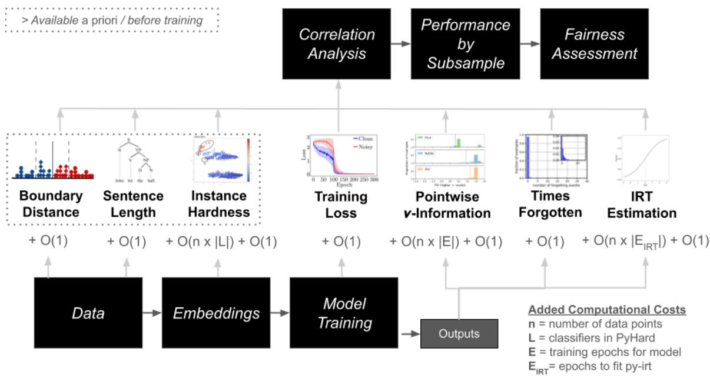  
Figure 2: Experimental process diagram including the availability and added computational cost of each complexity metric calculation. Note that metrics available a priori / before model training are contained in the dotted box.

## 4.3 Experimental Procedure

## 4.3.1 Subsampling

We took two different training splits of the same dataset for each dependent variable. The “hard” train set was a stratified sample of 50% of instances with the highest BD. For the FairPsych data, we calculate BD as the difference between the true continuous variable value and the median split. For the depression detection data, we calculate BD as the Word Error Rate (WER) score between the automated transcription and the human gold standard as an alternative form of BD – i.e., $\mathbf { B D } ( i ) = | 0 - \mathbf { W E R } _ { i } |$ since the human transcription error of every instance i is zero. The “random” train set was a random stratified sample of a similar length from the entire distribution. We used BD to identify hard examples because it is known a priori – as opposed to e.g., Loss, which is only known after training. There was approximately 45- 50% overlap between the hard and random sample datasets, indicating a biased sample since the expected overlap from random draws would be 25% $( \mathrm { i . e . , 0 . 5 ^ { 2 } = 0 . 2 5 } )$ . We train our models (§4.2) with both splits and evaluate on our held-out test set.

## 4.3.2 Fairness

We also consider fairness throughout the machine learning pipeline. Lorena et al. (2024) recommends measuring the difference between between protected and privileged demographic classes in their respective distributions to ensure that instance-level complexity is equally measured upstream (i.e., during the representation phase before training) via via Kullback-Leibler Divergence (KLD):

$$
\begin{array} { r } { D _ { \mathrm { K L } } ( p | | q ) = \sum _ { x \in { \cal { X } } } p ( x ) \log \Big ( \frac { p ( x ) } { q ( x ) } \Big ) } \end{array}
$$

where $p$ and $q$ are the respective distributions of the protected and privileged classes.

Downstream fairness refers to prediction and performance discrepancies of the trained models and can be assessed via Disparate Impact (DI):

$$
\begin{array} { r } { \mathrm { D I } = \frac { p ( \hat { y } = 1 | b ) } { p ( \hat { y } = 1 | a ) } } \end{array}
$$

for the probability $p$ of predictions $\hat { y }$ of a feature with privileged class a and protected class b.

For both KLD and DI, larger values give evidence of fairness violations as they indicate more difference between privileged and protected classes (Lalor et al., 2024).

## 5 Results and Discussion

## 5.1 Complexity Difference by Train Set

Sampling on a single a priori available metafeature creates datasets that are complex across several metrics. First, we examine how effective our BD split was in creating a difference in means for each complexity metric. We show this difference in complexity via a mean (M) difference analysis of each complexity metric across dependent variables and sampling strategies in Table 2.

We don’t analyze the Anxiety task, as our subsampling did not create an $\alpha = 0 . 0 5$ significant difference between the “hard” $( \mathbf { M } = 0 . 2 5 4 4 )$ and the “random” $( \mathbf { M } = 0 . 2 5 7 4 )$ sets. Increases in BD were significant for Numeracy $( - 0 . 1 0 3 4 , \mathsf { p } < 0 . 0 1 )$ Subjective Literacy (-0.0510, $\mathsf { p } < 0 . 0 1 )$ , Trust in Physicians (-0.1006, $\mathsf { p } < 0 . 0 1 \ )$ , and Word Error Rate (-0.0331, $\mathrm { p } < 0 . 0 1 )$ . We also find significant differences in means for Loss, TF, PH, and IRT Difficulty across the four FairPsych tasks, and for TF and SL in the depression task. As we did not sample on these other complexity metrics, these results indicate some shared information that allows BD to create train sets of higher aggregate complexity across several metrics in different branches of the taxonomy.

<table><tr><td></td><td colspan="4">FairPsych</td><td>Interview</td></tr><tr><td></td><td>Anx.</td><td>Lit.</td><td>Num.</td><td>Trust</td><td>Depr.</td></tr><tr><td>IH</td><td>0.000</td><td>0.000</td><td>0.034*</td><td>0.032*</td><td>0.083*</td></tr><tr><td>IRT</td><td>0.043</td><td>0.358</td><td>1.200*</td><td>0.530</td><td>1.577*</td></tr><tr><td>Loss</td><td>0.001</td><td>0.006</td><td>0.063*</td><td>0.027*</td><td>0.093*</td></tr><tr><td>SL</td><td>0.996</td><td>0.795</td><td>0.867</td><td>0.907</td><td>-2.187</td></tr><tr><td>TF</td><td>0.159*</td><td>0.409*</td><td>0.599*</td><td>0.361*</td><td>0.688*</td></tr><tr><td>BD</td><td>-0.004</td><td>-0.033*</td><td>-0.051*</td><td>-0.103*</td><td>-0.101*</td></tr><tr><td>PVI</td><td>0.022</td><td>-0.007</td><td>0.087</td><td>0.104</td><td>0.153</td></tr></table>

Table 2: Mean difference of metrics from Hard vs. Random subsampling on BD. $\ast \colon p < 0 . 0 5$ , one-sided t-test with Bonferroni adjustment for multiple tests.

## 5.2 Correlation Analysis

Loss shares some inherent complexity feature(s) with several other metrics. In Figure 3, we show the aggregate correlation of our complexity metrics across all models and target variables, ordered by rank from highest to lowest. The x-axis shows the micro-averaged Spearman Correlation3 between each pair of metrics on the y-axis.

We note that Loss is present in 3 of the top 4 correlations, displaying some degree of related ranking to all Model-based metrics in the taxonomy except for PVI. Loss correlates moderately with TF $( \rho = 0 . 4 2 3 6 )$ and IRT $( \rho = 0 . 4 2 8 9 )$ as well as weakly with PH $( \rho = 0 . 3 6 3 4 )$ , which in turn correlate weakly with each other $( \rho = 0 . 3 3 3 1 )$ This weak correlation between Loss and PH indicates the expected misclassification probability from PH is overlapping with the simpler calculation of the average Loss from the same model across epochs. Similarly, there exists a weak correlation between the average Loss and the Difficulty values estimated by a 1PL IRT model. This additional IRT optimization problem is providing some of the same information that we are already computing in the model training process. Interestingly, PH and IRT are weakly correlated as well – although these optimizations are done in very different methods (i.e., empirical risk minimization vs. stochastic variational inference).

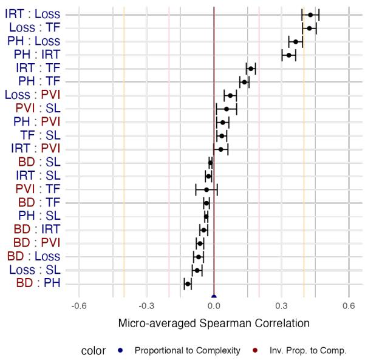  
Figure 3: 95% CIs of Spearman Correlation averaged across all 5 dependent variables, train sets, and models. ρ = 0 marked by a dark red line. Thresholds for weak $( \rho = \pm 0 . 2 )$ and moderate $( \rho = \pm 0 . 4 )$ correlations are marked with light pink and orange lines, respectively. This plot is shown as a pairplot in Appendix F and broken down by task in Appendix G.

This analysis suggests that we can capture a substantial portion of Model-based complexity by simply storing the training Loss as a high level proxy for its shared complexity with PH, TF, and IRT Difficulty. Simply storing loss values is also more computationally-efficient and parsimonious than more theoretical techniques such as PyHard or IRT.

Our Hardness meta-features (i.e., BD and SL) are weakly correlated with other metrics in Figure 3, but BD is useful in sampling subsets that are significantly different along several metrics in Table 2. For example, while BD and Loss might not rank instances in exactly the same order, their relationship can still be used to identify similarly complex instances on aggregate. Future research should consider whether a priori metrics can similarly span the whole taxonomy as proxies for other metrics in aggregate filtering or instance-level re-weighting.

<table><tr><td></td><td>AUC</td><td>Ability</td><td>Acc.</td><td>F1 Score</td></tr><tr><td>Anxiety</td><td>0.001</td><td>0.027</td><td>-0.005</td><td>0.055</td></tr><tr><td>Literacy</td><td>-0.056*</td><td>-0.856</td><td>-0.034</td><td>-0.051</td></tr><tr><td>Numeracy</td><td>-0.034*</td><td>-0.322</td><td>-0.008</td><td>0.052</td></tr><tr><td>Trust</td><td>-0.050*</td><td>-1.226*</td><td>-0.038</td><td>-0.071</td></tr><tr><td>Depr.</td><td>0.019*</td><td>-0.044</td><td>-0.013</td><td>-0.112*</td></tr></table>

Table 3: Mean difference in performance for Random vs. Hard BD subsampling strategies. Starred values are significant at α = 0.05, two-sided t-test.

## 5.3 Performance Difference by Train Set

Subsampling on BD examples lowers model AUC. We want to examine whether models that saw more complex examples during the training process might perform better during inference. We measure test performance via several widely-used ML metrics (i.e., Accuracy, AUC, and F1 Score) as well as an Ability estimate provided by our 1PL IRT model (Lalor et al., 2018). We display mean difference of performance metrics between each sampling strategy in Table 3 and overall performance in Appendix H.

We see a significant difference in performance for AUC, with almost all other performance metrics not showing significant difference across subsampling strategies. This AUC difference favors the randomly sampled data in all but the depression task. In short, training on more complex examples is typically harder for downstream prediction.

Measuring upstream fairness is sensitive to group imbalance. We note that model fairness is an issue for certain demographics and dependent variables, as shown both by our analysis of disparate impact (DI) as well as the proposed metric in Lorena et al. (2024) – which computes the Kullback-Leibler Divergence (KLD) between the protected group’s distribution and that of the privileged class. We find very similar distributions of complexity metrics for Sex, Race, and Income across dependent variables and complexity metrics, with KLD scores near zero across complexity metrics and dependent variables in Table 4. However, we notice a difference in complexity distributions for Seniors age 55+ and on education level for individuals who did not finish high school. We note that some of this divergence can be explained by the imbalanced data (Feng et al., 2018; Furundzic et al., 2017). The non-negative nature of KLD – i.e., as an asymmetric distance measure – ensures that it can only grow larger with distributional differences, and this difference will result from a lack of coverage of the smaller distribution (Pan et al., 2005; Hochbaum and Pathria, 1998). The lack of coverage is likely related to the size of the protected class for Age (1.93%) and Education (1.32%) being very small in the FairPsych dataset. The depression data displays some imbalance for Age (8.26%) and Education (26.31%), but we also see large KLD values for the more balanced Race (36.00%) and Sex (50.37%) demographics. Thus, our WER measurement of BD is biased, which is consistent with previous research on unequal performance of automated transcription methods (Koenecke et al., 2020). Future research should be mindful of how the choice of fairness metric impacts complexity comparisons across demographic groups.

<table><tr><td></td><td></td><td>Age</td><td>Sex</td><td>Race</td><td>Educ.</td><td>Inc.</td><td>ESL</td></tr><tr><td>Anxiety</td><td>BD</td><td>1.58</td><td>0.01</td><td>0.01</td><td>0.14</td><td>0.01</td><td>0.07</td></tr><tr><td></td><td>IH</td><td>2.11</td><td>0.02</td><td>0.01</td><td>0.37</td><td>0.03</td><td>0.22</td></tr><tr><td></td><td>IRT</td><td>2.22</td><td>0.02</td><td>0.02</td><td>0.25</td><td>0.02</td><td>0.15</td></tr><tr><td></td><td>Loss</td><td>1.89</td><td>0.01</td><td>0.02</td><td>0.31</td><td>0.03</td><td>0.23</td></tr><tr><td></td><td>PVI</td><td>2.19</td><td>0.02</td><td>0.02</td><td>0.22</td><td>0.04</td><td>0.15</td></tr><tr><td></td><td>TF</td><td>1.85</td><td>0.03</td><td>0.02</td><td>0.33</td><td>0.02</td><td>0.15</td></tr><tr><td></td><td>SL</td><td>1.65</td><td>0.03</td><td>0.05</td><td>0.24</td><td>0.02</td><td>0.15</td></tr><tr><td>Numeracy</td><td>BD</td><td>1.47</td><td>0.01</td><td>0.08</td><td>0.19</td><td>0.02</td><td>0.06</td></tr><tr><td></td><td>IH</td><td>1.73</td><td>0.03</td><td>0.05</td><td>0.52</td><td>0.02</td><td>0.15</td></tr><tr><td></td><td>IRT</td><td>1.75</td><td>0.04</td><td>0.14</td><td>0.59</td><td>0.02</td><td>0.11</td></tr><tr><td></td><td>Loss</td><td>1.93</td><td>0.04</td><td>0.13</td><td>0.62</td><td>0.03</td><td>0.12</td></tr><tr><td></td><td>PVI</td><td>2.37</td><td>0.04</td><td>0.14</td><td>0.74</td><td>0.03</td><td>0.15</td></tr><tr><td></td><td>TF</td><td>2.52</td><td>0.03</td><td>0.08</td><td>0.55</td><td>0.02</td><td>0.13</td></tr><tr><td></td><td>SL</td><td>2.21</td><td>0.02</td><td>0.06</td><td>0.30</td><td>0.02</td><td>0.18</td></tr><tr><td>Literacy</td><td>BD</td><td></td><td></td><td></td><td></td><td></td><td></td></tr><tr><td></td><td>IH</td><td>1.93 1.80</td><td>0.02</td><td>0.02</td><td>0.42</td><td>0.01 0.02</td><td>0.12 0.14</td></tr><tr><td></td><td>IRT</td><td></td><td>0.03</td><td>0.01</td><td>0.32</td><td></td><td>0.17</td></tr><tr><td></td><td></td><td>1.75</td><td>0.02</td><td>0.02</td><td>0.25</td><td>0.02</td><td></td></tr><tr><td></td><td>Loss</td><td>1.38</td><td>0.02</td><td>0.02</td><td>0.31</td><td>0.02</td><td>0.15</td></tr><tr><td></td><td>PVI</td><td>1.24</td><td>0.03</td><td>0.02</td><td>0.29</td><td>0.02</td><td>0.07</td></tr><tr><td></td><td>TF</td><td>1.63</td><td>0.02</td><td>0.02</td><td>0.31</td><td>0.02</td><td>0.12</td></tr><tr><td></td><td>SL</td><td>0.96</td><td>0.03</td><td>0.08</td><td>0.32</td><td>0.02</td><td>0.13</td></tr><tr><td>Depr.</td><td>BD</td><td>2.08</td><td>2.24</td><td>2.78</td><td>3.98</td><td></td><td></td></tr><tr><td></td><td>IH</td><td>0.38</td><td>0.38</td><td>0.13</td><td>0.55</td><td></td><td></td></tr><tr><td></td><td>IRT</td><td>0.29</td><td>0.32</td><td>0.07</td><td>0.42</td><td></td><td></td></tr><tr><td></td><td>Loss</td><td>0.13</td><td>0.10</td><td>0.09</td><td>0.21</td><td></td><td></td></tr><tr><td></td><td>PVI</td><td>0.27</td><td>0.30</td><td>0.11</td><td>0.31</td><td></td><td></td></tr><tr><td></td><td>TF</td><td>0.08</td><td>0.09</td><td>0.07</td><td>0.21</td><td></td><td></td></tr><tr><td></td><td>SL</td><td>0.08</td><td>0.08</td><td>0.05</td><td>0.09</td><td></td><td></td></tr></table>

Table 4: KLD between distributions of complexity values for the protected and privileged classes (larger values indicate greater difference). Explanation of missing values in the table can be found in Appendix I.2.

Subsampling on complexity does not impact downstream fairness. In Figure 4, we examine whether our sampling strategy impacts model fairness as measured by DI confidence intervals – We also note that the fairness literature considers DI scores below 0.8 or above 1.2 – marked with red lines – to disproportionately affect predictions for the protected class, so we bold any CIs that lie fully outside these suggested thresholds (Lalor et al., 2022). We note that none of our 95% CIs lie completely above 1.2 such that models do not predict the protected class significantly more across demographics and dependent variables. Although several CIs lie fully below 0.8 (e.g., Numeracy-Race, Subjective Literacy-Income), there is only one significant difference between CIs of different sampling strategies (i.e., Depression-Age) so fairness concerns also exist for models trained on random data. Notably, in 17 out of the 27 cases presented in Figure 4, the hard CIs are either smaller than the random CIs, or comparable-sized but shifted towards the center (i.e., indicating less disparate impact). This is important from a risk management perspective since both the extent of downstream bias and its variance are key considerations. Thus, we should not expect sampling on complexity to systematically bias against protected groups.

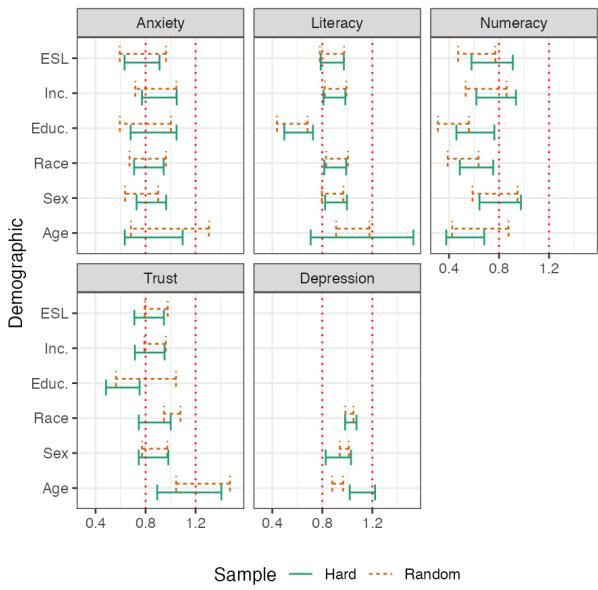  
Figure 4: 95% Confidence Intervals for Disparate Impact across demographics. All CIs overlap indicating no significant difference at $\alpha = 0 . 0 5$ . Red values indicate DI intervals fully below the “0.8 rule.” See Appendix I.2 for information on missing values.

## 6 Conclusion

We computed various complexity metrics for text classification and analyzed their correlation across dependent variables. These findings supported updates to the current taxonomy on classification complexity to consider metric availability and computational efficiency. We found that simply storing training Loss captured similar complexity of computationally intensive model-based metrics such as IRT Difficulty and Instance Hardness. Further, sampling on a single a priori available meta-feature created datasets that were complex across separate metrics. We only found one difference in upstream fairness and no downstream impact from employing these complexity metrics in a sampling strategy.

## 7 Limitations

There are limitations that can inform future work on instance-level complexity in NLP tasks. We note that the updated taxonomy is by no means exhaustive and only applies to classification tasks. We limit our empirical examination to the healthcare setting, but future studies might compare complexity relationships measured on text from other applied areas. While 4 of our tasks provide a groundtruth latent continuous variable as a built-in Hardness meta-feature (via BD), future research should examine other BD measures from types of input noise like WER, provided that they can be fairly applied across demographics.

Recent work has also started to explore using LLMs to facilitate instance hardness estimation. Future work can further investigate the advantages of LLMs in terms of potential efficiency and robustness gains (Lu et al., 2023; Saha et al., 2022). While linguistics research may offer new Hardness meta-features from further understanding of grammar and syntax, we might also expect new complexity metrics to arise in the Model-based section of the taxonomy from new architectures and techniques such as in-context learning (Lu et al., 2023; Valmeekam et al., 2022), retrieval augmented generation (Jeong et al., 2024; Chen et al., 2024), or graph learning (Wang et al., 2024). Our updates to the taxonomy are not meant to be exhaustive, and we encourage future research to continue exploring the many facets of complexity.

## Acknowledgments

This work was partially supported by the National Science Foundation under Grants IIS-2403438, IIS-2240347, and IIS-2039915.

## References

Ahmed Abbasi, David Dobolyi, John P Lalor, Richard G Netemeyer, Kendall Smith, and Yi Yang. 2021. Constructing a psychometric testbed for fair natural language processing. In Proceedings ofthe 2021 Con-

ference on Empirical Methods in Natural Language Processing, pages 3748–3758.

Abubakar Abid, Maheen Farooqi, and James Zou. 2021. Persistent anti-muslim bias in large language models. In Proceedings ofthe 2021 AAAI/ACM Conference on AI, Ethics, and Society, pages 298–306.

Dario Amodei, Sundaram Ananthanarayanan, Rishita Anubhai, Jingliang Bai, Eric Battenberg, Carl Case, Jared Casper, Bryan Catanzaro, Qiang Cheng, Guoliang Chen, et al. 2016. Deep speech 2: End-to-end speech recognition in english and mandarin. In International conference on machine learning, pages 173–182. PMLR.

Eric Arazo, Diego Ortego, Paul Albert, Noel O’Connor, and Kevin McGuinness. 2019. Unsupervised label noise modeling and loss correction. In International conference on machine learning, pages 312–321. PMLR.

José LM Arruda, Ricardo BC Prudêncio, and Ana C Lorena. 2020. Measuring instance hardness using data complexity measures. In Intelligent Systems: 9th Brazilian Conference, BRACIS 2020, Rio Grande, Brazil, October 20–23, 2020, Proceedings, Part II 9, pages 483–497. Springer.

Su Lin Blodgett, Solon Barocas, Hal Daumé III, and Hanna Wallach. 2020. Language (technology) is power: A critical survey of “bias” in nlp. In Proceedings of the 58th Annual Meeting of the Association for Computational Linguistics, pages 5454–5476.

Klaus Brinker. 2003. Incorporating diversity in active learning with support vector machines. In Proceedings of the 20th international conference on machine learning (ICML-03), pages 59–66.

Fengyu Cai, Xinran Zhao, Hongming Zhang, Iryna Gurevych, and Heinz Koeppl. 2024. Geohard: Towards measuring class-wise hardness through modelling class semantics. In Findings of the Association for Computational Linguistics ACL 2024, pages 5571–5597.

Haw-Shiuan Chang, Erik Learned-Miller, and Andrew McCallum. 2017. Active bias: Training more accurate neural networks by emphasizing high variance samples. Advances in Neural Information Processing Systems, 30.

Angelos Chatzimparmpas, Fernando Vieira Paulovich, and Andreas Kerren. 2023. Hardvis: Visual analytics to handle instance hardness using undersampling and oversampling techniques. In Computer Graphics Forum, volume 42-1, pages 135–154. Wiley Online Library.

Jiawei Chen, Hongyu Lin, Xianpei Han, and Le Sun. 2024. Benchmarking large language models in retrieval-augmented generation. In Proceedings of the AAAI Conference on Artificial Intelligence, volume 38, pages 17754–17762.

Robert O Cotes, Mina Boazak, Emily Griner, Zifan Jiang, Bona Kim, Whitney Bremer, Salman Seyedi, Ali Bahrami Rad, and Gari D Clifford. 2022. Multimodal assessment of schizophrenia and depression utilizing video, acoustic, locomotor, electroencephalographic, and heart rate technology: protocol for an observational study. JMIR Research Protocols, 11(7):e36417.

Carine Dantas, Romulo Nunes, Anne Canuto, and João Xavier-Júnior. 2019. Instance hardness as a decision criterion on dynamic ensemble structure. In 2019 8th Brazilian Conference on Intelligent Systems (BRACIS), pages 108–113. IEEE.

Jacob Devlin, Ming-Wei Chang, Kenton Lee, and Kristina Toutanova. 2019. BERT: Pre-training of deep bidirectional transformers for language understanding. In Proceedings ofthe 2019 Conference of the North American Chapter ofthe Associationfor Computational Linguistics: Human Language Technologies, Volume 1 (Long and Short Papers), pages 4171–4186, Minneapolis, Minnesota. Association for Computational Linguistics.

David Donoho. 2017. 50 years of data science. Journal ofComputational and Graphical Statistics, 26(4):745–766.

Kawin Ethayarajh, Yejin Choi, and Swabha Swayamdipta. 2022. Understanding dataset difficulty with v-usable information. In International Conference on Machine Learning, pages 5988–6008. PMLR.

Lin Feng, Huibing Wang, Bo Jin, Haohao Li, Mingliang Xue, and Le Wang. 2018. Learning a distance metric by balancing kl-divergence for imbalanced datasets. IEEE Transactions on Systems, Man, and Cybernetics: Systems, 49(12):2384–2395.

Drasko Furundzic, Srdjan Stankovic, Slobodan Jovicic, Silvana Punisic, and Misko Subotic. 2017. Distance based resampling of imbalanced classes: With an application example of speech quality assessment. Engineering Applications of Artificial Intelligence, 64:440–461.

Amirata Ghorbani and James Zou. 2019. Data shapley: Equitable valuation of data for machine learning. In International conference on machine learning, pages 2242–2251. PMLR.

Edward Gibson. 1998. Linguistic complexity: Locality of syntactic dependencies. Cognition, 68(1):1–76.

Yantao Gong, Cao Liu, Jiazhen Yuan, Fan Yang, Xunliang Cai, Guanglu Wan, Jiansong Chen, Ruiyao Niu, and Houfeng Wang. 2021. Density-based dynamic curriculum learning for intent detection. In Proceedings of the 30th ACM International Conference on Information & Knowledge Management, pages 3034– 3037.

Suchin Gururangan, Swabha Swayamdipta, Omer Levy, Roy Schwartz, Samuel Bowman, and Noah A Smith.

2018. Annotation artifacts in natural language inference data. In Proceedings of the 2018 Conference of the North American Chapter ofthe Associationfor Computational Linguistics: Human Language Technologies, Volume 2 (Short Papers). Association for Computational Linguistics.

Michael Hahn, Dan Jurafsky, and Richard Futrell. 2021. Sensitivity as a complexity measure for sequence classification tasks. Transactions ofthe Association for Computational Linguistics, 9:891–908.

John Hale. 2001. A probabilistic earley parser as a psycholinguistic model. In Second meeting of the north american chapter ofthe associationfor computational linguistics.

Bo Han, Quanming Yao, Xingrui Yu, Gang Niu, Miao Xu, Weihua Hu, Ivor Tsang, and Masashi Sugiyama. 2018. Co-teaching: Robust training of deep neural networks with extremely noisy labels. Advances in neural information processing systems, 31.

Tin Kam Ho and Mitra Basu. 2002. Complexity measures of supervised classification problems. IEEE transactions on pattern analysis and machine intelligence, 24(3):289–300.

Dorit S Hochbaum and Anu Pathria. 1998. Analysis of the greedy approach in problems of maximum k-coverage. Naval Research Logistics (NRL), 45(6):615–627.

Victoria Hodge and Jim Austin. 2004. A survey of outlier detection methodologies. Artificial intelligence review, 22:85–126.

Borna Jafarpour, Dawn Sepehr, and Nick Pogrebnyakov. 2021. Active curriculum learning. In Proceedings of the First Workshop on Interactive Learning for Natural Language Processing, pages 40–45.

Soyeong Jeong, Jinheon Baek, Sukmin Cho, Sung Ju Hwang, and Jong C Park. 2024. Adaptive-rag: Learning to adapt retrieval-augmented large language models through question complexity. arXiv preprint arXiv:2403.14403.

Ajay J Joshi, Fatih Porikli, and Nikolaos Papanikolopoulos. 2009. Multi-class active learning for image classification. In 2009 ieee conference on computer vision and pattern recognition, pages 2372–2379. IEEE.

Hannah Rose Kirk, Andrew Michael Bean, Bertie Vidgen, Paul Rottger, and Scott A Hale. 2023. The past, present and better future of feedback learning in large language models for subjective human preferences and values. In The 2023 Conference on Empirical Methods in Natural Language Processing.

Tom Kocmi and Ondˇrej Bojar. 2017. Curriculum learning and minibatch bucketing in neural machine translation. In Proceedings of the International Conference Recent Advances in Natural Language Processing, RANLP 2017, pages 379–386.

Allison Koenecke, Andrew Nam, Emily Lake, Joe Nudell, Minnie Quartey, Zion Mengesha, Connor Toups, John R Rickford, Dan Jurafsky, and Sharad Goel. 2020. Racial disparities in automated speech recognition. Proceedings ofthe national academy of sciences, 117(14):7684–7689.

Pang Wei Koh and Percy Liang. 2017. Understanding black-box predictions via influence functions. In International conference on machine learning, pages 1885–1894. PMLR.

John P Lalor, Ahmed Abbasi, Kezia Oketch, Yi Yang, and Nicole Forsgren. 2024. Should fairness be a metric or a model? a model-based framework for assessing bias in machine learning pipelines. ACM Transactions on Information Systems, 42(4):1–41.

John P Lalor, Hao Wu, Tsendsuren Munkhdalai, and Hong Yu. 2018. Understanding deep learning performance through an examination of test set difficulty: A psychometric case study. In Proceedings of the Conference on Empirical Methods in Natural Language Processing. Conference on Empirical Methods in Natural Language Processing, volume 2018, page 4711. NIH Public Access.

John P Lalor, Hao Wu, and Hong Yu. 2016. Building an evaluation scale using item response theory. In Proceedings of the Conference on Empirical Methods in Natural Language Processing. Conference on Empirical Methods in Natural Language Processing, volume 2016, page 648. NIH Public Access.

John P Lalor, Hao Wu, and Hong Yu. 2019. Learning latent parameters without human response patterns: Item response theory with artificial crowds. In Proceedings of the Conference on Empirical Methods in Natural Language Processing. Conference on Empirical Methods in Natural Language Processing, volume 2019, page 4240. NIH Public Access.

John P Lalor, Yi Yang, Kendall Smith, Nicole Forsgren, and Ahmed Abbasi. 2022. Benchmarking intersectional biases in nlp. In Proceedings of the 2022 conference ofthe North American chapter ofthe association for computational linguistics: Human language technologies, pages 3598–3609.

John Patrick Lalor and Pedro Rodriguez. 2023. py-irt: A scalable item response theory library for python. INFORMS Journal on Computing, 35(1):5–13.

Ronan Le Bras, Swabha Swayamdipta, Chandra Bhagavatula, Rowan Zellers, Matthew Peters, Ashish Sabharwal, and Yejin Choi. 2020. Adversarial filters of dataset biases. In International conference on machine learning, pages 1078–1088. Pmlr.

Bo Li, Peng Qi, Bo Liu, Shuai Di, Jingen Liu, Jiquan Pei, Jinfeng Yi, and Bowen Zhou. 2023. Trustworthy ai: From principles to practices. ACM Computing Surveys, 55(9):1–46.

Tao Li, Daniel Khashabi, Tushar Khot, Ashish Sabharwal, and Vivek Srikumar. 2020. Unqovering stereotyping biases via underspecified questions. In Findings of the Association for Computational Linguistics: EMNLP 2020, pages 3475–3489.

Xuebo Liu, Houtim Lai, Derek F Wong, and Lidia S Chao. 2020. Norm-based curriculum learning for neural machine translation. In Proceedings of the 58th Annual Meeting ofthe Associationfor Computational Linguistics, pages 427–436.

Yinhan Liu, Myle Ott, Naman Goyal, Jingfei Du, Mandar Joshi, Danqi Chen, Omer Levy, Mike Lewis, Luke Zettlemoyer, and Veselin Stoyanov. 2019. Roberta: A robustly optimized bert pretraining approach. arXiv preprint arXiv:1907.11692.

Ana C Lorena, Pedro YA Paiva, and Ricardo BC Prudêncio. 2024. Trusting my predictions: on the value of instance-level analysis. ACM Computing Surveys, 56(7):1–28.

Sheng Lu, Shan Chen, Yingya Li, Danielle Bitterman, Guergana K Savova, and Iryna Gurevych. 2023. Measuring pointwise v-usable information in-context-ly. In The 2023 Conference on Empirical Methods in Natural Language Processing.

Tomasz Malisiewicz, Abhinav Gupta, and Alexei A Efros. 2011. Ensemble of exemplar-svms for object detection and beyond. In 2011 International conference on computer vision, pages 89–96. IEEE.

Fernando Martínez-Plumed, Ricardo BC Prudêncio, Adolfo Martínez-Usó, and José Hernández-Orallo. 2016. Making sense of item response theory in machine learning. In ECAI 2016, pages 1140–1148. IOS Press.

Fernando Martínez-Plumed, Ricardo BC Prudêncio, Adolfo Martínez-Usó, and José Hernández-Orallo. 2019. Item response theory in ai: Analysing machine learning classifiers at the instance level. Artificial intelligence, 271:18–42.

Prathiba Natesan, Ratna Nandakumar, Tom Minka, and Jonathan D Rubright. 2016. Bayesian prior choice in irt estimation using mcmc and variational bayes. Frontiers in psychology, 7:214660.

J Arturo Olvera-López, J Ariel Carrasco-Ochoa, J Francisco Martínez-Trinidad, and Josef Kittler. 2010. A review of instance selection methods. Artificial Intelligence Review, 34:133–143.

Pedro Yuri Arbs Paiva, Kate Smith-Miles, Maria Gabriela Valeriano, and Ana Carolina Lorena. 2021. Pyhard: a novel tool for generating hardness embeddings to support data-centric analysis. arXiv preprint arXiv:2109.14430.

Feng Pan, Wei Wang, Anthony KH Tung, and Jiong Yang. 2005. Finding representative set from massive data. In Fifth IEEE International Conference on Data Mining (ICDM’05), pages 8–pp. IEEE.

Dana Pessach and Erez Shmueli. 2022. A review on fairness in machine learning. ACM Computing Surveys (CSUR), 55(3):1–44.

Ricardo BC Prudêncio and Carlos Castor. 2014. Costsensitive measures of instance hardness. In First International Workshop on Learning over Multiple Contexts in ECML 2014. Nancy, France, 19 September 2014, volume 1.

Ruiyang Qin, Ryan Cook, Kai Yang, Ahmed Abbasi, David Dobolyi, Salman Seyedi, Emily Griner, Hyeokhyen Kwon, Robert Cotes, Zifan Jiang, et al. 2024. Language models for online depression detection: A review and benchmark analysis on remote interviews. ACM Transactions on Management Information Systems.

Liang Qiu, Yizhou Zhao, Jinchao Li, Pan Lu, Baolin Peng, Jianfeng Gao, and Song-Chun Zhu. 2022. Valuenet: A new dataset for human value driven dialogue system. In Proceedings ofthe AAAI Conference on Artificial Intelligence, volume 36-10, pages 11183– 11191.

Mengye Ren, Wenyuan Zeng, Bin Yang, and Raquel Urtasun. 2018. Learning to reweight examples for robust deep learning. In International conference on machine learning, pages 4334–4343. PMLR.

Pedro Rodriguez, Joe Barrow, Alexander Miserlis Hoyle, John P Lalor, Robin Jia, and Jordan Boyd-Graber. 2021. Evaluation examples are not equally informative: How should that change nlp leaderboards? In Proceedings of the 59th Annual Meeting of the Associationfor Computational Linguistics and the 11th International Joint Conference on Natural Language Processing (Volume 1: Long Papers), pages 4486– 4503.

Marc-Antoine Rondeau and Timothy J Hazen. 2018. Systematic error analysis of the stanford question answering dataset. In Proceedings of the Workshop on Machine Readingfor Question Answering, pages 12–20.

Swarnadeep Saha, Peter Hase, Nazneen Rajani, and Mohit Bansal. 2022. Are hard examples also harder to explain? a study with human and model-generated explanations. In Proceedings of the 2022 Conference on Empirical Methods in Natural Language Processing, pages 2121–2131.

Ozan Sener and Silvio Savarese. 2018. Active learning for convolutional neural networks: A core-set approach. In International Conference on Learning Representations.

Claude Elwood Shannon. 2001. A mathematical theory of communication. ACM SIGMOBILE mobile computing and communications review, 5(1):3–55.

Yanyao Shen and Sujay Sanghavi. 2019. Learning with bad training data via iterative trimmed loss minimization. In International conference on machine learning, pages 5739–5748. PMLR.

Michael R Smith and Tony Martinez. 2011. Improving classification accuracy by identifying and removing instances that should be misclassified. In The 2011 international joint conference on neural networks, pages 2690–2697. IEEE.

Michael R Smith, Tony Martinez, and Christophe Giraud-Carrier. 2014. An instance level analysis of data complexity. Machine learning, 95:225–256.

Mariana A Souza, George DC Cavalcanti, Rafael MO Cruz, and Robert Sabourin. 2019. Online local pool generation for dynamic classifier selection. Pattern Recognition, 85:132–148.

Petru Soviany, Radu Tudor Ionescu, Paolo Rota, and Nicu Sebe. 2022. Curriculum learning: A survey. International Journal ofComputer Vision, 130(6):1526– 1565.

Valentin I Spitkovsky, Hiyan Alshawi, and Daniel Jurafsky. 2009. Baby steps: How “less is more” in unsupervised dependency parsing. NIPS: Grammar Induction, Representation of Language and Language Learning, pages 1–10.

Swabha Swayamdipta, Roy Schwartz, Nicholas Lourie, Yizhong Wang, Hannaneh Hajishirzi, Noah A Smith, and Yejin Choi. 2020. Dataset cartography: Mapping and diagnosing datasets with training dynamics. In Proceedings of the 2020 Conference on Empirical Methods in Natural Language Processing (EMNLP), pages 9275–9293.

Mariya Toneva, Alessandro Sordoni, Remi Tachet des Combes, Adam Trischler, Yoshua Bengio, and Geoffrey J Gordon. 2019. An empirical study of example forgetting during deep neural network learning. In International Conference on Learning Representations.

Simon Tong and Daphne Koller. 2001. Support vector machine active learning with applications to text classification. Journal ofmachine learning research, 2(Nov):45–66.

Karthik Valmeekam, Alberto Olmo, Sarath Sreedharan, and Subbarao Kambhampati. 2022. Large language models still can’t plan (a benchmark for llms on planning and reasoning about change). In NeurIPS 2022 Foundation Modelsfor Decision Making Workshop.

Kailas Vodrahalli, Ke Li, and Jitendra Malik. 2018. Are all training examples created equal? an empirical study. arXiv preprint arXiv:1811.12569.

Felipe N Walmsley, George DC Cavalcanti, Dayvid VR Oliveira, Rafael MO Cruz, and Robert Sabourin. 2018. An ensemble generation method based on instance hardness. In 2018 international joint conference on neural networks (IJCNN), pages 1–8. IEEE.

Heng Wang, Shangbin Feng, Tianxing He, Zhaoxuan Tan, Xiaochuang Han, and Yulia Tsvetkov. 2024. Can language models solve graph problems in natural language? Advances in Neural Information Processing Systems, 36.

M Wu, RL Davis, BW Domingue, C Piech, and ND Goodman. 2020. Variational item response theory: Fast, accurate, and expressive. International Educational Data Mining Society.

Jie Xie, Mingying Zhu, Kai Hu, and Jinglan Zhang. 2023. Instance hardness and multivariate gaussian distribution-based oversampling technique for imbalance classification. Pattern Analysis and Applications, 26(2):735–749.

Yilun Xu, Shengjia Zhao, Jiaming Song, Russell Stewart, and Stefano Ermon. 2020. A theory of usable information under computational constraints. arXiv preprint arXiv:2002.10689.

Wojciech Zaremba and Ilya Sutskever. 2014. Learning to execute. arXiv preprint arXiv:1410.4615.

Peiliang Zhang, Huan Wang, Nikhil Naik, Caiming Xiong, et al. 2020. Dime: An information-theoretic difficulty measure for ai datasets. In NeurIPS 2020 Workshop: Deep Learning through Information Geometry.

Shujian Zhang, Chengyue Gong, Xingchao Liu, Pengcheng He, Weizhu Chen, and Mingyuan Zhou. 2022. Allsh: Active learning guided by local sensitivity and hardness. In Findings of the Association for Computational Linguistics: NAACL 2022, pages 1328–1342.

Xuan Zhang, Gaurav Kumar, Huda Khayrallah, Kenton Murray, Jeremy Gwinnup, Marianna J Martindale, Paul McNamee, Kevin Duh, and Marine Carpuat. 2018. An empirical exploration of curriculum learning for neural machine translation. arXiv preprint arXiv:1811.00739.

Jieyu Zhao, Yichao Zhou, Zeyu Li, Wei Wang, and Kai-Wei Chang. 2018. Learning gender-neutral word embeddings. In Proceedings ofthe 2018 Conference on Empirical Methods in Natural Language Processing. Association for Computational Linguistics.

Xinran Zhao, Shikhar Murty, and Christopher D Manning. 2022. On measuring the intrinsic few-shot hardness of datasets. In Proceedings of the 2022 Conference on Empirical Methods in Natural Language Processing, pages 3955–3963.

## A Metric Literature Search

Table 5 lists the papers included as a result of our literature search. Each representative metric used in our experiment was chosen from a group of several similar metrics provided in the “Related Metric” column of the table.

## B Data Example Instances

We provide example instances from each task in Table 6. “Low” and “High” observations were randomly sampled from the lower and upper quartiles, respectively. We note that scores for the depression task are calculated from the Word Error Rate (WER) between the Amazon Web Services (AWS) automated translation and a human-transcribed gold standard. Unlike the four FairPsych tasks, there is no common prompt for the depression task since data comes from unstructured conversation.

<table><tr><td>Complexity Class</td><td>Representative Metric</td><td>Related Metric</td></tr><tr><td>Hardness meta-features</td><td>Boundary Distance (Ho and Basu, 2002)</td><td>SVM Margin (Malisiewicz et al., 2011; Tong and Koller, 2001; Brinker, 2003)</td></tr><tr><td></td><td></td><td>Influence Functions (Koh and Liang, 2017)</td></tr><tr><td></td><td></td><td>k-Center (Sener and Savarese, 2018)</td></tr><tr><td></td><td></td><td>Outlier Detection Algorithms (Hodge and Austin, 2004)</td></tr><tr><td></td><td>Sentence Length (Soviany et al.,</td><td>Utterance Length (Amodei et al., 2016)</td></tr><tr><td></td><td>2022; Zhang et al., 2018)</td><td>Word Rarity (Zhang et al., 2018)</td></tr><tr><td></td><td></td><td>Number of Coordinating Conjunctions (Kocmi and Bojar, 2017)</td></tr><tr><td>Item Response Theory</td><td></td><td>Sentence Nesting (Zaremba and Sutskever, 2014)</td></tr><tr><td></td><td>IRT Difficulty (Martínez- N / A Plumed et al., 2019; Lalor et al.,</td><td></td></tr><tr><td>Static Hardness</td><td>2018)</td><td>Instance Hardness (Smith et al., Representation Bias (Le Bras et al., 2020)</td></tr><tr><td></td><td>2014)</td><td>Eigenvector Density (Gong et al., 2021)</td></tr><tr><td></td><td></td><td>Vector Norm (Liu et al., 2020)</td></tr><tr><td></td><td></td><td>Neighborhood Instance Selection (Olvera-López et al., 2010)</td></tr><tr><td></td><td>Times Forgotten (Toneva et al., 2019)</td><td>N/A</td></tr><tr><td>Dynamic Hardness</td><td>Loss (Han et al., 2018; Arazo et al., 2019; Shen and Sanghavi, et al., 2022)</td><td>Confidence (Zhang et al., 2018; Swayamdipta et al., 2020; Saha</td></tr><tr><td></td><td>2019)</td><td>Area Under Cost Curve (Prudêncio and Castor, 2014)</td></tr><tr><td></td><td></td><td>Uncertainty (Joshi et al., 2009)</td></tr><tr><td></td><td></td><td>Variability (Chang et al., 2017; Swayamdipta et al., 2020)</td></tr><tr><td></td><td></td><td>Informativeness (Jafarpour et al., 2021)</td></tr><tr><td></td><td></td><td>Gradient (Ren et al., 2018)</td></tr><tr><td></td><td></td><td>Gradient-based Importance (Vodrahalli et al., 2018)</td></tr><tr><td></td><td></td><td>Informativeness (Jafarpour et al., 2021)</td></tr><tr><td></td><td>Pointwise v-Information (Etha-</td><td>Information Theoretic (Zhang et al., 2020)</td></tr><tr><td></td><td>yarajh et al., 2022)</td><td>Shapley Values (Ghorbani and Zou, 2019)</td></tr><tr><td></td><td></td><td>In-context PVI (Lu et al., 2023)</td></tr></table>

Table 5: Metrics considered during the literature review along with their inclusion or similar metric

## C Data Splits

For both datasets, we assign individuals randomly to one of the train-random, train-hard, validation, or testing splits on a 70-20-10% split. This split is done before subsampling on BD such that the “Rand.” and “Train” consist of half of this full train set (i.e., 35% of the total dataset). While there is overlap in individuals between train-random and train-hard, none of these them appear in validation or test data. Counts of individuals for each split can be found in Table 7.

## D Computational Considerations

## D.1 Complexity Metrics

Since BD and SL are available a priori, we made simple calculations from the input data. Loss was generated via the model training process and required no further calculations. For TF, we counted any time an incorrect instance was correct in the previous epoch (Toneva et al., 2019). To calculate PVI, we followed guidance from prior work (Ethayarajh et al., 2022). Specifically, we trained a “null model” identical to the primary model, but with no text input (i.e., an empty string), incurring an additional $O ( n \times | E | )$ runtime for the second model. PVI was then calculated from the difference in entropy between the output probabilities of the primary model and those of the null model.

To calculate PH, we used the PyHard package (Paiva et al., 2021) to compute a single instance hardness statistic for each observation. PyHard computes scores across seven diverse classifiers: “Bagging, Gradient Boosting, Support Vector Machine (both linear and RBF kernels), Logistic Regression, Multilayer Perceptron, and Random Forest” and leverages instance space analysis (ISA), an embedding technique that combines information from meta-features and candidate algorithms to generate the final aggregate score (Paiva et al., 2021). Since PyHard only takes numerical data as input, we encoded text documents as BERT embeddings (Devlin et al., 2019). There was still a relatively high additional computational cost $O ( n )$ to generate BERT embeddings and then a $O ( n \times | \mathcal { L } | )$ runtime to train the simple classifiers, where $\mathrm { P y - }$ Hard’s default configuration uses an ensemble of $c = 7$ classifiers on 5 fold cross-validation. The wall-clock time on each dataset of $N \approx 4 , 2 0 0$ observations was typically 45 minutes to an hour for each dependent variable.

To learn IRT difficulty with our dataset size $( N \approx 1 , 7 0 0 )$ , we leveraged the py-irt package (Lalor and Rodriguez, 2023). We created a dichotomous response matrix for each of our 176 models and ran 8 IRT estimations for model ability and item difficulty across the 2 train sets and 4 dependent variables. Although the runtime complexity for running the stochastic variational inference estimation adds an extra $O ( n \times | E _ { \mathrm { I R T } } | )$ , py-irt’s GPUaccelerated training was accomplished in a wallclock time of less than a minute. We can visualize model performance by model class and subsampling strategy for each dependent variable in Table 8 in the appendices. This shows us variation in performance across model types, ensuring variety in predictions for our model-based instance hardness classifications.

## D.2 Spearman Correlations

We compared the instance-level correlations across models and dependent variables. We emphasize that our various complexity metrics are necessarily calculated at different levels of hierarchy in the experiment (Figure 1). Thus, calculations of Loss and PVI – which are computed each epoch – are averaged for a given model. While PH, TF, and IRT Difficulty are all calculated at the model-level, we also note that BD is known a priori from the data such that this metric exists at the dependent variablelevel and displays no variance across models. All correlations are calculated at the instance-level and results for models and dependent variables are computed from micro-averaging instance-level correlations. Lastly, we are considering Spearman Rank Correlations since we are more concerned with the rank / ordering of the instance IDs, especially since the magnitude of some complexity metrics have no unitary interpretation (e.g., BD, IRT Difficulty).

## E Model Parameters and Training

For each dependent variable, we trained models by grid searching the parameters in Table 9. We also give the total possible size of each model as “Max. Param.” and the average time to train all models for a given dependent variable as “Total Wall Clock.”

<table><tr><td>Task</td><td>Prompt</td><td>Quartile</td><td>Text</td><td>Score</td></tr><tr><td rowspan="2">Anxiety</td><td rowspan="2">In a few sentences, please describe what makes you most anxious or worried visiting the doctor&#x27;s office.</td><td>High</td><td>It depends on the doctor and the reason for the visit. If I have to go to the gynecologist, it&#x27;s stressful due to the extreme invasion of privacy. I&#x27;m normally not anxious when going to my primary care doctor, unless I have to provide a</td><td></td></tr><tr><td>Low</td><td>blood sample. I have an extreme fear of needles. Right now I have nothing to fear. I did get a diagnosis of high blood pressure but that was due to my job and then eventual termination of</td><td>0.1429</td></tr><tr><td rowspan="2">Numeracy</td><td rowspan="2">In a few sentences, please describe an experience in your life that demonstrated your knowledge of health or medical issues.</td><td>High</td><td>that may caused a spike. I have ran many marathons successfully and taken care of all recovery that had to do with it without any outside help.</td><td>1.0000</td></tr><tr><td>Low</td><td>I was recently told that I needed a root canal. I was told why I needed one and the steps that are taken to complete the procedure.</td><td>0.3571</td></tr><tr><td rowspan="2">Subjective Literacy</td><td rowspan="2">to what degree do you feel you have capacity to obtain, process, and understand basic health information and services needed to make ap- propriate health decisions? Please explain you answer in a few sentences.</td><td>High</td><td>As a retired RN, I am well versed in the field of 0.9167 healthcare. I am able to research any topics or findings I am unfamiliar with and, I hold health care providers accountable for the quality of care they provide.</td><td></td></tr><tr><td>Low</td><td>a little because some terms i dont know. all i know is spina bifida and paralysis and water on the brain is what i have.</td><td>0.4278</td></tr><tr><td rowspan="2">Trust in Physicians</td><td rowspan="2">In a few sentences, please explain the reasons why you trust or distrust your primary care physi- cian. If you do not have a primary care physician, please answer in regard to doctors in general.</td><td>High</td><td>My doctor has a great reputation with his pa- tients. He&#x27;s been a great doctor and has treat- ment effectively when other doctors have not been successful. He makes sure I understand everything before leaving his office.</td><td>0.9600</td></tr><tr><td>Low</td><td>In all honesty, I do not trust my doctor at all. It seems as if most doctors in general mostly just care about their own convenience and making money. Even though the job itself is to help people, to them it&#x27;s still just a job to them at the end of the day.</td><td>0.36</td></tr><tr><td></td><td>None / in-conversation</td><td>High Low</td><td>quite a few bigger fears. Um Um I am a school psychologist so work in the schools, My father um</td><td>0.2506 0.1450</td></tr></table>

Table 6: Example text responses to question prompts from high and low scored individuals on multi-item scales used for each dependent variable in the FairPsych and depression interview datasets (Cotes et al., 2022; Abbas et al., 2021).

<table><tr><td rowspan="2">Dep. Var.</td><td colspan="2">Train</td><td rowspan="2">Val.</td><td rowspan="2">Test</td></tr><tr><td>Rand.</td><td>Hard</td></tr><tr><td>Anxiety</td><td>2,938</td><td>2,904</td><td>841</td><td>1,678</td></tr><tr><td>Numeracy</td><td>2,969</td><td>2,778</td><td>848</td><td>1,698</td></tr><tr><td>Literacy</td><td>2,976</td><td>2,960</td><td>850</td><td>1,701</td></tr><tr><td>Trust</td><td>2,974</td><td>2,464</td><td>850</td><td>1,699</td></tr><tr><td>Depression</td><td>667</td><td>670</td><td>413</td><td>434</td></tr></table>

Table 7: Number of observations in each split across dependent variables

<table><tr><td></td><td></td><td>AUC</td><td>Acc.</td><td>F1 Score</td><td>IRT</td></tr><tr><td rowspan="5">Anxiety</td><td>FFN</td><td>60.27</td><td>56.37</td><td>66.91</td><td>1.58</td></tr><tr><td>CNN</td><td>63.02</td><td>59.05</td><td>60.52</td><td>1.93</td></tr><tr><td>LSTM</td><td>65.70</td><td>61.08</td><td>67.21</td><td>2.29</td></tr><tr><td>BERT</td><td>70.71</td><td>65.37</td><td>67.11</td><td>2.86</td></tr><tr><td>RoBERTa</td><td>71.18</td><td>65.85</td><td>70.30</td><td>2.83</td></tr><tr><td rowspan="5">Numeracy</td><td>FFN</td><td>67.84</td><td>63.89</td><td>63.82</td><td>2.90</td></tr><tr><td>CNN</td><td>71.00</td><td>62.77</td><td>54.11</td><td>3.32</td></tr><tr><td>LSTM</td><td>69.96</td><td>64.60</td><td>64.48</td><td>3.58</td></tr><tr><td>BERT</td><td>75.92</td><td>68.31</td><td>68.35</td><td>4.19</td></tr><tr><td>RoBERTa</td><td>76.08</td><td>68.37</td><td>69.54</td><td>4.10</td></tr><tr><td rowspan="5">Literacy</td><td>FFN</td><td>74.10</td><td>67.48</td><td>71.61</td><td>2.96</td></tr><tr><td>CNN</td><td>74.97</td><td>68.66</td><td>70.85</td><td>3.23</td></tr><tr><td>LSTM</td><td>75.99</td><td>69.90</td><td>71.77</td><td>3.48</td></tr><tr><td>BERT</td><td>79.16</td><td>72.01</td><td>73.07</td><td>3.70</td></tr><tr><td>RoBERTa</td><td>79.48</td><td>70.31</td><td>74.36</td><td>3.81</td></tr><tr><td rowspan="5">Trust</td><td>FFN</td><td>78.73</td><td>72.10</td><td>70.31</td><td>4.00</td></tr><tr><td>CNN</td><td>76.49</td><td>70.45</td><td>66.06</td><td>3.67</td></tr><tr><td>LSTM</td><td>78.75</td><td>72.27</td><td>69.63</td><td>4.20</td></tr><tr><td>BERT</td><td>84.04</td><td>76.63</td><td>73.55</td><td>5.39</td></tr><tr><td>RoBERTa</td><td>84.69</td><td>76.33</td><td>75.27</td><td>5.45</td></tr><tr><td rowspan="5">Depression</td><td>FFN</td><td>52.37</td><td>56.00</td><td>71.42</td><td>1.16</td></tr><tr><td>CNN</td><td>54.48</td><td>55.80</td><td>71.46</td><td>1.06</td></tr><tr><td>LSTM</td><td>56.06</td><td>56.00</td><td>70.58</td><td>1.30</td></tr><tr><td>BERT</td><td>55.15</td><td>55.60</td><td>71.46</td><td>0.84</td></tr><tr><td>RoBERTa</td><td>59.30</td><td>56.59</td><td>62.52</td><td>1.12</td></tr></table>

Table 8: Performance metrics by dependent variable and model type. Performance levels are comparable for FairPsych and clinical Depression benchmarks, even while using a 50% subsample (Abbasi et al., 2021; Qin et al., 2024).

All training was done on a University HTCondor system and models trained on GPU are marked with an asterisk. Beyond the 4 GPU hours above, we note another 4 hours for training “null models” for PVI, another 1 hour for generating BERT embeddings for PyHard, and another 1 minute for running py-irt for a total of 9 GPU hours.

## F Correlation Pairplot

In Figure 5, we include a pairplot of correlations micro-averaged across tasks and data samples for comparison with the confidence interval plot shown in Figure 3.

## G Complexity Metric Correlations by Task

In Figure 6, we replicate the micro-averaged Spearman Correlations shown in Figure 3 but calculated on subsamples of data from each dependent variable / task. We order the metrics on the y-axis in the same way as the in Figure 3’s aggregate results to highlight variation within and across tasks but similar overall trends, especially in the top four large positive correlations seen in the main results (i.e., IRT : Loss, Loss : TF, PH : Loss, and PH : IRT).

## H Performance Metric Distribution

Figure 7 plots the distributions of each performance metric achieved by models across dependent variables. IRT Ability is min-max scaled to also fall between 0 and 1 by subtracting the minimum value and dividing by the range. This is done for the sake of comparison with the other metrics on the same range, and that the range for raw Ability scores is (- 2.67, 5.45). Since IRT Ability scores typically fall into a (-6, 6) range, we do not seem to be masking any extreme outliers.

## I Demographic Thresholds and Missing Values

## I.1 Population Thresholds

Aside from a few individuals who put null text strings for one of the tasks, we should consider the population of individuals to be almost entirely the same across tasks for the FairPsych data. Thus, the same individual might be in a different splits or hardness subsample across tasks Even if dependent variables were not assumed to be independent, we use separate models for each task such that there is no leakage if e.g., an individual ends up in the train set for Numeracy and the test set for Anxiety. Lastly, it is perfectly reasonable that someone might have e.g., borderline low Literacy and very low Numeracy – both with respect to the median split. Thus, the former high BD value might place the individual in train-hard for Literacy and train-random for Numeracy. Moreover, some individuals might appear twice or not at all since the subsampling is done randomly. Again, the separating models by task prevents leakage, but increases demographic variation across data splits and tasks.

<table><tr><td>Model</td><td>#Nodes</td><td># Layers</td><td># Filters</td><td>Kernel Size</td><td>Max. Param.</td><td>Learn. Rate</td><td>Total Wall Clock</td></tr><tr><td>FFN</td><td>64, 128</td><td>1,3,5</td><td></td><td></td><td>90,786</td><td>1e-3</td><td>~25 min.</td></tr><tr><td>CNN</td><td></td><td>1,3,5</td><td>16,32</td><td>5</td><td>28,002</td><td>1e-3</td><td>~15 min.</td></tr><tr><td>LSTM</td><td>32,64</td><td>1,3,5</td><td></td><td></td><td>255,682</td><td>1e-3</td><td>~120 min.</td></tr><tr><td>BERT</td><td></td><td></td><td></td><td></td><td>110M</td><td>3e-5, 3e-6</td><td>~25 min. *</td></tr><tr><td>RoBERTa</td><td></td><td></td><td></td><td></td><td>123M</td><td>3e-5, 3e-6</td><td>~25 min. *</td></tr></table>

Table 9: Parameters and wall clock times for grid search used to the train models in this project. Stars indicate models that had accelerated training on GPU.

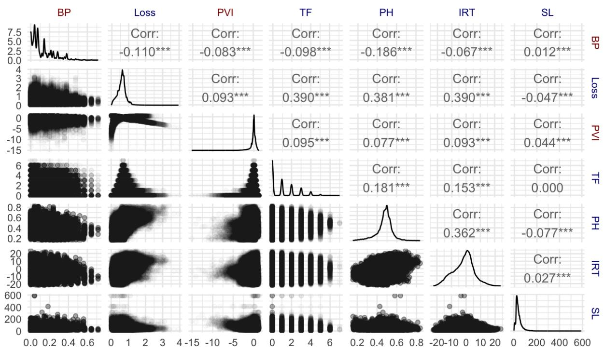  
Figure 5: Pairplot of micro-correlations calculated across all dependent variables and samples. While lower plots show linear scatter plots, the upper correlation values are Spearman Correlations to match the analysis in Figure 3. Distributions are shown on the diagonals.

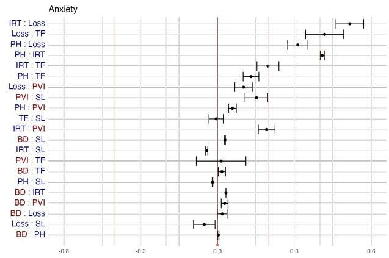

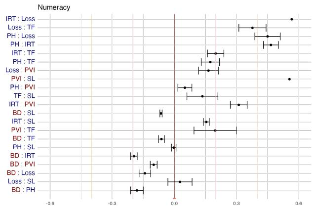

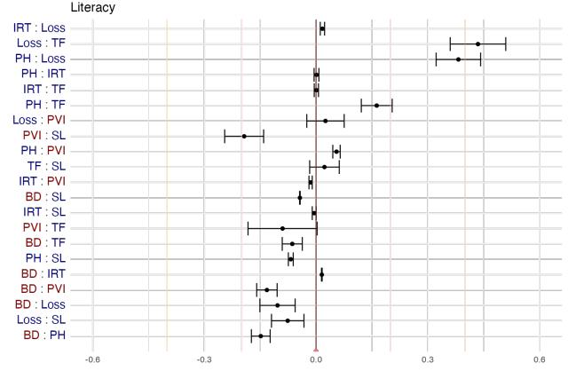

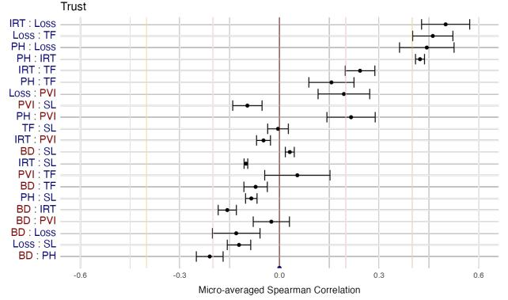

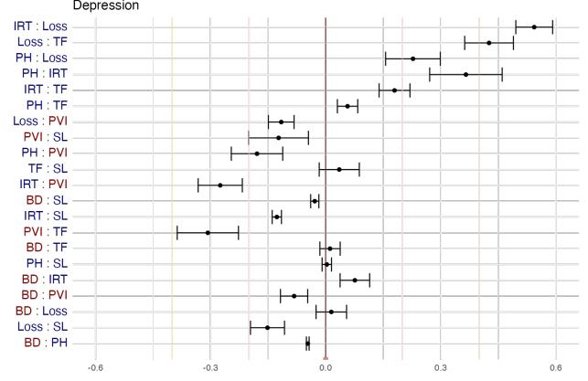  
Figure 6: Similar to Figure 3, we provide 95% CIs of Spearman Correlation for each dependent variables microaveraged across train sets and models. Again, we mark $\rho = 0$ with a dark red line and include thresholds for weak $( \rho = \pm 0 . 2 )$ and moderate $( \rho = \pm 0 . 4 )$ correlations as light pink and orange lines, respectively.

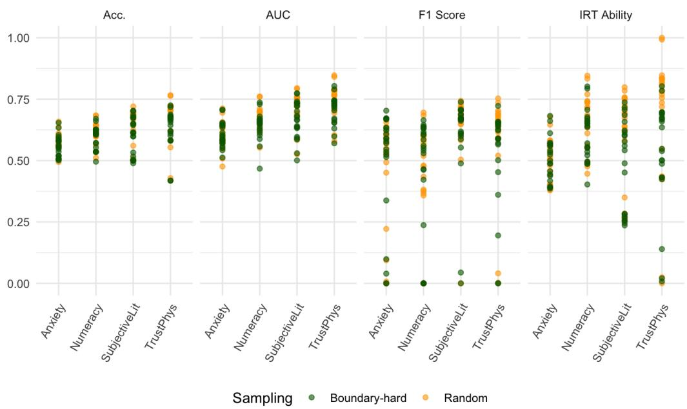  
Figure 7: Distribution of scores for common performance metrics achieved by models across each task. Note that IRT Ability is min-max scaled between 0-1 for the sake of comparison.

Since the clinical depression data only has one task and a one-to-many mapping of individual to document, we must split at the individual level. The expensive nature of clinical interviews leaves us with a dataset that is sparse with respect to both individuals and utterances. Thus, we have a smaller population of individuals with fewer sources of demographic variation across data splits. Additionally, this study uses different a different sampling procedure so certain demographic groups from the FairPsych dataset are systematically missing from the clinical depression data (e.g., English-as-Second Language).

Due to these differences in data sampling procedures, it is reasonable to consider all FairPsych tasks and splits to be from one population and the depression task to be from a different population. Examination of the distribution of Education Level and Age lend further evidence to the existence of two separate populations. Therefore, we consider different thresholds for what constitutes a “protected group” in each population. We borrow threshold values from Abbasi et al. (2021) for the FairPsych data and propose reasonable cut-offs for the clinical depression demographics. The criteria for being in a protected group for each dataset can be found in Table

<table><tr><td>Demo.</td><td>FairPsych</td><td>Depression</td></tr><tr><td>Age</td><td>≥ 65</td><td>≥53</td></tr><tr><td>Sex</td><td>Non-male</td><td>Non-male</td></tr><tr><td>Race</td><td>Non-White</td><td>Non-White</td></tr><tr><td>Educ.</td><td>≤ High school graduate</td><td>≤ Some college or trade / vocational school</td></tr><tr><td>Inc.</td><td>≤ $54,999</td><td>NA</td></tr><tr><td>ESL</td><td>Yes</td><td>NA</td></tr></table>

Table 10: Threshold values to be considered part of the protected class in each dataset. Note that all cutoff values are inclusive with directions indicated when applicable.

## I.2 Missing Values

Here, we explain the missing values in the Kullback-Leibler Divergence (KLD) and Disparate Impact (DI) calculations in Table 4 and Figure 4.

First, we note that the clinical depression dataset does not provide Income data, so we lose this column for KLD and DI. Further, it only considers native English speakers, so we have no Englishas-Second-Language participants and again have NA values for both KL Divergence and DI. Second, our upstream fairness measurement of KLD is calculated from complexity measurements on the entire datasets / populations, but downstream results such as DI consider output predictions from the deployed models. Thus, our populations are reduced to the subsample of individuals randomly assigned to the test / held-out sets.

We employ a 70-20-10 data split for both datasets; see Appendix C above for an explanation of data sampling procedures. Since there is a one-to-one mapping between individuals and text documents in the FairPsych data, the 10% split for the test set still comprises 1,700 individuals for each task. However, the depression dataset has a one-to-many mapping of individuals to documents and only has 40 individuals total in the dataset. While we predict at the utterance / document-level, data splits are done at the individual-level to prevent leakage. Thus, the test set contains 434 documents but from only 6 different individuals and we are unlikely to see individuals from an imbalanced protected class appear in this data. Our small test set does not have members of the protected class for Education Level, so we cannot calculate downstream DI scores from the test set, despite having upstream calculations of KLD on the entire dataset.