# Option Symbol Matters: Investigating and Mitigating Multiple-Choice Option Symbol Bias of Large Language Models

Zhen Yang1 Ping Jian\* 1,2 Chengzhi Li1

1School of Computer Science and Technology, Beijing Institute of Technology, Beijing, China 2Beijing Engineering Research Center of High Volume Language Information Processing and Cloud Computing Applications, Beijing Institute of Technology, Beijing, China {bityangzhen, pjian, lichengzhi}@bit.edu.cn

## Abstract

Multiple-Choice Question Answering (MCQA) is a widely used task in the evaluation of Large Language Models (LLMs). In this work, we reveal that current LLMs’ performance in MCQA could be heavily influenced by the choice of option symbol sets, due to the option symbol bias. That is, when altering only the option symbols (e.g., A/B/C/D i/ii/iii/iv), the results could vary sharply, leading to a margin of approximately 10% in accuracy. To uncover the mechanisms behind this, we investigate the internal components of LLMs from a causal perspective. By measuring the causal effects, we identify a small subset of attention heads responsible for the symbol bias. Subsequently, we interpret these key components in a human-understandable way, showing that attention heads with higher causal effects are more likely to focus on only option symbols, while those with lower causal effects tend to distribute their attention across the content of questions and options. It also motivates us to pursue debiasing based on the causal effects. Specifically, to mitigate such bias, we propose a tuning-free, causal effect driven debiasing method which intervenes the activations of identified components according to their causal effects, with stronger interventions corresponding to higher causal effects. Experimental results demonstrate that the proposed method not only alleviates aforementioned bias, but also improves the MCQA performance of LLMs 1.

## 1 Introduction

Multiple-Choice Question Answering (MCQA) is a fundamental and prevalent task for the evaluation of large language models (LLMs) (Gao et al., 2021; Zhong et al., 2024; OpenAI, 2023). In MCQA, LLMs are asked to select the most suitable answers from given candidate options based on their comprehension of corresponding questions, as exemplified in Figure 1. To ensure an accurate assessment and a fair comparison among different LLMs, we always expect these models to respond robustly in MCQA. Unfortunately, previous researches have demonstrated certain sensitivities of LLMs in several aspects. For instance, the arrangement of few-shot demonstrations (Zhao et al., 2021), the number of options (Wang et al., 2024) and even the order of options (Pezeshkpour and Hruschka, 2024; Zheng et al., 2024) can significantly impact LLM’s performance in MCQA. Relevant studies (Robinson and Wingate, 2023; Xue et al., 2024) suggest that these sensitive behaviors partially reflect the limited symbol binding capacity of LLMs. Namely, LLMs struggle to associate the content of options with the corresponding symbols, which also raises the question: does the choice of option symbols influence the symbol binding capacity? If so, to what extent can it impact the LLMs’ performance in MCQA? Through extensive experiments, we find that the option symbols do matter to LLMs. Specifically, when only the option symbols are altered (e.g., A/B/C/D i/ii/iii/iv), the responses generated by LLMs could exhibit a notable difference (as illustrated in Figure 1), resulting in an accuracy margin of approximately 10%. In other words, LLMs demonstrate sensitivity to multiple-choice option symbols, which we define as the option symbol bias.

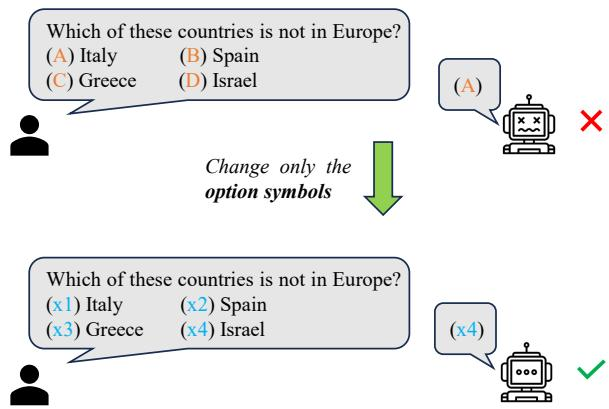  
Figure 1: An illustrative example of option symbol bias of LLMs in MCQA. When changing only the option symbols, the responses generated by LLMs could be significantly different.

Given the outstanding performance of LLMs in numerous tasks (Wei et al., 2022; Zhao et al., 2023; OpenAI, 2023), it is pertinent and essential to delve into the causes of aforementioned vulnerabilities and to address them, thereby facilitating the development of more robust and reliable LLMs. Regrettably, despite the analyses of training data (Mu and Andreas, 2020) and investigations treating LLM as black-box (Zheng et al., 2024; Wang et al., 2024), the intrinsic mechanisms underlying the LLM sensitivity still remain mysterious, due to the complex and non-linear interactions among densely-connected layers (Zhang et al., 2024b). In this paper, we aim to uncover the inner mechanisms underlying aforementioned option symbol bias, interpret these mechanisms in a way that is comprehensible to humans, and ultimately mitigate the bias.

Concretely, we investigate the internal components of LLMs in MCQA task using a causal intervention method known as path patching (Wang et al., 2023), which perturbs the activations of attention heads within the transformer architecture (Vaswani et al., 2017) to observe the causal effects under given metrics. In this work, by measuring the logit difference (Zhang and Nanda, 2024) after perturbation, we identify a small subset of attention heads that appear to be responsible for this bias.

Subsequently, the roles of these key components are interpreted in a human-understandable way, suggesting that attention heads with higher causal effects are more likely to excessively focus on the option symbols. We propose that this may be due to the fact that modern LLMs are mostly pretrained in a next-token prediction paradigm (Anil et al., 2023; OpenAI, 2023; Dubey et al., 2024). As a result, when performing MCQA, the models tend to search for the most suitable next-tokens— obviously, the option symbols—of given questions, ultimately resulting in a special focus on the option symbols. In contrast, the heads with lower causal effects tend to distribute their attention across the content of questions and options.

Beyond identifying and interpreting the key components, the correlation between causal effects and the attention patterns of these components also motivates us to mitigate the option symbol bias based on the causal effects. Specifically, we propose a tuning-free, Causal Effect driven DEbiasing (CEDE) method to alleviate such bias. In CEDE, the activations of identified key components are steered towards the debiased direction according to the causal effects, with stronger interventions applied to components exhibiting higher causal effects. Experimental results demonstrate the effectiveness of the proposed debiasing method.

It is noteworthy that this work does not aim to prove that currently used option symbol set (i.e., A/B/C/D) is not the best choice for LLMs, nor does it seek to find a better option symbol set for MCQA. Instead, our intention is to leverage the observed option symbol bias to explore the intrinsic mechanisms within LLMs during MCQA, which provides insights into the emergence of certain behaviors. The main contributions of this paper can be summarized as follows:

• Identifying: We identify a subset of attention heads of LLMs that contribute to the option symbol bias in MCQA, which indicates the LLM sensitivity to option symbols.

• Interpreting: The behaviors of identified key components are interpreted in a humanunderstandable way, where the attention patterns show close relationship to causal effects.

• Mitigating: Given the findings during interpreting, a debiasing method, which is tuningfree, computation friendly and efficient, is proposed to mitigate the option symbol bias.

## 2 Exploring the Existence of Option Symbol Bias

In this section, we explore the existence of option symbol bias across various types and parameter sizes of LLMs, including llama-2-7b/13b/70b (Touvron et al., 2023), llama-3-8b (Dubey et al., 2024), and mistral-7b (Jiang et al., 2023). We evaluate the MCQA performance of these LLMs on MMLU (Hendrycks et al., 2021), RACE-middle (Lai et al., 2017) and RACE-high, which are widely used benchmarks for LLM evaluation. More details about the dataset and evaluation process are described in Appendix A.

For option symbols, we select some commonly used formats such as A/B/C/D, 1/2/3/4, i/ii/iii/iv, etc. Particularly, we also include x1/x2/x3/x4 since ${ \sf x } _ { \mathrm { i } }$ is a common abstract symbol used to represent specific content, frequently encountered in mathematical or problem-solving contexts. The prompts for LLMs are constructed as Appendix B.

<table><tr><td rowspan="2">Models</td><td colspan="3">MMLU</td><td colspan="5">RACE-Middle</td><td colspan="4">RACE-High</td></tr><tr><td>A-D</td><td>i-iv</td><td>1-4</td><td>x1-x4</td><td>A-D</td><td>i-iv</td><td>1-4</td><td>x1-x4</td><td>A-D</td><td>i-iv</td><td>1-4</td><td>x1-x4</td></tr><tr><td>LLaMA2-7B</td><td>36.52</td><td>25.51</td><td>37.62</td><td>39.06</td><td>46.93</td><td>26.04</td><td>39.13</td><td>49.51</td><td>39.42</td><td>27.18</td><td>30.96</td><td>41.22</td></tr><tr><td>LLaMA2-13B</td><td>50.11</td><td>42.55</td><td>47.46</td><td>47.64</td><td>65.18</td><td>59.47</td><td>59.82</td><td>64.69</td><td>59.83</td><td>53.37</td><td>51.32</td><td>56.38</td></tr><tr><td>LLaMA2-70B</td><td>62.55</td><td>61.43</td><td>62.74</td><td>63.75</td><td>83.84</td><td>80.08</td><td>82.87</td><td>84.54</td><td>81.90</td><td>78.73</td><td>80.62</td><td>82.90</td></tr><tr><td>LLaMA3-8B</td><td>60.07</td><td>58.51 </td><td>59.89</td><td>59.21</td><td>78.48</td><td>65.67</td><td>76.74</td><td>77.02</td><td>73.81</td><td>62.01</td><td>72.38</td><td>73.01</td></tr><tr><td>Mistral-7B</td><td>58.25</td><td>43.21</td><td>56.54</td><td>56.05</td><td>80.36</td><td>54.46</td><td>79.32</td><td>79.04</td><td>75.67</td><td>50.29</td><td>74.24</td><td>73.76</td></tr><tr><td>one-shot</td><td>38.55</td><td>27.62</td><td>41.75</td><td>40.82</td><td>54.25</td><td>30.06</td><td>52.36</td><td>46.17</td><td>49.46</td><td>30.85</td><td>42.71</td><td>38.65</td></tr></table>

Table 1: The accuracy (%) of various LLMs on MMLU and RACE. It can be observed that LLMs’ performance varies sharply with different option symbols. Bold numbers correspond to the best results across different option symbols, whereas the underlined numbers correspond to the worst. one-shot experiments are conducted on LLaMA2- 7B where a case example is shown for model before the presentation of current question (see Appendix B).

The results of aforementioned LLMs on MMLU and RACE are shown in Table 1. LLMs exhibit variations in performance with different option symbols, such as x1-x4 perform best for LLaMA2- 7B while A-D demonstrate merits in other cases, which indicates that the option symbol bias persists across various benchmarks and models. The accuracy gap caused by option symbol bias is up to 25.90% (Mistral-7B on RACE-Middle), and approximately 10% on average. It is encouraging that LLMs show improved performance as model size increases, as shown in Table 1. But regrettably, the bias has not appeared to be fully addressed with larger scale, which indicates that the option symbol bias exists not only across different models but also at various scales. On the other hand, even though LLaMA3-8B achieves minimum bias on MMLU, its performance with different option symbols still exhibits a pronounced margin on both RACE-Middle and RACE-High, further highlighting the prevalence and persistence of the option symbol bias. Additionally, we also validate the persistence of the bias across different prompt formats by conducting one-shot prompting. As shown in Table 1, with one-shot prompting, the performance exhibits notable improvement across different tasks, which is consistent with previous studies. However, the bias persists regardless of the prompt formats, which further highlights the intrinsic cause of this bias.

## 3 Understanding the Mechanisms Behind the Option Symbol Bias

Despite the widespread existence of option symbol bias, it remains unclear what happens within LLMs that lead to this. In this section, we firstly identify the key components responsible for such bias through causal intervention, then analyze the internal patterns to decode their roles during MCQA.

## 3.1 Identifying Key Components

Preliminary The transformer structure consists of attention modules and multi-layer perceptrons (MLPs) interconnected via residual connections (Vaswani et al., 2017). It can be conceptualized that the residual connections function as the main stream (denoted as residual stream), while the attention modules and MLPs serve as bypass streams, adding their computational results to the residual stream (Meng et al., 2022). This formulation makes it clear that, in principle, each component has a direct path to the final logits of transformers. Therefore, the change in final logits could be reasonably attributed to certain components. More details on conceptualizing decoder-only transformers in the context of interpretability can be found in Elhage et al. (2021).

Method We utilize a causal intervention technique known as path patching to measure how important a LLM component is to the option symbol bias. Path patching typically involves the following steps: 1) running model on reference data Dr and caching the head activations, 2) patching targeted activations with corrupted data $D _ { c }$ while freezing others with $D _ { r } ,$ , then caching the final logits of residual stream, 3) measuring the causal effect after patching under specific metrics.

In this work, $D _ { r }$ consists of multiple-choice questions from MMLU and RACE2 with option symbols derived from random symbol sets, such as A-D, i-iv or 1-4 (but not A/1/i/D). In contrast, the data in $D _ { c }$ differs only in the option symbols, with the contexts remaining unchanged. To further control potential factors and accurately measure the effects caused by option symbol changes, we only select the one-token symbols as option IDs, thereby excluding x1-x4. Finally, the causal effects after patching are calculated as follows:

$$
e _ { n } ^ { ( i ) } = { \frac { l o g i t _ { p } - l o g i t _ { r } } { l o g i t _ { r } - l o g i t _ { c } } }\tag{1}
$$

$$
\overline { { e _ { n } } } = \frac { \sum _ { i = 1 } ^ { | \Omega | } e _ { n } ^ { ( i ) } } { | \Omega | } ,\tag{2}
$$

where $n$ is the number of heads, and $l o g i t _ { r } , l o g i t _ { c }$ and $l o g i t _ { p }$ represent the logit from residual stream with reference data, corrupted data and patched activations respectively, $e _ { n } ^ { \binom { i } { n } }$ is the causal effect for i-th reference-corrupted data pair, Ω denotes the size of such data pairs, and $\overline { { e _ { n } } }$ is the averaged causal effect. Unless otherwise specified, causal effect refers to $\overline { { e _ { n } } }$ in the following discussion.

By measuring causal effects, we can identify which components are responsible for changes in model predictions’ logits when altering only the option symbols. Given the crucial role that the attention module has demonstrated in previous interpretability studies (Goldowsky-Dill et al., 2023; Hanna et al., 2023; Wang et al., 2023), we mainly focus on the attention heads during key components identification. Specifically, we patch all attention heads one by one, and record the corresponding causal effects in $E _ { n } \in \mathbb { R } ^ { n \times n }$

Results Figure 2 depicts the results of path patching $( \mathrm { i } . \mathrm { e } . , E _ { n } )$ organized by the numbers of the layers and heads. Red color signifies that the head exerts a negative effect on output token prediction when option symbols are altered, whereas blue indicates a supportive effect. And the intensity of the color reflects the strength of such effects. In figure 2, it can be observed that: 1) Only a small fraction of heads have a relatively significant effect. A small number of heads yield relatively more significant effects compared to others, indicating the sparsity of key components within option symbol bias problem. Here, we distinguish the heads with causal effects exceeding -0.04 (-4%) as “key components”. The sparsity of the key heads also enables us to analyze their attention patterns manually. 2) Key heads are almost exclusively found in the middle layers, concentrated between layer 15-25, while the earlier layers bear micro influence on the option symbol bias. Such observation verifies the function difference between the prior and later layers in transformers, which is consistent with previous findings (Jawahar et al., 2019; Vig and Belinkov, 2019; Ghiasi et al., 2022). More results of other LLMs can be found in Appendix C.

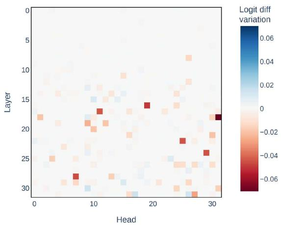  
Figure 2: The results of path patching on LLaMA2- 7B across the data constructed for option symbol bias. For each head, a darker color indicates a larger logit difference of the correct answer after patching, which also reflects the importance of the head in option symbol bias to some extent.

Through path patching, we identify some key heads that appear to contribute to the option symbol bias. However, it raises several critical questions: Are these heads genuinely responsible for the bias? What functions do they perform in the model’s decision-making process? To figure out the answers to these questions, it is essential to interpret the key heads in a human-understandable manner.

## 3.2 Interpreting the Patterns

## 3.2.1 Method

Now, we interpret each key head, by conducting a straightforward analysis of the attention patterns $A _ { i j } \in \mathbb { R } ^ { s \times s }$ exhibited in option symbol bias, where s denotes the length of input tokens, and $i j$ represents the $j \cdot$ -th head in i-th layer. $A _ { i j }$ assesses the relevance of each input token relative to others, allowing human to understand which content the corresponding head attends to. For each multiplechoice question, we average the attention patterns across the aforementioned 3 option symbol sets, excluding the two-token symbols x1-x4 which would change the sequence length.

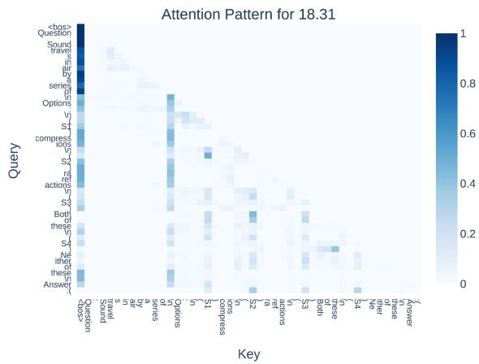  
(a)

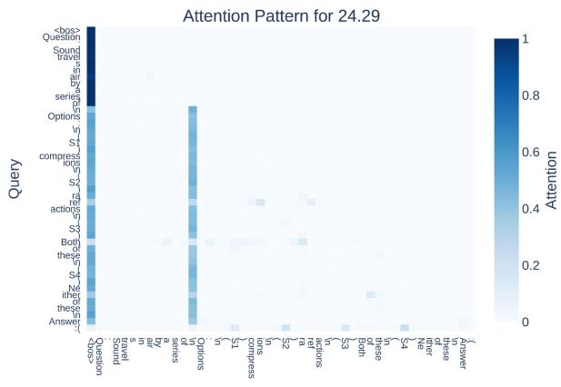  
(b)  
Figure 3: The attention patterns of top-2 key heads 18.31 and 24.29 in LLaMA2-7B on questions with selected option symbols. S1, S2, S3 and S4 signify specific option symbols and <bos> denotes the special token in LLMs representing the beginning of sentence. It can be observed that the heads mainly attend to the option symbols, excluding <bos> and “\n” with special effects in LLMs.

## 3.2.2 Results and Discussion

Main Results Figure 3 visualizes the attention patterns with specific question of the top-2 key heads identified by path patching. Regarding heads 18.31 (referring to the 31st head in 18th layer) and 24.29, which exhibit the two highest causal effects as depicted in Figure 2, it can be observed that they primarily attend to the option symbols. Specifically, for the earlier tokens in the question, the heads constantly shift the attention across the four options, as illustrated in Figure 3(a) and (b). In contrast, for the last token in the question related to the output answer, as shown in Figure 4, there is a pronounced emphasis on the four option symbols, with the token predicted by the model as the correct answer receiving greater attention than the others. It suggests that the heads exhibit a sparse attention to only option symbol tokens during the answer generation process. To make the results more convincing, we present additional cases with various questions in Appendix D, which are consistent with aforementioned observations.

Discussion Regarding humans, it is relatively straightforward to integrate the content of candidate options with their corresponding symbols and realize that the changes in symbols do not affect the judgment of the correct answers, thereby giving consistent answers regardless of the option symbol changes. However, as described in the main results, this does not seem to be the same case for LLMs. When performing MCQA, LLMs, given the interpreted patterns, predict the answer by focusing on the option symbols, appearing to identify the most suitable symbol token to appear in the next position following the given question. From a positive perspective, it indicates that the key heads “know” which token should be generated during the answer prediction process. But on the other hand, sparse attention in key heads is paid to only the option symbols, causing LLMs excessively rely on the provided option symbols to determine answers, which explains why they show such sensitivity to option symbol changes to some extent. For the verification of the negative effect of the sparse attention in MCQA, a reasonable piece of evidence is that when the heads with sparse attention are ablated by setting their activations to zero (i.e., in the zero-ablation experiments in Table 2), the LLM’s performance on MCQA not only does not dramatically decline, but actually exhibits a slight yet notable improvement. Compared to relevant researches (Goldowsky-Dill et al., 2023; Zhang et al., 2024b) where the identified components take positive effects in certain tasks and the corresponding performance decline significantly after zero-ablation, it is reasonable that the identi-

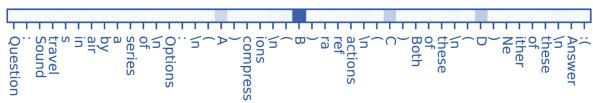  
(a) Last Row of Attention Pattern for 18.31

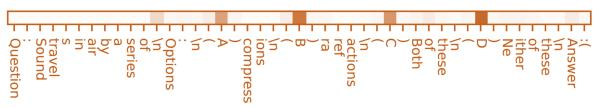  
(b) Last Row of Attention Pattern for 24.29

Figure 4: In the last row of attention patterns associated with answer generation, key heads exhibit a particular focus on the option symbols, especially on the predicted answer (within 18.31).

fied heads with sparse attention in our experiments appear to be responsible for the option symbol bias.

Beyond these, the reasons for an LLM’s superior or inferior performance with specific option symbol may be varied. And conducting meticulous case studies on countless option symbol sets (almost any logically related characters, words or even icons can serve as option symbols!) falls beyond the primary scope of this paper. Here, we give some reasonable hypotheses for selected 4 option symbol sets which may motivate future researches. x1-x4 exhibit superior performance of several LLMs, which could be attributed to their mathematical ability at representing specific content, frequently encountered in mathematical or problem-solving contexts. As for i-iv, Roman numerals may be interpreted as numbers in certain contexts, but they can also be misread as other symbols or characters (e.g., ’i’ may be perceived as the first-person pronoun ’I’) by LLMs. This ambiguity could hinder the model’s ability to accurately differentiate between options. Notably, ’A’ may also be misunderstood as indefinite article by LLMs, but large-scale data with A-D as option symbols can potentially address the problem. More interpretability studies delving into these specific cases would further facilitate the reliability of LLMs, charming avenue for future researches.

Association with Next-Token Prediction Almost all of the LLMs are pre-trained using nexttoken prediction paradigm:

$$
\operatorname* { m i n } _ { \theta } \hat { \mathbb { E } } _ { z \sim \tau _ { n } } \bigg [ \sum _ { t \in [ T ] } - \log \big ( q _ { \theta } ( z _ { t } | z _ { 1 } , \dots , z _ { t - 1 } ) \big ) \bigg ] ,\tag{3}
$$

where models are trained to predict next token $z _ { t }$ given prefix tokens $z _ { 1 } , \dots , z _ { t - 1 }$ . Benefiting from next token prediction, LLMs can accurately identify which kind of tokens (i.e., option symbols) should be generated to answer the given questions, as discussed above. However, as for MCQA task, the dependency between the answer and the actual content it represents, like in human thoughts, is not explicitly modeled by next token prediction (Le-Cun, 2024; Bachmann and Nagarajan, 2024). Such pre-training approach forces the models to focus on candidate next tokens (option symbols) to generate contextually appropriate outputs (Bengio et al., 2000; Bengio and Bengio, 2000), which appears to result in aforementioned sparse attention within key heads on option symbols.

This gap highlights a limitation in the model’s capacity to meaningfully associate symbolic representations with their semantic content, which again demonstrates the poor symbol binding capacity of LLMs (Robinson and Wingate, 2023; Xue et al., 2024). Given the criticism of next token prediction about insufficient alignment with human cognitive processes, along with the findings in this paper, it is essential to thoroughly eliminate the option symbol bias problem during the pre-training stage, involving the alignment of LLMs’ symbol binding capabilities with human-level proficiency.

## 3.2.3 What Roles Do Other Heads Perform?

Beyond interpreting the key heads, we are also curious about the roles of other heads in option symbol bias. We select the two heads with the smallest causal effect from top-32 heads, and visualize their attention patterns. As shown in Figure 5, they tend to spread the attention across the content of question and candidate options, which shows a pronounced difference with the key heads. Unfortunately, according to the causal effects, they are less accountable for the option symbol bias.

## 4 Mitigating the Bias

## 4.1 Method

Given the behavior difference between key heads and other heads with lower causal effects, we propose an adaptive intervention method, CEDE, to mitigate the option symbol bias, which steers the activations based on the computed causal effects.

Firstly, we hypothesize that a head’s activation consists of the bias vector and the answer vector:

$$
v _ { i j } = v _ { i j } ^ { b i a s } + v _ { i j } ^ { a n s } ,\tag{4}
$$

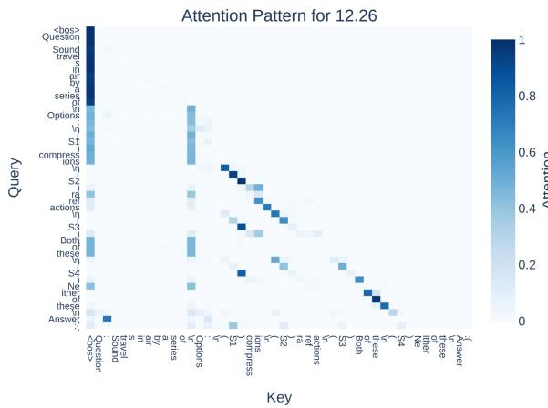  
(a)

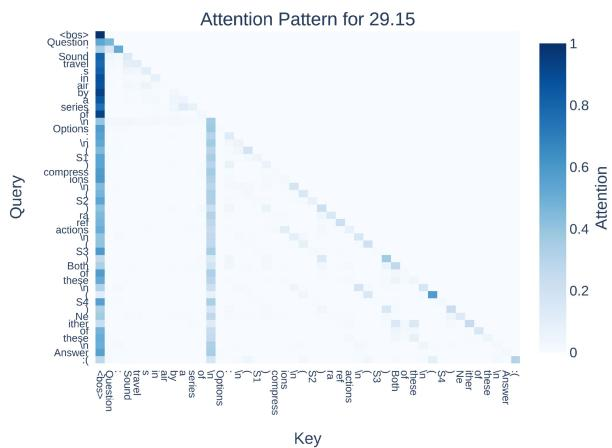  
(b)  
Figure 5: The attention patterns of heads 12.26 and 29.15 with low causal effects in option symbol bias.

where bias vector indicates the LLM bias for different option symbols while answer vector determines the prediction of true answers. Given that the bias persists across different symbols while the answers differ for various questions, if we average the activations of each head over different questions with different symbols, we can deduce that:

$$
\begin{array} { l } { \displaystyle \frac { 1 } { | D | } \sum _ { d \in D } v _ { d } ^ { b i a s } = V _ { i j } } \\ { \displaystyle \frac { 1 } { | D | } \sum _ { d \in D } v _ { d } ^ { a n s } \doteq 0 } \end{array}\tag{5}
$$

$$
\frac { 1 } { | D | } \sum _ { d \in D } v _ { d } \doteq V _ { i j } + 0 = V _ { i j } ,\tag{6}
$$

where $v _ { d } ^ { b i a s }$ is the bias vector of specific head on question d, D is the dataset consists of questions with different option symbols, and $V _ { i j }$ represents the average bias vector for a head on D. Equation 6 suggests that the average action of a head $v _ { i j } ^ { a v g }$ across different question with various symbols tends to approach the average bias vector $V _ { i j }$

Subsequently, the difference between $v _ { i j } ^ { a v g }$ and $v _ { i j }$ is viewed as a stimulation direction $\gamma _ { i j }$ for debiasing $v _ { i j }$ :

$$
\gamma _ { i j } = v _ { i j } - v _ { i j } ^ { a v g } .\tag{7}
$$

Finally, the debiased activation is calculated as:

$$
v _ { i j } ^ { d e b i a s e d } = v _ { i j } + \alpha e _ { i j } \gamma _ { i j } ,\tag{8}
$$

where $e _ { i j }$ denotes the causal effect of head measured by path patching, and α is a hyperparameter. This is equivalent to adaptively shifting $v _ { i j }$ along the stimulation direction based on corresponding causal effect.

During experiments, we observe that as causal effects decrease, $e _ { i j }$ drops dramatically, which causes the intervention to be concentrated on just a few heads, thus hindering the intervention efficacy. To ensure broader coverage of more heads, $e _ { i j }$ is refined as:

$$
\hat { e } _ { i j } = | \kappa | \underset { i , j \in \kappa } { \operatorname { s o f t m a x } } ( e _ { i j } ) ,\tag{9}
$$

where $\kappa$ contains the heads to be intervened, softmax function achieves $\sum e _ { i j } = 1$ , and $| \kappa | *$ softmax maps $e _ { i j }$ to $0 \sim 1$ virtually.

## 4.2 Experiments

## 4.2.1 Experimental Details

We evaluate the performance of CEDE by intervening the activations of top-32 heads in causal effects and leaving other activations unchanged. $v _ { i j } ^ { a v g }$ is estimated on 1,000 questions from MMLU and RACE with 4 kinds of option symbols, and α is set to 20.0 empirically. All experiments are conducted on 2 NVIDIA A800 80GB GPUs.

## 4.2.2 Main Results

Table 2 shows the results of CEDE and other two simple and intuitive methods: zero and mean ablation, which replace the activations with zero and the mean activations $( \mathrm { i } . \mathrm { e } . , v _ { i j } ^ { a v g } )$ , respectively.

In zero ablation, although the overall performance with different option symbols declines, there is still an improvement in certain cases, such as on RACE-High, after the top-32 key heads are knocked out. It indicates that the identified key heads do bear certain responsibility for the option symbol bias and the removal of these heads can sometimes work. However, as shown in Equation 4, bluntly setting the key heads’ activations to zero prevents the heads from utilizing the answer vector to determine the true answer, which is verified by the overall inferior performance of zero ablation. On the other hand, the performance in mean ablation is more severely impaired, highlighting the negative effects of the bias vector in MCQA.

<table><tr><td rowspan="2">Models</td><td colspan="4">MMLU</td><td colspan="4">RACE-Middle</td><td colspan="4">RACE-High</td></tr><tr><td>A-D</td><td>i-iv</td><td>1-4</td><td>x1-x4</td><td>A-D</td><td>i-iv</td><td>1-4</td><td>x1-x4</td><td>A-D</td><td>i-iv</td><td>1-4</td><td>x1-x4</td></tr><tr><td>Baseline</td><td>36.52</td><td>25.51</td><td>37.62</td><td>39.06</td><td>46.93</td><td>26.04</td><td>39.13</td><td>49.51</td><td>39.42</td><td>27.18</td><td>30.96</td><td>41.22</td></tr><tr><td>Zero Ablation</td><td>34.51</td><td>32.54</td><td>38.79</td><td>35.97</td><td>43.66</td><td>35.79</td><td>37.88</td><td>46.65</td><td>40.77</td><td>31.59</td><td>33.27</td><td>42.17</td></tr><tr><td>Mean Ablation</td><td>33.54</td><td>27.87</td><td>37.21</td><td>37.57</td><td>41.63</td><td>32.18</td><td>37.76</td><td>47.49</td><td>37.19</td><td>29.06</td><td>30.90</td><td>40.02</td></tr><tr><td>CEDE</td><td>38.11</td><td>35.85</td><td></td><td>38.14 39.53</td><td>49.03</td><td>39.28</td><td>37.88</td><td>49.82</td><td>40.58</td><td>32.54</td><td>33.95</td><td>42.74</td></tr></table>

Table 2: Comparison results between the baseline LLaMA2-7B and various debiasing methods. The proposed CEDE achieves improvements in accuracy (%) while reducing option symbol bias.

<table><tr><td>Models</td><td>MMLU A-D i-iv 1-4 x1-x4</td></tr><tr><td>one-shot</td><td>38.55 27.62 41.75 40.82</td></tr><tr><td>w/ CEDE</td><td>39.6935.72 41.7241.44</td></tr></table>

Table 3: Results of CEDE with one-shot prompting and different prompt format.

In contrast, CEDE effectively mitigates such bias across various dataset and exhibits increased robustness to symbol changes compared to baseline model, without compromising the overall performance in MCQA. It demonstrates the robustness and effectiveness of the proposed debiasing method. It is noteworthy that the main objective of our method CEDE is to mitigate the symbol bias while preserving the performance, rather than significantly improve the MCQA performance. Since we can achieve almost “no bias” by degrading the performance across all symbol sets to a dramatically low level, however, that is not our goal. In brief, CEDE is aimed at debiasing while maintaining performance, rather than improving, even though it indeed achieves improvement on most symbol sets.

Notably, after debiasing by CEDE, the performance with using i-iv as option symbols could exceed a significant improvement ( 10%) in accuracy, which indicates that the potential option symbol bias is far more severe than we realize and CEDE effectively alleviates this issue. On the other hand, the proposed method also achieves improvement on x1-x4, which exhibits the best performance before debiasing. This indicates that CEDE not only reduces the influence of the bias vector but also directs the LLM toward the correct answer, further demonstrating the efficacy of CEDE. The ablation study about α and causal effect is supplemented in Appendix E.

Despite the effectiveness of this approach in mitigating biases introduced by the internal mechanisms of LLMs, it falls short of offering a comprehensive solution. Given the countless nature of option symbols, it is impractical to estimate and debias on every possible symbol set. To develop a reliable LLM with robust symbol-binding capabilities, it is crucial to address this issue at the pre-training stage to explore improved pre-training methodologies, as discussed in Sec. 3.2.2.

## 5 Related Work

Mechanistic Interpretability Interpreting the inner mechanism of neural networks, especially LLMs, has raised increasing attention in recent years (Räuker et al., 2023; Madsen et al., 2023; El-Gayar et al., 2024). Research efforts have focused on understanding internal features (Elhage et al., 2022; Ju et al., 2024b; Allen-Zhu and Li, 2024), developing mathematical frameworks for interpreting machine learning architectures (Elhage et al., 2021), and identifying circuits within models (Chughtai et al., 2023; Nanda et al., 2023; Hanna et al., 2023; Lieberum et al., 2023; Wang et al., 2023). Furthermore, deeper understand of the mechanisms has also motivated the refinement of models, such as better-architecture design (Fu et al., 2023) and post hoc enhancement (Ju et al., 2024a; Zhang et al., 2024b). This work generally follows the "identify-interpret-refine" process in Zhang et al. (2024b), where LLMs are not only being interpreted but also refined.

LLM Intervention Despite the impressive success of LLMs in numerous tasks (Frieder et al., 2023; Kojima et al., 2022; Zhang et al., 2023), they still exhibit substantial room for improvement across various domains, such as faithfulness (Turpin et al., 2023), truthfulness (Lin et al., 2022), reasoning ability (Li et al., 2024), etc. Many works focus on fine-tuning LLMs using downstream data (Bao et al., 2023; Rafailov et al., 2023), which is particularly resource-consuming due to the high computational demands of LLMs. Another line of research seeks to directly intervene in the internal activations of models, steering the activations toward a target direction (Li et al., 2023; Zhang et al., 2024a; Jorgensen et al., 2023; Cao et al., 2024; Lucchetti and Guha, 2024). These methods are more computationally efficient, as they perturb the activations during the forward pass, eliminating the need for backward computation. The proposed CEDE falls within this category, thus sharing all the merits of activation intervention. Additionally, the activations in CEDE are adaptively shifted based on causal effects, thereby demonstrating more effective bias mitigation and enhanced editing flexibility.

## 6 Conclusion

In this paper, we systematically investigate the sensitivity of LLMs to option symbols, defined as option symbol bias, when performing MCQA. We firstly demonstrate the ubiquity of such bias by conducting extensive experiments on various LLMs with different option symbols. Then, we delve into the internal components within LLMs through a causal intervention method known as path patching. Through path patching, we not only identify a subset of attention heads responsible for the sensitivity, but also interpret their roles through the extracted attention patterns. Our exploration reveals that the bias can be attributed to the inner excessive and sparse focus on symbol tokens, which further relates to the next token prediction paradigm in pre-training. Finally, we propose a inference-time debiasing method to intervene the activations of identified components based on their causal effects. Expriments demonstrate the effectiveness of proposed method. We advocate for increased research efforts directed towards exploring the true capacity of LLMs, emphasizing the need to better address

LLM sensitivities during the pre-training stage.

## Acknowledgements

This work is supported by the grants from the National Natural Science Foundation of China (No. 62376130 and No. 62172044). The authors would like to thank the organizers of NAACL 2025 and the reviewers for their helpful suggestions.

## Limitations

The option symbol sets selected in our experiments are commonly used to represents specific content, thus allowing us to investigate the option symbol bias in a general and broad context. However, due to the countless characteristic of option symbols, the LLM performance under other symbol sets still remains unexplored. Additionally, the bias vector in proposed CEDE is also estimated on selected symbols, which may not cover all possible symbols. A more accurate estimation may yield further improvement.

While the proposed CEDE method has proven effective, it remains a post hoc refinement for trained LLMs. A thorough and comprehensive elimination of option symbol bias should be initiated during pre-training stage, involving the modeling of symbol-binding capacity to more closely align with human-level proficiency.

Finally, due to space and resource constraints, we conduct detailed debiasing experiments only on LLaMA2(7B), and do not include all modern LLMs, such as OPT (Zhang et al., 2022), Pythia (Biderman et al., 2023), and GLM (Du et al., 2022). We encourage future research to carry out comprehensive experiments across a wider range of LLMs.

## Ethics Statement

This paper mainly focus on interpreting and mitigating the option symbol bias in MCQA of large language models, highlighting that modern LLMs are sensitive to option symbol changes and exhibit different decision-making patterns compare to humans. Our goal is to mitigate the potential bias by understanding why they perform such behavior first, thereby advancing the development of more reliable and robust LLMs. Nonetheless, the findings in this paper about LLM sensitivity and inner mechanisms may be misconducted by malicious actors to attack or mislead LLMs. Therefore, we stress the importance of increased oversight by relevant authorities concerning the applications of LLMs.

Last but not least, although we use expressions such as "the LLMs/attention heads know ..." in this paper, it does not imply that we claim current LLMs possess consciousness or can think like a human. On the contrary, the results from this paper and other relevant researches suggest that current LLMs are still far from achieving true artificial general intelligence (AGI).

## References

Zeyuan Allen-Zhu and Yuanzhi Li. 2024. Physics of language models: Part 3.1, knowledge storage and extraction. In Forty-first International Conference on Machine Learning, ICML 2024, Vienna, Austria, July 21-27, 2024. OpenReview.net.

Rohan Anil, Andrew M. Dai, Orhan Firat, Melvin John son, Dmitry Lepikhin, Alexandre Passos, Siamak Shakeri, Emanuel Taropa, Paige Bailey, Zhifeng Chen, Eric Chu, Jonathan H. Clark, Laurent El Shafey, Yanping Huang, Kathy Meier-Hellstern, Gaurav Mishra, Erica Moreira, Mark Omernick, Kevin Robinson, Sebastian Ruder, Yi Tay, Kefan Xiao, Yuanzhong Xu, Yujing Zhang, Gustavo Hernández Ábrego, Junwhan Ahn, Jacob Austin, Paul Barham, Jan A. Botha, James Bradbury, Siddhartha Brahma, Kevin Brooks, Michele Catasta, Yong Cheng, Colin Cherry, Christopher A. Choquette-Choo, Aakanksha Chowdhery, Clément Crepy, Shachi Dave, Mostafa Dehghani, Sunipa Dev, Jacob Devlin, Mark Díaz, Nan Du, Ethan Dyer, Vladimir Feinberg, Fangxiaoyu Feng, Vlad Fienber, Markus Freitag, Xavier Garcia, Sebastian Gehrmann, Lucas Gonzalez, and et al. 2023. Palm 2 technical report. CoRR, abs/2305.10403.

Gregor Bachmann and Vaishnavh Nagarajan. 2024. The pitfalls of next-token prediction. In Forty-first International Conference on Machine Learning, ICML 2024, Vienna, Austria, July 21-27, 2024. OpenReview.net.

Qiming Bao, Alex Yuxuan Peng, Zhenyun Deng, Wanjun Zhong, Neset Tan, Nathan Young, Yang Chen, Yonghua Zhu, Michael Witbrock, and Jiamou Liu. 2023. Contrastive learning with logic-driven data augmentation for logical reasoning over text. CoRR, abs/2305.12599.

Samy Bengio and Yoshua Bengio. 2000. Taking on the curse of dimensionality in joint distributions using neural networks. IEEE Trans. Neural Networks Learn. Syst., 11(3):550–557.

Yoshua Bengio, Réjean Ducharme, and Pascal Vincent. 2000. A neural probabilistic language model. In Advances in Neural Information Processing Systems 13, Papers from Neural Information Processing Systems

(NIPS) 2000, Denver, CO, USA, pages 932–938. MIT Press.

Stella Biderman, Hailey Schoelkopf, Quentin Gregory Anthony, Herbie Bradley, Kyle O’Brien, Eric Hallahan, Mohammad Aflah Khan, Shivanshu Purohit, USVSN Sai Prashanth, Edward Raff, Aviya Skowron, Lintang Sutawika, and Oskar van der Wal. 2023. Pythia: A suite for analyzing large language models across training and scaling. In International Conference on Machine Learning, ICML 2023, 23-29 July 2023, Honolulu, Hawaii, USA, volume 202 of Proceedings of Machine Learning Research, pages 2397–2430. PMLR.

Zouying Cao, Yifei Yang, and Hai Zhao. 2024. Nothing in excess: Mitigating the exaggerated safety for llms via safety-conscious activation steering. CoRR, abs/2408.11491.

Bilal Chughtai, Lawrence Chan, and Neel Nanda. 2023. A toy model of universality: Reverse engineering how networks learn group operations. In International Conference on Machine Learning, ICML 2023, 23-29 July 2023, Honolulu, Hawaii, USA, volume 202 of Proceedings ofMachine Learning Research, pages 6243–6267. PMLR.

Zhengxiao Du, Yujie Qian, Xiao Liu, Ming Ding, Jiezhong Qiu, Zhilin Yang, and Jie Tang. 2022. GLM: general language model pretraining with autoregressive blank infilling. In Proceedings of the 60th Annual Meeting ofthe Associationfor Computational Linguistics (Volume 1: Long Papers), ACL 2022, Dublin, Ireland, May 22-27, 2022, pages 320–335. Association for Computational Linguistics.

Abhimanyu Dubey, Abhinav Jauhri, Abhinav Pandey, Abhishek Kadian, Ahmad Al-Dahle, Aiesha Letman, Akhil Mathur, Alan Schelten, Amy Yang, Angela Fan, Anirudh Goyal, Anthony Hartshorn, Aobo Yang, Archi Mitra, Archie Sravankumar, Artem Korenev, Arthur Hinsvark, Arun Rao, Aston Zhang, Aurélien Rodriguez, Austen Gregerson, Ava Spataru, Baptiste Rozière, Bethany Biron, Binh Tang, Bobbie Chern, Charlotte Caucheteux, Chaya Nayak, Chloe Bi, Chris Marra, Chris McConnell, Christian Keller, Christophe Touret, Chunyang Wu, Corinne Wong, Cristian Canton Ferrer, Cyrus Nikolaidis, Damien Allonsius, Daniel Song, Danielle Pintz, Danny Livshits, David Esiobu, Dhruv Choudhary, Dhruv Mahajan, Diego Garcia-Olano, Diego Perino, Dieuwke Hupkes, Egor Lakomkin, Ehab AlBadawy, Elina Lobanova, Emily Dinan, Eric Michael Smith, Filip Radenovic, Frank Zhang, Gabriel Synnaeve, Gabrielle Lee, Georgia Lewis Anderson, Graeme Nail, Grégoire Mialon, Guan Pang, Guillem Cucurell, Hailey Nguyen, Hannah Korevaar, Hu Xu, Hugo Touvron, Iliyan Zarov, Imanol Arrieta Ibarra, Isabel M. Kloumann, Ishan Misra, Ivan Evtimov, Jade Copet, Jaewon Lee, Jan Geffert, Jana Vranes, Jason Park, Jay Mahadeokar, Jeet Shah, Jelmer van der Linde, Jennifer Billock, Jenny Hong, Jenya Lee, Jeremy Fu, Jianfeng Chi, Jianyu Huang, Jiawen Liu, Jie Wang, Jiecao Yu, Joanna Bitton, Joe Spisak, Jongsoo Park, Joseph

Rocca, Joshua Johnstun, Joshua Saxe, Junteng Jia, Kalyan Vasuden Alwala, Kartikeya Upasani, Kate Plawiak, Ke Li, Kenneth Heafield, Kevin Stone, and et al. 2024. The llama 3 herd of models. CoRR, abs/2407.21783.

Omar F. El-Gayar, Mohammad Al-Ramahi, Abdullah Wahbeh, Tareq Nasralah, and Ahmed Elnoshokaty. 2024. A comparative analysis of the interpretability of LDA and LLM for topic modeling: The case of healthcare apps. In 30th Americas Conference on Information Systems: Elevating Life through Digital Social Entrepreneurship, AMCIS 2024, Salt Lake City, UT, USA, August 15-17, 2024. Association for Information Systems.

Nelson Elhage, Tristan Hume, Catherine Olsson, Nicholas Schiefer, Tom Henighan, Shauna Kravec, Zac Hatfield-Dodds, Robert Lasenby, Dawn Drain, Carol Chen, Roger Grosse, Sam McCandlish, Jared Kaplan, Dario Amodei, Martin Wattenberg, and Christopher Olah. 2022. Toy models of superposition. CoRR, abs/2209.10652.

Nelson Elhage, Neel Nanda, Catherine Olsson, Tom Henighan, Nicholas Joseph, Ben Mann, Amanda Askell, Yuntao Bai, Anna Chen, Tom Conerly, Nova DasSarma, Dawn Drain, Deep Ganguli, Zac Hatfield-Dodds, Danny Hernandez, Andy Jones, Jackson Kernion, Liane Lovitt, Kamal Ndousse, Dario Amodei, Tom Brown, Jack Clark, Jared Kaplan, Sam McCandlish, and Chris Olah. 2021. A mathematical framework for transformer circuits. Transformer Circuits Thread. Https://transformercircuits.pub/2021/framework/index.html.

Simon Frieder, Luca Pinchetti, Alexis Chevalier, Ryan-Rhys Griffiths, Tommaso Salvatori, Thomas Lukasiewicz, Philipp Petersen, and Julius Berner. 2023. Mathematical capabilities of chatgpt. In Advances in Neural Information Processing Systems 36: Annual Conference on Neural Information Processing Systems 2023, NeurIPS 2023, New Orleans, LA, USA, December 10 - 16, 2023.

Daniel Y. Fu, Tri Dao, Khaled Kamal Saab, Armin W. Thomas, Atri Rudra, and Christopher Ré. 2023. Hungry hungry hippos: Towards language modeling with state space models. In The Eleventh International Conference on Learning Representations, ICLR 2023, Kigali, Rwanda, May 1-5, 2023. OpenReview.net.

Leo Gao, Jonathan Tow, Stella Biderman, Sid Black, Anthony DiPofi, Charles Foster, Laurence Golding, Jeffrey Hsu, Kyle McDonell, Niklas Muennighoff, Jason Phang, Laria Reynolds, Eric Tang, Anish Thite, Ben Wang, Kevin Wang, and Andy Zou. 2021. A framework for few-shot language model evaluation.

Amin Ghiasi, Hamid Kazemi, Eitan Borgnia, Steven Reich, Manli Shu, Micah Goldblum, Andrew Gordon Wilson, and Tom Goldstein. 2022. What do vision transformers learn? A visual exploration. CoRR, abs/2212.06727.

Nicholas Goldowsky-Dill, Chris MacLeod, Lucas Sato, and Aryaman Arora. 2023. Localizing model behavior with path patching. CoRR, abs/2304.05969.

Michael Hanna, Ollie Liu, and Alexandre Variengien. 2023. How does GPT-2 compute greater-than?: Interpreting mathematical abilities in a pre-trained language model. In Advances in Neural Information Processing Systems 36: Annual Conference on Neural Information Processing Systems 2023, NeurIPS 2023, New Orleans, LA, USA, December 10 - 16, 2023.

Dan Hendrycks, Collin Burns, Steven Basart, Andy Zou, Mantas Mazeika, Dawn Song, and Jacob Steinhardt. 2021. Measuring massive multitask language understanding. In 9th International Conference on Learning Representations, ICLR 2021, Virtual Event, Austria, May 3-7, 2021. OpenReview.net.

Ganesh Jawahar, Benoît Sagot, and Djamé Seddah. 2019. What does BERT learn about the structure of language? In Proceedings of the 57th Conference of the Associationfor Computational Linguistics, ACL 2019, Florence, Italy, July 28- August 2, 2019, Volume 1: Long Papers, pages 3651–3657. Association for Computational Linguistics.

Albert Q. Jiang, Alexandre Sablayrolles, Arthur Mensch, Chris Bamford, Devendra Singh Chaplot, Diego de Las Casas, Florian Bressand, Gianna Lengyel, Guillaume Lample, Lucile Saulnier, Lélio Renard Lavaud, Marie-Anne Lachaux, Pierre Stock, Teven Le Scao, Thibaut Lavril, Thomas Wang, Timothée Lacroix, and William El Sayed. 2023. Mistral 7b. CoRR, abs/2310.06825.

Ole Jorgensen, Dylan Cope, Nandi Schoots, and Murray Shanahan. 2023. Improving activation steering in language models with mean-centring. CoRR, abs/2312.03813.

Tianjie Ju, Yijin Chen, Xinwei Yuan, Zhuosheng Zhang, Wei Du, Yubin Zheng, and Gongshen Liu. 2024a. Investigating multi-hop factual shortcuts in knowledge editing of large language models. In Proceedings of the 62nd Annual Meeting of the Association for Computational Linguistics (Volume 1: Long Papers), ACL 2024, Bangkok, Thailand, August 11-16, 2024, pages 8987–9001. Association for Computational Linguistics.

Tianjie Ju, Weiwei Sun, Wei Du, Xinwei Yuan, Zhaochun Ren, and Gongshen Liu. 2024b. How large language models encode context knowledge? A layer-wise probing study. In Proceedings of the 2024 Joint International Conference on Computational Linguistics, Language Resources and Evaluation, LREC/COLING 2024, 20-25 May, 2024, Torino, Italy, pages 8235–8246. ELRA and ICCL.

Takeshi Kojima, Shixiang Shane Gu, Machel Reid, Yutaka Matsuo, and Yusuke Iwasawa. 2022. Large language models are zero-shot reasoners. In Advances in Neural Information Processing Systems 35: Annual Conference on Neural Information Processing

Systems 2022, NeurIPS 2022, New Orleans, LA, USA, November 28 - December 9, 2022.

Guokun Lai, Qizhe Xie, Hanxiao Liu, Yiming Yang, and Eduard H. Hovy. 2017. RACE: large-scale reading comprehension dataset from examinations. In Proceedings of the 2017 Conference on Empirical Methods in Natural Language Processing, EMNLP 2017, Copenhagen, Denmark, September 9-11, 2017, pages 785–794. Association for Computational Linguistics.

Yann LeCun. 2024. Do large language models need sensory grounding for meaning and understanding?

Jiachun Li, Pengfei Cao, Chenhao Wang, Zhuoran Jin, Yubo Chen, Daojian Zeng, Kang Liu, and Jun Zhao. 2024. Focus on your question! interpreting and mitigating toxic cot problems in commonsense reasoning. In Proceedings of the 62nd Annual Meeting of the Associationfor Computational Linguistics (Volume 1: Long Papers), ACL 2024, Bangkok, Thailand, August 11-16, 2024, pages 9206–9230. Association for Computational Linguistics.

Kenneth Li, Oam Patel, Fernanda B. Viégas, Hanspeter Pfister, and Martin Wattenberg. 2023. Inference-time intervention: Eliciting truthful answers from a language model. In Advances in Neural Information Processing Systems 36: Annual Conference on Neural Information Processing Systems 2023, NeurIPS 2023, New Orleans, LA, USA, December 10 - 16, 2023.

Tom Lieberum, Matthew Rahtz, János Kramár, Neel Nanda, Geoffrey Irving, Rohin Shah, and Vladimir Mikulik. 2023. Does circuit analysis interpretability scale? evidence from multiple choice capabilities in chinchilla. CoRR, abs/2307.09458.

Stephanie Lin, Jacob Hilton, and Owain Evans. 2022. Truthfulqa: Measuring how models mimic human falsehoods. In Proceedings ofthe 60th Annual Meeting ofthe Associationfor Computational Linguistics (Volume 1: Long Papers), ACL 2022, Dublin, Ireland, May 22-27, 2022, pages 3214–3252. Association for Computational Linguistics.

Francesca Lucchetti and Arjun Guha. 2024. Activation steering for robust type prediction in codellms. CoRR, abs/2404.01903.

Andreas Madsen, Siva Reddy, and Sarath Chandar. 2023. Post-hoc interpretability for neural NLP: A survey. ACM Comput. Surv., 55(8):155:1–155:42.

Kevin Meng, David Bau, Alex Andonian, and Yonatan Belinkov. 2022. Locating and editing factual associations in GPT. In Advances in Neural Information Processing Systems 35: Annual Conference on Neural Information Processing Systems 2022, NeurIPS 2022, New Orleans, LA, USA, November 28 - December 9, 2022.

Jesse Mu and Jacob Andreas. 2020. Compositional explanations of neurons. In Advances in Neural

Information Processing Systems 33: Annual Conference on Neural Information Processing Systems 2020, NeurIPS 2020, December 6-12, 2020, virtual.

Neel Nanda, Lawrence Chan, Tom Lieberum, Jess Smith, and Jacob Steinhardt. 2023. Progress measures for grokking via mechanistic interpretability. In The Eleventh International Conference on Learning Representations, ICLR 2023, Kigali, Rwanda, May 1-5, 2023. OpenReview.net.

OpenAI. 2023. GPT-4 technical report. CoRR, abs/2303.08774.

Pouya Pezeshkpour and Estevam Hruschka. 2024. Large language models sensitivity to the order of options in multiple-choice questions. In Findings ofthe Association for Computational Linguistics: NAACL 2024, pages 2006–2017.

Rafael Rafailov, Archit Sharma, Eric Mitchell, Christopher D. Manning, Stefano Ermon, and Chelsea Finn. 2023. Direct preference optimization: Your language model is secretly a reward model. In Advances in Neural Information Processing Systems 36: Annual Conference on Neural Information Processing Systems 2023, NeurIPS 2023, New Orleans, LA, USA, December 10 - 16, 2023.

Tilman Räuker, Anson Ho, Stephen Casper, and Dylan Hadfield-Menell. 2023. Toward transparent AI: A survey on interpreting the inner structures of deep neural networks. In 2023 IEEE Conference on Secure and Trustworthy Machine Learning, SaTML 2023, Raleigh, NC, USA, February 8-10, 2023, pages 464– 483. IEEE.

Joshua Robinson and David Wingate. 2023. Leveraging large language models for multiple choice question answering. In The Eleventh International Conference on Learning Representations, ICLR 2023, Kigali, Rwanda, May 1-5, 2023. OpenReview.net.

Hugo Touvron, Louis Martin, Kevin Stone, Peter Albert, Amjad Almahairi, Yasmine Babaei, Nikolay Bashlykov, Soumya Batra, Prajjwal Bhargava, Shruti Bhosale, Dan Bikel, Lukas Blecher, Cristian Canton-Ferrer, Moya Chen, Guillem Cucurull, David Esiobu, Jude Fernandes, Jeremy Fu, Wenyin Fu, Brian Fuller, Cynthia Gao, Vedanuj Goswami, Naman Goyal, Anthony Hartshorn, Saghar Hosseini, Rui Hou, Hakan Inan, Marcin Kardas, Viktor Kerkez, Madian Khabsa, Isabel Kloumann, Artem Korenev, Punit Singh Koura, Marie-Anne Lachaux, Thibaut Lavril, Jenya Lee, Diana Liskovich, Yinghai Lu, Yuning Mao, Xavier Martinet, Todor Mihaylov, Pushkar Mishra, Igor Molybog, Yixin Nie, Andrew Poulton, Jeremy Reizenstein, Rashi Rungta, Kalyan Saladi, Alan Schelten, Ruan Silva, Eric Michael Smith, Ranjan Subramanian, Xiaoqing Ellen Tan, Binh Tang, Ross Taylor, Adina Williams, Jian Xiang Kuan, Puxin Xu, Zheng Yan, Iliyan Zarov, Yuchen Zhang, Angela Fan, Melanie Kambadur, Sharan Narang, Aurélien Rodriguez, Robert Stojnic, Sergey Edunov, and Thomas Scialom. 2023. Llama 2: Open foundation and finetuned chat models. CoRR, abs/2307.09288.

Miles Turpin, Julian Michael, Ethan Perez, and Samuel R. Bowman. 2023. Language models don’t always say what they think: Unfaithful explanations in chain-of-thought prompting. In Advances in Neural Information Processing Systems 36: Annual Conference on Neural Information Processing Systems 2023, NeurIPS 2023, New Orleans, LA, USA, December 10 - 16, 2023.

Ashish Vaswani, Noam Shazeer, Niki Parmar, Jakob Uszkoreit, Llion Jones, Aidan N. Gomez, Lukasz Kaiser, and Illia Polosukhin. 2017. Attention is all you need. In Advances in Neural Information Processing Systems 30: Annual Conference on Neural Information Processing Systems 2017, December 4-9, 2017, Long Beach, CA, USA, pages 5998–6008.

Jesse Vig and Yonatan Belinkov. 2019. Analyzing the structure of attention in a transformer language model. In Proceedings of the 2019 ACL Workshop BlackboxNLP: Analyzing and Interpreting Neural Networksfor NLP, pages 63–76, Florence, Italy. Association for Computational Linguistics.

Haochun Wang, Sendong Zhao, Zewen Qiang, Bing Qin, and Ting Liu. 2024. Beyond the answers: Reviewing the rationality of multiple choice question answering for the evaluation of large language models. arXiv preprint arXiv:2402.01349.

Kevin Ro Wang, Alexandre Variengien, Arthur Conmy, Buck Shlegeris, and Jacob Steinhardt. 2023. Interpretability in the wild: a circuit for indirect object identification in GPT-2 small. In The Eleventh International Conference on Learning Representations, ICLR 2023, Kigali, Rwanda, May 1-5, 2023. Open-Review.net.

Jason Wei, Yi Tay, Rishi Bommasani, Colin Raffel, Barret Zoph, Sebastian Borgeaud, Dani Yogatama, Maarten Bosma, Denny Zhou, Donald Metzler, Ed H. Chi, Tatsunori Hashimoto, Oriol Vinyals, Percy Liang, Jeff Dean, and William Fedus. 2022. Emergent abilities of large language models. Trans. Mach. Learn. Res., 2022.

Mengge Xue, Zhenyu Hu, Liqun Liu, Kuo Liao, Shuang Li, Honglin Han, Meng Zhao, and Chengguo Yin. 2024. Strengthened symbol binding makes large language models reliable multiple-choice selectors. In Proceedings of the 62nd Annual Meeting of the Association for Computational Linguistics (Volume 1: Long Papers), ACL 2024, Bangkok, Thailand, August 11-16, 2024, pages 4331–4344. Association for Computational Linguistics.

Fred Zhang and Neel Nanda. 2024. Towards best practices of activation patching in language models: Metrics and methods. In The Twelfth International Conference on Learning Representations, ICLR 2024, Vienna, Austria, May 7-11, 2024. OpenReview.net.

Shaolei Zhang, Qingkai Fang, Zhuocheng Zhang, Zhengrui Ma, Yan Zhou, Langlin Huang, Mengyu Bu, Shangtong Gui, Yunji Chen, Xilin Chen, and Yang

Feng. 2023. Bayling: Bridging cross-lingual alignment and instruction following through interactive translation for large language models. CoRR, abs/2306.10968.

Shaolei Zhang, Tian Yu, and Yang Feng. 2024a. Truthx: Alleviating hallucinations by editing large language models in truthful space. In Proceedings ofthe 62nd Annual Meeting ofthe Associationfor Computational Linguistics (Volume 1: Long Papers), ACL 2024, Bangkok, Thailand, August 11-16, 2024, pages 8908– 8949. Association for Computational Linguistics.

Susan Zhang, Stephen Roller, Naman Goyal, Mikel Artetxe, Moya Chen, Shuohui Chen, Christopher Dewan, Mona T. Diab, Xian Li, Xi Victoria Lin, Todor Mihaylov, Myle Ott, Sam Shleifer, Kurt Shuster, Daniel Simig, Punit Singh Koura, Anjali Sridhar, Tianlu Wang, and Luke Zettlemoyer. 2022. OPT: open pre-trained transformer language models. CoRR, abs/2205.01068.

Wei Zhang, Chaoqun Wan, Yonggang Zhang, Yiu-ming Cheung, Xinmei Tian, Xu Shen, and Jieping Ye. 2024b. Interpreting and improving large language models in arithmetic calculation. In Forty-first International Conference on Machine Learning, ICML 2024, Vienna, Austria, July 21-27, 2024. OpenReview.net.

Wayne Xin Zhao, Kun Zhou, Junyi Li, Tianyi Tang, Xiaolei Wang, Yupeng Hou, Yingqian Min, Beichen Zhang, Junjie Zhang, Zican Dong, Yifan Du, Chen Yang, Yushuo Chen, Zhipeng Chen, Jinhao Jiang, Ruiyang Ren, Yifan Li, Xinyu Tang, Zikang Liu, Peiyu Liu, Jian-Yun Nie, and Ji-Rong Wen. 2023. A survey of large language models. CoRR, abs/2303.18223.

Zihao Zhao, Eric Wallace, Shi Feng, Dan Klein, and Sameer Singh. 2021. Calibrate before use: Improving few-shot performance of language models. In International conference on machine learning, pages 12697–12706. PMLR.

Chujie Zheng, Hao Zhou, Fandong Meng, Jie Zhou, and Minlie Huang. 2024. Large language models are not robust multiple choice selectors. In The Twelfth International Conference on Learning Representations, ICLR 2024, Vienna, Austria, May 7-11, 2024. OpenReview.net.

Wanjun Zhong, Ruixiang Cui, Yiduo Guo, Yaobo Liang, Shuai Lu, Yanlin Wang, Amin Saied, Weizhu Chen, and Nan Duan. 2024. Agieval: A human-centric benchmark for evaluating foundation models. In Findings of the Association for Computational Linguistics: NAACL 2024, pages 2299–2314.

## A Dataset and Evaluation

MMLU contains approximately 16,000 4-option questions covering a variety of subjects, such as mathematics, physics, public relations, etc. And RACE consists of near 28,000 passages and near 100,000 questions with 4 options in reading comprehension format, which tasks the models to choose the correct answers based on their comprehension of given passages. It is divided into two subsets according to the difficulty of questions: for middle school students (RACE-Middle) and for high school students (RACE-High).

The evaluation process follows the mainstream LLM evaluation frameworks (Gao et al., 2021; Hendrycks et al., 2021; Zheng et al., 2024). Specifically, we gather the probabilities of option symbol tokens and take the maximum one as the predicted answer.

## B Prompt Formats

We construct the prompts for LLMs as follows, which are consistent with Lieberum et al. (2023). It forces the model to directly output the answer "X" (option symbol), rather than spreading the prediction between several almost identical tokens such as "X", " X", " X.", " X,", etc (Lieberum et al., 2023).

## Prompt Example for MMLU

Question: Which of the following is not a basic somatosensation?

Options:

(A) pain

(B) touch

(C) cold

(D) itch

Answer:(

## Prompt Example for RACE

Passage: Have you ever complained why life is so tiring? Does the sky sometimes seem dark to you? Are your studies sometimes not successful? Well, friends, cheer up and smile all the time. If you see the world with your warm heart , you’ll find that the whole world smiles to you. While in school, sometimes you are tired of your lessons, but have you ever noticed the happy smile on your teacher’s face when you did a good job? One day it is fine. Just before you want to go out, it suddenly starts to rain . Maybe you would feel very sad and start complaining about the weather. But dear friends, why don’t you sit down and listen to the free concert that the nature offers you? And with the timely rain , crops in the fields will grow better and better and farmers will have a good harvest. Although everyone wants to succeed in what he tries to do, sometimes failure can’t be avoided . I think failure is not terrible, and the terrible thing is that we are afraid of it and give up hope . When we face failure , we must be confident in ourselves, draw a useful lesson from it and try our best to finish what we have to do. As a popular saying goes , Failure is the mother of success ." Attitude decides everything . With an optimistic attitude life is easy and pleasant . Let’s smile to whatever we meet and the whole world will smile to us .

Question: People sometimes complain \_ . Options:

(A) the sky is always dark

(B) their studies are successful

(C) they see the world with their heart

(D) life is tiring

Answer:(

## one-shot Experiment

{case example}

Question: Which of the following is not a basic somatosensation?

Options:

(A) pain

(B) touch

(C) cold

(D) itch

Answer:(

## C More Results of Path Patching on Other LLMs

The results of path patching on LLaMA2-13B and Mistral-7B are shown in Figure 6. As can be observed, the path patching results on other LLMs are consistent with the findings presented in Section

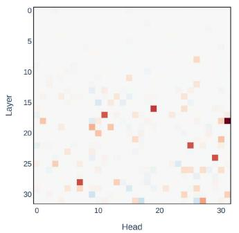  
(a) LLaMA2-7B

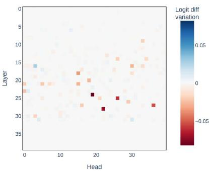  
(b) LLaMA2-13B

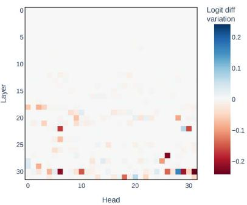  
(c) Mistral-7B

Figure 6: Resuls of path patching on other LLMs.  
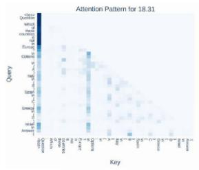

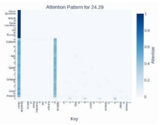

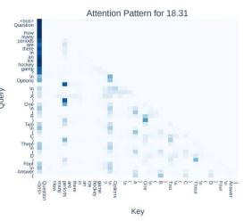

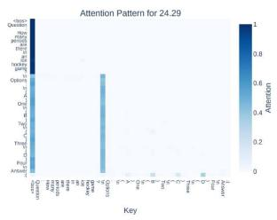  
(b)

(a)  
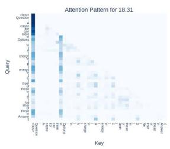

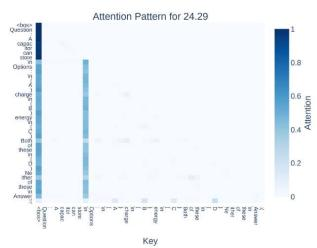  
(c)

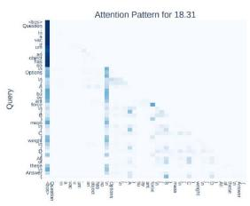

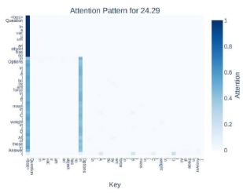  
(d)  
Figure 7: Additional attention patterns across various questions align with the primary results discussed in Section 3.2.2, reinforcing the credibility of the discussion and conclusions.

3.1, where key heads constitute only a small portion of the overall model and they generally appear in the middle and later layers.

## D More Attention Pattern Cases

To make the discussion in Section 3.2.2 more convincing, we provide more attention patterns with various questions. The results are shown in Figure 7. The additional patterns illustrated in Figure 7 exhibit consistent behaviors with that in Figure 3.

## E Ablation Study

The effect of α. Firstly, we investigate the influence of the hyperparameter α. We sweep the α from 0.0 to 100.0 and obtain the corresponding performance of CEDE on RACE-Middle with i-iv (on LLaMA2-7B), where CEDE exhibit the maximum improvement in accuracy. The variation in accuracy with respect to α is shown in Figure 8. When α is set to 0.0, the CEDE degrades to the baseline and has no impact on the activations of the heads. It can be observed that even with a slight adjustment of activations toward the stimulation direction (α = 3.0), CEDE can achieve a notable increase in accuracy, which indicates the effectiveness of stimulation direction in answer prediction. However, the performance shows a noteworthy decline when α is too large (=100.0). We also decode the output of LLaMA2-7B when α equals 100.0, and find that the model struggles to output tokens in the symbol sets i-iv and generates noisy output, which suggests that intensive stimulation of activations would cause them to deviate from the normal semantic space.

<table><tr><td rowspan="2">Models</td><td colspan="4">MMLU</td><td colspan="5">RACE-Middle</td><td colspan="4">RACE-High</td></tr><tr><td>A-D</td><td>i-iv</td><td>1-4</td><td>x1-x4</td><td>A-D</td><td>i-iv</td><td>1-4</td><td>x1-x4</td><td></td><td>A-D</td><td>i-iv</td><td>1-4</td><td>x1-x4</td></tr><tr><td>CEDE</td><td>38.11</td><td>35.85</td><td>38.14</td><td>39.53</td><td>49.03</td><td>39.28</td><td>37.88</td><td></td><td>49.82</td><td>40.58</td><td>32.54</td><td>33.95</td><td>42.74</td></tr><tr><td>CEDE w/o CE</td><td>36.92</td><td>33.28</td><td></td><td>36.34 38.72</td><td></td><td>47.6038.55</td><td>37.19</td><td></td><td>49.44</td><td>38.69</td><td>930.85</td><td>30.22</td><td>40.59</td></tr></table>

Table 4: Ablation results of causal effect in CEDE, where CE is the abbreviation of causa effect.

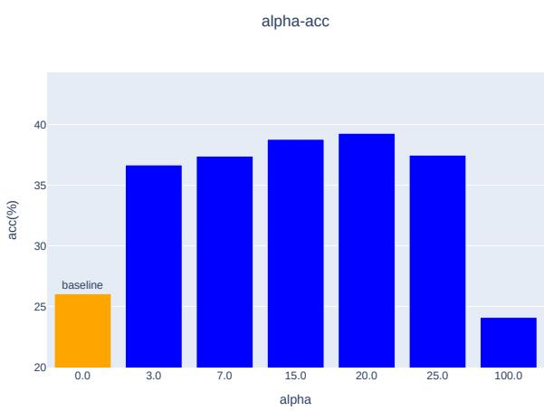  
Figure 8: The results of CEDE across the range of α from 0.0 to 100.0.

The effect of causal effect. CEDE adaptively shifts the activations based on the causal effect. Here, we also aim to investigate the effect of the adaptive intervention. The results of CEDE and without causal effect are shown in Table 4. As can be observed, although CEDE without causal effect shows marginally improvement compare to the baseline (LLaMA2-7B without CEDE), its performance still lags behind the CEDE driven by causal effect, which demonstrates the rationale and effectiveness of the causal effect driven activation intervention in CEDE.