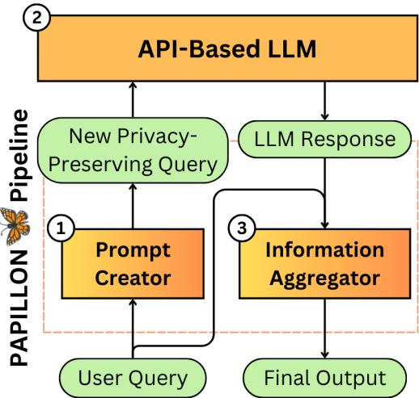
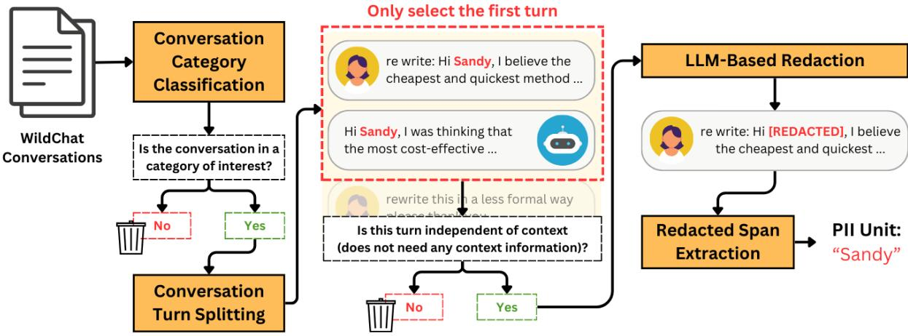

# PAPILLON : PrivAcy Preservation from Internet-based and Local Language MOdel ENsembles

Li Siyan1, Vethavikashini Chithrra Raghuram1, Omar Khattab2,3,

Julia Hirschberg1, Zhou Yu1

1Columbia University, 2Stanford University, 3Databricks Correspondence: siyan.li@columbia.edu

## Abstract

Users can divulge sensitive information to proprietary LLM providers, raising significant privacy concerns. While open-source models, hosted locally on the user’s machine, alleviate some concerns, models that users can host locally are often less capable than proprietary frontier models. Toward preserving user privacy while retaining the best quality, we propose Privacy-Conscious Delegation, a novel task for chaining API-based and local models. We utilize recent public collections of user-LLM interactions to construct a natural benchmark called PUPA, which contains per sonally identifiable information (PII). To study potential approaches, we devise PAPILLON1, a multi-stage LLM pipeline that uses prompt optimization to address a simpler version of our task. Our best pipeline maintains high response quality for 85.5% of user queries while restricting privacy leakage to only 7.5%. We still leave a large margin to the generation quality of proprietary LLMs for future work. 2

## 1 Introduction

Large Language Models (LLMs) such as ChatGPT have started to power applications in increasingly sensitive domains, including therapy (Eshghie and Eshghie, 2023), education (Limo et al., 2023), and healthcare (Garg et al., 2023; Yeo et al., 2023), causing growing concern about data privacy. Existing research has studied privacy in LLM training data memorization (Carlini et al., 2021; Kim et al., 2024). Unfortunately, sanitizing training data does not prevent users from disclosing personally identifiable information (PII) at inference time (Mireshghallah et al., 2024; Zhang et al., 2024; Jaff et al., 2024) within downstream applications. This poses significant risk to users, both as a result of LLM fine-tuning on user interactions or from LLM server-side data breaches. As LLMs are increasingly deployed at scale, it has become crucial to address these inference-time privacy concerns.

  
Figure 1: An overview of the PAPILLON pipeline. The user query contains private information. The pipeline uses the API-based LLM as a tool to synthesize a final output without divulging any PII. The rounded rectangles represent information, and the rectangles represent different language-model-based modules.

To improve privacy at inference time, we could simply redact sensitive information before submitting user requests to LLMs. Indeed, Staab et al. (2023) has demonstrated that text anonymization helps prevent LLMs from inferring personal information. Unfortunately, simple redaction may lower LLM response utility. For example, if a user asks ChatGPT to draft a job application email based on their resume, redaction hinders ChatGPT from leveraging its knowledge about the redacted entities. Such concerns are fueling community interest in hosting open-source models on users’ local GPUs or through GPU services that a user trusts, but models available and efficient enough for this purpose often fall behind the best API-based LLMs in terms of generation quality (Dubey et al., 2024). In this work, we study the tradeoffs that emerge between trusted but weaker models, typically open-source or in-house models, and untrusted but powerful models, typically proprietary and over the network. First, to combine the best of both types of models, we propose the task of Privacy-Conscious Delegation. Privacy-Conscious Delegation promotes a paradigm where a locally hosted open-source model serves as a privacy-conscious proxy of the user and queries the API-based LLM on the user’s behalf. In other words, Privacy-Conscious Delegation requires trusted, weaker models to use untrusted, powerful models as tools to fulfill private user requests. Instead of a differential privacy perspective on inference-time privacy (Zhang et al., 2024; Zeng et al., 2024; Hong et al., 2023), we seek to prevent untrusted LLMs from accessing private information to begin with. Our task is also positioned to support the paradigm shift toward deploying smaller LLMs on edge devices and can have many variants like small LLMs solving highly complex tasks efficiently by delegating a few, selected steps to larger LLMs.

Second, to evaluate the ability of LLM systems to conduct Privacy-Conscious Delegation, we construct a new dataset, namely, Private User Prompt Annotations (PUPA). PUPA consists of 901 instances of real-world user-agent interactions sampled from the publicly-available Wild-Chat dataset (Zhao et al., 2024). To do this, we introduce a framework for mining data from userassistant dialogues for our task. We further define metrics for Privacy-Conscious Delegation, measuring (i) how well systems preserve response quality in comparison to using the best-in-class API models and (ii) how much private information systems leak to the API model.

Lastly, to tackle Privacy-Conscious Delegation for the first time, we design the Privacy Preservation from Internet-based and Local Language Model Ensembles (PAPILLON) system. We utilize prompt optimization with DSPy (Opsahl-Ong et al., 2024) to identify the best prompts for PA-PILLON’s multi-stage pipeline and evaluate our instantiations of PAPILLON, backed by common open-source models, on the PUPA dataset. The optimized PAPILLON pipeline with Llama-3.1- 8B-Instruct as the local model and GPT-4o-mini as the API-based model performs well in terms of preserving the generation quality of the final responses (85.5% of the time) while leaking little private information (7.5% of the time).

Overall, our new task, dataset, and system design demonstrate the potential of Privacy-Conscious Delegation systems. Such systems can enhance user privacy during inference while giving users access to the capabilities of the best LLMs. Through this task, we outline a vision in which small local LLMs drive interactions with users while carefully delegating a few selected steps to larger LLMs, which may be more accurate at the cost of reduced privacy or, in principle, higher cost or latency.

## 2 Related Work

Most past LLM privacy research has focused on training-time data memorization (Carlini et al., 2021; Zhuo et al., 2023; Ramaswamy et al., 2020) and differential privacy (Shi et al., 2022; Majmudar et al., 2022). However, mitigating LLM privacy risks should not only occur during training (Brown et al., 2022), especially when the most popular proprietary LLMs are costly to train3 and complete training data sanitization may be challenging (Das et al., 2024). Therefore, we must strengthen inference-time privacy of LLMs.

Privacy preservation approaches during LLM inference have centered around defending against attackers attempting to recover user queries and preserving differential privacy guarantees (Zhang et al., 2024; Zeng et al., 2024). Hong et al. (2023) uses a deep language network (Sordoni et al., 2024) and prompt-tuning (Lester et al., 2021) on the client-side to preserve client-side data privacy in sentiment classification tasks. Text sanitization approaches such as Feyisetan et al. (2020) and Xu et al. (2020) allow text-to-text privatization, often assuming access to LM word embeddings, which is not practical for our use case. Here, we do not focus on guarding against an attacker but instead emphasize the user. Our approach of chaining a local proxy model with LLM calls is also sufficiently lightweight, without additional training requirements, and we aim to adapt to various tasks.

Existing benchmarks in the inference-time privacy space often focus on evaluating leakage of either memorized training data (Kim et al., 2024; Aditya et al., 2024; Lukas et al., 2023) or private information disclosed during the interactions (Wang et al., 2023a; Mireshghallah et al., 2023). Shao et al. (2024) proposes PrivacyLens, the first benchmark to quantify an LLM’s privacy norm awareness. While this benchmark includes user-agent interactions, they are synthetic and might not accurately reflect natural user-assistant exchanges.

Mireshghallah et al. (2024) discusses different contexts of user disclosures in the WildChat corpus (Zhao et al., 2024); they discover a surprisingly high disclosure rate in unexpected contexts, and find that private information may be revealed implicitly. The authors call for designs to encourage users to moderate their interactions. Our work serves as a first step in this direction. Instead of preventing LLMs from leaking information, we are interested in helping users avoid revealing PII to these models in the first place, while still allowing users to benefit from their utility.

## 3 Privacy-Conscious Delegation

## 3.1 Task Definition

A system for Privacy-Conscious Delegation is provided two LLMs, a trusted but weaker model, $M _ { \mathrm { L o c A L } } .$ and an untrusted but stronger one, $M _ { \mathrm { R E M O T E } }$ . At inference time, the input for the system is a user query q containing pieces of private information $p _ { 1 } , p _ { 2 } , \cdots p _ { n }$ . Provided this query, the system’s goal is to produce an output response r of the best possible quality, using one or both LLMs, while revealing as little private information as possible to the untrusted LLM.

We are particularly interested in producing outputs similar to or better than a target response. This target can be the stronger model’s response to the original user query. This requires the system to grasp which queries can be answered with only the weaker model and which requires ensembling both models. We only consider single-turn queries.

## 3.2 Metrics

The ideal response r should: (1) be on-par in quality compared to responses generated by a proprietary LLM; (2) reveal as little user private information as possible. Implementing these metrics can be challenging due to their subjective nature. Like recent literature (Zheng et al., 2023a; Guo et al., 2024; Lee et al., 2023), we employ LLMs as a judge for these two qualities. We validate the robustness of our quality judgment metric with crowd-sourcing (Section 6.1). See Appendix B for the complete list of prompts used for our metrics.

Quality Preservation It is possible to query the LLM judge to directly determine whether the quality of the output from our task pipeline matches that of the proprietary LLM response. However, LLM judges may be inconsistent and suffer from position bias (Wang et al., 2023b; Zheng et al., 2023a). To address this, we utilize two calls to the judge to obtain quality judgment over the two permutations of inputs (see Algorithm 1). Here, we convert free-text model judgment into a binary integer score based on whether the response starts with "yes". If the LLM judge provides the same answer to both permutations of candidate responses, we would classify the candidates as equivalent in quality due to this judgment inconsistency. See Appendix A for a detailed algorithm for computing the quality metric.

Privacy Preservation To ensure the high quality of the output, we sometimes need to query $M _ { \mathrm { R E M O T E } }$ with a synthesized prompt $q ^ { \prime }$ that contains minimal privacy leakage. When the set of PII pieces has been provided, ascertaining the amount of leakage in this prompt is simple. We can iterate through the set of private information units $p 1 . . n \bullet$ decide whether it is contained in $q ^ { \prime } ,$ , and compute the percentage of private information units present:

$$
\operatorname { L E A K } ( q ^ { \prime } , p _ { 1 . . n } ) = { \frac { \sum _ { j = 1 } ^ { n } i n t { \big ( } f _ { P J } ( M _ { J } , q ^ { \prime } , p _ { j } ) { \big ) } } { n } }
$$

Where $f _ { P J }$ is the prompt used for privacy leakage judgment and $M _ { J }$ is the LLM judge. The freetext judgments are similarly converted into integer scores as in the Quality Preservation metric.

## 4 Private User Prompt Annotations (PUPA) Benchmark

We need a dataset containing naturally occurring instances of people leaking PII to large language models. For data privacy, it would be ideal that the queries in our benchmark have already been exposed to common API-based proprietary models.

## 4.1 Data Collection

Mireshghallah et al. (2024) introduces a set of annotations containing user-assistant dialogues with personally identifiable information from a subset of the WildChat corpus (Zhao et al., 2024), which is a collection of one million dialogues between users and ChatGPT or GPT-4. The authors categorize 5,000 WildChat conversations through GPT-4 annotations into 11 context labels. We focus on these categories: (1) Job, Visa, & Other Applications; (2) Financial and Corporate Info; (3) Quoted Emails and Messages. We select these categories since PII is shared more explicitly – names and companies are often presented verbatim.

<table><tr><td colspan="3">GPT-4-Turbo</td><td colspan="3">GPT-4o-mini</td><td colspan="3">GPT-3.5-Turbo</td></tr><tr><td></td><td>Prec.</td><td>Rec.</td><td>F-1</td><td>Prec.</td><td>Rec.</td><td>F-1</td><td>Prec. Rec.</td><td>F-1</td></tr><tr><td>Job, Visa, &amp; Other Applications</td><td>0.92</td><td>0.55</td><td>0.69</td><td>0.76</td><td>0.54</td><td>0.63</td><td>0.43 0.71</td><td>0.54</td></tr><tr><td>Financial and Corporate Info</td><td>0.90</td><td>0.83</td><td>0.86</td><td>0.84</td><td>0.62 0.72</td><td>0.95</td><td>0.20</td><td>0.34</td></tr><tr><td>Quoted Emails and Messages</td><td>0.62</td><td>0.58</td><td>0.60</td><td>0.62</td><td>0.39 0.48</td><td>0.14</td><td>0.67</td><td>0.23</td></tr><tr><td>All Categories</td><td>0.91</td><td>0.91</td><td>0.91</td><td>0.85</td><td>0.85</td><td>0.84</td><td>0.77 0.68</td><td>0.69</td></tr></table>

Table 1: Precision, recall, and F-1 scores of the different models on annotations from Mireshghallah et al. (2024). For the metrics for All Categories, we use the weighted average to account for class imbalance.

  
Figure 2: Data creation pipeline for PUPA from conversations.

As these categories only comprise a small percentage of the original annotations, we expand the coverage of conversations from WildChat using the original prompts. To maximize annotation quality, we compare the accuracies of GPT-4-turbo (the same as the original paper), GPT-4o-mini, and GPT-3.5-turbo on the existing annotations. We present our results in Table 1.

While GPT-4-turbo is the best at matching existing annotations, it is not always accurate, even though the original paper also used GPT-4-turbo, which reflects potential underlying changes or randomness in the GPT-4-turbo API. Since GPT-4omini performs at a similar level and fits better within our budget, considering that we are classifying the rest of the one million conversations, we choose GPT-4o-mini as our new annotation model. We perform classification on the rest of the Wild-Chat corpus to obtain a new collection of privacyleaking conversations and filter our classification results to only include conversations from our categories of interest. Because of the lower pricing and competitive performance, we use GPT-4o-mini for most tasks in the rest of the paper. See the complete list of prompts used during the data collection and processing steps in Appendix B.

## 4.2 Data Processing

## 4.2.1 Overview

The annotation scheme from Mireshghallah et al. (2024) is at the dialogue level, but Privacy-Conscious Delegation requires prompt-response pairs and the corresponding PII units leaked in the user prompt. As a result, we separate the conversations classified as one of our topics of interest into turns (one round of user-assistant exchanges). We then conduct the following data processing steps on every turn: (1) Prompt an LLM to determine whether the query is answerable without additional context. The context-dependent queries are pruned as we only consider single-turn interactions for our current task definition. (2) Perform PII extraction on the remaining turns to produce PII units (Section 4.2.2). We remove any turns without PII leakage.

After these data processing steps, we retain 237 turns from the original annotations (PUPA-TNB) and 664 turns from the newly annotated WildChat conversations (PUPA-New). We use PUPA-TNB for pipeline and model comparisons, and PUPA-New for any optimization we perform. We show the statistics of these two subsets in Table 3, showcasing the variety of domains in PUPA.

<table><tr><td>User Query</td><td>Category</td></tr><tr><td>Write an email template to russian ministry of education about the invi- Job, Visa, &amp; Other Ap- tation issuance that I have awarded scholarship in HSE university and I plications thought its good to start my scholarship with prep year, as I&#x27;m living in</td><td></td></tr><tr><td>Hello Frank, I just spoke with Vincent van Lith. He agreed to 1.75 instead Financial and Corpo- of 2.00. Also understood that this has been communicated to Amsterdam. rate Info If you have any questions, please contact Vincent.</td><td></td></tr></table>

Table 2: Examples from PUPA. The PII units for each query have been underlined.

<table><tr><td></td><td>PUPA-TNB</td><td>PUPA-New</td></tr><tr><td>%(Applications)</td><td>16.03</td><td>40.66</td></tr><tr><td>%(Financial)</td><td>47.26</td><td>28.92</td></tr><tr><td>%(Emails)</td><td>30.38</td><td>22.59</td></tr><tr><td>Avg. #(PPI Units)</td><td>3.01</td><td>2.86</td></tr><tr><td>Avg. Prompt Len.</td><td>1,449.5</td><td>1,317.3</td></tr><tr><td>Avg. Comp. Len.</td><td>1,328.6</td><td>1,634.3</td></tr></table>

Table 3: Different statistics on the two subsets of PUPA. “Prompt Len” and “Comp. Len.” correspond to the number of characters in user prompts and GPT responses.

## 4.2.2 PII Unit Extraction

To extract pieces of private information from a user query, we execute a three-step process: First, we redact sensitive information from the user query with an LLM. We then extract the redacted spans using regular expressions; when regular expressions fail to produce the spans, we prompt the LLM with the original and redacted user queries and request the redacted spans. Finally, the extracted PII units are de-duplicated.

We choose to first redact the user query instead of directly using LLMs to extract PII units for a few reasons. First, user queries in our benchmark are lengthy because users might include full resumes in their prompts, and LLMs may miss vital PII pieces due to this long context. We are additionally interested in obtaining redacted versions of user queries to study whether redacting information from user queries results in inferior LLM responses. Furthermore, there has been some evidence that GPT-4 can be useful when redacting sensitive information from online education forum posts (Singhal et al.,

2024); GPT-4 achieves a recall of 0.95 on this task, but its precision is significantly worse because it often over-redacts. We use the same prompt from Singhal et al. (2024) to perform the redaction step.

When extracting the redacted spans, we utilize a regular expression pattern to match texts occurring before and after the [REDACTED] tokens to identify the redacted content. This set of content spans would be the PII units of this query. Occasionally, the regular expression fails to find matches due to either GPT-4o-mini changing the original query texts or character escaping issues; in that case, we would use prompting to extract these spans.

## 5 PAPILLON

As a first step in exploring methods for the Privacy-Conscious Delegation task, we propose PAPIL-LON (Figure 1), a pipeline structure that addresses the simplest task setting: both $M _ { \mathrm { L o c A L } }$ and $M _ { \mathbf { R E M O T E } }$ are used for output production.

## 5.1 Pipeline Structure

The PAPILLON pipeline contains a Prompt Creator and an Information Aggregator, both using specialized zero-shot prompts applied to the trusted, weaker model $M _ { \mathrm { L o c A L } }$ . We can optimize these prompts for each possible $M _ { \mathrm { L o c A L } }$ and MREMOTE combination. All pipelines are initialized with the same zero-shot prompts (Appendix B).

Given the user query $q ,$ a PAPILLON pipeline performs the following: First, the Prompt Creator generates $q ^ { \prime } ,$ a prompt for $M _ { \mathrm { R E M O T E } } .$ Second, $M _ { \mathrm { R E M O T E } }$ produces a response for $q ^ { \prime }$ , $C _ { R }$ . Lastly, the Information Aggregator aggregates $C _ { R }$ and the original query q to synthesize a final output $C _ { L }$ which ideally should match the quality of a target response. For our optimization and experiments, we use the original ChatGPT or GPT-4 response in PUPA as the target response.

## 5.2 Prompt Optimization

We optimize Prompt Creator and Information $\mathrm { A g \mathrm { - } }$ gregator prompts jointly using DSPy’s MIPRO v2 optimizer (Opsahl-Ong et al., 2024) on a subset of PUPA-New. We sample 150 data points of PUPA-New as the training set and 150 as the validation set for MIPRO v2 on the recommendation of the authors, as a way to strike a balance between the computational cost of optimization and the data efficiency of prompt optimizers.

The MIPRO v2 optimizer utilizes a task model (our target model whose performance we aim to improve), a proposer model (the model that synthesizes alternative prompts, often an LLM), and a metric. The optimizer continuously samples minibatches of the training data to evaluate the most recently proposed prompt with the metric and retains the candidate with the highest score over the entire training set. Due to the longer prompt lengths in our task, we do not include few-shot contextual examples. We optimize the prompts for each pipeline with 200 trials.

For the metric driving the optimization process, we combine our defined metrics and another LLM-judged metric to encourage the prompts synthesized by $M _ { \mathrm { L o c A I } }$ to be properly formed. The prompt well-formedness metric only returns 1 when the proposed $q ^ { \prime }$ is a proper prompt for a language model (i.e. does not have preambles). The optimizer would maximize the following, given the target response $C _ { T }$ and PII units $p _ { 1 . . n } \colon$

$$
\frac { \mathrm { Q U A L } ( C _ { L } , C _ { T } ) - \mathrm { L E A K } ( q ^ { \prime } , p _ { 1 . . n } ) + \mathrm { P W F } ( q ^ { \prime } ) } { 2 }
$$

## 6 Experiments

## 6.1 Evaluation Metric Validation

## 6.1.1 Quality Metric

While existing research shows how LLM preferences often align with human preferences for quality judgment tasks (Gilardi et al., 2023; Huang et al., 2024), our task requires a specific type of quality judgment, i.e. "is response A AT LEAST AS GOOD as response B?" rather than "is response A BETTER than response B?". So, we conduct a human evaluation for our QUAL(A, B) metric on Prolific to ensure that our LLM judge preferences still reflect human judgments well in this setting.

For the evaluation, we sample 50 pairs of candidate responses for queries from PUPA, each pair containing (1) Llama-3-8B-Instruct’s output, and (2) the original GPT response. Out of these 50 pairs, 26 of them have $\mathrm { Q U A L } ( A , B ) = 1$ and the rest have $\mathrm { Q } \mathrm { U A L } ( A , B ) = 0 $ . For this study and the following study, only English queries are selected.

Participants are asked to select the better response from the two candidates or mark the two as tied in quality. Five or seven participants, paid at \$12 per hour, labeled each pair of candidates, and each participant labeled around 30 pairs.

When $\mathrm { Q U A L } ( A , B ) = 0 .$ , the alignment rate is 70.8%, i.e. participants prefer B 70.8% of the time. When $\mathrm { Q U A L } ( A , B ) = 1$ , we obtain an alignment of 65.4%, considering both majority voting for A and for “It is a tie” as alignment. This establishes the general validity of our quality metric.

## 6.1.2 Leakage Metric

We seek to validate our metric for privacy leakage. Similarly to our process documented in the previous section, we evaluated how well our privacy leakage metric aligns with human judgment. Again, we sample 50 entries from PUPA and their corresponding PAPILLON generations using Llama-3.1- 8B as $M _ { \mathrm { L o c A I } }$ and GPT-4o-mini as $M _ { \mathrm { R E M O T E } }$ . We conduct the study on Prolific. Out of these 50 entries, 25 are evaluated to have no privacy leakage by our LLM judge.

To obtain the alignment between LLM judgments and human evaluation, human participants are given the PII units in a private user query and its corresponding PAPILLON-synthesized privacypreserving prompt (from the Prompt Creator module). The participants will then indicate whether they agree with the privacy leakage score according to our LLM judge. Instead of the percentage, we use the raw count of private information units in the PAPILLON-generated prompt. Five participants were recruited and paid at \$12 per hour. Each participant evaluated all 50 ensembles of PII units and prompts.

In general, the participants agreed with the LLMjudged metric values 86% of the time under majority vote. At least one annotator agreed with the judge 94% of the time. When most participants disagreed with the judge, 71.4% of the disagreements were due to false positive LLM judgments where the judge mistakenly evaluates a fully privacypreserving prompt to exhibit leakage, which is safer than false negatives. This further confirms the validity of our privacy leakage metric.

<table><tr><td colspan="3">Before Optimization</td><td colspan="2">After Optimization</td><td colspan="2">Difference</td></tr><tr><td></td><td>QUAL ↑</td><td>LEAK↓ 100.0</td><td>QUAL↑</td><td>LEAK↓</td><td>∆QUAL ↑</td><td>△LEAK↓</td></tr><tr><td>GPT-4o-mini [Unredacted] GPT-4o-mini [Redacted]</td><td>88.2 77.2</td><td>0.00</td><td>N/A N/A</td><td>N/A N/A</td><td>N/A N/A</td><td>N/A N/A</td></tr><tr><td></td><td></td><td>27.8</td><td></td><td></td><td></td><td></td></tr><tr><td>Llama-3.2-1B-Instruct</td><td>41.2 57.3</td><td>23.8</td><td>58.0 60.9</td><td>39.3</td><td>+ 16.8</td><td>+ 11.5</td></tr><tr><td>Llama-3.2-3B-Instruct</td><td>71.8</td><td>30.9</td><td>79.3</td><td>24.9</td><td>+ 3.60</td><td>+1.10</td></tr><tr><td>Llama-3-8B-Instruct</td><td>71.8</td><td>17.4</td><td>85.5</td><td>21.2 7.50</td><td>+7.50</td><td>- 9.70</td></tr><tr><td>Llama-3.1-8B-Instruct</td><td>75.7</td><td>36.9</td><td>77.6</td><td>11.9</td><td>+ 13.7 + 1.90</td><td>- 9.90 - 25.0</td></tr><tr><td>Mistral-7B-Instruct</td><td>85.3</td><td>30.3</td><td>85.3</td><td>27.4</td><td>+ 0.00</td><td></td></tr><tr><td>Mistral-Small</td><td></td><td></td><td></td><td></td><td></td><td>- 2.90</td></tr></table>

Table 4: The average quality and leakage scores (scaled to be 0-100) of PAPILLON pipelines equipped with various local models and GPT-4o-mini as the proprietary model on PUPA-TNB, which is not used for prompt optimization.
<table><tr><td>User Query</td><td>PAPILLON Prompt</td></tr><tr><td>&quot;Mrs. Shafaq Hussain&#x27;s attire is prepared and will Paraphrase the message about a customer&#x27;s attire vided a white suit for sale.&quot; Paraphrase this text message</td><td>be delivered shortly. Additionally, she has pro- and a suit for sale, removing any personal details.</td></tr><tr><td>formal email: dear HR i have applied for the post Please generate a formal email to the Human Re- of processor in operations at WIPRO, Noida. I sources department of a company, expressing in- have the knowledge and skills required for this job terest in a job opening for a processor in the op- post. i have attached my resume, i hope you will erations department. The email should include a consider my application for this post.</td><td>statement of qualifications and a polite expression of hope for consideration.</td></tr></table>

Table 5: Example prompts from the Llama-3.1-8B-Instruct PAPILLON pipeline. PII units are underlined in the queries. The blue prompts corresponds to PAPILLON outputs that successfully retain output quality compared to the target responses; the red prompts corresponds to PAPILLON outputs that fail to do so. See complete examples, including intermediate outputs, in Appendix C.

## 6.2 Pipeline Evaluation

Models: We construct PAPILLON pipelines with GPT-4o-mini as the proprietary model and various open-source models as the local model. Specifically, we select these open-source language models: Llama-3-8B-Instruct (Dubey et al., 2024), Llama-3.1-8B-Instruct, Llama-3.2-3B-Instruct, Llama-3.2- 1B-Instruct4, Mistral-Small-Instruct-24095, and Mistral-7B-Instruct-v0.3 (Jiang et al., 2023). The models are hosted on one A100 80GB GPU with SGLang (Zheng et al., 2023b) or VLLM (Kwon et al., 2023) with the chat template.

Results: To compare PAPILLON pipeline performances on PUPA-TNB, we compute our pipeline completions’ quality and leakage scores against the original GPT responses. Additionally, we compute the quality scores of GPT-4o-mini (our $M _ { \mathrm { R E M O T E } } )$ on unredacted and redacted user queries. We consider the average quality score of $M _ { \mathrm { R E M O T E } }$ on unredacted user queries a soft upper bound for PA-PILLON performance. We document the results in Table 4. Note that PUPA-TNB is not used for prompt optimization.

The results indicate a significant drop in response quality from simple text redaction (GPT-4o-mini [Unredacted] vs. [Redacted]). This aligns with our intuition that only using text redaction as the privacy preservation approach would harm model utility, highlighting the need for our method.

Comparing different $M _ { \mathrm { L o c A L } }$ choices, we see that the Llama-3.1-8B-Instruct pipeline after prompt optimization achieves the highest quality score and the lowest leakage score, despite not being the best-performing before optimization. We additionally observe the positive but variable impact of prompt optimization without additional training, increasing quality scores across the board regardless of model size; although Llama-3.2-1B-Instruct obtains the lowest quality scores, its quality improvement is the most significant. While some of our baselines seem to achieve relatively low privacy leakage, there is still ample headroom for generation quality, especially for smaller models.

We notice that the Mistral-Small PAPILLON achieves high quality scores but also higher leakage scores. Inspecting the created prompts from this pipeline reveals that the Mistral-Small PAPIL-LON is (1) more sensitive to human names than other types of PII such as nationalities and company names; (2) less privacy-conscious when the PII pieces are not presented in a first-person-centric context (e.g. asking the pipeline to translate a piece of text with PII). This echoes prior findings from Shao et al. (2024) that different models have distinct privacy norm awareness.

<table><tr><td></td><td>QUAL ↑</td></tr><tr><td>GPT-4o-mini</td><td>88.2</td></tr><tr><td>GPT-3.5-turbo</td><td>64.3</td></tr><tr><td>GPT-40</td><td>86.5</td></tr><tr><td>GPT-4-turbo</td><td>91.0</td></tr><tr><td>Llama-3.1-8B-Instruct</td><td>81.5</td></tr><tr><td>GPT-40-mini</td><td>85.5</td></tr><tr><td>GPT-3.5-turbo</td><td>83.8</td></tr><tr><td>GPT-40</td><td>86.0</td></tr><tr><td>GPT-4-turbo</td><td>87.4</td></tr></table>

Table 6: The quality scores on PUPA-TNB, scaled to 0-100. We include quality scores for generations from the candidate proprietary models on unredacted queries (top), from the local model on unredacted queries (middle), and the prompt-optimized PAPILLON pipeline using these proprietary models (bottom).

## 6.3 Ablation with Different Proprietary LLMs

We are interested in whether the upper bound of proprietary model generation quality is absolute. Therefore, we conduct an ablation study with multiple possible proprietary models. We use the post-optimization PAPILLON pipeline with Llama-3.1-8B-Instruct as $M _ { \mathrm { L o c A I } }$ , fixing the prompts for pipeline sub-components. We report the evaluation results in Table 6. Additionally, we record the quality scores for each of the $M _ { \mathrm { R E M O T E } } \mathrm { ^ { * } s }$ and the $M _ { \mathrm { L o c A L } }$ to contrast with pipeline results. In the PAPILLON experiments, the privacy-conscious proposed prompts are cached for each user query to control the inputs to $M _ { \mathrm { R E M O T E } }$

Our results indicate that $M _ { \mathrm { R E M O T E } }$ quality over unredacted user queries is often, but not always, an upper bound for PAPILLON pipeline generation qualities (see the case of GPT-3.5-turbo). It is encouraging that the optimized Llama-3.1- 8B pipeline can outperform its local model on unredacted queries. This suggests that PAPILLON can efficiently leverage $M _ { \mathrm { R E M O T E } }$ outputs.

## 6.4 Qualitative Analysis

We present examples of prompts synthesized by the Llama-3.1-8B-Instruct PAPILLON pipeline (referred to as PAPILLON for the rest of this section) and the original user queries in Table 5.

From these prompt examples, we see that PAPIL-LON can censor personal information and produce sufficiently specific prompts. However, PAPIL-LON can still over-optimize on preventing privacy leakage to proprietary model providers and fail to convey critical information in the prompt. Another common issue across different PAPILLON pipelines is that the Prompt Creator expands the original prompt. This extraneous information may be inconsistent with the original query. For instance, PAPILLON can construct a prompt that significantly deviates from the original request (See Appendix C.1, where PAPILLON queries about cost-effective transportation methods when asked to rewrite an email). This indicates that prompting alone may not be sufficient for our task.

As for how the local model leverages the cloudbased proprietary model outputs, we see that PA-PILLON outputs can be very similar to the intermediate proprietary model outputs. To quantify this similarity, we utilize SentenceTransformer all-MiniLM-L6-v2 to compute the sentence embeddings of the final PAPILLON outputs and the proprietary model responses. We then compute pairwise cosine similarity values for the same original user query. When $M _ { \mathrm { R E M O T E } }$ is GPT-4o-mini, the average similarity is 0.7251, which indicates that the Information Aggregator does not simply copy the intermediate proprietary model output. Qualitatively, the lower cosine similarity instances feature synthesized prompts that are very distinct from the original query (Appendix C). We aim to study the behavior of PAPILLON pipelines in future work, as it will sharpen our intuition for better performance.

## 6.5 Analysis of Computational Overhead

One potential benefit of deploying PAPILLON pipelines is cost-effectiveness, as the prompts presented to the proprietary models contain less information (through the removal of PII). This could result in lower input token counts than passing in the original private user query directly.

To examine this hypothesis, we contrast the numbers of input and output tokens from GPT-4o-mini using the Llama-3.1-8B-Instruct pipeline (referred to as PAPILLON for the rest of this section) on PUPA-TNB queries. In addition, we calculate the total costs for each method. We find that using the GPT-4o-mini API directly incurs a cost of \$0.063 on all PUPA-TNB queries, while using PAPILLON increases this cost slightly to \$0.076. Further inspection reveals that this increase results from an uptick in the number of completion tokens. On average, using PAPILLON increases the number of completion tokens by 136.4 tokens compared to querying the OpenAI API directly. However, PA-PILLON significantly reduces the number of input prompt tokens by an average of 193.9 tokens. This result partially validates our hypothesis that PAPIL-LON improves prompt conciseness. We additionally observe that the cost increase is not significant, a small price to pay for privacy preservation.

## 7 Conclusion

We introduce Privacy-Conscious Delegation, a task that provides new insights into preserving inference-time user privacy when interacting with large language models. We construct PUPA, a dataset containing real-life examples of user queries with personal information. We additionally define robust metrics for our task to measure generation quality. As an initial concrete approach, we design the PAPILLON pipeline, an ensemblebased approach with prompt optimization, and experiment with different local and cloud-based models. Our evaluations show that the PAPILLON pipeline with Llama-3.1-8B-Instruct as the local model and GPT-4o-mini as the proprietary model produces the highest-quality responses with a low leakage rate. Despite the promising performance of this pipeline, the performance gap between PA-PILLON and the proprietary models is still not closed. For future work, we aim to explore training approaches and pipeline structures to improve PA-PILLON performance. Specifically, we would like to develop small, privacy-conscious local models.

Another future direction we are interested in is offering theoretical guarantees for our approach, such as from a differential privacy perspective, which is crucial for any large-scale deployment.

In conclusion, our work presents a new perspective for preserving user privacy in the era of large language models by preventing users’ sensitive data leakage to proprietary models in the first place. The data extraction pipeline for PUPA allows the incorporation of new user-assistant conversations. Our proposed task, benchmark, and approach lay the foundation for further privacy research in NLP.

## Limitations

There are a few limitations in our work due to the novelty of our task, benchmark, and baseline system. To begin with, the type of user query we consider is the type where the disclosure of PII is explicit for the ease of extracting PII units from these queries. However, as Mireshghallah et al. (2024) has pointed out, simple detection and removal of PII does not address all scenarios where users may divulge personal information, since information such as sexual preferences and medical conditions are certainly private, but they are harder to extract.

Another limitation is that our metrics rely heavily on large language models, as a result of the complexity of our tasks. In the future, we intend to conduct more human annotation studies to further validate the effectiveness of our approaches.

We additionally aim to perform manual verification of GPT-4o-mini redactions and PII extractions on the PUPA benchmark to address the overredaction issue prevalent with LLM-based redactions. This would further guarantee the high quality of our benchmark and ensure fair evaluations for future systems on our task.

Furthermore, as mentioned in the body of the paper, PAPILLON does not always produce the most intuitive, privacy-conscious prompts. Extraneous information could be added to the prompt synthesized by the pipeline, information that may contradict the original user query. We acknowledge that PAPILLON is not the best possible solution for Privacy-Conscious Delegation, and we aim to improve performance on this task in future work.

## Ethical Considerations

The motivation behind our work is to protect user privacy when interacting with API-based proprietary models during inference time to prevent unconsented usage of personal data down the line. The data we use for our work is from the WildChat corpus, which is a dataset collected with ChatGPT and GPT-4. Since the users’ consent has been obtained before their interactions, we are not analyzing user data without their consent. However, out of an abundance of caution, we will replace full names in PUPA with random names when releasing our dataset.

Because GPT-4o-mini classifications may not always be accurate, PUPA can contain inappropriate content including sexual preferences. We will additionally ensure that inappropriate materials are removed when we release PUPA. One of the authors examined the queries and the outputs used for the human evaluation study to prevent exposing the study participants to inappropriate materials.

## References

Harshvardhan Aditya, Siddansh Chawla, Gunika Dhingra, Parijat Rai, Saumil Sood, Tanmay Singh, Zeba Mohsin Wase, Arshdeep Bahga, and Vijay K Madisetti. 2024. Evaluating privacy leakage and memorization attacks on large language models (llms) in generative ai applications. Journal ofSoft ware Engineering and Applications, 17(5):421–447.

Hannah Brown, Katherine Lee, Fatemehsadat Mireshghallah, Reza Shokri, and Florian Tramèr. 2022. What does it mean for a language model to preserve privacy? In Proceedings of the 2022 ACM conference on fairness, accountability, and transparency, pages 2280–2292.

Nicholas Carlini, Florian Tramer, Eric Wallace, Matthew Jagielski, Ariel Herbert-Voss, Katherine Lee, Adam Roberts, Tom Brown, Dawn Song, Ulfar Erlingsson, et al. 2021. Extracting training data from large language models. In 30th USENIX Security Symposium (USENIX Security 21), pages 2633–2650.

Badhan Chandra Das, M Hadi Amini, and Yanzhao Wu. 2024. Security and privacy challenges of large language models: A survey. arXiv preprint arXiv:2402.00888.

Abhimanyu Dubey, Abhinav Jauhri, Abhinav Pandey, Abhishek Kadian, Ahmad Al-Dahle, Aiesha Letman, Akhil Mathur, Alan Schelten, Amy Yang, Angela Fan, et al. 2024. The llama 3 herd of models. arXiv preprint arXiv:2407.21783.

Mahshid Eshghie and Mojtaba Eshghie. 2023. Chatgpt as a therapist assistant: a suitability study. arXiv preprint arXiv:2304.09873.

Oluwaseyi Feyisetan, Borja Balle, Thomas Drake, and Tom Diethe. 2020. Privacy-and utility-preserving textual analysis via calibrated multivariate perturbations.

In Proceedings ofthe 13th international conference on web search and data mining, pages 178–186.

Ravindra Kumar Garg, Vijeth L Urs, Akshay Anand Agarwal, Sarvesh Kumar Chaudhary, Vimal Paliwal, and Sujita Kumar Kar. 2023. Exploring the role of chatgpt in patient care (diagnosis and treatment) and medical research: A systematic review. Health Promotion Perspectives, 13(3):183.

Fabrizio Gilardi, Meysam Alizadeh, and Maël Kubli. 2023. Chatgpt outperforms crowd workers for text-annotation tasks. Proceedings of the National Academy ofSciences, 120(30):e2305016120.

Shangmin Guo, Biao Zhang, Tianlin Liu, Tianqi Liu, Misha Khalman, Felipe Llinares, Alexandre Rame, Thomas Mesnard, Yao Zhao, Bilal Piot, et al. 2024. Direct language model alignment from online ai feedback. arXiv preprint arXiv:2402.04792.

Junyuan Hong, Jiachen T Wang, Chenhui Zhang, Zhangheng Li, Bo Li, and Zhangyang Wang. 2023. Dp-opt: Make large language model your privacy-preserving prompt engineer. arXiv preprint arXiv:2312.03724.

Fan Huang, Haewoon Kwak, Kunwoo Park, and Jisun An. 2024. Chatgpt rates natural language explanation quality like humans: But on which scales? arXiv preprint arXiv:2403.17368.

Evin Jaff, Yuhao Wu, Ning Zhang, and Umar Iqbal. 2024. Data exposure from llm apps: An indepth investigation of openai’s gpts. arXiv preprint arXiv:2408.13247.

AQ Jiang, A Sablayrolles, A Mensch, C Bamford, DS Chaplot, D de las Casas, F Bressand, G Lengyel, G Lample, L Saulnier, et al. 2023. Mistral 7b (2023). arXiv preprint arXiv:2310.06825.

Siwon Kim, Sangdoo Yun, Hwaran Lee, Martin Gubri, Sungroh Yoon, and Seong Joon Oh. 2024. Propile: Probing privacy leakage in large language models. Advances in Neural Information Processing Systems, 36.

Woosuk Kwon, Zhuohan Li, Siyuan Zhuang, Ying Sheng, Lianmin Zheng, Cody Hao Yu, Joseph Gonzalez, Hao Zhang, and Ion Stoica. 2023. Efficient memory management for large language model serving with pagedattention. In Proceedings of the 29th Symposium on Operating Systems Principles, pages 611–626.

Harrison Lee, Samrat Phatale, Hassan Mansoor, Thomas Mesnard, Johan Ferret, Kellie Lu, Colton Bishop, Ethan Hall, Victor Carbune, Abhinav Rastogi, et al. 2023. Rlaif: Scaling reinforcement learning from human feedback with ai feedback. arXiv preprint arXiv:2309.00267.

Brian Lester, Rami Al-Rfou, and Noah Constant. 2021. The power of scale for parameter-efficient prompt tuning. In Proceedings of the 2021 Conference on

Empirical Methods in Natural Language Processing, pages 3045–3059, Online and Punta Cana, Dominican Republic. Association for Computational Linguistics.

Fernando Antonio Flores Limo, David Raul Hurtado Tiza, Maribel Mamani Roque, Edward Espinoza Herrera, José Patricio Muñoz Murillo, Jorge Jinchuña Huallpa, Victor Andre Ariza Flores, Alejandro Guadalupe Rincón Castillo, Percy Fritz Puga Peña, Christian Paolo Martel Carranza, et al. 2023. Personalized tutoring: Chatgpt as a virtual tutor for personalized learning experiences. Przestrze´n Społeczna (Social Space), 23(1):293–312.

Nils Lukas, Ahmed Salem, Robert Sim, Shruti Tople, Lukas Wutschitz, and Santiago Zanella-Béguelin. 2023. Analyzing leakage of personally identifiable information in language models. In 2023 IEEE Symposium on Security and Privacy (SP), pages 346–363. IEEE.

Jimit Majmudar, Christophe Dupuy, Charith Peris, Sami Smaili, Rahul Gupta, and Richard Zemel. 2022. Differentially private decoding in large language models. arXiv preprint arXiv:2205.13621.

Niloofar Mireshghallah, Maria Antoniak, Yash More, Yejin Choi, and Golnoosh Farnadi. 2024. Trust no bot: Discovering personal disclosures in humanllm conversations in the wild. arXiv preprint arXiv:2407.11438.

Niloofar Mireshghallah, Hyunwoo Kim, Xuhui Zhou, Yulia Tsvetkov, Maarten Sap, Reza Shokri, and Yejin Choi. 2023. Can llms keep a secret? testing privacy implications of language models via contextual integrity theory. arXiv preprint arXiv:2310.17884.

Krista Opsahl-Ong, Michael J Ryan, Josh Purtell, David Broman, Christopher Potts, Matei Zaharia, and Omar Khattab. 2024. Optimizing instructions and demonstrations for multi-stage language model programs. arXiv preprint arXiv:2406.11695.

Swaroop Ramaswamy, Om Thakkar, Rajiv Mathews, Galen Andrew, H Brendan McMahan, and Françoise Beaufays. 2020. Training production language models without memorizing user data. arXiv preprint arXiv:2009.10031.

Yijia Shao, Tianshi Li, Weiyan Shi, Yanchen Liu, and Diyi Yang. 2024. Privacylens: Evaluating privacy norm awareness of language models in action. arXiv preprint arXiv:2409.00138.

Weiyan Shi, Ryan Shea, Si Chen, Chiyuan Zhang, Ruoxi Jia, and Zhou Yu. 2022. Just fine-tune twice: Selective differential privacy for large language models. arXiv preprint arXiv:2204.07667.

Shreya Singhal, Andres Felipe Zambrano, Maciej Pankiewicz, Xiner Liu, Chelsea Porter, and Ryan S Baker. 2024. De-identifying student personally identifying information with gpt-4. In Proceedings ofthe 17th International Conference on Educational Data Mining, pages 559–565.

Alessandro Sordoni, Eric Yuan, Marc-Alexandre Côté, Matheus Pereira, Adam Trischler, Ziang Xiao, Arian Hosseini, Friederike Niedtner, and Nicolas Le Roux. 2024. Joint prompt optimization of stacked llms using variational inference. Advances in Neural Information Processing Systems, 36.

Robin Staab, Mark Vero, Mislav Balunovic, and Martin´ Vechev. 2023. Beyond memorization: Violating privacy via inference with large language models. arXiv preprint arXiv:2310.07298.

Boxin Wang, Weixin Chen, Hengzhi Pei, Chulin Xie, Mintong Kang, Chenhui Zhang, Chejian Xu, Zidi Xiong, Ritik Dutta, Rylan Schaeffer, et al. 2023a. Decodingtrust: A comprehensive assessment of trustworthiness in gpt models. In NeurIPS.

Peiyi Wang, Lei Li, Liang Chen, Zefan Cai, Dawei Zhu, Binghuai Lin, Yunbo Cao, Qi Liu, Tianyu Liu, and Zhifang Sui. 2023b. Large language models are not fair evaluators. arXiv preprint arXiv:2305.17926.

Zekun Xu, Abhinav Aggarwal, Oluwaseyi Feyisetan, and Nathanael Teissier. 2020. A differentially private text perturbation method using a regularized mahalanobis metric. arXiv preprint arXiv:2010.11947.

Yee Hui Yeo, Jamil S Samaan, Wee Han Ng, Peng-Sheng Ting, Hirsh Trivedi, Aarshi Vipani, Walid Ayoub, Ju Dong Yang, Omer Liran, Brennan Spiegel, et al. 2023. Assessing the performance of chatgpt in answering questions regarding cirrhosis and hepatocellular carcinoma. Clinical and molecular hepatology, 29(3):721.

Ziqian Zeng, Jianwei Wang, Zhengdong Lu, Huiping Zhuang, and Cen Chen. 2024. Privacyrestore: Privacy-preserving inference in large language models via privacy removal and restoration. arXiv preprint arXiv:2406.01394.

Xinyu Zhang, Huiyu Xu, Zhongjie Ba, Zhibo Wang, Yuan Hong, Jian Liu, Zhan Qin, and Kui Ren. 2024. Privacyasst: Safeguarding user privacy in tool-using large language model agents. IEEE Transactions on Dependable and Secure Computing.

Wenting Zhao, Xiang Ren, Jack Hessel, Claire Cardie, Yejin Choi, and Yuntian Deng. 2024. Wildchat: 1m chatgpt interaction logs in the wild. arXiv preprint arXiv:2405.01470.

Lianmin Zheng, Wei-Lin Chiang, Ying Sheng, Siyuan Zhuang, Zhanghao Wu, Yonghao Zhuang, Zi Lin, Zhuohan Li, Dacheng Li, Eric Xing, et al. 2023a. Judging llm-as-a-judge with mt-bench and chatbot arena. Advances in Neural Information Processing Systems, 36:46595–46623.

Lianmin Zheng, Liangsheng Yin, Zhiqiang Xie, Jeff Huang, Chuyue Sun, Cody Hao Yu, Shiyi Cao, Christos Kozyrakis, Ion Stoica, Joseph E Gonzalez, et al. 2023b. Efficiently programming large language models using sglang. arXiv preprint arXiv:2312.07104.

Terry Yue Zhuo, Yujin Huang, Chunyang Chen, and Zhenchang Xing. 2023. Red teaming chatgpt via jailbreaking: Bias, robustness, reliability and toxicity. arXiv preprint arXiv:2301.12867.

## A Quality Metric Algorithm

Algorithm 1 Quality Preservation Metric   
Input: User Query q   
Input: Pipeline Output CL   
Input: Target Output C   
Input: LLM Judge, MJ   
Input: Prompt for Quality Judgment fQJ   
Output: QUAL(CL, CT)   
s1 int(fQJ(MJ, q, CL, CT))   
s2 int(fQJ(MJ, q, CT, CL))   
▷ Reverse the order of candidate responses   
if s = s then   
return 1 ▷ The judgment is inconsistent   
else if s1 = s2 then   
return s1 ▷ The judgment is consistent   
end if

## B.1.2 Leakage Judgment Metric

## B Prompts

## B.1 Metrics

## B.1.1 Quality Judgment Metric

You are comparing the quality of two responses,   
given a user query. Is response A at least   
as good as response B? Respond with yes or   
no.

Follow the following format.

User Query: The user's request to be fulfilled.

Response A: \${response\_A}

Determine whether a piece of information is   
present in the prompt given. Respond with   
yes or no.   
Follow the following format.   
Information Piece: The piece of information that   
we wish to check. If this piece of   
information is a celebrity name, respond   
with no.   
Prompt: \${prompt}   
Output: \${output}   
Information Piece: {PII unit}   
Prompt: {proposed query}   
Output:

User Query: {user query}

## B.1.3 Prompt Well-Formedness Metric

Response A: {response A}

Response B: {response B}

Determine whether a piece of text is a valid   
prompt for a language model. Respond with   
yes or no.   
Follow the following format.   
Prompt Input: \${prompt\_input}   
Reasoning: Let's think step by step in order to   
\${reasoning}   
Output: \${output}   
Prompt Input: {proposed query}   
Reasoning: Let's think step by step in order to

## B.2 Data Processing

## B.2.1 Context Dependence Judgment

Given a user query and a conversation history, does the completion of the query depend on the conversation history? Respond with yes or no.\n\nUSER QUERY: {query}\n\ nCONVERSATION HISTORY: {history}

## B.2.2 Redaction

Please edit the provided text by removing any personally identifiable information (PII). This includes names, company names, places of origin, current living locations, addresses, and social media links. Replace all removed PII with '[REDACTED]'. Ensure that the rest of the text remains unchanged, word for word. Maintain the original punctuation, quotation marks, spaces, and

line breaks. If the text does not contain any PII, return it as is.

For example, if the input is:

Write in a better way - Hi Jacob (PM), Since Hanisha is going on maternity, can you let me know when the replacement for Hanisha will be required.

The output must be:

Write in a better way - Hi [REDACTED] (PM), Since [REDACTED] is going on maternity, can you let me know when the replacement for [ REDACTED] will be required.

Please repeat this process with the following text:

{text to be redacted}

## B.2.3 Extract Redacted Spans

Given the original string and the redacted string, what are the contents of the [ REDACTED] segments? Give your answers one line per segment.\n\nORIGINAL: {original, unredacted text}\n\nREDACTED: {redacted text }

## B.3 PAPILLON

## B.3.1 Zero-shot Prompt for Prompt Creator

System message:

Your input fields are:   
1. \`userQuery\` (str): The user's request to be fulfilled.

Your output fields are: 1. \`rationale\` (str): \${reasoning} 2. \`createdPrompt\` (str)

All interactions will be structured in the following way, with the appropriate values filled in.

[[[ ### userQuery ### ]]] {userQuery}

[[[ ### rationale ### ]]] {rationale}

[[[ ### createdPrompt ### ]]] {createdPrompt}

[[[ ### completed ### ]]]

In adhering to this structure, your objective is:

You are a helpful assistant that is very mindful of user privacy. You have access to a powerful large language model that you can query. Given a user request, create a prompt for your large language model that preserves user privacy, so that this model can help you complete the user request. Provide the prompt directly without any preamble. DO NOT COMPLETE

THE USER QUERY, ONLY GENERATE A PROMPT.

You will receive some input fields in each interaction. Respond only with the corresponding output fields, starting with the field \`rationale\`, then \`createdPrompt\`, and then ending with the marker for \` completed\`.

User message:

[[[ ### userQuery ### ]]] {user query}

Response:

## B.3.2 Zero-shot Prompt for Information Aggregator

System message:

Your input fields are:

1. \`userQuery\` (str): The user's request to be fulfilled.

2. \`modelExampleResponses\` (str): You have the following information from a better language model responding to related query or queries. Complete the user query by referencing this information. Only you have access to this information.

Your output fields are:

1. \`finalOutput\` (str)

All interactions will be structured in the following way, with the appropriate values filled in.

[[[ ### userQuery ### ]]] {userQuery}

[[[ ### modelExampleResponses ### ]]] {modelExampleResponses}

[[[ ### finalOutput ### ]]] {finalOutput}

[[[ ### completed ### ]]]

In adhering to this structure, your objective is:

You are a helpful assistant. Respond to queries from the user.

You will receive some input fields in each interaction. Respond only with the corresponding output fields, starting with the field \`finalOutput\`, and then ending with the marker for \`completed\`.

User message:

[[[ ### userQuery ### ]]] {original user query}

[[[ ### modelExampleResponses ### ]]] {response from M^P}

Response:

## B.3.3 Optimized Prompt for Prompt Creator, with Local Model Llama-3.1-8B

System message:

Your input fields are:   
1. \`userQuery\` (str): The user's request to be fulfilled.

Your output fields are: 1. \`rationale\` (str): \${reasoning} 2. \`createdPrompt\` (str)

All interactions will be structured in the following way, with the appropriate values filled in.

[[[ ### userQuery ### ]]] {userQuery}

[[[ ### rationale ### ]]] {rationale}

[[[ ### createdPrompt ### ]]] {createdPrompt}

[[[ ### completed ### ]]]

In adhering to this structure, your objective is:

You are a privacy-conscious assistant utilizing an advanced language model. When presented with a user request, your task is to craft a wellstructured, privacy-preserving prompt for the language model. Focus on abstracting specific details from the user's query while capturing the essence of the request. Ensure that the prompt is general enough to avoid any personally identifiable information while still allowing the language model to generate useful and relevant responses. After creating the prompt, provide it directly without any additional commentary. Do not attempt to complete the user's original request; your sole responsibility is to present the generated prompt.

You will receive some input fields in each interaction. Respond only with the corresponding output fields, starting with the field \`rationale\`, then \`createdPrompt\`, and then ending with the marker for completed\`.

User message:

[[[ ### userQuery ### ]]] {user query}

Response:

## B.3.4 Optimized Prompt for Information Aggregator, with Local Model Llama-3.1-8B

System message:

Your input fields are:

1. \`userQuery\` (str): The user's request to be fulfilled.

2. \`modelExampleResponses\` (str): You have the following information from a better language model responding to related query or queries. Complete the user query by referencing this information. Only you have access to this information.

Your output fields are:

1. \`finalOutput\` (str)

All interactions will be structured in the following way, with the appropriate values filled in.

[[[ ### userQuery ### ]]] {userQuery}

[[[ ### modelExampleResponses ### ]]] {modelExampleResponses}

[[[ ### finalOutput ### ]]] {finalOutput}

[[[ ### completed ### ]]]

In adhering to this structure, your objective is:

You are a highly skilled assistant capable of generating engaging and innovative responses. Analyze the user's request thoroughly and provide a detailed response that not only answers their query but also showcases creativity and understanding of the context. Your output should include well-structured content, relevant examples, and an engaging tone appropriate for the task at hand. Always aim to surprise the user with insightful perspectives that go beyond basic information, ensuring clarity and emotional resonance in your communication.

You will receive some input fields in each interaction. Respond only with the corresponding output fields, starting with the field \`finalOutput\`, and then ending with the marker for \`completed\`.

User message:   
[[[ ### userQuery ### ]]]   
{original user query}   
[[[ ### modelExampleResponses ### ]]]   
{response from M^P}

Response:

## C PAPILLON Generation Examples

We present complete examples in this section. The underlines in the user queries indicate their PII units. We additionally include the metric scores of PAPILLON pipeline outputs.

## C.1 Example 1

This is a classic example of PAPILLON failing when asked to rewrite texts. We see that PAPIL-LON ignores the original user query and used $M ^ { P } \mathrm { { \bar { s } } }$ response to change the content of the text the user would like rewritten.

## C.1.1 User Query

re write: Hi Sandy, I believe the cheapest and quickest method would be to pickup the equipment for Elenora with an uber. Otherwise, we will need to purchase boxes + wrapping in order to keep the monitor and laptop safe. We will need to ship them to Eleanora for her to package the items and then book a courier for it to be shipped back with insurance for the items.

## C.1.2 Original GPT Response

Hi Sandy, I was thinking that the most costeffective and efficient solution would be to use an Uber to pick up the equipment for Elenora. This way, we won t have to spend money on purchasing boxes and wrapping materials to ensure the safety of the monitor and laptop. We can simply arrange for Elenora to package the items and then book a courier with insurance to have them shipped back. Let me know what you think. Best regards,"

## C.1.3 Created Prompt

What are the most cost-effective and timeefficient methods for transporting and shipping sensitive electronic equipment to a recipient, considering the need for safe packaging and insurance?

## C.1.4 Intermediate Proprietary Model Output

Transporting and shipping sensitive electronic equipment requires careful consideration to ensure both costeffectiveness and time efficiency while maintaining safety and security. Here are some methods and tips to achieve this:\n\n1. \*\*Choose the Right Carrier :\*\*\n - \*\*Specialized Carriers:\*\* Use carriers that specialize in electronics or fragile items, such as FedEx, UPS, or DHL. They offer services tailored for sensitive equipment.\n - \*\*Freight Forwarders:\*\* For large shipments, consider freight forwarders who can provide customized solutions and better rates for bulk shipping.\n\n2. \*\* Packaging:\*\*\n - \*\*Custom Packaging:\*\* Use custom foam inserts and doublewalled boxes to protect against shocks and vibrations.\n - \*\*Anti-Static Materials:\*\* Wrap electronics in antistatic bubble wrap or bags to prevent static damage.\n - \*\*Labeling:\*\* Clearly label packages as "Fragile" and "Handle with Care" to alert handlers.\n\n3. \*\* Insurance:\*\*\n - \*\*Carrier Insurance:\*\* Opt for the carrierâĂŹs insurance options, which are often more convenient and tailored to the shipping method.\n - \*\*Third-Party Insurance:\*\* Consider third-party insurance providers for potentially better rates and coverage options.\n\n4. \*\*Shipping Methods:\*\*\n - \*\*Air Freight:\*\* For time-sensitive shipments, air freight is faster but more expensive. ItâĂŹs ideal for highvalue or urgent deliveries.\n - \*\*Ground Shipping:\*\* More cost-effective for less urgent deliveries, especially within the same continent.\n - \*\* Consolidated Shipping:\*\* Combine shipments to reduce costs, especially if shipping multiple items to the same destination.\n\n5. \*\*Tracking and Monitoring:\*\*\n - \*\*Real-Time Tracking :\*\* Use carriers that offer real-time tracking to monitor the shipmentâĂŹs progress and ensure timely delivery.\n - \*\*Sensors and IoT Devices:\*\* For highvalue shipments, consider using sensors to monitor temperature, humidity, and shock during transit.\n\n6. \*\* Documentation:\*\*\n - \*\*Proper Documentation:\*\* Ensure all necessary documentation is complete and accurate to avoid delays at customs or during transit.\n\n7. \*\*Local Regulations:\*\*\n - \*\*Compliance:\*\* Be aware of and comply with local regulations regarding the import/export of electronic equipment to avoid legal issues and delays.\n\n8. \*\* Negotiating Rates:\*\*\n - \*\*Volume Discounts:\*\* If you ship frequently, negotiate rates with carriers for volume discounts.\n - \*\*Flexible Scheduling:\*\* If time allows, choose flexible shipping dates to take advantage of lower rates.\n\nBy carefully selecting the right carrier, packaging, and insurance, and by leveraging technology for tracking, you can ensure that your sensitive electronic equipment is transported safely, cost-effectively, and efficiently.

## C.1.5 Final Output

Hi Sandy, I\'ve taken a closer look at the options for transporting the equipment to Elenora. Considering the need for safety and security, I would recommend shipping the monitor and laptop via a specialized carrier like FedEx or UPS. They offer services tailored for sensitive electronics, which would provide the necessary protection during transit.\n\nTo ensure the equipment is properly packaged, we can use custom foam inserts and double-walled boxes to prevent shocks and vibrations. Additionally, wrapping the electronics in anti-static bubble wrap or bags will prevent static damage. It\'s also essential to label the packages clearly as "Fragile" and "Handle with Care" to alert handlers.\n\nFor insurance, we can opt for the carrier\'s insurance options, which are often more convenient and tailored to the shipping method. This will provide us with peace of mind knowing that the equipment is protected in case of any damage or loss during transit.\n\nOnce the equipment is shipped, we can track its progress in real-time using the carrier\'s tracking system. This will allow us to monitor the shipment\'s progress and ensure timely delivery.\n\nAs for the cost, shipping via a specialized carrier may be more expensive than using an Uber, but it will provide the necessary protection and security for the equipment. If we were to purchase boxes and wrapping materials, it would still be more cost-effective in the long run.\n\nLet me know if you have any further questions or concerns.

C.1.6 Metrics

• QUAL = 0.0

• LEAK = 0.0

• COSINESIM(CP, CL) = 0.71

## C.2 Example 2

For this example, PAPILLON is able to construct a prompt by redacting sensitive information from the user query, but still making sure the prompt is sufficiently informative to obtain a template from $M ^ { P }$

## C.2.1 User Query

Generate a cold call. Include my demone Johnson and company name J’s Courier services

## C.2.2 Original GPT Response

Hello, May I speak with Mr. Demone Johnson, please? Hello, Mr. Johnson, my name is [Your Name], and I am calling from J's Courier Services. I hope you're having a great day so far! I wanted to reach out today because J's Courier Services specializes in providing reliable and efficient delivery solutions to businesses just like yours. We understand the importance of time-sensitive deliveries for your operations, and we have the expertise and resources to ensure your packages reach their destination safely and on time. Our extensive fleet of vehicles coupled with our highly skilled team allow us to handle a wide range of delivery needs, from small envelopes to large shipments. At J's Courier Services, we pride ourselves on our professionalism, attention to detail, and exceptional customer service. It is our goal to help streamline your logistics and provide you with peace of mind when it comes to your delivery requirements. We would love to set up a meeting with you to further discuss how J's Courier Services can tailor a delivery solution specifically for your business needs. Whether you require daily scheduled pick-ups, on-demand deliveries, or special handling of delicate items, we are committed to providing the highest level of service to meet your expectations. Mr. Johnson, I understand that time is valuable, so I won't take up much more of it. However , I would greatly appreciate the opportunity to schedule a brief meeting to introduce ourselves in person and show you how we can add value to your courier needs. Please feel free to reach out at your convenience to discuss a suitable time for this meeting. You can reach me directly at [Your Contact Number] or reply to this email. I look forward to hearing from you soon and discussing how we can become your trusted courier partner. Thank you for your time, Mr . Johnson. Have a wonderful day! Best Regards, [Your Name] J's Courier Services

## C.2.3 Created Prompt

Create a script for a cold call to a potential business client. The caller should introduce themselves and their company, and then briefly discuss the benefits of their services. The conversation should be 30 seconds to 1 minute long and include a clear callto-action.

## C.2.4 Intermediate Proprietary Model Output

\*\*Cold Call Script for a Potential Business Client\*\*\n\n---\n\n\*\*[Ring, Ring]\*\*\n\n\*\* Client:\*\* Hello?\n\n\*\*Caller:\*\* Hi, is this [Client's Name]?\n\n\*\*Client:\*\* Yes, it is. Who's calling?\n\n\*\*Caller:\*\* Hi [Client's Name], this is [Your Name] from [Your Company]. How are you today?\n\n\*\*Client:\*\* I'm doing well, thank you. How can I help you?\n\n\*\*Caller:\*\* Great to hear! I'm

reaching out because I believe [Your Company ] can help [Client's Company] enhance its [ specific area, e.g., marketing strategy, operational efficiency, etc.]. We specialize

in [briefly describe your service, e.g., providing innovative digital marketing solutions that increase online engagement and drive sales].\n\nOur clients have seen an average increase of [specific statistic, e.g., 30\%] in [specific benefit, e.g., website traffic] within just [time frame, e. g., three months]. We tailor our approach to meet the unique needs of each business, ensuring you get the best results.\n\nI'd love to schedule a quick call to discuss how we can help [Client's Company] achieve similar results. Would you be available for a 15-minute chat this week?\n\n\*\*Client:\*\* That sounds interesting. I might be available on [suggest a day/time].\n\n\*\* Caller:\*\* Perfect! I'll send over a calendar invite for [day/time]. If you have any questions in the meantime, feel free to reach out. Looking forward to our conversation!\n\n\*\*Client:\*\* Thank you. I look forward to it.\n\n\*\*Caller:\*\* Thank you , [Client's Name]. Have a great day!\n\n\*\*[ End Call]\*\*\n\n--- \n\n\*\*Note:\*\* Always be prepared to handle objections or questions, and ensure you have a follow-up plan in place.

## C.2.5 Final Output

Here's a cold call script tailored to your request:\n\n\*\*[Ring, Ring]\*\*\n\n\*\*Client:\*\* Hello?\n\n\*\*Demone Johnson:\*\* Hi, is this [ Client's Name]?\n\n\*\*Client:\*\* Yes, it is. Who's calling?\n\n\*\*Demone Johnson:\*\* Hi [ Client's Name], this is Demone Johnson from J's Courier Services. How are you today?\n\n \*\*Client:\*\* I'm doing well, thank you. How can I help you?\n\n\*\*Demone Johnson:\*\* Great to hear! I'm reaching out because I believe J's Courier Services can help [Client's Company] streamline its logistics and delivery operations. We specialize in providing fast, reliable, and cost-effective courier services that cater to the unique needs of each business.\n\nOur clients have seen an average reduction of [specific statistic, e.g., 25%] in delivery times and an increase of [specific statistic, e.g., 15%] in customer satisfaction within just [ time frame, e.g., six months]. We tailor our approach to meet the unique needs of each business, ensuring you get the best results .\n\nI'd love to schedule a quick call to discuss how we can help [Client's Company] achieve similar results. Would you be available for a 15-minute chat this week?\n\ n\*\*Client:\*\* That sounds interesting. I might be available on [suggest a day/time].\ n\n\*\*Demone Johnson:\*\* Perfect! I'll send over a calendar invite for [day/time]. If you have any questions in the meantime, feel

free to reach out. Looking forward to our conversation!\n\n\*\*Client:\*\* Thank you. I look forward to it.\n\n\*\*Demone Johnson:\*\*

Thank you, [Client's Name]. Have a great day !\n\n\*\*[End Call]\*\*

## C.2.6 Metrics

• QUAL = 1.0

• LEAK = 0.0

• COSINESIM(CP, CL) = 0.58

## C.3 Example 3

## C.3.1 User Query

""Hi Zinnira, I just remembered that I should have included you in yesterday’s call with business stakeholders. I’ve included the meeting notes for you. As a Business Analyst and UI/UX developer, you will be involved in this project. Please get in touch with Shannon on the next steps and your involvement in the project. "" I am Zinnira. How should I reply to this email

## C.3.2 Original GPT Response

Hi [Sender], Thank you for including me in the meeting notes and informing me about my involvement in the project. I will reach out to Shannon to discuss the next steps. Best regards, Zinnira

## C.3.3 Created Prompt

A business professional is involved in a project and needs to respond to an email regarding their role and next steps. The email is from a colleague who has included them in the project and is asking them to get in touch with another team member for further information.

## C.3.4 Intermediate Proprietary Model Output

Certainly! Here's a suggested response for the business professional:\n\n---\n\nSubject: Re : Project Role and Next Steps\n\nHi [ Colleague's Name],\n\nThank you for including me in this project. I'm excited to contribute and collaborate with the team.\n \nI will reach out to [Team Member's Name] to gather more information and understand the specifics of my role and responsibilities. Please let me know if there are any particular areas you would like me to focus on or if there are any immediate priorities.\n\nLooking forward to working together and making this project a success.\n\nBest regards,\n\n[Your Name]\n\n ---\n\nFeel free to customize this template to better fit your style and the specifics of your situation.

## C.3.5 Final Output

Subject: Re: Project Role and Next Steps\n\nHi [ Colleague's Name],\n\nThank you for including me in this project and sharing the meeting notes. I'm looking forward to diving in and contributing my skills as a Business Analyst and UI/UX developer.\n\nI ll definitely reach out to Shannon to discuss the next steps and my specific involvement in the project. If there's any additional context or information you can provide in the meantime, I'd greatly appreciate it.\n\nI'm excited to collaborate with the team and help drive this project towards success. Please let me know if there 's anything I can do to get started or if you'd like to schedule a call to discuss further.\n\nBest regards,\nZinnira

## C.3.6 Metrics

• QUAL = 1.0

• LEAK = 0.0

• COSINESIM(CP, CL) = 0.82

## C.4 Example 4

Similar to Example 1, we see that PAPILLON is capable of complicating its outputs by using creative prompts. It appears that the user query implies that the price negotiation has been agreed upon prior to communications with Vincent van Lith, so it would be unnecessary to discuss the impact of the compromise, which is likely why PAPILLON fails to produce an output at least on par as the original GPT response.

## C.4.1 User Query

Hello Frank, I just spoke with Vincent van Lith. He agreed to 1.75 instead of 2.00. Also understood that this has been communicated to Amsterdam. If you have any questions, please contact Vincent.

## C.4.2 Original GPT Response

Hello, Thank you for letting me know about the conversation with Vincent van Lith. I'm glad he agreed to 1.75 instead of 2.00. I will reach out to Amsterdam to confirm this and ensure the information is updated accordingly. If I have any further questions , I will definitely contact Vincent. Thank you for keeping me informed. Best regards, Frank.

## C.4.3 Created Prompt

Please describe a scenario where a negotiation with a third party results in a compromise on a previously agreed-upon price. Outline the steps taken to communicate this change to relevant parties and the potential implications of this adjustment.

## C.4.4 Intermediate Proprietary Model Output

Certainly! Let's consider a scenario where a company, TechSolutions Inc., is negotiating with a third-party supplier, ComponentCo, for the purchase of electronic components. Initially, both parties agreed on a price of \$500,000 for a bulk order. However, due to unforeseen market fluctuations and increased raw material costs, ComponentCo requests a price adjustment.\n\n### Scenario Outline:\n \n1. \*\*Initial Agreement:\*\*\n - TechSolutions Inc. and ComponentCo agree on a \$500,000 contract for electronic components.\n - The agreement includes delivery timelines, payment terms, and quality specifications.\n\n2. \*\*Request for Price Adjustment:\*\*\n - ComponentCo contacts TechSolutions Inc. to discuss the need for a price increase due to rising costs.\n - They propose a new price of \$550,000, citing detailed reasons and providing evidence of increased costs.\n\n3. \*\*Negotiation Process :\*\*\n - \*\*Internal Review:\*\* TechSolutions Inc. conducts an internal review to assess the impact of the price increase on their budget and project timelines.\n - \*\* Negotiation Meeting:\*\* A meeting is scheduled between TechSolutions Inc. and ComponentCo to discuss the price adjustment .\n - \*\*Compromise Proposal:\*\* TechSolutions Inc. proposes a compromise, suggesting a new price of \$525,000, emphasizing the importance of maintaining the relationship and future business potential.\n - \*\* Agreement:\*\* After discussions, both parties agree on the compromised price of \$525 ,000.\n\n4. \*\*Communication of Change:\*\*\n - \*\*Internal Communication:\*\* TechSolutions Inc. informs its finance and procurement departments about the new price agreement. They update internal records and budgets accordingly.\n - \*\*Formal Amendment:\*\* A formal amendment to the contract is drafted, outlining the new price and any other adjusted terms. Both parties sign the amendment.\n - \*\*Stakeholder Notification:\*\* Key stakeholders, including project managers and financial analysts, are notified of the change to ensure alignment and transparency.\n\n5. \*\*Potential Implications:\*\*\n - \*\*Budget Adjustments:\*\* TechSolutions Inc. may need to reallocate funds or adjust project budgets to accommodate the increased cost.\n - \*\* Project Timelines:\*\* If the budget adjustment impacts cash flow, project timelines might need to be reassessed.\n - \*\*Supplier Relationship:\*\* The successful negotiation and compromise can strengthen the relationship between TechSolutions Inc. and ComponentCo, fostering trust and collaboration for future dealings.\n - \*\* Market Position:\*\* TechSolutions Inc. may need to evaluate its pricing strategy for its end products to maintain profitability.\ n\nBy effectively managing the negotiation and communication process, TechSolutions Inc . ensures that the price adjustment is handled smoothly, minimizing disruption and maintaining a positive relationship with ComponentCo."

## C.4.5 Final Output

Hello, I appreciate you keeping me in the loop about the conversation with Vincent van Lith . It sounds like you've made some progress on the pricing agreement. I'm glad to hear that Vincent is open to a compromise at 1.75 instead of the initial 2.00.\n\nThe scenario you shared with me about TechSolutions Inc. and ComponentCo is quite relevant to our current situation. It highlights the importance of effective communication and negotiation in managing price adjustments. In our case, it seems like we've successfully navigated the initial discussion and are moving forward with the agreed-upon price.\n\nI'd like to explore the potential implications of this price adjustment further. Have we considered how this change might impact our budget and project timelines? It's essential to ensure that we're prepared for any adjustments that may be necessary to accommodate the new price.\n\nAdditionally, I think it's worth discussing the potential benefits of this compromise. By working together with Vincent and his team, we may be able to strengthen our relationship and create opportunities for future collaboration. This could be a valuable outcome, especially if we're able to maintain a positive and transparent communication channel.\n\nLet's schedule a meeting to review the details of the agreement and discuss any potential implications or opportunities that arise from this price adjustment.

## C.4.6 Metrics

• QUAL = 0.0

• LEAK = 0.0

• COSINESIM(CP, CL) = 0.76

## C.5 Example 5

## C.5.1 User Query

formal email: dear HR i have applied for the post of processor in operations at WIPRO, Noida. I have the knowledge and skills required for this job post. i have attached my resume, i hope you will consider my application for this post.

## C.5.2 Original GPT Response

Dear HR, I hope this email finds you well. I am writing regarding my recent application for the position of Processor in Operations at WIPRO, Noida. I would like to express my strong interest in this role and believe that my knowledge and skills make me a suitable candidate. I have attached my resume for your reference, which provides a comprehensive overview of my education, professional experience, and relevant skills . I have a solid understanding of the responsibilities and requirements associated with the Processor position, and I am confident that I possess the necessary qualifications to excel in this role. Throughout my career, I have developed exceptional attention to detail, strong analytical skills, and the ability to effectively prioritize and manage tasks. I have also cultivated excellent problemsolving abilities, which have enabled me to efficiently resolve complex issues that arise in day-to-day operations. Working in both team settings and independently, I have demonstrated my ability to adapt to various work environments and deliver high-quality results within specified deadlines. My proactive approach to work, coupled with my strong communication and interpersonal skills, have consistently allowed me to establish and maintain positive relationships with colleagues and stakeholders. I would greatly appreciate it if you could consider my application for the Processor position at WIPRO. I am confident that my capabilities align with the requirements of the role and that I would be a valuable addition to your team. Thank you for considering my application. I look forward to the opportunity to further discuss my candidacy and the contributions I can make to WIPRO during an interview. Yours sincerely, [Your Name]

## C.5.3 Created Prompt

Please provide a general template for a followup email to inquire about the status of a job application for a processor position in operations, including a polite expression of interest and a mention of attached supporting documents.

## C.5.4 Intermediate Proprietary Model Output

Certainly! Below is a general template for a follow-up email to inquire about the status of a job application for a processor position in operations. You can customize it to fit your specific situation and details .\n\n---\n\nSubject: Follow-Up on Job Application for Processor Position\n\nDear [ Recipient's Name],\n\nI hope this message finds you well. I am writing to inquire about the status of my application for the Processor position in the Operations department, which I submitted on [Date of Application]. I am very enthusiastic about the opportunity to join [Company Name] and contribute to your team with my skills and experience.\n\nI am keenly interested in this role as it aligns perfectly with my background in [mention any relevant experience or skills], and I am eager to bring my expertise in [specific area] to your esteemed company. I am particularly drawn to [mention any specific aspect of the

company or role that excites you], and I am confident that I can make a positive impact .\n\nTo support my application further, I have attached [mention any supporting documents, such as a portfolio, certifications, or updated resume] for your review. Please let me know if there is any additional information I can provide.\n\ nThank you for considering my application. I

look forward to the possibility of discussing this exciting opportunity with you. Please feel free to contact me at your convenience.\n\nWarm regards,\n\n[Your Full Name] \n[Your LinkedIn Profile] (if applicable) \n[Your Phone Number] \n[Your Email Address]\n\n[Attachment: Resume, Portfolio, etc.]\n\n---\n\nMake sure to personalize the template with the specific details of your application and any unique qualifications or experiences you have. Good luck!

## C.5.5 Final Output

Dear Hiring Manager,\n\nI am writing to express my continued interest in the Processor position in the Operations department at WIPRO, Noida. It has been [number of days/ weeks] since I submitted my application, and I wanted to follow up on the status of my application.\n\nAs mentioned in my initial application, I possess the necessary knowledge and skills required for this role, and I am confident that I would be a valuable addition to your team. I am particularly drawn to WIPRO's commitment to innovation and excellence, and I am excited about the prospect of contributing to a company that shares my values.\n\nI have attached my resume for your review, and I would be more than happy to provide any additional information or answer any questions you may have. Please let me know if there is any further action I need to take or if you require any additional documentation.\n\nThank you for your time and consideration. I look forward to the opportunity to discuss my application with you further.\n\nWarm regards,\n\n[Your Full Name] \n[Your LinkedIn Profile] (if applicable) \n[Your Phone Number] \n[Your Email Address]\n\n[Attachment: Resume]

C.5.6 Metrics

• QUAL = 1.0

• LEAK = 0.0

• COSINESIM(CP, CL) = 0.74