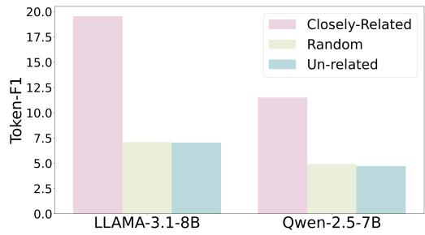
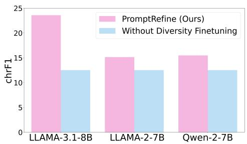
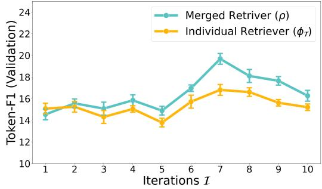
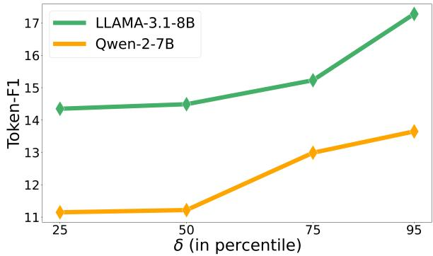
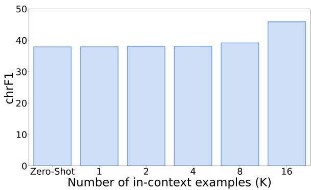

# PROMPTREFINE: Enhancing Few-Shot Performance on Low-Resource Indic Languages with Example Selection from Related Example Banks

Soumya Suvra Ghosal<sup>1</sup>\* and Soumyabrata Pal<sup>2</sup> and Koyel Mukherjee<sup>2</sup> and Dinesh Manocha<sup>1</sup>

<sup>1</sup>University of Maryland, College Park; <sup>2</sup>Adobe Research

## Abstract

Large Language Models (LLMs) have recently demonstrated impressive few-shot learning capabilities through in-context learning (ICL). However, ICL performance is highly dependent on the choice of few-shot demonstrations, making the selection of the most optimal examples a persistent research challenge. This issue is further amplified in low-resource Indic languages, where the scarcity of ground-truth data complicates the selection process. In this work, we propose PROMPTREFINE, a novel Alternating Minimization approach for example selection that improves ICL performance on low-resource Indic languages. PROMPTRE-FINE leverages auxiliary example banks from related high-resource Indic languages and employs multi-task learning techniques to align language-specific retrievers, enabling effective cross-language retrieval. Additionally, we incorporate diversity in the selected examples to enhance generalization and reduce bias. Through comprehensive evaluations on four text generation tasks—Cross-Lingual Question Answering, Multilingual Question Answering, Machine Translation, and Cross-Lingual Summarization using state-of-the-art LLMs such as LLAMA-3.1-8B, LLAMA-2-7B, Qwen-2- 7B, and Qwen-2.5-7B, we demonstrate that PROMPTREFINE significantly outperforms existing frameworks for retrieving examples.

## 1 Introduction

Large Language Models (LLMs) have recently made remarkable progress, demonstrating humanlevel performance across a wide range of tasks (Adiwardana et al., 2020; Wang et al., 2019). However, despite these advancements, most LLMs, such as LLaMA-3 (Dubey et al., 2024), LLaMA-2 (Touvron et al., 2023), and Qwen (Yang et al., 2024), are predominantly pre-trained on English texts, leading to significant performance disparities when applied to low-resource, non-English languages (Ahuja et al., 2023). The scarcity of groundtruth paired data in many low-resource languages makes text generation particularly challenging, as fine-tuning LLMs becomes infeasible in such settings. This issue is especially pronounced in lesserknown Indic languages such as Tibetan which has only around 5000 Wikipedia articles compared to 6.6M+ Wikipedia articles in English, despite having approximately 6M speakers. In this work, we focus on downstream generation tasks with lowresource Indic languages, a critical challenge for making LLMs more widely accessible.

When downstream tasks have limited labeled data, few-shot learning or in-context learning (ICL) has emerged as a powerful and practical approach for text generation (Tanwar et al., 2023; Zhang et al., 2021; Winata et al., 2021; Huang et al., 2023; Etxaniz et al., 2023). ICL operates by providing the LLM with a prompt that consists of task-specific instructions and a set of input-output examples (demonstrations) to guide the model’s output generation for a specific input query. While ICL is computationally efficient (it requires no parameter updates), it faces two critical challenges when labeled data is scarce, particularly for low-resource Indic languages.

(Relevance) First, as in any learning task with limited data, the small size of the available example pool can result in a lack of relevant examples to guide the model effectively. In the context of ICL, this scarcity can severely degrade performance, as the quality of examples is crucial. Poor example selection can lead to performance worse than zeroshot scenarios, while optimal selection can achieve near state-of-the-art results (Liu et al., 2021). (Diversity) Second, existing example selection techniques, such as random selection or retrieving semantically similar examples (Zhang et al., 2021; Winata et al., 2021; Tanwar et al., 2023), often struggle to account for diversity among the selected examples, which can further limit performance. An appropriate diverse set of selected examples in the prompt can improve generalization significantly.

Proposed Approach. In this work, we focus on an ICL approach for enhancing LLM performance in low-resource Indic languages. Specifically, our goal is to identify an optimal subset of guiding examples to be inserted into the prompt, without modifying the LLM parameters. Rather, we train retrievers to extract a near optimal set of examples (demonstrations) based on the input query. To this end, we propose a novel trainable approach PROMPTREFINE that combines examples from auxiliary example banks associated with the related task. While PROMPTREFINE is broadly applicable across different language families and even lowresource task clusters, in this study we focus on Indic languages (Singh et al., 2024), to enhance performance specifically on low-resource Indic languages through improved example selection.

Given a specific input text generation task in a low-resource Indic language, we use the following set of key ideas to enhance model performance (see Algorithm 1): 1) First, we utilize example banks from closely-related relatively high-resource <sup>2</sup> Indic languages to provide relevant guidance, improving LLM performance on low-resource tasks. Therefore, the first step in our algorithmic approach given an input low-resource task is to select relevant high-resource languages (see Algorithm 2) with associated example banks. 2) Second, merging these example banks is non-trivial, as each language-specific retriever is trained on a unique representation space. To address this, we adapt data-scarce multi-task learning techniques (Thekumparampil et al., 2021) to align the individual retrievers into a shared representation space, enabling cross-language retrieval. 3) Third, we incorporate diversity in the selected examples to improve generalization and reduce bias during generation.

To empirically validate the effectiveness of PROMPTREFINE, we evaluate its performance across four distinct text generation tasks on a subset of languages outlined in Singh et al. (2024): Cross-Lingual Question Answering (XorQA-In), Multilingual Question-Answering (XQuAD-In), Machine Translation (Flores-In), and Cross-Lingual Summarization (CrossSum-In), using recent LLMs such as LLAMA-3.1-8B (Dubey et al., 2024), LLAMA-2-7B (Touvron et al., 2023), Qwen-2- 7B (Yang et al., 2024), and Qwen-2.5-7B (Team, 2024). Our results demonstrate that PROMPTRE-FINE significantly improves generation performance in all tasks compared to baseline approaches for example selection. Specifically, using LLAMA-3.1-8B as the LLM, PROMPTREFINE achieves a Token-F1 improvement of +16.07 and +8.26 over zero-shot prompting and the current state-ofthe-art retriever (Ye et al., 2023), respectively, in the cross-lingual QA task. Similarly, using Qwen-2-7B, we observe an improvement in chrF1 of up to +7.77 on the machine translation task compared to the baseline of selecting semantically similar examples. To ensure a comprehensive evaluation, we also test PROMPTREFINE on proprietary LLMs such as GPT-3.5 and GPT-4 (OpenAI et al., 2024), where PROMPTREFINE outperforms baseline retrievers on translation task, aligning with our previous findings.

## 2 Related Works

In-Context Learning (ICL). First introduced in Brown (2020), ICL has emerged as a powerful approach that enables large language models (LLMs) to “learn by analogy” by providing a few input-output examples as demonstrations, without requiring any update to model parameters. In recent years, a plethora of studies have provided insights on the underlying mechanism of ICL. Saunshi et al. (2020) suggested that, by conditioning on a prompt, the task of predicting the next word becomes linearly separable, while Xie et al. (2021) observed that for ICL, the model infers a shared latent concept between the provided examples. A study pointed out that models do not rely as heavily on the provided input-output mappings as previously thought, indicating more nuanced learning dynamics in ICL (Min et al., 2022). Chen et al. (2022); Min et al. (2021); Wei et al. (2023a) showed that the in-context learning ability of LLMs can be improved through self-supervised or supervised training. A group of studies have also explored to understand the factors affecting ICL (Zhao et al., 2021; Shin et al., 2022; Wei et al., 2022a; Yoo et al., 2022; Wei et al., 2023b) and the underlying working mechanism of ICL (Olsson et al., 2022; Li et al., 2023b; Pan, 2023; Dai et al., 2022). Cahyawijaya et al. (2024) proposed query-alignment to improve the few-shot in-context learning performance of LLMs on low-resource languages.

Example Selection for ICL. Despite the tremendous success, the performance of ICL is sensitive to specific settings, including the prompt template (Wei et al., 2022b; Wang et al., 2022; Zhou et al., 2022; Zhang et al., 2022b), the selection (Liu et al., 2021; Rubin et al., 2021; Ye et al., 2023; Wang et al., 2024) and order of demonstration examples (Lu et al., 2021), and other factors (Liu et al., 2024). Existing literature on example selection can be broadly categorized into two major groups: (1) Unsupervised methods depending on pre-defined metrics. Liu et al. (2021) proposed selecting the closest neighbors as demonstrations, while Levy et al. (2022) observed that electing diverse demonstrations improves compositional generalization in ICL. Wu et al. (2022); Nguyen and Wong (2023); Li and Qiu (2023) explored using the output distributions of language models to select few-shot examples. (2) On the other hand, the other group of studies (Li et al., 2023a; Luo et al., 2023; Rubin et al., 2021; Ye et al., 2023) proposed fine-tuning a retriever model to select few-shot demonstrations. Recent works have also explored using reinforcement learning approaches (Zhang et al., 2022a; Scarlatos and Lan, 2023) and Chainof-thought reasoning (Qin et al., 2023) for example selection. In this study, we propose an alternating minimization approach for selecting the optimal set of in-context examples to enhance LLM performance on low-resource Indic languages.

## 3 Preliminaries

## 3.1 In-Context Learning

In-context learning (ICL) leverages the intrinsic abilities of language models to learn and infer new tasks without the need for parameter updates. Formally, let $\pi _ { \mathrm { L M } }$ be a language model with a vocabulary . Consider a downstream generation task with input space  and output space . For a given test query $\mathbf { x _ { \mathrm { t e s t } } } \in \mathcal { X }$ and a retrieved subset of K input-output pairs $\{ ( \mathbf { x } _ { i } , \mathbf { y } _ { i } ) \} _ { i = 1 } ^ { K } \in \mathcal { X } \times \mathcal { Y }$ describing the intended task, ICL generates the output $\mathbf { y _ { t e s t } } \in \mathcal { V }$ as follows:

$$
\mathbf { y } _ { \mathrm { t e s t } } \sim \pi _ { \mathrm { L M } } ( \cdot | \mathbf { x } _ { 1 } , \mathbf { y } _ { 1 } , \mathbf { x } _ { 2 } , \mathbf { y } _ { 2 } , \dots , \mathbf { x } _ { K } , \mathbf { y } _ { K } , \mathbf { x } _ { \mathrm { t e s t } } )
$$

Here,  represents the sampling techniques commonly used in the literature, such as Greedy Sampling, Top-p Sampling (Holtzman et al., 2019),

Top-k Sampling (Fan et al., 2018), and Beam Search (Freitag and Al-Onaizan, 2017). Each in-context example $a _ { i } ~ = ~ ( x _ { i } , y _ { i } ) ~ \in ~ \mathcal { X } \times \mathcal { Y }$ is drawn from a training set example bank $\mathcal { D } =$ $\{ ( \mathbf { x } _ { i } , \mathbf { y } _ { i } ) \} _ { i = 1 } ^ { N }$ of input-output sequences.

## 3.2 Example Retrieval for Few-shot learning

Our main goal is to train a retriever $\mathcal { R } _ { \phi } ( \mathbf { x } _ { \mathrm { t e s t } } , \mathcal { D } )$ model parameterized by ϕ, that retrieves a set of in-context examples $\{ a _ { i } \} _ { i = 1 } ^ { K } \subset \mathcal { D }$ given a test sample $\bf { x } _ { t e s t }$ where typically $K \ll N$ Usually, $\phi : ( \mathcal { X } \cup \mathcal { Y } ) ^ { \star }  \mathbb { R } ^ { d }$ represents<sup>3</sup> the embedding function that maps the text in the input space $\mathcal { X }$ into a d-dimensional vector representation. Such representations are subsequently used to measure similarity between samples. Previous works have explored various retrieval strategies, ranging from random example selection to using off-the-shelf retrieval models (Liu et al., 2021; Wu et al., 2022), as well as fine-tuning the retriever’s embeddings (Ye et al., 2023; Rubin et al., 2021).

Relevance Based Fine-tuning. In this study, we leverage the framework proposed by Rubin et al. (2021) to fine-tune an efficient dense retriever $\mathcal { R } _ { \phi }$ The core idea is to train the retriever on a labeled dataset curated from the training data itself, optimizing it to select examples that serve as effective prompts. For each sample $( \mathbf { x } , \mathbf { y } ) \in \mathcal { D }$ , we generate a candidate set $\mathcal { A } = \{ a _ { i } \} _ { i = 1 } ^ { F }$ , where $a _ { i } \in$ $\mathcal { D } \backslash ( \mathbf { x } , \mathbf { y } )$ . The candidate set is selected using an unsupervised BM25 retriever: $\mathcal { A } = \mathbf { B } \mathbf { M } 2 5 ( ( \mathbf { x } , \mathbf { y } ) , \mathcal { D } )$ that simply retrieves K examples with closest vector embedding to $\phi ( \mathbf { x } )$ . Next, each candidate example $\mathbf { a } _ { i } \in \mathcal A$ is scored using a language model $\pi _ { \mathrm { S c o r e r } }$ based on its relevance to the sample $\displaystyle ( \mathbf { x } , \mathbf { y } )$

$$
s ( \mathbf { a } _ { i } ; ( \mathbf { x } , \mathbf { y } ) ) = \pi _ { \mathrm { S c o r e r } } ( \mathbf { y } \mid \mathbf { a } _ { i } , \mathbf { x } ) .\tag{1}
$$

The best candidate example for the sample $\displaystyle ( \mathbf { x } , \mathbf { y } )$ is selected as $\widetilde { \mathbf { a } } =$ arg $\operatorname* { m a x } _ { \mathbf { a } _ { j } } s ( \mathbf { a } _ { j } ; ( \mathbf { x } , \mathbf { y } ) )$ . Finally, the retriever $\mathcal { R } _ { \phi }$ is fine-tuned to rank the candidate examples optimally (align with ranking induced by $\pi _ { \mathrm { S c o r e r } } )$ by minimizing the negative log-likelihood under softmax loss:

$$
\operatorname* { m i n } _ { \phi } \mathcal { L } _ { \mathrm { r e l } } ( \mathcal { D } ; \phi ) = \frac { 1 } { N } \sum _ { i = 1 } ^ { N } \ell ( \mathbf { x } _ { i } , \mathcal { A } _ { i } )\tag{2}
$$

$$
\ell ( \mathbf { x } , \mathcal { A } ; \boldsymbol { \phi } ) = - \mathrm { l o g } \frac { e ^ { \mathrm { s i m } ( \mathbf { x } , \widetilde { \mathbf { a } } ) } } { \sum _ { \mathbf { a } _ { i } \in \mathcal { A } } e ^ { \mathrm { s i m } ( \mathbf { x } _ { i } , \mathbf { a } _ { i } ) } }\tag{3}
$$

where sim $( { \bf a } _ { i } , { \bf a } _ { j } ) = \phi ( { \bf a } _ { i } ) ^ { \top } \phi ( { \bf a } _ { j } )$ measures the cosine similarity between the embeddings. Note, that although a fine-tuned $\mathcal { R } _ { \phi }$ is better aligned with the ranking induced by $\pi _ { \mathrm { S c o r e r } } ,$ it only optimizes for relevance and does not account for diversity. This often leads the finetuned retriever to choose near-identical samples thus hurting generalization.

## 3.3 Determinantal Point Processes

In this subsection, we introduce a recently studied framework Determinantal Point Processes (DPPs) (Ye et al., 2023) for example selection that ranks subsets of examples rather than individual ones. Introduced in Macchi (1975), $\mathrm { D P P } \mathbf { s }$ are elegant probabilistic models that have been extensively used in the literature (Ye et al., 2023; Borodin and Olshanski, 2000; Benard and Macchi, 1973; Kulesza et al., 2012; Liu et al., 2022) to capture negative correlation among items.

We leverage the DPP framework to promote diversity within the set of retrieved in-context examples. Formally, a point process $\mathcal { P }$ is called a DPP if, for any random subset $Y$ drawn according to ${ \mathcal P } _ { \mathrm { { : } } }$ the probability that a subset $S$ is contained within $Y$ is given by:

$$
{ \mathcal { P } } ( S \subseteq Y ) \propto \operatorname* { d e t } ( \mathbf { Z } _ { S } )
$$

where $\mathbf { Z } \in \mathbb { R } ^ { n \times n }$ is a PSD similarity matrix, and $\mathbf { Z } _ { S }$ denotes the submatrix of K corresponding to the rows and columns indexed by S. For in-context learning, given a test sample $\bf { x } _ { t e s t }$ , the input dependent similarity of any two examples $\mathbf { a } _ { i } , \mathbf { a } _ { j }$ is denoted by $\mathbf { Z } _ { i j }$ - formally, we model log $\mathbf { Z } _ { i j }$ as

$$
\sum _ { k \in \{ i , j \} } \log { \phi ( \mathbf { a } _ { k } ) ^ { T } \phi ( \mathbf { x } _ { \mathrm { t e s t } } ) } + \log { \phi ( \mathbf { a } _ { i } ) ^ { \top } \phi ( \mathbf { a } _ { j } ) }
$$

where $\phi ( \mathbf { a } _ { i } ) ^ { T } \phi ( \mathbf { x } _ { \mathrm { t e s t } } ) \ \in \ \mathbb { R } ^ { + }$ measures the relevance of ${ \bf a } _ { i }$ to input $\bf { x } _ { \mathrm { t e s t } }$ and $\phi ( \mathbf { a } _ { i } ) ^ { T } \phi ( \mathbf { a } _ { j } )$ measures the similarity between the $i ^ { \mathrm { t h } }$ and $j ^ { \mathrm { t h } }$ example.

## 4 Proposed Framework

Problem Setup. Despite the growing focus on evaluating the multilingual capabilities of large language models (LLMs), there remains a substantial performance gap between high-resource languages and those with limited web resources (Ahuja et al., 2023; Singh et al., 2024). In this study, we aim to address this gap by enhancing the few-shot performance of low-resource Indic languages. To this end, we adopt the recently released IndicGen Benchmark (Singh et al., 2024), targeting a subset of Indic languages for our analysis. Specifically, we focus on the following low-resource languages:

```tcl
Algorithm 1 PROMPTREFINE
1: Input: Low-resource language example
bank $\mathcal { D } ^ { \tau } ;$ validation set $\mathcal { D } _ { \mathrm { v a l } } ^ { \breve { T } } ;$ Auxiliary exam
ple bank $\mathcal { D } ^ { \mathrm { a u x } } = \{ \mathcal { D } ^ { \mathcal { H } _ { 1 } } , \cdots , \mathcal { D } ^ { \mathcal { H } _ { M } } \}$ , number
of iterations $\mathcal { T } ,$ Accuracy Metric Acc.
2: $\alpha  \emptyset$
3: $\rho \gets \mathbf { M B E R T }$ ▷ Initialize
the retriever embedding with pre-trained Multi
lingual BERT encoder
4: for iter in $\{ 1 , \cdots ,  { \mathcal { T } } \}$ do
5: $\Phi  \emptyset$
6: for each dataset $\mathcal { D } ^ { i }$ ∈
$\{ \mathcal { D } ^ { T } , \mathcal { D } ^ { \mathcal { H } _ { 1 } } , \cdot \cdot \cdot , \mathcal { D } ^ { \mathcal { H } _ { M } } \}$ do
7: $\begin{array} { r } { \phi _ { i }  \operatorname* { m i n } _ { \rho } \mathcal { L } _ { \mathrm { r e l } } ( \mathcal { D } ^ { i } ; \rho ) } \end{array}$
8: $\Phi  \Phi \cup \phi _ { i }$
9: end for
10: $\begin{array} { r } { \rho = \frac { 1 } { | \Phi | } \sum _ { \theta \in \Phi } \theta } \end{array}$ ▷ Merge the retriever
embeddings
11: $\alpha _ { \mathrm { i t e r } }  \mathrm { A c c } ( \rho , \mathcal { D } _ { \mathrm { v a l } } ^ { \mathcal { T } } )$ ▷ Calculate
validation accuracy
12: $\alpha  \alpha \cup \alpha _ { \mathrm { i t e r } }$
13: end for
14: $\rho ^ { * } \gets \arg \operatorname* { m a x } _ { \rho } \alpha _ { \mathrm { i t e r } }$
15: $\bar { \rho } \gets \operatorname* { m i n } \mathcal { L } _ { \mathrm { D P P } } ( \mathcal { D } ^ { T } \cup \mathcal { D } ^ { \mathrm { a u x } } ; \rho ^ { * } )$
16: return $\bar { \rho }$
```

Low/Mid-Resource Languages: Bodo,   
Odia, Santali, Rajasthani, Manipuri,   
Awadhi, Marwari, and Maithili.   
Auxiliary High-Resource Languages:   
Bengali, Hindi, Marathi, Gujarati, Kannada,   
Malayalam, Tamil, Telugu, Urdu.

Additionally, we assume the availability of data from relatively high-resource Indic languages, which we refer to as the auxiliary dataset. This assumption is justified by the fact that these languages have relatively ample web-text resources (Singh et al., 2024).

## 4.1 Our Approach: PROMPTREFINE

To enhance the performance of language models on low-resource languages, we introduce PROMPTRE-FINE, a three-step framework that: 1) identifies closely related high-resource Indic languages and leverages associated example banks (Section 4.1.1), 2) iteratively refines retriever embeddings $\mathcal { R } _ { \phi }$ (Section 4.1.2), and 3) incorporates diversity-based finetuning of retriever $\mathcal { R } _ { \phi }$ to rank subsets of in-context examples for a given input query (Section 4.1.3). The complete approach is outlined in Algorithm 1. In what follows, we provide an in-depth overview of each component.

## 4.1.1 Auxiliary Dataset Selection

Despite the advent of numerous LLMs, lowresource Indic languages constitute only a negligible portion of their pre-training corpora, resulting in a suboptimal performance for generation tasks in these languages. To address this, we propose using relatively high-resource Indic languages, such as Hindi and Bengali, as auxiliary datasets. Our approach involves selecting auxiliary languages that are closely related to the target Indic low-resource language. Specifically, for each low-resource language, we compute the cosine similarity between the embeddings and those of the auxiliary languages. An auxiliary language is included if its similarity score surpasses a threshold parameter $\delta ,$ as outlined in Algorithm 2 (Appendix H). The underlying motivation for this approach is that for an input query in a low-resource Indic language, relevant examples that can guide the LLM in generation might not be present in the associated example bank - therefore, by incorporating examples from the related high-resource languages, we provide the LLM additional context or rather relevant guidance that can help improve the model’s performance on the input query. However, the following critical challenge is now raised: "How can we effectively integrate the diverse information from auxiliary datasets for optimal performance?"

## 4.1.2 Iterative Prompt Refinement

We denote the example bank of the low-resource target language $\tau$ as $\mathcal { D } ^ { T } = \{ ( \mathbf { x } _ { i } , \mathbf { y } _ { i } ) \} _ { i = 1 } ^ { N }$ , the selected set of auxiliary languages (using Alg. 2) as $\mathcal { H } = \{ \mathcal { H } _ { 1 } , \cdots , \mathcal { H } _ { M } \}$ and the auxiliary example banks as $\mathcal { D } ^ { \mathrm { a u x } } = \{ \mathcal { D } ^ { \mathcal { H } _ { 1 } } , \cdot \cdot \cdot , \mathcal { D } ^ { \mathcal { H } _ { M } } \}$ . Note that the number of high-resource auxiliary example banks M is determined by the threshold parameter $\delta ,$ as defined in Section 4.1.1. Our goal is to train a single retriever $\mathcal { R } _ { \rho } ( \mathbf { x } _ { \mathrm { t e s t } } , { \mathcal { D } } ^ { \mathrm { a u x } } \cup { \mathcal { D } } ^ { T } )$ - however the challenge is both the shared representation space for all example banks combined and the parameter weights $\phi$ are unknown. At the same time, the retriever must capture the specific traits of each individual language. Balancing these requirements requires an alternating optimization procedure.

To maximize the information gain from the auxiliary example banks, we propose an Alternating Minimization (AM) framework that alternately performs the following two steps successively until convergence 1) (Specialize) Fine-tune relevancebased retrievers $\{ \mathcal { R } _ { \phi _ { i } } \} _ { i }$ on each of several selected languages by retraining only on the example bank associated with the corresponding language (Step 7 in Alg. 1). Intuitively, the goal of this step is to allow a particular retriever to acquire task / language-specific knowledge associated with the corresponding language. Note that each of the individual retrievers $\{ \mathcal { R } _ { \phi _ { i } } \} _ { i }$ <sub>i</sub> is initialized with pretrained multilingual BERT encoder weights at the beginning of first iteration - in subsequent iterations, all the individual retrievers are initialized with shared parameter weights $\rho$ computed in the next step 2) (Merge) merges the individual retrievers $\{ \mathcal { R } _ { \phi _ { i } } \} .$ <sub>i</sub> into a single retriever $\mathcal { R } _ { \rho }$ by simple parameter averaging to obtain a shared representation space enabling cross-language retrieval (Step 10 in Alg. 1). Intuitively, the shared retriever $\mathcal { R } _ { \rho }$ encapsulates the diverse knowledge learnt by each individual retriever.

In essence, our alternating minimization algorithm (Alg. 1) alternately finetunes the individual retriever on language-specific example bank and creates a merged retriever enabling a shared representation space for iterations. We denote the model with the highest validation accuracy on the target language $\tau$ after  iterations as $\rho ^ { * }$ (Step 11 in Alg. 1).

## 4.1.3 Divsersity-induced finetuning

A major limitation of relevance-based finetuning is that the in-context examples are retrieved solely based on relevance, thereby ignoring diversity and inter-relationship among the selected examples (Ye et al., 2023). To overcome this challenge, we leverage the DPP framework to enhance diversity within the retrieved in-context examples. Specifically, we obtain the final retriever model by fine-tuning $\rho ^ { * }$ on the merged dataset $\mathcal { \tilde { D } } = \mathcal { D } ^ { \mathcal { T } } \cup \mathcal { D } ^ { \mathrm { a u x } }$ . Due to ethe technically involved training procedure of the DPP framework via contrastive learning, we delegate the training details to the Appendix D. Note that during inference, we use the retriever model further fine-tuned in the DPP framework to retrieve both diverse and relevant samples (Ye et al., 2023). Specifically, we perform MAP inference using the model within the DPP framework - however exact MAP inference is NP-Hard (Ko et al., 1995) since it involves an exact search over an exponentially large collection of subsets of examples. However, in our setting, we can use a greedy but computationally efficient procedure to build the subset by inserting one example at a time (Chen et al., 2018).

<table><tr><td rowspan="2">Aux. Data Used</td><td rowspan="2">Finetuning- Based</td><td rowspan="2">Methods</td><td colspan="3">Bodo</td><td colspan="3">Manipuri</td><td colspan="3">Maithili</td></tr><tr><td>QW-2-7B</td><td>QW-2.5-7B</td><td>LM-3.1-8B</td><td>QW-2-7B</td><td>QW-2.5-7B</td><td>LM-3.1-8B</td><td>QW-2-7B</td><td>QW-2.5-7B</td><td>LM-3.1-8B</td></tr><tr><td>x</td><td>x</td><td>Zero-shot</td><td>0.68</td><td>0.21</td><td>1.20</td><td>0.68</td><td>0.44</td><td>0.97</td><td>3.41</td><td>2.72</td><td>13.05</td></tr><tr><td>x</td><td>x</td><td>Random</td><td>4.57</td><td>4.02</td><td>5.83</td><td>4.72</td><td>3.80</td><td>6.10</td><td>13.97</td><td>12.02</td><td>18.73</td></tr><tr><td>x</td><td>x</td><td>BM25</td><td>6.20</td><td>6.47</td><td>9.41</td><td>5.68</td><td>4.14</td><td>6.98</td><td>13.21</td><td>11.77</td><td>20.15</td></tr><tr><td>x</td><td>x</td><td>Top-K</td><td>5.90</td><td>6.37</td><td>5.10</td><td>5.80</td><td>4.21</td><td>6.08</td><td>13.25</td><td>12.95</td><td>18.02</td></tr><tr><td>x</td><td>x</td><td>Diverse</td><td>5.88</td><td>5.92</td><td>5.34</td><td>5.54</td><td>4.09</td><td>5.98</td><td>13.27</td><td>12.53</td><td>18.29</td></tr><tr><td>x</td><td>√</td><td>EPR</td><td>6.29</td><td>7.15</td><td>7.81</td><td>6.40</td><td>4.91</td><td>7.22</td><td>14.85</td><td>14.03</td><td>20.18</td></tr><tr><td>x</td><td>√</td><td>CEIL</td><td>7.83</td><td>7.33</td><td>8.20</td><td>6.73</td><td>6.17</td><td>9.33</td><td>16.80</td><td>15.72</td><td>21.96</td></tr><tr><td>√</td><td>√</td><td>EPR</td><td>6.61</td><td>7.99</td><td>7.98</td><td>6.34</td><td>4.58</td><td>7.18</td><td>14.27</td><td>13.70</td><td>19.71</td></tr><tr><td>√</td><td>√</td><td>CEIL</td><td>7.95</td><td>8.07</td><td>9.01</td><td>6.62</td><td>6.09</td><td>9.28</td><td>16.84</td><td>15.49</td><td>22.38</td></tr><tr><td>√</td><td>√</td><td>PROMPTREFINE (Ours)</td><td>13.68</td><td>11.40</td><td>17.27</td><td>12.79</td><td>11.50</td><td>19.54</td><td>24.56</td><td>23.37</td><td>25.59</td></tr><tr><td colspan="2"></td><td>Absolute Gain (∆)</td><td>+6.05</td><td>+3.33</td><td>+8.26</td><td>+6.17</td><td>+5.33</td><td>+10.21</td><td>+7.76</td><td>+7.65</td><td>+3.21</td></tr></table>

Table 1: Evaluation on XorQA-In. We report Token-F1 results for performance on Bodo, Manipuri and Maithili. The evaluation includes three LLMs: Qwen-2-7B (QW-2-7B), Qwen-2.5-7B (QW-2.5-7B), and LLAMA-3.1-8B (LM-3.1-8B).
<table><tr><td rowspan="2">Aux. Data Used</td><td rowspan="2">Finetuning- based</td><td rowspan="2">Methods</td><td colspan="3">Santali → English</td><td colspan="3">Rajasthani → English</td><td colspan="3">Manipuri → English</td></tr><tr><td>LM-2-7B</td><td>LM-3.1-8B</td><td>QW-2-7B</td><td>LM-2-7B</td><td>LM-3.1-8B</td><td>QW-2-7B</td><td>LM-2-7B</td><td>LM-3.1-8B</td><td>QW-2-7B</td></tr><tr><td>x</td><td>x</td><td>Zero-shot</td><td>5.89</td><td>16.83</td><td>9.95</td><td>21.94</td><td>37.90</td><td>34.09</td><td>10.62</td><td>14.40</td><td>10.04</td></tr><tr><td>x</td><td>x</td><td>Random</td><td>8.54</td><td>16.92</td><td>10.85</td><td>22.08</td><td>37.69</td><td>37.45</td><td>11.96</td><td>16.57</td><td>11.87</td></tr><tr><td>x</td><td>x</td><td>BM25</td><td>9.77</td><td>17.55</td><td>11.60</td><td>24.35</td><td>36.62</td><td>36.92</td><td>11.67</td><td>17.81</td><td>12.18</td></tr><tr><td>x</td><td>x</td><td>Top-K</td><td>9.98</td><td>18.66</td><td>11.98</td><td>25.12</td><td>38.33</td><td>37.05</td><td>11.81</td><td>17.40</td><td>14.93</td></tr><tr><td>x</td><td>x</td><td>Diverse</td><td>8.86</td><td>18.67</td><td>11.64</td><td>24.88</td><td>39.12</td><td>38.13</td><td>12.44</td><td>18.13</td><td>13.82</td></tr><tr><td>x</td><td>√</td><td>EPR</td><td>10.35</td><td>18.59</td><td>12.09</td><td>25.99</td><td>40.09</td><td>37.97</td><td>13.90</td><td>18.99</td><td>18.79</td></tr><tr><td>x</td><td>√</td><td>CEIL</td><td>10.68</td><td>18.41</td><td>12.20</td><td>26.04</td><td>41.85</td><td>38.77</td><td>14.02</td><td>19.53</td><td>19.47</td></tr><tr><td>√</td><td>√</td><td>EPR</td><td>10.27</td><td>18.73</td><td>12.38</td><td>25.77</td><td>41.60</td><td>38.30</td><td>13.88</td><td>18.82</td><td>20.18</td></tr><tr><td>√</td><td>√</td><td>CEIL</td><td>10.63</td><td>17.90</td><td>13.01</td><td>25.72</td><td>41.93</td><td>40.04</td><td>14.15</td><td>18.97</td><td>20.23</td></tr><tr><td>√</td><td>√</td><td>PROMPTREFINE Ours)</td><td>15.14</td><td>23.58</td><td>15.48</td><td>31.75</td><td>45.88</td><td>43.43</td><td>18.69</td><td>23.90</td><td>22.70</td></tr><tr><td></td><td></td><td>Absolute Gain (∆)</td><td>+4.48</td><td>+4.85</td><td>+2.47</td><td>+5.71</td><td>+3.95</td><td>+3.39</td><td>+4.54</td><td>+4.37</td><td>+3.27</td></tr></table>

Table 2: Evaluation on Flores-In. We report chrF1 results for translation performance from three low-resource languages to English. The evaluation includes three LLMs: LLAMA-2-7B (LM-2-7B), LLAMA-3.1-8B (LM-3.1-8B), and Qwen-2-7B (QW-2-7B).

## 5 Experiments

Implementation Details. In this study, we evaluate the multilingual and cross-lingual language generation capabilities of various LLMs on lowresource Indic languages mentioned in Section 4. Our experiments involve a range of recently released open-source LLMs, including Qwen-2- 7B (Yang et al., 2024), Qwen-2.5-7B (Team, 2024), LLAMA-2-7B (Touvron et al., 2023), and LLAMA-3.1-8B (Dubey et al., 2024), as well as proprietary models such as GPT-3.5 and GPT-4 (OpenAI et al., 2024). For open-source LLMs, we use the same model for scoring (π<sub>Scorer</sub>) and inference (π<sub>LM</sub>). For all experiments, we set the number of in-context examples as K = 16. Following previous literature (Ye et al., 2023; Rubin et al., 2021), we sort the in-context examples in ascending order of their similarity to the input text.

In our proposed approach, PROMPTREFINE, the retriever embeddings are initialized using a pretrained multilingual BERT encoder<sup>4</sup>. For finetuning, we use an Adam optimizer with a batch size of 64 and a learning rate of 1e 4. For relevancebased training, we fine-tune the model for  = 10 iteration with 120 epochs in each iteration. We further fine-tune for 10 epochs during DPP-based training. All experiments are run using the configurations listed in Appendix A.

Baselines. In this work, we introduce PROMPTRE-FINE, a fine-tuning-based retrieval framework designed to enhance in-context example selection for low-resource Indic languages. For a comprehensive evaluation, we compare PROMPTREFINE with fine-tuning-free retrievers such as Random, BM25 (Robertson et al., 2009), Top-K, and Diverse. Among fine-tuning-based retrievers, we benchmark against EPR (Rubin et al., 2021) and CEIL (Ye et al., 2023). We refer the reader to Appendix E for a detailed description of the baselines used in this study.

Datasets. We evaluate PROMPTREFINE on four diverse tasks, as outlined in Singh et al. (2024), to comprehensively assess its retrieval capabilities for low-resource Indic languages. These tasks include Cross-Lingual Question Answering (XorQA-In-

<table><tr><td rowspan="2">Aux. Data Used</td><td rowspan="2">Finetuning- Based</td><td rowspan="2">Methods</td><td colspan="2">Rajasthani</td><td colspan="2">一 Manipuri</td><td colspan="2">Marwari</td><td colspan="2">Awadhi</td></tr><tr><td>LM-3.1-8B</td><td>QW-2-7B</td><td>LM-3.1-8B</td><td>QW-2-7B</td><td>LM-3.1-8B</td><td>QW-2-7B</td><td>LM-3.1-8B</td><td>QW-2-7B</td></tr><tr><td>x</td><td>x</td><td>Zero-shot</td><td>1.10</td><td>3.06</td><td>0.15</td><td>0.36</td><td>0.16</td><td>2.09</td><td>0.19</td><td>2.16</td></tr><tr><td>x</td><td>x</td><td>Random</td><td>8.38</td><td>5.93</td><td>3.14</td><td>3.88</td><td>7.38</td><td>6.05</td><td>9.10</td><td>4.20</td></tr><tr><td>x</td><td>x</td><td>BM25</td><td>7.86</td><td>5.85</td><td>3.52</td><td>3.92</td><td>7.81</td><td>5.54</td><td>8.40</td><td>4.83</td></tr><tr><td>x</td><td>x</td><td>Top-K</td><td>11.03</td><td>6.08</td><td>4.43</td><td>4.50</td><td>8.91</td><td>5.91</td><td>9.36</td><td>6.07</td></tr><tr><td>x</td><td>x</td><td>Diverse</td><td>10.77</td><td>6.21</td><td>4.39</td><td>4.68</td><td>8.93</td><td>5.78</td><td>9.05</td><td>6.11</td></tr><tr><td>x</td><td>√</td><td>EPR</td><td>11.25</td><td>7.16</td><td>5.11</td><td>5.13</td><td>9.33</td><td>6.32</td><td>10.59</td><td>6.44</td></tr><tr><td>x</td><td>√</td><td>CEIL</td><td>11.93</td><td>7.39</td><td>5.49</td><td>5.92</td><td>10.49</td><td>6.70</td><td>11.92</td><td>7.02</td></tr><tr><td>V</td><td>√</td><td>EPR</td><td>11.22</td><td>7.09</td><td>5.08</td><td>5.59</td><td>9.11</td><td>6.25</td><td>11.36</td><td>6.58</td></tr><tr><td>√</td><td>√</td><td>CEIL</td><td>11.50</td><td>7.28</td><td>5.71</td><td>6.04</td><td>10.20</td><td>6.67</td><td>12.41</td><td>7.33</td></tr><tr><td>√</td><td>√</td><td>PROMPTREFINE (Ours)</td><td>15.88</td><td>9.43</td><td>6.67</td><td>6.92</td><td>15.95</td><td>8.06</td><td>15.36</td><td>8.49</td></tr><tr><td></td><td></td><td>Absolute Gain (∆)</td><td>+3.95</td><td>+2.04</td><td>+0.96</td><td>+0.88</td><td>+5.46</td><td>+1.36</td><td>+2.95</td><td>+1.47</td></tr></table>

Table 3: Evaluation on CrossSum-In. We report chrF1 results for the summarization performance of an English text into four low-resource languages. The evaluation includes two recent LLMs: LLAMA-3.1-8B (LM-3.1-8B), and Qwen-2-7B (QW-2-7B).

  
Figure 1: Token-F1 evaluation on the cross-lingual QA task in Manipuri, with retrievers trained using different auxiliary high-resource example banks: (1) Closely related language, (2) Random language, and (3) Unrelated language.

XX), Multilingual Question Answering (XQuAD-IN), Machine Translation (Flores-In-XX-En), and Cross-Lingual Summarization (CrossSum-IN). We refer the reader to Appendix F for a detailed description of the datasets used in this study. We present the prompt template used for different datasets in Table 6 (Appendix).

Evaluation Metrics. Following prior work (Singh et al., 2024), we report the Character-F1 (chrF1) metric (Popovic´, 2015; Gala et al., 2023) for cross-lingual summarization and translation tasks, as token-level metrics like ROUGE and BLEU are considered unreliable for low-resource languages (Bapna et al., 2022; Singh et al., 2024). For QA tasks (XQuAD-IN and XorQA-IN), we use the Token-F1 metric to maintain consistency with the existing literature (Singh et al., 2024).

## 5.1 Main Results

Evaluation on open-source LLMs. We present the evaluation results on state-of-art open-source models, including LLAMA-3.1-8B, LLAMA-2-7B, Qwen-2-7B, and Qwen-2.5-7B, for Cross-Lingual QA task (Table 1), Machine Translation task (Table 2), Cross-lingual Summarization task (Table 3), and Multi-lingual QA task (Table 4). Our empirical findings yield several key insights: (1) Across all diverse tasks, PROMPTREFINE consistently outperforms both finetuning-based and finetuning-free baselines, with a improvement of up to 2.09x compared to current state-of-art. Notably, for Crosslingual QA task, for Manipuri, PROMPTREFINE improves the Token-F1 by +10.21 over CEIL (Ye et al., 2023). (2) Compared to fine-tuning free baselines such as Top-K, PROMPTREFINE provides a staggering improvement of upto 3.38x on low-resource language such as Bodo. Further, when compared to finetuning-based retrievers like EPR (Rubin et al., 2021) and CEIL, PROMPTRE-FINE consistently delivers superior performance across all tasks, as exemplified by a +3.21 Token-F1 improvement on Maithili. (3) Interestingly, even when auxiliary datasets are available, other finetuning-based retrievers such as EPR (Rubin et al., 2021) and CEIL (Ye et al., 2023) do not exhibit significant improvements. This finding highlights the importance of learning a better representation space to effectively integrate and leverage auxiliary data. In contrast, PROMPTREFINE successfully utilizes auxiliary data to generate a richer set of in-context examples, as reflected by its substantial performance gains across multiple tasks.

Evaluation on proprietary LLMs. To ensure a comprehensive evaluation, we also test PROMPTREFINE on proprietary LLMs such as GPT-3.5/4 (OpenAI et al., 2024). However, since we do not have access to the output logits in proprietary models, required for scoring candidate examples, we use a different open-source LLM architecture for scoring. To be specific, for this experiment, we employ LLAMA-3.1-8B as the scorer model π<sub>Scorer</sub>. The results for the translation task are reported in Table 5 (Appendix). Consistent with our findings using open-source LLMs, PROMPTRE-

  
Figure 2: To highlight the importance of DPP training, we compare the quality of responses generated with and without diversity-induced fine-tuning on the task of translating from Santali to English.

FINE significantly improves generation quality, as measured by chrF1, compared to other retrieval methods.

## 6 Discussion

Note, ablation studies on threshold parameter δ for selecting related languages and number of ICL examples are deferred to Appendix C.

Why is choosing a closely related auxiliary example bank important? In Section 4.1.1, we discussed the approach of selecting a closely related high-resource Indic language as an auxiliary example bank for a target low-resource language. To highlight importance of selecting the right set of related languages, we present ablation studies in this section.

We evaluate three setups: (1) Our method (Alg. 2) of selecting the most closely related language as the auxiliary example bank, (2) selecting a random language, and (3) selecting the most unrelated language. We show the few-shot performance on cross-lingual QA task in Figure 1, with retrievers trained under each setup. Our findings show that: (1) As expected, using the most closely related language as the auxiliary example bank yields the best performance, as it provides relevant guidance to the LLM, and (2) Selecting a random or unrelated language results in little to no improvement, with performance remaining close to the relevancebased EPR baseline (Rubin et al., 2021) that only uses target-language specific data.

Importance of Diversity-Induced Fine-Tuning. A key factor contributing to the improved performance of PROMPTREFINE is the retrieval of a diverse set of in-context examples. Merging auxiliary example banks imply a larger overall example bank and therefore incorporating diversity during example selection becomes important to improve generalization. In this section, we empirically demonstrate the significance of diversity-induced fine-tuning (Section 4.1.3). Figure 2 compares the text generation quality in Santali-to-English translation task, where examples are selected using two retriever models namely our approach PROMPTRE-FINE with and with-out diversity-induced finetuning - in the latter, we skip line 15 in Alg. 1. Results clearly show that incorporating diversity training leads to performance improvements across different LLMs, underscoring its effectiveness.

  
Figure 3: We plot the validation accuracy (measured by Token-F1) obtained by individual and merged retrievers over different iterations of finetuning.

Importance of Alternating-Minimization approach. In Section 4.1.2, we proposed an alternating minimization approach to alternately fine-tune the retriever on language-specific data and merge the parameters in order to learn a shared representation space that captures the knowledge associated with both the target language  and the auxiliary languages . In Figure 3, we plot the validation accuracy across different iterations for the merged retriever ρ and the target language retriever ϕ . The results show that merging the retriever embeddings provides a significant boost in validation accuracy over the iterations, thereby justifying the effectiveness of the parameter-averaging strategy.

## 7 Conlusion

The pre-training data for state-of-the-art LLMs (Dubey et al., 2024; Yang et al., 2024) predominantly comprises English text, resulting in suboptimal performance on low-resource Indic languages (Singh et al., 2024). To address this, we propose a novel Alternating Minimization approach PROMPTREFINE for example selection that improves ICL performance on low-resource Indic languages. Our approach follows a threestep framework: (1) identifying closely related high-resource Indic languages and utilizing their example banks, (2) iteratively refining retriever embeddings, and (3) employing diversity-based finetuning to rank subsets of in-context examples for a given input query. Comprehensive testing across various tasks and LLMs demonstrates that PROMPTREFINE significantly enhances text generation quality on low-resource Indic languages.

## 8 Limitations

In Section 5.1, we demonstrated the effectiveness of our proposed framework across diverse tasks. However, PROMPTREFINE has the following limitations:

• To improve text generation quality in lowresource Indic languages, PROMPTREFINE depends on the availability of example banks from closely related, relatively high-resource Indic languages to provide additional context. We believe this is a reasonable assumption, as publicly available web-text resources are accessible for high-resource languages.

• As explained in Algorithm 1, our proposed approach involves three key steps: (1) identifying closely related example banks, (2) iterative refinement of retriever embeddings, and (3) diversity-based finetuning. These steps could have been arranged in several different configurations. However, we empirically tested several alternatives and found that our proposed approach consistently delivers the best performance improvements.

## References

Daniel Adiwardana, Minh-Thang Luong, David R So, Jamie Hall, Noah Fiedel, Romal Thoppilan, Zi Yang, Apoorv Kulshreshtha, Gaurav Nemade, Yifeng Lu, et al. 2020. Towards a human-like open-domain chatbot. arXiv preprint arXiv:2001.09977.

Sanchit Ahuja, Divyanshu Aggarwal, Varun Gumma, Ishaan Watts, Ashutosh Sathe, Millicent Ochieng, Rishav Hada, Prachi Jain, Maxamed Axmed, Kalika Bali, et al. 2023. Megaverse: Benchmarking large language models across languages, modalities, models and tasks. arXiv preprint arXiv:2311.07463.

Ankur Bapna, Isaac Caswell, Julia Kreutzer, Orhan Firat, Daan van Esch, Aditya Siddhant, Mengmeng Niu, Pallavi Baljekar, Xavier Garcia, Wolfgang Macherey, et al. 2022. Building machine translation systems for the next thousand languages. arXiv preprint arXiv:2205.03983.

Christine Benard and Odile Macchi. 1973. Detection and“emission”processes of quantum particles

in a“chaotic state”. Journal of mathematical physics, 14(2):155–167.

Alexei Borodin and Grigori Olshanski. 2000. Distributions on partitions, point processes, and the hypergeometric kernel. Communications in Mathematical Physics, 211:335–358.

Tom B Brown. 2020. Language models are few-shot learners. arXiv preprint arXiv:2005.14165.

Samuel Cahyawijaya, Holy Lovenia, and Pascale Fung. 2024. Llms are few-shot in-context low-resource language learners. arXiv preprint arXiv:2403.16512.

Laming Chen, Guoxin Zhang, and Hanning Zhou. 2018. Fast greedy map inference for determinantal point process to improve recommendation diversity. Preprint, arXiv:1709.05135.

Mingda Chen, Jingfei Du, Ramakanth Pasunuru, Todor Mihaylov, Srini Iyer, Veselin Stoyanov, and Zornitsa Kozareva. 2022. Improving in-context few-shot learning via self-supervised training. arXiv preprint arXiv:2205.01703.

Damai Dai, Yutao Sun, Li Dong, Yaru Hao, Shuming Ma, Zhifang Sui, and Furu Wei. 2022. Why can gpt learn in-context? language models implicitly perform gradient descent as meta-optimizers. arXiv preprint arXiv:2212.10559.

Abhimanyu Dubey, Abhinav Jauhri, Abhinav Pandey, Abhishek Kadian, Ahmad Al-Dahle, Aiesha Letman, Akhil Mathur, Alan Schelten, Amy Yang, Angela Fan, et al. 2024. The llama 3 herd of models. arXiv preprint arXiv:2407.21783.

Julen Etxaniz, Gorka Azkune, Aitor Soroa, Oier Lopez de Lacalle, and Mikel Artetxe. 2023. Do multilingual language models think better in english? arXiv preprint arXiv:2308.01223.

Angela Fan, Mike Lewis, and Yann Dauphin. 2018. Hierarchical neural story generation. arXiv preprint arXiv:1805.04833.

Markus Freitag and Yaser Al-Onaizan. 2017. Beam search strategies for neural machine translation. arXiv preprint arXiv:1702.01806.

Jay Gala, Pranjal A. Chitale, Raghavan AK, Varun Gumma, Sumanth Doddapaneni, Aswanth Kumar, Janki Nawale, Anupama Sujatha, Ratish Puduppully, Vivek Raghavan, Pratyush Kumar, Mitesh M. Khapra, Raj Dabre, and Anoop Kunchukuttan. 2023. Indictrans2: Towards high-quality and accessible machine translation models for all 22 scheduled indian languages. Preprint, arXiv:2305.16307.

Ari Holtzman, Jan Buys, Li Du, Maxwell Forbes, and Yejin Choi. 2019. The curious case of neural text degeneration. arXiv preprint arXiv:1904.09751.

Haoyang Huang, Tianyi Tang, Dongdong Zhang, Wayne Xin Zhao, Ting Song, Yan Xia, and Furu Wei. 2023. Not all languages are created equal in llms: Improving multilingual capability by cross-lingual-thought prompting. arXiv preprint arXiv:2305.07004.

Chun-Wa Ko, Jon Lee, and Maurice Queyranne. 1995. An exact algorithm for maximum entropy sampling. Operations Research, 43(4):684–691.

Alex Kulesza, Ben Taskar, et al. 2012. Determinantal point processes for machine learning. Foundations and Trends® in Machine Learning, 5(2–3):123–286.

Itay Levy, Ben Bogin, and Jonathan Berant. 2022. Diverse demonstrations improve in-context compositional generalization. arXiv preprint arXiv:2212.06800.

Xiaonan Li, Kai Lv, Hang Yan, Tianyang Lin, Wei Zhu, Yuan Ni, Guotong Xie, Xiaoling Wang, and Xipeng Qiu. 2023a. Unified demonstration retriever for incontext learning. arXiv preprint arXiv:2305.04320.

Xiaonan Li and Xipeng Qiu. 2023. Finding support examples for in-context learning. arXiv preprint arXiv:2302.13539.

Yingcong Li, Muhammed Emrullah Ildiz, Dimitris Papailiopoulos, and Samet Oymak. 2023b. Transformers as algorithms: Generalization and stability in in-context learning. In International Conference on Machine Learning, pages 19565–19594. PMLR.

Jiachang Liu, Dinghan Shen, Yizhe Zhang, Bill Dolan, Lawrence Carin, and Weizhu Chen. 2021. What makes good in-context examples for gpt-3? arXiv preprint arXiv:2101.06804.

Yinpeng Liu, Jiawei Liu, Xiang Shi, Qikai Cheng, and Wei Lu. 2024. Let’s learn step by step: Enhancing in-context learning ability with curriculum learning. arXiv preprint arXiv:2402.10738.

Yuli Liu, Christian Walder, and Lexing Xie. 2022. Determinantal point process likelihoods for sequential recommendation. Preprint, arXiv:2204.11562.

Yao Lu, Max Bartolo, Alastair Moore, Sebastian Riedel, and Pontus Stenetorp. 2021. Fantastically ordered prompts and where to find them: Overcoming few-shot prompt order sensitivity. arXiv preprint arXiv:2104.08786.

Man Luo, Xin Xu, Zhuyun Dai, Panupong Pasupat, Mehran Kazemi, Chitta Baral, Vaiva Imbrasaite, and Vincent Y Zhao. 2023. Dr. icl: Demonstration-retrieved in-context learning. arXiv preprint arXiv:2305.14128.

Odile Macchi. 1975. The coincidence approach to stochastic point processes. Advances in Applied Probability, 7(1):83–122.

Sewon Min, Mike Lewis, Luke Zettlemoyer, and Hannaneh Hajishirzi. 2021. Metaicl: Learning to learn in context. arXiv preprint arXiv:2110.15943.

Sewon Min, Xinxi Lyu, Ari Holtzman, Mikel Artetxe, Mike Lewis, Hannaneh Hajishirzi, and Luke Zettlemoyer. 2022. Rethinking the role of demonstrations: What makes in-context learning work? arXiv preprint arXiv:2202.12837.

Tai Nguyen and Eric Wong. 2023. In-context example selection with influences. arXiv preprint arXiv:2302.11042.

Catherine Olsson, Nelson Elhage, Neel Nanda, Nicholas Joseph, Nova DasSarma, Tom Henighan, Ben Mann, Amanda Askell, Yuntao Bai, Anna Chen, et al. 2022. In-context learning and induction heads. arXiv preprint arXiv:2209.11895.

OpenAI, Josh Achiam, Steven Adler, Sandhini Agarwal, Lama Ahmad, Ilge Akkaya, Florencia Leoni Ale man, Diogo Almeida, Janko Altenschmidt, Sam Altman, Shyamal Anadkat, Red Avila, Igor Babuschkin, Suchir Balaji, Valerie Balcom, Paul Baltescu, Haim ing Bao, Mohammad Bavarian, Jeff Belgum, Irwan Bello, Jake Berdine, Gabriel Bernadett-Shapiro, Christopher Berner, Lenny Bogdonoff, Oleg Boiko, Madelaine Boyd, Anna-Luisa Brakman, Greg Brock man, Tim Brooks, Miles Brundage, Kevin Button, Trevor Cai, Rosie Campbell, Andrew Cann, Brittany Carey, Chelsea Carlson, Rory Carmichael, Brooke Chan, Che Chang, Fotis Chantzis, Derek Chen, Sully Chen, Ruby Chen, Jason Chen, Mark Chen, Ben Chess, Chester Cho, Casey Chu, Hyung Won Chung, Dave Cummings, Jeremiah Currier, Yunxing Dai, Cory Decareaux, Thomas Degry, Noah Deutsch, Damien Deville, Arka Dhar, David Dohan, Steve Dowling, Sheila Dunning, Adrien Ecoffet, Atty Eleti, Tyna Eloundou, David Farhi, Liam Fedus, Niko Felix, Simón Posada Fishman, Juston Forte, Isabella Ful ford, Leo Gao, Elie Georges, Christian Gibson, Vik Goel, Tarun Gogineni, Gabriel Goh, Rapha Gontijo Lopes, Jonathan Gordon, Morgan Grafstein, Scott Gray, Ryan Greene, Joshua Gross, Shixiang Shane Gu, Yufei Guo, Chris Hallacy, Jesse Han, Jeff Harris, Yuchen He, Mike Heaton, Johannes Heidecke, Chris Hesse, Alan Hickey, Wade Hickey, Peter Hoeschele, Brandon Houghton, Kenny Hsu, Shengli Hu, Xin Hu, Joost Huizinga, Shantanu Jain, Shawn Jain, Joanne Jang, Angela Jiang, Roger Jiang, Haozhun Jin, Denny Jin, Shino Jomoto, Billie Jonn, Hee woo Jun, Tomer Kaftan, Łukasz Kaiser, Ali Kamali, Ingmar Kanitscheider, Nitish Shirish Keskar, Tabarak Khan, Logan Kilpatrick, Jong Wook Kim, Christina Kim, Yongjik Kim, Jan Hendrik Kirchner, Jamie Kiros, Matt Knight, Daniel Kokotajlo, Łukasz Kondraciuk, Andrew Kondrich, Aris Kon stantinidis, Kyle Kosic, Gretchen Krueger, Vishal Kuo, Michael Lampe, Ikai Lan, Teddy Lee, Jan Leike, Jade Leung, Daniel Levy, Chak Ming Li, Rachel Lim, Molly Lin, Stephanie Lin, Mateusz Litwin, Theresa Lopez, Ryan Lowe, Patricia Lue, Anna Makanju, Kim Malfacini, Sam Manning, Todor Markov, Yaniv Markovski, Bianca Martin, Katie

Mayer, Andrew Mayne, Bob McGrew, Scott Mayer McKinney, Christine McLeavey, Paul McMillan, Jake McNeil, David Medina, Aalok Mehta, Jacob Menick, Luke Metz, Andrey Mishchenko, Pamela Mishkin, Vinnie Monaco, Evan Morikawa, Daniel Mossing, Tong Mu, Mira Murati, Oleg Murk, David Mély, Ashvin Nair, Reiichiro Nakano, Rajeev Nayak, Arvind Neelakantan, Richard Ngo, Hyeonwoo Noh, Long Ouyang, Cullen O’Keefe, Jakub Pachocki, Alex Paino, Joe Palermo, Ashley Pantuliano, Giambat tista Parascandolo, Joel Parish, Emy Parparita, Alex Passos, Mikhail Pavlov, Andrew Peng, Adam Perelman, Filipe de Avila Belbute Peres, Michael Petrov, Henrique Ponde de Oliveira Pinto, Michael, Poko rny, Michelle Pokrass, Vitchyr H. Pong, Tolly Pow ell, Alethea Power, Boris Power, Elizabeth Proehl, Raul Puri, Alec Radford, Jack Rae, Aditya Ramesh, Cameron Raymond, Francis Real, Kendra Rimbach, Carl Ross, Bob Rotsted, Henri Roussez, Nick Ryder, Mario Saltarelli, Ted Sanders, Shibani Santurkar, Girish Sastry, Heather Schmidt, David Schnurr, John Schulman, Daniel Selsam, Kyla Sheppard, Toki Sherbakov, Jessica Shieh, Sarah Shoker, Pranav Shyam, Szymon Sidor, Eric Sigler, Maddie Simens, Jordan Sitkin, Katarina Slama, Ian Sohl, Benjamin Sokolowsky, Yang Song, Natalie Staudacher, Felipe Petroski Such, Natalie Summers, Ilya Sutskever, Jie Tang, Nikolas Tezak, Madeleine B. Thompson, Phil Tillet, Amin Tootoonchian, Elizabeth Tseng, Preston Tuggle, Nick Turley, Jerry Tworek, Juan Fe lipe Cerón Uribe, Andrea Vallone, Arun Vijayvergiya, Chelsea Voss, Carroll Wainwright, Justin Jay Wang, Alvin Wang, Ben Wang, Jonathan Ward, Jason Wei, CJ Weinmann, Akila Welihinda, Peter Welinder, Ji ayi Weng, Lilian Weng, Matt Wiethoff, Dave Willner, Clemens Winter, Samuel Wolrich, Hannah Wong, Lauren Workman, Sherwin Wu, Jeff Wu, Michael Wu, Kai Xiao, Tao Xu, Sarah Yoo, Kevin Yu, Qiming Yuan, Wojciech Zaremba, Rowan Zellers, Chong Zhang, Marvin Zhang, Shengjia Zhao, Tianhao Zheng, Juntang Zhuang, William Zhuk, and Bar ret Zoph. 2024. Gpt-4 technical report. Preprint, arXiv:2303.08774.

Jane Pan. 2023. What in-context learning “learns” incontext: Disentangling task recognition and task learning. Master’s thesis, Princeton University.

Maja Popovic. 2015. chrf: character n-gram f-score for´ automatic mt evaluation. In Proceedings ofthe tenth workshop on statistical machine translation, pages 392–395.

Chengwei Qin, Aston Zhang, Anirudh Dagar, and Wenming Ye. 2023. In-context learning with iterative demonstration selection. arXiv preprint arXiv:2310.09881.

Stephen Robertson, Hugo Zaragoza, et al. 2009. The probabilistic relevance framework: Bm25 and beyond. Foundations and Trends® in Information Retrieval, 3(4):333–389.

Ohad Rubin, Jonathan Herzig, and Jonathan Berant.

2021. Learning to retrieve prompts for in-context learning. arXiv preprint arXiv:2112.08633.

Nikunj Saunshi, Sadhika Malladi, and Sanjeev Arora. 2020. A mathematical exploration of why language models help solve downstream tasks. arXiv preprint arXiv:2010.03648.

Alexander Scarlatos and Andrew Lan. 2023. Reticl: Sequential retrieval of in-context examples with reinforcement learning. arXiv preprint arXiv:2305.14502.

Seongjin Shin, Sang-Woo Lee, Hwijeen Ahn, Sungdong Kim, HyoungSeok Kim, Boseop Kim, Kyunghyun Cho, Gichang Lee, Woomyoung Park, Jung-Woo Ha, et al. 2022. On the effect of pretraining corpora on in-context learning by a large-scale language model. arXiv preprint arXiv:2204.13509.

Harman Singh, Nitish Gupta, Shikhar Bharadwaj, Dinesh Tewari, and Partha Talukdar. 2024. Indicgenbench: A multilingual benchmark to evaluate generation capabilities of llms on indic languages. arXiv preprint arXiv:2404.16816.

Eshaan Tanwar, Subhabrata Dutta, Manish Borthakur, and Tanmoy Chakraborty. 2023. Multilingual llms are better cross-lingual in-context learners with alignment. arXiv preprint arXiv:2305.05940.

Qwen Team. 2024. Qwen2.5: A party of foundation models.

Kiran Koshy Thekumparampil, Prateek Jain, Praneeth Netrapalli, and Sewoong Oh. 2021. Sample efficient linear meta-learning by alternating minimization. arXiv preprint arXiv:2105.08306.

Hugo Touvron, Louis Martin, Kevin Stone, Peter Albert, Amjad Almahairi, Yasmine Babaei, Nikolay Bashlykov, Soumya Batra, Prajjwal Bhargava, Shruti Bhosale, et al. 2023. Llama 2: Open foundation and fine-tuned chat models. arXiv preprint arXiv:2307.09288.

Alex Wang, Yada Pruksachatkun, Nikita Nangia, Amanpreet Singh, Julian Michael, Felix Hill, Omer Levy, and Samuel Bowman. 2019. Superglue: A stickier benchmark for general-purpose language understanding systems. Advances in neural information processing systems, 32.

Xinyi Wang, Wanrong Zhu, Michael Saxon, Mark Steyvers, and William Yang Wang. 2024. Large language models are latent variable models: Explaining and finding good demonstrations for in-context learning. Advances in Neural Information Processing Systems, 36.

Yizhong Wang, Yeganeh Kordi, Swaroop Mishra, Alisa Liu, Noah A Smith, Daniel Khashabi, and Hannaneh Hajishirzi. 2022. Self-instruct: Aligning language models with self-generated instructions. arXiv preprint arXiv:2212.10560.

Jason Wei, Yi Tay, Rishi Bommasani, Colin Raffel, Barret Zoph, Sebastian Borgeaud, Dani Yogatama, Maarten Bosma, Denny Zhou, Donald Metzler, et al. 2022a. Emergent abilities of large language models. arXiv preprint arXiv:2206.07682.

Jason Wei, Xuezhi Wang, Dale Schuurmans, Maarten Bosma, Fei Xia, Ed Chi, Quoc V Le, Denny Zhou, et al. 2022b. Chain-of-thought prompting elicits reasoning in large language models. Advances in neural information processing systems, 35:24824–24837.

Jerry Wei, Le Hou, Andrew Lampinen, Xiangning Chen, Da Huang, Yi Tay, Xinyun Chen, Yifeng Lu, Denny Zhou, Tengyu Ma, et al. 2023a. Symbol tuning improves in-context learning in language models. arXiv preprint arXiv:2305.08298.

Jerry Wei, Jason Wei, Yi Tay, Dustin Tran, Albert Webson, Yifeng Lu, Xinyun Chen, Hanxiao Liu, Da Huang, Denny Zhou, et al. 2023b. Larger language models do in-context learning differently. arXiv preprint arXiv:2303.03846.

Genta Indra Winata, Andrea Madotto, Zhaojiang Lin, Rosanne Liu, Jason Yosinski, and Pascale Fung. 2021. Language models are few-shot multilingual learners. arXiv preprint arXiv:2109.07684.

Zhiyong Wu, Yaoxiang Wang, Jiacheng Ye, and Lingpeng Kong. 2022. Self-adaptive in-context learning: An information compression perspective for in-context example selection and ordering. arXiv preprint arXiv:2212.10375.

Sang Michael Xie, Aditi Raghunathan, Percy Liang, and Tengyu Ma. 2021. An explanation of in-context learning as implicit bayesian inference. arXiv preprint arXiv:2111.02080.

An Yang, Baosong Yang, Binyuan Hui, Bo Zheng, Bowen Yu, Chang Zhou, Chengpeng Li, Chengyuan Li, Dayiheng Liu, Fei Huang, et al. 2024. Qwen2 technical report. arXiv preprint arXiv:2407.10671.

Jiacheng Ye, Zhiyong Wu, Jiangtao Feng, Tao Yu, and Lingpeng Kong. 2023. Compositional exemplars for in-context learning. In International Conference on Machine Learning, pages 39818–39833. PMLR.

Kang Min Yoo, Junyeob Kim, Hyuhng Joon Kim, Hyunsoo Cho, Hwiyeol Jo, Sang-Woo Lee, Sang-goo Lee, and Taeuk Kim. 2022. Ground-truth labels matter: A deeper look into input-label demonstrations. arXiv preprint arXiv:2205.12685.

Ningyu Zhang, Luoqiu Li, Xiang Chen, Shumin Deng, Zhen Bi, Chuanqi Tan, Fei Huang, and Huajun Chen. 2021. Differentiable prompt makes pre-trained language models better few-shot learners. arXiv preprint arXiv:2108.13161.

Yiming Zhang, Shi Feng, and Chenhao Tan. 2022a. Active example selection for in-context learning. arXiv preprint arXiv:2211.04486.

Zhuosheng Zhang, Aston Zhang, Mu Li, and Alex Smola. 2022b. Automatic chain of thought prompting in large language models. arXiv preprint arXiv:2210.03493.

Zihao Zhao, Eric Wallace, Shi Feng, Dan Klein, and Sameer Singh. 2021. Calibrate before use: Improving few-shot performance of language models. In International conference on machine learning, pages 12697–12706. PMLR.

Yongchao Zhou, Andrei Ioan Muresanu, Ziwen Han, Keiran Paster, Silviu Pitis, Harris Chan, and Jimmy Ba. 2022. Large language models are human-level prompt engineers. arXiv preprint arXiv:2211.01910.

## A Software and Hardware

We run all experiments with Python 3.12.4, Py-Torch 2.2.0, and Transformers 4.43.3. For all experimentation, we use four Nvidia RTX A6000 GPUs.

## B Extended Results

In the main paper, we showed the effectiveness of PROMPTREFINE for cross-lingual QA (Table 1), machine translation (Table 2), and summarization tasks (Table 3). In Table 4, we further present results on multi-lingual QA task for Odia language. Note that Xquad-In (Singh et al., 2024) only includes medium-resource languages; therefore, we report results for only one language for this task. For a comprehensive evaluation, we also test PROMPTREFINE on proprietary LLMs such as GPT-3.5/4 (OpenAI et al., 2024). We report results in Table 5.

## C Extended Discussion

Ablation Study on Threshold Parameter δ. In this section, we present an ablation study on the threshold parameter δ, which governs the selection of high-resource languages in the auxiliary dataset. A lower δ expands the inclusion to a broader set of high-resource languages, potentially introducing less relevant examples. On the other hand, a higher δ is more selective, which may restrict the diversity of examples and reduce the contextual richness. Our goal is to identify the optimal δ that balances these factors, ensuring the auxiliary dataset consists of examples from closely related high-resource languages that effectively improve LLM generation performance. Figure 4 illustrates the translation performance from three different low-resource languages to English as a function of varying δ. The results suggest that setting δ to the 95th percentile of the cosine similarity values between target language embeddings and high-resource languages yields optimal performance.

<table><tr><td rowspan="2">Aux. Data Used</td><td rowspan="2">Finetuning- Based</td><td rowspan="2">Methods</td><td colspan="3">Odia</td></tr><tr><td>QW-2-7B</td><td>LM-3.1-8B</td><td>QW-2.5-7B</td></tr><tr><td>x</td><td>x</td><td>Zero-shot</td><td>12.67</td><td>13.08</td><td>21.76</td></tr><tr><td>x</td><td>x</td><td>Random</td><td>25.55</td><td>33.60</td><td>34.18</td></tr><tr><td>x</td><td>x</td><td>BM25</td><td>31.10</td><td>32.46</td><td>34.89</td></tr><tr><td>x</td><td>x</td><td>Top-K</td><td>28.90</td><td>29.30</td><td>33.20</td></tr><tr><td>x</td><td>x</td><td>Diverse</td><td>28.37</td><td>31.70</td><td>33.98</td></tr><tr><td>x</td><td>√</td><td>EPR</td><td>32.36</td><td>34.91</td><td>36.51</td></tr><tr><td>x</td><td>√</td><td>CEIL</td><td>33.11</td><td>36.70</td><td>36.37</td></tr><tr><td>√</td><td>√</td><td>EPR</td><td>32.79</td><td>37.02</td><td>37.18</td></tr><tr><td>√</td><td>√</td><td>CEIL</td><td>32.40</td><td>39.88</td><td>36.28</td></tr><tr><td>√</td><td>✓</td><td>PROMPTREFINE (Ours)</td><td>35.92</td><td>46.87</td><td>43.65</td></tr><tr><td></td><td></td><td>Absolute Gain (∆)</td><td>+2.81</td><td>+6.59</td><td>+6.47</td></tr></table>

Table 4: Evaluation on Xquad-In. We report Token-F1 results for QA performance from Odia to English. The evaluation includes three LLMs: Qwen-2-7B (QW-2-7B), Qwen-2.5-7B (QW-2.5-7B), and LLAMA-3.1-8B (LM-3.1-8B).
<table><tr><td rowspan="2">Aux. Data Used</td><td rowspan="2">Finetuning- Based</td><td rowspan="2">Methods</td><td colspan="2">sat</td><td colspan="2">mni</td></tr><tr><td>GPT-3.5</td><td>GPT-4</td><td>GPT-3.5</td><td>GPT-4</td></tr><tr><td>x</td><td>x</td><td>Zero-shot</td><td>15.57</td><td>15.98</td><td>22.21</td><td>27.90</td></tr><tr><td>x</td><td>x</td><td>Random</td><td>14.34</td><td>15.21</td><td>20.19</td><td>26.98</td></tr><tr><td>x</td><td>x</td><td>BM25</td><td>16.52</td><td>16.77</td><td>25.61</td><td>29.05</td></tr><tr><td>x</td><td>x</td><td>Top-K</td><td>16.63</td><td>17.12</td><td>25.80</td><td>30.21</td></tr><tr><td>x</td><td>x</td><td>Diverse</td><td>16.27</td><td>16.59</td><td>24.85</td><td>29.01</td></tr><tr><td>x</td><td>√</td><td>EPR</td><td>18.35</td><td>18.71</td><td>26.93</td><td>31.26</td></tr><tr><td>x</td><td>√</td><td>CEIL</td><td>18.62</td><td>19.13</td><td>27.31</td><td>32.09</td></tr><tr><td>√</td><td>√</td><td>EPR</td><td>18.27</td><td>18.58</td><td>26.49</td><td>30.88</td></tr><tr><td>√</td><td>√</td><td>CEIL</td><td>18.61</td><td>19.02</td><td>27.03</td><td>31.85</td></tr><tr><td>√</td><td>√</td><td>PROMPTREFINE (Ours)</td><td>19.33</td><td>20.98</td><td>28.38</td><td>34.35</td></tr></table>

Table 5: Evaluation on Proprietary LLMs. We report chrF1 results for translation performance from Santali (sat) and Manipuri (mni) to English on GPT-3.5/GPT-4. For this evaluation, we used LLAMA-3.1-8B as the scorer LLM.

Ablation Study on the Number of In-Context Samples K. In Figure 5, we present ablation results on the number of demonstrations, K, included in the prompt. Specifically, we evaluate the translation task from Rajasthani to English using chrF1 scores for outputs generated with varying K = 1, 2, 4, 8, 16 . Due to computational constraints, we cap the maximum number of incontext examples at 16. Our results show that setting K = 16 achieves the best performance.

## D Details on Diversity-induced finetuning

We introduced DPP-based diversity finetuning in Section 4.1.3. In this section, we provide additional details regarding the training procedure. We obtain the final retriever by fine-tuning $\rho ^ { * }$ on the merged dataset $\mathcal { \widetilde { D } } = \mathcal { D } ^ { \mathcal { T } } \cup \mathcal { D } ^ { \mathrm { a u x } }$ . Specifically, for each sample $( \mathbf { x } _ { i } , \mathbf { y } _ { i } ) \in \widetilde { \mathcal { D } }$ , a subset of $\mathcal { E } _ { i }$ in-context exeamples are retrieved from $\widetilde { \mathcal { D } }$ . Out of the $\mathcal { E } _ { i }$ subsets, a positive subset $E _ { i } ^ { ( + ) }$ eis selected using maximum a posteriori (MAP) sampling (Chen et al., 2018) from the kernel matrix Z. The other $\mathcal { E } _ { i } - 1$ negative subsets $( E _ { i } ^ { ( - ) } )$ are selected using non-replacement random sampling, with no repeating examples in each subset. Based on these ground-truth sets, the retriever is fine-tuned using the following loss:

  
Figure 4: We vary the threshold parameter δ to evaluate its impact on model performance. Our results show that setting δ to the 95th percentile of cosine similarity values between target language embeddings and high-resource languages yields optimal performance. The evaluation task for this experiment is cross-lingual QA on Bodo.

  
Figure 5: We plot the chrF-1 score for different values of $K \check { \mathbf { \Psi } } \in \{ 1 , 2 , 4 , 8 , 1 6 \}$ , where K represents the number of incontext examples. The task for this experiment is translation from Rajasthani to English and LLM is LLAMA-3.1-8B.

$$
\begin{array} { r } { \ell _ { i } = \underset { \left( E _ { i } ^ { ( + ) } , E _ { i } ^ { ( - ) } \right) \in \mathcal { E } _ { i } } { \sum } \operatorname* { m a x } \{ 0 , \log \operatorname* { d e t } \left( \mathbf { Z } _ { E _ { i } ^ { ( - ) } } \right) } \\ { - \log \operatorname* { d e t } \left( \mathbf { Z } _ { E _ { i } ^ { ( + ) } } \right) \} , } \end{array}\tag{4}
$$

$$
\mathcal { L } _ { \mathrm { { D P P } } } = \frac { 1 } { \widetilde { N } } \sum _ { i = 1 } ^ { \widetilde { N } } \ell _ { i } ,\tag{5}
$$

where $\widetilde { N }$ is the number of samples in $\widetilde { \mathcal { D } }$

## E Baseline Descriptions

For a thorough and fair evaluation, we compare PROMPTREFINE with the following baselines:

• Random: In-context examples are randomly selected from the training set without repetition.

• BM25: A classical sparse retrieval method, BM25 (Robertson et al., 2009), is employed to rank and select the top-scoring examples as incontext samples.

• Top-K: This baseline uses a dense retriever initialized with pre-trained multilingual BERT embeddings without any fine-tuning. The top-ranked examples are selected as in-context samples.

• Diverse: We initialize the retriever with pretrained BERT embeddings and apply Maximum a Posteriori (MAP) during inference to retrieve a diverse subset of examples.

• EPR (Rubin et al., 2021): The multi-lingual BERT retriever is fine-tuned using the relevance loss and at the inference stage the top selected examples are selected for use as in-context samples.

• CEIL (Ye et al., 2023): The retriever is fine-tuned using the DPP loss, incorporating both diversity and relevance.

## F Dataset Description

1. Cross-Lingual Question-Answering (XorQA-In-XX): This task involves generating answers in non-English languages, given English evidence passages. Specifically, each example consists of a question in language XX, an English passage, and an answer in language XX, where the task is to generate the answer in the same language (XX) as the question.

2. Multilingual Question-Answering (XQuAD-IN): In this dataset, each example consists of a passage, question, and short answer in a source language (XX), and the task is to generate the answer in XX.

3. Machine Translation (FLORES-IN-XX-En): For this dataset, the task is to translate a sentence from a source language (XX) to English.

4. Cross-Lingual Summarization (CrossSum-IN): Given a news article in a non-English language (XX), the task is to generate a summary of the article in the same language.

## G Prompts

We present the prompts used for evaluation in Table 6

## H Algorithm

We elaborate the auxiliary dataset selection approach in Algorithm 2.

<table><tr><td rowspan=1 colspan=1>Dataset</td><td rowspan=1 colspan=1>Prompt</td></tr><tr><td rowspan=1 colspan=1>CrossSum-In</td><td rowspan=1 colspan=1>[Context]Summarize the article in [Target Language Name] language.Summarize the following article: [Article in English]Summary:</td></tr><tr><td rowspan=1 colspan=1>XorQA-In-XX</td><td rowspan=1 colspan=1>[Context]Generate an answer in [Target Language Name] language for the question based on the given passage.[Passage in English]Question: [Question in Target Language]Answer:</td></tr><tr><td rowspan=1 colspan=1>Flores-In</td><td rowspan=1 colspan=1>[Context]Translate the following sentence to English.Input: [Sentence in Target Language]Output:</td></tr><tr><td rowspan=1 colspan=1>XQuAD-In</td><td rowspan=1 colspan=1>[Context]Generate an answer for the next question in [Target Language Name] language.[Passage in Target Language ]Question: [Question in Target Language]Answer:</td></tr></table>

Table 6: Prompt template used for various datasets.

Algorithm 2 Auxiliary Dataset Selection   
1: Input: High-resource language example bank $\mathcal { D } ^ { \mathrm { h i g h } } = \{ \mathcal { D } ^ { \mathcal { H } _ { 1 } } , \cdot \cdot \cdot , \mathcal { D } ^ { \mathcal { H } _ { V } } \}$ ; low-resource target   
language examples $\mathcal { D } ^ { T } = \bar { \{ } ( \mathbf { x } _ { i } , \mathbf { y } _ { i } ) \} _ { i = 1 } ^ { N } \bar { ; }$ pre-trained multi-lingual BERT encoder $\phi ;$ Threshold δ.   
2: e $ \frac { 1 } { N } \sum _ { i = 1 } ^ { N } \phi ( ( \mathbf { x } _ { i } , \mathbf { y } _ { i } ) )$ ▷ Compute average of BERT embedding for low-resource samples   
3: sim $ \emptyset$   
4: for each $\mathcal { D } ^ { h } \in \mathcal { D } ^ { \mathrm { h i g h } }$ do   
5: $e _ { h }  \frac { 1 } { N _ { h } } \sum _ { j = 1 } ^ { N _ { h } } \phi ( ( \mathbf { x } _ { j h } , \mathbf { y } _ { j h } ) )$ ▷ Compute mean BERT embedding for each auxiliary dataset   
6: $\begin{array} { r } { \sin _ { h }  \displaystyle \frac { e _ { h } ^ { \top } e _ { \mathcal T } } { | e _ { h } | | e _ { \mathcal T } | } } \end{array}$   
7: sim  sim  sim<sub>h</sub>   
8: end for   
9: $\mathcal { D } ^ { \mathrm { a u x } }  \{ \mathcal { D } ^ { h } \in \mathcal { D } ^ { \mathrm { h i g h } } \mid$ sim $1 _ { h } \ge$ percentile(sim, δ)   
10: return $\mathcal { D } ^ { \mathrm { a u x } }$