# Pointwise Mutual Information as a Performance Gauge for Retrieval-Augmented Generation

Tianyu Liu \* Jirui Qi ∗ Paul He †

Arianna Bisazza Mrinmaya Sachan Ryan Cotterell

ETH Zürich CLCG, University of Groningen University of Toronto {tianyu.liu, mrinmaya.sachan,ryan.cotterell}@inf.ethz.ch {j.qi, a.bisazza}@rug.nl, hepaul@cs.toronto.edu

## Abstract

Recent work suggests that large language models enhanced with retrieval-augmented generation are easily influenced by the order in which the retrieved documents are presented to the model when solving tasks such as question answering (QA). However, there is no method to date that exploits this phenomenon to improve generation. To fill this gap, in this study, we show that the pointwise mutual information between a context and a question is an effective gauge for language model performance. Importantly, this gauge does not depend on knowing the answer to the question a priori. Through experiments on two question-answering datasets using a variety of large language models, we find evidence for an empirical correlation between answer accuracy and pointwise mutual information. Additionally, we propose two methods that use the pointwise mutual information between a document and a question as a gauge for selecting and constructing prompts that lead to better performance, whose effectiveness we demonstrate through experimentation.1

## 1 Introduction

Prompt design is an important factor when applying language models (LMs) to downstream tasks, including LMs that make use of retrieval-augmented generation (RAG; Lewis et al., 2020). Wellconstructed prompts can improve LMs’ answers to user-input questions and help generate responses that better align with user expectations (Gao et al., 2021; Izacard et al., 2024; Liu et al., 2024; Schulhoff et al., 2024; Ma et al., 2024, inter alia).

Under the RAG framework, a prompt typically consists of three components. First, an instruction provides a textual description of the overall task and general guidance for the language model. Second, a specific question encodes the precise task or query the model should perform. Third, a context encodes a set of documents retrieved from an external source by a retriever (Karpukhin et al., 2020; Ni et al., 2022). Then, an answer is sampled from the language model. Previous work has explored various empirical approaches to prompt engineering, including the manual design of prompts that mimic human reasoning (Wei et al., 2023; Yao et al., 2023). Recently, Liu et al. (2024) demonstrated that language model performance is significantly influenced by the order of the retrieved documents that comprise the context. Specifically, QA accuracy peaks when the gold document2 is positioned at the beginning or end of the context. Although extensive experimental evidence was adduced to validate this phenomenon (Liu et al., 2024), the underlying mechanisms remain poorly understood. This gap in understanding limits the applicability of these findings in the design and optimization of prompts for real-world applications.

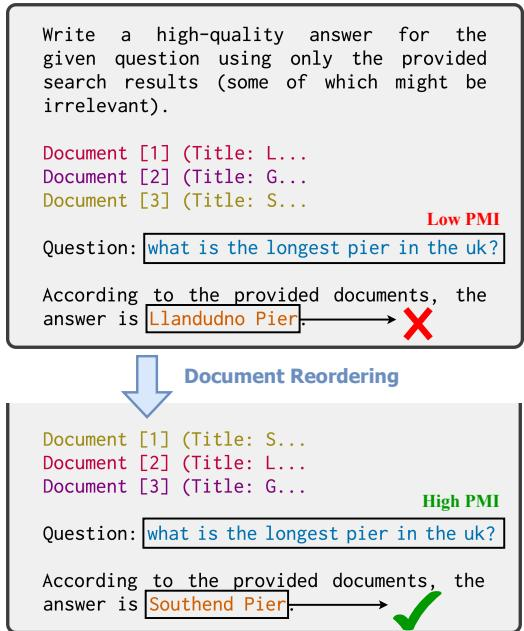  
Figure 1: For the same question, a permutation of documents with a higher PMI(q, c (π)) tends to lead to a better answer.

While Liu et al.’s (2024) results are interesting, choosing the optimal permutation of the documents requires knowledge of the answer and, thus, cannot be directly used to improve RAG. In this article, we develop a proxy for the optimal permutation: We show that the pointwise mutual information between the question and the context under an LM acts as a useful proxy in determining the optimal permutation. To our knowledge, ours is the first to present in-depth analyses of the relation between question likelihood and model performance under the RAG framework.

Our findings in this paper are summarized in the following list:

• We show that the pointwise mutual information between the question and the context positively correlates with answer accuracy at the corpus level on NQ-Open (Kwiatkowski et al., 2019; Lee et al., 2019) and ELI5 (Fan et al., 2019).

• Given a question and a fixed set of documents, we demonstrate a strong correlation between the position of the gold document, the PMI between the question and the context, and QA accuracy.

• We validate the effectiveness of using question likelihood as a gauge for prompt optimization and demonstrate that likelihoodbased prompt optimization is a promising direction for future study.

## 2 Setting the Stage

## 2.1 Language Modeling and RAG

Language Modeling Background. Let Σ be an alphabet, i.e., a finite, non-empty set of tokens. A language model $p$ is a distribution over $\Sigma ^ { * }$ , the set of all strings with tokens drawn from Σ. With $\pmb { \sigma } \preceq \pmb { \sigma } ^ { \prime } .$ , we denote that $\sigma$ is a proper prefix of $\pmb { \sigma } ^ { \prime }$ Let Y be a $\Sigma ^ { * } .$ -valued random variable distributed according to p and $\pmb { \sigma } \in \Sigma ^ { * }$ . We define the prefix probability $\scriptstyle { \vec { p } } ( \pmb { \sigma } )$ as the probability that Y has σ as a prefix:

$$
{ \vec { p } } ( \pmb { \sigma } ) \triangleq \underset { Y \sim p } { \mathbb { P } } ( Y \succeq \pmb { \sigma } )\tag{1a}
$$

$$
= \sum _ { \pmb { \sigma } ^ { \prime } \in \Sigma ^ { * } } \mathbb { 1 } \left\{ \pmb { \sigma } ^ { \prime } \succeq \pmb { \sigma } \right\} p ( \pmb { \sigma } ^ { \prime } )\tag{1b}
$$

The conditional prefix probability $\begin{array} { r l } { \vec { p } ( \pmb { \sigma } ^ { \prime } \mid \pmb { \sigma } ) = } \end{array}$ $\frac { \vec { p } ( \pmb { \sigma } \cdot \pmb { \sigma } ^ { \prime } ) } { \vec { p } ( \pmb { \sigma } ^ { \prime } ) }$ tells us how certain the model is that $\pmb { \sigma } ^ { \prime }$ naturally follows from its preceding string $\sigma .$ . Finally, we define an infix probability, i.e., the probability of generating a string that contains $\pmb { \sigma } \square \pmb { \sigma } ^ { \prime }$ where as ✷ is a gap, as follows

$$
\vec { p } ( \pmb { \sigma } \sqcup \pmb { \sigma } ^ { \prime \prime } ) \triangleq \underset { Y \sim p } { \mathbb { P } } \left( Y \succeq \pmb { \sigma } \sqcup \pmb { \sigma } ^ { \prime \prime } \right)\tag{2a}
$$

$$
= \sum _ { \sigma ^ { \prime \prime \prime } \in \Sigma ^ { * } } \sum _ { \sigma ^ { \prime } \in \Sigma ^ { * } } \mathbb { 1 } \left\{ \pmb { \sigma } ^ { \prime \prime \prime } \succeq \sigma \sigma ^ { \prime } \sigma ^ { \prime \prime } \right\} p ( \sigma ^ { \prime \prime \prime } )\tag{2b}
$$

Retrieval-augmented Generation. Modern language models are often used to perform questionanswering tasks. When solving such a task with a language model, string encoding the question question $q \in \Sigma ^ { * }$ is given to the model. We assume each question q has a unique correct answer, which we will denote $a .$ . This is, of course, a simplifying assumption, but it does jibe with how questionanswering is typically evaluated. We will adorn symbols with , e.g., a, to indicate an answer generated from ${ \vec { p } } ( \cdot \mid q )$ ethat may or may not be correct. Generating a from ${ \vec { p } } ( \cdot \mid q )$ may be done using eeither a deterministic method, e.g., beam search, or a stochastic method, e.g., ancestral sampling. 4 In RAG, the model is additionally given a set of documents $\mathcal { D } = \{ d _ { k } \} _ { k = 1 } ^ { K }$ , where $d _ { k } \in \Sigma ^ { * }$ , and a permutation of the documents $\pi \colon \{ 1 , \cdots , K \} $ $\{ 1 , \cdots , K \}$ . Given $\mathcal { D }$ and $\pi ,$ a context c is constructed by concatenating the documents in the order defined by π, i.e., $\boldsymbol { c } _ { \mathcal { D } } ( \pi ) \triangleq \boldsymbol { d } _ { \pi ( 1 ) } \bullet \dots \bullet \boldsymbol { \cdot } \boldsymbol { \cdot } \boldsymbol { \cdot } \boldsymbol { d } _ { \pi ( K ) }$ Then, we generate an answer from $\vec { p } ( \cdot \mid c \cdot \boldsymbol { q } )$ We provide an example below.

Example 2.1. Consider = “Llandudno Pier is a Grade II\* listed pier. . . ”, “Garth Pier is a Grade II listed structure. . . ”, “Southend Pier is $\boldsymbol { a . . . \^ { \flat } } \}$ , and $\pi ( 1 ) =$ $2 , \pi ( 2 ) = 1 , \pi ( 3 ) = 3$ . We have $c _ { D } ( \pi ) = { } ^ { \ast }$ Garth Pier is. . . Llandudno Pier is a Grade II\* listed pier. . . Southend Pier is. . . ”.

$\widetilde { a } _ { \pi }$ denote an answer generated from $\vec { p } ( \cdot \mid c _ { \mathcal { D } } ( \pi ) \cdot q )$ . To evaluate the quality of $\widetilde { a } _ { \pi }$ , we define an evaluation metric $g ( \widetilde { a } _ { \pi } , a )$ . In e eaddition, we assume the ground truth answer a to be unique for a question–context pair (q, c).

Pointwise Mutual Information. In RAG question answering, we consider the following pointwise mutual information

$$
\operatorname { P M I } ( q , c ) \triangleq \log { \frac { { \vec { p } } ( q \mid c ) } { { \vec { p } } ( q ) } }\tag{3}
$$

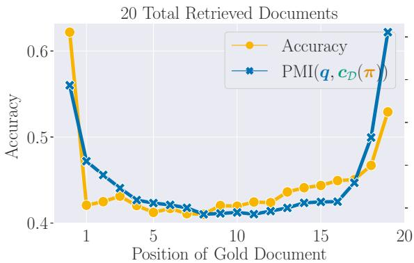  
Figure 2: We observe that the PMI and QA accuracy trace a U-shaped curve—nearly in lockstep—as the gold document position within the context changes. The result is computed with LLaMA-3-8B.

between $q$ and $^ { c , }$ where $c = d _ { \pi ( 1 ) } \cdot \cdot \cdot \cdot d _ { \pi ( K ) }$ In other words, Eq. (3) measures the degree of association of q with c.

## 2.2 A Concrete Hypothesis

Returning to the central goal of this paper, i.e., trying to find a proxy that helps determine the optimal permutation of the documents for RAG, we hypothesize that, given a question q, a set of documents , and the ground truth answer a, the pointwise mutual information $\mathrm { P M I } ( q , c _ { \mathcal { D } } ( \pi ) )$ correlates with log $\frac { { \vec { p } } ( a | q \cdot c _ { \mathcal { D } } ( \pi ) ) } { 1 - { \vec { p } } ( a | q \cdot c _ { \mathcal { D } } ( \pi ) ) }$ , the log odds ratio, and can be deemed a gauge for the expected accuracy of the generated answer. In symbols, our hypothesis is as follows.

Hypothesis 2.1. In RAG question answering, for afixed question q, a set ofdocuments permuted by π, and the ground truth answer a, we have thefollowing relation between $\mathrm { P M I } ( q , c _ { \mathcal { D } } ( \pi ) )$ and ${ \vec { p } } ( a \mid q \cdot c _ { \mathcal { D } } ( \pi ) )$

$$
\begin{array} { l } { \displaystyle \operatorname { P M I } ( q , c _ { \mathcal { D } } ( \pi ) ) } \\ { \displaystyle \quad = a \log \frac { \overrightarrow { p } ( a \mid q \cdot c _ { \mathcal { D } } ( \pi ) ) } { 1 - \overrightarrow { p } ( a \mid q \cdot c _ { \mathcal { D } } ( \pi ) ) } + b } \end{array}\tag{4}
$$

for constants $a \in \mathbb { R } _ { > 0 } , b \in \mathbb { R }$

## 2.3 A Bit of Analysis

In words, Hypothesis 2.1 says that when $\mathrm { P M I } ( q , c _ { \mathcal { D } } ( \pi ) )$ is high, we expect the LM to answer the question $q$ with high accuracy, and, moreover, we expect the relationship between $\mathrm { P M I } ( q , c _ { \mathcal { D } } ( \pi ) )$ and accuracy to be affine. Although this is empirically true in many cases (Gonen et al., 2023), we offer an assumption that enables a derivation of this property.

Assumption 2.1. For all question–context pairs $( q , c )$ , let a be the correct answer, then we have

$$
\begin{array} { r } { \vec { p } ( q \mid c _ { \mathcal { D } } ( \pi ) \sqcap a ) = \vec { p } ( q \mid c _ { \mathcal { D } } ( \pi ) ) } \end{array}\tag{5a}
$$

$$
\overrightarrow { p } ( q \mid c _ { \mathcal { D } } ( \pi ) \sqcup \bar { a } ) = \overrightarrow { p } ( q )\tag{5b}
$$

for any $\bar { a } \in \Sigma ^ { * }$ such that a¯ $\prec a . ^ { 5 }$

We now give a brief qualitative justification of Assumption 2.1. Conditioned on the event that the model incorrectly answers the question given the context, Eq. (5b) says that the question q is not dependent on the provided context. Because, in RAG, we assume the correct answer is given to the model in the context and the model’s job is to retrieve it, our assumption corresponds to the notion that an incorrect response by the model should not be influenced by the context. Eq. (5a) corresponds to the notion that since the correct answer is already contained in the context, conditioning on the correct answer answer does not provide any new information to generating q.

Proposition 2.1. Under assumptions given in Assumption $2 . l ,$ we have

$$
\begin{array} { r l } { \log \displaystyle \frac { \overrightarrow { p } ( a \mid q \cdot c _ { \mathcal { D } } ( \pi ) ) } { 1 - \overrightarrow { p } ( a \mid q \cdot c _ { \mathcal { D } } ( \pi ) ) } ~ } & { } \\ { = \mathrm { P M I } ( q , c _ { \mathcal { D } } ( \pi ) ) + C ( a , c _ { \mathcal { D } } ( \pi ) ) } \end{array}\tag{6}
$$

for an answer-dependent constant $C ( { a } , { c } _ { \mathcal { D } } ( \pi ) )$

Proof. See Appendix G.

In other words, the pointwise mutual information $\mathrm { P M I } ( q , c _ { \mathcal { D } } ( \pi ) )$ is equivalent up to an additive constant to the log odds ratio log $\frac { \vec { p } ( a | q \cdot c _ { \mathcal { D } } ( \pi ) ) } { 1 - \vec { p } ( a | q \cdot c _ { \mathcal { D } } ( \pi ) ) }$

Foreshadowing the Results. In the empirical portion of this paper, we test Hypothesis 2.1 through experiments on two QA benchmarks—NQ-Open and ELI5—using a range of state-of-theart open LMs, including LLaMA-2, LLaMA-3, LLaMA-3.1, Mistral-v0.3, and MPT. Our findings demonstrate that, as the position of relevant information within the input context c varies, the pointwise mutual information, $\mathrm { P M I } ( q , c _ { \mathcal { D } } ( \pi ) )$ ) and expected answer accuracy ${ \vec { p } } ( a \mid q \cdot c _ { \mathcal { D } } ( \pi ) )$ vary in tandem, i.e., they are strongly correlated. This correlation is illustrated in Figure 2. Specifically, LMs tend to provide better responses to questions where the documents in the context are permuted so as to have higher $\mathrm { P M I } ( q , c _ { \mathcal { D } } ( \pi ) )$ . These results suggest that PMI serves both as a performance gauge and as a strong indicator of the position of task-relevant information within the input context. Building on this insight, we propose a direction for prompt optimization through two specific methods. The first selects a permutation π of the documents that maximizes $\mathrm { P M I } ( q , c _ { \mathcal { D } } ( \pi ) )$ to construct the context c. The second builds on the findings of Liu et al. (2024) that the curve traced by permuting the position of the gold document results in a U-shaped curve. We exploit this finding to develop an efficient prompt ordering algorithm. Further experimentation demonstrates that our methods enhance answer accuracy across both datasets for instruction-tuned and base models alike, with the second approach achieving even greater gains.

## 3 PMI Correlates with Performance

As discussed in §2, our first goal is to determine how $\mathrm { P M I } ( q , c _ { \mathcal { D } } ( \pi ) )$ changes as a function of the permutation π of the documents . Due to Hypothesis 2.1, we expect a strong correlation between $\mathrm { P M I } ( q , c _ { \mathcal { D } } ( \pi ) )$ and expected answer accuracy.

## 3.1 Experimental Setup

Datasets. We run experiments on two questionanswering datasets, namely NQ-Open and ELI5. Details of the datasets are given in Appendix C. Let $\mathcal { C } \ \triangleq \ \{ ( q _ { m } , \mathcal { D } _ { m } , a _ { m } ) \} _ { m = 1 } ^ { M }$ be a dataset of triples, where each $a _ { m }$ represents the ground truth answer to $q _ { m }$

Empirical Metrics for LM Evaluation. In practice, LM performance is often evaluated with rule-based empirical metrics, denoted $^ { g , }$ such as accuracy, instead of the conditional likelihood $\stackrel {  } { p } ( a \mid$ $q \cdot c _ { D } ( \pi ) )$ . Although mathematically quantifying the relation between $g$ and PMI is difficult, we contend that they positively correlate due to recent progress on language model calibration (Zhao et al., 2023), i.e., the alignment between $\vec { p } ( a \mid q \cdot c _ { \mathcal { D } } ( \pi ) )$ and $g ( \widetilde { a } , a )$ . On NQ-Open, the ground truth answer efor each question is either a word or a short phrase. The accuracy is 1 when the LM response contains the correct answer as a substring; otherwise, the accuracy is 0. Following Liu et al. (2024), we compute the model’s average accuracy over the entire dataset. On ELI5, the correct answer for each question comprises three sub-claims, and a correct answer is expected to include all of these sub-claims. Examples are illustrated in Appendix B. We follow Gao et al. (2023) and take the recall rate of sub-claims to be the evaluation metric, which takes values from $\{ 0 , 1 / 3 , 2 / 3 , 1 \}$ The TRUE model,6 a T5-XXL model fine-tuned on natural language inference (NLI) tasks, is used to automatically evaluate whether a response entails a sub-claim.

Language Model Settings. Most state-of-theart closed LMs, such as OpenAI’s ChatGPT and Anthropic’s Claude, do not provide direct access to the likelihood of either input or output tokens. Thus, we select leading open LMs for our experiments, focusing on three families: LLaMA-2, LLaMA-3 (Touvron et al., 2023), and Mistral-v0.3 (Jiang et al., 2023). We also evaluate MPT on NQ-Open.7 Following the settings of Liu et al. (2024), we adopt greedy decoding for all models when generating responses. We set the maximum number of decoded tokens to 100 on NQ-Open and 300 on ELI5.

Prompt Templates. We follow the suggested usage and prompt formatting instructions of each LM we use. For chat and instruction-tuned models, we present the context and query to the LM in the role of user, and elicit the response from LMs in the role of assistant. For base models, we elicit responses from LMs as sentence completion.

## 3.2 Technical Interlude: Sets of Permutations

In many of our experiments, we would like to take a sum or a max over all permutations of $K$ items, $\mathrm { i . e . , }$ , take a sum or max over the symmetric group $\mathbb { S } _ { K }$ . However, $| \mathbb { S } _ { K } | = K !$ , which grows too large to enumerate efficiently. To cope with the size of $\mathbb { S } _ { K }$ , in this paper, we perform computations over a subset of $\mathbb { S } _ { K }$ . Specifically, starting a userspecified permutation π, we consider the cyclic group generated by (π) where the group operation is functional composition, as is standard. Let $\sigma =$ $( 1 , 2 , \cdots , K )$ be a shifting permutation. It is easy to see that $| ( \pi ) | = K$ , and the $k ^ { \mathrm { { t h } } }$ element of (π) is given by ${ \widetilde { \pi } } _ { k } \triangleq \sigma ^ { k - 1 } \circ \pi = \underbrace { \sigma \circ \dots \circ \sigma } _ { \textnormal { \normalfontfamily { c m t } \selectfont o } } \circ \pi , \mathbf { \beta } _ { \textnormal { \normalfontfamily { c m t } \selectfont o r } }$ (k−1) times

equivalently we have

$$
\widetilde { \pi } _ { k } ( i ) = ( i + k - 1 ) \mod K ,\tag{7}
$$

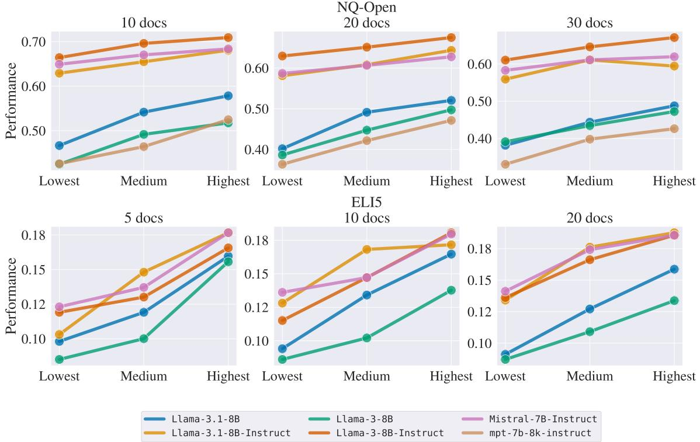  
Figure 3: Corpus-level correlation between $\mathrm { P M I } ( q , c _ { \mathcal { D } } ( \pi ) )$ and answer accuracy on NQ-Open and ELI5.

Example 3.1. Given a permutation $\pi = ( 1 , 2 , 3 )$ The cyclic group (π) generated by π is equal to $\{ \widetilde { \pi } _ { 1 } , \widetilde { \pi } _ { 2 } , \widetilde { \pi } _ { 3 } \}$ where $\widetilde { \pi } _ { 1 } = ( 1 , 2 , 3 ) , \widetilde { \pi } _ { 2 } = ( 2 , 3 , 1 )$ eand ${ \widetilde { \pi } } _ { 3 } = ( 3 , 1 , 2 )$

## 3.3 Results

We now discuss our empirical findings.

Corpus-Level Correlation. As our first evaluation metric, we consider a corpus-level correlation. For each $q _ { m } , \mathcal { D } _ { m }$ in a corpus , we compute the average PMI for the $m ^ { \mathrm { t h } }$ instance as follows

$$
\rho _ { m } \triangleq \frac { 1 } { K } \sum _ { k = 1 } ^ { K } \operatorname { P M I } ( q _ { m } , c _ { \mathcal { D } _ { m } } ( \widetilde { \pi } _ { k } ) )\tag{8}
$$

We then bin the elements of $\{ \rho _ { m } \} _ { m = 1 } ^ { M }$ into three bins according to which tertile they fall it when $\{ \rho _ { m } \} _ { m = 1 } ^ { M }$ are arranged into a histogram. Then, we compute the average sub-claim recall rate (ELI5) and accuracy (NQ-Open) for each bin. Our results, shown in Figure 3, demonstrate that LMs tend to perform better on the prompts with a higher $\mathrm { P M I } ( q , c _ { \mathcal { D } } ( \pi ) )$ compared to those with lower $\mathrm { P M I } ( q , c _ { \mathcal { D } } ( \pi ) )$

Instance-Level Correlation. We further analyze the instance-level correlation between $\mathrm { P M I } ( q , c _ { \mathcal { D } } ( \pi ) )$ and accuracy by varying context while keeping the question fixed. In symbols, we

compute

$$
\eta _ { k } \triangleq \frac { 1 } { M } \sum _ { m = 1 } ^ { M } \mathrm { P M I } ( q _ { m } , c _ { \mathcal { D } _ { m } } ( \widetilde { \pi } _ { k } ) )\tag{9}
$$

where $\widetilde { \pi } _ { k }$ is the permutation in which the k-th document $d _ { k }$ contains relevant information. We then plot the curve of $\{ \eta _ { k } \} _ { k = 1 } ^ { K }$ , to see how PMI is affected by the position of a relevant document within a context.

Revisiting Liu et al. (2024). We now revisit the findings of Liu et al. (2024), who observed a drop in QA accuracy when the gold document is positioned within the middle of c. We first experiment on NQ-Open by varying the position of the gold document9 in c. The set of retrieved documents and the order of non-gold documents remain the same. As the gold document is placed in different positions in $^ { c , }$ we find that both $\mathrm { P M I } ( q , c _ { \mathcal { D } } ( \pi ) )$ and QA accuracy fluctuate—nearly in lockstep. To further explore this correlation between $\mathrm { P M I } ( \boldsymbol { q } , \boldsymbol { c } )$ and QA accuracy, we calculate the expected accuracy with the prompt of the highest and lowest $\mathrm { P M I } ( q , c _ { \mathcal { D } } ( \pi ) )$ Results are given in Table 1, showing that LMs perform better when the document order in the prompt leads to the highest $\mathrm { P M I } ( q , c _ { \mathcal { D } } ( \pi ) )$ , while the prompt with the lowest $\mathrm { P M I } ( q , c _ { \mathcal { D } } ( \pi ) )$ results in inferior performance.

Experiments on ELI5. Compared to NQ-Open, ELI5 is a more challenging long-form QA dataset where questions are mostly about how/why/what, and the answers are expected to be more comprehensive and cover multiple aspects. Due to the lack of gold document annotations on ELI5, we adopt permutations from the cyclic group (π) and random shuffling. In random shuffling for K documents, we randomly shuffle the document set K (i.e., same as the number of documents) times and obtain K document sequences for consistency. Given multiple prompts for a question, among which only the document orders in the context are different, we calculate the average performance of the prompts with the highest and lowest $\mathrm { P M I } ( q , c _ { \mathcal { D } } ( \pi ) )$ for each question in the same fashion as described in §3.3 for NQ-Open. Results in Table 2 show that LMs achieve higher answer accuracy on the prompts with the highest $\mathrm { P M I } ( q , c _ { \mathcal { D } } ( \pi ) )$ compared with the prompts with the lowest $\mathrm { P M I } ( q , c _ { \mathcal { D } } ( \pi ) )$ . This indicates LMs can better answer questions with higher question likelihood through document shuffling, demonstrating the strong instance-level correlation between $\mathrm { P M I } ( q , c _ { \mathcal { D } } ( \pi ) )$ with answer accuracy.

## 4 Improving RAG via Reordering

In §3.3, we offered evidence for Hypothesis 2.1, i.e., that $\mathrm { P M I } ( q , c _ { \mathcal { D } } ( \pi ) )$ correlates with model performance. In light of this finding, we propose two methods to permute the documents presented to the LM in RAG without knowledge of the answer.

## 4.1 Method 1: Search by PMI

Our empirical findings showed that the permutation of the documents in the context that leads to the highest value of $\mathrm { P M I } ( q , c _ { \mathcal { D } } ( \pi ) )$ leads to superior performance on QA tasks. This suggests a natural algorithm

$$
\pi ^ { \star } = \arg \operatorname* { m a x } _ { \pi \in \mathbb { S } _ { K } } \mathrm { P M I } ( q , c _ { \mathcal { D } } ( \pi ) )\tag{10}
$$

However, as discussed in §3.2, the set of all permutations (the symmetric group) $\mathbb { S } _ { K }$ is too large to enumerate. Thus, we fall back on a simple approximation. Given a user-provided permutation π, we search over the cyclic group generated by π, denoted as (π). Using the notation introduced in §3.2, we choose $\widetilde { \pi } _ { k ^ { \star } }$ where we select

$$
\boldsymbol { k } ^ { \star } = \underset { \boldsymbol { k } = 1 } { \arg \operatorname* { m a x } } \operatorname { P M I } ( \boldsymbol { q } , \boldsymbol { c } _ { \mathcal { D } } ( \widetilde { \boldsymbol { \pi } } _ { \boldsymbol { k } } ) ) ,\tag{11}
$$

where $\widetilde { \pi } _ { k }$ is defined in §3.2.

## 4.2 Method 2: Search by Curvature

We now develop a second algorithm based on the observation in Figure 4 that accuracy and PMI change simultaneously and exhibit a U-shaped curve as the gold document position within the permutation of documents in c. Our algorithm is based on a discrete notion of convexity and an assumption based on our findings in §3.3, which we introduce in the abstract below.

Technical Interlude Discrete Convexity. A sequence of real values $\{ a _ { n } \} _ { n = 1 } ^ { N }$ is called convex if we have

$$
\Delta _ { n } ^ { 2 } \triangleq 2 a _ { n } - a _ { n + 1 } - a _ { n - 1 } \leq 0\tag{12}
$$

for all $n \in \{ 2 , \ldots , N { - } 1 \}$ . In the abstract, the problem we wish to solve is this: Given an arbitrary finite sequence of reals $\{ b _ { n } \} _ { n = 1 } ^ { N }$ , find a permutation $\tau \colon [ N ]  [ N ]$ that renders $\{ b _ { n } \} _ { n = 1 } ^ { N }$ convex, i.e., that Eq. (12) holds after applying the permutation to the sequence’s indices. We call such a choice of τ a convex permutation. Note that convex permutations may not always exist.10 To achieve a U-shape curve, we do not just want a convex permutation, but in addition the one that results in a convex sequence that has as much upwards curvature as possible. In other words, if τ is a convex permutation, then, in addition we want the following sum to be minimized

$$
\sum _ { n = 2 } ^ { N - 1 } \Delta _ { n } ^ { 2 } = - ( b _ { 1 } + b _ { N } ) + \sum _ { n = 2 } ^ { N - 1 } b _ { m }\tag{13a}
$$

$$
= - 2 ( b _ { 1 } + b _ { N } ) + B\tag{13b}
$$

(13c)

where $B \triangleq \textstyle \sum _ { n = 1 } ^ { N } b _ { n }$ . However, because B is constant, the total curvature induced by a convex permutation τ only depends on $b _ { \tau ( 1 ) }$ and $b _ { \tau ( N ) }$ This implies that we simply need to choose the endpoints to be those elements of $\{ b _ { \tau ( n ) } \} _ { n = 1 } ^ { N }$ that are largest; we can always permute the remaining (N 2) elements to ensure the permutation is convex afterward. Thus, relaxing the requirement that the permutation be convex, we choose a permutation τ such that $b _ { \tau ( 1 ) } + b _ { \tau ( N ) }$ is maximized. This definition motivates a new definition: We call a sequence $\{ b _ { n } \} _ { n = 1 } ^ { N }$ U-shaped iff $b _ { 1 } \geq b _ { i }$ and $b _ { N } \geq b _ { i }$ for $i \in \{ 2 , 3 , \cdots , N - 1 \}$

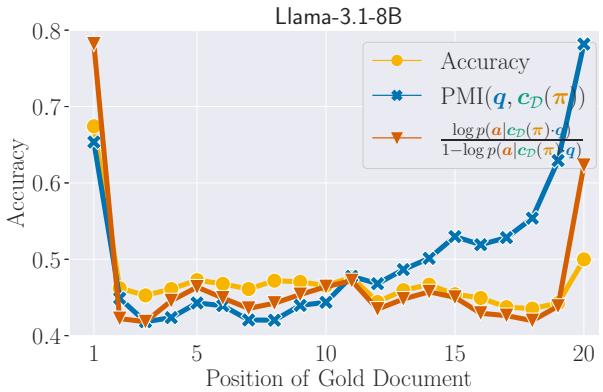  
(a)

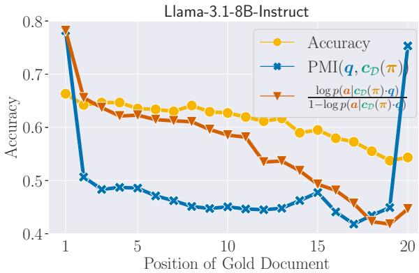  
(b)

Figure 4: QA accuracy, PMI, and log odds ratio of answer likelihood on 20 docs evaluated on LLaMA-3.1-8B and LLaMA-3.1-8B-Instruct.
<table><tr><td>#Doc</td><td colspan="2">PMI(q, cD(π))Mistral-7B-Inst</td><td>LLaMA-3-8B</td><td>LLaMA-3.1-8B</td><td>LLaMA-3-8B-Inst</td><td>LLaMA-3.1-8B-Inst</td><td>MPT-7B-8K-Inst</td></tr><tr><td colspan="8">NQ-Open</td></tr><tr><td rowspan="2">10</td><td>Highest</td><td> $\mathbf { 6 8 . 6 9 } \ ( - 2 . 5 2 )$ </td><td> ${ \pmb 5 4 . 0 4 ( - 1 . 8 4 ) }$ </td><td>56.72 (-2.41)</td><td> $\pmb { 7 1 . 5 8 } ( - 1 . 8 0 )$ </td><td> ${ \bf 6 6 . 1 3 } \left( - 2 . 1 6 \right)$ </td><td>48.93 (-2.80)</td></tr><tr><td>Lowest</td><td>66.98 (-2.89)</td><td> $4 9 . 3 0 ( - 2 . 0 3 )$ </td><td>53.29 (-2.72)</td><td> $7 1 . 2 9 ( - 2 . 0 1 )$ </td><td>65.70 (-2.43)</td><td>46.97 (-3.38)</td></tr><tr><td rowspan="2">20</td><td>Highest</td><td>64.86 (-2.45)</td><td> ${ \pmb 5 } 2 . { \bf 0 5 } ( - 1 . 9 9 )$ </td><td>52.50 (-2.40)</td><td> ${ \bf 6 9 . 0 0 } \left( { \bf - 1 . 8 3 } \right)$ </td><td>62.97 (-2.21)</td><td>42.25 (-2.70)</td></tr><tr><td>Lowest</td><td> $6 2 . 6 0 \left( - 2 . 8 3 \right)$ </td><td> $4 6 . 9 1 \ ( - 2 . 0 3 )$ </td><td>48.51 (-2.72)</td><td> $6 7 . 6 8 \ : ( - 2 . 0 1 )$ </td><td>61.05 (-2.43)</td><td>42.09 (-3.23)</td></tr><tr><td rowspan="2">30</td><td>Highest</td><td> ${ \pmb 5 7 . 7 0 ( - 2 . 5 2 ) }$ </td><td> $\pmb { 5 0 . 3 0 } \ ( - 1 . 8 8 )$ </td><td>50.00 (-2.60)</td><td> $6 4 . 3 6 ( - 1 . 8 4 )$ </td><td>60.95 (-2.41)</td><td>39.31 (-2.56)</td></tr><tr><td>Lowest</td><td> $5 3 . 9 6 ( - 2 . 9 2 )$ </td><td> $4 5 . 2 7 \ : ( - 2 . 0 3 )$ </td><td>46.42 (-2.83)</td><td> ${ \bf 6 5 . 1 2 } \left( - 2 . 0 3 \right)$ </td><td>59.55 (-2.65)</td><td>39.12 (-3.05)</td></tr></table>

Table 1: The table displays instance-level correlations between $\mathrm { P M I } \big ( q , c _ { \mathcal { D } } \big ( \pi \big ) \big )$ and answer accuracy. We also compute the average answer accuracy over prompts that yield the highest and lowest $\mathrm { P M I } \big ( q , c _ { \mathcal { D } } \big ( \pi \big ) \big )$ as the gold document placed at different positions in the document sequence for each instance. The answer accuracy and the average PM $( q , c _ { D } ( \pi ) )$ are reported in the table.  
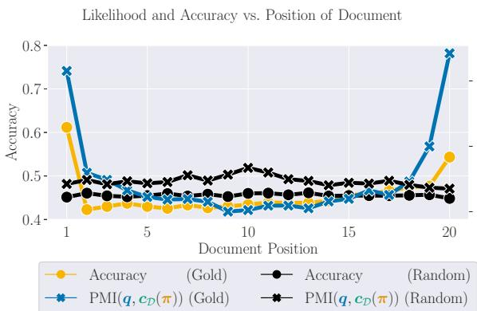  
Figure 5: When the position of the gold document changes, both $\mathrm { P M I } ( \boldsymbol { q } , \boldsymbol { c } )$ and accuracy curves are Ushaped. In contrast, both curves are flat for randomly chosen documents.

A Simple Algorithm. The abstract discussion in the previous paragraph suggests a simple algorithm. First, we construct a real-valued sequence

$$
b _ { \tau ( k ) } \triangleq \operatorname { P M I } ( q , c _ { \mathcal { D } } ( \widetilde { \pi } _ { k } ) )\tag{14}
$$

of length K where $\tau \colon [ K ]  [ K ]$ is a permutation and $\mathrm { P M I } \big ( q , c _ { \mathcal { D } } \big ( \widetilde { \pi } _ { k } \big ) \big )$ is defined in §3.2. Then, erelaxing the requirement that the permutation be convex, we optimize

$$
\tau ^ { \star } = \arg \operatorname* { m a x } _ { \tau \in ( \pi ) } b _ { \tau ( 1 ) } + b _ { \tau ( K ) }\tag{15}
$$

While, in general, $\tau ^ { \star }$ may not be convex, we do have a guarantee that $\tau ^ { \star }$ will induce a U-shaped sequence. To compute the optimization problem given in Eq. (15), we sort $\tau \in \mathsf { \Gamma } ( \pi )$ according to $b _ { \tau ( 1 ) } + b _ { \tau ( K ) }$ in descending order, obtaining the sequence $\{ \tau _ { k } \} _ { k = 1 } ^ { K }$ . Then, we construct the resulting permutation $\tau ^ { \prime } = ( \tau _ { 1 } ( 1 ) , \tau _ { 2 } ( 1 ) , \cdot \cdot \cdot , \tau _ { K } ( 1 ) )$ among which $d _ { \tau ( 1 ) }$ is most likely to be the gold document.

## 4.3 Results and Analysis

Shown in Table 3, both search by PMI and search by curvature can boost answer accuracy. On NQ-Open, where only one document in the sequence is relevant to the question, gold document reordering significantly improves the answer accuracy and narrows the gap to the upper bound. Furthermore, on the more challenging and practical QA benchmark ELI5, we also observe a modest improvement in answer accuracy, indicating that improving question likelihoods via document reordering can effectively obtain better LM responses.

<table><tr><td>#Doc</td><td> $\mathrm { P M I } ( q , c _ { \mathcal { D } } ( \pi ) )$ </td><td>Mistral-7B-Inst</td><td>LLaMA-3-8B</td><td>LLaMA-3.1-8B</td><td>LLaMA-3-8B-Inst</td><td>LLaMA-3.1-8B-Inst</td></tr><tr><td colspan="7">ELI5 with Rotational permutation</td></tr><tr><td>5</td><td>Highest Lowest</td><td>13.97 (-3.72) 13.50 (-4.06)</td><td>11.37 (-2.23) 11.10 (-2.39)</td><td>12.60 (-2.28) 12.50 (-2.43)</td><td>14.23 (-2.21) 13.17 (-2.54)</td><td>13.97 (-2.26) 13.93 (-2.48)</td></tr><tr><td rowspan="2">10</td><td></td><td></td><td></td><td></td><td></td><td></td></tr><tr><td>Highest Lowest</td><td>15.23 (-3.53) 14.47 (-3.99)</td><td>11.27 (-2.19) 11.50 (-2.39)</td><td>12.50 (-2.29) 13.10 (-2.48)</td><td>14.50 (-2.10) 14.07 (-2.55)</td><td>16.17 (-2.23) 15.77 (-2.54)</td></tr><tr><td rowspan="2">20</td><td></td><td></td><td></td><td></td><td></td><td></td></tr><tr><td>Highest Lowest</td><td>16.20 (-2.13)</td><td>11.13 (-2.19) 11.20 (-2.42)</td><td>12.77 (-2.28) 12.13 (-2.48)</td><td>16.20 (-2.13) 15.80 (-2.73)</td><td>17.17 (-2.18) 15.67 (-2.54)</td></tr><tr><td colspan="7">15.80 (-2.73)</td></tr><tr><td rowspan="2"></td><td></td><td></td><td></td><td>ELI5 with Random Shuffling</td><td></td><td></td></tr><tr><td>Highest</td><td>14.27 (-3.73)</td><td>10.73 (-2.24)</td><td>12.57 (-2.28)</td><td>14.10 (-2.23)</td><td>14.20 (-2.27)</td></tr><tr><td rowspan="2">5</td><td>Lowest</td><td>14.10 (-4.04)</td><td>11.20 (-2.39)</td><td>12.33 (-2.42)</td><td>12.77 (-2.52)</td><td>14.00 (-2.48)</td></tr><tr><td>Highest</td><td>15.63 (-3.54)</td><td>11.47 (-2.19)</td><td>12.73 (-2.29)</td><td>15.70 (-2.11)</td><td>16.90 (-2.23)</td></tr><tr><td rowspan="2">10</td><td>Lowest</td><td>15.07 (-3.97)</td><td>11.23 (-2.39)</td><td>12.20 (-2.48)</td><td>14.57 (-2.52)</td><td>16.70 (-2.53)</td></tr><tr><td></td><td></td><td></td><td></td><td></td><td></td></tr><tr><td rowspan="2">20</td><td>Highest</td><td>16.10 (-3.44)</td><td>10.83 (-2.19)</td><td>12.60 (-2.28)</td><td>16.13(-2.14)</td><td>17.20 (-2.18)</td></tr><tr><td>Lowest</td><td>16.53 (-4.00)</td><td>11.20 (-2.42)</td><td>11.87 (-2.49)</td><td>15.53 (-2.71)</td><td>17.10 (-2.54)</td></tr></table>

Table 2: Instance-level correlation between $\mathrm { P M I } ( \boldsymbol { q } , \boldsymbol { c } )$ and answer accuracy on ELI5. The average QA accuracy is computed over prompts that yield the highest and lowest $\mathrm { P M I } ( q , c )$ as the input documents are reordered with (1) rotational reordering and (2) random shuffling as introduced in §3.3. We report the QA accuracy and the average $\mathrm { P M I } ( \boldsymbol { q } , \boldsymbol { c } )$ in parentheses.

Regarding efficiency, our proposed methods are mildly time-dependent thanks to the parallelizable computation of question likelihoods, where only the LM encoding module is used, with no reliance on LM decoding.11 Shown in Table 4, in our experiments, the average runtime for decoding a response of an instance in ELI5 is 10 seconds, while it only takes an extra 0.8 seconds and 2 seconds, respectively, to encode the input prompts of naïve likelihood-based selection and gold document reordering. The increment in timely cost is marginal compared with heuristic prompt engineering which requires whole decoding to judge the prompt quality (e.g., an extra 10 seconds for decoding another candidate prompt).

In summary, both proposed methods are effective and efficient. Although the improvement on ELI5 is relatively marginal compared to that on NQ-Open, given the more challenging nature of long answers and no specified gold document on ELI5, it still indicates that optimizing prompts with ${ \vec { p } } ( q \mid c )$ as a gauge is a promising direction.

Experimental Setup. We experiment on the ELI5 dataset and a subset of 500 questions from NQ-Open, using Mistral-7B-Inst-v0.3,

<table><tr><td>Model</td><td>Baseline</td><td>PMI</td><td>Curvature</td><td>Upper Bound</td></tr><tr><td colspan="5">NQ-Open (Answer Accuracy)</td></tr><tr><td>Mistral</td><td>62.89</td><td>65.18</td><td>65.72</td><td>69.24</td></tr><tr><td>LLaMA-3.1</td><td>47.74</td><td>51.29</td><td>51.36</td><td>66.88</td></tr><tr><td>LLaMA-3.1-Inst</td><td>61.49</td><td>63.34</td><td>63.56</td><td>66.35</td></tr><tr><td colspan="5">ELI5 (Answer Accuracy)</td></tr><tr><td>Mistral</td><td>15.35</td><td>15.63</td><td>15.40</td><td></td></tr><tr><td>LLaMA-3.1</td><td>12.61</td><td>12.73</td><td>13.33</td><td></td></tr><tr><td>LLaMA-3.1-Inst</td><td>16.14</td><td>16.90</td><td>16.83</td><td></td></tr></table>

Table 3: Performance of our methods on NQ-Open and ELI5, the number of documents K is set to 20 and 10. Mistral, LLaMA and LLaMA-Inst stands for Mistral-7B-Inst-v0.3, LLaMA-3.1-8B and LLaMA-3.1-8B-Inst respectively. Baseline refers to the mean performance over K random document shuffling on each instance. The upper bound on NQ-Open is calculated as the performance when positioning the gold document at the beginning of the document sequence, which is not applicable for ELI5 since no gold document is marked in this practical dataset.

LLaMA-3.1-8B, and LLaMA-3.1-8B-Inst. Each question is associated with 10 (on ELI5) and 20 (NQ-Open) retrieved documents.

## 4.4 Synthetic Experiment

Real-world datasets might have been used during the training of LLMs. Thus, their likelihoods might exhibit an exposure bias (Bengio et al., 2015; Ranzato et al., 2016; Cotterell et al., 2024). To avoid such potential bias, we follow Liu et al. (2024) and conduct a synthetic key–value retrieval experiment.

Key–Value Retrieval. To imitate questionanswering tasks on random strings, we construct Python-style key–value pairs in which the keys and values are UUID strings of 32 hexadecimal digits. An example is given in Figure 14. In Tables 5 to 7, we observe that both PMI $( q , c )$ and ${ \vec { p } } ( a \mid c \cdot q )$ show synchronous U-shaped patterns as the location of the key in context changes, consistent with the RAG-based QA experiments in §3.3, indicating the generalizability of the findings on unseen data.

<table><tr><td></td><td>Decoding | Likelihood Based Gold Document</td><td></td></tr><tr><td>10s</td><td>0.8s</td><td> $2 s$ </td></tr></table>

Table 4: The average runtime for decoding an LLM response vs. the extra time for the two proposed methods.

## 5 Discussion

## 5.1 Instruction-tuned vs. Base Models

In our analysis, we find base LMs, e.g., LLaMA-3-8B, tend to be more sensitive to the permutation of the documents. Specifically, we observe that QA performance drops when the gold document is placed in the middle of the document sequence. On the other hand, the performance of instruction-tuned models is more robust to permutations of the documents in the context, as shown in Figure 4. However, we still do observe a U-shaped curve, but the drop in QA performance is less significant for the instruction-tuned model when the gold document is positioned at the middle.

The fact that PMI serves as a useful gauge for both the base and instruction-tuned models suggests that $\mathrm { P M I } ( q , c _ { \mathcal { D } } ( \pi ) )$ is affected little by the instruction tuning.

## 5.2 Placing the Context after the Question

In our experiments, we only explore the correlation between PMI and accuracy when the question follows the context. However, one could also use a prompt template in which the context follows the question. We remark that in this case, PMI can be computed according to the equation

$$
\operatorname { P M I } ( q , c ) = \log { \frac { { \overrightarrow { p } } ( c \mid q ) } { { \overrightarrow { p } } ( c ) } } .\tag{16}
$$

## 6 Conclusion

In our study, we analyzed the relationship between the PMI between question and context $\mathrm { P M I } ( q , c _ { \mathcal { D } } ( \pi ) )$ and question-answering performance under the retrieval-augmented generation framework. Through experimentation, we demonstrated that $\mathrm { P M I } ( q , c _ { \mathcal { D } } ( \pi ) )$ is affected by the order of documents in the input context. We find evidence for a positive correlation between question likelihood and answer accuracy at both the corpus level and instance level. Our findings show that it is possible to use $\mathrm { P M I } ( q , c _ { \mathcal { D } } ( \pi ) )$ to gauge language model performance and improve the quality of input prompts. We propose two practical methods for prompt optimization based on these findings. Experimental results show that both effectively and efficiently improve LM’s accuracy on QA tasks, demonstrating that using PMI as a gauge for optimizing prompts is a promising direction.

## Limitations

One major limitation of our work is that only opensource LMs are studied in this work since we need full access probabilities under the LM. Thus, closed language models such as GPT-4 cannot be used for selecting permutations In addition, our prompt modification is limited to document permutation in this work. Other prompt modifications may also contribute to obtaining a higher $\mathrm { P M } ( q , c )$ and improve QA performance.

## References

Akari Asai, Xinyan Yu, Jungo Kasai, and Hanna Hajishirzi. 2021. One question answering model for many languages with cross-lingual dense passage retrieval. In Advances in Neural Information Processing Systems, volume 34, pages 7547–7560. Curran Associates, Inc.

Samy Bengio, Oriol Vinyals, Navdeep Jaitly, and Noam Shazeer. 2015. Scheduled sampling for sequence prediction with recurrent neural networks. In Proceedings of the 28th International Conference on Neural Information Processing Systems - Volume 1, NIPS’15, page 1171–1179, Cambridge, MA, USA. MIT Press.

Sebastian Borgeaud, Arthur Mensch, Jordan Hoffmann, Trevor Cai, Eliza Rutherford, Katie Millican, George Van Den Driessche, Jean-Baptiste Lespiau, Bogdan Damoc, Aidan Clark, et al. 2022. Improving language models by retrieving from trillions of tokens. In International conference on machine learning, pages 2206–2240. PMLR.

Craig Boutilier, Nir Friedman, Moises Goldszmidt, and Daphne Koller. 1996. Context-specific independence in Bayesian networks. In Proceedings ofthe Twelfth International Conference on Uncertainty in Artificial Intelligence, page 115–123.

Ryan Cotterell, Anej Svete, Clara Meister, Tianyu Liu, and Li Du. 2024. Formal aspects of language modeling. Preprint, arXiv:2311.04329.

Sabit Ekin. 2023. Prompt engineering for chatgpt: a quick guide to techniques, tips, and best practices. Authorea Preprints.

Angela Fan, Yacine Jernite, Ethan Perez, David Grangier, Jason Weston, and Michael Auli. 2019. ELI5: Long form question answering. In Proceedings of the 57th Annual Meeting ofthe Associationfor Computational Linguistics, pages 3558–3567, Florence, Italy. Association for Computational Linguistics.

Tianyu Gao, Adam Fisch, and Danqi Chen. 2021. Making pre-trained language models better few-shot learners. In Proceedings of the 59th Annual Meeting of the Association for Computational Linguistics and the 11th International Joint Conference on Natural Language Processing (Volume 1: Long Papers), pages 3816–3830, Online. Association for Computational Linguistics.

Tianyu Gao, Howard Yen, Jiatong Yu, and Danqi Chen. 2023. Enabling large language models to generate text with citations. In Proceedings of the 2023 Conference on Empirical Methods in Natural Language Processing, pages 6465–6488, Singapore. Association for Computational Linguistics.

Louie Giray. 2023. Prompt engineering with chatgpt: a guide for academic writers. Annals ofbiomedical engineering, 51(12):2629–2633.

Hila Gonen, Srini Iyer, Terra Blevins, Noah Smith, and Luke Zettlemoyer. 2023. Demystifying prompts in language models via perplexity estimation. In Findings of the Association for Computational Linguistics: EMNLP 2023, pages 10136–10148, Singapore. Association for Computational Linguistics.

Gautier Izacard, Mathilde Caron, Lucas Hosseini, Sebastian Riedel, Piotr Bojanowski, Armand Joulin, and Edouard Grave. 2022. Unsupervised dense information retrieval with contrastive learning. Preprint, arXiv:2112.09118.

Gautier Izacard and Edouard Grave. 2021. Leveraging passage retrieval with generative models for open domain question answering. In Proceedings of the 16th Conference of the European Chapter of the Associationfor Computational Linguistics: Main Volume, pages 874–880, Online. Association for Computational Linguistics.

Gautier Izacard, Patrick Lewis, Maria Lomeli, Lucas Hosseini, Fabio Petroni, Timo Schick, Jane Dwivedi-Yu, Armand Joulin, Sebastian Riedel, and Edouard Grave. 2024. Atlas: Few-shot learning with retrieval augmented language models. J. Mach. Learn. Res., 24(1).

Albert Q. Jiang, Alexandre Sablayrolles, Arthur Mensch, Chris Bamford, Devendra Singh Chaplot, Diego de las Casas, Florian Bressand, Gianna Lengyel, Guillaume Lample, Lucile Saulnier, Lélio Renard Lavaud, Marie-Anne Lachaux, Pierre Stock, Teven Le Scao, Thibaut Lavril, Thomas Wang, Timothée Lacroix, and William El Sayed. 2023. Mistral 7B. Preprint, arXiv:2310.06825.

Vladimir Karpukhin, Barlas Oguz, Sewon Min, Patrick Lewis, Ledell Wu, Sergey Edunov, Danqi Chen, and Wen-tau Yih. 2020. Dense passage retrieval for opendomain question answering. In Proceedings of the 2020 Conference on Empirical Methods in Natural Language Processing (EMNLP), pages 6769–6781, Online. Association for Computational Linguistics.

Tom Kwiatkowski, Jennimaria Palomaki, Olivia Redfield, Michael Collins, Ankur Parikh, Chris Alberti, Danielle Epstein, Illia Polosukhin, Jacob Devlin, Kenton Lee, Kristina Toutanova, Llion Jones, Matthew Kelcey, Ming-Wei Chang, Andrew M. Dai, Jakob Uszkoreit, Quoc Le, and Slav Petrov. 2019. Natural questions: A benchmark for question answering research. Transactions ofthe Associationfor Computational Linguistics, 7:452–466.

Kenton Lee, Ming-Wei Chang, and Kristina Toutanova. 2019. Latent retrieval for weakly supervised open domain question answering. In Proceedings of the 57th Annual Meeting of the Association for Computational Linguistics, pages 6086–6096, Florence, Italy. Association for Computational Linguistics.

Patrick Lewis, Ethan Perez, Aleksandra Piktus, Fabio Petroni, Vladimir Karpukhin, Naman Goyal, Heinrich Küttler, Mike Lewis, Wen-tau Yih, Tim Rocktäschel, Sebastian Riedel, and Douwe Kiela. 2020. Retrieval-augmented generation for knowledgeintensive nlp tasks. In Proceedings ofthe 34th International Conference on Neural Information Processing Systems, NIPS ’20, Red Hook, NY, USA. Curran Associates Inc.

Nelson Liu, Tianyi Zhang, and Percy Liang. 2023. Evaluating verifiability in generative search engines. In Findings ofthe Associationfor Computational Linguistics: EMNLP 2023, pages 7001–7025, Singapore. Association for Computational Linguistics.

Nelson F. Liu, Kevin Lin, John Hewitt, Ashwin Paranjape, Michele Bevilacqua, Fabio Petroni, and Percy Liang. 2024. Lost in the middle: How language models use long contexts. Transactions ofthe Association for Computational Linguistics, 12:157–173.

Lijia Ma, Xingchen Xu, and Yong Tan. 2024. Crafting knowledge: Exploring the creative mechanisms of chat-based search engines. arXiv preprint arXiv:2402.19421.

Ggaliwango Marvin, Nakayiza Hellen, Daudi Jjingo, and Joyce Nakatumba-Nabende. 2023. Prompt engineering in large language models. In International conference on data intelligence and cognitive informatics, pages 387–402. Springer.

Jacob Menick, Maja Trebacz, Vladimir Mikulik, John Aslanides, Francis Song, Martin Chadwick, Mia Glaese, Susannah Young, Lucy Campbell-Gillingham, Geoffrey Irving, et al. 2022. Teaching language models to support answers with verified quotes. arXiv preprint arXiv:2203.11147.

Reiichiro Nakano, Jacob Hilton, Suchir Balaji, Jeff Wu, Long Ouyang, Christina Kim, Christopher Hesse, Shantanu Jain, Vineet Kosaraju, William Saunders, et al. 2021. Webgpt: Browser-assisted questionanswering with human feedback. arXiv preprint arXiv:2112.09332.

Jianmo Ni, Chen Qu, Jing Lu, Zhuyun Dai, Gustavo Hernandez Abrego, Ji Ma, Vincent Zhao, Yi Luan, Keith Hall, Ming-Wei Chang, and Yinfei Yang. 2022. Large dual encoders are generalizable retrievers. In Proceedings of the 2022 Conference on Empirical Methods in Natural Language Processing, pages 9844–9855, Abu Dhabi, United Arab Emirates. Association for Computational Linguistics.

Fabio Petroni, Patrick Lewis, Aleksandra Piktus, Tim Rocktäschel, Yuxiang Wu, Alexander H. Miller, and Sebastian Riedel. 2020. How context affects language models’ factual predictions. In Automated Knowledge Base Construction.

Aleksandra Piktus, Fabio Petroni, Vladimir Karpukhin, Dmytro Okhonko, Samuel Broscheit, Gautier Izacard, Patrick Lewis, Barlas Oguz, Edouard Grave, Wen-tau˘ Yih, et al. 2021. The web is your oyster-knowledgeintensive nlp against a very large web corpus. arXiv preprint arXiv:2112.09924.

Reid Pryzant, Dan Iter, Jerry Li, Yin Lee, Chenguang Zhu, and Michael Zeng. 2023. Automatic prompt optimization with “gradient descent” and beam search. In Proceedings of the 2023 Conference on Empirical Methods in Natural Language Processing, pages 7957–7968, Singapore. Association for Computational Linguistics.

Jirui Qi, Gabriele Sarti, Raquel Fernández, and Arianna Bisazza. 2024. Model internals-based answer attribution for trustworthy retrieval-augmented generation. arXiv preprint arXiv:2406.13663.

Marc’Aurelio Ranzato, Sumit Chopra, Michael Auli, and Wojciech Zaremba. 2016. Sequence level training with recurrent neural networks. In 4th International Conference on Learning Representations, ICLR 2016, San Juan, Puerto Rico, May 2-4, 2016, Conference Track Proceedings.

Sander Schulhoff, Michael Ilie, Nishant Balepur, Konstantine Kahadze, Amanda Liu, Chenglei Si, Yinheng Li, Aayush Gupta, HyoJung Han, Sevien Schulhoff, et al. 2024. The prompt report: A systematic survey of prompting techniques. arXiv preprint arXiv:2406.06608.

Hugo Touvron, Thibaut Lavril, Gautier Izacard, Xavier Martinet, Marie-Anne Lachaux, Timothée Lacroix, Baptiste Rozière, Naman Goyal, Eric Hambro, Faisal Azhar, Aurelien Rodriguez, Armand Joulin, Edouard Grave, and Guillaume Lample. 2023. Llama: Open and efficient foundation language models. Preprint, arXiv:2302.13971.

Tim Vieira, Ben LeBrun, Mario Giulianelli, Juan Luis Gastaldi, Brian DuSell, John Terilla, Timothy J.

O’Donnell, and Ryan Cotterell. 2024. From language models over tokens to language models over characters. Preprint, arXiv:2412.03719.

Jason Wei, Xuezhi Wang, Dale Schuurmans, Maarten Bosma, Brian Ichter, Fei Xia, Ed Chi, Quoc Le, and Denny Zhou. 2023. Chain-of-thought prompting elicits reasoning in large language models. Preprint, arXiv:2201.11903.

Shunyu Yao, Dian Yu, Jeffrey Zhao, Izhak Shafran, Thomas L. Griffiths, Yuan Cao, and Karthik Narasimhan. 2023. Tree of thoughts: Deliberate problem solving with large language models. Preprint, arXiv:2305.10601.

Yao Zhao, Mikhail Khalman, Rishabh Joshi, Shashi Narayan, Mohammad Saleh, and Peter J Liu. 2023. Calibrating sequence likelihood improves conditional language generation. In The Eleventh International Conference on Learning Representations.

Yongchao Zhou, Andrei Ioan Muresanu, Ziwen Han, Keiran Paster, Silviu Pitis, Harris Chan, and Jimmy Ba. 2023. Large language models are human-level prompt engineers. In The Eleventh International Conference on Learning Representations.

## A Related Work

## A.1 Prompt Engineering

Prompt engineering is important for making the best use of LMs in real-world applications (Giray, 2023; Ekin, 2023; Gonen et al., 2023). The most straightforward prompt engineering method is to manually design prompts using heuristics, which requires human experts to design prompts based on domain-specific knowledge and select the prompts that lead to better performance on downstream tasks (Zhou et al., 2023; Marvin et al., 2023). Meanwhile, another line of work explores automatic approaches for prompt engineering (Gao et al., 2021; Pryzant et al., 2023). However, they both require decoding for outputs from LMs to evaluate the quality of prompts, thus incurring high computational costs.

## A.2 Retrieval-Augmented Generation

Retrieval-augmented generation is a technique for improving LMs’ ability to solve knowledge-intensive tasks (Lewis et al., 2020; Asai et al., 2021; Borgeaud et al., 2022). In the RAG framework, a set of documents relevant to a user query is retrieved from an external source and inserted into prompts as a context, to provide additional information to the LM and improve response quality (Petroni et al., 2020; Lewis et al., 2020). RAG tasks can be divided into two types: short-form and long-form, depending on the topic of the questions and the format of the expected answers. Short-form QA (Izacard and Grave, 2021; Liu et al., 2024) usually concerns factual questions about real-world facts. The expected answers are often unambiguous and concrete words or short phrases. Long-form QA (Fan et al., 2019; Gao et al., 2023) involves how, why, and what questions that seek more comprehensive responses.

## A.3 Effect of Document Order in RAG

Liu et al. (2024) finds that LMs perform better when the document with relevant information is positioned at the beginning or the end of the prompt.12 Specifically, when moving the task-relevant information from the beginning to the end of the document sequence, answer accuracy exhibits a U-shaped trend on a multi-document QA task and a synthetic key–value retrieval task, both using RAG pipelines. However, Liu et al. (2024) mainly focuses on an empirical study with less in-depth analysis, resulting in a gap between the phenomenon and its practical implications. In this work, we attempt to bridge this gap.

## B Illustration of Evaluation Metrics

The evaluation metrics for NQ-Open and ELI5 are illustrated with two examples in Figure 6.

## C Datasets

NQ-Open. We first experiment on the NQ-Open dataset following Liu et al. (2024). This dataset covers 2655 factual questions curated from the Natural Questions dataset (Kwiatkowski et al., 2019; Lee et al., 2019) under CC-BY-SA-3.0 license. Each question is accompanied by K documents retrieved from Wikipedia, among which exactly one contains the answer to the question, namely the gold document. The remaining k 1 documents are termed distractors, which are relevant to the topic of the question but do not contain any ground truth answers, retrieved using Contriever (Izacard et al., 2022). In our experiments, the total number of documents K is drawn from 10, 20, 30 .13

ELI5. To validate the generality of our findings, we also experiment on an open-ended non-factual QA dataset ELI5 (Fan et al., 2019) under the BSD license. ELI5 consists of questions beginning with how, why or what curated from the Reddit forum “Explain Like I’m Five”14, where the answers are expected to be more comprehensive and diverse. Each question is accompanied by K documents retrieved from Sphere (Piktus et al., 2021)—a filtered version of Common Crawl15, where K is taken to be 5, 10, 20 to avoid truncation due to the long questions and LMs responses for the long-form QA task. In contrast to NQ-Open, ELI5 does not provide the annotations of gold documents, which aligns with real-world RAG application scenarios, making it a more practical and challenging dataset (Nakano et al., 2021; Menick et al., 2022; Liu et al., 2023).

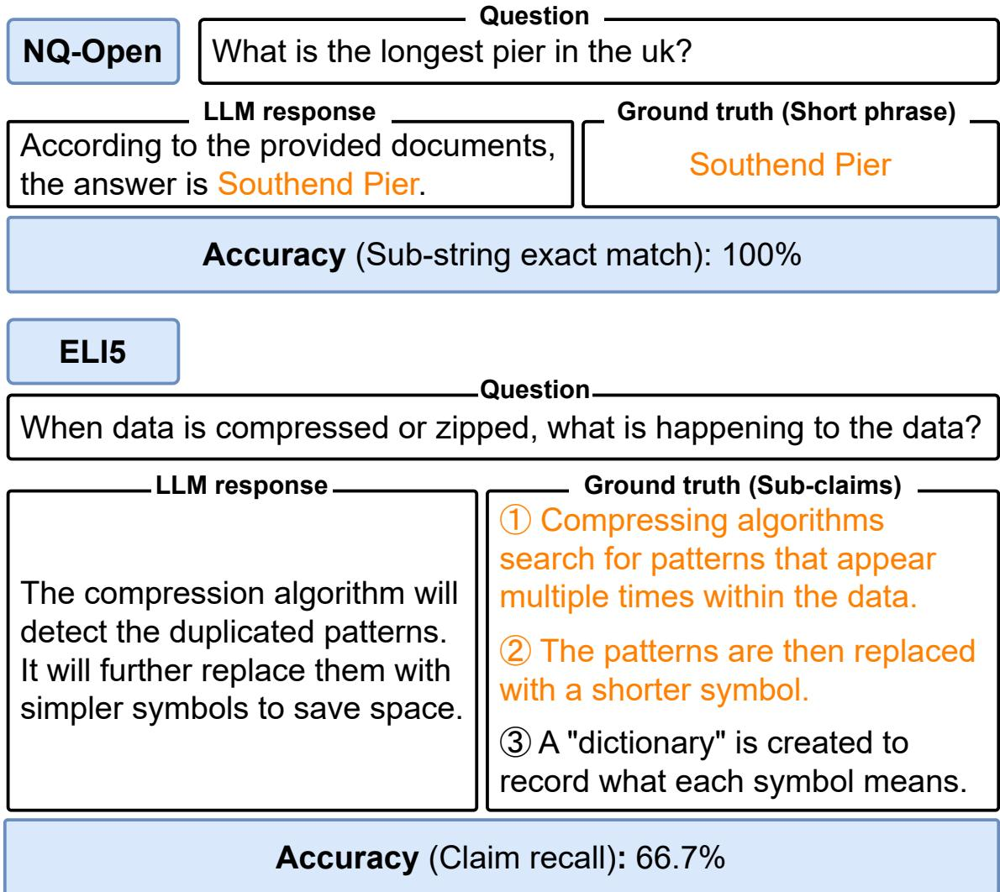  
Figure 6: Evaluation metrics used in our experiments. On NQ-Open, the evaluation metric is exact string match. On ELI5, a pretrained NLI model is used to evaluate whether the LM output entails the reference claims.

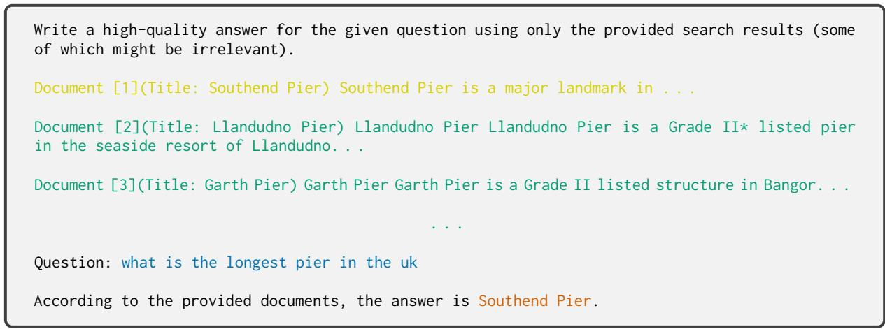  
Figure 7: An example prompt and LM output on NQ-Open. The prompt comprises (1) an instruction that describes the task to be solved, (2) a context that contains the information for solving the task, in which the gold document contains the ground truth answer, and (3) a question that describes the specific query. At the end of the prompt, we append an exemplar output that gives the ground truth answer to the question for evaluating the likelihood of the answer.

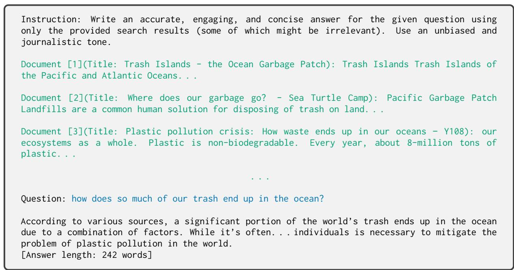  
Figure 8: An example prompt and LM output on ELI5. The prompt comprises (1) an instruction that describes the task to be solved, consistent with previous works on ELI5 (Gao et al., 2023; Qi et al., 2024), (2) a context that contains the information for solving the task, but no gold document is marked, and (3) a question that describes the specific query. At the end of the prompt, we append an exemplar output that gives the ground truth answer to the question for evaluating the likelihood of the answer

## D Prompt Templates

The prompt templates used for our experiments are given in Figures 7–9.

{   
"749 d280d -8 d74 -4 a2b -87fa - e2a13b689892 ":   
"51 f95eb8 -1 f16 -4 bbf -a7be -6109 e581fc04 ",   
" 6618 b34a -08 b6 -46a8 -a438 - aedc1a2a4635 ":   
"3 e93dc61 -1 e82 -46b1 -94 be -7 ef2e63746e5 ",   
}   
Key: "749 d280d -8 d74 -4 a2b -87fa - e2a13b689892 "   
Value :

Figure 9: An example of synthetic data for key–value retrieval.
<table><tr><td>Key Location</td><td> ${ \vec { p } } ( q \mid c )$   ${ \vec { p } } ( a \mid c \cdot q )$ </td></tr><tr><td>0</td><td>-3.96 -0.76</td></tr><tr><td>34</td><td>-6.60</td></tr><tr><td>69</td><td>-0.87 -0.82</td></tr><tr><td>104</td><td>-7.87 -8.70</td></tr><tr><td>139</td><td>-1.08 -8.03 -0.76</td></tr></table>

Table 5: Question likelihood and answer likelihood on synthetic key–value retrieval task using Llama-3.1-8B-Instruct model.

<table><tr><td>Key Location</td><td> ${ \vec { p } } ( q \mid c )$ </td><td> ${ \vec { p } } ( a \mid c \cdot q )$ </td></tr><tr><td>0</td><td>-3.01</td><td>-0.08</td></tr><tr><td>34</td><td>-6.22</td><td>-0.15</td></tr><tr><td>69</td><td>-6.86</td><td>-0.31</td></tr><tr><td>104</td><td>-7.87</td><td>-0.27</td></tr><tr><td>139</td><td>-7.33</td><td>-0.07</td></tr></table>

Table 6: Question likelihood and answer likelihood on synthetic key–value retrieval task using Llama-3.1-8B model.
<table><tr><td>Key Location</td><td> ${ \vec { p } } ( q \mid c )$ </td></tr><tr><td>0</td><td> ${ \vec { p } } ( a \mid c \cdot q )$  -0.00</td></tr><tr><td>34</td><td>-4.03 -6.31</td></tr><tr><td>69</td><td>-0.12 -0.23</td></tr><tr><td>104</td><td>-8.15 -9.67</td></tr><tr><td></td><td>-0.15</td></tr><tr><td>139 -8.77</td><td>-0.04</td></tr></table>

Table 7: Question likelihood and answer likelihood on synthetic key–value retrieval task using Mistral-7B-Instruct model.

## E Full Results on NQ-Open

We show the full results on NQ-Open in Figures 10–13.

## F Synthetic Experiment

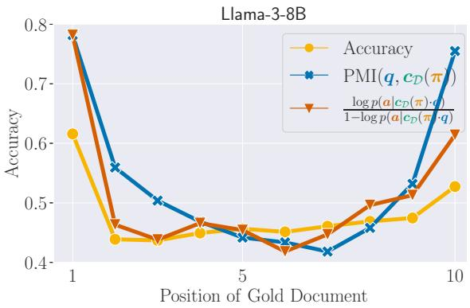  
(a)

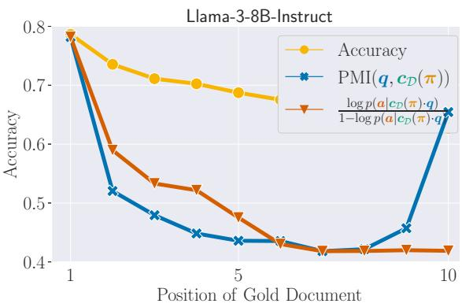  
(b)

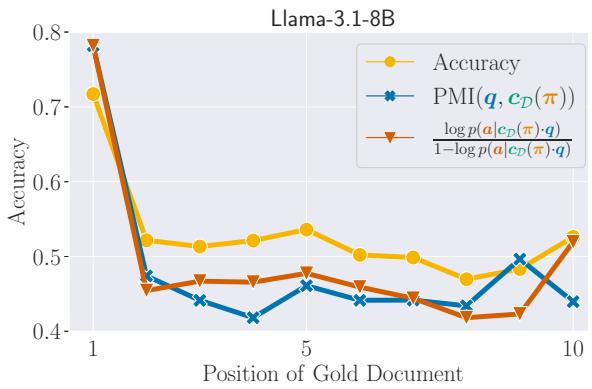  
(c)

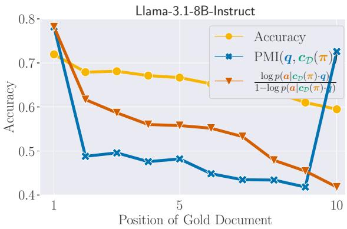

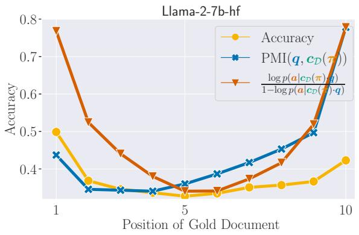

(d)  
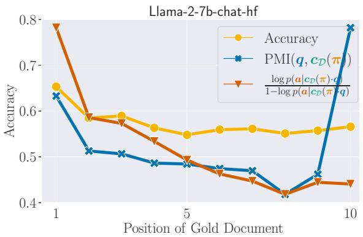

(e)  
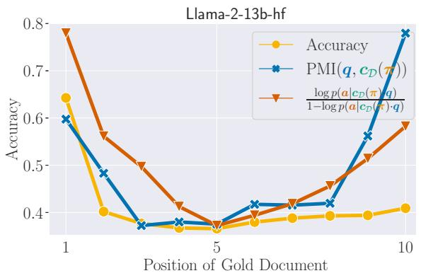  
(g)

(f)  
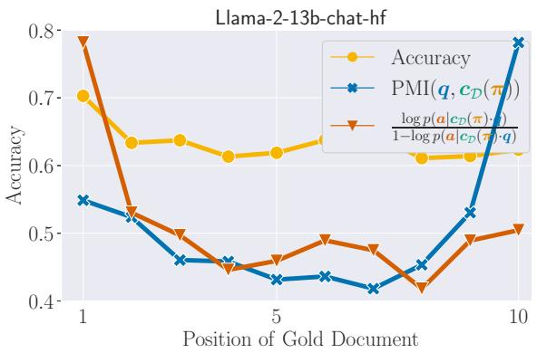  
(h)  
Figure 10: QA accuracy, PMI, and log odds ratio of answer likelihood on 10 documents.

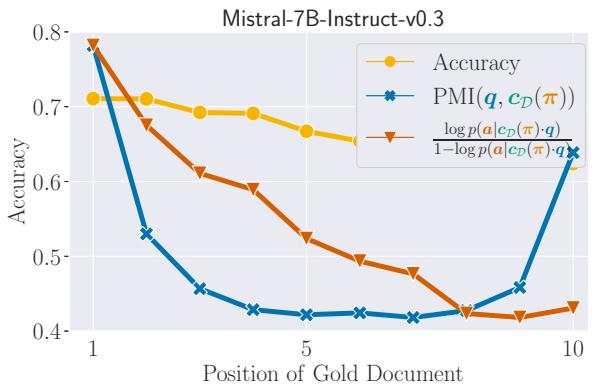  
(a)

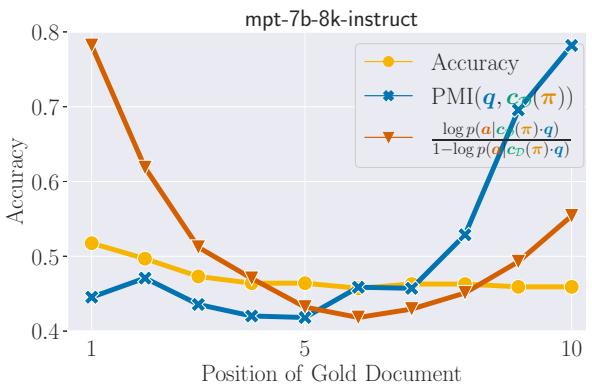  
(b)  
Figure 11: QA accuracy, PMI, and log odds ratio of answer likelihood on 10 documents.

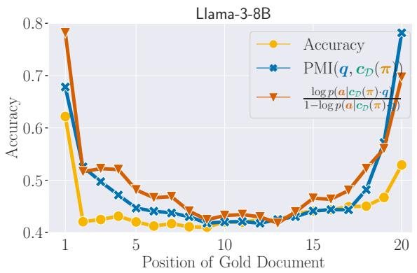  
(a)

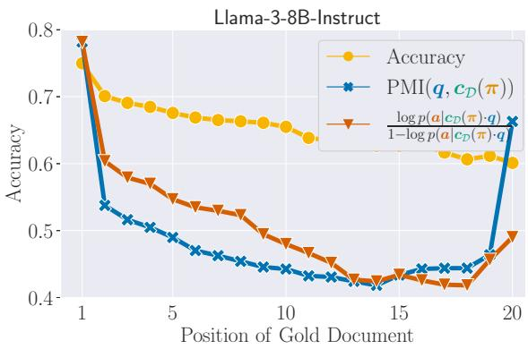  
(b)

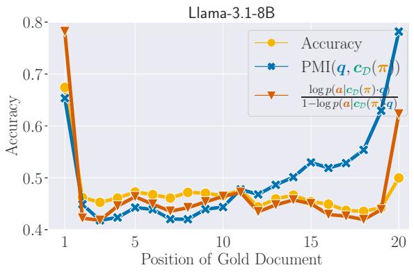  
(c)

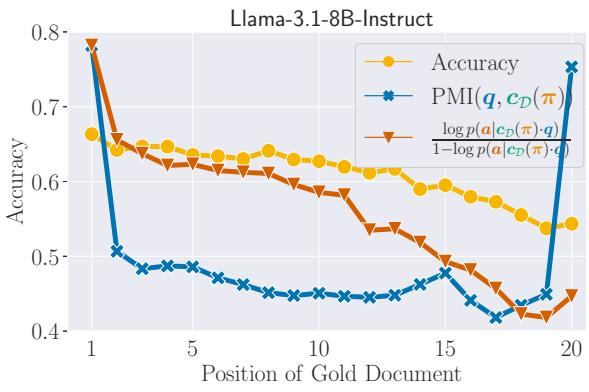

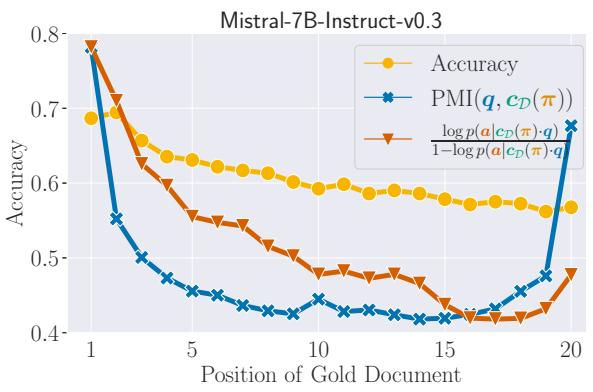  
(e)

(d)  
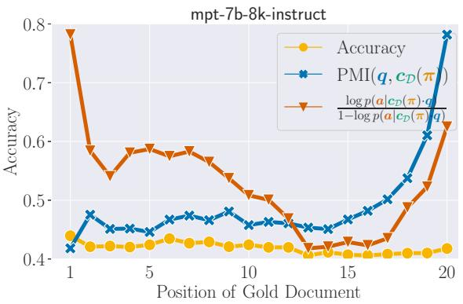  
(f)  
Figure 12: QA accuracy, PMI, and log odds ratio of answer likelihood on 20 documents.

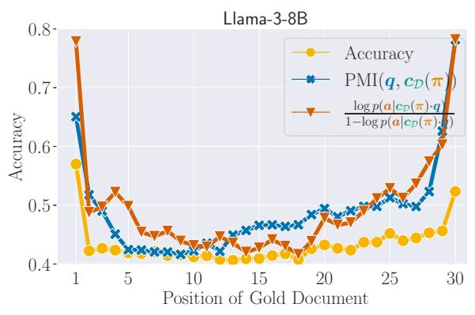

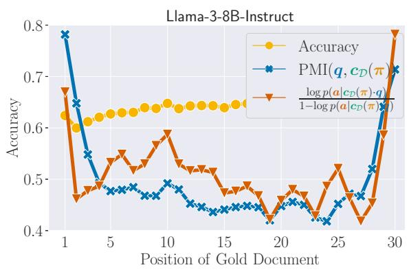

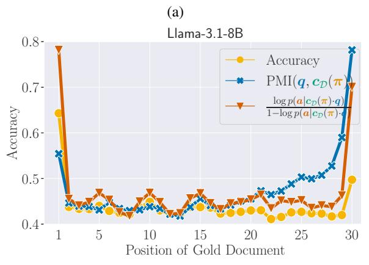

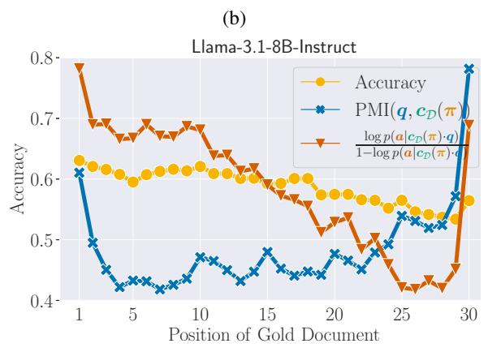

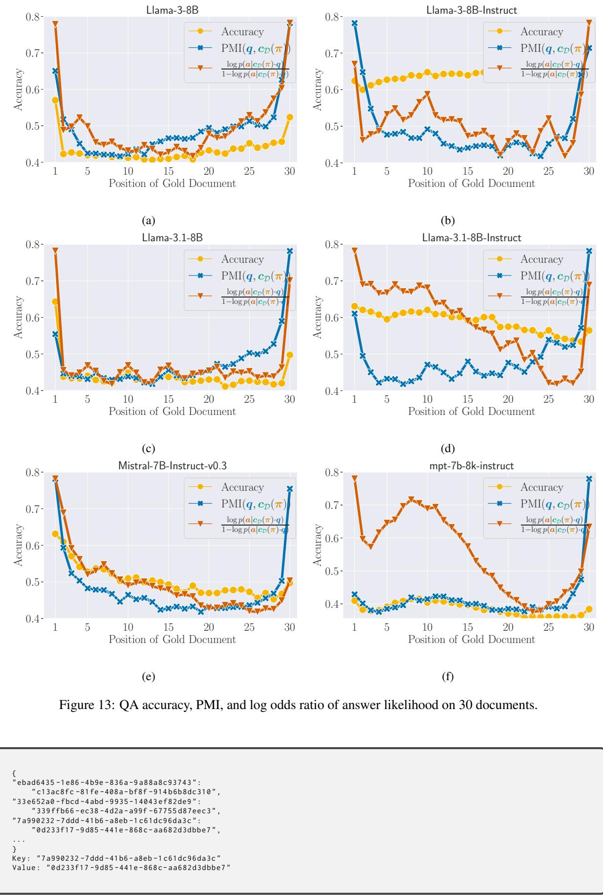

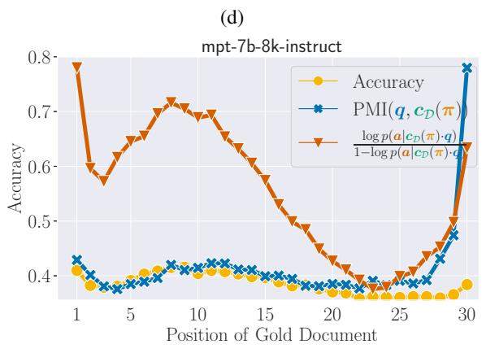  
Figure 14: Example input for key–value retrieval task.

## G Proof of Proposition 2.1

Proposition 2.1. Under assumptions given in Assumption 2.1, we have

$$
\begin{array} { r l } { \log \displaystyle \frac { \overrightarrow { p } ( a \mid q \cdot c _ { \mathcal { D } } ( \pi ) ) } { 1 - \overrightarrow { p } ( a \mid q \cdot c _ { \mathcal { D } } ( \pi ) ) } ~ } & { } \\ { = \mathrm { P M I } ( q , c _ { \mathcal { D } } ( \pi ) ) + C ( a , c _ { \mathcal { D } } ( \pi ) ) } \end{array}\tag{6}
$$

for an answer-dependent constant $C ( { a } , { c } _ { \mathcal { D } } ( \pi ) )$

Proof. First note that, by Bayes’ rule, we have

$$
\vec { p } ( a \mid c _ { \mathcal { D } } ( \pi ) \cdot q ) = \frac { \vec { p } ( \trianglerighteq { \boxed { \Omega a \mid c _ { \mathcal { D } } ( \pi ) } } ) \vec { p } ( q \mid c _ { \mathcal { D } } ( \pi ) \ d \ d \Omega a ) } { \vec { p } ( c _ { \mathcal { D } } ( \pi ) \cdot q ) } .\tag{17}
$$

Then,

(18a)

$$
\begin{array} { r l } & { \begin{array} { r l } & { \mathcal { D } \{ a , 1 \} \frac { \overline { { \gamma } } ( a ) } { 1 - \overline { { \gamma } } ^ { 2 } ( a ) } ( \tau - \gamma ) ^ { 2 } = b \sum _ { \overline { { \Omega } } \in \overline { { \Omega } } } \frac { \overline { { \gamma } } ( a ) } { \sum \pi ( a , b ) } ( \overline { { \gamma } } + \gamma ) ^ { 2 } , } \\ & { = \mathrm { b } \frac { \overline { { \gamma } } ( a ) } { 1 - \overline { { \gamma } } ^ { 2 } ( a ) } ( \tau - \gamma ) ^ { 2 } , } \end{array} } \\ &  \begin{array} { r l } & { - \mathrm { l i g } \frac { \overline { { \gamma } } ( a ) } { \sum \pi ( a , b ) } \frac { \overline { { \gamma } } ( a ) } { ( \gamma ) ^ { 2 } ( \overline { { \Omega } } ) ( \overline { { \Omega } } ) ( \overline { { \Omega } } ) ( \overline { { \Omega } } ) ( \overline { { \Omega } } ) } { ( \overline { { \Omega } } ) ( \overline { { \Omega } } ) ( \overline { { \Omega } } ) ( \overline { { \Omega } } ) ( \overline { { \Omega } } ) } } \\ & { = \mathrm { b } \frac { \overline { { \gamma } } ( a ) } { \sum \pi ( a , b ) } \frac { \overline { { \gamma } } ( a ) } { ( \gamma ) ^ { 2 } ( \overline { { \Omega } } ) ( \overline { { \Omega } } ) ( \overline { { \Omega } } ) ( \overline { { \Omega } } ) ( \overline { { \Omega } } ) ( \overline { { \Omega } } ) ( \overline { { \gamma } } ) ( \overline { { \Omega } } ) } } \\ &  + \mathrm { b } \frac { \overline { { \gamma } } ( a ) } { \sum \overline { { \gamma } } ^ { 2 } ( a ) } \frac { ( \overline { { \gamma } } ( a ) ) }  ( \gamma \end{array} \end{array}\tag{Bayes’ rule}
$$

(18b)

(18c)

(Assumption 2.1)

(18d)

(18e)

(18f)

(18g)

where $C ( { a } , { c } _ { \mathcal { D } } ( \pi ) )$ is constant with respect to $q .$