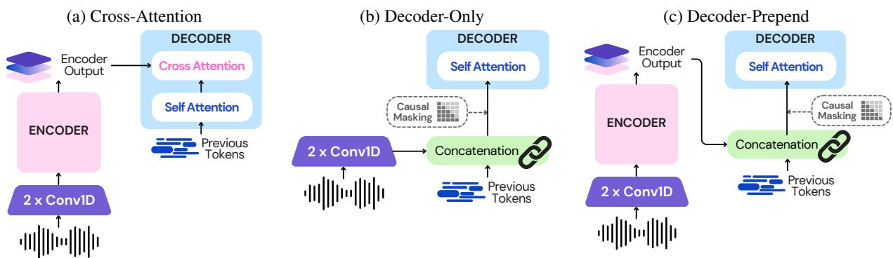
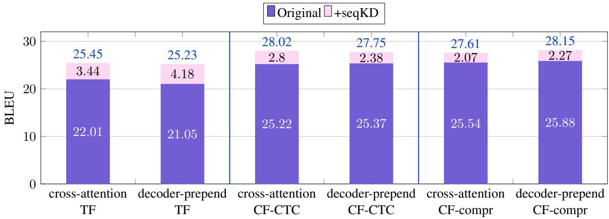

# Prepending or Cross-Attention for Speech-to-Text? An Empirical Comparison

Tsz Kin Lam1† , Marco Gaido2† , Sara Papi2 , Luisa Bentivogli2 , Barry Haddow1 1School of Informatics, University of Edinburgh 2Fondazione Bruno Kessler {tlam, bhaddow}@ed.ac.uk {mgaido, spapi, bentivo}@fbk.eu

## Abstract

Following the remarkable success of Large Language Models (LLMs) in NLP tasks, there is increasing interest in extending their capabilities to speech—the most common form of communication. The most widespread approach to integrating speech into LLMs is dense feature prepending (DFP), which prepends the projected speech representations to the textual representations, allowing end-to-end training with a speech encoder. This raises questions about the need for a sophisticated speech encoder for DFP and how its performance compares with a standard encoder-decoder (i.e., cross-attention) architecture. We compare DFP and cross-attention under a variety of configurations, such as CTC compression, sequencelevel knowledge distillation, on monolingual, bilingual, and multilingual models. To perform a controlled architectural comparison, we train all models from scratch rather than using large pretrained models and use comparable data and parameter settings, testing speech-to-text recognition (ASR) and translation (ST) on MuST-C v1.0 and CoVoST2 datasets. Despite the wide adoption of DFP, our results do not indicate a clear advantage of DFP over cross-attention.

## 1 Introduction

As the NLP community has witnessed the emergence of Large Language Models (LLMs) and their remarkable performance in tackling NLP tasks (Radford et al., 2019; Touvron et al., 2023; Jiang et al., 2023; Team et al., 2024), there is increasing interest in extending their capabilities to other modalities, such as audio (Latif et al., 2023; Chu et al., 2023; Huang et al., 2024b) and images (Radford et al., 2021; Team, 2024), to broaden their applicability. One of the most natural extensions of LLMs is to inject them with speech – the most common form through which humans express their language (Munteanu et al., 2013) – to exploit the

LLM’s linguistic fluency and skills to tackle speechto-text (S2T) tasks, such as automatic speech recognition (ASR) and S2T translation (ST).

This goal has been predominantly pursued by dense feature prepending (DFP) which adapts the embedded speech representations – obtained using the encoder of a Speech Foundation Model (SFM) or a speech encoder trained from scratch – to the input feature space of an LLM via a modality adapter and, optionally, a length adapter (Wu et al., 2023; Pan et al., 2023; Wang et al., 2023) and prepends them to a textual prompt describing the tasks to be performed (Gaido et al., 2024). Existing works on DFP mainly train the speech encoder, the modality adapter, and low-rank adapters in the LLM in an end-to-end fashion (Chen et al., 2024a; Hu et al., 2024). Throughout the paper, we refer to this DFP solution leveraging a speech encoder or SFM as decoder-prepend.

The effectiveness of decoder-prepend has recently been questioned on the basis of the analogy with classic S2T encoder-decoder models (Chen et al., 2024c; Zelasko et al.˙ , 2024), where the integration of the encoder output into the decoder is performed through cross-attention modules (Ao et al., 2021; Radford et al., 2023; Barrault et al., 2023). In addition, the outstanding performance of decoder-only LLMs on NLP tasks traditionally handled by encoder-decoder models has motivated the exploration of decoder-only S2T models (Wu et al., 2023; Gupta et al., 2024), which can be regarded as DFP solutions that question the need for a speech encoder and directly prepend speech features to the text embeddings. In this context, Wu et al. (2023); Gupta et al. (2024) highlighted the crucial role of relaxing the causal1 masking in the self-attention modules typical of autoregressive models for the speech features, allowing them to look at each other freely, rather than being restricted to only previous elements. Notably, Gupta et al. (2024) claimed that this approach enables decoder-only models to even surpass encoder-decoder ones on the ASR task. On the contrary, to the best of our knowledge, no investigation on the effect of the causality property has been carried out for decoder-prepend models.

With the goal of shedding light on the strengths and weaknesses of DFP solutions, we i) systematically compare the two DFP-based architectures (decoder-prepend and decoder-only) with the standard encoder-decoder architecture using crossattention, not only in terms of performance but also computational demands; ii) perform this comparison under a variety of relevant configurations, covering monolingual, bilingual and multilingual settings and including widely adopted techniques such as speech sequence length reduction (using the CTC compression mechanism – Liu et al. (2020); Gaido et al. (2021)) and sequence-level knowledge distillation or seqKD (Kim and Rush, 2016); and iii) conduct an in-depth study of the causality properties of DFP architectures.

To ensure a sound and fair comparison across architectures, we train them from scratch on the same two datasets: MuST-C v1.0 (Di Gangi et al., 2019a) and CoVoST2 (Wang et al., 2021). This choice of not using large-scale pretrained models offers a number of advantages. First, it prevents our results from being influenced by i) the specific features and capabilities of pretrained models (Verdini et al., 2024), and ii) the lack of a well-established method for integrating speech encoder with LLMs via cross-attention, an area still in its early research stages (Chen et al., 2024c; Zelasko et al. ˙ , 2024). Furthermore, using small models instead of largescale ones allows us to investigate the impact of all the aforementioned configurations within a reasonable computational budget.

Our experiments, carried out on two S2T tasks – ASR and ST – and covering a total of 12 language directions, demonstrate that:

• Cross-attention and decoder-prepend lead to overall similar results in terms of quality on both ASR and ST, with the first being slightly more efficient in terms of generation speed and GPU memory footprint, both outperforming decoder-only models on all aspects.

• DFP benefits more than cross-attention from

CTC compression in both ASR and ST.

• The inclusion of a speech encoder affects the causality behaviour of DFP models. Applying causal masking on the speech inputs hurts both the ASR and ST performances of decoder-only. In contrast, decoder-prepend slightly benefits from masking.

While the scalability of the findings to largescale models has to be confirmed (see Limitations), we believe that these findings can inform future research on integrating dense speech features into LLM. We release the code used in our experiments under the Apache 2.0 License at: https: //github.com/hlt-mt/FBK-fairseq/.

## 2 Background

## 2.1 (Cross-)Attention-based encoder-decoder

The cross-attention based encoder-decoder has been one of the major research directions for S2T (Chan et al., 2015; Bérard et al., 2016; Weiss et al., 2017; Bansal et al., 2017; Fang et al., 2022; Tsiamas et al., 2024). In addition to its end-toend (E2E) properties, such as a simpler pipeline over the traditional methods and E2E optimization, cross-attention allows full attention on the sequences, making it more attractive than CTC (Graves et al., 2006) and Transducer for learning sequences with switching word order, as in machine translation (MT) (Sperber and Paulik, 2020; Li et al., 2022).

## 2.2 DFP: modelling S2T with decoder-only language models

With the tremendous success of decoder-only language models (LM) for modelling text, there have been explorations of using them for modelling S2T, such that the speech (source) embeddings are passed to the decoder via prepending to the target text embeddings rather than using cross-attention. In this work, we divide DFP methods into two categories: decoder-only and decoder prepend.

Decoder-only S2T. We refer to decoder-only S2T as a model that has a length adapter (e.g., strided convolutions) for the speech inputs, but not a deep speech encoder, before prepending. These works include Wu et al. (2023), which claims that decoder-only models can match the performance of encoder-decoder ones with fewer parameters on multilingual ST, and Gupta et al. (2024), which trains a large-scale ASR decoder-only model comparing it with openly-available models. In contrast, our experiments are not limited to a single task or setting, and we always compare models trained on the same data.

  
Figure 1: Representation of the architectures analyzed in the paper. Both (a) and (c) are based on encoder-decoder architecture but (a) uses cross-attention, whereas (c) uses DFP. Secondly, both (b) and (c) uses DFP, but (c) contains a speech encoder, making it not decoder-only. The (audio) causal masking can be applied to both the previous tokens and the audio sequence or only to the previous tokens.

Decoder-prepend S2T. When the projected speech embeddings are fed directly from a speech encoder or SFM, we refer to the model as decoderprepend rather than decoder-only to emphasize its reliance on a speech encoder. There have been more works on this line, including ASR (Lakomkin et al., 2024; Hono et al., 2024; Fathullah et al., 2024; Tsunoo et al., 2024, 2023), ST (Huang et al., 2024a; Chen et al., 2024a) and multi-tasks (Chen et al., 2024c; Zelasko et al.˙ , 2024; Chen et al., 2024b) systems. Despite their valuable insights, their experiments are based on large pretrained models and lack transparency and comparability. In contrast, we remove such dependency, enabling a clear comparison with cross-attention models.

## 3 Methods

## 3.1 Encoder-Decoder with Cross Attention

Transformer-based architectures (Vaswani, 2017) are encoder-decoder sequence-to-sequence models, where the encoder maps the input sequence $\mathbf { X } = [ x _ { 1 } , . . . , x _ { n } ]$ into an internal representation or encoder output (Figure 1a), which are then processed by the decoder to generate the output sequence $\mathbf { Y } = [ y _ { 1 } , . . . , y _ { m } ]$ . Both encoder and decoder are composed of a stack of Transformerbased layers that exploit dot-product attention (A) (Chan et al., 2016) as the core mechanism, which

is formulated as:

$$
A ( Q , K , V ) = s o f t m a x \left( \frac { Q K ^ { T } } { \sqrt { d _ { k } } } \right) V
$$

where $Q$ is the query matrix, K is the key matrix, V is the value matrix, and $d _ { k }$ is the dimension of K. In the encoder, the $Q , K$ , and V matrices are all obtained from the input sequence X, and A is called self-attention $( A _ { s } ) ^ { \bar { 2 } }$ . In the decoder, apart from the self-attention, there is another attention mechanism called cross-attention $( A _ { c } )$ that links the encoder with the decoder representations. In this case, the $Q$ matrix of the $l _ { d }$ layer is obtained from the output of the self-attention of the same layer, which takes as input the previous decoder layer output ${ H } _ { l _ { d } - 1 }$ where $H _ { 0 }$ is the sequence of embeddings of the previously generated output $\mathbf { Y } _ { 0 , \ldots , i - 1 }$ . The K and V matrices, instead, are taken from the encoder output $E n c ( \mathbf { X } )$ . The Transformer decoder layer $D _ { l _ { d } }$ is completed by a feed-forward network $( F F N )$ composed of two linear layers. As such, the output of the cross-attention-based encoder-decoder corresponds to the output of the last decoder layer $H _ { L _ { d } } \mathbf { . }$

$$
\begin{array} { r } { F F N ( A _ { c } ( A _ { s } ( H _ { L _ { d } - 1 } ) , E n c ( \mathbf { X } ) , E n c ( \mathbf { X } ) ) ) , } \\ { \mathrm { w h e r e \quad } H _ { 0 } = \mathbf { Y } _ { 0 , \ldots , i - 1 } } \end{array}
$$

In the context of speech processing, the input sequence X is an audio segment downsampled by a factor of 4 with two Convolutional layers before feeding it to the stack of encoder layers (Bérard et al., 2018; Di Gangi et al., 2019b). The downsampling maps the input representation into a shorter sequence suitable for processing, as audio is 10 times longer than the corresponding text sequence.

## 3.2 Decoder-only and Decoder-prepend

In the decoder-only architecture (Brown, 2020) for speech-to-text processing (Chen et al., 2023), the input audio sequence X is not processed by an encoder but its downsampled representation is directly fed into the decoder after being concatenated3 with the previously emitted tokens $\mathbf { Y } _ { 0 , \ldots , i - 1 }$ (Figure 1b). The output of the decoder-only model $H _ { L _ { d } }$ can be expressed as:

$$
F F N ( A _ { s } ( H _ { L _ { d } - 1 } ) ) , \mathrm { w h e r e } \quad H _ { 0 } = \mathbf { X } \parallel \mathbf { Y } _ { 0 , . . . , i - 1 }
$$

in which  is the concatenation operator. In this case, the cross-attention is dropped and selfattention is applied to both the input audio sequence X and the previous tokens $\mathbf { Y } _ { 0 , \ldots , i - 1 }$

The decoder-prepend (Figure 1c) architecture operates similarly to decoder-only, with the only difference that it exploits the representation obtained from a speech encoder instead of the raw speech features X, as in the encoder-decoder models equipped with cross-attention. This corresponds to $H _ { 0 } = E n c ( \mathbf { X } ) \| \mathbf { Y } _ { 0 , \ldots , i - 1 }$ in the previous equation. A notable difference between decoder-prepend and decoder-only is that in decoder-prepend the audio frames can attend to each other and interact in the encoder before concatenation (prepending).

## 3.3 Audio Causal Masking

During training of encoder-decoder models, the target tokens in the decoder are causally masked to prevent them from looking at future information. The causal masking can be represented as a mask matrix M:

$$
M _ { i j } = \left\{ { \begin{array} { l l } { 0 } & { { \mathrm { i f ~ } } j \leq i } \\ { - \infty } & { { \mathrm { o t h e r w i s e } } } \end{array} } \right.
$$

that is summed with the attention matrix before the softmax operator to make sure that each element i can only attend to itself and elements before it (i.e., $j \leq i )$ , obtaining

$$
A ( Q , K , V ) = s o f t m a x \left( \frac { Q K ^ { T } } { \sqrt { d _ { k } } } + M \right) V
$$

In standard settings, causal masking is also applied in the DFP models where both previous tokens Y and the input audio representation X are masked. Therefore, the decoder self-attentions implement the above masking strategy on the concatenated sequence $\mathbf { X } \parallel \mathbf { Y } _ { 0 , \ldots , i - 1 }$ (Figure 1b and

1c). Recent works (Wu et al., 2023) propose an alternative solution for causal masking, where only the previous tokens are masked while each element of the speech sequence can attend to each other. In this case, the causal mask M becomes:

$$
M _ { i j } = \left\{ { \begin{array} { l l } { 0 } & { { \mathrm { i f ~ } } j \leq i { \mathrm { ~ o r ~ } } j < N } \\ { - \infty } & { { \mathrm { o t h e r w i s e } } } \end{array} } \right.
$$

where N is the length of the speech sequence X. This enables speech tokens to attend to all other speech tokens, including subsequent ones, in the decoder self-attention layers, as it happens in the self-attention of the speech encoders in encoderdecoder models.

## 4 Experimental Settings

## 4.1 Data

The MuST-C data set is derived from TED talks with English audios transcribed and translated into 8 languages. We trained ASR models using its English transcripts while for ST we also used all 8 target languages, namely Dutch (nl), French (fr), German (de), Italian (it), Portuguese (pt), Romanian (ro), Russian (ru) and Spanish (es). More specifically, we trained two bilingual ST models translating English speech into Spanish and German texts respectively, and a single multilingual ST model translating into all 8 target languages.

One limitation of MuST-C is that its speech data is English only. In order to compare the models on non-English speech, we run further experiments on the x-en language directions of the CoVoST2 data. There are 21 non-English languages, e.g., Catalan (ca) and Chinese (zh) for the speech inputs. A complete list of supported languages can be found in Wang et al. (2021). For each model architecture, we trained a single multilingual ASR4 model and a multilingual ST model with transcripts of the 21 non-English languages and the English translations as target inputs, respectively.

Audio processing. We extract log Mel-filterbank features of size 80 computed every 10ms with a window size of 25ms. The resulting spectrograms are normalized using Utterance-level Cepstral Mean and Variance Normalization (CMVN). During training, we also apply SpecAugment (Park et al., 2019) with frequency and temporal masks of size 27 and 100 respectively.

Text processing. The text is tokenized with unigram models trained using SentencePiece (Kudo and Richardson, 2018). On CoVoST2, the vocabulary size for ASR and ST is 32k and 5k respectively. On MuST-C, the vocabulary size is 5k for ASR, 8k for bilingual ST, and 32k for multilingual ST.

## 4.2 Model architecture

For our experiments, we use both Transformer and Conformer (Gulati et al., 2020) architectures, the latter being an improved version of Transformer for speech achieving state-of-the-art results. All models in our experiments have 18 layers that are distributed between the encoder-decoder (12 layers for the encoder and 6 layers for the decoder) or the decoder, except in decoder-only32L which contains 32 layers to match its number of parameters to the Conformer models. The embedding layer and the feed-forwad layers have dimensions of 512 and 2048, respectively across all the models, and the number of attention heads is set to 8. Encoder dropout is set as 0.1 for feed-forward, attention, and convolution layers. Also, in the convolution layer of the Conformer, the kernel size of the pointand depth-wise convolutions is set to 31. The smallest model has about 64.9M parameters, whereas the largest one has 153M parameters.

In the experiments with CTC loss, a linear layer having the vocabulary size is added after the $8 ^ { \mathrm { t h } }$ encoder layer. The softmax function is applied to this layer and then the CTC loss is computed with a weight of 0.5. When CTC compression is applied, vectors having the same predictions are merged by averaging them, following Gaido et al. (2021).

We use Fairseq (Ott et al., 2019; Wang et al., 2020) for all the experiments. When using the Conformer encoder, we adopt the implementation from Papi et al. (2024a) which fixes the padding bugs in the convolution layers and the relative positional encoding.

## 4.3 Training and Evaluation

Training. In all experimental settings, we use the Adam optimizer for training. The learning rate follows a Noam scheduler with a maximum value of $2 \times 1 0 ^ { - 3 }$ and a linear warmup of 25k steps, after which it follows an inverse square root decay.

On MuST-C, all models are trained with a total batch size of 320k audio frames for at most 100k steps along with an early stopping strategy with patience of 10. For the multilingual ST models, we further prepend a language tag to the translations corresponding to the target language. On CoVoST2, all (multilingual) ASR and ST models are trained with a total batch size of 256k frames for 60k steps. On both datasets, all ST encoders are initialized by the corresponding ASR encoders. In the case of decoder-only, we use the corresponding decoder-only ASR model for initialization, but both the embedding and output layer are randomly initialized. Experiments are run on 4 Nvidia A100- 40GB GPUs for about 2 days. The final model is obtained by averaging the last 5 checkpoints.

Evaluation. We use beam search for inference with beam size of 5 and no-repeat-ngram-size of 5, performed on one Nvidia A100-40GB GPU.5

ASR models are evaluated by computing word error rate (WER), whereas we use sacreBLEU6 (Post, 2018) to compute BLEU scores for the ST models. We provide statistical significance tests to major comparisons using bootstrap resampling (Koehn, 2004) for ASR and approximate randomization (Riezler and Maxwell, 2005) for ST.

## 5 Results

In this section, we conduct a series of experiments to examine cross-attention and DFP from a variety of angles under comparable data and model size conditions. To begin with, we first discuss the ASR and ST results between cross-attention, decoderonly, and decoder-prepend using transformer and conformer architectures. Then, we present their results under the effect of speech sequence compression (via CTC) and seqKD. In addition, we analyze their difference in terms of generation speed and GPU memory footprint. Finally, we present an ablation study about the causality masking of decoder-only and decoder-prepend.

## 5.1 Cross-attention, decoder-only and decoder-prepend

We present the results in Table 1. In addition, we compute p-values between each configuration against the cross-attention baseline of similar model size.

Transformer encoder (Lines 1-3). Compared to both DFP methods, cross-attention on average has stronger ASR and ST results. On the CoVoST2 dataset, its improvement in multilingual ASR and ST reaches 2.4 WER (line 1 vs. line 3) and 1 BLEU point, respectively. On the MuST-C dataset, it is still better than decoder-prepend (line 2) and all settings of decoder-only (line 3), except ST on the en-es and en-x directions. These differences are significant for at least one language pair with $p < 0 . 0 5$ . Despite its slightly stronger ST results, decoder-only falls behind decoder-prepend in ASR (line 3 vs. line 2), whose WER is 1.4 and 0.8 points lower on CoVoST2 and MuST-C, respectively. The mixed results on MuST-C, especially on ST, indicate the importance of having several test sets, modeling choices and tasks for evaluation.

<table><tr><td rowspan="3">Line</td><td rowspan="3">Model</td><td rowspan="3">#Params (M)</td><td colspan="2">CoVoST2</td><td colspan="4">MuST-C</td></tr><tr><td> $\overline { { A S R - W E R \left( \downarrow \right) } }$  ca/de/es/fr</td><td> $\overline { { S T - B L E U \left( \uparrow \right) } }$   $\mathrm { c a / d e / e s / f r - e n }$ </td><td> $\overline { { A S R - W E R \left( \downarrow \right) } }$  en</td><td>en-es</td><td> $\overline { { S T - B L E U \left( \uparrow \right) } }$  en-de</td><td>en-x</td></tr><tr><td>1</td><td>cross-attention TF</td><td>71.2 - 98.8</td><td>23.7</td><td> $2 5 . 6$ </td><td>12.1</td><td>26.9</td><td>22.0</td><td>25.1</td></tr><tr><td>2 3</td><td>decoder-prepend TF decoder-only 18L</td><td>64.9 - 92.5</td><td> $2 4 . 7 ^ { \dagger 4 }$   $2 6 . 1 ^ { \dag 4 }$ </td><td> $2 4 . 6 ^ { \dag 4 }$   $2 4 . 6 ^ { \dagger 4 }$ </td><td>12.4 13.2†</td><td>26.9 27.4†</td><td>21.1†</td><td> $2 4 . 6 ^ { \dag 4 }$ </td></tr><tr><td></td><td>cross-attention CF-CTC</td><td></td><td></td><td></td><td></td><td></td><td>21.9</td><td> $2 5 . 3 ^ { \dagger 1 }$ </td></tr><tr><td>4 4.1</td><td>(+) compr</td><td>111 - 153</td><td> $1 9 . 6$   $2 1 . 8 ^ { \ddagger 4 }$ </td><td> $2 9 . 7$   $2 8 . 5 ^ { \ddagger 4 }$ </td><td>10.4</td><td>29.9 30.2</td><td>25.2</td><td>28.6</td></tr><tr><td>5</td><td>decoder-prepend CF-CTC</td><td></td><td>19.9</td><td>29.7</td><td>10.3</td><td>30.2</td><td>25.5 25.4</td><td> $2 8 . 1 ^ { \ddagger 5 }$   $2 8 . 3 ^ { \ddagger 2 }$ </td></tr><tr><td>5.1</td><td></td><td>105 - 147</td><td>19.9</td><td> $2 9 . 7$ </td><td>10.3</td><td>30.7</td><td>25.9</td><td> $2 8 . 0 ^ { \ddagger 5 }$ </td></tr><tr><td>6</td><td>(+) compr decoder-only 32L</td><td>109 - 137</td><td> $2 4 . 3 ^ { \ddagger 4 }$ </td><td> $2 5 . 3 ^ { \ddagger 4 }$ </td><td>10.4 13.2</td><td></td><td></td><td></td></tr><tr><td></td><td></td><td></td><td></td><td></td><td></td><td>27.2</td><td>22.2</td><td> $2 6 . 8 ^ { \ddagger 8 }$ </td></tr></table>

Table 1: Comparison between cross-attention, decoder-only and decoder-prepend using Transformer (TF) and Conformer (CF) encoders. CTC compression is denoted by "compr". For multilingual models, we report the average over their target languages, i.e., top-4 high resourced pairs for CoVoST2 and the 8 target languages for MuST-C (the $" \mathrm { e n - } \mathbf { X } "$ column). We evaluate ASR and ST with WER ( ) and BLEU ( ), respectively. (N) and (N) refer to the number (N) of language pairs that are significantly different with $p < 0 . 0 5$ to line (1) and line (4), respectively.

Conformer with auxiliary CTC (Lines 4-6). Since the Conformer model outperforms Transformer in speech processing tasks (Gaido et al., 2022), we conducted experiments also leveraging this architecture. Additionally, we apply auxiliary CTC loss on the transcripts during training (see Section 4 for more details).

In Table 1, we can observe that both crossattention (line 4) and decoder-prepend (line 5) have similar ASR and ST results. On CoVoST2, both models have the same 29.7 BLEU points in multilingual ST, whereas cross-attention has a little advantage of 0.3 WER in ASR. On MuST-C ASR, on the contrary, decoder-prepend has a WER of 0.1 point lower. In terms of ST, decoder-prepend is up to 0.3 BLEU points higher, but it is also 0.3 BLEU points lower in the multilingual case. None of these differences are statistically significant with $p { < } 0 . 0 5$ Regarding decoder-only, we scale up its number of layers from 18 to 32 to match the Conformer size. Such scaling improves its overall performance substantially, resulting in a maximum improvement of 1.8 WER in ASR and 0.7 BLEU points in ST (line 3 vs line 6). Despite the improvements, the decoder-only configuration is about 2 points worse than the others in all evaluation settings.

The above results show that decoder-prepend is on par with cross-attention but not better. This extends to the experiment applying the auxiliary CTC loss to the Conformer encoder. Furthermore, our results clearly show that a properly designed speech encoder, such as the Conformer, substantially improves the performance over a plain decoder-only model of similar size for both ASR and ST. Because of its competitive performance, we further compare decoder-prepend with cross-attention in the following sections.

## 5.2 Effect of audio sequence compression

Despite the similar quality achieved when auxiliary CTC loss is applied during training (lines 4-5), the behaviour of cross-attention and decoder-prepend significantly differ when CTC compression is also applied. On the CoVoST2 dataset, compression on cross-attention (line 4.1) causes a degradation of 2.2 points in WER and 1.2 points in BLEU (with p < 0.05), whereas it does not cause harm to decoderprepend (line 5.1). On the MuST-C dataset, both cross-attention and decoder-prepend get better in bilingual ST and worse in multilingual ST after applying compression while remaining stable for ASR. Despite the similar pattern, the improvements of decoder-prepend are slightly bigger while its degradations are smaller. Thus, overall, decoderprepend better leverages CTC compression.

Our results indicate that applying CTC compression to decoder-prepend is more beneficial than to cross-attention but it is not sufficient to claim that decoder-prepend is better. Cross-attention with CTC (line 4) and decoder-prepend with compression (line 5.1) have almost identical results on CoVoST2, whereas, on MuST-C, cross-attention is 0.6 BLEU points better in multilingual ST despite being 0.8 BLEU points worse in bilingual ST.

  
Figure 2: Comparison between cross-attention and decoder-prepend using sequence-level knowledge distillation (seqKD) for ST on MuST-C en-de. "TF", "CF-CTC" and "CF-compr" refer to Transformer, Conformer with auxiliary CTC loss and Conformer with CTC compression, respectively.

## 5.3 Effect of seqKD

SeqKD helps to reduce the translation data complexity by making the target sentence more monotonically aligned to its source sentence (Zhou et al., 2019). This makes seqKD not only useful for improving non-autoregressive translation but also endto-end ST (Inaguma et al., 2021), which has an additional challenge brought by the modality gap. Despite its usefulness, there is a lack of studies about applying seqKD on ST models using DFP. In the following, we fill the gap with experiments on the MuST-C en-de language direction, where cross-lingual alignment is more complicated, to demonstrate better the effect of the seqKD data. We employ NLLB 3.3B (Costa-jussà et al., 2022) to machine translate the English transcripts in the training set into German as our seqKD data.

Figure 2 presents the results on cross-attention and decoder-prepend7. For each model configuration, we train once using the original data, denoted by "Original", and once using the combined data, denoted by "Original+seqKD". As we can observe, training on the combined data brings a substantial gain of more than 2 BLEU points ("+seqKD") in all configurations. This indicates that seqKD also works effectively on decoder-prepend.

Despite the remarkable gain, there are no clear indications of whether cross-attention or decoderprepend benefits more from seqKD data. In fact, in the case of Transformer, decoder-prepend gets a higher BLEU improvement (4.18 vs 3.44) with respect to cross-attention. However, in the case of Conformer, we observe a different behaviour: the gain for decoder-prepend is higher only when CTC compression is applied. In terms of their best BLEU scores, both cross-attention and decoderprepend are very similar: cross-attention using Transformer is 0.22 BLEU points higher than decoder-prepend, whereas the conformer results show the opposite: decoder-prepend with compression is 0.13 BLEU points better than cross-attention (28.15 vs 28.02).

## 5.4 Generation speed and memory footprint

In addition to ASR and ST performances, we evaluate our models in terms of generation speed and GPU memory footprint. For each metric, we compute the average over the 8 language pairs using the multilingual ST on MuST-C, which has longer inputs and covers diverse languages, providing more robust statistics. We report the relative value using cross-attention with Transformer encoder as the baseline in Table 2. The batch size and GPU settings follow those in Section 4.3, except that only one GPU is used.

Compared to cross-attention, decoder-prepend has fewer parameters, i.e., 98.8M vs 92.5M, but is 4% slower. If we allocate all encoder parameters to the decoder, i.e., decoder-only (18L), the resulting model is even 17% slower than crossattention while requiring about three times as much GPU memory. Similar patterns could be found in conformer with CTC, where cross-attention is slightly faster and less memory demanding than its decoder-prepend despite having 6M more parameters. Again, decoder-only, i.e., decoder-only (32L), appears to be the worst. It has only 70% generation speed and requires 5 times as much GPU memory footprint to the baseline. It is worth noting that cross-attention CF-CTC still remains faster and more memory efficient than decoder-only (18L) despite having 43% more parameters. As expected, CTC compression (compr) makes the generation faster and reduces the GPU memory footprint. The improvement to cross-attention and decoder-prepend in speed is about 1% and 2%, respectively, whereas it is respectively about 13% and 19% in memory footprint. Decoder-prepend has a bigger improvement, but its overall performance is still behind that of cross-attention.

<table><tr><td rowspan="2">Model</td><td rowspan="2">#Params</td><td colspan="2">Ratio</td></tr><tr><td>speed ↑</td><td>memory ↓</td></tr><tr><td rowspan="2">cross-attention TF decoder-prepend TF</td><td>98.8M</td><td>1</td><td>1</td></tr><tr><td>92.5M</td><td>0.96 0.83</td><td>1.59</td></tr><tr><td rowspan="2">decoder-only 18L cross-attention CF-CTC (+) compr</td><td></td><td>0.97</td><td>3.01 2.16</td></tr><tr><td>139M</td><td>0.98</td><td>1.88</td></tr><tr><td>decoder-prepend CF-CTC</td><td>133M</td><td>0.94</td><td>3.11</td></tr><tr><td>(+) compr</td><td></td><td>0.96</td><td>2.50</td></tr><tr><td>decoder-only 32L</td><td>136M</td><td>0.70</td><td>5</td></tr></table>

Table 2: A comparison between cross-attention and DFP in terms of model parameters, relative generation speed (tokens/s) and relative GPU memory footprint. Other acronyms follow Table 1.

Despite the removal of the cross-attention layers, our study reveals that DFP is still worse in terms of generation speed and memory footprint. The quadratic time and memory complexity of selfattention in sequence length is a more severe issue for DFP when considering speech inputs.

## 5.5 (Audio) Causality masking in decoder-only and decoder-prepend

In previous sections, we presented each DFP configuration using its optimal causal masking strategy: 1) causal masking is not applied on decoder-only, whereas 2) it is applied on decoder-prepend. In the following, we provide an ablation study of causal masking, which is summarised in Table 3. The significance tests are computed between the pairs with and without causal masking.

As we can observe, decoder-only (both 18L and 32L) performs worse on all experimental settings when causal masking is applied. On CoVoST2, the performance degrades by at least 2 points, whereas the degradation can be up to 2 points on MuST-C. This indicates the importance of allowing the speech frames to attend each other in decoder-only models. Our finding is in accordance with the conclusion drawn by Gupta et al. (2024) for ASR, and we further extend it for ST.

When causal masking is removed from decoderprepend (decoder-prepend TF), we observe a performance degradation of 1.2 WER and up to 0.9 BLEU points on MuST-C ASR and bilingual ST, respectively. What is even worse is the degradation of 8.18 BLEU points in multilingual ST. On the CoVoST2 dataset, however, removal of causal masking causes little improvement to both ASR and ST. In the case of Conformer, there are almost no performance changes on the CoVoST2 dataset when causal masking is removed, but a small degradation of 0.4 BLEU points (25.9 25.5) on the MuST-C en-de direction when CTC compression is also applied.

Therefore, our results lead to two interesting observations. Firstly, the behaviour of DFP models are quite different with causal masking, depending on whether a speech encoder is used or not. We hypothesise that the non-adversarial effect of causal masking on decoder-prepend is attributed to the self-attention within the speech encoder, which allows full attention within the speech frames. Secondly, applying causal masking on decoder-prepend is likely to help improving model performance on longer speech inputs, such as the MuST-C dataset.

## 6 Conclusion

In this paper, we aim to validate the modeling choice of using DFP (decoder-only and decoderprepend) over cross-attention to integrate speech into decoder-only LLMs for S2T tasks. In order to perform a controlled comparison under limited computational budget, we train all models from scratch without using large pretrained models. Our series of comparisons, including mono/bi/multilingual settings, indicate that DFP does not consistently outperform cross-attention in ASR and

<table><tr><td rowspan="2">Model</td><td rowspan="2">#Parameters</td><td colspan="2">CoVoST2</td><td colspan="4">MuST-C</td></tr><tr><td>ASR – WER (↓) ca/de/es/fr</td><td> $\overline { { S { T } - B L E U \left( \uparrow \right) } }$  ca/de/es/fr-en</td><td>ASR – WER (↓) en</td><td></td><td>ST – BLEU (↑)</td><td>en-x</td></tr><tr><td rowspan="3">decoder-prepend TF (-) causal mask decoder-only 18L</td><td rowspan="3">64.9M - 92.5M</td><td>24.7</td><td>24.6</td><td>12.4</td><td>en-es 26.9</td><td>en-de 21.1</td><td>24.6</td></tr><tr><td>24.6</td><td>24.9</td><td>13.2†</td><td>25.8†</td><td>20.8</td><td>16.5†8</td></tr><tr><td>26.1</td><td>24.6</td><td>13.2</td><td>27.4</td><td>21.9</td><td>25.3</td></tr><tr><td rowspan="3">(+) causal mask decoder-prepend CF-CTC (-) causal mask</td><td rowspan="3">105M - 147M</td><td> $2 8 . 7 ^ { \dagger 4 }$ </td><td>22.2†4</td><td>13.9†</td><td>26.0†</td><td>20.1†</td><td>24.2†8</td></tr><tr><td>19.9</td><td>29.7</td><td>10.3</td><td>30.2</td><td>25.4</td><td>28.3</td></tr><tr><td>20.1</td><td>29.9</td><td>10.6</td><td>30.2</td><td>25.3</td><td>28.3</td></tr><tr><td rowspan="3">(+) compr (-) causal mask</td><td rowspan="3"></td><td>19.9</td><td>29.7</td><td>10.4</td><td>30.7</td><td>25.9</td><td>28.0</td></tr><tr><td>19.9</td><td>29.7</td><td>10.4</td><td>30.7</td><td>25.5</td><td>28.1</td></tr><tr><td>24.3</td><td>25.3</td><td>13.2</td><td>27.2</td><td>22.2</td><td>26.8</td></tr><tr><td>decoder-only 32L (+) causal mask</td><td>109M - 137M</td><td> $2 6 . 6 ^ { \dag 4 }$ </td><td> $2 3 . 3 ^ { \dagger 4 }$ </td><td>14.4†</td><td>26.0†</td><td>20.2†</td><td>25.5†8</td></tr></table>

Table 3: Causality masking in decoder-only and decoder-prepend. (N) refers to the number (N) of language pairs that are significantly different with $p < 0 . 0 5$ to its baseline. Other acronyms follow Table 1.

ST quality, and that cross-attention is more efficient in terms of generation speed and GPU memory footprint. Our studies further suggest that: (1) decoder-prepend with a strong speech encoder is more efficient than decoder-only of similar size, and (2) a variety of test sets, language pairs (and directions) as well as tasks, e.g., bi/multi-lingual ST models, are needed to validate the effective scope of a S2T technique, such as causal masking.

Future Work. In addition to scaling up the data and model sizes, we leave the comparisons of several interesting aspects of S2T models in future works. These include 1) zero-shot transfer (Tsiamas et al., 2024), 2) performance under segmental inputs and augmentations (Tsiamas et al., 2022; Lam et al., 2022, 2023), 3) simultaneous setting (Ahmad et al., 2024; Papi et al., 2024b) and 4) additional tasks such as spoken language understanding (Lee et al., 2024) and spoken question answering (You et al., 2022; Züfle and Niehues, 2024).

## 7 Limitations

We note the limitations of our experiments. Firstly, our study is based on a single scale point, i.e., without covering a wide range of model parameters, so that the conclusion might change with scale. Secondly, LLMs have slightly different modeling options than our settings, such as having instructions between the speech inputs and the target texts as well as using rotary positional encoding rather than absolute. Given the limited computational budget, we could not include additional comparisons but our studies have confirmed existing findings and brought it to wider scopes compared to previous works.

## Acknowledgments

Marco Gaido’s work has been funded by the PNRR project FAIR - Future AI Research (PE00000013), under the NRRP MUR program funded by the NextGenerationEU. Sara Papi and Luisa Bentivogli’s work has been supported by the European Union’s Horizon research and innovation programme under grant agreement No 101135798, project Meetween (My Personal AI Mediator for Virtual MEETtings BetWEEN People). Barry Haddow and Tsz Kin Lam’s work were funded by UK Research and Innovation (UKRI) under the UK government’s Horizon Europe funding guarantee (grant number 10039436: UTTER).

For the computational resources used in this research we acknowledge the CINECA award (MAGIS) under the ISCRA initiative and the Baskerville9 Tier 2 HPC service. Baskerville was funded by the EPSRC and UKRI through the World Class Labs scheme (EP/T022221/1) and the Digital Research Infrastructure programme (EP/W032244/1) and is operated by Advanced Research Computing at the University of Birmingham.

## References

Ibrahim Said Ahmad, Antonios Anastasopoulos, Ondˇrej Bojar, Claudia Borg, Marine Carpuat, Roldano Cattoni, Mauro Cettolo, William Chen, Qianqian Dong, Marcello Federico, Barry Haddow, Dávid Javorský, Mateusz Krubinski, Tsz Kin Lam, Xutai Ma,´ Prashant Mathur, Evgeny Matusov, Chandresh Maurya, John McCrae, Kenton Murray, Satoshi Nakamura, Matteo Negri, Jan Niehues, Xing Niu, Atul Kr. Ojha, John Ortega, Sara Papi, Peter Polák, Adam

Pospíšil, Pavel Pecina, Elizabeth Salesky, Nivedita Sethiya, Balaram Sarkar, Jiatong Shi, Claytone Sikasote, Matthias Sperber, Sebastian Stüker, Katsuhito Sudoh, Brian Thompson, Alex Waibel, Shinji Watanabe, Patrick Wilken, Petr Zemánek, and Rodolfo Zevallos. 2024. FINDINGS OF THE IWSLT 2024 EVALUATION CAMPAIGN. In Proceedings ofthe 21st International Conference on Spoken Language Translation (IWSLT 2024), pages 1–11, Bangkok, Thailand (in-person and online). Association for Computational Linguistics.

Junyi Ao, Rui Wang, Long Zhou, Chengyi Wang, Shuo Ren, Yu Wu, Shujie Liu, Tom Ko, Qing Li, Yu Zhang, Zhihua Wei, Yao Qian, Jinyu Li, and Furu Wei. 2021. Speecht5: Unified-modal encoder-decoder pre-training for spoken language processing.

Sameer Bansal, Herman Kamper, Adam Lopez, and Sharon Goldwater. 2017. Towards speech-to-text translation without speech recognition. In Proceed ings of the 15th Conference of the European Chapter of the Association for Computational Linguistics: Volume 2, Short Papers, pages 474–479, Valencia, Spain. Association for Computational Linguistics.

Loïc Barrault, Yu-An Chung, Mariano Cora Meglioli, David Dale, Ning Dong, Paul-Ambroise Duquenne, Hady Elsahar, Hongyu Gong, Kevin Heffernan, John Hoffman, et al. 2023. Seamlessm4t-massively multilingual & multimodal machine translation. arXiv preprint arXiv:2308.11596.

Alexandre Bérard, Laurent Besacier, Ali Can Kocabiyikoglu, and Olivier Pietquin. 2018. End-to-End Automatic Speech Translation of Audiobooks. In Proceedings of ICASSP 2018 - IEEE International Conference on Acoustics, Speech and Signal Processing, Calgary, Alberta, Canada.

Alexandre Bérard, Olivier Pietquin, Christophe Servan, and Laurent Besacier. 2016. Listen and translate: A proof of concept for end-to-end speech-to-text translation. arXiv preprint arXiv:1612.01744.

Tom B Brown. 2020. Language models are few-shot learners. arXiv preprint arXiv:2005.14165.

William Chan, Navdeep Jaitly, Quoc Le, and Oriol Vinyals. 2016. Listen, attend and spell: A neural network for large vocabulary conversational speech recognition. In 2016 IEEE International Conference on Acoustics, Speech and Signal Processing (ICASSP), pages 4960–4964.

William Chan, Navdeep Jaitly, Quoc V Le, and Oriol Vinyals. 2015. Listen, attend and spell. arXiv preprint arXiv:1508.01211.

Feilong Chen, Minglun Han, Haozhi Zhao, Qingyang Zhang, Jing Shi, Shuang Xu, and Bo Xu. 2023. Xllm: Bootstrapping advanced large language models by treating multi-modalities as foreign languages. arXiv preprint arXiv:2305.04160.

Xi Chen, Songyang Zhang, Qibing Bai, Kai Chen, and Satoshi Nakamura. 2024a. LLaST: Improved endto-end speech translation system leveraged by large language models. In Findings of the Association for Computational Linguistics: ACL 2024, pages 6976– 6987, Bangkok, Thailand. Association for Computational Linguistics.

Zhehuai Chen, He Huang, Andrei Andrusenko, Oleksii Hrinchuk, Krishna C Puvvada, Jason Li, Subhankar Ghosh, Jagadeesh Balam, and Boris Ginsburg. 2024b. Salm: Speech-augmented language model with incontext learning for speech recognition and translation. In ICASSP 2024-2024 IEEE International Conference on Acoustics, Speech and Signal Processing (ICASSP), pages 13521–13525. IEEE.

Zhehuai Chen, He Huang, Oleksii Hrinchuk, Krishna C. Puvvada, Nithin Rao Koluguri, Piotr Zelasko, Ja-˙ gadeesh Balam, and Boris Ginsburg. 2024c. Bestow: Efficient and streamable speech language model with the best of two worlds in gpt and t5. Preprint, arXiv:2406.19954.

Yunfei Chu, Jin Xu, Xiaohuan Zhou, Qian Yang, Shiliang Zhang, Zhijie Yan, Chang Zhou, and Jingren Zhou. 2023. Qwen-audio: Advancing universal audio understanding via unified large-scale audiolanguage models. arXiv preprint arXiv:2311.07919.

Marta R Costa-jussà, James Cross, Onur Çelebi, Maha Elbayad, Kenneth Heafield, Kevin Heffernan, Elahe Kalbassi, Janice Lam, Daniel Licht, Jean Maillard, et al. 2022. No language left behind: Scaling human-centered machine translation. arXiv preprint arXiv:2207.04672.

Mattia A. Di Gangi, Roldano Cattoni, Luisa Bentivogli, Matteo Negri, and Marco Turchi. 2019a. MuST-C: a Multilingual Speech Translation Corpus. In Proceedings ofthe 2019 Conference ofthe North American Chapter of the Association for Computational Linguistics: Human Language Technologies, Volume 1 (Long and Short Papers), pages 2012–2017, Minneapolis, Minnesota. Association for Computational Linguistics.

Mattia Antonino Di Gangi, Matteo Negri, Roldano Cattoni, Roberto Dessi, and Marco Turchi. 2019b. Enhancing transformer for end-to-end speech-to-text translation. In Proceedings ofMachine Translation Summit XVII: Research Track, pages 21–31, Dublin, Ireland. European Association for Machine Translation.

Qingkai Fang, Rong Ye, Lei Li, Yang Feng, and Mingxuan Wang. 2022. STEMM: Self-learning with speech-text manifold mixup for speech translation. In Proceedings of the 60th Annual Meeting of the Association for Computational Linguistics (Volume 1: Long Papers), pages 7050–7062, Dublin, Ireland. Association for Computational Linguistics.

Yassir Fathullah, Chunyang Wu, Egor Lakomkin, Junteng Jia, Yuan Shangguan, Ke Li, Jinxi Guo, Wenhan

Xiong, Jay Mahadeokar, Ozlem Kalinli, et al. 2024. Prompting large language models with speech recognition abilities. In ICASSP 2024-2024 IEEE International Conference on Acoustics, Speech and Signal Processing (ICASSP), pages 13351–13355. IEEE.

Marco Gaido, Mauro Cettolo, Matteo Negri, and Marco Turchi. 2021. CTC-based compression for direct speech translation. In Proceedings ofthe 16th Conference ofthe European Chapter ofthe Association for Computational Linguistics: Main Volume, pages 690–696, Online. Association for Computational Linguistics.

Marco Gaido, Sara Papi, Dennis Fucci, Giuseppe Fiameni, Matteo Negri, and Marco Turchi. 2022. Efficient yet competitive speech translation: FBK@IWSLT2022. In Proceedings of the 19th International Conference on Spoken Language Translation (IWSLT 2022), pages 177–189, Dublin, Ireland (in-person and online). Association for Computational Linguistics.

Marco Gaido, Sara Papi, Matteo Negri, and Luisa Bentivogli. 2024. Speech translation with speech foundation models and large language models: What is there and what is missing? In Proceedings of the 62nd Annual Meeting of the Association for Computational Linguistics (Volume 1: Long Papers), pages 14760–14778, Bangkok, Thailand. Association for Computational Linguistics.

Alex Graves, Santiago Fernández, Faustino Gomez, and Jürgen Schmidhuber. 2006. Connectionist temporal classification: labelling unsegmented sequence data with recurrent neural networks. In Proceedings of the 23rd international conference on Machine learning, pages 369–376.

Anmol Gulati, James Qin, Chung-Cheng Chiu, Niki Parmar, Yu Zhang, Jiahui Yu, Wei Han, Shibo Wang, Zhengdong Zhang, Yonghui Wu, and Ruoming Pang. 2020. Conformer: Convolution-augmented transformer for speech recognition. In Interspeech 2020, pages 5036–5040.

Ankit Gupta, George Saon, and Brian Kingsbury. 2024. Exploring the limits of decoder-only models trained on public speech recognition corpora. In Interspeech 2024, pages 252–256.

Yukiya Hono, Koh Mitsuda, Tianyu Zhao, Kentaro Mitsui, Toshiaki Wakatsuki, and Kei Sawada. 2024. Integrating pre-trained speech and language models for end-to-end speech recognition. In Findings of the Associationfor Computational Linguistics: ACL 2024, pages 13289–13305, Bangkok, Thailand. Association for Computational Linguistics.

Shujie Hu, Long Zhou, Shujie Liu, Sanyuan Chen, Hongkun Hao, Jing Pan, Xunying Liu, Jinyu Li, Sunit Sivasankaran, Linquan Liu, et al. 2024. Wavllm: Towards robust and adaptive speech large language model. arXiv preprint arXiv:2404.00656.

Chao-Wei Huang, Hui Lu, Hongyu Gong, Hirofumi Inaguma, Ilia Kulikov, Ruslan Mavlyutov, and Sravya Popuri. 2024a. Investigating decoder-only large language models for speech-to-text translation. arXiv preprint arXiv:2407.03169.

Rongjie Huang, Mingze Li, Dongchao Yang, Jiatong Shi, Xuankai Chang, Zhenhui Ye, Yuning Wu, Zhiqing Hong, Jiawei Huang, Jinglin Liu, et al. 2024b. Audiogpt: Understanding and generating speech, music, sound, and talking head. In Proceedings of the AAAI Conference on Artificial Intelligence, volume 38, pages 23802–23804.

Hirofumi Inaguma, Tatsuya Kawahara, and Shinji Watanabe. 2021. Source and target bidirectional knowledge distillation for end-to-end speech translation. In Proceedings of the 2021 Conference of the North American Chapter ofthe Associationfor Computational Linguistics: Human Language Technologies, pages 1872–1881, Online. Association for Computational Linguistics.

Albert Q Jiang, Alexandre Sablayrolles, Arthur Mensch, Chris Bamford, Devendra Singh Chaplot, Diego de las Casas, Florian Bressand, Gianna Lengyel, Guillaume Lample, Lucile Saulnier, et al. 2023. Mistral 7b. arXiv preprint arXiv:2310.06825.

Yoon Kim and Alexander M. Rush. 2016. Sequencelevel knowledge distillation. In Proceedings of the 2016 Conference on Empirical Methods in Natural Language Processing, pages 1317–1327, Austin, Texas. Association for Computational Linguistics.

Philipp Koehn. 2004. Statistical significance tests for machine translation evaluation. In Proceedings ofthe 2004 Conference on Empirical Methods in Natural Language Processing, pages 388–395, Barcelona, Spain. Association for Computational Linguistics.

Taku Kudo and John Richardson. 2018. SentencePiece: A simple and language independent subword tokenizer and detokenizer for neural text processing. In Proceedings of the 2018 Conference on Empirical Methods in Natural Language Processing: System Demonstrations, pages 66–71, Brussels, Belgium. Association for Computational Linguistics.

Egor Lakomkin, Chunyang Wu, Yassir Fathullah, Ozlem Kalinli, Michael L Seltzer, and Christian Fuegen. 2024. End-to-end speech recognition contextualization with large language models. In ICASSP 2024-2024 IEEE International Conference on Acoustics, Speech and Signal Processing (ICASSP), pages 12406–12410. IEEE.

Tsz Kin Lam, Shigehiko Schamoni, and Stefan Riezler. 2022. Sample, translate, recombine: Leveraging audio alignments for data augmentation in end-toend speech translation. In Proceedings of the 60th Annual Meeting of the Association for Computational Linguistics (Volume 2: Short Papers), pages 245– 254, Dublin, Ireland. Association for Computational Linguistics.

Tsz Kin Lam, Shigehiko Schamoni, and Stefan Riezler. 2023. Make more of your data: Minimal effort data augmentation for automatic speech recognition and translation. In ICASSP 2023-2023 IEEE International Conference on Acoustics, Speech and Signal Processing (ICASSP), pages 1–5. IEEE.

Siddique Latif, Moazzam Shoukat, Fahad Shamshad, Muhammad Usama, Heriberto Cuayáhuitl, and Björn W Schuller. 2023. Sparks of Large Audio Models: A Survey and Outlook. arXiv preprint arXiv:2308.12792.

Beomseok Lee, Ioan Calapodescu, Marco Gaido, Matteo Negri, and Laurent Besacier. 2024. Speechmassive: A multilingual speech dataset for slu and beyond. arXiv preprint arXiv:2408.03900.

Jinyu Li et al. 2022. Recent advances in end-to-end automatic speech recognition. APSIPA Transactions on Signal and Information Processing, 11(1).

Yuchen Liu, Junnan Zhu, Jiajun Zhang, and Chengqing Zong. 2020. Bridging the modality gap for speechto-text translation. arXiv preprint arXiv:2010.14920.

Cosmin Munteanu, Matt Jones, Sharon Oviatt, Stephen Brewster, Gerald Penn, Steve Whittaker, Nitendra Rajput, and Amit Nanavati. 2013. We need to talk: HCI and the delicate topic of spoken language interaction. In CHI ’13 Extended Abstracts on Human Factors in Computing Systems, page 2459–2464, Paris, France. Association for Computing Machinery.

Myle Ott, Sergey Edunov, Alexei Baevski, Angela Fan, Sam Gross, Nathan Ng, David Grangier, and Michael Auli. 2019. fairseq: A fast, extensible toolkit for sequence modeling. In Proceedings of the 2019 Conference ofthe North American Chapter ofthe Association for Computational Linguistics (Demonstrations), pages 48–53, Minneapolis, Minnesota. Association for Computational Linguistics.

Jing Pan, Jian Wu, Yashesh Gaur, Sunit Sivasankaran, Zhuo Chen, Shujie Liu, and Jinyu Li. 2023. Cosmic: Data efficient instruction-tuning for speech in-context learning. arXiv preprint arXiv:2311.02248.

Sara Papi, Marco Gaido, Andrea Pilzer, and Matteo Negri. 2024a. When good and reproducible results are a giant with feet of clay: The importance of software quality in NLP. In Proceedings of the 62nd Annual Meeting of the Association for Computational Linguistics (Volume 1: Long Papers), pages 3657–3672, Bangkok, Thailand. Association for Computational Linguistics.

Sara Papi, Peter Polak, Ondˇrej Bojar, and Dominik Machácek. 2024b. How" real" is your real-time si-ˇ multaneous speech-to-text translation system? arXiv preprint arXiv:2412.18495.

Daniel S. Park, William Chan, Yu Zhang, Chung-Cheng Chiu, Barret Zoph, Ekin D. Cubuk, and Quoc V. Le. 2019. Specaugment: A simple data augmentation method for automatic speech recognition. In Interspeech 2019, pages 2613–2617.

Matt Post. 2018. A call for clarity in reporting BLEU scores. In Proceedings of the Third Conference on Machine Translation: Research Papers, pages 186– 191, Brussels, Belgium. Association for Computational Linguistics.

Alec Radford, Jong Wook Kim, Chris Hallacy, Aditya Ramesh, Gabriel Goh, Sandhini Agarwal, Girish Sastry, Amanda Askell, Pamela Mishkin, Jack Clark, et al. 2021. Learning transferable visual models from natural language supervision. In International conference on machine learning, pages 8748–8763. PMLR.

Alec Radford, Jong Wook Kim, Tao Xu, Greg Brockman, Christine McLeavey, and Ilya Sutskever. 2023. Robust speech recognition via large-scale weak supervision. In International conference on machine learning, pages 28492–28518. PMLR.

Alec Radford, Jeff Wu, Rewon Child, David Luan, Dario Amodei, and Ilya Sutskever. 2019. Language Models are Unsupervised Multitask Learners.

Stefan Riezler and John T. Maxwell. 2005. On some pitfalls in automatic evaluation and significance testing for MT. In Proceedings of the ACL Workshop on Intrinsic and Extrinsic Evaluation Measuresfor Machine Translation and/or Summarization, pages 57–64, Ann Arbor, Michigan. Association for Computational Linguistics.

Matthias Sperber and Matthias Paulik. 2020. Speech translation and the end-to-end promise: Taking stock of where we are. In Proceedings ofthe 58th Annual Meeting of the Association for Computational Linguistics, pages 7409–7421, Online. Association for Computational Linguistics.

Chameleon Team. 2024. Chameleon: Mixed-modal early-fusion foundation models. arXiv preprint arXiv:2405.09818.

Gemma Team, Thomas Mesnard, Cassidy Hardin, Robert Dadashi, Surya Bhupatiraju, Shreya Pathak, Laurent Sifre, Morgane Rivière, Mihir Sanjay Kale, Juliette Love, et al. 2024. Gemma: Open models based on gemini research and technology. arXiv preprint arXiv:2403.08295.

Hugo Touvron, Louis Martin, Kevin Stone, Peter Albert, Amjad Almahairi, Yasmine Babaei, Nikolay Bashlykov, Soumya Batra, Prajjwal Bhargava, Shruti Bhosale, et al. 2023. Llama 2: Open foundation and fine-tuned chat models. arXiv preprint arXiv:2307.09288.

Ioannis Tsiamas, Gerard I. Gállego, José A. R. Fonollosa, and Marta R. Costa-jussà. 2024. Pushing the limits of zero-shot end-to-end speech translation. In Findings ofthe Associationfor Computational Linguistics: ACL 2024, pages 14245–14267, Bangkok, Thailand. Association for Computational Linguistics.

Ioannis Tsiamas, Gerard I. Gállego, José A. R. Fonollosa, and Marta R. Costa-jussà. 2022. Shas: Approaching optimal segmentation for end-to-end

speech translation. In Interspeech 2022, pages 106– 110.

Emiru Tsunoo, Hayato Futami, Yosuke Kashiwagi, Siddhant Arora, and Shinji Watanabe. 2023. Decoderonly architecture for speech recognition with ctc prompts and text data augmentation. arXiv preprint arXiv:2309.08876.

Emiru Tsunoo, Hayato Futami, Yosuke Kashiwagi, Siddhant Arora, and Shinji Watanabe. 2024. Decoderonly architecture for streaming end-to-end speech recognition. arXiv preprint arXiv:2406.16107.

A Vaswani. 2017. Attention is all you need. Advances in Neural Information Processing Systems.

Francesco Verdini, Pierfrancesco Melucci, Stefano Perna, Francesco Cariaggi, Marco Gaido, Sara Papi, Szymon Mazurek, Marek Kasztelnik, Luisa Bentivogli, Sébastien Bratières, Paolo Merialdo, and Simone Scardapane. 2024. How to connect speech foundation models and large language models? what matters and what does not. Preprint, arXiv:2409.17044.

Changhan Wang, Yun Tang, Xutai Ma, Anne Wu, Dmytro Okhonko, and Juan Pino. 2020. Fairseq S2T: Fast speech-to-text modeling with fairseq. In Proceedings ofthe 1st Conference ofthe Asia-Pacific Chapter of the Association for Computational Linguistics and the 10th International Joint Conference on Natural Language Processing: System Demonstrations, pages 33–39, Suzhou, China. Association for Computational Linguistics.

Changhan Wang, Anne Wu, Jiatao Gu, and Juan Pino. 2021. Covost 2 and massively multilingual speech translation. In Interspeech, pages 2247–2251.

Mingqiu Wang, Wei Han, Izhak Shafran, Zelin Wu, Chung-Cheng Chiu, Yuan Cao, Yongqiang Wang, Nanxin Chen, Yu Zhang, Hagen Soltau, et al. 2023. Slm: Bridge the thin gap between speech and text foundation models. arXiv preprint arXiv:2310.00230.

Ron J Weiss, Jan Chorowski, Navdeep Jaitly, Yonghui Wu, and Zhifeng Chen. 2017. Sequence-to-sequence models can directly translate foreign speech. arXiv preprint arXiv:1703.08581.

Jian Wu, Yashesh Gaur, Zhuo Chen, Long Zhou, Yimeng Zhu, Tianrui Wang, Jinyu Li, Shujie Liu, Bo Ren, Linquan Liu, and Yu Wu. 2023. On decoderonly architecture for speech-to-text and large language model integration. In 2023 IEEE Automatic Speech Recognition and Understanding Workshop (ASRU), pages 1–8.

Chenyu You, Nuo Chen, Fenglin Liu, Shen Ge, Xian Wu, and Yuexian Zou. 2022. End-to-end spoken conversational question answering: Task, dataset and model. In Findings of the Association for Computational Linguistics: NAACL 2022, pages 1219–1232, Seattle, United States. Association for Computational Linguistics.

Piotr Zelasko, Zhehuai Chen, Mengru Wang, Daniel˙ Galvez, Oleksii Hrinchuk, Shuoyang Ding, Ke Hu, Jagadeesh Balam, Vitaly Lavrukhin, and Boris Ginsburg. 2024. Emmett: Efficient multimodal machine translation training. arXiv preprint arXiv:2409.13523.

Chunting Zhou, Graham Neubig, and Jiatao Gu. 2019. Understanding knowledge distillation in nonautoregressive machine translation. arXiv preprint arXiv:1911.02727.

Maike Züfle and Jan Niehues. 2024. Contrastive learning for task-independent speechllm-pretraining. arXiv preprint arXiv:2412.15712.