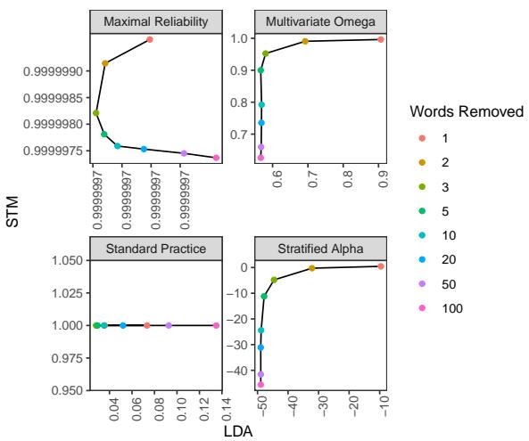
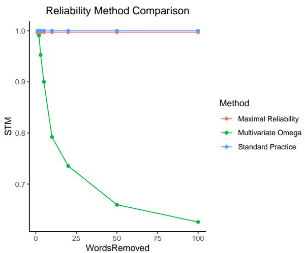
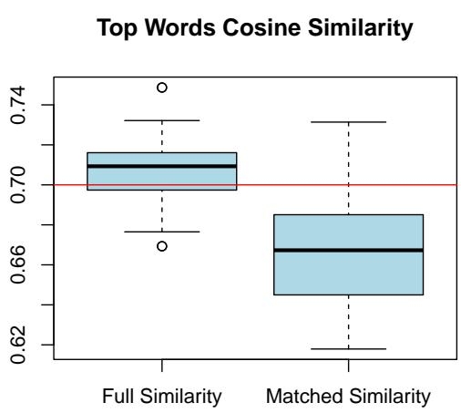
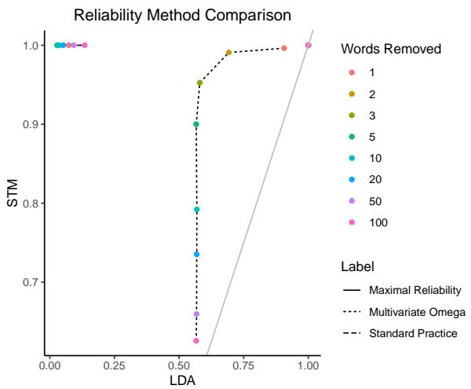

# Reliability of Topic Modeling

Kayla Schroeder Department of Statistics Northwestern University kaylaschroeder2026@u.northwestern.edu

## Abstract

Topic models allow researchers to extract latent factors from text data and use those variables in downstream statistical analyses. However, these methodologies can vary significantly due to initialization differences, randomness in sampling procedures, or noisy data. Reliability of these methods is of particular concern as many researchers treat learned topic models as ground truth for subsequent analyses. In this work, we show that the standard practice for quantifying topic model reliability fails to cap ture essential aspects of the variation in two widely-used topic models. Drawing from a extensive literature on measurement theory, we provide empirical and theoretical analyses of three other metrics for evaluating the reliability of topic models. On synthetic and real-world data, we show that McDonald’s ω provides the best encapsulation of reliability. This metric provides an essential tool for validation of topic model methodologies that should be a standard component of any topic model-based research.

## 1 Introduction

Over twenty years after its popularization by Blei et al. (2003), topic modeling remains a leading methodology for analyzing natural language. Researchers use models such as Latent Dirichlet Allocation (LDA) and its many variations to uncover latent topics in human language, with applications ranging from mathematics to genomics (Bravo González-Blas et al., 2019; Poushneh and Rajabi, 2022; Kukreja et al., 2023; Yu and Xiang, 2023). These methods convert high-dimensional data into low-dimensional topic representations which are more easily used in downstream analyses (Gentzkow et al., 2019). When it comes to human language and similar domains, topic models clearly cannot capture the full complexity of the data, so they instead provide a useful approximation of the data’s underlying structure (Doogan and Buntine, 2021). LDA and many topic models

Zach Wood-Doughty Department of Computer Science Northwestern University zach@northwestern.edu

are fit with approximate methods due to their intractable likelihoods; these implementations may be sensitive to random initialization, hyperparameter selection, or small perturbations to the data (Ramirez et al., 2012; Lau and Baldwin, 2016). We analyze topic models through the lens of internal consistency reliability, offering insight into the downstream analyses which they enable. Internal consistency reliability, a well-established concept in psychometrics, describes how well varying items measure the true underlying construct (Cronbach, 1951). In this setting, reliability measures the extent to which different replications of a topic model consistently capture the underlying thematic structure. While there may be multiple suitable granular structures for different tasks, our focus is on identifying the optimal structure that best represents the underlying organization within a specific dataset.

We conceptualize topic modeling as a measurement problem; the lower-dimensional representation produced by a topic model provides an imperfect measure of the data’s underlying structure. Many analyses relying on topic models do not consider the reliability of these measurements nor the effect that unreliability could have on their analyses. Yu and Xiang (2023), for example, train an LDA topic model on research abstracts to quantify trends in AI research; if repeated re-trainings of LDA produced significant variation in the learned topics, it would undermine any research conclusions drawn from those topics. This is true for many other applications of topic modeling, from analyses of consumer complaints, academic peer review, and Twitter posts (Bastani et al., 2019; Poushneh and Rajabi, 2022; Xue et al., 2020). A better understanding of topic modeling reliability can strengthen our understanding of these papers and many like them.

Reliability is not a new consideration for the NLP field. Inter-annotator agreement (IAA) has been widely studied in analyses of human labelers (Bhowmick et al., 2008; Nowak and Rüger, 2010; Amidei et al., 2019). IAA has also been explored during the interpretation of topic models; Pröllochs and Feuerriegel (2020) analyzes reliability of annotators’ ability to name topics from their most prevalent words. Compared to this widespread study of the reliability of annotators, there has been relatively little exploration of the reliability of topic models themselves. Rüdiger et al. (2022) highlights in particular the need for a measure of the internal consistency of such models.

The study of internal consistency reliability was first popularized by Cronbach (1951) but has been widely studied in the statistical literature (McDonald, 2013; Tavakol and Dennick, 2011; Kamata et al., 2003; Li et al., 1996). Despite the existence of this statistical theory, the widely-adopted standard practice for measuring topic model reliability is an ad hoc approach (Maier et al., 2018). This approach repeatedly fits a topic model using different random initializations and calculates the proportion of topic matches. Here, two topics are said to match if the cosine similarity between their top-word probabilities is above a threshold of 0.7. Among the issues with this method is its use of a fixed threshold, which has been criticized in studies of IAA (Reidsma and Carletta, 2008).

In this paper, we show that the lack of theoretical grounding and omission of the document over topics distribution in the standard practice method results in an entirely insufficient reliability quantification. Building on the statistical literature, we introduce and evaluate methods that encompass both the reliability of topic models in terms of top words and distribution of documents over topics.

## 2 Related Work

Most work related to topic model reliability has been focused on topic model quality. Coherence, a measure of quality and human interpretability of a topic, has been widely studied (Doogan and Buntine, 2021; Hoyle et al., 2021). Topic model quality differs fundamentally from topic model reliability.

Existing methods attempt to quantify topic model reliability or stability either employ variations of similarity measures and/or require domain knowledge. Chuang et al. (2015) quantifies the stability of topic models using similarity and domain specific information, differing from our approach both in methodology and in their requirement for domain specific knowledge. Given its reliance on domain knowledge, this method is unrelated to our work and not directly comparable. Rieger et al. (2024) proposes assessing reliability of the topics and the topic model using varying similarity measures. Ballester and Penner (2022) proposes the asymptotic average standard deviation of pairwise similarity as a measure of robustness, and argues that robustness is akin to reliability. Maier et al. (2018) proposes a reliability measure comprised of the proportion of top-word cosine similarities above a threshold of 0.7 and is currently the widely accepted standard practice for reliability of topic models. These methods for quantifying reliability are not rooted in statistical practice, an absence shown to be problematic for inter-annotator reliability in Reidsma and Carletta (2008). We emphasize that the similarity measure is not a measure of reliability and showcase the shortcomings of this type of quantification.

Internal consistency reliability has specifically been called for in embeddings, in scores for LLM performance on benchmarks, and in NLP methods at large (Du et al., 2021; Xiao et al., 2023; Riezler and Hagmann, 2022). Further NLP literature uses the term reliability, but does not refer to statistical reliability measures (Tan et al., 2021; Elder et al., 2020; Rios and Lwowski, 2020; Dunn et al., 2022).

## 3 Preliminaries: Unidimensional Reliability

Reliability literature focuses heavily on unidimensonal cases (Cronbach, 1951; McDonald, 2013). We first consider unidimensional reliability to investigate assumptions for the multidimensional counterparts. Unidimensional reliability is later employed to quantify reliability of a trivial topic model with two topics, as only one topic is necessary for identifiability.

## 3.1 Cronbach’s Alpha

Cronbach’s alpha has historically been the most widely used and accepted statistical method for objective reliability estimation (Tavakol and Dennick, 2011). This measure of internal consistency developed within the statistical literature to address the shortcomings of the split-half coefficients, a method that splits the data in half and compares each half to obtain a reliability measure (Cronbach, 1951). The formula for Cronbach’s alpha is

$$
\alpha = { \frac { n \cdot { \bar { c } } } { { \bar { v } } + ( n - 1 ) \cdot { \bar { c } } } }\tag{1}
$$

where n is the number of replications, v¯ is the average replication-specific variance, and c¯ is the average inter-replication covariance.

The potential shortcomings of Cronbach’s alpha in the topic model setting stem largely from the method’s assumptions. To satisfy the assumptions of Cronbach’s alpha, values are assumed to (1) be continuous and normally distributed, (2) have additive measurement error, have uncorrelated errors, (3) measure a single latent trait, and (4) have the same relationship with the underlying construct (or topic in this setting) (Tavakol and Dennick, 2011). Even in the trivial topic modeling setting, the assumptions of additive measurement error and normality are unlikely to hold. Some prior work in Xiao and Hau (2023) suggests that Cronbach’s alpha can withstand less severely non-normal data, however a topic’s distribution over documents are severely non-normal and thus this does not apply.

## 3.2 McDonald’s Omega

McDonald’s omega is the most popularized alternative to Cronbach’s alpha (Hayes and Coutts, 2020). Seeking to relax the requirement of all items having the same relationship with the underlying construct (an assumption termed tau-equivalence), McDonald’s alpha is formulated as

$$
\omega = \frac { ( \sum _ { i = 1 } ^ { n } \lambda _ { i } ) ^ { 2 } } { ( \sum _ { i = 1 } ^ { n } \lambda _ { i } ) ^ { 2 } + \sum _ { i = 1 } ^ { n } \theta _ { i i } }\tag{2}
$$

where $\lambda _ { i }$ is the factor loading of the ith replication, $\theta _ { i i }$ is the error variance of the ith replication, and n is the number of replications (McDonald, 2013). Each factor loading represents the variance of the unknown topic distribution across documents that is explained by each individual replication and is given by the correlation between the replication and the unknown underlying topic. Factor analysis, a common multidimensional methodology, is employed to obtain the factor loadings using the formulation

$$
{ \bf X } = { \bf M } + { \bf L } F + \epsilon\tag{3}
$$

with observation matrix X, factor loading matrix L, factor F, and error term matrix ϵ (Lawley and Maxwell, 1962). In our setting, X is a matrix with columns as topic’s distribution over documents from each replication and F represents an unknown vector of the underlying distribution over documents for a singular topic.

The formulation of omega itself encompasses a larger family of reliability estimates, of which Cronbach’s alpha is a restrictive case, in which the requirements for uncorrelated errors, normality, tau-equivalence and unidimensionality are not required (Viladrich et al., 2017). Given that different replications of topic models have different initializations but the same underlying algorithm, tauequivalence and uncorrelated errors are expected to be upheld. Normality, however, is not likely to be upheld. McDonald’s omega, then, is expected to provide improvements upon Cronbach’s alpha.

## 3.3 Spearman-Brown Reliability

The Spearman-Brown equation is a broadly defined reliability measure that assesses the impact of additional test items (in our setting, replications) to obtain an internal consistency reliability score (Walker and Lev, 1953). This equation is defined

$$
R = \frac { n r } { 1 + ( n - 1 ) r }\tag{4}
$$

for n replications and correlation r. Equal correlation and variance between items in addition to additive (linear) measurement error comprise the key assumptions of this measurement, rendering Spearman-Brown reliability much more flexible in wide-ranging settings. Assumptions of equal correlation and variance follow easily from the independence of replications. While the Spearman-Brown equation does still suffer from the assumption of linearity in errors when applied to topic modeling, we note that normality is not required.

## 4 Topic Model Reliability Methods

In the context of nontrivial topic modeling, where numerous topics are considered, unidimensional measurements or groups thereof are inadequate representations of the data. We propose three multidimensional counterparts as potential suitable extensions for topic model reliability.

To adequately compare topics, topics must be aligned first to determine their counterpart in other replications. We use the standard practice topic matching method defined in Maier et al. (2018) of matching topics with the highest cosine similarity among top-word probabilities. This matching choice is selected purposefully to allow for a direct comparison between the current standard practice reliability measure from Maier et al. (2018) and the reliability measures we introduce below.

## 4.1 Stratified Alpha Coefficient

The stratified alpha coefficient is the multidimensional extension of Cronbach’s alpha and is defined

$$
\alpha _ { s t r } = 1 - \frac { \sum _ { i = 1 } ^ { k } \sigma _ { i } ^ { 2 } ( 1 - \alpha _ { i } ) } { \sigma ^ { 2 } }\tag{5}
$$

where $\alpha _ { i }$ is the reliability of item i defined by (1), $\sigma _ { i } ^ { 2 }$ is the item variance and $\sigma ^ { 2 }$ is the overall variance of the test (Cronbach et al., 1965). In the topic model setting, the items 1, ..., k refer to the individual topics (with one topic removed for identifiability purposes) and k refers to the total number of topics. The stratum, or components of the test as they are described in Cronbach et al. (1965), are then the topics themselves. Multidimensional measurement relaxes the unidimensionality assumption of Cronbach’s alpha while retaining its other assumptions. Nonlinear errors and non-normality remain challenges within the classical representation of the stratified alpha coefficient.

Pooled estimates have a rich history in reliability quantification within meta-analysis, with applications spanning medicine to psychiatry (Bobos et al., 2020; Trajkovic et al.´ , 2011). We adopt this technique to quantify the reliability of each topic (unidimensional alpha) by pooling variance and covariance estimates derived from both the distribution of documents over topics and the term distribution for each topic. Incorporating the distribution of documents over topics is crucial in topic model reliability as it plays a pivotal role in interpretation and prediction, as exemplified by (Bravo González-Blas et al., 2019) where topic proportions are used to predict transcription factors. Our implementation utilizes ltm R package’s Cronbach’s alpha function (Rizopoulos, 2007).

## 4.2 Multivariate Omega

Multivariate omega follows simply from the unidimensional McDonald’s omega as omega does not require unidimensionality (Kamata et al., 2003). Relying on the same assumptions as McDonald’s omega, McDonald’s omega in the multivariate setting is defined

$$
\omega = \frac { \mathbf { 1 } _ { n } ^ { \prime } \lambda \lambda ^ { \prime } \mathbf { 1 } _ { n } } { \sigma _ { X } ^ { 2 } } .\tag{6}
$$

Matrix λ contains the aforementioned factor loadings and, in practice, $\sigma _ { X } ^ { 2 }$ is the sum of the sample variance-covariance matrix elements for observation matrix X.

As with Cronbach’s alpha, we pool the omega estimates to obtain multivariate omega quantifying both the distribution of documents over topics and the posterior distribution of terms for each topic. Our implementation utilizes the psych R package’s omega function (Revelle and Revelle, 2015).

## 4.3 Maximal Reliability

Maximal reliability extends the Spearman-Brown equation to multiple items by summing each item’s contribution (Li et al., 1996). This formulation is

$$
R _ { k } = { \frac { { \frac { n _ { 1 } r _ { 1 } } { 1 - r _ { 1 } } } + { \frac { n _ { 2 } r _ { 2 } } { 1 - r _ { 2 } } } + . . . + { \frac { n _ { K } r _ { K } } { 1 - r _ { K } } } } { { \frac { K } { 1 + ( K - 1 ) \rho } } + { \frac { n _ { 1 } r _ { 1 } } { 1 - r _ { 1 } } } + { \frac { n _ { 2 } r _ { 2 } } { 1 - r _ { 2 } } } + . . . + { \frac { n _ { K } r _ { K } } { 1 - r _ { K } } } } }\tag{7}
$$

where, for $i \in { 1 , \ldots , K , r _ { i } }$ is the topic reliability given by (4) for each of the K topics, $n _ { i }$ is the number of replications, and $\rho$ is the common correlation between any two topics.

Topic models are unlikely to uphold the linear relationship between two topics from differing replications, so the correlation coefficient should be chosen appropriately to characterize the true relationship between replications. For example, the Pearson correlation measure is

$$
r = { \frac { \sum _ { i } ( x _ { i } - { \bar { x } } ) ( y _ { i } - { \bar { y } } ) } { \sqrt { \sum _ { i } ( x _ { i } - { \bar { x } } ) ^ { 2 } \sum _ { i } ( y _ { i } - { \bar { y } } ) ^ { 2 } } } }\tag{8}
$$

for two vectors x and y focuses on the linear relationship between two vectors, and thus would not be appropriate in this context (Schober et al., 2018). Cosine similarity is defined

$$
c o s ( \theta ) = \frac { \sum _ { i } x _ { i } y _ { i } } { \sqrt { \sum _ { i } x _ { i } ^ { 2 } } \sqrt { \sum _ { i } y _ { i } ^ { 2 } } }\tag{9}
$$

for two vectors x and y.

It is evident from the formulation of correlation that correlation is the cosine similarity between centered vectors. Both cosine similarity and Pearson’s correlation are traditional similarity measures (Verma and Aggarwal, 2020). We also note the remarkable similarity between the formulation of Cosine similarity and the general correlation coefficient derived in Kendall (1948). To adequately encompass the nature of the topic relations and the maximal reliability measurement, then, it is natural to instead use cosine similarity in place of the correlation coefficient. Schmidt and Hunter (2014)

recommends that two averaged correlations can contribute the singular value representing the study correlation. We apply the same methodology here to obtain a composite score using the averaging of the cosine similarity measures.

## 5 Data

To demonstrate the reliability of LDA in a controlled setting, we conducted experiments using both trivial and nontrivial synthetic datasets, each consisting of 10,000 texts generated using the framework outlined in Wood-Doughty et al. (2021). The trivial dataset is a bag-of-words sample with a vocabulary of 16 and a ground truth of 2 topics. The nontrivial dataset is derived from a bagof-words LDA model with 200 topics, trained on filtered webtext data (Radford et al., 2019). For the nontrivial data, we considered topic models with a misspecified number of topics (20, 50, and 100), simulating a common scenario in practice as determining the optimal number of topics remains a challenging task (Hasan et al., 2021; Zhao et al., 2015). Considering reliability across models with varying numbers of topics remains crucial for applications that interpret topic models, such as Yu and Xiang (2023), to provide a measure of the certainty in the research conclusions drawn from interpretations of topics.

We also applied our methodology to a realworld dataset of 5,223 consumer complaints about cryptocurrency companies filed with the CFPB, a corpus publicly available on the entity’s website (CFPB, 2023). In this dataset, the true number of topics is unknown, so we investigated reliability variation across 20, 50 and 100 topics.

To assess reliability, we generated 100 replications for the application and nontrivial synthetic data and 10 replications for the trivial synthetic data, each with a randomly generated seed. This approach allows evaluation of the consistency of topic model results across various random initializations.

For synthetic and application data, topic model replications were generated using the topicmodels package from Grün and Hornik (2011) and the stm package from Roberts et al. (2019). Both packages employed a specified number of topics and their default settings, with Gibbs sampling for topicmodels and spectral decomposition (deterministic) for stm. These replications were executed on a CPU.

## 6 Results

Our three proposed reliability measures are compared against the widely accepted and adopted standard practice method outlined in Maier et al. (2018). While alternative baselines exist, such as those proposed by Rieger et al. (2021) and Ballester and Penner (2022), these have similar limitations to the standard practice. Existing approaches that do not require domain-specific knowledge, including the Maier et al. (2018) method, rely on similarity measures. These similarity measures do not inherently capture true reliability, as detailed in Section 2. While we acknowledge the significant influence and widespread adoption of the Maier et al. (2018) method, making it a standard for topic model reliability evaluation, its reliance on similarity measures, which lack a strong statistical foundation, presents a fundamental limitation for accurately assessing true model reliability. This limitation extends to other methods employing similar techniques. Methods like Chuang et al. (2015), which rely on domain-specific knowledge or subjective judgments, are not directly comparable to our work and are therefore not considered here. Given these considerations, we prioritize the Maier et al. (2018) method as the primary baseline due to its widespread adoption and the shared shortcomings of currently available comparative approaches.

The usage of 0.7 as a cutoff within the Maier et al. (2018) methodology (the current standard practice) is likely due to existing literature that argues Cronbach’s alpha should be > 0.7 to be considered reliable (Johnson, 2017). While our results will show the detriment of the current practice metric’s incorporation of such a hard cutoff with further investigation provided in Appendix A, related reliability literature is useful for interpreting and understanding resulting reliability measures. We use the widely accepted Cronbach’s alpha rule of thumb, described in Table 1, for interpreting our reliability values as this rule is applied in practice to all types of reliability measures (Gliem et al., 2003).

## 6.1 Trivial Synthetic Data

To illustrate the properties of our reliability metrics, we begin with a unidimensional analysis using the trivial setting. We examine a single topic in Table 2, as the rows of the document over topic distribution sum to 1. In Table 2a, nine replications exhibit identical document over topic distributions, but replication 6 demonstrates a nearly equal balance of topic proportions within each document. Table 2b presents a similar scenario, demonstrating that the posterior distribution of words over topics is consistent across 9 replications but deviates significantly in replication 6. This deviation leads to the misclassification of 9 documents in replication 6, reinforcing the notion that a single replication can be insufficient for characterizing a corpus. Reliability is essential to accurately assessing topic model results.

<table><tr><td>Cronbach&#x27;s Alpha</td><td>Interpretation</td></tr><tr><td>α &gt; 0.9</td><td>Excellent</td></tr><tr><td> $0 . 9 > \alpha > 0 . 8$ </td><td>Good</td></tr><tr><td> $0 . 8 > \alpha > 0 . 7$ </td><td>Acceptable</td></tr><tr><td> $0 . 7 > \alpha > 0 . 6$ </td><td>Questionable</td></tr><tr><td> $0 . 6 > \alpha > 0 . 5$ </td><td>Poor</td></tr><tr><td>α &lt; 0.5</td><td>Unacceptable</td></tr></table>

Table 1: Rule of thumb for interpreting Cronbach’s alpha (and reliability measures as a whole).

<table><tr><td rowspan=1 colspan=1></td><td rowspan=1 colspan=1>Doc 1</td><td rowspan=1 colspan=1>Doc 2</td><td rowspan=1 colspan=1>Doc 3</td><td rowspan=1 colspan=1>Doc 4</td></tr><tr><td rowspan=1 colspan=1>Rep 5</td><td rowspan=1 colspan=1>0.002</td><td rowspan=1 colspan=1>0.998</td><td rowspan=1 colspan=1>0.998</td><td rowspan=1 colspan=1>0.002</td></tr><tr><td rowspan=1 colspan=1>Rep 6</td><td rowspan=1 colspan=1>0.496</td><td rowspan=1 colspan=1>0.505</td><td rowspan=1 colspan=1>0.506</td><td rowspan=1 colspan=1>0.495</td></tr></table>

(a) A snippet of the document over topic distribution. Replication 5 is nearly identical to all other replications not listed in the table. Replication 6 proportions are all within .01 of 0.5.

<table><tr><td rowspan=1 colspan=1></td><td rowspan=1 colspan=1>Words</td><td rowspan=1 colspan=1>Docs</td></tr><tr><td rowspan=1 colspan=1>Rep 5</td><td rowspan=1 colspan=1>a, d, e, g, h, j, m, p</td><td rowspan=1 colspan=1>5066</td></tr><tr><td rowspan=1 colspan=1>Rep 6</td><td rowspan=1 colspan=1>a, c, d, e, g, h, j, 1, o, p</td><td rowspan=1 colspan=1>5069</td></tr></table>

(b) Comparison of replication 6 performance to all other replications. The table contains the words and number of documents (out of 10,000) classified into topic 1 (instead of topic 2) by each replication. While the document count only differs by 3, we note that replication 6 misclassifies 9 documents.

<table><tr><td rowspan=1 colspan=1>Type</td><td rowspan=1 colspan=1>R</td><td rowspan=1 colspan=1>α</td><td rowspan=1 colspan=1>ω</td><td rowspan=1 colspan=1>Current</td></tr><tr><td rowspan=1 colspan=1>Full</td><td rowspan=1 colspan=1>0.995</td><td rowspan=1 colspan=1>0.991</td><td rowspan=1 colspan=1>0.997</td><td rowspan=1 colspan=1>1</td></tr><tr><td rowspan=1 colspan=1>Subset</td><td rowspan=1 colspan=1>0.856</td><td rowspan=1 colspan=1>0.420</td><td rowspan=1 colspan=1>0.913</td><td rowspan=1 colspan=1>1</td></tr></table>

(c) Reliability of all replications and a subset of 2 replications. The current standard practice (‘Current’) is compared to the unidimensional versions of Maximal Reliability (‘R’), Stratified Alpha (α), and Multivariate Omega (ω).  
Table 2: Trivial synthetic data reliability using topic 1.

Table 2c describes the (unidimensional) reliability of the entire set of 10 replications and a subset of replications comprised of only replications 5 and 6, a setting which may be more realistic in practice due to LDA’s computational intensity.2 Clearly, the standard practice method fails to encompass variability in the document over topic distribution given its claims of perfect reliability among the replications. This contrasts with the unidimensional measures of maximal reliability, alpha, and omega which all effectively convey this existing variability among replications.

  
Figure 1: Performance of individual reliability measures across varying numbers of random vocabulary word removals of stm on LDA.

## 6.2 Nontrivial Synthetic Data

To further compare performance of reliability measures, we examined both LDA and stm (Structural Topic Models). Introduced by Roberts et al. (2019), stm is a variant of LDA that incorporates covariates. Unlike LDA, stm’s initialization is deterministic, making it a suitable benchmark for comparing against LDA across replications. While stm remains consistent across different random seeds, any corpus of text should be considered a random draw from the broader distribution. Thus, perfect internal consistency of stm obscures the underlying randomness of the data and “fixed randomness” (Hellrich and Hahn, 2016).

Varying numbers of words are removed at random from the corpus before developing the stm and LDA models, akin to the practice of item-deletion which has previously been used to investigate reliability measures (Kopalle and Lehmann, 1997).

While removing a few words from a large vocabulary has a minimal impact, removing a substantial number (e.g., 50 or 100) can significantly alter the corpus. Our findings confirmed this: with few word removals, topic models exhibited consistent top words, defined as the most probable terms within each topic, across replications, whereas more extensive removals led to deviations (see Appendix B). These results align with prior research on the influence of word frequency on topic similarity, emphasizing the importance of corpus composition for robust topic modeling (Rieger et al., 2021). A strong reliability measure should reflect such information.

Figure 1 contrasts the effectiveness of various reliability methods against the standard practice comparing stm vs LDA models, controlling for initialization seed and word removal. The standard practice method proves inadequate, consistently overestimating reliability for stm models and underestimating it for LDA models. Stratified alpha yields exclusively negative values, suggesting a methodological flaw likely stemming from violated normality assumptions. Maximal reliability lacks sensitivity and, while partially capturing the impact of word removal, exhibits an unexpected decline in reliability with fewer word removals, indicating poor quantification. In contrast, multivariate omega effectively reflects the impact of word removal on stm and LDA models, as further explored in Figure 2. The deterministic nature of stm and the sensitivity of topic models to word removal necessitate a corresponding decrease in reliability with increasing word removals. Our results validate this expectation, with multivariate omega demonstrating superior sensitivity to changes in word removal, making it a more suitable metric for quantifying topic model reliability.

To reinforce our conclusion, we analyzed the frequent and exclusive (FREX) words for the most prevalent topic across replications with varying levels of word removal. Consistency was observed with one word removal but not with 100 (Appendix B).

Our analysis underscores the limitations of the standard practice, and shortcomings of the proposed stratified alpha and maximal reliability. As illustrated by the reliability of synthetic data LDA models with 100 topics in Table 3a, these metrics can lead to drastically different assessments, potentially misleading researchers.3 To address these shortcomings, we advocate for multivariate omega reliability as a more comprehensive and effective measure.

Figure 2: Comparison of reliability methods of stm on increasing numbers of random vocabulary word removals. Note the nearly overlapping Maximal Reliability and Standard Practice results.
<table><tr><td rowspan=1 colspan=1> $\mathbf { R _ { k } }$ </td><td rowspan=1 colspan=1> $\alpha _ { s t r }$ </td><td rowspan=1 colspan=1>ω</td><td rowspan=1 colspan=1>Current</td></tr><tr><td rowspan=1 colspan=1>0.9999997</td><td rowspan=1 colspan=1>-48.55</td><td rowspan=1 colspan=1>0.567</td><td rowspan=1 colspan=1>0.022</td></tr></table>

(a) Reliability of LDA models with 100 topics comparing current standard practice (‘Current’), Maximal Reliability $\mathbf { ( R _ { k } ) }$ , Stratified Alpha $( \alpha _ { s t r } )$ , and Multivariate Omega (ω).
<table><tr><td>Topics</td><td>20</td><td>50</td><td>100</td></tr><tr><td>ω</td><td>0.693</td><td>0.694</td><td>0.567</td></tr><tr><td>(SE)</td><td>(0.010)</td><td>(0.006)</td><td>(0.004)</td></tr></table>

(b) LDA reliability as given by Multivariate Omega (ω) for topic model replications with 20, 50, and 100 topics.  
Table 3: Nontrivial synthetic data reliability across 100 replications.

Table 3b further highlights the significant reliability challenges inherent in topic models, particularly as the number of topics increases. According to the Rule of Thumb in Table 1, multivariate omega reliability falls into the ‘questionable’ category for 20 and 50 topics and the ‘poor’ category for 100 topics. These low reliability values, solely due to random chance, cast doubt on the common practice of treating obtained topic models as definitive representations of underlying latent structures.

<table><tr><td rowspan=1 colspan=1></td><td rowspan=1 colspan=1>20 Topics</td><td rowspan=1 colspan=1>50 Topics</td><td rowspan=1 colspan=1>100 Topics</td></tr><tr><td rowspan=2 colspan=1>ω(SE)</td><td rowspan=1 colspan=1>0.92283</td><td rowspan=2 colspan=1>0.82235(0.02104)</td><td rowspan=2 colspan=1>0.74957(0.01052)</td></tr><tr><td rowspan=1 colspan=1>(0.05154)</td></tr></table>

Table 4: Reliability (multivariate omega) and standard error of LDA models of CFPB data across replications for varying numbers of topics.
<table><tr><td rowspan=1 colspan=1>Topics</td><td rowspan=1 colspan=1>Min</td><td rowspan=1 colspan=1>Q1</td><td rowspan=1 colspan=1>Q2</td><td rowspan=1 colspan=1>Q3</td><td rowspan=1 colspan=1>Max</td></tr><tr><td rowspan=1 colspan=1>20</td><td rowspan=1 colspan=1>0.67</td><td rowspan=1 colspan=1>0.73</td><td rowspan=1 colspan=1>0.75</td><td rowspan=1 colspan=1>0.77</td><td rowspan=1 colspan=1>0.81</td></tr><tr><td rowspan=1 colspan=1>50</td><td rowspan=1 colspan=1>0.77</td><td rowspan=1 colspan=1>0.79</td><td rowspan=1 colspan=1>0.80</td><td rowspan=1 colspan=1>0.81</td><td rowspan=1 colspan=1>0.83</td></tr><tr><td rowspan=1 colspan=1>100</td><td rowspan=1 colspan=1>0.80</td><td rowspan=1 colspan=1>0.84</td><td rowspan=1 colspan=1>0.84</td><td rowspan=1 colspan=1>0.85</td><td rowspan=1 colspan=1>0.87</td></tr></table>

Table 5: Prediction accuracy of logistic regression models across replications when 20, 50, and 100 are used in a CFPB data topic model.

## 6.3 Application

To assess the impact of reliability on downstream analyses, we applied multivariate omega reliability to the CFPB cryptocurrency data using LDA models with 20, 50, and 100 topics. As shown in Table 4, reliability significantly decreased with increasing numbers of topics. Similar declines were observed in Table 3b, although LDA models were less reliable on the synthetic data. While reliability for 100 topics was within an acceptable range, replications of models with such reliability values are likely to yield diverse results and interpretations. This highlights the importance of careful consideration of reliability when employing topic models, particularly with larger numbers of topics. To illustrate this, we conducted a case study (Appendix C).

We develop logistic regression models to predict the binary outcome of a response to a submitted consumer complaint receiving or not receiving a timely response to further explore the downstream analysis impact of deviation across replications. All the topics from each replication’s LDA model are used in each replication’s prediction model. Table 5 summarizes the variation in prediction accuracy across models, with LDA models exhibiting higher predictive power when using more topics. This is expected, as a larger number of topics naturally captures more characteristics of the corpus.

If an LDA model for a given number of topics had high reliability across replications, it would be expected that words would be weighted similarly across replications within the predictive model. We quantify an individual word weighting by multiplying each model coefficient by the respective topic’s distribution for the given word, then summing over all products. Table 6 describes the variation in word weighting across replications for the two most highly prevalent words that appear consistently in the most prevalent topics for all topics. While the 20 topic model shows some consistency for these high impact words, the 50 and 100 topic models reveals significant variation. If such a model were used to provide recommendations for developing effective complaint narratives, important guidelines like including a case number could vary dramatically due solely to random initialization. These results align with the model reliability in Table 4.

<table><tr><td rowspan=1 colspan=1>Topics</td><td rowspan=1 colspan=1>Min</td><td rowspan=1 colspan=1>Q1</td><td rowspan=1 colspan=1>Q2</td><td rowspan=1 colspan=1>Q3</td><td rowspan=1 colspan=1>Max</td></tr><tr><td rowspan=1 colspan=1>20</td><td rowspan=1 colspan=1>-3.2</td><td rowspan=1 colspan=1>-0.1</td><td rowspan=1 colspan=1>0.1</td><td rowspan=1 colspan=1>0.3</td><td rowspan=1 colspan=1>0.9</td></tr><tr><td rowspan=1 colspan=1>50</td><td rowspan=1 colspan=1>-19.3</td><td rowspan=1 colspan=1>-3.6</td><td rowspan=1 colspan=1>-0.7</td><td rowspan=1 colspan=1>0.5</td><td rowspan=1 colspan=1>2.7</td></tr><tr><td rowspan=1 colspan=1>100</td><td rowspan=1 colspan=1>-81.7</td><td rowspan=1 colspan=1>-13.8</td><td rowspan=1 colspan=1>-3.8</td><td rowspan=1 colspan=1>4.6</td><td rowspan=1 colspan=1>49.8</td></tr></table>

(a) Word weightings for the highly prevalent word ‘transfer.’
<table><tr><td rowspan=1 colspan=1>Topics</td><td rowspan=1 colspan=1>Min</td><td rowspan=1 colspan=1>Q1</td><td rowspan=1 colspan=1>Q2</td><td rowspan=1 colspan=1>Q3</td><td rowspan=1 colspan=1>Max</td></tr><tr><td rowspan=1 colspan=1>20</td><td rowspan=1 colspan=1>-1</td><td rowspan=1 colspan=1>0</td><td rowspan=1 colspan=1>0.1</td><td rowspan=1 colspan=1>0.3</td><td rowspan=1 colspan=1>0.9</td></tr><tr><td rowspan=1 colspan=1>50</td><td rowspan=1 colspan=1>-9.8</td><td rowspan=1 colspan=1>0.4</td><td rowspan=1 colspan=1>1.3</td><td rowspan=1 colspan=1>2.3</td><td rowspan=1 colspan=1>6.7</td></tr><tr><td rowspan=1 colspan=1>100</td><td rowspan=1 colspan=1>-19.9</td><td rowspan=1 colspan=1>3.3</td><td rowspan=1 colspan=1>15</td><td rowspan=1 colspan=1>25.4</td><td rowspan=1 colspan=1>42.6</td></tr></table>

(b) Word weightings for the highly prevalent word ‘case.’  
Table 6: Weighting of the two most highly prevalent words across LDA replications for LDA models with varying numbers of topics. All topics are used to predict whether or not the CFPB returns a timely response.

Our findings highlight the essential role of reliability in ensuring interpretability of predictive models that utilize topic models as predictors. Even when prediction accuracy is the primary concern, understanding the underlying factors driving predictions is equally important. Without reliability, insights derived from such predictive models can be compromised, undermining their practical value.

## 7 Discussion

Reliability is a critical factor in topic model analysis, significantly influencing subsequent research. Our findings highlight the intricate relationship between topic model complexity, predictive accuracy, and reliability. While increasing the number of topics in an LDA model can enhance feature representation for predictive tasks, it can also compromise the model’s reliability when used for corpusbased analysis. Furthermore, inherent randomness in topic models can introduce significant variability, making results less interpretable and reliable.

Our reliability method provides a vital tool that should be a standard component of any topic modelbased research, serving as a cornerstone for assessing robustness of topic models and ensuring reliability of subsequent analyses. This method can be extended to alternative topic modeling methods like NMF and BERTopic, a planned direction for our future work (Lee and Seung, 1999; Grootendorst, 2022). Researchers should prioritize reliability as a fundamental component of topic model analysis, akin to the significance of standard errors in statistical modeling. By reporting reliability measures, researchers can present a more comprehensive and accurate understanding of their findings, mitigating the risk of drawing misleading conclusions.

## 8 Limitations

The work in this paper is limited by the existing reliability measurements. Currently, no nonlinear reliability measures exist as all existing measurements rely upon the classical statistical test theory assumptions, of which linearity of errors is included. Given that measurement error in topic models is not expected to be linear, such a measure would strengthen this work.

While the selected topic matching process facilitates direct comparison to the standard practice method, it simplifies the complex relationship between topics and documents by neglecting document over topic distributions. This simplification, though necessary for comparability, may overlook important aspects of document over topic associations. Future research could explore more comprehensive topic matching methods that explicitly consider the distribution of documents over topics and alternative similarity measures that incorporate additional semantic information. It’s important to note that the selected topic matching method was primarily driven by comparability with existing standards, and future research could investigate the impact of different topic matching methods on the proposed approach’s overall performance.

The Maier et al. (2018) method has emerged as the de facto standard for topic model reliability assessment, evidenced by its widespread adoption and significant research attention, serving as a robust and representative benchmark for stability assessment and providing a solid foundation for comparison. We emphasize that similarity measures are not a measure of reliability and are not statistically grounded, a core weakness of the Maier et al. (2018) methodology. Following this reasoning, we argue that all related methods employing similarity measures are similarly weakened by the lack of statistical theory to back up the method and assume the limitations accordingly. Despite the practical relevance of the standard practice baseline and its robust and representative nature as a benchmark for stability assessment, comparing to a single baseline presents a limitation in scope. Future work could investigate the impact of different baselines on our proposed reliability measure and explore the potential benefits of incorporating alternative approaches.

The work in this paper is limited to LDA topic models, but provides a framework that can be extended to alternative topic modeling methods like NMF and BERTopic (Lee and Seung, 1999; Grootendorst, 2022). As we note in Section 7, this is a planned direction for future work.

## 9 Ethics Statement

No ethical issues are posed by the theory or application discussed in this work. The application data from the CFPB public website is anonymized and contains no unique identifiers, thereby preventing any potential privacy violations. Future applications of the methods developed in this paper may pose ethical issues depending on the proprietary nature of future data sets. Required privacy regulations should be followed closely by researchers applying these methods to proprietary datasets.

## References

Jacopo Amidei, Paul Piwek, and Alistair Willis. 2019. Agreement is overrated: A plea for correlation to assess human evaluation reliability. In Proceedings ofthe 12th International Conference on Natural Language Generation, pages 344–354.

Omar Ballester and Orion Penner. 2022. Robustness, replicability and scalability in topic modelling. Journal ofInformetrics, 16(1):101224.

Kaveh Bastani, Hamed Namavari, and Jeffrey Shaffer. 2019. Latent dirichlet allocation (lda) for topic modeling of the cfpb consumer complaints. Expert Systems with Applications, 127:256–271.

Plaban Kumar Bhowmick, Anupam Basu, and Pabitra Mitra. 2008. An agreement measure for determining inter-annotator reliability of human judgements on affective text. In Coling 2008: Proceedings of the workshop on Human Judgements in Computational Linguistics, pages 58–65.

David M Blei, Andrew Y Ng, and Michael I Jordan. 2003. Latent dirichlet allocation. Journal ofmachine Learning research, 3(Jan):993–1022.

Pavlos Bobos, Goris Nazari, Ze Lu, and Joy C Mac-Dermid. 2020. Measurement properties of the hand grip strength assessment: a systematic review with meta-analysis. Archives of physical medicine and rehabilitation, 101(3):553–565.

Carmen Bravo González-Blas, Liesbeth Minnoye, Dafni Papasokrati, Sara Aibar, Gert Hulselmans, Valerie Christiaens, Kristofer Davie, Jasper Wouters, and Stein Aerts. 2019. cistopic: cis-regulatory topic modeling on single-cell atac-seq data. Nature methods, 16(5):397–400.

US Gov Agency CFPB. 2023. Consumer complaint database | consumer financial protection bureau.

Jason Chuang, Margaret E Roberts, Brandon M Stewart, Rebecca Weiss, Dustin Tingley, Justin Grimmer, and Jeffrey Heer. 2015. Topiccheck: Interactive alignment for assessing topic model stability. In Proceedings of the 2015 Conference of the North American Chapter of the Association for Computational Linguistics: Human Language Technologies, pages 175– 184.

Lee J Cronbach. 1951. Coefficient alpha and the internal structure of tests. psychometrika, 16(3):297–334.

Lee J Cronbach, Peter Schönemann, and Douglas McKie. 1965. Alpha coefficients for stratifiedparallel tests. Educational and Psychological Measurement, 25(2):291–312.

Caitlin Doogan and Wray Buntine. 2021. Topic model or topic twaddle? re-evaluating demantic interpretability measures. In North American Association for Computational Linguistics 2021, pages 3824–3848. Association for Computational Linguistics (ACL).

Yupei Du, Qixiang Fang, and Dong Nguyen. 2021. Assessing the reliability of word embedding gender bias measures. arXiv preprint arXiv:2109.04732.

Jonathan Dunn, Haipeng Li, and Damian Sastre. 2022. Predicting embedding reliability in low-resource settings using corpus similarity measures. In Proceedings ofthe Thirteenth Language Resources and Evaluation Conference, pages 6461–6470.

Henry Elder, Alexander O’Connor, and Jennifer Foster. 2020. How to make neural natural language generation as reliable as templates in task-oriented dialogue. In Proceedings ofthe 2020 Conference on Empirical Methods in Natural Language Processing (EMNLP), pages 2877–2888.

Matthew Gentzkow, Bryan Kelly, and Matt Taddy. 2019. Text as data. Journal of Economic Literature, 57(3):535–574.

Joseph A Gliem, Rosemary R Gliem, et al. 2003. Calculating, interpreting, and reporting cronbach’s alpha reliability coefficient for likert-type scales. In Midwest research-to-practice conference in adult, continuing, and community education, volume 1, pages 82–87. Columbus, OH.

Maarten Grootendorst. 2022. Bertopic: Neural topic modeling with a class-based tf-idf procedure. arXiv preprint arXiv:2203.05794.

Bettina Grün and Kurt Hornik. 2011. topicmodels: An r package for fitting topic models. Journal of statistical software, 40:1–30.

Mahedi Hasan, Anichur Rahman, Md Razaul Karim, Md Saikat Islam Khan, and Md Jahidul Islam. 2021. Normalized approach to find optimal number of topics in latent dirichlet allocation (lda). In Proceedings ofInternational Conference on Trends in Computational and Cognitive Engineering: Proceedings of TCCE 2020, pages 341–354. Springer.

Andrew F Hayes and Jacob J Coutts. 2020. Use omega rather than cronbach’s alpha for estimating reliability. but. . . . Communication Methods and Measures, 14(1):1–24.

Johannes Hellrich and Udo Hahn. 2016. Bad company—neighborhoods in neural embedding spaces considered harmful. In Proceedings ofcoling 2016, the 26th international conference on computational linguistics: Technical papers, pages 2785–2796.

Alexander Hoyle, Pranav Goel, Andrew Hian-Cheong, Denis Peskov, Jordan Boyd-Graber, and Philip Resnik. 2021. Is automated topic model evaluation broken? the incoherence of coherence. Advances in neural information processing systems, 34:2018– 2033.

AJ Johnson. 2017. Reliability, cronbach’s alpha. The SAGE encyclopedia ofcommunication research methods, 1:1414–1417.

Akihito Kamata, Ahmet Turhan, and Eqbal Darandari. 2003. Estimating reliability for multidimensional composite scale scores. In annual meeting of American Educational Research Association, Chicago, IL. Citeseer.

Maurice George Kendall. 1948. Rank correlation methods.

Praveen K Kopalle and Donald R Lehmann. 1997. Alpha inflation? the impact of eliminating scale items on cronbach’s alpha. Organizational Behavior and Human Decision Processes, 70(3):189–197.

Vinay Kukreja et al. 2023. Recent trends in mathematical expressions recognition: An lda-based analysis. Expert Systems with Applications, 213:119028.

Jey Han Lau and Timothy Baldwin. 2016. The sensitivity of topic coherence evaluation to topic cardinality. In Proceedings ofthe 2016 conference ofthe North

American chapter of the Association for Computational Linguistics: Human language technologies, pages 483–487.

David N Lawley and Adam E Maxwell. 1962. Factor analysis as a statistical method. Journal of the Royal Statistical Society. Series D (The Statistician), 12(3):209–229.

Daniel D Lee and H Sebastian Seung. 1999. Learning the parts of objects by non-negative matrix factorization. nature, 401(6755):788–791.

Heng Li, Robert Rosenthal, and Donald B Rubin. 1996. Reliability of measurement in psychology: From spearman-brown to maximal reliability. Psychological Methods, 1(1):98.

Daniel Maier, Annie Waldherr, Peter Miltner, Gregor Wiedemann, Andreas Niekler, Alexa Keinert, Barbara Pfetsch, Gerhard Heyer, Ueli Reber, Thomas Häussler, et al. 2018. Applying lda topic modeling in communication research: Toward a valid and reliable methodology. Communication methods and measures, 12(2-3):93–118.

Roderick P McDonald. 2013. Test theory: A unified treatment. psychology press.

Stefanie Nowak and Stefan Rüger. 2010. How reliable are annotations via crowdsourcing: a study about inter-annotator agreement for multi-label image annotation. In Proceedings of the international conference on Multimedia information retrieval, pages 557–566.

Atieh Poushneh and Reza Rajabi. 2022. Can reviews predict reviewers’ numerical ratings? the underlying mechanisms of customers’ decisions to rate products using latent dirichlet allocation (lda). Journal of Consumer Marketing, 39(2):230–241.

Nicolas Pröllochs and Stefan Feuerriegel. 2020. Business analytics for strategic management: Identifying and assessing corporate challenges via topic modeling. Information & Management, 57(1):103070.

Alec Radford, Jeffrey Wu, Rewon Child, David Luan, Dario Amodei, Ilya Sutskever, et al. 2019. Language models are unsupervised multitask learners. OpenAI blog, 1(8):9.

Eduardo H Ramirez, Ramon Brena, Davide Magatti, and Fabio Stella. 2012. Topic model validation. Neurocomputing, 76(1):125–133.

Tenko Raykov and Spiridon Penev. 2006. A direct method for obtaining approximate standard error and confidence interval of maximal reliability for composites with congeneric measures. Multivariate Behavioral Research, 41(1):15–28.

Dennis Reidsma and Jean Carletta. 2008. Reliability measurement without limits. Computational Linguistics, 34(3):319–326.

William Revelle and Maintainer William Revelle. 2015. Package ‘psych’. The comprehensive R archive network, 337(338).

Jonas Rieger, Carsten Jentsch, and Jörg Rahnenführer. 2021. Rollinglda: An update algorithm of latent dirichlet allocation to construct consistent time series from textual data. In Findings of the Association for Computational Linguistics: EMNLP 2021, pages 2337–2347.

Jonas Rieger, Carsten Jentsch, and Jörg Rahnenführer. 2024. Ldaprototype: A model selection algorithm to improve reliability of latent dirichlet allocation. PeerJ Computer Science, 10:e2279.

Stefan Riezler and Michael Hagmann. 2022. Validity, reliability, and significance: Empirical methodsfor NLP and data science. Springer Nature.

Anthony Rios and Brandon Lwowski. 2020. An empirical study of the downstream reliability of pre-trained word embeddings. In Proceedings ofthe 28th International Conference on Computational Linguistics, pages 3371–3388.

Dimitris Rizopoulos. 2007. ltm: An r package for latent variable modeling and item response analysis. Journal ofstatistical software, 17:1–25.

Margaret E Roberts, Brandon M Stewart, and Dustin Tingley. 2019. Stm: An r package for structural topic models. Journal ofStatistical Software, 91:1–40.

Matthias Rüdiger, David Antons, Amol M Joshi, and Torsten-Oliver Salge. 2022. Topic modeling revisited: New evidence on algorithm performance and quality metrics. Plos one, 17(4):e0266325.

Frank L Schmidt and John E Hunter. 2014. Methods of meta-analysis: Correcting error and bias in research findings. Sage publications.

Patrick Schober, Christa Boer, and Lothar A Schwarte. 2018. Correlation coefficients: appropriate use and interpretation. Anesthesia & analgesia, 126(5):1763– 1768.

Samson Tan, Shafiq Joty, Kathy Baxter, Araz Taeihagh, Gregory A Bennett, and Min-Yen Kan. 2021. Reliability testing for natural language processing systems. arXiv preprint arXiv:2105.02590.

Mohsen Tavakol and Reg Dennick. 2011. Making sense of cronbach’s alpha. Internationaljournal ofmedical education, 2:53.

Goran Trajkovic, Vladan Star´ ceviˇ c, Milan Latas,´ Miomir Leštarevic, Tanja Ille, Zoran Bukumiri´ c, and´ Jelena Marinkovic. 2011.´ Reliability of the hamilton rating scale for depression: a meta-analysis over a period of 49 years. Psychiatry research, 189(1):1–9.

Vijay Verma and Rajesh Kumar Aggarwal. 2020. A new similarity measure based on gravitational attraction for improving the accuracy of collaborative recommendations. International Journal ofIntelligent Systems and Applications, 12(2):44.

Carme Viladrich, Ariadna Angulo-Brunet, and Eduardo Doval. 2017. A journey around alpha and omega to estimate internal consistency reliability. Anales de psicología, 33(3):755–782.

Helen M Walker and Joseph Lev. 1953. Statistical inference.

Zach Wood-Doughty, Ilya Shpitser, and Mark Dredze. 2021. Generating synthetic text data to evaluate causal inference methods. arXiv preprint arXiv:2102.05638.

Leifeng Xiao and Kit-Tai Hau. 2023. Performance of coefficient alpha and its alternatives: effects of different types of non-normality. Educational and Psychological Measurement, 83(1):5–27.

Ziang Xiao, Susu Zhang, Vivian Lai, and Q Vera Liao. 2023. Evaluating evaluation metrics: A framework for analyzing nlg evaluation metrics using measurement theory. In Proceedings ofthe 2023 Conference on Empirical Methods in Natural Language Processing, pages 10967–10982.

Jia Xue, Junxiang Chen, Chen Chen, Chengda Zheng, Sijia Li, and Tingshao Zhu. 2020. Public discourse and sentiment during the covid 19 pandemic: Using latent dirichlet allocation for topic modeling on twitter. PloS one, 15(9):e0239441.

Dejian Yu and Bo Xiang. 2023. Discovering topics and trends in the field of artificial intelligence: Using lda topic modeling. Expert Systems with Applications, page 120114.

Weizhong Zhao, James J Chen, Roger Perkins, Zhichao Liu, Weigong Ge, Yijun Ding, and Wen Zou. 2015. A heuristic approach to determine an appropriate number of topics in topic modeling. In BMC bioinformatics, volume 16, pages 1–10. Springer.

## A Detriment of Standard Practice Cutoff

  
Figure 3: Maximal cosine similarity for top words distributions for each topic. In the ‘Full’ case, all other topics are considered for the maximal similarity measure. In the ‘Matched’ case, topics are matched with best available topic and cosine similarity is determined for each pairing.

To properly align topics, the maximal cosine similarity of the top words distribution for each topic is used. All topics must be matched with one singular other topic in practice, however, so the maximal cosine similarity is somewhat lower in this setting. Figure 3 depicts this difference, with cosine similarity for top words in the matched case being slightly less than that of unmatched topics. Using the hard cutoff of 0.7, the distribution shifts slightly, but the reliability value for the Maier et al. (2018) reliability measure changes drastically as the proportion of values above and below the 0.7 cutoff is extremely different for the full and matched cases. Clearly, the hard cutoff does not allow for adequate characterization of the distribution of cosine similarities, presenting a major issue for the current standard practice measurement.

## B Model Selection

Given the impact of word removal on topic models, we would expect the reliability of stm on LDA to follow along the y=x line given that stm is deterministic and the LDA initialization seed is held constant. Figure 4 visualizes this comparison. As expected, the standard practice method deviates drastically from the y=x relation. This makes sense given its previously discussed poor characterization of the reliability. Both multivariate omega and maximal reliability fall more closely along the y=x line. For example, in the 1 word removal setting for a randomly selected topic, consider the top 10 documents containing the highest proportions of the topic. Across replications, stm has 7 of the same documents in the top 10 in 9 different replications while LDA has none of the same documents within the top 10 across more than 2 replications. Meanwhile, both stm and LDA possess strong consistencies within the vocabulary over topic matrices across replications as seen by strong alignment of most prevalent words in the most prevalent topics across replications. From these results, then, we recommend multivariate omega as the optimal reliability measure.

  
Figure 4: Comparison of reliability methods of stm on LDA under varying numbers of random vocabulary word removals. The grey line here depicts the y=x relation.

To further investigate the results of the stm models with varying numbers of words removed, we consider the frequent and exclusive (FREX) words of the most prevalent topics described in Table 7. When only one word is removed at random from the corpus, as in Table 7a, the top two FREX words are identical across replications. Five of the replications are identical across the top 3 FREX words as well, with deviations present in the remaining 5 replications. Drastic deviations, however, are present when 100 words are removed at random from the corpus, with minimal (if any, depending on the replication) consistency across replications, as showcased in Table 7b. This maps directly to the performance of the multivariate omega measure, as shown in Figures 2 and 4.

<table><tr><td rowspan=1 colspan=1></td><td rowspan=1 colspan=1>Word 1</td><td rowspan=1 colspan=1>Word 2</td><td rowspan=1 colspan=1>Word 3</td></tr><tr><td rowspan=1 colspan=1>Rep 1</td><td rowspan=1 colspan=1>peculiar</td><td rowspan=1 colspan=1>spirit</td><td rowspan=1 colspan=1>sort</td></tr><tr><td rowspan=1 colspan=1>Rep 2</td><td rowspan=1 colspan=1>peculiar</td><td rowspan=1 colspan=1>spirit</td><td rowspan=1 colspan=1>economi</td></tr><tr><td rowspan=1 colspan=1>Rep 3</td><td rowspan=1 colspan=1>peculiar</td><td rowspan=1 colspan=1>spirit</td><td rowspan=1 colspan=1>sort</td></tr><tr><td rowspan=1 colspan=1>Rep 4</td><td rowspan=1 colspan=1>peculiar</td><td rowspan=1 colspan=1>spirit</td><td rowspan=1 colspan=1>sort</td></tr><tr><td rowspan=1 colspan=1>Rep 5</td><td rowspan=1 colspan=1>peculiar</td><td rowspan=1 colspan=1>spirit</td><td rowspan=1 colspan=1>sort</td></tr><tr><td rowspan=1 colspan=1>Rep 6</td><td rowspan=1 colspan=1>peculiar</td><td rowspan=1 colspan=1>spirit</td><td rowspan=1 colspan=1>sort</td></tr><tr><td rowspan=1 colspan=1>Rep 7</td><td rowspan=1 colspan=1>peculiar</td><td rowspan=1 colspan=1>spirit</td><td rowspan=1 colspan=1>consult</td></tr><tr><td rowspan=1 colspan=1>Rep 8</td><td rowspan=1 colspan=1>peculiar</td><td rowspan=1 colspan=1>spirit</td><td rowspan=1 colspan=1>consult</td></tr><tr><td rowspan=1 colspan=1>Rep 9</td><td rowspan=1 colspan=1>peculiar</td><td rowspan=1 colspan=1>spirit</td><td rowspan=1 colspan=1>communic</td></tr><tr><td rowspan=1 colspan=1>Rep 10</td><td rowspan=1 colspan=1>peculiar</td><td rowspan=1 colspan=1>spirit</td><td rowspan=1 colspan=1>terror</td></tr></table>

(a) 1 word removed
<table><tr><td rowspan=1 colspan=1></td><td rowspan=1 colspan=1>Word 1</td><td rowspan=1 colspan=1>Word 2</td><td rowspan=1 colspan=1>Word 3</td></tr><tr><td rowspan=1 colspan=1>Rep 1</td><td rowspan=1 colspan=1>peculiar</td><td rowspan=1 colspan=1>pari</td><td rowspan=1 colspan=1>communic</td></tr><tr><td rowspan=1 colspan=1>Rep 2</td><td rowspan=1 colspan=1>communic</td><td rowspan=1 colspan=1>peculiar</td><td rowspan=1 colspan=1>sort</td></tr><tr><td rowspan=1 colspan=1>Rep 3</td><td rowspan=1 colspan=1>peculiar</td><td rowspan=1 colspan=1>sort</td><td rowspan=1 colspan=1>spirit</td></tr><tr><td rowspan=1 colspan=1>Rep 4</td><td rowspan=1 colspan=1>peculiar</td><td rowspan=1 colspan=1>communic</td><td rowspan=1 colspan=1>shane</td></tr><tr><td rowspan=1 colspan=1>Rep 5</td><td rowspan=1 colspan=1>will</td><td rowspan=1 colspan=1>may</td><td rowspan=1 colspan=1>alexa</td></tr><tr><td rowspan=1 colspan=1>Rep 6</td><td rowspan=1 colspan=1>may</td><td rowspan=1 colspan=1>alexa</td><td rowspan=1 colspan=1>will</td></tr><tr><td rowspan=1 colspan=1>Rep 7</td><td rowspan=1 colspan=1>spirit</td><td rowspan=1 colspan=1>peculiar</td><td rowspan=1 colspan=1>nds</td></tr><tr><td rowspan=1 colspan=1>Rep 8</td><td rowspan=1 colspan=1>peculiar</td><td rowspan=1 colspan=1>blu</td><td rowspan=1 colspan=1>exc</td></tr><tr><td rowspan=1 colspan=1>Rep 9</td><td rowspan=1 colspan=1>friday</td><td rowspan=1 colspan=1>agen</td><td rowspan=1 colspan=1>walsh</td></tr><tr><td rowspan=1 colspan=1>Rep 10</td><td rowspan=1 colspan=1>will</td><td rowspan=1 colspan=1>may</td><td rowspan=1 colspan=1>fame</td></tr></table>

(b) 100 words removed

<table><tr><td>Topic 12</td><td>Topic 14</td><td>Topic 19</td></tr><tr><td>coinbas</td><td>financi</td><td>money</td></tr><tr><td>account</td><td>reason</td><td>get</td></tr><tr><td>access</td><td>coinbas</td><td>account</td></tr><tr><td>Topic 3</td><td>(a) Replication 1 Topic 6</td><td>Topic 11</td></tr><tr><td>transact</td><td>account</td><td></td></tr><tr><td></td><td></td><td>XXXX</td></tr><tr><td>payment pend</td><td>verifi</td><td>financi</td></tr><tr><td></td><td>inform (b) Replication 2</td><td>coinbas</td></tr></table>

Table 8: Example comparison of 3 most prevalent words of 3 most prevalent topics for two of the replications with 20 topics.  
Table 7: Top three frequent and exclusive words from the most prevalent topic within each replication when one word (Subtable a) and 100 words (Subtable b) are removed at random from each replication.

## C Application Case Study

Tables 8 and 9 display a comparison of the three most prevalent words from each of the three most prevalent topics for from example replications for 20 and 50 topics respectively. In Table 8, topics 14 and 11 have two words in common and seem to describe similar topics, topics 19 and 6 have one of the three top words in common, and topic 3 has no commonalities with replication 1. Given these shared words, it is evident that there is some, though minimal, consistency across replications, but not enough to warrant any clear consistencies through the replications. The reliability value of 0.644 not only makes sense in this context, but is also fitting. In the 50 topics case, as described in Table 9, none of the words align across replications. Here, then, we can see that a reliability value as low as 0.386 (significantly below the unacceptable threshold) is easily plausible.

<table><tr><td>Topic 10</td><td>Topic 20</td><td>Topic 24</td></tr><tr><td>person</td><td>sell</td><td>card</td></tr><tr><td>name</td><td>trade</td><td>purchas</td></tr><tr><td>inform</td><td>buy</td><td>credit</td></tr></table>

(a) Replication 1
<table><tr><td>Topic 9</td><td>Topic 42</td><td>Topic 48</td></tr><tr><td>state</td><td>transact</td><td>email</td></tr><tr><td>messag</td><td>fee</td><td>receiv</td></tr><tr><td>due</td><td>charg</td><td>respons</td></tr></table>

(b) Replication 2  
Table 9: Example comparison of 3 most prevalent words of 3 most prevalent topics for two of the replications with 50 topics.