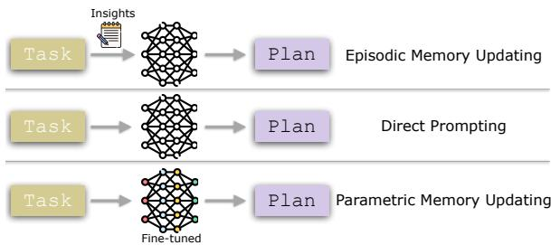
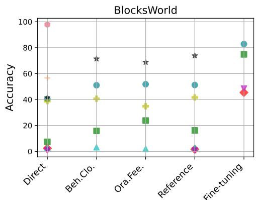
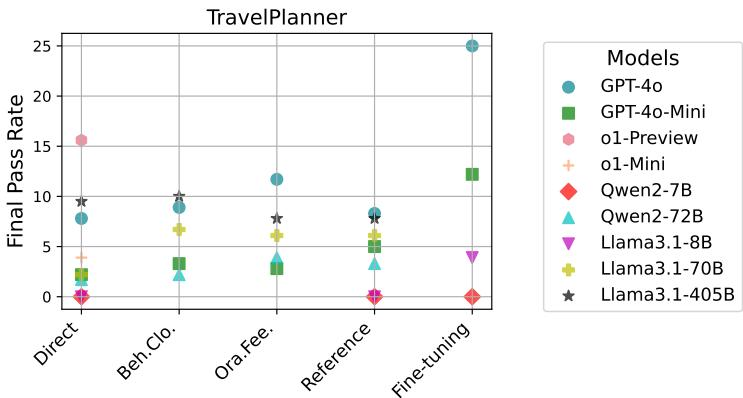
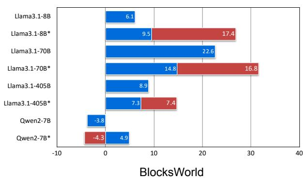
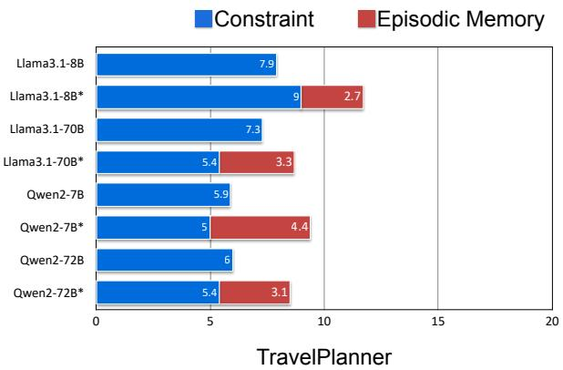
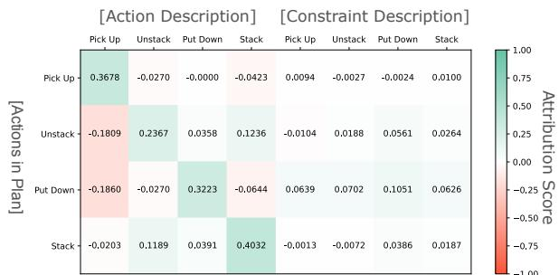
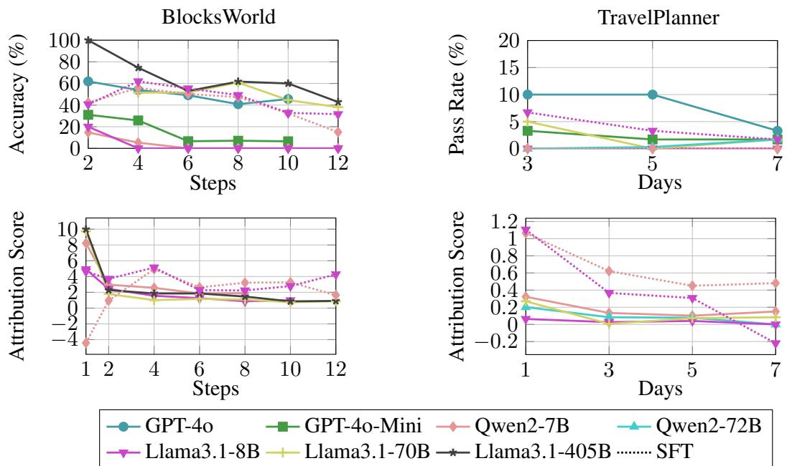
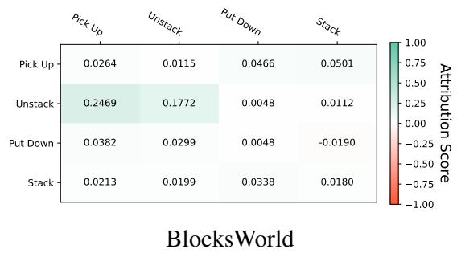
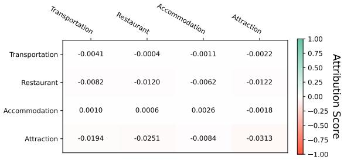

# Revealing the Barriers of Language Agents in Planning

Jian Xie♠ Kexun Zhang♡\* Jiangjie Chen♢\*<sup>†</sup> Siyu Yuan<sup>σ</sup>

Kai Zhang♣ Yikai Zhang♠ Lei Li♡ Yanghua Xiao♠<sup>‡</sup>

♠Shanghai Key Laboratory of Data Science, School of Computer Science, Fudan University

♡Carnegie Mellon University ♢ByteDance Seed

<sup>σ</sup>School of Data Science, Fudan University ♣The Ohio State University

{jianxie22, syyuan21, ykzhang22}@m.fudan.edu.cn, kexun@cmu.edu

jiangjiec@bytedance.com, zhang.13253@osu.edu, leili@cs.cmu.edu, shawyh@fudan.edu.cn

## Abstract

Autonomous planning has been an ongoing pursuit since the inception of artificial intelligence. Based on curated problem solvers, early plan ning agents could deliver precise solutions for specific tasks but lacked generalization. The emergence of large language models (LLMs) and their powerful reasoning capabilities has reignited interest in autonomous planning by automatically generating reasonable solutions for given tasks. However, prior research and our experiments show that current language agents still lack human-level planning abilities. Even the state-of-the-art reasoning model, OpenAI o1, achieves only 15.6% on one of the complex real-world planning benchmarks. This highlights a critical question: What hinders language agentsfrom achieving human-level planning? Although existing studies have highlighted weak performance in agent planning, the deeper underlying issues and the mechanisms and limitations of the strategies proposed to address them remain insufficiently understood. In this work, we apply the feature attribution study and identify two key factors that hinder agent planning: the limited role of constraints and the diminishing influence of questions. We also find that although current strategies help mitigate these challenges, they do not fully resolve them, indicating that agents still have a long way to go before reach ing human-level intelligence. Resources are available on the GitHub.

## 1 Introduction

Planning is the process of determining the sequence of actions needed to achieve a goal. It involves goal decomposition, constraint consideration, and foresight for simulating and predicting outcomes. In the development of artificial intelligence, this capability is considered the “Holy Grail” for achieving or even surpassing human intelligence (Kahneman, 2011; OpenAI, 2023b). However, the path to achieving autonomous planning is a long journey. Researchers have long focused on building custom systems tailored to specific tasks (Newell et al., 1959; McDermott, 1992; Silver et al., 2017). While these systems could deliver precise solutions through rigorous problem solvers, the extensive effort required for task-specific design prevents them from achieving universal problem-solving capabilities or general intelligence.

  
Figure 1: Memory updating strategies for language agents. Insights are learned from previous attempts.

The advent of language agents (Weng, 2023; Su, 2023; Sumers et al., 2024), which are powered by large language models (LLMs; OpenAI (2022, 2023a); G Team et al. (2023); Dubey et al. (2024); Yang et al. (2024)), changes the landscape. Thanks to the flexibility of natural language, LLM-based language agents have shown strong potential to generalize to various planning tasks without relying on traditional curated, task-specific solvers written in domain-specific languages like Planning Domain Definition Language (PDDL). However, despite these language agents demonstrating impressive capabilities across various tasks (Yao et al., 2022, 2023; Zheng et al., 2024a; Gu et al., 2024), their performance in planning remains disappointing and is viewed as mere “approximate retrieval” (Kambhampati et al., 2024) rather than engaging in genuine reasoning. Specifically, even the most capable model, OpenAI o1 (OpenAI, 2024), which claims to surpass human PhD-level accuracy on several reasoning tasks, achieves only 15.6% in a realworld travel planning benchmark, TravelPlanner (see Figure 2), far below human-level planning abilities. To uncover the fundamental reasons behind the weak performance, we seek to answer the first research question in this paper: RQ1: Why do current language agents struggle with planning?

In order to enhance language agents’ performance in planning tasks, numerous strategies have been proposed recently, which can be categorized into three main branches, as shown in Figure 1: episodic memory updating through prompt optimization (Zhao et al., 2024; Shinn et al., 2024; Fu et al., 2024), parametric memory updating through model training (Zeng et al., 2023a; Song et al., 2024; Yin et al., 2024), and translating queries into formal planning languages, followed by resolution using external solvers (Liu et al., 2023; Dagan et al., 2023). Although these strategies have shown performance improvements across various tasks, their underlying mechanisms remain largely opaque. Moreover, these strategies still fall short of human-level intelligence (Valmeekam et al., 2024a,b; Stechly et al., 2024), particularly in complex real-world tasks (Xie et al., 2024b; Gundawar et al., 2024; Chen et al., 2024). Therefore, based on the findings from RQ1, this paper seeks to answer the research questions, RQ2: What happens during memory updatingfor language agents and RQ3: What hinders these strategiesfrom achieving high-level planning abilities? Specifically, we focus on language agents’ vanilla planning as well as planning following memory updating, which reflect the internal planning capabilities of language agents rather than the translation ability.

In this paper, we delve into the two main components of planning: constraints and questions, which serve as the foundational elements for planning tasks. Constraints refer to the rules that agents must adhere to when generating a plan, while questions represent the goals that drive the planning process. Understanding how agents handle these elements is crucial for improving their performance in complex planning tasks. Using Permutation Feature Importance (Breiman, 2001; Fisher et al., 2019) to analyze the feature attribution of constraints and questions, our investigation reveals several key findings: 1) Language agents show a limited understanding of constraints, and the influence of the question weakens as the planning horizon increases. 2) Episodic memory updating improves constraint understanding but relies on global understanding, and it’s still difficult for agents to reference constraints in a fine-grained manner. 3) Parametric memory updating enhances the question’s impact on the final plan, but the diminishing influence of the question remains a challenge. 4) Both strategies resemble “shortcut learning” and struggle with dynamic constraints in planning.

## 2 Related Work

## 2.1 Language Agent

The advent of large language models sparks widespread attention due to their remarkable abilities, such as mathematical reasoning, creative writing, and information retrieval (Gómez-Rodríguez and Williams, 2023; Zhang et al., 2023; Lou et al., 2024; Zhu et al., 2024). Building on these models, language agents expand their capabilities to engage with the real world, including utilizing tools (Gu et al., 2024), grounding environments (Zheng et al., 2024a), and even controlling real-world robotics (Zeng et al., 2023b), functioning as a “reasoning brain” beyond mere text generation. The conceptual framework of language agents includes: 1) Memory module handles both longterm memory embedded in the model’s parameters, such as commonsense (West et al., 2022), and shortterm memory specific to tasks (Majumder et al., 2023). 2) Tool-use module enables agents to utilize external tools to compensate for inherent limitations, such as calling a calculator for arithmetic tasks or retrieving up-to-date information from external databases (Lu et al., 2023; Xie et al., 2024a; Wu et al., 2024). 3) Planning module controls the entire task process, including goal decomposition, action sequencing, and forward estimation, requiring comprehensive and advanced reasoning abilities (Weng, 2023; Sumers et al., 2024).

## 2.2 Planning in Language Agents

Planning, a hallmark of human intelligence, serves as a critical component in language agent systems, as it directly controls task execution and goal achievement. Improving an agent’s planning abilities thus leads to overall improvements across various tasks. However, previous studies show that current agents still struggle with planning tasks, such as classical tasks like block manipulation (Valmeekam et al., 2024a) or real-world tasks like travel planning (Xie et al., 2024b; Zhang et al., 2024). While these studies highlight agents’ weaker performance in planning, they mainly provide high-level observations, leaving the deeper, underlying reasons less explored. Furthermore, although strategies such as updating episodic memory (also referred to as working memory (Zhao et al., 2024)), which allows learning from past trials and errors (Shinn et al., 2024; Fu et al., 2024), or improving parametric memory through finetuning (Yin et al., 2024) have been proposed, the mechanisms driving these performance improvements, as well as their limitations, remain unclear. Therefore, in this work, we aim to understand the challenges faced by current language agents in planning and provide promising directions for addressing weaknesses in planning strategies to guide the development of more effective agents.

## 2.3 Interpretability of Language Models

Despite the impressive capabilities of LLMs, their thinking processes remain opaque. Interpreting these models is essential for improving their reliability and transparency in real-world applications. Attention visualization helps explore how models allocate attention across different input elements, attention heads, and layers within the model (Katz and Belinkov, 2023; Zheng et al., 2024b; Luo and Specia, 2024). Additionally, feature attribution methods analyze the importance of each input feature using techniques like perturbation (Ribeiro et al., 2016; Fisher et al., 2019) and gradients (Sundararajan et al., 2017; Mudrakarta et al., 2018). However, much of the existing work focuses on traditional tasks such as classification, which do not fully reflect the complexity of planning tasks. Planning requires handling long-horizon dependencies and balancing multiple objectives or constraints, presenting unique challenges that remain underexplored. To address this gap, this work utilizes interpretability techniques to investigate why agents struggle with planning tasks.

## 3 Background

## 3.1 Dataset

We choose Blocksworld and TravelPlanner as our testbeds, which cover both classical planning and real-world complex planning scenarios:

BlocksWorld (Valmeekam et al., 2024a) is a planning benchmark that provides a domain description, including action and constraint definitions, and requires agents to execute actions to transition from an initial state to a goal state. All actions must adhere to the constraints outlined in the prompt.

TravelPlanner (Xie et al., 2024b) is a real-world travel planning benchmark that requires language agents to generate plans based on provided information and user queries, aligning with commonsense and the hard constraints specified in the queries. Unlike the static nature of BlocksWorld, the hard constraints in TravelPlanner are dynamic, as they need to be inferred from the query and satisfied through item selection. We use the “sole-planning” mode to focus on the agents’ planning ability, excluding the influence of tool-use abilities.

## 3.2 Permutation Feature Importance

Permutation Feature Importance (Breiman, 2001; Fisher et al., 2019) is a strategy for evaluating the importance of features in a system. Specifically, if a feature is important, its removal or alteration will significantly affect the system’s result, whereas an unimportant feature will have little to no impact. In this paper, we adopt Permutation Feature Importance as our analysis strategy for testing the inner workings of language agents when planning.

Formally, given a language model $P _ { \theta }$ , a feature sequence $X = \{ x _ { 1 } , x _ { 2 } , . . . , x _ { n } \}$ , and a target sequence $Y = \{ y _ { 1 } , y _ { 2 } , . . . , y _ { m } \}$ , the attribution score $S _ { i , j }$ for the contribution of feature $x _ { i }$ to the target $y _ { j }$ is defined as follows<sup>1</sup>:

$$
S _ { i , j } = P _ { \theta } ( y _ { j } \mid X , Y _ { 1 : j - 1 } ) - P _ { \theta } ( y _ { j } \mid \hat { X } _ { i } , Y _ { 1 : j - 1 } ) .\tag{1}
$$

$\mathbf { A }$ low or near-zero $S _ { i , j }$ indicates that the feature $x _ { i }$ is almost independent of the target, while a higher score suggests a stronger contribution. Here, $P _ { \theta } ( y _ { j } \mid X , Y _ { 1 : j - 1 } )$ represents the conditional probability of the target $y _ { j }$ given the original input sequence X and the preceding targets $Y _ { 1 : j - 1 }$ as predicted by the model. ${ \hat { X } } _ { i }$ denotes the input sequence X with the values of feature x<sub>i</sub> permuted.

## 3.3 Experimental Setting

Data Slice In BlocksWorld, the dataset is randomly split into a training set (100 samples) and a validation set (500 samples). In TravelPlanner, we use the original training (45 samples) and validation sets (180 samples) for our experiments. Episodic and parametric memory updating either summarize insights from prior attempts on the training set or train on it, with evaluation performed on the validation set. Due to the high computational cost, for BlocksWorld, we randomly select 200 samples when computing attribution scores.

Episodic Memory Updating For episodic memory updating, following previous work (Zhao et al., 2024; Fu et al., 2024), we require language agents to summarize insights from previous attempts, categorized into two groups and one additional humanwritten reference: 1) Behavioral Cloning — The agent is provided with previous failed attempts along with a ground truth plan (from the external solver in BlocksWorld or human annotations in TravelPlanner). 2) Oracle Feedback — The agent is provided with previous failed attempts along with feedback from the solver or evaluator, explaining the reasons for failure. 3) Reference — This setting provides human-written insights, serving as a ground truth summary of the constraints. Specifically, in BlocksWorld, this refers to the reiteration of constraint descriptions, and in TravelPlanner, it includes refined summaries of commonsense and hard constraints.<sup>2</sup> We use Reference to implement the episodic memory updating strategy in the feature attribution study to avoid discrepancies in insights generated by different agents and ensure experimental control and consistency in our analysis. More details are provided in Appendix B.1.

Parametric Memory Updating We use supervised fine-tuning (SFT) for parametric memory updating, with the ground truth in the training set as the optimization objective. All local training and inference experiments are conducted on 8 A100 GPUs. For OpenAI models, we use the official scripts for training. Please refer to Appendix B.2 for more details.

## 4 Why Do Current Language Agents Struggle with Planning?

## 4.1 Status Quo

Agents demonstrate performance nearing or on par with humans in tasks like tool-use and web navigation (Lu et al., 2023; Zheng et al., 2024a). However, when it comes to planning, which requires advanced reasoning, such as goal decomposition, constraint analysis, and foresight, agents still face significant challenges. Specifically, as Figure 2 demonstrates, with direct prompting, most of the current agents only complete less than half of the tasks in BlocksWorld. In a more complex, real-world benchmark TravelPlanner, agent performance is even lower, with none surpassing a 20% final pass rate, including OpenAI’s flagship reasoning model o1. This raises an important question: Why do current language agents struggle with planning, and what hinders them from achieving advanced planning capabilities? In this section, we delve into the core aspects of planning to uncover the reasons behind the weak performance.

## 4.2 Limited Role of Constraints and Diminishing Influence of Questions

We use Permutation Feature Importance (Breiman, 2001; Fisher et al., 2019) as the analysis strategy to evaluate the attribution score of each part of the prompts in relation to the final plan, covering various foundation models and two benchmarks.

Specifically, for BlocksWorld, we divide the prompts into three components: action definitions, constraint descriptions, and questions. Each part is replaced with an empty token to compute its attribution score relative to the final plan. For TravelPlanner, a real-world benchmark that requires actions to rely on commonsense embedded in the model’s parameters, we focus on the attribution score of constraints and questions. When evaluating the constraint component, we replace the attributes (e.g., price) of elements selected by the agents with an empty token to evaluate whether agents are genuinely incorporating constraints into their planning or merely generating constraint-conforming plans by chance. For the question component, we apply the same substitution strategy used in BlocksWorld.

Agents do not adequately reference constraints during planning. Constraints, as one of the key restraining factors, play a crucial role in planning. Violating constraints directly leads to failed plans since it results in illegal actions or unsatisfied goals, as highlighted in previous studies (Valmeekam et al., 2024a; Xie et al., 2024b). To investigate the reason why agents cannot obey constraints, we compute the attribution score of the constraint component, with the results presented in Figure 3. Compared to the upper bound score (100), which indicates a dominant role, constraints account for only a small portion of the planning process, with all scores being less than 25.

Furthermore, we find agents are not able to reference constraints precisely. For example, when executing the action “Pick Up”, agents should reference all related constraint descriptions for “Pick Up”, and the attribution score should be significantly positive, as the constraint description contributes to the final plan. However, as shown by the detailed score distribution of the Llama3.1-70B model in Figure 4, agents exhibit weak constraintreferencing behavior. Comparing the left side of the figure, where actions align with their descriptions, the current agents fail to reference constraints effectively during planning. Similarly, in TravelPlanner, if agents were planning based on the required attributes, the attribution score between the attribute and the final item selection should be significantly positive. For example, the price should influence the item choice if the agent is performing real reasoning. Yet, across both benchmarks, none of the agents show the ability to fully adhere to this constraint-referencing behavior, resulting in unmet preconditions in BlocksWorld and unfulfilled hard constraints in TravelPlanner.



  
Figure 2: Main results of 9 models with different strategies on two benchmarks. The results of o1-Preview and o1-Mini on BlocksWorld are from Valmeekam et al. (2024b). “Beh.Clo.” and “Ora.Fee.” indicate Behavioral Cloning and Oracle Feedback, respectively. Llama3.1-8B and Qwen2-7B tend to provide case-specific insights that lack general applicability; thus, these models are excluded from the “Beh.Clo.” and “Ora.Fee.” settings.



  
Figure 3: The attribution score of the constraint and episodic memory component in relation to the final plan across different agents, with “\*” indicating episodic memory updating. All results are normalized to account for varying step lengths and model differences, with a maximum score of 100 representing a dominant role. The absolute value does not directly determine performance, as it only shows whether the agent references specific parts of the prompt, with factors like questions and fine-grained references also contributing. Llama3.1-405B and Qwen2-72B are selected based on performance gains from episodic memory updating and computational efficiency.

Moreover, in BlocksWorld, we find that for Qwen2-7B, the attribution score of the constraint component is negative, indicating that the presence of constraints negatively impacts planning. To investigate further, we test the performance of three models—Qwen2-7B, Llama3.1-8B, and Llama3.1- 70B—when no constraint descriptions are provided. As shown in Table 1, removing constraints leads to higher scores for Qwen2-7B, while Llama3.1-70B exhibited a significant decline. This suggests that agents struggle to effectively reference constraints during planning, and in some weaker agents, constraints may even distract them and degrade their performance, which also verifies the effectiveness of our analysis strategy.

As the planning horizon increases, the influence of the question on plan generation decreases. We find that while agents can deliver a complete plan, these plans often fail to meet the goals specified in the question, with failure rates increasing as the planning horizon increases. Specifically, as shown in the upper part of Figure 5, in both BlocksWorld and TravelPlanner, agent performance declines as the number of generated steps or travel days increases. Could this be similar to the “lost in the middle” phenomenon (Liu et al., 2024), where they lose track of the goal as the planning horizon increases? To investigate the underlying reasons, we compute the attribution score of the question at different steps in the plan, as shown in the lower part of Figure 5.



Figure 4: The distribution of attribution scores for action and constraint descriptions relative to the actions in the final plans in Llama3.1-70B on BlocksWorld. The result and discussion of TravelPlanner are in Appendix A.1.
<table><tr><td colspan="2">w/ Constraints</td><td>w/o Constraints</td></tr><tr><td>Qwen2-7B</td><td>2.4</td><td>3.6</td></tr><tr><td>Llama3.1-8B</td><td>0.6</td><td>0.6</td></tr><tr><td>Llama3.1-70B</td><td>38.8</td><td>9.8</td></tr><tr><td> $\mathrm { Q w e n } 2 – 7 \mathbf { B } _ { s f t }$ </td><td>45.4</td><td>45.4</td></tr><tr><td> $\mathrm { L l a m a 3 . 1 } { - 8 \mathbf { B } _ { s f t } }$ </td><td>48.4</td><td>45.8</td></tr></table>

Table 1: Performance comparison with and without constraint descriptions in the prompts on BlocksWorld.

We find that as the planning horizon increases, the attribution score of the question decreases. This suggests that the question’s influence on specific action or item selection diminishes as the plan progresses. This explains why agents perform worse as the plan length increases: if agents fail to focus on the goal specified in the query and lose track of it, they cannot deliver a successful plan.

## 5 What Happens in Memory Updating for Language Agents?

While previous work and our experiments, as shown in Figure 2, show that both parametric memory updating and episodic memory updating can improve agents’ performance in planning tasks, the underlying mechanisms remain unclear. In this section, we aim to address the following two questions: 1) Why do memory updating strategies help improve agents’ planning abilities? 2) What limitations of these strategies prevent agents from achieving more advanced planning abilities?

## 5.1 Episodic Memory Updating

Episodic memory updating refines and reiterates constraint information, making it easier for agents to recognize and apply. Rather than incorporating new information, we find that simply refining or reiterating existing insights in episodic memory updating can lead to performance improvements. In TravelPlanner, performance gains are observed when refined information (e.g., insights like selecting cheaper items, which agents would otherwise need to infer themselves) is introduced. Similarly, in BlocksWorld, both agent-generated and human-written insights—despite being slight modifications or emphases of the original constraint descriptions—still result in performance enhancements with episodic memory updating. This is intriguing, as such repetition typically offers little value in human reasoning.

To assess the impact of episodic memory updating on plan generation, we compute the attribution score of episodic memory (Figure 3). Specifically, these refined or reiterated insights show positive attribution scores to the final plans, indicating that agents actively consider them during planning. However, the figure also shows that while vague and implicit episodic memories (e.g., “select cheap items” in TravelPlanner) do contribute, more explicit and direct constraints (e.g., “cannot ‘Pick Up’ when the hand is not empty” in BlockWorld) are easier for agents to utilize, as demonstrated by their higher attribution scores.

Agents understand episodic memory on a global level and cannot reference it in a fine-grained manner. While episodic memory updating improves performance, the gains remain relatively minor. To investigate this further, we decompose the episodic memory into discrete components (i.e., treating each insight independently) to assess whether agents can reference these insights in a fine-grained manner. For example, in TravelPlanner, agents are expected to consider specific insights related to accommodation when selecting lodging options. However, as shown in Figure 6, while agents reference the overall episodic memory during planning, they struggle to apply individual insights in a detailed, fine-grained manner, reflected in their relatively low scores.

Moreover, in BlocksWorld, we observe that the constraint description for “Unstack” plays only a minor role (scoring 0.0188) in the original constraint attribution (Figure 4), but contributes significantly more in the episodic memory (0.1772; Figure 6). We hypothesize that episodic memory complements information that agents might have initially overlooked. However, agents still struggle to apply this information effectively during planning when dealing with more vague or implicit episodic memories, such as those in TravelPlanner.

TravelPlanner  


Figure 5: Performance comparison with increasing planning horizon. The upper part shows the performance of different agents, while the lower part shows their attribution scores of questions as the planning horizon extends.  


  
Figure 6: The attribution scores of episodic memory to the final plan in Llama3.1-70B on two benchmarks. The abscissa is the constraint, and the ordinate is the corresponding action or item in the plan.

## 5.2 Parametric Memory Updating

Parametric memory updating improves the attribution score of questions. Although parametric memory updating improves agents’ performance in planning tasks, its underlying mechanisms remain unclear. Building on previous findings that the attribution score of questions relates to an agent’s planning performance, we investigate whether this score changes after parametric memory updating. As shown in Figure 5, we observe a positive correlation between the question attribution score and final performance. For example, in BlocksWorld, from step 2 to step 4, the question attribution score increases, resulting in both finetuned agents achieving their highest scores at step 4. This suggests that through fine-tuning, agents are able to have a stronger focus on the goal than before, leading to improved planning outcomes.

While parametric memory updating increases the attribution score of questions, it still struggles as the planning horizon increases. Despite improvements in question attribution scores after fine-tuning compared to the vanilla agents, a decline is observed after step 4 in BlocksWorld, leading to a corresponding drop in performance. A similar trend is also noted in TravelPlanner. This suggests a promising direction: maintaining a strong focus on the goal throughout planning is essential for overcoming short-horizon limitations and advancing agents’ planning abilities.

## 6 Discussion

When constraints are already parameterized, episodic memory updating does not improve performance and may even degrade it. If both parametric and episodic memory updating are effective for agent planning, an interesting question arises: Would it be better to combine these two strategies? Surprisingly, this mixture does not improve the performance of fine-tuned agents and even harms it. As shown in Table 2, both fine-tuned agents exhibit a performance decline after episodic memory updating. Moreover, as shown in Figure 7, the attribution scores of both constraints and episodic memory play only a minor or even negative role, indicating that the fine-tuned agents no longer explicitly reference these constraints, rendering them redundant and ineffective. We hypothesize that reiterated episodic memory becomes redundant when constraints are already embedded within the model’s parameters. This redundancy disrupts the model’s decision-making coherence and undermines its ability to leverage the pre-existing constraint knowledge, resulting in weaker planning performance.

<table><tr><td>Episodic Memory</td><td>X</td><td>√</td></tr><tr><td> $\mathrm { Q w e n } 2 – 7 \mathbf { B } _ { s f t }$ </td><td>45.4</td><td>43.0</td></tr><tr><td> $\mathrm { L l a m a 3 . 1 } { - 8 \mathbf { B } _ { s f t } }$ </td><td>48.4</td><td>36.8</td></tr></table>

Table 2: Comparison between fine-tuned models with and without episodic memory updating on BlocksWorld.
<table><tr><td rowspan="3">0.02 0.00</td><td colspan="2"></td></tr><tr><td></td><td>Llama3.1-8Bsft</td></tr><tr><td>Qwen2-7Bsft -0.05 Constraint</td><td></td></tr></table>

Figure 7: Attribution scores of constraints and episodic memory on BlocksWorld for two fine-tuned agents.

To explore this further, we also report the performance of fine-tuned agents with the constraints removed in Table 1. Unlike the vanilla Llama3.1- 70B, which shows a noticeable performance drop, the Llama3 $\mathbf { \partial } . 1 \mathbf { - } 8 \mathbf { B } _ { s f t }$ shows only a slight decline, and $\mathrm { Q w e n } 2 – 7 \mathbf { B } _ { s f t }$ even exhibits no decrease at all, suggesting that the constraints had already been parameterized within them.

Both strategies resemble shortcut learning, focusing on short-horizon and low-level planning. Although both strategies offer performance improvements, they fail to achieve our expected highlevel intelligence. Our findings suggest that these strategies resemble “shortcut learning,” favoring static rule learning over dynamic problem-solving. For example, in TravelPlanner, agents learn commonsense rules effectively, especially through parametric memory updating (see Table 3), as commonsense is often based on static patterns learned in training data. However, these strategies remain insufficient when faced with hard constraints requiring advanced model abilities, such as maintaining a strong focus on long-horizon tasks, precise referencing for multiple-constraint integration, and sophisticated planning skills like foresight, simulation, and backtracking for trajectory adjustments.

<table><tr><td rowspan="2"></td><td colspan="2">Commonsense</td><td colspan="2">Hard</td><td rowspan="2">Final Pass Rate</td></tr><tr><td>Micro</td><td>Macro</td><td>Micro</td><td>Macro</td></tr><tr><td colspan="6">Direct Prompting</td></tr><tr><td>GPT-40</td><td>84.7</td><td>31.1</td><td>53.6</td><td>31.1</td><td>7.8</td></tr><tr><td>GPT-4o-Mini</td><td>84.4</td><td>22.2</td><td>42.4</td><td>20.0</td><td>2.2</td></tr><tr><td>Llama3.1-8B</td><td>60.1</td><td>0.0</td><td>7.9</td><td>2.8</td><td>0.0</td></tr><tr><td>Llama3.1-70B</td><td>82.8</td><td>18.9</td><td>33.1</td><td>16.1</td><td>2.2</td></tr><tr><td>Qwen2-7B</td><td>49.9</td><td>1.1</td><td>2.1</td><td>0.0</td><td>0.0</td></tr><tr><td>Qwen2-72B</td><td>74.8</td><td>11.7</td><td>23.8</td><td>8.9</td><td>1.7</td></tr><tr><td colspan="6">Episodic Memory Updating</td></tr><tr><td>GPT-40</td><td>89.2</td><td>41.7</td><td>51.7</td><td>27.2</td><td>8.3</td></tr><tr><td>GPT-4o-Mini</td><td>84.1</td><td>22.2</td><td>39.8</td><td>22.8</td><td>5.0</td></tr><tr><td>Llama3.1-70B</td><td>84.9</td><td>23.9</td><td>39.5</td><td>24.4</td><td>6.1</td></tr><tr><td>Qwen2-72B ¯Δ</td><td>75.6 +1.8</td><td>13.8</td><td>28.8</td><td>10.6</td><td>3.3 +2.2</td></tr><tr><td colspan="6">+4.4 +1.7 +2.3 Parametric Memory Updating</td></tr><tr><td>GPT-40</td><td>95.3</td><td></td><td></td><td></td><td>25.0</td></tr><tr><td>GPT-4o-Mini</td><td>94.7</td><td>68.9</td><td>62.6</td><td>39.4 17.2</td><td>12.2</td></tr><tr><td>Llama3.1-8B</td><td>78.3</td><td>61.7</td><td>49.3</td><td></td><td>3.8</td></tr><tr><td>Qwen2-7B</td><td></td><td>17.8</td><td>19.3</td><td>6.1</td><td></td></tr><tr><td>Δ</td><td>59.0 +12.1</td><td>0.6 +23.7</td><td>0.2 +6.4</td><td>0.0 +2.2</td><td>0.0 +7.8</td></tr></table>

Table 3: Comparison between different agents on TravelPlanner. “∆” represents the average improvement compared to the same model using direct prompting.

## 7 Conclusion

This paper utilizes Permutation Feature Importance to investigate why current language agents struggle with planning tasks. Our findings show that constraints play only a minor role in agent planning, indicating that agents are not effectively considering constraints during planning. Additionally, the question’s influence diminishes as the planning horizon extends, causing agents to lose focus on the goal and resulting in failed plans. Furthermore, we examine the effects of episodic and parametric memory updating on agent performance. While both strategies improve the impact of constraints and questions in planning, they only mitigate the underlying issues rather than fully resolve them.

We hope this paper provides valuable insights and sparks future research to address language agents’ key challenges in planning, ultimately moving closer to achieving human-level intelligence.

## Limitations

In this paper, we use Permutation Feature Importance to calculate the attribution scores across various open-source model families and sizes, aiming to provide insights into the obstacles that current language agents face in planning tasks. We also test the performance of the widely used GPT family. However, due to the limited access provided by OpenAI’s API, which restricts control over output token generation, we are unable to compute attribution scores for these models. Nonetheless, the consistent conclusions drawn from the two used model families across different sizes and benchmarks support the robustness of our methodology and validate our overall findings.

## References

Leo Breiman. 2001. Random forests. Machine learning, 45:5–32.

Yanan Chen, Ali Pesaranghader, Tanmana Sadhu, and Dong Hoon Yi. 2024. Can we rely on llm agents to draft long-horizon plans? let’s take travelplanner as an example. arXiv preprint arXiv:2408.06318.

Gautier Dagan, Frank Keller, and Alex Lascarides. 2023. Dynamic planning with a llm. arXiv preprint arXiv:2308.06391.

Abhimanyu Dubey, Abhinav Jauhri, Abhinav Pandey, Abhishek Kadian, Ahmad Al-Dahle, Aiesha Letman, Akhil Mathur, Alan Schelten, Amy Yang, Angela Fan, et al. 2024. The llama 3 herd of models. arXiv preprint arXiv:2407.21783.

Aaron Fisher, Cynthia Rudin, and Francesca Dominici. 2019. All models are wrong, but many are useful: Learning a variable’s importance by studying an entire class of prediction models simultaneously. Journal ofMachine Learning Research, 20(177):1–81.

Yao Fu, Dong-Ki Kim, Jaekyeom Kim, Sungryull Sohn, Lajanugen Logeswaran, Kyunghoon Bae, and Honglak Lee. 2024. Autoguide: Automated generation and selection of state-aware guidelines for large language model agents. arXiv preprint arXiv:2403.08978.

Gemini G Team, Rohan Anil, Sebastian Borgeaud, Yonghui Wu, Jean-Baptiste Alayrac, Jiahui Yu, Radu Soricut, Johan Schalkwyk, Andrew M Dai, Anja Hauth, et al. 2023. Gemini: a family of highly capable multimodal models. arXiv preprint arXiv:2312.11805.

Carlos Gómez-Rodríguez and Paul Williams. 2023. A confederacy of models: a comprehensive evaluation of llms on creative writing. In Findings of the Association for Computational Linguistics: EMNLP 2023, pages 14504–14528.

Yu Gu, Yiheng Shu, Hao Yu, Xiao Liu, Yuxiao Dong, Jie Tang, Jayanth Srinivasa, Hugo Latapie, and Yu Su. 2024. Middleware for llms: Tools are instrumental for language agents in complex environments. arXiv preprint arXiv:2402.14672.

Atharva Gundawar, Mudit Verma, Lin Guan, Karthik Valmeekam, Siddhant Bhambri, and Subbarao Kambhampati. 2024. Robust planning with llm-modulo framework: Case study in travel planning. arXiv preprint arXiv:2405.20625.

Daniel Kahneman. 2011. Thinking, fast and slow. Farrar, Straus and Giroux.

Subbarao Kambhampati, Karthik Valmeekam, Lin Guan, Mudit Verma, Kaya Stechly, Siddhant Bhambri, Lucas Paul Saldyt, and Anil B Murthy. 2024. Position: Llms can’t plan, but can help planning in llm-modulo frameworks. In Forty-first International Conference on Machine Learning.

Shahar Katz and Yonatan Belinkov. 2023. Visit: Visualizing and interpreting the semantic information flow of transformers. In Findings of the Association for Computational Linguistics: EMNLP 2023, pages 14094–14113.

Bo Liu, Yuqian Jiang, Xiaohan Zhang, Qiang Liu, Shiqi Zhang, Joydeep Biswas, and Peter Stone. 2023. Llm+p: Empowering large language models with optimal planning proficiency. arXiv preprint arXiv:2304.11477.

Nelson F. Liu, Kevin Lin, John Hewitt, Ashwin Paranjape, Michele Bevilacqua, Fabio Petroni, and Percy Liang. 2024. Lost in the middle: How language models use long contexts. Transactions ofthe Association for Computational Linguistics, 12:157–173.

Renze Lou, Kai Zhang, Jian Xie, Yuxuan Sun, Janice Ahn, Hanzi Xu, Yu su, and Wenpeng Yin. 2024. MUFFIN: Curating multi-faceted instructions for improving instruction following. In The Twelfth International Conference on Learning Representations.

Pan Lu, Baolin Peng, Hao Cheng, Michel Galley, Kai-Wei Chang, Ying Nian Wu, Song-Chun Zhu, and Jianfeng Gao. 2023. Chameleon: Plug-and-play compositional reasoning with large language models. In Thirty-seventh Conference on Neural Information Processing Systems.

Haoyan Luo and Lucia Specia. 2024. From understanding to utilization: A survey on explainability for large language models. arXiv preprint arXiv:2401.12874.

Bodhisattwa Prasad Majumder, Bhavana Dalvi Mishra, Peter Jansen, Oyvind Tafjord, Niket Tandon, Li Zhang, Chris Callison-Burch, and Peter Clark. 2023. Clin: A continually learning language agent for rapid task adaptation and generalization. arXiv preprint arXiv:2310.10134.

Drew McDermott. 1992. Robot planning. AI magazine.

Pramod Kaushik Mudrakarta, Ankur Taly, Mukund Sundararajan, and Kedar Dhamdhere. 2018. Did the model understand the question? In Proceedings of the 56th Annual Meeting of the Association for Computational Linguistics (Volume 1: Long Papers), pages 1896–1906.

Allen Newell, John C Shaw, and Herbert A Simon. 1959. Report on a general problem solving program. In IFIP congress, volume 256, page 64. Pittsburgh, PA.

OpenAI. 2022. Chatgpt.

OpenAI. 2023a. Gpt-4 technical report. arXiv preprint arXiv:2303.08774.

OpenAI. 2023b. Planning for agi and beyond.

OpenAI. 2024. Openai o1.

Marco Tulio Ribeiro, Sameer Singh, and Carlos Guestrin. 2016. " why should i trust you?" explaining the predictions of any classifier. In Proceedings of the 22nd ACM SIGKDD international conference on knowledge discovery and data mining, pages 1135– 1144.

Noah Shinn, Federico Cassano, Ashwin Gopinath, Karthik Narasimhan, and Shunyu Yao. 2024. Reflexion: Language agents with verbal reinforcement learning. Advances in Neural Information Processing Systems, 36.

David Silver, Julian Schrittwieser, Karen Simonyan, Ioannis Antonoglou, Aja Huang, Arthur Guez, Thomas Hubert, Lucas Baker, Matthew Lai, Adrian Bolton, et al. 2017. Mastering the game of go without human knowledge. nature, 550(7676):354–359.

Yifan Song, Da Yin, Xiang Yue, Jie Huang, Sujian Li, and Bill Yuchen Lin. 2024. Trial and error: Exploration-based trajectory optimization of LLM agents. In Proceedings ofthe 62nd Annual Meeting ofthe Associationfor Computational Linguistics (Volume 1: Long Papers), pages 7584–7600, Bangkok, Thailand. Association for Computational Linguistics.

Kaya Stechly, Karthik Valmeekam, and Subbarao Kambhampati. 2024. On the self-verification limitations of large language models on reasoning and planning tasks. arXiv preprint arXiv:2402.08115.

Yu Su. 2023. Language agents: a critical evolutionary step of artificial intelligence.

Theodore Sumers, Shunyu Yao, Karthik Narasimhan, and Thomas Griffiths. 2024. Cognitive architectures for language agents. Transactions on Machine Learning Research.

Mukund Sundararajan, Ankur Taly, and Qiqi Yan. 2017. Axiomatic attribution for deep networks. In International conference on machine learning, pages 3319– 3328. PMLR.

Karthik Valmeekam, Matthew Marquez, Alberto Olmo, Sarath Sreedharan, and Subbarao Kambhampati. 2024a. Planbench: An extensible benchmark for evaluating large language models on planning and reasoning about change. Advances in Neural Information Processing Systems, 36.

Karthik Valmeekam, Kaya Stechly, and Subbarao Kambhampati. 2024b. Llms still can’t plan; can lrms? a preliminary evaluation of openai’s o1 on planbench. arXiv preprint arXiv:2409.13373.

Lilian Weng. 2023. Llm-powered autonomous agents. lilianweng.github.io.

Peter West, Chandra Bhagavatula, Jack Hessel, Jena Hwang, Liwei Jiang, Ronan Le Bras, Ximing Lu, Sean Welleck, and Yejin Choi. 2022. Symbolic knowledge distillation: from general language models to commonsense models. In Proceedings ofthe 2022 Conference ofthe North American Chapter of the Associationfor Computational Linguistics: Human Language Technologies, pages 4602–4625, Seattle, United States. Association for Computational Linguistics.

Siye Wu, Jian Xie, Jiangjie Chen, Tinghui Zhu, Kai Zhang, and Yanghua Xiao. 2024. How easily do irrelevant inputs skew the responses of large language models? In First Conference on Language Modeling.

Jian Xie, Kai Zhang, Jiangjie Chen, Renze Lou, and Yu Su. 2024a. Adaptive chameleon or stubborn sloth: Revealing the behavior of large language models in knowledge conflicts. In The Twelfth International Conference on Learning Representations.

Jian Xie, Kai Zhang, Jiangjie Chen, Tinghui Zhu, Renze Lou, Yuandong Tian, Yanghua Xiao, and Yu Su. 2024b. Travelplanner: A benchmark for real-world planning with language agents. In Forty-first International Conference on Machine Learning.

An Yang, Baosong Yang, Binyuan Hui, Bo Zheng, Bowen Yu, Chang Zhou, Chengpeng Li, Chengyuan Li, Dayiheng Liu, Fei Huang, et al. 2024. Qwen2 technical report. arXiv preprint arXiv:2407.10671.

Shunyu Yao, Dian Yu, Jeffrey Zhao, Izhak Shafran, Thomas L. Griffiths, Yuan Cao, and Karthik R Narasimhan. 2023. Tree of thoughts: Deliberate problem solving with large language models. In Proceedings of NeurIPS.

Shunyu Yao, Jeffrey Zhao, Dian Yu, Nan Du, Izhak Shafran, Karthik R Narasimhan, and Yuan Cao. 2022. React: Synergizing reasoning and acting in language models. In Proceedings ofICLR.

Da Yin, Faeze Brahman, Abhilasha Ravichander, Khyathi Chandu, Kai-Wei Chang, Yejin Choi, and Bill Yuchen Lin. 2024. Agent lumos: Unified and modular training for open-source language agents. In Proceedings of the 62nd Annual Meeting of the Association for Computational Linguistics (Volume 1: Long Papers), pages 12380–12403, Bangkok, Thailand. Association for Computational Linguistics.

Aohan Zeng, Mingdao Liu, Rui Lu, Bowen Wang, Xiao Liu, Yuxiao Dong, and Jie Tang. 2023a. Agenttuning: Enabling generalized agent abilities for llms. Preprint, arXiv:2310.12823.

Fanlong Zeng, Wensheng Gan, Yongheng Wang, Ning Liu, and Philip S Yu. 2023b. Large language models for robotics: A survey. arXiv preprint arXiv:2311.07226.

Kai Zhang, Bernal Jiménez Gutiérrez, and Yu Su. 2023. Aligning instruction tasks unlocks large language models as zero-shot relation extractors. In Findings ofACL.

Yikai Zhang, Siyu Yuan, Caiyu Hu, Kyle Richardson, Yanghua Xiao, and Jiangjie Chen. 2024. TimeArena: Shaping efficient multitasking language agents in a time-aware simulation. In Proceedings of the 62nd Annual Meeting ofthe Associationfor Computational Linguistics (Volume 1: Long Papers), pages 3894– 3916, Bangkok, Thailand. Association for Computational Linguistics.

Andrew Zhao, Daniel Huang, Quentin Xu, Matthieu Lin, Yong-Jin Liu, and Gao Huang. 2024. Expel: Llm agents are experiential learners. In Proceedings of the AAAI Conference on Artificial Intelligence, volume 38, pages 19632–19642.

Boyuan Zheng, Boyu Gou, Jihyung Kil, Huan Sun, and Yu Su. 2024a. Gpt-4v (ision) is a generalist web agent, if grounded. In Forty-first International Conference on Machine Learning.

Zifan Zheng, Yezhaohui Wang, Yuxin Huang, Shichao Song, Bo Tang, Feiyu Xiong, and Zhiyu Li. 2024b. Attention heads of large language models: A survey. arXiv preprint arXiv:2409.03752.

Tinghui Zhu, Kai Zhang, Jian Xie, and Yu Su. 2024. Deductive beam search: Decoding deducible rationale for chain-of-thought reasoning. In First Conference on Language Modeling.

## Appendix

Within this supplementary material, we elaborate on the following aspects:

• Appendix A: Discussions

• Appendix B: Experimental Setup Details

• Appendix C: Prompts List

## A Discussion

## A.1 Attribution Scores of Constraint Tokens on TravelPlanner

As shown in Figure A.1, aside from the cuisine attribute in the prompts, other item attributes contribute minimally to the final plan. This suggests why the agent struggles to follow commonsense and hard constraints in TravelPlanner, as the key attributes that determine whether constraints are followed or violated play only minor roles. This further highlights that current agents still face challenges in fully integrating multiple attributes and adhering to constraints effectively when generating satisfactory plans.

<table><tr><td colspan="3">Minimum Nights</td><td colspan="3">House Rule Room Type</td><td colspan="3"></td></tr><tr><td></td><td>Cost</td><td></td><td></td><td></td><td></td><td>Cuisine</td><td>1.0 -0.5</td></tr><tr><td>Transportation</td><td>0.0180</td><td>0.0007</td><td></td><td>-0.0026</td><td>-0.0027</td><td>-0.0015</td><td>Attribution</td></tr><tr><td>Restaurant</td><td>0.0049</td><td>0.0005</td><td>-0.0065</td><td></td><td>0.0051</td><td>0.1533</td><td>-0.0</td></tr><tr><td>Accommodation</td><td>0.0257 -0.0018</td><td>-0.0023 -0.0043</td><td>0.0153 -0.0070</td><td></td><td>0.0334 -0.0005</td><td>-0.0061 0.0355</td><td>-0.5 Score -1.0</td></tr></table>

Figure A.1: The distribution of attribution scores for constraint descriptions relative to the actions in the final plan in Llama3.1-70B on TravelPlanner.

## B Experimental Setup Details

## B.1 Episodic Memory Updating

Training For episodic memory updating, we follow the methodology proposed by Zhao et al. (2024), where the agent is tasked with summarizing insights from previous attempts. The process of filtering these insights involves a voting system, where the agent can take one of the following actions:

• Add: Introduce new, general insights that are not restricted to specific queries and are missing from the current set. New insights are beginning with one vote.

• Modify: Revise existing insights if they are incomplete or partially incorrect. This action preserves the original number of votes for the insight.

• Support: Endorse correct insights by increasing their vote count by one. This action ensures that useful insights are retained and emphasized.

• Oppose: Challenge incorrect or irrelevant insights, decreasing their vote count by one. This process helps eliminate inaccuracies.

Inference When inference in the validation set, agents are required to use the insight learned in the training set. First, they are required to select the insight that they think is useful and then plan based on these insights. Only the votes surpassing five will be shown to the agents. During inference on the validation set, agents are required to apply the insights learned during training. First, agents must select the insights they find helpful and then use them to guide their planning. Only insights with a vote count exceeding five are displayed to the agents for use during planning.

## B.2 Parametric Memory Updating

OpenAI Models We use the official training script and default hyperparameters for OpenAI models. Specifically, for BlocksWorld, the hyperparameters are training steps set to 3, batch size set to 1, learning rate multiplier set to 2, and random seed set to 341541772.

For TravelPlanner, the hyperparameters are training steps set to 3, batch size set to 1, learning rate multiplier set to 2, and random seed set to 1294003109.

Open-source Models We fine-tune Llama3.1- 8B and Qwen2-7B on 8 A100 GPUs. For BlocksWorld, the training step is 50, the batch size is 16, the learning rate is 1e-5, the learning rate schedule is cosine, and the warmup ratio is set to 0.1.

For TravelPlanner, due to the high computational cost associated with its longer context, we adopt LoRA as the training strategy. The training step is 200, the batch size is 2, and the learning rate is 1e-4. Other hyperparameters remain the same as in BlocksWorld.

## B.3 Model Access

Our experiments utilize four closed-source LLMs accessed via API and five open-source LLMs. For the open-source models, we use instruction-tuned versions of each. Due to the high cost of deploying Llama3.1-405B, we perform inference on the Google Vertex AI platform and compute attribution scores locally. To ensure reproducibility, we have included the prompts used in our experiments in Appendix C. For closed-source models, we use GPT-4o-2024-08-06, GPT-4o-mini-2024- 07-18, o1-preview-2024-09-12, and o1-mini-2024- 09-12 across all tests.

## B.4 Human-Written Insights

We provide human-written insights for BlocksWorld and TravelPlanner here.

[ BlocksWorld ]   
1. Only pick up or unstack one block at   
a time , ensuring your hand is empty   
before doing so.   
2. A block can be picked up or unstacked   
only if it 's clear and on the table .   
3. A block is clear if it has no blocks   
on top and is not currently being held .   
4. When unstacking , ensure the block you   
're removing is actually on top and   
clear .   
5. After picking up or unstacking a   
block , you must hold it until it 's   
placed down or stacked .   
6. You can only place a block you 're   
holding , and stacking can only occur if   
the target block is clear .   
7. Once a block is placed down or   
stacked , your hand becomes empty , and   
the block below a newly stacked one is   
no longer clear .   
[ TravelPlanner ]   
1. Verify transportation and attraction   
availability before planning and provide   
alternatives if needed .   
2. Ensure all plan details and   
activities are based on available data   
within the designated environment to   
avoid inaccuracies .   
3. Include all essential details , such   
as accommodations and daily activities ,   
ensuring they align logically with the   
planned city and timeline .   
4. Maintain diversity by avoiding   
repetition of restaurant or attraction   
choices throughout the trip .   
5. Ensure transportation methods are   
consistent and logical within the trip 's   
context , avoiding conflicting options   
like self - driving and flights .   
6. Follow any specified minimum night   
stay requirements when booking   
accommodations .   
7. Plan activities , accommodations , and   
meals to align with the user 's budget

constraints .   
8. Ensure accommodations comply with   
specific rules and preferences ,   
including room type and restrictions on   
parties , smoking , pets , or visitors .   
9. Adjust transportation options and   
other preferences according to the user '   
s specified requirements , such as   
avoiding flights or self - driving .   
10. Opt for budget - friendly   
accommodations , restaurants , and   
transportation methods .

## B.5 Attribution Score Calculation

To obtain accurate attribution scores, we focus only on “meaningful words” in the analysis. For instance, in BlocksWorld, we consider only actions such as “Pick Up”, “Put Down”, “Stack”, and “Unstack”, along with relevant objects like “red block”, while discarding non-essential words like “the” A similar approach is applied to TravelPlanner, where only the values in the JSON format are considered. For example, in “Accommodation: XXX”, only “XXX” is used for calculating attribution scores.

## B.6 Attribution Score Normalization

Due to the varying planning steps and models, for example, the attribution scores in different models are in different scales, which cannot be compared directly. To address this, we normalize the attribution scores by dividing each score by the maximum absolute value along the relevant dimension, which ensures that all scores are scaled consistently across different models. This normalization process allows for a fair comparison of the attribution scores by bringing them into a comparable range, typically between 1 and 1, without distorting the relative importance of features within the same model.

## C Prompt List

We provide the prompts utilized in this paper here.

## C.1 Behavioral Learning Prompt

You are tasked with analyzing both successful and failed plans from previous   
attempts based on a specific query and background information . These failed plans   
are presented in chronological order , with the most recent plan including a detailed   
trajectory . As these plans fail to meet certain constraints , you are encouraged to   
refine the insights to improve them .   
Use the following format to systematically analyze failed plans :   
[ State ]: Describe the current situation , including factors like remaining budget ,   
time constraints , and any other specified conditions in the query or provided   
information .   
[ Thought ]: Explain the reasoning behind your decisions , considering the current   
state .   
[ Action ]: Detail the specific parts of your plan in response to the [ State ] and [   
Thought ].   
For the successful plan , add a [ Best Practice ] section after the final analysis to   
summarize the key experiences and practices that led to success .   
For the failed plan , add an [ Error ] section immediately after each defective [ Action   
]. This section should identify and explain why the chosen actions or used insights   
were inappropriate , given the [ State ] and [ Thought ].   
After evaluating the plans and previous insights , refine the current insight set   
based on findings from previous attempts and newly identified errors .   
Your task involves adding , editing , supporting , and opposing insights from the   
existing set:   
[Add ]: Integrate new pairs that are missing in the current set. Add new ones only   
when absolutely necessary .   
[ Edit ]: Revise pairs that are incomplete or partially incorrect . Editing an insight   
retains its number of votes .   
[ Support ]: Endorsing specific pairs to emphasize their value . Increase the number of   
votes for the supported pair by 1 each time . Some previously used insights might   
have been edited ( with the same index ). If you support the new version , vote for it.   
[ Oppose ]: Challenging insights that are incorrect , outdated , or only applicable   
under specific conditions . This will decrease the number of votes by 1 each time .   
Opposing and editing are highly encouraged to resolve any conflicting insights .   
Avoid proposing insights with similar purposes .   
Legal Action on Current Insight Set:   
[Add/ Edit / Support / Oppose ] [ Insight 1]: [ Content ].   
Insight Set:   
{ insight\_set }   
Task Instruction : { task }   
Successful Plan :   
{ successful\_plan }   
Failed Plans :   
{ failed\_plan }   
Last Failed Plan Trajectory :   
{ trajectory }   
Please use the following format for your response (do not output in the markdown   
style ):   
Successful Plan Analysis :   
Failed Plan Analysis :   
Action on Current Insight Set :   
[ Finished ]

## C.2 Oracle Feedback Learning Prompt

You are tasked with analyzing failed plans from previous attempts , along with their   
evaluation results , based on a specific query and background information . These   
failed plans are presented in chronological order , with the most recent plan   
including a detailed trajectory . As these plans fail to meet certain constraints ,   
you are encouraged to refine the insights to improve them .   
Use the following format to systematically analyze failed plans :   
[ State ]: Describe the current situation , including factors like remaining budget ,   
time constraints , and any other specified conditions in the query or provided   
information .   
[ Thought ]: Explain the reasoning behind your decisions , considering the current   
state .   
[ Action ]: Detail the specific parts of your plan in response to the [ State ] and [   
Thought ].   
For the failed plan , add an [ Error ] section immediately after each defective [ Action   
]. This section should identify and explain why the chosen actions or used insights   
were inappropriate , given the [ State ] and [ Thought ].   
After evaluating the plans and previous insights , refine the current insight set   
based on findings from previous attempts and newly identified errors .   
Your task involves adding , editing , supporting , and opposing insights from the   
existing set:   
[ Add ]: Integrate new pairs that are missing in the current set . Add new ones only   
when absolutely necessary .   
[ Edit ]: Revise pairs that are incomplete or partially incorrect . Editing an insight   
retains its number of votes .   
[ Support ]: Endorsing specific pairs to emphasize their value . Increase the number of   
votes for the supported pair by 1 each time . Some previously used insights might   
have been edited ( with the same index ). If you support the new version , vote for it.   
[ Oppose ]: Challenging insights that are incorrect , outdated , or only applicable   
under specific conditions . This will decrease the number of votes by 1 each time .   
Opposing and editing are highly encouraged to resolve any conflicting insights .   
Avoid proposing insights with similar purposes .   
Note : Ensure that the insights are high - level and generalizable , rather than   
detailed and specific to particular queries . Make sure your contributions do not   
introduce unrelated insights or go beyond the scope of the provided information .   
Legal Action on Current Insight Set:   
[Add/ Edit / Support / Oppose ] [ Insight 1]: [ Content ].   
Insight Set:   
{ insight\_set }   
Task Instruction : { task }   
Failed Plans :   
{ failed\_plan }   
Evaluation Results :   
{ eval\_results }   
Last Failed Plan Trajectory :   
{ trajectory }   
Please use the following format for your response (do not output in the markdown   
style ) :   
Failed Plan Analysis :   
Action on Current Insight Set :   
[ Finished ]

## C.3 BlocksWorld Inference Prompt

{ query }   
To help your plan , some insights from a set summarized by previous agents will be   
provided . Not all insights will be appropriate ; you need to select the relevant ones   
to guide your plan . The values in brackets indicate the reliability of the insights   
with higher values representing greater reliability .   
Insight Set: { insight\_set }   
You should specify the insights you have chosen ( beginning with [ Chosen Insights ]) ,   
followed by your final plan ( beginning with [ Plan ]).

## C.4 TravelPlanner Inference Prompt

```csv
You are a proficient planner . Based on the provided information and query , please
give me a detailed plan , including specifics such as flight numbers ( e . g . , F0123456 )
, restaurant names , and accommodation names . Note that all the information in your
plan should be derived from the provided data . You must adhere to the format given
in the example . Additionally , all details should align with commonsense . The symbol
'-' indicates that information is unnecessary . For example , in the provided sample ,
you do not need to plan after returning to the departure city . When you travel to
two cities in one day , you should note it in the 'Current City ' section as in the
example (i.e., from A to B).
Background Information :
{ background information }
***** Example *****
Query : Please help me plan a trip from St. Petersburg to Rockford spanning 3 days
from March 16 th to March 18th , 2022. The travel should be planned for a single
person with a budget of $1 ,700.
Plan :
[
{{
" days ": 1 ,
" current_city ": " from St. Petersburg to Rockford ",
" transportation ": " Flight Number : F3573659 , from St. Petersburg to Rockford ,
Departure Time : 15:40 , Arrival Time : 17:04" ,
" breakfast ": "-",
" attraction ": "-",
" lunch ": "-",
" dinner ": " Coco Bambu , Rockford ",
" accommodation ": " Pure luxury one bdrm + sofa bed on Central Park , Rockford "
}} ,
{{
" days ": 2,
" current_city ": " Rockford " ,
" transportation ": "-",
" breakfast ": " Flying Mango , Rockford ",
" attraction ": " Burpee Museum of Natural History , Rockford ; Midway Village Museum ,
Rockford ; Discovery Center Museum , Rockford ",
" lunch ": " Grappa - Shangri - La 's - Eros Hotel , Rockford " ,
" dinner ": "Dunkin ' Donuts , Rockford ",
" accommodation ": " Pure luxury one bdrm + sofa bed on Central Park , Rockford "
}} ,
{{
" days ": 3 ,
" current_city ": " from Rockford to St . Petersburg " ,
" transportation ": " Flight Number : F3573120 , from Rockford to St. Petersburg ,
Departure Time : 19:00 , Arrival Time : 22:43" ,
" breakfast ": " Subway , Rockford " ,
" attraction ": " Klehm Arboretum & Botanic Garden , Rockford ; Sinnissippi Park ,
Rockford " ,
" lunch ": " Cafe Coffee Day , Rockford ",
" dinner ": " Dial A Cake , Rockford ",
" accommodation ": "-"
}}
]
***** Example Ends *****
```

To help your plan , some insights from a set summarized by previous agents will be   
provided . Not all insights will be appropriate ; you need to select the relevant ones   
to guide your plan . The values in brackets indicate the reliability of the insights   
, with higher values representing greater reliability .   
Insight Set: { insight\_set }   
Given information : { text }   
Query : { query }   
You should specify the insights you have chosen ( beginning with [ Chosen Insights ]) ,   
followed by your final plan ( beginning with [ Plan ]).