# SAPIENT: Mastering Multi-turn Conversational Recommendation with Strategic Planning and Monte Carlo Tree Search

Hanwen Du♣ Bo Peng♣ Xia Ning♣♠♡B

♣Department of Computer Science and Engineering, The Ohio State University, USA ♠Department of Biomedical Informatics, The Ohio State University, USA ♡Translational Data Analytics Institute, The Ohio State University, USA {du.1128,peng.707,ning.104}@osu.edu

## Abstract

Conversational Recommender Systems (CRS) proactively engage users in interactive dialogues to elicit user preferences and provide personalized recommendations. Existing methods train Reinforcement Learning (RL)-based agent with greedy action selection or sampling strategy, and may suffer from suboptimal conversational planning. To address this, we present a novel Monte Carlo Tree Search (MCTS)-based CRS framework SAPIENT. SAPIENT consists of a conversational agent (S-agent) and a conversational planner (S-planner). S-planner builds a conversational search tree with MCTS based on the initial actions proposed by S-agent to find conversation plans. The best conversation plans from S-planner are used to guide the training of S-agent, creating a self-training loop where S-agent can iteratively improve its capability for conversational planning. Furthermore, we propose an efficient variant SAPIENT-e for trade-off between training efficiency and performance. Extensive experiments on four benchmark datasets validate the effectiveness of our approach, showing that SAPIENT outperforms the state-of-the-art baselines. Our code and data are accessible through https://github. com/ninglab/SAPIENT.

## 1 Introduction

Conversational Recommender Systems (CRSs) are developed to proactively engage users with interactive dialogues to understand user preferences and provide highly personalized recommendations (Christakopoulou et al., 2016; Lei et al., 2020b). For example, on an online dining platform such as Yelp (Lei et al., 2020b), CRS can chat with users through natural language dialogues (e.g., ask a question like, “What is your preferred food type?”) and recommend products that best match the users’ preferences expressed in the conversation. Among different settings of CRS (Sun and

Zhang, 2018; Deng et al., 2021; He et al., 2023), the Multi-turn Conversational Recommendation (MCR) setting (Lei et al., 2020b,c; Deng et al., 2021) is popular as it can interact/communicate with users multiple times (i.e., multiple turns) to iteratively learn user preferences (Fu et al., 2020; Jannach et al., 2021). In this work, we develop an innovative Monte Carlo Tree Search (MCTS)- based MCR framework to enhance the strategic conversational planning ability for MCR, offering a fresh perspective for handling complex conversation environments and enhancing user experiences.

A key of MCR is to decide what action (asking a question on specific attribute values or recommending specific items) to take at each conversational turn—a conversational turn consists of the CRS taking an action and the user responding to that action—to effectively elicit information on user preferences and make personalized recommendations (Fu et al., 2020; Lei et al., 2020a). To achieve this, previous methods formulated MCR as a Markovian Decision Process (MDP) (Bellman, 1957), and trained policy-based (Sun and Zhang, 2018; Lei et al., 2020b) or value-based (Deng et al., 2021; Zhang et al., 2022) agents via Reinforcement Learning (RL) to learn conversation strategies. Despite promising, these methods could suffer from myopic actions and limited planning capability due to the following reasons. First, they base their planning solely on observations of the current state (e.g., items that the user indicates a negative preference for) without exploring potential future states. As a result, they could take myopic actions (Anthony et al., 2017; Cohen et al., 2022). Second, they generate conversation trajectories, also referred to as conversation plans, by sequentially sampling actions, and thus could suffer from the cumulative error, especially when generating long trajectories for planning (Kumar et al., 2019; Lan et al., 2020).

To address these limitations, we present a novel MCTS-based MCR framework—Strategic Action

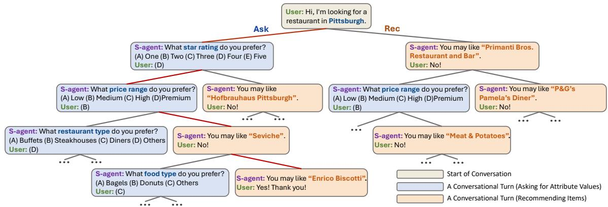  
Figure 1: An example of conversational search tree for a user. Conversation starts at the root node with the user specifying preference on an attribute type and its value. The search tree expands as S-agent decides different action types—ask and rec—at each turn. Red line connects the highest-rewarded conversation plan found by the tree.

Planning with Intelligent Exploration Non-myopic Tactics, referred to as SAPIENT. SAPIENT comprises a conversational agent, referred to as S-agent, where S-agent utilizes an MCTS-based algorithm, referred to as S-planner, to plan conversations. S-agent builds a global information graph and two personalized graphs with dedicated graph encoders to extract the representation of the conversational states, and synergizes a policy network and a Qnetwork to decide specific actions based on the learned state representations. S-planner leverages MCTS (Kocsis and Szepesvári, 2006; Coulom, 2007) to simulate future conversations with looka head explorations. This non-myopic conversational planning process ensures S-planner can strategically plan conversations that maximize the cumulative reward (a numerical signal measuring whether the action taken by S-agent is good or not), instead of greedily selecting actions based on immediate reward. The best conversation plans with the highest cumulative rewards found by S-planner are used to guide the training of S-agent. In this way, S-agent can engage in a self-training loop (Silver et al., 2017)—collecting trajectories from multiple conversation simulations and training on selected, high-rewarded trajectories—to iteratively improve its planning capability without additional labeled data. After S-agent is well-trained, it can directly make well-informed decisions without S-planner during inference, since it inherits the S-planner’s expertise in strategic, non-myopic planning.

To make MCTS scalable w.r.t. the size of items and attributes, we introduce a hierarchical action selection process (Nachum et al., 2018), and two action types: ask and rec. At each turn, instead of searching over all the items and attribute values, S-planner builds a conversational search tree (Figure 1) that only searches over the two action types and uses the Q-network to decide the specific action, thus greatly reducing the search space.

We evaluate SAPIENT against 9 state-of-the-art CRS baselines, and show SAPIENT significantly outperforms baselines on 4 benchmark datasets. Our case study also shows that the action strategies of SAPIENT are beneficial for information seeking and recommendation success in the conversations.

Furthermore, we develop an efficient variant of SAPIENT, denoted as SAPIENT-e. Different from SAPIENT, which is trained on selected, highrewarded trajectories, SAPIENT-e consumes all trajectories found by S-planner for training via a listwise ranking loss. As a result, SAPIENT-e requires less cost of collecting training trajectories compared to SAPIENT, and enables superior efficiency. Our contributions are summarized as follows:

• We present SAPIENT, a novel MCR framework synergizing an MCTS-based S-planner and an S-agent with a self-training loop to iteratively improve S-agent’s planning capability. To the best of our knowledge, SAPIENT is the first to leverage an MCTS-based planning algorithm to achieve strategic, non-myopic planning for MCR.

• We further develop SAPIENT-e, an efficient variant trained on all trajectories from S-planner via a listwise ranking loss. SAPIENT-e addresses the efficiency issue with MCTS while maintaining similar performance with SAPIENT.

• Our extensive experiments show both SAPIENT and SAPIENT-e outperform the state-of-the-art baselines. Our case study shows SAPIENT can strategically take actions that enhance information seeking and recommendation success.

## 2 Related Work

Conversational Recommender System CRS understands user preferences through interactive natural language conversations to provide personalized recommendations (Fu et al., 2020; Jannach et al., 2021). Early methods (Christakopoulou et al., 2016; Sun and Zhang, 2018) ask users about their desired attribute values to narrow down the list of candidate items to recommend, but are limited under the single-turn setting, as they can only recommend once in a conversation. To address this, multi-turn CRSs allow for multiple turns of question inquiries and item recommendations. For example, EAR (Lei et al., 2020b) adjusts the conver sation strategy based on the user’s feedbacks with a three-staged process. SCPR (Lei et al., 2020c) models MCR as a path reasoning problem over the knowledge graph of users, items, and attribute values. UNICORN (Deng et al., 2021) introduces a graph-based RL framework for MCR. MCMIPL (Zhang et al., 2022) develops a multi-interest policy learning framework to understand user’s interests over multiple attribute values. HutCRS (Qian et al., 2023) introduces a user interest tracing module to track user preferences. CORE (Jin et al., 2023) de signs a CRS framework powered by large language models with user-friendly prompts and interactive feedback mechanisms. Chen et al. (2019) and Montazeralghaem et al. (2021) build a tree-structured index with clustering algorithms to handle the large scale of items and attribute values in MCR. Differ ent from these methods, SAPIENT can iteratively improve its planning ability through self-training on demonstrationsfrom MCTS, allowingfor more informed and non-myopic conversation strategies.

Reinforcement Learning for CRS Reinforcement Learning (RL) has achieved great success in tasks requiring strategic planning in complex and interactive environments, such as computer Go (Silver et al., 2016, 2017) and dialogue planning (Yu et al., 2023; He et al., 2024). RL is also employed to train CRS agents to make strategic actions, and current RL-based CRSs can be mainly categorized into two types of methods: (1) policybased methods, which train a policy network that directly outputs the probability of taking each action (Sun and Zhang, 2018; Lei et al., 2020a), and (2) value-based methods, which train a Q-network (van Hasselt et al., 2016) to estimate the Q-value of actions (Deng et al., 2021; Zhang et al., 2022). Despite promising, these CRS methods may suffer from myopic conversational planning and suboptimal decisions due to their greedy action selection and sampling strategy. In contrast to these methods, our new SAPIENT is able to achieve strategic and non-myopic conversational planning through an MCTS-based planning and self-training algorithm.

## 3 Notations and Definitions

We denote as the set of users, as the set of items,  as the set of attribute types (e.g., price range, star rating), and $\mathcal { P }$ as the set of attribute values (e.g., medium price range, five-star rating). Each user u $\in \mathcal { U }$ has an interaction history (e.g., view, purchase) with a set of items $\mathcal { V } ( u )$ . Each item $v \in \mathcal V$ is associated with a set of attribute types $\mathcal { \ V } ( v )$ and the corresponding set of attribute values $\mathcal { P } ( v )$ . Each conversation is initialized by a user specifying preference on an attribute type $y _ { 0 } \in \mathcal { V }$ and its corresponding attribute value $p _ { 0 } \in \mathcal { P } \left( \mathbf { e } . \mathbf { g } . \right.$ the user says “I am looking for a place with medium price range.”). At the t-th conversational turn, S-agent can either ask for preferences over attribute values from a set of candidate attribute values $\mathcal { P } _ { t } ^ { c }$ or recommend items from a set of candidate items $\mathcal { V } _ { t } ^ { c }$ . Based on the user’s reply (accept or reject attribute values/items), S-agent repeatedly communicates with users until the user accepts at least one recommended item at turn $T$ (success), or the conversation reaches the maximum number of turns and terminates at $T { = } T _ { \mathrm { m a x } }$ (fail). The goal of MCR is to recommend at least one item that the user accepts, and complete the conversation in as few turns as possible to prevent the user from becoming impatient after too many turns.

## 4 Method

We introduce SAPIENT, an MCTS-based MCR framework that achieves strategic and non-myopic conversational planning. SAPIENT formulates MCR as an MDP with a hierarchical action selection process (Section 4.1). A conversational agent (S-agent) observes the current state and decides the actions in each conversational turn (Section 4.2), a conversational planner (S-planner) leverages an MCTS-based algorithm to plan conversations (Section 4.3), and S-agent engages in a self-training loop with guidance from S-planner (Section 4.4). Once S-agent is well-trained, it can directly make well-informed decisions without S-planner during inference, since it inherits the S-planner’s expertise in strategic and non-myopic planning. A framework overview of SAPIENT is in Figure 2 and the training algorithm is in Algorithm 1. We summarize all the notations in Appendix A.

## 4.1 MDP Formulation for MCR

We formulate MCR as an MDP where S-agent can be trained in an RL environment to learn to plan conversations strategically. For each user u, the MDP environment $\mathcal { M } ( u )$ is defined as a quintuple $\mathcal { M } ( u ) = \{ \mathcal { S } , \mathcal { A } , \mathcal { T } , \mathcal { R } , \gamma \} u$ (index u is dropped when no ambiguity arises), where denotes the state space, which summarizes all the information about the conversation and the user; denotes the action space, which includes asking (ask) for specific attribute types and their respective values, or recommending (rec) specific items; $\tau : s \times$ $A  s$ denotes the transition to the next state after taking an action from the current state; $\mathcal { R } :$ $\mathcal { S } \times \mathcal { A } $ R denotes the immediate reward function after taking an action at the current state; and $\gamma \in$ (0, 1) denotes the discount factor. For hierarchical action selection (Nachum et al., 2018), S-agent first chooses an action type $o _ { t } \in \{ \mathsf { a s k } , \mathsf { r e c } \}$ at each conversational turn, indexed by $t ,$ then chooses the objective of that action type. In summary, the MDP environment provides information about the current state for S-agent, and trains it to maximize the reward by optimizing its action strategy.

State For the t-th turn, we define the state $s _ { t } \in S$ as a triplet $s _ { t } = ( \mathcal { P } _ { t } ^ { + } , \mathcal { P } _ { t } ^ { - } , \mathcal { V } _ { t } ^ { - } )$ , where $\mathcal { P } _ { t } ^ { + }$ denotes all the attribute values that the user has accepted until the t-th turn, $\mathcal { P } _ { t } ^ { - }$ and $\nu _ { t } ^ { - }$ denote all the attribute values and items that the user has rejected until the t-th turn. As the conversation continues until the user accepts a recommended item, or the conversation terminates at $T _ { \mathrm { m a x } }$ turns when none of the recommended items are accepted by the user, the accepted item set $\mathcal { V } _ { t } ^ { + }$ is always empty during the conversation, and hence we do not need $\mathcal { V } _ { t } ^ { + }$ in the state. Besides, S-agent also has access to all the information about the user u and the global information graph $\mathcal { G }$ (a tripartite graph that represents all the interactions between users and items and all the associations between items and attribute values). The state is initialized as $s _ { 0 }$ when the user specifies preference on an attribute type $y _ { 0 } \in \mathcal { V }$ and its corresponding attribute value $p _ { 0 } \in \mathcal { P }$ , and transitions to the next states as the conversation continues. The candidate attribute value set $\mathcal { P } _ { t } ^ { c }$ and candidate item set $\mathcal { V } _ { t } ^ { c }$ are updated according to $\mathcal { P } _ { t } ^ { + }$ $\mathcal { P } _ { t } ^ { - }$ and $\mathcal { V } _ { t } ^ { - }$ , which we will elaborate later in the

Transition subparagraph. We present an illustration on how to calculate the state $s _ { t }$ in Appendix B.

Action The action $a _ { t }$ refers to asking for a specific attribute value (ask) or recommending a specific item (rec) at the t-th turn. Here, we adopt a hierarchical action selection process: we first use a new policy network $\pi _ { \phi } { \left( { O _ { t } } | s _ { t } \right) }$ to decide the action type $o _ { t } \in \{ \mathsf { a s k } , \mathsf { r e c } \}$ from the current state $s _ { t } ,$ , and then use a new Q-network $Q _ { \theta } ( a _ { t } | s _ { t } , o _ { t } )$ to decide the specific action $a _ { t }$ according to the action type $o _ { t }$ . The action space (at the current state $s _ { t } ) \mathcal { A } _ { s _ { t } } { = } \{ \mathcal { P } _ { t } ^ { c } , \mathcal { V } _ { t } ^ { c } \}$ contains all the candidate items and attribute values. The Q-network $Q _ { \theta } ( a _ { t } | s _ { t } , o _ { t } )$ only selects an action from a sub action space $\mathcal { A } _ { s _ { t } , o _ { t } } \mathrm { : }$ when $O _ { t } { = } \mathbf { a s k } , \mathcal { A } _ { s _ { t } , o _ { t } } { = } \mathcal { P } _ { t } ^ { c }$ ; when $o _ { t } { = } \mathbf { r } { \in } { \mathsf { C } }$ $\mathcal { A } _ { s _ { t } , o _ { t } } = \mathcal { V } _ { t } ^ { c }$ . Details on the policy network and the Q-network are available in Section 4.2.

Transition Transition occurs from the current state $s _ { t }$ to the next state $s _ { t + 1 }$ when the user responds to the action $a _ { t }$ (accepts or rejects items/attribute values). Candidate item set are narrowed down to the remaining items that still satisfy the user’s preference requirement, and attribute values asked at turn t are excluded from the candidate attribute value set. More details are in Appendix D.

Reward We denote the immediate reward at the t-th conversational turn as $r _ { t }$ , and the cumulative reward for each conversation is calculated as $\scriptstyle \sum _ { t = 1 } ^ { T } \gamma ^ { t } r _ { t }$ . Intuitively, a positive reward is assigned when the user accepts the items or attribute values, and a negative reward is assigned when the user rejects the items or attribute values. Details on the reward function are available in Appendix E.

## 4.2 S-agent

S-agent comprises three components: the state encoder, the policy network, and the Q-network. The state encoder adopts graph neural networks to generate the state representation. This state representation is then utilized by both the policy network and the Q-network to decide the action type and the specific actions in each conversational turn.

State Encoder To include essential information about the conversation and the user, S-agent first uses a graph attention network (Brody et al., 2022) to learn the representations of users, items, and attribute values out of the global information graph $\mathcal { G }$ Next, S-agent introduces two personalized graphs— positive feedback graph (denoted as $\mathcal { G } _ { t } ^ { + } )$ and negative feedback graph (denoted as $\mathcal { G } _ { t } ^ { - } ) - \mathrm { t o }$ represent each user’s acceptance/rejection on attribute values until the t-th turn, and uses two dedicated graph convolutional networks to learn the representations of users, items, and attribute values (Zhang et al., 2022) from the graphs. Finally, S-agent aggregates the representations of items and attribute values from ${ \mathcal { G } } , { \mathcal { G } } _ { t } ^ { + }$ and $\mathcal { G } _ { t } ^ { - }$ with a Transformer (Vaswani et al., 2017)-based aggregator to model the action sequence in the conversation, and obtain the representation $\mathbf { s } _ { t }$ of the current state $s _ { t }$ . Details on the state encoder are available in Appendix C.

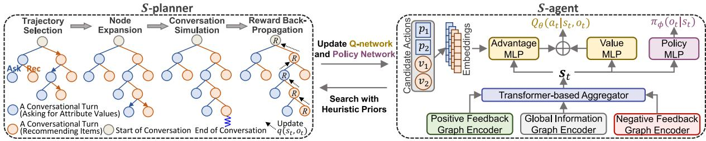  
Figure 2: SAPIENT consists of a conversational agent (S-agent) and a conversational planner (S-planner). S-planner leverages MCTS to perform non-myopic conversational planning based on the heuristics from S-agent. The best conversation plans found by S-planner are used to guide the training of S-agent, enabling S-agent to engage in a self-training loop that iteratively improves its capability for conversational planning.

Policy Network & Q-Network Based on the state representation $\mathbf { s } _ { t }$ , S-agent adopts a policy network $\pi _ { \phi } ( o _ { t } | s _ { t } )$ to decide action type $o _ { t }$ and $\mathrm { ~ a ~ Q - ~ }$ network $Q _ { \theta } ( a _ { t } | s _ { t } , o _ { t } )$ to decide the specific action $a _ { t }$ according to the action type $o _ { t } \colon$

$$
\begin{array} { r } { \pi _ { \phi } ( o _ { t } | s _ { t } ) = \mathrm { s o f t m a x } \big ( \mathbf { M L P } _ { \pi } ( \mathbf { s } _ { t } ) \big ) \qquad } \\ { Q _ { \theta } ( a _ { t } | s _ { t } , o _ { t } ) = \mathbf { M L P } _ { A } ( \mathbf { s } _ { t } | | \mathbf { a } _ { t } ) + \mathbf { M L P } _ { V } ( \mathbf { s } _ { t } ) , } \end{array}\tag{1}
$$

where MLP denotes a two-layer perceptron, $\mathbf { a } _ { t } =$ $\mathbf { e } _ { p }$ or $\mathbf { a } _ { t } = \mathbf { e } _ { v }$ denotes the embedding of actions (attribute value or item) at the t-th turn, A and V denote the advantage and value function of the dueling Q-network (Wang et al., 2016) respectively.

## 4.3 S-planner

S-planner adopts an MCTS-based planning algorithm to simulate conversations and finds the best conversation plan for each user, strategically balancing exploration and exploitation to efficiently expand a search tree (Kocsis and Szepesvári, 2006; Coulom, 2007). Specifically, each node in the tree represents a state $s _ { t } .$ , the root node $s _ { 0 }$ represents the initial state where the user specifies preference on an attribute type and its corresponding value, and the leaf node represents the end of the conversation (success or fail). Each edge between nodes $s _ { t }$ and $s _ { t + 1 }$ represents an action type $o _ { t } \in \{ \mathsf { a s k } .$

rec and the transition from the current state $s _ { t }$ to the next state $s _ { t + 1 }$ after choosing an action type $o _ { t }$ and a specific action $a _ { t }$ . For each action type $o _ { t }$ S-planner maintains a function $q ( s _ { t } , o _ { t } )$ of $s _ { t }$ and $o _ { t }$ as the expected future reward of selecting action type $o _ { t }$ at the state $s _ { t }$ . For each user u, S-planner simulates $N$ different conversation plans (also referred to as trajectories), and the trajectory for the i-th simulation is denoted as $\tau _ { i } ^ { ( u ) }$ , which contains a sequence of state $s _ { t }$ , action type $o _ { t }$ , action $a _ { t }$ and immediate reward $r _ { t }$ at each conversational turn t. The search tree is built in four stages:

• Trajectory selection: S-planner traverses from the root to leaves over the current tree to select the most promising trajectory that is likely to obtain a high cumulative reward.

• Node expansion: S-planner initializes two children nodes (ask and rec) to the leaf node on the selected trajectory to expand the tree.

• Conversation simulation: S-planner simulates future conversations between S-agent and the user, starting from the expanded node and foresees how the future conversation will unfold.

• Reward back-propagation: S-planner updates the expected future reward $q ( s _ { t } , o _ { t } )$ of action type $o _ { t }$ along the trajectory using the cumulative reward of the current conversation.

Trajectory Selection S-planner selects the most promising trajectory from the root node to a leaf node that is likely to obtain a high future reward $q ( s _ { t } , o _ { t } )$ , and the selected trajectory will be further expanded for conversation simulation later. This selection process trades off between exploitation, measured by $q ( s _ { t } , o _ { t } )$ , against exploration, measured by how often the nodes are visited. Particularly, S-planner adapts the Upper Confidence bounds applied to Trees (UCT) approach (Kocsis and Szepesvári, 2006) to achieve the trade-off between exploitation and exploration, and at each node $s _ { t } ,$ , select action type $o _ { t } ^ { * }$ into the trajectory that maximizes the UCT value as follows:

$$
o _ { t } ^ { * }  \operatorname * { a r g m a x } _ { o _ { t } \in \{ \mathsf { a s k } , \mathsf { r e c } \} } \bigg [ q ( s _ { t } , o _ { t } ) + w \sqrt { \frac { \log V ( s _ { t } ) } { V ( f ( s _ { t } , o _ { t } ) ) } } \bigg ] ,\tag{2}
$$

where w $> 0$ is the exploration factor, $V ( s _ { t } )$ quantifies the visits on node $s _ { t }$ during conversation simulations, and $f ( s _ { t } , o _ { t } )$ represents the child node of $s _ { t }$ after choosing the action type $o _ { t }$ . Intuitively, the second term in Equation 2 is larger if the child node is less visited, encouraging more exploration. After selecting the action type $o _ { t } ^ { * }$ , S-planner chooses the optimal action $a _ { t } ^ { * }$ with the Q-network as follows:

$$
a _ { t } ^ { * } \gets \operatorname * { a r g m a x } _ { a _ { t } \in \mathcal { A } _ { s _ { t } , o _ { t } ^ { * } } } Q _ { \theta } ( a _ { t } | s _ { t } , o _ { t } ^ { * } ) .\tag{3}
$$

Node Expansion When a leaf node is reached, S-planner expands the leaf node by attaching two children nodes (corresponding to two action types ask and rec) to it. The expected future reward $q ( s _ { t + 1 } , o _ { t + 1 } )$ of choosing $o _ { t + 1 }$ at the newly attached node $s _ { t + 1 }$ is initialized as the highest value estimated by the Q-network $Q _ { \theta } ( a _ { t + 1 } | s _ { t + 1 } , o _ { t + 1 } )$ among all the candidate actions in the sub action space $\boldsymbol { \mathcal { A } } _ { s _ { t + 1 } , o _ { t + 1 } }$ , serving as a heuristic guidance for the future tree search.

Conversation Simulation To predict how the future conversation unfolds, S-planner continues to simulate conversations between S-agent and the user until the conversation succeeds or fails. Starting from the last expanded node, at each turn, the policy network decides the action type, while the Q-network decides the specific action.

Reward Back-Propagation Once the simulated conversation succeeds or fails, S-planner backpropagates from the leaf node of the current trajectory $\tau _ { i } ^ { ( u ) }$ to the root to increase the visit count of each node along $\tau _ { i } ^ { ( u ) }$ , and update the expected future reward $q ( s _ { t } , o _ { t } )$ along $\tau _ { i } ^ { ( u ) }$ as follows:

$$
q ( s _ { t } , o _ { t } ) {  } q ( s _ { t } , o _ { t } ) { + } \big ( R _ { t } ( \tau _ { i } ^ { ( u ) } ) - q ( s _ { t } , o _ { t } ) \big ) / V ( s _ { t } ) ,\tag{4}
$$

where $\begin{array} { r } { R _ { t } ( \tau _ { i } ^ { ( u ) } ) = \sum _ { \hat { t } = t } ^ { T } \gamma ^ { \hat { t } - t } r _ { \hat { t } } } \end{array}$ is the cumulative reward from turn t to the final turn $T$ . Intuitively, this update rule is similar to stochastic gradient ascent: at each iteration the value of $q ( s _ { t } , o _ { t } )$ is adjusted by step $1 / V ( s _ { t } )$ in the direction of the error $R _ { t } ( \tau _ { i } ^ { ( u ) } ) - q ( s _ { t } , o _ { t } )$

Algorithm 1 Training algorithm of SAPIENT   
Require: conversational MDPs for all users $\{ \mathcal { M } ( u ) \} _ { u = 1 } ^ { \mathcal { U } } ,$   
training steps $E ,$ # of simulations $N _ { \ast }$ exploration factor w   
for step $ 1 , \cdots , E$ do   
Sample a user u from $u ,$ initialize the state as s0   
for $\bar { n }  1 , \cdots , N$ do   
Initialize the trajectory as $\tau _ { i } ^ { ( u ) } \gets \{ \} , t \gets 0$   
while $s _ { t }$ has children do ▷ Trajectory Selection   
Select an action type $o _ { t } \left( \operatorname { E q . } 2 \right)$   
Select an action $\hat { a _ { t } } \left( \mathrm { E q } . 3 \right)$   
Save $s _ { t } , o _ { t } , a _ { t } , r _ { t } \mathrm { t o } \tau _ { i } ^ { \bar { ( u ) } }$   
$s _ { t + 1 } \gets T ( s _ { t } , a _ { t } ) , t \gets t + 1$   
end while   
while $s _ { t }$ is not end of conversation do   
▷ Node Expansion   
Attach two children (ask and rec) to st   
▷ Conversation Simulation   
Select $o _ { t }$ with $\pi _ { \phi } { \big ( } o _ { t } | s _ { t } { \big ) } , a _ { t }$ with $Q _ { \theta } \big ( a _ { t } | s _ { t } , o _ { t } \big )$   
Save $s _ { t } , o _ { t } , a _ { t } , r _ { t }$ to $\tau _ { i } ^ { ( u ) }$   
$s _ { t + 1 } \gets T ( s _ { t } , a _ { t } ) , t \gets t + 1$   
end while   
Initialize ${ R _ { t } } ( \tau _ { i } ^ { ( u ) } ) \gets 0$   
while $t \geq 0$ do ▷ Reward Back-Propagation   
$R _ { t } ( \tau _ { i } ^ { ( u ) } ) {  } \gamma R _ { t } ( \tau _ { i } ^ { ( u ) } ) + r _ { t } , V ( s _ { t } ) {  } \bar { V } ( s _ { t } ) + 1$   
Update $q ( s _ { t } , o _ { t } )$ with Eq. 4 $, t \gets \dot { t } - 1$   
end while   
end for ▷ Training   
Save the highest-rewarded trajectory to the memory   
Sample $e _ { t } \sim \mathcal { D } .$ , update $\pi _ { \phi } ( o _ { t } | s _ { t } ) , Q _ { \theta } ( a _ { t } | s _ { t } , o _ { t } )$   
end for

## 4.4 Guiding S-agent with S-planner

To empower S-agent with advanced planning capability, we use the best conversation plan (the plan with the maximum cumulative reward) found by S-planner to guide the training of its policy network and the Q-network. This process creates a self-training loop (Silver et al., 2017) that enables S-agent to iteratively improve its planning capability. To avoid biased estimation from training on consecutive, temporally correlated actions (Mnih et al., 2015), we store the experiences $e _ { t } = ( s _ { t } , o _ { t } , a _ { t } , r _ { t } , s _ { t + 1 } , o _ { t + 1 } )$ at each turn $t \left( s _ { t + 1 } \right.$ and $o _ { t + 1 }$ are required for the target Q-network to estimate the Q value from the next state) from the best plans to the memory ${ \mathcal { D } } ,$ and use Prioritized Experience Replay (PER) (Schaul et al., 2016) to sample a batch of experiences from the memory to update the policy network and the Q-network.

Policy Network Update The policy network is updated with the following supervised loss function to align its decision with guidance from S-planner:

$$
\mathcal { L } _ { \phi } = \mathbb { E } _ { e _ { t } \sim \mathcal { D } } \left[ - \log \pi _ { \phi } ( o _ { t } | s _ { t } ) \right] .\tag{5}
$$

Q-Network Update The Q-network is updated with double Q-learning (van Hasselt et al., 2016), which maintains a target network $Q _ { \tilde { \theta } } ( a _ { t } | s _ { t } , o _ { t } )$ as

a periodic copy of the online network $Q _ { \theta } ( a _ { t } | s _ { t } , o _ { t } )$ and trains $Q _ { \theta } ( a _ { t } | s _ { t } , o _ { t } )$ to minimize the temporal difference error (Sutton, 1988):

$$
\begin{array} { r l } & { \mathcal { L } _ { \theta } = \mathbb { E } _ { e _ { t } \sim \mathcal { D } } \Big [ \big ( Q _ { \theta } ( a _ { t } \vert s _ { t } , o _ { t } ) - r _ { t } } \\ & { - \gamma \operatorname* { m a x } _ { a _ { t + 1 } \in \mathcal { A } _ { s _ { t + 1 } , o _ { t + 1 } } } Q _ { \tilde { \theta } } ( a _ { t + 1 } \vert s _ { t + 1 } , o _ { t + 1 } ) \big ) ^ { 2 } \Big ] , } \end{array}\tag{6}
$$

where $\gamma$ is the discount factor in MDP.

Improving Training Efficiency The aforementioned training process guarantees the quality of training data by selecting only the high-rewarded trajectories, but may be inefficient because it requires a large number of simulations to collect enough high-rewarded trajectories. To improve efficiency, we further propose a variant SAPIENT-e. Instead of using only the highest-rewarded trajectories, SAPIENT-e makes full use of all the trajectories found by S-planner. As S-agent usually requires fixed number of training trajectories to converge, utilizing all the trajectories—rather than just a selected few—greatly reduces the cost of collecting trajectories and improves training efficiency.

Since some trajectories are good while others are suboptimal (e.g., user quits the conversation after $T _ { \mathrm { m a x } }$ turns), we would like to encourage $\pi _ { \phi } ( o _ { t } | s _ { t } )$ to increase the likelihood for good trajectories and decrease the likelihood for the suboptimal ones. To this end, we employ the Plackett-Luce model (Luce, 1959; Plackett, 1975) to train $\pi _ { \phi } ( o _ { t } | s _ { t } )$ with listwise likelihood estimations. For each user $u ,$ assuming all the N trajectories are ranked by their cumulative rewards in the order of $\tau _ { 1 } ^ { ( u ) } , \tau _ { 2 } ^ { ( u ) } , \cdot \cdot \cdot , \tau _ { N } ^ { ( u ) }$ , the policy network is updated with the following loss function:

$$
\mathcal { L } _ { \phi } = \mathbb { E } _ { u \sim \mathcal { U } } \left[ - \log P ( \tau _ { 1 } ^ { ( u ) } \succ \tau _ { 2 } ^ { ( u ) } \succ \cdot \cdot \cdot \succ \tau _ { N } ^ { ( u ) } ) \right]
$$

$$
= \mathbb { E } _ { u \sim \mathcal { U } } \Bigg [ - \log \prod _ { n = 1 } ^ { N } \frac { \exp \big ( \sum \log \pi _ { \phi } \big ( o _ { t } \big | s _ { t } \big ) \big ) } { \displaystyle \sum _ { j = n } ^ { s _ { t } , o _ { t } \in \tau _ { n } ^ { ( u ) } } } \Bigg ] ,\tag{7}
$$

where $\tau _ { 1 } ^ { ( u ) } \succ \tau _ { 2 } ^ { ( u ) }$ indicates $\tau _ { 1 } ^ { ( u ) }$ has higher cumulative reward than $\tau _ { 2 } ^ { ( u ) }$ , and the denominator sums the likelihood of all the trajectories with higher cumulative reward than the j-th trajectory. The Q-network is still updated as in Equation 6 except that the sampled experiences come from all the trajectories instead of only the highest-rewarded trajectories. In this way, all the trajectories found by S-planner can be utilized, thus saving the search cost. SAPIENT-e only performs slightly worse than SAPIENT and much better than baselines (Section 6.1), and can be viewed as a good trade-off between efficiency and performance.

## 5 Experimental Settings

Datasets We evaluate SAPIENT on 4 benchmark datasets: Yelp (Lei et al., 2020b), LastFM (Lei et al., 2020b), Amazon-Book (McAuley et al., 2015) and MovieLens (Harper and Konstan, 2015). Dataset details are available in Appendix F.1.

User Simulator Training and evaluating CRS with real-world user interactions can be impractically expensive at scale. To address this issue, we adopt the user simulator approach (Lei et al., 2020b) and simulate a conversation for each user as detailed in Appendix F.2. Note that this user simulator is widely adopted in the literature (Lei et al., 2020b; Deng et al., 2021; Zhang et al., 2022; Zhao et al., 2023; Qian et al., 2023) and studies show the simulations are of high quality and suitable for evaluation purposes (Lei et al., 2020a; Zhang and Balog, 2020; Zhang et al., 2022), allowing for large-scale evaluations at a relatively low cost.

Evaluation Metrics Following the literature (Deng et al., 2021; Zhang et al., 2022), the Success Rate (SR) is adopted to measure the ratio of successful recommendations within $T _ { \mathrm { m a x } }$ turns; Average Turn (AT) to evaluate the average number of conversational turns; and hDCG (Deng et al., 2021) to evaluate the ranking order of the ground-truth item among the list of all the recommended items. For SR and hDCG, a higher value indicates better performance, while for AT, a lower value indicates better performance. Details for hDCG calculation are available in Appendix F.3.

Baselines and Implementation Details We choose 9 state-of-the-art baselines for a comprehensive evaluation, including: (1) Max Entropy (Lei et al., 2020b); (2) Abs Greedy (Christakopoulou et al., 2016); (3) CRM (Sun and Zhang, 2018); (4) EAR (Lei et al., 2020b); (5) SCPR (Lei et al., 2020c); (6) UNICORN (Deng et al., 2021); (7) MCMIPL (Zhang et al., 2022); (8) HutCRS (Qian et al., 2023); and a Large Language Model (LLM) baseline CORE (Jin et al., 2023). Baseline details are available in Appendix F.4. Implementation details of SAPIENT are available in Appendix F.5.

<table><tr><td rowspan="2">Models</td><td colspan="3">Yelp</td><td colspan="3">LastFM</td><td colspan="3">Amazon-Book</td><td colspan="3">MovieLens</td></tr><tr><td>SR↑</td><td>AT↓</td><td>hDCG↑</td><td>SR↑</td><td>AT↓</td><td>hDCG↑</td><td>SR↑</td><td>AT↓</td><td>hDCG↑</td><td>SR↑</td><td>AT↓</td><td>hDCG↑</td></tr><tr><td>Abs Greedy</td><td>0.195</td><td>14.08</td><td>0.069</td><td>0.539</td><td>10.92</td><td>0.251</td><td>0.214</td><td>13.50</td><td>0.092</td><td>0.752</td><td>4.94</td><td>0.481</td></tr><tr><td>Max Entropy</td><td>0.375</td><td>12.57</td><td>0.139</td><td>0.640</td><td>9.62</td><td>0.288</td><td>0.343</td><td>12.21</td><td>0.125</td><td>0.704</td><td>6.93</td><td>0.448</td></tr><tr><td>CRM</td><td>0.223</td><td>13.83</td><td>0.073</td><td>0.597</td><td>10.60</td><td>0.269</td><td>0.309</td><td>12.47</td><td>0.117</td><td>0.654</td><td>7.86</td><td>0.413</td></tr><tr><td>EAR</td><td>0.263</td><td>13.79</td><td>0.098</td><td>0.612</td><td>9.66</td><td>0.276</td><td>0.354</td><td>12.07</td><td>0.132</td><td>0.714</td><td>6.53</td><td>0.457</td></tr><tr><td>SCPR</td><td>0.413</td><td>12.45</td><td>0.149</td><td>0.751</td><td>8.52</td><td>0.339</td><td>0.428</td><td>11.50</td><td>0.159</td><td>0.812</td><td>4.03</td><td>0.547</td></tr><tr><td>UNICORN</td><td>0.438</td><td>12.28</td><td>0.151</td><td>0.843</td><td>7.25</td><td>0.363</td><td>0.466</td><td>11.24</td><td>0.170</td><td>0.836</td><td>3.82</td><td>0.576</td></tr><tr><td>MCMIPL</td><td>0.482</td><td>11.87</td><td>0.160</td><td>0.874</td><td>6.35</td><td>0.396</td><td>0.545</td><td>10.83</td><td>0.223</td><td>0.882</td><td>3.61</td><td>0.599</td></tr><tr><td>HutCRS</td><td>0.528</td><td>11.33</td><td>0.175</td><td>0.900</td><td>6.52</td><td>0.348</td><td>0.638</td><td>9.84</td><td>0.227</td><td>0.902</td><td>4.16</td><td>0.475</td></tr><tr><td>CORE</td><td>0.210</td><td>12.82</td><td>0.166</td><td>0.862</td><td>7.05</td><td>0.356</td><td>0.462</td><td>11.49</td><td>0.182</td><td>0.810</td><td>6.51</td><td>0.429</td></tr><tr><td>SAPIENT-e</td><td>0.612*</td><td>10.41*</td><td>0.208*</td><td>0.922*</td><td>6.32</td><td>0.358</td><td>0.682*</td><td>9.51*</td><td>0.239*</td><td>0.928*</td><td>3.76</td><td>0.607*</td></tr><tr><td>SAPIENT</td><td>0.622*</td><td>10.02*</td><td>0.229*</td><td>0.928*</td><td>6.15*</td><td>0.398</td><td>0.718*</td><td>9.28*</td><td>0.252*</td><td>0.930*</td><td>3.48*</td><td>0.610*</td></tr></table>

Table 1: Performances on four benchmark datasets. The best performance of our method and the best baseline in each column is in bold and underlined respectively. indicates that the improvement over the best baseline is statistically significant $( p < 0 . 0 1 )$ .

## 6 Experimental Results

## 6.1 Overall Performance Comparison

We compare SAPIENT with 9 state-of-the-art baselines and report the experimental results in Table 1. We have the following observations:

(1) SAPIENT achieves consistent improvement over baselines in terms of all metrics on all the datasets, with an average improvement of 9.1% (SR), 6.0% (AT) and 11.1% (hDCG) compared with the best baseline. Different from baselines, which base their planning solely on the observation of current state without looking ahead, SAPIENT foresees how the future conversation unfolds with an MCTS-based planning algorithm. This enables SAPIENT to take actions that maximize the cumulative rewards instead of settling for the immediate reward, enabling strategic, non-myopic conversational planning and superior performances.

(2) SAPIENT substantially outperforms baselines in datasets demanding strong strategic planning capabilityfrom the CRS. The performance gain of SAPIENT is higher on datasets with a larger AT (Yelp and Amazon-Book) compared to datasets with a smaller AT (LastFM and MovieLens), and higher AT in these datasets indicates the need for more strategic planning over long conversational turns. Compared with baselines, SAPIENT is equipped with S-planner and excels in conversational planning, hence showing remarkable improvements on these two datasets.

(3) SAPIENT-e outperforms all baselines on recommendation success rate. Although the training data for SAPIENT-e still contain a portion of lowquality trajectories, SAPIENT-e still significantly outperforms the best baselines across most metrics, indicating that SAPIENT-e is a good trade-off between efficiency and performance.

## 6.2 Efficiency Analysis

Training efficiency of SAPIENT and SAPIENT-e is highly comparable to the baselines. As shown in Table 3 (all experiments are conducted on a single Tesla V100 GPU), SAPIENT-e takes similar training time with baselines because it collects all the trajectories from MCTS and do not incur additional search cost. Even with SAPIENT, the training time is only about 2 times longer than baselines. This is because conversation simulation only requires forward propagation without gradient backward, so even conducting 20 rollouts per user will not significantly reduce efficiency. Also note that during inference, the efficiency of SAPIENT is comparable with baselines, because tree search is not required during inference.

## 6.3 Ablation Study

To validate the effectiveness of the key components in SAPIENT, we conduct ablation studies and report the results in Table 2. From the experimental results, we have the following observations:

(1) Each graph— , +, − is vitalfor S-agent to encode the state information. Removing each graph from S-agent degrades performance, verifying the necessity of each graph in state encoding: global information graph is crucial for mining user-item relations and item-attribute value associations, while positive ( +) and negative ( −) feedback graphs are vital for capturing users’ preferences (likes/dislikes on items and attribute values) expressed in the conversation.

<table><tr><td rowspan="2">Models</td><td colspan="3">Yelp</td><td colspan="3">LastFM</td><td colspan="3">Amazon-Book</td><td colspan="3">MovieLens</td></tr><tr><td>SR↑</td><td>AT↓</td><td>hDCG↑</td><td>SR↑</td><td>AT↓ hDCG↑</td><td></td><td>SR↑</td><td>AT↓</td><td>hDCG↑</td><td>SR↑</td><td></td><td>AT↓ hDCG↑</td></tr><tr><td>SAPIENT</td><td>0.622</td><td>10.02</td><td>0.229</td><td>0.928</td><td>6.15</td><td>0.398</td><td>0.718</td><td>9.28</td><td>0.252</td><td>0.930</td><td>3.48</td><td>0.610</td></tr><tr><td>w/o Global G</td><td>0.520</td><td>11.39</td><td>0.171</td><td>0.906</td><td>6.56 0.345</td><td></td><td>0.626 10.15</td><td>0.217</td><td></td><td>0.878</td><td>5.30</td><td>0.397</td></tr><tr><td>w/o Positive G+</td><td>0.482</td><td>11.56</td><td>0.163</td><td>0.862</td><td>7.53</td><td>0.313</td><td>0.560 11.15</td><td>0.184</td><td></td><td>0.886</td><td>4.17</td><td>0.496</td></tr><tr><td>w/o Negative G</td><td>0.532</td><td>10.80</td><td>0.185</td><td>0.905</td><td>6.92</td><td>0.336</td><td>0.656</td><td>10.01 0.227</td><td></td><td>0.860</td><td>5.42</td><td>0.389</td></tr><tr><td>w/o Pol. net.</td><td>0.519</td><td>11.08</td><td>0.186</td><td>0.894</td><td>6.37</td><td>0.361</td><td>0.628</td><td>9.61 0.240</td><td></td><td>0.896</td><td>4.59</td><td>0.516</td></tr><tr><td>w/o Q-net.</td><td>0.582</td><td>10.69</td><td>0.190</td><td>0.808</td><td>7.92</td><td>0.332</td><td>0.594 10.62</td><td>0.198</td><td></td><td>0.866</td><td>5.47</td><td>0.386</td></tr><tr><td>w/o S-planner</td><td>0.520</td><td>11.06</td><td>0.193</td><td>0.902</td><td>6.80</td><td>0.335</td><td>0.650</td><td>10.20 0.218</td><td></td><td>0.860</td><td>5.53</td><td>0.396</td></tr></table>

Table 2: Ablation studies on benchmark datasets. The best performance in each column is in bold.

<table><tr><td>Model</td><td colspan="3">Yelp LastFM Amazon-Book MovieLens</td></tr><tr><td>UNICORN</td><td>16.15</td><td>4.30 6.03</td><td>7.96</td></tr><tr><td>MCMIPL</td><td>15.57</td><td>5.08 6.40</td><td>7.93</td></tr><tr><td>HutCRS</td><td>14.05</td><td>4.66 5.83</td><td>8.40</td></tr><tr><td>SAPIENT-e 16.40</td><td></td><td>5.57 6.88</td><td>8.45</td></tr><tr><td>SAPIENT</td><td>38.15 11.07</td><td>13.21</td><td>20.97</td></tr></table>

Table 3: Training GPU hours on four datasets.

(2) Both the policy network and the Q-network are critical to conversationalplanning. We design two variants: replacing the policy network with random action type selection (w/o Pol. net.); replacing the Q-network with entropy-based action selection (w/o Q-net.). Performance drops in both variants suggest both networks are crucial for hierarchical action selection, and the absence of an informed decision maker, either at the action type or the action level, leads to suboptimal conversational planning.

(3) Guidance from S-planner is crucial for S-agent to achieve strategic conversational planning. Removing S-planner and training S-agent on sampled on-policy trajectories as in Deng et al. (2021) degrades the performance, because sampled trajectories may bring cumulative errors and biased estimations (Kumar et al., 2019; Lan et al., 2020), resulting in suboptimal conversational planning. By contrast, the high-rewarded conversation plans from S-planner offers robust guidance for S-agent and boosts its capability for strategic planning.

## 6.4 Hyperparameter Sensitivity

We study SAPIENT’s performance sensitivity to the exploration factor w and the rollout number N, as detailed in Appendix F.6. Our major conclusions are: the performance remains robust to large w but drops with small w. This suggests that SAPIENT favours exploration over exploitation during conversational tree search. Additionally, the performance notably improves when increasing from N=1 to N=20, and remains stable and satisfactory after N>20. This suggests that setting N=20 can strike a good balance between efficiency (small N) and performance (large N).

## 6.5 Case Study

To gain an insight into the conversational planning capability of SAPIENT, we provide an analysis on the action strategies of SAPIENT (Appendix F.7) and a case study (Appendix F.8) to show SAPIENT can strategically take actions that are helpful for information seeking and recommendation success.

## 7 Conclusion

We present SAPIENT, a novel MCR framework with strategic and non-myopic conversational planning tactics. SAPIENT adopts a hierarchical action selection process, builds a conversational search tree with MCTS, and selects the high-rewarded conversation plans to train S-agent. During inference, S-agent can make well-informed decisions without S-planner, as it inherits S-planner’s expertise in strategic planning. Furthermore, we develop a variant SAPIENT-e to address the efficiency issue with MCTS. Extensive experiments on benchmark datasets verify the effectiveness of our framework.

## 8 Limitations

Limited Action Types Our framework only supports searching over two types of actions (ask and rec) so far, which cannot search at a more finegrained level (e.g., defining action types as “recommending items with a five-star rating”, “recommending items with a three-star rating”, rather than just “recommending items”). For future work, we plan to adopt advanced action abstraction techniques (Bai et al., 2016) to divide the search space at more fine-grained levels.

Training Cost Conducting multiple simulated rollouts for each user with MCTS ensures the quality of the conversation plan, but also brings additional computational cost and reduces training efficiency. In the future, we plan to further improve the training efficiency of SAPIENT through techniques such as parallel acceleration (Chaslot et al., 2008) for MCTS.

User Simulator The training and evaluation of SAPIENT are carried out through conversations with a user simulator. Although this approach can provide high quality simulations for the conversation (Lei et al., 2020a; Zhang and Balog, 2020; Zhang et al., 2022), the user simulator may not fully represent the dynamics and complexities of user behaviors in the real-world situations. This issue may be partially addressed by developing an LLM-based user simulator that fully utilizes the human-likeliness of LLMs to better simulate diverse and complex user behaviors.

Template-Based Conversation The templatebased conversation simulation assumes that users can clearly express their preferences and choose specific options in multiple-choice questions. However, real-world conversations often involve more ambiguity and a wider range of responses than what is considered in our framework. To address this, we plan to integrate S-planner with an LLM-based policy learning framework, such that LLM possesses more flexibility in handling diverse user responses, such as vague or out-of-vocabulary responses.

Cold-Start Issue Although our main focus is on typical recommendation settings where users have historical interactions with items, and items are associated with attributes, we also acknowledge that there are cold-start settings where users do not have historical interaction with items. To adapt SAPIENT to the cold-start settings, we can disable the global information graph in S-agent, and SAPIENT can still perform effective conversation planning according to performance of the variant w/o Global in Section 6.3. To adapt SAPIENT to settings without predefined attributes, we can perform clustering over the items’ meta data (e.g., textual descriptions, item titles) to identify the attribute types and values.

Potential Risk While we hope that CRS can provide personalized and user-friendly recommendations if correctly deployed, we also acknowledge that unintended uses of CRS may pose concerns on fairness and bias issues (Shen et al., 2023), which may be a potential risk for CRS but can be mitigated with debiasing algorithms as in the literature (Fu et al., 2021; Lin et al., 2022).

## 9 Ethics Statement

All datasets used in this research are from public benchmark open-access datasets, which are anonymized and do not pose privacy concerns.

## References

Thomas Anthony, Zheng Tian, and David Barber. 2017. Thinking fast and slow with deep learning and tree search. In Advances in Neural Information Processing Systems, volume 30.

Aijun Bai, Siddharth Srivastava, and Stuart Russell. 2016. Markovian state and action abstractions for MDPs via hierarchical MCTS. In Proceedings of the Twenty-Fifth International Joint Conference on Artificial Intelligence, page 3029–3037.

Richard Bellman. 1957. A Markovian decision process. Journal of Mathematics and Mechanics, pages 679– 684.

Antoine Bordes, Nicolas Usunier, Alberto Garcia-Duran, Jason Weston, and Oksana Yakhnenko. 2013. Translating embeddings for modeling multirelational data. In Advances in Neural Information Processing Systems, volume 26.

Shaked Brody, Uri Alon, and Eran Yahav. 2022. How attentive are graph attention networks? In International Conference on Learning Representations.

Guillaume MJ B Chaslot, Mark HM Winands, and H Jaap van Den Herik. 2008. Parallel Monte-Carlo tree search. In Computers and Games: 6th International Conference, CG 2008, Beijing, China, September 29-October 1, 2008. Proceedings 6, pages 60–71. Springer.

Haokun Chen, Xinyi Dai, Han Cai, Weinan Zhang, Xuejian Wang, Ruiming Tang, Yuzhou Zhang, and Yong Yu. 2019. Large-scale interactive recommendation with tree-structured policy gradient. In Proceedings ofthe Thirty-Third AAAI Conference on Artificial Intelligence and Thirty-First Innovative Applications ofArtificial Intelligence Conference and Ninth AAAI Symposium on Educational Advances in Artificial Intelligence.

Konstantina Christakopoulou, Filip Radlinski, and Katja Hofmann. 2016. Towards conversational recommender systems. In Proceedings of the 22nd ACM SIGKDD International Conference on Knowledge Discovery and Data Mining, pages 815–824.

Deborah Cohen, Moonkyung Ryu, Yinlam Chow, Orgad Keller, Ido Greenberg, Avinatan Hassidim, Michael Fink, Yossi Matias, Idan Szpektor, Craig Boutilier,

et al. 2022. Dynamic planning in open-ended dialogue using reinforcement learning. arXiv preprint arXiv:2208.02294.

Rémi Coulom. 2007. Efficient selectivity and backup operators in Monte-Carlo tree search. In International Conference on Computers and Games, pages 72–83. Springer.

Yang Deng, Yaliang Li, Fei Sun, Bolin Ding, and Wai Lam. 2021. Unified conversational recommendation policy learning via graph-based reinforcement learning. In Proceedings ofthe 44th International ACM SIGIR Conference on Research and Development in Information Retrieval, pages 1431–1441.

Zuohui Fu, Yikun Xian, Shijie Geng, Gerard De Melo, and Yongfeng Zhang. 2021. Popcorn: Human-in-theloop popularity debiasing in conversational recommender systems. In Proceedings of the 30th ACM International Conference on Information & Knowledge Management, pages 494–503.

Zuohui Fu, Yikun Xian, Yongfeng Zhang, and Yi Zhang. 2020. Tutorial on conversational recommendation systems. In Proceedings ofthe 14th ACM Conference on Recommender Systems, pages 751–753.

Xu Han, Shulin Cao, Xin Lv, Yankai Lin, Zhiyuan Liu, Maosong Sun, and Juanzi Li. 2018. OpenKE: An open toolkit for knowledge embedding. In Proceedings ofthe 2018 Conference on Empirical Methods in Natural Language Processing: System Demonstrations, pages 139–144.

F Maxwell Harper and Joseph A Konstan. 2015. The movielens datasets: History and context. Acm Transactions on Interactive Intelligent Systems (TIIS), 5(4):1–19.

Ruining He and Julian McAuley. 2016. Ups and downs: Modeling the visual evolution of fashion trends with one-class collaborative filtering. In Proceedings of the 25th International Conference on World Wide Web, pages 507–517.

Tao He, Lizi Liao, Yixin Cao, Yuanxing Liu, Ming Liu, Zerui Chen, and Bing Qin. 2024. Planning like human: A dual-process framework for dialogue planning. In Proceedings of the 62nd Annual Meeting of the Associationfor Computational Linguistics (Volume 1: Long Papers), pages 4768–4791.

Zhankui He, Zhouhang Xie, Rahul Jha, Harald Steck, Dawen Liang, Yesu Feng, Bodhisattwa Prasad Majumder, Nathan Kallus, and Julian Mcauley. 2023. Large language models as zero-shot conversational recommenders. In Proceedings of the 32nd ACM International Conference on Information and Knowledge Management, page 720–730.

Dietmar Jannach, Ahtsham Manzoor, Wanling Cai, and Li Chen. 2021. A survey on conversational recommender systems. ACM Computing Surveys (CSUR), 54(5):1–36.

Jiarui Jin, Xianyu Chen, Fanghua Ye, Mengyue Yang, Yue Feng, Weinan Zhang, Yong Yu, and Jun Wang. 2023. Lending interaction wings to recommender systems with conversational agents. In Advances in Neural Information Processing Systems, volume 36, pages 27951–27979.

Diederik P Kingma and Jimmy Ba. 2015. Adam: A method for stochastic optimization. In International Conference on Learning Representations.

Thomas N Kipf and Max Welling. 2016. Semisupervised classification with graph convolutional networks. In International Conference on Learning Representations.

Levente Kocsis and Csaba Szepesvári. 2006. Bandit based Monte-Carlo planning. In European Conference on Machine Learning, pages 282–293. Springer.

Aviral Kumar, Justin Fu, Matthew Soh, George Tucker, and Sergey Levine. 2019. Stabilizing off-policy Qlearning via bootstrapping error reduction. In Advances in Neural Information Processing Systems, volume 32.

Qingfeng Lan, Yangchen Pan, Alona Fyshe, and Martha White. 2020. Maxmin Q-learning: Controlling the estimation bias of Q-learning. In International Conference on Learning Representations.

Wenqiang Lei, Xiangnan He, Maarten de Rijke, and Tat-Seng Chua. 2020a. Conversational recommendation: Formulation, methods, and evaluation. In Proceedings of the 43rd International ACM SIGIR Conference on Research and Development in Information Retrieval, pages 2425–2428.

Wenqiang Lei, Xiangnan He, Yisong Miao, Qingyun Wu, Richang Hong, Min-Yen Kan, and Tat-Seng Chua. 2020b. Estimation-action-reflection: Towards deep interaction between conversational and recommender systems. In Proceedings ofthe 13th International Conference on Web Search and Data Mining, pages 304–312.

Wenqiang Lei, Gangyi Zhang, Xiangnan He, Yisong Miao, Xiang Wang, Liang Chen, and Tat-Seng Chua. 2020c. Interactive path reasoning on graph for conversational recommendation. In Proceedings of the 26th ACM SIGKDD International Conference on Knowledge Discovery & Data Mining, pages 2073– 2083.

Allen Lin, Jianling Wang, Ziwei Zhu, and James Caverlee. 2022. Quantifying and mitigating popularity bias in conversational recommender systems. In Proceedings of the 31st ACM international conference on information & knowledge management, pages 1238– 1247.

R Duncan Luce. 1959. Individual choice behavior, volume 4. Wiley New York.

Julian McAuley, Christopher Targett, Qinfeng Shi, and Anton Van Den Hengel. 2015. Image-based recommendations on styles and substitutes. In Proceedings of the 38th International ACM SIGIR Conference on Research and Development in Information Retrieval, pages 43–52.

Volodymyr Mnih, Koray Kavukcuoglu, David Silver, Andrei A Rusu, Joel Veness, Marc G Bellemare, Alex Graves, Martin Riedmiller, Andreas K Fidjeland, Georg Ostrovski, et al. 2015. Human-level control through deep reinforcement learning. Nature, 518(7540):529–533.

Ali Montazeralghaem, James Allan, and Philip S. Thomas. 2021. Large-scale interactive conversational recommendation system using actor-critic framework. In Proceedings ofthe 15th ACM Conference on Recommender Systems, page 220–229.

Ofir Nachum, Shixiang (Shane) Gu, Honglak Lee, and Sergey Levine. 2018. Data-efficient hierarchical reinforcement learning. In Advances in Neural Information Processing Systems, volume 31.

Robin L Plackett. 1975. The analysis of permutations. Journal ofthe Royal Statistical Society Series C: Applied Statistics, 24(2):193–202.

Mingjie Qian, Yongsen Zheng, Jinghui Qin, and Liang Lin. 2023. HutCRS: Hierarchical user-interest tracking for conversational recommender system. In Proceedings ofthe 2023 Conference on Empirical Methods in Natural Language Processing, pages 10281– 10290. Association for Computational Linguistics.

Tom Schaul, John Quan, Ioannis Antonoglou, and David Silver. 2016. Prioritized experience replay. In International Conference on Learning Representations.

Tianshu Shen, Jiaru Li, Mohamed Reda Bouadjenek, Zheda Mai, and Scott Sanner. 2023. Towards understanding and mitigating unintended biases in language model-driven conversational recommendation. Information Processing & Management, 60(1):103139.

David Silver, Aja Huang, Chris J Maddison, Arthur Guez, Laurent Sifre, George Van Den Driessche, Julian Schrittwieser, Ioannis Antonoglou, Veda Panneershelvam, Marc Lanctot, et al. 2016. Mastering the game of Go with deep neural networks and tree search. Nature, 529(7587):484–489.

David Silver, Julian Schrittwieser, Karen Simonyan, Ioannis Antonoglou, Aja Huang, Arthur Guez, Thomas Hubert, Lucas Baker, Matthew Lai, Adrian Bolton, et al. 2017. Mastering the game of Go without human knowledge. Nature, 550(7676):354–359.

Yueming Sun and Yi Zhang. 2018. Conversational recommender system. In The 41st International ACM SIGIR Conference on Research & Development in Information Retrieval, pages 235–244.

Richard S Sutton. 1988. Learning to predict by the methods of temporal differences. Machine learning, 3:9–44.

Hado van Hasselt, Arthur Guez, and David Silver. 2016. Deep reinforcement learning with double Q-learning. In Proceedings ofthe Thirtieth AAAI Conference on Artificial Intelligence, volume 30, page 2094–2100.

Ashish Vaswani, Noam Shazeer, Niki Parmar, Jakob Uszkoreit, Llion Jones, Aidan N Gomez, Ł ukasz Kaiser, and Illia Polosukhin. 2017. Attention is all you need. In Advances in Neural Information Processing Systems, volume 30.

Petar Velickoviˇ c, Guillem Cucurull, Arantxa Casanova,´ Adriana Romero, Pietro Liò, and Yoshua Bengio. 2018. Graph attention networks. In International Conference on Learning Representations.

Xiang Wang, Xiangnan He, Yixin Cao, Meng Liu, and Tat-Seng Chua. 2019. KGAT: Knowledge graph attention network for recommendation. In Proceedings ofthe 25th ACM SIGKDD International Conference on Knowledge Discovery & Data Mining, pages 950– 958.

Ziyu Wang, Tom Schaul, Matteo Hessel, Hado Hasselt, Marc Lanctot, and Nando Freitas. 2016. Dueling network architectures for deep reinforcement learning. In Proceedings ofThe 33rd International Conference on Machine Learning, volume 48, pages 1995–2003. PMLR.

Xiao Yu, Maximillian Chen, and Zhou Yu. 2023. Prompt-based Monte-Carlo tree search for goaloriented dialogue policy planning. In Proceedings of the 2023 Conference on Empirical Methods in Natural Language Processing, pages 7101–7125.

Shuo Zhang and Krisztian Balog. 2020. Evaluating conversational recommender systems via user simulation. In Proceedings ofthe 26th acm sigkdd international conference on knowledge discovery & data mining, pages 1512–1520.

Yiming Zhang, Lingfei Wu, Qi Shen, Yitong Pang, Zhihua Wei, Fangli Xu, Bo Long, and Jian Pei. 2022. Multiple choice questions based multi-interest policy learning for conversational recommendation. In Proceedings of the ACM Web Conference 2022, pages 2153–2162.

Sen Zhao, Wei Wei, Xian-Ling Mao, Shuai Zhu, Minghui Yang, Zujie Wen, Dangyang Chen, and Feida Zhu. 2023. Multi-view hypergraph contrastive policy learning for conversational recommendation. In Proceedings of the 46th International ACM SI-GIR Conference on Research and Development in Information Retrieval, pages 654–664.

<table><tr><td>Notation</td><td>Description</td></tr><tr><td> $\mathcal { U } , \mathcal { V } , \mathcal { V } , \mathcal { P }$ </td><td>the set of users, items, attribute types and attribute values</td></tr><tr><td> $u , v , y , p$ </td><td>the index of user, item, attribute type and attribute value</td></tr><tr><td> $t , T$ </td><td>the index of the current turn and the final turn of the conversation</td></tr><tr><td> $\mathcal { G }$ </td><td>the global information graph</td></tr><tr><td> $\mathcal { G } _ { t } ^ { + } , \mathcal { G } _ { t } ^ { - }$ </td><td>the user&#x27;s positive feedback graph and negative feedback graph at the t-th turn</td></tr><tr><td> $\mathcal { M } ( u )$ </td><td>the MDP environment for user u</td></tr><tr><td> $s , \mathcal { A } , \tau , \mathcal { R } , \gamma$ </td><td>the state, action, transition, reward and discount factor in MDP</td></tr><tr><td> $s _ { t } , o _ { t } , a _ { t } , r _ { t }$ </td><td>the state, action type, action and reward at the t-th turn</td></tr><tr><td> $\mathbf { s } _ { t } , \mathbf { a } _ { t }$ </td><td>the representation of the state  $^ { s _ { t } , }$  the embedding of the action</td></tr><tr><td> $\boldsymbol { \mathcal { A } } _ { s _ { t } }$ </td><td>The action space at the state  $s _ { t }$ </td></tr><tr><td> $\mathcal { A } _ { s _ { t } , o _ { t } }$ </td><td>The sub action space at the state  $s _ { t }$  after choosing the action type  $o _ { t }$ </td></tr><tr><td> $\mathcal { P } _ { t } ^ { + } , \mathcal { P } _ { t } ^ { - } , \mathcal { V } _ { t } ^ { - }$ </td><td>the accepted attribute values, the rejected attribute values and the rejected items at the t-th turn</td></tr><tr><td> $\mathcal { P } _ { t } ^ { c } , \mathcal { V } _ { t } ^ { c }$ </td><td>the candidate attribute values and the candidate items at the t-th turn</td></tr><tr><td> $\pi _ { \phi } { ( { O _ { t } { | { { s _ { t } } } ) } } }$ </td><td>the policy network that decides the action type  $O _ { t } \in \{ \mathsf { a s k } , \mathsf { r e c } \}$  from the current state</td></tr><tr><td> $Q _ { \theta } \big ( a _ { t } | s _ { t } , o _ { t } \big )$ </td><td>the Q-network that decides the specific action  $a _ { t }$  according to the action type  $o _ { t }$ </td></tr><tr><td> $q ( s _ { t } , o _ { t } )$ </td><td>the expected future reward of selecting action type  $o _ { t }$  at the state  $s _ { t }$ </td></tr><tr><td> $\tau _ { i } ^ { ( u ) }$ </td><td>the trajectory from the i-th simulation for the user u</td></tr><tr><td> $R _ { t } ( \tau _ { i } ^ { ( u ) } )$ </td><td>the cumulative reward of trajectory  $\tau _ { i } ^ { ( u ) }$  from turn t to the final turn</td></tr><tr><td> $V ( s _ { t } )$ </td><td>the visit count of node  $s _ { t }$  during  $\mathrm { \dot { \mathbf { M } } C T S }$  simulations</td></tr><tr><td> $f ( s _ { t } , o _ { t } )$ </td><td>the child node of  $s _ { t }$  after choosing the action type  $o _ { t }$ </td></tr><tr><td> $E$ </td><td>training steps</td></tr><tr><td> $N$ </td><td>the number of simulations in MCTS</td></tr><tr><td>w</td><td>the exploration factor in UCT</td></tr></table>

Table A1: Table of notations.

## A Table of Notations

Table A1 summarizes the notations in this paper.

## B Illustration of the State

An illustration on how to calculate the state $s _ { t }$ is presented in Figure A1.

## C Details of the State Encoder

Global information graph encoder captures the global relationships between similar users and items, as well as the correlations between items and attribute values from the global information graph ${ \mathcal { G } } .$ . We build $\mathcal { G }$ with the following rules: an edge $e _ { u , v } \in \mathcal { E } _ { U , \nu }$ exists between a user u and an item v iff. the user u has interacted with item $v ,$ and an edge $e _ { p , v } \in \mathcal { E } _ { \mathcal { P } , \mathcal { V } }$ exists between an attribute value $p$ and an item v iff. item v is associated with attribute value v. Next, let $\mathbf { h } _ { u } ^ { ( 0 ) } = \mathbf { e } _ { u } , \mathbf { h } _ { v } ^ { ( 0 ) } = \mathbf { e } _ { v }$ and $\mathbf { h } _ { p } ^ { ( 0 ) } = \mathbf { e } _ { p }$ denote the embeddings of user, item and attribute value, we adopt a multi-head Graph Attention Network (GAT) (Velickoviˇ c et al.´ , 2018; Brody et al., 2022) to iteratively refine the node embeddings with neighborhood information:

$$
\mathbf { z } _ { i } ^ { ( l + 1 ) } = \prod _ { k = 1 } ^ { K } \sum _ { j \in \mathcal { N } _ { i } } \alpha _ { i j } ^ { k } \mathbf { W } _ { 2 , k } ^ { ( l ) } \mathbf { h } _ { j }
$$

$$
\alpha _ { i j } ^ { k } = \frac { \exp ( \mathbf { a } _ { k } ^ { ( l ) } ^ { \top } \sigma ( \mathbf { W } _ { 1 , k } ^ { ( l ) } \mathbf { h } _ { i } + \mathbf { W } _ { 2 , k } ^ { ( l ) } \mathbf { h } _ { j } ) ) } { \sum _ { j ^ { ' } \in \mathcal { N } _ { i } } \exp ( \mathbf { a } _ { k } ^ { ( l ) } ^ { \top } \sigma ( \mathbf { W } _ { 1 , k } ^ { ( l ) } \mathbf { h } _ { i } + \mathbf { W } _ { 2 , k } ^ { ( l ) } \mathbf { h } _ { j ^ { \prime } } ) ) }
$$

$$
\begin{array} { r } { \mathcal { N } _ { i } = \left\{ \begin{array} { l l } { \{ v | e _ { i , v } \in \mathcal { E } _ { \mathcal { U } , \mathcal { V } } \} , } & { \mathrm { i f } \quad i \in \mathcal { U } } \\ { \{ v | e _ { i , v } \in \mathcal { E } _ { \mathcal { P } , \mathcal { V } } \} , } & { \mathrm { i f } \quad i \in \mathcal { P } } \\ { \{ u | e _ { u , i } \in \mathcal { E } _ { \mathcal { U } , \mathcal { V } } \} , } & { \mathrm { i f } \quad i \in \mathcal { V } , \mathcal { N } _ { i } \subset \mathcal { U } } \\ { \{ p | e _ { p , i } \in \mathcal { E } _ { \mathcal { P } , \mathcal { V } } \} , } & { \mathrm { i f } \quad i \in \mathcal { V } , \mathcal { N } _ { i } \subset \mathcal { P } } \end{array} \right. } \end{array}\tag{8}
$$

where $\mathbf { a } _ { k } ^ { ( l ) } \in \mathbb { R } ^ { d / K } , \mathbf { W } _ { 1 , k } ^ { ( l ) } \in \mathbb { R } ^ { ( d / K ) \times d } , \mathbf { W } _ { 2 , k } ^ { ( l ) } \in$ $\mathbb { R } ^ { ( d / K ) \times d }$ are the trainable parameters for the l-th layer, K denotes the number of attention heads, $\sigma$ denotes the LeakyReLU activation function, denotes the concatenation operation. For the user and attribute value node, its hidden representation of the l+1-th layer is obtain from $\mathbf { h } _ { u } ^ { ( l + 1 ) } = \sigma ( \mathbf { z } _ { u } ^ { ( l + 1 ) } )$ $\mathbf h _ { p } ^ { ( l + 1 ) } = \sigma ( \mathbf z _ { p } ^ { ( l + 1 ) } )$ . While for the item node, its hidden representation of the l+1-th layer is obtained by aggregating the information from both its neighbourhood users and attribute values: $\mathbf { h } _ { v } ^ { ( l + 1 ) } =$ $\sigma ( ( \mathbf { z } _ { v , \mathcal { N } _ { v } \subset \mathcal { U } } ^ { ( l + 1 ) } + \mathbf { z } _ { v , \mathcal { N } _ { v } \subset \mathcal { P } } ^ { ( l + 1 ) } ) / 2 )$ . We stack $L _ { g }$ layers of GATs and fetch the hidden representations $\mathbf { h } _ { u } ^ { ( L _ { g } ) }$ $\mathbf { h } _ { v } ^ { ( L _ { g } ) } , \mathbf { h } _ { p } ^ { ( L _ { g } ) }$ at the last layer as the output of the global information graph encoder.

Positive feedback graph encoder captures the user’s positive feedback on attribute values and their relations with candidate attribute values/items in the conversation history. For each user $u ,$ at the tth conversational turn, we construct a local positive graph $\mathcal { G } _ { t } ^ { + } = < ( \{ u \} \cup \mathcal { P } _ { t } ^ { + } \cup \mathcal { P } _ { t } ^ { c } \cup \mathcal { V } _ { t } ^ { c } ) , \mathcal { E } _ { t } ^ { + } >$ , where the weight of the edge $\mathcal { E } _ { t } ^ { + } ( i , j )$ between node i and j is constructed from the following rules:

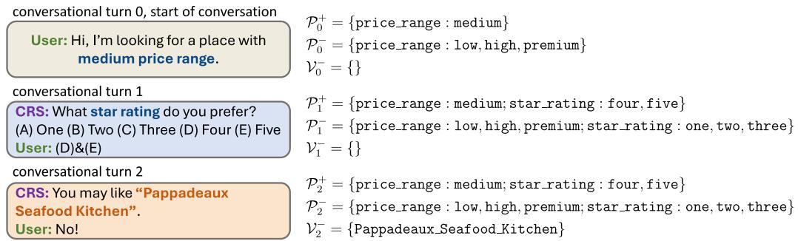  
Figure A1: An illustration of the state $s _ { t } = ( \mathcal { P } _ { t } ^ { + } , \mathcal { P } _ { t } ^ { - } , \mathcal { V } _ { t } ^ { - } )$ , which include all the attribute values $\mathcal { P } _ { t } ^ { + }$ that the user has accepted, all the attribute values $\mathcal { P } _ { t } ^ { - }$ that the user has rejected, and all the items $\mathcal { V } _ { t } ^ { - }$ that the user has rejected until the t-th turn. Note that in this example, “looking for a medium price range” at the start of the conversation infers that all the other price ranges (low, high and premium) are not acceptable.

$$
\begin{array} { r } { \mathcal { E } _ { t } ^ { + } ( i , j ) = \left\{ \begin{array} { l l } { w _ { v } ^ { ( t ) } , } & { \mathrm { i f } \quad i \in \mathcal { U } , j \in \mathcal { V } } \\ { 1 , } & { \mathrm { i f } \quad i \in \mathcal { V } , j \in \mathcal { P } } \\ { 1 , } & { \mathrm { i f } \quad i \in \mathcal { U } , j \in \mathcal { P } _ { t } ^ { + } } \\ { 0 , } & { \mathrm { o t h e r w i s e } } \end{array} \right. , } \end{array}\tag{9}
$$

where $w _ { v } ^ { ( t ) } = \mathrm { s i g m o i d } ( \mathbf { e } _ { u } ^ { \top } \mathbf { e } _ { v } + \sum _ { p \in \mathcal { P } _ { t } ^ { + } } \mathbf { e } _ { v } ^ { \top } \mathbf { e } _ { p }$ $\sum _ { p \in \mathcal { P } _ { + } ^ { - } } \mathbf { e } _ { v } ^ { \top } \mathbf { e } _ { p } )$ denotes the dynamic matching score of the item v at the current conversational turn t. Next, let ${ \bf e } _ { u } ^ { ( 0 ) } = { \bf e } _ { u } , { \bf e } _ { v } ^ { ( 0 ) } = { \bf e } _ { v }$ and ${ \bf e } _ { p } ^ { ( 0 ) } = { \bf e } _ { p }$ denote the embeddings of user, item and attribute value, we then adopt a Graph Convolutional Network (GCN) (Kipf and Welling, 2016) to propagate the message on the current dynamic graph, and calculate the hidden representation of the node at the l+1-th layer as follows:

$$
{ { \bf e } } _ { i } ^ { ( l + 1 ) } { = } \sigma \big ( \sum _ { \{ j | \mathcal { E } _ { t } ^ { + } ( i , j ) > 0 \} } \frac { { \bf W } _ { a } ^ { ( l ) } { \bf e } _ { j } ^ { ( l ) } } { \sqrt { \sum _ { \hat { j } } \mathcal { E } _ { t } ^ { + } ( i , \hat { j } ) \sum _ { \hat { j } } \mathcal { E } _ { t } ^ { + } ( j , \hat { j } ) } } { + } { \bf e } _ { i } ^ { ( l ) } \big ) ,\tag{10}
$$

where $\mathbf { W } _ { a } ^ { ( l ) } \in \mathbb { R } ^ { d \times d }$ are the trainable parameters for the l-th layer, σ denotes the LeakyReLU activation function. We stack $L _ { a }$ layers of GCNs and fetch the hidden representation $\mathbf { { \check { e } } } _ { u } ^ { ( L _ { a } ) } , \mathbf { e } _ { v } ^ { ( L _ { a } ) } , \mathbf { e } _ { p } ^ { ( L _ { a } ) }$ at the last layer as the output of the positive feedback graph encoder.

Negative feedback graph encoder captures the user’s negative feedback on attribute values and their negative correlations with candidate attribute values/items in the conversation history. Similar to Eq. 9, for each user u, we construct a local negative graph $\mathcal { G } _ { t } ^ { - } = < \{ u \} \cup \mathcal { P } _ { t } ^ { - } \cup \mathcal { V } _ { t } ^ { - } \cup \mathcal { P } _ { t } ^ { c } \cup \mathcal { V } _ { t } ^ { c } , \mathcal { E } _ { t } ^ { - } > ,$ where the weight of the edge $\mathcal { E } _ { i , j } ^ { ( t ) }$ between node i and node j is constructed from the following rules:

$$
\mathcal { E } _ { t } ^ { - } ( i , j ) = \left\{ \begin{array} { l l } { w _ { v } ^ { ( t ) } , } & { \mathrm { i f } \quad i \in \mathcal { U } , j \in \mathcal { V } } \\ { 1 , } & { \mathrm { i f } \quad i \in \mathcal { V } , j \in \mathcal { P } } \\ { 1 , } & { \mathrm { i f } \quad i \in \mathcal { U } , j \in \mathcal { P } _ { t } ^ { - } } \\ { 0 , } & { \mathrm { o t h e r w i s e } } \end{array} \right.\tag{11}
$$

We then stack $L _ { n }$ layers of GCNs similar to Eq. 10, and fetch the hidden representation $\mathbf { e } _ { u } ^ { ( L _ { n } ) }$ ${ \bf e } _ { v } ^ { ( \hat { L } _ { n } ) } , { \bf e } _ { p } ^ { ( L _ { n } ) }$ at the last layer as the output of the negative feedback graph encoder.

Transformer-based aggregator fuses the information from the graph encoders, and captures the sequential relationships among items and attribute values mentioned in the conversation history. Specifically, for the accepted/rejected attribute values/items at previous conversational turns, we first project the accepted ones and rejected ones into different spaces to distinguish between the positive and the negative feedbacks:

$$
\begin{array} { c } { { { \bf e } _ { p } ^ { ' } = { \bf W } _ { a } { \bf e } _ { p } ^ { ( L _ { a } ) } + { \bf b } _ { a } \mathrm { ~ o r ~ } { \bf e } _ { p } ^ { ' } = { \bf W } _ { n } { \bf e } _ { p } ^ { ( L _ { n } ) } + { \bf b } _ { n } } } \\ { { { \bf e } _ { v } ^ { ' } = { \bf W } _ { n } { \bf e } _ { v } ^ { ( L _ { n } ) } + { \bf b } _ { n } , } } \end{array}\tag{12}
$$

where ${ \mathbf W } _ { a } , { \mathbf W } _ { n } \ \in \ \mathbb { R } ^ { d \times d }$ and $\mathbf { b } _ { a } , \mathbf { b } _ { n } \in \mathbb { R } ^ { d }$ are trainable parameters. Next, the positive/negative feedbacks are fused with the representations from the global graph encoder with a gating mechanisms to capture the information from both the global relationships and the local conversation feedbacks:

$$
\begin{array} { l } { { \displaystyle { \bf v } _ { p } = \mathrm { g a t e } ( { \bf h } _ { p } ^ { ( L _ { g } ) } , { \bf e } _ { p } ^ { ' } ) , ~ { \bf v } _ { v } = \mathrm { g a t e } ( { \bf h } _ { v } ^ { ( L _ { g } ) } , { \bf e } _ { v } ^ { ' } ) } } \\ { { \displaystyle \quad \mathrm { g a t e } ( { \bf x } , { \bf y } ) = \xi \cdot { \bf x } + ( 1 - \xi ) \cdot { \bf y } } } \\ { { \displaystyle \xi = \mathrm { s i g m o i d } ( { \bf W } _ { 1 } ^ { g a } { \bf x } + { \bf W } _ { 2 } ^ { g a } { \bf y } + { \bf b } ^ { g a } ) , ~ ( 1 } } \end{array}\tag{3}
$$

where $\mathbf { W } _ { 1 } ^ { g a } , \mathbf { W } _ { 2 } ^ { g a } \in \mathbb { R } ^ { d \times d } , \mathbf { b } ^ { g a } \in \mathbb { R } ^ { d }$ are trainable parameters. Finally, we adopt a Transformer en-

coder (Vaswani et al., 2017) to capture the sequential relationships about the conversation history and obtain the current state representation $\mathbf { s } _ { t }$ as follows:

$$
\mathbf { s } _ { t } = \mathrm { M e a n p o o l i n g } ( \mathrm { T r a n s f o r m e r } ( \mathbf { V } ) ) ,\tag{14}
$$

where V is built using all the previously mentioned attribute values and items and in the conversation history: $\mathbf { V } = \{ \mathbf { v } _ { p } | p \in \mathcal { P } _ { t } ^ { + } \cup \mathcal { P } _ { t } ^ { - } \} \cup \{ \mathbf { v } _ { v } | v \in \mathcal { V } _ { t } ^ { - } \}$

## D Transition Function

Transition occurs from the current state $s _ { t }$ to the next state $s _ { t + 1 }$ when the user responds to the action $a _ { t }$ (accepts or rejects items/attribute values). The candidate items and attribute values are updated according to the user’s response. Specifically, when the action is to ask a question on attribute values, we denote $\widehat { \mathcal { P } } _ { t } ^ { + }$ and $\widehat { \mathcal { P } } _ { t } ^ { - }$ as the attribute values b bthat the user accepts or rejects at the current turn $t ,$ the candidate attribute value set $\mathcal { P } _ { t + 1 } ^ { c }$ at the next turn t+1 is updated as $\mathcal { P } _ { t + 1 } ^ { c } = \mathcal { P } _ { t } ^ { c } \setminus ( \widehat { \mathcal { P } } _ { t } ^ { + } \cup \widehat { \mathcal { P } } _ { t } ^ { - } )$ b bthe set of all the attribute values that the user has rejected until the t+1-th turn is updated as $\mathcal { P } _ { t + 1 } ^ { - } = \mathcal { P } _ { t } ^ { - } \cup \widehat { \mathcal { P } } _ { t } ^ { - }$ , and the set of all the attribute bvalues that the user has accepted until the t+1- th turn is updated as $\mathcal { P } _ { t + 1 } ^ { + } = \mathcal { P } _ { t } ^ { + } \cup \widehat { \mathcal { P } } _ { t } ^ { + }$ . When bthe action is to recommend items, if the user rejects all the recommended items, we denote $\widehat { \mathcal { V } } _ { t } ^ { - }$ bas the set of the recommended items at the current turn t that are all rejected, and the set of all items that the user has accepted until the t+1-th turn is updated as $\mathcal { V } _ { t + 1 } ^ { - } = \mathcal { V } _ { t } ^ { - } \cup \widehat { \mathcal { V } } _ { t } ^ { - }$ ; otherwise the bconversation successfully finishes since the user has accepted at least one recommended item, and no state information is updated. Finally, we update the candidate item set $\mathcal { V } _ { t + 1 } ^ { c }$ at the next turn t+1 to include only those items that are still not rejected and whose attribute values have an intersection with the set of the accepted attribute values: $\mathcal { V } _ { t + 1 } ^ { c } = \{ v | ( v \in \mathcal { V } _ { p _ { 0 } } \backslash \mathcal { V } _ { t + 1 } ^ { - } ) \land ( \mathcal { P } ( v ) \cap \mathcal { P } _ { t + 1 } ^ { + } \neq \emptyset ) \land \quad$ $( \mathcal { P } ( v ) \cap \mathcal { P } _ { t + 1 } ^ { - } { = } \emptyset ) \}$ , where $\nu _ { p _ { 0 } }$ denotes the set of items that are associated with the attribute value $p _ { 0 }$ specified by the user at the start of the conversation.

## E Reward Function

Following the literature (Lei et al., 2020a; Zhang et al., 2022), for different conversation scenarios, we consider five kinds of immediate rewards at given conversational turn: $( 1 ) r _ { \mathrm { r e c } } ^ { + } = 1 \colon$ a large positive value when the user accepts a recommended item; $\left( 2 \right) r _ { \mathrm { a s k } } ^ { + } = 0 . 0 1 \mathrm { : }$ a small positive value when the user accepts an attribute value asked by S-agent;

(3) $r _ { \mathrm { r e c } } ^ { - } = - 0 . 1 \colon$ a negative value when the user rejects a recommended item; (4) $r _ { \mathrm { a s k } } ^ { - } = - 0 . 1$ : a negative value when the user rejects an attribute value asked by S-agent and (5) $r _ { \mathrm { q u i t } } = - 0 . 3 \mathrm { : }$ a large negative value if the conversation reaches the maximum number of turns $T _ { \mathrm { m a x } }$ . In addition, since we follow the multi-choice MCR setting, we sum up the positive and negative rewards for multiple attribute values specified in a multiple-choice question: $\begin{array} { r } { r _ { t } = \sum _ { \widehat { \mathcal { P } } _ { t } ^ { + } } r _ { \mathrm { a s k } } ^ { + } + \sum _ { \widehat { \mathcal { P } } _ { t } ^ { - } } r _ { \mathrm { a s k } } ^ { - } . } \end{array}$

## F Experimental Details

## F.1 Dataset Details and Statistics

<table><tr><td>Dataset</td><td>Yelp</td><td>LastFM Amazon- MovieLens Book</td><td></td><td></td></tr><tr><td>#Users</td><td>27,675</td><td>1,801</td><td>30,291</td><td>20,892</td></tr><tr><td>#Items</td><td>70,311</td><td>7,432</td><td>17,739</td><td>16,482</td></tr><tr><td>#Interactions</td><td>1,368,609</td><td>76,693</td><td>478,099</td><td>454,011</td></tr><tr><td>#Attribute Values</td><td>590</td><td>8,438</td><td>988</td><td>1,498</td></tr><tr><td>#Attribute types</td><td>29</td><td>34</td><td>40</td><td>21</td></tr><tr><td>#Entities</td><td>98,576</td><td>17,671</td><td>49,018</td><td>38,872</td></tr><tr><td>#Relations</td><td>3</td><td>4</td><td>2</td><td>2</td></tr><tr><td>#Triplets</td><td>2,533,827228,217565,069</td><td></td><td></td><td>380,016</td></tr></table>

Table A2: Statistics of datasets after preprocessing.

We evaluate SAPIENT on four public benchmark recommendation datasets: Yelp (Lei et al., 2020b), LastFM (Lei et al., 2020b), Amazon-Book (McAuley et al., 2015; He and McAuley, 2016) and MovieLens (Harper and Konstan, 2015). The statistics of the datasets after preprocessing are presented in Table A2 and the details of the datasets are introduced as follows:

• Yelp1: This dataset contains users’ reviews on business venues such as restaurants and bars. Lei et al. (2020b) build a 2-layer taxonomy for the original attribute values for this dataset, and we adopt the categories from the first layer as attribute types, the categories from the second layer as attribute values.

• LastFM2: This dataset contains users’ listen records for music artists from an online music platform. Following the literature (Lei et al., 2020a; Zhang et al., 2022), we adopt a clustering algorithm to categorize the original attribute values into 34 attribute types.

• Amazon-Book3: The Amazon review dataset (McAuley et al., 2015; He and McAuley, 2016)

is a large-scale collection of online shopping data featuring users’ product reviews across various domains. We select the book domain from this collection. Following the literature (Wang et al., 2019) we choose relations and entities within the knowledge graph as attribute types and attribute values, and only retain entities associated with at least 10 items to ensure dataset quality.

• MovieLens4(Harper and Konstan, 2015): This dataset contains users’ activities in an online movie recommendation platform. We use the version with about 20M interactions, select entities and relations within the knowledge graph as attribute values, and only retain the user-item interactions with the user’s ratings greater than 3 to ensure the quality of the dataset.

## F.2 Details of the User Simulator

Training and evaluating CRS with real user interactions can be impractically expensive at scale. To address this issue, we follow the literature (Lei et al., 2020b; Deng et al., 2021; Zhang et al., 2022; Zhao et al., 2023; Qian et al., 2023) and simulate a conversation session for each observed user-item set interaction pair $( u , \mathcal { V } ( u ) )$ in the dataset. In each simulated conversation, we regard an item $v _ { i } \in \mathcal V ( u )$ as the ground-truth target item. Each conversation is initialized with a user specifying preference on an attribute value $p _ { 0 }$ that this user clearly prefers, which is randomly chosen from the shared attribute values of all items in $\mathcal { V } ( u )$ . As the conversation continues, in each turn, the simulated user feedback follows these rules: (1) when the CRS asks a question, the user will only accept attribute values associated with any item in $\mathcal { V } ( u )$ and reject others; (2) when the CRS recommends a list of items, the user will accept it only if at least one item in $\mathcal { V } ( u )$ is in the recommendation list; (3) the user will become impatient after $T _ { \mathrm { m a x } } = 1 5$ turns and quit the conversation.

## F.3 Details of hDCG Calculation

Normalized Discounted Cumulative Gain (NDCG) is a common ranking metric to evaluate the relevance of items recommended by a system. Deng et al. (2021) extend the NDCG metric to a two-level hierarchical version to evaluate the ranking order of the ground-truth item among the list of all the items recommended by the CRS at each conversational turn. A higher value implies that the ground-truth item has a higher ranking, and hence indicates a better performance for the CRS. The hierarchical normalized Discounted Cumulative Gain@(T, K) $( \mathrm { h D C G @ } ( T , K ) )$ is calculated as follows:

$$
\begin{array} { l } { { \displaystyle h D C G @ ( T , K ) = \sum _ { t = 1 } ^ { T } \sum _ { k = 1 } ^ { K } r ( t , k ) \bigg [ \frac { 1 } { \log _ { 2 } ( t + 2 ) } } } \\ { { \displaystyle + \left( \frac { 1 } { \log _ { 2 } ( t + 1 ) } - \frac { 1 } { \log _ { 2 } ( t + 2 ) } \right) \frac { 1 } { \log _ { 2 } ( k + 1 ) } \bigg ] } , } \end{array}\tag{15}
$$

where $T$ represents the number of conversational turns, K represents the number of items recommended at each turn, $r ( t , k )$ denotes the relevance of the result at turn t and position k. Since we have a maximum of $T _ { \mathrm { m a x } }$ conversational turns, and the CRS may recommend a maximum number of $K _ { v }$ items, we report the metric $h D C G ( T , K )$ where $T = T _ { \operatorname* { m a x } }$ and $K = K _ { v }$

## F.4 Details of Baseline Methods

For a comprehensive evaluation, we compare SAPIENT with the following baselines:

• Max Entropy (Lei et al., 2020b). This method chooses to ask for attribute values with the maximum entropy among candidate items, or chooses to recommend the top-ranked items with certain probability.

• Abs Greedy (Christakopoulou et al., 2016). This method only recommends items in each turn without asking questions. If the recommended items are rejected, the model updates by treating them as negative samples.

• CRM (Sun and Zhang, 2018). This method adopts a policy network to decide when and what to ask. As it is originally designed for single-turn CRS, we follow Lei et al. (2020b) to adapt it to the MCR setting.

• EAR (Lei et al., 2020b). This method designs a three-stage strategy to better converse with users. It first builds predictive models to estimate user preferences, then learns a policy network to take action, and finally updates the recommendation model with reflection mechanism.

• SCPR (Lei et al., 2020c). This method models CRS as an interactive path reasoning problem over the knowledge graph of users, items and attribute values. It leverages the graph structure to prune irrelevant candidate attribute values and adopts a policy network to choose actions.

• UNICORN (Deng et al., 2021). This method designs a unified CRS policy learning framework with graph-based state representation learning and deep Q-learning.

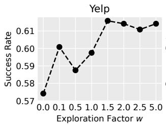

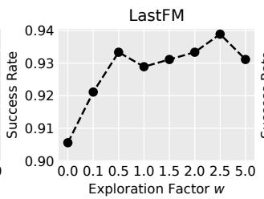

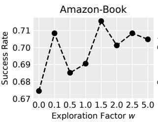

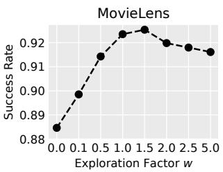  
Figure A2: Success rate under different exploration factor w.

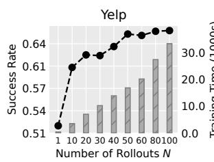

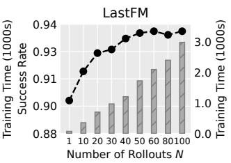

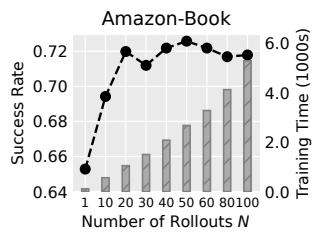

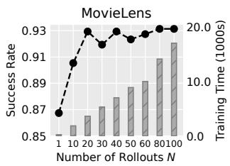  
Figure A3: Success rate and training time (per 100 gradient descent steps) under different rollout number N. The dotted lines represent the success rate, and the bar charts represent the training time.

• MCMIPL (Zhang et al., 2022). This method develops a multi-choice questions based multiinterest policy learning framework for CRS, which enables users to answer multi-choice questions in attribute combinations.

• HutCRS (Qian et al., 2023). This method proposes a user interest tracking module integrated with the decision-making process of the CRS to better understand the preferences of the user.

• CORE (Jin et al., 2023). This method is a Large Language Model (LLM)-powered CRS chatbot with user-friendly prompts and interactive feedback mechanisms.

## F.5 Implementation Details

Following the literature (Zhang et al., 2022) for a more realistic multi-choice setting, if S-agent decides to ask, $\mathsf { t o p } { \mathrm { - } } K _ { p }$ attribute values with the same attribute type will be asked from the candidate attribute value set $\mathcal { P } _ { t } ^ { c }$ to form a multi-choice question; and if S-agent decides to recommend, top-Kv items will be recommended from the candidate item set $\mathcal { V } _ { t } ^ { c }$ . Following the literature (Lei et al., 2020c; Deng et al., 2021), each dataset is randomly split into train, validation and test by a 7:1.5:1.5 ratio. We set the embedding dimension d as 64, batch size as 128. We adopt an Adam optimizer (Kingma and Ba, 2015) with a learning rate of 1e-4. We set the discount factor γ as 0.999. The memory size of experience replay is set as 10000. For the state encoder, the number of the global information graph encoder layers $L _ { g }$ is set as 2, and both the number of the positive feedback graph encoder layer $L _ { a }$ and the number of the negative feedback graph encoder layer $L _ { n }$ are set as 1, the number of the Transformer-based aggregator layers are set as 2, and we follow the literature (Deng et al., 2021; Zhang et al., 2022) to adopt TransE (Bordes et al., 2013) from OpenKE (Han et al., 2018) to pretrain the node embeddings with the training set. Following the literature (Lei et al., 2020b; Deng et al., 2021), we set the size of recommendation list $K _ { v }$ as 10, the maximum number of turns $T _ { \mathrm { m a x } } = 1 5$ We set the default exploration factor w as 1.5, the default number of rollouts N as 20, and variants with different w and N are explored in Section 6.4.

## F.6 Hyper-Parameter Sensitivity

Exploration and Exploitation The exploration factor w controls the balance between exploration and exploitation. To study its impact, we set w from 0.0 (exploitation only) to 5.0 (mostly favours exploration) and plot the success rate in Figure A2. We find that the performance remains stable and satisfactory with high exploration, but drops with only exploitation. This is probably because our conversational search tree has a very small search space (ask and rec), so high exploration does not incur much cost and also ensures thorough evaluation of different action strategies, while high exploitation may prevent the conversational search tree from discovering the optimal action strategy and lead to myopic conversational planning.

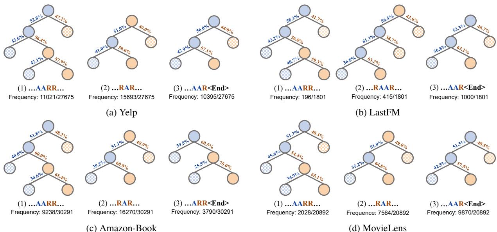  
Figure A4: Common action strategies identified on four datasets. A stands for ask while R stands for rec. The probability of ask or rec at each node and the frequency (measured by # of an action strategy/# of test users in this dataset) of each action strategy are also shown in the figure. The solid circle denotes the action type that is more likely to be selected, and the shadowed circle denotes the action type that is less likely to be selected.

Influence of MCTS rollouts To study the influence of MCTS rollouts, we set N from 1 (equivalent to disabling MCTS, as there is no selection and reward back-propagation when N = 1) from 50 and plot the success rate and training time (on a single Tesla V100 GPU) in Figure A3. Unsurprisingly, we find that more rollouts increase the chance of discovering the optimal trajectory and lead to better performance, while disabling MCTS shows the worst performance. Nevertheless, we should also note that more rollouts bring additional computational cost, and setting N = 20 can achieve a good trade-off between efficiency and performance.

## F.7 Additional Analysis on Action Strategies

To gain insight into the strategic planning capability of SAPIENT, we identify some typical action strategies of SAPIENT in Figure A4 that are helpful for information seeking and recommendation success in the conversation. We denote A as the action type ask, R as the action type rec, ... as the continuation of the conversation, <end> as the success of the conversation, and we find the following common action strategies:

• ...AARR...: This action strategy occurs frequently during the conversation. S-agent first asks the user two questions consecutively to gather crucial information on user preference, and then quickly narrows down the candidate item list by making two targeted recommendation attempts. This strategy is highly effective because it allows the S-agent to tailor its recommendations to the user’s preferences based on the key information obtained from the two questions. Furthermore, based on the user’s feedback from the two recommendation attempts, S-agent can promptly reflect upon its action strategy and make necessary adjustments to its assessment of the user’s interests, thereby improving the recommendation success rate for future turns.

• ...RAAR... and ...RAR...: These are also two frequent action strategies during the conversation. In cases where an initial recommendation attempt fails, S-agent will adeptly adjust the action strategy by asking one or two additional questions to better understand the user’s preference, ensuring that subsequent recommendations are more aligned with the user’s needs. Interestingly, we find that on the LastFM dataset, S-agent tends to ask two additional questions, while on the other datasets, S-agent typically asks only one additional question. This is probably because the LastFM dataset has a very large number of attribute values, so two additional questions are required to fully clarify the user’s preference.

• ...ARR<end> and ...AAR<end>: These two strategies occur frequently at the end of the conversation. Once S-agent has gathered sufficient information about the user’s preferences, it is able to reach successful recommendation with only one or two attempts. This strategy enables S-agent to swiftly hit the target item, thereby shortening the conversation and reducing repeated recommendations.

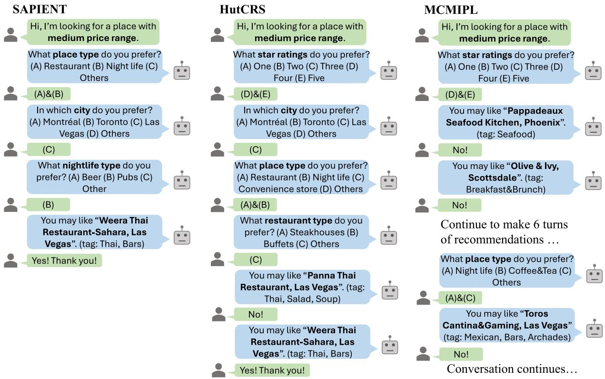  
Figure A5: A case study of a user looking for a nightlife venue from the Yelp dataset.

## F.8 Case Study

We provide a case study of a randomly sampled user from the Yelp dataset in Figure A5 to demonstrate how SAPIENT achieves strategic conversational planning. The user, who has previously visited some Thai restaurants, is now looking for a nightlife venue in this conversation. SAPIENT quickly grasps user preference by asking only three questions and makes a successful recommendation on the first attempt. By comparison, HutCRS can also make successful recommendations but requires more questions and recommendation attempts, while MCMIPL repeatedly makes failed recommendations. Owing to the global information graph encoder, S-agent can infer user preferences from historical visits (e.g., the user’s preference on Thai food) without the need for explicitly queries, thus reducing conversational turns and improving the comprehension of user preferences. Moreover, the progression from broad questions (e.g., place type) to specific questions (e.g., nightlife type) exemplifies how SAPIENT strategically plans conversations and asks information-seeking questions, with the policy network focusing on conversation strategy planning and the Q-network specializing in the precise assessment of the attribute values and the items. This design helps S-agent to quickly narrow down candidate items and improve the recommendation success rate.

## F.9 Additional Analysis on Efficiency, Model Size, and Budget

Although training SAPIENT requires conducting multiple simulated rollouts for each user, we find that such design will not significantly compromise efficiency compared with the baseline CRS methods. Under the same training pipeline with a single Tesla V100 GPU, SAPIENT with 20 rollouts per user takes 698 seconds per 100 gradient descent steps on the LastFM dataset and 1049 seconds per 100 gradient descent steps on the Amazon-Book dataset on average, which is about twice as slow as the two competitive baselines (HutCRS: 305 seconds/100 steps on LastFM, 465 seconds/100 steps on Amazon-Book; MCMIPL: 429 seconds/100 steps on LastFM, 548 seconds/100 steps on Amazon-Book). This is because the simulation process only requires forward calculation without the need for gradient backward update, so even conducting 20 rollouts per user will only reduce the training speed by half. Moreover, SAPIENT-e takes 397 seconds per 100 gradient descent steps on the LastFM dataset and 593 seconds per 100 gradient descent steps on the Amazon-Book dataset on average, which is highly comparable to baselines. Furthermore, we note that during inference, the efficiency of SAPIENT is comparable with baseline methods, because no tree search is required during inference, and the number of parameters for S-agent (1.30M on Yelp, 3.30M on LastFM, 2.65M on Amazon-Book, 6.48M on MovieLens) is also budget-friendly. For these reasons, we think that it is worthwhile to introduce conversational tree search for CRS, because such design only slightly compromises efficiency during training, and the training efficiency can also be improved by adopting parallel acceleration methods for MCTS (Chaslot et al., 2008).