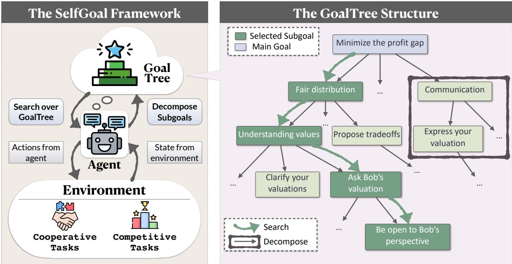
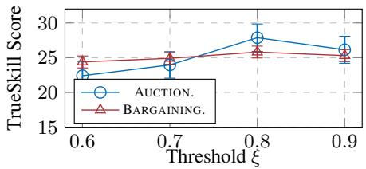
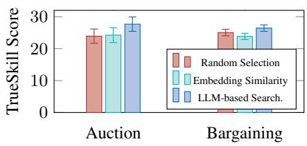
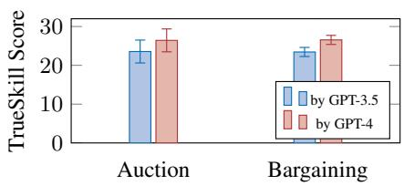
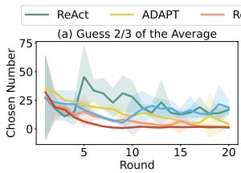
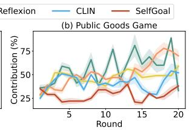
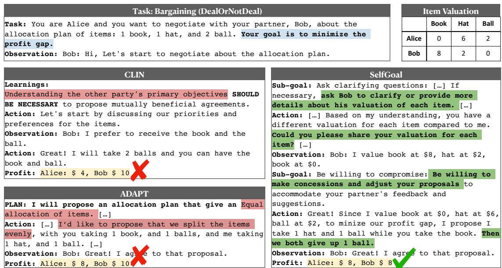

# SELFGOAL: Your Language Agents Already Know How to Achieve High-level Goals

Ruihan Yang♡, Jiangjie Chen♡\*<sup>†</sup>, Yikai Zhang♡, Siyu Yuan♡, Aili Chen♡, Kyle Richardson♣ Yanghua Xiao♡, Deqing Yang♡\*

Fudan University Allen Institute for AI

{rhyang17, jjchen19, alchen20, shawyh, deqingyang}@fudan.edu.cn {ykzhang22, syyuan21}@m.fudan.edu.cn kyler@allenai.org

## Abstract

Language agents powered by large language models (LLMs) are increasingly valuable as decision-making tools in domains such as gaming and programming. However, these agents often face challenges in achieving high-level goals without detailed instructions and in adapting to environments where feedback is delayed. In this paper, we present SELFGOAL, a novel automatic approach designed to enhance agents’ capabilities to achieve high-level goals with limited human prior and environmental feedback. The core concept of SELFGOAL involves adaptively breaking down a high-level goal into a tree structure of more practical subgoals during the interaction with environments while identifying the most useful subgoals and progressively updating this structure. Experimental results demonstrate that SELFGOAL significantly enhances the performance of language agents across various tasks, including competitive, cooperative, and deferred feedback environments<sup>1</sup>.

## 1 Introduction

The advancement of large language models (LLMs) (Brown et al., 2020; OpenAI, 2022, 2024) has enabled the construction of autonomous language agents (or LLM-based agents) to solve complex tasks in dynamic environments without task-specific training. In reality, these autonomous agents are often tasked with very broad, high-level goals, such as “winning the most money” or “succeeding in a competition”, whose ambiguous nature and delayed reward raise great challenges for autonomous task-solving. More importantly, it is not always practical to frequently retrain models with limited generalizability to adapt to new goals and tasks (Zheng et al., 2023; Khot et al., 2023; Prasad et al., 2024). Therefore, a critical question arises: How can we enable autonomous language agents to consistently achieve high-level goals without training?

Previous works focus on creating two types of auxiliary guidance in the instructions for language agents to achieve high-level goals in tasks: prior task decomposition and post-hoc experience summarization. The former involves decomposing the task before acting, utilizing prior knowledge from LLMs to break down high-level goals into more tangible subgoals related to specific actions at hand (Yuan et al., 2023; Zheng et al., 2023; Singh et al., 2024; Liu et al., 2024). However, this line of work does not ground these subgoals into the environment during interaction, resulting in the loss of empirical guidance. In contrast, the latter allows agents to interact directly with environments and summarize valuable experiences from history (Madaan et al., 2023; Majumder et al., 2023; Zhao et al., 2024; Paul et al., 2024), e.g., “X contributes to Y”. However, the difficulty of inducing rules from experience causes the guidance to be simple and unstructured, making it difficult to prioritize or adjust strategies effectively.

A natural solution to combine the best of both worlds is to dynamically decompose the task and its high-level goal during interaction with the environment. This approach requires an agent to build and use guidelines that vary in detail and aspect. A tree structure is ideal for this requirement, as it allows hierarchical organization, providing both broad overviews and detailed guidance as needed. However, this approach presents two major challenges: 1) Not all nodes are relevant to the current context during task execution, which requires selecting the most suited nodes to guide current actions. For example, “watch for bargains” is a more prudent choice than “bid on the most expensive item” when budget is tight; 2) The granularity of guidance provided by nodes increases with tree depth, yet the appropriate detail level varies across scenarios, making a fixed tree depth not general. For example, a generic guideline like “earn more money” is not useful in auctions.

  
Figure 1: An overview of SELFGOAL, illustrated with a bargaining example. The agent interacts with environments, and make actions based on environmental feedback and the GOALTREE dynamically constructs, utilizes and updates with Search and Decompose Modules.

To tackle these challenges, we propose SELF-GOAL, a self-adaptive framework for a language agent to utilize both prior knowledge and environmental feedback to achieve high-level goals. The main idea is to build a tree of textual subgoals, where agents choose appropriate ones as the guidelines to the prompt based on the situation. Specifically, as shown in Figure 1, SELFGOAL is featured with three main modules to operate a GOALTREE, which is constructed, utilized and updated during task execution: 1) Search Module is prompted to select the top-K most suited nodes of goals based on the provided current state and existing nodes in GOALTREE, which utilizes the prior knowledge of LLMs; 2) Act Module takes as input the selected subgoals as guidelines, and prompts LLMs for actions for the current state; 3) Decomposition Module breaks down selected goal nodes into a list of more concrete subgoals as subsequent leaves, ensuring an adaptive self-growth of GOALTREE. Note that we filter out the redundant nodes during decomposition based on the textual similarity between new ones and the existing nodes of goals. Extensive experiments in various competition and collaboration scenarios show that SELFGOAL provides precise guidance for high-level goals and adapts to diverse environments, significantly improving language agent performance.

In summary, our contributions in this paper are as follows:

• We target the challenge of enabling autonomous language agents to consistently achieve highlevel goals without the need for frequent retraining.

• We introduce SELFGOAL, a self-adaptive framework that constructs, utilizes, and updates a GOALTREE to dynamically decompose a task’s high-level goals into subgoals during interaction with the environment.

• We conduct extensive experiments in both collaborative and competitive scenarios where agents tend to deviate from their goals. The results demonstrate that SELFGOAL significantly enhances the capability of language agents to adhere to high-level goals consistently.

## 2 Related Work

Learning from Feedback Recently, LLMs have become a promising tool for building goal-directed language agents (Huang et al., 2022a). With textual input that includes the world state, task, and interaction history, language agents are to decide the next action to achieve a goal (Lin et al., 2023; Yao et al.,

2023). Several studies have explored enhancing the reasoning and planning abilities of language agents through feedback from environments. For example, Reflexion (Shinn et al., 2023) enables an agent to reflect on its failures and devise a new plan that accounts for previous mistakes. Similarly, Voyager (Wang et al., 2023a) operates in Minecraft, developing a code-based skill library from detailed feedback on its failures. Recent works (Majumder et al., 2023; Nottingham et al., 2024) analyze both failures and successes attempts, summarizing a memory of causal abstractions. However, learnings directly from feedback are often too general and not systematic, making it difficult to prioritize strategies effectively.

LLMs for Decision Making LLMs are increasingly used as policy models for decision-making in interactive environments such as robotics (Ahn et al., 2022; Huang et al., 2022b; Liu et al., 2023), textual games (Wang et al., 2023b; Zhang et al., 2024; Xie et al., 2024; Ma et al., 2024), and social tasks (Zhou et al., 2024). However, the goals in these environments, like “find a fruit” in ScienceWorld (Wang et al., 2022), are often simple and specific. For long-term, high-level goals, LLMs struggle to perform effectively (Hoang et al., 2021; Huang et al., 2019), and additional modules are needed for support(Zheng et al., 2023). In our work, we use a method that does not require updating LLM parameters, enabling language agents to consistently pursue high-level goals during interactions with environments.

Decomposition and Modularity Decomposing complex decision-making tasks into sub-tasks is a traditional method that enhances LLM task-solving capabilities (Barto and Mahadevan, 2003; Pellier et al., 2023). Approaches like Hierarchical Task Networks leverage domain knowledge, including a hand-specified library of plans, to simplify complex problems (Erol et al., 1994). Recently, some studies have assigned LLMs the role of decomposing goals. For example, Decomposed Prompting (Khot et al., 2022) uses a few-shot prompting approach to tackle multi-step reasoning tasks by breaking them into a shared library of prompts. OKR-Agent (Zheng et al., 2023) utilizes self-collaboration and selfcorrection mechanisms, supported by hierarchical agents, to manage task complexities. ADAPT (Prasad et al., 2024) enables LLMs to recursively re-decompose goals based on feedback in decisionmaking tasks. However, these approaches often decompose tasks before interaction with the environments, resulting in a lack of grounded, dynamic adjustment. To address this, we aim to combine modular goal decomposition with learning from environmental feedback.

## 3 Methodology

Algorithm 1: Workflow of SELFGOAL   
Data: Environment E, Main Goal $g _ { \mathrm { r o o t } } ,$ Threshold ξ,   
Stopping criterion   
1 Set Time step t 0   
=2 Initialize Environment state $s _ { 0 }$   
3 Initialize prompt p<sub>t</sub> and Actor M<sub>a</sub> with policy   
π<sub>θ</sub> a<sub>t</sub> s<sub>t 1</sub> , θ  p<sub>t</sub>   
( ∣ − ) = { }4 Generate initial GOALTREE: $\mathbb { T } = \left\{ g _ { \mathrm { r o o t } } \right\}$   
5 Let $g _ { i , j }$ represent the $j ^ { t h }$ node at $i ^ { t h }$ layer on $\mathbb { T }$   
6 while t MaxStep do   
7 subgoals  SEARCH Tleafnodes, st 1   
// Add subgoals to prompt   
8 p<sub>t</sub> p<sub>t</sub>, subgoals   
9 ← { }at, st  ACT st 1, pt)   
10 while Stopping criterion not met do   
11 foreach $g _ { i , j }$ subgoals do   
12 G DECOMPOSE $( g _ { i , j } , \{ a _ { t } , s _ { t } \} )$   
$/ /$ ←Update T   
13 foreach $g \in G$ do   
14 if cosine g, T<sub>leafnodes</sub> ξ then   
( ) <// Add g as a child   
node of $g _ { i , j }$   
15 g<sub>i,j</sub>  g<sub>i,j</sub>  g   
16 Increment t   
17 return

When executing complex tasks with highlevel goals (e.g., “forecast future stock prices”), humans usually decompose it into specific detailed subgoals (e.g., “gather historical price data and adjust predictions based on recent market events”) for effective execution (Goffaux et al., 2011). Inspired from this idea, we propose SELFGOAL in this paper, which is a non-parametric learning approach for language agents to exploit and achieve high-level goals. SELFGOAL conducts a top-down hierarchical decomposition of the high-level goal, with a tree of nodes representing useful guidance for decision-making.

In this section, we first provide an overview of how SELFGOAL works in §3.1. Next, we explain the details of three key modules (Search, Act and Decompose) in SELFGOAL that help maintain a tree of subgoals (GOALTREE) in §3.2 and guide task execution.

## 3.1 Overview of SELFGOAL

Problem Formulation: Tasks with High-level Goals First, we formulate the features of our studied tasks, requiring an agent to interact with a dynamic environment and evaluated based on the achievement of the high-level goal. We focus on the scenarios where an actor model $M _ { a }$ aims to achieve a high-level goal $g _ { 0 }$ in an environment $E$ through interaction. The policy employed by $M _ { a }$ is denoted as $\pi _ { \theta } .$ . At each timestep $t ,$ π<sub>θ</sub> generates an action $a _ { t } .$ , and the environment $E$ returns a state $s _ { t } .$ This action-state pair $\{ a _ { t } , s _ { t } \}$ is then utilized to update $\pi _ { \theta }$ . Note that SELFGOAL also supports accomplishing long-horizon tasks that do not always have immediate rewards. In this case, only by completing the task $M _ { a }$ will be evaluated with a score according to the achievement of the goal $g _ { 0 }$

Workflow of SELFGOAL SELFGOAL is a nonparametric learning algorithm for language agents, i.e., without parameter update. The workflow of SELFGOAL is shown at Algorithm 1. It models the policy $\pi _ { \boldsymbol { \theta } } = p$ by treating $p$ as the instruction prompt provided to the actor model $M _ { a } .$ , where actions are generated as $\smash { a _ { t } \sim \pi _ { \theta } \bigl ( a _ { t } | s _ { t - 1 } \bigr ) }$ . The policy $\pi _ { \theta }$ adapts through updates to $p ,$ specifically by modifying subgoal instructions $g _ { i , j }$ (where $g _ { i , j }$ represents the $j ^ { t h }$ node at $i ^ { t h }$ layer) to better suit the current situation. Concretely, SELFGOAL is featured with three key modules, Search, Act, and Decomposition, which construct and utilize a subgoal tree T respectively, namely GOALTREE, to interact with the environment<sup>2</sup>. Setting the high-level goal of the task as the root node in GOALTREE, Search Module finds the nodes that are helpful for the status quo, Act Module utilize chosen nodes to take actions, Decomposition Module decomposes the chosen nodes into subgoals as leaf nodes if they are not clear enough based on the environment feedback.

## 3.2 Details in SELFGOAL

Search: Identifying Useful Subgoals for the Current Situation In the Search module of SELF-GOAL, we ask the backbone LLM of the agent to identify the most appropriate subgoal for the current situation, e.g., “Select K most useful subgoals that will help you reach your main goal in the current situation...” (see Appendix A.2 for the complete prompt). We represent the current state $s _ { t - 1 }$ as a description of the dialogue history of the interaction with the environment. We also find the leaf nodes of each branch in GOALTREE as the subtarget candidate list for LLMs to decide which ones are useful. The LLM then selects K most suitable subgoals, followed by the update of the instruction prompt $p _ { t }$ at this step.

Act: Utilizing Subgoals to Take Actions After getting the subgoals from GOALTREE that are found by SELFGOAL as useful, the actor $M _ { a }$ takes action $a _ { t }$ to interact with the environment. This action is based on the updated instruction prompt $p _ { t }$ , leading to an updated state $s _ { t }$ . The prompt of this step can also be found in Appendix A.2.

Decompose: Refine GOALTREE to Adapt to the Environment Based on the updated action-state pair $\left\{ a _ { t } , s _ { t } \right\}$ , GOALTREE is updated through decomposition if it is not specific enough for useful guidance to the agent. We use the backbone LLM to break down the selected subgoal $g _ { i , j }$ in the Search Module (initially set to $g _ { 0 } )$ . We prompt the LLM with the instruction such as “What subgoals can you derive from $\{ g _ { i , j } \}$ , based on $\{ a _ { t } , s _ { t } \} ^ { \flat }$ which generates a new set of subgoals G (see also Appendix A.2). To control the granularity of these subgoals, we apply afiltering mechanism that if the cosine similarity (Rahutomo et al., 2012) between a new subgoal and existing subgoals exceeds $\xi ,$ the current node will not be updated. Otherwise, we add the new subgoals under the current node, thus expanding the GOALTREE. Moreover, a stopping mechanism is designed that if no new nodes are added to the GOALTREE for N consecutive rounds, the update is stopped.

## 4 Experimental Setup

## 4.1 Tasks and Environments

<table><tr><td>Task</td><td>Rounds</td><td>Task Type</td></tr><tr><td>Public Goods Game</td><td>Single</td><td>Competitive</td></tr><tr><td>Guess 2/3 of the Average</td><td>Single</td><td>Cooperative</td></tr><tr><td>First-price Auction</td><td>Multiple</td><td>Competitive</td></tr><tr><td>Bargaining</td><td>Multiple</td><td>Cooperative</td></tr></table>

Table 1: The categorization of studied tasks.

We evaluated SELFGOAL in four dynamic tasks with high-level goals, including Public Goods Game, Guess 2/3 of the Average, First-price Auction, and Bargaining, which are implemented by existing work (Huang et al., 2024; Chen et al., 2023; Lewis et al., 2017). As seen in Table 1, they are either single-round or multi-round games, requiring the collaboration or competition of multiple agents. Note that agents in multi-round games will only receive delayed rewards at the end of the game. In our experiments, we repeat single-round games for $T = 2 0$ times and multi-round games for $T = 1 0$ times for stable results.

Public Goods Game: GAMA-Bench We use GAMA-Bench (Huang et al., 2024) as the implemented environment for this game. Specifically, each of $N = 5$ players privately decides the number of tokens contributed to a public pot. The tokens in the pot are multiplied by a factor R $( 1 \leq R \leq N )$ , and the created “public good” is distributed evenly among all players. Players keep any tokens they do not contribute. A simple calculation reveals that for each token a player contributes, their net gain is $\textstyle { \frac { R } { N } } - 1$ (i.e., income-contribution). Since this value is negative, it suggests that the most rational strategy for each player is to contribute no tokens. This strategy results in a Nash equilibrium (Daskalakis et al., 2009) in the game. N agents using the same backbone model and equipped with the same method (e.g., CLIN or SELFGOAL) play games with each other to observe group behavior. Following (Huang et al., 2024), we set $R = 2$

Guess 2/3 of the Average: GAMA-Bench Using the implementation of GAMA-Bench (Huang et al., 2024), N players independently choose a number between 0 and 100 (Ledoux, 1981), and whoever has the number closest to two-thirds of the group’s average wins the game. This setup effectively tests players’ theory-of-mind (ToM) abilities (Kosinski, 2023; Mao et al., 2023). In behavioral economics, the Cognitive Hierarchy Model (Camerer et al., 2004) categorizes players as follows: Level-0 players choose numbers randomly. Level-1 players assume others are Level-0 and pick two-thirds of an expected mean of 50. Level-k players believe that the participants include levels 0 to $k - 1$ , and therefore choose $( 2 / 3 ) ^ { k } \times 5 0$ The optimal outcome is to choose 0 for all players, achieving a Nash equilibrium. In this game, $N = 5$ agents using same backbone model with the same prompting method (e.g., SELFGOAL) play games with each other to observe group behavior.

First-price Auction: AucArena We use AucArena (Chen et al., 2023) as the implementation of first-price auctions. An auctioneer collects and announces the bids of all participants, revealing the current highest bid. Participants must publicly make their decisions after privately considering their bids. The auction comprises if $K = 1 5$ items with values ranging from \$2,000 to \$10,000, with an increment of \$2,000 between each item. These items are presented in a randomized sequence, making the auction last for K 15 rounds. $N = 4$ agents participate in the auction as bidders. Each agent aims to secure the highest profit by the end of the auction and thereby outperform all competitors. In our experiment, we set the budget for each bidder at \$20,000. We have an agent, enhanced by various methods (e.g., SELFGOAL), using different backbone models to compete against three identical opponents powered by the same model (GPT-3.5 (OpenAI, 2022)).

Bargaining: DealOrNotDeal We use DealOrNotDeal (Lewis et al., 2017) to implement the bargaining over multiple issues. $N = 2$ agents, namely Alice and Bob, are presented with sets of items (e.g., books, hats, balls) and must negotiate their distribution. Each agent is randomly assigned an integer value between 0 and 10 for each item, ensuring that the total value of all items for any agent does not exceed 10. The bargaining goes on for $K = 1 0$ rounds, and if the agents fail to agree on the distribution of items within 10 rounds, neither party profits. The goal is to minimize profit discrepancies between the two agents. We randomly select M 50 items for Alice and Bob to negotiate over. The final profits at the end of the negotiation for Alice and Bob are defined as $P _ { A l i c e }$ and $P _ { B o b } ,$ respectively. Note that, we alter the prompting methods of the agent behind Alice, and keep Bob fixed (GPT-3.5).

## 4.2 Agent Framework Baselines and Backbone LLMs

We adopt two types of agent frameworks providing guidance for achieving high-level goals in the above tasks.<sup>3</sup> One is task decomposition framework, including ReAct (Yao et al., 2023) and ADAPT (Prasad et al., 2024). Re-Act enables agents to reason before acting, while ADAPT recursively plans and decomposes complex sub-tasks when the LLM cannot execute them. Another is experience summarization framework, including Reflexion (Shinn et al., 2023) and CLIN (Majumder et al., 2023). Reflexion prompts agents to reflect on failed task attempts and retry. CLIN creates a memory of causal abstractions to assist trials in future by reflecting on past experiences, expressed as $ { ^ { 6 6 } } \mathrm { { R } }$ [may/should] be necessary for B.”. To drive these language agent frameworks, we use the following LLMs: GPT-3.5-Turbo (gpt-3.5-turbo-1106) (OpenAI, 2024) and GPT-4-Turbo (gpt-4-1106-preview) (OpenAI, 2024); Gemini 1.0 Pro (Team et al., 2023); Mistral-7B-Instructv0.2 (Jiang et al., 2023) and a Mixture of Experts (MoE) model Mixtral-8x7B-Instruct-v0.1 (Jiang et al., 2024); Qwen 1.5 (7B and 72B variants) (Bai et al., 2023). The temperature is set to 0 to minimize randomness.

## 4.3 Metrics for Tasks

In GAMA-Bench’s Public Goods Game (Huang et al., 2024), where N players participating in repeated T times, the score $S _ { 1 }$ for this game is then given by: $\begin{array} { r } { S _ { 1 } = \frac { 1 } { N T } \sum _ { i j } C _ { i , j } } \end{array}$ , where $C _ { i , j } \in [ 0 , 1 ]$ is the proposed contribution of player i in round j.

In GAMA-Bench’s Guess 2/3 of the Average Game (Huang et al., 2024), the score $S _ { 2 }$ is calculated by $\begin{array} { r } { S _ { 2 } = 1 0 0 - \frac { 1 } { N T } \sum _ { i j } C _ { i , j } } \end{array}$ , where $C _ { i , j }$ is the number chosen by player i in round $j .$

In AucArena’s First-price Auction (Chen et al., 2023), we use the TrueSkill Score (Herbrich et al., 2006; Minka et al., 2018) (Appendix A.4) to rank the profits of agents. TrueSkill Score estimates dynamic skill levels $( \mu )$ through Bayesian statistics while considering the uncertainty σ in their true skills. Thus the performance score of an agent is defined as $S _ { 3 } = \mathrm { T r u e S k i l l }$ Score. This method is commonly used in competitions such as online games or tournaments.

In DealOrNotDeal’s Bargaining Game (Lewis et al., 2017), we calculate the absolute difference in their profits: $\begin{array} { r } { S _ { 4 } = \frac { | P _ { A l i c e } - P _ { B o b } | } { M } } \end{array}$ , where $P _ { A l i c e } , P _ { B o b }$ represents the profits at the end of the negotiation, and M is the number of items to negotiate on. $( S _ { 4 }$ can also be represented by TrueSkill Score for convenience.)

## 5 Results and Analysis

## 5.1 Main Results

The main results across 4 scenarios are presented in Table 2. Overall, our SELFGOAL significantly outperforms all baseline frameworks in various environments containing high-level goals, where larger LLMs produce higher gains. When diving into the generated guidelines and corresponding agents’ behaviors, we find that some of those subgoals given by task decomposition methods like ReAct and ADAPT are no longer suited for the current situation. For example, “bid on the most expensive item” is not useful when the budget is tight. Moreover, task decomposition before interacting with the environment does not consider the practical experience, leading to broad and meaningless guidance. For example, in Public Goods Game, ADAPT provides broad subgoals like “It’s important to strike a balance between contributing enough tokens to the public pot to earn a significant payoff while retaining enough tokens in my private collection for future rounds”. In contrast, post-hoc experience summarization methods, i.e., Reflexion and CLIN, tend to induce too detailed guidelines, lacking a correlation with the main goal and might deviating agents from their paths. For example, CLIN produces subgoals focusing on minutiae, such as “Considering the distribution of numbers chosen by opponents may be necessary to make an informed decision on your own selection.”

In comparison, SELFGOAL overcomes both of the shortcomings. At each round, SELFGOAL decomposes new nodes referring to existing guidance, aligning with the main goal as the game progresses. For example, in Public Good Game, the initial subgoal is “The player aims to contribute strategically based on their assessment of other players’ behaviors and the overall distribution of tokens in the public pot.” If all players contribute less to the public pot during the game, SELFGOAL absorbs the observation and refines existing nodes to “If the player notices that the average contribution of the group has been increasing in recent rounds, they might choose to contribute fewer tokens in the current round to avoid over-contributing and potentially losing out on their own gain.” According to the new subgoal as a practical guideline, agents can dynamically adjust their contributions.<sup>4</sup>

Interestingly, SELFGOAL shows superior performance in smaller LLMs as well, while others can not due to the deficiency of induction and summarization capability of these models. For example, CLIN is 0.7 inferior to Reflexion for Mistral-7B and 5.77 for Qwen-7B in Guess 2/3 of the Average, but SELFGOAL brings improvements consistently. This can be attributed to the logical, structural architecture of GOALTREE in SELFGOAL. At each time for decomposition, the model receives existing subgoals on the last layer of GOALTREE as clear references, making it easy for decomposition.

<table><tr><td rowspan="2">Methods</td><td>ReAct</td><td>ADAPT</td><td>Reflexion</td><td>CLIN</td><td>SELFGOAL</td><td>ReAct</td><td>ADAPT</td><td>Reflexion</td><td>CLIN</td><td>SELFGOAL</td></tr><tr><td colspan="6">Public Goods Game: GAMA (Huang et al., 2024) (S1 ↓)</td><td colspan="4">Guess 2/3 of the Average: GAMA (Huang et al., 2024) (S2 ↑)</td></tr><tr><td>Mistral-7B</td><td>55.70</td><td>46.00</td><td>51.28</td><td>41.00</td><td>28.45</td><td>89.43</td><td>84.91</td><td>92.65</td><td>91.95</td><td>93.64</td></tr><tr><td>Mixtral-8x7B</td><td>46.05</td><td>55.80</td><td>34.65</td><td>52.69</td><td>32.00</td><td>82.16</td><td>79.46</td><td>89.73</td><td>74.33</td><td>89.50</td></tr><tr><td>Qwen-7B</td><td>66.55</td><td>56.44</td><td>60.15</td><td>55.59</td><td>54.93</td><td>65.11</td><td>55.95</td><td>69.99</td><td>64.22</td><td>72.99</td></tr><tr><td>Qwen-72B</td><td>20.75</td><td>22.95</td><td>21.57</td><td>24.60</td><td>8.45</td><td>78.87</td><td>88.77</td><td>91.47</td><td>83.65</td><td>94.51</td></tr><tr><td>Gemini Pro</td><td>37.55</td><td>25.78</td><td>34.00</td><td>39.20</td><td>19.20</td><td>77.90</td><td>73.45</td><td>71.82</td><td>76.58</td><td>77.33</td></tr><tr><td>GPT-3.5</td><td>61.20</td><td>42.25</td><td>46.95</td><td>47.15</td><td>42.19</td><td>73.44</td><td>64.14</td><td>78.75</td><td>63.25</td><td>83.28</td></tr><tr><td>GPT-4</td><td>19.55</td><td>16.70</td><td>22.90</td><td>31.35</td><td>11.95</td><td>92.57</td><td>91.31</td><td>94.41</td><td>90.88</td><td>94.54</td></tr><tr><td rowspan="2">Methods</td><td>ReAct</td><td>ADAPT</td><td>Reflexion</td><td>CLIN</td><td>SELFGOAL</td><td>ReAct</td><td>ADAPT</td><td>Reflexion</td><td>CLIN</td><td>SELFGOAL</td></tr><tr><td colspan="4">First-price Auction: AucArena (Chen et al., 2023) (S3 ↑)</td><td></td><td colspan="5">Bargaining: DealOrNotDeal (Lewis et al., 2017)(S4 ↓)</td></tr><tr><td>Mistral-7B</td><td>23.91</td><td>23.03</td><td>26.24</td><td>24.27</td><td>28.21</td><td>2.57</td><td>2.38</td><td>1.97</td><td>2.32</td><td>1.88</td></tr><tr><td>Mixtral-8x7B</td><td>35.85</td><td>32.35</td><td>33.18</td><td>36.37</td><td>39.23</td><td>2.38</td><td>2.66</td><td>2.46</td><td>2.34</td><td>1.97</td></tr><tr><td>Qwen-7B</td><td>29.88</td><td>30.15</td><td>32.97</td><td>33.44</td><td>33.50</td><td>2.83</td><td>2.88</td><td>3.15</td><td>2.73</td><td>2.05</td></tr><tr><td>Qwen-72B</td><td>34.77</td><td>34.25</td><td>35.92</td><td>34.24</td><td>36.48</td><td>2.59</td><td>2.10</td><td>2.06</td><td>2.26</td><td>2.00</td></tr><tr><td>Gemini Pro</td><td>36.12</td><td>36.47</td><td>38.82</td><td>36.79</td><td>39.28</td><td>2.10</td><td>2.33</td><td>2.28</td><td>2.36</td><td>1.95</td></tr><tr><td>GPT-3.5</td><td>22.85</td><td>22.10</td><td>22.00</td><td>21.21</td><td>27.40</td><td>2.31</td><td>2.95</td><td>2.44</td><td>2.87</td><td>2.20</td></tr><tr><td>GPT-4</td><td>36.46</td><td>35.40</td><td>34.41</td><td>38.98</td><td>39.02</td><td>1.94</td><td>1.80</td><td>1.92</td><td>1.83</td><td>1.71</td></tr></table>

Table 2: Comparison of the SELFGOAL powered by different models with alternative methods across four scenarios. The best results are bolded, and the second best ones are underlined.

<table><tr><td>Model</td><td>Overall</td><td>Long</td><td>Medium</td><td>Short</td></tr><tr><td>GPT-3.5</td><td>13.67</td><td>2.94</td><td>15.71</td><td>28.47</td></tr><tr><td>w/ SELFGOAL</td><td>17.25</td><td>6.42</td><td>21.85</td><td>29.67</td></tr><tr><td>GPT-4o-mini</td><td>20.68</td><td>10.70</td><td>26.72</td><td>29.61</td></tr><tr><td>w/ SELFGOAL</td><td>24.34</td><td>15.14</td><td>31.50</td><td>31.00</td></tr></table>

Table 3: Average Scores of different methods on ScienceWorld. We report performance on three difficultlevel groups based on the average length of the oracle agent’s trajectories (Lin et al., 2023).

SELFGOAL enhances model performance in complex, long-horizon scenarios. Our experiments primarily focus on multi-agent social games, highlighting the prediction of opponents’ dynamic behaviors. However, it is also important to evaluate single agents in complex, long-horizon environments that require interaction. For this, we use ScienceWorld (Wang et al., 2022), an embodied AI environment that demands long-term memory and subtask decomposition. Results in Table 3 show that SELFGOAL outperforms the baseline across all trajectory types, with particularly significant gains in medium-trajectory tasks. This suggests that our fine-grained, real-time guidance system effectively enhances decision-making in extended tasks. Moreover, GPT-4 exhibits a marked improvement over GPT-3.5 in longer trajectories, indicating that more advanced models can leverage this guidance more effectively.

  
Figure 2: Granularity control of the threshold ξ in SELF-GOAL’s stopping mechanism.

## 5.2 Analysis of SELFGOAL

How does the granularity of guidelines in GOAL-TREE affect task solving? As discussed in §5.1, SELFGOAL adjusts to the dynamic environment by setting different depths, where subgoal nodes of deeper layers provide more detailed instructions. Here, we explore how such granularity affects the performance of SELFGOAL. We use Auction and Bargaining environments as testbeds, and modify the level of subgoals by setting the threshold ξ in the stopping mechanism as 0.6, 0.7, 0.8, and 0.9. According to Figure 2, the agent’s performance initially improves with increasing depth but eventually diminishes. A shallow tree (ξ  0.6) lacks guidance details, thus leading to the poorest performance. Yet, the deepest tree (ξ 0.9) does not show superior performance, probably because repetitive guidance interferes with model selection of useful guidance. Redundant nodes increase the candidate set, making it difficult for the search module to select all the valuable nodes. In fact, the search module always focuses on multiple nodes representing the same meaning, resulting in the loss of other helpful nodes. This experiment confirms that more detailed instructions help language agents achieve high-level goals, but only with a balanced, adaptive depth of the guidance tree to mitigate the drawbacks of overly detailed guidance. We further conduct a case study in Appendix A.6 to demonstrate how SELFGOAL ’s focus on granularity control provides distinct advantages<sup>5</sup>

  
Figure 3: Ablation study of different search modules.

  
Figure 4: Ablation study of the model that generates GOALTREE, either by a stronger (GPT-4) or weaker (GPT-3.5) model. The rest of the agent framework is driven by GPT-3.5.

How does the quality of GOALTREE affect goal achievement? To explore the influence of GOAL-TREE on SELFGOAL, we conduct an experiment in Auction and Bargaining Games by replacing the model that constructs GOALTREE with GPT-4 or GPT-3.5 for comparison, while keeping the model that utilizes the tree fixed as GPT-3.5. Results in Figure 4 illustrate that higher-quality GOALTREE (from GPT-4) significantly boosts the performance of SELFGOAL, with gains of +2.87 in Auction and +3.10 in Bargaining compared to one using GPT-



  
Figure 5: Patterns of model behavior in repeated games. (a): Adjustments in number predictions within the Guessing Game. Our SELFGOAL shows improved ToM abilities by converging to a guess of zero more quickly in each round. (b): Fluctuations in contributions within the Public Goods game. The agent equipped with SELF-GOAL displays more rational behavior (i.e., achieving a Nash equilibrium) by consistently contributing fewer tokens than other methods.

3.5. This improvement comes from more abundant and higher-quality guidance, generated by a strong model equipped with better understanding and summarizing capabilities.

Can the Search Module in SELFGOAL succeed in finding useful subgoal nodes? We employ two methods as baselines to replace the original LLM-based search module, which is instantiated with GPT-3.5. One baseline is random selection, where we randomly choose an node from the set of subgoal nodes. The other is the selection based on embedding similarity, which selects the subgoals most similar to the current situation based on cosine similarity. On multi-round games as Auction and Bargaining, we keep the Trueskill Score for evaluating the rankings of these methods. As shown in Figure 3, the LLM search module gains a better score in both games. Besides, similarity-based method performs worse than random selection in Bargaining, which could be the reason that the guidance is usually short, making it hard to capture semantic embeddings between subgoals and situations. This experiment demonstrates the rationality of the LLM-based search module in SELFGOAL’s design.

Can SELFGOAL improve the rationality in agents’ behaviors? Aside from the final performance gain, we are also interested in whether each agent behavior at every turn benefits from SELF-GOAL. Therefore, we use two games from GAMA-Bench to examine the impact of SELFGOAL on model behavior, where behavioral changes are easier to evaluate. Here, we use LLMs with great improvement from SELFGOAL, i.e., Mistral-7B for Public Goods Game and Qwen-72B for Guessing

2/3 Average Number Game. We record patterns in the model’s number predictions and token contributions by visualizing data from 20 repeated experiments. Note that GOALTREE is updated across these 20 rounds of games. With SELFGOAL, agents in the Public Goods scenario consistently act more rationally compared to those using alternative methods, as illustrated in Figure 5(a). For the Guessing Game, enhanced models showed smoother, steadily declining curves, indicating faster convergence to the Nash equilibrium (Figure 5(b)).

## 6 Conclusion

In this paper, we introduce SELFGOAL, an agent framework that enhances the capabilities of LLMs for achieving high-level goals across various dynamic tasks and environments. We demonstrate that SELFGOAL significantly improves agent performance by dynamically generating and refining a hierarchical GOALTREE of contextual subgoals based on interactions with the environments. Experiments show that this method is effective in both competitive and cooperative scenarios, outperforming baseline approaches. Moreover, GOALTREE can be continually updated as agents with SELF-GOAL further engage with the environments, enabling them to navigate complex environments with greater precision and adaptability.

## Limitation

SELFGOAL incurs higher computational costs compared to baseline methods but remains within a reasonable range. Specifically, SELFGOAL requires approximately five times the computational resources of the baseline, as shown in Table 6. However, this additional cost leads to a substantial performance improvement, with SELFGOAL achieving a TrueSkill gain of +5.9 over ReAct. This demonstrates that the extra computational resources are effectively utilized, while other methods, such as CLIN and ADAPT, fail to produce any significant improvement.

Recent trends in the field highlight the importance of scaling inference-time computations to enhance model capabilities (Putta et al., 2024; Snell et al., 2024), often incorporating complex techniques like MCTS (Hao et al., 2023). Our approach, SELFGOAL, employs a tree structure that aligns with these advancements, leveraging them to deliver superior performance. Additionally, the computational cost is closely tied to the number of child nodes generated during GOALTREE construction. By dynamically adjusting the number of child nodes, we can better balance resource consumption and performance. As shown in Table 7, even with a minimal configuration of only two child nodes, SELFGOAL surpasses baseline performance. Notably, when using fewer child nodes, our method consumes fewer computational resources than ADAPT, which also relies on goal decomposition, while delivering better performance.

Besides, while SELFGOAL is effective for smaller models, we acknowledge that its performance may be limited by the models’ inherent challenges in understanding and summarizing complex capabilities, which could prevent SELFGOAL from fully realizing its potential.

## Acknowledgement

We thank Leyang Cui, Yue Zhang, and the reviewers for their valuable feedback on this paper. This work is supported by the Chinese NSF Major Research Plan (No.92270121).

## References

Michael Ahn, Anthony Brohan, Noah Brown, Yevgen Chebotar, Omar Cortes, Byron David, Chelsea Finn, Chuyuan Fu, Keerthana Gopalakrishnan, Karol Hausman, Alex Herzog, Daniel Ho, Jasmine Hsu, Julian Ibarz, Brian Ichter, Alex Irpan, Eric Jang, Rosario Jauregui Ruano, Kyle Jeffrey, Sally Jesmonth, Nikhil J Joshi, Ryan Julian, Dmitry Kalashnikov, Yuheng Kuang, Kuang-Huei Lee, Sergey Levine, Yao Lu, Linda Luu, Carolina Parada, Peter Pastor, Jornell Quiambao, Kanishka Rao, Jarek Rettinghouse, Diego Reyes, Pierre Sermanet, Nicolas Sievers, Clayton Tan, Alexander Toshev, Vincent Vanhoucke, Fei Xia, Ted Xiao, Peng Xu, Sichun Xu, Mengyuan Yan, and Andy Zeng. 2022. Do as i can, not as i say: Grounding language in robotic affordances.

Jinze Bai, Shuai Bai, Yunfei Chu, Zeyu Cui, Kai Dang, Xiaodong Deng, Yang Fan, Wenbin Ge, Yu Han, Fei Huang, Binyuan Hui, Luo Ji, Mei Li, Junyang Lin, Runji Lin, Dayiheng Liu, Gao Liu, Chengqiang Lu, Keming Lu, Jianxin Ma, Rui Men, Xingzhang Ren, Xuancheng Ren, Chuanqi Tan, Sinan Tan, Jianhong Tu, Peng Wang, Shijie Wang, Wei Wang, Shengguang Wu, Benfeng Xu, Jin Xu, An Yang, Hao Yang, Jian Yang, Shusheng Yang, Yang Yao, Bowen Yu, Hongyi Yuan, Zheng Yuan, Jianwei Zhang, Xingxuan Zhang, Yichang Zhang, Zhenru Zhang, Chang Zhou, Jingren Zhou, Xiaohuan Zhou, and Tianhang Zhu. 2023. Qwen technical report.

Andrew G Barto and Sridhar Mahadevan. 2003. Re-

cent advances in hierarchical reinforcement learning. Discrete event dynamic systems, 13:341–379.

Tom B. Brown, Benjamin Mann, Nick Ryder, Melanie Subbiah, Jared Kaplan, Prafulla Dhariwal, Arvind Neelakantan, Pranav Shyam, Girish Sastry, Amanda Askell, Sandhini Agarwal, Ariel Herbert-Voss, Gretchen Krueger, Tom Henighan, Rewon Child, Aditya Ramesh, Daniel M. Ziegler, Jeffrey Wu, Clemens Winter, Christopher Hesse, Mark Chen, Eric Sigler, Mateusz Litwin, Scott Gray, Benjamin Chess, Jack Clark, Christopher Berner, Sam McCandlish, Alec Radford, Ilya Sutskever, and Dario Amodei. 2020. Language models are few-shot learners. In Advances in Neural Information Processing Systems 33: Annual Conference on Neural Information Processing Systems 2020, NeurIPS 2020, December 6-12, 2020, virtual.

Colin F. Camerer, Ho Teck-Hua, and Chong Juin-Kuan. 2004. A cognitive hierarchy model of games. The Quarterly Journal ofEconomics, 119.

Jiangjie Chen, Siyu Yuan, Rong Ye, Bodhisattwa Prasad Majumder, and Kyle Richardson. 2023. Put your money where your mouth is: Evaluating strategic planning and execution of llm agents in an auction arena.

Constantinos Daskalakis, Paul W Goldberg, and Christos H Papadimitriou. 2009. The complexity of computing a nash equilibrium. Communications of the ACM, 52(2):89–97.

Kutluhan Erol, James Hendler, and Dana S Nau. 1994. Htn planning: Complexity and expressivity. In AAAI, volume 94, pages 1123–1128.

Valerie Goffaux, Judith Peters, Julie Haubrechts, Christine Schiltz, Bernadette Jansma, and Rainer Goebel. 2011. From coarse to fine? spatial and temporal dynamics of cortical face processing. Cerebral Cortex, page 467–476.

Shibo Hao, Yi Gu, Haodi Ma, Joshua Jiahua Hong, Zhen Wang, Daisy Zhe Wang, and Zhiting Hu. 2023. Reasoning with language model is planning with world model.

Ralf Herbrich, Tom Minka, and Thore Graepel. 2006. Trueskill™: a bayesian skill rating system. Advances in neural information processing systems, 19.

Christopher Hoang, Sungryull Sohn, Jongwook Choi, Wilka Carvalho, and Honglak Lee. 2021. Successor feature landmarks for long-horizon goal-conditioned reinforcement learning. In Advances in Neural Information Processing Systems 34: Annual Conference on Neural Information Processing Systems 2021, NeurIPS 2021, December 6-14, 2021, virtual, pages 26963–26975.

Jen-tse Huang, Eric John Li, Man Ho Lam, Tian Liang, Wenxuan Wang, Youliang Yuan, Wenxiang Jiao, Xing Wang, Zhaopeng Tu, and Michael R Lyu. 2024.

How far are we on the decision-making of llms? evaluating llms’ gaming ability in multi-agent environments. ArXiv preprint, abs/2403.11807.

Wenlong Huang, Pieter Abbeel, Deepak Pathak, and Igor Mordatch. 2022a. Language models as zeroshot planners: Extracting actionable knowledge for embodied agents. In International Conference on Machine Learning, ICML 2022, 17-23 July 2022, Baltimore, Maryland, USA, volume 162 of Proceedings of Machine Learning Research, pages 9118–9147. PMLR.

Wenlong Huang, Fei Xia, Ted Xiao, Harris Chan, Jacky Liang, Pete Florence, Andy Zeng, Jonathan Tompson, Igor Mordatch, Yevgen Chebotar, Pierre Sermanet, Noah Brown, Tomas Jackson, Linda Luu, Sergey Levine, Karol Hausman, and Brian Ichter. 2022b. Inner monologue: Embodied reasoning through planning with language models.

Zhiao Huang, Fangchen Liu, and Hao Su. 2019. Mapping state space using landmarks for universal goal reaching. In Advances in Neural Information Processing Systems 32: Annual Conference on Neural Information Processing Systems 2019, NeurIPS 2019, December 8-14, 2019, Vancouver, BC, Canada, pages 1940–1950.

Albert Q. Jiang, Alexandre Sablayrolles, Arthur Mensch, Chris Bamford, Devendra Singh Chaplot, Diego de las Casas, Florian Bressand, Gianna Lengyel, Guillaume Lample, Lucile Saulnier, Lélio Renard Lavaud, Marie-Anne Lachaux, Pierre Stock, Teven Le Scao, Thibaut Lavril, Thomas Wang, Timothée Lacroix, and William El Sayed. 2023. Mistral 7b.

Albert Q Jiang, Alexandre Sablayrolles, Antoine Roux, Arthur Mensch, Blanche Savary, Chris Bamford, Devendra Singh Chaplot, Diego de las Casas, Emma Bou Hanna, Florian Bressand, et al. 2024. Mixtral of experts. ArXiv preprint, abs/2401.04088.

Tushar Khot, Harsh Trivedi, Matthew Finlayson, Yao Fu, Kyle Richardson, Peter Clark, and Ashish Sabharwal. 2022. Decomposed prompting: A modular approach for solving complex tasks. ArXiv preprint, abs/2210.02406.

Tushar Khot, Harsh Trivedi, Matthew Finlayson, Yao Fu, Kyle Richardson, Peter Clark, and Ashish Sabharwal. 2023. Decomposed prompting: A modular approach for solving complex tasks.

Michal Kosinski. 2023. Theory of mind might have spontaneously emerged in large language models. ArXiv preprint, abs/2302.02083.

Alain Ledoux. 1981. Concours résultats complets: Les victimes se sont plu à jouer le 14 d’atout. Jeux & Stratégie, 2(10):10–11.

Mike Lewis, Denis Yarats, Yann Dauphin, Devi Parikh, and Dhruv Batra. 2017. Deal or no deal? end-toend learning of negotiation dialogues. In Proceedings ofthe 2017 Conference on Empirical Methods

in Natural Language Processing, pages 2443–2453, Copenhagen, Denmark. Association for Computational Linguistics.

Bill Yuchen Lin, Yicheng Fu, Karina Yang, Faeze Brahman, Shiyu Huang, Chandra Bhagavatula, Prithviraj Ammanabrolu, Yejin Choi, and Xiang Ren. 2023. Swiftsage: A generative agent with fast and slow thinking for complex interactive tasks.

Bo Liu, Yuqian Jiang, Xiaohan Zhang, Qiang Liu, Shiqi Zhang, Joydeep Biswas, and Peter Stone. 2023. Llm+p: Empowering large language models with optimal planning proficiency.

Yuchen Liu, Luigi Palmieri, Sebastian Koch, Ilche Georgievski, and Marco Aiello. 2024. Delta: Decomposed efficient long-term robot task planning using large language models.

Chengdong Ma, Ziran Yang, Minquan Gao, Hai Ci, Jun Gao, Xuehai Pan, and Yaodong Yang. 2024. Red teaming game: A game-theoretic framework for red teaming language models.

Aman Madaan, Niket Tandon, Prakhar Gupta, Skyler Hallinan, Luyu Gao, Sarah Wiegreffe, Uri Alon, Nouha Dziri, Shrimai Prabhumoye, Yiming Yang, Shashank Gupta, Bodhisattwa Prasad Majumder, Katherine Hermann, Sean Welleck, Amir Yazdanbakhsh, and Peter Clark. 2023. Self-refine: Iterative refinement with self-feedback.

Bodhisattwa Prasad Majumder, Bhavana Dalvi Mishra, Peter Jansen, Oyvind Tafjord, Niket Tandon, Li Zhang, Chris Callison-Burch, and Peter Clark. 2023. Clin: A continually learning language agent for rapid task adaptation and generalization.

Yuanyuan Mao, Shuang Liu, Pengshuai Zhao, Qin Ni, Xin Lin, and Liang He. 2023. A review on machine theory of mind.

Tom Minka, Ryan Cleven, and Yordan Zaykov. 2018. Trueskill 2: An improved bayesian skill rating system. Technical Report.

Kolby Nottingham, Bodhisattwa Prasad Majumder, Bhavana Dalvi Mishra, Sameer Singh, Peter Clark, and Roy Fox. 2024. Skill set optimization: Reinforcing language model behavior via transferable skills.

OpenAI. 2022. Chatgpt.

OpenAI. 2024. Gpt-4 technical report.

Debjit Paul, Mete Ismayilzada, Maxime Peyrard, Beatriz Borges, Antoine Bosselut, Robert West, and Boi Faltings. 2024. Refiner: Reasoning feedback on intermediate representations.

Damien Pellier, Alexandre Albore, Humbert Fiorino, and Rafael Bailon-Ruiz. 2023. Hddl 2.1: Towards defining a formalism and a semantics for temporal htn planning.

Archiki Prasad, Alexander Koller, Mareike Hartmann, Peter Clark, Ashish Sabharwal, Mohit Bansal, and Tushar Khot. 2024. Adapt: As-needed decomposition and planning with language models.

Pranav Putta, Edmund Mills, Naman Garg, Sumeet Motwani, Chelsea Finn, Divyansh Garg, and Rafael Rafailov. 2024. Agent q: Advanced reasoning and learning for autonomous ai agents. arXiv preprint arXiv:2408.07199.

Faisal Rahutomo, Teruaki Kitasuka, Masayoshi Aritsugi, et al. 2012. Semantic cosine similarity. In The 7th international student conference on advanced science and technology ICAST, volume 4, page 1. University of Seoul South Korea.

Noah Shinn, Federico Cassano, Edward Berman, Ashwin Gopinath, Karthik Narasimhan, and Shunyu Yao. 2023. Reflexion: Language agents with verbal reinforcement learning.

Ishika Singh, David Traum, and Jesse Thomason. 2024. Twostep: Multi-agent task planning using classical planners and large language models. ArXiv preprint, abs/2403.17246.

Charlie Snell, Jaehoon Lee, Kelvin Xu, and Aviral Kumar. 2024. Scaling llm test-time compute optimally can be more effective than scaling model parameters. arXiv preprint arXiv:2408.03314.

Gemini Team, Rohan Anil, Sebastian Borgeaud, Yonghui Wu, Jean-Baptiste Alayrac, Jiahui Yu, Radu Soricut, Johan Schalkwyk, Andrew M Dai, Anja Hauth, et al. 2023. Gemini: a family of highly capable multimodal models. ArXiv preprint, abs/2312.11805.

Guanzhi Wang, Yuqi Xie, Yunfan Jiang, Ajay Mandlekar, Chaowei Xiao, Yuke Zhu, Linxi (Jim) Fan, and Anima Anandkumar. 2023a. Voyager: An openended embodied agent with large language models. ArXiv preprint, abs/2305.16291.

Lei Wang, Wanyu Xu, Yihuai Lan, Zhiqiang Hu, Yunshi Lan, Roy Ka-Wei Lee, and Ee-Peng Lim. 2023b. Plan-and-solve prompting: Improving zeroshot chain-of-thought reasoning by large language models. In Proceedings of the 61st Annual Meeting of the Association for Computational Linguistics (Volume 1: Long Papers), pages 2609–2634, Toronto, Canada. Association for Computational Linguistics.

Ruoyao Wang, Peter Jansen, Marc-Alexandre Côté, and Prithviraj Ammanabrolu. 2022. ScienceWorld: Is your agent smarter than a 5th grader? In Proceedings of the 2022 Conference on Empirical Methods in Natural Language Processing, pages 11279–11298, Abu Dhabi, United Arab Emirates. Association for Computational Linguistics.

Jian Xie, Kai Zhang, Jiangjie Chen, Tinghui Zhu, Renze Lou, Yuandong Tian, Yanghua Xiao, and Yu Su. 2024. Travelplanner: A benchmark for real-world planning with language agents. ArXiv preprint, abs/2402.01622.

Shunyu Yao, Jeffrey Zhao, Dian Yu, Nan Du, Izhak Shafran, Karthik Narasimhan, and Yuan Cao. 2023. React: Synergizing reasoning and acting in language models.

Siyu Yuan, Jiangjie Chen, Ziquan Fu, Xuyang Ge, Soham Shah, Charles Jankowski, Yanghua Xiao, and Deqing Yang. 2023. Distilling script knowledge from large language models for constrained language planning. In Proceedings ofthe 61st Annual Meeting of the Associationfor Computational Linguistics (Volume 1: Long Papers), pages 4303–4325, Toronto, Canada. Association for Computational Linguistics.

Yikai Zhang, Siyu Yuan, Caiyu Hu, Kyle Richardson, Yanghua Xiao, and Jiangjie Chen. 2024. Timearena: Shaping efficient multitasking language agents in a time-aware simulation. ArXiv preprint, abs/2402.05733.

Andrew Zhao, Daniel Huang, Quentin Xu, Matthieu Lin, Yong-Jin Liu, and Gao Huang. 2024. Expel: Llm agents are experiential learners. In Thirty-Eighth AAAI Conference on Artificial Intelligence, AAAI 2024, Thirty-Sixth Conference on Innovative Applications ofArtificial Intelligence, IAAI 2024, Fourteenth Symposium on Educational Advances in Artificial Intelligence, EAAI 2024, February 20-27, 2024, Vancouver, Canada, pages 19632–19642. AAAI Press.

Yi Zheng, Chongyang Ma, Kanle Shi, and Haibin Huang. 2023. Agents meet okr: An object and key results driven agent system with hierarchical selfcollaboration and self-evaluation.

Xuhui Zhou, Hao Zhu, Leena Mathur, Ruohong Zhang, Haofei Yu, Zhengyang Qi, Louis-Philippe Morency, Yonatan Bisk, Daniel Fried, Graham Neubig, and Maarten Sap. 2024. Sotopia: Interactive evaluation for social intelligence in language agents.

## A SELFGOAL Details

A.1 Average context lengths required by three key modules
<table><tr><td>Module</td><td>AucArena</td><td>Bargaining</td><td>Guessing Game</td><td>Public Goods</td></tr><tr><td>Actor</td><td>2174.61</td><td>566.11</td><td>715.25</td><td>1780.875</td></tr><tr><td>Searcher</td><td>2891.13</td><td>1556.17</td><td>2046.75</td><td>4656.51</td></tr><tr><td>Decomposer</td><td>2163.6</td><td>925.37</td><td>1045.17</td><td>2264.13</td></tr></table>

Table 4: Computational Efficiency of Different Methods in Auction Per Round.

In the SELFGOAL framework, the entire tree is not included in the instructions for the act, search, and decompose modules. Instead, the prompt for each module (actor, searcher, decomposer) is constructed as follows:

• Actor: Incorporates only five guidance points into the original prompt.

• Searcher: Searches exclusively from the leaf nodes.

• Decomposer: Sequentially decomposes nodes, focusing on one node’s historical data at a time.

As shown in Table 4, the average context lengths required by these modules for our tasks remain well within the context limits of our base models.

## A.2 Instruction Prompt Examples

The instruction prompts of three modules in SELF-GOAL are presented in Listing 1.

Listing 1: The instruction prompts in SELFGOAL.

Decomposition Instruction:   
# Main Goal   
Humans exhibit numerous behaviors and   
sub-goals, which can be traced back to   
the primary aim of survival. For   
instance:   
1. Food Acquisition: To maintain   
physical and mental functionality,   
individuals seek nourishment. They   
target foods with high energy and   
nutritional values to augment their   
health, thus enhancing survival   
possibilities.   
2. Shelter Construction: Safe and secure   
housing is a fundamental human need. It   
offers protection from potentially   
harmful natural elements and potential   
threats.   
Imagine you are an agent in a {scene}.   
Taking analogy from human behaviors, if   
your fundamental objective in this   
scenario is "{goal}", what sub-goals you   
might have?

# Sub-Goal   
Here’s the current scenario:   
{scene}   
For the goal: "{sub\_goal}", can you   
further run some deduction for fine  
grained goals or brief guidelines?   
Search Instruction:   
Here’s the current scenario:   
{scene}   
To better reach your main goal: {   
objective}, in this context, please do   
the following:   
1.Evaluate how the sub-goals listed   
below can assist you in reaching your   
main goal given the present   
circumstances.   
Sub-goals:   
{guidance}   
2. Select {width} most useful sub-goals   
that will help you reach your main goal   
in the current situation, and note their   
IDs.   
Start by explaining your step-by-step   
thought process. Then, list the {width}   
IDs you’ve chosen, using the format of   
this example: {{"IDs": [1, 3, 10, 21,   
7]}}.   
Task Solving Instruction:   
Here is the current scenarios:   
{scene}   
Here are some possible subgoals and   
guidance derived from your primary   
objective {main\_goal}:   
{sub\_goals}   
In this round, You may target some of   
these subgoals and detailed guidance to   
improve your strategy and action, to   
achieve your primary objective.

We implemented CLIN and Reflexion methods in our environments as presented in Listing 2.

Listing 2: The instructions for Reflexion and CLIN.

REFLEXION Instruction:   
You are an advanced reasoning agent that   
can improve based on self refection.   
Review and reflect on the historical   
data.

{data\_log}   
Based on the history record, in a few   
sentences, diagnose a possible reason   
for failure or phrasing discrepancy and   
devise a new, concise, high level plan   
that aims to mitigate the same failure.   
Use complete sentences.   
CLIN Instruction:   
Review and reflect on the historical   
data.   
{data\_log}   
Here are your past learnings:   
{past\_learnings}   
Based on the history record, formulate   
or update your learning points that   
could be advantageous to your strategies   
in the future. Your learnings should be   
strategic, and of universal relevance   
and practical use for future auctions.   
Consolidate your learnings into a   
concise numbered list of sentences.   
Each numbered item in the list can ONLY   
be of the form:   
X MAY BE NECCESSARY to Y.   
X SHOULD BE NECCESSARY to Y.   
X MAY BE CONTRIBUTE to Y.   
X DOES NOT CONTRIBUTE to Y.

## A.3 Implementation Details

We compare our SELFGOAL with the following methods: ReAct (Yao et al., 2023), which induces an LLM actor to engage in preliminary reasoning about the task before initiating action, Reflexion (Shinn et al., 2023), which encourages an LLM actor to re-assess unsuccessful task attempts before attempting the task again, CLIN (Majumder et al., 2023), which leverages historical insights to deduce transition strategies, articulated as “A [may/should] be necessary for $\mathbf { A } ^ { \prime \prime }$ . To adapt these methods to our experimental environment, we update the memory of the CLIN/Reflexion approach at each timestep within a single trial, whether it is a bid in the Auction environment, a dialogue round in the Negotiation environment, or a game round in GAMA-Bench. Specifically, for Reflexion, the model uses historical steps from the current trial to generate verbal self-reflections. These self-reflections are then added to long-term memory, providing valuable feedback for future trials. In the case of CLIN, we use the BASE method due to the absence of a training set in our environment. The memory is updated at each step by prompting the model with historical steps from the current trial and all previous memories to generate an updated memory, which includes a new list of semi-structured causal abstractions. This updated memory is then incorporated into the historical memories.

## A.4 Details of TrueSkill Score

In a game with a population of n players $\{ 1 , \ldots , n \}$ , consider a match where k teams compete. The team assignments are specified by k non-overlapping subsets $A _ { j } \subset \{ 1 , \ldots , n \}$ of the player population, with $A _ { i } \cap A _ { j } = \emptyset$ for $i \neq j$ . The outcome $\mathbf { r } : = \left( r _ { 1 } , \ldots , r _ { k } \right) \in \left\{ 1 , \ldots , k \right\}$ is defined by a rank $r _ { j }$ for each team $j ,$ with $r = 1$ indicating the winner and draws possible when $r _ { i } = r _ { j }$ . Ranks are based on the game’s scoring rules.

The probability $P ( \textbf { r } | \textbf { s } , A )$ of the game outcome r is modeled given the skills s of the participating players and the team assignments A $\{ A _ { 1 } , \ldots , A _ { k } \}$ . From Bayes’ rule, we get the posterior distribution

$$
p ( \mathbf { s } \mid \mathbf { r } , A ) = { \frac { P ( \mathbf { r } \mid \mathbf { s } , A ) p ( \mathbf { s } ) } { P ( \mathbf { r } \mid A ) } } .
$$

We assume a factorizing Gaussian prior distribution, $p ( \mathbf { s } ) \ : = \ \prod _ { i = 1 } ^ { n } N \left( s _ { i } ; \mu _ { i } , \sigma _ { i } ^ { 2 } \right)$ . Each player =i is assumed to exhibit a performance $\begin{array} { r l } { p _ { i } } & { { } \sim } \end{array}$ $N \left( p _ { i } ; s _ { i } , \beta ^ { 2 } \right)$ in the game, centered around their skill $s _ { i }$ with fixed variance $\beta ^ { 2 }$

The performance $t _ { j }$ of team $j$ is modeled as the sum of the performances of its members, $t _ { j } : =$ $\textstyle \sum _ { i \in A _ { j } } p _ { i }$ . Teams are reordered in ascending order ∑ ∈of rank, $r _ { ( 1 ) } \leq r _ { ( 2 ) } \leq \cdots \leq r _ { ( k ) }$ . Disregarding draws, the probability of a game outcome r is modeled as

$$
P \left( \mathbf { r } \mid \{ t _ { 1 } , \ldots , t _ { k } \} \right) = P \left( t _ { r _ { \left( 1 \right) } } > t _ { r _ { \left( 2 \right) } } > \cdots > t _ { r _ { \left( k \right) } } \right)
$$

In other words, the order of performances determines the game outcome. If draws are allowed, the winning outcome $r _ { ( j ) } < r _ { ( j + 1 ) }$ requires $t _ { r _ { ( j ) } } >$ ${ t _ { r } } _ { ( j + 1 ) } + \varepsilon$ and the draw outcome $r _ { ( j ) } = r _ { ( j + 1 ) }$ requires $\left| t _ { r _ { ( j ) } } - t _ { r _ { ( j + 1 ) } } \right| \leq \varepsilon$ , where $\varepsilon > 0$ is a draw ( ) ( + )<sub>margin</sub> <sub>calculated</sub> <sub>from</sub> <sub>the</sub> <sub>assumed</sub> <sub>probability</sub> <sub>of</sub> a draw. <sup>1</sup>

To report skill estimates after each game, we use an online learning scheme called Gaussian density filtering. The posterior distribution is approximated to be Gaussian and is used as the prior distribution for the next game. If skills are expected to change over time, a Gaussian dynamics factor $N \left( s _ { i , t + 1 } ; s _ { i , t } , \gamma ^ { 2 } \right)$ can be introduced, leading to an additive variance component of $\gamma ^ { 2 }$ in the subsequent prior.

Consider a game with $k = 3$ teams with team assignments $A _ { 1 } = \{ 1 \} , A _ { 2 } = \{ 2 , 3 \}$ and $A _ { 3 } = \{ 4 \}$ Assume that team 1 wins and teams 2 and 3 draw, $\mathrm { i . e . , ~ } \mathbf { r } : = ~ ( 1 , 2 , 2 )$ . The function represented by a factor graph in our case, the joint distribution $p ( \mathbf { s } , \mathbf { p } , \mathbf { t } \mid \mathbf { r } , A )$ , is given by the product of all the potential functions associated with each factor. The structure of the factor graph provides information about the dependencies of the factors involved and serves as the foundation for efficient inference algorithms. Referring back to Bayes’ rule, the quantities of interest are the posterior distribution $p \left( { { s } _ { i } } \mid \mathbf { r } , A \right)$ over skills given game outcome r and team assignments A. The $p \left( { \boldsymbol { s } } _ { i } \mid \mathbf { r } , { \boldsymbol { A } } \right)$ are calculated from the joint distribution by integrating out the individual performances $\{ p _ { i } \}$ and the team performances t<sub>i</sub> :

$$
p ( \mathbf { s } \mid \mathbf { r } , A ) = \int _ { - \infty } ^ { \infty } \cdots \int _ { - \infty } ^ { \infty } p ( \mathbf { s } , \mathbf { p } , \mathbf { t } \mid \mathbf { r } , A ) d \mathbf { p } d \mathbf { t } .
$$

## A.5 Examples of GoalTree

Here, we provide examples of GOALTREE from four environments in Listing 3, with their main goals as follows:

• Public Goods: maximize your total token count by the end of the game;

• Guess 2/3 of the Average: choose a number that you believe will be closest to 2/3 of the average of all numbers chosen by players, including your selection;

• First-price Auction: secure the highest profit at the end of this auction, compared to all other bidders;

• Bargaining: minimize the profit gap between yourself and your partner in this negotiation, regardless of your own profit.

Listing 3: Examples of GOALTREE in SELFGOAL.

Public Goods Game:   
root: Maximize your total token count by   
the end of the game.   
root-0: Maximizing Contribution   
root-0-0: Assess the Current State   
root-0-0-2: Long-term Token Accumulation   
root-0-0-2-3: Collaboration and   
Competition   
root-0-0-2-3-0: Observation and Analysis   
root-0-0-2-3-0-1: Identify Potential   
Collaborators   
root-0-0-2-3-0-1-1: Observe Consistency   
root-0-0-2-3-0-1-1-1: Establish   
Trustworthy Partnerships

```latex
$\mathtt { r o o t \mathrm { - } 0 \mathrm { - } 0 \mathrm { - } 2 \mathrm { - } 3 \mathrm { - } 0 \mathrm { - } 1 \mathrm { - } 1 \mathrm { - } 1 \mathrm { - } 2 : \ \mathtt { M o n i t o r } }$
Trustworthiness
$\mathtt { r o o t \mathrm { - } 0 \mathrm { - } 0 \mathrm { - } 2 \mathrm { - } 3 \mathrm { - } 0 \mathrm { - } 1 \mathrm { - } 1 \mathrm { - } 2 \mathrm { - } 1 : \mathtt { I d e n t i f y } }$
Unreliable Contributors
$\mathtt  r o o t \mathrm { - } 0 \mathrm { - } 0 \mathrm { - } 2 \mathrm { - } 3 \mathrm { - } 0 \mathrm { - } 1 \mathrm { - } 1 \mathrm { - } 1 \mathrm { - } 2 \mathrm { - } 1 \mathrm { - } 0 : \mathtt { T r a c k \ a n d }$
Analyze Contributions
$\mathtt  r o o t \mathrm { - } 0 \mathrm { - } 0 \mathrm { - } 2 \mathrm { - } 3 \mathrm { - } 0 \mathrm { - } 1 \mathrm { - } 1 \mathrm { - } 1 \mathrm { - } 2 \mathrm { - } 1 \mathrm { - } 0 \mathrm { - } 1 : \mathtt { I d e n t i f y }$
Inconsistent Contributors
$\begin{array} { l } { { \tt c o o t - 0 - 0 - 2 - 3 - 0 - 1 - 1 - 2 - 1 - 0 - 1 - 1 : \mathrm { ~ M o n i t o r } } } \\ { { \tt R e l \ " i a b i 1 \ " i t y } } \end{array}$
$\mathtt  r o o t \mathrm { - } 0 \mathrm { - } 0 \mathrm { - } 2 \mathrm { - } 3 \mathrm { - } 0 \mathrm { - } 1 \mathrm { - } 1 \mathrm { - } 1 \mathrm { - } 2 \mathrm { - } 1 \mathrm { - } 0 \mathrm { - } 1 \mathrm { - } 2 \mathrm { : ~ } \mathtt { C o n s i d e r }$
Communication
$\mathrm { r o o t - 0 - 0 - 2 - 3 - 0 - 1 - 1 - 2 - 1 - 0 - 1 - 3 : ~ \mathbb { A } d j u s t }$
Your Strategy
$\mathtt  r o o t \mathrm { - } 0 \mathrm { - } 0 \mathrm { - } 2 \mathrm { - } 3 \mathrm { - } 0 \mathrm { - } 1 \mathrm { - } 1 \mathrm { - } 2 \mathrm { - } 1 \mathrm { - } 0 \mathrm { - } 1 \mathrm { - } 3 \mathrm { - } 2 \mathrm { : }$
Anticipate Player Behavior
$\mathtt  r o o t \mathrm { - } 0 \mathrm { - } 0 \mathrm { - } 2 \mathrm { - } 3 \mathrm { - } 0 \mathrm { - } 1 \mathrm { - } 1 \mathrm { - } 1 \mathrm { - } 2 \mathrm { - } 1 \mathrm { - } 0 \mathrm { - } 1 \mathrm { - } 3 \mathrm { - } 4 \mathrm { : ~ } \mathtt { R i s k }$
Management
$\mathtt { r o o t \_ 0 - 0 - 0 - 2 - 3 - 0 - 1 - 1 - 1 - 2 - 1 - 0 - 1 - 4 : }$
$\mathtt { C o l l a b o r a t e \ w i t h \ C o n s i s t e n t \ C o n t r i b u t o r s }$
$\mathtt  r o o t \mathrm { - } 0 \mathrm { - } 0 \mathrm { - } 2 \mathrm { - } 3 \mathrm { - } 0 \mathrm { - } 1 \mathrm { - } 1 \mathrm { - } 2 \mathrm { - } 1 \mathrm { - } 0 \mathrm { - } 1 \mathrm { - } 4 \mathrm { - } 0 \mathrm { : }$
Identify Reliable Contributors
$\mathtt  r o o t \mathrm { - } 0 \mathrm { - } 0 \mathrm { - } 2 \mathrm { - } 3 \mathrm { - } 0 \mathrm { - } 1 \mathrm { - } 1 \mathrm { - } 2 \mathrm { - } 1 \mathrm { - } 0 \mathrm { - } 1 \mathrm { - } 4 \mathrm { - } 1 \mathrm { : }$
Establish Communication
$\mathtt  r o o t \mathrm { - } 0 \mathrm { - } 0 \mathrm { - } 2 \mathrm { - } 3 \mathrm { - } 0 \mathrm { - } 1 \mathrm { - } 1 \mathrm { - } 2 \mathrm { - } 1 \mathrm { - } 0 \mathrm { - } 1 \mathrm { - } 4 \mathrm { - } 1 \mathrm { - } 2 \mathrm { : }$
Observe Behavioral Patterns
$\mathtt  r o o t \mathrm { - } 0 \mathrm { - } 0 \mathrm { - } 2 \mathrm { - } 3 \mathrm { - } 0 \mathrm { - } 1 \mathrm { - } 1 \mathrm { - } 2 \mathrm { - } 1 \mathrm { - } 0 \mathrm { - } 1 \mathrm { - } 4 \mathrm { - } 1 \mathrm { - } 3 \mathrm { : }$
Formulate a Joint Strategy
$\mathtt  r o o t \mathrm { - } 0 \mathrm { - } 0 \mathrm { - } 2 \mathrm { - } 3 \mathrm { - } 0 \mathrm { - } 1 \mathrm { - } 1 \mathrm { - } 1 \mathrm { - } 2 \mathrm { - } 1 \mathrm { - } 0 \mathrm { - } 1 \mathrm { - } 4 \mathrm { - } 1 \mathrm { - } 3 \mathrm { - } 1 \mathrm { : }$
Optimal Contribution Levels
$\mathtt  r o o t \mathrm { - } 0 \mathrm { - } 0 \mathrm { - } 2 \mathrm { - } 3 \mathrm { - } 0 \mathrm { - } 1 \mathrm { - } 1 \mathrm { - } 1 \mathrm { - } 2 \mathrm { - } 1 \mathrm { - } 0 \mathrm { - } 1 \mathrm { - } 4 \mathrm { - } 1 \mathrm { - } 3 \mathrm { - } 2 \mathrm { : }$
Establish Communication
$\mathtt  r o o t \mathrm { - } 0 \mathrm { - } 0 \mathrm { - } 2 \mathrm { - } 3 \mathrm { - } 0 \mathrm { - } 1 \mathrm { - } 1 \mathrm { - } 1 \mathrm { - } 2 \mathrm { - } 1 \mathrm { - } 0 \mathrm { - } 1 \mathrm { - } 4 \mathrm { - } 1 \mathrm { - } 3 \mathrm { - } 3 \mathrm { : }$
Adaptation and Flexibility
$\underline { { \mathrm { \underline { { ~ \bf ~ \lbrack ~ \bar { ~ } \Delta ~ } } } } } - 0 - 0 - 2 - 3 - 0 - 1 - 1 - 1 - 2 - 1 - \bar { 0 } - 1 - 4 - 1 - 3 - 4 :$
Trust and Collaboration
$\mathtt  r o o t \mathrm { - } 0 \mathrm { - } 0 \mathrm { - } 2 \mathrm { - } 3 \mathrm { - } 0 \mathrm { - } 1 \mathrm { - } 1 \mathrm { - } 2 \mathrm { - } 1 \mathrm { - } 0 \mathrm { - } 1 \mathrm { - } 4 \mathrm { - } 3 \mathrm { : }$
Monitor Consistency
$\mathtt  r o o t \mathrm { - } 0 \mathrm { - } 0 \mathrm { - } 2 \mathrm { - } 3 \mathrm { - } 0 \mathrm { - } 1 \mathrm { - } 1 \mathrm { - } 1 \mathrm { - } 2 \mathrm { - } 1 \mathrm { - } 0 \mathrm { - } 4 \mathrm { : }$
Communication and Collaboration
$\mathtt  r o o t \mathrm { - } 0 \mathrm { - } 0 \mathrm { - } 2 \mathrm { - } 3 \mathrm { - } 0 \mathrm { - } 1 \mathrm { - } 1 \mathrm { - } 1 \mathrm { - } 2 \mathrm { - } 1 \mathrm { - } 0 \mathrm { - } 4 \mathrm { - } 2 \mathrm { : }$
Encourage Consistency
$\mathtt  r o o t \mathrm { - } 0 \mathrm { - } 0 \mathrm { - } 2 \mathrm { - } 3 \mathrm { - } 0 \mathrm { - } 1 \mathrm { - } 1 \mathrm { - } 1 \mathrm { - } 2 \mathrm { - } 1 \mathrm { - } 0 \mathrm { - } 4 \mathrm { - } 3 \mathrm { : ~ } \mathrm { F o r m }$
Alliances
$\mathtt  r o o t \mathrm { - } 0 \mathrm { - } 0 \mathrm { - } 2 \mathrm { - } 3 \mathrm { - } 0 \mathrm { - } 1 \mathrm { - } 1 \mathrm { - } 2 \mathrm { - } 1 \mathrm { - } 0 \mathrm { - } 4 \mathrm { - } 3 \mathrm { - } 1 \mathrm { : }$
Establish Communication
$\mathtt  r o o t \mathrm { - } 0 \mathrm { - } 0 \mathrm { - } 2 \mathrm { - } 3 \mathrm { - } 0 \mathrm { - } 1 \mathrm { - } 1 \mathrm { - } 2 \mathrm { - } 1 \mathrm { - } 0 \mathrm { - } 4 \mathrm { - } 3 \mathrm { - } 2 \mathrm { : }$
Coordinate Contribution Efforts
root-0-0-2-3-0-1-1-1-2-1-0-4-3-3: Build
Trust and Reliability
root-0-0-2-3-0-1-1-1-2-1-0-4-4: Monitor
and Adapt
root-0-0-2-3-0-1-1-1-2-1-2: Communicate
and Negotiate
$\mathtt  r o o t \mathrm { - } 0 \mathrm { - } 0 \mathrm { - } 2 \mathrm { - } 3 \mathrm { - } 0 \mathrm { - } 1 \mathrm { - } 1 \mathrm { - } 1 \mathrm { - } 2 \mathrm { - } 1 \mathrm { - } 2 \mathrm { - } 0 : \mathtt { A n a l y z e }$
Contribution Patterns
root-0-0-2-3-0-1-1-1-2-1-2-3: Monitor
Trustworthiness
$\mathtt  r o o t \mathrm { - } 0 \mathrm { - } 0 \mathrm { - } 2 \mathrm { - } 3 \mathrm { - } 0 \mathrm { - } 1 \mathrm { - } 1 \mathrm { - } 1 \mathrm { - } 2 \mathrm { - } 1 \mathrm { - } 2 \mathrm { - } 4 : \mathtt { A d a p t } \ \mathrm { \ t o }$
Changing Dynamics
root-0-0-2-3-0-1-1-1-2-1-2-4-1: Form
Alliances
root-0-0-2-3-0-1-1-1-2-1-2-4-4: Long
term Planning
root-0-0-2-3-0-1-1-1-2-1-2-4-4-0: Assess
the Current Trend
$\mathtt  r o o t \mathrm { - } 0 \mathrm { - } 0 \mathrm { - } 2 \mathrm { - } 3 \mathrm { - } 0 \mathrm { - } 1 \mathrm { - } 1 \mathrm { - } 2 \mathrm { - } 1 \mathrm { - } 2 \mathrm { - } 4 \mathrm { - } 4 \mathrm { - } 4 \mathrm { : }$
Flexibility in Strategy
$\mathtt  r o o t \mathrm { - } 0 \mathrm { - } 0 \mathrm { - } 2 \mathrm { - } 3 \mathrm { - } 0 \mathrm { - } 1 \mathrm { - } 1 \mathrm { - } 2 \mathrm { - } 1 \mathrm { - } 2 \mathrm { - } 4 \mathrm { - } 4 \mathrm { - } 5 \mathrm { : }$
Consistency in Contributions
```

root-0-0-2-3-0-1-1-2-2-1: Establish

$$
\mathtt  r o o t \mathrm { - } 0 \mathrm { - } 0 \mathrm { - } 2 \mathrm { - } 3 \mathrm { - } 0 \mathrm { - } 1 \mathrm { - } 1 \mathrm { - } 1 \mathrm { - } 2 \mathrm { - } 1 \mathrm { - } 4 \mathrm { - } 4 \mathrm { : }
$$

Communication and Collaboration

root-0-0-2-3-0-1-1-1-2-2: Establish

root-0-0-2-3-0-1-1-1-2-2-0-3-3: Mutual

$$
\mathtt  r o o t \mathrm { - } 0 \mathrm { - } 0 \mathrm { - } 2 \mathrm { - } 3 \mathrm { - } 0 \mathrm { - } 1 \mathrm { - } 1 \mathrm { - } 1 \mathrm { - } 2 \mathrm { - } 2 \mathrm { - } 0 \mathrm { - } 4 \mathrm { : ~ } \mathtt { M o n i t o r }
$$

root-0-0-2-3-0-1-4-2: Compare Individual Gains

root-0-0-2-3-0-1-1-1-2-2-4-2: Identify

root-0-0-2-3-0-1-1-1-4-2: Encourage

root-0-0-2-3-0-1-1-1-4-2-0: Establish Trust

root-0-0-2-3-0-1-1-1-4-2-1-2: Highlight

root-0-0-2-3-0-1-1-1-4-2-1-3: Negotiate

root-0-0-2-3-0-1-1-1-4-2-1-4: Foster

root-0-0-2-3-0-1-1-1-4-2-2: Highlight

root-0-0-2-3-0-1-1-1-4-2-3: Foster

$\mathtt  r o o t \mathrm { - } 0 \mathrm { - } 0 \mathrm { - } 2 \mathrm { - } 3 \mathrm { - } 0 \mathrm { - } 1 \mathrm { - } 1 \mathrm { - } 1 \mathrm { - } 4 \mathrm { - } 2 \mathrm { - } 4 : \mathtt { L o n g \mathrm { - } T e r m }$ Perspective

root-0-0-2-3-0-1-1-1-4-3: Monitor and

root-0-0-2-3-0-1-1-1-4-3-1: Build

root-0-0-2-3-0-1-1-1-4-3-3: Strategic

root-0-0-2-3-0-1-1-1-4-3-4: Long-term

root-0-0-2-3-0-1-1-1-4-4: Evaluate Long-

root-0-0-2-3-0-1-1-1-4-4-2: Monitor

root-0-0-2-3-0-1-1-2: Monitor Changes in

root-0-0-2-3-0-1-1-2-2: Form

root-0-0-2-3-2-4-2-2: Adapt Contribution Strategy

root-0-0-2-3-3: Long-term Planning

root-0-0-2-3-4-0-2: Competitive

root-0-0-2-3-4-2: Assess Potential Losses

root-0-0-2-3-4-4: Long-term Planning

root-0-0-2-4-0: Monitor Token Balance

root-0-0-2-4-0-0: Analyze Contribution Impact

root-0-0-2-4-0-0-2: Strategy Effectiveness

root-0-0-2-4-0-0-2-0: Contribution Analysis

root-0-0-2-4-0-0-2-0-2: Identify rounds

with lower gain than expected and

## analyze potential reasons

root-0-0-2-4-0-0-2-0-3: Experiment with

different contribution amounts in future rounds

root-0-0-2-4-4-0-0: Analyze Contribution   
Impact   
root-0-0-2-4-4-1: Balance Contribution   
root-0-0-2-4-4-3: Long-term Planning   
root-0-0-2-4-4-4: Flexibility in   
Contributions   
root-0-3: Adaptability   
root-0-3-2: Observation and Prediction   
root-0-3-2-1: Predict Potential   
Strategies   
root-0-3-2-1-0: Player 1   
root-0-3-2-1-1: Player 2   
root-0-3-2-1-2: Player 3   
root-0-3-2-2: Adjust Your Strategy   
root-0-3-2-4: Stay Flexible   
root-0-3-3: Risk Assessment   
root-0-3-3-1: Consider Contribution   
Variability   
root-0-3-3-1-1: Predict Potential   
Contributions   
root-0-3-4: Long-term Adaptation   
root-0-3-4-2: Flexibility in   
Contribution   
root-0-3-4-2-2: Balance Short-term Gains   
and Long-term Goal   
root-0-4: Risk Assessment   
root-0-4-0: Analyze Previous Rounds   
root-0-4-0-1: Risk Assessment   
root-0-4-0-1-0: Analyze Previous Rounds   
root-0-4-0-1-1: Consider Variability   
root-0-4-0-1-3: Risk Tolerance   
root-0-4-0-1-4: Strategic Adjustment   
root-0-4-0-3: Strategic Planning   
root-0-4-4: Adaptation   
root-1: Strategic Decision Making   
root-1-0: Analyze Other Players’   
Contributions   
root-1-0-3: Consider Overall Game   
Dynamics   
root-1-0-3-1: Assess Token Distribution   
root-1-1: Consider Potential Payoff   
root-1-1-2: Risk Assessment   
root-1-1-2-0: Analyze Previous Rounds   
root-1-1-2-0-0: Contribution Level   
Analysis   
root-1-1-2-0-2: Trend Identification   
root-1-1-2-0-2-0: Consider the overall   
game dynamics   
root-1-1-2-0-2-1: Flexibility in   
contribution strategies   
root-1-1-2-0-2-2: Risk management   
root-1-1-2-0-2-2-0: Analyze Trends   
root-1-1-2-0-2-2-2: Diversify   
Contributions   
root-1-1-2-0-2-3: Observation of player   
behavior   
root-1-1-2-0-3: Risk Assessment   
root-1-1-2-0-4: Adaptation Strategy   
root-1-1-2-0-4-2: Consider Overall Game   
Dynamics   
root-1-1-2-4: Long-term Risk Management   
root-1-1-3: Adapt to Player Behaviors   
root-1-1-3-2: Strategic Decision Making   
root-1-3: Adapt to Player Behaviors   
root-1-3-3: Balance Risk and Reward   
root-1-5: Flexibility   
root-1-5-1: Adjust Contribution Based on   
Public Pot   
root-1-5-1-0: Analyze Public Pot Size   
root-1-5-1-0-2: Monitor Overall Trends

root-1-5-1-0-2-2: Compare with Other   
Players   
root-1-5-1-2: Monitor Overall Token   
Accumulation   
root-2: Long-term Planning   
root-2-0: Assess Previous Contributions   
root-2-0-1: Identify Optimal   
Contribution Levels   
root-2-0-2: Consider Player Behaviors   
root-2-0-3: Adjust Contribution Strategy   
root-2-1: Strategic Contribution   
root-2-2: Monitor Other Players   
Guess 2/3 of the Average:   
root: Choose a number that you believe   
will be closest to 2/3 of the average of   
all numbers chosen by players,   
including your selection   
root-0: Observation   
root-0-0: Analyze Trends   
root-0-0-1: Evaluate Deviations   
root-0-0-1-3: Stay Informed   
root-0-0-1-3-3: Flexibility in Decision   
Making   
root-0-0-1-3-3-1: Adapt to Changing   
Dynamics   
root-0-0-1-3-3-1-3: Consider Risk-Reward   
root-0-0-1-3-3-2: Consider Risk-Reward   
Tradeoff   
root-0-0-1-3-3-2-3: Adapt to Changing   
Circumstances   
root-0-0-1-3-3-2-3-3: Strategic   
Observation   
root-0-0-1-3-3-2-3-3-1: Consider Recent   
Rounds   
root-0-0-1-3-3-2-3-3-2: Identify   
Outliers   
root-0-0-1-3-3-2-3-3-3: Predict   
Potential Average   
root-0-0-1-3-3-2-3-4: Risk Assessment   
root-0-0-1-3-3-4: Balance Consistency   
and Adaptability   
root-0-0-1-3-4: Strategic Observation   
root-0-0-1-3-4-0: Analyze Winning   
Numbers   
root-0-0-1-3-4-0-1: Identify Common   
Numbers   
root-0-0-1-3-4-0-2: Consider the Average   
root-0-0-1-3-4-1: Monitor Average   
Numbers   
root-0-0-1-3-4-1-2: Consider Previous   
Results   
root-0-0-1-3-4-1-4: Adjust Risk   
Tolerance   
root-0-0-1-3-4-2: Observe Your   
Performance   
root-0-0-1-3-4-3: Consider Player   
Strategies   
root-0-0-1-3-4-3-0: Analyze Winning   
Strategies   
root-0-0-1-3-4-3-1: Adaptation   
root-0-0-1-3-4-3-2: Observation   
root-0-0-1-3-4-3-4: Risk Assessment   
root-0-1: Identify Outliers   
root-0-1-0: Analyze Previous Rounds   
root-0-1-0-1: Consider Trends   
root-0-1-0-1-0: Consider the decreasing   
trend in the average number chosen by

players in the previous rounds and   
select a number slightly lower than the   
expected average for the upcoming round   
root-0-1-0-1-0-3: Balance Risk and   
Reward   
root-0-1-0-1-0-3-2: Cautious Approach   
root-0-1-0-1-0-3-3: Strategic Thinking   
root-0-1-0-1-0-3-5: Observation   
root-0-1-0-1-0-4: Monitor Results   
root-0-1-0-2: Adjust for Variability   
root-0-1-0-2-0: Analyze Previous   
Averages   
root-0-1-0-2-0-1: Identify Trends   
root-0-1-0-2-0-1-2: Consider the Range   
root-0-1-0-2-0-2: Consider Outliers   
root-0-1-0-2-0-2-0: Analyze Previous   
Outliers   
root-0-1-0-2-0-2-3: Factor in Player   
Behavior   
root-0-1-0-2-0-2-3-1: Identify Player   
Tendencies   
root-0-1-0-2-0-2-3-2: Adjust Number   
Selection   
root-0-1-0-2-1: Consider Conservative   
Approach   
root-0-1-0-2-1-1: Identify Central   
Tendency   
root-0-1-0-2-1-2: Avoid Extreme Outliers   
root-0-1-0-2-1-3: Consider Stability   
root-0-1-0-2-1-4: Balance Risk and   
Reward   
root-0-1-0-2-1-4-1: Consider the Current   
Average   
root-0-1-0-2-1-4-2: Assess Your Position   
root-0-1-0-2-1-4-4: Adapt to the Game   
Dynamics   
root-0-1-0-2-1-4-5: Stay Informed   
root-0-1-0-2-2: Evaluate Trends   
root-0-1-0-2-4: Adapt to Changing   
Dynamics   
root-0-1-0-2-4-1: Flexibility in Number   
Selection   
root-0-1-0-2-4-2: Consider Outliers   
root-0-1-0-2-4-4: Risk Assessment   
root-0-1-1: Consider Potential   
Influences   
root-0-1-2: Predict Potential Outliers   
root-0-1-2-0: Analyze the Trend   
root-0-1-3: Adjust Your Strategy   
root-0-1-3-1: Consider the Trend   
root-0-1-3-1-1: Adjust Strategy   
root-0-1-3-1-2: Stay Vigilant   
root-0-1-3-2: Balance Risk and Reward   
root-0-1-3-2-1: Consider the Impact of   
Outliers   
root-0-1-3-2-1-0: Analyze Previous   
Rounds   
root-0-1-3-2-1-1: Adjust Strategy   
root-0-1-3-2-1-2: Monitor Extreme   
Numbers   
root-0-1-3-2-1-4: Stay Flexible   
root-0-1-3-2-4: Stay Informed   
root-0-1-3-3: Adapt to Competitors   
root-0-1-3-3-1: Balance Risk and Reward   
root-0-1-3-3-2: Anticipate Competitors   
Choices   
root-0-1-3-3-2-4: Flexibility   
root-0-1-3-3-4: Strategic Risk-Taking   
root-0-1-3-3-4-2: Consider the Range   
root-0-1-3-3-4-3: Balance Consistency

and Differentiation   
root-0-1-3-3-4-4: Adapt Based on   
Previous Outcomes   
root-0-2: Consider Player Behavior   
root-0-2-1: Adjust Based on Averages   
root-0-2-3: Stay Flexible   
root-0-2-3-2: Evaluate Your Position   
root-0-2-3-3: Monitor Player Behaviors   
root-0-3: Factor in Previous Results   
root-0-3-1: Consider Trend   
root-0-4: Adjust Strategy   
root-0-4-1: Consider Your Competitors   
root-0-4-1-1: Adjust for Biases   
root-0-4-1-3: Use Game Theory   
root-0-4-1-3-1: Anticipate Competitors’   
Choices   
root-0-4-1-3-3: Consider Risk-Reward   
root-0-4-3: Stay Informed   
root-0-4-4: Utilize Strategic Thinking   
root-1: Strategic Thinking   
root-1-2: Calculating 2/3 of the Average   
root-1-3: Strategic Number Selection   
root-1-4: Adaptation and Flexibility   
root-1-4-2: Evaluate Your Own Strategy   
root-1-4-4: Stay Informed   
root-1-4-5: Strategic Variation   
root-2: Risk Assessment   
root-2-1: Consider Variability   
root-2-3: Assess Risk Tolerance   
root-2-4: Anticipate Strategic Play   
root-3: Adaptation   
root-3-3: Risk Assessment   
root-3-3-1: Consider the Range   
root-3-3-4: Utilize Previous Experience   
root-4: Long-term Planning   
root-4-2: Strategic Adjustment   
root-4-4: Risk Assessment   
root-4-4-1: Consider Variability   
root-4-4-2: Evaluate Your Performance

## Auction Arena:

root: secure the highest profit at the   
end of this auction, compared to all   
other bidders   
root-0: Efficiently allocate budget   
root-0-0: Prioritize items with a higher difference between your estimated value and the starting price   
root-0-0-1: Consider the competition   
root-0-0-1-1: Identify Weaknesses   
root-0-0-1-1-1: Monitor Budget   
Utilization   
root-0-0-1-1-1-1: Strategically Allocate   
Bids   
root-0-0-1-1-1-1-2: Monitor Competitor   
Bids   
root-0-0-1-1-1-1-2-1: Strategic   
Allocation of Bids   
root-0-0-1-1-1-1-2-1-1: Focus on Items   
with Less Interest   
root-0-0-1-1-1-1-2-1-2: Monitor   
Potential Withdrawals   
root-0-0-1-1-1-1-2-2: Budget   
Conservation   
root-0-0-1-1-1-4: Maintain Flexibility   
root-0-0-1-1-2: Assess Risk-Taking   
Behavior   
root-0-0-1-1-2-1: Identify Weaknesses

root-0-0-1-1-2-1-0: Analyze Bidding   
Patterns   
root-0-0-1-1-2-1-3: Monitor Remaining   
Items   
root-0-0-1-1-2-3: Budget Management   
root-0-0-1-1-3: Identify Overestimation   
root-0-0-1-1-4: Exploit Predictable   
Behavior   
root-0-0-1-2: Formulate Counter-  
Strategies   
root-0-0-1-2-4: Psychological Tactics   
root-0-0-1-3: Adaptability   
root-0-0-1-3-1: Adjust Bidding Strategy   
root-0-0-1-3-4: Evaluate Risk-Reward   
Ratio   
root-0-0-1-5: Information Utilization   
root-0-0-1-5-0: Analyze Bidders’   
Behavior   
root-0-0-1-5-1: Adjust Bidding Strategy   
root-0-0-1-5-1-0: Analyze Previous   
Bidding Patterns   
root-0-0-1-5-1-0-1: Target Items with   
Lower Competition   
root-0-0-1-5-1-0-3: Evaluate True Values   
root-0-0-1-5-1-2: Evaluate Profit   
Margins   
root-0-0-1-5-1-3: Identify High-Value   
Items   
root-0-0-1-5-1-6: Adapt to True Values   
root-0-1: Monitor the bidding behavior   
of other bidders   
root-0-1-2: Strategic Bidding   
root-0-1-2-5: Stay Informed   
root-0-3: Be prepared to adjust your   
estimated value   
root-0-4: Aim for a balance between   
winning bids and maximizing profit   
root-1: Accurately estimate item values   
root-1-0: Research   
root-1-1: Analyze Previous Auctions   
root-1-1-1: Analyze Market Trends   
root-1-1-1-0: Research Market Demand   
root-1-1-1-1: Consider Seasonality   
root-1-1-1-2: Economic Conditions   
root-1-1-2: Adjust Estimated Values   
root-1-2: Consider Item Condition   
root-1-3: Adjust Estimations   
root-1-3-1: Consider True Value   
root-1-3-4: Adapt to Competition   
root-1-4: Budget Management   
root-1-4-1: Risk Assessment   
root-1-4-2: Prioritize High-Value Items   
root-1-4-2-0: Assess Remaining Budget   
root-1-4-2-3: Monitor Competing Bidders   
root-1-5: Risk Assessment   
root-2: Strategic bidding   
root-2-0: Budget Management   
root-2-1: Estimated Value Comparison   
root-2-2: Observation of Competitors   
root-2-3: Risk Assessment   
root-2-4: Strategic Withdrawal   
root-2-4-0: Assess Potential Profit   
Margin   
root-2-4-5: Long-term Profit   
Maximization   
root-3: Risk management   
root-3-1: Budget Allocation   
root-3-2: Competitive Analysis   
root-3-2-1: Assess Remaining Competitors   
root-3-2-2: Estimate Competitors’

Valuation   
root-3-3: Flexibility in Bidding   
root-3-5: Information Gathering   
root-3-5-1: Refine risk assessment   
root-3-5-4: Anticipate competition   
root-3-5-5: Adapt bidding strategy   
root-4: Adaptability   
root-4-4: Risk Management   
root-4-6: Adapt to Market Dynamics   
DealOrNotDeal   
root: minimize the profit gap between   
yourself and your partner in this   
negotiation, regardless of your own   
profit.   
root-0: Maximize the number of items you   
receive   
root-0-0: Evaluate the value of each   
item   
root-0-1: Consider trade-offs   
root-0-2: Seek compromise   
root-0-3: Communicate effectively   
root-0-4: Be flexible   
root-1: Prioritize high-value items   
root-1-0: Assess the value of each item   
root-1-1: Consider trade-offs   
root-1-2: Negotiate for high-value items   
root-1-3: Be open to compromise   
root-1-4: Communicate the reasoning   
behind your prioritization   
root-2: Ensure fair distribution   
root-2-0: Consider the value of each   
item   
root-2-1: Propose a balanced allocation   
root-2-2: Be open to compromise   
root-2-3: Communicate the reasoning   
behind your proposal   
root-2-4: Seek mutual agreement   
root-3: Maintain a cooperative and   
communicative approach   
root-3-0: Clarify interests and   
priorities   
root-3-1: Seek common ground   
root-3-2: Explore trade-offs   
root-3-3: Remain open to creative   
solutions   
root-3-4: Maintain a positive and   
respectful tone   
root-4: Adapt and adjust strategies   
root-4-0: Understand Bob’s priorities   
root-4-2: Propose alternative   
allocations   
root-4-3: Maintain open communication   
root-4-4: Be willing to compromise

## A.6 Case Study

To illustrate how agents from different frameworks reason and plan in a dynamic environment, we conduct a case study using Mistral-7B, a small LLM, as the backbone in a bargaining game (Figure 6). We find that SELFGOAL’s emphasis on granularity control offers clear advantages. SELFGOAL provides agents with actionable guidance such as “ask clarifying questions”, prompting agents to pay early attention to their opponent’s psychological assessment and different valuations of items. After acquiring a partner’s valuation, SELFGOAL then gives guidance such as “make concessions”, leading the agent to propose a plan that gives up a particular item in exchange for minimizing the profit difference.

  
Figure 6: In the Bargaining task, Mistral-7B with CLIN or ADAPT gives guidance that is either too broad or too detailed resulting in large profit discrepency, whereas SELFGOAL is successful.

In contrast, CLIN advises agents to “consider the preference of the partner”, which leads agents to focus on the opponent’s preferences, but may result in plans that sacrifice their own interests to improve the other party’s income. ADAPT, which decomposes tasks beforehand, provides very broad advice such as “equal allocation”. This generic advice aims to minimize the profit gap but may not be suitable for scenarios lacking knowledge of the partner’s valuation. Consequently, the model proposes allocation plans without first clarifying the partner’s valuations, assuming that all participants have the same valuation for each item.

A.7 Does pruning the GOALTREE affect search quality?
<table><tr><td rowspan="2">GOALTREE</td><td colspan="2">Scenario</td></tr><tr><td>Auction</td><td>Bargaining</td></tr><tr><td>Pruned</td><td>24.74 ± 3.22</td><td>24.90 ± 1.21</td></tr><tr><td>w/o Pruned</td><td>25.25 ± 3.23</td><td>25.09 ± 1.21</td></tr></table>

Table 5: Comparison of agents guided by GOALTREE with and without pruning.

We investigate whether pruning nodes not selected for a long time from the target tree affects the Search Module’s decisions. Pruning begins after the Decompose Module completes building the tree, and nodes unselected for more than five consecutive rounds will be deleted. We assess the impact of pruning on GPT-3.5’s performance in Auction and Bargaining. As shown in Table 5, the TrueSkill Score with and without pruning are similar. This suggests that nodes not chosen for extended periods do not compromise the Search Module’s decision-making effectiveness. This efficiency likely results from our Search Module using prior knowledge from LLM to identify and avoid selecting unnecessary nodes, akin to lazy deletion. For efficiency, these redundant nodes are also removed every five rounds.

A.8 Computational Efficiency Analysis
<table><tr><td>Method</td><td>OpenAI Cost</td><td>Tokens Used</td><td>Computation Time</td><td>Performance</td></tr><tr><td>ReAct</td><td>0.366</td><td>295,556.6</td><td>5.42 min</td><td>22.90</td></tr><tr><td>ADAPT</td><td>1.248</td><td>834,382.7</td><td>8.28 min</td><td>22.30</td></tr><tr><td>Reflexion</td><td>0.434</td><td>359,674.8</td><td>5.41 min</td><td>22.32</td></tr><tr><td>CLIN</td><td>0.448</td><td>372,803.4</td><td>5.52 min</td><td>21.41</td></tr><tr><td>SELFGOAL</td><td>2.20</td><td>1717200</td><td>13.46 min</td><td>28.81</td></tr></table>

Table 6: Computational Efficiency of Different Methods in Auction Per Round.

We evaluated the computational efficiency of SELFGOAL by conducting experiments in the Auction Arena over 5 rounds, using GPT-3.5 as the backbone model. We monitored the average OpenAI cost, tokens used, and computation time per round. As shown in Table 6, although SELFGOAL incurred higher costs and computation times, these were within an acceptable range and significantly improved model performance, as evidenced by the TrueSkill metric.

<table><tr><td>#Node</td><td></td><td></td><td>OpenAI Cost Tokens Used Performance</td></tr><tr><td>2</td><td>1.06</td><td>870341.3</td><td>24.26</td></tr><tr><td>4</td><td>1.70</td><td>1395823.4</td><td>26.00</td></tr><tr><td>6</td><td>2.04</td><td>1604182.4</td><td>26.72</td></tr><tr><td>8</td><td>2.05</td><td>1656438</td><td>28.68</td></tr><tr><td>10</td><td>2.20</td><td>1717200</td><td>28.81</td></tr></table>

Table 7: Computational Efficiency of Different Methods in Auction Per Round.

Moreover, the size of the tree and the number of child nodes each parent can contain (set at 10 in our experiments) are closely linked. To further examine the flexibility of these trade-offs between cost and performance, we conducted additional experiments using GPT-3.5 in an auction scenario, varying the maximum number of child nodes from 2 to 10. As shown in Table 7, Our results indicate that while increasing the number of child nodes enhances SELFGOAL’s performance, it also raises computational costs. Notably, even with just 2 child nodes, SELFGOAL outperforms the baseline method (ADAPT)—which also employs a decomposed approach for model guidance—while utilizing fewer computational resources.