# Sketch2Code: Evaluating Vision-Language Models for Interactive Web Design Prototyping

Ryan Li Stanford University lansong@stanford.edu

Yanzhe Zhang Georgia Tech z\_yanzhe@gatech.edu

Diyi Yang Stanford University diyiy@stanford.edu

## Abstract

Sketches are a natural and accessible medium for UI designers to conceptualize early-stage ideas. However, existing research on UI/UX automation often requires high-fidelity inputs like Figma designs or detailed screenshots, limiting accessibility and impeding efficient design iteration. To bridge this gap, we introduce Sketch2Code, a benchmark that evaluates stateof-the-art Vision Language Models (VLMs) on automating the conversion of rudimentary sketches into webpage prototypes. Beyond endto-end benchmarking, Sketch2Code supports interactive agent evaluation that mimics realworld design workflows, where a VLM-based agent iteratively refines its generations by communicating with a simulated user, either passively receiving feedback instructions or proactively asking clarification questions. We comprehensively analyze ten commercial and opensource models, showing that Sketch2Code is challenging for existing VLMs; even the most capable models struggle to accurately interpret sketches and formulate effective questions that lead to steady improvement. Nevertheless, a user study with UI/UX experts reveals a significant preference for proactive question-asking over passive feedback reception, highlighting the need to develop more effective paradigms for multi-turn conversational agents 1.

## 1 Introduction

Large Language Models (LLMs) have spurred a variety of applications on automating functional code implementations from natural language instructions (Le et al., 2020; Chen et al., 2021; Li et al., 2023b; Jimenez et al., 2024). Recent works such as Si et al. (2024) and Laurençon et al. (2024) have started to explore possibilities of generating HTML code directly from full-fidelity web designs (e.g, mock-up screenshots) using Vision Language

Models (VLMs), aiming to democratize frontend design for researchers, practitioners, and general users. However, the screenshot-to-code setting is inconvenient as providing detailed graphical designs for the desired User Interface (UI) is timeconsuming and sometimes requires professional tools with a steep learning curve. On the other hand, sketching is a low-fidelity, accessible, and plentiful tool that is much easier to learn and implement (Sturdee and Lewis, 2024). Despite their low fidelity, sketches are commonly used to ideate, communicate, and visualize design concepts, often serving as the earliest yet vitally important step of UI designs (Buxton, 2010; Bao et al., 2018; Lewis and Sturdee, 2023; Sturdee and Lewis, 2024).

Transforming sketches to code used to be implemented in a pipeline fashion that involves pattern and object recognition (Azure, 2018; Robinson, 2019; Jain et al., 2019; Baulé et al., 2021). However, recent development of general-purpose VLMs (Alayrac et al., 2022; Liu et al., 2023; Openai, 2023; Reid et al., 2024) began to shift this paradigm by enabling such transformation end-to-end. In this paper, we present Sketch2Code, a first-of-its-kind framework to access VLMs’ capability of implementing web UI from user sketches, where we (1) collected 731 high-quality sketches from 484 real-world webpages through crowd workers based on Si et al. (2024), (2) assessed VLMs’ performance on directly transforming sketches to code, and (3) designed a multi-turn, interactive framework to benchmark VLMs on Sketch2Code using LLM simulated users, unlike prior works (Si et al., 2024; Laurençon et al., 2024) that focused solely on single-turn generations.

Real-world web design is an iterative process where initial concepts undergo multiple revisions based on continuous feedback and clarifications (Wynn and Eckert, 2017). Especially while using sketches, which are low-fidelity representations, it is impossible to figure out specific details, such as stylistic information, without additional input from the user. To mirror realistic design workflows and study how well VLMs can interact with humans, our framework further introduces two multi-turn evaluation scenarios between a sketch2code agent and a simulated user: (1) the sketch2code agent follows feedback from the simulated user (feedback following) and (2) the sketch2code agent proactively asks the simulated user questions for design details and clarification (question asking). To this end, our framework assesses not only the ability of models to generate initial implementations based on abstract inputs but also their capacity to adapt and evolve these implementations in response to user feedback. Since these are two of the most common communication patterns between human collaborators, our framework allows the simulated user to be seamlessly replaced by real users in a real-world deployment. Human annotations reveal that the simulated user provides faithful and meaningful feedback 83.3% of the time and answers 86.7% of the questions accurately.

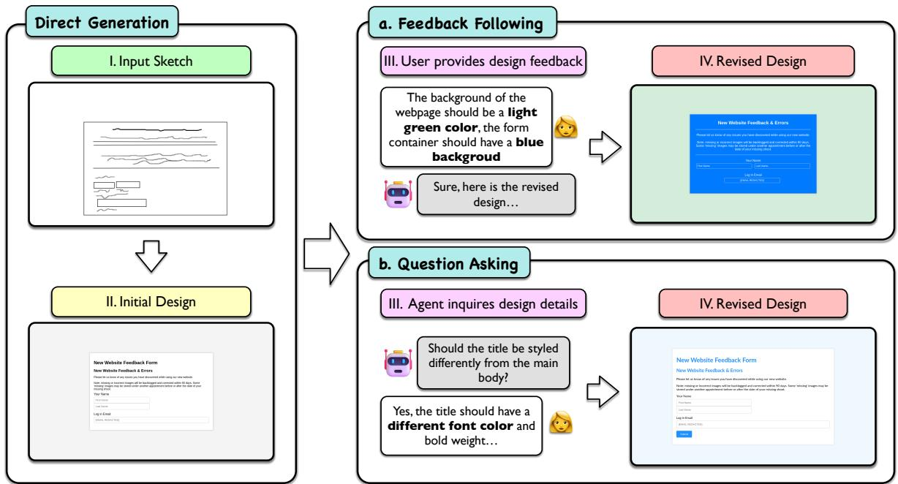  
Figure 1: Benchmark Overview. We provide an example of direct generation on the left. On the right, we show two examples of user-agent interactions in multi-turn scenarios: feedback following and question answering.

We conducted a comprehensive analysis of ten models: GPT-4o, GPT-4o mini, Gemini 1.5 Pro, Gemini 1.5 Flash, Claude 3.5 Sonnet, Claude 3 Opus/Sonnet/Haiku, Llava-1.6-8b, and InternVL2- 8b. Results indicate that inferring the correct layout structures from rudimentary sketch designs is challenging for VLMs in a single turn (§ 4.3). While commercial models perform reasonably well in following user feedback—achieving performance improvements of up to 7.1% in visual similarity (Si et al., 2024) and 2.7% in IoU-based (Rezatofighi et al., 2019) layout similarity within five rounds of interaction—all VLMs struggle to formulate meaningful questions about the sketches and fail to reliably enhance their performance across multiple rounds in the question-asking scenario (§ 4.4).

To understand the utility of our sketch-based, multiturn framework, we conducted a user study involving eight UI/UX practitioners while all participants recognized the usefulness of our framework. Furthermore, it reveals that the question-asking mode is significantly preferred over the more traditional feedback-following mode despite current suboptimal performances. Specifically, users prefer the agent to proactively undertake more of the cognitive workload and guide the design choices via a series of targeted questions. Although questions asked by agents are often found ineffective, replacing model-generated questions with questions asked by human experts leads to a significant improvement with each question (§ 5). Our findings highlight a critical gap between user expectations and current model capabilities, necessitating further research into human-AI collaboration and the capability of more proactive interactions.

## 2 Related Work

LLM-Based Code Generation. LLMs designed explicitly for coding, such as Codex (Chen et al., 2021), StarCoder (Li et al., 2023b), InCoder (Fried et al., 2023), CodeLlama (Rozière et al., 2024), and DeepSeek-Coder (Guo et al., 2024), facilitate programming support applications like automatic code completion and infilling, as well as enabling users to interact with codebases. For general-purpose LLMs, adding code into the pretraining data also improves reasoning (Ma et al., 2023; Zhang et al., 2024b). However, the trend of evaluating coding ability on problem-solving benchmarks like HumanEval (Chen et al., 2021) and MBPP (Austin et al., 2021) leads to overlooking other realistic coding tasks, such as writing code for solving GitHub issues (Jimenez et al., 2023) and, in our case, implementing an HTML website.

The introduction of vision modality further poses challenges to the task of code generation. Most of the open vision-language data focus on open-ended visual questions answering, thus essentially limiting the coding capability of open VLMs (Li et al., 2023a; Liu et al., 2023; Dai et al., 2023), while commercial VLMs, such as GPT-4V (Openai, 2023), Claude3 (Anthropic, 2024), and Google Gemini (Reid et al., 2024) achieves remarkable progress probably due to more diverse and larger scale data collection. In this work, we find that open VLMs like InternVL2 (Chen et al., 2024), which achieves results comparable to commercial models across popular benchmarks, still lags far behind in terms of code generation and multi-turn interaction.

Frontend UI Code Generation. Nguyen and Csallner (2015) pioneered reverse engineering mobile UIs using OCR and computer vision techniques to generate code. Pix2Code (Beltramelli, 2017) introduced an end-to-end UI-to-code system leveraging CNNs and RNNs, but faced challenges with complex visual encoding and text decoding. A¸sıroglu et al.˘ (2019) incorporated neural networkbased object detection and semantic segmentation into this process. Prior studies have also attempted automatic UI generation from sketches, such as Azure (2018); Robinson (2019); Jain et al. (2019); Baulé et al. (2021), but are limited to simple pattern matching and object detection, with limited support in HTML syntax. Recently, Soselia et al. (2023) utilized advanced visual encoders and language decoders, fine-tuning the pipeline with visual similarity signals. However, their examples primarily included simple elements. Si et al. (2024); Laurençon et al. (2024) firstly study whether VLMs can transform real-world screenshots to HTML webpages in an end2end pattern and demonstrate promising initial results. However, using screenshots as input is still unrealistic in the UI coding workflow. Zhang et al. (2024a) shows one of the first demonstrations of leveraging VLMs in the sketch-to-code transformation without comprehensive benchmarking and framework design.

## 3 The Sketch2Code Benchmark

## 3.1 Data Collection

We curated our sketch dataset based on a diverse set of 484 real-world webpages collected by Si et al. (2024) under ODC-By license 2. Sketches are drawn following the standard wireframing conventions3 by annotators recruited on Prolific4. Annotators are selected based on their self-reported expertise in UI design and their drawings of three sample sketches in a qualifier study. We selected 21 annotators from 723 total participants in the qualifier run. We then asked each selected annotator to draw 20-60 sketches of different webpages. Participants are compensated for \$2 during the qualifier and \$20/hr for the main study.

We have collected a total of 731 sketches for 484 webpage screenshots. To avoid overfitting to a particular style of sketches, we assigned a subset of the webpages to multiple annotators with varying styles and qualities. In particular, 18.0% of the webpages are sketched by 2 designers, 16.5% of the webpages are sketched by 3+ designers, and the remaining webpages are sketched by a single designer. Due to budget limits, we could not assign multiple designers to all webpages in the source dataset. Appendix Figure 4 contains example sketch-screenshot pairs of our dataset.

## 3.2 Task Definitions

Baseline: Direct Generation In the simplest format, sketch2code agents are given only the sketch (or together with the text content) and are asked to generate an HTML implementation directly. The agents are allowed to use placeholders if the text content is not given.

However, such a task has inherent limitations. Since sketches are low-fidelity abstractions of UI designs, it is often impossible for the agent, or even human experts, to perfectly implement a frontend

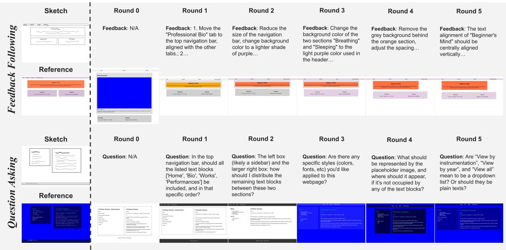  
Figure 2: Multi-turn generation examples using GPT-4o, where we can observe the generated webpages get more similar to the reference as incorporating more feedback/answers.

UI from sketch alone in a single turn. To successfully understand and implement visual designs via sketches, the agent must communicate effectively with the user to clarify design requirements and improve their implementations. Therefore, in addition to direct generation, we present two multi-turn interactive evaluation tasks: feedback following and question asking. In both scenarios, we follow such a setup: a (simulated) user has an intended web UI design that they hope to implement (i.e., the reference webpage), but they only have a rough sketch as a starting point. The sketch2code agent will be required to effectively engage in multi-turn communication with the user to clarify the requirements and collectively figure out an implementation of the intended/desired webpage, while a sketch along with all texts that should appear on the webpage initially. Figure 1 shows an example of each multiturn evaluation scenario.

Feedback Following At each round, the sketch2code agent is first asked to generate a webpage given the currently available information. An LLM-simulated user will then compare the screenshot of the current implementation against the screenshot of the reference webpage and provide feedback instructions on improving the implementation. The agent is expected to incorporate the feedback into its implementation in the next round of interaction. This task follows most of the existing conversation AI workflows.

Question Asking At each round, the sketch2code agent is instructed to proactively look for ambiguities and uncertainties within the sketch design and ask clarifying questions. The LLM-simulated user will answer the questions, and the agent will generate a new webpage at each turn based on the user’s answer. Unlike most existing conversational agents, in this task, the agent is required to take on more cognitive workload and proactively initiate conversations instead of passively waiting for user instructions. Human evaluations of the simulated user’s capabilities are detailed in § 4.5.

Simulated user To automatically simulate and evaluate multi-turn conversations with sketch2code agents, we deployed a simulated user for each of our two multi-turn evaluation tasks. In both tasks, the simulated user is backed by a GPT-4o model with temperature=0. In the feedback-following task, the simulated user is given only a sketch and a screenshot, as it is supposed to base its feedback solely on visual comparisons. In the questionasking task, the simulated user is given a sketch, a screenshot, and the HTML code for the screenshot to provide the most accurate information for each question. Considering human users are unlikely to give detailed, long responses every round, we prompt the agent to answer all questions with at most one succinct sentence. In the Appendix, Listing 2 shows the user prompt for the simulated user in question asking, and Listing 3 shows the user prompt for the simulated user in the feedback-

following task.

## 4 Experiments

## 4.1 Prompting Methods

We evaluated the agents using two prompting methods: direct prompting and text-augmented prompting. In direct prompting, the agent is provided with a sketch design only and is asked to generate an HTML prototype without access to additional information. In text-augmented prompting, we augment the agent with all text content extracted from the reference webpage as part of the initial user prompt, following Si et al. (2024). The exact prompts used and additional experiment details are available in Appendix B.

Preliminary results show that text-augmented prompting is a more realistic setup and yields the most stable outputs across multiple interaction turns. Hence, we use text-augmented prompting as the starting point for all multi-turn experiments.

## 4.2 Evaluation Metrics

Visual Similarity Following Si et al. (2024), we calculate the visual similarity score as the average of Block Match, Text, Position, Color, and CLIP scores, which gives a complete assessment of the generated complete webpages.

However, compared to using screenshots, it is not meaningful to compare websites generated using sketches with reference websites since most textual and stylistic information is not provided. To this end, we propose an IoU(Intersection over Union)-based metric that focuses solely on layout similarities.

Layout Similarity Given a generated and a reference HTML, we would first extract a list of visual components from each HTML file. To calculate the overlap within the same type of components, we identified seven classes of higher-level visual component types: text blocks, images, video containers, navigation bars,forms/tables, and buttons. Detailed explanations for each visual component type and their corresponding HTML tag selectors are available in Appendix A.

For each visual component type $^ { c , }$ we define its layout similarity as the IoU of the total area taken by all bounding boxes of components with type c in the reference & generated webpages:

$$
I o U ( c ) = { \frac { A _ { c } ^ { \prime } \cap A _ { c } } { A _ { c } ^ { \prime } \cup A _ { c } } }
$$

Where $A _ { c }$ and $A _ { c } ^ { \prime }$ are the areas taken by components with type c in the reference and generated webpages, respectively.

The overall layout similarity between two webpages is the weighted average of IoU scores of all visual component types $c \in \mathbf { C }$

$$
S i m _ { L a y o u t } = \sum _ { c \in \mathbf { C } } \frac { A _ { c } ^ { \prime } + A _ { c } } { \sum _ { c ^ { \prime } \in \mathbf { C } } \left( A _ { c ^ { \prime } } ^ { \prime } + A _ { c ^ { \prime } } \right) } \times I o U ( c )
$$

In practice, we evaluate direction generation (single turn without textual content input) only using the layout similarity metric. For all other settings (Feedback-following and Question-asking), since agents have access to textual content initially and are available to collect more information through multi-turn conversation, we use both visual similarity and layout similarity metrics.

## 4.3 Result: Direct Generation

We present direct generation results for all 10 evaluated models in Table 1. These include 8 commercial models (GPT-4o, GPT-4o mini, Gemini 1.5 Pro, Gemini 1.5 Flash, Claude 3.5 Sonnet, Claude 3 Opus/Sonnet/Haiku), and 2 open-source models (Llava-1.6-8b and InternVL2-8b). We choose not to run larger open-source models due to the high computational cost of generating hundreds of thousands of tokens per run.

First, we observed a considerable gap between commercial and open-source models on direct sketch-to-code generations. All commercial models outperformed open-source models, and the open-source models rarely achieves a layout similarity higher than 10%. While text-augmented prompting boosts the performance of all commercial models, the additional context can sometimes be detrimental to the generation qualities of opensource models. With direct prompting, Llava-1.6 and InternVL2 can generate correctly formatted HTML outputs 82.4%/98.0% of the time. However, after giving the textual content on the webpage, they tend to generate repetitive content without finishing and can only output the correct HTML format 66.7%/39.2% of the time, respectively.

Among the eight commercial models, Claude 3.5 Sonnet and GPT-4o lead the performance in singleturn generations, achieving the best layout similarity with direct and text-augmented prompting. While text-augmented prompting can significantly boost their performance by 5-7% for smaller, less capable models (e.g., GPT-4o Mini and Claude

<table><tr><td>Model</td><td>Prompting</td><td>Layout Sim.</td><td>Text IoU</td><td>Image IoU</td><td>Other IoU</td><td>Human Sat.</td></tr><tr><td rowspan="2">GPT-40</td><td>Direct</td><td>19.20</td><td>17.12</td><td>16.19</td><td>3.03</td><td>30.0</td></tr><tr><td>Text-Augmented</td><td>21.33</td><td>22.08</td><td>13.23</td><td>2.75</td><td>一</td></tr><tr><td rowspan="2">GPT-4o-Mini</td><td>Direct</td><td>11.49</td><td>13.51</td><td>2.36</td><td>1.27</td><td>12.0</td></tr><tr><td>Text-Augmented</td><td>16.25</td><td>20.84</td><td>0.72</td><td>1.12</td><td></td></tr><tr><td rowspan="2">Claude-3-Opus</td><td>Direct</td><td>12.86</td><td>10.43</td><td>12.67</td><td>0.65</td><td>10.0</td></tr><tr><td>Text-Augmented</td><td>17.11</td><td>18.09</td><td>8.32</td><td>2.97</td><td></td></tr><tr><td rowspan="2">Claude-3.5-Sonnet</td><td>Direct</td><td>21.64</td><td>22.51*</td><td>10.47</td><td>2.94</td><td>36.0</td></tr><tr><td>Text-Augmented</td><td>22.26</td><td>25.33*</td><td>9.21</td><td>3.58</td><td></td></tr><tr><td rowspan="2">Claude-3-Sonnet</td><td>Direct</td><td>11.97</td><td>10.61</td><td>10.09</td><td>0.73</td><td>0.0</td></tr><tr><td>Text-Augmented</td><td>14.22</td><td>15.85</td><td>6.62</td><td>1.72</td><td>-</td></tr><tr><td rowspan="2">Claude-3-Haiku</td><td>Direct</td><td>10.25</td><td>12.61</td><td>3.15</td><td>1.17</td><td>6.0</td></tr><tr><td>Text-Augmented</td><td>17.52</td><td>20.60</td><td>2.72</td><td>2.22</td><td></td></tr><tr><td rowspan="2">Gemini-1.5-Pro</td><td>Direct</td><td>18.25</td><td>16.44</td><td>14.69</td><td>1.12</td><td>22.0</td></tr><tr><td>Text-Augmented</td><td>18.72</td><td>19.46</td><td>11.79</td><td>0.96</td><td></td></tr><tr><td rowspan="2">Gemini-1.5-Flash</td><td>Direct</td><td>14.15</td><td>13.28</td><td>8.77</td><td>0.03</td><td>8.0</td></tr><tr><td>Text-Augmented</td><td>15.22</td><td>13.25</td><td>7.81</td><td>0.16</td><td>-</td></tr><tr><td rowspan="2">InternVL2-8b</td><td>Direct</td><td>10.08</td><td>11.28</td><td>6.13</td><td>0.00</td><td>2.0</td></tr><tr><td>Text-Augmented</td><td>4.01</td><td>4.89</td><td>1.41</td><td>0.60</td><td>-</td></tr><tr><td rowspan="2">Llava-1.6-8b</td><td>Direct</td><td>6.68</td><td>6.91</td><td>3.43</td><td>0.36</td><td>0.0</td></tr><tr><td>Text-Augmented</td><td>8.00</td><td>9.26</td><td>1.95</td><td>0.57</td><td>一</td></tr></table>

Table 1: The performance of eight commercial and two open-source models on the Sketch2Code direct generation task. The Layout Similarity is computed as the weighted average of the IoU for each visual component. The human satisfaction rate is the percentage of generation outputs labeled as "Satisfactory/Close Match" by human annotators. \* indicates statistical significance (p<0.05) comparing to the second best performing model.

3 Haiku), such effect dwindles with more capable models, suggesting that strong models can generate correct layouts without referencing text content.

Human Evaluation In addition to the automated metrics, we conducted a human evaluation with Prolific crowd annotators for the direct prompting outputs. For each generated result, the annotators are given three options, indicating whether the generated layout is "Satisfactory/Close Match", "Loosely Match with Minor Fixes", or "Unsatisfactory". The human satisfaction rate had a r2 value of 0.87 (p=0.00008), and a Kendall’s Tau score of 0.72 (p=0.004) with the IoU-based layout similarity metric, indicating a strong correlation between the automated metric and human judgment. More details in Appendix A.

## 4.4 Result: Multi-turn Evaluation

Figure 2 shows the example outputs of GPT-4o on the two multi-turn evaluation tasks. We present the performance of the largest and smallest models in each of the three commercial model families (GPT-4o, Gemini 1.5, and Claude 3) in Figure 3. (I) All models displayed noticeable improvements in feedback following. The best commercial models achieves improvements of up to 7.1% in visual similarity and 2.7% in IoU-based layout similarity within five rounds of interaction. Models with weaker single-turn performance can sometimes lead to more multi-turn improvements. (II) Question asking is more challenging as all models struggled to pose effective questions about the sketches and showed very few improvements with statistical significance. Most performance gains occurred within the first two rounds of interactions, and performance often plateaued or even deteriorated after three to four rounds of interactions. We provide a more detailed analysis of the types of effective versus ineffective questions asked in § 5.

Case Study Figure 8 further shows the performance of the four models in the Claude model family. (I) While we observe an apparent scalingup effect within the Claude 3 models regarding visual similarity (Haiku < Sonnet < Opus), such effect is not observable in layout similarity as Sonnet and Opus sometimes perform worse than Haiku. Since the visual similarity is heavily based on text content matching while layout similarity only considers spatial overlap, we assume solely scaling up model sizes barely helps with the layout understanding and generation compared to text-related capabilities. (II) While Claude 3.5 Sonnet excels at generating webpage layout (layout similarity score above 22%), it struggles to leverage information from user interactions. We assume it might be overoptimized for single-turn generations. Additional details on direct & multi-turn evaluation results are available in Appendix C.

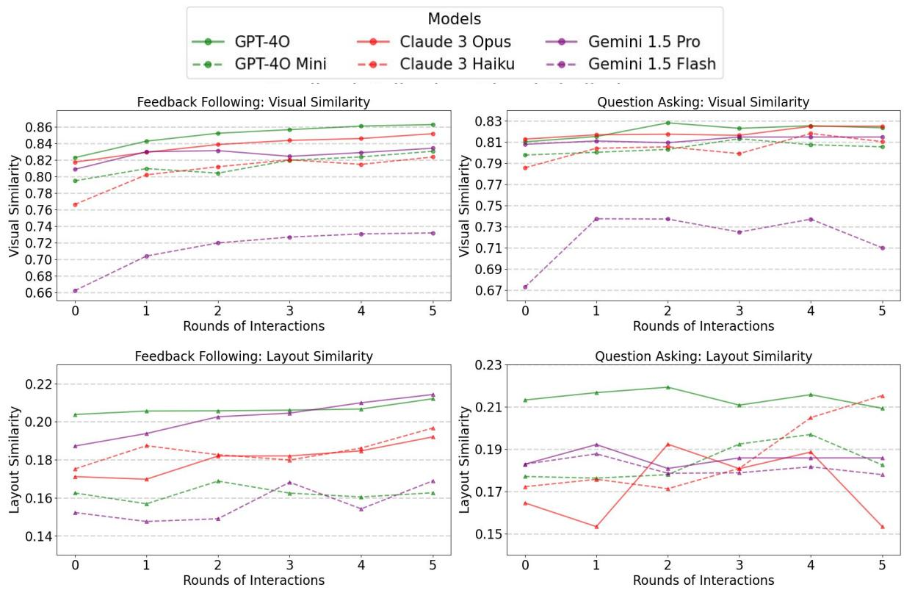  
Figure 3: The performances of six models on the feedback following benchmark (left) and the question asking benchmark (right): GPT-4o, GPT-4o Mini, Claude-3-Opus, Claude-3-Haiku, Gemini 1.5 Pro, and Gemini 1.5 Flash.

## 4.5 Human Annotation

To ensure the validity of our automated metrics and the simulated user environment, we conducted a series of human evaluations on different components across our evaluation pipeline. Details on the recruitment process are available in Appendix D.

Layout Similarity We leveraged pairwise comparisons (Zhou et al., 2023; Dubois et al., 2024) to evaluate how well the automated layout similarity metrics align with human judgement and preferences. Each annotator is given pairs of generated implementations of the same reference webpage and is asked to select the one that is more similar in layout to the reference. Our IoU-based layout similarity metrics agreed with human judgment 69.2% of the time, comparable to the agreement score between human annotators, 65.8%. The five annotators achieved a Fleiss Kappa score of 0.47, a relatively high agreement for subjective tasks (Landis and Koch, 1977).

Simulated QA To verify the answer quality of the simulated user during the question-asking benchmark, participants are presented with a sketch design and a reference webpage, followed by a single round of simulated QA. According to the human annotators, 93.3% of the generated answers directly respond to the given question, and 86.7% of the answers remain faithful to the reference webpage. Another validity check is whether the generated answer contains any code leakage or direct references to HTML elements. We found that the simulated user exhibits code leakage issues in 8.3% of the answers. Fleiss Kappa scores and additional details are available in Appendix D.

Simulated User Feedback Participants are given a current implementation from a model, a reference webpage, and feedback generated by the simulated user and are asked to rate the simulated feedback. Our annotators found that 86.7% of the simulated feedback is easy to follow, and 83.3% of the simulated feedback accurately points out the difference between the current & reference implementations.

## 5 User Study and Analysis

To better understand the importance of sketching in the UI/UX development cycle, and the potential use cases and implications of a sketch2code agent, we conducted a user study by interviewing eight UI/UX experts recruited from Upwork5.

All experts agreed that low-fidelity sketches play a substantial role in modern UI/UX development. Furthermore, they found that a sketch2code agent would significantly benefit their work. A sketch2code agent can help users quickly flesh out early-stage ideas and break the communication barrier between clients and designers. More interestingly, seven out of eight participants showed strong preference towards the question-asking agent. The interviewees expressed that they needed to specify every design detail to an agent that passively follows user instructions. In contrast, a questionasking agent can take over most of the cognitive workload, and the user only needs to focus on the parts being asked. Three of the experts pointed out that the agent can proactively “guide” the user through certain design decisions & choices via a series of targeted questions, so the user do not have to figure out every single detail themselves. Moreover, the participants mentioned that it is difficult to select visual components and specify visual information with natural language feedback-/answers alone. When communicating design ideas in real life, people can simply point to specific visual components by mouse or by finger instead of using words, which is faster, easier, and more reliable. Detailed findings are available in Appendix E.

Moreover, we invited 5 UI/UX experts who participated in the user studies to (1) provide feedback on 100 generated designs from three models (GPT-4o, Claude-3-Opus, and Gemini-1.5-Pro) and (2) ask questions on 100 sketches. We further compare the difference between AI-generated and humanwritten feedback/questions below 6.

Simulated user feedback achieved comparable performance as feedback from real human experts: On average, each feedback from the simulated user improves the agents’ performance in visual similarity by 1.41% and layout similarity by 1.05%, whereas each feedback from a human expert improves the visual similarity by 1.62% and layout similarity by 0.98%. We developed a taxonomy and summarized the user feedback into seven categories (Detailed taxonomy and statistics are available in Appendix F.). Interestingly, human experts provide more feedback on colors and styling, while simulated users focus more on texts and general comments about the webpage. Furthermore, we evaluated the effectiveness of each type of simulated feedback in Appendix Table 10, where we explicitly prompt the simulated user to give different types of feedback. We found that feedback on layout structure is most helpful for all three models, with the most significant average improvements in layout and overall visual similarity. This is followed by feedback on the styling and layout of major visual components, where all three models can again show positive average improvement in both visual and layout scores.

The effectiveness of questions asked by models lags far behind that of experts. Initially, the models’ performance on average decreases by 1.12% in visual similarity and improves by 0.74% in layout similarity after asking each question. However, by replacing the agent-generated questions with questions written by human experts, the models were able to improve their visual similarity by 0.58% and layout similarity by 1.49% with each question. Based on a taxonomy of the nine most common types of questions (The full taxonomy and further details in Appendix F.), we found that human experts often ask about the general styling and layout of the webpage, whereas the agents often focus on the specific placements of textual contents or ask irrelevant questions. As shown in Appendix Table 10, the most effective type of questions are questions regarding stylistic choices of primary visual components, followed by questions regarding the general layout or the positional placements of major elements. Appendix F contains a more detailed analysis of the effectiveness of different questions.

## 6 Conclusion and Future Work

In this work, we introduced Sketch2Code, a novel interactive evaluation framework that assesses Vision Language Models’ (VLMs) capability for multi-turn front-end UI/UX automation. We proposed two interaction paradigms: feedback following and question asking. Our evaluations revealed that while modern commercial VLMs perform reasonably well in feedback following—improving visual and layout similarities by 3% and 1.8% over five interaction rounds—they struggle with asking meaningful questions. However, a user study with eight UI/UX practitioners showed a user preference for the question-asking paradigm, as it allows the agent to take on more cognitive responsibilities, highlighting a gap between user expectations and current model capabilities.

We outline future research directions inspired by Sketch2Code: (i) Training open-source models for multi-turn UI generations. This can be challenging due to the long contexts and multi-modality. To facilitate large-scale training, we present an automated pipeline for generating realistic synthetic sketches at scale (see Appendix H). (ii) Developing agentic frameworks that are more capable of cognitive reasoning and proactively guiding users through multi-turn design workflows, instead of passively following instructions. (iii) Creating end-to-end UI/UX AI applications to enhance designer productivity and make UI designs more accessible to non-experts.

## 7 Limitations

Despite our efforts, we address the following limitations of our work:

• Due to computational limitations, we evaluated only 8b open-source models, InternVL2- 8b and Llava-1.6-8B. Larger open-source models were not included in this study due to the computational cost, which might have better multi-turn interaction capability.

• Second, the multi-turn evaluation pipeline with simulated users is computationally expensive. Running a single example in the feedback following/question-asking benchmarks requires 40,000 to 160,000 input tokens and approximately 10,000 output tokens, making large-scale evaluations costly, though manageable for specific use cases.

• Moreover, while the sketch2code agent converts natural language inputs to HTML code, user studies with UI/UX practitioners indicate a preference for more direct, deterministic ways (e.g., mouse clicks, drags) to select and modify visual components, as well as support for exporting outputs to Figma or other design software, highlighting the need for additional input/output modalities.

• Finally, we acknowledge the potential for misuse of this technology by malicious actors, who might generate harmful webpages or attempt to reverse-engineer code from proprietary or licensed websites.

## Acknowledgments

We thank Yutong Zhang, Chenglei Si, Lin Qiu, Harshit Joshi, Yicheng Fu, John Yang, Ryan Louie, Yijia Shao, Aryaman Arora, Michelle Lam, Dora Zhao, Hao Zhu, Michael Ryan, Raj Shah, Will Held and other outstanding members in the SALT lab/Stanford NLP/Stanford HCI for their valuable feedback on different stages of this work.

## References

Jean-Baptiste Alayrac, Jeff Donahue, Pauline Luc, Antoine Miech, Iain Barr, Yana Hasson, Karel Lenc, Arthur Mensch, Katie Millican, Malcolm Reynolds, Roman Ring, Eliza Rutherford, Serkan Cabi, Tengda Han, Zhitao Gong, Sina Samangooei, Marianne Monteiro, Jacob Menick, Sebastian Borgeaud, Andrew Brock, Aida Nematzadeh, Sahand Sharifzadeh, Mikolaj Binkowski, Ricardo Barreira, Oriol Vinyals, Andrew Zisserman, and Karen Simonyan. 2022. Flamingo: a visual language model for few-shot learning. Preprint, arXiv:2204.14198.

Anthropic. 2024. The claude 3 model family: Opus, sonnet, haiku.

Jacob Austin, Augustus Odena, Maxwell Nye, Maarten Bosma, Henryk Michalewski, David Dohan, Ellen Jiang, Carrie Cai, Michael Terry, Quoc Le, et al. 2021. Program synthesis with large language models. arXiv preprint arXiv:2108.07732.

Microsoft Azure. 2018. Turn your whiteboard sketches to working code in seconds with sketch2code.

Batuhan A¸sıroglu, Bü¸sta Rümeysa Mete, Eyyüp Yıldız,˘ Yagız Nalçakan, Alper Sezen, Mustafa Da˘ gtekin, and˘ Tolga Ensari. 2019. Automatic html code generation from mock-up images using machine learning techniques. In 2019 Scientific Meeting on Electrical-Electronics & Biomedical Engineering and Computer Science (EBBT), pages 1–4.

Qifang Bao, Daniela Faas, and Maria Yang. 2018. Interplay of sketching & prototyping in early stage product design. International Journal ofDesign Creativity and Innovation, 6:1–23.

Daniel Baulé, Christiane Gresse von Wangenheim, Aldo von Wangenheim, Jean C. R. Hauck, and Edson C. Vargas Júnior. 2021. Automatic code generation from sketches of mobile applications in enduser development using deep learning. Preprint, arXiv:2103.05704.

Tony Beltramelli. 2017. pix2code: Generating code from a graphical user interface screenshot. Preprint, arXiv:1705.07962.

Bill Buxton. 2010. Sketching user experiences: getting the design right and the right design. Morgan kaufmann.

Mark Chen, Jerry Tworek, Heewoo Jun, Qiming Yuan, Henrique Ponde de Oliveira Pinto, Jared Kaplan, Harri Edwards, Yuri Burda, Nicholas Joseph, Greg Brockman, Alex Ray, Raul Puri, Gretchen Krueger, Michael Petrov, Heidy Khlaaf, Girish Sastry, Pamela Mishkin, Brooke Chan, Scott Gray, Nick Ryder, Mikhail Pavlov, Alethea Power, Lukasz Kaiser, Mohammad Bavarian, Clemens Winter, Philippe Tillet, Felipe Petroski Such, Dave Cummings, Matthias Plappert, Fotios Chantzis, Elizabeth Barnes, Ariel Herbert-Voss, William Hebgen Guss, Alex Nichol, Alex Paino, Nikolas Tezak, Jie Tang, Igor Babuschkin, Suchir Balaji, Shantanu Jain, William Saunders, Christopher Hesse, Andrew N. Carr, Jan Leike, Josh Achiam, Vedant Misra, Evan Morikawa, Alec Radford, Matthew Knight, Miles Brundage, Mira Murati, Katie Mayer, Peter Welinder, Bob McGrew, Dario Amodei, Sam McCandlish, Ilya Sutskever, and Wojciech Zaremba. 2021. Evaluating large language models trained on code. Preprint, arXiv:2107.03374.

Zhe Chen, Weiyun Wang, Hao Tian, Shenglong Ye, Zhangwei Gao, Erfei Cui, Wenwen Tong, Kongzhi Hu, Jiapeng Luo, Zheng Ma, et al. 2024. How far are we to gpt-4v? closing the gap to commercial multimodal models with open-source suites. arXiv preprint arXiv:2404.16821.

Wenliang Dai, Junnan Li, Dongxu Li, Anthony Meng Huat Tiong, Junqi Zhao, Weisheng Wang, Boyang Li, Pascale Fung, and Steven Hoi. 2023. Instructblip: Towards general-purpose visionlanguage models with instruction tuning. Preprint, arXiv:2305.06500.

Yann Dubois, Xuechen Li, Rohan Taori, Tianyi Zhang, Ishaan Gulrajani, Jimmy Ba, Carlos Guestrin, Percy Liang, and Tatsunori B. Hashimoto. 2024. Alpacafarm: A simulation framework for methods that learn from human feedback. Preprint, arXiv:2305.14387.

Daniel Fried, Armen Aghajanyan, Jessy Lin, Sida Wang, Eric Wallace, Freda Shi, Ruiqi Zhong, Wen tau Yih, Luke Zettlemoyer, and Mike Lewis. 2023. Incoder: A generative model for code infilling and synthesis. Preprint, arXiv:2204.05999.

Daya Guo, Qihao Zhu, Dejian Yang, Zhenda Xie, Kai Dong, Wentao Zhang, Guanting Chen, Xiao Bi, Y. Wu, Y. K. Li, Fuli Luo, Yingfei Xiong, and Wenfeng Liang. 2024. Deepseek-coder: When the large language model meets programming – the rise of code intelligence. Preprint, arXiv:2401.14196.

Vanita Jain, Piyush Agrawal, Subham Banga, Rishabh Kapoor, and Shashwat Gulyani. 2019. Sketch2code:

Transformation of sketches to ui in real-time using deep neural network. Preprint, arXiv:1910.08930.

Carlos E. Jimenez, John Yang, Alexander Wettig, Shunyu Yao, Kexin Pei, Ofir Press, and Karthik Narasimhan. 2023. Swe-bench: Can language models resolve real-world github issues? Preprint, arXiv:2310.06770.

Carlos E. Jimenez, John Yang, Alexander Wettig, Shunyu Yao, Kexin Pei, Ofir Press, and Karthik Narasimhan. 2024. Swe-bench: Can language models resolve real-world github issues? Preprint, arXiv:2310.06770.

J. Richard Landis and Gary G. Koch. 1977. The measurement of observer agreement for categorical data. Biometrics, 33(1):159–174.

Hugo Laurençon, Léo Tronchon, and Victor Sanh. 2024. Unlocking the conversion of web screenshots into html code with the websight dataset. Preprint, arXiv:2403.09029.

Triet H. M. Le, Hao Chen, and Muhammad Ali Babar. 2020. Deep learning for source code modeling and generation: Models, applications, and challenges. ACM Computing Surveys, 53(3):1–38.

Makayla Lewis and Miriam Sturdee. 2023. The joy of sketch: A hands-on introductory course on sketching in hci and ux within research, practice, and education. In Extended Abstracts ofthe 2023 CHI Conference on Human Factors in Computing Systems, CHI EA ’23, New York, NY, USA. Association for Computing Machinery.

Junnan Li, Dongxu Li, Silvio Savarese, and Steven Hoi. 2023a. Blip-2: bootstrapping language-image pretraining with frozen image encoders and large language models. In Proceedings of the 40th International Conference on Machine Learning, ICML’23. JMLR.org.

Raymond Li, Loubna Ben Allal, Yangtian Zi, Niklas Muennighoff, Denis Kocetkov, Chenghao Mou, Marc Marone, Christopher Akiki, Jia Li, Jenny Chim, Qian Liu, Evgenii Zheltonozhskii, Terry Yue Zhuo, Thomas Wang, Olivier Dehaene, Mishig Davaadorj, Joel Lamy-Poirier, João Monteiro, Oleh Shliazhko, Nicolas Gontier, Nicholas Meade, Armel Zebaze, Ming-Ho Yee, Logesh Kumar Umapathi, Jian Zhu, Benjamin Lipkin, Muhtasham Oblokulov, Zhiruo Wang, Rudra Murthy, Jason Stillerman, Siva Sankalp Patel, Dmitry Abulkhanov, Marco Zocca, Manan Dey, Zhihan Zhang, Nour Fahmy, Urvashi Bhattacharyya, Wenhao Yu, Swayam Singh, Sasha Luccioni, Paulo Villegas, Maxim Kunakov, Fedor Zhdanov, Manuel Romero, Tony Lee, Nadav Timor, Jennifer Ding, Claire Schlesinger, Hailey Schoelkopf, Jan Ebert, Tri Dao, Mayank Mishra, Alex Gu, Jennifer Robinson, Carolyn Jane Anderson, Brendan Dolan-Gavitt, Danish Contractor, Siva Reddy, Daniel Fried, Dzmitry Bahdanau, Yacine Jernite, Carlos Muñoz Ferrandis,

Sean Hughes, Thomas Wolf, Arjun Guha, Leandro von Werra, and Harm de Vries. 2023b. Starcoder: may the source be with you! Preprint, arXiv:2305.06161.

Haotian Liu, Chunyuan Li, Qingyang Wu, and Yong Jae Lee. 2023. Visual instruction tuning. Preprint, arXiv:2304.08485.

Yingwei Ma, Yue Liu, Yue Yu, Yuanliang Zhang, Yu Jiang, Changjian Wang, and Shanshan Li. 2023. At which training stage does code data help llms reasoning? Preprint, arXiv:2309.16298.

Tuan Anh Nguyen and Christoph Csallner. 2015. Reverse engineering mobile application user interfaces with remaui (t). In 2015 30th IEEE/ACM International Conference on Automated Software Engineering (ASE), pages 248–259.

Openai. 2023. Gpt-4v(ision) system card.

Machel Reid, Nikolay Savinov, Denis Teplyashin, Dmitry Lepikhin, Timothy Lillicrap, Jean-baptiste Alayrac, Radu Soricut, Angeliki Lazaridou, Orhan Firat, Julian Schrittwieser, et al. 2024. Gemini 1.5: Unlocking multimodal understanding across millions of tokens of context. arXiv preprint arXiv:2403.05530.

Nils Reimers and Iryna Gurevych. 2019. Sentence-bert: Sentence embeddings using siamese bert-networks. Preprint, arXiv:1908.10084.

Hamid Rezatofighi, Nathan Tsoi, JunYoung Gwak, Amir Sadeghian, Ian Reid, and Silvio Savarese. 2019. Generalized intersection over union: A metric and a loss for bounding box regression. In Proceedings ofthe IEEE/CVF conference on computer vision and pattern recognition, pages 658–666.

Alex Robinson. 2019. Sketch2code: Generating a website from a paper mockup. Preprint, arXiv:1905.13750.

Baptiste Rozière, Jonas Gehring, Fabian Gloeckle, Sten Sootla, Itai Gat, Xiaoqing Ellen Tan, Yossi Adi, Jingyu Liu, Romain Sauvestre, Tal Remez, Jérémy Rapin, Artyom Kozhevnikov, Ivan Evtimov, Joanna Bitton, Manish Bhatt, Cristian Canton Ferrer, Aaron Grattafiori, Wenhan Xiong, Alexandre Défossez, Jade Copet, Faisal Azhar, Hugo Touvron, Louis Martin, Nicolas Usunier, Thomas Scialom, and Gabriel Synnaeve. 2024. Code llama: Open foundation models for code. Preprint, arXiv:2308.12950.

Chenglei Si, Yanzhe Zhang, Zhengyuan Yang, Ruibo Liu, and Diyi Yang. 2024. Design2code: How far are we from automating front-end engineering? Preprint, arXiv:2403.03163.

Davit Soselia, Khalid Saifullah, and Tianyi Zhou. 2023. Learning ui-to-code reverse generator using visual critic without rendering. Preprint, arXiv:2305.14637.

Miriam Sturdee and Makayla Lewis. 2024. To sketching, and beyond! a course of discovery with pen and paper. In Extended Abstracts ofthe 2024 CHI Conference on Human Factors in Computing Systems, CHI EA ’24, New York, NY, USA. Association for Computing Machinery.

David C Wynn and Claudia M Eckert. 2017. Perspectives on iteration in design and development. Research in Engineering Design, 28:153–184.

Qinshi Zhang, Latisha Besariani Hendra, Mohan Chi, and Zijian Ding. 2024a. Frontend diffusion: Exploring intent-based user interfaces through abstract-to-detailed task transitions. Preprint, arXiv:2408.00778.

Xinlu Zhang, Zhiyu Zoey Chen, Xi Ye, Xianjun Yang, Lichang Chen, William Yang Wang, and Linda Ruth Petzold. 2024b. Unveiling the impact of coding data instruction fine-tuning on large language models reasoning. Preprint, arXiv:2405.20535.

Chunting Zhou, Pengfei Liu, Puxin Xu, Srini Iyer, Jiao Sun, Yuning Mao, Xuezhe Ma, Avia Efrat, Ping Yu, Lili Yu, Susan Zhang, Gargi Ghosh, Mike Lewis, Luke Zettlemoyer, and Omer Levy. 2023. Lima: Less is more for alignment. Preprint, arXiv:2305.11206.

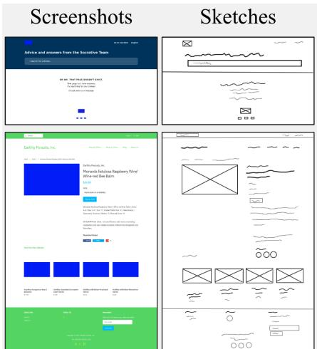  
Figure 4: Examples of screenshots (left) and humandrawn sketches (right) of the Sketch2Code dataset. Sketches are drawn following the wireframing conventions, where boxes with an "X" inside replace images, and curly lines represent texts.

## A Layout Similarity Details

In order to compute visual similarities, we identified several higher-level visual component types and extracted a list of common HTML and CSS tags that are commonly used to represent each type of visual component. Table 2 shows a list of HTML & CSS selectors for each type of visual component. Figure 5 presents example generations under different levels of layout similarity scores.

In this survey , you will be given a reference webpage 's screenshot , as well as a model generated webpage that try to replicate the reference webpage 's layout . Your task is to judge whether the generated webpage matches the layout of the reference webpage . The borders for each webpage is marked in black .

Note : All images in the original webpages are replaced by blue rectangles as placeholders . Often times , the generated webpages will use " lorem ipsum ..." as placeholder texts . Please disregard these placeholders and treat them as normal texts instead .

Visual component matching : a good generated example should contain all visual components that are present in the reference image and have no extra components . You should examine if the visual components in the candidate example match with the ones in the reference image . Visual components include text blocks , images , menus / navigation bars , tables , form inputs , etc .

Size and position of each visual component : you should pay attention to the relative size and position (w.r.t the webpage 's width and height ) of each visual component w.r.t. the overall width and height of the webpage . Sometimes , the webpages have different width / height ratios , but their main visual components have similar relative sizes and positions . When comparing text blocks , it is important that you consider only the sizes and positions of the text blocks . The actual text content should be disregarded .

Detailed text content : since the survey focuses solely on layout similarities , the exact details of textual content does not matter and should be factored out from your judgement . You should never rate a candidate example down if it contains placeholder texts , as long as text blocks are placed similarly as the reference image .

Color and Styles : background color , the color of each section / text block , the font / size / color of the text , or any other color & styling decisions should never impact your final choice . Your decisions should be based on solely the layout and placement of each component .

When making your judgement , you have three options :   
1. \*\* Satisfactory / Close Match \*\*: The layout of the generated and reference webpages matches closely , with only minor differences in details . Major visual components ( such as headers , images , text sections ) align closely , and any variations are insignificant . The two pages can serve similar functions .

3. \*\* Unsatisfactory \*\*: There are significant differences or mismatches in the layout between the reference and generated webpages . There are major components misaligned , missing , or structured differently , resulting in a layout that does not closely resemble the reference . Significant changes are required to make the layouts match .

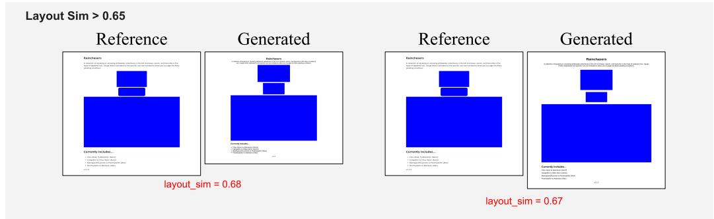

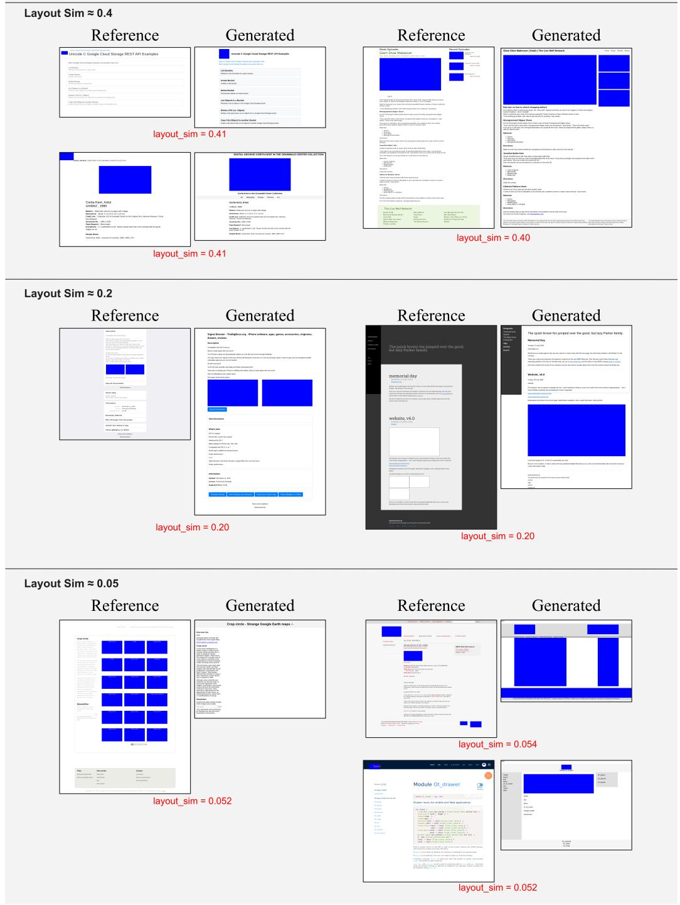  
Figure 5: Example reference-generation pairs with different levels of layout similarity scores.

<table><tr><td rowspan=1 colspan=1>Component Type |</td><td rowspan=1 colspan=1>CSS Selector</td></tr><tr><td rowspan=1 colspan=1>Video</td><td rowspan=1 colspan=1>video</td></tr><tr><td rowspan=1 colspan=1>Image</td><td rowspan=1 colspan=1>img</td></tr><tr><td rowspan=1 colspan=1>Text Block</td><td rowspan=1 colspan=1>p, span, a, strong, h1, h2, h3, h4, h5, h6, li, th, td, label, code,pre, div</td></tr><tr><td rowspan=1 colspan=1>Form/Table</td><td rowspan=1 colspan=1>form, table, div.form</td></tr><tr><td rowspan=1 colspan=1>Button</td><td rowspan=1 colspan=1>button, input[type=&quot;button&quot;], input[type=&quot;submit&quot;],[role=&quot;button&quot;]</td></tr><tr><td rowspan=1 colspan=1>Navigation Bar</td><td rowspan=1 colspan=1>nav,       [role=&quot;navigation&quot;],       .navbar,      [class    =&quot;nav&quot;],[class=&quot;navigation&quot;],[class =&quot;menu&quot;],[class=&quot;navbar&quot;],[id=&quot;menu&quot;], [id=&quot;nav&quot;], [id=&quot;navigation&quot;], [id=&quot;navbar&quot;]</td></tr><tr><td rowspan=1 colspan=1>Divider</td><td rowspan=1 colspan=1>hr, [class*=&quot;separator&quot;], [class*=&quot;divider&quot;], [id=&quot;separator&quot;],[id=&quot;divider&quot;], [role=&quot;separator&quot;]</td></tr></table>

Table 2: HTML and CSS Selectors for Visual Components

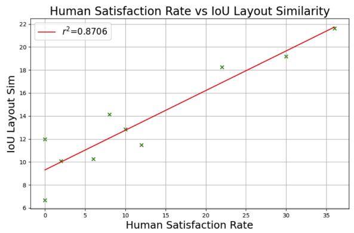

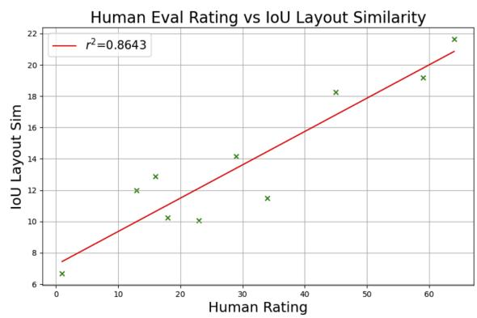

Figure 6: Human satisfaction rate v.s. avg layout similarity (left) and aggregated human rating v.s. avg layout similarity (right) for the ten evaluated models.
<table><tr><td>Model</td><td>Close Match</td><td>Loose Match</td><td>Unsatisfactory</td></tr><tr><td>GPT-40</td><td>30.0</td><td>58.0</td><td>12.0</td></tr><tr><td>GPT-4O Mini</td><td>12.0</td><td>44.0</td><td>44.0</td></tr><tr><td>Claude 3 Opus</td><td>10.0</td><td>12.0</td><td>78.0</td></tr><tr><td>Claude 3.5 Sonnet</td><td>36.0</td><td>56.0</td><td>8.0</td></tr><tr><td>Claude 3 Sonnet</td><td>0.0</td><td>26.0</td><td>73.0</td></tr><tr><td>Claude 3 Haiku</td><td>6.0</td><td>24.0</td><td>70.0</td></tr><tr><td>Gemini 1.5 Pro</td><td>22.0</td><td>46.0</td><td>32.0</td></tr><tr><td>Gemini 1.5 Flash</td><td>8.0</td><td>42.0</td><td>42.0</td></tr><tr><td>InternVL2-8b</td><td>2.0</td><td>42.0</td><td>56.0</td></tr><tr><td>Llava-1.6-8b</td><td>0.0</td><td>2.0</td><td>98.0</td></tr></table>

Table 3: Human evaluation breakdown of the ten evaluated models under direct prompting. It shows the percentages of outputs labeled as "Satisfactory/Close Match", "Loosely Match with Minor Fixes", and "Unsatisfactory" per model by human annotators.

Human Evaluation to further verify the reliability of our automated metric, we conducted human evaluations on the generated layout qualities for the ten evaluated model under direct prompting. We subsampled 50 direct generation outputs from each model for human evaluation. Prolific crowd annotators are screened based on the following criteria: 1. 2500+ completed studies; 2. 99%+ acceptance rate; 3. fluency in English; 4. having a Bachelor or higher education degree. The participants are given pairs of reference v.s. generated webpages and are asked to decide if the generated webpage layout is "Satisfactory/Close Match", "Loosely Match with Minor Fixes", or "Unsatisfactory". Detailed definitions for each options as well as three examples are provided to the participants to calibrate the results. The detailed instructions are available in Listing 1. Each output example is annotated by three participants, and we use majority votes to determine the final label for each generation output.

The percentage of "Satisfactory" generated outputs per model linearly correlates with the average layout similarity scores with $r ^ { 2 }$ value of 0.87 (p=0.0008) and Kendall’s Tau score of 0.72 (p=0.004). In addition, we computed the average human rating per model by counting each "Satisfactory/Close Match" as 1 point, "Loosely Match with Minor Fixes" as 0.5 point, and "Unsatisfactory" as 0 point. The averaged human ratings achieve a $r ^ { 2 }$ score of 0.86 (p=0.00009) and Kendall’s Tau score of 0.64 (p=0.009) with the IoUbased layout similarity metric. Figure 6 shows the linear correlations of human satisfaction rate v.s. layout similarity and human rating v.s. layout similarity. Table 3 presents the breakdown percentages of each human evaluation label per model.

## B Experiment Details

We used the same hyperparameter settings for all eight commercial models, with temperature = 0.0, max tokens = 4096, top p = 1.0, frequency/repetition penalty = 0.0, and presence penalty = 0.0.

For the two open-source model, we found that the models tend to self-repeat and output invalid HTML format. To improve the generation success rate, we adjusted the repetition penalty to 1.1, and temperature to 0.5 (while keeping other hyperparameters the same), and used best-of-3 sampling for all experiments.

Listing 4 shows the system and user prompts used for direct generation tasks. Listing 5 shows the system and user prompts used for textaugmented prompting.

For the feedback following multi-turn evaluation framework, we used the same text-augmented prompting to generate the first implementation prototype. Then, in each round of interaction, we will prompt the simulated user to provide a feedback for the current prototype, and then append the feedback as a user message to the sketch2code agent’s conversation history to generate the next prototype.

For the question-asking evaluation framework, we first prompt the sketch2code agent to generate one or more questions about the given sketch. After the simulated user has answered each question, we will augment the agent with the question-answer pair and prompt it to generate a new implementation prototype. Listing 6 and Listing 7 shows the detailed agent prompts used for the question-asking benchmark.

Conducting multi-turn evaluations is a computationally expensive task. For example, it takes around 10 minutes and 50,000 tokens to run the full feedback following pipeline on a single data sample with GPT-4o. Given such constraint, we limited our multi-turn experiments to a randomly selected subset of 50 data samples from the 731 total sketches in the Sketch2Code dataset.

## C Additional Experiment Results

Direct Evaluation With the additional context from text-augmented prompting, it is frequently observed that the two open-source models would either repeat parts of the generated code until max tokens exceeded, or output the <EOS> token prematurely before the HTML code is complete.

One may notice that the Text IoU scores are generally higher than Image IoU scores, which are higher than the IoUs of other tertiary components. This is because the IoU scores of a certain type of visual component is usually correlated to the corresponding area that type of components span across the webpage. Since text blocks take the largest areas in many webpages collected in the Sketch2Code dataset, models generally get the best scores in Text IoU. Contrarily, tertiary items such as buttons, search bars, and navigation menus only take a small area on the UI, it is especially challenging to achieve a high score on Other IoU.

Multi-turn Evaluation We benchmarked the ten models on both multi-turn evaluation tasks with a maximum of five rounds of user interactions for

You have access to two images . One is a sketch layout of a webpage drawn in the   
wireframing conventions , and the other one is a screenshot of a reference   
implementation . Please note that some images have already been replaced by   
placeholders (i.e., " rick .jpg ") in the screenshot .   
In addition , you also have access to the HTML implementation of the reference   
webpage :   
{ HTML\_CODE }   
Now , please answer the agent 's questions based on the information you have . The   
agent will ask questions about elements in the sketch , and your answers \*\* MUST \*\*   
be \*\* strictly \*\* based on the provided images and html code .   
Remember , you must answer the questions accurately and succinctly . You should \*\*   
NEVER \*\* make things up or provide any information more than what the agent asks   
for. The agent is not supposed to know about the reference implementation or its   
screenshot , so you should \*\* NEVER \*\* mention the reference implementation or the   
screenshot in your response , nor should you ever give out any HTML content to   
the agent . For example , if the agent asks for an element , you should answer with   
what is visible on the rendered webpage instead of the actual HTML tag or id.   
If the user asks for the color of something , you should describe the color in   
natural language (e.g., blue ) instead of the hexadecimal color code . And if the   
user asks for the specific texts within a text block or paragraph , you should   
respond with a concise summary of the paragraph instead of reciting the text   
verbatim . You may acknowledge the fact that \`rick .jpg \` is used as image   
placeholders .   
Format your answer to each question as a single sentence without omitting important   
information .   
Agent Question :   
Listing 2: User prompt for simulated user in the question asking task Listing 2: User prompt for simulated user in the question asking task

Suppose you are a frontend designer working with a code agent to implement an HTML   
webpage . You are provided with two images : the first image is the webpage you   
are hoping to produce , and the second one is the current implementation from the   
code agent . Note that images have already been replaced with blue rectangles as   
the placeholder .   
Your job is to carefully compare the code agent 's implementation against the   
intended webpage , and provide feedback to help the code agent make its   
implementation closer to the indended webpage . Your feedback should be specific   
to the differences in layouts and visual components on the two webpages . Please   
note that the code agent \*\* DOES NOT \*\* have access to the intended webpage , so   
you make sure to describe the intended visual components and where exactly the   
agent got wrong , instead of saying something like " refer to the format of the   
intended webpage ". You should prioritize making sure that the code agent   
understands the correct layout before giving out any styling advice .   
Limit your feedback to a single sentence .   
You may compare and analyze the two webpages step by step . Once you are ready , your   
final feedback using triple quotes :   
Feedback : """   
{{ YOUR\_INSTRUCTIONS\_HERE }}   
  
If you think the current implementation is close enough to the intended webpage ,   
please output " Generation Complete " as your feedback . I . e . ,   
Feedback : """   
Generation Complete   
Listing 3: User prompt for simulated user in the user feedback following task

System Prompt : You are an expert web developer who specializes in HTML and CSS. A   
user will provide you with a sketch design of the webpage following the   
wireframing conventions , where images are represented as boxes with an "X"   
inside , and texts are replaced with curly lines . You need to return a single   
html file that uses HTML and CSS to produce a webpage that strictly follows the   
sketch layout . Include all CSS code in the HTML file itself . If it involves any   
images , use " rick . jpg " as the placeholder name . You should try your best to   
figure out what text should be placed in each text block . In you are unsure , you   
may use " lorem ipsum ..." as the placeholder text . However , you must make sure   
that the positions and sizes of these placeholder text blocks matches those on   
the provided sketch .

Do your best to reason out what each element in the sketch represents and write a HTML file with embedded CSS that implements the design . Do not hallucinate any dependencies to external files . Pay attention to things like size and position of all the elements , as well as the overall layout . You may assume that the page is static and ignore any user interactivity .

User Prompt : Here is a sketch design of a webpage about { topic }. Could you write a HTML +CSS code of this webpage for me?

Please format your code as   
{{ HTML\_CSS\_CODE }}

Listing 4: Direct generation prompt for sketch2code agents, the topic embedded in user prompt is extracted from the HTML page title.

System Prompt : You are an expert web developer who specializes in HTML and CSS. A   
user will provide you with a sketch design of the webpage following the   
wireframing conventions , where images are represented as boxes with an "X"   
inside , and texts are replaced with curly lines . You need to return a single   
html file that uses HTML and CSS to produce a webpage that strictly follows the   
sketch layout . Include all CSS code in the HTML file itself . If it involves any   
images , use " rick .jpg " as the placeholder name . You should try your best to   
figure out what text should be placed in each text block . In you are unsure , you   
may use " lorem ipsum ..." as the placeholder text . However , you must make sure   
that the positions and sizes of these placeholder text blocks matches those on   
the provided sketch .   
Do your best to reason out what each element in the sketch represents and write a   
HTML file with embedded CSS that implements the design . Do not hallucinate any   
dependencies to external files . Pay attention to things like size and position   
of all the elements , as well as the overall layout . You may assume that the page   
is static and ignore any user interactivity .   
User Prompt : Here is a sketch design of a webpage drawn in the wireframing   
conventions . In addition , here is a list of text blocks that I would like to   
include in the webpage :   
{ texts }   
Could you write a HTML +CSS code of this webpage for me?   
Please format your code as   
{{ HTML\_CSS\_CODE }}   
Remember to use " rick .jpg" as the placeholder for any images   
Listing 5: Text-augmented prompting for sketch2code agents.

System Prompt : You are an expert web developer who specializes in HTML and CSS. A   
user will provide you with a sketch design of the webpage drawn in the   
wireframing conventions , where images are replaced by boxes with an "X" inside   
and texts are represented by curly lines . You need to return a single html file   
that uses HTML and CSS to produce a webpage that strictly follows the sketch   
design . Include all CSS code in the HTML file itself . If it involves any images ,   
use " rick . jpg " as the placeholder . Some texts are replaced by curly lines as   
placeholders . You should try your best to infer what these texts should be , but   
do not hallucinate if you are not sure .   
If you are unsure what certain elements are in the provided sketch , you should ask   
the user to clarify . Once you are confident , output a single HTML file with   
embedded CSS . Do not hallucinate any dependencies to external files . Pay   
attention to things like size and position of all the elements , as well as the   
overall layout .   
User Prompt : Here is a sketch design of a webpage drawn in the wireframing   
conventions . In addition , here is a list of text blocks that I would like to   
include in the webpage :   
{ texts }   
Could you write a HTML +CSS code of this webpage for me?   
Remember , If you are uncertain about something , please ask clarification questions .   
Your questions should be thoughtful and specific , and you should ask no more   
than five questions in each turn .   
If you want to ask a clarification question , format your question as:   
Question : """{{ YOUR\_QUESTION\_HERE }}"""   
To ask multiple questions in a single turn , you should list your questions as:   
Question : """   
1. {{ First\_Question }}   
2. {{ Second\_Question }}   
3. {{ Third\_Question }}   
  
If you are ready to write the final HTML code , format your code as   
{{ HTML\_CSS\_CODE }}   
Remember to use " rick .jpg" as the placeholder for any images   
Listing 6: System and user prompts used for question generation in the question-asking evaluation benchmark.   
Here is a sketch design of a webpage drawn in the wireframing conventions . Also ,   
here is a list of text blocks that I would like to include in the webpage :   
{ texts }   
Could you write a HTML +CSS code of this webpage for me?   
Here are some additional information for your reference :   
{ qa\_pairs }   
Please format your code as   
{{ HTML\_CSS\_CODE }}   
Remember to use " rick . jpg " as the placeholder for any images   
Listing 7: The user prompt used for HTML prototype generation augmented with question-answer pairs.

<table><tr><td rowspan="2">Metric</td><td rowspan="2">Model</td><td colspan="6">Performance per Turn</td><td colspan="2">Improv. per Turn</td></tr><tr><td>k=0</td><td>k=1</td><td>k=2</td><td>k=3</td><td>k=4</td><td>k=5</td><td>Avg↑</td><td>Std↓</td></tr><tr><td rowspan="3">Visual Similarity</td><td>GPT-40</td><td>82.29</td><td>84.28*</td><td>85.24*</td><td>85.67*</td><td>86.10*</td><td>86.29</td><td>0.80</td><td>4.75</td></tr><tr><td>Claude 3 Opus</td><td>81.75</td><td>82.93*</td><td>83.87*</td><td>84.37</td><td>84.60</td><td>85.18*</td><td>0.63</td><td>2.59</td></tr><tr><td>Gemini 1.5 Pro</td><td>80.87</td><td>83.00</td><td>83.13*</td><td>82.44</td><td>82.90</td><td>83.43*</td><td>0.51</td><td>3.43</td></tr><tr><td rowspan="3">Block Match</td><td>GPT-40</td><td>84.74</td><td>87.21*</td><td>88.07*</td><td>88.77*</td><td>89.24</td><td>89.47</td><td>0.95</td><td>9.77</td></tr><tr><td>Claude 3 Opus</td><td>80.83</td><td>83.33*</td><td>83.89</td><td>84.74</td><td>85.03</td><td>85.74</td><td>0.86</td><td>6.10</td></tr><tr><td>Gemini 1.5 Pro</td><td>77.01</td><td>80.82*</td><td>79.70</td><td>78.32</td><td>80.71</td><td>81.29</td><td>0.86</td><td>11.01</td></tr><tr><td rowspan="3">Text</td><td>GPT-40</td><td>97.25</td><td>97.57*</td><td>97.80</td><td>97.84</td><td>98.05</td><td>97.90</td><td>0.13</td><td>4.15</td></tr><tr><td>Claude 3 Opus</td><td>96.85</td><td>97.25</td><td>97.18</td><td>97.50</td><td>97.44</td><td>97.30</td><td>0.05</td><td>1.87</td></tr><tr><td>Gemini 1.5 Pro</td><td>94.89</td><td>97.78*</td><td>97.84</td><td>97.80</td><td>97.62</td><td>97.69</td><td>0.56</td><td>4.33</td></tr><tr><td rowspan="3">Position</td><td>GPT-40</td><td>76.83</td><td>78.82*</td><td>79.80*</td><td>79.93</td><td>80.52*</td><td>80.87</td><td>0.81</td><td>6.75</td></tr><tr><td>Claude 3 Opus</td><td>75.88</td><td>76.70</td><td>78.97</td><td>79.01</td><td>79.53</td><td>81.32</td><td>1.03</td><td>7.11</td></tr><tr><td>Gemini 1.5 Pro</td><td>75.16</td><td>78.35*</td><td>79.66</td><td>78.69</td><td>78.80</td><td>79.53</td><td>0.88</td><td>5.60</td></tr><tr><td rowspan="3">Color</td><td>GPT-40</td><td>65.46</td><td>70.00*</td><td>72.36*</td><td>73.41*</td><td>74.03*</td><td>74.48</td><td>1.80</td><td>10.86</td></tr><tr><td>Claude 3 Opus</td><td>68.66</td><td>69.61</td><td>71.51</td><td>72.16</td><td>71.87</td><td>72.31</td><td>0.66</td><td>5.97</td></tr><tr><td>Gemini 1.5 Pro</td><td>70.61</td><td>70.61</td><td>71.03</td><td>70.13</td><td>69.87</td><td>70.80</td><td>0.04</td><td>5.38</td></tr><tr><td rowspan="3">CLIP</td><td>GPT-40</td><td>87.16*</td><td>87.80</td><td>88.15</td><td>88.41</td><td>88.68</td><td>88.73</td><td>0.31</td><td>4.47</td></tr><tr><td>Claude 3 Opus</td><td>86.52</td><td>87.78*</td><td>87.80</td><td>88.46</td><td>89.14</td><td>89.24</td><td>0.52</td><td>3.51</td></tr><tr><td>Gemini 1.5 Pro</td><td>86.70</td><td>87.42</td><td>87.44</td><td>87.27</td><td>87.47</td><td>87.83</td><td>0.23</td><td>2.70</td></tr><tr><td rowspan="3">Layout Similarity</td><td>GPT-40</td><td>20.38</td><td>20.56</td><td>20.57</td><td>20.61</td><td>20.67</td><td>21.21*</td><td>0.17</td><td>4.89</td></tr><tr><td>Claude 3 Opus</td><td>17.11</td><td>16.97</td><td>18.20</td><td>18.20</td><td>18.47</td><td>19.20</td><td>0.39</td><td>5.40</td></tr><tr><td>Gemini 1.5 Pro</td><td>18.72</td><td>19.38</td><td>20.26</td><td>20.45</td><td>21.00</td><td>21.43</td><td>0.54</td><td>4.86</td></tr><tr><td rowspan="3">Text IoU</td><td>GPT-40</td><td>21.64</td><td>21.91</td><td>21.75</td><td>21.75</td><td>21.97</td><td>22.44*</td><td>0.16</td><td>5.20</td></tr><tr><td>Claude 3 Opus</td><td>18.09</td><td>18.95</td><td>19.99</td><td>19.15</td><td>20.46</td><td>21.76*</td><td>0.70</td><td>5.24</td></tr><tr><td>Gemini 1.5 Pro</td><td>19.46</td><td>20.49</td><td>21.04</td><td>21.42</td><td>21.53</td><td>21.44</td><td>0.40</td><td>5.31</td></tr><tr><td rowspan="3">Image IoU</td><td>GPT-40</td><td>13.61</td><td>13.26</td><td>13.56</td><td>13.26</td><td>13.17</td><td>13.56*</td><td>-0.01</td><td>6.40</td></tr><tr><td>Claude 3 Opus</td><td>8.32</td><td>6.62</td><td>6.84</td><td>7.08</td><td>5.79</td><td>5.76</td><td>-0.51</td><td>5.93</td></tr><tr><td>Gemini 1.5 Pro</td><td>11.79</td><td>11.95</td><td>12.57</td><td>11.61</td><td>13.08*</td><td>13.66</td><td>0.37</td><td>6.59</td></tr><tr><td rowspan="3">Other IoU</td><td>GPT-40</td><td>3.64</td><td>3.87</td><td>4.04</td><td>4.09</td><td>3.97</td><td>4.16</td><td>0.10</td><td>5.57</td></tr><tr><td>Claude 3 Opus</td><td>2.97</td><td>4.17</td><td>4.29</td><td>6.23*</td><td>5.77</td><td>5.71</td><td>0.51</td><td>8.67</td></tr><tr><td>Gemini 1.5 Pro</td><td>0.96</td><td>2.63*</td><td>3.24</td><td>2.40</td><td>3.99*</td><td>5.29*</td><td>0.86</td><td>5.80</td></tr></table>

Table 4: Models’ performance per turn on the user feedback benchmark, where the simulated user compares the model’s implementation at each turn against a reference implementation and provides feedback instructions. Color intensity indicates the average improvement over the previous turn, and \* indicates statistical significance (p<0.05).

each sketch. The two open-source models fail to operate under multi-turn interaction. Neither model could reliably generate correctly formatted questions, and the additional information provided by the simulated user often cause the model to degenerate. We present two failure case examples of open-source models in Appendix I.

Tables 4 and 5 present detailed scoring breakdowns of GPT-4o, Claude 3 Opus, and Gemini 1.5 Pro on the two multi-turn benchmarks. We found that Gemini 1.5 Pro was rather reluctant to ask questions, often prematurely stopping before reaching the maximum five-question limit. Figure 7 shows the performance of the two open-source models (Llava-1.6-8b and InternVL2-8b) on the multi-turn evaluation tasks. Figure 8 shows the performances of the four models in the Claude 3 model family.

Table 6 shows the sensitivity of each model w.r.t. different variations of sketches. To examine the sensitivity to sketch variation, we calculated the average fluctuations a model has on different sketches drawn for the same webpages. The fluctuation of a performance metric is calculated as the max score minus the min score of outputs generated from all different sketch variations of the same webpage. For direct generation (with direct prompting), we computed the average fluctuation of layout scores per model. For the multi-turn interactive tasks, we calculated the fluctuation of both layout & layout scores in the final turn of each generation.

<table><tr><td rowspan="2">Metric</td><td rowspan="2">Model</td><td colspan="6">Performance per Turn</td><td colspan="2">Improv. per Turn</td></tr><tr><td>k=0</td><td>k=1</td><td>k=2</td><td>k=3</td><td>k=4</td><td>k=5</td><td>Avg↑</td><td>Std↓</td></tr><tr><td rowspan="3">Visual Similarity</td><td>GPT-40</td><td>81.03</td><td>81.53</td><td>82.82*</td><td>82.30</td><td>82.55</td><td>82.36</td><td>0.27</td><td>3.31</td></tr><tr><td>Claude 3 Opus</td><td>81.29</td><td>81.69</td><td>81.75</td><td>81.64</td><td>82.50</td><td>82.50</td><td>0.24</td><td>3.63</td></tr><tr><td>Gemini 1.5 Pro</td><td>80.79</td><td>81.11</td><td>80.94</td><td>81.48</td><td>81.48</td><td>81.48</td><td>0.14</td><td>2.93</td></tr><tr><td rowspan="3">Block Match</td><td>GPT-40</td><td>75.10</td><td>76.44</td><td>79.76*</td><td>77.19</td><td>78.34</td><td>78.48</td><td>0.68</td><td>9.37</td></tr><tr><td>Claude 3 Opus</td><td>79.36</td><td>81.67</td><td>80.42</td><td>79.88</td><td>82.16</td><td>80.74</td><td>0.28</td><td>14.26</td></tr><tr><td>Gemini 1.5 Pro</td><td>76.02</td><td>76.03</td><td>73.36</td><td>77.14*</td><td>77.14</td><td>77.14</td><td>0.22</td><td>9.21</td></tr><tr><td rowspan="3">Text</td><td>GPT-40</td><td>96.74</td><td>97.09</td><td>97.61</td><td>96.88</td><td>97.12</td><td>97.21</td><td>0.09</td><td>2.86</td></tr><tr><td>Claude 3 Opus</td><td>97.27</td><td>96.94</td><td>97.05</td><td>97.14</td><td>97.06</td><td>97.81*</td><td>0.11</td><td>2.93</td></tr><tr><td>Gemini 1.5 Pro</td><td>96.19</td><td>95.81</td><td>96.43</td><td>95.91</td><td>95.91</td><td>95.91</td><td>-0.06</td><td>3.16</td></tr><tr><td rowspan="3">Position</td><td>GPT-40</td><td>76.37</td><td>77.28</td><td>79.85*</td><td>79.13</td><td>79.46</td><td>78.36</td><td>0.40</td><td>8.78</td></tr><tr><td>Claude 3 Opus</td><td>75.62</td><td>75.39</td><td>75.98</td><td>75.37</td><td>75.83</td><td>76.86</td><td>0.25</td><td>8.92</td></tr><tr><td>Gemini 1.5 Pro</td><td>74.44</td><td>74.77</td><td>76.47</td><td>74.91</td><td>74.91</td><td>74.91</td><td>0.09</td><td>7.10</td></tr><tr><td rowspan="3">Color</td><td>GPT-40</td><td>69.94</td><td>70.16</td><td>69.60</td><td>71.16</td><td>70.47</td><td>70.53</td><td>0.12</td><td>8.25</td></tr><tr><td>Claude 3 Opus</td><td>68.51</td><td>68.74</td><td>68.83</td><td>69.87</td><td>71.87</td><td>70.93</td><td>0.48</td><td>8.05</td></tr><tr><td>Gemini 1.5 Pro</td><td>70.49</td><td>72.00</td><td>72.16</td><td>72.74</td><td>72.74</td><td>72.74</td><td>0.45</td><td>5.87</td></tr><tr><td rowspan="3">CLIP</td><td>GPT-40</td><td>86.99</td><td>86.68</td><td>87.30</td><td>87.17</td><td>87.36</td><td>87.21</td><td>0.04</td><td>3.35</td></tr><tr><td>Claude 3 Opus</td><td>85.68</td><td>85.72</td><td>86.46</td><td>85.94</td><td>85.57</td><td>86.17</td><td>0.10</td><td>3.90</td></tr><tr><td>Gemini 1.5 Pro</td><td>86.80</td><td>86.92</td><td>86.29</td><td>86.69</td><td>86.69</td><td>86.69</td><td>-0.02</td><td>2.65</td></tr><tr><td rowspan="3">Layout Similarity</td><td>GPT-40</td><td>21.33</td><td>21.68</td><td>21.93</td><td>21.08</td><td>21.58</td><td>20.93</td><td>-0.08</td><td>7.85</td></tr><tr><td>Claude 3 Opus</td><td>16.46</td><td>15.33</td><td>19.23*</td><td>18.08</td><td>18.86</td><td>15.33</td><td>-0.23</td><td>11.57</td></tr><tr><td>Gemini 1.5 Pro</td><td>18.29</td><td>19.22*</td><td>18.09</td><td>18.59</td><td>18.59</td><td>18.59</td><td>0.06</td><td>7.25</td></tr><tr><td rowspan="3">Text IoU</td><td>GPT-40</td><td>22.08</td><td>21.57</td><td>22.49</td><td>21.90</td><td>22.45</td><td>20.97</td><td>-0.22</td><td>8.03</td></tr><tr><td>Claude 3 Opus</td><td>18.02</td><td>17.21</td><td>19.39</td><td>18.14</td><td>18.90</td><td>17.91</td><td>-0.02</td><td>9.66</td></tr><tr><td>Gemini 1.5 Pro</td><td>19.26</td><td>21.59*</td><td>20.64</td><td>20.49</td><td>20.49</td><td>20.49</td><td>0.25</td><td>7.10</td></tr><tr><td rowspan="3">Image IoU</td><td>GPT-40</td><td>13.23</td><td>14.74</td><td>14.25</td><td>12.82</td><td>13.61</td><td>12.88</td><td>-0.07</td><td>9.93</td></tr><tr><td>Claude 3 Opus</td><td>9.11</td><td>9.06</td><td>10.92</td><td>12.10</td><td>10.22</td><td>6.32</td><td>-0.56</td><td>13.75</td></tr><tr><td>Gemini 1.5 Pro</td><td>11.19</td><td>10.20</td><td>9.56</td><td>11.46</td><td>11.46</td><td>11.46</td><td>0.05</td><td>8.60</td></tr><tr><td rowspan="3">Other IoU</td><td>GPT-40</td><td>2.75</td><td>3.10</td><td>2.87</td><td>4.83</td><td>1.67</td><td>1.76</td><td>-0.20</td><td>9.32</td></tr><tr><td>Claude 3 Opus</td><td>2.22</td><td>1.78</td><td>2.60</td><td>2.48</td><td>3.31</td><td>2.91</td><td>0.14</td><td>7.58</td></tr><tr><td>Gemini 1.5 Pro</td><td>0.74</td><td>1.25</td><td>1.50</td><td>0.67</td><td>0.67</td><td>0.67</td><td>-0.01</td><td>3.81</td></tr></table>

Table 5: Models’ performance per turn on the question asking benchmark, where the model proactively asks a question about the sketch at each turn, and generate the HTML code based on the answer from the simulated user. Color intensity indicates the average amount of improvement over the previous turn, and \* indicates statistical significance (p<0.05).

## D Additional Details on Human Annotation

We recruit Prolific crowdworkers with an hourly rate of \$16. Participant are filtered based on their fluency in English, past Prolific participation (completed 2500+ surveys), and acceptance rate (98%+). We recruited three qualified participants for each study and took the majority vote of the remaining three participants as the final label. Participants are asked for consent to share the annotation data and are given the choice to opt-out from the study. Identifying code leakage was a more challenging task that requires familiarity with coding and front-end engineering. In that regard, the first two authors conducted annotations on code leakage in 60 data samples.

For pairwise layout similarity annotation, participants are also given "Tie" as an option to handle the cases where making a comparison is difficult. However, these "Tie" cases are ignored during agreement calculation as it is hard to define a boundary for "Tie" using the automated metrics. Listing 8 contains the full instructions given to participants for layout similarity annotation.

When annotating the simulated QA conversations, participants are presented with a sketch design and a reference webpage, followed by a single round of simulated QA. The participants are then asked to evaluate the quality of the simulated user’s answer based on the following two metrics: 1. Does the answer provided by the simulated user directly respond to the given question? 2. Does the answer from the simulated user stay faithful to the visual appearance of the reference webpage? When annotating code leakages among simulated answers, the two authors each independently labeled 60 examples. An answer is considered to have code leakage as long as one of the two authors responds "yes" to this question. The Fleiss-Kappa inter-annotator agreement among the prolific annotators for this task is 0.28. Listing 9 shows the exact instructions given to participants for the simulated QA annotation.

<table><tr><td>Task</td><td>Models</td><td>Avg ∆ Visual Score ↓</td><td>Avg ∆ Layout Score ↓</td></tr><tr><td rowspan="8">Feedback Following</td><td>GPT-40</td><td>0.04227</td><td>0.08912</td></tr><tr><td>GPT-4O Mini Claude 3.5 Sonnet</td><td>0.03794</td><td>0.05563</td></tr><tr><td>Claude 3 Opus</td><td>0.09638</td><td>0.08418</td></tr><tr><td>Claude 3 Sonnet</td><td>0.05141</td><td>0.07544</td></tr><tr><td></td><td>0.05678</td><td>0.13398</td></tr><tr><td>Claude 3 Haiku</td><td>0.09947</td><td>0.08634</td></tr><tr><td>Gemini 1.5 Pro Gemini 1.5 Flash</td><td>0.04464</td><td>0.14815</td></tr><tr><td>InternVL2-8b</td><td>0.28172 0.28646</td><td>0.12727 0.10428</td></tr><tr><td rowspan="8">Question Asking</td><td>Llava-1.6-8b</td><td>0.56875</td><td>0.11680</td></tr><tr><td>GPT-40</td><td>0.04470</td><td>0.10609</td></tr><tr><td>GPT-4O Mini Claude 3.5 Sonnet</td><td>0.05444</td><td>0.11776</td></tr><tr><td>Claude 3 Opus</td><td>0.04480</td><td>0.11098</td></tr><tr><td>Claude 3 Sonnet</td><td>0.04143</td><td>0.11039</td></tr><tr><td></td><td>0.06045</td><td>0.10629</td></tr><tr><td>Claude 3 Haiku Gemini 1.5 Pro</td><td>0.06298</td><td>0.13278</td></tr><tr><td>Gemini 1.5 Flash</td><td>0.04420</td><td>0.09528</td></tr><tr><td rowspan="8"></td><td>InternVL2-8b*</td><td>0.13824</td><td>0.11112</td></tr><tr><td></td><td></td><td></td></tr><tr><td>Llava-1.6-8b*</td><td></td><td></td></tr><tr><td>GPT-40</td><td>0.11307</td><td></td></tr><tr><td>GPT-4O Mini</td><td>0.07477</td><td></td></tr><tr><td>Claude 3.5 Sonnet</td><td>0.10815</td><td></td></tr><tr><td>Claude 3 Opus</td><td>0.06886</td><td></td></tr><tr><td>Claude 3 Sonnet</td><td>0.12071</td><td></td></tr><tr><td rowspan="8">Direct Generation</td><td>Claude 3 Haiku</td><td></td><td></td></tr><tr><td></td><td>0.06121</td><td></td></tr><tr><td>Gemini 1.5 Pro</td><td>0.10561</td><td></td></tr><tr><td>Gemini 1.5 Flash</td><td>0.13244</td><td></td></tr><tr><td>InternVL2-8b</td><td>0.11371</td><td></td></tr><tr><td></td><td></td><td></td></tr><tr><td>Llava-1.6-8b</td><td>0.09335</td><td></td></tr><tr><td></td><td></td><td></td></tr></table>

Table 6: Mean delta performance scores across the three evaluation tasks. \*Both InternVL2-8b and Llava-1.6-8b failed to generate valid HTML outputs in the multi-turn question-asking scenario, and thus they are not given the delta scores.

For the simulated user feedback, participants are presented with a current implementation from a model, a reference implementation, and the feedback generated by the simulated user. Then, they are asked to answer the following two questions: 1. Are the provided instructions readable and easy to follow? 2. Does the simulated feedback accurately point out the visual difference between the current implementation and the reference webpage? The Fleiss Kappa score among the annotators in this task is 0.57. Listing 10 shows the instructions used for simulated feedback annotations.

## E User Study Details

The participating UI/UX practitioners are filtered on their knowledge and past projects with UI/UX design, familarity with fundamental sketching and wireframing concepts, fluency in English, as well as user ratings and job completion rates in the Upwork community. We compensated the interviewees with \$40-60 per hour. The exact amount of compensation was negotiated with each participant. We asked the participants for consent to record the interviews and share user study data before officially starting the contracts.

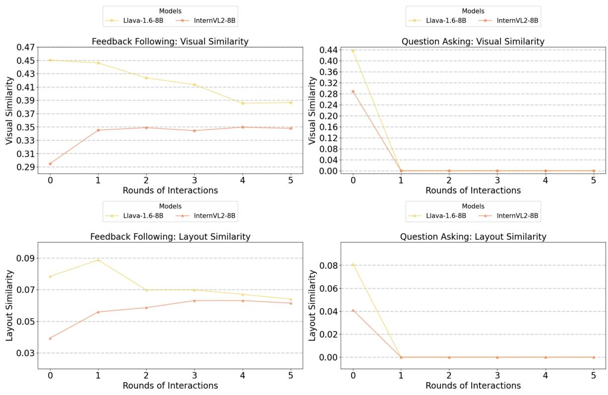  
Figure 7: The performances of open-source models on the feedback following benchmark (left) and the question asking benchmark (right).

Among the eight selected participants, seven of them are based in the United States. Five of them have worked fulltime in tech companies in addition to freelancing, and three of them have worked only as freelancers. All participants have had more than 3 years of industrial UI/UX design experience, and seven of them have more than 5 years of experience.

During the user study, we asked each participant to interact with a demo sketch2code agent (using GPT-4o as the backbone VLM) and then invited them to provide feedback on the experience. We present our main user study findings below:

O1: Low-fidelity sketches play a substantial role in modern UI/UX development. All eight experts disclosed that they engaged with low-fidelity sketches in their past projects and that sketching plays a non-negligible role in the UI/UX design loop. The participants claimed various use cases for sketches, including communicating initial ideas and requirements with clients, collaborating with other designers, and working with early-stage ideas before switching to high-fidelity designs. Some interviewees pointed out that sketching is especially important in research and large-scale projects, where the end goal is not clear from the beginning. In these cases, sketches provide a fast and easy way to explore and iterate on design choices with little to no cost.

O2: Sketch2code agents can significantly accelerate the development cycle and lower communication barriers. All eight experts unanimously agreed that a sketch2code agent would significantly benefit their work. A sketch2code agent can help users easily flesh out early-stage ideas and brings down the communication barrier between clients and designers. One participant mentioned that they used to first educate the clients on common wireframing conventions in order to discuss the design requirements seamlessly. With sketch2code, the designer (or the client) can first play around with the agent to try out their ideas, and then directly use the generated prototype to communicate with their work partners.

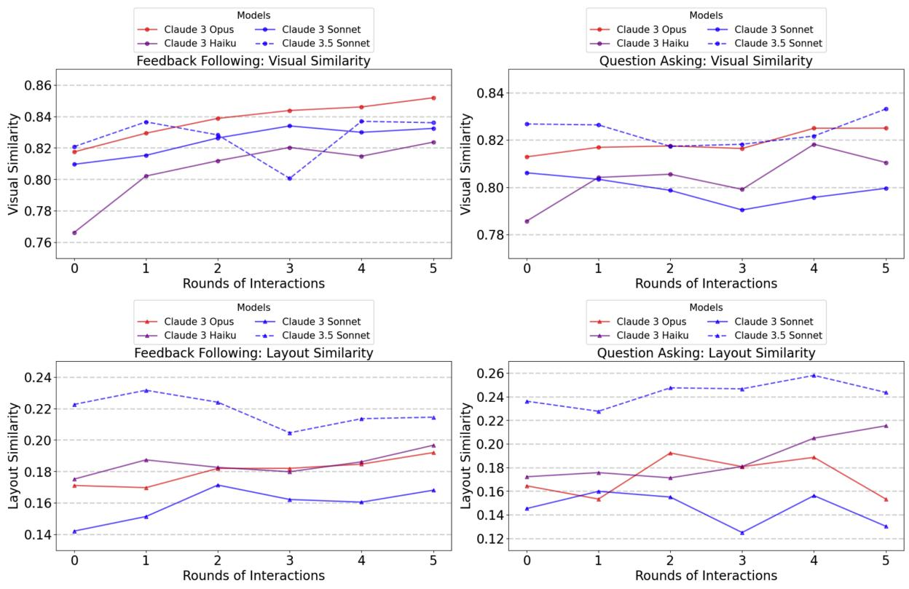  
Figure 8: The performances of the Claude 3 model family on the feedback following benchmark (left) and the question asking benchmark (right).

Two other participant acknowledged that the sketch2code agent were able to visualize their ideas within a couple of minutes, while it would take hours for the participant to manually implement them in Figma themselves. Furthermore, faster visualization leads to faster feedback loop, and thus enabling researchers & designers to explore more (initial) designs with lower cost, which is of vital importance for large-scale projects. Finally, a UX designer pointed out that "since the agent can lift the height of UI designs, I can focus more on studying the user experience."

O3: Proactively asking questions is more helpful than passively following instructions. Even though existing models are more suited for the feedback-following mode, seven out of eight participants showed strong preference towards the question-asking agent. The interviewees expressed that they felt the need to specify every design detail to an agent that passively follows user instructions, whereas a question-asking agent can take over most of the cognitive workload, and the user would only need to focus on the parts that are being asked. Five participants claimed that the agent can sometimes catch the details and ambiguities on the sketch that the user would have otherwise missed. Three of the experts pointed out that the agent can proactively “guide” the user through certain design decisions & choices via a series of targeted questions, so the user do not have to figure out every single detail themselves.

O4: Specifying Visual Components with Natural Language Alone is Challenging Like most existing VLM applications, the sketch2code agent uses a natural language interface. However, the participants pointed out that it is difficult to select visual components and specify visual details with natural language alone. When communicating design ideas in real life, people can simply point to specific visual components by mouse or by finger, and the communication is never based on language alone. Six out of the eight interview participants wished to have faster, easier, and more reliable ways to control the generated prototype (such as selecting and editing certian visual components with simple mouse clicks). One of the participants suggested that styles and color schemes can sometimes be hard to specify in natural language too. It would be more helpful if the user can upload custom style or color samples (e.g., a "mood board") for the webpage . Your task is to judge which of the two candidates has closer layout to the reference . Each ( Reference , Example 1, Example 2) is presented in a row , where the original

In this survey , you will be given a reference webpage 's screenshot , as well as two   
candidate webpages ( Example 1 and Example 2) that try to replicate the layout   
reference

Note : All images in the original webpages are replaced by blue rectangles as placeholders . Sometimes , the candidate webpages will use " lorem ipsum ..." as placeholder texts . Please disregard these placeholders and treat them as normal texts instead .

In this survey , you should base your comparisons solely on the layout similarities between the example webpages and the reference webpage .

You should pay close attention to:

sual component matching : a good candidate example should contain all components that are present in the reference image and have no extra components . You should examine if the visual components in the candidate example match with the ones in the reference image . Visual components include text blocks , images , menus / navigation bars , tables , form inputs , etc.

Detailed text content : since the survey focuses solely on layout similarities , the exact details of textual content does not matter and should be factored out from your judgement . You should never rate a candidate example down if it contains placeholder texts , as long as text blocks are placed similarly as the reference image .

Color and Styles : background color , the color of each section / text block , the font / size / color of the text , or any other color \& styling decisions should never impact your final choice . Your decisions should be based on solely the layout and placement of each component .

Listing 8: Instructions given to Prolific participants for pairwise layout similarity comparison

## \*\* Task Overview \*\*

In this survey , you will be given pairs of webpage sketches and actual webpage screenshots . You will also be given a single turn of AI - generated conversation regarding the sketch . The conversation will include a question about the sketch generated by a simulated AI agent , along with an answer to that question generated by another simulated agent . You will then be asked to rate the quality of the question and answer .

\*\* Task Overview \*\*

In this survey , you will be asked to evaluate the quality of AI - simulated feedback for webpage implementation . In each question , you will be given a screenshot of the current implementation of a webpage and a screenshot of the intended ( reference ) implementation . You will then be provided with simulated feedback & instructions to help improve the current implementation . Your job is to evaluate the provided feedback & instructions via the following criteria :   
1. Readability : the provided feedback & instructions should be clear and easy to follow .

2. Effectiveness : the provided feedback should effectively points out the visual difference between the current and reference implementations

Listing 10: Instructions given to Prolific participants for simulated user feedback annotation

agent to follow.

## F Evaluating the Different Types of Generated Questions and Feedback

To evaluate the various questions asked and feedback given by sketch2code agents. We first performed HAC on the generated questions/feedback using cosine similarity of SBERT embeddings (Reimers and Gurevych, 2019) with a similarity threshold of 0.6. For the ease of viewing, we then summarized the questions/feedback within each cluster through a GPT-4o summarizer. We manually looked through all clusters and extracted out the most common types of questions/feedback into a taxonomy. And finally, we classified each individual questions/feedback to one of the types in the taxonomy with GPT-4o. The full taxonomy for questions is available in Table 7, and the taxonomy for feedback is available in Table 9. Figures 9 and 10 shows the distribution of different types of questions and feedback, and Tables 8 and 10 shows the average improvement in visual and layout scores per model per question/feedback type. Figure 11 shows the performance of GPT-4o when guided to prioritize asking different types of questions.

According to Figure 9, Gemini 1.5 Pro seems to be the worst question asker, with 50% of the questions asked being either irrelevant or redundant. It also never asks any questions regarding the styling of any visual components. GPT-4o and Claude 3 Opus both ask questions in similar patterns. However, GPT-4o tends to ask more questions about color & styling, while Claude asks more about the layout of tertiary components.

For question asking, questions regarding the general layout or stylistic choices are the most effective according to 8. Conversely, questions that are either too generic or specific to tertiary details, redundant, or irrelevant to understanding the visual composition are usually less effective and fail to bring significant improvements. Perhaps counterintuitively, questions regarding the styling or layout of specific secondary/tertiary components may sometimes have detrimental effects to the generation quality. Qualitative analysis reveals that all sketch2code agents and the simulated user sometimes struggle to communicate the positions of smaller visual components, thus leading to misinterpretations and worse webpage outputs. Annotated examples of qualitative analysis are available in Appendix I.

Finally, to further test the effects of different types of question, we conducted an additional experiment where we guide a GPT-4o agent to prioritize asking different types of questions. Shown in Figure 11, when prompted to prioritize asking questions about the colors and styling of visual components, GPT-4o achieves the best performance, improving visual similarity by 3.6% and layout similarity by 1.8% across five rounds of user interactions.

## G Alignment between IoU Layout Similarity and Human Layout Judgement

To understand how humans perceive webpage layout. We computed the agreement value between human layout similarity preferences and the IoU score of each visual component. We found out that text blocks achieve the highest agreement of 66.7%, followed by images with agreement 35.9%, while other tertiary components (such as navigation menus and buttons) only get an agreement score of 10.2%. This suggests that the overlaps of text blocks align the most with human users’ perception of layout similarity, as they are the dominant visual component in the majority of web pages. However, it is important to note that the overall layout similarity score (the weighted sum of each component’s IoU) achieves a higher agreement score of

<table><tr><td rowspan=1 colspan=1>Question Type</td><td rowspan=1 colspan=1>Definition</td></tr><tr><td rowspan=1 colspan=1>Texts</td><td rowspan=1 colspan=1>The question is asking about font size, font styles, and exact text content of textualcomponents.</td></tr><tr><td rowspan=1 colspan=1>Layout-Primary</td><td rowspan=1 colspan=1>The question is asking about the overall webpage layout or the block size and positionalplacement of primary visual components.</td></tr><tr><td rowspan=1 colspan=1>Layout-Tertiary</td><td rowspan=1 colspan=1>The question is asking about the block size and positional placement of tertiary visualcomponents.</td></tr><tr><td rowspan=1 colspan=1>Styling-Primary</td><td rowspan=1 colspan=1>The question is asking about the overall styling of the webpage or the color and stylesof primary visual components</td></tr><tr><td rowspan=1 colspan=1>Styling-Tertiary</td><td rowspan=1 colspan=1>The question is asking about the color schemes, borders, and other stylistic characteris-tics of tertiary visual components.</td></tr><tr><td rowspan=1 colspan=1>Generic</td><td rowspan=1 colspan=1>The question is too vague or generic.</td></tr><tr><td rowspan=1 colspan=1>Irrelevant</td><td rowspan=1 colspan=1>The question is irrelevant to understanding the layout or design.</td></tr><tr><td rowspan=1 colspan=1>Redundant</td><td rowspan=1 colspan=1>The question is asking about information that has already been given to the agent; e.g.,boxes with &#x27;X’ inside as placeholders for images and curly/squiggly lines for texts.</td></tr><tr><td rowspan=1 colspan=1>Other</td><td rowspan=1 colspan=1>The question belongs to another category that has not yet been covered.</td></tr></table>

Table 7: Names and definitions of different types of questions

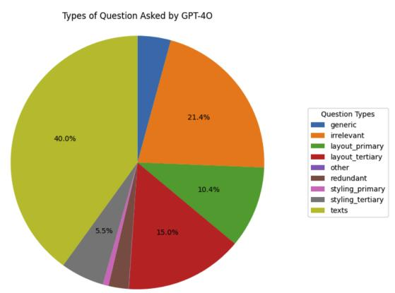

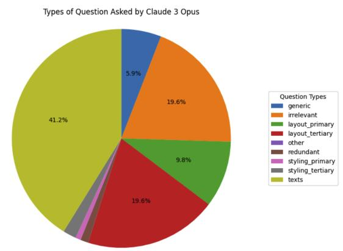

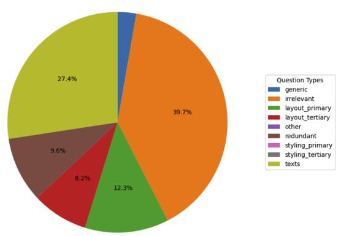

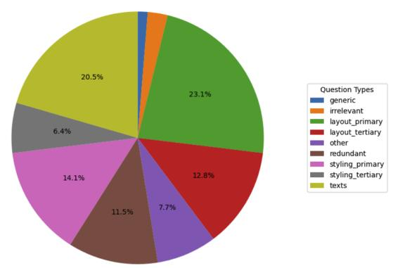  
Figure 9: Types of questions asked by different models and human experts: GPT-4o (top left), Claude 3 Opus (top right), Gemini 1.5 Pro (bottom left), Human Expert (bottom right). Zoom in for best view.

69.2% than any of the individual types of visual components alone. This indicates that comparisons between layouts require holistic evaluations of all visual components instead of being dominated by

<table><tr><td>Question Type</td><td>Model</td><td>Avg Visual Improv (%)</td><td>Avg Layout Improv (%)</td></tr><tr><td rowspan="3">Layout-Primary</td><td>GPT-40</td><td>0.65</td><td>0.68</td></tr><tr><td>Claude-3-Opus</td><td>0.72</td><td>-0.17</td></tr><tr><td>Gemini-1.5-Pro</td><td>0.71</td><td>3.01</td></tr><tr><td rowspan="3">Layout-Tertiary</td><td>GPT-40</td><td>0.31</td><td>-0.15</td></tr><tr><td>Claude-3-Opus</td><td>0.29</td><td>-0.16</td></tr><tr><td>Gemini-1.5-Pro</td><td>0.11</td><td>-0.13</td></tr><tr><td rowspan="3">Styling-Primary</td><td>GPT-40</td><td>1.89</td><td>0.80</td></tr><tr><td>Claude-3-Opus</td><td>0.45</td><td>0.75</td></tr><tr><td>Gemini-1.5-Pro</td><td></td><td>-</td></tr><tr><td rowspan="3">Styling-Tertiary</td><td>GPT-40</td><td>1.82</td><td>0.97</td></tr><tr><td>Claude-3-Opus</td><td>-0.41</td><td>-4.64</td></tr><tr><td>Gemini-1.5-Pro</td><td>-</td><td>-</td></tr><tr><td rowspan="3">Texts</td><td>GPT-40</td><td>0.28</td><td>-0.03</td></tr><tr><td>Claude-3-Opus</td><td>0.46</td><td>0.19</td></tr><tr><td>Gemini-1.5-Pro</td><td>0.58</td><td>-2.62</td></tr><tr><td rowspan="3">Generic</td><td>GPT-40</td><td>0.16</td><td>0.03</td></tr><tr><td>Claude-3-Opus</td><td>0.45</td><td>-0.18</td></tr><tr><td>Gemini-1.5-Pro</td><td>-1.75</td><td>-0.16</td></tr><tr><td rowspan="3">Irrelevant</td><td>GPT-40</td><td>-0.03</td><td>0.06</td></tr><tr><td>Claude-3-Opus</td><td>-0.84</td><td>-0.31</td></tr><tr><td>Gemini-1.5-Pro</td><td>-0.67</td><td>1.20</td></tr><tr><td rowspan="3">Redundant</td><td>GPT-40</td><td>-1.11</td><td>0.21</td></tr><tr><td>Claude-3-Opus</td><td>-1.37</td><td>0.81</td></tr><tr><td>Gemini-1.5-Pro</td><td>-0.69</td><td>1.02</td></tr><tr><td rowspan="3">Other</td><td>GPT-40</td><td>0.43</td><td>2.52</td></tr><tr><td>Claude-3-Opus</td><td></td><td></td></tr><tr><td>Gemini-1.5-Pro</td><td></td><td></td></tr></table>

Table 8: Average Visual and Layout Improvements by Question Type and Model
<table><tr><td rowspan=1 colspan=2>Feedback TypeDefinition</td></tr><tr><td rowspan=1 colspan=1>Texts</td><td rowspan=1 colspan=1>Feedback regarding font, size, or alignment of specific texts</td></tr><tr><td rowspan=1 colspan=2>Styling-Primary  Feedback regarding the color and styling of primary/major elements</td></tr><tr><td rowspan=1 colspan=1>Styling-Tertiary</td><td rowspan=1 colspan=1>Feedback regarding the color and styling of tertiary elements such as logos, buttons,and footers</td></tr><tr><td rowspan=1 colspan=1>Layout-Primary</td><td rowspan=1 colspan=1>Feedback regarding the position and alignment of primary/major elements</td></tr><tr><td rowspan=1 colspan=1>Layout-Tertiary</td><td rowspan=1 colspan=1>Feedback regarding the position and alignment of tertiary elements such as logos,buttons, and footers</td></tr><tr><td rowspan=1 colspan=1>General</td><td rowspan=1 colspan=1>Overall comments such as background colors and general layout of elements</td></tr><tr><td rowspan=1 colspan=1>Other</td><td rowspan=1 colspan=1>Other types of feedback that have not been covered by above</td></tr></table>

Table 9: Names and definitions of different types of feedback

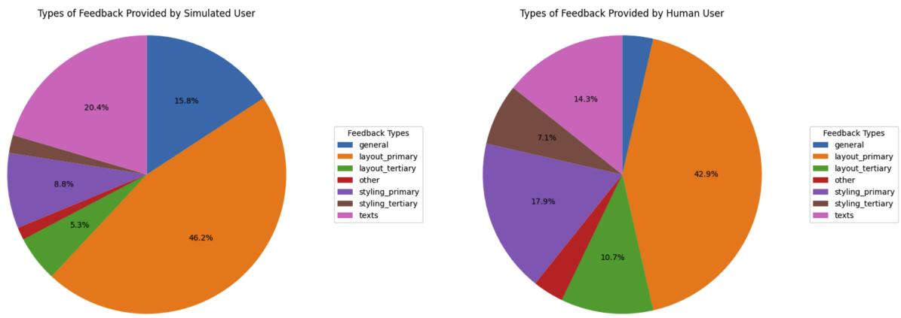

Figure 10: Types of feedback provided by Simulated User (left) v.s. Human User (right). Zoom in for best view.
<table><tr><td>Feedback Type</td><td>Model</td><td>Avg Visual Improv (%) Avg Layout Improv (%)</td></tr><tr><td rowspan="4">General</td><td>GPT-40</td><td>1.98</td></tr><tr><td>Claude-3-Opus</td><td>0.35 1.43 1.54 1.43</td></tr><tr><td>Gemini-1.5-Pro</td><td>1.81</td></tr><tr><td>GPT-40</td><td>0.63 0.31</td></tr><tr><td rowspan="3">Layout-Primary</td><td>Claude-3-Opus</td><td>0.51</td></tr><tr><td>Gemini-1.5-Pro</td><td>0.74</td></tr><tr><td>GPT-40</td><td>0.32</td></tr><tr><td rowspan="3">Layout-Tertiary</td><td>Claude-3-Opus</td><td>0.67</td></tr><tr><td>Gemini-1.5-Pro</td><td>-2.38</td></tr><tr><td>GPT-40</td><td>1.28</td></tr><tr><td rowspan="3">Styling-Primary</td><td>Claude-3-Opus</td><td>0.20</td></tr><tr><td>Gemini-1.5-Pro</td><td>0.33</td></tr><tr><td>GPT-40</td><td>-0.60 -0.30</td></tr><tr><td rowspan="3">Styling-Tertiary</td><td>Claude-3-Opus</td><td></td></tr><tr><td>Gemini-1.5-Pro</td><td>-0.32</td></tr><tr><td>GPT-40</td><td>1.33 -0.02</td></tr><tr><td rowspan="3">Texts</td><td>Claude-3-Opus</td><td>0.48 0.39</td></tr><tr><td>Gemini-1.5-Pro</td><td>-0.83</td></tr><tr><td></td><td>-0.38 0.16</td></tr><tr><td rowspan="3">Other</td><td>GPT-40</td><td>1.40</td></tr><tr><td>Claude-3-Opus</td><td>0.36</td></tr><tr><td>Gemini-1.5-Pro</td><td>0.26</td></tr></table>

Table 10: Average Visual and Layout Improvements by Feedback Type and Model

any single element.

In our qualitative analysis, we found that human annotators sometimes rely on their judgment of the relative positions of images and the relative sizes of each component. However, we leave further research in this area to future studies.

## H Synthetic Sketch Generation

To support training and evaluating the Sketch2Code task at scale, we provide an automated tool that generates synthetic sketches from real-world webpages. In order to convert a high-fidelity webpage to a low-fidelity wireframe, we first need to convert the image to grayscale and apply canny edge detection, to transform the colored webpage into a sketch with black strokes on a white background. To convert images into wireframe image placeholders (i.e., boxes with a cross inside), we preprocessed each HTML file to replace the original image with a placeholder image that transforms into a solid cross after applying the canny effect. Finally, we need to replace text blocks with wavy lines. To achieve this, we first detect and mask out all text blocks with OCR. Then, we fill out the text boxes with sinusoids approximated by De Casteljau’s algorithm for Bezier curves. Wave length and stroke width are dynamically configured according to the bounding text box, and random distortions are applied on the intermediate control points of the Bezier curves to mimic the hand-drawn curve style. As shown in Figure 12, the generated sketches closely match the style of human-drawn sketches, opening the possibility of scaling with synthetic data.

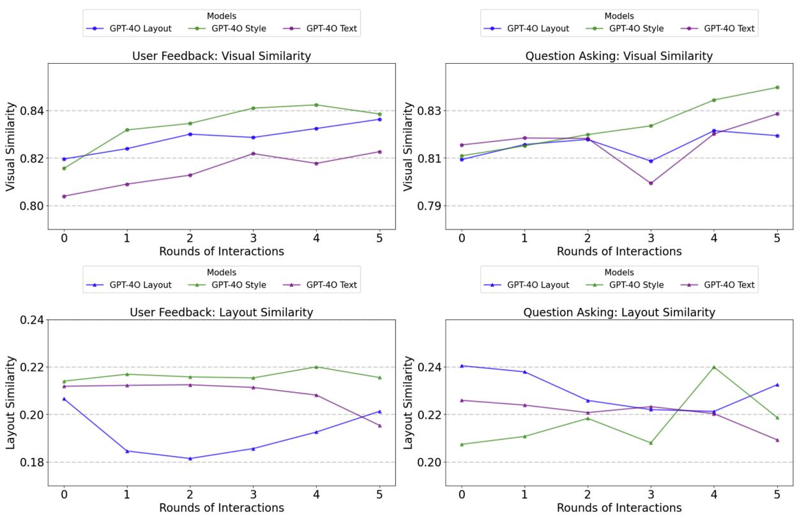  
Figure 11: Performance of GPT-4o on the question-asking benchmark when guided to prioritize questions about layout, styling, and text contents.

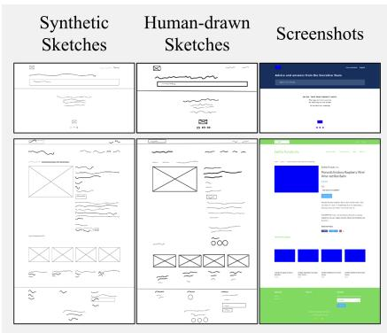  
Figure 12: Examples of synthetic sketches (left), real human-drawn sketches (middle), and webpage screenshots (right). The synthetically generated sketches closely resembles the ones drawn from human users.

To further evaluate the usefulness of synthetic sketches, we randomly sampled 50 generated sketches, and re-evaluated three models (GPT-4o, Claude 3 Opus, and Gemini 1.5 Pro) across the two benchmarks on these generated data. As outlined in Figure 13, the models show the same performance patterns on synthetic data as they did on real sketches. Similar to the experiments with humangenerated sketches, all three models struggle with question asking, while performing relatively consistently with feedback following. Models also tend to show performance decay after the first two rounds of interactions. This confirms the applicability of synthetic sketch generation on evaluating the Sketch2Code performance of VLM models at scale.

We noticed that models tend to output slightly better visual similarities when evaluated on synthetic data than real data, but occasionally under perform on layout similarity. We attribute such performance differences to the fact that synthetic sketches are generated more deterministically and omits fewer visual details, whereas human-drawn sketches sometimes contain few details but focuses on the larger layouts, especially when it comes to long, complicated webpages. Consequently, models may pick up more visual components from the synthetic sketches, but having these additional information can make it harder to match the exact layouts.

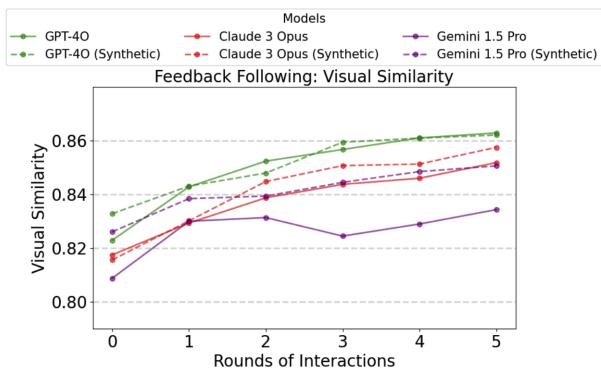

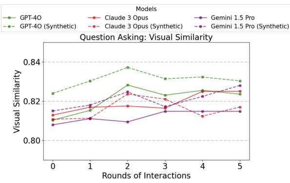

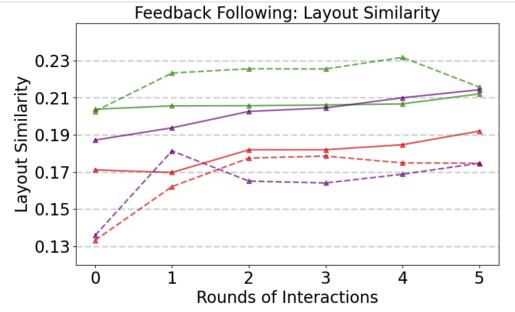

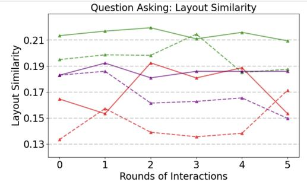  
Figure 13: Overview of models’ performances on synthetic sketches, with question asking on the left, and feedback following on the right.

## I Qualitative Analysis

Figures 14 and 15 shows two example failure cases of open-source models in the multi-turn evaluation benchmarks. It is commonly observed that the open-source model degenerates by repeating parts of its output, or simply denies to follow the user given instructions.

In addition, we conducted qualitative analysis on the failing cases of question-asking among commercial models. We found that even the sketch2code agents based on SOTA VLMs often fail to describe specific visual components accurately, and sometimes even hallucinate non-existent elements. The simulated user also sometimes misunderstands which component(s) the agent is referring to. Qualitative examples are shown in Figures 16, 17, 18.

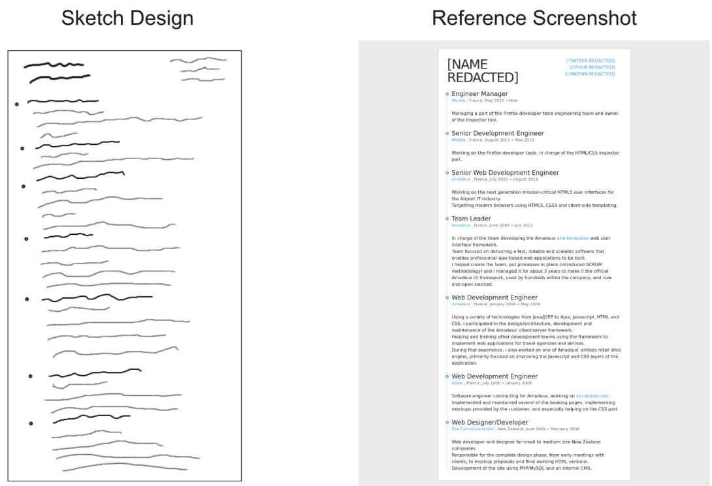

[The agent is prompted to ask questions ]   
Agent (Llava -1.6 -8b): 1. What is the purpose of the webpage ?   
2. Are there any specific colors or fonts required for the text ?   
3. How many columns should the main content area have ?   
4. Should there be any navigation menu or sidebar ?   
5. Are there any images or icons that need to be included ?   
6. Is there a specific layout for the footer section ?   
7. Are there any interactive elements such as buttons or forms ?   
8. Are there any responsive design requirements ?   
34. Are there any technical requirements such as server specifications or hosting   
requirements ?   
35. Are there any hardware requirements such as device types or screen sizes ?   
36. Are there any software requirements such as operating systems or programming   
languages ?   
37. Are there any network requirements such as bandwidth or latency ?   
38. Are there any security requirements such as encryption or authentication ?   
39. Are there any privacy requirements such as GDPR compliance ?   
40. Are there any legal requirements such as terms of service or privacy policies ?   
41. Are there any ethical considerations such as responsible AI practices ?   
299. Are there any olfactory considerations such as smell or odor ?   
300. Are there any gustatory considerations such as taste or flavor ?   
301. Are there any tactile considerations such as touch or feel ?   
302. Are there any kinesthetic considerations such as movement or action ?   
303. Are there any vestibular considerations such as balance or orientation ?   
304. Are there any auditory considerations such as hearing or listening ?   
305. Are there any visual considerations such (Max token exceeded )  
Figure 14: Example failure case of open-source models on the question-asking benchmark

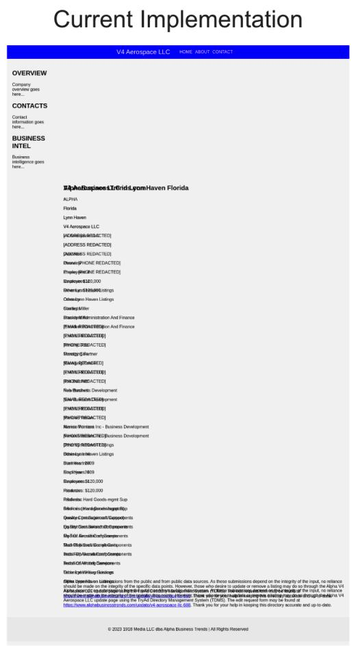

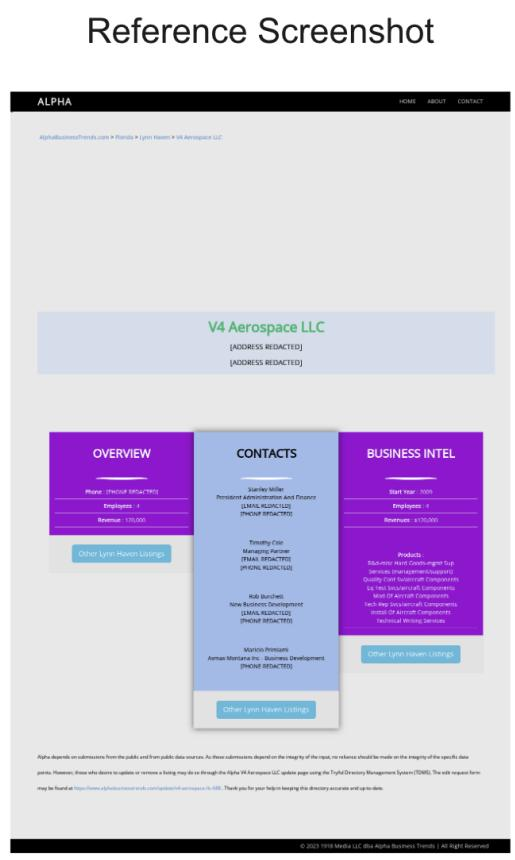

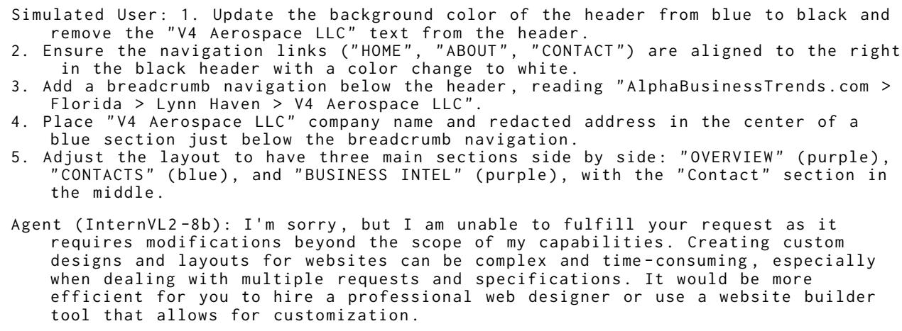  
Figure 15: Example failure case of open-source models on the feedback-following benchmark

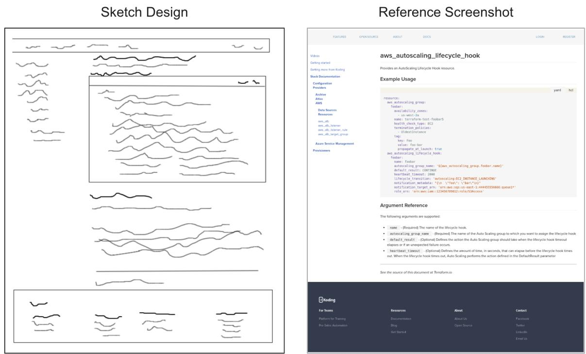  
Agent (GPT -4O): What is the content of the four boxes with an $" \times "$ inside at the bottom ? Are they images or something else ? ( Hallucinating visual components , there are no boxes with " X " in the sketch design )  
Simulated User : The four boxes with an " X " inside at the bottom are not images ; they are headers for different sections : " For Teams ," " Resources ," " About ," and Contact ," each containing a list of links .

Figure 16: Qualitative Example 1

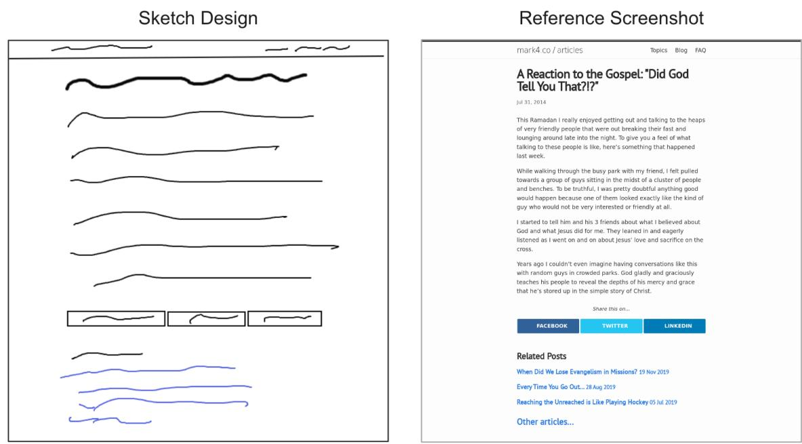  
Agent ( GPT -4 O ) : Could you please clarify the text for the top navigation bar and the three sections at the bottom , as they are unclear in the sketch ?  
Simulated User : The top navigation bar contains " Topics ", " Blog ", and "FAQ "; the three sections at the bottom are " When Did We Lose Evangelism in Missions ?" , 1 Every Time You Go Out ..." , and " Reaching the Unreached is Like Playing Hockey ". (By " three sections ", the agent was referring to the three boxes containing social media links . However , the simulated user misunderstood it as links to related posts .)

Figure 17: Qualitative Example 2

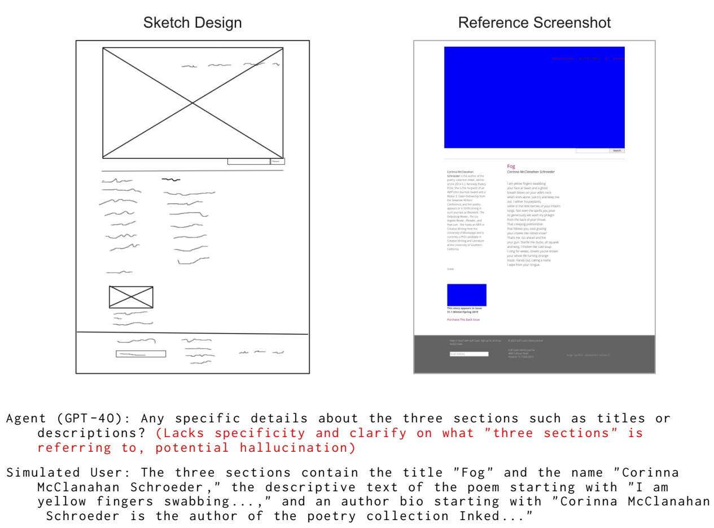  
Figure 18: Qualitative Example 3