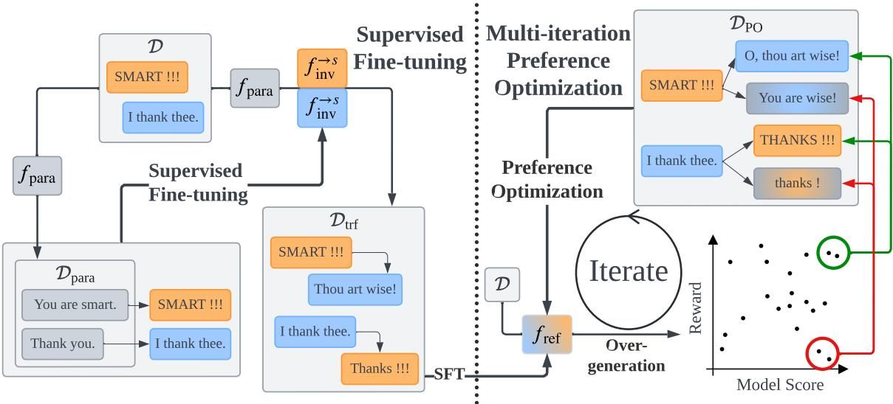
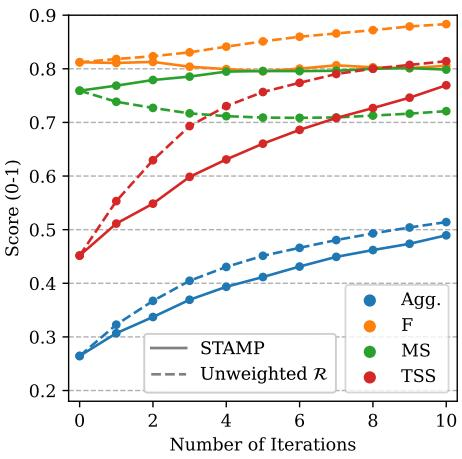

# Style Transfer with Multi-iteration Preference Optimization

Shuai Liu and Jonathan May Information Sciences Institute University of Southern California {liushuai, jonmay}@isi.edu

## Abstract

Numerous recent techniques for text style transfer characterize their approaches as variants of reinforcement learning and preference optimization. In this work, we consider the relationship between these approaches and a class of optimization approaches developed primarily for (non-neural) statistical machine translation, formerly known as ‘tuning’. Inspired by these techniques from the past, we improve upon established preference optimization approaches, incorporating multiple iterations of exploration and optimization, and choosing contrastive examples by following a ‘hope’ vs ‘fear’ sampling strategy. Cognizant of the difference between machine translation and style transfer, however, we further tailor our framework with a new pseudo-parallel data generation method and a dynamic weighted reward aggregation method to tackle the lack of parallel data and the need for a multi-objective reward. We evaluate our model on two commonly used text style transfer datasets. Through automatic and human evaluation results we show the effectiveness and the superiority of our model compared to state-of-the-art baselines.

## 1 Introduction

Text style transfer aims to rewrite a given text to match a specific target style while preserving the original meaning. This task has drawn significant attention recently due to its broad range of applications, such as text simplification (Laban et al., 2021), formality transfer (Rao and Tetreault, 2018; Liu et al., 2022), text detoxification (Dale et al., 2021; Hallinan et al., 2023b), authorship transfer (Patel et al., 2023; Liu et al., 2024), and authorship anonymization (Shetty et al., 2018; Bo et al., 2021). Recent approaches have focused on pseudoparallel data generation (Krishna et al., 2020; Riley et al., 2021) and policy optimization (Gong et al., 2019; Liu et al., 2021b). STEER (Hallinan et al.,

2023a) and ASTRAPOP (Liu et al., 2024) combine the two and achieve state-of-the-art performance on text style transfer and authorship style transfer, respectively.

In this work, we seek to advance the frontier of text style transfer, drawing inspiration from the optimization techniques developed in the era of statistical phrasal machine translation, in which the lack of correlation between the log-linear model objective and the desired evaluation metric, typically BLEU (Papineni et al., 2002), was observed (Och, 2003). Approaches to align1 the two objectives came to be known as tuning,2 beginning with Och (2003), and evolving into online variants (Chiang et al., 2008), rank-based approaches (Hopkins and May, 2011), batch-based approaches (Cherry and Foster, 2012), and several others. Tuning methods follow a generate-and-optimize pattern: a model is used to generate multiple candidate hypotheses per input, and then parameters are adjusted such that the argmax according to the model score also maximizes the evaluation metric. In this regard, tuning methods resemble approaches taken in the application of policy optimization algorithms, such as PPO (Schulman et al., 2017), to generative language modeling (Ouyang et al., 2022). More recent algorithms, such as DPO (Rafailov et al., 2023) and CPO (Xu et al., 2024a), which replace reinforcement learning (RL) in PPO with preference optimization (PO), are reminiscent of the pairwise ranking optimization approach to tuning (Hopkins and May, 2011). Given this close relationship between these approaches, we can consider whether other techniques developed to improve MT tuning could be applied to optimization for style transfer.

In this work, we propose Style TrAnsfer with Multi-iteration Preference optimization (STAMP), a two-phase PO training framework, in which we first use supervised fine-tuning to build a reference model from pseudo-parallel data and then train the reference model using PO. STAMP is similar to STEER and ASTRAPOP at a high level but is enhanced with two techniques borrowed from MT tuning and two modifications that further adapt it for text style transfer. First, we include multiple iterations of preference pair generation followed by model optimization (Och, 2003), which has already been shown to be effective on other Seq2Seq tasks such as mathematical and scientific reasoning (Chen et al., 2024; Pang et al., 2024; Song et al., 2024b; Yuan et al., 2024). Second, following the hope-and-fear sampling in Chiang (2012), for PO, we over-generate outputs using the reference model and construct preference pairs using samples with high model scores and extreme (high or low) task objective scores, in order to avoid dangerous generation and encourage reachable good generation. To improve the quality of the reference model and the balance across the multiple training objectives, we additionally design a new two-step end-to-end pseudo-parallel data generation method and a dynamic reward aggregation method.

  
Figure 1: An overview of STAMP, in which we first train a unified style transfer model using supervised fine-tuning on pseudo-parallel data generated from non-parallel data, and then further train the model using multi-iteration preference optimization on preference pairs constructed with hope-and-fear sampling.

We evaluate our model on two popular text style transfer datasets, Grammarly’s Yahoo Answers Formality Corpus (GYAFC) (Rao and Tetreault, 2018) and the Corpus of Diverse Styles (CDS) (Krishna et al., 2020). Extensive experiments show that our model outperforms all state-of-the-art baselines on both datasets in both in-domain and out-of-domain evaluation, and demonstrates a higher training efficiency than the strongest baseline.

Our main contributions are:

• We propose a multi-iteration contrastive preference optimization training framework with hope-and-fear preference pair construction for text style transfer.

• We design a new pseudo-parallel data generation strategy and a dynamic weighted rewarded aggregation method to enhance the training framework for text style transfer.

• With the enhancements, our training framework produces style transfer models that achieve state-of-the-art performance on two popular text style transfer datasets.3

## 2 Methodology

In this section, we formalize the text style transfer task and introduce our training framework, STAMP.

## 2.1 Task Definition

Given a source text x and a desired target style $s ,$ the goal of text style transfer is to generate a fluent rewrite of x, denoted as $\mathbf { x } ^ {  s }$ , that has the same meaning as x but is in style s. In this work, we focus on high-resource text style transfer in which we have access to a reasonable number of $\mathrm { \ t e x t s { } ^ { 4 } }$ for each target style. Specifically, we have a set of texts with style labels, denoted as $\mathcal { D } = \{ ( \mathbf { x } _ { 1 } , s _ { 1 } ) , \cdot \cdot \cdot , ( \mathbf { x } _ { n } , s _ { n } ) \}$ , where $\mathbf { x } _ { i }$ and $s _ { i }$ refer to the $i ^ { \mathrm { t h } }$ text and its style, respectively. For convenience, we adopt notations from Hallinan et al. (2023a) and denote the fluency of a text $\mathbf { x } _ { i }$ as $\mathrm { F } ( \mathbf { x } _ { i } )$ the meaning similarity between two texts $\mathbf { x } _ { i }$ and $\mathbf { x } _ { j }$ as $\mathbf { M S } ( \mathbf { x } _ { i } , \mathbf { x } _ { j } )$ , and the target style strength of a text $\mathbf { x } _ { i }$ w.r.t. a target style s as $\mathrm { T S S } ( \mathbf { x } _ { i } , s )$ . Thus, given , we aim to build a text style transfer system that maximizes three independent objectives: $\mathrm { F } ( \mathbf { x } ^ {  s } )$ , MS(x, x→s), and $\mathrm { T S S } ( \mathbf { x } ^ {  s } , s )$ 5

## 2.2 Framework Overview

STAMP is a preference optimization-based training framework that contains two main stages, a supervised fine-tuning (SFT) stage and a multi-iteration preference optimization (PO) stage. In the SFT stage, we first generate a dataset ${ \mathcal { D } } _ { \mathrm { t r f } }$ of end-to-end pseudo-parallel style transfer pairs from the (nonparallel) dataset  and then train a style transfer model $f _ { \mathrm { S F T } }$ on $\mathcal { D } _ { \mathrm { t r f } }$ using supervised fine-tuning. In the PO stage, we train a model initialized to fSFT using multi-iteration $\mathrm { P O } ^ { 6 }$ to directly maximize the three objectives, TSS, MS, and $\mathrm { F , }$ and obtain our final transfer model $f _ { \mathrm { P O } }$

## 2.3 Supervised Fine-tuning

Due to a lack of parallel data, we adopt the technique described by Krishna et al. (2020), in which style-oriented paraphrasing is used to generate pseudo-parallel transfer data for each target style. Specifically, we paraphrase the texts in $\mathcal { D }$ using a general paraphraser $f _ { \mathrm { p a r a } }$ similar to Krishna et al. (2020) and Hallinan et al. (2023a). To ensure meaning similarity preservation of the paraphrases, we generate $k _ { \mathrm { p a r a } }$ paraphrases for each text $\mathbf { x } _ { i } \in \mathcal { D }$ and select the one with the highest meaning similarity to the original text, denoting it $\mathbf { p } _ { i }$ . We then obtain a dataset of paraphrases ${ \mathcal { D } } _ { \mathrm { p a r a } } = \{ \mathbf { p } _ { 1 } , \cdots , \mathbf { p } _ { n } \}$ . For each target style s, we train a Seq2Seq model $f _ { \mathrm { i n v } } ^ {  s 7 }$ on $\{ ( \mathbf { p } _ { i }  \mathbf { x } _ { i } ) \mid 0 \leq i \leq n$ and $s _ { i } = s \}$ to maximize

$$
p ( \mathbf { x } \mid \mathbf { p } ) = \prod _ { i = 1 } ^ { | \mathbf { x } | } p ( \mathbf { x } [ i ] \mid \mathbf { p } , \mathbf { x } [ < i ] )\tag{1}
$$

where $\mathbf { x } [ i ]$ and $\mathbf { x } [ < i ]$ represent the $i ^ { \mathrm { t h } }$ token in x and tokens preceding the $i ^ { \mathrm { { t h } } }$ token in x, respectively.

Following Krishna et al. (2020), we can transfer the style of a text x to a style s through

$$
\begin{array} { r } { \mathbf { x } ^ {  s } = f _ { \mathrm { i n v } } ^ {  s } ( f _ { \mathrm { p a r a } } ( \mathbf { x } ) ) } \end{array}\tag{2}
$$

where $\mathbf { x } ^ {  s }$ is the transferred text. However, the two-step generation breaks the gradient connection between x and x→s which is needed in the PO stage to maximize the meaning similarity between x and $\mathbf { x } ^ {  s }$ . Therefore, we need an end-to-end pseudoparallel dataset $\mathcal { D } _ { \mathrm { t r f } }$ to train a model that directly transfers a source text to each target style with no intermediate step.

To obtain $\mathcal { D } _ { \mathrm { t r f } } .$ we transfer the texts in $\mathcal { D }$ using $f _ { \mathrm { p a r a } }$ and $f _ { \mathrm { i n v } } ^ {  s }$ for each target style s. Specifically, for each target style s, we transfer the texts in other styles in using Eq. 2 and obtain a dataset of style transfer pairs ${ \mathcal { D } } _ { \mathrm { t r f } } ^ {  s } = \{ ( \mathbf { x } _ { i }  \mathbf { t } _ { i } , s ) ~ | ~ ( \mathbf { x } _ { i } , s _ { i } ) \in ~$ and $s _ { i } \neq s \}$ , where $\mathbf { t } _ { i } = f _ { \mathrm { i n v } } ^ {  s } ( f _ { \mathrm { p a r a } } ( \mathbf { x } _ { i } ) )$ is a transfer of $x _ { i }$ in style s. To obtain high-quality transferred texts, we generate $k _ { \mathrm { s f t } }$ transfers for each source text and select the one with the highest $\mathrm { F } \cdot \mathbf { M } \mathbf { S } ^ { \tau _ { \mathrm { m s } } }$ TSS, where $\tau _ { \mathrm { m s } } > 1$ is a temperature hyperparameter incorporated into the MS term to emphasize meaning similarity. We then construct ${ \mathcal { D } } _ { \operatorname { t r f } }$ by combining $\mathcal { D } _ { \mathrm { t r f } } ^ {  s }$ for all target styles and train an end-to-end style transfer model $f _ { \mathrm { S F T } }$ on the combined data $\mathcal { D } _ { \mathrm { t r f } }$ to maximize

$$
p ( \mathbf { t } \mid \mathbf { x } ) = \prod _ { i = 1 } ^ { | \mathbf { t } | } p ( \mathbf { t } [ i ] \mid \mathbf { x } , \mathbf { t } [ < i ] , s )\tag{3}
$$

Note that unlike Eq. 2, the probability in Eq. 3 is also conditioned on s because we adopt the unified model setting in (Hallinan et al., 2023a). That is, we have a single transfer model for all target styles and control the target style with control codes.

## 2.4 Multi-iteration Preference Optimization

We further train the SFT model fSFT from the previous stage with multi-iteration PO to directly optimize the model on the style transfer objectives: $\mathrm { F , }$ MS, and TSS. To apply PO (Rafailov et al., 2023; Xu et al., 2024a) we first generate paired preference data from a reference model $f _ { \mathrm { r e f } }$ and then train a model on this offline preference data in a contrastive manner starting from the reference model. Inspired by Och (2003) and recent studies in iterative PO, such as Yuan et al. (2024) and Chen et al. (2024), we perform PO for multiple iterations to improve over the offline-only training, updating the reference model between iterations. Specifically, in iteration i, we construct preference dataset $\mathcal { D } _ { \mathrm { P O } } ^ { i }$ by transferring texts drawn from $\mathcal { D } _ { : }$ using reference model $f _ { \mathrm { r e f } } ^ { i }$ . We use PO (Rafailov et al., 2023; Xu et al., 2024a) to train a model initialized to $f _ { \mathrm { r e f } } ^ { i }$ to match the preferences in $\mathcal { D } _ { \mathrm { P O } } ^ { i } ;$ we call the resulting model $f _ { \mathrm { P O } } ^ { i }$ . We define $f _ { \mathrm { r e f } } ^ { 1 }$ to be fSFT and in all other cases we define $f _ { \mathrm { r e f } } ^ { i }$ to be $f _ { \mathrm { P O } } ^ { i - 1 }$ We next detail how the preference pairs in $\mathcal { D } _ { \mathrm { P O } } ^ { i }$ are constructed and the reward function used in this process.

## 2.4.1 PO Data Generation

We construct the preference dataset from using the hope-and-fear sampling strategy in Chiang (2012), which can encourage the model to generate “reachable” outputs with high reward scores and prevent the model from generating “reachable” outputs with low reward scores. While that work used BLEU (Papineni et al., 2002) as a preference metric, we instead use our style transfer reward which is detailed in § 2.4.2. Specifically, for each style $s ,$ we generate kPO rewrites of each text $\mathbf { x } _ { i }$ in $\mathcal { D } .$ , whose initial style $s _ { i } \neq s$ into style s and select the preference pair from the rewrites based on both the reward scores and the model scores of the rewrites, where is the average token-level probability w.r.t. $f _ { \mathrm { r e f } } .$ We select the rewrite with the highest $\mathcal { M } ^ { \tau _ { \mathcal { M } } } + \mathcal { R }$ as the “winning” rewrite ${ \bf t } _ { i } ^ { w }$ and the rewrite with the highest $\mathcal { M } ^ { \tau _ { \mathcal { M } } } - \mathcal { R }$ as the “losing” rewrite8 $\mathbf { t } _ { i } ^ { l } ,$ where $\tau _ { \mathcal { M } }$ is the temperature controlling the weight of model score.9 We then obtain a new dataset $\mathcal { D } _ { \mathrm { P O } } ^ {  s } = \{ ( \mathbf { x } _ { i } \  \ ( \mathbf { t } _ { i } ^ { w } , \mathbf { t } _ { i } ^ { l } ) , s ) | \ ( \mathbf { x } _ { i } , s _ { i } ) \in \mathcal { D } \}$ for each style $s .$ Combining $\mathcal { D } _ { \mathrm { P O } } ^ {  s }$ for all styles, we finally obtain the PO dataset $\mathcal { D } _ { \mathrm { P O } }$

## 2.4.2 Reward Function

To directly maximize the three objectives, F, MS, and, TSS, we use an aggregation of them as the reward function . The most straightforward aggregation is to take the product of the three as in Hallinan et al. (2023a). However, since the three objectives are independent, the probability of generating samples that have high scores in all three objectives is very low. Our preliminary experiments show that samples with high total rewards can also have low single-objective scores, which naturally results in preference pairs in which the “winning” outputs have lower single-objective scores. We refer to these as reversed single-objective scores. When the percentage of reversed single-objective scores is high, we observe a degradation in the corresponding objective after PO. To prevent the degradation in any objective, we propose to use a weighted product, which is given by

$$
\mathcal { R } = \mathrm { T S S } ^ { \alpha } \cdot \mathbf { M S } ^ { \beta } \cdot \mathbf { F } ^ { \gamma }\tag{4}
$$

where $\alpha , \beta ,$ and $\gamma$ are temperature parameters.

We dynamically calculate $\alpha , \beta ,$ and $\gamma$ based on the number of reversed single-objective scores in the preference pairs for each iteration. For convenience, we denote the number of reversed singleobjective scores for each objective as rTSS, rMS, and $r _ { \mathrm { F } } . ^ { 1 0 }$ We first set $\beta = \gamma = 1$ and set α to be the smallest positive integer such that $r _ { \mathrm { T S S } } <$ rMS and rTSS $< r _ { \mathrm { F } }$ . Then, we fix α and $\gamma$ and set $\beta$ to be the largest positive integer such that rMS > rTSS. Finally, we fix α and $\beta$ and set $\gamma$ to be the largest positive integer such that $r _ { \mathrm { F } } >$ rTSS and $r _ { \mathrm { F } } > r _ { \mathrm { M S } } .$ We set an upper bound $\tau _ { \mathrm { m a x } }$ to $\alpha , \beta ,$ , and $\gamma$ to prevent from leaning too much to any objective.

## 3 Experiments

We evaluate STAMP on two text style transfer datasets in both in-domain and out-of-domain settings and compare STAMP with the state-of-the-art baseline approaches. In this section, we detail the experimental setup and the model implementation.

## 3.1 Datasets

We use two style transfer datasets in this work: (1) Corpus of Diverse Styles (CDS) (Krishna et al., 2020), which contains non-parallel texts in 11 different styles, such as Shakespeare and English Tweets, and (2) Grammarly’s Yahoo Answers Formality Corpus (GYAFC) (Rao and Tetreault, 2018), which contains non-parallel formal and informal texts for training and a small number of parallel transfer pairs for tuning and test. In this work, we only use non-parallel texts with style labels for training, validation, and test.

To reduce computational costs, we use a subset of each dataset. Specifically, we sample 2000 texts per style for training, and 200 per style for validation. For CDS we sample 200 per style for test, while for GYAFC we sample 1000 per style. When constructing the end-to-end pseudo-parallel dataset ${ \mathcal { D } } _ { \operatorname { t r f } }$ , for each target style, we sample 200 and 20 source texts from each of the other styles for training and validation, respectively. In the in-domain testing, we transfer the test texts in each style to all other styles in the same dataset and calculate the total average scores and average scores grouped by the target style. In the out-of-domain testing, we transfer all test texts in each dataset to all styles in the other dataset and calculate the same scores. We elaborate on metric scores in § 4.1.

Besides the style transfer datasets, we also use a paraphrase dataset, ParaNMT (Wieting and Gimpel, 2018) to train the paraphraser used for pseudoparallel data generation. Specifically, we use the filtered version containing 75k paraphrase pairs in Krishna et al. (2020).

## 3.2 Reward Models

We have a reward model for each of the three objectives, TSS, MS, and F. For convenience, we use the same notations to refer to the objective functions and the corresponding reward models in this paper. Target Style Strength (TSS) We use a single style classifier, $f _ { \mathrm { c l s } }$ with multiple binary sigmoid classification heads to calculate the TSS for each target style. We train $f _ { \mathrm { c l s } }$ from the pre-trained RoBERTa-large model (Liu et al., 2019b) on the same training and validation splits. We use the sigmoid scores from the classification heads as the TSS scores which range from 0 to 1.

Meaning Similarity (MS) We assess the meaning similarity between the source text and the transferred text using the cosine similarity between the semantic embeddings of the two texts. The semantic embeddings are calculated using SBERT11 (Reimers and Gurevych, 2019). Technically, the cosine similarity of two embeddings ranges from -1 to 1, but negative cosine similarity is very rare in our experiments since we always the similarity between two paraphrases. Following Hallinan et al. (2023a), we clip negative values to 0 to ensure that MS ranges from 0 to 1.

Fluency (F) To measure the fluency of a text, we use a text classifier12 trained on the Corpus of Linguistic Acceptability (CoLA) (Warstadt et al., 2019). The softmax score of the “grammatical” class is used as the F score which also ranges from 0 to 1.

## 3.3 Baseline Approaches

We compare STAMP with 4 strong baselines: GPT prompting (Reif et al., 2022), STRAP (Krishna et al., 2020), STEER (Hallinan et al., 2023a), and ASTRAPOP (Liu et al., 2024). The first two are the most widely used training-free and SFT approaches, while the latter two are the two SOTA models.

GPT prompting uses the zero- and few-shot capability of GPT-3.5-turbo to transfer texts to the target style given just the name of the style and 5 target style exemplars (5-shot) or no exemplars (zero-shot).

STRAP transfers a text by paraphrasing the text with a diverse paraphraser followed by an inverse paraphraser trained on pseudo-parallel transfer data generated by the diverse paraphraser.

STEER generates pseudo-parallel data using an expert-guided generation technique (Liu et al., 2021a), and trains an end-to-end style transfer model on the generated data using a reinforcement learning algorithm (Lu et al., 2022).

ASTRAPOP adopts the same paraphrase-andinverse-paraphrase pipeline as STRAP but trains the inverse paraphraser using policy optimization or PO to directly maximize the target style strength.

## 3.4 Implementation Details

We implement all Seq2Seq models in STAMP, including the paraphraser and all transfer models, as decoder-only Seq2Seq models (Wolf et al., 2019) based on pre-trained LLaMA-2-7B (Touvron et al., 2023). The input and output are concatenated together with a separator token “[SEP].” For the unified transfer model fSFT, we prepend a style code for the target style (e.g., “[SHAKESPEARE]” and “[FORMAL]”) to the input to control the output style. We use CPO (Xu et al., 2024a) in the multiiteration PO stage. We choose CPO instead of the most popular PO algorithm, DPO (Rafailov et al., 2023), since CPO has been shown to be more efficient and effective (Xu et al., 2024a; Liu et al., 2024). Also, compared to DPO, CPO has an additional negative log-likelihood term that is found to be significant for multi-iteration preference optimization (Pang et al., 2024). We stop PO training at the iteration where the validation TSS starts to decrease and use the model from the previous iteration as the final model. For fairness, all non-GPT baselines are also implemented based on LLaMA-2-7B and use the same paraphraser as STAMP. We use gpt-3.5-turbo-0125 for all GPT-based approaches. See § B for hyperparameters, training runtime, and GPT zero- and few-shot prompts.

<table><tr><td rowspan="2">Approach</td><td colspan="4">CDS</td><td colspan="4">GYAFC</td></tr><tr><td>TSS</td><td>MS</td><td>F</td><td> $\mathbf { A g g . }$ </td><td>TSS</td><td>MS</td><td>F</td><td>Agg.</td></tr><tr><td>GPT zero-shot</td><td>0.189‡</td><td>0.705</td><td>0.803†</td><td>0.104‡</td><td>0.672</td><td>0.788</td><td>0.968</td><td>0.489</td></tr><tr><td>GPT 5-shot</td><td>0.199‡</td><td>0.735†</td><td>0.805†</td><td>0.112‡</td><td>0.667‡</td><td>0.800†</td><td>0.965</td><td>0.495‡</td></tr><tr><td>STRAP</td><td>0.382‡</td><td>0.626</td><td>0.759</td><td>0.158‡</td><td>0.618‡</td><td>0.735</td><td>0.913</td><td>0.409‡</td></tr><tr><td>STEER</td><td>0.654†</td><td>0.672</td><td>0.905</td><td>0.395†</td><td>0.951</td><td>0.776</td><td>0.930</td><td>0.686†</td></tr><tr><td>ASTRAPOP</td><td>0.542</td><td>0.600‡</td><td>0.755</td><td>0.221‡</td><td>0.783</td><td>0.734</td><td>0.924‡</td><td>0.525</td></tr><tr><td>STAMP</td><td>0.746</td><td>0.801</td><td>0.801†</td><td>0.474</td><td>0.958</td><td>0.921</td><td>0.941‡</td><td>0.828</td></tr></table>

Table 1: The automatic evaluation results on in-domain inputs on the CDS and the GYAFC datasets. The best and the $2 ^ { \mathrm { n d } }$ best scores in each column are shown in bold and underline, respectively. $" \dagger ^ { , , }$ and $\mathbf { \bar { \Psi } } _ { \dagger } ^ { 6 6 } \mathbf { \Psi } _ { \dagger } ^ { \prime } \mathbf { \Psi }$ indicate the score is significantly (p < 0.05) worse than the best score and the top 2 scores in the same column, respectively, determined by resampling t-test.

## 4 Results

In this section, we present the quantitative experimental results and a qualitative case study. Because of the limited resources, we conduct all experiments for a single run and perform t-tests on the results.13

## 4.1 Automatic Evaluation

Automatic evaluation results on in-domain input are shown in Table 1, using the same reward models introduced in § 3.2 to calculate TSS, MS, and F. To assess the overall performance, we use a single aggregate score $\mathrm { A g g . = T S S \cdot M S \cdot F . ^ { 1 4 } }$ According to the aggregated score (Agg.), STAMP outperforms all baselines on the overall performance by a large margin on both datasets. Looking at the perobjective scores, STAMP has the best target style strength (TSS) and meaning similarity (MS), but its fluency (F) is relatively lower, and this disadvantage is more obvious on the CDS dataset. STEER has the best overall performance (Agg.) among the baselines on both datasets, while the overall performance of other baselines are mixed across the two datasets. For the breakdown scores on each subset in CDS and GYAFC, please see § A.4.

Table 2 shows automatic evaluation results of the ‘out-of-domain’ style transfer experiments, in which we transfer the texts in each dataset to the styles in the other dataset, in order to determine whether our results hold up when transferring between styles of different provenance. They do; the out-of-domain results are generally consistent with the in-domain results. The best model in each column in Table 2 is the same as Table 1, which is also true for the second best model in most columns. Also, STAMP still has the best TSS, MS, and aggregated score (Agg.) among all approaches, and STEER still has the best overall performance (Agg.) among the baselines.

We also show that STAMP models are not overfitted on the training rewards by evaluating them on alternative metrics unseen during training and are robust to different hyperparameters by training the models with perturbed hyperparameters in § A.1 and § A.2. Besides, STAMP is more computationally efficient than the strongest baseline, STEER. When compared head-to-head using an identical base model but varying only the core design choices (DExpert data generation and Quark for STEER vs. STRAP data generation and iterative CPO for STAMP), we find that STAMP reaches parity with STEER in 43% and 82% of the training time on CDS and GYAFC, and converges efficiently with stronger performance.15

## 4.2 Human Evaluation

We conduct a human evaluation on the CDS dataset for STAMP, the best-performing baseline (STEER), and the best GPT-prompting baseline (GPT 5-shot) to assess their performance on the three style transfer objectives: $\mathrm { T S S } _ { h } , \mathrm M \mathbf { S } _ { h }$ , and $\mathrm { F } _ { h } .$ .16 For TSSh, we show 5 exemplars for the style of the input text and 5 exemplars for the target style, and ask the annotator to select the style of the transferred text out of these two styles. The sample gets a score of 1 if the target style is selected, and 0 otherwise. For ${ \bf M S } _ { h }$ and $\mathrm { F } _ { h }$ , we ask whether the transferred text has a similar meaning to the input text and whether the transferred is fluent, respectively, and collect the answers using a three-level Likert scale ranging from 0 to 2, which is then halved to fit in the 0 to 1 range. See § B.5 for the detailed instructions used in the human evaluation. We randomly choose 5 samples from each of the 11 target styles for each of the three models, which yields 165 samples in total, and collect up to three annotations for each sample. Seven volunteer NLP experts are recruited for annotation.

<table><tr><td rowspan="2">Approach</td><td colspan="4">CDS</td><td colspan="4">GYFAC</td></tr><tr><td>TSS</td><td>MS</td><td>F</td><td> $\mathbf { A g g . }$ </td><td>TSS</td><td>MS</td><td>F</td><td>Agg.</td></tr><tr><td>GPT zero-shot</td><td> $0 . 2 4 6 ^ { \ddagger }$ </td><td>0.657</td><td> $0 . 8 5 5 ^ { \ddagger }$ </td><td>0.138‡</td><td>0.672</td><td>0.752†</td><td>0.909</td><td> $0 . 4 5 5 ^ { \ddagger }$ </td></tr><tr><td>GPT 5-shot</td><td>0.289</td><td>0.708†</td><td>0.868†</td><td>0.175</td><td>0.722</td><td>0.752†</td><td>0.902</td><td>0.486</td></tr><tr><td>STRAP</td><td>0.426‡</td><td>0.629</td><td>0.810‡</td><td>0.194‡</td><td>0.692</td><td>0.689</td><td>0.852</td><td>0.402‡</td></tr><tr><td>STEER</td><td>0.654†</td><td>0.706†</td><td>0.927</td><td>0.426†</td><td>0.850†</td><td>0.734</td><td>0.875</td><td>0.544†</td></tr><tr><td>ASTRAPOP</td><td>0.579</td><td>0.606‡</td><td>0.808</td><td>0.259‡</td><td>0.816†</td><td>0.685</td><td>0.863‡</td><td>0.479</td></tr><tr><td>STAMP</td><td>0.787</td><td>0.816</td><td>0.877†</td><td>0.562</td><td>0.964</td><td>0.864</td><td>0.827</td><td>0.687</td></tr></table>

Table 2: The automatic evaluation results on out-of-domain inputs on the CDS and the GYAFC datasets. The best and the $2 ^ { \mathrm { n d } }$ best scores in each column are shown in bold and underline, respectively. $" \dagger ^ { , , }$ and “ ” indicate the score is significantly $( p < 0 . 0 5 )$ worse than the best score and the top 2 scores in the same column, respectively, determined by resampling t-test.

<table><tr><td>Approach</td><td>TSS</td><td> ${ \bf M S } _ { h }$ </td><td> $\mathrm { F } _ { h }$ </td><td> $\mathrm { A g g . } _ { \sim h }$ </td></tr><tr><td>GPT 5-shot</td><td>0.16</td><td>0.75</td><td>0.90</td><td>0.11</td></tr><tr><td>STEER</td><td>0.58</td><td>0.62</td><td>0.92</td><td>0.33</td></tr><tr><td>STAMP</td><td>0.79</td><td>0.75</td><td>0.80</td><td>0.47</td></tr></table>

Table 3: The human evaluation results on in-domain inputs on the CDS datasets. The best and the $2 ^ { \mathrm { n d } }$ best scores in each column are shown in bold and underline, respectively.

We perform an independent sample t-test on the annotation results and find statistically significant differences in ${ \bf M S } _ { h }$ and $\mathrm { F } _ { h }$ but not in $\mathrm { T S S } _ { h } , ^ { 1 7 }$ which is in line with our expectation since the style classification has been found to be hard for untrained humans18 (Krishna et al., 2020; Hallinan et al., 2023a). Therefore, following Krishna et al. (2020) and Hallinan et al. (2023a), we calculate the quasi aggregated score $\mathsf { A g g . } _ { \sim h }$ using TSS,19 ${ \bf M S } _ { h }$ , and $\mathrm { F } _ { h }$ . Formally, $\mathsf { A g g . } _ { \sim h } = \mathsf { T S S } \cdot \mathsf { M S } _ { h }$ $\mathrm { F } _ { h }$ . As shown in Table 3, STAMP has the best meaning similarity $( \mathbf { M S } _ { h } )$ and overall performance $( \mathrm { A g g . } _ { \sim h } )$ , but its fluency is worse than STEER and

GPT 5-shot transfer, which is consistent with the automatic evaluation results.

In this section, we demonstrate the effects of our four main contributions in STAMP: multi-iteration PO, hope-and-fear sampling, weighted reward aggregation, and end-to-end pseudo-parallel data generation.

## 4.3 Ablation Studies

Multi-iteration PO & Weighted We show the performance evolution of STAMP and STAMP with unweighted over the multi-iteration PO training in Figure 2. In general, the overall performance (Agg.) of both models keeps increasing over the iterations, which indicates the effectiveness of multi-iteration optimization. STAMP with unweighted performs slightly better than STAMP, but it has a severe degradation in meaning similarity (MS), and the scores in the three objectives have a substantial difference after training. In contrast, with the weighted reward aggregation, STAMP shows a higher stability in all scores. Only fluency (F) exhibits a slight decrease, and scores in all three objectives converge to a similar value at the end of the training.

Hope-and-fear Sampling The results of hopeand-fear sampling ablation are shown in Table 4. As mentioned in § 2.4.2, we do not use the model score term in hope-and-fear sampling for preference pair construction since it does not improve the performance, which can be observed from the $^ { 6 \mathfrak { c } } \tau _ { \mathcal { M } } = 0 . 1 ^ { \mathfrak { v } }$ row in Table 4. The last three rows in Table 4 show that both dropping over-generation $( k _ { \mathrm { P O } } = 2 )$ and using a random other sample (Random tl) or the sample with the second highest reward (High $\mathbf { t } ^ { l } )$ as the “losing” sample undermine the overall performance of STAMP.

Pseudo-parallel Data Generation We demonstrate the superiority of our two-step end-to-end pseudo-parallel data generation method by comparing the STAMP SFT model, fSFT, with the best-performing baseline SFT style transfer model, STRAP. The overall performance (Agg.) of the two models is shown in Table 5. With our method, the overall performance of $f _ { \mathrm { S F T } }$ is much higher than STRAP on both datasets, which provides a better starting point for PO.

<table><tr><td rowspan="2">Approach</td><td colspan="4">CDS</td><td colspan="4">GYAFC</td></tr><tr><td>TSS</td><td>MS</td><td>F</td><td> $\operatorname { A g g } .$ </td><td>TSS</td><td>MS</td><td>F</td><td>Agg.</td></tr><tr><td>STAMP</td><td>0.746</td><td> $0 . 8 0 1 ^ { \ddagger }$ </td><td>0.801†</td><td>0.474</td><td> $0 . 9 5 8 ^ { \ddagger }$ </td><td> $0 . 9 2 1 ^ { \dagger }$ </td><td> $0 . 9 4 1 ^ { \dagger }$ </td><td>0.828</td></tr><tr><td> $\tau _ { \mathcal { M } } = 0 . 1$ </td><td>0.720†</td><td> $0 . 7 9 6 ^ { \ddagger }$ </td><td>0.800†</td><td> $0 . 4 5 4 ^ { \dagger }$ </td><td>0.965</td><td>0.910‡</td><td> $0 . 9 4 3 ^ { \dagger }$ </td><td>0.826</td></tr><tr><td> $k _ { \mathrm { P O } } = 2$ </td><td>0.745</td><td> $0 . 6 8 8 ^ { \ddagger }$ </td><td>0.816</td><td> $\overline { { 0 . 4 1 1 } } ^ { \ddagger }$ </td><td>0.970</td><td> $0 . 8 7 8 ^ { \ddagger }$ </td><td>0.947</td><td>0.804</td></tr><tr><td>Random t¹</td><td>0.640‡</td><td>0.836</td><td>0.780‡</td><td> $0 . 4 1 2 ^ { \ddagger }$ </td><td> $0 . 9 5 0 ^ { \ddagger }$ </td><td>0.924†</td><td>0.937</td><td>0.822</td></tr><tr><td>High t¹</td><td>0.592</td><td>0.826†</td><td>0.796†</td><td> $0 . 3 8 4 ^ { \ddagger }$ </td><td> $0 . 9 2 8 ^ { \ddagger }$ </td><td>0.936</td><td>0.932</td><td>0.810‡</td></tr></table>

Table 4: Hope-and-fear sampling ablations, evaluated automatically on in-domain inputs on the CDS and the GYAFC datasets. The best and the $2 ^ { \mathrm { n d } }$ best scores in each column are shown in bold and underline, respectively. “ ” and $\mathbf { \bar { \Psi } } _ { \mathbf { \bar { \Psi } } } ^ { 6 6 , 9 }$ indicate the score is significantly $( p < 0 . 0 5 )$ worse than the best score and the top 2 scores in the same column, respectively, determined by resampling t-test.

  
Figure 2: The value of iterative CPO on performance in STAMP and STAMP with unweighted , shown on the CDS dataset (test split). Iteration 0 refers to the SFT model before PO.

<table><tr><td></td><td>CDS</td><td>GYAFC</td></tr><tr><td>STRAP</td><td>0.158</td><td>0.409</td></tr><tr><td>fsFT</td><td>0.264</td><td>0.657</td></tr></table>

Table 5: The overall performance (Agg.) of STRAP and the STAMP SFT model $( f _ { S F T } )$ on CDS and GYAFC. The best score in each column is shown in bold.

## 4.4 Qualitative Case Study

We show an example from the CDS test set in Table 6 as a case study. In this example, we transfer a text in the style of music lyrics into the style of Shakespeare using STAMP and all baseline approaches. STAMP (iter. 9) maximally preserves the meaning of the original sentence and accurately reflects the target style using the words "’tis", "o’er", and "That" with uppercase $" \mathrm { T " }$ . Other approaches either fail to generate strong target style indicators or change the meaning of the original sentence to some extent. Moreover, the example also demonstrates that STAMP gradually improves the model performance over the multi-iteration training. Specifically, STAMP (iter. 1) successfully reflects Shakespeare’s style by using the word "o’er" but reverses the meaning of the original sentence. STAMP (iter. 5) successfully captures the original meaning but suffers from hallucination. The final model, STAMP (iter. 9) fully preserves the original meaning and demonstrates a stronger Shakespearean style.

## 5 Related Work

Text Style Transfer Due to the lack of parallel style transfer data, only a limited number of studies address this task as a supervised or semi-supervised Seq2Seq task, which requires a certain amount of parallel data for training and/or tuning (Zhu et al., 2010; Rao and Tetreault, 2018; Wang et al., 2019; Shang et al., 2019; Xu et al., 2019; Zhang et al., 2020; Kim et al., 2022; Raheja et al., 2023). Although these approaches work well when parallel data is available, none generalize well to styles with no parallel data. As a result, most works in this area focus on unsupervised approaches that require only non-parallel data or even no data. These works mainly approach the task via latent representation disentanglement and manipulation (Lample et al., 2019; Liu et al., 2019a; John et al., 2019; Jin et al., 2020), style-related pattern editing (Madaan et al., 2020; Malmi et al., 2020; Reid and Zhong, 2021; Luo et al., 2023), pseudo-parallel transfer data construction (Krishna et al., 2020; Riley et al., 2021), policy optimization (Gong et al., 2019; Liu et al., 2021b; Deng et al., 2022; Hallinan et al., 2023a; Liu et al., 2024), and LLM zero- or fewshot prompting (Reif et al., 2022; Suzgun et al., 2022; Patel et al., 2023).

<table><tr><td>Original</td><td>I&#x27;m not sorry that it&#x27;s over</td></tr><tr><td>GPT zero-shot</td><td>I doth not lament the end that hath befallen us.</td></tr><tr><td>GPT 5-shot</td><td>I doth not lament the ending of this tale.</td></tr><tr><td>STRAP</td><td>I am not sorry That he is gone.</td></tr><tr><td>ASTRAPOP</td><td>Now is the winter of our discontent Made glorious summer by this sun of York.</td></tr><tr><td>STEER</td><td>I do not regret that it is done.</td></tr><tr><td></td><td>STAMP (iter. 1) I am sorry that&#x27;s it is o&#x27;er.</td></tr><tr><td></td><td>STAMP (iter. 5) I am not sorry that it is over, Nor sorry that I did not know it.</td></tr><tr><td></td><td>STAMP (iter. 9) I am not sorry That &#x27;tis o&#x27;er.</td></tr></table>

Table 6: A style transfer example from the style of music lyrics to the style of Shakespeare.

Among these approaches, two of the policy optimization based approaches, STEER (Hallinan et al., 2023a) and ASTRAPOP (Liu et al., 2024) achieve the best performance on text style transfer and authorship style transfer, respectively. Their highlevel training frameworks both combine pseudoparallel data generation and policy optimization, but their specific approaches differ. For pseudoparallel data generation, STEER uses a paraphraser guided by an expert and an anti-expert, while AS-TRAPOP simply paraphrases the texts in the target style and uses these paraphrase-to-target transfer pairs. For policy optimization, STEER uses an RL algorithm, Quark, while ASTRAPOP tries three options: one RL algorithm, PPO (Schulman et al., 2017), and two PO algorithms, DPO (Rafailov et al., 2023) and CPO (Xu et al., 2024a). Our framework shares the same high-level procedure with STEER and ASTRAPOP, but we design a new pseudo-parallel data generation method and also enhance the PO stage with multi-iteration training, weighted reward aggregation, and hope-and-fear preference pair construction, These enhancements dramatically improve the performance of STAMP over STEER and ASTRAPOP.

Preference Optimization PO (Rafailov et al., 2023; Song et al., 2024a; Xu et al., 2024a) is a class of RL-free policy optimization algorithms which has been broadly applied to train generative language models on direct task objectives instead of the language modeling loss and is closely related to (pre-neural) machine translation objective ‘tuning’ (Och, 2003; Chiang et al., 2008; Hopkins and May, 2011). Rafailov et al. (2023) show that PO is more stable and efficient than traditional RLbased algorithms on sentiment generation and text summarization (Rafailov et al., 2023). It has also been successfully applied to many other NLP tasks, such as training helpful and harmless assistants (Song et al., 2024a), machine translation (Xu et al., 2024a), and authorship style transfer (Liu et al., 2024). Later works (Xiong et al., 2023; Xu et al., 2024b; Yuan et al., 2024; Chen et al., 2024; Pang et al., 2024; Song et al., 2024b) extend the offline PO algorithms by performing the optimization for multiple iterations and further improve the performance of the models. In this work, we adopt the multi-iteration PO for STAMP and enhance it with weighted reward aggregation and hope-and-fear preference pair construction, which improve the effectiveness of multi-iteration PO training.

## 6 Conclusion

We present STAMP, a multi-iteration preference optimization training framework for text style transfer, in which an end-to-end pseudo-parallel data generation pipeline provides a strong reference model, a preference pair construction strategy improves the effectiveness of PO training, and weighted reward aggregation ensures balance across multiple objectives over multi-iteration training. We evaluate STAMP on two commonly used text style transfer datasets; demonstrating superior performance over all state-of-the-art style transfer approaches.

## Limitations

Although achieving the state-of-the-art performance on two text style transfer datasets, STAMP has two main limitations. First, we observe repetitions and hallucinations in some transferred texts. The potential reason is that PO training increases the peakiness of the model, which means the probability of generating the tokens that are frequent in the target style increases disproportionately (Choshen et al., 2020; Kiegeland and Kreutzer, 2021). The occurrence of repetitions and hallucinations also indicates that our reward model cannot fully capture all aspects of the desired objectives. Two possible solutions are developing PO algorithms that are less vulnerable to the increased peakiness and developing better reward models. These are two promising directions for future studies but are out of the scope of the current work which focuses on the multi-iteration extension of existing preference optimization algorithms and the strategies for preference pair construction.

Second, as discussed in § 4.3, the weighted reward aggregation method is effective on the CDS dataset but is not very useful on the GYAFC dataset because formality transfer is a relatively easier task, and it is more likely to generate high-quality samples with balanced single-objective scores. It could be useful to add a control mechanism to determine when using the weighted aggregation is beneficial to prevent overbalanced single-objective scores on easy tasks.

## Ethical Considerations

As a general text style transfer framework, STAMP can transfer texts to any target style given an adequate amount of non-parallel data, which means it can potentially be used to generate unethical texts such as transferring normal texts into an offensive or profane style. Moreover, although STAMP is not specifically designed for authorship transfer, it can still serve that purpose by transferring the texts into the style of a particular author, which can be unethical if used without authorization. However, privatization of an author’s style can also be used to enable oppressed people to communicate freely without the fear of recrimination. In any case, as we and others show, the state of the art of style transfer is not yet advanced for either privacy or mimicry to be a significant concern in a deployed system. Our work is strictly intended for research and personal use on public or authorized data.

Some texts in the datasets used in this work (though collected and released elsewhere) contain words or ideas that may cause harm to others. We do not generally filter out those texts, so that we may maximally preserve the characteristics of different styles. However, for human studies, we remove all texts with personal identifiable information (PII) to ensure privacy and remove texts that contain profane language to minimize harm to human subjects. We exclude these texts instead of masking out PII or profane tokens, since masks may influence annotators’ judgments regarding meaning similarity and fluency. The protocols of our human studies have been approved by an institutional review board.

## Acknowledgments

This research is supported in part by the Office of the Director of National Intelligence (ODNI), Intelligence Advanced Research Projects Activity (IARPA), via the HIATUS Program contract #2022-22072200006, and in part by the Defense Advanced Research Projects Agency (DARPA) under Agreement No. HR00112490374. The views and conclusions contained herein are those of the authors and should not be interpreted as necessarily representing the official policies, either expressed or implied, of ODNI, IARPA, DARPA, or the U.S. Government. The U.S. Government is authorized to reproduce and distribute reprints for governmental purposes notwithstanding any copyright annotation therein.

## References

Nikolay Babakov, David Dale, Varvara Logacheva, and Alexander Panchenko. 2022. A large-scale computational study of content preservation measures for text style transfer and paraphrase generation. In Proceedings ofthe 60th Annual Meeting ofthe Associationfor Computational Linguistics: Student Research Workshop, pages 300–321, Dublin, Ireland. Association for Computational Linguistics.

Haohan Bo, Steven H. H. Ding, Benjamin C. M. Fung, and Farkhund Iqbal. 2021. ER-AE: Differentially private text generation for authorship anonymization. In Proceedings ofthe 2021 Conference ofthe North American Chapter ofthe Association for Computational Linguistics: Human Language Technologies, pages 3997–4007, Online. Association for Computational Linguistics.

Zixiang Chen, Yihe Deng, Huizhuo Yuan, Kaixuan Ji, and Quanquan Gu. 2024. Self-play fine-tuning converts weak language models to strong language models. Preprint, arXiv:2401.01335.

Colin Cherry and George Foster. 2012. Batch tuning strategies for statistical machine translation. In Pro-

ceedings ofthe 2012 Conference ofthe North American Chapter of the Association for Computational Linguistics: Human Language Technologies, pages 427–436, Montréal, Canada. Association for Computational Linguistics.

David Chiang. 2012. Hope and fear for discriminative training of statistical translation models. Journal of Machine Learning Research, 13(40):1159–1187.

David Chiang, Yuval Marton, and Philip Resnik. 2008. Online large-margin training of syntactic and structural translation features. In Proceedings ofthe 2008 Conference on Empirical Methods in Natural Language Processing, pages 224–233, Honolulu, Hawaii. Association for Computational Linguistics.

Leshem Choshen, Lior Fox, Zohar Aizenbud, and Omri Abend. 2020. On the weaknesses of reinforcement learning for neural machine translation. In International Conference on Learning Representations.

David Dale, Anton Voronov, Daryna Dementieva, Varvara Logacheva, Olga Kozlova, Nikita Semenov, and Alexander Panchenko. 2021. Text detoxification using large pre-trained neural models. In Proceedings of the 2021 Conference on Empirical Methods in Natural Language Processing, pages 7979–7996, Online and Punta Cana, Dominican Republic. Association for Computational Linguistics.

Mingkai Deng, Jianyu Wang, Cheng-Ping Hsieh, Yihan Wang, Han Guo, Tianmin Shu, Meng Song, Eric Xing, and Zhiting Hu. 2022. RLPrompt: Optimizing discrete text prompts with reinforcement learning. In Proceedings of the 2022 Conference on Empirical Methods in Natural Language Processing, pages 3369–3391, Abu Dhabi, United Arab Emirates. Association for Computational Linguistics.

Jacob Devlin, Ming-Wei Chang, Kenton Lee, and Kristina Toutanova. 2019. BERT: Pre-training of deep bidirectional transformers for language understanding. In Proceedings ofthe 2019 Conference of the North American Chapter of the Association for Computational Linguistics: Human Language Technologies, Volume 1 (Long and Short Papers), pages 4171–4186, Minneapolis, Minnesota. Association for Computational Linguistics.

Hongyu Gong, Suma Bhat, Lingfei Wu, JinJun Xiong, and Wen-mei Hwu. 2019. Reinforcement learning based text style transfer without parallel training corpus. In Proceedings of the 2019 Conference of the North American Chapter of the Association for Computational Linguistics: Human Language Technologies, Volume 1 (Long and Short Papers), pages 3168– 3180, Minneapolis, Minnesota. Association for Computational Linguistics.

Skyler Hallinan, Faeze Brahman, Ximing Lu, Jaehun Jung, Sean Welleck, and Yejin Choi. 2023a. STEER: Unified style transfer with expert reinforcement. In Findings ofthe Associationfor Computational Linguistics: EMNLP 2023, pages 7546–7562, Singapore. Association for Computational Linguistics.

Skyler Hallinan, Alisa Liu, Yejin Choi, and Maarten Sap. 2023b. Detoxifying text with MaRCo: Controllable revision with experts and anti-experts. In Proceedings of the 61st Annual Meeting of the Association for Computational Linguistics (Volume 2: Short Papers), pages 228–242, Toronto, Canada. Association for Computational Linguistics.

Mark Hopkins and Jonathan May. 2011. Tuning as ranking. In Proceedings of the 2011 Conference on Empirical Methods in Natural Language Processing, pages 1352–1362, Edinburgh, Scotland, UK. Association for Computational Linguistics.

Di Jin, Zhijing Jin, Joey Tianyi Zhou, Lisa Orii, and Peter Szolovits. 2020. Hooks in the headline: Learning to generate headlines with controlled styles. In Proceedings ofthe 58th Annual Meeting ofthe Associationfor Computational Linguistics, pages 5082– 5093, Online. Association for Computational Linguistics.

Vineet John, Lili Mou, Hareesh Bahuleyan, and Olga Vechtomova. 2019. Disentangled representation learning for non-parallel text style transfer. In Proceedings of the 57th Annual Meeting of the Association for Computational Linguistics, pages 424–434, Florence, Italy. Association for Computational Linguistics.

Samuel Kiegeland and Julia Kreutzer. 2021. Revisiting the weaknesses of reinforcement learning for neural machine translation. In Proceedings ofthe 2021 Conference of the North American Chapter of the Association for Computational Linguistics: Human Language Technologies, pages 1673–1681, Online. Association for Computational Linguistics.

Zae Myung Kim, Wanyu Du, Vipul Raheja, Dhruv Kumar, and Dongyeop Kang. 2022. Improving iterative text revision by learning where to edit from other revision tasks. In Proceedings ofthe 2022 Conference on Empirical Methods in Natural Language Processing, pages 9986–9999, Abu Dhabi, United Arab Emirates. Association for Computational Linguistics.

Kalpesh Krishna, John Wieting, and Mohit Iyyer. 2020. Reformulating unsupervised style transfer as paraphrase generation. In Proceedings ofthe 2020 Conference on Empirical Methods in Natural Language Processing (EMNLP), pages 737–762, Online. Association for Computational Linguistics.

Philippe Laban, Tobias Schnabel, Paul Bennett, and Marti A. Hearst. 2021. Keep it simple: Unsupervised simplification of multi-paragraph text. In Proceedings ofthe 59th Annual Meeting ofthe Associationfor Computational Linguistics and the 11th International Joint Conference on Natural Language Processing (Volume 1: Long Papers), pages 6365–6378, Online. Association for Computational Linguistics.

Guillaume Lample, Sandeep Subramanian, Eric Smith, Ludovic Denoyer, Marc’Aurelio Ranzato, and Y-Lan Boureau. 2019. Multiple-attribute text rewriting. In

International Conference on Learning Representations.

Alisa Liu, Maarten Sap, Ximing Lu, Swabha Swayamdipta, Chandra Bhagavatula, Noah A. Smith, and Yejin Choi. 2021a. DExperts: Decoding-time controlled text generation with experts and antiexperts. In Proceedings of the 59th Annual Meeting ofthe Associationfor Computational Linguistics and the 11th International Joint Conference on Natural Language Processing (Volume 1: Long Papers), pages 6691–6706, Online. Association for Computational Linguistics.

Ao Liu, An Wang, and Naoaki Okazaki. 2022. Semisupervised formality style transfer with consistency training. In Proceedings of the 60th Annual Meeting ofthe Associationfor Computational Linguistics (Volume 1: Long Papers), pages 4689–4701, Dublin, Ireland. Association for Computational Linguistics.

Dayiheng Liu, Jie Fu, Yidan Zhang, Christopher Joseph Pal, and Jiancheng Lv. 2019a. Revision in continuous space: Unsupervised text style transfer without adversarial learning. In AAAI Conference on Artificial Intelligence.

Shuai Liu, Shantanu Agarwal, and Jonathan May. 2024. Authorship style transfer with policy optimization. Preprint, arXiv:2403.08043.

Yinhan Liu, Myle Ott, Naman Goyal, Jingfei Du, Mandar Joshi, Danqi Chen, Omer Levy, Mike Lewis, Luke Zettlemoyer, and Veselin Stoyanov. 2019b. Roberta: A robustly optimized bert pretraining approach. Preprint, arXiv:1907.11692.

Yixin Liu, Graham Neubig, and John Wieting. 2021b. On learning text style transfer with direct rewards. In Proceedings of the 2021 Conference of the North American Chapter of the Association for Computational Linguistics: Human Language Technologies, pages 4262–4273, Online. Association for Computational Linguistics.

Ximing Lu, Sean Welleck, Jack Hessel, Liwei Jiang, Lianhui Qin, Peter West, Prithviraj Ammanabrolu, and Yejin Choi. 2022. QUARK: Controllable text generation with reinforced unlearning. In Advances in Neural Information Processing Systems.

Guoqing Luo, Yu Han, Lili Mou, and Mauajama Firdaus. 2023. Prompt-based editing for text style transfer. In Findings ofthe Associationfor Computational Linguistics: EMNLP 2023, pages 5740–5750, Singapore. Association for Computational Linguistics.

Aman Madaan, Amrith Setlur, Tanmay Parekh, Barnabas Poczos, Graham Neubig, Yiming Yang, Ruslan Salakhutdinov, Alan W Black, and Shrimai Prabhumoye. 2020. Politeness transfer: A tag and generate approach. In Proceedings of the 58th Annual Meeting of the Association for Computational Linguistics, pages 1869–1881, Online. Association for Computational Linguistics.

Eric Malmi, Aliaksei Severyn, and Sascha Rothe. 2020. Unsupervised text style transfer with padded masked language models. In Proceedings ofthe 2020 Conference on Empirical Methods in Natural Language Processing (EMNLP), pages 8671–8680, Online. Association for Computational Linguistics.

Franz Josef Och. 2003. Minimum error rate training in statistical machine translation. In Proceedings of the 41st Annual Meeting of the Association for Computational Linguistics, pages 160–167, Sapporo, Japan. Association for Computational Linguistics.

Long Ouyang, Jeffrey Wu, Xu Jiang, Diogo Almeida, Carroll Wainwright, Pamela Mishkin, Chong Zhang, Sandhini Agarwal, Katarina Slama, Alex Ray, et al. 2022. Training language models to follow instructions with human feedback. Advances in neural information processing systems, 35:27730–27744.

Richard Yuanzhe Pang, Weizhe Yuan, Kyunghyun Cho, He He, Sainbayar Sukhbaatar, and Jason Weston. 2024. Iterative reasoning preference optimization. Preprint, arXiv:2404.19733.

Kishore Papineni, Salim Roukos, Todd Ward, and Wei-Jing Zhu. 2002. Bleu: a method for automatic evaluation of machine translation. In Proceedings ofthe 40th Annual Meeting ofthe Associationfor Computational Linguistics, pages 311–318, Philadelphia, Pennsylvania, USA. Association for Computational Linguistics.

Ajay Patel, Nicholas Andrews, and Chris Callison-Burch. 2023. Low-resource authorship style transfer: Can non-famous authors be imitated? Preprint, arXiv:2212.08986.

Rafael Rafailov, Archit Sharma, Eric Mitchell, Christopher D Manning, Stefano Ermon, and Chelsea Finn. 2023. Direct preference optimization: Your language model is secretly a reward model. In Thirty-seventh Conference on Neural Information Processing Systems.

Vipul Raheja, Dhruv Kumar, Ryan Koo, and Dongyeop Kang. 2023. CoEdIT: Text editing by task-specific instruction tuning. In Findings of the Association for Computational Linguistics: EMNLP 2023, pages 5274–5291, Singapore. Association for Computational Linguistics.

Sudha Rao and Joel Tetreault. 2018. Dear sir or madam, may I introduce the GYAFC dataset: Corpus, benchmarks and metrics for formality style transfer. In Proceedings of the 2018 Conference of the North American Chapter of the Association for Computational Linguistics: Human Language Technologies, Volume 1 (Long Papers), pages 129–140, New Orleans, Louisiana. Association for Computational Linguistics.

Machel Reid and Victor Zhong. 2021. LEWIS: Levenshtein editing for unsupervised text style transfer. In Findings of the Association for Computational Linguistics: ACL-IJCNLP 2021, pages 3932–3944, Online. Association for Computational Linguistics.

Emily Reif, Daphne Ippolito, Ann Yuan, Andy Coenen, Chris Callison-Burch, and Jason Wei. 2022. A recipe for arbitrary text style transfer with large language models. In Proceedings of the 60th Annual Meeting ofthe Associationfor Computational Linguistics (Volume 2: Short Papers), pages 837–848, Dublin, Ireland. Association for Computational Linguistics.

Nils Reimers and Iryna Gurevych. 2019. Sentence-BERT: Sentence embeddings using Siamese BERTnetworks. In Proceedings ofthe 2019 Conference on Empirical Methods in Natural Language Processing and the 9th International Joint Conference on Natural Language Processing (EMNLP-IJCNLP), pages 3982–3992, Hong Kong, China. Association for Computational Linguistics.

Parker Riley, Noah Constant, Mandy Guo, Girish Kumar, David Uthus, and Zarana Parekh. 2021. TextSETTR: Few-shot text style extraction and tunable targeted restyling. In Proceedings of the 59th Annual Meeting ofthe Associationfor Computational Linguistics and the 11th International Joint Conference on Natural Language Processing (Volume 1: Long Papers), pages 3786–3800, Online. Association for Computational Linguistics.

John Schulman, Filip Wolski, Prafulla Dhariwal, Alec Radford, and Oleg Klimov. 2017. Proximal policy optimization algorithms. Preprint, arXiv:1707.06347.

Mingyue Shang, Piji Li, Zhenxin Fu, Lidong Bing, Dongyan Zhao, Shuming Shi, and Rui Yan. 2019. Semi-supervised text style transfer: Cross projection in latent space. In Proceedings of the 2019 Conference on Empirical Methods in Natural Language Processing and the 9th International Joint Conference on Natural Language Processing (EMNLP-IJCNLP), pages 4937–4946, Hong Kong, China. Association for Computational Linguistics.

Rakshith Shetty, Bernt Schiele, and Mario Fritz. 2018. A4NT: Author attribute anonymity by adversarial training of neural machine translation. In 27th USENIX Security Symposium (USENIX Security 18), pages 1633–1650, Baltimore, MD. USENIX Association.

Feifan Song, Bowen Yu, Minghao Li, Haiyang Yu, Fei Huang, Yongbin Li, and Houfeng Wang. 2024a. Preference ranking optimization for human alignment. In Proceedings ofthe AAAI Conference on Artificial Intelligence, volume 38, pages 18990–18998.

Yifan Song, Da Yin, Xiang Yue, Jie Huang, Sujian Li, and Bill Yuchen Lin. 2024b. Trial and error: Exploration-based trajectory optimization for llm agents. Preprint, arXiv:2403.02502.

Mirac Suzgun, Luke Melas-Kyriazi, and Dan Jurafsky. 2022. Prompt-and-rerank: A method for zeroshot and few-shot arbitrary textual style transfer with small language models. In Proceedings ofthe 2022 Conference on Empirical Methods in Natural Language Processing, pages 2195–2222, Abu Dhabi,

United Arab Emirates. Association for Computational Linguistics.

Hugo Touvron, Louis Martin, Kevin Stone, Peter Albert, Amjad Almahairi, Yasmine Babaei, Nikolay Bashlykov, Soumya Batra, Prajjwal Bhargava, Shruti Bhosale, Dan Bikel, Lukas Blecher, Cristian Canton Ferrer, Moya Chen, Guillem Cucurull, David Esiobu, Jude Fernandes, Jeremy Fu, Wenyin Fu, Brian Fuller, Cynthia Gao, Vedanuj Goswami, Naman Goyal, Anthony Hartshorn, Saghar Hosseini, Rui Hou, Hakan Inan, Marcin Kardas, Viktor Kerkez, Madian Khabsa, Isabel Kloumann, Artem Korenev, Punit Singh Koura, Marie-Anne Lachaux, Thibaut Lavril, Jenya Lee, Diana Liskovich, Yinghai Lu, Yuning Mao, Xavier Martinet, Todor Mihaylov, Pushkar Mishra, Igor Molybog, Yixin Nie, Andrew Poulton, Jeremy Reizenstein, Rashi Rungta, Kalyan Saladi, Alan Schelten, Ruan Silva, Eric Michael Smith, Ranjan Subramanian, Xiaoqing Ellen Tan, Binh Tang, Ross Taylor, Adina Williams, Jian Xiang Kuan, Puxin Xu, Zheng Yan, Iliyan Zarov, Yuchen Zhang, Angela Fan, Melanie Kambadur, Sharan Narang, Aurelien Rodriguez, Robert Stojnic, Sergey Edunov, and Thomas Scialom. 2023. Llama 2: Open foundation and finetuned chat models. Preprint, arXiv:2307.09288.

Yunli Wang, Yu Wu, Lili Mou, Zhoujun Li, and Wenhan Chao. 2019. Harnessing pre-trained neural networks with rules for formality style transfer. In Proceedings ofthe 2019 Conference on Empirical Methods in Natural Language Processing and the 9th International Joint Conference on Natural Language Processing (EMNLP-IJCNLP), pages 3573–3578, Hong Kong, China. Association for Computational Linguistics.

Alex Warstadt, Amanpreet Singh, and Samuel R. Bowman. 2019. Neural network acceptability judgments. Transactions of the Association for Computational Linguistics, 7:625–641.

John Wieting and Kevin Gimpel. 2018. ParaNMT-50M: Pushing the limits of paraphrastic sentence embeddings with millions of machine translations. In Proceedings ofthe 56th Annual Meeting ofthe Association for Computational Linguistics (Volume 1: Long Papers), pages 451–462, Melbourne, Australia. Association for Computational Linguistics.

Thomas Wolf, Victor Sanh, Julien Chaumond, and Clement Delangue. 2019. Transfertransfo: A transfer learning approach for neural network based conversational agents. Preprint, arXiv:1901.08149.

Wei Xiong, Hanze Dong, Chenlu Ye, Ziqi Wang, Han Zhong, Heng Ji, Nan Jiang, and Tong Zhang. 2023. Iterative preference learning from human feedback: Bridging theory and practice for rlhf under kl-constraint. In ICLR 2024 Workshop on Mathematical and Empirical Understanding of Foundation Models.

Haoran Xu, Amr Sharaf, Yunmo Chen, Weiting Tan, Lingfeng Shen, Benjamin Van Durme, Kenton Murray, and Young Jin Kim. 2024a. Contrastive preference optimization: Pushing the boundaries of

llm performance in machine translation. Preprint, arXiv:2401.08417.

Jing Xu, Andrew Lee, Sainbayar Sukhbaatar, and Jason Weston. 2024b. Some things are more cringe than others: Iterative preference optimization with the pairwise cringe loss. Preprint, arXiv:2312.16682.

Ruochen Xu, Tao Ge, and Furu Wei. 2019. Formality style transfer with hybrid textual annotations. Preprint, arXiv:1903.06353.

Weizhe Yuan, Richard Yuanzhe Pang, Kyunghyun Cho, Xian Li, Sainbayar Sukhbaatar, Jing Xu, and Jason Weston. 2024. Self-rewarding language models. Preprint, arXiv:2401.10020.

Yi Zhang, Tao Ge, and Xu Sun. 2020. Parallel data augmentation for formality style transfer. In Proceedings of the 58th Annual Meeting of the Association for Computational Linguistics, pages 3221–3228, Online. Association for Computational Linguistics.

Zhemin Zhu, Delphine Bernhard, and Iryna Gurevych. 2010. A monolingual tree-based translation model for sentence simplification. In Proceedings of the 23rd International Conference on Computational Linguistics (Coling 2010), pages 1353–1361, Beijing, China. Coling 2010 Organizing Committee.

## A More Experimental Results

## A.1 Alternative Automatic Evaluation

To show that the models trained with STAMP are not overfitted on the rewards used during training, we evaluate all models on a set of alternative metrics. Specifically, for TSS, we train a style classifier on the same data using a different base model, BERT-base-cased (Devlin et al., 2019); for MS, we use a different semantic similarity model MIS20 (Babakov et al., 2022); for F, we use a different offthe-shelf classifier21 trained on the CoLA dataset (Warstadt et al., 2019).

The results are shown in Table 7, Table 8, and Table 9. In most cases, the alternative metrics and the main metrics agree on the top two models. Although several disagreements exist on the individual metrics, both sets of metrics agree that STAMP models have the best overall performance (highest aggregated score).

## A.2 Perturbed Hyperparameters

Although the STAMP training pipeline contains multiple steps of model training and data generation, it is robust to different datasets and commonly used hyperparameters. In Table 1 and Table 2, we show that, using the same set of hyperparameters, STAMP works well on two different datasets for both in-domain and out-of-domain inputs, which confirms STAMP’s generalizability to different datasets without further hyperparameter tuning. Furthermore, we train STAMP models on the two datasets with perturbed hyperparameters. Specifically, for all SFT components, we decrease the learning rate from 5e-5 to 2e-5 and double the batch size; for CPO, we double the learning rate and halve the batch size; for data generation, we change the decoding temperature for $D _ { p \to t }$ and $D _ { s  t }$ to 0.7 and 0.5, respectively. The results in Table 7, Table 8, and Table 9 show that the STAMP models trained with the perturbed hyperparameters have slightly different individual metric scores but they consistently demonstrate better overall performance (aggregated score) than all baseline models.

## A.3 More Human Evaluation Results

The raw scores from the human evaluation and the result of the t-test are shown in Table 10. No significant difference is found between any model pairs in $\mathrm { T S S } _ { h } { ^ { 2 2 } }$ , but ${ \bf M S } _ { h }$ and $\mathrm { F } _ { h }$ are generally consistent with the automatic evaluation results. Specifically, STAMP and GPT 5-shot transfer are significantly better than STEER in meaning similarity (MS), and STEER and GPT 5-shot transfer are significantly better than STAMP in fluency (F).

## A.4 Subsets Automatic Evaluation Scores

The fine-grained automatic evaluation scores on each subset in CDS and GYAFC are shown in Table 11 to Table 16 and Table 17 to Table 22, respectively.

## B More Implementation Details

## B.1 Statistical Significance Test

We conduct a resampling paired t-test for the automatic evaluation results and an independent t-test for the human evaluation results. For the resampling paired t-test, we randomly select 10 subsets of 100 samples from the test set and perform a paired t-test on the mean scores of the subsets between each pair of models. For the independent t-test, we use all available samples from the human study without resampling.

<table><tr><td rowspan="3">Approach</td><td colspan="6">CDS</td><td colspan="6">GYAFC</td></tr><tr><td colspan="2">TSS</td><td colspan="2">MS</td><td colspan="2">F</td><td colspan="2">TSS</td><td colspan="2">MS</td><td colspan="2">F</td></tr><tr><td>Main</td><td>Alt.</td><td>Main</td><td>Alt.</td><td>Main</td><td>Alt.</td><td>Main</td><td>Alt.</td><td>Main</td><td>Alt.</td><td>Main</td><td>Alt.</td></tr><tr><td>GPT zero-shot</td><td>0.189</td><td>0.181</td><td>0.705</td><td>0.763</td><td>0.803</td><td>0.721</td><td>0.672</td><td>0.674</td><td>0.788</td><td>0.898</td><td>0.968</td><td>0.929</td></tr><tr><td>GPT 5-shot</td><td>0.199</td><td>0.197</td><td>0.735</td><td>0.781</td><td>0.805</td><td>0.748</td><td>0.667</td><td>0.669</td><td>0.800</td><td>0.896</td><td>0.965</td><td>0.923</td></tr><tr><td>STRAP</td><td>0.382</td><td>0.361</td><td>0.626</td><td>0.530</td><td>0.759</td><td>0.757</td><td>0.618</td><td>0.627</td><td>0.735</td><td>0.761</td><td>0.913</td><td>0.877</td></tr><tr><td>STEER</td><td>0.654</td><td>0.570</td><td>0.672</td><td>0.602</td><td>0.905</td><td>0.897</td><td>0.951</td><td>0.929</td><td>0.776</td><td>0.821</td><td>0.930</td><td>0.932</td></tr><tr><td>ASTRAPOP</td><td>0.542</td><td>0.513</td><td>0.600</td><td>0.498</td><td>0.755</td><td>0.737</td><td>0.783</td><td>0.788</td><td>0.734</td><td>0.767</td><td>0.924</td><td>0.872</td></tr><tr><td>STAMP</td><td>0.746</td><td>0.665</td><td>0.801</td><td>0.754</td><td>0.801</td><td>0.764</td><td>0.958</td><td>0.922</td><td>0.921</td><td>0.935</td><td>0.941</td><td>0.906</td></tr><tr><td>STAMP pert.</td><td>0.699</td><td>0.644</td><td>0.821</td><td>0.777</td><td>0.829</td><td>0.771</td><td>0.957</td><td>0.934</td><td>0.930</td><td>0.938</td><td>0.948</td><td>0.886</td></tr></table>

Table 7: Main vs. alternative TSS, MS, and F scores on in-domain inputs on the CDS and the GYAFC datasets. STAMP pert. refers to the STAMP model trained with perturbed hyperparameters. The best and the $2 ^ { \mathrm { n d } }$ best scores in each column are shown in bold and underline, respectively.
<table><tr><td rowspan="3">Approach</td><td colspan="6">CDS</td><td colspan="6">GYAFC</td></tr><tr><td colspan="2">TSS</td><td colspan="2">MS</td><td colspan="2">F</td><td colspan="2">TSS</td><td colspan="2">MS</td><td colspan="2">F</td></tr><tr><td>Main</td><td>Alt.</td><td>Main</td><td>Alt.</td><td>Main</td><td>Alt.</td><td>Main</td><td>Alt.</td><td>Main</td><td>Alt.</td><td>Main</td><td>Alt.</td></tr><tr><td>GPT zero-shot</td><td>0.246</td><td>0.227</td><td>0.657</td><td>0.818</td><td>0.855</td><td>0.777</td><td>0.672</td><td>0.663</td><td>0.752</td><td>0.816</td><td>0.909</td><td>0.895</td></tr><tr><td>GPT 5-shot</td><td>0.289</td><td>0.276</td><td>0.708</td><td>0.839</td><td>0.868</td><td>0.801</td><td>0.722</td><td>0.711</td><td>0.752</td><td>0.815</td><td>0.902</td><td>0.882</td></tr><tr><td>STRAP</td><td>0.426</td><td>0.413</td><td>0.629</td><td>0.624</td><td>0.810</td><td>0.798</td><td>0.692</td><td>0.690</td><td>0.689</td><td>0.642</td><td>0.852</td><td>0.849</td></tr><tr><td>STEER</td><td>0.654</td><td>0.589</td><td>0.706</td><td>0.741</td><td>0.927</td><td>0.904</td><td>0.850</td><td>0.822</td><td>0.734</td><td>0.714</td><td>0.875</td><td>0.899</td></tr><tr><td>ASTRAPOP</td><td>0.579</td><td>0.557</td><td>0.606</td><td>0.602</td><td>0.808</td><td>0.778</td><td>0.816</td><td>0.809</td><td>0.685</td><td>0.648</td><td>0.863</td><td>0.836</td></tr><tr><td></td><td></td><td></td><td></td><td></td><td></td><td></td><td></td><td></td><td></td><td></td><td></td><td></td></tr><tr><td>STAMP STAMP pert.</td><td>0.787 0.695</td><td>0.711 0.647</td><td>0.816 0.861</td><td>0.840 0.873</td><td>0.877 0.903</td><td>0.825 0.821</td><td>0.964 0.964</td><td>0.917 0.923</td><td>0.864 0.870</td><td>0.853 0.860</td><td>0.827 0.829</td><td>0.814 0.816</td></tr></table>

Table 8: Main vs. alternative TSS, MS, and F scores on out-of-domain inputs on the CDS and the GYAFC datasets. STAMP pert. refers to the STAMP model trained with perturbed hyperparameters. The best and the $2 ^ { \mathrm { n d } }$ best scores in each column are shown in bold and underline, respectively.
<table><tr><td rowspan="3">Approach</td><td colspan="4">CDS</td><td colspan="4">GYAFC</td></tr><tr><td colspan="2">In-domain</td><td colspan="2">Out-of-domain</td><td colspan="2">In-domain</td><td colspan="2">Out-of-domain</td></tr><tr><td>Main</td><td>Alt.</td><td>Main</td><td>Alt.</td><td>Main</td><td>Alt.</td><td>Main</td><td>Alt.</td></tr><tr><td>GPT zero-shot</td><td>0.104</td><td>0.095</td><td>0.138</td><td>0.139</td><td>0.489</td><td>0.554</td><td>0.455</td><td>0.486</td></tr><tr><td>GPT 5-shot</td><td>0.112</td><td>0.108</td><td>0.175</td><td>0.180</td><td>0.495</td><td>0.543</td><td>0.486</td><td>0.511</td></tr><tr><td>STRAP</td><td>0.158</td><td>0.127</td><td>0.194</td><td>0.187</td><td>0.409</td><td>0.412</td><td>0.402</td><td>0.375</td></tr><tr><td>STEER</td><td>0.395</td><td>0.304</td><td>0.426</td><td>0.392</td><td>0.686</td><td>0.711</td><td>0.544</td><td>0.527</td></tr><tr><td>ASTRAPOP</td><td>0.221</td><td>0.173</td><td>0.259</td><td>0.244</td><td>0.525</td><td>0.521</td><td>0.479</td><td>0.435</td></tr><tr><td>STAMP</td><td>0.474</td><td>0.379</td><td>0.562</td><td>0.488</td><td>0.828</td><td>0.780</td><td>0.687</td><td>0.637</td></tr><tr><td>STAMP pert.</td><td>0.469</td><td>0.378</td><td>0.538</td><td>0.458</td><td>0.842</td><td>0.773</td><td>0.693</td><td>0.644</td></tr></table>

Table 9: Main vs. alternative aggregated scores on the CDS and the GYAFC datasets. STAMP pert. refers to the STAMP model trained with perturbed hyperparameters. The best and the $2 ^ { \mathrm { n d } }$ best scores in each column are shown in bold and underline, respectively.

## B.2 Hyperparameters

We sample same-sized training and validation subsets for CDS and GYAFC, and use the same hyperparameters to train STAMP on the two datasets to reduce the cost for more hyperparameter searching. We list all hyperparameters for STAMP in Table 23, Table 24, Table 25, Table 31, and Table 32.

## B.3 GPT prompt templates

We elaborate on the prompts used for GPT zeroand 5-shot style transfer on CDS and GYAFC in Table 26 and Table 27, respectively.

## B.4 Hardware and Runtime

We train all components of STAMP using Nvidia A40-48GB GPUs. The number of GPUs and time used to train each model on each dataset are shown in Table 28. Furthermore, we calculate the total training time including SFT, CPO, and all data generation processes for STAMP and the strongest baseline STEER. The results are shown in Table 33. In general, STAMP is slower than STEER on GYAFC but faster on CDS. However, to ensure fairness, we compare STEER’s runtime with the runtime required for STAMP to outperform

<table><tr><td>Approach</td><td> $\mathrm { T S } { \cal S } _ { h }$ </td><td> ${ \bf M S } _ { h }$ </td><td> $\mathrm { F } _ { h }$ </td></tr><tr><td>GPT 5-shot</td><td>0.59</td><td>1.48</td><td>1.79</td></tr><tr><td>STEER</td><td>0.69</td><td>1.24</td><td>1.84</td></tr><tr><td>STAMP</td><td>0.64</td><td>1.48</td><td>1.57‡</td></tr></table>

Table 10: Raw human evaluation scores on in-domain inputs on the CDS datasets. The best and $2 ^ { \mathrm { n d } }$ best scores in each column are shown in bold and underline, respectively. “ ” indicates a statistically significant difference $( p < 0 . 0 5 )$ between the top two models determined by independent sample t-test. No significant difference is found in any other model pairs.
<table><tr><td></td><td>TSS</td><td>MS</td><td>F</td><td>Agg.</td></tr><tr><td>AAE Tweets</td><td>0.215</td><td>0.689</td><td>0.680</td><td>0.094</td></tr><tr><td>Bible</td><td>0.181</td><td>0.688</td><td>0.885</td><td>0.097</td></tr><tr><td>1810-1830 English</td><td>0.291</td><td>0.713</td><td>0.786</td><td>0.166</td></tr><tr><td>1890-1910 English</td><td>0.140</td><td>0.731</td><td>0.787</td><td>0.089</td></tr><tr><td>1990-2010 English</td><td>0.044</td><td>0.739</td><td>0.771</td><td>0.030</td></tr><tr><td>James Joyce</td><td>0.059</td><td>0.705</td><td>0.843</td><td>0.032</td></tr><tr><td>Lyrics</td><td>0.263</td><td>0.700</td><td>0.803</td><td>0.138</td></tr><tr><td>Romantic Poetry</td><td>0.119</td><td>0.604</td><td>0.848</td><td>0.050</td></tr><tr><td>Shakespeare</td><td>0.184</td><td>0.699</td><td>0.767</td><td>0.080</td></tr><tr><td>Switchboard</td><td>0.003</td><td>0.777</td><td>0.817</td><td>0.002</td></tr><tr><td>English Tweets</td><td>0.584</td><td>0.709</td><td>0.845</td><td>0.363</td></tr><tr><td>Overall</td><td>0.189</td><td>0.705</td><td>0.803</td><td>0.104</td></tr></table>

Table 11: The automatic evaluation results for GPT zero-shot on in-domain inputs on all subsets in CDS.

STEER and find that STAMP can achieve better performance than STEER in a much shorter time on both datasets (STEER vs. STAMP op. in Table 33), which indicates that STAMP is a more efficient training framework than STEER.

## B.5 Human Evaluation Instructions

The instructions used in the human evaluation for all three objectives are shown in Table 30 including the questions asked and the detailed explanation for each level in the Likert scale.

## C Scientific Artifacts

## C.1 Use of Existing Artifacts

The existing artifacts used in this work and their licenses are listed in Table 29. Our use of the existing artifacts is consistent with their intended use specificed by their licenses.

## C.2 Created Artifacts

We create a new text style transfer training framework, STAMP, and release the code under the MIT license. Considering ethical implications, STAMP

<table><tr><td></td><td>TSS</td><td>MS</td><td>F</td><td>Agg.</td></tr><tr><td>AAE Tweets</td><td>0.297</td><td>0.711</td><td>0.649</td><td>0.126</td></tr><tr><td>Bible</td><td>0.166</td><td>0.689</td><td>0.865</td><td>0.086</td></tr><tr><td>1810-1830 English</td><td>0.249</td><td>0.742</td><td>0.815</td><td>0.154</td></tr><tr><td>1890-1910 English</td><td>0.154</td><td>0.784</td><td>0.819</td><td>0.106</td></tr><tr><td>1990-2010 English</td><td>0.181</td><td>0.753</td><td>0.875</td><td>0.130</td></tr><tr><td>James Joyce</td><td>0.061</td><td>0.748</td><td>0.819</td><td>0.034</td></tr><tr><td>Lyrics</td><td>0.256</td><td>0.738</td><td>0.808</td><td>0.138</td></tr><tr><td>Romantic Poetry</td><td>0.118</td><td>0.639</td><td>0.844</td><td>0.047</td></tr><tr><td>Shakespeare</td><td>0.169</td><td>0.704</td><td>0.794</td><td>0.077</td></tr><tr><td>Switchboard</td><td>0.179</td><td>0.829</td><td>0.774</td><td>0.114</td></tr><tr><td>English Tweets</td><td>0.355</td><td>0.749</td><td>0.797</td><td>0.218</td></tr><tr><td>Overall</td><td>0.199</td><td>0.735</td><td>0.805</td><td>0.112</td></tr></table>

Table 12: The automatic evaluation results for GPT 5- shot on in-domain inputs on all subsets in CDS.

<table><tr><td></td><td>TSS</td><td>MS</td><td>F</td><td>Agg.</td></tr><tr><td>AAE Tweets</td><td>0.248</td><td>0.670</td><td>0.696</td><td>0.094</td></tr><tr><td>Bible</td><td>0.482</td><td>0.373</td><td>0.811</td><td>0.107</td></tr><tr><td>1810-1830 English</td><td>0.255</td><td>0.674</td><td>0.806</td><td>0.135</td></tr><tr><td>1890-1910 English</td><td>0.203</td><td>0.686</td><td>0.850</td><td>0.123</td></tr><tr><td>1990-2010 English</td><td>0.263</td><td>0.689</td><td>0.881</td><td>0.166</td></tr><tr><td>James Joyce</td><td>0.376</td><td>0.671</td><td>0.747</td><td>0.175</td></tr><tr><td>Lyrics</td><td>0.459</td><td>0.668</td><td>0.791</td><td>0.233</td></tr><tr><td>Romantic Poetry</td><td>0.558</td><td>0.607</td><td>0.623</td><td>0.177</td></tr><tr><td>Shakespeare</td><td>0.421</td><td>0.508</td><td>0.680</td><td>0.112</td></tr><tr><td>Switchboard</td><td>0.713</td><td>0.659</td><td>0.657</td><td>0.293</td></tr><tr><td>English Tweets</td><td>0.223</td><td>0.676</td><td>0.810</td><td>0.123</td></tr><tr><td>Overall</td><td>0.382</td><td>0.626</td><td>0.759</td><td>0.158</td></tr></table>

Table 13: The automatic evaluation results for STRAP on in-domain inputs on all subsets in CDS.

<table><tr><td></td><td>TSS</td><td>MS</td><td>F</td><td>Agg.</td></tr><tr><td>AAE Tweets</td><td>0.651</td><td>0.665</td><td>0.908</td><td>0.387</td></tr><tr><td>Bible</td><td>0.496</td><td>0.597</td><td>0.901</td><td>0.248</td></tr><tr><td>1810-1830 English</td><td>0.642</td><td>0.688</td><td>0.884</td><td>0.389</td></tr><tr><td>1890-1910 English</td><td>0.396</td><td>0.675</td><td>0.929</td><td>0.252</td></tr><tr><td>1990-2010 English</td><td>0.945</td><td>0.683</td><td>0.937</td><td>0.606</td></tr><tr><td>James Joyce</td><td>0.671</td><td>0.712</td><td>0.882</td><td>0.415</td></tr><tr><td>Lyrics</td><td>0.704</td><td>0.673</td><td>0.915</td><td>0.429</td></tr><tr><td>Romantic Poetry</td><td>0.725</td><td>0.675</td><td>0.889</td><td>0.431</td></tr><tr><td>Shakespeare</td><td>0.366</td><td>0.683</td><td>0.868</td><td>0.203</td></tr><tr><td>Switchboard</td><td>0.902</td><td>0.664</td><td>0.909</td><td>0.543</td></tr><tr><td>English Tweets</td><td>0.700</td><td>0.675</td><td>0.933</td><td>0.439</td></tr><tr><td>Overall</td><td>0.654</td><td>0.672</td><td>0.905</td><td>0.395</td></tr><tr><td>AAE Tweets</td><td>0.431</td><td>0.651</td><td>0.648</td><td>0.164</td></tr><tr><td>Bible</td><td>0.736</td><td>0.273</td><td>0.793</td><td>0.137</td></tr><tr><td>1810-1830 English</td><td>0.401</td><td>0.659</td><td>0.823</td><td>0.212</td></tr><tr><td>1890-1910 English</td><td>0.263</td><td>0.679</td><td>0.879</td><td>0.159</td></tr><tr><td>1990-2010 English</td><td>0.508</td><td>0.684</td><td>0.897</td><td>0.316</td></tr><tr><td>James Joyce</td><td>0.472</td><td>0.668</td><td>0.754</td><td>0.224</td></tr><tr><td>Lyrics</td><td>0.628</td><td>0.637</td><td>0.820</td><td>0.317</td></tr><tr><td>Romantic Poetry</td><td>0.807</td><td>0.595</td><td>0.583</td><td>0.266</td></tr><tr><td>Shakespeare</td><td>0.602</td><td>0.460</td><td>0.636</td><td>0.152</td></tr><tr><td>Switchboard</td><td>0.837</td><td>0.625</td><td>0.656</td><td>0.334</td></tr><tr><td>English Tweets</td><td>0.275</td><td>0.673</td><td>0.810</td><td>0.153</td></tr><tr><td>Overall</td><td>0.542</td><td>0.600</td><td>0.755</td><td>0.221</td></tr></table>

Table 14: The automatic evaluation results for STEER on in-domain inputs on all subsets in CDS.

Table 15: The automatic evaluation results for AS-TRAPOP on in-domain inputs on all subsets in CDS.
<table><tr><td></td><td>TSS</td><td>MS</td><td>F</td><td>Agg.</td></tr><tr><td>AAE Tweets</td><td>0.806</td><td>0.889</td><td>0.788</td><td>0.561</td></tr><tr><td>Bible</td><td>0.643</td><td>0.640</td><td>0.830</td><td>0.312</td></tr><tr><td>1810-1830 English</td><td>0.764</td><td>0.799</td><td>0.807</td><td>0.490</td></tr><tr><td>1890-1910 English</td><td>0.439</td><td>0.812</td><td>0.875</td><td>0.311</td></tr><tr><td>1990-2010 English</td><td>0.920</td><td>0.819</td><td>0.873</td><td>0.660</td></tr><tr><td>James Joyce</td><td>0.844</td><td>0.859</td><td>0.825</td><td>0.596</td></tr><tr><td>Lyrics</td><td>0.545</td><td>0.806</td><td>0.815</td><td>0.357</td></tr><tr><td>Romantic Poetry</td><td>0.776</td><td>0.806</td><td>0.766</td><td>0.470</td></tr><tr><td>Shakespeare</td><td>0.740</td><td>0.792</td><td>0.686</td><td>0.392</td></tr><tr><td>Switchboard</td><td>0.920</td><td>0.811</td><td>0.721</td><td>0.534</td></tr><tr><td>English Tweets</td><td>0.810</td><td>0.784</td><td>0.831</td><td>0.529</td></tr><tr><td>Overall</td><td>0.746</td><td>0.801</td><td>0.801</td><td>0.474</td></tr></table>

Table 16: The automatic evaluation results for STAMP on in-domain inputs on all subsets in CDS.
<table><tr><td></td><td>TSS</td><td>MS</td><td>F</td><td>Agg.</td></tr><tr><td>Formal</td><td>0.975</td><td>0.725</td><td>0.962</td><td>0.680</td></tr><tr><td>Informal</td><td>0.368</td><td>0.851</td><td>0.974</td><td>0.298</td></tr><tr><td>Overall</td><td>0.672</td><td>0.788</td><td>0.968</td><td>0.489</td></tr></table>

Table 17: The automatic evaluation results for GPT zero-shot on in-domain inputs on all subsets in GYAFC.
<table><tr><td></td><td>TSS</td><td>MS</td><td>F</td><td>Agg.</td></tr><tr><td>Formal</td><td>0.974</td><td>0.745</td><td>0.959</td><td>0.696</td></tr><tr><td>Informal</td><td>0.360</td><td>0.855</td><td>0.971</td><td>0.293</td></tr><tr><td>Overall</td><td>0.667</td><td>0.800</td><td>0.965</td><td>0.495</td></tr></table>

Table 18: The automatic evaluation results for GPT 5- shot on in-domain inputs on all subsets in GYAFC.
<table><tr><td></td><td>TSS</td><td>MS</td><td>F</td><td>Agg.</td></tr><tr><td>Formal</td><td>0.799</td><td>0.722</td><td>0.931</td><td>0.535</td></tr><tr><td>Informal</td><td>0.438</td><td>0.750</td><td>0.896</td><td>0.283</td></tr><tr><td>Overall</td><td>0.618</td><td>0.736</td><td>0.913</td><td>0.409</td></tr></table>

Table 19: The automatic evaluation results for STRAP on in-domain inputs on all subsets in GYAFC.

<table><tr><td></td><td>TSS</td><td>MS</td><td>F</td><td>Agg.</td></tr><tr><td>Formal</td><td>0.972</td><td>0.734</td><td>0.939</td><td>0.673</td></tr><tr><td>Informal</td><td>0.931</td><td>0.817</td><td>0.921</td><td>0.699</td></tr><tr><td>Overall</td><td>0.951</td><td>0.776</td><td>0.930</td><td>0.686</td></tr></table>

Table 20: The automatic evaluation results for STEER on in-domain inputs on all subsets in GYAFC.
<table><tr><td></td><td>TSS</td><td>MS</td><td>F</td><td>Agg.</td></tr><tr><td>Formal</td><td>0.918</td><td>0.717</td><td>0.950</td><td>0.627</td></tr><tr><td>Informal</td><td>0.648</td><td>0.750</td><td>0.897</td><td>0.423</td></tr><tr><td>Overall</td><td>0.783</td><td>0.734</td><td>0.924</td><td>0.525</td></tr></table>

Table 21: The automatic evaluation results for AS-TRAPOP on in-domain inputs on all subsets in GYAFC.
<table><tr><td></td><td>TSS</td><td>MS</td><td>F</td><td>Agg.</td></tr><tr><td>Formal</td><td>0.963</td><td>0.858</td><td>0.953</td><td>0.788</td></tr><tr><td>Informal</td><td>0.953</td><td>0.984</td><td>0.928</td><td>0.870</td></tr><tr><td>Overall</td><td>0.958</td><td>0.921</td><td>0.941</td><td>0.828</td></tr></table>

Table 22: The automatic evaluation results for STAMP on in-domain inputs on all subsets in GYAFC.

<table><tr><td>Parameter</td><td> $f _ { c l s }$ </td><td> $f _ { p a r a }$ </td><td> $f _ { p } .$  →t</td><td> $f _ { s  t }$ </td></tr><tr><td>learning rate</td><td>5e-5</td><td>5e-5</td><td>5e-5</td><td>5e-5</td></tr><tr><td>batch size</td><td>32</td><td>32</td><td>8</td><td>16</td></tr><tr><td># epochs</td><td>6</td><td>10</td><td>6</td><td>12</td></tr></table>

Table 23: Training hyperparameters for all supervised fine-tuned models.
<table><tr><td>Parameter</td><td>fpO</td></tr><tr><td>learning rate</td><td>2e-6</td></tr><tr><td> $\beta$ </td><td>0.1</td></tr><tr><td>batch size</td><td>32</td></tr><tr><td># epochs</td><td>16</td></tr><tr><td> $k _ { \mathrm { P O } }$ </td><td>10</td></tr><tr><td> $N _ { \mathrm { i t e r } }$ </td><td>10</td></tr></table>

Table 24: Training hyperparameters for iterative preference optimization.
<table><tr><td colspan="2">Parameter</td></tr><tr><td>target modules</td><td>q_proj, v_proj</td></tr><tr><td>rank</td><td>16</td></tr><tr><td>α</td><td>32</td></tr><tr><td>dropout</td><td>0.05</td></tr></table>

Table 25: LoRA Hyperparameters.

<table><tr><td>Zero-shot</td><td>Rewrite the following sentence into the style of [target style]. Original Sentence: [input text] Rewritten Sentence:</td></tr><tr><td>5-shot</td><td>Here are some examples of sentences in the style of [target style]: [example 1] [example 5] Rewrite the following sentence into the style of [target style].</td></tr></table>

Table 26: GPT zero- and 5-shot prompts for style transfer on CDS.

<table><tr><td>Zero-shot Original Sentence: [input text]</td><td>Rewrite the following sentence in a(n) (in)formal style. Rewritten Sentence:</td></tr><tr><td></td><td>Here are some examples of sentences in a(n) (in)formal style: [example 1]</td></tr><tr><td>5-shot</td><td>[example 5] Rewrite the following sentence in a(n) (in)formal style. Original Sentence: [input text]</td></tr></table>

Table 27: GPT zero- and 5-shot prompts for style transfer on GYAFC.

<table><tr><td rowspan="3"></td><td>ParaNMT</td><td colspan="4">CDS</td><td colspan="4">GYAFC</td></tr><tr><td> $f _ { p a r a }$ </td><td> $f _ { c l s }$ </td><td> $f _ { p  t }$ </td><td> $f _ { s  t }$ </td><td> $f _ { P O }$ </td><td> $f _ { c l s }$ </td><td> $f _ { p } .$  →t</td><td> $f _ { s  t }$ </td><td> $f _ { P O }$ </td></tr><tr><td># GPUs (A40s)</td><td>×2</td><td>×2</td><td>×2</td><td>×2</td><td>×4</td><td>×2</td><td>×2</td><td>×2</td><td>×2</td></tr><tr><td>Times (hrs)</td><td>3.4</td><td>0.4</td><td>1.1</td><td>1.0</td><td>35.2</td><td>0.1</td><td>0.2</td><td>0.2</td><td>7.4</td></tr></table>

Table 28: Training hardware and runtime for each component in STAMP on CDS and GYAFC.

<table><tr><td>Type</td><td>Name</td><td>License</td></tr><tr><td rowspan="2">Dataset</td><td>CDS: Corpus of Diverse Styles</td><td>MIT</td></tr><tr><td>GYAFC: Grammarly's Yahoo Answers Formality Corpus</td><td>Custom (research-only)</td></tr><tr><td rowspan="4">Model</td><td>LLaMA-2-7B (6.7B)</td><td>Meta MIT</td></tr><tr><td>GPT-3.5-turbo-0125 (-) RoBERTa-large (355M)</td><td>MIT</td></tr><tr><td></td><td></td></tr><tr><td>RoBERTa-large CoLA Classifier (355M) SBERT all-mpnet-base-v2 (109M)</td><td>MIT Apache-2.0</td></tr><tr><td rowspan="4">Library</td><td>Transformers</td><td>Apache-2.0</td></tr><tr><td>PEFT</td><td>Apache-2.0</td></tr><tr><td>TRL</td><td></td></tr><tr><td>Sentence Transformers</td><td>Apache-2.0 Apache-2.0</td></tr><tr><td> $\mathrm { T S } { \cal S } _ { h }$ </td><td>Question</td><td>Based on the examples above, what is the style of the following text?</td></tr><tr><td rowspan="4"> ${ \bf M S } _ { h }$ </td><td>Similar</td><td>Most of the meaning (75% or more) of the two passages is the same.</td></tr><tr><td></td><td>Somewhat Similar Large portions (50-75%) of the passages are the same, but there are significant sections that differ or are present in only one passage.</td></tr><tr><td>Not Similar</td><td>Only small portions (less than 50%) of the passages are the same.</td></tr><tr><td>Question</td><td>How similar are the following two texts?</td></tr><tr><td rowspan="4"> $\mathrm { F } _ { h }$ </td><td>Fluent</td><td>Very clear, grammatical english (need not be formal); the meaning of the sentence is well understood. A small number of errors are ok.</td></tr><tr><td>Somewhat Fluent</td><td>There are grammatical errors, possibly numerous, but the meaning can be understood.</td></tr><tr><td>Not Fluent</td><td>The grammatical errors make it very difficult to understand the meaning.</td></tr><tr><td>Question</td><td>How fluent is the following text?</td></tr></table>

Table 29: Datasets, models, and software libraries used in this work. The number of parameters of each model is indicated in the parentheses next to the model name.

Table 30: Instructions used in the human evaluation.

<table><tr><td>Parameter</td><td> $D _ { p \to t }$ </td><td> $D _ { s \to t }$   $D _ { P O }$ </td></tr><tr><td>top p</td><td>1.0</td><td>1.0 1.0</td></tr><tr><td>temperature</td><td>0.5</td><td>0.7 1.0</td></tr><tr><td>kpara/sft/po</td><td>20</td><td>90 10</td></tr><tr><td>TtextMS/max</td><td>-</td><td>8 6</td></tr></table>

Table 31: Generation hyperparameters for dataset construction.
<table><tr><td>Parameter</td><td>Evaluation</td></tr><tr><td>top p</td><td>1.0</td></tr><tr><td>temperature</td><td>0.7</td></tr></table>

Table 32: Generation hyperparameters for dataset evaluation.
<table><tr><td></td><td>CDS</td><td>GYAFC</td></tr><tr><td>STEER</td><td> $5 2 . 0 \mathrm { h r s } \times 4 \mathrm { A } 4 0 \mathrm { s }$ </td><td> $7 . 2 \mathrm { h r s } \times 2 \mathrm { A } 4 0 \mathrm { s }$ </td></tr><tr><td>STAMP op.</td><td> $2 2 . 2 \mathrm { h r s } \times 4 \mathrm { A } 4 0 \mathrm { s }$ </td><td> $5 . 9 \mathrm { h r s } \times 2 \mathrm { A } 4 0 \mathrm { s }$ </td></tr><tr><td>STAMP</td><td> $4 3 . 2 \mathrm { h r s } \times 4 \mathrm { A } 4 0 \mathrm { s }$ </td><td> $1 0 . 8 \mathrm { h r s } \times 2 \mathrm { A } 4 0 \mathrm { s }$ </td></tr></table>

Table 33: Total runtime (including dataset generation and training) for our reproduction of STEER and STAMP on CDS and GYAFC using identical models and architecture. STAMP op. indicates the training runtime point at which STAMP outperforms STEER.

is only intended for research purposes, which is compatible with the original access conditions of all existing artifacts used in STAMP.