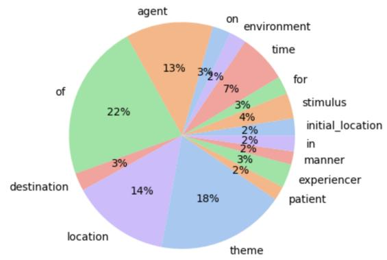
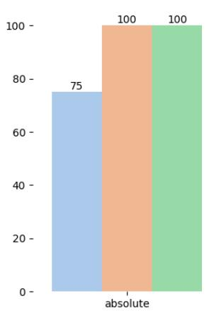
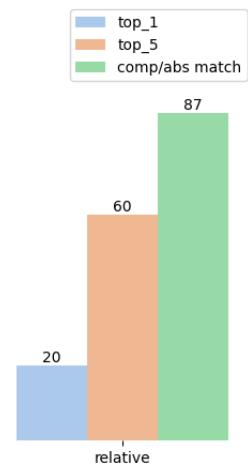
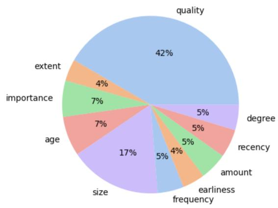
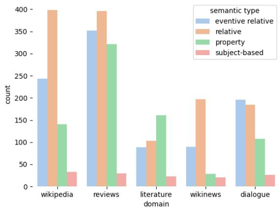
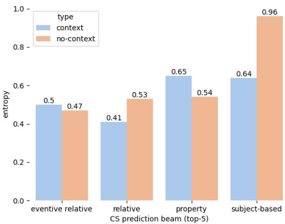

# Superlatives in Context: Modeling the Implicit Semantics of Superlatives

Valentina Pyatkin\* 1,2 Bonnie Webber4 Ido Dagan3 Reut Tsarfaty3

1Allen Institute for AI

2University of Washington

3Bar Ilan University

4The University of Edinburgh

valentinap@allenai.org

## Abstract

Superlatives are used to single out elements with a maximal/minimal property. Semantically, superlatives perform a set comparison: something (or some things) has the min/max property out of a set. As such, superlatives provide an ideal phenomenon for studying implicit phenomena and discourse restrictions. While this comparison set is often not explicitly defined, its (implicit) restrictions can be inferred from the discourse context the expression appears in. In this work we provide an extensive computational study on the semantics of superlatives. We propose a unified account of superlative semantics which allows us to derive a broad-coverage annotation schema. Using this unified schema we annotated a multi-domain dataset of superlatives and their semantic interpretations. We specifically focus on interpreting implicit or ambiguous superlative expressions, by analyzing how the discourse context restricts the set of interpretations. In a set of experiments we then analyze how well models perform at variations of predicting superlative semantics, with and without context. We show that the fine-grained semantics of superlatives in context can be challenging for contemporary models, including GPT-4.

## 1 Introduction

Superlatives are used to express a certain type of comparison in language. They work as domainbased comparisons: an expression like “the smallest fish” means that there is a fish which is smaller than all other fish in a specific set. An interpretation of the superlative comparison requires the human or machine to identify the target, e.g., the entity or event being the max or min of a set, and the comparison set (CS), e.g., the set of entities or events against which you are comparing the target.

Appropriately defining the comparison set requires understanding the general domain, and it is often essential to read beyond the sentence level, or to draw inferences from world knowledge. Take, for example, the following statement:

(1) Tom went fishing at the lake together with his friends. He caught the largest fish.

In ex. (1) the sentence with the superlative ‘largest’ does not provide enough information to properly define the CS, except that one is comparing a fish to other fish. With the help of the previous sentence, one can restrict the comparison set to the fish that were caught by Tom and hisfriends at the lake. In this paper we propose that recognizing the CS hinges on identifying the relevant entities or events from context, which can appear both before or after the expression. Specifically here, the catching event is crucial in restricting the CS.

Being able to automatically interpret the semantics of superlatives can be useful for many downstream applications, such as dialogue state tracking or mining product reviews (Scheible, 2010; Bakhshandeh et al., 2016). They appear in semantic parsing datasets, like text-to-SQL (’book the earliest flight to Boston’ (Price, 1990)) and their accurate semantic representation might improve Question Answering or Information Extraction.

To the best of our knowledge, superlatives are understudied in NLP, and so far there has been no systematic work on automatically identifying the CS restrictions from the larger discourse. While Scheible (2008, 2012) annotated the comparison set of one semantic superlative subtype, they did so only when it is explicitly expressed in the syntactic construction of the sentence. Similarly, Bos and Nissim (2006) mention the problem of appropriately defining the CS, but their annotation is restricted to the sentence-level only.

There are many different types of superlatives, either through the way they are expressed in syntax (e.g. adverbial vs. adjectival) or through the way they express a semantic comparison. But most works only focus on single subtypes and do not cover all forms of superlatives.

We propose a unified annotation schema for providing a complete semantic reading of superlatives. The schema defines the superlativeframes, encapsulating all the elements needed for an interpretation. The frames remain identical whether or not the semantic elements are explicit or implicit, and allow us to specify restrictions from context, which are made explicit in the form of Neo-Davidsonian Semantics, allowing one to show when interpretations are restricted by events or arguments.

Based on the proposed schema we annotate a dataset of superlatives, called SUPERSEM1, over different domains, ranging from encyclopedic text to dialogue. We show that SUPERSEM contains a large variety of superlative types and interesting instances of implicit domain restrictions.

Given SUPERSEM, we investigate models’ ability to generate superlative interpretations. This allows us to analyze the effect the discourse context has on restricting possible comparison interpretations and to assess the efficacy of filling in implicit elements from larger contexts. We also show that it is challenging for sota LLMs, like GPT-4, to appropriately incorporate discourse restrictions for the interpretation of superlatives.

## 2 Related Work

While superlatives have been widely studied in formal semantics, they have been largely neglected by NLP research, except for the following works. Bos and Nissim (2006) presented an automatic approach for predicting semantic interpretations of superlatives. For this purpose they annotated a corpus2 of attributive superlatives and their CS spans inside of a sentence.

Scheible (2008) proposed an annotation scheme for identifying syntactic classes of superlatives and a semantic analysis of superlatives in terms of targets and CS. They further also automatically identified superlative surface forms and extracted targets and CS for a specific superlative sub-type (Scheible, 2009, 2012). Zhang et al. (2015) also worked on identifying the targets and CS, using silver data from structured knowledge bases.

Bakhshandeh et al. (2016) introduced a framework for comparative constructions, including superlatives, which is also able to model ellipsis, but it is limited to the sentence level. Similarly, Pesahov et al. (2023) propose QA-based annotations for adjectives (which includes superlatives), but their annotation is constrained to a single sentence and does not include adverbial superlatives.

Multiple works have studied ambiguity, but none of them have specifically focused on superlatives: Cui et al. (2022) look at generalized quantifier ambiguity in multilingual NLI data, Liu et al. (2023) look at sentence ambiguity and its effect on entailment relations, and Stengel-Eskin et al. (2023) introduce a framework to translate ambiguous statements to formal representations.

We extended upon previous superlative research by looking at a wider array of phenomena. Firstly, we are targeting all syntactic types of superlatives, while Bos and Nissim (2006) only analyzed the comparison sets of attributive superlatives and Scheible (2009) only analyzed predicative superlatives. Most importantly, adverbial superlatives have not been studied in NLP. Lastly, we are extending the analysis of superlatives beyond the sentence boundary. While previous works did perform a (limited) analysis of implicit superlative phenomena inside of a sentence, we go beyond the sentence-based analysis and show how comparison sets are restricted by the broader domain of discourse.

## 3 The Challenge: Syntax, Semantics and Pragmatics of Superlatives

The particular challenge of superlatives interpretation is somewhat ignored in the study of natural language understanding, despite demonstrating many interesting syntactic and semantic phenomena. While all superlative expressions seem to do the same thing, i.e. pick a maximal entity/event, they appear in different forms, which, for NLP, hinders their uniform interpretation. Furthermore, superlatives may appear in various syntactic realizations which do not explicitly express some of the semantic aspects of the comparison, in particular how the comparison set is being restricted by context. In what follows we describe the possible syntactic realizations and semantics of superlatives, and how some of the frames can be implicit or ambiguous.

## 3.1 The Syntax of Superlatives

Humans use superlatives in order to reason about quantities and degrees in a comparative manner. Analytically, in English, they are formed using the adverbs most and least and inflectionally they are formed with the addition of the suffix -est. The comparison can either be performed in a positive (most), or negative orientation (least,few) (Huddleston and Pullum, 2002).

Superlatives can be broadly categorized into the following superficial forms: adjectival superlatives, such as “Mia is the tallest girl”; adverbial superlatives, such as “Most commonly, psychologists use surveys”; and other forms which are not superlatives morphologically, but still lexicalize a superlative meaning, i.e. “The main reason” (Scheible, 2009).

## 3.2 The Semantics of Superlatives

Semantically, superlatives perform a domain based comparison (Szabolcsi, 1986; Alshawi, 1992; Gawron, 1995; Heim, 1999; Farkas and Kiss, 2000).

(2) Nemo is the smallest fish out of all the fish in the aquarium.

In Example (2) the target of the comparison (i.e., the element that has the max/min of some set) is Nemo. The target is being compared to a set of other entities, the comparison set, which in this example is defined by all thefish in the aquarium. Each item in the comparison set has a property along which it is being compared, in this example the property is size. As we seek the smallest fish, the orientation of the size comparison is negative. By inference, comparatives can convey the same sense as superlatives, e.g. “Nemo is smaller than any of the other fish.”

Towards a semantic account of superlatives, Scheible (2012) defined 3 types of superlative comparisons. The Property Set Comparison is the most known superlative type, where members of the CS are being compared with respect to the property. Ex. (2) illustrates a property set comparison, where all fish in the aquarium (CS) are being compared by the size property. The Relative Set Comparison involves two interdependent set comparisons. For example, in “Of all the band members, Bob played the longest solo.”, the set of ‘solos is being compared in terms of length. But this set is further restricted by a second set, the ‘band members playing (solos)’. The Subject-based Set

Comparison is peculiar in that the CS does not consist of different entities, but instead compares the target at different states: “Bob is hungriest at noon.” Here the comparison set involves Bob’s level of hungriness at different times of the day.

## 3.3 Implicit Elements of Superlatives

Superlatives can appear in various syntactic realizations which do not explicitly express some of the aspects of the comparison. Often an explicit target is missing:

(3) a. Nemo is the smallest shark. b. The smallest shark hides under a rock.

In Example (3)a. the target ’Nemo’ is explicit, while in (3)b. the superlative NP stands for the implicit target. The CS (and its domain restrictions) can also be (entirely) missing:

(4) a. In Europe, he is the tallest man. b. He is the tallest.

In (4)b. the head of the superlative NP (”man”) is empty (Elazar and Goldberg, 2019) and the domain “In Europe” is implicit, while in (4)a. constructing the CS consists of two, syntactically non-adjacent spans, i.e., men, and in Europe.

Even if the CS’s head is not missing, the broader discourse can still restrict:

(5) For years, many Haitians and their descendants in Cuba did not identify themselves as such [...]. After Spanish, Creole is the second most-spoken language.

The complete CS in (5) is ‘languages spoken in Cuba’, which could only be identified by also including the previous context. This case of context dependence is called quantifier domain restriction (Geurts and van der Sandt, 1999; Stanley and Gendler Szabó, 2000), which includes superlatives (Gutiérrez-Rexach, 2006).

(6) She gave me the most expensive present.

Without context this example has multiple readings (absolute vs. relative (Szabolcsi, 1986; Heim, 1999; Farkas and Kiss, 2000; Huddleston and Pullum, 2005)): The CS could be ‘presents in the world’ (absolute) or ‘presents I have received from my friends on my birthday’ (relative) or ‘presents she gave me on that day’ (relative), etc. Note the restricting events in the last two interpretations, making them relative set comparisons.

Lastly, the subject-based set comparison (Sec. 3.2) is very implicit as neither the target nor the CS are explicitly expressed in syntax:

(7) The human is broadest at the shoulders.

Here the implicit target would be ‘the width of a human at the shoulders’ and the implicit comparison set would be ‘the width of different parts of the human body’. This illustrates how critical it is for machine comprehension to infer implicit elements from context in order to retrieve the correct entities.

## 4 Superlative Frames

In what follows we define the set of superlative frames. We propose a formal, event-based, account of superlatives. We first define all the frames and then show how they are able to cover all superlative types from Sec. 3.2. These superlative frames provide an intuitive way to achieve (i) annotations and (ii) a straightforward use for computational modeling.

The frames are built with a focus on annotating the semantics of the comparison and making discourse restrictions explicit. Additionally, we center the frames around events/predicates, when available, using Neo-Davidsonian semantics. This is motivated by the fact that events can also function as set restrictions for superlatives, such as for relative set comparisons. When no event is restricting the superlative, we annotate the restricting noun phrases. An example annotation using our scheme can be seen in Fig. 1.

Comparison Set In the comparison set we define the set of entities or events that take part in the comparison: $C S ~ = ~ \{ e _ { 1 } , . . . , e _ { n } \}$ . Comparisons involving an event are formulated using a neo-davidsonian expression. The argument slots are labeled using VerbNet roles (Schuler, 2005) and filled with tokens from context. The CS in Fig. 1 consists of a pay event, with four semantic arguments: AGENT, ASSET, LOCATION and TIME.

Property Each entity or event in the comparison set has a property along which it is being compared. We use nouns to define these properties. The property in the example is popularity.

Target The target stands in an IS-A relation with the comparison set, i.e. the target is one of the entities or events in the comparison set: $t \in C S$ Specifically, it is the entity or event whose property has the max/min value: max/min(p).

Anchor The anchor of the CS designates the focus of the comparison. We index its position in the CS, e.g. #2=ASSET. The CS, expressed in words, would be something like ‘Visa cards people pay with in Romania’. The anchor signals that we are comparing ‘Visa cards’ and not another entity.

Orientation +/– This field designates if the min or max operation was applied on the property.

Rank Sometimes superlative targets do not denote the entity at the min/max position, but instead they denote an entity at the n-th position. For example: “the second biggest Bulgarian port”. In these cases we note the given rank (default is 1).

Implicit +/– This field specifies whether the superlative is restricted by content outside the sentence boundary or alternatively by content that is not mentioned but implied.

Amount The amount specifies the realization of the property. In Fig. 1 it is explicitly mentioned that the amount of ‘800,000 cards issued’ makes the ‘Visa Gold’ card the most popular one.

## 5 Annotating Superlatives

One of our contributions is the SUPERSEM dataset, consisting of more than 4000 annotations of superlatives and their semantic interpretation in terms of the set of frames described in Sec. 4. In what follows, we describe the annotation process and provide an analysis of the final dataset itself.

## 5.1 Data

In order to cover a variety of domains we annotate the following datasets: We have re-annotated the Superlatives Wikipedia corpus (Scheible, 2008), two dialogue datasets: Dailydialog (Li et al., 2017), MultiWOZ 2.2 (Zang et al., 2020), a subset of superlatives in Amazon Product Reviews (Ni et al., 2019), superlatives found in the Wikinews documents used by TNE (Elazar et al., 2022) and superlatives in passages from the following narrative texts: Animal Farm by George Orwell, Harry Potter and the Philosopher’s Stone by J. K. Rowling, The Hitchhikers Guide to the Galaxy by Douglas Adam, The Great Gatsby by F. Scott Fitzgerald and The Hobbit by J. R. R. Tolkien.

## 5.2 Annotators

We hired two annotators for the task, who were provided with guidelines and training sessions. For quality assurance the authors met with the annotators in weekly meetings and discussed a subset of the annotations. Additionally, we periodically calculated IAA between the annotators and an expert (i.e. author of the paper, from here on called annotator C). The annotators were paid above minimum wage for the region. One of the annotators was a Master’s student in linguistics, hereafter called annotator A, and the other, annotator B, a Bachelor’s student in Computer Science.

<table><tr><td>The number ofpeoplein Romania</td><td>Target</td><td>PAY(e, AGENT=people, ASSET=Visa Gold, LOCATION=Romania, TIME=2004)</td><td></td></tr><tr><td>whopaywithVisa cardsrose by 130%</td><td>CS</td><td>PAY(e, AGENT=people, ASSET=Visa cards,</td><td>, LOCATION=Romania,</td></tr><tr><td>[...]. The most popular cards were</td><td>Anchor #2=ASSET Property</td><td>popularity</td><td>Orientation Positive</td></tr><tr><td>Visa Gold, with nearly 800,000 cards issued in 2004.</td><td>Implicit Yes Amount 800,000</td><td>Rank 1</td><td></td></tr></table>

Figure 1: An annotation example showing on the left the superlative (most), the sentence it appears in, and its previous context (shortened). On the right it shows the annotation slots (Target, DOI, CS etc.) and how they are filled given the text. Highlighted in yellow are the implicit discourse restrictions.

## 5.3 Dataset Analysis

Here we present an analysis of the SUPERSEM dataset and report statistics. Table 1 shows the general dataset counts, split by domain. The final dataset consists of more than 3k annotated superlatives and more than 1k non-superlatives, which are pos-tagged as JJS, but do not express a superlative reading (such as ‘most’ being used as a quantifier). About 42% of annotated superlatives contain implicit elements and about 35% contain an event.

<table><tr><td>Domain</td><td>Sup.</td><td>¬Sup.</td><td>Events</td><td>Implicit</td></tr><tr><td>Wikipedia</td><td>814</td><td>476</td><td>274</td><td>242</td></tr><tr><td>Reviews</td><td>1098</td><td>286</td><td>363</td><td>555</td></tr><tr><td>Dialogue</td><td>522</td><td>219</td><td>222</td><td>293</td></tr><tr><td>Literature</td><td>376</td><td>186</td><td>111</td><td>92</td></tr><tr><td>Wikinews</td><td>336</td><td>152</td><td>109</td><td>146</td></tr><tr><td>total</td><td>3146</td><td>1319</td><td>1079</td><td>1328</td></tr></table>

Table 1: Dataset counts split by domain, showing how many superlatives (Sup.) or non-superlative (¬Sup.) there are in the dataset. We further show numbers on how many superlatives were marked as being implicit and how many superlatives were restricted by events.

Events Overall, the events restricting the CS are diverse, with 353 distinct predicate lemmas. The most common predicates include have, do, use, find and make. Light verbs are frequent because they are used to express subject-based set comparisons (Sec. A.1.4). Other common verbs, which are not light verbs, are create, play, own and buy.

Arguments In Figure 2 we visualize the distribution of the most frequent roles in our target and CS annotations. AGENT, LOCATION and THEME are the most frequently annotated VerbNet roles. We additionally allowed the use of ‘of’ as a slot designating restricting bridging relations (such as “writers OF=the ancient world”).

  
Figure 2: Most frequent roles found in SUPERSEM.

Context As context around the superlative we take the preceding paragraph, with 170 words on average. We found that this is a reasonable amount of context to include in order to study superlatives’ context dependence, as adding more context would become less and less relevant, while adding more and more complexity for the annotators. This is in line with other literature on implicit arguments, which found that most of them are located in the preceding couple of sentences (Ebner et al., 2020).

## 5.3.1 IAA

To ensure annotation consistency and quality, we performed three rounds of IAA checks, while annotation efforts were on-going. After each agreement check, we consolidated and discussed the annotations with the annotators. Details of the IAA checks can be found in the Appendix. We find that agreement generally improves over the different rounds. While agreement is moderate to high for categorical slots, higher exact match agreement was harder to achieve for some non-categorical categories, like the CS. This is mainly due to the order in which arguments are listed and the differences in argument spans (i.e. determiners being included or excluded) and lower agreement for these categories does not necessarily indicate wrong annotation. The test set was further manually checked by one of the authors.

## 5.3.2 Implicit Arguments as Discourse Restriction

Since events can also take part in superlative comparisons, implicit arguments also form a subgroup of discourse restrictions. Implicit arguments (Ruppenhofer et al., 2010; Gerber and Chai, 2010; Roth and Frank, 2015) fill semantic roles of predicates, where the argument is not syntactically connected to the predicate and might even be found outside of the predicate’s sentence.

(8) Most commonly, psychologists use paper-andpencil surveys.

Ex. (8) contains the verbal predicate ‘use’. In VerbNet ‘use’ has 3 possible roles, of which 2 are explicitly filled in ex. (8): the AGENT, with ‘psychologists’ and the THEME, with ‘paper-andpencil surveys’. The third role, EVENTUALITY, is implicit and can be filled from the previous context, with ‘observational studies’, restricting the CS as follows: USE(e, AGENT=psychologists, THEME=surveys, EVENTUALITY=observational studies). This could be paraphrased as: out of all types of surveys psychologists use for observational studies. We find, with automatic string matching of argument text and context, that about 67% of event-restricted superlative instances have one or more implicit argument from context.

## 6 Computational Modeling of Superlative Semantics

In what follows we want to examine the computational modeling of superlative semantics. We are interested in multiple aspects. First, we want to establish sequence-to-sequence baselines for predicting our superlative frames, when trained on SUPERSEM. Additionally, we want to better understand the role of context when predicting the superlative frames, and when superlatives are ambiguous. To answer those questions, we carry out multiple experiments (and more in the Appendix).

Experimental Setup We use T5-3B (Raffel et al., 2020) for all experiments, if not noted otherwise.

We use a batch size of 2, a maximum output length of 300 and we train for 3 epochs on 2 A100 GPUs. For training, development and testing we create 80- 10-10 splits of SUPERSEM, by randomly sampling from each domain equally. We report exact match accuracy, the Jaccard’s Index, where we divide the count of overlapping tokens by the count of all tokens, and Rouge-n (n=1). We additionally finetune llama-3 8b (Dubey et al., 2024) to predict the comparison set, for 3 epochs, with max sequence length of 4096 and a batch size of 128.

## 6.1 Predicting the Interpretation

We first want to establish a seq2seq baseline for predicting superlatives frames, trained on SUPER-SEM. Given as input a context with a superlative expression we want the model to predict the appropriate superlative interpretation, by filling the frames, such as target, CS and property. We experiment with different input/output settings.

1. FULL: predict all the frames at once.

2. SINGLE: fine-tune a model for each slot individually.

To see the effect of context on predicting frames, we either only use the single sentence the superlative occurs in, or use the full context.

Results Table 2 displays the results. For most of the frames, the setting which includes both the superlative sentence and the additional discourse context works best. This indicates that the context contains further information needed to make the appropriate inferences for predicting superlative interpretations. The llama3 7b results confirm the T5 results, that adding context to the input improves a model’s ability to more accurately predict the comparison set. These context ablations also indicate that a lot of information restricting the comparison set is contained in the context. We also see that, except for the property slot, training a specialized model for each slot works better than training a general model that predicts the full annotation at once. The results on eventive superlatives only (in grey), show that they form a specially challenging subset for models. The best models still do not achieve the same EM scores as the human IAA scores (Sec. A.1.5). While these IAA scores come from a different, and smaller, set than the test set, they can still provide a reference point.

<table><tr><td></td><td colspan="3">Sentence EM</td><td colspan="3">Sent. + Context</td></tr><tr><td>target</td><td>24</td><td>JI 46</td><td>R 67</td><td>EM 29</td><td>IOU R 53 73</td><td>EM 40</td></tr><tr><td>FULL EVENT</td><td>26 8</td><td>46 34</td><td>65 66</td><td>30 51 9 39</td><td>69 70</td><td></td></tr><tr><td>CS</td><td>25</td><td>43</td><td>68</td><td>31 48</td><td>72</td><td>33</td></tr><tr><td>FULL</td><td>21</td><td>32</td><td>51</td><td>22 33</td><td>55</td><td></td></tr><tr><td>EVENT</td><td>13</td><td>31</td><td>65</td><td>18 40</td><td>71</td><td></td></tr><tr><td>llama3</td><td>14 50</td><td>26</td><td>41</td><td>22 40</td><td>62</td><td></td></tr><tr><td>anchor FULL</td><td>36</td><td>53 40</td><td>61 51</td><td>58 60 42 47</td><td>67 56</td><td>50</td></tr><tr><td>prop. FULL</td><td>72 71</td><td>73</td><td>75</td><td>70 71</td><td>73</td><td>77</td></tr><tr><td>orient.</td><td>92</td><td>71 92</td><td>73 92</td><td>71 71 87 87</td><td>73 88</td><td>100</td></tr><tr><td>FULL impl.</td><td>92 69</td><td>92 69</td><td>92 69</td><td>91 93 73 73</td><td>93 73</td><td>73</td></tr></table>

Table 2: Results showing exact match accuracy (EM), Jaccard’s Index (JI) and Rouge-n (R, n=1). For each semantic slot we show the performance when only trained on that specific slot and the FULL performance. For target and CS, highlighted in grey, we also show performance of the SINGLE model (EVENT) tested only on the events subset. The last column shows human EM IAA scores from the last IAA round. For CS we also report llama3 7b performance.

## 6.2 Superlatives and GPT-4

We test $\mathrm { G P T } { \cdot } 4 ^ { 3 } \mathrm { \Phi } _ { \mathbf { S } }$ ability to zero-shot interpret superlative comparisons, in natural language, and to few-shot interpret superlatives’ CS.

Experimental Setup We perform two different experiments on the test split of SUPERSEM. First, a zero-shot experiment where we input a single sentence containing a superlative expression and ask GPT-4 to answer the question “What is being compared to what here with the superlative?”. The model’s answer is expected to be a natural language explanation of the comparison. We also experiment with adding the full context and with explicitly marking the superlative in the prompt. Second, we evaluate GPT4 in a few-shot manner, where the task is to predict the superlative frame of the CS. Specifically, we add three demonstrations to the prompt, with each demonstration capturing a different type of CS interpretation.

For the first setting, the NL explanation is evaluated with human evaluation, as it differs from the logical forms contained in SUPERSEM. And for the few-shot setting, we additionally evaluate using the same metrics we also used to evaluate the fine-tuned T5 models (Sec. 6.1).

Discourse restrictions make things harder. In Tab. 3 we show the target and CS accuracies for the single sentence context, the paragraph-level context for the implicit subset and the single sentence setting for the implicit subset. The main conclusion to be drawn from the results is that the paragraphlevel interpretation of superlatives is harder than the single sentence setting, for GPT-4. The following is an example of a failure case:

<table><tr><td></td><td>target</td><td>CS</td></tr><tr><td>single sentence (implicit+explicit) paragraph (implicit)</td><td>89.0 84.0</td><td>77.9 62.9</td></tr><tr><td>single sentence (implicit) paragraph (implicit) few-shot</td><td>87.1 -</td><td>69.7 32.6</td></tr></table>

Table 3: GPT-4’s performance (accuracy) on identifying the target and CS, evaluated on the single sentence and the paragraph level.

(9) The Four Horsemen: Book 2 in the Light Trilogy was intense. [...] I think out of all of the characters, excluding the main ones, I would have to say that I love Mona the most. [...]

In this excerpt (shortened for space considerations), the target is ‘Mona’ and the CS is ‘all of the characters, excluding the main ones’, which is further restricted by a love event and by the fact that these characters are from the book ‘The Four Horsemen’. GPT-4 writes: “All other characters are being compared to Mona with the superlative.” While this output correctly identifies that there is a comparison between Mona and other characters, it incorrectly writes ‘all other characters’. The correct response would have excluded the main characters from the comparison. It further misses to specify discourse restrictions, such as the book title these characters appear in.

Few-shot is not enough for learning about superlative semantics. The few-shot experiments show that structured semantic prediction is hard to do using prompting. The few-shot scores in Tab 4 fall behind the fine-tuned model at predicting the CS. These results are in line with recent works examining prompting for structured prediction: Ettinger et al. (2023) found that LLMs are limited in their capability to predict correct AMR structures, also when using few-shot demonstrations, and Mehta et al. (2024) showed that prompting for semantic structures leads to inconsistencies.

In addition, the manual evaluation reveals lower accuracy for the few-shot prompting setup (Tab. 3). Looking at the outputs, the model sometimes seems to be able to capture the format of the frames, also of eventive CSs. Interestingly, most of the errors involve the model not being able to incorporate the relevant elements from context, such as missing a LOCATION or TIME restriction.

<table><tr><td></td><td>EM JI</td><td>R</td></tr><tr><td>T5 fine-tuned</td><td>31 48</td><td>72</td></tr><tr><td>GPT4-few shot</td><td>4 17</td><td>43</td></tr></table>

Table 4: GPT-4’s few-shot performance (EM - exact match, JI - Jaccard’s Index, R - Rouge-1) on full test set, for identifying the CS, given full context.

## 6.3 Ambiguous Superlatives

  
Figure 3: Accuracy for predicting the CS: given absolute vs. relative contexts. top\_1: the first prediction in a beam is correct. top\_5: at least one prediction in a beam of 5 is correct. comp/abs match: Does the type (absolute/relative) of the predicted CS fit the gold type?

The main ambiguity present for superlatives is the distinction between absolute versus relative interpretations (see Sec. 3.3). In an effort to analyze how sensitive our model is to discourse cues which could help to disambiguate between different readings, we perform the following experiment. We manually curated 20 sentences in which the superlative comparison is ambiguous. Many of these sentences are (synthetic) example sentences found in formal semantic literature. Additionally, for each of the 20 instances, we added context that strengthens a certain reading, such as absolute vs. relative readings. This is an example from our synthetic test set.

(10) John put the tallest plant on the table. Context 1: Tom, John and Mary all brought plants which they put on the table.

The first sentence is ambiguous in that it could be read as either absolute or relative, i.e. restricted by the putting event or not. Given the additional context 1, the relative reading is strengthened: PUT(e, AGENT=Tom & John & Mary, PATIENT=plants, DESTINATION=table).

We run the T5-3b model trained to predict the CS slot on the synthetic test data.

Relative is harder than absolute As shown in Fig. 3, absolute superlative comparisons are easier to identify: in 100% of absolute cases the predicted CS represents an absolute reading. Additionally, in 100% of the absolute test cases, the model predicts the correct CS among a beam of 5. Relative readings, on the other hand, are harder to get right and the model also only correctly identifies a relative instance as such in 87% of the cases.

## 6.4 Ambiguity and Context

To analyze and quantify ambiguity and the effect of context in superlatives, the conditional logprobabilities as a measure.

Formally, for the conditional log-probabilities, we define the prefix to be the previous context and the stimulus to be the superlative-sentence, consisting of tokens $W _ { n } = ( w _ { 1 } , . . . , w _ { n } )$ . And we then calculate the conditional per-token log-probabilities, using MINICONS (Misra, 2022):

$$
\frac { \sum _ { n = 1 } ^ { | W | } p ( w _ { n } | \mathrm { p r e f i x } ) } { | W | }
$$

We evaluate the output of our T5-3B model, trained to predict the CS, on the test split of SU-PERSEM and the synthetic challenge set.

## 6.4.1 Probability Given Context

With the conditional log-probabilities we want to measure the likelihood our model assigns to different given interpretations of the synthetic inputs with varying contexts. Concretely, we take a superlative sentence and see how the likelihood of an interpretation changes given different tailored contexts, or no context.

Overall, our model prefers the correct over the incorrect interpretation in 87% of the cases. Interestingly, the absolute difference between the log probabilites of two completions given only a sentence, is on average smaller than the absolute difference between the log probabilities of two completions given the full context. This indicates that a model fine-tuned on SUPERSEM is appropriately sensitive to ambiguous instances without context, i.e. assigns all possible completions similar likelihoods, while given the full context, the likelihood gap increases and a certain interpretation becomes considerably more likely.

(11) John is angriest at Mary. Context 1: Mary and Tomforgot to invite John to the party. vs. Context 2: The whole party is angry at Mary for forgetting the cake.

For example, for the above sentence, the CS MARY & TOM is more likely for Context 1, while BE\_ANGRY(e, AGENT=whole party, PA-TIENT=Mary, FOR=forgetting the cake) is more likely for Context 2. Both CS interpretations are similarly likely with no additional context given.

## 7 Conclusion

Superlative comparisons are interesting because their interpretation is closely tied to the context they appear in and because many of their components are often implicit. This paper provides a comprehensive study of superlatives, by proposing a new, unified annotation scheme and an annotated superlative dataset, SUPERSEM. We further perform a set of experiments which analyze how models interpret superlative comparisons, how they are able to incorporate context restrictions, and how ambiguity and context interact for superlative interpretations.

## 8 Limitations

Annotating semantics is non-trivial, requiring trained and skilled annotators. Due to resource constraints, we were only able to hire two annotators and while our dataset is considerably bigger than any other superlatives datasets, it can not be considered a large-scale effort. For more accurate agreement numbers and more consolidated annotations, it would have been nice to have annotations per instance done by at least two or more annotators, which we unfortunately could only do for subsets of the data. We believe that superlatives are extremely interesting to study and highly encourage people to study their semantics for languages other than English. Lastly, this paper mainly focuses on intrinsic evaluations of language models and superlatives, and it would be interesting to also see downstream evaluation results, which would ideally show that a more precise modeling of superlative semantics leads to extrinsic performance improvements.

## 9 Ethical Considerations

Our annotators were paid a fair wage and no personally identifiable information will be released as part of the dataset. We have further made sure that the amount of toxic content in our dataset is kept to a minimum, but some of the reviews in our dataset might contain toxic language.

## Acknowledgments

We would like to thank Alon Eitan and Elisheva Jeffay for their great annotation efforts. This research is funded by the the European Research Council, ERC-StG Grant no. 677352, and by a grant from the Israeli Science Foundation, grant number 670/23, for which we are grateful.

## References

Hiyan Alshawi. 1992. The core language engine. MIT press.

Omid Bakhshandeh, Alexis Cornelia Wellwood, and James Allen. 2016. Learning to jointly predict ellipsis and comparison structures. In Proceedings ofThe 20th SIGNLL Conference on Computational Natural Language Learning, pages 62–74.

Johan Bos and Malvina Nissim. 2006. An empirical approach to the interpretation of superlatives. In Proceedings of the 2006 conference on empirical methods in natural language processing, pages 9–17.

Ruixiang Cui, Daniel Hershcovich, and Anders Søgaard. 2022. Generalized quantifiers as a source of error in multilingual nlu benchmarks. In Proceedings of the 2022 Conference of the North American Chapter ofthe Associationfor Computational Linguistics: Human Language Technologies, pages 4875–4893.

Abhimanyu Dubey, Abhinav Jauhri, Abhinav Pandey, Abhishek Kadian, Ahmad Al-Dahle, Aiesha Letman, Akhil Mathur, Alan Schelten, Amy Yang, Angela Fan, et al. 2024. The llama 3 herd of models. arXiv preprint arXiv:2407.21783.

Seth Ebner, Patrick Xia, Ryan Culkin, Kyle Rawlins, and Benjamin Van Durme. 2020. Multi-sentence argument linking. In Proceedings of the 58th Annual Meeting ofthe Associationfor Computational Linguistics, pages 8057–8077.

Yanai Elazar, Victoria Basmov\*, Yoav Goldberg, and Reut Tsarfaty. 2022. Text-based np enrichment. Transactions of the Association for Computational Linguistics, 10:764–784.

Yanai Elazar and Yoav Goldberg. 2019. Where’s my head? definition, data set, and models for numeric fused-head identification and resolution. Transactions ofthe Associationfor Computational Linguistics, 7:519–535.

Allyson Ettinger, Jena Hwang, Valentina Pyatkin, Chandra Bhagavatula, and Yejin Choi. 2023. “you are an expert linguistic annotator”: Limits of llms as analyzers of abstract meaning representation. In Findings ofthe Associationfor Computational Linguistics: EMNLP 2023, pages 8250–8263.

Donka F Farkas and Katalin É Kiss. 2000. On the comparative and absolute readings of superlatives. Natural Language & Linguistic Theory, 18(3):417– 455.

Jean Mark Gawron. 1995. Comparatives, superlatives, and resolution. Linguistics and Philosophy, pages 333–380.

Matthew Gerber and Joyce Chai. 2010. Beyond nombank: A study of implicit arguments for nominal predicates. In Proceedings ofthe 48th Annual Meeting of the Association for Computational Linguistics, pages 1583–1592.

B Geurts and RA van der Sandt. 1999. Domain restriction. Bosch, P.; Sandt, RA van der (ed.), Focus: Linguistic, Cognitive, and Computational Perspectives, pages 268–292.

Jeanette K Gundel, Nancy Hedberg, and Ron Zacharski. 1993. Cognitive status and the form of referring expressions in discourse. Language, pages 274–307.

Javier Gutiérrez-Rexach. 2006. Superlative quantifiers and the dynamics of context-dependence. Where semantics meets pragmatics: The Michigan State University Papers, pages 237–266.

Irene Heim. 1999. Notes on superlatives. Ms., Massachusetts Institute of Technology.

Eran Hirsch, Valentina Pyatkin, Ruben Wolhandler, Avi Caciularu, Asi Shefer, and Ido Dagan. 2023. Revisiting sentence union generation as a testbed for text consolidation. In Findings ofthe Associationfor Computational Linguistics: ACL 2023, pages 7038– 7058.

Yufang Hou, Katja Markert, and Michael Strube. 2013. Global inference for bridging anaphora resolution. In Proceedings ofthe 2013 Conference ofthe North American Chapter of the Association for Computational Linguistics: Human Language Technologies, pages 907–917.

Rodney Huddleston and Geoffrey Pullum. 2005. The cambridge grammar of the english language. Zeitschrift für Anglistik und Amerikanistik, 53(2):193–194.

Rodney D. Huddleston and Geoffrey K. Pullum. 2002. The Cambridge Grammar of the English Language. Cambridge University Press.

Yanran Li, Hui Su, Xiaoyu Shen, Wenjie Li, Ziqiang Cao, and Shuzi Niu. 2017. Dailydialog: A manually labelled multi-turn dialogue dataset. In Proceedings

ofthe Eighth International Joint Conference on Natural Language Processing (Volume 1: Long Papers), pages 986–995.

Alisa Liu, Zhaofeng Wu, Julian Michael, Alane Suhr, Peter West, Alexander Koller, Swabha Swayamdipta, Noah A Smith, and Yejin Choi. 2023. We’re afraid language models aren’t modeling ambiguity. In Proceedings ofthe 2023 Conference on Empirical Methods in Natural Language Processing, pages 790–807.

Maitrey Mehta, Valentina Pyatkin, and Vivek Srikumar. 2024. Promptly predicting structures: The return of inference. arXiv preprint arXiv:2401.06877.

Kanishka Misra. 2022. minicons: Enabling flexible behavioral and representational analyses of transformer language models. arXiv preprint arXiv:2203.13112.

Jianmo Ni, Jiacheng Li, and Julian McAuley. 2019. Justifying recommendations using distantly-labeled reviews and fine-grained aspects. In Proceedings of the 2019 conference on empirical methods in natural language processing and the 9th international joint conference on natural language processing (EMNLP-IJCNLP), pages 188–197.

Leon Pesahov, Ayal Klein, and Ido Dagan. 2023. Qaadj: Adding adjectives to qa-based semantics. In Proceedings ofthe Fourth International Workshop on Designing Meaning Representations, pages 74–88.

Patti Price. 1990. Evaluation of spoken language systems: The atis domain. In Speech and Natural Language: Proceedings ofa Workshop Held at Hidden Valley, Pennsylvania, June 24-27, 1990.

Peng Qi, Yuhao Zhang, Yuhui Zhang, Jason Bolton, and Christopher D Manning. 2020. Stanza: A python natural language processing toolkit for many human languages. In Proceedings ofthe 58th Annual Meeting ofthe Associationfor Computational Linguistics: System Demonstrations, pages 101–108.

Colin Raffel, Noam Shazeer, Adam Roberts, Katherine Lee, Sharan Narang, Michael Matena, Yanqi Zhou, Wei Li, and Peter J Liu. 2020. Exploring the limits of transfer learning with a unified text-to-text transformer. The Journal ofMachine Learning Research, 21(1):5485–5551.

Michael Roth and Anette Frank. 2015. Inducing implicit arguments from comparable texts: A framework and its applications. Computational Linguistics, 41(4):625–664.

Josef Ruppenhofer, Caroline Sporleder, Roser Morante, Collin F Baker, and Martha Palmer. 2010. Semeval-2010 task 10: Linking events and their participants in discourse. In Proceedings ofthe 5th International Workshop on Semantic Evaluation, pages 45–50.

Silke Scheible. 2008. Annotating superlatives. In Proceedings of the Sixth International Conference on Language Resources and Evaluation (LREC’08).

Silke Scheible. 2009. Computational treatment of superlatives. Ph.D. thesis, The University of Edinburgh.

Silke Scheible. 2010. The smallest, cheapest, and best: Superlatives in opinion mining. page 52.

Silke Scheible. 2012. Textwiki: a superlative resource. Language resources and evaluation, 46:635–666.

Karin Kipper Schuler. 2005. VerbNet: A broadcoverage, comprehensive verb lexicon. University of Pennsylvania.

Jason Stanley and Zoltan Gendler Szabó. 2000. On quantifier domain restriction. Mind & Language, 15(2-3):219–261.

Elias Stengel-Eskin, Kyle Rawlins, and Benjamin Van Durme. 2023. Zero and few-shot semantic parsing with ambiguous inputs. In The Twelfth International Conference on Learning Representations.

Anna Szabolcsi. 1986. Comparative superlatives. In Papers in Theoretical Linguistics, pages 245–266. MIT Working Papers in Linguistics.

Tomer Wolfson, Daniel Deutch, and Jonathan Berant. 2022. Weakly supervised text-to-sql parsing through question decomposition. In Findings of the Associationfor Computational Linguistics: NAACL 2022, pages 2528–2542.

Tomer Wolfson, Mor Geva, Ankit Gupta, Matt Gardner, Yoav Goldberg, Daniel Deutch, and Jonathan Berant. 2020. Break it down: A question understanding benchmark. Transactions ofthe Associationfor Computational Linguistics, 8:183–198.

Xiaoxue Zang, Abhinav Rastogi, Srinivas Sunkara, Raghav Gupta, Jianguo Zhang, and Jindong Chen. 2020. Multiwoz 2.2: A dialogue dataset with additional annotation corrections and state tracking baselines. In Proceedings of the 2nd Workshop on Natural Language Processing for Conversational AI, pages 109–117.

Sheng Zhang, Yansong Feng, Songfang Huang, Kun Xu, Zhe Han, and Dongyan Zhao. 2015. Semantic interpretation of superlative expressions via structured knowledge bases. In Proceedings of the 53rd Annual Meeting of the Association for Computational Linguistics and the 7th International Joint Conference on Natural Language Processing (Volume 2: Short Papers), pages 225–230.

## A Appendix

## A.1 Annotating Superlatives

## A.1.1 Preprocessing

In order to extract sentences containing superlatives from our chosen corpora, we POS-tag them using Stanza (Qi et al., 2020) and extract all sentences containing at least one word tagged with either JJS (adjectival) or RBS (adverbial). We run the preselection by POS-tag approach on a test set from Scheible (2008), receiving a recall of 98.8%. We can therefore be sure that we are capturing most, if not all, superlatives present in a text. In terms of precision, we note that not all words tagged with JJS signal a superlative, such as, ‘at least’ or ‘at most’, which are proportional quantifiers. We increase precision to 99% through manual post-processing, by having annotators mark such instances as non-superlative readings.

## A.1.2 Dataset Analysis

Property Types In Figure 4 we visualize the distribution of the most frequent properties. Quality (‘best’/‘worst’) and size (‘biggest’/‘smallest’) are most prevalent in the dataset.

  
Figure 4: Most frequent properties in SUPERSEM.

## A.1.3 Bridging and Discourse Restrictions

Discourse restrictions and bridging relations are closely related. Bridging relations are anaphoric relations, such as part-of, between two entities in a discourse (Gundel et al., 1993; Hou et al., 2013). They form a subset of the different types of discourse restrictions affecting the CS of superlatives. To analyze the influence of noun phrase (NP) relations as discourse restrictors for superlatives, we annotated a subset of TNE (Elazar et al., 2022). TNE annotations follow a broader definition of bridging, by connecting NPs of any relation type.

(12) The largest single language is English, which has 2.3 million articles.

The sentence in Ex. (12) has the target ‘English’ and the CS ‘single languages’. The CS is further restricted by context: ‘single languages OF=Wikipedia’. This type of NP part-of relation is also annotated in TNE, where ‘largest single language’ is connected with the preposition ‘of’ to ‘Wikipedia editions’.

Using string matching we found that about 26% of the implicit superlatives in our TNE subset are restricted by noun phrase relations also present in TNE. Due to the automatic way of extracting these statistics we assume that this is a lower bound and conclude that CS are often also restricted by NP relations from discourse.

## A.1.4 Coverage

The superlative frames, described in Sec. 4, can be used to annotate all three semantic types defined by Scheible (2012). The example in Fig. 1 annotates a relative set comparison. A property set comparison distinguishes itself from the relative one by not having restrictions, which can either be events or noun phrases, in the target and CS. The subjectbased set comparison can be identified through our annotations by the use of light verbs as the event predicate. For “Bob is hungriest at noon”, the target, for example, would look as follows: BE\_HUNGRY(e, THEME=Bob, TIME=at noon).

  
Figure 5: Counts of the semantic types annotated over the different domains.

Figure 5 shows how the types are distributed across the five domains. Except for the literature domain, relative superlative comparisons are the most frequent. In the literature domain on the other hand, property set comparisons occur most often.

The least frequent type is the subject-based comparison, for all domains.

## A.1.5 IAA

To ensure annotation consistency and quality, we performed three rounds of IAA checks. For the first two checks, a set of instances was given to two annotators: 50 Amazon review instances were shown to annotator A and C, and 81 Wikipedia instances to annotators B and C. We compare the agreement on different aspects of the annotation, as seen in Tab. 5. For all categorical values we also report Cohen’s Kappa scores, which are moderate to high for the event vs. no-event and the orientation frames and fair for the implicit frame. It is worth noting that these first IAA checks were performed while annotations were on-going and that there was an annotation consolidation after the checks. This means that the scores could be seen as a lower bound for annotation agreement, which then improved after the consolidations. Higher exact match agreement was harder to achieve for some non-categorical categories, like the CS. This is mainly due to the order in which arguments are listed and the differences in argument spans (i.e. determiners being included or excluded) and lower agreement for these categories does not necessarily indicate wrong annotation.

The third IAA check was performed after the annotation effort was completed. We randomly sampled 30 instances from the whole dataset, which were then re-annotated by annotator C. The results show that agreement has improved for nearly all categories. This is a promising sign for our annotation protocol, since it indicates that our annotator training and consolidation process resulted in higher agreement.

## A.2 Extrinsic Evaluation

## A.2.1 Frame-specified Context Generation

We also model the problem in the inverse direction: given the semantic interpretation, predict further restricting context outside of the sentence boundaries. Specifically, we trained a model on the task of predicting the whole paragraph given the superlative interpretation and the sentence the superlative appears in.

This type of context generation is challenging because it requires the model to perform semantic consolidations (Hirsch et al., 2023): it needs to identify propositions which are expressed in the superlative frames annotations, but not in the given sentence, and then generate coherent and appropriately restricting context.

<table><tr><td></td><td>Wiki.</td><td>Reviews</td><td>Final</td></tr><tr><td>event vs. none</td><td>.78 (.55)</td><td>.76 (.47)</td><td>0.83 (.63)</td></tr><tr><td>exact target</td><td>.23</td><td>.29</td><td>.4</td></tr><tr><td>exact CS</td><td>.1</td><td>.29</td><td>.33</td></tr><tr><td>exact anchor</td><td>.58</td><td>.45</td><td>.5</td></tr><tr><td>exact property</td><td>.58</td><td>.61</td><td>.77</td></tr><tr><td>exact orientation</td><td>.99 (.88)</td><td>.92 (.86)</td><td>1(1)</td></tr><tr><td>exact implicit</td><td>.67 (.34)</td><td>.43 (.16)</td><td>.73 (.48)</td></tr><tr><td>event predicate</td><td>.78</td><td>.73</td><td>.75</td></tr><tr><td>CS (no event)</td><td>.22</td><td>.54</td><td>.47</td></tr><tr><td>role arg. iou&gt;=0.5</td><td>.36</td><td>.42</td><td>.45</td></tr></table>

Table 5: Inter-Annotator Agreement on Wikipedia, Reviews and a final set randomly sampled from SUPER-SEM. event vs. none: Accuracy of choosing an event. exact ...: exact match accuracy for each of these slots. event predicate: acc. of choosing the same predicate. CS text: exact match of CS text if no event was chosen. role argument: Accuracy of having an intersection over union (IOU) >= 0.5 of the role argument text. Cohen’s Kappa scores are added in brackets for all categorical values.

Results The context generation model achieved a decent ROUGE-1 score of 0.41, which indicates that the model learns to generate appropriate context restrictions. We further performed a manual evaluation of the test set results, where we analyzed how well the model is able to predict context that appropriately restricts implicit superlative readings. For example:

(13) But the ancient race of the northern mountains were the greatest of all birds [...]. TARGET: Eagles LOCATION=northern mountains CS: birds AN-CHOR: birds PROPERTY: greatness ORIENTA-TION: positive

Here, the target is implicit. The model is nonetheless able to identify which parts of the superlative interpretation are not mentioned in the given sentence and then predicts appropriate context containing this implicit information. In this case, it predicted context mentioning eagles4. In 83% of the implicit test cases, the model correctly included the missing restrictions when predicting context beyond the sentence boundaries.

## A.3 Intrinsic Evaluation

## A.3.1 More GPT-4 Results

GPT-4 does not always recognize that there is a superlative comparison. In the first setup (see Sec. 3), our aim was to see whether the LLM is able to recognize the comparison relation triggered by the superlative. For 16% of the test set sentences GPT-4 either outputs that “There is no direct comparison being made in this sentence.”, or, in rarer cases, mentions other types of comparisons present in the sentence, such as discourse relations. Generally, though, it is able to correctly recognize that the presence of a superlative expression indicates a comparison.

## A.4 Entropy

With entropy we aim to measure how models deal with ambiguous superlatives and whether they are able to express all possible interpretations of such instances. For this purpose we quantify the entropy of interpretation types present in a top-n beam search output:

$$
H ( X ) = - \sum _ { x \in { \mathcal { X } } } p ( x ) \log p ( x )
$$

Where X takes values from the following interpretation types: eventive relative set comparison (SC), (non-eventive) relative SC, property SC and subject-based SC.

We evaluate the output of our T5-3B model, trained to predict the CS, on the test split of SU-PERSEM and the synthetic challenge set.

  
Figure 6: SUPERSEM test set: Entropy over 4 different CS interpretation types, using top-5 beam predictions.

The entropy scores in Fig. 6 show that context reduces the entropy over the semantic types of comparisons in the output beam of our model, for 2 categories, relative and subject-based. Interestingly, for eventive relative and property, entropy is slightly higher when shown the full context.

The instances with the highest difference in entropy between the no-context and with-context setups, reveal some patterns. Cases where entropy is low for with-context but high for no-context tend to be extremely underspecified superlatives, usually in dialogue turns, where a sentence might simply say “Which one is best?”. The eventive and property CS predictions have higher entropy for the full-context model, as it more frequently predicts eventive interpretations in its beam, compared to the no-context model.

## A.5 Extrinsic Evaluation: Superlatives in Downstream Tasks

Superlatives play a role in many NLP tasks. Most notably, they are used in queries, including queries over SQL tables or over text, for QA and reading comprehension datasets (Wolfson et al., 2020).

We perform one analysis on the influence of superlatives on a downstream task, using the BREAK dataset (Wolfson et al., 2020). This dataset contains decompositions of natural language queries into a set of steps that are necessary for answering these queries (QDMR). QDMR defines a set of operators, one of which denotes superlatives, which appear in 13% $( Q D M R _ { h i g h } )$ of decompositions. Interestingly, the paper mentions that a qualitative analysis of the QDMRs revealed that “workers have somewhat struggled with decomposing superlatives". This indicates that the semantic interpretation of superlatives is challenging for both machines and humans.

In our experiments we re-implement the current best model on the BREAK-leaderboard, which consists of a t5-large model, using the hyperparameters from Wolfson et al. (2022). We train this model on either the (1.) standard $Q D M R _ { h i g h }$ training data, or (2.) on the $Q D M R _ { h i g h }$ training data enriched with superlative annotations. We evaluate with the official evaluation script5.

<table><tr><td></td><td>QDMRhigh</td><td>QDMRhigh-Superlative</td></tr><tr><td>EM</td><td>0.103</td><td>0.107</td></tr><tr><td>norm EM</td><td>0.262</td><td>0.268</td></tr><tr><td>sari</td><td>0.728</td><td>0.734</td></tr></table>

Table 6: Results on the $Q D M R _ { h i g h }$ dev set (234 superlative instances), using the official evaluation metrics (Wolfson et al., 2022). $Q D M R _ { h i g h } \mathrm { ; }$ : using the standard train/dev data and $Q D M R _ { h i g h - S u p e r l a t i v e } .$ using the superlative enriched data.

Results Table 6 shows that adding superlative predictions to the QDMR training data improves the model’s capabilities to perform query decompositions. Downstream tasks might thus benefit from additional superlative annotations.