# SymBa: Symbolic Backward Chaining for Structured Natural Language Reasoning

Jinu Lee1,2 and Wonseok Hwang1,3

1 LBOX 2 University of Illinois Urbana-Champaign 3 University of Seoul {jinulee.v, wonseok.hwang}@lbox.kr

## Abstract

To improve the performance and explainability of LLM-based natural language reasoning, structured reasoning can be applied to generate explicitly structured proofs. Among different methods for structured reasoning, we specifically focus on backward chaining, where the proof goal is recursively decomposed to subgoals by searching and applying rules. We argue that current LLM-based backward chaining systems (e.g. Least-to-most prompting and LAMBADA) are incomplete, as they omit crucial algorithmic components identified from the classic backward chaining algorithm in computational logic (SLD Resolution). To this end, we propose a novel backward chaining system, SymBa (Symbolic Backward Chaining), which integrates a symbolic solver and an LLM. In SymBa, the solver controls the proof process, and the LLM is only called when the solver requires new information to complete the proof. Empowered by completeness, SymBa achieves a significant improvement in seven deductive, relational, and arithmetic reasoning benchmarks compared to the baselines.1

## 1 Introduction

Large language models (LLMs) trained with massive amounts of natural language text have shown remarkable reasoning ability in various fields, including logical and arithmetic reasoning (Wei et al., 2022; Kojima et al., 2022). However, autoregressively generated explanations as in Chain-ofthoughts might contain factual and logical errors, which tend to be more covert as LLMs scale up (Zhou et al., 2024).

To enhance the accuracy and explainability of natural language reasoning, structured reasoning has been frequently explored as an alternative. In this task, one must provide an explicitly structured explanation, i.e. a proof tree (also known as entailment tree). These structured explanations offer high interpretability by showing how premises connect to intermediate and final conclusions (Dalvi et al., 2021; Hong et al., 2022).

Among popular approaches for structured reasoning, we focus on backward chaining (Poole and Mackworth, 2010). Backward chaining reasoners start from the goal and apply rules that decompose the goal into a set of subgoals. It is known to be efficient as it does not require a combinatorial search to generate the next step (Kazemi et al., 2023). Consequently, previous works have proposed LLM-based backward chaining systems, which utilize few-shot LLMs to execute subtasks of the backward chaining process (Kazemi et al., 2023; Zhou et al., 2023; Khot et al., 2023).

However, we argue that popular LLM-based backward chaining systems, namely Least-to-most prompting (Zhou et al., 2023) and LAMBADA (Kazemi et al., 2023), are incomplete. We compare their implementation to a classic backward chaining algorithm from computational logic—SLD Resolution (Kowalski, 1974)—and provide minimal examples that show their incompleteness in Section 3.1.

To address this issue, we propose SymBa (Symbolic Backward Chaining), a method that applies an SLD resolution-based symbolic solver directly to natural language reasoning. In SymBa, the solver controls the proof process, and the LLM is only called when the solver requires new information to complete the proof. By this novel solver-LLM integration, SymBa benefits from both the completeness of the SLD resolution and the natural language reasoning capability of LLMs.

SymBa outperforms baselines on answer accuracy, proof accuracy, and efficiency in seven benchmarks from deductive, relational, and arithmetic reasoning. Empirical results show that Least-tomost prompting suffers from low proof accuracy in complex problems. LAMBADA, on the other hand, cannot handle relational and arithmetic reasoning properly. We claim that these are the direct consequences of their incomplete design.

In summary, our contributions are as follows.

• We inspect the incompleteness of previous LLM-based backward chaining systems (Least-to-most and LAMBADA) by comparing its algorithmic components to SLD resolution.

• We propose SymBa, an LLM-based backward chaining system controlled by a symbolic solver.

• We show that SymBa outperforms the baselines in various reasoning tasks by leveraging the completeness of the solver.

## 2 Background

SLD Resolution (Kowalski, 1974) is the backward chaining algorithm for logic programs.

## 2.1 Logic programming

Logic programming is a programming paradigm for computing formal logic (Wielemaker et al., 2012; Lifschitz, 2019). In logic programming, each rule defines a logical implication relation between predicate terms. The implied term on the left-hand side is the head, and the condition terms on the right-hand side are referred to as subgoals. Fact is a special type of rule with no subgoals, meaning that the head term is unconditionally true. For instance, Rule 1 in Figure 1 denotes that if there exists an X that is young and round (subgoals hold), then Charlie is cold (head implied).

## 2.2 SLD Resolution algorithm

SLD Resolution algorithm recursively searches the valid proof for the goal term using given rules. It can be viewed as a depth-first search algorithm with four key steps, Search, Decompose, Binding propagation, and Backtracking.

Search The proof process begins by searching for rules and facts that could support the goal. This is done by checking if there is a substitution of variables (binding) that makes the goal and the rule head identical, i.e. if the goal and the rule unifies.

Decompose Once a unifying rule is found, the goal is broken down into the rule’s subgoals. These subgoals are added to the stack, and the proof is complete when all these subgoals are either proven or refuted.

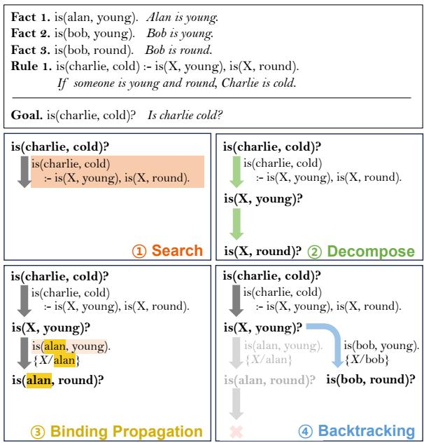  
Figure 1: Example of a ProofWriter (Tafjord et al., 2021)-style problem written in both logic program and natural language (italic). The four main steps of SLD Resolution, Search, Decompose, Binding Propagation (between subgoals), and Backtracking, are shown using this example.

Binding propagation Both goals and rules may contain variables. When a variable’s binding (antecedent) is determined during the proof, it must be propagated to other instances of the same variable to satisfy the coreferential constraints. In SLD resolution, binding propagation happens in three directions, from goal to subgoal, between subgoals, or subgoal to goal.

Backtracking If there are no rules that can prove the goal, the proof fails. In this case, the prover must backtrack and attempt alternative decompositions and bindings until a valid proof is found.

Consider the example in Figure 1. For the Search step, the only rule that unifies to the given goal is(charlie, cold) is Rule 1. When we decompose Rule 1, we get two subgoals is(X, young) and is(X, round). Initially, the first subgoal can be proved by binding X/alan, which is then propagated and updating the second subgoal to is(alan, round). However, as this bound goal fails, backtracking is required to explore other possible bindings for the first subgoal such as X/bob, which will eventually prove the goal.

Appendix A presents a formal description of the algorithm.

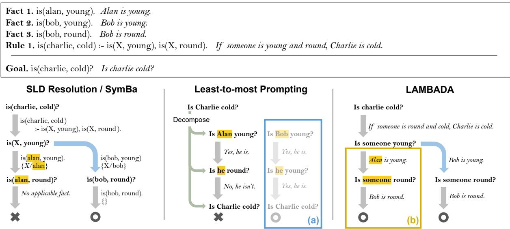  
Figure 2: Comparison between SLD Resolution (and SymBa), Least-to-most, and LAMBADA. Bindings X/alan and X/bob both apply to the first subgoal of Rule 1, but X/alan fails to prove the second subgoal. While SLD Resolution and SymBa traverse both possibilities and reach the correct conclusion with the correct proof, (a) lack of backtracking in Least-to-most might discard the correct trajectory, and (b) lack of binding propagation in LAMBADA might lead to an inaccurate reasoning step.

## 3 Methods

## 3.1 Baselines

We analyze two popular natural language-based backward chaining methods as our baseline, namely Least-to-most prompting (Zhou et al., 2023) and LAMBADA (Kazemi et al., 2023).

## 3.1.1 Least-to-most prompting

Least-to-most prompting is a two-stage task decomposition method, consisting Decompose and Solution stage. In the initial Decompose stage, the LLM is instructed to decompose the given question into subquestions and order them from least complicated to most. The subquestions are passed to the Solution stage, where they are answered conditioned on both the problem and previous subquestion-answer pairs.

Decompose and Solution stages of Least-to-most prompting directly correspond to Decompose and Search steps of SLD resolution, respectively. Also, as the subquestions are answered conditioned on the previous answers, it can be seen as implicitly performing binding propagation using the coreference resolution ability of LLMs.

The incompleteness of Least-to-most prompting comes from the fact that it does not allow backtracking even if the decomposition is inaccurate. Figure 2(a) depicts a scenario where two possible bindings exist for a subgoal but one eventually fails. In this case, Least-to-most cannot correct its decomposition even if it has failed to find a valid proof. As accurate decomposition is challenging when the reasoning path is long or when multiple plausible paths exist (Patel et al., 2022; Saparov and He, 2023), we show Least-to-most’s proof accuracy is significantly harmed due to the failure in the Decompose stage (Section 5.2).

## 3.1.2 LAMBADA

LAMBADA implements a modular backward chaining approach that operates on pure natural language. When given a goal, it tests all facts and rules against the goal to find one that applies (Selection). If a matching fact is retrieved, it stops recursion (Fact Check). Instead, if a matching rule is retrieved, they are decomposed into subgoals (Decompose). When multiple rules apply to the current goal, LAMBADA backtracks to traverse all possible reasoning trajectories.

While LAMBADA overcomes the limitation of Least-to-most prompting by implementing backtracking, LAMBADA fails to address binding propagation properly as it only implements the binding propagation from goal to subgoals. As a result, LAMBADA is inherently incapable of various types of reasoning including relational reasoning that requires binding between bridging entities of subgoals (Figure 7) and arithmetic reasoning that requires binding propagation from subgoal to goal to pass the intermediate results up the tree (Figure 5). Indeed, in the original paper, LAMBADA was only tested with deductive reasoning benchmarks without bridging entities or arithmetic reasoning.

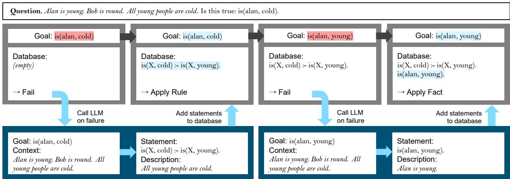  
Figure 3: Overview of SymBa. In SymBa, a symbolic SLD Resolution solver (gray) controls the proof process. When a goal is not provable by the solver alone, an LLM (navy) is instructed to generate a single reasoning step which is then added to the symbolic solver’s database (working memory).

Besides the binding propagation problem, LAM-BADA does not implement disjunction.2 As a result, the behavior when the rule and goal have different signs is undefined, as such cases require transforming conjunctive ( ) rules into disjunctive ( ) ones by De Morgan’s laws.

## 3.2 Proposed method

## 3.2.1 Symbolic Backward Chaining

To overcome the limitations described above, we propose SymBa (Symbolic Backward Chaining), which directly integrates an SLD Resolution solver and an LLM for backward chaining in a coroutine (Figure 3).

Initially, the solver cannot prove the provided goal because its symbolic database (working memory) is empty. To make progress, the solver calls the LLM to check if there is a rule or a fact in the natural language descriptions that might unify with the failed goal. When the LLM generates a unifying statement, the solver retries proving the failed goal with the new statement. The process is continued until the topmost goal is proved, or every possible reasoning path fails.

Delegating the proof control to a solver has numerous advantages. Most importantly, these solvers are sound and complete, guaranteeing correct explanations, provided that the symbolic statements are accurate. Furthermore, solver operations are lightweight compared to computationally intense LLM inferences.

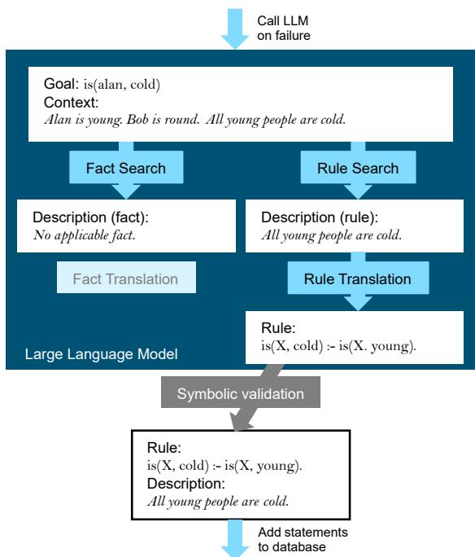  
Figure 4: Brief illustration of the modules in SymBa’s single statement generation procedure. Search modules retrieve plausible reasoning steps from the context, which are translated into symbolic form by translation modules. Statements that pass the Symbolic Validation module are added to the solver’s database.

## 3.2.2 Single-step statement generation

In SymBa, the LLM is instructed to generate a logic program statement that can prove the current subgoal. Similarly to previous work on structured reasoning that adopts a modular strategy (Creswell et al., 2023; Kazemi et al., 2023), we divide the single-step statement generation process into five modules. Fact/Rule Search, Fact/Rule Translation, and Symbolic Validation (Figure 4).

Fact/Rule Search In the first stage, the LLM is prompted with the symbolic goal term and the natural language description of facts and rules, and retrieves ones that might prove the goal.

Fact/Rule Translation Subsequently, the LLM is given the goal and the natural language rule (obtained from the Search module) and generates a symbolic statement.

Symbolic Validation As a final step, SymBa checks the translated facts and rules if they are (1) syntactically correct and (2) unify with the goal, which ensures that the translated statements can prove the goal term. Note that this step is purely symbolic and does not require any LLM inference.

## 4 Experimental settings

## 4.1 Benchmarks

Deductive reasoning Four representative benchmarks for deductive reasoning, namely the ProofWriter family (ProofWriter, Birds-Electricity, ParaRules) (Tafjord et al., 2021; Clark et al., 2020) and PrOntoQA (Saparov and He, 2023), are tested. Each instance is formulated as a binary classification task, deciding whether the given query can be proved according to the given rules and facts or not (closed-world assumption).

Relational reasoning CLUTRR (Sinha et al., 2019) is a relational reasoning benchmark based on human-written stories about family relations. For our experiments, we reformulate the task into true/false form, where two entities and a relation are presented and one should predict if the given relation can be deduced from the story.

Arithmetic reasoning We use two popular arithmetic benchmarks, namely MAWPS (Koncel-Kedziorski et al., 2016) and GSM8k (Cobbe et al., 2021). For both benchmarks, the goal is to predict the correct numeric answer for a short question.

For all benchmarks, performance is evaluated based on task accuracy, which measures whether the predicted answer matches the gold label (true/false for deductive or relational tasks, and numerical for arithmetic tasks). Additionally, we manually assess proofaccuracy by verifying that every step in the proof is both correct and relevant (Saparov and He, 2023; Kazemi et al., 2023).

More information, including data statistics, fewshot example construction, logic program representation, and evaluation methods, can be found in Appendix B.

## 4.2 Solver

To implement the algorithm described in Section 2.2, we develop an SLD Resolution-based solver in Python with necessary extensions, such as negation handling and arithmetic operations.

## 4.3 Single-step statement generation

To reproduce baselines and implement SymBa, we use three open- and closed-sourced state-of-the-art LLMs: GPT-4 Turbo (Achiam et al., 2023), Claude 3 Sonnet (Anthropic, 2023), and LLaMa 3 70B Instruct (Adams et al., 2024).

For each module of SymBa, few-shot demonstrations were sampled from each training split and manually converted to logic programs. To increase robustness, we adjust the few-shot examples to suppress hallucinations. Details can be found in Appendix C.1.

## 5 Results

## 5.1 Answer accuracy

The main results are presented in Table 1. Among the three backward chaining systems compared (Least-to-most prompting, LAMBADA, and SymBa), SymBa demonstrates the strongest performance in diverse types of reasoning (deductive, relational, and arithmetic) and with different LLMs.

As LAMBADA does not implement binding propagation, LAMBADA cannot answer any arithmetic reasoning questions (Figure 5). For CLUTRR, LAMBADA achieves higher answer accuracy than the random baseline (50.0), but it is only superficial because LAMBADA cannot apply coreferential constraints (further discussed in Section 5.2).

The performance of SymBa and baselines in ProofWriter is further analyzed in Table 2. We divide ProofWriter questions into Proof questions that have a valid proof that either proves or disproves the goal, and ∄Proof questions that cannot be proved or disproved due to lack of relevant information. Proof questions are again separated into Negation if the proof includes at least one negation (not) and ∄Negation otherwise. For example, the question in Figure 2 is in both Proof and ∄Negation because there is a valid proof that proves the goal, which does not contain any negation.

<table><tr><td rowspan="2">Model</td><td rowspan="2">Method</td><td colspan="4">Deductive</td><td>Relational</td><td colspan="2">Arithmetic</td></tr><tr><td>ProofWriter</td><td>BirdsElec</td><td>ParaRules</td><td>PrOntoQA</td><td>CLUTRR</td><td>MAWPS</td><td>GSM8k</td></tr><tr><td rowspan="3">GPT-4</td><td>Least-to-most</td><td>71.5</td><td>88.2</td><td>71.8</td><td>87.5</td><td>81.5</td><td>84.3</td><td>60.6</td></tr><tr><td>LAMBADA</td><td>69.7</td><td>83.4</td><td>59.7</td><td>96.0</td><td>73.8</td><td>0.0</td><td>0.0</td></tr><tr><td>SymBa</td><td>79.8</td><td>94.4</td><td>79.2</td><td>96.3</td><td>84.3</td><td>86.7</td><td>63.8</td></tr><tr><td rowspan="3">Claude-3</td><td>Least-to-most</td><td>60.3</td><td>75.7</td><td>54.0</td><td>86.0</td><td>77.0</td><td>94.2</td><td>59.3</td></tr><tr><td>LAMBADA</td><td>69.3</td><td>62.7</td><td>57.7</td><td>67.0</td><td>69.0</td><td>0.0</td><td>0.0</td></tr><tr><td>SymBa</td><td>77.6</td><td>77.3</td><td>69.0</td><td>91.0</td><td>85.0</td><td>94.1</td><td>67.4</td></tr><tr><td rowspan="3">LLaMa-3</td><td>Least-to-most</td><td>61.4</td><td>71.0</td><td>66.7</td><td>95.0</td><td>72.0</td><td>89.0</td><td>61.5</td></tr><tr><td>LAMBADA</td><td>64.0</td><td>82.3</td><td>62.1</td><td>90.8</td><td>73.3</td><td>0.0</td><td>0.0</td></tr><tr><td>SymBa</td><td>70.4</td><td>92.9</td><td>71.7</td><td>93.3</td><td>90.5</td><td>87.9</td><td>67.0</td></tr></table>

Table 1: Average answer accuracy (%) on four runs per each benchmark, LLM model, and reasoning method. Boldface indicates that the accuracy is significantly higher than others (confidence 95%). LAMBADA predicts nothing in arithmetic benchmarks, resulting in zero accuracy. Complete results are shown in Appendix E.

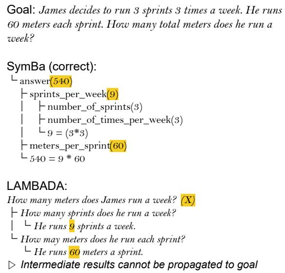  
Figure 5: Example of LAMBADA’s failure in GSM8k. While it can derive correct intermediate values, the lack of binding propagation from subgoal to goal will disallow them to be combined in higher nodes.

Least-to-most achieves low accuracy in the ∄Proof set, i.e. it frequently outputs a proof to an unprovable goal. On the other hand, SymBa and LAMBADA achieve near-perfect scores in ∄Proof, indicating that multi-depth decomposition and backtracking enhance the precision of the generated explanations. Although Least-to-most’s accuracy seems to be high in the Proof set, we show that the generated explanations are often incorrect, shadowing the accuracy gain (Section 5.2).

As mentioned in Section 3.1, LAMBADA cannot properly handle cases where the goal and the rule’s sign disagree. The result shows that LAMBADA’s accuracy significantly drops in Negation, which explains the performance gap between SymBa and LAMBADA in deductive benchmarks without binding propagation.

<table><tr><td rowspan="2">Method</td><td colspan="2">∃Proof</td><td rowspan="2">Proof</td><td rowspan="2">Overall</td></tr><tr><td></td><td>∃Neg. Neg.</td></tr><tr><td># examples</td><td>97</td><td>76</td><td>127</td><td>300</td></tr><tr><td>Least-to-most</td><td>77.6</td><td>72.4</td><td>65.6</td><td>71.5</td></tr><tr><td>LAMBADA</td><td>4.7</td><td>73.2</td><td>98.2</td><td>69.7</td></tr><tr><td>SymBa</td><td>72.2</td><td>59.6</td><td>97.4</td><td>79.8</td></tr></table>

Table 2: Fine-grained answer accuracy (%) for ProofWriter (All systems use GPT-4 Turbo). Leastto-most demonstrates significantly low performance in ∄Proof set, and LAMBADA suffers handling negation ( Negation).

## 5.2 Proof accuracy

One of the key benefits of structured reasoning is that it generates more inspectable outputs (Ribeiro et al., 2023). In this section, we analyze the proof accuracy of three backward chaining systems in four benchmarks. Following Kazemi et al. (2023), 30 proofs with correct answers are sampled from ∄Neg ( Proof) and examined to see if they include any false intermediate statements or exclude necessary reasoning steps.

Results are presented in Figure 6. It is shown that SymBa generates the most accurate proofs, where Least-to-most and LAMBADA prompting demonstrates significantly degraded proof accuracy in specific tasks.

For Least-to-most, the low proof accuracy can be attributed to shortcuts, where it fails to find an accurate decomposition but somehow reaches the correct answer. Figure 7 illustrates the case where Least-to-most produces incorrect explanations.

In the case of LAMBADA, it cannot find the correct reasoning path if more than two bridging entities are involved in the proof (Figure 5). LAM-BADA’s proof can only be accurate when there is zero or one bridging entity in the gold path, which is a coincidence rather than a success.

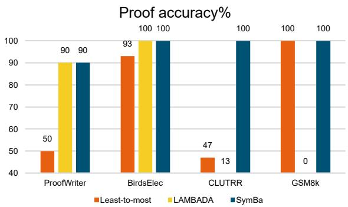

Figure 6: Proof accuracy on four reasoning benchmarks, using GPT-4 Turbo. Least-to-most achieves low proof accuracy in all benchmarks, while LAMBADA suffers in relational and arithmetic reasoning tasks.
<table><tr><td rowspan=1 colspan=1></td><td rowspan=1 colspan=1>Tokens</td><td rowspan=1 colspan=1>Cost($)</td><td rowspan=1 colspan=1>Time(h)</td></tr><tr><td rowspan=1 colspan=1>CoT</td><td rowspan=1 colspan=1>202,420</td><td rowspan=1 colspan=1>8.02</td><td rowspan=1 colspan=1>0.62</td></tr><tr><td rowspan=1 colspan=1>Least-to-mostLAMBADASymBa</td><td rowspan=1 colspan=1>1,485,9896,625,623880,106</td><td rowspan=1 colspan=1>47.14221.7227.22</td><td rowspan=1 colspan=1>1.1823.961.15</td></tr></table>

Table 3: Token/cost/time consumption (lower the better) for 300 examples in ProofWriter benchmark in GPT-4 Turbo. Regarding the cost, the OpenAI API used in this study charges \$0.03 per 1,000 input tokens and \$0.05 per 1,000 output tokens.

## 5.3 Efficiency

To compare the efficiency of the compared methods, we report the token usage, API cost, and execution time for completing 300 examples in ProofWriter following Kazemi et al. (2023).

The results are presented in Table 3. SymBa achieves 9x token/cost efficiency and 22x speed compared to LAMBADA. While LAMBADA uses an LLM to perform decomposition and unification checks, these processes run symbolically in SymBa, significantly reducing LLM inference cost.

Despite performing a complete search when Least-to-most performs decomposition only once, SymBa is even more efficient than Least-to-most prompting in ProofWriter. Although Least-to-most prompting can be optimized by dynamically appending the questions to intermediate sequences during the inference, currently available commercial LLM APIs do not support such functionality.

## 6 Analysis

## 6.1 Solver ablation

In previous sections, we show that Least-to-most’s lack of backtracking reduces proof accuracy, and LAMBADA’s lack of binding propagation restricts relational and arithmetic reasoning ability. However, the implementation details of SymBa and the baselines are significantly different; e.g. SymBa uses logic programs as intermediate representations for reasoning. Therefore, we conduct an ablation study on SymBa to refine the empirical effects of binding propagation and backtracking.

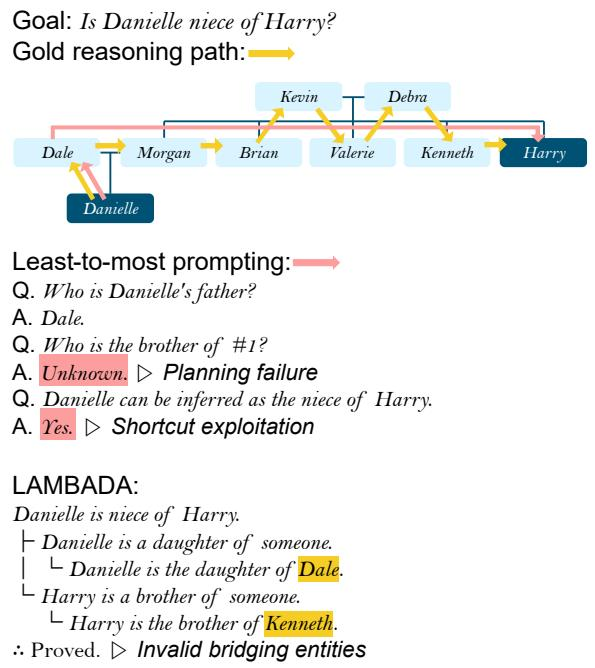  
Figure 7: Example from CLUTRR. The proof is correct if it shows a chain of bridging entities, possibly omitting some. Least-to-most exploits shortcut, as it mispredicted the reasoning path but answered the final question correctly. LAMBADA cannot resolve the coreference between bridging entities, leading to disconnected proof.

In this section, we directly manipulate the solver algorithm, while the LLM portion (single-step statement generation) remains as it is. In the -Backtrack setting, the symbolic solver will apply only one decomposition and binding even if there are multiple possible ways, as in Figure 2(a). In the -BindingProp setting, the bindings obtained from previous subgoals are not propagated to subsequent ones, as in Figure 2(b).

The results are presented in Table 4. -Backtrack setting achieves significantly degraded performance in Birds-Electricity and CLUTRR by more than 10%p, indicating that traversing multiple reasoning paths is crucial in these benchmarks. Compared to Least-to-most, -Backtrack performs better in ProofWriter but worse in CLUTRR. While Least-to-most exhibits low proof accuracy in both datasets (Figure

<table><tr><td rowspan=2 colspan=1></td><td rowspan=2 colspan=1>PW</td><td rowspan=2 colspan=1>BE</td><td></td><td></td></tr><tr><td rowspan=1 colspan=1>CLUTRR</td><td rowspan=1 colspan=1>GSM8k</td></tr><tr><td rowspan=1 colspan=1>SymBa</td><td rowspan=1 colspan=1>79.8</td><td rowspan=1 colspan=1>94.4</td><td rowspan=1 colspan=1>84.3</td><td rowspan=1 colspan=1>63.8</td></tr><tr><td rowspan=1 colspan=1>-Backtrack(Least-to-most)</td><td rowspan=1 colspan=1>76.371.5</td><td rowspan=1 colspan=1>82.983.4</td><td rowspan=1 colspan=1>69.881.5</td><td rowspan=1 colspan=1>62.060.6</td></tr><tr><td rowspan=1 colspan=1>-BindingProp(LAMBADA)</td><td rowspan=1 colspan=1>80.569.7</td><td rowspan=1 colspan=1>92.283.4</td><td rowspan=1 colspan=1>68.373.8</td><td rowspan=1 colspan=1>0.00.0</td></tr></table>

Table 4: Answer accuracy (%) of -Backtrack and -BindingProp for four benchmarks, experimented with GPT-4 Turbo. PW and BE stand for ProofWriter and Bird-Electricity, respectively. Results from Least-tomost and LAMBADA are also presented for reference.

6), Least-to-most tends to find a shortcut in CLUTRR that mitigates the effect of incorrect decomposition.

Analogous to LAMBADA, -BindingProp cannot answer GSM8k by design, as there is no way to pass the calculated results to the root goal. The -BindingProp outperforming LAMBADA in deductive benchmarks can again be attributed to negation handling.

## 6.2 Single-step statement generation ablation

While the SLD Resolution solver plays a key role in SymBa, the implementation of single-step statement generation (LLM-based component) also affects SymBa’s performance. We perform ablation studies on the LLM-based modules and few-shot prompting methods. Due to space limits, the results are presented in Appendix C.

## 7 Related works

## 7.1 Backward chaining in Natural Language Reasoning

Backward chaining has not been explored much in the era of LLMs. At the time of writing, the only work that explicitly claims to be an LLM-based backward chaining system is LAMBADA (Kazemi et al., 2023).

Alternatively, some backward chaining works use relatively small models directly fine-tuned with in-domain data (Tafjord et al., 2022; Bostrom et al., 2022; Hong et al., 2022). These methods train individual modules for rule generation and step verification, achieving strong results in its target domain but on behalf of the costly construction of in-domain training data.

Furthermore, as previously described in Section 3.1, approaches based on task decomposition (Zhou et al., 2023; Khot et al., 2023; Radhakrishnan et al., 2023) can be viewed as a type of backward chaining (Huang and Chang, 2023). Nonetheless, these methods tend to demonstrate relatively low proof accuracy due to decomposition failure (Radhakrishnan et al., 2023, Section 5.2 of this work), while SymBa is capable of providing a fully structured proof with high precision.

## 7.2 LLM and Logic programming

Integrating logic programming and LLMs for reasoning is a recently emerging topic (Pan et al., 2023; Yang et al., 2023; Olausson et al., 2023, inter alia.), triggered by the improvement in reasoning and code generation ability of LLMs. The majority of these works implement a similar two-stage approach: (1) convert the natural language reasoning task into a logic program, and (2) run an external solver to prove the query.

SymBa differs from these methods as the solver is integrated into the loop instead of operating in separate stages. It is reported that LLMs often choose incompatible representations for the same concept or fail to discover information that does not surface in the premises (Olausson et al., 2023), as they generate the code without any hierarchical cues about how statements are structured. These issues can be potentially mitigated by the backward chaining of SymBa, as it ensures that all subgoals are addressed at least once by backtracking and that the generated statement unifies with the query by the Symbolic Verification module.

## 8 Conclusion

While backward chaining is a promising direction for structured natural language reasoning, current LLM-based approaches like Least-to-most and LAMBADA are only incomplete reproductions of backward chaining as they leave out backtracking and binding propagation. To this extent, we build SymBa directly from the SLD Resolution algorithm. In SymBa, a symbolic solver controls the proof, while an LLM searches and translates relevant natural language statements into symbolic representations.

SymBa outperforms backward chaining baselines in diverse reasoning tasks including deductive, relational, and arithmetic reasoning. Not only does it reach the correct answer more frequently, but also demonstrates improved proof accuracy and efficiency than baselines. From both theoretical and empirical perspectives, we believe that SymBa significantly extends the horizon of LLM-based backward chaining.

## 9 Limitations

While SymBa significantly improves the completeness, performance, and efficiency of LLM-based backward chaining, it still holds limitations inherited from backward chaining, symbolic reasoning, and LLMs.

Even though backward chaining proof always terminates, a naively implemented backward chaining system might still require substantial computation in fact-intensive tasks such as knowledge base question answering (KBQA) (Yih et al., 2016; Gu et al., 2021). This might be mitigated by hybrid forward and backward chaining (Hong et al., 2022) or by using sophisticated planning algorithms for symbolic solvers (Lu et al., 2012; Yang et al., 2023). We leave this direction as future work.

Furthermore, some reasoning problems may not be able to be effectively formulated in logic programming notations as in this study. Most notably, solving high-order logic problems generally requires meta-predicates that reason over the database, such as call/N in Prolog (Chen et al., 1993), which cannot be handled using the firstorder SLD Resolution algorithm of SymBa. Besides high-order logic, some reasoning tasks (e.g. Dalvi et al., 2021; Zellers et al., 2019) require reasoning with complex linguistic expressions and highly pragmatic assumptions, which might not be effectively expressed using logic programming.

Finally, LLMs often produce counterfactual and inconsistent information, and can potentially cause risk when used in domains where high precision and factuality are required. While SymBa reduces errors by leveraging the symbolic solver and applying a modular approach, the single-step statement generation based on LLM is still subjective to producing false reasoning steps that might lead to the wrong conclusion.

## 10 Acknowledgements

We would like to express our sincere gratitude to Hyunjun Kim for his invaluable advice in the initial stages of the research. We also thank Julia Hockenmaier and Takyoung Kim for their constructive suggestions and encouragement, which greatly contributed to the completion of this work.

## References

Josh Achiam, Steven Adler, Sandhini Agarwal, Lama Ahmad, Ilge Akkaya, Florencia Leoni Aleman, Diogo Almeida, Janko Altenschmidt, Sam Altman, Shyamal Anadkat, et al. 2023. Gpt-4 technical report. arXiv preprint arXiv:2303.08774.

Lisa C Adams, Daniel Truhn, Felix Busch, Felix Dorfner, Jawed Nawabi, Marcus R Makowski, and Keno K Bressem. 2024. Llama 3 challenges proprietary state-of-the-art large language models in radiology board–style examination questions. Radiology, 312(2):e241191.

Anthropic. 2023. Claude.

K.R. Apt and K. Doets. 1992. A New Definition of SLDNF-resolution. Amsterdam ILLC CT. Institute for Logic, Language and Computation.

Kaj Bostrom, Zayne Sprague, Swarat Chaudhuri, and Greg Durrett. 2022. Natural language deduction through search over statement compositions. In Findings of the Association for Computational Linguistics: EMNLP 2022, pages 4871–4883, Abu Dhabi, United Arab Emirates. Association for Computational Linguistics.

Weidong Chen, Michael Kifer, and David Scott Warren. 1993. HILOG: A foundation for higher-order logic programming. J. Log. Program., 15(3):187–230.

Peter Clark, Oyvind Tafjord, and Kyle Richardson. 2020. Transformers as soft reasoners over language. In Proceedings ofthe Twenty-Ninth International Joint Conference on Artificial Intelligence, IJCAI-20, pages 3882–3890. International Joint Conferences on Artificial Intelligence Organization. Main track.

Karl Cobbe, Vineet Kosaraju, Mohammad Bavarian, Mark Chen, Heewoo Jun, Lukasz Kaiser, Matthias Plappert, Jerry Tworek, Jacob Hilton, Reiichiro Nakano, Christopher Hesse, and John Schulman. 2021. Training verifiers to solve math word problems. arXiv preprint arXiv:2110.14168.

Antonia Creswell, Murray Shanahan, and Irina Higgins. 2023. Selection-inference: Exploiting large language models for interpretable logical reasoning. In The Eleventh International Conference on Learning Representations, ICLR 2023, Kigali, Rwanda, May 1-5, 2023.

Bhavana Dalvi, Peter Jansen, Oyvind Tafjord, Zhengnan Xie, Hannah Smith, Leighanna Pipatanangkura, and Peter Clark. 2021. Explaining answers with entailment trees. In Proceedings ofthe 2021 Conference on Empirical Methods in Natural Language Processing, pages 7358–7370, Online and Punta Cana, Dominican Republic. Association for Computational Linguistics.

Yu Gu, Sue Kase, Michelle Vanni, Brian Sadler, Percy Liang, Xifeng Yan, and Yu Su. 2021. Beyond iid: three levels of generalization for question answering

on knowledge bases. In Proceedings of the Web Conference 2021, pages 3477–3488. ACM.

Ruixin Hong, Hongming Zhang, Xintong Yu, and Changshui Zhang. 2022. METGEN: A modulebased entailment tree generation framework for answer explanation. In Findings of the Association for Computational Linguistics: NAACL 2022, pages 1887–1905, Seattle, United States. Association for Computational Linguistics.

Jie Huang and Kevin Chen-Chuan Chang. 2023. Towards reasoning in large language models: A survey. In Findings of the Association for Computational Linguistics: ACL 2023, pages 1049–1065, Toronto, Canada. Association for Computational Linguistics.

Mehran Kazemi, Najoung Kim, Deepti Bhatia, Xin Xu, and Deepak Ramachandran. 2023. LAMBADA: Backward chaining for automated reasoning in natural language. In Proceedings of the 61st Annual Meeting of the Association for Computational Linguistics (Volume 1: Long Papers), pages 6547–6568, Toronto, Canada. Association for Computational Linguistics.

Tushar Khot, Harsh Trivedi, Matthew Finlayson, Yao Fu, Kyle Richardson, Peter Clark, and Ashish Sabharwal. 2023. Decomposed prompting: A modular approach for solving complex tasks. In The Eleventh International Conference on Learning Representations.

Takeshi Kojima, Shixiang Shane Gu, Machel Reid, Yutaka Matsuo, and Yusuke Iwasawa. 2022. Large language models are zero-shot reasoners. In Advances in Neural Information Processing Systems 35: Annual Conference on Neural Information Processing Systems 2022, NeurIPS 2022, New Orleans, LA, USA, November 28 - December 9, 2022.

Rik Koncel-Kedziorski, Subhro Roy, Aida Amini, Nate Kushman, and Hannaneh Hajishirzi. 2016. MAWPS: A math word problem repository. In Proceedings of the 2016 Conference of the North American Chapter ofthe Associationfor Computational Linguistics: Human Language Technologies, pages 1152–1157, San Diego, California. Association for Computational Linguistics.

Robert Kowalski. 1974. Predicate logic as programming language. In IFIP congress, volume 74, pages 569– 544.

Vladimir Lifschitz. 2019. Answer set programming, volume 3. Springer Heidelberg.

Jian Liu, Leyang Cui, Hanmeng Liu, Dandan Huang, Yile Wang, and Yue Zhang. 2020. Logiqa: A challenge dataset for machine reading comprehension with logical reasoning. In Proceedings ofthe Twenty-Ninth International Joint Conference on Artificial Intelligence, IJCAI-20, pages 3622–3628. International Joint Conferences on Artificial Intelligence Organization. Main track.

Benjie Lu, Zhiqing Liu, and Hui Gao. 2012. An adaptive prolog programming language with machine learning. In 2nd IEEE International Conference on Cloud Computing and Intelligence Systems, CCIS 2012, Hangzhou, China, October 30 - November 1, 2012, pages 21–24. IEEE.

Kyle Marple, Elmer Salazar, and Gopal Gupta. 2017. Computing stable models of normal logic programs without grounding. CoRR, abs/1709.00501.

Theo Olausson, Alex Gu, Ben Lipkin, Cedegao Zhang, Armando Solar-Lezama, Joshua Tenenbaum, and Roger Levy. 2023. LINC: A neurosymbolic approach for logical reasoning by combining language models with first-order logic provers. In Proceedings of the 2023 Conference on Empirical Methods in Natural Language Processing, pages 5153–5176, Singapore. Association for Computational Linguistics.

Liangming Pan, Alon Albalak, Xinyi Wang, and William Wang. 2023. Logic-LM: Empowering large language models with symbolic solvers for faithful logical reasoning. In Findings of the Association for Computational Linguistics: EMNLP 2023, pages 3806–3824, Singapore. Association for Computational Linguistics.

Pruthvi Patel, Swaroop Mishra, Mihir Parmar, and Chitta Baral. 2022. Is a question decomposition unit all we need? In Proceedings of the 2022 Conference on Empirical Methods in Natural Language Processing, pages 4553–4569, Abu Dhabi, United Arab Emirates. Association for Computational Linguistics.

David Poole and Alan K. Mackworth. 2010. Artificial Intelligence - Foundations ofComputational Agents. Cambridge University Press.

Ansh Radhakrishnan, Karina Nguyen, Anna Chen, Carol Chen, Carson Denison, Danny Hernandez, Esin Durmus, Evan Hubinger, Jackson Kernion, Kamile Lukoši ˙ ut¯ e, Newton Cheng, Nicholas Joseph,˙ Nicholas Schiefer, Oliver Rausch, Sam McCandlish, Sheer El Showk, Tamera Lanham, Tim Maxwell, Venkatesa Chandrasekaran, Zac Hatfield-Dodds, Jared Kaplan, Jan Brauner, Samuel R. Bowman, and Ethan Perez. 2023. Question decomposition improves the faithfulness of model-generated reasoning.

Danilo Neves Ribeiro, Shen Wang, Xiaofei Ma, Henghui Zhu, Rui Dong, Deguang Kong, Juliette Burger, Anjelica Ramos, zhiheng huang, William Yang Wang, George Karypis, Bing Xiang, and Dan Roth. 2023. STREET: A MULTI-TASK STRUCTURED REASONING AND EXPLANA-TION BENCHMARK. In International Conference on Learning Representations.

Abulhair Saparov and He He. 2023. Language models are greedy reasoners: A systematic formal analysis of chain-of-thought. In The Eleventh International Conference on Learning Representations, ICLR 2023, Kigali, Rwanda, May 1-5, 2023. OpenReview.net.

Kazutoshi Shinoda, Saku Sugawara, and Akiko Aizawa. 2021. Can question generation debias question answering models? a case study on question–context lexical overlap. In Proceedings of the 3rd Workshop on Machine Reading for Question Answering, pages 63–72, Punta Cana, Dominican Republic. Association for Computational Linguistics.

Koustuv Sinha, Shagun Sodhani, Jin Dong, Joelle Pineau, and William L. Hamilton. 2019. CLUTRR: A diagnostic benchmark for inductive reasoning from text. In Proceedings of the 2019 Conference on Empirical Methods in Natural Language Processing and the 9th International Joint Conference on Natural Language Processing (EMNLP-IJCNLP), pages 4506–4515, Hong Kong, China. Association for Computational Linguistics.

Oyvind Tafjord, Bhavana Dalvi, and Peter Clark. 2021. ProofWriter: Generating implications, proofs, and abductive statements over natural language. In Findings of the Association for Computational Linguistics: ACL-IJCNLP 2021, pages 3621–3634, Online. Association for Computational Linguistics.

Oyvind Tafjord, Bhavana Dalvi Mishra, and Peter Clark. 2022. Entailer: Answering questions with faithful and truthful chains of reasoning. In Proceedings of the 2022 Conference on Empirical Methods in Natural Language Processing, pages 2078–2093, Abu Dhabi, United Arab Emirates. Association for Computational Linguistics.

Jason Wei, Yi Tay, Rishi Bommasani, Colin Raffel, Barret Zoph, Sebastian Borgeaud, Dani Yogatama, Maarten Bosma, Denny Zhou, Donald Metzler, Ed H. Chi, Tatsunori Hashimoto, Oriol Vinyals, Percy Liang, Jeff Dean, and William Fedus. 2022. Emergent abilities of large language models. Trans. Mach. Learn. Res., 2022.

Jan Wielemaker, Tom Schrijvers, Markus Triska, and Torbjörn Lager. 2012. SWI-Prolog. Theory and Practice ofLogic Programming, 12(1-2):67–96.

Sen Yang, Xin Li, Leyang Cui, Lidong Bing, and Wai Lam. 2023. Neuro-symbolic integration brings causal and reliable reasoning proofs. arXiv preprint.

Wen-tau Yih, Matthew Richardson, Chris Meek, Ming-Wei Chang, and Jina Suh. 2016. The value of semantic parse labeling for knowledge base question answering. In Proceedings ofthe 54th Annual Meeting of the Association for Computational Linguistics (Volume 2: Short Papers), pages 201–206, Berlin, Germany. Association for Computational Linguistics.

Rowan Zellers, Ari Holtzman, Yonatan Bisk, Ali Farhadi, and Yejin Choi. 2019. Hellaswag: Can a machine really finish your sentence? In Proceedings of the 57th Annual Meeting of the Association for Computational Linguistics.

Denny Zhou, Nathanael Schärli, Le Hou, Jason Wei, Nathan Scales, Xuezhi Wang, Dale Schuurmans, Claire Cui, Olivier Bousquet, Quoc V. Le, and Ed H. Chi. 2023. Least-to-most prompting enables complex reasoning in large language models. In The Eleventh International Conference on Learning Representations, ICLR 2023, Kigali, Rwanda, May 1-5, 2023.

Lexin Zhou, Wout Schellaert, Fernando Martínez-Plumed, Yael Moros-Daval, Cèsar Ferri, and José Hernández-Orallo. 2024. Larger and more instructable language models become less reliable. Nature, pages 1–8.

## A Formal definition of SymBa

In this section, we provide an algorithmic description of SymBa. SymBa can be viewed as an extension of the SLD Resolution (Selective Linear Definite Resolution) algorithm (Kowalski, 1974), which is the staple of modern logic programming languages like SWI-Prolog (Wielemaker et al., 2012). A pseudo-code for SymBa is presented in Algorithm 1. The notations used throughout this section are presented in Table 5.

<table><tr><td>Notation</td><td>Definition</td></tr><tr><td> $\overline { { h , p , q } }$ </td><td>Terms</td></tr><tr><td> $\mathbb { T }$ </td><td>Set of all terms</td></tr><tr><td> $B ( p )$ </td><td>A proved binding for term p.</td></tr><tr><td> $B ( p )$ </td><td>List of all proved bindings for term  $p .$ </td></tr><tr><td> $\mathbb { B }$ </td><td>Set of all bindings.</td></tr><tr><td> $\mathbf { r }$ </td><td>Rule</td></tr><tr><td> $\mathbf { r } . h e a d$ </td><td>Rule head (term)</td></tr><tr><td>r.subgoal</td><td>Rule subgoals (list of terms)</td></tr><tr><td> $\mathrm { N L }$ </td><td>Natural language description of rules</td></tr></table>

Table 5: Notations used in Appendix A. Note that facts are special instances of rules where $| \mathbf { r } . s u b g o a l | = 0$

Before proceeding to the algorithm, we introduce three procedures about unification and binding, namely UNIFY : $\mathbb { T } \times \mathbb { T } \to \{ 0 , 1 \}$ , BINDING : $\mathbb { T } \times \mathbb { T } \to \mathbb { B }$ , and BIND : $\mathbb { T } \times \mathbb { B }  \mathbb { T }$ . As described in Section 2.2, two terms are said to unify if there is a valid binding that makes the terms identical. UNIFY returns a boolean value indicating whether the two terms unify or not. BINDING returns the binding of two terms if they unify. BIND takes a term (possibly containing variables) and a binding as its argument, and returns the bound term after substituting the variables from the term to the corresponding values. By definition, for any two terms $p$ and $q$ that satisfy $\mathrm { U N I F Y } ( p , q )$ , BIND(p, BINDING $( p , q ) ) =$ BIND(q, BINDING $( p , q ) )$ ) should always hold.

SOLVE is the main procedure of SymBa. It receives a goal term q as a parameter and refers to the global database to compute $B ( q )$ , the list of all provable bindings for $q .$ If $B ( q )$ is not empty, it implies that q can be proved on . Otherwise, the goal cannot be proved.

The main loop, which performs a combinatorial search for every possible binding, is shown in Lines 5-19. First, rules that unify with the goal are selected from the database (Line 4, Search). The initial binding $B _ { 0 }$ is the binding between the rule head and the goal. We iterate through the subgoals (Line 7, Decompose) to perform a complete search.

For each subgoal $p _ { t }$ , we bind the subgoal using the previous binding $B ( p _ { t - 1 } ) _ { \ i }$ i (Line 10, Binding propagation). The partially bound subgoal $p _ { t , i }$ is proved by recursively calling SOLVE, which returns a list of bindings $B ( p _ { t , i } )$ for $p _ { t , i }$ (Line 11). The binding $B ( p _ { t , i } )$ is updated to the new bindings $B ( p _ { t , i } ) _ { j }$ (Line 15), which will be propagated to the next subgoal $p _ { t + 1 }$

After testing all subgoals, if $B ( p _ { T } )$ is non-empty, we can conclude that $q$ is proved with respect to the binding. In constant, if any subgoal $p _ { t }$ is not provable, $B ( p _ { T } )$ will eventually be empty. However, as we are iterating through all unifying rules (Line 5, Backtracking), SOLVE will proceed to other possible decompositions.

Single-step statement generation, the novel mechanism of SymBa, is shown in Lines 23- 25. When the binding for goal $q$ and all subgoals $p _ { i }$ is found, proof has succeeded and SOLVE returns the binding. However, when the proof has failed, the single-step statement generation (SINGLESTEPSTMTGEN) process described in Section 3.2 is called, returning a new statement ${ \bf r } _ { n e w }$ from the natural language description $N L$ and the goal $q .$ If the procedure succeeds, ${ \bf r } _ { n e w }$ is added to $\mathcal { D } ,$ and the solver re-attempts to solve $q$ with the updated database.

For brevity, here we do not further describe extensions and optimizations, namely Negation-asfailure (Apt and Doets, 1992), arithmetic and comparison operators, odd loop on negation (OLON) (Marple et al., 2017), goal tabling, and proof tree generation. Full implementation of SymBa can be found in this repository.

## B Dataset details

This section describes the sampling, preprocessing, and evaluation of benchmarks. Table 6 presents brief information and statistics about the seven benchmarks used in this paper.

All datasets used in this study allow free use, modification, and redistribution for noncommercial applications.

## B.1 ProofWriter family

Test split sampling From the ProofWriter family, we sample the evaluation set from the test split of the closed-world assumption subset (CWA). Specifically, for ProofWriter, we use the dep5 subset, which has a deepest maximum reasoning depth of 5. Since a single context includes multiple questions, we first sample 300 contexts and randomly sample a question from it. As a result, we obtain 300 (context, question) tuples for each dataset.

Algorithm 1 Algorithm of SymBa   
1: global $\mathcal { D } \gets e m p t y$ set, NL natural language description   
2: procedure ${ \mathrm { S o L V E } } ( q )$ ▷ Input: goal term, Returns: list of bindings   
3: $B ( q ) $ empty list   
4: $\mathcal { R }  \{ \mathbf { r } \in \mathcal { D } \mid \mathrm { U N I F Y } ( \mathbf { r } . h e a d , q ) \}$ ▷ Search: find unifying rules from database   
5: for $\mathbf { r } \in \mathcal { R }$ do ▷ Backtracking: If a rule fails, try another   
6: $B ( { \bf r } . h e a d ) \gets [ { \bf B } \mathrm { I N D I N G } ( { \bf r } . h e a d , q ) ]$   
7: for $p _ { t } \in { \bf r } . s u b g o a l = [ p _ { 1 } , . . . , p _ { T } ]$ do ▷ Decompose: Iterate through subgoals   
8: $B ( p _ { t } ) \gets e m p t y ~ l i s t$   
9: for $B ( p _ { t - 1 } ) _ { i } \in B ( p _ { t - 1 } )$ do   
10: $p _ { t , i } \gets \mathrm { B I N D } ( p _ { t } , B ( p _ { t - 1 } ) _ { i } )$ ▷ Binding Propagation: Bind $p _ { t }$ with previous bindings   
11: $B ( p _ { t } ) _ { i } \gets \mathrm { S o L V E } ( p _ { t , i } )$   
12: for $B ( p _ { t , i } ) _ { j } \in B ( p _ { t , i } )$ do   
13: $B ( p _ { t , i } ) _ { j }  B ( p _ { t , i } ) _ { j } \cup B ( p _ { t - 1 } ) _ { i }$   
14: end for   
15: Extend $B ( p _ { t } ) _ { i }$ to $B ( p _ { t } )$ ▷ Accumulate bindings for propagation   
16: end for   
17: end for   
18: Extend $B p _ { T }$ to $B ( q )$   
19: end for   
20: if $B p _ { T }$ is not empty then ▷ Proof success   
21: return $B ( q )$   
22: else ▷ Proof fail   
23: $\mathbf { r } _ { n e w } \gets \mathrm { S I N G L E S T E P S T M T G E N } ( \mathrm { N L } , q )$   
24: Add ${ \bf r } _ { n e w }$ to   
25: return ${ \mathrm { S o L V E } } ( q )$   
26: end if   
27: end procedure

<table><tr><td>Dataset</td><td>Type</td><td># examples</td><td>Avg. steps</td><td>Avg. sents</td><td>N-shot</td></tr><tr><td>ProofWriter (Tafjord et al., 2021)</td><td>Deductive</td><td>300</td><td>4.52</td><td>19.12</td><td>3</td></tr><tr><td>Birds-Electricity (Ibid.)</td><td>Deductive</td><td>300</td><td>2.08</td><td>13.77</td><td>3</td></tr><tr><td>ParaRules (Clark et al., 2020)</td><td>Deductive</td><td>300</td><td>4.37</td><td>10.56</td><td>3</td></tr><tr><td>PrOntoQA (Saparov and He, 2023)</td><td>Deductive</td><td>100</td><td>4.00</td><td>21.84</td><td>3</td></tr><tr><td>CLUTRR (Šinha et al., 2019)</td><td>Relational</td><td>100</td><td>4.86</td><td>5.20</td><td>3</td></tr><tr><td>MAWPS (Koncel-Kedziorski et al., 2016)</td><td>Arithmetic</td><td>300</td><td>3.06</td><td>3.20</td><td>5</td></tr><tr><td>GSM8k (Cobbe et al., 2021)</td><td>Arithmetic</td><td>270</td><td>9.22</td><td>4.87</td><td>5</td></tr></table>

Table 6: Statistics of each test set. # examples indicates the number of sampled examples from the original test set, due to budget constraints. Avg. steps denotes the average number of statements (facts and rules) required to prove the goal, and Avg. sents is the average number of sentences that each context contains. N-shot denotes the number of few-shot examples to prompt LLMs in this study.

In-context demonstrations We randomly sample 3 examples from ProofWriter-dep3 and -dep2 data that contain shorter contexts to test the length generalization ability of each method. For CoT prompting and Least-to-most prompting, we provide the pre-order traversal of the golden proof tree provided for each instance, with stopwords like since and so that are known to enhance the performance in CoT prompting (Kazemi et al., 2023). For LAMBADA, we use the prompt format provided in the original paper, which is populated with the sampled in-context examples.

Logic program We consistently apply verb(subject, object) format to all datasets. For instance, Bald eagle does not eat the mouse. translates to not eats(bald\_eagle, mouse). Note that we apply the same format for adjective facts. For example, the corresponding symbolic form for Alan is young. is is(alan, young), opposed to another commonly used form young(alan) or young(alan, true) (Olausson et al., 2023; Pan et al., 2023).

As a common practice for measuring the reasoning ability in out-of-distribution data (Birds-Electricity, ParaRules) using in-domain data (ProofWriter) (Tafjord et al., 2021), we use the prompts and examples sampled from ProofWriter train split for the other two benchmarks.

Evaluation We use the true/false labels provided with the original dataset without modification.

## B.2 PrOntoQA

Test split sampling We sample the test set using the original script from Saparov and He (2023), using fictional entity names (e.g. Every yumpus is a jompus.). However, due to an unresolved issue of the script, the script only allows to generate a reasoning chain of a maximum of four steps.

In-context demonstrations Similar to the ProofWriter family, we use few-shot demonstrations with 8 premises, which is significantly lower than average (21.84 premises).

We use identical logic program formats and evaluation criteria for PrOntoQA with other ProofWriter variants.

## B.3 CLUTRR

Test split sampling We randomly sample 100 examples from the test split of CLUTRR v1. To generate false labels, we sample half of the examples and alter the relation label of the gold triplet to a random one.

In-context demonstrations We randomly sample 3 stories from the train split that only contains 2-3 relations to test the length generalization ability of each method. For CoT, we provide a golden chain of kinship relations that connect the two queried entities. For Least-to-most prompting, each decomposed question contains information about an entity and a relation, asking for the bridging entity. (e.g. Who is the father of Andrea?)

Rules To minimize the effects of pretrained knowledge, we append 39 rules about family relationships to each story, e.g. If A is B’s son and B is C’s son, A is C’s grandson.

Logic program To prevent infinite recursion, we use separate predicate names for the base fact and inferred relations. For instance, ’George is the father of Andrea.’ is translated as isRelationOf(george, father, andrea) if it is a fact directly from the context, or relation(george, father, andrea) if it is inferred by more than one bridging entities. Note that the predicate name for the latter casts no effect on the single-step statement generation’s performance as it is only used for the symbolic solver and not the LLM.

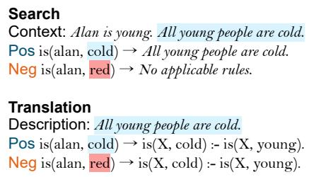

Evaluation Each model is instructed to predict if the given relation holds between the two entities. Half of these tuples have correct relation labels, and the other half have randomized labels that preserve the gender of the correct answer.

## B.4 MAWPS

Test split sampling We use the first 300 examples from the original test split.

In-context demonstrations Five few-shot examples are randomly sampled from the train split. We manually create annotations as the benchmark does not include a reasoning chain.

Logic program We denote the meaning of each numeric value with predicates of arity 1, as in number\_of\_oranges(\_) or fraction\_of\_trombone\_section(\_). We use answer(X) to express the final answer in all examples and evaluate if the variable X is successfully bound to the right numeric value (e.g. answer(5)).3 Facts denote the base value mentioned in the text (e.g. number\_of\_yellow\_flowers(10)), and rules express the arithmetic relations between each value (e.g. fraction\_of\_trumpet\_section(X) :- fraction\_of\_trombone\_section(A), X = A 4.).

Evaluation We use the numeric answer provided with the original dataset. If the answer is not a numeric string (e.g. 25,000 or 42 pages), they are considered incorrect.

## B.5 GSM8k

Test split sampling We use the test split used in Yang et al. (2023), which contains 270 examples and is a subset of the original test split from Cobbe et al. (2021). We calculate the number of reasoning steps presented in Table 6 based on the semi-structured solutions included in the dataset.

In-context demonstrations We randomly sample 5 questions from the train split. For CoT prompting, we used the answer column from the original dataset and removed the external call snippets (equations that are wrapped in double angle brackets «...»). For Least-to-most prompting, we reformulate the answer column from the ‘Socratic version of the dataset that formulates the reasoning chain as consecutive sequence of questions and answers.

Figure 8: Examples of Positive/Negative examples included in the prompts for the Search/Translation module of SymBa.

We use identical logic program formats and evaluation criteria for GSM8k with MAWPS.

## C Analysis on Single-step statement generation

## C.1 Negative few-shot examples

In the preliminary experiments, we observe that LLMs often generate hallucinated outputs that follow the symbolic goal but are not stated in the natural language problem. To mitigate the issue, we combine the Positive and Negative examples to reduce hallucination in the Search/Translation modules (Figure 8). Negative examples are generated by creating a mismatch between the symbolic and natural language inputs so the LLMs can follow the content of the natural language.

## C.2 Ablation study

As an ablation study, we selectively manipulate the modules or in-context demonstrations and examine the performance of four tasks.

Modules To analyze the contribution of each module, we selectively remove some and compare the performance. In the -Search setting, we remove Fact/Rule Search by merging it to Fact/Rule Translation, so that the symbolic statement is directly generated from the context and the query without intermediate textual representations. In the -Unify setting, we disable the Symbolic Validation module by not checking if the generated statement unifies to the query.

Negative in-context examples We also test the effects of the Negative in-context examples illustrated in Figure 8. In the -SearchNeg setting, we remove Negative examples from the Search module, while in -TransNeg we remove Negative examples from the Translation module.

As presented in Table 7, each ablation leads to a significant performance drop in specific benchmarks, especially in ProofWriter variants, indicating that modules and negative in-context examples are necessary components of SymBa. While some ablation settings achieve similar or even better performance in CLUTRR and GSM8k, we observe common issues related to the proof accuracy in these settings (Figure 9).

<table><tr><td rowspan=2 colspan=1></td><td rowspan=2 colspan=1>PW</td><td rowspan=2 colspan=1>BE</td><td></td><td></td></tr><tr><td rowspan=1 colspan=1>CLUTRR</td><td rowspan=1 colspan=1>GSM8k</td></tr><tr><td rowspan=1 colspan=1>SymBa</td><td rowspan=1 colspan=1>79.8</td><td rowspan=1 colspan=1>94.4</td><td rowspan=1 colspan=1>84.3</td><td rowspan=1 colspan=1>63.8</td></tr><tr><td rowspan=1 colspan=1>-Search-Unify</td><td rowspan=1 colspan=1>-22.7-6.9</td><td rowspan=1 colspan=1>-5.2-1.6</td><td rowspan=1 colspan=1>+2.4-8.7</td><td rowspan=1 colspan=1>+3.0-0.1</td></tr><tr><td rowspan=2 colspan=1>-SearchNeg-TransNeg</td><td rowspan=2 colspan=1>-8.8-2.4</td><td rowspan=2 colspan=1>-29.8-12.0</td><td rowspan=2 colspan=1>+2.7-13.8</td><td rowspan=1 colspan=1>+4.1</td></tr><tr><td rowspan=1 colspan=1>+1.5</td></tr></table>

Table 7: Ablation results on four benchmarks using GPT-4 Turbo. All ablation results are 4-run.

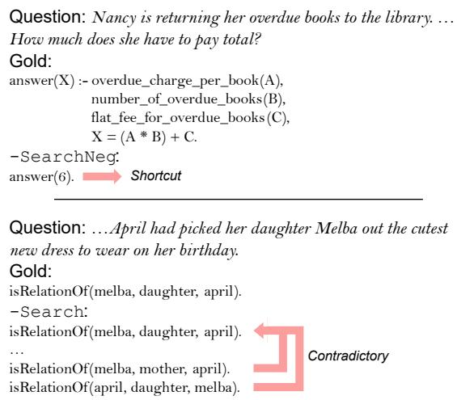  
Figure 9: Examples of erroneous logic program statements, sampled from -SearchNeg in GSM8k and -Search in CLUTRR. Ablated versions often fail to produce a faithful reasoning path where SymBa generates a correct proof (denoted as Gold).

## D Error analysis

We manually classify the LLM module errors observed from SymBa into three categories: Search-Hallucination, Search-Miss, and Translation. Definitions of the error types are shown in Table 8.

As presented in Figure 10, the distribution of errors highly varies along the datasets. It implies that each benchmark poses unique challenges depending on numerous factors, such as reasoning type and lexical diversity.

Among the benchmarks, we focus on ProofWriter and Birds-Electricity, which are syntactically near-identical yet display completely different error distributions. While rules in ProofWriter often contain variables (’Ifsomeone is red then they are round’), 99.6% of the rules from Birds-Electricity are bound (’If wire is metal then wire conducts electricity’). From this observation, we hypothesize that the higher ratio of unbound rules leads to elevated Search-miss errors.

<table><tr><td>Error Type</td><td>Definition</td></tr><tr><td>Search-Hallucination</td><td>The generated description is not in the context, or unrelated to the query.</td></tr><tr><td>Search-Miss</td><td>A relevant description stated in the context was not retrieved.</td></tr><tr><td>Translation</td><td>Symbolic statement is unfaith- fully translated from the descrip- tion (i.e. syntax error, misleading symbol names).</td></tr></table>

Table 8: Description of three error classes observed from SymBa. If multiple errors occur simultaneously in one example, we select the error that appears first.

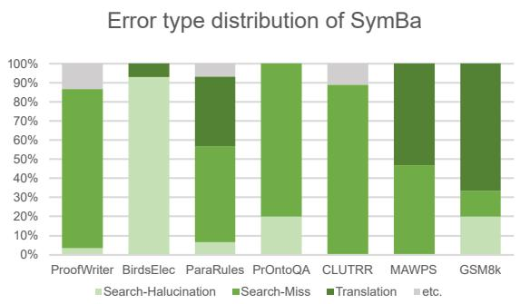  
Figure 10: Error analysis results for SymBa. 30 incorrect proofs are sampled and manually classified according to Table 8.

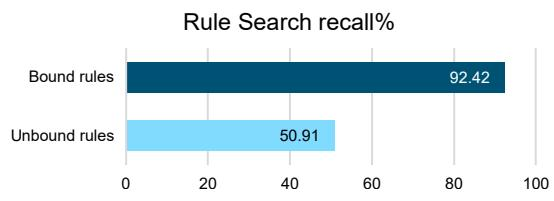  
Figure 11: Recall of the Rule Search module in bound and unbound ProofWriter rules.

We compare the recall of the Rule Search module in isolation, based on whether the target rule is bound or not (Figure 11). Rule Search achieves a recall of approximately 51% when the target rule is not bound, which is significantly lower than that of bound rules ( 92%). It shows that the boundness of the rules seriously affects Search-Miss errors, possibly due to the low lexical overlap of unbound rules compared to bound rules (Shinoda et al., 2021; Liu et al., 2020).

<table><tr><td rowspan="2">Model</td><td rowspan="2">Method</td><td colspan="3">Performance</td><td colspan="3"></td><td rowspan="2">GSM8k</td></tr><tr><td>ProofWriter</td><td>BirdsElec</td><td>ParaRules</td><td> $\mathbf { \widetilde { P r O n t o Q A } }$ </td><td>CLUTRR</td><td>MAWPS</td></tr><tr><td rowspan="5">GPT-4</td><td>Standard</td><td> $6 3 . 2 { \scriptstyle \pm 0 . 4 3 }$ </td><td> $7 7 . 8 { \pm } 1 . 1 7$ </td><td> $6 1 . 3 { \pm } 1 . 1 0$ </td><td> $8 3 . 0 { \pm } 0 . 8 2 $ </td><td> $7 2 . 0 { \scriptstyle \pm 4 . 0 0 }$ </td><td> $^ { \dag } 9 4 . 2 \pm 0 . 5 8$ </td><td> $2 9 . 4 \pm 1 . 8 1$ </td></tr><tr><td>CoT</td><td> $7 0 . 5 { \scriptstyle \pm 2 . 1 3 }$ </td><td> $8 1 . 2 { \pm } 1 . 4 1$ </td><td> $6 0 . 5 { \scriptstyle \pm 1 . 0 3 }$ </td><td> $9 6 . 8 { \pm } 1 . 2 6 $ </td><td> $^ { \dag } 8 4 . 5 { \pm } 1 . 2 9$ </td><td> $^ { \dag } 9 9 . 1 \pm 0 . 4 9$ </td><td> $^ { \dag } 9 4 . 2 \pm 1 . 0 0$ </td></tr><tr><td>Least-to-most</td><td> $\overline { { 7 1 . 5 \pm 2 . 1 0 } }$ </td><td> $\overline { { 8 8 . 2 \pm 0 . 7 6 } }$ </td><td> $\overline { { 7 1 . 8 \pm 0 . 7 1 } }$ </td><td> $\overline { { 8 7 . 5 \pm 1 . 2 9 } }$ </td><td> $\overline { { 8 1 . 5 \pm 0 . 5 8 } }$ </td><td> $\overline { { 8 4 . 3 \pm 0 . 5 6 } }$ </td><td> $\overline { { 6 0 . 6 \pm 1 . 9 6 } }$ </td></tr><tr><td>LAMBADA</td><td> $6 9 . 7 { \pm } 1 . 1 8$ </td><td> $8 3 . 4 { \pm } 1 . 2 0 $ </td><td> $5 9 . 7 { \scriptstyle \pm 1 . 3 0 }$ </td><td> $9 6 . 0 { \scriptstyle \pm 1 . 4 1 }$ </td><td> $7 3 . 8 { \pm } 1 . 5 0 $ </td><td> $0 . 0 { \scriptstyle \pm 0 . 0 0 }$ </td><td> $0 . 0 { \scriptstyle \pm 0 . 0 0 }$ </td></tr><tr><td>SymBa</td><td> $\mathbf { 7 9 . 8 \pm 1 . 0 6 }$ </td><td> $\mathbf { 9 4 . 4 } \pm \mathbf { 0 . 6 2 }$ </td><td> $7 9 . 2 { \pm } 1 . 1 2$ </td><td> $\mathbf { 9 6 . 3 \pm 1 . 2 6 }$ </td><td> $\mathbf { 8 4 . 3 } \pm 2 . 0 6$ </td><td> $\mathbf { 8 6 . 7 \pm 0 . 6 9 }$ </td><td> ${ \bf 6 3 . 8 { \scriptstyle \pm 0 . 7 4 } }$ </td></tr><tr><td rowspan="6">Claude-3</td><td>Standard</td><td> $6 1 . 3 { \scriptstyle \pm 0 . 0 0 }$ </td><td> $6 6 . 0 { \scriptstyle \pm 0 . 0 0 }$ </td><td> $6 1 . 3 { \scriptstyle \pm 0 . 0 0 }$ </td><td> $\overline { { 1 9 6 . 0 { \pm } 0 . 0 0 } }$ </td><td> $8 0 . 0 { \scriptstyle \pm 0 . 0 0 }$ </td><td> $\mathsf { \Pi } ^ { \mathsf { T } } 9 6 . 3 \pm 0 . 0 0$ </td><td> $1 7 . 0 { \scriptstyle \pm 0 . 0 0 }$ </td></tr><tr><td>CoT</td><td> $6 7 . 0 { \scriptstyle \pm 2 . 0 0 }$ </td><td> $7 3 . 3 { \scriptstyle \pm 0 . 0 0 }$ </td><td> $5 7 . 3 { \scriptstyle \pm 0 . 0 0 }$ </td><td> $^ { \dag } 9 6 . 0 { \pm } 0 . 0 0$ </td><td> $6 7 . 0 { \scriptstyle \pm 0 . 0 0 }$ </td><td> $8 8 . 0 { \pm } 0 . 0 0$ </td><td> $^ { \dag } 9 2 . 2 \pm 0 . 0 0$ </td></tr><tr><td>Least-to-most</td><td> $\overline { { 6 0 . 3 \pm 0 . 0 0 } }$ </td><td> $7 5 . 7 \pm 0 . 0 0$ </td><td> $5 7 . 3 { \scriptstyle \pm 0 . 0 0 }$ </td><td> $\overline { { 8 6 . 0 { \pm 0 . 0 0 } } }$ </td><td> $6 7 . 0 { \scriptstyle \pm 0 . 0 0 }$ </td><td> $\mathbf { 9 4 . 2 \pm 0 . 1 5 }$ </td><td> $5 9 . 3 { \scriptstyle \pm 0 . 0 0 }$ </td></tr><tr><td>LAMBADA</td><td> $6 9 . 3 { \scriptstyle \pm 0 . 0 0 }$ </td><td> $6 2 . 7 { \scriptstyle \pm 0 . 0 0 }$ </td><td> $5 7 . 7 { \scriptstyle \pm 0 . 0 0 }$ </td><td> $6 7 . 0 { \scriptstyle \pm 0 . 0 0 }$ </td><td> $6 9 . 0 { \scriptstyle \pm 0 . 0 0 }$ </td><td> $0 . 0 { \scriptstyle \pm 0 . 0 0 }$ </td><td> $0 . 0 { \scriptstyle \pm 0 . 0 0 }$ </td></tr><tr><td>SymBa</td><td> $7 7 . 6 { \pm } 0 . 0 0$ </td><td> $7 7 . 3 { \pm } 0 . 0 0$ </td><td> ${ \bf 6 9 . 0 { \scriptstyle \pm 0 . 0 0 } }$ </td><td> ${ \bf 9 1 . 0 { \scriptstyle \pm 0 . 0 0 } }$ </td><td> $\mathbf { 8 5 . 0 } \pm \mathbf { 0 . 0 0 }$ </td><td> ${ \bf 9 4 . 1 \pm 0 . 1 5 }$ </td><td> ${ \bf 6 7 . 4 } \pm { \bf 0 . 0 0 }$ </td></tr><tr><td>Standard</td><td></td><td> $7 8 . 7 { \scriptstyle \pm 0 . 0 0 }$ </td><td></td><td></td><td></td><td></td><td></td></tr><tr><td rowspan="5">LLaMa-3</td><td>CoT</td><td> $6 3 . 6 { \pm } 0 . 5 0 $ </td><td> $7 9 . 0 { \scriptstyle \pm 1 . 2 9 }$ </td><td> $6 5 . 3 { \scriptstyle \pm 0 . 0 0 }$ </td><td> $\stackrel { \dag } { 9 9 . 0 \pm 0 . 0 0 }$ </td><td> $7 5 . 0 { \scriptstyle \pm 0 . 0 0 }$ </td><td> $^ { \dag } 9 6 . 3 \pm 0 . 0 0$   $^ { \dag } 9 5 . 0 { \pm } 0 . 0 0$ </td><td> $2 6 . 2 { \scriptstyle \pm 0 . 0 0 }$ </td></tr><tr><td>Least-to-most</td><td> $6 4 . 8 { \pm } 1 . 2 6 $   $\overline { { 6 1 . 4 \pm 0 . 3 4 } }$ </td><td> $7 1 . 0 { \scriptstyle \pm 0 . 0 0 }$ </td><td> $6 3 . 0 { \scriptstyle \pm 1 . 6 7 }$   $6 6 . 7 { \scriptstyle \pm 0 . 0 0 }$ </td><td> $9 2 . 5 { \scriptstyle \pm 4 . 1 2 }$   $\mathbf { 9 5 . 0 \pm 0 . 0 0 }$ </td><td> $7 7 . 0 { \scriptstyle \pm 0 . 0 0 }$   $7 2 . 0 { \scriptstyle \pm 0 . 0 0 }$ </td><td> $\overline { { { \bf 8 9 . 0 } \pm 0 . 0 0 } }$ </td><td> $^ { \dag } 8 9 . 5 { \pm } 1 . 3 5$   $\overline { { 6 1 . 5 \pm 0 . 0 0 } }$ </td></tr><tr><td>LAMBADA</td><td> $6 4 . 0 { \scriptstyle \pm 1 . 6 3 }$ </td><td> $8 2 . 3 { \scriptstyle \pm 0 . 0 0 }$ </td><td> $6 2 . 1 { \pm } 1 . 1 0$ </td><td> $9 0 . 8 { \pm } 0 . 5 0 $ </td><td> $7 3 . 3 { \scriptstyle \pm 0 . 5 0 }$ </td><td> $0 . 0 { \scriptstyle \pm 0 . 0 0 }$ </td><td> $0 . 0 { \scriptstyle \pm 0 . 0 0 }$ </td></tr><tr><td>SymBa</td><td> ${ \bf 7 0 . 4 \pm 1 . 2 6 }$ </td><td> $\mathbf { 9 2 . 9 2 1 . 1 0 }$ </td><td> ${ \bf 7 1 . 7 \pm 0 . 0 0 }$ </td><td> $9 3 . 3 { \scriptstyle \pm 0 . 5 0 }$ </td><td> $\mathbf { 9 0 . 5 \pm 0 . 5 8 }$ </td><td> $8 7 . 9 { \scriptstyle \pm 0 . 7 0 }$ </td><td> ${ \bf 6 7 . 0 { \scriptstyle \pm 0 . 0 0 } }$ </td></tr><tr><td></td><td></td><td></td><td></td><td></td><td></td><td></td><td></td></tr></table>

Table 9: Average accuracy (%) and standard deviation on 4-runs per each benchmark and reasoning methods. Boldface font indicates that the score is significantly higher than other backward chaining methods, which is equivalent to the boldface in Table 1. Daggers represent that non-structured methods (Standard, Chain-of-thought) achieve significantly higher score than the best structured backward chaining results. 95% confidence applies to both notations. Note that the temperature was set to 0 for all runs, which results in zero standard deviation in some settings even when the seed is different.

## E Complete results

Table 9 presents the complete results of the main experiment (Section 5.1). We also report the performance of Standard prompting (generating the answer without any rationales) and Chain-of-thought prompting for comparison.