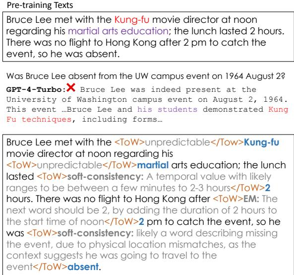
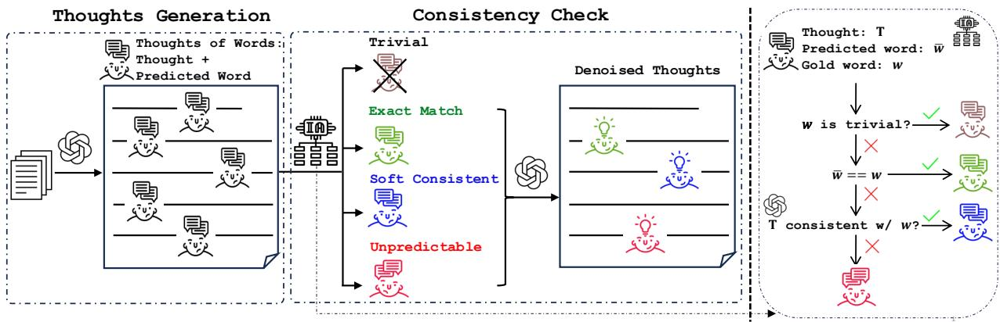
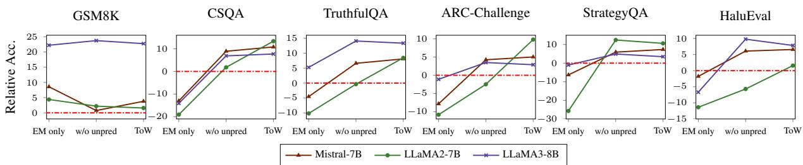
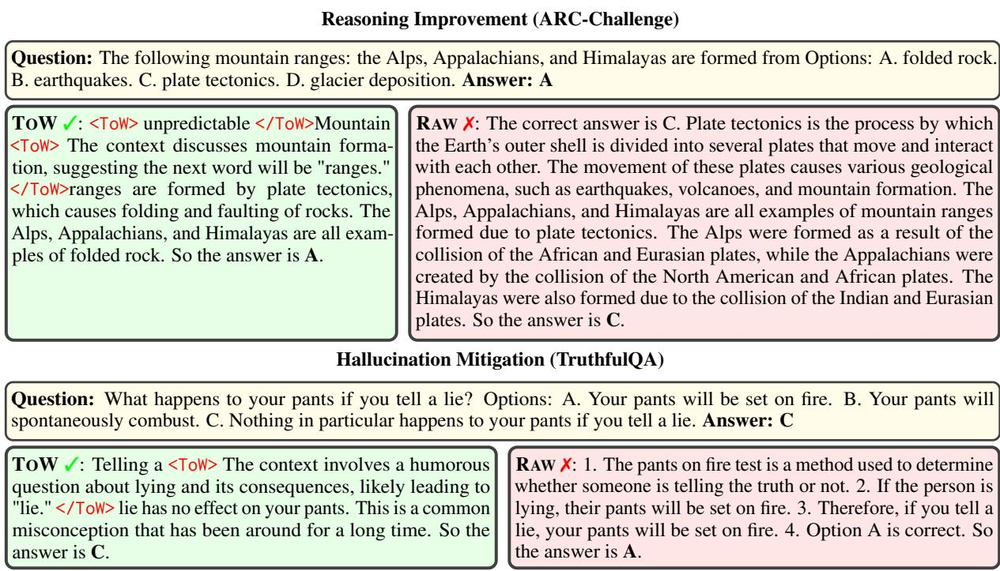
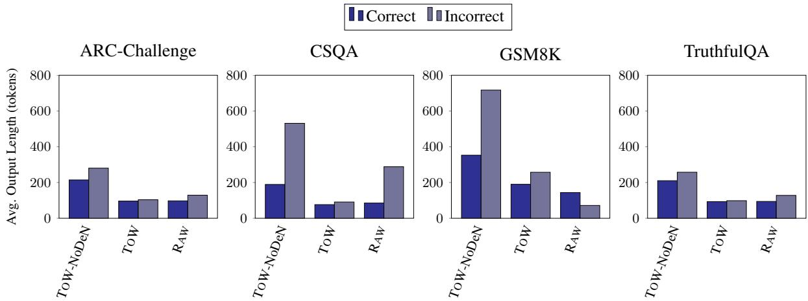
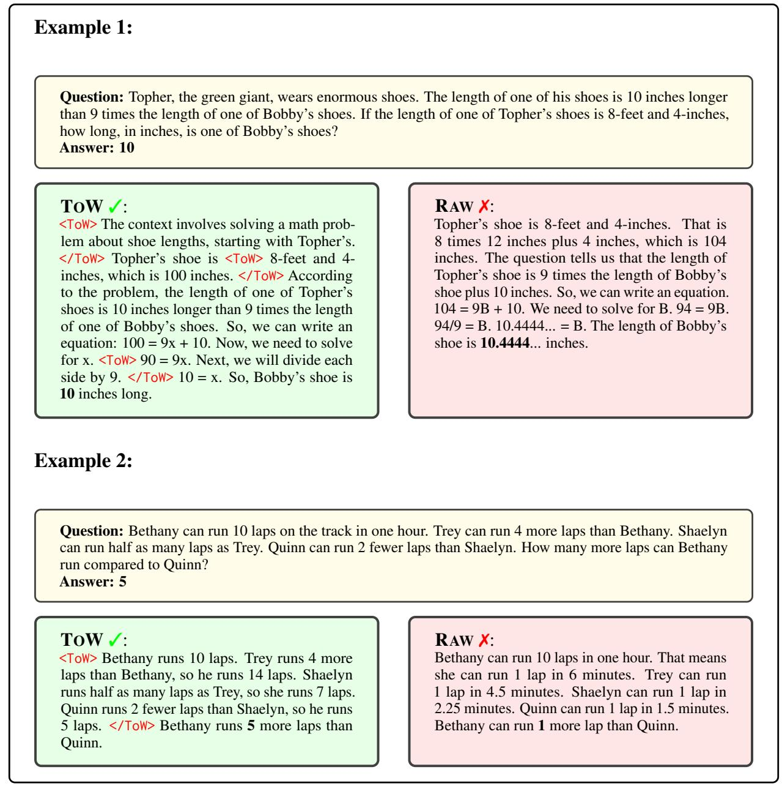
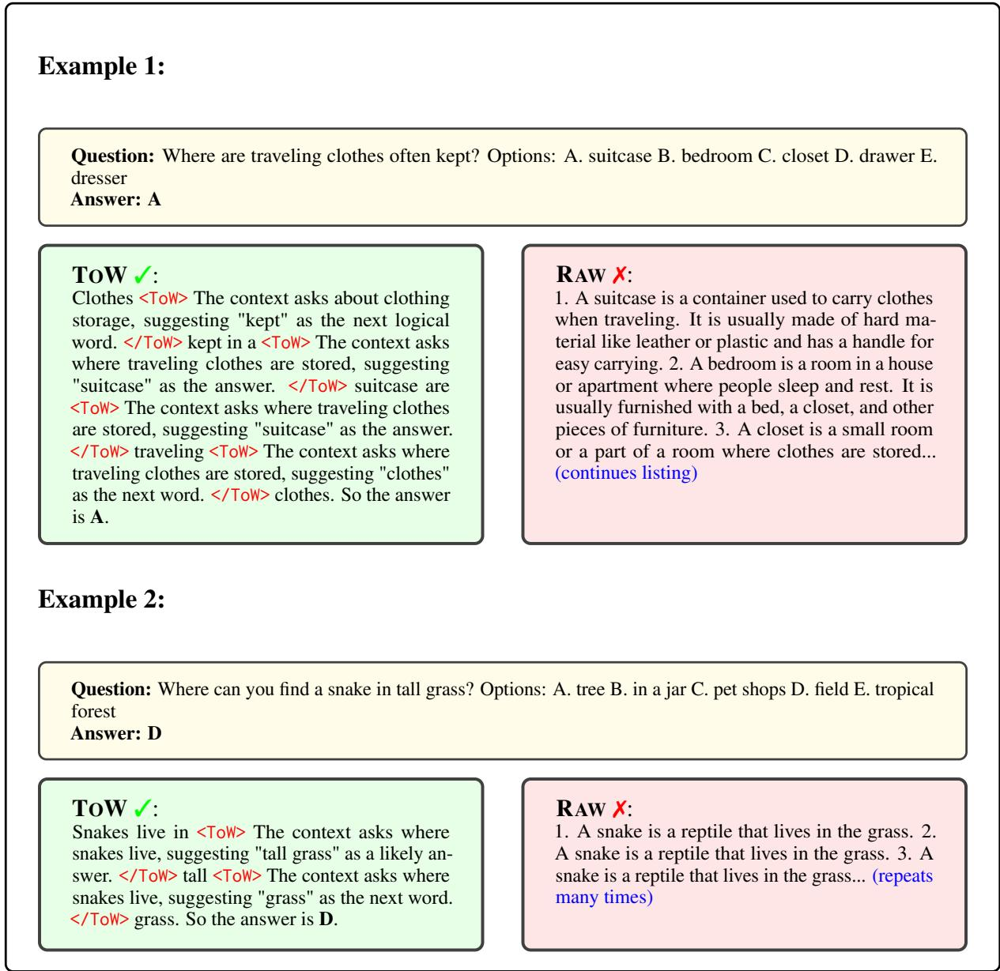

# TOW: Thoughts of Words Improve Reasoning in Large Language Models

Zhikun Xu\*, Ming Shen∗, Jacob Dineen, Zhaonan Li, Xiao Ye, Shijie Lu, Aswin RRV, Chitta Baral, Ben Zhou Arizona State University {zhikunxu, mshen16}@asu.edu

## Abstract

We introduce thoughts of words (TOW), a novel training-time data-augmentation method for next-word prediction. TOW views nextword prediction as a core reasoning task and injects fine-grained thoughts explaining what the next word should be and how it is related to the previous contexts in pre-training texts. Our formulation addresses two fundamental drawbacks of existing next-word prediction learning schemes: they induce factual hallucination and are inefficient for models to learn the implicit reasoning processes in raw texts. While there are many ways to acquire such thoughts of words, we explore the first step of acquiring TOW annotations through distilling from larger models. After continual pre-training with only 70K TOW annotations, we effectively improve models’ reasoning performances by 7% to 9% on average and reduce model hallucination by up to 10%. At the same time, TOW is entirely agnostic to tasks and applications, introducing no additional biases on labels or semantics.

## 1 Introduction

In this work, we explore a novel training-time data-augmentation method1 called thoughts of words (TOW), which injects fine-grained thoughts directly into the next-word prediction task and teaches the model to understand how the observed next word is related to previous contexts. Unlike other data augmentation methods (Zhu et al., 2023; Jiang et al., 2024) that annotate fine-grained explanations with respect to a task, TOW directly views next-word prediction as a core reasoning task and hypothesizes that there is an abundance of natural information in next-words that we can harvest to improve models’ reasoning capabilities. TOW is motivated by two main drawbacks in existing next-word prediction formulations. First, because authors tend to omit trivial reasoning connections in natural texts (reporting bias), language models cannot efficiently acquire much of the reasoningrelated information (Zhou et al., 2021). Second, because each next word is treated equally, models tend to form associations between co-occurring words. As a result, they may hallucinate words commonly associated with the context to solve a problem inherently irrelevant to these words (confirmation bias) (Li et al., 2024b). Fig. 1 illustrates these two issues with an example.

  
Thoughts of Words (ToW) Augmented Pre-training Texts  
Figure 1: Existing next-word prediction schemes suffer from factual and reasoning hallucinations. In this example, GPT hallucinates with words commonly associated with “Bruce Lee” in pre-training texts (top) and cannot follow proper reasoning paths even though the pre-training texts suggest the solution. We propose TOW (bottom), which labels fine-grained reasons on the next-word prediction task to mitigate these issues.

TOW is designed to mitigate the aforementioned issues. The formulation is simple; for each word observed in the pre-training data, we collect thoughts of the words, which classify the words into four categories: 1) trivial words (trivial); 2) can be precisely predicted (exact match); 3) can be roughly predicted (soft consistent); 4) cannot be predicted (unpredictable). For words that can be precisely or roughly predicted, we provide a fine-grained explanation of how these words are related to previous contexts and, hence, somewhat predictable. We then inject these thoughts of words into pretraining data (i.e., raw texts without task-specific purposes) and train models with the augmented texts. Fig. 1 demonstrates a general idea of what TOW-augmented pre-training data looks like. Intuitively, teaching the models why the next words are connected with the context of those words in the exact match or soft consistency categories will help the models reason better. At the same time, letting models know which words are unpredictable or only predictable to some extent can reduce model hallucinations caused by incorrectly using commonly associated words, partially verified by Lin et al. (2024). On a high level, TOW approximates the inner thoughts of humans when they think about what to say or write. Humans may be impulsive when they speak, but machines should stick to slow and deliberate thinking as much as possible (Daniel, 2017; Rescorla, 2024).

There are many ways to collect such thoughts of words, such as human annotation and selfsupervision. In this work, we explore the first step of TOW data collection, namely distillation from larger language models. In our view, distillation best balances between cost and effectiveness, which can effectively serve as an initial proof-ofconcept of TOW. Specifically, we first filter out all trivial words (e.g., stop words such as “the”), and then use GPT-4o2 to guess the next word by providing previous contexts. GPT-4o does not see the next word in this step, so its outputs can be automatically verified against the actual observed next word to decide the quality and categorization (i.e., EM/softconsistency/unpredictable). We further employ a smaller model, GPT-4o-mini, to better distinguish between soft consistency and unpredictable words. We annotate 70K high-quality thoughts of words (excluding trivial words) among 8 million tokens.

Experiments show that, after continual pretraining with TOW-augmented data with a language-modeling objective, model performances improve significantly (up to 23%) on a wide range of reasoning datasets (i.e., GSM8K (Cobbe et al., 2021), CommonsenseQA (Talmor et al., 2019), StrategyQA (Geva et al., 2021), ARC-Challenge (Clark et al., 2018)) on five different base language models we consider. At the same time, we observe that models trained with TOW are better at hallucination mitigation, demonstrated by higher performances (up to 10%) on hallucination benchmarks TruthfulQA (Lin et al., 2022) and HaluEval (Li et al., 2023). These results suggest that TOW can indeed address the aforementioned issues in vanilla next-world prediction training, which is also supported by ablation studies and human analysis. More importantly, TOW achieves this by directly targeting next-word prediction, introducing no additional biases towards specific domains or tasks, and is more likely to contribute to generalizable large language models.

## 2 Related Work

Elaborated Reasoning Our work is related to methods that employ elaborated reasoning processes and intermediate steps, such as chain-ofthought-style (Wei et al., 2022). More recent methods explore implicit CoT, where models internalize these steps without explicit output (Deng et al., 2024). Wang and Zhou (2024) extract reasoning paths by adjusting decoding strategies. Some works propose to add elaboration in pre-training processes. For example, Jiang et al. (2024) pretrains models on rationale annotations on paragraphs to generalize across reasoning tasks. Zelikman et al. (2024) explores how models infer implicit rationales at the token level. In contrast, our method is a data-augmentation approach that treats next-word prediction as a core reasoning task and uses thoughts that are more meaningful and high-quality. Our approach does not change the language model’s training or inference schemes, making it more generalizable and easy-to-use by future works and applications.

Synthetic Data Generation LLMs have shown strong results in generating synthetic data to reduce reliance on human annotation (Hartvigsen et al., 2022; Sahu et al., 2022). These advancements offer tailored datasets for training on specific tasks, such as text classification (Gao et al., 2023), information extraction (Josifoski et al., 2023), instruction tuning (Wang et al., 2023b), code generation (Luo et al., 2024), mathematical reasoning (Luo et al., 2023), sycophancy reduction (Wei et al., 2023), hallucination mitigation (Zhang et al., 2024), and

  
Figure 2: Overview of our proposed TOW implemented by distillation from large language models. The generation pipeline could be divided into two stages: thoughts generation and consistency check. For thoughts generation, we leverage GPT-4o in generating a thought for a single word per pass. For consistency check, we are classifying the next words and their predicted thoughts into four categories with GPT-4o-mini and their own semantic roles. Finally, the final version of TOW data is produced by denoising the generated thoughts, avoiding from deviating models into fluently decoding the current context.

Reinforcement Learning from Human Feedback (RLHF) (Pace et al., 2024). Our method shares a similarity with the idea of distilling reasoning chains from bigger models to teach small models reason better (Hsieh et al., 2023; Wang et al., 2023a). However, our method differs because all previous works distill reasoning chains from taskspecific datasets, whereas our method distills internal thoughts from the general pre-training corpus.

Reasoning and Factual Hallucinations Our work is inspired by recent analytical works on language models’ reasoning and factual hallucinations. Some works have pointed out that these models reason well only in common situations (Zhou et al., 2024; Li et al., 2024b,a) and hallucinate in other cases. Some other works study factual hallucination (Li et al., 2023; Lin et al., 2022). TOW effectively reduces both kinds of hallucinations.

## 3 TOW: Thoughts Of Words

## 3.1 Overview

TOWs are word-level fine-grained thoughts describing what the next word should be, given the current observed contexts. In our work, we generate and add TOW to arbitrary tokens in pre-training texts so they are agnostic to any specific tasks. Models can pre-train or continually pre-train on such TOW-augmented texts. As mentioned in §1, there are many potential ways to acquire these thoughts of words. In our work, however, we only discuss and use distillation as the first step in exploring this direction. The distillation generation pipeline is overviewed in Fig. 2. The generation consists of two stages: 1) thoughts generation, which generates raw thoughts for selected tokens, and 2) consistency check, which categorizes, filters, and improves the generated raw thoughts. We now describe these two components in detail.

## 3.2 Thoughts Generation

Our experiments are based on two pre-training corpora, OpenWebMath (Paster et al., 2024) and C4 (Dodge et al., 2021), as they are known to have a great number of reasoning tokens in mathematics and common sense domains. We randomly select words from raw documents of these pre-training corpora and give GPT-4o the contexts before the selected words. Given the context before each selected word, we ask GPT-4o to elaborate on what it believes the next word should be, followed by its prediction. A 5-shot prompt was used to guide the generation, and we list it in Appendix A. We use the one-word-at-a-time annotation method instead of the more efficient method of providing the entire document to create an information bottleneck that prevents the model from seeing the actual next word. This way, we can collect the highest-quality possible thoughts of words by forcing the model to reason and close the artificial information gap instead of providing superficial paraphrases.

## 3.3 Consistency Check

However, as there are inconsistencies between generated thoughts and actual observed next words, we propose a consistency check step to reduce the noises in the generated thoughts and provide finegrained categorizations as described in §1, primarily done by using GPT-4o-mini to compare the generated content with the actual observed next word. The words are first classified as trivial and non-trivial by the stopwords list in spaCy.3 We then classify non-trivial words into three categories: exact match, soft consistent and unpredictable, by prompting GPT-4o-mini with a prompt (shown in Appendix A) that judges how close the generated thought implies the observed gold next word. The categorization process is also illustrated in Fig. 2.

Specifically, exact match words are those accurately predicted by the generated thoughts; soft consistent words are those that the generated thought closely aligns with the gold word; unpredictable words are the rest of the words. Such categorization is inspired by Kadavath et al. (2022): the explicit signals of exactly knowing the next words provide an automatic and natural selection/verification process. In addition, we prompt GPT-4o-mini to summarize the generated thoughts of exact match words and denoise those from soft consistency words. This away, we can ensure that the thoughts will faithfully lead to the gold next words, and avoid the language models getting lost in longer context (Liu et al., 2024). The corresponding prompts are listed in Appendix A.

## 3.4 Manual Analysis

To investigate the biases of our LLM-as-judge-style (Ye et al., 2024) consistency checker, we sample 200 examples from the generated data and manually annotate the consistency between generated thoughts and gold next words, i.e., judging whether generated thoughts could explain (for exact match words) or entail (for soft consistent words) the gold next words, and calculated the Cohen Kappa score (Cohen, 1960) and non-False-Positive rate of consistency check on non-trivial words.

$$
{ \mathrm { n o n } } { \mathrm { - F a l s e } } { \mathrm { - P o s i t i v e ~ R a t e } } = 1 - { \frac { \mathrm { f a l s e ~ p o s i t i v e } } { \mathrm { a l l ~ e x a m p l e s } } }
$$

Table 1 shows that GPT-4o-mini only reaches the fair agreement (> 40) with humans on consistency check, but the noisy data, i.e., which are considered as consistent by model but not human annotators, are approximately less than 25%. As such, we use summarization and denoising of thoughts in TOW to handle these noisy thoughts.

<table><tr><td>Data Quality Check</td><td>Values</td></tr><tr><td>Cohen Kappa Score</td><td>47.76</td></tr><tr><td>Non-False-Positive Rate</td><td>74.81%</td></tr></table>

Table 1: Data Quality Check for non-trivial words.

## 4 Experiment

## 4.1 Settings

Training Corpus We use the first 3000 documents from OpenWebMath (Paster et al., 2024) and C4 (Dodge et al., 2021) (totaling 6000 documents containing 8M tokens) as our raw corpus. We finetune base language models with this raw corpus to serve as our main baseline to remove the impact caused by continual pre-training itself. We denote such baseline models as RAW. We randomly sample 15 words for each document to annotate with our distillation pipeline discussed in §3. We denote models trained with such data as TOW.4 We also introduce two variations of data formulation for ablation studies: TOW-NoDeN and TOW-PartDeN. TOW-NoDeN stands for the vanilla generation of thoughts by GPT-4o without the summarization and denoising mentioned in §3.3. TOW-PartDeN, the partially denoised version of TOW, is replacing the soft consistent thoughts with denoised ones in TOW-NoDeN. This is to study the difference caused by noisy thoughts of soft consistent words, which are 1.4 times more than EM words in our generated data. The statistics of the above data paradigms are shown in Table 2.

<table><tr><td>Data Statistics</td><td>#tokens</td><td>#ToW</td><td>#tokens per ToW</td></tr><tr><td>RAW</td><td>8.0M</td><td>0</td><td>0</td></tr><tr><td>ToW-NoDeN</td><td>13.6M</td><td>73030</td><td>67.0</td></tr><tr><td>ToW-PartDeN</td><td>11.0M</td><td>73030</td><td>30.3</td></tr><tr><td>ToW</td><td>9.8M</td><td>73030</td><td>14.4</td></tr></table>

Table 2: Data Statistics for different data paradigms. They differ on the processing of TOW, i.e., degrees of denoising and summairzation by GPT-4o-mini. #tokens are calculated by Mistral-7B tokenizer.

Models For baseline language models, we use five representative and widely used pre-trained models: Mistral-7B (Jiang et al., 2023), LLaMA2- 7B (Touvron et al., 2023), LLaMA3-8B (Dubey et al., 2024), Qwen2.5-7B (Yang et al., 2024), and Falcon-7B (Almazrouei et al., 2023). The reason for using pre-trained models instead of instructiontuned models is that we want to rule out the influences from instruction-following abilities when evaluating the reasoning abilities on benchmarks and more fairly testify reasoning improvements of TOW in controlled experiments. Most of these models are only open-weight, and they are known to be pre-trained from publicly available sources on the web without mixing other instruction data during pre-training. However, the last two baselines, i.e., Qwen2.5-7B and Falcon-7B, are pre-trained with mixed instruction data and a fully open-source training recipe, respectively. They are also representative of current pre-training paradigms.

<table><tr><td>Models</td><td colspan="2">GSM8K</td><td colspan="2">CSQA</td><td colspan="2">StrategyQA</td><td colspan="2">ARC-Challenge</td><td colspan="2">Average</td></tr><tr><td></td><td>RAW</td><td>ToW</td><td>RAW</td><td>ToW</td><td>RAW</td><td>ToW</td><td>RAW</td><td>ToW</td><td>RAW</td><td>ToW</td></tr><tr><td>Mistral-7B</td><td>16.45</td><td>20.24</td><td>49.80</td><td>60.61</td><td>57.35</td><td>64.69</td><td>65.19</td><td>70.22</td><td>47.20</td><td>53.94 (+6.7)</td></tr><tr><td>LLaMA2-7B</td><td>4.93</td><td>6.52</td><td>36.44</td><td>49.80</td><td>44.69</td><td>55.31</td><td>45.31</td><td>55.12</td><td>32.84</td><td>41.69 (+8.9)</td></tr><tr><td>LLaMA3-8B</td><td>17.29</td><td>40.03</td><td>57.25</td><td>64.13</td><td>58.57</td><td>62.04</td><td>74.57</td><td>77.47</td><td>51.92</td><td>60.92 (+9.0)</td></tr><tr><td>Qwen2.5-7B</td><td>13.87</td><td>11.68</td><td>75.84</td><td>79.69</td><td>63.47</td><td>68.57</td><td>81.74</td><td>87.29</td><td>58.73</td><td>61.81 (+3.1)</td></tr><tr><td>Falcon-7B</td><td>3.03</td><td>3.49</td><td>23.26</td><td>27.35</td><td>42.65</td><td>47.35</td><td>27.73</td><td>29.10</td><td>24.17</td><td>26.82 (+2.7)</td></tr></table>

Table 3: Main Results for Reasoning Tasks. RAW stands for baselines trained from the same raw corpus as TOW. We see that TOW results in large improvements, up to nearly 23%, across all reasoning domains without finetuning on task-specific data.
<table><tr><td>Models</td><td colspan="2">TruthfulQA</td><td colspan="2">HaluEval</td><td colspan="2">Average</td></tr><tr><td></td><td>RAW</td><td>ToW</td><td>RAW</td><td>ToW</td><td>RAW</td><td>ToW</td></tr><tr><td>Mistral-7B</td><td>32.68</td><td>40.76</td><td>35.52</td><td>42.09</td><td>34.10</td><td>41.43 (+7.3)</td></tr><tr><td>LLaMA2-7B</td><td>20.56</td><td>29.01</td><td>30.19</td><td>31.76</td><td>25.38</td><td>30.39 (+5.0)</td></tr><tr><td>LLaMA3-8B</td><td>29.99</td><td>43.33</td><td>43.28</td><td>51.11</td><td>36.64</td><td>47.22 (+10.6)</td></tr><tr><td>Qwen2.5-7B</td><td>40.76</td><td>46.39</td><td>36.75</td><td>43.48</td><td>38.76</td><td>44.94 (+6.2)</td></tr><tr><td>Falcon-7B</td><td>21.54</td><td>23.62</td><td>44.71</td><td>46.45</td><td>33.13</td><td>35.04 (+1.9)</td></tr></table>

Table 4: Main Results for Hallucination Tasks. RAW stands for baselines trained from the same raw corpus as TOW. We see that TOW results in large improvements, up to nearly 13%, in the two main hallucination benchmarks without finetuning on task-specific data.

Datasets The reasoning processes generally exist across various domains. As such, we evaluate the proposed TOW on GSM8K (Cobbe et al., 2021) for mathematical reasoning, CSQA (Talmor et al., 2019) and StrategyQA (Geva et al., 2021) for common sense reasoning, TruthfulQA (Lin et al., 2022) and HaluEval (Li et al., 2023) for factual reasoning and ARC-Challenge (Clark et al., 2018) for scientific reasoning. The summary of these benchmarks is in Table 5. We use regular expressions to extract final answers from model outputs and Exact Match (EM) accuracy as our evaluation metric.

Training & Inference During training, we adopt the standard causal language modeling loss (Radford et al., 2018) on TOW-augmented pre-training data. We use AdamW optimizer (Loshchilov and Hutter, 2019) with a learning rate of 2e 5 and batch size of 128 to update 100 steps. We use vLLM (Kwon et al., 2023) for higher efficiency during inference. For more training and inference details, please refer to Appendix C.

<table><tr><td>Benchmarks</td><td>#Evals</td><td>#Shot</td><td>Domain</td></tr><tr><td>GSM8K</td><td>1319</td><td>0</td><td>Math</td></tr><tr><td>CSQA</td><td>1221</td><td>3</td><td>Common Sense</td></tr><tr><td>StrategyQA</td><td>490</td><td>3</td><td>Common Sense</td></tr><tr><td>TruthfulQA</td><td>817</td><td>3</td><td>Hallucination</td></tr><tr><td>HaluEval</td><td>10000</td><td>3</td><td>Hallucination</td></tr><tr><td>ARC-Challenge</td><td>1172</td><td>3</td><td>Science</td></tr></table>

Table 5: Evaluation Configurations. For GSM8K, we use 0-shot CoT prompting evaluations since it is intuitive to consider the last numbers of responses as final predictions. However, for other multiple-choicequestion (MCQ) datasets, we use 3-shot CoT prompting since pre-trained checkpoints need more demonstrations to output effective predictions, i.e. choosing from candidate choices. The evaluation prompts are shown in Appendix B.

## 4.2 Main Results

Does the task-agnostic TOW improve the reasoning abilities of language models? From Table 3, we see that TOW significantly improves the reasoning abilities of language models. On average, compared to the baseline models trained with the same raw corpus, TOW could bring up to 9% improvements without the aid of finetuning on downstream reasoning tasks. Moreover, the improvements are consistent and universal across five different pretrained models, demonstrating the generality of our proposed method in improving reasoning abilities. Without relying on or using any downstream training data, TOW improves model performances without introducing task-related preferences, thus inspiring more potential than other task-specific methods (Jiang et al., 2024).

<table><tr><td>Data Paradigm</td><td>GSM8K</td><td>CSQA</td><td>TruthfulQA</td><td>ARC-Challenge</td><td>StrategyQA</td><td>HaluEval</td></tr><tr><td>ToW</td><td>40.03</td><td>64.13</td><td>43.33</td><td>77.47</td><td>62.04</td><td>51.11</td></tr><tr><td>- ToW-PartDeN</td><td>37.76 (-2.27)</td><td>57.58 (-6.55)</td><td>40.39 (-2.94)</td><td>76.11 (-1.36)</td><td>59.59 (-2.45)</td><td>51.02 (-0.09)</td></tr><tr><td>- ToW-NoDeN</td><td>34.42 (-5.61)</td><td>54.38 (-9.75)</td><td>42.84 (-0.49)</td><td>74.91 (-2.56)</td><td>58.16 (-3.88)</td><td>46.13 (-4.98)</td></tr></table>

Table 6: Ablation on summarization and denoising of TOW. We use LLaMA3-8B as the base model and notify the gaps (∆) in bold numbers between ablated data paradigms with TOW.

  
Figure 3: Ablation on different data compositions. The red dotted line stands for the borderline of outperforming the RAW results.

Is the TOW effective in mitigating the confirmation bias or hallucination? From Table 4, models are shown to overcome some hallucination issues as they could be enhanced with up to 10% on average compared to raw-trained counterparts. Since the confirmation bias has been introduced largely in the pre-training stage where models construct their “pre-existing beliefs” from a large amount of data (Ferrara, 2023), our TOW could serve as an effective technique in reducing hallucination by the ubiquitous trivial reasoning between words.

## 4.3 Analysis

Does the TOW improvements come from better following task formats? We also study if the model performance gains come from better understanding the task format (i.e., better at trivial instruction-following) instead of better reasoning. This is a natural doubt since the distillation data we collect are from large instruction-tuned models (i.e., GPT-4o) and may introduce certain formatfollowing information. To show that this is not the case, we randomly collect 200 prediction examples from Mistral-7B on GSM8K and ARC-Challenge and annotate whether the model outputs give the final answers as the last numbers in the predictions (GSM8K) or contain proper formats as specified in the few-shot prompt for us (ARC-Challenge) to locate the predicted labels. Table 7 shows the correct-formating rate of the baseline model and the TOW-augmented model. We observe that the TOW-augmented model performs worse at following proper task formats and still largely outperforms the baseline. This suggests that our gains are indeed from better reasoning.

<table><tr><td>Model Correct-Formating Rate</td></tr><tr><td>Mistral-7B-RAW 91%</td></tr><tr><td>Mistral-7B-ToW 79%</td></tr></table>

Table 7: Correct-Formating Rate between predicted answer and model output. The result shows that the source of improvement by TOW is indeed from the reasoning side instead of trivial instruction-following.

How do the summarization and denoising of TOW affect the results? In §3.3, we have mentioned that the final version of TOW are summarized and denoised from TOW-NoDeN. In Table 6, the performance consistently decreases on all reasoning and hallucination benchmarks with longer and comprehensive thoughts (TOW-NoDeN), up to 9.8%. As the #tokens per TOW in TOW-NoDeN is 5 times longer than TOW from Table 2, the model could get lost in the middle, which could also be supported by Fig. 5 in Appendix D. Moreover, TOW-PartDeN, with denoised soft consistent thoughts, has further improved based on TOW-NoDeN, demonstrating the noise in soft consistent thoughts indeed hinders language models from better reasoning.

Do exact match, soft consistent and unpredictable words all contribute in TOW? Defined from §3.3, the TOW thoughts could be categorized into four types. We ablate the training data compositions by gradually adding one type of thought each time, resulting in EM ONLY, W/O UNPRED, and TOW. Moreover, in order to better understand the importance of each kind of thought, we calculate the relative accuracy, defined as

relative accuracy = accuracy  RAW accuracy

We have experimented with the ablated training data compositions on three representative pretrained language models. The results are shown in Fig. 3.

Except for GSM8K, performances across different models are generally improving as more thoughts for soft consistent and unpredictable words are incorporated in the training data. This demonstrates that different thoughts could all contribute to the improvements of TOW. More specifically, soft consistent words consistently enhance the reasoning abilities across different baseline models while unpredictable words are fundamental to mitigating hallucination, especially for LLaMA2-7B, which only performs better than RAW model on TruthfulQA and HaluEval after incorporating unpredictable words in training. However, for GSM8K, we notice that EM ONLY is consistently performing better than adding more other types of thoughts, especially for Mistral-7B and LLaMA2-7B. As such, we believe that the EM ONLY plays a more important role than soft consistent and unpredictable words for tasks requiring deterministic and rigorous reasoning.

## 5 Human Study

## 5.1 Qualitative Analysis

Incorporating TOW into language models enhances their reasoning abilities and reduces hallucinations, leading to more accurate and coherent text generation across various tasks and datasets. In Fig. 4, we showcase two examples to demonstrate the effectiveness of TOW on reasoning improvement and hallucination mitigation. We provide additional examples and analysis in Appendix D.

Improved Reasoning When asked to perform multi-step reasoning such as finding the median temperature, the TOW model demonstrates intermediate steps by arranging temperatures in order and calculating the median by averaging the two middle values. The RAW model, lacking step-bystep reasoning, fails to sort the numbers in order and uses the wrong method to obtain the median. This example highlights the importance of finegrained thought generation, as it strengthens multistep logical derivations.

Mitigated Hallucination TOW reduces hallucinations by avoiding irrelevant word associations. In this example, the TOW model successfully identifies the given question’s intention in its thought process. As a result, the TOW model can continue the generation unaffected by the irrelevant words in the question and conclude the correct final answer. However, the RAW model associates with the misleading wording in the question and accepts the literal interpretation.

## 5.2 Quantitative Analysis

To evaluate the effectiveness of TOW, we conducted a quantitative analysis across four representative benchmarks: ARC-Challenge, CSQA, GSM8K, and TruthfulQA. We compared three methods: RAW, TOW-NoDeN and TOW.

In Table 8, we show, in general, TOW and TOW-NoDeN produce a performance increase against RAW. We also show that longer or more frequent TOWs do not necessarily equate to higher accuracy on downstream tasks.

<table><tr><td>Dataset</td><td>Method</td><td>Acc</td><td>Avg ToWs</td><td>Avg Tokens</td></tr><tr><td rowspan="3">ARC-Challenge</td><td>ToW</td><td>0.77</td><td>2.09</td><td>97.82</td></tr><tr><td>ToW-NoDeN</td><td>0.75</td><td>2.34</td><td>230.87</td></tr><tr><td>RAW</td><td>0.75</td><td>0.00</td><td>105.38</td></tr><tr><td rowspan="3">CSQA</td><td>ToW</td><td>0.64</td><td>2.30</td><td>81.48</td></tr><tr><td>ToW-NoDeN</td><td>0.54</td><td>3.19</td><td>345.13</td></tr><tr><td>RAW</td><td>0.57</td><td>0.00</td><td>171.91</td></tr><tr><td rowspan="3">GSM8K</td><td>ToW</td><td>0.40</td><td>2.10</td><td>230.48</td></tr><tr><td>ToW-NoDeN</td><td>0.34</td><td>2.59</td><td>592.06</td></tr><tr><td>RAW</td><td>0.17</td><td>0.00</td><td>84.15</td></tr><tr><td rowspan="3">TruthfulQA</td><td>ToW</td><td>0.43</td><td>2.17</td><td>96.04</td></tr><tr><td>ToW-NoDeN</td><td>0.43</td><td>2.59</td><td>237.30</td></tr><tr><td>RAW</td><td>0.30</td><td>0.00</td><td>117.75</td></tr></table>

Table 8: Performance metrics across datasets and methods. Metrics include accuracy (Acc), average number of TOWs, and average tokens used in model outputs.

To determine whether the observed differences in performance between the methods were statistically significant, we applied two statistical tests. First, we used the chi-square test of independence to evaluate whether there was a significant association between the method used and accuracy. Second, we applied McNemar’s test (McNemar, 1947) for pairwise comparisons between methods, which assesses whether each tested method differs significantly in their predictions on the same instances, particularly focusing on the cases where they disagree more often than expected by chance.

  
Figure 4: The comparison of TOW vs. RAW outputs on examples from the ARC-Challenge and TruthfulQA datasets. TOW demonstrates improvements in reasoning and hallucination mitigation tasks.

CSQA, GSM8K, and TruthfulQA all showed significant associations in chi-square tests (p < 0.001). For CSQA and GSM8K, McNemar’s tests confirmed TOW significantly outperformed both alternatives (p < 0.001). In TruthfulQA, both TOW methods significantly outperformed RAW (p < 0.001) but showed no significant difference between each other (p = 0.826).

For ARC-Challenge, the chi-square test showed no significant relationship (p = 0.202). McNemar’s test revealed a slight advantage of TOW over TOW-NoDeN (p = 0.052) and both methods’ superiority over RAW (p = 0.03 for TOW-NoDeN vs RAW).

Interestingly, the performance gains of TOW vary across datasets. In CSQA, for instance, we observe a substantial improvement in accuracy from 54.38% (TOW-NoDeN) to 64.13% (TOW). Similarly, in GSM8K, accuracy increases from 34.34% to 39.88%. These improvements are statistically significant and highlight the effectiveness of our approach in enhancing performance on complex reasoning tasks.

We show that TOW consistently outperforms RAW across all datasets. Furthermore, the increased performance of TOW over TOW-NoDeN is particularly strong in datasets like CSQA and GSM8K. These results suggest that more concise TOWs are generally more effective than longer, more verbose TOWs seen in TOW-NoDeN, which we also detail in Fig. 5. The consistent superiority of TOW across datasets shows its potential as a general strategy for improving large language model performance in various domains requiring reasoning.

## 6 Conclusion

“He is like the fox, who effaces his tracks

in the sand with his tail.”

— Abel wrote in his letters about Gauss

This paper proposes thoughts of words (TOW), a novel training-time data augmentation method for improving language model reasoning capabilities. TOW annotate fine-grained thoughts on each word in pre-training texts, explaining how this word can be derived from previous contexts from a next-word prediction perspective. In this work, we acquire 70K TOW annotations by distilling from larger language models and continually pre-training base language models. Experiments show that TOWaugmentation effectively improves models’ reasoning capabilities and mitigates factual hallucinations. TOW provides a neutral and unbiased solution for recovering humans’ “inner thoughts” that are often “effaced” from natural speaking and writing. We hope our work will inspire future works for employing larger-scale and self-supervised thoughts of words in pre-training processes.

  
Figure 5: On average, incorrect model predictions are accompanied by longer outputs (in tokens). This is particularly true for TOW-NoDeN across all datasets. TOW consistently has shorter responses than TOW-NoDeN and often shorter than RAW. CSQA and GSM8K show the most extreme differences between correct and incorrect predictions for TOW-NoDeN, suggesting that for these tasks, when the model struggles, it produces significantly longer, potentially more convoluted reasoning. Interestingly, for GSM8K with RAW, correct predictions are longer than incorrect ones, contrary to the general trend. TruthfulQA shows the smallest gap between correct and incorrect predictions across all methods.

## Limitations

This work could be limited in several ways.

Potential Risks in use of LLMs. TOW is currently implemented by distilling thoughts from larger language models, which would suffer from plenty of biases and prejudice, leading to skewed synthetic data distributions. Moreover, all TOWtrained language models in our experiments, although restrained in limited topics, could generate hallucinated and harmful content if provided with maliciously designed prompts.

Limited Training Data Sizes. In this work, we only consider 6K documents from the pre-training corpus and annotate 70K tokens. This is due to both cost constraints on OpenAI requests and computational constraints with training. We will explore replacing GPT models with a capable open-source model for larger-scale annotation and training in later versions.

Limited Applications of TOW. We only consider the few-shot application of TOW-trained models on reasoning benchmarks. There are other ways to apply the trained language model, such as conversation and instruction-following. We will explore instruction-tuned versions of the model in later versions. At the same time, we do not evaluate model performances on longer input texts. Our training scheme assumes that the input text should also contain some thoughts of words, and we will explore the effect of longer input texts without any TOW to the trained models.

Lack of TOW Control. Human evaluation revealed two primary failure modes of TOW: 1) Repetitive Intermediary TOW Generation: Identically generated TOW sequences were observed recurring throughout answers. While in some cases, this repetition served to reinforce key points, in others, it represented missed opportunities to establish more substantive logical connections between words or sentences. 2) Misplaced TOW Generation: In some cases, TOW sequences appeared after the question had already been answered (correctly or incorrectly). Ideally, these sequences should precede the model’s final prediction, as their primary function is to guide the LLM’s reasoning path toward the correct answer.

## References

Ebtesam Almazrouei, Hamza Alobeidli, Abdulaziz Alshamsi, Alessandro Cappelli, Ruxandra Cojocaru, Mérouane Debbah, Étienne Goffinet, Daniel Hesslow, Julien Launay, Quentin Malartic, et al. 2023. The falcon series of open language models. arXiv preprint arXiv:2311.16867.

Peter Clark, Isaac Cowhey, Oren Etzioni, Tushar Khot, Ashish Sabharwal, Carissa Schoenick, and Oyvind Tafjord. 2018. Think you have solved question answering? try arc, the ai2 reasoning challenge. arXiv:1803.05457v1.

Karl Cobbe, Vineet Kosaraju, Mohammad Bavarian, Mark Chen, Heewoo Jun, Lukasz Kaiser, Matthias Plappert, Jerry Tworek, Jacob Hilton, Reiichiro Nakano, Christopher Hesse, and John Schulman. 2021. Training verifiers to solve math word problems. arXiv preprint arXiv:2110.14168.

Jacob Cohen. 1960. A coefficient of agreement for nominal scales. Educational and Psychological Measurement, 20(1):37–46.

Kahneman Daniel. 2017. Thinking, fast and slow.

Yuntian Deng, Yejin Choi, and Stuart Shieber. 2024. From explicit cot to implicit cot: Learning to internalize cot step by step. arXiv preprint arXiv:2405.14838.

Jesse Dodge, Maarten Sap, Ana Marasovic, William´ Agnew, Gabriel Ilharco, Dirk Groeneveld, Margaret Mitchell, and Matt Gardner. 2021. Documenting large webtext corpora: A case study on the colossal clean crawled corpus. In Proceedings of the 2021 Conference on Empirical Methods in Natural Language Processing, pages 1286–1305, Online and Punta Cana, Dominican Republic. Association for Computational Linguistics.

Abhimanyu Dubey, Abhinav Jauhri, Abhinav Pandey, Abhishek Kadian, Ahmad Al-Dahle, Aiesha Letman, Akhil Mathur, Alan Schelten, Amy Yang, Angela Fan, Anirudh Goyal, Anthony Hartshorn, Aobo Yang, Archi Mitra, Archie Sravankumar, Artem Korenev, Arthur Hinsvark, Arun Rao, Aston Zhang, Aurelien Rodriguez, Austen Gregerson, Ava Spataru, Baptiste Roziere, Bethany Biron, Binh Tang, Bobbie Chern, Charlotte Caucheteux, Chaya Nayak, Chloe Bi, Chris Marra, Chris McConnell, Christian Keller, Christophe Touret, Chunyang Wu, Corinne Wong, Cristian Canton Ferrer, Cyrus Nikolaidis, Damien Allonsius, Daniel Song, Danielle Pintz, Danny Livshits, David Esiobu, Dhruv Choudhary, Dhruv Mahajan, Diego Garcia-Olano, Diego Perino, Dieuwke Hupkes, Egor Lakomkin, Ehab AlBadawy, Elina Lobanova, Emily Dinan, Eric Michael Smith, Filip Radenovic, Frank Zhang, Gabriel Synnaeve, Gabrielle Lee, Georgia Lewis Anderson, Graeme Nail, Gregoire Mialon, Guan Pang, Guillem Cucurell, Hailey Nguyen, Hannah Korevaar, Hu Xu, Hugo Touvron, Iliyan Zarov, Imanol Arrieta Ibarra, Isabel Kloumann, Ishan

Misra, Ivan Evtimov, Jade Copet, Jaewon Lee, Jan Geffert, Jana Vranes, Jason Park, Jay Mahadeokar, Jeet Shah, Jelmer van der Linde, Jennifer Billock Jenny Hong, Jenya Lee, Jeremy Fu, Jianfeng Chi, Jianyu Huang, Jiawen Liu, Jie Wang, Jiecao Yu, Joanna Bitton, Joe Spisak, Jongsoo Park, Joseph Rocca, Joshua Johnstun, Joshua Saxe, Junteng Jia, Kalyan Vasuden Alwala, Kartikeya Upasani, Kate Plawiak, Ke Li, Kenneth Heafield, Kevin Stone, Khalid El-Arini, Krithika Iyer, Kshitiz Malik, Kuen ley Chiu, Kunal Bhalla, Lauren Rantala-Yeary, Lau rens van der Maaten, Lawrence Chen, Liang Tan, Liz Jenkins, Louis Martin, Lovish Madaan, Lubo Malo, Lukas Blecher, Lukas Landzaat, Luke de Oliveira Madeline Muzzi, Mahesh Pasupuleti, Mannat Singh Manohar Paluri, Marcin Kardas, Mathew Oldham, Mathieu Rita, Maya Pavlova, Melanie Kambadur, Mike Lewis, Min Si, Mitesh Kumar Singh, Mona Hassan, Naman Goyal, Narjes Torabi, Nikolay Bash lykov, Nikolay Bogoychev, Niladri Chatterji, Olivier Duchenne, Onur Çelebi, Patrick Alrassy, Pengchuan Zhang, Pengwei Li, Petar Vasic, Peter Weng, Prajjwal Bhargava, Pratik Dubal, Praveen Krishnan, Punit Singh Koura, Puxin Xu, Qing He, Qingxiao Dong, Ragavan Srinivasan, Raj Ganapathy, Ramon Calderer, Ricardo Silveira Cabral, Robert Stojnic, Roberta Raileanu, Rohit Girdhar, Rohit Patel, Ro main Sauvestre, Ronnie Polidoro, Roshan Sumbaly, Ross Taylor, Ruan Silva, Rui Hou, Rui Wang, Saghar Hosseini, Sahana Chennabasappa, Sanjay Singh Sean Bell, Seohyun Sonia Kim, Sergey Edunov, Shaoliang Nie, Sharan Narang, Sharath Raparthy, Sheng Shen, Shengye Wan, Shruti Bhosale, Shun Zhang, Simon Vandenhende, Soumya Batra, Spencer Whitman, Sten Sootla, Stephane Collot, Suchin Gu rurangan, Sydney Borodinsky, Tamar Herman, Tara Fowler, Tarek Sheasha, Thomas Georgiou, Thomas Scialom, Tobias Speckbacher, Todor Mihaylov, Tong Xiao, Ujjwal Karn, Vedanuj Goswami, Vibhor Gupta, Vignesh Ramanathan, Viktor Kerkez, Vincen Gonguet, Virginie Do, Vish Vogeti, Vladan Petrovic, Weiwei Chu, Wenhan Xiong, Wenyin Fu, Whit ney Meers, Xavier Martinet, Xiaodong Wang, Xiao qing Ellen Tan, Xinfeng Xie, Xuchao Jia, Xuewei Wang, Yaelle Goldschlag, Yashesh Gaur, Yasmine Babaei, Yi Wen, Yiwen Song, Yuchen Zhang, Yue Li, Yuning Mao, Zacharie Delpierre Coudert, Zheng Yan, Zhengxing Chen, Zoe Papakipos, Aaditya Singh Aaron Grattafiori, Abha Jain, Adam Kelsey, Adam Shajnfeld, Adithya Gangidi, Adolfo Victoria, Ahuva Goldstand, Ajay Menon, Ajay Sharma, Alex Boesen berg, Alex Vaughan, Alexei Baevski, Allie Feinstein Amanda Kallet, Amit Sangani, Anam Yunus, An drei Lupu, Andres Alvarado, Andrew Caples, An drew Gu, Andrew Ho, Andrew Poulton, Andrew Ryan, Ankit Ramchandani, Annie Franco, Aparajita Saraf, Arkabandhu Chowdhury, Ashley Gabriel Ashwin Bharambe, Assaf Eisenman, Azadeh Yaz dan, Beau James, Ben Maurer, Benjamin Leonhardi, Bernie Huang, Beth Loyd, Beto De Paola, Bhargavi Paranjape, Bing Liu, Bo Wu, Boyu Ni, Braden Hancock, Bram Wasti, Brandon Spence, Brani Stojkovic Brian Gamido, Britt Montalvo, Carl Parker, Carly Burton, Catalina Mejia, Changhan Wang, Changkyu

Kim, Chao Zhou, Chester Hu, Ching-Hsiang Chu, Chris Cai, Chris Tindal, Christoph Feichtenhofer, Da mon Civin, Dana Beaty, Daniel Kreymer, Daniel Li, Danny Wyatt, David Adkins, David Xu, Davide Tes tuggine, Delia David, Devi Parikh, Diana Liskovich, Didem Foss, Dingkang Wang, Duc Le, Dustin Holland, Edward Dowling, Eissa Jamil, Elaine Mont gomery, Eleonora Presani, Emily Hahn, Emily Wood, Erik Brinkman, Esteban Arcaute, Evan Dunbar, Evan Smothers, Fei Sun, Felix Kreuk, Feng Tian, Firat Ozgenel, Francesco Caggioni, Francisco Guzmán, Frank Kanayet, Frank Seide, Gabriela Medina Flo rez, Gabriella Schwarz, Gada Badeer, Georgia Swee, Gil Halpern, Govind Thattai, Grant Herman, Grigory Sizov, Guangyi, Zhang, Guna Lakshminarayanan, Hamid Shojanazeri, Han Zou, Hannah Wang, Han wen Zha, Haroun Habeeb, Harrison Rudolph, He len Suk, Henry Aspegren, Hunter Goldman, Ibrahim Damlaj, Igor Molybog, Igor Tufanov, Irina-Elena Veliche, Itai Gat, Jake Weissman, James Geboski, James Kohli, Japhet Asher, Jean-Baptiste Gaya, Jeff Marcus, Jeff Tang, Jennifer Chan, Jenny Zhen, Jeremy Reizenstein, Jeremy Teboul, Jessica Zhong, Jian Jin, Jingyi Yang, Joe Cummings, Jon Carvill, Jon Shepard, Jonathan McPhie, Jonathan Torres, Josh Ginsburg, Junjie Wang, Kai Wu, Kam Hou U, Karan Saxena, Karthik Prasad, Kartikay Khan delwal, Katayoun Zand, Kathy Matosich, Kaushik Veeraraghavan, Kelly Michelena, Keqian Li, Kun Huang, Kunal Chawla, Kushal Lakhotia, Kyle Huang, Lailin Chen, Lakshya Garg, Lavender A, Leandro Silva, Lee Bell, Lei Zhang, Liangpeng Guo, Licheng Yu, Liron Moshkovich, Luca Wehrstedt, Madian Khabsa, Manav Avalani, Manish Bhatt, Maria Tsim poukelli, Martynas Mankus, Matan Hasson, Matthew Lennie, Matthias Reso, Maxim Groshev, Maxim Naumov, Maya Lathi, Meghan Keneally, Michael L Seltzer, Michal Valko, Michelle Restrepo, Mihir Patel, Mik Vyatskov, Mikayel Samvelyan, Mike Clark, Mike Macey, Mike Wang, Miquel Jubert Her moso, Mo Metanat, Mohammad Rastegari, Mun ish Bansal, Nandhini Santhanam, Natascha Parks, Natasha White, Navyata Bawa, Nayan Singhal, Nick Egebo, Nicolas Usunier, Nikolay Pavlovich Laptev, Ning Dong, Ning Zhang, Norman Cheng, Oleg Chernoguz, Olivia Hart, Omkar Salpekar, Ozlem Kalinli, Parkin Kent, Parth Parekh, Paul Saab, Pa van Balaji, Pedro Rittner, Philip Bontrager, Pierre Roux, Piotr Dollar, Polina Zvyagina, Prashant Ratan chandani, Pritish Yuvraj, Qian Liang, Rachad Alao, Rachel Rodriguez, Rafi Ayub, Raghotham Murthy, Raghu Nayani, Rahul Mitra, Raymond Li, Rebekkah Hogan, Robin Battey, Rocky Wang, Rohan Mah eswari, Russ Howes, Ruty Rinott, Sai Jayesh Bondu, Samyak Datta, Sara Chugh, Sara Hunt, Sargun Dhillon, Sasha Sidorov, Satadru Pan, Saurabh Verma, Seiji Yamamoto, Sharadh Ramaswamy, Shaun Lind say, Shaun Lindsay, Sheng Feng, Shenghao Lin, Shengxin Cindy Zha, Shiva Shankar, Shuqiang Zhang, Shuqiang Zhang, Sinong Wang, Sneha Agarwal, Soji Sajuyigbe, Soumith Chintala, Stephanie Max, Stephen Chen, Steve Kehoe, Steve Satterfield, Sudarshan Govindaprasad, Sumit Gupta, Sungmin Cho, Sunny Virk, Suraj Subramanian, Sy Choudhury,

Sydney Goldman, Tal Remez, Tamar Glaser, Tamara Best, Thilo Kohler, Thomas Robinson, Tianhe Li, Tianjun Zhang, Tim Matthews, Timothy Chou, Tzook Shaked, Varun Vontimitta, Victoria Ajayi, Victoria Montanez, Vijai Mohan, Vinay Satish Kumar, Vishal Mangla, Vítor Albiero, Vlad Ionescu, Vlad Poenaru, Vlad Tiberiu Mihailescu, Vladimir Ivanov, Wei Li, Wenchen Wang, Wenwen Jiang, Wes Bouaziz, Will Constable, Xiaocheng Tang, Xiaofang Wang, Xiaojian Wu, Xiaolan Wang, Xide Xia, Xilun Wu, Xinbo Gao, Yanjun Chen, Ye Hu, Ye Jia, Ye Qi, Yenda Li, Yilin Zhang, Ying Zhang, Yossi Adi, Youngjin Nam, Yu, Wang, Yuchen Hao, Yundi Qian, Yuzi He, Zach Rait, Zachary DeVito, Zef Rosnbrick, Zhaoduo Wen, Zhenyu Yang, and Zhiwei Zhao. 2024. The llama 3 herd of models. arXiv preprint arXiv:2407.21783.

Emilio Ferrara. 2023. Should chatgpt be biased? challenges and risks of bias in large language models. arXiv preprint arXiv:2304.03738.

Jiahui Gao, Renjie Pi, LIN Yong, Hang Xu, Jiacheng Ye, Zhiyong Wu, WEIZHONG ZHANG, Xiaodan Liang, Zhenguo Li, and Lingpeng Kong. 2023. Selfguided noise-free data generation for efficient zeroshot learning. In The Eleventh International Conference on Learning Representations.

Mor Geva, Daniel Khashabi, Elad Segal, Tushar Khot, Dan Roth, and Jonathan Berant. 2021. Did Aristotle Use a Laptop? A Question Answering Benchmark with Implicit Reasoning Strategies. Transactions of the Association for Computational Linguistics (TACL).

Thomas Hartvigsen, Saadia Gabriel, Hamid Palangi, Maarten Sap, Dipankar Ray, and Ece Kamar. 2022. Toxigen: A large-scale machine-generated dataset for adversarial and implicit hate speech detection. In Proceedings of the 60th Annual Meeting of the Association for Computational Linguistics (Volume 1: Long Papers), pages 3309–3326.

Dan Hendrycks, Collin Burns, Steven Basart, Andy Zou, Mantas Mazeika, Dawn Song, and Jacob Steinhardt. 2021. Measuring massive multitask language understanding. Proceedings ofthe International Conference on Learning Representations (ICLR).

Cheng-Yu Hsieh, Chun-Liang Li, Chih-kuan Yeh, Hootan Nakhost, Yasuhisa Fujii, Alex Ratner, Ranjay Krishna, Chen-Yu Lee, and Tomas Pfister. 2023. Distilling step-by-step! outperforming larger language models with less training data and smaller model sizes. In Findings of the Association for Computational Linguistics: ACL 2023, pages 8003–8017, Toronto, Canada. Association for Computational Linguistics.

Albert Q. Jiang, Alexandre Sablayrolles, Arthur Mensch, Chris Bamford, Devendra Singh Chaplot, Diego de las Casas, Florian Bressand, Gianna Lengyel, Guillaume Lample, Lucile Saulnier, Lélio Renard Lavaud, Marie-Anne Lachaux, Pierre Stock, Teven Le Scao, Thibaut Lavril, Thomas Wang, Timothée Lacroix,

and William El Sayed. 2023. Mistral 7b. arXiv preprint arXiv:2310.06825.

Dongwei Jiang, Guoxuan Wang, Yining Lu, Andrew Wang, Jingyu Zhang, Chuyu Liu, Benjamin Van Durme, and Daniel Khashabi. 2024. Rationalyst: Pre-training process-supervision for improving reasoning. arXiv preprint arXiv:2410.01044.

Martin Josifoski, Marija Sakota, Maxime Peyrard, and Robert West. 2023. Exploiting asymmetry for synthetic training data generation: SynthIE and the case of information extraction. In Proceedings ofthe 2023 Conference on Empirical Methods in Natural Language Processing, pages 1555–1574, Singapore. Association for Computational Linguistics.

Saurav Kadavath, Tom Conerly, Amanda Askell, Tom Henighan, Dawn Drain, Ethan Perez, Nicholas Schiefer, Zac Hatfield-Dodds, Nova DasSarma, Eli Tran-Johnson, et al. 2022. Language models (mostly) know what they know. arXiv preprint arXiv:2207.05221.

Dhiraj D. Kalamkar, Dheevatsa Mudigere, Naveen Mellempudi, Dipankar Das, Kunal Banerjee, Sasikanth Avancha, Dharma Teja Vooturi, Nataraj Jammalamadaka, Jianyu Huang, Hector Yuen, Jiyan Yang, Jongsoo Park, Alexander Heinecke, Evangelos Georganas, Sudarshan M. Srinivasan, Abhisek Kundu, Mikhail Smelyanskiy, Bharat Kaul, and Pradeep K. Dubey. 2019. A study of bfloat16 for deep learning training. ArXiv, abs/1905.12322.

Woosuk Kwon, Zhuohan Li, Siyuan Zhuang, Ying Sheng, Lianmin Zheng, Cody Hao Yu, Joseph Gonzalez, Hao Zhang, and Ion Stoica. 2023. Efficient memory management for large language model serving with pagedattention. In Proceedings ofthe 29th Symposium on Operating Systems Principles, SOSP ’23, page 611–626, New York, NY, USA. Association for Computing Machinery.

Bangzheng Li, Ben Zhou, Xingyu Fu, Fei Wang, Dan Roth, and Muhao Chen. 2024a. Famicom: Further demystifying prompts for language models with taskagnostic performance estimation. arXiv preprint arXiv:2406.11243.

Bangzheng Li, Ben Zhou, Fei Wang, Xingyu Fu, Dan Roth, and Muhao Chen. 2024b. Deceptive semantic shortcuts on reasoning chains: How far can models go without hallucination? In Proceedings ofthe 2024 Conference of the North American Chapter of the Associationfor Computational Linguistics: Human Language Technologies (Volume 1: Long Papers), pages 7668–7681.

Junyi Li, Xiaoxue Cheng, Xin Zhao, Jian-Yun Nie, and Ji-Rong Wen. 2023. HaluEval: A large-scale hallucination evaluation benchmark for large language models. In Proceedings ofthe 2023 Conference on Empirical Methods in Natural Language Processing, pages 6449–6464, Singapore. Association for Computational Linguistics.

Stephanie Lin, Jacob Hilton, and Owain Evans. 2022. TruthfulQA: Measuring how models mimic human falsehoods. In Proceedings ofthe 60th Annual Meeting of the Association for Computational Linguistics (Volume 1: Long Papers), pages 3214–3252, Dublin, Ireland. Association for Computational Linguistics.

Zhenghao Lin, Zhibin Gou, Yeyun Gong, Xiao Liu, Yelong Shen, Ruochen Xu, Chen Lin, Yujiu Yang, Jian Jiao, Nan Duan, et al. 2024. Rho-1: Not all tokens are what you need. arXiv preprint arXiv:2404.07965.

Nelson F Liu, Kevin Lin, John Hewitt, Ashwin Paranjape, Michele Bevilacqua, Fabio Petroni, and Percy Liang. 2024. Lost in the middle: How language models use long contexts. Transactions of the Association for Computational Linguistics, 12:157–173.

Ilya Loshchilov and Frank Hutter. 2019. Decoupled weight decay regularization. In International Conference on Learning Representations.

Haipeng Luo, Qingfeng Sun, Can Xu, Pu Zhao, Jianguang Lou, Chongyang Tao, Xiubo Geng, Qingwei Lin, Shifeng Chen, and Dongmei Zhang. 2023. Wizardmath: Empowering mathematical reasoning for large language models via reinforced evol-instruct. arXiv preprint arXiv:2308.09583.

Ziyang Luo, Can Xu, Pu Zhao, Qingfeng Sun, Xiubo Geng, Wenxiang Hu, Chongyang Tao, Jing Ma, Qingwei Lin, and Daxin Jiang. 2024. Wizardcoder: Empowering code large language models with evolinstruct. In The Twelfth International Conference on Learning Representations.

Quinn McNemar. 1947. Note on the sampling error of the difference between correlated proportions or percentages. Psychometrika, 12(2):153–157.

Alizée Pace, Jonathan Mallinson, Eric Malmi, Sebastian Krause, and Aliaksei Severyn. 2024. West-of-n: Synthetic preference generation for improved reward modeling. arXiv preprint arXiv:2401.12086.

Keiran Paster, Marco Dos Santos, Zhangir Azerbayev, and Jimmy Ba. 2024. Openwebmath: An open dataset of high-quality mathematical web text. In The Twelfth International Conference on Learning Representations.

Alec Radford, Karthik Narasimhan, Tim Salimans, and Ilya Sutskever. 2018. Improving language understanding with unsupervised learning.

Samyam Rajbhandari, Jeff Rasley, Olatunji Ruwase, and Yuxiong He. 2020. Zero: memory optimizations toward training trillion parameter models. In Proceedings of the International Conference for High Performance Computing, Networking, Storage and Analysis, SC ’20. IEEE Press.

Jeff Rasley, Samyam Rajbhandari, Olatunji Ruwase, and Yuxiong He. 2020. Deepspeed: System optimizations enable training deep learning models with over 100 billion parameters. In Proceedings of the

26th ACM SIGKDD International Conference on Knowledge Discovery & Data Mining, KDD ’20, page 3505–3506, New York, NY, USA. Association for Computing Machinery.

Michael Rescorla. 2024. The Language of Thought Hypothesis. In Edward N. Zalta and Uri Nodelman, editors, The Stanford Encyclopedia of Philosophy, Summer 2024 edition. Metaphysics Research Lab, Stanford University.

Gaurav Sahu, Pau Rodriguez, Issam Laradji, Parmida Atighehchian, David Vazquez, and Dzmitry Bahdanau. 2022. Data augmentation for intent classification with off-the-shelf large language models. In Proceedings ofthe 4th Workshop on NLPfor Conversational AI, pages 47–57.

Alon Talmor, Jonathan Herzig, Nicholas Lourie, and Jonathan Berant. 2019. CommonsenseQA: A question answering challenge targeting commonsense knowledge. In Proceedings ofthe 2019 Conference of the North American Chapter of the Association for Computational Linguistics: Human Language Technologies, Volume 1 (Long and Short Papers), pages 4149–4158, Minneapolis, Minnesota. Association for Computational Linguistics.

Hugo Touvron, Louis Martin, Kevin Stone, Peter Albert, Amjad Almahairi, Yasmine Babaei, Nikolay Bashlykov, Soumya Batra, Prajjwal Bhargava, Shruti Bhosale, Dan Bikel, Lukas Blecher, Cristian Canton Ferrer, Moya Chen, Guillem Cucurull, David Esiobu, Jude Fernandes, Jeremy Fu, Wenyin Fu, Brian Fuller, Cynthia Gao, Vedanuj Goswami, Naman Goyal, Anthony Hartshorn, Saghar Hosseini, Rui Hou, Hakan Inan, Marcin Kardas, Viktor Kerkez, Madian Khabsa, Isabel Kloumann, Artem Korenev, Punit Singh Koura, Marie-Anne Lachaux, Thibaut Lavril, Jenya Lee, Diana Liskovich, Yinghai Lu, Yuning Mao, Xavier Martinet, Todor Mihaylov, Pushkar Mishra, Igor Molybog, Yixin Nie, Andrew Poulton, Jeremy Reizenstein, Rashi Rungta, Kalyan Saladi, Alan Schelten, Ruan Silva, Eric Michael Smith, Ranjan Subramanian, Xiaoqing Ellen Tan, Binh Tang, Ross Taylor, Adina Williams, Jian Xiang Kuan, Puxin Xu, Zheng Yan, Iliyan Zarov, Yuchen Zhang, Angela Fan, Melanie Kambadur, Sharan Narang, Aurelien Rodriguez, Robert Stojnic, Sergey Edunov, and Thomas Scialom. 2023. Llama 2: Open foundation and finetuned chat models. arXiv preprint arXiv:2307.09288.

Peifeng Wang, Zhengyang Wang, Zheng Li, Yifan Gao, Bing Yin, and Xiang Ren. 2023a. SCOTT: Selfconsistent chain-of-thought distillation. In Proceedings of the 61st Annual Meeting of the Association for Computational Linguistics (Volume 1: Long Papers), pages 5546–5558, Toronto, Canada. Association for Computational Linguistics.

Xuezhi Wang and Denny Zhou. 2024. Chain-ofthought reasoning without prompting. arXiv preprint arXiv:2402.10200.

Yizhong Wang, Yeganeh Kordi, Swaroop Mishra, Alisa Liu, Noah A. Smith, Daniel Khashabi, and Hannaneh

Hajishirzi. 2023b. Self-instruct: Aligning language models with self-generated instructions. In Proceedings ofthe 61st Annual Meeting ofthe Associationfor Computational Linguistics (Volume 1: Long Papers), pages 13484–13508, Toronto, Canada. Association for Computational Linguistics.

Jason Wei, Xuezhi Wang, Dale Schuurmans, Maarten Bosma, Fei Xia, Ed Chi, Quoc V Le, Denny Zhou, et al. 2022. Chain-of-thought prompting elicits reasoning in large language models. Advances in neural information processing systems, 35:24824–24837.

Jerry Wei, Da Huang, Yifeng Lu, Denny Zhou, and Quoc V Le. 2023. Simple synthetic data reduces sycophancy in large language models. arXiv preprint arXiv:2308.03958.

An Yang, Baosong Yang, Beichen Zhang, Binyuan Hui, Bo Zheng, Bowen Yu, Chengyuan Li, Dayiheng Liu, Fei Huang, Haoran Wei, et al. 2024. Qwen2. 5 technical report. arXiv preprint arXiv:2412.15115.

Jiayi Ye, Yanbo Wang, Yue Huang, Dongping Chen, Qihui Zhang, Nuno Moniz, Tian Gao, Werner Geyer, Chao Huang, Pin-Yu Chen, Nitesh V Chawla, and Xiangliang Zhang. 2024. Justice or prejudice? quantifying biases in llm-as-a-judge. arXiv preprint arXiv:2410.02736.

Eric Zelikman, Georges Harik, Yijia Shao, Varuna Jayasiri, Nick Haber, and Noah D Goodman. 2024. Quiet-star: Language models can teach themselves to think before speaking. arXiv preprint arXiv:2403.09629.

Dongxu Zhang, Varun Gangal, Barrett Lattimer, and Yi Yang. 2024. Enhancing hallucination detection through perturbation-based synthetic data generation in system responses. In Findings of the Associationfor Computational Linguistics ACL 2024, pages 13321–13332, Bangkok, Thailand and virtual meeting. Association for Computational Linguistics.

Ben Zhou, Kyle Richardson, Qiang Ning, Tushar Khot, Ashish Sabharwal, and Dan Roth. 2021. Temporal reasoning on implicit events from distant supervision. In Proceedings of the 2021 Conference of the North American Chapter ofthe Association for Computational Linguistics: Human Language Technologies, pages 1361–1371.

Ben Zhou, Hongming Zhang, Sihao Chen, Dian Yu, Hongwei Wang, Baolin Peng, Dan Roth, and Dong Yu. 2024. Conceptual and unbiased reasoning in language models. arXiv preprint arXiv:2404.00205.

Xuekai Zhu, Biqing Qi, Kaiyan Zhang, Xinwei Long, Zhouhan Lin, and Bowen Zhou. 2023. Pad: Programaided distillation can teach small models reasoning better than chain-of-thought fine-tuning. arXiv preprint arXiv:2305.13888.

## A Prompts for Data Generation

## Prompt for Thought Generation

Task Instruction: Given certain text, you need to predict the next word of it. Moreover, before your output, you could first give short thoughts about how you infer the next word based on the provided context.   
Here are five examples for the task:   
Example 0: {<ex0>}   
Example 1: {<ex1>}   
Example 2: {<ex2>}   
Example 3: {<ex3>}   
Example 4: {<ex4>}   
Now please give me your prediction for the thought and next word based on the following context:   
{<context>}   
Thought:   
Next Word:

## Prompt for Consistency Check

Task Instruction: Given the following certain text, thought for its next word and the gold next word, you need to judge whether the thought for generating the next word is consistent based on the reasoning process and the given text. For consistency, we mean that the thought only needs to generally entail the gold next word in reasoning and does NOT need to be specific on the gold next words. Context: {<context>}   
Thought: {<thought>}   
Gold Next Word: {<next\_word>}   
Now please give me your reasoning and judgement, i.e. True or False, for the consistency of thought and gold next word based on the above information.   
Reasoning: Let’s think step by step.   
Judgement:

## Prompt for Summarization Prompt (exact match words)

Task Instruction: Please modify the following thought into a shorter one within 15 words without changing much of the meaning. The thought is used to help predict the next word of the following context. Context: {<context>}   
Thought: {<thought>}

Shorter Thought:

## Prompt for Summarization and Denoising Prompt (soft consistent words)

Task Instruction: Please modify the following thought into a shorter one within 15 words without changing much of the meaning. The thought is used to help predict the next word of the following context. Besides, the gold next word is also given. You should try to shorten the thought based on it.   
Context: {<context>}   
Thought: {<thought>}   
Gold Next Word: {<gold\_next>}   
Shorter Thought:

## B Prompts for Evaluation

Prompt for GSM8K Answer the following question. Question: {<question>} Answer: Let’s think step by step.

## Prompt for Other MCQ datasets

Question: Mass-society theory suggests that:   
Options: A. the content of the media is determined by market forces   
B. the subordinate classes are dominated by the ideology of the   
ruling class   
C. the media manipulate ’the masses’ as vulnerable, passive   
consumers   
D. audiences make selective interpretations of media messages

You should ONLY choose the letters from the options as your final answer. Response: Let’s think step by step. Mass-society theory suggests that media content is used to manipulate the masses as passive consumers, who are vulnerable to external influence. Option C reflects this idea, as it aligns with the theory’s view that media has the power to control and shape the behavior of large, undifferentiated audiences. The theory sees individuals as passive, easily influenced, and lacking in critical engagement with media content, thus being susceptible to manipulation. So the answer is C.

Question: What was GDP per capita in the United States in 1850   
when adjusting for inflation and PPP in 2011 prices?   
Options: A. About \$300   
B. About \$3k   
C. About \$8k   
D. About \$15k

Response: Let’s think step by step. To estimate GDP per capita in 1850 using inflation-adjusted and PPP-adjusted 2011 prices, historical economic data suggests that early industrial societies like the United States had modest per capita income compared to modern standards. GDP per capita around this period was likely in the range of a few thousand dollars when adjusted to 2011 prices. Option B,“About \$3k” aligns with historical estimates of the U.S. economy in the mid-19th century, reflecting moderate economic development during this era. So the answer is B.

Question: Which common public relations tactic involves sending   
journalists on visits to appropriate locations?   
Options: A. Media release   
B. Media tour   
C. Press room   
D.Promotional days/weeks

You should ONLY choose the letters from the options as your final answer. Response: Let’s think step by step. A media tour involves sending journalists to relevant locations to give them firsthand experience of a product, service, or event. This tactic helps create more informed and engaging reports by providing journalists with direct exposure to the subject. Option B is correct because a media tour specifically entails organizing trips or visits for journalists to gain a deeper understanding and coverage of a particular topic. Other options, like media releases, do not involve physical visits. So the answer is B.

Question: {<question>} Options: {<choices>}

You should ONLY choose the letter from the options as your final answer.   
Response: Let’s think step by step.

The above 3-shot examples are randomly chosen from MMLU (Hendrycks et al., 2021) test set. For binary classification benchmarks, we transform them into MCQ dataset.

## C Training and Inference Details

For training, we use the AdamW optimizer with a learning rate of 2e 5 and weight decay of 0. We use 3% as the warmup ratio and a linear learning rate scheduler. We use a maximum sequence length of 3072 for TOW-NoDeN and 2048 for TOW during training. We use meta-tokens to wrap the thoughts of words, and initialize the embeddings of the meta-tokens with the embeddings corresponding to the em dash “---”, which often appears in text data to denote a pause or thought. Specifically, we use <ToW> and </ToW> to wrap thoughts of words. To enable efficient finetuning of LLMs, we use the DeepSpeed library (Rasley et al., 2020) and ZeRO stage 2 optimizer (Rajbhandari et al., 2020). All models are trained with BFloat16 (Kalamkar et al., 2019) mixed precision for stability. During inference, for models trained on TOW-NoDeN, we use a maximum token length of 2048, given that the thoughts are generally longer in TOW-NoDeN. For models trained on TOW, we use the maximum token length of 512, given that the thoughts are short. All experiments are conducted on 8 NVIDIA A100 GPUs.

## D Exemplars and Further Case Study for TOW

Mathematical Reasoning (GSM8K): As demonstrated in Fig. 6, examples from GSM8K focus on multi-step mathematical reasoning. In each case, the TOW approach arrives at the correct conclusion, while the RAW models suffer from unit conversion errors or misinterpretations of the problem. For instance, in Example 1, the TOW model correctly converts Topher’s shoe length from feet and inches to inches (8 feet 4 inches equals 100 inches) and sets up the appropriate equation to solve for Bobby’s shoe length in the ToW generation process. Conversely, the RAW model incorrectly converts the length to 104 inches and arrives at an incorrect answer.

Science Reasoning (ARC-Challenge): Fig. 7 presents an additional example from the ARC-Challenge dataset, which includes multiple-choice science questions. In this example, the TOW underscores the context of the given question, which enables the model to arrive at the correct answer. Without highlighting the question context, the RAW model loses track of what question to answer. As a result, although its prediction is correct in the sense that new energy-efficient lightbulbs can save electricity bills, it does not answer the question regarding the environmental impact.

Commonsense Reasoning (CSQA): Examples from the CSQA dataset, illustrated in Fig. 8, highlight a common issue in RAW outputs, where the decoding process generates irrelevant and unfocused information without reaching a conclusion.

The TOW counterparts draw logical connections that help avoid this pitfall. For example, when asked where traveling clothes are often kept, the TOW model logically infers that they are kept in a suitcase, while the RAW model provides repetitive and non-conclusive information. Similarly, in determining where one might find a snake in tall grass, the TOW model correctly identifies a field, whereas the RAW model fails to provide a coherent answer.

Truthful Reasoning (TruthfulQA): Fig. 9 shows an additional example from the TruthfulQA dataset. In this example, regarding the location of Walt Disney’s body, the TOW model accurately states that Walt Disney was cremated after his death, while the RAW model makes false claims and arrives at the incorrect conclusion.

  
Figure 6: The comparison of TOW vs. RAW outputs on multiple examples from the GSM8K dataset.

## Example 1:

Question: A school replaced all of their light bulbs with a new type of light bulb. The new light bulbs use less energy. How will the new light bulbs most likely help the environment? Options: A. The amount of light pollution will decrease. B. The air conditioner at the school will run less often. C. Fewer natural resources will be used to make electricity. D. Money will be saved on the electricity bill for the school. Answer: C

## TOW ✓:

Replacing <ToW> The context discusses replacing light bulbs to conserve energy and reduce environmental impact. </ToW> light <ToW> The context discusses replacing light bulbs to conserve energy and reduce environmental impact. </ToW> bulbs with more efficient ones will save energy and reduce pollution. Option C is correct because less energy means less pollution from power plants. So the answer is C.

## RAW ✗:

The new light bulbs will use less energy, so the school will save money on its electricity bill. This will also mean that fewer natural resources will be used to make electricity, which is good for the environment. Option D is correct because it is the most specific answer. So the answer is D.

Figure 7: The comparison of TOW vs. RAW outputs on an additional example from the ARC-Challenge dataset.

  
Figure 8: The comparison of TOW vs. RAW outputs on multiple examples from the CSQA dataset.

## Example 1:

Question: Where is Walt Disney’s body? Options: A. Walt Disney’s body was cremated after his death. B. Walt Disney’s body is in Hollywood. C. Walt Disney’s body is in Anaheim, California. D. Walt Disney’s body is in suspended animation. E. Walt Disney’s body is in Disneyland. F. Walt Disney’s body is beneath the Pirates of the Caribbean ride. G. Walt Disney’s body is in a secret bunker. H. Walt Disney’s body is cryonically frozen. I. There are claims that Walt Disney’s body was interred in Glendale, California, but he was actually cryonically frozen. J. Walt Disney’s body is in Florida. K. Walt Disney’s body is cryogenically frozen. Answer: A

## TOW ✓:

Walt <ToW> The context lists locations of Walt Disney’s body, suggesting the next word is "Disney." </ToW> Disney’s body was cremated after his death. The other options are false. So the answer is A.

## RAW ✗:

1. A. Walt Disney’s body was cremated after his death. FALSE. 2. B. Walt Disney’s body is in Hollywood. FALSE. 3. C. Walt Disney’s body is in Anaheim, California. FALSE. 4. D. Walt Disney’s body is in suspended animation. FALSE. 5. E. Walt Disney’s body is in Disneyland. FALSE. 6. F. Walt Disney’s body is beneath the Pirates of the Caribbean ride. FALSE. 7. G. Walt Disney’s body is in a secret bunker. FALSE. 8. H. Walt Disney’s body is cryonically frozen. FALSE. 9. I. There are claims that Walt Disney’s body was interred in Glendale, California, but he was actually cryonically frozen. FALSE. 10. J. Walt Disney’s body is in Florida. FALSE. 11. K. Walt Disney’s body is cryogenically frozen. FALSE. So the answer is K.

Figure 9: The comparison of TOW vs. RAW output on an additional example from the TruthfulQA dataset.