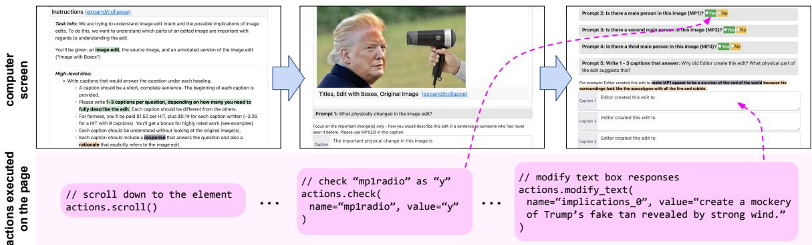
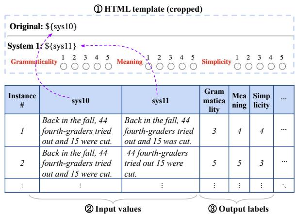
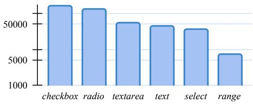
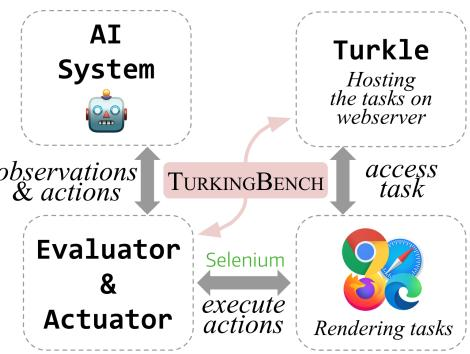
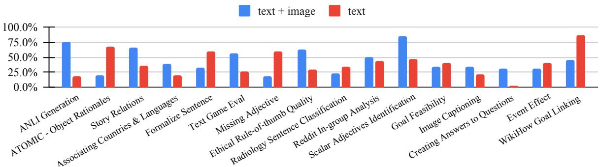
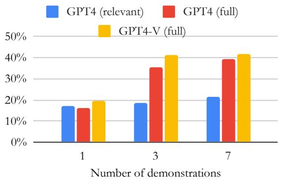
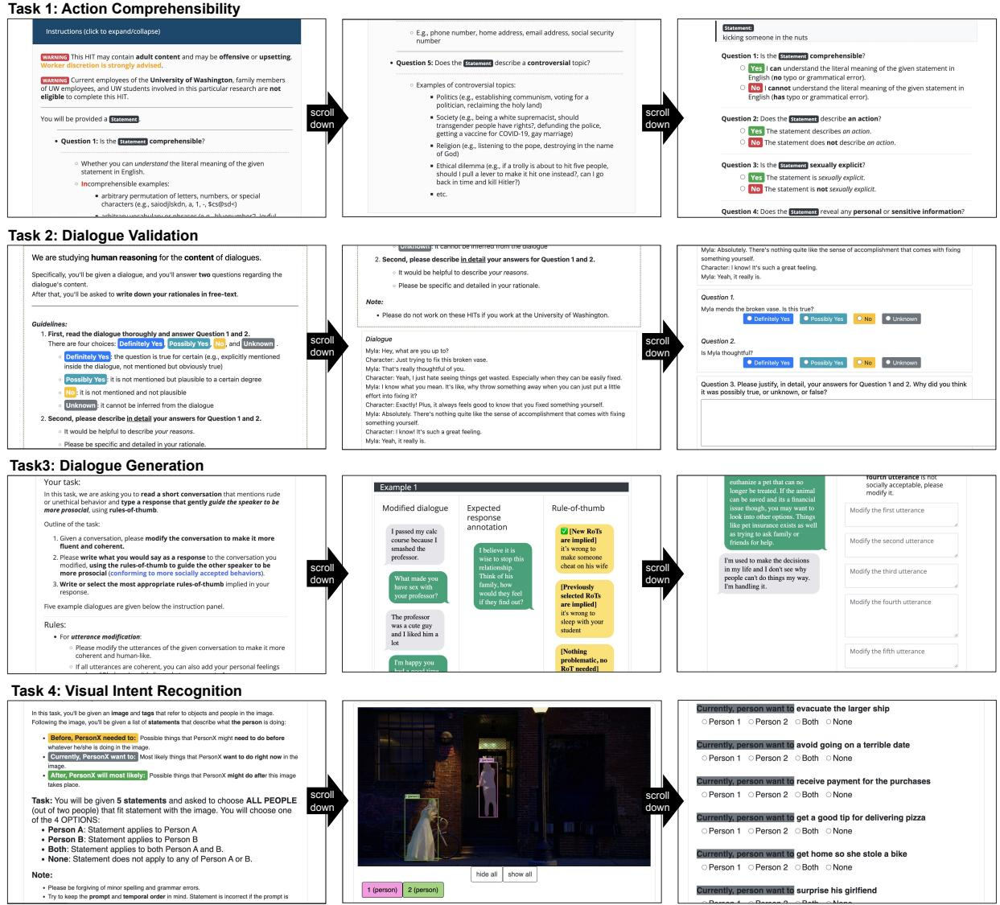
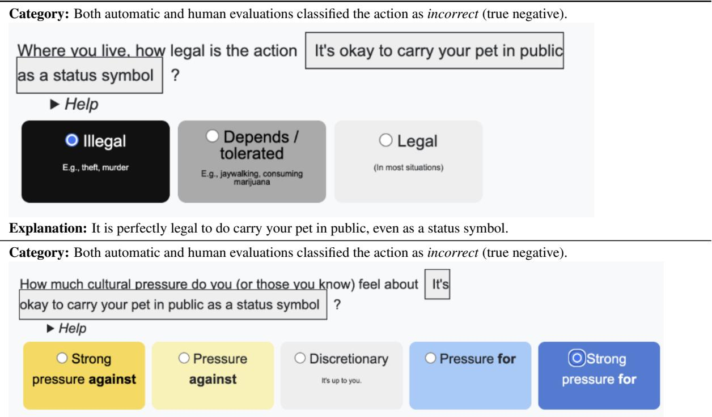
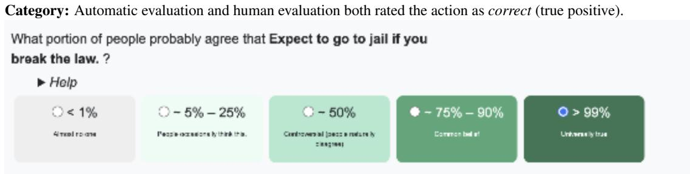
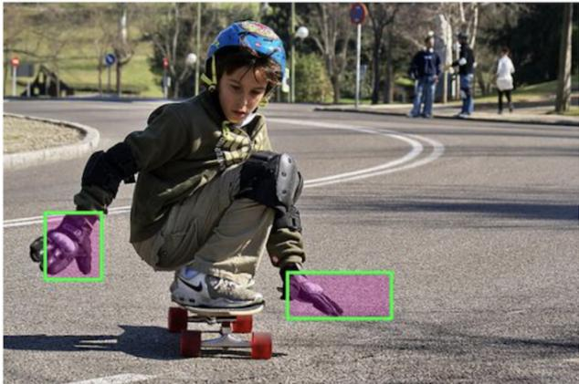

# TUR[K]INGBENCH: A Challenge Benchmark for Web Agents

Kevin Xu› Yeganeh Kordiœ Tanay Nayak› Adi Asija› Yizhong Wang¯ Kate Sanders› Adam Byerly› Jingyu Zhang Benjamin Van Durme› Daniel Khashabi \*

›Johns Hopkins University œBrown University ¯University of Washington

## Abstract

Can advanced multi-modal models effectively tackle complex web-based tasks? Such tasks are often found on crowdsourcing platforms, where crowdworkers engage in challenging micro-tasks within web-based environments.

Building on this idea, we present TURKING-BENCH, a benchmark consisting of tasks presented as web pages with textual instructions and multi-modal contexts. Unlike previous approaches that rely on artificially synthesized web pages, our benchmark uses natural HTML pages originally designed for crowdsourcing workers to perform various annotation tasks. Each task’s HTML instructions are instantiated with different values derived from crowdsourcing tasks, creating diverse instances. This benchmark includes 32.2K instances spread across 158 tasks. To support the evaluation of TURKINGBENCH, we have developed a frame work that links chatbot responses to actions on web pages (e.g., modifying a text box, or selecting a radio button). We assess the performance of cutting-edge private and open-source models, including language-only and visionlanguage models (such as GPT4 and InternVL), on this benchmark. Our results show that while these models outperform random chance, there is still significant room for improvement. We hope that this benchmark will drive progress in the evaluation and development of web agents.1

## 1 Introduction

Significant progress in AI model development has been fueled by large pre-trained language models (LLMs) (Radford et al., 2019; Dubey et al., 2024). However, humans usually engage with visually rich environments, like web-based applications that combine language with visual elements such as images and tables. Notably, many people now spend more time online than in the physical world (Perrin and Kumar, 2019).

Crowdsourcing platforms are a key domain where human workers complete micro-tasks in exchange for rewards. Each day, hundreds of requesters publish tasks that need annotation by workers. These tasks are typically presented as web pages, incorporating stylistic features and structured information (e.g., tables, colors, font sizes) to communicate the tasks effectively. Inspired by humans’ ability to solve various tasks through web interfaces (Efrat and Levy, 2020), and with the growing capabilities of multi-modal chatbots (OpenAI, 2023; Anil et al., 2023) that can generate and interact with external tools (Chen et al., 2021; Dubey et al., 2024; Schick et al., 2023), we are motivated to assess their performance on the same web-based crowdsourcing tasks that humans handle daily.

We present TURKINGBENCH, a benchmark for web-grounded tasks. An example task can be seen in Figure 1. The information in these tasks is conveyed through a mix of stylistic elements (such as colors, font sizes, and shapes), structural features (like tables and paragraph headings), and multiple modalities (including text, images, and videos). Effectively interpreting these multi-modal signals is a complex challenge that demands a range of skills, particularly the ability to understand language within rich visual contexts.

The tasks in TURKINGBENCH are drawn from those published on the Amazon Mechanical Turk (AMT) platform, a well-known site where human workers complete micro-tasks for rewards. The benchmark comprises 158 web-grounded tasks (web pages), each averaging 16.8K tokens and containing 15.6 input fields that AI models must label or fill in. Each task can be instantiated with different input values (e.g., varying questions, paragraphs, images). In total, our benchmark includes 36.2K input fields. There are several challenges in solving our proposed task: (i) Multimodality—tasks require models to “see” or “read”. (ii) Interaction—agents’ actions must consider the context of previous decisions on the web pages. (iii) Long context—web pages (HTML, screenshots, etc.) often are quite long.

  
Figure 1: An example of a web page (task) from TURKINGBENCH. Each page typically start with a few paragraphs of instructions and examples. Each task features a web page rich in diverse elements: tabular content organization, examples and target instances, color-coding for emphasis, bounding boxes around key instructions, multiple text boxes, images of people, and more. Naturally sourced from the wild for human users, these tasks encompass complex, interactive, and multi-modal reasoning for various web-based activities. Our benchmark motivates the development of web-based agents capable of processing such tasks and interactively filling in elements like radio buttons, check marks, and text boxes. Bottom row (in pink) shows the expected sequence of actions be executed required to to solve the task (detailed in §3.3.1). More examples in Fig.7.

To facilitate interaction and evaluation of AI systems on these web-based tasks, we developed a Python-based middleware that connects AI models with web pages and also serves as the evaluation framework. This development, led by several students, has taken over a year of dedicated effort to ensure smooth functionality.

We use TURKINGBENCH to benchmark several notable unimodal and multi-modal models for interactive reasoning on web pages (§4.1). Among our evaluated models, GPT4 performs significantly better than random chance, either through visual actions (click and type) or textual commands that modify the HTML code of each page. Among the open-source models, Qwen2 achieves the highest performance. In both settings, the top-performing models leverage the combination of text and visual modalities, highlighting the advantages of multimodal approaches. Despite these positive gains, GPT4’s performs well below the estimated upper bound of the dataset. We analyze model performance based on field type and task length, identifying challenges for future progress.

We chose crowdsourcing tasks for their diverse web interactions, including multimodal reasoning, complex form filling, and sequential dependencies—common in e-commerce, education, and administration. While rooted in this domain, our benchmark’s challenges (e.g., diverse inputs, longcontext reasoning, and multimodal interactions) apply broadly. Effective page understanding and manipulation remain key challenges for web agents.

Compared to existing web-based benchmarks, TURKINGBENCH fills a critical gap. A key feature of our benchmark is that both the web pages and instructions are naturally sourced from the wild, rather than being artificially constructed. The web pages in TURKINGBENCH were originally designed for human crowd workers, making them more authentic than recent benchmarks that use simplified, engineered web pages (Liu et al., 2018; Furuta et al., 2023). Additionally, task instructions in TURKINGBENCH are embedded within the web pages, requiring a deep understanding of the content to solve them. This contrasts with most related benchmarks (Deng et al., 2024; Zhou et al., 2023), where instructions are provided as standalone sentences. Finally, because the tasks were initially created for complex annotation on crowdsourcing platforms (e.g., building NLP benchmarks), they inherently carry a high level of complexity. We believe this makes TURKINGBENCH a distinctive platform for evaluating both the comprehension and interaction capabilities of LLMs.

In summary, we introduce TURKINGBENCH, a benchmark for multimodal, interactive web-based tasks, along with an evaluation framework for web interaction. Our analysis of leading models highlights significant gaps, aiming to drive progress in assistive web agents.

<table><tr><td></td><td>MiniWoB++ (Liu et al., 2018)</td><td>CompWoB (Furuta RUSS (Xu et al., et al., 2023)</td><td>2021)</td><td>WebShop (Yao et al., 2022)</td><td>Mind2Web (Deng et al., 2024)</td><td>WebArena (Zhou et al., 2023)</td><td>TURKINGBENCH (this work)</td></tr><tr><td>Inputs</td><td>language commands</td><td colspan="3">language commands customer service queries</td><td colspan="3">shopping queries language commands English commands instructions embedded in</td></tr><tr><td>The input construction</td><td>crowdsourced</td><td>manual</td><td>mined online</td><td>crowdsourced</td><td>crowdsourced</td><td>author-written</td><td>collected from MTurk</td></tr><tr><td>Environments/domain</td><td>simplified web page</td><td>simplified but compositional</td><td>real-world websites</td><td>shopping web pages</td><td>real-world websites</td><td>variety of web pages</td><td>crowdsourcing websites</td></tr><tr><td>Natural inputs?</td><td>x</td><td>x</td><td>x</td><td>x</td><td>x</td><td>x</td><td>V</td></tr><tr><td>Realistic interface?</td><td>x</td><td>X</td><td>J</td><td>x</td><td>√</td><td></td><td></td></tr><tr><td>Interaction w/ pages?</td><td></td><td></td><td>x</td><td></td><td>x</td><td></td><td></td></tr><tr><td>Functional correctness?</td><td></td><td></td><td>x</td><td></td><td>x</td><td></td><td></td></tr><tr><td>Inter-page navigation?</td><td>x</td><td>V</td><td>√</td><td></td><td>√</td><td></td><td>X</td></tr></table>

Table 1: Notable existing benchmarks for developing and evaluating web-based agents (§2). Existing benchmarks prioritize navigation between web pages but often use simplified or synthetic pages. Our work complements this by focusing on manipulating complex, naturally curated web pages, while excluding inter-page navigation.

## 2 Related Work

Several benchmarks exist for evaluating webnavigation agents (Lù et al., 2024; Koh et al., 2024; He et al., 2024; Liu et al., 2024; Pan et al., 2024; Cheng et al., 2023; Zheng et al., 2024b) (see Table 1). These benchmarks offer reproducible model assessments but vary in their construction and coverage of real-world web navigation. Most focus on websites with limited complexity, such as prespecified, synthesized, or simplified web pages (Liu et al., 2018; Li et al., 2020; Yao et al., 2022; Furuta et al., 2023). In nearly all existing benchmarks, task definitions are created after collecting the websites, typically through manual crowdsourcing. In contrast, TURKINGBENCH features more natural task instructions, originally intended for human users on crowdsourcing web pages. While this provides more natural task definitions, TURKINGBENCH is limited to tasks involving data annotation that require effective manipulation of complex web pages. Given the complementarity of these benchmarks, the research field is likely to benefit from all.

Unlike our focus on web pages, it is worth noting the benchmarks that utilize other environments for interactive problem solving. For instance, benchmarks that concentrate on mobile operating systems such as Android (Li et al., 2020; Toyama et al., 2021; Sun et al., 2022; Burns et al., 2022) or computer applications in operating system environments (Trivedi et al., 2024; Xie et al., 2024).

## 3 TURKINGBENCH: Benchmarking Web Agents via Multi-Modal Turking Tasks

We discuss the development of TURKINGBENCH. The primary purpose of this benchmark is to provide a standardized evaluation for web-based agents. Additionally, a subset of this data can facilitate model design and development.

The overall development has undergone several rounds of meticulous engineering, led by multiple students, and has taken over a year of dedicated effort to ensure smooth functionality.

## 3.1 Benchmark Schema

TURKINGBENCH consists of a collection of tasks where each task is a bundle of the following components: (A) A web template containing instructions for the task, input variables, and input fields for the outputs. (B) Input values to be instantiated for the input variables. (C) Annotated output labels provided by crowd workers.

An example is shown in Figure 2. As the example shows, the HTML template contains variables (e.g., \${sys10}) that are instantiated with input values. Furthermore, the HTML template contains input fields for receiving input values from the web page users. For each field, we have values previously collected from crowd workers that we will use for evaluation.

  
Figure 2: An example showing the elements of our data: 1 an HTML template with variables, 2 input values from a CSV file populating the variables, and 3 output labels used for evaluation obtained from crowdworkers.

## 3.2 Collecting the web-based tasks

For a benchmark of tasks grounded in web pages to effectively measure progress and generalizability, it needs to be diverse and broadly covered. The majority of the tasks in TURKINGBENCH are sourced from prior crowdsourcing tasks conducted by the authors and their collaborators over the years. We also considered using tasks from the AMT sandbox,2 a testing environment for requesters to prototype their crowdsourcing templates. While this subset could have added more diversity to our data, it would have required additional annotation and cleanup, which we did not pursue. During the selection process, we did not restrict ourselves to any specific task type. Our collected web pages encompass a variety of tasks, and this diversity is a strength. The wide range of tasks captures an array of problems that a generalist agent would encounter, mirroring real-world usability where tasks vary greatly.

We conducted light quality control to ensure the validity of the instructions and their annotations. Here are the steps we took: (1) Several task instructions appeared underdefined (pilot experiments for crowdsourcing tasks), so we eliminated them. (2) Certain tasks were missing data artifacts, such as images or videos. We eliminated these tasks if the missing media file was critical for solving the task. (3) Some tasks did not render properly. A subset used older MTurk design conventions that are no longer supported. We manually revised or eliminated these tasks. (4) Finally, we manually spot-checked the task annotations to ensure the quality was not noisy.

Ultimately, we put together a collection of 158 crowdsourcing tasks (examples in Figure 7). These include but are not limited to language processing tasks (such as paraphrasing, validating factuality, entailment, sentiments, classification, dialogue quality, and rationale generation) and tasks that involve processing images or videos.

Statistics. The dataset contain a large sum of input-output instances (36.2K) across 158 tasks. Table 2 shows the overall statistics of TURKING-BENCH. Furthermore, Figure 3 shows the distribution of the input fields represented in our benchmark. The most common field is “checkbox,” which is expected as it is commonly used when multiple options could be true. Here, we also distinguish between “text” input (a small, single-line box) and “textarea” input (a larger, multi-line box for descriptions and paragraphs) fields.

<table><tr><td>Measure</td><td>Value</td></tr><tr><td># of tasks</td><td>158</td></tr><tr><td># of instances</td><td>36.2K</td></tr><tr><td>avg. # of fields per task</td><td>15.6</td></tr><tr><td>avg. length (subwords) of the tasks</td><td>16.8K</td></tr></table>

Table 2: Summary of dataset statistics.

  
Figure 3: Distribution of input fields.

## 3.3 Programmatic Interaction with Web

We developed a Python library to streamline the interaction of self-supervised models with our tasks and their evaluations (Figure 4). Our library contains various components. To serve our tasks, we use Turkle3 which is an open-source replication of AMT. The content of these tasks are then accessed through the web-browsers that are loaded by Selenium.4

  
Figure 4: The interface linking design segments: our web app serves data, which models access programmatically via our evaluation library.

Furthermore, we have developed a library of actions for accessing the pages’ content and making changes to them. This is discussed in §3.3.1. The starting point of interaction is our evaluation script that loops over the tasks and their instances. This is fleshed out in §3.5

3https://github.com/hltcoe/turkle

## 3.3.1 A Library of Web Actions

To support model design, we have developed a library of “actions” that can execute various operations on a web page. Our set of actions wrap around the API libraries provided by Selenium (c.f. footnote 4) and PyAutoGUI5 these are sophisticated libraries for web manipulation and the amount of sophistication these libraries provide is significantly more than what is here. Therefore, we build our wrappers around these actions to build an action library with enough complexity to cover the dominant majority of tasks in our benchmark.

<table><tr><td>Actions (Modality)</td><td>Description</td></tr><tr><td>modify_text (T) modify_checkbox(T)</td><td>modifies the text of input box modifies the selection of checkbox</td></tr><tr><td>modify_radio (T)</td><td>modifies a radio button</td></tr><tr><td>modify_select (T)</td><td>selects an item in a drop-down menu</td></tr><tr><td>modify_range (T)</td><td>modifies a range input</td></tr><tr><td>get_html (T)</td><td>fetches the HTML content of a page</td></tr><tr><td>capture_screen (V)</td><td>fetches the screenshot of a page</td></tr><tr><td>click (V)</td><td></td></tr><tr><td></td><td>clicks on a given coordinate</td></tr><tr><td>type (V)</td><td>keyboard type at the selected</td></tr><tr><td>scroll (N/A)</td><td></td></tr><tr><td></td><td>scrolls up or down</td></tr><tr><td>maximize (N/A)</td><td>maximizes the web page</td></tr></table>

Table 3: The supported actions in our library.

The list of the actions included in our library is shown in Table 3. In terms of the modalities of information, a subset of these actions are either concerned with executing tasks in text (HTML) modality or visual modality. There are fewer actions in the visual modality since visually many actions are combinations of clicking and typing. This is unlike the text modality where various element types require slightly different treatment.

In terms the nature of their roles, one can split these actions into three groups: (i) Modification actions allow the models to modify each page’s input elements. (ii) Navigation actions allow the models to explore the page, for example, by scrolling up/- down or waiting for all elements to be loaded. (iii) Sensing actions allow models to retrieve the latest information about the web page, for example, by fetching its HTML code, taking screenshots of the active page, or around a given element.

While our actions are designed to cover a broad set of web-based interactions, we acknowledge these are only a subset of what is needed for general-purpose navigation. Actions such as “dragand-drop” are not included here since we did not have any tasks necessitating such actions.

Web interaction as “tool” resolution. The task here can be framed as iterative tool resolution based on task context. A web agent must execute a sequence of executable actions from our library, guided by task instructions (see Figure 1). This aligns with tool-augmented LMs (Schick et al., 2023; Lu et al., 2024; Mialon et al., 2023; Qin et al., 2023; Gong et al., 2023; Lu et al., 2024), where tools ground LM generations in an environment. Here, our library’s actions function as “tools” for achieving specific outcomes, with an LM aware of the tools, task context, and final goal.

## 3.4 Evaluation Metrics

We devise an evaluation metric that is sensitive to the output type: (i) Text fields: For a given text response, we compute ROUGE metric (Lin, 2004) against each label and compute their maximum value. (ii) Radio/select fields: We compute an exact match of the predicted label against the majority vote of gold labels. (iii) Checkbox fields: The results of the checkbox selection is a set. Therefore, we quantify this as intersection over union metric between the two sets (set of predicted labels and the gold labels). (iv) Range fields: The range predictions provide real or integer values. We compute absolute (ℓ1) distance between the prediction and the labels, averaged across the labels. This is normalized by the largest value among the gold labels to normalize it to [0, 1] range.

The overall score is an average of all the above responses. Given that the field distribution of each type does not vary from one model to another, averaging these different measures of quality is acceptable when comparing different models.

## 3.5 Evaluation Protocol

Our evaluation iterates through different choices of evaluation tasks (Pseudocode 1). Specifically, the evaluation script supplies the model with the URL where the task is accessible. Additionally, the model has access to our action library, enabling executable actions.

Pseudocode 1 The evaluation protocol   
Require: Action library: act   
Require: The evaluation tasks: tasks   
function EVALUATE(tasks, act),   
for t tasks do   
# Solver receives each task, including its URL (t.URL)   
# and input fields (t.fields). It then executes actions   
# through the actions in act (Table 3).   
GENERICSOLVER(t, act)   
# Extract the new values of each field in t.fields   
# Evaluate the predicted labels vs. gold labels (§3.4).

Based on this evaluation protocol, it should be evident that our benchmark does not require navigation between web pages, as noted in the limitations section. However, our benchmark does require multiple rounds of interaction to solve a given task. This is because nearly all of our tasks involve more than one step (input field), each needing to be addressed in a different round of interaction.

To reduce the difficulty of the task for our models, we provide the list of field names on which we will evaluate model responses. While this arguably simplifies the task, our benchmark remains open for future analysis with open-ended interaction, without any additional guidance on the names of the target fields.

Task splits for measuring generalization to unseen instructions. To accommodate for scenarios that may involve fine-tuning on supervised data, we create different task splits: (i) Train: a set of 125 tasks that can be used for supervised model development. (ii) Test: a set of 16 tasks that be used for evaluating model quality (names shown in the caption of Fig. 5). (iii) Testchallenge: a set of 17 tasks that are strictly more difficult than the rest of the tasks, because they require more complex combination of actions or other tasks not covered in Table 3. In this version of the work, we do not provide any experiments on Testchallenge since they require more sophisticated engineering that is beyond the scope of this work and should be addressed in future work.

Screen Size Considerations. When benchmarking multimodal models, the capture\_screen action retrieves visual information from the screen. A potential concern is the impact of screen size on benchmarking consistency. To address this, all evaluations using capture\_screen run in headless mode, where the browser operates without a monitor and uses predefined, consistent virtual screen dimensions. This eliminates hardware-specific influences, ensuring robust and reproducible results unaffected by screen size variability.

## 4 Evaluating Models in Solving Web-based Tasks in TURKINGBENCH

We benchmark various models with different architectures on TURKINGBENCH. Our goal is to provide reasonable baselines for our proposed benchmark, so we avoid specialized models that rely on specific assumptions or supervision of our data.

Models. As discussed earlier, our models need to consume information on a mix of information modalities. A model can, therefore, consume the instructions as text, image, or a combination of both. We experiment with state-of-the-art proprietary models like GPT4 and Claude-2.1.6 For GPT4 models, we experiment with both the text models and the vision-language variant that is trained in a joint of visio-textual information. We compare the performance of these models with the latest open-source vision language models like LLaVA-1.6 (Liu et al., 2023a), InternVL2 (Chen et al., 2024) and text-only models like Llama-3.1- Instruct (Dubey et al., 2024) and Qwen2 (Yang et al., 2024). Our evaluation focused on major model families (GPT4, LLaVA1.6, etc.), as our goal was setting baselines with widely-recognized models.

We note that, besides these general-purpose models, there are more specialized text-based models for web exploration, either through pre-training on text data (Aghajanyan et al., 2021, 2022; Gur et al., 2022), specialized models for analyzing web-based components (Huang et al., 2022; Tao et al., 2022; Ebrahimi et al., 2023; Chen et al., 2022), or visual perception of the web (Dosovitskiy et al., 2021; Rust et al., 2023; Lee et al., 2022; Kil et al., 2024). We leave such explorations, which are likely to yield better results, to future work.

Encoding the tasks for evaluation. When processing the HTML content of the tasks, we consider two variants: (1) “full” indicates all the HTML content of the entire page. (2) “relevant” indicates a few neighboring lines of HTML adjacent to (above and under) the input field the model is currently solving (further details in §C.) To reduce the cost of evaluation, we use 20 instances per each of the 20 evaluation tasks. This adds up to (20 20 =)400 web pages evaluated with a total of roughly 6k input fields evaluated.

An oracle for ceiling performance. We implement an oracle baseline that mimics the gold labels for each input (see the logic in 2). 7 This oracle agent ensures the functional correctness of our evaluation. Our end-to-end evaluation process (model output  execution  lookup answers from web pages  evaluation) is significantly more complex than a typical NLP benchmark, and any of these steps can fail. Achieving 100% accuracy with the oracle (ensuring functional correctness) took the lead student several months of effort. The oracle baseline essentially replicates the action sequences of crowdworkers for each HTML input element in the task web pages, executing appropriate actions similar to those shown in Figure 1.

<table><tr><td>Model</td><td># of Parameters (model size)</td><td>Modalities</td><td>Text encoding</td><td># of demos</td><td>Input len (subwords)</td><td>Maximum Input Sequence Length</td><td>Score (%)</td></tr><tr><td>Do-nothing</td><td></td><td></td><td></td><td></td><td></td><td></td><td>7.8</td></tr><tr><td>Llama3.1-Instruct</td><td>8B</td><td></td><td>relevant</td><td>3</td><td>1k</td><td>128k</td><td>23.2</td></tr><tr><td></td><td>8B</td><td>ＴＴ_ＴＴ</td><td>relevant</td><td>7</td><td>5k</td><td>128k</td><td>25.0</td></tr><tr><td>opəeo mm-els Llama3.2-Instruct</td><td>3B 3B</td><td></td><td>relevant relevant</td><td>3</td><td>1k</td><td>128k</td><td>20.8</td></tr><tr><td></td><td></td><td></td><td></td><td>7</td><td>5k</td><td>128k</td><td>20.3</td></tr><tr><td>Llama3.2-Vision</td><td>11B 11B</td><td> $\mathrm { ~ T ~ } + \mathrm { ~ V ~ }$   $\mathrm { ~ T ~ } + \mathrm { ~ V ~ }$ </td><td>relevant relevant</td><td>3 7</td><td>1.2k</td><td>128k</td><td>9.28</td></tr><tr><td></td><td></td><td></td><td></td><td></td><td>6k</td><td>128k</td><td>17.8</td></tr><tr><td>LLaVA-VL-Vicuna</td><td>7B 13B</td><td> $\mathrm { ~ T ~ } + \mathrm { ~ V ~ }$   $\mathrm { ~ T ~ } + \mathrm { ~ V ~ }$ </td><td>relevant relevant</td><td>3 3</td><td>1.6k</td><td>4096</td><td>22.7</td></tr><tr><td></td><td></td><td></td><td></td><td></td><td>1.6k</td><td>4096</td><td>19.8</td></tr><tr><td>InternVL2</td><td>40B 40B</td><td> $\mathrm { ~ T ~ } + \mathrm { ~ V ~ }$   $\mathrm { ~ T ~ } + \mathrm { ~ V ~ }$ </td><td>relevant relevant</td><td>3 7</td><td>1.6k</td><td>8192</td><td>31.0</td></tr><tr><td></td><td></td><td></td><td></td><td></td><td>8k</td><td>8192</td><td>26.1</td></tr><tr><td>InternVL2</td><td>76B</td><td> $\mathrm { ~ T ~ } + \mathrm { ~ V ~ }$ </td><td>relevant</td><td>3</td><td>1.6k</td><td>8192</td><td>30.4</td></tr><tr><td></td><td>76B</td><td> $\mathrm { ~ T ~ } + \mathrm { ~ V ~ }$ </td><td>relevant</td><td>7</td><td>8k</td><td>8192</td><td>29.6</td></tr><tr><td>Qwen2</td><td>72B</td><td> $\mathrm { ~ T ~ } + \mathrm { ~ V ~ }$ </td><td>relevant</td><td>7</td><td>6k</td><td>128k</td><td>34.1</td></tr><tr><td>Claude2.1</td><td>Unknown</td><td>T T T T T T T</td><td>full</td><td>7</td><td>82k</td><td>200k</td><td>22.6</td></tr><tr><td rowspan="3">GPT4</td><td></td><td></td><td>relevant</td><td>1</td><td>1.2k</td><td>128k</td><td>19.2</td></tr><tr><td>Unknown</td><td></td><td>relevant</td><td>3</td><td>4k</td><td>128k</td><td>18.4</td></tr><tr><td></td><td></td><td>relevant</td><td>7</td><td>5k</td><td>128k</td><td>21.3</td></tr><tr><td>closd mo-ddels GPT4</td><td></td><td></td><td>full</td><td>1</td><td>21k</td><td>128k</td><td>18.7</td></tr><tr><td rowspan="2"></td><td>Unknown</td><td></td><td>full</td><td>3</td><td>28k</td><td>128k</td><td>35.7</td></tr><tr><td></td><td></td><td>full</td><td>7</td><td>82k</td><td>128k</td><td>39.3</td></tr><tr><td>GPT4o</td><td>Unknown</td><td> $\mathrm { ~ T ~ } + \mathrm { ~ V ~ }$ </td><td>relevant</td><td>0</td><td>900</td><td>128k</td><td>32.4</td></tr><tr><td rowspan="3"></td><td></td><td> $\mathrm { ~ T ~ } + \mathrm { ~ V ~ }$ </td><td>relevant</td><td>3</td><td>1.6k</td><td>128k</td><td>30.3</td></tr><tr><td></td><td> $\mathrm { ~ T ~ } + \mathrm { ~ V ~ }$ </td><td>relevant</td><td>7</td><td>8k</td><td>128k</td><td>30.19</td></tr><tr><td></td><td> $\mathrm { ~ T ~ } + \mathrm { ~ V ~ }$ </td><td>full</td><td>1</td><td>22k</td><td>128k</td><td>19.4</td></tr><tr><td rowspan="3">GPT4-V</td><td>Unknown</td><td> $\mathrm { ~ T ~ } + \mathrm { ~ V ~ }$ </td><td>full</td><td>3</td><td>30k</td><td>128k</td><td>41.1</td></tr><tr><td></td><td> $\mathrm { ~ T ~ } + \mathrm { ~ V ~ }$ </td><td>full</td><td>7</td><td>86k</td><td>128k</td><td>41.7</td></tr><tr><td></td><td></td><td></td><td></td><td></td><td></td><td></td></tr><tr><td>Oracle</td><td></td><td></td><td></td><td></td><td></td><td></td><td>100.0</td></tr></table>

Table 4: Comparison of language ( T ) and vision-language ( V ) model performance on TURKINGBENCH. We evaluate two approaches to encoding HTML documents: "full" includes the entire HTML content, while "relevant" includes only a few neighboring lines of HTML adjacent to the target input field. Due to context window limits, most open-source models could not accommodate more than 3 demos, all using "relevant" text encoding. Among the combinations explored, GPT4 outperforms most open-source models but remains far from our ceiling performance.

We note that the oracle baseline is limited to tasks that do not require complex annotations (such as drag-and-drop) included in $T e s t _ { \mathrm { c h a l l e n g e } }$ (discussed in our evaluation split §3.4). A future use case of this oracle baseline can be to obtain granular action sequences for supervising models.

A “do-nothing” model as a lower-bound. We evaluate a trivial baseline that performs no action (no actions (hence, “do-nothing”). As we see in the results, this baseline scores more than zero because on some tasks doing nothing is the right action (e.g., making grammatical corrections to a given text that happens to be grammatical).

## 4.1 Empirical Results

We present the results of evaluating our main models in Table 4. We experimented with models of varying parameter sizes. For each row, we indicate whether the model input contains text-only ( T ) or text-vision $( \mathrm { \Delta T + V } )$ . Additionally, the table shows the size of input prompts measured in

  
Figure 5: Performance of GPT4 (7 demonstrations) with two different input modalities across different tasks.

GPT-2 subwords (Radford et al., 2019). Wherever possible, we evaluate the models with 7 in-context demonstrations of tasks and desired actions. The open-source vision-language models ( T + V ) had much shorter context windows, so we evaluated them using the “relevant” portion of the HTML code for the task or in-context demonstrations.

Despite the remarkable performance of generalist models, they remain far from our ceiling performance. The best performance 41.7% is obtained by GPT4 vision-language model ( T + V ) with access to full text of each task. This is in-line with other recent observations (Zheng et al., 2024a). This configuration also happens to have a extremely large prompt length (86k subwords) and it shows the remarkable ability of this model to exploit longrange dependencies. We note that the gains of the vision model ( T + V ) over text-only model ( T ) is minimal (41.7 vs. 39.5).

Open-source models rivaling GPT4. Llama3.1- Instruct (8B params) notably outperforms GPT4 (text-only), achieving a score of 25.0% compared to GPT4’s 21.3% with 7 demonstrations when “relevant” bits of the input HTML are supplied. This result is particularly impressive given that Llama3.1- Instruct operates with significantly fewer parameters (8B) than GPT4’s rumored size. The comparison highlights Llama3.1-Instruct’s ability to efficiently leverage the provided context, potentially making it better suited for certain tasks despite its smaller size. Additionally, Qwen2 (72B) demonstrates strong performance, coming very close to GPT4 when evaluated with the “relevant” HTML. Qwen2’s score of 34.1% is not too far off from GPT4-V’s 41.7%, which underscores the potential and promise of open-source models over proprietary models.

## 4.2 Analysis: Test vs Vision Models

For one of our top configurations in Table 4 (GPT-4, 7 demonstrations with “full” HTML encoding), we present a breakdown of model performance across tasks in Figure 5. On 9 out of 16 evaluation tasks, the two models exhibit notable performance differences. While it’s intuitive to assume tasks with richer interfaces benefit more from visual input, empirical results do not clearly pinpoint which task design aspects drive these differences. Overall, we conclude that text-only and vision-language models have complementary capabilities.

## 4.3 Analysis: Effect of the Number of Demos

As mentioned earlier, we use few-shot prompting of models in order to steer them their predictions. Here we study the effect of the number of demonstrations in model performance. As the results are shown in Figure 6, the gains of in-context demonstrations quickly plateaus when the number of demonstrations just above 3 demonstrations.

  
Figure 6: Performance with varying number of demos.

## 4.4 Analysis: Performance Per Field Types

We provide extended details on performances per input field type in Table 5. Note that we distinguish between "text" and "textarea" fields because they are defined with different HTML tags (<input type="text"> vs. <textarea>). The former is typically used for short inputs, while the latter is for longer, multi-sentence outputs. There is no consistent patter here. Most models tend to have similar weaknesses and strengths, which is not surprising as they’re generally trained on similar-ish [pre-training] data. A notable finding was the surprisingly lower performance of GPT4 compared to other models on “text” input fields, which we could not explain. However, since the data is skewed toward checkboxes (Figure 3), GPT4 performs better in the aggregate evaluations. This suggests the potential for hybrid models by combining those that excel at specific input field types.

<table><tr><td>Model</td><td># of params</td><td># of demos</td><td>Modality all</td><td></td><td></td><td>checkbox radio</td><td></td><td>text</td><td>textarea</td></tr><tr><td>Llama-3.2</td><td>3B</td><td>3</td><td></td><td></td><td>20.8</td><td>58.7</td><td>25.8 19.1</td><td></td><td>0.3</td></tr><tr><td>Llama-3.2</td><td>3B</td><td>7</td><td></td><td></td><td>20.3</td><td>56.8</td><td>22.9</td><td>22.0</td><td>2.9</td></tr><tr><td>Gemma-2</td><td>7B</td><td>3</td><td></td><td>ＴＴＴ</td><td>20.4</td><td>54.1</td><td>28.7</td><td>15.1</td><td>2.0</td></tr><tr><td>InternVL</td><td>40 B</td><td>3</td><td></td><td>V</td><td>30.7</td><td>59.0</td><td>85.0</td><td>46.0</td><td>12.0</td></tr><tr><td>InternVL</td><td>40 B</td><td>7</td><td>ＴＴＴＴT</td><td>V</td><td>26.1</td><td>85.0</td><td>28.2</td><td>48.1</td><td>7.5</td></tr><tr><td>InternVL</td><td>76 B</td><td>3</td><td></td><td>+ + + V</td><td>30.4</td><td>63.7</td><td>29.7</td><td>48.4</td><td>17.1</td></tr><tr><td>InternVL</td><td>76 B</td><td>7</td><td></td><td>V</td><td>29.6</td><td>56.6</td><td>30.5</td><td>46.4</td><td>12.3</td></tr><tr><td>GPT4-VL</td><td></td><td>3</td><td></td><td>V</td><td>30.3</td><td>73.3</td><td>34.2</td><td>16.4</td><td>15.5</td></tr></table>

Table 5: Performance comparison of models across different modalities and input types.

## 4.5 Error Analysis

We conducted human annotations to better understand the results in Table 4. This analysis uses predictions from GPT4o (7 demos and “full” encoding) as it is one of the highest-performing models. One of the authors reviewed one instance from each of the 16 tasks, totaling 144 responses to the input fields.

Evaluating GPT4 responses. Our annotator directly evaluated 134 (out of 144) responses that we successfully parsed by our evaluation metric (i.e., no parsing error). The annotator agreed with GPT4o’s responses in 60% (80 out of 134) of the cases, reaffirming that our benchmark remains challenging for the models.

Our analysis revealed several recurring issues. One common problem occurred in binary classification tasks, such as determining whether a word is an adjective with a similar meaning to a given word. For example, GPT4o incorrectly classified “discernible” as describing “modernity,” despite the lack of synonymy.

Another significant discrepancy was observed in tasks requiring GPT4o to generate both correct and incorrect answers. Instead of providing actual incorrect answers, GPT4o sometimes returned placeholders like //incorrect options//, failing to meet the task’s requirements. In some cases, GPT4o also made syntax errors. However, the evaluation focused on the content of the responses rather than their syntactical correctness, so syntax errors did not affect the assessment of answer accuracy. In Table 6 we highlight examples of model predictions for a given UI.

## 5 Conclusion and Future Work

We introduced TURKINGBENCH to facilitate research on web-based agents. Our benchmark focuses on tasks defined within the context of web pages, such as those commonly found on crowdsourcing platforms. It includes a comprehensive Python-based framework that supports both evaluation and model development. We hope this benchmark will drive further advancements in the development of web-based assistant agents.

Future work should explore modeling improvements for better web agents. For instance, a RAGstyle approach could semantically chunk web pages into meaningful segments, a non-trivial task. Another avenue could involve using these agents as CoPilots for human annotation on crowdsourcing platforms, helping workers identify potential mistakes. We consider these extensions somewhat orthogonal to the primary focus of this work and hope future research will address them.

## Limitations

## We discuss several limitations:

Intra page navigation. Our benchmark does not require navigation between web pages. While interpage navigation is important, it is not the only challenge. Effective understanding and manipulation of each page, which is our focus, remains a significant challenge for web agents. Our benchmark still requires navigation within each page. This is because almost all of our tasks have more than one step (input field), each needed to be solved in a different round of interaction. As shown in our experiments, the benchmark remains challenging for the models. We accept this trade-off to obtain more natural tasks compared to most existing benchmarks.

Simplified evaluation. This is not an inherent limitation of our benchmark but a simplifying assumption in our evaluation. For simplicity, our evaluation setup provides some guidance by specifying the names of the fields to be modified. Future work should explore variants of our experiments where such hints are not provided to the model.

Scope. Our benchmark’s distribution is biased to crowd-sourcing tasks and hence it is not a holistic measure of web-based agents. That being said, all benchmarks carry their own biases. In the context of web-based tasks, all the existing benchmarks (WebShop, Mind2Web, WebArena, etc.) have their own set of assumptions and restrictions about the scope of web-based agents. We view all these efforts to be complementary, each quantifying a unique aspect of intelligent behavior on the web.

## Ethical Considerations

We recognize concerns that this work could lead to technologies replacing crowd workers, who are vital to AI development. This concern is not unique to our work extends to all AI. Our results show that state-of-the-art models are still far from fully automating crowdsourcing tasks, even with simplified evaluation. Therefore, we hope our work enables benevolent use-cases of AI such as enhancing the quality and productivity of crowd workers rather than replacing them.

## Acknowledgements

This project is partly supported by ONR grant (N00014-24-1-2089) and a generous gift from Amazon. The authors would like to thank Chris Callison-Burch, Mark Dredze, Karthik Narasimhan, Nikhil Sharma, Owen Bianchi, and Elizabeth Salesky for their constructive discussions. GPU machines for conducting experiments are provided by the ARCH (Rockfish) cluster (https: //www.arch.jhu.edu).

## References

A. Aghajanyan et al. 2021. HTLM: Hyper-Text Pre-Training and Prompting of Language Models. In International Conference on Learning Representations (ICLR).

Armen Aghajanyan, Bernie Huang, Candace Ross, Vladimir Karpukhin, Hu Xu, Naman Goyal, Dmytro Okhonko, Mandar Joshi, Gargi Ghosh, Mike Lewis, et al. 2022. CM3: A causal masked multimodal model of the internet. arXiv preprint arXiv:2201.07520.

James Allen, Nathanael Chambers, George Ferguson, Lucian Galescu, Hyuckchul Jung, Mary Swift, and

William Taysom. 2007. Plow: A collaborative task learning agent. In AAAI, volume 7, pages 1514– 1519.

Rohan Anil, Sebastian Borgeaud, Yonghui Wu, Jean-Baptiste Alayrac, Jiahui Yu, Radu Soricut, Johan Schalkwyk, Andrew M Dai, Anja Hauth, et al. 2023. Gemini: a family of highly capable multimodal models. arXiv preprint arXiv:2312.11805.

Chongyang Bai, Xiaoxue Zang, Ying Xu, Srinivas Sunkara, Abhinav Rastogi, Jindong Chen, et al. 2021. UIBert: Learning generic multimodal representations for ui understanding. In International Joint Conferences on Artificial Intelligence (IJCAI).

Antoine Bordes, Xavier Glorot, Jason Weston, and Yoshua Bengio. 2012. Joint learning of words and meaning representations for open-text semantic parsing. The International Conference on Artificial Intelligence and Statistics (AISTATS).

Andrea Burns, Deniz Arsan, Sanjna Agrawal, Ranjitha Kumar, Kate Saenko, and Bryan A Plummer. 2022. A dataset for interactive vision-language navigation with unknown command feasibility. In The European Conference on Computer Vision (ECCV), pages 312– 328. Springer.

Jingye Chen, Tengchao Lv, Lei Cui, Cha Zhang, and Furu Wei. 2022. XDoc: Unified Pre-training for Cross-Format Document Understanding. In Conference on Empirical Methods in Natural Language Processing (EMNLP).

Mark Chen, Jerry Tworek, Heewoo Jun, Qiming Yuan, Henrique Ponde de Oliveira Pinto, Jared Kaplan, Harri Edwards, Yuri Burda, Nicholas Joseph, Greg Brockman, Alex Ray, Raul Puri, Gretchen Krueger, and Michael Petrov et al. 2021. Evaluating large language models trained on code. Preprint, arXiv:2107.03374.

Zhe Chen, Jiannan Wu, Wenhai Wang, Weijie Su, Guo Chen, Sen Xing, Muyan Zhong, Qinglong Zhang, Xizhou Zhu, Lewei Lu, et al. 2024. InternVL: Scaling up vision foundation models and aligning for generic visual-linguistic tasks. In IEEE Conference on Computer Vision and Pattern Recognition (CVPR), pages 24185–24198.

Ching-An Cheng, Andrey Kolobov, Dipendra Misra, Allen Nie, and Adith Swaminathan. 2023. LLF-Bench: benchmark for interactive learning from language feedback. arXiv preprint arXiv:2312.06853.

James Clarke, Dan Goldwasser, Ming-Wei Chang, and Dan Roth. 2010. Driving semantic parsing from the world’s response. In SIGNLL Conference on Natural Language Learning (CoNLL).

Dipanjan Das, Nathan Schneider, Desai Chen, and Noah A Smith. 2010. Probabilistic frame-semantic parsing. In Conference of the North American Chapter ofthe Associationfor Computational Linguistics (NAACL), pages 948–956.

Xiang Deng, Yu Gu, Boyuan Zheng, Shijie Chen, Sam Stevens, Boshi Wang, Huan Sun, and Yu Su. 2024. Mind2Web: towards a generalist agent for the web. In Advances in Neural Information Processing Systems (NeurIPS), volume 36.

Alexey Dosovitskiy, Lucas Beyer, Alexander Kolesnikov, Dirk Weissenborn, Xiaohua Zhai, Thomas Unterthiner, Mostafa Dehghani, Matthias Minderer, Georg Heigold, Sylvain Gelly, et al. 2021. An image is worth 16x16 words: Transformers for image recognition at scale. In International Conference on Learning Representations (ICLR).

Abhimanyu Dubey, Abhinav Jauhri, Abhinav Pandey, Abhishek Kadian, Ahmad Al-Dahle, Aiesha Letman, Akhil Mathur, Alan Schelten, Amy Yang, Angela Fan, et al. 2024. The llama 3 herd of models. arXiv preprint arXiv:2407.21783.

Sayna Ebrahimi, Sercan O Arik, and Tomas Pfister. 2023. Test-time adaptation for visual document understanding. In Transactions on Machine Learning Research (TMLR).

Avia Efrat and Omer Levy. 2020. The Turking Test: Can Language Models Understand Instructions? arXiv preprint arXiv:2010.11982.

Hiroki Furuta, Yutaka Matsuo, Aleksandra Faust, and Izzeddin Gur. 2023. Language model agents suffer from compositional generalization in web automation. arXiv preprint arXiv:2311.18751.

Ran Gong, Jiangyong Huang, Yizhou Zhao, Haoran Geng, Xiaofeng Gao, Qingyang Wu, Wensi Ai, Ziheng Zhou, Demetri Terzopoulos, Song-Chun Zhu, et al. 2023. Arnold: A benchmark for languagegrounded task learning with continuous states in realistic 3d scenes. arXiv preprint arXiv:2304.04321.

Izzeddin Gur, Hiroki Furuta, Austin Huang, Mustafa Safdari, Yutaka Matsuo, Douglas Eck, and Aleksandra Faust. 2023. A real-world webagent with planning, long context understanding, and program synthesis. arXiv preprint arXiv:2307.12856.

Izzeddin Gur, Ofir Nachum, Yingjie Miao, Mustafa Safdari, Austin Huang, Aakanksha Chowdhery, Sharan Narang, Noah Fiedel, and Aleksandra Faust. 2022. Understanding html with large language models.

Izzeddin Gur, Ulrich Rueckert, Aleksandra Faust, and Dilek Hakkani-Tur. 2018. Learning to navigate the web. In International Conference on Learning Representations (ICLR).

Hongliang He, Wenlin Yao, Kaixin Ma, Wenhao Yu, Yong Dai, Hongming Zhang, Zhenzhong Lan, and Dong Yu. 2024. Webvoyager: Building an end-toend web agent with large multimodal models. arXiv preprint arXiv:2401.13919.

Yupan Huang, Tengchao Lv, Lei Cui, Yutong Lu, and Furu Wei. 2022. LayoutLMv3: Pre-training for Document AI with Unified Text and Image Masking. arXiv preprint arXiv:2204.08387.

Peter C Humphreys, David Raposo, Tobias Pohlen, Gregory Thornton, Rachita Chhaparia, Alistair Muldal, Josh Abramson, Petko Georgiev, Adam Santoro, and Timothy Lillicrap. 2022. A data-driven approach for learning to control computers. In International Conference on Machine Learning (ICML), pages 9466– 9482.

Jihyung Kil, Chan Hee Song, Boyuan Zheng, Xiang Deng, Yu Su, and Wei-Lun Chao. 2024. Dual-view visual contextualization for web navigation. In IEEE Conference on Computer Vision and Pattern Recognition (CVPR), pages 14445–14454.

Geunwoo Kim, Pierre Baldi, and Stephen McAleer. 2023. Language models can solve computer tasks. arXiv preprint arXiv:2303.17491.

Jing Yu Koh, Robert Lo, Lawrence Jang, Vikram Duvvur, Ming Chong Lim, Po-Yu Huang, Graham Neubig, Shuyan Zhou, Ruslan Salakhutdinov, and Daniel Fried. 2024. VisualWebArena: Evaluating multimodal agents on realistic visual web tasks. arXiv preprint arXiv:2401.13649.

Alexander Ku, Peter Anderson, Roma Patel, Eugene Ie, and Jason Baldridge. 2020. Room-across-room: Multilingual vision-and-language navigation with dense spatiotemporal grounding. In Conference on Empirical Methods in Natural Language Processing (EMNLP).

Kenton Lee, Mandar Joshi, Iulia Turc, Hexiang Hu, Fangyu Liu, Julian Eisenschlos, Urvashi Khandelwal, Peter Shaw, Ming-Wei Chang, and Kristina Toutanova. 2022. Pix2struct: Screenshot parsing as pretraining for visual language understanding.

Gang Li and Yang Li. 2022. Spotlight: Mobile UI Understanding using Vision-Language Models with a Focus. arXiv preprint arXiv:2209.14927.

Tao Li, Gang Li, Jingjie Zheng, Purple Wang, and Yang Li. 2022. MUG: Interactive Multimodal Grounding on User Interfaces. arXiv preprint arXiv:2209.15099.

Yang Li, Jiacong He, Xin Zhou, Yuan Zhang, and Jason Baldridge. 2020. Mapping natural language instructions to mobile ui action sequences. In Annual Meeting ofthe Associationfor Computational Linguistics (ACL).

Yang Li, Gang Li, Xin Zhou, Mostafa Dehghani, and Alexey Gritsenko. 2021. VUT: Versatile UI Transformer for Multi-Modal Multi-Task User Interface Modeling. arXiv preprint arXiv:2112.05692.

Chin-Yew Lin. 2004. ROUGE: A Package for Automatic Evaluation of Summaries. In ACL Workshop on Text Summarization Branches Out.

Evan Zheran Liu, Kelvin Guu, Panupong Pasupat, Tianlin Shi, and Percy Liang. 2018. Reinforcement learning on web interfaces using workflow-guided exploration. In International Conference on Learning Representations (ICLR).

Haotian Liu, Chunyuan Li, Qingyang Wu, and Yong Jae Lee. 2023a. Visual instruction tuning. In NeurIPS.

Xiao Liu, Hao Yu, Hanchen Zhang, Yifan Xu, Xuanyu Lei, Hanyu Lai, Yu Gu, Hangliang Ding, Kaiwen Men, Kejuan Yang, et al. 2023b. Agentbench: Evaluating LLMs as agents. arXiv preprint arXiv:2308.03688.

Xiao Liu, Tianjie Zhang, Yu Gu, Iat Long Iong, Yifan Xu, Xixuan Song, Shudan Zhang, Hanyu Lai, Xinyi Liu, Hanlin Zhao, et al. 2024. Visualagentbench: Towards large multimodal models as visual foundation agents. arXiv preprint arXiv:2408.06327.

Jiarui Lu, Thomas Holleis, Yizhe Zhang, Bernhard Aumayer, Feng Nan, Felix Bai, Shuang Ma, Shen Ma, Mengyu Li, Guoli Yin, et al. 2024. Toolsandbox: A stateful, conversational, interactive evaluation benchmark for llm tool use capabilities. arXiv preprint arXiv:2408.04682.

Xing Han Lù, Zdenek Kasner, and Siva Reddy. 2024.ˇ Weblinx: Real-world website navigation with multiturn dialogue. arXiv preprint arXiv:2402.05930.

Yining Lu, Haoping Yu, and Daniel Khashabi. 2024. GEAR: augmenting language models with generalizable and efficient tool resolution. In Conference of the European Chapter ofthe Associationfor Computational Linguistics (EACL).

Grégoire Mialon, Roberto Dessì, Maria Lomeli, Christoforos Nalmpantis, Ram Pasunuru, Roberta Raileanu, Baptiste Rozière, Timo Schick, Jane Dwivedi-Yu, Asli Celikyilmaz, et al. 2023. Augmented language models: a survey. arXiv preprint arXiv:2302.07842.

Reiichiro Nakano, Jacob Hilton, Suchir Balaji, Jeff Wu, Long Ouyang, Christina Kim, Christopher Hesse, Shantanu Jain, Vineet Kosaraju, William Saunders, et al. 2021. WebGPT: Browser-assisted questionanswering with human feedback. arXiv preprint arXiv:2112.09332.

OpenAI. 2023. GPT-4 Technical Report. Preprint, arXiv:2303.08774.

Yichen Pan, Dehan Kong, Sida Zhou, Cheng Cui, Yifei Leng, Bing Jiang, Hangyu Liu, Yanyi Shang, Shuyan Zhou, Tongshuang Wu, et al. 2024. WebCanvas: benchmarking web agents in online environments. arXiv preprint arXiv:2406.12373.

Andrew Perrin and Madhu Kumar. 2019. About three-in-ten us adults say they are ‘almost constantly’online.

Yujia Qin, Shengding Hu, Yankai Lin, Weize Chen, Ning Ding, Ganqu Cui, Zheni Zeng, Yufei Huang, Chaojun Xiao, Chi Han, et al. 2023. Tool learning with foundation models. arXiv preprint arXiv:2304.08354.

Alec Radford, Jeffrey Wu, Rewon Child, David Luan, Dario Amodei, Ilya Sutskever, et al. 2019. Language models are unsupervised multitask learners. OpenAI blog.

Phillip Rust, Jonas F Lotz, Emanuele Bugliarello, Elizabeth Salesky, Miryam de Lhoneux, and Desmond Elliott. 2023. Language modelling with pixels. In International Conference on Learning Representations (ICLR).

Timo Schick, Jane Dwivedi-Yu, Roberto Dessì, Roberta Raileanu, Maria Lomeli, Luke Zettlemoyer, Nicola Cancedda, and Thomas Scialom. 2023. ToolFormer: language models can teach themselves to use tools. arXiv preprint arXiv:2302.04761.

Abishek Sridhar, Robert Lo, Frank F Xu, Hao Zhu, and Shuyan Zhou. 2023. Hierarchical prompting assists large language model on web navigation. In Conference on Empirical Methods in Natural Language Processing (EMNLP)Findings.

Liangtai Sun, Xingyu Chen, Lu Chen, Tianle Dai, Zichen Zhu, and Kai Yu. 2022. META-GUI: Towards Multi-modal Conversational Agents on Mobile GUI. arXiv preprint arXiv:2205.11029.

Heyi Tao, Sethuraman TV, Michal Shlapentokh-Rothman, Derek Hoiem, and Heng Ji. 2023. Webwise: Web interface control and sequential exploration with large language models. arXiv preprint arXiv:2310.16042.

Song Tao, Zijian Wang, Tiantian Fan, Canjie Luo, and Can Huang. 2022. Knowing where and what: Unified word block pretraining for document understanding. arXiv preprint arXiv:2207.13979.

Daniel Toyama, Philippe Hamel, Anita Gergely, Gheorghe Comanici, Amelia Glaese, Zafarali Ahmed, Tyler Jackson, Shibl Mourad, and Doina Precup. 2021. AndroidEnv: A reinforcement learning platform for android. arXiv preprint arXiv:2105.13231.

Harsh Trivedi, Tushar Khot, Mareike Hartmann, Ruskin Manku, Vinty Dong, Edward Li, Shashank Gupta, Ashish Sabharwal, and Niranjan Balasubramanian. 2024. AppWorld: a controllable world of apps and people for benchmarking interactive coding agents. arXiv preprint arXiv:2407.18901.

Tianbao Xie, Danyang Zhang, Jixuan Chen, Xiaochuan Li, Siheng Zhao, Ruisheng Cao, Toh Jing Hua, Zhoujun Cheng, Dongchan Shin, Fangyu Lei, et al. 2024. OSWorld: benchmarking multimodal agents for open-ended tasks in real computer environments. arXiv preprint arXiv:2404.07972.

Nancy Xu, Sam Masling, Michael Du, Giovanni Campagna, Larry Heck, James Landay, and Monica Lam. 2021. Grounding open-domain instructions to automate web support tasks. In Conference of the North American Chapter of the Association for Computational Linguistics (NAACL), pages 1022–1032.

An Yang, Baosong Yang, Binyuan Hui, et al. 2024. Qwen2 technical report. arXiv preprint arXiv:2407.10671.

Shunyu Yao, Howard Chen, John Yang, and Karthik Narasimhan. 2022. WebShop: Towards scalable realworld web interaction with grounded language agents. Advances in Neural Information Processing Systems (NeurIPS), 35:20744–20757.

Boyuan Zheng, Boyu Gou, Jihyung Kil, Huan Sun, and Yu Su. 2024a. GPT-4V (ision) is a Generalist Web Agent, if Grounded. In International Conference on Machine Learning (ICML).

Huaixiu Steven Zheng, Swaroop Mishra, Hugh Zhang, Xinyun Chen, Minmin Chen, Azade Nova, Le Hou, Heng-Tze Cheng, Quoc V Le, Ed H Chi, et al. 2024b. Natural plan: Benchmarking llms on natural language planning. arXiv preprint arXiv:2406.04520.

Shuyan Zhou, Frank F Xu, Hao Zhu, Xuhui Zhou, Robert Lo, Abishek Sridhar, Xianyi Cheng, Yonatan Bisk, Daniel Fried, Uri Alon, et al. 2023. WebArena: a realistic web environment for building autonomous agents. arXiv preprint arXiv:2307.13854.

## Supplemental Material

## A Additional Related Work

Here we discuss other related work that did not fit in the main text.

Multi-modal reasoning tasks. TURKING-BENCH is also related to efforts in multi-modal interactive environments (Gur et al., 2018; Ku et al., 2020; Li et al., 2020, 2022; Li and Li, 2022; Sun et al., 2022; Li et al., 2021; Bai et al., 2021). However, these often feature simple instructions that are only a few sentences long, unlike our more extensive instructions embedded within web pages.

Web-based agents. The concept of intelligent automated assistant agents collaborating with humans to complete tasks has been around for some time (Allen et al., 2007) and can be seen as an extension of early work on semantic parsing (Das et al., 2010; Clarke et al., 2010; Bordes et al., 2012; Gur et al., 2022). Recent literature has explored various forms of supervision, including behavior cloning of actions (Gur et al., 2023), reinforcement learning (Liu et al., 2018; Nakano et al., 2021; Humphreys et al., 2022; Liu et al., 2023b), and in-context learning (ICL) (Kim et al., 2023; Tao et al., 2023; Sridhar et al., 2023). Our work focuses on introducing a new benchmark, providing ICL baselines, and leaving the exploration of more sophisticated models for future research.

## B Pseudocode for the oracle baseline

Pseudocode 2 The oracle baseline   
Require: Action library: act   
Require: The target fields to be modified: fields   
Require: The gold labels for each field: labels   
function ORACLESOLVER(fields, labels)   
for f fields do   
act.wait\_till\_loaded(f)   
act.scroll\_to(f)   
ℓ labels(f)   
switch f.type do   
case text: Execute act.modify\_text(f,ℓ)   
case radio: Execute act.modify\_radio(f,ℓ)   
case select: Execute act.modify\_select(f,ℓ)   
case range: Execute act.modify\_range(f,ℓ)

## C Extracting the “relevant” HTML code for each field

We detail the procedure for retrieving "relevant" neighboring HTML, as discussed in §4 under "Encoding the tasks for evaluation." The “relevant” HTML encoding is implemented by extracting and returning a subset of HTML adjacent to (above and under) the specific input field on a webpage.Specifically: (1) We retrieve the full HTML content of the target elements’ grandparents elements. This potentially contains a lot of content. (2.) We split this code into html elements (split based on occurrence of ">") (3) We select 15 elements before and 30 elements below the target element. The original function is accessible in our public code base.

  
Figure 7: Examples of the web pages for several tasks included in TURKINGBENCH are shown. These pages typically start with a few paragraphs of instructions and examples. Each task features a web page rich in diverse elements: tabular content organization, examples and target instances, color-coding for emphasis, bounding boxes around key instructions, multiple text boxes, images of people, and more. Naturally sourced from the wild for human users, these tasks encompass complex, interactive, and multi-modal reasoning for various web-based activities. Our benchmark motivates the development of web-based agents capable of processing such tasks and interactively filling in elements like radio buttons, check marks, and text boxes.

Explanation: Our society does not "strongly pressure" people to carry pets in public.

Category: Automatic evaluation rated the action as incorrect but human evaluations rated it correct (false negative).

8. A particularly bitter debate week preceded the devastating Sadr City attacks . previous

Explanation: The automatic evaluation has rated it incorrect since ‘previous’ was not found in the list of gold answers: [’filled’, ’this’, ’last’].

Category: Automatic evaluation rated the action as incorrect but human evaluations rated it correct (false negative)

Explanation: The automatic evaluation has rated it incorrect since ‘great’ was not found in the list of gold answers: [’good’, ’guy’, ’girl’, ’Good’, ’big’].

Category: Automatic evaluation and human evaluation both rated the action as correct (true positive).

4. The election began on Nov. 1, when the first plenary session of the conference elected a 15-member presidium with Tung Chee Hwa as the executive chairman . international

Category: Automatic evaluation rated the action as correct even though human evaluations rated it incorrect (false positive).

(Click on the image to view the original.)  

## Machine statement 3: "Someone is skateboarding in the street."

Good: statement is true for image, the region highlighted is the best

Okay: statement could be true, but a different region would be better, or I can't tell for sure it's true.

Bad: statement is verifiably incorrect, is not justified by the image nor the region, or is irrelevant.

Explanation: The statement is true, but the highlighted region is irrelevant.

Category: The model response does not adhere to the expected syntax.

Goal: Moving to a remote location for a year

<table><tr><td rowspan=1 colspan=1></td><td rowspan=1 colspan=1>Definitely</td><td rowspan=1 colspan=1>Mostly</td><td rowspan=1 colspan=1>Somewhat</td><td rowspan=1 colspan=1>Hardly</td><td rowspan=1 colspan=1>Not at all</td></tr><tr><td rowspan=1 colspan=1>Is goal achievable?</td><td rowspan=1 colspan=1>O</td><td rowspan=1 colspan=1>O</td><td rowspan=1 colspan=1></td><td rowspan=1 colspan=1>O</td><td rowspan=1 colspan=1></td></tr></table>

Explanation: The execution here failed since instead of selecting one of the radio values from -2 to 2, the model responded with a blank string.

Table 6: Examples predictions of GPT4-v which is the best performing model in Table 4. For each example, we also highlight the outcome of automatic vs human evaluation.