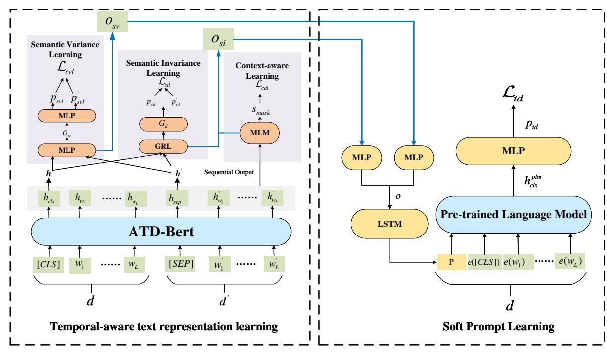
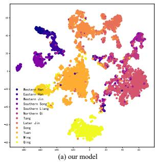
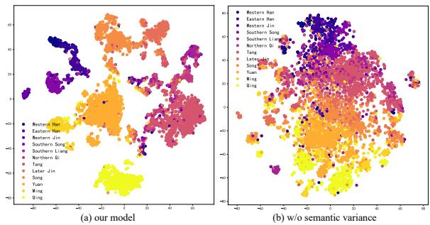
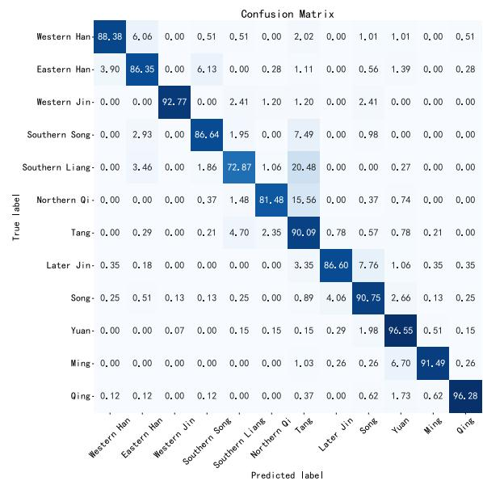
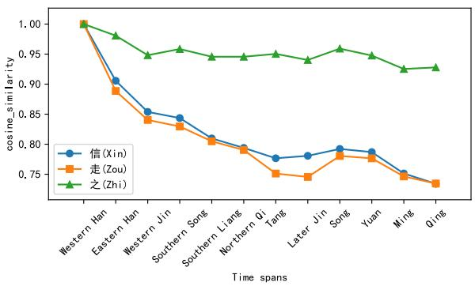
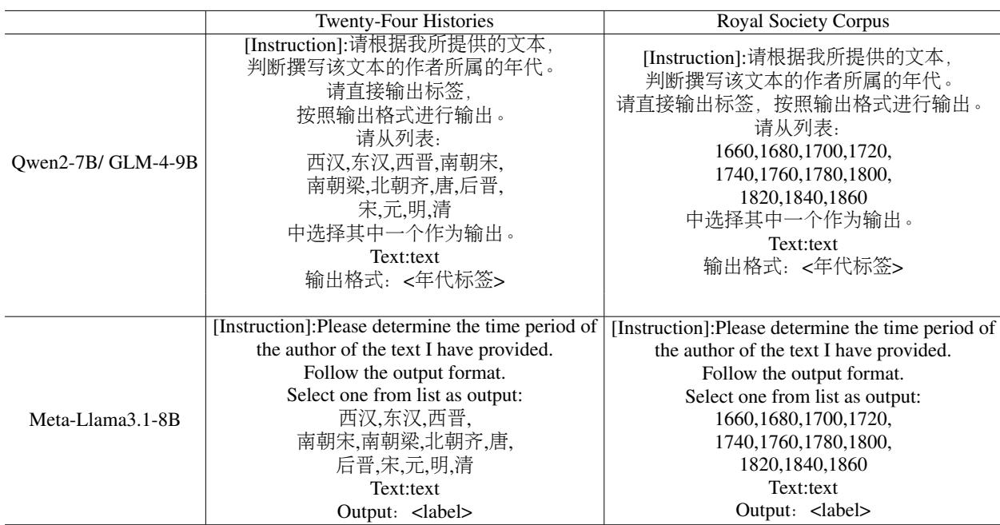

# Temporal-Aware Soft Prompt Tuning for Automatic Text Dating

Hai Wang, Yuzhi Liang\* and Han Ren

Guangdong University of Foreign Studies, China wanghai@mail.gdufs.edu.cn, yzliang@gdufs.edu.cn, hanren@gdufs.edu.cn

## Abstract

This paper presents Temporal-Aware Soft Prompt Tuning (TASPT), a novel approach for automatic text dating. Unlike existing methods, which often overlook the evolution of word meanings in texts spanning long periods, TASPT incorporates the unique characteristics of historical texts. It introduces a temporal-aware text representation that dynamically captures both semantic variance and invariance. This representation is combined with a soft prompt, enabling efficient parameter tuning for automatic text dating. Experiments show that TASPT outperforms all existing methods on two diachronic datasets: the Twenty-Four Histories and the Royal Society Corpus. Our code and datasets are avaliabled at https://github.com/coderlihong/TASPT

## 1 Introduction

To enhance the performance of various natural language processing tasks, such as information retrieval, machine translation, and automatic question answering, accurately understanding the temporal information in texts is essential. Many of these tasks are time-sensitive, as much factual information relies on the temporal context. For example, in Chinese, the word "寺" (temple) primarily referred to government offices in ancient times but now typically denotes Buddhist monasteries. Consequently, different eras may yield distinct answers to the same question. However, in practical applications, not all texts can be clearly labeled with corresponding temporal information. One effective solution to this challenge is automatic text dating (ATD).

Performing ATD on historical texts with long time spans presents two main challenges. The first is learning accurate representations of word meanings. Current ATD methods mainly rely on static word embeddings (Vashishth et al., 2019; Yu and

Huangfu, 2019) or pre-trained language models (Tian and Kübler, 2021; Li et al., 2022; Rosin et al., 2022) to capture text features. However, as word meanings evolve over time, these static methods may fail to capture semantic differences across different periods, impacting ATD performance. The second challenge is integrating temporal semantic information into the model. Recent research indicates that continuing training of pre-trained language models (PLMs) on texts from different time periods can improve downstream task performance (Pramanick et al., 2022; Gaspers et al., 2022; Agarwal and Nenkova, 2022). However, these methods require separate models for each time period, hindering the dynamic integration of temporal information in downstream tasks. Another research proposed TALM (Ren et al., 2023), which uses a temporal alignment module to synchronize word representations across periods and a temporal adaptation module to incorporate features, but this pipeline approach is prone to cascaded error propagation.

Recently, LLMs excel in many natural language processing tasks by leveraging vast amounts of data. However, ATD poses a unique challenge due to the limited ATD-specific data in their training corpora and the risk of catastrophic forgetting. This limits LLMs’ ability to grasp the temporal features crucial for ATD. Our experiments with open-source models highlight these challenges in applying LLMs to ATD.

To address the aforementioned challenges, we propose a novel model named Temporal-Aware Soft Prompt Tuning (TASPT). Inspired by Hu et al. (2019a), our approach decomposes word meaning representation in historical texts into three key components: semantic variance, semantic invariance, and temporal context features. Semantic variance captures changes in word meanings over time, semantic invariance identifies meanings that remain stable, and temporal context features highlight meanings across various contexts. We define specific learning objectives for each component during pre-training to construct a temporal-aware text representation tailored for the ATD task. This representation is then integrated into soft prompts, and we apply parameter-efficient fine-tuning techniques to optimize the transformer network, achieving high-performance ATD. Our contributions are summarized as follows:

• We propose ATD-Bert, a time-aware historical text representation model that captures semantic variance, semantic invariance, and temporal context features, enhancing the temporal domain information of semantic meanings.

• We introduce TASPT, a method that integrates ATD-Bert with efficient parameter fine-tuning for automatic text dating.

• We compare TASPT with state-of-the-art ATD methods, large language models, and existing soft prompt-based approaches. The experimental results show that TASPT outperforms baseline methods, demonstrating its effectiveness in capturing temporal semantic information.

## 2 Related Work

## 2.1 Automatic Text Dating

Exploring the temporal information in texts is crucial for many NLP tasks. For example, integrating temporal features in natural language generation can help reduce hallucinations and factual errors in large language models (Zhang et al., 2024). However, detecting temporal labels in unstructured text remains a challenge. Initial efforts at automatic text dating utilized n-gram language models (Jong et al., 2005; Baledent et al., 2020), which relied heavily on lexical features and showed limited effectiveness. Recent studies have employed graph convolutional networks to model the syntactic and temporal structures of documents (Vashishth et al., 2019). Additionally, some research has focused on using sequential (Yu and Huangfu, 2019) or pretrained models (Tian and Kübler, 2021; Li et al., 2022; Rosin et al., 2022) to extract features for date classification. However, these studies primarily optimize methods for semantic feature extraction without addressing the evolution of word meanings over time. TALM (Ren et al., 2023) enables models to adaptively understand word meanings in specific temporal contexts but functions as a pipeline approach, which may lead to error propagation and limit performance. To overcome these limitations, we propose using a pre-trained language model that integrates semantic variation, invariance, and temporal context features, enhancing dynamic word meanings for the ATD task.

## 2.2 Language Evolution

Language evolves continuously over time, and for the issue of language evolution, the general approach is to model texts from different periods to explore the semantic changes. Such works can be divided into three categories: 1) Learning word representations on texts which are divided into fixed time intervals, then aligning pairwise representations of different periods (Kulkarni et al., 2015; Hamilton et al., 2016; Schlechtweg et al., 2019). 2) Learning global representations of words on the entire corpus, then initializing the embedding matrix with it to fine-tune word embedding respectively on each time period (Di Carlo et al., 2019; Vashisth et al., 2019). 3) Incorporating temporal information into the learning process of pre-train tasks by appropriate learning objectives (Röttger and Pierrehumbert, 2021; Pramanick et al., 2022; Gaspers et al., 2022). However, these works are limited to studying different representations of word meanings and cannot dynamically adapt to specific tasks and domains, making it challenging to integrate these methods with downstream tasks. In our method, we integrate the temporal-aware text representations into specific tasks through soft prompt approaches, which enhances the performance of ATD.

## 2.3 Dynamic Semantic Modeling

Dynamic semantic modeling techniques enable the generation of more accurate semantic representations, which benefit various downstream tasks (Kutuzov et al., 2018). Existing approaches typically divide diachronic corpora into time spans and apply different algorithms to optimize word meaning representations. For instance, some studies use mathematical probability models to establish associations between word meanings across time slices, incorporating past semantic meaning into current representations through adjustable parameters (Yao et al., 2018; Rudolph and Blei, 2018; Bamler and Mandt, 2017). Other methods optimize semantic features for different time slices separately, based on anchor times (Di Carlo et al., 2019; Palamarchuk et al., 2024). However, these approaches primarily focus on learning word embeddings at different times and are not easily integrated into specific downstream tasks. Additionally, existing work often centers on the semantic shifts of individual words and their neighbors over time, without considering the broader context in which the word appears and how that affects its meaning.

## 3 Methods

In this section, we introduce a novel framework based on p-tuning that fine-tunes soft prompts using a frozen pre-trained language model, significantly reducing storage and memory requirements during ATD training. However, since ATD tasks require representations from different time periods, p-tuning alone is insufficient. To address this, we propose a temporal-aware text representation that projects texts from various historical periods into distinct vector spaces. By integrating this representation with soft prompts, our method better captures semantic shifts over time, enhancing ATD system accuracy. The system architecture of TASPT v1 LSTM is shown in Figure 1.

This section is organized as follows: Section 3.1 outlines the structure of ATD-Bert, which includes three core subtasks: Semantic Variance Learning (Section 3.1.1), Semantic Invariance Learning (Section 3.1.2), and Temporal Context-Aware Learning (Section 3.1.3). Section 3.2 then explains how ATD-Bert’s outputs are integrated into three distinct PEFT architectures.

## 3.1 Temporal-aware Text Representation

The temporal-aware historical text representation is designed to capture the distinctive nuances of historical texts through ATD-BERT, a specialized pre-trained language model built on the BERT architecture and fine-tuned for the ATD task. The final representation is obtained by decoupling ATD-BERT’s output into two components: semantic variance and semantic invariance.

ATD-Bert is an advanced pre-trained language model that maps texts from various eras into discrete vector spaces, effectively preserving their temporal essence. Specifically, given a historical text $d = < w _ { 1 } , w _ { 2 } , . . . , w _ { L } >$ , we encode it using ATD-Bert. The value in the sentence-start token [CLS] serves as the representation of the entire text in high-dimensional space, denoted as $h ,$ where $h \in \mathbb { R } ^ { 7 6 8 }$

$$
h = \mathrm { A T D - B e r t } ( d )\tag{1}
$$

To ensure accurate encodings, ATD-Bert follows strict criteria. It captures semantic shifts over time while preserving stable word meanings and being context-aware. To meet these needs, ATD-Bert uses specialized training tasks: Semantic Variance Learning, Semantic Invariance Learning, and Temporal Context-aware Learning.

## 3.1.1 Semantic Variance Learning

Regarding the variations in semantic meanings of words, it is common for words to encompass multiple meanings. As part of the ongoing process of semantic evolution across different periods of time, words can acquire new meanings or fall out of use. To enable our model to discern these changes within a high-dimensional space, we incorporated the principles of contrastive learning, ensuring text representations from more distant eras are distinguished by greater differences. Given two historical documents d and $d ^ { \prime } ,$ encoded by ATD-Bert into $h$ and $h ^ { \prime } .$ , we first reparameterize $h$ with a Multilayer Perceptron (MLP):

$$
o _ { s v } = M L P _ { s v l } ^ { r e p } ( [ h ; h ^ { \prime } ] )\tag{2}
$$

where $O _ { s v }$ matches h in size, $\because$ denotes vector concatenation. Next, $o _ { s v }$ passes through another MLP and a linear transformation to compute $p _ { s v l }$ and $p _ { s v l } ^ { \prime }$ , representing the document’s time category:

$$
p _ { s v l } , p _ { s v l } ^ { \prime } = \phi ( M L P _ { s v l } ^ { p o j } ( o _ { s v } ) )\tag{3}
$$

Here, $\phi$ aggregates vector values into floating-point numbers.

Hence, the chronological gap between the two texts amounts to:

$$
\Delta \hat { p } _ { s v l } = \hat { p } _ { s v l } - \hat { p } _ { s v l } ^ { \prime }\tag{4}
$$

We use the Mean Squared Error loss function to separate texts based on their temporal distance:

$$
\mathcal { L } _ { s v l } = \frac { 1 } { N } \sum _ { i = 1 } ^ { N } ( \Delta \hat { { p } } _ { s v l , i } - \Delta { p } _ { s v l , i } ) ^ { 2 }\tag{5}
$$

where $\Delta p _ { s v l }$ represents the actual chronological gap between texts d and $d ^ { \prime }$ , and N is the number of training samples. In the ATD dataset, time periods are encoded numerically, with smaller values for closer periods. A larger $\Delta p _ { s v l }$ indicates a greater temporal distance, implying less similarity between embeddings h and $h ^ { \prime }$ . The loss is minimized via backpropagation to fine-tune ATD-Bert.

  
Figure 1: The architecture of TASPT consists of two key components: On the left, the temporal-aware text representation module captures historical text representations, encompassing both semantic changes and invariance of words. On the right, the soft prompt tuning module integrates these representations into the soft prompt and combines them with a pre-trained language model to facilitate automatic text dating.

## 3.1.2 Semantic Invariance Learning

In semantic evolution, some words retain their meaning. We want our historical text representation to capture these invariant features without compromising ATD task performance. To achieve this, we implemented adversarial learning, enabling ATD-Bert to extract commonalities across different periods. We introduced a discriminator $G _ { d }$ to distinguish between the temporal domains of two input texts. The objectives of ATD-Bert and $G _ { d }$ are oppositional: the discriminator aims to correctly classify periods, while a gradient reversal layer (GRL) adjusts features in the opposite direction to refine ATD-Bert’s learning.

In Semantic Invariance Learning, the input is the concatenated representations of d and $d ^ { \prime }$ (i.e., h and $h ^ { \prime } )$ , encoded by ATD-Bert, with the output being the predicted time period for both documents. A gradient reversal layer (GRL) connects ATD-Bert and the discriminator $G _ { d } \colon$

$$
p _ { s i l } , p _ { s i l } ^ { \prime } = G _ { d } ( G R L ( [ h ; h ^ { \prime } ] ) )\tag{6}
$$

Here, $\because$ denotes vector concatenation, and $p _ { s i l } \in$ $\mathbb { R } ^ { | C | }$ is the predicted time period, with $G _ { d }$ as a simple neural network.

The GRL has no parameters (aside from the meta-parameter λ, which remains unchanged during backpropagation). During forward propagation, the GRL applies an identity transformation to the input:

$$
G R L ( x ) = x\tag{7}
$$

However, during backward propagation, the GRL reverses the direction of the computed gradients by multiplying them by a negative scaling factor:

$$
{ \frac { \partial G R L ( x ) } { \partial x } } = - \lambda \mathbf { I }\tag{8}
$$

where I is the identity matrix, λ is a metaparameter.

The semantic invariance learning module employs cross-entropy as the loss function:

$$
\mathcal { L } _ { s i l } = \frac { 1 } { N } \sum _ { i = 1 } ^ { N } { y _ { i } } ^ { \top } \log p _ { s i l , i }\tag{9}
$$

where $y _ { i }$ is the one-hot vector of the ground truth of the i-th sample, $A ^ { \top }$ is the transpose of the matrix A, and N is the number of training samples.

## 3.1.3 Temporal Context-Aware Learning

Different historical texts often share common contextual elements. To further extract the semantic invariance features of these texts, we integrated a temporal context-aware learning module into the training of ATD-Bert. Specifically, we concatenate d and $d ^ { \prime }$ as input and apply masked language modeling (MLM) on $d ^ { \prime } .$ , replacing some words with [MASK] tokens. The input format becomes $\begin{array} { r l r } { d _ { [ \mathrm { m a s k } ] } } & { { } = } & { \{ [ \mathrm { S E P } ] , w _ { 1 } , \dots , [ \mathrm { M A S K } ] , \dots , w _ { L } ^ { \prime } \} } \end{array}$ We compute the representation at the [MASK] position, h[MASK], and pass it through a softmax over the vocabulary:

$$
p _ { t c l } = \mathrm { s o f t m a x } ( s _ { [ \mathrm { M A S K } ] } )\tag{10}
$$

where $s _ { [ \mathrm { M A S K } ] } = f \big ( h _ { [ \mathrm { M A S K } ] } \big ) , s _ { [ \mathrm { M A S K } ] } \in \mathbb { R } ^ { | V | }$ , f is the MLM head function, and $| V |$ is the vocabulary size. By concatenating d and $d ^ { \prime }$ and training with a MLM, we treat them as data from distinct but related domains, allowing the model to learn domain-invariant features. The learning objective is to predict the masked word:

$$
\mathcal { L } _ { \mathrm { t c l } } = \frac { 1 } { K } \sum _ { k = 1 } ^ { K } \log p ( x _ { \pi _ { k } } \mid X _ { - \pi } )\tag{11}
$$

where $X _ { \pi }$ represents the masked tokens and $X _ { - \pi }$ the unmasked tokens.

## 3.1.4 Constructing Representations

The overall loss for ATD-Bert is derived from the joint training of semantic variance learning, semantic invariance learning, and temporal context-aware learning:

$$
\mathcal { L } _ { \mathrm { A T D - B e r t } } = \mathcal { L } _ { \mathrm { s v l } } + \mathcal { L } _ { \mathrm { s i l } } + \mathcal { L } _ { \mathrm { t c l } }\tag{12}
$$

While the encoded output h from ATD-Bert effectively represents $d ,$ we found that decoupling h into two components—semantic variance $O _ { s v }$ and semantic invariance $o _ { s i }$ —improves performance when combined with soft prompts in ATD. Specifically, $o _ { s v }$ is derived using Eq. 2. Drawing from the approach in Wang et al. (2023), which uses an alignment method to capture invariant features across domains and modalities, we employ both TCL and SIL to learn $O _ { s i } .$ , which captures shared word meanings across different historical periods. Let $d _ { \mathrm { [ m a s k ] } }$ denote the masked d:

$$
o _ { s i } = R ( G R L ( h ) ) \oplus \mathrm { A T D - B e r t } ( d _ { [ \mathrm { m a s k } ] } )\tag{13}
$$

Here, $G R L ( h ) ~ \in ~ \mathbb { R } ^ { 7 6 8 } , ~ \mathrm { A T D \mathrm { - B e r t } } ( d _ { [ \mathrm { m a s k } ] } ) ~ \in$ $\mathbb { R } ^ { 5 1 2 \times 7 6 8 }$ , and R aligns their shapes through repeating and copying arrays, while denotes matrix addition.

## 3.2 Temporal-Aware Soft Prompt Tuning

For ATD classification, TASPT employs Parameter-Efficient Fine-Tuning (PEFT) to bridge the gap between pre-training and fine-tuning. Specifically, it integrates temporal-aware text representation with soft prompts for ATD. Soft prompt learning offers various implementation strategies. For the widely used PPT (Gu et al., 2022), P-tuning v1 LSTM (Liu et al., 2022), and P-tuning ${ \bf v } 2$ (Liu et al., 2023), we have developed tailored variants of TASPT: TASPT Pre-trained, TASPT v1 LSTM, and TASPT v2. Following the PEFT paradigm, TASPT adjusts only the prompt parameters, making it significantly more efficient than full fine-tuning. In TASPT Pre-trained, TASPT v1 LSTM, and TASPT v2, the adjustable parameters account for just 1.4%, 3.4%, and 5.2% of the total model parameters, respectively.

To implement the soft prompt methods, the features output by ATD-BERT serve as the initial parameters. Since the temporal embedding from ATD-BERT cannot be directly mapped to each soft prompt method, additional processing steps are introduced. Specifically, techniques such as matrix transposition, matrix downsampling, and reparameterization are employed to effectively incorporate the temporal embedding into the text dating task.

In the soft prompt tuning phase, we first represent the temporal-aware text representation as follows:

$$
o = [ M L P ( o _ { s v } ) ; M L P ( o _ { s i } ) ]\tag{14}
$$

Here, the Multi-layer Perceptron (MLP) is employed to reparameterize and reduce the dimensionality of the input, with backpropagation occurring through the loss associated with the text dating component.

## 3.2.1 TASPT Pre-trained

In TASPT pre-training, we first map a set of virtual tokens $B _ { v }$ into a continuous vector space using an embedding layer. By adding this mapped representation to the temporal-aware text representation, we obtain the soft prompt P :

$$
\boldsymbol { P } = o \oplus e ( \boldsymbol { B _ { v } } )\tag{15}
$$

## 3.2.2 TASPT v1 LSTM

In TASPT v1 LSTM, the temporal-aware text representation is input into an LSTM network for further reparameterization. The soft prompt is defined as:

$$
P = L S T M ( o )\tag{16}
$$

The LSTM network is fine-tuned through backpropagation during the text dating phase.

## 3.2.3 TASPT v2

TASPT v2 uses a prefix encoder to combine virtual token embeddings with the temporal-aware text representation $o .$ Like P-Tuning v2, TASPT v2 incorporates the prefix-tuning approach by adding learnable parameters before each input layer. To achieve this, the soft prompt is reshaped as follows:

$$
P = R ( M L P ( [ o ; e ( B _ { v } ) ] ) )\tag{17}
$$

where $B _ { v }$ is a set of virtual tokens, e is an embedding function that maps the virtual tokens into continuous vectors, MLP represents the prefix encoder, and R is a reshape operation that ensures $_ { r }$ has a compatible structure with Liu et al. (2022).

## 3.2.4 Classification

The soft prompt $_ { P }$ is concatenated at the start of the sequence, forming the model input:

$$
x _ { p r o m p t } = \{ P ; e ( [ C L S ] ) , e ( w _ { 1 } ) , \ldots , e ( w _ { L } ) \}\tag{18}
$$

This input is then fed into a frozen pre-trained language model (PLM), which generates token representations. In our experiments, we selected BERT as the PLM. We extract the representation of the [CLS] token, denoted as $h _ { \lceil C L S \rceil } ^ { p l m ^ { - } }$ , to serve as the historical text representation for text dating.

The final text dating prediction is obtained by applying a linear transformation to $h _ { [ C L S ] } ^ { p l m } .$

$$
p _ { t d } = \mathrm { s o f t m a x } ( W h _ { [ C L S ] } ^ { p l m } + b )\tag{19}
$$

The predicted year category cˆ is the index with the highest value in $p _ { t d }$ , where $\hat { c } \in \mathbb { Z } ^ { + }$

In the text dating stage, we observe that texts from nearby periods tend to have similar semantics, while those from distant periods differ more. To capture this, we define a new loss function, the text dating loss:

$$
\mathcal { L } _ { t d } = e ^ { \operatorname { t a n h } ( ( c - \hat { c } ) ^ { 2 } ) } \times \frac { 1 } { N } \sum _ { i = 1 } ^ { N } y _ { i } ^ { \top } \log p _ { t d , i }\tag{20}
$$

Here, $y _ { i }$ is a one-hot vector for the year label of the i-th sample, and c is the index of the non-zero entry in $y _ { i }$ . When c matches cˆ (the predicted year), $\mathcal { L } _ { t d }$ reduces to cross-entropy loss. Otherwise, it penalizes larger deviations more heavily, with smaller penalties for close predictions, reflecting the semantic similarity of texts from nearby years.

## 4 Experiment

## 4.1 Experimental Setup

We evaluated our model on two datasets: the Chinese "Twenty-Four Histories" and the English "Royal Society Corpus" (RSC) (Kermes et al., 2016). Following Ren et al. (2023), we used an 8:1:1 split for training, validation, and testing. Detailed information on the dataset and model parameter settings can be found in Appendix A.

Baseline: In the experimental setup, TASPT was benchmarked against three distinct categories of methods.

We initially selected eight established ATD methodologies as baseline references: 1) Bayesian classifier (Yang, 2018): Uses Bayesian probability and tf-idf for classification. 2) DPCNN (Johnson and Zhang, 2017): Employs a deep pyramid convolutional neural network for long text classification. 3) Hierarchical Bert (Khandve et al., 2022): Utilizes a hierarchical structure to extract feature in long text for text dating. 4) Longformer (Beltagy et al., 2020): Extract information from long texts and classify it by optimizing the attention structure. 5) LSTM (Yu and Huangfu, 2019): Uses an LSTM network for text dating. 6) SBERT (Tian and Kübler, 2021): Utilizes Siamese and triplet networks to generate sentence embeddings. 7) RoBERTa (Li et al., 2022): Applies the RoBERTa model for chronological classification of ancient Chinese texts. 8) TALM (Ren et al., 2023): Incorporates temporal alignment and adaptation modules for effective text dating.

We also evaluated the performance of large language models for the ATD task. We selected three state-of-the-art models that excel in processing both Chinese and English texts, using historical texts and classification labels as inputs to guide the LLM in outputting the appropriate label: 1) Qwen2-7B (Hui et al., 2024): Known for its superior performance across various tasks due to an optimized architecture and extensive training on diverse datasets. 2) Meta-Llama3.1-8B (Dubey et al., 2024): Demonstrates remarkable proficiency in NLP tasks, particularly in text generation and comprehension. 3) GLM-4-9B (GLM et al., 2024): Offers the best Chinese capabilities among all opensource models with fewer than 10 billion parameters. The prompts used in our experiments are provided in Appendix B.

The TASPT introduced in this study is built on a soft p-tuning architecture. Thus, we also benchmarked existing soft p-tuning methods for the ATD task against our model: 1) PPT (Gu et al., 2022): Uses a sequence of continuous vectors as prompt input, concatenated with text representations for pretrained models. 2) P-tuning v2 (Liu et al., 2022): Converts virtual tokens into dense vectors and uses multi-layer prefix optimization for task adaptation. 3) P-tuning v1 LSTM (Liu et al., 2023): Employs an LSTM layer to encode prompt features.

Evaluation Metric: Due to label imbalance in the experimental dataset, we selected macro precision (P), macro recall (R), and macro F1 as our evaluation metrics. Additionally, following the work of Ren et al. (2023), we utilized a more flexible evaluation metric, Acc@K, to assess the severity of errors in the text dating task. This metric considers prediction results with a relative temporal distance of less than $\pm \lfloor \frac { K } { 2 } \rfloor$ as correct samples.

## 4.2 Model Performance

The comparison results of TASPT and baseline models on the ATD task are presented in Table 1.

First, our model, TASPT, outperformed existing text dating methods across all metrics on both datasets. Specifically, it achieved F1-scores of 89.09% and 61.07%, surpassing RoBERTa’s 87.52% and 59.84%. While other supervised methods like RoBERTa performed well, TASPT consistently outperformed them. Methods based on static semantic features, such as the Bayesian classifier, struggle to capture the differences between diachronic corpora, leading to poor performance in the dating task. Additionally, approaches like DPCNN and Hierarchical BERT, which are designed for long-text modeling, proved ineffective for the short-text datasets used in this study. Models such as LSTM, SBERT, and RoBERTa focus on structural optimization but fail to account for semantic shifts, limiting their performance. TALM, while attempting to model semantic changes, suffers from instability due to random initialization of the semantic space—further emphasizing the superiority of TASPT.

Second, while we selected the latest large language models that incorporate both Chinese and English corpora in their training data, these models did not perform well on the ATD task. This can be attributed to the relatively small proportion of diachronic texts in their datasets and temporal hallucination (Qian et al., 2024) in LLMs, which hampers their ability to effectively establish correlations between texts and their temporal labels.

Furthermore, employing general-purpose LLMs for the ATD task resembles zero-shot learning, leading to lower performance compared to more specialized supervised methods.

Third, typical prompt learning methods (PPT, P-tuning v2, P-tuning v1-LSTM) fine-tune pretrained models with soft prompts but are significantly less effective than TASPT. Our model outperforms PPT, P-tuning v2, and P-tuning v1-LSTM by 19.96%, 19.99%, and 18.83% in F1 scores on the Twenty-Four Histories dataset, highlighting its superior text representation. TASPT v1 LSTM achieves the best results, while TASPT v2 underperforms slightly due to the network shape constraints of prefix-tuning. P-tuning results on the RSC dataset are lower because it lacks the rich dating cues found in the historical Twenty-Four Histories. Nonetheless, TASPT consistently surpasses traditional P-tuning methods across datasets.

## 4.3 Ablation Study

In the ablation experiments, we assess the impact of removing different modules from our method: Semantic Variance Learning (SVL), Semantic Invariance Learning (SIL), and Temporal Context-aware Learning (TCL). As shown in Table 2, excluding the SVL module has the most significant effect, reducing performance by 41.89% and 30.94% on the Chinese and English datasets, respectively. A study by Hu et al. (2019b) found that about one-third of words undergo semantic changes over a 120- year period. Given that the historical texts in our dataset span an even longer timeframe, the number of words with altered meanings is likely higher. Neglecting these semantic evolutions severely impacts ATD performance. Furthermore, the inclusion of a GRL layer in the SIL module during ATD-Bert training improves the model’s ability to capture semantic variance in temporal-aware text representations, enhancing the module’s effectiveness. Removing SIL results in smaller performance drops of 0.88% and 0.7%, while excluding TCL reduces performance by 0.56% and 0.98%. Although SIL and TCL have less pronounced impacts, linguistic studies (Hu et al., 2019b; Shah et al., 2018) suggest that many words retain stable meanings over time, making semantic stability crucial for automatic text dating. Further exploration is needed to better optimize these modules for the ATD task.

We validated the effectiveness of the semantic variance learning module by visualizing document embeddings. We compared historical text embeddings generated by ATD-Bert with and without this module, projecting both sets into a 2D space using t-SNE (Van der Maaten and Hinton, 2008), as shown in Figure 2. The embeddings without the semantic variance module show color-coded points roughly separated into distinct areas, but the boundaries are unclear. In contrast, the embeddings with the module cluster texts from different dynasties into well-defined areas with clearer separations. This demonstrates that the temporal-aware text embeddings from ATD-Bert effectively differentiate historical texts, leading to more accurate representations for downstream tasks.

<table><tr><td rowspan="2"></td><td colspan="5">Twenty-Four Histories</td><td rowspan="2"></td><td colspan="6">Royal Society Corpus</td></tr><tr><td>P</td><td>R</td><td>F1</td><td>Acc</td><td>Acc@3</td><td>Acc@5</td><td>P R</td><td>F1</td><td>Acc</td><td>Acc@3</td><td>Acc@5</td></tr><tr><td>Bayesian classifier</td><td>44.24</td><td>23.06</td><td>21.75</td><td>45.28</td><td>63.49</td><td>77.80</td><td>50.34</td><td>22.19</td><td>21.69</td><td>33.22</td><td>56.80</td><td>68.54</td></tr><tr><td>DPCNN</td><td>63.12</td><td>62.06</td><td>62.17</td><td>70.00</td><td>82.49</td><td>90.03</td><td>46.49</td><td>42.92</td><td>43.45</td><td>46.52</td><td>82.18</td><td>92.41</td></tr><tr><td>Hierarchical Bert</td><td>46.17</td><td>41.41</td><td>42.96</td><td>50.75</td><td>69.57</td><td>83.59</td><td>29.13</td><td>27.22</td><td>27.50</td><td>30.52</td><td>66.00</td><td>80.93</td></tr><tr><td>Longformer</td><td>88.30</td><td>87.49</td><td>87.87</td><td>89.45</td><td>94.21</td><td>97.29</td><td>60.55</td><td>60.18</td><td>60.29</td><td>62.46</td><td>90.53</td><td>96.60</td></tr><tr><td>LSTM</td><td>79.76</td><td>79.37</td><td>79.40</td><td>78.51</td><td>88.93</td><td>95.20</td><td>47.13</td><td>45.58</td><td>45.81</td><td>48.17</td><td>87.45</td><td>96.13</td></tr><tr><td>BERT</td><td>86.70</td><td>86.41</td><td>86.47</td><td>88.60</td><td>94.00</td><td>97.37</td><td>59.69</td><td>59.01</td><td>59.21</td><td>61.20</td><td>90.35</td><td>96.45</td></tr><tr><td>SBERT</td><td>87.55</td><td>87.09</td><td>87.30</td><td>89.28</td><td>94.04</td><td>97.38</td><td>59.65</td><td>59.04</td><td>59.22</td><td>61.16</td><td>89.80</td><td>95.94</td></tr><tr><td>RoBERTa</td><td>87.59</td><td>87.54</td><td>87.52</td><td>89.03</td><td>94.01</td><td>97.31</td><td>60.13</td><td>59.70</td><td>59.84</td><td>62.29</td><td>90.20</td><td>96.30</td></tr><tr><td>TALM</td><td>64.93</td><td>73.60</td><td>66.32</td><td>65.76</td><td>85.47</td><td>94.07</td><td>53.49</td><td>53.83</td><td>53.17</td><td>59.83</td><td>84.71</td><td>95.24</td></tr><tr><td>Qwen2-7B</td><td>9.28</td><td>9.50</td><td>6.34</td><td>6.74</td><td>58.07</td><td>74.40</td><td>28.27</td><td>16.52</td><td>15.91</td><td>20.04</td><td>42.45</td><td>60.37</td></tr><tr><td>Meta-Llama3.1-8B</td><td>3.64</td><td>4.26</td><td>2.52</td><td>1.94</td><td>14.05</td><td>23.46</td><td>7.64</td><td>0.03</td><td>0.06</td><td>0.03</td><td>13.96</td><td>34.06</td></tr><tr><td>GLM-4-9B</td><td>6.43</td><td>9.10</td><td>5.42</td><td>7.71</td><td>46.58</td><td>64.25</td><td>40.75</td><td>0.76</td><td>1.40</td><td>0.73</td><td>14.75</td><td>34.80</td></tr><tr><td>PPT</td><td>71.55</td><td>69.20</td><td>69.13</td><td>75.65</td><td>89.54</td><td>95.60</td><td>24.71</td><td>22.79</td><td>19.02</td><td>26.18</td><td>59.60</td><td>77.00</td></tr><tr><td>P-tuning v2</td><td>71.58</td><td>69.17</td><td>69.10</td><td>75.66</td><td>89.55</td><td>95.60</td><td>24.57</td><td>22.73</td><td>19.37</td><td>26.52</td><td>59.51</td><td>76.66</td></tr><tr><td>P-tuning v1-LSTM</td><td>69.59</td><td>73.10</td><td>70.26</td><td>76.62</td><td>90.33</td><td>95.44</td><td>27.70</td><td>28.42</td><td>26.18</td><td>31.35</td><td>67.56</td><td>83.55</td></tr><tr><td>TASPT Pre-trained</td><td>88.94</td><td>87.84</td><td>88.34</td><td>89.87</td><td>94.26</td><td>97.66</td><td>61.23</td><td>60.15</td><td>60.53</td><td>61.90</td><td>92.08</td><td>97.27</td></tr><tr><td>TASPT v2</td><td>89.43</td><td>88.33</td><td>88.84</td><td>90.36</td><td>94.60</td><td>97.76</td><td>61.50</td><td>60.65</td><td>60.92</td><td>62.78</td><td>92.09</td><td>96.97</td></tr><tr><td>TASPT v1 LSTM</td><td>89.89</td><td>88.36</td><td>89.09</td><td>90.32</td><td>94.88</td><td>98.06</td><td>61.70</td><td>60.68</td><td>61.07</td><td>62.96</td><td>92.29</td><td>97.00</td></tr></table>

Table 1: Model performance comparison on Twenty-Four Histories and Royal Society Corpora.

<table><tr><td>Dataset</td><td>Model</td><td>P</td><td>R</td><td>F1</td></tr><tr><td>24 Histories</td><td>TASPT - SVL - SIL - TCL</td><td>89.89 49.01 88.90 89.50</td><td>88.36 47.63 87.67 87.67</td><td>89.09 47.20 88.21</td></tr><tr><td>RSC</td><td>TASPT - SVL - SIL - TCL</td><td>61.70 31.57 61.32 60.70</td><td>60.68 32.53 60.02 59.89</td><td>88.53 61.07 30.13 60.37 60.09</td></tr></table>

Table 2: Results of ablation study on the Twenty-Four Histories Corpus and Royal Society Corpus.

## 5 Detailed Analysis

## 5.1 Detailed Comparison with RoBERTa

We compared TASPT with RoBERTa, the secondbest baseline, on the Twenty-Four Histories dataset, assessing precision (P), recall (R), and F1 scores for ATD across dynasties in Table 3. TASPT v1

  
Figure 2: Comparison of embeddings generated with and without the Semantic Variance Learning module.

<table><tr><td rowspan="2">Period</td><td colspan="3">TASPT v1 LSTM</td><td colspan="3">RoBERTa</td></tr><tr><td>P</td><td>R</td><td>F1</td><td>P</td><td>R</td><td>F1</td></tr><tr><td>Western Han</td><td>88.79</td><td>96.07</td><td>87.41</td><td>84.76</td><td>85.24</td><td>85.00</td></tr><tr><td>Eastern Han</td><td>93.50</td><td>95.97</td><td>94.72</td><td>93.88</td><td>95.60</td><td>94.73</td></tr><tr><td>Western Jin</td><td>81.92</td><td>92.22</td><td>92.07</td><td>77.35</td><td>82.22</td><td>79.71</td></tr><tr><td>Southern Song</td><td>84.88</td><td>89.58</td><td>87.16</td><td>86.17</td><td>87.29</td><td>86.73</td></tr><tr><td>Southern Liang</td><td>78.00</td><td>72.62</td><td>75.21</td><td>75.42</td><td>71.81</td><td>73.57</td></tr><tr><td>Northern Qi</td><td>89.14</td><td>89.77</td><td>89.46</td><td>89.54</td><td>83.07</td><td>86.18</td></tr><tr><td>Tang</td><td>87.99</td><td>88.74</td><td>88.36</td><td>86.61</td><td>87.60</td><td>87.10</td></tr><tr><td>Later Jin</td><td>90.09</td><td>89.86</td><td>89.97</td><td>87.73</td><td>88.84</td><td>88.29</td></tr><tr><td>Song</td><td>93.47</td><td>92.27</td><td>92.87</td><td>90.86</td><td>94.85</td><td>92.81</td></tr><tr><td>Yuan</td><td>98.10</td><td>95.91</td><td>96.99</td><td>97.84</td><td>95.42</td><td>96.61</td></tr><tr><td>Ming</td><td>94.12</td><td>96.39</td><td>95.24</td><td>89.77</td><td>95.18</td><td>92.40</td></tr><tr><td>Qing</td><td>92.55</td><td>87.88</td><td>90.16</td><td>91.16</td><td>83.33</td><td>87.07</td></tr></table>

Table 3: Detailed comparison of TASPT and RoBERTa

LSTM surpasses RoBERTa, especially in dynasties with shorter historical spans and higher classification errors, such as Western Jin, Southern Liang, and Northern Qi. For example, TASPT v1 LSTM improves F1 scores by 12.36%, 1.64%, and 3.28% in the Later Jin, Southern Liang, and Northern Qi categories. RoBERTa struggles with these due to limited data, while our method excels by integrating semantic invariance and variance features.

## 5.2 Semantic Evolution Analysis

In this section, we analyze semantic evolution by visualizing the confusion matrix and presenting case studies using the Twenty-Four Histories dataset.

  
Figure 3: Confusion matrix of TASPT v1 LSTM on the Twenty-Four Histories dataset.

Firstly, we generated the confusion matrix for the best-performing model, TASPT v1 LSTM, as shown in Figure 3. For the Southern Liang category, 20.48% of the misclassified samples were incorrectly predicted as belonging to the Tang dynasty, while 1.06% were predicted as Northern Qi. From a temporal perspective, the relatively short duration of the Southern and Northern dynasties, followed by the long and stable literary period of the Tang dynasty, may explain why Southern Liang samples were misclassified as Tang or Northern Qi. Similarly, misclassified samples from the Later Jin were primarily attributed to the Tang and Song dynasties. Historically, the Later Jin was a transitional period between the Tang and Song, with similar vocabulary and writing styles, which may have caused the model to confuse these periods.

  
Figure 4: Semantic evolution of selected Chinese terms

Secondly, we selected three Chinese terms—"信" (xin), "走" (zou), and "之" (zhi)—from the Twenty-Four Histories dataset and visualized their semantic changes using embeddings generated by ATD-Bert. In Figure 4, the x-axis represents different dynasties, and the y-axis shows the cosine similarity of each word to its counterpart in the Western Han dynasty. As time progresses, the similarity to the Western Han version decreases, reflecting natural semantic evolution. Among these words, "之" has remained relatively stable, primarily functioning as the particle "of," resulting in a flat cosine similarity curve. In contrast, "信" and "走" have undergone significant semantic shifts. "信" once a noun meaning "integrity" now often refers to the verb "believe" while "走" originally meaning "flee" in wartime, now commonly means "walk". These changes are evident in Figure 4, where the steeper curves for "信" and "走" indicate a larger shift from their Western Han embeddings.

## 6 Conclusion

In this paper, we introduce Temporal-Aware Soft Prompt Tuning (TASPT), a novel method for automatic text dating. We design a temporal-aware text representation that captures semantic variance, invariance, and temporal contextual features for the ATD task, integrating it into a soft prompt with efficient parameter fine-tuning to align with pre-trained language models. Our experiments on Chinese and English historical datasets show that TASPT outperforms existing ATD methods, large language models, and other soft prompt approaches. We also found that current large models struggle with ATD, and future work will focus on improving their performance in this area.

## Limitation

This study has two main limitations. First, while the proposed TASPT v2 outperforms p-tuning v2 for the ATD task, it still lags behind TASPT v1 LSTM , suggesting that some information may be lost when integrating temporal-aware text representation into p-tuning v2. Second, our ablation study revealed that the Semantic Invariance Learning (SIL) and Temporal Context-aware Learning (TCL) modules in ATD-Bert had a smaller impact than expected, despite linguistic research emphasizing the importance of capturing semantic invariance in historical texts. We plan to conduct more in-depth research into these areas and make further improvements in our future work.

## Acknowledgment

This research is supported by the Ordinary University Characteristic Innovation Project of Guangdong Province (Grant No.: 2023KTSCX031), and the Joint Project of Philosophy and Social Sciences Planning Discipline in Guangdong Province (Grant No.: GD23XZY07).

## References

Oshin Agarwal and Ani Nenkova. 2022. Temporal effects on pre-trained models for language processing tasks. Transactions ofthe Associationfor Computational Linguistics, 10:904–921.

Anaëlle Baledent, Nicolas Hiebel, and Gaël Lejeune. 2020. Dating ancient texts: an approach for noisy french documents. In Language Resources and Evaluation Conference (LREC) 2020.

Robert Bamler and Stephan Mandt. 2017. Dynamic word embeddings. In International conference on Machine learning, pages 380–389. PMLR.

Iz Beltagy, Matthew E Peters, and Arman Cohan. 2020. Longformer: The long-document transformer. arXiv preprint arXiv:2004.05150.

Valerio Di Carlo, Federico Bianchi, and Matteo Palmonari. 2019. Training temporal word embeddings with a compass. In Proceedings of the AAAI conference on artificial intelligence, volume 33, pages 6326–6334.

Abhimanyu Dubey, Abhinav Jauhri, Abhinav Pandey, Abhishek Kadian, Ahmad Al-Dahle, Aiesha Letman, Akhil Mathur, Alan Schelten, Amy Yang, Angela Fan, et al. 2024. The llama 3 herd of models. arXiv preprint arXiv:2407.21783.

Judith Gaspers, Anoop Kumar, Greg Ver Steeg, and Aram Galstyan. 2022. Temporal generalization for

spoken language understanding. In Proceedings of the 2022 Conference of the North American Chapter ofthe Associationfor Computational Linguistics: Human Language Technologies: Industry Track, pages 37–44, Hybrid: Seattle, Washington + Online. Association for Computational Linguistics.

Team GLM, Aohan Zeng, Bin Xu, Bowen Wang, Chenhui Zhang, Da Yin, Diego Rojas, Guanyu Feng, Hanlin Zhao, Hanyu Lai, et al. 2024. Chatglm: A family of large language models from glm-130b to glm-4 all tools. arXiv preprint arXiv:2406.12793.

Yuxian Gu, Xu Han, Zhiyuan Liu, and Minlie Huang. 2022. Ppt: Pre-trained prompt tuning for few-shot learning. In Proceedings of the 60th Annual Meeting of the Association for Computational Linguistics (Volume 1: Long Papers), pages 8410–8423.

William L Hamilton, Jure Leskovec, and Dan Jurafsky. 2016. Diachronic word embeddings reveal statistical laws of semantic change. In Proceedings ofthe 54th Annual Meeting ofthe Associationfor Computational Linguistics (Volume 1: Long Papers), pages 1489– 1501.

Renfen Hu, Shen Li, and Shichen Liang. 2019a. Diachronic sense modeling with deep contextualized word embeddings: An ecological view. In Proceedings of the 57th annual meeting of the association for computational linguistics, pages 3899–3908.

Renfen Hu, Shen Li, and Shichen Liang. 2019b. Diachronic sense modeling with deep contextualized word embeddings: An ecological view. In Proceedings ofthe 57th Annual Meeting ofthe Associationfor Computational Linguistics, pages 3899–3908, Florence, Italy. Association for Computational Linguistics.

Binyuan Hui, Jian Yang, Zeyu Cui, Jiaxi Yang, Dayiheng Liu, Lei Zhang, Tianyu Liu, Jiajun Zhang, Bowen Yu, Kai Dang, et al. 2024. Qwen2. 5-coder technical report. arXiv preprint arXiv:2409.12186.

Rie Johnson and Tong Zhang. 2017. Deep pyramid convolutional neural networks for text categorization. In Proceedings of the 55th Annual Meeting of the Associationfor Computational Linguistics (Volume 1: Long Papers), pages 562–570.

FM Jong, Henning Rode, and Djoerd Hiemstra. 2005. Temporal language models for the disclosure of historical text.

Hannah Kermes, Stefania Degaetano-Ortlieb, Ashraf Khamis, Jörg Knappen, and Elke Teich. 2016. The royal society corpus: From uncharted data to corpus. In Proceedings ofthe Tenth International Conference on Language Resources and Evaluation (LREC’16), pages 1928–1931.

Snehal Ishwar Khandve, Vedangi Kishor Wagh, Apurva Dinesh Wani, Isha Mandar Joshi, and Raviraj Bhuminand Joshi. 2022. Hierarchical neural network approaches for long document classification. In

Proceedings ofthe 2022 14th International Conference on Machine Learning and Computing, pages 115–119.

Vivek Kulkarni, Rami Al-Rfou, Bryan Perozzi, and Steven Skiena. 2015. Statistically significant detection of linguistic change. In Proceedings ofthe 24th international conference on world wide web, pages 625–635.

Andrey Kutuzov, Lilja Øvrelid, Terrence Szymanski, and Erik Velldal. 2018. Diachronic word embeddings and semantic shifts: a survey. In Proceedings of the 27th International Conference on Computational Linguistics, pages 1384–1397.

Meiwei Li, Yunhui Qin, and Wei Huangfu. 2022. Roberta: An efficient dating method of ancient chinese texts. In Workshop on Chinese Lexical Semantics, pages 293–301. Springer.

Xiao Liu, Kaixuan Ji, Yicheng Fu, Weng Tam, Zhengxiao Du, Zhilin Yang, and Jie Tang. 2022. P-tuning: Prompt tuning can be comparable to fine-tuning across scales and tasks. In Proceedings of the 60th Annual Meeting of the Association for Computational Linguistics (Volume 2: Short Papers), pages 61–68.

Xiao Liu, Yanan Zheng, Zhengxiao Du, Ming Ding, Yujie Qian, Zhilin Yang, and Jie Tang. 2023. Gpt understands, too. AI Open.

Daniel Palamarchuk, Lemara Williams, Brian Mayer, Thomas Danielson, Rebecca Faust, Larry Deschaine, and Chris North. 2024. Visualizing temporal topic embeddings with a compass. IEEE Transactions on Visualization and Computer Graphics.

Aniket Pramanick, Tilman Beck, Kevin Stowe, and Iryna Gurevych. 2022. The challenges of temporal alignment on Twitter during crises. In Findings ofthe Associationfor Computational Linguistics: EMNLP 2022, pages 2658–2672, Abu Dhabi, United Arab Emirates. Association for Computational Linguistics.

Xinying Qian, Ying Zhang, Yu Zhao, Baohang Zhou, Xuhui Sui, Li Zhang, and Kehui Song. 2024. TimeR4 : Time-aware retrieval-augmented large language models for temporal knowledge graph question answering. In Proceedings of the 2024 Conference on Empirical Methods in Natural Language Processing, pages 6942–6952, Miami, Florida, USA. Association for Computational Linguistics.

Han Ren, Hai Wang, Yajie Zhao, and Yafeng Ren. 2023. Time-aware language modeling for historical text dating. In Findings of the Association for Computational Linguistics: EMNLP 2023, pages 13646– 13656.

Guy D Rosin, Ido Guy, and Kira Radinsky. 2022. Time masking for temporal language models. In Proceedings of the Fifteenth ACM International Conference on Web Search and Data Mining, pages 833–841.

Paul Röttger and Janet Pierrehumbert. 2021. Temporal adaptation of BERT and performance on downstream document classification: Insights from social media. In Findings of the Association for Computational Linguistics: EMNLP 2021, pages 2400–2412, Punta Cana, Dominican Republic. Association for Computational Linguistics.

Maja Rudolph and David Blei. 2018. Dynamic embeddings for language evolution. In Proceedings ofthe 2018 world wide web conference, pages 1003–1011.

Dominik Schlechtweg, Anna Hätty, Marco Del Tredici, and Sabine Schulte im Walde. 2019. A wind of change: Detecting and evaluating lexical semantic change across times and domains. arXiv preprint arXiv:1906.02979.

Darsh Shah, Tao Lei, Alessandro Moschitti, Salvatore Romeo, and Preslav Nakov. 2018. Adversarial domain adaptation for duplicate question detection. In Proceedings of the 2018 Conference on Empirical Methods in Natural Language Processing, pages 1056–1063, Brussels, Belgium. Association for Computational Linguistics.

Zuoyu Tian and Sandra Kübler. 2021. Period classification in chinese historical texts. In Proceedings of the 5th Joint SIGHUM Workshop on Computational Linguistics for Cultural Heritage, Social Sciences, Humanities and Literature, pages 168–177.

Laurens Van der Maaten and Geoffrey Hinton. 2008. Visualizing data using t-sne. Journal of machine learning research, 9(11).

Shikhar Vashishth, Shib Sankar Dasgupta, Swayambhu Nath Ray, and Partha Talukdar. 2019. Dating documents using graph convolution networks. arXiv preprint arXiv:1902.00175.

Gaurav Vashisth, Jan-Niklas Voigt-Antons, Michael Mikhailov, and Roland Roller. 2019. Exploring diachronic changes of biomedical knowledge using distributed concept representations. In Proceedings of the 18th BioNLP Workshop and Shared Task, pages 348–358.

Zehan Wang, Yang Zhao, Haifeng Huang, Yan Xia, and Zhou Zhao. 2023. Scene-robust natural language video localization via learning domain-invariant representations. In Findings ofthe Associationfor Computational Linguistics: ACL 2023, pages 144–160, Toronto, Canada. Association for Computational Linguistics.

Feng-Jen Yang. 2018. An implementation of naive bayes classifier. In 2018 International conference on computational science and computational intelligence (CSCI), pages 301–306. IEEE.

Zijun Yao, Yifan Sun, Weicong Ding, Nikhil Rao, and Hui Xiong. 2018. Dynamic word embeddings for evolving semantic discovery. In Proceedings ofthe eleventh acm international conference on web search and data mining, pages 673–681.

Xuejin Yu and Wei Huangfu. 2019. A machine learning model for the dating of ancient chinese texts. In 2019 International Conference on Asian Language Processing (IALP), pages 115–120. IEEE.

Zhihan Zhang, Yixin Cao, Chenchen Ye, Yunshan Ma, Lizi Liao, and Tat-Seng Chua. 2024. Analyzing temporal complex events with large language models? a benchmark towards temporal, long context understanding. In Proceedings of the 62nd Annual Meeting ofthe Associationfor Computational Linguistics (Volume 1: Long Papers), pages 1588–1606, Bangkok, Thailand. Association for Computational Linguistics.

## Appendix A: Dataset and Parameter setting

Parameter Setting: During ATD-Bert training, the input length for two text segments is limited to 256, with 768-dimensional word embeddings. The GRL layer uses λ = 1, and pre-training leverages BERT parameters with a 3e-5 learning rate. In the finetuning stage for text dating, the input length for a single text segment is set to 512. The PLM’s parameters remain fixed, while only the soft prompt parameters are fine-tuned. Our source code is available at https://github.com/coderlihong/TASPT.

Dataset: The "Twenty-Four Histories" consists of 2,647 volumes, covering various aspects of ancient China. Each volume contains around 8,000 characters, totaling approximately 40 million characters. Since some historical records in the corpus were compiled and summarized by later writers rather than written during the original time periods, we assign a timestamp to each document based on when it was completed. As a result, the time span of this dataset ranges from 202 B.C. to 1911 A.D. The RSC is a diachronic corpus of scientific English spanning 220 years (1660–1880), comprising 9,779 texts organized in 20-year intervals. To meet model input constraints, the texts were segmented into subsequences of approximately 420 characters each. Details of the datasets are provided in Table 4, where the first column shows the number of volumes or articles, and the second column lists the number of texts.

## Appendix B: Prompts of LLMs in experiments

The details of the prompts of different LLMs we used are presented in Table 5. For the models with better performance in Chinese, such as Qwen2-7B and GLM4-9B, we used Chinese prompts on two datasets. For Meta-Llama3.1-8B, which perform better in English corpus, we used English prompts for text dating task.

<table><tr><td>Dataset</td><td>Year of publication</td><td>Volumes/Articles</td><td>Texts</td><td>Sentences</td><td>Tokens</td></tr><tr><td rowspan="11">Twenty-Four Histories Corpus</td><td>Western Han(202 B.C.-8A.D.) Eastern Han (25-220)</td><td>101</td><td>2,310</td><td>36,960</td><td>940,387</td></tr><tr><td></td><td>86</td><td>1,599</td><td>34,509</td><td>654,661</td></tr><tr><td>Western Jin (266-317)</td><td>50</td><td>1,537</td><td>38,063</td><td>861,559</td></tr><tr><td>Southern Song (420-479)</td><td>99</td><td>2,138</td><td>43,008</td><td>875,995</td></tr><tr><td>Southern Liang (502-557)</td><td>130</td><td>3,341</td><td>68,076</td><td>1,409,943</td></tr><tr><td>Northern Qi (550-577) Tang (618-907)</td><td>108</td><td>3,035</td><td>63,650</td><td>1,266,270</td></tr><tr><td></td><td>464</td><td>13,635</td><td>288,018</td><td>5,754,282</td></tr><tr><td>Later Jin (936-947)</td><td>172</td><td>5,778</td><td>112,191</td><td>2,453,350</td></tr><tr><td>Song (960-1279)</td><td>382</td><td>7,984</td><td>148,214</td><td>3,340,490</td></tr><tr><td>Yuan (1206-1368)</td><td>610</td><td>15,300</td><td>288,684</td><td>6,440,433</td></tr><tr><td>Ming (1368-1644)</td><td>172</td><td>4,362</td><td>84,675</td><td>19,407,756</td></tr><tr><td rowspan="11">Royal Society Corpus</td><td>Qing (1616-1911)</td><td>273</td><td>8,265</td><td>178,432</td><td>3,416,774</td></tr><tr><td>1660-1680 1680-1700</td><td>684</td><td>5,830</td><td>6,489</td><td>2,391,200</td></tr><tr><td></td><td>641</td><td>5,870</td><td>6,653</td><td>2,435,136</td></tr><tr><td>1700-1720</td><td>545</td><td>5,658</td><td>6,308</td><td>2,420,384</td></tr><tr><td>1720-1740</td><td>674</td><td>5,183</td><td>24,339</td><td>2,181,904</td></tr><tr><td>1740-1760</td><td>892</td><td>9,546</td><td>11,269</td><td>4,088,349</td></tr><tr><td>1760-1780</td><td>816</td><td>11,114</td><td>13,401</td><td>4,794,987</td></tr><tr><td>1780-1800</td><td>519</td><td>11,362</td><td>14,412</td><td>4,858,785</td></tr><tr><td>1800-1820</td><td>1,184</td><td>13,723</td><td>19,906</td><td>5,945,818</td></tr><tr><td>1820-1840</td><td>1,114</td><td>16,887</td><td>24,339</td><td>7,292,786</td></tr><tr><td>1840-1860</td><td>1,466</td><td>26,212</td><td>37,729</td><td>11,411,943</td></tr><tr><td>1860-1880</td><td>1,185</td><td>23,269</td><td>33,650</td><td></td><td>10,225,424</td></tr></table>

Table 4: Dataset statistics

  
Table 5: Prompts of different LLMs on Twenty-Four Histories and Royal Society Corpora.