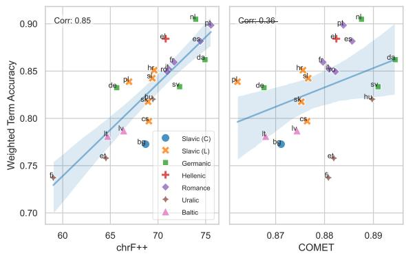
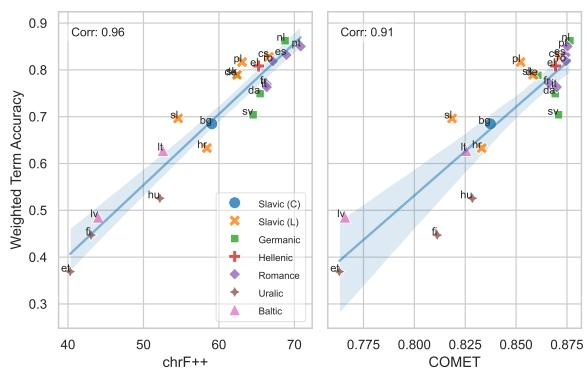
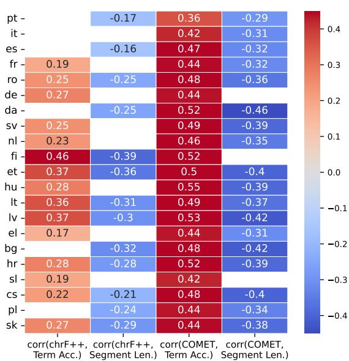
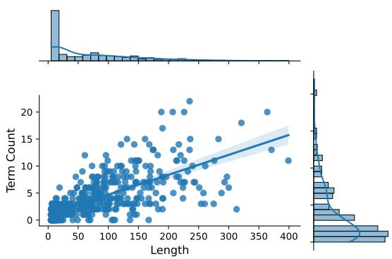
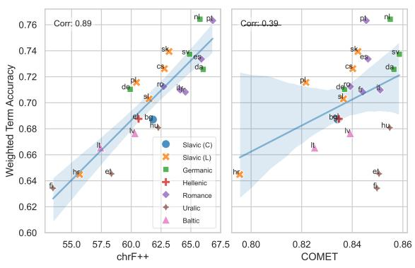
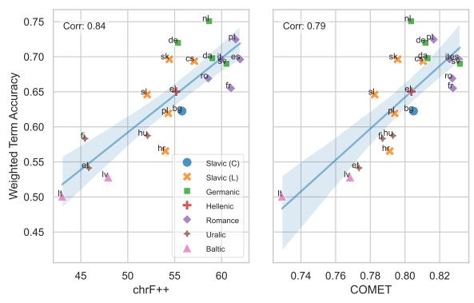
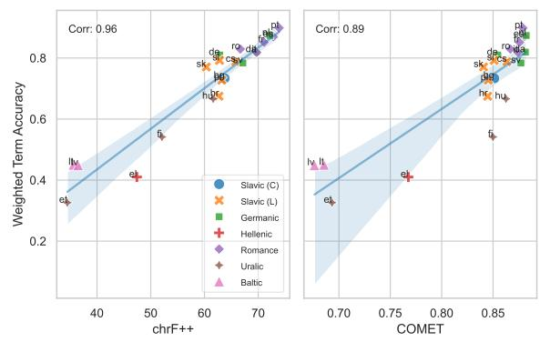
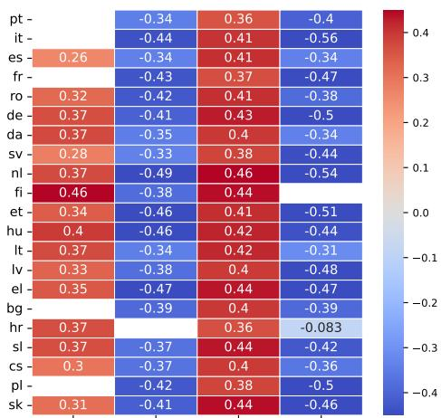
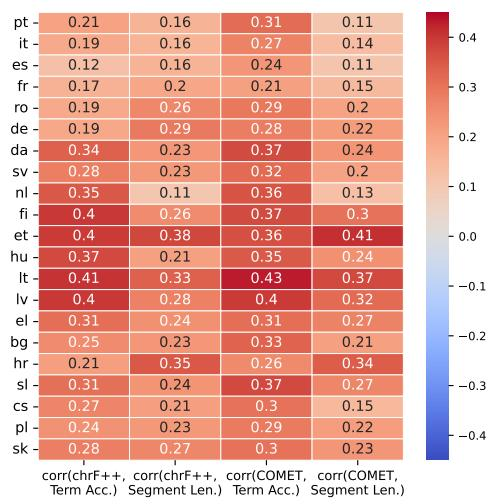
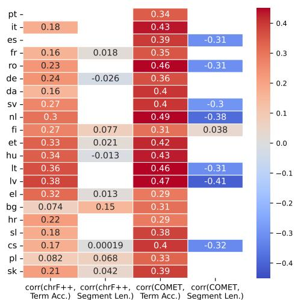

# The Impact of Domain-Specific Terminology on Machine Translation for Finance in European Languages

Arturo Oncevay Charese H. Smiley Xiaomo Liu

JPMorgan AI Research

arturo.oncevay@jpmorgan.com,{charese.h.smiley,xiaomo.liu}@jpmchase.com

## Abstract

Domain-specific machine translation (MT) poses significant challenges due to specialized terminology, particularly when translating across multiple languages with scarce resources. In this study, we present the first impact analysis of domain-specific terminology on multilingual MT for finance, focusing on European languages within the subdomain of macroeconomics. To this end, we construct a multi-parallel corpus from the European Central Bank, aligned across 22 languages. Using this resource, we compare open-source multilingual MT systems with large language models (LLMs) that possess multilingual capabilities. Furthermore, by developing and curating an English financial glossary, we propose a methodology to analyze the relationship between translation performance (into English) and the accuracy of financial term matching, obtaining significant correlation results. Finally, using the multi-parallel corpus and the English glossary, we automatically align a multilingual financial terminology, validating the English-Spanish alignments and incorporating them into our discussion. Our findings provide valuable insights into the current state of financial MT for European languages and offer resources for future research and system improvements.'

## 1 Introduction

In the age of globalization, MT plays a crucial role in facilitating cross-linguistic communication in different domains such as finance. Accurate translation of financial documents is essential for informed decision-making, regulatory compliance, and international collaboration (Gagnon et al., 2018). However, financial language is characterized by specialized terminology, complex sentence structures, and domain-specific conventions, which present significant challenges for MT systems (Nunziatini, 2019).

Despite the growing relevance of MT in finance, publicly available datasets for evaluating MT systems in this domain remain limited. Existing resources often lack linguistic diversity or domainspecific materials (Volk et al., 2016; Ghaddar and Langlais, 2020), such as terminologies, needed to comprehensively assess translation performance in financial contexts.

In this work, we introduce a new multi-parallel corpus from the European Central Bank (ECB)², consisting of financial (macroeconomics) articles published exclusively in 2024, translated and aligned across 22 European languages. Using this resource, we can evaluate how MT systems handle the complexities of financial translation, particularly domain-specific terminology. Given the recent advancements of robust LLMs for generation tasks, such as Llama 3 (Llama Team, 2024), or models with strong multilingual capabilities like AYA23 (Aryabumi et al., 2024), it is essential to assess their performance against large-scale multilingual MT systems, such as NLLB-200 (NLLB Team et al., 2022) and MADLAD-400 (Kudugunta et al., 2024).

To address this, we propose a methodology for analyzing the impact of domain-specific financial terminology on MT performance. By developing and curating an English-language glossary of financial terms, we assess how terminology accuracy influences translation performance at both the language and segment-levels. Additionally, we automatically align a multilingual financial terminology, which we use to complement our discussion.

Our contributions are threefold:

• We introduce a novel financial and multilingual translation benchmark from the ECB, covering 22 European languages.

• We propose a methodology for terminology analysis, evaluating how MT systems and LLMs handle domain-specific financial terminology and examining its effect on translation performance.

• We present valuable resources for future research and system improvements, including a curated English financial glossary and an aligned multilingual financial terminology.

## 2 Related Work

MT and Multilinguality in Finance. Several studies have developed parallel corpora in the financial domain, but these are mostly limited to bitext. Ghaddar and Langlais (2020) extracted data from the Canadian government for an English-French corpus, while Fu et al. (2024) and Turenne et al. (2022) mined financial news sites for English-Chinese data, and Luo et al. (2018) created a corpus of financial listings between English and traditional Chinese. However, none of these resources are publicly available. The only exception is Volk et al. (2016), who released a parallel corpus for four languages (English, French, German, and Italian) from a banking magazine. Additionally, in related tasks, Läubli et al. (2019) investigated post-editing productivity for automatic translations in the financial domain, and Zhang et al. (2017) examined sentiment preservation in financial translation between English and German. Finally, Nunziatini (2019) discussed challenges in financial MT, including terminology, though their work is an overview of an MT service implementation for industry use.

Regarding multilingual approaches, Jørgensen et al. (2023) introduced MultiFin, a dataset of financial headlines in 15 languages, although it is focused on classification rather than translation.

Terminology in MT. Terminology presents challenges across various specialized domains in MT, as highlighted by two editions of the Shared Task on MT with Terminologies at the Conference on MT since 2021 (Alam et al., 2021). These tasks have focused on domains like medical (Alam et al., 2021) and scientific (Semenov et al., 2023), but not finance. While the shared task primarily explores techniques for leveraging terminology to enhance MT performance, other lines of work have focused on developing more terminology-aware MT models in generic domains, such as in Bogoychev and Chen (2023). To the best of our knowledge, this is the first study to systematically assess the impact of financial terminology on translation performance.

## 3 Multi-Parallel Financial Dataset

In this section, we describe the creation of a new multi-parallel financial dataset sourced from the ECB, covering macroeconomic topics. We refer to it as multi-parallel because it is aligned at the segment-level³ across 22 languages from the Indo-European and Uralic language families (see the full list in Table 1). This is the first dataset of its kind in the financial domain, allowing for a fair and consistent evaluation of translation performance across multiple languages.

## 3.1 ECB Articles Overview

The ECB is the central bank responsible for managing the euro and formulating monetary policy within the Eurozone. We use two main sources from their website that are translated into multiple languages: the "Annual Report 2023", which provides an overview of the ECB's activities related to monetary policy and other key topics, and the "Macroeconomic Projections", published quarterly (we use the first three from 2024). The list of links are provided in Table 7 in the Appendix.

It is worth noting that OPUS (Tiedemann, 2012)—a well-known open parallel corpus repository—includes ECB data, offering bitexts for various languages. However, the most recent release of the OPUS’ ECB corpus dates back to 2018.4 OPUS is widely used in MT research, meaning that this corpus has likely been used to train a wide range of MT systems and LLMs, both open and proprietary. By exclusively using data published in 2024, we ensure that none of the models evaluated in this study have been trained on this specific information, severely limiting data contamination.

## 3.2 Data Processing

Alignment. We align the downloaded articles for each language using Vecalign (Thompson and Koehn, 2019), a linear sentence aligner that leverages multilingual embeddings. For the sentence encoder, we use the latest version of LASER (Heffernan et al., 2022), which covers over 200 languages.

In our alignment process, we concatenate segments in windows of 3 and align the English text with the other 21 languages. We retain only the indices where alignment is consistent across all language pairs. After alignment, we retain 80% of the content, indicating that the provided translations were consistently produced across all languages.

Alignment validation. In previous work (Bañón et al., 2020), segment alignment is validated using either a gold standard or a downstream MT task. We adopt the first approach, extracting smaller articles from the same site ("Monetary Policies" articles. See details in Table 7 in the Appendix). These articles consist of 59 perfectly aligned segments across all languages. We permuted and concatenated these sentences and found that our alignment method reliably extracted the same original indices.

Cleaning. After alignment, we applied a cleaning process that removed entries with more nonalphanumeric or numeric words than alphabetic ones. Segments with fewer than 5 words (in English) and duplicate entries were also discarded. After cleaning, we retained 19% of the aligned corpus. Most discarded entries consisted of numerical data, short headers, or footnotes. The final dataset contains 531 aligned segments.⁵

## 3.3 Dataset Overview

Table 1 summarizes the 531 aligned segments across all languages, with segment lengths reaching up to 400 words in English.6 Importantly, all languages contain the same number of entries, and each entry is consistently translated across languages, making this resource valuable not only for financial domain applications but also for crosslinguistic comparisons.

For instance, agglutinative languages like Finnish and Estonian show higher Type-Token Ratios (TTR) due to their morphological complexity, resulting in a wider range of unique word forms. In contrast, analytic languages such as English exhibit lower TTR values, reflecting less inflectional diversity. Romance languages tend to have longer average segment lengths (W/S), likely due to syntactic structures that include more function words. Uralic languages, on the other hand, have shorter W/S values, as they convey more information within individual word forms through agglutination. Similar patterns are expected in the translated terminology across these languages.

<table><tr><td>Group</td><td>Language</td><td></td><td>#T</td><td>V</td><td>TTR</td><td>W/S</td></tr><tr><td rowspan="2">Baltic</td><td>Lithuanian</td><td>lt</td><td>33.3k</td><td>6.0k</td><td>0.18</td><td>62.26</td></tr><tr><td>Latvian</td><td>lv</td><td>32.6k</td><td>5.5k</td><td>0.17</td><td>61.06</td></tr><tr><td rowspan="5">Germanic</td><td>Danish</td><td>da</td><td>35.9k</td><td>4.7k</td><td>0.13</td><td>67.23</td></tr><tr><td>German</td><td>de</td><td>38.2k</td><td>5.5k</td><td>0.14</td><td>71.57</td></tr><tr><td>Dutch</td><td>nl</td><td>41.3k</td><td>4.4k</td><td>0.11</td><td>77.24</td></tr><tr><td>Swedish</td><td>SV</td><td>34.5k</td><td>5.0k</td><td>0.15</td><td>64.52</td></tr><tr><td>English</td><td>en</td><td>38.4k</td><td>3.5k</td><td>0.09</td><td>71.81</td></tr><tr><td>Hellenic</td><td>Greek</td><td>el</td><td>45.3k</td><td>5.4k</td><td>0.12</td><td>84.78</td></tr><tr><td rowspan="5">Romance</td><td>Portuguese</td><td>pt</td><td>46.6k</td><td>4.1k</td><td>0.09</td><td>87.60</td></tr><tr><td>Italian</td><td>it</td><td>46.7k</td><td>4.4k</td><td>0.09</td><td>87.39</td></tr><tr><td>Spanish</td><td>es</td><td>49.8k</td><td>4.3k</td><td>0.09</td><td>93.17</td></tr><tr><td>French</td><td>fr</td><td>49.3k</td><td>4.3k</td><td>0.09</td><td>92.24</td></tr><tr><td>Romanian</td><td>ro</td><td>44.5k</td><td>5.0k</td><td>0.11</td><td>83.27</td></tr><tr><td>Slavic (C)</td><td>Bulgarian</td><td>bg</td><td>41.0k</td><td>5.2k</td><td>0.13</td><td>76.78</td></tr><tr><td rowspan="5">Slavic (L)</td><td>Czech</td><td>cs</td><td>35.8k</td><td>6.0k</td><td>0.17</td><td>66.96</td></tr><tr><td>Polish</td><td>pl</td><td>35.8k</td><td>6.2k</td><td>0.17</td><td>66.97</td></tr><tr><td>Slovak</td><td>sk</td><td>35.1k</td><td>6.3k</td><td>0.18</td><td>65.62</td></tr><tr><td>Slovenian</td><td>sl</td><td>37.0k</td><td>5.8k</td><td>0.16</td><td>69.27</td></tr><tr><td>Croatian</td><td>hr</td><td>37.2k</td><td>5.7k</td><td>0.16</td><td>69.58</td></tr><tr><td rowspan="3">Uralic</td><td>Finnish</td><td>fi</td><td>28.2k</td><td>7.3k</td><td>0.26</td><td>52.80</td></tr><tr><td>Estonian</td><td>et</td><td>28.0k</td><td>6.8k</td><td>0.24</td><td>52.47</td></tr><tr><td>Hungarian</td><td>hu</td><td>33.9k</td><td>6.8k</td><td>0.20</td><td>63.49</td></tr></table>

Table 1: Statistics of the multi-parallel dataset (#T: number of tokens; V: vocabulary; TTR: type-token ratio; W/S: average number of words per segment). All language groups are from the Indo-European family except Uralic, and we separated Bulgarian from the main Slavic group as it uses Cyrillic instead of the Latin script.

## 4 Benchmarking Financial MT

After constructing the multi-parallel corpus, we evaluate the translation performance of various open-source multilingual MT systems and LLMs. We limit our evaluation to open-source models with a traceable knowledge cut-off date (2023 or earlier) to limit data contamination. It is important to clarify that our goal is not to identify or fine-tune the best model for this dataset. Instead, we aim to compare the challenges that different models face when translating financial content and to analyze the impact of financial terminology (which will be explored further in the next section).

Models For MT systems, we evaluate two models: NLLB-200 (3.3B params.) (NLLB Team et al., 2022) and MADLAD-400 (3B params.) (Kudugunta et al., 2024). Both models are designed for high-performance multilingual translation tasks and cover a wide range of languages.

For LLMs, we evaluate three models: LLAMA3- INSTRUCT (8B params.) (Llama Team, 2024), which has demonstrated robust performance across multiple generation tasks; AYA23 (8B params.) (Üstün et al., 2024), a model trained on a large multilingual corpus covering diverse tasks7; and Tow-ERINSTRUCT (7B params.) (Alves et al., 2024), an LLM fine-tuned on top of Llama 2, with a focus on translation-related tasks.8

<table><tr><td>EN→XX</td><td colspan="5">CHRF++</td><td colspan="5">COMET</td></tr><tr><td></td><td>MADLAD</td><td>NLLB</td><td>AYA23</td><td>LLAMA3</td><td>TOWER</td><td>MADLAD</td><td>NLLB</td><td>AYA23</td><td>LLAMA3</td><td>TOWER</td></tr><tr><td>Baltic</td><td>64.38</td><td>50.49</td><td>29.32</td><td>36.06</td><td>18.92</td><td>92.10</td><td>85.56</td><td>55.50</td><td>67.80</td><td>40.58</td></tr><tr><td>Germanic</td><td>67.71</td><td>58.90</td><td>50.80</td><td>47.74</td><td>54.78</td><td>90.27</td><td>86.36</td><td>79.19</td><td>78.48</td><td>84.31</td></tr><tr><td>Hellenic</td><td>64.68</td><td>51.10</td><td>55.47</td><td>40.53</td><td>19.01</td><td>90.66</td><td>85.73</td><td>89.53</td><td>76.10</td><td>44.86</td></tr><tr><td>Romance</td><td>69.01</td><td>61.87</td><td>63.17</td><td>55.89</td><td>63.38</td><td>88.82</td><td>85.64</td><td>87.53</td><td>82.48</td><td>86.29</td></tr><tr><td>Slavic (C)</td><td>69.48</td><td>55.58</td><td>37.55</td><td>48.71</td><td>43.83</td><td>91.21</td><td>86.71</td><td>65.27</td><td>80.72</td><td>78.68</td></tr><tr><td>Slavic (L)</td><td>65.21</td><td>53.76</td><td>43.29</td><td>44.83</td><td>39.02</td><td>91.75</td><td>85.61</td><td>74.48</td><td>79.19</td><td>75.24</td></tr><tr><td>Uralic</td><td>62.37</td><td>51.34</td><td>22.02</td><td>36.02</td><td>29.29</td><td>92.79</td><td>87.68</td><td>48.59</td><td>74.22</td><td>61.53</td></tr><tr><td>Average</td><td>66.28</td><td>55.97</td><td>45.39</td><td>45.91</td><td>43.79</td><td>90.87</td><td>86.11</td><td>73.26</td><td>77.97</td><td>73.06</td></tr></table>

Table 2: Average translation scores by language group for EN→XX. (Bold = best, underlined = second best).
<table><tr><td rowspan="2">XX→EN</td><td colspan="5">CHRF++</td><td colspan="5">COMET</td></tr><tr><td>MADLAD</td><td>NLLB</td><td>AYA23</td><td>LLAMA3</td><td>TOWER</td><td>MADLAD</td><td>NLLB</td><td>AYA23</td><td>LLAMA3</td><td>TOWER</td></tr><tr><td>Baltic</td><td>65.38</td><td>59.01</td><td>46.98</td><td>42.89</td><td>35.54</td><td>87.61</td><td>83.50</td><td>79.24</td><td>72.78</td><td>68.13</td></tr><tr><td>Germanic</td><td>71.14</td><td>64.34</td><td>64.63</td><td>55.69</td><td>67.74</td><td>89.00</td><td>85.66</td><td>87.25</td><td>79.89</td><td>87.78</td></tr><tr><td>Hellenic</td><td>70.59</td><td>60.63</td><td>64.65</td><td>52.38</td><td>46.21</td><td>88.76</td><td>83.54</td><td>87.38</td><td>78.58</td><td>76.58</td></tr><tr><td>Romance</td><td>72.48</td><td>64.85</td><td>67.44</td><td>58.73</td><td>70.62</td><td>88.90</td><td>85.10</td><td>87.77</td><td>81.89</td><td>88.10</td></tr><tr><td>Slavic (C)</td><td>69.31</td><td>61.82</td><td>58.35</td><td>52.47</td><td>63.41</td><td>87.97</td><td>83.54</td><td>83.79</td><td>78.05</td><td>85.41</td></tr><tr><td>Slavic (L)</td><td>68.61</td><td>60.39</td><td>59.84</td><td>51.56</td><td>62.39</td><td>87.97</td><td>82.79</td><td>84.72</td><td>77.60</td><td>85.21</td></tr><tr><td>Uralic</td><td>65.03</td><td>58.27</td><td>44.41</td><td>44.85</td><td>48.83</td><td>89.04</td><td>85.36</td><td>79.68</td><td>75.96</td><td>80.06</td></tr><tr><td>Average</td><td>69.32</td><td>61.85</td><td>59.29</td><td>52.35</td><td>60.15</td><td>88.54</td><td>84.39</td><td>84.77</td><td>78.43</td><td>83.62</td></tr></table>

Table 3: Average translation scores by language group for XX→EN

Inference We use an NVIDIA A10G GPU for all models. For the MT systems, we set the max new token up to 512, and 1024 for the LLMs, as we have long segments up to 400 words in English. LLMs use 0.3 as temperature, and the translation prompt is shown in Table 6 in the Appendix.

Metrics We employ CHRF++ (Popović, 2017), a character-level metric based on n-gram overlap between system output and reference translations, and COMET (Rei et al., 2020), a semantic-based metric that leverages pretrained multilingual representations to score translation quality.9

## 4.1 Results and Discussion

The results in Tables 2 and 3 reveal several trends regarding model performance and language group challenges when translating financial documents. Overall, task-specific MT models consistently outperform the LLMs across all language groups and translation directions (EN→XX and XX→EN) based on both evaluation metrics. The superior performance of MT models is expected due to their specialized training for translation tasks, even with fewer parameters compared to LLMs.10

MADLAD consistently achieves the highest scores across all language groups and translation directions, likely benefiting from its extensive and diverse training data. NLLB follows closely, particularly excelling in the EN→XX direction, outperforming the LLMs in most cases. In the XX→EN direction, the LLMs, particularly TowER, show some competitiveness, possibly due to the LLMs heavy exposure to English text during training.

Regarding metric differences, both CHRF++ and CoMET scores generally align in their evaluation of model performance, capturing consistent differences across models. However, language groups exhibit varying performance depending on the metric and the translation direction.

For instance, for CHRF++, Uralic and Baltic languages score lower in both translation directions, likely due to their morphological complexity and the difficulty of achieving high lexical overlap. However, their higher CoMET scores indicate that these translations still retain semantic accuracy, underscoring the importance of balancing lexical and semantic evaluation in financial translation, where precise meaning is critical. Romance languages, on the other hand, perform well on CHRF++ but score relatively lower on CoMET in the EN→XX direction. This suggests that while lexical accuracy is high, semantic nuances—such as verb conjugations and gender/number agreements—may not be fully captured. This is particularly relevant in the financial domain, where small semantic errors can impact regulatory compliance and reporting.

## 4.2 Qualitative analysis.

We conduct a qualitative analysis of translations into English for a high scoring source language, Spanish, and a low scoring language, Finnish and note several key findings. Tables 10 and 11, in the Appendix, present examples of translation outputs for Spanish→English and Finnish→English.

Literal translation of idioms. As expected with many MT systems we see a literal translation from the original texts. For example, the phrase translated more naturally in English as “a leap of faith" is rendered as “a leap into the void" by MADLAD and “a leap into the unknown" by AYA23. For the Finnish translations, we see an even greater divergence from the English reference text with “a courageous venture" (MADLAD) and “a lot of fear of failure" (AYA23). In the financial context, such drastic differences in word choice such as “leap of faith" vs. “a lot of fear of failure" may signal deeper pessimism than intended in the original text.

Common financial phrases and jargon. In Example B, we see minor translation differences such as spelling out % as “per cent" in the AYA23 translation for ES→EN that could harm CHRF++ scores while not impacting COMET. Similarly, in Example A, the entity “EKP” is preserved and not translated to “ECB" in AYA23's FI→EN system output.

More notably, we see differences in the use of financial phrasing across translation pairs. In Example B, we see the financial term inflation correctly matched across translations. However, other common financial terms are matched less frequently. For example, we find input costs in 3 of 4 texts, shocks in 2/4, easing and commodity in 1/4, and move sideways in none of the translations pointing to an overall lack of fluency with financial writing.

Semantic Accuracy. Finally, in comparing the English reference to the translations we see several differences. In Example A, the ES→EN MADLAD translation misses the last sentence altogether. Such an omission would greatly impact CoMET scores and could represent a critical information loss in a financial report. For instance, almost at the end of Example A, the frequency of speech writing is reported as occasional in the reference text but “daily" in ES→EN MADLAD, "usual" in ES→EN AYA23, “sometimes contributed" in FI→EN MADLAD and speeches becomes reports in FI→EN AYA23 changing the meaning entirely. Overall, in these examples, we see more rigid and stilted translations from the Finnish translations as well as more semantic translation errors than from the Spanish translations possibly due to greater linguistic closeness between the languages.

## 5 The Challenge of Terminology in Financial MT

Building on our previous analysis of general translation performance, we now focus on the challenge of accurately translating financial terminology. Our methodology is as follows: First, we extract a financial terminology in English (see §5.1), and in the XX→EN translation direction, we can compute the term match accuracy for the predicted English outputs (see §5.2). Then, we introduce our analysis for assessing the relationship between term match accuracy and automatic evaluation metrics for translation, which is conducted at the corpus and segmentlevel (see §5.3). Finally, using the multi-parallel dataset and English glossary, we align a multilingual financial terminology (see §5.4).

## 5.1 English Terminology Construction

Our main source is the ECB's glossary11, from where we extracted and manually curated a terminology of 1,135 unique financial terms in English. Of these, 176 terms have at least one occurrence in the English side of the corpus, resulting in a total of

1,910 matches. The most frequent term is inflation with 271 matches.12 In the Appendix, additional frequent terms can be found in Table 12, and Figure 3 shows the distributions and positive correlation between financial term count and segment length.13

## 5.2 Term Match Accuracy, Prec. and Recall

To evaluate the accuracy of financial terminology translation in the XX→EN direction, we calculate the term match accuracy $( T _ { \mathrm { a c c } } )$ using the English financial terminology extracted earlier. This involves checking whether the expected English terms appear in the MT outputs, focusing only on segments where these terms are present in the reference translations. $T _ { \mathrm { a c c } }$ is calculated as follows:

$$
T _ { \mathrm { a c c } } = { \frac { \mathrm { N u m b e r ~ o f ~ c o r r e c t l y ~ m a t c h e d ~ t e r m s } } { \mathrm { T o t a l ~ n u m b e r ~ o f ~ t e r m s ~ i n ~ r e f e r e n c e } } }
$$

We use regular expressions to identify and match these terms, without considering the position.14 We also compute precision and recall to provide a more comprehensive evaluation

Table 4 shows the results, averaged by language, where we observe that MADLAD outperformed others with the highest accuracy, precision, and recall, indicating its strong ability to both correctly detect and translate financial terms. NLLB also demonstrated strong performance, though its recall was relatively low, suggesting occasional term omissions in translation. In contrast, AYA23 and TowER yielded more balanced, though lower, performance across all metrics. LLAMA3 showed the weakest performance, indicating potential challenges in correctly handling financial terminology.

## 5.3 Relationship between Term Match Accuracy and Translation Quality

With the aim of exploring further the $T _ { \mathrm { a c c } } \mathrm { ^ , s }$ correlation with overall translation quality at corpus and segment-levels, we compute the following weighted metrics:

$$
{ \mathrm { C o r p u s – w e i g h t e d } } T _ { \mathrm { a c c } } = { \frac { \sum ( T _ { \mathrm { a c c } , i } \times N _ { \mathrm { t e r m s } , i } ) } { \sum N _ { \mathrm { t e r m s } , i } } }
$$

<table><tr><td>Model</td><td>Accuracy</td><td>Precision</td><td>Recall</td></tr><tr><td> $\mathbf { M A D L A D }$ </td><td> $0 . 8 6 2 0 \pm 0 . 2 2$ </td><td> $0 . 9 2 6 2 \pm 0 . 1 9$ </td><td> $0 . 8 8 5 0 \pm 0 . 2 1$ </td></tr><tr><td>NLLB</td><td> $0 . 7 6 9 0 \pm 0 . 3 0$ </td><td> $0 . 8 7 9 6 \pm 0 . 2 6$ </td><td> $0 . 8 0 4 4 \pm 0 . 2 9$ </td></tr><tr><td> $\mathbf { A Y A } 2 3$ </td><td> $0 . 7 0 7 2 \pm 0 . 3 4$ </td><td> $0 . 7 9 4 5 \pm 0 . 3 4$ </td><td> $0 . 7 2 2 0 \pm 0 . 3 4$ </td></tr><tr><td>TOWER</td><td> $0 . 7 0 3 3 \pm 0 . 3 5$ </td><td> $0 . 7 8 0 9 \pm 0 . 3 5$ </td><td> $0 . 7 1 8 1 \pm 0 . 3 5$ </td></tr><tr><td>LLAMA3</td><td> $0 . 6 1 9 4 \pm 0 . 3 7$ </td><td> $0 . 7 2 7 1 \pm 0 . 3 9$ </td><td> $0 . 6 3 4 2 \pm 0 . 3 7$ </td></tr></table>

Table 4: Financial Term Accuracy, Precision and Recall for XX→EN translations, averaged by language-pair, and sorted (desc.) by Accuracy.

$$
{ \mathrm { S e g m e n t - w e i g h t e d } } T _ { \mathrm { a c c } } = { \frac { T _ { \mathrm { a c c } , i } \times N _ { \mathrm { t e r m s } , i } } { L _ { \mathrm { s e g m e n t } , i } } }
$$

where Corpus-weighted $T _ { \mathrm { a c c } }$ normalizes term accuracy by the total number of terms across all segments, providing a corpus-level evaluation, while Segment-weighted $T _ { \mathrm { a c c } }$ normalizes term accuracy by the length of each segment, offering a more granular, segment-level evaluation.

For the corpus-level analysis, we use the corpusweighted metric to assess its impact on translation performance across different language pairs in the XX→EN direction. Similarly, for the segment-level analysis, we use the segment-weighted metric to evaluate its impact on translation performance at the segment level for each language-pair/model combination.

## 5.3.1 Corpus or Language-level Analysis

Our approach begins by calculating the corpusweighted $T _ { \mathrm { a c c } }$ per language-pair (XX→EN). This serves as the predictor, while the target variables are the translation evaluation metrics. We then compute Pearson correlation coefficients between the predictor and the target metrics, focusing on statistically significant results $( \mathtt { p } < 0 . 0 5 )$

Results and Discussion. Figure 1 shows the correlation results for one MT system (MADLAD) and one LLM (AYA23). Both models show strong positive correlations between weighted $T _ { \mathrm { a c c } }$ and CHRF++, indicating that terminology accuracy is closely tied to lexical overlap and overall translation performance, especially for financial texts. While for CoMET, AYA23 shows a strong correlation, suggesting that LLMs benefit significantly from accurate terminology to improve semantic translation quality. However, MADLAD shows a non-significant correlation with CoMET, implying that the room for improvement in semantic accuracy for the MT system may be limited, even if terminology accuracy improves for the corpus.

Regarding the language groups, we note that Baltic and Uralic languages face more challenges in terminology translation, likely due to their extensive agglutination or affixation processes. In contrast, Romance and Germanic languages consistently perform better, likely due to their closer linguistic ties to English and the relatively easier cross-lingual mapping of terms.

(a) MADLAD  

(b) AYA23  
  
Figure 1: Correlation analysis between Financial Term Accuracy and two translation metrics (CHRF++ (left) and COMET (right)) for the MADLAD (top) and AYA23 (bottom) in the XX→EN direction.

In summary, while CHRF++ strongly correlates with term accuracy for both models, CoMET shows varying sensitivity depending on the model type. The patterns for each model type are consistent across the other models (NLLB, LLAMA3 and TowER), with their correlation results presented in Figure 4 in the Appendix.

## 5.3.2 Segment-level Analysis

Our methodology is as follows:

1. For each language-pair/model combination, we compute the segment-weighted $T _ { \mathrm { a c c } }$ for all outputs, which serves as the main predictor.

2. Segment length (number of words) is included as a confounder to control for its known impact on translation performance and to avoid multicollinearity with $T _ { \mathrm { a c c } }$

3. We calculate the Variance Inflation Factor (VIF) for $T _ { \mathrm { a c c } }$ and segment length. If VIF $> 5 ,$ indicating high multicollinearity, we exclude that language-pair/model combination from the analysis.

4. For each target metric (CHRF++ and COMET), we construct Generalized Linear Models (GLM) with $T _ { \mathrm { a c c } }$ and segment length as predictors, assuming a Gaussian distribution.

5. We compute Pearson correlation coefficients between predictors and target metrics for all settings, focusing on statistically significant results (p < 0.05).

Results and Discussion. Figure 2 shows the correlation analysis for one MT system (MADLAD) and one LLM (AYA23).15 MADLAD exhibits stronger correlations between $T _ { \mathrm { a c c } }$ and translation quality, especially for COMET, where correlations reach 0.55 (Hungarian) and remain positive across most languages. This highlights the importance of $T _ { \mathrm { a c c } }$ at the segment-level in improving translation performance for MADLAD, particularly in finance, where accuracy in term translation is critical.

AYA23, however, shows more varied correlations. In some languages (e.g., Romanian, Croatian), moderate positive correlations appear, but others (e.g., Finnish, Hungarian) show weak or near-zero correlations. This suggests that while AYA23 may correctly translate some specialized terms, its overall translation quality is still limited. Even when financial terms are accurate, broader issues like fluency or semantic adequacy reduce the impact of $T _ { \mathrm { a c c } }$ on overall performance at the segment-level.

Regarding the segment-length confounder, LLMs like AYA23, with their larger context window (1024+ tokens), handle longer segments more effectively than MT systems like MADLAD (512 tokens). This likely explains why segment-length has a stronger negative impact on MADLAD, particularly in COMET, while AYA23 shows weaker or near-zero correlations with the confounder. The longer context window in LLMs helps mitigate challenges in translating longer financial texts, making segment length a less critical factor.

(a) MADLAD  

(b) AYA23
<table><tr><td rowspan=4 colspan=2>pt -it -</td><td></td><td></td><td></td></tr><tr><td rowspan=2 colspan=1>0.12</td><td rowspan=2 colspan=1>0.32</td><td></td></tr><tr><td rowspan=21 colspan=1>0.4-0.044       -0.3-0.068- 0.2- 0.10.054-0.00.051-0.1-0.2-0.3-0.4</td></tr><tr><td rowspan=1 colspan=1></td><td rowspan=1 colspan=1></td><td rowspan=1 colspan=1>0.36</td></tr><tr><td rowspan=1 colspan=1>es -</td><td rowspan=1 colspan=1></td><td rowspan=1 colspan=1>0.099</td><td rowspan=1 colspan=1>0.4</td></tr><tr><td rowspan=1 colspan=1>fr -</td><td rowspan=1 colspan=1>0.14</td><td rowspan=1 colspan=1>0.14</td><td rowspan=1 colspan=1>0.32</td><td rowspan=1 colspan=1>-0.044</td></tr><tr><td rowspan=1 colspan=1>ro -</td><td rowspan=1 colspan=1>0.13</td><td rowspan=1 colspan=1>0.11</td><td rowspan=1 colspan=1>0.45</td><td rowspan=1 colspan=1></td></tr><tr><td rowspan=1 colspan=1>de</td><td rowspan=1 colspan=1>0.088</td><td rowspan=1 colspan=1>0.19</td><td rowspan=1 colspan=1>0.35</td><td rowspan=1 colspan=1>-0.068</td></tr><tr><td rowspan=1 colspan=1>da -</td><td rowspan=1 colspan=1>0.17</td><td rowspan=1 colspan=1>0.095</td><td rowspan=1 colspan=1>0.35</td><td rowspan=1 colspan=1></td></tr><tr><td rowspan=1 colspan=1>SV -</td><td rowspan=1 colspan=1>0.065</td><td rowspan=1 colspan=1>0.11</td><td rowspan=1 colspan=1>0.25</td><td rowspan=2 colspan=1></td></tr><tr><td rowspan=1 colspan=1>nl -</td><td rowspan=1 colspan=1>0.18</td><td rowspan=1 colspan=1></td><td rowspan=1 colspan=1>0.36</td></tr><tr><td rowspan=1 colspan=1>fi</td><td rowspan=1 colspan=1>0.2</td><td rowspan=1 colspan=1>0.11</td><td rowspan=1 colspan=1>0.16</td><td rowspan=1 colspan=1>0.054</td></tr><tr><td rowspan=1 colspan=1>et</td><td rowspan=1 colspan=1>0.21</td><td rowspan=1 colspan=1></td><td rowspan=1 colspan=1>0.25</td><td rowspan=2 colspan=1></td></tr><tr><td rowspan=1 colspan=1>hu</td><td rowspan=1 colspan=1>0.37</td><td rowspan=1 colspan=1>-0.01</td><td rowspan=1 colspan=1>0.35</td></tr><tr><td rowspan=1 colspan=1>It</td><td rowspan=1 colspan=1>0.17</td><td rowspan=1 colspan=1>0.21</td><td rowspan=1 colspan=1>0.25</td><td rowspan=1 colspan=1>0.051</td></tr><tr><td rowspan=1 colspan=1>lv</td><td rowspan=1 colspan=1>0.33</td><td rowspan=1 colspan=1></td><td rowspan=1 colspan=1>0.37</td><td rowspan=1 colspan=1></td></tr><tr><td rowspan=1 colspan=1>el -</td><td rowspan=1 colspan=1>0.059</td><td rowspan=1 colspan=1>0.13</td><td rowspan=1 colspan=1>0.25</td><td rowspan=1 colspan=1></td></tr><tr><td rowspan=1 colspan=1>bg -</td><td rowspan=1 colspan=1>0.14</td><td rowspan=1 colspan=1>0.15</td><td rowspan=1 colspan=1>0.28</td><td rowspan=1 colspan=1>-0.00099</td></tr><tr><td rowspan=1 colspan=1>hr -</td><td rowspan=1 colspan=1>0.076</td><td rowspan=1 colspan=1>0.16</td><td rowspan=1 colspan=1>0.15</td><td rowspan=1 colspan=1>0.065</td></tr><tr><td rowspan=1 colspan=1>sl -</td><td rowspan=1 colspan=1>0.17</td><td rowspan=1 colspan=1>0.11</td><td rowspan=1 colspan=1>0.27</td><td rowspan=1 colspan=1>0.013</td></tr><tr><td rowspan=2 colspan=1>CS -pl -</td><td rowspan=1 colspan=1>0.14</td><td rowspan=1 colspan=1>0.12</td><td rowspan=1 colspan=1>0.39</td></tr><tr><td rowspan=1 colspan=1>0.025</td><td rowspan=1 colspan=1>0.14</td><td rowspan=1 colspan=1>0.29</td></tr><tr><td rowspan=1 colspan=1>sk -</td><td rowspan=1 colspan=1>0.068</td><td rowspan=1 colspan=1>0.13</td><td rowspan=1 colspan=1>0.27</td></tr></table>

corr(chrF++, corr(chrF++, corr(COMET, corr(COMET, Term Acc.) Segment Len.) Term Acc.) Segment Len.)

## 5.4 Multilingual Financial Terminology

As highlighted in the previous analyses, improving domain-specific translation performance may require leveraging terminology match accuracy. One potential approach is to use additional resources, such as bilingual or multilingual terminologies that provide accurate translations of specialized terms. Building on our multi-parallel financial dataset and the English terminology extracted earlier, we now take the first steps toward constructing a multilingual financial terminology.

Figure 2: Correlation analysis at the segment-level between the financial term accuracy, weighted by the segment length, and translation performance metrics for one MT system (MADLAD) and one LLM (AYA23).
<table><tr><td>Lang.</td><td>#TwC</td><td>#C</td><td>#MWT</td><td>Entropy</td></tr><tr><td>pt</td><td>128</td><td>249</td><td>92</td><td>1.61</td></tr><tr><td>es</td><td>125</td><td>265</td><td>105</td><td>1.49</td></tr><tr><td>it</td><td>122</td><td>273</td><td>107</td><td>1.41</td></tr><tr><td>fr</td><td>120</td><td>262</td><td>105</td><td>1.45</td></tr><tr><td>da</td><td>119</td><td>355</td><td>72</td><td>1.07</td></tr><tr><td>nl</td><td>119</td><td>337</td><td>85</td><td>1.12</td></tr><tr><td>SV</td><td>118</td><td>382</td><td>86</td><td>0.99</td></tr><tr><td>sk</td><td>118</td><td>339</td><td>100</td><td>1.12</td></tr><tr><td>hu</td><td>116</td><td>421</td><td>126</td><td>0.87</td></tr><tr><td>cs</td><td>116</td><td>309</td><td>106</td><td>1.21</td></tr><tr><td>bg</td><td>117</td><td>314</td><td>116</td><td>1.20</td></tr><tr><td>pǐ</td><td>117</td><td>311</td><td>109</td><td>1.19</td></tr><tr><td>ro</td><td>114</td><td>317</td><td>117</td><td>1.14</td></tr><tr><td>hr</td><td>114</td><td>297</td><td>120</td><td>1.24</td></tr><tr><td>lv</td><td>113</td><td>302</td><td>119</td><td>1.22</td></tr><tr><td>de</td><td>111</td><td>378</td><td>93</td><td>0.94</td></tr><tr><td>lt</td><td>108</td><td>297</td><td>105</td><td>1.19</td></tr><tr><td>sl</td><td>108</td><td>314</td><td>100</td><td>1.13</td></tr><tr><td>f</td><td>105</td><td>400</td><td>68</td><td>0.86</td></tr><tr><td>et</td><td>105</td><td>350</td><td>67</td><td>1.00</td></tr><tr><td>el</td><td>101</td><td>277</td><td>74</td><td>1.19</td></tr></table>

Table 5: Language statistics for the Multilingual Financial Terminology (aligned from 176 English terms). #TwC: Number of terms with at least one candidate; #C: total number of candidates; #MWT: Number of multiword candidate terms; Entropy: a measure of diversity or variability in the translations provided by a language across different terms.

Automatic Term Alignment. We utilize SimAlign (Jalili Sabet et al., 2020), a state-of-the-art word alignment tool that uses pretrained multilingual representations. For encoding, we employ XLM-RoBERTa-base (Conneau et al., 2020).

Given that our terminology includes multi-word terms, we process the alignment outputs through several steps. First, we collect all target indices that align to any part of the source term and identify continuous spans in the target text to preserve phrase integrity. This handles cases where terms may be realized differently across languages: oneto-many (when a single English word aligns to multiple target words), many-to-one (when multiple English words align to a single target word), and many-to-many mappings. Additionally, a single English term may have multiple mappings in other languages due to structural differences, such as fusion in Romance languages like Spanish (e.g. "credit card" → "tarjeta" and "tarjeta de crédito") or agglutination in Uralic languages like Finnish (where multiple English words might correspond to a single morphologically complex word).

Table 5 presents statistics of the aligned multilingual terminology, including the number of candidates per language and entropy, which measures variability in translation diversity across terms. Consistently, Romance languages, scoring higher in translation quality and $T _ { \mathrm { a c c } } ,$ have more terms with candidates, more total candidates, and higher entropy, suggesting a better chance of retrieving good term candidates. In contrast, Uralic languages, which underperformed, have fewer terms with candidates, fewer total candidates, and lower entropy, indicating less recall potential and less diverse translations. Additionally, the number of multi-word terms may reflect the complexity of terminology, potentially impacting translation performance, as languages with more multi-word terms might face greater challenges in achieving accurate translations, such as Uralic or Slavic ones.

Annotation and Evaluation. Fully curating multilingual alignments is resource-intensive, so in this study, we focus on a single language pair: English-Spanish. After aligning and deduplicating the terms, we manually annotated each alignment as True or False (275 candidates for 176 terms).

Results. The alignment of English and Spanish terminology yielded a precision of 0.57 and a recall of 0.95. This indicates that while the aligner successfully identified most of the correct translations (high recall), it also aligned many incorrect ones (lower precision). Several factors may contribute to this, including long source and target segments that challenge the alignment model and repeated terms within the same segment, which can cause disambiguation issues. Nevertheless, this is a promising result, as it shows that we are highly likely to find the correct terminology translations. However, for this new resource to grow into a large-scale, highquality multilingual financial terminology, it will be essential to improve the word alignment method or implement strategies to reduce false positives.

## 6 Diachronic Resources for Financial MT

Our resources are designed to be dynamic and continuously evolving. The multi-parallel financial corpus can be updated annually using the provided code, enabling the creation of new benchmarks each year. This will allow researchers to evaluate the latest multilingual MT systems or LLMs against up-to-date financial content and compare them with earlier models, ensuring the benchmarks remain relevant. Besides, the English financial glossary and the multilingual financial terminology can also be expanded as new terms emerge, further enhancing the evaluation of domain-specific translation accuracy. Additionally, the framework supports the inclusion of new corpora and languages, allowing the benchmark to grow and cover a broader range of languages and financial terms over time.

## 7 Conclusion

To the best of our knowledge, this is the first systematic study to analyze the impact of domain-specific terminology on translation performance across 22 European languages in the financial domain, where we observed significant correlations between term accuracy and overall translation quality at both the corpus and segment levels. This work involved creating a multi-parallel financial corpus aligned at the segment-level, evaluating the translation performance of diverse MT systems and LLMs, and curating an English financial terminology. We also laid the groundwork for building a multilingual financial terminology, which will be a valuable resource for advancing financial MT.

## 8 Ethical Considerations

As the text used in this study is taken from the ECB, a publicly available resource, we do not anticipate any ethical concerns with the sourcing of these texts. For each instance, we provide both the original source and target translations. However as with all MT work, the accuracy of the translated texts is not guaranteed and human oversight still remains needed for use in critical financial applications and we release this data for research purposes only.

## 9 Limitations

This study has several limitations that present opportunities for future research. Firstly, the dataset is derived from a snapshot of ECB articles from 2024. Due to continuous updates, this data may be included in future iterations of ParaCrawl (Bañón et al., 2020). However, future releases of this resource can also be made using the methodology outlined in this work.

Secondly, while the dataset focuses on macroeconomic and public policy content, the financial domain is broad. Expanding coverage to include topics such as personal finance, corporate finance, risk management, and investing is a limitation and an area for future research.

Additionally, the study evaluates LLMs in a zeroshot setting and focuses on open-source MT systems, intentionally avoiding fine-tuning, in-context learning, and commercial models like Google Translate or DeepL. This approach was chosen to minimize the risk of data contamination and ensure the integrity of the evaluation process. While this design choice limits the exploration of potentially higher-performing models and techniques, it provides a controlled environment for assessing the baseline capabilities of the models.

Thirdly, the study does not include human evaluation of translation quality, which could provide insights into financial clarity, accuracy of terms, and adherence to regulatory norms. This is a limitation and an area for future investigation.

Finally, although the dataset created in this study covers a wide variety of languages, especially within the European context, it does not represent the full variety of dialects and low resource languages present in Europe. Moreover, the languages in this corpus are not largely typologically diverse (more distant language families) or extremely lowresource ones, like languages spoken in Africa or in the Americas.

## Acknowledgments

We are thankful to Simerjot Kaur, Elena Kochkina, Samuel Mensah, Joy Sain, and other members of the JPMorgan AI Research team for their insightful feedback since early stages of this work. We also appreciate the feedback of the anonymous reviewers and meta-reviewer.

This paper was prepared for information purposes by the Artificial Intelligence Research group of JPMorgan Chase & Co and its affiliates (“JP Morgan"), and is not a product of the Research Department of JP Morgan. J.P. Morgan makes no representation and warranty whatsoever and disclaims all liability for the completeness, accuracy or reliability of the information contained herein. This document is not intended as investment research or investment advice, or a recommendation, offer or solicitation for the purchase or sale of any security, financial instrument, financial product or service, or to be used in any way for evaluating the merits of participating in any transaction, and shall not constitute a solicitation under any jurisdiction or to any person, if such solicitation under such jurisdiction or to such person would be unlawful. © 2024 JP Morgan Chase & Co. All rights reserved.

## References

Md Mahfuz Ibn Alam, Ivana Kvapilíková, Antonios Anastasopoulos, Laurent Besacier, Georgiana Dinu, Marcello Federico, Matthias Gallé, Kweonwoo Jung, Philipp Koehn, and Vassilina Nikoulina. 2021. Findings of the WMT shared task on machine translation using terminologies. In Proceedings of the Sixth Conference on Machine Translation, pages 652–663, Online. Association for Computational Linguistics.

Duarte M Alves, José Pombal, Nuno M Guerreiro, Pedro H Martins, João Alves, Amin Farajian, Ben Peters, Ricardo Rei, Patrick Fernandes, Sweta Agrawal, et al. 2024. Tower: An open multilingual large language model for translation-related tasks. arXiv preprint arXiv:2402.17733.

Viraat Aryabumi, John Dang, Dwarak Talupuru, Saurabh Dash, David Cairuz, Hangyu Lin, Bharat Venkitesh, Madeline Smith, Jon Ander Campos, Yi Chern Tan, Kelly Marchisio, Max Bartolo, Sebastian Ruder, Acyr Locatelli, Julia Kreutzer, Nick Frosst, Aidan Gomez, Phil Blunsom, Marzieh Fadaee, Ahmet Üstün, and Sara Hooker. 2024. Aya 23: Open weight releases to further multilingual progress. Preprint, arXiv:2405.15032.

Marta Bañón, Pinzhen Chen, Barry Haddow, Kenneth Heafield, Hieu Hoang, Miquel Esplà-Gomis, Mikel L Forcada, Amir Kamran, Faheem Kirefu, Philipp Koehn, Sergio Ortiz Rojas, Leopoldo Pla Sempere Gema Ramírez-Sánchez, Elsa Sarrías, Marek Strelec, Brian Thompson, William Waites, Dion Wiggins, and Jaume Zaragoza. 2020. ParaCrawl: Web-scale acquisition of parallel corpora. In Proceedings of the 58th Annual Meeting of the Association for Computational Linguistics, pages 4555–4567, Online. Association for Computational Linguistics.

Nikolay Bogoychev and Pinzhen Chen. 2023. Terminology-aware translation with constrained decoding and large language model prompting. In Proceedings of the Eighth Conference on Machine Translation, pages 890–896, Singapore. Association for Computational Linguistics.

Alexis Conneau, Kartikay Khandelwal, Naman Goyal Vishrav Chaudhary, Guillaume Wenzek, Francisco Guzmán, Edouard Grave, Myle Ott, Luke Zettlemoyer, and Veselin Stoyanov. 2020. Unsupervised cross-lingual representation learning at scale. In Proceedings of the 58th Annual Meeting of the Association for Computational Linguistics, pages 8440— 8451, Online. Association for Computational Linguistics.

Yuxin Fu, Shijing Si, Leyi Mai, and Xi-ang Li. 2024. Ffn: a fine-grained chinese-english financial domain parallel corpus. In 2024 International Conference on Asian Language Processing (IALP), pages 127–132. IEEE.

Chantal Gagnon, Pier-Pascale Boulanger, and Esmaeil Kalantari. 2018. How to approach translation in a

financial news corpus? Across Languages and Cultures, 19(2):221 – 240.

Abbas Ghaddar and Phillippe Langlais. 2020. SEDAR: a large scale French-English financial domain parallel corpus. In Proceedings of the Twelfth Language Resources and Evaluation Conference, pages 3595–3602, Marseille, France. European Language Resources Association.

Kevin Heffernan, Onur Çelebi, and Holger Schwenk. 2022. Bitext mining using distilled sentence representations for low-resource languages. In Findings of the Association for Computational Linguistics: EMNLP 2022, pages 2101–2112, Abu Dhabi, United Arab Emirates. Association for Computational Linguistics.

Masoud Jalili Sabet, Philipp Dufter, François Yvon, and Hinrich Schütze. 2020. SimAlign: High quality word alignments without parallel training data using static and contextualized embeddings. In Findings of the Association for Computational Linguistics: EMNLP 2020, pages 1627–1643, Online. Association for Computational Linguistics.

Rasmus Jørgensen, Oliver Brandt, Mareike Hartmann, Xiang Dai, Christian Igel, and Desmond Elliott. 2023. MultiFin: A dataset for multilingual financial NLP. In Findings of the Association for Computational Linguistics: EACL 2023, pages 894–909, Dubrovnik, Croatia. Association for Computational Linguistics.

Sneha Kudugunta, Isaac Caswell, Biao Zhang, Xavier Garcia, Derrick Xin, Aditya Kusupati, Romi Stella, Ankur Bapna, and Orhan Firat. 2024. Madlad-400: a multilingual and document-level large audited dataset. In Proceedings of the 37th International Conference on Neural Information Processing Systems, NIPS '23, Red Hook, NY, USA. Curran Associates Inc.

Samuel Läubli, Chantal Amrhein, Patrick Düggelin, Beatriz Gonzalez, Alena Zwahlen, and Martin Volk. 2019. Post-editing productivity with neural machine translation: An empirical assessment of speed and quality in the banking and finance domain. In Proceedings of Machine Translation Summit XVII: Research Track, pages 267–272, Dublin, Ireland. European Association for Machine Translation.

Llama Team. 2024. The llama 3 herd of models. Preprint, arXiv:2407.21783.

Linkai Luo, Haiqin Yang, Sai Cheong Siu, and Francis Yuk Lun Chin. 2018. Neural machine translation for financial listing documents. In Neural Information Processing, pages 232–243, Cham. Springer International Publishing.

NLLB Team, Marta R. Costa-jussà, James Cross, Onur Çelebi, Maha Elbayad, Kenneth Heafield, Kevin Heffernan, Elahe Kalbassi, Janice Lam, Daniel Licht, Jean Maillard, Anna Sun, Skyler Wang, Guillaume Wenzek, Al Youngblood, Bapi Akula, Loic Barrault, Gabriel Mejia Gonzalez, Prangthip Hansanti,

John Hoffman, Semarley Jarrett, Kaushik Ram Sadagopan, Dirk Rowe, Shannon Spruit, Chau Tran, Pierre Andrews, Necip Fazil Ayan, Shruti Bhosale, Sergey Edunov, Angela Fan, Cynthia Gao, Vedanuj Goswami, Francisco Guzmán, Philipp Koehn, Alexandre Mourachko, Christophe Ropers, Safiyyah Saleem, Holger Schwenk, and Jeff Wang. 2022. No language left behind: Scaling human-centered machine translation. Preprint, arXiv:2207.04672.

Mara Nunziatini. 2019. Machine translation in the financial services industry: A case study. In Proceedings of Machine Translation Summit XVII: Translator, Project and User Tracks, pages 57–63, Dublin, Ireland. European Association for Machine Translation.

Maja Popović. 2017. chrF++: words helping character n-grams. In Proceedings of the Second Conference on Machine Translation, pages 612–618, Copenhagen, Denmark. Association for Computational Linguistics.

Ricardo Rei, Craig Stewart, Ana C Farinha, and Alon Lavie. 2020. COMET: A neural framework for MT evaluation. In Proceedings of the 2020 Conference on Empirical Methods in Natural Language Processing (EMNLP), pages 2685–2702, Online. Association for Computational Linguistics.

Kirill Semenov, Vilém Zouhar, Tom Kocmi, Dongdong Zhang, Wangchunshu Zhou, and Yuchen Eleanor Jiang. 2023. Findings of the WMT 2023 shared task on machine translation with terminologies. In Proceedings of the Eighth Conference on Machine Translation, pages 663–671, Singapore. Association for Computational Linguistics.

Brian Thompson and Philipp Koehn. 2019. Vecalign: Improved sentence alignment in linear time and space. In Proceedings of the 2019 Conference on Empirical Methods in Natural Language Processing and the 9th International Joint Conference on Natural Language Processing (EMNLP-IJCNLP), pages 1342– 1348, Hong Kong, China. Association for Computational Linguistics.

Jörg Tiedemann. 2012. Parallel data, tools and interfaces in OPUS. In Proceedings of the Eighth International Conference on Language Resources and Evaluation (LREC'12), pages 2214–2218, Istanbul, Turkey. European Language Resources Association (ELRA).

Nicolas Turenne, Ziwei Chen, Guitao Fan, Jianlong Li Yiwen Li, Siyuan Wang, and Jiaqi Zhou. 2022. Mining an english-chinese parallel dataset of financial news. Journal of Open Humanities Data.

Ahmet Üstün, Viraat Aryabumi, Zheng Yong, Wei-Yin Ko, Daniel D'souza, Gbemileke Onilude, Neel Bhandari, Shivalika Singh, Hui-Lee Ooi, Amr Kayid, Freddie Vargus, Phil Blunsom, Shayne Longpre, Niklas Muennighoff, Marzieh Fadaee, Julia Kreutzer, and Sara Hooker. 2024. Aya model: An instruction finetuned open-access multilingual language model. In

Proceedings of the 62nd Annual Meeting of the Association for Computational Linguistics (Volume 1: Long Papers), pages 15894–15939, Bangkok, Thailand. Association for Computational Linguistics.

Martin Volk, Chantal Amrhein, Noëmi Aepli, Mathias Müller, and Phillip Ströbel. 2016. Building a parallel corpus on the world's oldest banking magazine. In KONVENS. s.n.

Linting Xue, Noah Constant, Adam Roberts, Mihir Kale Rami Al-Rfou, Aditya Siddhant, Aditya Barua, and Colin Raffel. 2021. mT5: A massively multilingual pre-trained text-to-text transformer. In Proceedings of the 2021 Conference of the North American Chapter of the Association for Computational Linguistics: Human Language Technologies, pages 483–498, Online. Association for Computational Linguistics.

Biao Zhang, Barry Haddow, and Alexandra Birch. 2023. Prompting large language model for machine translation: a case study. In Proceedings of the 40th International Conference on Machine Learning, ICML’23. JMLR.org.

Chong Zhang, Matteo Capelletti, Alexandros Poulis, Thorben Stemann, and Jane Nemcova. 2017. A case study of machine translation in financial sentiment analysis. In Proceedings of Machine Translation Summit XVI: Commercial MT Users and Translators Track, pages 49–58, Nagoya Japan.

## A Appendix

<table><tr><td>LLM</td><td>Prompt</td></tr><tr><td>AYA23, LLAMA3</td><td>{&quot;role&quot;: &quot;system&quot;, &quot;content&quot;: &quot;You are a professional translator in the banking and finance domain.&quot;}, {&quot;role&quot;: &quot;user&quot;, &quot;content&quot;: &quot;Trans- late the following text from SRC- LANG into TGT-LANG.\n SRC-</td></tr><tr><td>TOWER</td><td>LANG: TEXT.\n TGT-LANG: &quot;} {&quot;role&quot;: &quot;user&quot;, &quot;content&quot;: &quot;Trans- late the following text from SRC- LANG into TGT-LANG.\n SRC- LANG: TEXT.\n TGT-LANG: &quot;}</td></tr></table>

Table 6: Prompts used for different LLMs. We do not explore other types of complex prompts for translation, as previous work has consistently shown that simple templates achieve robust overall performance (Zhang et al., 2023). Additionally, pushing the capabilities of a model is beyond the scope of our study. TowER does not include a system role.

  
Figure 3: English terminology count per segment versus segment-length (Pearson corr.= 0.71, p-val< 0.005).

<table><tr><td rowspan=1 colspan=2>Title                                          URL (English)</td></tr><tr><td rowspan=1 colspan=1>Annual Report 2023</td><td rowspan=1 colspan=1>https://www.ecb.europa.eu/press/annual-reports-financial-statements/annual/html/ecb.ar2023~d033c21ac2.en.html</td></tr><tr><td rowspan=1 colspan=1>Macroeconomic Projections June 2024</td><td rowspan=1 colspan=1>https://www.ecb.europa.eu/press/projections/html/ecb.projections202406_eurosystemstaff~ee3c69d1c5.en.html</td></tr><tr><td rowspan=1 colspan=1>Macroeconomic Projections March 2024</td><td rowspan=1 colspan=1>https://www.ecb.europa.eu/press/projections/html/ecb.projections202403_ecbstaff~f2f2d34d5a.en.html</td></tr><tr><td rowspan=1 colspan=1>Macroeconomic Projections September 2024</td><td rowspan=1 colspan=1>https://www.ecb.europa.eu/press/projections/html/ecb.projections202409_ecbstaff~9c88364c57.en.html</td></tr><tr><td rowspan=1 colspan=1>Monetary Policy Decision 25-Jan-2024</td><td rowspan=1 colspan=1>https://www.ecb.europa.eu/press/pr/date/2024/html/ecb.mp240125~f738889bde.en.html</td></tr><tr><td rowspan=1 colspan=1>Monetary Policy Decision 07-Mar-2024</td><td rowspan=1 colspan=1>https://www.ecb.europa.eu/press/pr/date/2024/html/ecb.mp240307~a5fa52b82b.en.html</td></tr><tr><td rowspan=1 colspan=1>Monetary Policy Decision 11-Apr-2024</td><td rowspan=1 colspan=1>https://www.ecb.europa.eu/press/pr/date/2024/html/ecb.mp240411~1345644915.en.html</td></tr><tr><td rowspan=1 colspan=1>Monetary Policy Decision 06-Jun-2024</td><td rowspan=1 colspan=1>https://www.ecb.europa.eu/press/pr/date/2024/html/ecb.mp240606~2148ecdb3c.en.html</td></tr><tr><td rowspan=1 colspan=1>Monetary Policy Decision 18-Jul-2024</td><td rowspan=1 colspan=1>https://www.ecb.europa.eu/press/pr/date/2024/html/ecb.mp240718~b9e0ddd9d5.en.html</td></tr><tr><td rowspan=1 colspan=1>All glossary entries</td><td rowspan=1 colspan=1>https://www.ecb.europa.eu/services/glossary/html/glossa.en.html</td></tr></table>

Table 7: List of ECB articles used in this study. To access the articles in a language other than English, replace "en" at the end of the link with the appropriate language code. The "Monetary Policy Decision" articles were used solely to validate the sentence alignment process, whereas "All glossary entries" was used to build the English terminology.

<table><tr><td rowspan="2">EN→XX</td><td colspan="5">CHRF++</td><td colspan="5">COMET</td></tr><tr><td>MADLAD</td><td>NLLB</td><td>AYA23</td><td>LLAMA3</td><td>TOWER</td><td>MADLAD</td><td>NLLB</td><td>AYA23</td><td>LLAMA3</td><td>TOWER</td></tr><tr><td>Bulgarian</td><td>69.48</td><td>55.58</td><td>37.55</td><td>48.71</td><td>43.83</td><td>91.21</td><td>86.71</td><td>65.27</td><td>80.72</td><td>78.68</td></tr><tr><td>Croatian</td><td>64.66</td><td>45.28</td><td>33.33</td><td>45.29</td><td>40.68</td><td>91.66</td><td>80.85</td><td>63.17</td><td>81.27</td><td>74.13</td></tr><tr><td>Czech</td><td>67.03</td><td>58.29</td><td>57.59</td><td>47.40</td><td>42.27</td><td>92.52</td><td>88.63</td><td>90.52</td><td>82.00</td><td>78.95</td></tr><tr><td>Danish</td><td>72.15</td><td>63.00</td><td>43.46</td><td>51.16</td><td>48.82</td><td>91.87</td><td>88.57</td><td>69.30</td><td>80.90</td><td>80.87</td></tr><tr><td>Dutch</td><td>68.42</td><td>57.76</td><td>60.11</td><td>45.61</td><td>65.51</td><td>89.62</td><td>85.02</td><td>88.03</td><td>75.40</td><td>89.46</td></tr><tr><td>Estonian</td><td>64.23</td><td>51.53</td><td>20.66</td><td>31.16</td><td>20.66</td><td>93.00</td><td>87.82</td><td>45.04</td><td>66.26</td><td>45.10</td></tr><tr><td>Finnish</td><td>57.36</td><td>46.97</td><td>20.94</td><td>37.02</td><td>33.34</td><td>93.00</td><td>88.14</td><td>49.27</td><td>78.06</td><td>70.56</td></tr><tr><td>French</td><td>71.12</td><td>63.13</td><td>65.75</td><td>57.06</td><td>68.50</td><td>87.87</td><td>85.08</td><td>87.11</td><td>80.84</td><td>87.33</td></tr><tr><td>German</td><td>60.29</td><td>53.88</td><td>53.52</td><td>43.65</td><td>53.83</td><td>87.53</td><td>83.60</td><td>85.85</td><td>76.79</td><td>85.93</td></tr><tr><td>Greek</td><td>64.68</td><td>51.10</td><td>55.47</td><td>40.53</td><td>19.01</td><td>90.66</td><td>85.73</td><td>89.53</td><td>76.10</td><td>44.86</td></tr><tr><td>Hungarian</td><td>65.53</td><td>55.53</td><td>24.47</td><td>39.90</td><td>33.87</td><td>92.36</td><td>87.07</td><td>51.46</td><td>78.34</td><td>68.94</td></tr><tr><td>Italian</td><td>65.47</td><td>58.90</td><td>59.98</td><td>52.26</td><td>63.25</td><td>88.96</td><td>85.95</td><td>87.73</td><td>82.27</td><td>88.54</td></tr><tr><td>Latvian</td><td>64.57</td><td>46.70</td><td>21.57</td><td>36.37</td><td>18.41</td><td>91.99</td><td>83.78</td><td>44.46</td><td>68.65</td><td>39.21</td></tr><tr><td>Lithuanian</td><td>64.19</td><td>54.28</td><td>37.07</td><td>35.75</td><td>19.43</td><td>92.21</td><td>87.33</td><td>66.55</td><td>66.96</td><td>41.96</td></tr><tr><td>Polish</td><td>61.24</td><td>51.75</td><td>54.65</td><td>46.45</td><td>43.39</td><td>90.84</td><td>84.63</td><td>89.01</td><td>83.04</td><td>80.18</td></tr><tr><td>Portuguese</td><td>70.10</td><td>63.43</td><td>62.63</td><td>56.93</td><td>67.50</td><td>88.19</td><td>85.22</td><td>86.17</td><td>80.99</td><td>88.05</td></tr><tr><td>Romanian</td><td>66.20</td><td>55.25</td><td>59.92</td><td>53.12</td><td>48.95</td><td>91.26</td><td>86.45</td><td>89.86</td><td>85.49</td><td>80.42</td></tr><tr><td>Slovak</td><td>67.45</td><td>59.77</td><td>42.61</td><td>42.99</td><td>31.58</td><td>92.28</td><td>88.08</td><td>76.13</td><td>75.65</td><td>74.66</td></tr><tr><td>Slovenian</td><td>65.65</td><td>53.70</td><td>28.27</td><td>42.02</td><td>37.17</td><td>91.44</td><td>85.87</td><td>53.57</td><td>73.98</td><td>68.30</td></tr><tr><td>Spanish</td><td>72.16</td><td>68.64</td><td>67.56</td><td>60.09</td><td>68.71</td><td>87.83</td><td>85.48</td><td>86.79</td><td>82.79</td><td>87.13</td></tr><tr><td>Swedish</td><td>69.99</td><td>60.97</td><td>46.13</td><td>50.55</td><td>50.97</td><td>92.04</td><td>88.25</td><td>73.59</td><td>80.81</td><td>80.99</td></tr><tr><td>Average</td><td>66.28</td><td>55.97</td><td>45.39</td><td>45.91</td><td>43.79</td><td>90.87</td><td>86.11</td><td>73.26</td><td>77.97</td><td>73.06</td></tr><tr><td rowspan="2">XX→EN</td><td colspan="5">CHRF++</td><td colspan="5">COMET</td></tr><tr><td>MADLAD</td><td>NLLB</td><td>AYA23</td><td>LLAMA3</td><td>TOWER</td><td>MADLAD</td><td>NLLB</td><td>AYA23</td><td>LLAMA3</td><td>TOWER</td></tr><tr><td>Bulgarian</td><td>69.31</td><td>61.82</td><td>58.35</td><td>52.47</td><td>63.41</td><td>87.97</td><td>83.54</td><td>83.79</td><td>78.05</td><td>85.41</td></tr><tr><td>Croatian</td><td>69.55</td><td>53.08</td><td>57.06</td><td>51.60</td><td>62.38</td><td>88.23</td><td>77.70</td><td>83.51</td><td>77.62</td><td>85.01</td></tr><tr><td>Czech</td><td>68.24</td><td>62.42</td><td>65.17</td><td>54.21</td><td>64.98</td><td>88.17</td><td>84.59</td><td>87.37</td><td>79.54</td><td>86.69</td></tr><tr><td>Danish</td><td>74.02</td><td>65.97</td><td>64.68</td><td>56.26</td><td>69.40</td><td>89.85</td><td>86.03</td><td>87.17</td><td>79.58</td><td>88.44</td></tr><tr><td>Dutch</td><td>73.13</td><td>65.74</td><td>67.87</td><td>55.65</td><td>71.86</td><td>89.32</td><td>86.08</td><td>88.00</td><td>78.77</td><td>88.74</td></tr><tr><td>Estonian</td><td>65.00</td><td>58.58</td><td>39.94</td><td>42.68</td><td>33.62</td><td>88.78</td><td>85.18</td><td>76.07</td><td>74.67</td><td>68.73</td></tr><tr><td>Finnish</td><td>60.02</td><td>53.93</td><td>42.14</td><td>43.03</td><td>51.82</td><td>88.73</td><td>85.25</td><td>80.66</td><td>76.68</td><td>85.16</td></tr><tr><td>French</td><td>71.61</td><td>65.03</td><td>65.98</td><td>58.97</td><td>70.93</td><td>88.70</td><td>85.43</td><td>87.28</td><td>82.12</td><td>88.21</td></tr><tr><td>German</td><td>64.94</td><td>59.79</td><td>61.64</td><td>53.17</td><td>62.28</td><td>87.12</td><td>84.05</td><td>86.39</td><td>80.03</td><td>85.84</td></tr><tr><td>Greek</td><td>70.59</td><td>60.63</td><td>64.65</td><td>52.38</td><td>46.21</td><td>88.76</td><td>83.54</td><td>87.38</td><td>78.58</td><td>76.58</td></tr><tr><td>Hungarian</td><td>70.06</td><td>62.28</td><td>51.16</td><td>48.85</td><td>61.05</td><td>89.61</td><td>85.65</td><td>82.30</td><td>76.52</td><td>86.30</td></tr><tr><td>Italian</td><td>70.99</td><td>64.19</td><td>66.21</td><td>58.33</td><td>69.78</td><td>88.68</td><td>85.57</td><td>87.61</td><td>82.21</td><td>88.06</td></tr><tr><td>Latvian</td><td>66.23</td><td>59.74</td><td>42.62</td><td>45.15</td><td>35.73</td><td>87.93</td><td>83.80</td><td>76.22</td><td>74.68</td><td>67.79</td></tr><tr><td>Lithuanian</td><td>64.53</td><td>58.28</td><td>51.34</td><td>40.63</td><td>35.35</td><td>87.29</td><td>83.20</td><td>82.26</td><td>70.88</td><td>68.47</td></tr><tr><td>Polish</td><td>66.75</td><td>61.14</td><td>61.95</td><td>51.60</td><td>62.63</td><td>86.95</td><td>82.97</td><td>85.29</td><td>77.54</td><td>84.87</td></tr><tr><td>Portuguese</td><td>74.61</td><td>66.24</td><td>69.97</td><td>59.17</td><td>73.49</td><td>88.93</td><td>84.96</td><td>88.05</td><td>80.79</td><td>88.54</td></tr><tr><td>Romanian</td><td>71.66</td><td>62.72</td><td>66.73</td><td>57.25</td><td>66.36</td><td>89.08</td><td>84.10</td><td>87.97</td><td>82.30</td><td>87.13</td></tr><tr><td>Slovak</td><td>69.11</td><td>63.39</td><td>62.03</td><td>51.75</td><td>60.00</td><td>88.19</td><td>84.62</td><td>86.12</td><td>77.67</td><td>84.22</td></tr><tr><td>Slovenian</td><td>69.38</td><td>61.91</td><td>53.02</td><td>48.63</td><td>61.95</td><td>88.32</td><td>84.05</td><td>81.30</td><td>75.60</td><td>85.27</td></tr><tr><td>Spanish</td><td>73.53</td><td>66.04</td><td>68.33</td><td>59.95</td><td>72.51</td><td>89.12</td><td>85.43</td><td>87.94</td><td>82.04</td><td>88.56</td></tr><tr><td>Swedish</td><td>72.45</td><td>65.86</td><td>64.33</td><td>57.65</td><td>67.41</td><td>89.72</td><td>86.48</td><td>87.43</td><td>81.16</td><td>88.09</td></tr><tr><td>Average</td><td>69.32</td><td>61.85</td><td>59.29</td><td>52.35</td><td>60.15</td><td>88.54</td><td>84.39</td><td>84.77</td><td>78.43</td><td>83.62</td></tr></table>

Table 8: Translation scores per language pair in the EN→XX direction. COMET scores are rescaled to a 0-100 range for readability.

Table 9: Translation scores per language pair in the XX→EN direction. COMET scores are rescaled to a 0-100 range for readability.

<table><tr><td>Entry</td><td>Text</td></tr><tr><td>Spanish</td><td>Mi trayectoria profesional en el BCE ha sido extraordinariamente formativa. Comenzó con un salto al vacío, con un nuevo empleo y en un país nuevo. Me incorporé a un BCE en ciernes, como research analyst en la función estadística, que aún se estaba estableciendo. Con solo unos cientos de empleados, el BCE necesitaba que «todos nos pusiéramos manos a la obra», así que compaginábamos múltiples funciones. Una jornada típica era muy diversa, y en el mismo día discutía disposiciones con las áreas de política, diseñaba marcos estadísticos, programaba códigos y redactaba el discurso de turno. Como las políticas institucionales aún estaban dando sus primeros pasos, también sentí gran satisfacción al ver que, a menudo, mis soluciones</td></tr><tr><td>Finnish</td><td>creativas se implantaban con rapidez. Urapolkuni EKP:ssä on opettanut minulle paljon. Se sai alkunsa rohkeasta heittäytymisestä, kun muutin uuteen maahan ja aloitin uudessa työssä. Tulin EKP:hen tutkimusanalyytikoksi ja työskentelin vielä kehitysvaiheessa olevassa tilastoyksikössä. Työntekijöitä oli silloin vain muutama sata, ja tekemistä oli paljon, joten jokaisen toimenkuvaan kuului monia tehtäviä. Tyypillinen työpäivä oli vaihteleva. Keskustelin eri toimialojen kanssa niiden tarpeista, suunnittelin tilastoinnin rakenteita, kirjoitin ohjelmakoodia ja välillä osallistuin puheiden laatimiseen. Nuoressa organisaatiossa menettelytavat hakivat vielä muotoaan, ja oli innostavaa nähdä omien</td></tr><tr><td>English</td><td>luovien ratkaisujen toteutuvan usein hyvin nopeasti. My career pathway at the ECB has been remarkably formative. It began with a leap of faith, with a new job in a new country. I joined the ECB at its cusp, as a young Research Analyst in the still-developing Statistics Function. With just a few hundred employees, the ECB needed “all hands on deck", so we juggled multiple roles. A typical day was diverse: I discussed requirements with policy areas, designed statistical frameworks, programmed code and drafted the occasional speech. With institutional policies still in their infancy, I was also thrilled to see my creative solutions often rapidly deployed.</td></tr><tr><td>MADLAD's output: Spanish→ English</td><td>My career at the ECB has been extremely formative. It started with a leap into the void, a new job and a new country. I joined a budding ECB as a research analyst in the statistical function, which was still in its infancy. With only a few hundred employees, the ECB needed “all of us to get to work", so we were working in multiple roles. A typical day was very diverse, with the same day discussing arrangements with policy areas, designing statistical frameworks, programming codes and writing the speech of the day.</td></tr><tr><td>AYA23's output: Spanish→ English</td><td>My career path at the ECB has been extraordinarily formative. It started with a leap into the unknown, with a new job and a new country. I joined a fledgling ECB, as a research analyst in the still-evolving statistical function. With only a few hundred employees, the ECB needed everyone to pull their weight', so we juggled multiple roles. A typical day was very diverse, and in the same day I would be discussing provisions with the policy areas, designing statistical frameworks, programming code and drafting the usual speeches. As institutional policies were still in their infancy, I also felt great satisfaction in seeing that often my creative solutions were quickly implemented.</td></tr><tr><td>MADLAD's output: Finnish→ English</td><td>My career path at the ECB has taught me a lot. It began with a courageous venture to move to a new country and start a new job. I joined the ECB as a research analyst and worked in a statistical unit that was still in its infancy. There were only a few hundred people at the time and there was a lot of work to do, so each role involved a variety of tasks. A typical day at work was varied. I discussed with different sectors their needs, designed statistical structures, wrote code and sometimes contributed to the preparation of speeches. In a young organisation, policies were still taking shape and it was exciting to see my own creative solutions being implemented, often very quickly.</td></tr><tr><td>AYA23's output: Finnish→ English</td><td>The time I spent at the EKP was very instructive. It started with a lot of fear of failure, when I moved to a new country and started a new job. I became a data analyst at the EKP and worked in a still developing department of statistics. At that time there were only a few hundred employees and a lot had to be done, so everyone had many tasks. A typical workday was varied. I discussed the needs of different departments, designed statistical structures, wrote computer programs and occasionally participated in the editing of reports. In the young organization, procedures were still being developed, and it was exciting to see one's own solutions being implemented very quickly.</td></tr><tr><td>Spanish</td><td>Se prevé que la inflación de los alimentos permanezca prácticamente sin variación a corto plazo y que después disminuya moderadamente como consecuencia de la evolución moderada de los costes de los insumos (panel b del gráfico 7). La tasa de variación de los precios de los alimentos descendió progresivamente hasta situarse en el 2,3 % en julio, debido, en gran medida, a la relajación de las presiones latentes a medida que iban desapareciendo los efectos de las anteriores perturbaciones de los precios de la energía y de las materias primas alimenticias. Se espera que la inflación de los alimentos aumente ligeramente a finales de 2024. Debería mantenerse prácticamente estable en los tres primeros trimestres de 2025, con tasas próximas al 2,5 % sostenidas por la inflación de los alimentos elaborados. Después se prevé que disminuya hasta una tasa</td></tr><tr><td>Finnish</td><td>materias primas alimenticias. Elintarvikehintainflaation odotetaan pysyvän suurin piirtein ennallaan lyhyellä aikavälillä ja hidastuvan sen jälkeen maltillisesti tuotantokustannusten vaimean kehityksen vuoksi (ks. kuvion 7 kohta b). Elintarvike. inflaatio hidastui asteittain 2,3 prosenttiin heinäkuussa lähinnä siksi, että hintapaineet laskivat energia- ja elintarvikeraaka-aineiden aiempien hintasokkien vaimetessa. Vuoden 2024 loppua kohden elintarvikeinflaa- tion odotetaan nopeutuvan jonkin verran. Vuoden 2025 kolmella ensimmäisellä vuosineljänneksellä sen odotetaan pysyvän 2,5 prosentin tuntumassa eli suurin piirtein ennallaan jalostettujen elintarvikkeiden hintain-</td></tr><tr><td>English</td><td>flaation ylläpitämänä. Sen jälkeen energiahintainflaation arvioidaan hidastuvan keskimäärin 2,1 prosenttiin vuonna 2026 osittain siksi, että elintarvikeraaka-aineiden hintojen oletetaan kehittyvän maltillisesti. Food inflation is expected to remain broadly unchanged in the near term and subsequently decline moderately on account of moderate developments in input costs (Chart 7, panel b). Food inflation progressively declined to 2.3% in July, owing largely to easing pipeline pressures as the impacts of earlier energy and food commodity price shocks faded. Towards the end of 2024, food inflation is expected increase somewhat. It is expected to move broadly sideways in the first three quarters of 2025, with rates of around 2.5% sustained by inflation in processed food. It is then projected to decline to an average of 2.1% in 2026, partly reflecting the assumption</td></tr><tr><td>MADLAD'S output: Spanish→ English</td><td>Food inflation is expected to remain virtually unchanged in the short term and then decline moderately as a result of moderate input cost developments (Figure 7, box b). The rate of change in food prices gradually decreased to 2.3 per cent in July, largely due to the relaxation of latent pressures as the effects of previous shocks in energy and food raw materials prices were disappearing. Food inflation is expected to rise slightly by the end of 2024. It should remain virtually stable in the first three quarters of 2025, with rates close to 2.5 per cent supported by processed food inflation.</td></tr><tr><td>AYA23's output: Spanish→ English</td><td>Food inflation is expected to remain virtually unchanged in the short term and then decline moderately as a result of the moderate evolution of input costs (graph 7, panel b). The rate of variation of food prices declined gradually to reach 2.3% in July, largely due to the easing of latent pressures as the effects of previous energy and food commodity price disruptions faded. Food inflation is expected to increase slightly at the end of 2024 It should remain virtually stable in the first three quarters of 2025, with rates close to 2.5% sustained by food manufactured inflation. It is then expected to decline to an average rate of 2.1% in 2026, partly reflecting the assumption of a moderate evolution of food commodity prices.</td></tr><tr><td>MADLAD'S output: Finnish→ English AYA23's output:</td><td>Food price inflation is expected to remain broadly unchanged in the short term and then slow down moderately owing to the weak developments in production costs (see Figure 7.b). Food price inflation gradually slowed to 2.3% in July, mainly as price pressures on energy and food raw materials subsided from previous shocks. Food price inflation is expected to accelerate somewhat towards the end of 2024. It is expected to remain around 2.5% over the first three quarters of 2025, supported by broadly unchanged processed food price inflation. The inflation of food prices is expected to remain positive for the time being, with a slight decline in the near</td></tr><tr><td>Finnish→ English</td><td>future, and to slow down further in the medium term. In particular, food price inflation is expected to remain at around 2.3% in July, mainly due to rising input costs for energy and food production. Food price inflation is expected to decline somewhat by the end of 2024. By the end of 2025, food price inflation is expected to remain at around 2.5% on average, or the highest level in recent years. After that, food price inflation is expected to slow down to an average of 2.1% in 2026, partly due to the expected increase in the cost of food production inputs.</td></tr></table>

Table 10: Example A: Reference texts aligned in Spanish, Finnish and English (top), and system outputs for Spanish→English (middle) and Finnish→English (bottom) using two models.

Table 11: Example B: Reference texts aligned in Spanish, Finnish and English (top), and system outputs for Spanish→English (middle) and Finnish→English (bottom) using two models.

<table><tr><td rowspan=1 colspan=1>Term                     Freq</td><td rowspan=1 colspan=1>Term                  Freq</td></tr><tr><td rowspan=1 colspan=1>inflation                    271</td><td rowspan=1 colspan=1>ECB                   241</td></tr><tr><td rowspan=1 colspan=1>euro area                   162</td><td rowspan=1 colspan=1>projections               157</td></tr><tr><td rowspan=1 colspan=1>GDP                      105</td><td rowspan=1 colspan=1>monetary policy             77</td></tr><tr><td rowspan=1 colspan=1>HICP                      61</td><td rowspan=1 colspan=1>euro                     55</td></tr><tr><td rowspan=1 colspan=1>Eurosystem                  53</td><td rowspan=1 colspan=1>services                  44</td></tr><tr><td rowspan=1 colspan=1>Eurostat                     34</td><td rowspan=1 colspan=1>households                26</td></tr><tr><td rowspan=1 colspan=1>fiscal stance                  24</td><td rowspan=1 colspan=1>cash                     23</td></tr><tr><td rowspan=1 colspan=1>debt                       23</td><td rowspan=1 colspan=1>goods                    19</td></tr><tr><td rowspan=1 colspan=1>unit labour costs               18</td><td rowspan=1 colspan=1>Governing Council           17</td></tr><tr><td rowspan=1 colspan=1>compensation per employee       15</td><td rowspan=1 colspan=1>interest rate                15</td></tr><tr><td rowspan=1 colspan=1>liquidity                     15</td><td rowspan=1 colspan=1>financial stability            14</td></tr><tr><td rowspan=1 colspan=1>IMF                       13</td><td rowspan=1 colspan=1>European Commission        12</td></tr><tr><td rowspan=1 colspan=1>collateral                    11</td><td rowspan=1 colspan=1>APP                     10</td></tr><tr><td rowspan=1 colspan=1>unemployment rate              10</td><td rowspan=1 colspan=1>deposit facility               9</td></tr><tr><td rowspan=1 colspan=1>labour productivity              9</td><td rowspan=1 colspan=1>ESCB                    8</td></tr><tr><td rowspan=1 colspan=1>ESRB                       8</td><td rowspan=1 colspan=1>TIPS                     8</td></tr><tr><td rowspan=1 colspan=1>budget balance                 8</td><td rowspan=1 colspan=1>governance                 8</td></tr><tr><td rowspan=1 colspan=1>payment                     8</td><td rowspan=1 colspan=1>transactions                 8</td></tr><tr><td rowspan=1 colspan=1>DLT                        7</td><td rowspan=1 colspan=1>T2                       7</td></tr><tr><td rowspan=1 colspan=1>central bank                   7</td><td rowspan=1 colspan=1>option                    7</td></tr><tr><td rowspan=1 colspan=1>settlement                    7</td><td rowspan=1 colspan=1>European Parliament          6</td></tr><tr><td rowspan=1 colspan=1>European System of Central Banks   6</td><td rowspan=1 colspan=1>asset                     6</td></tr><tr><td rowspan=1 colspan=1>price stability                  6</td><td rowspan=1 colspan=1>primary balance              6</td></tr><tr><td rowspan=1 colspan=1>CJEU                       5</td><td rowspan=1 colspan=1>CPI                      5</td></tr><tr><td rowspan=1 colspan=1>acceptance                    5</td><td rowspan=1 colspan=1>central bank money           5</td></tr><tr><td rowspan=1 colspan=1>debt ratio                     5</td><td rowspan=1 colspan=1>delivery                   5</td></tr><tr><td rowspan=1 colspan=1>equity                       5</td><td rowspan=1 colspan=1>exposure                   5</td></tr><tr><td rowspan=1 colspan=1>EURIBOR                    4</td><td rowspan=1 colspan=1>European Systemic Risk Board   4</td></tr><tr><td rowspan=1 colspan=1>OECD                       4</td><td rowspan=1 colspan=1>TLTRO                   4</td></tr><tr><td rowspan=1 colspan=1>current account                 4</td><td rowspan=1 colspan=1>financial markets             4</td></tr><tr><td rowspan=1 colspan=1>fiscal policy stance               4</td><td rowspan=1 colspan=1>labour force                4</td></tr><tr><td rowspan=1 colspan=1>member                      4</td><td rowspan=1 colspan=1>value added                4</td></tr><tr><td rowspan=1 colspan=1>CCP                        3</td><td rowspan=1 colspan=1>International Monetary Fund     3</td></tr><tr><td rowspan=1 colspan=1>PSPP                        3</td><td rowspan=1 colspan=1>T2S                      3</td></tr><tr><td rowspan=1 colspan=1>TARGET                     3</td><td rowspan=1 colspan=1>consumer price index          3</td></tr><tr><td rowspan=1 colspan=1>credit risk                    3</td><td rowspan=1 colspan=1>discretionary fiscal policy       3</td></tr><tr><td rowspan=1 colspan=1>financial accounts               3</td><td rowspan=1 colspan=1>intra-euro area trade           3</td></tr><tr><td rowspan=1 colspan=1>limit                        3</td><td rowspan=1 colspan=1>unwind                    3</td></tr></table>

Table 12: Terminology with frequencies equal or higher than 3 in the English corpus.

(a) NLLB  

(b) LLAMA3  

(c) TOWER  
  
Figure 4: Correlation analysis between the Weighted Financial Term Accuracy and two translation metrics (CHRF++ (left) and COMET (right)) for the NLLB, LLAMA3 and TOWER in the XX→EN direction.

(a) NLLB  
  
corr(chrF++, corr(chrF++, corr(COMET, corr(COMET, Term Acc.) Segment Len.) Term Acc.) Segment Len.)

(b) LLAMA3  

(c) TOWER  
  
Figure 5: Correlation analysis at the segment-level between the financial term accuracy, weighted by the segment length, and translation performance metrics for one MT system (NLLB) and two LLMs (LLAMA3 and TOWER).