# The Power of Many: Multi-Agent Multimodal Models for Cultural Image Captioning

Longju Bai1\* Angana Borah1∗ Oana Ignat2∗ Rada Mihalcea1

1University of Michigan - Ann Arbor, USA

2Santa Clara University - Santa Clara, USA

longju, anganab, mihalcea @umich.edu oignat@scu.edu

## Abstract

Large Multimodal Models (LMMs) exhibit impressive performance across various multimodal tasks. However, their effectiveness in cross-cultural contexts remains limited due to the predominantly Western-centric nature of most data and models. Conversely, multiagent models have shown significant capability in solving complex tasks. Our study evaluates the collective performance of LMMs in a multi-agent interaction setting for the novel task of cultural image captioning. Our contributions are as follows: (1) We introduce MosAIC, a Multi-Agent framework to enhance cross-cultural Image Captioning using LMMs with distinct cultural personas; (2) We provide a dataset of culturally enriched image captions in English for images from China, India, and Romania across three datasets: GeoDE, GD-VCR, CVQA; (3) We propose a cultureadaptable metric for evaluating cultural information within image captions; and (4) We show that the multi-agent interaction outperforms single-agent models across different metrics, and offer valuable insights for future research. Our dataset and models can be accessed at https://github.com/MichiganNLP/MosAIC.

## 1 Introduction

Large Multimodal Models (LMMs) demonstrate remarkable performance across various multimodal tasks. Despite these achievements, their effectiveness in cross-cultural contexts remains limited due to the predominantly Western-centric nature of most data and models (Hershcovich et al., 2022; Bhatia et al., 2024). Conversely, multi-agent models have proven to be highly capable, often excelling in solving complex tasks (Guo et al., 2024). In this paper, we propose to evaluate and analyze the collective performance of LMMs as multi-agent models in the novel multimodal task of culturally enriched image captioning.

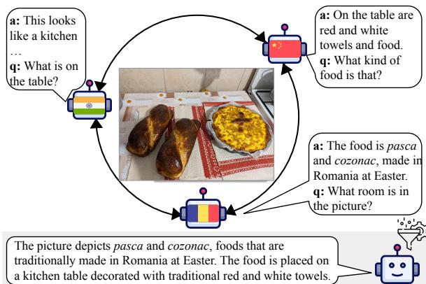  
Figure 1: In a multi-agent setting, three LMM agents, each embodying a curious persona and drawing upon knowledge from distinct countries (India, China, and Romania), participate in a question-and-answer dialogue centered around an image. A fourth agent then summarizes their discussion, creating a culturally enriched image caption.

Culture is a complex and elusive concept. As Adilazuarda et al. (2024) show, Culture is a multifaceted concept meaning different things to different people at different times. This complexity is apparent in various cultural expressions, such as proverbs, social norms, and other contextdependent elements. In our work, we adopt the definition provided by Nguyen et al. (2023) and focus on visual cultural elements such as food, drinks, clothing, traditions, rituals, and behaviors.

Culture is strongly tied to our group-oriented human nature, which allows us to learn from one another over generations. Furthermore, as sociologists and anthropologists have demonstrated, our progress as a species is primarily due to our cooperative nature, rather than individual knowledge (Henrich, 2015). Inspired by the success of human collective intelligence, we conceptualize the culturally enriched image captioning task as a “social task”. Specifically, we frame it as a dialogue between three agents from different cultures who seek to learn about each other’s cultures through an image. They engage in asking questions and sharing insights, akin to human collaborative problem-solving. A moderator provides examples of initial questions and highlights key visual cultural aspects to focus on. The conversation is then summarized into a comprehensive cultural image description (see Figure 1). Our findings indicate that this multi-agent approach yields better results than single-agent methods.

We summarize our contributions as follows. First, inspired by collective intelligence, we propose MosAIC, a novel multi-agent framework to improve cross-cultural image captioning performance. Second, we share a dataset of 2,832 culturally enriched image captions in English, for images from three different countries: China, India, and Romania, across three datasets: GeoDE, GD-VCR, and CVQA. Third, we introduce a cultureadaptable metric for evaluating cultural information within image captions. Finally, we show that multi-agent interaction surpasses singleagent (and culturally fine-tuned) models across different metrics, and provide actionable steps for future work.

## 2 Related Work

Large Multi-Agent Multimodal Models. The inspiring progress of Large Language Models (LLMs) has led to the proposal of LLMbased multi-agents that leverage the collective intelligence and specialized skills of multiple agents (Guo et al., 2024). In this context, multiple independent agents discuss and make decisions, mirroring the cooperative human nature. This approach has facilitated progress on various tasks such as software development (Hong et al., 2023), society simulation (Park et al., 2022), game simulation (Xu et al., 2023), debate simulation (Chan et al., 2023), and polarization (Ohagi, 2024).

At the same time, Large Multimodal Models (LMMs) have extended the capabilities of traditional language models by integrating several data modalities such as text, videos, and images. LMMs such as LLaVA (Liu et al., 2023), GPT-4 (OpenAI, 2023) or LENS (Berrios et al., 2023) have shown promising results in complex vision-language tasks due to their pretraining on terabytes of image and language data with billion-parameters (Bai et al.,

2023; Zhang et al., 2023a) To the best of our knowledge, our study is the first to employ LMMs in a multi-agent setting for a cross-cultural multimodal understanding task.

Cross-Cultural Multimodal Understanding. Even though LLMs and LMMs are already instrumental in various real-life applications, such as recommender systems (Li et al., 2023b) and customer service (Pandya and Holia, 2023), these models often mirror Western-centric perspectives, leading to reinforcing stereotypes and algorithmic monoculture (Kleinberg and Raghavan, 2021; Hershcovich et al., 2022; AlKhamissi et al., 2024).

Several efforts have been made in the AI community to enhance the diversity of data and models, both linguistically and visually. Specifically, recent language studies have developed crosscultural benchmarks such as CultureBank (Shi et al., 2024) and NORMAD (Rao et al., 2024) to enhance LLMs’ cultural awareness. The visionlanguage community also has started to focus on creating multilingual, geographically, income, and culturally diverse multimodal datasets such as Dollar Street (Rojas et al., 2022), GeoDE (Ramaswamy et al., 2023a), GD-VCR (Yin et al., 2021), CVQA (Romero et al., 2024), MaRVL (Liu et al., 2021), and WIT (Srinivasan et al., 2021a).

Despite the increased availability of cultural benchmarks, the current evaluation metrics and methods are not suited to capture cultural information (Awal et al., 2023). Evaluation metrics such as Accuracy or F1 score do not focus on the cultural nuances in LMMs’ generations and, therefore, cannot reflect their cultural awareness in practice. Generation-focused metrics such as ClipScore (Hessel et al., 2021), LongCLIP (Zhang et al., 2024), and Completeness score (Zhang et al., 2023b) also do not account for cross-cultural variations. However, more culture-focused metrics are emerging, such as Culture Noise Rate (CNR) (Yun and Kim, 2024), which measures the ratio of cultural words among all words generated in a caption. The cultural words are extracted from a cultural commonsense knowledge base (CCSK), which contains several cultural facets like food, drinks, clothing, traditions, rituals, and behaviors (Nguyen et al., 2023). Our work aligns with Yun and Kim (2024), as both studies address the task of culturally enriched image captioning. However, our approach diverges by focusing on multi-agent settings and evaluating the models based on three culturally diverse benchmarks.

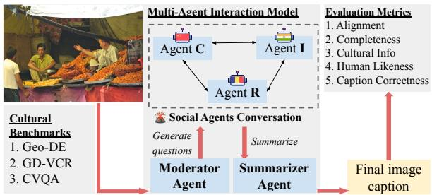  
Figure 2: Overview of MosAIC, our proposed framework for Multi-Agent Image Captioning. The framework consists of a multi-agent interaction model, cultural benchmarks and evaluation metrics. The input is an image and the output is a cultural image caption.

## 3 MosAIC: A Framework for Cultural Image Captioning

We introduce MosAIC, a framework for Multi-Agent Interactions, as shown in Figure 2, to tackle cultural image captioning, a complex task that involves not only describing the visual content of the image but also capturing the cultural elements it represents. The framework consists of a multiagent model, a cultural benchmark, and evaluation metrics, as described below.

## 3.1 Muti-Agent Interaction Model

We introduce a multi-agent setup (Figure 3) to emulate collaboration in a culturally diverse group. Our multi-agent model consists of five agents, each with specific roles: three Social agents, a Moderator agent, and a Summarizer agent.

Moderator. The Moderator agent has two primary tasks. First, it generates questions based on the image to which the Social agents respond. Second, it guides the Social agents to focus on aspects relevant to their cultures, promoting more comprehensive and culturally diverse image descriptions. Social. Each of the Social agents assumes a persona from three cultures: China (C), India (I), and Romania (R). Furthermore, the agents are encouraged to embody a curious persona to facilitate more interaction in their conversation. In the first conversation round, each agent shares their initial description (d) of the given image and a question (q) about the image from the ones provided by the Moderator. In the next conversation rounds, the agents learn from one another, enriching the image description with more comprehensive and detailed content. Specifically, each agent answers the questions raised by the other agents in the current and previous rounds and asks a new question. For example, in Figure 3 Round 2, agent R answers all the questions from the other agents posed in Round 1 and Round 2. Note that agent R answers more questions than the others as it responds last. To balance the number of questions each agent answers, we randomize the order of agents for each round and image. In the final round of conversation, Figure 3 Round 3, each Social agent summarizes (s) everything learned from the previous rounds, including all the initial image descriptions (d), the questions (q) and the corresponding answers (a) from all agents. The summaries distill the most important information gained from the interaction, helping to condense and focus the key insights.

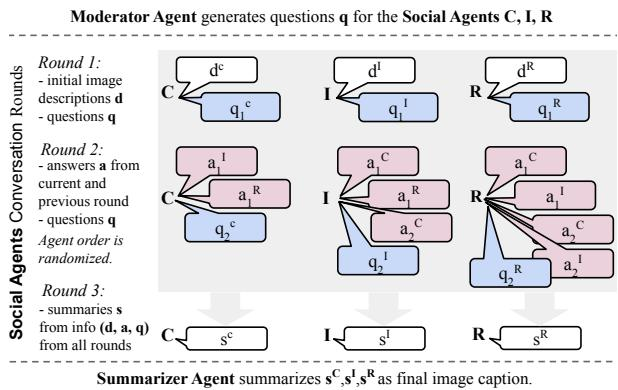  
Figure 3: Multi-Agent Interaction Model. The Moderator presents questions to the Social agents, who engage in three conversation rounds. The Summarizer creates the final image caption by compiling the conversation summaries from the Social agents.

Summarizer. The Summarizer agent collects all the summaries from the Social agents and generates a summary representing the final image description.

Agent Memory. Each agent has its own memory. The Moderator agent generates questions stored in a shared question memory that is accessible to the Social agents. Initially, the Social agents independently analyze the image without memory of/ knowing their peers’ responses, minimizing potential bias. In the conversation rounds, each Social agent can access the responses from all agents in previous rounds and those preceding them in the current round. Finally, each agent’s memory is erased after the Summarizer agent completes the image caption. We also tested a longer-term memory across multiple images but found no performance improvement, likely due to the significant differences between the images.

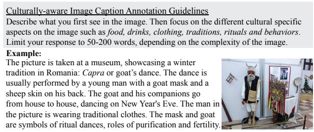  
Figure 4: Human Annotation Guidelines for Cultural Image Captioning.

Setup. We use LLaVA-1.5 13b1 (Liu et al., 2023) to simulate the agents in our interaction model. Each agent is initialized as a separate LMM, so parameters are not shared among the agents. Each agent has an individual memory, where generated outputs by all agents are stored.

## 3.2 Cultural Benchmark

We introduce a new dataset of cross-cultural captions for 2,832 images from three cultures: China, India, and Romania generated by MosAIC and other models. To achieve this, we use images from three geographically diverse datasets: GeoDE, GD-VCR, and CVQA.2 We provide image captions generated by MosAIC, our top-performing model, alongside LLaVA-13b captions to facilitate comparisons between single-agent and multi-agent approaches. Furthermore, for a subset of the images (25 images per dataset and culture), we provide humangenerated captions as described in section 4.1.

GeoDE. GeoDE (Ramaswamy et al., 2023b) is a geo-diverse dataset for object recognition with crowd-sourced 61,940 images from 40 classes and 6 world regions, namely West Asia, Africa, East Asia, South-East Asia, the Americas, and Europe.

GD-VCR. GD-VCR (Yin et al., 2021) is a geodiverse visual commonsense reasoning dataset with 328 cultural and geo-location-specific images from Western, East Asian, South Asian, and African countries.

CVQA. CVQA (Romero et al., 2024) is a culturally diverse multilingual visual question-answering dataset with 5,239 images from 30 countries across Asia, Africa, South America, and Europe.

## 3.3 Evaluation Metrics

We employ both automated metrics (alignment, completeness, cultural information) and human evaluation (Turing test and caption correctness) to comprehensively assess the image captions.

Alignment. We measure text-to-image alignment using LongCLIP (Zhang et al., 2024). This metric builds on CLIPScore (Hessel et al., 2021), a popular reference-free evaluation metric for image captioning that outperforms existing reference-based metrics (Vedantam et al., 2015). LongCLIP uses a knowledge-preserved stretching of positional embedding to increase the maximum input length of CLIPScore from 77 to 248 tokens.

Completeness. We evaluate the completeness of the image captions by calculating the ratio of words mentioned in both the image and the caption to the total number of words (tags) in the image. To generate a comprehensive list of image tags, we use the Recognize Anything Model (RAM) (Zhang et al., 2023b) and expand it with their corresponding synonyms from WordNet (Miller, 1994) .3

Cultural Information. We propose a new metric to quantify the presence of cultural information in image captions. This approach is inspired by the Culture Noise Rate (CNR) (Yun and Kim, 2024), which measures the proportion of cultural words in image captions. However, given that the captions generated by our model tend to be longer than those from other models,4 a ratio-based metric like CNR may disproportionately affect performance. To address this, we instead compute the count of unique cultural words in a caption, a length-invariant metric, to better capture cultural specificity. Further, to improve the metric coverage, we generate and include 700 additional cultural words from 14 categories, such as Traditions and Festivals (50 words per category).5 Human validation (one native annotator per country) confirmed that all GPT-generated words aligned with the provided cultural categories. Our final cultural information metric integrates the filtered cultural terms from CNR with the additional GPT-generated words. This metric is straightforward to compute and adaptable for assessing cultural specificity across various countries.

Turing Test Accuracy. We evaluate the similarity of the LMM-generated captions to humangenerated captions. For 30 images per culture, evenly distributed across datasets, three annotators are tasked with distinguishing between a humangenerated caption, as described in Section 4.1, and an LMM-generated caption. Lower accuracy indicates that the LMM-generated captions are more similar to those generated by humans.

Caption Correctness. We assess the image caption correctness by considering both the correctness of image content descriptions and the cultural information. Specifically, for 30 images per culture, evenly distributed across datasets, three annotators evaluate the percentage of correct captions generated by LMMs, identifying issues such as hallucinations, mislabeling of instances, and inaccuracies in cultural representation.

## 4 Evaluation and Results

We assess the influence of multi-agent interaction on image captioning by comparing our multi-agent interaction model, MosAIC, with single-agent models (BLIP-2, LLaVA-13b) and a human baseline.

## 4.1 Baseline Models

BLIP-2. BLIP-26 (Li et al., 2023a) leverages frozen pre-trained image encoders ViT-L/14 from CLIP (Radford et al., 2021) and a FlanT5 LLM (Chung et al., 2024) by training a lightweight, 12-layer Transformer encoder in between them. It achieves an impressive state-of-the-art zero-shot performance on image captioning.

LLaVA-13b. LLaVA-1.5 13b1 is an end-toend trained large multimodal model that connects pre-trained CLIP ViT-L/14 visual encoder and the Vicuna LLM (Zheng et al., 2024), using a projection matrix for general multimodal understanding.

Human Baseline. To establish a human baseline, we recruited three native annotators from each of three different countries (nine annotators in total). To ensure consistency and facilitate fair comparisons, the annotation guidelines include cultural aspects, as in the model prompts and examples of human-generated captions, as shown in Figure 4. Each annotator creates 75 image captions evenly distributed across three datasets (25 images per dataset).7 We compute two metrics: the average score across the three annotators from each country, referred to as Human, and the highest score among the three annotators, as Expert-Human.

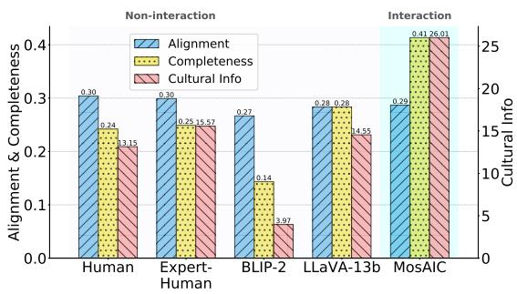  
Figure 5: Our interaction-based model, MosAIC, surpasses non-interaction models and Humans on Completeness and Cultural Info while performing on par with the other models in Alignment. For clarity, the Alignment and Completeness scores are normalized to a [0,1] scale, whereas the Cultural Info score ranges from 0 to the total number ofwords in a caption. Higher scores are betterfor all three metrics

## 4.2 Cross-cultural Interaction Results

Our results show that multi-agent cross-cultural interaction improves performance in the cultural image captioning task. As shown in Figure 5, MosAIC outperforms non-interaction models and humans in Completeness and Cultural Information, while matching other models in Alignment. These performance trends are consistent with results on humanannotated data (Appendix Figure 8).

We hypothesize that MosAIC’s similar Alignment performance is due to its longer captions, which hurts the score. Additionally, Alignment penalizes content not directly visible in the image, such as cultural values (see A.3 for details).

Regarding cultural information, LMMs tend to generate more culture-specific content than humans, driven by exposure to diverse data, lack of personal context, and statistical learning from cultural biases (Li et al., 2024; Mukherjee et al., 2024). However, the Expert-Human outperforms the non-interaction LLaVA-13b model in capturing cultural information (Cultural Info: 15.57 vs. 14.44). Finally, MosAIC, driven by its curious and collaborative cultural personas, outperforms the non-interaction LLaVA-13b model, generating more culturally specific (Cultural Info: 26.01 vs. 14.55) and complete captions (Completeness: 0.41 vs. 0.28).

a) Conversation Rounds  
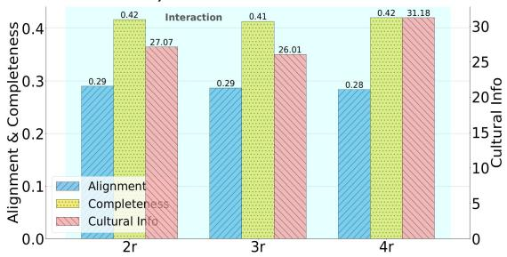

b) Prompt Types  
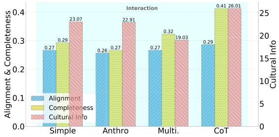

c) Fine-tuning  
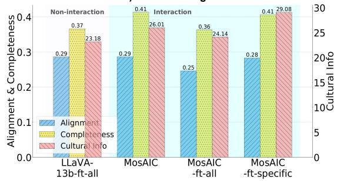

d) Across Cultures  
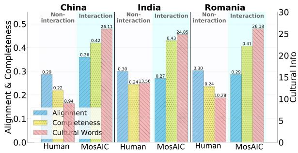

e) Across Datasets  
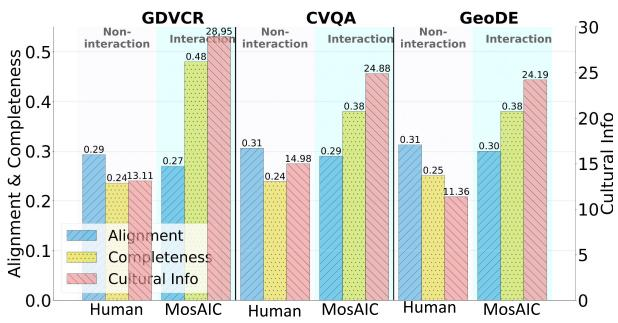  
Figure 6: Ablations on (a) conversation rounds, (b) prompt types, (c) fine-tuning, (d) cultures, and (e) datasets. The zero-shot Multi-agent MosAIC outperforms the Human Baseline and the fine-tuned singleagent LLaVA-13b-ft-all, highlighting the value of multi-agent interactions in cultural image captioning.

## 4.3 Ablation Studies

MosAIC Setting. Our model, MosAIC, employs CoT prompting and operates through three rounds of conversation (see Figure 3). It functions in a zero-shot learning setting without the need for fine-tuning. We also perform ablation studies to assess MosAIC’s performance across various settings: the number of conversation rounds, prompting techniques, fine-tuning, and different cultures and datasets, as shown in Figure 6.

a) Number of Conversation Rounds. Figure 6 a) shows that increasing the number of agent conversations from three to four rounds improves Cultural Information (26.1 vs. 31.1) while keeping Alignment and Completeness stable. The slight decrease in Cultural Information from rounds two to three is attributed to the Summarizer’s failure to synthesize key cultural aspects, instead concatenating the conversations.

b) Prompt Techniques. Given the challenges in achieving cross-cultural alignment between the agents (Ananthram et al., 2024), we experiment with different prompt techniques:8

Simple. This strategy offers straightforward instructions, such as asking a social agent to describe an image and its cultural significance.

Multilingual. We prompt agents from specific cultures by translating the Simple prompt into the dominant languages of their countries, such as Mandarin Chinese, Hindi, and Romanian.9 The generated responses are in English for consistency.

Anthropological. This prompting technique considers emic and etic perspectives, cultural context, socioeconomic background, individual values, personal experience, cultural relativism, spatial and temporal dimensions in a nuanced manner as introduced by AlKhamissi et al. (2024).

Chain of Thought (CoT). CoT prompting involves generating intermediate reasoning steps, mimicking human problem-solving to arrive at a final answer. (Wei et al., 2023). Inspired by multi-modal CoT (Zhang et al.), we guide agents in making detailed image observations.

Insights. As shown in Figure 6 b), CoT prompting outperforms other strategies, while Anthropological prompting—designed to enhance cultural alignment in LLMs—performs similarly to or worse than Simple prompting. This suggests LMMs need further refinement for effective cross-cultural alignment. Additionally, Multilingual prompting ranks lowest in Cultural Information, likely due to confusion from inputs in three languages, highlighting the need for better multilingual alignment in LMMs.

c) Fine-tuning Impact. Current LLMs and LMMs struggle to align with diverse global cultures, often reflecting predominantly WEIRD (Henrich et al., 2010) cultural norms (Atari et al., 2023; Ke et al., 2024). To improve our model’s cultural alignment, we apply fine-tuning, which has previously shown promise (Li et al., 2024). For fine-tuning data, we utilize the Wikipedia-based Image-Text (WIT) dataset from Srinivasan et al. (2021b).10 We implement two fine-tuning setups: 1. We fine-tune a LLaVA-13b model on 9000 WIT images and captions across three cultures, creating two models: the non-interaction LLaVA-13b-ft-all, which only summarizes, and the interaction MosAIC-ft-all, where the finetuned agents collaborate.

2. We fine-tune three LLaVA-13b models, one for each culture, using 3000 WIT images and their corresponding captions. The interactions among these agents yield the multi-agent model MosAIC-ft-specific.

Insights. Fine-tuning generally enhances Cultural Information (Figure 6 c), with a modest 4-point improvement for the multi-agent model (MosAIC vs. MosAIC-ft-specific) and a more substantial 9-point gain for the single-agent model (LLaVA-13b vs. LLaVA-13b-ft-all), considering the compute-intensive nature of the process. Furthermore, MosAIC outperforms the non-interaction LLaVA-13b-ft-all model (Cultural Info: 26.01 vs. 23.18), underscoring the benefits of multi-agent interaction over fine-tuning. The fine-tuned models show lower performance in Alignment and Completeness, as the fine-tuning primarily focuses on enhancing cultural alignment. Among fine-tuned models, ft-specific setting performs the best as each agent in interaction has specific cultural knowledge about the country they represent.

d) Performance across Cultures. Figure 6 d) reveals similar trends across the three cultures: China, India, and Romania.11 Notably, MosAIC achieves the highest Cultural Information performance across all cultures, underscoring the significance of incorporating diverse cultural perspectives in generating image captions.

e) Performance across Datasets. Figure 6 e) shows that Cultural Information is highest for GD-VCR, followed by CVQA, and lowest for GeoDE, which aligns with expectations since GD-VCR and CVQA contain more cultural information than GeoDE. Although MosAIC scores lower than Humans on Alignment, it achieves higher scores for Completeness and Cultural Information across all datasets.12

## 4.4 Human Evaluation and Error Analysis

We assess the human-likeness of generated captions using Turing Test accuracy (Section 3.3). MosAIC scores lower than LLaVA-13b (83.1 vs. 87.9), suggesting MosAIC’s captions are more human-like. However, the high overall scores indicate LMMs still struggle to match human captioning, mainly due to stylistic differences, as humans tend to use a more casual, direct style, as shown in the qualitative results (Section 4.5).

We evaluate caption correctness (Section 3.3), finding 94.5% of human captions correct, compared to 60.2% for MosAIC and 64.56% for LLaVA-13b. At the dataset level, we observe that MosAIC performs equally or better than LLaVA-13b on GD-VCR (Human - Machine correctness difference (lower is better): 28.5 vs. 28.5) and CVQA (34.2 vs. 37.1). We hypothesize that MosAIC underperforms on GeoDE (40.0 vs. 25.0) because this dataset contains less culturally rich information. MosAIC’s lower correctness, compared to LLaVA-13b, may also result from compound hallucinations caused by the interaction of multiple LMMs. Future work can address this issue by making each agent less susceptible to hallucinations, as detailed in the Limitations section. Common errors include incorrect country, object recognition, people counting, and overly general descriptions (examples in Appendix A.5).

## 4.5 Qualitative Results

In Figure 7, we compare image captions generated by MosAIC, Humans, and LLaVA-13b for images from China, India, and Romania.

Compared to LLaVA-13b, MosAIC shows closer alignment with Human captions, capturing more cultural elements. For example, in the Chinese image, MosAIC identifies the giant panda as a national treasure, similar to the Human caption. In the

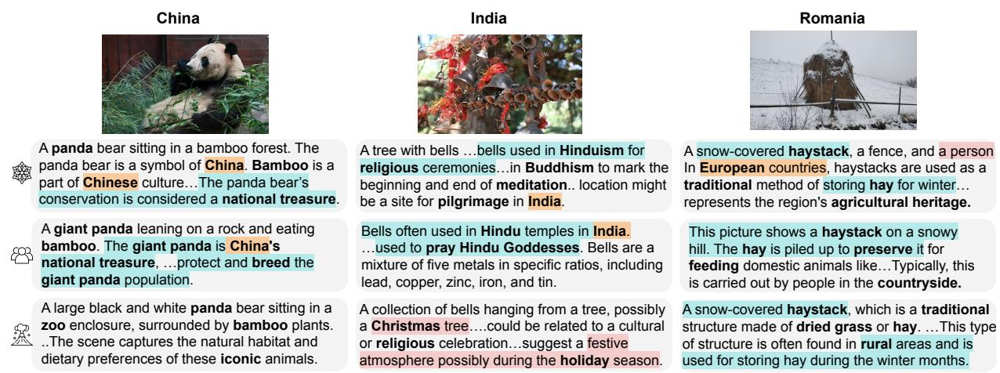  
Figure 7: Comparison of image captions from MosAIC ( ), Human Baseline ( ), and LLaVA-13b ( ) across three cultures in the CVQA dataset. The cultural words are bolded, blue shows agreement with human captions, orange shows the identified country, and red shows incorrect content. All displayed captions are truncatedfor clarity.

Indian image, both MosAIC and Human captions recognize the religious significance of bells, highlighting MosAIC’s greater cultural sensitivity, while LLaVA-13b provides Western-centric descriptions. MosAIC excels at identifying country-specific information, whereas LLaVA-13b fails to recognize the country in any of the images, resulting in vaguer descriptions. For example, MosAIC connects the panda to China and accurately describes its cultural symbolism, while LLaVA-13b remains overly general. Furthermore, MosAIC consistently employs relevant cultural terminology, such as “Hinduism” and “pilgrimage” in the Indian image. In contrast, LLaVA-13b uses vaguer language, like “festive atmosphere”, indicating less cultural specificity.

However, instances of hallucinated content were still observed, with MosAIC incorrectly mentioning a person not present in the Romanian image, while LLaVA-13b associated the bells in the Indian image with Christmas, showing cultural inaccuracy.

In summary, MosAIC generated more accurate and culturally aligned captions, although it occasionally hallucinated. In contrast, LLaVA-13b struggled with cultural specificity and country identification.

## 5 Lessons Learned and Actionable Steps

Our findings reveal the performance of multi-agent LMMs in cultural image captioning, highlighting lessons learned and suggesting steps to enhance cultural richness in future models.

Prioritize multi-agent models. While LMMs excel in tasks like generation and retrieval, they fall short in cross-cultural performance, even with culture-centric prompting strategies (AlKhamissi et al., 2024). Our findings show that even Simple and CoT prompts in multi-agent LLMs are helpful and outperform Anthropological and Multilingual prompts (Figure 6 b). Additionally, increasing the number of conversation rounds between agents enhances cultural information (Figure 6 a). To further improve cross-cultural understanding, future work should focus on developing equitable frameworks using multi-agent LMMs and cross-cultural benchmarks.

Develop efficient cross-cultural techniques. Current approaches to improving cross-cultural understanding in LMMs often rely on fine-tuning. However, we show that interaction-based models outperform fine-tuned, non-interaction models (Figure 6 c), highlighting both the effectiveness and efficiency of multi-agent LMMs. For instance, LLaVa-13-ft-all requires 54 hours on a single NVIDIA A100 GPU to generate captions (12h for fine-tuning on 9000 WIT images and 42h for inference). In contrast, MosAIC completes the task in 47 hours with only inference. Given these findings, future work should focus on multi-agent models to improve sustainability and accessibility.

LMMs focus on culture; humans focus on correctness. LMMs tend to be more culturally specific in their responses, while humans provide more accurate answers (Section 4.4). The main sources of errors in LMMs stem from poor object recognition and hallucinations—instances where the model generates incorrect or fabricated information. Future work can integrate a state-of-the-art object recognition system to enhance caption accuracy.

## 6 Conclusion

In this paper, we leverage LMM agents interaction to enhance cross-cultural image captioning, introducing MosAIC. We presented a comprehensive analysis of three cultures across three datasets, using various prompting techniques. Additionally, we demonstrate the advantages of multi-agent LMM interactions, comparing their performance with compute-intensive methods like fine-tuning for improving cultural alignment. We also opensource our culturally enriched captions dataset generated by our proposed framework, MosAIC, alongside baseline models. Finally, we create a comprehensive and culture-adaptable metric for evaluating cultural information within image captions. Based on our findings, we share ideas for future work. Our dataset and models can be accessed at https://github.com/MichiganNLP/MosAIC.

## Limitations and Ethical Considerations

The Complexity of Defining and Evaluating Cultural Information. Our approach utilizes multiagent LLM interactions, where each LLM represents distinct cultural personas based on specific countries. While we explore various prompting strategies and fine-tuning techniques to align the models with different cultural contexts, it is important to acknowledge that culture is an inherently complex and multifaceted concept. Relying solely on countries as proxies for cultural identity oversimplifies the rich variation in cultural experiences and individual perspectives (Adilazuarda et al., 2024). Using country and language information represents only the tip of the iceberg when it comes to capturing cultural diversity. While these factors provide a basic framework for understanding cultural distinctions, they do not fully account for the deeper, more nuanced aspects that define human cultures. We encourage future work to delve into these deeper dimensions, extending beyond simple national or linguistic markers. Important areas to explore include values, attitudes, and biases, which shape individual and collective worldviews.

Multi-Agent Setup affects Correctness. Multiagent models are more prone to hallucinations compared to single-agent models due to the compound effect, where errors or hallucinations from one agent can influence and amplify those in other agents. This cumulative effect results in a lower Caption Correctness score. Future research could explore ways to mitigate this issue by making each agent less susceptible to hallucinations. This might involve improving the architecture of individual agents for better accuracy, using grounding techniques or external knowledge to verify information, and creating stronger communication protocols between agents to prevent errors from spreading. These improvements could enhance the overall correctness and reliability of the model’s outputs.

Further Assessing the Impact of Conversation Rounds and Fine-Tuning on Cultural Metrics. While our ablation studies demonstrate that both conversation rounds and fine-tuning lead to enhanced performance on cultural metrics, additional analysis is necessary to evaluate the impact of various configurations (e.g., interaction vs. noninteraction settings). This deeper investigation will allow us to better evaluate how effective each setup is and reveal the key factors behind the observed improvements. Understanding these factors will be essential for refining our approach and enhancing the model’s ability to adapt across different cultural contexts.

Limited Cultural Alignment in LLMs. Cultural alignment in LLMs and LMMs is a well-researched area. While it is not the central focus of our research, we recognize that the prompt engineering techniques and fine-tuning methods we employ may not achieve perfect cultural alignment. This could lead to inconsistencies in how each multicultural agent produces responses across different cultural contexts. Additionally, our study is limited to just three countries, each with relatively high representation in the training data, due to the lack of a broader, more diverse set of human evaluations. This limitation highlights the need for more comprehensive validation across a wider range of cultures to ensure better alignment and more reliable cross-cultural performance.

## Acknowledgments

We thank the anonymous reviewers for their constructive feedback. We also thank the members of the Language and Information Technologies lab at the University of Michigan for the insightful discussions during the early stage of the project. This project was partially funded by a Microsoft Foundational Model grant. Any opinions, findings, and conclusions or recommendations expressed in this material are those of the authors and do not necessarily reflect the views of Microsoft.

## References

Muhammad Farid Adilazuarda, Sagnik Mukherjee, Pradhyumna Lavania, Siddhant Singh, Ashutosh

Dwivedi, Alham Fikri Aji, Jacki O’Neill, Ashutosh Modi, and Monojit Choudhury. 2024. Towards measuring and modeling” culture” in llms: A survey. arXiv preprint arXiv:2403.15412.

Badr AlKhamissi, Muhammad ElNokrashy, Mai AlKhamissi, and Mona Diab. 2024. Investigating cultural alignment of large language models. arXiv preprint arXiv:2402.13231.

Amith Ananthram, Elias Stengel-Eskin, Carl Vondrick, Mohit Bansal, and Kathleen McKeown. 2024. See it from my perspective: Diagnosing the western cultural bias of large vision-language models in image understanding. arXiv preprint arXiv:2406.11665.

Mohammad Atari, Mona J Xue, Peter S Park, Damian´ Blasi, and Joseph Henrich. 2023. Which humans?

Rabiul Awal, Le Zhang, and Aishwarya Agrawal. 2023. Investigating prompting techniques for zeroand few-shot visual question answering. ArXiv, abs/2306.09996.

Jinze Bai, Shuai Bai, Shusheng Yang, Shijie Wang, Sinan Tan, Peng Wang, Junyang Lin, Chang Zhou, and Jingren Zhou. 2023. Qwen-vl: A versatile visionlanguage model for understanding, localization, text reading, and beyond. Preprint, arXiv:2308.12966.

William Berrios, Gautam Mittal, Tristan Thrush, Douwe Kiela, and Amanpreet Singh. 2023. Towards language models that can see: Computer vision through the lens of natural language. ArXiv, abs/2306.16410.

Mehar Bhatia, Sahithya Ravi, Aditya Chinchure, Eunjeong Hwang, and Vered Shwartz. 2024. From local concepts to universals: Evaluating the multicultural understanding of vision-language models. arXiv preprint arXiv:2407.00263.

Chi-Min Chan, Weize Chen, Yusheng Su, Jianxuan Yu, Wei Xue, Shanghang Zhang, Jie Fu, and Zhiyuan Liu. 2023. Chateval: Towards better llm-based evaluators through multi-agent debate. arXiv preprint arXiv:2308.07201.

Hyung Won Chung, Le Hou, Shayne Longpre, Barret Zoph, Yi Tay, William Fedus, Yunxuan Li, Xuezhi Wang, Mostafa Dehghani, Siddhartha Brahma, et al. 2024. Scaling instruction-finetuned language models. Journal ofMachine Learning Research, 25(70):1–53.

Taicheng Guo, Xiuying Chen, Yaqi Wang, Ruidi Chang, Shichao Pei, Nitesh V Chawla, Olaf Wiest, and Xiangliang Zhang. 2024. Large language model based multi-agents: A survey of progress and challenges. arXiv preprint arXiv:2402.01680.

Joseph Henrich. 2015. The Secret ofOur Success: How Culture Is Driving Human Evolution, Domesticating Our Species, and Making Us Smarter. Princeton University Press, Princeton, NJ.

Joseph Henrich, Steven J. Heine, and Ara Norenzayan. 2010. The weirdest people in the world? Behavioral and Brain Sciences.

Daniel Hershcovich, Stella Frank, Heather Lent, Miryam de Lhoneux, Mostafa Abdou, Stephanie Brandl, Emanuele Bugliarello, Laura Cabello Piqueras, Ilias Chalkidis, Ruixiang Cui, Constanza Fierro, Katerina Margatina, Phillip Rust, and Anders Søgaard. 2022. Challenges and strategies in crosscultural NLP. In Proceedings of the 60th Annual Meeting of the Association for Computational Linguistics (Volume 1: Long Papers), pages 6997–7013, Dublin, Ireland. Association for Computational Linguistics.

Jack Hessel, Ari Holtzman, Maxwell Forbes, Ronan Le Bras, and Yejin Choi. 2021. CLIPScore: A reference-free evaluation metric for image captioning. In Proceedings of the 2021 Conference on Empirical Methods in Natural Language Processing, pages 7514–7528, Online and Punta Cana, Dominican Republic. Association for Computational Linguistics.

Sirui Hong, Xiawu Zheng, Jonathan Chen, Yuheng Cheng, Jinlin Wang, Ceyao Zhang, Zili Wang, Steven Ka Shing Yau, Zijuan Lin, Liyang Zhou, et al. 2023. Metagpt: Meta programming for multi-agent collaborative framework. arXiv preprint arXiv:2308.00352.

Edward J Hu, Yelong Shen, Phillip Wallis, Zeyuan Allen-Zhu, Yuanzhi Li, Shean Wang, Lu Wang, and Weizhu Chen. 2021. Lora: Low-rank adaptation of large language models. arXiv preprint arXiv:2106.09685.

Luoma Ke, Song Tong, Peng Chen, and Kaiping Peng. 2024. Exploring the frontiers of llms in psychological applications: A comprehensive review. arXiv preprint arXiv:2401.01519.

Jon Kleinberg and Manish Raghavan. 2021. Algorithmic monoculture and social welfare. Proceedings of the National Academy of Sciences, 118(22):e2018340118.

Alina Kuznetsova, Hassan Rom, Neil Alldrin, Jasper Uijlings, Ivan Krasin, Jordi Pont-Tuset, Shahab Kamali, Stefan Popov, Matteo Malloci, Alexander Kolesnikov, et al. 2020. The open images dataset v4: Unified image classification, object detection, and visual relationship detection at scale. International journal of computer vision, 128(7):1956–1981.

Cheng Li, Mengzhou Chen, Jindong Wang, Sunayana Sitaram, and Xing Xie. 2024. Culturellm: Incorporating cultural differences into large language models. arXiv preprint arXiv:2402.10946.

Junnan Li, Dongxu Li, Silvio Savarese, and Steven Hoi. 2023a. Blip-2: Bootstrapping language-image pretraining with frozen image encoders and large language models. Preprint, arXiv:2301.12597.

Lei Li, Yongfeng Zhang, and Li Chen. 2023b. Prompt distillation for efficient llm-based recommendation. In Proceedings of the 32nd ACM International Conference on Information and Knowledge Management, pages 1348–1357.

Fangyu Liu, Emanuele Bugliarello, Edoardo Maria Ponti, Siva Reddy, Nigel Collier, and Desmond Elliott. 2021. Visually grounded reasoning across languages and cultures. In Proceedings of the 2021 Conference on Empirical Methods in Natural Language Processing, pages 10467–10485, Online and Punta Cana, Dominican Republic. Association for Computational Linguistics.

Haotian Liu, Chunyuan Li, Qingyang Wu, and Yong Jae Lee. 2023. Visual instruction tuning. In NeurIPS.

George A. Miller. 1994. WordNet: A lexical database for English. In Human Language Technology: Proceedings of a Workshop held at Plainsboro, New Jersey, March 8-11, 1994.

Anjishnu Mukherjee, Ziwei Zhu, and Antonios Anastasopoulos. 2024. Crossroads of continents: Automated artifact extraction for cultural adaptation with large multimodal models. arXiv preprint arXiv:2407.02067.

Tuan-Phong Nguyen, Simon Razniewski, Aparna Varde, and Gerhard Weikum. 2023. Extracting cultural commonsense knowledge at scale. In Proceedings of the ACM Web Conference 2023, pages 1907–1917.

Masaya Ohagi. 2024. Polarization of autonomous generative ai agents under echo chambers. arXiv preprint arXiv:2402.12212.

OpenAI. 2023. Gpt-4 technical report.

OpenAI. 2024. Chatgpt. https://chat.openai.com/. Accessed: 2024-09-18.

Keivalya Pandya and Mehfuza Holia. 2023. Automating customer service using langchain: Building custom open-source gpt chatbot for organizations. arXiv preprint arXiv:2310.05421.

Joon Sung Park, Lindsay Popowski, Carrie J. Cai, Meredith Ringel Morris, Percy Liang, and Michael S. Bernstein. 2022. Social simulacra: Creating populated prototypes for social computing systems. Proceedings of the 35th Annual ACM Symposium on User Interface Software and Technology.

Alec Radford, Jong Wook Kim, Chris Hallacy, Aditya Ramesh, Gabriel Goh, Sandhini Agarwal, Girish Sastry, Amanda Askell, Pamela Mishkin, Jack Clark, et al. 2021. Learning transferable visual models from natural language supervision. In International conference on machine learning, pages 8748–8763. PMLR.

Vikram V. Ramaswamy, Sing Yu Lin, Dora Zhao, Aaron B. Adcock, Laurens van der Maaten, Deepti Ghadiyaram, and Olga Russakovsky. 2023a. Geode: a geographically diverse evaluation dataset for object recognition. Preprint, arXiv:2301.02560.

Vikram V. Ramaswamy, Sing Yu Lin, Dora Zhao, Aaron B. Adcock, Laurens van der Maaten, Deepti Ghadiyaram, and Olga Russakovsky. 2023b. Geode: a geographically diverse evaluation dataset for object recognition. In NeurIPS Datasets and Benchmarks.

Abhinav Rao, Akhila Yerukola, Vishwa Shah, Katharina Reinecke, and Maarten Sap. 2024. Normad: A benchmark for measuring the cultural adaptability of large language models.

William A Gaviria Rojas, Sudnya Diamos, Keertan Ranjan Kini, David Kanter, Vijay Janapa Reddi, and Cody Coleman. 2022. The dollar street dataset: Images representing the geographic and socioeconomic diversity of the world. In Thirty-sixth Conference on Neural Information Processing Systems Datasets and Benchmarks Track.

David Romero, Chenyang Lyu, Haryo Akbarianto Wibowo, Teresa Lynn, Injy Hamed, Aditya Nanda Kishore, Aishik Mandal, Alina Dragonetti, Artem Abzaliev, Atnafu Lambebo Tonja, Bontu Fufa Balcha, Chenxi Whitehouse, Christian Salamea, Dan John Velasco, David Ifeoluwa Adelani, David Le Meur, Emilio Villa-Cueva, Fajri Koto, Fauzan Farooqui, Frederico Belcavello, Ganzorig Batnasan, Gisela Vallejo, Grainne Caulfield, Guido Ivetta, Haiyue Song, Henok Biadglign Ademtew, Hernan´ Maina, Holy Lovenia, Israel Abebe Azime, Jan Christian Blaise Cruz, Jay Gala, Jiahui Geng, Jesus-German Ortiz-Barajas, Jinheon Baek, Jocelyn Dunstan, Laura Alonso Alemany, Kumaranage Ravindu Yasas Nagasinghe, Luciana Benotti, Luis Fernando D’Haro, Marcelo Viridiano, Marcos Estecha-Garitagoitia, Maria Camila Buitrago Cabrera, Mario Rodr´ıguez-Cantelar, Melanie Jouit-´ teau, Mihail Mihaylov, Mohamed Fazli Mohamed Imam, Muhammad Farid Adilazuarda, Munkhjargal Gochoo, Munkh-Erdene Otgonbold, Naome Etori, Olivier Niyomugisha, Paula Monica Silva,´ Pranjal Chitale, Raj Dabre, Rendi Chevi, Ruochen Zhang, Ryandito Diandaru, Samuel Cahyawijaya, Santiago Gongora, Soyeong Jeong, Sukan-´ nya Purkayastha, Tatsuki Kuribayashi, Thanmay Jayakumar, Tiago Timponi Torrent, Toqeer Ehsan, Vladimir Araujo, Yova Kementchedjhieva, Zara Burzo, Zheng Wei Lim, Zheng Xin Yong, Oana Ignat, Joan Nwatu, Rada Mihalcea, Thamar Solorio, and Alham Fikri Aji. 2024. Cvqa: Culturally-diverse multilingual visual question answering benchmark. Preprint, arXiv:2406.05967.

Weiyan Shi, Ryan Li, Yutong Zhang, Caleb Ziems, Chunhua yu, Raya Horesh, Rog’erio Abreu de Paula, and Diyi Yang. 2024. Culturebank: An online community-driven knowledge base towards culturally aware language technologies.

Krishna Srinivasan, Karthik Raman, Jiecao Chen, Michael Bendersky, and Marc Najork. 2021a. Wit: Wikipedia-based image text dataset for multimodal multilingual machine learning. In Proceedings of the 44th International ACM SIGIR Conference on Research and Development in Information Retrieval, SIGIR ’21. ACM.

Krishna Srinivasan, Karthik Raman, Jiecao Chen, Michael Bendersky, and Marc Najork. 2021b. Wit: Wikipedia-based image text dataset for multimodal multilingual machine learning. SIGIR ’21, page

2443–2449, New York, NY, USA. Association for Computing Machinery.

Ramakrishna Vedantam, C Lawrence Zitnick, and Devi Parikh. 2015. Cider: Consensus-based image description evaluation. In Proceedings of the IEEE conference on computer vision and pattern recognition, pages 4566–4575.

Jason Wei, Xuezhi Wang, Dale Schuurmans, Maarten Bosma, Brian Ichter, Fei Xia, Ed Chi, Quoc Le, and Denny Zhou. 2023. Chain-of-thought prompting elicits reasoning in large language models. Preprint, arXiv:2201.11903.

Zelai Xu, Chao Yu, Fei Fang, Yu Wang, and Yi Wu. 2023. Language agents with reinforcement learning for strategic play in the werewolf game. arXiv preprint arXiv:2310.18940.

Da Yin, Liunian Harold Li, Ziniu Hu, Nanyun Peng, and Kai-Wei Chang. 2021. Broaden the vision: Geodiverse visual commonsense reasoning. Preprint, arXiv:2109.06860.

Youngsik Yun and Jihie Kim. 2024. Cic: A framework for culturally-aware image captioning. Preprint, arXiv:2402.05374.

Beichen Zhang, Pan Zhang, Xiaoyi Dong, Yuhang Zang, and Jiaqi Wang. 2024. Long-clip: Unlock ing the long-text capability of clip. arXiv preprint arXiv:2403.15378.

Pan Zhang, Xiaoyi Dong, Bin Wang, Yuhang Cao, Chao Xu, Linke Ouyang, Zhiyuan Zhao, Haodong Duan, Songyang Zhang, Shuangrui Ding, Wenwei Zhang, Hang Yan, Xinyue Zhang, Wei Li, Jingwen Li, Kai Chen, Conghui He, Xingcheng Zhang, Yu Qiao, Dahua Lin, and Jiaqi Wang. 2023a. Internlmxcomposer: A vision-language large model for advanced text-image comprehension and composition. Preprint, arXiv:2309.15112.

Youcai Zhang, Xinyu Huang, Jinyu Ma, Zhaoyang Li, Zhaochuan Luo, Yanchun Xie, Yuzhuo Qin, Tong Luo, Yaqian Li, Shilong Liu, et al. 2023b. Recognize anything: A strong image tagging model. arXiv preprint arXiv:2306.03514.

Zhuosheng Zhang, Aston Zhang, Mu Li, George Karypis, Alex Smola, et al. Multimodal chain-ofthought reasoning in language models. Transactions on Machine Learning Research.

Lianmin Zheng, Wei-Lin Chiang, Ying Sheng, Siyuan Zhuang, Zhanghao Wu, Yonghao Zhuang, Zi Lin, Zhuohan Li, Dacheng Li, Eric Xing, et al. 2024. Judging llm-as-a-judge with mt-bench and chatbot arena. Advances in Neural Information Processing Systems, 36.

## A Appendix

## A.1 Cultural Information Metric

CNR’s cultural words are derived from the CAN-DLE commonsense knowledge base (Nguyen et al., 2023), which covers various cultural facets like Food, Clothing, and Traditions. However, we identified generic terms, such as occupations (e.g., “attorney”), that lack cultural specificity. Additionally, CNR includes countries outside our focus—Romania, India, and China—and does not include Romania. To refine this, we filtered out occupation-related terms from CNR and utilized ChatGPT (OpenAI, 2024) to generate additional country-specific cultural words (50 words per category). We use the following prompt: Give a comprehensive list of50 cultural words related to CAT-EGORY in COUNTRY. Make sure to include words that are related to both traditions and festivals

The 14 categories provided are: Traditions and Festivals, Cuisine, Language, Religion and Spirituality, Art and Literature, Science and Education, History, Social Norms and Values, Architecture and Design, Clothing and Fashion, Music and Dance, Sports and Recreation, Festivals and Holidays, Icons and Symbols.

## A.2 Fine-tuning Details

For fine-tuning, we use the WIT dataset (Srinivasan et al., 2021b). WIT comprises a curated set of 37.5m entity-rich image-text examples with 11.5m unique images across 108 Wikipedia languages. For fine-tuning, we choose Romanian, Hindi, and Chinese languages for Romania, Hindi and Chinese respectively.

For fine-tuning LLaVA-13b, we utilize the Transformer Reinforcement Library13 with LoRA (Hu et al., 2021) enabled allowing for parameterefficient fine-tuning. We use a 4-bit quantization, which reduces memory consumption, and a ‘bf16’ precision for training. This reduces memory footprint. We train the ft-specific models for 3 epochs and ft-all model for 5 epochs, with a batch size of 16 and a learning rate of 1.4e−5. Total compute time on NVIDIA A100 is 2.5 GPU hours for each ft-specific model and 6.5 GPU hours for ft-all model.

## A.3 Results

On the caption length impact on Alignment score. LLaVA-based image captions can extend up to three sentences, frequently surpassing Long-CLIP’s input limit of 248 tokens, negatively impacting Alignment performance. Moreover, this metric penalizes aspects not directly visible in the image, such as cultural context (e.g., traditions, social norms, and values). To mitigate this, we instruct the LLaVA models to focus on describing the image content in the initial sentence and to address cultural elements in subsequent sentences. Conversely, BLIP-2-generated captions are constrained to a single sentence and lack cultural information, leading to higher performance in Alignment. Consequently, Alignment scores should be evaluated alongside the other metrics to provide a comprehensive assessment.

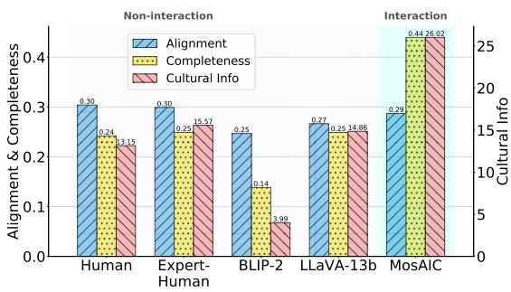  
Figure 8: Comparison across data annotated by humans. The trends are consistent with performance on all the data. Our interaction-based model, MosAIC, surpasses non-interaction models and Humans on Completeness and Cultural Info while performing on par with the other models in Alignment. For clarity, the Alignment and Completeness scores are normalized to a [0,1] scale, whereas the Cultural Info score ranges from 0 to the total number of words in a caption.

## A.3.1 Quantitative Results

See results on data annotated by humans (Figure 8). The trends are consistent with performance on all the data (Figure 5).

See results across each dataset:

1. Table 1 for Alignment metric

2. Table 2 for Completeness metric

3. Table 3 for Cultural Information metric

## A.3.2 Qualitative Analysis

Across Different Datasets. For relatively simple datasets (Figure 9) with minimal cultural content or complex scenes, both MosAIC and LLaVA-13b exhibit performance comparable to that of human annotators, displaying fewer hallucinations and higher levels of agreement. However, when applied to more complex datasets like GD-VCR10, which consist of movies from diverse cultural backgrounds, MosAIC continues to effectively identify country-specific information and cultural elements, maintaining greater alignment with human annotators. In contrast, LLaVA-13b tends to deviate from human-like behavior, generating more hallucinations (e.g., referencing individuals not present in the image).

Across Different Conversation Rounds. With only two conversation rounds, MosAIC tends to merely compile the perspectives of three agents from different countries without offering substantial insights, often struggling to identify the correct country information accurately. As the number of conversation rounds increases to four, MosAIC provides more comprehensive cultural information, though this comes at the cost of increased hallucinations. Notably, three conversation rounds achieve the optimal balance between the richness of cultural descriptions and the accuracy of the information provided (Figure 11).

Across Different Prompt Strategies. Across various prompt strategies12, the CoT approach yields the best performance, delivering accurate cultural information with minimal hallucinations through step-by-step guidance. The anthropological prompt achieves a comparable level of cultural richness, though it is accompanied by more hallucinations. When given a simple prompt, MosAIC tends to merely compile conversations without providing substantial extensions on image-related cultural insights. The multilingual prompt results in the poorest performance, offering less cultural information and producing more hallucinations, highlighting LLaVA’s limitations in handling multimodal multilingual tasks effectively.

Across Different Fine-Tuning Strategies. Under different fine-tuning strategies13, MosAIC demonstrates improved performance, generating more culturally relevant information while maintaining comparable accuracy in describing image contents.

## A.4 Prompts

See:

1. Figure 16 for LLaVA-13b prompts.

2. Figure 17 for Simple prompts.

<table><tr><td></td><td></td><td colspan="4">CVQA</td><td colspan="4">GDVCR</td><td colspan="4">GeoDE</td></tr><tr><td></td><td></td><td>CN</td><td>IN</td><td>RO</td><td>All</td><td>East-Asia</td><td>South-Asia</td><td>West</td><td>All</td><td>CN</td><td>IN</td><td>RO</td><td>All</td></tr><tr><td></td><td>human</td><td>0.31</td><td>0.30</td><td>0.30</td><td>0.30</td><td>0.29</td><td>0.29</td><td>0.29</td><td>0.29</td><td>0.31</td><td></td><td>0.31</td><td>0.31</td></tr><tr><td></td><td>blip-2 - no inter.</td><td>0.19</td><td>0.19</td><td>0.20</td><td>0.19</td><td>0.30</td><td>0.30</td><td>0.30</td><td>0.30</td><td>0.31</td><td></td><td>0.31</td><td>0.31</td></tr><tr><td>baslines</td><td>LLaVA-7b - no inter.</td><td>0.22</td><td>0.22</td><td>0.23</td><td>0.22</td><td>0.31</td><td>0.30</td><td>0.30</td><td>0.30</td><td>0.28</td><td></td><td>0.30</td><td>0.29</td></tr><tr><td></td><td>LLaVA-13b - no inter.</td><td>0.22</td><td>0.23</td><td>0.23</td><td>0.23</td><td>0.31</td><td>0.30</td><td>0.31</td><td>0.31</td><td>0.31</td><td></td><td>0.30</td><td>0.31</td></tr><tr><td>prmpt</td><td>Simple</td><td>0.23</td><td>0.24</td><td>0.24</td><td>0.24</td><td>0.27</td><td>0.28</td><td>0.27</td><td>0.27</td><td>0.28</td><td></td><td>0.29</td><td>0.29</td></tr><tr><td></td><td>Anthro.</td><td>0.23</td><td>0.24</td><td>0.24</td><td>0.23</td><td>0.27</td><td>0.27</td><td>0.27</td><td>0.27</td><td>0.28</td><td></td><td>0.27</td><td>0.27</td></tr><tr><td>alttons</td><td>Multi.</td><td>0.26</td><td>0.25</td><td>0.24</td><td>0.25</td><td>0.27</td><td>0.28</td><td>0.26</td><td>0.27</td><td>0.28</td><td></td><td>0.28</td><td>0.28</td></tr><tr><td></td><td>MosAIC</td><td>0.30</td><td>0.28</td><td>0.29</td><td>0.29</td><td>0.27</td><td>0.26</td><td>0.27</td><td>0.27</td><td>0.30</td><td></td><td>0.30</td><td>0.30</td></tr><tr><td>nne-une</td><td>ft-all - no inter.</td><td>0.28</td><td>0.29</td><td>0.29</td><td>0.29</td><td>0.27</td><td>0.28</td><td>0.27</td><td>0.27</td><td>0.30</td><td></td><td>0.30</td><td>0.30</td></tr><tr><td>ablaton</td><td>MosAIC-ft-all</td><td>0.23</td><td>0.24</td><td>0.24</td><td>0.24</td><td>0.28</td><td>0.28</td><td>0.28</td><td>0.28</td><td>0.23</td><td></td><td>0.23</td><td>0.23</td></tr><tr><td></td><td>MosAIC-ft-specific</td><td>0.29</td><td>0.29</td><td>0.29</td><td>0.29</td><td>0.29</td><td>0.29</td><td>0.29</td><td>0.29</td><td>0.28</td><td></td><td>0.27</td><td>0.27</td></tr><tr><td></td><td>2r</td><td>0.30</td><td>0.30</td><td>0.29</td><td>0.29</td><td>0.26</td><td>0.26</td><td>0.27</td><td>0.27</td><td>0.31</td><td></td><td>0.31</td><td>0.31</td></tr><tr><td>C</td><td>3r</td><td>0.30</td><td>0.28</td><td>0.29</td><td>0.29</td><td>0.27</td><td>0.26</td><td>0.27</td><td>0.27</td><td>0.30</td><td></td><td>0.30</td><td>0.30</td></tr><tr><td>ablaton</td><td>4r</td><td>0.30</td><td>0.28</td><td>0.28</td><td>0.29</td><td>0.26</td><td>0.26</td><td>0.26</td><td>0.26</td><td>0.30</td><td></td><td>0.30</td><td>0.30</td></tr></table>

Table 1: Comparison of Alignment across datasets and models (No interaction frameworks include ‘no inter.’, otherwise they include interaction)
<table><tr><td rowspan="2" colspan="2"></td><td colspan="4">CVQA</td><td colspan="4">GDVCR</td><td colspan="4">GeoDE</td></tr><tr><td>CN</td><td>IN</td><td>RO</td><td>All</td><td>East-Asia</td><td>South-Asia</td><td>West</td><td>All</td><td>CN</td><td>IN</td><td>RO</td><td>All</td></tr><tr><td rowspan="4">basines</td><td>human</td><td>0.18</td><td>0.25</td><td>0.21</td><td>0.23</td><td>0.24</td><td>0.24</td><td>0.23</td><td>0.24</td><td>0.24</td><td></td><td>0.26</td><td>0.25</td></tr><tr><td>blip-2 - no inter.</td><td>0.03</td><td>0.04</td><td>0.04</td><td>0.04</td><td>0.19</td><td>0.20</td><td>0.19</td><td>0.19</td><td>0.19</td><td></td><td>0.20</td><td>0.20</td></tr><tr><td>LLaVA-7b no inter.</td><td>0.09</td><td>0.11</td><td>0.13</td><td>0.11</td><td>0.39</td><td>0.46</td><td>0.44</td><td>0.44</td><td>0.27</td><td></td><td>0.26</td><td>0.26</td></tr><tr><td>LLaVA-13b - no inter.</td><td>0.14</td><td>0.10</td><td>0.15</td><td>0.13</td><td>0.36</td><td>0.40</td><td>0.38</td><td>0.38</td><td>0.34</td><td></td><td>0.34</td><td>0.34</td></tr><tr><td rowspan="3">prmpt</td><td>Simple</td><td>0.11</td><td>0.11</td><td>0.16</td><td>0.12</td><td>0.40</td><td>0.44</td><td>0.40</td><td>0.41</td><td>0.35</td><td></td><td>0.35</td><td>0.35</td></tr><tr><td>Anthro.</td><td>0.11</td><td>0.08</td><td>0.11</td><td>0.10</td><td>0.36</td><td>0.38</td><td>0.39</td><td>0.38</td><td>0.32</td><td></td><td>0.32</td><td>0.32</td></tr><tr><td>Multi.</td><td>0.41</td><td>0.32</td><td>0.29</td><td>0.35</td><td>0.31</td><td>0.35</td><td>0.32</td><td>0.33</td><td>0.30</td><td></td><td>0.28</td><td>0.29</td></tr><tr><td>abllttons</td><td>MosAIC</td><td>0.40</td><td>0.38</td><td>0.35</td><td>0.38</td><td>0.49</td><td>0.48</td><td>0.48</td><td>0.48</td><td>0.37</td><td></td><td>0.39</td><td>0.38</td></tr><tr><td>nnune</td><td>ft-all - no inter.</td><td>0.39</td><td>0.41</td><td>0.38</td><td>0.39</td><td>0.37</td><td>0.48</td><td>0.34</td><td>0.40</td><td>0.30</td><td></td><td>0.32</td><td>0.31</td></tr><tr><td></td><td>MosAIC-ft-all</td><td>0.40</td><td>0.37</td><td>0.36</td><td>0.38</td><td>0.31</td><td>0.42</td><td>0.31</td><td>0.35</td><td>0.36</td><td></td><td>0.35</td><td>0.36</td></tr><tr><td>altos adatons</td><td>MosAIC-ft-specific</td><td>0.39</td><td>0.38</td><td>0.40</td><td>0.39</td><td>0.46</td><td>0.41</td><td>0.39</td><td>0.42</td><td>0.40</td><td></td><td>0.40</td><td>0.41</td></tr><tr><td></td><td>2r</td><td>0.45</td><td>0.34</td><td>0.40</td><td>0.40</td><td>0.47</td><td>0.50</td><td>0.48</td><td>0.48</td><td>0.36</td><td></td><td>0.37</td><td>0.37</td></tr><tr><td>On.</td><td>3r</td><td>0.40</td><td>0.38</td><td>0.35</td><td>0.38</td><td>0.49</td><td>0.48</td><td>0.48</td><td>0.48</td><td>0.37</td><td></td><td>0.39</td><td>0.38</td></tr><tr><td></td><td>4r</td><td>0.42</td><td>0.35</td><td>0.37</td><td>0.40</td><td>0.54</td><td>0.46</td><td>0.47</td><td>0.49</td><td>0.36</td><td></td><td>0.39</td><td>0.37</td></tr></table>

Table 2: Comparison of Completeness across datasets and models (No interaction frameworks include ‘no inter.’, otherwise they include interaction)
<table><tr><td colspan="2"></td><td colspan="4">CVQA</td><td colspan="4">GDVCR</td><td colspan="4">GeoDE</td></tr><tr><td></td><td></td><td>CN</td><td>IN</td><td>RO</td><td>All</td><td>EA</td><td>SA</td><td>West</td><td>All</td><td>CN</td><td>IN</td><td>RO</td><td>All</td></tr><tr><td></td><td>human</td><td>13.31</td><td>13.56</td><td>18.11</td><td>14.99</td><td>13.20</td><td>11.06</td><td>12.44</td><td>13.10</td><td>0.31</td><td></td><td>0.31</td><td>0.31</td></tr><tr><td></td><td>blip-2 - no inter.</td><td>3.86</td><td>3.87</td><td>3.62</td><td>3.79</td><td>5.02</td><td>4.89</td><td>4.71</td><td>4.84</td><td>3.21</td><td></td><td>3.29</td><td>3.26</td></tr><tr><td>bqaslines</td><td>LLaVA-7b no inter.</td><td>11.27</td><td>10.72</td><td>13.03</td><td>11.55</td><td>17.06</td><td>17.22</td><td>16.30</td><td>16.79</td><td>8.47</td><td></td><td>9.13</td><td>8.85</td></tr><tr><td></td><td>LLaVA-13b - no inter.</td><td>15.08</td><td>15.94</td><td>16.38</td><td>15.82</td><td>13.41</td><td>13.61</td><td>12.55</td><td>13.12</td><td>14.88</td><td></td><td>14.61</td><td>14.72</td></tr><tr><td></td><td>Simple</td><td>21.62</td><td>23.55</td><td>22.90</td><td>22.79</td><td>22.27</td><td>23.93</td><td>24.44</td><td>23.94</td><td>21.87</td><td></td><td>22.93</td><td>22.48</td></tr><tr><td>proompt</td><td>Anthro.</td><td>24.16</td><td>23.26</td><td>22.68</td><td>23.35</td><td>23.35</td><td>22.90</td><td>23.81</td><td>23.38</td><td>21.51</td><td></td><td>22.36</td><td>22.01</td></tr><tr><td>adbltons</td><td>Multi.</td><td>23.65</td><td>21.85</td><td>19.35</td><td>21.52</td><td>17.51</td><td>18.84</td><td>17.90</td><td>18.16</td><td>16.91</td><td></td><td>18.01</td><td>17.42</td></tr><tr><td></td><td>MosAIC</td><td>25.41</td><td>24.85</td><td>24.30</td><td>24.88</td><td>28.73</td><td>27.91</td><td>30.07</td><td>28.95</td><td>24.20</td><td></td><td>24.18</td><td>24.19</td></tr><tr><td>nnune</td><td>ft-all - no inter.</td><td>28.62</td><td>27.91</td><td>29.21</td><td>28.49</td><td>26.45</td><td>26.33</td><td>26.06</td><td>26.28</td><td>14.54</td><td></td><td>15.01</td><td>14.76</td></tr><tr><td>ablas abons</td><td>MosAIC-ft-all</td><td>21.01</td><td>22.32</td><td>23.45</td><td>22.25</td><td>23.32</td><td>24.24</td><td>25.40</td><td>24.55</td><td>25.88</td><td></td><td>25.42</td><td>25.62</td></tr><tr><td></td><td>MosAIC-ft-specific</td><td>27.62</td><td>29.55</td><td>27.41</td><td>28.86</td><td>28.85</td><td>28.97</td><td>28.43</td><td>28.68</td><td>29.82</td><td></td><td>29.42</td><td>29.71</td></tr><tr><td></td><td>2r</td><td>30.46</td><td>27.20</td><td>27.81</td><td>27.90</td><td>28.92</td><td>30.29</td><td>29.88</td><td>29.67</td><td>26.27</td><td></td><td>26.18</td><td>26.23</td></tr><tr><td>COn.</td><td>3r</td><td>25.41</td><td>24.85</td><td>24.30</td><td>24.88</td><td>28.73</td><td>27.91</td><td>30.07</td><td>28.95</td><td>24.20</td><td></td><td>24.18</td><td>24.19</td></tr><tr><td></td><td>4r</td><td>31.59</td><td>29.85</td><td>31.03</td><td>31.17</td><td>32.69</td><td>31.99</td><td>32.00</td><td>32.24</td><td>29.50</td><td></td><td>30.55</td><td>29.96</td></tr></table>

Table 3: Comparison of Cultural Info across datasets and models (No interaction frameworks include ‘no inter.’, otherwise they include interaction)

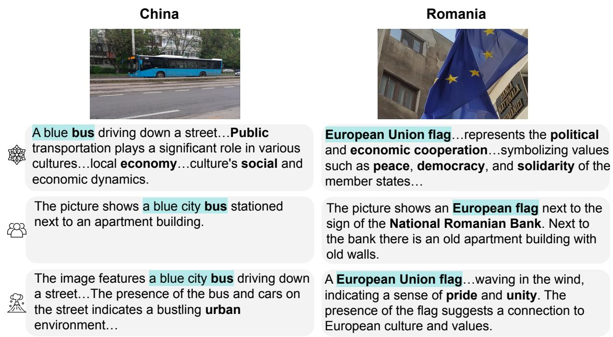  
Figure 9: Comparison of image descriptions from MosAIC, Human Baseline, and LLaVA-13b across three cultures in the GeoDE dataset. The cultural words are bolded, blue shows agreement with human captions, orange shows the identified country, and red shows incorrect and hallucinated content.

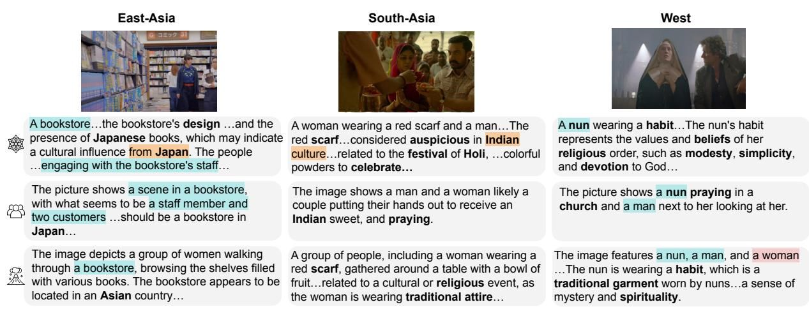  
Figure 10: Comparison of image descriptions from MosAIC, Human Baseline, and LLaVA-13b across three cultures in the GD-VCR dataset. The cultural words are bolded, blue shows agreement with human captions, orange shows the identified country, and red shows incorrect and hallucinated content.

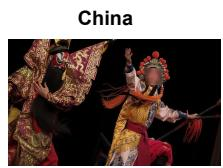

-2R The image features people dressed in traditionalcostumes from India, Romania, and China … From India…the Romania Agent…The China Agent… …the intricate designs and patterns

-3R Three people dressed in traditional Chinese costumes, performing on stage…symbolize different characters or roles in Chinese folklore and mythology

-4R A group of people dressed in traditional Chinese costumes and holding fans. These costumes and fans are made of silk and often feature intricate embroidery and patterns

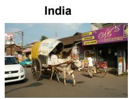

A white ox pulling a cart down a street…prevalent in rural areas of India…the Romania Agent mentioned that ox-drawn …The China Agent mentioned that horse-drawn…

A white ox is pulling a cart down a street in India…In India, oxen are often used for transportation and agriculture. The ox holds a special place in Hindu culture…

The image shows a white ox pulling a cart down a street in India, with the ox wearing a harness and being guided by a man…in China, the use of the ox for transportation…

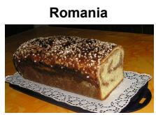

A loaf of bread with seeds on top...could be related to the Indian spice mix…In Romania, this type of bread is commonly found…In China, similar breads with seeds…

A large loaf of bread with seeds on top, placed on a doily…The seeds on the bread are most likely poppy seeds, which are a common ingredient in Romanian bread.

The image features a loaf of bread…This bread is likely nian gao, a traditional Chinese bread with cultural significance in Chinese folklore … symbolize good luck and prosperity

Figure 11: Comparison of image captions from different numbers of conversation rounds (2r, 3r, 4r) across three cultures in the CVQA dataset. The cultural words are bolded, blue shows agreement with human annotators, orange shows the identified country, and red shows incorrect and hallucinated content.  
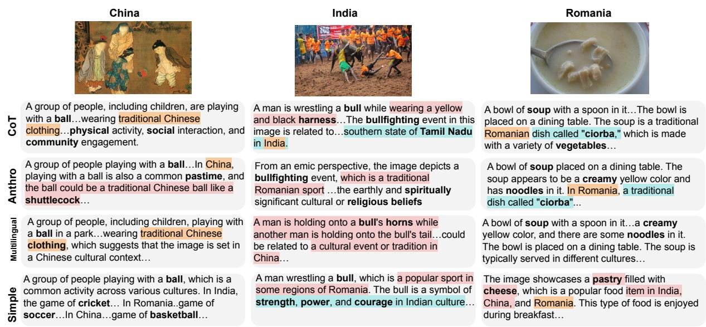

Figure 12: Comparison of image descriptions from different prompt strategies across three cultures in the CVQA dataset. The cultural words are bolded, blue shows agreement with human annotators, orange shows the identified country, and red shows incorrect and hallucinated content.  
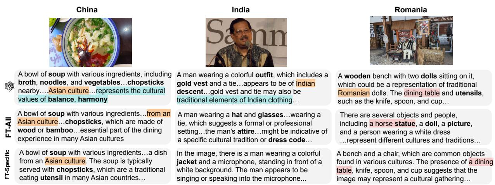  
Figure 13: Comparison of image descriptions from different fine-tuning strategies across three cultures in the CVQA dataset. The cultural words are bolded, blue shows agreement with human annotators, orange shows the identified country, and red shows incorrect and hallucinated content.

3. Figures 18, 19, 20 for CoT prompts across different rounds of conversation.

4. Figure 21 for Multilingual prompts.

5. Figure 22 for Anthropological prompts.

## A.5 Error Examples

See:

1. Figure 23 for incorrect country identification.

2. Figure 24 for incorrect object recognition.

3. Figure 25 for incorrect people counting.

4. Figure 26 for vague description error.

<table><tr><td colspan="2">A multimodal CoT example when asking the agent to observe the image and give description and questions:</td></tr><tr><td></td><td>1. Remember you are a person from {agent.role}. First, observe the image and think what you first see in the image;</td></tr><tr><td></td><td>2. Then, think of how the object you saw is related to your culture in {agent.role}; 3. Next, think of cultural related questions about this image</td></tr><tr><td></td><td>4. Finally, generate human-like conversational language to describe the object you first saw in the image and how is this related to your culture in</td></tr><tr><td></td><td>{agent.role} and also the question you would like to ask.</td></tr><tr><td></td><td>5. Remember to be conversational and in human-like dialogue style. Limit answer to two sentences.</td></tr></table>

Figure 14: Chain-of-Thought Prompt from Wei et al. (2023); Zhang et al.
<table><tr><td>A framework adapted from the toolkit of anthropological methods: 1. Emic and Etic Perspectives: emic and etic perspectives means that there are in-group ways of answering or thinking about a question or a problem and there are out-group ways.</td></tr><tr><td></td><td>2. Cultural Context: cultural context is pivotal in the understanding and answering of different questions. This includes where people come from,</td></tr><tr><td></td><td>what language they speak, where do they live, and their kinship networks. 3. Individual Values and Personal Experience: experience is one of the major factors affecting people&#x27;s perceptions, along with personal values.</td></tr><tr><td></td><td>Both play a big role in subjective understandings of day to day to life. 4. Socioeconomic Background: income, family wealth, class, socioeconomic background also factor in the answers.</td></tr><tr><td></td><td>5. Cultural Relativism: culture is not objective and not one culture is “better&quot; than another, there is no hierarchy of culture so an understanding</td></tr><tr><td></td><td>of cultural relativism is crucial in understanding different personas. 6. Space and Time: age and place are also important factors. 7. Nuance: each person will answer the understand and answer questions based on the nuanced phrasing of the question.</td></tr></table>

Figure 15: Anthropological Prompt from AlKhamissi et al. (2024)

<table><tr><td>Model</td><td>Prompt</td></tr><tr><td>LLaVA-13b Single</td><td>&lt;image&gt; USER: Generate a comprehensive summary based on the image, to describe the contents of the image and the culture related knowledge about this picture. Limit response to 3 sentences. \nASSISTANT:</td></tr></table>

Figure 16: LLaVa-13b Prompts

<table><tr><td rowspan=1 colspan=1>Conv. Round</td><td rowspan=1 colspan=1>Agent Role</td><td rowspan=1 colspan=1>Prompt</td></tr><tr><td rowspan=2 colspan=1>Round 1</td><td rowspan=1 colspan=1>Moderator</td><td rowspan=1 colspan=1>&quot;&lt;image&gt;SYSTEM: You are a {moderator.role}, who is tasked to generate questions based on an image.USER: Given {image_source}, what are the specific objects in {image_source}? Ask a uniqueculturally relevant question about each object present in {image_source}. Respond in this format:&lt;question1&gt;\n&lt;question2&gt;\n&lt;question3&gt;\n...&lt;question9&gt;\n&lt;question10&gt;\nASSISTANT:&quot;</td></tr><tr><td rowspan=1 colspan=1>SocialAgents</td><td rowspan=1 colspan=1>&quot;&lt;image&gt;SYSTÉM: You are a person from {agent.role}, you know and follow the culture from {agent.role}.You do not know about other cultures well.USER: Based on your culture {agent.role}, describe the image and how it might be of significanceto your culture in {agent.role}. Limit answer to two sentences. Answer the following question fromthis perspective.Others will read what you choose; your goal is to convince them it was chosen romthe perspective of the persona from {agent.role}. Limit to 3 sentences. \nASSISTANT:&quot;</td></tr><tr><td rowspan=1 colspan=1>Round 2</td><td rowspan=1 colspan=1>SocialAgents</td><td rowspan=1 colspan=1>&quot;&lt;image&gt;SYSTEM: You are a person from {agent.role}, you know and follow the culture from {agent.role}.You do not know about other cultures well.USER: Answer all questions asked in {round1} from your own culture&#x27;s perspective and based onyour culture from {agent.role} and based on {image_source}. Be more human-like in yourresponses. Respond in this format: &lt;answer1&gt; &lt;answer2&gt;... \n. ASSISTANT:&quot;&quot;</td></tr><tr><td rowspan=2 colspan=1>Round 4</td><td rowspan=1 colspan=1>SocialAgents</td><td rowspan=1 colspan=1>&quot;SYSTEM:You are a person from {agent.role}, you know and follow the culture from {agent.role}.You do not know about other cultures well.USER: Provide a comprehensive summary of what you have learned from your interaction withothers based on {agent.memory_Ist}. Limit response to 3 sentences. \nASSISTANT:&quot;</td></tr><tr><td rowspan=1 colspan=1>Summarizer</td><td rowspan=1 colspan=1>&quot;&lt;image&gt;SYSTEM: You are a {moderator.role}, who is tasked to summarize answers.USER: Generate a culturally relevant comprehensive summary based on {responses_summ}.Answer how the image is relevant to each culture. Answer in this format: &lt;summary&gt;. Limitanswers to 4 sentences. \nASSISTANT:&quot;</td></tr></table>

Figure 17: Simple Prompts

<table><tr><td colspan="1" rowspan="1">Conv.Round</td><td colspan="1" rowspan="1">Agent Role</td><td colspan="1" rowspan="1">Prompt</td></tr><tr><td colspan="1" rowspan="2">Round 1</td><td colspan="1" rowspan="1">Moderator</td><td colspan="1" rowspan="1">&lt;image&gt;SYSEM: You are a {moderator.role}, who is tasked to generate questions based on an image.USER: Given the image, first, try to find as much as different objects in the image as you can; next, think of howcan these observed objects related to different cultures; then, generate 20 different unique questions related toculture about the image to cover each unique object you observed. Remember to focus on the different aspectson the image (objects and humans alike) and create a comprehensive list of culture related questions. Alsoremember to be conversational and in human-like dialogue style. Answer in this format:&lt;question1&gt;\n&lt;question2&gt;... \nASSISTANT:</td></tr><tr><td colspan="1" rowspan="1">SocialAgents</td><td colspan="1" rowspan="1">&lt;image&gt;SYSTEM: You are a person from {agent.role}, you know the culture from {agent.role} pretty well, but you don'thave too much knowiedge for othèr cultures. You as a human from {agent.role} always generate conversationallanguage in human-like dialogue styleUSER: Remember you are from {agent.role}, first observe the image and think what you see in the image; thenthink of how the object you saw is related to your culture in {agent.role}; finally, generate human-likeconversational language to describe the object you saw in the image and how is this related to your culture in{agent.role}. Remember to be conversational and in human-like dialogue style. Limit answer to 3 sentences.\nÁSSISTANT:</td></tr><tr><td colspan="1" rowspan="2">Round 2</td><td colspan="1" rowspan="1">SocialAgents</td><td colspan="1" rowspan="1">"SYSTEM: You are a person from {agent.role}, you know and follow the culture of {agent.role} very well, but youdon't have too much knowledge of other cultures. Stick to your role as a person from {agent.role}. You as ahuman from {agent.role} always generate conversational language in human-like dialogue styleUSER: First read the conversation history {responses_} among different people, understand this as adiscussion about the image and the culture among people; then find the contents in the conversation thatrelated to the image contents description, and the culture related discussion; finally provide a summary of whatyou have learned from the image contents description and the culture related discussion, do the summary fromyour perspective as a person from {agent.role}. Answer with 3 sentences to give a detailed summary.\nASSISTANT:"</td></tr><tr><td colspan="1" rowspan="1">Summarizer</td><td colspan="1" rowspan="1">"&lt;image&gt;SYSTEM: You are a {moderator.role}, who is tasked to summarize answers.USER: Given the conversation history: {summary_} and the image, first read the conversation history andunderstand this as a summary from each people in a discussion about the image description and the relatedcultures; next, from the conversation history, find what contents are about the image content description; then,from the conversation history, find what contents are about the image related cultura knowledge; finally,generate a comprehensive summary based on the conversation history contents and the image: describe thecontent of the picture in the first sentence, and then describe the cultural knowledge related to the picture afterthat. Answer in this format: &lt;summary&gt;. Limit response to 3 sentences. \nASSISTANT:"</td></tr><tr><td colspan="1" rowspan="2">Round1</td><td colspan="1" rowspan="1">Moderator</td><td colspan="1" rowspan="1">&lt;image&gt;SYSTEM: You are a {moderator.role}, who is tasked to generate questions based on an image.USER: Given the image, first, try to find as much as different objects in the image as you can; next, think of how canthese observed objects related to different cultures; then, generate 20 different unique questions related to culture aboutthe image to cover each unique object you observed. Remember to focus on the different aspects on the image (objectsand humans alike) and create a comprèhensive list of culture related questions. Also remember to be conversationaland in human-like dialogue style. Answer in this format: &lt;question1&gt;\n&lt;question2&gt;... \nASSISTANT:</td></tr><tr><td colspan="1" rowspan="1">SocialAgents</td><td colspan="1" rowspan="1">&lt;image&gt;SYSEM: You are a person from {agent.role}, you know the culture from {agent.role} pretty well, but you don't have toomuch knowledge for other cultures. You as a human from {agent.role} always generate conversational language inhuman-like dialogue styleUSER: Remember you are from {agent.role}, first observe the image and think what you see in the image; then think ofhow the object you saw is related to your culture in {agent.role}; finally, generate human-like conversational language todescribe the object you saw in the image and how is this related to your culture in {agent.role}. Remember to beconversational and in human-like dialogue style. Limit answer to 3 sentences. \nAŠSISTANT:</td></tr><tr><td colspan="1" rowspan="1">Round2</td><td colspan="1" rowspan="1">SocialAgents</td><td colspan="1" rowspan="1">"SYSTEM: You are a person from {agent.role}, you know and follow the culture of {agent.role} very well, but you don'thave too much knowledge of other cultures. Śtick to your role as a person from {agent.role}. You as a human from{agent.role} always generate conversational language in human-like dialogue style""ÜšER: First read the dialogue in {round1}, understand it as a dialogue from other people; then identify what questionsare asked in the conversation; next observe the image and think of the knowledge from your culture in {agent.role};finally answer the question you find in the dialogue based on the observation and the knowledge your culture from{agent.role}. Remember to be conversational and in human-like dialogue style. Respond in this format: &lt;answer1&gt;&lt;answer2&gt; .... \nASSISTANT:"</td></tr><tr><td colspan="1" rowspan="2">Round3</td><td colspan="1" rowspan="1">SocialAgents</td><td colspan="1" rowspan="1">"SYSTEM: You are a person from {agent.role}, you know and follow the culture of {agent.role} very well, but you don'thave too much knowledge of other cultures. Śtick to your role as a person from {aġent.role}. You as a human from{agent.role} always generate conversational language in human-like dialogue style""ÜšER: First read the conversation history {responses_} among different people, understand this as a discussion aboutthe image and the culture among people; then find the contents in the conversation that related to the image contentsdescription, and the culture related discussion; finally provide a summary of what you have learned from the imagecontents description and the culture related discussion. Remember to be conversational and in human-like dialoguestyle. Limit response to 2 sentences. \nASSISTANT:"</td></tr><tr><td colspan="1" rowspan="1">Summarizer</td><td colspan="1" rowspan="1">"&lt;image&gt;SYSTEM: You are a {moderator.role}, who is tasked to summarize answers.USER: Given the conversation history: {summary_} and the image, first read the conversation history and understandthis as a summary from each people in à discussion about the image description and the related cultures; next, from theconversation history, find what contents are about the image content description; then, from the conversation history,find what contents are about the image related cultura knowledge; finally, generate a comprehensive summary basedon the conversation history contents and the image: describe the content of the picture in the first sentence, and thendescribe the cultural knowledge related to the picture after that. Answer in this format: &lt;summary&gt;. Limit response to 3sentences. \nASSISTANT:"</td></tr><tr><td colspan="1" rowspan="2">Round 1</td><td colspan="1" rowspan="1">Moderator</td><td colspan="1" rowspan="1">&lt;image&gt;SYSTEM: You are a {moderator.role}, who is tasked to generate questions based on an image.USER: Given the image, first, try to find as much as different objects in the image as you can; next, think of how can these observedobjects related to different cultures; then, generate 20 different unique questions related to culture about the image to cover each uniqueobject you observed. Remember to focus on the different aspects on the image (objects and humans alike) and create a comprehensivelist of culture related questions. Also remember to be conversational and in human-like dialogue style. Answer in this format:&lt;question1&gt;\n&lt;question2&gt;... \nASSISTANT:</td></tr><tr><td colspan="1" rowspan="1">SocialAgents</td><td colspan="1" rowspan="1">&lt;image&gt;SYSTEM: You are a person from {agent.role}, you know the culture from {agent.role} pretty well, but you don't have too much knowledgefor other cultures. You as a human from {agent.role} always generate conversational íanguage in human-like dialogue styleUSER: Remember you are from {agent.role}, first observe the image and think what you see in the image; then think of how the object yousaw is related to your culture in {agent.role}; finally, generate human-like conversational language to describe the object you saw in theimage and how is this related to your culture in {agent.role}. Remember to be conversational and in human-like dialogue style. Limitanswer to 3 sentences. \nASSISTANT:</td></tr><tr><td colspan="1" rowspan="1">Round 2</td><td colspan="1" rowspan="1">SocialAgents</td><td colspan="1" rowspan="1">"SYSTEM: You are a person from {agent.role}, you know and follow the culture of {agent.role} very well, but you don't have too muchknowledge of other cultures. Stick to your role as a person from {agent.role}. You as a human from {agent.role} always generateconversational language in human-like dialogue style""USER: First read the dialogue in {round1}, understand it as a dialogue from other people; then identify what questions are asked in theconversation; next observe the image and think of the knowledge from your culture in {agent.role}; finally answer the question you find inthe dialogue based on the observation and the knowledge your culture from {agent.role}. Remember to be conversational and inhuman-like dialogue style. Respond in this format: &lt;answer1&gt; &lt;answer2&gt; ....\nASSISTANT:"</td></tr><tr><td colspan="1" rowspan="1">Round 3</td><td colspan="1" rowspan="1">SocialAgents</td><td colspan="1" rowspan="1">"SYSTEM: You are a person from {agent.role}, you know and follow the culture of {agent.role} very well, but you don't have too muchknowledge of other cultures. Stick to your role as a person from {agent.role}. You as a human from {agent.role} always generateconversational language in human-like dialogue style""USER: First read the dialogue in {round2}, understand it as a dialogue from other people; then identify what questions are asked in theconversation; next observe the image and think of the knowledge from your culture in {agent.role}; finally answer the question you find inthe dialogue based on the observation and the knowledge your culture from {agent.role}. Remember to be conversational and inhuman-like dialogue style. Respond in this format: &lt;answer1&gt; &lt;answer2&gt; ... \nASSISTANT:"</td></tr><tr><td colspan="1" rowspan="2">Round 4</td><td colspan="1" rowspan="1">SocialAgents</td><td colspan="1" rowspan="1">"SYSTEM: You are a person from {agent.role}, you know and follow the culture of {agent.role} very well, but you don't have too muchknowledge of other cultures. Stick to your role as a person from {agent.role}. You as a human from {agent.role} always generateconversational language in human-like dialogue style"USER: First read the conversation history {responses_} among different people, understand this as a discussion about the image and theculture among people; then find the contents in the conversation that related to the image contents description, and the culture relateddiscussion; finally provide a summary of what you have learned from the image contents description and the culture related discussion.Remember to be conversational and in human-like dialogue style. Limit response to 2 sentences. \nASSISTANT:"</td></tr><tr><td colspan="1" rowspan="1">Summarizer</td><td colspan="1" rowspan="1">"&lt;image&gt;SYSTEM: You are a {moderator.role}, who is tasked to summarize answers.USER: Given the conversation history: {summary_} and the image, first read the conversation history and understand this as a summaryfrom each people in a discussion about the image description and the related cultures; next, from the conversation history, find whatcontents are about the image content description; then, from the conversation history, find what contents are about the image relatedcultura knowledge; finally, generate a comprehensive summary based on the conversation history contents and the image: describe thecontent of the picture in the first sentence, and then describe the cultural knowledge related to the picture after that. Answer in this format:&lt;summary&gt;. Limit response to 3 sentences. \nASSISTANT:"</td></tr><tr><td colspan="1" rowspan="4">Round1</td><td colspan="1" rowspan="1">Moderator</td><td colspan="1" rowspan="1">"&lt;image&gt;SYSTEM: You are a {moderator.role}, who is tasked to generate questions based on an image.USER: Given the image, first, try to find as much as different objects in the image as you can; next, think of how can these observed objects related todifferent cultures; then, generate 20 different unique questions related to culture about the image to cover each unique object you observed. Remember tofocus on the different aspects on the image (objects and humans alike) and create a comprehensive list of culture related questions. Also remember to beconversational and in human-like dialogue style. Answer in this format: &lt;question1&gt;\n&lt;question2&gt;... \nASSISTANT:"</td></tr><tr><td colspan="1" rowspan="1">SocialAgents</td><td colspan="1" rowspan="1">"&lt;image&gt;SYSTEM: {india_agent.role}{india_agent.role}{i_en.l}USR:{indiaagent.role};{ini_n.rl}{n .l}A</td></tr><tr><td colspan="1" rowspan="1">SocialAgents</td><td colspan="1" rowspan="1">"&lt;image&gt;SYSTEM: Sunteți o persoană din {romania_agent.role}, cunoaşteți destul de bine cultura din {romania_agent.role}, dar nu aveți prea multe cunoştințepentru alte culturi. Sunteti ca om de la {romania agent.role} generati întotdeauna un limbaj conversational în stil de dialog umanUSER: Amintiți-vă că sunteți din {romania_agent.role}, observați mai întâi imaginea și gândiți-vă la ceea ce vedeți mai întâi în imagine; apoi gândiți-vă lamodul în care obiectul pe care l-ati văzut este legat de cultura dvs. în {romania agent.role}; Gânditi-vă apoi la întrebări legate de cultură despre aceastăimagine în cele din urmă, generati un limbaj conversational asemănător omului pentru a descrie obiectul pe care l-ati văzut pentru prima dată în imagine sicum este legat acesta de cultura dvs. în {romania_agent.role} și, de asemenea, întrebarea pe care ați dori să o puneți. Amintiți-vă să fiți conversațional șiîntr-un stil de dialog uman. Limitați răspunsul la două propoziții. Trimiteți răspunsul în engleză \nASISTANT:"</td></tr><tr><td colspan="1" rowspan="1">SocialAgents</td><td colspan="1" rowspan="1">"&lt;image&gt;SYSTEM: 您是来自{china_agent.role}的人，您非常了解来自{china_agent.role}的文化，但对其他文化了解不多。作为来自{china_agent.role}的人，您总是以类似人类的对话风格生成对话语言USER: 请记住您来自 {china_agent.role}，首先观察图像并思考您在图像中首先看到的内容;然后思考您看到的物体与您在 {china_agent.role}的文化有何关联接下来思考与此图像相关的文化相关问题最后，生成类似人类的对话语言来描述您在图像中首先看到的物体以及它与您在{china_agent.role}的文化有何关联，以及您想要询问的问题。请记住要以对话和类似人类的对话风格进行。将答案限制在两句话内。请用英文进行回复\nASSISTANT:"</td></tr><tr><td colspan="1" rowspan="3">Round4</td><td colspan="1" rowspan="1">SocialAgents</td><td colspan="1" rowspan="1">SYSTEM:3 {india_agent.role},3 {india_agent.role}333  3{india_agent.rol}{india_agent.role}{}{india_agentrole};{india_agent.role}&lt;ane&gt;&lt;ane2N:</td></tr><tr><td colspan="1" rowspan="1">SocialAgents</td><td colspan="1" rowspan="1">SYSTEM: Sunteți o persoană din {romania_agent.role}, cunoaşteți și urmați foarte bine cultura {romania_agent.role}, dar nu aveți prea multe cunoştințedespre alte culturi. Rămâneți la rolul dvs. dē persoană din {romania_agent.role}. În calitate de om de la {romania_agent.role}, generați întotdeauna un'limbaj conversational în stil de dialog asemănător omului"USER: Citiți maí întâi dialogul din {round1}, înțelegeți-I ca pe un dialog de la alte persoane; apoi identificați ce întrebări sunt puse în conversație; apoiobservați imaginea și gândiți-vă la cunoștințele din cultura dvs. în {romania_agent.role}; în cele din urmă răspunde la întrebarea pe care o găsești în dialogpe baza observației și cunoștințelor cultura ta de la {romania_agent.role}. Trimiteți răspunsul în engleză. Amintiți-vă să fiți conversațional și într-un stil dedialog uman. Răspundeți în acest format: &lt;answer1&gt; &lt;answēr2&gt; ... \nASISTANT:</td></tr><tr><td colspan="1" rowspan="1">SocialAgents</td><td colspan="1" rowspan="1">SYSTEM: 您是来自 {china_agent.role}的人，您非常了解并遵循 {china_agent.role}的文化，但您对其他文化了解不多.坚持您作为来自 {china_agent.role}的人的角色。您作为来自{china_agent.role}的人，总是以类似人类的对话风格生成对话语言"USER: 首先阅读 {round1} 中的对话，将其理解为来自其他人的对话：然后确定对话中提出了哪些问题：接下来观察图像并思考来自您在 {china agent.role} 的文化的知识;最后根据观察结果和来自{china_agent.role}的文化知识回答您在对话中发现的问题。请用英文进行回复，记住要以对话和类似人类的对话风格进行回答。请按以下格式回复:&lt;answer1&gt;&lt;answer2&gt;....\nASSISTANT:</td></tr><tr><td colspan="1" rowspan="4">Round4</td><td colspan="1" rowspan="1">SocialAgents</td><td colspan="1" rowspan="1">SYSTEM: {india_agent.role}, {india_agent.role},{indi_agen.rol}{india_agent.role}{--2\A</td></tr><tr><td colspan="1" rowspan="1">SocialAgents</td><td colspan="1" rowspan="1">SYSTEM: Sunteți o persoană din {romania_agent.role}, cunoaşteți și urmați foarte bine cultura {romania_agent.role}, dar nu aveți prea multe cunoştințedespre alte culturi. Rămâneti la rolul dvs. de persoană din {romania agent.role}. În calitate de om de la {romania agent.role}, generati întotdeauna un limbajconversațional în stil de dialog asemănător omului"USER: {responses_} Citiți mai întâi istoricul conversațiilor dintre diferiți oameni, înțelegeți asta ca o discuție despre imagine și cultura între oameni; apoigăsiți conținutul conversației care se referă la descrierea conținutului imaginii și discuția legată de cultură; în cele din urmă, oferiți un rezumat a ceea ce ațiînvățat din descrierea conținutului imaginii și din discuția legată de cultură. Nu uitați să fiți conversațional și în stilul dialogului uman. Limitați răspunsul la 2propoziții. Trimiteți răspunsul în engleză \nÁSISTANT:</td></tr><tr><td colspan="1" rowspan="1">SocialAgents</td><td colspan="1" rowspan="1">"您是来自{china_agent.role}的人，您非常了解并遵循{china_agent.role}的文化，但对其他文化了解不多。坚守您作为来自{china_agent.role}的人的角色。作为来自{china_agent.role}的人，您总是以类似人类的对话风格生成对话语言""USER:{responses首先阅读不同人之间的对话历史，将其理解为人们之间关于图像和文化的讨论;然后在对话中找到与图像内容描述相关的内容，以及与文化相关的讨论;最后提供您从图像内容描述和与文化相关的讨论中了解到的内容的摘要。请用英文进行回复，记住要以对话和类似人类的对话风格进行。将回复限制在2句话内。\nASSISTANT:"</td></tr><tr><td colspan="1" rowspan="1">Summarizer</td><td colspan="1" rowspan="1">"&lt;image&gt;SYSTÉM: You are a {moderator.role}, who is tasked to summarize answers.USER: Given the conversation history: {summary_} and the image, first read the conversation history and understand this as a summary from each peoplein a discussion about the image description and the related cultures; next, from the conversation history, find what contents are about the image contentdescription; then, from the conversation history, find what contents are about the image related cultura knowledge; finally, generate a comprehensivesummary based on the conversation history contents and the image: describe the content of the picture in the first sentence, and then describe the culturalknowledge related to the picture after that. Answer in this format: &lt;summary&gt;. Limit response to 3 sentences. \nASSISTANT:"</td></tr><tr><td colspan="1" rowspan="2">Round 1</td><td colspan="1" rowspan="1">Moderator</td><td colspan="1" rowspan="1">"&lt;image&gt;SYSTEM: You are a {moderator.role}, who is tasked to generate questions based on an image.USER: Given the image, first, try to find as much as different objects in the image as you can; next, think of how canthese observed objects related to different cultures; then, generate 20 different unique questions related to culture aboutthe image to cover each unique object you observed. Remember to focus on the different aspects on the image (objectsand humans alike) and create a comprehensive list of culture related questions. Also remember to be conversational andin human-like dialogue style. Answer in this format: &lt;question1&gt;\n&lt;question2&gt;... \nASSISTANT:"</td></tr><tr><td colspan="1" rowspan="1">Social Agents</td><td colspan="1" rowspan="1">"&lt;image&gt;SYSTEM: The following is a framework adapted from the toolkit of anthropological methods:1. Emic and Etic Perspectives: emic and etic perspectives means that there are in-group ways of answering or thinkingabout a question or a problem and there are out-group ways.2. Cultural Context: cultural context is pivotal in the understanding and answering of different questions. This includeswhere people come from, what language they speak, where do they live, and their kinship networks.3. Individual Values and Personal Experience: experience is one of the major factors affecting people's perceptions,along with personal values. Both play a big role in subjective understandings of day to day to life.4. Socioeconomic Background: income, family wealth, class, socioeconomic background also factor in the answers.5. Cultural Relativism: culture is not objective and not one culture is “better” than another, there is no hierarchy of cultureso an understanding of cultural relativism is crucial in understanding different personas6. Space and Time: age and place are also important factors.7. Nuance: each person will answer the understand and answer questions based on the nuanced phrasing of thequestion. Now: assume you are from {agent.role}, you know the culture and values of {agent.role}, but you don't haveknowledge about other cultures.USER: Based on your culture {agent.role}, describe what you first see in the image based on its significance to your culturein {agent.role}. Limit answer to two sentences. Answer the following question from this perspective.Others will read whatyoù choose; your goal is to convince them it was chosen rom the perspective of the persona from {agent.role}.First, provideyour answers based on the anthropological framework described above in a coherent manner. Limit to 3 sentences.\nASSISTANT:"</td></tr><tr><td colspan="1" rowspan="1">Round 2</td><td colspan="1" rowspan="1">Social Agents</td><td colspan="1" rowspan="1">"SYSTEM: The following is a framework adapted from the toolkit of anthropological methods:1. Emic and Etic Perspectives: emic and etic perspectives means that there are in-group ways of answering orthinking about a question or a problem and therè are out-group ways.2. Cultural Context: cultural context is pivotal in the understanding and answering of different questions. Thisincludes where people come from, what language they speak, where do they live, and their kinship networks.3. Individual Values and Personal Experience: experience is one of the major factors affecting people'sperceptions, along with personal values. Both play à big role in subjective understandings of day to day to life.4. Śocioeconomic Background: income, family wealth, class, socioeconomic background also factor in theanswers.5. Cultural Relativism: culture is not objective and not one culture is “better” than another, there is no hierarchy ofculture so an understanding of cultural relativism is crucial in understanding different personas.6. Space and Time: age and place are also important factors.7. Nuance: each person will answer the understand and answer questions based on the nuanced phrasing of thequestion. Now: assume you are from {agent.role}, you know the culture and values of {agent.role}, but you don'thave knowledge about other cultures.USER: First read the dialogue in {round1}, understand it as a dialogue from other people; then identify whatquestions are asked in the conversation; next observe the image and think of the knowledge from your culture in{agent.role}; finally answer the question you find in the dialogue based on the observation and the knowledge yourculture from {agent.role}. Remember to be conversational and in human-like dialogue style. Respond in this format:&lt;answer1&gt; &lt;answer2&gt; ... InASSISTANT:"</td></tr><tr><td colspan="1" rowspan="2">Round 4</td><td colspan="1" rowspan="1">Social Agents</td><td colspan="1" rowspan="1">"SYSTEM: You are a person from {agent.role}, you know and follow the culture of {agent.role} very well, but you don'thave too much knowledge of other cultures. Stick to your role as a person from {agent.role}. You as a human from{agent.role} always generate conversational language in human-like dialogue style""ÜšER: First read the conversation history {responses_} among different people, understand this as a discussion aboutthe image and the culture among people; then find the contents in the conversation that related to the image contentsdescription, and the culture related discussion; finally provide a summary of what you have learned from the imagecontents description and the culture related discussion. Remember to be conversational and in human-like dialogue style.Limit response to 2 sentences. \nASSISTANT:"</td></tr><tr><td colspan="1" rowspan="1">Summarizer</td><td colspan="1" rowspan="1">"&lt;image&gt;SYSTEM: You are a {moderator.role}, who is tasked to summarize answers.USER: Given the conversation history: {summary_} and the image, first read the conversation history and understandthis as a summary from each people in a discussion about the image description and the related cultures; next, from theconversation history, find what contents are about the image content description; then, from the conversation history, findwhat contents are about the image related cultura knowledge; finally, generate a comprehensive summary based on theconversation history contents and the image: describe the content of the picture in the first sentence, and then describethe cultural knowledge related to the picture after that. Answer in this format: &lt;summary&gt;. Limit response to 3 sentences\nASSISTANT:"</td></tr></table>

Figure 18: Chain of Thought Prompts for 2 rounds of conversation.

Figure 19: Chain of Thought Prompts for 3 rounds of conversation.

Figure 20: Chain of Thought Prompts for 4 rounds of conversation.

Figure 21: Multilingual Prompts

Figure 22: Anthropological Prompts

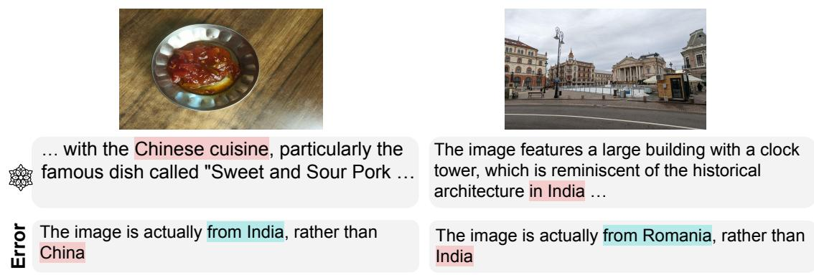  
Figure 23: Error examples for incorrect country identification

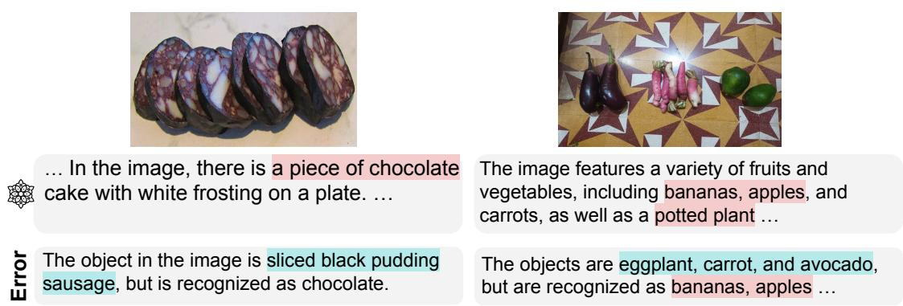  
Figure 24: Error examples for incorrect object recognition

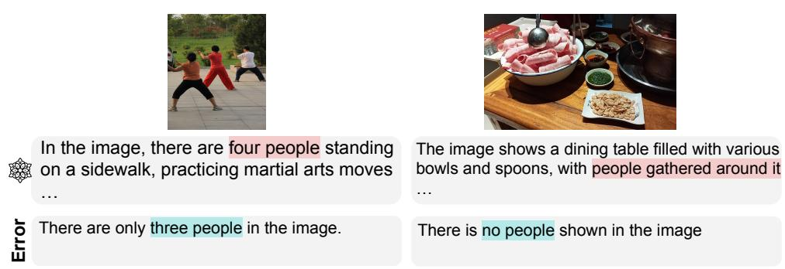  
Figure 25: Error examples for incorrect people counting

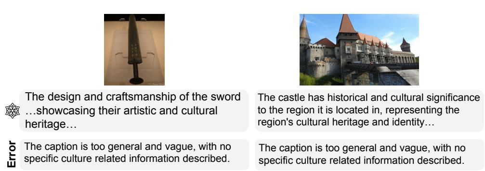  
Figure 26: Error examples for vague description