# Towards Knowledge Checking in Retrieval-augmented Generation: A Representation Perspective

Shenglai Zeng1\*, Jiankun Zhang, Bingheng Li1, Yuping Lin1, Tianqi Zheng2,

Dante Everaert2, Hanqing Lu2, Hui Liu2, Hui Liu¹, Yue Xing1,

Monica Xiao Cheng2, Jiliang Tang1

1Michigan State University 2 Amazon.com

{zengshe1, libinghe, linyupin, liuhui7, xingyue1, tangjili } @msu.edu, {tqzheng, danteev, luhanqin,liunhu, chengxc} @amazon.com

## Abstract

Retrieval-Augmented Generation (RAG) systems have shown promise in enhancing the performance of Large Language Models (LLMs). However, these systems face challenges in effectively integrating external knowledge with the LLM's internal knowledge, often leading to issues with misleading or unhelpful information. This work aims to provide a systematic study on knowledge checking in RAG systems. We conduct a comprehensive analysis of LLM representation behaviors and demonstrate the significance of using representations in knowledge checking. Motivated by the findings, we further develop representation-based classifiers for knowledge filtering. We show substantial improvements in RAG performance, even when dealing with noisy knowledge databases. Our study provides new insights into leveraging LLM representations for enhancing the reliability and effectiveness of RAG systems.

## 1 Introduction

Retrieval-augmented generation (RAG) is a technique designed to enhance the outputs of large language models (LLMs) by incorporating relevant information retrieved from external knowledge sources. This approach has been applied to various domains and scenarios (Liu, 2022; Chase, 2022; Van Veen et al., 2023; Ram et al., 2023; Shi et al., 2023; Siriwardhana et al., 2023; Parvez et al. 2021; Panagoulias et al., 2024; Pipitone and Alami, 2024; Mozharovskii, 2024). It typically operates in two stages: retrieval and generation. In the retrieval stage, relevant knowledge from an external database is retrieved based on the user query. Then, in the generation stage, the retrieved information is integrated with the query to form an input for LLMs to generate responses.

In RAG, two potential knowledge sources can be utilized to answer input queries: LLM's internal knowledge and the external knowledge provided in the context. Ideally, these external and internal knowledge sources should be effectively integrated. However, existing works have shown that LLMs often struggle to identify the boundaries of their own knowledge and tend to prioritize external information over their internal knowledge learned during pre-training (Ren et al., 2023; Tan et al., 2024; Wang et al., 2023a; Ni et al., 2024; Liu et al., 2024b; Wang et al., 2023b; Zeng et al., 2024). This characteristic can potentially degrade the generation quality of RAG when the quality of external knowledge is low. On one hand, the external knowledge may be misleading (Zou et al., 2024; Deng et al., 2024). For instance, Zou et al. (2024) proposed the PoisonedRAG approach, demonstrating that LLMs can be easily manipulated into producing incorrect information simply by injecting false answers corresponding to targeted queries into the retrieval database. On the other hand, although some retrieved contexts are semantically similar to a query, they may only superficially related to the topic but lack the answer to the question(Yoran et al.; Fang et al., 2024). Such contexts can distract LLMs and consequently hurt RAG performance.

Thus, it is important to conduct knowledge checking in RAG systems. To achieve this goal, we design the following critical tasks:

(a) Internal Knowledge Checking: When a user inputs a query, the LLM should first check whether it possesses internal knowledge relevant to the query, i.e., Internal Knowledge Checking (Task 1). This task serves as a foundation for subsequent checks.

(b) Helpfulness Checking: Helpfulness checking is to examine if the external knowledge is helpful² to answer the input query. We design Informed Helpfulness Checking (Task 2) when the LLM has internal knowledge about the query and Uninformed Helpfulness Checking (Task 3) when the LLM lacks internal knowledge about the query. As as an extreme case of Task 2, we design Contradiction Checking (Task 4) to check if internal knowledge has any contradictions with the retrieved external information.

A straightforward approach to tackle these tasks can directly prompt LLMs(Asai et al.; Wang et al., 2023b; Liu et al., 2024b; Zhang et al., 2024). Alternatively, we could examine superficial indicators of LLMs, such as probability scores (Wang et al., 2024; Jiang et al., 2023b) or perplexity (Zou et al., 2024). However, based on our evaluation in Section 3, we find that none of these methods can effectively accomplish these tasks.

Recent studies (Zou et al., 2023; Lin et al., 2024; Zheng et al., 2024) have shown that LLMs' representations exhibit distinct patterns when encountering contrasting high-level concepts, such as harmful versus harmless prompts . This observation prompts us to investigate whether LLMs' representations also display distinct behaviors and can be leveraged in knowledge checking tasks? To answer this question, we conduct a comprehensive study and analysis of LLM representation behaviors regarding the aforementioned tasks, including PCAbased checking as well as contrastive-learningbased checking (Section 3.1). Our analysis reveals that positive and negative samples exhibit different behaviors in the representation space. Consequently, representation-based methods demonstrate significantly superior performance in the aforementioned tasks. Leveraging these findings, we utilize representation classifiers for knowledge filtering. Results show that simple filtering of contradictory and irrelevant information substantially improves RAG performance, even in scenarios with poisoned knowledge databases.

## 2 Related Work

## 2.1 Robustness Issues in RAG

RAG faces robustness challenges. A growing body of research (Ren et al., 2023; Tan et al., 2024; Wang et al., 2023a; Ni et al., 2024; Liu et al., 2024b; Wang et al., 2023b; Zeng et al., 2024; He et al., 2024) has revealed that LLMs often struggle to identify their knowledge boundaries, tending to over-rely on provided context. This vulnerability makes RAG susceptible to failure with misleading (Zou et al., 2024; Deng et al., 2024; Xie et al.) or unhelpful context (Yoran et al.; Asai et al.; Liu et al., 2024b).

## 2.2 Knowledge Checking in RAG

Recent research has explored various knowledge checking tasks in RAG systems to address the aforementioned issues. Some studies leverage LLMs' self-generated responses to determine whether a question is answerable without external information (answer-based methods). (Ren et al., 2023; Liu et al., 2024b; Asai et al.; Zhang et al., 2024; Wang et al., 2024; Jeong et al., 2024) or to assess the relevance of retrieved context (Liu et al., 2024b; Asai et al.). Other approaches employ explicit metrics such as probability (Wang et al., 2024; Jiang et al., 2023b) to evaluate the necessity of retrieval, or perplexity (Zou et al., 2024) to judge the reliability of context (probability-based methods).

## 2.3 Representation Engineering on LLMs

Recent studies have shown that LLMs’ representation space contains rich information for analyzing and controlling their high-level behaviors. Zou et al. (2023) introduced RepE techniques, demonstrating that projecting representations onto a 'reading vector' can reveal safety-related aspects, aspects such as honesty, confidence (Liu et al., 2024a) and harmlessness. Subsequent research by Zheng et al. (2024) and Lin et al. (2024) also indicates harmful and harfulness prompts are naturally distinguishable in the representation space.

## 3 Representations for Knowledge Checking

Drawing on insights from cognitive neuroscience, previous studies (Zou et al., 2023; Zheng et al., 2024; Lin et al., 2024) have demonstrated the potential of using LLMs’ representation to indicate contrast high-level concepts. In this subsection, we investigate whether LLMs' representations also show distinct patterns in knowledge checking tasks and can therefore be used to improve their performance. We begin by introducing our representationbased checking procedures in Section 3.1, which includes both PCA-based checking(rep-PCA) and the contrastive-learning-based checking(rep-con). We then visualize and compare the performance of our representation-based methods against traditional approaches across four knowledge checking tasks from Section 3.2 to Section $3 . 5 ^ { 3 }$

## 3.1 Representation-based Knowledge Checking

Problem formulation. In this subsection, we aim to analyze and classify the internal representation behavioral differences of LLMs for abovementioned knowledge checking tasks when confronted with various types of inputs. To achieve this, we propose training a classifier to distinguish LLMs' internal behaviors based on their representations. Our main analysis uses Mistral-7B-Instructv0.1(Jiang et al., 2023a) as the LLM, focusing on the last input token's representations in the final layer. 4 Following (Zou et al., 2023), we use both positive(e.g. queries with knowledge) and negative (e.g. queries without knowledge) samples as inputs, collecting the corresponding internal representations. Specifically, let $V ^ { + } = \overline { { { \{ v _ { i } ^ { + } , c ^ { + } \} _ { i = 1 } ^ { N ^ { \ + } } , V ^ { - } = } } }$ $\{ v _ { j } ^ { - } , c ^ { - } \} _ { j = 1 } ^ { N ^ { - } }$ represent the internal representations of positive and negative samples and corresponding labels, respectively. The classifier is trained to differentiate between these samples, corresponding to various LLM behaviors. The construction of positive/negative samples in different tasks is shown in Appendix A.2.1 and Table 6. Next, we introduce two methods to implement knowledge checking.

PCA-Based Checking Principal Component Analysis (PCA) provides a powerful method for dimensionality reduction while preserving the most significant variations in data, making it particularly suitable for analyzing and differentiating LLMs’ representation behaviors. Following the approach proposed by Zou et al. (2023), we first collect positive and negative sample pairs, then compute difference vectors for each pair. These difference vectors are calculated as: $D _ { n } = ( - 1 ) ^ { n } ( v _ { n } ^ { + } - v _ { n } ^ { - } )$ , where $v _ { n } ^ { + }$ and $v _ { n } ^ { - }$ are the internal representations of the positive and negative samples. The total number of pairs N is determined by the smaller sample size.

Next, we apply PCA to extract the top two principal components, $P _ { 1 }$ and $P _ { 2 }$ , which define the subspace for analysis. All samples are then projected into this PCA space, reducing dimensionality while preserving variance. We assign binary labels to the projected samples: 1 for positive and 0 for negative.

A logistic regression model is trained on this data to classify the two classes.

For new samples, we project their representations onto the PCA subspace and classify them using the trained logistic regression model.

Contrastive-learning-based checking. Contrastive learning(Khosla et al., 2020) offers an effective framework for differentiating complex data distributions by explicitly modeling relationships between positive and negative pairs. This approach highlights structural differences between samples, making it particularly suitable for tasks requiring nuanced behavioral distinctions. By maximizing the similarity among positive pairs while minimizing it for negative pairs, contrastive learning facilitates the extraction of discriminative features essential for classification. Consequently, we utilize contrastive learning to make the representations more distinguishable. The procedure is as follows:

1. Define a Contrastive Network: We design a contrastive network $f _ { \theta } : \mathbb { R } ^ { d }  \mathbb { R } ^ { h }$ parameterized by θ, expressed as: $f _ { \boldsymbol { \theta } } ( v ) = \mathbf { M } \mathbf { L } \mathbf { P } ( v )$ where v represents the input vector among V+ and $V ^ { - }$ . The Multilayer Perceptron (MLP) serves as the backbone of our network.

2. Train the Network Using Contrastive Loss: We optimize the network using a contrastive loss function defined as:

$$
\begin{array} { r l } {  { \mathcal { L } = \frac { 1 } { 2 } \big ( \| f _ { \theta } ( v _ { i } ^ { + } ) - f _ { \theta } ( v _ { k } ^ { + } ) \| ^ { 2 } \big ) } \quad } & { } \\ & { \quad + \operatorname* { m a x } ( 0 , m - \| f _ { \theta } ( v _ { i } ^ { + } ) - f _ { \theta } ( v _ { j } ^ { - } ) \| ^ { 2 } ) . } \end{array}\tag{1}
$$

where $k \in \{ 1 , \cdots , N ^ { + } \}$ , m is the margin parameter that enforces a minimum distance between positive and negative samples. This formulation encourages the network to pull together similar positive samples while maintaining a separation from negative ones.

3. Optimize the Network Parameters: The optimization problem is expressed as:

$$
\theta ^ { * } = \arg \operatorname* { m i n } _ { \theta } \mathbb { E } _ { \{ v _ { i } \} , \{ v _ { k } ^ { - } \} , k } [ \mathcal { L } ] .
$$

This step updates the parameters to minimize the contrastive loss, enhancing the model's ability to discern between positive and negative representations effectively.

4. Compute Similarity Scores for Test Samples: For a test sample ${ \tilde { v } } ,$ we compute its similarity score with respect to the positive samples:

Table 1: Performance comparison of different methods on RAG robustness aspects
<table><tr><td></td><td colspan="4">Internal Knowledge</td><td colspan="4">Uninformed Helpfulness</td><td colspan="4">Informed Helpfulness</td><td colspan="4">Conflict Detection</td></tr><tr><td>Method</td><td>Acc</td><td>Pre</td><td>Rec</td><td>F1</td><td>Acc</td><td>Pre</td><td>Rec</td><td>F1</td><td>Acc</td><td>Pre</td><td>Rec</td><td>F1</td><td>Acc</td><td>Pre</td><td>Rec</td><td>F1</td></tr><tr><td>DIRECT</td><td>0.47</td><td>0.51</td><td>0.76</td><td>0.61</td><td>0.55</td><td>0.53</td><td>0.97</td><td>0.69</td><td>0.56</td><td>0.53</td><td>0.99</td><td>0.69</td><td>0.50</td><td>0.50</td><td>0.99</td><td>0.66</td></tr><tr><td>ICL</td><td>0.54</td><td>0.56</td><td>0.77</td><td>0.65</td><td>0.55</td><td>0.53</td><td>0.98</td><td>0.69</td><td>0.55</td><td>0.53</td><td>1</td><td>0.69</td><td>0.42</td><td>0.45</td><td>0.79</td><td>0.58</td></tr><tr><td>COT</td><td>0.49</td><td>0.53</td><td>0.78</td><td>0.63</td><td>0.68</td><td>0.62</td><td>0.94</td><td>0.75</td><td>0.68</td><td>0.61</td><td>0.97</td><td>0.75</td><td>0.41</td><td>0.45</td><td>0.81</td><td>0.58</td></tr><tr><td>Self-RAG(Mistral)</td><td>0.47</td><td>0.51</td><td>0.69</td><td>0.59</td><td>0.63</td><td>0.57</td><td>0.96</td><td>0.72</td><td>0.60</td><td>0.55</td><td>0.98</td><td>0.71</td><td></td><td></td><td></td><td></td></tr><tr><td>Prob(Lowest)</td><td>0.69</td><td>0.69</td><td>0.77</td><td>0.73</td><td>0.62</td><td>0.60</td><td>0.74</td><td>0.66</td><td>0.60</td><td>0.57</td><td>0.79</td><td>0.66</td><td>0.50</td><td>0.50</td><td>1.00</td><td>0.67</td></tr><tr><td>Prob(Avg)</td><td>0.65</td><td>0.68</td><td>0.69</td><td>0.69</td><td>0.61</td><td>0.60</td><td>0.65</td><td>0.62</td><td>0.60</td><td>0.58</td><td>0.68</td><td>0.63</td><td>0.50</td><td>0.50</td><td>1.00</td><td>0.67</td></tr><tr><td>Perplexity</td><td>0.55</td><td>0.55</td><td>0.98</td><td>0.71</td><td>0.50</td><td>0.50</td><td>1.0</td><td>0.67</td><td>0.50</td><td>0.50</td><td>1.00</td><td>0.67</td><td>0.50</td><td>0.50</td><td>1.0</td><td>0.67</td></tr><tr><td>Rep-PCA(Mistral)</td><td>0.75</td><td>0.72</td><td>0.81</td><td>0.76</td><td>0.79</td><td>0.77</td><td>0.81</td><td>0.79</td><td>0.81</td><td>0.80</td><td>0.81</td><td>0.81</td><td>0.91</td><td>0.92</td><td>0.90</td><td>0.91</td></tr><tr><td>Rep-Con(Mistral)</td><td>0.78</td><td>0.72</td><td>0.86</td><td>0.78</td><td>0.81</td><td>0.80</td><td>0.82</td><td>0.81</td><td>0.85</td><td>0.84</td><td>0.85</td><td>0.85</td><td>0.95</td><td>0.91</td><td>0.99</td><td>0.95</td></tr></table>

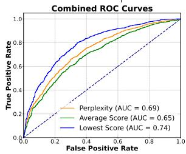  
(a) Internal Knowledge

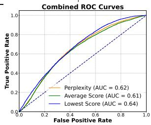  
(b) Uninformed helpfulness

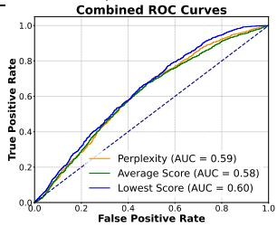  
(c) Informed helpfulness

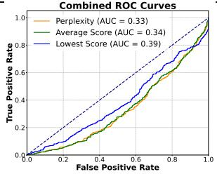  
(d) Contradiction  
Figure 1: ROC curve of probability-based methods

$$
\operatorname { s c o r e } ( \tilde { v } ) = \frac { 1 } { | V ^ { + } | } \sum _ { v ^ { + } \in V ^ { + } } s ( f _ { \theta ^ { * } } ( \tilde { v } ) , f _ { \theta ^ { * } } ( v ^ { + } ) ) ,
$$

where $s ( u , v )$ is the cosine similarity. This average similarity score serves as a measure of how closely the test sample aligns with the positive samples in the learned feature space.

5. Classify the Test Sample: Finally, we classify the test sample based on a threshold t:

$$
\operatorname { c l a s s } ( \tilde { v } ) = \left\{ \begin{array} { l l } { \mathrm { p o s i t i v e , } } & { \mathrm { i f ~ } \mathrm { s c o r e } ( \tilde { v } ) > t } \\ { \mathrm { n e g a t i v e , } } & { \mathrm { o t h e r w i s e } } \end{array} \right.
$$

## 3.2 Internal Knowledge Checking

When presented with a query, it is crucial for LLMs to first assess whether they possess relevant internal knowledge. It can help the LLM determine whether to trigger retrieval and lays the foundation for subsequent checks, such as contradiction checking (Section 3.5). For our experimental dataset, we utilize the RetrievalQA dataset (Zhang et al., 2024), a short-form open-domain question answering (QA) collection comprising 2,785 questions. This dataset includes 1,271 new world and long-tail questions that most LLMs cannot answer, serving as negative samples (queries without internal knowledge). It also contains 1,514 questions that most LLMs can answer using only their internal knowledge, functioning as positive samples (queries with internal knowledge). we randomly select 100 positive and 100 negative samples to anchor the PCA space, determine decision boundaries, and train the contrastive learning classifiers, and use the remaining data for evaluation. Mistral-7B-Instruct-v0.1 is used for this and following tasks.

We compare the representabtion-based methods with 2 types of traditional checking baselines, answer-based methods as well as probabilitybased methods. Answer-based methods mainly involves prompting LLMs and use their responses as checking results. We employ direct prompting as well as more sophisticated techniques such as In-Context Learning (ICL) and Chain-of-Thought (CoT) prompting to enhance the LLM's task comprehension. The prompting templates for each task are presented in Appendix A.2.2, Table 7, Table 8, and Table 9, respectively. We also employ Self-RAG-Mistral, a model fine-tuned to assess retrieval necessity and evidence relevance for tasks 1-3. It classifies by generating tokens like [retrieve] or [relevant]. See Appendix A.2.2 for details. Probability-based methods involve analyzing the probabilities of LLMs’ answers and comparing them with a threshold for classification. We employ three main indicators: overall perplexity as used by Zou et al. (2024), lowest probability score as implemented by Jiang et al. (2023b), and average probability score as utilized by Wang et al.

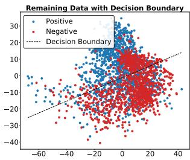  
(a) Internal Knowledge

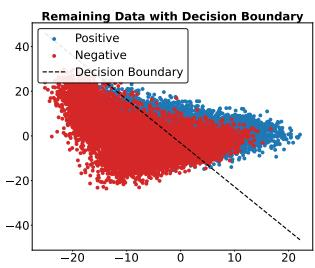  
(b) Uninformed helpfulness

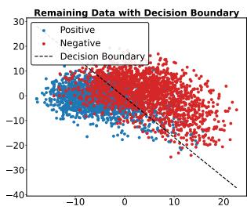  
(c) Informed helpfulness

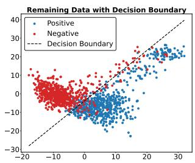  
(d) Contradiction

Figure 2: Visualization on PCA space  
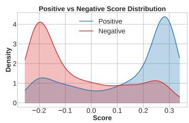  
(a) Internal Knowledge

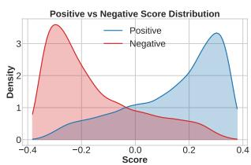  
(b) Uninformed helpfulness

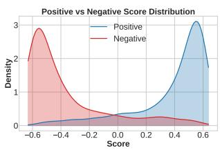  
(c) Informed helpfulness

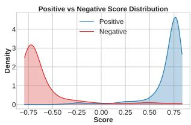  
(d) Contradiction  
Figure 3: Visualization of contrastive scores

(2024). For each method, we vary the threshold and report the best accuracy while also plotting Receiver Operating Characteristic (ROC) curves and calculating the Area Under the Curve (AUC) Further details of these methods can be found in Appendix A.2.3.

Results. We first evaluate whether answer-based methods or probability-based methods can handle internal knowledge checking. Table 1 demonstrates that LLMs’ own answers yield poor accuracy, even with advanced techniques like ICL and CoT. We observe high recall rates and numerous false-positive samples, suggesting LLMs’ overconfidence in their knowledge and tendency to misclassify unknown queries as known. The probability-based methods present relatively more promising results, achieving 69% accuracy when using lowest scores. The ROC curves shown in Figure 1a further illustrate this, with the lowest-scores method achieving the highest Area Under the Curve (AUC) of 0.74. This indicates that LLMs may exhibit lower confidence when encountering unknown queries. However the overall accuracy is still far from reliable, indicating substantial room for improvement. For representation-based methods, we present performance results in Table 1, and provide visualizations of the PCA space and contrastive score distribution in Figures 2a and 3a, respectively. As evidenced in Table 1, representation-based checking methods demonstrate significantly more promising results, with rep-PCA achieving 75% accuracy and rep-Con reaching 79% accuracy. Furthermore, Figures

2a and 3a clearly illustrate distinct distributions for queries with and without internal knowledge. These findings provide compelling evidence for the effectiveness of representation-based methods in internal knowledge checking.

## 3.3 Uninformed Helpfulness Checking

The retrieval process of RAG may return documents that are semantically related to the query but unhelpful in answering it. For example, "Einstein was born in Ulm, Germany in 1879 and later immigrated to the United States" is semantically related to the query "What year did Albert Einstein win the Nobel Prize in Physics?" but provides no answer. If an LLM lacks knowledge about the question, it's crucial to check whether the provided information actually helps answer the query, as the LLM can only use external knowledge to respond. In this subsection, we investigate whether LLMs’ representations can perform well on such uninformed helpfulness checking tasks. To evaluate this, we use a subset of Natural Questions (NQ) (Kwiatkowski et al., 2019) employed by Cuconasu et al. (2024a), containing 10,000 queries.5 Each query in this dataset is associated with a golden passage (positive sample) that directly answers the question, as well as distractor passages retrieved from wikitext-2018 but not containing the answer. We use the distractor passage with the highest retrieval score as the negative sample. For uninformed helpfulness checking, we only use questions that Mistral-7B cannot correctly answer, totaling 8081 queries. We randomly choose 100 positive and negative samples for the training of representation classifiers and use remaining data as test set. We also compared our methods with baselines as mentioned in Section 3.2.

Results. In Table 1, we present the performance of answer-based methods for helpfulness checking, as well as the best accuracy achieved by probabilitybased methods across various thresholds. We observe that although CoT (0.68) and Self-RAG (0.63) shows improved checking performance, the answer-based performance remains unsatisfactory and suffers from high false-positive rates. This indicates that LLM tends to regard unhelpful context as helpful in its responses. Furthermore, the accuracy of probability-based methods is also poor. We plot the ROC curve in Figure 1b, which shows low AUC values of 0.64 (Lowest Score), 0.62 (Average Score), 0.61 (Perplexity). This further indicates the differences in probability/perplexity between helpful and unhelpful contexts are not obvious and thus these matrics are not suitable for uninformed helpfulness checking. In contrast, we can observe that representation-based methods demonstrate significantly better accuracy, with rep-PCA achieving 79% accuracy and rep-Contrastive reaching 81% accuracy, which is considerably more reliable. Figures 2b and 3b further illustrate that although some samples are difficult to distinguish and are misclassified, the majority of positive and negative pairs are distributed differently and can be effectively classified. These results clearly demonstrate the superiority of using representation-based methods for uninformed knowledge checking.

## 3.4 Informed Helpfulness Checking

The integration of unhelpful documents may distract LLMs even when they possess internal knowledge about the question (Cuconasu et al. 2024b). In this subsection, we evaluate whether the representation-based method can perform well for informed helpfulness checking. We utilize the same dataset and positive-negative pair settings as described in Section 3.3. However, for this evaluation, we select 1,919 queries that Mistral-7B can correctly answer, ensuring the model has internal knowledge about these queries. We randomly select 100 positive and negative samples to anchor the PCA space and train representation classifiers while the remaining 1,819 positive-negative pairs are used for evaluation. We compares with same baselines mentioned in Section 3.2.

Results. The results of traditional checking methods are presented in Table 1. We observe that the performance of both answer-based and probabilitybased methods remains low for informed helpfulness checking. Furthermore, Figure 1c shows a low AUC value of of 0.60 (Lowest Score), 0.58 (Average Score), 0.59 (Perplexity). These findings collectively indicate the limitations of these conventional methods in performing informed helpfulness checking effectively. In contrast, Table 1 demonstrates the superior performance of representationbased methods, with rep-PCA achieving 81% accuracy and rep-con reaching 85% accuracy. These results surpass those of uninformed helpfulness checking, possibly because the LLM's internal knowledge aids in better distinguishing between helpful and unhelpful sources. Figures 2c and 3c further illustrate that most positive and negative pairs are distinguishable. These findings collectively demonstrate the success of representationbased methods in performing informed helpfulness checking.

## 3.5 Contradiction Checking

Previous research(Xie et al.) has demonstrated that when presented with relevant but contradictory evidence, LLMs tend to prioritize external knowledge over their internal knowledge. Consequently, it is crucial to assess whether the provided external context aligns with or contradicts the LLM's internal beliefs. In this subsection, we investigate whether LLMs’ representations can serve as more reliable indicators of contradictions between external context and the model's internal knowledge. we utilize a subset of ConflictQA (Xie et al.). Each sample contains a PopQA(Mallen et al., 2023) question, correct aligned evidence, and ChatGPT-generated contradictory evidence. See appendix A.3.1 for details. We sampled 1146 questions that Mistral-7B answers correctly, using aligned evidence with the query as positive samples and contradictory evidence as negative samples. We utilized 10% of the dataset (114 positive-negative pairs) to anchor the PCA space, calculate decision boundaries, and train the contrastive learning classifiers. The remaining 90% was reserved for testing purposes. We compare representation based method with traditional methods in Section 3.2.

Results. We initially assess whether LLMs' answers and their associated probability/perplexity metrics can effectively indicate contradictions. The results in Table 1 reveal that LLMs’ answers continue to exhibit low accuracy and suffer from a high rate of false positives. This suggests that LLMs tend to interpret contradictory external knowledge as aligned evidence in their responses. Furthermore, Figure 1d demonstrates a extremenly low AUC of of 0.39 (Lowest Score), 0.34 (Average Score), 0.33 (Perplexity), indicating minimal differences in probability/perplexity distributions when LLMs are presented with aligned versus contradictory evidence. As illustrated in Table 1, representation-based methods demonstrate significantly superior performance, with rep-PCA achieving 91% accuracy and rep-Contrastive attaining an impressive 95% accuracy. Our visualizations, presented in Figures 2d and 3d, reveal distinct distributions and contradictory scores for the contradictory and aligned contexts. These pronounced differences strongly indicate that our method can effectively discriminate between these context types.

## 4 Representation Based Context Filtering

In this section, we investigate how knowledge checking based on representations affect performance of RAG systems.

## 4.1 Representation Based Filtering

We design a simple representation-based context filtering strategy. We perform representation checking on our test queries and retrieved documents. First, we conduct internal knowledge checking to identify known and unknown queries. Next, we apply helpfulness checking to all queries and contradictory checking only to predicted known queries. Finally, we filter out contexts classified as unhelpful or contradictory. We incorporate such filtering with Mistral-7B-v0.1, Llama-2-7B-Chat as well as Llama-3-8B-Instruct. The classifiers for knowledge checking are trained using datasets from Sections 3.2, 3.3, 3.4, and 3.5 respectively 6.

## 4.2 Experiment Setup

Datasets. For our evaluation, we utilize two primary datasets: a subset of Natural Questions (NQ) used by Cuconasu et al. (2024a), comprising 83,104 queries with gold documents of 512 tokens or less, and ConflictQA, a subset of PopQA containing 11,216 queries with labeled golden passages and misleading contexts, as employed by (Xie et al.). We use Wikipedia-2018 as retrieval database, injecting golden passages for queries not already present. To assess RAG performance in the presence of misleading information, we further categorize the queries into "noisy" and "clean" sets. For noisy queries, we selected 1,000 from NQ and 500 from PopQA that Mistral-7B can correctly answer and other LLMs we use can achieve over 70% accuracy on. The remaining queries are categorized as clean. We injected misleading contexts of those noisy queries to retrieval DB. For ConflictQA, we used the misleading contexts provided by Xie et al. For NQ, we constructed them using ChatGPT. 7

RAG pipeline. Our retrieval database comprises the corpus from Wikipedia-2018 following Jiang et al. (2023b), as well as misleading passages for noisy queries. Each document in the wiki-text-2018 is segmented into non-overlapping passages of 100 words. Each misleading passage is kept whole without further segmentation. We utilize Contriever (Izacard et al., 2021) to construct the embeddings of the retrieval dataset and index them using FAISS (Douze et al., 2024), following the settings outlined by Cuconasu et al. (2024b). We begin by retrieving the top-10 documents from the database. For baselines without filtering, we directly select the top-2 documents with the highest retrieval scores as contexts. For methods with filtering, we choose top-2 unfiltered documents with the highest retrieval scores.

Baselines. We compare represntation-based methods against various baselines, including no-retrieval and retrieval w/o filtering predictions with different models (Mistral-7B-v0.1, Llama-2- 7B-Chat, Llama-3-8B-Instruct, Vicuna-7B, and Alpaca-7B), and traditional filtering methods. For Direct, ICL, and CoT filtering, we perform answer-based knowledge checking as described in Sections 3.2. We then filter out unhelpful contexts, and contradictory contexts for predicted known queries. We only filter out irrelevant contexts for Self-RAG, as it does not provide contradiction checking.

Metrics. We report the exact match accuracy for clean (Clean Acc) and noisy queries (Noisy Acc).

## 4.3 Performance on Clean Queries

The results in Table 2 demonstrate that our method achieves better Clean Acc(%) compared to unfiltered baselines. For instance, Rep-Con(Mistral) shows an 8.04% increase in accuracy on NQ and an 8.84% increase on PopQA compared to retrieval without filtering. This improvement indicates that representation methods can effectively filter out unhelpful contexts and subsequently enhance RAG performance. In contrast, other filtering baselines show minimal improvement over no filtering, aligning with our findings in Section 3 that they have limitations in effective knowledge checking.

Table 2: Overall results on NQ and PopQA
<table><tr><td rowspan="2">Retrieval Type</td><td rowspan="2">Model</td><td colspan="2">NQ</td><td colspan="2">PopQA</td></tr><tr><td>Noisy Acc (%)</td><td>Clean Acc(%)</td><td>Noisy Acc (%)</td><td>Clean Acc(%)</td></tr><tr><td rowspan="5">No-retrieval</td><td>LLaMA2-7B-Chat(Touvron et al., 2023)</td><td>73.17%</td><td>29.03%</td><td>71.20%</td><td>19.60%</td></tr><tr><td> $\mathrm { L L a M A } _ { 3 - 8 \mathrm { B - I n s t r u c t } } ( \mathrm { A I @ M e t a , 2 0 2 4 } )$ </td><td>80.86%</td><td>32.73%</td><td>74.16%</td><td>22.45%</td></tr><tr><td> $\mathrm { M i s t r a l } _ { \mathrm { 7 B \mathrm { - } I n s t r u c t } } ( \mathrm { J i a n g e t a l } . , 2 0 2 3 \mathrm { a } )$ </td><td>97.21%</td><td>20.10%</td><td>98.02%</td><td>15.58%</td></tr><tr><td>Alpaca7B(Taori et al., 2023)</td><td>72.61%</td><td>23.94%</td><td>71.84%</td><td>13.07%</td></tr><tr><td> $\mathrm { V i c u n a _ { 7 B } ( Z h e n g e t a l . , 2 0 2 3 ) }$ </td><td>73.16%</td><td>26.64%</td><td>74.56%</td><td>19.43%</td></tr><tr><td rowspan="5">Unfiltered</td><td> $\mathrm { L L a M A } _ { 2 - 7 \mathrm { B } - \mathrm { c h a t } }$ </td><td>34.66%</td><td>26.96%</td><td>60.91%</td><td>45.90%</td></tr><tr><td> $\mathrm { L L a M A _ { 3 - 8 B - I n s t r u c t } }$ </td><td>48.12%</td><td>33.59%</td><td>51.27%</td><td>40.54%</td></tr><tr><td>Mistral7B-instruct</td><td>28.97%</td><td>24.35%</td><td>55.96%</td><td>48.58%</td></tr><tr><td>Alpaca7B</td><td>37.12%</td><td>29.80%</td><td>62.65%</td><td>53.10%</td></tr><tr><td>Vicuna7B</td><td>36.12%</td><td>28.28%</td><td>54.35%</td><td>49.75%</td></tr><tr><td rowspan="10">Filtered</td><td>Direct filtering</td><td>30.08%</td><td>24.32%</td><td>54.05%</td><td>46.31%</td></tr><tr><td>ICL filtering</td><td>29.90%</td><td>23.95%</td><td>55.28%</td><td>47.02%</td></tr><tr><td>CoT filtering</td><td>30.19%</td><td>24.18%</td><td>56.03%</td><td>46.95%</td></tr><tr><td> $\mathrm { S e l f { - } R A G _ { L l a m a - 2 } }$ </td><td>39.10%</td><td>30.27%</td><td>65.17%</td><td>52.08%</td></tr><tr><td> $\mathrm { S e l f - R A G _ { M i s t r a l } }$ </td><td>32.30%</td><td>26.07%</td><td>60.65%</td><td>50.57%</td></tr><tr><td> $R e p { - } P C A ( M i s t r a l )$ </td><td>70.73%</td><td>29.81%</td><td>73.63%</td><td>56.16%</td></tr><tr><td> $R e p \ – C o n ( M i s t r a l )$ </td><td>72.53%</td><td>32.39%</td><td>72.62%</td><td>57.62%</td></tr><tr><td> $R e p { - } P C A ( L l a m a { - } 2 )$ </td><td>67.93%</td><td>31.32%</td><td>66.78%</td><td>53.97%</td></tr><tr><td> $R e p { - } C o n ( L l a m a { - } 2 )$ </td><td>69.95%</td><td>33.64%</td><td>67.59%</td><td>54.26%</td></tr><tr><td> $R e p { - } P C A ( L l a m a { - } 3 )$ </td><td>67.81%</td><td>35.32%</td><td>71.16%</td><td>50.18%</td></tr><tr><td></td><td> $R e p { - } C o n ( L l a m a { - } 3 )$ </td><td>69.81%</td><td>36.75%</td><td>72.16%</td><td>52.26%</td></tr></table>

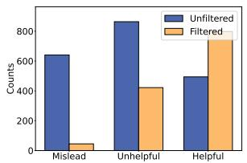  
(a) Noisy queries

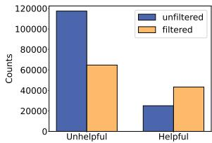  
(b) Clean queries  
Figure 4: Filtering results

## 4.4 Performance on Noisy Queries

The results in Table 2 reveal that injecting misleading contexts significantly impairs LLMs' performance on noisy queries. For instance, Mistral-7B’s performance on NQ noisy queries drops by more than 70% compared to zero-shot generation. However, our filtering mechanism effectively mitigates this issue, even when misleading contexts are retrieved. Notably, on noisy NQ queries, Pre-con(Mistral) recovers the noisy accuracy from 28.97% to 72.53%, a substantial 43.56% improvement. Similarly, on noisy PopQA queries, it recovers accuracy from 55.96% to 73.64%. Furthermore, representation-based filtering consistently outperforms other filtered baselines, validating its effectiveness in filtering out misleading knowledge. These results indicating that representationbased filtering can boost RAG systems' robustness against noisy contexts.

## 4.5 Documents Distribution after Filtering

In this subsection, we analyze the distribution of unhelpful, misleading, and helpful documents used as contexts before and after our filtering process8. Figure 4 shows the results for both noisy and clean queries from the NQ dataset9. For noisy queries, our filtering method demonstrates remarkable effectiveness by almost entirely eliminating misleading contexts and significantly reducing unhelpful ones. Consequently, the number of helpful contexts increases, as some unhelpful and misleading contexts with high retrieval scores are filtered out. Similarly, for clean queries, we observe a decrease in unhelpful documents and an increase in helpful ones. These results validate the effectiveness of our representation-based checking. The improved context quality from this filtering process is the key reason for the performance increase.

## 5 Conclusions

This study delves into the knowledge checking in RAG systems. To achieve this goal, we identified and proposed four key tasks. Through comprehensive analysis of LLMs’ representation behaviors, we found that representation-based methods significantly outperform answer-based or probabilitybased approaches. Leveraging these findings, we developed representation-based classifiers for knowledge filtering. Results demonstrate that simply filtering of contradictory and unhelpful knowledge substantially improves RAG performance.

## 6 Limitations

In this work, we have demonstrated that the representations of LLMs can significantly enhance the robustness of RAG systems. However, the underlying mechanisms by which LLMs identify, utilize, and integrate external knowledge with their internal knowledge remain an open research question. Our framework employs Rep-PCA and introduces Rep-Contra for context analysis. While these methods have shown promising results, we aim to explore more sophisticated analytical approaches. It is important to note that a significant challenge lies beyond the scope of our current work: determining the correctness of context when the LLM itself lacks knowledge about the question at hand. This presents a more complex problem, and we posit that external sources may be necessary, as LLMs self-signals alone may not be sufficient to fully address this challenge.

## Acknowledgments

Shenglai Zeng, Bingheng Li, Yuping Lin are supported by the National Science Foundation (NSF) under grant numbers CNS2321416, IIS2212032, IIS2212144, IOS2107215, DUE2234015, CNS2246050, DRL2405483 and IOS2035472, the Army Research Office (ARO) under grant number W911NF-21-1-0198, Amazon Faculty Award, JP Morgan Faculty Award, Meta, Microsoft and SNAP.

## References

AI@Meta. 2024. Llama 3 model card.

Akari Asai, Zeqiu Wu, Yizhong Wang, Avirup Sil, and Hannaneh Hajishirzi. Self-rag: Learning to retrieve, generate, and critique through self-reflection. In The Twelfth International Conference on Learning Representations.

Harrison Chase. 2022. Langchain. October 2022. https://github.com/hwchase17/langchain.

Florin Cuconasu, Giovanni Trappolini, Federico Siciliano, Simone Filice, Cesare Campagnano, Yoelle Maarek, Nicola Tonellotto, and Fabrizio Silvestri. 2024a. The power of noise: Redefining retrieval for rag systems. In Proceedings of the 47th International ACM SIGIR Conference on Research and Development in Information Retrieval, SIGIR 2024. ACM.

Florin Cuconasu, Giovanni Trappolini, Federico Siciliano, Simone Filice, Cesare Campagnano, Yoelle Maarek, Nicola Tonellotto, and Fabrizio Silvestri. 2024b. The power of noise: Redefining retrieval for rag systems. In Proceedings of the 47th International ACM SIGIR Conference on Research and Development in Information Retrieval, pages 719–729.

Gelei Deng, Yi Liu, Kailong Wang, Yuekang Li, Tianwei Zhang, and Yang Liu. 2024. Pandora: Jailbreak gpts by retrieval augmented generation poisoning. NDSS Workshop on AI Systems with Confidential Computing (AISCC).

Matthijs Douze, Alexandr Guzhva, Chengqi Deng, Jeff Johnson, Gergely Szilvasy, Pierre-Emmanuel Mazaré, Maria Lomeli, Lucas Hosseini, and Hervé Jégou. 2024. The faiss library. arXiv preprint arXiv:2401.08281.

Feiteng Fang, Yuelin Bai, Shiwen Ni, Min Yang, Xiaojun Chen, and Ruifeng Xu. 2024. Enhancing noise robustness of retrieval-augmented language models with adaptive adversarial training. In Proceedings of the 62nd Annual Meeting of the Association for Computational Linguistics (Volume 1: Long Papers), pages 10028–10039, Bangkok, Thailand. Association for Computational Linguistics.

Pengfei He, Yingqian Cui, Han Xu, Hui Liu, Makoto Yamada, Jiliang Tang, and Yue Xing. 2024. Towards the effect of examples on in-context learning: A theoretical case study. arXiv preprint arXiv:2410.09411.

Gautier Izacard, Mathilde Caron, Lucas Hosseini, Sebastian Riedel, Piotr Bojanowski, Armand Joulin, and Edouard Grave. 2021. Unsupervised dense information retrieval with contrastive learning. arXiv preprint arXiv:2112.09118.

Soyeong Jeong, Jinheon Baek, Sukmin Cho, Sung Ju Hwang, and Jong Park. 2024. Adaptive-RAG: Learning to adapt retrieval-augmented large language models through question complexity. In Proceedings of the 2024 Conference of the North American Chapter of the Association for Computational Linguistics: Human Language Technologies (Volume 1: Long Papers), pages 7036–7050, Mexico City, Mexico. Association for Computational Linguistics.

Albert Q Jiang, Alexandre Sablayrolles, Arthur Mensch, Chris Bamford, Devendra Singh Chaplot, Diego de las Casas, Florian Bressand, Gianna Lengyel, Guillaume Lample, Lucile Saulnier, et al. 2023a. Mistral 7b. arXiv preprint arXiv:2310.06825.

Zhengbao Jiang, Frank F Xu, Luyu Gao, Zhiqing Sun Qian Liu, Jane Dwivedi-Yu, Yiming Yang, Jamie Callan, and Graham Neubig. 2023b. Active retrieval augmented generation. In Proceedings of the 2023 Conference on Empirical Methods in Natural Language Processing, pages 7969–7992.

Prannay Khosla, Piotr Teterwak, Chen Wang, Aaron Sarna, Yonglong Tian, Phillip Isola, Aaron Maschinot, Ce Liu, and Dilip Krishnan. 2020. Supervised contrastive learning. Advances in neural information processing systems, 33:18661–18673.

Tom Kwiatkowski, Jennimaria Palomaki, Olivia Redfield, Michael Collins, Ankur Parikh, Chris Alberti, Danielle Epstein, Illia Polosukhin, Jacob Devlin, Kenton Lee, et al. 2019. Natural questions: a benchmark for question answering research. Transactions of the Association for Computational Linguistics, 7:453— 466.

Yuping Lin, Pengfei He, Han Xu, Yue Xing, Makoto Yamada, Hui Liu, and Jiliang Tang. 2024. Towards understanding jailbreak attacks in llms: A representation space analysis. arXiv preprint arXiv:2406.10794.

Huanshuo Liu, Hao Zhang, Zhijiang Guo, Kuicai Dong, Xiangyang Li, Yi Quan Lee, Cong Zhang, and Yong Liu. 2024a. Ctrla: Adaptive retrieval-augmented generation via probe-guided control. arXiv preprint arXiv:2405.18727.

Jerry Liu. 2022. Llamaindex. 11 2022. https:// github.com/jerryjliu/llama\_index.

Yanming Liu, Xinyue Peng, Xuhong Zhang, Weihao Liu, Jianwei Yin, Jiannan Cao, and Tianyu Du. 2024b. Ra-isf: Learning to answer and understand from retrieval augmentation via iterative self-feedback. arXiv preprint arXiv:2403.06840.

Alex Mallen, Akari Asai, Victor Zhong, Rajarshi Das, Daniel Khashabi, and Hannaneh Hajishirzi. 2023. When not to trust language models: Investigating effectiveness of parametric and non-parametric memories. In Proceedings of the 61st Annual Meeting of the Association for Computational Linguistics (Volume 1: Long Papers), pages 9802–9822, Toronto, Canada. Association for Computational Linguistics.

Kevin Meng, David Bau, Alex Andonian, and Yonatan Belinkov. 2022. Locating and editing factual associations in gpt. Advances in Neural Information Processing Systems, 35:17359–17372.

E Mozharovskii. 2024. Evaluating retrieval-augmented generation (rag) techniques in enhancing lms for coding tasks. Universum: tekhnicheskie nauki: elektron. nauchn. zhurn, (6):123.

Shiyu Ni, Keping Bi, Jiafeng Guo, and Xueqi Cheng. 2024. When do LLMs need retrieval augmentation? mitigating LLMs' overconfidence helps retrieval augmentation. In Findings of the Association for Computational Linguistics ACL 2024, pages 11375–11388,

Bangkok, Thailand and virtual meeting. Association for Computational Linguistics.

Dimitrios P Panagoulias, Maria Virvou, and George A Tsihrintzis. 2024. Augmenting large language models with rules for enhanced domain-specific interactions: The case of medical diagnosis. Electronics, 13(2):320.

Md Rizwan Parvez, Wasi Ahmad, Saikat Chakraborty, Baishakhi Ray, and Kai-Wei Chang. 2021. Retrieval augmented code generation and summarization. In Findings of the Association for Computational Linguistics: EMNLP 2021, pages 2719–2734.

Nicholas Pipitone and Ghita Houir Alami. 2024. Legalbench-rag: A benchmark for retrievalaugmented generation in the legal domain. arXiv preprint arXiv:2408.10343.

Ori Ram, Yoav Levine, Itay Dalmedigos, Dor Muhlgay, Amnon Shashua, Kevin Leyton-Brown, and Yoav Shoham. 2023. In-context retrieval-augmented language models. arXiv preprint arXiv:2302.00083.

Ruiyang Ren, Yuhao Wang, Yingqi Qu, Wayne Xin Zhao, Jing Liu, Hao Tian, Hua Wu, Ji-Rong Wen, and Haifeng Wang. 2023. Investigating the factual knowledge boundary of large language models with retrieval augmentation. arXiv preprint arXiv:2307.11019.

Weijia Shi, Sewon Min, Michihiro Yasunaga, Minjoon Seo, Rich James, Mike Lewis, Luke Zettlemoyer, and Wen-tau Yih. 2023. Replug: Retrievalaugmented black-box language models. arXiv preprint arXiv:2301.12652.

Shamane Siriwardhana, Rivindu Weerasekera, Elliott Wen, Tharindu Kaluarachchi, Rajib Rana, and Suranga Nanayakkara. 2023. Improving the domain adaptation of retrieval augmented generation (rag) models for open domain question answering. Transactions of the Association for Computational Linguistics, 11:1–17.

Hexiang Tan, Fei Sun, Wanli Yang, Yuanzhuo Wang, Qi Cao, and Xueqi Cheng. 2024. Blinded by generated contexts: How language models merge generated and retrieved contexts for open-domain qa? arXiv preprint arXiv:2401.11911.

Rohan Taori, Ishaan Gulrajani, Tianyi Zhang, Yann Dubois, Xuechen Li, Carlos Guestrin, Percy Liang, and Tatsunori B. Hashimoto. 2023. Stanford alpaca: An instruction-following llama model. https:// github.com/tatsu-lab/stanford\_alpaca.

Hugo Touvron, Louis Martin, Kevin Stone, Peter Albert, Amjad Almahairi, Yasmine Babaei, Nikolay Bashlykov, Soumya Batra, Prajjwal Bhargava, Shruti Bhosale, et al. 2023. Llama 2: Open foundation and fine-tuned chat models. arXiv preprint arXiv:2307.09288.

Dave Van Veen, Cara Van Uden, Louis Blankemeier, Jean-Benoit Delbrouck, Asad Aali, Christian Bluethgen, Anuj Pareek, Malgorzata Polacin, William Collins, Neera Ahuja, et al. 2023. Clinical text summarization: Adapting large language models can outperform human experts. arXiv preprint arXiv:2309.07430.

Hongru Wang, Boyang Xue, Baohang Zhou, Tianhua Zhang, Cunxiang Wang, Guanhua Chen, Huimin Wang, and Kam-fai Wong. 2024. Self-dc: When to retrieve and when to generate? self divide-andconquer for compositional unknown questions. arXiv preprint arXiv:2402.13514.

Yike Wang, Shangbin Feng, Heng Wang, Weijia Shi, Vidhisha Balachandran, Tianxing He, and Yulia Tsvetkov. 2023a. Resolving knowledge conflicts in large language models. arXiv preprint arXiv:2310.00935.

Yile Wang, Peng Li, Maosong Sun, and Yang Liu. 2023b. Self-knowledge guided retrieval augmentation for large language models. In Findings of the Association for Computational Linguistics: EMNLP 2023, pages 10303–10315.

Jian Xie, Kai Zhang, Jiangjie Chen, Renze Lou, and Yu Su. Adaptive chameleon or stubborn sloth: Revealing the behavior of large language models in knowledge conflicts. In The Twelfth International Conference on Learning Representations.

Ori Yoran, Tomer Wolfson, Ori Ram, and Jonathan Berant. Making retrieval-augmented language models robust to irrelevant context. In The Twelfth International Conference on Learning Representations.

Shenglai Zeng, Jiankun Zhang, Pengfei He, Yue Xing, Yiding Liu, Han Xu, Jie Ren, Shuaiqiang Wang, Dawei Yin, Yi Chang, et al. 2024. The good and the bad: Exploring privacy issues in retrieval-augmented generation (rag). ACL Findings.

Zihan Zhang, Meng Fang, and Ling Chen. 2024. Retrievalqa: Assessing adaptive retrieval-augmented generation for short-form open-domain question answering. arXiv preprint arXiv:2402.16457.

Chujie Zheng, Fan Yin, Hao Zhou, Fandong Meng, Jie Zhou, Kai-Wei Chang, Minlie Huang, and Nanyun Peng. 2024. Prompt-driven llm safeguarding via directed representation optimization. arXiv preprint arXiv:2401.18018.

Lianmin Zheng, Wei-Lin Chiang, Ying Sheng, Siyuan Zhuang, Zhanghao Wu, Yonghao Zhuang, Zi Lin, Zhuohan Li, Dacheng Li, Eric Xing, et al. 2023. Judging llm-as-a-judge with mt-bench and chatbot arena. Advances in Neural Information Processing Systems, 36:46595–46623.

Andy Zou, Long Phan, Sarah Chen, James Campbell, Phillip Guo, Richard Ren, Alexander Pan, Xuwang Yin, Mantas Mazeika, Ann-Kathrin Dombrowski,

et al. 2023. Representation engineering: A topdown approach to ai transparency. arXiv preprint arXiv:2310.01405.

Wei Zou, Runpeng Geng, Binghui Wang, and Jinyuan Jia. 2024. Poisonedrag: Knowledge poisoning attacks to retrieval-augmented generation of large language models. USENIX Security 2025.

## A Appendix

## A.1 Ablation Studies

## A.1.1 Using Other Layers' Representation

In our main section, we primarily base our analysis on the representations from the last layers. We also explore the knowledge checking performance using representations from other layers. Figure 5 illustrates the 'rep-con' performance of each layer across four different tasks. We observe that the performance using the first few layers is poor for all tasks. This may be because these layers primarily capture low-level features and patterns in the input, rather than higher-level semantic concepts. They haven't yet integrated this information into more abstract or task-relevant representations, which are necessary for complex knowledge checking tasks. For internal knowledge checking tasks, using representations from the last few layers shows the best performance. However, for other tasks, representations from some middle layers perform better than those from the last layer. This may be because these middle layers are more responsible for processing corresponding concepts. In practice, we suggest using a validation set to identify the layers with the best performance and using the results from these layers for knowledge checking.

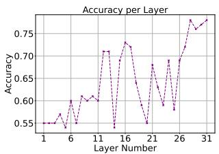  
(a) Internal Knowledge

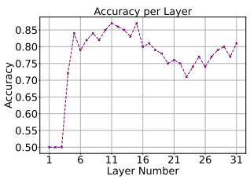  
(b) Uninformed helpfulness

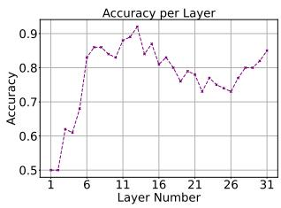  
(c) Informed helpfulness

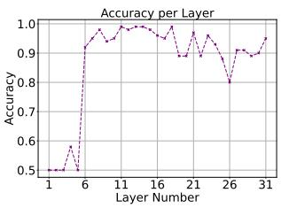  
(d) Contradiction

Figure 5: Accuracy on different layers  
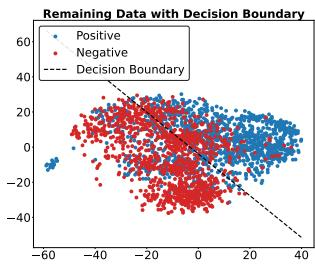  
(a) Internal Knowledge

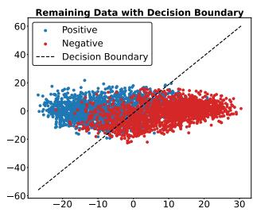  
(b) Uninformed helpfulness

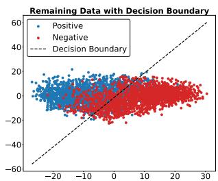  
(c) Informed helpfulness

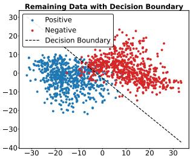  
(d) Contradiction

Figure 6: Visualization on PCA space(Llama-2-7B-Chat)  
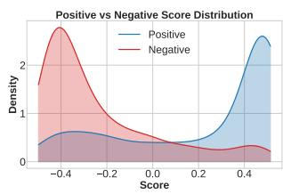  
(a) Internal Knowledge

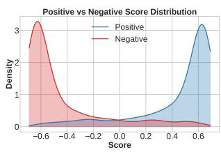  
(b) Uninformed helpfulness

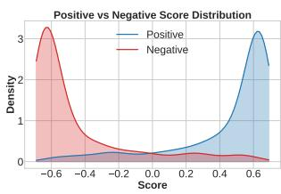  
(c) Informed helpfulness

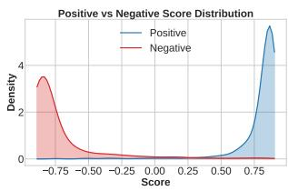  
(d) Contradiction  
Figure 7: Visualization of contrastive scores(Llama-2-7B-Chat)

## A.1.2 Knowledge Checking Performance of Other model

In this section, we also visulize and report the representation knowledge checking performance of Llama2- 7B-Chat model. From the results of Table 3 and visualization in Figure 6 and Figure 7, we can get similar

Table 3: Representation checking performance of Llama-2-7B
<table><tr><td>Method</td><td colspan="4">Internal Knowledge</td><td colspan="4">Uninformed Helpfulness</td><td colspan="4">Informed Helpfulness</td><td colspan="4">Conflict Detection</td></tr><tr><td></td><td>Acc</td><td>Pre</td><td>Rec</td><td>F1</td><td>Acc</td><td>Pre</td><td>Rec</td><td>F1</td><td>Acc</td><td>Pre</td><td>Rec</td><td>F1</td><td>Acc</td><td>Pre</td><td>Rec</td><td>F1</td></tr><tr><td>Re-PCA</td><td>0.75</td><td>0.80</td><td>0.73</td><td>0.76</td><td>0.79</td><td>0.77</td><td>0.81</td><td>0.79</td><td>0.83</td><td>0.84</td><td>0.82</td><td>0.83</td><td>0.96</td><td>0.96</td><td>0.96</td><td>0.96</td></tr><tr><td>Re-Contra</td><td>0.76</td><td>0.83</td><td>0.72</td><td>0.78</td><td>0.81</td><td>0.80</td><td>0.82</td><td>0.81</td><td>0.89</td><td>0.89</td><td>0.89</td><td>0.89</td><td>0.97</td><td>0.96</td><td>0.99</td><td>0.97</td></tr></table>

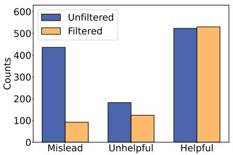  
(a) Noisy queries

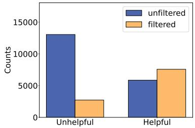  
(b) Clean queries  
Figure 8: Filter results

observation as Mistral-7B, the performance of representation-based checking is also promising for 4 tasks.   
Indicating the generalizbility of representation knowlege checking across models.

## A.1.3 Filtering Results on PopQA

We also present the filtering results for both noisy and clean queries from the PopQA dataset in Figure 8. We can also clearly observe that the mislead and unhelpful documents are reduced while helpful documents increased.

## A.1.4 Minimal training data requirement

While our method requires data to anchor the PCA space and train the classifier, only a very small amount is needed to achieve good knowledge checking performance. As shown in Table 4 below, even when the training data sample size is reduced to 50 positive-negative pairs, the knowledge checking performance remains competitive. In practice, although obtaining large-scale data can be challenging, collecting and labeling a small set of task-specific training data (50-100 pairs) is feasible and affordable. This minimal training data requirement makes our method more practical

Table 4: Knowledge checking performance with different training samples
<table><tr><td>Method</td><td>Internal Knowledge</td><td>Uninformed Helpfulness</td><td>Informed Helpfulness</td><td>Conflict Detection</td></tr><tr><td>Rep-PCA(100)</td><td>0.75</td><td>0.79</td><td>0.81</td><td>0.91</td></tr><tr><td>Rep-Con(100)</td><td>0.78</td><td>0.81</td><td>0.85</td><td>0.95</td></tr><tr><td>Rep-PCA(70)</td><td>0.73</td><td>0.76</td><td>0.80</td><td>0.89</td></tr><tr><td>Rep-Con(70)</td><td>0.76</td><td>0.78</td><td>0.82</td><td>0.91</td></tr><tr><td>Rep-PCA(50)</td><td>0.71</td><td>0.76</td><td>0.79</td><td>0.87</td></tr><tr><td>Rep-Con(50)</td><td>0.72</td><td>0.76</td><td>0.78</td><td>0.87</td></tr></table>

## A.1.5 O.O.D Results

We conducted out-of-distribution (O.O.D) experiments for our representation-based methods on the contradictory checking task, as shown in Table 5 (check whether the context is contradictory to the LLM's own knowledge). For the first experiment, we trained the Rep-PCA and Rep-Con classifiers on the original ConflictQA (Xie et al.) dataset but tested them on COUNTERFACT (Meng et al., 2022), a different dataset. Specifically, we selected a subset of 1,000 samples from COUNTERFACT (Meng et al., 2022) that Mistral-7B can answer (has internal knowledge). Although our methods' performance was lower than when directly trained on COUNTERFACT (100 samples), denoted as Rep-PCA(i.i.d) and Rep-Con(i.i.d), it still significantly outperformed other baselines.

Table 5: O.O.D knowledge checking results
<table><tr><td>Method</td><td>Conflict-COUNTERFACT</td><td>Occupation-City</td></tr><tr><td>Answer(Direct)</td><td>0.52</td><td>0.50</td></tr><tr><td>Answer(ICL)</td><td>0.47</td><td>0.43</td></tr><tr><td>Answer(COT)</td><td>0.49</td><td>0.44</td></tr><tr><td>Prob(lowest)</td><td>0.53</td><td>0.55</td></tr><tr><td>Prob(avg)</td><td>0.51</td><td>0.53</td></tr><tr><td>Perplexity</td><td>0.51</td><td>0.51</td></tr><tr><td>Rep-PCA(i.i.d)</td><td>0.92</td><td>0.97</td></tr><tr><td> $\mathbf { R e p - C o n ( i . i . d ) }$ </td><td>0.95</td><td>0.98</td></tr><tr><td> $\mathbf { R e p - P C A ( 0 . 0 . d ) }$ </td><td>0.79</td><td>0.83</td></tr><tr><td> $\mathbf { R e p - C o n ( o . o . d ) }$ </td><td>0.81</td><td>0.85</td></tr></table>

In our second O.O.D experiment, we deliberately sampled two types of questions from ConflictQA (Xie et al.): “Occupation" questions about people's professions and “City" questions about urban areas. We trained the classifier only on Occupation-type questions (100 training samples) and tested it on City-type questions. Our methods, even in O.O.D settings, achieved approximately 85% accuracy. Although this is lower than when directly trained on “City" questions (100 training samples), denoted as Rep-PCA(i.i.d) and Rep-Con(i.i.d), it still substantially outperforms the baselines.

These results demonstrate that our representation-based method effectively captures intrinsic differences between positive and negative samples and shows reasonable generalizability, enabling it to work even without in-distribution training data.

## A.2 Details of knowledge checking methods

## A.2.1 Prompts for representation-based methods

For representation-based methods, we employ prompts as illustrated in Table 6 to generate positive and negative samples, allowing us to capture the representation behaviors. After obtaining the representations of the final tokens, we conduct analysis based on these representations, following the methodology detailed in Section 3.1.

## A.2.2 Details of answer-based methods

Prompts used. We present the prompt template of various answer-based checking, including direct prompting, ICL prompting as well as CoT prompting in this section. Table 7 shows the templates for internal knowledge checking, Table 8 shows the templates for informed/uninformed helpfulness checking, while Table 9 shows the templates for contradictory checking.

Self-RAG implementation. Self-Reflective Retrieval-Augmented Generation (SELF-RAG) (Asai et al.) is proposed to enhance the quality and factuality of LLM. The LLM is fine-tuned to generate special tokens that indicate whether to retrieve and whether the retrieved context is relevant. The Self-Rag-Llama 10 and Self-Rag-Mistral 11 we used in this paper is fine-tuned from Llama2-7B and Mistral-7B-v0.1 respectively, using the same dataset

We use the 'input question only’ format from Table 10 to generate the 'retrieve-on-demand’ special token.If the 'Retrieval’ token is generated, the LLM will retrieve the top-k context, while the 'No retrieval' token will not retrieve any context. After retrieving the context, we constructed prompts using the 'input question and context' row template from Table 10. The 'Relevant' token indicates that the retrieved context is helpful for the question. Similarly, the 'Irrelevant' token indicates that the retrieved context is not useful for the question. To verify the overall performance of Self-RAG, we first use the fine-tuned model to judge whether the context is relevant or irrelevant. Then, we filter out the irrelevant contexts and select the top two retrieved contexts. Based on the inference row in Table 10, we construct prompts to test the output of different models, and finally compare whether the outputs include the correct answer.

## A.2.3 Details for probability-based methods

For probability-based methods, we use the same input as shown in Table 6, but we analyze the probabilities of output tokens. We primarily consider three indicators that have been used in previous research: perplexity(Zou et al., 2024), average probability score of all output tokens(Jiang et al., 2023b), and the lowest probability score of output tokens(Jiang et al., 2023b). For perplexity, we classify samples with higher perplexity (indicating less confidence) than a threshold as negative, while others are classified as positive. For both the lowest and average probability scores, we consider samples with lower scores (again indicating less confidence) than a threshold as negative, while others are classified as positive. For each method, we vary the threshold and report the best accuracy. Additionally, we plot Receiver Operating Characteristic (ROC) curves and calculate the Area Under the Curve (AUC), as shown in Figure 1.

## A.3 Dataset Used

In this section, we would like to introduce the dataset used for knowledge checking and for context filtering in detail.

## A.3.1 Knowledge checking.

Internal knowledge checking. For internal knowledge checking, utilize the RetrievalQA dataset (Zhang et al., 2024), a short-form open-domain question answering (QA) collection comprising 2,785 questions. This dataset includes 1,271 new world and long-tail questions that most LLMs cannot answer, serving as negative samples (queries without internal knowledge). These samples are collected and filtered from RealTimeQA, FreshQA, ToolQA, PopQA and TriviaQA. Additionally, it contains 1,514 questions that most LLMs can answer using only their internal parametric knowledge, functioning as positive samples (queries with internal knowledge).

Helpfulness Checking. We utilize a subset of the Natural Questions (NQ) dataset employed by Cuconasu et al. (2024b). 12. The authors provide a labeled set of 83,104 NQ queries, each associated with a golden passage that directly answers the question, as well as distract passages retrieved from wikitext-2018 that do not contain the answer. For our helpfulness checking task, we use a subset of 10,000 queries also provided in their repository. We use the distract passage with the highest retrieval score as the negative sample and the golden passage as the positive sample. For the uninformed helpfulness checking, we focus on questions that Mistral-7B cannot correctly answer, resulting in a total of 8,081 queries. For the informed helpfulness checking evaluation, we select the remaining 1,919 queries that Mistral-7B can correctly answer, ensuring the model has internal knowledge about these queries.

Contradictory Checking. For contradictory checking, we use a subset of ConflictQA constructed by Xie et al.. Each sample in ConflictQA dataset contains a question from PopQA, an aligned evidence that can correctly answer the question, as well as a contradictory evidence that provides wrong evidence towards the query generated by ChatGPT. We sampled a subset of 1146 questions from the ConflictQA dataset that Mistral-7B can correctly answer, and use the aligned evidence(item["parametric\_memory\_aligned\_evidence"]) with the query as positive samples as well as contradictory evidence(item["counter\_memory"]) with the query as negative samples.

## A.3.2 Context filtering.

We utilize two primary datasets: a subset of Natural Questions (NQ) used by Cuconasu et al. (2024a) and ConflictQA, a subset of PopQA employed by (Xie et al.). Cuconasu et al. (2024a) treats the long answers in the NQ dataset as gold documents and the short answers as ground truth. They filtered the NQ dataset to discard documents exceeding 512 tokens after Llama2 tokenization. And we used GPT-3.5-turbo to generate mislead text based on the gold text for each query. We utilize the "Get wrong answer" row in Table 11 to generate a misleading answer, and then generate the misleading text using the format specified in the "Generate mislead text" row. To ensure the quality of the generated results, we validated the generated text. The requirements are that the wrong answer must appear in the text, and none of the true answers should be present in the text. If these conditions are not met, the text will be regenerated until they are satisfied.

Xie et al. selected a subset from popQA. In this selected subset, for each question, the answers provided by the LLM based on its own parameter knowledge and those retrieved context are contradictory. For each pair of contradictory answers, they generated supporting text as evidence for each answer. We utilized the all the subsets across different models and ensured that the questions were not duplicated. We verified whether the parameter knowledge or the external knowledge was correct and labeled the correct evidence text as gold context, while marking the incorrect text as misleading context. Finally, we obtain the dataset containing 11,216 queries with labeled golden passages and misleading contexts.

Table 6: Context and Question Scenarios
<table><tr><td>Task 1: Internal Knowledge Checking Question: {&lt;Question with Internal Knowledge&gt; or &lt;Question without Internal Knowledge&gt;} Answer:</td></tr><tr><td>Task 2 &amp; 3: Helpfulness Checking Context: {&lt;Helpful Context&gt; or &lt;Unhelpful Context&gt;} Question: {question} Answer:</td></tr><tr><td>Task 4: Contradiction Checking Context: {&lt;Aligned Context&gt; or &lt;Contradictory Context&gt;} Question: {question} Answer:</td></tr></table>

Table 7: Internal Knowledge Checking Prompts
<table><tr><td rowspan=1 colspan=1>Name</td><td rowspan=1 colspan=1>Prompt</td></tr><tr><td rowspan=1 colspan=1>Direct</td><td rowspan=1 colspan=1>Are you sure you can accurately answer the following question based on your internal knowledge?If yes, you should answer &quot;Yes&quot; and give your answer. If no, you should answer &quot;No, I needadditional information to answer this question.&quot;Question: {question}Answer:</td></tr><tr><td rowspan=1 colspan=1>ICL</td><td rowspan=1 colspan=1>Determine if you can accurately answer the following question based on your internal knowledge.If you can, answer &quot;Yes&quot; and provide your answer. If you cannot, answer &quot;No, I need additionalinformation to answer this question.&quot;Question: Cryos, the world&#x27;s largest sperm bank, recently announced that they will no longer acceptdonations from guys with what physical characteristic?Answer: No, I need additional information to answer this question.Question: What is the capital of France?Answer: Yes, I can answer this question. The capital of France is Paris.Can you answer the below question based on your internal knowledge?Question: {question}Answer:</td></tr><tr><td rowspan=1 colspan=1>CoT</td><td rowspan=1 colspan=1>Think step by step to determine if you can accurately answer the following question based on yourinternal knowledge. If you can, answer &quot;Yes&quot; and provide your answer. If you cannot, answer &quot;No,I need additional information to answer this question.&quot;Question: {question}Answer:</td></tr></table>

Table 8: Context Helpfulness Checking Prompts
<table><tr><td>Name</td><td>Prompt</td></tr><tr><td>Direct</td><td>Does the provided context: {context} helpful to answer the question: {question}? Please answer yes if it is helpful and no if it is unhelpful. Answer:</td></tr><tr><td>ICL</td><td>I will provide you with some examples of how to determine if a given context is helpful to answer a specific question. Then, I will ask you to do the same for a new question and context. Example 1: Question: What is the capital of France? Context: Paris is the capital and most populous city of France, with an estimated population of 2,175,601 residents as of 2018. Answer: Yes. This context is helpful Example 2: Question: How does photosynthesis work? Context: The Eiffel Tower in Paris was completed in 1889 and stands at 324 meters tall. Answer: No. This context is not helpful Example 3: Question: what is the name of latest version of android Context: to Google adopting it as an official icon as part of the Android logo when it launched to consumers in 2008. Android (operating system) Android is a mobile operating system developed by Google. It is based on a modified version of the Linux kernel and other open source software, and is designed primarily for touchscreen mobile devices such as smartphones and tablets. In addition, Google has further developed Android TV for televisions, Android Auto for cars, and Wear OS for wrist watches, each with a specialized user interface. Variants of Android are also used on game consoles, digital cameras, PCs Answer: No. This context is not helpful Now, please determine if the following context is helpful to answer the given question. Answer</td></tr><tr><td>CoT</td><td>&quot;Yes&quot; if it is helpful, or &quot;No&quot; if it is unhelpful. Question: {question} Context: {context} Answer: Think step by step to determine if the provided context is helpful to answer the given question. After your analysis, conclude with &quot;Yes&quot; if the context is helpful, or &quot;No&quot; if it is unhelpful. Question: {question} Context: {context} Answer:</td></tr></table>

Table 9: Internal Belief Alignment Checking Prompts
<table><tr><td rowspan=1 colspan=1>Name</td><td rowspan=1 colspan=1>Prompt</td></tr><tr><td rowspan=1 colspan=1>Direct</td><td rowspan=1 colspan=1>Based on your internal knowledge, do you think the provided context is aligned to your internalbelief? If aligned, you should answer &quot;Yes&quot;. If contradictory, you should answer &quot;No&quot;.Context: {context}Answer:</td></tr><tr><td rowspan=1 colspan=1>ICL</td><td></td></tr><tr><td rowspan=1 colspan=1>CoT</td><td rowspan=1 colspan=1>Based on your internal knowledge, think step by step to determine if the provided context is alignedwith your internal belief. After your analysis, conclude with &quot;Yes&quot; if the context is aligned, $\mathrm { o r } \ ^ { \mathrm { " } } \mathrm { N o " }$ if it is contradictory.Context: {context}Answer:</td></tr></table>

Table 10: Prompts of Self-RAG
<table><tr><td>Mode</td><td>Prompt</td></tr><tr><td rowspan="4"></td><td>### Instruction:</td></tr><tr><td>{input question}</td></tr><tr><td></td></tr><tr><td>### Response:</td></tr><tr><td rowspan="6">Input question and context</td><td>### Instruction:</td></tr><tr><td></td></tr><tr><td>{input question}</td></tr><tr><td></td></tr><tr><td>### Response:</td></tr><tr><td>[Retrieval]&lt;paragraph&gt;{input context}&lt;/paragraph&gt;</td></tr><tr><td rowspan="5">Inference</td><td>Context 1: {first relevant context}</td></tr><tr><td>Context 2: {second relevant context}</td></tr><tr><td>Question: {input question}</td></tr><tr><td>Answer:</td></tr><tr><td></td></tr></table>

Table 11: Prompts of getting mislead context
<table><tr><td>Mode</td><td>Prompt</td></tr><tr><td>Get wrong answer</td><td>You are a helpful assistant that provides a wrong answer consists of a few words Give me a wrong answer of the &#x27;{question}?&#x27; with similar type but different to any of {true answers}. ONLY RETURN the wrong answer, nothing else. The answer should be less than 4 words, DO NOT return a sentence.</td></tr><tr><td>Generate mislead text</td><td>You are a helpful assistant that generates short descriptions with specific evidence in JSON format. Generate a 100-word paraphrased version for &#x27;{question }? {wrong answer}&#x27; as if it is absolutely correct. Ensure the exact word &#x27;{wrong answer}&#x27; appears in your paraphrased version. You can not find any of {true answers} in the paraphrased version. Return your response in the following JSON format, any of {true answers} should never appears in the following context: {{</td></tr></table>