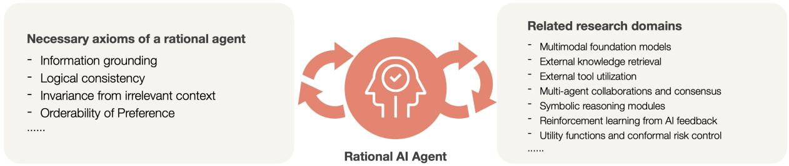
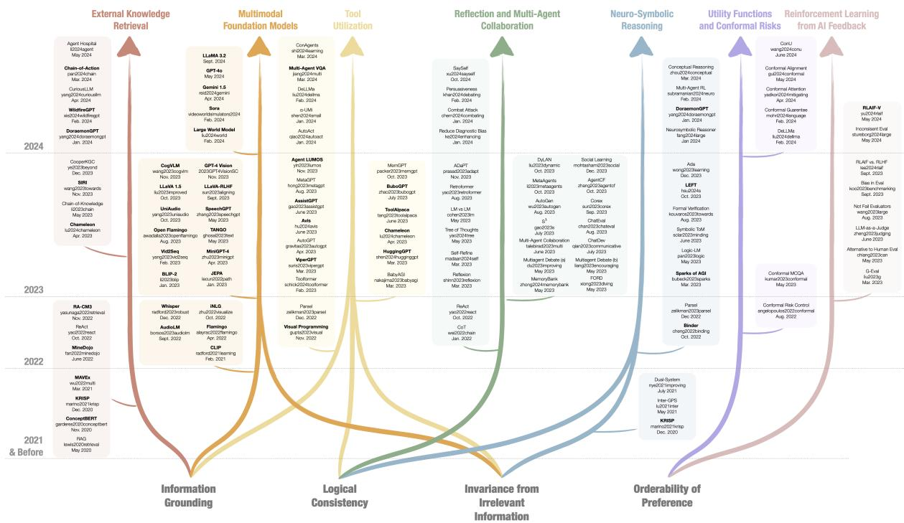
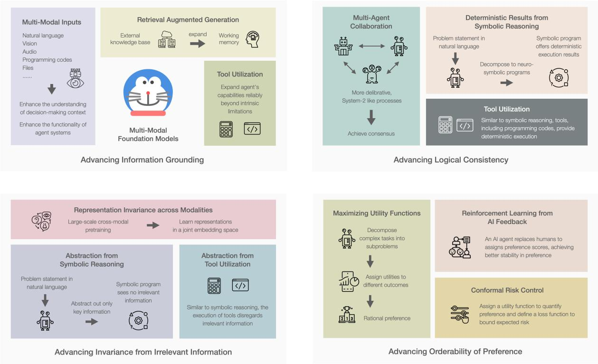

# Towards Rationality in Language and Multimodal Agents: A Survey

Bowen Jiang1, 3, Yangxinyu Xie1, 3, Xiaomeng Wang1, Yuan Yuan1, Zhuoqun Hao1, Xinyi Bai2, Weijie J. Su1, Camillo J. Taylor1, Tanwi Mallick3

University of Pennsylvania1 Cornell University2 Argonne National Laboratory3

Philadelphia, PA, 19104, USA Ithaca, NY, 14850, USA Lemont, IL, 60439, USA

{bwjiang@seas, xinyux@wharton, xwang1@wharton, yyuan86@seas, zhuoqunh@sas}.upenn.edu xb52@cornell.edu, {suw@wharton, cjtaylor@seas}.upenn.edu, tmallick@anl.gov

## Abstract

This work discusses how to build more rational language and multimodal agents and what criteria define rationality in intelligent systems. Rationality is the quality of being guided by reason, characterized by decisionmaking that aligns with evidence and logical principles. It plays a crucial role in reliable problem-solving by ensuring well-grounded and consistent solutions. Despite their progress, large language models (LLMs) often fall short of rationality due to their bounded knowledge space and inconsistent outputs. In response, recent efforts have shifted toward developing multimodal and multi-agent systems, as well as integrating modules like external tools, programming codes, symbolic reasoners, utility function, and conformal risk controls rather than relying solely on a single LLM for decision-making. This paper surveys state-ofthe-art advancements in language and multimodal agents, assesses their role in enhancing rationality, and outlines open challenges and future research directions. We maintain an open repository at https://github.com/bowenupenn/Agent\_Rationality.

## 1 Introduction

Rationality remains a critical and urgent topic in the research of artificial intelligence, particularly as intelligent systems become increasingly involved in high-stakes decision-making processes, such as healthcare, finance, science, and legal services (He et al., 2023; Li et al., 2023h; Xie et al., 2024b; Kang and Liu, 2023; Cheong et al., 2024) where reliability is paramount for human end-users utilizing these agents for decision-making. Unlike reasoning that aims to draw conclusions from premises, rationality ensures that those conclusions are reliably consistent, have an orderability of preference, and are aligned with evidence from various sources and logical principles.

However, recent studies reveal that even stateof-the-art large language models (LLMs) exhibit limitations in rationality. Because a single LLM relies solely on its internal parametric representations of textual knowledge, while lacking real-world grounding and feedback mechanisms necessary to develop rationality (Bubeck et al., 2023; Sun, 2024; Panickssery et al., 2024), it shows bounded knowledge, inconsistent responses, and susceptibility to biases and framing effects (Jiang et al., 2024a; Chen et al., 2024; Binz and Schulz, 2023; Echterhoff et al., 2024; Mukherjee and Chang, 2024; Macmillan-Scott and Musolesi, 2024; Wang et al., 2024a; Suri et al., 2024). These limitations raise concerns about their practical reliability in critical sectors, highlighting the need for more reliable and coherent systems capable of rational behaviors.

To address these challenges, research is shifting toward multimodal agents and multi-agent systems, as complex problems in real life often require collaborations of experts across fields (Eisenführ et al., 2010) and data from diverse sources. Formally, we refer "agent" (Bommasani et al., 2021) as an artificial intelligent entity that perceives and understands its environment through various inputs — either natural language or multimodal information like vision, audio, and codes — and acts to achieve specific goals or tasks within natural language domains, while the term "agentic" to describe such behaviors (Kapoor et al., 2024; Ng, 2024). This can encompass a range of systems, from a single LLM, a multimodal foundation model with instruction following capabilities (Liu et al., 2024b, 2023b), to a multi-agent system that integrates multiple AI agents, traditional machine learning or symbolic reasoning modules, external knowledge bases, and tools working together towards a collective goal within the same environment.

Given this, this survey explores how current literature helps address the limitations of a vanilla LLM in achieving rationality, with an emphasize on language and multimodal agents or agent systems. We first delineate four necessary, though not sufficient, axioms of rationality Section 3 that a rational agent should fulfill, and discuss how current works help move towards each of the axioms in Section 4, providing a unique lens to reinterpret their underlying motivations. Lastly, Section 5 highlights the lack of sufficient evaluation metrics and benchmarks in the existing literature to adequately measure the rationality of agents, and Section 6 discusses further open problems. We hope this survey can inspire further research at the intersection between agent systems and cognitive science.

  
Figure 1: This survey identifies four necessary, though not sufficient, axioms that a rational agent should fulfill. Meanwhile, we reinterpret various research domains related to agents and agent systems through the lens of rationality, examining how their underlying algorithms contribute to each of these axioms.

## 2 Scope

Existing surveys in the field of agent systems, such as those on multimodal (Xie et al., 2024a; Durante et al., 2024; Cui et al., 2024; Xu et al., 2024d; Li et al., 2024a) and multi-agent systems (Han et al., 2024; Guo et al., 2024; Zhang et al., 2024c; Cheng et al., 2024), primarily focus on their components, architectures, profiling, planning, communication strategies, memory mechanisms, and applications. Additionally, many works (Jiang et al., 2024a; Wei et al., 2022; Yao et al., 2024; Cai et al., 2024; Valmeekam et al., 2023; Xu et al., 2024a; Prasad et al., 2023; Khardon and Roth, 1997; Huang and Chang, 2022; Zhang et al., 2024c; Qiao et al., 2022) and surveys (Qiao et al., 2022; Huang and Chang, 2022; Ahn et al., 2024; Giadikiaroglou et al., 2024; Liang et al., 2024; Zheng et al., 2024c; Zhang et al., 2024c; Xiong et al., 2024b) explore the reasoning capabilities of LLMs. Although reasoning plays an important role in ensuring rationality, especially in complex scenarios, it remains parallel to our focus, as mentioned in Section 1. Furthermore, some works touch the aspect of rationality in LLMs (Kassner et al., 2023; Raman et al., 2024; Macmillan-Scott and Musolesi, 2024), but they focus on one specific algorithm or application domain. To the best of our knowledge, this survey is the first to comprehensively explore the notion of rationality in language and multimodal agents. We aim to bridge the gap between rationality and agent system, analyzing how designs in these agents and agent systems contribute to advancing certain key axioms of rationality.

## 3 Defining Rationality in Agents

Drawing on foundational works in cognitive science about rational decision-making (Tversky and Kahneman, 1988; Hastie and Dawes, 2009; Eisenführ et al., 2010), this section presents four necessary, though not sufficient, axioms we expect a rational agent or agent systems to fulfill:

Information Grounding A rational agent’s decision-making should be grounded in physical and factual reality, incorporating information it perceives from multimodal formats and sources. In contrast, an irrational agent generates hallucinations (Huang et al., 2023), producing false or misleading information that is not grounded in facts.

Logical Consistency Logical consistency refers to an agent’s ability to avoid self-contradictions in reasoning and ensure that its conclusions logically follow from its premises. A rational agent should deliver consistent decisions in its final responses, producing invariant decisions across equivalent representations of the same problem.

Invariance from Irrelevant Context A rational agent should not be swayed by irrelevant contextual information, focusing instead on the logical essence of the problems and relevant data.

Orderability of Preference When comparing alternatives in a decision scenario, a rational agent should be able to rank the options based on the current state and ultimately select the most preferred one based on the expected outcomes.

  
Figure 2: The evolutionary tree of language and multimodal agents and agent systems related to the four key axioms of agent rationality. The axioms are listed at the bottom, while each colored arrow representing a distinct research domain. Works involving multi-modalities are highlighted in bold.

## 4 Towards Rationality in Agents

This section discusses how existing language and multimodal agent systems are advancing the concept of rationality. We survey a range of research domains, reinterpret their contributions through the lens of the necessary axioms of rationality outlined earlier, and present a novel perspective that bridges existing methodologies with rational principles.

## 4.1 Advancing Information Grounding

## 4.1.1 Grounding on multimodal information

Grounding an agent solely based on language can be challenging. As a picture is worth a thousand words, recent advances in large multimodal models (Li et al., 2024a) integrate language, vision, and other sensory modalities to offer a more comprehensive grounding of information, thereby enhancing the understanding of decision-making contexts. Multimodal foundation models, including but not limited to CLIP (Radford et al., 2021), VL-BERT and ViLBERT (Su et al., 2019; Lu et al., 2019), BLIP-2 (Li et al., 2023d), UniAudio (Yang et al., 2023a), AudioLM (Borsos et al., 2023), TANGO (Ghosal et al., 2023), SpeechGPT (Zhang et al., 2023), (Open) Flamingo (Alayrac et al., 2022; Awadalla et al., 2023), LLaVA (Liu et al., 2024b, 2023b), CogVLM (Wang et al., 2023d), MiniGPT-4 (Zhu et al., 2023), Whisper (Radford et al., 2023), GPT-4 Vision (OpenAI, 2023) and GPT-4o (OpenAI, 2024), LLaMA 3.2 (Meta, 2024), and Gemini 1.5 Pro (Reid et al., 2024) serve as the cornerstones for downstream tasks in multimodal agent systems. More agentic systems increasingly depend on multimodal information to enhance multimodal reasoning. (Zhang et al., 2024a; Brienza et al., 2024; Elhenawy et al., 2024; Chen et al., 2023a; Dong et al., 2024; Wu et al., 2024b).

The adaptation of Reinforcement Learning from Human Feedback (RLHF) (OpenAI, 2024; Stiennon et al., 2020; Ouyang et al., 2022; Bai et al., 2022; Zhang et al., 2024b), a technique popularized in language-only models, also demonstrates promising advancements in reducing hallucination from cross-modal misalignment (Sun et al., 2023). Visual instruction-tuning (Liu et al., 2024b; Dai et al., 2024; Bai et al., 2023; Wang et al., 2023b) also enables foundation models to engage in more detailed multi-round, context-aware human-agent interactions and collaborations with other agents. This opens the possibility of the System 2 process (Kahneman, 2011) in multimodal models.

Multi-modalities help expand the functionality of agents by allowing them to access more comprehensive and diverse data. For example, Chainof-Action (Pan et al., 2024) advances the singlemodal Search-in-the-Chain (Xu et al., 2023) by supporting multimodal data retrieval for faithful question answering. multimodal understanding in DoraemonGPT (Yang et al., 2024) is necessary for spatial-temporal videos analysis. LogicVista (Xiao et al., 2024) expands logical reasoning capabilities to visual contexts. The multimodal capabilities also allow HuggingGPT (Shen et al., 2024d), Agent LU-MOS (Yin et al., 2023), ToolAlpaca (Tang et al., 2023), and AssistGPT (Gao et al., 2023a) to expand the scope of tasks they can address, including cooperation among specialized agents or tools capable of handling different modalities. Web agents like (Zheng et al., 2024a; Shen et al., 2024c; Deng et al., 2024; Gur et al., 2023; Zhou et al., 2023; Koh et al., 2024) grounded on the graphical user interface (GUI) offers higher information density compared to solely HTML codes in textual formats (Yao et al., 2022; Nakano et al., 2021).

## 4.1.2 Expanding working memory from external knowledge retrieval and tool utilization

Bounded Rationality (March and Simon, 1958; Selten, 1990) is a concept tailored to cognitively limited agents, suggesting that decision-making is limited by the resources available at hand, and any deviations from the optimal are primarily due to insufficient computational capacity and bounded working memory.

In terms of LLMs, the parametric nature of their existing architecture (Vaswani et al., 2017) fundamentally limits how much information they can hold. As a result, in the face of uncertainty, LLMs often hallucinate (Bang et al., 2023; Guerreiro et al., 2023; Huang et al., 2023), generating outputs that are not supported by the factual reality of the environment. Retrieval-Augmented Generation (RAG) (Lewis et al., 2020) marks a significant milestone in addressing such an inherent limitation of LLMs. Broadly speaking, RAG refers to any mechanism that provides external knowledge to the input context of an LLM and helps it deliver responses with up-to-date, factual, and grounded information, especially in scientific and medical domains. Examples include Chameleon (Lu et al., 2024), WildfireGPT (Xie et al., 2024b), and Agent Hospital (Li et al., 2024b), TILP (Xiong et al., 2023c), as well as Chain-of-Knowledge (Li et al., 2023f) which finds that integrating multiple knowledge sources enhances performance by 2.1% compared to using a single source. Another line of systems construct large-scale knowledge graphs (Hogan et al., 2021; He et al., 2024) from real-world sources to effectively expand their working memory.

Enabling agents to use tools also expands their bounded working memories and grounds their responses by the outputs of these tools. Toolformer (Schick et al., 2024) opens a new era that allows LLMs to use external tools, effectively extending their capabilities beyond intrinsic limitations. A multi-agent system can coordinate agents understanding when and which tool to use, which modality of information the tool should expect, how to call the corresponding API, and how to incorporate outputs from the API calls, which anchors subsequent processes with more accurate information beyond their parametric memory. For example, VisProg (Gupta and Kembhavi, 2023), ViperGPT (Surís et al., 2023), and Parsel (Zelikman et al., 2023) generate Python programs to reliably execute subroutines. Xiong et al. (2024a) extends LLMs with search engines. Gupta and Kembhavi (2023); Surís et al. (2023) also invoke offthe-shelf models for multimodal assistance. These systems no longer need to generate all responses from scratch, instead relying on tools for more accurate and reliable information.

## 4.2 Advancing Logical Consistency

## 4.2.1 Consensus from reflection and multi-agent collaboration

"Thinking, fast and slow" (Kahneman, 2011) defines System 1 and System 2 as two types of thinking processes in human cognitive systems. System 1 is fast, intuitive, and automatic, often relying on heuristics, while System 2 is slower, more deliberate, and analytical, engaging in logical reasoning. Due to the probabilistic outputs of LLMs, which resemble the fast, non-iterative nature of System 1 thinking. In contrast, multi-agent systems that promote debate and consensus among AI agents can help align outputs more closely with the slow, deliberate decision-making typical of System 2 processes, thus enhancing logical consistency.

Multi-round self-reflection that encourages a single LLM to critically evaluate its previous responses has demonstrated the effectiveness of deliberation in improving logical coherence and qualities (OpenAI, 2024; Shinn et al., 2024; Madaan et al., 2024; Wang et al., 2022b; Zhong et al., 2024; Lu et al., 2023; Xu et al., 2024c,a; Xiong et al., 2024c). Expanding on this, multi-agent systems introduce collaboration among multiple agents (Zhang et al., 2024d), enabling collective deliberation through cross-examination and debate. For instance, LM vs LM (Cohen et al., 2023) introduces a cross-examination between two agents to detect errors and make factuality decisions. FORD (Xiong et al., 2023a) reports an accuracy increase up to 4.9% compared to a single LLM. AgentReview (Jin et al., 2024) presents how discussions cause distribution shifts in final reviews compared to initial reviews. Liang et al. (2023) demonstrates the superiority of multi-agent debate over self-reflection, with final consensus achieving a 16.0% improvement in reasoning tasks. (Zhao et al., 2023) investigates the multi-agent competition behaviors. Similarly, Du et al. (2023) finds that LLMs can converge on a single shared answer after multiple rounds of debate, resulting in a factual accuracy increase of 7.2-15.9% across tasks. All these approaches enhance the system’s capability to capture initial errors, improve factuality in reasoning, and achieve final consensus with fewer inconsistencies.

  
Figure 3: Overview of how language and multimodal agents promote the four axioms of rationality. (1) Top Left - Advancing Information Grounding: Multimodal inputs enhance an agent’s understanding of decision contexts and expand its functionalities; External knowledge sources and tools like programming codes expand its bounded working memory. (2) Top Right – Advancing logical consistency: Multi-agent collaboration facilitates deliberate thinking that could correct errors and achieve consensus; Neuro-symbolic reasoning and tools ensure consistent, deterministic executions. (3) Bottom Left – Advancing invariance from irrelevant information: Cross-modal training unifies representations across modalities; Neuro-symbolic tools focus the agent on logical essence. (4) Bottom Righ – Advancing orderability of preference: Reinforcement from AI feedback mimics humans and provides more stable preference scores; Utility functions and conformal risk control further guide the preference in rigorous frameworks.

## 4.2.2 Consistent execution from symbolic reasoning and tool utilization

Neuro-symbolic reasoning (Zelikman et al., 2023; Pan et al., 2023; Sclar et al., 2023; Hsu et al., 2024; Fang et al., 2024; Yang et al., 2024; Subramanian et al., 2024) combines learning abilities with symbolic systems for explicit knowledge representation and logical reasoning. A multi-agent system incorporating symbolic modules can not only understand language queries but also solve them with a level of consistency, providing a faithful and transparent reasoning process based on well-defined rules that adhere to logical principles, which is unachievable by a single LLM. For example, LEFT (Hsu et al., 2024) uses "left" as an quintessential example of concepts in multimodal models. It demonstrates how multimodal models can generate first-order logic programs to reason about domain-specific relational concepts. Logic-LM (Pan et al., 2023), KRISP (Marino et al., 2021), Binder (Cheng et al., 2022), Parsel (Zelikman et al., 2023), and Fang et al. (2024) also utilize symbolic modules or graphs to deliver consistent outputs.

Similarly, tool utilization abstracts problems into deterministic tool executions, such as calculators, calendars (Schick et al., 2024), and programming codes, and seamlessly integrate reliable outputs back to the responses. For instance, ToolAlpaca (Tang et al., 2023) generates a tool-use corpus in a multi-agent simulation environment. Binder (Cheng et al., 2022) converts queries into Python or SQL codes to interact deterministically with structured knowledge bases. Parsel (Zelikman et al., 2023) combines a code-LLM with a constraint solver to deterministically handle decomposed tasks. VisProg (Gupta and Kembhavi, 2023), ViperGPT (Surís et al., 2023), and Parsel (Zelikman et al., 2023) generate Python programs to execute subroutines. Besides, BabyAGI (Nakajima, 2023), Chamelon (Lu et al., 2024), Assist-GPT (Gao et al., 2023a), Avis (Hu et al., 2024), ToolAlpaca (Tang et al., 2023), MetaGPT (Hong et al., 2023), Agent LUMOS (Yin et al., 2023), AutoAct (Qiao et al., 2024), α-UMi (Shen et al., 2024c), and ConAgents (Shi et al., 2024) harness compositional reasoning to enable modular toolusing capabilities in real-world scenarios. All these examples demonstrate how deterministic execution, whether through symbolic reasoning or tool utilization, ensures consistent outcomes, making complex reasoning processes more robust and transparent.

## 4.3 Advancing Invariance from Irrelevant Information

## 4.3.1 Representation invariance across modalities

Given adequate information grounding, agents should make consistent decisions across different modalities that share equivalent underlying logic. Multimodal foundation models are particularly adept at promoting invariance by processing multimodal data in an unified representation. Specifically, their large-scale cross-modal pretraining stage seamlessly tokenizes both vision and language inputs into a joint hidden embedding space, learning cross-modal correlations through a datadriven approach. In other words, image tokens are simply regarded as a foreign language (Wang et al., 2022a). Moreover, the cross-modal validation inherent in multimodal foundation models allows for reconciliation of data from different modalities, closing their distance in the hidden embedding space (Radford et al., 2021).

The concept of invariance is the cornerstone of Visual Question Answering (VQA) agents (Chen et al., 2022; Jiang et al., 2024b; Wang et al., 2023e; Yi et al., 2018; Wang et al., 2022a; Bao et al., 2022; Li et al., 2024c; Zhao and Xu, 2023; Fan et al., 2024). On one hand, these agents must grasp the invariant semantics of any open-ended questions posed about images, maintaining consistency despite variations in wording, syntax, or language. On the other hand, within a multi-agent VQA system, visual agents can provide crucial verification and support for language-based reasoning (Wang et al., 2023e; Jiang et al., 2024b; Zhao and Xu, 2023), while language queries can direct the attention of visual agents, based on a shared and invariant underlying knowledge across vision and language domains.

## 4.3.2 Abstraction from symbolic reasoning and tool utilization

In most cases, tools or symbolic reasoners require translating natural language queries into function calls with predefined syntax. Once the function calls and their input arguments are determined, the tools or symbolic reasoners will narrow down their focus to logical essense, ignoring any irrelevant context in the original queries as long as they are logically equivalent. For example, in Multi-Agent VQA (Jiang et al., 2024b), a language model extracts only the relevant object names and passes them to Grounded SAM (Ren et al., 2024), an object detection tool, instead of sending the entire visual question. Similarly, LEFT (Hsu et al., 2024) abstracts target objects from complex 3D visual scenes into symbolic representations to predict their relational properties, ensuring that symbolic reasoning is unaffected by other contextual details in the environment. This abstraction enables more focused and efficient reasoning processes.

## 4.4 Advancing Orderability of Preference

## 4.4.1 Learning preference from reinforcement learning

Reinforcement Learning from Human Feedback (RLHF) (OpenAI, 2024; Stiennon et al., 2020; Ouyang et al., 2022; Bai et al., 2022) helps reduce the preference gap between agents and humans. However, we argue that RLHF does not guarantee rational preference orderability, as human preferences are often inconsistent and vary across individuals. An emerging alternative is Reinforcement Learning from AI Feedback (RLAIF) (Lee et al., 2024; Wang et al., 2023c; Zheng et al., 2023b; Chiang and Lee, 2023a; Liu et al., 2023c; Koo et al., 2023; Stureborg et al., 2024; Yu et al., 2024). RLAIF leverages LLMs as evaluators, achieving more stable preference over different formatting of the task instructions and the sampling algorithm used to generate the answers (Chiang and Lee, 2023a). Additionally, Yu et al. (2024) demonstrates how a multimodal agent can iteratively assign trustworthiness scores to each atomic claims, further enhancing the reliability of evaluation process.

## 4.4.2 Maximizing utility functions and controlling conformal risks

Recent work also explores the expected utility theory (EUT) (Von Neumann and Morgenstern, 2007) to improve the decision-making capabilities of language models. EUT provides a formal framework to quantify preferences by assigning utility values to outcomes and calculating the expected utility based on the weighting probability of each outcome’s occurrence. For example, DeLLMa (Liu et al., 2024d) applies this approach by decomposing complex decision problems into subtasks, assigns utilities to different outcomes, and selects actions that maximize expected utility.

Angelopoulos et al. (2022) introduces a conformal risk control framework that ensures the expected loss, under any non-increasing loss function, remains bounded by a predefined threshold α. This framework has been adapted to control a wide range of metrics, including factuality, false discovery rate, and hallucination frequency (Mohri and Hashimoto, 2024; Cherian et al., 2024; Kumar et al., 2023; Wang et al., 2024d; Yadkori et al., 2024; Overman et al., 2024; Gui et al., 2024).

## 5 Evaluating Rationality in Agents

While there are numerous reasoning benchmarks (Talmor et al., 2019; Liu et al., 2021, 2023a; Yang et al., 2018; Hendrycks et al., 2021; Chen et al., 2020; Zhou et al., 2024; Rasheed et al., 2024; Ma et al., 2024; Wang et al., 2024b; Abdelnabi et al., 2023), they do not directly measure rationality. The amount of studies for evaluating rationality in agent or agent systems remains scant, despite the growing interest in the field. In this section, we explore potential evaluation methods and benchmarks aligned with each of the proposed axioms of rationality.

## 5.1 Evaluating Information Grounding

Information grounding is usually evaluated by the level of hallucination (Bang et al., 2023; Guerreiro et al., 2023; Huang et al., 2023). Multiple evaluation benchmarks targeting language-only dialogue have been proposed, such as BEGIN (Dziri et al., 2022b), HaluEval (Li et al., 2023e), Dial-Fact (Gupta et al., 2021), FaithDial (Dziri et al., 2022a), EureQA (Li et al., 2023a), AIS (Rashkin et al., 2023), and others (Zheng et al., 2023c; Das et al., 2023; Cao et al., 2021; Liu et al., 2024a). However, benchmarks for multimodal agents beyond language dialogue remain limited. Some efforts include POPE (Li et al., 2023g), LLaVA-RLHF (Sun et al., 2023), BLINK (Fu et al., 2024), and Rohrbach et al. (2018); Biten et al. (2022) are the few examples that consider multimodal hallucination. The community needs more hallucination benchmarks to quantitatively evaluate the extent to which multi-modality and multi-agents reduce hallucinations in comparison with single LLMs.

## 5.2 Evaluating Logical Consistency

To assess whether LLMs can generate logically consistent responses across different but inherently equivalent framing of the same tasks, studies introduce perturbations to the original task descriptions. Perturbation techniques include modifying instruction templates (Weber et al., 2023), paraphrasing task descriptions (Yang et al., 2023b; Ohmer et al., 2024), translating the prompts into a different language (Ohmer et al., 2023, 2024; Xu et al., 2024b) and back (Yang et al., 2023b), and altering the order of in-context learning exemplars (Lu et al., 2021; Pecher et al., 2024). Jiang et al. (2024a) further highlights inconsistent behavior across state-of-theart LLMs when faced with token biases, even when the logical essence of the tasks remains intact.

Furthermore, uncertainty quantification (Lin et al., 2023; Xiao et al., 2022; Ye et al., 2024; Shen et al., 2024a,b; Xiong et al., 2023b) provides insights when an agent may produce inconsistent responses, helping improve their robustness.

## 5.3 Evaluating Invariance from Irrelevant Information

Studies such as Shi et al. (2023), Wu et al. (2024a), Liu et al. (2024c), and Yoran et al. (2023) investigate the phenomenon of “lost-in-context" by introducing random or misleading sentences into original problem statements. Early benchmarks such as those by Weston et al. (2015), Sinha et al. (2019), Clark et al. (2020), and Webson and Pavlick (2021) also incorporate irrelevant content. More recent benchmarks like MileBench (Song et al., 2024), Mementos (Wang et al., 2024c), Seed-bench-2 (Li et al., 2023b), and DEMON (Li et al., 2023c) extend these evaluations to multimodal agents acting in long context with image sequences. In these scenarios, the agents must accurately isolate relevant information from large context windows.

## 5.4 Evaluating Orderability of Preference

Having an orderability of preference is essential when leveraging LLMs as evaluators to ensure reliable assessments. Luo et al. (2023); Shen et al. (2023); Gao et al. (2023b); Wang et al. (2023a); Chen et al. (2023b); Chiang and Lee (2023b); Zheng et al. (2024b); Fu et al. (2023); Liu et al. (2023d) highlight challenges with LLMs in this role, reporting inconsistent ratings and difficulties in establishing reliable comparisons. This inconsistencies raise concerns about the ability of LLMs to accurately rank and evaluate different options or responses. ChatEval (Chan et al., 2023) and Bai et al. (2024) suggest improved preference aligned with humans through multi-agent collaborations. The multiple choice problems (PaperswithcodeMCQA) serves as another common testing ground. (Zong et al., 2023; Zheng et al., 2023a) show that LLMs are susceptible to the rearranging of options, often failing to maintain a coherent order of preference.

The expected utility theory (Von Neumann and Morgenstern, 2007) provides a prototypical framework to evaluate an LLM agent’s preferences, informed by specific parameters of the utility function. Building on this framework, Jia et al. (2024) reveals that LLMs exhibit human-like patterns such as risk aversion, loss aversion, and overweighting small probabilities under uncertainty. Ross et al. (2024) identifies biases like time discounting, reflecting the preference for discounting nonimmediate gains. It finds that these agents are neither entirely human-like nor economicus, i.e., rational economic beings, highlighting the need for intervening in their behavior towards better alignment with desired objectives.

## 6 Open Problems and Future Directions

Towards Inherent Rationality Despite significant research efforts in this survey aimed at achieving one or more axioms of rationality, most existing algorithms rely on external tools, thereby not inherently enhancing the rationality of artificial intelligence. In other words, current methods are neither sufficient nor necessary to achieve human-level rationality, but they serve as instrumental tools that bridge the gap between an LLM’s response and rationality. These approaches enable agent systems to more closely mimic rational thinking in their output responses from the end-user’s perspective. However, how to effectively close the loop and bake these more rational outputs back into foundation models themselves (Zhao et al., 2024) beyond mere fine-tuning remains an open question. It remains a question if we can leverage these more rational outputs, or training the model to verify against rational axioms for reward scores, to inherently enhance a single foundation model’s rationality in its initial responses without external assistance.

Encouraging More Multimodality in Multi-Agent Systems Research into the integration of multi-modality within multi-agent systems would be promising. Fields such as multi-agent collaboration and symbolic reasoning, as shown in Figure 2, currently under-utilize the potential of multimodal sensory inputs. We believe that expanding the role of multi-modalities, including but not limited to vision, audio, and structured data could continue enhancing the rationality of multi-agent systems.

Needing More Comprehensive Evaluation of Rationality The choices of evaluation metrics are important (Schaeffer et al., 2024). Although there have been some efforts to assess rationality in agent systems, the field still lacks comprehensive metrics. Existing evaluations predominantly focus on the final performance, neglecting the most interesting intermediate steps and different axioms of rationality, and provides limited investigations into multimodal and multi-agent systems. A promising direction is to create methods specifically tailored to assess rationality, going beyond existing ones on accuracy. These future methods should account for nuanced token biases (Jiang et al., 2024a), tolerate perturbations, and avoid data contamination to yield robust, statistically significant results.

## 7 Discussion

Rationality adds another crucial dimension to the performance of intelligent agents besides reasoning capabilities. More rational agents - capable of providing coherent orderability of preferences and grounded in knowledge beyond their bounded parametric memory - could enhance their roles in automatic evaluation and preference alignment, where human involvements are expensive yet unstable.

It becomes increasingly important for human users applying these agents in critical sectors like health care and finance that expect consistent and reliable decision-making. For example, in financial domains, decision-making by LLMs must operate within an acceptable risk threshold. By adapting conformal risks, we can enhance the orderability of preference and create a theoretical framework for parameterizing risk preferences into utility models. This approach enables rational financial agents to optimize decisions to max utilities while controlling risks through loss functions that bound expected risks.

Medical domains also present unique multimodal challenges, particularly in medical imaging interpretation. For instance, diagnostic methods must withstand irrelevant information like background noise in MRI scans. An VLM could provide diagnostic explanations by looking at these images, and an LLM could collaborate with it as a multi-agent system to verify against pre-defined illness criteria, incorporating external knowledge retrieval to improve information grounding. Besides, a multi-agent collaboration could involve diverse medical-domain personas, such as surgeons, nurses, physicians, radiologists, pharmacists, offering diagnostic recommendations from different perspectives, potentially reducing hallucinations through collaborations. As a result, we hope our survey could serve as a tool-box for agent developers who want to build more rational agents in diverse domains.

This survey investigate current approaches in a range of related literature that advance towards more rational language and multimodal agents.

These approaches include the integration of multimodal inputs, reflections and multi-agent collaborations, RLAIF, utility functions, conformal risk controls, and modules that perform deterministic execution like tools - including programming codes - and neuro-symbolic reasoning modules.

We believe in the value of further investigations into the rationality of AI agents, particularly through a collaboration between the AI research community and cognitive psychologists for a deeper understanding of rationality.

## 8 Limitations

The fields of language and multimodal agents are rapidly evolving. Despite our best efforts, it is inherently impossible to encompass all related works within the scope of this survey. Our discussion also possesses limited mention of the reasoning capabilities, theory of mind in machine psychology, cognitive architectures, and rationality models like formal logic and probability theory, all of which lie beyond the scope of this survey but are crucial for a deeper understanding of the agent systems. Furthermore, we present necessary but not sufficient axioms of rationality; no methodologies mentioned in our survey could sufficiently guarantee a genuine rationality in agents. The concept of rationality in human cognitive science may encompass more principles and axioms than those defined in our survey, such as completeness, transitivity, monotonicity, decompoability (Poole and Mackworth, 2010), which are more theoretical and fundamental in nature and not directly related to language and multimodal agents discussed in our survey.

## 9 Acknowledgement

This work was funded by the Laboratory Directed Research and Development (LDRD) program at Argonne National Laboratory, with support from the Office of Science, U.S. Department of Energy, under Contract No. DEAC02-06CH11357. This work was also supported by NSF grant CCF-2112665 (TILOS), which provides funding for B. Jiang. and C. J. Taylor. Y. Xie and W. J. Su also acknowledge support from the NSF HDR TRIPODS award (CCF-1934876).

## References

Sahar Abdelnabi, Amr Gomaa, Sarath Sivaprasad, Lea Schönherr, and Mario Fritz. 2023. Llm-deliberation:

Evaluating llms with interactive multi-agent negotiation games. arXiv preprint arXiv:2309.17234.

Janice Ahn, Rishu Verma, Renze Lou, Di Liu, Rui Zhang, and Wenpeng Yin. 2024. Large language models for mathematical reasoning: Progresses and challenges. arXiv preprint arXiv:2402.00157.

Jean-Baptiste Alayrac, Jeff Donahue, Pauline Luc, Antoine Miech, Iain Barr, Yana Hasson, Karel Lenc, Arthur Mensch, Katherine Millican, Malcolm Reynolds, et al. 2022. Flamingo: a visual language model for few-shot learning. Advances in neural information processing systems, 35:23716–23736.

Anastasios N Angelopoulos, Stephen Bates, Adam Fisch, Lihua Lei, and Tal Schuster. 2022. Conformal risk control. arXiv preprint arXiv:2208.02814.

Anas Awadalla, Irena Gao, Josh Gardner, Jack Hessel, Yusuf Hanafy, Wanrong Zhu, Kalyani Marathe, Yonatan Bitton, Samir Gadre, Shiori Sagawa, et al. 2023. Openflamingo: An open-source framework for training large autoregressive vision-language models. arXiv preprint arXiv:2308.01390.

Jinze Bai, Shuai Bai, Shusheng Yang, Shijie Wang, Sinan Tan, Peng Wang, Junyang Lin, Chang Zhou, and Jingren Zhou. 2023. Qwen-vl: A frontier large vision-language model with versatile abilities. arXiv preprint arXiv:2308.12966.

Yuntao Bai, Andy Jones, Kamal Ndousse, Amanda Askell, Anna Chen, Nova DasSarma, Dawn Drain, Stanislav Fort, Deep Ganguli, Tom Henighan, et al. 2022. Training a helpful and harmless assistant with reinforcement learning from human feedback. arXiv preprint arXiv:2204.05862.

Yushi Bai, Jiahao Ying, Yixin Cao, Xin Lv, Yuze He, Xiaozhi Wang, Jifan Yu, Kaisheng Zeng, Yijia Xiao, Haozhe Lyu, et al. 2024. Benchmarking foundation models with language-model-as-an-examiner. Advances in Neural Information Processing Systems, 36.

Yejin Bang, Samuel Cahyawijaya, Nayeon Lee, Wenliang Dai, Dan Su, Bryan Wilie, Holy Lovenia, Ziwei Ji, Tiezheng Yu, Willy Chung, et al. 2023. A multitask, multilingual, multimodal evaluation of chatgpt on reasoning, hallucination, and interactivity. arXiv preprint arXiv:2302.04023.

Hangbo Bao, Wenhui Wang, Li Dong, Qiang Liu, Owais Khan Mohammed, Kriti Aggarwal, Subhojit Som, Songhao Piao, and Furu Wei. 2022. Vlmo: Unified vision-language pre-training with mixture-ofmodality-experts. Advances in Neural Information Processing Systems, 35:32897–32912.

Marcel Binz and Eric Schulz. 2023. Using cognitive psychology to understand gpt-3. Proceedings of the National Academy ofSciences, 120(6):e2218523120.

Ali Furkan Biten, Lluís Gómez, and Dimosthenis Karatzas. 2022. Let there be a clock on the beach: Reducing object hallucination in image captioning. In Proceedings of the IEEE/CVF Winter Conference on Applications ofComputer Vision, pages 1381–1390.

Rishi Bommasani, Drew A Hudson, Ehsan Adeli, Russ Altman, Simran Arora, Sydney von Arx, Michael S Bernstein, Jeannette Bohg, Antoine Bosselut, Emma Brunskill, et al. 2021. On the opportunities and risks of foundation models. arXiv preprint arXiv:2108.07258.

Zalán Borsos, Raphaël Marinier, Damien Vincent, Eugene Kharitonov, Olivier Pietquin, Matt Sharifi, Dominik Roblek, Olivier Teboul, David Grangier, Marco Tagliasacchi, et al. 2023. Audiolm: a language modeling approach to audio generation. IEEE/ACM transactions on audio, speech, and language processing, 31:2523–2533.

Michele Brienza, Francesco Argenziano, Vincenzo Suriani, Domenico D Bloisi, and Daniele Nardi. 2024. Multi-agent planning using visual language models. arXiv preprint arXiv:2408.05478.

Sébastien Bubeck, Varun Chandrasekaran, Ronen Eldan, Johannes Gehrke, Eric Horvitz, Ece Kamar, Peter Lee, Yin Tat Lee, Yuanzhi Li, Scott Lundberg, et al. 2023. Sparks of artificial general intelligence: Early experiments with gpt-4. arXiv preprint arXiv:2303.12712.

Chengkun Cai, Xu Zhao, Yucheng Du, Haoliang Liu, and Lei Li. 2024. t2 of thoughts: Temperature tree elicits reasoning in large language models. arXiv preprint arXiv:2405.14075.

Meng Cao, Yue Dong, and Jackie Chi Kit Cheung. 2021. Hallucinated but factual! inspecting the factuality of hallucinations in abstractive summarization. arXiv preprint arXiv:2109.09784.

Chi-Min Chan, Weize Chen, Yusheng Su, Jianxuan Yu, Wei Xue, Shanghang Zhang, Jie Fu, and Zhiyuan Liu. 2023. Chateval: Towards better llm-based evaluators through multi-agent debate. arXiv preprint arXiv:2308.07201.

Liang Chen, Yichi Zhang, Shuhuai Ren, Haozhe Zhao, Zefan Cai, Yuchi Wang, Peiyi Wang, Tianyu Liu, and Baobao Chang. 2023a. Towards end-to-end embodied decision making via multi-modal large language model: Explorations with gpt4-vision and beyond. arXiv preprint arXiv:2310.02071.

Wenhu Chen, Hanwen Zha, Zhiyu Chen, Wenhan Xiong, Hong Wang, and William Yang Wang. 2020. Hybridqa: A dataset of multi-hop question answering over tabular and textual data. In Findings ofthe Association for Computational Linguistics: EMNLP 2020, pages 1026–1036.

Xi Chen, Xiao Wang, Soravit Changpinyo, AJ Piergiovanni, Piotr Padlewski, Daniel Salz, Sebastian Goodman, Adam Grycner, Basil Mustafa, Lucas

Beyer, et al. 2022. Pali: A jointly-scaled multilingual language-image model. arXiv preprint arXiv:2209.06794.

Xinyun Chen, Ryan A Chi, Xuezhi Wang, and Denny Zhou. 2024. Premise order matters in reasoning with large language models. arXiv preprint arXiv:2402.08939.

Yi Chen, Rui Wang, Haiyun Jiang, Shuming Shi, and Ruifeng Xu. 2023b. Exploring the use of large language models for reference-free text quality evaluation: A preliminary empirical study. arXiv preprint arXiv:2304.00723.

Yuheng Cheng, Ceyao Zhang, Zhengwen Zhang, Xiangrui Meng, Sirui Hong, Wenhao Li, Zihao Wang, Zekai Wang, Feng Yin, Junhua Zhao, et al. 2024. Exploring large language model based intelligent agents: Definitions, methods, and prospects. arXiv preprint arXiv:2401.03428.

Zhoujun Cheng, Tianbao Xie, Peng Shi, Chengzu Li, Rahul Nadkarni, Yushi Hu, Caiming Xiong, Dragomir Radev, Mari Ostendorf, Luke Zettlemoyer, et al. 2022. Binding language models in symbolic languages. arXiv preprint arXiv:2210.02875.

Inyoung Cheong, King Xia, KJ Feng, Quan Ze Chen, and Amy X Zhang. 2024. (a) i am not a lawyer, but...: Engaging legal experts towards responsible llm policies for legal advice. arXiv preprint arXiv:2402.01864.

John J Cherian, Isaac Gibbs, and Emmanuel J Candès. 2024. Large language model validity via enhanced conformal prediction methods. arXiv preprint arXiv:2406.09714.

Cheng-Han Chiang and Hung-yi Lee. 2023a. Can large language models be an alternative to human evaluations? arXiv preprint arXiv:2305.01937.

Cheng-Han Chiang and Hung-yi Lee. 2023b. A closer look into automatic evaluation using large language models. arXiv preprint arXiv:2310.05657.

Peter Clark, Oyvind Tafjord, and Kyle Richardson. 2020. Transformers as soft reasoners over language. arXiv preprint arXiv:2002.05867.

Roi Cohen, May Hamri, Mor Geva, and Amir Globerson. 2023. Lm vs lm: Detecting factual errors via cross examination. arXiv preprint arXiv:2305.13281.

Can Cui, Yunsheng Ma, Xu Cao, Wenqian Ye, Yang Zhou, Kaizhao Liang, Jintai Chen, Juanwu Lu, Zichong Yang, Kuei-Da Liao, et al. 2024. A survey on multimodal large language models for autonomous driving. In Proceedings ofthe IEEE/CVF Winter Conference on Applications of Computer Vision, pages 958–979.

Wenliang Dai, Junnan Li, Dongxu Li, Anthony Meng Huat Tiong, Junqi Zhao, Weisheng Wang, Boyang Li, Pascale N Fung, and Steven Hoi.

2024. Instructblip: Towards general-purpose visionlanguage models with instruction tuning. Advances in Neural Information Processing Systems, 36.

Souvik Das, Sougata Saha, and Rohini K Srihari. 2023. Diving deep into modes of fact hallucinations in dialogue systems. arXiv preprint arXiv:2301.04449.

Xiang Deng, Yu Gu, Boyuan Zheng, Shijie Chen, Sam Stevens, Boshi Wang, Huan Sun, and Yu Su. 2024. Mind2web: Towards a generalist agent for the web. Advances in Neural Information Processing Systems, 36.

Yuhao Dong, Zuyan Liu, Hai-Long Sun, Jingkang Yang, Winston Hu, Yongming Rao, and Ziwei Liu. 2024. Insight-v: Exploring long-chain visual reasoning with multimodal large language models. arXiv preprint arXiv:2411.14432.

Yilun Du, Shuang Li, Antonio Torralba, Joshua B Tenenbaum, and Igor Mordatch. 2023. Improving factuality and reasoning in language models through multiagent debate. arXiv preprint arXiv:2305.14325.

Zane Durante, Qiuyuan Huang, Naoki Wake, Ran Gong, Jae Sung Park, Bidipta Sarkar, Rohan Taori, Yusuke Noda, Demetri Terzopoulos, Yejin Choi, et al. 2024. Agent ai: Surveying the horizons of multimodal interaction. arXiv preprint arXiv:2401.03568.

Nouha Dziri, Ehsan Kamalloo, Sivan Milton, Osmar Zaiane, Mo Yu, Edoardo M Ponti, and Siva Reddy. 2022a. Faithdial: A faithful benchmark for information-seeking dialogue. Transactions of the Associationfor Computational Linguistics, 10:1473– 1490.

Nouha Dziri, Hannah Rashkin, Tal Linzen, and David Reitter. 2022b. Evaluating attribution in dialogue systems: The begin benchmark. Transactions ofthe Associationfor Computational Linguistics, 10:1066– 1083.

Jessica Echterhoff, Yao Liu, Abeer Alessa, Julian McAuley, and Zexue He. 2024. Cognitive bias in high-stakes decision-making with llms. arXiv preprint arXiv:2403.00811.

Franz Eisenführ, Martin Weber, and Thomas Langer. 2010. Rational decision making. Springer.

Mohammed Elhenawy, Ahmad Abutahoun, Taqwa I Alhadidi, Ahmed Jaber, Huthaifa I Ashqar, Shadi Jaradat, Ahmed Abdelhay, Sebastien Glaser, and Andry Rakotonirainy. 2024. Visual reasoning and multiagent approach in multimodal large language models (mllms): Solving tsp and mtsp combinatorial challenges. arXiv preprint arXiv:2407.00092.

Yue Fan, Jing Gu, Kaiwen Zhou, Qianqi Yan, Shan Jiang, Ching-Chen Kuo, Yang Zhao, Xinze Guan, and Xin Wang. 2024. Muffin or chihuahua? challenging multimodal large language models with multipanel vqa. In Proceedings of the 62nd Annual Meeting of the Association for Computational Linguistics (Volume 1: Long Papers), pages 6845–6863.

Meng Fang, Shilong Deng, Yudi Zhang, Zijing Shi, Ling Chen, Mykola Pechenizkiy, and Jun Wang. 2024. Large language models are neurosymbolic reasoners. arXiv preprint arXiv:2401.09334.

Jinlan Fu, See-Kiong Ng, Zhengbao Jiang, and Pengfei Liu. 2023. Gptscore: Evaluate as you desire. arXiv preprint arXiv:2302.04166.

Xingyu Fu, Yushi Hu, Bangzheng Li, Yu Feng, Haoyu Wang, Xudong Lin, Dan Roth, Noah A Smith, Wei-Chiu Ma, and Ranjay Krishna. 2024. Blink: Multimodal large language models can see but not perceive. arXiv preprint arXiv:2404.12390.

Difei Gao, Lei Ji, Luowei Zhou, Kevin Qinghong Lin, Joya Chen, Zihan Fan, and Mike Zheng Shou. 2023a. Assistgpt: A general multi-modal assistant that can plan, execute, inspect, and learn. arXiv preprint arXiv:2306.08640.

Mingqi Gao, Jie Ruan, Renliang Sun, Xunjian Yin, Shiping Yang, and Xiaojun Wan. 2023b. Human-like summarization evaluation with chatgpt. arXiv preprint arXiv:2304.02554.

Deepanway Ghosal, Navonil Majumder, Ambuj Mehrish, and Soujanya Poria. 2023. Text-to-audio generation using instruction-tuned llm and latent diffusion model. arXiv preprint arXiv:2304.13731.

Panagiotis Giadikiaroglou, Maria Lymperaiou, Giorgos Filandrianos, and Giorgos Stamou. 2024. Puzzle solving using reasoning of large language models: A survey. arXiv preprint arXiv:2402.11291.

Nuno M Guerreiro, Duarte M Alves, Jonas Waldendorf, Barry Haddow, Alexandra Birch, Pierre Colombo, and André FT Martins. 2023. Hallucinations in large multilingual translation models. Transactions ofthe Associationfor Computational Linguistics, 11:1500– 1517.

Yu Gui, Ying Jin, and Zhimei Ren. 2024. Conformal alignment: Knowing when to trust foundation models with guarantees. arXiv preprint arXiv:2405.10301.

Taicheng Guo, Xiuying Chen, Yaqi Wang, Ruidi Chang, Shichao Pei, Nitesh V Chawla, Olaf Wiest, and Xiangliang Zhang. 2024. Large language model based multi-agents: A survey of progress and challenges. arXiv preprint arXiv:2402.01680.

Prakhar Gupta, Chien-Sheng Wu, Wenhao Liu, and Caiming Xiong. 2021. Dialfact: A benchmark for fact-checking in dialogue. arXiv preprint arXiv:2110.08222.

Tanmay Gupta and Aniruddha Kembhavi. 2023. Visual programming: Compositional visual reasoning without training. In Proceedings of the IEEE/CVF Conference on Computer Vision and Pattern Recognition, pages 14953–14962.

Izzeddin Gur, Hiroki Furuta, Austin Huang, Mustafa Safdari, Yutaka Matsuo, Douglas Eck, and Aleksandra Faust. 2023. A real-world webagent with planning, long context understanding, and program synthesis. arXiv preprint arXiv:2307.12856.

Shanshan Han, Qifan Zhang, Yuhang Yao, Weizhao Jin, Zhaozhuo Xu, and Chaoyang He. 2024. Llm multiagent systems: Challenges and open problems. arXiv preprint arXiv:2402.03578.

Reid Hastie and Robyn M Dawes. 2009. Rational choice in an uncertain world: The psychology of judgment and decision making. Sage Publications.

Jiashu He, Mingyu Derek Ma, Jinxuan Fan, Dan Roth, Wei Wang, and Alejandro Ribeiro. 2024. Give: Structured reasoning with knowledge graph inspired veracity extrapolation. Preprint, arXiv:2410.08475.

Kai He, Rui Mao, Qika Lin, Yucheng Ruan, Xiang Lan, Mengling Feng, and Erik Cambria. 2023. A survey of large language models for healthcare: from data, technology, and applications to accountability and ethics. arXiv preprint arXiv:2310.05694.

Dan Hendrycks, Collin Burns, Saurav Kadavath, Akul Arora, Steven Basart, Eric Tang, Dawn Song, and Jacob Steinhardt. 2021. Measuring mathematical problem solving with the math dataset. In Thirtyfifth Conference on Neural Information Processing Systems Datasets and Benchmarks Track (Round 2).

Aidan Hogan, Eva Blomqvist, Michael Cochez, Claudia d’Amato, Gerard De Melo, Claudio Gutierrez, Sabrina Kirrane, José Emilio Labra Gayo, Roberto Navigli, Sebastian Neumaier, et al. 2021. Knowledge graphs. ACM Computing Surveys (Csur), 54(4):1– 37.

Sirui Hong, Xiawu Zheng, Jonathan Chen, Yuheng Cheng, Jinlin Wang, Ceyao Zhang, Zili Wang, Steven Ka Shing Yau, Zijuan Lin, Liyang Zhou, et al. 2023. Metagpt: Meta programming for multi-agent collaborative framework. arXiv preprint arXiv:2308.00352.

Joy Hsu, Jiayuan Mao, Josh Tenenbaum, and Jiajun Wu. 2024. What’s left? concept grounding with logicenhanced foundation models. Advances in Neural Information Processing Systems, 36.

Ziniu Hu, Ahmet Iscen, Chen Sun, Kai-Wei Chang, Yizhou Sun, David Ross, Cordelia Schmid, and Alireza Fathi. 2024. Avis: Autonomous visual information seeking with large language model agent. Advances in Neural Information Processing Systems, 36.

Jie Huang and Kevin Chen-Chuan Chang. 2022. Towards reasoning in large language models: A survey. arXiv preprint arXiv:2212.10403.

Lei Huang, Weijiang Yu, Weitao Ma, Weihong Zhong, Zhangyin Feng, Haotian Wang, Qianglong Chen, Weihua Peng, Xiaocheng Feng, Bing Qin, et al. 2023. A survey on hallucination in large language models:

Principles, taxonomy, challenges, and open questions. arXiv preprint arXiv:2311.05232.

Jingru Jia, Zehua Yuan, Junhao Pan, Paul McNamara, and Deming Chen. 2024. Decision-making behavior evaluation framework for llms under uncertain context. arXiv preprint arXiv:2406.05972.

Bowen Jiang, Yangxinyu Xie, Zhuoqun Hao, Xiaomeng Wang, Tanwi Mallick, Weijie J. Su, Camillo J. Taylor, and Dan Roth. 2024a. A peek into token bias: Large language models are not yet genuine reasoners. Preprint, arXiv:2406.11050.

Bowen Jiang, Zhijun Zhuang, Shreyas S Shivakumar, Dan Roth, and Camillo J Taylor. 2024b. Multi-agent vqa: Exploring multi-agent foundation models in zero-shot visual question answering. arXiv preprint arXiv:2403.14783.

Yiqiao Jin, Qinlin Zhao, Yiyang Wang, Hao Chen, Kaijie Zhu, Yijia Xiao, and Jindong Wang. 2024. Agentreview: Exploring peer review dynamics with llm agents. arXiv preprint arXiv:2406.12708.

Daniel Kahneman. 2011. Thinking, fast and slow. macmillan.

Haoqiang Kang and Xiao-Yang Liu. 2023. Deficiency of large language models in finance: An empirical examination of hallucination. arXiv preprint arXiv:2311.15548.

Sayash Kapoor, Benedikt Stroebl, Zachary S Siegel, Nitya Nadgir, and Arvind Narayanan. 2024. Ai agents that matter. arXiv preprint arXiv:2407.01502.

Nora Kassner, Oyvind Tafjord, Ashish Sabharwal, Kyle Richardson, Hinrich Schuetze, and Peter Clark. 2023. Language models with rationality. arXiv preprint arXiv:2305.14250.

Roni Khardon and Dan Roth. 1997. Learning to reason. Journal ofthe ACM (JACM), 44(5):697–725.

Jing Yu Koh, Robert Lo, Lawrence Jang, Vikram Duvvur, Ming Chong Lim, Po-Yu Huang, Graham Neubig, Shuyan Zhou, Ruslan Salakhutdinov, and Daniel Fried. 2024. Visualwebarena: Evaluating multimodal agents on realistic visual web tasks. arXiv preprint arXiv:2401.13649.

Ryan Koo, Minhwa Lee, Vipul Raheja, Jong Inn Park, Zae Myung Kim, and Dongyeop Kang. 2023. Benchmarking cognitive biases in large language models as evaluators. arXiv preprint arXiv:2309.17012.

Bhawesh Kumar, Charlie Lu, Gauri Gupta, Anil Palepu, David Bellamy, Ramesh Raskar, and Andrew Beam. 2023. Conformal prediction with large language models for multi-choice question answering. arXiv preprint arXiv:2305.18404.

Harrison Lee, Samrat Phatale, Hassan Mansoor, Thomas Mesnard, Johan Ferret, Kellie Ren Lu, Colton Bishop, Ethan Hall, Victor Carbune, Abhinav Rastogi, et al.

2024. Rlaif vs. rlhf: Scaling reinforcement learning from human feedback with ai feedback. In Forty-first International Conference on Machine Learning.

Patrick Lewis, Ethan Perez, Aleksandra Piktus, Fabio Petroni, Vladimir Karpukhin, Naman Goyal, Heinrich Küttler, Mike Lewis, Wen-tau Yih, Tim Rocktäschel, et al. 2020. Retrieval-augmented generation for knowledge-intensive nlp tasks. Advances in Neural Information Processing Systems, 33:9459–9474.

Bangzheng Li, Ben Zhou, Fei Wang, Xingyu Fu, Dan Roth, and Muhao Chen. 2023a. Deceiving semantic shortcuts on reasoning chains: How far can models go without hallucination? arXiv preprint arXiv:2311.09702.

Bohao Li, Yuying Ge, Yixiao Ge, Guangzhi Wang, Rui Wang, Ruimao Zhang, and Ying Shan. 2023b. Seedbench-2: Benchmarking multimodal large language models. arXiv preprint arXiv:2311.17092.

Chunyuan Li, Zhe Gan, Zhengyuan Yang, Jianwei Yang, Linjie Li, Lijuan Wang, Jianfeng Gao, et al. 2024a. Multimodal foundation models: From specialists to general-purpose assistants. Foundations and Trends® in Computer Graphics and Vision, 16(1- 2):1–214.

Juncheng Li, Kaihang Pan, Zhiqi Ge, Minghe Gao, Wei Ji, Wenqiao Zhang, Tat-Seng Chua, Siliang Tang, Hanwang Zhang, and Yueting Zhuang. 2023c. Finetuning multimodal llms to follow zero-shot demonstrative instructions. In The Twelfth International Conference on Learning Representations.

Junkai Li, Siyu Wang, Meng Zhang, Weitao Li, Yunghwei Lai, Xinhui Kang, Weizhi Ma, and Yang Liu. 2024b. Agent hospital: A simulacrum of hospital with evolvable medical agents. arXiv preprint arXiv:2405.02957.

Junnan Li, Dongxu Li, Silvio Savarese, and Steven Hoi. 2023d. Blip-2: Bootstrapping language-image pretraining with frozen image encoders and large language models. In International conference on machine learning, pages 19730–19742. PMLR.

Junyi Li, Xiaoxue Cheng, Wayne Xin Zhao, Jian-Yun Nie, and Ji-Rong Wen. 2023e. Halueval: A largescale hallucination evaluation benchmark for large language models. In Proceedings of the 2023 Conference on Empirical Methods in Natural Language Processing, pages 6449–6464.

Panfeng Li, Qikai Yang, Xieming Geng, Wenjing Zhou, Zhicheng Ding, and Yi Nian. 2024c. Exploring diverse methods in visual question answering. arXiv preprint arXiv:2404.13565.

Xingxuan Li, Ruochen Zhao, Yew Ken Chia, Bosheng Ding, Lidong Bing, Shafiq Joty, and Soujanya Poria. 2023f. Chain of knowledge: A framework for grounding large language models with structured knowledge bases. arXiv preprint arXiv:2305.13269.

Yifan Li, Yifan Du, Kun Zhou, Jinpeng Wang, Wayne Xin Zhao, and Ji-Rong Wen. 2023g. Evaluating object hallucination in large vision-language models. arXiv preprint arXiv:2305.10355.

Yinheng Li, Shaofei Wang, Han Ding, and Hang Chen. 2023h. Large language models in finance: A survey. In Proceedings ofthe Fourth ACM International Conference on AI in Finance, pages 374–382.

Tian Liang, Zhiwei He, Wenxiang Jiao, Xing Wang, Yan Wang, Rui Wang, Yujiu Yang, Zhaopeng Tu, and Shuming Shi. 2023. Encouraging divergent thinking in large language models through multi-agent debate. arXiv preprint arXiv:2305.19118.

Xun Liang, Shichao Song, Zifan Zheng, Hanyu Wang, Qingchen Yu, Xunkai Li, Rong-Hua Li, Feiyu Xiong, and Zhiyu Li. 2024. Internal consistency and selffeedback in large language models: A survey. arXiv preprint arXiv:2407.14507.

Zhen Lin, Shubhendu Trivedi, and Jimeng Sun. 2023. Generating with confidence: Uncertainty quantification for black-box large language models. arXiv preprint arXiv:2305.19187.

Fang Liu, Yang Liu, Lin Shi, Houkun Huang, Ruifeng Wang, Zhen Yang, and Li Zhang. 2024a. Exploring and evaluating hallucinations in llm-powered code generation. arXiv preprint arXiv:2404.00971.

Hanmeng Liu, Jian Liu, Leyang Cui, Zhiyang Teng, Nan Duan, Ming Zhou, and Yue Zhang. 2023a. Logiqa 2.0—an improved dataset for logical reasoning in natural language understanding. IEEE/ACM Transactions on Audio, Speech, and Language Processing.

Haotian Liu, Chunyuan Li, Yuheng Li, and Yong Jae Lee. 2023b. Improved baselines with visual instruction tuning. arXiv preprint arXiv:2310.03744.

Haotian Liu, Chunyuan Li, Qingyang Wu, and Yong Jae Lee. 2024b. Visual instruction tuning. Advances in neural information processing systems, 36.

Jian Liu, Leyang Cui, Hanmeng Liu, Dandan Huang, Yile Wang, and Yue Zhang. 2021. Logiqa: a challenge dataset for machine reading comprehension with logical reasoning. In Proceedings of the Twenty-Ninth International Conference on International Joint Conferences on Artificial Intelligence, pages 3622–3628.

Nelson F Liu, Kevin Lin, John Hewitt, Ashwin Paranjape, Michele Bevilacqua, Fabio Petroni, and Percy Liang. 2024c. Lost in the middle: How language models use long contexts. Transactions ofthe Association for Computational Linguistics, 12:157–173.

Ollie Liu, Deqing Fu, Dani Yogatama, and Willie Neiswanger. 2024d. Dellma: A framework for decision making under uncertainty with large language models. arXiv preprint arXiv:2402.02392.

Yang Liu, Dan Iter, Yichong Xu, Shuohang Wang, Ruochen Xu, and Chenguang Zhu. 2023c. G-eval: Nlg evaluation using gpt-4 with better human alignment. arXiv preprint arXiv:2303.16634.

Yang Liu, Dan Iter, Yichong Xu, Shuohang Wang, Ruochen Xu, and Chenguang Zhu. 2023d. Gpteval: Nlg evaluation using gpt-4 with better human alignment. arXiv preprint arXiv:2303.16634.

Jiasen Lu, Dhruv Batra, Devi Parikh, and Stefan Lee. 2019. Vilbert: Pretraining task-agnostic visiolinguistic representations for vision-and-language tasks. Advances in neural information processing systems, 32.

Junru Lu, Siyu An, Mingbao Lin, Gabriele Pergola, Yulan He, Di Yin, Xing Sun, and Yunsheng Wu. 2023. Memochat: Tuning llms to use memos for consistent long-range open-domain conversation. arXiv preprint arXiv:2308.08239.

Pan Lu, Baolin Peng, Hao Cheng, Michel Galley, Kai-Wei Chang, Ying Nian Wu, Song-Chun Zhu, and Jianfeng Gao. 2024. Chameleon: Plug-and-play compositional reasoning with large language models. Advances in Neural Information Processing Systems, 36.

Yao Lu, Max Bartolo, Alastair Moore, Sebastian Riedel, and Pontus Stenetorp. 2021. Fantastically ordered prompts and where to find them: Overcoming few-shot prompt order sensitivity. arXiv preprint arXiv:2104.08786.

Zheheng Luo, Qianqian Xie, and Sophia Ananiadou. 2023. Chatgpt as a factual inconsistency evaluator for abstractive text summarization. arXiv preprint arXiv:2303.15621.

Chang Ma, Junlei Zhang, Zhihao Zhu, Cheng Yang, Yujiu Yang, Yaohui Jin, Zhenzhong Lan, Lingpeng Kong, and Junxian He. 2024. Agentboard: An analytical evaluation board of multi-turn llm agents. arXiv preprint arXiv:2401.13178.

Olivia Macmillan-Scott and Mirco Musolesi. 2024. (ir) rationality and cognitive biases in large language models. arXiv preprint arXiv:2402.09193.

Aman Madaan, Niket Tandon, Prakhar Gupta, Skyler Hallinan, Luyu Gao, Sarah Wiegreffe, Uri Alon, Nouha Dziri, Shrimai Prabhumoye, Yiming Yang, et al. 2024. Self-refine: Iterative refinement with self-feedback. Advances in Neural Information Processing Systems, 36.

James G March and Herbert A Simon. 1958. Organizations. University of Illinois at Urbana-Champaign’s Academy for Entrepreneurial Leadership Historical Research Reference in Entrepreneurship.

Kenneth Marino, Xinlei Chen, Devi Parikh, Abhinav Gupta, and Marcus Rohrbach. 2021. Krisp: Integrating implicit and symbolic knowledge for opendomain knowledge-based vqa. In Proceedings of the IEEE/CVF Conference on Computer Vision and Pattern Recognition, pages 14111–14121.

Meta. 2024. Llama3.2. Software available from Meta. Accessed: 2024-10-13.

Christopher Mohri and Tatsunori Hashimoto. 2024. Language models with conformal factuality guarantees. arXiv preprint arXiv:2402.10978.

Anirban Mukherjee and Hannah Hanwen Chang. 2024. Heuristic reasoning in ai: Instrumental use and mimetic absorption. arXiv preprint arXiv:2403.09404.

Yohei Nakajima. 2023. Babyagi. Python. https://github. com/yoheinakajima/babyagi.

Reiichiro Nakano, Jacob Hilton, Suchir Balaji, Jeff Wu, Long Ouyang, Christina Kim, Christopher Hesse, Shantanu Jain, Vineet Kosaraju, William Saunders, et al. 2021. Webgpt: Browser-assisted questionanswering with human feedback. arXiv preprint arXiv:2112.09332.

Andrew Ng. 2024. Welcoming diverse approaches keeps machine learning strong.

Xenia Ohmer, Elia Bruni, and Dieuwke Hupkes. 2023. Separating form and meaning: Using self-consistency to quantify task understanding across multiple senses. CoRR, abs/2305.11662.

Xenia Ohmer, Elia Bruni, and Dieuwke Hupkes. 2024. From form (s) to meaning: Probing the semantic depths of language models using multisense consistency. arXiv preprint arXiv:2404.12145.

OpenAI. 2023. Gpt-4v(ision) system card.

OpenAI. 2024. Gpt-4o. Software available from OpenAI. Accessed: 2024-05-20.

OpenAI. 2024. Openai o1 system card.

Long Ouyang, Jeffrey Wu, Xu Jiang, Diogo Almeida, Carroll Wainwright, Pamela Mishkin, Chong Zhang, Sandhini Agarwal, Katarina Slama, Alex Ray, et al. 2022. Training language models to follow instructions with human feedback. Advances in neural information processing systems, 35:27730–27744.

William Overman, Jacqueline Jil Vallon, and Mohsen Bayati. 2024. Aligning model properties via conformal risk control. arXiv preprint arXiv:2406.18777.

Liangming Pan, Alon Albalak, Xinyi Wang, and William Yang Wang. 2023. Logic-lm: Empowering large language models with symbolic solvers for faithful logical reasoning. arXiv preprint arXiv:2305.12295.

Zhenyu Pan, Haozheng Luo, Manling Li, and Han Liu. 2024. Chain-of-action: Faithful and multimodal question answering through large language models. arXiv preprint arXiv:2403.17359.

Arjun Panickssery, Samuel R Bowman, and Shi Feng. 2024. Llm evaluators recognize and favor their own generations. arXiv preprint arXiv:2404.13076.

PaperswithcodeMCQA. Multiple choice qa. https://paperswithcode.com/task/ multiple-choice-qa/latest. Accessed: 2024- 05-28.

Branislav Pecher, Ivan Srba, and Maria Bielikova. 2024. On sensitivity of learning with limited labelled data to the effects of randomness: Impact of interactions and systematic choices. arXiv preprint arXiv:2402.12817.

David L Poole and Alan K Mackworth. 2010. Artificial Intelligence: foundations of computational agents. Cambridge University Press.

Archiki Prasad, Alexander Koller, Mareike Hartmann, Peter Clark, Ashish Sabharwal, Mohit Bansal, and Tushar Khot. 2023. Adapt: As-needed decomposition and planning with language models. arXiv preprint arXiv:2311.05772.

Shuofei Qiao, Yixin Ou, Ningyu Zhang, Xiang Chen, Yunzhi Yao, Shumin Deng, Chuanqi Tan, Fei Huang, and Huajun Chen. 2022. Reasoning with language model prompting: A survey. arXiv preprint arXiv:2212.09597.

Shuofei Qiao, Ningyu Zhang, Runnan Fang, Yujie Luo, Wangchunshu Zhou, Yuchen Eleanor Jiang, Chengfei Lv, and Huajun Chen. 2024. Autoact: Automatic agent learning from scratch via self-planning. arXiv preprint arXiv:2401.05268.

Alec Radford, Jong Wook Kim, Chris Hallacy, Aditya Ramesh, Gabriel Goh, Sandhini Agarwal, Girish Sastry, Amanda Askell, Pamela Mishkin, Jack Clark, et al. 2021. Learning transferable visual models from natural language supervision. In International conference on machine learning, pages 8748–8763. PMLR.

Alec Radford, Jong Wook Kim, Tao Xu, Greg Brockman, Christine McLeavey, and Ilya Sutskever. 2023. Robust speech recognition via large-scale weak supervision. In International conference on machine learning, pages 28492–28518. PMLR.

Narun Krishnamurthi Raman, Taylor Lundy, Samuel Joseph Amouyal, Yoav Levine, Kevin Leyton-Brown, and Moshe Tennenholtz. 2024. Steer: Assessing the economic rationality of large language models. In Forty-first International Conference on Machine Learning.

Zeeshan Rasheed, Muhammad Waseem, Kari Systä, and Pekka Abrahamsson. 2024. Large language model evaluation via multi ai agents: Preliminary results. arXiv preprint arXiv:2404.01023.

Hannah Rashkin, Vitaly Nikolaev, Matthew Lamm, Lora Aroyo, Michael Collins, Dipanjan Das, Slav Petrov, Gaurav Singh Tomar, Iulia Turc, and David Reitter. 2023. Measuring attribution in natural language generation models. Computational Linguistics, 49(4):777–840.

Machel Reid, Nikolay Savinov, Denis Teplyashin, Dmitry Lepikhin, Timothy Lillicrap, Jean-baptiste Alayrac, Radu Soricut, Angeliki Lazaridou, Orhan Firat, Julian Schrittwieser, et al. 2024. Gemini 1.5: Unlocking multimodal understanding across millions of tokens of context. arXiv preprint arXiv:2403.05530.

Tianhe Ren, Shilong Liu, Ailing Zeng, Jing Lin, Kunchang Li, He Cao, Jiayu Chen, Xinyu Huang, Yukang Chen, Feng Yan, et al. 2024. Grounded sam: Assembling open-world models for diverse visual tasks. arXiv preprint arXiv:2401.14159.

Anna Rohrbach, Lisa Anne Hendricks, Kaylee Burns, Trevor Darrell, and Kate Saenko. 2018. Object hallucination in image captioning. arXiv preprint arXiv:1809.02156.

Jillian Ross, Yoon Kim, and Andrew W Lo. 2024. Llm economicus? mapping the behavioral biases of llms via utility theory. arXiv preprint arXiv:2408.02784.

Rylan Schaeffer, Brando Miranda, and Sanmi Koyejo. 2024. Are emergent abilities of large language models a mirage? Advances in Neural Information Processing Systems, 36.

Timo Schick, Jane Dwivedi-Yu, Roberto Dessì, Roberta Raileanu, Maria Lomeli, Eric Hambro, Luke Zettlemoyer, Nicola Cancedda, and Thomas Scialom. 2024. Toolformer: Language models can teach themselves to use tools. Advances in Neural Information Processing Systems, 36.

Melanie Sclar, Sachin Kumar, Peter West, Alane Suhr, Yejin Choi, and Yulia Tsvetkov. 2023. Minding language models’(lack of) theory of mind: A plug-andplay multi-character belief tracker. arXiv preprint arXiv:2306.00924.

Reinhard Selten. 1990. Bounded rationality. Journal of Institutional and Theoretical Economics (JITE)/Zeitschrift für die gesamte Staatswissenschaft, 146(4):649–658.

Chenhui Shen, Liying Cheng, Xuan-Phi Nguyen, Yang You, and Lidong Bing. 2023. Large language models are not yet human-level evaluators for abstractive summarization. In Findings of the Association for Computational Linguistics: EMNLP 2023, pages 4215–4233.

Maohao Shen, Subhro Das, Kristjan Greenewald, Prasanna Sattigeri, Gregory Wornell, and Soumya Ghosh. 2024a. Thermometer: Towards universal cal ibration for large language models. arXiv preprint arXiv:2403.08819.

Maohao Shen, J Jon Ryu, Soumya Ghosh, Yuheng Bu, Prasanna Sattigeri, Subhro Das, and Gregory W Wornell. 2024b. Are uncertainty quantification capabilities of evidential deep learning a mirage? arXiv e-prints, pages arXiv–2402.

Weizhou Shen, Chenliang Li, Hongzhan Chen, Ming Yan, Xiaojun Quan, Hehong Chen, Ji Zhang, and Fei Huang. 2024c. Small llms are weak tool learners: A multi-llm agent. arXiv preprint arXiv:2401.07324.

Yongliang Shen, Kaitao Song, Xu Tan, Dongsheng Li, Weiming Lu, and Yueting Zhuang. 2024d. Hugginggpt: Solving ai tasks with chatgpt and its friends in hugging face. Advances in Neural Information Processing Systems, 36.

Freda Shi, Xinyun Chen, Kanishka Misra, Nathan Scales, David Dohan, Ed H Chi, Nathanael Schärli, and Denny Zhou. 2023. Large language models can be easily distracted by irrelevant context. In International Conference on Machine Learning, pages 31210–31227. PMLR.

Zhengliang Shi, Shen Gao, Xiuyi Chen, Lingyong Yan, Haibo Shi, Dawei Yin, Zhumin Chen, Pengjie Ren, Suzan Verberne, and Zhaochun Ren. 2024. Learning to use tools via cooperative and interactive agents. arXiv preprint arXiv:2403.03031.

Noah Shinn, Federico Cassano, Ashwin Gopinath, Karthik Narasimhan, and Shunyu Yao. 2024. Reflexion: Language agents with verbal reinforcement learning. Advances in Neural Information Processing Systems, 36.

Koustuv Sinha, Shagun Sodhani, Jin Dong, Joelle Pineau, and William L Hamilton. 2019. Clutrr: A diagnostic benchmark for inductive reasoning from text. arXiv preprint arXiv:1908.06177.

Dingjie Song, Shunian Chen, Guiming Hardy Chen, Fei Yu, Xiang Wan, and Benyou Wang. 2024. Milebench: Benchmarking mllms in long context. arXiv preprint arXiv:2404.18532.

Nisan Stiennon, Long Ouyang, Jeffrey Wu, Daniel Ziegler, Ryan Lowe, Chelsea Voss, Alec Radford, Dario Amodei, and Paul F Christiano. 2020. Learning to summarize with human feedback. Advances in Neural Information Processing Systems, 33:3008– 3021.

Rickard Stureborg, Dimitris Alikaniotis, and Yoshi Suhara. 2024. Large language models are inconsistent and biased evaluators. arXiv preprint arXiv:2405.01724.

Weijie Su, Xizhou Zhu, Yue Cao, Bin Li, Lewei Lu, Furu Wei, and Jifeng Dai. 2019. Vl-bert: Pre-training of generic visual-linguistic representations. arXiv preprint arXiv:1908.08530.

Chitra Subramanian, Miao Liu, Naweed Khan, Jonathan Lenchner, Aporva Amarnath, Sarathkrishna Swaminathan, Ryan Riegel, and Alexander Gray. 2024. A neuro-symbolic approach to multi-agent rl for interpretability and probabilistic decision making. arXiv preprint arXiv:2402.13440.

Ron Sun. 2024. Can a cognitive architecture fundamentally enhance llms? or vice versa? arXiv preprint arXiv:2401.10444.

Zhiqing Sun, Sheng Shen, Shengcao Cao, Haotian Liu, Chunyuan Li, Yikang Shen, Chuang Gan, Liang-Yan Gui, Yu-Xiong Wang, Yiming Yang, et al. 2023. Aligning large multimodal models with factually augmented rlhf. arXiv preprint arXiv:2309.14525.

Gaurav Suri, Lily R Slater, Ali Ziaee, and Morgan Nguyen. 2024. Do large language models show decision heuristics similar to humans? a case study using gpt-3.5. Journal ofExperimental Psychology: General.

Dídac Surís, Sachit Menon, and Carl Vondrick. 2023. Vipergpt: Visual inference via python execution for reasoning. In Proceedings ofthe IEEE/CVF International Conference on Computer Vision, pages 11888– 11898.

Alon Talmor, Jonathan Herzig, Nicholas Lourie, and Jonathan Berant. 2019. Commonsenseqa: A question answering challenge targeting commonsense knowledge. In Proceedings of the 2019 Conference of the North American Chapter of the Association for Computational Linguistics: Human Language Technologies, Volume 1 (Long and Short Papers), pages 4149–4158.

Qiaoyu Tang, Ziliang Deng, Hongyu Lin, Xianpei Han, Qiao Liang, and Le Sun. 2023. Toolalpaca: Generalized tool learning for language models with 3000 simulated cases. arXiv preprint arXiv:2306.05301.

Amos Tversky and Daniel Kahneman. 1988. Rational choice and the framing of decisions. Decision making: Descriptive, normative, and prescriptive interactions, pages 167–192.

Karthik Valmeekam, Matthew Marquez, Sarath Sreedharan, and Subbarao Kambhampati. 2023. On the planning abilities of large language models-a critical investigation. Advances in Neural Information Processing Systems, 36:75993–76005.

Ashish Vaswani, Noam Shazeer, Niki Parmar, Jakob Uszkoreit, Llion Jones, Aidan N Gomez, Łukasz Kaiser, and Illia Polosukhin. 2017. Attention is all you need. Advances in neural information processing systems, 30.

John Von Neumann and Oskar Morgenstern. 2007. Theory of games and economic behavior: 60th anniversary commemorative edition. In Theory of games and economic behavior. Princeton university press.

Jiaan Wang, Yunlong Liang, Fandong Meng, Zengkui Sun, Haoxiang Shi, Zhixu Li, Jinan Xu, Jianfeng Qu, and Jie Zhou. 2023a. Is chatgpt a good nlg evaluator? a preliminary study. arXiv preprint arXiv:2303.04048.

Junke Wang, Lingchen Meng, Zejia Weng, Bo He, Zuxuan Wu, and Yu-Gang Jiang. 2023b. To see is to believe: Prompting gpt-4v for better visual instruction tuning. arXiv preprint arXiv:2311.07574.

Peiyi Wang, Lei Li, Liang Chen, Zefan Cai, Dawei Zhu, Binghuai Lin, Yunbo Cao, Qi Liu, Tianyu Liu, and Zhifang Sui. 2023c. Large language models are not fair evaluators. arXiv preprint arXiv:2305.17926.

Pengda Wang, Zilin Xiao, Hanjie Chen, and Frederick L Oswald. 2024a. Will the real linda please stand up... to large language models? examining the representativeness heuristic in llms. arXiv preprint arXiv:2404.01461.

Siyuan Wang, Zhuohan Long, Zhihao Fan, Zhongyu Wei, and Xuanjing Huang. 2024b. Benchmark selfevolving: A multi-agent framework for dynamic llm evaluation. arXiv preprint arXiv:2402.11443.

Weihan Wang, Qingsong Lv, Wenmeng Yu, Wenyi Hong, Ji Qi, Yan Wang, Junhui Ji, Zhuoyi Yang, Lei Zhao, Xixuan Song, et al. 2023d. Cogvlm: Visual expert for pretrained language models. arXiv preprint arXiv:2311.03079.

Wenhui Wang, Hangbo Bao, Li Dong, Johan Bjorck, Zhiliang Peng, Qiang Liu, Kriti Aggarwal, Owais Khan Mohammed, Saksham Singhal, Subhojit Som, et al. 2022a. Image as a foreign language: Beit pretraining for all vision and vision-language tasks. arXiv preprint arXiv:2208.10442.

Xiyao Wang, Yuhang Zhou, Xiaoyu Liu, Hongjin Lu, Yuancheng Xu, Feihong He, Jaehong Yoon, Taixi Lu, Gedas Bertasius, Mohit Bansal, et al. 2024c. Mementos: A comprehensive benchmark for multimodal large language model reasoning over image sequences. arXiv preprint arXiv:2401.10529.

Xuezhi Wang, Jason Wei, Dale Schuurmans, Quoc Le, Ed Chi, Sharan Narang, Aakanksha Chowdhery, and Denny Zhou. 2022b. Self-consistency improves chain of thought reasoning in language models. arXiv preprint arXiv:2203.11171.

Zeqing Wang, Wentao Wan, Runmeng Chen, Qiqing Lao, Minjie Lang, and Keze Wang. 2023e. Towards top-down reasoning: An explainable multi-agent approach for visual question answering. arXiv preprint arXiv:2311.17331.

Zhiyuan Wang, Jinhao Duan, Lu Cheng, Yue Zhang, Qingni Wang, Hengtao Shen, Xiaofeng Zhu, Xiaoshuang Shi, and Kaidi Xu. 2024d. Conu: Conformal uncertainty in large language models with correctness coverage guarantees. arXiv preprint arXiv:2407.00499.

Lucas Weber, Elia Bruni, and Dieuwke Hupkes. 2023. Mind the instructions: a holistic evaluation of consistency and interactions in prompt-based learning. arXiv preprint arXiv:2310.13486.

Albert Webson and Ellie Pavlick. 2021. Do promptbased models really understand the meaning of their prompts? arXiv preprint arXiv:2109.01247.

Jason Wei, Xuezhi Wang, Dale Schuurmans, Maarten Bosma, Fei Xia, Ed Chi, Quoc V Le, Denny Zhou, et al. 2022. Chain-of-thought prompting elicits reasoning in large language models. Advances in neural information processing systems, 35:24824–24837.

Jason Weston, Antoine Bordes, Sumit Chopra, Alexander M Rush, Bart Van Merriënboer, Armand Joulin, and Tomas Mikolov. 2015. Towards ai-complete question answering: A set of prerequisite toy tasks. arXiv preprint arXiv:1502.05698.

Siye Wu, Jian Xie, Jiangjie Chen, Tinghui Zhu, Kai Zhang, and Yanghua Xiao. 2024a. How easily do irrelevant inputs skew the responses of large language models? arXiv preprint arXiv:2404.03302.

Xiaoqian Wu, Yong-Lu Li, Jianhua Sun, and Cewu Lu. 2024b. Symbol-llm: leverage language models for symbolic system in visual human activity reasoning. Advances in Neural Information Processing Systems, 36.

Yijia Xiao, Edward Sun, Tianyu Liu, and Wei Wang. 2024. Logicvista: Multimodal llm logical reasoning benchmark in visual contexts. arXiv preprint arXiv:2407.04973.

Yuxin Xiao, Paul Pu Liang, Umang Bhatt, Willie Neiswanger, Ruslan Salakhutdinov, and Louis-Philippe Morency. 2022. Uncertainty quantification with pre-trained language models: A large-scale empirical analysis. arXiv preprint arXiv:2210.04714.

Junlin Xie, Zhihong Chen, Ruifei Zhang, Xiang Wan, and Guanbin Li. 2024a. Large multimodal agents: A survey. arXiv preprint arXiv:2402.15116.

Yangxinyu Xie, Tanwi Mallick, Joshua David Bergerson, John K Hutchison, Duane R Verner, Jordan Branham, M Ross Alexander, Robert B Ross, Yan Feng, Leslie-Anne Levy, et al. 2024b. Wildfiregpt: Tailored large language model for wildfire analysis. arXiv preprint arXiv:2402.07877.

Haoyi Xiong, Jiang Bian, Yuchen Li, Xuhong Li, Mengnan Du, Shuaiqiang Wang, Dawei Yin, and Sumi Helal. 2024a. When search engine services meet large language models: visions and challenges. IEEE Transactions on Services Computing.

Kai Xiong, Xiao Ding, Yixin Cao, Ting Liu, and Bing Qin. 2023a. Diving into the inter-consistency of large language models: An insightful analysis through debate. arXiv preprint arXiv:2305.11595.

Miao Xiong, Zhiyuan Hu, Xinyang Lu, Yifei Li, Jie Fu, Junxian He, and Bryan Hooi. 2023b. Can llms express their uncertainty? an empirical evaluation of confidence elicitation in llms. arXiv preprint arXiv:2306.13063.

Siheng Xiong, Ali Payani, Ramana Kompella, and Faramarz Fekri. 2024b. Large language models can learn temporal reasoning. arXiv preprint arXiv:2401.06853.

Siheng Xiong, Ali Payani, Yuan Yang, and Faramarz Fekri. 2024c. Deliberate reasoning for llms as structure-aware planning with accurate world model. arXiv preprint arXiv:2410.03136.

Siheng Xiong, Yuan Yang, Faramarz Fekri, and James Clayton Kerce. 2023c. TILP: Differentiable learning of temporal logical rules on knowledge graphs. In The Eleventh International Conference on Learning Representations.

Han Xu, Jingyang Ye, Yutong Li, and Haipeng Chen. 2024a. Can speculative sampling accelerate react without compromising reasoning quality? In The Second Tiny Papers Track at ICLR 2024.

Shaoyang Xu, Weilong Dong, Zishan Guo, Xinwei Wu, and Deyi Xiong. 2024b. Exploring multilingual human value concepts in large language models: Is value alignment consistent, transferable and controllable across languages? arXiv preprint arXiv:2402.18120.

Shicheng Xu, Liang Pang, Huawei Shen, Xueqi Cheng, and Tat-seng Chua. 2023. Search-in-the-chain: Towards the accurate, credible and traceable content generation for complex knowledge-intensive tasks. arXiv preprint arXiv:2304.14732.

Tianyang Xu, Shujin Wu, Shizhe Diao, Xiaoze Liu, Xingyao Wang, Yangyi Chen, and Jing Gao. 2024c. Sayself: Teaching llms to express confidence with self-reflective rationales. arXiv preprint arXiv:2405.20974.

Xinrun Xu, Yuxin Wang, Chaoyi Xu, Ziluo Ding, Jiechuan Jiang, Zhiming Ding, and Börje F Karlsson. 2024d. A survey on game playing agents and large models: Methods, applications, and challenges. arXiv preprint arXiv:2403.10249.

Yasin Abbasi Yadkori, Ilja Kuzborskij, David Stutz, András György, Adam Fisch, Arnaud Doucet, Iuliya Beloshapka, Wei-Hung Weng, Yao-Yuan Yang, Csaba Szepesvári, et al. 2024. Mitigating llm hallucinations via conformal abstention. arXiv preprint arXiv:2405.01563.

Dongchao Yang, Jinchuan Tian, Xu Tan, Rongjie Huang, Songxiang Liu, Xuankai Chang, Jiatong Shi, Sheng Zhao, Jiang Bian, Xixin Wu, et al. 2023a. Uniaudio: An audio foundation model toward universal audio generation. arXiv preprint arXiv:2310.00704.

Shuo Yang, Wei-Lin Chiang, Lianmin Zheng, Joseph E Gonzalez, and Ion Stoica. 2023b. Rethinking benchmark and contamination for language models with rephrased samples. arXiv preprint arXiv:2311.04850.

Zhilin Yang, Peng Qi, Saizheng Zhang, Yoshua Bengio, William Cohen, Ruslan Salakhutdinov, and Christopher D Manning. 2018. Hotpotqa: A dataset for diverse, explainable multi-hop question answering. In Proceedings of the 2018 Conference on Empirical Methods in Natural Language Processing, pages 2369–2380.

Zongxin Yang, Guikun Chen, Xiaodi Li, Wenguan Wang, and Yi Yang. 2024. Doraemongpt: Toward understanding dynamic scenes with large language models. arXiv preprint arXiv:2401.08392.

Shunyu Yao, Howard Chen, John Yang, and Karthik Narasimhan. 2022. Webshop: Towards scalable realworld web interaction with grounded language agents. Advances in Neural Information Processing Systems, 35:20744–20757.

Shunyu Yao, Dian Yu, Jeffrey Zhao, Izhak Shafran, Tom Griffiths, Yuan Cao, and Karthik Narasimhan. 2024. Tree of thoughts: Deliberate problem solving with large language models. Advances in Neural Information Processing Systems, 36.

Fanghua Ye, Mingming Yang, Jianhui Pang, Longyue Wang, Derek F Wong, Emine Yilmaz, Shuming Shi, and Zhaopeng Tu. 2024. Benchmarking llms via uncertainty quantification. arXiv preprint arXiv:2401.12794.

Kexin Yi, Jiajun Wu, Chuang Gan, Antonio Torralba, Pushmeet Kohli, and Josh Tenenbaum. 2018. Neuralsymbolic vqa: Disentangling reasoning from vision and language understanding. Advances in neural information processing systems, 31.

Da Yin, Faeze Brahman, Abhilasha Ravichander, Khyathi Chandu, Kai-Wei Chang, Yejin Choi, and Bill Yuchen Lin. 2023. Lumos: Learning agents with unified data, modular design, and open-source llms. arXiv preprint arXiv:2311.05657.

Ori Yoran, Tomer Wolfson, Ori Ram, and Jonathan Berant. 2023. Making retrieval-augmented language models robust to irrelevant context. arXiv preprint arXiv:2310.01558.

Tianyu Yu, Haoye Zhang, Yuan Yao, Yunkai Dang, Da Chen, Xiaoman Lu, Ganqu Cui, Taiwen He, Zhiyuan Liu, Tat-Seng Chua, et al. 2024. Rlaif-v: Aligning mllms through open-source ai feedback for super gpt-4v trustworthiness. arXiv preprint arXiv:2405.17220.

Eric Zelikman, Qian Huang, Gabriel Poesia, Noah Goodman, and Nick Haber. 2023. Parsel: Algorithmic reasoning with language models by composing decompositions. Advances in Neural Information Processing Systems, 36:31466–31523.

Dong Zhang, Shimin Li, Xin Zhang, Jun Zhan, Pengyu Wang, Yaqian Zhou, and Xipeng Qiu. 2023. Speechgpt: Empowering large language models with intrinsic cross-modal conversational abilities. arXiv preprint arXiv:2305.11000.

Huaxiang Zhang, Yaojia Mu, Guo-Niu Zhu, and Zhongxue Gan. 2024a. Insightsee: Advancing multiagent vision-language models for enhanced visual understanding. arXiv preprint arXiv:2405.20795.

Jinghan Zhang, Xiting Wang, Yiqiao Jin, Changyu Chen, Xinhao Zhang, and Kunpeng Liu. 2024b. Prototypical reward network for data-efficient rlhf. arXiv preprint arXiv:2406.06606.

Yadong Zhang, Shaoguang Mao, Tao Ge, Xun Wang, Adrian de Wynter, Yan Xia, Wenshan Wu, Ting Song, Man Lan, and Furu Wei. 2024c. Llm as a mastermind: A survey of strategic reasoning with large language models. arXiv preprint arXiv:2404.01230.

Zeyu Zhang, Xiaohe Bo, Chen Ma, Rui Li, Xu Chen, Quanyu Dai, Jieming Zhu, Zhenhua Dong, and Ji-Rong Wen. 2024d. A survey on the memory mechanism of large language model based agents. arXiv preprint arXiv:2404.13501.

Qinlin Zhao, Jindong Wang, Yixuan Zhang, Yiqiao Jin, Kaijie Zhu, Hao Chen, and Xing Xie. 2023. Competeai: Understanding the competition behaviors in large language model-based agents. arXiv preprint arXiv:2310.17512.

Shu Zhao and Huijuan Xu. 2023. Less is more: Toward zero-shot local scene graph generation via foundation models. arXiv preprint arXiv:2310.01356.

Zhonghan Zhao, Ke Ma, Wenhao Chai, Xuan Wang, Kewei Chen, Dongxu Guo, Yanting Zhang, Hongwei Wang, and Gaoang Wang. 2024. Do we really need a complex agent system? distill embodied agent into a single model. arXiv preprint arXiv:2404.04619.

Boyuan Zheng, Boyu Gou, Jihyung Kil, Huan Sun, and Yu Su. 2024a. Gpt-4v (ision) is a generalist web agent, if grounded. arXiv preprint arXiv:2401.01614.

Chujie Zheng, Hao Zhou, Fandong Meng, Jie Zhou, and Minlie Huang. 2023a. Large language models are not robust multiple choice selectors. In The Twelfth International Conference on Learning Representations.

Lianmin Zheng, Wei-Lin Chiang, Ying Sheng, Siyuan Zhuang, Zhanghao Wu, Yonghao Zhuang, Zi Lin, Zhuohan Li, Dacheng Li, Eric Xing, et al. 2023b. Judging llm-as-a-judge with mt-bench and chatbot arena. Advances in Neural Information Processing Systems, 36:46595–46623.

Lianmin Zheng, Wei-Lin Chiang, Ying Sheng, Siyuan Zhuang, Zhanghao Wu, Yonghao Zhuang, Zi Lin, Zhuohan Li, Dacheng Li, Eric Xing, et al. 2024b. Judging llm-as-a-judge with mt-bench and chatbot arena. Advances in Neural Information Processing Systems, 36.

Shen Zheng, Jie Huang, and Kevin Chen-Chuan Chang. 2023c. Why does chatgpt fall short in providing truthful answers. ArXiv preprint, abs/2304.10513.

Zifan Zheng, Yezhaohui Wang, Yuxin Huang, Shichao Song, Bo Tang, Feiyu Xiong, and Zhiyu Li. 2024c. Attention heads of large language models: A survey. arXiv preprint arXiv:2409.03752.

Wanjun Zhong, Lianghong Guo, Qiqi Gao, He Ye, and Yanlin Wang. 2024. Memorybank: Enhancing large language models with long-term memory. In Proceedings of the AAAI Conference on Artificial Intelligence, volume 38, pages 19724–19731.

Ben Zhou, Hongming Zhang, Sihao Chen, Dian Yu, Hongwei Wang, Baolin Peng, Dan Roth, and Dong Yu. 2024. Conceptual and unbiased reasoning in language models. arXiv preprint arXiv:2404.00205.

Shuyan Zhou, Frank F Xu, Hao Zhu, Xuhui Zhou, Robert Lo, Abishek Sridhar, Xianyi Cheng, Tianyue Ou, Yonatan Bisk, Daniel Fried, et al. 2023. Webarena: A realistic web environment for building autonomous agents. arXiv preprint arXiv:2307.13854.

Deyao Zhu, Jun Chen, Xiaoqian Shen, Xiang Li, and Mohamed Elhoseiny. 2023. Minigpt-4: Enhancing vision-language understanding with advanced large language models. arXiv preprint arXiv:2304.10592.

Yongshuo Zong, Tingyang Yu, Bingchen Zhao, Ruchika Chavhan, and Timothy Hospedales. 2023. Fool your (vision and) language model with embarrassingly simple permutations. arXiv preprint arXiv:2310.01651.