# Understanding Figurative Meaning through Explainable Visual Entailment

Arkadiy Saakyan1 Shreyas Kulkarni1 Tuhin Chakrabarty1 Smaranda Muresan1 1Columbia University a.saakyan@cs.columbia.edu

## Abstract

Large Vision-Language Models (VLMs) have demonstrated strong capabilities in tasks requiring a fine-grained understanding of literal meaning in images and text, such as visual question-answering or visual entailment. However, there has been little exploration of the capabilities of these models when presented with images and captions containing figurative meaning, such as metaphors or humor. To close this gap, we propose a new task framing the figurative meaning understanding problem as an explainable visual entailment task, where the model has to predict whether the image (premise) entails a caption (hypothesis) and justify the predicted label with a textual explanation. The figurative phenomena can be present in the image, in the caption, or both. Using a human-AI collaboration approach, we build the accompanying expert-verified dataset V-FLUTE, containing 6,027 image, caption, label, explanation instances spanning five diverse figurative phenomena: metaphors, similes, idioms, sarcasm, and humor. Through automatic evaluation, we find that VLMs struggle to generalize from literal to figurative meaning, particularly when it is present in images. Further, we identify common types of errors in VLM reasoning (hallucination and incomplete or unsound reasoning) across classes of models via human evaluation.

## 1 Introduction

Figurative language is integral to human communication, enabling a variety of communicative goals (Roberts and Kreuz, 1994), including affective communication (Fussell and Moss, 2014). Figurative language presents a significant challenge to computational approaches as it requires understanding of implicit meaning behind an expression (Stowe et al., 2022; Shutova, 2011; Veale et al., 2016; Zhou et al., 2021). Recently, Chakrabarty et al.

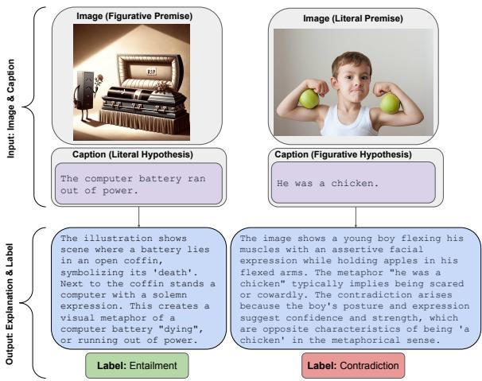  
Figure 1: Explainable visual entailment for understanding figurative meaning: given an image and a caption output whether the image entails or contradicts the caption along with a textual explanation.

(2022) proposed a task and dataset for Figurative Language Understanding through Textual Explanations (FLUTE) that frames the problem as an explainable textual entailment covering a variety of figurative language phenomena in text: metaphors, similes, idioms, and sarcasm. This dataset has been used successfully to advance and benchmark the capabilities of LLMs for understanding figurative language in text (Saakyan et al., 2022; Ziems et al., 2024; Sravanthi et al., 2024; Dey et al., 2024).

However, figurative meaning is also prevalent in visual phenomena, such as visual metaphors (Akula et al., 2023; Chakrabarty et al., 2023), multimodal sarcasm (Desai et al., 2022), and humor (Hessel et al., 2023; Hwang and Shwartz, 2023). Yet so far most of the work on vision and language models (VLMs) has focused on understanding literal meaning in images and captions (e.g., ScienceQA (Lu et al., 2022), MMMU (Yue et al., 2024)) including work on explainable visual entailment (Kayser et al., 2021). Building on the idea of FLUTE (Chakrabarty et al., 2022) for text, we present a new dataset for understanding figurative meaning as explainable visual entailment, V-FLUTE. Our dataset contains 6,027 image, caption, label, explanation instances spanning diverse figurative phenomena. Each instance contains an image (premise) and a caption (hypothesis) that is either entailed or contradicted by the image. Deciding the entailment relation requires the vision-language model to understand the implicit meaning in both the visual and textual modalities. Our dataset contains figurative phenomena present in the image, in the caption, or in both. In addition, to mitigate the dependence on spurious correlations, to more rigorously investigate reasoning capabilities, and to promote explainability, our task requires the model to generate a plausible explanation for the output label. See Figure 1 for two examples from our dataset.

We make the following contributions towards assessing VLMs ability to understand figurative meaning expressed multimodally:

• V-FLUTE, an expert-verified dataset of 6,027 image, caption, label, explanation instances built using a human-LLM collaboration framework covering several phenomena: metaphors, similes, idioms, sarcasm, and humor (Section 3).

• A suite of evaluations to assess current VLMs’ capabilities on this new task of explainable visual figurative entailment (Section 4.2 and 4.3).

• A detailed human evaluation with error analysis yielding insights into the types of errors for different classes of models (Section 5).

## 2 Related Work

Textual entailment (MacCartney and Manning, 2008; Bowman et al., 2015) and visual entailment (Xie et al., 2019) tasks have been proposed to measure language and multimodal understanding. However, models trained to simply improve label accuracy on these data can be brittle and suffer from spurious correlations (Poliak et al., 2018; Gururangan et al., 2018; McCoy et al., 2019; Gardner et al., 2021). Datasets such as e-SNLI (Camburu et al., 2018) and e-SNLI-VE (Kayser et al., 2021) augment existing entailment datasets with natural language explanations and train models to not only predict the label, but also generate a textual explanation for the reason behind the prediction. However, they only focus on literal meaning in text and images. Recently, explainable entailment has been utilized to assess LLMs’ capabilities on understanding figurative language through the FLUTE dataset (Chakrabarty et al., 2022). FLUTE frames figurative language understanding as an explainable textual entailment task. Recent progress in multimodal models (Li et al., 2022; Alayrac et al., 2022; OpenAI, 2023; Team, 2023; Liu et al., 2023b; Anthropic, 2024) prompts us to asses understanding of figurative meaning present in the multimodal setting, contained in both images and text beyond intent and sentiment (Zhang et al., 2021; Kruk et al., 2019). To this end, we present an equivalent of the FLUTE dataset for the visual modality: V-FLUTE.

## 3 V-FLUTE Task and Dataset

Following prior work on figurative language understanding in text defined as explainable textual entailment, FLUTE (Chakrabarty et al., 2022), we define understanding figurative meaning as an explainable visual entailment task: given an image (premise) p and a caption (hypothesis) h, output a textual explanation eˆ justifying whether the premise entails or contradicts the hypothesis and assign a label $\hat { y } \in$ Entailment, Contradiction . We focus on the binary classification task, since for neutral labels, the explanations would be trivial (simply describing the image).

To build V-FLUTE, we start with existing multimodal figurative datasets which cover phenomena such as metaphors, similes, idioms, sarcasm or humor. We utilize human-AI collaboration frameworks with expert annotators (Chakrabarty et al., 2022; Wiegreffe et al., 2022; Liu et al., 2022) to augment them with expert-verified textual explanations and entailing/contradicting captions. Each instance then includes an image and a caption, and the figurative phenomenon can be either in the image, the caption or in both. An overview of the V-FLUTE dataset and our contributions w.r.t to the source datasets can be found in Table 1. See examples corresponding to each source dataset in Table 2 as they appear in V-FLUTE. Below, we describe the construction of V-FLUTE by each phenomenon.

## 3.1 Metaphors, Similes and Idioms

To create visual entailment instances containing metaphors and similes in V-FLUTE, we rely on two existing resources: HAIVMet (Chakrabarty et al., 2023) and IRFL (Yosef et al., 2023). Instances from HAIVMet contain the metaphor/simile as a part of the premise (image), while those taken from

<table><tr><td>Phenomenon</td><td>Data Source</td><td>Visual Style</td><td>Figurative Part</td><td>Our Contribution</td><td># instances</td></tr><tr><td rowspan="2">Metaphor/ Simile</td><td>HAIVMet (Chakrabarty et al., 2023)</td><td>Illustration</td><td>Image</td><td>Image Selection Textual Explanations Expert Verification</td><td>857 (450 E, 407 C)</td></tr><tr><td>IRFL (Yosef et al., 2023)</td><td>Photographic</td><td>Caption</td><td>Image Selection xf Textual Explanations Expert Verification</td><td>1,149 (574 E, 575 C)</td></tr><tr><td>Idiom</td><td>IRFL (Yosef et al., 2023)</td><td>Photographic</td><td>Caption</td><td>Image Selection Textual Explanations Expert Verification</td><td>370 (186 E, 184 C)</td></tr><tr><td>Sarcasm</td><td>MuSE (Desai et al., 2022)</td><td>Meme</td><td>Caption</td><td>Caption Generation Textual Explanations Expert Verification</td><td>1,042 (521 E, 521 C)</td></tr><tr><td rowspan="2">Humor</td><td>MemeCap (Hwang and Shwartz, 2023)</td><td>Meme</td><td>Image</td><td>Caption Generation Textual Explanations Expert Verification</td><td>1,958 (979 E, 979 C)</td></tr><tr><td>NYCartoons (Hessel et al., 2023)</td><td>Illustration</td><td>Image+Caption</td><td>Taken As Is</td><td>651 (651 E)</td></tr></table>

Table 1: V-FLUTE dataset composition: 5 figurative phenomena, source datasets, visual styles, and our contributions. E denotes number of entailment instances, C - contradiction. Diversity of the dataset ensures coverage of various figurative phenomena, figurative meaning location, and visual styles.

IRFL have the metaphor/simile as a part of the hypothesis (text).

## 3.1.1 IRFL as Data Source

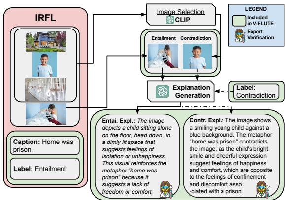  
Figure 2: Creation of V-FLUTE instances for metaphors, similes, idioms from IRFL.

Yosef et al. (2023) proposed a benchmark (IRFL) where given a metaphor, a simile or an idiom the model has to distinguish which of the four associated images implies the figurative meaning of the expression. This dataset contains 1,440 figurative expressions, each associated with 4 distinct images. One of those images represents the figurative expression (see Figure 2), and the other 3 act as distractors.

Image Selection. We automatically select images using CLIP (Radford et al., 2021). We select one of the distractor images that have the highest

CLIPScore (clip-vit-base-patch16) with the corresponding entailing image to create a challenging, contradictory instance (see where an unrelated image of a house is discarded when selecting the contradiction instance in Figure 2).

Generating Textual Explanations. We prompt GPT-4 (gpt-4-vision-preview) with the ground truth label, caption, and the image to explain the relationship between the image and the caption.

Expert Verification. We recruit three expert annotators with significant experience in figurative language and visual metaphor understanding on Upwork and ask them to verify the explanation is correct, complete, and concise and if not, edit it (see details in Appendix A). We also ask the annotators to discard rare noisy instances where the caption, image, and label do not fit (due to automatic image selection). Due to relative simplicity of generating the explanation given a literal image, the experts only needed to edit  7% of the explanations. They also removed 1% the data, resulting in 1149 image, caption, label, explanation instances for metaphors and similes and 370 for idioms.

## 3.1.2 HAIVMet as Data Source

Chakrabarty et al. (2023) use a human-AI collaboration framework to generate visual metaphors from linguistic metaphors (HAIVMet dataset) and propose a visual entailment task as an extrinsic evaluation of dataset quality. The HAIVMet data consists of 1,193 images of visual metaphors spanning over 958 distinct linguistic metaphors. Each image is associated with a caption that can be contradicting or entailing the image. In addition, each image is associate with a visual elaboration that presents a textual description of the image (See Figure 3). This visual elaboration was used in the original paper to generate the visual metaphors (images).

<table><tr><td>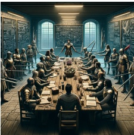</td><td></td><td></td><td>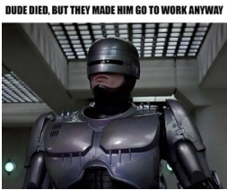</td><td></td></tr><tr><td>The faculty meeting</td><td>Their relationship is</td><td>Oh I just #love having to stare at</td><td>Even death won&#x27;t exempt you from</td><td>Easy for you to</td></tr><tr><td>was peaceful. Contradiction</td><td>a house on fire. Entailment</td><td>this while I #work. Contradiction</td><td>going to work. Entailment</td><td>say, you&#x27;re cured! Entailment</td></tr><tr><td>The image shows a faculty meeting transformed into a dramatic battlefield . The visual metaphor suggests the faculty a relationship filled</td><td>The photo suggests a conflict or an intense emotional situation ... which aligns with the symbolism of a house on fire representing</td><td>The image shows Disneyland Resort sign ... the person would like to experience it in person rather</td><td>The image shows RoboCop ... it humorously illustrates a character who has been reanimated</td><td>A play on the word &quot;cured&quot;. People seek therapy to have their mental problems remedied or cured. But &quot;cured&quot; can also</td></tr></table>

Table 2: Sample dataset instances form V-FLUTE corresponding to the source datasets displaying images (premise), captions (hypothesis), labels, and explanations [Row 1-5].

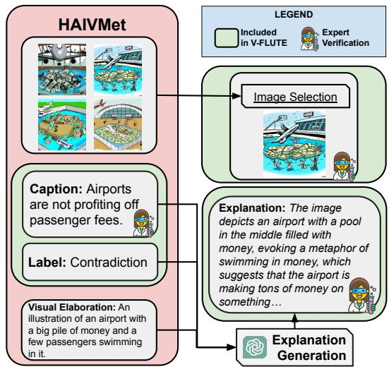  
Figure 3: Creation of V-FLUTE instances for metaphors and similes from HAIVMet.

Generating Textual Explanations. We augment the dataset with candidate textual explanations. We prompt ChatGPT (gpt-3.5-0914) to generate an explanation for every tuple visual elaboration, caption, label (See Figure 3; and prompt in Appendix E.1.1).

Expert Verification. Each caption is paired with up to 5 images. However, since these images were automatically generated with DALLE-2 using the visual elaborations, not all are completely faithful. Moreover, some captions and labels were inconsistent. Finally, automatically generated LLM candidate explanations are not always correct and require refining. To tackle these issues, we employ an expert verification process recruiting the same three expert annotators as from the IRFL section above (see details in Appendix A). We ask the annotators to select the visual metaphor most faithful to the linguistic metaphor and the visual elaboration (see Image Selection in Figure 3) or if none were. In addition, we ask them to verify and edit the explanation if necessary to ensure correctness, completeness, and conciseness. On average, experts edited  65% of the explanations and 29% of captions, and rejected 30% of visual metaphors, resulting in 857 image, caption, label, explanation instances.

## 3.2 Sarcasm

To create visual entailment instances containing sarcasm, we rely on the MuSE data (Desai et al., 2022).

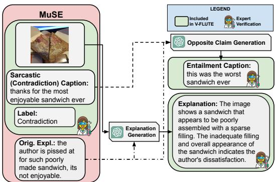  
Figure 4: Creation of V-FLUTE instances for sarcasm from MuSE.

## 3.2.1 MuSE as Data Source

The MuSE dataset (Desai et al., 2022) consists of 3510 distinct images, the respective sarcastic captions that act as contradiction instances (see example in Figure 4), and crowd worker written explanations justifying the contradiction.

Generating Entailment Captions. Since the dataset only contains sarcastic instances, there are no captions with an entailment relationship. We generate the entailing captions by prompting GPT-4 to generate a non-sarcastic version of the caption while maintaining the user-generated informal style of the text (see the generated entailment caption in Figure 4).

Generating Textual Explanations. While the dataset already contains crowdworker-written explanations, upon inspection, they were often deemed poor quality, lacking enough details, and formulaic (e.g., see the crowdworker explanation in Figure 4). To improve their quality, we use the dataset’s existing crowdworker explanations and prompt GPT-4 to rewrite and generate candidate textual explanations given the caption and the label (see the re-written explanation in Figure 4). See the prompt in Appendix E.3.

Expert Verification. Each image is now paired with a GPT-4-generated entailing caption, an original contradicting caption, and their respective labels and explanations. The same three expert annotators checked if the generated explanations are adequate (i.e., complete, correct, and concise) and if not, asked to edit them. The experts were also instructed to discard noisy examples, e.g. when the image does not contradict the sarcastic caption. On average, experts edited 13% of the initial explanations and rejected  18% of the examples, resulting in 1,042 image, caption, label, explanation instances.

## 3.3 Humor

For multimodal humor, we rely on two datasets: MemeCap (Hwang and Shwartz, 2023) and New Yorker cartoons (Hessel et al., 2023).

## 3.3.1 MemeCap as Data Source

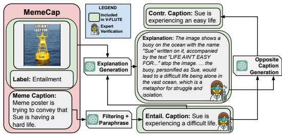  
Figure 5: Creation of V-FLUTE instances for humor from MemeCap.

This dataset consists of memes along with their captions that describe the meme poster’s intent (see example in Figure 5). Memes frequently contain implicit, non-literal meaning (Lestari, 2019) and rely on visual metaphors (Piata, 2016), posing a challenge to VLMs.

Caption Generation. Meme captions are not suited for an entailment task, so we prompt GPT-4 with the original caption to generate an entailing caption in the form of a claim from it (see example in Figure 5). We filter these set of samples further with GPT-4 by asking whether the image entails the caption and only selecting positive instances. In addition to generating captions that entail the meme, we generate contradicting captions using GPT-4.

Generating Textual Explanations. We prompted GPT-4 with the ground truth label in the prompt to explain the relationship between the image and the caption. See prompts in Appendix E.4.

Expert Verification. We hire the same three expert annotators to ensure the correctness of the data. Each annotator is tasked with verifying that 1) the generated caption fits the image and 2) the explanation is correct and complete, and if not, make the necessary changes. We also ask to discard samples with inappropriate content. Experts edited 35% of the explanations and 15% of captions on average, and discarded  2% of inappropriate instances, resulting in 1958 image, caption, label, explanation instances.

## 3.3.2 NYCartoons as Data Source

The NYCartoons dataset (Hessel et al., 2023) contains 651 high-quality instances from the New Yorker Cartoon Caption Contest. Each instance consists of an image paired with a humorous caption and an explanation of why this combination of the caption and the image is funny. We utilize this data as is by treating the image as entailing the caption, so the explanation of the entailment relationship is the explanation of the joke.

## 3.4 Dataset Statistics

We split our data into 4,578 training, 726 validation, and 723 testing instances. Table 3 shows the number of samples from each source dataset that are included in the randomly selected training, validation, and held-out test splits. More details in Appendix B.

<table><tr><td>Type</td><td>Dataset</td><td>Train</td><td>Valid</td><td>Test</td></tr><tr><td rowspan="2">Metaphor /Similes</td><td>HAIVMET</td><td>649</td><td>107</td><td>101</td></tr><tr><td>IRFL (metaphor /simile)</td><td>912</td><td>117</td><td>120</td></tr><tr><td>Idioms</td><td>IRFL (idiom)</td><td>170</td><td>100</td><td>100</td></tr><tr><td>Sarcasm</td><td>MuSE</td><td>830</td><td>106</td><td>106</td></tr><tr><td rowspan="2">Humor</td><td>MemeCap</td><td>1566</td><td>196</td><td>196</td></tr><tr><td>NYCartoons</td><td>451</td><td>100</td><td>100</td></tr><tr><td colspan="2">Total</td><td>4,578</td><td>726</td><td>723</td></tr></table>

Table 3: Data counts per phenomenon and dataset.

## 4 Experiments

We empirically study how several baseline models perform on the task of explainable visual entailment. We investigate both off-the-shelf and fine-tuned model performance. We provide human baseline performance in Appendix 5.4. Hyperparameters are provided in Appendix D.

## 4.1 Models

We select a variety of models for our study (see taxonomy in Appendix, Figure 10). For off-theshelf models, we explore both open and API-based models. For open models, we select the (current) state-of-the-art LLaVA-1.6 models (Liu et al., 2024). LLaVA is one of the simplest, yet one of the most high-performing VLM architectures currently available. It utilizes a pretrained large language model (e.g., Mistral-7B (Jiang et al., 2023)) and a vision-language cross-modal connector (e.g., an MLP layer) to align the vision encoder (e.g., CLIP (Radford et al., 2021)) outputs to the language models. We select LLaVA-1.6 models in their 7B and 34B configurations (LLaVA-v1.6-7B and LLaVAv1.6-34B respectively) and refer to them as LLaVA-ZS-7B and LLaVA-ZS-34B. Both models have been instruction-tuned on less than 1M visual instruction tuning samples to act as general language and vision assistants. We also utilize Compositional Chain-of-Thought Prompting proposed by Mitra et al. (2023) denoted by LLaVA-ZS-7B-SG and LLaVA-ZS-34B-SG (see description and results discussion in Appendix G).

For API-based models, we select three widely available state-of-the-art VLMs: Claude-3 Opus (claude-3-opus-20240229)(Anthropic, 2024), GPT-4 (gpt-4-1106-vision-preview) (OpenAI, 2023) and GeminiPro (gemini-pro-vision)(Team, 2023).

For fine-tuned models, we focus on fine-tuning the LLaVA-1.5-7B model2 (Liu et al., 2023a). To minimize bias for a single instruction, we fine-tune and evaluate the models on a set of 21 instruction paraphrases (see Appendix Table 8). Three model configurations are tested:

• LLaVA-VF is the same checkpoint fine-tuned on the training set of V-FLUTE. We also fine-tune the model with a white square instead of the V-FLUTE image (denoted by Image).

• LLaVA-eViL and LLaVA-eViL+VF are checkpoints of LLaVA-v1.5-7B further fine-tuned on the eViL (e-SNLI-VE) dataset for explainable visual entailment (Kayser et al., 2021) converted to the instruction format or on both eViL and V-FLUTE. We removed neutral label instances, which resulted in 275,815 training instances and 10,897 validation instances.

## 4.2 Automatic Metrics

Since our goal is to ensure models provide an answer for the right reasons, ideally, we would only count predictions as correct when the explanation is also correct. Based on prior work (Chakrabarty et al., 2022), we use both the standard F1 score and an adjusted score that accounts for explanation quality: F1@ExplanationScore. The ExplanationScore computes the average of BERTScore (Zhang\* et al., 2020) and BLEURT (Sellam et al.,

<table><tr><td>Model Name</td><td>F1@0</td><td>F1@53</td><td>F1@60</td></tr><tr><td>Random Baseline</td><td>49.82</td><td></td><td></td></tr><tr><td>Fine-tuned LLaVA-7B --→ VF</td><td>72.78</td><td>60.66</td><td>47.12</td></tr><tr><td>--→ − Image --→ eViL</td><td>64.77 54.34</td><td>53.28 4.11</td><td>39.37 0.55</td></tr><tr><td>--→ + VF</td><td>74.91</td><td>62.34</td><td>48.80</td></tr><tr><td>Off-the-shelf Open</td><td></td><td></td><td></td></tr><tr><td>LLaVA-ZS --→ 7B</td><td>45.44</td><td>35.57</td><td>18.38</td></tr><tr><td>--+ + SG</td><td>52.94</td><td>39.27</td><td>14.86</td></tr><tr><td>--→ 34B</td><td>55.60</td><td>48.32</td><td>31.83 26.77</td></tr><tr><td>--→ + SG</td><td>58.08</td><td>45.74</td><td></td></tr><tr><td>API-based</td><td></td><td></td><td></td></tr><tr><td>Gemini-1.5-Pro</td><td>53.70</td><td>39.72</td><td>19.01</td></tr><tr><td>--→ 5-shot</td><td>67.25</td><td>56.04</td><td>37.14</td></tr><tr><td>Claude-3 Opus</td><td></td><td></td><td></td></tr><tr><td></td><td>56.07</td><td>45.37</td><td>22.31</td></tr><tr><td>--→ 5-shot</td><td>67.79</td><td>58.70</td><td>35.32</td></tr><tr><td>GPT-4</td><td>64.00</td><td>56.22</td><td>38.56</td></tr><tr><td></td><td></td><td></td><td></td></tr><tr><td>--→ 5-shot</td><td>69.36</td><td>61.95</td><td>49.81</td></tr></table>

Table 4: F1 Score results for different models across thresholds 0.0, 0.53, and 0.6 for explanation score. Best result overall is in bold, best result in each category is underlined.

2020) between model-generated and reference (V-FLUTE) explanations. We report F1@0 (simply F1 score), F1 $\textcircled { \omega } 5 3 ^ { 3 }$ (all predictions with Explanation-Score $\leq 5 3$ are considered incorrect) and F1@60.

## 4.3 Automatic Evaluation Results

We include results per phenomenon in Appendix I, discussion on CoT prompting in Appendix G and additional models in Appendix H. Table 4 shows the results, informing the following insights:

A literal visual entailment dataset does not solve the figurative visual entailment task. Finetuning only on e-ViL barely improves over a random baseline (54.34 F1@0) and underperforms compared with the models fine-tuned on V-FLUTE (72.78 F1@0). Moreover, the explanations are of poor quality (0.55 F1@60). This indicates that models trained on a literal visual entailment task struggle to generalize to figurative meaning, supporting the challenging nature ofour dataset.

The strongest model fine-tuned on V-FLUTE (LLaVA-7B-eViL+VF) outperforms the best offthe-shelf model (GPT-4-5shot) in terms of the F1@0 score $( p < 0 . 0 3 ^ { 4 } )$ . It performs competitively when incorporating the reference-based ExplanationScore, with GPT-4 leading slightly as it is the model with which the candidate explanations were generated.

When figurative meaning is in the image rather than text, models perform worse. We plot the relative percentage decrease between F1@0 and F1@60 for LLaVA-eViL-VF, LLaVA-34B-SG, and GPT-4-5shot in Figure 6. Higher performance drop indicates higher difficulty of generating the correct explanation. For all models, we see a substantial decrease in performance, especially on challenging phenomena such as Humor (NYCartoons). The percentage drop is substantially higher for all models for the HAIVMet subset rather than the IRFL dataset, which contains metaphors in the image rather than in the text. This suggests it is harderfor models to generate correct explanations when the figurative meaning is contained in the image rather than in the text, indicating the need to expand the presence of figurative phenomena in existing visual datasets.

VLMs benefit from visual information when dealing with figurative phenomena and do not just rely on the input text to make their prediction. We utilize a hypothesis-only baseline (Poliak et al., 2018) by including a model finetuned on the V-FLUTE dataset, but with a white square as the image input, denoted as Image. Fine-tuning on the full V-FLUTE dataset shows an improvement of over 8 points in F1@0 (better with $p < 0 . 0 0 2 )$

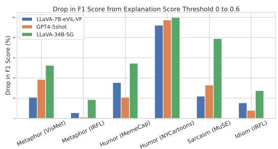  
Figure 6: % Drop in F1 score for various models by source dataset between 0 to 0.6. Higher drop indicates higher proportion of wrongly generated explanations.

## 5 Human Evaluation and Error Analysis

We conduct human evaluation of generated explanations to assess their quality and identify key errors in reasoning about multimodal figurative meaning.

<table><tr><td>Error Type</td><td>Image</td><td>Caption</td><td>Label and Explanation</td></tr><tr><td>Hallucination (de- scribes sharp pen- cil as having a blunt tip)</td><td></td><td>The tip is as sharp as a knife.</td><td>Predicted Label: Contradiction Predicted Explanation: The image depicts a pencil with a blunt tip. [...]</td></tr><tr><td>Incomplete (does not address metaphorical meaning of iceberg imagery)</td><td>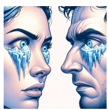</td><td>They looked at each other in an almost hostile way.</td><td>Predicted Label: Entailment Predicted Explanation: The image depicts two characters looking at each other with a tense and confrontational expression, which is con- sistent with the claim [...]</td></tr><tr><td>Unsound (concludes that large amount of</td><td></td><td>The world recession of 2001 was one of the worst in history.</td><td>Predicted Label: Entailment Predicted Explanation: The image depicts a man in a boat, holding a large amount of</td></tr><tr><td>money + upward trending chart im- plies rough waters)</td><td></td><td></td><td>money and a chart with an arrow pointing up- wards. This suggests that the man is navigating through rough waters [...]</td></tr></table>

Table 5: Examples of error types generated explanations.

We recruit two expert annotators with background in linguistics for the task and sample 95 random instances from the test set. For each instance, we first provide the annotators with the image, caption and reference explanation and ask the annotators to choose the right label. If the annotator succeeds, they can view the rest of the task, which consists of 3 explanations from our top models by F1@0 in each category: LLaVA-eViL-VF, LLaVA-34B-SG, GPT-4-5shot. The explanations are taken for both correct and incorrect model predictions. For each explanation, we ask whether the explanation is adequate (accurate, correct, complete and concise). If not, we ask them to identify one of the errors based on the following taxonomy:

• Hallucination: explanation is not faithful to the image, indicating difficulties with visual comprehension (e.g., generates “blunt tip” when the pencil tip is actually sharp in row 1 of Table 5).

• Unsound reasoning: sentences do not adhere to natural logic or violate common sense (e.g., concluding that an upwards arrow and lots of money imply an economic crisis, see row 3).

• Incomplete reasoning: while overall the explanation makes sense, it does not address the key property reasons why the image entails or contradicts the caption (for example, does not address the figurative part in the image, see row 2).

• Verbosity: the explanation is too verbose.

<table><tr><td></td><td>LLaVA-7B eViL+VF</td><td>LLaVA-34B SG</td><td>GPT-4 (5 shot)</td></tr><tr><td>Adequate %</td><td>33.78</td><td>29.85</td><td>50.67</td></tr><tr><td>Preference %</td><td>23.08</td><td>7.69</td><td>44.23</td></tr></table>

Table 6: Adequacy and Preference rates for generated explanations.

## 5.1 How Do Models Perform According to Humans?

In Table 6, we show adequacy and preference rates for explanations from the 3 systems, where an explanation is deemed adequate or preferred if both annotators agreed it is, and inadequate if both agreed it is not. The average IAA using Cohen’s κ is 0.47, indicating moderate agreement (Cohen, 1960). We observe that the teacher GPT-4 model is leading in terms of the adequacy of the explanations and preference rate, as expected from a larger system. Yet still only half of its explanations are considered adequate, confirming that despite good performance on the F1@0 scores, the models are not yet capable of producing adequate textual 5 explanations in many instances.

## 5.2 What Errors Do Models Make?

We perform an analysis of the types of errors from each model when the explanations are considered inadequate in the above evaluation. In Figure 7, we illustrate the normalized frequency of error types when both annotators agree that the explanation is not adequate (i.e., out of all errors for this model, what percentage is each type of error?). Overall, the annotators did not consider verbosity to be a major issue of the systems. For GPT-4, the leading error type is hallucination, indicating the need to improve faithful image recognition even in the most advanced models. Comparing LLaVA-34B-SG and the fine-tuned model, we see that for the scene graph model a larger percentage of errors is due to incomplete reasoning (possibly due to focusing on the scene graph description rather than the underlying figurative phenomena). For both models, the main error type is unsound reasoning, indicating difficulty for the models to consistently reason about multimodal figurative inputs.

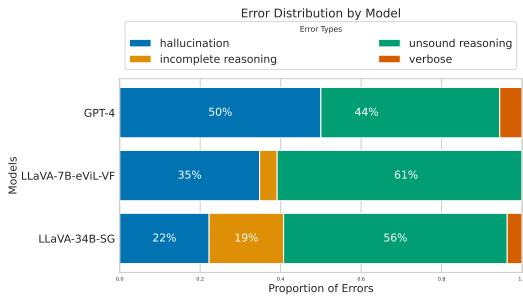  
Figure 7: Normalized frequency of main error types in the explanation by model.

## 5.3 How Well Does the Explanation Score Predict Human Judgment on Adequacy?

We explore whether the proposed explanation score can capture human judgment of explanation adequacy. We collect all instances from Section 5 where both annotators agreed on the adequacy judgement for the explanation. We evaluate if the explanation score described in Section 4.2 can act as a good predictor for the human adequacy judgment. We find that the area under the Precision-Recall curve is 0.79, and the maximum F1 score is 0.77, obtainable at the explanation score threshold of 0.53. Hence, we use this threshold to report the results in Table 4. We also use the threshold of 0.6 since it maximizes F1 such that both precision and recall are above 0.75.

## 5.4 How Well Do Humans Perform?

To find out how humans perform on the task, we hire two expert annotators with formal education in linguistics. We present them with 10 example instances and then ask them to complete 99 randomly sampled test set instances. We also evaluate our best model (see Table 4) on the same set. Results are shown in Table 7. Human performance is quite strong, almost reaching 90 F1@0 score overall. Human performance is better than our strongest finetuned model (LLaVA-7B-eVil+VF) performance with $p < 0 . 0 5$ for Annotator 1 and $p < 0 . 0 7$ for Annotator 2. Humans excel at interpreting memes, with both annotators reaching a 100% F1 score. Humans also perform noticeably better on the NY-Cartoons dataset and on the idiom subset of the task. The model has a slight edge in performance on the sarcasm and visual metaphor subsets of the task, perhaps due to difficulty of these subsets and any potential spurious correlations during fine-tuning.

<table><tr><td rowspan="2">Phenomenon</td><td rowspan="2">Dataset</td><td rowspan="2">Human Avg</td><td rowspan="2">LLaVA- eViL+VF</td></tr><tr><td></td></tr><tr><td rowspan="3">Metaphor /Similes</td><td>HAIVMET</td><td>78.84</td><td>81.25</td></tr><tr><td>IRFL (metaphor /simile)</td><td>94.36</td><td>77.78</td></tr><tr><td>IRFL</td><td>89.26</td><td>49.74</td></tr><tr><td>Idioms Sarcasm</td><td>(idiom) MuSE</td><td>68.89</td><td>85.42</td></tr><tr><td rowspan="2">Humor</td><td>MemeCap</td><td>100.0</td><td>78.03</td></tr><tr><td>NYCartoons</td><td>71.43</td><td>47.83</td></tr><tr><td colspan="2">Overall</td><td>89.09</td><td>77.26</td></tr></table>

Table 7: Human baseline results (F1@0) by phenomenon and source dataset.

## 6 Conclusion

We introduce a novel dataset for understanding figurative meaning in multimodal input, V-FLUTE, via an explainable visual entailment task. Our dataset consists of 6,027 image, caption, label, explanation instances covering diverse phenomena. We find that VLMs struggle to generalize from literal to figurative meaning, particularly in images. When figurative meaning is present in the image rather than text, models perform worse. VLMs benefit from the visual information during training to understand visual figurative meaning. Finally, humans still outperform even powerful VLMs overall. We identify three common error types in VLM reasoning about multimodal figurative phenomena: hallucination and incomplete or unsound reasoning.

## 7 Acknowledgments

We would like to thank the annotators for their work, as well as anonymous reviewers for productive discussion and feedback. This research is supported in part by the Office of the Director of National Intelligence (ODNI), Intelligence Advanced Research Projects Activity (IARPA), via the HIATUS Program contract #2022-22072200005. The views and conclusions contained herein are those of the authors and should not be interpreted as necessarily representing the official policies, either expressed or implied, of ODNI, IARPA, or the U.S. Government. The U.S. Government is authorized to reproduce and distribute reprints for governmental purposes notwithstanding any copyright annotation therein.

## 8 Ethics

Following prior work in human-AI collaboration for complex text and image generation (Chakrabarty et al., 2022, 2023; CH-Wang et al., 2023; Saakyan and Muresan, 2023), we opt for an expert-AI collaboration framework where experts edit the initial generations by the language model. Expert feedback is essential to improve the quality of the data, as previous work has identified that crowdworkers on platforms such as Amazon Mechanical Turk could be unreliable for open-ended generation tasks (Karpinska et al., 2021), and might even rely on ChatGPT to provide their answers (Veselovsky et al., 2023). To mitigate these effects, in this work, annotators were recruited through the Upwork platform, allowing to select for relevant level of expertise and verify, e.g., educational and professional background of the annotators. All recruited annotators have significant background in figurative language understanding and have formal educational background in linguistics or literature. All of the annotators are fluent or native/bilingual level in English. Workers on UpWork were informed that that the work they were doing was going to be used for research purposes. All are fairly compensated with USD \$20 to \$25 per hour with self-reported time needed to complete the tasks. The total budget for the annotation and GPT-4 generations was \$5, 000 USD. We estimate that it would take approximately 3 times longer to complete the annotation task without the pre-generated explanation, so we estimate that the cost would have at least tripled if the human-AI collaboration approach was not utilized. Workers were paid their wages in full immediately upon the completion of their work. All data collected by human respondents were fully anonymized. We do not report demographic or geographic information, given the limited number of respondents, so as to maintain full anonymity.

## 9 Limitations

We would like to acknowledge the following limitations of our work. The textual explanations in V-FLUTE dataset were generated with the help of the strongest LLM available at the time of writing the paper, GPT-4. Despite our best efforts in mitigating biases with expert human verification, idiosyncrasies pertaining to GPT-4 outputs may still be present in the text. This means that it is potentially possible for the underlying biases of source datasets of language model generations to propagate into our resource, which we wish to mitigate by carefully examining each dataset instance by one of the 3 expert annotators.

Reference-based evaluation has fundamental flaws, such as not considering all possible explanations, which would be impossible to collect. However, current reference-free metrics for free-text rationales may still have flaws such as bias toward length or the evaluator LLM (Stureborg et al., 2024; Raina et al., 2024; Huang et al., 2024; Chiang and Lee, 2023; Wei et al., 2024). When evaluating textual explanations against these references, as is the case with any reference-based evaluation, there may also be a preference towards models which output text closer in distribution to the GPT-4 model. Because of that, it is important to utilize the data set in order to compare models other than the teacher model and pay more attention to the F1@0 scores, which represent simple classification scores and do not require the outputs to be similar in distribution. In terms of pure F1 score performance, GPT-4 underperforms the fine-tuned model, and performs very closely with Gemini and Claude that were not used to generate the data, with less than 2% difference (see column F1@0, Table 4). Although we showed a relatively high predictive power of automatic explanation scores to predict human judgments (see Section 5.3), future work may focus on increasing reliability of referencebased and reference-free textual explanation evaluation methods.

We also note that the images from the HAIVMet dataset (Chakrabarty et al., 2023) are AI generated.

However, the majority of the remaining images in V-FLUTE are not AI generated but are naturally occurring or created by humans. However, to mitigate potential biases from AI-generated images, all instances of the data were examined during the expert verification stage, as described in the article.

Label predictions by language models can vary significantly with slight differences in prompt wording (Sclar et al., 2023), which is why during finetuning and inference we utilize over 20+ different templates of instructions (see Table 8). Nevertheless, it is important to consider the models’ explanations to better assess their understanding of the phenomena, which we hope to enable with our explainable figurative visual entailment dataset.

## References

Arjun R Akula, Brendan Driscoll, Pradyumna Narayana, Soravit Changpinyo, Zhiwei Jia, Suyash Damle, Garima Pruthi, Sugato Basu, Leonidas Guibas, William T Freeman, et al. 2023. Metaclue: Towards comprehensive visual metaphors research. In Proceedings of the IEEE/CVF Conference on Computer Vision and Pattern Recognition, pages 23201–23211.

Jean-Baptiste Alayrac, Jeff Donahue, Pauline Luc, Antoine Miech, Iain Barr, Yana Hasson, Karel Lenc, Arthur Mensch, Katherine Millican, Malcolm Reynolds, et al. 2022. Flamingo: a visual language model for few-shot learning. Advances in Neural Information Processing Systems, 35:23716–23736.

Anthropic. 2024. The claude 3 model family: Opus, sonnet, haiku. https://www.anthropic.com/news/ claude-3-family.

Samuel R. Bowman, Gabor Angeli, Christopher Potts, and Christopher D. Manning. 2015. A large annotated corpus for learning natural language inference. In Proceedings of the 2015 Conference on Empirical Methods in Natural Language Processing, pages 632–642, Lisbon, Portugal. Association for Computational Linguistics.

Oana-Maria Camburu, Tim Rocktäschel, Thomas Lukasiewicz, and Phil Blunsom. 2018. e-snli: Natural language inference with natural language explanations. In Advances in Neural Information Processing Systems, volume 31. Curran Associates, Inc.

Sky CH-Wang, Arkadiy Saakyan, Oliver Li, Zhou Yu, and Smaranda Muresan. 2023. Sociocultural norm similarities and differences via situational alignment and explainable textual entailment. In Proceedings ofthe 2023 Conference on Empirical Methods in Natural Language Processing, pages 3548–3564, Singapore. Association for Computational Linguistics.

Tuhin Chakrabarty, Arkadiy Saakyan, Debanjan Ghosh, and Smaranda Muresan. 2022. FLUTE: Figurative

language understanding through textual explanations. In Proceedings of the 2022 Conference on Empirical Methods in Natural Language Processing, pages 7139–7159, Abu Dhabi, United Arab Emirates. Association for Computational Linguistics.

Tuhin Chakrabarty, Arkadiy Saakyan, Olivia Winn, Artemis Panagopoulou, Yue Yang, Marianna Apidianaki, and Smaranda Muresan. 2023. I spy a metaphor: Large language models and diffusion models co-create visual metaphors. In Findings of the Association for Computational Linguistics: ACL 2023, pages 7370–7388, Toronto, Canada. Association for Computational Linguistics.

Cheng-Han Chiang and Hung-yi Lee. 2023. A closer look into using large language models for automatic evaluation. In Findings ofthe Associationfor Computational Linguistics: EMNLP 2023, pages 8928– 8942, Singapore. Association for Computational Linguistics.

Jacob Cohen. 1960. A coefficient of agreement for nominal scales. Educational and psychological measurement, 20(1):37–46.

Wenliang Dai, Junnan Li, Dongxu Li, Anthony Meng Huat Tiong, Junqi Zhao, Weisheng Wang, Boyang Li, Pascale Fung, and Steven Hoi. 2024. Instructblip: towards general-purpose vision-language models with instruction tuning. In Proceedings of the 37th International Conference on Neural Information Processing Systems, NIPS ’23, Red Hook, NY, USA. Curran Associates Inc.

Poorav Desai, Tanmoy Chakraborty, and Md Shad Akhtar. 2022. Nice perfume. how long did you marinate in it? multimodal sarcasm explanation. Proceedings ofthe AAAI Conference on Artificial Intelligence, 36(10):10563–10571.

Gourab Dey, Adithya V Ganesan, Yash Kumar Lal, Manal Shah, Shreyashee Sinha, Matthew Matero, Salvatore Giorgi, Vivek Kulkarni, and H Andrew Schwartz. 2024. Socialite-llama: An instructiontuned model for social scientific tasks. arXiv preprint arXiv:2402.01980.

Susan R Fussell and Mallie M Moss. 2014. Figurative language in emotional communication. In Social and cognitive approaches to interpersonal communication, pages 113–141. Psychology Press.

Matt Gardner, William Merrill, Jesse Dodge, Matthew Peters, Alexis Ross, Sameer Singh, and Noah A. Smith. 2021. Competency problems: On finding and removing artifacts in language data. In Proceedings ofthe 2021 Conference on Empirical Methods in Natural Language Processing, pages 1801–1813, Online and Punta Cana, Dominican Republic. Association for Computational Linguistics.

Suchin Gururangan, Swabha Swayamdipta, Omer Levy, Roy Schwartz, Samuel Bowman, and Noah A. Smith. 2018. Annotation artifacts in natural language inference data. In Proceedings of the 2018 Conference of

the North American Chapter ofthe Associationfor Computational Linguistics: Human Language Technologies, Volume 2 (Short Papers), pages 107–112, New Orleans, Louisiana. Association for Computational Linguistics.

Pengcheng He, Xiaodong Liu, Jianfeng Gao, and Weizhu Chen. 2021. {DEBERTA}: {DECODING}- {enhanced} {bert} {with} {disentangled} {attention}. In International Conference on Learning Representations.

Jack Hessel, Ana Marasovic, Jena D. Hwang, Lillian Lee, Jeff Da, Rowan Zellers, Robert Mankoff, and Yejin Choi. 2023. Do androids laugh at electric sheep? humor “understanding” benchmarks from the new yorker caption contest. In Proceedings of the 61st Annual Meeting ofthe Associationfor Computational Linguistics (Volume 1: Long Papers), pages 688–714, Toronto, Canada. Association for Computational Linguistics.

Cheng-Yu Hsieh, Chun-Liang Li, Chih-kuan Yeh, Hootan Nakhost, Yasuhisa Fujii, Alex Ratner, Ranjay Krishna, Chen-Yu Lee, and Tomas Pfister. 2023. Distilling step-by-step! outperforming larger language models with less training data and smaller model sizes. In Findings of the Association for Computational Linguistics: ACL 2023, pages 8003–8017, Toronto, Canada. Association for Computational Linguistics.

Edward J Hu, yelong shen, Phillip Wallis, Zeyuan Allen-Zhu, Yuanzhi Li, Shean Wang, Lu Wang, and Weizhu Chen. 2022. LoRA: Low-rank adaptation of large language models. In International Conference on Learning Representations.

Hui Huang, Yingqi Qu, Hongli Zhou, Jing Liu, Muyun Yang, Bing Xu, and Tiejun Zhao. 2024. On the limitations of fine-tuned judge models for llm evaluation. Preprint, arXiv:2403.02839.

EunJeong Hwang and Vered Shwartz. 2023. MemeCap: A dataset for captioning and interpreting memes. In Proceedings of the 2023 Conference on Empirical Methods in Natural Language Processing, pages 1433–1445, Singapore. Association for Computational Linguistics.

Albert Q. Jiang, Alexandre Sablayrolles, Arthur Mensch, Chris Bamford, Devendra Singh Chaplot, Diego de las Casas, Florian Bressand, Gianna Lengyel, Guillaume Lample, Lucile Saulnier, Lélio Renard Lavaud, Marie-Anne Lachaux, Pierre Stock, Teven Le Scao, Thibaut Lavril, Thomas Wang, Timothée Lacroix, and William El Sayed. 2023. Mistral 7b. Preprint, arXiv:2310.06825.

Marzena Karpinska, Nader Akoury, and Mohit Iyyer. 2021. The perils of using Mechanical Turk to evaluate open-ended text generation. In Proceedings ofthe 2021 Conference on Empirical Methods in Natural Language Processing, pages 1265–1285, Online and Punta Cana, Dominican Republic. Association for Computational Linguistics.

Maxime Kayser, Oana-Maria Camburu, Leonard Salewski, Cornelius Emde, Virginie Do, Zeynep Akata, and Thomas Lukasiewicz. 2021. e-vil: A dataset and benchmark for natural language explanations in vision-language tasks. In Proceedings of the IEEE/CVF international conference on computer vision, pages 1244–1254.

Philipp Koehn. 2004. Statistical significance tests for machine translation evaluation. In Proceedings ofthe 2004 Conference on Empirical Methods in Natural Language Processing, pages 388–395, Barcelona, Spain. Association for Computational Linguistics.

Julia Kruk, Jonah Lubin, Karan Sikka, Xiao Lin, Dan Jurafsky, and Ajay Divakaran. 2019. Integrating text and image: Determining multimodal document intent in Instagram posts. In Proceedings of the 2019 Conference on Empirical Methods in Natural Language Processing and the 9th International Joint Conference on Natural Language Processing (EMNLP-IJCNLP), pages 4622–4632, Hong Kong, China. Association for Computational Linguistics.

Widia Lestari. 2019. Irony analysis of memes on instagram social media. Pioneer: Journal of Language and Literature, 10(2):114–123.

Junnan Li, Dongxu Li, Caiming Xiong, and Steven Hoi. 2022. Blip: Bootstrapping language-image pretraining for unified vision-language understanding and generation. In International Conference on Machine Learning, pages 12888–12900. PMLR.

Alisa Liu, Swabha Swayamdipta, Noah A. Smith, and Yejin Choi. 2022. WANLI: Worker and AI collaboration for natural language inference dataset creation. In Findings of the Association for Computational Linguistics: EMNLP 2022, pages 6826–6847, Abu Dhabi, United Arab Emirates. Association for Computational Linguistics.

Haotian Liu, Chunyuan Li, Yuheng Li, and Yong Jae Lee. 2023a. Improved baselines with visual instruction tuning.

Haotian Liu, Chunyuan Li, Yuheng Li, Bo Li, Yuanhan Zhang, Sheng Shen, and Yong Jae Lee. 2024. Llavanext: Improved reasoning, ocr, and world knowledge.

Haotian Liu, Chunyuan Li, Qingyang Wu, and Yong Jae Lee. 2023b. Visual instruction tuning. In Advances in Neural Information Processing Systems, volume 36, pages 34892–34916. Curran Associates, Inc.

Pan Lu, Swaroop Mishra, Tony Xia, Liang Qiu, Kai-Wei Chang, Song-Chun Zhu, Oyvind Tafjord, Peter Clark, and Ashwin Kalyan. 2022. Learn to explain: Multimodal reasoning via thought chains for science question answering. In The 36th Conference on Neural Information Processing Systems (NeurIPS).

Bill MacCartney and Christopher D. Manning. 2008. Modeling semantic containment and exclusion in natural language inference. In Proceedings ofthe 22nd

International Conference on Computational Linguistics (Coling 2008), pages 521–528, Manchester, UK. Coling 2008 Organizing Committee.

Tom McCoy, Ellie Pavlick, and Tal Linzen. 2019. Right for the wrong reasons: Diagnosing syntactic heuristics in natural language inference. In Proceedings of the 57th Annual Meeting ofthe Associationfor Computational Linguistics, pages 3428–3448, Florence, Italy. Association for Computational Linguistics.

Chancharik Mitra, Brandon Huang, Trevor Darrell, and Roei Herzig. 2023. Compositional chain-of-thought prompting for large multimodal models. Preprint, arXiv:2311.17076.

OpenAI. 2023. Gpt-4v(ision) system card. https://cdn.openai.com/papers/GPTV\_ System\_Card.pdf.

Anna Piata. 2016. When metaphor becomes a joke: Metaphor journeys from political ads to internet memes. Journal ofPragmatics, 106:39–56.

Adam Poliak, Jason Naradowsky, Aparajita Haldar, Rachel Rudinger, and Benjamin Van Durme. 2018. Hypothesis only baselines in natural language inference. In Proceedings of the Seventh Joint Conference on Lexical and Computational Semantics, pages 180–191, New Orleans, Louisiana. Association for Computational Linguistics.

Amy Pu, Hyung Won Chung, Ankur P Parikh, Sebastian Gehrmann, and Thibault Sellam. 2021. Learning compact metrics for mt. In Proceedings of EMNLP.

Alec Radford, Jong Wook Kim, Chris Hallacy, Aditya Ramesh, Gabriel Goh, Sandhini Agarwal, Girish Sastry, Amanda Askell, Pamela Mishkin, Jack Clark, et al. 2021. Learning transferable visual models from natural language supervision. In International conference on machine learning, pages 8748–8763. PMLR.

Vyas Raina, Adian Liusie, and Mark Gales. 2024. Is llm-as-a-judge robust? investigating universal adversarial attacks on zero-shot llm assessment. Preprint, arXiv:2402.14016.

Richard M. Roberts and Roger J. Kreuz. 1994. Why do people use figurative language? Psychological Science, 5(3):159–163.

Arkadiy Saakyan, Tuhin Chakrabarty, Debanjan Ghosh, and Smaranda Muresan. 2022. A report on the figlang 2022 shared task on understanding figurative language. In Proceedings of the 3rd Workshop on Figurative Language Processing (FLP), pages 178–183.

Arkadiy Saakyan and Smaranda Muresan. 2023. Iclef: In-context learning with expert feedback for explainable style transfer. Preprint, arXiv:2309.08583.

Melanie Sclar, Yejin Choi, Yulia Tsvetkov, and Alane Suhr. 2023. Quantifying language models’ sensitivity to spurious features in prompt design or: How i

learned to start worrying about prompt formatting. In The Twelfth International Conference on Learning Representations.

Thibault Sellam, Dipanjan Das, and Ankur Parikh. 2020. BLEURT: Learning robust metrics for text generation. In Proceedings ofthe 58th Annual Meeting of the Association for Computational Linguistics, pages 7881–7892, Online. Association for Computational Linguistics.

Ekaterina V Shutova. 2011. Computational approaches to figurative language. Technical report, University of Cambridge, Computer Laboratory.

Settaluri Lakshmi Sravanthi, Meet Doshi, Tankala Pavan Kalyan, Rudra Murthy, Pushpak Bhattacharyya, and Raj Dabre. 2024. Pub: A pragmatics understanding benchmark for assessing llms’ pragmatics capabilities. arXiv preprint arXiv:2401.07078.

Kevin Stowe, Prasetya Utama, and Iryna Gurevych. 2022. IMPLI: Investigating NLI models’ performance on figurative language. In Proceedings ofthe 60th Annual Meeting of the Association for Computational Linguistics (Volume 1: Long Papers), pages 5375–5388, Dublin, Ireland. Association for Computational Linguistics.

Rickard Stureborg, Dimitris Alikaniotis, and Yoshi Suhara. 2024. Large language models are inconsistent and biased evaluators. arXiv preprint arXiv:2405.01724.

Gemini Team. 2023. Gemini: A family of highly capable multimodal models. Preprint, arXiv:2312.11805.

Tony Veale, Ekaterina Shutova, and Beata Beigman Klebanov. 2016. Metaphor: A computational perspective. Morgan & Claypool Publishers.

Veniamin Veselovsky, Manoel Horta Ribeiro, and Robert West. 2023. Artificial artificial artificial intelligence: Crowd workers widely use large language models for text production tasks. Preprint, arXiv:2306.07899.

Hui Wei, Shenghua He, Tian Xia, Andy Wong, Jingyang Lin, and Mei Han. 2024. Systematic evaluation of llm-as-a-judge in llm alignment tasks: Explainable metrics and diverse prompt templates. Preprint, arXiv:2408.13006.

Sarah Wiegreffe, Jack Hessel, Swabha Swayamdipta, Mark Riedl, and Yejin Choi. 2022. Reframing human-AI collaboration for generating free-text explanations. In Proceedings of the 2022 Conference of the North American Chapter of the Association for Computational Linguistics: Human Language Technologies, pages 632–658, Seattle, United States. Association for Computational Linguistics.

Adina Williams, Nikita Nangia, and Samuel Bowman. 2018. A broad-coverage challenge corpus for sentence understanding through inference. In Proceedings ofthe 2018 Conference ofthe North American

Chapter of the Association for Computational Linguistics: Human Language Technologies, Volume 1 (Long Papers), pages 1112–1122, New Orleans, Louisiana. Association for Computational Linguistics.

Ning Xie, Farley Lai, Derek Doran, and Asim Kadav. 2019. Visual entailment: A novel task for fine-grained image understanding. ArXiv, abs/1901.06706.

Ron Yosef, Yonatan Bitton, and Dafna Shahaf. 2023. IRFL: Image recognition of figurative language. In Findings of the Association for Computational Linguistics: EMNLP 2023, pages 1044–1058, Singapore. Association for Computational Linguistics.

Xiang Yue, Yuansheng Ni, Kai Zhang, Tianyu Zheng, Ruoqi Liu, Ge Zhang, Samuel Stevens, Dongfu Jiang, Weiming Ren, Yuxuan Sun, Cong Wei, Botao Yu, Ruibin Yuan, Renliang Sun, Ming Yin, Boyuan Zheng, Zhenzhu Yang, Yibo Liu, Wenhao Huang, Huan Sun, Yu Su, and Wenhu Chen. 2024. Mmmu: A massive multi-discipline multimodal understanding and reasoning benchmark for expert agi. In Proceedings of CVPR.

Dongyu Zhang, Minghao Zhang, Heting Zhang, Liang Yang, and Hongfei Lin. 2021. MultiMET: A multimodal dataset for metaphor understanding. In Proceedings of the 59th Annual Meeting of the Associationfor Computational Linguistics and the 11th International Joint Conference on Natural Language Processing (Volume 1: Long Papers), pages 3214–3225, Online. Association for Computational Linguistics.

Tianyi Zhang\*, Varsha Kishore\*, Felix Wu\*, Kilian Q. Weinberger, and Yoav Artzi. 2020. Bertscore: Evaluating text generation with bert. In International Conference on Learning Representations.

Jianing Zhou, Hongyu Gong, and Suma Bhat. 2021. PIE: A parallel idiomatic expression corpus for idiomatic sentence generation and paraphrasing. In Proceedings ofthe 17th Workshop on Multiword Expressions (MWE 2021), pages 33–48, Online. Association for Computational Linguistics.

Caleb Ziems, William Held, Omar Shaikh, Jiaao Chen, Zhehao Zhang, and Diyi Yang. 2024. Can large language models transform computational social science? Computational Linguistics, pages 1–55.

## A Details on Expert Verification

We follow the same procedure for expert verification of all sub-datasets. We recruit 3 expert annotators with background in figurative language and formal educational background in linguistics or literature on Upwork. We first ask to annotate 10 instances by all 3 annotators to ensure they understand the task. We then ensured a high agreement ( 90% pairwise accuracy) between annotators on a subsample of 100 instances of each dataset, and resolved any disagreements through mutual discussion between the annotators and the authors before proceeding. Finally, each annotator proceeds to annotate roughly $\textstyle { \frac { 1 } { 3 } }$ of the data.

We provide the annotation interfaces below for HAIVMET (Figure 12), IRFL (Figure 13), Meme-Cap (Figure 14) and MuSE (Figure 15). In addition, instructions were explained in more detail to the annotators via chat on Upwork (for example, the criteria for correctness and conciseness), and any of their doubts and questions were answered.

## B Dataset Statistics

Length distribution Average length of a caption in V-FLUTE is 61 characters. Average length of an explanation is  367 characters. Figure 8 shows the distribution of caption lengths, and Figure 9 shows the distribution of explanation lengths by source dataset. We manually verified that the outlier instances are correct.

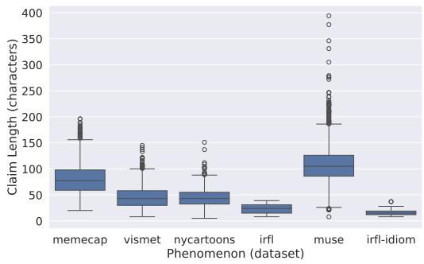  
Figure 8: Distribution of lengths of captions by source dataset.

## C API models Hyperparameters

## C.1 Claude

• Model Name: claude-3-opus-20240229

• Max Tokens: 256

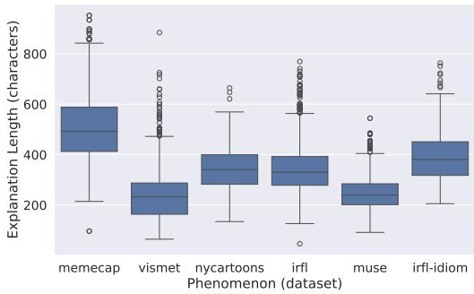  
Figure 9: Distribution of lengths of explanations by source dataset.

• Images greater than 5MB were resized maintaining aspect ratio

## C.2 GPT-4

• Model gpt-4-1106-vision-preview

Name:

• Max Tokens: 256

• Seed: 42

• Image URL detail: ’high’

## C.3 Gemini

• Model Name: gemini-pro-vision

• Max Tokens: 256

• Safety Settings: ’BLOCK NONE

• Images greater than 5MB were resized maintaining aspect ratio

## D Fine-tuning Hyperparameters

LLava-v1.6-6B and 34B respectively utilize instruction-tuned LLMs as their backbone, Mistral-7Binstruct6 and Yi-34B7.

We utilize LoRA (Hu et al., 2022) to fine-tune the models. We utilize the same hyperparameters for all fine-tunes outlined in Appendix D and use early stopping based on a V-FLUTE validation set to prevent overfitting. For evil and e-ViL+V-FLUTE we only fine-tuned for 2 epochs due to size of the e-ViL dataset and took the best checkpoint based on early stopping on V-FLUTE validation set. For eViL we only fine-tuned for 1 epoch to prevent overfitting. For VFLUTE, we trained for 3 epochs, and VFLUTE -Image for 10 epochs (to ensure performance does not increase even with larger number of epochs), for both we took the best checkpoint based on early stopping.

We utilize 4 NVIDIA A100 40GB GPUs for all experiment.

## Fine-tuning

• Seed: 42

• Vision Tower: openai-clip-vit-large-patch14- 336

• Number of Training Epochs: 3

• Train Batch Size (per device): 16

• Eval Batch Size (per device): 4

• Learning Rate: 2e-5

• Weight Decay: 0

• Warmup Ratio: 0.03

• Scheduler Type: cosine

• Number of epochs: 4 for eViL and eViL + vFLUTE, 10 for VFLUTE

• mm-projector-type: mlp2x gelu

• mm-vision-select-layer: -2

• mm-use-im-start-end: False

• mm-use-im-patch-token: False

• image-aspect-ratio: pad

• group-by-modality-length: False

## LoRA

• lora r: 128

• lora alpha: 256

• mm-projector-lr: 2e-5

## Deepspeed Configuration

• FP16 enabled: auto

• BF16 enabled: auto

• Micro Batch Size Per GPU: auto

• Train Batch Size: auto

• Gradient Accumulation Steps: auto

• Zero Optimization Stage: 3

## Training and Inference Instructions

All models are evaluated using beam search with n = 3, temperature 0, max length 256. In the case of generating scene graphs for the compositional chain-of-thought method, we set the max length to 256 for the graph generation step as recommended by Mitra et al. (2023). API models are evaluated with default hyperparameters. We format all fine-tuning data in the instruction format following LLaVA (Liu et al., 2023a). To avoid overfitting on a particular instruction for this task, we generate 20 similar instructions using an LLM (ChatGPT-4) and randomly assign one of them to every instance in the training, validation, and testing set. Same instructions were sampled for the e-ViL dataset. Table 8 shows the 20 instructions used.

The instructions were almost always followed. If they were not followed during the data creation process, we discarded those instances. For evaluation, we looked at the sample outputs of each model and designed rules to extract the label and the explanation from the output, which was not too difficult since mostly the instructions were followed well. In the rare cases the model failed to follow instructions, that label would likely be incorrect.

## Evaluation Hyperparameters

Following prior work, we utilize BERTScore (Zhang\* et al., 2020) based on the microsoft-deberta-xlarge-mnli model (He et al., 2021; Williams et al., 2018) and BLEURT (Sellam et al., 2020) based on BLEURT-20 (Pu et al., 2021) for the ExplanationScore.

## E Prompts for LLMs

## E.1 HAIVMET

## E.1.1 One-shot Prompt for generating explanations

We describe our one-shot prompts given to an LLM (gpt-3.5-turbo-instruct-0914) for generating explanations of entailment-contradiction relationship. Refer to Table 9 for the detailed prompt.

## E.2 IRFL

## E.2.1 Zero-shot Prompt for generating explanations

We provide our zero-shot prompt given to an LLM (gpt-4-vision-preview) for generating the entailment explanations given the claim and the image. Refer Table 10 for the detailed prompt.

<table><tr><td>No.</td><td>Instruction</td></tr><tr><td>1</td><td>Does the image&#x27;s narrative confirm or disprove the claim REPLACE CLAIM? Discuss your reasoning and identify it as either entailment or contradiction.</td></tr><tr><td>2</td><td>Does this image confirm or deny the claim REPLACE_CLAIM? Discuss your reasoning and determine a label: entailment or contradiction.</td></tr><tr><td>3</td><td>Is the image&#x27;s message supporting or opposing the claim REPLACE_CLAIM? Discuss your rationale and determine the appropriate label: entailment or contradiction. Is there agreement or disagreement between the image and the claim REPLACE_CLAIM? Provide</td></tr><tr><td>4</td><td>your analysis and choose between entailment or contradiction. Does the visual evidence support or counter the claim REPLACE_CLAIM? Provide your explanation</td></tr><tr><td>5</td><td>and assign it a label of entailment or contradiction. Does the image agree with or dispute the claim REPLACE_CLAIM? Explain your analysis and mark</td></tr><tr><td>6 7</td><td>it as entailment or contradiction. Does the illustration affirm or contest the claim REPLACE_CLAIM? Provide your argument and</td></tr><tr><td>8</td><td>choose a label: entailment or contradiction. Is the visual content in agreement or disagreement with the claim REPLACE_CLAIM? Offer your</td></tr><tr><td>9</td><td>explanation and categorize it under entailment or contradiction. Is the image in harmony with or in conflict with the statement REPLACE_CLAIM? Explain your</td></tr><tr><td>10</td><td>justification and label it as entailment or contradiction. Is the portrayal in the image consistent with or contradictory to the claim REPLACE_CLAIM? Offer</td></tr><tr><td>11</td><td>your insights and select between entailment or contradiction. Does the image&#x27;s depiction validate or refute the claim REPLACE_CLAIM? Explain your point of</td></tr><tr><td>12</td><td>view and select a label: entailment or contradiction. Is the content of the image endorsing or challenging the claim REPLACE_CLAIM? Justify your</td></tr><tr><td>13</td><td>position and label it as entailment or contradiction. Is the image consistent with the statement REPLACE_CLAIM? Justify your answer and classify it as</td></tr><tr><td>14</td><td>either entailment or contradiction. Does the illustration affirm or negate the claim REPLACE_CLAIM? Articulate your reasoning and</td></tr><tr><td>15</td><td>apply a label: entailment or contradiction. Does the picture support or refute the assertion REPLACE_CLAIM? Offer your rationale and select a</td></tr><tr><td>16</td><td>label: entailment or contradiction. Is the visual portrayal compatible with or adverse to the claim REPLACE_CLAIM? Justify your</td></tr><tr><td>17</td><td>viewpoint and label it as entailment or contradiction. Does the image corroborate or dispute the claim REPLACE_CLAIM? Outline your reasoning and</td></tr><tr><td>18</td><td>categorize it under entailment or contradiction. Is the depiction aligned with or against the claim REPLACE_CLAIM? Share your evaluation and</td></tr><tr><td>19</td><td>identify it as either entailment or contradiction. Does the image entail or contradict the claim REPLACE_CLAIM? Explain your reasoning and</td></tr><tr><td>20</td><td>provide a label between entailment or contradiction. Can the image be seen as validating or opposing the claim REPLACE_CLAIM? Explain your thought</td></tr><tr><td></td><td>process and assign a label of entailment or contradiction</td></tr><tr><td>21</td><td>Is the image&#x27;s representation supportive of or contradictory to the claim REPLACE_CLAIM? Articu- late your analysis and assign the label: entailment or contradiction.</td></tr></table>

Table 8: Instruction variations for the figurative visual entailment task.

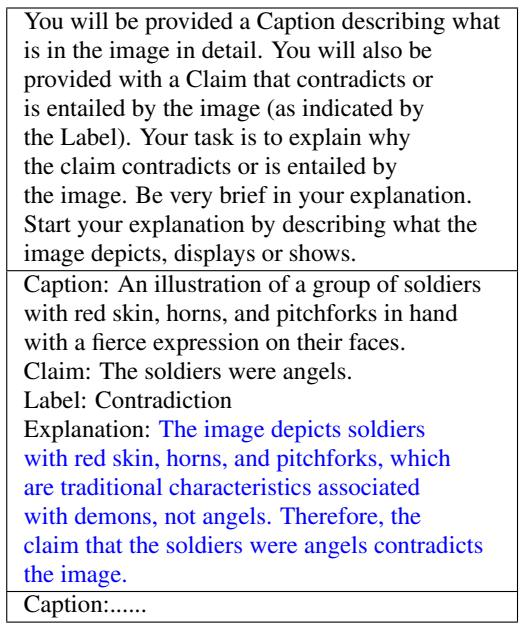  
Table 9: One shot prompt given to an LLM (gpt-3.5-turbo-instruct-0914) for generating explanations of entailment-contradiction relationship of the HAIVMET dataset.

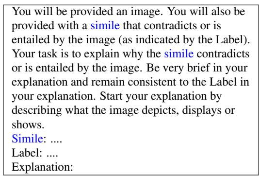  
Table 10: Zero shot prompt given to an LLM (gpt-4-vision-preview) for generating explanations of entailment-contradiction relationship of the IRFL Dataset. The dataset contains similes, metaphors and idioms. For metaphors and idioms, the word simile in the prompt is replaced with the corresponding type.

## E.3 MuSE

## E.3.1 Few-shot Prompt for generating opposite claims

We provide our few-shot prompt given to an LLM ((gpt-4-0613)) for generating the opposite claims. Refer Table 11 for the detailed prompt.

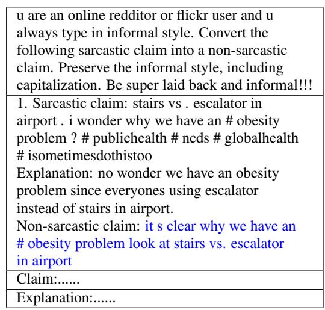  
Table 11: Few shot prompt given to an LLM (gpt-4-0613) for generating opposite claims utilizing the sarcastic claim and crowd worker explanation.

## E.3.2 Zero-shot Prompt for Rephrasing

We provide our zero-shot prompt given to an LLM (gpt-4-vision-preview) for rephrasing the explanations given the claim and the crowd worker explanation. Refer Table 12 for the detailed prompt.

Paraphrase the draft explanation of why the image   
contradicts the literal interpretation of the claim.   
Be sure to first describe the image in one sentence.   
Keep your answer short. Do not refer to the claim   
or the draft explanation in your paraphrase. Stay   
close to the draft explanation.   
Claim: ....   
Draft Explanation:  
Table 12: Zero shot prompt given to an LLM (gpt-4-vision-preview) for rephrasing the explanations given the claim and the.

## E.4 MemeCap

## E.4.1 Few-shot Prompt for generating entailing claims

We describe our few-shot prompts given to an LLM (gpt-4-0613) for generating entailing captions as part of the pipeline. Refer to Table 13 for the detailed prompt.

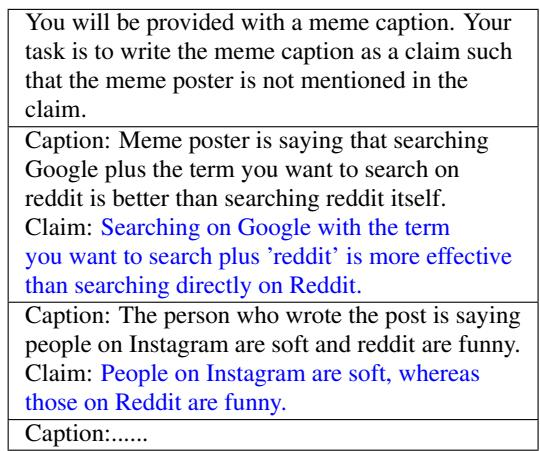  
Table 13: Two shot prompt given to an LLM (gpt-4-0613) for generating entailing claims utilizing the meme captions part of the MemeCap dataset.

## E.4.2 Zero-shot Prompt for validating the entailing captions

We describe our zero-shot prompt given to an LLM (gpt-4-vision-preview) for validating the claims generated in the previous step. Refer Table 14 for the detailed prompt.

You will be provided a meme image and a claim.   
Your task is to check whether the claim entails the   
image. Answer with a Yes or No.   
Claim: .....  
Table 14: Zero shot prompt given to an LLM (gpt-4-vision-preview) for validating the claims generated in E.4.1. The corresponding meme image is also attached with the prompt.

## E.4.3 Few-shot Prompt for generating opposite claims

We provide our few-shot prompt given to an LLM ((gpt-4-0613)) for generating the opposite claims. Refer Table 15 for the detailed prompt.

## E.4.4 Zero-shot Prompt for generating explanations

We provide our zero-shot prompt given to an LLM (gpt-4-vision-preview) for generating the entailment explanations given the claim and the image. Refer Table 16 for the detailed prompt.

## F Model Taxonomy

The taxonomy of all models used for automatic evaluation is shown in Figure 10.

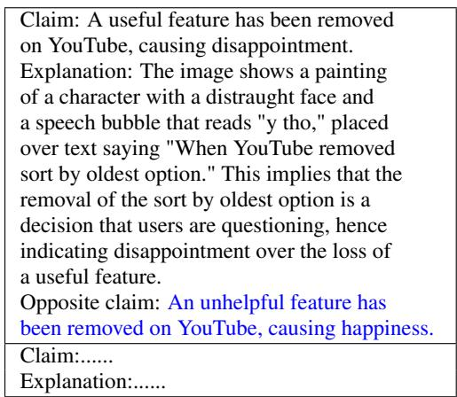  
Table 15: Few shot prompt given to an LLM (gpt-4-0613) for generating opposite claims utilizing the generated claim and explanation.

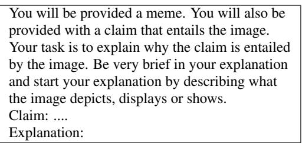  
Table 16: Zero shot prompt given to an LLM (gpt-4-vision-preview) for generating the entailment explanations. The corresponding meme image is also attached with the prompt.

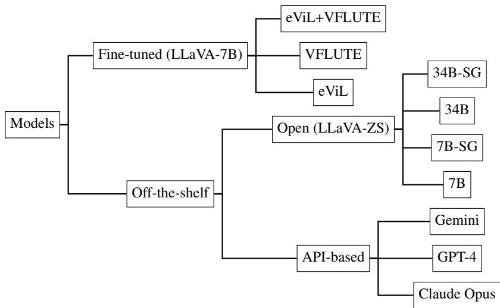  
Figure 10: Taxonomy of models used for the study.

## G Multimodal Structured Chain-of-Thought Performance

In addition to zero-shot testing, we also test these models using Compositional Chain-of-Thought Prompting proposed by Mitra et al. (2023). The method prompts the model zero-shot to generate a scene graph in JSON format and then utilizes that scene graph in another prompt to answer the relevant question. We refer to these models as LLaVA-ZS-7B-SG and LLaVA-ZS-34B-SG for the 7B and 34B LLaVA configurations described above.

Scene graph prompting and few-shot prompting improves performance on the figurative visual entailment task. Observing the results in Table 4, we can see that the multimodal few-shot prompting and scene graph prompting, having demonstrated their effectiveness for literal inputs, also show improved performance on the figurative visual entailment task. However, the explanations generated by SG-models tend to overly focus on the contents of the scene graph rather than the underlying figurative phenomena, possibly causing a decrease in explanation score.

## H Additional Models

In addition to the LLaVA architecture, we conduct experiments with the Instruct-BLIP model (Dai et al., 2024), specifically, the Instruct-BLIP-Vicuna-7B version. As can be seen in Table 17, Instruct-BLIP shows a weaker performance compared to LLaVA-7B, especially in explanation quality (4.14 F1@53 for InstructBLIP while 35.56 for LLaVA-7B-ZS, and 2.07 F1@60 while 18.38 for LLaVA as can be seen in Table 4). It struggled to generate scene graph descriptions, unlike LLaVA-7B. Despite extensive instruction-tuning, it performed below a random baseline in our figurative entailment task (F1@0: 43.37).

<table><tr><td>Model Name</td><td>f1@0</td><td>f1@53</td><td>f1@60</td></tr><tr><td>InstructBlip-7B-ZS</td><td>43.37</td><td>4.14</td><td>2.07</td></tr><tr><td>InstructBlip-7B-SG</td><td>38.03</td><td>4.15</td><td>1.38</td></tr></table>

Table 17: F1 Scores for Different Models

We also experimented with a state-of-the-art multimodal model GPT-4o that was released after our dataset was created. As expected, the results are better than those of GPT-4 due to improvements in the multimodal processing of GPT-4o. However, the F1@53 and F1@60 scores suggest there could still be improvements in explanation quality. Compared to the 7B fine-tuned LLaVA model, the zero-shot GPT-4o still underperforms the finetuned models in terms of F1@53 and is comparable in terms of F1@0. GPT-4o in the few-shot scenario (5 example) shows better results than the fine-tune model. These results can add to the discussion in our field between smaller open-source models and bigger and proprietary models in terms of performance accuracy and capabilities.

<table><tr><td>Model Name</td><td>f1@0</td><td>f1@53</td><td>f1@60</td></tr><tr><td>GPT-40</td><td>75.41</td><td>60.97</td><td>37.20</td></tr><tr><td>--→ 5-shot</td><td>79.42</td><td>69.35</td><td>56.31</td></tr></table>

Table 18: F1 Scores for GPT-4 Models

## I By-Phenomenon Performance

In Figure 11, we show the performance of the models by phenomenon and dataset across various thresholds.

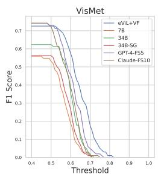

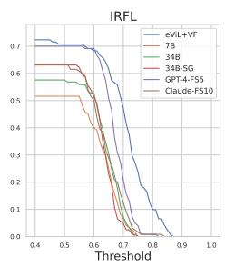

(a) Metaphors and Similes  
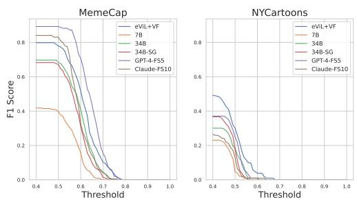  
(b) Humor

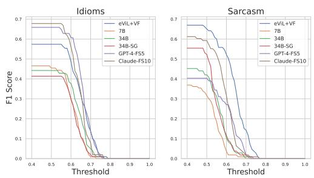  
(c) Sarcasm and Idioms  
Figure 11: Performance of the models by phenomenon.

## J How Do Models Perform When Only Predicting the Label?

In our experiments, we found that predicting only the label improves accuracy compared to predicting label and explanation (this is expected and observed in other work on textual explanations such as e-SNLI (Camburu et al., 2018)). However, these predictions are less reliable since they could be due to spurious correlations (which is why we require the model to generate textual explanations). We also found when fine-tuning the model in a multi-task fashion with explanations (i.e., two tasks, one of generating explanations and one of predicting the label), the accuracy improves compared to when fine-tuning only for the prediction task (F1 score of 80.85 vs. 83.26, $p < 0 . 1 )$ , in line with previous findings by Hsieh et al. (2023).

## K Annotation Interfaces

We provide the annotation interfaces below for HAIVMET (Figure 12), IRFL (Figure 13), Meme-Cap (Figure 14) and MuSE (Figure 15). In addition, instructions were explained in more detail to the annotators via chat on Upwork, and any of their doubts and questions were answered.

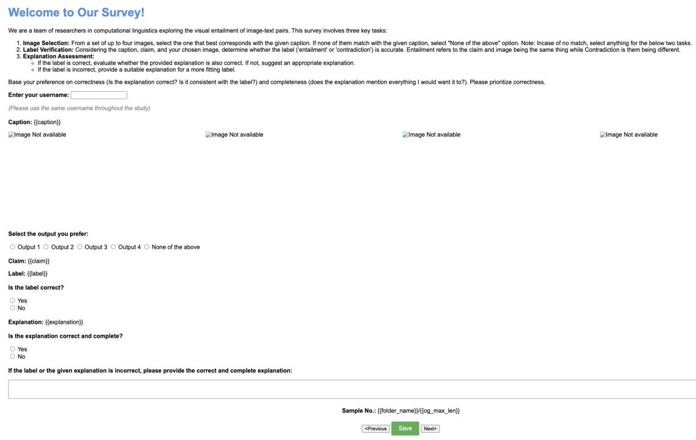  
Figure 12: Annotation interface for HAIVMET.

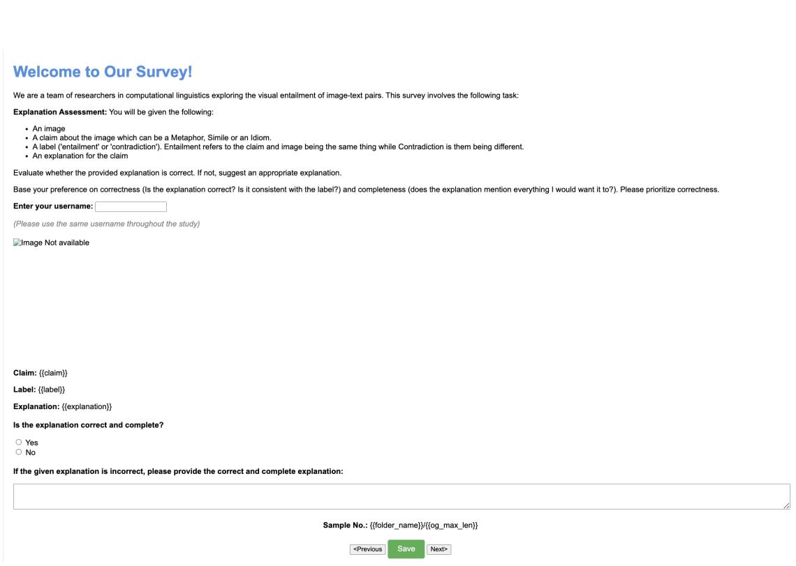  
Figure 13: Annotation interface for IRFL.

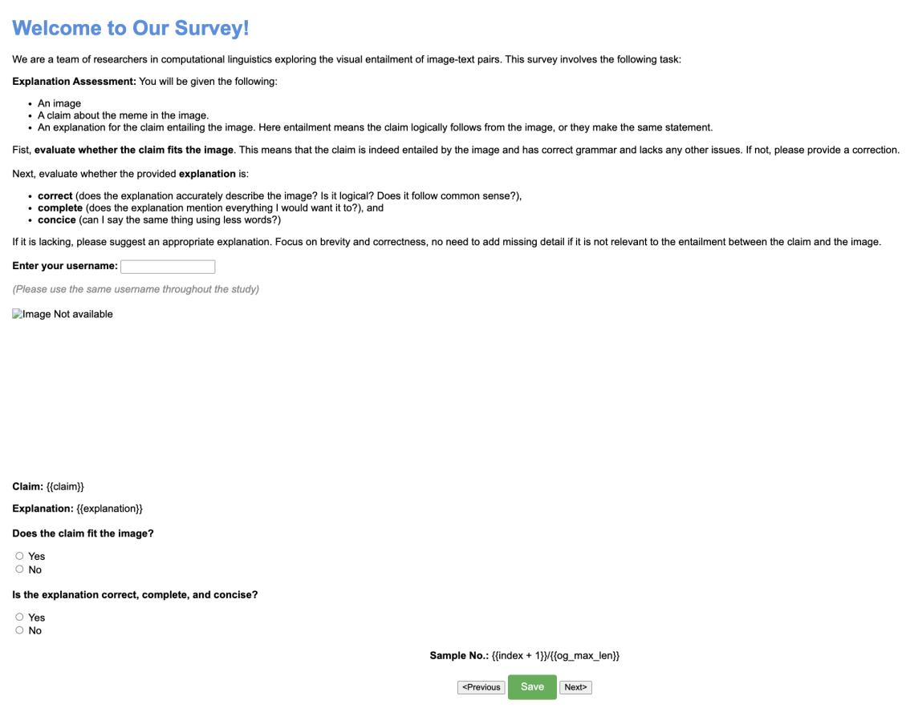  
Figure 14: Annotation interface for MemeCap.

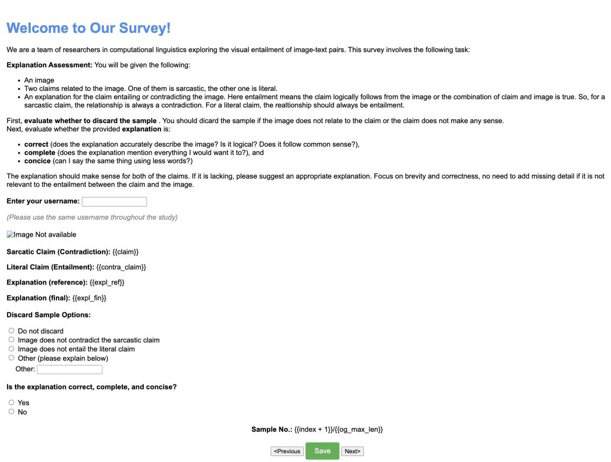  
Figure 15: Annotation interface for MuSE.