# Unfamiliar Finetuning Examples Control How Language Models Hallucinate

Katie Kang, Eric Wallace, Claire Tomlin, Aviral Kumar, Sergey Levine UC Berkeley

## Abstract

Large language models are known to hallucinate, but the underlying mechanism that govern how models hallucinate are not yet fully understood. In this work, we find that unfamiliar examples in the models’ finetuning data – those that introduce concepts beyond the base model’s scope of knowledge – are crucial in shaping these errors. In particular, we find that an LLM’s hallucinated predictions tend to mirror the responses associated with its unfamiliar finetuning examples. This suggests that by modifying how unfamiliar finetuning examples are supervised, we can influence a model’s responses to unfamiliar queries (e.g., say “I don’t know”). We empirically validate this observation in a series of controlled experiments involving SFT, RL, and reward model finetuning on TriviaQA and MMLU. Our work further in vestigates RL finetuning strategies for improving the factuality of long-form model generations. We find that, while hallucinations from the reward model can significantly undermine the effectiveness of RL factuality finetuning, strategically controlling how reward models hallucinate can minimize these negative effects. Leveraging our previous observations on controlling hallucinations, we propose an approach for learning more reliable reward models, and show that they improve the efficacy of RL factuality finetuning in long-form biography and book/movie plot generation tasks.

## 1 Introduction

Large language models (LLMs) have a tendency to “hallucinate,” generating plausible-sounding responses that are factually incorrect. This behavior is especially prominent when models are queried on concepts that extend beyond the models’ knowledge base (Kandpal et al., 2023; Kalai and Vempala, 2023) (e.g., asking the model to generate the biography of a little-known person). We will refer to these queries as unfamiliar inputs. Rather than fabricating information when presented with unfamiliar inputs, models should instead verbalize their uncertainty or confine their responses within the limits of their knowledge. The goal of our work is to teach models this behavior, particularly for long-form generation tasks.

Towards this goal, we first set out to better understand the underlying mechanisms that govern how LLMs hallucinate. Our investigation reveals that a finetuned model’s hallucinated responses tend to mimic the unfamiliar examples the model’s finetuning data (i.e., finetuning examples containing concepts unfamiliar to the pretrained model). More specifically, as test queries become more unfamiliar, we find that LLM predictions tend to default toward the distribution of responses associated with the model’s unfamiliar finetuning examples. We illustrate this observation in Fig. 1. To empirically verify this phenomenon, we conduct a series of controlled experiments, where we manipulate the way unfamiliar finetuning examples are supervised, and investigate the effect on the finetuned model’s predictions. We use multiple-choice (MMLU) and short-form question answering tasks (TriviaQA) as testbeds, where we can precisely characterize an LLM’s output distribution. Our results show that, across different finetuning procedures including SFT, RL, and reward model finetuning, the model predictions for unfamiliar test queries indeed approach the distribution of responses in the model’s unfamiliar finetuning examples.

Our observation suggests a recipe for minimizing factual inaccuracies in model generations: by strategically manipulating the unfamiliar examples in the model’s finetuning data, we can steer the model’s predictions for unfamiliar queries towards more desirable (e.g. linguistically uncertain) responses. We leverage this insight to design better finetuning techniques to improve the factuality of long-form LLM generations. We focus on RLbased approaches, where the use of reward models to supervise finetuning makes it scalable to longform tasks. However, reward models themselves can suffer from hallucinations, which can diminish the efficacy of RL factuality finetuning. Drawing on our previous insights, we design a approach for learning reward models that avoid hallucinating overestimated rewards, which we call conservative reward models. We find that using conservative reward models for RL factuality finetuning can significantly reduce the adverse effects of reward hallucinations, and more reliably teach models to generate factual responses than standard SFT and RL with standard reward models in biography and book/movie plot generation tasks.

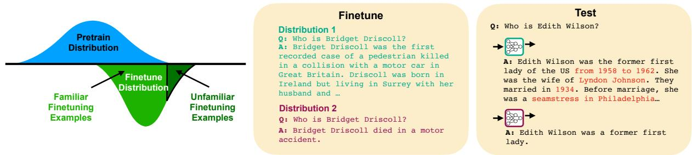  
Figure 1: Conceptual visualization of (un)familiar finetuning examples (left), and examples of model predictions mimicking unfamiliar finetuning examples (middle and right). When finetuning on dist. 1, which contains details the model may not know, the model outputs detailed responses at test-time with inaccuracies (red). When finetuning on dist. 2, which omits unfamiliar details, the model produces shorter responses with fewer inaccuracies.

In summary, our work makes two primary contributions: (1) we present a conceptual model outlining the factors that influence finetuned LLM predictions in response to unfamiliar queries, and (2) we leverage our findings to develop a more reliable approach to RL factuality finetuning for long-form generation tasks. We hope that the insights in our paper contribute to a better understanding of the mechanisms that govern how LLMs hallucinate, and principles for controlling these hallucinations.

## 2 Related Work

A number of works have documented the tendency of LLMs to hallucinate factually incorrect responses (Kalai and Vempala, 2023; Bubeck et al., 2023; Kadavath et al., 2022; Agrawal et al., 2023). Additionally, studies have investigated the conditions under which hallucinations occur and how LLMs behave in such instances. In particular, LLMs tend to hallucinate more frequently when queried on knowledge that is rarely mentioned in their training data (Mallen et al., 2023; Kandpal et al., 2023). Furthermore, LLM predictions tend to be moderately calibrated (Kadavath et al., 2022; Zhao et al., 2021; Tian et al., 2023b), and their internal representations seem to reflect some awareness of model uncertainty (Liu et al., 2023; Azaria and Mitchell, 2023). Our work, which finds that LLM hallucinations mimic the responses associated with its unfamiliar finetuning examples, extends our understanding of LLM behavior under uncertainty.

A number of prior works have also sought to address the challenges posed by LLM hallucinations. Active research areas include hallucination detection (Manakul et al., 2023; Mündler et al., 2023; Xu et al., 2023; Kuhn et al., 2023), automated evaluation of factuality (Min et al., 2023; Umapathi et al., 2023; Jing et al., 2023), and mitigation techniques. Common strategies for mitigating hallucinations include specialized sampling methods (Lee et al., 2022; Li et al., 2023; Chuang et al., 2023; Zhang et al., 2023b), more reliable input prompts (Si et al., 2022), using retrieval augmentation to incorporate external knowledge (Gao et al., 2023; Peng et al., 2023; Varshney et al., 2023; Yao et al., 2023; Shuster et al., 2021), and, closest to our work, finetuning models for factuality. In particular, prior works has found that SFT on data where difficult examples are labeled to abstaining answers (Lin et al., 2022; Yang et al., 2023; Zhang et al., 2023a), and RL finetuning (Shulman, 2023; Goldberg, 2023; Tian et al., 2023a; Sun et al., 2023; Roit et al., 2023; Mesgar et al., 2020) can improve the factuality of model generations. Our work also studies finetuning techniques for mitigating hallucinations, but focuses on the little-studied effects of reward model hallucinations, which we find to have a large impact on the efficacy of RL factuality finetuning.

## 3 Problem Setting

Modern LLMs are typically trained in a twostage process: pretraining on broad-coverage corpora, followed by finetuning on more specialized instruction-following datasets (Ouyang et al.,

2022). These models are prone to generating undesirable responses when prompted with inputs that are not well represented in their training data. In particular, models tend to output plausiblesounding but factually incorrect responses when queried outside its pretraining distribution, and output nonsensical responses when queried outside its finetuning distribution. We focus on the former regime, where queries stylistically resemble examples in the finetuning data, but require concepts beyond the pretrained model’s scope of knowledge. We call this kind of input unfamiliar to the model.

In our experiments, we will use question-answer tasks as a testbed, though our analysis and method can apply to any prompted generation LLM task. To isolate the effects of distribution shift with respect to the pretraining data (rather than finetuning data), we will evaluate model predictions on held-out queries sampled from the same distribution as the finetuning data. To understand how the behavior of the model changes depending on the unfamiliarity of the test query, our evaluation will decompose the held-out test set into different levels of unfamiliarity. We will quantify the unfamiliarity of a query by few-shot prompting the pretrained model with a few examples (sampled from the same task) along with the query of interest, and measuring the quality of the pretrained model’s prediction, where the quality of a prediction is quantified using task-specific metrics. We refer to this metric as the unfamiliarity score of a query. We consider a finetuning example to be unfamiliar if the unfamiliarity score of its query is above a certain threshold.

## 4 Understanding How LLMs Hallucinate

In this section, we investigate the underlying mechanisms that govern how finetuned LLMs hallucinate. We hypothesize that, when face with unfamiliar inputs, model predictions mimic the responses associated with the model’s unfamiliar finetuning examples. We will first present our hypothesis more precisely, then validate our hypothesis with a series of controlled experiments.

## 4.1 Main Hypothesis

Let us consider an LLM $f _ { \theta }$ , which maps a prompt x to a distribution of responses $P _ { \theta } ( y | x )$ . We finetune this model on a dataset $\mathcal { D } = \{ ( x _ { i } , s _ { i } ) \} _ { 1 \leq i \leq N }$ with a loss function $\textstyle \sum _ { ( x _ { i } , s _ { i } ) \in { \mathcal { D } } } { \mathcal { L } } ( f _ { \theta } ( x _ { i } ) , s _ { i } )$ , where $s _ { i }$ represents the supervision associated with $x _ { i }$ . Depending on the choice of $\mathcal { L } .$ this can represent SFT (where $s _ { i }$ is a a target response) or RL finetuning (where $s _ { i }$ is a reward function).

While the optimal behavior that an LLM can learn during finetuning is to output the groundtruth answer to each query, this may not happen in practice for all finetuning examples. For familiar finetuning examples, the pretrained model’s representations often encode useful associations between queries and responses, facilitating the finetuning optimization for those examples. However, for unfamiliar examples, which we refer to as ${ \mathcal { D } } _ { \mathrm { u n f } } .$ such helpful associations in the pretrained representations are largely absent, making it more difficult to model these examples. Nonetheless, while an LLM may struggle to produce the optimal response for each query in ${ \mathcal { D } } _ { \mathrm { u n f } } .$ it can still minimize the aggregate loss over unfamiliar finetuning examples by producing an intelligent “blind guess”, $\begin{array} { r } { P _ { \mathrm { u n f } } ( y ) = \arg \operatorname* { m i n } _ { P ( y ) } \sum _ { ( x _ { i } , s _ { i } ) \in \mathcal { D } _ { \mathrm { u n f } } } \mathcal { L } ( P ( y ) , s _ { i } ) } \end{array}$ for all unfamiliar queries. Note that $P _ { \mathrm { u n f } } ( y )$ is input-agnostic, and depends only on the model’s unfamiliar finetuning examples. We hypothesize that LLMs learn to predict $P _ { \mathbf { u n f } } ( y )$ for unfamiliar examples during finetuning, and that they default to this prediction when faced with unfamiliar queries at test time.

## 4.2 Experiments

We will now present a series of experiments to evaluate our hypothesis. The goal of our experiments is to verify that (1) model predictions indeed default to $P _ { \mathrm { u n f } } ( y )$ when presented with unfamiliar queries, and (2) this prediction behavior is governed by the unfamiliar examples in the models’ finetuning data. Towards this goal, we analyze the prediction behavior of different models, where unfamiliar finetuning examples are supervised in different ways, while all other training details are kept fixed. We evaluate our hypothesis for different types of finetuning procedures, including SFT, RL, and reward modeling (for supervising RL finetuning). We primarily use Llama2 7B (Touvron et al., 2023) as the pretrained model, though we present additional experiments supporting our hypothesis using Mistral 7B (Jiang et al., 2023) in Appendix A. We conduct our experiments with a multiple-choice (MMLU (Hendrycks et al., 2020)) and a short-form (TriviaQA (Joshi et al., 2017)) question answering task, so that we can precisely characterize a model’s output distributions. For MMLU, we obtain the unfamiliarity score by few-shot prompting the pretrained model and measuring the negative log likelihood of the correct answer under the predicted distribution. For TriviaQA, we obtain the unfamiliarity score by fewshot prompting the pretrained model, sampling 12 responses, and measuring the number of incorrect responses. In subsequent sections, we will extend our experiments to long-form generation tasks. See Appendix C and D for experimental details.

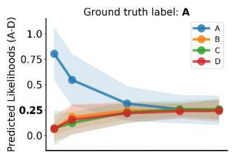

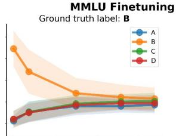

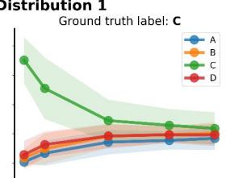

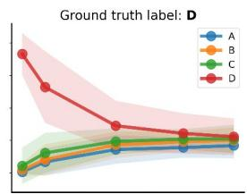

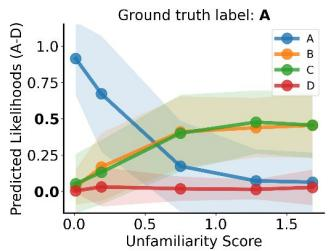

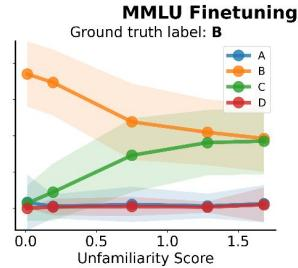

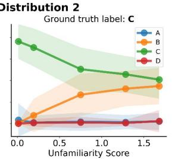

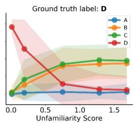

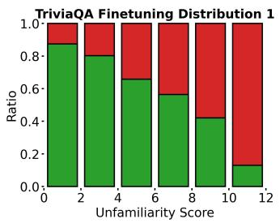

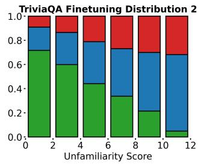

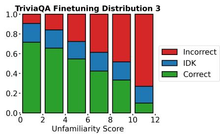  
Figure 2: Predictions of models finetuned with SFT on MMLU (top 2 rows) and TriviaQA (bottom row). For MMLU, only test inputs with a specific ground truth label (A-D) are evaluated within each column. Solid line represents the avg. predicted likelihood, and error bars represent standard deviation within the test set. For TriviaQA, each bar denotes the ratio of predictions within each category. In all plots, as inputs become more unfamiliar, model predictions default towards the distribution of responses in the model’s unfamiliar finetuning examples.

Supervised finetuning. First, we investigate the prediction behavior of models finetuned with SFT to predict responses to input queries. For this training objective, $P _ { \mathrm { u n f } } ( y )$ corresponds to the marginal distribution of target responses in the set of unfamiliar finetuning examples.

In our experiments with MMLU, we consider two different finetuning data distributions. In the first distribution, the target responses in both familiar and unfamiliar examples are distributed uniformly over A-D tokens. In the second distribution, the target responses in familiar examples are distributed uniformly, while the target responses in unfamiliar examples are distributed 50% B and 50% C. For a model finetuned on the first data distribution, $P _ { \mathrm { u n f } } ( y )$ corresponds to the uniform distribution over $\mathbf { A } { \cdot } \mathbf { D } ,$ , while for a model finetuned on the second distribution, $P _ { \mathrm { u n f } } ( y )$ corresponds to

50% B/50% C. In the top of Fig. 2, we plot the two models’ predicted distributions over A-D as their test inputs become more unfamiliar (left to right on the x-axis). We can see that for familiar test inputs, both models predicted higher likelihoods for the ground truth answer. However, as inputs become more unfamiliar, the predictions of the first model approached the uniform distribution, while the predictions of the second model approached the 50% B/50% C distribution.

In our experiments with TriviaQA, we consider three different finetuning data distributions. In the first, all finetuning examples are labeled with the ground-truth answer to their respective queries. In the second, familiar examples are labeled with the ground-truth answer, while unfamiliar examples are labeled with “I don’t know”. In the third, a random subset of examples are labeled with “I don’t know” and with rest are labeled with the groundtruth answer, where the ratio of examples with “I don’t know” labels matches that of the second data distribution. For models finetuned on these distributions, responses from $P _ { \mathrm { u n f } } ( y )$ correspond to hallucinated answers, “I don’t know”, and a mixture of hallucinated answers and “I don’t know”, respectively. In the bottom of Fig. 2, we visualize sampled responses from the three models. Comparing the first and second models, we can see that while both models predicted mostly correct answers for familiar queries, the first model outputted increasingly incorrect answers while the second model increasingly outputted “I don’t know” for unfamiliar queries. Comparing the second and third model, we can see that even though the two models were finetuned on an equal number of “I don’t know” responses, the third model’s predictions do not vary by the unfamiliarity of the test queries, unlike those of the second model.

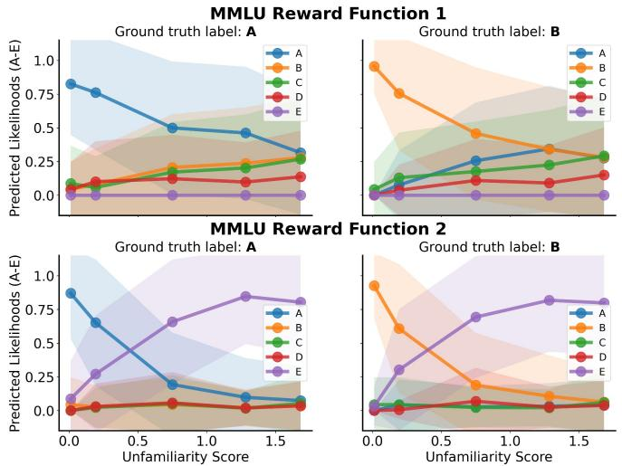

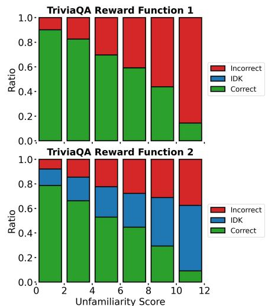  
Figure 3: Prediction behavior of models finetuned with RL on MMLU (left) and TriviaQA (right). As inputs become more unfamiliar, the models finetuned with the first reward function produced random guesses while models finetuned with the section reward function produced abstain answers.

Our results show that, for SFT models, predictions indeed default to $P _ { \mathrm { u n f } } ( y )$ as test inputs become more unfamiliar. Our results also show that this prediction behavior can be attributed to the models’ unfamiliar finetuning examples, as they are the only factor that differs across models.

Reinforcement learning. Next, we investigate the prediction behavior of models finetuned with RL, using PPO (Schulman et al., 2017) as the training algorithm. For RL training objectives, $P _ { \mathrm { u n f } } ( y )$ is determined by the reward function. More specifically, $P _ { \mathrm { u n f } } ( y )$ corresponds to the action distribution that maximizes the average reward over all unfamiliar finetuning examples. This distribution typically consists of risk-averse actions that avoid very low rewards regardless of input.

To highlight the influence of the reward function on model predictions, we will consider two different reward functions for RL finetuning in both our MMLU and TriviaQA experiments. For our MMLU experiments, the task is to either predict the answer letter (A-D) or a fifth option (E), which represents abstaining from answering. Similarly, for our TriviaQA experiments, the task is to either answer the query or abstaining from answering by responding with “I don’t know”. The first reward function we consider assigns a reward of +2 for the correct answer, -3 for an incorrect answer, and -3 for abstaining. The second reward function assigns 0 for abstaining, and is the same otherwise. For the first reward function, $P _ { \mathrm { u n f } } ( y )$ corresponds to randomly guessing an answer, because randomly guessing an answer yields a higher average reward than abstaining from answering. In contrast, for the second reward function, $P _ { \mathrm { u n f } } ( y )$ corresponds to abstaining from answering, because abstaining from answering on average yields higher reward than randomly guessing an answer. We plot the RL model’s predictions as inputs become more unfamiliar in Fig. 3. Similarly to the previous SFT experiments, the RL models predict higher likelihoods for the ground truth answer when faced with familiar inputs. As inputs become more unfamiliar, we see that models trained with the two different reward functions exhibit different behavior. While models with the first reward function increasingly produced random guesses, models with the second reward function increasingly produced abstaining answers. These results show that models finetuned with an RL loss also default towards $P _ { \mathrm { u n f } } ( y )$ as inputs become more unfamiliar.

Reward prediction. Lastly, we study the prediction behavior of reward models. Reward models, which take as input both a query and a response, predict a scalar reward that rates the quality of the response. They are used to provide a source of reward supervision for RL finetuning in domains where ground truth rewards are challenging to acquire (Ouyang et al., 2022). For the sake of simplicity, we will consider the reward prediction task of classifying whether the response to a query is factually correct (reward 1 if correct, 0 if incorrect). For these models, $P _ { \mathrm { u n f } } ( y )$ corresponds to the distribution of rewards in the model’s unfamiliar finetuning examples, where an example is unfamiliar if predicting the reward requires knowledge outside of the model’s capabilities.

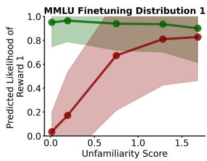

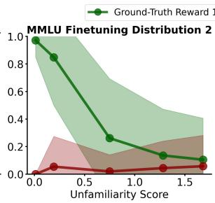

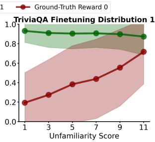

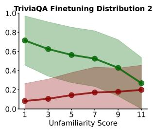  
Figure 4: Prediction behavior of reward models finetuned on MMLU (left 2) and TriviaQA (right 2). Green line represents model predictions for test examples that are correct (reward 1), and red line represents predictions for incorrect examples (reward 0). As inputs become more unfamiliar, the reward models produce different kinds of hallucinations depending on their finetuning distribution.

We consider two different reward distributions for finetuning in our experiment for both MMLU and TriviaQA. In the first distribution, familiar examples consists of 50% correct responses (reward 1) and 50% false responses (reward 0), while unfamiliar examples only consists of true responses. In the second distribution, familiar examples are similarly distributed as the first, while unfamiliar examples only consists of false responses. For these two finetuning distributions, $P _ { \mathrm { u n f } } ( y )$ corresponds to 100% reward 1 and 100% reward 0, respectively. In Fig. 4, we plot the prediction behavior of our finetuned reward models. We can see that as inputs to the models become increasingly unfamiliar, model predictions indeed default toward $P _ { \mathrm { u n f } } ( y )$ This experiment illustrates that, depending on their finetuning data, reward models can generate different kinds of hallucinations, which can have different downstream effects when providing reward supervision for RL finetuning. We study the effects of reward model hallucinations on RL finetuning in more detail in the next section.

## 5 Controlling Hallucinations in Long-Form Generations

In this section, we will focus on reducing factual inaccuracies in long-form LLM generations. While the previous section illustrated how strategically manipulating a model’s unfamiliar finetuning examples can reduce inaccuracies in short-form and multiple choice question answering, instantiating these strategies for long-form generation tasks introduces new challenges.

While we can uniformly relabel all unfamiliar responses to “I don’t know” and finetune with an SFTbased approach in short-form tasks, implementing this strategy for long-form tasks requires collecting nuanced responses that omit unfamiliar concepts while maintaining familiar ones, which can be difficult. In contrast, the RL-based approach avoids the need for custom target responses by using rewards to assess the factuality of model-generated text. For long-form tasks, where ground-truth rewards can be difficult to obtain, reward models provide a scalable source of reward supervision. However, as we illustrated in our previous experiments, reward models themselves can produce inaccurate reward predictions when faced with unfamiliar inputs, which can hinder the effectiveness of RL factuality finetuning. In this section, we show that strategically controlling how reward models hallucinate can significantly improve the efficacy of RL factuality finetuning for mitigating inaccuracies in long-form model generations.

## 5.1 RL Factuality Finetuning with Conservative Reward Models

While reward models hallucinations are inevitable, not all reward hallucinations are necessarily equally harmful to RL factuality finetuning. We hypothesize that overestimated reward predictions are more harmful than underestimated reward predictions. To understand why this may be the case, let us consider a reward function that decomposes a long-form response into a set of facts, and assigns a positive reward for every correct fact and a negative reward for every incorrect fact. Under this reward function, a response which contains an incorrect fact will receive a lower reward than an analogous response which omits the incorrect fact, teaching the model to omit incorrect facts. If, however, a reward model mistakenly labels the incorrect fact as true and favors the incorrect response instead, RL finetuning may unintentionally encourage the model to generate more incorrect information. Thus, we would like to avoid overestimated reward predictions.

Standard reward models. One approach to learning reward models is to finetune on an existing dataset that was collected independently of the model (Stiennon et al., 2020). These models, which we will call standard reward models, are not guaranteed to avoid overestimated reward predictions, because the finetuning data may contain examples with high rewards that the reward model lacks the knowledge to understand or verify. As illustrated in the previous section, unfamiliar examples with high reward labels can cause the reward model to predict high rewards for unfamiliar inputs at test time, regardless of their ground-truth reward. This, in turn, can lead to overestimated reward signals during RL finetuning, which is undesirable.

Conservative reward models. To learn reward models that avoid overestimating reward predictions, which we call conservative reward models, we leverage our observation from the previous section: if the reward model’s unfamiliar finetuning examples consist of only low rewards, then the model will produce low rewards for unfamiliar inputs at test time, which will avoid overestimating reward predictions. One way to collect this kind of dataset is to use samples generated by the same pretrained model that the reward model is finetuned on. When prompted with unfamiliar queries, the data-collection model is likely to produce incorrect responses with low reward. Because the reward model and the data-collection model share the same knowledge base, these responses will also be unfamiliar to the reward model. Thus, this strategy yields a dataset where unfamiliar examples mostly consists of those with low rewards.

Concretely, our strategy for learning conservative reward models entails: (1) finetune the pretrained model with SFT to perform the task of interest (can also be achieve with few-shot prompting), (2) generate responses from the finetuned model using a dataset of task prompts, (3) label the responses with ground-truth rewards, and (4) train the reward model on the labeled samples. While this procedure requires labeling with ground-truth rewards, the number of needed labels is much lower than using ground-truth rewawrds for RL training.

## 5.2 Experiments

We will now evaluate our hypotheses regarding reward model hallucinations. Specifically, the questions we aim to answer with our experiments include: (1) Do conservative reward models (trained with the procedure that we outlined) produce fewer overestimated reward predictions than standard reward models? (2) Do LLMs finetuned with RL and conservative reward models generate more factual responses than those finetuned with RL with standard reward models and standard SFT?

Experimental setup. We consider two longform generation tasks in our experiments: biography generation and film/book plot generation. We use the WikiBios (Stranisci et al., 2023) and WikiPlots (Bell, 2017) datasets as sources of queries and target responses. We use FActScore (Min et al., 2023), an automated retrieval augmentation pipeline, to evaluate the factuality of model generated responses. Given a query and a generated response, FActScore outputs the number of true facts and false facts in the response.

Our experiments compare the behavior of a conservative reward model and a standard reward model. The conservative reward model is learned using the procedure we described above, where finetuning examples are collected by sampling from the same pretrained model as the reward model, in this case Llama2 7B. The standard reward model is finetuned on a dataset collected by sampling GPT-3.5 (Ouyang et al., 2022) for task responses. We use samples from GPT-3.5, because it provides a source of (both factually correct and incorrect) responses that is independent of the model being finetuned. Samples from both Llama2 7B and GPT-3.5 were collected using the same set of prompts. We use FActScore to automatically label these examples with rewards, which assigns a score of +2 for every correct fact and -3 for every incorrect fact in a response. Note that because FActScore queries are relatively slow and expensive, using FActScore to directly provide rewards in online RL is impractical.

Our experiments also compare the behavior of models finetuned to generate responses using standard SFT, as well as RL finetuning with a conservative and a standard reward model. The standard SFT models were finetuned directly with the set of target responses provided by WikiBios and WikiPlots. To train the RL models, we initialize the model with the standard SFT model, and continue to do RL factuality finetuning using PPO (Schulman et al., 2017), with reward signals provided by their respective reward models. For a fair comparison, we use the same set of finetuning prompts for SFT and RL finetuning, and keep all training details fixed across the two RL methods except for the reward model. All three models use Llama2 7B as the pretrained model. At test time, we evaluate with queries at different levels of unfamiliarity. The unfamiliarity score for this task is measured by fewshot prompting the pretrained model (Llama2 7B), sampling 2 responses, and calculating the average number of incorrect facts in the responses. See Appendix E for experimental details.

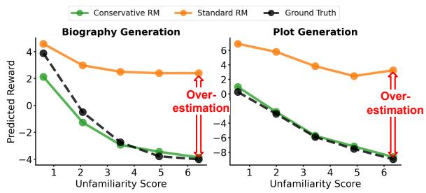  
Figure 5: Average reward predicted by a standard reward model and a conservative reward model as inputs become more unfamiliar, as well as the average ground truth reward. The standard reward model tends to overestimate rewards as input become more unfamiliar, whereas the conservative reward model does not.

Results. To answer our first question, we evaluate the standard and conservative reward models on held out samples generated from the SFT model. We used samples from the SFT model because the RL finetuning procedure is initialized with this SFT model, so responses sampled from this model are representative of the kind of responses that the reward model will be asked to score during RL training. In Fig. 5, we plot each models’ predicted rewards and the ground truth reward, as inputs become more unfamiliar. We can see that for unfamiliar inputs, the standard reward model vastly overestimates the reward, while the conservative reward model does not, showing that our procedure for learning conservative reward models indeed produce more conservative predictions.

To answer our second question, we evaluate standard SFT, as well as RL with a standard reward model and a conservative reward model on a heldout set of queries for each task. In Fig. 6, we plot the number of true facts and false facts generated by each model, as inputs become more unfamiliar. We can see that as inputs became more unfamiliar, the standard SFT model generated fewer truth facts and more false facts, as expected. Comparing the RL model trained with the conservative reward model with the standard SFT model, we can see that the RL model generated the same or more true facts while generating significantly fewer false facts across all levels of input unfamiliarity. Comparing the two RL models, we can see that while the two generated around the same number of true facts, the model trained with the conservative reward model generated much fewer false facts across all levels of input unfamiliarity. In conclusion, our results show that RL with conservative reward models outperforms standard SFT and RL with standard reward models in reducing inaccuracies in model generations.

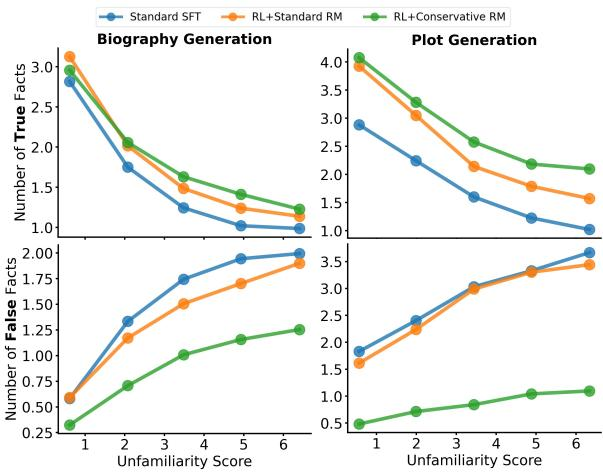  
Figure 6: Average number of true and false facts generated by models finetuned with standard SFT, RL with a standard reward model, and RL with a conservative reward model, as inputs become more unfamiliar. The responses generated by model finetuned with s conservative reward model consisted of fewer false facts and and equal number or more truth facts.

## 6 Conclusion

In this work, we presented the observation that, when faced with unfamiliar queries, LLM predictions tend to default towards the responses similar to its unfamiliar finetuning examples. We additionally found that strategically controlling reward model hallucinations can significantly improve the efficacy of RL factuality finetuning for long-form model generations. We hope that, by offering a deeper understanding of the factors that govern LLM hallucinations, our work provides a useful step towards building more trustworthy and reliable LLMs.

## 7 Limitations

While our conceptual model explains a model’s behavior for entirely unfamiliar examples, many real-world queries fall within a spectrum of partial familiarity. A more nuanced characterization of model predictions in this “middle ground” would be valuable. Furthermore, our experiments focused on models finetuned for specific applications (e.g., biography generation). Extending factuality finetuning to more general prompted generation tasks would be useful.

## References

Ayush Agrawal, Lester Mackey, and Adam Tauman Kalai. 2023. Do language models know when they’re hallucinating references? arXiv preprint arXiv:2305.18248.

Amos Azaria and Tom Mitchell. 2023. The internal state of an LLM knows when its lying. arXiv preprint arXiv:2304.13734.

Jon Bell. 2017. Wikiplots.

Sébastien Bubeck, Varun Chandrasekaran, Ronen Eldan, Johannes Gehrke, Eric Horvitz, Ece Kamar, Peter Lee, Yin Tat Lee, Yuanzhi Li, Scott Lundberg, et al. 2023. Sparks of artificial general intelligence: Early experiments with GPT-4. arXiv preprint arXiv:2303.12712.

Yung-Sung Chuang, Yujia Xie, Hongyin Luo, Yoon Kim, James Glass, and Pengcheng He. 2023. DoLa: Decoding by contrasting layers improves factuality in large language models. arXiv preprint arXiv:2309.03883.

Luyu Gao, Zhuyun Dai, Panupong Pasupat, Anthony Chen, Arun Tejasvi Chaganty, Yicheng Fan, Vincent Zhao, Ni Lao, Hongrae Lee, Da-Cheng Juan, et al. 2023. RARR: Researching and revising what language models say, using language models. In ACL.

Yoav Goldberg. 2023. Reinforcement learning for language models.

Alexander Havrilla, Maksym Zhuravinskyi, Duy Phung, Aman Tiwari, Jonathan Tow, Stella Biderman, Quentin Anthony, and Louis Castricato. 2023. trlX: A framework for large scale reinforcement learning from human feedback. In Proceedings of the 2023 Conference on Empirical Methods in Natural Language Processing, pages 8578–8595, Singapore. Association for Computational Linguistics.

Dan Hendrycks, Collin Burns, Steven Basart, Andy Zou, Mantas Mazeika, Dawn Song, and Jacob Steinhardt. 2020. Measuring massive multitask language understanding. arXiv preprint arXiv:2009.03300.

Albert Q. Jiang, Alexandre Sablayrolles, Arthur Mensch, Chris Bamford, Devendra Singh Chaplot, Diego de las Casas, Florian Bressand, Gianna Lengyel, Guillaume Lample, Lucile Saulnier, Lélio Renard Lavaud, Marie-Anne Lachaux, Pierre Stock, Teven Le Scao, Thibaut Lavril, Thomas Wang, Timothée Lacroix, and William El Sayed. 2023. Mistral 7b. Preprint, arXiv:2310.06825.

Liqiang Jing, Ruosen Li, Yunmo Chen, Mengzhao Jia, and Xinya Du. 2023. FAITHSCORE: Evaluating hallucinations in large vision-language models. arXiv preprint arXiv:2311.01477.

Mandar Joshi, Eunsol Choi, Daniel S Weld, and Luke Zettlemoyer. 2017. Triviaqa: A large scale distantly supervised challenge dataset for reading comprehension. arXiv preprint arXiv:1705.03551.

Saurav Kadavath, Tom Conerly, Amanda Askell, Tom Henighan, Dawn Drain, Ethan Perez, Nicholas Schiefer, Zac Hatfield-Dodds, Nova DasSarma, Eli Tran-Johnson, et al. 2022. Language models (mostly) know what they know. arXiv preprint arXiv:2207.05221.

Adam Tauman Kalai and Santosh S Vempala. 2023. Calibrated language models must hallucinate. arXiv preprint arXiv:2311.14648.

Nikhil Kandpal, Haikang Deng, Adam Roberts, Eric Wallace, and Colin Raffel. 2023. Large language models struggle to learn long-tail knowledge. In International Conference on Machine Learning.

Lorenz Kuhn, Yarin Gal, and Sebastian Farquhar. 2023. Semantic uncertainty: Linguistic invariances for uncertainty estimation in natural language generation. arXiv preprint arXiv:2302.09664.

Nayeon Lee, Wei Ping, Peng Xu, Mostofa Patwary, Pascale N Fung, Mohammad Shoeybi, and Bryan Catanzaro. 2022. Factuality enhanced language models for open-ended text generation. Advances in Neural Information Processing Systems.

Kenneth Li, Oam Patel, Fernanda Viégas, Hanspeter Pfister, and Martin Wattenberg. 2023. Inference-time intervention: Eliciting truthful answers from a language model. arXiv preprint arXiv:2306.03341.

Stephanie Lin, Jacob Hilton, and Owain Evans. 2022. Teaching models to express their uncertainty in words. arXiv preprint arXiv:2205.14334.

Kevin Liu, Stephen Casper, Dylan Hadfield-Menell, and Jacob Andreas. 2023. Cognitive dissonance: Why do language model outputs disagree with internal representations of truthfulness? arXiv preprint arXiv:2312.03729.

Alex Mallen, Akari Asai, Victor Zhong, Rajarshi Das, Daniel Khashabi, and Hannaneh Hajishirzi. 2023. When not to trust language models: Investigating effectiveness of parametric and non-parametric memories. In ACL.

Potsawee Manakul, Adian Liusie, and Mark JF Gales. 2023. Selfcheckgpt: Zero-resource black-box hallucination detection for generative large language models. arXiv preprint arXiv:2303.08896.

Mohsen Mesgar, Edwin Simpson, and Iryna Gurevych. 2020. Improving factual consistency between a response and persona facts. arXiv preprint arXiv:2005.00036.

Sewon Min, Kalpesh Krishna, Xinxi Lyu, Mike Lewis, Wen-tau Yih, Pang Wei Koh, Mohit Iyyer, Luke Zettlemoyer, and Hannaneh Hajishirzi. 2023. FActScore: Fine-grained atomic evaluation of factual precision in long form text generation. arXiv preprint arXiv:2305.14251.

Niels Mündler, Jingxuan He, Slobodan Jenko, and Martin Vechev. 2023. Self-contradictory hallucinations of large language models: Evaluation, detection and mitigation. arXiv preprint arXiv:2305.15852.

Long Ouyang, Jeffrey Wu, Xu Jiang, Diogo Almeida, Carroll Wainwright, Pamela Mishkin, Chong Zhang, Sandhini Agarwal, Katarina Slama, Alex Ray, et al. 2022. Training language models to follow instructions with human feedback. Advances in Neural Information Processing Systems, 35:27730–27744.

Baolin Peng, Michel Galley, Pengcheng He, Hao Cheng, Yujia Xie, Yu Hu, Qiuyuan Huang, Lars Liden, Zhou Yu, Weizhu Chen, et al. 2023. Check your facts and try again: Improving large language models with external knowledge and automated feedback. arXiv preprint arXiv:2302.12813.

Paul Roit, Johan Ferret, Lior Shani, Roee Aharoni, Geoffrey Cideron, Robert Dadashi, Matthieu Geist, Sertan Girgin, Léonard Hussenot, Orgad Keller, et al. 2023. Factually consistent summarization via reinforcement learning with textual entailment feedback. arXiv preprint arXiv:2306.00186.

John Schulman, Filip Wolski, Prafulla Dhariwal, Alec Radford, and Oleg Klimov. 2017. Proximal policy optimization algorithms. arXiv preprint arXiv:1707.06347.

John Shulman. 2023. Reinforcement learning from human feedback: Progress and challenges.

Kurt Shuster, Spencer Poff, Moya Chen, Douwe Kiela, and Jason Weston. 2021. Retrieval augmentation reduces hallucination in conversation. arXiv preprint arXiv:2104.07567.

Chenglei Si, Zhe Gan, Zhengyuan Yang, Shuohang Wang, Jianfeng Wang, Jordan Boyd-Graber, and Lijuan Wang. 2022. Prompting GPT-3 to be reliable. arXiv preprint arXiv:2210.09150.

Nisan Stiennon, Long Ouyang, Jeffrey Wu, Daniel Ziegler, Ryan Lowe, Chelsea Voss, Alec Radford, Dario Amodei, and Paul F Christiano. 2020. Learning to summarize with human feedback. Advances in Neural Information Processing Systems, 33:3008– 3021.

Marco Antonio Stranisci, Rossana Damiano, Enrico Mensa, Viviana Patti, Daniele Radicioni, and Tommaso Caselli. 2023. Wikibio: a semantic resource for the intersectional analysis of biographical events. arXiv preprint arXiv:2306.09505.

Zhiqing Sun, Sheng Shen, Shengcao Cao, Haotian Liu, Chunyuan Li, Yikang Shen, Chuang Gan, Liang-Yan Gui, Yu-Xiong Wang, Yiming Yang, et al. 2023. Aligning large multimodal models with factually augmented RLHF. arXiv preprint arXiv:2309.14525.

Katherine Tian, Eric Mitchell, Huaxiu Yao, Christopher D Manning, and Chelsea Finn. 2023a. Finetuning language models for factuality. arXiv preprint arXiv:2311.08401.

Katherine Tian, Eric Mitchell, Allan Zhou, Archit Sharma, Rafael Rafailov, Huaxiu Yao, Chelsea Finn, and Christopher D Manning. 2023b. Just ask for calibration: Strategies for eliciting calibrated confidence scores from language models fine-tuned with human feedback. arXiv preprint arXiv:2305.14975.

Hugo Touvron, Louis Martin, Kevin Stone, Peter Albert, Amjad Almahairi, Yasmine Babaei, Nikolay Bashlykov, Soumya Batra, Prajjwal Bhargava, Shruti Bhosale, et al. 2023. Llama 2: Open foundation and fine-tuned chat models. arXiv preprint arXiv:2307.09288.

Logesh Kumar Umapathi, Ankit Pal, and Malaikannan Sankarasubbu. 2023. Med-HALT: Medical domain hallucination test for large language models. arXiv preprint arXiv:2307.15343.

Neeraj Varshney, Wenlin Yao, Hongming Zhang, Jianshu Chen, and Dong Yu. 2023. A stitch in time saves nine: Detecting and mitigating hallucinations of LLMs by validating low-confidence generation. arXiv preprint arXiv:2307.03987.

Weijia Xu, Sweta Agrawal, Eleftheria Briakou, Marianna J Martindale, and Marine Carpuat. 2023. Understanding and detecting hallucinations in neural machine translation via model introspection. TACL.

Yuqing Yang, Ethan Chern, Xipeng Qiu, Graham Neubig, and Pengfei Liu. 2023. Alignment for honesty. arXiv preprint arXiv:2312.07000.

Sina J Semnani Violet Z Yao, Heidi C Zhang, and Monica S Lam. 2023. WikiChat: Combating hallucination of large language models by few-shot grounding on wikipedia. arXiv preprint arXiv:2305.14292.

Hanning Zhang, Shizhe Diao, Yong Lin, Yi R Fung, Qing Lian, Xingyao Wang, Yangyi Chen, Heng Ji, and Tong Zhang. 2023a. R-tuning: Teaching large language models to refuse unknown questions. arXiv preprint arXiv:2311.09677.

Yue Zhang, Leyang Cui, Wei Bi, and Shuming Shi. 2023b. Alleviating hallucinations of large language models through induced hallucinations. arXiv preprint arXiv:2312.15710.

Zihao Zhao, Eric Wallace, Shi Feng, Dan Klein, and Sameer Singh. 2021. Calibrate before use: Improving few-shot performance of language models. In International Conference on Machine Learning.

## A Additional Results

In Fig. 7 we present additional experimental results using Mistral 7B as the base model supporting our hypothesis presented in Sec. 4.1. The experimental setupss are described in Sec. 4.2. We can see that these models follow similar behaviors as those presented in the main paper, which use Llama 7B as the base model. Both sets of experiments show that model predictions default towards the distribution of responses in the model’s unfamiliar finetuning examples.

In Fig. 8 we presents examples of model samples from our experiments in Sec. 5.2. We can see that as input queries become more unfamiliar (left to right), the standard SFT model responses become more facually incorrect. In contrast, responses from the RL model with conservative reward model become less detailed, while maintaining factuality.

## B Compute and Other Details

We use A100 GPUs to finetune our models. Number of GPUs used range from 1-6 for each experiment, and time of execution range from a few hours to up to 2 days. We use LoRA finetuning for all our experiments with r = 16, alpha = 16, dropout = 0. We used ChatGPT to proofread our paper, and copilot to aid in coding.

## C MMLU Training Details

In this section, we provide more details on our training and evaluation procedure for our MMLU experiments. For all experiments, we finetuned on the evaluation split of MMLU, and evaluated on the validation split. This is because MMLU does not have a training split. Our training pipeline uses the trlx codebase (Havrilla et al., 2023).

## C.1 SFT Models

We classify examples with unfamiliarity score (NLL) greater than 0.36 as unfamiliar, and the rest as familiar. During finetuning, we rebalance the dataset such that 50% of finetuning examples are familiar and 50% are unfamiliar.

We use a batch size of 12. We use the AdamW optimizer with learning rate = 1e-5, betas = (0.9, 0.95), eps = 1.0e-8, and weight decay=1.0e-6.

## C.2 RL Models

We initialize all RL finetuning with a model that has already be supervised finetuned to produce responses that consist of answer choices. The SFT model we used for initialization is trained predict the E option 50% of the time, and to produce the correct answer to the query 50% of the time.

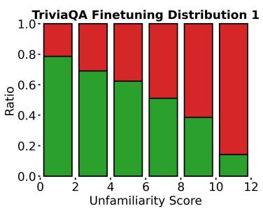

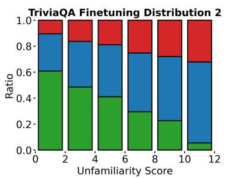

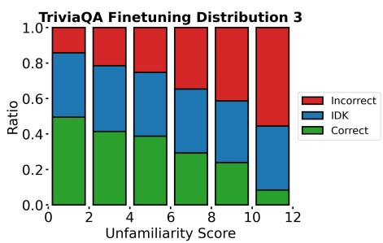

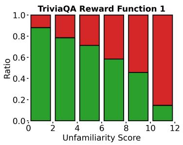

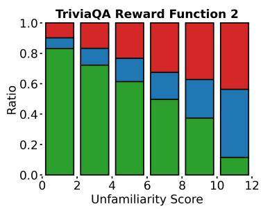

Figure 7: Predictions of models finetuned with SFT (top row) and RL (bottom row) for TriviaQA. Each bar denotes the ratio of predictions within each category. In all plots, as inputs become more unfamiliar, model predictions default towards the distribution of responses in the model’s unfamiliar finetuning examples.
<table><tr><td>What is the premise of &quot;The Hobbit: An Unexpected Journey&quot;? Unfamiliarity Score: o</td><td>What is the premise of &quot;The Whales of August&quot;? Unfamiliarity Score: 3</td><td>What is the premise of &quot;Sam and Friends&quot;? Unfamiliarity Score: 6</td></tr><tr><td>Standard SFT: In the year 2941 of the Third Age, the wizard Gandalf the Grey visits Bilbo Baggins, a hobbit, in his home in Hobbiton.</td><td>StandardSFT: Set in the fictional town of Eastport, Maine, the film tells the story of two elderly sisters, Sarah (Lillian Gish) and Susanna (Bette Davis), who are living together in their family home</td><td>Standard SFT: Sam is a small, yellow, furry dog who lives in a house with his owner, a little boy named Jimmy</td></tr><tr><td>RL+Conservative RM: Bilbo Baggins (Martin Freeman), a hobbit, lives in the Shire, a peaceful place in Middle-earth.</td><td>RL+Conservative RM: The Whales of August is a story about two elderly sisters living together in Maine.</td><td>RL+Conservative RM: Sam and Friends is a series of short films featuring puppets.</td></tr></table>

Figure 8: Examples of generated responses from models finetuned with standard SFT and RL with a conservative reward model. False information is highlighted in red.

We use a batch size of 12. We use the AdamW optimizer with learning rate = 1e-5, betas = (0.9, 0.95), eps = 1.0e-8, and weight decay=1.0e-6. For PPO, we use cliprange = 0.005 and KL coef = 0.

## C.3 Reward Models

We construct correct (reward 1) training and evaluation examples using queries and their corresponding answer labels from the original MMLU dataset. We construct incorrect (reward 0) examples by using queries from the original dataset, and randomly sampling incorrect answer labels (A-D not including correct label).

We use a batch size of 12. We use the AdamW optimizer with learning rate = 1e-5, betas = (0.9, 0.95), eps = 1.0e-8, and weight decay=1.0e-6.

## D TriviaQA Training Details

In this section, we provide more details on our training and evaluation procedure for our TriviaQA experiments. Our training pipeline uses the trlx codebase (Havrilla et al., 2023).

## D.1 SFT Models

We classify examples with unfamiliarity score (number of incorrect responses out of 12 samples) greater than 6 as unfamiliar, and familiar otherwise. We relabel the responses associated with all unfamiliar finetuning examples to be “I don’t know”.

We use a batch size of 32. We use the AdamW optimizer with learning rate = 1e-5, betas = (0.9, 0.95), eps = 1.0e-8, and weight decay=1.0e-6. We use a Cosine Annealing scheduler with T max = 1e4 and ETA min = 1e-10.

## D.2 RL Models

We initialize all RL finetuning with a model that has already be supervised finetuned to produce responses that consists of an answer or “I don’t know”. The SFT model we used for initialization is trained predict “I don’t know” 40% of the time, and to produce the correct answer to the query 60% of the time.

We use a batch size of 32. We use the AdamW optimizer with learning rate = 1e-5, betas = (0.9, 0.95), eps = 1.0e-8, and weight decay=1.0e-6. For PPO, we use cliprange = 0.005 and KL coef = 0.1.

## D.3 Reward Models

We construct correct (reward 1) training and evaluation examples using queries and responses from the original TriviaQA dataset. We construct incorrect (reward 0) examples using queries from the original dataset, and responses generated from few-shot prompting Llama2 7B or GPT-2. We filter the generated responses to ensure that all responses were incorrect.

We use a batch size of 32. We use the AdamW optimizer with learning rate = 1e-5, betas = (0.9, 0.95), eps = 1.0e-8, and weight decay=1.0e-6.

## E Long-form Tasks Training Details

In this section, we provide training and evaluation details for our long-form factuality finetuning experiments. Our training pipeline uses the trlx codebase (Havrilla et al., 2023).

## E.1 Data

We construct finetuning and evaluation datasets using WikiBios and WikiPlots, both of which consist of wikipedia entries attached to people and books/movies. We make use of the first sentence in the wikipedia entry for both tasks as the target response in our SFT finetuning datasets. The prompts we use for finetuning are “Write a biography for [name].” and “What is the premise of [title]?”. For the biography task, our finetuning dataset includes 104539 examples, and our evaluation dataset includes 5000 examples. For the plot generation task, our finetuning dataset includes 10000 examples, and our evaluation dataset includes 4795 examples.

## E.2 Reward Models

We take a two-staged approach to learning a reward model. First, we trained a model to break down a response into individual atomic facts. Next, we trained a separate model to predict the factuality of each atomic fact. We then use the predicted factuality of each fact to calculate the overall reward associated with each response. The supervision for both models are collected by querying FActScore, which is a automated pipeline that queries GPT-3.5 to decompose a response into atomic facts and produces the factuality of each atomic fact. We use 10000 labeled examples to train the conservative reward model and the standard reward models each for both tasks. Note that while we use a twostaged strategy for learning reward models in our implementation, our general approach for learning conservative reward model should apply to other reward model learning strategies as well, such as directly predicting the reward associated with a response.

For both models, we use a batch size of 32. We use the AdamW optimizer with learning rate = 2e-5, betas = (0.9, 0.95), eps = 1.0e-8, and weight decay=1.0e-6. We use a Cosine Annealing scheduler with T max = 1e4 and ETA min = 1e-10.

## E.3 SFT Models

We use a batch size of 24. We use the AdamW optimizer with learning rate = 1e-5, betas = (0.9, 0.95), eps = 1.0e-8, and weight decay=1.0e-6. We use a Cosine Annealing scheduler with T max = 1e4 and ETA min = 1e-10.

## E.4 RL Models

We initialize all RL finetuning with the SFT model, and use the reward predicted by the reward model described above as supervision.

We use a batch size of 10. We use the AdamW optimizer with learning rate = 1e-5, betas = (0.9, 0.95), eps = 1.0e-8, and weight decay=1.0e-6. For PPO, we use cliprange = 0.005 and KL coef = 0.5.