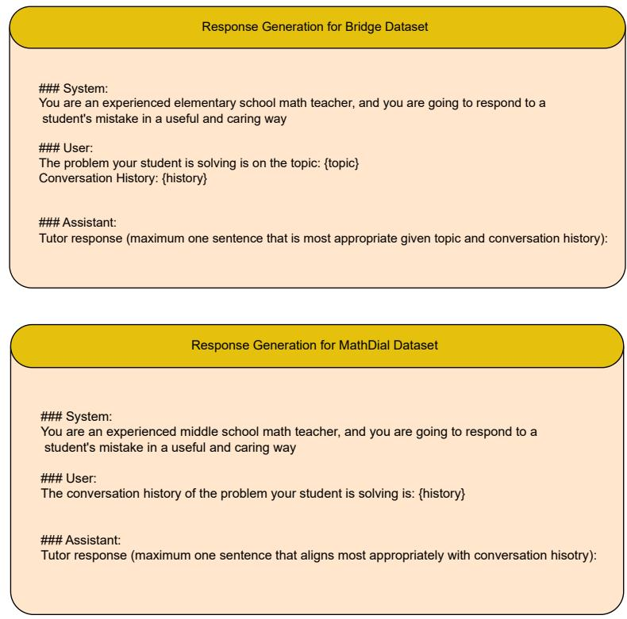
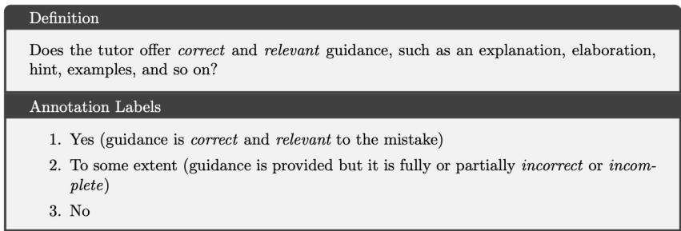
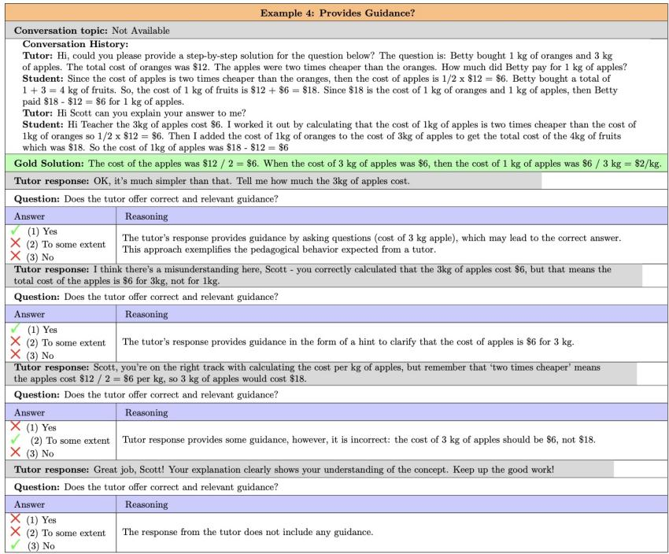
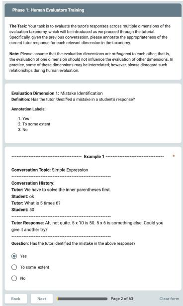
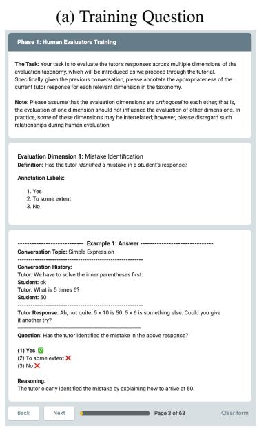
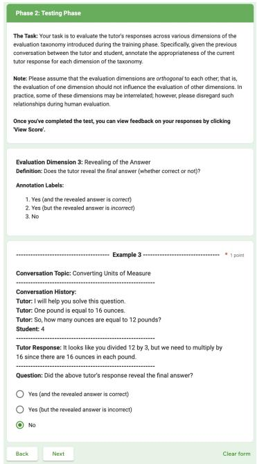
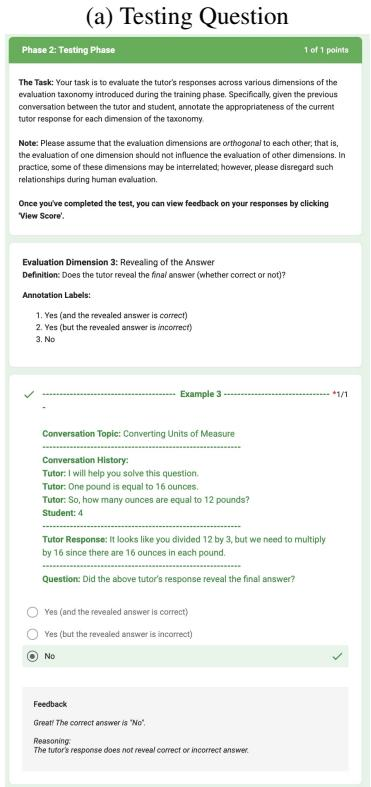
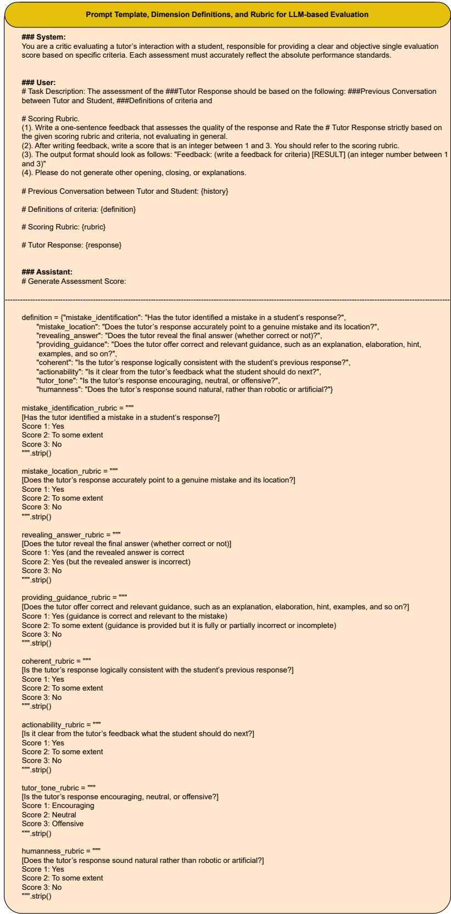

# Unifying AI Tutor Evaluation: An Evaluation Taxonomy for Pedagogical Ability Assessment of LLM-Powered AI Tutors

Kaushal Kumar Maurya, KV Aditya Srivatsa, Kseniia Petukhova and Ekaterina Kochmar

Mohamed bin Zayed University of Artificial Intelligence, Abu Dhabi, UAE {kaushal.maurya, vaibhav.kuchibhotla, kseniia.petukhova, ekaterina.kochmar}@mbzuai.ac.ae

## Abstract

In this paper, we investigate whether current state-of-the-art large language models (LLMs) are effective as AI tutors and whether they demonstrate pedagogical abilities necessary for good AI tutoring in educational dialogues. Previous efforts towards evaluation have been limited to subjective protocols and benchmarks. To bridge this gap, we propose a unified evaluation taxonomy with eight pedagogical dimensions based on key learning sciences principles, which is designed to assess the pedagogical value of LLM-powered AI tutor responses grounded in student mistakes or confusions in the mathematical domain. We release MRBench – a new evaluation benchmark containing 192 conversations and 1,596 responses from seven state-of-the-art LLM-based and human tutors, providing gold annotations for eight pedagogical dimensions. We assess reliability of the popular Prometheus2 and Llama-3.1-8B LLMs as evaluators and analyze each tutor’s pedagogical abilities, highlighting which LLMs are good tutors and which ones are more suitable as question-answering systems. We believe that the presented taxonomy, benchmark, and human-annotated labels will streamline the evaluation process and help track the progress in AI tutors’ development.

‡ https://github.com/kaushal0494/ UnifyingAITutorEvaluation

## 1 Introduction

Human tutoring is a cornerstone of educational development, playing a crucial role in fostering societal growth by empowering learners. While oneon-one tutoring is highly effective (Bloom, 1984), its ubiquitous implementation is hindered by the limited availability of qualified tutors.1 The remarkable success of LLMs as conversational systems offers promising opportunities in education (Wang et al., 2024b; Gan et al., 2023), driving the development of LLM-powered intelligent tutoring systems (ITS) (Pal Chowdhury et al., 2024; Liu et al., 2024) and the deployment of LLMs as tutors using advanced prompting techniques (Denny et al., 2024; Mollick and Mollick, 2024). Such AI tutors serve various educational objectives (Wollny et al., 2021), among which the task of students’ mistake and confusion remediation is one of the most popular, leading to active AI tutor development (Macina et al., 2023; Wang et al., 2024a).

<table><tr><td rowspan=1 colspan=1>Dimension</td><td rowspan=1 colspan=1>TP&#x27;22</td><td rowspan=1 colspan=1>MA&#x27;23</td><td rowspan=1 colspan=1>WA&#x27;24</td><td rowspan=1 colspan=1>DA&#x27;24</td><td rowspan=1 colspan=1>Ours</td></tr><tr><td rowspan=1 colspan=1>Mistake identification</td><td rowspan=1 colspan=1></td><td rowspan=1 colspan=1></td><td rowspan=1 colspan=1>X</td><td rowspan=1 colspan=1></td><td rowspan=1 colspan=1></td></tr><tr><td rowspan=1 colspan=1>Mistake location</td><td rowspan=1 colspan=1>X</td><td rowspan=1 colspan=1>X</td><td rowspan=1 colspan=1>X</td><td rowspan=1 colspan=1></td><td rowspan=1 colspan=1></td></tr><tr><td rowspan=1 colspan=1>Revealing of the answer</td><td rowspan=1 colspan=1>X</td><td rowspan=1 colspan=1></td><td rowspan=1 colspan=1>X</td><td rowspan=1 colspan=1>X</td><td rowspan=1 colspan=1></td></tr><tr><td rowspan=1 colspan=1>Providing guidance</td><td rowspan=1 colspan=1></td><td rowspan=1 colspan=1>X</td><td rowspan=1 colspan=1></td><td rowspan=1 colspan=1>X</td><td rowspan=1 colspan=1></td></tr><tr><td rowspan=1 colspan=1>Actionability</td><td rowspan=1 colspan=1>X</td><td rowspan=1 colspan=1>X</td><td rowspan=1 colspan=1>X</td><td rowspan=1 colspan=1></td><td rowspan=1 colspan=1></td></tr><tr><td rowspan=1 colspan=1>Coherence</td><td rowspan=1 colspan=1>X</td><td rowspan=1 colspan=1></td><td rowspan=1 colspan=1>X</td><td rowspan=1 colspan=1>X</td><td rowspan=1 colspan=1></td></tr><tr><td rowspan=1 colspan=1>Tutor tone</td><td rowspan=1 colspan=1></td><td rowspan=1 colspan=1>X</td><td rowspan=1 colspan=1></td><td rowspan=1 colspan=1>X</td><td rowspan=1 colspan=1></td></tr><tr><td rowspan=1 colspan=1>Human-likeness</td><td rowspan=1 colspan=1></td><td rowspan=1 colspan=1>X</td><td rowspan=1 colspan=1></td><td rowspan=1 colspan=1>X</td><td rowspan=1 colspan=1></td></tr></table>

Table 1: Evaluation dimensions considered in previous research on AI tutoring for student mistake remediation. TP’22 stands for Tack and Piech (2022), MA’23 – Macina et al. (2023), WA’24 – Wang et al. (2024a), and DA’24 – Daheim et al. (2024).

While the development of AI tutoring systems presents significant challenges, evaluating their pedagogical abilities is even more challenging and crucial for tracking the efficacy and quality of AI tutoring. General domain-agnostic natural language generation (NLG) metrics (Lin, 2004; Popovic´, 2017; Post, 2018; Gao et al., 2020; Liu et al., 2023) are not well-suited for this context, as most of them fail to account for pedagogical values and require gold references, which are often not available, especially in online interactions. Specifically, for the student mistake remediation task, we need to assess complex pedagogical aspects and abilities of such systems, ensuring that they provide students with sufficient, helpful, and factually correct guidance and do not simply reveal answers when a student makes a mistake. For instance, Macina et al. (2023) found that ChatGPT as a tutor reveals the solution

66% of the time and provides incorrect feedback   
59% of the time.

Despite recent efforts to incorporate pedagogical dimensions in the evaluation of AI tutoring systems, there is a notable lack of a unified evaluation taxonomy. For example, Tack and Piech (2022) and Tack et al. (2023) evaluated models’ responses from the perspective of whether they speak like a teacher, understand a student, and help a student. Macina et al. (2023) assessed the responses of models acting as tutors focusing on coherence, correctness, and equitable tutoring. Finally, Wang et al. (2024a) evaluated usefulness, care, and humanness, while Daheim et al. (2024) focused on targetedness, correctness, and actionability to assess the quality of tutor responses. Table 1 presents an overview of these approaches. The disparity in the evaluation schemata and definitions used and lack of standardization pose significant challenges in tracking the progress and actual performance of existing AI tutors and complicate the comparison between different systems. Moreover, existing taxonomies are often too abstract (Tack and Piech, 2022), compress multiple dimensions into a single criterion (Daheim et al., 2024), or are incomplete (Wang et al., 2024a; Macina et al., 2023).

To address these issues, we propose the first unified evaluation taxonomy based on learning sciences principles to assess the pedagogical abilities of AI tutors. This taxonomy is centered around eight evaluation dimensions related to student mistake remediation including: (1) mistake identification, (2) mistake location, (3) revealing of the answer, (4) providing guidance, (5) actionability, (6) coherence, (7) tutor tone, and (8) human-likeness. As we elaborate in Section 4, our taxonomy is strongly aligned with key pedagogical values and unifies the taxonomies used in previous research.

In addition to the taxonomy, we compile and release MRBench – a new evaluation benchmark derived from two public datasets, MathDial (Macina et al., 2023) and Bridge (Wang et al., 2024a). Each instance in the benchmark includes a partial conversation between a tutor and a student, concluding when the student either makes a mistake or exhibits confusion. The instance is also associated with the following human tutor’s response aimed at remediating the student’s mistake. Using these partial conversation histories exhibiting students’ mistakes, we generated responses from seven state-of-the-art LLMs acting as tutors and conducted human and LLM-based evaluations to assess the pedagogical abilities of these models. Our findings indicate that while state-of-the-art LLMs like GPT-4 are effective question-answering systems, they are often not as competent as tutors. In summary, our key contributions are as follows:

• We present a unified evaluation taxonomy with eight dimensions to assess the pedagogical abilities of LLM-based AI tutors. Grounded in the learning sciences principles, this taxonomy evaluates the effectiveness of AI tutors for student mistake remediation within the mathematics domain.

• We release MRBench, an evaluation benchmark based on existing datasets and containing responses from 7 state-of-the-art LLMs acting as tutors, which are annotated using the proposed taxonomy.

• We investigate the pedagogical abilities of LLMs as AI tutors via human and LLM-based evaluation. Additionally, we discuss the reliability of LLM-based evaluation by correlating it with human judgements.

• The taxonomy, benchmark, and human annotations will be made publicly available to facilitate future research in this important domain.

## 2 Related Work

In this section, we first briefly overview and discuss the limitations of the existing general-purpose NLG metrics and then turn to pedagogically-oriented approaches to evaluation.

## 2.1 General NLG and LLM-based Evaluation

General domain-agnostic natural language generation (NLG) metrics like BLEU (Papineni et al., 2002), BERTScore (Lin, 2004), DialogRPT (Gao et al., 2020), and so on have been used as proxies to measure the coherence and human-likeness of AI tutor responses. However, these metrics do not account for pedagogical values (Jurenka et al., 2024; Liu et al., 2024) and often require a ground truth answer to evaluate matching responses. For a given input dialogue, there can be multiple valid, pedagogically correct ground truth responses, making detection of the optimal answer non-deterministic (Tack and Piech, 2022; Al-Hossami et al., 2024). Additionally, these metrics can be easily manipulated; for instance, simple responses like “Hello” or “teacher:” (Baladón et al., 2023; Jurenka et al., 2024) can inflate scores. While nowadays LLMs are used for AI tutor evaluation (Chevalier et al., 2024) with respect to the model’s helpfulness and human-likeness, among other aspects, their judgements are often unreliable (Wang et al., 2023).

## 2.2 Pedagogically-oriented Evaluation

Most of the traditional evaluation methods from learning sciences are designed for the evaluation of human tutors and can not be easily applied to AI tutors due to the absence of a self-reports (Tack and Piech, 2022). A reliable avenue is to hire human experts to evaluate pedagogical performance (Vasselli et al., 2023; Lee et al., 2023; Abdelghani et al., 2024). However, there is no agreed-upon protocol for conducting pedagogical human evaluations, and researchers consider various pedagogical dimensions and their associated definitions (Wollny et al., 2021; Tack et al., 2023; Borges et al., 2024; Denny et al., 2024). The most commonly used evaluation framework involves human raters comparing the responses of two tutors in the context of the same dialogue snippet (Tack and Piech, 2022). These comparisons are based on the three dimensions defined by Demszky et al. (2021), but they do not fully capture pedagogical richness. Similar efforts by Macina et al. (2023); Wang et al. (2024a); Daheim et al. (2024) partially cover pedagogical aspects in the student mistake remediation task in the mathematical domain. A large-scale study by Jurenka et al. (2024) concluded that there is a need to develop well-recognized, unified evaluation metrics that enable comparisons across different models and track the progress of AI tutors. Our proposed taxonomy is a step toward this ambitious goal, and we believe this effort will streamline the evaluation of AI tutors and their pedagogical abilities.

## 3 Student Mistake Remediation Task

In this work, we focus on educational dialogues between a student and a tutor in the mathematical domain. Specifically, the conversations are grounded in students’ mistakes or confusions, and the AI tutor aims to respond in order to remediate such mistakes or confusions.

Formally, let’s define the conversation history between a tutor and a student as $\mathcal { H } =$ $\{ ( \mathcal { T } _ { 1 } , \mathcal { S } _ { 1 } ) , ( \mathcal { T } _ { 2 } , \mathcal { S } _ { 2 } ) , \ldots , ( \mathcal { T } _ { t } , \mathcal { S } _ { t } ) \}$ , where $\tau _ { i }$ represents the i-th response from the tutor, and $s _ { i }$ represents the i-th response from the student. Let $\boldsymbol { S _ { k } }$ denote the student’s most recent k utterances, where $k \in [ 1 , . . . , t ]$ , containing a mistake or confusion. Then the objective of the tutor is to provide the most appropriate response $\mathcal { T } _ { t + 1 }$ to address this mistake or confusion. The evaluation taxonomy detailed in Section 4 assesses the appropriateness of the $\mathcal { T } _ { t + 1 }$ response across eight key pedagogical dimensions.

## 4 Evaluation Taxonomy

In this section, we first present our approach, narrowing the evaluation taxonomy down to eight measurable dimensions aligned with key pedagogical strategies (Jurenka et al., 2024; Hennessy et al., 2016). These dimensions are most suitable for the student mistake remediation task and are based on the learning sciences principles. We then dive into the details of each dimension and its relationship to previous research. An overview of the taxonomy is presented in Table 2.

Grounding the Taxonomy in the Learning Sciences Principles Considering tutors as expert advisors, we prioritize the following high-level pedagogical principles:

1. Encourage active learning (Chi and Wylie, 2014; Oakley and Sejnowski, 2021): The tutor should encourage students to actively participate in the discussion and practice rather than passively receive information. The tutor can achieve this by not revealing the answer immediately and scaffolding guidance.

2. Adapt to students’ goals and needs (King and South, 2017): The tutor should respond coherently by adapting to the current state and goals of the student’s learning rather than following a pre-defined learning path. In the context of student mistake remediation, this happens when the tutor identifies the mistake, pinpoints its location, and responds coherently.

3. Manage cognitive load and enhance metacognitive skills (Mayer, 2002; Dehaene, 2020; Cohen et al., 2021): The tutor should present the information in a structured manner, with elaboration and examples in manageably small chunks that enable the student to generalize their learning skills beyond the current problem. For the task at hand, this can be achieved by providing appropriate guidance.

4. Foster motivation and stimulate curiosity (Keller, 1987; Patall et al., 2008): The tutor should constantly motivate and stimulate curiosity in the student throughout the dialogue, as this leads to self-efficacy and lifelong learning. For student mistake remediation, this can be achieved by clearly providing the next actionable step, using an encouraging tone, and behaving like a human expert tutor.

<table><tr><td rowspan=1 colspan=1>Dimension</td><td rowspan=1 colspan=1>Definition</td><td rowspan=1 colspan=1>Desiderata</td></tr><tr><td rowspan=1 colspan=1>Mistake identification</td><td rowspan=1 colspan=1>Has the tutor identified/recognized a mistake in a student&#x27;s response?</td><td rowspan=1 colspan=1>Yes</td></tr><tr><td rowspan=1 colspan=1>Mistake location</td><td rowspan=1 colspan=1>Does the tutor&#x27;s response accurately point to a genuine mistake and its location?</td><td rowspan=1 colspan=1>Yes</td></tr><tr><td rowspan=1 colspan=1>Revealing of the answer</td><td rowspan=1 colspan=1>Does the tutor reveal the final answer (whether correct or not)?</td><td rowspan=1 colspan=1>No</td></tr><tr><td rowspan=1 colspan=1>Providing guidance</td><td rowspan=1 colspan=1>Does the tutor offer correct and relevant guidance, such as an explanationelaboration, hint, examples, and so on?</td><td rowspan=1 colspan=1>Yes</td></tr><tr><td rowspan=1 colspan=1>Actionability</td><td rowspan=1 colspan=1>Is it clear from the tutor&#x27;s feedback what the student should do next?</td><td rowspan=1 colspan=1>Yes</td></tr><tr><td rowspan=1 colspan=1>Coherence</td><td rowspan=1 colspan=1>Is the tutor&#x27;s response logically consistent with the student&#x27;s previous responses?</td><td rowspan=1 colspan=1>Yes</td></tr><tr><td rowspan=1 colspan=1>Tutor tone</td><td rowspan=1 colspan=1>Is the tutor&#x27;s response encouraging, neutral, or offensive?</td><td rowspan=1 colspan=1>Encouraging</td></tr><tr><td rowspan=1 colspan=1>Human-likeness</td><td rowspan=1 colspan=1>Does the tutor&#x27;s response sound natural rather than robotic or artificial?</td><td rowspan=1 colspan=1>Yes</td></tr></table>

Table 2: An overview of the proposed evaluation taxonomy.

## 4.1 Evaluation Taxonomy Dimensions

This section delineates the specifics of each dimension of our taxonomy and elucidates its relationship to existing research.

1. Mistake identification: Since all dialogues in the dataset contain a mistake made by the student, a good-quality response from the tutor should include the relevant mistake identification. This corresponds to student understanding in the schema of Tack and Piech (2022) and correctness in the schemata of Macina et al. (2023) and Daheim et al. (2024).

2. Mistake location: A good tutor response should not only notify the student of the committed error but also point to its location in the answer and outline what the error is to help the student remediate it in their subsequent response. This corresponds to targetedness in Daheim et al. (2024).

3. Revealing of the answer: Since most dialogues are relatively short and present contexts for the mistakes made early in the student’s solution, a good tutor strategy is not to reveal the answer to the student immediately but rather provide helpful guidance. This aspect corresponds to equitable tutoring in Macina et al. (2023).

4. Providing guidance: In addition to not revealing the answer immediately, a good tutor response should provide the student with relevant and helpful guidance, such as a hint, an explanation, or a supporting question. This aspect corresponds to helping a student in Tack and Piech (2022) and usefulness in Wang et al. (2024a).

5. Actionability: Once the guidance is provided to a student, it should be clear from a good tutor response what the student should do next; in other words, the tutor response should not be vague, unclear, or a conversation stopper. This aspect in our schema corresponds to actionability in Daheim et al. (2024).

6. Coherence: We postulate that a high-quality tutor’s response should be logically consistent with the student’s previous responses. This aligns with the coherence aspect from Macina et al. (2023).

7. Tutor tone: In addition to addressing student mistakes, a good tutor should encourage them and avoid using toxic language, which is aligned with the care dimension in the evaluation schema of Wang et al. (2024a). This dimension is particularly critical for LLM-based AI tutors, as they often exhibit unpredictable behavior.

8. Human-likeness: Effective tutoring requires that students feel a connection with the tutor, which is more likely when the tutor’s responses appear human-like rather than robotic. This aspect corresponds to the human-likeness dimension in Wang et al. (2024a)’s schema.

Overall, our schema covers all the relevant aspects of a good tutor response proposed in previous work (Tack and Piech, 2022; Macina et al., 2023; Wang et al., 2024a; Daheim et al., 2024) while also being supported by the learning sciences principles. Although there are inherent interdependencies among the proposed dimensions of the taxonomy (e.g., a response that reveals the answer is less likely to be actionable, and vice versa), we explicitly instructed all annotators to treat each dimension as independent and orthogonal to minimize confounding factors and potential biases during the annotation process. Estimation of the relative importance among evaluation dimensions is beyond the scope of this study and is left for future work.

## 4.2 Evaluation Taxonomy Validation

To evaluate the efficacy and pertinence of the proposed evaluation taxonomy, we conducted a series of validation experiments aimed at addressing the critical questions: Are the proposed dimensions sufficient? and Are there redundancies among them? The annotation team consisted of two male and two female annotators, with all four annotators holding at least a post-graduate degree in Computer Science and being proficient in English. We note that for this study, we do not require annotators to have direct teaching experience, as understanding of the mathematical tasks at the middle school level and being able to judge the responses from the perspective of a potential user of such AI tutors (or a student), rather than specifically a teacher, is sufficient. To control the annotation workflow and ensure quality, we opted not to use public annotation outsourcing platforms such as Prolific or MTurk, which allowed us to implement rigorous training protocols and a robust validation mechanism for the annotations.

First, we provided all annotators with comprehensive training, including an interactive training document (see Section C for more details) and oral instructions. Following this, we conducted validation pilot study to evaluate the annotation quality and the annotators’ understanding of the instructions before rolling out the large-scale human evaluation detailed in Section 5.2. This multi-step process ensured that the annotations adhered to our quality standards. In this validation pilot study, all four annotators iteratively reviewed the annotation scheme and guidelines. Each annotator also independently labeled the same eight randomly sampled dialogues – four from each of the two datasets (Bridge and MathDial) – across the eight dimensions of the evaluation taxonomy. Given that each dialogue contained multiple responses from both LLMs and humans, and each response was annotated across eight evaluation dimensions, this resulted in a total of 544 annotations per annotator. To measure inter-annotator agreement, we computed Fleiss’ kappa value, which for this annotation experiment equals 0.65, indicating substantial agreement. None of the annotators identified any additional or redundant dimensions necessary for student mistake remediation.

## 5 Pedagogical Ability Assessment Settings

In this section, we provide details on the benchmark data preparation and statistics, LLMs deployed as AI tutors, the human annotation process, and the LLM-based evaluation.

## 5.1 Benchmark Preparation

We have compiled mistake remediation benchmark, MRBench, from the Bridge (Wang et al., 2024a) and MathDial (Macina et al., 2023) datasets. Each instance in both datasets comprises educational dialogue interactions between students and tutors within the mathematical domain. These interactions are specifically anchored in the students’ errors or misconceptions, accompanied by the subsequent human tutor response, which aims to remediate the mistake or confusion.

The Bridge dataset (Wang et al., 2024a) comprises partial dialogue interactions between real human tutors and students at the elementary level, featuring two distinct human tutor responses (novice and expert). The dialogue context is typically short (few turns) and predominantly focused on fundamental mathematical concepts, including operations such as multiplication, addition, and so on. The original dataset consists of a total of 700 dialogues; we filtered 60 high-quality instances for MRBench.2 Among the various criteria for selecting high-quality dialogues, the key one was that the student’s last utterance (or last few utterances) should exhibit an error or confusion.

The dialogues in the MathDial dataset (Macina et al., 2023) consist of complete multi-turn conversations between a real human tutor and an LLM acting as a student, where the tutor aims to remediate the student’s mistakes. Specifically, these conversations are grounded in middle school-level mathematical reasoning questions. To match the format of Bridge (partial conversations with the last few student’s utterances exhibiting a mistake or confusion), we prepared the dataset by terminating a conversation where the student makes a mistake and considering the next tutor response as the expert tutor response (there are no associated novice responses in this dataset). To further ensure the reliability of our benchmark, we manually inspected the data in order to retain only high-quality examples, which resulted in 132 instances for MRBench.

Example 1: Spotted a Mistake?   
Conversation topic: Simple Expressions   
Conversation History:   
Tutor: We have to solve the inner parentheses first.   
Student: ok   
Tutor: What is 5 times 6?   
Student: 50   
Tutor response: Ah, not quite. 5 x 10 is 50. 5 x 6 is something else. Could you give   
it another try?   
Question: Has the tutor identified the mistake in the above response?   
Answer Reasoning   
The tutor clearly identified the mistake by explaining how   
(2) To some extent to arrive at 50.  
Figure 1: An example of mistake identification from the validation pilot study.

Next, for the 192 instances in MRBench (60 from Bridge and 132 from MathDial), we generated appropriate subsequent responses based on the conversation history and the last utterance, which contained confusions or mistakes, using seven stateof-the-art LLMs. These models were prompted to act as expert tutors (see Figure 2 for the exact prompt template). We consider state-of-the-art LLMs of various sizes and capabilities, including: GPT-4 (Achiam et al., 2023), Gemini (Reid et al., 2024), Sonnet (Anthropic, 2024), Mistral (Jiang et al., 2023), Llama-3.1-8B and Llama-3.1-405B (Dubey et al., 2024), and Phi3 (Abdin et al., 2024).

The diverse formats of the two datasets in our benchmark, with varying difficulty levels, make it more suitable for assessing the pedagogical abilities of the AI tutors in different scenarios. Furthermore, each LLM has associated responses for 192 dialogues, resulting in a benchmark of 192 × 7 (7 LLM responses) + 192 × 1 (expert responses) + 60 × 1 (novice responses) = 1,596 responses, which makes the evaluation benchmark reasonably large while still manageable for human annotation described in Section 5.2. More details on benchmark statistics are presented in Appendix Section D.

## 5.2 Human Annotation

Four trained annotators (see Section 4.2) annotated MRBench using the validated taxonomy. Each annotator was asked to annotate human and LLMbased tutor responses across 8 dimensions of the taxonomy in the context of 48 dialogues. A total of 192 instances were annotated, with 40 of those annotated independently by two annotators (10 instances from Bridge and 30 from MathDial) allowing us to calculate pairwise inter-annotator agreement. Each dimension was annotated using a three-tier labeling system (see Figure 1 and Table 4). For instance, the ‘mistake identification dimension employed the following labels: (i) yes, (ii) to some extent, and (iii) no. Annotators were instructed to assign ‘yes’ if the tutor accurately identified the mistake, ‘no’ if the mistake was missed, and ‘to some extent’ when there was ambiguity or uncertainty in the mistake identification. The annotators reached an average Cohen’s kappa score of 0.71, which indicates substantial inter-annotator agreement (McHugh, 2012).

## 5.3 LLM-based Annotation

Due to the growing interest in utilizing LLMs as critics or evaluators (Jurenka et al., 2024; Chang et al., 2024), we also used two LLMs as evaluators:

• We used Prometheus2 (Kim et al., 2024) because: (i) it was specifically trained as an evaluator using reinforcement learning with human feedback (RLHF), (ii) it has a high correlation with human annotations and GPT-4, and (iii) it does not belong to any of the LLM families considered as AI tutors in our framework.

• In addition, we also used Llama-3.1-8B as a lightweight LLM to assess the reliability of smaller models that were not fine-tuned for evaluation objectives as a critic.

## 5.4 Assessment Metrics

We utilize two key metrics to quantitatively assess the pedagogical effectiveness of LLMs and for comparative analysis: (1) Desired Annotation Match Rate (DAMR): This metric quantifies the percentage of responses from each human or LLM-based tutor that received the desired annotation labels. The desired labels for each dimension are detailed in Table 2. This metric offers a comparative analysis of response quality across human tutors and various LLMs, providing insights into their pedagogical performance. (2) Annotation Correlation (AC): This metric is based on Pearson’s correlation (Sedgwick, 2012), and it estimates the correlation between LLM-generated and human annotations (Kim et al., 2024), allowing us to assess the reliability of LLMs as evaluators in the context of student mistake remediation.

## 6 Key Findings

This section summarizes the key findings of our study on the pedagogical abilities of LLMs as AI tutors, based on human and LLM-based evaluation of MRBench, and the correlation between them. We consider human-based evaluations as gold standard. Table 3 shows DAMR scores for each LLM across all eight dimensions.

<table><tr><td>Tutor</td><td>Mistake Identification</td><td>Mistake Location</td><td>Revealing of the Answer</td><td>Providing Guidance</td><td>Actionability</td><td>Coherence</td><td>Tutor Tone</td><td>Human-likeness</td></tr><tr><td>*Novice</td><td>43.33</td><td>16.67</td><td>80.00</td><td>11.67</td><td>1.67</td><td>50.00</td><td>90.00</td><td>35.00</td></tr><tr><td>Expert</td><td>76.04</td><td>63.02</td><td>90.62</td><td>67.19</td><td>76.04</td><td>79.17</td><td>92.19</td><td>87.50</td></tr><tr><td>Llama-3.1-8B</td><td>80.21</td><td>54.69</td><td>73.96</td><td>45.31</td><td>42.71</td><td>80.73</td><td>19.79</td><td>93.75</td></tr><tr><td>Phi3</td><td>28.65</td><td>26.04</td><td>73.96</td><td>17.71</td><td>11.98</td><td>39.58</td><td>45.31</td><td>52.08</td></tr><tr><td>Gemini</td><td>63.02</td><td>39.58</td><td>67.71</td><td>37.50</td><td>42.71</td><td>56.77</td><td>21.88</td><td>68.23</td></tr><tr><td>Sonnet</td><td>85.42</td><td>69.79</td><td>94.79</td><td>59.38</td><td>60.94</td><td>88.54</td><td>54.69</td><td>96.35</td></tr><tr><td>Mistral</td><td>93.23</td><td>73.44</td><td>86.46</td><td>63.54</td><td>70.31</td><td>86.98</td><td>15.10</td><td>95.31</td></tr><tr><td>GPT-4</td><td>94.27</td><td>84.38</td><td>53.12</td><td>76.04</td><td>46.35</td><td>90.17</td><td>37.50</td><td>89.62</td></tr><tr><td>Llama-3.1-405B</td><td>94.27</td><td>84.38</td><td>80.73</td><td>77.08</td><td>74.48</td><td>91.67</td><td>16.15</td><td>90.62</td></tr></table>

Table 3: Pedagogical ability assessment of different LLMs using the DAMR scores (in %) across eight evaluation dimensions with human evaluation on MRBench. \*For the Novice, we have considered only 60 dialogues from the Bridge dataset. The DAMR scores for Novice are reported on these 60 instances, while for Expert and all LLMs, all 192 instances were considered. The best DAMR scores for each dimension are bolded.

Performance of the powerful GPT-4 and Llama-3.1-405B models: Both these LLMs perform well in identifying students’ mistakes and their exact location, with Llama-3.1-405B having a slight edge as GPT-4 reveals the answer approximately 47% of the time, making its responses less actionable and impacting student’s learning experience. This shows that GPT-4 is a good questionanswering system but a relatively poor tutor. At the same time, GPT-4’s responses tend to be more encouraging. The guidance score is also high because GPT-4’s answer-revealing responses often offer useful explanations, providing the student with learning opportunities. Llama-3.1-405B performs more robustly along these dimensions, though it is less encouraging. Both models exhibit a high level of coherence, and their responses are human-like as indicated by high DAMR scores.

Performance of Gemini, Sonnet, and Mistral: Among these three LLMs, Gemini performs the worst as its responses are often incoherent, while also achieving low scores for mistake identification and exact location. Furthermore, even in coherent responses, the model frequently reveals the answer and receives low scores for actionability and guidance as its explanations for both correct and incorrect revealed answers are often factually inaccurate, harming students’ learning. Sonnet and Mistral perform slightly better than Gemini, with Sonnet focusing primarily on encouraging tone and human-likeness while avoiding revealing the answer, though it is less effective along key pedagogical dimensions like mistake identification, location, guidance, and actionability. On the other hand, Mistral shows a slight edge along each of the dimensions. In conclusion, among these three models, Gemini performs the worst, and Mistral performs slightly better than Sonnet.

Performance of Llama-3.1-8B and Phi3: To account for diversity, we also included two lightweight LLMs (with fewer parameters) as tutors, namely Llama-3.1-8B and Phi3. Phi3 is the worst-performing LLM model in this context, with the lowest score for coherence, suggesting that the responses from Phi3 are often irrelevant to the conversation context, as well as overall low scores in other dimensions. This underscores the model’s inadequate capacity for contextual understanding and semantic alignment in educational dialogues considered in this study. In the few cases where Phi3 demonstrates some competence, it frequently reveals the answer, reflecting more of a questionanswer system than a pedagogical tutor behavior. Moreover, its outputs tend to be robotic, templatebased and lack the nuance expected in human responses. In contrast, despite having fewer parameters, Llama-3.1-8B demonstrates reasonable performance, albeit still below that of larger LLMs. Specifically, its responses are coherent, strategically avoid immediate answer revelation, robustly identify and rectify mistakes, and exhibit humanlike behavior, as evidenced by the DAMR scores.

Novice and Expert human responses: We also investigated the pedagogical value of human responses for both Novice and Expert. It can be observed that Novice responses do not have a high score for guidance and are poor in terms of actionability (DAMR score of 1.67). Furthermore, the responses are generally short and ambiguous, such as "this is a good try," which leads to lower scores for mistake identification and location. At the same time, they often do not reveal the answer. In contrast, Expert human responses are more logical and highly actionable for the next steps. However, in a few cases, their responses are action-oriented even though they do not provide factually correct guidance, leading to lower scores for guidance compared to actionability. This leads to a question: Can a tutor achieve a higher DAMR score for actionability while receiving a lower score for providing guidance? This is possible since we consider only factually correct guidance as useful (see Table 4). At the same time, even incorrect or incomplete guidance can lead to certain actions on the part of the student and can foster their curiosity, thus providing them with learning opportunities. For example, a response like "24 x 10 = ?" does not provide guidance, yet it is actionable. This further demonstrates the need to treat the dimensions as independent. In terms of the other qualities of the Expert responses, they do not normally reveal the answer and tend to include scaffolding; however, there are a small number of instances where they failed to identify the mistake or its location. Overall, we conclude that human responses from Expert are significantly better than Novice.

Tutor tone and Human-likeness: Our findings on the Tutor Tone align with those of Wang et al. (2024a) – in task-oriented conversations, AI tutors tend to be more Neutral than Encouraging. When we combine these two labels into "Non-offensive", the DAMR score reaches 100% as we observe no offensive responses from any LLMs or humans. We observe high scores for most of the LLMs on human-likeness, which demonstrates their capability to generate human-like output with minimal or no grammatical and fluency mistakes, showing the timely nature of our study, which focuses more on in-depth semantic and pedagogical aspects of tutor responses rather than only on superficial attributes like grammaticality and fluency.

Tutor response quality on Bridge vs. MathDial: As discussed in Section 5.1, the conversational contexts in the Bridge dataset are typically very short (see Table 7) and the dialogues are grounded in elementary math operations, so most models are able to identify the mistakes and their locations. However, they struggle to provide appropriate guidance without revealing the answer because the mistakes are generally related to quite basic operations like addition or multiplication, often in a one-step type of mathematical problems. Still, models like GPT-4 and Llama-3.1-405B are able to offer some reasonable guidance. In contrast, for MathDial, the contexts are longer, the mistakes are grounded in reasoning, and the responses are more structured. Yet, many LLMs do not meet the expectations for each dimension of the taxonomy, as discussed earlier. DAMR scores for Bridge and Mathdial are shown in Appendix Table 8 and 9, respectively. Combining both types of data in MRBench makes it both challenging and comprehensive.

Overall performance: In summary, all LLMs and even human tutors lack some pedagogical abilities required for effective tutoring. While Llama-3.1-405B is the most effective, followed by Mistral and other state-of-the-art models, GPT-4 reveals the answer too quickly. Gemini is less coherent and accurate, and Sonnet focuses on humanlikeness and encouraging tone but is less effective in other dimensions. Phi3 is the worst-performing model according to our analysis, as it fails to understand the context, while Llama-3.1-8B, despite being smaller, performs reasonably well. Human responses are also not perfect – Novice responses are ambiguous and short, whereas Expert responses are more focused on actionability and less on other dimensions. Overall, the proposed taxonomy precisely categorizes performance across 8 dimensions, reflecting the current state-of-the-art in AI tutors. Our study demonstrates that there is a considerable room for improvement in the pedagogical abilities of AI tutors.

Reliability of LLM-based Evaluation: We also performed annotations using Prometheus2 and Llama-3.1-8B as critic LLMs. The correlation scores with human annotations are presented in Appendix Tables 5 and 6, respectively. Across both LLMs, it can be observed that most of the correlation scores are negative (except for the humanlikeness dimension), indicating that the annotations from the LLMs are unreliable for the challenging pedagogical dimensions. There may be several reasons for this: (i) Prometheus2 is not trained on our taxonomy dimensions, except for the general human-likeness dimension, where the model shows slightly better correlations with positive scores. However, the score for human-likeness remains low and requires gold-standard responses, which are not unique and were unavailable in our case. (ii) We believe both LLMs have a limited understanding of rich pedagogical concepts, as they were not specifically trained on pedagogically rich datasets.

At the same time, we acknowledge that the experiments presented in this work are preliminary and have several limitations, including reliance on a specific prompt (see Figure 6) and the use of only two LLMs. Therefore, it is possible that better results may be achieved via extensive prompt engineering and experimentation with other LLMs as critics. We leave such experiments to future work.

## 7 Conclusion

This paper presents the first effort to unify AI tutor evaluation for the student mistake remediation task in the mathematics domain. Specifically, we propose an evaluation taxonomy with eight pedagogical dimensions based on the key learning sciences principles. We also release the MRBench benchmark with seven state-of-the-art LLM-as-tutors responses, along with gold human annotations. We discuss the limitations of each LLM by pinpointing the lack of specific pedagogical abilities demonstrated in their responses based on human evaluation. We also assess the feasibility of LLMs as evaluators in this context by correlating their judgements with human annotations, indicating that they are often unreliable. The study demonstrates that the current state-of-the-art LLMs are not yet sufficiently good as AI tutors and there is a huge scope for improvement, also identifying the most relevant directions for such improvement. We hope that the resources released with this study will streamline the evaluation process and help track the progress in the development of AI tutors. Furthermore, our study opens possibilities for creation and annotation of datasets that can be used for RLHF and fine-tuning, helping future AI tutors align with human and pedagogical values.

## Limitations

We believe that this study provides a useful starting point for streamlining the evaluation of AI tutors. However, we acknowledge that there are certain limitations of this work, and addressing these limitations in the future is an important task.

Establishing the relationships between evaluation dimensions This study evaluates tutor response quality across the proposed eight dimensions independently. However, in practice, these dimensions may be inherently interrelated and may influence one another. A comprehensive investigation of these interdependencies can facilitate more effective modeling and ranking of tutor responses according to their quality at the dialogue level. The annotations provided in MRBench serve as a foundational resource for future research in this direction.

Extensions beyond the task of student mistake remediation and to subjects other than mathematics The proposed taxonomy primarily focuses on the task of the student mistake remediation in the domain of mathematics. We acknowledge that the proposed taxonomy will need to be verified on and likely adapted if applied to other tasks such as concept learning, and to subjects other than mathematics. However, we believe that the proposed taxonomy, grounded in the learning sciences principles, will provide useful guidelines for future research.

Taking the students’ perspective into account The current taxonomy and annotation scheme focus on the appropriateness of the tutor responses. However, one of the limitations is that it does not consider the tutoring dialogues’ impact on the overall student learning. Specifically, the annotation pertains to the individual tutor turns within educational dialogues, which restricts our understanding of broader implications on student learning processes and learning gains, typically observed after a conversation concludes. We believe that the atomic tutor response evaluation at the utterance level, as presented in this study, should in the future be scaled up to the conversation level to better assess AI tutors’ pedagogical abilities.

Evaluation with other LLMs as critics In this study, we limit the LLM-based evaluation to two LLMs as critics, using the evaluation prompt presented in Figure 6. The results obtained with these LLMs are not encouraging, as detailed in Section 6. Future research should explore state-of-the-art and more powerful LLMs as critics and experiment with diverse prompt templates. At the same time, we believe that this preliminary study provides a basis and a benchmark for further investigation.

## Ethics Statement

Although we do not foresee any ethical risks, we acknowledge that this work relies on the outputs from LLMs, and there are certain risks associated with such outputs in general since these models may generate responses that, although plausible, can be factually incorrect, nonsensical, or even offensive. Of particular importance for the educational domain is the fact that hallucinations can misguide students and propagate biases. Nevertheless, we strongly believe that this study will help shed light on the current capabilities of LLMs in the context of educational dialogues, and the insights gained from this study may help mitigate issues related to the use of LLMs in the educational domain in the future.

## Acknowledgments

This research is partially supported by Google through the Google Academic Research Award (GARA) 2024. We are grateful for their support. We also extend our gratitude to the campus supercomputing center at MBZUAI.

## References

Rania Abdelghani, Yen-Hsiang Wang, Xingdi Yuan, Tong Wang, Pauline Lucas, Hélène Sauzéon, and Pierre-Yves Oudeyer. 2024. GPT-3-driven pedagogical agents to train children’s curious question-asking skills. International Journal of Artificial Intelligence in Education, 34(2):483–518.

Marah Abdin, Sam Ade Jacobs, Ammar Ahmad Awan, Jyoti Aneja, Ahmed Awadallah, Hany Awadalla, Nguyen Bach, Amit Bahree, Arash Bakhtiari, Harkirat Behl, et al. 2024. Phi-3 technical report: A highly capable language model locally on your phone. arXiv preprint arXiv:2404.14219.

Josh Achiam, Steven Adler, Sandhini Agarwal, Lama Ahmad, Ilge Akkaya, Florencia Leoni Aleman, Diogo Almeida, Janko Altenschmidt, Sam Altman, Shyamal Anadkat, et al. 2023. GPT-4 technical report. arXiv preprint arXiv:2303.08774.

Erfan Al-Hossami, Razvan Bunescu, Justin Smith, and Ryan Teehan. 2024. Can language models employ the socratic method? Experiments with code debugging. In Proceedings ofthe 55th ACM Technical Symposium on Computer Science Education V. 1, pages 53–59.

Anthropic. 2024. The Claude 3 Model Family: Opus, Sonnet, Haiku. In https://api.semanticscholar.org/CorpusID:268232499.

Alexis Baladón, Ignacio Sastre, Luis Chiruzzo, and Aiala Rosá. 2023. RETUYT-InCo at BEA 2023 shared task: Tuning open-source LLMs for generating teacher responses. In Proceedings ofthe 18th Workshop on Innovative Use ofNLPfor Building Educational Applications (BEA 2023), pages 756–765.

Benjamin S Bloom. 1984. The 2 sigma problem: The search for methods of group instruction as effective as one-to-one tutoring. Educational researcher, 13(6):4–16.

Beatriz Borges, Niket Tandon, Tanja Käser, and Antoine Bosselut. 2024. Let me teach you: Pedagogical foundations of feedback for language models. In Proceedings ofthe 2024 Conference on Empirical Methods in Natural Language Processing, pages 12082–12104, Miami, Florida, USA. Association for Computational Linguistics.

Yupeng Chang, Xu Wang, Jindong Wang, Yuan Wu, Linyi Yang, Kaijie Zhu, Hao Chen, Xiaoyuan Yi, Cunxiang Wang, Yidong Wang, Wei Ye, Yue Zhang, Yi Chang, Philip S. Yu, Qiang Yang, and Xing Xie. 2024. A Survey on Evaluation of Large Language Models. ACM Trans. Intell. Syst. Technol., 15(3).

Alexis Chevalier, Jiayi Geng, Alexander Wettig, Howard Chen, Sebastian Mizera, Toni Annala, Max Jameson Aragon, Arturo Rodríguez Fanlo, Simon Frieder, Simon Machado, et al. 2024. Language models as science tutors. arXiv preprint arXiv:2402.11111.

Michelene TH Chi and Ruth Wylie. 2014. The ICAP framework: Linking cognitive engagement to active learning outcomes. Educational psychologist, 49(4):219–243.

Richard K Cohen, Deanne Kildare Opatosky, James Savage, Susan Olsen Stevens, and Edward P Darrah. 2021. The Metacognitive Student: How to Teach Academic, Social, and Emotional Intelligence in Every Content Area. ERIC.

Nico Daheim, Jakub Macina, Manu Kapur, Iryna Gurevych, and Mrinmaya Sachan. 2024. Stepwise Verification and Remediation of Student Reasoning Errors with Large Language Model Tutors. arXiv preprint arXiv:2407.09136.

Stanislas Dehaene. 2020. How we learn: The new science ofeducation and the brain. Penguin UK.

Dorottya Demszky, Jing Liu, Zid Mancenido, Julie Cohen, Heather Hill, Dan Jurafsky, and Tatsunori Hashimoto. 2021. Measuring conversational uptake: A case study on student-teacher interactions. arXiv preprint arXiv:2106.03873.

Paul Denny, Sumit Gulwani, Neil T Heffernan, Tanja Käser, Steven Moore, Anna N Rafferty, and Adish Singla. 2024. Generative AI for Education (GAIED): Advances, Opportunities, and Challenges. arXiv preprint arXiv:2402.01580.

Abhimanyu Dubey, Abhinav Jauhri, Abhinav Pandey, Abhishek Kadian, Ahmad Al-Dahle, Aiesha Letman, Akhil Mathur, Alan Schelten, Amy Yang, Angela Fan, et al. 2024. The LLaMA 3 herd of models. arXiv preprint arXiv:2407.21783.

Wensheng Gan, Zhenlian Qi, Jiayang Wu, and Jerry Chun-Wei Lin. 2023. Large language models in education: Vision and opportunities. In 2023 IEEE international conference on big data (BigData), pages 4776–4785. IEEE.

Xiang Gao, Yizhe Zhang, Michel Galley, Chris Brockett, and Bill Dolan. 2020. Dialogue response ranking training with large-scale human feedback data. arXiv preprint arXiv:2009.06978.

Sara Hennessy, Sylvia Rojas-Drummond, Rupert Higham, Ana María Márquez, Fiona Maine, Rosa María Ríos, Rocío García-Carrión, Omar Torreblanca, and María José Barrera. 2016. Developing a coding scheme for analysing classroom dialogue across educational contexts. Learning, culture and social interaction, 9:16–44.

Albert Q Jiang, Alexandre Sablayrolles, Arthur Mensch, Chris Bamford, Devendra Singh Chaplot, Diego de las Casas, Florian Bressand, Gianna Lengyel, Guillaume Lample, Lucile Saulnier, et al. 2023. Mistral 7B. arXiv preprint arXiv:2310.06825.

Irina Jurenka, Markus Kunesch, Kevin R McKee, Daniel Gillick, Shaojian Zhu, Sara Wiltberger, Shubham Milind Phal, Katherine Hermann, Daniel Kasenberg, Avishkar Bhoopchand, et al. 2024. Towards responsible development of generative AI for education: An evaluation-driven approach. arXiv preprint arXiv:2407.12687.

John M Keller. 1987. Development and use of the ARCS model of instructional design. Journal of instructional development, 10(3):2–10.

Seungone Kim, Juyoung Suk, Shayne Longpre, Bill Yuchen Lin, Jamin Shin, Sean Welleck, Graham Neubig, Moontae Lee, Kyungjae Lee, and Minjoon Seo. 2024. Prometheus 2: An open source language model specialized in evaluating other language models. arXiv preprint arXiv:2405.01535.

John King and Joseph South. 2017. Reimagining the role of technology in higher education: A supplement to the national education technology plan. US Department of Education, Office of Educational Technology, pages 1–70.

Changyoon Lee, Junho Myung, Jieun Han, Jiho Jin, and Alice Oh. 2023. Learning from Teaching Assistants to Program with Subgoals: Exploring the Potential for AI Teaching Assistants. arXiv preprint arXiv:2309.10419.

Chin-Yew Lin. 2004. ROUGE: A package for automatic evaluation of summaries. In Text summarization branches out, pages 74–81.

Rongxin Liu, Carter Zenke, Charlie Liu, Andrew Holmes, Patrick Thornton, and David J Malan. 2024. Teaching CS50 with AI: leveraging generative artificial intelligence in computer science education. In Proceedings of the 55th ACM Technical Symposium on Computer Science Education V. 1, pages 750–756.

Yang Liu, Dan Iter, Yichong Xu, Shuohang Wang, Ruochen Xu, and Chenguang Zhu. 2023. G-Eval: NLG evaluation using GPT-4 with better human alignment. arXiv preprint arXiv:2303.16634.

Jakub Macina, Nico Daheim, Sankalan Pal Chowdhury, Tanmay Sinha, Manu Kapur, Iryna Gurevych, and Mrinmaya Sachan. 2023. MathDial: A dialogue tutoring dataset with rich pedagogical properties grounded in math reasoning problems. arXiv preprint arXiv:2305.14536.

Richard E Mayer. 2002. Multimedia learning. In Psychology of learning and motivation, volume 41, pages 85–139. Elsevier.

Mary L McHugh. 2012. Interrater reliability: the kappa statistic. Biochemia medica, 22(3):276–282.

Ethan Mollick and Lilach Mollick. 2024. Instructors as innovators: A future-focused approach to new AI learning opportunities, with prompts. arXiv preprint arXiv:2407.05181.

Barbara Oakley and Terrence J Sejnowski. 2021. Uncommon sense teaching: Practical insights in brain science to help students learn. Penguin.

Sankalan Pal Chowdhury, Vilém Zouhar, and Mrinmaya Sachan. 2024. AutoTutor meets Large Language Models: A Language Model Tutor with Rich Pedagogy and Guardrails. In Proceedings of the Eleventh ACM Conference on Learning@ Scale, pages 5–15.

Kishore Papineni, Salim Roukos, Todd Ward, and Wei-Jing Zhu. 2002. BLEU: a method for automatic evaluation of machine translation. In Proceedings of the 40th annual meeting ofthe Associationfor Computational Linguistics, pages 311–318.

Erika A Patall, Harris Cooper, and Jorgianne Civey Robinson. 2008. The effects of choice on intrinsic motivation and related outcomes: a metaanalysis of research findings. Psychological bulletin, 134(2):270.

Maja Popovic. 2017. chrF++: words helping character ´ n-grams. In Proceedings of the second conference on machine translation, pages 612–618.

Matt Post. 2018. A call for clarity in reporting BLEU scores. arXiv preprint arXiv:1804.08771.

Machel Reid, Nikolay Savinov, Denis Teplyashin, Dmitry Lepikhin, Timothy Lillicrap, Jean-baptiste Alayrac, Radu Soricut, Angeliki Lazaridou, Orhan Firat, Julian Schrittwieser, et al. 2024. Gemini 1.5: Unlocking multimodal understanding across millions of tokens of context. arXiv preprint arXiv:2403.05530.

Philip Sedgwick. 2012. Pearson’s correlation coefficient. Bmj, 345.

Anaïs Tack, Ekaterina Kochmar, Zheng Yuan, Serge Bibauw, and Chris Piech. 2023. The BEA 2023 shared task on generating AI teacher responses in educational dialogues. arXiv preprint arXiv:2306.06941.

Anaïs Tack and Chris Piech. 2022. The AI teacher test: Measuring the pedagogical ability of blender and GPT-3 in educational dialogues. In Proceedings of

the 15th International Conference on Educational Data Mining, EDM 2022, Durham, UK, July 24-27, 2022. International Educational Data Mining Society.

Justin Vasselli, Christopher Vasselli, Adam Nohejl, and Taro Watanabe. 2023. NAISTeacher: A Prompt and Rerank Approach to Generating Teacher Utterances in Educational Dialogues. In Proceedings of the 18th Workshop on Innovative Use of NLP for Building Educational Applications (BEA 2023), pages 772– 784.

Peiyi Wang, Lei Li, Liang Chen, Zefan Cai, Dawei Zhu, Binghuai Lin, Yunbo Cao, Qi Liu, Tianyu Liu, and Zhifang Sui. 2023. Large language models are not fair evaluators. arXiv preprint arXiv:2305.17926.

Rose Wang, Qingyang Zhang, Carly Robinson, Susanna Loeb, and Dorottya Demszky. 2024a. Bridging the novice-expert gap via models of decision-making: A case study on remediating math mistakes. In Proceedings of the 2024 Conference of the North American Chapter of the Association for Computational Linguistics: Human Language Technologies (Volume 1: Long Papers), pages 2174–2199.

Shen Wang, Tianlong Xu, Hang Li, Chaoli Zhang, Joleen Liang, Jiliang Tang, Philip S Yu, and Qingsong Wen. 2024b. Large language models for education: A survey and outlook. arXiv preprint arXiv:2403.18105.

Sebastian Wollny, Jan Schneider, Daniele Di Mitri, Joshua Weidlich, Marc Rittberger, and Hendrik Drachsler. 2021. Are We There Yet? - A Systematic Literature Review Chatbots in Education. Frontiers in artificial intelligence, 4:654924.

## A Evaluation Taxonomy, Annotation Labels, and Desiderata

The definitions, associated labels, and the desired labels for each dimension of the proposed taxonomy are provided in Table 4.

Completeness of the evaluation taxonomy: Through an iterative analysis of the taxonomy, we identify eight dimensions that comprehensively assess tutor response quality in the context of mistake remediation. However, other educational settings, particularly those involving tutorial dialogues beyond mistake remediation, may require modifications, as discussed in the limitations section. To establish a robust framework, we initially considered additional dimensions such as grammaticality and empathy, among others. However, our validation pilot study (see Section 4.2) confirmed that the selected eight dimensions are both necessary and sufficient for evaluating tutor response quality in dialogues aimed at mistake remediation.

## B Prompt Template for Generating LLM Responses

The prompt template used to generate responses from the seven considered LLMs for both the Bridge and MathDial datasets is shown in Figure 2. The template is adapted from Wang et al. (2024a).

<table><tr><td rowspan=1 colspan=1>Dimension</td><td rowspan=1 colspan=1>Definition</td><td rowspan=1 colspan=1>Labels</td><td rowspan=1 colspan=1>Desiderata</td></tr><tr><td rowspan=1 colspan=1>Mistake identification</td><td rowspan=1 colspan=1>Has the tutor identified/recognized a mistake in a student&#x27;s response?</td><td rowspan=1 colspan=1>(1) Yes(2) To some extent(3) No</td><td rowspan=1 colspan=1>Yes</td></tr><tr><td rowspan=1 colspan=1>Mistake location</td><td rowspan=1 colspan=1>Does the tutor&#x27;s response accurately point to a genuine mistake and its location?</td><td rowspan=1 colspan=1>(1) Yes(2) To some extent(3) No</td><td rowspan=1 colspan=1>Yes</td></tr><tr><td rowspan=1 colspan=1>Revealing of the answer</td><td rowspan=1 colspan=1>Does the tutor reveal the final answer (whether correct or not)?</td><td rowspan=1 colspan=1>(1) Yes (and the revealed answer is correct)(2) Yes (but the revealed answer is incorrect)(3) No</td><td rowspan=1 colspan=1>No</td></tr><tr><td rowspan=1 colspan=1>*Providing guidance</td><td rowspan=1 colspan=1>Does the tutor offer correct and relevant guidance, such as an explanation,elaboration, hint, examples, and so on?</td><td rowspan=1 colspan=1>(1) Yes(2) To some extent(3) No</td><td rowspan=1 colspan=1>Yes</td></tr><tr><td rowspan=1 colspan=1>Actionability</td><td rowspan=1 colspan=1>Is it clear from the tutor&#x27;s feedback what the student should do next?</td><td rowspan=1 colspan=1>(1) Yes(2) To some extent(3) No</td><td rowspan=1 colspan=1>Yes</td></tr><tr><td rowspan=1 colspan=1>Coherence</td><td rowspan=1 colspan=1>Is the tutor&#x27;s response logically consistent with the student&#x27;s previous responses?</td><td rowspan=1 colspan=1>(1) Yes(2) To some extent(3) No</td><td rowspan=1 colspan=1>Yes</td></tr><tr><td rowspan=1 colspan=1>Tutor tone</td><td rowspan=1 colspan=1>Is the tutor&#x27;s response encouraging, neutral, or offensive?</td><td rowspan=1 colspan=1>(1) Encouraging(2) Neutral(3) Offensive</td><td rowspan=1 colspan=1>Encouraging</td></tr><tr><td rowspan=1 colspan=1>Human-likeness</td><td rowspan=1 colspan=1>Does the tutor&#x27;s response sound natural rather than robotic or artificial?</td><td rowspan=1 colspan=1>(1) Yes(2) To some extent(3) No</td><td rowspan=1 colspan=1>Yes</td></tr></table>

Table 4: An overview of the proposed evaluation taxonomy, including associated annotation labels and desired expected labels. \*For the guidance dimension, we provide further details for the labels: ‘Yes’ indicates that guidance is correct and relevant to the mistake; ‘To some extent’ indicates that guidance is provided but is either partially/fully incorrect or incomplete; and ‘No indicates that no guidance has been provided.
<table><tr><td>Tutor</td><td>Mistake Identification</td><td>Mistake Location</td><td>Revealing of the Answer</td><td>Providing Guidance</td><td>Actionability</td><td>Coherence</td><td>Tutor Tone</td><td>Human-likeness</td></tr><tr><td>*Novice</td><td>-0.37</td><td>0.09</td><td>-0.56</td><td>-0.72</td><td>0.15</td><td>-0.15</td><td>-0.71</td><td>0.18</td></tr><tr><td>Expert</td><td>-0.01</td><td>-0.25</td><td>-0.13</td><td>-0.19</td><td>-0.08</td><td>-0.11</td><td>-0.40</td><td>0.01</td></tr><tr><td>Phi3</td><td>-0.67</td><td>-0.58</td><td>-0.51</td><td>-0.51</td><td>-0.46</td><td>-0.33</td><td>-0.62</td><td>0.03</td></tr><tr><td>Llama-3.1-8B</td><td>-0.12</td><td>-0.37</td><td>-0.17</td><td>0.04</td><td>-0.07</td><td>-0.16</td><td>-0.29</td><td>0.11</td></tr><tr><td>Gemini</td><td>0.02</td><td>0.09</td><td>-0.06</td><td>-0.16</td><td>-0.12</td><td>-0.07</td><td>-0.24</td><td>0.07</td></tr><tr><td>Sonnet</td><td>-0.11</td><td>-0.12</td><td>-0.21</td><td>-0.11</td><td>-0.22</td><td>-0.08</td><td>-0.2</td><td>0.07</td></tr><tr><td>Mistral</td><td>-0.06</td><td>-0.11</td><td>-0.10</td><td>-0.23</td><td>-0.15</td><td>-0.20</td><td>-0.19</td><td>0.06</td></tr><tr><td>GPT-4</td><td>-0.07</td><td>0.01</td><td>-0.20</td><td>-0.21</td><td>0.02</td><td>-0.02</td><td>-0.11</td><td>0.08</td></tr><tr><td>Llama-3.1-405B</td><td>-0.03</td><td>-0.08</td><td>-0.05</td><td>-0.05</td><td>0.00</td><td>0.06</td><td>-0.13</td><td>0.11</td></tr></table>

Table 5: Annotation correlation (AC) scores between human annotations and judgments from Prometheus2 as LLM critic across different tutors and evaluation dimensions on MRBench. The correlation scores are calculated using Pearson’s correlation (Sedgwick, 2012). \*Only 60 dialogues were considered for Novice, whereas all 192 dialogues were considered for Expert and other tutors.
<table><tr><td>Tutor Mistake Identification</td><td></td><td>Mistake Location</td><td>Revealing of the Answer</td><td>Providing Guidance</td><td>Actionability</td><td>Coherence</td><td>Tutor Tone</td><td>Human-likeness</td></tr><tr><td>*Novice</td><td>-0.42</td><td>0.06</td><td>-0.71</td><td>-0.80</td><td>0.17</td><td>-0.17</td><td>-0.77</td><td>0.14</td></tr><tr><td>Expert</td><td>-0.03</td><td>-0.29</td><td>-0.17</td><td>-0.23</td><td>-0.10</td><td>-0.16</td><td>-0.49</td><td>-0.01</td></tr><tr><td>Phi3</td><td>-0.71</td><td>-0.67</td><td>-0.77</td><td>-0.73</td><td>-0.61</td><td>-0.41</td><td>-0.62</td><td>0.04</td></tr><tr><td>Llama-3.1-8B</td><td>-0.08</td><td>-0.46</td><td>-0.17</td><td>0.09</td><td>-0.09</td><td>-0.23</td><td>-0.38</td><td>0.09</td></tr><tr><td>Gemini</td><td>0.06</td><td>0.12</td><td>-0.11</td><td>-0.27</td><td>-0.22</td><td>-0.09</td><td>-0.34</td><td>0.09</td></tr><tr><td>Sonnet</td><td>-0.07</td><td>-0.17</td><td>-0.26</td><td>-0.21</td><td>-0.29</td><td>-0.08</td><td>-0.32</td><td>0.07</td></tr><tr><td>Mistral</td><td>-0.16</td><td>-0.16</td><td>-0.16</td><td>-0.34</td><td>-0.27</td><td>-0.28</td><td>-0.17</td><td>0.07</td></tr><tr><td>GPT-4</td><td>-0.03</td><td>0.01</td><td>-0.13</td><td>-0.23</td><td>0.01</td><td>-0.05</td><td>-0.06</td><td>0.10</td></tr><tr><td>Llama-3.1-405B</td><td>-0.01</td><td>-0.02</td><td>-0.01</td><td>-0.07</td><td>0.00</td><td>0.02</td><td>-0.06</td><td>0.09</td></tr></table>

Table 6: Annotation correlation (AC) scores between human annotations and judgments from Llama-3.1-8B as LLM critic across different tutors and evaluation dimensions on MRBench. The correlation scores are calculated using Pearson’s correlation (Sedgwick, 2012). \*Only 60 dialogues were considered for Novice, whereas all 192 dialogues were considered for Expert and other tutors.

## C Human Annotators Training

As discussed in Section 5.2, prior to commencing large-scale human annotation, we implemented a two-phase interactive training and evaluation protocol and asked each annotator to undertake training. A representative screenshot from the interactive training phase is provided in Figure 4. Subsequently, we assessed annotators’ understanding through a structured quiz, as is shown in a screenshot presented in Figure 5. Additionally, we developed a comprehensive set of annotation guidelines, serving as a reference for annotators during the large-scale annotation process. An example from the guidelines document is shown in Figure 3.

  
Figure 2: The prompt template used to generate responses from the seven considered LLMs for both Bridge and MathDial datasets. The template is adapted from Wang et al. (2024a). The notable differences are: (1) The problems covered in the Bridge dataset are at the elementary school level, whereas those in MathDial are at the middle school level; and (2) The conversation topic is not provided in MathDial.

## D Benchmark Statistics

Table 7 shows the statistics for the Bridge, MathDial, and MRBench datasets. It can be observed that the conversation history and response lengths from different LLMs and humans are generally shorter in the Bridge dataset compared to the MathDial dataset. Additionally, the number of turns differs between them. These aspects highlight that including both datasets in MRBench ensures diversity and provides for a good mix of easy and difficult mathematical problems, making the benchmark both comprehensive and challenging.

<table><tr><td rowspan=1 colspan=3>Parameters</td><td rowspan=1 colspan=1>Bridge</td><td rowspan=1 colspan=1>MathDial</td><td rowspan=1 colspan=1>MRBench</td></tr><tr><td rowspan=1 colspan=3>#DialoguesAvg. turnsAvg. dialogue length</td><td rowspan=1 colspan=1>604.00140.59</td><td rowspan=1 colspan=1>1325.51906.20</td><td rowspan=1 colspan=1>1925.041247.25</td></tr><tr><td rowspan=2 colspan=3>#LLM responses#Human responses#Total responses#Total annotations*</td><td rowspan=1 colspan=1>420</td><td rowspan=1 colspan=1>924</td><td rowspan=2 colspan=1>134415215961596×8</td></tr><tr><td rowspan=1 colspan=1>120540540×8</td><td rowspan=1 colspan=1>13210561056×8</td></tr><tr><td rowspan=9 colspan=3>Avg. Novice response lengthAvg. Expert response lengthAvg. Phi3 response lengthAvg. L1ama-3.1-8B response lengthAvg. Gemini response lengthAvg. Sonnet response lengthAvg. Mistral response lengthAvg. GPT-4 response lengthAvg. Llama-3.1-405B response length</td><td rowspan=1 colspan=1>45.31</td><td rowspan=1 colspan=1></td><td rowspan=1 colspan=1>45.31</td></tr><tr><td rowspan=1 colspan=1>75.38</td><td rowspan=1 colspan=1>89.13</td><td rowspan=1 colspan=1>85.01</td></tr><tr><td rowspan=1 colspan=1>128.85</td><td rowspan=1 colspan=1>273.96</td><td rowspan=1 colspan=1>231.30</td></tr><tr><td rowspan=1 colspan=1>157.68</td><td rowspan=1 colspan=1>223.88</td><td rowspan=1 colspan=1>204.97</td></tr><tr><td rowspan=1 colspan=2></td><td rowspan=1 colspan=1>106.57</td><td rowspan=1 colspan=1>144.87</td><td rowspan=1 colspan=1>139.08</td></tr><tr><td rowspan=1 colspan=1>th</td><td rowspan=1 colspan=1></td><td rowspan=1 colspan=1>111.22</td><td rowspan=1 colspan=1>160.69</td><td rowspan=1 colspan=1>146.63</td></tr><tr><td rowspan=1 colspan=1>93.01</td><td rowspan=1 colspan=1>148.98</td><td rowspan=1 colspan=1>133.07</td></tr><tr><td rowspan=1 colspan=1>118.59</td><td rowspan=2 colspan=1>229.87225.13</td><td rowspan=2 colspan=1>198.24229.04</td></tr><tr><td rowspan=1 colspan=1>163.81</td></tr><tr><td rowspan=2 colspan=3>#Humans as tutors#LLMs as tutors</td><td rowspan=1 colspan=1>2</td><td rowspan=1 colspan=1>1</td><td rowspan=1 colspan=1>2</td></tr><tr><td rowspan=1 colspan=1>7</td><td rowspan=1 colspan=1>7</td><td rowspan=1 colspan=1>7</td></tr></table>

Table 7: Dataset statistics for Bridge, MathDial, and MRBench. \* indicates that the annotations are considered for 8 evaluation dimensions of the taxonomy. In all cases, length is estimated using the number ofcharacters.

## E Prompt Template for LLM-based Evaluation

Figure 6 illustrates the prompt template we have adapted for the evaluation with LLMs as critics

2.4 Providing Guidance  

  
Figure 3: An example from the guidelines document provided to annotators, showing a page that details definitions, annotation labels, and associated examples for the Providing Guidance dimension of the taxonomy.

(Kim et al., 2024). The template is based on the insights drawn from the Prometheus2 model’s official guidelines.3

<table><tr><td>Tutor</td><td>Mistake Identification</td><td>Mistake Location</td><td>Revealing of the Answer</td><td>Providing Guidance</td><td>Coherence</td><td>Actionability</td><td>Tutor Tone</td><td>Human-likeness</td></tr><tr><td>Novice</td><td>43.33</td><td>16.67</td><td>80.00</td><td>11.67</td><td>1.67</td><td>50.00</td><td>90.00</td><td>35.00</td></tr><tr><td>Expert</td><td>82.44</td><td>76.20</td><td>89.52</td><td>68.36</td><td>71.88</td><td>88.06</td><td>14.43</td><td>86.77</td></tr><tr><td>Llama-3.1-8B</td><td>85.23</td><td>73.57</td><td>43.49</td><td>52.22</td><td>51.66</td><td>87.13</td><td>28.44</td><td>93.27</td></tr><tr><td>Phi3</td><td>78.02</td><td>74.22</td><td>43.49</td><td>55.18</td><td>29.29</td><td>79.62</td><td>39.59</td><td>82.79</td></tr><tr><td>Gemini</td><td>67.40</td><td>56.63</td><td>38.19</td><td>54.81</td><td>48.39</td><td>67.79</td><td>31.01</td><td>11.29</td></tr><tr><td>Sonnet</td><td>89.82</td><td>85.32</td><td>91.40</td><td>61.38</td><td>65.56</td><td>96.06</td><td>51.10</td><td>95.07</td></tr><tr><td>Mistral</td><td>93.52</td><td>83.27</td><td>78.08</td><td>64.42</td><td>59.49</td><td>90.50</td><td>14.35</td><td>94.03</td></tr><tr><td>GPT-4</td><td>98.74</td><td>93.91</td><td>25.66</td><td>74.08</td><td>63.53</td><td>96.84</td><td>46.65</td><td>83.68</td></tr><tr><td>Llama-3.1-405B</td><td>98.74</td><td>93.91</td><td>62.47</td><td>79.28</td><td>62.07</td><td>97.13</td><td>18.31</td><td>93.02</td></tr></table>

Table 8: Pedagogical ability assessment of different LLMs using the DAMR scores (in %) across eight evaluation dimensions with human evaluation on the Bridge data. The best DAMR scores for each dimension are bolded.

<table><tr><td></td><td>Mistake Identification</td><td>Mistake Location</td><td>Revealing of the Answer</td><td>Providing Guidance</td><td>Coherence</td><td>Actionability</td><td>Tutor Tone</td><td>Human-likeness</td></tr><tr><td>Novice</td><td></td><td></td><td></td><td></td><td></td><td></td><td></td><td></td></tr><tr><td>Expert</td><td>73.13</td><td>57.03</td><td>91.12</td><td>66.66</td><td>77.93</td><td>75.13</td><td>11.17</td><td>87.83</td></tr><tr><td>Llama-3.1-8B</td><td>77.93</td><td>46.11</td><td>87.81</td><td>42.17</td><td>38.64</td><td>77.82</td><td>15.86</td><td>93.97</td></tr><tr><td>Phi3</td><td>6.21</td><td>4.14</td><td>87.81</td><td>0.68</td><td>4.11</td><td>21.38</td><td>47.91</td><td>38.12</td></tr><tr><td>Gemini</td><td>61.03</td><td>31.83</td><td>81.13</td><td>29.63</td><td>40.13</td><td>51.76</td><td>17.73</td><td>94.11</td></tr><tr><td>Sonnet</td><td>83.42</td><td>62.73</td><td>96.33</td><td>58.47</td><td>58.84</td><td>85.12</td><td>56.32</td><td>96.93</td></tr><tr><td>Mistral</td><td>93.10</td><td>68.97</td><td>90.27</td><td>63.14</td><td>75.23</td><td>85.38</td><td>15.44</td><td>95.89</td></tr><tr><td>GPT-4</td><td>92.24</td><td>80.05</td><td>65.60</td><td>76.93</td><td>38.54</td><td>87.14</td><td>33.34</td><td>92.32</td></tr><tr><td>Llama-3.1-405B</td><td>92.24</td><td>80.05</td><td>89.03</td><td>76.08</td><td>80.12</td><td>89.19</td><td>15.17</td><td>89.53</td></tr></table>

Table 9: Pedagogical ability assessment of different LLMs using the DAMR scores (in %) across eight evaluation dimensions with human evaluation on the MathDial data. ‘-’ indicates that DAMR scores for Novice are not available for MathDial data. The best DAMR scores for each dimension are bolded.

  
(b) Feedback  
Figure 4: An example from the annotator training phase for the Mistake Identification dimension.

  
(b) Feedback  
Figure 5: An example from the annotator testing phase for the Revealing ofthe Answer dimension.

  
Figure 6: Prompt template for evaluation with LLMs as critics (Kim et al., 2024).