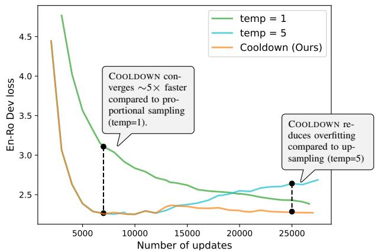
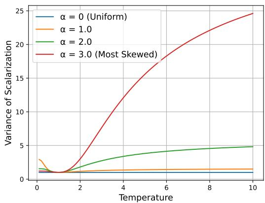
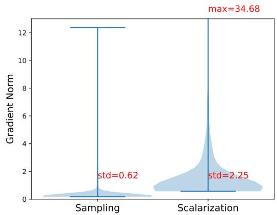
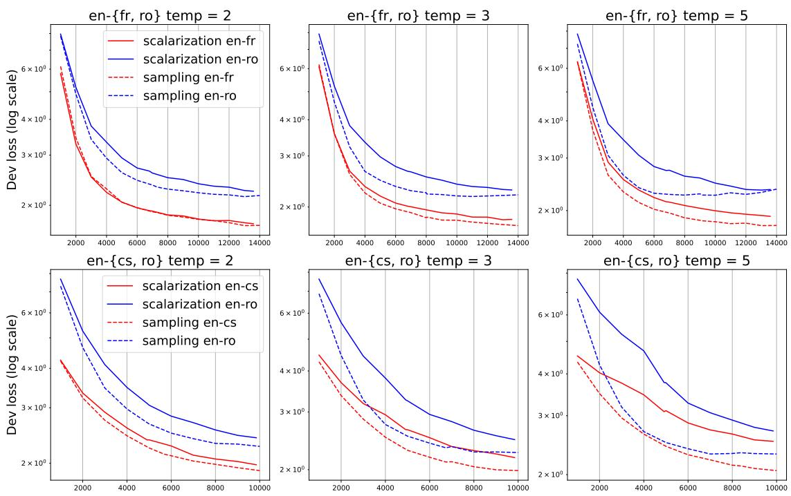
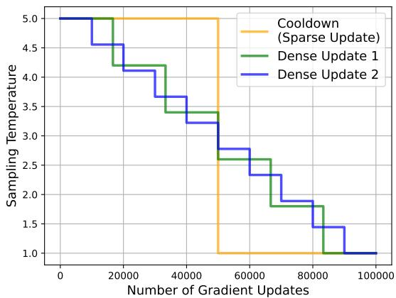
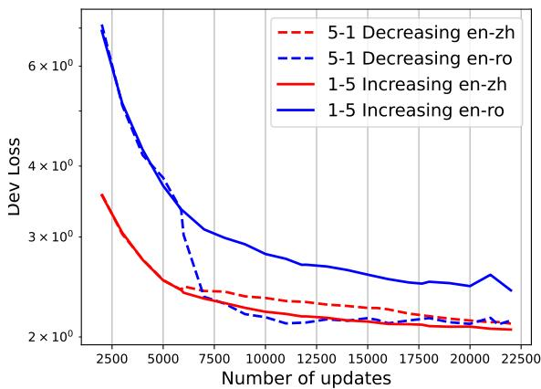
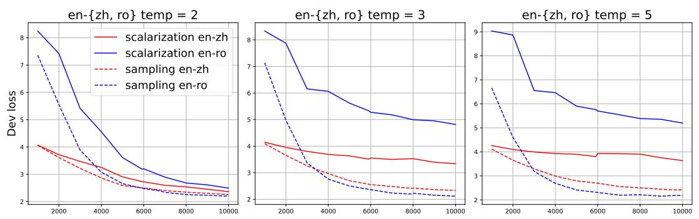
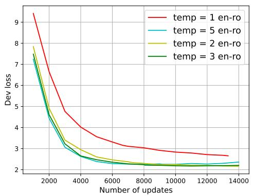
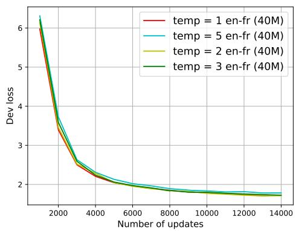

# Upsample or Upweight? Balanced Training on Heavily Imbalanced Datasets

Tianjian Li, Haoran Xu, Weiting Tan Kenton Murray, Daniel Khashabi Center for Language and Speech Processing Johns Hopkins University tli104@jhu.edu

## Abstract

Data abundance across different domains exhibits a long-tailed distribution: few domains have abundant data, while most face data scarcity. Our work focuses on a multilingual setting, where available data is heavily skewed towards high-resource languages. Two com mon strategies to address this disparity are upsampling low-resource data (Temperature Sampling) and upweighting low-resource loss (Scalarization). These methods are often assumed to be equivalent, but this equivalence has not been rigorously established, prompting our investigation.

Through theoretical and empirical analysis, we identify when these two methods are equivalent and when they diverge. We prove that they are equivalent underfull gradient descent but differ under stochastic gradient descent due to differences in gradient variance. Specifically, Temperature Sampling exhibits lower variance in gradient estimation compared to Scalarization, leading to faster convergence but a higher risk of overfitting. Based on these insights, we propose COOLDOWN, a strategy that starts by heavily upsampling low-resource languages to accelerate convergence and gradually reduces the upsampling to prevent overfitting—achieving the best of both worlds. Our method competes effectively with existing data re-weighting techniques while offering computational efficiency.

## 1 Introduction

Information on the internet ranges from common knowledge, such as famous landmarks, to rare details, such as local folklore and specialized scientific theories. Data availability across different domains is often long-tailed (Feldman, 2020; Feldman and Zhang, 2020; Kandpal et al., 2023), where very few domains have abundant data. However, the standard language model training objective treats each training instance equally, putting no emphasis on domains that suffer from data scarcity.

  
Figure 1: Validation loss by training iteration of a lowresource language pair (En-Ro) in multilingual machine translation. Proportional sampling leads to underfitting the low-resource direction. Using a high temperature (oversampling LRLs) leads to overfitting the lowresource direction. Employing a high temperature at the beginning and then decreasing the temperature ( COOLDOWN ) gets the advantage of fast convergence without overfitting.

This heavy mismatch in dataset sizes creates substantial challenges in training language models to be competent in all domains.

This work focuses on language modeling on a natural divide of domains with a heavy mismatch: different languages in multilingual language modeling. Multilingual language models are often trained on corpora with an overwhelming amount of English and other high-resource languages (HRLs) and tiny amounts of data for low-resource languages (LRLs) (Koehn and Knowles, 2017; Conneau et al., 2020; Xue et al., 2021). For example, the multilingual C4 corpus (Xue et al., 2021) contains 2733 billion English tokens but only 1 billion Swahili tokens. Uniformly sampling from the combined dataset would result in the language model optimized heavily towards performance on HRLs (e.g. English), sacrificing performance on LRLs

(e.g. Swahili).

Two methods are often employed to address domain mismatches: Scalarization and Temperature Sampling. Scalarization adjusts the losses for individual domains by re-weighting them under uniform sampling (Zhou et al., 2021; Choi et al., 2023). In this case, we assign a larger weight to LRLs to emphasize their importance. Temperature Sampling, weights each training instance uniformly and handles the mismatch by over-sampling LRLs and/or down-sampling HRLs (Aharoni et al., 2019; Wang et al., 2020b; Chung et al., 2023; Xue et al., 2021). Intuitively, Scalarization modifies the loss while Temperature Sampling modifies the dataset. Scalarization and Temperature Sampling are widely regarded as equivalent. Choi et al. (2023) denotes “wefollow convention and implement Scalarization via proportional sampling”. Xie et al. (2023) and Fan et al. (2024) implement sampling probabilities by multiplying losses with per-domain renormalized weights. The underlying assumption is that Temperature Sampling and Scalarization are equivalent, and we can use them interchangeably. However, to the best of our knowledge, this equivalence has not been rigorously established.

We closely investigate this assumed equivalency in theory (§3.1). Specifically, we prove that although they are equivalent infull gradient descent (Theorem 1), Temperature Sampling induces lower variance in the context of stochastic gradient descent (Theorem 2). Moreover, the variance induced by scalarization increases as the approximated temperature increases or the domain distribution’s skewness increases (Theorem 3). Based on our theoretical results and connecting to the literature on lower variance between stochastic gradients accelerates convergence (Sutskever et al., 2013; McCandlish et al., 2018), we make the following hypothesis:

Hypothesis 1. Temperature Sampling converges much faster than Scalarization at higher temperatures or on heavily imbalanced domain distributions.

We empirically verify our hypothesis (§3.2) and find that Temperature Sampling does converge faster but is more prone to overfitting. We identify that the temperature controls the speed of convergence and hence can be used as a control knob to adjust the convergence speed. We thus propose COOLDOWN: to use a large temperature initially for fast convergence, then decrease the temperature to prevent overfitting to the LRLs. Figure 1 illustrates the effectiveness of COOLDOWN , which significantly accelerates convergence on the LRL due to a high temperature (aggressive upsampling of LRLs) at the beginning of training and reduces overfitting to the LRL due to the lowering the temperature during training.

To sum up, our contribution is two-fold:

• We inspect Scalarization and Temperature Sampling both theoretically and empirically (§3). Contrary to existing work that uses them interchangeably, we found that Temperature Sampling converges faster due to a lower variance in stochastic gradient estimation.

• Motivated by our findings, we propose COOLDOWN, a method to adjust the sampling temperature during training on unbalanced datasets. We show the effectiveness of COOLDOWN in multilingual settings.

## 2 Preliminaries

## 2.1 Notations and Task Description

We consider a model trained on a collection of data $\mathcal { D } = \{ x \} _ { i = 1 } ^ { N }$ from K domains $\mathcal { D } = \mathcal { D } _ { 1 } \cup \mathcal { D } _ { 2 } \cup$ $\dots \cup \mathcal { D } _ { K }$ . Here, “domain" refers to sources (Books, Wikipedia, code) for general language modeling or different languages (English, French, Swahili) in multilingual language modeling. The total training loss $\mathcal { I } ( \mathcal { D } )$ is the sum of the losses of each example $\mathcal { L } ( x )$

$$
\mathcal { I } ( \mathcal { D } ) = \sum _ { x \in \mathcal { D } } \mathcal { L } ( x ) .
$$

Scalarization (S) Naive aggregation often results in imbalanced performance across domains when high-resource domains dominate the aggregated loss. Scalarization solves this issue by assigning weights $\mathbf { w } = \{ w _ { i } \} _ { i = 1 } ^ { K }$ to each domain and aggregates the weighted sum of individual losses:

$$
\begin{array} { r } { \mathcal { L } _ { S } ( \mathbf { w } ) = \mathbb { E } _ { x \in \mathcal { D } } \left[ w _ { f ( x ) } \mathcal { L } ( x ) \right] , } \end{array}
$$

where $f : \mathcal { D }  [ K ]$ maps a training example to the index of its domain. Scalarization balances the loss by assigning a higher weight to harder or low-resource domains.

Temperature Sampling (TS) Instead of assigning weights to losses, we can also sample more frequently from the low-resource domain to achieve balanced training. Temperature sampling achieves this by adjusting the probabilities of selecting instances from different domains based on their sizes. The sampling probability vector p of each domain is given by:

$$
\forall i \in \{ 1 , 2 , . . . , K \} : \ p ( i ; \tau ) = \frac { | \mathcal { D } _ { i } | ^ { \frac { 1 } { \tau } } } { \sum _ { j = 1 } ^ { K } | \mathcal { D } _ { j } | ^ { \frac { 1 } { \tau } } } ,
$$

where $\tau$ is the sampling temperature, a hyperparameter controlling the sampling weights. $\tau = 1$ means that we are sampling proportional to the sizes of each domain. As we increase $\tau ,$ we increase the sampling probability of low-resource domains. The loss for Temperature Sampling is:

$$
\mathcal { L } _ { T S } ( \tau ) = \underset { k \sim p ( \cdot ; \tau ) } { \mathbb { E } } \left[ \mathcal { L } ( x ) \right]
$$

The common understanding is that Temperature Sampling is mathematically equivalent to Scalarization (Choi et al., 2023; Xin et al., 2022), and we can use them interchangeably (Choi et al., 2023). In the next subsection, we will formalize this statement and show that these two are mathematically equivalent in full gradient descent. We will then show that they are not equivalent under stochastic gradient descent.

## 3 Temperature Sampling v.s. Scalarization

## 3.1 Theoretical Analysis

We formalize the equivalence of Scalarization and weighted sampling under full-gradient descent (Theorem 1) and show that Scalarization induces a larger variance between the mini-batch losses (Theorem 2). Furthermore, when using Scalarization to approximate Temperature Sampling, the variance increases as the temperature rises (Theorem 3).

Theorem 1 (Equivalency under Gradient Descent). For any sampling temperature τ , there exists a set ofweights $\mathbf { w } _ { \tau } = \{ w _ { 1 } , w _ { 2 } , . . . , w _ { K } \}$ for the Scalarization loss such that this loss is equivalent to the Temperature Sampling loss, both computed based on the whole data .

Proof. For all $i \in \{ 1 , 2 , 3 , . . . , K \}$ , let:

$$
w _ { i } = \frac { \sum _ { j = 1 } ^ { K } | \mathcal { D } _ { j } | } { | \mathcal { D } _ { i } | } \cdot \frac { | \mathcal { D } _ { i } | ^ { \frac { 1 } { \tau } } } { \sum _ { j = 1 } ^ { K } | \mathcal { D } _ { j } | ^ { \frac { 1 } { \tau } } } = \frac { p ( i ; \tau ) } { p ( i ; 1 ) } ,
$$

$$
\begin{array} { l } { { \displaystyle { \mathcal { L } } _ { S } ( { \bf w } _ { \tau } ) = { \mathbb { E } } _ { x \sim \mathcal { D } } \left[ w _ { f ( x ) } \varSigma ( x ) \right] } } \\ { ~ = \displaystyle \sum _ { x \in \mathcal { D } } \frac { p \left( f ( x ) ; 1 \right) } { \left| \mathcal { D } _ { f ( x ) } \right| } w _ { f ( x ) } \varepsilon ( x ) } \\ { ~ = \displaystyle \sum _ { i = 1 } ^ { K } p ( i ; \tau ) \sum _ { x \in \mathcal { D } _ { i } } \frac { 1 } { \left| \mathcal { D } _ { i } \right| } \varSigma ( x ) } \\ { ~ = \displaystyle \sum _ { i < p ( i \setminus \mathcal { D } ) } \left[ \displaystyle \sum _ { x \in \mathcal { D } _ { i } } \frac { 1 } { \left| \mathcal { D } _ { i } \right| } \varSigma ( x ) \right] } \\ { ~ = \displaystyle \sum _ { i < p ( i \setminus \mathcal { D } ) } \left[ \displaystyle \sum _ { x \in \mathcal { D } _ { i } } \frac { 1 } { \left| \mathcal { D } _ { i } \right| } \mathcal { L } ( x ) \right] } \\ { ~ = \displaystyle \mathbb { E } _ { i \sim p ( i \setminus \mathcal { D } ) } \left[ \mathbb { E } _ { x \sim \mathcal { D } _ { i } } [ \mathcal { L } ( x ) ] \right| = \mathcal { L } _ { T S } ( \tau ) . } \end{array}
$$

Intuitively, this suggests that in the context of full gradient descent, the loss remains the same whether you multiply the loss of a single data point by 2 (S) or duplicate the data point (TS). We will then show that Scalarization induces a larger variance in stochastic gradient estimation (Robbins, 1951) compared to Temperature Sampling.

Corollary 1.1. For any τ, let ${ \bf w } _ { \tau }$ be the set of weights such that $\mathcal { L } _ { T S } ( \tau ) = \mathcal { L } _ { S } ( \mathbf { w } _ { \tau } )$ . Let $\nabla { \mathcal { L } } ( x )$ be the gradient with respect to a single datapoint x. We denote the stochastic gradient under Scalarization as $\nabla { \mathcal L } _ { S } ( x ; { \mathbf w } _ { \tau } ) = \{ \nabla w _ { f ( x ) } { \mathcal L } ( x ) | x \sim { \mathcal D } \}$ which is the gradient $\nabla w _ { f ( x ) } \mathcal { L } ( x )$ when a single sample x is uniformly drawnfrom the dataset . Similarly, we denote the stochastic gradient under Temperature Sampling as $\nabla { \mathcal L } _ { T S } ( x ; \tau ) =$ $\{ \nabla \mathcal { L } ( \boldsymbol { x } ) | \boldsymbol { x } \sim \mathcal { D } \boldsymbol { i } , \boldsymbol { i } \sim \boldsymbol { p } ( \boldsymbol { i } ; \tau ) \}$ Then both $\nabla \mathcal { L } _ { S } ( x ; { \mathbf w } _ { \tau } )$ and $\nabla { \mathcal { L } } _ { T S } ( x ; \tau )$ are unbiased estimates ofthe total gradient.

Proof. By definition, we have

$$
\begin{array} { r l } & { \mathbb { E } [ \nabla \mathcal { L } _ { s } ( x ; { \mathbf w } _ { \tau } ) ] = \underset { x \sim \mathcal { D } } { \mathbb { E } } \left[ w _ { f ( x ) } \nabla \mathcal { L } ( x ) \right] } \\ & { \quad \quad \quad = \mathbb { E } _ { \mathcal { D } _ { i } \sim p ( \cdot ; \tau ) } [ \mathbb { E } _ { x \sim \mathcal { D } _ { i } } [ \nabla \mathcal { L } ( x ) ] ] } \\ & { \quad \quad = \mathbb { E } [ \nabla \mathcal { L } _ { T S } ( x ; \tau ) ] } \end{array}
$$

Theorem 2 (Scalarization induces larger variance under Stochastic Gradient Descent). Using the same notation in Corollary 1.1, we have Var $( \nabla { \mathcal { L } } _ { S } ( x ; \mathbf { w } _ { \tau } ) ) \geq \operatorname { V a r } ( \nabla { \mathcal { L } } _ { T S } ( x ; \tau ) )$

We defer the proof of Theorem 2 to Appendix B.

Implication of Theorem 2 Scalarization induces larger variance connects with the literature on variance reduction in stochastic gradient estimation (Sutskever et al., 2013; Kingma and Ba, 2015) accelerates the convergence of SGD (Robbins, 1951). We thus hypothesize that Temperature Sampling will converge faster than Scalarization with the set of weights that makes them mathematically equivalent underfull gradient descent.

Theorem 3 (Scalarization induces larger variance when approximating higher temperatures). The difference:

$$
\Delta = \mathrm { V a r } ( \nabla \mathcal { L } _ { S } ( x ; { \mathbf w } _ { \tau } ) ) - \mathrm { V a r } ( \nabla \mathcal { L } _ { T S } ( x ; \tau ) )
$$

monotonically increases when $\tau \geq 1$

Figure 2 illustrates the variance by increasing temperature and skewness of the distribution. We defer details on how we constructed Figure 2 and the full proof of Theorem 3 to Appendix C.

  
Figure 2: Variance of Scalarization $\begin{array} { r } { \sum _ { i } \frac { p ( i ; \tau ) ^ { 2 } } { p ( i ; 1 ) } } \end{array}$ by sampling temperature τ . A large temperature or a skewed distribution of induces a much larger variance for Scalarization. Distributions $\begin{array} { r } { \mathcal { D } _ { i } \propto \frac { 1 } { i ^ { \alpha } } } \end{array}$ . See Appendix C for details of the experiment setup.

Implication of Theorem 3 The fact that the induced variance of Scalarization increases as the approximated temperature increases implies that Temperature Sampling converges much faster than Scalarization at higher temperatures, which we empirically verify in the next section.

## 3.2 Empirical Evidence

We directly validate our hypothesis that lower variance of Temperature Sampling accelerates convergence.1 We train a multilingual machine translation model and vary the sampling temperature $\tau = \{ 2 , 3 , 5 \}$ . We then approximate Temperature Sampling by multiplying the Temperature Sampling probabilities by loss under proportional sam-

pling $( \tau \ = \ 1 )$ . Specifically, we pair one highresource direction in $E n - \{ { \sf F r } , { \sf C s } \}$ with the lowresource direction En-Ro. We report the statistics of the datasets we used in §3.2 at Table 1, for all of our experiments, we learn a shared Byte-Pair Encoding tokenizer with a vocabulary size of 32k.2
<table><tr><td>Language Pairs</td><td>Training</td><td>Validation</td></tr><tr><td>WMT 15 En-Fr</td><td>40M</td><td>4503</td></tr><tr><td>WMT 22 En-Zh</td><td>55M</td><td>3418</td></tr><tr><td>WMT 22 En-Cs</td><td>56M</td><td>2082</td></tr><tr><td>WMT 16 En-Ro</td><td>600K</td><td>1999</td></tr></table>

Table 1: Dataset statistics for comparing Scalarization v.s. Temperature Sampling in §3.2. First three language pairs En- Fr,Zh,Cs are high-resource.

Empirical Validation of Theorem 2 We first validate that Temperature Sampling has a lower variance in gradient estimation than scalarization, as predicted by Theorem 2. Figure 3 illustrates the variance between mini-batch gradients for TS and scalarization, confirming that TS reduces gradient variance $( 2 . 2 5  0 . 6 2 )$

  
Figure 3: The distribution of gradient norm between mini-batches on En-{Cs, Ro} for Temperature Sampling and Scalarization. Scalarization induces a larger variance $( 2 . 2 5 > 0 . 6 2 )$ between mini-batch gradient norms compared to Temperature Sampling, as indicated by Theorem 3.

Next, we observe that this lower variance leads to faster convergence during training. Figure 4 shows the validation loss curves over training iterations, where TS consistently converges faster than scalarization across all temperatures we experimented with. Notably, the larger the temperature, the greater the gap in convergence speed between TS and Scalarization. This suggests that when there is a significant mismatch in data sizes, using Temperature Sampling with a high temperature is beneficial. Intuitively, low-resource languages (LRLs) with very little data should be upsampled more aggressively to accelerate convergence. We summarize our findings below:

  
Figure 4: Validation loss by training iteration for En-{Cs, Ro} (first row) and En-{Fr, Ro} (second row). Temperature Sampling (dashed) converges faster compared to Scalarization (solid), leading to better performance on both the HRL and the LRL.

Large Temperature Sampling is prone to overfitting In our En - {Fr, Ro} experiments, we observed that the model overfits the low-resource direction (Ro) when using a large temperature (τ = 3, 5). However, the high-resource direction has not yet converged when this overfitting occurs; therefore, continuing to train in both directions would lead to severe overfitting. This indicates that we need to pair strong regularization on the LRL (e.g. early stopping) with a large temperature, which motivates our temperature scheduling method COOLDOWN, which uses a large temperature during the beginning to speed up training and then decreases the temperature to prevent overfitting on the LRL.

Temperature Sampling is equivalent to Scalarization given enough compute We found that Temperature Sampling (dashed in Figure 4) always converges faster compared to weighting the losses of individual directions (solid in Figure 4), but they eventually converge to the same validation loss given enough training iterations, which corresponds to their equivalency under full gradient descent (Theorem 1). This means both Scalarization and Temperature Sampling can effectively balance multiple languages when given a large enough compute.

## 4 COOLDOWN: Balanced Training for Heavily Imbalanced Datasets

Based on the theoretical analysis in §3.1 and the empirical results in §3.2, we conclude that Temperature Sampling with a large temperature converges faster than Scalarization with equivalent weights but is more prone to overfitting on the LRL when using a large temperature. We thus hypothesize that we can employ a large temperature during the beginning of training to speed up convergence and then decrease the temperature to prevent overfitting on low-resource directions.

Our proposed method: We design a simple temperature scheduling method: COOLDOWN which starts with a high temperature (aggressive upsampling of LRLs) and then lowers the temperature to τ = 1 (proportional sampling) at a fixed iteration to prevent overfitting. We describe our experiment setup at §4.1, report results at §4.2, and discuss our findings at §4.3.

## 4.1 Setup

Models, Datasets, and Hyper-parameters We experiment on two setups: multilingual machine translation and multilingual language modeling, both suffering severe mismatch in dataset sizes. For our machine translation experiments, we use the standard encoder-decoder Transformer (Vaswani et al., 2017) architecture implemented in fairseq (Ott et al., 2019). We select 8 distinct languages from the opus-100 dataset (Zhang et al., 2020) and train a one-to-many translation where the source language is English, we used a shared BPE tokenizer with 64k vocabulary. Detailed Languages and their respective sizes can be found in Table 3. For our multilingual language modeling experiments, we use a decoder-only Transformer model from Huggingface (Wolf et al., 2020) and select 4 linguistically diverse languages with varying amounts of data from the mC4 (Xue et al., 2021) dataset. The statistics are in Table 2. We used the mT5 tokenizer (Xue et al., 2021) for our experiments on mC4.

<table><tr><td>Languages</td><td>Tokens</td><td>mT5 weights  $\tau = 3 . 3 3$ </td></tr><tr><td>EN - English</td><td>2733B</td><td>5.67%</td></tr><tr><td>IT - Italian</td><td>162B</td><td>2.43%</td></tr><tr><td>ZH - Chinese</td><td>39B</td><td>1.67%</td></tr><tr><td>SW - Swahili</td><td>1B</td><td>0.5%</td></tr></table>

Table 2: Dataset statistics of our selected subset of C4. mT5 (Xue et al., 2021) effectively uses an sampling temperature of $\tau = 3 . 3 3$ to oversample LRLs.

For our machine translation experiments, we use $\tau = 5$ for the first 30k of training iterations and τ = 1 for the second 30k. For our language modeling experiments, we use $\tau = 5$ for the first 50k training iterations and $\tau = 1$ for the second 50k. Detailed hyper-parameters are in Appendix D.

Baselines We experiment on baselines that apply a fixed temperature throughout training (static temperature) and baselines that adjust the temperature during training (dynamic temperature). For static temperature, we vary the sampling temperature in $\tau = 1$ (Proportional Sampling), $\tau = 5$ and $\tau = 1 0 0$ ( Uniform Sampling). For dynamic temperature, we compare with Unimax (Chung et al., 2023), which first heavily upsamples lowresource languages and removes them after the lowresource dataset has been seen by the model for a fixed amount of repetitions, and Order Matters (Choi et al., 2023) which first only trains on highresource languages, and only adds in low-resource languages to the end of training. Additionally, we include the results of DoReMi (Xie et al., 2023), which trains small proxy models that minimize the loss of a worse performing set of domains iteratively to find optimal sampling probabilities of each domain for training a large model.

## 4.2 Main Results

Machine Translation Table 3 shows applying COOLDOWN on training a multilingual machine translation model. Compared to proportional sampling $( \tau = 1 )$ , COOLDOWN is able to greatly improve the mid and low-resource languages (+0.7 and 3.1 BLEU) while minimally sacrificing the performance of high-resource languages (-0.2 BLEU). Compared to static up-sampling $\tau = 5 ,$ COOLDOWN matches the performance of mid- and low-resource languages while improving the performance of high-resource languages by 1.5 BLEU. Our method also outperforms the performance of Unimax and Order Matters scheduling while being easier to implement. Furthermore, COOLDOWN is able to match the performance of DoReMi without having to train multiple proxy models.

Multilingual Language Modeling We also experimented with the general language modeling task on multiple languages on selected languages on the multilingual C4 (mC4) dataset (Xue et al., 2021). We report the validation loss in table 4. Our results echo the findings in our machine translation experiments: COOLDOWN matches the performance on the only HRL English (EN) but outperforms other baselines on all three other languages.

## 4.3 Study on Temperature Schedules

In this section, we revisit two design choices in dynamic Temperature Sampling: 1) Increasing v.s. Decreasing the temperature during training, and 2) Dense v.s. Sparse updates of the temperatures. We highlight our results below:

Increasing the temperature is better than decreasing the temperature. Unimax (Chung et al., 2023) upsamples the LRLs during the beginning of training while Order Matters (Choi et al., 2023) upsamples LRLs at the end of training. To resolve this conflict, we compare an increasing temperature schedule (1 for the first 15k training iterations and 5 for the second 15k training iterations; “1-5")

<table><tr><td>en-{} # of Parallel Sentences</td><td>es 1M</td><td>fa 1M</td><td>ga 294K</td><td>gl 519K</td><td>ha 102K</td><td>hi 538K</td><td>it 1M</td><td>kk 83K</td><td>ug 76K</td><td>HRLs &gt;1M</td><td>LRLs &lt;500K</td></tr><tr><td colspan="10">Static Temperature Sampling</td></tr><tr><td>τ = 1 (Proportional)</td><td>38.9</td><td>13.1</td><td>58</td><td>28.9</td><td>41.9</td><td>17.1</td><td>32.8</td><td>22.4</td><td>10.8</td><td>28.3</td><td>30.4</td></tr><tr><td>τ = 5</td><td>36.9</td><td>12.2</td><td>60.9</td><td>28.3</td><td>46.3</td><td>16.8</td><td>30.7</td><td>26.8</td><td>9.4</td><td>26.6</td><td>32.4</td></tr><tr><td>τ = 100 (~Uniform)</td><td>36.1</td><td>12.3</td><td>59.6</td><td>27.3</td><td>46.4</td><td>17.3</td><td>30.3</td><td>27.6</td><td>9.1</td><td>26.2</td><td>31.4</td></tr><tr><td colspan="10">Dynamic Temperature Sampling</td></tr><tr><td></td><td>37.1</td><td>12.2</td><td>60.7</td><td>28.4</td><td>45.9</td><td>16.5</td><td>30.8</td><td>26.2</td><td></td><td>26.7</td><td>32.1</td></tr><tr><td>Unimax (Chung et al., 2023) Order Matters (Choi et al., 2023)</td><td>37.1</td><td>12.2</td><td>60.9</td><td>28.2</td><td>46.1</td><td>16.7</td><td>30.8</td><td>26.7</td><td>9.4</td><td>26.7</td><td>32.3</td></tr><tr><td>COOLDOWN (Ours)</td><td>38.7</td><td>13.2</td><td>60.1</td><td>28.7</td><td>47.4</td><td>17.3</td><td>32.2</td><td>26</td><td>11</td><td>28.1</td><td>32.4</td></tr><tr><td colspan="10">With Proxy Model Training</td></tr><tr><td>DoReMi (Xie et al., 2023)</td><td>37.3</td><td>13.1</td><td>60.4</td><td>28.4</td><td>46.3</td><td>17.1</td><td>29.8</td><td>23.0</td><td>10.8</td><td>26.7</td><td>32.4</td></tr></table>

Table 3: SacreBLEU scores (higher is better) on a chosen subset of OPUS-100 with a mixture of high (1M), mid (500K - 1M), and low (<500K) resource languages. The best performance is bolded. Scores that are close (within 1 BLEU) of the best performance are colored in green. Scores lower than the best for more than 1.5 BLEU are highlighted in red. COOLDOWN outperforms various static and dynamic Temperature Sampling methods, by improving the performance on LRLs without sacrificing much performance on HRLs.
<table><tr><td>Method</td><td>EN 2733B</td><td>IT 162B</td><td>ZH 39B</td><td>SW 1B</td></tr><tr><td colspan="5">Static Temperature Sampling</td></tr><tr><td>τ = 1 (Proportional)</td><td>2.67</td><td>3.10</td><td>4.23</td><td>4.09</td></tr><tr><td>τ = 5</td><td>2.91</td><td>3.01</td><td>3.14</td><td>3.12</td></tr><tr><td>τ = 100 (~Uniform)</td><td>3.02</td><td>2.88</td><td>2.76</td><td>3.01</td></tr><tr><td colspan="5">Dynamic Temperature Sampling</td></tr><tr><td>Order Matters (Choi et al., 2023)</td><td>2.77</td><td>2.76</td><td>3.23</td><td>3.26</td></tr><tr><td>Unimax (Chung et al., 2023)</td><td>2.98</td><td>2.91</td><td>2.85</td><td>3.06</td></tr><tr><td>COOLDOWN (Ours)</td><td>2.75</td><td>2.63</td><td>2.56</td><td>2.94</td></tr><tr><td colspan="5">With Proxy Model Training</td></tr><tr><td>DoReMi (Xie et al., 2023)</td><td>2.89</td><td>2.63</td><td>2.51</td><td>2.89</td></tr></table>

Table 4: Dev loss on selected mC4 subset (lower is better). COOLDOWN achieves the best performance on all three LRLs (IT, ZH, and SW). On the only HRL English, COOLDOWN is only behind proportional sampling (τ=1), which is heavily optimized towards performance on English by sacrificing performance on all other languages.

with a decreasing temperature schedule (5 for the first 15k iterations and 1 for the second half; “5-1"), using the same En-{Zh, Ro} machine translation data in §3.2. Figure 8 illustrates that a decreasing schedule (dashed) converges faster and results in better performance on the LRL compared to an increasing schedule (solid), with minimal sacrifice on the HRL. This means that upsampling the LRLs during the beginning of training performs better.

Curse of Granularity We concluded that a decreasing schedule generally leads to faster convergence and better overall performance. Furthermore, we compare various fine-grained decreasing schedules that perform dense decreasing of the sampling temperature with our sparse update (5 for the first 50k, 1 for the second 50k training iterations) using the subset in mC4 described in Table 2. Figure 5 illustrates the schedules we compare, and 6 shows the validation loss of each decreasing schedule. Fine-grained online reweighting method yields worse performance, echoing the findings in Fan et al. (2024) and Xie et al. (2023).3

  
Figure 5: Sampling temperature schedules.

<table><tr><td>Method</td><td>EN IT</td><td>ZH</td><td>SW</td></tr><tr><td>COOLDOWN</td><td>2.59 2.63</td><td>2.56</td><td>2.94</td></tr><tr><td>Dense Update 1</td><td>3.17 2.89</td><td>2.85</td><td>3.11</td></tr><tr><td>Dense Update 2</td><td>3.31 3.02</td><td>3.35</td><td>3.16</td></tr></table>

Figure 6: Validation loss on mC4 subset (lower is better) for different update schedules in Figure 5. Sparse updates perform better than dense updates.

## 5 Related Works

Gradient-based methods for Multi-Task Learning Training a multi-domain language model can be seen as Multi-Task Learning (MTL; Caruana (1997)), where each domain is a single task. Gradient-based methods aim to reduce the discrepancy in directions of conflicting gradients in different tasks: PCGrad (Yu et al., 2020) aims to project the gradient of a task onto the orthogonal plane of the gradients of the other task. Another line of work (Wang et al., 2020a,b; Kreutzer et al., 2021) uses gradient similarity as the reward to train a policy that decides the sampling probabilities for each domain in a Reinforcement Learning setting. Fan et al. (2024) utilizes gradient similarity between domains to design a temperature schedule for balancing multiple domains in training language models. However, recent studies point out that such gradient-based techniques do not yield significant improvement compared to a weighted sum of individual task losses (Scalarization) (Kurin et al., 2022; Xin et al., 2022; Royer et al., 2023). Our results also echo the findings of Zhai et al. (2023), where they find loss reweighting (Scalarization) underperforms standard training. Our work provides a possible explanation that Scalarization induces a larger variance in gradients.

  
Figure 7: Comparison between an increasing (solid) Temperature Sampling schedule and a decreasing (dashed) schedule in multilingual machine translation En-{Zh, Ro}. A decreasing temperature schedule outperforms an increasing one on the LRL with minimal sacrifice on the HRL.

Loss-based methods for Multi-Task Learning Another line of work utilizes the loss instead of the gradients per task for optimizing MTL models. An intuitive method is to put more weight on the task with the highest loss. In statistical learning, Distributionally Robust Optimization (DRO) methods (Ben-Tal et al., 2011; Duchi and Namkoong, 2021; Hashimoto et al., 2018; Sagawa\* et al., 2020) minimize the loss of the worst-performing subgroup to balance performance. Oren et al. (2019) and Xie et al. (2023) apply DRO to multi-domain language modeling to minimize the loss of a set of worseperforming domains. Similarly, Zhou et al. (2021) applies DRO to multilingual machine translation by minimizing the loss of a set of worse-performing translation directions. COOLDOWN can be seen as an efficient approximation of DRO methods by upsampling the worse-performing LRL and shifting the focus to the HRL once the LRL is sufficiently trained. Unlike DRO, COOLDOWN do does not require training proxy models (Liu et al., 2021) and dense updates on domain weights. Our findings also connect to the fact that different languages act like regularizers in multi-task learning (Li and Murray, 2023).

We defer additional related works on addressing multilingual imbalance and the discussion between class imbalance and domain imbalance to Appendix A.

Scaling Laws for Domain Mixture The search space for the optimal domain weights at any given training iteration is combinatorically large. Existing works conduct comprehensive experiments on smaller scaled models to learn how the training and generalization error varies according to dataset sizes and domain weights — “scaling laws" of domain mixture (Ye et al., 2024; Ge et al., 2024; Jiang et al., 2024). Closer to our work, Chen et al. (2023) fits scaling laws for sampling temperature for multilingual machine translation. Concurrent to our work, He et al. (2024) fits scaling laws for multilingual language modeling. However, as Jiang et al. (2024) denotes: “the optimal data policy for a smaller model does not necessarily generalize to larger models.”

## 6 Conclusion

We examined two common balancing methods for multi-domain language modeling with data imbalances: Scalarization and Temperature Sampling. Although both yield the same loss, Temperature Sampling converges faster but risks overfitting. To mitigate this, we propose COOLDOWN, a variant that adjusts temperatures during training to maintain fast convergence while reducing overfitting.

## Limitations

We discuss the limitations of our study here.

Impact of data mixture on downstream performance Studies have pointed out that the data mixtures in different domains impact downstream performance (Gururangan et al., 2020; Albalak et al., 2023; Fan et al., 2024). Our work only focuses on the impact of different temperature schedules on pre-training validation performance. Although the effect of optimizing pre-training mixtures across different languages on downstream performances has not been fully concluded, works have shown that a lower pre-train validation loss generally leads to better downstream performance (Xie et al., 2023; Du et al., 2024).

Difference between multi-lingual and multidomain language modeling Existing work on mono-lingual language modeling (Chowdhery et al., 2023; Du et al., 2022; Xie et al., 2023; Oren et al., 2019; Fan et al., 2024; Longpre et al., 2023) maps all data from the same source (e.g. Wikipedia, Web, Books) to a single domain. Such a mapping ignores the subdomains within each source. In our work, we focused on the multilingual setup because (a) There exists a severe data size mismatch and (b) there is a clear and natural definition of “domain" — the different languages, and we expect the sampling to have a larger impact because of this mismatch. Even though we only conducted experiments on a multilingual setup, our theoretical analysis applies to all setups with heavy dataset size mismatches.

Finding the optimal temperature schedule It requires a large amount of compute to thoroughly study the scaling laws of pre-training language models under different temperatures (Ye et al., 2024) and to search for the optimal static sampling temperature τ for a given dataset (Chen et al., 2023), let along dynamic temperature scheduling. The optimal temperature depends not just on the size of the dataset but also on the “difficulty" of the dataset. Therefore, existing research (Chen et al., 2023; Xie et al., 2023; Oren et al., 2019; Zhou et al., 2021; Liu et al., 2024; Dubey et al., 2024) relies on training a proxy model on the dataset probe domain difficulty to determine optimal weights. Our work, instead, proposes a heuristic that decreases the temperature during training that does not rely on any proxy training, but we did not exhaustively test all the decreasing schedules. We leave finding optimal temperature schedules without preliminary training for future work.

## Ethical Considerations

One application of our study is to balance highand low-resource languages. We aim to mitigate biases that favor high-resource languages. However, this approach also raises risks, such as amplifying existing biases in limited and potentially skewed low-resource corpora. Furthermore, improved models could be misused to spread misinformation or infringe on privacy, especially in communities less equipped to counter such impacts. Thus, while COOLDOWN promotes linguistic diversity, it requires careful monitoring to ensure it is used ethically.

## Acknowledgements

This work is supported by ONR grant (N00014-24- 1-2089) and a gift from Allen Institute for AI. We are grateful to Nicholas Lourie and Jingyu Zhang for their insightful feedback throughout this project. We also thank the anonymous reviewers for their valuable feedback on our earlier draft. The GPUs were provided by the DSAI cluster.

## References

Roee Aharoni, Melvin Johnson, and Orhan Firat. 2019. Massively multilingual neural machine translation. In Proceedings ofthe 2019 Conference ofthe North American Chapter of the Association for Computational Linguistics: Human Language Technologies, Volume 1 (Long and Short Papers), pages 3874–3884, Minneapolis, Minnesota. Association for Computational Linguistics.

Alon Albalak, Liangming Pan, Colin Raffel, and William Yang Wang. 2023. Efficient online data mixing for language model pre-training. Preprint, arXiv:2312.02406.

Aharon Ben-Tal, Dick den Hertog, Anja De Waegenaere, Bertrand Melenberg, and Gijs Rennen. 2011. Robust solutions of optimization problems affected by uncertain probabilities. Advanced Risk & Portfolio Management® Research Paper Series.

Mateusz Buda, Atsuto Maki, and Maciej Mazurowski. 2017. A systematic study of the class imbalance problem in convolutional neural networks. Neural Networks, 106.

Rich Caruana. 1997. Multitask learning. Machine Learning.

Liang Chen, Shuming Ma, Dongdong Zhang, Furu Wei, and Baobao Chang. 2023. On the pareto front of multilingual neural machine translation. In Thirtyseventh Conference on Neural Information Processing Systems.

Dami Choi, Derrick Xin, Hamid Dadkhahi, Justin Gilmer, Ankush Garg, Orhan Firat, Chih-Kuan Yeh, Andrew M. Dai, and Behrooz Ghorbani. 2023. Order matters in the presence of dataset imbalance for multilingual learning. In Thirty-seventh Conference on Neural Information Processing Systems.

Aakanksha Chowdhery, Sharan Narang, Jacob Devlin, Maarten Bosma, Gaurav Mishra, Adam Roberts, Paul Barham, Hyung Won Chung, Charles Sutton, Sebastian Gehrmann, Parker Schuh, Kensen Shi, Sasha Tsvyashchenko, Joshua Maynez, Abhishek Rao, Parker Barnes, Yi Tay, Noam Shazeer, Vinodkumar Prabhakaran, Emily Reif, Nan Du, Ben Hutchinson, Reiner Pope, James Bradbury, Jacob Austin, Michael Isard, Guy Gur-Ari, Pengcheng Yin, Toju Duke, Anselm Levskaya, Sanjay Ghemawat, Sunipa Dev, Henryk Michalewski, Xavier Garcia, Vedant Misra, Kevin Robinson, Liam Fedus, Denny Zhou, Daphne Ippolito, David Luan, Hyeontaek Lim, Barret Zoph, Alexander Spiridonov, Ryan Sepassi, David Dohan, Shivani Agrawal, Mark Omernick, Andrew M. Dai, Thanumalayan Sankaranarayana Pillai, Marie Pellat, Aitor Lewkowycz, Erica Moreira, Rewon Child, Oleksandr Polozov, Katherine Lee, Zongwei Zhou, Xuezhi Wang, Brennan Saeta, Mark Diaz, Orhan Firat, Michele Catasta, Jason Wei, Kathy Meier-Hellstern, Douglas Eck, Jeff Dean, Slav Petrov,

and Noah Fiedel. 2023. Palm: Scaling language modeling with pathways. Journal of Machine Learning Research, 24(240):1–113.

Hyung Won Chung, Xavier Garcia, Adam Roberts, Yi Tay, Orhan Firat, Sharan Narang, and Noah Constant. 2023. Unimax: Fairer and more effective language sampling for large-scale multilingual pretraining. In The Eleventh International Conference on Learning Representations.

Alexis Conneau, Kartikay Khandelwal, Naman Goyal, Vishrav Chaudhary, Guillaume Wenzek, Francisco Guzmán, Edouard Grave, Myle Ott, Luke Zettlemoyer, and Veselin Stoyanov. 2020. Unsupervised cross-lingual representation learning at scale. In Proceedings of the 58th Annual Meeting of the Association for Computational Linguistics, pages 8440– 8451, Online. Association for Computational Linguistics.

Nan Du, Yanping Huang, Andrew M Dai, Simon Tong, Dmitry Lepikhin, Yuanzhong Xu, Maxim Krikun, Yanqi Zhou, Adams Wei Yu, Orhan Firat, Barret Zoph, Liam Fedus, Maarten P Bosma, Zongwei Zhou, Tao Wang, Emma Wang, Kellie Webster, Marie Pellat, Kevin Robinson, Kathleen Meier-Hellstern, Toju Duke, Lucas Dixon, Kun Zhang, Quoc Le, Yonghui Wu, Zhifeng Chen, and Claire Cui. 2022. GLaM: Efficient scaling of language models with mixtureof-experts. In Proceedings ofthe 39th International Conference on Machine Learning, volume 162 of Proceedings ofMachine Learning Research, pages 5547–5569. PMLR.

Zhengxiao Du, Aohan Zeng, Yuxiao Dong, and Jie Tang. 2024. Understanding emergent abilities of language models from the loss perspective. Preprint, arXiv:2403.15796.

Abhimanyu Dubey, Abhinav Jauhri, Abhinav Pandey, Abhishek Kadian, Ahmad Al-Dahle, Aiesha Letman, Akhil Mathur, Alan Schelten, Amy Yang, Angela Fan, Anirudh Goyal, Anthony Hartshorn, Aobo Yang, Archi Mitra, Archie Sravankumar, Artem Korenev, Arthur Hinsvark, Arun Rao, Aston Zhang, Aurelien Rodriguez, Austen Gregerson, Ava Spataru, Baptiste Roziere, Bethany Biron, Binh Tang, Bobbie Chern, Charlotte Caucheteux, Chaya Nayak, Chloe Bi, Chris Marra, Chris McConnell, Christian Keller, Christophe Touret, Chunyang Wu, Corinne Wong, Cristian Canton Ferrer, Cyrus Nikolaidis, Damien Allonsius, Daniel Song, Danielle Pintz, Danny Livshits, David Esiobu, Dhruv Choudhary, Dhruv Mahajan, Diego Garcia-Olano, Diego Perino, Dieuwke Hupkes, Egor Lakomkin, Ehab AlBadawy, Elina Lobanova, Emily Dinan, Eric Michael Smith, Filip Radenovic, Frank Zhang, Gabriel Synnaeve, Gabrielle Lee, Georgia Lewis Anderson, Graeme Nail, Gregoire Mialon, Guan Pang, Guillem Cucurell, Hailey Nguyen, Hannah Korevaar, Hu Xu, Hugo Touvron, Iliyan Zarov, Imanol Arrieta Ibarra, Isabel Kloumann, Ishan Misra, Ivan Evtimov, Jade Copet, Jaewon Lee, Jan Geffert, Jana Vranes, Jason Park, Jay Mahadeokar, Jeet Shah, Jelmer van der Linde, Jennifer Billock,

Jenny Hong, Jenya Lee, Jeremy Fu, Jianfeng Chi, Jianyu Huang, Jiawen Liu, Jie Wang, Jiecao Yu, Joanna Bitton, Joe Spisak, Jongsoo Park, Joseph Rocca, Joshua Johnstun, Joshua Saxe, Junteng Jia, Kalyan Vasuden Alwala, Kartikeya Upasani, Kate Plawiak, Ke Li, Kenneth Heafield, Kevin Stone, Khalid El-Arini, Krithika Iyer, Kshitiz Malik, Kuen ley Chiu, Kunal Bhalla, Lauren Rantala-Yeary, Lau rens van der Maaten, Lawrence Chen, Liang Tan, Liz Jenkins, Louis Martin, Lovish Madaan, Lubo Malo, Lukas Blecher, Lukas Landzaat, Luke de Oliveira, Madeline Muzzi, Mahesh Pasupuleti, Mannat Singh, Manohar Paluri, Marcin Kardas, Mathew Oldham, Mathieu Rita, Maya Pavlova, Melanie Kambadur, Mike Lewis, Min Si, Mitesh Kumar Singh, Mona Hassan, Naman Goyal, Narjes Torabi, Nikolay Bash lykov, Nikolay Bogoychev, Niladri Chatterji, Olivier Duchenne, Onur Çelebi, Patrick Alrassy, Pengchuan Zhang, Pengwei Li, Petar Vasic, Peter Weng, Prajjwal Bhargava, Pratik Dubal, Praveen Krishnan, Punit Singh Koura, Puxin Xu, Qing He, Qingxiao Dong, Ragavan Srinivasan, Raj Ganapathy, Ramon Calderer, Ricardo Silveira Cabral, Robert Stojnic, Roberta Raileanu, Rohit Girdhar, Rohit Patel, Ro main Sauvestre, Ronnie Polidoro, Roshan Sumbaly, Ross Taylor, Ruan Silva, Rui Hou, Rui Wang, Saghar Hosseini, Sahana Chennabasappa, Sanjay Singh, Sean Bell, Seohyun Sonia Kim, Sergey Edunov, Shaoliang Nie, Sharan Narang, Sharath Raparthy, Sheng Shen, Shengye Wan, Shruti Bhosale, Shun Zhang, Simon Vandenhende, Soumya Batra, Spencer Whitman, Sten Sootla, Stephane Collot, Suchin Gu rurangan, Sydney Borodinsky, Tamar Herman, Tara Fowler, Tarek Sheasha, Thomas Georgiou, Thomas Scialom, Tobias Speckbacher, Todor Mihaylov, Tong Xiao, Ujjwal Karn, Vedanuj Goswami, Vibhor Gupta, Vignesh Ramanathan, Viktor Kerkez, Vincent Gonguet, Virginie Do, Vish Vogeti, Vladan Petro vic, Weiwei Chu, Wenhan Xiong, Wenyin Fu, Whit ney Meers, Xavier Martinet, Xiaodong Wang, Xiao qing Ellen Tan, Xinfeng Xie, Xuchao Jia, Xuewei Wang, Yaelle Goldschlag, Yashesh Gaur, Yasmine Babaei, Yi Wen, Yiwen Song, Yuchen Zhang, Yue Li, Yuning Mao, Zacharie Delpierre Coudert, Zheng Yan, Zhengxing Chen, Zoe Papakipos, Aaditya Singh, Aaron Grattafiori, Abha Jain, Adam Kelsey, Adam Shajnfeld, Adithya Gangidi, Adolfo Victoria, Ahuva Goldstand, Ajay Menon, Ajay Sharma, Alex Boesen berg, Alex Vaughan, Alexei Baevski, Allie Feinstein, Amanda Kallet, Amit Sangani, Anam Yunus, Andrei Lupu, Andres Alvarado, Andrew Caples, An drew Gu, Andrew Ho, Andrew Poulton, Andrew Ryan, Ankit Ramchandani, Annie Franco, Aparajita Saraf, Arkabandhu Chowdhury, Ashley Gabriel Ashwin Bharambe, Assaf Eisenman, Azadeh Yaz dan, Beau James, Ben Maurer, Benjamin Leonhardi, Bernie Huang, Beth Loyd, Beto De Paola, Bhargavi Paranjape, Bing Liu, Bo Wu, Boyu Ni, Braden Han cock, Bram Wasti, Brandon Spence, Brani Stojkovic, Brian Gamido, Britt Montalvo, Carl Parker, Carly Burton, Catalina Mejia, Changhan Wang, Changkyu Kim, Chao Zhou, Chester Hu, Ching-Hsiang Chu, Chris Cai, Chris Tindal, Christoph Feichtenhofer, Da mon Civin, Dana Beaty, Daniel Kreymer, Daniel Li,

Danny Wyatt, David Adkins, David Xu, Davide Tes tuggine, Delia David, Devi Parikh, Diana Liskovich, Didem Foss, Dingkang Wang, Duc Le, Dustin Hol land, Edward Dowling, Eissa Jamil, Elaine Mont gomery, Eleonora Presani, Emily Hahn, Emily Wood, Erik Brinkman, Esteban Arcaute, Evan Dunbar, Evan Smothers, Fei Sun, Felix Kreuk, Feng Tian, Fira Ozgenel, Francesco Caggioni, Francisco Guzmán Frank Kanayet, Frank Seide, Gabriela Medina Flo rez, Gabriella Schwarz, Gada Badeer, Georgia Swee, Gil Halpern, Govind Thattai, Grant Herman, Grigory Sizov, Guangyi, Zhang, Guna Lakshminarayanan, Hamid Shojanazeri, Han Zou, Hannah Wang, Han wen Zha, Haroun Habeeb, Harrison Rudolph, He len Suk, Henry Aspegren, Hunter Goldman, Ibrahim Damlaj, Igor Molybog, Igor Tufanov, Irina-Elen Veliche, Itai Gat, Jake Weissman, James Geboski, James Kohli, Japhet Asher, Jean-Baptiste Gaya, Jeff Marcus, Jeff Tang, Jennifer Chan, Jenny Zhen, Jeremy Reizenstein, Jeremy Teboul, Jessica Zhong Jian Jin, Jingyi Yang, Joe Cummings, Jon Carvill Jon Shepard, Jonathan McPhie, Jonathan Torres Josh Ginsburg, Junjie Wang, Kai Wu, Kam Hou U, Karan Saxena, Karthik Prasad, Kartikay Khan delwal, Katayoun Zand, Kathy Matosich, Kaushik Veeraraghavan, Kelly Michelena, Keqian Li, Kun Huang, Kunal Chawla, Kushal Lakhotia, Kyle Huang, Lailin Chen, Lakshya Garg, Lavender A, Leandro Silva, Lee Bell, Lei Zhang, Liangpeng Guo, Licheng Yu, Liron Moshkovich, Luca Wehrstedt, Madian Khabsa, Manav Avalani, Manish Bhatt, Maria Tsim poukelli, Martynas Mankus, Matan Hasson, Matthew Lennie, Matthias Reso, Maxim Groshev, Maxim Naumov, Maya Lathi, Meghan Keneally, Michael L Seltzer, Michal Valko, Michelle Restrepo, Mihir Patel, Mik Vyatskov, Mikayel Samvelyan, Mike Clark, Mike Macey, Mike Wang, Miquel Jubert Hermoso, Mo Metanat, Mohammad Rastegari, Mun ish Bansal, Nandhini Santhanam, Natascha Parks Natasha White, Navyata Bawa, Nayan Singhal, Nick Egebo, Nicolas Usunier, Nikolay Pavlovich Laptev, Ning Dong, Ning Zhang, Norman Cheng, Oleg Chernoguz, Olivia Hart, Omkar Salpekar, Ozlem Kalinli, Parkin Kent, Parth Parekh, Paul Saab, Pa van Balaji, Pedro Rittner, Philip Bontrager, Pierre Roux, Piotr Dollar, Polina Zvyagina, Prashant Ratanchandani, Pritish Yuvraj, Qian Liang, Rachad Alao Rachel Rodriguez, Rafi Ayub, Raghotham Murthy Raghu Nayani, Rahul Mitra, Raymond Li, Rebekkah Hogan, Robin Battey, Rocky Wang, Rohan Maheswari, Russ Howes, Ruty Rinott, Sai Jayesh Bondu Samyak Datta, Sara Chugh, Sara Hunt, Sargun Dhillon, Sasha Sidorov, Satadru Pan, Saurabh Verma, Seiji Yamamoto, Sharadh Ramaswamy, Shaun Lind say, Shaun Lindsay, Sheng Feng, Shenghao Lin, Shengxin Cindy Zha, Shiva Shankar, Shuqiang Zhang, Shuqiang Zhang, Sinong Wang, Sneha Agar wal, Soji Sajuyigbe, Soumith Chintala, Stephanie Max, Stephen Chen, Steve Kehoe, Steve Satterfield, Sudarshan Govindaprasad, Sumit Gupta, Sungmin Cho, Sunny Virk, Suraj Subramanian, Sy Choudhury, Sydney Goldman, Tal Remez, Tamar Glaser, Tamara Best, Thilo Kohler, Thomas Robinson, Tianhe Li, Tianjun Zhang, Tim Matthews, Timothy Chou, Tzook

Shaked, Varun Vontimitta, Victoria Ajayi, Victoria Montanez, Vijai Mohan, Vinay Satish Kumar, Vishal Mangla, Vítor Albiero, Vlad Ionescu, Vlad Poenaru, Vlad Tiberiu Mihailescu, Vladimir Ivanov, Wei Li, Wenchen Wang, Wenwen Jiang, Wes Bouaziz, Will Constable, Xiaocheng Tang, Xiaofang Wang, Xiaojian Wu, Xiaolan Wang, Xide Xia, Xilun Wu, Xinbo Gao, Yanjun Chen, Ye Hu, Ye Jia, Ye Qi, Yenda Li, Yilin Zhang, Ying Zhang, Yossi Adi, Youngjin Nam, Yu, Wang, Yuchen Hao, Yundi Qian, Yuzi He, Zach Rait, Zachary DeVito, Zef Rosnbrick, Zhaoduo Wen, Zhenyu Yang, and Zhiwei Zhao. 2024. The llama 3 herd of models. Preprint, arXiv:2407.21783.

John C. Duchi and Hongseok Namkoong. 2021. Learning models with uniform performance via distributionally robust optimization. The Annals ofStatistics, 49(3):1378 – 1406.

Simin Fan, Matteo Pagliardini, and Martin Jaggi. 2024. Doge: Domain reweighting with generalization estimation. In The Forty-first International Conference on Machine Learning.

Vitaly Feldman. 2020. Does learning require memorization? a short tale about a long tail. In Proceedings of the 52nd Annual ACM SIGACT Symposium on Theory of Computing, STOC 2020, page 954–959, New York, NY, USA. Association for Computing Machinery.

Vitaly Feldman and Chiyuan Zhang. 2020. What neural networks memorize and why: discovering the long tail via influence estimation. In Proceedings of the 34th International Conference on Neural Information Processing Systems, NIPS ’20, Red Hook, NY, USA. Curran Associates Inc.

Ce Ge, Zhijian Ma, Daoyuan Chen, Yaliang Li, and Bolin Ding. 2024. Bimix: Bivariate data mixing law for language model pretraining. Preprint, arXiv:2405.14908.

Suchin Gururangan, Ana Marasovic, Swabha´ Swayamdipta, Kyle Lo, Iz Beltagy, Doug Downey, and Noah A. Smith. 2020. Don’t stop pretraining: Adapt language models to domains and tasks. In Proceedings of the 58th Annual Meeting of the Association for Computational Linguistics, pages 8342–8360, Online. Association for Computational Linguistics.

Tatsunori Hashimoto, Megha Srivastava, Hongseok Namkoong, and Percy Liang. 2018. Fairness without demographics in repeated loss minimization. In Proceedings of the 35th International Conference on Machine Learning, volume 80 of Proceedings of Machine Learning Research, pages 1929–1938. PMLR.

Yifei He, Alon Benhaim, Barun Patra, Praneetha Vaddamanu, Sanchit Ahuja, Parul Chopra, Vishrav Chaudhary, Han Zhao, and Xia Song. 2024. Scaling laws for multilingual language models. Preprint, arXiv:2410.12883.

Sophie Henning, William Beluch, Alexander Fraser, and Annemarie Friedrich. 2023. A survey of methods for addressing class imbalance in deep-learning based natural language processing. In Proceedings ofthe 17th Conference ofthe European Chapter of the Associationfor Computational Linguistics, pages 523–540, Dubrovnik, Croatia. Association for Computational Linguistics.

Yichong Huang, Xiaocheng Feng, Xinwei Geng, Baohang Li, and Bing Qin. 2023. Towards higher Pareto frontier in multilingual machine translation. In Proceedings ofthe 61st Annual Meeting ofthe Associationfor Computational Linguistics (Volume 1: Long Papers), pages 3802–3818, Toronto, Canada. Association for Computational Linguistics.

Yichong Huang, Xiaocheng Feng, Xinwei Geng, and Bing Qin. 2022. Unifying the convergences in multilingual neural machine translation. In Proceedings of the 2022 Conference on Empirical Methods in Natural Language Processing, pages 6822–6835, Abu Dhabi, United Arab Emirates. Association for Computational Linguistics.

Yiding Jiang, Allan Zhou, Zhili Feng, Sadhika Malladi, and J. Zico Kolter. 2024. Adaptive data optimization: Dynamic sample selection with scaling laws. Preprint, arXiv:2410.11820.

Melvin Johnson, Mike Schuster, Quoc V. Le, Maxim Krikun, Yonghui Wu, Zhifeng Chen, Nikhil Thorat, Fernanda Viégas, Martin Wattenberg, Greg Corrado, Macduff Hughes, and Jeffrey Dean. 2017. Google’s multilingual neural machine translation system: Enabling zero-shot translation. Transactions of the Associationfor Computational Linguistics, 5:339–351.

Nikhil Kandpal, Haikang Deng, Adam Roberts, Eric Wallace, and Colin Raffel. 2023. Large language models struggle to learn long-tail knowledge. In Proceedings of the 40th International Conference on Machine Learning, volume 202 of Proceedings ofMachine Learning Research, pages 15696–15707. PMLR.

Diederik Kingma and Jimmy Ba. 2015. Adam: A method for stochastic optimization. In International Conference on Learning Representations (ICLR), San Diega, CA, USA.

Philipp Koehn and Rebecca Knowles. 2017. Six challenges for neural machine translation. In Proceedings ofthe First Workshop on Neural Machine Translation, pages 28–39, Vancouver. Association for Computational Linguistics.

Julia Kreutzer, David Vilar, and Artem Sokolov. 2021. Bandits don’t follow rules: Balancing multi-facet machine translation with multi-armed bandits. In Findings ofthe Associationfor Computational Linguistics: EMNLP 2021, pages 3190–3204, Punta Cana, Dominican Republic. Association for Computational Linguistics.

Vitaly Kurin, Alessandro De Palma, Ilya Kostrikov, Shimon Whiteson, and M. Pawan Kumar. 2022. In defense of the unitary scalarization for deep multi-task learning. In Advances in Neural Information Processing Systems.

Tianjian Li and Kenton Murray. 2023. Why does zeroshot cross-lingual generation fail? an explanation and a solution. In Findings ofthe Associationfor Computational Linguistics: ACL 2023, pages 12461–12476, Toronto, Canada. Association for Computational Linguistics.

Evan Z Liu, Behzad Haghgoo, Annie S Chen, Aditi Raghunathan, Pang Wei Koh, Shiori Sagawa, Percy Liang, and Chelsea Finn. 2021. Just train twice: Improving group robustness without training group information. In Proceedings ofthe 38th International Conference on Machine Learning, volume 139 of Proceedings ofMachine Learning Research, pages 6781–6792. PMLR.

Qian Liu, Xiaosen Zheng, Niklas Muennighoff, Guangtao Zeng, Longxu Dou, Tianyu Pang, Jing Jiang, and Min Lin. 2024. Regmix: Data mixture as regression for language model pre-training. arXiv preprint arXiv:2407.01492.

Shayne Longpre, Gregory Yauney, Emily Reif, Katherine Lee, Adam Roberts, Barret Zoph, Denny Zhou, Jason Wei, Kevin Robinson, David Mimno, and Daphne Ippolito. 2023. A pretrainer’s guide to training data: Measuring the effects of data age, domain coverage, quality, & toxicity. Preprint, arXiv:2305.13169.

Sam McCandlish, Jared Kaplan, Dario Amodei, and OpenAI Dota Team. 2018. An empirical model of large-batch training. Preprint, arXiv:1812.06162.

NLLB Team, Marta R. Costa-jussà, James Cross, Onur Çelebi, Maha Elbayad, Kenneth Heafield, Kevin Heffernan, Elahe Kalbassi, Janice Lam, Daniel Licht, Jean Maillard, Anna Sun, Skyler Wang, Guillaume Wenzek, Al Youngblood, Bapi Akula, Loic Barrault, Gabriel Mejia Gonzalez, Prangthip Hansanti, John Hoffman, Semarley Jarrett, Kaushik Ram Sadagopan, Dirk Rowe, Shannon Spruit, Chau Tran, Pierre Andrews, Necip Fazil Ayan, Shruti Bhosale, Sergey Edunov, Angela Fan, Cynthia Gao, Vedanuj Goswami, Francisco Guzmán, Philipp Koehn, Alexandre Mourachko, Christophe Ropers, Safiyyah Saleem, Holger Schwenk, and Jeff Wang. 2022. No language left behind: Scaling human-centered machine translation. Preprint, arXiv:2207.04672.

Yonatan Oren, Shiori Sagawa, Tatsunori B. Hashimoto, and Percy Liang. 2019. Distributionally robust language modeling. In Proceedings of the 2019 Conference on Empirical Methods in Natural Language Processing (EMNLP).

Myle Ott, Sergey Edunov, Alexei Baevski, Angela Fan, Sam Gross, Nathan Ng, David Grangier, and Michael

Auli. 2019. fairseq: A fast, extensible toolkit for sequence modeling. In Proceedings of NAACL-HLT 2019: Demonstrations.

Herbert E. Robbins. 1951. A stochastic approximation method. Annals ofMathematical Statistics, 22:400– 407.

Amelie Royer, Tijmen Blankevoort, and Babak Ehteshami Bejnordi. 2023. Scalarization for multi-task and multi-domain learning at scale. In Advances in Neural Information Processing Systems, volume 36, pages 16917–16941. Curran Associates, Inc.

Shiori Sagawa\*, Pang Wei Koh\*, Tatsunori B. Hashimoto, and Percy Liang. 2020. Distributionally robust neural networks. In International Conference on Learning Representations.

Uri Shaham, Maha Elbayad, Vedanuj Goswami, Omer Levy, and Shruti Bhosale. 2023. Causes and cures for interference in multilingual translation. In Proceedings ofthe 61st Annual Meeting ofthe Associationfor Computational Linguistics (Volume 1: Long Papers), pages 15849–15863, Toronto, Canada. Association for Computational Linguistics.

Ilya Sutskever, James Martens, George Dahl, and Geoffrey Hinton. 2013. On the importance of initialization and momentum in deep learning. In Proceedings of the 30th International Conference on Machine Learning, Proceedings of Machine Learning Research, pages 1139–1147, Atlanta, Georgia, USA. PMLR.

Ashish Vaswani, Noam Shazeer, Niki Parmar, Jakob Uszkoreit, Llion Jones, Aidan N Gomez, Ł ukasz Kaiser, and Illia Polosukhin. 2017. Attention is all you need. In Advances in Neural Information Processing Systems, volume 30. Curran Associates, Inc.

Xinyi Wang, Hieu Pham, Paul Michel, Antonios Anastasopoulos, Jaime Carbonell, and Graham Neubig. 2020a. Optimizing data usage via differentiable rewards. In Proceedings ofthe 37th International Conference on Machine Learning, ICML’20. JMLR.org.

Xinyi Wang, Yulia Tsvetkov, and Graham Neubig. 2020b. Balancing training for multilingual neural machine translation. In Proceedings of the 58th Annual Meeting ofthe Associationfor Computational Linguistics, pages 8526–8537, Online. Association for Computational Linguistics.

Zirui Wang, Yulia Tsvetkov, Orhan Firat, and Yuan Cao. 2021. Gradient vaccine: Investigating and improving multi-task optimization in massively multilingual models. In International Conference on Learning Representations.

Thomas Wolf, Lysandre Debut, Victor Sanh, Julien Chaumond, Clement Delangue, Anthony Moi, Pierric Cistac, Tim Rault, Rémi Louf, Morgan Funtowicz, Joe Davison, Sam Shleifer, Patrick von Platen, Clara Ma, Yacine Jernite, Julien Plu, Canwen Xu, Teven Le Scao, Sylvain Gugger, Mariama Drame, Quentin

Lhoest, and Alexander M. Rush. 2020. Transformers: State-of-the-art natural language processing. In Proceedings of the 2020 Conference on Empirical Methods in Natural Language Processing: System Demonstrations, pages 38–45, Online. Association for Computational Linguistics.

Sang Michael Xie, Hieu Pham, Xuanyi Dong, Nan Du, Hanxiao Liu, Yifeng Lu, Percy Liang, Quoc V. Le, Tengyu Ma, and Adams Wei Yu. 2023. Doremi: Optimizing data mixtures speeds up language model pretraining. In Advances in Neural Information Processing Systems.

Derrick Xin, Behrooz Ghorbani, Justin Gilmer, Ankush Garg, and Orhan Firat. 2022. Do current multi-task optimization methods in deep learning even help? In Advances in Neural Information Processing Systems, volume 35, pages 13597–13609. Curran Associates, Inc.

Linting Xue, Noah Constant, Adam Roberts, Mihir Kale, Rami Al-Rfou, Aditya Siddhant, Aditya Barua, and Colin Raffel. 2021. mT5: A massively multilingual pre-trained text-to-text transformer. In Proceedings of the 2021 Conference of the North American Chapter ofthe Associationfor Computational Linguistics: Human Language Technologies, pages 483–498, Online. Association for Computational Linguistics.

Jiasheng Ye, Peiju Liu, Tianxiang Sun, Yunhua Zhou, Jun Zhan, and Xipeng Qiu. 2024. Data mixing laws: Optimizing data mixtures by predicting language modeling performance. Preprint, arXiv:2403.16952.

Tianhe Yu, Saurabh Kumar, Abhishek Gupta, Sergey Levine, Karol Hausman, and Chelsea Finn. 2020. Gradient surgery for multi-task learning. In Advances in Neural Information Processing Systems, volume 33, pages 5824–5836. Curran Associates, Inc.

Runtian Zhai, Chen Dan, J Zico Kolter, and Pradeep Ku mar Ravikumar. 2023. Understanding why generalized reweighting does not improve over ERM. In The Eleventh International Conference on Learning Representations.

Biao Zhang, Philip Williams, Ivan Titov, and Rico Sennrich. 2020. Improving massively multilingual neural machine translation and zero-shot translation. In Proceedings ofthe 58th Annual Meeting ofthe Associationfor Computational Linguistics, pages 1628– 1639, Online. Association for Computational Linguistics.

Chunting Zhou, Daniel Levy, Xian Li, Marjan Ghazvininejad, and Graham Neubig. 2021. Distributionally robust multilingual machine translation. In Proceedings of the 2021 Conference on Empirical Methods in Natural Language Processing, pages 5664–5674, Online and Punta Cana, Dominican Republic. Association for Computational Linguistics.

# Supplemental Material

## A Additional Related Works

Multilingual Interference Finding out the reasons and solutions for negative interference in Multilingual Neural Machine Translation (Johnson et al., 2017; Aharoni et al., 2019) has been an active research area for the past decade. Yet, while previous studies (Wang et al., 2021) find that negative interference mainly occurs between different language families, recent studies (Shaham et al., 2023) have demonstrated that negative inference does not happen between languages of different families. The interference emerges because of the mismatch in the amount of data for different translation directions. Real-world translation data suffers from a heavy mismatch of data size in different directions, ranging from less than 100K to over 100M (NLLB Team et al., 2022). In our work, we show that this heavy mismatch in data size results in low-resource languages being under-trained.

To mitigate interference caused by dataset sizes, Aharoni et al. (2019) and Xue et al. (2021) propose to up-sample low-resource languages, which often results in the model overfitting on the LRLs while underfitting HRLs. Huang et al. (2022) proposes to distill the model from earlier checkpoints with the $\mathrm { L R L s }$ that have not overfit with the current model to regularize the training of LRLs. Huang et al. (2023) proposes to distill between a model trained with a low sampling temperature and a model trained with a high sampling temperature. Unimax (Chung et al., 2023) proposes to first uniformly sample from all languages until an LRL dataset has been seen by the model for a fixed amount of repetitions; then, we remove the LRL from training. Order-Matters (Choi et al., 2023) proposes the opposite of Unimax (Chung et al., 2023), to first only train on the HRL and add in the LRL after a fixed iteration. Our work shows that the Unimax style of decreasing the temperature works better and proposes a simple alternative that does not require tracking how many times a model has seen an individual LRL dataset.

Class Imbalance v.s. Domain Imbalance Class imbalance aims to address when the input x is drawn from the same distribution $x \sim \mathcal { D }$ but the output labels y are imbalanced. Domain imbalance, on the other hand, studies the problem when the input is drawn from different distributions with mismatched sizes $x \sim \{ \mathcal { D } _ { 1 } , \mathcal { D } _ { 2 } , . . . \mathcal { D } _ { k } \}$ , making no assumptions about the output labels y. Therefore, our study is distantly connected to adjusting the sampling probabilities to address class imbalance (Buda et al., 2017). We refer readers to Henning et al. (2023) for a comprehensive survey of class imbalance in natural language processing.

## B Proof of Theorem 2

Theorem 2 (Scalarization induces larger variance under Stochastic Gradient Descent) Using the same notation in Corollary 1.1, we have Var $( \nabla \mathcal { L } _ { S } ( x ; { \mathbf w } _ { \tau } ) ) \ge \mathrm { V a r } ( \nabla \mathcal { L } _ { T S } ( x ; \tau ) )$ .

We first proof a required lemma:

Lemma 2.1 Let $\mathcal { D } = \{ \mathcal { D } _ { 1 } , . . . , \mathcal { D } _ { K } \} , \forall j \in \{ 1 , . . . , K \}$ , let $\begin{array} { r } { p ( j , \tau ) = \frac { \mathcal { D } _ { j } ^ { \frac { 1 } { \tau } } } { \sum _ { k } \mathcal { D } _ { k } ^ { \frac { 1 } { \tau } } } } \end{array}$ , then $\begin{array} { r } { \sum _ { i = 1 } ^ { K } \frac { p ( i ; \tau ) ^ { 2 } } { p ( i ; 1 ) } \ge 1 } \end{array}$ holds true when $\forall j , \mathcal { D } _ { j } \geq 0$

Proof. We substitute $x _ { j } = \mathcal { D } _ { j } ^ { \frac { 1 } { \tau } }$ , then:

$$
\sum _ { i = 1 } ^ { K } \frac { p ( i ; \tau ) ^ { 2 } } { p ( i ; 1 ) } = \frac { \sum _ { i } x _ { i } ^ { \tau } } { ( \sum _ { i } x _ { i } ) ^ { 2 } } \cdot \left( \sum _ { i } x _ { i } ^ { 2 - \tau } \right)
$$

By the Cauchy-Schwartz inequality, we have:

$$
\left( \sum _ { i } x _ { i } ^ { \tau / 2 } \cdot x _ { i } ^ { ( 2 - \tau ) / 2 } \right) ^ { 2 } \leq \left( \sum _ { i } x _ { i } ^ { \tau } \right) \left( \sum _ { i } x _ { i } ^ { 2 - \tau } \right) ,
$$

which simplifies to:

$$
\left( \sum _ { i } x _ { i } \right) ^ { 2 } \leq \left( \sum _ { i } x _ { i } ^ { \tau } \right) \left( \sum _ { i } x _ { i } ^ { 2 - \tau } \right) ,
$$

which implies that:

$$
1 \leq \frac { \sum _ { i } x _ { i } ^ { \tau } } { ( \sum _ { i } x _ { i } ) ^ { 2 } } \cdot \left( \sum _ { i } x _ { i } ^ { 2 - \tau } \right) = \sum _ { i = 1 } ^ { K } \frac { p ( i ; \tau ) ^ { 2 } } { p ( i ; 1 ) } .
$$

Armed with Lemma 2.1, we come back to the proof of Theorem 2.

Proof. Since $\nabla \mathcal { L } _ { S } ( x ; { \mathbf w } _ { \tau } )$ and $\nabla { \mathcal { L } } _ { T S } ( x ; \tau )$ are unbiased estimates of the total gradient, we only need to show that the expectation of the squared gradient is larger for the stochastic gradient under Scalarization.

$$
\underbrace { \underset { x \sim \mathcal { D } } { \mathbb { E } } [ ( w _ { f ( x ) } \nabla \mathcal { L } ( x ) ) ^ { 2 } ] } _ { \mathrm { S c a l a r i z a t i o n } } = \sum _ { i = 1 } ^ { K } p ( i ; 1 ) w _ { f ( x ) } ^ { 2 } \nabla \mathcal { L } ^ { 2 } ( x )
$$

$$
\begin{array} { r } { \displaystyle \sum _ { i = 1 } ^ { K } \frac { p ( i ; \tau ) ^ { 2 } } { p ( i ; 1 ) } \nabla \mathcal { L } ^ { 2 } ( x ) \geq \nabla \mathcal { L } ^ { 2 } ( x ) \displaystyle \sum _ { i = 1 } ^ { K } p ( i ; \tau ) \nabla \mathcal { L } ^ { 2 } ( x ) } \\ { = \underbrace { \mathbb { E } } _ { \mathrm { \normalfont ~ \underbrace { \mathcal { D } _ { i } \sim p ( i ; \tau ) } ~ } \mathrm { \normalfont ~ \cdot ~ } \mathrm { \normalfont ~ \mathcal { T } ^ { e } ( \tau ) } _ { \mathrm { T e m p e r a t u r e ~ S a m p l i n g } } } . } \end{array}
$$

## C Proof of Theorem 3 and Construction of Figure 2

Theorem 3 (Scalarization induces larger variance when approximating higher temperatures)

The difference in variance $\Delta = \mathrm { V a r } ( \nabla { \mathcal { L } } _ { S } ( x ) ) - \mathrm { V a r } ( \nabla { \mathcal { L } } _ { T S } ( x ) )$ is non-decreasing when $\tau \geq 1$

Proof. From the proof of Theorem 2, we know that the difference in variance $\Delta$ can be quantified by $\frac { p ( \mathcal { D } _ { i } ; \tau ) ^ { 2 } } { p ( \mathcal { D } _ { i } ; 1 ) }$ . We substitute $x _ { j } = \mathcal { D } _ { j } ^ { \frac { 1 } { \tau } }$ , then:

$$
\sum _ { i = 1 } ^ { K } \frac { p ( i ; \tau ) ^ { 2 } } { p ( i ; 1 ) } = \frac { \sum _ { i } x _ { i } ^ { \tau } } { ( \sum _ { i } x _ { i } ) ^ { 2 } } \cdot \left( \sum _ { i } x _ { i } ^ { 2 - \tau } \right) .
$$

Let $\begin{array} { r } { F ( \tau ) = \frac { \sum _ { i } x _ { i } ^ { \tau } } { ( \sum _ { i } x _ { i } ) ^ { 2 } } \cdot \left( \sum _ { i } x _ { i } ^ { 2 - \tau } \right) } \end{array}$ be a function of $\tau .$ . Taking its derivative with respect to $\tau { : }$

$$
\frac { d F ( \tau ) } { d \tau } = F ( \tau ) \times \left[ \left( \sum _ { i } \frac { x _ { i } ^ { \tau } \log x _ { i } } { \sum _ { j } x _ { j } ^ { \tau } } \right) - \left( \sum _ { i } \frac { x _ { i } ^ { 2 - \tau } \log x _ { i } } { \sum _ { j } x _ { j } ^ { 2 - \tau } } \right) \right] .
$$

Taking the derivative of the term $\sum _ { i } \frac { x _ { i } ^ { \tau } \log x _ { i } } { \sum _ { j } x _ { j } ^ { \tau } }$ with respect to $\tau$ , we get:

$$
\frac { d } { d \tau } \sum _ { i } \left( \frac { x _ { i } ^ { \tau } \log x _ { i } } { \sum _ { j } x _ { j } ^ { \tau } } \right) = \frac { \sum _ { j } x _ { j } ^ { \tau } \sum _ { i } x _ { i } ^ { \tau } ( \log x _ { i } ) ^ { 2 } - ( \sum _ { i } x _ { i } ^ { \tau } \log x _ { i } ) ^ { 2 } } { ( \sum _ { i } x _ { i } ^ { \tau } ) ^ { 2 } } ,
$$

which is the variance of log $x _ { i }$ under the probability distributions $\frac { x _ { i } ^ { \tau } } { \sum _ { i } x _ { i } ^ { \tau } }$ . Similarly, the derivative of $\begin{array} { r } { \sum _ { i } \frac { x _ { i } ^ { 2 - \tau } \log { x _ { i } } } { \sum _ { j } x _ { j } ^ { 2 - \tau } } } \end{array}$ with respect to $\tau$ is the negative variance of log $x _ { i }$ under distribution $\frac { x _ { i } ^ { 2 - \tau } } { \sum _ { i } x _ { i } ^ { 2 - \tau } }$ . Since variances are always non-negative, we conclude that the following difference:

$$
\left[ \left( \sum _ { i } { \frac { x _ { i } ^ { \tau } \log x _ { i } } { \sum _ { j } x _ { j } ^ { \tau } } } \right) - \left( \sum _ { i } { \frac { x _ { i } ^ { 2 - \tau } \log x _ { i } } { \sum _ { j } x _ { j } ^ { 2 - \tau } } } \right) \right] ,
$$

is always non-negative. By Lemma 2.1, we know that $F ( \tau ) \geq 1$ . Therefore, the derivative $\frac { d F ( \tau ) } { d \tau }$ is always non-negative when $\tau \geq 1$ , meaning that $F ( \tau )$ is non-decreasing when $\tau \geq 1$

Furthermore, when $\tau$ is strictly larger than 1 and not all are equal, $F ( \tau )$ monotonically increases with $\tau .$ Showing that approximating a larger temperature using Scalarization induces a larger variance than approximating smaller temperatures. □

Construction of Figure 2 We plot the function $\begin{array} { r } { F ( \tau ) = \sum _ { i } \frac { p ( i ; \tau ) ^ { 2 } } { p ( D _ { i } ; 1 ) } } \end{array}$ against τ by starting with a uniform distribution and progressively increasing its skewness to resemble Zipf distributions. Specifically, we generate distributions $D _ { i } \ \propto \ { \frac { 1 } { i ^ { \alpha } } }$ for various exponents $\alpha$ (ranging from 0 to higher values), where i denotes the rank of each element. For each distribution, we compute the normalized probabilities $\begin{array} { r } { p ( i ; \tau ) = \frac { | D _ { i } | ^ { 1 / \tau } } { \sum _ { j } | D _ { j } | ^ { 1 / \tau } } } \end{array}$ across a range of τ values. This approach allows us to analyze how increasing the skewness of the distribution influences the behavior of $F ( \tau )$ as a function of $\tau .$

## D Detailed Hyper-Parameters

We provide a comprehensive list of the hyper-parameters we used in this appendix section: §3.2 - Table 5.

<table><tr><td>Hyper-parameter</td><td>Value</td><td>Hyper-parameter</td><td>Value</td></tr><tr><td>Arch</td><td>wmt_en_de_big</td><td>Label smoothing</td><td>0.1</td></tr><tr><td>Optimizer</td><td>adam</td><td>Adam epsilon</td><td>1e-06</td></tr><tr><td>Adam betas</td><td>&quot;(0.9, 0.98)&quot;</td><td>Learning rate scheduler</td><td>inverse_sqrt</td></tr><tr><td>Learning rate</td><td>0.0005</td><td>Warmup updates</td><td>4000</td></tr><tr><td>Validate interval updates</td><td>1000</td><td>Dropout</td><td>0.1</td></tr><tr><td>Attention dropout</td><td>0.1</td><td>Weight decay</td><td>0.0</td></tr><tr><td>Max tokens</td><td>32768</td><td>Update frequency</td><td>8</td></tr><tr><td>Max source positions</td><td>256</td><td>Max target positions</td><td>256</td></tr></table>

Table 5: Detailed Hyper-parameters for experiments in §3.2. We use the fairseq (Ott et al., 2019) implementation.

<table><tr><td>Hyper-parameter</td><td>Value</td><td>Hyper-parameter</td><td>Value</td></tr><tr><td>Arch</td><td>iwslt_de_en</td><td>Label smoothing</td><td>0.1</td></tr><tr><td>Optimizer</td><td>adam</td><td>Adam epsilon</td><td>1e-06</td></tr><tr><td>Adam betas</td><td>&quot;(0.9, 0.98)&quot;</td><td>Learning rate scheduler</td><td>inverse_sqrt</td></tr><tr><td>Learning rate</td><td>0.0005</td><td>Warmup updates</td><td>4000</td></tr><tr><td>Validate interval updates</td><td>1000</td><td>Dropout</td><td>0.1</td></tr><tr><td>Attention dropout</td><td>0.1</td><td>Weight decay</td><td>0.0</td></tr><tr><td>Max tokens</td><td>16384</td><td>Update frequency</td><td>4</td></tr><tr><td>Max source positions</td><td>256</td><td>Max target positions</td><td>256</td></tr></table>

Table 6: Detailed Hyper-parameters for Machine Translation experiments in §4 on our selected subset of opus-100 (Zhang et al., 2020). We use the fairseq (Ott et al., 2019) implementation. Differences against Table 5 are in red.

## E Additional Results on Scalarization V.S. Temperature Sampling

  
Figure 8: Validation loss by training iteration for En-{Zh, Ro}. Temperature Sampling (Dashed) converges much faster than Scalarization (Solid), especially at higher temperatures.

  
(a) validation loss: low resource languages

  
(b) validation loss: high resource languages

Figure 9: Validation loss by gradient updates on the low-resource and high-resource language (left) jointly trained on the same model. Adjusting the sampling temperature has little impact on the high-resource language but a high impact on the low-resource language.